## **攻击 ECU 和其他嵌入式系统**


ECU 是反向工程的常见目标，有时也称为芯片调优。如第七章所述，最流行的 ECU 破解方法是修改燃油地图，以改变燃油效率与性能之间的平衡，从而提升车辆性能。参与这些类型修改的社区非常庞大，我们将在第十三章中更详细地讨论这类固件修改。

本章将专注于通用的嵌入式系统攻击方法以及旁路攻击。这些方法不仅可以应用于 ECU，也适用于任何嵌入式系统，甚至可以借助后市场工具修改车辆。在这里，我们将重点讨论硬件的调试接口以及执行旁路分析攻击和故障攻击。

**注意**

*为了充分理解本章内容，你应该对基础电子学有一定了解，但我已经尽力在合理范围内进行解释。*

### 分析电路板

攻击 ECU 或任何车辆中的嵌入式系统的第一步是分析目标电路板。我在第七章中简要介绍了电路板分析，但在本章中，我将更详细地介绍电子设备和芯片的工作原理。我将向你介绍一些可以应用于车辆中任何嵌入式系统的技术。

#### *识别型号*

在反向工程电路板时，首先查看电路板上微控制器芯片的型号。这些型号可以帮助你追踪到有价值的信息，这些信息可能是你分析的关键。你在车辆电路板上找到的大多数芯片都是通用型的——公司很少制造定制芯片——因此，搜索芯片型号通常可以为你提供该芯片的完整数据表。

如第七章所述，你有时会遇到定制的 ASIC 处理器和定制的操作码，尤其是在旧系统中，这些处理器会更加难以重新编程。当你遇到像这样的旧芯片时，应该将它们从电路板上取下，并插入 EPROM 编程器中以读取其固件。你应该能够通过调试软件，如 JTAG，直接重新编程现代系统。

一旦找到数据表，尝试识别每个芯片上的微控制器和内存位置，以确定各个组件如何连接在一起，以及如何找到诊断引脚——这可能是一个潜在的突破口。

#### *拆解与识别芯片*

如果你找不到型号，有时你只能依靠芯片的标志（过一段时间后，你会发现自己开始认识芯片的标志）和几个产品代码来判断。图 8-1 中显示的标志是 STMicroelectronics 的标志。在芯片的顶部是型号——在这个例子中是 STM32F407——可能因为是刻印的，所以很难看清。通常，带有背光的放大镜或便宜的 USB 显微镜对读取这些标记非常有帮助。请访问*[`www.st.com/`](http://www.st.com/)* 查找 STM32F 系列芯片的数据手册，特别是 407 型号的。如果你仔细观察，会发现型号像汽车的 VIN 号一样，通常会分解成几个部分，分别表示型号和不同的变种。然而，没有标准化的方法来拆解这些数字，每个制造商都会有自己表示数据的方式。

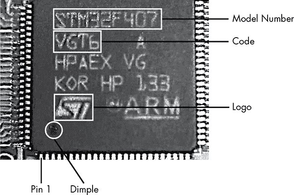

*图 8-1：STM32 芯片识别*

在芯片的型号下方是代码——在这个例子中是 VGT6——它告诉你芯片的特定功能，例如 USB 支持。如果你查找型号和 ST 代码，你会发现 STM32F407Vx 系列是支持以太网、USB、两个 CAN 和 LIN 以及 JTAG 和串行线调试的 ARM Cortex M4 芯片。

要确定各个引脚的功能，可以扫描数据手册，找到封装引脚分布图，并根据引脚数寻找与你的芯片匹配的封装。例如，如图 8-1 所示，芯片的每一侧都有 25 个引脚，总共有 100 个引脚，这与数据手册中显示的 LQFP100 引脚分布图（见图 8-2）相符。

每个芯片通常会在第 1 引脚处有一个点或凹痕（见图 8-1），一旦你识别出第 1 引脚，就可以沿着引脚分布图确定每个引脚的功能。有时你会发现有两个凹痕，但其中一个应该会更明显一些。

有时芯片的第 1 引脚通过一个切角来表示。如果你在芯片上找不到任何能帮助你识别第 1 引脚的标记，可以寻找你*可以*识别的其他特征。例如，如果电路板上的另一颗芯片是常见的 CAN 收发器，你可以使用多功能工具追踪线路，找出它连接的引脚。然后，你可以参考数据手册，查看芯片的哪一侧包含这些 CAN 引脚。为了做到这一点，将万用表设置为连通性模式。一旦进入连通性模式，当你同时接触两个引脚到同一条线路时，万用表会发出蜂鸣声，表示它们已连接。识别出一个引脚后，你可以结合引脚分布图推断出引脚布局。

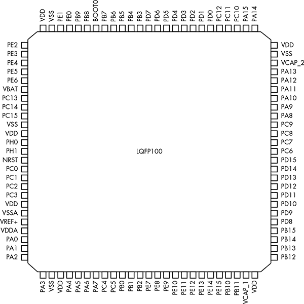

*图 8-2：STM32F4 数据手册引脚分布图*

### 使用 JTAG 和串行线调试进行硬件调试

你可以使用各种调试协议来调试芯片，就像调试软件一样。要确定目标芯片支持哪种协议，你需要查阅芯片的数据手册。你应该能够使用芯片的调试端口来拦截其处理过程，并下载和上传对芯片固件的修改。

#### *JTAG*

JTAG 是一种协议，它允许进行芯片级调试以及固件的下载和上传。你可以通过查阅芯片的数据手册来定位 JTAG 连接。

##### JTAGulator

你常常会在芯片的电路板上找到从芯片本身引出的焊盘，这些焊盘可能会给你提供 JTAG 引脚的访问权限。要测试暴露出来的焊盘是否为 JTAG 连接，可以使用像 JTAGulator 这样的工具，如图 8-3 所示。将芯片暴露的所有引脚插入 JTAGulator，并设置电压以匹配芯片。然后，JTAGulator 应该能够找到所有 JTAG 引脚，甚至可以遍历 JTAG 链——一种通过 JTAG 将芯片连接在一起的方法——以查看是否有其他芯片连接。

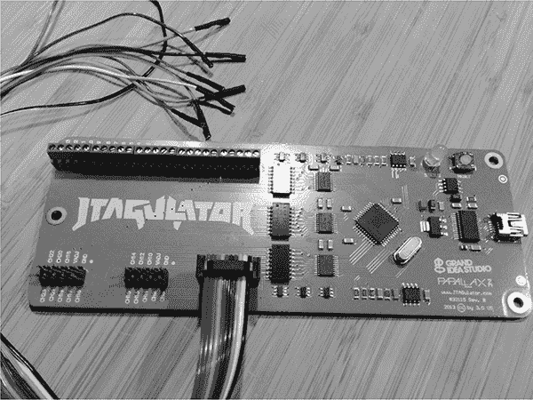

*图 8-3：带有总线海盗电缆的 JTAGulator*

JTAGulator 支持使用螺丝接线端子或总线海盗电缆（如图 8-3 所示）进行探测。JTAGulator 和总线海盗电缆都使用串行接口来配置并与芯片进行交互。

##### 通过 JTAG 调试

你可以通过仅使用两根线调试芯片，但更常见的是使用四或五个引脚连接。当然，找到 JTAG 连接只是第一步；通常，你还需要克服其他保护机制，这些保护机制会阻止你仅仅下载芯片的固件来进行一些有趣的操作。

开发人员会通过软件或硬件禁用 JTAG 固件。当通过软件禁用 JTAG 时，程序员会设置 JTD 位，通常在运行时通过软件启用两次。如果该位在短时间内没有被调用两次，则不会被设置。通过使用时钟或电源故障攻击来跳过这些指令中的至少一条，可以绕过这种软件保护。（我们将在 “故障注入” 中讨论故障攻击，第 148 页中会有更多内容。）

另一种禁用芯片 JTAG 的方法是通过设置 JTAG 融断器——OCDEN 和 JTAGEN——来尝试永久禁用编程，从而禁用这两个寄存器。这种方法较难通过故障攻击绕过，尽管电压故障或更具侵入性的光学故障可能成功。（光学故障包括拆除芯片外壳，使用显微镜和激光器进行操作，因此它们成本非常高。本书将不涉及此类故障。）

#### *串行线调试*

尽管 JTAG 是最常用的硬件调试协议，但一些微控制器——例如 STM32F4 系列，因为它具有车载 CAN 支持，通常用于汽车应用——主要使用*串行线调试（SWD）*。虽然 ST32F4 系列的 IC 支持 JTAG，但它们通常仅接线以支持 SWD，因为 SWD 只需要两个引脚，而 JTAG 需要五个引脚。SWD 还允许 JTAG 引脚的重叠，因此这些芯片可能通过使用标记为*TCK* 和 *TMS* 的引脚来支持 JTAG 和 SWD。（在数据表中，这些引脚被标记为 *SWCLK* 和 *SWIO*。）在调试 ST 芯片时，您可以使用像 ST-Link 这样的工具连接、调试并重新刷写处理器。与一些 JTAG 对应工具相比，ST-Link 非常便宜（约 20 美元）。您也可以使用 STM32 开发板。

##### STM32F4DISCOVERY 套件

STM32F4DISCOVERY 套件（由 STM 销售）是另一个可以用来调试和编程这些芯片的工具。这些实际上是带有自带编程器的开发板。它们的价格大约为 15 美元，应该包含在您的汽车破解工具集中。使用 Discovery 套件的好处是，它既是一个便宜的编程器，又是一个开发板，您可以用它来测试芯片固件的修改。

为了将 Discovery 套件用作通用编程器，请从标有 *ST-Link* 的引脚上移除跳线，然后连接对面标有 *SWD* 的六个引脚（参见图 8-4）。引脚 1 紧挨着 SWD 连接器上的白点。

表 8-1 显示了引脚分配图。

**表 8-1：** STM32F4DISCOVERY 套件引脚分配图

| **STM32 芯片** | **STM32F4DISCOVERY 套件** |
| --- | --- |
| VDD_TARGET | 引脚 1 |
| SWLCK | 引脚 2 |
| GND | 引脚 3 |
| SWDIO | 引脚 4 |
| nRESET | 引脚 5 |
| SWO | 引脚 6 |

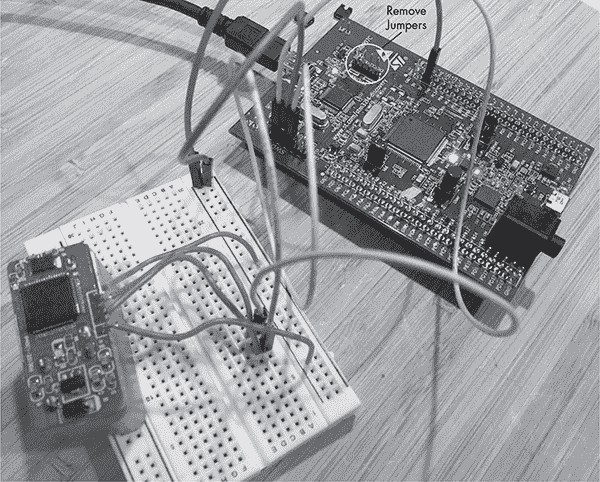

*图 8-4：通过 STM32F4DISCOVERY 套件编程 STM32 芯片*

您很可能需要为目标设备提供电源，但不是使用 SWD 连接器上的引脚 1，而是使用开发板中 Discovery 部分的 3V 引脚，如图 8-4 所示。（请注意，连接图中 Discovery 套件没有使用 SWD 的所有六个引脚；引脚 nRESET 和 SWO 是可选的。）

一旦连接成功，您很可能想要读取和写入固件。如果您使用的是 Linux，您可以从 GitHub 获取 ST-Link，地址为*[`github.com/texane/stlink/`](https://github.com/texane/stlink/)*。安装这些工具后，您不仅可以读取和写入芯片的闪存，还可以启动 gdbserver 来作为实时调试器使用。

#### *高级用户调试器*

Renesas 是一种流行的汽车芯片集，广泛应用于 ECU（见图 8-5）。它有自己的 JTAG 实现，称为 *高级用户调试器（AUD）*。AUD 提供与 JTAG 相同的功能，但具有其专有的接口。与 SWD 一样，AUD 需要特定的接口才能与 Renesas 芯片集进行通信。

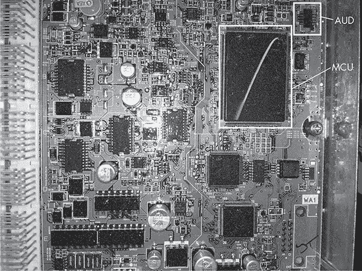

*图 8-5: 2005 年款 Acura TL ECU 与 Renesas SH MCU 和 AUD 端口*

#### *Nexus*

Freescale/Power Architecture（现在是 NXP）的 Nexus 是另一种专有的 JTAG 接口。像 AUD 和 SWD 一样，这种在线调试器需要一个特定的设备才能与其接口。在处理 Freescale 芯片时，例如 MCP5xxx 系列，请记住，调试器可能是 Nexus。

Nexus 接口使用一组专用引脚，应该在芯片数据表中定义。查找数据表中辅助端口部分的 EVTI/O 引脚。

### 利用 ChipWhisperer 进行侧信道分析

*侧信道分析*是另一种硬件攻击方法，用于绕过 ECU 和其他微控制器保护并破解内建的加密。此类攻击利用嵌入式电子系统的各种特性，而不是直接针对特定的硬件或软件。侧信道攻击有多种形式，有些执行起来可能需要$30,000 到$100,000 的费用，因为它们需要像电子显微镜这样的专用设备。像这样的昂贵的侧信道攻击通常是侵入性的，意味着它们会永久性地改变目标。

我们将集中讨论利用 ChipWhisperer 进行的更简单且便宜的侧信道攻击，这是一种来自 NewAE Technologies 的非侵入性工具（* [`newae.com/chipwhisperer/`](http://newae.com/chipwhisperer/) *）。ChipWhisperer 是一个开源的侧信道分析工具和框架，售价略高于$1,000——远低于其非开源的同行产品，后者通常起价约$30,000。

**注意**

*通过制造一个专用设备，我可以以更低的成本完成我将要讨论的攻击，但 ChipWhisperer 是涵盖所有主要功能的最便宜工具。此外，ChipWhisperer 教程针对的是开源设计，这使得它们非常适合本书，因为我们无法使用来自特定厂商的示例，因版权问题。我将在本章中演示每个攻击时，融入 NewAE 的教程。*

ChipWhisperer 有一个可选的套餐，包括一个目标开发板，称为多目标受害者板（参见图 8-6）。该板主要用于演示和培训，我们也将使用它作为我们的演示目标。

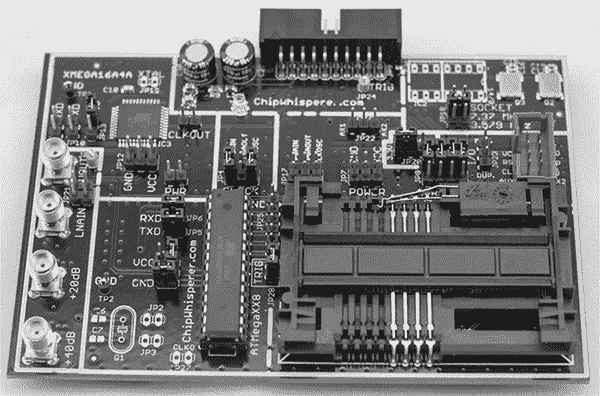

*图 8-6: 多目标受害者板*

多目标受害者板基本上是三个独立的系统：一个 ATmega328，一个 XMEGA，以及一个智能卡读取器。（ChipWhisperer 可以对智能卡进行中间人攻击，但由于汽车实际上并不使用智能卡，所以我们在这里不讨论这个功能。）

通过更改板上的跳线，您可以给不同的系统供电来启用或禁用它们，但要小心一次只启用一个部分，否则可能会导致短路。测试前请注意跳线设置。

#### *安装软件*

首先安装 ChipWhisperer 软件。以下说明适用于 Linux 系统，但你可以在*[`www.newae.com/sidechannel/cwdocs/`](http://www.newae.com/sidechannel/cwdocs/)*找到 Windows 的详细设置说明。

ChipWhisperer 软件需要 Python 2.7 和一些额外的 Python 库才能运行。首先，输入以下代码：

```
$ sudo apt-get install python2.7 python2.7-dev python2.7-libs python-numpy
python-scipy python-pyside python-configobj python-setuptools python-pip git
$ sudo pip install pyusb-1.0.0b1
```

要获取 ChipWhisperer 软件，你可以从 NewAE 网站下载一个稳定版本的 ZIP 文件，或者从 GitHub 仓库获取一份，链接如下：

```
$ git clone git://git.assembla.com/chipwhisperer.git
$ cd chipwhisperer
$ git clone git://git.assembla.com/openadc.git
```

第二个`git`命令会下载 OpenADC。ChipWhisperer 的 OpenADC 板是示波器部分，负责测量电压信号，基本上是 ChipWhisperer 系统的核心。使用以下命令来设置软件（你应该在 ChipWhisperer 目录下具有 root 权限）：

```
$ cd openadc/controlsw/python
$ sudo python setup.py develop
$ cd software
$ sudo python setup.py develop
```

硬件已经原生支持 Linux 系统，但你应该为要测试的普通用户添加一个组，以便该用户可以访问设备，而不需要 root 权限。为了允许非 root 用户使用设备，创建一个*udev*文件，如*/etc/udev/rules.d/99 -ztex.rules*，并将以下内容添加到该文件：

```
SUBSYSTEM=="usb", ATTRS{idVendor}=="04b4", ATTRS{idProduct}=="8613",
MODE="0664", GROUP="plugdev"
SUBSYSTEM=="usb", ATTRS{idVendor}=="221a", ATTRS{idProduct}=="0100",
MODE="0664", GROUP="plugdev"
```

同时，为 AVR 编程器创建一个名为*/etc/udev/rules.d/99-avrisp.rules*的文件：

```
SUBSYSTEM=="usb", ATTRS{idVendor}=="03eb", ATTRS{idProduct}=="2104",
MODE="0664", GROUP="plugdev"
```

现在，添加你的用户（你需要注销并重新登录，以便新权限生效）：

```
$ sudo usermod -a -G plugdev <YourUsername>
$ sudo udevadm control –reload-rules
```

将 ChipWhisperer 通过插入 mini-USB 线连接到你的电脑。ChipWhisperer 顶部的绿色系统状态指示灯应该会亮起，表示 ChipWhisperer 已设置好，或者至少处于未配置的核心状态。

#### *准备受害者板*

为了准备受害者板——或称为 ChipWhisperer 文档中的*设备待测（DUT）*——下载 AVR 加密库（由于出口法规，这个库默认不包含在 ChipWhisperer 框架中），通过输入以下命令进行下载：

```
$ cd hardware/victims/firmware
$ sh get_crypto.sh
```

我们将使用 AVRDUDESS GUI 来编程我们的受害者板。你可以从其 GitHub 仓库获取 AVRDUDESS，链接为*[`github.com/zkemble/avrdudess/`](https://github.com/zkemble/avrdudess/)*，或者从像*[`blog.zakkemble.co.uk/avrdudess-a-gui-for-avrdude/`](http://blog.zakkemble.co.uk/avrdudess-a-gui-for-avrdude/)*这样的站点下载二进制文件。你需要安装 mono 才能让它正常工作：

```
$ sudo apt-get install libmono-winforms2.0-cil
```

接下来，确保受害者板配置为使用 ATmega328 部分，通过更改跳线设置，使其与图 8-7 中的布局匹配。

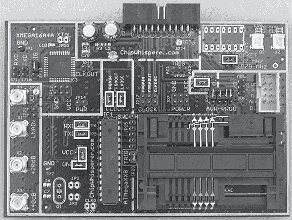

*图 8-7：多目标受害者板的跳线设置*

你的 ChipWhisperer 应该附带有一根 20 针的排线。按照图示，将这根线缆插入 ChipWhisperer 的后部，并将 USB A/B 线缆插入侧面，如图 8-8 所示。Dmesg 应该会报告识别到插入的 AVRISP mkII，这是我们用来编程目标板的编程器。这样我们就可以在不拔掉设备的情况下进行测试。

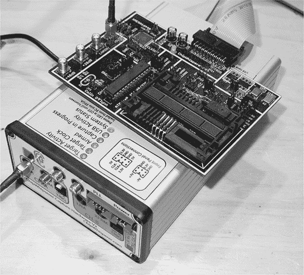

*图 8-8：连接 MultiTarget 受害者板*

最后，将 SMA 电缆从目标板上的 VOUT 连接到 ChipWhisperer 前面 CH-A 上的 LNA 接口。表 8-2 显示了引脚分配。除非另有说明，我们将使用此设置进行演示。

**表 8-2：** MultiTarget 受害者板的引脚分配

| **受害者板** | **ChipWhisperer** | **组件** |
| --- | --- | --- |
| 20 针连接器 | ChipWhisperer 背面 | 20 针排线电缆 |
| VOUT | LNA 在 CH-A 上 | SMA 电缆 |
| 计算机 | ChipWhisperer 侧面 | Mini USB 电缆 |

### 在功率分析攻击中暴力破解安全启动加载程序

现在你已经设置好了受害者板，我们将使用功率分析攻击来暴力破解密码。功率分析攻击通过观察不同芯片组的功率消耗来识别独特的功率特征。通过监控每条指令的功率消耗，可以确定正在执行的指令类型。例如，一个无操作（NOP）指令的功率消耗会比乘法（MUL）指令少。这些差异可以揭示系统的配置，甚至能判断密码是否正确，因为正确的密码字符可能会比错误的密码字符消耗更多的功率。

在以下示例中，我们将探索 TinySafeBoot (*[`jtxp.org/tech/tinysafeboot_en.htm`](http://jtxp.org/tech/tinysafeboot_en.htm)*)，一个为 AVR 系统设计的小型开源引导加载程序。该引导加载程序需要密码才能进行修改。我们将使用 ChipWhisperer 利用其密码检查方法中的漏洞，从芯片中推导出密码。这个漏洞在新版本的 TinySafeBoot 中已被修复，但为了练习，旧版本已包含在 ChipWhisperer 框架的 *victims* 文件夹中。本教程基于 NewAE 的“使用功率进行时序分析以攻击 TSB”(*[`www.newae.com/sidechannel/cwdocs/tutorialtimingpasswd.html`](http://www.newae.com/sidechannel/cwdocs/tutorialtimingpasswd.html)*)。

#### *使用 AVRDUDESS 准备测试*

首先，打开 AVRDUDESS 并从程序员下拉菜单中选择 **AVR ISP mkII**。确保在 MCU 字段中选择了 ATmega328P，然后点击 **检测** 来验证你是否已连接到 ATmega328p（参见 图 8-9）。在 Flash 字段中选择 *hardware/victims/firmware/tinysafeboot-20140331* 作为闪存文件。

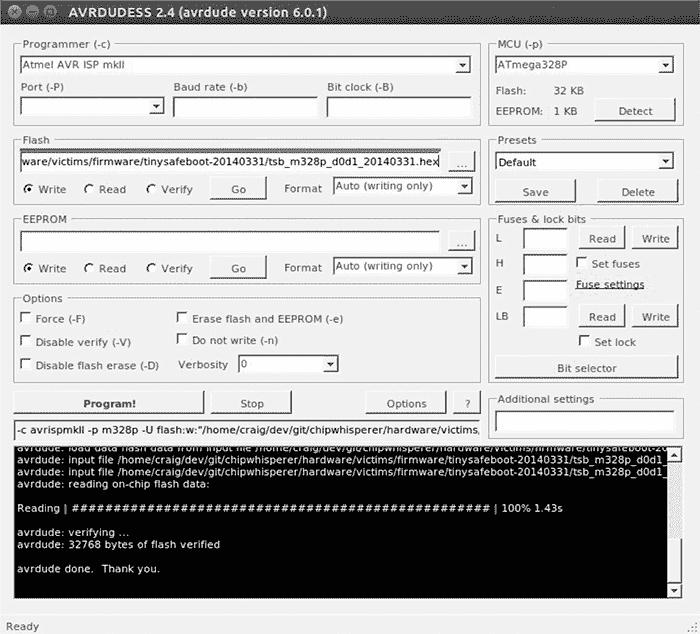

*图 8-9：在 AVRDUDESS 中编程 TinySafeBoot*

点击 **编程！**，AVRDUDESS 应该将 TinySafeBoot 程序写入 ATmega。

#### *设置 ChipWhisperer 用于串行通信*

现在我们准备进行测试了！我们将使用 ChipWhisperer 设置并监控当引导程序检查密码时的功率使用情况。然后，我们将利用这些信息构建一个工具，比传统的暴力破解方法更快地破解密码。首先，设置 ChipWhisperer 通过引导程序的串口接口与引导程序通信，像这样：

```
$ cd software/chipwhisperer/capture
$ python ChipWhispererCapture.py
```

ChipWhisperer 有很多选项，所以我们将逐步介绍你需要更改的每个设置。

1.  在 ChipWhispererCapture 中，转到常规设置选项卡，将 Scope 模块设置为 **ChipWhisperer/OpenADC**，将 Target 模块设置为 **Simple Serial**，如 图 8-10 所示。

    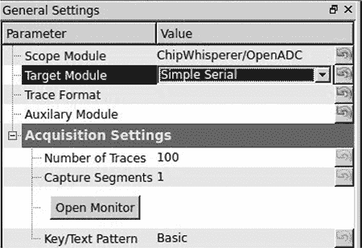

    *图 8-10：设置 Scope 和 Target 类型*

    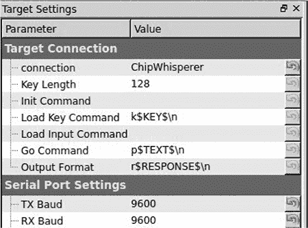

    *图 8-11：设置连接和波特率*

1.  切换到目标设置选项卡（窗口底部），将连接设置更改为 **ChipWhisperer**。然后在串口设置下，将 TX Baud 和 RX Baud 都设置为 **9600**，如 图 8-11 所示。

1.  在屏幕顶部，点击带有 *DIS* 的红色圆圈。圆圈应该变为绿色并显示 *CON*。

1.  ChipWhisperer 配备了一个简单的串口终端界面。选择 **工具 ▸ 打开终端** 来打开它。你应该会看到一个像 图 8-12 中所示的终端。

    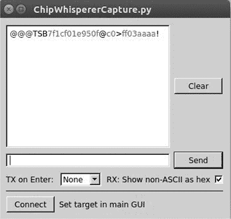

    *图 8-12：ChipWhisperer 串口终端*

1.  在终端底部，将 TX 设置为 **None**，并勾选 **RX: 显示非 ASCII 为十六进制**（参见 图 8-12）。然后点击 **连接** 以启用你的文本区域。

1.  在发送按钮左侧的文本框中输入 **@@@**（TinySafeBoot 的启动密码），然后点击 **发送**。引导程序应该以 TSB 开头，并主要包含固件版本和 AVR 设置的信息。TSB 只是 TinySafeBoot 使用的一个标识符，最有可能是其首字母缩写。输出应该与 图 8-12 中的内容匹配。

#### *设置自定义密码*

现在我们需要设置一个自定义密码，以便在输入密码时监控功率水平。

首先，关闭串口终端。然后在 ChipWhisperer 主窗口底部中央的 Python 控制台窗口中输入以下几行代码。

```
>>> self.target.driver.ser.write("@@@")
>>> self.target.driver.ser.read(255)
```

我们使用串口命令 `self.target.driver.ser.write("@@@")` 来发送当前的引导程序密码。接下来，我们输入串口命令 `self.target.driver.ser.read(255)` 来从引导程序读取最多 255 个字节，以查看它对我们发送密码的响应（参见 图 8-13）。

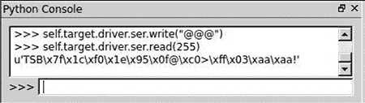

*图 8-13：通过 ChipWhisperer 的 Python 控制台发送* `@@@`

为了方便起见，首先将读写命令分配给各自的变量，这样就不需要每次都输入这么长的命令（以下示例假设你已经完成了这一步）：

```
>>> read = self.target.driver.ser.read
>>> write = self.target.driver.ser.write
```

密码存储在设备闪存的最后一页。我们将抓取该页面，去除响应中的确认`!`字符，并将新密码`og`写入固件中。

**注意**

*您可以在 NewAE 教程* ([`www.newae.com/sidechannel/cwdocs/tutorialtimingpasswd.html`](http://www.newae.com/sidechannel/cwdocs/tutorialtimingpasswd.html)) *或 Python 手册中找到对此过程的更详细解释*。

返回 Python 控制台，输入清单 8-1。

```
>>> write('c')
>>> lastpage = read(255)
>>> lastpage = lastpage[:-1]
>>> lastpage = bytearray(lastpage, 'latin-1')
>>> lastpage[3] = ord('o')
>>> lastpage[4] = ord('g')
>>> lastpage[5] = 255
>>> write('C')
>>> write('!')
>>> write(lastpage.decode('latin-1'))
```

*清单 8-1：修改最后一页内存以将密码设置为* `og`

如果登录超时，像这样重新发送`@@@`：

```
>>> write("@@@")
```

一旦您将新字符写入内存，使用`write("og")`验证`og`是新密码，然后在 Python 控制台中执行`read(255)`。请注意，在图 8-14 中，我们首先尝试发送`@@@`，但是直到我们发送`og`密码时才收到 TinySafeBoot 响应。

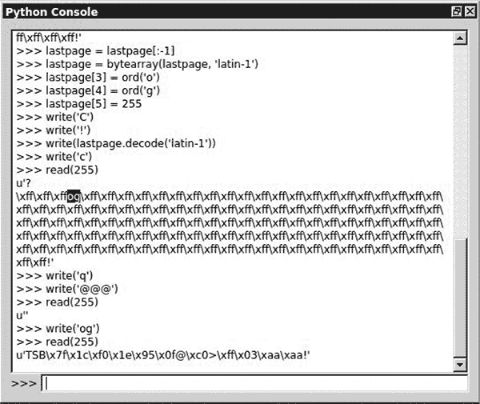

*图 8-14：将密码设置为* `og`

#### *重置 AVR*

更改密码后，我们可以开始读取功率信号。首先，我们需要能够脱离系统在输入错误密码时进入的无限循环。编写一个小脚本，当发生这种情况时重置 AVR。在 Python 控制台中输入以下命令以创建一个 resetAVR 辅助函数：

```
>>> from subprocess import call
>>> def resetAVR:
      call(["/usr/bin/avrdude", "-c", "avrispmkII", "-p", "m328p"])
```

#### *设置 ChipWhisperer ADC*

现在，设置 ChipWhisperer ADC，使其知道如何记录功率轨迹。返回 ChipWhisperer 主窗口，点击示波器标签，并按照表 8-3 和图 8-15 中的示例设置值。

**表 8-3：** 配置 OpenADC 以设置受害者板的示波器标签

| **区域** | **类别** | **设置** | **值** |
| --- | --- | --- | --- |
| OpenADC | 增益设置 | 设置 | 40 |
| OpenADC | 触发器设置 | 模式 | 下降沿 |
| OpenADC | 触发器设置 | 超时 | 7 |
|  OpenADC  | ADC 时钟 | 来源 | EXTCLK x1 通过 DCM |
| CW 附加功能 | 触发器引脚 | 前面板 A | 取消勾选 |
| CW 附加功能 | 触发器引脚 | 目标 IO1（串行 TXD） | 勾选 |
| CW 附加功能 | 触发器引脚 | 时钟源 | 目标 IO-IN |
| OpenADC | ADC 时钟 | 重置 ADC DCM | 按钮 |

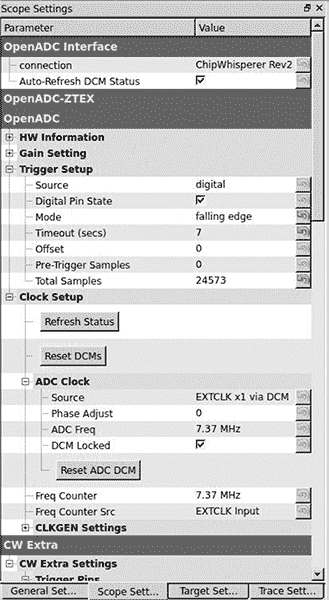

*图 8-15：触发串行 TX 上的 ADC 值*

#### *监控密码输入时的功率使用*

现在，我们将监控输入密码时的功率使用，看看能否发现有效密码和无效密码之间的功率差异。我们将观察当输入现在无效的密码`@@@`时发生了什么。回想一下，之前当引导加载程序检测到你输入错误的密码时，它会进入无限循环，所以我们可以监控此时的功率使用情况。当然，你需要退出该无限循环，所以一旦你尝试了错误的密码并进入循环，重置设备并尝试输入另一个密码。为此，请在 Python 控制台中按以下方式导航到密码提示符：

```
>>> resetAVR()
>>> write("@@@")
```

现在，使用正确的密码执行下一条命令，但*不要*点击回车键：

```
>>> write("og")
```

点击工具栏中绿色播放图标上的**1**来记录一次功率轨迹。操作后，立即在 Python 控制台中点击**回车**。应该会弹出一个捕获波形窗口，显示有效密码的功率轨迹记录（参见图 8-16）。

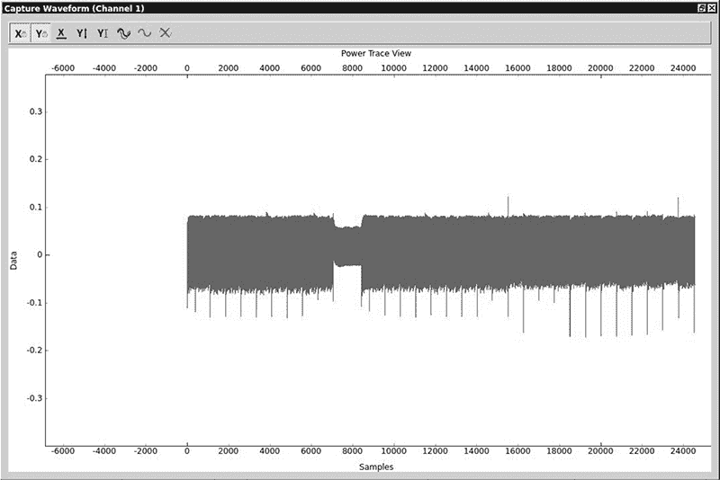

*图 8-16：有效密码的功率轨迹*

图 8-16 的细节并不是那么重要；关键是让你了解“良好”信号的样子。你看到的粗线条表示正常处理，当处理指令发生变化时，大约在 8,000 样本范围内会有一个功率下降。（这可能与密码检查有关，但在这个阶段我们不必纠结于细节。）

现在，输入一个无效密码—`ff`：

```
>>> resetAVR()
>>> write("@@@")
>>> write("ff")
```

图 8-17 展示了该密码的功率轨迹。

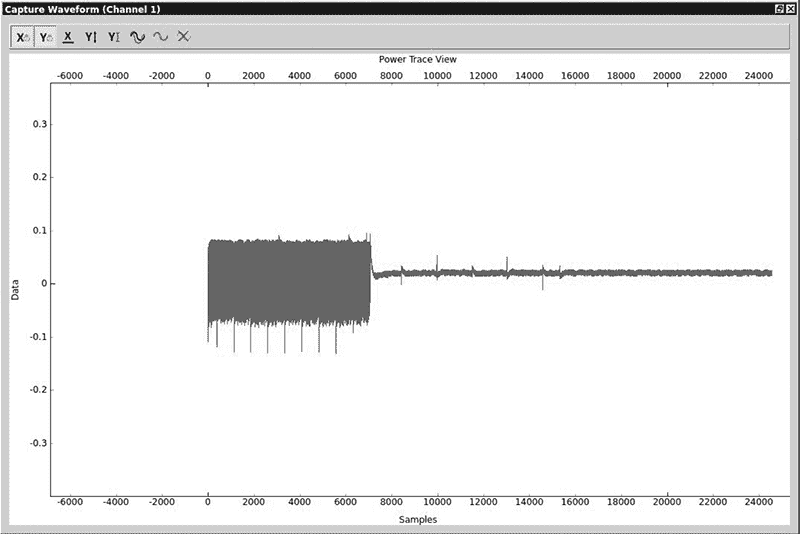

*图 8-17：无效字符密码的功率轨迹*

你可以看到当功率读数从正常转变为几乎一致的 0 功率使用时，程序卡在了它的无限循环中。

现在，让我们尝试输入一个第一个字符有效的密码，看看是否能发现差异：

```
>>> resetAVR()
>>> write("@@@")
>>> write("of")
```

在图 8-18 中，设备进入无限循环之前，会有一个额外的片段处于活动状态。我们看到正常的功率使用，然后在 8,000 处出现了我们在第一次有效读数中看到的功率下降，接着是更多的正常功率使用，然后设备进入 0 功率的无限循环。

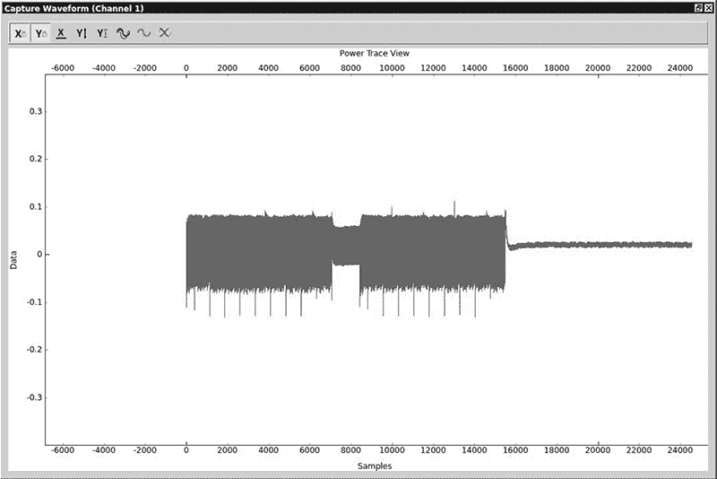

*图 8-18：具有有效第一个字符的密码的功率轨迹*

**注意**

*你可以通过测量 8,000 处的功率下降和大约 16,000 处开始的无限循环之间的长度，来确定检查一个有效字符所使用的样本大小。在这种情况下，我们大致可以估算出检查一个字符的样本大小约为 8,000 次轨迹（16,000 – 8,000）。*

#### *使用 Python 脚本化 ChipWhisperer*

因为 ChipWhisperer 是用 Python 编写的，所以它具有高度的脚本化功能，因此你可以编写这些功率跟踪脚本，创建一个暴力破解工具，可以非常快速地获取启动加载程序的密码。通过设置脚本来检查功率跟踪的数据显示点是否超过设定的阈值，暴力破解者可以立即判断目标字符是否正确。通过查看图 8-18 中 y 轴上的数据值，我们可以看到当有活动时，数据达到 0.1，而当进入无限循环时，数据徘徊在 0 附近。如果目标字符正确，我们可以将脚本的阈值设置为 0.1，如果字节样本范围内没有任何数据达到 0.1，则可以得出结论：我们处于无限循环中，密码字符不正确。

例如，如果密码由 255 个不同字符组成，且最大长度为 3，则密码将是 255³，即 16,581,375 种可能。然而，由于我们可以立即检测到正确的字符，在最坏情况下，暴力破解者只需尝试 255 × 3，即 765 种可能。如果字符与设置的密码不匹配，启动程序将跳入无限循环。另一方面，如果密码检查程序等待直到整个密码被检查完毕，无论其正确与否，这种定时分析将无法进行。嵌入式系统上的小型代码通常设计得尽可能高效，这可能使其容易受到致命的定时攻击。

**注意**

*有关如何为 ChipWhisperer 编写自己的暴力破解工具的详细信息，请参阅 NewAE 教程。一个示例暴力破解工具已包含在* [`www.nostarch.com/carhacking/`](http://www.nostarch.com/carhacking/)。

安全启动加载程序和任何检查有效代码的嵌入式系统都可能受到这种攻击的影响。一些汽车系统要求提供挑战响应或有效的访问代码才能访问较低级别的功能。猜测或暴力破解这些密码可能非常耗时，这使得传统的暴力破解方法变得不切实际。通过使用功率分析来监控这些密码或代码是如何被检查的，你可以推导出密码，从而使那些本来需要大量时间才能破解的密码变得可以轻松破解。

### 故障注入

*故障注入*，也称为*故障攻击*，是通过干扰芯片的正常操作来攻击芯片，可能导致其跳过执行某些指令，例如用于启用安全功能的指令。当阅读芯片的数据手册时，你会看到时钟速度和电源水平的范围旁边有警告，表示如果不遵循这些范围，将会产生不可预测的结果——这正是你在进行故障攻击时所利用的。在这一部分，你将学习如何通过注入时钟速度和电源级别的故障来引入错误。

#### *时钟故障*

任何 ECU 或芯片都依赖于内部时钟来定时其指令。每当微控制器从时钟接收到一个脉冲时，它就加载一个指令，而在该指令被解码和执行的同时，下一条指令也在加载。这意味着需要一个稳定的脉冲节奏，以确保指令有足够的时间加载并正确执行。但是，如果在这些时钟脉冲中的某个脉冲出现了问题，会发生什么呢？请参见图 8-19 中的时钟故障。

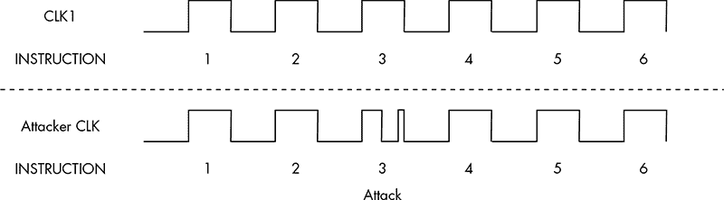

*图 8-19：正常时钟周期（上）和故障时钟周期（下）*

因为程序计数器有足够的时间递增，但在加载下一条指令之前没有足够的时间解码和执行当前指令，微控制器通常会跳过该指令。在图 8-19 的底部周期中，指令 3 被跳过，因为在另一条指令发出之前，它没有足够的时间执行。这可以用于绕过安全方法、突破循环或重新启用 JTAG。

要执行时钟故障攻击，您需要使用一个比目标系统更快的系统。场可编程门阵列（FPGA）板是理想的选择，但您也可以使用其他微控制器来完成这个技巧。为了执行故障，您需要与目标的时钟同步，当您想跳过的指令被发出时，将时钟拉低到地面，执行部分周期。

我们将使用 ChipWhisperer 和一些为这种攻击制作的演示软件演示时钟故障攻击。受害板的设置几乎与电源攻击时相同，唯一需要更改的是时钟引脚（位于板的中央）的跳线，应该仅通过跳接引脚设置为 FPGAOUT（请参见图 8-20）。

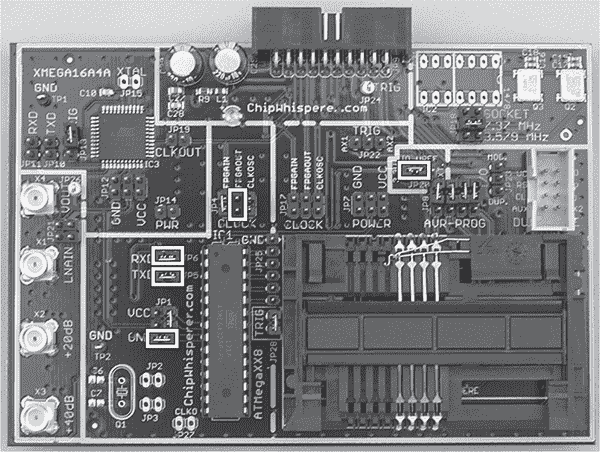

*图 8-20：为故障攻击设置的多目标受害板*

我们将设置 ChipWhisperer 来控制 ATmega328 的时钟。通用设置和目标设置与我们在“为串行通信设置 ChipWhisperer”一节中讨论的电源攻击中的设置相同；唯一的例外是，我们将 TX 和 RX 的波特率都设置为 38400。通过将工具栏中的设置从 DIS 切换到 CON，启用示波器和目标设置，正如之前所讨论的那样。图 8-21 和表 8-4 显示了完整的设置。

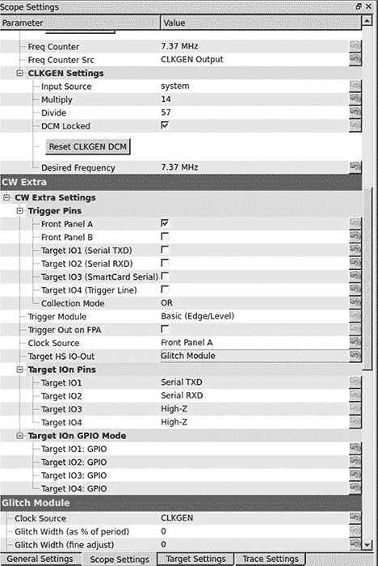

*图 8-21：用于故障攻击的示波器设置*

**表 8-4：** ChipWhisperer 主窗口设置，用于时钟故障攻击

| **区域** | **类别** | **设置** | **值** |
| --- | --- | --- | --- |
| OpenADC | ADC 时钟 | 频率计数器源 | CLKGEN 输出 |
| OpenADC | CLKGEN 设置 | 期望频率 | 7.37 MHz |
| OpenADC | CLKGEN 设置 | 重置 CLKGEN DCM | 按钮 |
| 故障模块 | 时钟源 |  | CLKGEN |
| CW 外部设备 | 触发引脚 | 目标 HS IO 输出 | 故障模块 |

这些设置使 ChipWhisperer 完全控制目标板的时钟，并允许您上传故障演示固件。您将在 ChipWhisperer 框架的此目录中找到目标固件：*hardware/victims/firmware/avr-glitch-examples*。在您喜欢的编辑器中打开 *glitchexample.c*，然后转到代码底部的 `main()` 方法。将 `glitch1()` 改为 `glitch3()`，以便跟随本演示，并重新编译 ATmega328p 的 *glitchexample* 固件：

```
$ make MCU=atmega328p
```

现在，像我们在 “使用 AVRDUDESS 准备测试” 中的第 139 页那样，通过 AVRDUDESS 上传 *glitchexample.hex* 文件。固件加载完成后，切换到主 ChipWhisperer 窗口并打开串行终端。点击 **连接**，然后切换回 AVRDUDESS 并点击 **检测**。这应该会重置芯片，您将看到 `hello` 出现在捕获终端中。输入密码，并点击 **发送**。假设您输入了错误的密码，捕获终端应该显示 `FOff` 并挂起，如图 8-22 所示。

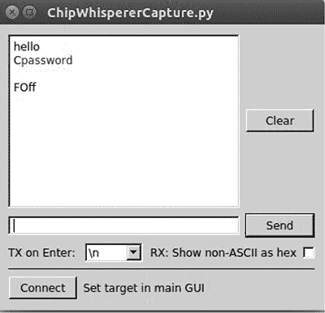

*图 8-22：错误密码示例*

现在返回到编辑器，查看 *glitchexample* 源代码。如列表 8-2 所示，这是一个简单的密码检查。

```
for(cnt = 0; cnt < 5; cnt++){
    if (inp[cnt] != passwd[cnt]){
        passok = 0;
    }
}

if (!passok){
    output_ch_0('F');
    output_ch_0('O');
    output_ch_0('f');
    output_ch_0('f');
    output_ch_0('\n');
} else {
    output_ch_0('W');
    output_ch_0('e');
    output_ch_0('l');
    output_ch_0('c');
    output_ch_0('o');
    output_ch_0('m');
    output_ch_0('e');
    output_ch_0('\n');
}
```

*列表 8-2：`glitch3()` 的密码检查方法*

如果输入了无效密码，`passok` 将设置为 0，并且屏幕上会显示 `Foff` 消息；否则，屏幕上将显示 `Welcome` 消息。我们的目标是引入一个时钟故障，通过跳过设置 `passok` 为 0 的指令（以避免它被设置为 0），或通过直接跳转到欢迎消息来绕过密码验证。我们将通过在故障设置中操控宽度和偏移百分比来实现后者。

图 8-23 展示了定位故障的一些可能位置。不同的芯片和指令在故障放置位置上的反应不同，因此请尝试不同位置以确定哪个位置最适合您的情况。图 8-23 还展示了在示波器下正常的时钟周期。如果我们在 ChipWhisperer 设置中使用正偏移，它将导致时钟周期中间出现短暂的下跌。如果使用负偏移，它将在时钟周期之前引起一个短暂的尖峰。

我们将在 ChipWhisperer 中设置以下故障选项，通过使用 -10% 的偏移量，在时钟周期之前引起一个短暂的尖峰：

```
Glitch width %: 7
Glitch Offset %: -10
Glitch Trigger: Ext Trigger: Continuous
Repeat: 1
```

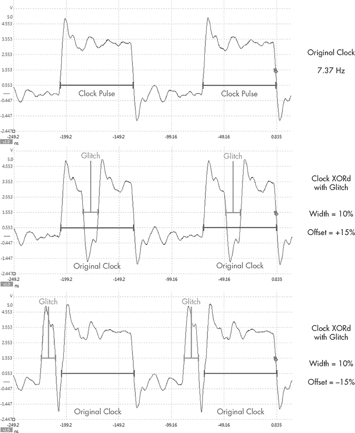

*图 8-23：示例故障放置位置*

现在返回 ChipWhisperer 主窗口，设置 CW 外部设备，如图 8-24 所示。这将配置 ChipWhisperer，仅在接收到触发线信号时才引起时钟故障。

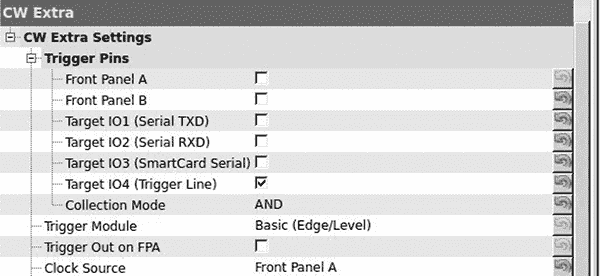

*图 8-24：在 CW 外部设备设置中配置故障*

**注意**

*故障是一个不精确的科学。不同的芯片对设置的反应不同，你需要大量调整设置以获得正确的时机。即使你无法始终如一地利用时钟故障，通常只需要一次成功的操作就能利用设备。*

#### *设置触发线*

现在我们已经设置好 ChipWhisperer 来监听触发线上的信号，我们需要修改代码来使用触发线。触发线是 ChipWhisperer 连接器上的第 16 引脚。当触发线接收到信号（电压峰值）时，它会触发 ChipWhisperer 软件启动执行。

触发线是 ChipWhisperer 使用的通用输入方法。目标是让触发线在我们想要攻击的点之前接收到信号。如果我们在观察一块硬件时注意到某个灯光在我们想要攻击的区域之前亮起，我们可以将 LED 焊接到触发线上，以便让 ChipWhisperer 等到合适的时刻再进行操作。

对于这个演示，我们将修改固件，使触发线在我们想要故障的区域触发。首先，我们将在 列表 8-2 中显示的默认故障 3 示例中添加一些代码。使用你喜欢的编辑器，将 列表 8-3 中的定义添加到 *glitchexample.c* 文件的顶部。

```
#define trigger_setup() DDRC |= 0x01
#define trigger_high()  PORTC |= 0x01
#define trigger_low()   PORTC &= ~(0x01)
```

*列表 8-3：在* `glitchexample.c` *中设置触发定义*

在 `main()` 方法中，在打印 *hello* 之前放置一个 `trigger_setup()`，然后将你的目标用触发器包裹，如 列表 8-4 所示。

```
    for(cnt = 0; cnt < 5; cnt++){
        if (inp[cnt] != passwd[cnt]){
            trigger_high();
            passok = 0;
            trigger_low();
        }
    }
```

*列表 8-4：添加* `trigger_high` *和* `trigger_low` *围绕* `passok` *以触发故障*

现在，重新编译 `make MCU=atmega328p`，并将固件重新上传到受害者板（在上传固件之前，确保在 ChipWhisperer 设置中将故障触发选项设置为手动，否则你可能会不小心触发固件上传的故障）。上传固件后，将故障触发选项切换回外部触发：连续模式。现在，输入任意密码。如果你看到 `Welcome` 信息，那么说明你已经成功触发了设备故障，如 图 8-25 所示。

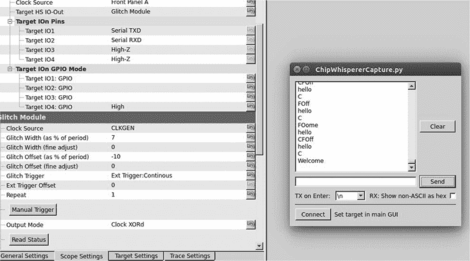

*图 8-25：成功触发密码检查故障*

不幸的是，在现实世界中，你可能无法像这样使用触发线，因为你无法访问目标源，或者触发事件离你想要故障的位置不够近。在这种情况下，你需要调整其他设置和外部触发偏移量。打开工具中的故障监视器，以便尝试不同的设置。

#### *电源故障*

功率故障注入的触发方式类似于时钟故障注入：你为目标板提供稳定的电力，并在需要在特定指令上触发意外结果时，通过降低或提高电压来中断该指令。降低电压通常比提高电压更安全，因此可以先尝试降低电压。每个微控制器对功率故障的反应不同，因此可以在不同的时刻和功率水平下进行尝试，建立故障概况并查看可以控制哪些类型的行为。（当指令通过功率故障跳过时，通常是因为操作码指令已经损坏，执行了不同于预期的指令，或者某个寄存器已经损坏。）

**注意**

*一些微控制器根本不容易受到功率故障攻击的影响，因此在尝试应用于车辆之前，先在目标芯片组上进行测试。*

功率故障注入还可以影响内存读写。根据功率故障发生时运行的指令，你可以导致控制器读取错误的数据或忘记写入值。

#### *侵入式故障注入*

由于侵入式故障注入攻击比故障攻击更耗时且成本更高，因此我们将在此简要讨论它。然而，如果你需要执行此任务并且拥有资源，侵入式故障注入通常是最好的方法。关键是，它不能保留目标，甚至可能摧毁它。

侵入式故障注入涉及物理拆解芯片，通常使用酸性物质（如硝酸和丙酮），并使用电子显微镜对芯片进行成像。你可以只处理芯片的顶部或底部层，或绘制每一层的地图并解读逻辑门和内部结构。你还可以使用微探针和微探针站将精确的信号注入目标。类似地，你也可以使用定向激光或定向热量来引起光学故障，从而减缓该区域的处理过程。例如，如果一个移动指令应该需要两个时钟周期，你可以通过延迟寄存器检索，使其晚于下一个指令。

### 总结

在本章中，你已经学习了几种针对嵌入式系统的高级攻击技巧；随着汽车安全的不断提升，这些技巧将变得更加有价值。你学习了如何识别芯片并监控功耗，以创建正常操作的概况。我们测试了是否可以通过监控密码中错误字符的功率输出来攻击密码检查，最终创建了一个暴力破解应用，利用功率分析将密码暴力破解时间缩短到秒级。我们还观察到时钟和功率故障注入如何使固件执行中的关键点指令跳过，例如在验证安全检查时或设置 JTAG 安全时。
