## 第九章：**车载娱乐信息系统**


*车载娱乐信息（IVI）系统*通常是指汽车中控台的触摸屏界面。这些控制台通常运行像 Windows CE、Linux、QNX 或 Green Hills 这样的操作系统，甚至可能在虚拟机中运行 Android。它们可以支持众多功能，并与车辆的集成程度各不相同。

IVI 系统提供的远程攻击面比任何其他车辆组件都要多。在本章中，您将学习如何分析和识别 IVI 单元，如何确定其工作原理，以及如何克服潜在的障碍。一旦您了解了自己的 IVI 系统，就能深入了解目标车辆的工作原理。访问 IVI 系统不仅允许您修改 IVI 本身，还会为您提供更多关于车辆工作方式的信息，例如如何路由 CAN 总线数据包以及如何更新 ECU。理解 IVI 系统还可以帮助您了解该系统是否会向制造商发送数据；如果是，您可以利用对 IVI 的访问权限查看正在收集和可能传输给制造商的数据。

### 攻击面

IVI 系统通常具有一个或多个物理输入，您可以使用这些输入与车辆进行通信：

**辅助插孔**

• CD-ROM

• DVD

• 触摸屏、旋钮或按钮及其他物理输入方式

• USB 端口

**一个或多个无线输入**

• 蓝牙

• 蜂窝网络连接

• 数字广播电台（如数字音频广播）

• GPS

• Wi-Fi

• XM 广播

**内部网络控制**

• 总线网络（CAN、LIN、KWP、K-Line 等）

• 以太网

• 高速媒体总线

车辆通常使用 CAN 总线与其各个组件进行通信，例如模块、ECU、IVI 系统和远程信息处理单元。一些 IVI 系统使用以太网在高速设备之间进行通信，无论是发送正常的 IP 流量还是使用电子系统设计的 NTCAN 或以太网低级套接字接口（ELLSI）发送 CAN 数据包。（有关车辆协议的更多内容，请参阅第二章。）

### 通过更新系统进行攻击

攻击 IVI 系统的一种方式是攻击其软件。如果您的技能主要集中在软件相关服务领域，您可能会更习惯于这种方法。如果您曾经研究过嵌入式设备，比如家庭 Wi-Fi 路由器，那么接下来讨论的一些方法可能会让您感到熟悉。

我们将重点讨论如何通过系统更新来访问系统。虽然也有可能通过其他软件手段访问系统，比如调试屏幕、未记录的后门或公开的漏洞，但我们将重点讨论通过软件更新来获得访问权限，因为这种方法在 IVI 系统中最为通用，也是用于通过软件识别和访问目标系统的主要方式。

#### *识别您的系统*

为了全面了解你的目标 IVI 系统，你首先必须确定它运行的是哪种软件。接下来，你需要弄清楚如何访问这些软件，这通常涉及查找 IVI 用于更新或加载操作系统的方法。一旦你了解了系统是如何更新的，你将具备识别漏洞并修改系统所需的知识。

在开始进行修改之前，你需要知道 IVI 正在运行什么操作系统。最简单的办法是通过寻找 IVI 单元或机架外部的标签来查找 IVI 品牌。如果没有看到标签，可以在界面上查找显示软件版本号的选项，通常还会显示设备名称。此外，可以上网查看是否有人已经研究过你的目标系统，并且如果该系统是由第三方制造的，是否有网站和固件更新。下载你能找到的任何固件或工具，以备后用。了解系统是如何更新的。是否有地图更新服务？还有哪些其他更新方法？即使你发现系统更新是通过无线传输发送的，通常仍然可以找到包含地图更新的 USB 驱动器或 DVD，就像图 9-1 中展示的本田思域一样。

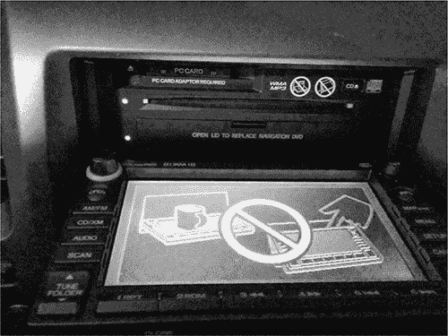

*图 9-1：NavTeq 信息娱乐单元处于打开状态*

这个 IVI 设备顶部有一个普通的 CD 盘托盘用于播放音乐，底部则有一个隐藏的塑料门，向下折叠后可显现出一个 DVD 盘托盘，用于放置地图软件。

#### *确定更新文件类型*

系统更新通常以压缩文件的形式发布，扩展名为 *.zip* 或 *.cab*，但有时它们会有非标准扩展名，如 *.bin* 或 *.dat*。如果更新文件具有 *.exe* 或 *.dll* 扩展名，那么你很可能在面对一个基于 Microsoft Windows 的系统。

要确定文件是如何压缩的及其目标架构，可以使用十六进制编辑器查看文件头，或者使用像*nix 系统中可用的`file`工具。`file`命令将报告文件的架构，比如 ARM 或者像图 9-1 中所示的本田思域 IVI 使用的 Hitachi SuperH SH-4 处理器。如果你想为设备编译新代码，或者计划编写或使用漏洞攻击它，这些信息非常有用。

如果`file`命令没有识别出文件类型，可能是你正在查看一个压缩的映像。要分析固件包，你可以使用像`binwalk`这样的工具，它是一个 Python 工具，通过使用签名来从收集的二进制文件中提取文件。例如，你可以直接在固件映像上运行`binwalk`，查看识别出的文件类型列表：

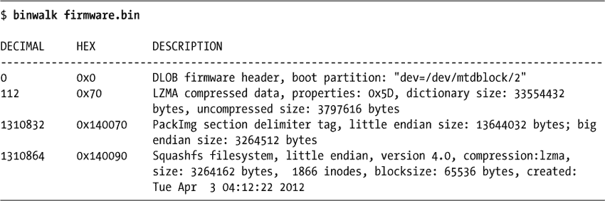

使用`-e`标志可以提取这些文件以进行进一步分析和审查。在这个例子中，你可以看到检测到了一个 SquashFS 文件系统。

这个文件系统可以使用 `-e` 标志提取，然后使用 `unsquashfs` 工具“解压”以查看文件系统，正如我在这里所做的那样：

```
$ binwalk -e firmware.bin
$ cd _firmware.bin.extracted
$ unsquashfs -f -d firmware.unsquashed 140090.squashfs
```

`binewalk -e` 命令将从 *firmware.bin* 中提取所有已知文件到文件夹 *_firmware.bin.extracted* 中。在该文件夹内，你会看到一些以其十六进制地址命名的文件，并且扩展名与检测到的文件类型相匹配。在这个示例中，*squashfs* 文件叫做 *140090.squashfs*，因为它位于 *firmware.bin* 中的这个位置。

#### *修改系统*

一旦你了解了系统的操作系统、架构和更新方式，接下来要做的就是看看是否能利用这些信息进行修改。有些更新是通过数字签名“保护”的，更新这些文件可能会比较棘手。但通常没有保护，或者更新过程会简单地使用 MD5 哈希检查。找出这些保护措施的最佳方法是修改现有的更新软件并触发一次更新。

系统修改的一个良好起点是一些能看到明显结果的内容，比如启动画面或图标，因为一旦你成功修改了它，你会立即看到效果（参见 图 9-2）。

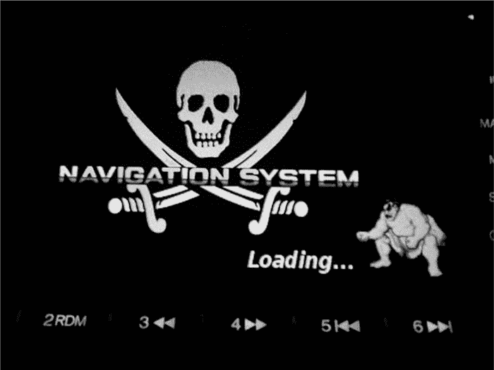

*图 9-2：示例修改：具有修改过启动画面的 NavTeq 单元*

图 9-2 显示了我如何通过将正常的背景图像替换为骷髅旗，并将车辆的徽标替换为《街头霸王》中的角色，来修改 IVI 系统的启动画面。更换启动画面中的图像是一种安全的方式，可以确保你在修改 IVI 系统时不会有太大的风险。

找到更新文件中的一个图像，修改它，然后重新刻录更新 DVD 并强制进行系统更新。（在 IVI 手册中查找如何操作。）如果更新文件被压缩成一个单一的归档文件，确保重新压缩修改后的版本，以便它与修改前的格式保持一致。

如果你遇到校验和问题并且更新失败，请查找更新包中的一个文件，这个文件可能是一个哈希值，比如包含像 *4cb1b61d0ef0ef683ddbed607c74f2bf* 这样的字符串的文本文件。你需要用你修改后的新图像的哈希值更新这个文件。你可能可以通过查看哈希值的大小并进行一些试探来猜测哈希算法。例如，8 个字符的哈希值，如 d579793f，可能是 CRC32；32 个字符的哈希值，如 c46c4c478a4b6c32934ef6559d25002f，可能是 MD5 哈希；40 个字符的哈希值，如 0aaedee31976f-350a9ef821d6e7571116e848180，可能是 SHA-1。 这些是最常见的三种哈希算法，但你可能会遇到其他的哈希算法，通过快速的谷歌搜索或者参考 *[`en.wikipedia.org/wiki/List_of_hash_functions`](https://en.wikipedia.org/wiki/List_of_hash_functions)* 中的表格，你应该能找到使用的算法线索。

Linux 工具`crc32`、`md5sum`和`sha1sum`可以让你快速计算现有文件的哈希值，并将其与原始文本文件的内容进行比较。如果你能生成与现有文件匹配的哈希值，那么你就找到了正确的算法。

例如，假设你在更新 DVD 上找到了一个名为*Validation.dat*的单独文件，列出了 DVD 上文件的内容，如清单 9-1 所示。该清单包含了 DVD 上三个文件的名称及其相关的哈希值。

```
09AVN.bin       b46489c11cc0cf01e2f987c0237263f9
PROG_INFO.MNG   629757e00950898e680a61df41eac192
UPDATE_APL.EXE  7e1321b3c8423b30c1cb077a2e3ac4f0
```

*清单 9-1：更新 DVD 中找到的* `Validation.dat` *文件示例*

每个文件列出的哈希值长度——32 个字符——表明这可能是一个 MD5 哈希值。为了确认，可以使用 Linux 的`md5sum`工具为每个文件生成 MD5 哈希值。清单 9-2 展示了*09AVN.bin*文件的哈希值。

```
$ md5sum 09AVN.bin
b46489c11cc0cf01e2f987c0237263f9 09AVN.bin
```

*清单 9-2：使用* `md5sum` *查看* 09AVN.bin *文件的哈希值*

比较清单 9-1 中*09AVN.bin*的哈希值与清单 9-2 中运行`md5sum`的结果，你会发现哈希值匹配；我们确实在查看一个 MD5 哈希值。这个结果告诉我们，要修改*09AVN.bin*，我们需要重新计算 MD5 哈希值，并更新包含所有哈希值的*Validation.dat*文件，使用新的哈希值。

确定创建哈希值所使用算法的另一种方法是，运行`strings`命令来查看更新包中的某些二进制文件或 DLL，查找文件中的字符串，如 MD5 或 SHA。如果哈希值很小，比如 d579793f，并且 CRC32 似乎无法使用，那么你很可能在处理自定义哈希值。

为了创建自定义哈希值，你需要理解用于创建该哈希值的算法，这需要使用反汇编器进行深入分析，例如 IDA Pro、Hopper 或免费的 radare2。例如，清单 9-3 展示了通过 radare2 查看的自定义 CRC 算法的示例输出：

```
|  .------> 0x00400733    488b9568fff. mov rdx, [rbp-0x98]
|- fcn.0040077c 107
|  ||| |    0x0040073a    488d855ffff. lea rax, [rbp-0xa1]
|  ||| |    0x00400741    4889d1       mov rcx, rdx
|  ||| |    0x00400744    ba01000000   mov edx, 0x1
|  ||| |    0x00400749    be01000000   mov esi, 0x1
|  ||| |    0x0040074e    4889c7       mov rdi, rax
|  ||| |    0x00400751    e8dafdffff   call sym.imp.fread
|  ||| |       sym.imp.fread()
|  ||| |    0x00400756    8b9560ffffff mov edx, [rbp-0xa0]
|  ||| |    0x0040075c    89d0         mov eax, edx ➊
|  ||| |    0x0040075e    c1e005       shl eax, 0x5 ➋
|  ||| |    0x00400761    01c2         add edx, eax ➌
|  ||| |    0x00400763    0fb6855ffff. movzx eax, byte [rbp-0xa1]
|  ||| |    0x0040076a    0fbec0       movsx eax, al
|  ||| |    0x0040076d    01d0         add eax, edx
|  ||| |    0x0040076f    898560ffffff mov [rbp-0xa0], eax
|  ||| |    0x00400775    838564fffff. add dword [rbp-0x9c], 0x1
|  ||       ; CODE (CALL) XREF from 0x00400731 (fcn.0040066c)
|  |`-----> 0x0040077c    8b8564ffffff mov eax, [rbp-0x9c]
|  | | |    0x00400782    4863d0       movsxd rdx, eax
|  | | |    0x00400785    488b45a0     mov rax, [rbp-0x60]
|  | | |    0x00400789    4839c2       cmp rdx, rax
|  `======< 0x0040078c    7ca5         jl 0x400733
```

*清单 9-3：在 radare2 中反汇编 CRC 校验和函数*

除非你擅长阅读低级汇编，否则这可能有些难度，但我们还是来看看。 清单 9-3 中的算法在➊处读取一个字节，将其乘以 5 后（➋），然后在➌处将其加到哈希值中，计算出最终的总和。剩余的汇编代码主要由`read`循环用于处理二进制文件。

#### *应用程序和插件*

无论你的目标是进行固件更新、创建自定义启动屏幕，还是实现其他利用，你会发现，通常通过攻击 IVI 应用程序，而不是 IVI 操作系统本身，你可以获得利用或修改车辆所需的信息。有些系统允许在 IVI 上安装第三方应用程序，通常是通过应用商店或经销商定制的界面。例如，你会注意到通常会有一种方式供开发人员为测试目的侧载应用程序。修改现有插件或创建自己的插件是执行代码、进一步解锁系统的好方法。因为关于*应用程序*如何与车辆接口的标准仍在编写中，每个制造商都可以自由实现自己的 API 和安全模型。这些 API 通常容易被滥用。

#### *识别漏洞*

一旦你找到了更新系统的方法——无论是修改启动屏幕、公司 logo、保修信息，还是其他项目——你就可以开始寻找系统中的漏洞了。你如何继续的选择将取决于你的最终目标。

如果你正在寻找信息娱乐单元中的现有漏洞，下一步就是从 IVI 中提取所有二进制文件以进行分析。（这方面的研究已经在几本关于逆向工程的书籍中有详细讨论，所以我在这里不再详细介绍。）检查系统中二进制文件和库的版本。通常，即使是在地图更新的情况下，核心操作系统也很少更新，而系统中很有可能已经存在已识别的漏洞。你甚至可能会发现针对该系统的现有 Metasploit 漏洞利用！

如果你的目标是，例如，创建一个恶意更新，窃听车辆的蓝牙驱动程序，那么在这个阶段你几乎拥有了实现目标所需的一切。你可能仍然需要的唯一东西是软件开发工具包（SDK），它用于编译目标系统。如果你能拿到一个 SDK，任务将变得更容易，尽管仍然可以使用十六进制编辑器创建或修改二进制文件。通常，信息娱乐操作系统是用标准 SDK 构建的，例如微软的 Auto Platform。

例如，考虑一个具有某些保护措施的导航系统，旨在防止客户在系统中使用 DVD-R。制造商的初衷是向车主收取 250 美元购买更新的地图 DVD，并且他们希望防止人们仅仅复制他人的 DVD。

为了防止这种类型的共享，制造商在导航系统中增加了几项 DVD 检查，如图 9-3 中的 IDA 显示示例代码所示。但假设作为消费者，你希望在系统中使用购买的 DVD 的备份副本，而不是原版，因为你的车在白天会变得非常热，你不想让 DVD 变形。

虽然普通消费者不太可能绕过这些 DVD 检查，但你可以找到 DVD 检查的位置，并将其替换为无操作指令（NOP），这样检查就不会执行任何操作。然后，你可以将这个修改版的 DVD 检查上传到你的 IVI，并使用备份 DVD 进行导航。

**注意**

*到目前为止提到的所有黑客操作都可以在不拆卸单元的情况下完成。然而，你可以通过将单元拆下并直接攻击芯片和内存，进一步深入，正如在第六章中所讨论的那样。*

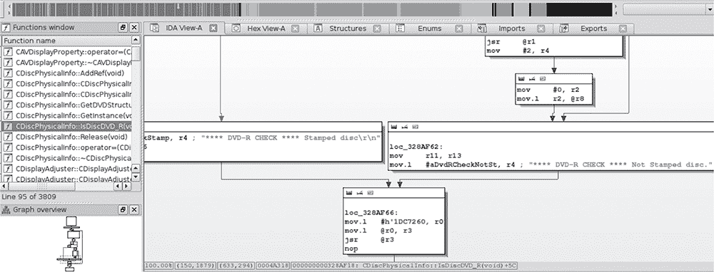

*图 9-3：DVD 检查的 IDA 视图*

### 攻击 IVI 硬件

如果你更擅长攻击硬件而非软件，并且能够从目标车辆中拆下 IVI，你也可以攻击 IVI 系统硬件。如果你无法访问 IVI 系统软件，硬件攻击可能会提供额外的线索，帮助你找到进入的方法。有时你会发现，当像前面提到的更新方法失败时，你可以通过攻击硬件来访问系统安全密钥。

#### *拆解 IVI 单元的连接*

如果你无法通过前一节讨论的更新方法访问车辆系统，你可以攻击 IVI 的接线和总线。你的第一步是拆下 IVI 单元，然后追踪电线，回到电路板上以识别其组件和连接，就像在图 9-4 中显示的那样。

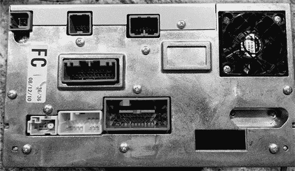

*图 9-4：双 DIN IVI 单元的连接器视图*

当你拆下 IVI 单元时，你会看到很多电线，因为与后装收音机不同，OEM 单元与车辆紧密连接。IVI 的背面金属面板通常兼作散热片，每个连接器通常按其功能分开。（一些车辆将蓝牙和蜂窝模块放在另一个模块中，因此，如果你正在研究无线漏洞而 IVI 单元没有这个无线模块，继续寻找远程信息处理模块。）

通过追踪实际电线或查看如图 9-5 所示的接线图，你可以看到蓝牙模块实际上是与导航单元（IVI）分开的。注意图中，蓝牙单元使用 CAN（B-CAN）连接在 18 号引脚。如果你查看导航单元的接线图，你会发现，与 CAN 不同，K-Line（3 号引脚）直接连接到 IVI 单元。（我们在第二章中讨论了这些协议。）

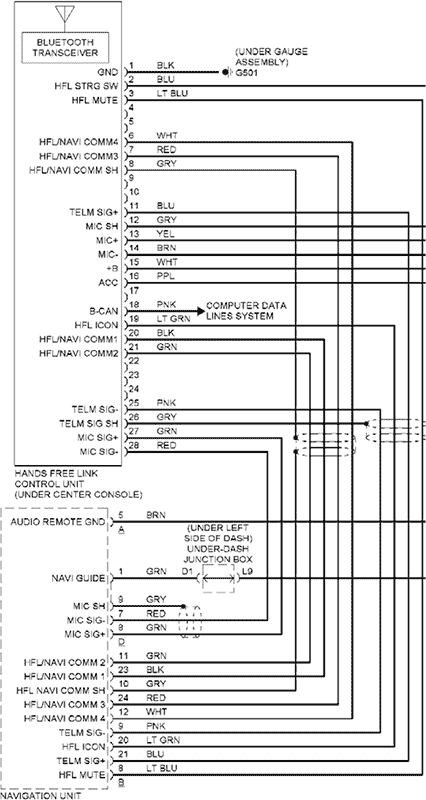

*图 9-5：免提接线图*

如果你能判断目标是否连接到网络总线上，你就能知道你的攻击可以控制多少内容。至少，直接连接到目标的总线可以被你放入目标系统的任何代码所影响。例如，在图 9-5 中展示的接线示例中，蓝牙模块的漏洞将使我们直接访问 CAN 总线；然而，如果我们利用 IVI 的导航系统，我们则需要改用 K 线（参见图 9-6）。你可以通过查看图 9-5 中的接线图来判断你可以访问哪个网络，并查看 K 线或 CAN 是否与目标设备连接。你所在的总线将影响你的有效载荷以及你能够直接影响的网络系统。

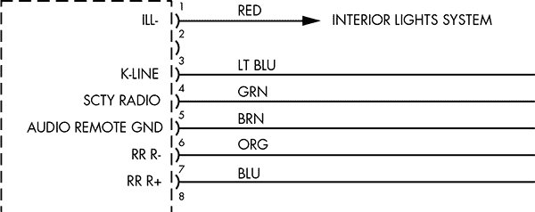

*图 9-6：导航单元接线图中指定的 K 线*

#### *拆解 IVI 单元*

如果你的目标是直接攻击系统硬件，或者如果你没有显示与娱乐单元连接的接线图，你需要开始拆解单元。由于 IVI 单元非常紧凑，并且将大量功能集成在一个小区域内，拆解它们意味着需要拆除许多螺丝和几层连接的电路板。拆解过程既耗时又复杂，应该作为最后的手段来执行。

要开始拆解，首先从拆卸外壳开始。每个单元的拆解方式不同，但通常你可以先移除前后面板的螺丝，然后从顶部向下拆卸。一旦进入内部，你很可能会看到像图 9-7 所示的电路板。

尽管电路板上的打印有些难以阅读，但你可能会发现许多引脚都有标注。特别注意那些附着在电路板上的但未连接的连接器，或者被散热片覆盖的连接器。你通常会发现一些在制造过程中使用的连接器被遗留下来，并且在电路板上处于断开状态。这些连接器可以为进入 IVI 单元提供很好的线索。例如，图 9-8 显示了一个隐藏的连接器，移除目标 IVI 的后面板后显现出来。

隐藏连接器是攻击设备固件的一个很好的起点。这些连接器通常具有加载和调试系统上运行的固件的方法，它们还可以提供串行风格的调试接口，让你能够查看系统正在发生的情况。特别是，你应该寻找 JTAG 和 UART 接口。

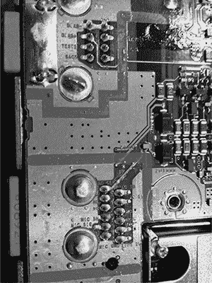

*图 9-7：许多引脚和连接器直接标注在 PCB 上。*

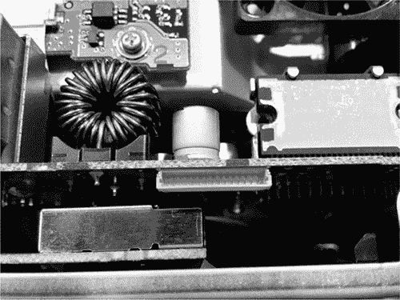

*图 9-8：未暴露的隐藏连接器*

在这个阶段，你应该开始追踪引脚并查看车载芯片的数据手册。通过一些侦查，找出这些引脚的连接位置后，你应该能更清楚自己面对的是什么，以及这个隐藏连接器的预期用途。（有关分析电路板和逆向工程硬件的更多内容，请参见第八章。）

### 信息娱乐测试平台

与其篡改自己原厂安装的娱乐单元并冒着损坏的风险，不如实验一个测试平台系统，无论是来自废品场还是一个开源开发平台。（后市场的收音机不是一个好选择，因为它们通常无法与 CAN 总线网络连接。）在本节中，我们将介绍两个可以在 PC 上的虚拟机中运行的开源娱乐系统，GENIVI 演示平台和 Automotive Grade，后者需要一个 IVI。

#### *GENIVI Meta-IVI*

GENIVI 联盟 (*[`www.genivi.org/`](http://www.genivi.org/)*) 是一个组织，其主要目标是推动开源 IVI 软件的采用。会员是付费的，但你可以免费下载并参与 GENIVI 软件项目。GENIVI 的会员资格，特别是董事会级别的会员资格，非常昂贵，但你可以加入邮件列表，参与一些开发和讨论。GENIVI 系统可以直接在 Linux 上运行，无需 IVI。它基本上是一个组件集合，你可以使用这些组件来构建自己的 IVI。

在图 9-9 中，GENIVI 系统的高层次框图展示了各个组件如何协调工作。

GENIVI 演示平台具有一些基本的人机交互（HMI）功能：FSA PoC 代表 *燃料停靠顾问概念验证*（概念验证是因为这些应用程序中的某些在生产中未被使用）。FSA 是导航系统的一部分，旨在提醒驾驶员在到达目的地之前是否会耗尽燃料。Web 浏览器和音频管理器 PoC 应该不言自明。图中没有显示的另一个组件是导航应用程序。该应用程序由开源的 Navit 项目 (*[`www.navit-project.org/`](http://www.navit-project.org/)*）提供支持，并使用一个插件来支持自由授权的 OpenStreetMap 地图软件 (*[`www.openstreetmap.org/`](https://www.openstreetmap.org/)*）。

GENIVI 的中间件组件构成了核心的 GENIVI 操作系统，这些组件将在此按图 9-9 中的出现顺序进行讨论（由于目前没有相关文档，持久化模块被排除在外）：

**诊断日志和追踪 (DLT)** 一个兼容 AUTOSAR 4.0 的日志和追踪模块。（Autosar 只是一个汽车标准组织；请参见 *[`www.autosar.org/`](https://www.autosar.org/)*。）DLT 的一些功能可以使用 TCP/IP、串行通信或标准 syslog。

**节点状态管理器 (NSM)** 跟踪车辆的运行状态，负责关机和监控系统健康状况。

**节点启动控制器 (NSC)** NSM 持久化的一部分。处理存储在硬盘或闪存中的所有数据。

**音频管理守护进程** 音频硬件/软件抽象层。

**音频管理插件** 音频管理守护进程的一部分。

**Webkit** 网页浏览器引擎。

**汽车消息代理 (AMB)** 允许应用程序访问来自 CAN 总线的车辆信息，而无需了解特定的 CAN 总线数据包布局。（你所连接的系统必须直接支持 OBD 或 AMB 才能使其工作。）

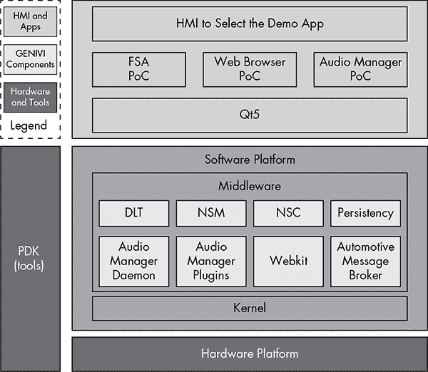

*图 9-9：GENIVI 软件布局*

##### 构建环境

在 Linux 上构建 GENIVI 系统最简单的方法是使用 Docker 镜像。首先，像这样获取 easy build：

```
$ git clone https://github.com/gmacario/easy-build
```

**注意**

*此 Docker 镜像不适用于 Ubuntu 在主目录中使用的 eCryptfs 文件系统，因此确保在默认主目录之外下载并按照这些说明操作。*

如果你还没有安装 Docker，你需要先安装它。在 Ubuntu 上，使用以下命令：

```
$ sudo apt-get install docker.io
```

然后，`cd`进入你在*Home*目录中的*easy-build/build-yocto-genivi*文件夹，并运行以下命令：

```
$ sudo docker pull gmacario/build-yocto-genivi
$ sudo ./run.sh
```

Docker 为你构建一个小型虚拟机，运行`run.sh`应该会将你置于 Docker 实例中的 root 终端环境。

现在，通过获取剩余的 GENIVI 构建并创建一个可以在 QEMU 虚拟机中使用的镜像来完成安装。运行以下命令：

```
# chmod a+w /dev/shm
# chown build.build ~build/shared
# su - build
$ export GENIVI=~/genivi-baseline
$ source $GENIVI/poky/oe-init-build-env ~/shared/my-genivi-build
$ export TOPDIR=$PWD
$ sh ~/configure_build.sh
$ cd $TOPDIR
$ bitbake -k intrepid-image
```

最终的`bitbake`命令输出应该类似于以下内容：

```
Build Configuration:
BB_VERSION        = "1.24.0"
BUILD_SYS         = "x86_64-linux"
NATIVELSBSTRING   = "Ubuntu-14.04"
TARGET_SYS        = "i586-poky-linux"
MACHINE           = "qemux86"
DISTRO            = "poky-ivi-systemd"
DISTRO_VERSION    = "7.0.2"
TUNE_FEATURES     = "m32 i586"
TARGET_FPU        = ""
meta
meta-yocto
meta-yocto-bsp    = "(detachedfromdf87cb2):df87cb27efeaea1455f20692f9f1397c6fcab254"
meta-ivi
meta-ivi-bsp      = "(detachedfrom7.0.2):54000a206e4df4d5a94db253d3cb8a9f79e4a0ae"
meta-oe           = "(detachedfrom9efaed9):9efaed99125b1c4324663d9a1b2d3319c74e7278"
```

截至目前，构建过程在获取 Bluez 包时会出现错误。

删除以下文件，并重新尝试运行`bitbake`：

```
$ rm /home/build/genivi-baseline/meta-ivi/meta-ivi/recipes-connectivity/bluez5/bluez5_%.bbappend
```

一旦完成所有步骤，你应该可以在*tmp/deploy/images/qemux86/*文件夹中找到镜像。

现在你已经准备好在模拟器中运行你的镜像了。对于 ARM 仿真，运行以下命令：

```
$ $GENIVI/meta-ivi/scripts/runqemu horizon-image vexpressa9
```

对于 x86，使用以下命令：

```
$ $GENIVI/poky/scripts/runqemu horizon-image qemux86
```

这是用于 x86-64 的命令：

```
$ $GENIVI/poky/scripts/runqemu horizon-image qemux86-x64
```

你现在应该准备好研究基于 GENIVI 的 IVI 系统。如你所见，这些步骤可能有点让人望而却步。工作在 GENIVI 上最困难的部分是让它启动并运行。一旦你有了可以查看的系统，就可以选择任何可执行文件开始进行安全审计。

#### *汽车级 Linux*

*汽车级 Linux (AGL)* 是一个你可以在物理 IVI 设备上运行的 IVI 系统。与 GENIVI 不同，AGL 没有昂贵的硬件结构。AGL 的目标与 GENIVI 相似：它试图构建一个开源的 IVI 单元以及其他相关部分，如车载信息和仪表盘。

截至本文编写时，你应该能够在 AGL 网站上找到 VMware 的演示图像（最后发布于 2013 年），安装说明和适用于 x86 的可启动 USB 版本（*[`automotivelinux.org/`](http://automotivelinux.org/)*）。这些镜像设计用于在车载计算机硬件上运行，比如 Nexcom VTC-1000，这是一款无头 Linux 设备，配有 CAN 和触摸屏。与 GENIVI 项目不同，AGL 演示图像主要设计和测试用于在硬件上运行，尽管也可能可以在虚拟机中运行某些开发镜像。

正如你在图 9-10 中看到的，AGL 演示图像有一个非常漂亮的界面，但不要指望所有应用程序都能顺利运行，因为许多应用程序只是占位符，仍在积极开发中。由于 AGL 通常是在物理硬件上进行测试的，你需要花费大约 $1,000 来购买所需的硬件，以便顺利安装 AGL。也可以将图像运行在 QEMU 虚拟机上。（购买开发 IVI 系统的一个好处是，你可以编程使其与任何车辆兼容。）

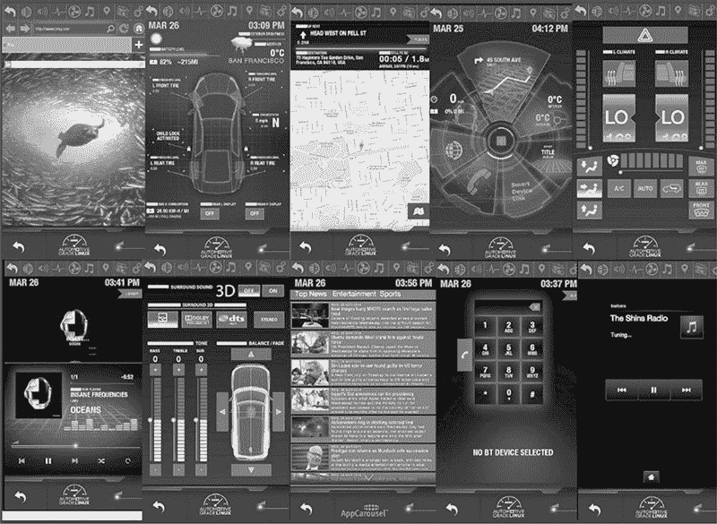

*图 9-10：汽车级 Linux 示例屏幕*

### 获取 OEM IVI 进行测试

如果你决定运行一个物理 IVI 单元进行测试，你需要从现有车辆中拆下一个工厂（OEM）IVI 系统，或者购买一个开发 IVI，例如 Nexcom VTC-1000 或类似于 Tizen 硬件兼容性列表中提到的型号（*[`wiki.tizen.org/wiki/IVI/IVI_Platforms`](https://wiki.tizen.org/wiki/IVI/IVI_Platforms)*）。

如果你选择走 OEM 工厂安装的路线，可以从经销商处购买一个，或者从废品场拉一个。直接从经销商处购买的开发和 OEM IVI 单元通常价格在 $800 到 $2,000 之间，因此从废品场拉一个会更具成本效益，尽管可能很难找到你目标的高端 IVI 系统。你还可以购买非 OEM 的市场后设备，如 Kenwood 或 Pioneer，这些设备虽然通常更便宜，但通常不会与车辆的 CAN 系统兼容。

不幸的是，从现代车辆中拆下收音机并不容易。你通常需要先拆掉仪表盘周围的塑料和收音机周围的塑料，才能将收音机从连接器中拆下。如果遇到收音机的防盗安全码，检查车主手册，看看是否能找到代码。如果找不到代码，记得记录下捐赠车辆的 VIN 码，因为你可能需要它来获取或重置防盗 PIN 码。（如果你从车辆中提取了 ECU，记住你也可以查询 ECU 来获得 VIN 码。）

你需要参考 IVI 系统的接线图，以便让它能够自行启动，但你可以忽略掉大部分不需要测试的电线。如果你正在构建基于 OEM 的单元，完全拆解该单元并连接任何测试接头可能是值得的，这样你不仅能让正常的 IVI 系统运行，还能够访问任何隐藏的连接器。

### 总结

现在，你应该已经能够分析现有的无线电系统了。我们已经讨论了如何在虚拟机或测试环境中安全地工作，以发现 IVI 系统中的漏洞。这些系统包含大量代码，是车辆中最强大的电子系统。掌握 IVI 单元将让你完全控制目标，而没有任何部分比 IVI 系统更集中于攻击面。在进行安全研究时，IVI 和远程信息处理系统将为你提供最有价值的漏洞，你会发现这些系统中的漏洞往往是远程的或无线的，并且直接连接到车辆的总线系统。
