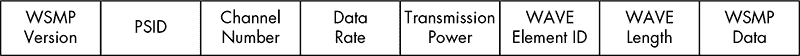
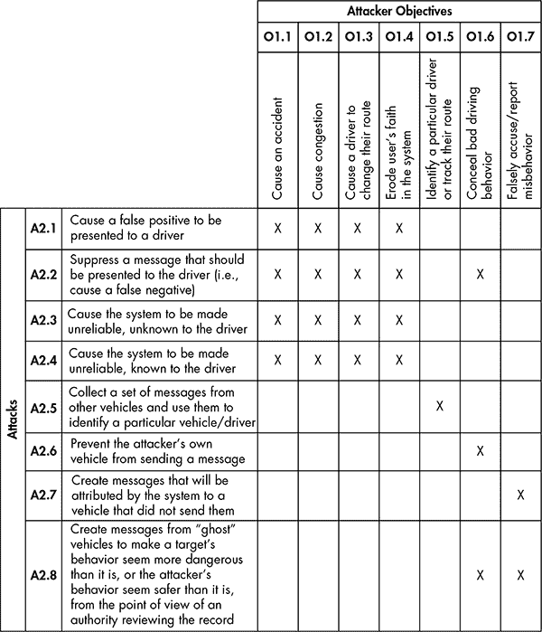
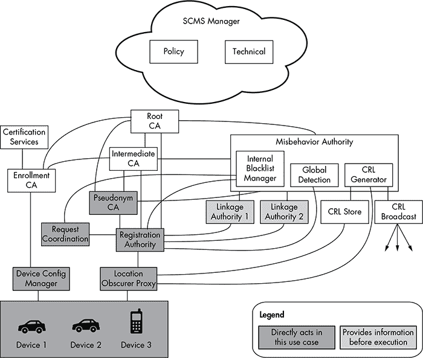

## **10**

**车辆对车辆通信**

汽车技术的最新趋势是*车对车（V2V）通信*——或者在车辆与路侧设备通信的情况下，*车对基础设施（V2I）通信*。V2V 通信主要用于通过车辆与路侧设备之间的动态网状网络——即*智能交通系统*，向车辆传递安全和交通警告信息。这个网状网络连接了网络中的各个节点——车辆或设备，并在它们之间传递信息。

V2V 的前景非常广阔，以至于 2014 年 2 月，美国交通部宣布希望实施一项要求所有新型轻型车辆都必须配备基于 V2V 通信的规定，尽管截至目前，相关计划尚未最终确定。

V2V 是首个在设计阶段就考虑到网络安全威胁的汽车协议，而不是事后再进行考虑。V2V 的实施细节以及不同国家之间的互操作性仍在确定之中，因此许多流程和安全措施仍未决定。尽管如此，本章将回顾当前的设计考虑，旨在提供对未来可能会遇到的情况的指导。我们将详细阐述不同方法背后的思考，并讨论在 V2V 领域中可能部署的技术类型。我们还将讨论 V2V 通信中使用的几种协议及其传输的数据类型，并回顾 V2V 的安全考虑，以及安全研究人员应关注的领域。

**注意**

*由于本章聚焦于尚未实施的技术，我们不会讨论各种特性的背后原因，也不会讨论制造商如何实施每一项特性，因为所有这些细节都可能会发生变化。*

### **V2V 通信方法**

在 V2V 通信的世界里，车辆与路侧设备的互动方式有三种：通过现有的蜂窝网络；使用*专用短程通信（DSRC）*，这是一种短程通信协议；或者通过通信方式的组合。在本章中，我们将重点讨论 DSRC，因为它是最常见的 V2V 通信方式。

**蜂窝网络**

蜂窝通信不需要路侧传感器，现有的蜂窝网络已经具备安全系统，因此通信可以依赖于蜂窝运营商提供的安全方法。蜂窝网络提供的安全性是在无线层面（GSM），而不是协议层面。如果连接的设备使用的是 IP 流量，那么仍然需要应用标准的 IP 安全措施，如加密和减少攻击面。

**DSRC**

DSRC 需要在现代车辆和新的路侧设备中安装专用设备。由于 DSRC 是专门为 V2V 通信设计的，因此可以在广泛应用之前实施安全措施。DSRC 还比蜂窝通信更可靠，延迟更低。（更多关于 DSRC 的信息，请参见“DSRC 协议”在第 179 页）

**混合**

混合方法将蜂窝网络与 DSRC、Wi-Fi、卫星和其他任何合理的通信方式结合起来，例如未来的无线通信协议。

本章我们将重点讨论 DSRC，因为它是 V2V 基础设施特有的。DSRC 协议将是 V2V 部署的主要协议，你可能会看到它与其他通信方式混合使用。

**注意**

*你可以使用传统的方法来分析通信，例如蜂窝、Wi-Fi、卫星等。这些信号的通信证据不一定意味着车辆正在使用 V2V 通信。然而，如果你看到 DSRC 正在传输，你就知道该车辆已实现 V2V。*

**V2V 缩略语的乐趣**

汽车行业像任何政府一样喜爱缩略语，V2V 也不例外。事实上，不同国家之间缺乏统一的 V2V 标准，意味着 V2V 缩略语的世界可能会特别混乱，因为一致性不足，并且有不少困惑。为了帮助你，以下是一些你在研究 V2V 相关主题时可能遇到的缩略语：

**ASD** 后市场安全设备

**DSRC** 专用短程通信

**OBE** 车载设备

**RSE** 路侧设备

**SCMS** 安全凭证管理系统

**V2I, C2I** 车对基础设施，或车对基础设施（欧洲）

**V2V, C2C** 车对车，或车对车（欧洲）

**V2X, C2X** 车对任何设备，或车对任何设备（欧洲）

**VAD** 车辆感知设备

**VII, ITS** 车辆基础设施集成，智能交通系统

**WAVE** 车辆环境无线接入

**WSMP** WAVE 短消息协议

### **DSRC 协议**

DRSC 是专门为车辆与车辆之间或车辆与路侧设备之间的无线通信建立的一种一或双向短程无线通信系统。

DSRC 在 5.85 到 5.925 GHz 的频段内运行，该频段专门用于 V2V 和 V2I 通信。DSRC 设备的发射功率将决定其范围。路侧设备可以在更高功率范围内发射，允许最高达到 1,000 米的规格，而车辆则只能以提供大约 300 米范围的功率水平进行广播。

DSRC 基于无线 802.11p 和 1609.x 协议。基于 DSRC 和 Wi-Fi 的系统，如车辆环境无线接入（WAVE），使用 IEEE 1609.3 规范或 WAVE 短消息协议（WSMP）。这些消息是单一数据包，大小不超过 1500 字节，通常小于 500 字节。（网络嗅探工具如 Wireshark 可以解码 WAVE 数据包，方便进行流量嗅探。）

DSRC 数据速率取决于同时访问本地系统的用户数量。在单个用户情况下，通常数据速率为 6 到 12 Mbps，而在高流量区域——例如，八车道高速公路——用户的速率可能只有 100 到 500 Kbps。一个典型的 DSRC 系统在高流量条件下可支持接近 100 个用户，但如果车辆的行驶速度为 60 km/h（或 37 mph），则通常仅能支持约 32 个用户。（这些数据速率是根据交通部的报告《为联网车辆分析通信数据交付系统》估算的。^(1))

DSRC 系统专用的 5.9 GHz 频段通道数量因国家而异。例如，美国系统设计支持七个通道，其中一个通道作为专用控制通道，用于发送短小的高优先级管理数据包。欧洲设计支持三个通道，没有专用控制通道。这种差异主要源于各国推动该技术的驱动因素不同：欧洲的系统是由市场驱动，而美国的系统则有强大的车辆安全倡议支撑。因此，尽管这些协议可以互操作，但支持和发送的消息类型会显著不同。（在日本，DSRC 目前用于收费收取，但日本也计划使用 760 MHz 频段来进行碰撞避免。日本的 5.8 GHz 通道不使用 802.11p，但它们仍应支持 1609.2 V2V 安全框架。）

**注意**

*虽然欧洲和美国都使用 802.11p 和 ECDSA-256 加密，但这两个系统并不完全兼容。截止目前，它们在技术上存在各种差异，例如签名栈在数据包中的位置。没有足够的技术原因解释这种标准化缺失，希望在广泛应用之前能够修正此问题。*

#### ***功能和应用***

所有 DSRC 实现都提供便利和安全特性，但其功能有所不同。例如，欧洲的 DSRC 系统将使用 DSRC 进行以下操作：

**共享汽车** 将像今天的车辆共享服务（例如 car2go）一样运作，区别在于，它不再通过第三方车辆钥匙设备连接到 OBD-II 接口来控制车辆，而是使用 V2I 协议。

**连接兴趣点** 类似于传统导航系统中的兴趣点，如餐馆或加油站，但将通过广播发送给经过的车辆。

**诊断与维护** 将通过 DSRC 报告车辆发动机灯亮起的原因，而不需要通过 OBD 连接器读取代码

**保险用途的驾驶行为档案** 将取代记录驾驶行为的保险式车载设备

**电子收费通知** 将允许在收费站进行自动支付（目前已在日本进行测试）

**车队管理** 将允许监控车队车辆，如用于货运和运输服务的车辆

**停车信息** 将记录停车时长，并可能取代传统的停车计时器

像美国这样以安全为主的区域，更关注于传递关于以下事项的警告：

**紧急车辆接近** 将通知车辆即将有紧急车辆接近

**危险位置** 将警告驾驶员有危险，例如结冰的桥面或路面，或落石等

**摩托车接近** 将提示有摩托车经过

**道路施工** 将通知驾驶员即将进行的施工

**慢速车辆** 将提前通知由于缓慢行驶的农用车或超大车辆导致的交通拥堵或交通减速

**静止（碰撞）车辆** 将警告已发生故障或最近发生碰撞的车辆

**被盗车辆恢复** 可能类似于 LoJack 服务，它通过无线电信标帮助执法部门定位被盗车辆

通过 DSRC 实现的额外通信类别包括交通管理；执法，如通信车速或追踪车辆；驾驶员辅助，如停车辅助或车道引导；以及高速公路自动化项目，如使用 V2I 道路帮助导航的自动驾驶车辆。

#### ***路边 DSRC 系统***

路边 DSRC 系统还用于向车辆传递标准化信息和更新，内容包括交通数据、危险或道路施工警告。欧洲电信标准化协会（ETSI）设计了两种连续交通数据格式，两者均使用 802.11p 协议：合作意识消息（CAM）和去中心化环境通知消息（DENM）。

##### **用于定期车辆状态交换的 CAM**

CAM 数据包通过 V2X 网络定期广播。ETSI 定义了 CAM 的数据包大小为 800 字节，报告速率为 2 赫兹。该协议仍处于初步阶段。如果你将来遇到 CAM，它们可能会与目前的提案有所不同，但我们会包括当前提议的特征，以便你了解未来 CAM 协议的预期。

CAM 数据包包含 ITS PDU 头部和站点 ID，以及一个或多个站点特征和车辆通用参数。

站点特征可能包括以下内容：

• 移动 ITS 站

• 物理相关 ITS 站

• 私人 ITS 站

• 配置参数

• 参考位置

车辆常见参数可能包括以下内容：

• 加速

• 加速置信度

• 加速可控性

• 置信椭圆

• 碰撞状态（可选）

• 曲率

• 曲率变化（可选）

• 曲率置信度

• 危险品（可选）

• 停车线距离（可选）

• 门打开（可选）

• 外部灯光

• 标题置信度

• 占用情况（可选）

• 站点长度

• 站点长度置信度（可选）

• 站点宽度

• 站点宽度置信度（可选）

• 转换建议（可选）

• 车辆速度

• 车辆速度置信度

• 车辆类型

• 偏航率

• 偏航率置信度

尽管一些参数标记为可选，但实际上在某些情况下是强制性的。例如，基本的车辆信息——二进制站点 ID 为 111——必须报告碰撞状态以及车辆是否携带危险品（如果已知）。紧急车辆——二进制站点 ID 为 101——必须报告其警灯和警笛是否启用。公共交通车辆——站点 ID 同样为 101——需要报告其进出门是否开启，也可以报告调度偏差和载客人数。

##### **用于事件触发安全通知的 DENM**

DENM 是事件驱动的消息。与 CAM 按周期发送并定期更新不同，DENM 由安全和道路危害警告触发。以下情况可能会发送消息：

• 碰撞风险（由路侧设备确定）

• 进入危险区域

• 急刹车

• 强风

• 能见度差

• 降水

• 路面附着力

• 路面施工

• 信号违规

• 交通拥堵

• 事故中涉及的车辆

• 逆行驾驶

这些消息会在触发它们的条件消失或过了设定的过期时间后停止。

DENM 还可以发送取消或否定事件的消息。例如，如果路侧设备检测到一辆车逆行，可能会发送事件通知附近的驾驶员。一旦驾驶员将车辆驶入正确车道，设备可以发送取消事件，表示风险已消除。

表 10-1 显示了 DENM 数据包的包结构和字节位置。

**表 10-1：** DENM 数据包的包结构和字节位置

| **容器** | **名称** | **字节起始位置** | **字节结束位置** | **备注** |
| --- | --- | --- | --- | --- |
| **ITS 头部** | 协议版本 | 1 | 1 | ITS 版本 |
|  | 消息 ID | 2 | 2 | 消息类型 |
|  | 生成时间 | 3 | 8 | 时间戳 |
|  **管理**  | 发起者 ID | 9 | 12 | ITS 站点 ID |
|  | 序列号 | 13 | 14 |  |
|  | 数据版本 | 15 | 15 | 255 = 取消 |
|  | 过期时间 | 16 | 21 | 时间戳 |
|  | 频率 | 21 | 21 | 传输频率 |
|  | 可靠性 | 22 | 22 | 事件为真的概率。位 1..7 |
|  | 是否为否定 | 22 | 22 | 1 == 否定。位 0 |
| **情况** | 原因代码 | 23 | 23 |  |
|  | 子原因代码 | 24 | 24 |  |
|  | 严重性 | 25 | 25 |  |
| **位置** | 纬度 | 26 | 29 |  |
|  | 经度 | 30 | 33 |  |
|  | 高度 | 34 | 35 |  |
|  | 精度 | 36 | 39 |  |
|  | 保留 | 40 | *n* | 可变大小 |

还有可选消息。例如，情境容器可能包括 `TrafficFlowEffect`、`LinkedCause`、`EventCharacteristics`、`VehicleCommonParameters` 和 `ProfileParameters`，就像 CAN 结构一样。

#### ***WAVE 标准***

WAVE 标准是基于 DSRC 的系统，在美国用于车辆数据包通信。WAVE 标准包含了 802.11p 标准以及涵盖 OSI 模型的 1609.x 标准。以下是这些标准的目的：

**802.11p** 定义了 5.9 GHz WAVE 协议（Wi-Fi 标准的修改版）；还具有随机本地 MAC 地址

**1609.2** 安全服务

**1609.3** UDP/TCP IPv6 和 LLC 支持

**1609.4** 定义了通道使用

**1609.5** 通信管理器

**1609.11** 无线电子支付和数据交换协议

**1609.12** WAVE 标识符

**注意**

*要更详细地探索 WAVE 标准，可以使用前面列表中的 OSI 编号来在线查阅相关参考文档。*

WSMP 用于服务和控制通道。WAVE 仅在服务通道上使用最新的 Internet 协议 IPv6。IPv6 由 WAVE 管理实体（WME）配置，并处理通道分配及监控服务公告。（WME 是 WAVE 独有的，负责协议的开销和维护。）控制通道用于服务公告和来自安全应用的短消息。

WSMP 消息的格式如 图 10-1 所示。

*图 10-1：WSMP 消息格式*

路边设备或由车辆托管的应用程序类型由提供者服务标识符（PSID）定义。服务的实际公告来自 WAVE 服务公告（WSA）数据包，其结构如 表 10-2 所示。

**表 10-2：** WAVE 服务公告数据包

| **部分** | **元素** |
| --- | --- |
| **WSA 头** | WAVE 版本 EXT 字段 |

| **服务信息** | WAVE 元素 ID PSID

服务优先级

通道索引

EXT 字段 |

| **通道信息** | WAVE 元素操作通道

通道编号

可适应

数据速率

发射功率

EXT. 字段 |

| **WAVE 路由广告** | WAVE 元素路由器生命周期

IP 前缀

前缀长度

默认网关

网关 MAC

主 DNS

EXT. 字段 |

如果车辆的 PSID 与广告的 PSID 匹配，车辆将开始通信。

#### ***使用 DSRC 跟踪车辆***

一种利用 DSRC 通信的攻击方式是车辆追踪。如果攻击者可以通过购买支持 DSRC 的设备或使用软件定义无线电（SDR）创建自己的 DSRC 接收器，他们就能够接收接收器范围内的车辆信息，例如车辆的尺寸、位置、速度、方向以及过去 300 米内的历史路径，并利用这些信息追踪目标车辆。例如，如果攻击者知道目标车辆的品牌和型号及其尺寸，他们可以在目标车辆的家附近设置接收器，远程探测目标车辆何时超出 DSRC 接收器的范围。这将告诉攻击者目标车主何时离开家。这种方法使得攻击者能够在车主试图遮掩身份信息时，仍然追踪并识别车辆活动。

车辆尺寸信息通过以下四个字段进行传输：

• 长度

• 车身宽度

• 车身高度

• 保险杠高度（可选）

这些信息应该精确到英寸的几分之一，因为它是由制造商设定的。攻击者可以利用这些尺寸信息准确地确定一辆车的品牌和型号。例如，表 10-3 列出了本田雅阁的尺寸。

**表 10-3：** 本田雅阁的尺寸

| **长度** | **车身宽度** | **车身高度** | **保险杠高度** |
| --- | --- | --- | --- |
| 191.4 英寸 | 72.8 英寸 | 57.5 英寸 | 5.8 英寸 |

根据这些尺寸以及其他一些信息，例如目标通过传感器的估计时间，攻击者可以确定目标是否经过传感器，并追踪该目标。

### **安全隐患**

在 V2V 实施中还有其他攻击潜力，正如碰撞避免度量伙伴关系（CAMP）所调查的那样，CAMP 是一个由多家汽车制造商组成的小组，旨在进行不同的安全相关研究。2010 年 12 月，CAMP 通过其车辆安全联盟（VSC3）对 V2V 系统进行了攻击分析。分析主要集中在核心的 DSRC/WAVE 协议，并尝试将攻击者的目标与潜在攻击匹配。图 10-2 展示了该联盟根据攻击者目标总结的研究结果。

*图 10-2：攻击者目标与攻击方式的交叉*

这张表格展示了恶意行为者在攻击 V2V 系统时可能的目标，以及他们可能发动的攻击类型，以实现这些目标。图表的顶部列出了攻击者可能的目标和他们可能关注的领域。图表相对简单，但可以让你对需要进一步研究的领域有一些了解。

### **基于 PKI 的安全措施**

虽然 V2V 背后的许多技术和安全措施仍在完善中，但我们知道，蜂窝通信、DSRC 和混合通信的安全性基于与网站上 SSL 模型类似的公钥基础设施（PKI）模型。通过生成公钥和私钥对，PKI 系统允许用户创建数字签名，用于加密和解密通过网络发送的文档。公钥可以公开交换，并用于加密目的地之间的数据。一旦加密，只有私钥才能解密数据。数据使用发送方的私钥进行签名，以验证其来源。

PKI 使用公钥加密和中央证书颁发机构（CAs）来验证公钥。CA 是一个受信任的来源，可以为给定的目的地颁发和吊销公钥。V2V PKI 系统有时也被称为*安全凭证管理系统（SCMS）*。

为了使 PKI 系统能够正常运行，它必须强制执行以下规则：

**问责** 身份应通过受信任的签名进行验证。

**完整性** 签名数据必须可验证，以确保其在传输过程中没有被篡改。

**不可否认性** 交易必须被签名。

**隐私** 交通必须加密。

**信任** CA 必须是受信任的。

V2V 和 V2I 系统依赖于 PKI 和 CA 来确保数据传输的安全，尽管 CA 的身份尚未确定。这与您的浏览器在互联网中使用的系统相同。在浏览器的设置屏幕中，您应能找到一个 HTTPS/SSL 部分，列出所有授权的根证书颁发机构。当您从这些 CAs 中购买证书并在 Web 服务器上使用时，其他浏览器将验证此证书与 CA 的匹配，以确保它是受信任的。在普通的 PKI 系统中，设置环境的公司控制 CA，但在 V2V 中，政府组织或国家可能会控制 CA。

#### ***车辆证书***

用于确保当前互联网通信安全的 PKI 系统具有较大的证书文件，但由于存储空间有限且需要避免 DSRC 信道的拥堵，车辆 PKI 系统要求使用更短的密钥。为了满足这一需求，车辆 PKI 系统使用椭圆曲线加密（ECDSA-256）密钥，这些密钥生成的证书仅为互联网证书大小的八分之一。

参与 V2V 通信的车辆使用两种类型的证书：

**长期证书（LTC）**

该证书包含车辆标识符，并且可以被吊销。它用于获取短期证书的续期。

**短期伪名证书（PC）**

该证书具有较短的有效期，因此不需要被吊销，因为它会自动过期。它用于匿名传输，适用于常见的消息，如刹车或道路状况。

#### ***匿名证书***

公钥基础设施（PKI）系统通常用于识别发送方，但由于信息是广播给未知车辆和设备的，因此确保 V2V 系统不发送可追溯的信息（例如，带有源端签名的数据包）变得非常重要。

因此，V2V 规范中有一项规定，允许您匿名签名数据包，仅提供足够的信息以表明数据包来自“认证终端”。尽管这比发送由作者签名的数据包更为安全，但仍然有可能有人检查给定路线上的匿名证书签名，并确定车辆所行驶的路线（就像您可能使用从轮胎压力监测器传感器发送的唯一 ID 来追踪车辆的行驶进度一样）。为此，规范指出，设备应使用短期证书，这些证书的有效期仅为五分钟。

然而，目前正在开发的系统计划使用 20 个或更多同时有效、有效期为一周的证书，这可能会成为安全漏洞。

#### ***证书配置***

证书是通过一种名为证书配置的过程生成的。车对车（V2V）系统使用大量的短期证书，这些证书需要定期配置，以便为设备补充证书，以便其能够用于匿名消息传递。V2V 证书系统中隐私如何运作的详细内容实际上相当复杂，如图 10-3 中的 CAMP 图所示。

在我们回顾证书配置过程如何工作时，准备好迎接大量与幼虫相关的术语——如毛虫、蛹和蝴蝶——的引用：

1.  首先，设备——即车辆——生成一个被称为“毛虫”密钥对，它将公钥和高级加密标准（AES）扩展编号发送到注册授权机构（RA）。

1.  注册授权机构（RA）从毛虫公钥以及扩展编号生成一堆被称为“蛹”的公钥。这些公钥将成为新的私钥。密钥的数量是任意的，与请求密钥的设备无关。（截至本文撰写时，请求中包含来自链接授权机构的一些 ID 信息，并*应当*将请求与其他车辆的请求进行混合。这种混合旨在帮助隐藏每个请求来自哪辆车，从而提升隐私性。）

1.  假名证书授权机构（PCA）对蛹密钥进行随机化，并生成“蝴蝶”密钥。然后，这些密钥通过加密通道返回到原始设备，确保注册授权机构（RA）无法看到内容。

*图 10-3：证书配置流程图*

理论上，发起设备可以请求足够多的短期密钥来支持车辆的整个生命周期，这也是证书撤销列表（CRL）非常重要的原因。如果车辆持有一个月的证书，它将在一个月内不会检查新更新，因此恶意行为者可以继续与这辆车通信，直到更新为止。如果车辆持有一年的证书或更多，并且没有 CRL 功能，那么情况可能会变得非常糟糕，因为它将无法识别恶意行为者。

**注意**

*请注意证书配置图中的位置隐匿代理（LOP）。这是一个过滤器，用于从请求中移除可识别的信息，如位置。在请求*应该*经过 LOP 过滤后，再由 RA 查看。*

#### ***更新证书撤销列表***

CRL 是一个“坏”证书的列表。证书有时会失效，可能是因为它们被攻击者破坏，或者被所有者丢失，或者因为设备的行为不当，导致 CA 认为其有害。设备必须更新其 CRL，以便能够确定哪些证书（如果有的话）不再可信。

CRL 可能很大，并且通过 DSRC 或机会性 Wi-Fi 下载整个列表并不总是可行的。因此，大多数系统会实施增量更新周期，这一周期由制造商决定，但即使这样也可能会引发问题。DSRC 要求路边设备发送列表，但为了接收大块数据，车辆必须足够慢地通过路边设备，以便有足够时间接收 CRL。由于大多数设备将设置在主要高速公路上，只有少数设置在支路上，因此车辆接收更新列表的唯一机会可能是在交通堵塞时。因此，获取更新后的 CRL 的最佳方式是通过蜂窝或全卫星通信，尽管这仍然较慢。通过高速蜂窝或全卫星链路，如果需要，车辆将能够接收增量更新或完整下载。

一种分发更新后的证书撤销列表（CRL）的方法是让车辆通过 V2V 接口相互传递更新。尽管车辆可能无法与路边设备保持足够长的时间以完成更新，但它肯定会在行驶过程中遇到成百上千的其他车辆。

##### **V2V 更新的风险**

虽然通过 V2V 接口进行更新非常诱人，因为它显著降低了基础设施成本和开销（因为你无需投资大量额外的路侧基础设施），但它也有其局限性。首先，车辆可能只能从周围朝同一方向行驶的汽车那里接收 CRL 下载，只有在这些车辆长时间相邻时才能完成下载；而朝相反方向行驶的车辆可能会太快通过。此 V2V 方法还为恶意行为者提供了注入恶意 CRL 的机会，这可能会阻止合法设备或隐藏不良行为者，而该恶意 CRL 可能会像病毒一样在交通中传播。

不幸的是，V2V 协议安全性完全侧重于通信协议。车载系统，如 ECU，负责请求和存储 CRL、报告不当行为以及发送车辆信息，但这个不安全的系统为攻击者提供了一个容易的入口，能够注入他们的代码。攻击者不仅可以接管执行实际 V2V 通信的设备，还可以简单地修改 ECU 固件或在总线上伪造数据包，V2V 设备然后会忠实地签名并将信息发送到网络。正因为这个后者的漏洞，这种方法被非正式地称为*疫情传播模型*。

##### **关联机构**

在处理数千个伪名或短期证书时，吊销可能是噩梦，这就是关联机构（LA）发挥作用的地方。LA 可以通过一条 CRL 记录撤销来自一辆车的所有生成证书。这样，即使恶意行为者在被识别并封锁之前收集了大量证书，LA 仍然可以将其关闭。

**注意**

*大多数 V2V 系统都被设计为支持一个与 CRL 独立的内部黑名单。制造商或设备可以将任何设备列入黑名单。*

#### ***不当行为报告***

V2V 和 V2I 系统正被设计为允许发送不当行为报告，从标准的车辆故障到黑客干扰系统的通知。这些不当行为报告应该触发证书的吊销。但是，车辆如何知道自己是否收到了被篡改的数据包呢？这个答案因汽车行业而异，但总体概念是 ECU 或其他设备会接收数据包并检查它是否“合理”。例如，接收设备可能会将信息与 GPS 信号进行验证，或识别出报告中车辆以不合常理的速度行驶，比如 500 英里每小时。当发现错误时，车辆应该发送不当行为报告，最终导致该证书的吊销。一个不当行为管理机构（MA）将负责识别并吊销不当行为设备的证书。

一个有趣的场景是，考虑到某个车辆的 CRL 更新间隔较低，或者该车辆长时间未接近路边设备，导致其持有过时的吊销列表。这样的车辆可能会在不知情的情况下转发错误信息，从而被报告为恶意行为者，并可能导致其证书被吊销。那么，接下来会发生什么呢？车辆何时能够重新获得信任？

在进行安全测试时，请确保将这些可能的场景纳入你的研究范围。

### **摘要**

本章讨论了 V2V 通信的计划。V2V 设备仍在开发中，许多部署决策仍需做出。在这项技术逐步推广的过程中，不同的供应商会以不同的方式解读规则，这可能会导致有趣的安全漏洞。希望随着这些早期设备逐渐进入市场，本章能成为执行安全审计的有用指南。
