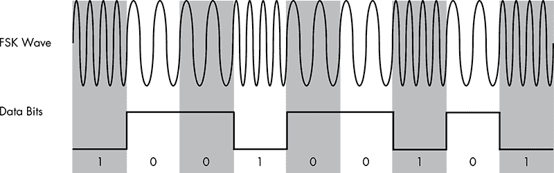
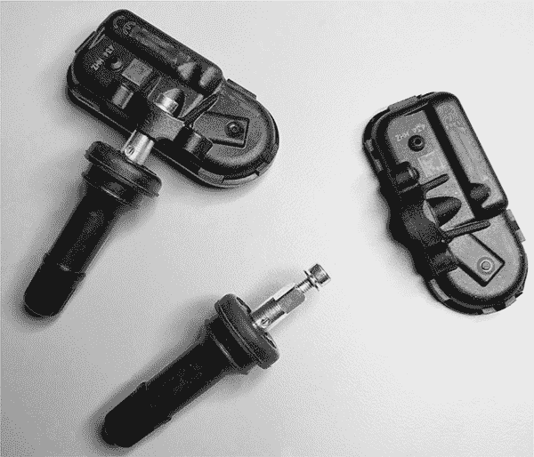
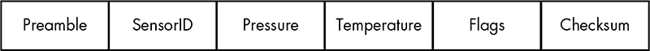
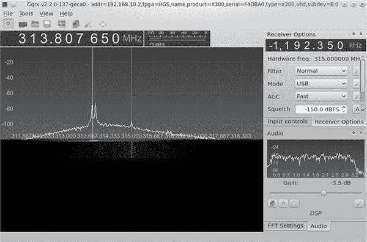
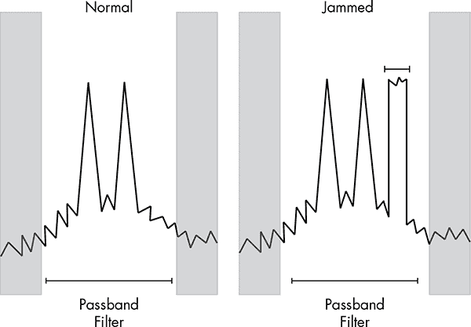
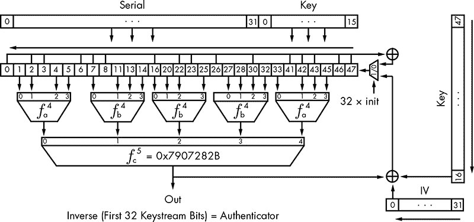
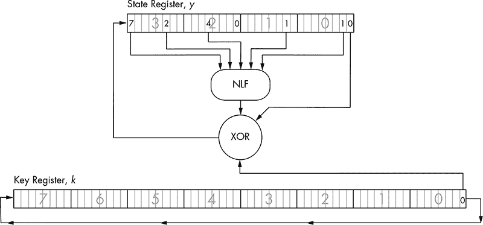
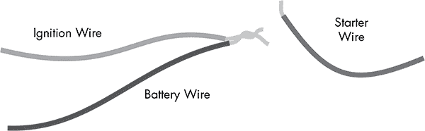

## 12

**攻击无线系统与 SDR**


在本章中，我们将深入探讨嵌入式无线系统，首先从向 ECU 传输简单无线信号的嵌入式系统开始。嵌入式无线系统往往是容易被攻击的目标。它们通常仅依赖短程信号作为唯一的安全防护措施，且由于这些设备体积小巧，功能单一，通常 ECU 没有检查信号外的任何数据，仅通过信号和 CRC 算法进行验证。这类系统通常是学习的好起点，尤其是在学习更先进的系统之前，例如无钥匙进入系统，我们将在本章后半部分研究如何破解这类系统。

我们将探讨解锁和启动车辆的技术，同时了解无钥匙进入系统的无线部分以及它们使用的加密技术。特别地，我们将重点关注 TPMS 和无线钥匙系统。我们会考虑可能的黑客攻击，包括 TPMS 如何被用来追踪车辆、触发事件、超载 ECU 或欺骗 ECU 以导致异常行为。

### 无线系统与 SDR

首先，简要介绍一下发送和接收无线信号的基础知识。为了进行本章讨论的研究，你需要一个 SDR，这是一个可编程无线电设备，价格从约 20 美元的 RTL-SDR（*[`www.rtl-sdr.com/`](http://www.rtl-sdr.com/)*）到超过 2,000 美元的 USRP 设备（来自 Ettus Research，* [`www.ettus.com/`](http://www.ettus.com/)*）。HackRF One 是 Great Scott Gadgets 推出的一个非常实用的选项，价格大约为 300 美元，但你很可能需要两个，以便能够同时进行发送和接收。

SDR 设备之间一个直接影响成本的重要区别是*采样率*，即每秒传输的音频样本数量。不出所料，采样率越大，你能够同时观察到的带宽就越大——但 SDR 设备也就越贵，且处理器需要更快。例如，RTL-SDR 的最大传输速率约为 3Mbps，HackRF 为 20Mbps，USRP 为 100Mbps。作为参考，20Mbps 可以让你同时采样整个 FM 频谱。SDR 设备与 GNU Radio Companion (GRC)配合得很好，GNU Radio 是来自 GNURadio 的免费工具（*[`gnuradio.org/`](https://gnuradio.org/)*），你可以用它来查看、过滤和解调编码信号。你可以使用 GNU Radio 来过滤出所需的信号，识别所使用的调制类型（见下节），并应用正确的解调器来识别比特流。GNU Radio 可以帮助你从无线信号直接获取你能识别和处理的数据。

**注意**

*欲了解如何将 SDR 设备与 GNU Radio 结合使用，请参阅 Great Scott Gadgets 的教程，访问* [`greatscottgadgets.com/sdr/`](http://greatscottgadgets.com/sdr/) *。*

#### *信号调制*

要应用正确的解调器，首先需要能够识别信号使用的调制类型。信号调制是将二进制数据通过无线信号表示的方式，它在你需要区分数字 1 和数字 0 时发挥作用。常见的两种数字信号调制方式是幅度键控（ASK）和频移键控（FSK）。

##### 幅度键控（ASK）

当使用 ASK 调制时，位是通过信号的幅度来指定的。图 12-1 显示了通过*载波波形*传输的信号图。载波波形是载波的幅度，当没有波形时，这是信号的静止状态。当载波线在特定时间内处于高位，表示为一个波形，这就是二进制 1。当载波线处于静止状态且持续时间较短时，这就是二进制 0。


*图 12-1：ASK 调制*

ASK 调制也称为开关键控（OOK），通常使用开始和停止位。开始和停止位是常用的方式，用于区分消息的开始和结束位置。考虑到开始和停止位，图 12-1 可以表示九个比特：0-1-1-0-1-1-0-1-0。

##### 频移键控（FSK）

与 ASK 不同，FSK 总是有一个载波信号，但这个信号是通过它变化的速度—即频率来测量的（见图 12-2）。



*图 12-2：FSK 调制*

在 FSK 中，高频信号表示 0，低频信号表示 1。当载波波形接近时，表示 1；当它们相距较远时，表示 0。图 12-2 中的位可能是 1-0-0-1-0-0-1-0-1。

### 利用 TPMS 进行黑客攻击

TPMS 是一个简单的设备，安装在轮胎内部，向 ECU 发送轮胎压力、轮胎转速、温度数据，并提供低传感器电池等特定情况的警告（见图 12-3）。然后，这些数据通过仪表盘、数字显示屏或警告灯显示给驾驶员。2000 年秋季，美国通过了《交通召回增强、问责和文档化（TREAD）法案》，要求所有新车安装 TPMS 系统，以通过提醒驾驶员轮胎气压不足来提高道路安全性。得益于 TREAD，TPMS 得到了广泛应用，成为一个常见的攻击目标。



*图 12-3：两个 TPMS 传感器*

TPMS 设备安装在车轮内部，并通过无线信号传输到轮毂，从而使其信号部分受到车身的屏蔽，以防止过多信号泄漏。大多数 TPMS 系统使用无线电与 ECU 进行通信。信号频率因设备而异，但通常在 315 MHz 或 433 MHz UHF 范围内运行，并使用 ASK 或 FSK 调制。某些 TPMS 系统使用蓝牙技术，从攻击者的角度来看，蓝牙有其优缺点：蓝牙的默认传输范围较大，但蓝牙协议也能实现安全通信，使其更难以被拦截或连接。在本章中，我将重点讨论使用无线电信号的 TPMS 系统。

#### *使用无线电接收器进行窃听*

大多数关于 TPMS 安全性的公共研究都总结在《汽车无线网络的安全与隐私漏洞：一种胎压监测系统案例研究》一文中，该研究由南卡罗来纳大学和罗格斯大学的研究人员进行。^(1) 论文展示了研究人员如何使用相对低成本的 USRP 接收器（$700 到$2,000）在 40 米远的地方窃听 TPMS 系统的无线信号。（如前所述，您也可以使用不同的 SDR 设备。）一旦信号被捕获，就可以使用 GNU Radio 进行过滤和解调。

TPMS 系统的信号非常弱，因此不会泄漏到距离车辆太远的地方。为了克服 TPMS 系统的低泄漏特性，您可以向无线电接收器添加一个低噪声放大器（LNA），以增加监听范围，这应该能够让您从路边或与目标车辆并行行驶的车辆中捕获到 TPMS 信号。您还可以使用定向天线来增强信号范围。

TPMS 传感器每 60 到 90 秒才会传输一次信息，通常传感器在车辆以时速 25 英里（40 公里）或更高行驶时才需要发送信息。然而，许多传感器即使车辆处于空闲状态时也会传输，某些传感器甚至在车辆熄火时也会传输。在对一辆停放的、已关闭电源的车辆进行审计时，请确保发送一个唤醒信号，以触发 TPMS 的响应。

了解目标 TPMS 传感器工作原理的最佳方法是，在车辆完全熄火的情况下监听数据包。没有唤醒信号时，您很可能不会看到任何通信，但某些设备即使在低频率下也可能进行传输。接下来，启动车辆并让其处于空闲状态。ECU 应该至少在启动时提示轮胎响应，但更有可能的是，它会定期轮询。

一旦你看到 TPMS 信号，你需要解码它才能理解其内容。幸运的是，研究员 Jared Boone 已经通过一套工具简化了这一过程，这些工具可以帮助捕获并解码 TPMS 数据包。你可以在*[`github.com/jboone/gr-tpms/`](https://github.com/jboone/gr-tpms/)*找到他的`gr-tpms`工具的源代码，`tpms`工具的源代码则在*[`github.com/jboone/tpms/`](https://github.com/jboone/tpms/)*。使用这些工具捕获并解码 TPMS 数据包后，你可以分析捕获的数据，找出代表系统唯一 ID 的位以及其他字段。

#### *TPMS 数据包*

TPMS 数据包通常包含相同的信息，但不同型号之间会有所不同。图 12-4 展示了一个 TPMS 数据包的示例。



*图 12-4：TPMS 数据包示例*

SensorID 是一个 28 位或 32 位的数字，每个传感器都是唯一的，并且与 ECU（电子控制单元）注册。如果你的目标只是为跟踪或触发事件而识别目标，SensorID 可能是你最关心的数据包部分。压力和温度字段包含来自 TPMS 设备的读数。Flags 字段可以包含额外的元数据，例如传感器电池电量低的警告。

在确定数据包编码时，检查是否使用了曼彻斯特编码。曼彻斯特编码通常用于近场设备，如 TPMS 系统。如果你知道使用的是哪种芯片组，数据手册应该会告诉你该芯片组是否支持曼彻斯特编码。如果支持，你首先需要解码数据包，然后再解析其内容。Jared Boone 的工具可以帮助完成这项任务。

#### *激活信号*

如前所述，传感器通常每分钟传输一次，但攻击者可以通过 SDR 发送 125 kHz 激活信号到 TPMS 设备，以引发其响应，而不是等待 60 秒让传感器发送数据包。你截获此响应的时机需要非常精准，因为激活信号发出和响应传输之间会有延迟。例如，如果你在路边接收信号，而车辆经过得太快，可能会错过响应。

激活信号主要为 TPMS 测试设备设计，因此在移动的车辆上使用可能会比较棘手。如果目标车辆在静止或熄火时发送数据包，那么你的任务会容易得多。

TPMS 传感器不使用输入验证。ECU 只会检查它是否识别 SignalID，因此你作为攻击者，只需要了解或匹配 ID 这一属性。

#### *追踪车辆*

可以通过在你希望跟踪的区域放置接收器来使用 TPMS 跟踪车辆。例如，要跟踪进入停车场的车辆，你只需要在入口和出口区域放置一些接收器。然而，要在城市或沿途路线跟踪车辆，你需要战略性地在需要跟踪的区域放置传感器。由于传感器的范围有限，你必须将其放置在交叉口或高速公路的上下匝道附近。

如前所述，TPMS 传感器每 60 到 90 秒广播一次其唯一 ID，因此如果你在高速路上记录 ID，可能会错过很多信号。为了提高捕获信号的机会，可以在车辆经过时发送激活信号以唤醒设备。传感器的有限距离也可能影响你收集 ID 的能力，但你可以为跟踪系统添加 LNA 来增加范围。

#### *事件触发*

除了简单地跟踪车辆外，TPMS 还可以用于触发事件，从简单的例如当车辆接近时打开车库门，到更险恶的用途。例如，恶意行为者可能会在路边埋设爆炸物，并设置为接收到来自 TPMS 传感器的已知 ID 时引爆。由于每辆车有四个轮胎，攻击者可以合理地确保他们锁定了目标车辆，如果他们收到来自每个轮胎的信号。基本上，使用四个轮胎可以为目标车辆创建一个基本但准确的传感器指纹。

#### *发送伪造的数据包*

一旦你获得了 TPMS 信号的访问权限，你可以通过将 GNU Radio 设置为发射器而不是接收器来发送你自己的伪造数据包。通过伪造数据包，你不仅可以伪造危险的 PSI 和温度读数，还可以触发其他引擎故障灯。而且，由于传感器在车辆关闭时仍会响应激活数据包，因此通过向传感器发送激活请求，你有可能耗尽车辆的电池。

在之前引用的论文《车载无线网络的安全性和隐私漏洞》中，研究人员通过伪造数据包洪泛传感器，最终成功在车辆使用过程中完全关闭了 ECU。关闭 ECU 会使车辆停驶或强制其进入“紧急模式”。

**警告**

*在车辆高速行驶时关闭 ECU 可能是极其危险的。尽管玩弄 TPMS 看似无害，但在评估任何车辆时，请务必采取标准的安全预防措施。*

### 攻击钥匙扣和防盗系统

任何开过现代汽车的人可能都熟悉钥匙遥控器和远程解锁。1982 年，无线射频识别（RFID）首次通过雷诺 Fuego 车型引入远程无钥匙车辆进入系统，自 1995 年以来已经得到广泛使用。早期的系统使用红外线，因此在处理这些早期车型时，你需要通过记录红外光源来评估钥匙遥控器（这部分内容不在本章讨论）。如今的系统使用钥匙遥控器发送 RFID 信号到车辆以远程解锁车门，甚至启动汽车。钥匙遥控器使用工作频率为 125 kHz 的应答器与车辆中的防盗系统进行通信，防盗系统在接收到正确的代码或其他令牌之前，阻止车辆启动。使用低频 RFID 信号的原因是即使钥匙遥控器电池耗尽，钥匙系统仍然可以工作。

我们将研究使用 SDR 设备分析无线通讯，这些通讯由用于解锁和启动车辆的无线钥匙遥控器设定。虽然早期的钥匙遥控器使用简单的固定代码来启动车辆，但大多数现代系统依赖于滚动代码或挑战-响应系统，通过挑战钥匙遥控器执行某些任务，如完成计算并返回正确答案，从而防止简单地记录和回放固定代码。这些计算需要更多的能量和电池的使用，这也使得钥匙遥控器能够在更远的距离以更高的频率进行通信。

北美的远程无钥匙进入系统通常运行在 315 MHz 频率，欧洲和亚洲则为 433.92 MHz。你可以使用 GNU Radio 来观察钥匙遥控器发送的信号，或者使用像 Gqrx SDR 这样的工具（* [`gqrx.dk/`](http://gqrx.dk/) *）来查看 SDR 设备带来的整个带宽的实时视图。使用高采样率（带宽）的 Gqrx 可以帮助你识别钥匙遥控器发送到车辆的 RFID 信号频率。例如，图 12-5 显示 Gqrx 在 315 MHz（中心，垂直线）和偏移-1,192.350 kHz 处监听，它监控一辆本田车的钥匙遥控解锁请求。Gqrx 已经识别出信号中的两个峰值，这很可能是解锁请求。



*图 12-5：Gqrx 捕获的钥匙遥控解锁请求*

#### *汽车钥匙遥控破解*

有很多方法可以破解汽车钥匙遥控系统，接下来的几节中我会举例说明攻击者可能使用的一些方法。

##### 干扰钥匙遥控信号

攻击钥匙遥控信号的一种方式是通过在 RFID 接收器的*通带*内传输垃圾数据来干扰信号，通带是接收器监听有效信号的区域。通带窗口的宽度包括一些额外的空间，在这些空间内你可以添加噪声，防止接收器更改滚动代码，同时仍然允许攻击者查看正确的密钥序列（参见图 12-6）。

在保持有效解锁请求的内存中，攻击者等待另一个请求被发送并记录该请求。然后，攻击者可以将第一个有效数据包重放到车辆上，导致车辆锁定或解锁，具体取决于钥匙扣发送的信号。当车主离开车辆时，攻击者拥有最后一个有效密钥，并可以重放该密钥来打开车门或启动车辆。此攻击在 DEF CON 23 上由 Samy Kamkar 演示，适用于车辆和车库门开关器。^(2)



*图 12-6：通过干扰通带滤波器来保持密钥交换*

##### 从内存中提取响应码

有时即使钥匙扣停止发送信号几分钟后，也能在防盗系统的内存中找到响应码。这为启动汽车提供了一个机会窗口，攻击者可以通过从防盗系统内存中提取信号，而不是实时捕获钥匙扣信号来启动汽车。

如果能够识别出存储此信息的内存区域，那么攻击者需要快速获取对车辆的访问权限，或者在车辆上安装一个可以响应并记录此信息的设备。

##### 暴力破解密钥代码

一些响应码可以通过暴力破解方式访问，尽管暴力破解攻击的可行性取决于密钥码的长度和算法。（我们将在“防盗系统密码学”中讨论这些密钥系统背后的加密学，见第 220 页。）为了使暴力破解攻击成功，攻击者需要使用 SDR、定制硬件组件，或者—更好的是—两者的组合，来编写自定义软件以暴力破解密钥。例如，如果钥匙扣能够检测到暴力破解攻击，您可能希望使用一些定制硬件通过切断电源来重置钥匙扣，防止锁定。

##### 前向预测攻击

如果攻击者能够观察到当钥匙扣向车辆发送信号并且车辆的转发器作出响应时发生的挑战-响应交换，攻击者可以执行*前向预测攻击*。在这种攻击中，攻击者观察多个挑战并从中预测下一个挑战请求是什么。如果转发器的伪随机数生成器（PRNG）较弱，这种攻击很可能会成功。为了简化这个例子，如果 PRNG 基于钥匙扣首次接收到电源的时间，攻击者可以用匹配的开始时间来初始化他们自己的随机数生成器。一旦攻击者与目标同步，攻击者就能预测所有未来的代码。

##### 字典攻击

类似地，如果攻击者能够记录多个有效的挑战–响应交换，涉及钥匙扣和应答器之间的交互，他们可以将其存储在字典中，然后利用收集到的密钥对反复向应答器请求挑战，直到其中一个挑战与字典中的响应匹配。这个巧妙的攻击只有在无钥匙进入系统没有使用发送方验证来确保响应有效时才能实现。攻击者还需要能够持续请求应答器进行认证。

为了执行字典攻击，攻击者需要建立一个系统来触发钥匙扣请求并使用软件定义无线电（SDR）记录交换内容。一个连接到研究者有效钥匙扣按钮的 Arduino 就足够了。假设认证通过 CAN 进行，也可以通过超高频信号获取钥匙扣 ID，并通过重放和记录 CAN 总线上的通信来尝试收集密钥流，正如在“使用 can-utils 和 Wireshark 逆向 CAN 总线通信”中讨论的那样，在第 68 页也有相关介绍。通过自定义工具，这种方法可以在任何总线网络上重复进行。有关这种攻击的更多信息，请参见论文《破碎的王国之钥》。^(3)

##### 转储应答器内存

通常可以通过转储应答器的内存来获取秘密密钥。在第八章中，我们探讨了如何使用调试引脚（如 JTAG）以及侧信道分析攻击来从应答器中转储内存。

##### 逆向 CAN 总线

为了获得车辆的访问权限，攻击者可以使用在第五章中讨论的 CAN 总线逆向方法模拟锁定按钮的按压。如果攻击者能够访问 CAN 总线，他们可以重放锁定和解锁数据包来控制并偶尔启动车辆。有时，CAN 总线的电缆甚至可以从车辆外部访问；例如，某些车辆的 CAN 总线会连接到尾灯。攻击者可以拆下尾灯并接入 CAN 总线网络，以解锁车辆。

##### 关键程序员和应答器复制机

转发器复制机通常用于盗窃车辆。这些机器与机械师或经销商用来替换丢失钥匙的机器相同，可以在线购买，价格从 $200 到 $1,000 不等。攻击者获取目标车辆的转发器信号，并使用它来创建钥匙的克隆，可以通过将有效的钥匙放在附近或使用前面讨论的攻击方式之一。例如，攻击者——可能是代客泊车员或停车场工作人员——可能会干扰车门锁信号，然后悄悄进入车辆，并将一个定制的加密狗连接到 OBD-II 接口。加密狗会获取钥匙扣通信，甚至可能包括 GPS 广播，允许攻击者稍后定位车辆。攻击者稍后返回车辆，并使用加密狗解锁并启动汽车。

#### *攻击 PKES 系统*

*无钥匙进入与启动（PKES）系统* 与传统的转发器防盗系统非常相似，不同之处在于钥匙扣可以保持在车主的口袋中，无需按下任何按钮。当实现 PKES 系统时，车辆内的天线会在钥匙扣处于有效范围时读取其 RFID 信号。PKES 钥匙扣使用低频（LF）RFID 芯片和超高频（UHF）信号来解锁或启动车辆。如果没有看到 LF RFID 信号，意味着钥匙不在附近，车辆会忽略来自钥匙扣的 UHF 信号。钥匙扣上的 RFID 接收来自车辆的加密挑战，钥匙扣上的微控制器解答该挑战并通过 UHF 信号作出响应。有些车辆会在车内使用 RFID 传感器来三角定位钥匙扣的位置，以确保钥匙扣在车辆内。如果 PKES 钥匙扣的电池耗尽，通常钥匙扣内会有一个隐藏的物理钥匙，用于解锁车门，尽管防盗系统仍会使用 RFID 验证钥匙是否存在，然后才能启动汽车。

PKES 系统通常面临两种类型的攻击：中继攻击和放大中继攻击。在*中继攻击*中，攻击者将一个设备放置在汽车旁边，另一个设备放置在车主或钥匙扣持有者（目标）旁边。设备在目标的钥匙扣与车辆之间转发信号，从而使攻击者能够启动汽车。

这个中继通道可以通过任何速度较快、范围比普通钥匙扣更大的通道进行通信。例如，放置在目标附近的设备可以通过一个蜂窝通道与靠近车辆的笔记本电脑建立连接。数据包会从目标的钥匙扣传输到设备，通过蜂窝网络转发并由笔记本电脑重播。如需更多信息，请参阅“现代汽车中无钥匙进入与启动系统的中继攻击”。^(4)

*放大继电器攻击*使用与继电器攻击相同的基本原理，但仅使用一个放大器。攻击者站在目标车辆旁边并放大信号，如果目标附近有钥匙扣，车辆将解锁。这是一种不复杂的攻击，它只是简单地增加了车辆传感器的范围。这种攻击在现实中已经出现，主要发生在居民区，促使一系列新闻报道建议居民在家时将钥匙放进冰箱或用铝箔包裹，以防止它们发送可读取的信号。显然，把钥匙当作午餐一样对待是愚蠢的，但在汽车制造商提供替代解决方案之前，恐怕你只能依靠自制的法拉第笼。

#### *电子防盗器加密技术*

与车辆中的大多数系统一样，电子防盗器系统通常是通过组合便宜的组件来创建的。因此，制造商在诸如加密技术等方面变得富有创意，这也为这些系统带来了许多弱点。例如，一些电子防盗器供应商常常犯一个常见错误，即自行开发加密技术并将其隐藏在保护它的商业机密条款后面，而不是通过公众审查来验证它。这个方法被称为*安全通过模糊化*，几乎总是注定要失败，这也是为什么我们没有看到一个标准的加密实现来处理钥匙扣和电子防盗器之间的密钥交换。

电子防盗器和钥匙的交换使用挑战-响应系统和伪随机数生成器（PRNG）。PRNG 和加密算法一样重要，因为一个不良的 PRNG 会导致可预测的结果，无论你的加密算法多么优秀。

典型的密钥交换实现遵循以下一般顺序：

1.  电子防盗器通过 PRNG 向钥匙发送挑战。

1.  密钥使用伪随机数生成器（PRNG）加密挑战并返回给电子防盗器。

1.  电子防盗器发送第二个随机数挑战。

1.  密钥加密两个挑战并返回给电子防盗器。

这些算法通常来自伪随机函数（PRF）家族，它们在给定随机输入时生成的输出看起来像是随机的。为了让这些系统正常工作，强烈依赖于生成的随机性。一些系统已经被破解，破解方法已被广泛传播，但仍有一些系统保持未被破解。不幸的是，由于制造商没有更新钥匙扣固件的系统，如果你仔细观察，你会发现这些算法仍在被使用。

以下是一些仍在使用中的已知专有算法及其当前的破解状态——也就是它们是否已被破解。如果可能的话，我会指出在哪些车辆中可能会使用这些算法。

**注意**

*本节旨在协助您的研究。每个区域应提供您正在研究的密钥系统的基本信息，并提供有助于您启动加密研究的详细信息。本节不打算解释加密学，我也不会深入探讨每个算法背后的数学复杂性。*

##### EM Micro Megamos

**引入时间** 1997 年

**制造商** 大众/泰雷兹

**密钥长度** 96 位

**算法** 专有

**适用车辆** 保时捷，奥迪，宾利，兰博基尼

**破解状态** 已破解，但攻击方法已通过诉讼被审查

Megamos 加密系统有一个特别有趣的历史。Megamos “优化”了其密钥握手，只需一次挑战与响应的回合，去除了第二回合，如前所述。通常，攻击者若要破解挑战–响应密钥，通常需要访问目标密钥，但他们可以在没有密钥的情况下破解 Megamos，因为 Megamos 的挑战响应实际上并没有被车辆的传感器执行。这个漏洞基本上跳过了密钥挑战部分，仅提供加密后的密钥。

Megamos 内存是一个 160 位 EEPROM，按 10 个字组织，如表 12-1 所示。加密密钥是密钥存储区，ID 是 32 位标识符，LB 0 和 LB 1 是锁定位，UM 是 30 位的用户内存。

**表 12-1：** Megamos 内存空间布局

| **位 15** | **位 0** | **位 15** | **位 0** |
| --- | --- | --- | --- |
| 加密密钥 95 | 加密密钥 80 | 加密密钥 15 | 加密密钥 0 |
| 加密密钥 79 | 加密密钥 64 | ID 31 | ID 16 |
| 加密密钥 63 | 加密密钥 48 | ID 15 | ID 0 |
| 加密密钥 47 | 加密密钥 32 | LB1, LB0, UM 29 | UM 16 |
| 加密密钥 31 | 加密密钥 16 | UM 15 | UM 0 |

该算法在 2013 年被公开破解，当时伯明翰大学的安全研究员 Flavio D. Garcia 发表了一篇名为《拆解 Megamos 加密：无线解锁汽车防盗器》的论文。^(5) Garcia 与两位来自奈梅亨大学的研究员 Barış Ege 和 Roel Verdult，在论文计划发布前九个月通知了芯片制造商大众和泰雷兹。大众和泰雷兹通过起诉这些研究员，指责他们暴露了这些漏洞，最终研究员败诉，因为该算法已被在线泄露。泄露的算法被用于盗版软件——VAG-info.com 提供的 Tango Programmer——用于添加新密钥。研究员获取了这款软件并反向分析了其内部结构，找到了算法。

在他们的论文中，研究人员分析了该算法并报告了他们发现的漏洞，尽管实际的攻击并不简单，且有很多更简单的方法可以窃取带有 Megamos 系统的汽车。然而，这项研究被加上了禁令，研究结果没有公开。不幸的是，Megamos 的问题仍然存在，且依然不安全——禁令仅仅是阻止车主确定他们的风险，因为这项研究没有公开。这是汽车行业应对安全研究时*不该*做的一个典型例子。

你可以在这里找到法院判决的文字记录：*[`www.bailii.org/ew/cases/EWHC/Ch/2013/1832.html`](http://www.bailii.org/ew/cases/EWHC/Ch/2013/1832.html)*。为了不泄露任何细节，我将简单地引用法院案件：

具体来说，流程是这样的：汽车计算机和电子标签都有一个秘密号码。这个号码是该汽车唯一的，称为“秘密密钥”。汽车计算机和电子标签还知道一个秘密算法。那是一个复杂的数学公式。给定两个数字，它将产生第三个数字。对于所有使用 Megamos Crypto 芯片的汽车，算法都是相同的。进行这个计算的工作就是 Megamos Crypto 芯片的作用。

当过程开始时，汽车生成一个随机数字，并将其发送给电子标签。现在，两台计算机使用它们应该知道的两个数字，随机数字和秘密密钥，进行复杂的数学操作。它们各自产生一个第三个数字。这个数字被分为两部分，称为 F 和 G。现在，两台计算机都知道 F 和 G。汽车将其 F 发送给电子标签。电子标签可以检查汽车是否正确计算了 F。这证明了汽车知道秘密密钥和 Megamos Crypto 算法。电子标签现在可以确信这辆车确实是它应该是的那辆车。如果电子标签确认无误，它会将 G 发送给汽车。汽车检查 G 是否正确。如果正确，那么汽车确认电子标签也知道秘密密钥和 Megamos Crypto 算法。因此，汽车可以确认电子标签是真正的电子标签。所以，两台设备在没有实际揭示秘密密钥或秘密算法的情况下确认了彼此的身份。汽车可以安全启动。这个过程中身份验证的安全性依赖于共享的秘密知识。为了保证过程的安全，两个信息都必须保持秘密——密钥和算法。^(6)

实际上，任何强健的加密算法都是可以被了解的。事实上，正如任何密码学家所说的，如果知道一个算法背后的数学会危及该算法的安全性，那么这个算法本身就是有缺陷的。

法庭判决确定，攻击很难被缓解，并且需要完全重新设计。研究人员提出了其他轻量级的算法，这些算法可以用于重新设计的密钥系统，但由于研究被压制，没有密钥系统得以更新。Megamos 算法仍然出现在像大众的 Tango 编程器等密钥编程器中。

##### EM4237

**引入时间** 2006

**制造商** EM 微电子

**密钥长度** 128 位

**算法** 专有

**车辆** 未知

**破解状态** 尚无已发布的破解

EM4237 被制造商描述为一种通用的长距离、无源、非接触式标签系统，使用应答器。这类似于用于建筑物门禁的增强型接近卡，但其有效范围为 1 至 1.5 米。通常，EM4237 需要一个高安全性 128 位密码，但在低安全模式下，只需要 32 位密码，例如，当钥匙扣电池电量不足时，因为计算 32 位密钥所需的能量低于 128 位密钥。系统的低安全模式密钥与高安全模式密钥存储在应答器的相同内存区域，且系统可以在高安全和低安全模式之间切换，而无需重新输入密码/密钥。EM4237 应答器声称符合接近卡标准（ISO/IEC 15693），提供 RF 频道的完整加密（13.56 MHz）。在审计 EM4237 时，请确保目标实现与规范一致。

##### Hitag 1

**引入时间** 未知

**制造商** 飞利浦/NXP

**密钥长度** 32 位

**算法** 专有

**车辆** 未知

**破解状态** 已破译

Hitag 1 依赖于 32 位的秘密密钥，并且容易受到暴力破解攻击，几分钟内就能破解。你不会在今天的许多车辆中找到 Hitag 1，但 Hitag 1 应答器仍在其他 RFID 产品中使用，例如智能钥匙扣和接近卡。

##### Hitag 2

**引入时间** 1997

**制造商** 飞利浦/NXP

**密钥长度** 48 位

**算法** 专有

**车辆** 奥迪、宾利、宝马、克莱斯勒、路虎、奔驰、保时捷、萨博、大众等多个品牌

**破解状态** 已破译

Hitag 2 是世界各地生产的车辆中最广泛实现（且被破解）的算法之一。该算法被破解的原因是其流密码，如图 12-7 所示，从未反馈回原始状态，导致密钥可以被发现。



*图 12-7：Hitag 2 加密算法*

Hitag 2 密钥可以通过一种智能暴力破解方法在不到一分钟的时间内破解，该方法通过智能选择下一个猜测，而不是尝试所有可能的组合。Hitag 2 系统之所以能被如此快速地暴力破解，是因为它甚至没有使用完整的位长度，并且当应答器被引入系统时，它们在初始化期间不会生成真正的随机数。Hitag 1 和 Hitag 2 都容易受到字典攻击。

网上有大量关于 Hitag 2 的弱点的论文，比如《360 秒内消失：通过 Hitag2 劫持》。^(7)

##### Hitag AES

**引入时间** 2007 年

**制造商** 飞利浦 / NXP

**密钥长度** 128 位

**算法** AES

**车辆** 奥迪、宾利、宝马、保时捷

**破解状态** 没有已知的公开破解

这种较新的密码依赖于经过验证的 AES 算法，这意味着任何加密的弱点都将来自于制造商的实现。就在我写这篇文章时，尚未发现 Hitag AES 的破解方法。

##### DST-40

**引入时间** 2000 年

**制造商** 德州仪器

**密钥长度** 40 位

**算法** 专有（不平衡费斯特尔密码）

**车辆** 福特、林肯、梅尔库里、日产、丰田

**破解状态** 已破解

数字信号传输器 DST-40 所使用的算法也被应用于埃克森美孚的 Speedpass 支付系统。DST-40 是一种 200 轮不平衡的费斯特尔密码，它被约翰霍普金斯大学的研究人员逆向工程化，研究人员创建了一系列 FPGA 以暴力破解密钥，从而使他们能够克隆传输器。（FPGA 使得创建专门设计用于破解算法的硬件成为可能，这使得暴力破解变得更为可行。）因为 FPGA 是专门化的并且可以并行运行输入，它通常比通用计算机处理速度更快。

对 DST-40 的攻击利用了传输器弱的 40 位密钥，并且完成此攻击所需的时间不超过一个小时。进行该攻击时，攻击者必须从有效的传输器获取两个挑战–响应对——这是相对容易的任务，因为 DST-40 每秒最多响应 8 次查询。（有关该破解的更多细节，请参阅《加密启用 RFID 设备的安全分析》。^(8))

##### DST-80

**引入时间** 2008 年

**制造商** 德州仪器

**密钥长度** 80 位

**算法** 专有（不平衡费斯特尔密码）

**破解状态** 没有已知的公开破解

当 DST-40 被破解时，德州仪器通过将密钥长度加倍来推出 DST-80。DST-80 的部署范围不如 DST-40 广泛。有些来源声称 DST-80 仍然容易受到攻击，但截至本文撰写时，尚未发布任何攻击。

##### Keeloq

**引入时间** 1980 年代中期

**制造商** Nanoteq

**密钥长度** 64 位

**算法** 专有（NLFSR）

**车辆** 克莱斯勒、大宇、菲亚特、通用汽车、本田、捷豹、丰田、大众、沃尔沃

**破解状态** 已破解

Keeloq，如图 12-8 所示，是一种非常古老的算法，已有许多关于其加密的已发布攻击。Keeloq 可以同时使用滚动代码和挑战响应，它使用基于非线性反馈移位寄存器（NLFSR）的块密码。实现 Keeloq 的制造商接收一个密钥，并将其存储在所有接收器中。接收器通过总线接收器的 ID 来学习传输器密钥，这些 ID 是由汽车制造商编程的。

在 Keeloq 中，最有效的加密攻击同时使用了滑动攻击和中间人攻击。该攻击针对 Keeloq 的挑战–响应模式，要求从转发器收集 216 个已知明文消息——这通常只需要一个小时左右的时间。该攻击通常仅能克隆转发器，但如果制造商的密钥派生算法较弱，攻击者可能推测出转发器上使用的密钥。然而，攻击加密变得不再必要，因为新的专用 FPGA 集群使得可以通过暴力破解密钥。



*图 12-8：Keeloq 算法*

Keeloq 还容易受到功率分析攻击。功率分析攻击可以用来通过仅两个转发器消息提取转发器上使用的制造商密钥。如果攻击成功，通常只会导致能够在几分钟内通过监控转发器上的功率痕迹来克隆转发器。功率分析还可以用来获取制造商密钥，尽管这种攻击可能需要几个小时才能完成。一旦攻击者获得主密钥，他们就可以克隆任何转发器。最后，由于 Keeloq 在使用查找表时会出现不同的时钟周期，它也容易受到时间攻击的影响。（有关功率分析和时间攻击的更多内容，请参见 第八章。）

##### 开放源代码防盗协议栈

**发布时间** 2011 年

**制造商** Atmel

**密钥长度** 128 位

**算法** AES

**破解状态** 没有已知的公开破解

2011 年，Atmel 发布了开放源代码的防盗协议栈，并以开源许可的形式公开发布，允许公众自由使用并鼓励对协议设计的公开审查。在我撰写本文时，尚未发现对该协议的已知攻击。您可以从 Atmel 网站下载该协议：*[`www.atmel.com/`](http://www.atmel.com/)*

#### *针对防盗系统的物理攻击*

到目前为止，我们已经看过了针对转发器的无线攻击和直接的加密攻击。接下来，我们将关注对车辆本身的物理修改和攻击。物理攻击通常需要更长的时间来执行，且不具备隐秘性。

##### 攻击防盗芯片

攻击一个防盗系统的一种方式是物理攻击防盗芯片。实际上，完全移除防盗芯片（通常来自车辆的 ECU）仍然能够操作车辆，虽然可能无法完全正常运行。至少，这样做会创建一个 DTC 并启动 MIL，如第 52 页的“诊断故障代码”中所讨论的那样。为了物理移除防盗芯片系统，你可以购买或制作一个防盗旁路芯片，然后将其焊接到原防盗芯片所在的位置，以保持 ECU 的正常工作。这些芯片，有时被称为*防盗仿真器*，通常售价为 20 到 30 美元。你仍然需要为车辆刻制钥匙，但通过完全绕过任何挑战–响应安全机制，钥匙将简单地解锁并启动汽车。

##### 暴力破解键盘输入

现在换个节奏：这里有一种暴力破解车辆键盘锁的方法；这种方法由 Peter Boothe 发现（可在*[`www.nostarch.com/carhacking/`](http://www.nostarch.com/carhacking/)*找到）。如果车辆的门把手下有一个带有 1/2、3/4、5/6、7/8、9/0 按钮的键盘，你可以手动输入以下序列，大约 20 分钟内解锁车门。你不需要输入完整的序列——当车门解锁时，你可以停止输入代码。为了方便，每个按钮分别标有 1、3、5、7 和 9。

```
9 9 9 9 1 1 1 1 1 3 1 1 1 1 5 1 1 1 1 7 1 1 1 1 9 1 1 1 3 3 1 1 1 3 5 1 1 1 3
7 1 1 1 3 9 1 1 1 5 3 1 1 1 5 5 1 1 1 5 7 1 1 1 5 9 1 1 1 7 3 1 1 1 7 5 1 1 1
7 7 1 1 1 7 9 1 1 1 9 3 1 1 1 9 5 1 1 1 9 7 1 1 1 9 9 1 1 3 1 3 1 1 3 1 5 1 1
3 1 7 1 1 3 1 9 1 1 3 3 3 1 1 3 3 5 1 1 3 3 7 1 1 3 3 9 1 1 3 5 3 1 1 3 5 5 1
1 3 5 7 1 1 3 5 9 1 1 3 7 3 1 1 3 7 5 1 1 3 7 7 1 1 3 7 9 1 1 3 9 3 1 1 3 9 5
1 1 3 9 7 1 1 3 9 9 1 1 5 1 3 1 1 5 1 5 1 1 5 1 7 1 1 5 1 9 1 1 5 3 3 1 1 5 3
5 1 1 5 3 7 1 1 5 3 9 1 1 5 5 3 1 1 5 5 5 1 1 5 5 7 1 1 5 5 9 1 1 5 7 3 1 1 5
7 5 1 1 5 7 7 1 1 5 7 9 1 1 5 9 3 1 1 5 9 5 1 1 5 9 7 1 1 5 9 9 1 1 7 1 3 1 1
7 1 5 1 1 7 1 7 1 1 7 1 9 1 1 7 3 3 1 1 7 3 5 1 1 7 3 7 1 1 7 3 9 1 1 7 5 3 1
1 7 5 5 1 1 7 5 7 1 1 7 5 9 1 1 7 7 3 1 1 7 7 5 1 1 7 7 7 1 1 7 7 9 1 1 7 9 3
1 1 7 9 5 1 1 7 9 7 1 1 7 9 9 1 1 9 1 3 1 1 9 1 5 1 1 9 1 7 1 1 9 1 9 1 1 9 3
3 1 1 9 3 5 1 1 9 3 7 1 1 9 3 9 1 1 9 5 3 1 1 9 5 5 1 1 9 5 7 1 1 9 5 9 1 1 9
7 3 1 1 9 7 5 1 1 9 7 7 1 1 9 7 9 1 1 9 9 3 1 1 9 9 5 1 1 9 9 7 1 1 9 9 9 1 3
1 3 3 1 3 1 3 5 1 3 1 3 7 1 3 1 3 9 1 3 1 5 3 1 3 1 5 5 1 3 1 5 7 1 3 1 5 9 1
3 1 7 3 1 3 1 7 5 1 3 1 7 7 1 3 1 7 9 1 3 1 9 3 1 3 1 9 5 1 3 1 9 7 1 3 1 9 9
1 3 3 1 5 1 3 3 1 7 1 3 3 1 9 1 3 3 3 3 1 3 3 3 5 1 3 3 3 7 1 3 3 3 9 1 3 3 5
3 1 3 3 5 5 1 3 3 5 7 1 3 3 5 9 1 3 3 7 3 1 3 3 7 5 1 3 3 7 7 1 3 3 7 9 1 3 3
9 3 1 3 3 9 5 1 3 3 9 7 1 3 3 9 9 1 3 5 1 5 1 3 5 1 7 1 3 5 1 9 1 3 5 3 3 1 3
5 3 5 1 3 5 3 7 1 3 5 3 9 1 3 5 5 3 1 3 5 5 5 1 3 5 5 7 1 3 5 5 9 1 3 5 7 3 1
3 5 7 5 1 3 5 7 7 1 3 5 7 9 1 3 5 9 3 1 3 5 9 5 1 3 5 9 7 1 3 5 9 9 1 3 7 1 5
1 3 7 1 7 1 3 7 1 9 1 3 7 3 3 1 3 7 3 5 1 3 7 3 7 1 3 7 3 9 1 3 7 5 3 1 3 7 5
5 1 3 7 5 7 1 3 7 5 9 1 3 7 7 3 1 3 7 7 5 1 3 7 7 7 1 3 7 7 9 1 3 7 9 3 1 3 7
9 5 1 3 7 9 7 1 3 7 9 9 1 3 9 1 5 1 3 9 1 7 1 3 9 1 9 1 3 9 3 3 1 3 9 3 5 1 3
9 3 7 1 3 9 3 9 1 3 9 5 3 1 3 9 5 5 1 3 9 5 7 1 3 9 5 9 1 3 9 7 3 1 3 9 7 5 1
3 9 7 7 1 3 9 7 9 1 3 9 9 3 1 3 9 9 5 1 3 9 9 7 1 3 9 9 9 1 5 1 5 3 1 5 1 5 5
1 5 1 5 7 1 5 1 5 9 1 5 1 7 3 1 5 1 7 5 1 5 1 7 7 1 5 1 7 9 1 5 1 9 3 1 5 1 9
5 1 5 1 9 7 1 5 1 9 9 1 5 3 1 7 1 5 3 1 9 1 5 3 3 3 1 5 3 3 5 1 5 3 3 7 1 5 3
3 9 1 5 3 5 3 1 5 3 5 5 1 5 3 5 7 1 5 3 5 9 1 5 3 7 3 1 5 3 7 5 1 5 3 7 7 1 5
3 7 9 1 5 3 9 3 1 5 3 9 5 1 5 3 9 7 1 5 3 9 9 1 5 5 1 7 1 5 5 1 9 1 5 5 3 3 1
5 5 3 5 1 5 5 3 7 1 5 5 3 9 1 5 5 5 3 1 5 5 5 5 1 5 5 5 7 1 5 5 5 9 1 5 5 7 3
1 5 5 7 5 1 5 5 7 7 1 5 5 7 9 1 5 5 9 3 1 5 5 9 5 1 5 5 9 7 1 5 5 9 9 1 5 7 1
7 1 5 7 1 9 1 5 7 3 3 1 5 7 3 5 1 5 7 3 7 1 5 7 3 9 1 5 7 5 3 1 5 7 5 5 1 5 7
5 7 1 5 7 5 9 1 5 7 7 3 1 5 7 7 5 1 5 7 7 7 1 5 7 7 9 1 5 7 9 3 1 5 7 9 5 1 5
7 9 7 1 5 7 9 9 1 5 9 1 7 1 5 9 1 9 1 5 9 3 3 1 5 9 3 5 1 5 9 3 7 1 5 9 3 9 1
5 9 5 3 1 5 9 5 5 1 5 9 5 7 1 5 9 5 9 1 5 9 7 3 1 5 9 7 5 1 5 9 7 7 1 5 9 7 9
1 5 9 9 3 1 5 9 9 5 1 5 9 9 7 1 5 9 9 9 1 7 1 7 3 1 7 1 7 5 1 7 1 7 7 1 7 1 7
9 1 7 1 9 3 1 7 1 9 5 1 7 1 9 7 1 7 1 9 9 1 7 3 1 9 1 7 3 3 3 1 7 3 3 5 1 7 3
3 7 1 7 3 3 9 1 7 3 5 3 1 7 3 5 5 1 7 3 5 7 1 7 3 5 9 1 7 3 7 3 1 7 3 7 5 1 7
3 7 7 1 7 3 7 9 1 7 3 9 3 1 7 3 9 5 1 7 3 9 7 1 7 3 9 9 1 7 5 1 9 1 7 5 3 3 1
7 5 3 5 1 7 5 3 7 1 7 5 3 9 1 7 5 5 3 1 7 5 5 5 1 7 5 5 7 1 7 5 5 9 1 7 5 7 3
1 7 5 7 5 1 7 5 7 7 1 7 5 7 9 1 7 5 9 3 1 7 5 9 5 1 7 5 9 7 1 7 5 9 9 1 7 7 1
9 1 7 7 3 3 1 7 7 3 5 1 7 7 3 7 1 7 7 3 9 1 7 7 5 3 1 7 7 5 5 1 7 7 5 7 1 7 7
5 9 1 7 7 7 3 1 7 7 7 5 1 7 7 7 7 1 7 7 7 9 1 7 7 9 3 1 7 7 9 5 1 7 7 9 7 1 7
7 9 9 1 7 9 1 9 1 7 9 3 3 1 7 9 3 5 1 7 9 3 7 1 7 9 3 9 1 7 9 5 3 1 7 9 5 5 1
7 9 5 7 1 7 9 5 9 1 7 9 7 3 1 7 9 7 5 1 7 9 7 7 1 7 9 7 9 1 7 9 9 3 1 7 9 9 5
1 7 9 9 7 1 7 9 9 9 1 9 1 9 3 1 9 1 9 5 1 9 1 9 7 1 9 1 9 9 1 9 3 3 3 1 9 3 3
5 1 9 3 3 7 1 9 3 3 9 1 9 3 5 3 1 9 3 5 5 1 9 3 5 7 1 9 3 5 9 1 9 3 7 3 1 9 3
7 5 1 9 3 7 7 1 9 3 7 9 1 9 3 9 3 1 9 3 9 5 1 9 3 9 7 1 9 3 9 9 1 9 5 3 3 1 9
5 3 5 1 9 5 3 7 1 9 5 3 9 1 9 5 5 3 1 9 5 5 5 1 9 5 5 7 1 9 5 5 9 1 9 5 7 3 1
9 5 7 5 1 9 5 7 7 1 9 5 7 9 1 9 5 9 3 1 9 5 9 5 1 9 5 9 7 1 9 5 9 9 1 9 7 3 3
1 9 7 3 5 1 9 7 3 7 1 9 7 3 9 1 9 7 5 3 1 9 7 5 5 1 9 7 5 7 1 9 7 5 9 1 9 7 7
3 1 9 7 7 5 1 9 7 7 7 1 9 7 7 9 1 9 7 9 3 1 9 7 9 5 1 9 7 9 7 1 9 7 9 9 1 9 9
3 3 1 9 9 3 5 1 9 9 3 7 1 9 9 3 9 1 9 9 5 3 1 9 9 5 5 1 9 9 5 7 1 9 9 5 9 1 9
9 7 3 1 9 9 7 5 1 9 9 7 7 1 9 9 7 9 1 9 9 9 3 1 9 9 9 5 1 9 9 9 7 1 9 9 9 9 3
3 3 3 3 5 3 3 3 3 7 3 3 3 3 9 3 3 3 5 5 3 3 3 5 7 3 3 3 5 9 3 3 3 7 5 3 3 3 7
7 3 3 3 7 9 3 3 3 9 5 3 3 3 9 7 3 3 3 9 9 3 3 5 3 5 3 3 5 3 7 3 3 5 3 9 3 3 5
5 5 3 3 5 5 7 3 3 5 5 9 3 3 5 7 5 3 3 5 7 7 3 3 5 7 9 3 3 5 9 5 3 3 5 9 7 3 3
5 9 9 3 3 7 3 5 3 3 7 3 7 3 3 7 3 9 3 3 7 5 5 3 3 7 5 7 3 3 7 5 9 3 3 7 7 5 3
3 7 7 7 3 3 7 7 9 3 3 7 9 5 3 3 7 9 7 3 3 7 9 9 3 3 9 3 5 3 3 9 3 7 3 3 9 3 9
3 3 9 5 5 3 3 9 5 7 3 3 9 5 9 3 3 9 7 5 3 3 9 7 7 3 3 9 7 9 3 3 9 9 5 3 3 9 9
7 3 3 9 9 9 3 5 3 5 5 3 5 3 5 7 3 5 3 5 9 3 5 3 7 5 3 5 3 7 7 3 5 3 7 9 3 5 3
9 5 3 5 3 9 7 3 5 3 9 9 3 5 5 3 7 3 5 5 3 9 3 5 5 5 5 3 5 5 5 7 3 5 5 5 9 3 5
5 7 5 3 5 5 7 7 3 5 5 7 9 3 5 5 9 5 3 5 5 9 7 3 5 5 9 9 3 5 7 3 7 3 5 7 3 9 3
5 7 5 5 3 5 7 5 7 3 5 7 5 9 3 5 7 7 5 3 5 7 7 7 3 5 7 7 9 3 5 7 9 5 3 5 7 9 7
3 5 7 9 9 3 5 9 3 7 3 5 9 3 9 3 5 9 5 5 3 5 9 5 7 3 5 9 5 9 3 5 9 7 5 3 5 9 7
7 3 5 9 7 9 3 5 9 9 5 3 5 9 9 7 3 5 9 9 9 3 7 3 7 5 3 7 3 7 7 3 7 3 7 9 3 7 3
9 5 3 7 3 9 7 3 7 3 9 9 3 7 5 3 9 3 7 5 5 5 3 7 5 5 7 3 7 5 5 9 3 7 5 7 5 3 7
5 7 7 3 7 5 7 9 3 7 5 9 5 3 7 5 9 7 3 7 5 9 9 3 7 7 3 9 3 7 7 5 5 3 7 7 5 7 3
7 7 5 9 3 7 7 7 5 3 7 7 7 7 3 7 7 7 9 3 7 7 9 5 3 7 7 9 7 3 7 7 9 9 3 7 9 3 9
3 7 9 5 5 3 7 9 5 7 3 7 9 5 9 3 7 9 7 5 3 7 9 7 7 3 7 9 7 9 3 7 9 9 5 3 7 9 9
7 3 7 9 9 9 3 9 3 9 5 3 9 3 9 7 3 9 3 9 9 3 9 5 5 5 3 9 5 5 7 3 9 5 5 9 3 9 5
7 5 3 9 5 7 7 3 9 5 7 9 3 9 5 9 5 3 9 5 9 7 3 9 5 9 9 3 9 7 5 5 3 9 7 5 7 3 9
7 5 9 3 9 7 7 5 3 9 7 7 7 3 9 7 7 9 3 9 7 9 5 3 9 7 9 7 3 9 7 9 9 3 9 9 5 5 3
9 9 5 7 3 9 9 5 9 3 9 9 7 5 3 9 9 7 7 3 9 9 7 9 3 9 9 9 5 3 9 9 9 7 3 9 9 9 9
5 5 5 5 5 7 5 5 5 5 9 5 5 5 7 7 5 5 5 7 9 5 5 5 9 7 5 5 5 9 9 5 5 7 5 7 5 5 7
5 9 5 5 7 7 7 5 5 7 7 9 5 5 7 9 7 5 5 7 9 9 5 5 9 5 7 5 5 9 5 9 5 5 9 7 7 5 5
9 7 9 5 5 9 9 7 5 5 9 9 9 5 7 5 7 7 5 7 5 7 9 5 7 5 9 7 5 7 5 9 9 5 7 7 5 9 5
7 7 7 7 5 7 7 7 9 5 7 7 9 7 5 7 7 9 9 5 7 9 5 9 5 7 9 7 7 5 7 9 7 9 5 7 9 9 7
5 7 9 9 9 5 9 5 9 7 5 9 5 9 9 5 9 7 7 7 5 9 7 7 9 5 9 7 9 7 5 9 7 9 9 5 9 9 7
7 5 9 9 7 9 5 9 9 9 7 5 9 9 9 9 7 7 7 7 7 9 7 7 7 9 9 7 7 9 7 9 7 7 9 9 9 7 9
7 9 9 7 9 9 9 9 9
```

这种方法之所以有效，是因为密码代码是相互衔接的。车辆并不知道一个代码的结束和另一个代码的开始，这意味着你不必尝试每一种可能，才能偶然找到正确的组合。

#### *回顾：热接线*

任何一本关于汽车黑客的书籍都不可能完整地介绍热接线——一种真正的蛮力攻击。不幸的是，这种攻击自 1990 年代中期以来就已经过时，但你仍然能在无数电影中看到它，因此我在这里也包括了它。我的目标不是帮助你去热接线一辆车，而是让你了解热接线是如何进行的。

过去，点火系统使用车辆的钥匙来完成电路：转动钥匙，你就连接了启动电线、点火电线和电池电线。没有复杂的防盗系统阻碍车辆启动；安全性纯粹是电气性的。

要热接一辆容易被破解的汽车，你需要拆下方向盘，暴露出点火汽缸和通常有三束电线。通过查阅汽车手册或简单地追踪电线，你可以找到点火电池束和启动电线。接下来，你需要剥开电池和点火电线，将它们扭在一起（参见图 12-9）。然后，你用启动电线“打火”电线束来启动汽车。一旦汽车启动，你就可以移除启动电线。



*图 12-9：展示交叉电线的简单插图*

如果一辆车有方向盘锁，你可以通过撬开金属钥匙孔弹簧和破坏锁芯，或者有时只是通过强行转动方向盘直到锁芯断裂，来绕过它。

### 总结

在本章中，你了解了低层次的无线通信。我们介绍了识别无线信号的方法和针对无线通信的常见攻击方式。我们使用 TPMS 演示了一些黑客攻击，表明即使是看似无害的设备也容易受到攻击。我们还回顾了钥匙扣安全，并展示了一些简单的破解方法。汽车盗窃正迅速适应现代电子汽车，且无钥匙系统攻击是盗窃中常用的一种手段。了解不同的系统、它们的优缺点，以及如何攻击它们，可以帮助你理解你的车辆在被盗方面的脆弱性。最后，我们讨论了一些传统的非电子破解方法，比如手动暴力破解车门密码和热接线。

在第十三章中，我们将探讨一种常见的、可以说是危害较小的黑客攻击类型：性能调优。
