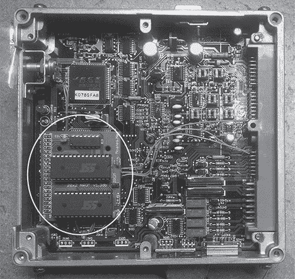
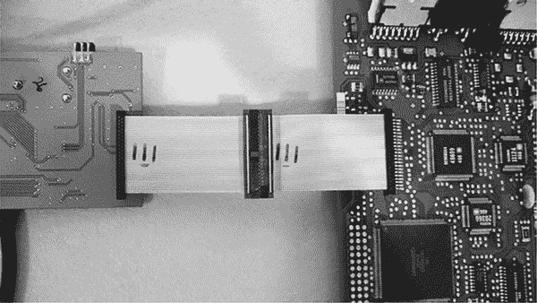
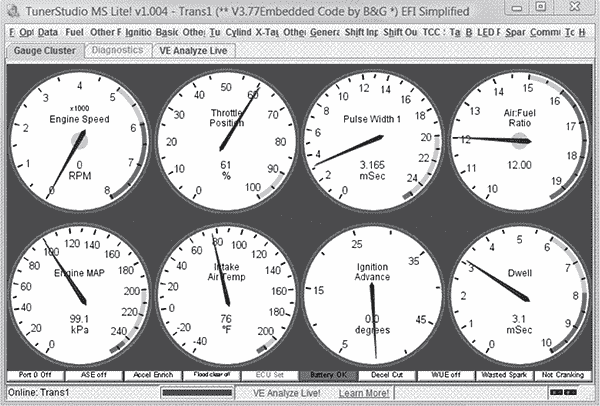

## **性能调校**

*由 Dave Blundell 撰写*

*性能调校*，通常简称为*tuning*，是指改变发动机的操作参数，以提高车辆性能。在当今的车辆中，这通常意味着修改发动机电脑，即使是机械性的修改也不例外。

性能调校对于大多数汽车赛事来说是必需的。根据《性能赛车产业》的数据，这个庞大的产业每年全球价值约 190 亿美元，仅在美国，每年就有近 50 万人参与赛车比赛。这些数据甚至未包括全球范围内参加业余赛车的许多改装车辆。

大多数性能调校仅仅是改变发动机的操作条件，以实现与原设计不同的目标。如果你愿意放弃一些安全性或使用不同于原设计的燃料，大多数发动机在动力或经济性方面都有很大的提升空间。

本章提供了发动机性能调校的概述，并讨论了在决定修改发动机操作的哪些方面时必须做出的权衡。以下是一些性能调校的代表性例子及成就：

• 为了提高 2008 年雪佛兰 Silverado 的拖载能力，安装了不同的后轴齿轮，但由于齿轮比的变化，导致车速表失准，变速器换挡过晚，防抱死刹车系统无法正常工作。需要重新编程发动机电脑，使车速表读数正确，同时变速器控制器也需要重新编程，以确保换挡正常。经过适当的校准后，车辆恢复正常工作。

• 在 2005 年款福特 F350 上，从夏季轮胎更换为冬季轮胎时，需要重新编程发动机和变速器电脑，以确保车速表准确和适当的变速器换挡。

• 作为 1995 年本田 Civic 发动机损坏后的替代方案，安装了 2000 年款本田 CR-V 的发动机和变速器。原车的发动机电脑经过重新编程和调校，以匹配新发动机。自更换发动机以来，这辆车已行驶近 60,000 英里。

• 调整变速器换挡时机及发动机对燃油和火花的使用，在工厂电脑的帮助下，使 2005 年款雪佛兰 Avalanche 的燃油效率得到了提升。这些改动使燃油经济性从 15.4 英里每加仑提高到 18.5 英里每加仑，同时保持了路易斯安那州的排放测试合规性。

• 在 1996 年款日产 240 中，工厂电脑被重新编程，以匹配新安装的发动机和变速器。在重新编程之前，这辆车几乎无法启动。重新编程后，车辆的表现就像是原厂配备新发动机时的样子。

**警告**

*几乎每个国家都有自己的排放法规，通常禁止篡改、禁用或拆除任何与排放相关的系统。许多性能改装，包括发动机计算机调校，涉及改变或移除车辆的排放部件，这对于在公共道路上行驶的车辆可能是非法的。在对任何车辆进行性能调校之前，请考虑当地的法律。*

### 性能调校的取舍

如果性能调校如此强大并提供如此多的好处，为什么汽车出厂时不设置最佳的调校？简短的回答是没有最佳设置；只有取舍和妥协，这取决于你希望从某辆特定车辆中得到什么。设置之间总是有相互作用。例如，获得最大马力的设置与提供最佳燃油经济性的设置并不相同。最低排放、最大燃油经济性和最大功率之间也有类似的取舍。为了同时提高燃油经济性和功率输出，必须增加燃烧的平均压力，这意味着发动机将更接近安全操作条件的极限。调校是一种妥协的博弈，发动机被配置以实现特定目标，而不至于自毁。

对于制造商而言，设计发动机性能时的优先顺序是确保

1.  确保发动机安全运行，

1.  它符合环保署（EPA）设定的排放标准，并且

1.  确保燃油效率尽可能高。

当制造商设计某些以性能为导向的车辆时，如雪佛兰科尔维特，动力输出可能也是一个重要考虑因素，但只有在满足排放要求之后才会优先考虑。标准设置通常会使发动机的功率未能达到最大值，通常是为了减少排放并保护发动机。

在不修改机械部件的情况下对发动机进行性能调校时，通常需要做出以下妥协：

• 增加功率会降低燃油经济性并产生更多的碳氢化合物排放。

• 增加燃油经济性可能会增加氮氧化物（NOx）排放。

• 增加扭矩会增加车辆发动机和结构部件的压力和应力。

• 增加气缸压力会导致爆震和发动机损坏的风险增加。

也就是说，通过提高刹车平均有效压力（BMEP），实际上是可以获得更多的动力*并且*提高燃油经济性的。BMEP 本质上是发动机工作过程中施加在活塞上的平均压力。然而，值得注意的是，要显著提高 BMEP，通常也需要增加燃烧事件中的峰值气缸压力，从而增加爆震的风险。由于发动机的物理结构、所使用的燃料以及物理和材料因素，存在着给定情况下峰值压力的硬性限制。超过某个限制的峰值气缸压力通常会导致没有火花的燃烧，这种现象被称为*自燃*，也叫做*爆震*，它通常会迅速损坏发动机。

### ECU 调校

发动机计算机是最常用于性能调校的车辆计算机。大多数性能改装旨在改变发动机的物理操作，这通常需要相应地调整发动机计算机的校准，以实现最佳操作。有时，这种重新校准需要通过移除并重新编程芯片来物理修改计算机，这就是*芯片调校*。在其他情况下，可以通过与 ECU 使用特殊协议进行通信而不是物理修改它来重新编程 ECU，这被称为*闪存编程*，或简称为*闪存*。

#### *芯片调校*

芯片调校是最古老的发动机计算机修改方式。大多数早期的发动机控制器使用专用的 ROM 内存芯片。为了改变芯片的操作，你必须物理地移除芯片，在 ECU 外部重新编程它，然后再安装回去——这个过程叫做*芯片调校*。那些希望对老旧车辆进行反复修改的用户通常会安装插座代替 ROM，以便更方便地插入和取出芯片。

汽车计算机使用多种不同类型的内存芯片。有些芯片只能编程一次，但大多数芯片可以擦除并重新使用。一些旧型号芯片上有窗口，需要使用紫外线 C 灯（一种灭菌灯）来擦除它们。

##### EPROM 编程器

芯片调校通常需要一个*EPROM 编程器*，这是一种可以读取、写入以及——如果支持——编程芯片的设备。在进行芯片调校时，务必小心确认你购买的编程器与所要修改的芯片类型兼容。没有所谓的真正通用的芯片编程器。以下是一些常见的 EPROM 编程器：

**BURN2** 一款相对便宜的基础编程器（约$85），支持在芯片编程中常用的 EPROM。它具有 USB 接口，支持开放的指令集，以及许多已经原生支持的调校应用程序 (*[`www.moates.net/chip-programming-c-94.html`](https://www.moates.net/chip-programming-c-94.html)*)。

**Willem** 另一个流行的 ROM 烧录器（价格从 $50 到 $100 不等，取决于型号）。最初的 Willem 使用并行端口接口，但较新版本使用 USB。（在 Ebay 或 MCUMall.com 上搜索 Willem。）

几乎所有 EPROM 编程器仅支持双列直插（DIP）芯片。如果您的车辆计算机使用表面贴装样式芯片，可能需要购买适当的附加适配器。通常建议从与编程器相同的来源获取任何适配器，以确保兼容性。所有适配器都应视为定制硬件。

图 13-1 显示了安装在 Nissan ECU 中的 ROM 适配板。左下角的两个空 28 引脚插座已添加到原始 ECU 中。通常需要进行一些焊接来修改和添加 ROM 板。

*图 13-1：安装了 Moates ROM 适配板的 1992 年 S13 Nissan KA24DE ECU*

##### ROM 模拟器

与其他调校方法相比，芯片调校的一大优势是可以使用 ROM 模拟器，它们将 ROM 内容存储在某种非易失性读写存储器中，使您可以对 ROM 进行即时修改。通过允许更多或更少的即时更改，ROM 模拟器可以大大减少调校车辆所需的时间，而刷写调校通常更新速度较慢。

ROM 模拟器通常使用 USB 或串行连接到 PC，并使用软件更新模拟器，以保持与 PC 上工作镜像的同步。以下是推荐的 ROM 模拟器：

**Ostrich2** 一款专为 8 位 EPROM 设计的 ROM 模拟器，支持从 4k（2732A）到 512k（4mbit 29F040）及其间的所有型号（27C128、27C256、27C512）。价格相对较低，约为 $185，具备带有开放命令集的 USB 接口，以及许多已经原生支持的调整应用程序（*[`www.moates.net/ostrich-20-the-new-breed-p-169.html`](https://www.moates.net/ostrich-20-the-new-breed-p-169.html)*）。

**RoadRunner** 针对 16 位 EPROM，如 PSOP44 封装的 28F200、29F400 和 28F800（参见 图 13-2）。价格约为 $489，具备带有开放命令集的 USB 接口，以及许多已经原生支持的调整应用程序（*[`www.moates.net/roadrunnerdiy-guts-kit-p-118.html`](https://www.moates.net/roadrunnerdiy-guts-kit-p-118.html)*）。

*图 13-2：与雪佛兰 12200411 LS1 PCM 连接的 RoadRunner 模拟器*

**OLS300** 一款仅适用于 WinOLS 软件的模拟器。价格约为 $3,000（需索取报价），原生支持多种 8 位和 16 位 EPROMs（*[`www.evc.de/en/product/ols/ols300/`](http://www.evc.de/en/product/ols/ols300/)*）。

#### *Flash Tuning*

与芯片调校不同，闪存调校（也称为闪存编程）不需要物理修改。闪存时，通过使用专门的协议与 ECU 通信来重新编程 ECU。

第一个可闪存的 ECU 大约在 1996 年左右问世。J2534 DLL 与 OEM 软件结合提供了闪存编程的方法，但大多数调校软件完全绕过了这一点，并与 ECU 直接通信。大多数后市场调校软件包——如 HP tuners、EFI Live、Hondata 和 Cobb——使用专有硬件，而不是 J2534 透传设备。Binary Editor (*[`www.eecanalyzer.net/`](http://www.eecanalyzer.net/)* )是一个提供 J2534 选项的软件实例，能够通过支持的 J2534 接口来编程 Ford 汽车。

##### RomRaider

RomRaider (*[`www.romraider.com/`](http://www.romraider.com/)* )是一个免费的开源调校工具，专为 Subaru 汽车设计。通过该工具，您可以使用 Tactrix OpenPort 2.0——一种与 RomRaider 兼容的透传硬件 (*[`www.tactrix.com/`](http://www.tactrix.com/)*，约 170 美元)。一旦您将透传电缆连接到 ECU，RomRaider 将允许您下载 ECU 的闪存。然后，您可以用*定义*文件或*def*文件打开这些闪存镜像，该文件映射了图像中参数的位置和结构，并提供了将数据以人类可读格式显示的公式。这种映射使您能够快速定位并更改发动机参数，而无需拆解闪存。图 13-3 显示了加载了闪存镜像和定义的 RomRaider。

*图 13-3：RomRaider ECU 编辑器*

### 独立发动机管理

逆向工程原厂电脑的一个替代方法是直接用后市场零件替换它们。一个流行的独立发动机计算机是 MegaSquirt (*[`megasquirt.info/`](http://megasquirt.info/)* )，这是一系列适用于几乎任何燃油喷射发动机的电路板和芯片。

MegaSquirt 源于 DIY 社区，旨在让人们能够编程自己的发动机电脑。早期的 MegaSquirt 单元通常需要用户自行组装电路板，但这些版本常常导致混淆，因为许多竞争的用户组装硬件设计并不完全兼容。因此，当前的设计趋向于预制格式，以提供更一致和统一的硬件平台。

有几个跨平台工具可与 MegaSquirt 硬件一起使用。图 13-4 展示了其中最受欢迎的一种：TunerStudio (*[`www.tunerstudio.com/index.php/tuner-studio/`](http://www.tunerstudio.com/index.php/tuner-studio/)*，约 60 美元)。TunerStudio 让您修改参数、查看传感器和发动机运行状态、记录数据，并分析数据以进行有针对性的调整。

*图 13-4：TunerStudio 仪表盘*

### 总结

本章展示了如何利用对车辆嵌入式系统的理解来改变其行为。我们已经看到，几乎任何对车辆的改动，即便是机械改装，都需要对车辆的计算机进行一些重新编程。我们探讨了标准出厂设置的改变如何导致性能上的权衡和妥协，因此，车辆的“最佳”设置始终取决于你的具体目标。我们还展示了一些性能调优方法的示例，包括芯片和闪存调优，并介绍了一些常用的硬件和软件工具，用于汽车调优。
