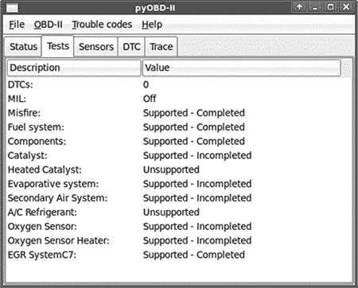
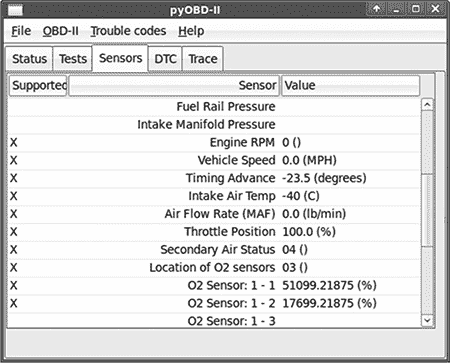
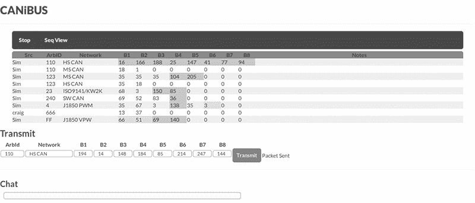
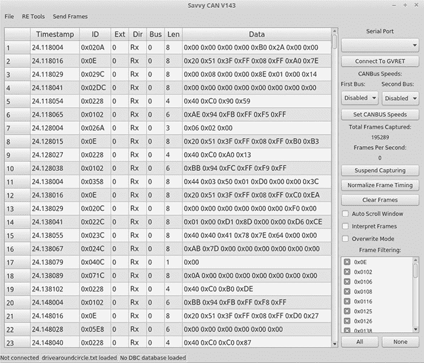
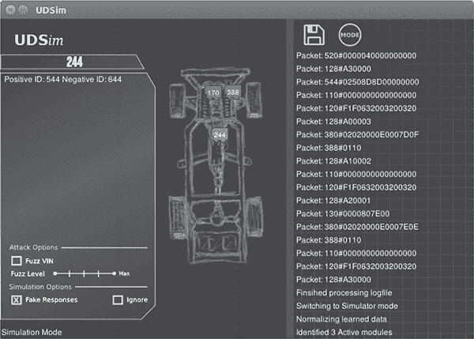
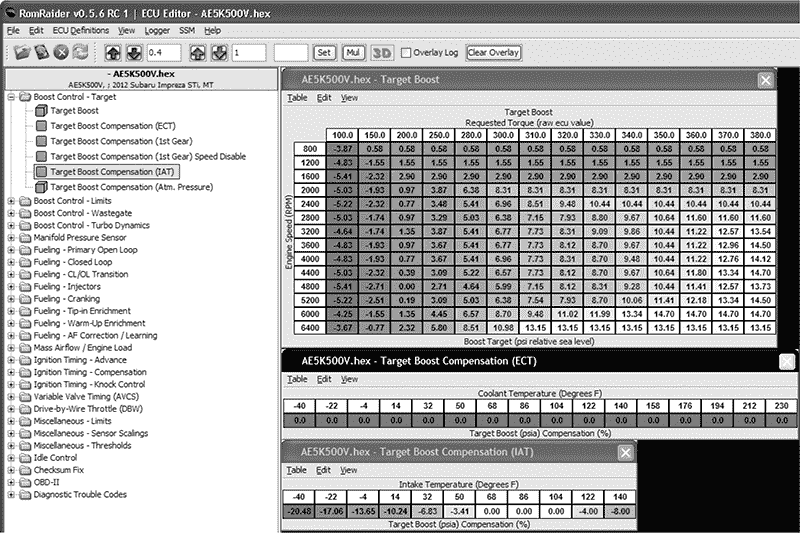

## 第十四章：A

**行业工具**

本节讨论了在研究车辆时可能想使用的不同工具。我选择专注于低成本设备和软件，因为我认为让尽可能多的人参与研究很重要。

Open Garages 愿意展示和推广有助于汽车研究的工具。如果你的公司生产了优秀的产品，可以随时联系 Open Garages，但除非有开放的方式来贡献你的工具，否则不要指望免费的宣传。

### 硬件

在本节中，我们将介绍像 ChipWhisperer 这样的开发板，以及提供 CAN 连接的类似加密狗的设备。我们首先将看低成本的开源硬件，然后探索一些高端设备，适合那些愿意多花一点钱的人。

尽管有许多经济实惠的设备可以与 CAN 总线通信，但与这些设备互动所需的软件可能不足，因此你通常需要自己编写。

#### *低端 CAN 设备*

这些设备对于嗅探 CAN 总线的内容和注入数据包非常有用。它们从业余爱好者级别的板子到支持许多自定义功能并能同时处理多个 CAN 总线的专业设备不等。

##### Arduino Shields

许多 Arduino 和类似 Arduino 的设备（$20 到 $30，* [`www.arduino.cc/`](https://www.arduino.cc/) *）在添加 Arduino shield 后可以支持 CAN。以下是一些支持 CAN 的 Arduino shields：

**CANdiy-Shield** MCP2515 CAN 控制器，带两个 RJ45 连接器和原型区

**ChuangZhou CAN-Bus Shield** MCP2515 CAN 控制器，带 D-sub 连接器和螺丝端子

**DFRobot CAN-Bus Shield** STM32 控制器，带 D-sub 连接器

**SeeedStudio SLD01105P CAN-Bus Shield** MCP2515 CAN 控制器，带 D-sub 连接器

**SparkFun SFE CAN-Bus Shield** MCP2515 CAN 控制器，配有 D-sub 连接器和 SD 卡座；具有 LCD 和 GPS 模块的连接器

这些 shields 都很相似。大多数运行 MCP2515 CAN 控制器，但 DFRobot shield 使用 STM32 控制器，这种控制器速度更快，且具有更多的缓冲内存。

无论你选择哪个 shield，你都需要为 Arduino 编写代码以嗅探数据包。每个 shield 都附带一个库，用于与该 shield 进行程序化接口。理想情况下，这些总线应该支持类似 LAWICEL 协议的功能，这使得它们能够通过笔记本电脑上的用户空间工具（如 SocketCAN）通过串口发送和接收数据包。

##### Freematics OBD-II Telematics Kit

这款基于 Arduino 的 OBD-II 蓝牙适配器套件包含 OBD-II 设备和数据记录器，还配有 GPS、加速度计、陀螺仪和温度传感器。

##### CANtact

CANtact 是 Eric Evenchick 开发的一个开源设备，是一个非常实惠的 USB CAN 设备，支持 Linux SocketCAN。它使用 DB 9 连接器，并具有独特的优势——可以通过跳线针脚更改哪些针脚为 CAN 和地线，这使得它支持美国和英国风格的 DB9 到 OBD-II 连接器。你可以在*[`cantact.io/`](http://cantact.io/)*购买 CANtact。

##### 树莓派

树莓派是一个替代 Arduino 的方案，价格大约在$30 到$40 之间。Pi 提供了一个 Linux 操作系统，但没有集成 CAN 收发器，因此你需要购买一个扩展板。

使用树莓派相较于 Arduino 的一个优势是，它允许你直接使用 Linux SocketCAN 工具，而无需购买额外的硬件。一般来说，树莓派可以通过 SPI 与 MCP2515 进行通信，只需要一些基本的接线。以下是一些树莓派的实现方案：

**Canberry** MCP2515 CAN 控制器，仅带有螺丝端子（没有 D 型连接器；$23）

**Carberry** 两条 CAN 总线和两条 GMLAN 线路，LIN 和红外（似乎不是开源扩展板；$81）

**PICAN CAN-Bus 板** MCP2515 CAN 控制器，带 D 型连接器和螺丝端子（$40 到$50）

##### ChipKit Max32 开发板和 NetworkShield

ChipKit 板是一个开发板，配合 NetworkShield 使用，可以提供一个可网络解释的 CAN 系统，详细内容请参考《翻译 CAN 总线消息》中第 85 页的讨论。大约$110，这个开源硬件方案由 OpenXC 标准推崇，并支持 OpenXC 提供的预编译固件，但你也可以为其编写自己的固件，并进行原始 CAN 操作。

##### ELM327 芯片

ELM327 芯片是目前市场上最便宜的芯片之一（价格从$13 到$40），并且它被广泛应用于大多数便宜的 OBD 设备。它通过串口与 OBD 通信，几乎支持任何类型的连接器，从 USB 到蓝牙、Wi-Fi 等。你可以通过串口连接到 ELM327 设备，它们还能够发送除了 OBD/UDS 数据包以外的其他数据包。如需获取完整的 ELM327 命令列表，请参见数据手册：[`elmelectronics.com/DSheets/ELM327DS.pdf`](http://elmelectronics.com/DSheets/ELM327DS.pdf)。

不幸的是，现有的 CAN Linux 工具不能在 ELM327 上运行，但 Open Garages 已经开始了一项网络计划，其中包括针对 ELM327 的嗅探驱动程序，名为 CANiBUS（*[`github.com/Hive13/CANiBUS/`](https://github.com/Hive13/CANiBUS/)*）。请注意，ELM327 的缓冲区空间有限，因此在嗅探时会丢失数据包，且传输可能不太精确。然而，如果你迫切需要，这是最便宜的选择。

如果你愿意打开设备并向你的 ELM327 焊接一些线，你可以重新烧录固件，将其转换为 LAWICEL 兼容设备，这样你那款超便宜的 ELM327 就能与 Linux 一起工作，并显示为 slcanX 设备！（你可以在位于爱荷华州得梅因的 Area 515 黑客空间博客中找到有关如何刷新 ELM327 的信息，网址是 *[`area515.org/elm327-hacking/`](https://area515.org/elm327-hacking/)*。）

##### GoodThopter 板

著名的硬件黑客 Travis Goodspeed 发布了一款开源、低成本的带 CAN 接口的板子，名为 GoodThopter。GoodThopter 基于他流行的 GoodFet 设备，采用 MCP2515 并通过串行与其自定义接口通信。你需要完全自己组装并焊接这个设备，但这样做的费用应该只需要几美元，具体取决于你在本地黑客空间可用的零件。

##### ELM-USB 接口

OBDTester.com 销售一款商业的 ELM-32x 兼容设备，价格大约为 60 美元。OBDTester.com 是 PyOBD 库的维护者（请参阅 第 246 页 的 “软件”）。

##### CAN232 和 CANUSB 接口

LAWICEL AB 生产商业 CAN 设备 CAN232，它通过带 DB9 接口的 RS232 端口插入，另外还有一款 USB 版本叫做 CANUSB（后者的价格为 110 到 120 美元）。由于这些设备是由 LAWICEL 协议的发明者制造的，因此它们保证能够与 `can-utils` 串行链接模块兼容。

##### VSCOM 适配器

VSCOM 是 Vision Systems 出品的一款经济实惠的商业 USB CAN 模块 (*[`www.vscom.de/usb-to-can.htm`](http://www.vscom.de/usb-to-can.htm)*)，采用 LAWICEL 协议。VSCOM 可以通过串行链接 (slcan) 与 Linux `can-utils` 配合使用，效果很好。该设备的价格大约在 100 到 130 美元之间。

##### USB2CAN 接口

来自 8devices 的 USB2CAN 转换器 (*[`www.8devices.com/usb2can/`](http://www.8devices.com/usb2can/)*) 是一种最便宜的非串行 CAN 接口替代方案。这款小型的商业 USB 设备将在 Linux 中显示为标准的 can0 设备，并且在这个价位范围内提供了最集成的支持。大多数显示为 canX 原始设备的设备是 PCI 卡，通常其价格远高于这款设备。

##### EVTV Due 板

EVTV.me (*[`store.evtv.me/`](http://store.evtv.me/)*) 专注于电动汽车改装。他们制作了许多用于对你历史车辆进行疯狂改装的工具，比如给它加装特斯拉动力系统。他们的其中一款工具是一个价值 100 美元的开源 CAN 嗅探器，名为 EVTV Due，实际上是一个内置 CAN 收发器和带螺丝端子接口的 Arduino Due。这款板子最初是为与他们的 SavvyCAN 软件一起使用而编写的，SavvyCAN 使用他们的通用车辆逆向工程工具 (GVRET)，但现在也支持 SocketCAN。

##### CrossChasm C5 数据记录仪

CrossChasm C5 (*[`www.crosschasm.com/technology/data-logging/`](http://www.crosschasm.com/technology/data-logging/)* ) 是一款商业设备，支持 Ford VI 固件，售价大约$120。C5 支持 VI，也就是 CAN 翻译器，可以将 CAN 消息转换为 OpenXC 格式，并将一些专有的 CAN 数据包转换成通用格式，通过蓝牙发送。

##### CANBus Triple Board

正如我写这篇文章时，CANBus Triple (*[`canb.us/`](http://canb.us/)* ) 仍在开发中。它使用的是专为马自达设计的接线束，但它支持任何车辆的三条 CAN 总线。

#### *高端 CAN 设备*

高端设备会更贵，但它们能够接收更多的同时通道，并提供更多内存，以帮助防止数据包丢失。高性能工具通常支持八个或更多通道，但除非你正在处理赛车车辆，否则你可能不需要这么多通道，因此在花费之前一定要确认是否真的需要这样的设备。

这些设备通常附带专有软件或软件订阅，有时需要支付额外的高费用。确保所选设备的相关软件可以完成你想要的功能，因为你通常会被锁定在他们的 API 和首选硬件中。如果你需要与 Linux 兼容的高端设备，可以尝试 Kvaser、Peak 或 EMS Wünsche。这些公司的设备通常使用 sja1000 芯片组，价格从$400 起。

##### CAN 总线 Y 型分接器

CAN 总线 Y 型分接器是一个非常简单的设备，基本上是一个 DLC 连接器分成两个连接器，这样你就可以将一个设备插入一个端口，将 CAN 嗅探器插入另一个端口。它们通常在亚马逊上售价大约$10，实际上制作起来非常简单。

##### HackRF SDR

HackRF 是 Great Scott Gadgets 公司出品的 SDR 设备 (*[`greatscottgadgets.com/hackrf/`](https://greatscottgadgets.com/hackrf/)* )。这个开源硬件项目可以接收和发送从 10 MHz 到 6 GHz 的信号。大约$330 的价格，性价比极高，是一个不可多得的 SDR 设备。

##### USRP SDR

USRP (*[`www.ettus.com/`](http://www.ettus.com/)* )是一个专业的模块化 SDR 设备，你可以根据自己的需求进行构建。USRP 是开源的，价格从$500 到$2,000 不等。

##### ChipWhisperer 工具链

NewAE Technologies 生产 ChipWhisperer (*[`newae.com/chipwhisperer/`](http://newae.com/chipwhisperer/)* )。正如在《使用 ChipWhisperer 进行侧信道分析》的第 134 页中讨论的那样，ChipWhisperer 是一个用于侧信道攻击的系统，例如功耗分析和时钟故障注入。类似的系统通常价格超过$30,000，但 ChipWhisperer 是一个开源系统，价格在$1,000 到$1,500 之间。

##### Red Pitaya Board

Red Pitaya (*[`redpitaya.com/`](http://redpitaya.com/)*) 是一款开源测量工具，售价约为 500 美元，可以替代昂贵的测量工具，如示波器、信号发生器和频谱分析仪。Red Pitaya 提供 LabView 和 Matlab 接口，你还可以为其编写自己的工具和应用程序。它甚至支持类似 Arduino 扩展板的扩展。

### 软件

和硬件一样，我们首先关注开源工具，然后再介绍一些更昂贵的工具。

#### *Wireshark*

Wireshark (*[`www.wireshark.org/`](https://www.wireshark.org/)*) 是一款流行的网络嗅探工具。只要你使用的是 Linux 系统并且启用了 SocketCAN，就可以在 CAN 总线网络上使用 Wireshark。Wireshark 本身没有任何功能来帮助排序或解码 CAN 数据包，但在紧急情况下它可能会有用。

#### *PyOBD 模块*

PyOBD (*[`www.obdtester.com/pyobd`](http://www.obdtester.com/pyobd)*)—也叫 *PyOBD2* 和 *PyOBD-II*—是一个 Python 模块，用于与 ELM327 设备通信（见 图 A-1 和 A-2）。它基于 PySerial 库，旨在提供一个便捷的界面来获取你的 OBD 设置信息。对于 PyOBD 的特定扫描工具分支，请参考 Austin Murphy 的 OBD2 扫描工具 (*[`github.com/AustinMurphy/OBD2-Scantool/`](https://github.com/AustinMurphy/OBD2-Scantool/)*)，它旨在成为一个更完整的开源诊断故障排除解决方案。

*图 A-1: PyOBD 正在运行诊断测试*

*图 A-2: PyOBD 正在读取传感器数据*

#### *Linux 工具*

Linux 默认支持 CAN 驱动，SocketCAN 提供了一个简单的网卡接口体验来处理 CAN。你可以使用其 `can-utils` 套件进行命令行实现，作为开源软件，它非常容易扩展功能到其他实用程序中。（有关 SocketCAN 的更多信息，请参见 第三章）。

#### *CANiBUS 服务器*

CANiBUS 是一个由 Open Garages 用 Go 语言编写的 Web 服务器（见图 A-3）。该服务器允许一群研究人员同时在同一辆车上工作，无论是用于教学目的还是团队逆向工程会话。Go 语言可以移植到任何操作系统，但在某些平台上可能会遇到低级驱动问题。例如，即使你在 Linux 上运行 CANiBUS，你也无法直接与 SocketCAN 进行交互，因为 Go 不支持初始化 CAN 接口所需的套接字标志。（这个问题可以通过实现 socketcand 来解决，但截至目前，该功能尚未实现。）CANiBUS 确实有一个支持通用嗅探的 ELM327 驱动。你可以在 *[`wiki.hive13.org/view/CANiBUS/`](http://wiki.hive13.org/view/CANiBUS/)* 上了解更多关于 CANiBUS 的信息，并可以从 *[`github.com/Hive13/CANiBUS/`](https://github.com/Hive13/CANiBUS/)* 下载源代码。

*图 A-3：基于组的 CANiBUS 网络嗅探器*

#### *Kayak*

Kayak (*[`kayak.2codeornot2code.org/`](http://kayak.2codeornot2code.org/)*) 是一个基于 Java 的图形界面，用于分析 CAN 数据流。它具有多个高级功能，如 GPS 跟踪以及记录和回放功能。它使用 socketcand 来支持在其他操作系统上运行，因此你至少需要一个基于 Linux 的嗅探器来支持 Kayak。（你可以在第 46 页的“Kayak”中找到更多关于设置和使用的详细信息。）

#### *SavvyCAN*

SavvyCAN 是由 EVTV.me 的 Collin Kidder 编写的工具，它使用 EVTV.me 设计的另一个框架，GVRET，与硬件嗅探器（如 EVTV Due）进行通信。SavvyCAN 是一个开源的、基于 Qt 图形界面的工具，支持多种操作系统（见图 A-4）。它包含几个非常实用的功能，如 DBC 编辑器、CAN 总线图形化、日志文件差异对比、多个逆向工程工具以及所有你期望的正常 CAN 嗅探功能。SavvyCAN 不与 SocketCAN 进行通信，但它可以读取多种不同的日志文件格式，如 Bushmaster 日志、Microchip 日志、CRTD 格式和通用的 CSV 格式日志文件。

*图 A-4：SavvyCAN 图形界面*

#### *O2OO 数据记录仪*

O2OO (*[`www.vanheusden.com/O2OO/`](http://www.vanheusden.com/O2OO/)*) 是一个开源的 OBD-II 数据记录仪，它与 ELM327 配合工作，将数据记录到 SQLite 数据库中以供图形化分析。它还支持读取 NMEA 格式的 GPS 数据。

#### *Caring Caribou*

Caring Caribou (*[`github.com/CaringCaribou/caringcaribou/`](https://github.com/CaringCaribou/caringcaribou/)*), 用 Python 编写，旨在成为汽车黑客领域的 Nmap。到目前为止，它仍处于起步阶段，但展现出了巨大的潜力。Caring Caribou 拥有一些独特的功能，比如能够暴力破解诊断服务，并支持 XCP 协议。它还具备标准的嗅探和发送 CAN 功能，并支持自定义模块。

#### *c0f 指纹识别工具*

CAN of Fingers (c0f) 是一个开源工具，用于识别 CAN 总线系统的指纹，可以在 *[`github.com/zombieCraig/c0f/`](https://github.com/zombieCraig/c0f/)* 找到。它提供了一些基本的支持，用于识别 CAN 总线网络流中的模式，在尝试找到噪声总线中的特定信号时非常有用。（参见 “使用 c0f” 在 第 206 页的示例）

#### *UDSim ECU 模拟器*

UDSim (*[`github.com/zombieCraig/UDSim/`](https://github.com/zombieCraig/UDSim/)*) 是一个 GUI 工具，可以监控 CAN 总线，并通过观察通信自动学习连接到总线的设备（见图 A-5）。它旨在与其他诊断工具一起使用，如经销商工具或当地汽车商店的扫描工具。

*图 A-5：UDSim 在测试台上学习模块时的示例屏幕*

UDSim 有三种模式：学习模式、仿真模式和攻击模式。在学习模式下，它识别出响应 UDS 诊断查询的模块，并监控其响应。在仿真模式下，它模拟一辆车在 CAN 总线上，目的是欺骗或测试诊断工具。在攻击模式下，它为类似 Peach Fuzzer 的工具创建模糊测试配置文件 (*[`www.peachfuzzer.com/`](http://www.peachfuzzer.com/)*).

#### *Octane CAN 总线嗅探器*

Octane (*[`octane.gmu.edu/`](http://octane.gmu.edu/)*) 是一个开源的 CAN 总线嗅探器和注入器，具有非常友好的界面，用于发送和接收 CAN 数据包，包括一个 XML 触发系统。目前，它只在 Windows 上运行。

#### *AVRDUDESS GUI*

AVRDUDESS (*[`blog.zakkemble.co.uk/avrdudess-a-gui-for-avrdude/`](http://blog.zakkemble.co.uk/avrdudess-a-gui-for-avrdude/)*) 是一个为 AVRDude 设计的 GUI 前端，使用.NET 编写，尽管在 Linux 上使用 Mono 也能很好地运行。在 “使用 AVRDUDESS 准备你的测试” 中，你会看到 AVRDUDESS 的实际应用，位于第 139 页。

#### *RomRaider ECU 调试器*

RomRaider (*[`www.romraider.com/`](http://www.romraider.com/)*) 是一款开源调校套件，用于 Subaru 引擎控制单元，允许您查看、记录数据并调校 ECU（见 图 A-6）。它是为数不多的开源 ECU 调校工具之一，能够处理 3D 视图和实时数据记录。您需要一根 Tactrix Open Port 2.0 电缆和 Tactrix EcuFlash 软件来下载并使用 ECU 的固件。一旦使用 EcuFlash 下载了固件，您可以通过 RomRaider 编辑它。该编辑器是用 Java 编写的，目前支持 Windows 和 Linux，尽管 EcuFlash 不支持 Linux。

*图 A-6：RomRaider 调校编辑器*

#### *Komodo CAN 总线嗅探器*

Komodo 是一款高端嗅探器，具有良好的多操作系统—Python SDK。根据您需要的单通道或双通道 CAN 接口，价格大约为 $350 到 $450。Komodo 具有隔离功能，可以防止您的计算机在接线错误时被烧毁，还配备了八个通用输入输出引脚，您可以将它们配置为触发外部设备的操作。Komodo 附带了一些不错的软件，让您可以快速上手，但真正的优势是您可以编写自己的 Komodo 软件。

#### *Vehicle Spy*

Vehicle Spy 是 Intrepid Control Systems 的一款商业工具（*[`store.intrepidcs.com/`](http://store.intrepidcs.com/)*)，专门用于反向工程 CAN 和其他车辆通信协议。该软件要求每个 NeoVI 或 ValueCAN 设备都需要一张许可，这两个设备都是 Vehicle Spy 的专有设备。ValueCAN3 是与 Vehicle Spy 配合使用的最便宜的设备，具有一个 CAN 接口，价格大约为 $300。添加 Vehicle Spy Basic 软件后，您的总费用将约为 $1,300。

NeoIV 设备属于高端设备，具有多个可配置通道，起价大约为 $1,200。基础包包含一个 NeoIV（红色）和 Vehicle Spy Basic，售价为 $2,000，能够节省一些费用。Vehicle Spy Professional 的价格大约为 $2,600，不包括硬件。（您可以在 Intrepid 网站上找到多个选项。）

所有 Intrepid 硬件设备都支持上传脚本并实时在总线上运行。Vehicle Spy Basic 支持 CAN/LIN RX/TX 操作。只有当您将汽车黑客攻关作为全职项目，或希望使用 ECU 刷写或其他高级功能（如节点仿真、嗅探器上的脚本编写或内存校准）时，才需要专业版。
