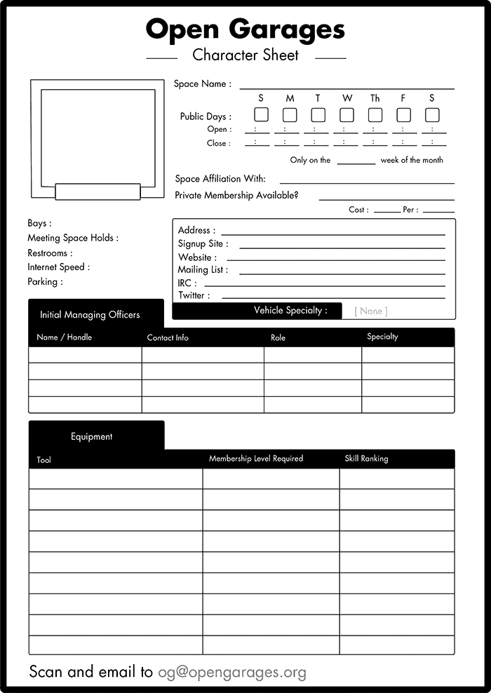

## **C**

**创建你自己的开放车库**

开放车库是由志同道合的个人组成的合作组织，旨在通过性能调优、艺术改装或安全研究等方式进行汽车系统的黑客攻击。美国和英国都有开放车库小组，任何人都可以创建或加入一个小组。当然，你也可以在自己的车库中进行黑客攻击，但和朋友一起进行多个项目的黑客攻击要更加有趣和富有成效。要了解更多信息，请访问*[`www.opengarages.org/`](http://www.opengarages.org/)*，查看你所在地区的小组详情，加入邮件列表接收最新公告，并在 Twitter 上关注开放车库 @OpenGarages。

### **填写角色表**

如果你所在的地区没有开放车库小组，你可以创建一个！我将带你一步步了解如何创建自己的小组，随后你可以将开放车库角色表提交到 *og@openGarages.org*。

角色表有几个不同的部分。左上方的方框是你应该用来勾画你车库想法的地方。你可以画任何你想要的内容：车库布局、笔记、标志等等。你可以现在就为你的空间想个名字，或者等到有更多成员时再决定。如果你计划在现有的黑客空间举办会议，可能想直接使用那个空间的名字或它的某种变体。

#### ***何时开会***

选择一个固定的日期开会。大多数小组每月开会一次，但你可以根据需要安排更多的会议。会议的时间安排可能取决于你所拥有的空间类型，以及你是否与他人共享这个空间。

勾选“公共开放日”旁的复选框，选择你希望对公众开放的日期。在复选框下方，填写你的开放和关闭时间。如果你希望你的活动不是每周举办，可以选择每月的某一周进行。举例来说，如果你希望每月的第一个星期六从 6 点到 9 点举行会议，你的表格应该像图 C-1 那样。

*图 C-1：每月第一个星期六安排会议*

#### ***隶属关系和私人会员资格***

如果你正在与其他小组或黑客空间合作，请在“空间隶属”一栏中注明。然后决定是否希望提供私人会员资格。你的开放车库小组必须至少在每月的某一天对公众开放，但你可以提供私人会员资格，附加一些特权，例如延长开放时间或使用特殊设备。私人会员费用可以帮助支付空间租赁、工具、保险以及其他各种费用。

如果你隶属于一个黑客空间，可以在此部分填写他们的会员费用信息。有时，找到一个本地的黑客空间并在其地点举办 Open Garages 会议会更为方便。如果你选择这样做，请确保遵守该黑客空间的所有规则和要求，并尽量通过你的公告宣传他们的空间。务必列出会员费用和支付频率，通常是按月或按年支付。

#### ***定义你的会议空间***

在表格左上角的车库示意图下方，有一些关于你的空间的基本问题。你不需要立即获得车间的使用权限才能启动 Open Garages 小组，但你应该有一个讨论项目和合作的地方，无论是家庭车库、黑客空间、机械师店，甚至是咖啡店。

以下是如何回答角色表上的问题：

**车位** 如果有车位，请注明可用的车位数量。如果你在一个两车车库中举办会议，你可以在这里填写*2*。如果你在咖啡店或类似的场所举行会议，填写*0*。

**会议空间容纳量** 尝试确定你的空间可以容纳多少人。如果你在咖啡店举办会议，请注明你认为可以容纳多少人。如果你的空间有办公室区域，计算出它可以容纳多少人。如果你的空间是车库或停车场，可以写*不适用*。你也可以在这里注明是否无障碍通道。

**洗手间** 在 Open Garages 会议期间提供饮料是个好主意，因此你需要有洗手间的访问权限。你可以在这里填写*是*、*否*或类似*棚子后面*的信息。

**网络速度** 如果你的空间是有 Wi-Fi 的咖啡店，你可以直接写*Wi-Fi*，如果你知道自己的网络速度，注明一下也很有用。如果你在一个没有互联网连接的车库或其他地方，可以写*热点*或*不适用*。

**停车** 请在此处注明成员可以停车的位置以及该区域是否有特别的停车规则。你还应注明这些规则是否会因时间或是否为私人会员而有所不同。

#### ***联系信息***

在空间描述右侧的框中，你应该填写所有的联系信息，供有意合作和组织的人使用。大多数信息应该是不言而喻的。仅当你采取私人会员制或需要 RSVP 时，才需要填写“报名网站”部分；否则，可以留空或填写*不适用*。网站部分应列出你小组的主网站。如果你没有网站，可以使用*[`www.opengarages.org/`](http://www.opengarages.org/)*。如果你有 IRC 聊天室或 Twitter 账户，可以在这里列出。其他信息可以在“其他”栏目下填写。

标有“车辆专业”字样的黑色框是您可以添加有关您团队特定车辆焦点的信息的地方，例如 *BMW* 或 *摩托车*。您也可以利用这个空间限制在该空间内进行的研究类型，例如，如果您只对研究性能调校感兴趣。

#### ***初始管理人员***

要启动一个开放车库小组，您需要一些人来承担领导责任，确保一切尽可能顺利开始。这个名单上的第一个人应该当然是您！如果您能立刻找几位朋友来帮忙，那就更好了。如果没有，您可以自己运营小组，直到有更多成员加入。

管理人员的主要责任是确保空间按时开放，并在结束时安全关闭。如果您计划启动一个完整的非营利组织，这个名单可能包括您的董事会成员。

这是您需要提供的管理人员信息：

**姓名/昵称** 您的名字或昵称。无论您选择列出哪一项，都应与您的联系信息匹配。例如，如果您在昵称旁边列出了电话号码，您应该准备好以该方式接听电话。

**联系信息** 您是负责人，人们需要与您联系，因此请列出您的电子邮件地址或电话号码。如果您将表格发送到 *[`www.opengarages.org/`](http://www.opengarages.org/)*，这些信息不会被公开或出现在任何网站上。联系信息仅供您在您空间内使用。

**角色** 您可以列出任何您喜欢的角色，无论是所有者、会计、机械师、黑客、焚烧者等。

**专长** 如果您有专长，例如您是奥迪机械师或反向工程师，可以在此列出。

#### ***设备***

这是您应该列出任何可用设备或计划在空间中提供的设备的地方。请参见附录 A，以获取关于对您开放车库小组有帮助的硬件和软件的建议。列出的工具包括 3D 打印机、MIG 焊机、升降机、滚轮、扫描工具等。无需列出小物品，如螺丝刀和接头。

如果某些工具价格昂贵或需要培训才能使用，您可以在会员等级栏中标明用户必须是付费会员才能使用这些工具。您也可以使用技能排名栏，说明操作某些工具所需的技能或培训等级。
