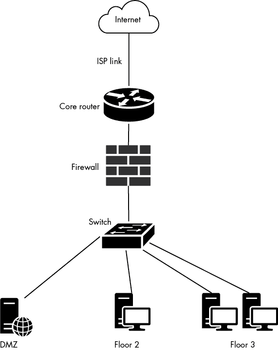
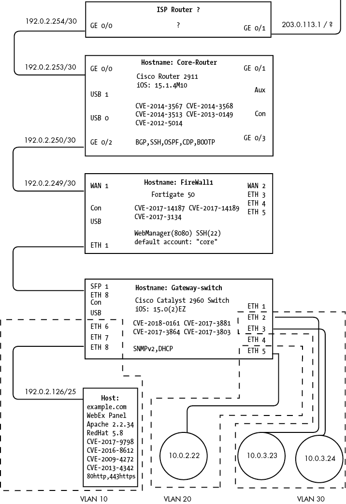
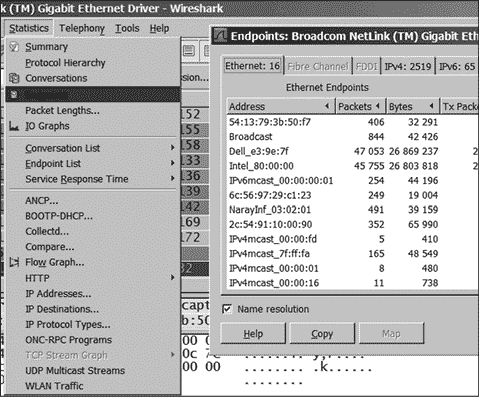
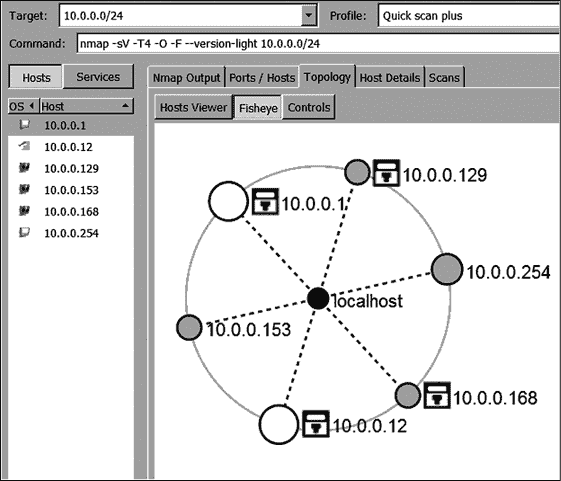
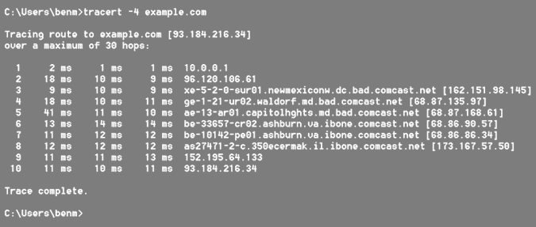

# 第一章：绘制网络图

有了这些地图，将军就能考虑如何防守和攻击城堡。

> 关于移动营地，有一套关于时间和移动日期的原则。忍者的职责是准确了解该地区的地理信息以及到敌人的距离。
> 
> —吉盛守百首 #9
> 
> *一旦你获得了城堡或营地的细节和布局，你所需要做的就是尽快带回这些信息，这正是一个优秀忍者应当做的事。*
> 
> —吉盛守百首 #24

*《万川集海》*中《指挥官指南》提供的第一条建议是制作精确无误的地图，供将军们用来策划对敌人的攻击。^(1) *吉盛守百首*的精选诗篇^(2)也强调了绘制并保持足够细致的地图的重要性，以便军队和个别*忍者*都能使用。

指挥官通常会让忍者负责制作地图。卷轴中明确指出，能够准确绘制你所看到的——山脉、河流、田野——并不等同于绘制有目的、具有情境化的威胁情报地图，以帮助军事战略或忍者渗透。卷轴中指出，以下细节与战争战术和忍者技艺相关，因此应当在地图中加以包括：^(3)

1.  房屋、城堡或堡垒的所有入口和大门。它们使用了什么类型的锁、插销和开门机制？开门或关门时是否困难，它们在开关时会发出声音吗？

1.  接近的道路。它们是直线还是弯曲的？宽还是窄？是土路还是石路？是平坦还是倾斜的？

1.  结构的设计、构造和布局。每个房间的大小和用途是什么？每个房间里存放了什么？地板是否吱吱作响？

1.  建筑物的居民。他们的名字是什么？是否有任何值得注意的技能或艺术？每个人的警觉性或怀疑性如何？

1.  城堡及其周边区域的拓扑结构。信号中继从城内外是否可见？食物、水源和木材存放在哪里？护城河有多宽多深？城墙有多高？

## 理解网络地图

*网络地图*在网络安全中是描述网络中*链路*（通信连接）和*节点*（设备）之间物理和/或逻辑关系及配置的网络拓扑图。为了更好地理解这一概念，可以考虑路地图或地图集中的地图。这些地图描述了物理位置、地理特征、政治边界和自然景观。关于道路（链路）的信息——它们的名称、方向、长度以及与其他道路的交汇点——可以用来在不同地点（节点）之间导航。现在让我们考虑以下假设场景。

想象一下，你生活在一个道路和建筑物在眨眼间自发出现或消失的世界里。GPS 存在，你知道自己所在的位置和想去的地方，但你必须通过一张不断变化的道路网络尝试到达目的地。幸运的是，每个十字路口都有导航员（*路由器*）来帮助像你这样的旅行者找到方向。这些路由器不断呼叫邻近的路由器，了解哪些路线和位置是开放的，以便更新它们的路由表，保存在剪贴板上。你必须在每个交叉口停下来，向路由器出示你的旅行卡，询问到下一个角落的路线，旅行卡上标有你的目的地的 GPS 坐标。路由器在计算的同时查看剪贴板，迅速指引你前进，并在你的旅行卡上盖上路由器的地址，打孔记录你在旅途中已经检查过的路由器数量，然后将你送往下一个路由器。你将重复这一过程，直到到达目的地。现在想象一下这个世界的制图师，他们可能已经放弃了制作准确地图的工作，因为无法跟上不断变化的网络。这些制图师只能满足于标记一些关键地标和兴趣点，并用通用名称标出这些地标，在它们之间画上模糊的线条，表示在它们之间有某种路径存在。

这个假设的情况实际上就是网络空间中存在的情况，这也是为什么网络地图不够准确，并且其维护没有得到应有重视的原因。缺乏高质量、全面的网络地图是网络安全组织面临的公认挑战。如果一个组织有网络地图，它通常是提供给安全运营中心（SOC），用以说明传感器或安全设备在数据流中的位置，并帮助更好地理解数据包捕获、防火墙规则、警报和系统日志。然而，这些地图通常也比较抽象，仅描述一些基本特征，如互联网、外部网络和内网的边界；边缘路由器或防火墙的大致位置；以及未指定的网络边界和概念性布局，用模糊的气泡表示。网络安全和 IT 专业人士常见的一个未充分发展的网络地图例子，见图 1-1。

为了说明为什么图 1-1 是“糟糕”的地图，我们将重新审视*万川集海*关于制图的建议，并用等效的网络安全细节来进行对比。

1.  网络中节点的所有接入点。设备上有哪些类型的接口接入点（以太网 [e]、快速以太网 [fe]、千兆以太网 [ge]、通用串行总线 [USB]、控制台 [con]、回环 [lo]、Wi-Fi [w] 等）？是否存在网络接入控制（NAC）或媒体接入控制（MAC）地址过滤？远程或本地控制台访问是否启用或未被锁定？是否有物理安全措施？是否有机架门锁或 USB 锁？是否有接口访问日志记录？网络管理接口和网络在哪里？每个接入点的 IP 地址和 MAC 地址是什么？

图 1-1：简化的网络图

1.  边界网关、跳数和出口点。是否有多个互联网服务提供商（ISP）？它是受信的互联网连接（TIC）还是托管互联网服务（MIS）？互联网连接的带宽是多少？出口连接是通过光纤、以太网、同轴电缆还是其他介质？接近网络的跳数有哪些？网络进出的出口方式是卫星、微波、激光还是 Wi-Fi？

1.  网络的设计、组成和布局。每个子网的名称、目的和大小是什么（例如，无类域间路由 [CIDR]）？是否有虚拟局域网（VLAN）？是否存在连接池限制？网络是平面的、层次化的，还是根据建筑结构或防御层级和/或功能进行划分的？

1.  网络的主机和节点。它们的名称是什么？它们的操作系统（OS）版本是什么？它们运行哪些服务/端口，哪些是开放的？它们具有什么安全控制可以检测到攻击？它们是否有任何已知的常见漏洞利用（CVE）？

1.  网络和建筑的物理与逻辑架构。数据中心在哪里？大厅内有以太网插孔吗？Wi-Fi 是否会泄漏到建筑物外？计算机屏幕和终端从建筑物外是否可见？办公室是否使用安全玻璃？访客/会议室网络是否得到了适当的划分？网络的核心访问控制列表（ACL）和防火墙规则是什么？DNS 在哪里解析？外围网络或 DMZ 中有哪些资源？是否使用外部电子邮件提供商或其他云服务？网络中的远程访问或虚拟私人网络（VPN）架构是怎样的？

没有有效网络地图的组织可能会参考其 IT 部门提供的接线图或原理图。这些简化的示意图记录了系统、网络设备和设备连接的相对布局，并且可以作为网络故障排除时的参考。然而，许多组织甚至放弃了这些粗略的图示，而更倾向于使用一个电子表格，记录主机名、型号和序列号、街道和 IP 地址，以及所有设备的数据中心堆栈/机架行。如果利益相关者能够使用这个电子表格来定位资产，并且从未遇到过任何重大网络问题或故障，那么这种文档的存在甚至可能会阻碍网络地图的创建。令人震惊的是，一些公司依赖于一个心中有“地图”的架构师或专家，而从未正式（甚至非正式）制作任何地图。

公正地说，缺乏有效网络地图是有其合理原因的。构建、共享和维护地图会消耗大量宝贵的时间和其他资源。地图也可能会发生变化。向网络中添加或移除系统、更改 IP 地址、重新配置电缆或推送新的路由器或防火墙规则，都可能显著改变地图的准确性，即使它是在几分钟前制作的。此外，现代计算机和网络设备运行动态路由和主机配置协议，这些协议会自动将信息推送到其他系统和网络，而无需地图，这意味着网络本质上可以自我配置。

当然，也有大量基于软件的“映射”工具，例如 Nmap^(4)，可以扫描网络以发现主机，通过扫描器的跳数可视化网络，使用简单网络管理协议（SNMP）发现并绘制网络拓扑，或使用路由器和交换机配置文件快速生成网络图。由工具生成的网络图非常方便，但它们很少能够捕捉到防守方或对手所需的高质量映射标准所需的所有细节或上下文。使用映射工具、网络扫描和人工知识相结合来绘制一个软件辅助的网络地图可能是理想的解决方案——但即便如此，这种方法仍然需要投入大量时间，由具有专业技能的人来保持其准确性，从而使其具有实用性。

尽管有这些限制因素，防守方保持对地图的警觉性仍然至关重要。图 1-2 中的示例地图展示了防守方的地图应包含的详细程度，以保护网络。

网络中的设备使用独特的形状表示，而非象形符号。相似设备类型会使用相同的形状。例如，图 1-2 中的圆形代表工作站，方形代表路由器，矩形代表服务器；如果有的话，三角形则代表电子邮件中继或域控制器。此外，形状没有纹理或背景，使得写在其中的信息可以清晰可读。

每个接口（虚拟接口和物理接口）都会标明其类型和编号。例如，Ethernet 接口类型标为`eth`，接口编号与设备上实际标记的一致，标为`eth 0/0`。未使用的接口也会被标注。每个接口会标明其分配的 IP 地址和子网（如果已知）。

设备信息，如主机名、品牌和型号、操作系统版本，通常会在设备顶部标明。如果已知，漏洞、默认凭证、已知凭证和其他关键缺陷会标注在设备的中央。运行的服务、软件和开放的端口也会被记录下来。VLAN、网络边界、布局和结构应设计到网络图中，并做相应标注，包含任何重要信息。

图 1-2：详细的网络图

## 收集未被发现的情报

对于忍者来说，收集情报而不被发现是一项精英技能。如果在城堡附近徘徊并用木匠角尺或其他工具进行详细测量，就会引起居民的注意，暴露忍者为敌方间谍。因此，勤奋的忍者通常会在和平时期制作地图，那时防御工事的守卫放松警惕；在这些时期，忍者可以更自由地行动，收集数据时也不容易引起怀疑。^(5)

然而，忍者通常需要想出一些隐秘的方式来测量、记录地形特征并收集其他情报。值得注意的是，*万川集海*中有一段描述，讲述了如何在开放伪装技巧的章节中准确制作地图，这表明忍者通过欺骗手段，在敌人眼皮底下进行制图。这段卷轴提到了一种名为*裏三津之术*^(6)——估算距离的技巧——它涉及利用已知物体的尺寸来估算与熟悉物体之间的距离。*裏三津之术*还包含了巧妙的三角函数技巧；例如，忍者可能会躺下，脚对着目标，利用自己脚的已知尺寸来进行测量，整个过程中看起来像是在树下打盹。

收集网络信息是攻击者在攻击目标网络或主机之前首先进行的工作之一。攻击者创建的地图与历史忍者地图的目的相同：识别并记录渗透目标所需的信息。这些信息包括网络的所有出口和入口点：ISP 连接；无线接入点；超高频（UHF）、微波、无线电或卫星点；以及云、互联和外部网络。

攻击者还会寻找边界网关协议（BGP）网关和通往网络的路由或跳数。他们会寻找网络的表现性结构、布局和设计；网络清单，包括主机名、设备型号、操作系统、开放端口、运行服务和漏洞；以及网络拓扑，如子网、VLAN、ACL 和防火墙规则。

攻击者使用的许多网络映射工具都是“嘈杂的”，因为它们会与大量主机通信，使用自定义数据包，并可能被内部安全设备检测到。然而，攻击者可以通过减慢或限制网络映射工具的速度、使用非自定义（不易引起怀疑）数据包，甚至使用受害主机上已有的常用工具进行手动侦察来减轻这些弱点，比如 `ping` 或 `net`。攻击者还可以使用无害的侦察方法，在这种方法中，攻击者不直接接触或扫描目标，而是使用 Shodan 或通过互联网搜索引擎找到的其他先前索引的数据来收集信息。

更为复杂的攻击者会发展出“被动映射”的技艺，这是一种策略，攻击者通过不直接与目标互动（例如不使用 Nmap 扫描）来收集目标的信息。另一种被动映射策略是解释从网络接口捕获的数据包，在 *混杂模式* 下，该模式配置网络接口记录并检查所有网络通信；这与 *非混杂模式* 相对，在非混杂模式下，只有网络地址指向自身的通信才会被记录和检查。你可以使用混杂模式来了解邻近主机、流量流动、网络上使用的服务和协议，而无需主动与网络进行互动。

另一种不直接与网络互动的映射方法是收集网络管理员的电子邮件，这些电子邮件会在管理员离开网络时发送，寻找在外部文件存储共享环境中的网络地图，或者查看第三方故障排除帮助论坛，管理员可能会发布日志/错误、路由器配置、网络调试/tracert/ping 或其他暴露网络布局和配置的技术细节。就像忍者的*空海之术*技巧一样，利用目标网络中可观察的信息可以在不引起目标警觉的情况下对其进行映射。被动映射可以包括通过记录的 tracert 测量网络的延迟，以识别卫星跳数（例如，卫星的存在通常会导致通信延迟突然增加 500 毫秒），或者检测防火墙系统的深度包处理（例如，预处理器识别潜在的恶意攻击并对特制的通信添加可察觉的延迟）。被动映射还可能包括从外部 DNS 区域和记录响应中泄露内部网络信息；公共采购订单和某些软件/硬件的采购请求；甚至是招聘网络/IT 管理员的职位信息，这些职位要求具有特定技术、网络设备或硬件/软件的经验。

攻击者在开发这些地图时花费了大量时间，可能会比目标方的地图更完整——对手可能比目标更了解其网络。为了抵消这种优势，网络防御者应努力开发和维护更优的地图，并确保其高度保护。

## 创建你的地图

地图创建过程通常包括三个步骤：

1.  做出必要的投资，创建一个全面、准确的地图，确保它能够轻松更新并安全存储。它应包含每个团队使用案例所需的信息（如 IT、网络运维中心[NOC]和 SOC）。考虑雇佣专职人员或团队，或外部供应商来制作和分析地图。

1.  制作地图，包括本章开始时指定的精确细节类型。

1.  请求对地图进行同行评审，作为变更管理请求的一部分，并且在任何人注意到地图中有不一致或偏离时，也应进行同行评审。

让我们更详细地了解第二个步骤：制作地图。

在确定所有关键利益相关者并说服他们将该项目作为优先事项之后，第一步是收集组织内部所有能够帮助映射过程的资料。这包括接线图、旧的网络架构项目计划、漏洞扫描、资产清单、数据中心的库存审核、DHCP 租约、DNS 记录、SNMP 网络管理数据、终端代理记录、数据包捕获（PCAP）、SIEM 日志、路由器配置、防火墙规则和网络扫描。路由器配置应该是构建网络图主要架构和布局的主要来源；可以考虑从将核心/中心路由器放在网络图的中央开始，并从那里进行分支。PCAP 捕获可以揭示那些可能无法响应网络扫描或由于网络过滤而无法通过扫描访问的网络上的终端。在允许选择的系统在混杂模式下长时间收集 PCAP 之后，将能够查看在 PCAP 中发现的终端列表，如图 1-3 所示。

图 1-3：Wireshark 截屏，展示在 PCAP 收集中发现的终端

理想情况下，PCAP 收集应与网络扫描同时进行，以验证扫描的覆盖范围。此外，应进行多次网络扫描，每个子网至少由一个终端扫描其子网；这些扫描可以手动拼接成网络图拓扑，如图 1-4 所示。确定可以自动化的项目，以便将来更轻松地重复此过程。

图 1-4：10.0.0.0/24 子网扫描的 Zenmap 拓扑视图

一旦所有数据收集完成，接下来需要进行处理、分析和合并。在合并所有数据之前，了解哪个数据源最为准确，并识别那些具有独特且有用信息（例如设备的最后一次出现时间）的数据源将非常有用。同时，任何不一致和差异也应进行调查。这些可能包括网络中缺失的设备、网络中的流氓设备、以及异常的网络行为或连接。如果发现网络扫描器未能穿透某些区域或子网，原因可能是 IP 规则或入侵防御系统（IPS）的限制，可以考虑请求更改网络设置，以允许更深层次和更全面的扫描。该阶段项目的一个关键成果是识别和定位所有已授权和未授权连接到网络的设备——这是一个巨大的成就。

评估可以自动获取 SNMP 数据、网络扫描和漏洞扫描并允许手动编辑以添加任何附加数据的软件映射工具。你选择的工具应该能够生成一个全面、准确、详细的网络地图，满足你的利益相关者的需求。选择最适合处理你的数据并符合预算的解决方案。

生成地图并进行测试。在变更管理会议/安全事件和网络故障/调试事件中测试其有效性。它是否有助于更快地解决问题和发现故障？通过接口进行 traceroutes 和 tcpdumps 测试其准确性。要通过 traceroutes 测试准确性，请从不同的网络位置进行内部和外部 traceroutes，查看跃点（路由器）是否出现在地图中，并根据你的地图逻辑流动。示例 traceroute 如图 1-5 所示。

图 1-5：Windows traceroute 到 *example.com*

查看你的红队和蓝队如何利用你的地图。收集反馈，并再次进行映射过程，目标是在更短的时间内制作出更好的地图。

## 推荐的安全控制和缓解措施

在相关情况下，每个建议都附有来自 NIST 800-53 标准的适用安全控制，并应根据地图的思路进行评估。

1.  分配负责记录网络地图的职责。实施政策和程序以协调团队之间的地图更新。[CM-1: 配置管理政策和程序；CM-3: 配置变更控制 | (4) 安全代表；CM-9: 配置管理计划]

1.  为了建立基准，记录网络拓扑、架构、逻辑位置和信息系统的配置。[CM-2: 基准配置]

1.  将缺陷识别（例如地图不准确）和修复（例如网络架构中固有的漏洞）纳入网络映射过程。[SI-2: 缺陷修复]

## 总结

在本章中，你回顾了忍者映射目标、地图标准和映射技术，以及现代网络映射实践和技术的概述。考虑到网络地图的重要性，如何创建（好的）地图，以及攻击者如何收集关于你系统的情报，可能激发了你的想象力，你可能已经想到了一些新的数据源或技术，来映射你自己的网络和其他网络。

在下一章，你将有机会使用你的网络地图作为数据流图（DFD）的一种形式来进行威胁建模。这意味着你将识别网络中可能被攻击者攻击或绕过防御以渗透的区域。我将讨论一种新颖的忍者安全技术“守护”，它可以用来防御网络中的薄弱环节。
