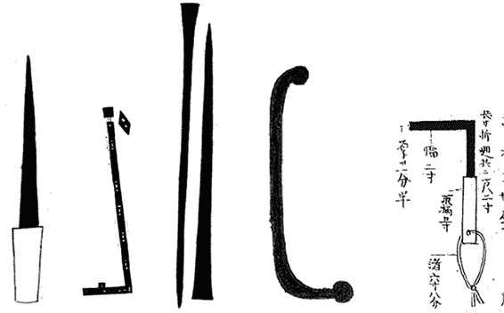

# 第十一章：锁

没有什么挂锁是你打不开的。然而，这一切都取决于你的技术水平；因此，你应该始终进行动手实践。

> 开锁工具的设计是为了帮助你轻松打开敌人家的门。因此，在所有的技艺中，这是最靠近敌人时所使用的技艺。
> 
> —《万川集海》，忍技三卷 ^(1)

在古代日本，锁具比今天的锁具更为简单，因为当时的制造能力无法生产出现代锁具所使用的复杂销子、挡板和其他部件。然而，这些古老的锁具设计优雅，巧妙地利用了“叉、闩、重力和张力等自然力”来确保人们的财物免受入侵者和小偷的侵犯。^(2)

忍者在任务中经常遇到复杂的锁具——并且想出了打开所有锁具的方法。卷轴表明，没有任何锁、障碍物或其他机制能够阻挡一个配备了良好工具、足够训练和创造力，以及乐观心态的忍者。三卷中的大量篇幅都专门记录了如何制作和使用各种挑锁工具、垫片和其他探测工具，用于打开锁、门和栅栏（图 11-1）。^(3)

图 11-1：用于打开锁、门和栅栏的各种工具。从左到右，依次是探针铁、可伸缩钥匙、开锁垫片、用于定向挂锁的挑锁工具，以及开门工具（*万川集海*和*忍秘传*）。

从环闩到绳索，从锁条到钩子和钉子，从复杂的钥匙闩到简陋的自制技术……无论锁具的设计如何，忍者总有方法和工具来绕过它。事实上，忍者能够突破当时使用的任何安全系统或障碍物。^(4) 知道锁具不能完全信任，忍者自己开发了技巧，将安全掌握在自己手中。有些方法简单直接：当他们在不信任的锁具保护下的旅馆里睡觉时，忍者有时会将一根绳子从门或窗户系到发髻上，确保如果门闩或锁被打开，他们会在睡觉时醒来。^(5)

今天，正如忍者时代一样，人们使用锁具来保护自己的财产——而威胁行为者仍然使用撬锁工具来破解它们。锁具，一如既往，发挥着多重作用：它作为威慑工具。它是对物主的一个可见保障，表明他们的财产是安全的。它通过钥匙的使用，为钥匙持有者建立了责任体系。如果锁被破坏，则产生责任追究。它还充当了屏障和警报器，因为窃贼在试图绕过它时会浪费时间并制造噪音。在本章中，我们将讨论黑客，像忍者一样，依旧在撬锁并绕过安全防护。此外，我们还将探讨为什么物理锁对于数字系统如此重要，并详细说明必要的辅助预防措施。我们还将研究锁具和撬锁工具的技术进展，看看忍者还能教给我们关于安全的什么知识。

## 物理安全

就像开锁通常是进入黑客世界的入门爱好一样，破解锁具是进入网络安全的常见途径。找到某个应该是安全的物品中的缺陷，或是物理地接触到它——当你成功攻破防御后，锁具在手中打开时所带来的视觉、触觉和听觉反馈——可能是一种强烈的感觉。这种体验能够激发对安全领域的兴趣，并增强初学者的信心。

网络安全行业使用锁具设备来限制对建筑物、数据中心、交换机机房和单个办公室的物理访问。^(6) 在更细化的层面，机架锁限制了对服务器的访问，机箱锁限制了对系统物理组件的访问，设备端口锁防止未经授权使用 USB 或控制台插口，系锁防止系统离开其位置，而电源锁则使设备无法开机。锁定对系统的物理访问是组织网络安全策略的重要组成部分。如果系统容易受到物理篡改的威胁，那么一旦对方获得物理访问，许多数字安全控制可能会失效。应该假设，如果对手获得了机器的物理访问，他们也获得了系统的管理员权限并获取了其中的数据。

尽管非法开锁工具和技术泛滥，但组织往往年复一年使用相同的锁具，使自己极为容易受到攻击。大多数信息系统和建筑物出入口的锁具使用的是弱型插销锁芯，例如耶鲁圆柱锁——这种锁具最早在 19 世纪 60 年代获得专利，由于其低成本和易于大规模生产，现在已成为全球最常见的锁具——以及管状锁（或“圆形锁”），这是最常见的自行车锁类型。罪犯制造、销售并使用能够轻易破解这些现成锁具的开锁工具。例如，汽水罐片可以撬开锁，笔帽可以模拟管状钥匙，3D 打印的塑料钥匙可以通过原始图片轻松复制。对于不熟练的犯罪分子来说，自动电子开锁工具只需拉动扳机，几秒钟内就能完成破解每个插销锁芯的工作。

大规模的防盗锁破解对策少之又少，其中一些更加关注责任问题而非安全性。例如，某些保险政策在发生盗窃或入室盗窃时，如果使用了低质量的锁——例如在美国最常见的那些锁——即使被破解或绕过，也不会予以赔偿。一些政府为锁具制造商发布合规标准，并限制向公民出售不合格的锁具。在网络安全领域，部分政府用密码锁或其他高安全性锁具和补充的安全控制措施来保护其机密系统和数据，从而减轻锁具本身的安全漏洞。

然而，依然有太多的门和系统使用着脆弱的锁和钥匙防护——这些防护手段即使是稍微有些复杂的威胁行为者也能轻松突破。信息系统的锁具和屏障必须得到改进，以抵御常见的攻击方式，如撬锁、开锁、偷窃、复制和强行破坏。

## 改进锁具

完全防止开锁几乎是不可能的。然而，你可以采取许多积极的措施来提高锁具的抗攻击能力。改进锁具也能通过减轻对系统的未授权物理访问攻击，从而提升你的网络安全态势。

+   *升级你的锁具。* 评估更先进的锁具系统，例如欧洲凹槽锁，以确定哪些符合你的业务需求和预算。寻求利益相关者和物理安全团队的批准后，将所有锁具升级为更能抵御攻击的型号。

+   *跳出锁具的思维框架。* 为你的组织考虑非传统的锁具解决方案，例如多阶段锁。当第一阶段解锁机制控制着第二阶段锁的访问时，入侵者无法迅速且轻松地同时或连续打开这两把锁。

    例如，为了关闭一个入口，可以使用两个独立的锁定系统，这些系统彼此互补。第一阶段可以是一个数字 4 位 PIN 码锁，它会临时解冻第二阶段锁中的销钉，这个第二阶段是一个圆柱锁。在第二阶段的锁中，销钉被冻结时是无法被撬开的，但可以插入钥匙，为第一阶段的锁激活做准备。一旦销钉暂时解冻，就可以转动物理钥匙，从而解锁入口。然而，这个机会窗口只有三秒钟。在那之后，数字锁将重置并再次冻结销钉。为了成功，入侵者需要首先知道 PIN 码，并且能够在三秒钟内撬开门锁，这对于人类来说可能是做不到的。

+   *增加加固措施。* 考虑加固锁具所保护的物品。你可以保护铰链免受篡改，或者安装防撞板、门/框加固、门把手防护罩或地板保护装置。

+   *向锁具行业请愿。* 呼吁锁具行业创新并将新设计纳入保护信息系统的产品中。除非消费者对过时的产品施加足够的压力，否则制造商将继续销售那些熟悉的、易受攻击的设备。

## 推荐的安全控制措施和缓解方法

在相关情况下，建议会呈现适用的安全控制措施，依据 NIST 800-53 标准。每个控制措施都应结合锁的概念进行评估。

1.  将纸质文件、磁带、硬盘、闪存驱动器、光盘和其他物理介质存放在锁定且受控的容器中。[MP-4: 媒体存储；MP-5: 媒体传输]

1.  使用安全的钥匙或其他锁定装置来执行物理访问控制和系统及环境的授权。[PE-3: 物理访问控制 | (1) 信息系统访问 | (2) 设施/信息系统边界 | (4) 可锁外壳 | (5) 防篡改保护；PE-4: 传输介质访问控制；PE-5: 输出设备访问控制]

## 总结

本章中，我们讨论了锁具及其用途。我们指出，无论时代如何变化，对手都会开发工具和技术来绕过锁具。我们简要介绍了常见的锁定技术，及其在保护系统访问中的作用，并说明了为什么升级它们至关重要。特别要记住的是，如果对手获得了你系统的物理访问权限，你应该假设他们能够破解系统——因此，使用锁具防止对手物理接触这些系统非常重要。

在下一章中，我们将讨论当目标被非常牢固地锁住时，忍者使用的一个高级战术——这种战术有效地诱使对方交出钥匙。从某种意义上讲，一个组织的防御也并没有那么不同。即使你有最好的锁，如果把钥匙交给入侵者，它也不会帮你。
