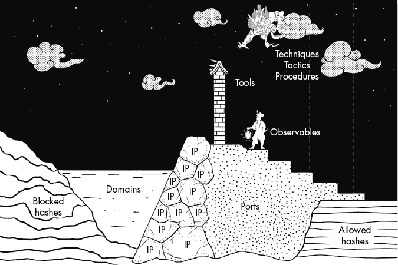
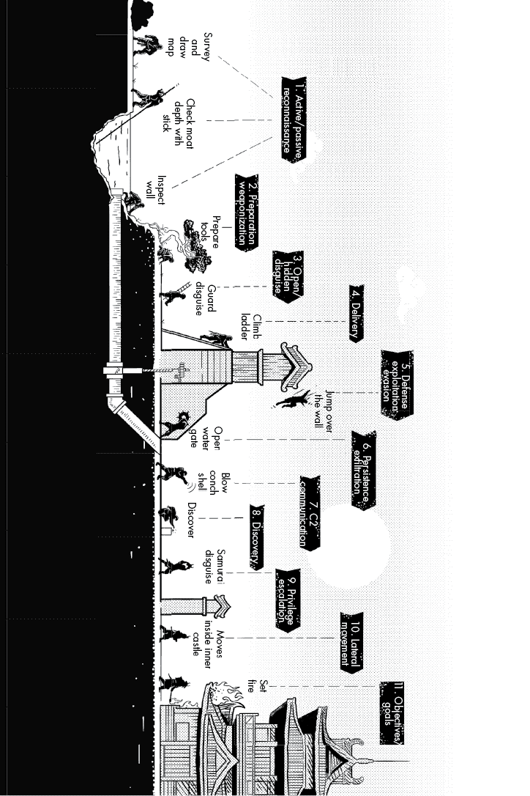

# 第二十六章：26  

忍者技艺  

渗透的秘密技巧是具有欺骗性的，而且它们是多变灵活的，通常根据机会进行操作。因此，作为基础，你应该接受那些曾在古代伟大将军手下服役的忍者的传统方式，但记住不仅要遵守这些传统，还要根据情况和时机加以调整。  

> 即使外面有喧嚣，也要注意守卫所不应完全空无一人。此外，你应该留心任何声音。  
> 
> —吉守百首 #66  

虽然有时忍者被雇佣来守卫城堡和其他防御工事（如《*将忍记*》中所述^(1)），但在封建日本，大多数守卫岗位是由非忍者士兵或雇佣兵——受过训练以抵御普通入侵者的战士——担任的。但《*万川集海*》和《*军法自用书*》手册建议防御忍者的指挥官雇佣自己的战士，因为这些战士可以训练普通守卫识别忍者的秘密战术、技巧和程序（TTPs）。^(2) 尽管这些在卷轴中有描述，TTPs 却在不断发展和完善，不同的家族拥有自己独特的秘密技巧，其他忍者并不知晓。  

忍者的 TTPs 巧妙而优雅，且常常具有多重用途。例如，一名忍者可能会悄悄地将一把普通的伞插入地面，并在城堡守卫可见的地方打开它。忍者不仅可以通过将物品藏在伞下而避免被守卫看到，而且伞的明显标志可能会吸引守卫离开岗位。^(3) 这个技巧还利用了当时流行的一种迷信：人们认为被遗忘或丢失的伞会变得被附身，并困扰其原主人，这种现象被称为*付喪神*、*伞妖怪*或*妖怪*。^(4)

被雇佣教授守卫的忍者面临着独特的教学挑战：书写 TTPs 或与外人分享它们是禁忌或完全禁止的，因为这样做会破坏技能的完整性，并使其他忍者的生命陷入危险。一些卷轴中甚至建议忍者杀死任何发现 TTPs 的观察者或受害者。^(5)  

因此，忍者并没有传授具体的技巧，而是强调了采取正确心态、具备高度警觉性，以及执行足够的审查力度来发现忍者的必要性。^(6)这种心态通过对守卫营地的风险评估、对敌情的了解以及敌人可能采取的最有可能和最具影响力的威胁场景进行了支持。看起来，忍者确实为守卫提供了有关忍者操作能力的整体感知和不同威胁场景的示例，但可能以一种不完全揭露行业机密的方式来描述这些内容。^(7)他们教导守卫如何识别潜在的忍者活动——在守望时需要注意的视觉、听觉和其他可观察到的迹象——并建立了避免犯错的规则。^(8)

由于学习方法众多，而且许多在训练中的守卫缺乏正式教育，忍者通过诗歌传递知识，以便使信息更易于记忆。（这也解释了在《百首忍诗》中出现的关于守卫警觉性的诗歌数量众多，*吉盛百首*的这些诗歌并非专门为忍者而作，而是忍者传递给守卫的。）这些诗歌提供了足够的细节来描述忍者战术，并提供了切实可行的指导，但并不至于让守卫因信息过多而感到不堪重负。例如，第 66 首诗（在本章开头引用）提供了直截了当的建议：不要让岗位空着，要留心听任何声音，包括但不限于最初引起注意的喧闹声，例如从后方接近的脚步声。^(9)这些诗歌按主题分组。诗歌 64–67、78、79、91、93 和 94 都涉及如何保持警觉和避免失误的例子。例子包括如何在疲劳时夜间守望；该面向哪个方向；以及为什么在值班时喝酒、唱歌和招妓都是糟糕的主意。

当然，如果敌方忍者观察到警卫在积极寻找忍者的 TTP，敌人就会部署反制措施。在所有三部主要卷轴中都有一个清晰的例子，涉及忍者藏身于灌木丛或高草丛中，或在田野中爬行。忍者的活动会扰动周围的昆虫，这些昆虫会停止活动并保持安静，以隐藏自己。对于受过训练的警卫来说，缺乏嗡嗡声、鸣叫声或啾啾声意味着一个隐藏的人正在接近。通常，如果警卫突然变得警觉并开始搜索入侵者，而忍者知道自己已暴露，忍者会悄悄撤退。^(10) 这就是反制措施的所在。在下一次行动前，忍者会捕捉一些蟋蟀，放在盒子里。蟋蟀对忍者的存在不感到困扰，仍然自由地鸣叫，填补了忍者接近警卫哨所周围的寂静。警卫现在没有理由怀疑忍者的接近。^(11)

诗篇 68 生动地展示了 TTP 检测和反制的挑战：“你应该进行彻底的搜索，紧跟夜间巡逻队的脚步。这被称为*监视* [伏击检测]。”^(12) 夜晚，指挥官会派遣一个主力搜索小组，使用常规的灯笼和其他装备巡逻周围的边界，但领导者还会派遣一个隐蔽的搜索小组，紧跟在主力小组之后。^(13) 在边界巡逻的警卫被他们的忍者顾问告知，要留意任何不寻常的事情——尤其是声音、动作和人影。^(14) 当然，敌方忍者也知道这些指导方针。卷轴中描述了如何攻击的忍者能够隐藏在灌木丛、沟渠或其他黑暗的地方，等待巡逻队经过后继续行动。^(15) 然而，在某些情况下，敌人可能会跟随巡逻队，他们的动作被防守方的声音和灯光所掩盖；入侵者甚至可能从后方攻击巡逻队。^(16) 因此，在第一支巡逻队后面安排第二支隐蔽的巡逻队可以发现隐藏的敌方忍者。这支装备精良的部队会搜寻可能的藏身之地，并保持警惕，防止敌人也跟随主巡逻队。^(17) 然而，作为反制措施，敌方忍者若意识到*监视*技巧，可能会在阴影中等待第二支隐蔽巡逻队经过，或者移动到第二支巡逻队不会搜索的地方。为了应对这种反制——即反制的反制——诗篇 69 和 70 应运而生：^(18)

1.  69：“在夜间巡逻完成后，进行*监视*是非常重要的，需要反复进行。”

1.  70：“在进行 *kamaritsuke* 时，据说你应该间隔多次巡逻，以便找到敌方的忍者代理。”

这一指导方针鼓励采取不规律的 *kamaritsuke* 巡逻频率，以干扰对手的自由行动能力。频繁且半不可预测的巡逻，伴随一支或多支 *kamaritsuke* 队伍，让敌方忍者很难自信地对防御工事或巡逻队执行行动。^(19)

采用尽最大努力的 TTP 检测和反制措施可以迅速升级，但最终，攻击防御工事变得过于危险或不切实际。这通常是最好的防御者能期望的结果，对抗敌方忍者的策略也是如此。

本章将讨论忍者战术背后的哲学如何适用于理解网络威胁行为者的 TTPs。我们将探讨网络威胁情报如何引导事件响应者、安全工程师和威胁猎人，以便他们能够更好地保护自己的组织，就像忍者通过情报驱动的防御提高了普通城堡守卫和士兵的有效性一样。我们将探索描述网络威胁 TTPs 的几种主流框架。将这些框架与忍者的知识相结合，可以更容易地理解威胁以及 TTPs 的重要性。我们还将讨论为什么 TTP 中的 P 常常是个谜，且很可能保持未知，但我们也将基于对忍者行为的了解，推测理性对手可能采取的程序。最后，我们将探讨如何将网络威胁情报纳入组织的防御策略，并讨论为什么这项工作如此困难。

## 技术、战术和程序

在网络安全领域，TTPs 描述了分析特定威胁行为者或群体的行为模式、活动和方法的途径。*战术*描述了对手的操作手段，例如侦察、横向移动和后门部署。*技术*是对手用来完成任务的详细技术方法，比如使用特定工具或软件来执行武器化或利用。*程序*详细说明了执行任务的标准政策和行动方案，比如在执行其他任务前确认被利用的目标系统是否有任何活跃用户登录，或在部署之前通过字符串分析运行恶意软件以检测战术错误，或在验证目标系统的连接性后实施预防性的自我清理。

一旦 TTP 被识别并定义，防守者可以在环境中寻找相关的指示器。防守者甚至可以预测可能被用来攻击自己的 TTP，从而支持规划和实施预防性的减缓措施或反制措施。为了建立并传达网络对手 TTP 的共同定义，业界已经开发出了多种概念、模型、分析和共享方法，包括：

+   疼痛金字塔^(20)

+   ATT&CK™框架^(21)

+   攻击生命周期模型^(22)

+   网络杀伤链框架^(23)

+   入侵分析钻石模型^(24)

+   STIX（结构化威胁信息表达式）^(25)

### 疼痛金字塔

疼痛金字塔（见图 26-1）是一个非常好的模型，用来直观展示对敌方指示器、工具和 TTP 的意识如何影响防守者的安全态势。它还展示了实施措施和反制措施的难度如何随着时间的推移对防守方和攻击方都增加。

疼痛金字塔这个名称指的是这样一个观点：虽然没有办法保证绝对的安全或防止所有的攻击，但如果你让攻击者在投入时间、资源和精力时感到极大的痛苦，他们就不太可能会攻击你的组织。

图 26-1：妥协指示器的加固（改编自 David Bianco 的疼痛金字塔^(26))

在金字塔的底部是妥协指示器（IoC）——例如域名、IP、文件哈希和 URL——这些可以用来正确定义已知的恶意指示器。防守者可以屏蔽这些指示器或围绕它们发出警报，但攻击者也可以更改这些指示器。

在原子级指示器之上是基于主机的指示器，例如注册表项、丢失的文件和伪造的物品。这些可以被检测或响应，但威胁检测或缓解可能不是自动的，攻击者可以根据目标或操作进行更改。

下一层是工具——攻击者用来进行或支持攻击行动的软件或设备。通过在环境中搜索、移除访问权限或禁用已知恶意工具的功能，防守者可能能够检测并防止攻击者有效地操作。

在金字塔的顶部是敌方的战术、技术和程序。如果你能识别或减轻这些方法的影响，敌人就很难创造或学习新的 TTP（战术、技术和程序）来对付你——当然，作为防守方，你在制定保护措施或反制措施时也会感到痛苦。

### ATT&CK 框架

MITRE 的对抗性战术、技术和常识（ATT&CK）框架从洛克希德·马丁的网络杀伤链框架中衍生出了许多战术（见图 26-2）。网络杀伤链框架概述了攻击生命周期的七个阶段：侦察、武器化、交付、利用、安装、指挥与控制以及目标行动。ATT&CK 框架中识别的每个战术都列出了检测或减轻的技术和方法，并附有示例。

请注意，ATT&CK 框架中缺少“程序”这一部分。这是可以理解的，因为识别这些程序可能需要窃取并分析某个国家或军事机构的进攻性网络行动手册。这就是为什么描述复杂间谍威胁组织程序的*《万川集海》*、*《忍秘传》*和*《将忍记》*等文本如此大大丰富了讨论。

### 威胁情报

当你的安全团队理解这些战术和技术，并识别了你的攻击面、评估了当前的安全控制措施，并对之前的事件进行了分析，以确定你组织的防御效果时，就可以开始预测对手可能会针对你的环境进行攻击。有了良好的威胁预测，你可以开始威胁狩猎——寻找威胁行为者留下的指标和证据，可能表明系统已经被攻破。

图 26-2：忍者攻击链（改编自 MITRE 的 ATT&CK 框架^(27))

然而，如果没有深入了解威胁行为者如何操作，就很难有效地进行狩猎或检测到他们的存在。

在这里，威胁情报展示了其价值。*威胁情报*不一定意味着诸如与恶意软件、黑客基础设施或威胁组织相关的 IP 列表、域名、URL 和文件哈希等信息流。而是，*网络威胁情报（CTI）*指的是传统的情报，收集和分析网络威胁，如恶意软件、黑客活动分子、国家行为者、犯罪分子、DDoS 攻击等。当正确使用时，CTI 提供了关于威胁正在做什么、其动机以及 TTP 的可操作情报和评估。简而言之，CTI 是理解和防御威胁的最佳方法之一，因为它要求决策者自我告知并采取防御行动。

不幸的是，许多 CTI 消费者仅关注 IoCs，因为它们可以轻松地被导入 SIEM、火墙和其他安全设备中，以阻止或检测威胁。以这种方式操作会忽视 CTI 的真正价值，因为 CTI 分析师通过详细的观察和评估描述了行为、模式、方法、归属和背景。尽管 CTI 生产者可能并不总是透露他们如何收集有关威胁的情报，但他们通常会努力在评估他们所知道的内容以及为什么相信威胁执行某些行动时保持透明。

当然，以理解威胁为目的消耗情报报告，同时还要深入理解你的环境，这可能是非常具有挑战性的。这个过程需要广泛的技能组合——其中包括快速学习和做出战略决策的能力。然而，如果一个 CTI 使用者能够投入时间去理解威胁的每一步、代码、战术和技术，他们就能做出决策，帮助他们成功地缓解、检测、应对，甚至预测未来的威胁动态。

## 网络威胁情报

在已经购买了数十种安全解决方案并雇佣了全职安全人员处理众多威胁渠道的情况下，一些人可能会认为 CTI 是他们已经实施的“深层防御”安全模型的最后一道成本层。然而，CTI 可能会让你改进你的安全策略，并增强其他所有安全层的有效性，从而证明它的成本是值得的。不幸的是，在许多情况下，有效使用 CTI 就像是阅读某一领域最新科学发现的报告，因为它要求你理解这些发现的含义，然后迅速改变文化、业务策略和技术以应对。虽然这是可能的，但这种信息的消耗、综合和行动的强度似乎过于苛刻。这也是 CTI 的最大挑战：它不是一个可以提供简单答案的水晶球，也不是易于执行的解决方案。请参阅下面的指导，做出明智的决策来制定你的 CTI 计划。

1.  *开发网络威胁情报和威胁狩猎*。考虑为你的组织订阅免费的或付费的 CTI 报告。同时，通过收集当前攻击你环境的威胁证据，开始开发自己的内部 CTI。建立一个 CTI 团队，收集并分析发现的威胁，并将这些发现报告给 IT、安全和业务相关方。这些各方应该了解谁在针对组织，如何渗透网络，一旦进入网络，他们会做什么，预期的目标是什么，以及他们是如何执行这些目标的。在你的信息系统中实施战略性和操作性防护、缓解措施和对策，以防御观察到的特定战术。

    训练你的安全和情报人员进行威胁狩猎。因为并不是每个威胁都能被构造或阻止，所以必须有一个专门的猎捕团队，始终在你的网络中搜索威胁的痕迹，这些痕迹由你的 CTI 合作伙伴、供应商或团队提供情报。威胁狩猎可以通过紫队演习得到增强，在这种演习中，红队在你的网络上执行对抗活动，而你的蓝队则试图追捕他们，从而学习如何应对威胁。

1.  *消费并利用 CTI*。与您的电子邮件、IT 和安全团队进行桌面演练，模拟威胁的 TTP（战术、技术和程序），并评估您的反应。例如，假设您收到情报，指出一个钓鱼活动正在针对像您这样的组织，这些组织使用 Google 链接缩短器（*http://goo.gl/*）。您不能仅仅阻止 Google 的 IP、URL 或域名，因为这样会妨碍业务操作，而且许多组织员工出于合法目的使用链接缩短器。您的 CTI 评估认为，攻击者可能使用 goo.gl 链接，因为您的防病毒软件、代理或钓鱼协议未能将其正确评估为恶意链接。安全系统识别到 Google 是一个白名单网站。

    首先，尝试在您当前的电子邮件中寻找该链接的证据。许多组织在这里遇到早期障碍，因为他们的邮件管理员不合作，或者没有必要的可见性或资源来搜索包含 goo.gl 超链接的来邮。额外的障碍可能包括隔离潜在的钓鱼邮件、提醒非 IT 和非安全人员威胁的存在，并培训他们如何检测和避免此类威胁。

    就像对手有不同的工具、战术和技术来攻击您的组织一样，您的工具也需要经过深思熟虑、理解、创造性和工程设计，才能以全面、有效的方式有效地阻止和应对威胁。例如，您的邮件管理员可能会创建一个规则来检测 goo.gl 链接缩短器，但其他的呢？希望您的 CTI 团队能够识别出带有链接的钓鱼威胁，并推荐检测、阻止或缓解这些链接的方法。此外，团队还应让您组织中的人员意识到这一 TTP。换句话说，他们不仅应该寻找 goo.gl 链接，还应寻找*所有*链接缩短器。最后，决策者必须通过新的架构、政策或控制措施战略性地应对这一威胁。

    然而，尽管这个过程可能很痛苦，但这是识别您的组织在检测、缓解和应对威胁方面需要改进的地方。

## 推荐的安全控制和缓解措施

这些建议依据 NIST 800-53 标准提出，应从安全意识、TTP 和 CTI 的角度进行评估。

1.  向您组织内各个角色的员工提供安全意识培训，帮助员工迅速应对他们遇到的威胁。[AT-2: 安全意识培训；PM-13: 信息安全工作人员]

1.  专门组建一个团队，分析威胁、事件、情报和对手的 TTP，并开发反制措施和防护措施以应对这些威胁。[IR-10: 集成信息安全分析团队]

1.  与外部安全团体和威胁共享机构合作，接收与你组织相关的威胁情报。[PM-15：与安全团体和协会的联系]

1.  实施一个威胁意识计划，分享有关威胁情报的细节、如何减轻威胁以及妥协指标的信息。[PM-16：威胁意识计划]

1.  使用可靠的威胁情报和信息来寻找和监控活动、行为、模式以及其他表明威胁的可观察对象。[SI-4：信息系统监控]

## 汇报

在本章中，我们回顾了几种忍者的战术、技巧和程序（TTPs），特别是*神速*的 TTPs 是如何与防御者和对手的反制策略共同演化，直到出现容错安全系统。我们探讨了其他的网络威胁战术，这些战术可能也会随着双方互相反制而发展，直到弹性得以体现。我们讨论了网络威胁情报以及为何仅仅知道对手在做什么、他们是如何做的以及他们接下来会做什么是不够的。要有用，网络威胁情报（CTI）必须以某种方式来应对威胁。通过《城堡理论思维练习》，我们看到了一个明确的例子，防御者发现可观察到的威胁后，战术随之发生变化。这一思维练习可以与伪造系统/网络日志以欺骗威胁猎人、异常检测器甚至机器学习系统进行类比——并且这种情况在现代可能会再次出现。本章最重要的教训——甚至可能是整本书的教训——就是必须以创新的方式利用威胁情报并应对动态的威胁。
