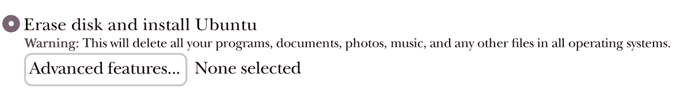
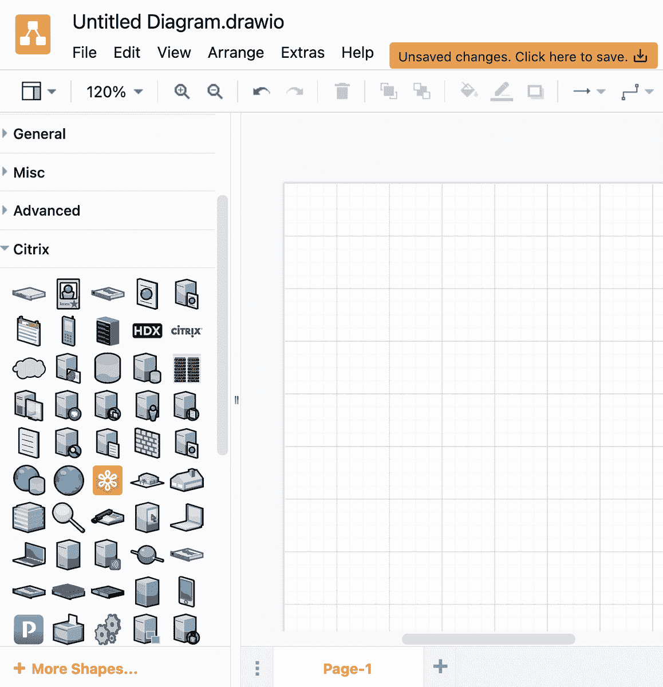
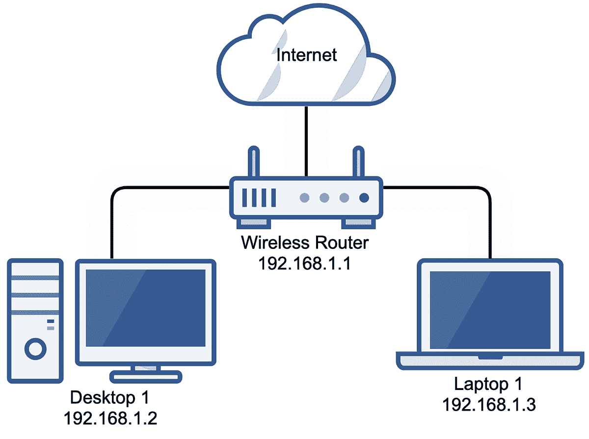

# 第一章：# 开始使用基础 Linux 系统和网络地图


本章介绍了两个基本项目：设置一个基础的 Ubuntu 系统，这是你在本书中将一直使用的系统，并创建一个网络地图。你将使用这个系统作为基础，在其上安装和运行各种安全工具，而网络地图将提供一个所有设备在网络中如何相互联系和通信的视觉概览。

我们将首先定义并概述常见的 Linux 操作系统，然后介绍如何在虚拟机（VM）、物理计算机和云环境中安装 Linux 版本（特别是 Ubuntu）。无论安装在哪里，我都会教你如何提升 Ubuntu 的安全性，并将其添加到网络地图中。每次向网络中添加新终端时，都必须更新网络地图，以确保其始终是最新的。过时的网络地图对任何人都没有用。

## Linux 操作系统

Linux 是首选的操作系统，因为 Linux 系统是开源的，因此具有很高的扩展性，特别是与 Windows 或 macOS 相比。你对操作系统及其上运行的应用程序的控制非常细致，这使得你能更好地掌控终端和网络的安全性。

有多种 Linux 操作系统（或*发行版*）可供选择。每个发行版使用不同的基本工具和图形用户界面（GUI），每个发行版的外观和功能都有些不同。例如，Kali Linux 是一个面向攻击性操作的发行版，常被渗透测试人员用于执行网络评估。Red Hat Linux 可能是最常用的企业级发行版，Fedora 和 CentOS 等其他发行版也基于 Red Hat。如果你对 Linux 感兴趣，可以尝试不同的发行版，找到最适合自己的那个。

本书主要使用 Ubuntu，它是最具用户友好性的 Linux 发行版之一，也是初学者或对 Linux 不熟悉的人最容易上手的操作系统。Ubuntu 有三个版本：桌面版、服务器版和核心版。对于我们的目的，桌面版就足够了。如果你打算将 Ubuntu 服务器用于额外的网络服务，如文件服务器或动态主机配置协议（DHCP）服务器，那么服务器版会更合适。Ubuntu 核心版专为资源受限的应用而设计，例如物联网（IoT）实现。

最新版本的 Ubuntu 操作系统可以从[`ubuntu.com/download/`](https://ubuntu.com/download/)下载。这些下载文件将是 ISO 文件格式，意味着文件扩展名为*.iso*。ISO 文件是逻辑镜像或容器，可以用来模拟物理媒体，如 CD 或 DVD。

以下部分讲解了如何在 macOS 或 Windows 上安装 Ubuntu，无论是作为物理设备还是虚拟机，以及如何在云中安装。使用物理设备可以充分利用系统的所有资源，如 CPU 和 RAM，但需要你有一个可以安装 Ubuntu 的物理系统。使用虚拟机提供了几个有用的功能，比如可以创建快照（稍后会在本章讨论）。在云中创建虚拟机提供了额外的能力，如可以从任何地点轻松访问你的系统，但通常也带来了额外的安全性考虑。一旦你完成了针对你的平台特定的安装步骤，跳到 “完成 Linux 安装” 第 8 页。

#1：创建一个 Ubuntu 虚拟机

在本书中，你将为不同的目的创建 Ubuntu 系统。每个系统都将基于我们现在要创建的系统，这个系统将作为标准基础操作系统，你可以在其基础上添加用于保护网络的工具和应用程序。

### 虚拟机监控器选项

*虚拟机监控器* 是一种软件，允许你创建并运行虚拟机，通过使用来宾操作系统。在这个初始项目中，你可以使用 VMware 的一款廉价商业虚拟机监控器来创建 Ubuntu 虚拟机。VMware Workstation 有多个版本，可以从 [`www.vmware.com/`](https://www.vmware.com/) 获取。VMware Player（适用于 Windows）和 VMware Fusion Player（适用于 Mac）对于个人使用是免费的，但它们没有一些我们将在后续章节中使用的高级功能。我推荐使用 VMware Workstation Pro 和 VMware Fusion Pro。这两款的商业许可证相对较便宜。另一种解决方案是先使用免费的 Workstation Player，如果需要，可以升级到商业许可证。Workstation 和 Player 版本的大多数安装步骤是相同的，只有 Workstation 和 Fusion 之间有些许差异。

另一个选择是使用 VirtualBox，这是 Oracle 维护的一个免费的虚拟机创建和管理解决方案。VirtualBox 适用于所有主要操作系统，你可以从 [`www.virtualbox.org/wiki/Downloads/`](https://www.virtualbox.org/wiki/Downloads/) 下载它。

### 适用于 Windows 的 VMware Workstation 和 VMware Player

在 VMware Workstation 或 VMware Player 中创建虚拟机，请按以下步骤操作：

1.  1. 在 VMware 中点击 **文件▸新建虚拟机**。

1.  2. 在打开的新虚拟机界面上，选择 **典型（推荐）** 并点击 **下一步**。

1.  3. 选择 **安装光盘映像文件 (iso)**。

1.  4. 使用 **浏览** 按钮，导航到并选择你之前下载的 Ubuntu ISO 文件，然后点击 **下一步**。

1.  5\. 易安装向导会要求提供虚拟机的用户详情；填写全名、用户名和密码字段，然后点击**下一步**。

1.  6\. 在提示时为虚拟机提供一个有意义的名称，表示其在网络中的角色。

1.  7\. 将虚拟机保存到默认位置（或你想要的位置），然后点击**下一步**。

1.  8\. 如果主机有足够的磁盘空间，将虚拟磁盘大小设置为 40GB；否则，接受默认的 20GB。

1.  9\. 将虚拟磁盘存储为单个文件，而不是分成多个文件，然后点击**下一步**。

1.  10\. 点击**自定义硬件**。

1.  11\. 如果主机有足够的内存，将虚拟机的内存从 2GB 增加到 4GB。

1.  12\. 将处理器设置为 1。

1.  13\. 在网络适配器下，选择**桥接**模式，为你的虚拟机分配独立的 IP 地址和网络连接。

1.  14\. 点击**声卡▸移除**。

1.  15\. 点击**打印机▸移除**。

1.  16\. 点击**完成**。

虚拟机将被创建，操作系统将开始安装。

### VMware Fusion 和 VMware Fusion Player for macOS

安装完 VMware Fusion 或 VMware Fusion Player 后，按照以下步骤创建你的第一个虚拟机：

1.  1\. 在 VMware 中点击**文件▸新建▸继续**。

1.  2\. 将你的 ISO 文件拖放到 VMware Fusion 窗口，或点击**使用另一个磁盘或磁盘映像**按钮在文件系统中定位文件；然后点击**继续**。

1.  3\. 易安装向导会要求提供虚拟机的用户详情；填写显示名称、账户名称和密码字段。

1.  4\. 确保“使你的主文件夹对虚拟机可访问”复选框未勾选，然后点击**继续**。

1.  5\. 点击**自定义设置**。

1.  6\. 将虚拟机保存到默认位置（或你想要的位置）。

1.  7\. 如果主机有足够的磁盘空间，将虚拟磁盘大小设置为 40GB；否则，接受默认的 20GB。

1.  8\. 在**处理器和内存**菜单中，如果主机有足够的内存，将虚拟机的内存从 2GB 增加到 4GB，并将处理器设置为 1。

1.  9\. 取消勾选**连接**复选框，以在其上下文菜单中添加或断开以下外设：声卡、软盘、打印机和相机。（从虚拟机中断开未使用或多余的外设可以减少潜在的攻击面。）

点击**播放**按钮启动虚拟机，操作系统安装将开始。

### VirtualBox

在 VirtualBox 中创建虚拟机的步骤与使用 Windows PC 或 Mac 作为主机系统无关。下载并安装 VirtualBox 后，按照以下步骤创建虚拟机：

1.  1\. 点击 VirtualBox 窗口顶部的**新建**按钮。

1.  2\. 为你的虚拟机提供一个相关的名称，指定保存文件的位置（默认文件夹通常可以），并从下拉菜单中选择正确的操作系统：**Linux▸Ubuntu（64 位）**；然后点击**继续**。

1.  如果你的主机有足够的内存，将虚拟机的内存从 2GB 增加到 4GB，并点击**继续**。

1.  选择**现在创建一个新的虚拟硬盘**，然后点击**创建**。

1.  选择**VMDK**作为硬盘格式并点击**继续**。

1.  选择**动态分配**并点击**继续**或**下一步**（取决于你的操作系统）。

1.  如果主机有足够的磁盘空间，请将虚拟磁盘大小设置为 40GB；否则，接受默认的 32GB 并点击**创建**。

1.  选择虚拟机并点击**设置**。

1.  前往**设置▸系统▸主板**。

1.  在启动顺序中，取消勾选**软盘**复选框。

1.  前往**设置▸系统▸存储**。

1.  选择 CD 驱动器（它将显示为**控制器：IDE**，并且旁边会有一个 CD 图标）。

1.  在属性面板中，点击**CD 图标**以选择一个磁盘文件，并指向你的 Ubuntu ISO 文件。

1.  在**设置▸音频**下，取消勾选**启用音频**复选框。

1.  在**设置▸网络▸适配器 1**下，将**附加到**下拉菜单切换为**桥接适配器**，这样虚拟机会被分配自己的 IP 地址，并且在逻辑上与主机系统的网络设置分开。

1.  点击**确定**。

注意：硬盘格式选项有 VDI、VHD 或 VMDK。VDI 是 VirtualBox 的专有格式。VHD 由微软开发，兼容 Windows，并且可以在 Windows 操作系统下轻松挂载为虚拟磁盘。VMDK 最初由 VMware 开发，但现在是一个开放的文件格式。VMDK 兼容 VirtualBox 和 VMware，因此，如果你选择从一个平台切换到另一个平台，你的虚拟硬盘不会遇到问题。

#2：创建物理 Linux 系统

如果你不想创建虚拟机，也可以选择使用物理计算机，像安装 Windows 或 macOS 一样直接在硬件上安装 Ubuntu。使用物理系统有诸如提升性能或减少内存和处理能力要求等优势。主要的缺点是物理系统通常不像虚拟机那样灵活。在你本书的后续章节中，会要求你创建多个 Linux 系统，因此我们假设你主要使用虚拟机。然而，如果你决定为每个项目使用物理系统，依然可以跟随教程进行操作。

要创建一个物理 Ubuntu 系统，你需要一个*可启动 USB 驱动器*，这意味着你会将 Ubuntu 安装到一个 USB 驱动器上，可以插入任何计算机并从那里进行安装。

### Windows 上的可启动 USB

在 Windows 计算机上，创建可启动 Ubuntu USB 的最简单方法是使用 Rufus，这是一款专门用于创建可启动媒体的小型工具。请从[`rufus.ie/`](https://rufus.ie/)下载最新版本。Rufus 是一个*便携式可执行文件*，这意味着你无需安装它，只需下载并运行即可。下载后，按照以下步骤操作：

1.  1\. 插入一个至少 16GB 的 USB 闪存驱动器。Rufus 将格式化此 USB 驱动器，请确保其中没有任何你想保留的内容。

1.  2\. 运行 Rufus 可执行文件。

1.  3\. 一旦 Rufus 打开，确保设备下拉菜单显示已选择正确的 USB 驱动器。通常最简单的方法是只插入目标 USB 设备，并拔掉其他设备。

1.  4\. 在启动选择中，选择 **磁盘或 ISO 镜像**。

1.  5\. 点击 **选择**。

1.  6\. 找到并选择你的 Ubuntu ISO 文件。

1.  7\. 选择后，Rufus 会加载一组启动 USB 的默认设置；接受它们并点击 **开始**。

1.  8\. Rufus 可能会显示一个弹窗，询问你是否希望以 ISO 或 DD 镜像模式写入媒体；选择 **ISO 模式** 并点击 **确定**。在稍后的 Ubuntu 安装过程中，如果无法继续安装或似乎卡住，重复此过程并选择 **DD 模式**。

1.  9\. Rufus 会显示一个弹窗，通知你它将格式化 USB 驱动器；点击 **确定** 以继续。

### 在 macOS 上创建启动 USB

*Etcher* 是一个开源工具，用于在 macOS 上将操作系统镜像写入可移动媒体，例如 USB 驱动器和 SD 卡。从 [`www.balena.io/etcher/`](https://www.balena.io/etcher/) 下载最新版本。下载并安装后，请按照以下步骤操作：

1.  1\. 插入一个至少 16GB 的 USB 闪存驱动器。Etcher 将格式化你的 USB 驱动器，请确保其中没有任何你想保留的内容。

1.  2\. 运行 Etcher。

1.  3\. 一旦 Etcher 打开，点击 **从文件闪存**，并选择你的 Ubuntu ISO 文件。

1.  4\. 点击 **选择目标** 并选择你的 USB 驱动器。

1.  5\. 点击 **闪存** 创建你的启动 Ubuntu USB（你可能会被要求输入计算机密码，以允许 Etcher 对 USB 进行更改）。

1.  6\. 闪存过程将开始，并会出现进度条。过程完成后，系统可能会提示“你插入的磁盘无法被此计算机读取。”如果是这样，只需弹出 USB 驱动器；不要选择初始化。

### 使用启动 USB

过程完成后，你将拥有一个可启动的 Ubuntu Linux USB 驱动器。将其插入你希望安装 Ubuntu 的计算机，并启动或重启计算机。你可能需要更改系统的启动顺序，以便它从 USB 启动，而不是从内置硬盘启动。为此，你需要中断启动顺序，通常通过按 ESC、F8、F10 或 F12 来完成。请在网上搜索查找适合你计算机的中断键，或者重新启动系统并按下这些键，直到成功进入计算机的基本输入输出系统（BIOS）。

注意：从技术上讲，大多数现代计算机使用统一可扩展固件接口（UEFI），它相比过时的 BIOS 拥有更强大的功能。我们将在文中交替使用 BIOS 和 UEFI 两个术语。

在 BIOS 中，负责操作系统外的硬件管理，改变启动顺序，使计算机首先从 USB 启动。然后重启计算机，它将进入 Ubuntu 安装环境。在 Mac 上，只需在系统启动时按住 OPTION 键，然后选择从 USB 启动。

#3：创建基于云的 Linux 系统

将网络基础设施迁移到云端是很常见的，这意味着我们的服务运行在别人的计算机上。网站和运行它们的网络服务器在云端通常比在我们的私有网络和 VPN 服务器上更容易访问（从全球任何地方）和管理。（我们将在第五章详细讨论 VPN。）在本节中，我们将解释如何使用云服务提供商创建 Linux 计算机。我们将使用 Vultr 进行此项目，因为它相对便宜，可靠，并且如果您之前没有使用过云服务提供商，它提供了一个简单的学习曲线。无论使用哪个服务提供商，步骤应该是相似的，无论是使用 Amazon Web Services、Microsoft Azure 还是其他服务。

1.  1\. 在[`www.vultr.com/`](https://www.vultr.com/)创建一个帐户。

1.  2\. 在帐户仪表板上，点击**+▸部署新服务器**。

1.  3\. 选择**云计算**。其他选项（高频、裸金属等）适用于专业应用，与你的目的不符。

1.  4\. 选择服务器的位置。选择离您地理位置较近的服务器位置可以提高虚拟机的访问速度；但是，如果您想隐藏自己的位置，可以选择其他国家的服务器位置。

1.  5\. 对于服务器类型，选择最新版本的 Ubuntu。

1.  6\. 选择服务器大小。最便宜的选项是一个不错的起点；如果需要，您可以稍后升级您的虚拟机。

1.  7\. 为您的服务器提供一个主机名。

1.  8\. 点击**部署**。

服务提供商现在将启动您的 Ubuntu 虚拟机，这与在 VMware 或 VirtualBox 中创建虚拟机相同。这个过程可能需要一些时间。一旦确认虚拟机已启动并运行，您的服务提供商将提供 IP 地址、用户名和密码以访问虚拟机。然后，您可以按照以下各节中的步骤来设置和保护虚拟机。

## 完成 Linux 安装

如果您在云端或使用 VMware 和 Easy Install 创建了 Linux 系统，启动虚拟机会自动安装 Ubuntu，创建您的用户帐户，并展示 Ubuntu 桌面环境，类似于 Windows 或 Mac 桌面。如果您使用了 VirtualBox 或正在创建物理 Linux 系统，您需要完成一些额外的步骤才能达到该阶段。

在 VirtualBox 中，按照以下步骤操作：

1.  1\. 点击**开始**按钮以启动虚拟机。

1.  2\. 使用 Ubuntu 安装向导，选择您希望的语言并点击**安装 Ubuntu**。

1.  3\. 选择你的键盘布局并点击**继续**。

1.  4\. 在“更新和软件”屏幕上，选择**最小安装**，因为你不需要与操作系统一起安装的大部分附加软件。

1.  5\. 勾选两个复选框，以允许从各种来源安装软件更新。

1.  6\. 点击**继续**。

1.  7\. 在下一屏幕上，向导会询问你是否要擦除磁盘并安装 Ubuntu，并显示警告，如图 1-1 所示。点击**高级功能**按钮并选择**使用 LVM 进行新 Ubuntu 安装**。使用 LVM 可以提供更大的灵活性和对磁盘及其分区的控制。LVM 允许进行诸如命名逻辑卷以及在需要时动态调整分区和虚拟硬盘大小等高级功能。



图 1-1：Ubuntu 安装类型提示

请记住，这个安装向导仅仅是针对虚拟机及其附加的虚拟硬盘（我们之前创建的）。它不会影响主机系统的物理硬盘。继续在虚拟机中进行安装不会导致文件或数据丢失。

1.  8\. 点击**确定▸立即安装**。

1.  9\. 系统会提示你将更改写入磁盘（即虚拟机的虚拟硬盘）。点击**继续**以接受你刚刚为这个虚拟机设置的配置。

在 Ubuntu 安装过程中，系统会要求你设置操作系统的某些设置，如你的位置（时区设置）、你的姓名、计算机名称或主机名，以及你的用户名和密码等用户信息。根据需要设置这些内容，然后继续安装。最终，操作系统安装将完成，系统会展示 Ubuntu 桌面环境。

警告：不要设置或允许用户自动登录，因为这种配置对任何计算机来说都不安全。始终使用**登录时需要我的密码**的设置。

首次登录时，Ubuntu 会要求你配置在线帐户，并询问你是否愿意与开发人员共享匿名统计数据。该系统需要保持安全，因此不应连接到 Google 或 Microsoft 等云服务。跳过所有这些配置选项，并尽可能禁止共享数据。这些建议不仅适用于 Ubuntu 虚拟机的配置，也适用于生活中的隐私保护。

完成物理系统上的 Ubuntu 安装时，你将按照相同的步骤进行，唯一的区别是磁盘分区会影响计算机内部的物理硬盘，而不是虚拟硬盘。安装 Ubuntu 后，像之前一样在 BIOS 中重置启动顺序，使计算机从内部硬盘启动，而不是 USB，同时也将可启动的 USB 移除。

## 加强你的 Ubuntu 系统

现在你已经创建了一个基础的虚拟或物理机器，接下来你将进行一些初步的配置更改，以确保你的系统是安全的。这个过程称为*硬化*，通常是指保持系统与最新操作系统和软件补丁同步，安装一些额外的管理软件，并修改配置文件以增强系统安全性。

#4: 安装系统软件包

在 Ubuntu 中，你将使用高级包管理工具（APT）来确保系统与最新的补丁保持同步。在 Linux 中，人们使用*软件包*一词来指代软件，而 APT 是一个包管理工具，用于安装、卸载、更新或以其他方式管理系统上的工具和软件。

APT 是一个命令行界面（CLI）工具，这意味着你将使用 Linux 终端与它交互，而不是像 Windows 更新那样的图形界面工具。

注意，大多数操作系统都有 CLI；Windows 有命令提示符和 PowerShell，macOS 有自己的终端。基本上，CLI 是通过文本命令与操作系统进行交互的更直接方式。CLI 看起来像一个简单的文本编辑器，里面有一个等待你输入的提示符。命令提示符、Linux 终端和 macOS 终端默认都是黑色背景白色文字，而 PowerShell 是蓝色的。

在云部署中，默认情况下你可能只能访问 Linux 终端，而无法访问图形界面。如果是这种情况，你在登录后会直接看到终端窗口。否则，要在 Ubuntu 中访问终端，请点击屏幕左上角的**活动**菜单，输入**终端**，然后点击出现的终端图标，就像在 Windows 开始菜单中搜索并打开应用程序一样。

默认情况下，即使是管理员，你也不能在 Linux 系统上运行某些命令或执行某些操作，因为你没有必要的权限（在 Linux 中称为*特权*）。许多命令和操作是为*超级用户*保留的，或称为 Linux 中的*root* 用户账户。作为一个非 root 用户（即非超级用户）在 Linux 中，你需要使用 `sudo` 命令，`sudo` 代表*超级用户执行*。例如，要使用 APT 更新 Ubuntu 系统中所有已安装的软件包，可以使用以下命令，在每个命令后按 ENTER 执行：

```
$ `sudo apt update`
$ `sudo apt upgrade`

```

第一个命令`sudo apt update`会获取当前安装的每个应用程序的可用更新列表。第二个命令`sudo apt upgrade`会下载并安装这些更新。系统提示时，输入密码；要求你验证身份以运行特权命令是`sudo`的安全特性。每次使用`sudo`运行命令时，该操作会被记录在*/var/log/auth.log*文件中，因此所有管理操作都可以在事后进行审计。当提示继续安装软件包时，输入`Y`（是）并按回车键。

警告 在 Linux 和 macOS 的命令行中，当提示符显示美元符号（`$`）时，这意味着你当前处于（即以）普通非管理员用户身份。如果提示符显示井号（`#`），则表示你处于 root 用户上下文中，具有完全的系统访问权限，可以进行更改、移动文件和删除文件。如果你以 root 身份操作，请小心，因为很容易犯错并导致操作系统出现问题。最好主要以普通用户身份工作，使用命令行时再使用`sudo`。

当你安装新软件包时，APT 通常也会安装这些软件包所需的任何依赖项（否则，软件会找不到依赖项，导致无法正常运行）。但是，当你卸载软件时，这些依赖项可能会被遗留下来。系统中残留不必要的应用程序是不安全的，因为攻击者可能会利用这些残留的软件包中的漏洞来访问你的网络或执行其他恶意活动。运行`sudo apt autoremove`和`sudo apt clean`，如下面所示，分别用来移除不再需要的依赖项和删除以前下载的软件包：

```
$ `sudo apt autoremove`
$ `sudo apt clean`

```

要安装新的软件包，请使用`sudo apt install`。一个有用的软件包是 SSH（*安全外壳*），它允许你通过命令行远程访问和管理系统。运行`sudo apt install openssh-server`来安装 SSH（如果安装其他软件包，只需将`openssh-server`替换为相应的软件包名称）。

你可以像这样使用`apt`同时安装多个软件包：

```
$ `sudo apt install openssh-server` `package_name1 package_name2`

```

再次输入密码，如果提示，输入`Y`确认。安装完 SSH 后，你将能够配置远程访问系统。

#5: 管理 Linux 用户

网络安全管理的一部分是管理网络中的用户帐户和主机。你可能需要在 Ubuntu 机器上添加新用户，例如为新服务或应用程序创建新的用户帐户，或者允许他人管理你的系统。添加新用户是一个管理操作，需要使用`sudo`命令。使用`adduser`命令来添加新用户：

```
$ `sudo adduser` `username`

```

系统会要求你为该用户指定一个密码，但使用密码短语更好，因为密码短语更容易记住，通常较长，且更难破解。（我们将在第十一章中更详细地讨论密码短语和创建强密码的内容。）

如果你愿意，你还可以为用户设置姓名、电话号码和其他信息；否则，按 ENTER 键跳过这些字段。

删除用户同样简单：

```
$ `sudo deluser` `username`

```

此外，你可能希望授予新用户`sudo`权限，以便他们能够管理系统，这可以通过`usermod`命令实现：

```
$ `sudo usermod -aG sudo` `username`

```

`-aG`（添加组）参数会将用户添加到*sudo*组中。Linux 中的用户组是用户账户的集合，用于为特定的用户账户分配权限和权限，例如读取和写入某些文件的权限。然而，请记住，拥有 sudo 权限的用户越少越好。始终遵循最小权限原则，只给予用户日常操作所需的控制权限。将管理员凭据和权限授予多余的人会导致网络配置的安全性大大降低。

最后，你可以使用`passwd`命令重置给定用户的密码：

```
$ `sudo passwd` `username`

```

管理网络中的用户是保持网络安全的重要部分。拥有多余的用户账户，尤其是那些权限超出需求的账户，会为攻击者提供轻松的入侵方式，从而在你的网络内获得立足点。这是完全可以避免的，因此，始终要注意额外或不必要用户账户的风险。

除了管理你环境中的用户外，每个终端设备都有一个主机名，这是一个用于识别主机的友好名称或可读名称。通常，在操作系统安装时，系统会将其配置为某个默认值（例如，Ubuntu 系统的`ubuntu`）。为主机选择一个命名方案并确保每个主机具有不同的名称是有益的。例如，在 Windows 网络中，多个主机不能具有相同的主机名，因为这会导致冲突，从而在网络中造成管理问题。

你可以使用`hostname`命令检查你的 Linux 系统的主机名：

```
$ `hostname`
ubuntu

```

要更改主机名，再次使用`hostname`命令，但这次需要使用`sudo`并指定所需的主机名：

```
$ `sudo hostname` `your_hostname`

```

再次运行`hostname`命令确认更改已生效。重启服务器使更改永久生效。

#6: 保护远程访问

现在你已经使得可以通过 SSH 远程访问系统，你需要锁定该功能，只允许授权用户登录到此主机。这个过程涉及几个设置。你将禁用密码登录，改为使用 SSH 密钥，并禁止 root 账户通过 SSH 直接登录。允许超级用户（如 root）使用像 SSH 这样的工具交互式登录是一个不好的做法，因为这会让攻击者进行暴力破解（不断猜测潜在密码直到找到正确的密码），然后可以完全访问你的系统。同样，对于其他用户账户，使用 SSH 密钥而不是密码登录，可以消除一类潜在攻击（用户名和密码猜测）对你的系统的威胁。

### 生成 SSH 密钥

*SSH 密钥对* 通常被认为比密码或密码短语更安全。SSH 密钥是加密安全的密钥，可以用来验证客户端计算机（你的本地主机）与 SSH 服务器（你的 Ubuntu 系统）之间的身份。密钥对的第一部分是你的私钥，它由你持有并识别你的客户端，必须绝对保密，就像密码一样。另一部分是公钥，可以自由分享。公钥提供给你的 SSH 服务器，并能解密你的私钥，从而允许两端之间的身份验证。每个你希望用来登录到 Ubuntu 系统的本地用户账户都需要一对公钥和私钥。

要创建一个 SSH 密钥对，在你计划作为 SSH 客户端使用的计算机上打开终端窗口（即将通过 SSH 连接到你的 Ubuntu 系统的计算机）。输入 `ssh-keygen` 并按回车键。再次按回车键以接受保存密钥的默认文件。该文件的默认位置是：

+   • Windows: *C:\Users\<user>\.ssh\id_rsa*

+   • macOS: */Users/<user>/.ssh/id_rsa*

+   • Linux: */home/<user>/.ssh/id_rsa*

接下来，你将被要求输入私钥的密码短语，这是可选的，但推荐使用。通过在 SSH 密钥的基础上使用密码短语，你的私钥就不会暴露在网络上，这意味着要获取你的私钥，攻击者需要访问你的计算机（如果他们能做到这一点，游戏可能已经结束）。一旦输入密码短语（或者不输入），按 ENTER 键，你的密钥对将被创建。

要将公钥文件提供给你的 Ubuntu 系统（或任何其他你希望使用密钥对连接的服务器），请输入以下命令：

```
$ `ssh-copy-id` `user@your_ubuntu_ip`
The authenticity of host '192.168.1.10' can't be established.
ECDSA key fingerprint is aa:aa:aa:aa:aa:aa:aa:aa:aa:aa:aa:aa:aa:aa:aa:aa.
Are you sure you want to continue connecting (yes/no)? `yes`

```

可能会显示有关 ECDSA 密钥指纹的提示，这意味着远程计算机无法识别你的本地计算机（因为它以前没有以这种方式连接过）。如果你收到这个提示，输入`yes`并按下 ENTER。你的 Ubuntu 系统将会要求你输入你试图使用的用户账户的密码（也就是远程用户账户的密码）。输入密码后，过程完成。此时，你可以使用`ssh` `user@your_ubuntu_ip`登录到你的 Ubuntu 系统，如果你设置了 SSH 密钥密码，还会提示你输入 SSH 密钥的密码短语（不是 Ubuntu 系统上用户的密码）。

#### 禁用密码认证

接下来，更改你 Ubuntu 系统上的 SSH 配置，禁止使用密码认证，强制使用 SSH 密钥登录。以标准的非 root 用户身份登录你的 Ubuntu 系统，并使用以下命令在终端中打开 SSH 配置文件，Nano 是许多 Linux 发行版默认安装的文本编辑器：

```
$ `sudo nano /etc/ssh/sshd_config`

```

查找设置行：`# PasswordAuthentication yes`。在 Nano 中搜索文本时，按下 CTRL-W 然后输入你的搜索词并按 ENTER。该设置当前被注释掉（行首的 `#` 告诉 SSH 忽略该行），因为 `yes` 是默认配置，不需要显式设置。去掉行首的 `#`，并将 `yes` 改为 `no`。每当你创建一个新系统并启用 SSH 时，都必须更改此设置。

#### 禁用 Root 登录

还应谨慎禁用 root 用户远程登录的功能。如前所述，在 Linux 系统中，root 用户拥有系统中最高级别的权限。通过禁用其登录能力，你可以防止任何潜在的攻击者获得系统的特权访问权限。从技术上讲，在最新版本的 Ubuntu 上，root 账户默认是被锁定的，无法登录，但确保它无法登录总是明智的。找到以下行：

```
PermitRootLogin prohibit-password

```

并将`prohibit-password`改为`no`。完成后，保存你对文件所做的更改。按下 ctrl-O 然后按 enter 键覆盖你正在编辑的文件。按下 ctrl-X 退出文件并返回终端。

使用以下命令重新启动 SSH 服务，使其重新加载新的配置：

```
$ `sudo systemctl restart ssh`

```

还有一件事需要测试。之前，你通过修改配置文件 */etc/ssh/sshd_config* 禁用了通过 SSH 使用密码认证登录的功能。从你网络中的任何一台计算机，尝试使用该计算机上的账户和你配置的密码（不是你通过 SSH 密钥提供的用户账户）SSH 登录到你的 Ubuntu 系统：

```
$ `ssh` `user@your_ubuntu_ip`
user@your_ubuntu_ip: Permission denied (publickey).

```

这里，`user` 是你用来登录系统的用户名，`your_ubuntu_ip` 是你的 Linux 系统的 IP 地址。如果你能够成功登录，请返回 “禁止密码认证” 部分，确保你的配置正确，或重新启动 Ubuntu。保持开放的访问权限会在你的网络中创建一个漏洞，虽然这个问题很容易解决，但如果放任不管，可能会带来很大的安全风险。

### 使用 SSH 远程登录

macOS 和 Windows 都内置了 SSH。使用为你的 Ubuntu 系统生成并复制的 SSH 密钥的计算机，输入以下命令以连接到新的 Linux 系统：

```
$ `ssh` `user@your_ubuntu_ip`
Enter passphrase for key '/Users/user/.ssh/id_rsa':
❶ Welcome to Ubuntu (GNU/Linux 5.8.0-44-generic x86_6)
❷ * Documentation:   https://help.ubuntu.com
* Management:      https://landscape.canonical.com
* Support:         https://ubuntu.com/advantage
❸ 6 updates can be installed immediately.
5 of these updates are security updates.
To see these additional updates run: apt list --upgradable
Your Hardware Enablement Stack (HWE) is supported until ❹ April 2025.
❺ Last login: Mon Mar  8 17:02:46 from 192.168.1.12

```

当你通过 SSH 登录到 Ubuntu 时，操作系统会输出大量有用的信息。第一行显示当前安装的操作系统版本❶。接下来是文档链接以及如何获得帮助❷，然后列出了系统或已安装软件包的可用更新❸。这个有用的列表显示了你何时需要运行前面在“安装系统软件包”中描述的更新命令。接下来，Ubuntu 显示操作系统支持的到期时间❹，届时你需要通过 `sudo apt dist-upgrade` 命令升级你的发行版，或者使用最新的操作系统重新构建一个新系统。最后，显示系统最后一次成功登录的信息❺，这对于识别可疑活动非常有用。如果上次登录是在凌晨 3 点或来自一个不熟悉的 IP 地址，你可能需要调查该活动（除非你习惯在凌晨管理网络和系统）。

#7: 捕获虚拟机配置

此时，如果你使用的是虚拟机，那么你的虚拟机已经处于一个已知的良好状态；你已经完成了配置和加固工作，它已准备好在你的网络中使用。最好保存这个状态，以便如果发生问题时，你可以恢复到这个状态，而无需重新构建整个系统。使用虚拟机的一个好处是可以创建 *快照*。快照保存虚拟机的当前状态，包括其电源状态（开、关、暂停等），这样你就可以在必要时迅速恢复到保存的状态。传统的物理系统无法做到这一点，虽然我们都曾有过希望能这样做的时刻。例如，你可以选择在安装新程序之前，或在更改虚拟机的网络设置或添加/删除新用户之前创建一个快照。

### 在 VMware 中创建快照

无论您使用的 VMware 版本如何，只需右键点击要创建快照的虚拟机，点击**快照▸快照**，为快照命名，等待过程完成。就是这么简单。如果虚拟机出现问题，右键点击虚拟机，然后点击**快照▸恢复快照**，恢复到已知的良好状态。就这么简单。

### 在 VirtualBox 中创建快照

在 VirtualBox 中，点击虚拟机面板左侧虚拟机上的菜单按钮（三个点和三条线），然后点击**快照**。要创建快照，点击**创建**。为您的快照命名，点击**确定**，并等待过程完成。要恢复到某个快照，点击该快照，然后点击**恢复**。

注意 每次创建快照时，都会有效地创建虚拟机的副本。多个快照可能会占用大量主机计算机的空间。在创建快照时请记住这一点，且当不再需要旧快照时要删除它们。有些云服务商也会对快照存储收费，因此在云控制台中创建快照时请记住这一点。快照也不是一个好的长期备份方法。（我们将在第九章中详细讨论备份。）

## 网络拓扑

了解您的系统和设备如何连接并相互通信，在网络安全领域至关重要。考虑到这一点，我们来快速了解一下*互联网协议（IP）*及其 IP 地址分配。IP 是一种标准协议，定义了通过网络发送数据的格式，使计算机和其他网络连接的设备能够相互通信。

每台计算机和其他网络连接设备都需要一个*IP 地址*。IP 地址类似于街道地址或邮政信箱；计算机 A 通过将计算机 B 的 IP 地址嵌入发送的数据中，向计算机 B 发送网络流量。这就像在信封上写上地址一样。两台计算机之间的任何中介设备都可以从数据中解读出这个地址，并将其转发，直到数据到达目的地，就像邮政服务一样。

目前有两种常用的互联网协议版本，版本 4 和版本 6，这意味着我们有两种类型的 IP 地址，IPv4 和 IPv6。尽管 IPv6 自 1990 年代以来就存在，但它今天仍然不常使用。我们不会在后续章节中详细讨论它，因为它大多超出了本书的范围，但了解它是什么以及为什么它存在仍然很重要。IPv4 地址采用所谓的*点分十进制表示法*，这是一种复杂的说法，意思是它们由四个用句点分隔的数字组成，例如 192.168.1.1。每个数字的范围是 0 到 255，这意味着 IPv4 地址的范围是从 0.0.0.0 到 255.255.255.255，总共有 4,294,967,296 个可能的地址。

如今世界上存在着如此多的网络连接设备，以至于 IPv4 地址不够使用，这也是 IPv6 被创建的原因之一。IPv6 具有更大的地址空间，拥有超过 340 万亿万亿个地址。为了让你更好理解，这比地球表面上原子的数量多出 100 倍，这对于越来越多的互联网连接设备接入互联网来说是非常方便的。最终，IPv6 将会被广泛使用，每个设备都将拥有自己的公共 IPv6 地址，直到这些地址用完为止（可能在我这一生中不会发生）。

由于 IPv4 地址不足以满足所有人的需求，我们不得不想出巧妙的解决办法来连接所有设备到互联网。其中一个解决方案是*网络地址转换（NAT）*。通过 NAT，多个设备可以通过一个 IP 地址进行通信。

当你通过路由器将家庭或办公室连接到互联网时，互联网服务提供商会为你（以及你的网络）分配一个公共 IP 地址。你可以使用像[`www.whatismyip.com/`](https://www.whatismyip.com/)这样的服务来查找你的 IP 地址。IP 地址通常是*动态的*，这意味着当你断开并重新连接互联网时，你通常会收到一个不同的 IP 地址。

你的互联网路由器负责将来自你私有内部网络的流量路由到公共互联网，再反向进行流量路由，这就是你能够访问服务和浏览互联网的方式。从高层次来看，NAT 会将分配给路由器的公共 IP 地址转换流量，使从互联网到达你内部计算机或设备的流量能够接收到针对该特定设备的流量。这类似于信件和包裹被送到街道地址上的办公楼，然后由职员或邮件部门确定包裹需要送到哪里，并将其转交给正确的收件人。它也能反向工作；从你的计算机到互联网的出站流量，必须从你计算机的内部 IP 地址转换为路由器的公共 IP 地址，然后转发到目标地址，以返回一个服务，比如网页。

不同的 IP 地址被保留并可用于公共互联网和你的私有网络。可以用于私有网络的私有地址范围包括：

+   10.0.0.0 到 10.255.255.255

+   172.16.0.0 到 172.31.255.255

+   192.168.0.0 到 192.168.255.255

所有其他 IP 地址属于公开可用的 IP 范围或尚未分配。

#8: 检查你的 IP 地址

地址通常由路由器或服务器处理。如果你有一台无线路由器，你可以登录到该设备，查看客户端列表或 DHCP 设置，找到正在使用的地址范围。或者，你也可以直接检查你的计算机的地址。了解你网络中的地址分配，除了维护资产清单和网络图外，还意味着你可以跟踪分配给特定设备的地址、负责或分配给某个硬件的用户，以及特定设备的物理位置等元数据。（我们在第八章中进一步讨论资产管理。）

### 在 Windows 上

在 Windows 上，点击开始菜单，输入 cmd，按 ENTER 打开命令提示符。接着，输入 `ipconfig` 并按 ENTER：

```
C:\Users\user>`ipconfig`
Windows IP Configuration
Ethernet adapter Ethernet:
`   IPv4 Address`. . . . . . . . . . . : 192.168.1.126
   `Subnet Mask`. . . . . . . . . . . : 255.255.255.0
   `Default Gateway`. . . . . . . . . : 192.168.1.1
C:\Users\user>

```

输出将显示你当前的 IP 地址、相关的 *子网掩码* 和你计算机正在使用的 *默认网关*。子网掩码表示你的计算机属于网络的哪个部分，而默认网关是你计算机用于访问其他网络（如互联网）设备的地址。网关很可能就是你的路由器。

### 在 Mac 上

查找 Mac 的 IP 地址类似。打开终端窗口，输入 `ifconfig`，然后按 ENTER：

```
$ `ifconfig`
`--snip--`
en0: flags=8863<UP,BROADCAST,SMART,RUNNING,SIMPLEX,MULTICAST> mtu 1500
       options=400<CHANNEL_IO>
       ether 78:8d:43:a4:ce:29
       `inet` 192.168.1.120 `netmask` 0xffffff00 `broadcast` 192.168.1.255
       media: autoselect
       status: active

```

在 macOS 上，`ifconfig` 输出有些不同：`inet` 是互联网地址或 IP 地址，`netmask` 是子网掩码，`broadcast` 是网络的*广播地址*。这里的子网掩码以*十六进制（hex）*显示，而非十进制。十六进制是计算机使用的另一种表示法，与点分十进制表示法不同。广播地址是网络中的一个保留地址，用于将流量发送到该网络段中的所有设备（我们将在第十章中详细讨论，这一章讨论网络安全监控）。

### 在 Linux 上

在 Linux 系统中，打开终端窗口，输入以下内容：

$ `ip addr`

`--snip--`

2: ens32: <BROADCAST,MULTICAST,UP,LOWER_UP> mtu 1500 qdisc fq_codel state UP group default qlen 1000

link/ether 00:0c:29:db:ee:7c brd ff:ff:ff:ff:ff:ff

altname enp2s0

`inet` 192.168.1.30`/24 brd` 192.168.1.255 scope global dynamic noprefixroute ens32

valid_lft 4106sec preferred_lft 4106sec

inet6 fe80::66e:1ae7:861f:9224/64 scope link noprefixroute

valid_lft forever preferred_lft forever

IP 地址再次列在 `inet` 下；广播地址为 `brd`，子网掩码以 `/24` 形式显示，使用*CIDR 表示法*。CIDR 是另一种以更简短格式表示相同子网掩码信息的方法。

#9: 创建网络地图

为了更好地了解你的网络并查看更详细的内容，如入口和出口点（即流量进出网络的地方），创建一个*网络地图*或*网络图*是非常有益的。网络图是你网络的图形化表示，它可以让你一眼看出整个架构，并且在保障网络安全时，帮助更容易地识别潜在问题。

draw.io ([`www.draw.io/`](https://www.draw.io/)) 是一款免费的、易于使用的云编辑器，允许用户创建各种类型的图表，其中之一是网络图。另一种选择是微软的 Visio，它是一个商业解决方案，能够实现相同的目标。如果你选择使用 draw.io，首先打开该网站，并从左侧菜单中打开 Citrix 下拉菜单。然后，你可以像 图 1-2 中所示的那样，将相关的表示形式从左侧菜单拖放到右侧画布上。



图 1-2: draw.io 绘图工具

从最基本的层面来说，一个小型网络通常包括一个调制解调器/路由器，通常由你的互联网服务提供商提供，它将你的网络和所有设备连接到互联网，还有一些设备：计算机、笔记本电脑、移动设备、外设如打印机等。追踪你网络中的所有设备有助于更好地保护网络，因为你知道哪些设备应该连接，并允许它们在网络内以及网络与互联网之间进行通信。

始终保持你的网络图是最新的。每当你添加新的计算机、笔记本电脑、移动设备、交换机、虚拟机或其他系统或设备到你的网络中（并且也要移除它们），你都应该更新网络图。如果是一个临时设备，其 IP 地址不是静态的，可能值得在你的路由器中为该设备分配一个静态 IP 地址（见第四章）。否则，你可以追踪可能分配给这些设备的 IP 范围。即使设备并非始终连接到你的网络，也要维护一个记录，列出那些预计将持续连接的设备（第四章会详细讨论这个问题），并在你的网络图中标注这些 IP 地址。

网络图还可以帮助你查看在哪里可以实施额外的安全控制来提升你的安全防护。例如，图 1-3 显示了一个小型的基本网络。



图 1-3：一个小型网络

这种网络布局是大多数家庭网络的典型示例，其中调制解调器/路由器将网络连接到互联网，所有终端设备都使用该设备作为通向公共网络的网关。这种网络架构的问题在于，它也允许对手利用相同的网络基础设施访问私有网络，而不会遇到太多障碍。在本书后面的章节，你将学习如何通过在无线路由器和互联网之间添加防火墙来改善这个网络的安全性，从而更好地管理进出流量，并阻止可疑流量进入或离开网络（有关防火墙的更多详细信息，请参见第三章）。

在绘制网络图时，收集尽可能多的信息关于网络中的所有设备，如它们的 IP 地址、MAC 地址、主机名、用途、主要用户或所有者、位置、序列号等。首先从计算机开始，然后是移动设备，如手机和平板电脑，接着是你可能拥有的任何物联网设备——如果你的电视或冰箱连接到互联网，确保也记录下这些设备。

#10: 文件传输

你可能想从另一个系统将文件传输到你的 Linux 机器，或者从你的 Linux 机器传输文件到本地计算机。直观的 rsync 工具可以同步文件和文件夹，无论是在一个系统的两个位置之间，还是通过网络在两个系统之间。要将特定文件从一台计算机传输到另一台，可以使用以下命令：

```
$ `rsync -ruhP --remove-source-files --protect-args "``/path/to/source/``" \`
    `"``user@computer_ip:/path/to/destination/``"`

```

紧接着`rsync`命令的是四个标志。`r`标志代表*递归*，意味着源文件夹中的所有内容都将被复制到目标位置。`u`标志代表*更新*，它告诉 rsync，如果它在目标位置发现的文件比源目录中的文件更新，则跳过该文件。接下来，`h`是典型的*人类可读输出*标志：任何数字（日期、文件大小等）将以更易于阅读的格式显示。`P`标志用于*进度*，它告诉 rsync 将复制进度输出到屏幕上，这样你就可以看到已经传输了多少数据，还剩多少，以及预计何时完成该过程。

在这一组标志之后，`--remove-source-files`参数告诉 rsync 在文件成功复制后删除源文件，而`--protect-args`告诉 rsync 将以下参数（源目录和目标目录）作为一个连续的字符串来解释，即使它们之间有空格字符，空格通常会告诉终端目录是分开的。如果没有这个参数，如果源路径中有空格，命令会将空格两侧的路径部分解释为单独的路径。目标路径也一样。如果你不想在复制文件后删除源文件，或者你的源目录和/或目标目录中没有空格字符，可以不使用这些参数。

实际操作中，以下是命令在两个 Linux 服务器之间的样子（我们将在第五章中详细讨论）：

```
$ `rsync -ruhP --remove-source-files --protect-args test.txt \ user@192.168.1.30:/tmp`
Enter passphrase for key '/Users/user/.ssh/id_rsa':
sending incremental file list
test.txt
              0 100%    0.00kB/s    0:00:00 (xfr#1, to-chk=0/1)

```

如我们在“确保远程访问安全”一节中提到的，请记得输入你之前创建的 SSH 密钥对的密码，而不是你用于文件传输的用户账户密码。此列表的底部包含进度百分比、当前传输速度、预计剩余时间以及剩余文件数。

注意：rsync 的最佳特性是它能够在传输中断时恢复传输。安全文件传输协议（SFTP）和安全拷贝协议（SCP）是你可以用来在系统之间传输文件的替代方法，但它们都无法在传输过程中停止并从相同位置继续，以避免在传输大文件或目录时丢失传输进度。基于这些原因，rsync 优于 SFTP 和 SCP，因此我们将在本书的剩余部分主要使用 rsync。

## 总结

在本章中，你建立并保护了你的第一个 Linux 机器，这对你后续在本书多个章节中的示例操作至关重要。你还学习了如何强化 Linux 系统的安全性，并提高整体的安全防护水平，包括通过使用 SSH 密钥对来创建安全的 SSH 配置，以及如何管理网络中的用户的基础知识。你学习了如何绘制网络拓扑图，了解计算机和其他设备之间的相互关系，以及它们如何相互通信。在第二章，你将学习如何布置网络以被动地增强整体安全性。
