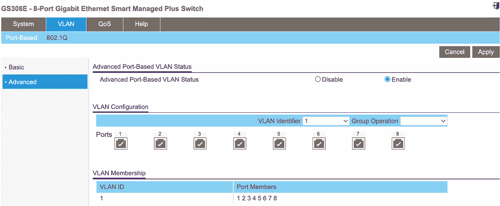

# 2

# 架构和分段你的网络

架构和分段网络的方式可以在最短的时间、最少的努力和资金投入下提供最大的安全提升。一个好的网络分段计划可以让你将高风险和低风险的设备及用户类型分开，从而帮助你决定在环境中实施其他安全控制措施的位置。

例如，你的物联网（IoT）设备，很可能比你的 Windows 操作系统更少经过测试、更新和维护，仅仅因为这些技术较新，且应用较少。这使得它们天生比其他广泛使用的技术更容易受到攻击，也更不安全。通过将这些易受攻击的终端设备放置在逻辑上或物理上隔离的网络中，可以降低攻击者利用它们并横向移动到你的计算机的风险。一旦你将设备隔离开，你可以考虑额外的控制措施——例如入侵检测或防御系统——或者其他网络安全监控和告警解决方案，这些内容我们将在第十章中讨论。

本章将讨论用于分段网络的网络硬件类型、它们的优缺点，以及一些推荐的解决方案和配置，用于物理或逻辑地分段你的网络，分离使用以太网和无线网络设备及设置的设备。

## 网络设备

集线器、交换机和路由器都可以用来分段网络。其中一些提供更多的功能，或者在设计上天生更具能力和安全性。根据你的需求，你可以选择使用这些设备中的一个、一些，或全部。

### 集线器

一个*网络集线器*是最基本的设备类型，能够使多个计算机相互通信。集线器可以在小型网络中相对安全地使用，而在大型网络中，集线器可能会引发重大问题。当主机 A 连接到集线器时，与主机 B 通过同一集线器通信，数据（以以太网帧表示的包）会从主机 A 传输到集线器的一个端口，然后集线器通过所有其他端口广播该数据。这意味着网络上的每个其他终端都会接收到目标是主机 B 的数据，这样就不太安全。此外，由于集线器没有智能，所有端口都属于同一个*碰撞域*。这意味着，如果两个或多个设备尝试同时通信，流量就会发生碰撞，导致网络性能问题。当发生碰撞时，发送设备必须停止通信并等待随机时间后再尝试重新通信，理想情况下避免发生第二次碰撞，这样就会导致进一步的延迟。

由于功能有限，集线器通常便宜且易于部署，但它们不具备扩展性。如果你有超过少数几个需要通信的设备，最好还是选择交换机。

### 交换机

与集线器不同，*交换机*通过网络使用连接到它们的终端的物理硬件（MAC）地址转发流量。当连接到交换机的主机与网络中的另一主机通信时，数据会从发送方传输到交换机的端口，然后交换机会使用目标数据的 MAC 地址来确定该数据应转发到哪个端口。交换机会在内存中保持一个 MAC 地址表，因此它知道每个终端在网络上的位置。交换机的每个端口都有自己的独立碰撞域，这意味着如果两个主机同时通信，就不会发生碰撞——数据包在传输过程中不会相遇。这也意味着数据不会广播到网络上的每个设备，因此交换机本质上比集线器更安全。

交换机可以用于任何规模的网络。小型网络通常只需要一个交换机，具体取决于终端数量。

### 路由器

*路由器*主要用于在网络或网络段之间传输数据。例如，你的本地内联网，所有终端都连接到该网络，是一个私有网络。互联网是一个非常大且公开访问的计算机网络，它与您的私有网络是分开的。路由器就是这两个网络之间的桥梁，使你能够访问其中一个并浏览互联网。交换机使用 MAC 地址，而路由器主要关注 IP 地址。所有连接到互联网的网络都使用某种类型的路由器。在一个小型网络中，连接你网络和互联网服务提供商的边界路由器可能是你唯一需要的路由器。

## 创建信任区

*网络分段*是将网络划分为更小的部分，称为*子网*，以提高网络的整体性能和安全性。你可以通过物理或逻辑方式分隔设备来对网络进行分段。

### 物理分段

可以说，最简单的网络分段方式是使用物理上独立的硬件 (*物理分段*) 来分隔设备。例如，你可以为你的计算机使用一个无线路由器，为你的移动设备使用另一个。或者你可能为所有个人设备使用第一个路由器，为所有物联网设备使用第二个路由器。

将设备和用户分成不同的类别或类，使它们处于*信任区域*，从而将最关键的数据和资产与更易受攻击的设备分开。将需要更高安全性和监控的设备与那些要求较低安全性、因此维护成本较低的设备分开，可以让你将更多的时间集中在重要资产上，减少管理不重要资产的时间。

通过将不同类型的设备分开，你的网络安全性会增加，因为集中在某一类型设备漏洞上的攻击不会使攻击者进入你网络的其他部分。随着家用电器逐渐转变为智能设备，这一点变得越来越重要。

物理网络分段比逻辑分段更难被攻击者突破。物理分段的缺点是增加了管理开销、硬件成本和其他基础设施成本，因为你可能需要为每个物理网络配置单独的互联网连接。

### 逻辑分段

*逻辑分段*比物理分段更常见，且通常实施成本较低，因为它不需要为每个网络段单独配置物理硬件。逻辑分段通常通过使用*虚拟局域网（VLAN）*来实现：系统群体看似处于同一局域网，但在逻辑上与其他 VLAN 上的系统分开。能够创建和管理 VLAN 的交换机被称为*管理型交换机*。每个 VLAN 像一个虚拟交换机一样存在于你的物理交换机内。将交换机上的物理端口分配给特定 VLAN，相当于将一根电缆插入特定的交换机。

例如，你可以将一台交换机（如八端口的 Netgear GS308E 或类似设备）放在宽带路由器后面，让连接到交换机的终端能够访问互联网。然后，在交换机上，你可以创建具有不同目的的 VLAN，比如用于管理或行政的 VLAN、用于主要终端的业务或个人 VLAN，以及用于更不安全设备类型（如移动设备和物联网设备）的来宾 VLAN。

创建 VLAN 后，你可以指定交换机上的八个端口中哪些能够在这些 VLAN 上进行通信，通过一个物理设备将每个 VLAN 及其相应的设备在逻辑上分隔开。当然，这种方法最适合以以太网或有线设备多于无线设备的网络，除非你打算使用多个无线接入点。

#11: 网络分段

在小型网络中，推荐的网络分段方法是根据所需的访问类型和安全与监控等级，将终端设备分类为信任区域。

例如，你的主网络段应该包括包含或可以访问你私人数据的主设备，如电子邮件、联系人、消息以及存储在 Google Drive 或 Dropbox 等云服务中的数据。这个网络段设计为最安全，具备最严格的安全要求，并且拥有最全面的监控与检测。

你的次级网络段是用于那些不需要与主设备通信或访问相同数据的终端设备，如物联网设备和其他连接设备——智能灯、打印机、如 Google Chromecast 这样的投射设备等等。所有这些设备应当被分隔在它们自己的网络段中，因为它们本质上比你的主设备更不安全；这样可以降低对手利用这些设备作为跳板进入你网络的风险。这个网络段可以有较低的安全控制，因为它不包含任何关键数据或信息。

接下来，你可能有一个或多个三级网络段，所有其他终端设备都位于其中，比如你的访客网络。再次强调，这个网络段可以有较低的安全控制和监控要求，相较于你的主网络段。

最后，根据你网络中拥有的（或计划拥有的）设备类型，你可能需要一个具有非常严格访问规则的网络段。这个网络段可以是用于那些你不希望在任何情况下连接到互联网的设备，包括闭路电视或监控摄像头。对于这样的严格网络分段，还需要考虑其他因素，例如如何让这个网络段内的设备进行更新。

有多种方式可以对你的网络进行分段。让我们详细了解如何实现有效的网络分段，首先通过使用独立的无线网络，然后通过使用 VLAN 实现以太网分段。如果你的网络需求需要，可以将这些方法结合使用。

### 以太网分段

你可以使用能够将特定以太网端口分配到 VLAN 的以太网交换机来逻辑上分割你的网络及其设备。像 Netgear GS308E 这样的便宜的管理型交换机提供了此功能，安装它在你的小型网络中既快捷又简单。这个设备将用于接下来的示例网络配置。你可以直接从 Netgear 或其他在线零售商购买 GS308E，或者通过像 eBay 这样的市场购买二手设备。或者，我建议研究 Ubiquiti 的网络设备系列，虽然价格较贵，但其用户友好且功能强大。

VLAN（虚拟局域网）用于分隔信任区。理想情况下，在较大的网络中，这通常是通过使用两台不同的物理交换机来实现的。如果交换机配置错误，较高和较低安全性的网络及设备可能会相互通信，但如果两台交换机物理分开，这种情况不太可能发生。然而，在小型网络中，我们通常没有购买多台设备的奢侈，成本过高。因此，我们采取下一个最佳方案，使用 VLAN 将网络虚拟隔离。

注意：购买两台没有 VLAN 等高级功能的非托管交换机可能比购买一台带 VLAN 功能的托管交换机便宜。选择这种方式将导致两个或更多物理分离的网络，每个网络配有一台交换机。如果这两个网络都需要互联网连接，您将需要为每个网络提供单独的互联网连接，或者需要一台能够保持交换网络逻辑隔离的网关设备。在这种情况下，您最好一开始就投资稍微贵一些的托管交换机。本书中没有涉及非托管交换机的使用，因为它们是即插即用的，几乎不需要额外设置，而且会导致比托管交换机更不安全的架构。

一旦您拥有交换机，初始配置通常是直接的：

1.  1\. 打开包装并将交换机连接至电源。

1.  2\. 使用以太网电缆将您的调制解调器/路由器（或任何提供互联网连接的设备，如我们将在第三章中介绍的 pfSense 设备）连接到交换机。

1.  3\. 您可以通过三种方式找到交换机的 IP 地址：

    1.  a. 交换机会接受来自您网络中提供 DHCP 的设备的 IP 地址。您可以通过第一章中的步骤在路由器或其他 DHCP 提供者中找到其 IP 地址。

    1.  b. Netgear（以及大多数网络设备制造商）提供一个应用程序，用于在您的网络上发现其交换机。您可以从[`www.netgear.com/support/product/netgear-switch-discovery-tool.aspx`](https://www.netgear.com/support/product/netgear-switch-discovery-tool.aspx)下载 Netgear 交换机发现工具（NSDT）。下载、安装并运行该工具，以识别网络中的交换机。

    1.  c. 默认情况下，交换机的 IP 地址为 192.168.0.239。如果前两种方法不起作用，您可以使用此默认 IP 地址连接到交换机的 Web 界面进行配置。

1.  4\. 一旦您发现或配置了交换机的 IP 地址，请在 Web 浏览器中浏览该 IP 地址并使用默认密码（在交换机手册中提供）登录。

1.  5\. 系统会提示您更改管理员密码。我建议您更改，因为默认密码不安全。

此时，您将看到一个概述页面，提供交换机信息，如名称、序列号、MAC 地址等。将这些信息添加到您的资产清单和网络图中。

完成这些步骤后，你就可以开始配置 VLAN 了。交换机会接受并将互联网连接传递到你连接到交换机的设备。配置和使用 Netgear 交换机上的 VLAN 是一个简单的操作，其他受管理交换机的操作方法应该类似：

1.  6\. 以管理员身份登录交换机。

1.  7\. 在网页界面的顶部，找到 VLAN 标签，如图 2-1 所示。

1.  8\. 在左侧菜单中，点击**高级**以查看高级 VLAN 选项。

1.  9\. 如图 2-1 所示，将高级基于端口的 VLAN 状态从“禁用”切换为“启用”。

图 2-1：VLAN 配置

接下来，你需要将交换机上的物理以太网端口分配给特定的 VLAN。为你网络中的每个信任区配置一个 VLAN。如果你想为最安全的设备配置一个主网络，为访客设备配置一个次要网络，为物联网设备配置一个三级网络，那么你应该配置三个独立的 VLAN。如果配置一个新的 VLAN 等同于创建一个新的物理局域网，那么使用新的交换机或路由器时，给端口分配 VLAN 就相当于将设备插入到该物理交换机中。如果你将 VLAN 视为独立的网络，那么将每个端口分配给一个 VLAN 就相当于告诉交换机该端口属于哪个逻辑网络，并且只有属于同一 VLAN 的端口和终端才能进行通信。

1.  10\. 在 VLAN 标识符下拉菜单中，选择你要配置的 VLAN 的 ID。

1.  11\. 对于你想要添加到此 VLAN 的每个物理端口，确保该端口已被选中。取消勾选不允许在此 VLAN 上通信的端口。点击“应用”。

    当你将设备插入这些端口（这些端口已经分配了 VLAN）时，这些设备将仅在该 VLAN 内进行通信。

1.  12\. 若要将这些端口从 VLAN 1（默认 VLAN）中移除，请从下拉菜单中选择**VLAN 1**。点击相关端口，直到其显示为空白。点击**应用**。

要测试你的 VLAN 配置，将一个终端连接到交换机上一个已分配的端口，再将另一个终端连接到任何仍然使用默认配置或配置了其他 VLAN 的端口。如果这两个设备无法相互 ping 通，那么说明你的 VLAN 配置正确。

## 总结

在本章中，你已经为设备识别并创建了信任区。通过这样做，你能够将你的网络进行分段，保持高信任和高安全性的设备与低信任的设备分开。你可以通过这种方式使用交换机创建任意多或任意少的网络段，帮助你提高网络和用户的安全性。
