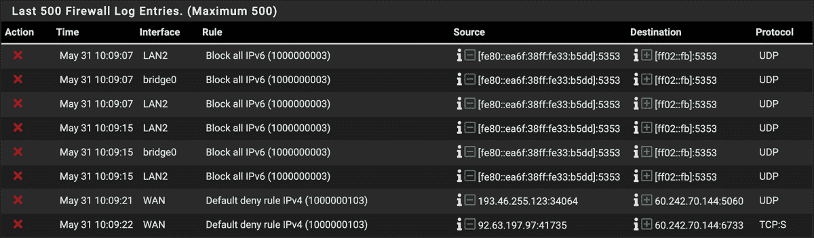

# # 使用防火墙过滤网络流量


*防火墙*监控并过滤进出网络的流量。人们常常误以为防火墙总是最后一道防线；实际上，边界防火墙应当是攻击者试图突破任何网络时首先遇到的障碍，不论该网络大小。每当网页浏览器访问网站、消息程序发送信息或你的电子邮件客户端发送和接收邮件时，生成的流量应至少通过一个防火墙。

本章将介绍两种防火墙解决方案：iptables 和 pfSense。在 Linux 中，iptables 是一种常见的防火墙，通常用作*主机防火墙*（即，允许或拒绝特定端点上的流量的防火墙）。pfSense 可以作为开源软件防火墙或通过 Netgate 销售的设备作为硬件防火墙来实施，用作边界防火墙，负责过滤整个网络或网络段的流量。

## 防火墙类型

*硬件防火墙*可以在网络中物理和逻辑地放置。*软件防火墙*作为应用程序安装在终端上，需要对防火墙及其连接的设备进行更多配置，以有效地过滤流量。通过使用这两者中的一个或两个，你可以有效地减少你的*攻击面*，即攻击者可以尝试渗透、危害或利用你的网络的点。理想情况下，攻击面应该尽可能小。

*边界防火墙*安装在你的私人网络与其他网络（如互联网）之间，可以是软件或硬件基础的。边界防火墙被放置在网络的物理和逻辑边界上，使其成为面向公众互联网时，进出你内部网络的流量的第一个接触点，也是出发到互联网的流量在网络中最后通过的设备，如图 3-1 所示。


图 3-1：边界防火墙

防火墙根据包含已配置规则列表的*规则集*允许或拒绝（阻止）流量。规则应用于流量的方式取决于你使用的防火墙类型。最常见的类型是*包过滤防火墙*，它会检查每个尝试进入（或离开）内部网络的数据包，然后将该数据包与规则集进行匹配。如果数据包的内容与防火墙规则集中某个规则相符，防火墙将根据该规则的指示，决定是否允许或拒绝该流量。

还有有状态和无状态防火墙。*有状态*防火墙跟踪所有进出连接，并将每个连接视为两个端点之间的独特会话。这种方法为防火墙提供了有关特定连接的上下文，并允许对流量进行更精细的控制。相反，*无状态*防火墙不会记录关于每个连接的信息。iptables 和 pfSense 都是有状态防火墙。

几乎所有操作系统都附带内置的软件防火墙，称为*基于主机的防火墙*，用于过滤特定于该主机的流量。大多数 Windows 和 Mac 设备出厂时都配备了开箱即用的基于主机的防火墙，其基本规则集是可用的，尽管可能不全面。该防火墙按设计在普通情况下就能正常工作；用户无需自行配置防火墙，从而减少了混淆和对计算机制造商技术支持的需求。在 Linux 设备上，您需要配置防火墙——您将在下一节中了解如何做到这一点。

最好同时使用主机防火墙和边界防火墙，并正确配置它们，以便为您的网络添加多层防护。

## iptables

Linux 的 iptables 工具在过滤进入、穿越或离开网络的流量方面提供了极大的灵活性。防火墙通过*策略链*组织其规则，这些规则列表根据数据包的内容进行分析和匹配。每个规则决定了防火墙如何处理匹配其定义的数据包——它可能允许、拒绝或丢弃数据包。当数据包被允许时，它会顺利通过防火墙。当数据包被丢弃时，防火墙会丢弃该数据包，并且不会向发送者返回任何响应。如果数据包被拒绝，防火墙会丢弃数据包，并向发送者返回拒绝消息，提供有关您的网络和所使用的防火墙的上下文信息。

策略链有三种主要类型：*输入链*、*输出链*和*转发链*。输入链决定是否允许来自外部源的某些流量进入网络，例如来自远程位置的*虚拟私人网络（VPN）*连接。VPN 是一种逻辑上——而非物理上——连接不同网络的方法，通常用于从一个网络远程访问另一个网络。VPN 将在第五章中详细介绍。

输出链指示防火墙是否应允许某些外向流量进入外部网络。例如，*互联网控制消息协议（ICMP）*主要用于诊断网络通信问题。ICMP ping 数据包是通过输出链传输的外向流量。ping 是一种设备间的查询，通常用于判断两者之间是否能建立连接。你需要允许 ping 数据包从设备出发，穿越防火墙，并通过其他若干设备，最终到达目标。如果你的输出链阻止了 ICMP 流量，那么你的设备将无法 ping 任何设备，因为防火墙会阻止或丢弃这些数据包。

在大多数情况下，你的状态防火墙规则应当允许新连接和已建立连接。例如，如果你创建一个输出链来允许你的设备 ping 谷歌，你需要告诉防火墙允许与已建立连接相关的入站流量。否则，你的设备会向谷歌发送 ping 请求，这个请求会通过防火墙，但谷歌的响应会被防火墙阻止。

转发链将防火墙接收到的流量转发到另一个网络。在小型办公室或家庭网络中，基于主机的防火墙很少使用转发链，除非防火墙被配置为充当路由器。边界防火墙会使用转发链将流量从内部网络路由到外部网络，或者从一个网络段路由到另一个网络段，通常使用网络地址转换（NAT），如第一章所讨论。然而，这种配置对于小型网络来说比必要的要复杂，更适合企业网络。

通过使用这些策略链，你将能够在非常细粒度的层面控制穿越你网络的流量。在接下来的章节中，你将创建几个 Linux 服务器，每个服务器都将受益于其独立的基于主机的防火墙。我建议按照以下说明在这些服务器上配置 iptables。

请注意，iptables 无法保护 IPv6 网络和流量。如果你打算在你的网络中使用 IPv6，你需要额外使用 ip6tables 来配合 iptables。除非你的网络中有强烈的 IPv6 使用需求，否则我建议你完全禁用 IPv6。禁用 IPv6 的步骤在第四章中有介绍。

#12: 安装 iptables

如果你已经按照第一章的步骤构建了一个标准的 Ubuntu 服务器，你可以开始配置它的 iptables 防火墙。一旦掌握了基础，你可以将这些知识用来在所有 Linux 终端上配置 iptables。否则，现在就回去创建你的 Ubuntu 系统吧。

最新版本的 Ubuntu 默认安装了 iptables，因此请以标准非 root 用户身份通过 SSH 登录，并通过运行版本检查来查看是否已安装 iptables：

```
$ `sudo iptables -V`
[sudo] password for `user`:
iptables v1.8.7 (nf_tables)

```

如果已安装 iptables，服务器应该会返回版本信息，如下所示。你的版本可能会有所不同。

如果没有安装 iptables，你将会收到一个错误提示，此时需要安装 iptables：

```
$ `sudo apt install iptables`

```

安装完成后，运行相同的版本检查以确认安装成功。

接下来，安装`iptables-persistent`，这是一个可以保存防火墙配置并在服务器重启后自动加载配置的工具：

```
$ `sudo apt install iptables-persistent`

```

一个安装向导应该会接管你的终端窗口。你将看到一个文件，显示服务器将保存防火墙规则的地方（默认文件是*/etc/iptables/rules.v4*），并且会告知该文件中的规则将在系统启动时加载。同时，你需要在此安装过程之外手动保存任何防火墙规则的更改。选择**Yes**以保存当前的防火墙规则。如果你不安装此组件，每次重启服务器时都需要重新配置防火墙。

现在你可以像这样检查当前的策略链：

```
$ `sudo iptables -L`
[sudo] password for `user`:
Chain INPUT (policy ACCEPT)
target     prot opt source               destination
Chain FORWARD (policy ACCEPT)
target     prot opt source               destination
Chain OUTPUT (policy ACCEPT)
target     prot opt source               destination

```

在输出中，`policy ACCEPT`表示默认情况下，iptables 接受所有输入、输出和转发流量。这个默认行为是可取的，因为它在没有用户配置的情况下就能工作。然而，它是一个不安全的解决方案，因此我们需要对其进行修改。

### iptables 防火墙规则

在创建 iptables 规则时，请记住顺序非常重要。当流量到达防火墙时，iptables 会按顺序检查规则，*按照它们出现的顺序*。如果流量与某个规则匹配，iptables 就不会再检查其他规则——如果你的 50 条规则中的第一条规则拒绝所有流量，那么防火墙会解释这条规则，拒绝流量并停止处理，从而有效地将你的设备完全隔离。相反，如果你有相同的 50 条规则，但第一条规则允许所有流量，那么所有流量都会通过防火墙。你应该避免这两种情况。

要理解如何构建 iptables 防火墙规则，看看这个示例：

```
$ `sudo iptables -A INPUT -p tcp --dport 22 -m conntrack \`
`     --ctstate NEW,ESTABLISHED -j ACCEPT`

```

在`sudo`命令之后，调用 iptables 开始定义规则。下一个参数决定了规则是附加到（`-A`）、删除（`-D`）还是插入（`-I`）指定的策略链。你还可以在这个位置指定`-R`来替换或更新现有规则。`INPUT`表示正在修改输入链中的规则。你还可以指定`OUTPUT`、`FORWARD`或其他策略链。

在大多数情况下，iptables 需要知道规则所涉及的协议和端口。在此示例中，`-p tcp`表示规则仅适用于 TCP 流量，`--dport 22`告诉 iptables 该规则适用于目标端口为 22 的数据包。两者都是可选的。你可以使用以下语法指定多个端口：`--match multiport --dports` `port1,port2,port3`。

注意，*传输控制协议（TCP）*是一个*可靠*的传输协议，旨在确保数据包在网络上的成功传输。如果计算机在使用 TCP 进行通信时发生数据包丢失，丢失的数据包将被重新传输，确保所有发送的数据最终都能被目标主机接收。*用户数据报协议（UDP）*是一个*不可靠*的协议，不保证数据的成功传输，也不会重新传输丢失的数据包。UDP 用于一些可以接受丢包的场景，通常会导致更快的连接速度。而 TCP 则在可靠性至关重要时使用，每个数据包都必须成功传输。

iptables 防火墙提供了多个匹配模块，你可以使用`-m`参数来指定要使用的模块。在这个例子中，使用了`conntrack`，一个允许有状态数据包检查的工具（也是可选的）。其他一些工具包括`connbytes`，它根据传输的流量大小来创建规则，以及`connrate`，它根据流量的传输速率进行匹配。有关更多详细信息，请参阅 iptables 手册：[`linux.die.net/man/8/iptables/`](https://linux.die.net/man/8/iptables/)。

接下来，`--ctstate`告诉 iptables 允许并跟踪以下连接类型的流量——在这种情况下是`NEW`和`ESTABLISHED`。连接状态有许多可用值，但最常用的是`NEW`、`ESTABLISHED`、`RELATED`和`INVALID`。新建和已建立的状态是不言自明的；数据包属于新的或已建立的流量流。相关数据包不一定匹配已建立的连接，但它们是防火墙所期望的，因为现有连接需要它（即根据防火墙现有的上下文进行预期）。无效的数据包是任何不符合其他状态标准的数据包。

最后，iptables 将把`-j`及其后面的内容视为匹配此规则时要执行的动作。最常见的动作是`ACCEPT`，允许匹配此规则的流量；`DROP`或`REJECT`，拒绝或阻止流量；或`LOG`，将流量记录到日志文件中（稍后会详细介绍）。

现在你已经理解了 iptables 规则的基础知识，接下来你将配置防火墙以允许和拒绝流量。

### 配置 iptables

配置 iptables 时，首先添加规则以丢弃无效流量：

```
$ `sudo iptables -A OUTPUT -m state --state INVALID -j DROP`
$ `sudo iptables -A INPUT -m state --state INVALID -j DROP`

```

然后，添加规则以接受与现有连接相关的流量，以及已建立连接和回环地址，以避免之后出现问题（*回环地址*是计算机用来测试和诊断网络问题的内部地址）：

```
$ `sudo iptables -A INPUT -m state --state RELATED,ESTABLISHED -j ACCEPT`
$ `sudo iptables -A OUTPUT -m state --state RELATED,ESTABLISHED -j ACCEPT`
$ `sudo iptables -A INPUT -i lo -j ACCEPT`

```

这允许防火墙接受与已知连接匹配或与正在进行的连接相关的流量，并丢弃任何意外的数据包（这可以保护你的网络免受未经请求或恶意的网络扫描活动）。

一旦运行这些命令将规则输入到策略链中，请重新运行列出命令以确保它们已被接受：

```
$ `sudo iptables -L`
Chain INPUT (policy ACCEPT)
target     prot opt source           destination
DROP       all  --  anywhere         anywhere         state INVALID
ACCEPT     all  --  anywhere         anywhere         state RELATED,ESTABLISHED
ACCEPT     all  --  anywhere         anywhere
Chain FORWARD (policy ACCEPT)
target     prot opt source           destination
Chain OUTPUT (policy ACCEPT)
target     prot opt source           destination
DROP       all  --  anywhere         anywhere         state INVALID
ACCEPT     all  --  anywhere         anywhere         state RELATED,ESTABLISHED

```

请注意，规则已经被添加到`INPUT`和`OUTPUT`链下。`FORWARD`链保持为空。

接下来，确保您的防火墙允许 SSH 流量。您可以通过两种方式实现：广泛地允许 SSH，或者仅允许来自您网络中部分设备的 SSH 流量。要允许来自您网络中所有设备的 SSH 流量，可以使用以下命令：

```
$ `sudo iptables -A INPUT -p tcp --dport 22 -m conntrack --ctstate NEW -j \ ACCEPT`

```

创建广泛的规则在通过 SSH 连接到或从多个设备连接时很有帮助。然而，允许程序的无限制使用并完全开放协议并不是最安全的解决方案。您应该仅允许来自特定 IP 地址或范围的 SSH 等服务，因为允许远程访问或文件传输在您的端点与任何其他设备之间是有风险的。

您可以通过在输入链中使用`-s` `source`选项指定源 IP 地址或范围（例如，192.168.1.25）来减少攻击面，因此，如果您在虚拟机上配置 iptables，您可能会选择仅允许来自单个主机的管理连接，并拒绝网络中所有其他端点的访问：

```
$ `sudo iptables -A INPUT -p tcp -s 192.168.1.25 --dport 22 -m \`
`       conntrack --ctstate NEW -j ACCEPT`

```

我们使用`-A`将此规则追加到`INPUT`策略链中，目标端口`22`，协议`TCP`。对于`NEW`连接，iptables 将`ACCEPT`符合此规则的流量。端口可以是您选择的任何端口；只需确保您的 SSH 配置与防火墙规则匹配。如果规则允许在端口 22 上使用 SSH，但您的 SSH 配置允许在端口 2222 上进行连接，防火墙将阻止您的 SSH 连接。

如果您犯了错误，通过运行相同的命令并将`-D`选项替换为`-A`来删除规则：

```
$ `sudo iptables -D INPUT -p tcp -s` `192.168.1.25` `--dport 22 -m conntrack \ --ctstate NEW,ESTABLISHED -j ACCEPT`

```

另外，您可以使用`-F` `chain`或`--flush` `chain`参数删除您为任何策略链指定的所有规则：

```
$ `sudo iptables -F INPUT`

```

使用这组基本规则，您现在可以告诉 iptables 如何处理所有其他流量（您不希望进入或离开您的服务器或网络）。一旦创建了允许特定流量的规则，您可以很可能阻止、拒绝或丢弃其他所有流量。您应该在配置防火墙规则后执行此操作；否则，您可能会中断连接并无法通过 SSH 重新连接。使用`-P`参数设置策略链的默认行为，并让 iptables 知道如何处理与规则不匹配的流量。为此，设置策略链的默认行为为`DROP`这些流量：

```
$ `sudo iptables -P INPUT DROP`
$ `sudo iptables -P FORWARD DROP`
$ `sudo iptables -P OUTPUT DROP`

```

以这种方式使用`-P`不同于之前使用的`-A`和`-I`，因为它不会影响防火墙规则本身；相反，它处理管理网络流量的整体策略。`-A`和`-I`分别用于追加或插入防火墙规则，而`-P`则在更高一级配置防火墙行为。

此时，检查你的 iptables 链应该返回：

链 INPUT（策略 DROP）

target     prot opt source               destination

DROP       all  --  anywhere             anywhere             state INVALID

ACCEPT     all  --  anywhere             anywhere             state RELATED,ESTABLISHED

ACCEPT     all  --  anywhere             anywhere

ACCEPT     tcp  --  192.168.1.25         anywhere             tcp dpt:22 ctstate NEW

链 FORWARD（策略 DROP）

target     prot opt source               destination

链 OUTPUT（策略 DROP）

target     prot opt source               destination

DROP       all  --  anywhere             anywhere             state INVALID

ACCEPT     all  --  anywhere             anywhere             state RELATED,ESTABLISHED

请注意，所有三个链的策略已经从 `ACCEPT` 更改为 `DROP`，这表明每个链的默认行为是丢弃不匹配任何规则的流量。你还应该能够通过将这个输出与之前列出 iptables 规则的输出进行比较，来识别你添加到链中的规则。你可能会收到 DNS 失败的错误，因为防火墙现在阻止了所有未明确允许的内容，包括 DNS（它运行在端口 53）。通过添加以下新规则来解决这个问题：

$ `sudo iptables -A OUTPUT -p udp --dport 53 -m conntrack --ctstate NEW -j ACCEPT`

$ `sudo iptables -A OUTPUT -p tcp --dport 53 -m conntrack --ctstate NEW -j ACCEPT`

这些命令将规则附加到输出链，允许此服务器在 UDP 和 TCP 端口 53 上进行域名解析的出站请求。通过添加这些规则，服务器可以解析域名。

通过尝试从网络中的另一台设备 ping 服务器来测试你的防火墙；你应该会收到一个错误，因为 ICMP 被防火墙禁止。类似地，如果你尝试从服务器本身 ping 任何内容，你也应该收到类似的错误：

```
$ `ping google.com -c 5`
PING google.com (<`ip_address`>): 56(84) bytes of data.
ping: sendmsg: Operation not permitted
ping: sendmsg: Operation not permitted
ping: sendmsg: Operation not permitted
ping: sendmsg: Operation not permitted
ping: sendmsg: Operation not permitted
--- google.com ping statistics ---
5 packets transmitted, 0 received, 100% packet loss, time 4000ms

```

ICMP 可以是一个非常有用的故障排除工具，你可能会决定允许通过 iptables 防火墙进行 ping 操作。要做到这一点，请添加以下规则：

```
$ `sudo iptables -A INPUT -p icmp -j ACCEPT`
$ `sudo iptables -A OUTPUT -p icmp -j ACCEPT`

```

你可能会发现需要在防火墙中打开额外的端口。例如，如果你安装了代理，或者在阅读完第六章后构建了一个，你需要在防火墙中打开代理端口（3128）：

$ `sudo iptables -A OUTPUT -p tcp --dport 3128 -m conntrack --ctstate NEW -j ACCEPT`

在大多数情况下，你应该从服务器中禁止网页浏览——几乎没有正当理由使用服务器进行此类活动。理想情况下，从管理和安全角度来看，服务器应为单一用途。允许任何额外的服务——特别是浏览互联网——会导致更大的攻击面，并在你的网络中创建潜在的漏洞。

如果你决定允许来自服务器的此类流量，以便服务器可以获取软件更新，创建针对端口 80 和 443 的输出规则，这两个端口分别是 HTTP 和 HTTPS 流量的默认端口：

`$` `sudo iptables -A OUTPUT -p tcp --dport 80 -m conntrack --ctstate NEW,ESTABLISHED -j ACCEPT`

`$` `sudo iptables -A OUTPUT -p tcp --dport 443 -m conntrack --ctstate NEW,ESTABLISHED -j ACCEPT`

HTTP 和 HTTPS 规则之间唯一的区别是端口号。

每次添加规则后，你都应该进行测试。此时，最简单的测试方法是先使用服务器上的浏览器（如果安装了 GUI）或者在 bash 终端中使用`curl`测试是否能上网。首先安装`curl`：

```
$ `sudo apt install curl`

```

如果没有允许 HTTP 和 HTTPS 的规则，安装命令将会失败，因为更新通常是通过 HTTP 进行的。不过，如果已经配置了这些规则，`curl`应该已经成功安装，你现在可以确保端口 80 和 443 已开放：

```
$ `curl http://icanhazip.com`
`ipaddress`

```

地址[`icanhazip.com/`](http://icanhazip.com/)是一个公共服务提供商，当通过`curl`查询时，它会返回你当前的公共 IP 地址。如果显示了当前的公共 IP 地址，那么说明防火墙配置正确。

如果你收到错误，可能是某个规则存在问题。检查拼写，如果仍然无法解决，请删除规则并使用之前讨论过的`-D`或`-F`参数重新开始。一旦防火墙配置正确，可以根据需要添加更多规则。

一个特别要添加的规则集是那些阻止流量到特定 IP 地址的规则。然而，由于大多数公共网站可能有多个 IP 地址，使用 iptables 屏蔽一个网站并不是最好的选择，因为你需要为每个唯一的 IP 地址创建规则。在大多数情况下，使用代理会更好，我们将在第六章中介绍。

如果你想使用 iptables 屏蔽某些网站—比如，屏蔽所有流量到[`www.squirreldirectory.com/`](https://www.squirreldirectory.com/)，该网站目前位于 IP 地址 206.189.69.35，你需要将以下规则添加到`INPUT`和`OUTPUT`链中：

```
$ `sudo iptables -A INPUT -s 206.189.69.35 -j DROP`
$ `sudo iptables -A OUTPUT -s 206.189.69.35 -j DROP`

```

通常，你会添加这种类型的规则来允许或拒绝来自静态、私有 IP 地址的流量，该 IP 地址预期不会更改，并使用代理处理公共 IP 地址或 URL。

### 记录 iptables 行为

你现在已经安装并配置了 iptables 防火墙，但你没有告诉它记录任何内容，所以它不会产生任何行为记录，这可能使得故障排除或确定是否应阻止某些流量变得困难。

首先，创建一个新的自定义策略链。请注意，此配置示例中规则的顺序非常关键。你可以随意命名链，但在这里，我们将其命名为`LOGGING`：

```
$ `sudo iptables -N LOGGING`

```

`-N`参数用于创建新链。

接下来，在`INPUT`和`OUTPUT`链的末尾添加一条规则，告诉 iptables 将所有尚未匹配规则的流量发送到新的`LOGGING`链：

```
$ `sudo iptables -A INPUT -j LOGGING`
$ `sudo iptables -A OUTPUT -j LOGGING`

```

然后，告诉 iptables 每分钟只记录每种丢弃的数据包一次：

```
$ `sudo iptables -A LOGGING -m limit --limit 1/minute -j LOG \`
`    --log-prefix "FW-Dropped: " --log-level 4`

```

这个限制是可选的，你可以将其设置为任何时间段，比如`1/second`、`1/minute`、`1/hour`或`1/day`。限制日志条目的数量可以减少日志中的噪声以及日志文件的大小。为日志信息添加前缀（`"FW-Dropped: "`），这样防火墙日志条目就容易识别。将日志级别设置为`4`会记录警告级别及以上的事件，表示对服务器或防火墙有实质性影响的事件。增加数字会记录更多较低严重性的事件，这在故障排除时非常有用。日志级别 1 到 3 只会记录警告级别以上的事件或错误。

最后，以下命令告诉防火墙，在记录后应该丢弃数据包：

```
$ `sudo iptables -A LOGGING -j DROP`

```

现在，你的防火墙将记录所有丢弃的数据包，包括从服务器的入站和出站流量。默认情况下，这些日志将保存在*/var/log/messages*中。

最后一步是保存防火墙配置。请记住，iptables 配置默认是临时的，重启后会丢失，这就是我们在项目 12 中安装`iptables-persistent`的原因。要保存配置，请运行以下命令（`netfilter`是`iptables-persistent`用于此目的的命令）：

$ `sudo netfilter-persistent save`

run-parts: 执行 /usr/share/netfilter-persistent/plugins.d/15-ip4tables save

run-parts: 执行 /usr/share/netfilter-persistent/plugins.d/25-ip6tables save

这样，防火墙就准备好了。

你可以考虑在防火墙中添加临时规则，但请记住那句谚语：“没有什么比临时防火墙规则更持久”（Austin Scott）。例如，在防火墙中添加临时规则以允许用户从互联网下载文件时，最好找到其他替代方法，比如使用另一台主机。如果这样的规则被创建并留在防火墙配置中，它会造成一个漏洞，降低防火墙的安全性。尽量避免使用临时规则。

## pfSense

除了使用 iptables 防火墙保护你网络中的每个端点外，你还应实施像 pfSense 这样的防火墙，来保护网络边界。通过这两层防火墙，你的防御深度策略得到了加强，每一层的复杂性都让任何攻击者的任务变得更加困难。你应当将边界防火墙放置在网络的物理边缘——也就是尽可能接近互联网的位置，相对于网络中的其他端点而言。对于大多数人来说，这个位置将直接位于调制解调器/路由器或连接你网络和互联网服务提供商的网络边界点后面。通过虚拟机和正确的路由配置，也有可能从逻辑上实现这一点。然而，设置边界防火墙的最佳和最安全的方式是使用物理设备。

与 iptables 类似，pfSense 防火墙是有状态的。然而，iptables 是作为一个功能安装在像 Ubuntu 这样的基本操作系统之上，而 pfSense 是一个完全成熟的操作系统。它基于 FreeBSD，这是一个开源的 Unix 版本（一个类似于 Linux 的操作系统，使用自己的内核），具有像 Web 管理界面等用户友好的特性，并且可以作为虚拟机或物理设备部署。

在创建物理防火墙时，你有几个选择。第一个是从小型计算机（如英特尔的下一代计算单元 NUC）构建一个适合此目的的设备。然而，对于相同的价格或更低的价格，Netgate 销售易于配置并且几乎开箱即用的 pfSense 设备。

为了简便（和安全考虑），我们将讨论使用预构建的设备。本文不会涉及从零开始构建设备，因为配置错误的风险太高，尤其是当有价格低廉且安全的解决方案现成可用时。撰写本文时，Netgate 2100 Base pfSense+ 的价格大约为 400 美元。它足够强大，可以应对你所需要的大部分任务，但不包括大规模的企业网络。SG-3100 比入门级的 1100 pfSense+ 更强大，功能也更全面。它具有更高的带宽和更大的吞吐量，因此它是小型网络的理想选择。

#13: 安装 pfSense 防火墙

收到 pfSense 设备后，将其从盒子中取出并连接电源。用一根以太网电缆将设备上的 WAN 端口连接到你的电缆、DSL 调制解调器或网络边界设备的任意端口。再用一根以太网电缆将 LAN1 端口连接到计算机上的以太网端口。

要从计算机访问 pfSense 配置页面，请浏览到 192.168.1.1，这是 SG-3100 的默认 IP 地址。如果无法连接，您可能需要断开计算机与常规网络的连接，并手动将其 IP 地址设置为 192.168.1.2（或任何其他在 192.168.1.*x*范围内的地址，除了 pfSense 的 IP 地址 192.168.1.1），按照以下说明进行设置。这仅在设备的初始配置时需要完成，并且只需要在您用来设置 pfSense 设备的计算机上执行一次。

macOS

1.  打开**系统偏好设置**。

1.  点击**网络**。

1.  选择连接在 pfSense 设备和计算机之间的以太网连接，然后将配置 IPv4 下拉框设置为**手动**。

1.  在 IP 地址字段中输入**192.168.1.2**，将子网掩码设置为**255.255.255.0**，并在路由器字段中输入**192.168.1.1**。

1.  点击**应用**。

1.  打开您的网页浏览器并访问 192.168.1.1。您应该会看到 pfSense 登录页面。

Windows

1.  打开**网络和互联网设置**。

1.  点击**更改适配器选项**。

1.  打开 pfSense 设备和计算机之间的以太网连接，然后点击**属性▸互联网协议版本▸(TCP/IP)▸属性**。

1.  选择**使用以下 IP 地址**单选按钮。

1.  在 IP 地址字段中输入**192.168.1.2**，将子网掩码设置为**255.255.255.0**，并在默认网关字段中输入**192.168.1.1**。

1.  点击**确定**并关闭剩余的窗口。

1.  打开您的网页浏览器并访问 192.168.1.1。您应该会看到 pfSense 登录页面。

Linux

1.  打开**设置**。

1.  点击**网络**。

1.  在 pfSense 设备和计算机之间的以太网连接上，点击配置**齿轮图标**。

1.  选择**IPv4**标签。

1.  选择**手动**单选按钮。

1.  在 IP 地址字段中输入**192.168.1.2**，将网络掩码设置为**255.255.255.0**，并在网关字段中输入**192.168.1.1**。

1.  点击**应用**并关闭设置窗口。

1.  打开您的网页浏览器并访问 192.168.1.1。您应该会看到 pfSense 登录页面。

注意：如果您收到警告消息，表示该站点不安全或不私密，请点击继续到登录页面。此警告出现是因为没有配置 SSL 证书，您现在可以忽略它。不过，请留意类似的错误；通常，SSL 证书错误（尤其是在互联网上）是一个严重的警告，表示您正在尝试访问的页面不安全。

在 pfSense 登录页面，使用收到设备时提供的凭证进行登录。如果显示了最终用户许可协议（EULA），请接受它。花点时间查看系统信息，然后点击页面顶部的**系统**菜单并启动**设置向导**。使用以下步骤完成 pfSense 的设置：

1.  在欢迎屏幕上点击**下一步**。

1.  2\. 如果显示了支持屏幕，点击**下一步**。

1.  3\. 在常规信息屏幕上，为设备选择一个主机名，或者保持默认值 pfSense。

1.  4\. 如果您在环境中配置了域，请在“域”字段中输入它。

1.  5\. 现在暂时忽略 DNS 设置，点击**下一步**。

1.  6\. 在时间服务器信息屏幕上，接受默认的时间服务器主机名，除非您在环境中有时间服务器，在这种情况下，请在此输入其详细信息。

1.  7\. 确保选择正确的时区，然后点击**下一步**。

现在您应该看到“配置 WAN 接口”页面。您可以使用此页面配置您的 pfSense 设备与互联网服务提供商连接。我们将在这里介绍最常见的配置，称为*PPPoE*，这可能与您当前的调制解调器/路由器设置相匹配。如果不匹配，请联系您的互联网服务提供商以获取正确的连接配置详情。

1.  8\. 在“选择类型”框中，选择**PPPoE**。

1.  9\. 跳过常规配置选项，接受默认设置。

1.  10\. 静态 IP 配置和 DHCP 客户端配置应被禁用，因此请继续进行 PPPoE 配置。

1.  11\. 输入由您的互联网服务提供商提供的用户名和密码。

1.  12\. 接受所有其他默认设置并点击**下一步**。

1.  13\. 设置 pfSense 设备的 LAN IP 地址。您可以选择保持在第一章中确定的 IP 地址方案，给此设备分配地址范围中的第一个 IP（例如，在 192.168.0.0/16 地址方案中是 192.168.1.1），或者您也可以通过在此页面上指定不同的 LAN IP 地址来更改它。如果您希望使用 10.0.0.0/8 范围的地址，可以指定 10.0.0.1，以此类推。然后点击**下一步**。

1.  14\. 更改管理员密码。请务必选择一个至少 12 个字符或更长的强密码，并将其保存在密码管理工具中（我们将在第十一章中进一步讨论）。完成后，点击**下一步▸重新加载▸完成**。

您的初始配置现已完成。假设设备已经凭借您的凭证成功连接到您的互联网服务提供商，您应该能够浏览互联网。如果无法连接，可能需要进行故障排除。进行故障排除的最佳地方是在 Web 界面顶部的“状态”菜单中的系统日志页面。运气好的话，查看日志后，任何问题都会显现出来。如果您确认输入了所有配置详情，联系您的互联网服务提供商以确保您的设置正确。

### 加固 pfSense

您的防火墙现在已配置并正在运行，它应该能够有效地拒绝未经请求的流量进入您的网络。然而，您可以采取额外的措施，确保您的设备和网络更加安全。

登录到您的 pfSense 设备后，点击**系统▸高级**。


图 3-2：高级 pfSense 菜单

在高级菜单选项卡中，您可以更改 pfSense 使用的协议、端口和代理设置等。如果更改任何设置，请在离开选项卡之前点击**保存**。

在图 3-2 所示的管理员访问选项卡中，将 webConfigurator 协议设置为**HTTPS**，以确保与设备的安全加密连接。总是优先使用 HTTPS 而不是未加密的 HTTP 协议，因为添加的加密确保即使网络流量被攻击者拦截，攻击者也无法解密它。

在管理员访问页面的下一部分（未在图 3-2 中显示），您可以更改 SSH 选项。我建议不要一直允许 SSH 访问设备——那就像晚上把前门锁忘了。如果您只在主动使用时才允许 SSH 访问，那么只有在该服务可用时，攻击者才能尝试访问您的网络。大部分时间禁用该服务意味着攻击者只有 1%的时间可以尝试入侵网络。除非您正在通过 SSH 连接设备，否则请禁用此选项。更新这些设置后，点击**保存**。

在网络选项卡中，您可以启用或禁用 IPv6 流量。如果您没有积极使用 IPv6，请在此处禁用它，以减少攻击面。这样做应该会让页面上的其他设置变得不重要。

如果您使用代理服务器来处理网页流量，请在杂项选项卡中输入您的代理详细信息。如果您计划按照第六章中详细的步骤构建自己的代理服务器，请返回此章节，并在那个阶段输入代理详细信息。

### pfSense 防火墙规则

默认的 pfSense 防火墙规则会阻止来自 RFC1918 私有网络连接和*bogon 网络*的流量进入您的网络。RFC1918 地址在第一章中讨论，是仅供私有内部网络使用的 IP 地址范围，意味着这些范围内的地址不应出现在公共互联网中。它们包括以下范围：192.168.0.0/16、10.0.0.0/8 和 172.16.0.0/12。如果这些地址出现在互联网上，您的防火墙应视为可疑并丢弃这些流量。同样，bogon 网络或 bogon 地址是那些公共的但尚未由 IANA 分配给任何人的地址。如果尚未分配的地址或地址范围发送网络流量，这也是可疑的，防火墙应丢弃这些流量。

尽管默认的防火墙规则是一个不错的起点，但你应该手动添加一些规则，以提供更高的安全性。例如，你不应该允许像*服务器消息块（SMB）*这样的服务，它允许 Windows 计算机在网络上共享文件，发送或接收来自你网络到互联网的出站或入站流量，或者从互联网接收入站流量。

注意：2017 年 5 月的 WannaCry 勒索病毒通过一个名为 EternalBlue 的 SMB 漏洞传播；在你的边界防火墙阻止 SMB 流量能显著减少你暴露于此漏洞的风险，并降低其他类似漏洞被用来危害你网络的风险。

要添加一个阻止 SMB 流量的规则，请按照以下步骤操作：

1.  1\. 在 pfSense 中，在页面顶部点击**防火墙▸规则**。

1.  2\. 点击**LAN▸添加**开始添加规则。

1.  3\. 将动作设置为**阻止**（丢弃数据包）或**拒绝**（丢弃数据包并通知发送者）。

1.  4\. 将地址族设置为**IPv4**，协议设置为**TCP**。

1.  5\. 将源设置为**任何**，目标设置为**任何**，目标端口范围（到和从）设置为**(其他) 445**。

1.  6\. 确保勾选**日志**框以记录任何丢弃的数据包，然后点击**保存**。

完成后，你的防火墙不再允许 SMB 流量通过网络边界。按照相同的步骤操作端口 137、138 和 139，因为这些服务（NetBIOS 名称解析、NetBIOS 数据报服务和 NetBIOS 会话服务）也不应允许跨越网络边界，因为所有这些协议都是用于本地网络内部的过程。

#14: 测试你的防火墙

设置一个或多个规则后，测试防火墙以确保被阻止的流量确实被拦截。最好的工具是*Nmap*，它用于网络扫描或网络映射。在 Windows、Linux 和 Mac 上都有 GUI 版本（称为*Zenmap*），也可以作为命令行工具使用。安装 GUI 版本后，它也会在命令行上可用，因此请从[`www.nmap.org/`](https://www.nmap.org/)下载并安装最新版本。

否则，你可以在 Ubuntu 上通过命令行安装：

```
$ `sudo apt install nmap`

```

安装完 Nmap 后，使用以下命令从命令行扫描 445 端口，这是我们告诉防火墙要阻止的端口：

```
$ `sudo nmap -p 445 -A scanme.nmap.org`
`--snip--`
Nmap scan report for scanme.nmap.org (45.33.32.156)
Host is up (0.20s latency).
Other addresses for scanme.nmap.org (not scanned): 2600:3c01::f03c:91ff:fe18:bb2f
PORT    STATE    SERVICE      VERSION
445/tcp filtered microsoft-ds
Service detection performed. Please report any incorrect results at https://nmap.org/submit/.
Nmap done: 1 IP address (1 host up) scanned in 2.54 seconds

```

你可以在 Zenmap GUI 中使用相同的命令—只需排除`sudo`。此命令将从你设备的防火墙后面执行端口扫描，扫描目标网站[`scanme.nmap.org/`](http://scanme.nmap.org/)，这是一个由 Nmap 创建者提供的公共网页，用于测试目的。

该命令分解如下：`nmap` 是程序的名称。`-p 445` 参数指定要扫描的端口，可以是逗号分隔的端口列表（如 `-p 445,137,138,22`）、特定端口（如所示）或端口范围（如 `-p1-1024`）。`-A` 参数告诉 Nmap 尝试识别每个扫描端口上的服务和操作系统，而 `scanme.nmap.org` 是要扫描的网站或系统。如果结果返回并且端口的 `STATE` 显示为 `filtered`，则说明防火墙已阻止该流量，防火墙规则正常工作。如果 `STATE` 显示为 `closed`，则表示防火墙允许流量通过，且是网站本身而不是防火墙返回的响应，表示端口已关闭。如果收到此结果，则说明你的防火墙规则没有配置或没有生效。

一旦你的规则生效，进入防火墙日志查看被阻止的数据包。在 pfSense 中，点击页面顶部的**状态▸系统日志▸防火墙**，可以查看防火墙日志中的最后 500 条记录，如图 3-3 所示。



图 3-3：pfSense 防火墙日志

很可能，你会看到大量被阻止的流量。在这个阶段，很难知道这些被阻止的流量是什么。举个例子，我日志顶部的一个条目显示了来自 IP 地址 80.82.77.245 的连接在端口 46732 被阻止。

经过进一步调查，似乎这是一个为“研究目的”定期扫描公共 IP 地址的服务。也就是说，它可能是什么都不确定；我怎么知道这个“研究”是否合法，还是有敌人试图找到我防火墙中的漏洞来渗透我的网络呢？在大多数情况下，无法知道，但至少我的防火墙在积极地阻止这种活动，如果需要，我可以在防火墙日志中找到它，回顾并采取行动。我们将在第十章中详细讨论如何处理这些信息，内容包括网络安全监控。

## 总结

你的网络和主机由于有主机和网络级别的防火墙而显著更加安全。在本章的项目中，你已经创建了规则和规则集，使得敌人更难渗透你的网络，甚至更难做到不被发现。

虽然本章已经为你提供了防火墙的基础知识和更深的理解，但为了你的利益，建议进一步研究你希望在网络内、进出网络时允许或拒绝的端口和协议。每个网络都会有所不同，具有不同的需求。
