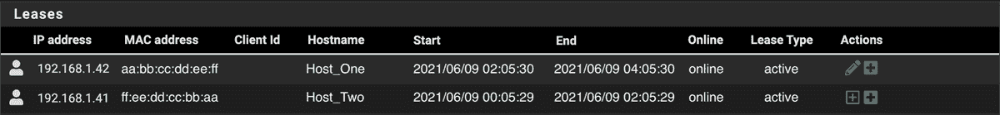
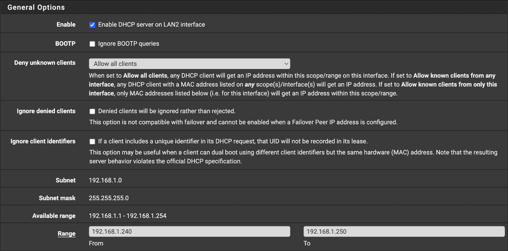
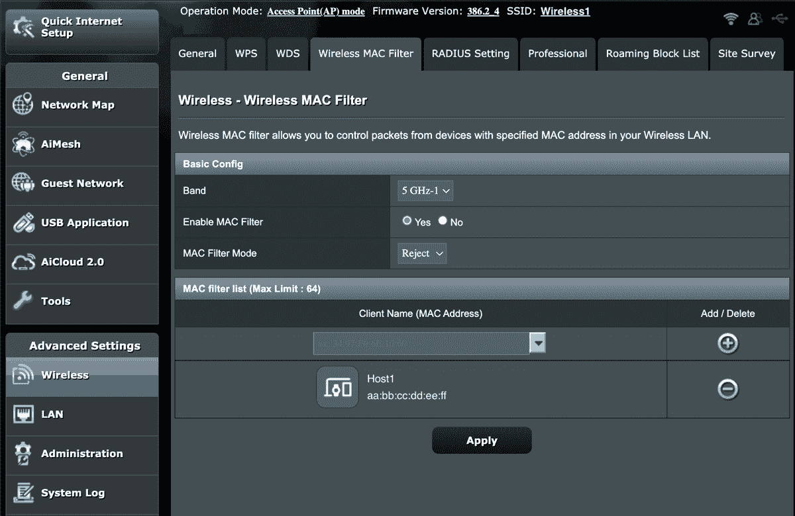
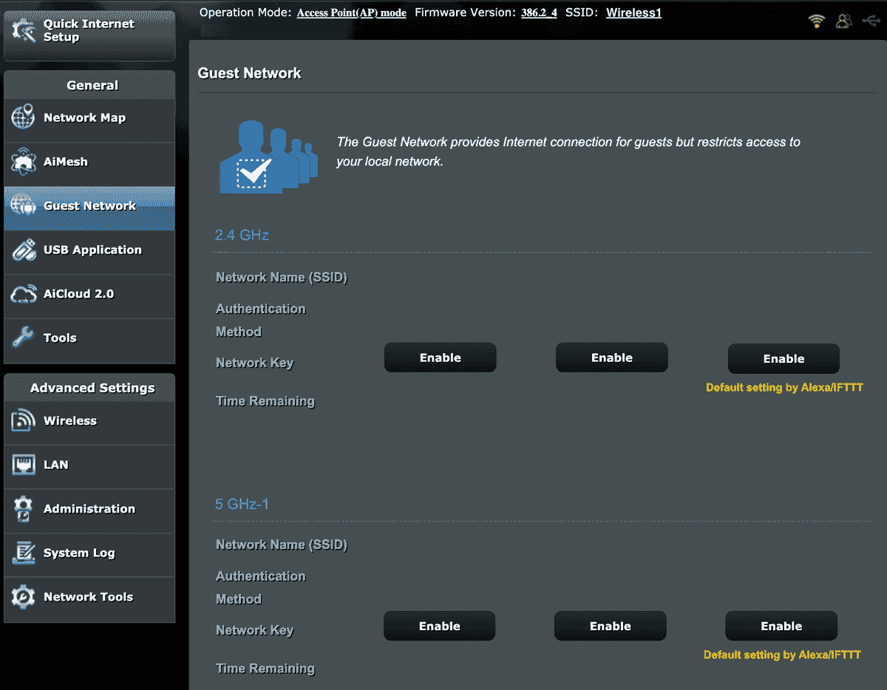
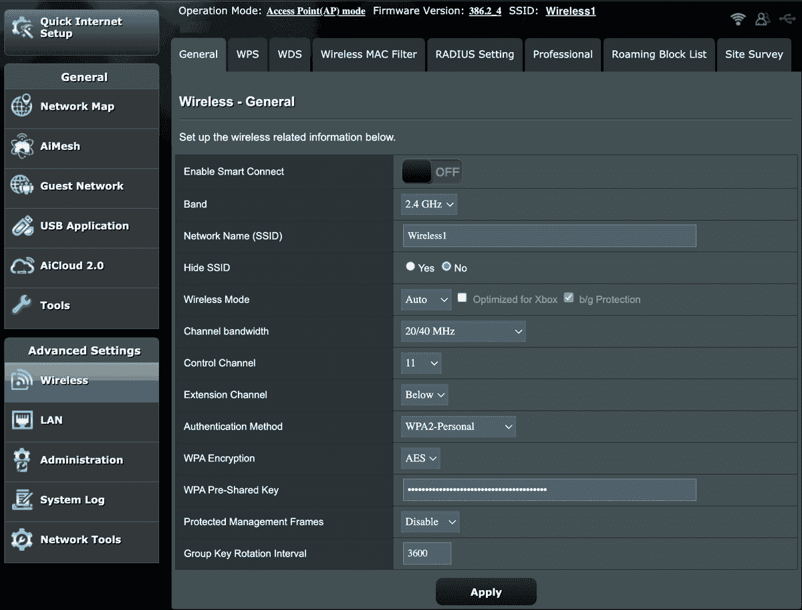
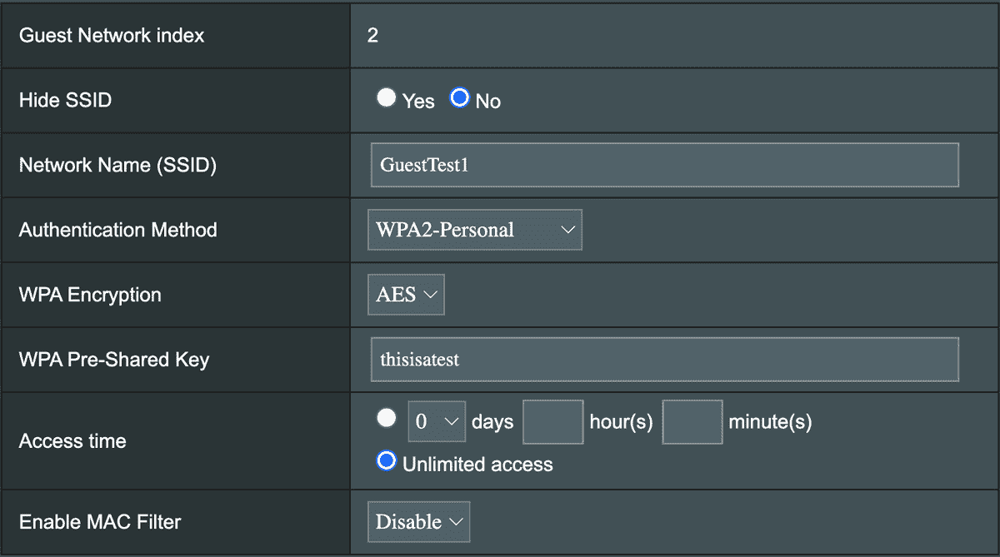

# 4

# 无线网络安全

无线网络已经变得无处不在，几乎等同于在线连接。大多数有互联网连接的地方都有一个无线调制解调器或路由器，为从台式电脑到手机以及物联网（IoT）设备，如电视、灯泡和冰箱等多种设备提供服务。如果没有无线技术，现代生活将不那么便利，但便利性通常迫使我们放弃一些在线安全。

无线网络使我们的网络超越了最初作为物理边界的电缆。它们甚至绕过了我们习以为常的其他物理障碍：墙壁。随着无线技术的发展，我们的无线网络的有效距离不断提高，以至于我们现在看到的更大网络已经超出了原本仅限于局域网（LAN）范围的区域，甚至扩展到了我们的邻居家。这在连接性方面是令人兴奋的，但在安全性方面却可能带来灾难性后果。

本章将讨论与更广泛的无线网络相关的一些陷阱。你将了解如何通过禁用 IPv6 和限制允许接入无线网络的设备数量来减少攻击面。本章还将深入探讨 MAC 地址过滤，它只允许已知设备接入内部网络；在不使用时禁用功能；使用安全的认证方法；以及根据设备或用户在网络中的必要权限级别对它们进行分组。

#15: 禁用 IPv6

*IPv6*，即互联网协议的新版，旨在解决我们最终将耗尽公开可寻址的 IPv4 地址空间这一问题。IPv6 通过大幅扩展可用的地址空间，但它不如另一种缓解措施普遍：网络地址转换（NAT），我们在第一章中已有介绍。如果你在网络中没有使用 IPv6，但仍然启用它，那么你就为攻击者提供了一个潜在的*入侵通道*（即进入或以其他方式破坏网络的另一种方式）。作为一般规则，你应该禁用或卸载所有未在积极使用中的协议和应用程序，以防止攻击者利用这些工具（或工具的漏洞）来攻击你。禁用未使用的协议可以减少你环境的攻击面，攻击面应尽可能小。

如果你在网络中没有积极使用 IPv6，尽量在所有可以禁用的地方禁用它，包括在你的 Wi-Fi 配置中。要禁用 IPv6，按照以下步骤操作：

Windows

1.  1\. 打开**网络和互联网设置**。

1.  2\. 点击**更改适配器选项**。

1.  3\. 在弹出的窗口中，对于每个适配器，双击适配器并点击**属性**。

    1.  a. 找到**互联网协议版本 6（TCP/IPv6）**复选框并取消选中。

    1.  b. 点击**确定**并关闭剩余的窗口。

macOS

1.  1\. 打开**系统偏好设置**。

1.  2\. 点击**网络**。

1.  3\. 对于列表中的每个适配器，点击**高级**。

    1.  a. 打开**TCP/IP**标签页。

    1.  b. 确保将配置 IPv6 设置为**关闭**。

Linux

1.  1\. 打开**设置**。

1.  2\. 从左侧列表中选择**网络**。

1.  3\. 对于每个适配器，点击配置**齿轮图标**。

    1.  a. 在**IPv6**标签页中，点击**禁用**单选按钮，然后点击**应用**。

你的调制解调器或路由器

配置你的调制解调器或路由器可能更为复杂，因为每个设备都有自己的配置菜单和选项。一些设备会有 IPv6 部分；如果是这种情况，访问该菜单并完全禁用 IPv6。或者，你可能会在 DHCP 设置中找到 IPv6 选项。其他设备可能隐藏在无线或局域网设置中。在第三章讨论的 pfSense 设备中，IPv6 设置位于**服务▸DHCPv6 服务器 & RA**下。除非你在 pfSense 中配置了具有静态 IPv6 地址的网络接口，否则默认情况下会禁用此项。

如果你无法在设备中找到 IPv6 的设置，尝试在互联网上搜索设备的品牌和型号。一旦禁用了 IPv6，你就更接近于提高安全性了一步。

#16: 限制网络设备

大多数小型非企业网络很少指定或限制网络中存在的设备，并且由于过于开放，允许所有设备连接而遭受安全问题。虽然这种设置提供了便利，特别是在购买新设备或朋友过来时，但这是一种不安全的做法，给潜在的对手留出了一个巨大的漏洞，无论是针对性的还是 opportunistic（机会主义的）。

你可以通过识别所有被允许连接到网络的设备并限制只允许这些设备访问，从而避免这个安全风险。创建一个*资产清单*——包含每个设备的数据表，例如设备类型（PC、笔记本、手机等）、位置、主机名、MAC 地址（硬件地址）和 IP 地址——将补充你的网络图，并互为补充，帮助你追踪网络中的各种设备。

一旦你收集了网络中所有端点的信息，你就可以为已知设备分配静态 IP 地址，并减少 DHCP 服务器中可分配的 IP 地址范围。将范围设定得足够小，以便包括资产清单和网络图中的设备所需的地址。通过减少可用地址的数量，你可以降低对手将新设备添加到你的网络中的风险，即使采取了这个安全措施，对手也可能强迫其中一个设备断开并连接他们自己的设备。这时，MAC 地址过滤就发挥作用了。

*MAC 地址过滤* 允许您根据设备的 MAC 地址允许或拒绝对网络的访问。如果您知道所有允许设备的 MAC 地址，您可以使未经授权的设备更难加入网络，同时更容易被发现。

## 创建资产列表

与大企业不同，在小型网络中制作资产列表相对简单。首先，使用纸笔、Excel 或其他工具创建一个类似于 表 4-1 的表格。

| 表 4-1：资产列表模板 |
| --- |
| 设备 | IP 地址 | MAC 地址 | 主机名（可选） | 位置（可选） |
| --- | --- | --- | --- | --- |
| 我的笔记本 |  |  |  |  |
| 他们的笔记本 |  |  |  |  |
| 我的手机 |  |  |  |  |
| 他们的手机 |  |  |  |  |
| 电视 |  |  |  |  |
| 平板电脑 |  |  |  |  |
| Xbox |  |  |  |  |

您可以选择省略主机名和位置，但一定要包括每台设备的 IP 和 MAC 地址。如果设备已连接到网络，您可以从路由器的 DHCP 部分或 DHCP 服务器中获取这些信息（如果您有 DHCP 服务器）。对于没有用户界面的设备，如 Wi-Fi 连接的灯光，这可能是您的最佳或唯一选择。或者，您可以从每个主机收集详细信息。

Windows

1.  1\. 打开 **网络和互联网设置**。

1.  2\. 点击 **更改适配器选项**。

1.  3\. 确定连接设备到网络的适配器。如果连接到 Wi-Fi，它将是 Wi-Fi 适配器；否则，它就是以太网适配器。双击适配器，然后点击 **详细信息**。

1.  4\. 查找物理地址，并将其记录为计算机的 MAC 地址，放入您的资产列表。

1.  5\. 查找 IP 地址并记录下来。

1.  6\. 点击 **关闭** 并关闭剩余窗口。

macOS

1.  1\. 打开 **系统偏好设置** 并点击 **网络**。

1.  2\. 确定连接设备到网络的适配器。如果连接到 Wi-Fi，它将是 Wi-Fi 适配器；否则，它就是以太网适配器。

1.  3\. 点击 **高级**，然后点击 **TCP/IP** 标签。

1.  4\. 记录 IPv4 地址。

1.  5\. 转到 **硬件** 标签并记录 MAC 地址。

1.  6\. 点击 **确定** 并关闭网络窗口。

Linux

1.  1\. 打开 **设置**。

1.  2\. 从左侧列表中选择 **网络**。

1.  3\. 确定连接设备到网络的适配器。如果连接到 Wi-Fi，它将是 Wi-Fi 适配器；否则，它就是以太网适配器。

1.  4\. 点击配置 **齿轮图标**。

1.  5\. 在 **详细信息** 标签中，记录 IP 地址和硬件地址（MAC 地址）。

1.  6\. 关闭窗口。

您应该已经成功识别了网络中所有已知的设备。如果有任何未知设备连接，您将通过接下来的 “MAC 地址过滤” 部分的步骤将其屏蔽。接下来，您将为每台设备分配静态 IP 地址。

## 静态 IP 地址配置

IP 地址可以是*静态*的也可以是*动态*的。默认情况下，大多数路由器使用动态主机配置协议（DHCP）服务器为端点分配 IP 地址，当它们连接到网络时。这个分配过程被称为*DHCP 租约*，并且是有时间限制的；租约通常在 24 小时后到期。动态 IP 地址可能会在每次端点连接或租约到期时发生变化。然而，你也可以为每个端点分配一个静态 IP 地址，这样它每次连接到你的网络时都会保持不变。这可以帮助你知道某个 IP 地址对应哪个端点，并且通过限制可用的动态地址来防止未知设备连接。

你可以在大多数 Wi-Fi 路由器的 DHCP 菜单中找到静态 IP 地址设置。以本例为例，我们将使用 Netgate SG-3100 上的 DHCP 租约菜单，详情见第三章，但无论你使用的是哪个设备，过程应该是类似的。要进入 SG-3100 中的 DHCP 租约菜单，点击**状态▸DHCP 租约**。在类似的设备中，它可能出现在 LAN 或高级设置中。你应该能看到一个类似于图 4-1 的表格。

图 4-1：Netgate SG-3100 pfSense 防火墙上的 DHCP 租约菜单

要创建一个静态 IP 地址（也叫做*静态租约*），点击**添加**按钮（在 SG-3100 中是左侧未填充的+按钮）。随后出现的页面允许你为选定的主机指定 IP 地址。你可以指定任何你想要的地址，只要它在你的地址方案范围内，然后点击**保存**。例如，如果你的地址方案是*192.168.1.x*，你可能会选择*192.168.1.100*。你选择的 IP 地址不必是连续的；你可以为此主机使用*192.168.1.100*，为下一个主机使用*192.168.1.54*。分配了静态地址后，主机可能需要重新连接网络以获取该地址；你可以通过重启设备（关机再开机）强制它重新连接。

一旦你为授权设备分配了静态 IP 地址，更新你的资产清单和网络图。然后，为了有效地禁止其他设备未经授权连接，缩小 DHCP 服务器可分配的地址范围。

默认情况下，DHCP 服务器服务会使整个 IP 地址范围对设备可用，以便它们连接到网络。如果你的 IP 地址方案是*192.168.0.0/16*，你的网络最多可以连接 65,534 个主机。没有哪个小型网络需要这么多主机，且将地址范围保持开放是一个安全隐患。

要查看 SG-3100 中的 DHCP 地址范围，点击**服务▸DHCP 服务器**。你的设备应该会显示一个类似于图 4-2 的 IP 地址范围。

图 4-2: DHCP 地址范围

虽然数字可能不同，但总体配置应该差不多。为了手动授权每个连接到你网络的设备，你需要禁用 DHCP 服务器，并为每个端点添加新的静态地址。另一种方法是缩短可用的 DHCP 地址范围。比如，你可以指定一个地址范围从*192.168.1.100*到*192.168.1.105*，而不是让范围从*192.168.1.100*到*192.168.1.245*，从而限制最多可以分配 DHCP 地址的设备数量为六个。当这些 IP 地址已被静态分配给网络中的设备时，没有任何新设备可以从 DHCP 服务器获取 IP 地址，除非某个设备下线或被移除出网络。减少可用地址空间可以减少未经授权设备连接到网络的能力，从而最小化攻击面。

你可能会想，考虑到任何想要连接到你的无线网络的人都需要靠近，你可能也不会让陌生人进入你的家或办公室，那么这些步骤是否真的必要呢？不过要考虑到，“靠近”的定义可能仅是距离你楼外街上的一辆车，或者隔壁办公室的一套房间。

## MAC 地址过滤

MAC 地址过滤可以作为独立的防御措施或额外的安全层实现。大多数无线路由器允许你指定允许连接到网络的 MAC 地址，从而阻止未指定的 MAC 地址。由于 MAC 地址与设备的硬件相关，它们比 IP 地址更不容易发生变化。

如今，伪造或*欺骗*硬件地址并不困难。然而，你可以在对手和你的网络之间设置更多障碍，来增强网络安全性。举个例子，要访问 ASUS RT-AC5300 无线路由器的 MAC 地址过滤页面，你需要点击**无线▸无线 MAC 过滤器**，如图 4-3 所示。

图 4-3: ASUS AC-RT5300 路由器上的无线 MAC 地址过滤

如图 4-3 所示的基本配置选项——无线频段、过滤器是否启用以及过滤模式是接受还是拒绝——可以应用于 2.4 GHz 或 5 GHz 无线电频段。

在图 4-3 中，5 GHz 频段的 MAC 过滤器已启用，模式选项设置为拒绝。这种模式使过滤器作为*拒绝列表*工作，意味着列表中的任何设备都将被阻止或拒绝访问。另一方面，*允许列表*是允许访问的端点列表。当您知道要拒绝访问的设备的 MAC 地址时，使用拒绝列表。在大多数情况下，您将使用接受模式或允许列表模式。在接受模式下，MAC 过滤器列表包含您明确允许访问网络的 MAC 地址。

选择**启用 MAC 过滤器**和**接受**，然后输入您资产列表中的 MAC 地址。添加所有 MAC 地址并保存配置后，除非设备在允许列表中，否则无法连接到无线网络并获取 IP 地址。您可以通过从接受列表中移除某个不太重要的设备并尝试连接到网络来进行测试。如果该设备无法连接，则说明您的 MAC 过滤器工作正常。

#17: 网络分段

无线网络使您能够通过使用独立的客户网络与访客共享互联网连接，而不会妥协您的安全性。大多数中端无线路由器都提供此功能。例如，ASUS RT-AC5300 允许在 2.4 GHz 和 5 GHz 无线频率上设置多个客户网络，如图 4-4 所示。

图 4-4：多无线网络功能

客户网络不仅对您的访客方便，它还允许您根据风险或信任等级将用户和设备进行分组。例如，在您的私人内部网络中，您可能会连接主要设备：笔记本电脑、移动设备等。然后，在客户网络上，您可能会连接物联网设备：您的 Google Home、Amazon Alexa、LIFX 或其他智能灯泡以及其他类似设备。

某些类别的设备天生不太安全。例如，物联网（IoT）设备容易受到僵尸网络感染。*僵尸网络*是由一组连接到互联网的设备组成，通常通过安装在每个设备上的恶意软件链接在一起。恶意软件使得这些设备作为一个整体被控制，通常用于恶意活动，如分布式拒绝服务攻击、数据盗窃或垃圾邮件发送。允许安全性较低的设备与您的主要设备在同一网络段上是有风险的。减轻这种风险的最佳方法是将它们分开，无论是逻辑上还是物理上。

如图 4-4 所示，你可以允许网络上的访客设备连接无限时长，或者只允许他们在你选择的特定时间段内连接，这对那些只需要几小时访问权限的访客非常有用。通过将路由器配置为允许访客无限制访问，你实际上是在以安全性换取便利性。相反，限制访客连接的时间，直到他们需要重新授权，需要更多的工作。但这是一个更安全的访问控制方式。

一些无线路由器和接入点提供的最后一个功能是允许或拒绝对你 *内网* 的访问选项，内网是你的私人设备连接的内部网络。允许访客访问这一网络段会降低你的安全性，因为它允许他们访问你的计算机和移动设备。如果你让访客访问整个网络，倒不如让他们直接访问你的主要无线网络，而不是配置一个访客网络。我讨论的这款华硕无线路由器具备这个功能；如果你配置了一个访客网络，你可以选择是否允许连接到该无线网络的终端访问你的内网，或者只允许他们访问互联网网关。路由器通过允许或禁止连接到访客网络的设备查看连接到主网络的设备来处理这种访问。禁止访客网络访问你的内网是更安全的选项，也是你应该实施的选项。如果你的路由器具备此功能，应该在无线网络设置中有一个明显的复选框。如果找不到它，很可能你的路由器没有此功能（不过你可以通过阅读手册或进行快速互联网搜索来确认）。

#18: 配置无线认证

你应该通过创建密码短语来保护你的 Wi-Fi 网络，以便访问该网络。一个没有保护或加密的开放无线网络为对手提供了一个主要目标。今天，大多数网络使用三种安全算法之一来保护它们的通信：WEP、WPA/WPA2 或 WPA3。

## WEP

*有线等效隐私（WEP）* 是三种安全协议中最古老的，也是最不安全的。WEP 使用 40 位或 104 位的加密密钥，与后续协议相比，这些密钥相对较短。WEP 将此加密密钥与 24 位初始化向量（IV）结合使用，旨在提供增强的安全性，但这些 IV 的长度较短意味着该算法可能会重复使用密钥，从而使加密变得更容易破解。理解这些细节并不是必须的；只需知道 WEP 是一种不安全的技术，不应再使用。实际上，厂商在 2001 年就已逐步淘汰 WEP；目前大多数硬件上已不再支持它。

## WPA/WPA2

*Wi-Fi 保护访问（WPA）*，作为 WEP 的继任者，改善了 WEP 的保护。虽然它仍然依赖于相同的 RC4 加密算法，但它还引入了*时间密钥完整性协议（TKIP）*。TKIP 通过使用 256 位密钥并实现消息完整性检查、更大的 48 位初始化向量（IVs）和减少 IV 重用的机制，加强了无线安全性。

反过来，WPA2 改进了原始的 WPA 协议。WPA 和 WPA2 都允许用户在个人模式和企业模式之间选择。个人模式称为 WPA-PSK，使用预共享密钥（PSK）或密码短语来授权访问，而企业模式则需要一个身份验证服务器。WPA2 替换了 RC4 加密算法和 TKIP，采用了更安全的算法和加密协议。此外，它实现了*计数模式 CBC-MAC 协议（CCMP）*，这是一种更安全的加密机制。所有这些使得 WPA2 比早期的加密协议更加安全，并且便于在接入点之间漫游，提供更流畅的用户体验。如果可能的话，在你的无线网络中选择 WPA2 或更高版本。

尽管如此，攻击者仍然可以捕获你的无线流量并暴力破解你的网络密码。尽管 WPA2 表现良好，但没有任何安全技术是完美无缺的。因此，请确保使用强密码短语来保护你的无线网络。密码短语的详细内容请参阅第十一章。

## WPA3

*Wi-Fi 保护访问版本 3（WPA3）*是最新的无线安全技术。它非常新，尚未得到广泛应用。WPA3 通过防止同一网络中的用户窃听彼此的无线通信来提高安全性——即使无线网络是开放的，并且不需要密码进行身份验证。

WPA3 通过用一种新协议替代 WPA2 中使用的预共享密钥认证：*等效认证（SAE）*。这一变化还意味着对手无法捕获破解网络密码所需的流量，从而使得未经授权访问网络变得更加困难。

目前，WPA3 仍处于初期阶段，因此很少有设备兼容。更新的无线路由器和接入点将默认支持 WPA3。不过，即便如此，其他设备仍需追赶才能使用它；如果你的手机和电脑无法连接，那么拥有一个 WPA3 路由器也没有太大意义。一旦这一情况改变，你应该优先使用 WPA3，而不是其他无线安全标准。

要配置我们讨论的 ASUS 路由器，在无线设置中，进入 **高级设置▸无线▸一般**，您需要通过指定网络名称（SSID）和安全密钥或密码来创建主内网，如图 4-5 所示。然后，在 **一般▸访客网络▸启用** 中，创建一个或多个访客网络，并通过指定网络名称和安全密钥或密码，将所有其他设备连接到这些网络，就像为主无线网络所做的那样。

图 4-5：主要无线网络设置

本示例中使用的 ASUS 路由器将主无线网络与访客网络隔离开来。大多数现代中高端无线路由器也可以遵循相同的设置过程。连接到主无线网络的任何终端无法与连接到访客网络的终端通信，反之亦然。然而，如果创建多个访客网络，这些网络中的设备将能够看到并互相通信。一些无线路由器还可能提供将每个访客网络完全隔离的功能。如果您希望具备这种功能，在购买无线路由器之前请做好相关调研。

一定要遵循安全操作规范，并利用任何可用的安全选项，例如前面讨论过的那些。例如，ASUS 路由器提供了多个功能来保护无线网络，具体如图 4-6 所示。

图 4-6：无线网络安全设置

如果您能够设置 WPA 密码短语或预共享密钥，请务必设置。您应该随时抓住任何机会加强网络安全，防范机会主义的对手。在某些情况下，限制连接到这些网络的终端的访问时间也是有益的。如果您打算为始终在线并保持连接的终端使用一个辅助网络，这个选项可能不适合您的需求。然而，如果您将这些网络用于访客或仅需要有限连接的终端，建议限制这些终端的连接时间，控制在合理的分钟或小时数范围内。最后一个选项，见于图 4-6，启用 MAC 过滤，允许或拒绝设备基于其硬件地址访问您的网络。

## 总结

在本章中，我们讨论了常见的无线网络安全风险以及通过实施措施（如 IP 和 MAC 地址过滤、减少 DHCP 服务器中的可用地址空间）来降低这些风险的方法。创建和维护资产清单和网络地图有助于确保没有未经授权的设备连接到您的网络。窃听是最容易防范的风险。通过在您的网络中添加加密（采用 WPA 安全性，理想情况下是 WPA3，因为它越来越普及），并为网络访问实现密码短语而非密码，可以有效防范此类风险。
