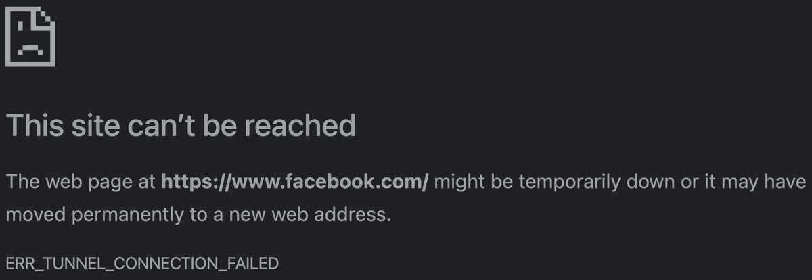
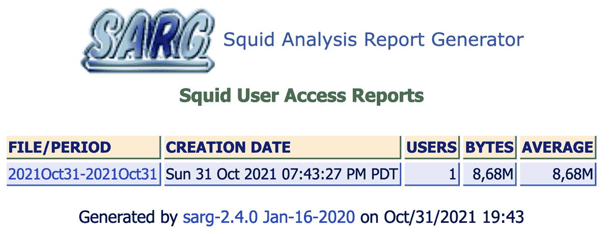

# 第六章：# 使用 Squid 代理提升浏览和隐私保护


代理服务器充当你与互联网之间的中介。当你请求一个网页时，代理会接收请求并将其转发到 Web 服务器（如果需要）。代理允许你通过模糊化通常可以向我们日常互动的服务提供的元数据，来保护你的隐私。代理还允许管理员屏蔽某些内容，如社交媒体或在线赌博。

本章将向你展示如何安装、配置和使用*Squid 代理*，这是一种可以在大多数操作系统上运行的解决方案。通过使用 Squid，你将能够加速网站访问，增强安全性，并允许或禁止访问特定的域名或网站。第七章介绍了另一种代理解决方案，Pi-Hole，它提供与 Squid 相同的好处，但额外地能够阻止广告并解决其他追踪和隐私问题。选择最适合你需求的代理，取决于你觉得哪一种更易于使用，以及哪一种提供了最佳的用户体验。

## 为什么使用代理？

每次你访问一个网站时，你的计算机会向 Web 服务器发送请求，服务器响应并向你提供浏览该网站所需的信息。浏览器与服务器之间的通信可能会通过*元数据*暴露你的个人信息（如你使用的浏览器、你的公共 IP 地址等）。这些元数据使得 Web 服务器能够推测出你和你的设备的一些信息，例如你的位置、你所在时区的时间以及你的浏览习惯。出于多种原因，你可能希望保持这些信息的隐私性。此外，加载网页及其内容会消耗带宽，因此当越来越多的人使用同一个互联网连接时，连接可能会开始变慢，从而影响到所有使用者。

代理的一个伟大之处在于它们会*缓存*所有通过它们的流量。这意味着每次检索网页时，代理会保留该页面的本地副本。下次有人尝试浏览该网站时，代理首先检查其缓存中是否有副本，如果有，它会向用户呈现该副本，而不是向 Web 服务器发送请求获取页面的新副本。默认情况下，Squid 会将网站的缓存副本保留一段时间，之后当缓存被认为“不再新鲜”时，它会重新获取该页面的最新版本，无论内容是否发生变化。这减少了网络负载、加载频繁访问网站的时间以及总的带宽使用量，从而提高了每个人的体验。

代理还减少了向网页服务器泄露的*个人身份信息（PII）*的数量。PII 是任何可以用来识别特定个人（例如你）的数据或信息。例如，代理可以将自己标识为任何网页浏览器，虽然你可能使用的是 Google Chrome，但代理可以向服务器呈现 Firefox。代理还可以拥有一个不同的公共 IP 地址来隐藏你正在使用的地址，如果它位于你所在的地方以外（例如云端），则能模糊你的物理位置和互联网服务提供商。

即使这与小型网络管理员直接相关性不大，你可能会感兴趣的是，商业组织通常依赖代理（包括 Squid），以便利用我们已经讨论的好处，以及内容交付，如流媒体音频和视频。内容提供商，如 Netflix 和 YouTube，战略性地在全球范围内部署代理服务器，以保留本地内容副本。这种做法使得这些服务的用户可以从离家更近的地方访问内容，而不是所有用户都从单一位置访问内容，这样会更有效，并且避免在很多情况下出现性能差的问题。

#21: 配置 Squid

Squid 网络代理提供了你刚刚学习到的所有好处：它减少了带宽，使用户的上网速度更快。如果配置正确，它还能够匿名化你的个人信息；例如，你的身份信息（如网络请求来自哪里或者你使用的网页浏览器）可以在流量发送到互联网之前被删除或更改。许多企业级设备都使用 Squid。虽然你也可以使用其他代理解决方案，如 NGINX、Apache Traffic Server 或 Forcepoint，但 Squid 是免费的开源软件，因此相比商业解决方案，它提供了更多对底层配置和数据的访问。

网上有大量关于使用 Squid 保护和增强网络的信息。你可以在 Squid 的维基上找到更多关于 Squid 代理配置的信息，链接地址是 [`wiki.squid-cache.org/SquidFaq/`](https://wiki.squid-cache.org/SquidFaq/)。

本项目将涵盖 Squid 的初始安装和配置，配置你网络中的客户端使用代理，配置完成后测试代理，以及执行一些额外步骤，以通过代理允许或拒绝访问某些互联网资源。

### 配置 Squid

按照第一章中的步骤创建一个基础的 Ubuntu 服务器。如果你想隐藏自己的位置或不希望泄露你的互联网服务提供商（除了防止记录你的元数据），可以在云端的一个与自己国家不同的国家创建代理服务器。否则，可以将代理服务器部署在你自己的网络内。不要忘记将新服务器添加到你在前几章中创建的网络地图和资产列表中。完成后，通过 SSH 以标准非 root 用户登录服务器。要安装代理，使用以下命令：

```
$ `sudo apt install squid`

```

安装应该在一分钟内完成。默认情况下，你会找到配置文件位于*/etc/squid/squid.conf*，日志文件位于*/var/log/squid/*，缓存数据（即缓存的网站信息）位于*/var/spool/squid/*。

使用文本编辑器打开*squid.conf*配置文件，以熟悉其中的设置：

```
$ `sudo nano /etc/squid/squid.conf`

```

Squid 有许多可能的配置，所以很容易让人感到不知所措。不过请注意，许多设置并未启用，因为它们默认被注释掉了。我们先专注于活动设置。当你的代理服务器按预期工作时，你可以再探索其他更改。

通过按 CTRL-W 进行搜索；然后输入搜索词并按 ENTER 找到标有`Recommended minimum configuration`的部分：

```
`--snip--`
# Recommended minimum configuration:
#
# Example rule allowing access from your local networks.
# Adapt to list your (internal) IP networks from where browsing
# should be allowed
acl `localnet src` 0.0.0.1-0.255.255.255  # RFC 1122 "this" network (LAN)
acl `localnet src` 10.0.0.0/8             # RFC 1918 local private network (LAN)
`--snip--`

```

本节详细介绍了*访问控制列表（ACLs）*，它告诉 Squid 哪些端点可以通过代理服务器访问互联网资源。ACL 是一个包含你特别允许或禁止在网络中进行通信的端口、地址或资源的列表。

一个 ACL 由多个元素组成。首先是一个唯一的名称，例如`localnet`，用于标识一个特定的 ACL。每个命名的 ACL 接着包含一个 ACL 类型（例如`src`），后面跟着一个值或值的列表，如 IP 地址或端口号。这些值可以跨多行输入，Squid 会将它们合并成一个单一的列表。

`src`这样的关键词告诉 Squid 流量的流向；例如，`src 10.0.0.0/8`表示来自*10.0.0.0/8* IP 地址范围内的任何流量，目的地是任何 IP 地址的任何范围。

注释掉不适用于你网络的任何行。例如，如果你的内部 IP 地址遵循*10.x.x.x*格式，保留相关指令不变，并通过在每行开头添加`#`来注释掉所有其他以`acl localnet src`开头的行：

`--snip--`

#acl localnet src 0.0.0.1-0.255.255.255  # RFC 1122 "this"网络（LAN）

acl localnet src 10.0.0.0/8              # RFC 1918 本地私有网络（LAN）

`#`acl localnet src 100.64.0.0/10          # RFC 6598 共享地址空间（CGN）

`#`acl localnet src 169.254.0.0/16         # RFC 3927 链路本地机器

`#`acl localnet src 172.16.0.0/12          # RFC 1918 本地私有网络（LAN）

`#`acl localnet src 192.168.0.0/16         # RFC 1918 本地私有网络（LAN）

`#`acl localnet src fc00::/7               # RFC 4193 本地私有网络范围

`#`acl localnet src fe80::/10              # RFC 4291 链路本地机器

`--snip--`

推荐的最小配置部分的第二部分告诉 Squid 哪些端口可以发送和接收流量：

```
`--snip--`
acl SSL_ports port 443
acl Safe_ports port 80          # http
acl Safe_ports port 21          # ftp
acl Safe_ports port 443         # https
`#`acl Safe_ports port 70         # gopher
`#`acl Safe_ports port 210        # wais
acl Safe_ports port 1025-65535  # unregistered ports
`#`acl Safe_ports port 280        # http-mgmt
`--snip--`

```

在这里，`SSL_ports` 和 `Safe_ports` 是 ACL 名称，而 `port` 类型告诉 Squid 将后面的数字解释为特定服务用于通信的端口号（请参见 第一章）。`acl SSL_ports port 443` 行设置了代理用于加密过滤隧道的端口，如 HTTPS 流量所使用的端口。包含 `Safe_ports` 标签的指令决定了 Squid 应该允许连接的端口。如果您不需要某个协议或端口，可以注释掉以减少攻击面。为了谨慎起见，您可以只保留端口 80 和 443，并注释掉 `acl Safe_ports port 1025-65535` 行，从而阻止 1025 到 65535 之间的端口。然而，这样做可能会导致某些应用程序或服务无法正常工作，如果它们需要其他端口。您可以使用 Google 以及给定应用程序的官方网站或手册来确定它可能需要哪些其他端口才能正常运行。

在配置文件的稍后部分，您会找到启用这些 ACL 的指令：

```
`--snip--`
# Recommended minimum Access Permission configuration:
#
# Deny requests to certain unsafe ports
http_access deny !Safe_ports
# Deny CONNECT to other than secure SSL ports
http_access deny CONNECT !SSL_ports
`--snip--`

```

`http_access deny !Safe_ports` 指令告诉 Squid 禁止除 `Safe_ports` 列表中列出的端口以外的所有端口之间的通信。同样，`http_access deny CONNECT !SSL_ports` 行告诉 Squid 禁止在除 `SSL_ports` 中指定的端口之外的任何端口上建立过滤隧道。

配置文件的下一部分与您的本地网络相关，而不是互联网：

```
`--snip--`
# Example rule allowing access from your local networks.
# Adapt localnet in the ACL section to list your (internal) IP networks
# from where browsing should be allowed
`#http_access allow localnet`
http_access allow localhost
# And finally deny all other access to this proxy
http_access deny all
`--snip--`

```

删除 `#` 符号以启用之前指定的 `localnet` 设置，该设置允许您本地网络上的终端通过代理访问互联网。最后，`http_access deny` `all` 确保代理拒绝所有其他流量，以防影响您的内部网络。通过拒绝所有没有明确允许的流量，您将保护网络免受不必要的流量，包括恶意软件。

如果您想更改 Squid 监听请求的端口，请在配置文件中修改以下行：

```
`--snip--`
# Squid normally listens to port 3128
http_port `3128`
`--snip--`

```

您的设备将使用此端口连接到代理服务器，以便发送请求、接收流量并浏览互联网。

完成编辑后，保存并关闭配置文件。使用以下命令重新加载更新后的 Squid 配置，以使更改生效（请注意，重新加载配置可能会中断任何打开的连接）：

```
$ `sudo systemctl reload squid`

```

现在，您可以使用以下命令确认 Squid 是否成功启动并正在运行：

$ `sudo systemctl status squid`

squid.service - Squid Web 代理服务器

已加载: 加载 (/lib/systemd/system/squid.service; 已启用; 供应商预设: 已启用)

活动: active (running); 2 分钟 5 秒前

`--snip--`

在`squid.service`前有一个绿色点并且状态显示`active (running)`，表示 Squid 正常运行。如果 Squid 由于错误未能正确启动，你会看到一个失败的消息，`squid.service`前有一个红点：

$ `sudo systemctl status squid`

squid.service - Squid Web 代理服务器

已加载: 加载 (/lib/systemd/system/squid.service; 已启用; 供应商预设: 已启用)

活动: 失败 (结果: 退出代码); 2 分钟 5 秒前

`--snip--`

返回并再次检查你的配置，或者使用以下命令验证你的配置文件：

$ `squid -k parse`

2024/05/06 00:44:06| 处理: acl 拒绝列表 dstdomain .twitter.com

2024/05/06 00:44:06| 处理: http_deny 拒绝列表

2024/05/06 00:44:06| /etc/squid/squid.conf:1406 无法识别: 'http_deny'

2024/05/06 00:44:06| 处理: anonymize_headers 拒绝 From Referer Server

2024/05/06 00:44:06| /etc/squid/squid.conf:1408 无法识别: 'anonymize_headers'

2024/05/06 00:44:06| 处理: anonymize_headers 拒绝 User-Agent WWW-Authenticate

2024/05/06 00:44:06| /etc/squid/squid.conf:1409 无法识别: 'anonymize_headers'

2024/05/06 00:44:06| 处理: http_access 允许 localnet

`--snip--`

此输出显示的是如果你使用无法识别的指令`http_deny`和`anonymize_headers`时的情况。当你解决了配置中的任何错误后，使用`start`命令启动 Squid：

```
$ `sudo systemctl start squid`

```

现在，你已经完成了基本的 Squid 代理配置。

### 配置设备使用 Squid

接下来，你需要在每个将使用代理的设备上配置代理设置。我们将解释如何配置 Windows、macOS 和 Linux 设备。

Windows

1.  1\. 在你的 Windows 主机上，打开**Windows 设置**对话框。

1.  2\. 在查找设置框中，搜索*代理设置*。

1.  3\. 在代理窗口中启用**使用代理服务器**开关。

1.  4\. 输入你的代理服务器的 IP 地址和端口——例如，*192.168.1.50:3128*。

1.  5\. 确保勾选**不为本地（内网）地址使用代理服务器**复选框。

macOS

1.  1\. 打开**系统偏好设置**。

1.  2\. 选择**网络**并选择你的无线或以太网适配器。

1.  3\. 点击**高级▸代理**。

1.  4\. 勾选**Web 代理 (HTTP)**框。输入你的代理服务器的 IP 地址和端口号——例如，*192.168.1.50:3128*。对于之前在*/etc/squid/squid.conf*文件中配置的每个协议都执行此操作。

1.  5\. 将你的本地网络输入到“为这些主机和域绕过代理设置”框中。

1.  6\. 点击**确定**然后**应用**。

Linux

1.  1\. 在你的 Linux 端点上，打开**设置**对话框。

1.  2\. 进入**网络▸网络代理**设置。

1.  3\. 设置代理为**手动**，并输入 HTTP 代理的 IP 地址和端口号——例如，*192.168.1.50:3128*。

1.  4\. 确保在忽略主机框中输入你的本地网络，然后关闭任何打开的设置窗口。

### 测试 Squid

在配置好 Squid 服务器并确保至少有一台设备使用代理的情况下，确保设备实际在使用代理，并且代理按预期工作。在 Squid 服务器上，使用以下命令查看 Squid 代理日志文件的实时更新：

```
$ `sudo tail -f /var/log/squid/access.log`
`--snip--`
1619747519.519     54 172.16.90.1 TCP_TUNNEL/200 39 CONNECT play.google.com:443 - HIER_DIRECT/172.217.25.174 -
1619747519.755     54 172.16.90.1 TCP_TUNNEL/200 39 CONNECT mail.google.com:443 - HIER_DIRECT/216.58.200.101 -
1619747519.776     55 172.16.90.1 TCP_TUNNEL/200 39 CONNECT mail.google.com:443 - HIER_DIRECT/216.58.200.101 -
1619747520.190    161 172.16.90.1 TCP_MISS/200 985 GET
`--snip--`

```

你的输出将根据你在网络中使用的应用程序不同而有所不同。

如果没有任何输出（并且你的主机无法浏览互联网），请按照第三章中的步骤更新你的 iptables 或其他防火墙规则，以允许流量进出 Squid 代理服务器的 3128 端口（或你配置的 Squid 监听端口）。

如果你在运行`tail`命令时从配置为使用代理服务器的主机访问 Facebook，你应该能在日志中看到此请求作为多个访问 Facebook 服务的请求：

`--snip--`

1584414232.470     3 192.168.1.51 NONE/503 0 CONNECT `pixel.facebook.com:443` - HIER_NONE/- -

1584414237.647     0 192.168.1.51 NONE/503 0 CONNECT `pixel.facebook.com:443` - HIER_NONE/- -

1584414242.652     0 192.168.1.51 NONE/503 0 CONNECT `pixel.facebook.com:443` - HIER_NONE/- -

1584414247.864 69023 192.168.1.51 TCP_TUNNEL/200 6426 CONNECT `static.xx.fbcdn.net:443` - HIER_DIRECT/157.240.8.23 -

1584414248.566     0 192.168.1.51 NONE/503 0 CONNECT `pixel.facebook.com:443` - HIER_NONE/- -

1584414254.535     0 192.168.1.51 NONE/503 0 CONNECT `pixel.facebook.com:443` - HIER_NONE/- -

`--snip--`

如果没有，尝试重启代理服务器、主机或两者。

### 阻止和允许域名

现在你的代理服务器正常工作，你可能想要阻止（黑名单）或允许（白名单）一些域名。例如，如果你有孩子，你可能希望防止他们访问分散注意力或不适当的网站。为此，打开 *squid.conf* 文件并使用文本编辑器编辑：

```
$ `sudo nano /etc/squid/squid.conf`

```

现在，找到那行注释，内容为 `INSERT YOUR OWN RULE(S) HERE`。在该部分，你可以定义自己的规则（即 ACL）。如前所述，ACL 由 ACL 名称、如 `allow` 或 `deny` 的 ACL 类型以及 IP 地址或域名等元素列表组成。你的配置将由一个或多个这样的规则组成，标识哪些是允许通过代理的，哪些是不允许的。（之前，你启用了类似 `http_access allow localnet` 和 `http_access deny !Safe_ports` 这样的规则，以使用推荐的最小配置部分中的 ACL。）

例如，要将 Facebook 加入黑名单，在 `include` 指令后输入以下行：

```
`--snip--`
include /etc/squid/conf.d/*
`acl denylist dstdomain .facebook.com`
`http_access deny CONNECT denylist`
`--snip--`

```

行首的`acl`指令告诉 Squid 将接下来的内容视为允许或拒绝的项目列表。接下来，`denylist`是该列表的唯一名称；可以选择任何名称，只要它由字母数字字符组成。`dstdomain`指令表示接下来是一个目标域名的列表。域名前的句点告诉 Squid 应当将整个域名，包括子域名，列入 denylist。例如，[www.facebook.com](http://www.facebook.com)是一个顶级域名，可能有子域名如*campus.facebook.com*或*hertz.facebook.com*。如果省略前导句点，Squid 将仅阻止父域名（[facebook.com](http://www.facebook.com)）。最后，`http_access`指令与`deny`和`CONNECT`参数一起使用，告诉代理禁止连接到 ACL 中指定的域名或 URL。

保存配置文件并重新加载 Squid 以使更改生效：

```
$ `sudo systemctl reload squid`

```

现在，尝试从配置为使用代理服务器的主机浏览到[www.facebook.com](http://www.facebook.com)。你应该看到类似于图 6-1 的错误页面。



图 6-1：Squid 引起的 Web 浏览器错误

若要重新允许访问 Facebook，可以删除或注释掉你所添加的行，保存配置文件并重新加载 Squid。

你可以通过将额外的域名添加到相同的 denylist ACL 中来重复这个过程：

```
acl denylist dstdomain `.facebook.com .twitter.com .linkedin.com`

```

另外，你可以根据需要为每个网站或网站的组或类别创建单独的 ACL。

允许列表的工作方式基本相同；任何添加到允许列表中的域名都会被允许，但仅限于已通过代理认证的用户：

```
`--snip--`
include /etc/squid/conf.d/*
acl `allowlist` dstdomain .facebook.com .twitter.com .linkedin.com
`http_access allow CONNECT allowlist`
`--snip--`

```

如果你添加新的 ACL 规则，请注意它们在配置文件中彼此的位置。Squid 会按照规则出现的顺序解释 ACL 规则，就像防火墙一样。如果在 ACL 规则列表的开头有一个`deny all`规则，Squid 会首先解释此规则，然后忽略文件中的其他规则。这意味着你应该将任何自定义规则放在以下几行之前：

```
`--snip--`
# And finally deny all other access to this proxy
http_access deny all
`--snip--`

```

### 使用 Squid 保护个人信息

Squid 具有高度的可配置性，允许你作为管理员设置希望在互联网上暴露多少关于用户及其设备的信息。默认情况下，通过代理从客户端设备传输到互联网的流量不会进行匿名化处理。

为了防止网络外部人员知道你的流量来源（也就是服务器信息，或者你可能被引导到哪个网站或资源，例如 Amazon 或博客），使用 `request_header_access` 指令来拒绝这些信息：

```
`--snip--`
include /etc/squid/conf.d/*
`request_header_access From deny all`
`request_header_access Referer deny all`
`request_header_access Server deny all`
`--snip--`

```

为了进一步匿名化你的流量，明智之举是也拒绝 `User-Agent`、`WWW-Authenticate` 和 `Link` 头部信息，这些信息可能会泄露关于你的浏览器或浏览活动的附加信息：

```
`--snip--`
include /etc/squid/conf.d/*
request_header_access From deny all
request_header_access Referer deny all
request_header_access Server deny all
`request_header_access User-Agent deny all`
`request_header_access WWW-Authenticate deny all`
`request_header_access Link deny all`
`--snip--`

```

使用这些选项匿名化你的流量将限制你在互联网上发送的个人身份信息（PII）量，使你更难被追踪，并在一定程度上保护你的浏览历史和习惯。

注意，某些网站和服务使用用户代理来决定如何向用户展示内容，因此要注意，移除头部信息可能会导致你体验到不同的内容。

### 禁用特定网站的缓存

可能有一些你不希望 Squid 缓存的网站，因为你总是希望从 Web 服务器获取最新版本，而不是从代理缓存中获取。可以通过拒绝缓存该网站或多个网站来实现：

```
`--snip--`
include /etc/squid/conf.d/*
`acl deny_cache dstdomain .facebook.com`
`no_cache deny deny_cache`
`--snip--`

```

记得为每个你希望防止 Squid 创建并保留缓存副本的网站添加 ACL 条目。

## Squid 代理报告

你可能已经注意到，Squid 日志可能比较难以阅读，需要一定的适应时间。有一些第三方解决方案可以让活动报告和日志查看变得更加容易。其中一个较为简单的解决方案是 *Squid 分析报告生成器（SARG）*。SARG 是一个基于 Web 的报告生成器和查看器，可以让你在浏览器窗口中查看 Squid 日志，而不是通过终端查看。

在你的 Squid 服务器上，安装 SARG：

```
$ `sudo apt install sarg`

```

SARG 报告文件将通过 Web 浏览器访问，因此你还需要安装一个 Web 服务器。安装 Apache：

```
$ `sudo apt install apache2`

```

接下来，打开应该位于 */etc/sarg/sarg.conf* 的 SARG 配置文件：

```
$ `sudo nano /etc/sarg/sarg.conf`

```

找到以 `access_log` 开头的行，该行指定了 Squid 访问日志的位置：

```
`--snip--`
access_log /var/log/squid/access.log
`--snip--`

```

然后，关闭文件，并使用 `find` 命令确认它与日志文件的实际位置匹配：

```
$ `sudo find / -name access.log`
/var/log/squid/access.log

```

在文本编辑器中打开文件，找到输出目录标签（以 `output_dir` 开头的行），注释掉包含 `/var/lib/sarg` 的行，并将其替换为一行，设置目录为 Apache Web 位置 */var/www/html/squid-reports/*：

```
`--snip--`
`#`output_dir /var/lib/sarg
`output_dir /var/www/html/squid-reports/`
`--snip--`

```

保存并关闭文件。如果你愿意，可以浏览其他设置。

要生成 SARG 报告，在你的 Squid 服务器上运行以下命令：

```
$ `sudo sarg -x`

```

在你的 Web 浏览器中，导航到代理服务器上的报告位置： *http://<proxy_ip_address>/squid-reports*。你应该能看到一个基本的网站，如 图 6-2 所示。



图 6-2：SARG 报告摘要

点击显示页面上的相关报告，您应该会看到有关每个通过代理连接的用户的信息，包括每个连接传输了多少数据，连接持续了多长时间，以及一个时间戳，指示连接建立的时间，如图 6-3 所示。


图 6-3：SARG 报告输出

报告显示了使用代理的用户或主机，他们发送和接收的流量水平（以字节表示）；以及有关代理使用的其他有用信息。报告中还包含了子报告的链接，如通过代理访问的前站点；站点与用户报告，列出每个站点的访问情况以及访问该站点的用户或主机；以及任何根据您提供的规则和配置被代理拒绝的缓存或网站访问。

尝试使用您的新代理服务器几个星期，看看它是否有助于改善带宽使用和浏览速度。一旦您感到舒适，您可以调查并开始尝试代理的更多高级功能，例如防止用户下载大文件（如果您的互联网服务提供商有数据限制并且对带宽收费，建议采取此措施）。

## 总结

使用像 Squid 这样的代理服务器，您可以更好地控制网络中允许进出数据的内容。您将能够控制从您的端点（例如您正在使用的网页浏览器）暴露的个人身份信息（PII），从而提高网络的在线隐私保护。代理服务器还提供更好的整体浏览体验。
