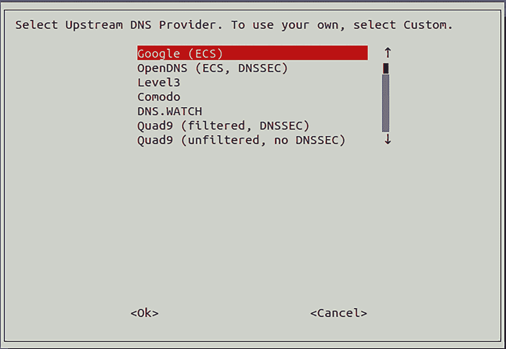
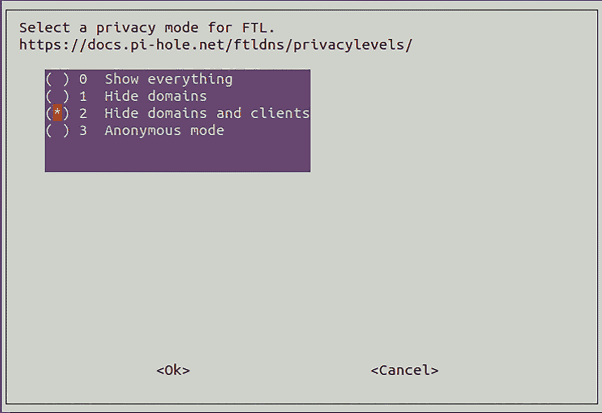
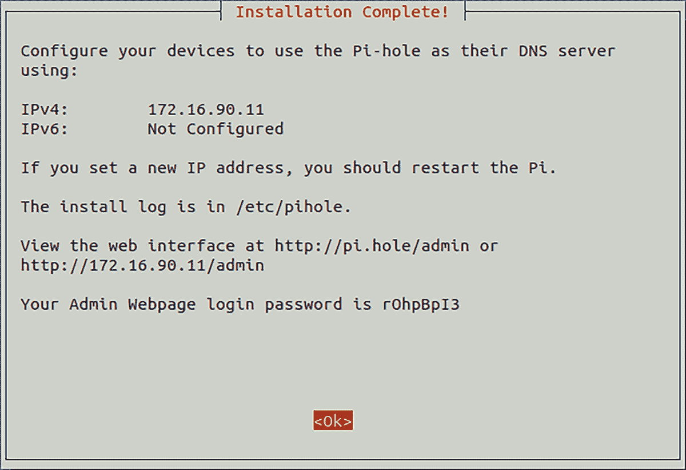
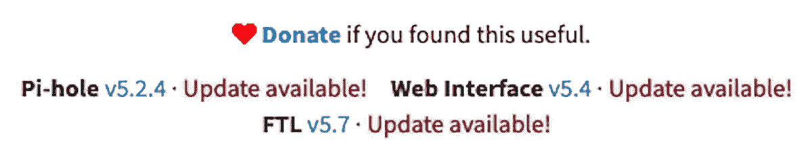
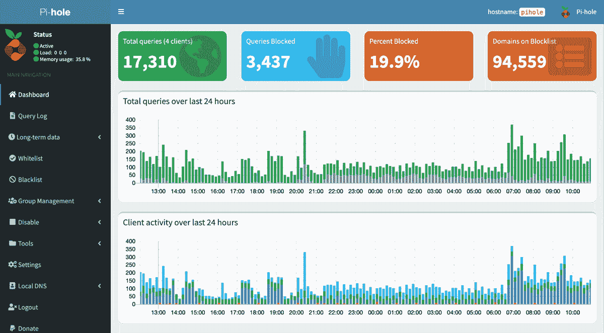

# 7

# 阻止互联网广告


公司通过广告实现互联网盈利，这导致了在线广告的数量激增（更准确地说，是爆炸式增长）。这些广告随着时间的推移变得更加隐蔽，因为网站会跟踪你的活动，以显示最有可能促成购买的广告。更糟糕的是，广告使得互联网连接变慢，因为网站因自动播放广告而变得臃肿。

你可以通过多种方式阻止来自网络的广告。本章将首先讨论各种浏览器广告拦截解决方案。然后，我们将使用 Pi-Hole 构建一个广告拦截 DNS 代理服务器，以为用户提供更好的浏览体验，同时提高数据和隐私保护。

## 浏览器级广告拦截

大多数现代浏览器都有某种形式的内置广告拦截技术。默认情况下，一些浏览器会阻止各种跟踪器和脚本按设计运行。这些包括社交媒体跟踪器、Cookies、指纹识别器和加密矿工。阻止*社交媒体跟踪器*意味着像 Facebook、Twitter 和 LinkedIn 等网站无法在你浏览包含社交媒体按钮或即时分享链接的网站时进行跟踪。*Cookies*是网站用来跟踪信息和用户偏好的文件，跨站点泄露你的私人信息。*指纹识别器*通过收集浏览习惯的多个指标来识别特定用户，从而让广告商在浏览会话期间跟踪你的活动。最后，*加密矿工*是利用你计算机硬件进行加密货币挖矿的应用程序（有些人可能会说它是恶意软件）。这是一项非常消耗资源的过程，可能导致系统不稳定。所有这些都会对你的浏览体验产生负面影响，因此应当被阻止。

除了一些网页浏览器提供的内置功能外，一些最流行的浏览器广告拦截器是浏览器的*扩展程序*，也叫做*附加组件*——这些是你可以添加到浏览器中的软件，用以改善其功能或增加其他功能。例如，*Adblock Plus*——可以在大多数浏览器中安装——通过在广告显示给用户之前拦截广告来工作，尽管广告仍然会下载到你的计算机上。

许多网站能够识别浏览器扩展程序的使用，并会修改其内容或完全阻止用户查看网页，直到扩展程序被禁用或网站被列入白名单以允许播放广告。浏览器扩展程序在第十一章中进行了进一步讨论。以下项目涵盖了如何为 Google Chrome、Mozilla Firefox 和 Brave 浏览器设置广告拦截功能。

#22: 在 Google Chrome 中阻止广告

Chrome 的广告拦截器（[`www.google.com/chrome/`](https://www.google.com/chrome/)）旨在隐藏网页上广告过多或干扰用户体验的广告，比如闪烁或发出噪音的广告。Chrome 还会拦截那些将内容隐藏在*付费墙*后的广告，这种广告会完全遮挡网页，直到用户允许显示广告或支付费用以查看内容。这种行为适用于 Chrome 的安卓版本以及桌面版本。你可以激活或停用内置的广告拦截器，并允许特定网站：

1.  在 Chrome 浏览器的右上角，点击**更多**图标（三个水平线）。

1.  点击**设置▸高级▸站点设置▸广告**。

1.  如果显示“已在通常会显示干扰性广告的网站上屏蔽广告（推荐）”的文字，说明 Chrome 正在为你屏蔽广告。

1.  如果你想关闭广告拦截功能，点击开关将设置更改为**允许**。

保护你在线隐私的另一种方式是使用私人浏览窗口。Chrome 的*隐身模式*不会保存你的个人信息，或在你关闭浏览器时立即删除这些信息（包括跟踪信息如 Cookie）。你的浏览历史和互联网搜索记录将不会被保存。要打开隐身窗口，请按照以下步骤操作：

1.  在 Chrome 浏览器的右上角，点击**更多**图标（三个水平线）。

1.  点击**新建私密窗口**。

会打开一个新的浏览器窗口，其外观与正常的 Chrome 窗口不同——通常会显示类似“您已进入隐身模式”的文字。这就是你知道正在以私密方式浏览的标志。

#23: 在 Mozilla Firefox 中阻止广告

Firefox 的*私人*浏览（[`www.mozilla.org/`](https://www.mozilla.org/)）窗口不仅拦截广告，还会阻止跟踪内容，包括网页上显示的视频和其他媒体。要打开一个新的私人窗口，请按照以下步骤操作：

1.  在 Firefox 浏览器的右上角，点击**更多**图标（三个水平线）。

1.  点击**新建私密窗口**。

你可以更改 Firefox 的默认行为，以禁用所有 Firefox 窗口中的跟踪内容，而不仅仅是私密窗口。要修改这些设置，请按照以下步骤操作：

1.  点击 Firefox 窗口右上角的**更多**。

1.  点击**首选项▸隐私与安全**。

1.  设置增强跟踪保护的设置为标准（默认）、严格（提供更高隐私保护，但可能导致某些网站无法正常显示）或自定义。

1.  配置你的 Cookie 设置，在浏览器退出时删除 Cookie，通过勾选**关闭 Firefox 时删除 Cookies 和站点数据**复选框。

1.  通过将历史记录下拉菜单设置为**从不记住历史**，使 Firefox 忘记你的浏览历史。

1.  设置诸如摄像头和麦克风的权限，以便 Firefox 无法在未授权的情况下进行监视或监听。

你可以在 Mozilla 知识库中找到更多关于禁用追踪器和其他安全与隐私设置的信息，链接：[`support.mozilla.org/en-US/kb/enhanced-tracking-protection-firefox-desktop/`](https://support.mozilla.org/en-US/kb/enhanced-tracking-protection-firefox-desktop/)。

#24: 控制 Brave 的隐私设置

Brave ([`brave.com/`](https://brave.com/)) 是一款基于谷歌 Chromium 的相对较新的网页浏览器（因此它与 Chrome 具有很多相同的功能）；所有与 Chrome 兼容的扩展也都与 Brave 兼容。与其他浏览器相比，Brave 的优点在于它的目标是为用户提供一个私密、无追踪器和广告的浏览体验。通过在浏览器中积极屏蔽广告，Brave 声称不仅能为用户节省上网时间和带宽，还能减少浏览器消耗的电池电量。

Brave 提供了比其他浏览器更细粒度的安全性和隐私设置控制，并且使这些设置比其他浏览器更易访问：

1.  1\. 在 Brave 浏览器的右上角，点击**更多**图标（三条横线）。

1.  2\. 点击**设置▸护盾**。

1.  3\. 将追踪器和广告屏蔽设置为标准或积极模式。

1.  打开**升级连接为 HTTPS**。

1.  5\. 将 Cookie 屏蔽设置为仅跨站或全部（浏览器关闭后不会记住你的会话信息）。

1.  6\. 将指纹识别屏蔽设置为标准或严格（可能会导致一些网站无法正常显示）。

尝试调整这些设置以及社交媒体屏蔽设置，直到找到适合自己的组合。

#25: 使用 Pi-Hole 屏蔽广告

使用浏览器扩展或内置工具来屏蔽广告是提升互联网浏览体验的一个良好开始。然而，这些选项每次仅适用于一个设备，且管理多个设备的设置可能会很快变得繁琐。不仅如此，一些网站可能会屏蔽浏览器扩展。从 DNS 层面屏蔽广告可以解决所有这些问题。

*域名系统（DNS）*使你的计算机（或浏览器）能够与互联网上的网站进行通信。所有网站都有一个分配给它们的 IP 地址（或多个 IP 地址）。与 IP 地址相比，你用来访问网站的 URL（例如，[www.facebook.com](http://www.facebook.com)）是人类可读的，并且易于记忆。你的计算机会将该 URL 转换为 IP 地址，以便找到互联网上为你提供 Facebook 服务的 web 服务器——这就是 DNS 的作用。DNS 像邮政服务一样工作，IP 地址相当于物理地址，而 URL 则像街道名称。DNS 允许你向特定地址（或服务器）发送和接收互联网流量，而无需记住该服务器的确切地址（IP 地址）。

考虑到广告域名也使用 DNS 向你发送广告，我们来构建一个 *Pi-Hole* 服务器，将所有这些请求发送到黑洞，从而为你的用户提供更好的浏览体验。Pi-Hole 类似于第六章中讨论的 Squid 代理；它位于你和你想要浏览的网站之间，观察所有互联网流量，通过一份精心策划的已知广告域名和地址列表，在 DNS 层面识别广告，并允许只有合法、非广告的流量通过到浏览器。与浏览器解决方案相比，Pi-Hole 能屏蔽更大比例的广告，而且网站更难检测和绕过。

在你的本地网络中设置一个 Ubuntu 服务器，如第一章中所述，并将其添加到网络地图和资产列表中。虽然可以使用位于云端的服务器，但将 DNS 服务器暴露到开放互联网会带来一些技术挑战，这些挑战我们不会在本章中讨论。适当的控制措施可以解决这些挑战，因此如果你选择使用云服务器，务必谨慎操作并进行相关风险缓解的研究。如果你已经安装了第三章中讨论的周边防火墙，并且你通过虚拟机创建了 Pi-Hole 服务器，那么该服务器应该位于防火墙之后（即在防火墙的网络端，而不是互联网端）。

可以将 Pi-Hole 与 Squid 一起使用（在第六章中讨论），通过 Pi-Hole 处理 DNS 请求，通过 Squid 处理 HTTP 流量。然而，默认情况下，Squid 使用内部 DNS 客户端——这不能更改，除非重新构建 Squid，而这超出了本书的讨论范围。如果你选择同时使用 Squid 和 Pi-Hole，可以根据每个解决方案的配置说明分别在终端上进行配置，以达到相同的效果。

### 配置 Pi-Hole

首先创建一个基础的 Ubuntu 服务器，如第一章中所述。然后，使用以下步骤安装 Pi-Hole 服务器：

1.  1\. 通过 SSH 以标准的非 root 用户身份登录到你的 Ubuntu 服务器。接着，从 [`install.pi-hole.net/`](https://install.pi-hole.net/) 下载 Pi-Hole 安装脚本，使其可执行，并使用 `sudo` 执行脚本：

    ```
    $ `ssh` `user@your_server_ip`
    $ `wget -O basic-install.sh https://install.pi-hole.net`
    $ `chmod +x basic-install.sh`
    $ `sudo ./basic-install.sh`

    ```

1.  2\. 此时，自动化安装程序将接管你的终端窗口。阅读出现的各种信息屏幕，按回车键进入下一屏幕。

1.  3\. 当提示选择上游 DNS 服务器时，如图 7-1 所示，选择你觉得合适的上游（权威）DNS 提供商。Google 或 Quad9 都是不错的选择。

    注意：使用箭头键或 TAB 键在选项之间导航，空格键选择选项，回车键接受设置。

    

    图 7-1：上游 DNS 提供商

    为了执行 DNS 查询，当 Pi-Hole 服务器尝试解析未缓存的域名时，它需要一个权威 DNS 服务器来查询。*权威*DNS 服务器是持有特定域名或地址实际 DNS 记录的名称服务器，例如[www.google.com](http://www.google.com)。相比之下，你的服务器是*递归*的，是你和一个或多个权威 DNS 服务器之间的中介。当你请求一个网站时，你的设备会将请求传递给 Pi-Hole 服务器，后者会将此请求转发给权威服务器，以查找你想访问的网站的地址。

1.  4\. 在提示时，选择所有可用的屏蔽列表。

    Pi-Hole 使用*屏蔽列表*（由第三方维护的广告域名列表）来识别并拦截互联网上的广告。所选择的列表可以稍后更改。

1.  5\. 如果你的网络中使用 IPv6，在协议屏幕上选择 IPv6 和 IPv4。

    在大多数情况下，IPv6 并不必要。IPv6 为终端提供互联网可寻址的 IP 空间，但在这种情况下你并不需要这样做。除非你有合法需求，否则最好禁用 IPv6，以减少攻击面。

1.  6\. 以下屏幕显示了你的服务器的静态 IP 地址和网关。如果此页面上列出的地址信息正确，按 ENTER 键以接受。如果不正确，选择**否**并按 ENTER 键；然后手动设置所需的静态 IP 地址。

    你的 Pi-Hole 网关可以是你的防火墙或路由器。一旦你配置或接受了服务器的 IP 设置，自动化安装程序将提醒你配置你的路由器或 DHCP 服务器，以为此服务器保留 IP 地址。如果你不这么做，网络可能会遇到地址冲突，但大多数路由器可以在不需要你干预的情况下避免这个冲突。（有关在路由器上配置静态 IP 地址，请参见第四章中的“静态 IP 地址配置”）。按回车键以确认警告。

1.  7\. 选择**开启**以安装 Web 界面，这使得服务器配置更容易管理（即使对于高级管理员也是如此），然后按下 ENTER 键。

1.  8\. 选择**开启**以安装由自动化安装程序提供的网络服务器，除非你计划安装自己的服务器（这超出了本书的范围）。

1.  9\. 选择**开启**以记录通过你的 Pi-Hole 服务器的 DNS 查询。

    由于 Pi-Hole 是一个代理，它会记录并缓存所有通过它的 Web 请求。这意味着任何配置为使用您 Pi-Hole 服务器进行 DNS 的端点都会被记录其浏览历史。如果这对您的用户构成隐私问题，可以获取他们的许可，或者关闭日志记录。您不需要日志记录就可以使用 Pi-Hole 的广告拦截功能，但启用它可以帮助排查任何问题。

1.  10\. 选择一个在您的网络中可以接受的隐私级别。

    Pi-Hole 使用 *比光速更快（FTL）* DNS，它提供有关 Pi-Hole 活动的统计数据，并以图形方式显示。您将能够看到诸如在给定时间内屏蔽了多少广告、以及屏蔽了哪些端点等信息。FTL 通过解析 Pi-Hole 文本日志来获取这些数据。与日志记录一样，这对 Pi-Hole 的正常运行并不是必需的，但可能会引发用户隐私方面的担忧。务必事先获得他们的许可，或者将隐私级别设置为隐藏域名和客户端，如图 7-2 所示。这样做将促使 FTL 收集匿名数据，在确保用户隐私的同时，使统计数据和图形显示功能得以正常运行。您也可以选择完全禁用统计数据，方法是在前一步关闭日志记录。

    

    图 7-2：FTL DNS 设置

1.  11\. 当安装完成时，您将看到一个显示配置的屏幕，并显示 Web 界面的 URL 和管理员密码，如图 7-3 所示。务必记录这些值，最好将其存储在密码库中（在第十一章中讨论过），以确保安全；然后按 ENTER 返回终端。

    

    图 7-3：Pi-Hole 安装完成

您可以使用以下命令更改管理员密码：

```
$ `sudo pihole -a -p`

```

为了保持 Pi-Hole 的更新，定期运行以下命令：

```
$ `sudo pihole -up`

```

确保 Pi-Hole 及其组件是最新的，这对于保持 Pi-Hole 服务器和您的网络安全至关重要。

### 使用 Pi-Hole

浏览到最后配置步骤中显示的管理员 URL (*http://<your_server_ip>/admin/*)，你应该能够看到用户仪表板。当有新更新时，你将在屏幕底部收到通知，如图 7-4 所示。目前，无法通过 Web 界面更新 Pi-Hole；必须使用前一节中的命令进行更新。



图 7-4：需要更新 Pi-Hole

点击屏幕左侧的**登录**，并使用管理员用户名和密码进行身份验证。验证后，仪表板将显示更详细的信息。登录后，你将在管理员菜单中找到更多选项，如图 7-5 所示。



图 7-5：Pi-Hole 管理员仪表板

导航仪表板中重要选项的简要描述如下：

查询日志 浏览器所有请求的按时间顺序排列且可搜索的历史记录，这些请求经过 Pi-Hole 代理服务器。

长期数据 代理服务器请求的更详细历史记录，你可以根据日期范围进行筛选。

白名单 Pi-Hole 默认阻止的域名，但你希望允许访问的域名。

黑名单 代理服务器可能默认不会阻止的域名，但你希望显式阻止的域名。

注意 尽管我们使用了允许列表/拒绝列表，Pi-Hole 在其菜单选项和配置中使用了白名单/黑名单术语。在讨论 Pi-Hole 时，我们将遵循这一术语。

禁用 禁用代理服务器一段时间。

工具 用于调试或更新黑名单，并查看后台代理日志。后台日志提供有关 Pi-Hole 本身的调试信息，而非 Web 流量。

工具▸网络 显示所有连接到 Pi-Hole 服务器的客户端，帮助你识别哪些端点正在使用代理，哪些端点可能绕过了代理（你的网络地图和资产清单会派上用场）。

设置▸系统 包含 Pi-Hole 代理设置（包括安装过程中配置的设置）；显示关键信息；允许你禁用、重启和关闭服务器；并允许你清除（删除）DNS 代理日志。

设置▸DNS 更改用于域名翻译的权威 DNS 服务器，并修改接收请求并通过代理过滤器传递的网络接口（虽然默认设置通常是最安全的）。

设置▸DHCP 允许 Pi-Hole 服务器作为 DHCP 服务器运行（如果需要）。

设置▸隐私通过选择将终端与浏览活动关联或匿名化代理捕获的数据，来增加或减少查询报告时的隐私级别。

设置▸传送器将 Pi-Hole 的设置导入或导出到其他服务器。

注销会将你从管理仪表板登出。

探索各种菜单和选项，熟悉 Pi-Hole 的设置和配置。考虑阅读手册，以更好地了解 Pi-Hole 的工作原理及其强大功能。

### 配置终端上的 DNS

此时，只剩下一件事要做：让你的客户端使用 Pi-Hole 服务器作为其 DNS 服务器。你需要配置你的 DHCP 服务器或路由器，将 DNS 设置推送到访问互联网的设备。或者，你可以通过设备的内部网络设置单独配置每个终端。如果你希望只有特定设备通过代理连接，而让其他设备直接连接互联网，可能需要这样做。也就是说，让所有设备都通过 Pi-Hole 服务器连接，能为用户提供最佳体验，并使你更好地控制网络流量，及早发现问题。服务器还将缓存更多网站，用户浏览时会更快地访问常用网站。

注意 你的路由器能够指定终端访问互联网时使用的 DNS 服务器。在我们使用的 ASUS 路由器示例中，设置路径为高级设置▸LAN▸DNS 服务器。输入 Pi-Hole 服务器的 IP 地址到 DNS 服务器 1 框中，然后点击**应用**，以设置连接设备将使用的 DNS 服务器。

如果你只希望某些终端使用 Pi-Hole 服务器，你可以通过配置这些客户端的本地 DNS 设置，或使用 pfSense 防火墙中的 DNS 设置（如果你实施了 pfSense，如第三章所述）。

#### Windows DNS 设置

要在 Windows 客户端上配置 DNS 设置，请按照以下步骤操作：

1.  1\. 打开**设置▸网络和互联网 4 更改适配器选项**。

1.  2\. 右键点击**以太网适配器**。

1.  3\. 点击**属性**。

1.  4\. 点击**互联网协议版本 4 (TCP/IPv4)▸属性**。

1.  5\. 选择**使用以下 DNS 服务器地址**单选按钮。

1.  6\. 在首选 DNS 服务器框中输入你的 Pi-Hole 服务器的 IP 地址。

1.  7\. 点击**确定**并关闭所有剩余的窗口。

#### macOS DNS 设置

要配置你的 Mac 使用 Pi-Hole 服务器进行 DNS 设置，请按照以下步骤操作：

1.  1\. 打开**系统偏好设置▸网络**。

1.  2\. 在左侧的连接列表中选择你的网络适配器（**以太网**或**Wi-Fi**）。

1.  3\. 点击**高级▸DNS**。

1.  4\. 将你的 Pi-Hole 服务器的 IP 地址添加到左侧的 DNS 服务器列表中。

1.  5\. 点击**确定▸应用**。

#### Linux DNS 设置

要在 Linux 端点上通过 Pi-Hole 服务器路由 DNS 请求，请按照以下步骤操作：

1.  1\. 打开**设置▸网络**。

1.  2\. 点击你有线或无线连接右侧的配置**齿轮**。

1.  3\. 选择**IPv4**标签。

1.  4\. 在 DNS 框中输入你的 Pi-Hole 服务器的 IP 地址。

1.  5\. 点击**应用**。

#### pfSense DNS 设置

使用 pfSense，你可以通过之前使用过的静态 IP 地址设置为每个客户端配置 DNS，或者通过将 pfSense 设备指向你的 Pi-Hole 服务器进行 DNS 配置，从而批量设置 DNS。如果你想通过 Pi-Hole 服务器发送所有 DNS 请求，请在**服务▸DHCP 服务器**页面的 DNS 服务器框中输入你的 Pi-Hole IP 地址。如果你想指定哪些端点将使用 Pi-Hole 服务器进行 DNS 解析，请按照以下步骤操作：

1.  1\. 浏览到 pfSense 设备的**服务▸DHCP 服务器**页面。

1.  2\. 在页面底部的 DHCP 静态映射表中找到相关端点的静态映射选项。

1.  3\. 点击该端点的**编辑**铅笔图标。

1.  4\. 在 DNS 框中输入你的 Pi-Hole 服务器的 IP 地址。

1.  5\. 点击**保存▸应用更改**。

一旦你使用之前的任意选项配置了端点，你可以通过像[`canyoublockit.com/`](https://canyoublockit.com/)这样的站点测试你的广告屏蔽功能。这类网站提供了多种测试广告屏蔽工具的方法，无论是基于浏览器的，还是像 Pi-Hole 这样更为强大的工具，从简单到高级的测试方式都有。如果你运行这些测试并且没有看到广告，说明你的广告屏蔽工具正在正常工作。如果你仍然看到广告，请回顾本章的早期部分，确保设置正确。登录到你的 Pi-Hole 服务器，检查仪表盘，看看你的 DNS 查询是否被服务器看到并通过了服务器。

## 总结

无论你选择如何使用 Pi-Hole，你现在都有了一个监控和控制网络中互联网使用的手段，大家的互联网浏览体验也会变得更好。你可以选择在你可能在第六章实现的 Squid 代理的基础上使用 Pi-Hole，或者仅使用 Squid 或 Pi-Hole 中的任何一个。无论你选择哪种解决方案，你都会体验到与该技术相关的好处。或者，如果你更喜欢使用基于浏览器的屏蔽功能并使用浏览器插件，也可以选择放弃 DNS 级别的广告屏蔽；选择权在你。
