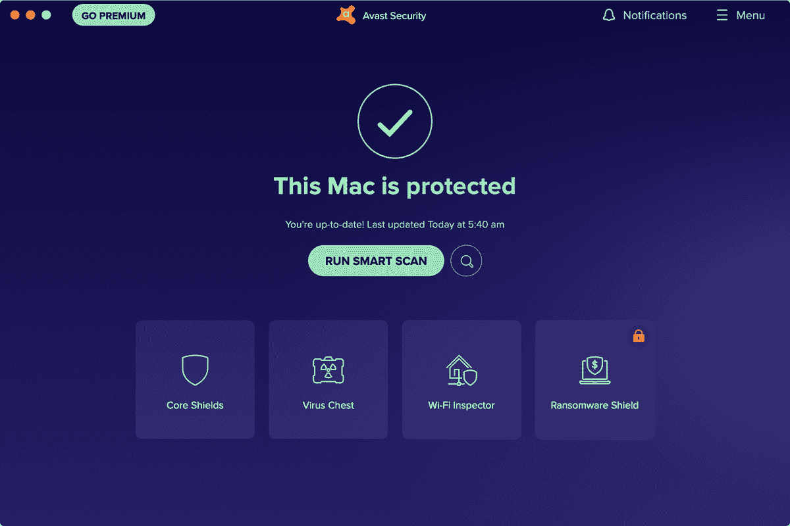
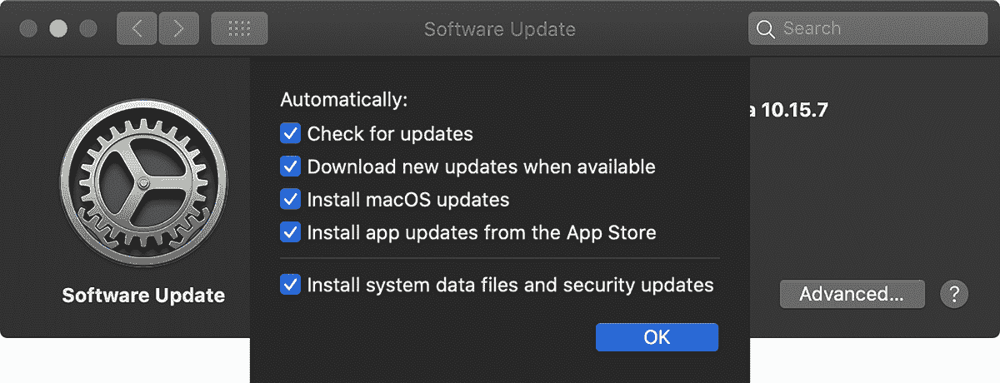
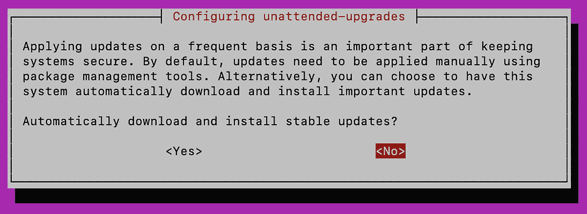
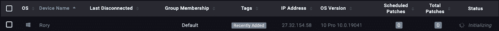
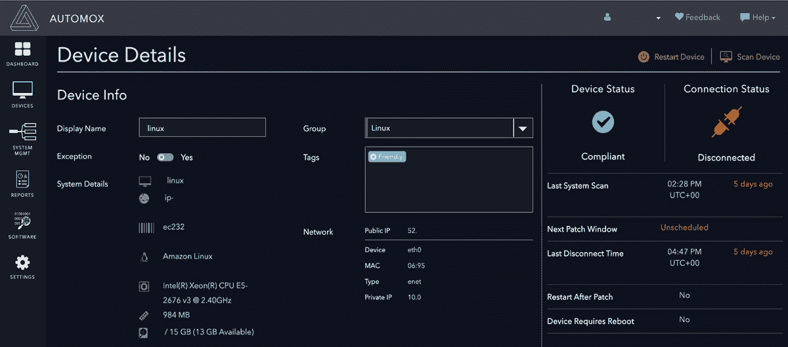

# 第八章：# 检测、移除和防止恶意软件


恶意软件，如病毒、木马和勒索软件，对互联网用户构成重大威胁，并且在可预见的未来可能仍然如此。因此，装备自己和用户一个能够检测和移除恶意软件的防病毒解决方案非常重要。此外，保持终端设备的最新状态可以防止恶意软件感染你的网络，在某些情况下，还能提供比防病毒（AV）解决方案更多的保护。

防病毒解决方案可能难以管理，因为它们通常不是跨平台的（即只适用于某一操作系统）。如果你的网络中有多个操作系统，你将需要为每个操作系统找到有效的 AV 产品。尽管本章讨论了如何安装、配置和使用特定产品进行扫描，但大多数选项和设置在大多数防病毒解决方案中是相同的。设置和配置选项的名称可能会略有不同，但相同的逻辑和过程应该适用于大多数产品。

在探索了适用于各种操作系统的防病毒解决方案之后，我们将考虑恶意软件特征和启发式扫描之间的差异，每种方法的优缺点，以及创建一个防病毒农场的概念，以便在不同的终端设备上尽可能多地捕获恶意软件。最后，我们将讨论各种操作系统的补丁管理，以及如何最好地保持终端设备的最新状态。

## Microsoft Defender for Windows

内置的微软防病毒解决方案的最新版本是*Microsoft Defender*。Defender 会自动更新病毒定义并定期扫描威胁，因此 Windows 电脑开箱即用时就能提供良好的保护。

Defender 的自动扫描是*快速扫描*，只检查通常会发现威胁的文件夹。虽然快速扫描能提供快速结果并且消耗少量系统资源，但它不太可能发现并移除位于这些文件夹之外的恶意软件。*完全扫描*会扫描所有文件和正在运行的程序，进行彻底的恶意软件搜索。建议每周至每月之间运行一次完全扫描。扫描周期越长，攻击者就越有机会在你的系统上造成破坏。

你还可以选择自定义扫描和离线扫描。*自定义扫描*允许你选择要扫描的文件夹和文件。*离线扫描*类似于早期版本 Windows 中的安全模式启动恶意软件移除方法。Windows 现在能够自动重启到一个状态，在该状态下，Microsoft Defender 可以通过离线扫描移除顽固的恶意软件。此选项是最后的手段，而不是你定期进行的扫描。如果你认为计算机被感染，但无法通过完整扫描找到感染，请运行离线扫描以确保清除。如果仍然无效，你唯一的办法就是清空硬盘并重新安装 Windows。

要运行扫描，打开 **设置▸更新与安全▸Windows 安全▸病毒与威胁防护**。点击 **扫描选项**，选择你想要的扫描类型，然后点击 **立即扫描**。

在病毒与威胁防护 4 管理设置菜单中，确保实时保护已开启，以便 Defender 持续保护你的计算机。你还可以在此菜单中添加文件和文件夹排除项。当你有一些合法且对系统没有风险的文件或程序时，但 Defender 将其误认为恶意软件并尝试隔离时，你可以添加这些排除项。

有一个设置特别可能会对你的隐私构成风险，那就是自动样本提交，它允许 Microsoft Defender 自动上传你的文件到微软的云服务器进行分析和扫描以检测恶意软件。这一做法存在风险：私密或机密数据可能在你不知情的情况下泄露给第三方，因为 Defender 不会询问或告知你文件被上传到 Microsoft。要关闭此设置，请切换自动样本提交。

与此设置相关的是云端保护设置。这个设置相对不那么危险，因为它仅将文件的元数据传送给 Microsoft，而不是整个文件内容。即使关闭了自动样本提交，云端保护依然能正常工作，尽管它的表现可能不会那么好。

Windows 会保持 Microsoft Defender 的最新状态，但偶尔手动更新也没有坏处。要更新，点击主界面上的 **检查更新**，进入病毒和威胁防护页面。

## 选择恶意软件检测和杀毒工具

在决定使用哪种杀毒和恶意软件检测工具时，考虑是否值得为商业工具（或免费工具的高级版）付费，并且工具是否会使用签名或启发式方法来检测恶意软件。

一般来说，如果你只需要一个简单的恶意软件扫描工具，几乎没有必要支付商业产品的费用。通常，你支付的是一些高级功能，例如内置的电子邮件或网页浏览器扫描器。

通常，付费解决方案提供某种形式的集中管理。不论是通过网页门户、管理服务器还是代理，你都可以从一个地方获得对所有设备的可视性并进行管理。如果你拥有一个较大的网络，这种能力非常有价值；如果你的网络中设备少于 30 个，你可能不需要这种功能。

### 杀毒农场

在较小的网络中，放弃单一解决方案而使用多个杀毒产品也有好处。*杀毒农场*使用多个产品，旨在捕捉比单一解决方案更多的恶意软件。这也使得攻击者的工作变得更加困难；他们不仅需要避开一个杀毒产品，还需要避开多个产品，才能在网络中横向传播。

杀毒农场之所以有用，是因为每个杀毒厂商都会创建自己专有的*恶意软件特征码*数据库——即可用于识别特定恶意软件样本的可执行文件中的字节序列。这些数据库需要定期优化；否则，你下载的病毒定义文件会变得过大、难以使用。因此，随着时间推移，较旧的病毒定义可能会从这些数据库中移除，这意味着使用多个厂商的产品可能会提供更广泛的已知威胁覆盖。

### 特征码与启发式分析

你还应该选择那些既能进行基于特征码检测又能进行启发式分析的杀毒产品。*特征码*通过可执行文件或其他文件的内容来识别已知的恶意软件，尽管攻击者通过轻微修改恶意软件内容，就能轻松改变其特征码。这是恶意软件检测软件的一个重大弱点。另一方面，*启发式分析*则是分析文件的行为方式及文件可能执行的命令，以判断其是否为恶意文件。这是一种更加可靠的检测已知和未知威胁的方法。如何判断某个杀毒程序是执行特征码检测还是启发式扫描呢？如果在其官网上没有列出相关信息，最好的方法是联系厂商并询问。厂商官网上通常会列出联系方式。

#26: 在 macOS 上安装 Avast

苹果设备通常被认为不太容易感染恶意软件，但现在它们感染的情况越来越多，这意味着你应该在网络中的任何 Mac 电脑上安装杀毒软件。在为你的苹果计算机安装第三方启发式杀毒解决方案时，有许多选择，既有免费的，也有商业的。在这些选择中，Avast 已经连续多年位居多个排行榜的前列。要安装和配置 Avast，请按照以下步骤进行：

1.  1\. 从 [`www.avast.com/`](http://www.avast.com/) 下载 Avast 并安装该软件。安装完成后，您应该会看到 Avast 安全窗口（见 图 8-1）。



图 8-1：Avast 安全窗口

1.  2\. 点击**菜单▸偏好设置**，进入 Avast 的设置页面。

1.  3\. 在“常规”标签中，确保勾选了**开启自动更新**复选框。

1.  4\. 在“隐私”标签中，*取消勾选* 允许将您的数据与 Avast 分享的两个复选框。与 Windows Defender 类似，最好保护您的隐私。

1.  5\. 在“核心防护”标签中，启用 Avast 将运行的每一个安全检查，例如文件扫描、网页保护和电子邮件保护。

1.  6\. 在每个防护盾下点击**添加例外**按钮，指定任何必要的例外。如果您知道某些文件或程序是合法的或低风险的，但您的防病毒软件将它们分类为潜在的恶意文件，请添加例外。

1.  7\. 在“扫描”标签中，确保勾选了**扫描整个文件**、**扫描外部驱动器**、**扫描已挂载的网络卷**、**扫描所有 Time Machine 备份**和**扫描归档**。这样，您可以确保您的防病毒软件尽可能多地识别威胁并保护您免受威胁。

*智能扫描* 旨在快速扫描计算机最脆弱的区域。虽然它消耗的资源较少且所需时间较短，但它不太可能发现计算机上的所有威胁，因为它并未扫描硬盘的所有区域。*深度扫描* 更为全面，涵盖设备上的所有存储区域，可以选择包括外部存储、网络位置、Time Machine 备份、内存和根套件检测。*定向扫描* 只扫描指定区域。

所有这些扫描都在 Mac 上的 Avast 扫描中央屏幕中运行。点击**搜索**按钮选择您要运行的扫描类型，然后点击**立即扫描**。选择定向扫描、USB/DVD 扫描或自定义扫描时，系统会提示您选择要扫描的位置。Avast 会扫描您的计算机以寻找威胁，如果检测到任何威胁，它会询问您希望如何处理相关文件。选择所有文件并点击**解决所选**将它们全部移动到病毒库；然后点击**完成**。您的计算机现在应该清除了所有潜在的恶意文件和应用程序。

#27：在 Linux 上安装 ClamAV

Linux 同样容易受到病毒的攻击。然而，Linux 操作系统很少内置杀毒软件，并且与其他操作系统相比，Linux 的可用杀毒软件也更少。大多数可用的解决方案都是商业软件，因此需要付费，如 Avast Core Security for Linux，但也有一个开源解决方案：ClamAV。

ClamAV 是一个免费的应用程序，可以在 Windows、macOS 和 Linux 上使用。要在 Ubuntu 上安装它，首先通过 SSH 以标准的非 root 用户登录到您的服务器。运行以下命令安装 ClamAV 版本，允许您自动化病毒扫描活动，并安装 GUI 工具 clamtk，后者可能会在稍后使用：

```
$ `sudo apt install clamav clamav-daemon clamtk`

```

安装完成后，您的杀毒定义（ClamAV 用来判断恶意软件的数据库）应该是最新的，但您可以运行以下命令来更新病毒定义—无论是现在还是以后—以停止、更新然后重启 ClamAV：

```
$ `sudo systemctl stop clamav-freshclam`
$ `sudo freshclam`
$ `sudo systemctl start clamav-freshclam`

```

要运行恶意软件扫描，请使用`clamscan` `folder_to_scan`命令。要扫描系统中的所有内容，请使用`/`，这将指示 ClamAV 扫描文件系统根目录中的所有内容，提供`-r`参数使扫描递归所有目录，并使用`sudo`，以便 ClamAV 获得必要的权限读取文件系统中的所有文件：

```
$ `sudo clamscan -r /`
`--snip--`
----------- SCAN SUMMARY -----------
Known viruses: 8927215
Engine version: 0.102.3
Scanned directories: 89954
Scanned files: 362758
Infected files: 0
Total errors: 82216
Data scanned: 8767.58 MB
Data read: 14195.27 MB (ratio 0.62:1)
Time: 1171.021 sec (19 m 31 s)

```

扫描完成后，`clamscan`将输出扫描摘要。

除了已知的恶意软件，ClamAV 还可以检测*潜在不受欢迎的应用程序（PUA）*，包括广告软件、点对点（p2p）程序、远程管理工具、比特币挖矿程序和捆绑软件（与正在安装的应用程序无关的软件，但一并捆绑安装），这些程序本身并不恶意，但可能对终端的安全性和性能构成风险或产生负面影响。要扫描 PUA，请在运行 ClamAV 时包含`--detect-pua=yes`参数。

如果您的扫描耗时过长，可以使用其他高级参数来缩短扫描时间。您可以使用`--max-filesize=``n`参数限制 ClamAV 扫描的文件大小，其中`n`是以千字节为单位的最大文件大小。任何大于您指定大小的文件将被跳过，并假定是干净的，从而减少扫描完成的时间。同样，`--max-scansize=``n`只扫描指定大小以内的归档文件（*.rar*文件、*.zip*文件等）—所有其他归档文件将被跳过。要限制递归深度（即扫描开始目录下的目录层级数量），请使用`--max-dir-recursion=``n`参数。有关更多参数，请使用`-h`参数，如`sudo clamscan -h`，打印帮助菜单。

要定期运行扫描，请使用 Crontab，这是一个 Linux 实用程序，旨在按预设的时间或间隔执行程序。在终端中，使用`crontab -e`命令编辑计划任务文件：

```
$ `sudo crontab -e`
[sudo] password for user:
# Edit this file to introduce tasks to be run by cron.
#
# Each task to run has to be defined through a single line
# indicating with different fields when the task will be run
# and what command to run for the task
#
# To define the time you can provide concrete values for
# minute (m), hour (h), day of month (dom), month (mon),
# and day of week (dow) or use '*' in these fields (for 'any').
#
# Notice that tasks will be started based on the cron’s system
# daemon’s notion of time and timezones.
#
# Output of the crontab jobs (including errors) is sent through
# email to the user the crontab file belongs to (unless redirected).
#
# For example, you can run a backup of all your user accounts
# at 5 a.m every week with:
# 0 5 * * 1 tar -zcf /var/backups/home.tgz /home/
#
# For more information see the manual pages of crontab(5) and cron(8)
#
`# m h  dom mon dow   command`

```

文件开头的大注释解释了如何使用示例指定任务。注释的最后一行提供了调度执行脚本和应用程序的语法。顺序是分钟、小时、日期、月份、星期几和要执行的命令。分钟和小时必须是数字，分别为 0 到 59 和 0 到 23，你可以通过逗号分隔的方式指定分钟或小时的列表（也就是说，你可以通过指定`1,2,3`在凌晨 1 点、2 点和 3 点运行命令）。你可以通过数字指定日期（1 到 7，1 是星期天），或者使用 Sun、Mon、Tue 等表示。月份是 1 到 12（1 代表一月）。星号（`*`）表示该字段的所有可能值；如果你希望命令每个月运行一次，可以在月份（`mon`）位置放一个星号。

假设你想在每个星期天凌晨 1 点对整个文件系统运行`clamscan`，并包括扫描潜在的不需要的应用程序。在 Crontab 文件的底部，添加一行并输入以下内容：

```
0 1 * * sun clamscan -r / --detect-pua=yes -l /`path_to_logfile/clamav.log`

```

默认情况下，除非你使用`-l`参数指定日志文件，否则你无法查看扫描结果。如果你希望每天扫描特定的文件夹，比如用户的主目录（*/home/*），除了全系统扫描之外，可以在 Crontab 中添加另一条记录，参考之前的示例作为指南。

在 Crontab 中添加另一行以确保 ClamAV 保持最新：

0 0 * * mon systemctl stop clamav-freshclam && freshclam && systemctl start clamav-freshclam

你可以将多个命令链接在一起，并用一对和符号将它们分开，以串行执行它们。可以使用`man`命令获取更多关于 Crontab（或任何其他终端命令）的信息。在命令行中输入`man crontab`来打开该应用程序的手册。

#28: 使用 VirusTotal

*VirusTotal (VT)* 测试文件以确定它们是否可能是恶意的（[`www.virustotal.com/`](https://www.virustotal.com/)），其方式是将反病毒农场的概念进行大规模实现。这是一个公开的服务，你可以上传任何文件扫描恶意软件，VT 会用超过 60 种反病毒程序扫描它。然后它会生成一份报告，告诉你文件是否包含恶意软件，或者是否以某种方式影响你的终端、安全性或隐私。这个功能在你认为一个文件是恶意的，但你的反病毒软件没有检测到时，特别有用。

请注意，任何上传到 VT 的文件都会变成公开的，因此任何人都可以搜索并下载你上传的文件。为了在不公开私人信息的情况下使用 VT，请在 VT 中搜索你想检查的文件的哈希值。*哈希*是一种根据文件内容计算固定长度字符串的过程。哈希应该是单向过程，这意味着你不能通过文件的哈希值反推回原始文件内容。通过创建文件的哈希值，你应该得到一个唯一的字符字符串，用于标识该文件。某些哈希算法可能会导致*冲突*，即两个文件生成相同的哈希值，尽管在大多数现代哈希函数中，这种情况几乎不会发生。你可以通过使用任何操作系统的内置工具获取文件的哈希值。

Windows PowerShell 在 Windows 中，打开 PowerShell 窗口并输入以下命令来获取任何文件的 MD5 哈希值：

```
$ `Get-FileHash` `path_to_file` `-Algorithm MD5`

```

然后，你可以直接在 VirusTotal 网页门户中搜索该哈希值。

Linux 和 macOS 终端，你可以使用以下命令在 Linux 和 macOS 中获取文件的 MD5 哈希值：

```
$ `md5sum` `path_to_file`

```

然后，在 VT 网页门户中搜索结果哈希值。

如果某个哈希值相同的文件曾在过去的某个时间点上传到 VT，你将看到该文件的公共报告，报告详细说明了 VT 所有提供商的恶意软件扫描结果。如果该文件之前没有被上传，文件很可能不是恶意的。

#29: 管理补丁和更新

除了使用防病毒工具外，补丁管理也是一种重要的防御措施，因为恶意软件利用是针对网络、应用程序、协议或操作系统中的特定漏洞进行攻击。攻击者密切关注 Windows 更新和其他操作系统的补丁，因为补丁说明会指出它旨在修复的漏洞。攻击者利用这些漏洞信息编写专门针对该安全缺陷的恶意软件，而没有下载更新的用户可能会成为受害者。这也是操作系统不断要求你安装更新和补丁的原因。

在大多数情况下，最终用户不会立即安装更新，攻击者有机会利用未打补丁的系统进行攻击。为了你的最佳利益，更新软件应该尽快进行。幸运的是，更新过程非常简单且易于自动化。本项目描述了如何在单个系统上配置系统更新，接下来的部分将讨论跨多个终端的补丁管理解决方案。

### Windows 更新

对于 Windows 更新，打开**Windows 设置▸更新与安全**。Windows 会至少每天自动检查一次更新（前提是设备始终开机）。要手动检查、下载并安装更新，请点击**检查更新**按钮。

如果你希望暂时不考虑更新，可以点击**暂停更新 7 天**。更新对于保持系统安全至关重要，因此不建议暂停更新。

你可以通过设置活动时间来限制 Windows 在特定时间更新你的计算机。如果你主要在上午 9 点到下午 5 点之间使用计算机，可以告诉 Windows 在此时间段内不要更新，这比长时间暂停更新更为合适。

在“高级选项”中，你可以允许 Windows 通过 Windows 更新来更新其他 Microsoft 产品——我建议启用此选项。你还可以让 Windows 在安装更新后强制设备重启，如果你作为管理员希望强制终端用户重启他们的机器，这非常有用。你可能会不太受欢迎，但你的网络会更安全。

在“高级选项▸传递优化”菜单中，你可以启用从网络中其他 PC 下载更新的选项。这将减少从互联网下载相同更新到多台计算机所需的带宽。你应该启用此设置，但有一个前提条件：仅允许从本地网络中的 PC 下载，而不是来自互联网上的 PC。

在“高级选项”面板中，最后一个特别需要注意的设置是隐私设置。通过在此菜单中禁用 Windows 和 Microsoft 根据你的地理位置、浏览习惯和应用使用统计数据向你发送定向广告和内容，你可以提高自己的隐私保护。

### macOS 软件更新

Apple 设备比 Windows 或 Linux 更简单，因为它们的更新过程几乎可以完全自动化，并且几乎不需要用户输入。为了确保你的 Apple 电脑保持最新，打开**系统偏好设置▸软件更新**。要启用自动更新，请勾选**自动保持我的 Mac 最新**。

勾选此复选框后，点击**高级**按钮选择应自动执行的操作。在此菜单中（图 8-2），选择你的计算机是否可以检查更新、下载更新或在没有用户输入的情况下完成安装过程，然后点击**确定**保存设置。在大多数情况下，允许计算机在没有用户输入的情况下保持最新是理想的；计算机仍然会在任何需要重启的更新后询问用户是否重启（这种情况并不常见）。



图 8-2：macOS 高级软件更新配置

以这种方式保持你的设备更新，可以确保它们尽可能安全，并保护你和你的用户的隐私。

### 使用 apt 更新 Linux

如第一章中所述，Linux 操作系统有多种实现方式，称为*发行版*。这些发行版中的每一个都使用软件包管理器来维护和更新系统或用户安装的软件。本书中我们使用的是 Ubuntu Linux，它使用高级包工具（APT）软件包管理器。软件包管理器简化了保持 Linux 终端系统最新和安全的过程。

要更新 Ubuntu 系统，使用 SSH 以标准的非 root 用户身份登录。当你登录时，系统会显示欢迎信息，其中包括关于必需和推荐更新的相关信息：

```
`--snip--`
 * Documentation:  https://help.ubuntu.com
 * Management:     https://landscape.canonical.com
 * Support:        https://ubuntu.com/advantage
105 updates can be installed immediately.
68 of these updates are security updates.
To see these additional updates run: apt list --upgradable
`--snip--`

```

为确保更新列表完整，运行`apt update`命令：

```
$ `sudo apt update`

```

更新列表完成后，运行`upgrade`命令以更新所有软件包：

```
$ `sudo apt upgrade`

```

命令输出将显示需要更新的包的数量、它们将使用的磁盘空间以及各种状态信息。当提示时，输入**Y**并按回车键继续。

与 Windows 和 macOS 一样，某些更新需要重启系统。如果是这种情况，你会看到类似下面的提示：

```
A reboot is required to replace the running dbus-daemon.
Please reboot the system when convenient.

```

要使 Ubuntu 自动更新系统和已安装的软件包，请使用以下命令：

```
$ `sudo dpkg-reconfigure -plow unattended-upgrades`

```

命令将显示图 Figure 8-3 中所示的提示。



图 8-3：Ubuntu 无人值守更新

选择**Yes**并按回车键，你将确保服务器保持最新，从而使其本身更加安全。然而，你仍然应该手动检查更新，并每月重启一次服务器。

#30: 安装 Automox

根据你的网络规模，手动或半手动地保持所有终端系统更新可能会让人感到乏味或不知所措。像 Automox 这样的集中式补丁管理解决方案可以让你轻松在一个地方管理所有这些内容。Automox 采用按终端订阅的模式：你可以通过支付名义上的月费来管理一个或多个 Windows、macOS 或 Linux 系统（工作站或服务器），该费用允许你通过一个仪表板为所有终端应用系统和第三方软件的补丁。Automox 还维护资产和软件清单，这是任何人保持网络安全的第一步。

### 安装 Automox

访问 Automox 网站（[`www.automox.com/`](https://www.automox.com/)）注册一个帐户（或免费试用）。然后登录到您的帐户仪表板（[`console.automox.com/`](https://console.automox.com/)）。仪表板是您查看管理的端点和它们所需更新的摘要的地方。当然，在您向帐户添加一些端点之前，仪表板将会很简洁。在接下来的章节中，您将需要一个用户密钥来将端点连接到 Automox。您的密钥可以在 Automox Web UI 的个人资料设置页面下的“密钥”标签中找到。

#### Windows

要在 Windows 端点上安装 Automox 代理，请从 Automox 控制台访问**设备**标签页，然后点击页面顶部的**添加设备**链接。您将看到一个操作系统选择弹窗。选择 Windows，然后下载代理程序。

一旦代理程序下载完成，以管理员身份运行安装程序（*.msi* 文件）。按照安装向导的提示进行操作，在提示时输入来自控制台的 Automox 用户密钥。安装完成后，刷新您的 Automox 仪表板，查看新添加的端点（图 8-4）。



图 8-4：Automox 资产列表

#### macOS 和 Linux

在 Mac 或 Linux 计算机的终端窗口中，运行以下命令，将 `yourkey` 替换为您的用户密钥：

$ `curl -sS "https://console.automox.com/downloadInstaller?accesskey=``yourkey``" | sudo bash`

刷新您的控制台，以查看新添加的端点。

### 使用 Automox

现在，您已经在端点上安装了 Automox，您将能够通过一个中央控制台管理操作系统和第三方软件的补丁。在设备标签页中，您可以查看所有管理的端点，并将它们添加到组中—如果您希望按这种方式管理它们。您还可以扫描端点以识别硬件更改，并检查它们所需的最新更新，远程重启端点，或者从帐户中移除端点。通过点击一个端点，您可以查看它的硬件配置、IP 和 MAC 地址、设备类型、操作系统、CPU 和 RAM 详细信息，以及其他关键信息，如图 8-5 所示。您还可以强制立即对端点应用更新，而无需等待端点按照系统管理标签页中指定的更新策略进行更新。



图 8-5：Automox 设备详情

“系统管理”选项卡允许您创建和分配补丁策略，如果您希望安排补丁安装，这非常有用。例如，您可以决定每天下午 5 点自动安装任何重要补丁。或者，您可能希望每周六午夜强制安装所有必需的补丁，那时人们不太可能使用他们的计算机。您需要定义自己的要求，并决定哪个补丁安装时间表最适合您和您的网络。

在“报告”选项卡中，您可以生成 Automox 执行的操作报告，以保持您的终端设备最新，报告控制台中任何或所有终端设备的状态，或识别不合规的终端设备。根据网络的大小，查看此信息可能比生成这些报告更容易。

Automox 会在“软件”选项卡中提供已安装在受管理终端设备上的所有软件及其补丁级别的清单。这使您能够轻松识别需要更新的软件，并在可能的情况下进行更新。您还可以使用此列表识别您不希望出现在环境中的软件，无论是潜在的恶意软件，还是违反组织政策的特定软件，如游戏或其他软件。

最后，设置选项卡允许您创建新用户，以便其他管理员可以访问您的 Automox 控制台来管理终端设备。您还可以在此选项卡中查找并添加代理访问密钥。您应该充分利用的一项功能是双因素认证设置。通过启用双因素认证，您可以增强账户的安全性，从而使未经授权访问您的设备和补丁管理信息变得更加困难（在第十一章中有进一步讨论）。

## 概述

保持系统最新对于确保网络安全至关重要。无论您选择使用操作系统内置的防病毒和补丁选项，还是像 Automox 这样的托管补丁解决方案，都应定期安排更新和病毒扫描；否则，您将使网络面临各种对手和不必要的风险。
