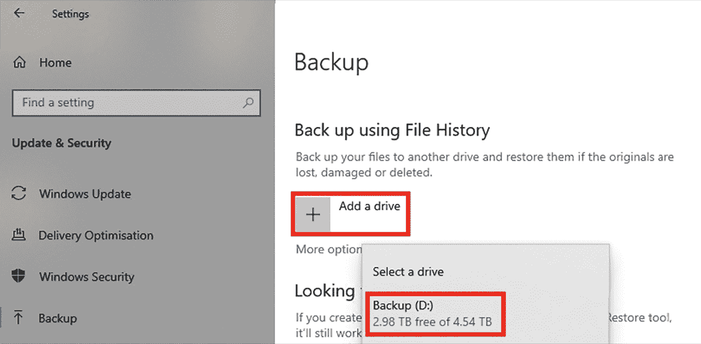
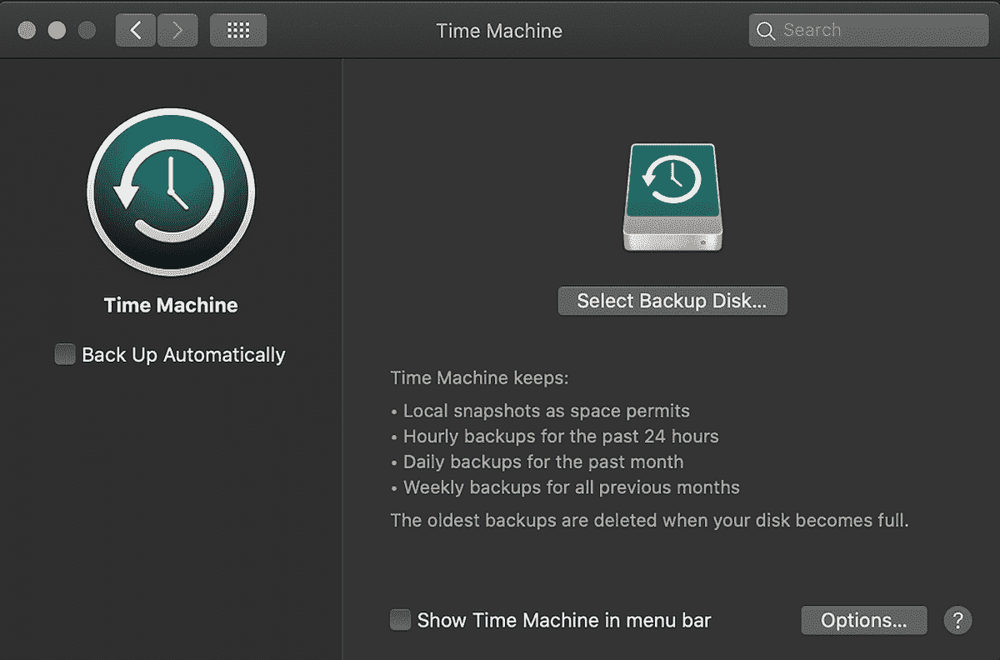
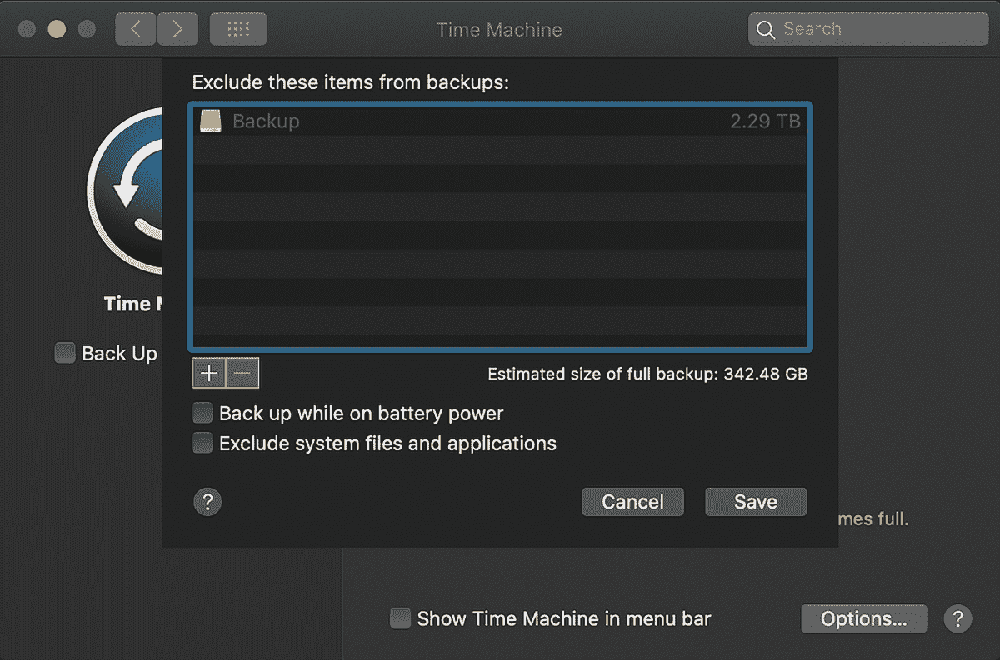
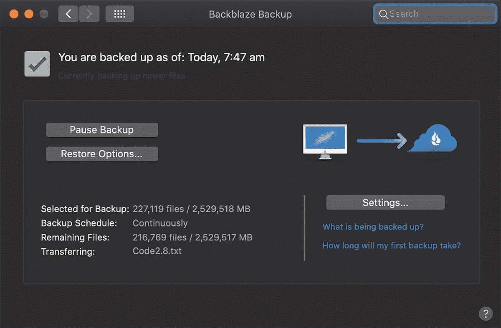
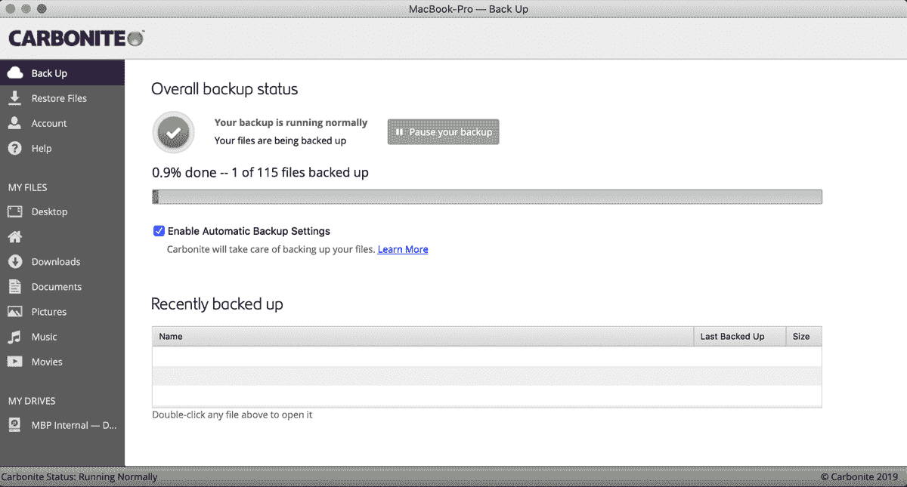
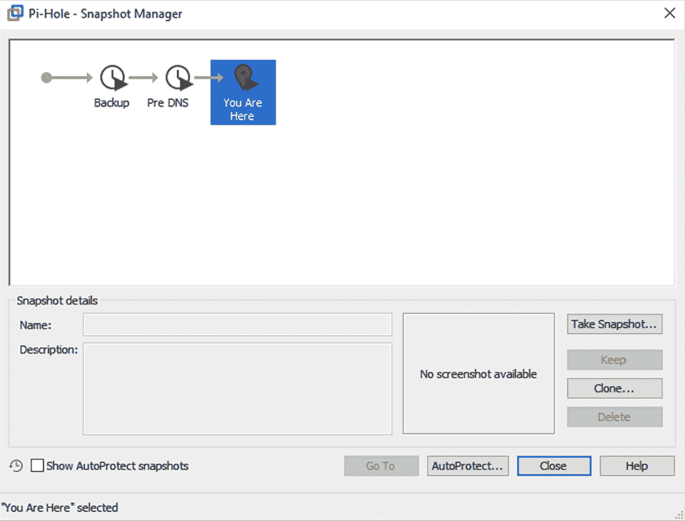

# 第九章：# 备份你的数据


拥有一个可靠、明确定义并且实施到位的备份策略，是任何网络防御恶意或意外数据丢失的最佳方式之一。无论是你误删了一个重要文件夹，还是有攻击者在你的网络内部执行了勒索病毒，或是自然灾害摧毁了你的设备，备份都能将你从灾难中拯救出来。

本章介绍了各种备份注意事项，包括不同的备份类型、创建备份计划、现场和异地备份的价值、备份内容以及备份存储选项。最后，我们将展示如何在网络中实施不同的解决方案。

## 备份类型

在实施备份计划时，你应该考虑三种备份类型：*完全备份*、*增量备份*和*差异备份*。

完全备份

+   完全备份包含了你希望从特定主机或位置（称为*备份集*）备份的所有内容的完整副本。例如，你可能决定定期创建你电脑中用户配置文件的所有内容的备份副本。或者，你可能想要备份整个磁盘或卷，包括操作系统文件。以上任一选项都是可行的，都可以视为不同的备份集。

+   完全备份提供了从备份集中快速、简便地恢复所有文件的方式。由于所有数据都包含在一个备份中，恢复过程将比其他备份选项更快。然而，完全备份需要更多的存储空间，尤其是当你保存多个备份时，而且创建的时间也最长。

差异备份

+   差异备份仅包含自上次完全备份以来发生变化的数据副本，因此比完全备份更适合频繁使用。如果你决定每月进行一次完全备份，那么每周进行一次差异备份是一个好主意。建议定期创建完全备份，以便保持差异备份的大小可控（而不是在备份集创建一个完全备份之后，再仅从那个点开始创建差异备份）。

+   差异备份占用大量存储空间，因为第一次备份包含了自上次完全备份以来所有修改的文件副本，接下来的差异备份则包含了所有这些数据，*加上*第一次和第二次差异备份之间所有额外修改的文件。如果没有在某个时点进行完全备份，差异备份会随着时间的推移变得越来越大。此外，如果某一个或多个差异备份不完整，你将无法从部分差异备份和数据的完全备份中恢复完整数据。

增量备份

+   增量备份会创建自上次备份*任何类型*以来发生变化的所有数据的副本，无论是之前的全量备份、差异备份还是增量备份。这种备份方式占用的空间最少，并且创建所需的时间也最短。如果你每个月进行一次全量备份，每周进行一次差异备份，那么你最好每天进行增量备份，以确保对数据的任何更改都会被捕捉到。

+   增量备份的一个难点是，恢复所有文件跨多个备份可能会非常困难，因为每个备份都必须单独打开，并从所需的备份点恢复特定的文件。这意味着需要使用所有可用的恢复点来完成全面恢复，而差异备份只需要最近的差异备份和最近的全量备份就能完成完整的恢复。

## 制定备份计划

如果备份没有定期进行，那它几乎没有什么价值。你最关键的数据可能每天都在变化，因此，如果一个文档的备份已经两个月没有更新，当它损坏或永久丢失时，旧的备份就没有任何帮助了。因此，决定备份应该多久进行一次是至关重要的。你的备份策略将是高度个性化的，并且与特定的情况和需求相关，尽管有一些最佳实践可以遵循。

通常最好比起差异备份或增量备份，较少频繁地进行全量备份，因为全量备份占用的空间和时间最多。进行差异备份或增量备份可以更频繁地备份修改过的数据，并且由于时间限制，增量备份和差异备份比全量备份更不容易失败。作为一般规则，每月进行一次主系统或关键数据的全量备份是一个不错的起点，之后你可以根据需要调整备份策略。

根据你选择的备份软件，你可能能够使用这些特定的调度选项中的部分、全部或没有任何选项。例如，一些软件从技术上讲具备所有这些功能，并允许你从不同的时间点恢复数据，但差异备份/增量备份/全量备份和恢复选项不会直接显示给你。大多数操作系统都自带一个集成的备份解决方案（稍后讨论）。根据你的需求，内置的选项可能就足够了。否则，你可以考虑各种付费解决方案。

## 现场和异地备份

根据你选择备份的数据的重要性，除了*本地备份*之外，保留*异地备份*可能是一个不错的主意。 本地备份保存在与你的原始数据相同的物理位置，比如你的家或办公室。异地备份则保存在与你的主要位置不同的地方。将备份存储在多个位置可以提供数据冗余；如果你的本地备份和原始数据被销毁，异地备份可能是你唯一的恢复选项。通常，异地备份会存储在离线状态，不与网络连接，理想情况下存放在类似防火保险箱的地方。或者，你也可以选择使用云解决方案，但这会带来自己的安全风险。

拥有异地备份可能会带来额外的管理开销。在大多数情况下，你会先在本地创建备份，要么使用备份应用程序，要么将本地备份完整复制出来，然后将该备份物理移出现场。这应该与本地备份一样，按定期的时间表进行，因为它能为你提供更多的应急选项。

## 备份内容和存储方案选择

一开始选择你想要备份的内容可能会是一个挑战。你需要能够从之前的检查点恢复整个设备，还是只需要恢复特定的文件？如果你不需要恢复整个操作系统，最好确定哪些文件和文件夹是关键的，或者在恢复时会有用。考虑一下，在数据丢失后，你能在多长时间内没有这些数据，直到它真正开始影响你、你的用户或你的业务。恢复备份数据所需的时间完全取决于你需要恢复的数据量。

确定备份策略时，另一个需要考虑的因素是你有多少存储空间可以用来存储备份。你可以选择在设备本身上创建文件备份，但如果设备丢失、被盗、损坏或无法使用，这样做就没什么用处。更好的选择是使用外部硬盘驱动器，它可以从任何本地电脑商店购买，并且有各种容量可供选择，适合你的需求。这是一个便宜且简便的选择，可以让你创建本地备份并轻松将其存储在异地。最后，你还可以购买专用的备份存储设备，如*网络附加存储（NAS）*设备。NAS 连接到你的网络，具有高存储容量，通常还包括像磁盘冗余和自动化等附加功能。它提供的性能和可靠性通常高于单独的外部硬盘驱动器，但通常更昂贵并且需要一些管理。

无论你选择哪种存储解决方案，它应该与你计划备份的内容相匹配。对设备进行完整磁盘备份会占用大量空间，因为计算机的内存通常为 1TB 或更大。如果你只打算备份关键的个人文件，那么你所需的备份存储空间会较小。你可能会从外部硬盘开始，随着需求的增加，逐步升级存储方案。你选择的解决方案将主要取决于操作系统、终端是物理设备还是虚拟设备，以及你希望保留多少数据在备份集中。

如果你想保持自己的备份，大多数操作系统都有内建的备份解决方案，其中一些功能比其他的更为完整。

#31: 使用 Windows 备份

要访问 Windows 的内建备份解决方案，请打开 **Windows 设置▸更新与安全▸备份**。你需要将一个驱动器连接到计算机上，用来存储备份数据。连接后，点击 **添加驱动器** 并选择它，如 图 9-1 所示。请注意，在 Windows 11 中，Windows 备份位于 **Windows 设置▸帐户▸Windows 备份** 下，且设置是按用户进行的。你可以在 Windows 11 中使用 Windows 备份将文件、应用程序和偏好同步到 OneDrive，但不再提供将本地驱动器备份到外部或网络驱动器的选项。



图 9-1：Windows 备份到外部驱动器

当你选择了驱动器后，“自动备份我的文件”选项将会开启。这将会保持用户配置文件文件夹（*C:\Users\<username>*）中更为关键数据的多个副本，例如 *Documents*、*Desktop* 和 *Downloads* 文件夹，以及 *AppData* 文件夹中的应用程序设置。你可以通过点击“更多选项”来选择要包含在备份中的文件夹。

Windows 备份基本上是一个完整备份加增量备份的策略。它会首先对你选择的文件进行完整备份，然后默认每小时保存这些文件的每个新版本或修改，永远保持（或者直到你的备份驱动器空间耗尽）。这样，你可以在备份时间线的任何时间点查看并恢复文件。这个方案有一些限制，包括无法将备份保存到网络位置，也不能进行完整的系统映像备份。

#32: 使用 Windows 备份与还原

如前一个项目中所讨论的，Windows 备份非常适合备份特定的文件和文件夹，但不适合进行完整的系统备份。幸运的是，自 Windows 7 以来，所有版本的 Windows 都包括*备份和恢复*，这对于创建完整的系统备份非常有用，包括可以完全恢复系统的系统映像（例如，如果系统因勒索软件而被破坏）。它还可以将备份保存到外部或网络驱动器，但不会保留文件的旧版本或文件历史记录。

在 Windows 10 中，你可以通过进入**Windows 设置▸更新与安全▸备份▸转到备份与恢复（Windows 7）**来访问备份和恢复功能。在 Windows 11 中，备份和恢复功能位于**控制面板▸系统与安全▸备份与恢复（Windows 7）**。你将看到如图 9-2 所示的屏幕。


图 9-2：Windows 备份和恢复窗口

在左侧，你可以选择创建*系统映像*或*系统修复光盘*。如果由于硬件或操作系统问题导致计算机无法访问，你可以使用这些工具之一来恢复计算机到当前已知的良好配置，所有文件都会保持在当前状态。

1.  1. 点击右侧的**设置备份**按钮，以创建一个定期的个人文件和系统文件备份计划。

1.  2. 连接外部驱动器并点击**刷新**以选择它作为备份位置，或者点击**保存到网络**，指定网络位置和必要的用户名及密码（如果有）；然后点击**下一步**。

此时，Windows 会询问你希望包含在备份中的内容。默认情况下，你可以让 Windows 选择要包含的内容，这将是你在*C:\Users\<用户名>*中的个人文件和文件夹。

1.  3. 选择**让我选择**单选按钮，然后点击**下一步**。

1.  4. 选择要备份的内容。

    1.  a. 启用或禁用新用户文件的备份（假设将在此计算机上创建新的用户账户）。

    1.  b. 包括或排除任何个人库，例如*文档*或*图片*，以及像*桌面*和*下载*文件夹这样的位置。

    1.  c. 选择计算机上驱动器中的任何文件夹。

    1.  d. 如果你希望定期备份整个系统，请确保选中包含设备系统映像的复选框。当你对设置感到满意时，点击**下一步**。

1.  5. 此时，你可以选择此备份运行的计划，可以是每日、每周或每月。

1.  6. 点击**保存设置并运行备份**以进行首次完整的数据备份。

现在，您的文件夹已经定期备份到外部或网络驱动器，适用于您的 Windows 系统。

#33：使用 macOS Time Machine

Apple 设备内置了用于备份数据的解决方案，称为*Time Machine*，可以通过**系统设置▸Time Machine**（图 9-3）进行访问。



图 9-3：macOS Time Machine

Time Machine 可以将您的数据备份到直接连接到计算机的外部驱动器或网络附加存储。该网络存储可以是 Apple Airport Time Capsule（专为 Time Machine 备份设计）、连接到 Apple Airport Extreme 基站的驱动器、已共享为 Time Machine 备份目标的其他 Mac，或者支持通过 SMB 协议进行 Time Machine 备份的专用 NAS 设备。如果您的网络中已有这些设备，建议使用该解决方案。如果没有可用的设备，最简单和最便宜的备份 Mac 解决方案是使用外部驱动器，而不是网络位置。通常，当您将高容量硬盘插入 Apple 设备时，系统会提示您是否希望将该硬盘用作 Time Machine 备份。或者，您可以使用图 9-3 中所示的“选择备份磁盘”选项选择特定的备份磁盘。

Time Machine 不提供调度备份的选项；它将在预定的时间自动备份数据。Time Machine 会保留 24 小时的快照，进行每日备份一个月，并进行每周备份，直到备份驱动器的空间用尽。一旦空间耗尽，Time Machine 会删除最旧的备份集，以便腾出空间来存储最近的数据版本。勾选**自动备份**以允许 Time Machine 执行此操作。

选择您要备份的数据的选项有些有限。默认情况下，Time Machine 会备份整个设备，包括系统文件、应用程序、账户、偏好设置、电子邮件、音乐、照片、电影和文档。点击**选项**，可以通过图 9-4 所示的对话框排除其中的任何内容。



图 9-4：Time Machine 备份选项

总体而言，Time Machine 是一个强大的解决方案，用于备份和恢复您的 Apple 设备。

#34: 使用 Linux duplicity

在 Ubuntu 中，有多种实用工具可用于创建文件备份。最简单易用的是*duplicity*，它是一个命令行工具，可以将完整和增量备份档案创建到本地存储、外部硬盘或网络位置。使用以下命令在您的 Ubuntu 设备上安装 duplicity：

```
$ `sudo apt install duplicity`

```

一旦命令完成，使用`-h`选项执行 duplicity，显示其帮助文件并确认安装成功：

```
$ `duplicity -h`
Usage:
  duplicity [full|incremental] [options] source_dir target_url
  duplicity [restore] [options] source_url target_dir
  duplicity verify [options] source_url target_dir
  duplicity collection-status [options] target_url
  duplicity list-current-files [options] target_url
  duplicity cleanup [options] target_url
  duplicity remove-older-than time [options] target_url
  duplicity remove-all-but-n-full count [options] target_url
  duplicity remove-all-inc-of-but-n-full count [options] target_url
  duplicity replicate source_url target_url
`--snip--`

```

阅读输出内容，熟悉可用的选项和配置。在接下来的部分，我们将讨论一些最常用的功能。

### 使用 duplicity 创建本地备份

以下示例使用 duplicity 创建用户主目录的初始完整备份，并将输出保存到本地系统的*/tmp/*目录：

```
$ `duplicity /home/``user` `file:///tmp/`
Last full backup date: none
GnuPG passphrase for decryption:
Retype passphrase for decryption to confirm:
--------------[ Backup Statistics ]--------------
StartTime 1634779305.32
EndTime 1634779305.94
ElapsedTime 0.62 (0.62 seconds)
SourceFiles 139
SourceFileSize 5793461 (5.53 MB)
NewFiles 139
NewFileSize 5793461 (5.53 MB)
DeletedFiles 0
ChangedFiles 0
ChangedFileSize 0 (0 bytes)
ChangedDeltaSize 0 (0 bytes)
DeltaEntries 139
RawDeltaSize 5465781 (5.21 MB)
TotalDestinationSizeChange 660694 (645 KB)
Errors 0
-------------------------------------------------

```

请注意，目标目录（备份档案将被保存的地方）必须具有*file://*前缀。*/tmp/* 目录是备份的临时存放位置；一旦备份完成，您应将备份文件移至其他地方，或保存到其他位置。第一次运行此命令时，duplicity 会对源文件或文件夹进行完整备份。之后再次执行相同命令时，将创建源数据的增量备份。该命令输出统计信息，如列表中所示，包括备份操作的开始和结束时间、包含的文件数量以及备份档案的总大小。使用 duplicity 创建的备份必须用密码短语进行保护。

要创建另一个完整备份，请指定`full`选项，如下所示：

```
$ `duplicity full /home/``user` `file:///tmp/`

```

这样做将强制 duplicity 创建完整的备份，而不是增量备份。

### 使用 duplicity 创建网络备份

将备份保存到网络位置比保存到本地文件夹更为理想，原因有几点。将备份保存到本地存在风险，因为如果丧失对端点的访问或它变得不可用，你将无法从其他位置恢复备份。此外，如果对手获得了系统的访问权限，他们也可以访问你的（加密的）备份。因此，将备份保存到远程位置（如文件服务器）更为安全。这可以通过 duplicity 内置的 rsync 功能实现。以下命令假设你已按照 第一章的说明创建 SSH 密钥并使用 SSH 密钥认证，而不是密码认证。如果不是，请返回并完成此步骤。SSH 密钥认证需要使用在本地和远程端点之间共享的公钥/私钥对，使得它们能够进行加密安全通信，相较于使用密码或口令认证，它提供了更高的安全性。

```
$ `duplicity /home/``user` `rsync://``user@server_ip//path/to/folder/`

```

一旦你决定了要备份的文件和文件夹，以及备份位置，就可以使用 Crontab 安排 duplicity 定期备份你的文件，Crontab 是 Linux 内置的一个作业管理工具，详细信息请参阅 第 27 项 和 第 122 页：

```
$ `sudo crontab -e`
`--snip--`
# m h  dom mon dow   command
`0 0 * * 1 duplicity /home/``user` `rsync://``user@server_ip//path/to/folder/`
`0 2 1 * * duplicity full /home/``user` `rsync://``user@server_ip//path/to/folder/`

```

Crontab 应用程序的 `-e` 选项表示你将编辑 cron 文件和由 cron 维护的计划任务。此示例中 Crontab 中显示的命令安排 duplicity 每天午夜运行，创建增量备份，并在每月的第一天凌晨 2 点强制创建全备份。

### 恢复 duplicity 备份

使用命令行恢复通过 duplicity 创建的备份：

```
$ `duplicity restore file:///tmp/ /home/``user/backup_folder_name/`

```

输入 `restore` 命令并指定源路径和目标路径，可以将备份集中的所有文件恢复到指定位置。

如果需要，还可以使用各种选项从备份集中恢复特定的文件和文件夹。以下是一个示例：

```
$ duplicity `-t 3D --file-to-restore /home/user/Documents/test.txt \`
`    file:///tmp/ /home/user/Documents/restored_file`

```

在此命令中，我们调用 duplicity，告诉它从三天前的备份中恢复 *test.txt* 文件（在 `--file-to-restore` 参数后面指定），该备份位于本地系统的 */tmp/* 文件夹中，并将恢复后的文件保存到 */home/user/Documents/* 文件夹中。有关恢复文件和可用选项的更多信息，请查看 duplicity 的手册页。

### 其他 duplicity 注意事项

duplicity 工具还有许多其他强大的选项。你可能希望将某些文件或文件夹排除在备份之外；例如，在创建用户数据的备份时，通常会希望排除系统文件夹。使用 `--exclude` 参数可以排除文件和文件夹：

```
$ `duplicity --exclude /proc --exclude /mnt / file:///tmp/`

```

当备份完成后，使用`verify`参数，并交换源和目标位置，通过原始备份命令确认它们已成功创建：

```
$ `duplicity verify file:///tmp/ /home/``user``/`
Local and Remote metadata are synchronized, no sync needed.
`--snip--`
Verify complete: 325 files compared, 0 differences found.

```

如果输出没有显示错误，说明备份成功。

有时你可能想要删除较旧的备份，可能是因为它们不再需要，或者为了为新的备份腾出空间。首先，使用`collection-status`参数查看备份集中的可用备份：

```
$ `duplicity collection-status file:///tmp/`
`--snip--`
Collection Status
-----------------
Connecting with backend: BackendWrapper
Archive dir: /home/user/.cache/duplicity/c2731c0788339744944161fd8afb74dd
Found 1 secondary backup chain.
Secondary chain 1 of 1:
-------------------------
Chain start time: Wed Oct 20 19:53:09 2022
Chain end time: Wed Oct 29 20:11:39 2022
Number of contained backup sets: 2
Total number of contained volumes: 2
 Type of backup set:                            Time:      Num volumes:
                Full         Wed Oct 20 19:53:09 2022                 1
         Incremental         Wed Oct 29 20:11:39 2022                 1
-------------------------
Found primary backup chain with matching signature chain:
-------------------------
Chain start time: Wed Oct 20 20:11:53 2022
Chain end time: Wed Oct 20 20:11:53 2022
Number of contained backup sets: 1
Total number of contained volumes: 1
 Type of backup set:                            Time:      Num volumes:
                Full         Wed Oct 20 20:11:53 2022                 1
-------------------------
No orphaned or incomplete backup sets found.

```

一旦你知道备份集中的备份数量以及它们的年龄，你可以根据年龄删除较旧的备份：

```
$ `duplicity remove-older-than 3D file:///tmp/`

```

`3D`表示超过三天的备份。

你也可以删除除了所需数量的完整备份之外的所有备份：

```
$ `duplicity remove-all-but-n-full 1 file:///tmp/`

```

这里的`1`表示使用 duplicity 删除备份集中除最近期完整备份外的所有备份。阅读 duplicity 的手册页面，熟悉创建、恢复或删除备份的可用选项。

## Cloud Backup Solutions

尽管像 Google Drive 和 Dropbox 这样的云服务并不是真正的备份，它们能够在云端保留你本地数据的副本（类似于异地备份），在其他系统上保留第三副本，并维护每个文件的版本历史——并且这些操作都是一致且定期进行的。这些服务中的大多数还提供一定量的免费存储空间，因此你可以先试用它们，如果觉得合适，再升级到付费计划。

Google Drive 和 Dropbox 通常是为文件共享和在线协作设计的，而不是用于备份数据。使用专门针对数据备份的服务，尽管不是免费的，通常会提供更多的功能、细致的控制和更低成本的存储。Backblaze 和 Carbonite 是两个可靠的云备份服务，它们会在本地加密你的数据，并通过计算机上的客户端应用程序自动备份。Backblaze 会备份你的文件，而 Carbonite 则能够备份你整个计算机。一般来说，选择那些能在静止和传输过程中加密数据的服务。Carbonite 和 Backblaze 目前都支持 Mac、Windows 和 Linux。

### Backblaze

如果你需要一个简单的、无需关注的备份解决方案，Backblaze 是一个不错的选择。下载并安装后，它会立即开始将你的文件备份到 Backblaze 的云服务器，并且会持续进行，除非你设置为停止。虚拟机文件和文件夹是唯一会自动排除的文件，尽管你可以将它们从排除列表中移除。你不仅能够备份计算机内部硬盘，还能备份任何连接的外部硬盘。Backblaze 会保留你文件的所有版本，最长达 30 天，且可以通过支付额外费用将其延长至一年或更长时间。你可以通过应用程序（如图 9-5 所示）、网页界面、移动应用，或者通过让 Backblaze 将你的文件邮寄到你手中的 USB 驱动器来恢复你的文件。



图 9-5：Backblaze 图形用户界面

Backblaze 提供的安全功能值得考虑。你的文件首先由应用程序进行加密，通过 SSL（加密传输）传输到云端，然后存储在 Backblaze 服务器上，且始终处于加密状态。更棒的是，你可以配置自己的解密密钥，这样 Backblaze 自身无法解密你的数据，这为任何可能获取你加密数据的攻击者增加了额外的复杂性。你还可以启用双因素认证，除了密码、解密密钥和电子邮件地址外，任何想访问你的数据的人，包括你自己，都需要一个一次性密码。结合这些功能，任何第三方试图访问你的数据时，都将面临多重防护。此外，Backblaze 是市场上最便宜的云备份解决方案之一。

### Carbonite

如果你需要一个备份提供商，能够在发生灾难性故障时恢复整个计算机，Carbonite 是一个可能的解决方案。在极端情况下，比如遭遇勒索病毒，拥有能够将你的计算机恢复到操作系统设置和配置的能力，以及恢复你的关键文件是很有益的，因为你可能会发现整个操作系统被破坏或无法使用。Carbonite 提供多个不同价格等级的计划，你可以根据具体需求选择合适的保障级别。与 Backblaze 一样，Carbonite 会对所有备份的数据进行本地加密，数据通过 SSL 传输到云端，并在 Carbonite 服务器上进行加密。根据你选择的计划，它可以备份外部硬盘，并提供（在某些情况下）无限量的云存储。Carbonite 还会无限期保存你备份的文件，并且不会删除超过 30 天的文件版本。

下载并安装应用程序后（如图 9-6 所示），它会自动开始上传第一次备份的数据。你可以指定哪些文件包含在内或排除在外。



图 9-6：Carbonite GUI

与 Backblaze 类似，Carbonite 会在后台运行，持续备份你的数据。当你想从备份中恢复某个文件时，可以通过应用程序来进行恢复。没有可用的网页界面或移动应用程序。

## 虚拟机快照

虚拟机提供了物理计算机无法比拟的许多优点。它们能够共享硬件（处理器和内存），启动或重启非常快速，并且可以根据特定用途创建只包含所需资源的虚拟机。虚拟机最棒的地方之一就是能够创建*快照*。

虚拟机快照是某一时刻虚拟机的副本。快照通常包括与虚拟机相关的所有信息，包括快照拍摄时的电源状态（开、关或暂停/挂起）、虚拟内存的内容以及虚拟硬盘的内容。

每当你对虚拟机进行重大更改时，最好在修改之前创建该虚拟机的快照，以防修改会导致虚拟机损坏。拥有在做出修改之前的快照，可以让你将虚拟机恢复到已知良好的配置状态，就好像这些修改从未发生过一样。这就像是现实生活中的撤销按钮。

所有主要的虚拟机软件（如 VMware、VirtualBox 和 Hyper-V）都能够创建它们管理的虚拟机的快照。图 9-7 显示了 VMware 快照管理器的示例。



图 9-7：VMware 快照管理器

在快照管理器中，你可以使用“拍摄快照”按钮创建一个新的快照，转到特定的快照（即将虚拟机恢复到某个特定快照的时间点），删除或克隆快照，或者启用 AutoProtect，这是一种按预定计划创建快照的功能，允许你从多个时间点恢复快照。大多数虚拟化平台都支持快照功能，但设置和选项可能会有所不同。

虽然快照从字面意义上讲不是备份，但它们在恢复虚拟机工作配置时非常有用。你不应该仅仅依赖快照来进行备份，但将其作为备份策略的一部分通常是非常方便的。一个明智的解决方案是将所有虚拟机文件包含在你的常规备份策略中。

## 测试和恢复备份

一旦你制定了备份策略，并且你的最重要数据已经定期在本地和远程备份，接下来就要定期测试这些备份。如果你丢失了数据，并试图从备份中恢复，却发现备份已损坏，那么你的备份策略就毫无价值了。

要在 Windows 上恢复文件，请打开**备份和恢复**菜单。点击**恢复我的文件**或**恢复所有用户的文件**。你可以通过使用“浏览文件”或“浏览文件夹”选项查看备份的内容。你也可以通过此菜单搜索备份的内容。

要在 Mac 上使用 Time Machine 恢复文件，请浏览您想要恢复文件的文件夹，如“文档”或“下载”文件夹。打开 Time Machine，然后使用箭头和时间线浏览可用的本地快照和备份。选择您要恢复的一个或多个项目，然后点击**恢复**。这可以包括文件、文件夹或整个磁盘。恢复的项目将返回到计算机上的原始位置。

要使用 Carbonite、Backblaze 或任何其他解决方案恢复文件，请打开网页门户或应用程序 GUI。然后，找到您要恢复的文件或文件夹，并按照提供的说明操作。

当您完成首次完整备份时，随机测试一些文件或文件夹进行恢复。值得尝试选择一些较大的文件进行测试，因为文件越大，备份中途失败的概率就越高。如果恢复一个数据样本并且一切正常，请设置提醒，分别在一周后和一个月后再次进行相同的操作。如果所有测试恢复都顺利进行，您可以选择以后多久测试一次备份。建议在一到六个月之间进行测试。

完成这些步骤后，您的备份策略应足够完整和稳健，可以应对几乎所有的数据丢失事件或灾难。

## 总结

本章讨论的解决方案适用于大多数情况，但并不能保证完全符合您的需求。在寻找备份解决方案时，请确保所选择的备份方案适用于您的操作系统，能够创建包含您想要备份的数据（而且只有这些数据）的备份，并且能够进行您想要创建的备份类型。它还应能够按照预定计划自动创建备份，或持续创建数据备份。最后，请确保一旦备份完成，您能够在合理的时间内恢复数据，并且对恢复数据的完整性充满信心。
