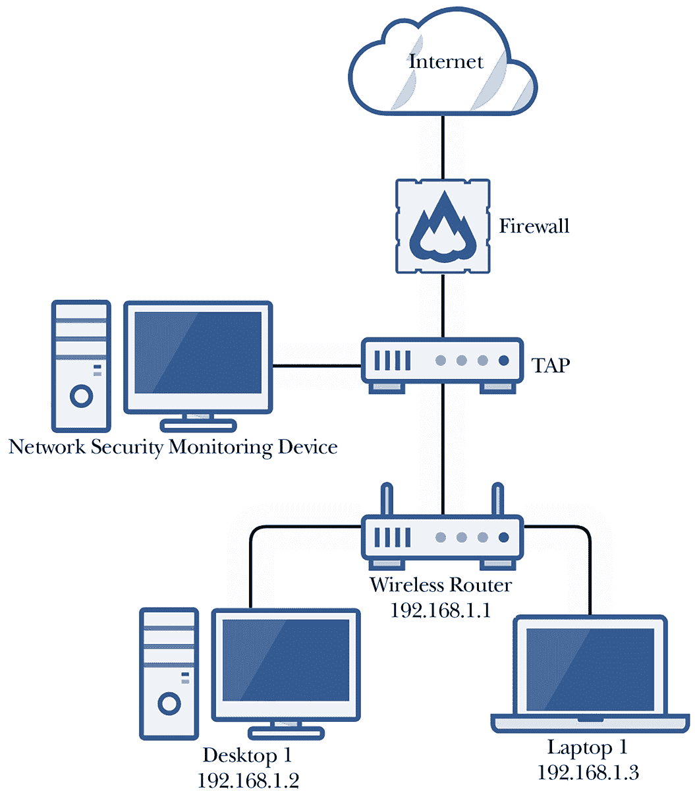
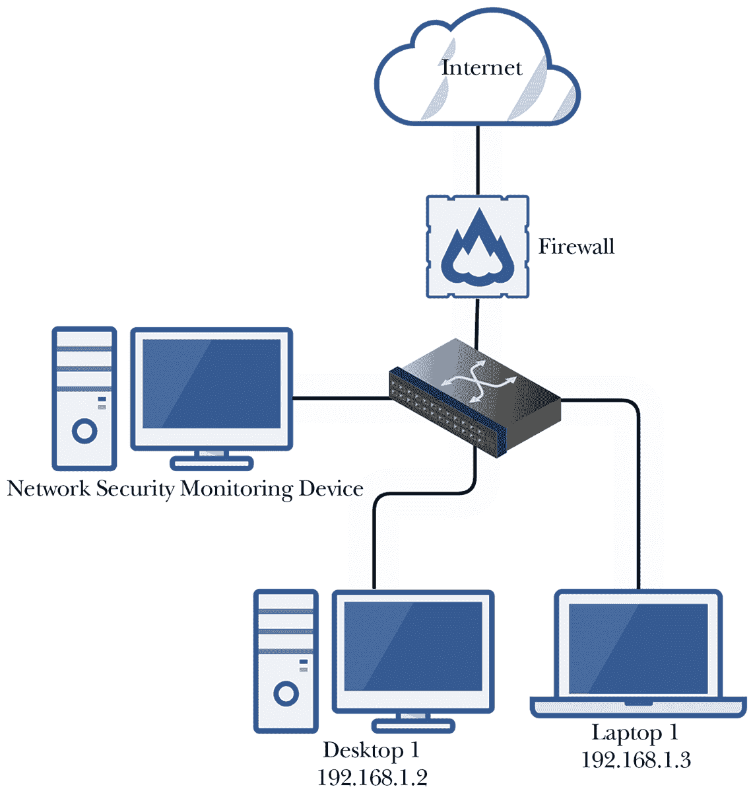
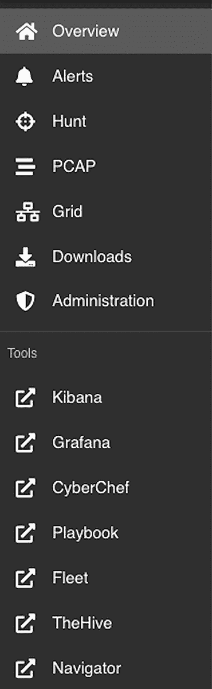
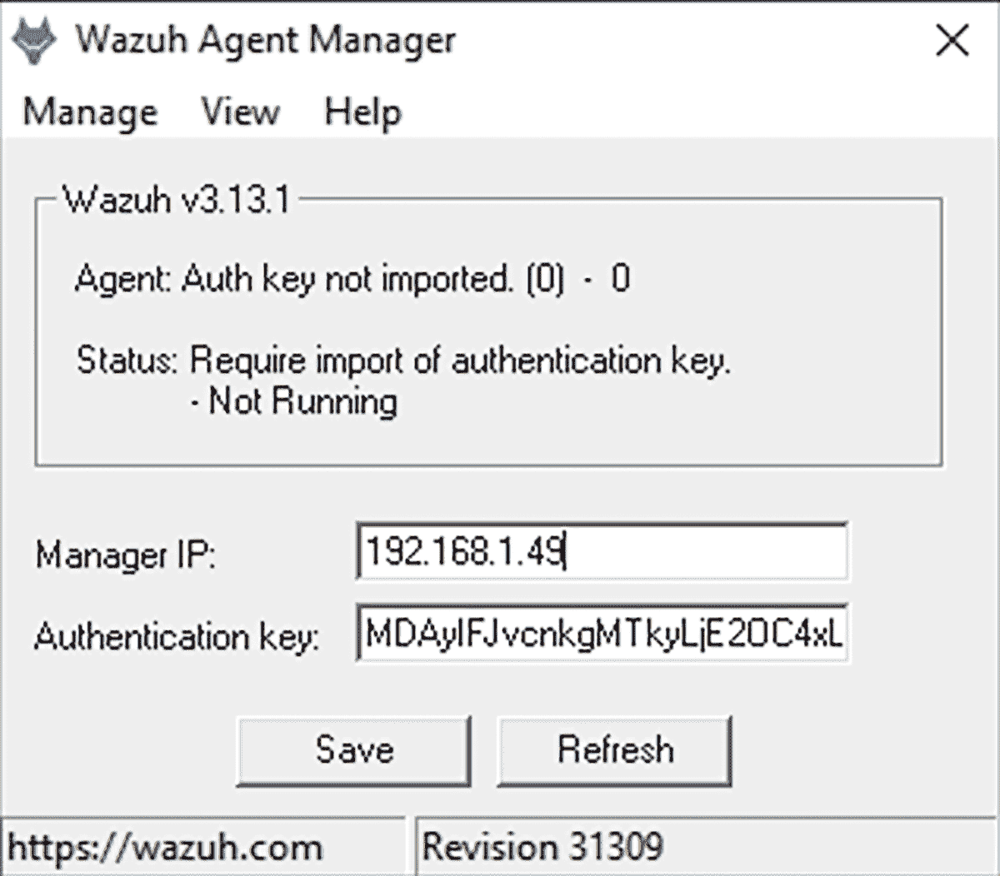
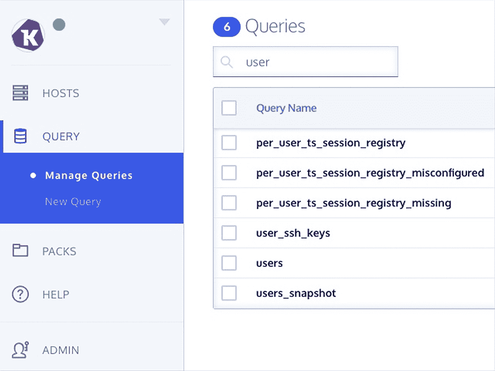
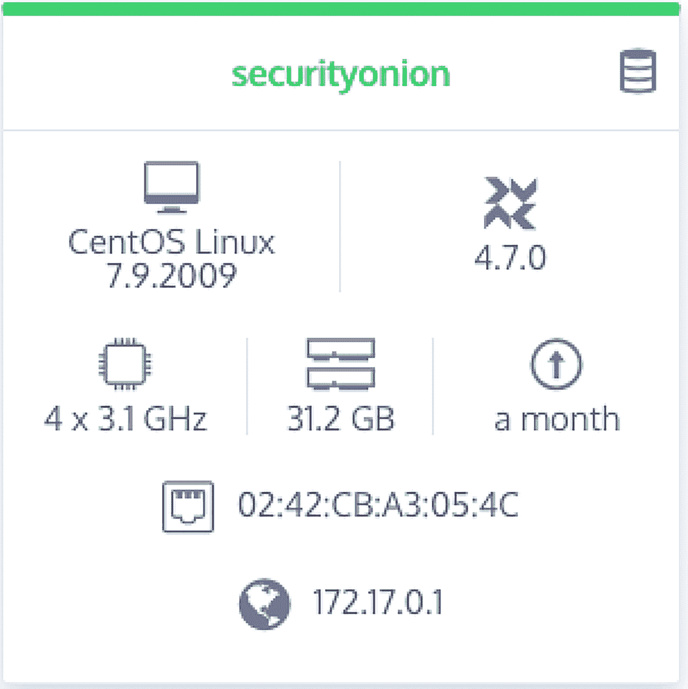
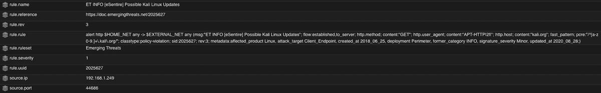

# # 使用检测和报警监控你的网络


网络监控提供了对网络活动的实时可视化，使你能够领先于潜在的威胁，并（理想情况下）在对方进行任何破坏性行为之前将其阻止。监控你的网络是一个巨大的工作，因此警报通常是调查的有用起点。如果没有有意义的警报，网络监控就像是在大海捞针——试图在一个非常大的数据集内识别恶意活动。

你的防火墙、代理、杀毒软件和其他解决方案应该至少运行一个月，确保它们正常工作后，再开始尝试主动监控你的主机和网络流量，确保它们正确运作。到目前为止，一切相对是被动的；设置完成后，除非需要更新或更改配置，否则无需你进一步操作。

由于其本质，主动监控和报警可能需要相当多的时间和精力——不仅仅是实施，还包括维护，尤其是当网络扩展时，这一点尤为明显。你不仅需要定期检查网络监控软件是否已识别出任何威胁或异常行为，还需要调查这些行为，并可能需要采取措施缓解已识别的活动。根据网络的规模，监控它可能需要一个或多个人全职工作。

本章将为你提供必要的知识和工具，以便成功地监控你的网络并提醒你可疑行为。我们将讨论如何、何时以及在哪里在你的网络中实现网络流量接入点（TAP）和交换机端口分析仪（SPAN），以实现网络流量的捕获、监控和分析。最后，我们将使用 Security Onion（一套免费的网络安全监控工具）构建一个网络监控设备，并讨论如何最好地利用其内置功能。

## 网络监控方法

你可以使用几种方法来监控和捕获网络流量，以进行实时或事后分析和报警。你选择的方法主要取决于网络的硬件，因为每个设备的功能不同。我们将在以下章节中讨论两种最常见的方法。

### 网络流量接入点

在没有交换机的小型网络中，你可以安装一个网络*流量接入点（TAP）*来监控通过它的数据。TAP 是一个内联设备，安装在网络中的两个节点之间；它成为现有传输介质（如以太网电缆）的延伸，位于这两个设备之间。在图 10-1 中，TAP 位于防火墙和路由器之间。



图 10-1：网络 TAP 的放置

在这种配置中，所有经过路由器与防火墙之间的流量都将由 TAP 发送到监控设备，并在其中存储以供分析。

在放置 TAP 时，要考虑你实际想要看到和调查的内容。在像图 10-1 中所示的配置中，你将捕获到所有经过终端设备与防火墙之间的流量（即网络的边界）。监控主要的出口点让你调查像*数据外泄*这样的事件，即攻击者试图通过将数据发送到网络外部来窃取你的数据。然而，使用这种配置，你将无法看到终端设备之间的流量，因为这些流量由无线路由器处理，永远不会到达 TAP。

如果你将 TAP 放置在防火墙之后（而不是放在互联网一侧），你将看不到任何来自互联网试图访问被防火墙阻止的内部网络的流量。如果 TAP 放在防火墙前面，你将看不到防火墙阻止的出站流量；安全监控系统也将失去防火墙的保护，成为进入网络的一个容易途径。根据你对这些场景的舒适度来决定 TAP 的放置位置。在大多数情况下，最好将 TAP 放在防火墙之后（网络内部），并查看防火墙日志，找出 TAP 未能看到的流量。

TAP 是一种内联设备。需要注意的是，如果 TAP 无法使用或脱机——如果它的任何网络端口出现故障——整个网络将失去对互联网的访问。你的终端设备仍然应该能够通过路由器相互通信，但流量将不再通过 TAP。

有几款 TAP 设备价格合理。其中最简单的一种是*Dualcomm ETAP*。这种 TAP 的一个可能配置是，将防火墙（如图 10-1 所示）连接到 A 端口，将 B 端口连接到无线路由器，并将一根独立的电缆连接到你的网络安全监控设备的监控端口（在下一节中讨论）。这种配置允许流量像没有 TAP 一样流经网络，只不过它会被网络安全监控系统截取、监控和分析。

### 交换机端口分析仪

网络 TAP 的替代方案是交换机提供的*交换机端口分析（SPAN）*或*镜像端口*（可互换术语）功能。SPAN 与 TAP 的功能相同；它将所有通过源端口的数据镜像（或复制）到交换机上的目标 SPAN 端口。你的网络安全监控系统然后连接到 SPAN 端口，捕获网络流量以进行分析和警报。在大多数现代交换机中，可以创建多个源端口的 SPAN 配置，这样你就可以从交换机上的任何端口捕获数据。

小型网络中的 SPAN 配置可能如下图所示图 10-2，其中防火墙或其他系统为终端提供 IP 地址。每个主机通过以太网连接到交换机的一个端口，然后网络安全监控设备连接到交换机上配置的 SPAN 端口。与 TAP 不同，如果交换机上的端口发生故障，网络的其余部分仍然可以继续运行，但如果交换机因电源故障而完全停机，整个网络将与之一起停机。



图 10-2：带有交换机和 SPAN 端口的小型网络

与 TAP 配置不同，在交换机上设置 SPAN 后，你不仅可以捕获和分析计算机间的流量，还可以捕获进出数据。然而，你仍然会遇到布局问题；当交换机位于防火墙的内部（这应该是这样）时，你的安全监控系统将无法看到被防火墙阻止的流量。

#35: 配置 SPAN 端口

要在受管交换机上配置 SPAN 端口，如我们在第二章中使用的 Netgear 交换机，请按照以下步骤操作：

1.  1\. 使用管理员凭证登录交换机。

1.  2\. 选择**系统▸监控▸镜像**。

1.  3\. 在出现的端口镜像配置表中，点击你希望捕获网络流量的源端口进行选择。已选择的端口会有一个勾选标记。

1.  4\. 在目标端口下拉框中，输入作为 SPAN 端口的端口，用于连接到你的安全监控系统。

1.  5\. 最后，在镜像下拉菜单中，选择**启用▸应用**。

无论你选择设置 TAP 还是带有 SPAN 端口的交换机，都需要一个能够聚合收集数据的网络监控解决方案。目前，适用于小型网络的最佳解决方案是 Security Onion，它包含了用于捕获和聚合网络数据的各种组件，并使你能够快速分析这些数据。

## Security Onion

Security Onion 是一个开源平台，用于威胁狩猎、网络安全监控和日志管理。它是一个操作系统，类似于 Ubuntu，其中包括我们将用来监控网络中安全和配置问题的多个开源工具。

Security Onion 的工具包括 suricata，一个入侵检测系统，以及 zeek，一个用于分析网络流量以识别异常行为的软件框架。Grafana 是一组可视化和仪表板，用于监控 Security Onion 系统的健康状况，osquery 收集关于网络中端点及其运行操作系统的数据进行分析。Wazuh 与 osquery 类似；它是一个基于代理的工具，从端点收集可分析的数据，用于主动端点检测和响应（在发生安全事件时）。最后，Strelka 是一个实时文件扫描工具，分析网络流量并扫描任何经过网络的文件；它有助于识别恶意软件或数据外泄。

在接下来的章节中，我们将讨论如何使用 Security Onion 及其内置工具来创建你的网络安全监控系统。我们将探讨如何利用这些工具开始监控网络，并在问题发生时进行分类和调查。你可以选择购买或自行构建 Security Onion 设备。Security Onion Solutions 提供了预配置的设备，开箱即用。

#36: 构建 Security Onion 系统

要构建一个 Security Onion 系统，你需要一台至少配备两个网络接口的设备：一个管理接口和一个捕获接口（连接到 TAP 或 SPAN）。我们将使用一台 Intel NUC（小型计算单元），它具有两个以太网端口，具有高度的可定制性，并且根据你的预算和需求提供不同的价格选择。以下是 Security Onion 文档中详细列出的最低硬件规格：

+   • 12GB 的 RAM

+   • 四个 CPU 核心

+   • 200GB 的存储空间

+   • 两个网络接口

另一个需要考虑的因素是你需要多少存储空间。作为参考，具有 2TB 内部存储空间的 NUC 可能能够存储约三周的数据，具体取决于你的网络中设备数量、用户数量和网络流量的多少。超过这个时间后，数据将进入滚动周期，旧数据会被删除，以腾出空间存储新数据。为了增强网络中的事件响应能力，保存更多数据会更有利。如果你发现网络中有一个入侵者已经存在了 12 个月，但你只有一个月的数据，那么你将永远无法确定根本原因，这将使得驱逐他们并防止问题再次发生变得困难。

一旦你有了 NUC（或类似设备），就可以开始安装 Security Onion。在这一阶段，最好将计划用于管理的网络端口（*不是*用于捕获网络流量的端口）连接到你的网络，以便设置其配置。无论你使用哪一个网络端口来管理和捕获流量都没有关系。此设备需要一个静态 IP 地址，虽然你可以在设备本身上进行配置，但最好在路由器或负责 IP 地址租用的设备上（如你的无线路由器或 pfSense 设备）配置静态地址。只连接 NUC 上的管理端口（仅此端口）将使得在安装和配置其余软件时更容易识别。完成此过程后，你可以独立配置捕获端口。现在应该配置管理接口的静态 IP 地址，因为我们将安装的某些代理有基于该地址的要求和依赖关系，因此稍后更改它可能会造成一些问题。

### 安装 Security Onion

你可以从 ISO 文件安装 Security Onion（直接从 Security Onion Solutions 网站 [`securityonionsolutions.com/software/`](https://securityonionsolutions.com/software/) 获取），或手动使用 CentOS 7 作为基础操作系统，然后像安装其他 Linux 应用程序一样安装 Security Onion 包（请注意，Security Onion 仅支持 CentOS 7 操作系统）。使用 ISO 文件是创建 Security Onion 系统更简单和快速的方法，而手动安装则需要更多的操作。不过，手动安装可以让你在磁盘分区等方面有更多的控制。如果你对这一点感兴趣，可以选择手动安装方法。如果没有，使用 ISO 文件进行安装即可。

#### 从 ISO 文件安装 Security Onion

首先从 Security Onion Solutions 下载最新的 ISO 文件，并按照第一章中“创建物理 Linux 系统”的步骤，从 ISO 文件创建可启动的 USB 驱动器。将可启动的 USB 驱动器插入你的 NUC，启动 NUC，你将看到 Security Onion 安装向导。按照以下步骤完成安装：

1.  1\. 向导将提示你安装 Security Onion，这将清除所有数据和分区。输入**yes**并按 ENTER 键接受并开始安装过程。

1.  2\. 提示时输入管理员用户名；然后按 ENTER 键。

1.  3\. 为用户输入一个强密码短语；然后按 ENTER 键。

1.  4\. 重复输入密码短语以确认；然后按 ENTER 键开始安装。

1.  一旦安装完成，计算机将重新启动。使用你新创建的凭证登录，Security Onion 设置向导将弹出。按 ENTER 继续。

1.  使用箭头键，选择**安装**以运行标准的 Security Onion 安装；然后按 ENTER。

    在此时，完成 Security Onion 安装的过程在 ISO 文件安装和手动安装两种方式下是相同的。跳转到第 157 页中的“完成 Security Onion 安装”部分。

#### 手动安装 Security Onion

你可以通过在 NUC 上安装 CentOS 7 并在其上安装 Security Onion 的包和工具，完全从零开始安装 Security Onion。为此，按照以下步骤操作：

1.  从[`www.centos.org/`](https://www.centos.org/)下载最新的 CentOS 7 ISO（正确的格式是 x86_64）。

1.  按照第一章中“创建物理 Linux 系统”部分的步骤，从 ISO 文件创建一个可引导的 USB 驱动器。

1.  将可引导的 USB 插入你的 NUC 并从 USB 启动。你将看到几个选项；选择**测试此介质并安装 CentOS 7**。

1.  在此时，将出现图形化安装向导。选择你需要的语言并点击**继续**。

1.  设置正确的时区和键盘布局。

1.  在“软件选择”下，建议选择**带 GUI 的服务器**，以便于管理。

1.  在系统▸安装目标下，选择你计划安装 Security Onion 的内部磁盘，然后选择**我将配置分区**。点击**完成**继续进入分区向导。分区定义了硬盘存储如何在系统的用户和应用程序之间划分。

1.  选择**LVM 分区**并创建以下分区：

    1.  a. */boot*：CentOS 将从此分区启动；此分区应至少有 500MB 的可用空间。

    1.  b. */boot/efi*：启动分区的一部分；应至少为 500MB。

    1.  c. */*：文件系统的根目录；应为 300GB。

    1.  d. */tmp*：用于临时文件；应为 2GB。

    1.  e. swap：用于交换文件；应为 8GB。

    1.  f. */home*：存放所有用户文件的空间；应为 40GB。

    1.  g. */nsm*：存放所有安全工具和捕获的数据；应分配剩余的驱动器空间。

1.  点击**完成▸接受更改**以将更改写入磁盘。

1.  点击**开始安装**以安装操作系统。

1.  在接下来的屏幕上，设置你的 root 密码并创建一个非 root 的管理员账户。如果你想通过 SSH 连接到该系统，确保你的管理员账户具有强密码。

1.  安装完成后，重启计算机并移除安装 USB。然后，启动进入你的 CentOS 操作系统。

1.  接受许可信息。

1.  14\. 你可能需要打开网络卡以启用网络。点击**网络和主机名**，将网络按钮切换为**开启**，然后点击**完成**。

1.  15\. 点击**完成配置**。

安装了 CentOS 后，接下来安装 Security Onion。首先，通过 SSH 连接到服务器或直接登录。将目录切换到在初始设置过程中创建的 */nsm* 分区：

```
$ `cd /nsm`

```

使用 `sudo yum install` 安装 Git（一个软件管理应用），然后使用 `git clone` 下载 Security Onion：

```
$ `sudo yum install git -y`
$ `sudo git clone \`
`      https://github.com/Security-Onion-Solutions/securityonion`

```

（Ubuntu 基于 Debian Linux，并使用 `apt` 工具来管理软件包，而 CentOS 基于 Red Hat Linux，并使用 `yum`。）

导航到新创建的 *securityonion* 目录，并运行设置脚本：

```
$ `cd /nsm/securityonion/`
$ `sudo bash so-setup-network`

```

运行此脚本将启动一个交互式安装向导，指导你完成 Security Onion 服务器的初始设置和配置。

#### 完成 Security Onion 安装

基本的操作系统配置完成后，接下来你将开始安装和配置用于监控和分析网络流量的工具。Zeek 是一个安全监控平台，它能帮助你更高效地分析网络流量，并自动对网络中的可疑活动发出警报。它通过使用包含可疑或恶意活动、软件和网络流量信息的规则集来实现这一点，比如你将在此使用的 ETOPEN 规则集。

无论你是如何安装 Security Onion，都请按照以下步骤完成安装过程：

1.  1\. 按下 ENTER 键继续跳过欢迎界面（并进入后续所有界面）。

1.  2\. 在安装类型页面，使用箭头键导航到 STANDALONE，然后按空格键选择该选项。

1.  3\. 如果你使用的是 Security Onion ISO 镜像，在下一页面选择**标准**，表示此机器可以连接互联网。

1.  4\. 如果你执行了 Security Onion 的手动安装，在下一页面键入**同意**以接受 Elastic 许可证。

1.  5\. 在下一页面，为简便起见，保留默认主机名，或者根据需要更改主机名（在有多台服务器的大型安装中，修改主机名会更有利）。如果系统提示更改主机名，请选择继续。

1.  6\. 在下一页面，输入此计算机的简短描述或留空。

1.  7\. 在网络卡配置页面，如图 10-3 所示，选择带有 *Link UP* 的接口作为管理接口。此时它应该是唯一连接到网络的接口。


图 10-3：网络接口卡设置向导

1.  8\. 按下空格键设置监控接口。

    在管理界面页面，你可能会收到有关使用 DHCP 的提示性错误；只要你已经为该设备配置了静态地址，可以忽略此消息。

1.  9\. 在被询问这台计算机如何连接到互联网时，选择**Direct**。

1.  10\. 在操作系统补丁计划页面选择**Automatic**，以保持操作系统自动更新。

1.  11\. 指定你的家庭网络地址范围，在第一章中可以找到该范围。如果你的网络使用的是 10.0.0.0/8 地址范围，在框中保留该地址并删除其他两个子网。如果你的网络使用的是 192.168.0.0/16 地址范围，保留该地址并删除其他两个，依此类推。

1.  12\. 当被询问安装哪种类型的管理工具时，选择**BASIC**。

1.  13\. 选择**ZEEK**作为生成元数据的工具。

1.  14\. 选择**ETOPEN**作为生成警报的 IDS 规则集。

注意：ETOPEN 是一个开源规则集，会定期更新新出现的威胁和警报。ETPRO 和 TALOS 与 ETOPEN 类似，但它们需要订阅。对于小型网络，ETOPEN 已足够。

1.  15\. 向导会询问你要安装 Security Onion 工具套件中的哪些组件。选择**Osquery**、**Wazuh**和**Strelka**。

1.  16\. 如果被询问是否保留默认的 Docker IP 范围，选择**Yes**。

1.  17\. 输入你的电子邮件地址作为 Security Onion 管理员。

1.  18\. 输入并重新输入你的账户密码。

1.  19\. 在被询问如何访问 Web 界面时，选择**IP**。

1.  20\. 为*soremote*用户账户设置一个强密码（用于执行一些管理操作）。

1.  21\. 选择**BASIC**以使用推荐的设置安装网络安全监控组件。

1.  22\. 输入**2**作为 Zeek 和 Suricata 进程的数量。

    进程的数量决定了系统能够处理的网络流量大小。对于小型网络，两个进程应该足够；如果需要，稍后可以更改此设置。

1.  23\. 如果被询问是否配置 NTP 服务器，选择**Yes**。网络时间协议（NTP）用于保持端点时间同步。最好保持你的监控服务器与时间服务器同步，以防止时间漂移，这可能会导致排查警报时出现问题。浏览[`www.ntppool.org/`](https://www.ntppool.org/)并选择你所在区域的 NTP 服务器，保持 Security Onion 服务器时间同步。

1.  24\. 在被询问时选择**NODEBASIC**。

1.  25\. 按下 ENTER 键运行**so-allow**，在系统提示时正确配置防火墙，允许访问所有正在安装的工具。

当被询问是否允许某个 IP 地址访问你的网络监控系统时，你可以选择只允许单个计算机或设备访问 Security Onion Web 界面，或者允许网络中的任何主机访问。出于安全考虑，你只允许单个 IP 地址访问。

1.  26\. 输入你计划使用的 IP 地址；然后按 ENTER 键。

1.  27. 最后，通过按 TAB 选择**Yes**，然后按 ENTER 完成设置向导并提交更改，以接受你刚刚创建的配置。

注意，Security Onion 和其一些工具（如 Zeek）可以在集群配置中运行，其中代理安装在多个系统上以增强数据收集和处理能力。在小型网络中，单独的系统已足够。在拥有多个网络段和交换机的大型网络中，集群配置可能更为合理。

安装结束时，屏幕将显示访问 Security Onion Web 界面的 URL；请记下这个网址（应该是*http://<your_server_ip>/*）。系统将重启。重启后，你可以通过该 URL 使用之前输入的电子邮件地址和密码进行登录。为了测试 Security Onion 的配置，运行以下命令：

```
$ `sudo so-status`

```

该命令列出了 Security Onion 正在运行的工具及其状态，如果一切正常，状态应显示为 `OK`。

如果有任何服务未启动，稍等几分钟后再次运行状态命令。如果它们仍然无法启动，可以尝试使用以下命令手动启动服务：

```
$ `sudo so-servicename-stop`
$ `sudo so-servicename-start`
$ `sudo so-servicename-restart`

```

如果你仍然无法启动服务，请重启计算机。如果一切方法都失败，重新安装 Security Onion。

一旦能够访问 Security Onion 控制台，你将看到左侧菜单列出了你可以使用的所有工具（请参见图 10-4）。



图 10-4：Security Onion 工具

此时，点击**Kibana**，浏览器将打开一个新标签页。由于你尚未在设备上连接捕获端口，应该会看到极少的记录。

将此端口连接到之前配置的 SPAN 或 TAP。完成后，几分钟后刷新页面，查看 Kibana 是否已显示新获取的数据。

#37: 安装 Wazuh

Security Onion 的附加工具帮助你理解网络中的情况，并采取行动进行调查、缓解和修复问题。其中一个工具包是 Wazuh。

Wazuh 是一个开源的*端点检测和响应（EDR）*平台，用于监控终端设备的恶意活动，在 Security Onion 控制台中提醒你，并提供阻止网络流量、停止恶意进程以及隔离恶意文件的响应能力。

使用像 Wazuh 这样的代理可能会引起争议。在大型网络中，通常由于网络上活动繁多，尤其是跨所有系统添加新内容可能导致稳定性问题，或者在带宽等有限资源方面产生/加剧挑战。对于小型网络来说，这通常不是问题，因为容量不会在那么多设备、用户或进程之间共享，而且通常没有那么多的解决方案争夺资源。

安装 Wazuh 不会对您小型网络的日常操作产生重大影响。相反，您从额外的监控和安全提升中获得的价值，远远超过使用多个代理可能带来的任何负面后果。最终，是否在您网络中的一个、部分或所有终端上安装这些代理由您决定。覆盖和网络监控越完整，您的网络安全性可能就越高。

本节提供了在 Windows、macOS 和 Linux 上安装 Wazuh 代理的说明。

### 在 Windows 上安装 Wazuh

要在您的 Windows 终端上安装 Wazuh 代理，请按照以下步骤操作：

1.  1\. 登录到您的 Security Onion 控制台，并在左侧菜单中点击**下载**。

1.  2\. 点击**MSI** 安装程序代理选项以下载正确的安装程序；然后运行下载的可执行文件。

1.  3\. 接受许可协议并点击**安装**。

1.  4\. 安装完成后，勾选**运行代理配置界面**复选框，然后点击**完成**。

1.  5\. 要将此新系统添加到您的 Security Onion 中，请通过 SSH 登录到 Security Onion 并运行 `manage_agents` 脚本。按照提示操作，按 `A` 添加代理，按 `L` 列出代理以确认添加是否成功，按 `E` 提取新代理的认证密钥：

    ```
    $ `sudo docker exec -it so-wazuh /var/ossec/bin/manage_agents`
    `--snip--`
    Choose your action: A,E,L,R or Q: `A`
    - Adding a new agent (use '\q' to return to the main menu).
      Please provide the following:
     ❶ * A name for the new agent: `Test`
       * The IP Address of the new agent: `192.168.1.50`
    Confirm adding it?(y/n): `y`
    Agent added with ID 002.
    `--snip--`
    Choose your action: A,E,L,R or Q: `L`
    Available agents:
       ID: 001, Name: securityonion, IP: 192.168.1.49
     ❷ ID: 002, Name: Test, IP: 192.168.1.50
    ** Press ENTER to return to the main menu.
    `--snip--`
    Choose your action: A,E,L,R or Q: `E`
    Available agents:
       ID: 001, Name: securityonion, IP: 192.168.1.49
       ID: 002, Name: Test, IP: 192.168.1.50
    Provide the ID of the agent to extract the key (or '\q' to quit): `002`
    Agent key information for '002' is:
    ❸ MDAyIFJvcnkgMTkyLjE2OC4xL . . .
    ** Press ENTER to return to the main menu.
    `--snip--`
    Choose your action: A,E,L,R or Q: `Q`
    manage_agents: Exiting.

    ```

    添加代理时，您需要提供名称和 IP 地址 ❶。名称使用正在添加的计算机的主机名。运行 `hostname` 命令以查找名称：

    ```
    $ `hostname`
    Test

    ```

    查找您的 IP 地址（参见项目 8 中的第一章）或查阅您维护的资产列表或网络图。列出代理时，确认是否存在该名称和 IP 地址的代理 ❷。使用代理的 ID 号码获取其认证密钥 ❸。按回车键返回主菜单，并使用 `Q` 选项退出。

1.  6\. 在您的 Windows 计算机上打开**Wazuh 代理管理器**（参见图 10-5），输入您的 Security Onion 系统的 IP 地址和代理认证密钥，然后点击**保存**。

    

    图 10-5：Wazuh 代理配置

1.  点击**管理▸启动**以启动代理。

1.  每次你添加代理或对 Security Onion 或与其通信的系统进行更改时，运行`so-allow`脚本以启用设备之间的通信（否则，Security Onion 上的主机防火墙将会阻止它）。你应该在终端中进行此操作，登录到通过 SSH 访问的 Security Onion 系统：

    ```
    $ `sudo so-allow`

    ```

1.  当系统提示时，输入`w`以添加一个 Wazuh 代理的防火墙规则；然后输入代理的 IP 地址。

Wazuh 现在将管理这台 PC。对于网络中你希望以这种方式管理的所有其他设备（如计算机、笔记本、虚拟机等），重复此过程。系统事件日志将开始显示在你的 Kibana 仪表盘中，因此预计会看到新的数据和警报出现在 Security Onion 中。

### 在 macOS 上安装 Wazuh

要在你的 macOS 端点上安装 Wazuh 代理，请按照以下步骤操作：

1.  登录到你的 Security Onion 控制台，点击**下载**，并下载 macOS 包。

1.  运行安装向导在你的 Mac 上进行安装。

1.  一旦完成，登录到你的 Security Onion 系统并运行`sudo so-allow`，允许你的 Mac 通过防火墙访问（此操作必须在代理注册之前完成，否则代理无法连接到管理服务器）。

1.  按照提示，选择 Wazuh 注册服务，输入`r`并输入你的端点的 IP 地址。

1.  现在，将代理注册到 Security Onion 服务器：

    ```
    $ `sudo /Library/Ossec/bin/agent-auth -m` `security_onion_IP`

    ```

接下来，你需要将 Security Onion 的 IP 地址添加到 Mac 上的代理配置文件中，这样代理才能与 Security Onion 服务器进行通信。

1.  打开*/Library/Ossec/etc/ossec.conf* 文件并使用文本编辑器进行编辑。

1.  找到以下行并将`MANAGER_IP`更改为你的 Security Onion 服务器的 IP 地址：

    ```
    <client>
      <server>
        <address>`MANAGER_IP`</address>

    ```

1.  重启 Wazuh 代理：

    ```
    $ `sudo /Library/Ossec/bin/ossec-control restart`

    ```

1.  确认代理已成功配置，可以通过在 Security Onion 服务器上列出代理来验证；运行*manage_agents*脚本并在提示时输入`L`来进行操作：

    ```
    $ `sudo docker exec -it so-wazuh /var/ossec/bin/manage_agents`
    `--snip--`
    Choose your action: A,E,L,R or Q: `L`
    Available agents:
       ID: 001, Name: securityonion, IP: 192.168.1.49
       ID: 002, Name: Computer1, IP: 192.168.1.50
       ID: 003, Name: MacBook-Pro.local, IP: 192.168.1.51
    ** Press ENTER to return to the main menu.
    `--snip--`
    Choose your action: A,E,L,R or Q: `Q`
    manage_agents: Exiting.

    ```

如果你看到 Mac 的主机名和 IP 地址，说明代理已处于活动状态。按回车键返回主菜单，使用`Q`选项退出。

### 在 Linux 上安装 Wazuh

要在你的 Linux 端点上安装 Wazuh 代理，请按照以下步骤操作：

1.  登录到你的 Security Onion 控制台，点击**下载**，并下载相关包。对于 Ubuntu，应该是 DEB 包（对于 CentOS 和 Fedora，则是 RPM 包）。

    你可以直接从你的 Ubuntu 系统下载包，或者你可以将包下载到 Windows 或 Mac 计算机并将其传输到 Ubuntu 系统：

    ```
    $ `rsync -ruhP wazuh-agent.deb` `user@linux_ip``:/home/``user`

    ```

    从包文件（如*.deb*文件）直接安装包时，使用 dpkg 工具，而不是 APT 包管理器（dpkg 是 Debian 包管理器，使用方式与 APT 类似）。

1.  要安装 Wazuh 代理，运行以下命令：

    ```
    $ `sudo dpkg -i wazuh-agent_``3.13.1-1``_amd64.deb`

    ```

    你的包版本号可能不同。

1.  接下来，通过 SSH 登录到你的 Security Onion 系统，并运行`sudo so-allow`以允许你的 Linux 系统通过防火墙访问。

1.  按照提示，选择 Wazuh 注册服务并输入你端点的 IP 地址，使用`r`键。

1.  注册 Linux 代理并将其连接到 Wazuh 管理服务器（即 Security Onion 服务器）：

    ```
    $ `sudo /var/ossec/bin/agent-auth -m` `security_onion_IP`

    ```

1.  然后，修改你 Linux 系统上的配置文件，允许它与管理服务器进行通信，方法是将 *ossec.conf* 文件中的`MANAGER_IP`占位符更改为 Security Onion 服务器的 IP 地址：

    ```
    $ `sudo nano /var/ossec/etc/ossec.conf`
    `--snip--`
    <client>
      <server>
        <address>`security_onion_IP`</address>
    `--snip--`

    ```

1.  重启 Wazuh 代理以开始将数据发送到 Security Onion，使用以下命令：

    ```
    $ `sudo systemctl restart wazuh-agent`

    ```

1.  最后，通过列出 Security Onion 服务器上的代理来确认代理是否已成功配置；运行`manage_agents`脚本并在提示时输入`L`来执行操作：

    ```
    $ `sudo docker exec -it so-wazuh /var/ossec/bin/manage_agents`
    `--snip--`
    Choose your action: A,E,L,R or Q: `L`
    Available agents:
       ID: 001, Name: securityonion, IP: 192.168.1.49
       ID: 002, Name: Computer1, IP: 192.168.1.50
       ID: 003, Name: MacBook-Pro.local, IP: 192.168.1.51
       ID: 004, Name: Linux1, IP: 192.168.1.52
    ** Press ENTER to return to the main menu.
    `--snip--`
    Choose your action: A,E,L,R or Q: `Q`
    manage_agents: Exiting.

    ```

1.  如果你看到 Linux 计算机的主机名和 IP 地址，代理应该是激活状态。按 ENTER 返回主菜单，然后输入`Q`退出。

现在，你可以使用 Wazuh 管理网络中所有类型的计算机。

#38: 安装 osquery

osquery 提供了更强的网络可见性。它收集端点数据，如操作系统详情、已安装的软件、命令行历史记录以及正在运行的进程详情；然后你可以查询这些数据，识别可疑活动或未遵循安全策略或配置的设备。与 Wazuh 配合使用时，这些工具为你的网络中的系统提供了详细的视图，展示每个系统正在做什么，合法的还是非法的。一旦安装完成，osquery 使用一个名为 Fleet 的用户界面来显示和管理你监控的端点的详细信息。

### 在 Windows 上安装 osquery

要在你的 Windows 端点上安装 osquery 代理，请按照以下步骤操作：

1.  登录到你的 Security Onion 控制台，点击**下载**，并下载适用于 Windows 的 osquery 包（MSI 文件）。

1.  在 Windows 系统上执行此文件并完成安装向导。

    一旦 osquery 安装完成，它将处于后台运行，不会显示用户界面。

1.  接下来，通过 SSH 登录到你的 Security Onion 系统，并运行`sudo so-allow`以允许你的计算机和 osquery 通过防火墙访问。按提示输入`o`（代表 osquery）和你的 Windows 系统的 IP 地址。

1.  要查看和管理使用 osquery 的系统，登录到你的 Security Onion 控制台。在左侧菜单中，点击**Fleet**链接以打开 Fleet 管理仪表盘。

当你在端点上安装 osquery，并且运行`so-allow`来启用 osquery 代理与 Security Onion 服务器之间的通信时，你的管理主机应该会以卡片形式出现在此处；通信开始可能需要几分钟时间。

### 在 macOS 上安装 osquery

要在您的 macOS 终端上安装 osquery 代理，请按照以下步骤操作：

1.  1\. 登录到您的 Security Onion 控制台，点击 **下载**，并下载适用于 Mac 的 osquery 包（PKG 文件）。

1.  2\. 在您的 Security Onion 服务器上运行 `sudo so-allow`，并将您的 Mac 添加到 osquery 允许的代理列表中。提示时输入 `o`（代表 osquery）和您的 Mac 的 IP 地址。

1.  3\. 执行您下载的文件，并在您的 Mac 上完成安装向导。

1.  4\. 登录到 Fleet Manager Dashboard，点击 **添加新主机** 来查找您的 Fleet Secret。

1.  5\. 使用任何文本编辑器，将您的 Fleet Secret 添加到 */etc/so-launcher/secret* 文件中。

1.  6\. 更新 */etc/so-launcher/launcher.flags*，使主机名值为 `security_onion_IP``:8090`，根目录值为 `/var/so-launcher/``security_onion_IP``-8090`：

    ```
    autoupdate
    hostname 192.168.1.200:8090
    root_directory /var/so-launcher/192.168.1.200-8090
    osqueryd_path /usr/local/so-launcher/bin/osqueryd
    enroll_secret_path /etc/so-launcher/secret
    update_channel stable
    root_pem /etc/so-launcher/roots.pem

    ```

1.  7\. 将 Security Onion 服务器上 */etc/ssl/certs/intca.crt* 文件的内容复制到 Mac 上的 */etc/so-launcher/roots.pem* 文件中。

几分钟后，您的 Mac 应该会作为一张新卡片出现在 Fleet Manager Dashboard 中。

### 在 Linux 上安装 osquery

要在您的 Linux 终端上安装 osquery 代理，请按照以下步骤操作：

1.  1\. 登录到您的 Security Onion 控制台，点击 **下载**，并下载适用于 Linux 的 osquery 包（Ubuntu 的 DEB 文件，CentOS 的 RPM 文件，等等）。

1.  2\. 在您的 Security Onion 服务器上运行 `sudo so-allow`，将您的 Linux 系统添加到 osquery 允许的代理列表中。提示时输入 `o`（代表 osquery）和您的 Linux 系统的 IP 地址。

1.  3\. 在您的 Linux 系统上安装下载的文件；以下是使用 dpkg 在 Ubuntu 上安装的示例：

    ```
    $ `sudo dpkg -i deb-launcher.deb`

    ```

您的 Linux 系统应该会自动显示为 Fleet Manager 仪表板中的一张新卡片。

## 网络安全监控速成课程

现在，您已经安装了必要的硬件和软件来监控您的网络是否存在可疑和恶意活动。您需要能够识别问题，发生事件时作出响应，并保持网络、用户和数据的安全。在本节中，我们将介绍如何配置并使用 osquery、Wazuh 和 Security Onion 警报仪表板的基本知识。

### 使用 osquery

如果您熟悉 *关系型数据库* 和 *结构化查询语言（SQL）*，那么使用 osquery 对您来说会相对容易。如果不熟悉，下面是一些基础知识。您可以在 Fleet Manager Dashboard 中查看 osquery 管理的网络中设备的所有数据。要进入仪表板，请登录到您的 Security Onion 控制台，网址为 *https://<security_onion_IP>/*，并在左侧管理员菜单中点击 **Fleet**。

数据存储在一系列*数据表*中，每个表包含两个或更多列（也称为*元组*），其中包含诸如主机名、IP 地址、MAC 地址、运行时间、最后关机时间等信息，每一行都代表一个特定实体，如计算机或笔记本电脑，或更为具体的内容，如设备上的特定用户账户。例如，*users*表类似于表 10-1。

| 表 10-1：osquery 用户表 |
| --- |
| UID | GID | UID_Signed | GID_Signed | 用户名 | 描述 |
| --- | --- | --- | --- | --- | --- |
| 0 | 0 | 0 | 0 | testuser | 一个测试用户账户 |

用户名列的第一行数据涉及设备上的*testuser*账户。每个表都与数据库中其他一个或多个表有关（数据库中有超过 200 个表）。这些表及其关系使你能够执行关于每个管理设备的详细信息和状态的强大查询。

我们可以使用一种叫做 SQL 的查询语言来对这些数据提问，它是一种用于访问和操作数据库的高级语言。一个 SQL 查询如下所示：

```
`SELECT c1,c2 FROM tablename`

```

在这个查询中，大写的命令 `SELECT` 和 `FROM` 表示你要执行的操作——在这种情况下，要求从名为 `tablename` 的表中提取第 1 列和第 2 列的数据，分别由 `c1` 和 `c2` 参数表示。

实际上，这个查询的格式如下：

```
`SELECT username FROM users`
`SELECT * FROM users`

```

第一个命令返回（显示给运行查询的用户）`users` 表中存在的所有用户名，而不包括其他列。第二个命令返回 `users` 表中的所有列和所有行（`*`）。

注意：有多种 SQL 命令可用于以不同方式检索数据；详情请参见 SQL 备忘单 [`www.sqltutorial.org/sql-cheat-sheet/`](https://www.sqltutorial.org/sql-cheat-sheet/)。也可以查看 [`osquery.io/`](https://osquery.io/) 上的 osquery 文档，了解所有可用表及其数据的列表。

Fleet 在你的 Fleet 控制面板中存储了大量查询。点击页面左侧的**查询**菜单（见图 10-6）。



图 10-6：Fleet Manager 中存储的 SQL 查询

在此菜单中，您可以滚动浏览可用的查询，或使用页面顶部的搜索栏搜索特定的查询。找到您想要执行的查询后，点击选择它，然后点击右侧的**编辑/运行查询**按钮。在执行查询之前，您需要选择要查询的设备。选择目标设备后，再点击**运行**。查询完成后，Fleet 会在屏幕底部显示查询结果；您可以使用提供的列过滤器对结果进行筛选。

运行哪些查询由您决定，取决于您的网络中最关注的问题或不合规的示例。然而，以下是一些不错的起点：

`users` 用于识别应该存在或不应该存在于特定终端上的用户帐户

`browser_plugins` 显示设备上的所有浏览器插件；如果用户安装了潜在恶意的浏览器插件，这个功能会很有用

`chrome_extension` 如前所述，专门查找 Chrome 插件

`crontab` 标识在 Linux 系统上执行可疑或恶意活动的计划任务

`disk_free_space_pct` 标识磁盘空间不足的设备

`installed_applications` 标识设备上安装的恶意或潜在不必要的应用程序

Fleet 中的主机仪表板以卡片形式显示每个管理设备的详细信息（见图 10-7）。



图 10-7: Fleet 主机仪表板视图

在这里，您可以查看此主机的主机名、操作系统、osquery 版本、处理器详情、内存大小、运行时间、MAC 地址和 IP 地址。点击右上角的蓝色查询按钮（堆叠的圆柱体图标）可以轻松查询此设备。

花些时间熟悉可用的查询，并进行在线研究，寻找其他潜在有用的查询。尝试查看一些已保存的查询，并编辑或复制它们，以获得您需要的查询。

### 使用 Wazuh

我们在项目 35 中安装了 Wazuh 代理，并将在本节中进行配置。Wazuh 允许我们查看 Security Onion 中的日志和警报，我们将在下一节中进行探讨。

主要的 Wazuh 配置文件位于 Security Onion 系统的*/opt/so/conf/wazuh/ossec.conf*路径下。此配置文件的每个部分是独立的，并且通过如下的行来标识：

```
<!-- Files/directories to ignore -->

```

您可以修改此文件中的设置以改变 Wazuh 的行为，例如，如果 Wazuh 因为错误的正向检测而阻止您执行某些无害的操作，可以进行调整。请检查此文件以了解 Wazuh 监控的类型。

以下片段显示的部分指定了包含已知或预计为恶意的文件列表的文件，这些文件是基于识别出的对手行为，并接着是预计包含木马（病毒的一种）的文件，以及需要审计的各种漏洞文件和文件夹：

`--snip--`

<rootkit_files>/var/ossec/etc/shared/rootkit_files.txt</rootkit_files>

<rootkit_trojans>/var/ossec/etc/shared/rootkit_trojans.txt</rootkit_trojans>

<system_audit>/var/ossec/etc/shared/system_audit_rcl.txt</system_audit>

<system_audit>/var/ossec/etc/shared/system_audit_ssh.txt</system_audit>

<system_audit>/var/ossec/etc/shared/cis_rhel7_linux_rcl.txt</system_audit>

`--snip--`

这些文件中的每一个都包含 Wazuh 将监控的内容。如果代理在设备上检测到与 *rootkit_files.txt* 文件中的行为或设置匹配的文件或配置，它将采取行动修复该威胁。如果你不希望它采取该行动，可以删除或注释掉配置文件中的该行，使用 `#`。

当你更新 Wazuh，作为你持续更新和修补 Security Onion 及其他系统的一部分时，配置文件如 *rootkit_files.txt* 也可能会收到更新。这确保了随着新威胁的识别和妥协指标的公开发布，你的网络保持受到保护。为了避免丢失你对这些文件所做的任何更改，考虑创建新的自定义配置文件（例如 *my_custom_trojans.txt*）并在 *ossec.conf* 文件中添加对该文件的引用，如下所示：

`--snip--`

<rootkit_files>/var/ossec/etc/shared/rootkit_files.txt</rootkit_files>

<rootkit_trojans>/var/ossec/etc/shared/rootkit_trojans.txt</rootkit_trojans>

<rootkit_trojans>/var/ossec/etc/shared/my_custom_trojans.txt</rootkit_trojans>

`--snip--`

将文件添加到 *ossec.conf* 文件中，将导致 Wazuh 参考这些文件进行配置和设置，除此之外，它还会参考默认的配置文件。使用自定义文件是添加你可能拥有的自定义配置的好方法。

如果你希望 Wazuh 忽略已安装的端点上的某个目录或多个目录，可以在相关部分添加该信息。你还可以告诉代理忽略特定文件或文件类型，排除某些设备的主动响应（如果你希望代理永远不阻止可能影响网络的特定设备的活动），并设置其他各种选项。熟悉这些配置文件，以便根据你的环境进行定制。

### 将 Security Onion 作为 SIEM 工具使用

除了提供其他有用功能外，Security Onion 还充当*安全信息和事件管理（SIEM）*工具。市场上有几种 SIEM 可供选择，包括 Splunk、SolarWinds 和 ManageEngine，所有这些都是商业解决方案，并且价格非常昂贵。而 Security Onion 则是开源且免费的。

SIEM（安全信息和事件管理系统）旨在从网络中的设备汇总数据，并充当日志和其他数据的中央存储库。实现像 Security Onion 这样的 SIEM 可以将日志集中管理，使得攻击者更难通过删除单一系统中的日志来掩盖自己的踪迹。它还使你可以在一个位置查询日志和其他系统数据，这样你就不必逐一检查每个系统或设备，从而简化了过程。然后，Security Onion 分析这些数据，并警告你可能的恶意活动。图 10-8 显示了通过登录 Security Onion 控制台并点击左侧菜单中的 Alerts 选项找到的警报列表。


图 10-8：Security Onion 警报

当你点击一个警报时，会显示一个上下文菜单，提供过滤选项；你可以包含、排除、仅显示或按你选择的警报分组。你还可以深入查看某个警报，显示你过滤的时间范围内该警报的每个实例。通过展开这些警报中的任何一个，你可以查看所有信息，包括元数据（见图 10-9），如警报的时间戳、网络流量的源 IP 和目标 IP 地址、与警报相关的完整消息、导致规则或警报触发的实际解码网络数据、规则本身，通常还有一个参考，帮助你了解更多关于该警报的信息，包括潜在的修复步骤或其他解决方案。



图 10-9：Security Onion 警报元数据

实际上，警报仪表板将显示许多不同类别和类型的活动；你几乎总是会看到需要进一步调查的警报。让我们讨论几个警报，帮助你入门。

| 表 10-2：环境中可能存在的不需要的软件示例 |
| --- |
| 规则名称 | 事件模块 | 严重性 |
| --- | --- | --- |
| ET INFO [eSentire] 可能的 Kali Linux 更新 | suricata | 高 |
| ET USER_AGENTS Steam HTTP Client User-Agent | suricata | 高 |
| ET POLICY curl User-Agent 出站 | suricata | 中 |
| ET POLICY [Dropbox.com](http://www.Dropbox.com) 使用的外部文件备份 | suricata | 高 |
| ET SCAN 观察到的可能的 Nmap User-Agent | suricata | 高 |
| ET TFTP 出站 TFTP 读取请求 | suricata | 高 |
| ET P2P eMule KAD 网络连接请求 | suricata | 高 |

表 10-2 展示了几个可能存在漏洞、可能导致或用于恶意活动，或本不该在你的网络中的软件示例。例如，Kali Linux 通常用于渗透测试，但攻击者也可以用它来入侵你的网络。如果你收到这个警报，调查它，识别责任系统，并将其从网络中移除。Security Onion 提供了你需要的所有信息来完成此操作。你可以选择拿到警报中的源 IP 地址并添加防火墙规则（在你的主机以及边界防火墙上）来阻止与该地址的所有进出流量，这是一种缓解策略的示例。

查看表 10-2 中的其他警报，已经识别出一些软件，可能不允许在网络中使用或不必要。Steam 是一个游戏客户端。Curl 是一个用于从服务器传输数据的工具，也可以用来从网络中提取数据或下载恶意软件。Dropbox 是一个云存储解决方案，同样可以用来提取或窃取数据。Nmap 是一个网络映射工具，攻击者可以用它来识别潜在的目标和网络中的漏洞。简单文件传输协议（TFPT）是一个用于传输文件的易受攻击的协议，而 eMule 是一个通常用于文件共享的点对点应用程序。

通常来说，如果你不使用某个工具或应用程序，你应该卸载或以其他方式移除它，以防止攻击者利用它，进而增强网络的安全性。例如，如果你不使用 curl，追踪负责此警报的客户端，使用主机名、源和目标 IP 地址，或警报中的其他元数据，卸载或移除该有问题的软件。如果你使用 Dropbox，可以安全地忽略此警报。否则，请调查并将其从你的网络中移除。对所有与软件相关的警报都要执行此操作。

然后，使用相同的过程调查和修复所有与潜在恶意软件活动相关的警报；表 10-3 展示了一个示例。深入分析每个警报，识别与警报相关的设备，查看与警报背后的规则相关的参考，找出并解决根本原因。如果遇到困难，互联网搜索通常是解决很多问题的最佳工具。

| 表 10-3：Security Onion 中可能的恶意软件警报 |
| --- |
| 规则名称 | 事件模块 | 严重性 |
| --- | --- | --- |
| ET JA3 Hash - [Abuse.ch] 可能的广告软件 | suricata | 低 |
| ET JA3 Hash - 可能的恶意软件 - Neutrino | suricata | 低 |
| ET INFO 打包可执行文件下载 | suricata | 低 |
| ET INFO EXE IsDebuggerPresent（用于恶意软件反调试） | suricata | 低 |
| ET EXPLOIT 可能的 OpenSSL HeartBleed 大心跳响应（客户端初始化漏洞 服务器） | suricata | 中 |
| ET EXPLOIT 可能的 OpenSSL HeartBleed 大心跳响应（服务器初始化漏洞 客户端） | suricata | 中 |

其他值得关注的警报是与账户登录或注销操作以及权限提升相关的警报，例如成功执行的 sudo 提升为 ROOT，如表 10-4 所示。

| 表 10-4：Security Onion 中的成功与失败登录警报 |
| --- |
| 规则名称 | 事件模块 | 严重性 |
| --- | --- | --- |
| Windows 登录成功 | windows_eventlog | 低 |
| PAM: 登录会话已关闭。 | ossec | 低 |
| PAM: 登录会话已打开。 | ossec | 低 |
| 成功执行 sudo 提升为 ROOT。 | ossec | 低 |
| 登录失败 - 未知用户或密码错误 | windows_eventlog | 低 |

虽然成功的登录尝试会提醒您某些账户可能已被入侵，但失败的登录尝试则可能提醒您有攻击者试图入侵。无论是哪种情况，都需要调查这些警报，以确定其是否为合法活动。例如，如果您看到某个账户在 Linux 系统上提升到 root 权限，请确认是您还是网络中的其他受信用户。如果不是您或网络中的其他管理员，则应更改密码，并调查同一时间段内发生的任何相关活动。

## 总结

Security Onion 的警报为您提供了识别和追踪可疑活动的起点；在保护您的网络时，利用这些警报。使用您手头的所有工具，因为您可以确定对手也在使用相同的工具。仅仅通过增加网络活动的可见性，就可以更好地保护您的网络。借助本章中描述的说明和工具，您很快就会发现大量潜在的活动需要调查和修复。预计这项调查活动将是持续进行的，并尽量跟上 Security Onion 中的警报，随着您的网络不断发展和演变。
