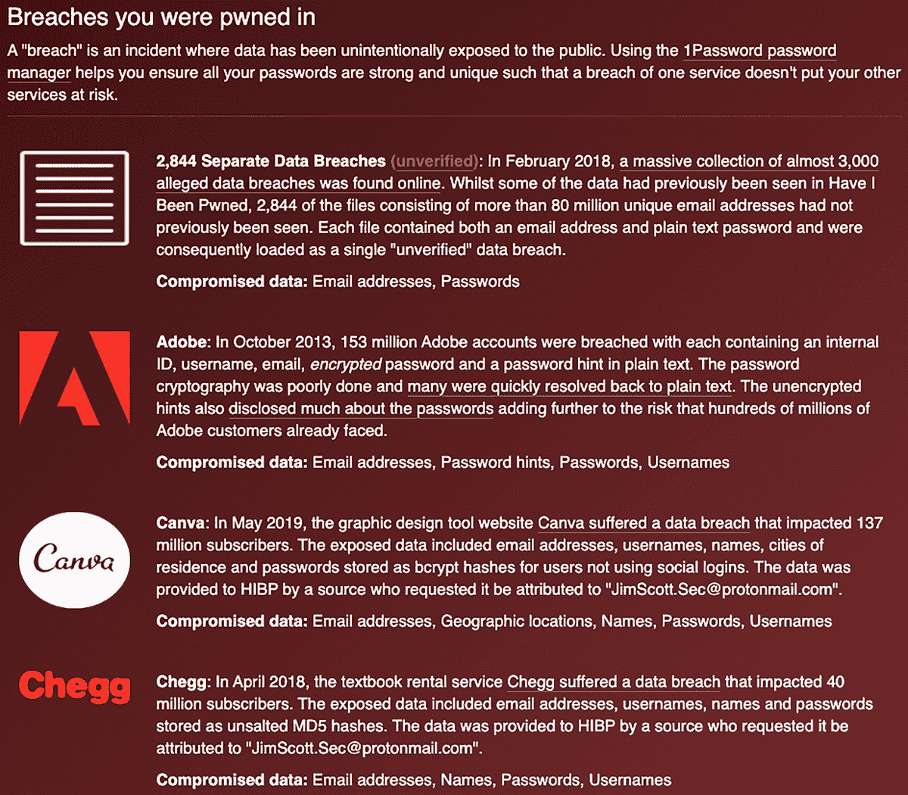
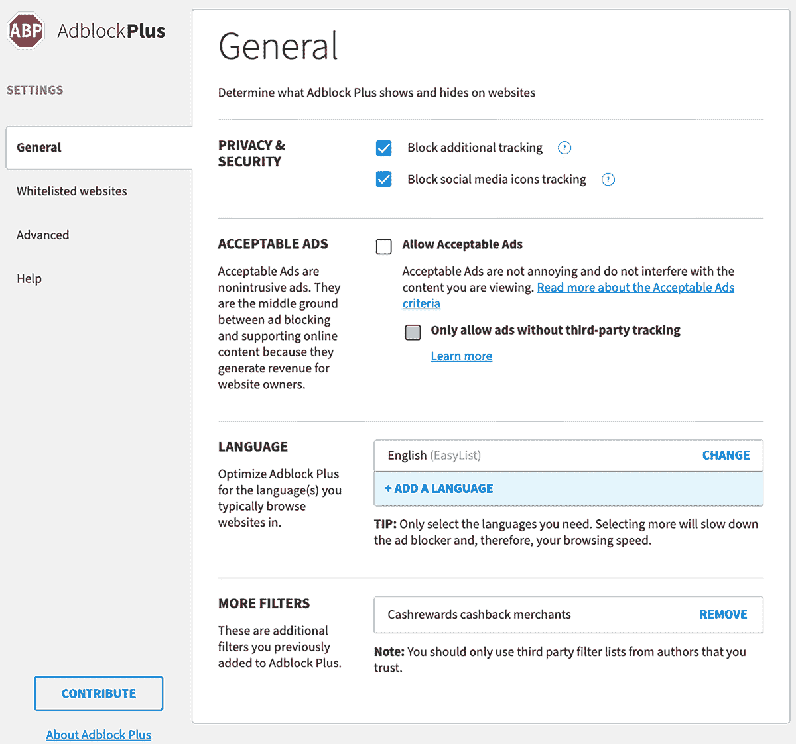
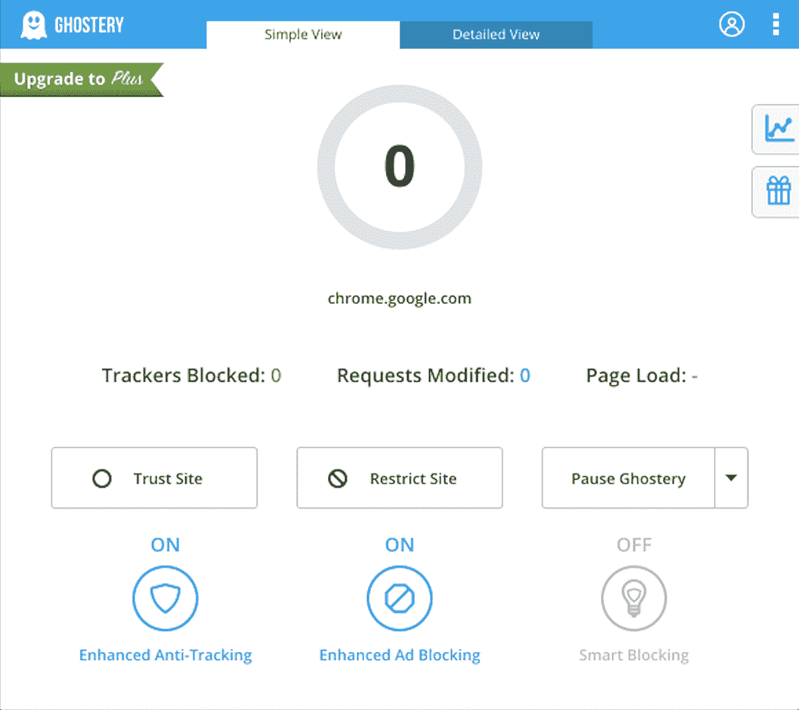
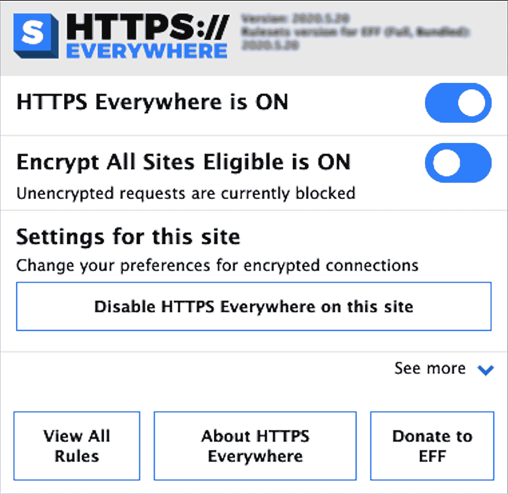

# # 网络中用户安全管理的技巧

负责一个包含多个用户的网络是具有挑战性的。你无法合理地期望管理网络中其他用户的活动，尤其是当他们使用自己的设备时。然而，你可以采用一些策略来减少与多个用户相关的风险。

本章讨论了强密码短语与密码、密码管理器、多重身份验证以及隐私保护浏览器插件的价值。它应该能提供你与用户进行有关安全性讨论所需的信息。

## 密码

拥有强密码并为每个网站使用不同的凭证是保持在线安全的最佳第一步。密码短语和密码管理器使得攻击者更难猜到你的密码，同时也让你更容易管理它们。*密码短语*由多个单词组成，例如*libertyextremecluecustodyjerky*。你可以通过添加大写字母、数字和特殊字符使其更难猜测，但一般来说，最好是拥有既容易记住又较长的密码短语，而不是那些复杂却不易记住的密码。通常密码安全的规则依然适用。不要使用个人可识别信息，比如生日、宠物或亲戚的名字，或你曾就读的学校。避免包括与当前月份、季节或你工作的公司相关的词汇。基本上，要避免从容易猜测的元素构建密码短语。

密码短语比密码更长，这使它们在防范攻击者使用的暴力破解攻击时更具韧性。在*暴力破解攻击*中，攻击者尝试所有可能的字符组合，直到找到正确的密码。他们可以通过程序化方式进行操作，每秒钟可以进行数百万次（甚至*数十亿次*）密码猜测。密码越短，*密钥空间*（字符类型的数量——字母、数字和符号——越小），破解所需的时间就越短。例如，一个由小写字母和数字组成的八字符密码，在今天的计算硬件上破解需要不到两个小时。增加一个字符将使破解时间增加到超过两天，每增加一个字符，破解密码的时间呈指数级增长——一个 30 字符的密码短语在今天的计算能力下几乎无法破解。

注意：务必更改您账户和设备的默认密码。像路由器和交换机等设备的默认密码（如用户名：admin，密码：admin）是广为人知并且有文档记录的，因此如果您没有更改这些密码，您就为攻击者渗透您的网络打开了大门。即使它们不太为人所知，也很容易猜测。

### 密码管理器

使用*密码管理器*（也叫*密码保险库*或*保险箱*）来安全存储您的密码。密码管理器可以存储数百个独特的密码短语，您只需一个主密码即可访问。这种做法避免了将密码写下来的诱惑，因为这从来不是一个好主意。市面上有多个密码管理器可供选择，如 1Password ([`1password.com/`](https://1password.com/)) 或 LastPass ([`www.lastpass.com/`](https://www.lastpass.com/))。

传达密码管理器价值的最佳方式是讨论*凭证填充*，这是一种攻击，利用了大多数人仍然在多个服务中使用相同密码的事实。当攻击者在数据泄露期间或之后获取密码和电子邮件地址的列表时，他们会尝试在多个知名网站和服务上使用这些凭证登录，通常会成功，因为相当一部分密码和电子邮件地址的组合在其他网站上也被重复使用。用户可以通过为每个账户使用不同的密码短语，并将这些密码短语存储在密码管理器中，来防止凭证填充攻击。

### 密码泄露检测

免费服务 Have I Been Pwned ([`haveibeenpwned.com/`](https://haveibeenpwned.com/)) 让您输入电子邮件地址，并立即了解它是否在任何数据泄露或突破中被识别。图 11-1 显示了一个被攻击的电子邮件账户的报告示例。

图 11-1：被攻击的电子邮件账户报告示例

此服务还提供持续的更新和监控；如果您的电子邮件地址在未来的数据泄露中被识别，您可以选择接收通知以更改您的密码。

## 多因素认证

一旦你创建了强密码短语，就应该在所有提供此功能的账户和服务上实施*多因素认证*（有时称为*双因素认证*，*2FA*，或*MFA*）。虽然*单因素认证*通常只需要两个因素的组合——你的电子邮件地址或用户名加上密码短语——但 MFA 需要两个或更多的认证因素。通常，第一个因素是你*知道*的东西，第二个因素是你*拥有*的东西，如硬件或软件令牌，或是你*具备*的东西，如指纹或其他生物识别信息。通过要求第二个或第三个认证因素，攻击者在试图访问你的账户和系统时将面临成倍增加的困难。添加第二个因素可能会给你或你的用户带来一些小麻烦，但你的安全性将大大增强。

最常见的 MFA 解决方案之一是使用短信作为第二因素，向用户发送包含代码或一次性密码的短信；用户随后使用该代码登录账户或执行某些类型的交易，特别是当这些操作来自新的或未知的设备或位置时。无论手机型号或服务提供商如何，每个人都能接收短信，且短信通常免费或便宜，几乎是即时的，并且如果你没有主动尝试登录，它会提醒你有可疑活动。主要缺点是短信并不是一种安全的技术，攻击者相对容易获得某人的电话号码和短信内容。

接下来是软件解决方案，包括 Google Authenticator、Authy、Microsoft Authenticator，甚至像 1Password 这样的密码保险库，它们提供 MFA 令牌。通常，你需要将应用程序下载到智能手机上，并扫描或输入来自服务提供商（例如银行或社交媒体）提供的代码来设置应用。当你想登录时，你将查看应用程序中的认证令牌，并将其与密码短语一起使用。这些令牌每 60 秒更换一次。这是相比 SMS 作为第二因素的一项重要改进，因为攻击者需要物理访问并解锁你的移动设备才能获取令牌。滚动令牌也意味着访问窗口非常短暂，不像 SMS 那样可能有几分钟的访问时间。这些软件令牌是许多用户最方便且最安全的 MFA 选项。

最后，还有硬件令牌，如 Yubikey 和 Google Titan Key。如果该令牌未插入电脑，您将无法访问加密或受保护的数据。硬件令牌被认为是多因素认证（MFA）解决方案中最强大的，因为丢失硬件令牌意味着您无法访问数据。它们提供与软件令牌相同或更好的保护，因为攻击者需要物理访问权限，但它们也是最不方便的；大多数人随身携带手机，但在需要时，可能会将硬件令牌忘在家里。此外，硬件令牌无法被钓鱼攻击；虽然短信和其他类似的 MFA 令牌可能通过社交工程和钓鱼攻击被潜在受害者提取，但攻击者无法远程访问您的硬件令牌。

## 浏览器插件

所有主要的互联网浏览器，如 Google Chrome、Mozilla Firefox 和 Microsoft Edge，都提供了多个浏览器插件或附加组件，用于屏蔽广告和追踪器（有关追踪器的更多信息，请参见第七章），并且通常用于提高用户隐私。这些提到的插件已经过审核，且被确认是合法的，或者是由知名和可信的来源创建和维护的。浏览器插件旨在为标准浏览器提供附加功能，用户可以从广泛的插件中选择，以改善他们的浏览体验。与用户讨论这些浏览器附加组件的优缺点，有助于他们做出明智的决策，选择哪些插件使用，哪些插件避免使用。

### Adblock Plus

Adblock Plus 移除网站上的“不可接受”或干扰性的广告。要安装此插件，请访问[`adblockplus.org/en/download`](https://adblockplus.org/en/download)，并下载适合您的浏览器或设备的版本。安装完成后，进入插件的**设置**页面（如图 11-2 所示），选择**阻止额外的追踪**、**阻止社交媒体图标追踪**和**不允许可接受广告**。您还可以选择将特定网站列入白名单。

图 11-2：Adblock Plus 设置

额外追踪包括一些方法，比如网站收集您的浏览习惯。阻止社交媒体图标追踪可以防止您在访问的网站上被社交媒体按钮追踪。最后，不允许可接受广告会移除网站上的所有广告（至少尽可能多的广告）。所有这些都会带来一个更清洁、更快速的网页浏览体验。

### Ghostery

与 Adblock Plus 类似，Ghostery 的使命是通过移除许多网站上的用户追踪功能来改善用户隐私。要安装 Ghostery，请浏览到[`www.ghostery.com/`](https://www.ghostery.com/)并注册一个账户。下载并安装适用于你的浏览器的插件；安装后，插件会直接启用，但你可以从插件菜单中修改设置，如图 11-3 所示。

图 11-3：Ghostery 设置

如果你想手动允许或禁用特定网站，并暂停或恢复 Ghostery，你可以通过此菜单进行操作。

### HTTPS Everywhere

*HTTPS*是继不安全的 HTTP 协议之后的安全互联网协议。HTTPS 使用 SSL/TLS 来保护你浏览互联网时的网络流量。使用加密可以保护你的流量，使得对手无法拦截和解密它。不幸的是，并非所有网站都为其用户提供加密服务。这时，像 HTTPS Everywhere 这样的插件就派上了用场；它为你提供了加密层，无论你在浏览器中做什么，都能保持安全。

要安装此插件，请浏览到[`www.eff.org/https-everywhere/`](https://www.eff.org/https-everywhere/)并下载和安装它。从这里，选项非常简单：开或关（如图 11-4 所示）。

图 11-4：HTTPS Everywhere 设置

安装并运行此插件后，你可以放心，因为你的所有浏览器流量都在加密保护中。

## 物联网考虑事项

我们在第二章中详细讨论了像 Google Home 和 Amazon Alexa 这样的物联网设备，以及如何通过网络分段方法来减轻智能设备带来的风险。然而，仍然存在与始终开启的摄像头和/或麦克风设备相关的风险，需要加以考虑。

无论是笔记本电脑、台式计算机、游戏主机，还是智能家居设备，许多现代终端都内置了麦克风或摄像头（或两者）。对于一个有决心的对手，这些设备可以用来监视你和你周围的人。因此，在可能的情况下，最好投资那些配备物理关闭开关或按钮的智能家居设备，用以关闭这些功能。如果无法做到这一点，考虑使用摄像头盖（许多在线商店有售，价格便宜），甚至可以用一块不透明的胶带遮住你的网络摄像头，避免使用时暴露。这样做是保护你隐私的最佳方法之一。

除了遮挡摄像头外，还要考虑智能家居设备的放置和使用位置。以智能音响为例，你可以选择仅在公共区域使用它们，避免放置在卧室或私人办公室等私人区域。考虑可能在麦克风范围内进行的活动和对话，并据此放置设备。

## 附加资源

本书介绍了网络安全的基本知识，并理想地帮助你更深入地思考你的网络和用户的安全，并实施解决方案来保护你的隐私。然而，关于这些话题还有许多资源可以进一步探讨，这些内容超出了本书的范围。我想提到的第一个资源是[`chrissanders.org/`](https://chrissanders.org/)。Chris 撰写了多本书籍和在线课程，涵盖了网络安全监控、入侵检测、以及我们在第十章中简要讨论过的 ELK 栈的高级使用等主题。如果你想深入了解这些话题，这里是一个很好的起点。

另一个对于任何对网络安全、数字取证或事件响应感兴趣的人的精彩资源是[`dfir.training/`](https://dfir.training/)。这个网站包含了大量与工具、培训课程（包括免费和商业课程）、实践材料以及其他资源相关的信息，可以帮助你增加知识储备并提升你的安全成熟度。

最后，SANS 是一个专注于网络安全的研究和培训组织。在[`www.sans.org/`](https://www.sans.org/)网站上，你可以找到更多关于他们培训课程的信息，同时也有许多关于网络和终端安全的工具与技术的资源和研究论文，包括防御性和进攻性视角的内容。

## 总结

最终，你的在线隐私和安全可以根据个人需求得到充分保护。为了在互联网上保持安全，往往需要在隐私、安全性或两者之间做出妥协，以换取便利。稍微牺牲一点便利性，你将获得更好的整体上网体验，并享有更高的安全性和隐私保护，无论是个人的还是与用户共享的。确保安全的好处远远超过实施这些解决方案所带来的不便。
