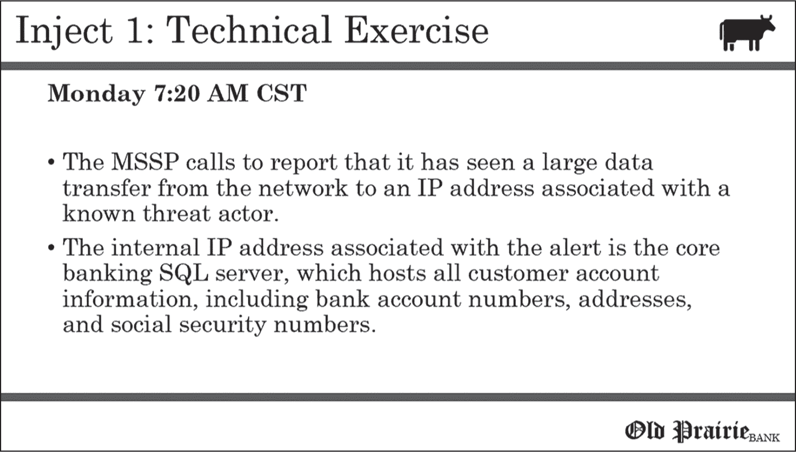
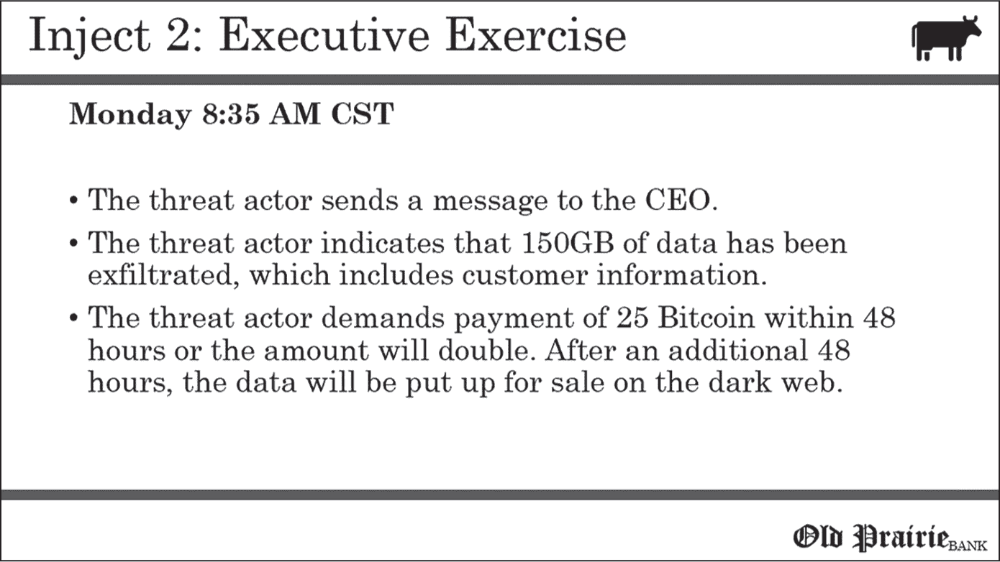
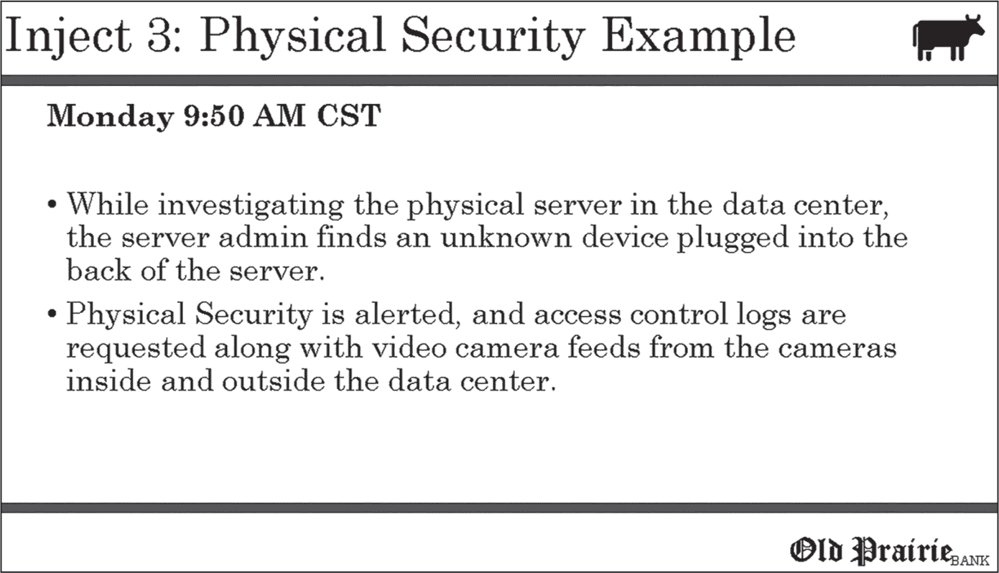
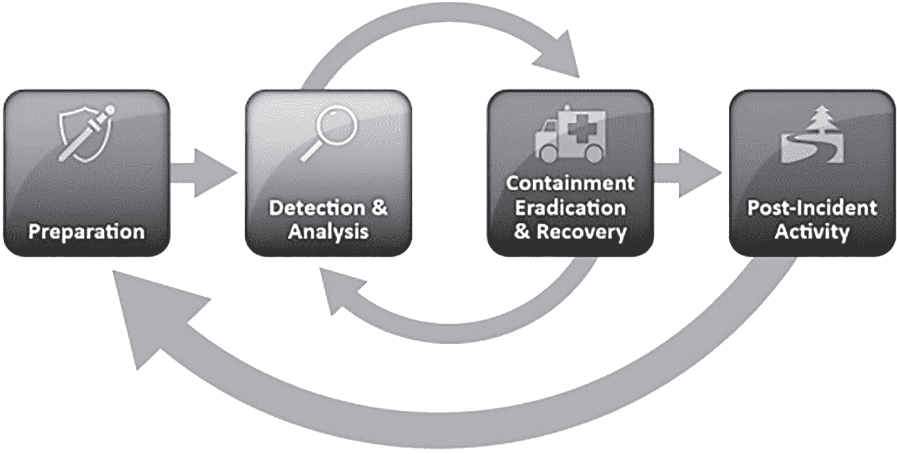
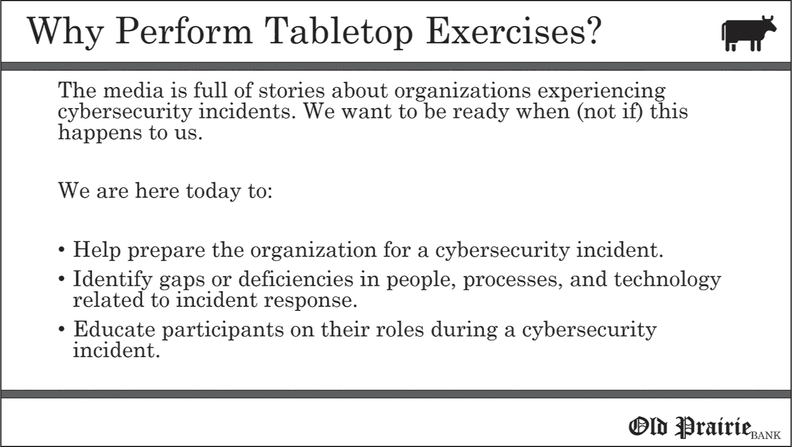
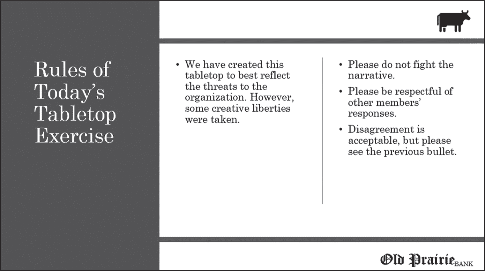
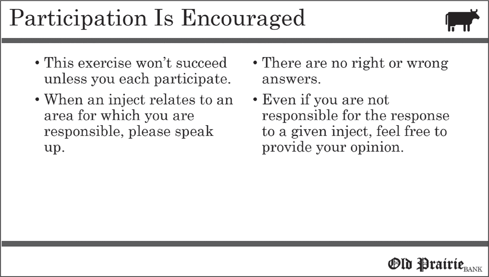
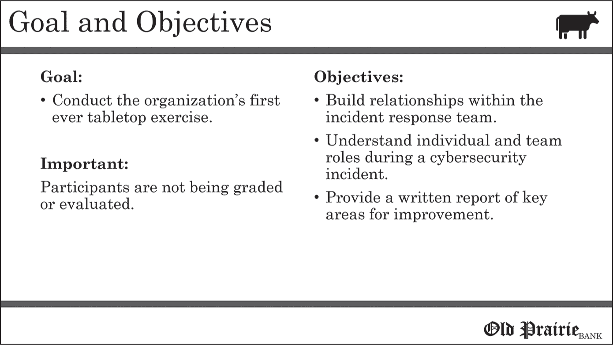

<hgroup>

## 3 开发过程：何处见证成效

</hgroup>

在本章中，我们重点介绍开发团队如何构建其桌面演练，从定义主题到创建演练材料。最终，您将选择一个主题，设计一个场景和注入点，设计一个故事板和地面真实文件，并组装您的演示文稿。

根据每个桌面演练的具体情况，您偶尔可能会跳过本章概述的某些步骤。例如，当副总裁告诉您，“我们需要练习应对业务电子邮件妥协的能力”时，演练主题可能会很快出现。许多桌面演练都是这样开发的；您会知道一些初始组成部分（如范围和主题），并根据已有情况填写其余部分（如持续时间和目标）。与每章一样，您在继续之前应考虑组织动态、业务要求和您组织的独特威胁景观。

### 选择主题

桌面演练的*主题*是要探索的总体问题。它可能是与信息安全相关的问题（如勒索软件、内部威胁或钓鱼攻击），或者是影响组织应对信息安全事件能力的灾难场景（如危险的火车脱轨或飓风，导致组织员工无法工作）。理想情况下，您应选择一个组织希望为其准备的主题，并且在揭示时不会使演练参与者困惑。

具体的主题并不像你可能认为的那样重要，因为您可以以多种方式探讨几乎任何主题。例如，以勒索软件为主题的演练可以探讨攻击者的横向移动（即攻击如何在网络中传播）、对监管实体的响应、业务连续性问题或调查行动。您也可以轻松地在基于国家级攻击或供应商安全失败主题的演练中探索这些问题。

主题可以用作考虑引起参与者兴趣的领域的机会。如果组织关注特定问题，选择相关主题可能使演练对参与者和其他利益相关者尤为重要。本节描述了选择主题的一些提示。

#### 参考您的业务影响分析

如果组织已经进行了*业务影响分析（BIA）*——一份详细列出了各种业务功能和流程中可能发生的各种中断对业务影响的文件——你可以使用它来帮助选择你的桌面演练主题。

当然，BIA 可能涉及广泛的事件，从自然灾害到社会动荡再到供应链中断；然而，它也可能涉及网络安全问题，包括勒索软件、保护数据的泄露（如知识产权和个人身份信息，或 PII）以及关键计算基础设施的丧失。BIA 还可能描述一个完整的场景，其中一个网络安全事件影响了组织。如果是这样，你可以将其作为你的主题。

利用 BIA（业务影响分析）来确定桌面演练的主题，可以提供另一个机会，让你邀请一个新的合作者：负责主导 BIA 的主题专家，无论他们的背景是灾难恢复、风险管理还是其他领域。你可以请这位专家在桌面演练开始时简要发言，解释为何选择这个主题，因为它对组织有着重大的影响，从而强化演练的重要性。

最后，许多组织已经反思了如何应对自然灾害（如即将到来的飓风或暴风雪），但却忽视了针对可能带来相似影响的网络安全事件进行规划。桌面演练可以成为业务连续性或灾难恢复团队与信息安全团队合作的机会，确保他们在未来考虑网络安全事件。

#### 与执行赞助人沟通

另一种为桌面演练寻找灵感的方法是与执行赞助人沟通。很可能，他们已经有一个特定的网络安全问题在心。如果你选择的主题不符合赞助人的个人兴趣，仍然应该寻求他们的反馈，确保他们支持并关注桌面演练的主题；如果没有执行赞助人支持你的桌面演练主题，这会适得其反，应该避免。

#### 借助其他资源寻求灵感

除了我们刚才列出的主题选择方法，你还可以通过以下方式来确定一个相关的主题：

+   向高管询问哪些网络安全问题让他们夜不能寐

+   跟踪并挖掘来自政府或行业来源的趋势来获取创意

+   向参与网络安全的供应商询问他们在行业中看到的问题

一旦确定了主题，就可以开始制定演练的场景。

### 制定场景

*场景*是桌面演练探索的独特故事。对于一些桌面演练，选择这个场景的过程是相对简单的。也许有一个明显的选择，灵感来自于新闻事件、组织中的已知安全风险、近期的内部事件或管理指令。在这些情况下，开发阶段很可能会顺利进行。

然而，您可能会在没有特定场景可供探讨的情况下进入桌面演练的开发过程。也许这样的演练对组织来说是新的，或者组织已经进行了太多桌面演练，已经没有明显的场景可以使用了。或者，也许管理层要求进行桌面演练，但没有提供场景的具体参数。如果您发现自己处于这种情况，请放心，许多开发团队曾经面临过完全相同的困境。

#### 有效场景的特征

您不应随意开发场景。如同在第二章中学到的那样，在演练前，某些权威人士或演练参与者可能会询问所选场景的情况。如果发生这种情况，您应该能够阐明开发该场景时所考虑的因素。除了能够实现演练的目标和任务外，场景应该是：

+   现实性

+   与组织和参与者都相关

+   一个检视已知或潜在弱点的机会

让我们进一步探讨这些指南。

##### 保持场景的现实性

虽然您可以对演练场景进行创意设计，但并没有权限进入幻想的领域。参与者可能需要暂时放下某些不信任的成分，场景可能会突破可信的边界，但不应完全荒谬。

什么才算一个现实的场景呢？试着从真实事件中寻找灵感，包括记录下来的网络攻击、组织未能正确应对事件、已知的恶意软件和内部攻击。然后，您可以尝试在这些已知攻击的基础上加大痛点，同时仍然保持在可信范围内，尽管简单也没有问题。正如本书第二部分中的示例所展示的那样，一些最佳的桌面演练非常简短。

在桌面演练过程中，主持人可能会被置于必须为场景的可行性辩护的位置。在这些情况下，他们可能会觉得手头有统计数据或简短的案例研究能帮助他们向观众展示。这些统计数据和示例应当与特定的情节相对应，并与进行演练的组织相关联。

##### 确保场景相关

虽然*现实的*场景是建立在可能性范围内的，*相关的*场景则是与业务密切相关的。换句话说，如果场景发生，是否会引发参与者集体的“那又怎样？”反应？

相关性通常最好通过场景的商业影响来衡量，因此您需要了解组织的痛点。您的演练不必针对最重大的商业影响，但您应该专注于一个足够相关的场景，以吸引与会者的注意。让我们来看看几个例子：

+   一家快餐店依赖一个处理得来得及订单的软件平台。如果由于网络安全事件系统无法访问，餐厅就得手工接单，这会导致效率下降，无法服务更多顾客，从而大幅影响销售。

+   家居改善店铺的 80%以上的购买使用信用卡支付。与 POS 系统连接的信用卡支付终端使用第三方供应商来验证顾客的信用卡。如果第三方供应商因为网络安全攻击而停止运作几天，企业将立即遭受销售损失并降低顾客满意度。

+   亚利桑那州的一处商业地产使用工业级冷却系统，承包商可以远程登录进行健康检查。如果凭证被泄露，攻击者关闭了冷却系统，因亚利桑那的沙漠气候，该地产将迅速变得不适合居住。

在每一个例子中，都有明显的业务影响，无法忽视，这将吸引高管和顾客的注意。

最后，确保执行赞助人同意场景的相关性。如果在桌面演练中的任何时刻，执行赞助人会想，*那又怎样？* 你应该调整场景。

场景必须与与会人员相关，因为他们要为此投入一定的时间。例如，你可以将勒索软件桌面演练偏向法律部门的成员，集中讨论支付赎金的合规问题；或者，你可以专注于技术人员检测和遏制勒索软件的能力。

确保与会人员没有理由自问，*我为什么在这里？* 如果你无法轻松地找出一个场景与他们角色的关系，考虑调整场景以提高他们的参与感。

##### 突出已知或潜在的弱点

让演练更具价值的一个优秀策略是选择一个突出组织环境中已知或潜在弱点的场景。组织通常会在网络安全事件发生后进行桌面演练，作为“教训总结”过程的一部分，这时他们已经弥补了已知的不足，并希望确定是否还有遗留的问题需要解决。

组织的信息安全团队也可能意识到他们的安全实践存在不足，比如只保留重要日志几天。这可能是因为团队未能获得资金来存储更长时间的日志。这个演练提供了一个机会，可以在网络安全事件响应过程中探讨这种不足的影响。在领导层面前演练这个场景可能会促使组织解决这一弱点并争取额外的资金。

#### 场景灵感来源

除了确保场景既现实又相关外，你还可以寻找内部或外部的灵感来源。也许组织之前进行过评估，指出了其流程中的缺陷。或者，也许 FBI 和 CISA 刚刚发布了新的联合网络安全通告，突出了一个新的勒索病毒变种。

让我们进一步探讨一些灵感来源。

##### 审查以往的评估

你可以通过回顾以前的评估活动（例如渗透测试或先前的桌面演练）来为你的场景寻找灵感。这些活动应产生报告，记录任何缺陷，你可以用它们来启发你的场景。利用以前的评估活动作为灵感为所选场景增添了可信度，因为它已经被证明是可信的，并对组织产生了可展示的影响。

最后，将现有的安全漏洞纳入你的场景中，可能会获得来自整个组织或某些对解决该问题有兴趣的成员的额外支持。例如，如果以前的渗透测试发现某个服务器使用了过时的软件包，并且存在已知漏洞，但业务部门抵制风险管理团队的处理建议，将这些细节融入场景中，很可能会为桌面演练赢得风险管理团队的支持。

##### 寻求外部资源

如果现实世界的例子或以前的网络安全事件不能帮助你确定一个相关且现实的场景，可以考虑从以下免费的或低成本的资源中寻找灵感：

**网络安全和基础设施安全局（CISA）**

CISA 提供了相关材料和场景，可以在 [*https://<wbr>www<wbr>.cisa<wbr>.gov<wbr>/cisa<wbr>-tabletop<wbr>-exercise<wbr>-packages*](https://www.cisa.gov/cisa-tabletop-exercise-packages) 上找到。即使这些场景与你的需求不完全匹配，这些材料也可能提供一个基准，你可以根据需要进行调整。

**你的网络保险提供商**

作为一个有利害关系的方，旨在减少组织面临的风险，你的保险公司可能能够就哪些场景在桌面演练中最有利提供意见。

**执法机构来源**

执法机构可以描述它们在处理刑事案件时观察到的威胁态势。公私合作伙伴关系——例如 InfraGard，作为 FBI 与公共部门之间的桥梁——使得可以接触到执法专业人士。借助这些关系，可以根据现实世界的事件提供灵感。

**网络安全行业或相同行业领域的同行**

行业内的同行通常愿意交换有关威胁环境的信息，只要这不会违反任何保密协议。虽然联系你的联系人是一个很好的起点，但你可以通过在 LinkedIn 小组或其他公共论坛上发布来扩大范围。然而，在这样做时要注意保密问题；比如说“我们正在进行关于勒索病毒的桌面演练，因为‘我们还没有准备好，完全是个待宰的羔羊’”这样的说法，会成为威胁行为者的素材。同时，请记住，这种类型的外部联系可能不适用于某些组织。

**SEC 10-K 表格（如果该组织是上市公司）**

该表格是组织向股东报告其面临的风险因素（以及其他事项）时提交的，通常会包括特定的网络安全风险，因为大多数组织都认识到网络安全攻击所带来的威胁。

在主题和场景大致确定之后，现在是时候考虑你将通过注入内容呈现给参与者的桌面演练组件了。

### 介绍注入内容

*注入*是桌面演练过程中呈现的一组事实，目的是传递新信息或澄清先前提供的信息。注入内容也可以加入时间细节，如日期和时间，人工将场景推进到未来的某个时刻。它可以简单到几个要点，旨在帮助主持人引导场景，并保持参与者专注于响应的特定领域。可以把注入看作是有人进入你的办公室告诉你他们刚刚发现了什么。

让我们考虑几个例子。图 3-1 展示了一个关于数据从银行 SQL 服务器中提取的技术演练注入，该服务器包含敏感的财务数据。

图 3-1：示例桌面演练的注入幻灯片

在这个注入过程中，参与者可以讨论响应的技术方面，例如收集目标 IP 的情报、检查 SQL 服务器以确定访问了哪些数据，以及检查环境中可能已被威胁行为者破坏的其他系统。

图 3-2 将焦点转向高层领导在一起勒索威胁中所扮演的角色，威胁行为者声称已从环境中导出了 150GB 的数据。

图 3-2：一个针对领导层的注入，适用于示例桌面演练

在这样的注入过程中，我们预计领导层会讨论赎金要求的影响，是否支付赎金，所需的内部和外部沟通，以及如何验证被导出的数据是否确实是客户数据。

最后，图 3-3 展示了一个注入，旨在促使多个团队（至少包括信息安全、信息技术和物理安全）参与响应。

图 3-3：涉及非技术团队的注入事件示例

为了应对这个注入事件，物理安全将扮演重要角色，确定在设备安装时谁能进入数据中心，包括讨论他们保存视频录像和访问日志的时间。此外，信息技术和信息安全部门将讨论他们的角色以及调查未知设备的过程。

#### 模拟时间限制

注入事件还可以让你的演练在短短几个小时内，探讨一个可能持续数周或数月的事件。你可以使用注入事件插入新的信息，让情景快速发展，就像它在实时中可能发生的样子。

在复杂的网络安全事件中，组织通常无法立刻了解事件的全貌。各方可能需要数天、数周，甚至数月的时间，才能全面了解发生了什么。事件发生的最初几个小时和几天，通常充满了零碎的信息，混乱重重，最佳应对措施也难以确定。注入事件特别有助于模拟这些情况，因为它们可以通过控制信息引入怀疑和困惑，然后在规定的时间内探讨事件的处理。

#### 直接聚焦

另一个注入事件有帮助的原因是它们能指导开发团队聚焦于组织应对网络安全事件的特定方面。例如，如果桌面演练的一个目标是专注于组织在一次非常公开且备受关注的事件之后，如何与媒体互动，注入事件可以插入一组事实，引导参与者处理这个话题。例如，在一次医疗账单公司专注于业务连续性问题的桌面演练进行到一半时，主持人可能会使用如图 3-4 所示的注入事件。

图 3-4：涉及媒体的注入事件

现在，团队必须将注意力转向检查现有的与媒体沟通的流程，例如谁负责沟通，法律团队是否需要批准声明，以及是否需要召集公共关系专家协助。注入事件就像是一个人冲进会议室，向满是事件响应人员的大喊：“伙计们！媒体刚打来！他们想要下午 3 点前的声明！”在桌面演练中，你可以以一种受控的方式提供相同的信息，使用预定义的注入事件，并在一个低压力的环境中讨论回应。

最后，专注的注入还能确保某些与会者能够参与讨论。例如，图 3-4 中的注入专注于与通讯和媒体相关的问题，而另一个注入可以轻松聚焦于物理安全、供应商管理或人力资源等问题。由于专注于特定领域，因此非常重要，开发团队要邀请能够解决该领域问题的代表参与讨论。#### 平衡清晰度与简洁性

对于桌面练习来说，适合多少个注入？像往常一样，这取决于具体情况，但以下几个因素值得考虑：

+   对于两小时的桌面练习，7 到 10 个注入足以提供一个连贯的故事线，使团队能够探索各种话题。

+   增加不一定更好。桌面练习越复杂，场景就越不简洁和专注。此外，当场景涵盖的范围过广时，与会者可能会因需要解决的问题过多而感到不知所措。深入探讨几个关键主题可能比浅尝辄止多得益。

+   根据与会者的参与文化，有些桌面练习只需要少量注入，例如三个（用于介绍信息、新信息和总结信息）。一个特别健谈的团队即使只有少量注入，也能轻松消耗 90 分钟的讨论时间。

+   如果桌面练习分配了两小时的时间段，最好控制时间不要过长。桌面练习如果在时间剩余的情况下结束，可以让参与者在不感到匆忙的情况下完成情境。

+   运行时间过长的桌面练习可能会导致与会者的日程冲突，其中一些可能是高层管理人员，已经时间有限。

+   大多数桌面练习受益于最后的问答环节；插入太多内容可能会抑制这种好处。因为桌面练习的一个目标是发展关系，所以在会议结束时留出时间讨论出现的问题或其他一般性关切，会使活动更有价值。

注入物必须在增加清晰度、促进与会者之间的协作，并在下一步行动方面制造一些模糊性之间取得平衡。也就是说，它们不应该用太多选项来困扰参与者。有时，最有效的注入物只有几个要点，在幻灯片上不超过 20 个字。避免看起来像 8 号字体写成的博士论文，需要参与者几分钟才能完全消化。如果你发现自己在一次注入中给与会者提供了大量信息，请考虑将注入分成逻辑段落。

### 设计练习故事板

你的桌面演练的整体概念开始成型了。经过一些思考，你已经定义了目标，并选择了一个主题来探讨网络安全问题。你已经开发了场景并确定了参与者。现在，你就可以开始构建它，对吧？

与生活中的大多数活动一样，即使一个想法已经成型，你也可能会发现必须做出调整。威胁环境可能发生变化（例如，如果新闻中出现了新的攻击），或者高层赞助人可能要求你将场景重新定向到另一个优先事项。有时，桌面演练可能在交付之前经历几次修改，这可能让开发团队感到沮丧。这就是故事板发挥作用的地方。这个做法源于电影行业，作为一种高效的方式，在电影制作前明确剧情和美学。

应用到桌面演练中，这一概念并没有什么不同：*故事板*只是简单地制作一个演练的草稿，如果需要，可以轻松进行修改。它使得开发团队能够在不投入过多时间的情况下编排演练场景。在这个阶段，修改是非常容易的。通过故事板，开发团队可以直观地看到桌面演练的进展，并识别可能的改进空间或潜在的陷阱。

故事板不需要正式。开发团队的几名成员可以快速在白板上草拟一个。简要描述注入事件（一个或两个句子足够）以及每个注入事件旨在探讨的关键问题。开发团队可以退后一步，审视故事板，并问自己：“这样合理吗？”此外，外部人员审阅故事板时，应能快速跟上整体主题并理解你想要实现的目标。

桌面演练通常遵循 NIST 事件响应生命周期的结构，如图 3-5 所示，该生命周期从准备阶段开始；将事件响应分为检测与分析、遏制、根除和恢复；最终进入事后活动阶段。桌面演练不需要明确包含准备阶段，因为该阶段本身即包括桌面演练以及相关的规划活动。

图 3-5：NIST 事件响应生命周期

例如，大多数桌面演练和真实的网络安全事件都以一个简单的事件开始：系统管理员发现一个具有提升权限的异常账户，网络设备在安全规则被触发后发出警报，或者执法机构敲响大门通知组织其数据可能已被窃取，等等。这个催化事件必须在故事板开发过程中定义，并启动桌面演练。（我们将在“考虑场景升级速度”一节中进一步讨论这一点，详见第 67 页。）

一旦提供了初始信息，新信息将通过注射逐步涌现，为情景带来清晰度，而不是一次性透露太多信息。缓慢起步保持讨论集中在一个预期的区域。额外的注射可以在未来阶段为情景增加细节，例如遏制或恢复措施，最终进行“教训总结”审查。您可以在以下示例故事板中看到这一过程的展示。

故事板非常简洁，撰写初始草案只需要大约一个小时。任何一方都可以迅速理解其总体主题，将增加细微差别的注射和在讨论中提出的关键问题。一个更简洁的故事板可以省略“关键问题”部分；然而，这些部分帮助读者理解每个注射的理由。

现在假设开发团队希望调整练习，包括一个独特的威胁向量，比如一个位于 MHTS 设施外部的个人通过无线连接侵入其网络。在故事板设计中进行这样的课程修正非常容易，并且不会影响到已经完善的内容，比如 PowerPoint 演示文稿。

Storyboarding 的另一个好处是它使开发团队能够向选择的利益相关者，特别是高级赞助人，提供一个粗略的蓝图，以确保他们的支持。桌面演习现在已经从理论讨论发展为一个实际的草案；特别是如果你是顾问，你可以记录客户的联系点已经参与了场景，并表达了他们的批准。

### 考虑到情景升级步调

当制作故事板和计划你的注射时，请考虑情景升级步调以及适合桌面演习的内容。*升级步调* 指的是在每个注射中引入的信息严重程度。在许多真实的事件响应场景中，有一个最初的触发因素，可能看起来相对温和：

+   一个最终用户因为他们的计算机运行缓慢而联系帮助台。

+   网络管理员观察到在午夜无人工作时网络流量出现意外的波动。

+   一个最终用户在机场丢失了他们的笔记本电脑。

这些示例每一个都值得进一步探索，并且可以很容易地因为额外的细节而变得更为严重。事实上，有很多众所周知的网络安全事件，都是从类似这些简单事件开始，然后演变成了更大的问题。通过缓慢起步并逐步升级到更严重的事件，参与者能够探讨组织如何响应潜在威胁的初步指标。作为一个附带的好处，如果参与者是第一次参加桌面演习，这种方法会使他们更容易投入到练习中。

为初步注入提供一组更具重要性的事实对于某些桌面演练可能是合适的；然而，需要考虑的是，是否放弃逐步推进到更严重事件的方式，会牺牲对组织如何应对更大威胁的指示的深刻探索。

### 编写你的事实真相文档

一旦你们达成了一个粗略的故事板，就该开始编写事实真相文档了。美国的《国土安全演练与评估计划》（HSEEP）将*事实真相文档*定义如下：

> 一个包含情境详细元素的文档，这些元素在演练开发过程中必须保持一致[ . . . ]以确保保持现实感并实现目标。

故事板是一个非正式的草图，帮助你构思情境，而事实真相文档则将桌面演练正规化，开发背景故事并定义注入内容。

并非所有情况下都需要一个事实真相文档。例如，如果组织的目标仅仅是让利益相关者坐到一起，讨论一个网络安全事件的演变过程，那么这个文档可能就显得多余。同样，如果组织希望在午餐期间进行一系列快速的桌面演练，事实真相文档可能被视为一项不必要的投资，反而让整个活动变得繁琐。最后，如果桌面演练涉及的情境是组织尚未定义政策和程序的领域，事实真相文档可能不太适用，因为在这种情况下，找到正确答案并不像讨论本身那样重要。

另一方面，事实真相文档为桌面演练的开发过程提供了结构。如果组织希望实施一个桌面演练程序，定期评估其成熟度水平，事实真相文档可以向审计员、供应商和其他外部方展示该程序的存在。

创建事实真相文档的一个最重要的好处是，它可以缩短开发过程，因为它使开发团队能够充分探索故事板中定义的桌面演练的初步流程。这一探索可能会揭示出一些不足之处，比如目标和目标不一致、情境中的技术或流程缺口使人难以置信，或者其他让开发团队暂停思考的方面。有了事实真相文档，你可以重新调整，而无需浪费时间修改已完成的材料，例如 PowerPoint 演示文稿。

使用 HSEEP 的定义，让我们回顾一些编写成功事实真相文档的指南。

#### 添加细节和预期结果

故事板提供了一个非常简略的情境总结，而事实真相文档则是深入挖掘其具体元素的机会。例如，在故事板中，注入内容的表述可能仅需简要说明如下：

> 勒索软件进入环境并加密了人力资源部门使用的信息系统。在加密之前，威胁行为者从关键系统中窃取了数据。

实际情况文件应包含更高程度的具体性：

> 人力资源总监斯蒂芬·罗森沃尔德（Stephen Rosenwald）收到一封来自*MissingPackage@FredEx.com*的恶意邮件，并点击了其中的链接。该链接下载了一个名为*MISSINGPACKAGE.PDF*的 PDF 文件，罗森沃尔德也点击了该文件。
> 
> 罗森沃尔德最近抱怨一个端点安全代理程序占用了系统资源，由于他在组织中的高级职位，帮助台从他的系统中移除了该代理程序，导致安全控制受限。此外，罗森沃尔德拥有管理员权限，这也是他所在公司高管的常规做法。
> 
> 由于安全控制受到限制，当罗森沃尔德打开 PDF 文件时，$SomeBot 恶意软件家族的一个变种得以执行，窃取凭证，并允许一个外国攻击者通过远程桌面协议（Remote Desktop Protocol）连接到服务器。攻击者能够远程连接到罗森沃尔德的账户，而该账户拥有访问人力资源数据库的权限，数据库中包含简历、员工数据和健康保险选项。

如你所见，故事板是即将注入的内容的压缩版高级版本，而实际情况（ground truth）则更加详细。实际情况文件通常还包含预期结果或成功的定义，突出参与者在演练中需要关注的领域。（你会在接下来的“实际情况：恶意软件发现”框中看到成功定义的示例。）

虽然这不是对导致网络安全事件的技术和组织因素的全面探索，但第二段包含了在桌面演练过程中可能出现的细节。这些细节可以直接回答参与者立刻会问的基本问题。有了更清晰的信息，参与者可以理解事件是如何发生的，哪些数据被访问了，并开始评估提供信息的重要性。

请记住，所需详细元素会根据受众有所不同。如果预期参与桌面演练的是技术性较强的观众，那么实际情况文件应为一份技术文档，尽可能覆盖将要讨论的各项技术细节。对于面向高层管理人员且跨职能（如非技术性）观众的桌面演练，过于深入的技术细节则不必要。

#### 保持现实性

实际情况文件是另一个确保情景保持现实的机会。桌面演练应该检查假设性的——而不是荒谬的——事件，这些是组织可能面临的挑战，而实际情况文件使得开发团队能够从头到尾梳理情景的细节，持续检查它是否偏离了可行性太远。

#### 与目标对齐

基础事实文档还应该不断检查桌面演练是否与开发过程中开始时所列出的目标对齐。例如，假设一个主要目标是测试组织有效管理对外和内部沟通的能力。当回顾基础事实时，开发团队可能会意识到情景过于侧重于技术因素和业务连续性问题，未能自然引导出沟通任务的探索。发现这一不匹配后，团队可以在演练之前重新调整情景。

正如你在这个例子中所看到的，基础事实文档是在故事板的基础上构建的，并添加了更多细节以定义被审视事件的背景。它包括目标和目的、演练时间、注入项的更多细节以及预期结果。

### 创建演示幻灯片

完成故事板并确定基础事实后，你现在可以专注于桌面演练的交付成果，通常是使用你选择的演示软件创建的幻灯片。这是释放你的创造力的时候了。

虽然没有一种正确的方法来处理桌面演练的演示幻灯片，但本节将提供一系列格式和流程的建议，以及需要涵盖的关键组件。大多数桌面演练演示幻灯片被分为以下几个部分：

+   介绍

+   序言

+   注入项和演练讨论

+   演练总结

一些桌面演练还包括一个教育部分，例如关于威胁态势中当前趋势的简短简报（例如，突显钓鱼邮件的增加）。更好的是，你可以突出组织内部提炼的安全趋势；这些尤为重要，因为它们与在场的人息息相关。

此外，由于组内成员很可能来自应急响应团队，会议可能为简要讨论应急响应计划的变更以及参与者的角色和责任提供一个平台。这一复习（对于新加入应急响应团队的员工来说，可能不止是复习）恰逢其时，因为组员随后可以将所学内容应用到桌面演练中。

#### 介绍

演示幻灯片中的介绍部分应包含关于主持人及其与组织关系的基本信息。如果主持人是员工，可能不需要包括他们的资历、工作经历等信息，但如果是外部承包商担任主持，这些背景信息有助于强调其行业经验的广度（或许还可以显示这并不是他们的第一次桌面演练）。

在主持人的介绍之后，留出时间让参与者自我介绍。通常，参与者至少会知道彼此的姓名和职能，但在桌面演练中，团队成员首次见面的情况也并不罕见。因为这些演练的部分目的是确保所有参与者都熟悉彼此的角色和职责，所以花时间进行自我介绍是值得的。

不要在自我介绍上花费超过两到三张幻灯片。根据小组规模和与会者之间的关系，5 到 10 分钟应该足够。

#### 引言

主持人应在引言中讲解几个主题，包括桌面演练的目的、适当的礼仪、参与的重要性以及预期的结果。主持人还应介绍注入事件的概念。如果这是组织的首次演练，或者有很多第一次参加的成员，在进入实际场景之前设定期望可以确保所有参与者都在同一频道上。

如果执行赞助人参加桌面演练，引言部分是他们发表简短讲话的机会，重申演练的重要性，感谢大家的参与，并强调他们期待了解在识别漏洞后，组织如何改进。执行赞助人也可以在介绍中发表这些鼓励性的话语。

请注意，引言部分有可能会占用宝贵的演练时间。理想情况下，引言不应超过 15 分钟，将大部分时间留给演练本身。

让我们更详细地了解引言部分的组成。

##### 定义练习的理由

很可能有些参与者会质疑进行桌面演练的价值。一张简短的幻灯片和主持人的几句话可以突出其好处，如图 3-6 所示。

图 3-6：解释桌面演练目的的幻灯片

至少，幻灯片应明确说明桌面演练有助于为组织应对网络安全事件做好准备，识别现有流程中的漏洞，并教育应急响应团队成员在网络安全事件中的角色。

##### 确立桌面演练的适当礼仪

专门用一两张幻灯片介绍桌面演练礼仪。参与者很可能会想知道接下来的两小时会是什么样的。他们会面临对抗吗？他们如何贡献？他们需要做什么？这些都是合理的问题，并可能引起一定的困惑。

也有可能，某个参与者可能会想要为某个组织辩护，防止场景中所呈现的弱点发生。假设你是一个系统管理员，在桌面演习中听到一个面向互联网的系统启用了默认用户名和密码的服务。系统管理员可能会立即跳出来解释，组织已有政策、系统构建流程、定期的外部渗透测试以及其他各种检查措施来防止此类情况发生。

主持人可以通过花时间简要讨论场景的开发过程来避免一些防御性行为。这有助于消除那种认为场景是由一位咖啡喝多的风险管理专家胡乱想象出来的看法。像图 3-7 这样的幻灯片可以帮助预防关于开发过程的反对和猜测。

图 3-7：展示桌面演习礼仪的幻灯片

这张幻灯片强调，这次桌面演习做了一些创意上的自由发挥，并请求参与者不要与故事情节作对。承认这两点应该能减少或消除参与者开始处理场景时的抵触情绪。

##### 鼓励参与

同样重要的是，要求所有与会者参与讨论。桌面演习最有效的方式是当大量参与者积极参与、提出观点和反观点，并巧妙地质疑决策或流程时。

鼓励每个与会者讨论他们的*个人*兴趣或与其职能相关的兴趣。例如，来自法务部门的代表可能会有与业务连续性部门代表截然不同的关注点。考虑以下信息安全和财务部门代表之间关于是否联系供应商进行紧急支持的简短对话：

**信息安全部门：** 如果情况真的糟糕到那种地步，我们就会叫我们的供应商来提供事件响应支持。

**财务部门：** 等等，我们和供应商有合同吗？我记得我们让合同过期了。那会花我们多少钱？

**信息安全部门：** 我们必须尽快让他们签字。而且这不会便宜。如果我们能花不到 50,000 美元解决，我会感到很惊讶。

**财务部门：** 很明显，如果我们需要把他们请进来，那就得请进来。但我们有一条硬性政策，所有超过 25,000 美元的合同都必须由法务和采购部门审核。我从未见过一个审核在 48 小时内能快过法务部门的。

很明显，信息安全和财务部门有相同的目标：处理一个网络安全事件。然而，他们各自提出了与各自职能相关的重要观点，使对方能够理解他们在事件处理中可能遇到的障碍。

像图 3-8 这样的幻灯片可以帮助促进参与的氛围。

图 3-8：一张鼓励参与的桌面练习示例幻灯片

如果桌面练习中很少有参与者发言，房间里将会慢慢弥漫起一种不适感，降低事件的价值。

##### 传达预期结果

在深入场景之前，所有参与者应理解桌面练习的预期输出。你可以通过一张简短的幻灯片和随之而来的讨论来实现这一点（图 3-9）。

图 3-9：一张讨论样本桌面练习预期结果的幻灯片

桌面练习的输出通常是一个报告，列出建议和已识别的改进机会。这些可能从认识到关键利益相关者没有及时通知，到解决对组织通过网络保险政策可用资源缺乏明确性的情况不等。第五章详细介绍了报告的具体内容。

可能最重要的是向参与者描述*不会*发生的事情。即使你在练习之前已向他们保证过，否则一些参与者可能仍然认为他们正在被个人评估，这会导致他们变得过于防御或退缩。例如，如果管理层表示某些业务单元是财务负担或优先级较低，那么来自这些组的参与者可能会觉得有必要做出夸张表现来展示他们的价值。因此，在开始之前要强调，桌面练习的目标不是评估个人反应，你不会给出分数或指出个人的失败。

在继续之前，确保参与者没有任何悬而未决的问题。一旦这些问题解决，你就可以开始练习了。

#### 注入和练习讨论

在涵盖了礼仪和基本规则后，你现在可以设计桌面练习的核心部分：注入幻灯片。如果你已经开发了故事板或事实文档，你可以轻松确定需要多少张幻灯片来传达事件的进展。

我们建议在每个注入幻灯片上包含以下内容：

> **日期和时间戳** 这些显示了特定注入的时间。
> 
> **注入** 在某些情况下，你可能希望一次性展示所有信息，而在其他场景中，你可能希望随着讨论的展开逐步揭示某些细节。如前所述，内容应该尽量简短，而不是一篇论文。
> 
> **图像** 虽然你并不总是需要图像来讲述故事，但图形通常可以传达细节。例如，对于基于勒索软件的场景，添加一张经过修改的来自实际勒索软件变种的勒索信可以让人眼前一亮。

可选的，并且对于初学者来说很有帮助，你可以在每个注入幻灯片后跟随预先编写的问题，以保持桌面练习的进度。请参阅下面框中的注入和预先编写的问题。

此示例要求参与者回答这些问题，同时详细说明与媒体沟通相关的其他响应努力。

如果您在幻灯片上包含预先准备好的问题，请始终将演示软件配置为一次只显示一个问题。如果同时显示多个问题，参与者可能会感到迷失或跳过他们认为更重要的问题。

根据听众的不同，预先准备的问题可能会扼杀讨论。在听到一个可接受的答案后，参与者可能会感到有必要等待下一个问题，而不是提出问题或关注点。鉴于这种可能性，最好的做法是，主持人避免在屏幕上显示预先准备的问题，而是口头提问。预先准备的问题可以保存在演示软件的备注部分，在呈现计算机屏幕的侧面显示。

我们将在第四章中讨论预先准备的问题及其使用方法。

#### 汇报

在这最后阶段，将一两张幻灯片用于汇报。这可以是一个开放式讨论或一系列预先准备的问题。无论哪种方式，您都应该审查人员、流程和现有技术，以及组织是否具备处理练习中演练的事件所需的资源。第五章将更详细地介绍如何在桌面练习后最有效地进行汇报。

> 注意

*请参阅附录，了解您可以在桌面练习中使用的几个示例成果。我们强烈建议根据您组织的需求修改这些内容，而不是直接使用。*

### 邀请反馈

现在您即将完成桌面练习的开发，考虑从组织或行业同行那里征求反馈，例如参与场景设计过程的人员。他们可能会提供您尚未考虑到的探索途径，丰富练习内容。

记住，如果您与外部方共享任何组织信息，无论是政策文件还是 PowerPoint 演示文稿，您都需要遵守公司的信息披露流程。在将信息发送给外部方之前，请书面征得相关利益相关者的批准。对于某些组织来说，从不将信息分享给外部是不可接受的；而对于其他组织来说，与行业同行共进午餐并分享您的计划在获得许可的情况下是完全可以接受的。

### 摘要

一旦完成本章描述的步骤，您就应该拥有交付桌面练习所需的材料了。这意味着开发团队已经就相关且实际的场景达成一致，并通过注入将其分解为逻辑组件。

下一章将讨论在实际事件期间采用的促进策略。您就快成功了！

### 问题

在开发过程中，关键之处在于你将制定想法并逐步缩减它们，直到起草出你的情景。在开始这个过程之前，请在进入下一个阶段之前回答以下问题：

1.  你选择主题的过程是什么？一旦列出潜在的主题清单，你将如何将其缩减到最终选择？同样，选择最终场景的过程是什么？

1.  最终的情景是否真实，与组织和参与者相关，并且已经制定了以应对已知或潜在弱点的策略？

1.  是否有任何注入物专注于特定功能，比如法律？

1.  注入物（injects）是否具有期望的适当升级节奏？

1.  你打算如何鼓励参与桌面推演活动？

1.  在桌面推演活动之前进行教育性简报对参与者有价值吗？

1.  组织中谁可以审查故事板并提供关键反馈？你能请行业同行审查桌面推演材料吗？
