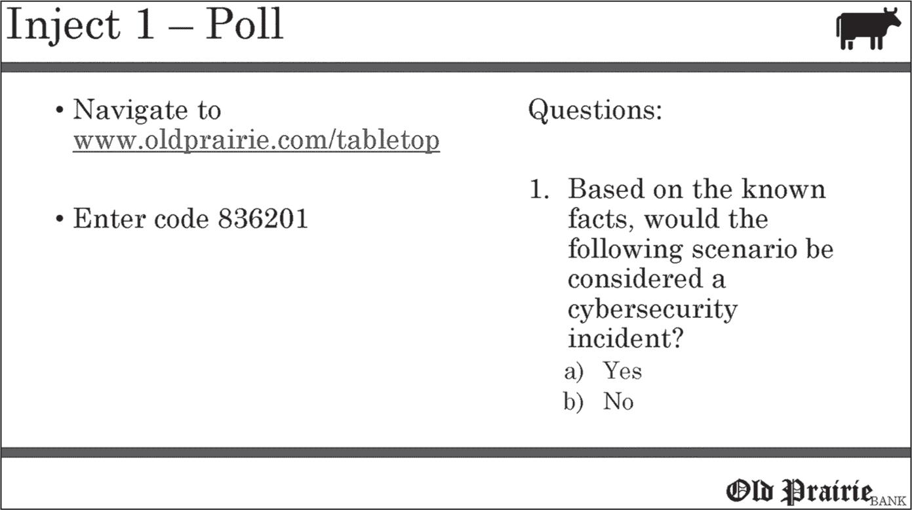
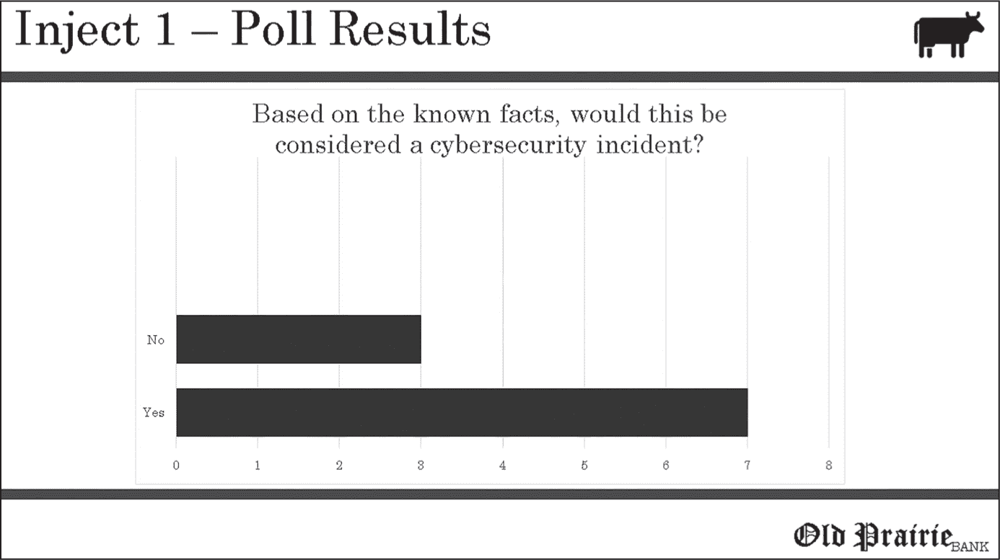
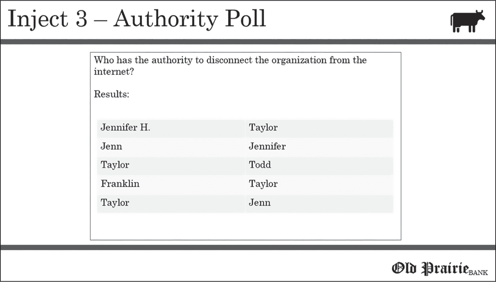
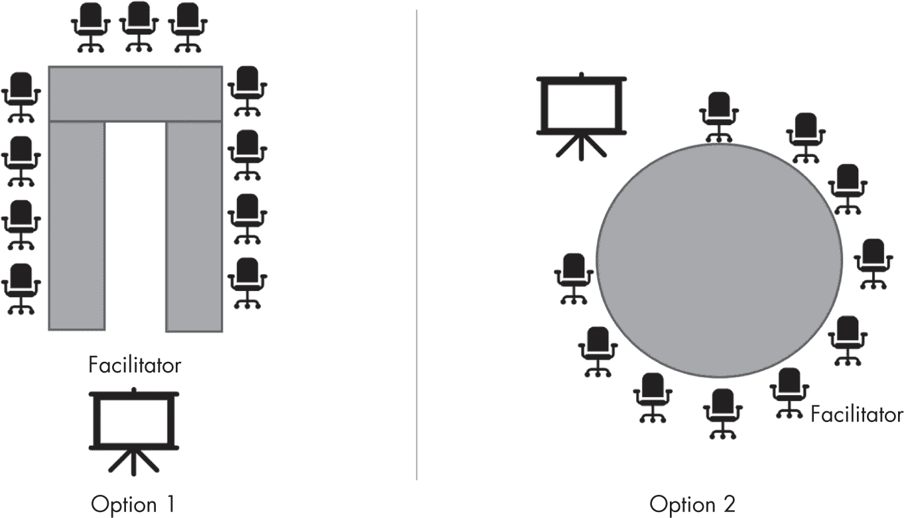

## 第四章：4 促进成功的桌面演练

现在，准备工作已经完成，是时候进行桌面演练了。本章将带你扮演主持人的角色，并介绍一些策略，帮助确保你的活动富有成效。这些策略中有些是你可以遵循的指南，帮助你保持组织性，平衡作为主持人的责任；其他则是一些工具和技术的建议，旨在提高参与者的参与度并创造更互动的演练。

### 主持人的角色

如果你在主持桌面演练，你将承担引导参与者通过场景的挑战性角色，同时鼓励讨论。即使是经验丰富的主持人，有时也会觉得这是一个艰巨的任务。尽管每次桌面演练都有不同，但你应当限制自己只进行以下任务：

+   在需要时提供场景和注入内容的澄清

+   控制讨论，使小组能够全面探讨各个话题，同时确保他们不会浪费时间深入探讨与演练目标无关的内容

+   确定需要进一步讨论的评论和关切点

+   通过提出有针对性的问题，注入你自己的专业知识，以探索潜在的不足之处

+   记录主题和潜在的不足之处，以便在桌面演练后进行记录

+   跟踪时间并以适当的节奏推进场景

主持人类似于体育赛事中的裁判；你应当允许参与者讨论场景，仅在必要时才介入。

这意味着，首先，你必须避免主导对话。作为一个经验法则，你应当尽量保持自己发言时间不超过 30%。一些主持人错误地认为他们必须控制对话的所有方面；不幸的是，这种做法会抑制参与者之间的合作，并造成一个问题不易暴露的环境。

你还应该避免通过过度管理讨论来“引导证人”。虽然参与者有时可能需要你引导他们走向某个方向，但你通过提问让他们自己探索话题的方式要更有效。这一过程有助于促成更深入的对话。

不要害怕通过巧妙地挑战参与者来反驳答案的有效性。考虑以下示例：

**主持人：**你怎么知道威胁行为者访问系统的时间有多长？

**网络管理员：**我们通过查看日志可以知道这个情况。日志应该保存 60 天。

**主持人：**日志保留期是否有文档记录？

**网络管理员：**不是的。根据日志大小，这是我们保留日志的正常时间。日志一旦达到一定大小，就会自动覆盖。

**主持人：**如果服务器非常活跃，会发生什么情况？

**网络管理员：**日志可能只会保存几天。

在这次互动中，主持人的后续提问揭示了两个重要问题：（1）没有文档化的日志保留标准，（2）在现有的日志保留方案和非常活跃的服务器下，可能只有几天的日志可用。如果主持人没有对网络管理员的初步回答进行追问，这次演练就会错过这些重要的发现。然而，即使你在某些话题上非常专业，你也应该避免对每一个陈述进行挑战——你不想制造对抗氛围或显得自以为是。

最后，你必须始终以尊重和专业的态度行事，即使与会者说出一些几乎可以称为无能的话（并且其他参与者可能会意识到这一点）。在这种情况下，你必须以一种既不贬低或让他们尴尬，又能让他们意识到错误的方式做出回应。

### 桌面演练管理任务

主持过程可能非常耗费心力。你必须同时处理与会者的输入和问题，扫描小组成员的视觉提示，保持对场景的关注，确保关键点得到解决，维持一个得体且专注的对话，尊重场内权威人物的立场，并记录下任何需要在后续报告中解决的流程缺陷。

不用说，这个角色即使对最有条理的人来说也可能是一个挑战。本节中讨论的主持管理任务可以帮助你减少疲劳，集中注意力在讨论上。

#### 指派记录员

减轻主持人负担的最简单方法之一，就是完全消除你的一项任务：追踪问题、缺陷和建议，最终这些内容将进入桌面演练后的报告中。你可以将这些任务分配给通常称为*记录员*的人。这个人不需要是信息安全或相关领域的专家；他们只需要熟悉演练场景，以便理解演练的背景、目标、目的和参与者的角色。

记录员的角色可以由一位较为初级的员工来担任，这样的员工可能比大多数员工有更轻松的日程安排，并且可以通过这一经历了解组织动态和网络安全。或者，记录员也可以是某个中层职能人员，他/她可能对桌面演练的结果有一定的利益关系。例如，一位风险管理专业人士可能会从观察事件响应过程并理解出现的问题中获益。

记录员必须在桌面演练前与你协调，提前了解需要跟踪的内容。在你主持活动时，你还应该有一种不引人注意的方式（例如，通过一个眼神或其他非语言手势）来示意记录员在何时记录一个重要的点。

除了做笔记，记录员还可以为你起草一份初步报告，供你审阅。我们将在第五章讨论报告。

#### 添加共同主持人

另一个减轻主持人负担的方式是招募一位共同主持人。此人可以承担扫描观众提问或管理演示文稿软件等任务。通过提前商定分工，你们每个人的责任会减少。此外，其中一人可以在另一个人回答问题时休息一下，这样你们都能有机会短暂反思桌面演练的状态，考虑未来的问题方向，并有时间进行心理充电。

然而，选择一个兼容的共同主持人非常重要。兼容性有很多种形式，包括：

> **个性** 共同主持桌面演练需要在整个演练过程中密切合作。选择一个你愿意和他一起喝咖啡的人（而不是一个你总是拿出手机找借口离开的人）。你们不需要是最好的朋友，但主持人之间应有一定程度的职场化学反应。
> 
> **协调** 确保你能在观众面前实时协调，这有助于确保在练习中你们之间的过渡尽可能自然和流畅。
> 
> **主持风格** 一些主持人的表达风格比较激进，而另一些则更加被动。避免混合不同的主持风格，这可能会让与会者在不同主持人提问时感到困惑。桌面演练不应该让与会者觉得自己在参与一场“好警察/坏警察”的游戏。

此外，拥有共同主持人可以带来不同的视角和专业知识。例如，你们中的一位可能在风险管理方面是专家，而另一位可能在网络安全方面有专长。这些互补的技能集可以为演练增值。

#### 邀请嘉宾讲者

为了分担主持人的角色，你可以邀请嘉宾讲者在注入环节中介绍特定的事实。例如，如果高级桌面演练中的注入环节传达了 IT 安全团队的新一组事实（如确认敏感数据丢失），实际的 IT 安全经理可以进入房间向与会者简要通报。

嘉宾讲者应该像在真实事件中一样呈现事实。例如，IT 安全经理可以借此机会练习宣布新确认的技术信息。除了让桌面演练更加互动外，邀请嘉宾讲者的另一个好处是可以让参与者与可能会参与应对真实信息安全事件的人建立联系。然而，一定要事先向嘉宾讲者简要说明他们不应透露的内容，以免破坏未知信息或与场景细节相矛盾。

#### 预写问题

一个常见的促进技巧是进入事件时，准备好几个问题来询问参与者。这是另一种在演练过程中更好地管理促进任务的方法。

在一些桌面演练中，参与者可能会积极参与，你可能会难以跟上他们提出的众多宝贵观点。每个注入点都有准备好的问题，可以帮助你避免记不住是否有一场富有成果的讨论涵盖了所有重要观点。另一方面，观众可能只给出简短的回答，并且参与度低，让你难以找到激发讨论的方法。在这种情况下，准备好的问题可以帮助你启动停滞的讨论。

预先编写的问题可以与特定的注入点相关，或者可以是通用的，任何时候都可以提问。然而，确保这些问题与演练的目标一致，并且适合参与者。例如，如果你旨在确定组织是否具备适当的工具来检测和应对网络安全事件，你的问题可能不应该集中在如何通知和更新高层领导关于泄露事件的情况。

你应该了解你所提问题的正确答案，理想情况下是基于正式的文档。例如，如果你问的问题涉及日志保留，你应该知道公司有一项政策要求某些日志必须保存 90 天。提问自己已知答案的问题，并不是为了抓住错误答案，而是为了帮助你制定相关的后续问题，并加深你对该主题的理解。

你可能希望与可信代理合作完成这项任务，因为他们可能会理解值得提问的问题以及正确答案。预先编写的问题示例包括：

+   根据你所知，你有哪些工具或日志可以确认已知事实？

+   根据提供的信息，这是一起网络安全事件吗？

+   根据这些新信息，是否需要通知其他相关方？

+   根据当前已知的事件事实，谁负责应对？

对于每一个问题，应该有文档提供正确答案（或至少是表面的指导）。

最后，如果你对主持桌面演练的前景感到紧张，预先编写的问题是一个有效的支撑工具。在管理其他众多演练管理任务时，你可能会在对话的间隙中感到卡住；在这种情况下，准备好一个问题可能会在那时起到神助攻的作用。 ### 演练工具和策略

有多种工具可以协助您进行桌面演练，从简单的白板和画架到实时在线投票软件应有尽有。当然，虽然存在一些新的、闪亮的工具，并不意味着它们适合观众，或者能够增强演练效果——也不意味着您一定知道如何使用它们。您必须熟练掌握所携带的任何辅助工具。实时桌面演练不是排除新技术故障或发现您未启用正确设置的时机（而这样做肯定会引来观众集体翻白眼）。

> 注意事项

*本节中的一些建议涉及使用技术来帮助您进行演练。在使用之前，请确保该技术是允许的。例如，政策或业务实践是否允许您在公司笔记本电脑或平板电脑上加载某些软件或存储桌面数据？一些高度监管的环境禁止使用诸如远程演示平台之类的工具，因此提前了解任何限制至关重要。*

#### 写字板

您或您的记录员可以使用写字板（例如白板、纸质翻转图表或黑板）记录出现的要点。特别是在参与者在讨论中反复提及某个问题时，这会非常有帮助；您可以礼貌地指向写字板，提醒他们该问题已经讨论并记录过。

写字板还可以作为“停车场”，用于记录那些需要进一步探讨的问题或关切。与会者有时会提出一连串问题，您可以将这些问题写在板上，将其“停车”，直到您准备好处理它们。这让您能够掌控讨论的进度，同时也让与会者放心，他们的问题不会被遗忘。

如果会议室内没有写字板，您可以购买一个画架和翻转图表带到活动现场。如前所述，请确保在进行演练之前，了解房间的功能和局限性。

#### 投票软件

增加互动元素是一种提高您主持的桌面演练参与度的策略。例如，使用投票软件是引导观众互动的好方法。投票软件允许您向参与者提出问题，参与者可以使用智能手机、平板电脑或笔记本电脑作答。随着参与者回答问题，回答可能会实时显示，或在预定的时间后，或者当您结束提交期时显示。

投票软件确实需要一些额外的协调，且大多数投票软件平台会收取一定的费用；然而，它们易于使用。一些在线演示平台内置了投票功能，省去了使用附加服务的需要。

以下是一些投票软件可能会有用的例子：

+   在一个旨在评估与会者是否遵循正确流程的练习中，你可以显示一个投票问题，询问某一组条件是否需要通知信息安全人员。这可以显示与会者是否采取了适当的行动。

+   通过提供一个自由格式的回答问题，你可以验证与会者是否给出了不同且冲突的回答。这将显示出流程上存在的不一致，并指出需要进一步的教育。

+   在桌面演练中记录投票问题有助于满足审计要求，并作为参与的证据。

使用投票软件的一个简单方法是在展示一组事实后提问。例如，图 4-1 显示了一个针对注入（inject）的投票问题，提问：“根据已知事实，以下情境是否会被视为网络安全事件？”观众可以访问给定的网址提交他们的答案。

图 4-1：注入 1 的投票问题

图 4-2 显示了在演示文稿中自动填充的结果，无论是实时填充还是当主持人选择时填充。这些结果帮助主持人探索观众的回答是否与组织政策一致，以及偏差背后的原因。

图 4-2：注入 1 投票的结果

投票软件还提供了提问的机会，可以要求比“是”或“否”更复杂的回答。例如，如果你在探讨参与者认为谁有权采取某些遏制措施，比如关闭关键网络段或断开互联网连接，强迫他们在调查中填写一个答案框可能会提供有趣的结果。如图 4-3 所示，针对一个投票问题的回答大多集中在两个名字（Jennifer 和 Taylor）上，但也包括了一些其他名字。这样的结果可能表明，组织需要更明确地界定谁有权采取特定的、可能是严峻的行动。

图 4-3：开放式投票的结果

使用投票软件的另一个好处是，它可以让你自动捕捉数据点，这些数据点可用于报告。自动记录这些答案节省了时间，并能提供支持你建议的详细信息。

虽然投票非常有帮助，但不要随意使用投票；它们应始终聚焦于特定的问题。

同时请记住，技术是一个变幻莫测的女王。实际的桌面演练不是发现你需要调整默认配置的时候。请像在桌面演练中一样排练使用投票软件。

#### 远程演示软件

如果是远程主持桌面演练，你必须了解如何操作远程演示软件的每个功能。如果你是外部人员，但需要使用组织的工具，这一点尤为重要。操作软件不熟练会降低你的信誉，令那些花时间参加活动的人感到沮丧。

远程演示软件的功能差异很大，但可能包括：

+   创建分组房间的功能，将一组参与者隔离在各自的虚拟房间中，共同讨论某个特定话题，然后再回到主房间。

+   问答管理功能，例如让与会者在想提问时“举手”的功能。

+   屏幕上的白板，主持人可以用它记录问题和建议。

+   能够聚焦某个特定人物，如主持人，这样摄像头视角就不会不断地切换到正在讲话的人。

就像使用投票软件一样，你应该与多个同伴一起彻底测试所有功能。

在桌面演练开始时，建立虚拟协作的基本规则也很重要。与会者可能不了解某些功能，因此他们可能会从快速的功能介绍中受益。常见的基本规则包括：

+   要求与会者在提问前“举手”并获得确认。这可以避免多人同时试图发言。

+   要求所有与会者打开摄像头，这样他们就不能隐藏自己或专注于其他任务（如电子邮件）。请注意，这项规定可能与组织文化不符，因此如果你是外部主持人，应提前与组织确认此要求。此外，避免“摄像头羞辱”——我们都有过一天，最后想做的事情就是在同事面前出现在镜头前。

+   鼓励与会者在不发言时将麦克风静音，以消除不必要的干扰背景噪音。

+   创建一个使用聊天室提问、提供额外反馈或实现其他目的的框架。

提前向与会者传达这些基本规则，确保他们有充足的时间准备。在如今远程工作的时代，并非每个人都在配备了固定摄像头和高质量麦克风的办公桌前工作。提前沟通要求能帮助与会者规划合适的地点并以专业的方式参与。

联合主持人或记录员可以负责监控聊天室，留意举手的情况，并维护白板。尤其是在混合桌面演练中，使用这些功能可能会让人精神疲惫，因为你不仅需要关注桌面与会者，还需要关注远程沟通的人。

#### 多媒体辅助工具

多媒体辅助工具，如短视频或音频剪辑，能够吸引观众注意力并打破幻灯片演示的单调。然而，这些工具必须与迄今为止演练中展示的信息相关。与会者不应在观看视频时感到困惑，不明白视频与场景的联系。以下是相关的多媒体辅助工具示例：

+   在涉及勒索软件的场景中，播放一段在被勒索软件影响的服务器上找到的音频文件。音频文件可以包含一个威胁角色的声音，清楚地表明必须在 48 小时内支付赎金，否则所有数据将被销毁。通过有声音与威胁者建立联系，可以增加一份真实感。

+   在为医院高层人员进行的桌面演练中，可以用一个新闻主播的视频来迎接与会者，视频中主播向观众通报医院发生了大规模的数据泄露事件，视频还展示了丢失的数据示例、医院外部的全景镜头，以及一位愤怒的患者的采访，患者因个人数据丢失而生气。

实施这些示例将需要额外的时间和资源。然而，它们将有助于避免冗长演示文稿的枯燥，显得更为专业，并创造更好的体验。

#### 与会者任务与小组分组

尽管由于后勤限制，并非所有桌面演练都适合使用，指定某个职能执行任务却可能为事件增添活力。例如，如果负责媒体关系的员工表示事件发生后 15 分钟内会发布新闻稿，你可以要求他们去一个侧房间撰写声明。在远程演练中，分配任务也容易实现，因为大多数远程演示工具都有分组功能；通过几次点击鼠标，你就可以将某些与会者放入一个独立的会议室，设定时间。

然而，你必须小心确保这一行为不会让与会者感到尴尬，尤其是当他们没有准备好执行请求的任务时。你可不想抑制关系的建立。

#### 录音设备与软件

一些主持人可能会想，是否应该录制桌面演练。在后疫情时代，录制变得更加容易，因为此时使用远程协作软件进行的演练更有可能可以录制会议，并通过点击一个按钮将其保存为可分享的文件。

然而，更多时候，录制会带来负面影响。它往往对桌面演练产生威慑作用，降低其效果。成功的桌面演练依赖于诚实、开放和直率的对话，而如果与会者担心被录音，给出错误答案或与组织规范背道而驰，他们就不太可能积极参与。

尽管有时确实存在录制桌面演练的正当理由（例如，如果记录员不可用，你想在最终报告中重新查看参与者的回答），但除非有明显的好处超过潜在的负面影响，否则通常不建议这样做。

### 充分利用演练空间

随着时间的推移，每个主持人都会学习到一些可以在桌面演练中使用的技巧，这些技巧有助于确保演练的成功。其中一些技巧包括如何规划使用空间，例如确定最佳的会议室座位安排，以及如何与团队成员进行沟通。

#### 最大化会议室布局

一种经常被忽视的主持技巧是利用环境来促进对话。如果会议室中的桌子都面向前方，参与者的注意力将会集中在你这个主持人身上。这可能会适得其反，让参与者更不愿意与他人互动。

更好的布局是将桌子安排成 U 形（图 4-4 中的选项 1）。在这种布局中，参与者可以面对面坐着，观察彼此的肢体语言，并在进行眼神交流的同时向特定的参与者发表意见。这也使你可以轻松走入 U 形区域，并在讨论过程中与所有参与者保持紧密接触。

一些会议室由一张大型的圆形或矩形桌子组成，这类桌子无法拆分。在这种情况下，通常建议站在展示的演示文稿对面（图 4-4 中的选项 2），这样参与者就可以将注意力分配在房间的前方（展示演示文稿的地方）和后方（你所在的位置），确保不会有单一的焦点。这种布置也鼓励了参与者之间更多的互动。

图 4-4：可能的会议室布局

当然，存在各种其他可能的会议室布局。在演示之前，考虑一下哪种布局最能促进对话。此外，在选择桌面演练的位置时，确保你能够将桌子摆放成理想的布局。预定会议室却发现桌子布局不合适，开始演练时就感到很不方便。

#### 通过走动提升参与度

最有吸引力的演讲者会在房间中走动。礼貌地走到某个参与者面前提问，比从房间前方与其讲话要更具亲和力。这种方式还提供了向特定人提问的机会。

有时，主持人可能无意中通过向观众发送不经意的信号，影响本应顺利进行的对话。例如，直接盯着一位与会者看时，可能会让他们觉得你希望他们尽快结束自己的发言。在这种情况下，可以暂时后退几步，身体上与与会者保持距离，直到对话结束。

避免站在讲台后。尽管讲台提供了电缆、麦克风、放置笔记本电脑的地方以及快速记下笔记的表面，但它们可能会通过在你和观众之间设置物理障碍，限制参与者的互动。无线演示遥控器可以让你在不必频繁返回讲台的情况下切换幻灯片和执行基本的演示任务。然而，如果你预计与会者需要远程连接，最好检查一下房间的视听设备，因为某些系统可能会迫使你一直待在单一的电话扬声器附近。

### 沟通技巧

本节概述了你可以用来进行高质量桌面演练的多种沟通策略。有些可能看起来像常识；然而在实际情境中，很容易忘记那些让活动成功的简单原则。

#### 监控生理反应

对于一些主持人来说，桌面演练可能会非常紧张，增加呼吸频率、语速和出汗量。这些生理反应可能会分散与会者的注意力，因此你应当尽量缓解这些反应。在演练之前，回顾一下自己在演示时常出现的生理反应，并制定应对方案，以便它们出现时能够妥善应对。如果你感到特别紧张，有许多简单的方法可以帮助你缓解：

+   如果你处于一个逻辑性的中断点，可以宣布进行五分钟的休息，让与会者可以补充饮料、上洗手间或处理电子邮件。

+   请协同主持人负责下一个环节的引导。

+   尝试有意识地调节自己的呼吸。

+   向一位与会者提问，促使两位参与者之间展开简短对话，将注意力从你身上转移。

每个人对压力情境的反应方式不同。作为主持人，你需要意识到可能的反应，并能够在需要时迅速采取有效的缓解策略。

#### 设置后备沟通渠道

在桌面演练之前，设置一个与信任的同事或高层赞助人沟通的后备通道会很有帮助，这样你们可以在观众看不见的情况下交换重要信息。

后台渠道通常最好保留给远程推进的桌面练习，这些可以包括一个侧面聊天室。在面对面练习期间，后台渠道更难实施但并非不可能；信任的代理人可以通过一个 strategically positioned 的手机给你发送一条简短消息。然而，你必须小心，不要让这分散你注意力或显得你在与房间里的其他人通信，这在某些情况下可能会尴尬。

后台渠道通常用于促使推进者探索一个主题。例如，如果你正在讨论数据备份方法，但尚未讨论备份是否经过测试（这是常见的业务连续性/灾难恢复失误），信任的代理人可以请求讨论这个话题。或者，后台渠道可以提供一个机会与执行赞助人联系，询问他们对练习的看法，并根据需要进行调整。

对于担任外部顾问的便于推进者来说，后台渠道尤为重要。缺乏机构知识，他们很容易忽略一个值得信赖的代理人会识别的关键问题。但对于一些推进者来说，额外的思维任务可能会减弱他们进行高质量练习的能力。

#### 与高级与会者确认

桌面练习的参与者代表各个级别。休息时，与最高级别的与会者私下检查是明智的，以确保练习符合他们的期望。这种检查可能就像说：“我只是想确保这符合您的期望。我们是否应进一步探讨或确保解决某些问题？”这给了高级成员一个表达任何顾虑或得到保证将在未来的注射中解决问题的机会。还要与执行赞助人确认是否参加了桌面练习。

如果需要，检查可以让你纠正课程，并减少高级成员后来可能会抱怨活动的风险。（如果他们这样做，你可以礼貌地指出他们此前提供了积极的反馈。）这对于你作为公司外部人员尤其有帮助，因为外部供应商更有可能接收到批评。

#### 管理对话主导者

一个与会者主导对话并关闭其他人并伤害练习并不罕见。这个人很可能并不是在卖弄自己。相反，他们的行为可能由多种因素造成，包括以下几点：

+   想要证明他们对每个问题都有答案的愿望

+   社交技能的缺乏

+   组织现有流程导致在网络安全事件中所有责任都落在一个人身上的事实

+   组织文化的倾向性，向一个人靠拢

作为引导者，您也可能无意中通过未向其他与会者提问，鼓励了某些人的行为。针对话题主导者的许多不同策略包括：

+   开玩笑地指出，尽管他们有所有的答案，但也很希望听听其他人的意见。然后向另一位与会者提问，问题不涉及主导员工的技能范围。

+   在休息时，私下但礼貌地请他们让其他与会者接手发言。您可以以一种考虑员工感受的方式来表达。例如，您可以说：“您显然知道在事件发生时该怎么做。我很希望我们能给其他人一个机会站出来。”

+   通过加入让他们无法联系的信息，人工地将他们从情境中移除。例如，可以宣布他们现在正在飞往与供应商见面的航班，接下来的两个情境无法与他们沟通。或者，展示一张潜水员的图片，然后告诉他们他们现在在度假。如果他们告诉你他们从不离开手机，你可以回应：“你现在正在加拉帕戈斯群岛潜水，你的手机已经很湿，无法使用。”

无论采用哪种策略，您都应以尊重和机智的方式处理这种情况。指出某人行为接近无礼，肯定会把他们以及其他与会者疏远。

#### 建立人际联系

成功的桌面演练引导者能够在首次情境注入之前，与与会者建立起人际联系，使他们感到放松。与与会者建立关系是一项挑战。大多数关系都是通过共享经历来建立的；不幸的是，您可能只有 15 分钟时间，在与会者进入房间时与他们建立个人联系。无论是好是坏，您在这 15 分钟内给予他们的关注，可能决定了演练的成功与否。每个引导者都有自己的与参与者建立关系的策略。考虑以下几种方式：

+   讨论天气。听起来可能很无聊，但它是最普遍的话题之一，无论是上个月的热浪，还是即将到来的暴风雪。

+   讨论体育。很可能一些参与者会关注体育。评论昨晚的胜利、糟糕的赛季，或是参与者胸牌上的运动队徽章，都是吸引他们注意的有效方式。

+   提及当地文化。这可以包括地区活动，如在附近山脉远足或当地美食。例如，问一下巴尔的摩的桌面演练参与者，谁家的螃蟹饼最好吃，可能会引发热烈的讨论。

+   分享一些关于您家庭的细节。家庭、关系和育儿几乎是任何观众都能共鸣的话题。谈论一个关于孩子的有趣故事或父母的怪癖，几乎总是能促使其他人分享类似的故事。

+   讨论共同的工作问题。当遇到从事某个角色的人时，讨论一个影响你们俩工作的议题。例如，金融专业人士可能像你一样关注快速变化的网络保险市场。

+   提到网络安全新闻。最新的网络安全头条或零日漏洞是一个很容易引起兴趣的话题。

与参与者进行简短、友好的对话，可以让他们放松，更有可能参与到演练中。

不要讨论可能引起争议的话题，比如组织内部管理现状、政治、外交政策或宗教。这些潜在的极化话题是雷区，很容易冒犯与会者，并使演练开始时就处于不利位置。

#### 考虑问题结构

其中一个主持人的目标是鼓励对话。为了做到这一点，你必须注意如何构建你问与会者的问题。要求简短的或是“是”或“不是”回答的问题不太可能激发讨论。考虑以下三个常见于网络安全桌面演练中的问题，以及你如何重新格式化它们以促进更大的观众互动：

**问题 1**

+   **原始格式：** 关闭本地网络是否可接受？

+   **修改格式：** 在什么条件下，关闭本地网络才是可接受的？

原始格式可能会引导与会者给出“是”或“不是”的回答，这样的回答不会引发太多讨论。修改后的问题假设在某个时刻关闭本地网络是可接受的；要作出回应，参与者必须思考影响这一决定的条件。

**问题 2**

+   **原始格式：** 这是个人可识别信息吗？

+   **修改格式：** 什么是个人可识别信息？这算不算？

修改后的格式提出了一个复合问题，以促进讨论什么构成个人可识别信息。

**问题 3**

+   **原始格式：** 首席信息安全官（CISO）需要知道吗？

+   **修改格式：** 要让首席信息安全官（CISO）获知此事，需要发生什么情况？他们需要在半夜被叫醒吗？

在原始格式中，如果注入的信息传达了一组足够严重的事实，所有与会者可能都会点头同意，认为需要通知 CISO。在修改后的格式中，与会者需要思考在什么条件下必须通知 CISO，并根据紧急程度，判断这些条件是否足够严重，需要在半夜叫醒一位高级员工。

问题也可以人为地在两位与会者之间创造讨论。例如，如果你希望两位员工——例如来自信息技术团队的 Bob 和来自人力资源团队的 Luz——互动，你可能会问：“Bob，如果在事件发生时你发现某个员工使用个人电子邮件交换公司敏感信息，而这显然违反了公司政策，你会面对面地与该员工沟通吗？Luz，作为人力资源的负责人，你在这种情况下的角色是什么？是否有明确的流程？当员工被对质时，你希望在场吗？”

当然，提问生成简短回答的时机和场合是存在的。然而，结构良好的问题能够创造一个更加互动的桌面演练。

#### 注意非语言交流

在他们的著作《非语言交流》（Routledge，2022）中，Burgoon、Manusov 和 Guerrero 指出：“非语言信号几乎渗透到每一个沟通行为中。”非语言交流可以包括面部表情、眼神接触、距离、姿势和其他无声信号。

在进行桌面演练时，认真思考你的非语言交流，无论是向个人或一组与会者提问时保持眼神接触，还是在指出重要的流程缺陷时使用关怀的语气，或是通过微笑传达友好的姿态。考虑以下这些非语言交流的例子，以及它们如何促进桌面演练中的讨论：

+   你可能注意到组织中某个通讯团队的成员显得较为 disengaged（不参与）。你不想公开点名批评他们，所以你转向提问整个小组的问题，但特别与这位 disengaged 的与会者进行眼神交流并给予友好的微笑。

+   信息安全团队的成员提出了一个特别突出的问题，你认为这将成为一个关键的建议。你非常有意识地向前倾身，皱起眉头，并与信息安全团队成员进行眼神交流，以传达你对这个问题的关注。你没有说一句话，却已向其他与会者表明了这个问题的重要性。

+   一位与会者对识别出的流程缺陷表达了沮丧之情。你将手掌放在脸上并轻微呻吟。员工意识到你理解他们的痛苦后，继续提供信息。

经验丰富的主持人使用多种非语言交流技巧来更好地吸引观众，并提供更有效的桌面演练。

#### 练习文化意识

在一个全球化的工作环境中，你可能会与遍布全球的参与者一起进行桌面演练。公司的开发团队可能在澳大利亚，制造部门在肯尼亚，电商团队在越南。每个团队遵循不同的文化规范，这些规范可能会影响桌面演练。如果你不了解这些规范，可能会发表冒犯性言论，导致与会者疏远，甚至引发愤怒回应。文化规范违规的例子包括：

+   未能尊重与会者的等级制度，且未能首先介绍最高级别的成员。

+   在一个批评较为稀缺的环境中批评与会者的回应，这可能会让他们在同伴面前感到尴尬。

+   发表关于政府或政治哲学的言论，可能被视为攻击某个文化。

+   对基于民族主义或宗教的冲突没有意识，显得不合时宜。

在桌面演练前，了解每位与会者的物理位置，并研究基本的商业和文化规范。一般来说，如果你不确定某个陈述是否可能被视为不敏感，请避免该话题。

#### 提前识别敏感话题

在每个组织中，某些事件或话题在交谈时是敏感的。尤其是外部顾问，可能不了解相关的背景。此类“雷区”的例子包括：

+   讨论安全运营中心案件管理系统的不足之处，而大家已经心知肚明（且感到沮丧），这个系统一直是彻底且持续的失败。

+   在讨论内部威胁时提起组织最近经历的突如其来的裁员过程。

在桌面演练之前，向执行赞助人或其他联系人询问需要避免的话题。记住，提问尖锐问题和提问显示出缺乏意识或敏感性的问题是有区别的。但如果有疑虑，可以考虑避免某些讨论话题。

### 摘要

进行桌面演练不仅仅是启动一个演示并希望事情顺利进行。成功的桌面演练主持人会使用一系列工具和技巧，如本章所讨论的，以精心设计一个有效的环节。

在成功主持完演练后，你可能会觉得已经完成任务，但实际上还有很多后续步骤需要完成。这些步骤在下一章中将被讨论，它们是桌面演练中最重要的部分，因为它们将结果制度化，并为组织提供在事件后进行改进的依据。

### 问题

在主持过程之前考虑以下问题，以确保活动顺利进行，并减轻作为主持人的一些负担：

1.  谁将在练习期间做笔记？是否可以指定一个专职记录员？记录员的具体任务是什么？

1.  你会提前准备问题吗？

1.  你会使用任何辅助设施，比如白板、投票软件或画架吗？如果练习是面对面的，设施已经提供了哪些辅助设施？练习前你需要采购什么？如果练习是远程进行的，你将利用哪些工具？

1.  虽然通常不建议这样做，你会录制桌面练习吗？如果是的话，录制的好处是否超过对与会者的影响？

1.  是否应该与某些与会者建立通信后渠道，比如执行赞助人？你将如何与他们沟通，以避免分散与会者注意力或忽视其他主持任务？

1.  会议室的布置将如何安排？你能在练习前对其进行更改吗？

1.  如果你对演讲感到紧张，你将采用哪些技巧来控制生理反应（如讲话过快）？

1.  开发团队是否预期会有任何与会者主导讨论？你可以采取哪些策略来减少这种情况的发生？

1.  你可以使用什么策略在桌面练习前与与会者建立联系？是否为见面和问候预留了时间？

1.  需要注意的独特文化细微差别有哪些？
