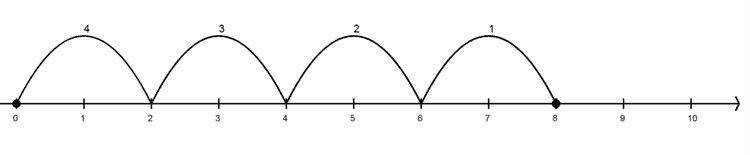

# 第一章：# 理解计算机科学标准

在本书中，我们将探索一些有趣且富有吸引力的方式来教授 K-12 学生计算机科学。虽然让学生享受乐趣是吸引他们与内容互动的关键，但我们需要确保教授学生那些将为他们进入大学和职场做准备的核心概念，以便他们能在信息时代茁壮成长。

本章回顾并总结了美国和国际教育组织（如计算机科学教师协会[CSTA]）采纳的不同计算机科学标准。为了理解这些众多的计算机科学标准，我们将这些概念归纳为四个易于记忆的领域。使用这些指导方针来设计课程，将现有学科内容与计算机科学概念相结合，以丰富每个学生的学习体验。

请记住，关于是否应在公立学校教授计算机科学标准仍然存在争论。事实上，许多媒体标题质疑编程是否已成为新的读写能力。对此，Stack Overflow 的联合创始人 Jeff Attwood（一个解决几乎任何编程问题的论坛）认为，不应在学校教授计算机科学，因为它不仅仅是一个智力学科，而更像是一种职业技能，就像成为一名汽车修理工。

我们可以在过去将信息技术引入学校的尝试中看到这种纯粹的实用主义视角。例如，技术采购，如计算机实验室，是基于人们认为该技术能够提供的生产力提升，比如培训软件和电子表格，而不是理解这些技术及其影响。幸运的是，计算机科学教育的最新发展使计算机科学成为一个广泛且富有文化底蕴的学科，远远超出了编写代码的范畴。

## K-12 学校中的计算机科学标准

计算机科学渗透到我们信息时代生活的方方面面，但将其引入课堂的进展却缓慢。不幸的是，许多学生没有获得他们所需的计算机科学概念的暴露，而这些概念能够帮助他们在现代职业世界中取得成功。

2010 年，计算机协会（ACM）发布了一份详尽的报告，*《空洞运作：数字时代未能教授 K-12 计算机科学》*，报告讨论了美国各州如何在课堂上纳入计算机科学标准。这个报告令人沮丧。只有九个州允许计算机科学课程计入毕业学分，只有 14 个州在一定程度上采纳了计算机科学教学。

此外，计算机科学课程主要集中在计算技能上，而不是基础概念。换句话说，学校将计算机科学视为一种职业技能，而非一种更广泛的学科，后者传授诸如计算思维、信息系统和数字公民等宝贵概念。

类似地，2013 年 4 月，由欧洲信息学协会（Informatics Europe）和 ACM 欧洲信息学教育工作组联合发布的报告《信息学教育：欧洲不能错失机会》强调了欧洲公民在*数字素养*、计算机和互联网流利度以及*信息学*（信息技术科学，类似于计算机科学，但更侧重于信息而非数字计算）方面的教育需求。报告认为，未能明确制定信息学课程、提供教师培训以及为学生提供该学科的必修课，未能为学生准备现代劳动力市场，反而会对学生造成伤害。此外，这还使得欧洲经济面临落后于竞争力更强国家的风险。

幸运的是，许多机构正在制定标准，以更有意义地将计算机科学融入课程中。在以下小节中，我们将介绍一些教育工作者可以借鉴的示例标准：K–12 计算机科学框架（[*https://k12cs.org/*](https://k12cs.org/)）、CSTA K–12 计算机科学标准（[*https://www.csteachers.org/page/standards*](https://www.csteachers.org/page/standards)*/*）以及国际技术教育学会（ISTE）基于角色的标准（[*https://www.iste.org/standards*](https://www.iste.org/standards)*/*）。此外，我们还将探讨内华达州（[*http://www.doe.nv.gov/Nevada_Academic_Standards/Computer_Science*](http://www.doe.nv.gov/Nevada_Academic_Standards/Computer_Science)*/*）和弗吉尼亚州教育局（NDOE 和 VDOE）标准（[*http://www.doe.virginia.gov/testing/sol/standards_docs/computer-science/*](http://www.doe.virginia.gov/testing/sol/standards_docs/computer-science/)），这些标准将计算机科学与其他学科（如数学、社会学科和科学）进行了交叉参考。

### K–12 计算机科学框架和 K–12 计算机科学标准

2016 年，一些计算机科学教育组织和美国各州合作开发了*K–12 计算机科学框架*，该框架提供了计算机科学教育应包含的愿景和详细解释。2017 年，CSTA 发布了*K–12 计算机科学标准*的更新版，基于 K–12 计算机科学框架进行扩展。该更新提供了一组精简的标准，概述了学生在各个学习阶段应该掌握的知识。希望了解在各年级教学内容的教育工作者应参考 CSTA 标准。对于想深入理解计算机科学各学科内容的人，应该阅读该框架。

### 国际教育技术学会（ISTE）标准

另一个值得注意的标准来源是 ISTE。该标准由六个标准集组成，足够简洁，可以印在一张纸的两面，并且与 K–12 计算机科学框架很好地对接。值得一提的是，ISTE 标准是基于角色的：每个标准针对的是教育系统中某个角色的职责。无论该角色是管理员、计算机科学教育者、其他学科的教育者、技术教练、教育领导者还是学生，ISTE 标准都解释了每个角色在组织中应该学习、教授和领导的内容。

### 弗吉尼亚州教育部门标准

2017 年 11 月和 2018 年 6 月，分别由 VDOE 和 NDOE 发布了他们的计算机科学标准。与其他美国州设置的标准一样，这些标准也受 K–12 计算机科学框架和 CSTA 标准的启发。但弗吉尼亚州和内华达州的标准特别之处在于，它们将尽可能多的计算机科学标准直接与现有的语言、数学、历史和科学标准挂钩。

例如，三年级教师可以将关于重复模式的数学课程与包含循环的算法结合起来。算法分析与数学问题解决和英语理解相关。基础集合理论可以与关于分类物体的科学课程相联系。使用计算机获取数据、得出结论并进行预测，有助于支持历史和社会研究中要求学生使用证据回答问题的要求。

在您考虑采用哪些标准来进行课堂教学时，首先从您所在州的计算机科学标准开始。如果您的州尚未正式采纳标准，或者现有标准存在不足，可以参考 CSTA 的标准。如果您需要更深入的内容，探索 K–12 计算机科学框架。如果您需要有关在教育机构中实施计算机科学的指导，可以使用 ISTE 标准作为您的指南。

从概念上讲，众多的教育标准来源可能会让人感到不知所措，并且难以跟踪。在接下来的部分中，我们将回顾如何将这些主题划分为四个主要的主题，既易于记忆又便于实施。

## 计算机科学标准的四个类别

无论哪一套标准最适合您的需求，您都会发现有大量的概念需要涵盖。为了帮助跟踪您需要在计算机科学中覆盖的每个主题，您可以通过四个主要类别来考虑这些标准：数字公民意识、计算机系统、计算思维和计算性成果，如表 1-1 所示\。

**表 1-1：** *计算机科学概念*

| 数字公民意识 | 计算机系统 | 计算思维 | 计算性成果 |
| --- | --- | --- | --- |
| 包容性合作归属感技术影响公平法律与规章伦理安全 | 网络安全设备硬件与软件存储网络互联网故障排除 | 抽象分解算法变量控制模块化推理建模 | 程序开发迭代开发自动化调试许可项目管理反馈文档 |

在我们探索这些广泛领域时，请记住它们不是孤立的。正如计算机科学与数学、英语、科学、历史和社会学相融合一样，计算机科学的这些子领域彼此深度交织。

### 数字公民身份

现在学生们的生活中有很多部分是数字化的。他们活跃在许多不同的在线社区中。正如我们为学生们准备成为现实世界的公民一样，我们也必须教育他们了解在线世界的机会、伦理和危险。我们必须培养他们成为数字公民。

成为数字公民意味着与世界各地的人合作。这涉及到他们需要具备的人际交往技能，以便一起开展项目并认识到人力资本的重要性，正是它让所有现代便利成为可能。

学生应该了解本地和国际法律如何管理他们在数字生活中的信息自由、版权限制、在线隐私等方面。学习计算机的伦理使用以及一些行为如何可能合法但不道德是非常重要的。例如，一些形式的在线骚扰和霸凌会给相关人员带来深远的个人后果。那些优秀的数字公民将会意识到技术的社会影响以及新技术的潜在影响。

学习数字公民身份还可以让学生们看到信息系统与全球不平等之间的关系。对于一些人来说，缺乏接入互联网的计算机意味着什么？为什么信息系统必须对盲人和聋人用户可访问？认识并欣赏我们拥有的好处非常重要，这样我们才能激励自己去保护我们所拥有的，并将其扩展到他人。

### 计算机系统

计算机系统包括网络安全、软件、硬件、网络以及信息技术相关的其他方面，这些方面负责我们所执行的大多数计算任务。熟悉这些技术使我们能够操作熟悉的菜单系统、操控鼠标或触摸板，并阅读屏幕上的内容。这也是当我们遇到陌生的用户界面、难懂的错误信息或系统故障时，容易让我们感到沮丧的领域。计算机系统的每个方面曾经都是我们每个人的困扰点，在学生们敲打键盘时、与鼠标控制斗争时，或在面对弹出框时感到困惑时，依然会是他们的挑战。为了帮助学生克服这些挫折，发展计算机使用的流畅度，了解计算机系统应成为计算机科学教育的关键组成部分。

此外，熟练掌握外设、软件接口、操作系统、硬件、网络安全和网络技术是知识产业领域每个职位对求职者的要求。确保所有学生毕业时都具备这些实际的基础技能，是教育工作者的道德责任。

### 计算思维

在她 2006 年发表的具有里程碑意义的文章中，当时卡内基梅隆大学计算机科学系的系主任 Jeannette M. Wing 提出，应开设一门名为“像计算机科学家一样思考”的课程，面向非计算机科学专业的学生。这门课程将教授*计算思维*，即用计算机能够执行的方式表达问题及其解决方案的艺术。教授计算思维实际上就是将我们日常生活中已经在做的活动重新框定为计算机科学的概念背景。

例如，孩子日常生活中的每一个例行程序，比如上学、上课时专心听讲、参加小测验、选择午餐、上厕所、做作业等，都是*算法*。算法是一组步骤或规则，用来定义学生所遵循的过程。他们在每天的学校生活中通过循环执行某些算法。这些算法在学校年的每一个工作日都被重复执行。学生的生活充满了算法：他们执行任务，比如回答测验中的问题、在课间最大限度地玩滑梯，或在读书时翻页。他们在固定的时间执行所有这些操作，就像计算机执行定期安排的任务一样。

学生们也像计算机一样管理他们个人生活中的物品和信息，计算机通过称为*集合*和*数组*的数据结构进行管理。例如，他们管理教科书、作业或下次考试的资料集合。他们维护社交网络上的朋友数组、数字媒体收藏以及在线对话，执行与数据库管理员运行报告时使用的集合论相同的基本操作。

随着学生年龄的增长，他们的计算思维能力必须与生活中日益复杂的挑战相匹配。例如，我们根据数据形成模型，以重构著名的历史事件或预测复杂系统（如天气）的结果。我们在四路停车标志前执行复杂的算法，在烤蛋糕时，或者穿过十字绣针时也会这样做。像“建筑法规”、“民法典”、“刑法典”和“法典”这样的概念都使用了*代码*这个词是有原因的。在任何棋盘游戏中，你都会发现主题建模、规则中的算法、变量、抽象、控制、模块化、分解、推理、数据表示以及调试都是正确进行游戏所必需的。

计算思维不仅能带来新的洞察力和清晰的认知，它还帮助我们与计算机进行互动。学会用计算机能够理解的方式进行有效沟通，使得我们更容易编写程序，比如调节恒温器以节省能源、在数字日历上安排定期事件，或与像 Google、Siri、Alexa 或 Cortana 这样的人工智能助手成功互动。在计算机完全融入我们日常生活的今天，能够与这些迟钝且高度字面化的智能进行沟通是必需的。

### 计算工件

*计算工件*是指一种计算机程序或其他计算项目，它涉及持续的探究、同行评审和迭代开发，但不总是包含计算机编程。

在开发项目时，学生会学习项目生命周期并开始产生成果。他们学习如何记录和注释代码，以便与计算机和人类协作者进行沟通。他们还学会了如何进行质量保证测试，并在程序出错时调试软件。当他们编写代码时，开始理解到他们迄今为止学到的三个概念是如何结合在一起的。

例如，作为数字公民，学生应该能够与同伴合作，并知道在基于他人代码构建时何时恰当地归属他人的贡献。他们还应该考虑软件对残障用户的可访问性，或者对于在较旧环境中运行的软件的客户，并根据用户的反馈迭代改进他们的项目。

作为熟练的计算机系统用户，学生开始理解代码执行的架构和操作系统。在使用在线应用程序时，他们能够展示出对软件如何在网络上运行以及如何被客户端接收的理解。我们还可以教他们考虑应用程序的安全性，并以伦理和负责任的方式开发软件。

学生可以利用他们的计算思维工具来编写包含变量、函数、循环和条件语句（如 if-then 语句）的算法。接着他们可以进行实验并应用更高级的概念，例如递归和数据类型。他们应该能够对问题进行建模，并在代码执行时测试他们的模型。

到目前为止，我们已经介绍了计算机科学标准的来源，并概述了它们所涵盖的不同类别。除了熟悉这些标准外，教育工作者还必须倡导在其组织中实施这些标准。

## 实施标准时利益相关者支持的重要性

每个信息技术项目都有*利益相关者*，这些人对项目有个人兴趣，认同其目标，并希望看到项目的成功。在学校实施计算机科学标准时，你的利益相关者包括学生、家长和管理员。你需要让他们都对你的项目产生浓厚兴趣，才能使其发展并惠及你的学生。

现在臭名昭著的普通核心州标准的失败，说明了与家长、学生和管理员合作的重要性，阐明为什么学生要学习他们所学的内容，以及这些学习如何惠及学生的利益相关者。2008 年，美国的州长和教育委员启动了全国教育标准化的工作。这是为了公平问题。学生不应该因为他们的父母住在一个教育经费相对较少的州而被剥夺最好的教育机会。

但在实施时，普通核心标准引入了许多新的、不熟悉的练习，特别是在数学教学中，这些练习对那些成长于使用更直接、实用算法解决问题的父母来说显得过于复杂。社交媒体充斥着家长们对这些标准的抱怨。图 1-4 展示了数轴，这是普通核心常见的痛点之一。

图 1-4：数轴，普通核心课程的“反派”

曾经将这个例子看作简单算式“8 ÷ 2 = 4”的家长，现在被要求帮助孩子们理解这种更复杂的算法。对普通核心数学的这种焦虑甚至在迪士尼电影《超人总动员 2》中有所提及：电影中，一位 1960 年代的超级英雄父亲在帮助儿子做作业时遇到困难，无法理解新数学方法。这反映了家长们因普通核心的创新方法而感到沮丧的程度。

图 1-4 展示了数字线，这是教学数学的许多创新方法之一。实际上，它在像新加坡这样的国家得到了广泛应用，新加坡的学生在全球数学和科学表现排名中始终名列前茅。共同核心标准采用了像数字线这样的概念，挑战学生从不同的角度思考数学问题。共同核心标准不是教孩子们解数学问题的特定算法，而是教他们如何像数学家一样思考，使他们能够适应快速变化的世界。

这是一种灵活和适应性强的思维方式，理想情况下大多数人都支持这种思维方式。然而，对于父母来说，当他们面对自己不理解的陌生概念时，他们的理想主义就会受到挑战。对变化的焦虑情绪转化为对这些新教育创新的反感，并促使政治反应的出现。

学区开始从州标准中删除“共同核心”这一词，以避免激起家长和政治人物的愤怒。一些州正式退出了共同核心标准或拒绝采纳它们。但教育工作者之间的内部笑话是，这些州所采纳的标准几乎和共同核心标准一样。

许多父母在帮助孩子做作业时感到的真实沮丧并不是开玩笑。父母是学生重要的支持机制，在辅导孩子完成家中具有挑战性的课程时，我们需要获得他们的支持。父母需要理解为什么孩子们在学习他们在学校时没有学过的概念，以及这些标准为何重要。尤其是在介绍像计算机科学这样全新的学习领域时，这一点尤为重要。获得利益相关者的认同，认可教授计算机科学标准的重要性，是成功实施这些标准的关键。

在第八章和第十章中，我们将介绍一些项目，帮助家长融入学习过程，以及您的计算机科学项目可以提供的服务，使其对学校管理层和学生未来职业生涯具有重要价值。通过社区建设和外展项目，您可以提升计算机科学项目的知名度。

## 总结

在本章中，我们回顾了许多不同的计算机科学标准，从专业机构制定的标准，到跨学科的标准，如 VDOE 和 NDOE 实施的标准。作为教育者，您可以参考自己所在州或国家的标准，了解课堂上需要覆盖的具体内容，并在当地标准尚在制定中或不存在时，参考 CSTA 的标准。此外，您还可以参考 K–12 计算机科学框架，深入了解标准，并参考 ISTE 标准，针对您所在机构的角色制定实施标准的策略。

计算机科学标准的四大类应当使它们易于理解，并便于与其他教育者进行讨论。数字公民身份涵盖了当今学生在进入快速变化的未来时所需的社会意识技能和学科。计算机系统指的是理解学生必须采纳并掌握的硬件和软件，以便在职业世界中取得成功。计算思维涉及与计算机交互以及适应快速变化、技术驱动的世界所需的认知和元认知技能。计算机产物是应用其他三个类别所学技能的最终成果：它们使学生能够创造艺术、软件或其他用户可以互动的具体产品。

本章还提到了利益相关者支持的重要性以及《共同核心州标准》的艰难教训。如果家长看到孩子因无法理解的课程而感到沮丧，他们将无法在家里提供孩子所需的支持。学生、家长和其他利益相关者需要了解学生为何学习这些内容，以及这些内容的相关性。

在下一章中，你将学习研究计算机科学的许多实际、认知和教育上的好处，这样你可以更好地激励学生，并指导他们理解计算机科学教育如何帮助他们。
