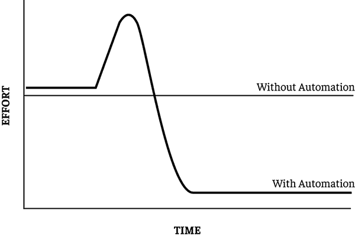

# 第二章：# 计算机科学教育的众多益处

在本章中，我们将探讨计算机科学教育的认知、学术和职业益处，这些益处可以提高学生的成绩、个人发展和职业生涯。因为你正在阅读这本书，所以很可能你已经重视计算机科学教育。但作为一名教育者，你会遇到需要说服的学生、家长和管理员。本章讨论的益处包括你可以用来激励学生成功的谈资，鼓励家长在学术上支持孩子，并为你的计算机科学项目争取学校管理层的支持。

这些益处是相互依赖的。认知益处可以让学生更加敏锐，并改善一些学术表现领域。学术上的益处可以改善学术成绩，并为学生的职业生涯带来更多成功。

## 认知益处

编程练习可以提供认知益处，例如增强问题解决能力、语言敏锐性、工作记忆和毅力。尽管编程与多项测试中认知表现的提高有关，但仍然有一些注意事项。为了利用这些益处，它们必须明确写入课程计划中。例如，在第四章中，我们将探讨*算法*的概念，算法是一组规定如何解决问题的规则，而学生们在日常遵循各种指令时，已经在他们的大脑中处理了许多算法。希望学生能将计算机科学中关于算法的理解转移到日常生活中故障排除算法的教育者，必须有意地构建课程计划来解决这一概念。

### 问题解决

导航代码需要抽象和正式的思维。我们在编写代码时学到的许多问题解决技能和技术可以转移到其他问题领域。例如，在第一次与一些学生一起做电子项目时，我惊讶地发现，我的软件开发背景使我能够在这个新领域中担任导师。代码逻辑和接线逻辑彼此相似，我能够将我用来编写和调试代码的相同问题解决技能应用于接线和故障排除电子设备。

例如，在编程时，将较大的问题*分解*成更易于理解和解决的小部分是很有用的。在编码中应用分解时，我们实践的是*逐步编程，逐步测试（CABTAB）*，确保每一段代码都能正常工作后，再继续编写下一段。我将这一惯例应用到测试每一盏灯上，当学生和我接线时，我还要重新测试之前已接好的灯。当某个组件停止工作时，我使用了*狼栅栏*调试技术，这种技术是在代码或线路的中间找一个点，看看问题发生在它之前还是之后。这种技术类似于农民在他们的农场中间修建围栏，以缩小狼仍在吃羊的区域。编程逻辑和电子逻辑是彼此的*同构*，它们是同一问题的不同表现。教育者应该明确强调并强化不同领域之间解决问题策略的相似性，帮助学生理解。因为计算机科学强调将现实世界的问题建模为形式化的符号逻辑，教育者可以利用这个机会教导学生如何将正式推理应用到现实世界的问题中。

关于编程中解决问题技能向其他领域转移的研究结果不一。1990 年，休斯顿大学-克莱尔湖分校的教学技术助理教授 David Palumbo 分析了编程语言教学与解决问题技能转移的研究。他发现，学生将编程中学到的技能应用到其他领域的能力，往往取决于问题领域的相似性、教学的年龄适宜性和认知前提、语言的教学方式、所教学的语言、教师对学生学习的引导程度，以及学生在教学时间框架内能够达到的专业水平。

一个领域与编程环境的相似度越高，技能转移效果就越好。例如，一项研究发现，学习已废弃的 BASIC 编程语言能提升解决特定代数应用题的表现。此外，编程教学的方式也会影响解决问题技能向其他领域的转移。另一项研究发现，一种专门聚焦于解决问题技能的媒介化学习方法能显著提高学生将问题拆解成更小的部分、做类比、进行系统的试错并从数据中做出逻辑推理的能力。编程的教学方式对学生可能从课程中学到的非编程技能有巨大影响。

### 编程就是沟通

编程是一次沟通练习。在 2007 年的一项研究中，95%的 780 名受访程序员认为理解现有代码是他们工作的重要部分。当我们编写代码时，我们是在编织一个故事，使得我们的合作者能够跟随其脚步。这些合作者也可能包括我们的未来自己：我们可能有一天会回到这些代码并重新维护它，好像是第一次阅读它。其他合作者可能非常难以理解，例如计算机，它按字面意思理解我们的代码，准确地执行我们要求它做的事情，尽管那并非我们原本的意图。编写代码时，我们必须时刻牢记受众，使其对计算机来说是字面意思，而对我们的同行来说则足够表达性。

随着市场对技术专业人员的需求不断增加，一些管理人员建议学校为学生开设计算机编程课程授予外语学分。但这是误导性的。学习外语能够让我们更深入地理解自己的语言，并建立与其他文化之间的桥梁，从而更好地理解我们自己。与此同时，编程语言与自然语言有许多相似之处，可能使两者相互补充和强化。编程语言和自然语言一样，都有语法、语法规则和语义。写出符合语法规则但语义错误的代码是可能的，就像诺姆·乔姆斯基的“无色的绿色思想狂怒地睡觉”在语法上是正确的，但语义上是胡说八道。就像自然语言一样，编程语言也有分支并彼此关联。

双语能力与许多认知益处相关，例如提高元语言意识、创造力和解决问题的能力。为了确定程序员是否经历了这些双语带来的好处，伦敦大学的儿童发展硕士研究生汉娜·赖特进行了一项研究。她与 10 名专业程序员（年龄 22-25 岁）、10 名青少年程序员（年龄 14-17 岁）以及同样数量的对照组成员合作，组成了总共 40 名单语英语年轻成年人和青少年的研究小组，观察他们在双语者占优势的认知测试中的表现。这两组程序员在注意力网络任务测试中表现显著更好，该测试衡量了他们保持警觉状态、从感官输入中选择信息以及监控和解决冲突的能力。

除了与同行程序员、具有字面思维的计算机和未来的自己沟通，程序员还必须以代码这一正式且外语的语言表达所有想法。计算机编程是一种复杂、富有挑战性并且回报丰厚的交流媒介。

### 编程练习工作记忆

沉浸在代码中的学生锻炼他们的*工作记忆*和专注力。工作记忆是指个体在短期内记住和处理信息的能力——通常为 10 到 15 秒。一个人能在工作记忆中保持多少信息以及能保持多久，取决于任务的不同以及个体差异。心理学家常用 n-back 任务来衡量工作记忆，例如背诵逐渐增长的数字串。编写代码是一个工作记忆密集型的任务，它要求编码者保持多个变量和算法的聚焦，以理解和操作代码。

每个软件开发人员都熟悉这样的场景：你正在追踪一个特别让人烦恼的程序错误。也许是某些数据被损坏了。你已经追踪了数据从数据库表格到视图发送到业务层，再到对象模型，一遍又一遍地跟踪着每个函数的处理。你继续追踪它到用户界面，那里更多的函数与其交互，用户可以操控它。接着，它被送回表单处理程序、持久化函数，然后你的手机震动了，整个思维框架瞬间崩塌。

拥有强大工作记忆的学生更容易成功学习编程。1991 年，Valerie Shute 在空军人力资源实验室对 260 人进行了测试。参与者通过自动化辅导系统参加为期七天的 Pascal 编程课程，以评估他们的工作记忆、问题解决能力和学习风格。通过使用多种测试来衡量学生工作记忆的不同维度，包括定量、语言和空间技能，她发现学生具有强大工作记忆与成功学习编程之间存在很强的相关性。

尽管这项研究发现，拥有更强工作记忆的学生是更优秀的程序员，但这并不意味着工作记忆较弱的学生就无法学习编程。它只是意味着工作记忆较弱的学生需要将程序和问题拆解成更小的组成部分，并减少需要记住的变量。计算机科学教育鼓励学生通过将较大的问题分解成更容易解决的小问题，来练习这种编程技巧。

此外，这些学生可能只需要在刚开始学习编程时才需要分解问题。多项研究发现，工作记忆会像我们的肌肉或大脑的其他部分一样通过锻炼来得到改善，因为它具有可塑性。在一项研究中，研究人员发现，受试者通过在五天内分散的 10 小时练习，可以将其工作记忆从一个项目扩展到四个项目。

### 编程练习毅力

编程要求学生解决问题。这些问题通常需要长期的参与。当学生将一个复杂的编程问题分解成多个小问题时，他们每解决一个小问题都会获得更多的奖励。对于特别具有挑战性的问题，学生可能需要花费数小时或数天时间进行研究，收集证据，在这个过程中，他们理想的状态是开始渴望知道他们最终会发现什么。编程是一项自我强化的任务，它奖励学生解决大项目的努力。

近年来，研究人员已确定坚韧——或动机、努力、毅力或“勇气”——是学业表现中的关键“非认知”技能。《共同核心州标准》“理解问题并坚持解决”认可了坚持不懈在学术成就中的重要性。编程项目为学生提供了锻炼坚韧性的绝佳机会。

作为教育者和教练，你必须向你的学生保证，*每个问题都有解决方案*。找到解决方案可能需要涉及他们从未考虑过的代码部分。它可能需要让学生向同伴解释问题，因为以别人能理解的方式阐明问题，往往有助于揭示更深层次的见解。解决方案可能会在凌晨三点突然出现在学生脑海中，迫使他们盯着天花板几个小时，等待去学校的时间。指导学生坚持解决他们的编程问题，鼓励他们锻炼自己的坚韧性，发展应对困难问题的策略。

## 教育益处

当我们编写代码时，我们是在朝着一个目标努力。每一个我们编写的应用程序都需要探索、深思、独立指导、展示、同行评审、修订和迭代。我们所制作的每一个应用程序都是一个项目，这也是它与学术界如此契合的原因。

*基于项目的学习（PBL）*是一种教学方法，学生通过对复杂问题或问题进行深入的持续探索，并制作基于研究的成果展示给同伴。PBL 方法利用学生的天生好奇心，挑战他们解决问题，并让他们在最少的教师指导下自己去寻找答案。在处理主要项目的同时，学生将遇到许多相关的子问题，他们必须解决这些问题，就像解决现实世界中的大问题一样。

PBL 与积极的教育成果相关联。在一项研究中，使用 PBL 的学校的学生在数学和概念性及应用知识方面显著超过了传统学校的学生，并且通过英国国家考试的学生数量是传统学校的三倍。此外，PBL 与《共同核心州标准》的意图高度一致，例如“研究以建立和展示知识”，“理解与协作”，以及“展示知识和想法”。

PBL 是一种非常有成效的学习方式。通过制作作品，学生能够深入融入学科内容，锻炼批判性思维和解决问题的能力。通过持续的探究，每个问题都会引出更多的问题，每个参考资料也会带来更多的参考资料。他们将自己的成果与同伴分享，后者会提供批评和改进建议。在所有努力的最终，成果将成为他们深感自豪的作品。

编程项目是 PBL 的理想选择，因为它们需要深入阅读、实验、研究、协作、同行评审，以及最终可以在作品集里展示的成果。约翰·麦克马努斯和菲利普·科斯特洛在兰道夫-梅肯学院的研究中，分享了他们在课堂中应用 PBL 于编程项目的积极经验，论文题为*Project Based Learning in Computer Science: A Student and Research Advisor’s Perspective*。这些项目包括学生编程自动无人机来收集科学数据。尽管他们的个人经验是轶事性的，但他们发现，学生因项目所有权的感觉而被激励去表现得更好。他们还认为，PBL 方法让学生在掌握之前学到的知识的同时，获得了在课堂环境中难以教授的实践技能。这些实践技能被视为培养纪律性和专业成长，对学生在学术环境之外的未来发展有益。第八章详细介绍了如何在课堂上推动 PBL 项目，并如何将项目开发过程与软件开发实践对接。

### 代码是一种复杂的文本，需细致阅读

细致阅读是一项帮助学生深入理解文本的练习。对于复杂文本的细致阅读可能要求学生首先浏览文本以了解主要思想，然后重新阅读关键段落，以理解风格和结构，接着再阅读一次文本，得出该文本所支持的推论和结论。核心标准建议学生进行细致阅读，并告诫他们：“仔细阅读以确定文本明确表达的内容，并从中做出合乎逻辑的推论；在写作或演讲时引用具体的文本证据来支持从文本中得出的结论。”

阅读不熟悉的代码也需要细致阅读。从 1983 年到 1984 年，南希·彭宁顿研究了 80 名专业程序员，了解他们是如何理解代码，并在脑中形成代码的心智表征的（*Stimulus Structures and Mental Representations in Expert Comprehension of Computer Programs*）。她发现，当程序员阅读不熟悉的代码时，他们会将代码拆解为描述软件解决方案各部分的通用块，而不会过于纠结细节。

程序员仔细阅读代码行，以构建他们日后可以回忆起的故事。就像在细读中一样，程序员会像评论家回到文本中的关键段落那样，反复检查函数或代码块。他们会批判性地审视命名规范、语义和代码结构，看看是否有方法使其更加清晰和易读，这有助于提高代码的可维护性。代码的批判性分析就像对复杂文本的批判性分析一样，锻炼了学生进行深入、持续专注的能力。

### 编程需要研究与合作

软件开发者花费大量时间在提问。验证用户输入是否为数字的最佳方法是什么？如何在字符串中过滤空格？我的程序如何上传文件或发送电子邮件？写一篇文学论文意味着从阅读中开始并发展假设，而写软件则是从定义一个目标开始，然后通过研究找到实现目标的方法。

在 2000 年代初，程序员的桌子上总是摆着厚厚的书，每本书都与他们日常工作中使用的编程语言对应。每本书大约有 1000 页，按字母顺序列出了该语言的所有函数。程序员们会花费数小时翻阅这些书籍，查找函数、传递给它们的参数以及它们会返回的输出。这是一个非常密集且孤独的过程。

今天，编程的门槛比以往几十年要低得多。程序员现在大部分时间都在网上寻找答案。如果他们在搜索引擎上没有找到所需的内容，他们可以将问题发布到一个论坛，参与者在提供最佳、最准确答案时可以获得声誉积分。在线研究成为了专家和新手之间的*对话*。今天，孩子们在进行研究时轻松多了，每个人都应该为他们感到高兴和兴奋，因为这是好事：这个专家们公开讨论编程细节的生态系统，正是软件快速发展的原因。

在根据他们的研究编写代码后，学生们可以将他们写的内容与班级中的其他人分享，并相互学习。学生间的同行评审存在一个问题，那就是它可能导致新手指导新手的情况。学生们在同行评审文本时，往往表达没有支持的意见。但代码的正式性通常迫使学生辩解为什么他们认为代码应该被重构。

因为代码会产生可验证的输出，评估同伴评论的第一个标准是查看代码在他们的修改请求后是否仍然有效。另一个标准是询问这个修改是否使代码更易理解和维护。例如，一位学生可能会建议将一段代码移动到一个单独的函数中。为了证明这个改动合理，他们可能会说：“这段代码用于验证电子邮件地址。如果将它封装成一个函数，你可以将很多行代码抽象成一个 verifyEmail()函数，在任何需要验证电子邮件地址的地方调用。然后，如果你需要更改验证逻辑，只需在一个地方进行更改即可。”

但学生也可以从同伴的误解中学习。就像批评一篇文章一样，学生在对彼此的代码进行同行评审时，会提出一些问题，促使编码者评估他们是否清楚地表达了自己的想法。如果某个同伴对名为 searchResult 的变量以及它在联系人列表中的功能感到困惑，编码者可能会将其重写为 searchContacts，以表明返回的是什么搜索结果。理想情况下，学生应当练习在代码中更清晰地表达自己的想法，目的是让代码对他们的合作者更加清晰。

### 代码为实验提供了游乐场

当今的课堂越来越多地利用*操作工具*：一些玩具或物品，每个都教授一个单独的技能或概念。例如，一位教师可能会使用带有 1、2、4、8、16、32、64 等值的二进制硬币，让学生将它们当作假币来探索二进制数字系统。操作工具为学生提供了通过有趣的探索和实验进行自我导向学习的机会。

编程的过程需要不断的实验和探索。不编程的人通常会想象一个非常正式的软件写作过程。他们设想项目规划者、工程师和架构师在开发者写下任何一行代码之前，已经详细规划和设计了系统的每一个细节。实际上，过程要不同得多。编程时间的大部分都花在了*实验*上。通常，代码会变得非常复杂，以至于即使是编码者自己也不完全知道它是如何工作的。所以他们会去玩它。他们改变操作顺序，调整变量，或者让计算机在不同的地方输出变量，以查看它们是否按预期变化。他们可能会将某个值从“true”改为“false”来看会发生什么。或者他们可能会让应用程序请求一百万个苹果。那么“tqewfsdfve”个苹果呢？代码本身就是一种操作工具。

计算机让孩子们能够通过编程创造自己的学习环境。孩子们教计算机如何思考和行为，在这个过程中他们也进行着元认知。计算机为学生提供了无尽的操作工具。

## 专业好处

很难想象在今天的职场中，有人不与信息打交道，也不通过信息系统来提高工作表现。在 21 世纪，许多职业与计算工具和信息系统紧密结合，因此可以从计算机科学教育中受益。在本节中，我们将学习计算机科学教育如何通过多种方式帮助学生在进入职业生涯时受益。

### 计算机科学让你更具就业竞争力

软件开发人员的需求量很大，并且在可预见的未来将继续保持这一趋势。2016 年，软件开发人员的平均薪资为 100,080 美元，预计软件开发人员的就业增长将在 2012 年到 2022 年间增长 22%。在 2013 年，软件工程师的失业率为 3.6%，这是当时总体失业率 7.3%的二分之一。

但不仅仅是计算机程序员可以通过计算机科学教育提高自己的工作安全性。办公楼中的每个人，从经理到财务监管人员再到大楼主管，都使用信息系统来优化工作流程。在办公室之外，建筑工人必须在许多在线应用程序中浏览本地、州和联邦的建筑规范，以便正确地完成工作。快餐店员工必须快速监控和处理数据，以确保质量的食物能够快速送到顾客手中。自由职业司机必须使用服务提供商应用程序，并最大化导航应用程序的使用，以便快速将顾客送达目的地。几乎每个人在今天的经济中都在使用软件，而那些了解软件功能的人将比那些在工作中学习的人更为高效。

随着软件使用的日益增长，许多行业面临新的数字公民挑战。例如，随着信息技术在医院的普及，医生和护士需要了解如何确保网络化信息系统符合患者隐私法的要求。将信息传递到社交媒体上的营销人员需要关注这些平台如何追踪受众的活动并将这些数据货币化。在内容管理系统（CMS）中工作的作家、平面设计师和编辑需要仔细确保他们不会违反本地和全球的知识产权及隐私法律。

随着数据变得越来越有价值且更为敏感，用户将其交给组织时，专业人员也必须保持警惕，保护这些数据。负责组织薪资部门的专业人员必须意识到钓鱼攻击的危险。他们必须主动向组织的工程师询问关于保护其服务器的安全措施。他们必须了解组织数据被泄露对同事造成的灾难性后果，并熟悉保护数据的网络安全概念。

### 编程让你成为明星

想象一下，你正在和项目经理、IT 总监、图形设计师、文案编辑、市场经理、销售经理以及各种领域的专家开会，讨论一个在线应用程序。每个角色都有自己擅长的领域。但唯一能够将这些愿景转化为实现它所需的代码的人，就是程序员。

在许多组织中，软件开发人员是将项目整合起来的人。那篇新的营销文案？是程序员知道如何在线排版。那张新的横幅图片？是程序员知道如何将其上传到服务器并在代码中引用它。设计师想要给菜单添加动画效果？你需要一个懂代码的人来创建这种互动性。

程序员必须学习整个组织是如何运作的。尤其是在编写业务逻辑时，这一点尤其重要。例如，当我为海岸警卫队编写代码时，飞行员、机械师和军官们与我分享了他们所有关于航空后勤的知识。当我为食品安全实验室编写代码时，我向博士们学习了病原体、化学学科和质量测试。当我在教育机构工作时，我学到了社交网络、营销和出版的各种内幕。

随着时间的推移，组织对程序员的依赖性增加，因为其他员工离职，同事们必须联系软件开发人员，了解他们是如何完成工作的。对组织的业务流程有如此深入的了解，使得软件开发人员拥有较高的工作稳定性。

### 编程和计算思维让你更高效

不是只有拥有“软件开发人员”职位的人才能从掌握编程中受益。具备计算思维能力并懂得一些编程知识，可以为专业人士提供改善效率和自动化任务的机会。

举个例子，一个办公室助理管理企业网站，可能需要将联系人页面从按名字、姓氏、电话和电子邮件排列，改为显示姓氏、名字、电子邮件和电话。最直接的方法是复制粘贴来重新排列字段，但这会非常耗时且容易出错。一个懂得字符串处理函数的助理可以将列表粘贴到电子表格中，然后应用字符串拼接函数，以新的格式输出这些字段。

这样做，专业人员提高了效率和准确性。他们已经自动化了一个重复的任务。自动化这个过程比重复的任务更具技术挑战性，但节省的时间就是解决复杂性后的奖励。自动化让我们能*更聪明*地工作，而不是*更辛苦*地工作。图 2-2 展示了这一点在实践中的运作方式。

图 2-2：有无自动化的时间投入对比

图示显示了当我们自动化任务时，工作努力程度随时间变化的情况。没有自动化的情况下，重复性任务的工作努力始终保持不变。但当我们决定自动化任务时，最初可能会遇到如何自动化的复杂性挑战。将面临学习曲线和解决问题带来的额外压力。一旦问题解决，执行任务所需的努力和压力会降到最低，甚至消失。

以安排每月第四个星期二的会议为例。会议组织者可以查看每个月的日历，并安排 12 次会议。或者，由于他们了解计算机系统并能够进行计算思维，他们可以利用额外的精力弄清楚如何一次性安排一个定期会议，从此再也不用担心。

能够自动化重复任务并利用 IT 简化工作流程的专业人士节省时间并最大化效率。这提高了他们在组织中的价值，也提升了他们的职业生活。

## 总结

在本章中，我们探讨了学习计算机科学如何造福学生。认知方面，学习计算机科学的学生将培养一套问题解决技能，这些技能可以转移到其他知识领域。当编写代码时，学生们练习以计算机所要求的非常精确和字面化的方式进行沟通，同时还要确保代码对同龄人和未来的自己都能理解。编写代码也锻炼了学生的工作记忆，因为他们需要在大脑中存储大量的变量和逻辑，以调试和增强程序。编程的过程锻炼了学生的毅力或坚持不懈的精神，直到他们的项目成功执行的那一刻，感受到满足。

因为制作计算性成果物是项目式学习（PBL），计算机科学教学能够提高学生的学业成功，帮助他们进行深入阅读、持续探究、协作、同行评审和迭代开发。通过在线论坛和课堂代码评审，学生们与同龄人展开对话，协作解决问题并分享最佳实践。在修改代码的过程中，学生通过实验进行探索，并体验到“心流”和发现的乐趣。

从职业角度来看，计算机科学教育使学生更具就业竞争力，并能获得更高的薪水。了解如何自动化业务逻辑使他们对雇主更具价值，也让他们的职业生活变得更轻松。作为其组织的解决方案提供者，他们将深入理解组织的业务流程，从而使自己成为雇主不可或缺的一部分。

让学生意识到计算机科学教育的认知益处可以促进元认知，意识到教育的益处使他们成为自己学习过程中的积极参与者，而意识到该学科的职业益处则为他们提供了成功的动力。了解这些诸多益处的家长和管理者，将更有动力提供对学生项目成功至关重要的支持结构。

尽管这些关于计算机科学教育的理由都是务实且理性的，但同样重要的是强调该学科的人文学科一面。在下一章中，我们将深入探索计算机科学的历史，从你桌面上的图标开始，逐步深入代码。通过了解这些创新背后的人物，我们将建立起技术与人之间的联系。
