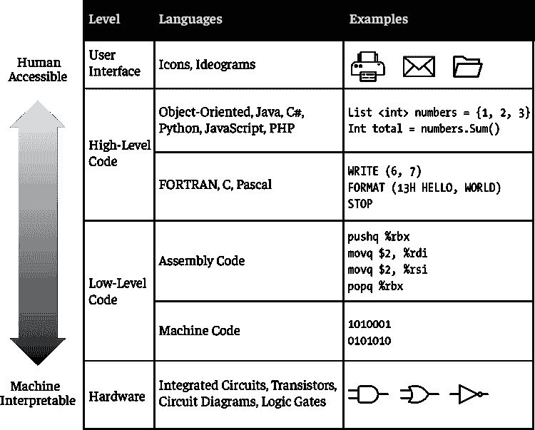
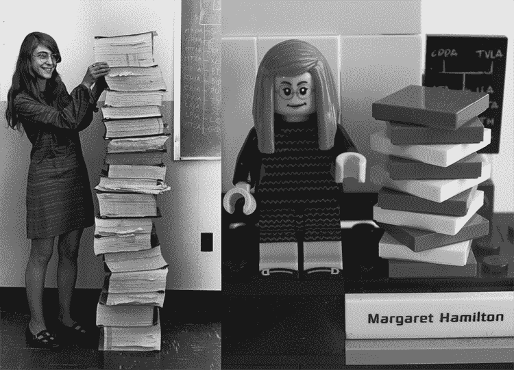
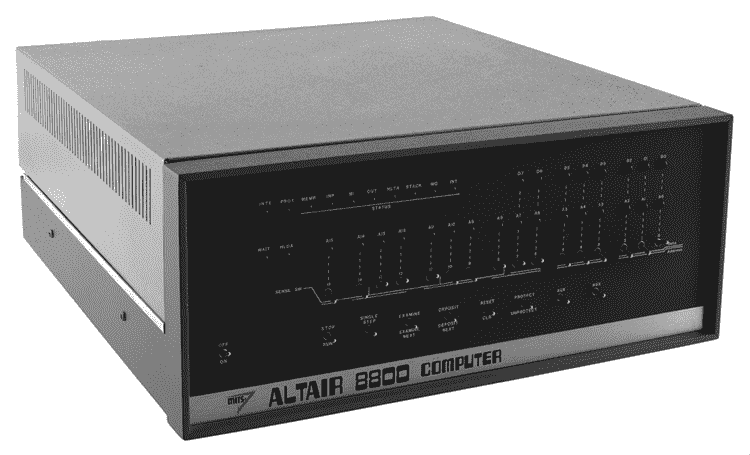
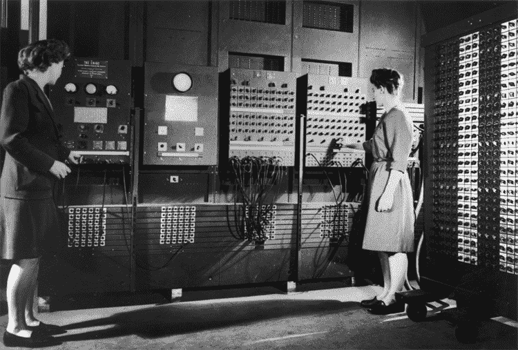
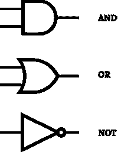
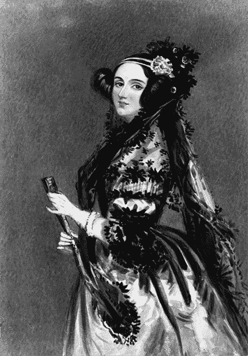
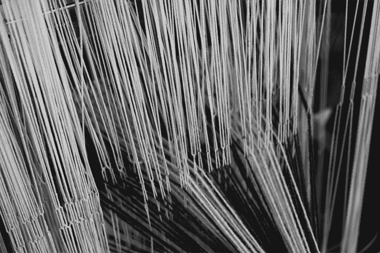

# 第三章：# 计算机科学历史

在本章中，你将了解计算机内部每一逻辑层的技术细节，从你在显示器上看到的内容到移动数据位的电子电路。学习这些信息是一次*分解*的练习。你将把一个高度复杂的系统——计算机，拆解成它的一些较小部分进行理解。熟悉计算机端到端操作的学生将对计算机系统有更深的技术见解和更强的感知。

随着我们向下穿越每一层逻辑，我们将穿越历史，回到那些层次主要是人类与计算机交互的时代。我们将从今天使用的点选界面回到需要翻动电气开关和焊接电路的编程时代。

你将学习每项创新如何隐藏其下层的复杂性，以及*抽象*的重要性，抽象是允许用户与计算机互动的名称和符号，而无需了解其操作的复杂细节。学生们应该理解每一代程序员是如何开发出让计算机对后续世代更易接触的抽象概念的。

学生应该意识到他们对这些极为复杂的计算系统知道多少，以及他们无法知道的东西。现代计算机是一个庞大的解决方案生态系统，是一代代创新者共同构建起来的。此外，学生们应该认识到所有人在计算机科学的某些领域都有无知，并以个人谦逊、对那些不了解某些事实的同伴的敏感态度，以及对所有为让计算机科学更易接触而做出贡献的人深深的感激来对待这一学科。

## 用户界面

我们大多数人都熟悉代表特定程序的图标。但我们有多久没有思考这些图标所基于的现实世界物体了？图 3-1 展示了识别各种应用程序的众多图标之一。


图 3-1：用于抽象计算复杂性的多种隐喻

例如，纸质文件夹代表文件位置，齿轮和齿轮代表设置，邮政信封代表电子邮件。这些图标使用现实世界中的物体来与人类难以理解的算法和信息架构进行交互。通过这种只呈现抽象概念的界面，我们可以点击这些图标而无需再多想。

那么，计算机上的保存图标到底做了什么呢？当我们点击这个图标时，我们向正在使用的软件发送一个命令，软件再与计算机的操作系统通信来保存文件。操作系统从工作内存中获取我们要保存的内容，并向硬盘控制器发送命令，将内容存储到长期内存中，并附带一个目录地址。长期存储硬件，如硬盘或闪存驱动器，将内容以字节的形式存储在设备的多个物理位置中。

这条复杂且高度技术化的事件链完全对最终用户进行了抽象处理。用户只需点击一个磁盘图标，观看指示器旋转，然后继续启动下一个隐藏在这些抽象背后的复杂过程序列。

让你的学生感到惊讶的是，在这些抽象背后还有*另一层*抽象。这些图标可能会触发代码中的编程功能，函数名称如 loadContactList()、checkForNewMessages()或 plotNavigation­BetweenTwoPoints()，它们本身就是将复杂性抽象化以便于使用的表示。图 3-2 展示了编码抽象的多个层次，从用户界面(UI)开始，向下到机器架构。



图 3-2：用户与计算机硬件之间的代码和语言层次

在这个图表中，我们可以看到用户与计算机硬件之间有许多层次的抽象。当我们向下移动这些层次时，代码示例变得越来越难以理解，因为语法与计算机的架构和硬件配置更加契合。在下一节中，我们将看到紧接着 UI 下方的代码。

## 高级代码

紧接在 UI 下方的是*高级代码*，它的语法对人类来说比栈下方的代码更容易理解。这是你的学生在课堂上和专业领域中最常接触的代码。清单 3-1 展示了一段优雅的高级代码，它在网页浏览器中绘制多边形。*注释*（计算机会忽略的可读注释）位于每个//后面，用来解释代码中的一些功能。

```
var drawPolygon = function(context, x, y, radius, sides, color) {
  //context is our cursor
  //translate moves the cursor to coordinates x,y
  context.translate(x,y);
  //Move the cursor out the length of the radius
  context.moveTo(radius,0);
  //Calculate the angle between sides
  var a = (Math.PI * 2)/sides;
  //For each side...
  for (var i = 1; i < sides; i++) {
  //Draw a line between x, y coordinates
  //according to the calculated angle
    context.lineTo(radius*Math.cos(a*i),radius*Math.sin(a*i));
  }
  //Close the drawing path.
  context.closePath();
  //Set the fill color
  context.fillStyle = color;
  //and fill with that color
  context.fill();
}
```

清单 3-1：用于渲染多边形的高级 JavaScript 代码

在清单 3-1 中，我们看到许多高级函数执行看似非常简单的操作。上下文中有一个光标，使用 translate()和 moveTo()函数来定位绘图点。接着，我们使用 Math.cos()和 Math.sin()函数计算每一边的起始和结束点角度。最后，我们通过 lineTo()函数绘制直线，并使用 fill()函数填充所请求的颜色。在仅仅 11 行代码中，我们完成了一些相当复杂的计算，绘制任何所需颜色的多边形。

我们*看不到*的——被我们抽象掉的——是计算机执行这些功能时的所有复杂细节。例如，lineTo() 函数告诉计算机在 A 点和 B 点之间画一条线。但计算机必须计算这些点在画布中的位置，这个画布在浏览器窗口中的位置，浏览器窗口在桌面上的位置，以及桌面的尺寸。接着，它需要与显示器和显卡交互，改变它们之间每个像素的颜色为我们选择的颜色。在这段代码的幕后，发生了大量的数学计算，从显示器到电子电路，我们无需担心。高级代码将程序员从必须考虑代码运行所用机器的负担中解脱出来。相反，它让程序员专注于程序要完成的任务；然而，计算机仍然需要代码与硬件进行通信。

## 低级代码

在人类与计算机电路之间的多个接口层中，*低级代码*是定义硬件特定操作的地方。低级代码通常是特定于机器的，并会引用特定的内存地址、存储外设或处理器功能。因此，它也可能非常难以阅读，需要对计算机使用的硬件架构有深刻的了解。

### 汇编语言

即便是低级代码，也提供了一定程度的人类可读性。*汇编语言*是低级代码，但仍然使用符号命令。它不同之处在于，它必须严格地在执行的计算机架构内操作。示例 3-2 展示了一个汇编语言函数，它将给定的数字加一并返回结果。

```
def add_one(n)
  pushq %rbp       
  movq  %rsp, %rbp
  addl  $1, %edi   
  movl  %edi, %eax
  popq  %rbp
  retq
end
```

示例 3-2：为数字加一的汇编语言代码

def add_one(n) 这一行定义了接受参数 n 的函数名称。pushq 和 movq 这一行在特定寄存器上为函数设置了一个新的栈，这些寄存器用于硬件架构中的特定位置的内存地址。addl 这一行将一个长整数加一，第一个参数加一，第二个参数 %edi 指的是存储 n 值的寄存器。movl 这一行将 n 的新值从 %edi 寄存器移动到存储返回值的寄存器 %eax 中。最后，popq 和 retq 这一行释放内存，并将计算机返回到函数调用之前的程序位置。

高级编程代码中等效的功能可能类似于这样：n = n + 1；或 n++。完成我们能在一行高级代码中做的事情，需要八行晦涩的汇编语言代码。同样，示例 3-1 中的高级代码可以仅用九行代码绘制任意多边形，而相同的任务在汇编代码中需要更多的代码行数。

编写汇编代码需要大量的工作才能告诉计算机具体存储和检索每一块数据的位置。图 3-3 是玛格丽特·汉密尔顿的标志性照片，当时她是麻省理工学院仪器实验室软件工程部的主任，她站在阿波罗导航计算机（AGC）汇编代码的打印列表旁边，旁边是纪念她的 LEGO 人物。



图 3-3：玛格丽特·汉密尔顿（左）作为阿波罗飞行软件工程师团队的负责人时的照片，站在阿波罗导航计算机（AGC）源代码的列表旁边（照片来源：德雷珀实验室，1969 年）。右侧为来自“NASA 女性”LEGO 系列的重建图像。

这一堆汇编语言代码的高度几乎与程序员本人一样。当我们编写高级代码时，重要的是要意识到像这样的汇编代码库广泛存在，使得每个函数调用成为可能。在人类方面，这张玛格丽特·汉密尔顿的照片因其将飞往月球这一技术复杂的事物与人类的面孔结合起来而成为标志性图片。即使在复杂的代码中，程序员也能找到表达个性和幽默的方式。列表 3-3 显示了来自阿波罗代码库的一些汇编代码示例。每个井号（#）符号后面是*注释*，这些注释是为人类提供的代码解释，计算机不会读取。

```
FLAGORGY TC       INTPRET   #  DIONYSIAN FLAG WAVING
         BZF      P63SPOT4  #  BRANCH IF ANTENNA ALREADY IN POSITION 1

         CAF      CODE500   #  ASTRONAUT:     PLEASE CRANK THE
         TC       BANKCALL  #                 SILLY THING AROUND
         CADR     GOPERF1                  
         TCF      GOTOP00H  #  TERMINATE
         TCF      P63SPOT3  #  PROCEED        SEE IF HE'S LYING

         TC       POSTJUMP  #  OFF TO SEE THE WIZARD ...
         CADR     BURNBABY

         CAF      V06N43*   # ASTRONAUT:  NOW LOOK WHERE TO ENDED UP
```

列表 3-3：阿波罗计算机的示例代码

在列表 3-3 中，隐藏着大量幽默。在其中的 GOTOP00H 命令是对“维尼熊”的引用，它是根程序的名称。FLAGORGY 命令，可能是一个关于不正常行为的警告，注释中提到了酒神狄俄尼索斯，他也是阿波罗式的反义词。注释“PLEASE CRANK THE SILLY THING AROUND”描述了当天线不在正确位置时，CODE500 信息的意图，而“SEE IF HE'S LYING”则再次验证了位置。在点火之前，我们看到了“OFF TO SEE THE WIZARD ...”，接着是命令 BURNBABY 和 V06N43*，这些命令指示月球着陆器何时应到达月球，注释“NOW LOOK WHERE TO ENDED UP”则说明了最终位置。你可以将这些代码分享给学生，以突出编码中的人性化一面。即便在任务中，代码可能关系到宇航员安全登月的生死存亡，但依然有空间表达幽默和个性。

尽管汇编语言代码如此晦涩，它依然能抽象出复杂性。代码中引用的内存寄存器在计算机中只是标签，而它执行的命令则是为了便于人类理解而命名的。即便这些指令也必须进一步翻译成计算机能解读的信息。

### 机器码

虽然汇编代码是硬件特定的，且写作时需与计算机架构中某些内存地址配合工作，但它仍然在处理人类友好的抽象，并操作数据块。在最低级别，编程代码操作计算机中最基本的信息单位——*位*，它们的值只能是 1 或 0。*机器代码*，一种严格的数字编程语言，正是在这个层级用于与这些位进行操作。

阅读机器语言代码就像阅读 DNA 分子中的原子。列表 3-4 展示了用于存储文本字符串的二进制机器代码示例。你可以想象，在如此不透明的语法下工作有多么具有挑战性。

```
01001000 01100101 01101100 01101100 01101111
00100000 01010111 01101111 01110010 01101100 01100100

```

列表 3-4：用 ASCII 二进制代码表示的“Hello World”

比尔·盖茨和保罗·艾伦为 1975 年 MITS Altair 8800 编写了 BASIC 编程语言的一个版本，这是一款早期的微型计算机，尽管仅面向业余爱好者，但在当时非常流行。盖茨和艾伦必须通过一组二进制命令将他们的 BASIC 解释器加载到机器中。在图 3-4 中，你可以看到，计算机没有显示器，而只有用于二进制输入和输出的灯光和开关。



图 3-4：Altair 8800 计算机（照片：美国历史国家博物馆）

当描述 CPU 以一和零的形式工作时，又有一层复杂性被抽象化了。即使是一和零也只是表示电路中电量多少的抽象。

## 电路

一和零，构成机器代码字符串的数据位，代表计算机内部的“开”和“关”设置。计算机的中央处理器（CPU）执行所有计算，它是一个微芯片，包含一个或多个*集成电路（IC）*，即包含一组电子电路的微芯片。每个 IC 内充满了数十亿个*晶体管*。每个晶体管的电状态决定了一个位是开还是关——即一或零。如果你仔细观察，你可能会在计算机的某个按钮上看到一个符号，结合了这两个值，表示一个位，如图 3-5 所示。


图 3-5：计算机电源按钮图标

在获得诺贝尔奖的晶体管发明之前，计算机使用的是*真空管*，这是一种类似于灯泡、大小约为你的拇指的电路。它们既大又耗电，产生大量热量，而且经常烧坏。第一台电子通用计算机 ENIAC 于 1946 年诞生。它使用了 2 万个真空管，占地 1800 平方英尺，重达 30 吨。相比之下，今天使用 IC 的手机，处理能力比 ENIAC 强大数千倍。

第一款计算机程序是由六位女性数学家为 ENIAC 编写的：Kathleen McNulty、Frances Bilas、Betty Jean Jennings、Elizabeth Snyder、Ruth Lichterman 和 Marlyn Wescoff Meltzer。它涉及为各种二进制命令和数值设置开关和插头。在当时，*计算机*一词指的是负责计算数字的职业头衔。直到后来，这个词才成为替代这一职业的工具名称。

在图 3-6 中，你可以大致了解 ENIAC 接口的大小和复杂性，界面上有许多灯光和控制面板，代表着二进制的输入和输出。



图 3-6：Betty Jennings（左）和 Frances Bilas（右）正在操作 ENIAC 的主控制面板（照片：ARL 技术图书馆，美国陆军照片）

甚至晶体管也是抽象的。它们代表逻辑运算。没有 1936 年由 MIT 学生 Claude Elwood Shannon 撰写的论文《继电器和开关电路的符号分析》，第一台数字计算机是不可能实现的。在这篇具有里程碑意义的文件中，Shannon 证明了电开关可以用来执行*布尔代数*，这是一个在其中操作处理真假值的代数分支。布尔代数由 George Boole 在他的 1847 年著作《逻辑的数学分析》中引入，并在 1854 年出版的《思维法则的研究：其基础是逻辑和概率的数学理论》一书中讨论。图 3-7 展示了*逻辑门*的一些例子，它们以一种可以转化为电路的方式来模拟布尔逻辑。



图 3-7：逻辑门

符号左侧的线代表二进制输入，右侧的线代表二进制输出。例如，AND 门接受两个输入，只有当两个输入都是 1 时，输出才为 1。因此，0 和 0、1 和 0、0 和 1 的输出都是 0，而 1 和 1 的输出为 1。OR 门只要其中一个输入为 1，输出就为 1。因此，1 或 0、0 或 1、1 或 1 的输出为 1，而 0 或 0 的输出为 0。NOT 门会反转任何输入，所以下输入 1 时输出 0，输入 0 时输出 1。逻辑门可以组合成复杂的配置来模拟逻辑过程，进而在电路板上用适当的组件构建出来。

这些信息解释了计算机谜题的硬件部分。但在计算机科学家能够设计出能够自动化逻辑的机器之前，还有其他人首先设想了这样的事情是可能的。

## 构想思想机器

与此同时，克劳德·香农正在研究如何利用电路执行逻辑运算，而阿兰·图灵，这位在第二次世界大战中凭借破译密码拯救了无数生命的博学家，则在研究如何将离散的逻辑操作结合成一个计算系统。在他的论文《可计算数及其在决策问题中的应用》中，图灵描述了一种假设的*图灵机*。这种机器可以是人类或机器，从一条潜在无限长的磁带上读取符号；将机器的*状态*存储在*寄存器*中，寄存器是对人类计算机思维状态的参考；根据指令表查找这些符号；打印输出；并根据指令沿着磁带移动到新的位置。换句话说，他描述了一种非常原始的 CPU，能够处理计算机程序。凭借这一成就以及其他贡献，他常被视为现代计算机科学的奠基人。

发明家们早在图灵之前就梦想着让机器完成认知负担重的任务。在 19 世纪的几十年间，英国博学家查尔斯·巴贝奇提出并尝试建造一台机械计算器，他称之为差分机。后来，他建造了一台通用的机械计算机，称之为分析机。尽管这两项发明在他有生之年都未能成功完成，但分析机具有内存存储、相当于现代 CPU 的功能，并且可以通过打孔卡片进行编程。

阿达·洛夫莱斯（Ada Lovelace），诗人拜伦勋爵的女儿，是一位数学家和作家，她将自己的方法称为“诗意科学”。她还是巴贝奇的长期朋友，巴贝奇称她为“数字女巫”。阿达对差分机（Difference Engine）非常着迷。在将一篇关于巴贝奇提出的分析机（Analytical Engine）的外文论文翻译成英文时，她在文中加入了大量注释，甚至包括了一个详细的算法，用以在该机器中计算伯努利数列。正因如此，洛夫莱斯被广泛认为是世界上第一位计算机程序员。图 3-8 展示了她的水彩肖像，这幅肖像被“阿达倡议”（Ada Initiative）采用，该组织致力于提高女性在开源技术和文化中的参与度。



图 3-8：阿尔弗雷德·爱德华·查隆（Alfred Edward Chalon）所作约 1840 年阿达·洛夫莱斯肖像

在她的著作中，洛夫莱斯显然对分析引擎充满了热情。她惊叹于它如何将抽象的思维过程转化为机器操作。她设想了一种强大的机器语言代码，将为人类提供更快、更准确的分析。她还提到了该引擎的前身——*雅卡尔织布机*，它使用打孔卡片来编程织物设计，她表示分析引擎就像织布机织造花朵和叶子一样编织代数表达式。事实上，当我们回顾更远的历史时，会发现逻辑表达式的编织与织物的编织面临着一些相同的挑战和挫折。

## 古代历史

在一次前往秘鲁的旅行中，我有幸访问了一个山村，在那里我了解到织布在他们文化中的重要性。在没有书面语言的情况下，几千年来，这些人依赖于*象形文字*，这些图像用于传达食物、资源、警告或人物的标识。当地的妇女们在挂毯上编织这些象形文字，我们可以把它们看作是现实生活中事物的抽象，就像计算机 UI 中的图标一样。

在村庄里，他们最近购买了两台简单的织布机，需要手工编程。图 3-9 显示了织布机的编程代码，代码中的字符串排列将作为输入，最终成为设计输出。



图 3-9：秘鲁的织布机

这幅织布机的图像展示了许多复杂性，我们可以想象编程它会是多么令人生畏的挑战。看着妇女们手工编织，就像看着一台计算机逐行逐位地排列像素。一位妇女解释说，新的织布机速度更快，但当它们设置不正确，图案出来错误时，非常令人沮丧。这就像编程中的挫折，软件执行速度很快，但正确编写程序逻辑却是一个挑战。在这个没有电力和自来水的村庄里，人们成功地应对着需要计算思维和抽象的复杂挑战，而周围并没有任何计算机的身影。

## 总结

在本章中，我们探索了使现代计算系统成为可能的多层次和创新。从用户界面（UI）开始，我们逐层向下，涉及了高级编程代码、低级汇编语言代码、机器代码、电路、布尔逻辑等概念创新，以及计算机的前身——可编程织布机。同时，我们回顾了历史，遇到了一些计算机科学的创新者，如玛格丽特·汉密尔顿和她在 NASA 的团队；ENIAC 程序员；克劳德·香农；艾伦·图灵；查尔斯·巴贝奇；阿达·洛夫莱斯；以及来自土著村庄的织布工。所有这些人都是与你的学生能产生共鸣的普通人，提供了学生可以从中看到自己从事计算机科学工作的榜样。

此外，通过让学生意识到为了使现代计算机成为可能，众多专家和创新付出了巨大的努力，你将教会他们尊重这一学科，并理解没有人能够掌握所有的知识。学生应该意识到，以个人谦逊和对他人的敏感态度去接触这一学科是最好的，认识到每个人在计算机技术和创新方面都有盲点。当学生理解计算机科学对每个人来说都是复杂的，而且这一领域的历史是通过抽象化使计算机逐步变得更容易接触的故事时，他们就会希望能更加亲近这一学科。

在这一历史中，我们看到了早期的计算机科学，尽管它建立在电路板和抽象的研究论文上，但与我们今天使用的编程环境几乎没有相似之处。然而，正如我们将要学习的那样，编程的基础元素在这几十年间保持不变，我们并不需要现代计算机来学习计算机科学。

在下一章，我们将探索你可以在课堂上如何以不涉及计算机的方式探索计算机编程的基本构建块。
