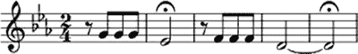
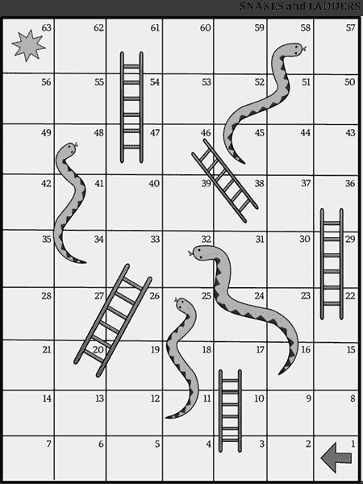

# 第四章：# 计算思维的游戏化和断开连接模式

本章我们将研究计算机程序中的一些更为离散的元素。这些信息包括编码概念，如变量；控制结构；函数；以及计算思维概念，如算法、建模和抽象。

现在许多 K–8 年级的教师除了教授其他学科外，还需要教授计算机科学概念，他们常常感叹自己不知道如何教授这些看似技术性的概念。但正如我们将看到的，这些概念其实是我们日常生活中已经在使用的。认识到这一点会将每个概念转化为一种工具，我们可以将其与现有的课堂主题结合，以增强我们的教学实践。

在本章中，你将学习如何在不使用计算机的情况下，在课堂上教授这些概念。计算机是强大的学习工具，但它们也让人孤立：学生们在沉浸于屏幕中进行死记硬背的学习时，安静地远离彼此。虽然有时需要这种深度、持续的专注，但在这里，你将学习到小组活动、游戏和创造性项目，这些活动能够在不使用屏幕时间的情况下锻炼学生的计算思维能力。

## 变量

让我们从最基础的编程单元——*变量*开始，它是一个标签——最好是对其他人直观易懂的标签——用来标识一块数据。正如我们在上一章所学到的，在低级编程语言中，变量与计算机中的特定存储位置相连接。而在高级编程语言中，我们不需要担心内存分配；相反，我们只需将变量理解为赋予一块信息的名称标识，这块信息被称为它的*值*。变量可以指向不同类型的数据作为值，例如整数、字符串、布尔值和列表；因为变量实际上并不保存数据，而是指向计算机内存中的某个位置，所以我们可以在整个软件应用中重复使用同一个变量。

向学生解释变量的一种常见方式是通过现实生活中的例子，让他们将程序中的每个变量看作一系列命名容器中的一个，例如文件柜中的标签文件夹。为了让这个概念更加生动，可以尝试带学生去图书馆。书架就像计算机中的内存，每个书架只能容纳一定数量的书籍或数据。标签就像计算机中的内存地址。地址 343.73099 Les 的书本变量值是什么？793.93 Coo 呢？通过一些前期思考，你可以构建一个有趣的冒险故事，利用杜威十进制分类系统，假装它们是图书馆这个巨大计算机中的内存地址。

正如其名称所示，变量的一个关键特征是其内容可以变化。例如，一个字符串变量 currentPresidentOfTheUnitedStates 可能在某个时候包含值 George Washington，而后来可能包含值 Abraham Lincoln。一个整数变量 currentYear 可能在每次日期等于 1 月 1 日的第一秒时递增 1。一个布尔变量 stopLightGreen 将在红绿灯变化时在 true 和 false 之间切换。

变量也可以指向值的列表。许多编程语言允许你在变量中存储一个*数组*，即一系列项的列表。可以把数组想象成一个变量列表，其中每个变量通过其在数组中的位置来标识。例如，foodGroups[]数组可能包含['蔬菜', '水果', '谷物', '肉类', '乳制品']。数组中的第一个元素是通过 0 来标识的，而不是 1——这一点常常让初学者困惑，导致很多软件错误。所以当我们引用 foodGroups[0]时，我们得到的是蔬菜，而 foodGroups[4]会返回乳制品。我们还可以拥有数组的数组，使其更加复杂。表 4-1 展示了这个食品组示例可能的二维数组。

**表 4-1：** 二维食品组数组

| 蔬菜 | 水果 | 谷物 | 肉类 | 乳制品 |
| --- | --- | --- | --- | --- |
| 芹菜 | 苹果 | 大麦 | 牛肉 | 奶酪 |
| 豌豆 | 香蕉 | 燕麦 | 鸡肉 | 牛奶 |
| 菠菜 | 橙子 | 小麦 | 猪肉 | 酸奶 |

不包括表头作为数组的数组的一部分，foodGroups[0][0]将返回芹菜，foodGroups[2][1]返回燕麦，而 foodGroups[4][2]返回酸奶。回到书架上，你可以使用书架来解释数组和数组的数组。例如，参考书架可能包含像['001-372', '373–803', '803–979']这样的标签，每个标签引用这些地址内的一系列书籍。

改变一个变量可能会产生戏剧性的效果。一个单一的字符，或者*字符型*数据类型变量，标记为 currentVowel，用来表示字符串'b_t'中的第二个字母，可能会生成具有完全不同意义的单词，如'bat'、'bet'、'bit'、'bot'或'but'。这里还有一个例子：作为表示大气中二氧化碳（CO2）分子每百万分之一（PPM）的浮动变量——命名为 cO2PPM——当它增加时，太阳辐射会作为热辐射被地球捕捉，导致行星的平均温度升高。当我们将这些主题转化为编程代码时，我们会发现，改变计算过程中的一个变量可以产生完全不同的输出。

正如你可能已经意识到的，并且希望你的学生也能认识到，我们在日常学术生活中已经在使用变量。识别各种学术情境中的变量可以帮助我们更正式地思考它们。在接下来的部分中，我们将探讨如何通过逻辑控制正式操作变量。

## 控制结构

变量是我们计算世界中最基本的元素。一旦我们定义了这些元素，就可以开始根据它们的值做出决策，使用 *控制结构*。控制结构是评估变量并根据这些变量的值决定接下来的操作的条件语句。还有一些控制结构能够迭代地执行计算任务，循环评估条件语句。

正如在《编程是沟通》中提到的，第 19 页，与计算机的沟通就像是与一个非常字面化的人沟通。接下来的各个小节中解释的控制结构是正式的，而自然语言则是混乱的。如果我们将学生使用自然语言的标准提高到正式的标准，就能够培养他们更精确的语言使用。

### 布尔条件

编程控制结构在很大程度上依赖于 *布尔条件* 来引导程序的流程。这些语句的结果为真或假，并通过任何数量的 and 和 or 运算符连接。当布尔条件通过 and 连接时，*所有* 条件必须为真，才能满足 if 语句。例如，如果一个生物吃其他生物，且它有脊髓，且它用乳汁喂养幼崽，且它下蛋，且它有喙，那么它就是鸭嘴兽。当布尔条件通过 or 连接时，*任何* 条件为真都会满足 if 语句。例如，如果一个生物哺育幼崽，或者它拥有新皮层，或者它有毛发，或者它有三块中耳骨，那么它就是哺乳动物。

### if-then 和 else

在美国，一名工作人员在评估选民登记表时必须考虑两个变量：申请人的出生日期和国籍。如果出生日期等于或大于今天日期减去 18 年，并且他们是美国公民，那么申请人将被注册为选民。这是一个 if-then 控制语句的示例，其工作原理如下：如果布尔条件为真，则执行此操作。同样，还有 if-then-else 语句：如果条件为真，则执行此操作；否则执行不同的操作。尽管在选民登记的示例中没有明确说明，但 else 流程路径应该是拒绝申请，申请人将无法注册为选民。

在 if 和 else 语句之间可以有任意数量的 else if 条件。每个条件在进入 else 语句之前都会进行判断。例如，如果出生日期检查失败，但公民身份检查通过，那么我们可能会跟随 if 语句加上 else if USCitizen == true 来拒绝申请，并要求申请人等到足够年龄时再重新申请。清单 4-3 展示了在 JavaScript 中检查这些条件的示例，JavaScript 是一种用于为网站添加动态功能的编程语言（你将在下一章学习如何通过浏览器执行这些功能）。

```
var birthDate = new Date("01/01/2000");
var USCitizen = true;
var today = new Date();
var diffDays = parseInt(today - birthDate); 
if (USCitizen == true && diffDays > 567648000000)
  console.log("You are registered to vote!");
else if (USCitizen == true)
  console.log("Come back later.");
else
  console.log("You are not eligible to vote.")

```

清单 4-3：检查申请人是否可以注册投票

在这个非常基础的示例中，我们没有考虑闰年、时区或夏令时，`birthDate`被设置为 2000 年第一天，`USCitizen`设置为`true`。然后，我们计算`birthDate`和今天之间的天数差，并在第一个`if`语句中检查用户是否已满 567,648,000,000 毫秒（18 年的毫秒数）。如果没有，我们检查`USCitizen`是否为`true`，并在`else if`语句中提示他们稍后再来；最后，在`else`语句中告诉他们如果既不够年龄又不是美国公民，则不符合资格。

一旦学生理解了布尔条件和编程流程中的`if-then`控制结构，接下来就可以引入下一个强大的控制级别：通过循环进行迭代。

### 循环

计算机科学中的一个核心概念是*迭代*，即一组编程指令会根据指定的次数或直到满足某个条件时反复执行。我们在日常生活中经常无意识地进行迭代。我们迭代一周的每一天来跟踪日程安排。我们迭代未来的账单和薪水单来管理财务。在编程中，我们通过称为*循环*的控制结构来模拟这些迭代过程。

在`while`循环中，我们会不断地执行某个过程，直到满足某个条件。例如，我们可能会说，在学生完成课堂作业之前，他们不能获得屏幕时间。在这种情况下，我们检查条件（他们是否完成了课堂作业），然后执行相应的操作（拒绝屏幕时间）。在`do-while`*循环*中，我们先执行某个操作，然后*再*检查条件；例如，假设在测量物体时，我们先将一毫克添加到天平上，接着检查物体是否仍在天平的下盘。在这种情况下，我们先执行操作，再检查条件，以便了解我们的操作对条件的影响。

`while`循环会不断执行操作，直到满足某个条件。但有时，我们需要执行特定次数的迭代。在这种情况下，我们使用`for`循环。在一些编程语言中，`for`循环需要三个参数或输入：一个起始值、一个条件和在每次迭代中对起始值执行的操作。我们可以使用这三个参数来执行固定次数的迭代。列表 4-4 中的第二行代码展示了在 JavaScript 中如何实现这一点。

```
var x = 0; // set x equal to 0
for (var i=0; i<10; i=i+1) {
   x = x + 1; // add one to x
}
// x will now equal 10.
console.log(x);
```

列表 4-4：一个计数到 10 的`for`循环

请注意这一行代码：`for (var i=0; i<10; i=i+1)`。`var i=0`部分将变量`i`的值设为 0。第二部分`i<10`表示循环在`i`小于 10 时继续执行。最后，`i=i+1`部分指示计算机在每次迭代时将`i`增加 1，因此这个循环会执行 10 次。大括号之间是我们要执行的指令。在这个例子中，我们在每次迭代时将`x`加 1，直到循环执行完毕时，`x`的值为 10。

另外，foreach 控制结构将遍历列表或数组中的每个元素。例如，foreach color in ["Red","Orange","Yellow","Green","Blue","Indigo","Violet"]，将第一个字母附加到一个字符串中。这个语句将遍历序列并输出助记符“ROYGBIV”。列表 4-5 显示了此操作的可执行 JavaScript 代码。

```
var mnem = ""; // set to an empty string
//define the color array
var colors = ["Red","Orange","Yellow","Green","Blue","Indigo","Violet"];
colors.forEach(function(color) {
    mnem += color.charAt(0);
});
console.log(mnem);
```

列表 4-5: 构建“ROYGBIV”的 foreach 循环

循环可能会导致有趣的错误。考虑一张纸，一面写着“什么是无限循环？（答案在背面）”，另一面也写着“什么是无限循环？（答案在背面）”。人类立刻就能明白这个笑话，但计算机会不停地翻转这张纸，永远都停不下来。在编程中，我们必须确保我们的循环在某个时刻结束。我们必须确保我们的 while 条件会被满足，并且在我们遍历 foreach 时，列表不会随着循环的进行而增长。例如，如果我们把 x 设置为 1，并且在 x 不等于 4 时每次加 2，那么 x 将从 1 迭代到 3、5，而永远不会满足条件——意味着它将永远运行下去。如果我们有一个 foreach 循环，循环遍历我们的篮子里的每个蛋，并且每次迭代都往篮子里加一个蛋，那么篮子里的蛋将无限增长，循环永远不会结束，就像列表 4-6 所示。

```
var basket = ["egg"];
for (var i = 0; i < basket.length; i++) {
  basket.push("egg");
}
console.log(basket.length);
```

列表 4-6: 一个永远不会终止的 foreach 循环

在这段代码中，有一个数组篮子，其中包含一个“egg”字符串。for 循环从零开始，只要 i 小于 basket.length（即 basket 中存储的值的数量），循环就会继续。由于只有一个字符串存储，这个值为 1。在循环内部，basket.push() 函数会向数组中添加另一个“egg”字符串变量，导致数组长度变为 2、3、4，依此类推，这意味着 i 将始终小于 basket.length。这段代码将无限执行，或者至少会执行到计算机的内存耗尽，无法再存储所有这些“egg”字符串并崩溃为止。

现在掌握了变量、条件语句和循环，我们可以开始将这些元素结合成更复杂、更正式的流程。

## 算法和函数

在了解了变量的概念后，你的学生可以开始识别他们想要处理的基本信息单元。掌握了编程控制结构后，学生们可以根据这些变量来引导逻辑流程。现在，他们已经准备好开始学习如何有意地将这些概念结合成能够实现他们目标的计算构造。

### 算法

正如我们在第一章中提到的，*算法*是一组规定如何解决问题的规则。“算法”一词可能让人感到害怕。它听起来非常技术性，但实际上是一个简单的概念。就像变量和逻辑控制一样，当你的学生遵循任何形式的指令时，他们实际上已经在使用算法。例如，遵循这个算法将产生钩织一个可爱尤达玩偶所需的第一行针法：**Rnd 1**: ch2，向第一个 ch 中钩入 6 个 sc—6st

这条指令就像计算机程序中的一行代码一样，若你不熟悉符号，它是难以理解的。它指示工匠执行两个链针，然后将六个双钩针织入其中。

按照图 4-3 中的算法，可以演奏出贝多芬第五交响曲的独特开头音符。



图 4-3：贝多芬第五交响曲的开头

如果你懂得读乐谱，你可能会在脑海中听到这些音符的旋律。但除非你是一个真正的演奏大师，否则在各种乐器上演奏这些音符会很困难。尤达钩织指令中的算法和贝多芬第五交响曲的开头音符需要一定的专业知识和技能才能理解和实施。如果你不了解钩织符号或无法读懂乐谱，你就无法理解这些指令，更不用说执行它们了。同样，你的学生的生活中充满了需要一些专业技能才能执行的算法。他们遵循的时间表、参加的考试、模仿的行为规范，都是他们应当为能够遵循的算法感到自豪的内容。希望通过理解你学生们在日常生活中已经成功应对的那些复杂算法，能够揭开构建新算法的神秘面纱。

简单的算法可以为我们提供强大的解决方案。我们可以通过简单的算法，沿着右墙或左墙走，解决那些所有墙壁都与外部边界连接的迷宫。如果你的学生能记住 10 个简短的算法，那么通过一些练习，他们可以在不到五分钟的时间内解开魔方。熟悉各种排序算法及其相对效率的学生，将更容易整理索引卡、文件夹、书籍和其他物品。

算法是记录复杂问题解决方案的强大工具，使他人能够解决这些问题，在计算机中，当我们能够将算法自动化并抽象成更方便、更易操作的函数时，它们的威力更为强大。

### 函数

正如我们在上一章中学到的，计算机系统充满了经过数十年积累的计算解决方案，就像是时间流逝中的地质层。如果每次想写程序时都必须接触到所有这些算法，我们会感到不堪重负。即使在单一程序中，如果我们需要阅读生成随机数、四舍五入小数、连接字符串或排序数组所需的详细算法，我们将把所有时间都花在浏览代码上，而不是编写它。

出于这些原因，在软件开发中我们使用*函数*来封装算法。一个函数*封装*了算法。换句话说，它将多行指令概念上打包成一个可以通过名称简单调用的过程——就像点击一个代表程序的图标。例如，生成伪随机数的算法可能需要 5 到 30 行数学密集型的代码，但在函数中，我们只需要调用 random()。封装代码还使得它具有可重用性。我们可以在代码中多次调用 random()，如果我们在函数中发现了一个 bug 或者改进方法，只需编辑这个函数，就能在所有地方都得到改进。

这个函数还抽象了算法的复杂性。我们不需要知道函数内部的实现细节，只需要知道应该给它什么参数以及期望的输出是什么。如果我可以将随机数的起始和结束范围设置为 random(1,20)，我可以期望得到与 20 面骰子投掷相同的结果，而不需要知道这个数字是如何产生的。这个函数就像一个黑盒，接受输入并给出输出。

一旦学生们对算法和函数有了足够的理解，他们就可以将本章所学的内容结合起来，形成一个复杂的生态系统，其中包含相互作用的变量、条件逻辑和封装的函数，这也就是我们所说的游戏！

## 将所有内容与基于游戏的学习结合起来

本章中的许多活动都向学生介绍了计算概念。像词性游戏、游戏书、PB&J 算法游戏和猜函数游戏等练习，都是以有趣的方式让学生接触复杂的学科。这些也是*基于游戏的学习*的例子，这种教学方式结合了自然吸引人的游戏性和严肃的教学内容，鼓励学生更全面地探索学科内容。

需要注意的是，基于游戏的学习与*游戏化学习*不同，后者在课堂上使用积分、徽章和奖励来激励学生，就像上瘾的视频游戏通过小奖励让玩家不停地点击按钮一样。前者旨在促进对复杂主题的深入参与；后者则与巴甫洛夫式条件反射相关。一个游戏化学习的例子是，在限时测试中表现出色的学生可以获得徽章。一个基于游戏的学习的例子是让学生们玩一个关于选举团的游戏，在游戏中他们以两个团队的形式竞争，以在美国地图上获得 538 票。前者奖励学生展现出期望的行为，而后者则让学生沉浸于学科内容中，以便获得更深入的理解。

游戏是非常有价值的学习工具，因为它们能够有效地吸引玩家。游戏设计师常提到*魔法圈*，指的是玩家在游戏中进入的心理状态，在这个状态下，玩家会忘记外部世界，完全沉浸在游戏的小世界中。在教育和编程中，也有一个相关的心理概念叫做*心流*，在这种状态下，学生或程序员忘记了自己，完全投入到眼前的任务中。魔法圈是一个安全的空间，学生可以在这个人工世界中自由地玩耍和实验而不会有任何后果。它也是一个促进心流的空间。

游戏在吸引学生进行计算思维方面尤其有效，因为游戏本身就是计算工件。游戏充满了变量，玩家的选择中包含条件逻辑。每一轮游戏都是一个玩家执行自己回合的循环。规则书就是一个算法，我们将许多规则概念化成函数。棋盘游戏就像软件，但它们依赖于人类的大脑来运行。

以以下示例为例。图 4-6 展示了一个 7 × 9 版本的古印度棋盘游戏*蛇和梯子*，在西方也称为*滑梯和蛇*。在这个游戏中，玩家轮流掷一个六面骰子，并按骰子的点数移动格子。如果他们落在梯子底部的格子上，他们会滑到梯子的顶部。如果他们落在蛇头所在的格子上，他们会滑到蛇尾的末端。

由于这个游戏简单，而且我们不需要考虑玩家的选择，因此它在编程代码中非常容易建模。列表 4-7 展示了模拟*蛇和梯子*游戏所需的所有 JavaScript 代码。



图 4-6：蛇和梯子棋盘游戏

```
//An array of arrays naming our players and their scores.
var players = [
   ["Ada",0]
   ,["Alan",0]
   ,["Claude",0]
   ,["Grace",0]
];
var winner = "nobody";
//Keep playing until we have a winnner.
while (winner == "nobody") {
  //Loop through Ada, Alan, Claude, and Grace
  players.forEach(function(player) {
    //Role a 6-sided die.
    var spin = Math.floor(Math.random() * 6) + 1;
    var value = player[1] + spin;
    console.log(player[0] + " " + player[1] + " -> " + value);

    //Check for Snakes and Ladders
    if (value == 3) value = 17;
    else if (value == 20) value = 33;
    else if (value == 22) value = 36;
    else if (value == 25) value = 11;
    else if (value == 32) value = 16;
    else if (value == 38) value = 46;
    else if (value == 47) value = 61;
    else if (value == 48) value = 34;
    else if (value == 58) value = 45;

    //Assign new value to player
    player[1] = value;
    console.log(player[0] + " " + player[1]);     

    //Check for winner
    if (player[1] >= 63 && winner == "nobody") {
        winner = player[0]; 
    }
  });
}
//Tell us who won.
console.log("The winner is " + winner + "!");
```

列表 4-7：蛇和梯子代码

这个代码示例展示了游戏的逻辑结构和算法如何转化为编程逻辑。玩家和他们的得分被存储在一个数组数据类型中。只要没有赢家，游戏就会继续进行。每个玩家轮流出场，随机生成一个数字加到他们当前的得分上，然后进行条件判断，检查是否有蛇或梯子。最后，一旦玩家的得分等于或超过 63，我们设置赢家变量，并且程序会告诉我们谁是赢家。

将*蛇梯棋*转化为正式的算法揭示了对这个游戏的深刻见解。看到游戏被翻译成仅 35 行代码，展现了它的简洁性。我们没有为玩家输入编写代码，这强调了玩家缺乏能动性：游戏结果完全不在玩家的控制之中。事实上，这是设计使然。*蛇梯棋*最初是为了教孩子们因果报应和接受命运的概念而发明的。在西方世界，我们通过*滑梯和梯子*作为幼儿早期学习规则和基础算术的活动。通过将游戏写成代码，我们将其在课堂上的应用扩展到更高年级的学生，并让他们以新的视角重新审视这一怀旧的活动。代码是这款桌游的同构体，这一概念在第二章中有涉及，在那里，相同的逻辑以不同的方式呈现。

孩子们往往很快就会对*滑梯和梯子*感到厌烦。他们迅速意识到游戏缺乏能动性，并且对游戏结果毫无控制力。游戏变成了一项繁琐的任务，玩家一次又一次地执行相同的算法，只是等待随机结果。这使得这个编码练习也非常适合展示自动化的力量。一旦转换为语法正确的程序，一个 10 到 20 分钟的桌游将会在毫秒内执行。从某种意义上说，自动化使得游戏变得过时，但也带来了新的机会。学生们现在可以回顾游戏的算法，寻找让它更有趣的方式。

### 重构你的游戏玩法

玩游戏并将其作为计算制品进行分析，帮助我们更深入地理解它们。如果你能将游戏解释给我们那位过于字面、迟钝的朋友——计算机，那么你就完全掌握了它。一旦你完全掌握了它，你就能接管它、提升它，并使其成为你自己的。

软件代码也是如此。当程序员遇到新代码时，他们必须花时间熟悉其结构和流程。在掌握了代码库之后，程序员可能会花时间*重构*这段代码，这是一种艺术——而非科学——通过重新组织代码使其更具可重用性、高效性、直观性或优雅性。

桌面游戏是实验重构的良好实验场。*蛇梯棋*失去吸引力，因为玩家意识到游戏的结果完全不在自己控制之中。所以我们来改变这一点。游戏开始时，每个玩家将掷 10 个骰子，而不是每回合掷一个骰子。然后，他们用这些骰子值“编程”自己的棋子，把骰子按顺序排成一堆最优的移动顺序，以便更好地穿越蛇和梯子。第一个以最少步数到达终点的玩家获胜。通过一个小小的规则变化，我们将一个完全随机输出的游戏转变为一个需要计算思维、包含更深策略的游戏。

在质疑和修改现有游戏规则时，挑战你的学生识别规则和游戏机制中的变量、逻辑流程和算法。当这些元素被孤立并阐明时，它们就成为学生可以用来修改其他游戏甚至自己设计游戏的组成部分。这就像计算机编程一样。程序员总是从使用别人创建的工具开始。他们可能会使用高级编程语言、软件框架或现有应用程序，因此程序员必须了解他们所开发的环境，适应它，并使其成为自己的。一旦学生们能够自如地尝试修改现有游戏的规则，就可以看看他们如何从零开始制作游戏。

### 游戏建模

许多流行的桌面游戏之所以有效，是因为它们的机制能够模拟现实世界的元素。从学校教育和职业选择，到抵押贷款、抚养孩子和退休，哈斯布罗公司的*人生游戏*模拟了美国普通公民的经济生命周期。合作游戏*大流行*模拟了全球疾病爆发，供专家减轻影响。桌面游戏*进化*模拟了物种如何通过自然选择适应环境变化。通过适当的变量和算法，游戏可以作为有价值的计算模型供学生们进行探索。

让学生通过游戏来建模课堂上的主题，为基于项目的学习提供了一个途径。学生通过游戏建模一项立法的生命周期，其中每个玩家代表政府的一个分支，比仅仅阅读教科书中的算法的学生会更精确、更加深入地理解这个过程。学生通过他们设计的游戏追溯汽油中储存的能量，追溯到太阳中的古老起源，穿过电子、光子和核聚变的概念迷宫，他们将比仅仅跟随书中图表的同龄人拥有更为详细的知识。

同样，在游戏中模拟现实世界的各个方面，并突出这种模拟是如何体现计算思维的，将帮助学生牢牢掌握计算机科学的概念。将棋盘和棋子视为跟踪变量，将规则视为软件算法，将玩家视为在游戏中执行并处理该算法的测试者，这些都能帮助学生在脑海中巩固这些概念。游戏中的建模技能可以直接转移到计算机科学中的计算任务，并为学生在计算机和软件开发环境中使用规则做好准备。

## 总结

在本章中，你学习了构成算法的基本逻辑元素。我们讨论了算法处理的变量及其输入输出。我们讨论了指导算法流程的控制结构，以及封装复杂算法并使其易于操作的函数。

在本章中，我们探讨了一些示例练习，帮助学生理解这些概念。这些练习都不需要我们接触电脑，而且许多练习关注我们在日常生活中如何已经在使用这些概念。因为我们在日常生活中已经在使用计算思维的元素，所以我们只需要强调这些元素，让学生们意识到它们的存在。

在棋盘游戏中，我们探索了一种将变量、控制、算法和建模结合在一起的媒介，让学生们能够在课堂上安全地实验相关主题，同时也能更正式地参与其中。当学生们重构游戏的现有规则时，他们使这些游戏成为自己的——就像计算机程序员使用现有代码并对其进行修改以满足需求一样。

在下一章，我们将学习一个任何拥有网页浏览器的学生都可以使用的工具，帮助他们立即开始探索和实验现有的代码。与棋盘游戏类似，学生们将通过在安全且具有实验性的环境中编辑现有应用程序的逻辑，来学习网页应用程序。
