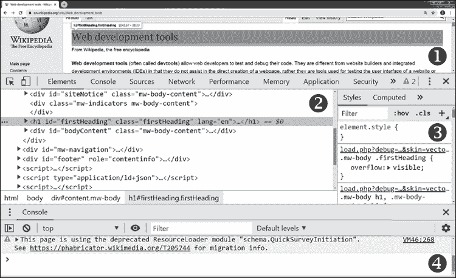
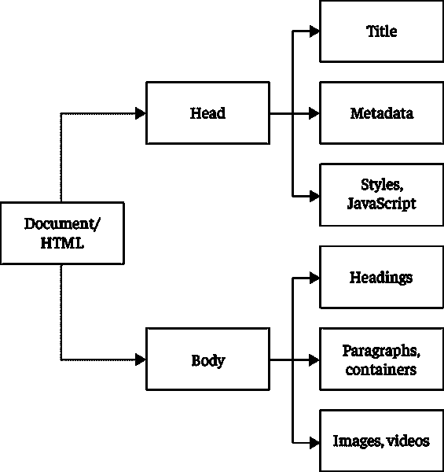
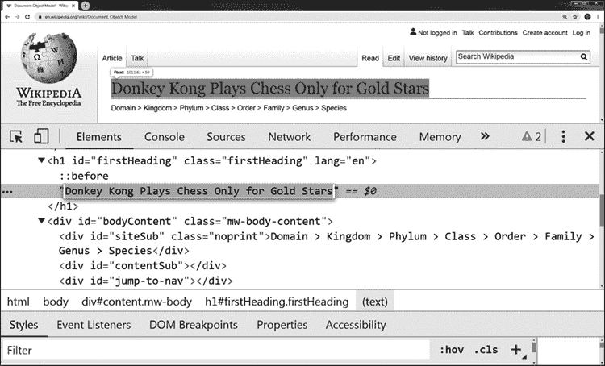
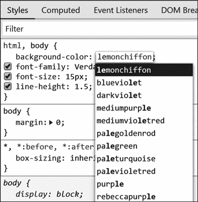
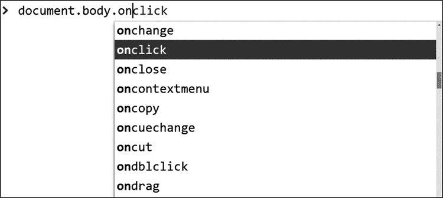

# 第五章：# 深入网页开发

在本章中，我们将学习每个网页浏览器中内置的开发环境，学生可以直接进入并开始执行代码，不需要任何开发环境的设置，也不需要安装新软件，而且通过一个按键就能深度参与软件代码。就像学习外语一样，学习编程最快的方法就是沉浸其中。

## 在网页浏览器中开发

我们将直接进入网页开发。为了从本章中获得最大收获，最好跟随提供的步骤进行操作。这些步骤与学生在课堂上学习时所遵循的步骤相同。通过这些步骤时，思考如何根据学生的具体需求调整内容。

为了简便，本书使用的是运行在 Windows 操作系统上的 Google Chrome 浏览器。但现在每个网页浏览器都有非常相似的*网页开发工具*，在其他浏览器和操作系统中也应该可以使用这里概述的步骤。唯一可能遇到的障碍是你所在组织的计算机政策。如果你使用的是学校的计算机，可能会因为集团策略而禁用访问网页开发工具，但个人计算机应该可以访问它们。如果这些工具在你的组织内被屏蔽，向组织的技术支持部门寻求帮助以访问这些有价值的工具。

打开你的网页浏览器，导航到任何网页。本书使用的是 Wikipedia，但任何网站都可以。按下 **F12** 键。一个新窗口会打开，界面看起来类似于图 5-1。在这个截图中，工具被停靠在浏览器上以作说明，但将它们设为浮动窗口通常是更方便的选择。



图 5-1：网页开发工具

图 5-1 显示了四个主要区域。图的顶部是浏览器窗口 ❶，这是我们正在分析的网页。浏览器窗口下方是页面的*元素* ❷，即渲染页面的标记语言——一种源代码。当前选中的元素具有各种属性 ❸。图的底部是*控制台* ❹，显示对网页开发者有用的信息。

在继续之前，花点时间让学生思考他们对这个界面的看法。问问他们在面对这个界面时的感受。是感到沮丧吗？害怕吗？兴奋吗？他们会如何自己了解这个软件？他们会点击四周尝试吗？是否有内置帮助功能？如果有，跟搜索引擎中的相关信息相比，这个功能如何？让学生现在就检查他们的想法，并用几句话记录下来，以便他们能够与那些将来可能面对他们所创建的软件的用户产生共鸣。

从某种意义上说，你刚刚把学生们丢进了游泳池的深水区。如前所述，这些复杂的面板被称为网页开发工具，它们是软件工程师在编写和调试网页应用程序时使用的工具。通过这些工具，你的学生正在访问构成网页的客户端代码。和他们一起分析代码，逐步了解，甚至操作它。

这些强大的工具被内置在每个网页浏览器中，虽然它们看起来可能令人害怕，但无论你的学生做什么都完全安全。学生们只会在他们的本地计算机上进行代码实验。他们将有自由点击、探索不同的菜单选项，并尽可能多地尝试破坏功能。就像棋盘游戏为实验提供了一个魔法圈一样，网页开发工具也为代码实验提供了一个安全的空间。在继续进行更有针对性的内容之前，给你的学生一些时间，让他们自己探索并玩弄这个浏览器功能。这些工具中有许多令人惊叹的因素。允许学生们自行发现的兴奋感，以及与同伴分享的时间，可以提高他们未来的参与感。看到学生们主动投入到内容中的时候，对教师来说也是一种兴奋的体验。

### 文档对象模型检查器

一旦你的学生探索过界面并自行学习了它，提供一个关于如何使用网页开发工具的正式课程。具体来说，他们将学习网页的*文档对象模型 (DOM)*，这是他们可能与之交互的元素层级结构。为了方便这一过程，我们将向他们介绍网页开发工具中的*DOM 检查器*，它将允许他们浏览和操作这些元素。

我们将从启动 DOM 检查器开始。如果需要，可以将这套工具分离出来，将窗口移到桌面的一侧，将浏览器放到另一侧，这样你就可以同时看到两个窗口。在元素面板中，将鼠标悬停在*超文本标记语言 (HTML)* 上，它描述了网页的结构。HTML 由*标签*组成，用于定义网页文档的元素。页面上的每个元素都有一个开标签和闭标签。例如，在标记 <p>这是一个段落。</p> 中，<p>是开段落标签，</p>是闭标签，"这是一个段落。" 是元素的内部 HTML 内容。许多不同的标签定义网页中的元素，包括 <video></video>、<blockquote></blockquote> 和 <table></table> 等。

当你在 HTML 中上下移动鼠标时，网页的部分内容会被高亮显示。你所看到的是哪些 HTML 元素对应网页上的哪些对象。例如，将鼠标悬停在 h1 标签上，通常会高亮显示页面的标题。或者，如果你右键点击浏览器窗口中特定的页面部分，弹出菜单会出现。选择**检查**或**检查元素**，网页开发工具会高亮显示源代码中与该页面部分相关的代码。

DOM 由许多嵌套的节点组成，这些节点按树形结构层次组织。在元素面板中，你可以点击节点左侧的箭头展开它们，查看其内容，或者将其折叠以简化视图。图 5-2 提供了这个文档层次结构的高层次视图。



图 5-2：DOM 层次结构

所有网页都使用这种组织结构。从根节点<html>开始，文档分支到<head>节点，其中包含文档属性，如标题、搜索词和编程代码。文档还分支到<body>节点，其中包含网页内容，如文本、图片和视频。向学生展示图 5-2 中的树状结构，然后展示列表 5-1 中的示例标记，看看树在实际脚本中的表现。

```
<html>
  <head>
    <title>Hello, World Website</title>
  </head>
  <body>
    <p>Hello, World!</p>
  </body>
</html>
```

列表 5-1：基本的 HTML 结构

在这个非常基础的示例中，脚本每下降一层树，缩进就会增加。让你的学生探索如何在各种网站中查找和熟悉这些基本的 DOM 元素。理解 DOM 作为树形结构，可以为学生提供导航 HTML 的地图，尤其是在他们编写操控 HTML 的代码时会特别有用。

但真正让人惊叹的是 DOM 检查器。试着检查 Wikipedia 文章的标题，然后在元素面板中双击文本。它应该变得可以编辑（如果不能，试着右键点击文本，并从选项中选择**编辑**或**以 HTML 编辑**）。对文本进行一些更改，然后查看浏览器窗口，看看你所做的更改。在图 5-3 中，Wikipedia 文章的 h1 标签被编辑成记忆生物分类法的助记符。你可以在元素面板中看到编辑内容，在浏览器窗口中看到结果。

这是一个有趣的*技巧*—一个巧妙的技术手段，应该能给你的学生留下深刻印象。你并没有编辑服务器上实际的网站内容，只是修改了客户端浏览器中的显示。如果你想查看网页在其他人眼中的样子，只需刷新页面，就会清除你所做的更改。



图 5-3：DOM 操控

现在查看属性面板，当前选项卡应该显示**Styles**。此面板显示你在元素面板中选定的内容的*Cascading Style Sheet (CSS)*定义。CSS 描述了 DOM 中元素的显示方式，使用字体族、字体大小、颜色、对齐等属性。

与元素面板类似，你可以编辑这些 CSS 定义并查看编辑如何影响页面的外观。例如，当你浏览样式标签中的许多定义时，你可能会找到一个标记为 background-color 的定义，后面跟着像#000000、black 或 rgb(0,0,0)这样的值。将该值改为其他内容，例如红色、蓝色，甚至是 lemonchiffon。DOM 检查器会给你一些建议，如图 5-4 所示。



图 5-4：样式标签中建议的有效颜色值

如果没有 background-color 属性，你可以向下滚动并向上浏览节点层级，直到找到 html、body 的定义。像颜色建议一样，DOM 检查器也会给你属性建议，以便你可以添加新的背景定义。你可以在几个页面上调整样式，熟悉一些可用的样式选项。

元素面板显示了网页的 DOM：文档的 HTML 内容。样式标签中的 CSS 定义了这些内容的布局和显示方式。内容和样式是分离的或*解耦*的。将样式与内容解耦，使得内容更容易为开发人员维护，并且更容易被机器读取，比如搜索引擎的网页爬虫。一旦你和你的学生对 DOM 的内容和设计方面感到熟悉，你就可以开始使用编程代码以更动态的方式操作 DOM。

### 控制台

尽管使用 DOM 检查器进行网站学习和操作很有趣，但你仅仅是与编程概念和计算思维进行最小程度的互动。HTML 和 CSS 并不是编程语言，它们是*标记语言*，一种定义和结构化数据的语法，浏览器读取并将其转换为网站。但在我们开始用编程代码操作它之前，我们需要理解这种媒介的结构和规则。

让我们来看看*console*中的网页开发工具。这个工具区域是浏览器报告关于网页的错误和信息的地方。它可能会报告网站代码中的错误，或通知开发者网页脚本中引用的某个功能将在未来版本中被淘汰或*废弃*。

控制台还提供了即时访问一个简单的编码环境。在这里，我们可以运行简单的代码行并查看它们的输出。Web 开发人员使用此功能来检查在页面上运行时变量或其他状态的值。

在控制台中，输入列表 5-2 中的高度加密代码并按回车键执行。

```
> for(i=0;++i<101;console.log(i%5?f||i:f+'Buzz'))f=i%3?'':'Fizz'
```

清单 5-2：FizzBuzz 游戏的 JavaScript 单行代码

这段代码非常简洁，但如果你正确输入它，控制台应该会输出从 1 到 100 的数字，将每个能被 3 整除的数字替换为“Fizz”，能被 5 整除的数字替换为“Buzz”，同时能被 3 和 5 整除的数字替换为“FizzBuzz”。这模拟了经典的课堂游戏 **FizzBuzz**，学生们坐成一圈从 1 开始计数，将能被 3 和 5 整除的数字分别替换为“Fizz”和“Buzz”。

从头开始编写 *FizzBuzz* 程序也是一个常见的面试问题。清单 5-2 中的示例使用了多个语法技巧，将程序压缩成一行代码来给面试官留下深刻印象，并且我们在网页控制台中使用它，便于执行，但因此代码变得难以阅读。其他程序员遇到这段代码时，可能会很难理解它的功能。清单 5-3 展示了这段代码在更易读的格式下的样子。

```
for(i = 0; i < 101; ++i) {
  var out = i + ' ';
  if (i%3 == 0) out += 'Fizz';
  if (i%5 == 0) out += 'Buzz';
  console.log(out);
}
```

清单 5-3：更易人理解格式的 FizzBuzz

要执行清单 5-3 中的代码，首先在文本编辑器中输入它，比如 Notepad 或 TextEdit，然后将其复制并粘贴到控制台中。通过这样做，你可以将代码片段保存到文本文件中，以便稍后进行修改和扩展。使用这种技巧，你还可以执行第四章中提供的代码示例，比如 *Snakes and Ladders* 示例。

使用控制台，学生可以立即开始在网页开发中实验一门核心编程语言。JavaScript 是一种安全的语言，这意味着在网页开发工具中使用 JavaScript 完全是在客户端完成的。客户端代码在浏览器中执行，而不是托管 JavaScript 代码的服务器上。JavaScript 在客户端浏览器中运行，不能执行任何恶意操作。它无法写入或删除文件，或以其他方式伤害客户端。

作为一种主要的客户端编程语言，JavaScript 具有许多与 DOM 相关的功能，可以让你引用 DOM 树结构中的节点。当学生知道文档根节点分支到头部和主体节点时，他们可以通过使用 document.head 和 document.body 在 JavaScript 中引用这些节点。从这些节点开始，他们可以引用链条中更下层的节点和属性。例如，尝试执行清单 5-3 中的代码。innerHTML 部分引用了两个<body>标签之间的内容：

```
> document.body.innerHTML = 'Hello, World!';
```

清单 5-3：一行替换网页的代码

当你在输入完这行代码后按下回车键执行时，你正在查看的整个网页将消失。取而代之的是，学生们会看到“Hello, World!”这几个字。当你的学生看到他们也能做到这一点时，可能会引起一些惊讶的反应。

使用 JavaScript 代码，你可以以编程方式修改页面的内容。清单 5-4 提供了另一个例子。document.body.style 部分允许你修改 body 节点的 CSS 属性。如果你在控制台执行这行代码，它将把页面背景色修改为蓝色：

```
> document.body.style.backgroundColor = 'blue';
```

清单 5-4：一行代码，改变页面背景色

注意清单 5-3 和清单 5-4 中使用的大小写方式。特别是要注意 innerHTML 和 backgroundColor 的命名遵循 *驼峰式大小写*：每个单词的首字母都大写，因此变量名看起来就像骆驼的背部一样起伏不平。JavaScript 是一种区分大小写的语言，因此它会把一个名为 camelCase 的变量和一个名为 CamelCase 的变量当作两个不同的变量来处理。大小写非常重要，如果你的代码无法正常工作，检查一下是否正确使用了大小写。

当你的学生在控制台输入代码时，他们会看到一系列可供访问的节点和函数建议。这一功能被称为 *智能代码补全*，在许多编码环境中都有提供。这些建议帮助你快速编写语法正确的代码。如果你在控制台输入 document.body.on，代码补全会提供一份 *事件监听器* 的列表。这些监听器是当用户以特定方式与页面交互时触发的函数，相关的例子可以参见图 5-7。



图 5-7：智能代码补全

使用清单 5-5 中的代码行，你可以在页面的 body 上设置事件监听器，以便当用户点击页面的任何地方时，弹出一个提示消息。

```
> document.body.onclick = function() { alert('THAT TICKLES!'); }
```

清单 5-5：设置一个提示消息，当用户点击页面时弹出。

如果你依次执行清单 5-3、5-4 和 5-5 中的代码，你应该能够删除几乎任何网站，并将其替换为一个蓝色页面，页面上显示 "Hello, World!"，并且每当用户点击页面时，会弹出一个提示框显示“那真让人高兴！”。这是一个很好的时机，可以把学生的注意力引回到网页开发工具中的元素面板。在那里，他们会发现自己以编程方式所做的更改反映在了 HTML、**样式**选项卡和 **事件监听器**选项卡中。这些工具显示的是页面的当前状态。如果学生右键单击页面并选择 **查看源代码** 或 **查看页面源代码**，他们将看到页面在被修改之前的初始状态的标记和代码。最好让学生意识到这一点，这样他们就知道，在网页开发工具中看到的内容往往不是网页的初始源代码。

一旦你的学生理解了如何在控制台中执行代码，让他们自行探索。他们想在网页上看到什么效果？在控制台中执行复杂的代码是有难度的，所以提醒他们保持范围简单。他们可以在线找到的一些例子可能包括*如何在点击时将网页背景更改为随机颜色？如何在用户悬停时让文本闪烁？如何让页面自动滚动？*你的学生很快会发现，几乎任何他们能想到的问题，地球上其他七十亿人中总有人已经问过，并且得到了很多有帮助的人们的答案。

## 总结

在这一章中，我们让学生接触了任何网页浏览器中都能找到的令人眼花缭乱的信息洪流，并让他们深入与这些内容互动。网页开发工具具有一种显著的震撼效果，能够让学生坐直身子，专注于内容。在你向学生介绍这些强大的工具后，希望他们中的许多人会迫不及待地回家，兴奋地向朋友和家人展示他们所发现的内容。他们能做到这一点，是因为这个相同的环境可以在他们的家里和图书馆的计算机上使用，这也是它应该具备的特点。

但编程课常常采取一种更迂回的方式。在 2002 年一篇名为《数学家的哀叹》的文章中，数学老师保罗·洛克哈特设想了一个世界，在这个世界中，我们像教授数学一样教授音乐，以使学生在“日益充斥声音的世界”中具备竞争力。他描述了在这个反乌托邦世界中，孩子们在所有年级所经历的艰苦且毫无意义的练习：学生们背诵算法，并根据他们的乐谱正确性进行评分，焦虑的父母为他们雇佣家教，而孩子们对此感到厌倦，在音乐课上只是盯着窗外，哼着曲子，而不是学习音乐。当学生们进入大学时，他们终于可以演奏和聆听真正的音乐，并且理解那些多年来的繁重工作究竟是为了什么，但只有他们主修音乐专业时才能做到。

一个编程班如果在第一小时让学生输出一条“Hello, World!”的代码，那是一种让人筋疲力尽、乏味的教学方式。我们能越快让学生进行编程并立即通过他们输入的代码看到反馈输出，他们就会越投入，越快适应这个新环境的挑战。

只有当学生有机会充分体验编程作为一个即时奖励的游乐场时，我们才能开始引导他们将新获得的技能转化为更正式的计算艺术品。JavaScript 使学生能够将变量和我们在上一章学习的各种控制结构实现到算法和函数中。但是，学生需要一个能够保存工作、返回并迭代提升的环境，才能充分利用这些编程元素。

在下一章中，我们将了解一些现成的开发环境，在这些环境中，你的学生可以从对现有网站的临时修改中毕业，开始制作自己的网页应用，并与同伴分享。
