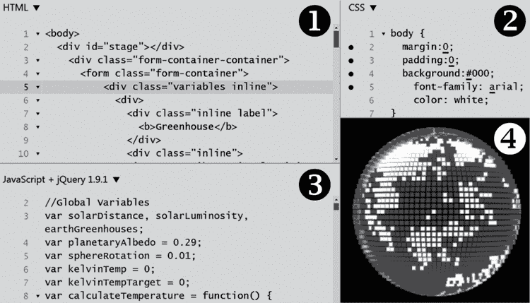
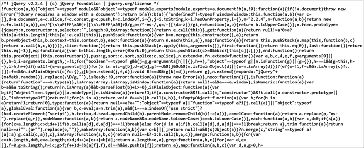

# 第六章：# 有意图的开发环境

网络开发工具为学生提供了一个有趣的介绍，帮助他们接触实际的软件代码，但这些工具缺乏持久性。学生用这些工具创建的任何内容，在刷新或关闭浏览器时都会消失。在本章中，我们将介绍*开发环境*，在这些环境中，学生可以构建计算产物，并能够开发、增强和与他人分享它们。*幸运的是，我们将在本章中探索的编码环境及其功能，对学生们来说非常熟悉，因为他们之前已经使用过网络开发工具。*

## 在线代码游乐场

浏览器的网络开发工具的优势在于能够让学生尽快沉浸于代码中。同样，*代码游乐场*的力量在于，能够让学生尽早、轻松地构建自己的网络应用程序。这些网站允许程序员在在线工具中编写 HTML、CSS 和 JavaScript，学生可以轻松保存和执行他们的代码。越来越多的代码游乐场正在上线。像 JSFiddle、JS Bin、CodePen 和 W3Schools 这样的网站提供了不同的选项和功能。

由于这些综合开发环境可以通过网页浏览器即时访问，学生可以打开一个开发环境开始编码，就像他们使用网络开发工具一样。更棒的是，他们可以在学校保存工作，之后在家里或图书馆打开浏览器，继续从上次停下的地方编写代码。因此，他们的努力变得更加有意图，他们开始朝着一个项目任务的目标努力，这个任务需要更深的内容参与。

这些开发环境中的许多将与网络开发工具有些相似，它们有各种面板用于不同类型的脚本和代码。图 6-1 展示了流行的代码游乐场 JSFiddle 的一部分界面。



图 6-1：JSFiddle 用户界面

与网络开发工具类似，图 6-1 展示了多个面板，用于显示不同的内容。在这个代码游乐场中，HTML 面板❶定义了文档。CSS 面板❷定义了网页的外观和风格，而 JavaScript 面板❸包含了使页面动态的编程代码，并定义了页面的行为方式。正如我们在前一章所学到的，内容、样式和编程彼此解耦，以便更容易维护。输出面板❹显示了 HTML、CSS 和 JavaScript 结合后的结果。在这个例子中，三个面板的结合呈现了一个 3D 模型，展示了一个由亮暗方块覆盖的外星世界，探讨了一个行星的反照率（颜色）如何影响其平均温度。显然，这种编码环境能够进行一些非常复杂的展示。

你应该仔细考虑你的学生将在何种代码平台上工作。因为学生将花费大量时间在这个环境中，所以你需要为他们选择功能最丰富、最灵活的平台。以下小节将提供在评估代码平台时需要考虑的一些功能。

### 用户界面功能

开发平台内置了许多功能，能够使代码更易读和调试。你的学生将已经熟悉许多这些功能，因为他们曾使用过网页开发工具。例如，*语法高亮*是一个常见功能，它通过颜色编码使不同的元素更容易识别。在语法高亮的 CSS 中，html 选择器可能是红色的，id 选择器是绿色的，属性是蓝色的，而它们的值是紫色的。JavaScript 中，函数名称可能用绿色表示，关键字用蓝色表示，条件逻辑用红色表示，字符串用黄色表示，整数用紫色表示。这种颜色编码使语法更加突出，代码更易于阅读。它还使程序员能够忽略不立即相关的部分，专注于手头的任务。

其他有用的用户界面（UI）功能包括使界面能够提醒用户语法错误的代码，这类似于大多数文字处理软件会突出显示拼写错误的单词。允许进行*代码折叠*的 UI 让学生可以隐藏多余的部分并简化视图。编辑器中的输入使代码补全和自动缩进变得更加方便。

### 简洁性

评估开发环境时需要记住的另一个特征是它们的简洁性。一个功能丰富的开发环境可能提供许多便利，但也提供了大量的菜单选项，可能会让初学者程序员感到不知所措。软件开发的很大一部分就是应对复杂性的艺术。确保你选择的开发环境能够帮助管理复杂性，而不是增加它。

回想一下第五章，当学生第一次打开网页开发工具时，我们让他们思考他们的感受。网页开发工具可能会让人感到不知所措，这也是为什么本书只让学生使用其中的一些标签页。一旦学生熟悉了 DOM 检查器和网页控制台，他们可以逐渐探索其他功能，如网络、性能、内存、安全和调试器。如果你让学生初期只专注于一些关键功能，他们就能在一个高度复杂的开发环境中进行工作。

### 协作和可移植性功能

很少有软件是由单独的程序员编写的。即使是独自工作的开发者，也会在前人的解决方案基础上进行开发，并使现有的代码成为自己的。许多代码游乐场提供的一个功能是能够*分叉*一个项目：也就是说，获取一个现有的代码示例，点击按钮，就能得到一个副本，沿着一条新的路径或*分支*进行修改。从游乐场中分叉一个应用程序并在新分支上进行构建，为学生提供了现有的代码，帮助他们学习新的编程技能，并让他们扩展该解决方案，使之成为自己的。

分叉和分支代码与软件开发中的*版本管理*有关。版本管理是使用独特的名称或标签来跟踪软件项目在时间推移中的变化状态。第二章的练习“迭代的你”提到让学生将自己视为通过版本标签 0.1、0.2、0.3 等逐步改进的过程。每个版本都标志着他们自我改进的一个里程碑，直到毕业日的版本 1.0。具有内置版本管理功能的代码游乐场允许学生跟踪他们的编程进度。更重要的是，如果学生在更新版本中意外引入了错误，他们可以恢复到之前的代码版本。

当学生对自己的创作感到自信时，代码游乐场应该提供他们分享作品的途径。每个项目都应该有一个唯一的 URL，学生可以将其提供给同学，展示他们的作品。进一步说，一些游乐场可以使创作*可嵌入*：学生可以将自己的作品嵌入到其他网站中，比如论坛，并以这种方式分享他们的作品，甚至同学们无需点击链接也能看到。

游乐场的另一个功能是*可移植性*。将解决方案带到其他地方有多容易？如果学生想将他们的解决方案迁移到另一个游乐场，他们能轻松地转移自己的作品吗？如果学生想开始在本地环境中工作，在本地硬盘上编码而不是在云端，他们能下载自己的作品并带走吗？只要学生能够在游乐场中访问他们的代码，他们就能迁移，即使这意味着将代码复制粘贴到一个新的环境中。但最好从一开始就考虑他们的代码迁移有多容易。

### 许可

与协作及能够将他人的代码变成自己的功能相关的是*许可*。具体来说，你需要帮助学生理解在游乐场上公开发布代码时的正确使用政策、服务条款和版权状态。这些政策几乎肯定会包括声明，表示不允许发布版权或令人反感的内容到站点。实际上，你的学生应该已经遵守了这些行为规范。但他们在站点上找到或创作的原创作品的版权状态如何呢？

理想情况下，发布到网站上的代码会明确标明为*自由软件，开源软件*或*反版权*许可证，这赋予用户更新和再分发软件的权利。更好的是，平台可能允许用户从一系列宽松或限制性的许可选项中选择许可证。

许多网站对许可证问题持中立态度，将责任交给用户自行解决权利冲突。作为最佳实践，学生应在代码中包含许可信息，明确告知他人使用该软件时赋予和保留的权利。类似地，学生应寻找项目的许可信息，或在点击“fork”按钮之前联系所有者获得许可。列表 6-1 展示了一个嵌入在代码中的自由软件许可证注释示例。/*和*/语法是打开和关闭标签，表示这是仅供人类阅读代码的注释，浏览器应忽略它。

```
<script>
/*    
Copyright 2020 Ryan A. Somma

Permission is hereby granted, free of charge, to any person obtaining
a copy of this software and associated documentation files (the "Software"),
to deal in the Software without restriction, including without limitation
the rights to use, copy, modify, merge, publish, distribute, sublicense,
and/or sell copies of the Software, and to permit persons to whom the
Software is furnished to do so, subject to the following conditions:

The above copyright notice and this permission notice shall be included in
all copies or substantial portions of the Software.

THE SOFTWARE IS PROVIDED "AS IS", WITHOUT WARRANTY OF ANY KIND, EXPRESS OR
IMPLIED, INCLUDING BUT NOT LIMITED TO THE WARRANTIES OF MERCHANTABILITY,
FITNESS FOR A PARTICULAR PURPOSE AND NONINFRINGEMENT. IN NO EVENT SHALL THE
AUTHORS OR COPYRIGHT HOLDERS BE LIABLE FOR ANY CLAIM, DAMAGES OR OTHER
LIABILITY, WHETHER IN AN ACTION OF CONTRACT, TORT OR OTHERWISE, ARISING FROM,
OUT OF OR IN CONNECTION WITH THE SOFTWARE OR THE USE OR OTHER DEALINGS IN THE
SOFTWARE.
*/
</script>
```

列表 6-1：JavaScript 中的 MIT 许可证示例注释

图 6-1 展示了 MIT 许可证，这是一种因其简洁性以及与自由和限制性许可证兼容性而广受欢迎的许可证。例如，具有限制性许可证的软件解决方案可以包括 MIT 许可的组件，只要这些组件被标明为开源。其他开源许可选项包括 GNU 通用公共许可证（GPL）、伯克利软件分发（BSD）许可证，甚至可以公开发布到公有领域。与学生进行对话，决定一个能确保课堂内外合作的许可证。

### 软件框架

一些学生可能希望尽早探索的中级特性是*软件框架*，它们扩展和增强了核心编程语言。在 JavaScript 编程中，软件框架可以让学生轻松渲染 3D 模型、编写视频游戏或训练人工智能设备。大多数代码平台允许用户从下拉列表中选择框架，以便在代码中引用。这些特性有时被称为*依赖项*，因为学生编写的软件将依赖于框架的包含。

就像使用 JavaScript 代码一样，框架的抽象有其独特的语法。框架有自己的文档，供学生学习其众多功能。如果框架已经成熟，例如 jQuery，学生将能在在线论坛中找到许多问题的解答和实例。类似地，框架的网站将有一个示例页面，展示开发人员可以使用其扩展功能做的事情。

代码 playground 让内容、样式和行为的分离变得清晰；对语法进行颜色编码；突出错误；并让引入框架变得简单。但学生们也可以通过在计算机上处理本地文件来学习网页应用开发的某些方面。毕竟，开发者不会在商业世界中的免费站点上编写专有软件。熟悉本地开发与代码 playground 开发的区别是非常重要的。

## 本地开发

代码 playground 在加速开发和抽象掉许多网页编程细节方面无可替代。但一旦学生掌握了在你选择的 playground 中进行开发的技能，关键是要让他们熟悉如何在本地环境中开发网页应用。这样做将帮助他们更细致、深入地理解网页应用的结构。同时，他们也可以访问到其他开发者在 playground 外分享的、广泛的应用世界。

与引入网页开发工具和代码 playground 的理由类似，尽可能让开发过程变得便利对学生在这个新本地环境中的工作体验至关重要。因此，你应该为学生提供一个基本模板，让他们可以从中开始工作。这也是一种良好的实践，因为从头编写模板是一个既费时又容易出错的过程。正如学生们在成为熟练程序员时会学到的那样，在开发过程中，抓取代码比自己写代码要更快速且更准确。

你为学生开发并提供的模板包应包括三个文件：一个位于根文件夹中的 *index.html* 文件，用于存放内容；一个位于 *css* 文件夹中的 *styles.css* 文件，用于存放样式；一个位于 *js* 文件夹中的 *scripts.js* 文件，用于存放 JavaScript 代码。*index.html* 文件提供了学生可以从中开始工作的基本 HTML，其内容应与列表 6-4 非常相似。

```
<!doctype html>
<html lang="en">
  <head>
    <title>[STUDENT NAME]'s Web App</title>
    <meta charset="utf-8">
    <meta name="description" content="My first local web app">
    <link rel="stylesheet" href="css/styles.css?v=0.1">
    <script
  src="https://ajax.googleapis.com/ajax/libs/jquery/2.2.4/jquery.min.js">
    </script>
    <script src="js/scripts.js?v=0.1"></script>
  </head>
  <body>
    <p>Hello, World!</p>
    
  </body>
</html>
```

列表 6-4：学生可以从中开始本地开发的 HTML 模板

这段代码中有几个新的元素供学生理解；很可能，这些元素在代码 playground 中被抽象化了。不同于将 HTML、CSS 和 JavaScript 分隔的三个面板，我们现在有三个不同的文件，需要在文本编辑器中单独编辑。`<link rel="stylesheet">` 标签通过 href 属性指明了 CSS 文件相对于 *index.html* 文件的位置，该文件位于 *css* 文件夹中的 *styles.css* 文件中。同样，示例中的第二个 `<script>` 标签定义了 JavaScript 文件相对于 *index.html* 文件的位置，通过 src 属性指向该文件，文件名为 *scripts.js*，位于 *js* 文件夹中。

列表 6-4 中的附加细节为我们提供了一个机会，让我们探讨代码为何以这种方式编写。考虑第一个`<script>`标签，它引用了托管在 Google 服务器上的 jQuery JavaScript 框架。为什么这个文件不保存在*js*文件夹中？为什么要依赖第三方服务来托管这个文件？为了理解这里的策略，学生需要了解浏览器的*缓存*机制。缓存是指浏览器将大部分网页内容保存到本地计算机上，以避免将来重复下载，从而加快页面加载速度。通过引用这个开放 JavaScript 库中的*jquery.min.js*文件，文件很可能已经存储在访问者的浏览器缓存中，客户端就不需要再次下载它。

另外，考虑一下*jquery.min.js*文件的内容。如果你将此资源的 URL 输入到浏览器中查看其内容，你会看到类似于图 6-2 中的代码。



图 6-2：jQuery 框架压缩代码片段

这段 JavaScript 代码对人类来说是不可读的，但对计算机仍然是可访问的。代码已经被*压缩*，即被压缩到尽可能小的文件大小，以便浏览器能够快速下载。它已经去除了所有的换行符和缩进，直观的变量和函数名被几个字符长的晦涩标识符所取代。

在代码练习场中，包含框架通常只是简单地从下拉列表中选择它们，而无需添加任何代码。其他在代码练习场中工作时被抽象出来的细节，还包括提供信息（如作者、关键词和站点描述）给网页爬虫的`<meta>`标签。此外，`<html>`标签之前的`<doctype>`标签告诉浏览器它正在读取什么类型的文档以及如何解释其标签。另外，`?v=0.1`会附加到文件名后面：随着文件更新，它将递增为`?v=0.2`，依此类推，以告知客户端浏览器刷新这些文件的缓存版本，使用最新的文件。你可以在课堂上讨论无数的小细节和变化的最佳实践，帮助学生最好地理解为什么某些元素存在，以及它们在学生所处理的代码中是如何定义的。

我们将在第九章中更详细地学习本地开发的一个方面，即如何在本地文件系统中进行协作。我们将探讨一些工具，这些工具允许学生在本地编写代码的同时与他人协作。在近期，学生们的项目将主要是个人解决问题的练习和小组评估代码的课堂练习，之后才会转向在小组内协作完成更大的项目。作为教育者，你需要了解网页开发的最佳实践，并在为学生提供代码练习场和本地文件时，逐步改进所提供的起始代码。

## 总结

在这一章中，我们探讨了代码沙盒作为迈向有目的开发的重要一步，并让学生参与了长期的、更持久的项目。我们学习了一个好的代码沙盒的特性和功能，从将内容、样式和功能分离到不同的开发面板，到使编码更简便的用户界面特性，支持协作以及将代码移植到其他平台的功能，许可选项以及使学生能够创造奇迹的 JavaScript 框架。我们简要学习了如何将内容、样式和代码分离到不同的文件中以进行本地开发，以及代码沙盒所抽象掉的额外细节。

网络开发工具的强大之处在于，它们能立即提供现有的代码供学生进行实验。代码沙盒的强大之处在于能够轻松地分叉现有代码，以便采用、调整和改进，最终将其转化为长期项目。本地开发的强大之处在于能够接触到其他环境所抽象掉的所有细节，并看到全貌，就像在实际工作中开发应用程序的开发人员一样。每一个工具都能帮助学生从操作现有代码转向有目的的开发。

一旦你建立了开发环境，无论是在在线代码沙盒中，还是在本地文件系统中，学生将开始有目的地扩展现有代码，开始将他们自己的创意付诸实践，我们就可以开始探索适合这种环境的一些具体代码项目。

在下一章中，我们将回顾一些练习，挑战并启发你的学生，以建立他们的编码信心。
