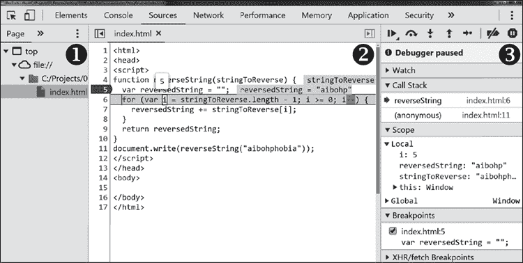
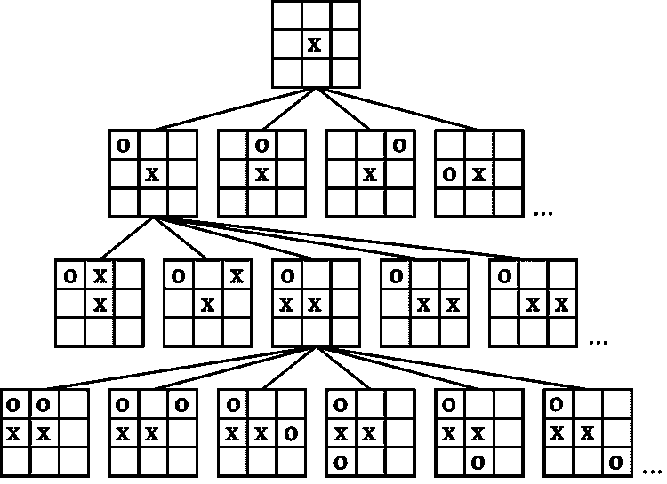
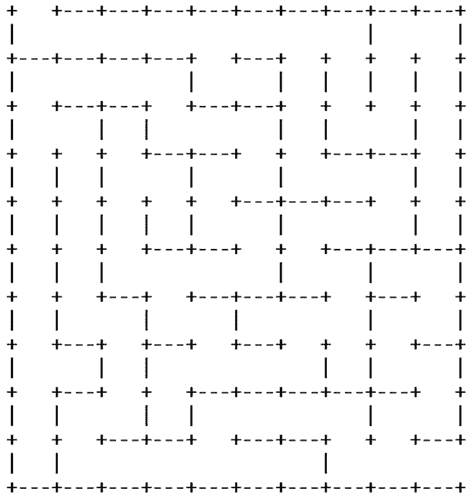
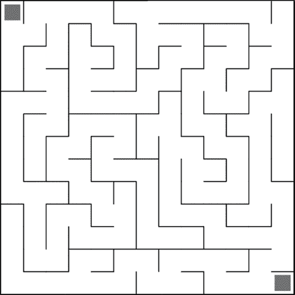
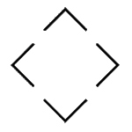

# 第七章：# 支架代码练习

一旦选择了开发环境，你可以开始为学生设置更复杂的代码练习。在本章中，我们将学习三种逐渐增加复杂度的编码活动，涵盖多个计算机科学标准，比如评估和优化算法、学习如何讨论代码、使用加密和调试。每个练习都需要你为学生提供在所选开发环境中预编写的代码，作为学生理解的支架。这样，学生将继续从现有的代码中学习，但会给他们特定的方向，引导他们更好地理解这些代码。

## 评估算法

计算机科学标准要求学生练习评估和比较算法。在这个评估练习中，来自免费编程网站 freeCodeCamp，你将给学生们提供许多不同的算法，用来测试 *回文*，即正着读和反着读都相同的文本字符串。一种寻找回文的技巧是选择一个字符串输入，将其反转，并检查反转后的字符串是否等于原字符串。当这个可能的解决方案被抽象化时，函数的一个组成部分可能会接受一个字符字符串，并返回字符顺序被反转后的字符串。博客作者兼开发者 Edd Mann 记录了 10 种用 JavaScript 实现这一点的方法（*[`eddmann.com/posts/ten-ways-to-reverse-a-string-in-javascript/`](https://eddmann.com/posts/ten-ways-to-reverse-a-string-in-javascript/)*）。我们将回顾他开发的三种解决方案，但完整的练习应该包括更多的例子。

### for 循环

清单 7-1 中的第一个例子是一个简单的 for 循环。它接受字符串输入，通过 i = stringToReverse.length - 1; i >= 0; i-- 这些参数，从字符串的最后一个字符开始反向循环，通过循环将字符串中的每个字符附加到新字符串中。

```
function reverseString(stringToReverse) {
  var reversedString = "";
  for (var i = stringToReverse.length - 1; i >= 0; i--) {
    reversedString += stringToReverse[i];
  }
  return reversedString;
}
```

清单 7-1：使用 for 循环反转字符串

学生可以在清单 7-2 中查看 reverseString 函数的输出，输入为“aibohphobia”（回文恐惧症）。

```
document.write(reverseString("aibohphobia"));
```

清单 7-2：执行 reverseString 函数的代码

在评估这个算法时，你有一个极好的机会向学生们介绍内置于网页浏览器中的调试工具。让学生们在浏览器中打开这段代码，启动网页开发工具，然后根据他们使用的浏览器，点击顶部菜单中的 **Sources** 或 **Debugger**。图 7-1 显示了他们将看到的类似屏幕。



图 7-1：浏览器网页开发工具中的调试选项

该截图中有三个主要面板。*文件导航器* ❶ 列出了网页中使用的每个文件。点击这些文件会在 *代码编辑器* ❷ 中显示其内容。点击此面板中的行号将设置*断点*，即我们希望浏览器暂停代码执行的位置，以便查看变量值或开始逐步执行代码。*JavaScript 调试* 面板 ❸ 则显示当前程序状态和其他调试工具。

在评估算法时，学生点击函数开始处的行号，并通过手动刷新浏览器页面触发代码执行。浏览器在断点处暂停代码处理。然后，学生应该使用调试面板顶部的导航控件逐步执行代码。随着他们逐步执行代码，他们将看到浏览器如何高亮显示算法中每个已执行的步骤，以及变量值如何变化。

图 7-1 显示了在代码的第五行设置了断点。从那里，图示显示开发者已经执行到第六行。鼠标悬停在 i 变量上，因此我们可以看到它的值 5 显示在其上方。与 reversedString 变量一起的是值 aibhop：此迭代中，六个字母已按相反顺序附加到字符串上。调试面板显示了作用域下列出的变量值、断点列表以及*调用栈*，即当前正在调用的函数列表。在这种情况下，代码只调用了一个函数。但随着我们深入研究更复杂的代码，跟踪栈并查看哪些函数正在调用其他函数变得更加重要。

### 递归

一旦学生有机会使用调试器并理解反转字符串的循环策略，你可以引入一个更复杂的算法。列表 7-3 中的示例使用了*递归*，这是一种函数调用自身的技术，创建了类似于 while 循环的循环。在这里，函数首先检查输入变量­stringToReverse 是否为空；如果不为空，函数通过 .substr(1) 命令返回第一个字符之后的每个字符，并通过 .charAt(0) 命令将字符串中的第一个字符附加到末尾。

```
function reverseString(stringToReverse) {
  if (stringToReverse === "") {
    return "";
  } else {
    return reverseString(stringToReverse.substr(1)) 
      + stringToReverse.charAt(0);
  }
}
```

列表 7-3：使用递归反转字符串

尽管递归的概念很容易定义，但学生可能会发现很难理解和跟随这个示例，他们并不孤单。许多开发者在跟踪某些递归算法时也表达过困难。为了帮助他们，在他们逐步执行函数时，引导学生查看调用栈。让他们观察函数调用列表如何在每次迭代时增长并最终缩小。此外，让他们将此函数与 while 循环进行比较，因为两者都控制迭代直到满足某个条件。值得注意的是，递归函数并不等同于 while 循环，尽管它们有一些相似之处。

尽管递归有时较难理解，但它在某些任务中可以是一个理想的解决方案。例如，*极小极大算法*是一个常用函数，广泛用于为像国际象棋和井字棋这样的游戏中的 AI 对手提供决策。极小极大算法通过迭代和评估所有可能的走法，来确定对每个可能的玩家走法的最佳回应。图 7-2 展示了在井字棋游戏中，每个点如何分支成多个可能性。

每个分支可能还有更多的分支。虽然在一个一维字符数组中遍历只需要一个循环，但在这个数据树中导航则需要在循环中嵌套循环。仅井字棋中就有 255,168 种不同的可能游戏，要写足够的循环来探索它们是不现实的，这也是为什么图 7-2 只展示了几个分支。递归使得我们能够更轻松地探索复杂的数据结构，而不需要了解它们的所有维度。



图 7-2：井字棋游戏可能性分支示例

### 数组操作

如列表 7-4 所示，第三种反转字符串的方法使用了数组操作和 JavaScript 内置的数组函数。`.split("")`函数将字符串中的所有字符拆分成一个数组，然后使用`.reverse()`命令将其翻转，再通过`.join("")`将它们重新拼接成一个字符串。虽然这只是一行代码，但数组操作方法执行了我们可以看到的三个步骤，以及许多我们看不见的步骤，因为它们被抽象在函数调用背后。

```
function reverseString(stringToReverse) {
  return stringToReverse.split("").reverse().join("");
}
```

列表 7-4：使用数组操作反转字符串

在审视了多种完成同一任务的方法后，向学生询问他们对不同方法的看法。他们喜欢和不喜欢这些方法的哪些方面？让他们从实现、代码可读性和性能的角度来阐述他们的答案，以此来练习评估代码。

一个重要的要点是，并没有明确的对错答案。但在某些情况下，例如在遍历树结构中的数据时，递归会显得更自然，而循环则会显得笨重。有时，程序员可能会将一行代码中的函数链分解成多行，以提高可读性，或者会为某行代码添加详细的注释，以向同事和未来的自己解释发生了什么。这个练习的目的是让学生思考不同的解决方案，并清楚地表达他们为什么偏好某种技术，而不是告诉他们最佳实践是什么。

还有许多其他方法可以扩展练习，涵盖超出评估和比较算法的计算机科学标准。例如，在讲解递归示例时，你可以挑战学生将其重写为 while 循环，作为修改现有算法的练习。我们还涉及了计算机科学标准，如递归作为控制结构、数据的树结构、最小最大算法以及调试工具，作为逐步阅读算法以深入理解的手段。

在提供的函数执行示例中，我们使用了一个回文作为输入。请问学生们，使用这个输入，我们是否在验证函数是否正常工作？我们怎么知道输出的字符串真的被反转了？我们应该使用什么参数来正确测试这些函数？通过这样做，我们也将质量保证和测试方面的内容引入了这个练习。

一旦学生们熟悉了系统地逐步执行和评估代码、比较算法，并了解完成同一任务的不同方法，我们就可以向他们介绍扩展这些算法的概念。接下来，我们将向他们介绍一个有趣的练习，涉及通过迭代扩展现有代码，并通过设计使其变得越来越复杂。

## 增强算法

除了评估和比较算法外，计算机科学标准还要求学生对算法进行改进或增强。我们将利用这个练习的机会，引入一些基本的网络安全概念。在这里，学生将学习一种简单的加密消息的算法，探索一个代码示例来执行这一过程，弄清楚如何破解加密，并确定如何让他们的原始加密更难被破解。

计算机科学的巨大进步源自于战争期间的需求。一个计算竞赛集中在*密码学*上，旨在保护通信免受第三方窃听。*凯撒密码*因尤利乌斯·凯撒在通信中使用而得名，是一种非常基础的加密算法。在这种算法中，字符串中的每个字母都按字母表中的特定字符数进行偏移。例如，输入“A”并偏移一个位置得到“B”，或者输入“A”并偏移两个位置得到“C”。图 7-3 展示了联邦调查局密码分析和勒索犯罪记录单位的挑战币，其设计中包含了一个密码轮。在这个例子中，计算设备向右偏移了三个位置，因此输入“TOP SECRET”会输出“WRS VHFUHW”。南北战争期间，南方联盟军队也使用了类似的密码。


图 7-3：联邦调查局密码分析和勒索犯罪记录单位的挑战币，展示了凯撒密码。照片由 David Oranchak 提供。

列表 7-5 中的函数包含一个算法，它接收一个字符串输入，进行偏移，然后输出根据定义的偏移规则转换过的字符串。将这个函数提供给你的学生，在你选择的开发环境中使用。

```
var caesarCipher = function(str, shift) {
  if (shift < 0) return caesarCipher(str, shift+26);
  var output = '';
  str = str.toUpperCase();
  for (var i = 0; i < str.length; i++) {
    var c = str[i];
    if (c.match(/[a-z]/i)) {
      var code = str.charCodeAt(i);
      var asciiA = 'A'.charCodeAt();
      c = String.fromCharCode(((code- asciiA+shift)%26)+asciiA);
    }
    output += c;
  }
  return output;
}
```

列表 7-5：由 Evan Hahn 编写的凯撒密码函数，已发布为公有领域

学生们可以使用列表 7-6 中的代码行来测试这个函数，查看输出结果。

```
document.write(caesarCipher('Hello, Classmate', 11));
```

列表 7-6：执行凯撒密码

让学生花些时间分析这段代码。他们应该在浏览器控制台中尝试一些代码片段，理解各个部分，并在网上查找一些函数。让他们为代码添加注释，练习与其他开发人员沟通和文档编写。

为了保持代码简洁和紧凑，作者使用了一些相对高级的技术。例如，str.match()函数中的/[a-z]/i 部分是一个*正则表达式*，这是一种强大的搜索模式语法。在这个案例中，它检查字母 a 到 z。函数.charCodeAt()返回字符串中第一个字母的 Unicode 值，因此在控制台中执行'A'.charCodeAt()将返回“65”。相反，String.fromCharCode()函数将 Unicode 数字标识符转换为字符，因此 String.fromCharCode(65)将输出“A”。通过这两个函数，作者巧妙地使用 Unicode 来对输入进行偏移。

带有注释的话，这个过程可能看起来像列表 7-7。

```
var caesarCipher = function(str, shift) {
  //Check for negative number shifts
  if (shift < 0) return caesarCipher(str, shift+26);
  var output = '';
  //Convert to uppercase to avoid checking lowercase unicodes
  str = str.toUpperCase();
  for (var i = 0; i < str.length; i++) {
    var c = str[i];
    //Check if its alphabetic
    if (c.match(/[a-z]/i)) {
      //Get the unicode value for it
      var code = str.charCodeAt(i);
      //Get the unicode value for A
      var asciiA = 'A'.charCodeAt();
      //Shift the unicode value and return the character
      c = String.fromCharCode(((code-asciiA+shift)%26)+asciiA);
    }
    output += c;
  }
  return output;
}
```

列表 7-7：带有注释的凯撒密码函数

现在，假设学生已经对这个过程有了扎实的理解，问问他们，如果发送方和接收方共享偏移值，他们将如何使用这个函数解码一条信息。我们如何将加密信息向后移动？

答案是将偏移量设为负数，因此 11 变为−11，但你的学生不应该指望他们的用户解码器知道这一点。让我们把这个发现抽象成一个像列表 7-8 中的函数。然后用户可以调用更直观的 caesarCipherDecode('SPWWZ NWLDDXLEP',11)来解码信息。

```
var caesarCipherDecode = function(str, shift) {
  return caesarCipher(str, (shift * -1));
}
```

列表 7-8：凯撒密码解码函数

战时与和平时期的密码学是一个计算的军备竞赛。所以接下来，让你的学生从想要破解密码的人的角度来思考。假设破解者有编码后的字符串，但不知道解锁它的偏移量。他们可以执行哪些步骤来找到偏移值？

因为字母表有 26 个字母，所以如果包括零偏移，共有 26 种可能的偏移方式。破解密码意味着获取一个编码后的字符串，并有条不紊地测试每一种可能性。一旦学生解释了破解密码的算法，你可以提供给他们列表 7-9 中的代码，这样他们就可以执行它。

```
var caesarCipherCracker = function(str) {
  var output = "";
  for (var i = -25; i < 1; i++) {
    output += i + " " + caesarCipher(str, i) + "<br/>";
  }
  return output;
}
```

列表 7-9：caesarCipherCracker 函数

这段代码是一个*暴力破解搜索*，是一种系统性测试所有可能性的算法。当你的学生执行示例 7-10 中的命令时，函数将输出 26 行文本，显示每个移位值对输入字符串的结果。当学生找到一行可读的消息时，他们就找到了移位值。

```
document.write(caesarCipherCracker('MJQQT HQFXXRFYJ'));
```

示例 7-10：执行 caesarCipherCracker 函数

密码学的军备竞赛仍在继续。随着我们的凯撒密码被破解，我们需要使算法变得更复杂。有很多方法可以做到这一点，学生们会乐于看到他们自己提出的算法。示例 7-11 显示了一个例子，添加了一个旋转变量，这样每个字符的移位变量都会有所不同。

```
var rotatingCaesarCipher = function(str, shift, rotate) {
  var output = "";
  for (var i = 0; i < str.length; i++) {
    shift += rotate;
    output += caesarCipher(str[i], shift);
  }
  return output;
}
```

示例 7-11：为凯撒密码添加旋转移位

在移位 11 和旋转 3 的情况下，第一个字符将移位 14，第二个字符移位 17，第三个移位 20，依此类推。由于有 26 种可能的移位值和 26 种可能的旋转值，暴力破解函数将需要迭代 625 种可能的组合来找到两个密钥。在一次迭代中，我们不仅增加了算法的步骤数量，也增加了执行代码所需的处理能力。回顾第二次世界大战中的密码破译工作，我们可以看到计算技术的诸多创新以及计算能力的进步正是在这一冲突中涌现出来的。如果我们能够在几节编程课中指数级增加加密的复杂性，想象一下，几十年来那些保护数据安全的人和试图访问数据的人之间反复的迭代，密码学艺术已经变得多么复杂。

涉及文档编制、算法分析与增强、迭代开发和密码学的计算机科学标准都在这一个广泛的练习中得到了涵盖。本节使用的小代码片段只是一个起点。学生们可以继续扩展这些代码，增加复杂性，使他们的信息更加安全。我们还可以通过基于游戏的激励措施来鼓励学生破解这些消息。现在，学生们已经将一个相对简单的代码示例逐步发展成更复杂的版本，我们可以向他们介绍一个更加复杂和引人入胜的例子。

## 添加界面

本节中的练习是在前两个练习的基础上构建的，并且增加了用户界面。这个界面提供了理想的机会来可视化代码输出。界面还增加了图形元素背后的事件驱动触发器，例如按钮，用户通过点击这些抽象元素来执行函数。

在这个练习中，学生将使用一个生成随机迷宫的函数。迷宫生成算法有很多种，每种算法产生不同风格的迷宫。在这个例子中，我们将使用一个*随机化深度优先搜索*算法。示例 7-12 显示了该算法的步骤。

```
1\. Create a grid.
2\. Start with the top-left cell.
3\. Mark the current cell as visited.
4\. Get a list of its orthogonal neighbors. 
5\. Start with a random neighbor, for each neighbor:
  a. If that neighbor hasn't been visited:
    I. Remove the wall between this cell and the unvisited neighbor.
    II. Return to step 3.
```

示例 7-12：随机深度优先搜索算法的步骤

这个算法的步骤很简单，但将它们转化为代码可能会变得非常复杂。列表 7-13 中的 JavaScript 代码来自 Rosetta Code 网站（* [`rosettacode.org/wiki/Maze_generation`](https://rosettacode.org/wiki/Maze_generation) *），该网站提供了多种编程语言中各种算法的 GNU 免费文档许可证示例。这只是你可以在课程中使用的许多代码片段之一。

```
function maze(width,height) {
  var cells=height*width-1;
  if (cells<0) {alert("illegal maze dimensions");return;}
  //Horizontal walls.
  var horiz =[]; for (var j= 0; j<height+1; j++) horiz[j]= [],
  //Vertical walls.
    verti =[]; for (var j= 0; j<height+1; j++) verti[j]= [],
  //Start at the top-left cell.
    here = [0, 0],
    path = [here],
    unvisited = [];
  //Build an array of unvisited cells.
  for (var j = 0; j<height+2; j++) {
    unvisited[j] = [];
    for (var k= 0; k<width+1; k++)
      unvisited[j].push(
        j>0 && j<height+1 && k>0 && (j != here[0]+1 || k != here[1]+1)
      );
  }
  while (0<cells) {
    //Build an array of potential neighbors.
    var potential = [[here[0]+1, here[1]], [here[0],here[1]+1],
        [here[0]-1, here[1]], [here[0],here[1]-1]];
    //Build an array of unvisited neighbors.
    var neighbors = [];
    for (var j = 0; j < 4; j++) {
      if (unvisited[potential[j][0]+1][potential[j][1]+1])
        neighbors.push(potential[j]);
    }
    if (neighbors.length) {
      cells = cells-1;
      //Get the next random neighbors.
      next= neighbors[Math.floor(Math.random()*neighbors.length)];
      unvisited[next[0]+1][next[1]+1] = false;
      //If neighboring horizontally
      if (next[0] == here[0])
        horiz[next[0]][(next[1]+here[1]-1)/2] = true;
      else //Vertically
        verti[(next[0]+here[0]-1)/2][next[1]] = true;
      path.push(here = next);
    } else {
      //Pull the last element in the path.
      here = path.pop();
    }
  }
  return {height: height, width: width, horiz: horiz, verti: verti};
}
```

列表 7-13：来自 Rosetta Code 的深度优先搜索算法 JavaScript 示例

根据学生的知识水平，你可以让他们阅读并记录这段代码，解释它是如何执行深度优先搜索算法的。你的学生应该花点时间意识到，这个算法并不绘制迷宫。它只返回迷宫的 x、y 尺寸以及两个水平和垂直的布尔值数组，因此数组中的每个 true 值都是墙被移除的地方。maze(x, y) 函数与 UI 无关。它需要另一个函数来遍历水平和垂直数组，并根据需要绘制线条。因此，如果你决定更换 UI，可以重用 maze(x, y) 函数中的代码。通过将函数的职责分开，使得对一个函数的修改不会影响另一个函数，代码变得模块化且解耦。列表 7-14 提供了一个示例，展示如何将 maze(x, y) 函数的输出使用字符绘制。

```
function display(m) {
  var text= [];
  for (var j= 0; j<m.height*2+1; j++) {
    var line= [];
    if (0 == j%2)
      for (var k=0; k<m.width*4+1; k++)
        if (0 == k%4) 
          line[k]= '+';
        else
          if (j>0 && m.verti[j/2-1][Math.floor(k/4)])
            line[k]= ' ';
          else
            line[k]= '-';
    else
      for (var k=0; k<m.width*4+1; k++)
        if (0 == k%4)
          if (k>0 && m.horiz[(j-1)/2][k/4-1])
            line[k]= ' ';
          else
            line[k]= '|';
        else
          line[k]= ' ';
    if (0 == j) line[1]= line[2]= line[3]= ' ';
    if (m.height*2-1 == j) line[4*m.width]= ' ';
    text.push(line.join('')+'\r\n');
  }
  return text.join('');	
}
```

列表 7-14：将 maze() 函数的输出转换为文本的函数

学生们可以使用列表 7-15 中的 HTML <pre> 标签和随后的 JavaScript 代码来执行这段代码。<pre> 标签表示“预格式化文本”，它告诉浏览器将开闭标签之间的内容按原样渲染，包括所有空格。

```
<pre id="out"></pre>
<script>
document.getElementById('out').innerHTML= display(maze(10,10)); 
</script>
```

列表 7-15：执行 display() 函数以在网页正文中输出

图 7-4 显示了此代码的示例输出。对于第一行，水平数组的值为 [true, true, true, true, true, true, true, empty, true]，垂直数组的值为 [empty, empty, empty, empty, true, empty, true, true, true, true]。



图 7-4：使用 maze() 函数输出的字符显示的迷宫

这个示例使用管道符、加号和减号来绘制文本中的迷宫。但它同样可以绘制在 HTML <canvas> 元素中，该元素允许在浏览器窗口的一个区域内绘制图像。图 7-5 显示了在 HTML canvas 上生成的迷宫。迷宫生成和渲染函数的模块化使得我们可以轻松更换渲染迷宫的方式。



图 7-5：在 HTML canvas 上渲染的迷宫

列表 7-13 中的示例迷宫生成器将整个算法封装在一个函数中，但你找到的其他示例可能会将其进一步拆分。可能会使用名为 getNeighbors()、removeWall() 和 getRandomCell() 的函数，进一步将生成迷宫的过程分解为许多更小的任务。以这种方式拆分算法的一个强大优势是，它使学生能够单独调用迷宫生成过程中的每个步骤，并在每个步骤中呈现迷宫的创建过程。这样做可以使迷宫的创建过程动态化，学生们能够看到算法在运行中的表现。

作为教育者，你应该为学生提供代码让他们进行操作和学习。这包括迷宫生成算法、文本中的迷宫渲染算法、在 HTML 画布上渲染迷宫的算法，以及许多用于动画渲染迷宫的函数。你的学生不需要从头编写任何代码，就像你也不需要；你将从全球其他开发者为大家提供的无尽代码示例中构建代码，供每个人学习。

你将为练习的下一轮提供这段框架代码，向迷宫中添加一个头像，使学生能够实时导航迷宫。为学生提供一组像 right()、left()、up() 和 down() 这样的函数，将挑战他们找到正确的函数调用组合，以到达出口。一旦学生编写了用于导航迷宫的函数，他们可以向界面添加像图 7-6 中的按钮。然后，他们将使用 JavaScript 的 onclick() 事件处理程序将导航函数附加到这些按钮上，当用户点击这些按钮时，就会触发一个已分配的函数。



图 7-6：导航按钮

就像 maze(x, y) 函数抽象化了生成随机迷宫的算法一样，这些按钮也将不需要知道 left()、right()、up() 和 down() 函数的名字，简化为简单的鼠标点击操作。

随着学生们迭代地为他们的迷宫添加功能和互动性，他们开始让这个微型世界变得更加属于自己。他们可以为界面添加动画和声音效果，比如当用户撞到墙壁或到达目标时。他们可以添加一个代表玩家头像的动画 GIF 图片。在更高级的层面上，学生们可以编写“算法”一节中提到的过程，参见第 64 页，以自动解决迷宫。一旦他们学会了如何自动化解迷宫，他们就可以利用这些知识为迷宫中添加一个 AI 敌人，追逐玩家。

对于你作为教育者来说，扩展这个例子的选项也是无穷无尽的。让学生展示并分享他们用来增强项目的代码，能够让他们记录、沟通并合作扩展基础应用程序。要求学生提供让迷宫对视障者更易接触的功能，能进一步挑战他们。

## 总结

我们在本章中涵盖的三个练习，涉及你作为教育者提供代码，让学生理解、实验并扩展。在第一个练习中，你为学生提供尽可能多的示例，展示解决同一问题的不同方法。学生们对这些方法进行比较、对比，并形成对每种方法的看法，学习表达他们的偏好，并为自己的选择提供理由。

在第二个练习中，你会给学生一个简单的加密功能。从这个起点开始，他们在破解加密和迭代增强功能之间交替进行，以使其更难破解。密码学和计算复杂性是与本课相关的额外概念。

我们的第三个练习包括理解一个现有的功能，并增加一个用户界面，学生可以在其中查看该功能的输出。从这段起始代码开始，学生们可以通过动画效果实验算法迷宫的输出，增加一个玩家来导航迷宫，并将导航功能的名称抽象化，通过可点击的箭头来实现。从这里开始，学生们可以根据自己的兴趣，添加功能，与同伴合作创新，并使代码成为自己的。

大部分软件开发的工作都涉及提出正确的问题，并找到合适的现有解决方案，而不是从零开始编写新代码。当学生们能够熟练地使用他人的代码时，他们就有能力从预先编写好的功能中组装应用程序。让学生练习使用现有代码为他们启动自己的项目奠定了基础。

在下一章中，我们将学习那些可以让学生在独立工作的同时，也能为学校带来益处的项目。
