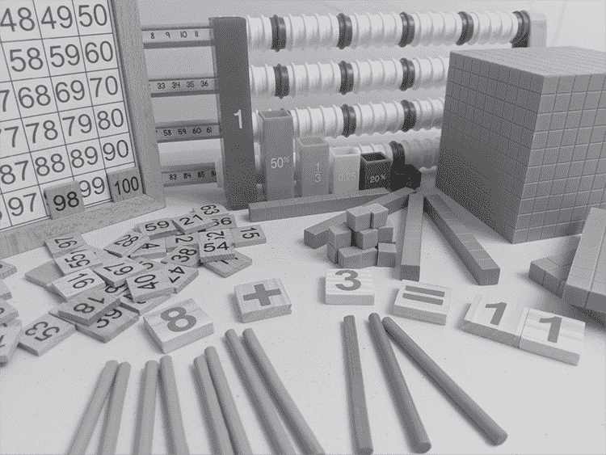
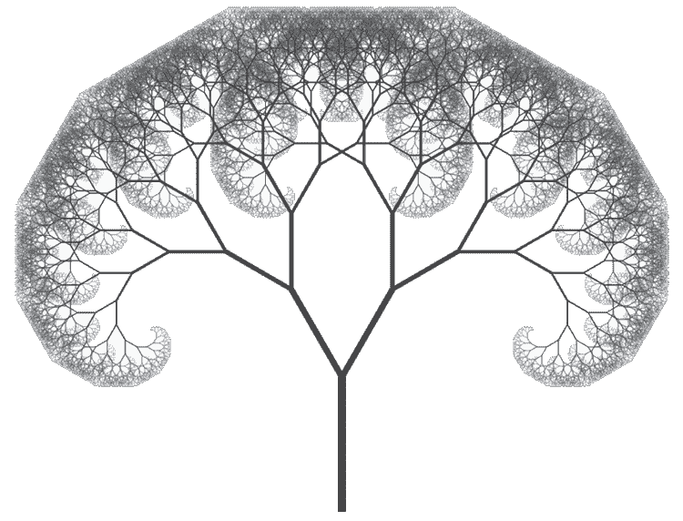
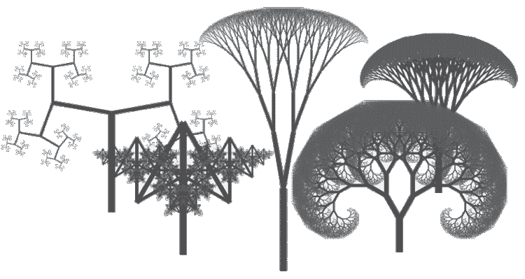
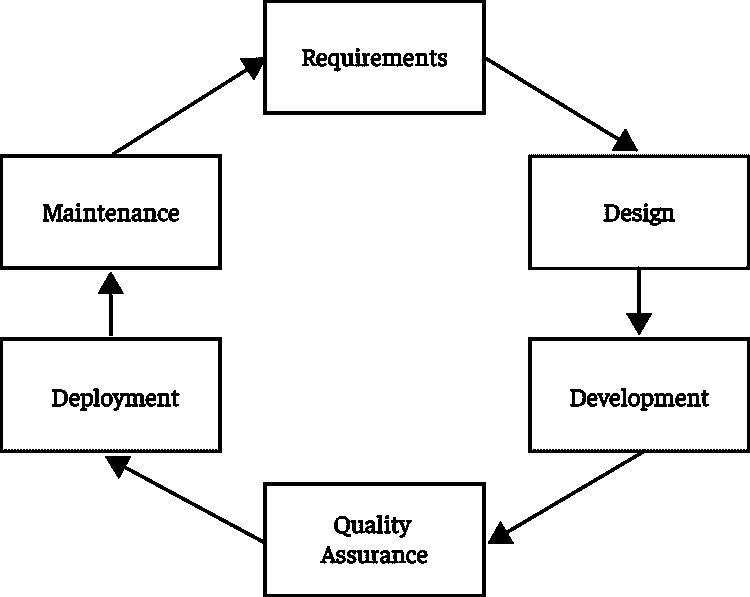

# 第八章：# 自我导向的基于项目的学习

在本章中，我们将探讨学生从头到尾以更自我导向的方式开发的软件项目，远比他们以往的项目更具自主性。项目开发过程以及你在其中的角色将包括流行的学术方法论——*基于项目的学习（PBL）*，使学生的项目在个人和教育意义上都变得有意义。还将包括*软件开发生命周期（SDLC）*，这是在专业领域中用于确保项目成功的最佳方法。在这些项目中，你将更多地充当一个促进者而不是一个教师，支持学生在需要时提供帮助，并给予指导，而不是直接引导他们的学习。

## 可探索的解释

让我们首先定义学生应当参与的那种软件项目，以及你将帮助他们实现的最终目标。数学教育使用*教具*的概念，将抽象概念转化为更具形象性的东西。这些是学生可以操作的玩具或其他物理物件，有助于他们更好地理解诸如位值、运算和模式等概念。图 8-1 展示了这些教育工具的一些示例，包括百格板、十进制积木、计数棒、分数立方体和一种与算盘类似的计数工具，它们将抽象与现实世界连接起来。

图 8-1：数学教具

尽管这些工具非常有效，但它们可能很昂贵，并且占用物理空间。随着计算机的普及，学者和开发者开始创建*虚拟教具*的在线库，这些是学生可以自由访问、操作和分享的物理对象的软件版本。2011 年，软件开发者开始讨论*可探索的解释*的概念，这一概念将虚拟教具的思想扩展到了其他学科。

一个有影响力的早期可探索解释由 Bret Victor 开发，他最早提出了这个术语。他编程了*反应性文档*，这些动态文本允许用户更改段落中的字段，从而改变与每个字段相关的量。例如，一个城镇规划委员会在衡量公共停车位的宽度与他们希望提供的停车位数量时，可能会读到：“在每个停车位宽度为 8 英尺的情况下，调查显示这一宽度不足，镇上提供了 160 个停车位，可以容纳 97.5% 的高峰需求。”

修改前述陈述中“八英尺宽”会导致其余文本发生一连串变化。例如，“在每个停车位宽度为八英尺半的情况下，调查发现这是足够的，该镇提供了 150 个停车位，能够满足高峰需求的 91.4%。”维克托认为，这样的文档通过使作者的数学计算显式化，促进了计算的透明性，促使观众主动阅读而非被动接受，并让读者能更深刻地思考主题内容。

### 可探索性与演示性与练习

为了更好地理解什么是可探索的解释，了解它们不是怎样的也很有帮助。假设一个学生对视觉艺术感兴趣，并希望探索在这种媒介中表达数学的方式。他们可能开始探索分形——一种无论你放大多少次，都会看起来相似的无限图案。学生找到了一个生成二叉树分形的算法，调整了种子变量——影响树木“生长”的输入——并输出了树木，如图 8-2 所示。

图 8-2：二叉树分形

学生展示了对算法输入和输出的理解，解释了对于这棵树，他们设置了 170 的长度使其变高，30 的发散度使其变宽，以及 0.75 的缩减因子使其以如此美丽的方式分枝。但尽管这个演示很棒，它只是一个演示。观众被动地接受这个概念。为了让这个解释变得可探索，它需要允许用户输入。在这种情况下，学生知道这些输入是什么：长度、发散度和缩减因子。所以他们添加了类似图 8-3 中所示的表单输入，允许用户改变输入并在点击“生成”按钮后看到树木如何生长。这样，用户可以与应用程序互动，探索这个概念。

图 8-3：二叉树分形生成器的用户输入

添加用户输入还带来了学生面临的重要挑战。用户为程序引入了一个“变数”。他们提交开发者未预见的输入，并以可能破坏程序的方式使用应用程序。考虑到这个新变量——用户——将是后续质量保证（QA）阶段的一部分。为了添加一个抽象界面，使得无需编辑代码即可改变输入，这项额外的工作将在学生看到用户与他们的项目互动，并立刻生成独特树木森林（如图 8-4 所示）时，变得非常值得。

图 8-4：具有不同种子变量的二叉树分形

要意识到，仅仅依靠用户输入并不能让一个项目变得可探索。例如，一个提供闪卡并让用户用正确答案“击败”它们的视频游戏，只是让用户进行反复练习，将他们通过一个游戏化的媒介进行训练。这是一个有趣的记忆事实的方式，但应用程序并没有像可探索的解释那样使用户对主题有更深的理解。视频游戏可以成为极好的可探索解释，但要确保学生知道一个游戏能赋能发现与一个仅仅是让记忆游戏化的游戏之间的区别。在帮助学生定义他们想要从事的软件项目时，记得牢记这一点。

### 一个驱动问题

自从这个术语首次提出以来，可探索的解释的概念已经扩展到包括探索各种概念的应用。通过图形和图表框架，学生可以开发出探索数学和统计概念的可视化工具。通过物理引擎，学生可以开发出模拟牛顿三大运动定律的应用程序。通过 3D 建模框架和开源化学规格，学生可以设置复杂分子的可视化。在生物学科中，学生可以通过进化算法模拟自然选择的过程。

在人文学科方面，学生可以通过互动功能扩展他们的散文，比如弹出式引用，或者编写互动小说，使用链接代替实体页面。对历史感兴趣的学生可以开发互动时间线，链接到原始资料，或与在线地图集成，展示著名事件。

一旦他们有了自己想要构建的想法，学生必须清晰地表达他们的愿景，并将其转化为一个驱动问题。这个问题可以是面向产品的，例如：“我如何编写一个能够回答关于美国革命战争问题的聊天机器人？”它也可以是面向角色的，例如：“如果我是数据科学家，我如何分析《傲慢与偏见》中被动语态的使用？”无论哪种方式，问题应该是面向行动的：它应该帮助确定项目的范围，并集中学生的努力。

在完善他们的驱动问题时，学生需要考虑为什么这个项目是相关的，以及产品是否能够满足当地的需求，从而满足 PBL 的基本要素。在 SDLC（软件开发生命周期）中，开发产品时，团队必须确定谁是其*利益相关者*。这些人对项目成功有兴趣，并帮助定义什么才算是成功。作为教育者和引导者，你是一个重要的利益相关者，负责监督解决方案的技术方面。其他利益相关者将是最终用户，可能是其他学生，他们将与产品互动并从中学习。*主题专家*（*SME*）（发音为“shmee”）也将参与其中。这个人了解业务，可以解释需求，并能验证软件是否准确地满足这些需求。对于你的学生来说，这个人最有可能是最了解他们正在编程的学科的老师。

## 基于项目的学习与软件开发生命周期

在 PBL 中，学生承担长期项目，深度参与回答一个具有教育意义的且对他们个人感兴趣的问题。项目开发过程需要批判性思维、创造力、沟通能力和探究能力。学生将从理解学术内容转向应用这些内容，以便更真实地理解学科内容。

PBL（基于项目的学习）使学生能够构建自己的理解。可探索的解释使用户能够以动态的方式与概念互动，以便更深入地理解。从这个角度来看，可探索的解释是完美补充 PBL 的代码项目。

此外，PBL 还培养学生在大学及其整个职业生涯中需要的技能。学生将在与主题专家（SME）合作时培养尊重合作的能力，确保最终产品能够满足当地需求。独立完成项目需要好奇心、责任感、自我驱动和毅力。这些思维习惯将有益于学生一生。

不同组织在定义 PBL 的基本要素时会有一些细微的差异；在本章中，我将列出几个大家达成共识的特点：

+   项目涉及*重要内容*，意味着项目的重点必须具有教育意义，并解决一个有意义的问题。

+   项目问题激发了学生的*需求认知*，因为它与他们自身密切相关，并激励他们想要学习更多。

+   一个表达清晰的*驱动问题*为项目设置了焦点和范围。

+   赋予学生*声音和选择*的权力，使学生能够按照自己的探究路径前进，并让他们自由决定如何进行。

+   在学生进行项目工作时，他们有更多机会进行*探究和创新*。

+   这些机会紧随其后的是对他们项目的*反馈和修订*。

+   所有这些努力最终汇聚成一个*公开展示的产品*。

这些项目属于*计算性工件*类别，涵盖了第一章，学生制作与计算机科学相关的有形输出。提到的主题包括程序开发、迭代开发、调试、反馈、文档编写和项目管理，这些都是计算机科学标准中提到的内容。学生需要在项目开发过程中涉及这些主题。正如在《教育益处》第 23 页中所述，代码项目与 PBL 是理想的匹配。

PBL 以学术为重点，但正如前面提到的，职业世界中的组织使用 SDLC 来管理他们的软件项目。SDLC 有六个阶段，不同的组织为每个阶段起了不同的名字。组织还可能根据他们的项目管理方法将这些阶段进行分组或以不同方式执行。图 8-5 展示了开发过程中的不同阶段。

图 8-5：SDLC 的阶段

第一阶段，*需求*，是开发者或业务分析师记录业务需求详细信息的地方。*设计*阶段是解决方案架构的地方。接下来是*开发*阶段，实际代码被编写或系统被配置。当项目达到稳定状态时，*质量保证*阶段对应用进行测试，以查找错误并确保它符合业务需求。产品随后进入*部署*阶段并上线，在*维护*阶段监控其稳定性，该阶段将持续到系统的生命周期结束。维护阶段被展示为指向需求，因为新的功能请求或软件增强开始时，整个过程将重新启动。

正如我们稍后将看到的，SDLC 的各个阶段在促进 PBL 的基本特征方面有许多地方相似；例如，SDLC 的 QA 阶段与 PBL 的反馈和修订方面非常相似。此外，PBL 的公开展示部分非常像 SDLC 的部署阶段。这些相似之处从项目开始时就存在，开发者计划并定义他们独立的代码项目。

## 需求

启动学生项目的第一步是定义这些项目是什么。对于计算机科学来说，学生可以制作许多类型的计算性工件。这些项目中有些不需要编写代码，比如测试计划、用例或流程图。但在本章中，我们将重点讨论构建软件应用程序，因为这样的项目涉及创建许多与 SDLC 相关的辅助工件。

一个从头到尾的软件项目本身涵盖了计算机科学课程中的多个主题，满足了 PBL（项目式学习）需要涉及重大内容的要求。但构建应用程序也具有极大的潜力，能够涉及学校其他学科的主题，为其他教育工作者提供服务，并展示计算机科学项目在社区中的价值。让学生思考他们可以编写什么样的软件，来探索其他课堂上的主题。通过构建一个探讨非计算机科学课堂中所学概念的应用程序，学生的项目变得具有服务导向性，因为他们定义了一个其他学生可以学习、其他教师可以欣赏的产品。

学生将通过一个能够自我表达的项目构想、一个驱动问题来集中精力，并与相关方一起定义其运作的细节，开始将所有这些信息记录到*项目提案*中。这是一个活文档，会随着他们深入工作而变化。项目提案可以有多种形式。通常，最好保持简洁明了，方便组织中的决策者快速理解。在职业领域中，项目提案解释了*商业需求*或*机会*，该服务可能如何惠及组织或社区，或者可以解决什么问题。在学生项目中，这可能描述了学生在课堂上遇到困难或觉得无趣的一个主题。在描述需求之后，项目提案接着提供了解决方案的概述，以及它如何满足这一需求。项目提案还应列出评估项目及其目标达成情况的相关方——教师和学生。

作为项目负责人，你的角色是从技术角度评估项目范围和可行性。在本书中，代码示例仅限于客户端 JavaScript，这也限制了学生在应用程序中可以做的事情。项目提案是否需要在不同会话之间保存用户数据？如果是的话，应用程序将需要一个数据库，并且需要学习如何设置它。解决方案是否需要基于保存的数据呈现个性化功能？如果是这样，应用程序将需要服务器端代码和更全面的开发环境。

如果学生的愿景超出了项目时间框架内可实现的范围，建议让他们缩小项目的范围。这可以意味着将应用程序的初始功能缩小为起点，计划在时间允许的情况下逐步增强它。理想情况下，可探索的解释应简单、直接，并且是有趣的工具，能够吸引并启发用户。它们应该尽量避免需要复杂的信息技术基础设施来运行。一旦学生有了这个起点，他们就可以继续进行软件开发生命周期（SDLC）的设计和开发阶段。

## 设计与开发

随着初步项目提案设定了项目范围，学生开始设计和开发阶段。在这里，他们研究构建自己设想的应用程序所需的内容，并开始提交代码来实现这一目标。这些阶段与 PBL（基于问题的学习）的探究和创新特点相符，学生在这一过程中内化现有的研究成果，并从学到的知识中构思新的想法。

项目提案是对项目及其目标的简短高层概述，而*设计文档*提供了软件如何工作的详细信息。如何正确地记录应用程序的设计是一个有许多正确答案的问题。有些组织记录用户与软件交互的步骤流程和每个用例。其他组织则记录各种软件组件，如数据库、前端和第三方服务，以及每个组件负责的功能和它们如何协作。还有些组织使用流程图，另一些则严格依赖代码中的注释。不幸的是，许多组织根本不进行文档记录，这就是一个问题。

学生记录他们的解决方案非常重要，以便向利益相关者详细说明他们的工作过程。当我们进入 SDLC 的 QA 阶段时，测试人员和同行评审人员将使用设计文档来验证应用程序的输入和输出是否符合需求。当软件进入 SDLC 的维护阶段时，设计文档将成为未来开发人员和管理员的宝贵资源，他们将继承这些文档并负责保持系统的正常运行。在编写和重写这些文档时，学生应该记住他们是为多个受众写作的：与代码合作的技术同行、将测试应用程序的非技术同行、需要操作应用程序的用户，以及作为跟踪自己开发进度的工具的自己。

在规划如何处理项目时，学生应该研究现有的解决方案。在职业世界中，这时*自建还是购买*的问题变得至关重要。是否有现成的产品和解决方案能够以最小的定制满足业务需求，还是从零开始构建应用程序更好？使用现有解决方案在组织的资金和学生的开发时间上花费较少。但这样做也会导致产品的可定制性较差，因为开发者受限于现有应用程序的功能，或者被一个开发多年、功能复杂的产品所压倒。

从现有的解决方案出发并不是非黑即白的选择。软件由许多不同的组件组成，每个组件可能都有现成的在线解决方案。提醒学生将整个产品拆解为更小、更易管理的部分。例如，打算绘制一个数字曼陀罗的学生（如第一章中所描述的）面临着许多小问题。比如，他们需要解决如何在网页浏览器中绘制图形、如何绘制数字、如何将数字按钟面上的线排列、如何沿着假想的螺旋线放射这些数字，以及如何测试因数和质数。地球上有七十亿人，某人可能已经解决了这些问题，并将其发布到论坛或代码库中。

我们能够拆解成的小而多的部分越多越好。在项目层面，每一个需要解决的小问题都是一个里程碑，帮助我们追踪进度并清晰定义瓶颈。在个人层面，完成待办事项清单中的项目带来的满足感，以及由此获得的成就感，将激励学生不断前进。

本节将 SDLC（软件开发生命周期）中的设计和开发阶段结合在一起，因为这两个阶段是迭代的，并相互影响。经过充分研究的设计在开发人员开始编写代码时可能会发生变化，开发过程中不可避免地会遇到意外的复杂情况，例如选定的技术不完全符合项目需求，或是如常见的那样，某个计划的功能开发起来比预期复杂。当这些问题发生时，重要的是要重新审视设计文档并根据需要更新。

作为主持人，你将每天检查每个学生的进展情况，以便与他们会面。在职业领域中，这些被称为*站立会议*，在会议中，团队成员简要汇报自上次站立会议以来完成的工作和当前正在进行的任务。为了保持会议简短，建议将每组学生人数限制为不超过五人，并指导学生尽可能快速地汇报进展，以尊重每个人的时间。

这也是学生可以通知你他们遇到的障碍的时候。承认学生遇到的困难，并记下需要进一步跟进的事项，然后安排时间与学生见面，共同解决问题。在第九章中，我们将回顾帮助遇到困难的学生的技巧和策略。

让学生不时与他们的 SME（主题专家）进行检查也是一个好主意，以确保项目继续满足业务需求。最好尽早识别开发与教育要求之间的差异，以避免浪费精力。随着学生应用程序的稳定性提高，他们将进入正式的 SDLC 测试阶段。

## 质量保证

SDLC（软件开发生命周期）的 QA（质量保证）阶段开始于学生认为他们有一个可以展示的产品。作为开发者，他们已经亲自测试过自己的应用程序，觉得它们已经准备好让别人试用。我们将在本节中介绍三种类型的 QA 测试。

*功能测试*是在这里应用程序被当作一个黑盒来处理，只检查它的输入和输出。在这里，学生将他们的应用程序交给同伴，后者会尝试从用户可能的各种方式与产品互动。测试者的目标是尽力让应用程序表现出非预期的行为。

这包括测试用户输入，他们可能认为这些输入不太可能或不合逻辑。例如，用户可能在期望正数的字段中提交“−100”，从而导致应用程序崩溃。作为软件开发者，容易将问题归咎于用户的错误输入。但在专业领域，应用程序必须验证每个用户输入，并优雅地提醒用户如果他们犯了错误。这里有一个关于功能测试的流行笑话：“一个 QA 测试员走进酒吧。他们点了一杯啤酒。他们点了零杯啤酒。他们点了 1000 杯啤酒。他们点了 qwerty 杯啤酒……”

一旦应用程序通过了功能测试，就足够稳定，可以进行*用户验收测试（UAT）*了。在这里，SME（领域专家）会审查应用程序的内容准确性，并确保它符合业务需求。在我们的可探索解释示例中，最了解所探讨概念的教师会审查应用程序的内容准确性，并可能提出修改意见或建议增加输入、输出和功能。

在这一阶段的最后一次协作 QA 练习是进行*代码审查*，开发者互相阅读彼此的代码并提供改进建议。这与英语课中的*同行评审*练习非常相似，在这些练习中，学生们阅读彼此的论文并提供批评反馈。一个好的做法是，评审者首先花时间阐述他们喜欢代码的各个方面。让他们解释他们认为聪明的地方，以及通过审查这段代码学到了什么。然后，考虑到语言的得体性，他们可以提出开发者可以改进代码的方式，或者建议他们希望看到的额外功能。

在学术环境中，关于同行评审的一个常见抱怨是，学生不是专家，可能会提出不合理的批评。作为本次代码审查练习的主持人，你需要审查所有的评审意见，并在它们送交被评审者之前，提供关于其得体性和准确性的反馈。能够学会以健康、尊重的方式沟通批评，并接受批评并改进的学生，能学到一项宝贵的领导技能，这将终生受益。

QA 是另一个迭代过程，开发者需要反复回顾和修订他们的应用程序。作为指导者，你应该向学生保证，这一切都是过程的一部分。许多商业应用程序都有整个 QA 测试团队进行审核，即便如此，它们在上线后仍然需要软件补丁。QA 阶段没有什么好气馁的。事实上，当学生的应用程序开始通过各种 QA 测试时，他们应该感到越来越自信。很快，他们的软件就会准备好进入部署阶段。

## 部署

一旦应用程序通过了质量保证（QA）、用户验收测试（UAT）和代码审查，它将进入软件开发生命周期（SDLC）的部署阶段，这是应用程序上线的时刻。在软件开发中，这意味着应用程序会发布到一个公开可访问的网址，或者提供下载。在第十章中，我们将探讨有助于将应用程序分享给世界的代码仓库，但这里讨论的部署是为了满足学术要求。

在项目式学习（PBL）中，我们所有协作努力的终点是一次公开展示的项目。这是一个学生展示他们项目的活动，观众包括老师、其他学生和家长。更重要的是，这次展示超越了计算机科学课堂，将学生的作品推广到更大的学校社区和校外社区。

这些展示是一次全面的沟通练习。学生们展示他们的学习过程、技术理解、学科理解，以及这些如何为他们的计算成果做出贡献。这些成果包括项目提案、设计文档、软件代码、测试结果和面向用户的应用程序。

学生们将需要时间来练习他们的展示，展示反馈是至关重要的。你不希望你的学生做出一个令人惊叹的应用程序，却未能以一种能够传达其重要性和成就深度的方式进行展示。软件开发人员常常被贴上社交笨拙且缺乏沟通技巧的刻板印象。能够解释复杂的技术概念，使不熟悉该主题的人也能理解，是商业世界中一种宝贵的技能，是学生们应该重视的能力。

这种沟通也包括传达你的失败。根据项目管理协会的数据，只有 64%的软件项目能够达成其目标，而且这仅适用于有专业软件开发人员的企业。编程项目中有许多未知因素，这种难度对于新手程序员来说尤为严重。学生可以从失败中学到很多。许多组织会举行*项目事后分析*，无论项目成功与否，都会分析项目的进展、哪些方面有效，哪些方面无效。所以，允许学生失败吧。只要他们能够记录下失败，并展示出理解为何以及如何这些问题难以克服，他们的时间就没有白费。项目的失败可以带来大量的智慧，学生也将对下一次项目有更实际的认识。

展示应该是一个盛事：有很多方式可以让学生展示他们的才华。给每个学生一些时间在舞台上使用投影仪，这是练习公共演讲的好方法。你也可以设置一个类似博览会的环境，让每个学生都有一张桌子和一些展示材料，比如一台笔记本电脑。与会者可以在房间里四处走动，与学生进行更具对话性质的交流。在线作品集、代码库和文档也可以补充展示，允许与会者在活动之外更深入地探索项目。

## 总结

在本章中，我们探讨了如何促进学生的编码项目，这些项目能够激发学生的自我动机、自由探究、与计算机科学概念的深入持续接触，以及将学生感兴趣的其他学科主题转化为计算思维。这些项目遵循 PBL 的基本原则，如意义性、相关性、学生的声音和选择、自由探究与创新、反馈与修订，最终还有一个公开展示的项目。同时，这些项目也遵循 SDLC 的各个阶段，包括需求分析、设计与开发、质量保证以及部署。

我们没有涵盖 SDLC 的维护阶段。项目上线之后会发生什么？在 PBL 中，项目展示是项目结束的高光时刻，学生有了一个切实的成就，值得骄傲。在软件开发中，代码上线是一个重要的里程碑，但并不是过程的结束。第十章将讨论这些学生项目如何在你学校的代码库中存活下来，成为未来课堂的资源。

除了这些项目为未来的计算机科学学生提供学习和构建的资源外，通过构建可探索的解释，你的学生还在创建可以让其他学科学生学习概念的应用程序。你通过为其他教师提供一个不断增长的专门教育应用程序库，提升了你学校计算机科学系的正面影响力。项目式学习（PBL）使学生对一个非常具体的学科有深刻了解， 希望在学生学习的过程中，你也能有所收获。

在下一章节，我们将学习学生在解决编码项目时将面临的一些挑战，以及你如何提供支持和鼓励，帮助他们成功完成。
