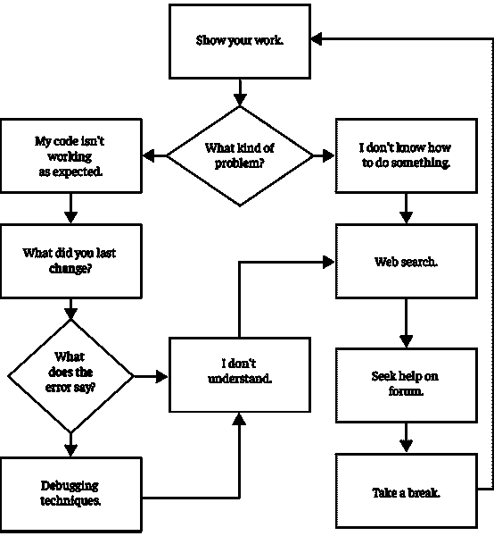
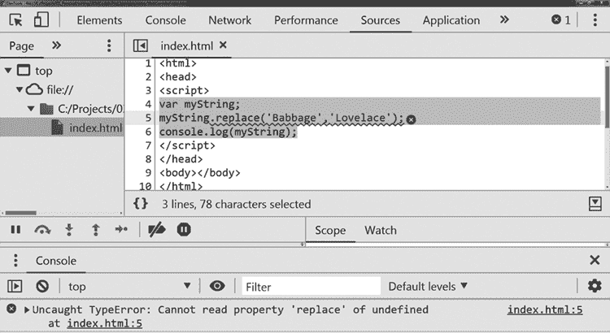

# 第九章：# 培养你的编程学员

与直接授课和课堂脚本化练习不同，项目式学习（PBL）的一个主要特点是学生可以灵活选择自己的项目重点，并且具备独立性和个人责任感来推进项目。在 PBL 中，教师充当的是促进者和教练的角色，允许学生在制定自己学习路径时拥有自主权，但始终随时准备提供必要的支持。为多个不同的项目提供支持，其中一些可能超出你的专业领域，这会带来相当大的挑战。

为了提供这种支持，熟悉通用的、可适应的故障排除技巧以及软件开发中常见的陷阱非常重要。在本章中，我们将回顾如何指导学生克服技术和个人挑战，并教育他们培养应对压力、提升毅力的思维习惯。通过这些技巧，你将为学生提供故障排除工具包，帮助他们在编程中保持高效，保持健康的心态，在面对困难时不放弃。

## 技术挑战

编程是复杂的，写软件时，很多时间都花在研究如何完成特定任务以及调试代码，尤其是当代码没有按照预期运行时。大多数学生遇到的问题将具有技术性质。教育工作者应指导学生通过调试代码并寻找解决方案，以一种方式帮助他们最终学会如何独立处理技术问题，准备好在你无法提供技术支持时能够自主解决问题。

在提供任何技术支持时，第一步是问学生：“你尝试过什么？”设置一个期望很重要，学生应首先展示他们已经充分投入问题，并概述他们所尝试过的解决方法，至少展示出对问题的部分理解。这也是学生在在线论坛寻求帮助时的要求。论坛成员通常会要求求助者“展示你的工作”，以便更好地理解问题的背景或误解所在。

让学生详细阐述问题，也让他们接触到开发人员有时称之为*教学技巧*的故障排除方法。这一技巧是由物理学家理查德·费曼推广的。他认为，深入理解一个问题的最佳方式是准备好将其教给别人。运用这一技巧，开发者向一个安静倾听并鼓励点头的人解释或“教”他们的问题。开发者逐步解释代码应该做什么，以便听者理解。这个过程通常会产生“啊哈！”时刻，问题对开发者来说变得显而易见，而听者无需说什么。这一技巧非常有效，据传闻，有一所大学在其帮助台放了一只泰迪熊，学生必须先向这只毛绒玩具解释他们的问题，然后才能与人类工作人员交谈。

一旦学生展示了他们如何彻底调查问题，你就会获得开始协助他们所需的背景信息。程序员常见的两个主要问题类别是：一种是他们写的代码没有按预期运行，另一种是他们不知道如何在代码中实现某个功能。

图 9-1 提供了故障排除流程图。



图 9-1：故障排除流程图

这是一个迭代过程，展示了应该调查的地方以及如何优先处理任务。这只是一个粗略的指南，开发者通常会根据他们的个人风格和专业领域的经验进行调整。

正如我们之前讨论的，你在提供支持时的角色始于学生展示他们的工作。一旦学生展示了他们已正确地参与问题并能用费曼的教学技巧解释问题，接下来的步骤取决于学生面临的具体问题类型。一个路径是处理现有代码无法按预期运行的问题，另一个路径是学生不知道如何在代码中完成某个任务。接下来的部分，我们将跟踪当学生的代码无法按预期工作时的路径，并优先考虑在尝试理解问题时应查看的地方。

### 故障排除现有代码

在第七章的示例练习中，学生们评估了多种实现回文函数的方法，我们注意到并非总是存在明确的对与错的解决方式。同样，在尝试理解代码以及为什么它可能没有按照我们预期的方式工作时，确定最佳的解决方法往往取决于具体情况。就像编码风格一样，调试风格也可能是个人偏好的问题。

作为最佳实践，学生应该理解编程和调试是一个迭代的过程。程序员应该记住 *编写一点，测试一点（CABTAB）*。如果在执行之前编写了 100 行代码，可能就有 100 行错误。相反，如果只编写两三行代码并进行测试，那么调试的内容就会小得多。当我们遵循 CABTAB 时，如果出了问题，第一个要问的问题是“你最后修改了什么？” 很可能，这就是我们找到错误的地方。

同样，个人偏好和经验在调试过程中也起着作用。多少是“少量”代码？对于初学者来说，可能是几行代码。对于经验丰富的程序员，他们可能在调试之前就写下几百行代码也没问题。随着程序员对许多可用的故障排除工具越来越熟悉，他们的信心也会增加。

对于 JavaScript 编程，当代码无法正常运行时，Web 开发者工具是首先要查看的地方。首先检查 Web 控制台。如果有任何错误导致浏览器中的代码执行失败，相关的错误信息将显示在控制台中。例如，如果你在网页中输入清单 9-1 中的代码并加载它，它将在第二行产生错误，并无法执行 `console.log()` 指令。

```
var myString;
myString.replace('Babbage','Lovelace');
console.log(myString);
```

清单 9-1：会导致错误的代码

图 9-2 显示了在控制台中错误的样子。在这种情况下，错误信息为 "Uncaught TypeError: Cannot read property 'replace' of undefined at index .html:5"。其中，index.html:5 是错误发生的代码位置，在这种情况下是 *.html* 页面上的第 5 行，因此我们知道从这里开始查找。



图 9-2：示例 Web 控制台错误

如果 Web 控制台中显示错误，它还会提供代码中的行号，告诉我们从哪里开始查找。如果学生不理解错误，可以让他们将错误信息复制并粘贴到搜索引擎中查看结果。但首先要确保他们去掉代码中任何特定的变量和函数名称，以避免搜索时的混淆。他们几乎肯定会找到很多曾经遇到过相同问题的其他程序员，并且有许多人愿意以各种方式解释该错误的含义。

在列表 9-1 示例中，问题出在变量 myString 的 replace() 函数上。这是一个 JavaScript 内置函数，我们可以从字符串中执行，比如 'bot'.replace('o','i') 来将 “bot” 改为 “bit”。因为我们没有给 myString 赋值，它是 “undefined”。类似地，如果我们将这段代码的第一行改为 var myString = 123; 并刷新浏览器，我们会得到错误 Uncaught TypeError: myString.replace is not a function at index.html:5。因为 123 是一个整数变量类型，它没有 .replace() 函数。这类变量赋值错误在 JavaScript 编程中非常常见，因为它与其他语言在变量处理上的不同。

不同的编程语言对于变量赋值和作用域有不同的规则。JavaScript 是一种 *动态类型* 语言，意味着变量的类型在代码运行时才会被检查。因此，你的变量在代码的某一点可能是 null，稍后可能是整数，甚至再晚些时候可能是字符串。尽管 JavaScript 允许这种行为，但为了简化代码，保持变量类型的静态性在整个应用中是一个好习惯。

如果网页控制台没有错误，但代码没有按预期执行，请引导学生查看第七章中讨论的网页开发工具中的调试选项。逐步执行代码，确保每个变量都保持预期的值，每一步都走在正确的方向。通常，学生会发现混乱的布尔条件，例如应该使用 or 操作符的地方使用了 and 操作符，或者循环执行得太长或太短，或者变量被赋值错误。

有时，使用调试器逐步执行代码是不可行的。考虑第 114 页 “递归” 中的 minimax 算法，程序使用递归来探索 255,168 种潜在的井字棋游戏。逐步执行这么多迭代可能需要几天时间。如果学生确实发现了问题，他们可能会被堆栈或过程淹没，无法理解问题发生的原因。在这种情况下，让他们在代码中添加 *日志记录* 以输出特定信息到网页控制台，在代码执行时查看，可能会更加方便。

列表 9-2 中的 jumpingJacks() 函数使用递归来动画化一个火柴人形象，在 i 的每个奇数值时将动画设置为跳跃帧，并包含日志记录以跟踪变量值随着代码执行的变化。可以在网页控制台中运行此代码，查看每个步骤的执行情况。

```
var frame = '';
var timeOut;
function jumpingJacks(i) {
  //If i is an odd number
  if (i%2) {
    frame = '<pre> \\O\/ \n _|_</pre>';
  } else {
    frame = '<pre>  O \n /|\\ \n / \\</pre>';
  }
  document.body.innerHTML = frame;
  console.log(i + " = " + i%2);
  //Recursively call jumpingJacks in one second intervals.
  timeOut = setTimeout(function(){jumpingJacks(i + 1);}, 1000);
}
//Stop any previous animations
clearTimeout(timeOut);
//Start our animation
jumpingJacks(0);
```

列表 9-2：递归函数，动画化跳跃角色

这段代码会一直执行，直到计算机内存耗尽。console.log(i + " = " + i%2) 函数输出 i 的值以及 i%2 的输出结果，i%2 返回 i 除以 2 的余数。结果是，我们可以同时在浏览器窗口中看到代码运行的过程，并看到输出到网页控制台的 console.log() 值。

输出值的另一种方法是 JavaScript 的 alert() 函数。将列表 9-2 中的 console.log() 调用替换为 alert(i + " = " + i%2)，将会在浏览器中显示一个弹出消息，暂停代码执行，直到用户点击**确定**。这与使用调试器中的断点非常相似。事实上，在开发者拥有网页开发工具之前，他们大量使用 alert() 函数来调试代码的运行。

虽然这不是客户端 JavaScript 可用的工具，但请注意，许多软件应用程序使用*日志文件*来监控它们的应用程序。这些文本文件记录了应用程序的错误、事件以及发生的时间。类似于 JavaScript 中的 console.log() 调用，软件将各种错误消息和应用程序细节写入文本文件，以便程序员能够监控软件的运行情况。因此，如果用户在应用程序部署后遇到问题，程序员可以查看日志文件，获取可能发生的问题信息。

在整个调试过程中，学生开发者不应犹豫，在遇到任何新的函数或错误信息时进行网络搜索。编写代码和排查问题的过程将不断扩展他们的调试知识。他们将逐渐对系统有更深的理解，并且能熟练地应对常见的错误和行为。

所有这些方法，从查看学生做出的最后修改到审查网页控制台，使用不同的调试技术，和进行网络搜索，都是从不同角度看待问题的方法。通常，采用这些方法足以解决大多数问题，特别是因为这些问题是其他开发者遇到过的，并且在网上寻求过帮助。

但是，当学生遇到瓶颈，甚至在你的帮助下也无法解决问题时，该怎么办呢？作为最后的手段，你可以将问题提交到像*Stack Overflow*这样的在线论坛（[*https://stackoverflow.com**/*](https://stackoverflow.com/)），并与社区展开对话寻求帮助。在下一节中，我们将更详细地探讨当学生不知道如何完成特定任务时的网络搜索和社区论坛方法。

另一个有效的方法是暂时中断调试过程。走开，离开一个棘手的问题，并不意味着你停止思考它。这个问题可能会继续在学生的脑海中作为一个背景过程运行。通常，IT 专业人员在暂时休息后，能想到解决方案或新的调查方向。当你在一个截止日期前工作时，这可能会很困难，所以休息也可能意味着让学生将精力集中在软件的其他部分。

现在学生们已经学会了如何排查已经写好的代码，接下来我们将探讨当学生在开始时不知道如何编写解决方案时的策略。

### 寻找问题解决方案

开发人员遇到的第二种问题是如何在代码中完成某项任务。初学者往往缺乏强大的认知工具包，无法运用编程技术和解决方案来应对不同类型的问题。问题的一部分在于，不熟练的程序员可能不知道哪些任务在代码中是困难的，哪些是简单的。区分计算上复杂和简单的问题本身就是一个复杂的问题。

与调试代码类似，第一步是让学生解释他们对问题的理解以及他们为解决问题所研究的方案。然后询问学生是否可以进一步分解问题。如果问题太复杂，无法解决，将其分解为更小、更具体的问题并逐个解决，可能会突破僵局并帮助学生取得进展。

作为一个示例，让我们重新审视第一章中的“曼陀罗因子查找器”练习。假设我们想要用代码重现这样的计算性工件。图 9-3 展示了它可能的样子。


图 9-3：用代码绘制的数字曼陀罗

如果学生研究如何绘制这个特定的图形，他们将找不到相关信息。用代码生成这个图形需要解决多个问题。但是，如果他们将这个图像的元素分解为独立的问题，他们就可以逐个解决这些问题，并迭代地创建这个图像。

例如，我们可能想要解决的第一个问题是如何在 HTML 画布元素上绘制数字。前 12 个数字的位置与时钟面上的位置相同。如果学生能找到一个已经绘制了时钟面的在线代码，他们可以修改那个代码来定位数字。随着数字围绕圆圈旋转，它们沿着一个螺旋线分布。学生们可以找到绘制螺旋的代码，并将其调整以使数字向外辐射。此外，这个曼陀罗图示中将质数用粗体显示，因此也需要一个识别质数的函数。

对于这些更小的问题，学生将找到大量的示例和解决方案。但为了找到这些示例，他们可能需要一些关于如何用搜索引擎查找资料的指导。以下是一些帮助学生用搜索引擎找到所需资料的技巧：

**在提问时包括编程语言** 如果你的问题涉及 JavaScript， 在问题中加入“JavaScript”一词（例如，“如何在 JavaScript 中将文本转换为小写”）。如果问题涉及样式设置，包含“css”在查询中（例如，“如何用 css 设置紫色文本”）。

**使用自然语言** 使用自然语言的区别在于搜索“JavaScript replace”和“如何用 JavaScript 替换字符串中的破折号”。第一个查询会把你引导到关于 JavaScript replace()函数的技术文档。而第二个查询则会把你带到友好、易于理解的结果，可能包含你可以直接复制粘贴到项目中的代码，这些代码可能来自于一个论坛，其他人在试图解决同样的问题。

**重构你的查询** 如果搜索没有找到你需要的信息，请回顾出现的建议，看看有哪些结果出现，然后重新构建查询，更清晰地定义你在寻找什么。

许多搜索结果来自编程论坛。在第七章中，我们做了一个练习，让学生们评估不同的回文函数编程解决方案，练习如何讨论代码，并阐述为什么他们更喜欢某些解决方案而不是其他解决方案。在这些论坛中，学生们将看到许多程序员也在进行相同的辩论。学生们通过阅读这些讨论，将受益于如何谈论代码的示范。

### 在线论坛

在线论坛是一个协作讨论网站，当学生在尝试其他途径后仍无法解决问题时，他们可能需要求助于这些有帮助的社区。发布问题到论坛应该是最后的步骤，原因有二。首先，有时其他用户需要一些时间才能回复帖子。其次，当学生发布问题时，他们需要通过提供问题的详细描述、自己尝试过的方法、理解的方式以及可能的最小可重复示例（MWE）来展示他们已经彻底研究过这个问题。在尝试其他所有方法后再发布问题到论坛。

除了寻求帮助，学生们还可以通过在这些在线论坛上提供帮助，获得额外学分或作为课堂活动，使用匿名课堂账户参与。我们将在下一章讨论如何在学校中建立社区。

如果你想深入了解编程中的问题解决技巧，我强烈推荐 V. Anton Spraul 的《像程序员一样思考》（No Starch Press，2012 年）。在这本书中，作者提供了多种故障排除技巧，从解决难题的一般性策略，到排查数组、递归以及其他数据结构和控制方法的具体方式。Spraul 为教育者们介绍了许多思路和方法，可以传授给他们的初学者学生。

除了技术挑战，学生们还可能面临许多个人挑战。在接下来的部分，我们将探讨一些软件开发者在网上讨论的常见挑战；你可以让学生们了解这些挑战，并为应对这些挑战提供实际的策略。

## 个人挑战

在专业领域，IT 人员可能会面临许多个人困难，这些困难会影响他们的生产力或给他们带来额外的压力。了解哪些问题可以提供辅导，哪些问题应该转交给专业咨询师非常重要。在这里，我们将讨论一些即使是专业程序员也会遇到的常见挑战，以及他们用来保持高效的一些实际应对机制。指导程序员认识到个人挑战，从而保持专注，将对他们的职业生涯大有裨益。

### 难以保持专注

对于年轻一代而言，教育中存在一种有害的*数字原住民*神话。这个观点认为，由于学生在科技环境中成长，他们天生比老一代人更擅长使用技术，并且在利用计算机系统进行生产力和学习方面更为高效。这种刻板印象的一个方面是，数字原住民是专家级的多任务处理者：他们可以同时发短信、聊天、听音乐和玩视频游戏。但研究表明，任何人，即使是数字原住民，在尝试多任务时都会更容易出错，效率也会降低。多任务处理对学习有害。

这在编程中尤为明显。编码就像阅读或学习，它需要高度的专注。你不能一边编码一边看视频；你也不能每隔几分钟就检查一次邮件。这样做会打断你的思路，重新构建你在脑海中所编写的复杂系统需要时间。

话虽如此，认识到在指尖轻松获得娱乐内容的环境下保持专注是多么困难也很重要。当我们只需几次点击就能进入社交媒体聊天、观看视频或玩在线游戏时，想要坚持进行复杂函数的调试就变得尤为困难。我们很容易陷入干扰的漩涡，直到后来才意识到浪费了多少时间。

学生需要具备对自己时间和注意力的元认知意识。他们需要意识到自己的分心点和专注力。如果他们能意识到自己是如何分心的，就可以实施应对机制来重新获得注意力。

一种流行的提高生产力的策略是*番茄工作法*，你可以在桌上设置一个计时器，承诺集中精力完成一个特定的任务，每次持续 25 分钟。如果你在这段时间内想到其他任务或待办事项，可以把它们写下来，重新专注于当前的主要任务。每完成一个工作周期后，你可以休息五分钟，查看邮件、访问社交媒体或阅读一篇在线文章。每四个工作周期后，你可以休息 15 到 30 分钟。

这一技术非常有效，因为它只要求短时间的专注，并且每次冲刺结束后都有一个值得的休息奖励。它同样有效，因为它促进了*心流*：学生可能会发现自己在编码任务中沉浸其中，和他们沉迷于游戏或社交媒体一样，失去了时间感，专注于单一任务。该技术还将专注性游戏化，学生们会记录自己每天完成的冲刺次数，并努力打破自己的记录。许多带有计时器和冲刺日志功能的手机应用程序可以帮助他们使用这一技术。

提高专注力的另一种选择是安装生产力软件。这些程序中的一些允许你配置每天或某些时间段内可以在特定网站上花费的时间，并在时间限制到达时阻止访问这些网站。学生可能会发现在试图限制自己访问这些网站时，他们浪费在干扰上的时间是多么惊人。与此相关的最佳实践是，在学校的网络上运行内容屏蔽软件，以防止学生访问浪费时间或其他不适当的网站。

### 复杂性挑战

另一个常见的生产力挑战是*分析性瘫痪*，即开发人员被任务或项目的复杂性压得喘不过气来，不知道从何开始。如前所述，将项目分解为一组较容易解决的问题是缓解这一挑战的最佳方式。但重要的是要认识到，当这种压倒性的项目复杂感来自项目范围时，要及时调整。

正如前一章所述，必须识别并控制那些过于雄心勃勃的学生主导项目，以免学生因投入的工作量而感到沮丧。在创意领域中，*创意债务*的概念指的是艺术家将所有时间花在设想一个惊人的最终产品上，可能是一本史诗般的小说或电影，但却从未付出努力将其变为现实。类似地，在专业领域中，有时一个组织会设想一个全面的、功能丰富的软件解决方案，满足每个可能的需求，但由于创建该方案的成本和范围过于庞大，最终未能实现。项目也可能陷入*范围蔓延*的困境，原本简单的解决方案随着组织不断设想更多要添加的功能，变得越来越难以管理。

解决创意负债和范围蔓延的一种策略是将项目缩小到最基本的实现或*最小可行产品*。尝试找出学生如何能完成一个概念验证。假设学生想要制作一个 20 个问题的游戏，用来猜测一个物种，从而教授生物分类学。对于一个人来说，这可能是一个庞大的任务，因为全世界有 870 万种物种。当学生意识到这一点时，他们可能会感到不知所措并感到沮丧。相反，可以让他们从领域和界开始。一旦这个较小的项目完成，他们就能更好地估算将游戏扩展到门、纲、目、科、属甚至种所需的范围和努力。通过这样做，他们能够取得短期的胜利，并且随着学生逐步扩展项目的范围，项目也能自然地成长。

分析瘫痪就像写作障碍，而解决写作障碍的最好方法是写点什么，分析瘫痪的解药也同样简单，那就是开始编程。缩小并简化项目范围可以让学生更容易开始编程。一旦他们开始编程，随着他们逐一解决一个个小任务，整个过程也会变得更加流畅。

### 资源挑战

今天，计算机已将百科全书、电视、有线电视、录像机、黑胶唱片收藏、视频游戏主机以及我们曾经需要在生活中预算的所有其他媒体都融为一体。正因如此，个人计算机作为社会平等化的工具，拥有巨大的潜力。不幸的是，计算机和高速互联网连接的获取并不均衡。因此，全球的学校和社区中出现了数字资源的有与没有之分。

对于你的课堂，本书中涵盖的策略和练习旨在以最低的经济成本让学生参与到计算思维和编程中。当我们向孩子们教授计算机科学概念时，我们甚至不需要使用计算机；相反，我们可以通过游戏来教他们。当我们介绍编程时，也不需要在学校的计算机上安装新软件。我们可以利用内置于网页浏览器和在线环境中的工具，这样无论学生使用任何能够上网的计算机，都能在家或公共图书馆继续他们的项目。

但当学生离开课堂后，他们对计算机的访问就超出了你的控制范围。一个可以在放学后用家用计算机继续进行软件项目的学生，将比一个无法做到的学生具有显著优势。要意识到学生在家中能访问的编程环境，并引导他们去图书馆等提供公共互联网访问的地方。如果可能的话，学校为学生提供延长计算机使用时间的机会，可以成为学生继续追求编程兴趣的宝贵资源。信息技术的公平访问是一个道德问题，亟需创新和持续倡导来解决。

### 冒名顶替综合症

许多专业程序员常常感到自己缺乏与同龄人相当的技能和专业知识。即使是大学毕业后，花费多年或几十年编程，很多人仍觉得自己缺乏足够的技术能力，害怕被揭露为“冒名顶替者”。这种非常常见且自然的思维方式被称为*冒名顶替综合症*，它会给开发者带来很大的压力。

许多学生可能会陷入这种自我认知的陷阱，觉得自己不属于编程领域。那些资源匮乏的学生，看到自己与那些从小就有计算机接触的同学自然熟悉计算机，可能更容易产生这种不足感。这些学生的担忧在于，冒名顶替综合症带来的压力感可能会导致他们放弃计算机科学。这一结果在今天尤其令人担忧，因为该领域正在寻求更多来自弱势群体的参与，以及他们为该领域带来的独特视角。

作为教练，你的赞扬对学生意义重大。确保你找到方法鼓励他们，提升他们的自信心。要认识到计算机科学是一个令人畏惧的学科，并且要公开承认这一点。这就是为什么本章解释了多种应对机制，用以处理这一复杂性所带来的各种问题。

另一种应对机制是意识到，我们的不足感可能源于一种理性的谦虚。在心理学中，有一种现象叫做*邓宁-克鲁格效应*，指的是一个人对某一复杂学科了解得越多，他们就越怀疑自己的专业水平。相反，一个人对某一学科了解得越少，他就越有信心谈论它。我们应该像自我质疑的专家，而不是过于自信的初学者。

第三章讲解了我们现代计算机所积累的复杂性，这一过程经历了几个世纪的创新，因此没有人能期望知道所有的内容。以谦虚的态度来面对计算机科学的复杂性，应该有助于在与同行互动时展现敏感性与尊重。记住，当我们知道足够多的内容时，才会意识到我们还知道得太少。

因此，我们不应对自卑感做出反应，而应指导学生培养健康的谦逊感。与其在问题出现时做出反应，不如引导学生养成有益的思维习惯。

## 培养健康的元认知

在本章中，我们已经介绍了学生遇到挑战时的应对方法。在本节中，我们将探讨两种具体的*元认知*（思考我们的思维），你可以教导学生提高应对挑战的方式。

### 成长心态

最近越来越多的研究发现，教导学生*成长心态*，让他们知道大脑是可塑的，可以通过努力工作变得更强大，能提高他们的韧性。这与*固定心态*相对立，固定心态认为某些人生来更聪明，或者认为个体的智力能力终究是有限的。根据他们的心态，学生对挑战的反应可能会有很大的不同。

当拥有固定心态的学生失败时，他们认为这是因为自己天生存在缺陷，缺乏克服困难的智慧。相反，拥有成长心态的学生理解智能是可塑的这一科学事实，并且他们知道通过更加努力的工作可以变得更聪明。当这些学生失败时，他们会将失败视为一种学习机会。固定心态的学生会以宿命论的态度应对压力，而成长心态的学生则会将压力视为一种需要克服的自然暂时性挑战。

成长心态的常见隐喻是将大脑比作一种通过压力变得更强壮的肌肉。就像任何人通过举重可以变得更强壮，或者通过每天慢跑变得跑得更快，我们也可以通过心理挑战变得更聪明。确保学生的大脑保持开放，愿意接受改善，这意味着要让他们意识到，智力和才能是流动的属性，我们在面对并克服挑战时可以加以提升。通过这种方式，我们力求今天比昨天更聪明。

同样地，有证据表明，那些个人目标是掌握计算机科学学科的学生，相较于那些只想比同龄人取得更好成绩的学生，会在计算机科学课程中取得更好的成绩。鼓励自我提升并努力掌握计算机科学概念，将提高学生在学术上的成功概率，同时也促进他们的自我成长。

### 韧性

一旦学生明白自己有成长的潜力，你就可以开始指导他们进行成长。成长需要坚持不懈地逐步克服问题和挑战。正如第二章所提到的，软件开发需要坚韧不拔的精神来应对我们将会面临的不可避免的挑战。

来自教育部教育技术办公室的报告草案指出，“毅力”、“学术坚韧性”、“自主性”、“学术坚持性”和“持久性”是著名学者用来描述实现目标的意志力和在面对逆境与挫折时坚持不懈的词汇。这种坚持不懈比认知因素对于学生的学术表现更为重要。具备韧性可能比天赋更为重要。

研究表明，意志力是一种有限的资源，短期内会被消耗殆尽。但它也表明，意志力像其他心理特质一样，能够通过挑战得到锻炼，变得更加持久和强大。指导学生理解这一事实，以提高他们的坚持力。提醒他们，当他们感到沮丧时，这意味着他们即将学到新东西。

### 好奇心

本章中，我们回顾了许多帮助学生在面对障碍时不失去希望的策略。支持学生的一个非常重要的方面是提供一个愉快的学习环境，培养他们对学科内容的深刻理解。计算机科学拥有许多令人敬畏的元素，当我们沉浸在解决问题的琐碎细节中时，往往会忽视这些奇妙之处。

在每节课开始时，设定一个引人深思的问题、令人印象深刻的展示，或该领域的前沿发展。寻找方法让学生体验“哇”时刻。抽时间刷新你对学科的热情，并与学生分享你的热情。没有什么比培养对编程的热情更能促进心流和韧性的了。

## 摘要

本章介绍了许多策略和技巧，帮助学生应对他们在编程和学习计算机科学过程中不可避免遇到的各种挑战。最常见的，学生通常需要在技术问题上获得帮助。在这种情况下，你应该设定一个预期，要求他们首先独立解决问题，然后再引导他们进行代码调试并帮助他们在网上寻找答案。学生还应该参与在线论坛，再次展示他们的作品，以寻求帮助并观察其他程序员如何讨论代码。

我们还讨论了学生可能面临的一些个人挑战以及应对问题的实际策略，如专注力不足、应对复杂性、资源有限和自卑感。这些问题同样困扰着职业开发者。因此，当你指导学生应对这些问题时，你也在为他们应对职场中的常见压力做准备。

最后，我们探索了你可以积极鼓励学生们采用的一种思维方式，以便他们能够以健康的方式应对挑战。通过提醒学生们他们可以通过挑战实现成长，学生们将更有毅力去克服他们遇到的障碍。作为教育者，你也应该时刻提醒自己，保持对计算机科学的热爱，并将这种热情传递给你的学生，以增加他们对这一学科的兴趣和参与度。

在下一章中，我们将从单独支持学生的技巧转向通过社区建设的努力来创建一个支持性环境，这些努力你可以在涉及计算机科学的学校中主导。这些练习、项目和程序将提高你的项目的可见性，同时为你的学生提供重要的教育经验和支持服务。
