## 第一章：## Hello, World!


在本章中，我们将带你完成创建你的第一个应用的过程。但什么是应用程序呢？应用程序（*app*）是“应用程序”（*application*）的缩写，它是一种计算机程序，包含一组编写好的指令供计算机执行。一个应用程序为用户执行任务，例如提供行车导航、预测天气，甚至只是通过游戏提供娱乐。运行在手机或平板电脑上的应用程序，通常被称为*移动应用*，与运行在普通计算机上的程序有很多相似之处。读完本书后，你将能够将你的新编程技能应用到不仅仅是 iPhone 或 iPad 上！毕竟，计算机就是计算机——无论它是在你口袋里、你的膝盖上，还是桌子上。你一定会用你所创建的独特而有趣的新应用，给朋友和家人留下深刻印象！

然而，除了给你所爱的人展示一件酷炫的东西之外，你的应用程序还可以提交到苹果 App Store，并与全世界的用户共享。截至目前，已经有超过 1400 亿个应用从苹果商店下载。你不需要拥有一家公司或是大人物，才能将应用程序放入 App Store。任何有好点子和一定编程技能的人，都能拥有一款畅销的应用。

本书将教你如何开发 iOS 应用，iOS 是苹果公司开发的移动操作系统，使 iPhone 及其所有应用能够正常运行。其他一些常见的操作系统包括苹果的 macOS 和微软的 Windows，它们都运行在桌面计算机上。iOS 专为苹果设备设计，如 iPhone、iPod touch 和 iPad。

iOS 和 macOS 程序长期以来都是用一种名为*Objective-C*的语言编写的。2014 年夏天，苹果推出了一种新的、令人兴奋的应用编程语言——*Swift*。这就是你将在本书中学习的语言。苹果工程师花费了数年时间，使 Swift 成为一种快速且强大的计算机语言，同时又非常有趣且易于使用。Swift 是一个非常适合初学者的计算机语言，因为它的语法像英语。例如，你只需一行代码就能输出“Hello, world!”：


```
print
 ("Hello, world!"
 )
```

我们很高兴教你 Swift，但首先我们需要准备好你的工具。接着，我们将带你完成创建你的第一个应用的过程，该应用将显示屏幕上的“Hello, world!”。

### 安装 Xcode，你的代码编辑器

要编写你的第一个 iOS 应用，你需要一台相对较新的 Mac 计算机。具体来说，你需要一台运行 OS X 10.11.5（El Capitan）或更高版本的 Mac。要查看你正在运行的 macOS 版本，请点击 Mac 屏幕左上角的苹果图标，然后选择**关于本机**。

你还需要 Xcode 和 iOS 软件开发工具包（SDK）。Xcode 是一个功能强大的代码编辑器，称为*集成开发环境（IDE）*。它让你编写代码，并且包括一个*模拟器*，你可以用它查看你的代码在任何类型的 Apple 设备上的运行情况。iOS SDK 是一套预构建的编程库，帮助你快速编写符合 Apple 预期的应用程序。编程*库*是相关软件模块的集合，你可以在程序中使用。iOS SDK 包含在 Xcode 中，因此只需下载一次，你就能获得这两个工具。要打开 App Store，点击屏幕左上角的 Apple 图标，然后选择**App Store**。搜索 Xcode，它应该是第一个搜索结果，点击**获取**按钮安装它（见图 1-1）。

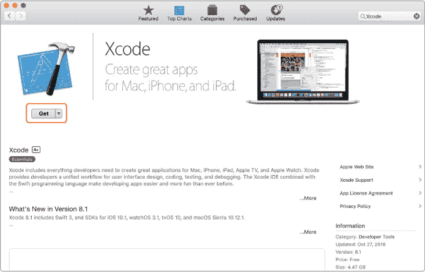

*图 1-1：从 App Store 安装 Xcode。*

你需要使用你的 Apple ID 登录才能安装 Xcode。如果你在 iTunes 上购买过任何东西或在 iPhone 上安装过应用程序，你已经拥有 Apple ID。如果你还没有 Apple ID，可以点击**创建 Apple ID**按钮来创建一个。安装 Xcode 可能是这个过程最棘手的部分，所以不要害羞——如果需要帮助，向成年人寻求帮助。


### 你的第一个应用程序！

现在你可以开始创建你的第一个应用程序了。通过双击 Finder 窗口中*应用程序*文件夹里的 Xcode 图标来打开 Xcode。第一次这样做时，你可能会看到 Xcode 和 iOS 的条款与条件。如果出现，请点击**同意**，然后等待 Xcode 安装其组件（见图 1-2）。这可能需要一些时间，所以请耐心等待。

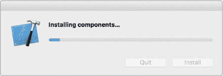

*图 1-2：Xcode 首次启动时，需要安装其组件。*

从图 1-3 中显示的“欢迎使用 Xcode”对话框中选择**创建一个新的 Xcode 项目**。

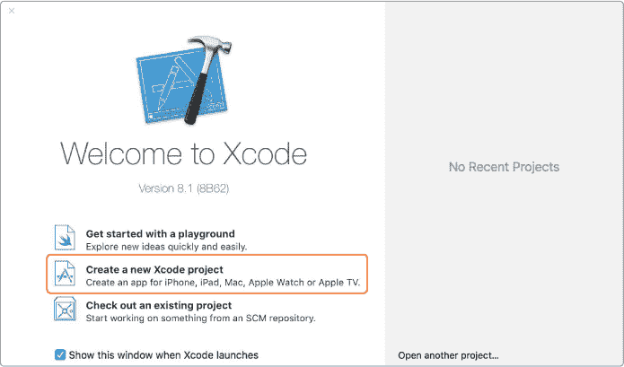

*图 1-3：选择**创建一个新的 Xcode 项目**。当你开始工作时，这里也会显示一份项目列表供你选择。*

在对话框的左上角选择**iOS**，然后在主屏幕上选择**单一视图应用程序**模板（见图 1-4）。点击**下一步**。

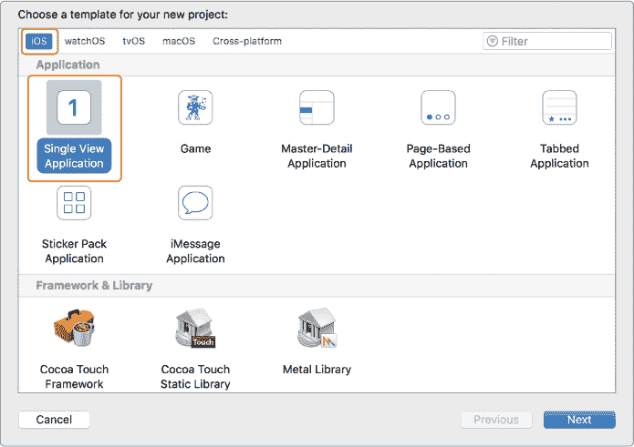

*图 1-4：选择**单一视图应用程序**。这是最简单的项目类型。*

接下来，Xcode 将要求你为你的新应用设置一些选项（见图 1-5）。

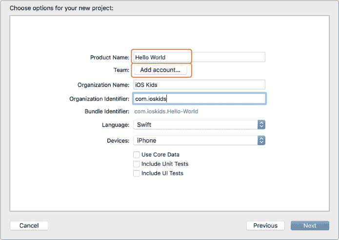

*图 1-5：即使在此处设置之后，你也可以在项目设置菜单中更改这些选项。*

对于产品名称，为你的应用命名为*Hello World*。

如果你有 iPhone、iPod touch 或 iPad，并且希望在该设备上运行应用程序，Xcode 需要知道你的 Apple 账户信息。点击**添加账户...**按钮，你将看到图 1-6 中显示的登录表单。

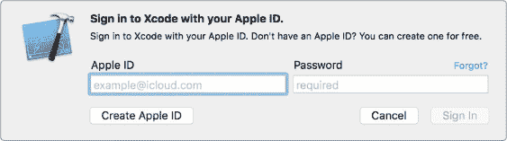

*图 1-6：使用 Apple ID 登录 Xcode，允许你的应用在真实设备上运行。*

输入你的 Apple ID 和密码。如果你之前创建了 Apple ID，你可以在此使用该 ID。或者，如果你在 iPhone、iPod touch 或 iPad 上使用 iCloud，你也可以使用该登录信息。

一旦你成功使用 Apple ID 登录，你将看到账户窗口，如图 1-7 所示。

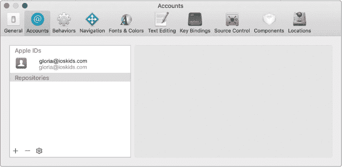

*图 1-7：登录后，你会在账户窗口的 Apple IDs 下看到你的账户。*

通过点击左上角的红色关闭按钮关闭这个窗口，你将再次看到新建项目窗口。现在，它显示了你的 Apple 账户在 Team 下，正如你在图 1-8 中看到的那样。

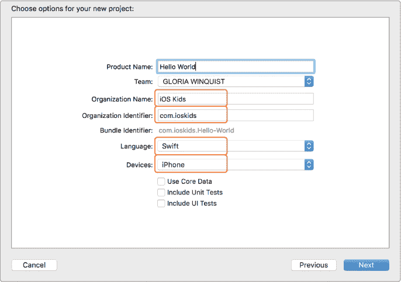

*图 1-8：现在，新建项目窗口下的 Team 显示了你的 Apple 账户。*

接下来，添加一个组织名称。你可以自己编一个公司名，使用你的真实姓名，或者选择其他任何你喜欢的名字。组织标识符需要是一个唯一的名称，通常格式化为反向的网站地址（不用担心—并不需要一个实际的网站！）。捆绑标识符会将你在组织标识符和产品名称字段中输入的名称合并，并会自动创建。

将语言选项设置为**Swift**，设备选项设置为**iPhone**。确保“使用 Core Data”、“包含单元测试”和“包含 UI 测试”复选框没有被选中。点击**下一步**，然后点击**创建**，这将保存应用并启动 Xcode。

你的新*Hello World* Xcode 项目将会打开。

#### 介绍故事板

在 Xcode 窗口的左侧，你会看到一个面板，里面包含了构成你项目的文件和文件夹。这个面板被称为*导航器面板*。从导航器面板中选择*Main.storyboard*。这将打开项目的*故事板*，它展示了我们运行应用时设备屏幕的图像式视图（见图 1-9）。我们可以使用故事板来设计所有的屏幕以及它们之间的连接。构建应用时并不一定需要使用故事板，因为你可以通过代码编写应用的所有设计元素。然而，使用故事板要简单得多，所以在本书中我们将使用故事板。

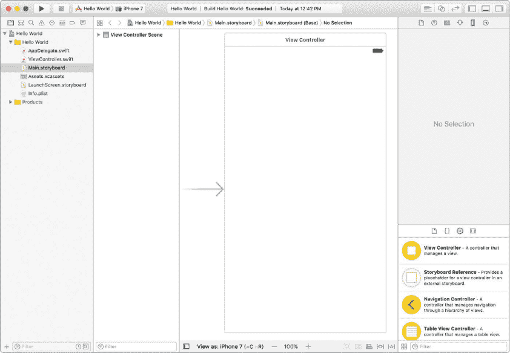

*图 1-9：项目的主故事板。*

当我们创建这个项目时，我们选择了单视图应用模板。这会为我们启动一个显示一个空白白色屏幕的应用。你可以在故事板中看到这个屏幕，见图 1-9—它是一个箭头指向其左侧的框。这个箭头表示它是应用程序的启动屏幕。这个框叫做*视图控制器场景*。在 Swift 中，*视图控制器* 管理着应用运行时在屏幕上显示的视图。故事板中的*场景* 是视图控制器及其包含的所有视图的可视化表示。

你可以使用右上角的三个按钮来隐藏或显示 Xcode 的不同部分。每个按钮代表屏幕上不同的部分，你可以通过点击它来切换它的显示状态。当按钮变灰时，这部分 Xcode 被隐藏；当按钮变蓝时，这部分 Xcode 被显示。点击这些按钮，直到它们看起来像图 1-10，其中两个左侧的按钮为灰色，右侧的按钮为蓝色。


*图 1-10：这些按钮用于显示或隐藏 Xcode 的不同部分。*

这将隐藏导航窗格（左侧的文件列表）和*调试区域*（底部区域，显示应用运行时的消息），并为我们在故事板上工作提供更多的屏幕空间。我们保留在屏幕右侧的窗格（由蓝色按钮表示）是*实用工具窗格*。我们将使用它来查找要添加到故事板中的对象。

#### 通过对象库添加用户界面元素

在实用工具窗格中，选择对象库图标，它是一个位于圆圈中的方形，如图 1-11 所示。

在对象库中上下滚动，可以查看你可以在应用中使用的*用户界面元素*。你会看到标签、按钮、文本框、图像视图，以及一些对用户不可见的元素，比如手势识别器。如果你想要获取任何这些对象的更多信息，只需双击它，便会弹出一个对话框。

首先，我们从对象库中选择**标签**，然后将其拖到编辑器中的视图控制器上（见图 1-12）。


*图 1-11：对象库包含了你可以拖入故事板以设计用户界面的元素。*

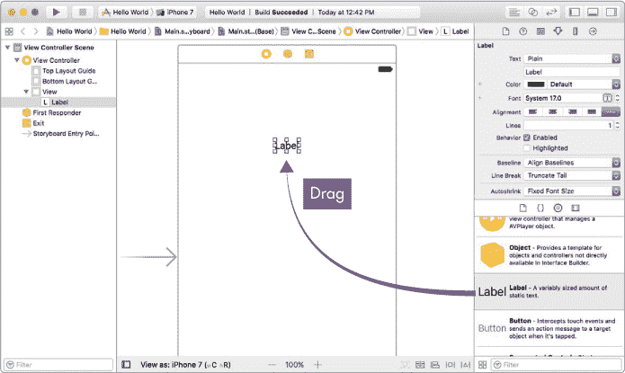

*图 1-12：从对象库中拖动标签并将其放置到视图控制器上。*

一旦你放置了标签，点击实用工具窗格顶部的大小检查器图标（它看起来像一把尺子），如图 1-13 所示。大小检查器允许我们改变故事板中对象的大小。

你添加到视图控制器的标签不够大，无法显示完整的“Hello, world!”消息，所以我们将其放大。在大小检查器中，将标签的宽度更改为 200 像素，高度更改为 40 像素。

现在，将标签移动到视图控制器屏幕的左上区域。你可以通过点击标签并将其拖动到所需位置，或在大小检查器中输入 x 和 y 坐标来实现。*x 坐标*指定标签的水平位置，*y 坐标*指定标签的垂直位置。设置 X 为 80，Y 为 40。现在你的值应与图 1-13 中所示的值相匹配。

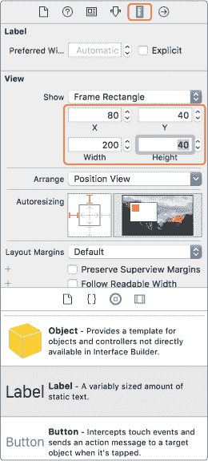

*图 1-13：通过大小检查器设置标签的新宽度、高度及 x 和 y 坐标*

要更改标签的文本，切换到属性检查器，如图 1-14 所示。

在标签文本字段中输入“Hello, world!”。你也可以通过双击故事板中的标签并直接输入想要显示的文本来更改标签的内容。接着，通过更改字体来使我们的“Hello, world!”消息更大、更粗。点击字体字段中的 T 图标，从样式下拉菜单中选择**粗体**，在大小字段中输入 30，然后点击**完成**。图 1-14 展示了所有这些设置。

最后，选择文本的居中对齐方式，如图 1-15 所示，通过选择对齐方式旁边的第二个图标。

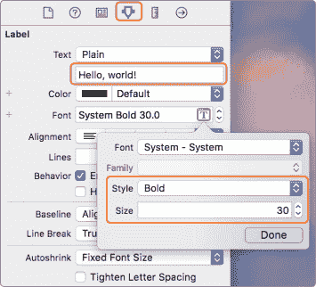

*图 1-14：将标签的内容更改为“Hello, world!”并加粗，将字体大小设置为 30。*

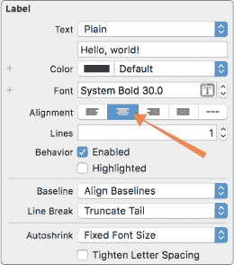

*图 1-15：使标签的文本居中对齐。*

尝试运行应用，看看会发生什么。你可以通过多种不同的方式运行应用。你可以点击 Xcode 左上角的播放按钮，选择菜单选项 Product ▸ Run，或者使用快捷键⌘-R。


第一次运行应用时，模拟器需要一些时间来启动并加载。请耐心等待。你也可能发现 iPhone 模拟器的大小太大，无法适配你的屏幕。如果是这种情况，你可以通过模拟器菜单调整大小，如图 1-16 所示。进入**窗口** ▸ **缩放**，然后选择适合你屏幕的更小尺寸。

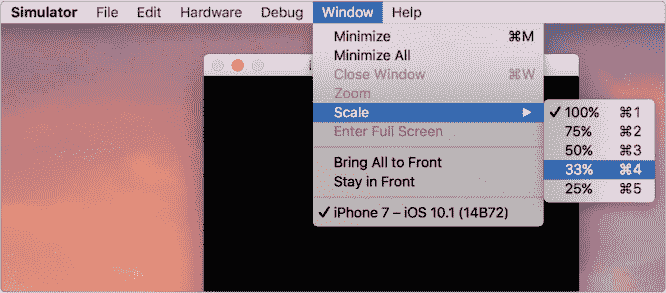

*图 1-16：调整模拟器大小，使其适配你的电脑屏幕*

当你的应用加载并运行时，你将看到类似于图 1-17 的内容。

运行你的应用有很多方式，同时也有几种方法可以停止它。你可以点击 Xcode 左上角的方形停止按钮，选择菜单选项 Product ▸ Stop，或者使用快捷键⌘-句号。

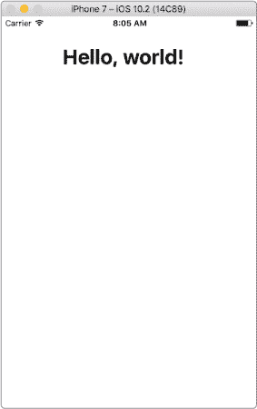

*图 1-17：这就是成功的样子！*

#### 保存你的工作

Xcode 会在每次运行应用时自动保存你的工作，但你也可以随时按 ⌘ -S 保存你的项目。要再次打开项目，你有两个选择。第一种是直接启动 Xcode。在 Xcode 欢迎界面的右侧，你最近的项目会显示在那里，你可以直接从那里打开你的应用。第二种是找到并在 Finder 中双击 *Hello World.xcodeproj* 项目（参见图 1-18）。

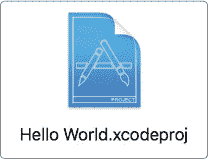

*图 1-18：在 Finder 中双击 Hello World.xcodeproj 文件，打开 Xcode 中的应用。*

### 在真实设备上运行应用

如果你拥有 iPhone、iPod 或 iPad，并且想要在这些设备上运行你的应用，你将在本节中学习如何操作。如果没有，你可以跳到第二章，在 Xcode 模拟器上测试和运行你的应用。

为了在真实设备上运行你开发的应用，你需要做几件事：你需要让 Xcode 知道你的设备，以便它能追踪哪些设备可以运行应用，同时你需要告诉你的设备信任 Xcode，这样它就会允许 Xcode 向设备安装应用。

要让 Xcode 知道你的设备，请在 Xcode 中使用 Apple ID 登录，然后将设备连接到电脑的 USB 端口。你应该在本章创建 Hello World 项目时已经登录过 Xcode。如果没有，前往 **Xcode** ▸ **偏好设置**，选择 **账户** 标签，点击 **+**，然后点击 **添加 Apple ID...**，如图 1-19 所示。

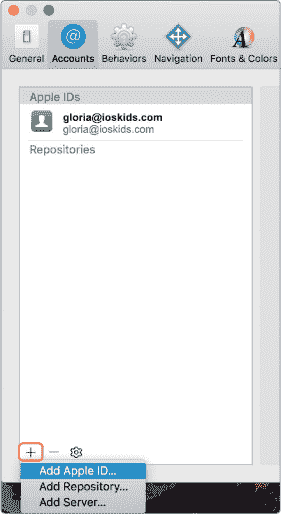

*图 1-19：在 Xcode 的偏好设置中，在账户标签下添加 Apple ID*

一旦你在 Xcode 中使用你的 Apple ID 登录（你只需要做一次，因为 Xcode 会记住你的登录信息），将设备连接到你的电脑。第一次连接设备时，你的设备会询问你是否信任你的计算机，如图 1-20 所示。点击**信任**。

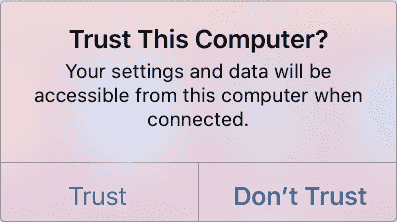

*图 1-20：你的设备会询问你是否信任你连接的计算机。*


请注意，你必须解锁你的设备才能看到此消息。一旦点击了信任，你需要等待大约 30 秒，拔掉设备与电脑的连接，再重新插回去。第二次连接时，不应该再出现“信任此计算机？”的提示。这意味着你的设备已经知道，当它连接到此计算机时，就会信任它。

现在查看 Xcode。Xcode 顶部的状态栏应该会告诉你，它正在为你的设备处理符号。这是 Xcode 在能够在设备上运行应用程序之前必须完成的一次性过程。在此过程中，你只需要耐心等待几分钟。完成后，通过点击 Hello World 旁边的 iPhone 模拟器标签和左上角工具栏中的播放按钮，将 Xcode 的运行选项更改为你的设备。这将弹出一个菜单，你可以在其中选择要在其上运行应用程序的设备。你的设备将位于模拟器列表的顶部，如图 1-21 所示。

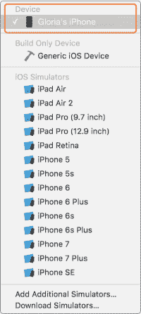

*图 1-21：选择你的设备，以便可以在其上运行应用程序*

现在点击 Xcode 中的播放按钮（或按 ⌘ -R）以在你的设备上运行应用程序。如果你看到像图 1-22 中显示的消息，等几分钟再试一次。

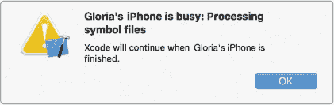

*图 1-22：Xcode 尚未准备好在此设备上运行应用程序。*

如果你看到像图 1-23 中显示的消息，还有一步需要操作，以使你的手机信任你的计算机。

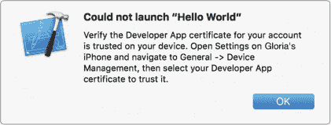

*图 1-23：此消息意味着你的手机还没有准备好安装应用程序。*

如果你看到此消息，进入设备上的设置应用，选择**通用**，然后选择**设备管理**（参见图 1-24）。

在设备管理设置中，你会看到一条消息，提示来自你开发者账户的应用程序在你的设备上不被信任。点击**信任“*email*”按钮，然后在弹出的对话框中再次点击**信任**（参见图 1-25）。

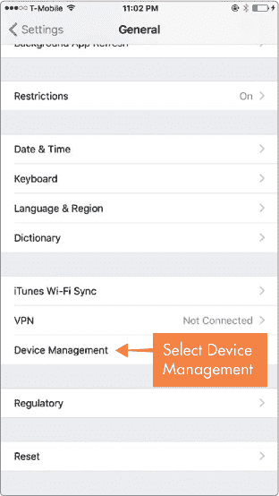

*图 1-24：在设备的通用设置中选择设备管理*

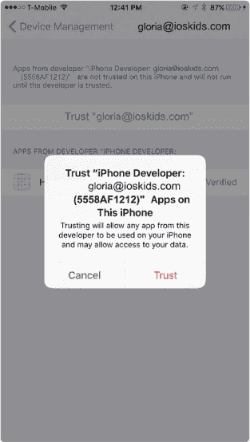

*图 1-25：使设备信任你的计算机，从而可以安装应用程序的最后一步*

现在可以了！现在回到 Xcode，再次点击播放按钮。这次，经过大约一分钟，Hello World 应用程序应该会在你的设备上运行。

### 你学到的内容

你安装了 Xcode 并创建了你的第一个应用程序。在此过程中，你学会了如何在故事板中的视图控制器上添加标签，以及如何在模拟器或真实设备上运行你的应用程序。在第二章中，你将学习如何在 Swift 中创建表达式，就像写句子一样。

## 你好，世界！


在本章中，我们将带你创建你的第一个应用程序。那么，究竟什么是应用程序呢？*应用程序*（简称*app*）是计算机*程序*，即一组计算机执行的指令。应用程序为用户执行某些任务，例如提供驾车导航、预测天气，甚至只是通过游戏提供娱乐。在手机或平板电脑上运行的应用程序，通常称为*移动应用程序*，它们与在普通计算机上运行的程序有许多相似之处。阅读完本书后，你将能够利用你的新编程技能，在不仅仅是 iPhone 或 iPad 上开发应用程序！毕竟，计算机就是计算机——无论它是在你口袋里、膝上还是桌面上。你一定会用你创造的独特有趣的新应用程序，让你的朋友和家人刮目相看！

然而，除了能向你的亲朋展示这些酷炫的应用程序外，你的应用程序还可以提交到 Apple App Store，与全球用户分享。截至目前，已有超过 1400 亿个应用程序从苹果商店下载。你不需要拥有公司或是大人物才能将应用程序上传到 App Store。任何拥有好点子和一定编程技能的人，都可以创造出畅销应用。

本书将教你如何为 iOS 开发应用程序。iOS 是由苹果公司开发的移动操作系统，它使 iPhone 以及所有相关应用程序得以运行。其他常见的操作系统包括苹果的 macOS 和微软的 Windows，它们通常运行在桌面计算机上。iOS 是专为苹果设备设计的，比如 iPhone、iPod touch 和 iPad。

iOS 和 macOS 程序长期以来都是用一种名为*Objective-C*的语言编写的。2014 年夏天，苹果推出了一种新的、令人兴奋的编程语言——*Swift*，用于开发应用程序。这就是你将在本书中学习的语言。苹果的工程师们花费了多年时间，打造了一个既快速又强大的计算机语言，同时也有趣且易于使用。Swift 是学习的绝佳入门编程语言，因为它的工作方式类似于英语。例如，你可以通过一行代码输出“Hello, world!”：


```
print
 ("Hello, world!"
 )
```

我们很高兴教你 Swift，但首先我们需要准备好你的开发工具。接下来，我们将带你创建第一个应用程序，它将在屏幕上显示“Hello, world!”。

### 安装 Xcode，您的代码编辑器

要编写你的第一个 iOS 应用程序，你需要一台相对较新的 Mac 电脑。具体来说，你需要一台运行 OS X 10.11.5（El Capitan）或更高版本的 Mac 电脑。要查看你运行的是哪个版本的 macOS，可以点击 Mac 屏幕左上角的苹果图标，然后选择**关于本机**。

你还需要 Xcode 和 iOS 软件开发工具包（SDK）。Xcode 是一个高级的代码编辑器，被称为*集成开发环境（IDE）*。它让你编写代码，并且包括一个*模拟器*，你可以使用它来查看你的代码在任何类型的 Apple 设备上如何运行。iOS SDK 是一套预构建的编程库，帮助你快速、按照 Apple 期望的方式编写应用程序。编程*库*是一些相关软件模块的集合，你可以在程序中使用。iOS SDK 包含在 Xcode 中，因此下载 Xcode 后，你将同时获得这两个工具。要打开 App Store，请点击屏幕左上角的 Apple 图标，然后选择**App Store**。搜索 Xcode，它应该是第一个搜索结果，然后点击**获取**按钮进行安装（见图 1-1）。


*图 1-1：从 App Store 安装 Xcode。*

你需要使用你的 Apple ID 登录才能安装 Xcode。如果你曾在 iTunes 上购买过任何东西，或者在 iPhone 上安装过应用程序，那么你已经拥有了 Apple ID。如果你还没有 Apple ID，可以通过点击**创建 Apple ID**按钮来创建一个。安装 Xcode 可能是这个过程最棘手的部分，所以不要害羞—如果需要帮助，向成年人求助。


### 你的第一个应用程序！

现在你可以开始创建你的第一个应用程序了。通过在 Finder 窗口的*应用程序*文件夹中双击 Xcode 图标来打开 Xcode。第一次执行此操作时，你可能会看到 Xcode 和 iOS 的条款和条件。如果你看到了，点击**同意**，然后等待 Xcode 安装其组件（见图 1-2）。这可能需要一些时间，请耐心等待。


*图 1-2：首次启动 Xcode 时，它需要安装其组件。*

从“欢迎使用 Xcode”对话框中选择**创建一个新的 Xcode 项目**，如图 1-3 所示。


*图 1-3：选择**创建一个新的 Xcode 项目**。当你开始处理项目时，你还会在此看到可供选择的项目列表。*

在对话框的左上角选择**iOS**，然后在主屏幕上选择**单视图应用程序**模板（见图 1-4）。点击**下一步**。


*图 1-4：选择**单视图应用程序**。这是最简单的项目类型。*

接下来，Xcode 会要求你为新的应用程序设置一些选项（见图 1-5）。


*图 1-5：即使在此设置后，你也可以在项目设置菜单中更改这些选项。*

对于产品名称，给你的应用程序命名为*Hello World*。

如果你有 iPhone、iPod touch 或 iPad，并且想在该设备上运行应用程序，Xcode 需要知道你的 Apple 账户信息。点击**添加账户…**按钮，你将看到如图 1-6 所示的登录表单。


*图 1-6：使用 Apple ID 登录 Xcode，以便让你的应用可以在真实设备上运行。*

输入你的 Apple ID 和密码。如果你之前创建了 Apple ID，可以在这里使用。如果你在 iPhone、iPod touch 或 iPad 上使用 iCloud，也可以使用该登录信息。

一旦你成功使用 Apple ID 登录，你将看到账户窗口，如图 1-7 所示。


*图 1-7：登录后，你将在账户窗口的 Apple IDs 下看到你的账户。*

点击左上角的红色关闭按钮关闭此窗口，你将再次看到“新建项目”窗口。但现在，它在团队下显示了你的 Apple 账户，如图 1-8 所示。


*图 1-8：新建项目窗口现在在团队下显示了你的 Apple 账户。*

接下来，添加组织名称。你可以发明自己的公司名称，使用真实姓名，或者选择任何你喜欢的名字。组织标识符需要是一个唯一的名称，因此通常将其格式化为倒置的网址地址。（不用担心——不需要实际的网站！）Bundle 标识符将组织标识符和产品名称字段中输入的名称结合起来，并自动生成。

将语言选项设置为**Swift**，设备选项设置为**iPhone**。确保“使用核心数据”、“包括单元测试”和“包括 UI 测试”的复选框没有被选中。点击**下一步**，然后点击**创建**，这将保存应用程序并启动 Xcode。

你的新*Hello World* Xcode 项目将会打开。

#### 介绍故事板

在 Xcode 窗口的左侧，你将看到一个包含项目文件和文件夹的窗格，这被称为*导航窗格*。从导航窗格中选择*Main.storyboard*。这将打开项目的*故事板*，它为我们提供了运行应用时设备屏幕的图画视图（参见图 1-9）。我们可以使用故事板设计所有的屏幕以及它们之间的连接。在构建应用时，你不一定必须使用故事板，因为你也可以在代码中编写所有应用的设计元素。然而，使用故事板要容易得多，所以我们在本书中将使用它。


*图 1-9：项目的主要故事板。*

当我们创建这个项目时，选择了单视图应用程序模板。它为我们启动了一个显示空白白色屏幕的应用程序。你可以在故事板中看到这个屏幕，如图 1-9 所示——它是一个箭头指向左侧的框。这个箭头表示它是应用程序的起始屏幕。这个框被称为*视图控制器场景*。在 Swift 中，*视图控制器* 管理在应用程序运行时显示在屏幕上的视图。故事板中的*场景*是视图控制器及其包含的所有视图的可视化表示。

你可以使用右上角的三个按钮来显示或隐藏 Xcode 的不同部分。每个按钮代表屏幕上的一个不同部分，你可以通过点击它来切换显示或隐藏。当按钮是灰色时，该部分的 Xcode 被隐藏。当按钮是蓝色时，该部分的 Xcode 被显示。点击这些按钮直到它们看起来像图 1-10，其中左边的两个按钮是灰色的，右边的按钮是蓝色的。


*图 1-10：这些按钮用于显示或隐藏 Xcode 的不同部分。*

这会隐藏导航器面板（左侧的文件列表）和*调试区域*（底部区域，显示应用程序在运行时的消息），并为我们在故事板上提供更多的屏幕空间。屏幕右侧我们保留的面板（由蓝色按钮表示）是*实用工具面板*。我们将使用这个面板来查找可以添加到故事板中的对象。

#### 通过对象库添加用户界面元素

在实用工具面板中，选择对象库图标，它是一个圆圈内的方块，如图 1-11 所示。

在对象库中上下滚动，查看你可以在应用程序中使用的各种*用户界面元素*。你会看到标签、按钮、文本框、图像视图，以及一些用户不可见的元素，比如手势识别器。如果你想了解任何这些对象的更多信息，只需双击一个，它会弹出一个对话框。

让我们从向屏幕添加一个标签开始。在对象库中选择**标签**并将其拖动到编辑器中的视图控制器上（见图 1-12）。


*图 1-11：对象库包含你可以拖入故事板中设计用户界面的元素。*


*图 1-12：从对象库拖动标签并放置到视图控制器上。*

一旦你放置了标签，点击实用工具面板顶部的大小检查器图标（看起来像一把尺子），如图 1-13 所示。大小检查器允许我们改变故事板中对象的大小。

你添加到视图控制器中的标签不够大，无法显示一个漂亮的“Hello, world!”消息，所以让我们把它做得更大。在尺寸检查器中，将标签的宽度更改为 200 像素，高度更改为 40 像素。

现在将标签移动到视图控制器屏幕的左上区域。你可以通过点击标签并将其拖动到所需位置，或者在尺寸检查器中输入 x 和 y 坐标来完成此操作。*x 坐标*指定标签的水平位置，*y 坐标*指定标签的垂直位置。将 X 设置为 80，Y 设置为 40。现在你的值应该与图 1-13 中显示的匹配。


*图 1-13：使用尺寸检查器设置标签的新宽度、高度及 x 和 y 坐标*

要更改标签的文本，请切换到属性检查器，如图 1-14 所示。

在标签文本字段中输入 "Hello, world!"。你也可以通过双击故事板上的标签并输入你希望它显示的文本，直接在标签中输入文本。让我们通过更改字体，使我们的“Hello, world!”消息变得更大、更粗。点击字体字段中的 T 图标，从样式下拉菜单中选择**粗体**，将大小字段设置为 30，然后点击**完成**。图 1-14 展示了所有这些设置。

最后，选择居中对齐文本，如图 1-15 所示，通过选择对齐旁边的第二个图标。


*图 1-14：更改标签，使其显示“Hello, world!”，并使其加粗，字体大小设置为 30。*


*图 1-15：将标签文本居中对齐。*

尝试运行应用程序，看看会发生什么。你可以用很多不同的方法来运行你的应用程序。你可以点击 Xcode 左上角的播放按钮，选择菜单选项产品 ▸ 运行，或者使用快捷键⌘ -R。


第一次运行应用时，模拟器需要一些时间才能启动并加载。请耐心等待。你可能还会发现 iPhone 模拟器太大，无法适应你的屏幕。如果是这种情况，你可以通过模拟器菜单调整大小，如图 1-16 所示。进入**窗口** ▸ **缩放**，然后选择一个适合你屏幕的小尺寸。


*图 1-16：将模拟器缩小到适合计算机屏幕的大小*

当你的应用加载并运行时，你会看到类似于图 1-17 的界面。

不仅有很多方法可以运行你的应用程序，还有几种方法可以停止它。你可以点击 Xcode 左上角的方形停止按钮，进入产品 ▸ 停止，或者使用快捷键⌘ -句点。


*图 1-17：这就是成功的样子！*

#### 保存你的工作

Xcode 会在你每次运行应用程序时自动保存你的工作，但你也可以通过按 ⌘ -S 随时保存项目。要重新打开项目，你有两个选择。第一个是直接启动 Xcode。你的近期项目会显示在 Xcode 欢迎对话框的右侧，你可以直接从那里打开你的应用。第二个是找到并双击 Finder 中的 *Hello World.xcodeproj* 项目（见 图 1-18）。


*图 1-18：在 Finder 中双击 Hello World.xcodeproj 文件以在 Xcode 中打开应用程序。*

### 在真实设备上运行应用程序

如果你拥有 iPhone、iPod 或 iPad，并且想在上面运行你的应用程序，你将在本节中学习如何操作。否则，你可以跳到 第二章，在 Xcode 模拟器上测试和运行你的应用程序。

为了在真实设备上运行你开发的应用程序，你需要做几件事：你需要让 Xcode 知道你的设备，以便它能够跟踪哪些设备允许运行应用程序，并且你需要告诉设备信任 Xcode，这样它就能允许 Xcode 将应用程序安装到设备上。

要让 Xcode 知道你的设备，首先在 Xcode 中使用你的 Apple ID 登录，然后将设备连接到电脑的 USB 端口。你应该在本章中创建 Hello World 项目时就已经登录 Xcode。如果没有，请前往 **Xcode** ▸ **偏好设置**，选择 **账户** 标签，点击 **+**，然后点击 **添加 Apple ID...**，如 图 1-19 所示。


*图 1-19：在“偏好设置”中的“账户”标签页下添加 Apple ID 到 Xcode*

一旦你在 Xcode 中使用 Apple ID 登录（以后只需要登录一次，因为 Xcode 会记住你的登录信息），将设备插入电脑。第一次插入设备时，设备会询问你是否信任这台电脑，如 图 1-20 所示。点击 **信任**。


*图 1-20：你的设备会询问你是否信任你插入的电脑。*


请注意，你必须解锁设备才能看到此消息。点击信任后，你需要等待大约 30 秒，拔掉设备与电脑的连接，然后再重新连接。当你第二次插入时，"信任此电脑？" 的提示应该不会再出现。这意味着你的设备已经知道，当它连接到这台电脑时，需要信任它。

现在看看 Xcode。Xcode 顶部的状态栏应该会显示它正在为你的设备处理符号。这是 Xcode 必须完成的一个一次性过程，在它能够在你的设备上运行应用之前，你只需要等几分钟。一旦这个过程完成，将 Xcode 的运行选项更改为你的设备，方法是点击 Hello World 旁边的 iPhone 模拟器标签和左上角工具栏中的播放按钮。这会弹出一个菜单，你可以在其中选择应用运行的设备。你的设备会出现在模拟器列表的顶部，如图 1-21 所示。


*图 1-21：选择你的设备以便在其上运行应用*

现在点击 Xcode 中的播放按钮（或按 ⌘ -R）在你的设备上运行应用。如果你看到像图 1-22 所示的弹窗，等几分钟再试一次。


*图 1-22：Xcode 尚未准备好在此设备上运行应用。*

如果你看到类似图 1-23 所示的消息，你还需要执行最后一步，让手机信任你的计算机。


*图 1-23：此消息表示你的手机尚未准备好安装应用。*

如果你收到此消息，请进入设备上的设置应用，选择**通用**，然后选择**设备管理**（参见图 1-24）。

在设备管理设置中，你会看到一个提示，告诉你来自你的开发者帐户的应用在设备上不受信任。点击**信任“*email*”按钮，然后在弹出的窗口中再次点击信任**（参见图 1-25）。


*图 1-24：在设备上的通用设置中选择设备管理*


*图 1-25：让你的设备信任你的计算机并安装应用的最后一步*

应该没问题了！现在返回 Xcode，再次点击播放按钮。这次，过一分钟左右，Hello World 应用应该会在你的设备上运行。

### 你学到了什么

你已安装 Xcode 并创建了你的第一个应用。在这个过程中，你学会了如何在故事板中向视图控制器添加标签，以及如何在模拟器或真实设备上运行应用。在第二章中，你将学习如何在 Swift 中创建表达式，就像写句子一样。


在本章中，我们将带你走过创建你第一个应用程序的过程。但究竟什么是应用程序呢？应用程序（*application*）简称 *app*，是一种计算机 *程序*，它是计算机遵循的一系列指令。应用程序为用户执行特定任务，例如提供驾车路线、预测天气，或仅仅通过游戏提供娱乐。运行在手机或平板上的应用程序，通常被称为 *移动应用*，它们与运行在普通计算机上的程序有很多相似之处。阅读完本书后，你将能够将新学的编程技能应用到比 iPhone 或 iPad 更广泛的设备上！毕竟，计算机就是计算机——无论它是在你的口袋里、膝盖上，还是桌面上。你一定会用你创造的独特有趣的新应用来给朋友和家人留下深刻印象！

然而，除了能作为炫耀给亲朋好友的酷炫东西外，你的应用程序还可以提交到苹果应用商店，并与全球用户分享。到目前为止，苹果应用商店已经下载了超过 1400 亿个应用程序。你不需要拥有公司或是大佬身份，就能将应用程序上架到应用商店。任何有好点子和一定编程技能的人，都有机会开发出一款畅销应用。

本书将教你如何开发一个 iOS 应用程序，iOS 是苹果公司开发的移动操作系统，使得 iPhone 以及所有应用程序得以运行。其他一些常见的操作系统包括苹果公司的 macOS 和微软的 Windows，它们都运行在桌面计算机上。iOS 专为苹果设备设计，如 iPhone、iPod touch 和 iPad。

iOS 和 macOS 程序一直是用一种叫做 *Objective-C* 的语言编写的。2014 年夏天，苹果推出了一种全新的令人兴奋的应用编程语言——*Swift*。这就是你将在本书中学习的语言。苹果工程师们花费了多年时间，使 Swift 成为一种快速强大且有趣易用的计算机语言。Swift 是一个很好的入门编程语言，因为它的工作方式像英语。例如，你可以用一行代码输出“Hello, world!”：


```
print
 ("Hello, world!"
 )
```

我们很高兴能教你 Swift，但首先我们需要准备好你的工具。接下来，我们将带你走过创建第一个应用程序的过程，该应用程序将在屏幕上显示“Hello, world!”。

### 安装 XCODE，您的代码编辑器

要编写你的第一个 iOS 应用程序，你需要一台相对较新的 Mac 计算机。具体来说，你需要一台运行 OS X 10.11.5（El Capitan）或更高版本的 Mac。要查看你当前运行的 macOS 版本，可以点击 Mac 屏幕左上角的苹果图标，然后选择 **关于这台 Mac**。

你还需要 Xcode 和 iOS 软件开发工具包（SDK）。Xcode 是一个高级的代码编辑器，通常被称为*集成开发环境（IDE）*。它不仅让你编写代码，还包括一个*模拟器*，你可以用它来查看代码在任何类型的苹果设备上的运行效果。iOS SDK 是一套预构建的编程库，帮助你快速编写符合苹果预期的应用程序。编程*库*是一组相关的软件模块，你可以在程序中使用它们。iOS SDK 与 Xcode 一起提供，因此只需下载一次便能同时获得这两个工具。要打开 App Store，点击屏幕左上角的苹果图标，然后选择**App Store**。搜索 Xcode，它应该是搜索结果中的第一个，然后点击**获取**按钮进行安装（参见图 1-1）。


*图 1-1：从 App Store 安装 Xcode。*

你需要用你的 Apple ID 登录以安装 Xcode。如果你在 iTunes 上购买过任何内容或在你的 iPhone 上安装过应用程序，那么你已经有了 Apple ID。如果你还没有 Apple ID，可以通过点击**创建 Apple ID**按钮来创建一个。安装 Xcode 可能是这个过程最复杂的部分，所以不要害羞——如果需要，向成年人寻求帮助。


### 你的第一个应用！

现在，你可以开始创建你的第一个应用。通过双击 Finder 窗口中的*Applications*文件夹中的 Xcode 图标来打开 Xcode。第一次这样做时，你可能会看到 Xcode 和 iOS 的条款与条件。如果出现，请点击**同意**，然后等待 Xcode 安装其组件（参见图 1-2）。这可能需要一点时间，请耐心等待。


*图 1-2：第一次启动 Xcode 时，它需要安装其组件。*

在图 1-3 所示的 Xcode 欢迎界面中选择**创建一个新的 Xcode 项目**。


*图 1-3：选择**创建一个新的 Xcode 项目**。当你开始处理项目时，你还会看到一个项目列表可以从中选择。*

在对话框的左上角选择**iOS**，然后在主屏幕上选择**单视图应用程序**模板（参见图 1-4）。点击**下一步**。


*图 1-4：选择**单视图应用程序**。这是最简单的一种项目类型。*

接下来，Xcode 会要求你为新应用设置一些选项（参见图 1-5）。


*图 1-5：即使在这里设置之后，你仍然可以在项目设置菜单中更改这些选项。*

在产品名称中，为你的应用命名为*Hello World*。

如果你有 iPhone、iPod touch 或 iPad，并且希望在这些设备上运行应用，Xcode 需要知道你的 Apple 账号信息。点击**添加账户...**按钮，你将看到图 1-6 中所示的登录表单。


*图 1-6：使用 Apple ID 登录 Xcode，允许你的应用在真实设备上运行。*

输入你的 Apple ID 和密码。如果你之前创建了 Apple ID，可以在这里使用它。或者，如果你在 iPhone、iPod touch 或 iPad 上使用 iCloud，也可以使用该登录信息。

成功使用 Apple ID 登录后，你将看到账户窗口，如图 1-7 所示。


*图 1-7：登录后，你将在账户窗口中看到你的 Apple ID。*

点击左上角的红色关闭按钮关闭此窗口，你将再次看到新项目窗口。但此时，它显示了你的 Apple 账户，位于团队下方，如图 1-8 所示。


*图 1-8：新项目窗口现在显示了你的 Apple 账户，位于团队下方。*

接下来，添加一个组织名称。你可以自己想一个公司名称，使用你的真实姓名，或选择任何你喜欢的名称。组织标识符需要是一个唯一的名称，因此通常采用倒写的网址格式。（别担心—不需要一个实际的网站！）捆绑标识符将你在组织标识符和产品名称字段中输入的名称组合起来，并会自动生成。

将语言选项设置为**Swift**，设备选项设置为**iPhone**。确保未选中“使用 Core Data”、“包含单元测试”和“包含 UI 测试”复选框。点击**下一步**，然后点击**创建**，这将保存应用并启动 Xcode。

你的新*Hello World* Xcode 项目将打开。

#### 引入 Storyboard

在 Xcode 窗口的左侧，你会看到一个包含构成项目的文件和文件夹的面板。这被称为*导航面板*。从导航面板中选择*Main.storyboard*，这将打开项目的*storyboard*，它为我们展示了当运行应用时设备屏幕的图画书般的视图（见图 1-9）。我们可以使用 storyboard 来设计所有屏幕及其之间的连接。在构建应用时，你不一定非要使用 storyboard，因为你可以通过代码编写所有应用的设计元素。然而，使用 storyboard 要容易得多，因此本书中我们将使用 storyboard。


*图 1-9：项目的主 storyboard。*

当我们创建这个项目时，我们选择了单视图应用程序模板。这将启动一个显示一个空白白色屏幕的应用程序。你可以在图 1-9 中的故事板中看到这个屏幕——它是带有指向左侧箭头的框。那个箭头表示这是应用程序的起始屏幕。这个框叫做*视图控制器场景*。在 Swift 中，*视图控制器* 管理应用程序运行时显示在屏幕上的视图。故事板中的*场景*是视图控制器及其包含的所有视图的视觉表示。

你可以通过右上角的三个按钮来隐藏或显示 Xcode 的不同部分。每个按钮代表屏幕的一个不同部分，你可以通过点击它来切换显示或隐藏。当按钮为灰色时，该部分的 Xcode 被隐藏；当按钮为蓝色时，该部分的 Xcode 被显示。点击这些按钮，直到它们看起来像图 1-10，此时左侧两个按钮为灰色，右侧按钮为蓝色。


*图 1-10：这些按钮用于显示或隐藏 Xcode 的不同部分。*

这将隐藏导航面板（左侧的文件列表）和*调试区域*（底部区域，显示应用运行时的消息），并为我们在故事板上工作提供更多的屏幕空间。我们留下的右侧面板（由蓝色按钮表示）是*工具面板*。我们将使用它来查找可以添加到故事板中的对象。

#### 使用对象库添加用户界面元素

在工具面板中，选择对象库图标，它是一个圆圈内的正方形，如图 1-11 所示。

在对象库中上下滚动，查看你可以在应用程序中使用的*用户界面元素*。你将看到标签、按钮、文本字段、图像视图，还有一些对用户不可见的元素，如手势识别器。如果你想了解有关这些对象的更多信息，只需双击其中一个，弹出一个对话框。

让我们从向屏幕添加一个标签开始。在对象库中选择**标签**，然后将其拖动到编辑器中的视图控制器上（见图 1-12）。


*图 1-11：对象库包含你可以拖动到故事板中以设计用户界面的元素。*


*图 1-12：从对象库拖动一个标签并将其放到视图控制器上。*

一旦你放置了标签，点击工具面板顶部的尺寸检查器图标（看起来像一个尺子），如图 1-13 所示。尺寸检查器允许我们在故事板中更改对象的大小。

你添加到视图控制器中的标签不够大，无法显示完整的“Hello, world!”消息，所以让我们将其做大一些。在 Size Inspector 中，将标签的宽度改为 200 像素，高度改为 40 像素。

现在，将标签移到视图控制器屏幕的左上角区域。你可以通过点击标签并将其拖动到所需位置，或者在 Size Inspector 中输入 x 和 y 坐标来完成。*x 坐标*指定标签的水平位置，*y 坐标*指定标签的垂直位置。将 X 设置为 80，Y 设置为 40。现在你的值应该与图 1-13 中显示的值相匹配。


*图 1-13：使用 Size Inspector 设置标签的新宽度、高度以及 x 和 y 坐标*

要更改标签的文本，请切换到属性检查器，如图 1-14 所示。

在标签文本字段中输入 Hello, world!。你也可以通过双击 storyboard 中的标签直接输入文本，使其显示你想要的内容。接下来，我们通过更改字体来让“Hello, world!”消息变得更大更粗。点击字体字段中的 T 图标，从样式下拉菜单中选择 **粗体**，在大小字段中输入 30，然后点击 **完成**。图 1-14 显示了所有这些设置。

最后，选择文本的居中对齐，如图 1-15 所示，通过选择对齐方式旁边的第二个图标。


*图 1-14：更改标签，使其显示“Hello, world!”并将其设为粗体，字体大小设置为 30。*


*图 1-15：将标签的文本居中对齐。*

尝试运行应用程序，看看会发生什么。你可以通过很多不同的方式运行应用程序。你可以点击 Xcode 左上角的播放按钮，选择菜单选项 Product ▸ Run，或者使用快捷键 ⌘ -R。


第一次运行应用时，模拟器需要一些时间来启动和加载。请耐心等待。你可能还会发现 iPhone 模拟器太大，无法适配你的屏幕。如果是这种情况，你可以通过模拟器菜单调整大小，如图 1-16 所示。前往 **Window** ▸ **Scale**，然后选择一个适合你屏幕的更小尺寸。


*图 1-16：调整模拟器大小，使其适配你的计算机屏幕*

当你的应用加载并运行时，你会看到类似图 1-17 的界面。

不仅有很多种方法可以运行应用程序，还有几种方法可以停止它。你可以点击 Xcode 左上角的方形停止按钮，前往 Product ▸ Stop，或者使用快捷键 ⌘ -句号。


*图 1-17：这就是成功的样子！*

#### 保存您的工作

Xcode 会在每次运行应用时自动保存您的工作，但您也可以随时通过按 ⌘ -S 保存您的项目。要重新打开项目，您有两个选择。第一个是直接启动 Xcode，您的近期项目会显示在 Xcode 欢迎对话框的右侧，您可以直接从那里打开您的应用。第二个是找到并双击 Finder 中的 *Hello World.xcodeproj* 项目（见 图 1-18）。


*图 1-18：在 Finder 中双击 Hello World.xcodeproj 文件以在 Xcode 中打开您的应用。*

### 在真实设备上运行应用

如果您拥有 iPhone、iPod 或 iPad 并希望在上面运行应用，您将在本节中学习如何操作。否则，您可以跳到 第二章，并在 Xcode 模拟器上测试和运行应用。

为了在真实设备上运行您开发的应用，您需要做几件事：首先要让 Xcode 知道您的设备，这样它才能跟踪哪些设备允许运行应用，其次要告诉设备信任 Xcode，以便允许 Xcode 安装应用。

要让 Xcode 知道您的设备，先在 Xcode 中使用您的 Apple ID 登录，然后将设备连接到计算机的 USB 端口。您应该在本章创建 Hello World 项目时已经登录过 Xcode。如果没有，请前往 **Xcode** ▸ **Preferences**，选择 **Accounts** 标签，点击 **+** ，然后点击 **Add Apple ID…**，如 图 1-19 所示。


*图 1-19：在 Xcode 的 Preferences 中的 Accounts 标签下添加 Apple ID*

一旦您在 Xcode 中使用 Apple ID 登录（以后 Xcode 会记住您的登录信息，您只需要登录一次），将设备连接到计算机。首次连接设备时，设备会询问是否信任计算机，如 图 1-20 所示。点击 **信任**。


*图 1-20：您的设备会询问是否信任您所连接的电脑。*


请注意，您必须解锁设备才能看到此提示。点击“信任”后，您需要等待约 30 秒，拔下设备并重新插入。第二次插入时，不应该再出现“信任此计算机？”的提示。这意味着您的设备已经知道在连接此计算机时要信任它。

现在来看一下 Xcode。Xcode 顶部的状态栏应该会告诉你它正在处理设备的符号。这是 Xcode 必须完成的一个一次性过程，才能在你的设备上运行应用程序。你只需要等几分钟，直到这个过程完成。一旦完成，点击 Hello World 旁边的 iPhone 模拟器标签和左上角工具栏中的播放按钮，将 Xcode 的运行选项切换到你的设备上。这将弹出一个菜单，你可以选择在哪个设备上运行你的应用程序。你的设备将出现在模拟器列表的顶部，如 图 1-21 所示。


*图 1-21：选择你的设备，以便在其上运行应用程序*

现在点击 Xcode 中的播放按钮（或按 ⌘ -R）以在你的设备上运行应用程序。如果你看到类似 图 1-22 所示的消息，稍等几分钟再试一次。


*图 1-22：Xcode 尚未准备好在此设备上运行应用程序。*

如果你看到类似 图 1-23 所示的消息，你需要采取一步额外的操作才能让手机信任你的电脑。


*图 1-23：此消息意味着你的手机还没准备好安装应用程序。*

如果你收到了这个消息，进入设备上的设置应用程序，选择 **通用**，然后选择 **设备管理**（参见 图 1-24）。

在设备管理设置中，你会看到一个消息，提示你来自开发者账户的应用程序在设备上不被信任。点击 **信任“*email* ”按钮，然后在弹出的窗口中再次点击 **信任**（参见 图 1-25）。


*图 1-24：在设备的通用设置中选择设备管理*


*图 1-25：让设备信任你的电脑以便安装应用程序的最后一步*

就是这样！现在返回 Xcode，再次点击播放按钮。这一次，大约过了一分钟，Hello World 应用程序应该能在你的设备上运行了。

### 你学到的知识

你安装了 Xcode 并创建了你的第一个应用程序。通过这个过程，你学会了如何在故事板中向视图控制器添加标签，以及如何在模拟器或真实设备上运行应用程序。在 第二章 中，你将学习如何在 Swift 中创建表达式，这就像写句子一样。

在本章中，我们将带你一步步创建你的第一个应用程序。但究竟什么是应用程序呢？“应用程序”（*application*）的简称是*app*，它是一种计算机*程序*，即一组供计算机执行的指令。应用程序为用户执行某项任务，比如提供驾驶路线、预测天气，甚至通过游戏提供娱乐。运行在手机或平板上的应用程序，通常被称为*移动应用*，它们与运行在普通计算机上的程序有很多相似之处。读完本书后，你将能够将新的编程技能应用到远超 iPhone 或 iPad 的设备上！毕竟，计算机就是计算机——无论它是在你的口袋里、膝上，还是桌面上。你一定会用你独特又有趣的应用程序给朋友和家人留下深刻印象！

然而，除了作为向亲友展示的酷炫事物，你的应用程序还可以提交到苹果应用商店，并与全世界的用户分享。目前，已有超过 1400 亿个应用程序从苹果商店下载。你不需要拥有公司或是大人物才能将应用程序发布到 App Store。任何拥有好点子和一定编程技能的人都可以拥有一款畅销应用。

本书将教你如何开发一个 iOS 应用程序，这是由苹果公司开发的移动操作系统，使 iPhone 和所有相关应用得以运行。其他常见的操作系统包括苹果的 macOS 和微软的 Windows，它们都运行在桌面计算机上。iOS 专门为苹果设备设计，如 iPhone、iPod touch 和 iPad。

iOS 和 macOS 程序一直是用一种叫做*Objective-C*的语言编写的。2014 年夏天，苹果公司推出了一种新的令人兴奋的应用程序开发语言——*Swift*。这就是你将在本书中学习的语言。苹果工程师花费了多年时间，使 Swift 成为一种快速且强大的计算机语言，同时也非常有趣且易于使用。Swift 是学习计算机语言的一个极好选择，因为它的语法像英语一样。例如，你可以用一行代码输出“Hello, world!”：


```
print
 ("Hello, world!"
 )
```

我们很高兴教你 Swift 语言，但首先，我们需要准备好你的工具。接下来，我们将带你一步步创建你的第一个应用程序，它将显示“Hello, world!”在屏幕上。

### 安装 XCODE，代码编辑器

要编写你的第一个 iOS 应用程序，你需要一台相对较新的 Mac 电脑。具体来说，你需要运行 OS X 10.11.5（El Capitan）或更高版本的 Mac。要查看你的 macOS 版本，点击 Mac 屏幕左上角的苹果图标，然后选择**关于本机**。

你还需要 Xcode 和 iOS 软件开发工具包（SDK）。Xcode 是一个高级的代码编辑器，称为*集成开发环境（IDE）*。它让你编写代码，还包括一个*模拟器*，你可以用它来查看代码在任何类型的 Apple 设备上如何运行。iOS SDK 是一套预构建的编程库，帮助你快速编写符合 Apple 期望的应用程序。编程*库*是你可以在程序中使用的一组相关软件模块。iOS SDK 与 Xcode 捆绑在一起，所以下载一个文件就能同时获得它们。要打开 App Store，点击屏幕左上角的 Apple 图标，然后选择**App Store**。搜索 Xcode，它应该是第一个搜索结果，点击**获取**按钮安装它（见图 1-1）。


*图 1-1：从 App Store 安装 Xcode。*

你需要使用你的 Apple ID 来安装 Xcode。如果你在 iTunes 上购买过任何东西或在 iPhone 上安装过应用，你已经拥有 Apple ID。如果你还没有 Apple ID，可以通过点击**创建 Apple ID**按钮来创建一个。安装 Xcode 可能是这个过程最棘手的部分，所以不要害羞—如果需要的话，向成人寻求帮助。


### 你的第一个应用程序！

现在你可以开始创建你的第一个应用。通过双击 Finder 窗口中*应用程序*文件夹里的 Xcode 图标打开 Xcode。第一次这样做时，你可能会看到 Xcode 和 iOS 的条款与条件。如果是这样，点击**同意**，然后等待 Xcode 安装其组件（见图 1-2）。这可能需要一些时间，所以请耐心等待。


*图 1-2：第一次启动 Xcode 时，它需要安装其组件。*

从“欢迎使用 Xcode”对话框中选择**创建一个新的 Xcode 项目**（见图 1-3）。


*图 1-3：选择**创建一个新的 Xcode 项目**。当你开始处理项目时，你也会看到这里有可供选择的项目列表。*

在对话框的左上角选择**iOS**，然后在主屏幕上选择**单视图应用程序**模板（见图 1-4）。点击**下一步**。


*图 1-4：选择**单视图应用程序**。这是最简单的一种项目类型。*

接下来，Xcode 会要求你为新应用设置一些选项（见图 1-5）。


*图 1-5：即使在这里设置之后，你也可以在项目设置菜单中更改这些选项。*

对于产品名称，给你的应用命名为*Hello World*。

如果你有 iPhone、iPod touch 或 iPad，并且希望在这些设备上运行应用，Xcode 需要知道你的 Apple 账户信息。点击**添加账户...**按钮，你将看到图 1-6 中显示的登录表单。


*图 1-6：使用 Apple ID 登录 Xcode，以便让你的应用能够在真实设备上运行。*

输入你的 Apple ID 和密码。如果你之前创建过 Apple ID，可以在此使用它。或者，如果你在 iPhone、iPod touch 或 iPad 上使用 iCloud，也可以使用相应的登录信息。

成功使用 Apple ID 登录后，你将看到账户窗口，如图 1-7 所示。


*图 1-7：登录后，你将在账户窗口的 Apple ID 下看到你的账户。*

点击窗口左上角的红色关闭按钮关闭这个窗口，你将再次看到新项目窗口。但现在它在团队下显示了你的 Apple 账户，正如你在图 1-8 中看到的那样。


*图 1-8：新项目窗口现在在团队下显示你的 Apple 账户。*

接下来，添加一个组织名称。你可以自己发明一个公司名称，使用真实姓名，或者选择任何你喜欢的名称。组织标识符需要是一个唯一的名称，因此通常将其格式化为类似反向网站地址的样式。（不用担心——实际上并不需要是一个网站！）捆绑标识符将你在组织标识符和产品名称字段中输入的名称结合起来，并自动创建。

将语言选项设置为 **Swift**，设备选项设置为 **iPhone**。确保没有勾选“使用核心数据”、“包括单元测试”和“包括 UI 测试”这些选项。点击 **下一步** 然后点击 **创建**，这将保存应用并启动 Xcode。

你的新 *Hello World* Xcode 项目将会打开。

#### 介绍故事板

在 Xcode 窗口的左侧，你会看到一个包含项目文件和文件夹的窗格。这叫做 *导航窗格*。从导航窗格中选择 *Main.storyboard*。这将打开项目的 *故事板*，当我们运行应用时，它给我们展示设备屏幕的图画书视图（参见图 1-9）。我们可以使用故事板来设计所有的屏幕以及它们之间的连接。你并不一定要在构建应用时使用故事板，因为你可以在代码中编写所有应用的设计元素。然而，使用故事板要容易得多，所以我们在本书中会使用它。


*图 1-9：项目的主故事板。*

当我们创建这个项目时，我们选择了“单视图应用程序”模板。这个模板为我们创建了一个显示单一空白白色屏幕的应用。你可以在故事板中看到这个屏幕，如图 1-9 所示——它是一个箭头指向左侧的框。箭头表示这是应用程序的起始屏幕。这个框被称为*视图控制器场景*。在 Swift 中，*视图控制器*管理应用程序运行时显示在屏幕上的视图。故事板中的*场景*是视图控制器及其包含的所有视图的可视化表现。

你可以使用右上角的三个按钮来隐藏或显示 Xcode 的不同部分。每个按钮代表屏幕上的不同部分，你可以通过点击它来切换显示或隐藏。当按钮为灰色时，表示该部分被隐藏；当按钮为蓝色时，表示该部分被显示。点击这些按钮，直到它们的显示状态像图 1-10 那样，其中两个左侧按钮为灰色，右侧按钮为蓝色。


*图 1-10：这些按钮用于显示或隐藏 Xcode 的不同部分。*

这将隐藏导航器面板（左侧的文件列表）和*调试区域*（底部区域，显示应用运行时的消息），并为我们在故事板上提供更多的屏幕空间。我们保留在右侧的面板（由蓝色按钮表示）是*实用工具面板*。我们将使用它来查找并添加对象到我们的故事板中。

#### 使用对象库添加用户界面元素

在“实用工具”面板中，选择“对象库”图标，它是一个位于圆圈内的正方形，如图 1-11 所示。

在对象库中上下滚动，查看你可以在应用中使用的各种*用户界面元素*。你会看到标签、按钮、文本字段、图片视图，以及一些对用户不可见的元素，比如手势识别器。如果你想了解这些对象的更多信息，只需双击其中一个，弹出对话框就会提供详细信息。

让我们从屏幕上添加一个标签开始。在对象库中选择**标签**并将其拖动到编辑器中的视图控制器上（参见图 1-12）。


*图 1-11：对象库包含了你可以拖动到故事板中的元素，用以设计用户界面。*


*图 1-12：从对象库中拖动一个标签并将其放置到视图控制器上。*

当你放置了标签后，点击位于实用工具面板顶部的大小检查器图标（它看起来像一个尺子），如图 1-13 所示。大小检查器允许我们更改故事板中对象的大小。

你添加到视图控制器的标签不够大，无法显示漂亮的“Hello, world!”消息，所以让我们把它做得更大。在大小检查器中，将标签的宽度改为 200 像素，高度改为 40 像素。

现在将标签移动到视图控制器屏幕的左上角。你可以通过点击标签并将其拖动到目标位置，或者在大小检查器中输入 x 和 y 坐标来实现。*x 坐标*指定标签的水平位置，*y 坐标*指定标签的垂直位置。将 X 的值设置为 80，Y 的值设置为 40。现在你的值应该与图 1-13 中显示的匹配。


*图 1-13：使用大小检查器设置标签的新宽度、高度和 x、y 坐标*

要更改标签的文本，请切换到属性检查器，如图 1-14 所示。

在标签文本框中输入 Hello, world!。你也可以通过双击故事板上的标签直接输入文本并设置你希望显示的内容。让我们通过更改字体来让“Hello, world!”消息更大更粗。点击字体字段中的 T 图标，从样式下拉菜单中选择**加粗**，在大小字段中输入 30，然后点击**完成**。图 1-14 显示了所有这些设置。

最后，通过选择对齐方式旁边的第二个图标，选择居中对齐文本，如图 1-15 所示。


*图 1-14：更改标签，使其显示“Hello, world!”，加粗并设置字体大小为 30。*


*图 1-15：将标签文本居中对齐。*

尝试运行应用，看看会发生什么。你可以通过多种不同的方法运行应用。你可以点击 Xcode 左上角的播放按钮，选择菜单选项“产品” ▸ “运行”，或者使用快捷键⌘ -R。


第一次运行应用时，模拟器启动并加载需要一些时间。请耐心等待。你可能还会发现 iPhone 模拟器太大，无法适应你的屏幕。如果是这种情况，你可以使用模拟器菜单调整大小，如图 1-16 所示。进入**窗口** ▸ **缩放**，然后选择一个适合你屏幕的小尺寸。


*图 1-16：将模拟器缩小以适应计算机屏幕*

当你的应用加载并运行时，你会看到类似图 1-17 的内容。

不仅有很多方法可以运行应用，还有几种方法可以停止它。你可以点击 Xcode 左上角的方形停止按钮，选择菜单选项“产品” ▸ “停止”，或者使用快捷键⌘ -句号。


*图 1-17：这就是成功的样子！*

#### 保存你的工作

每次运行应用程序时，Xcode 会自动保存你的工作，但你也可以随时按 ⌘ -S 来手动保存项目。要再次打开你的项目，你有两个选项。第一个是直接启动 Xcode。在 Xcode 欢迎对话框的右侧，你最近的项目会显示在这里，你可以直接从这里打开应用程序。第二个是找到并双击 Finder 中的 *Hello World.xcodeproj* 项目（见图 1-18）。


*图 1-18：在 Finder 中双击 Hello World.xcodeproj 文件以在 Xcode 中打开你的应用程序。*

### 在真实设备上运行应用程序

如果你拥有一部 iPhone、iPod 或 iPad，并且想要在设备上运行你的应用程序，你将在本节中学习如何做到这一点。如果不是，你可以跳到第二章，在 Xcode 模拟器上测试和运行你的应用程序。

为了在真实设备上运行你开发的应用程序，你需要做几件事：你需要让 Xcode 识别你的设备，这样它就能跟踪哪些设备可以运行应用程序；你还需要告诉你的设备信任 Xcode，这样它才会允许 Xcode 安装应用程序到设备上。

要让 Xcode 识别你的设备，先用 Apple ID 登录 Xcode，然后将设备连接到电脑的 USB 端口。你应该已经在本章创建 Hello World 项目时登录了 Xcode。如果没有，去 **Xcode** ▸ **偏好设置**，选择 **账户** 标签，点击 **+**，然后点击 **添加 Apple ID…**，如图 1-19 所示。


*图 1-19：在 Xcode 的“偏好设置”中的“账户”标签下添加 Apple ID*

一旦你在 Xcode 中使用你的 Apple ID 登录（你只需做一次，因为 Xcode 会记住你的登录信息），将设备连接到你的电脑。第一次连接设备时，设备会询问是否信任你的电脑，如图 1-20 所示。点击 **信任**。


*图 1-20：你的设备会询问是否信任你所连接的电脑。*


请注意，你必须解锁你的设备才能收到此消息。一旦点击了“信任”，你需要等待大约 30 秒，拔掉设备与电脑的连接，然后再插回去。当你第二次插入设备时，“信任此电脑？”的提示框不应该再出现。这意味着你的设备已经知道在连接到电脑时要信任它。

现在看看 Xcode。Xcode 顶部的状态栏应该会告诉你它正在为你的设备处理符号。这是一个一次性过程，Xcode 必须在可以在你的设备上运行应用之前完成。你只需要稍等几分钟，直到这个过程完成。一旦过程完成，通过点击 Hello World 旁边的 iPhone 模拟器标签和左上角工具栏中的播放按钮，将 Xcode 的运行选项更改为你的设备。这将弹出一个菜单，你可以选择在哪个设备上运行你的应用。你的设备将位于模拟器列表的顶部，如图 1-21 所示。


*图 1-21：选择你的设备，以便可以在上面运行应用*

现在点击 Xcode 中的播放按钮（或按 ⌘ -R）在你的设备上运行应用。如果你看到类似图 1-22 所示的消息，请再等几分钟，然后重试。


*图 1-22：Xcode 尚未准备好在此设备上运行应用。*

如果你看到类似图 1-23 所示的消息，那么你需要采取一步额外的措施，让你的手机信任你的电脑。


*图 1-23：这条消息意味着你的手机尚未完全准备好安装应用。*

如果你收到了此消息，请进入设备上的设置应用，选择**通用**，然后选择**设备管理**（参见图 1-24）。

在设备管理设置中，你会看到一条信息，提示你来自开发者帐户的应用在你的设备上不被信任。点击**信任“*email*”按钮，然后在弹出的窗口中再次点击信任**（参见图 1-25）。


*图 1-24：在设备的通用设置中选择设备管理*


*图 1-25：让你的设备信任你的电脑以便你可以安装应用的最后一步*

就这样！现在回到 Xcode，再次点击播放按钮。这次，过一分钟左右，Hello World 应用应该会在你的设备上运行。

### 你学到的内容

你已安装 Xcode 并创建了你的第一个应用。在这个过程中，你学会了如何在故事板中向视图控制器添加标签，以及如何在模拟器或真实设备上运行你的应用。在第二章中，你将学习如何在 Swift 中创建表达式，这就像写句子一样。

然而，除了作为一个酷炫的东西展示给你的亲朋好友外，你的应用还可以提交到 Apple App Store，并与全世界的用户分享。到目前为止，Apple 已经下载了超过 140 亿个应用。你不需要拥有公司或是大人物，也可以将应用发布到 App Store。任何有好点子并具备一定编程技能的人，都可以拥有一款畅销的应用。

本书将教你如何为 iOS 开发一个应用，iOS 是 Apple 开发的移动操作系统，使 iPhone 及其所有应用能够运行。其他常见的操作系统包括 Apple 的 macOS 和微软的 Windows，它们都运行在桌面电脑上。iOS 专为 Apple 设备如 iPhone、iPod touch 和 iPad 设计。

iOS 和 macOS 程序长期以来使用一种叫做*Objective-C*的语言编写。2014 年夏天，Apple 推出了一个新的、令人兴奋的应用开发语言——*Swift*。本书将教授你这门语言。Apple 的工程师们花费了多年时间使 Swift 成为一种既快速又强大的计算机语言，同时它也很有趣、易于使用。Swift 是学习编程的绝佳第一语言，因为它像英语一样运作。例如，你可以通过一行代码输出“Hello, world!”：


```
print
 ("Hello, world!"
 )
```

我们很高兴教你 Swift，但首先我们需要准备好你的工具。接下来，我们将带你一步一步创建你的第一个应用，它将显示“Hello, world!”在屏幕上。

### 安装 Xcode，你的代码编辑器

要编写你的第一个 iOS 应用，你需要一台相对较新的 Mac 电脑。具体来说，你需要一台运行 OS X 10.11.5（El Capitan）或更高版本的 Mac。要查看你当前运行的是哪个版本的 macOS，可以点击 Mac 屏幕左上角的苹果图标，然后选择**关于本机**。

你还需要 Xcode 和 iOS 软件开发工具包（SDK）。Xcode 是一个高级代码编辑器，也被称为*集成开发环境（IDE）*。它让你编写代码，同时还包括一个*模拟器*，你可以用它来查看你的代码在任何类型的 Apple 设备上如何运行。iOS SDK 是一套预构建的编程库，帮助你快速且符合 Apple 标准地编写应用。编程*库*是一个包含相关软件模块的集合，你可以在你的程序中使用这些模块。iOS SDK 已包含在 Xcode 中，因此一个下载即可同时获取这两者。要打开 App Store，点击屏幕左上角的苹果图标，然后选择**App Store**。搜索 Xcode，它应该是第一个搜索结果，然后点击**获取**按钮来安装它（参见图 1-1）。


*图 1-1：从 App Store 安装 Xcode。*

你需要使用你的 Apple ID 登录才能安装 Xcode。如果你曾在 iTunes 上购买过任何东西或在 iPhone 上安装过应用，那么你已经拥有一个 Apple ID。如果你还没有 Apple ID，可以通过点击**创建 Apple ID**按钮来创建。安装 Xcode 可能是这个过程最具挑战性的部分，所以不要害羞——如果需要帮助，向成年人寻求帮助。


### 你的第一个应用！

现在你可以开始创建你的第一个应用了。通过双击 Finder 窗口中*应用程序*文件夹中的 Xcode 图标来打开 Xcode。第一次打开时，你可能会看到 Xcode 和 iOS 使用条款。若出现，请点击**同意**，然后等待 Xcode 安装其组件（见图 1-2）。这可能需要一些时间，请耐心等待。


*图 1-2：Xcode 第一次启动时，需要安装其组件。*

在欢迎使用 Xcode 对话框中，选择**创建一个新的 Xcode 项目**。


*图 1-3：选择**创建一个新的 Xcode 项目**。当你开始处理你的项目时，你还会看到一个项目列表可供选择。*

在对话框的左上角选择**iOS**，然后在主屏幕上选择**单一视图应用**模板（见图 1-4）。点击**下一步**。


*图 1-4：选择**单一视图应用**。这是最简单的项目类型。*

接下来，Xcode 会要求你为新应用设置一些选项（见图 1-5）。


*图 1-5：即使在此处设置了这些选项，你也可以在项目设置菜单中更改它们。*

在产品名称（Product Name）中，为你的应用命名为*Hello World*。

如果你有 iPhone、iPod touch 或 iPad，并希望在该设备上运行应用，Xcode 需要知道你的 Apple 账户信息。点击**添加账户…**按钮，你将看到如图 1-6 所示的登录表单。


*图 1-6：使用 Apple ID 登录 Xcode，以便允许你的应用在真实设备上运行。*

输入你的 Apple ID 和密码。如果你之前创建了 Apple ID，可以在这里使用。如果你在 iPhone、iPod touch 或 iPad 上使用 iCloud，也可以使用该登录信息。

一旦你成功使用 Apple ID 登录，你将看到如图 1-7 所示的账户窗口。


*图 1-7：登录后，你会在账户窗口的 Apple IDs 下看到你的账户。*

通过点击左上角的红色关闭按钮关闭此窗口，你将再次看到新建项目窗口。此时，你会看到在团队（Team）下显示了你的 Apple 账户，如图 1-8 所示。


*图 1-8：新建项目窗口现在在团队（Team）下显示了你的 Apple 账户。*

接下来，添加一个组织名称。你可以发明一个公司名称，使用你的真实姓名，或者选择任何你喜欢的名称。组织标识符需要是一个唯一的名称，因此通常以反向网站地址的形式来格式化。（别担心——不需要一个实际的网站！）捆绑标识符会自动结合你在组织标识符和产品名称字段中输入的名称。

将语言选项设置为**Swift**，设备选项设置为**iPhone**。确保未选中使用 Core Data、包括单元测试和包括 UI 测试的复选框。点击**下一步**，然后点击**创建**，这将保存应用程序并启动 Xcode。

你的新*Hello World* Xcode 项目将打开。

#### 介绍故事板

在 Xcode 窗口的左侧，你将看到一个包含项目文件和文件夹的面板。这被称为*导航器面板*。从导航器面板中选择*Main.storyboard*，这将打开项目的*故事板*，它为我们提供了一个运行应用程序时设备屏幕的图画书视图（见图 1-9）。我们可以使用故事板来设计所有的屏幕以及它们之间的连接。在构建应用时，你不一定非得使用故事板，因为你可以在代码中编写应用的所有设计元素。然而，使用故事板要容易得多，所以我们在本书中将采用这种方法。


*图 1-9：项目的主故事板。*

当我们创建这个项目时，我们选择了单视图应用程序模板。这将启动一个显示一个空白白色屏幕的应用程序。你可以在故事板中看到这个屏幕，如图 1-9 所示——它是一个箭头指向左侧的框。那个箭头表示它是应用程序的起始屏幕。这个框叫做*视图控制器场景*。在 Swift 中，*视图控制器*管理应用程序运行时屏幕上显示的视图。故事板中的*场景*是视图控制器及其包含的所有视图的视觉表示。

你可以使用右上角的三个按钮来隐藏或显示 Xcode 的不同部分。每个按钮代表屏幕的一个不同部分，你可以通过点击它来切换显示或隐藏。当按钮是灰色时，表示该部分 Xcode 被隐藏；当按钮是蓝色时，表示该部分 Xcode 被显示。点击这些按钮直到它们看起来像图 1-10，其中两个左侧按钮是灰色的，右侧按钮是蓝色的。


*图 1-10：这些按钮用于显示或隐藏 Xcode 的不同部分。*

这会隐藏导航器面板（左侧的文件列表）和*调试区域*（底部区域，显示应用在运行时的消息），并为我们提供更多的屏幕空间来操作故事板。我们左侧保留的面板（由蓝色按钮表示）是*实用工具面板*。我们将使用它来查找要添加到故事板中的对象。

#### 使用对象库添加用户界面元素

在实用工具面板中，选择对象库图标，这是一个圆圈内的正方形，如图 1-11 所示。

在对象库中上下滚动，查看你可以在应用程序中使用的*用户界面元素*。你会看到标签、按钮、文本字段、图像视图，还有一些对用户不可见的元素，例如手势识别器。如果你想了解更多关于这些对象的信息，只需双击它，它就会弹出一个对话框。

让我们从向屏幕添加一个标签开始。从对象库中选择**标签**，然后将其拖到编辑器中的视图控制器上（参见图 1-12）。


*图 1-11：对象库包含你可以拖到故事板中以设计用户界面的元素。*


*图 1-12：从对象库中拖动一个标签并将其放到视图控制器中。*

放置标签后，点击工具面板顶部的大小检查器图标（看起来像一把尺子），如图 1-13 所示。大小检查器允许我们在故事板中更改对象的大小。

你添加到视图控制器中的标签不够大，无法显示漂亮的“Hello, world!”消息，因此让我们将其变大。在大小检查器中，将标签的宽度更改为 200 像素，高度更改为 40 像素。

现在，将标签移动到视图控制器屏幕的左上角区域。你可以通过点击标签并将其拖动到所需位置，或者在大小检查器中输入 x 和 y 坐标来完成此操作。*x 坐标*指定标签的水平位置，*y 坐标*指定标签的垂直位置。将 X 设置为 80，Y 设置为 40。现在，你的值应该与图 1-13 中的值相符。


*图 1-13：使用大小检查器设置标签的新宽度、高度以及 x 和 y 坐标*

要更改标签的文本，请切换到属性检查器，如图 1-14 所示。

在标签文本字段中输入“Hello, world!”。你也可以通过双击故事板中的标签并输入你希望它显示的文本来直接修改标签内容。让我们通过更改字体将“Hello, world!”消息变得更大更粗。点击字体字段中的 T 图标，从样式下拉菜单中选择**粗体**，在大小字段中输入 30，然后点击**完成**。图 1-14 显示了所有这些设置。

最后，选择居中文本对齐，如图 1-15 所示，通过选择对齐方式旁边的第二个图标。


*图 1-14：更改标签，使其显示“Hello, world!”，并设置为粗体，字体大小为 30。*


*图 1-15：将标签的文本居中对齐。*

尝试运行应用程序，看看会发生什么。你可以通过很多不同的方式来运行应用程序。你可以点击 Xcode 左上角的播放按钮，选择菜单选项 Product ▸ Run，或者使用快捷键 ⌘ -R。


第一次运行应用程序时，模拟器需要一些时间来启动和加载。请耐心等待。你可能还会发现 iPhone 模拟器的尺寸太大，无法适应你的屏幕。如果是这样，你可以使用模拟器菜单调整其大小，如 图 1-16 所示。进入 **窗口** ▸ **缩放**，然后选择适合你屏幕的较小尺寸。


*图 1-16：缩小模拟器尺寸，使其适应计算机屏幕*

当你的应用程序加载并运行时，你将看到类似 图 1-17 的界面。

运行应用程序的方法有很多种，停止应用程序的方法也有好几种。你可以点击 Xcode 左上角的方形停止按钮，选择 Product ▸ Stop，或者使用快捷键 ⌘ -句点。


*图 1-17：这就是成功的模样！*

#### 保存你的工作

Xcode 会在每次运行应用程序时自动保存你的工作，但你也可以随时通过按 ⌘ -S 来手动保存项目。要再次打开项目，你有两个选择。第一种是直接启动 Xcode，在 Xcode 欢迎对话框的右侧会显示你最近的项目，你可以直接从那里打开你的应用程序。第二种方法是通过 Finder 找到并双击 *Hello World.xcodeproj* 项目（见 图 1-18）。


*图 1-18：在 Finder 中双击 Hello World.xcodeproj 文件，以在 Xcode 中打开你的应用程序。*

### 在真实设备上运行应用程序

如果你拥有 iPhone、iPod 或 iPad，并且希望在这些设备上运行你的应用程序，你将在本节中学到如何操作。否则，你可以跳到 第二章，并在 Xcode 模拟器上测试和运行你的应用程序。

为了在真实设备上运行你开发的应用程序，你需要做两件事：首先，告诉 Xcode 你的设备信息，以便它能够追踪哪些设备可以运行应用程序；其次，需要告诉你的设备信任 Xcode，这样它才会允许 Xcode 向其安装应用程序。

为了让 Xcode 知道你的设备信息，请在 Xcode 中使用你的 Apple ID 登录，然后将设备连接到计算机的 USB 端口。你应该已经在本章中创建 Hello World 项目时登录了 Xcode。如果没有，请进入 **Xcode** ▸ **偏好设置**，选择 **帐户** 标签页，点击 **+**，然后点击 **添加 Apple ID…**，如 图 1-19 所示。


*图 1-19：在 Xcode 的偏好设置中，在帐户标签下添加 Apple ID*

一旦你在 Xcode 中使用 Apple ID 登录（你只需要登录一次，因为 Xcode 将记住你的登录信息），将设备连接到电脑。第一次连接设备时，设备会询问是否信任这台电脑，如图 1-20 所示。点击**信任**。


*图 1-20：你的设备将询问是否信任你连接的电脑。*


请注意，你必须解锁设备才能看到此消息。一旦你点击了“信任”，需要等待大约 30 秒，拔掉设备与电脑的连接，然后重新连接。当你第二次插入设备时，应该不会再弹出“信任此电脑？”的提示。这意味着你的设备已经知道在连接时信任这台电脑。

现在看看 Xcode。Xcode 顶部的状态栏应该会告诉你它正在处理设备的符号。这是 Xcode 在设备上运行应用程序之前需要完成的一次性过程。你只需等几分钟，直到完成此过程。完成后，点击 iPhone 模拟器标签并选择播放按钮来将 Xcode 的运行选项更改为你的设备，如图 1-21 所示，这将弹出一个菜单，你可以选择在哪个设备上运行应用程序。你的设备会在模拟器列表的顶部。


*图 1-21：选择你的设备以便在其上运行应用程序*

现在，点击 Xcode 中的播放按钮（或按 ⌘ -R）在你的设备上运行应用程序。如果你看到类似图 1-22 所示的消息，请再等几分钟，然后重试。


*图 1-22：Xcode 尚未准备好在此设备上运行应用程序。*

如果你看到像图 1-23 所示的消息，说明你还需要进行一步操作，以使你的手机信任你的电脑。


*图 1-23：此消息意味着你的手机尚未准备好安装应用程序。*

如果你收到了这个消息，请进入设备上的设置应用，选择**常规**，然后选择**设备管理**（见图 1-24）。

在设备管理设置中，你会看到一条消息，指出来自你开发者账户的应用程序不被信任。点击**信任“*email*”**按钮，然后在弹出的窗口中再次点击“信任”（见图 1-25）。


*图 1-24：在设备的常规设置中选择设备管理*


*图 1-25：使你的设备信任你的电脑以便安装应用程序的最后一步*

这样就完成了！现在回到 Xcode，再次点击播放按钮。这一次，等待大约一分钟，Hello World 应用程序应该会在你的设备上运行。

### 你学到了什么

你安装了 Xcode 并创建了你的第一个应用程序。在此过程中，你学会了如何在故事板中向视图控制器添加标签，以及如何在模拟器或真实设备上运行你的应用程序。在第二章中，你将学习如何在 Swift 中创建表达式，就像写句子一样。

本书将教你如何开发一个 iOS 应用，iOS 是苹果公司开发的移动操作系统，驱动着 iPhone 及其所有应用程序。其他常见的操作系统有苹果的 macOS 和微软的 Windows，它们都运行在桌面计算机上。iOS 是专门为苹果设备设计的，例如 iPhone、iPod touch 和 iPad。

iOS 和 macOS 程序长期以来都是用一种叫做 *Objective-C* 的语言编写的。2014 年夏天，苹果推出了一种新的激动人心的编程语言，用于编写应用程序，这就是 *Swift*。本书将教你这门语言。苹果的工程师花了多年时间将 Swift 打造成一门快速且强大的计算机语言，同时又充满乐趣且易于使用。Swift 是学习的第一门计算机语言的绝佳选择，因为它的语法就像英语。例如，你只需要一行代码就能输出“Hello, world!”：


```
print
 ("Hello, world!"
 )
```

我们很高兴教你 Swift，但首先我们需要准备好你的工具。然后我们会带你创建你的第一个应用程序，它将在屏幕上显示“Hello, world!”。

### 安装 Xcode，您的代码编辑器

要编写你的第一个 iOS 应用，你需要一台相对较新的 Mac 计算机。具体来说，你需要一台运行 OS X 10.11.5（El Capitan）或更高版本的 Mac。要查找你正在运行的 macOS 版本，请点击 Mac 屏幕左上角的苹果图标，然后选择 **关于本机**。

你还需要 Xcode 和 iOS 软件开发工具包（SDK）。Xcode 是一款高级代码编辑器，称为 *集成开发环境（IDE）*。它让你编写代码，并且还包括一个 *模拟器*，你可以用它查看你的代码在任何类型的苹果设备上的运行情况。iOS SDK 是一套预构建的编程库，帮助你快速且按照苹果的标准编写应用程序。编程 *库* 是一组相关的软件模块，你可以在程序中使用它们。iOS SDK 包含在 Xcode 中，因此一个下载就能同时获得两者。要打开 App Store，请点击屏幕左上角的苹果图标，然后选择 **App Store**。搜索 Xcode，应该是第一个搜索结果，然后点击 **获取** 按钮进行安装（见图 1-1）。


*图 1-1：从 App Store 安装 Xcode。*

你需要用 Apple ID 登录才能安装 Xcode。如果你在 iTunes 上购买过任何东西，或在 iPhone 上安装过应用程序，那么你已经拥有了 Apple ID。如果还没有 Apple ID，请点击**创建 Apple ID**按钮创建。安装 Xcode 可能是这个过程最复杂的部分，所以如果需要帮助，别害羞——可以请求成年人的帮助。


### 你的第一个应用！

现在，你可以开始创建你的第一个应用了。通过双击 Finder 窗口中的*应用程序*文件夹中的 Xcode 图标打开 Xcode。第一次打开时，你可能会看到 Xcode 和 iOS 的条款与条件。如果看到，请点击**同意**，然后等待 Xcode 安装其组件（见图 1-2）。可能需要一些时间，请耐心等待。


*图 1-2：Xcode 第一次启动时，需要安装其组件。*

从“欢迎使用 Xcode”对话框中选择**创建一个新的 Xcode 项目**，如图 1-3 所示。


*图 1-3：选择**创建一个新的 Xcode 项目**。当你开始工作时，这里也会显示可以选择的项目列表。*

在对话框的左上角选择**iOS**，然后在主屏幕上选择**单视图应用程序**模板（见图 1-4）。点击**下一步**。


*图 1-4：选择**单视图应用程序**。这是最简单的项目类型。*

接下来，Xcode 会要求你为你的新应用设置一些选项（见图 1-5）。


*图 1-5：你可以在项目设置菜单中更改这些选项，即使在这里设置之后。*

在“产品名称”框中，为你的应用命名为*Hello World*。

如果你有 iPhone、iPod touch 或 iPad，并希望在该设备上运行应用，Xcode 需要了解你的 Apple 账户信息。点击**添加账户...**按钮，你将看到图 1-6 中显示的登录表单。


*图 1-6：使用 Apple ID 登录 Xcode，以允许你的应用在真实设备上运行。*

输入你的 Apple ID 和密码。如果你之前创建了 Apple ID，可以在此使用；或者，如果你在 iPhone、iPod touch 或 iPad 上使用了 iCloud，也可以使用该登录信息。

一旦你成功登录了 Apple ID，你会看到账户窗口，如图 1-7 所示。


*图 1-7：登录后，你会看到你的账户出现在账户窗口的 Apple IDs 下。*

点击左上角的红色关闭按钮，关闭此窗口，你会再次看到“新建项目”窗口。但此时，它会在“团队”下显示你的 Apple 账号，正如你在图 1-8 中看到的那样。


*图 1-8：现在“新建项目”窗口下的“团队”显示了你的 Apple 账号。*

接下来，添加一个组织名称。你可以自创一个公司名称，使用真实姓名，或选择任何你想要的名称。组织标识符需要是唯一的名称，因此通常将其格式化为反向网站地址的形式。（别担心——实际上不需要是一个网站！）Bundle 标识符将你在组织标识符和产品名称字段中输入的名称结合起来，并自动创建。

将语言选项设置为**Swift**，设备选项设置为**iPhone**。确保没有选择“使用核心数据”、“包含单元测试”和“包含 UI 测试”的复选框。点击**下一步**，然后点击**创建**，这将保存应用并启动 Xcode。

你新的*Hello World* Xcode 项目将会打开。

#### 介绍 storyboard

在 Xcode 窗口的左侧，你会看到一个面板，其中包含构成你项目的文件和文件夹。这个面板被称为*导航面板*。从导航面板中选择*Main.storyboard*，这将打开项目的*storyboard*，它为我们提供了运行应用时设备屏幕的图画书视图（见图 1-9）。我们可以使用 storyboard 来设计所有屏幕以及它们之间的连接。你在构建应用时不一定非得使用 storyboard，因为你可以通过代码编写所有应用的设计元素。然而，使用 storyboard 要简单得多，因此我们在本书中将采用这种方式。


*图 1-9：项目的主 storyboard。*

当我们创建这个项目时，我们选择了单视图应用模板。这将为我们启动一个显示一个空白白色屏幕的应用。你可以在图 1-9 中的 storyboard 中看到这个屏幕——它是一个指向左侧的箭头的框。这条箭头表示它是应用程序的起始屏幕。这个框被称为*视图控制器场景*。在 Swift 中，*视图控制器*管理应用运行时屏幕上显示的视图。storyboard 中的一个*场景*是视图控制器及其包含的所有视图的可视化表示。

你可以使用右上角的三个按钮来隐藏或显示 Xcode 的不同部分。每个按钮代表屏幕的不同部分，你可以通过点击它来切换显示或隐藏。按钮为灰色时，表示该部分 Xcode 被隐藏；按钮为蓝色时，表示该部分 Xcode 被显示。点击这些按钮，直到它们看起来像图 1-10，其中左边的两个按钮为灰色，右边的按钮为蓝色。


*图 1-10：这些按钮用于显示或隐藏 Xcode 的不同部分。*

这会隐藏导航区（左侧的文件列表）和*调试区域*（底部区域，显示应用运行时的消息），并为我们在故事板上工作提供更多的屏幕空间。我们保持显示在屏幕右侧的面板（由蓝色按钮表示）是*工具区*。我们将使用它来查找要添加到故事板的对象。

#### 使用对象库添加用户界面元素

在工具区内，选择对象库图标，它是一个圆圈内的正方形，如图 1-11 所示。

在对象库中上下滚动，查看你可以在应用中使用的各种*用户界面元素*。你会看到标签、按钮、文本框、图像视图，还有一些对用户不可见的元素，如手势识别器。如果你想了解更多关于这些对象的信息，只需双击它，弹出对话框将提供更多信息。

让我们从向屏幕添加一个标签开始。在对象库中选择**标签**，然后将其拖动到编辑器中的视图控制器上（见图 1-12）。


*图 1-11：对象库包含你可以拖入故事板的元素，用来设计用户界面。*


*图 1-12：从对象库中拖动一个标签，并将其放置到视图控制器上。*

一旦你放置了标签，点击工具区顶部的大小检查器图标（它像一个尺子），如图 1-13 所示。大小检查器允许我们更改故事板中对象的大小。

你添加到视图控制器上的标签不够大，无法显示一个漂亮的“Hello, world!”消息，所以让我们把它做大一些。在大小检查器中，将标签的宽度更改为 200 像素，高度更改为 40 像素。

现在，将标签移动到视图控制器屏幕的左上角区域。你可以通过点击标签并拖动它到所需位置，或通过在大小检查器中输入 x 和 y 坐标来实现。*x 坐标*指定标签的水平位置，*y 坐标*指定标签的垂直位置。将 X 的值设置为 80，Y 的值设置为 40。现在你的值应该与图 1-13 中显示的相匹配。


*图 1-13：使用大小检查器设置标签的新宽度、高度以及 x 和 y 坐标。*

要更改标签的文本，请切换到属性检查器，如图 1-14 所示。

在标签文本字段中输入 Hello, world!。您也可以通过双击故事板中的标签直接输入文本，让它显示您想要的内容。让我们通过更改字体来使我们的“Hello, world!”消息变得更大更粗。点击字体字段中的 T 图标，从样式下拉菜单中选择 **加粗**，在大小字段中输入 30，然后点击 **完成**。图 1-14 显示了所有这些设置。

最后，选择文本的居中对齐方式，如图 1-15 所示，方法是选择对齐旁边的第二个图标。


*图 1-14：更改标签文本为“Hello, world!”，使其加粗并将字体大小设置为 30。*


*图 1-15：将标签的文本居中对齐。*

尝试运行应用程序并看看会发生什么。您可以通过多种方式运行应用程序。您可以点击 Xcode 左上角的播放按钮，选择菜单选项 Product ▸ Run，或者使用键盘快捷键 ⌘ -R。


第一次运行应用程序时，模拟器需要一些时间才能启动并加载。请耐心等待。您可能还会发现 iPhone 模拟器太大，无法适应您的屏幕。如果是这种情况，您可以使用模拟器菜单调整大小，如图 1-16 所示。请进入 **窗口** ▸ **缩放**，然后选择一个适合屏幕的较小尺寸。


*图 1-16：调整模拟器大小以适应计算机屏幕*

当您的应用程序加载并运行时，您会看到类似图 1-17 的界面。

不仅有多种方式来运行您的应用程序，还有几种方法可以停止它。您可以点击 Xcode 左上角的方形停止按钮，进入 Product ▸ Stop，或者使用键盘快捷键 ⌘ -句号。


*图 1-17：这就是成功的样子！*

#### 保存您的工作

Xcode 会在每次运行应用程序时自动保存您的工作，但您也可以随时通过按 ⌘ -S 来保存项目。要重新打开您的项目，您有两个选项。第一个是启动 Xcode。您的最近项目会显示在“欢迎使用 Xcode”对话框的右侧，您可以直接从那里打开应用程序。第二个是通过 Finder 找到并双击 *Hello World.xcodeproj* 项目（参见图 1-18）。


*图 1-18：在 Finder 中双击 Hello World.xcodeproj 文件以在 Xcode 中打开您的应用程序。*

### 在真实设备上运行应用程序

如果您拥有 iPhone、iPod 或 iPad，并且希望在设备上运行您的应用程序，您将在本节中学习如何操作。否则，您可以跳到第二章，在 Xcode 模拟器上测试和运行应用程序。

为了在实际设备上运行你开发的应用程序，你需要做几个事情：你需要让 Xcode 知道你的设备，以便它能够追踪哪些设备可以运行应用程序；同时你还需要告诉你的设备信任 Xcode，以便它允许 Xcode 将应用程序安装到设备上。

要让 Xcode 知道你的设备，首先在 Xcode 中使用你的 Apple ID 登录，然后将设备连接到电脑的 USB 端口。你应该在本章前面创建 Hello World 项目时已经登录过 Xcode。如果没有，前往 **Xcode** ▸ **偏好设置**，选择 **账户** 标签，点击 **+** 按钮，然后点击 **添加 Apple ID...**，如图 1-19 所示。


*图 1-19：在 Xcode 的偏好设置中的账户标签下添加 Apple ID*

一旦你在 Xcode 中使用 Apple ID 登录（你只需进行一次登录，因为 Xcode 将记住你的登录信息），就可以将设备插入电脑。第一次插入设备时，设备会询问是否信任你的电脑，如图 1-20 所示。点击 **信任**。


*图 1-20：你的设备将询问是否信任你所连接的电脑。*


请注意，你必须解锁设备才能看到此消息。点击信任后，你需要等待约 30 秒，拔掉设备与电脑的连接，然后再重新连接。当你第二次插入设备时，"信任此电脑？" 的提示不应该再出现。这意味着你的设备已经记住了，当它连接到该电脑时，应该信任它。

现在看看 Xcode。Xcode 顶部的状态栏应该告诉你，它正在为你的设备处理符号。这是一个一次性的过程，Xcode 必须完成它，才能在你的设备上运行应用程序。在这个过程中，你只需要等几分钟。一旦过程完成，通过点击位于 Hello World 旁边的 iPhone 模拟器标签和左上角工具栏中的播放按钮，将 Xcode 的运行选项更改为你的设备。这将弹出一个菜单，你可以在其中选择运行应用程序的设备。你的设备将位于模拟器列表的最上面，如图 1-21 所示。


*图 1-21：选择你的设备，以便在其上运行应用程序*

现在点击 Xcode 中的播放按钮（或按 ⌘ -R）以在设备上运行应用程序。如果你看到类似于图 1-22 中显示的消息，等待几分钟后再尝试一次。


*图 1-22：Xcode 尚未准备好在此设备上运行应用程序。*

如果你看到类似于图 1-23 中显示的消息，你还需要采取一步操作，让你的手机信任你的电脑。


*图 1-23：此消息意味着你的手机尚未准备好安装应用程序。*

如果你收到此消息，请进入设备的设置应用，选择**常规**，然后选择**设备管理**（参见图 1-24）。

在设备管理设置中，你会看到来自你的开发者帐户的应用程序在你的设备上未被信任。点击**信任“*email*”**按钮，然后在弹出的窗口中再次点击信任（参见图 1-25）。


*图 1-24：在设备的常规设置中选择设备管理*


*图 1-25：让你的设备信任你的电脑，以便安装应用程序的最后一步*

这样就行了！现在返回 Xcode，再次点击播放按钮。这一次，经过大约一分钟后，Hello World 应用程序应该会在你的设备上运行。

### 你学到了什么

你已安装了 Xcode 并创建了你的第一个应用程序。在此过程中，你学习了如何在故事板中向视图控制器添加标签，以及如何在模拟器或真实设备上运行你的应用程序。在第二章中，你将学习如何在 Swift 中创建表达式，这就像写句子一样。

iOS 和 macOS 程序长期以来一直使用一种名为 *Objective-C* 的语言编写。2014 年夏天，苹果推出了一种新的且令人兴奋的编程语言——*Swift*，用于编写应用程序。这就是你将在本书中学习的语言。苹果工程师花费了多年时间，使 Swift 成为一种既快速又强大的计算机语言，而且非常有趣且易于使用。Swift 是一种很好的入门编程语言，因为它像英语一样运作。例如，你只需一行代码就可以输出“Hello, world!”：


```
print
 ("Hello, world!"
 )
```

我们很高兴教你 Swift，但首先我们需要准备好工具。然后，我们将引导你创建你的第一个应用程序，它将在屏幕上显示“Hello, world!”。

### 安装 Xcode，你的代码编辑器

要编写你的第一个 iOS 应用程序，你需要一台相对较新的 Mac 电脑。具体来说，你需要一台运行 OS X 10.11.5（El Capitan）或更高版本的 Mac。要查找你正在运行的 macOS 版本，请点击 Mac 屏幕左上角的苹果图标，然后选择**关于本机**。

你还需要 Xcode 和 iOS 软件开发工具包（SDK）。Xcode 是一个精致的代码编辑器，属于 *集成开发环境（IDE）*。它不仅允许你编写代码，还包括一个 *模拟器*，你可以用它来查看代码在任何类型的 Apple 设备上的运行效果。iOS SDK 是一套预构建的编程库，帮助你快速并且符合 Apple 预期地编写应用程序。编程 *库* 是一组相关的软件模块，你可以在程序中使用它们。iOS SDK 包含在 Xcode 中，因此只需一次下载，你就可以获得这两者。要打开 App Store，点击屏幕左上角的 Apple 图标，然后选择 **App Store**。搜索 Xcode，它应该是搜索结果中的第一个，点击 **获取** 按钮进行安装（见 图 1-1）。


*图 1-1：从 App Store 安装 Xcode。*

你需要使用 Apple ID 登录以安装 Xcode。如果你在 iTunes 上购买过任何东西或在 iPhone 上安装过应用程序，那么你已经拥有 Apple ID。如果你还没有 Apple ID，可以通过点击 **创建 Apple ID** 按钮来创建一个。安装 Xcode 可能是这个过程最复杂的部分，所以如果你需要帮助，别害羞——可以请成年人帮忙。


### 你的第一个应用！

现在你可以开始创建你的第一个应用程序。通过在 Finder 窗口的 *应用程序* 文件夹中双击 Xcode 图标来打开 Xcode。第一次执行时，你可能会看到 Xcode 和 iOS 的条款和条件。如果是这样，点击 **同意**，然后等待 Xcode 安装其组件（参见 图 1-2）。这可能需要一点时间，所以请耐心等待。


*图 1-2：首次启动 Xcode 时，需要安装其组件。*

在 图 1-3 显示的欢迎界面中，选择 **创建一个新的 Xcode 项目**。


*图 1-3：选择 **创建一个新的 Xcode 项目**。当你开始进行项目工作时，这里也会显示你可以选择的项目列表。*

在对话框的左上角选择 **iOS**，然后在主屏幕上选择 **单视图应用程序** 模板（见 图 1-4）。点击 **下一步**。


*图 1-4：选择 **单视图应用程序**。这是最简单的项目类型。*

接下来，Xcode 会要求你为新的应用程序设置一些选项（参见 图 1-5）。


*图 1-5：即使在这里设置之后，你仍然可以在项目设置菜单中更改这些选项。*

对于产品名称，请给你的应用命名为 *Hello World*。

如果你有 iPhone、iPod touch 或 iPad，并且想要在该设备上运行应用程序，Xcode 需要知道你的 Apple 账户信息。点击 **添加账户…** 按钮，你将看到在 图 1-6 中显示的登录表单。


*图 1-6：使用 Apple ID 登录 Xcode，以便让您的应用在真实设备上运行。*

输入您的 Apple ID 和密码。如果您之前已经创建了 Apple ID，您可以在此处使用它。或者，如果您在 iPhone、iPod touch 或 iPad 上使用 iCloud，您也可以使用该登录信息。

一旦您使用 Apple ID 成功登录，您将看到如 图 1-7 所示的帐户窗口。


*图 1-7：登录后，您将在帐户窗口中的 Apple IDs 下看到您的帐户。*

通过点击左上角的红色关闭按钮关闭此窗口，您将再次看到“新建项目”窗口。但现在，它在 Team 下显示了您的 Apple 账户，如 图 1-8 所示。


*图 1-8：现在，新建项目窗口下的 Team 显示了您的 Apple 账户。*

接下来，添加一个组织名称。您可以自己发明一个公司名称，使用您的真实姓名，或者选择任何您喜欢的名称。组织标识符需要是一个唯一的名称，因此通常将其格式化为反向网站地址。（不用担心——不需要实际的网站！）捆绑标识符将您在组织标识符和产品名称字段中输入的名称组合在一起，并会自动生成。

将语言选项设置为 **Swift**，设备选项设置为 **iPhone**。确保未选中“使用 Core Data”、“包含单元测试”和“包含 UI 测试”复选框。点击 **下一步** 然后点击 **创建**，这将保存应用并启动 Xcode。

您新的 *Hello World* Xcode 项目将打开。

#### 介绍 Storyboard

在 Xcode 窗口的左侧，您将看到一个包含构成项目的文件和文件夹的窗格。这叫做 *导航窗格*。从导航窗格中选择 *Main.storyboard*。这将打开项目的 *storyboard*，它为我们提供了当我们运行应用时设备屏幕的图画本视图（参见 图 1-9）。我们可以使用 storyboard 来设计所有的屏幕及其之间的连接。您不一定要在构建应用时使用 storyboard，因为您可以通过代码编写应用的所有设计元素。然而，使用 storyboard 要容易得多，因此我们在本书中将采用这种方式。


*图 1-9：项目的主 storyboard。*

当我们创建这个项目时，我们选择了“单视图应用程序”模板。它为我们启动了一个显示空白白色屏幕的应用程序。你可以在故事板中看到这个屏幕，参见图 1-9——它是那个箭头指向左侧的框。这个箭头表示它是应用程序的起始屏幕。这个框被称为*视图控制器场景*。在 Swift 中，*视图控制器* 管理应用程序运行时在屏幕上显示的视图。故事板中的一个*场景*是视图控制器及其包含的所有视图的可视化表示。

你可以使用右上角的三个按钮隐藏或显示 Xcode 的不同部分。每个按钮代表屏幕上一个可以通过点击开关的部分。当按钮为灰色时，该部分被隐藏。当按钮为蓝色时，该部分被显示。点击这些按钮直到它们像图 1-10 那样，其中两个左侧按钮为灰色，右侧按钮为蓝色。


*图 1-10：这些按钮用于显示或隐藏 Xcode 的不同部分。*

这将隐藏导航器面板（左侧的文件列表）和*调试区域*（底部区域显示应用程序运行时的消息），为我们提供更多的屏幕空间来操作故事板。我们左侧保留的面板（通过蓝色按钮表示）是*实用工具面板*。我们将使用它来找到添加到故事板中的对象。

#### 使用对象库添加用户界面元素

在实用工具面板中，选择对象库图标，它是一个圆圈内的方形，如图 1-11 所示。

在对象库中上下滚动，查看你可以在应用程序中使用的*用户界面元素*。你会看到标签、按钮、文本字段、图片视图，还有一些对用户不可见的元素，例如手势识别器。如果你想了解这些对象的更多信息，只需双击一个，它会弹出对话框。

让我们从向屏幕添加标签开始。选择**标签**从对象库中并将其拖到编辑器中的视图控制器上（参见图 1-12）。


*图 1-11：对象库包含你可以拖到故事板中以设计用户界面的元素。*


*图 1-12：从对象库中拖动一个标签并将其放到视图控制器中。*

放置标签后，点击实用工具面板顶部的尺寸检查器图标（它看起来像一个尺子），如图 1-13 所示。尺寸检查器允许我们更改故事板中对象的大小。

你添加到视图控制器的标签不够大，无法显示漂亮的“Hello, world!”消息，因此让我们将其做大一点。在“大小检查器”中，将标签的宽度改为 200 像素，高度改为 40 像素。

现在将标签移动到视图控制器屏幕的左上区域。你可以通过点击标签并将其拖动到所需位置，或在“大小检查器”中输入 x 和 y 坐标来实现。*x 坐标*指定标签的水平位置，*y 坐标*指定标签的垂直位置。将 X 设为 80，Y 设为 40。现在你的值应该与图 1-13 中显示的相匹配。


*图 1-13：使用“大小检查器”设置标签的新宽度、高度以及 x 和 y 坐标*

要更改标签的文本，请切换到属性检查器，如图 1-14 所示。

在标签文本框中输入“Hello, world!”。你也可以通过双击故事板上的标签并输入你希望显示的文本，直接在标签中输入文本。接下来，我们通过改变字体将“Hello, world!”消息变得更大更粗。点击字体字段中的 T 图标，从样式下拉菜单中选择**粗体**，在字号字段中输入 30，然后点击**完成**。图 1-14 显示了所有这些设置。

最后，选择居中对齐文本，如图 1-15 所示，通过选择对齐选项旁边的第二个图标。


*图 1-14：更改标签内容为“Hello, world!”，使其加粗并将字体大小设置为 30。*


*图 1-15：将标签的文本居中对齐。*

尝试运行应用，看看会发生什么。你可以用很多不同的方式来运行应用。你可以点击 Xcode 左上角的播放按钮，选择菜单选项“产品” ▸ “运行”，或者使用键盘快捷键⌘ -R。


第一次运行应用时，模拟器启动并加载需要一些时间，请耐心等待。你可能还会发现 iPhone 模拟器太大，无法适配你的屏幕。如果是这种情况，你可以通过模拟器菜单调整大小，如图 1-16 所示。点击**窗口** ▸ **缩放**，然后选择一个适合屏幕的小尺寸。


*图 1-16：调整模拟器大小，使其适应计算机屏幕*

当你的应用加载并运行时，你将看到类似于图 1-17 的界面。

不仅有很多方法可以运行应用，还有几种方法可以停止它。你可以点击 Xcode 左上角的停止按钮，选择“产品” ▸ “停止”，或者使用键盘快捷键⌘ -句点。


*图 1-17：成功的样子！*

#### 保存你的工作

Xcode 每次运行你的应用时会自动保存你的工作，但你也可以随时按 ⌘ -S 手动保存项目。要重新打开你的项目，你有两个选择。第一个是直接启动 Xcode。你的近期项目会显示在“欢迎使用 Xcode”对话框的右侧，你可以直接从那里打开应用。第二个是找到并双击 Finder 中的 *Hello World.xcodeproj* 项目（见 图 1-18）。


*图 1-18：在 Finder 中双击 Hello World.xcodeproj 文件，以在 Xcode 中打开你的应用。*

### 在真实设备上运行应用

如果你拥有 iPhone、iPod 或 iPad，并且想要在其上运行你的应用，你将在本节中学习如何操作。否则，你可以跳转到 第二章，在 Xcode 模拟器上测试和运行你的应用。

为了在真实设备上运行你开发的应用，你需要做两件事：你需要让 Xcode 知道你的设备，以便它能够跟踪哪些设备允许运行应用，同时你需要告诉设备信任 Xcode，这样它才能允许 Xcode 向其安装应用。

要让 Xcode 知道你的设备，首先在 Xcode 中使用 Apple ID 登录，然后将设备连接到电脑的 USB 端口。你应该在本章创建 Hello World 项目时已经登录过 Xcode。如果没有，请前往 **Xcode** ▸ **偏好设置**，选择 **账户** 标签，点击 **+**，然后点击 **添加 Apple ID...**，如 图 1-19 所示。


*图 1-19：在 Xcode 的“偏好设置”中的“账户”标签下添加 Apple ID*

一旦你在 Xcode 中使用 Apple ID 登录（你只需进行一次登录，因为 Xcode 会记住你的登录信息），将你的设备连接到电脑上。第一次连接设备时，设备会询问你是否信任这台电脑，如 图 1-20 所示。点击 **信任**。


*图 1-20：你的设备会询问你是否信任已连接的电脑。*


请注意，你需要解锁设备才能看到此消息。一旦点击“信任”，你需要等待大约 30 秒，然后拔掉设备的连接线，再次将其连接到电脑。第二次插入时，不会再出现“信任此电脑？”的警告。这意味着你的设备已经知道，在连接这台电脑时会信任它。

现在看看 Xcode。Xcode 顶部的状态栏应该会显示它正在为你的设备处理符号。这是 Xcode 在可以在你的设备上运行应用之前必须完成的一次性过程。你只需要耐心等待几分钟，直到它完成。一旦过程完成，将 Xcode 的运行选项更改为你的设备，通过点击“Hello World”旁边的 iPhone 模拟器标签以及左上角工具栏中的播放按钮。这将弹出一个菜单，你可以选择在什么设备上运行你的应用。你的设备将出现在模拟器列表的顶部，如图 1-21 所示。


*图 1-21：选择你的设备，以便你可以在其上运行应用*

现在在 Xcode 中点击播放按钮（或按⌘ -R）以在你的设备上运行应用。如果你看到像图 1-22 中显示的消息，稍等几分钟再试一次。


*图 1-22：Xcode 尚未准备好在此设备上运行应用。*

如果你看到像图 1-23 中显示的消息，那么你还需要执行最后一步，让你的手机信任你的电脑。


*图 1-23：这条消息意味着你的手机尚未准备好安装应用。*

如果你收到了这个消息，进入设备的设置应用，选择**通用**，然后选择**设备管理**（见图 1-24）。

在设备管理设置中，你会看到一条信息，表示来自你开发者账户的应用尚未在你的设备上被信任。点击**信任“*email*”**按钮，然后在弹出的窗口中再次点击**信任**（见图 1-25）。


*图 1-24：在设备的“通用”设置中选择设备管理*


*图 1-25：使你的设备信任你的电脑，以便你可以安装应用的最后一步*

这就完成了！现在回到 Xcode，重新点击播放按钮。这一次，经过一两分钟后，Hello World 应用应该会在你的设备上运行。

### 你学到了什么

你已安装 Xcode 并创建了你的第一个应用。在此过程中，你学习了如何在故事板中为视图控制器添加标签，以及如何在模拟器或真实设备上运行你的应用。在第二章中，你将学习如何在 Swift 中创建表达式，这就像写句子一样。


```
print
 ("Hello, world!"
 )
```

我们很高兴教你学习 Swift，但首先我们需要准备好你的工具。接下来，我们将带你一步步创建你的第一个应用，应用将会在屏幕上显示“Hello, world!”。

### 安装 Xcode，你的代码编辑器

要编写你的第一个 iOS 应用程序，你需要一台相对较新的 Mac 电脑。具体来说，你需要一台运行 OS X 10.11.5（El Capitan）或更高版本的 Mac。要查看你运行的 macOS 版本，请点击 Mac 屏幕左上角的苹果图标，然后选择**关于本机**。

你还需要 Xcode 和 iOS 软件开发工具包（SDK）。Xcode 是一个功能强大的代码编辑器，称为*集成开发环境（IDE）*。它让你编写代码，并且包含一个*模拟器*，你可以用它查看代码在任何类型的苹果设备上如何运行。iOS SDK 是一套预构建的编程库，帮助你快速编写符合苹果预期的应用程序。编程*库*是由一组相关的软件模块组成，你可以在程序中使用它们。iOS SDK 已经包含在 Xcode 中，因此下载一次即可获得两者。要打开应用商店，请点击屏幕左上角的苹果图标，然后选择**App Store**。搜索 Xcode，它应该是第一个搜索结果，然后点击**获取**按钮进行安装（见图 1-1）。


*图 1-1：从应用商店安装 Xcode。*

你需要用你的 Apple ID 登录才能安装 Xcode。如果你在 iTunes 上购买过任何东西，或者在 iPhone 上安装过应用程序，你已经有一个 Apple ID。如果你还没有 Apple ID，可以点击**创建 Apple ID**按钮来创建。安装 Xcode 可能是这个过程最棘手的部分，所以不要害羞——如果需要的话，可以请一个成年人帮忙。


### 你的第一个应用程序！

现在你可以开始创建你的第一个应用程序了。通过双击 Finder 窗口中的*应用程序*文件夹中的 Xcode 图标来打开 Xcode。第一次这样做时，你可能会看到 Xcode 和 iOS 的条款与条件。如果看到，请点击**同意**，然后等待 Xcode 安装其组件（见图 1-2）。可能需要一些时间，所以请耐心等待。


*图 1-2：首次启动 Xcode 时，它需要安装其组件。*

在图 1-3 中显示的 Xcode 欢迎对话框中选择**创建一个新的 Xcode 项目**。


*图 1-3：选择**创建一个新的 Xcode 项目**。当你开始进行项目工作时，这里还会显示一个项目列表，供你选择。*

在对话框的左上角选择**iOS**，然后在主屏幕上选择**单一视图应用程序**模板（见图 1-4）。点击**下一步**。


*图 1-4：选择**单一视图应用程序**。这是最简单的一种项目类型。*

接下来，Xcode 会要求你为新应用程序设置一些选项（见图 1-5）。


*图 1-5：即使在这里设置了这些选项后，你也可以在项目设置菜单中进行更改。*

对于产品名称，将你的应用命名为*Hello World*。

如果你有 iPhone、iPod touch 或 iPad，并希望在该设备上运行应用，Xcode 需要知道你的 Apple 账户信息。点击**添加账户...**按钮，你将看到图 1-6 中显示的登录表单。


*图 1-6：使用 Apple ID 登录 Xcode，以允许你的应用在真实设备上运行。*

输入你的 Apple ID 和密码。如果你之前创建了 Apple ID，可以在这里使用它。或者，如果你在 iPhone、iPod touch 或 iPad 上使用 iCloud，可以使用相同的登录信息。

一旦你成功使用 Apple ID 登录，你将看到账户窗口，如图 1-7 所示。


*图 1-7：登录后，你将在账户窗口的 Apple IDs 下看到你的账户。*

点击左上角的红色关闭按钮关闭此窗口，你将再次看到新建项目窗口。但现在它在团队下显示了你的 Apple 账户，如图 1-8 所示。


*图 1-8：新建项目窗口现在在团队下显示你的 Apple 账户。*

接下来，添加一个组织名称。你可以创造一个公司名称，使用你的真实姓名，或者选择其他任何你想要的名称。组织标识符需要是一个唯一的名称，因此通常使用倒写的网站地址格式。（别担心——不需要一个真实的网站！）Bundle 标识符将组织标识符和产品名称字段中的名称结合起来，并会自动创建。

将语言选项设置为**Swift**，设备选项设置为**iPhone**。确保未选择“使用核心数据”、“包含单元测试”和“包含 UI 测试”复选框。点击**下一步**，然后点击**创建**，这将保存应用并启动 Xcode。

你的新*Hello World* Xcode 项目将会打开。

#### 介绍故事板

在 Xcode 窗口的左侧，你将看到一个面板，里面包含了构成你项目的文件和文件夹。这被称为*导航面板*。从导航面板中选择*Main.storyboard*。这将打开项目的*故事板*，它在我们运行应用时为我们提供了设备屏幕的图画书视图（见图 1-9）。我们可以使用故事板设计所有的屏幕以及它们之间的连接。你不一定非要在构建应用时使用故事板，因为你可以将所有应用的设计元素写在代码中。然而，使用故事板要简单得多，因此我们在本书中将采用这种方式。


*图 1-9：项目的主故事板。*

当我们创建这个项目时，我们选择了“单视图应用程序”模板。这会让我们启动一个显示空白白色屏幕的应用程序。你可以在图 1-9 中的故事板看到这个屏幕——它是带有箭头指向左侧的框。箭头表示这是应用程序的起始屏幕。这个框被称为*视图控制器场景*。在 Swift 中，*视图控制器*管理应用程序运行时显示在屏幕上的视图。故事板中的*场景*是视图控制器及其包含的所有视图的可视化表示。

你可以使用右上角的三个按钮来隐藏或显示 Xcode 的不同部分。每个按钮代表可以通过点击打开或关闭的屏幕部分。当按钮为灰色时，表示该部分被隐藏；当按钮为蓝色时，表示该部分被显示。点击这些按钮，直到它们看起来像图 1-10，其中左侧的两个按钮是灰色的，右侧的按钮是蓝色的。


*图 1-10：这些按钮用于显示或隐藏 Xcode 的不同部分。*

这将隐藏导航器窗格（左侧的文件列表）和*调试区域*（底部区域，用于显示应用运行时的消息），为我们提供更多的屏幕空间来进行故事板设计。屏幕右侧我们留下的窗格（由蓝色按钮表示）是*实用工具窗格*。我们将使用它来查找要添加到故事板中的对象。

#### 使用对象库添加用户界面元素

在“实用工具”窗格中，选择对象库图标，它是一个圆圈内的方块，如图 1-11 所示。

在对象库中上下滚动，查看可以在应用中使用的*用户界面元素*类型。你会看到标签、按钮、文本框、图像视图，以及一些对用户不可见的元素，如手势识别器。如果你想获取有关这些对象的更多信息，只需双击其中一个，弹出对话框将显示相关信息。

让我们从添加一个标签到屏幕开始。在对象库中选择**标签**，然后将其拖动到编辑器中的视图控制器上（见图 1-12）。


*图 1-11：对象库包含你可以拖入故事板来设计用户界面的元素。*


*图 1-12：从对象库中拖动一个标签并将其放到视图控制器上。*

一旦你放置了标签，点击“大小检查器”图标（它看起来像一把尺子），它位于“实用工具”窗格的顶部，如图 1-13 所示。大小检查器允许我们更改故事板中对象的大小。

你添加到视图控制器的标签不够大，无法显示完整的“Hello, world!”消息，所以让我们将其放大。在“大小检查器”中，将标签的宽度更改为 200 像素，高度更改为 40 像素。

现在将标签移动到视图控制器屏幕的左上角。你可以通过点击标签并将其拖动到所需位置，或者在“大小检查器”中输入 x 和 y 坐标来完成此操作。*x 坐标*指定标签的水平位置，*y 坐标*指定标签的垂直位置。将 X 的值设置为 80，Y 的值设置为 40。现在你的值应该与图 1-13 中所示的匹配。


*图 1-13：使用“大小检查器”设置标签的新宽度、高度以及 x 和 y 坐标*

要更改标签的文本，请切换到“属性检查器”，如图 1-14 所示。

在标签文本框中输入 Hello, world!。你也可以通过双击 storyboard 上的标签并输入你想显示的文本，直接将文本输入到标签中。接下来，我们通过更改字体来使我们的“Hello, world!”消息变得更大更粗。点击字体字段中的 T 图标，从样式下拉菜单中选择**粗体**，在大小字段中输入 30，然后点击**完成**。图 1-14 显示了所有这些设置。

最后，选择文本的居中对齐方式，如图 1-15 所示，点击对齐方式旁边的第二个图标。


*图 1-14：更改标签文本，使其显示为“Hello, world!”并将其设为粗体，字体大小设置为 30。*


*图 1-15：将标签文本居中对齐。*

尝试运行应用程序，看看会发生什么。你可以通过多种方式运行你的应用程序。你可以点击 Xcode 左上角的播放按钮，选择菜单选项 Product ▸ Run，或者使用快捷键 ⌘ -R。


第一次运行应用程序时，模拟器启动并加载需要一些时间。耐心等待。你可能还会发现 iPhone 模拟器太大，无法适应你的屏幕。如果是这种情况，你可以通过模拟器菜单调整大小，如图 1-16 所示。进入**窗口** ▸ **缩放**，然后选择一个较小的大小，以适应你的屏幕。


*图 1-16：缩小模拟器的大小，使其适应你的计算机屏幕*

当你的应用加载并运行时，你会看到类似于图 1-17 的画面。

不仅有许多方式可以运行你的应用程序，还有几种方式可以停止它。你可以点击 Xcode 左上角的方形停止按钮，进入菜单选项 Product ▸ Stop，或者使用快捷键 ⌘ -句点。


*图 1-17：这就是成功的样子！*

#### 保存你的工作

Xcode 会在每次运行应用时自动保存你的工作，但你也可以随时通过按 ⌘ -S 来保存项目。要再次打开项目，你有两种选择。第一种是直接启动 Xcode。在 Xcode 欢迎界面的右侧，你会看到最近的项目，可以直接从那里打开应用。第二种是找到并在 Finder 中双击 *Hello World.xcodeproj* 项目（见 图 1-18 ）。


*图 1-18：在 Finder 中双击 Hello World.xcodeproj 文件以在 Xcode 中打开你的应用。*

### 在真实设备上运行应用

如果你拥有 iPhone、iPod 或 iPad 并希望在其上运行你的应用，你将在本节中学习如何操作。否则，你可以跳到 第二章 并在 Xcode 模拟器上测试和运行你的应用。

为了在真实设备上运行你开发的应用，你需要做几件事：首先，你需要让 Xcode 识别你的设备，以便它可以跟踪哪些设备可以运行应用；其次，你需要告诉你的设备信任 Xcode，这样 Xcode 才能将应用安装到设备上。

为了让 Xcode 识别你的设备，请使用你的 Apple ID 登录 Xcode，然后将你的设备连接到电脑的 USB 端口。你应该在本章创建 Hello World 项目时已经登录过 Xcode。如果没有，前往 **Xcode** ▸ **Preferences** ，选择 **Accounts** 标签，点击 **+** ，然后点击 **添加 Apple ID…** ，如 图 1-19 所示。


*图 1-19：在 Preferences 中的 Accounts 标签下将 Apple ID 添加到 Xcode*

一旦你在 Xcode 中使用 Apple ID 登录（你只需做一次，Xcode 会记住你的登录信息），将设备连接到电脑。第一次连接设备时，设备会询问你是否信任这台电脑，如 图 1-20 所示。点击 **信任**。


*图 1-20：你的设备会询问你是否信任已连接的电脑。*


请注意，必须解锁设备才能看到此消息。一旦你点击了“信任”，你需要等待大约 30 秒，拔掉设备并重新连接。当你第二次插入设备时，"信任这台电脑？" 的提示不应再出现。这意味着设备已经知道在连接时要信任这台电脑。

现在看看 Xcode。Xcode 顶部的状态栏应告诉您，它正在处理您设备的符号。这是 Xcode 必须完成的一次性过程，以便在您的设备上运行应用程序。在此过程完成之前，您只需坐等几分钟。完成该过程后，通过单击 Hello World 旁边的 iPhone 模拟器标签和左上工具栏中的播放按钮，将 Xcode 的运行选项更改为您的设备。在模拟器列表的顶部，您的设备将显示在最上面，如图 1-21 所示。


*图 1-21：选择您的设备，以便在其上运行应用程序*

现在在 Xcode 中点击播放按钮（或按 ⌘ -R）以在您的设备上运行该应用程序。如果出现类似图 1-22 的消息弹出，请再等几分钟后重试。


*图 1-22：Xcode 尚未准备好在此设备上运行应用程序。*

如果您看到类似图 1-23 的消息，请执行一项额外步骤，以使您的手机信任您的计算机。


*图 1-23：此消息表示您的手机尚未准备好安装应用程序。*

如果您收到此消息，请进入设备的设置应用程序，选择**常规**，然后选择**设备管理**（见图 1-24）。

在设备管理设置中，您会看到一个消息，提示您的开发者帐户上的应用程序在您的设备上不受信任。点击**信任“*email*”按钮，然后在弹出的窗口中再次点击**信任**（见图 1-25）。


*图 1-24：在您的设备上的常规设置中选择设备管理*


*图 1-25：使您的设备信任您的计算机以便安装应用程序的最后一步*

大功告成！现在回到 Xcode，再次点击播放按钮。这一次，大约一分钟后，Hello World 应用程序将在您的设备上运行。

### 您学到了什么

您已安装 Xcode 并创建了第一个应用程序。在此过程中，您学会了如何在故事板中为视图控制器添加标签，以及如何在模拟器或真实设备上运行您的应用程序。在第二章，您将学习如何在 Swift 中创建表达式，这就像写句子一样。

```
print
 ("Hello, world!"
 )
```

我们很高兴向您介绍 Swift，但首先我们需要准备好您的工具。然后，我们将带您完成创建第一个应用程序的过程，该应用程序将在屏幕上显示“Hello, world!”。

### 安装 Xcode，您的代码编辑器

要编写你的第一个 iOS 应用，你需要一台相对较新的 Mac 电脑。具体来说，你需要运行 OS X 10.11.5（El Capitan）或更高版本的 Mac。要查看你正在运行的 macOS 版本，请点击 Mac 屏幕左上角的 Apple 图标，然后选择**关于本机**。

你还需要 Xcode 和 iOS 软件开发工具包（SDK）。Xcode 是一个精美的代码编辑器，也被称为*集成开发环境（IDE）*。它让你编写代码，并且包括一个*模拟器*，你可以用它来查看你的代码在任何类型的 Apple 设备上的运行情况。iOS SDK 是一套预构建的编程库，帮助你快速编写符合 Apple 预期的应用程序。编程*库*是你可以在程序中使用的相关软件模块集合。iOS SDK 包含在 Xcode 中，因此下载 Xcode 就可以同时获得两者。要打开 App Store，点击屏幕左上角的 Apple 图标，然后选择**App Store**。搜索 Xcode，通常它是第一个搜索结果，点击**获取**按钮进行安装（见图 1-1）。


*图 1-1：从 App Store 安装 Xcode。*

你需要使用 Apple ID 登录才能安装 Xcode。如果你曾在 iTunes 上购买过任何内容或在 iPhone 上安装过应用，你已经拥有了 Apple ID。如果你还没有 Apple ID，请点击**创建 Apple ID**按钮进行创建。安装 Xcode 可能是这个过程中最棘手的部分，所以不要害羞——如果需要的话，寻求成年人的帮助。


### 你的第一个应用！

现在你可以开始创建你的第一个应用了。通过双击 Finder 窗口中*应用程序*文件夹中的 Xcode 图标来打开 Xcode。第一次打开时，你可能会看到 Xcode 和 iOS 的服务条款。如果看到，请点击**同意**，然后等待 Xcode 安装其组件（见图 1-2）。这个过程可能需要一点时间，请耐心等待。


*图 1-2：Xcode 第一次启动时，需要安装其组件。*

从“欢迎来到 Xcode”对话框中选择**创建一个新的 Xcode 项目**，如图 1-3 所示。


*图 1-3：选择**创建一个新的 Xcode 项目**。当你开始进行项目工作时，你还会在此处看到一个项目列表供你选择。*

在对话框的左上角选择**iOS**，然后在主屏幕上选择**单一视图应用**模板（见图 1-4）。点击**下一步**。


*图 1-4：选择**单一视图应用**。这是最简单的项目类型。*

接下来，Xcode 会要求你为你的新应用设置一些选项（见图 1-5）。


*图 1-5：即使在这里设置了这些选项，你仍然可以在项目设置菜单中更改它们。*

对于产品名称，为你的应用命名为*Hello World*。

如果你有 iPhone、iPod touch 或 iPad，并且希望在这些设备上运行应用，Xcode 需要知道你的 Apple 账户信息。点击**添加账户…**按钮，你将看到图 1-6 中显示的登录表单。


*图 1-6：使用 Apple ID 登录 Xcode，以便你的应用可以在真实设备上运行。*

输入你的 Apple ID 和密码。如果你之前创建了 Apple ID，可以在这里使用。或者，如果你在 iPhone、iPod touch 或 iPad 上使用 iCloud，也可以使用相应的登录信息。

一旦你成功登录了 Apple ID，你将看到账户窗口，如图 1-7 所示。


*图 1-7：登录后，你将在账户窗口中的 Apple ID 下看到你的账户。*

通过点击左上角的红色关闭按钮关闭此窗口，你将再次看到“新建项目”窗口。但现在，在团队下会显示你的 Apple 账户，正如你在图 1-8 中看到的那样。


*图 1-8：现在，"新建项目"窗口下显示了你的 Apple 账户在团队下。*

接下来，添加一个组织名称。你可以发明一个公司名称，使用你的真实姓名，或者选择任何你喜欢的名字。组织标识符需要是唯一的名称，因此通常将其格式化为反向网址地址。（不用担心——实际上不需要一个网站！）包标识符将组织标识符和产品名称字段中输入的名称组合在一起，并自动生成。

将语言选项设置为**Swift**，设备选项设置为**iPhone**。确保没有选择“使用核心数据”、“包含单元测试”和“包含 UI 测试”的复选框。点击**下一步**，然后点击**创建**，这将保存应用并启动 Xcode。

你的新*Hello World* Xcode 项目将打开。

#### 介绍 Storyboard

在 Xcode 窗口的左侧，你会看到一个包含项目文件和文件夹的面板。这被称为*导航面板*。从导航面板中选择*Main.storyboard*。这将打开项目的*storyboard*，它给我们提供了一个图画书式的视图，当我们运行应用时，它展示了设备屏幕（见图 1-9）。我们可以使用 storyboard 设计所有屏幕及其之间的连接。构建应用时，你不一定非得使用 storyboard，因为你可以在代码中编写所有应用设计元素。然而，使用 storyboard 要容易得多，所以我们将在本书中使用它。


*图 1-9：项目的主界面 storyboard。*

当我们创建这个项目时，选择了单视图应用模板。这为我们启动了一个显示一个空白白色屏幕的应用。你可以在图 1-9 的故事板中看到这个屏幕——它是一个带有箭头指向其左侧的框。箭头表示这是应用的起始屏幕。这个框被称为*视图控制器场景*。在 Swift 中，*视图控制器*管理应用运行时在屏幕上显示的视图。故事板中的*场景*是视图控制器及其包含的所有视图的可视化表示。

你可以使用右上角的三个按钮来隐藏或显示 Xcode 的不同部分。每个按钮代表 Xcode 屏幕的不同部分，你可以通过点击按钮切换它们的显示或隐藏。当按钮为灰色时，该部分被隐藏。当按钮为蓝色时，该部分被显示。点击这些按钮，直到它们看起来像图 1-10，其中左侧的两个按钮是灰色的，右侧的按钮是蓝色的。


*图 1-10：这些按钮用于显示或隐藏 Xcode 的不同部分。*

这将隐藏导航器窗格（左侧的文件列表）和*调试区域*（显示应用运行时信息的底部区域），为我们提供更多的屏幕空间来处理故事板。屏幕右侧我们保留的窗格（由蓝色按钮表示）是*工具窗格*。我们将使用它来查找要添加到故事板中的对象。

#### 使用对象库添加用户界面元素

在“工具”窗格中，选择对象库图标，它是一个位于圆圈内的方形图标，如图 1-11 所示。

在对象库中上下滚动，查看可以在应用中使用的*用户界面元素*。你将看到标签、按钮、文本字段、图像视图，以及一些对用户不可见的元素，如手势识别器。如果你想了解更多关于这些对象的信息，只需双击一个对象，会弹出一个对话框。

让我们首先在屏幕上添加一个标签。从对象库中选择**标签**并将其拖到编辑器中的视图控制器上（参见图 1-12）。


*图 1-11：对象库包含可以拖动到故事板中的元素，用于设计用户界面。*


*图 1-12：从对象库中拖动一个标签并将其放置到视图控制器上。*

放置标签后，点击工具窗格顶部的尺寸检查器图标（看起来像尺子），如图 1-13 所示。尺寸检查器允许我们更改故事板中对象的大小。

你添加到视图控制器的标签不够大，无法显示完整的“Hello, world!”信息，所以我们将其做大。在大小检查器中，将标签的宽度更改为 200 像素，高度更改为 40 像素。

现在，将标签移动到视图控制器屏幕的左上角。你可以通过点击标签并拖动到想要的位置，或者在大小检查器中输入 x 和 y 坐标来实现。*x 坐标*指定标签的水平位置，*y 坐标*指定标签的垂直位置。将 X 设置为 80，Y 设置为 40。现在你的值应该与图 1-13 中显示的相匹配。


*图 1-13：使用大小检查器设置标签的新宽度、高度以及 x 和 y 坐标*

要更改标签的文本，切换到属性检查器，如图 1-14 所示。

在标签文本框中输入 Hello, world!。你也可以通过双击 storyboard 上的标签并输入你希望其显示的文本，直接在标签中输入文本。让我们通过更改字体使我们的“Hello, world!”信息变得更大更粗。点击字体字段中的 T 图标，从样式下拉菜单中选择 **加粗**，在大小字段中输入 30，然后点击 **完成**。图 1-14 显示了所有这些设置。

最后，选择文本的居中对齐方式，如图 1-15 所示，点击对齐旁边的第二个图标。


*图 1-14：更改标签，使其显示“Hello, world!”并加粗，设置字体大小为 30。*


*图 1-15：将标签文本居中对齐。*

尝试运行应用程序并观察会发生什么。你可以通过多种方式运行你的应用程序。你可以点击 Xcode 左上角的播放按钮，选择菜单选项 Product ▸ Run，或者使用快捷键 ⌘ -R。


第一次运行应用时，模拟器需要一些时间才能启动并加载。耐心等待。你还可能发现 iPhone 模拟器太大，无法适应屏幕。如果是这种情况，你可以通过模拟器菜单调整大小，如图 1-16 所示。前往 **窗口** ▸ **缩放**，然后选择一个适合屏幕的小尺寸。


*图 1-16：缩小模拟器的大小，使其适应你的计算机屏幕*

当你的应用程序加载并运行时，你会看到类似于图 1-17 的界面。

不仅有很多方法可以运行应用程序，还有几种方法可以停止它。你可以点击 Xcode 左上角的方形停止按钮，前往 Product ▸ Stop，或者使用快捷键 ⌘ -句点。


*图 1-17：这就是成功的样子！*

#### 保存你的工作

每次运行应用时，Xcode 会自动保存你的工作，但你也可以随时按 ⌘ -S 来保存你的项目。要重新打开项目，有两种方法。第一种方法是直接启动 Xcode，你最近的项目会显示在 Xcode 欢迎对话框的右侧，你可以直接从那里打开应用。第二种方法是找到并双击 Finder 中的 *Hello World.xcodeproj* 项目（见 图 1-18）。


*图 1-18：在 Finder 中双击 Hello World.xcodeproj 文件以在 Xcode 中打开你的应用。*

### 在真实设备上运行应用

如果你拥有 iPhone、iPod 或 iPad，并且想在这些设备上运行你的应用，你将在本节中学到如何操作。否则，你可以跳到 第二章，在 Xcode 模拟器上测试和运行你的应用。

为了在真实设备上运行你开发的应用，你需要做几件事：你需要让 Xcode 知道你的设备，以便它可以跟踪哪些设备允许运行应用，并且你需要告诉你的设备信任 Xcode，这样它才会允许 Xcode 向设备安装应用。

要让 Xcode 知道你的设备，首先在 Xcode 中使用 Apple ID 登录，然后将你的设备连接到电脑的 USB 端口。你应该在本章早些时候创建 Hello World 项目时已经登录过 Xcode。如果没有，进入 **Xcode** ▸ **偏好设置**，选择 **账户** 标签，点击 **+**，然后点击 **添加 Apple ID…**，如 图 1-19 所示。


*图 1-19：在偏好设置中的账户标签下将 Apple ID 添加到 Xcode*

一旦你在 Xcode 中使用你的 Apple ID 登录（你只需要做一次，因为 Xcode 从今以后会记住你的登录信息），将你的设备连接到电脑。第一次连接设备时，设备会询问你是否信任这台电脑，如 图 1-20 所示。点击 **信任**。


*图 1-20：你的设备会询问你是否信任已连接的电脑。*


注意，你必须解锁设备才能看到此消息。一旦点击信任，你需要等待大约 30 秒，拔掉设备的连接线，然后再次连接。当你第二次连接设备时，信任此电脑的提示应该不会再弹出。这意味着设备已经记住了信任这台电脑。

现在看看 Xcode。Xcode 顶部的状态栏应该会告诉你，它正在为你的设备处理符号。这是 Xcode 必须完成的一次性操作，在此之后它才能在设备上运行应用。你只需要耐心等待几分钟，直到此过程完成。完成后，通过点击 Hello World 旁边的 iPhone 模拟器标签和左上角工具栏中的播放按钮，将 Xcode 的运行选项切换到你的设备。这时会弹出一个菜单，你可以选择在什么设备上运行应用。你的设备将出现在模拟器列表的顶部，如图 1-21 所示。


*图 1-21：选择你的设备，以便你可以在其上运行应用*

现在，点击 Xcode 中的播放按钮（或按 ⌘ -R）在设备上运行应用。如果你看到像图 1-22 中所示的消息，请再等几分钟，然后再试一次。


*图 1-22：Xcode 未准备好在该设备上运行应用。*

如果你看到类似图 1-23 所示的消息，你需要采取最后一步操作，以使你的手机信任你的电脑。


*图 1-23：此消息表示你的手机还没准备好安装应用。*

如果你收到此消息，请进入设备的设置应用，选择**通用**，然后选择**设备管理**（见图 1-24）。

在设备管理设置中，你会看到一条信息，提示你来自开发者账户的应用在设备上不受信任。点击**信任“*email*”按钮，然后在弹出的窗口中再次点击信任**（见图 1-25）。


*图 1-24：在设备的通用设置中选择设备管理*


*图 1-25：使设备信任你的电脑并能够安装应用的最后一步*

应该就这样了！现在返回 Xcode，再次点击播放按钮。这时，在大约一分钟后，Hello World 应用应该能在你的设备上运行。

### 你学到了什么

你已安装 Xcode，并创建了第一个应用。在此过程中，你学习了如何在故事板中向视图控制器添加标签，以及如何在模拟器或真实设备上运行你的应用。在第二章中，你将学习如何在 Swift 中创建表达式，这就像写句子一样。

我们很高兴教你 Swift，但首先我们需要准备好工具。然后，我们将引导你创建第一个应用，它将在屏幕上显示“Hello, world!”。

### 安装 Xcode，你的代码编辑器

要编写你的第一个 iOS 应用程序，你需要一台相对较新的 Mac 电脑。具体来说，你需要一台运行 OS X 10.11.5（El Capitan）或更高版本的 Mac。要查看你正在运行的 macOS 版本，点击 Mac 屏幕左上角的 Apple 图标，然后选择**关于本机**。

你还需要 Xcode 和 iOS 软件开发工具包（SDK）。Xcode 是一个高级代码编辑器，通常称为*集成开发环境（IDE）*。它让你编写代码，并且还包括一个*模拟器*，你可以用它查看代码在任何类型的 Apple 设备上运行的效果。iOS SDK 是一套预先构建的编程库，帮助你快速编写应用程序，并且符合 Apple 的期望。编程*库*是一组相关的软件模块，你可以在程序中使用。iOS SDK 随 Xcode 一同提供，因此只需要下载一次，就能同时获得这两者。要打开 App Store，点击屏幕左上角的 Apple 图标，然后选择**App Store**。搜索 Xcode，它应该是搜索结果中的第一个，点击**获取**按钮进行安装（见图 1-1）。


*图 1-1：从 App Store 安装 Xcode。*

你需要使用你的 Apple ID 登录才能安装 Xcode。如果你在 iTunes 上购买过任何东西，或者在 iPhone 上安装过应用程序，你已经有 Apple ID 了。如果你还没有 Apple ID，可以通过点击**创建 Apple ID**按钮来创建一个。安装 Xcode 可能是这个过程最棘手的部分，所以不要害羞——如果需要帮助，可以向成年人寻求帮助。


### 你的第一个应用程序！

现在你可以开始创建你的第一个应用程序了。通过双击 Finder 窗口中的*应用程序*文件夹中的 Xcode 图标来打开 Xcode。第一次这样做时，你可能会看到 Xcode 和 iOS 的条款与条件。如果出现，点击**同意**，然后等待 Xcode 安装其组件（见图 1-2）。这可能需要一点时间，所以请耐心等待。


*图 1-2：第一次启动 Xcode 时，它需要安装其组件。*

在图 1-3 所示的欢迎界面中，选择**创建一个新的 Xcode 项目**。


*图 1-3：选择**创建一个新的 Xcode 项目**。当你开始工作时，你还会看到一个项目列表，可以从中选择。*

在对话框的左上角选择**iOS**，然后在主屏幕上选择**单视图应用程序**模板（见图 1-4）。点击**下一步**。


*图 1-4：选择**单视图应用程序**。这是最简单的项目类型。*

接下来，Xcode 会要求你为你的新应用设置一些选项（见图 1-5）。


*图 1-5：你即使在此设置后，仍然可以在项目设置菜单中更改这些选项。*

对于产品名称，为您的应用命名为 *Hello World*。

如果您拥有 iPhone、iPod touch 或 iPad，并且希望在该设备上运行应用程序，则 Xcode 需要知道您的 Apple 帐户信息。点击 **添加帐户...** 按钮，您将看到如 图 1-6 所示的登录表单。


*图 1-6：使用 Apple ID 登录 Xcode，以便让您的应用在真实设备上运行。*

输入您的 Apple ID 和密码。如果您之前创建了 Apple ID，可以在这里使用该 ID。或者，如果您在 iPhone、iPod touch 或 iPad 上使用 iCloud，您也可以使用该登录信息。

一旦您成功使用 Apple ID 登录，您将看到帐户窗口，如 图 1-7 所示。


*图 1-7：登录后，您将在帐户窗口的 Apple ID 下看到您的帐户。*

点击左上角的红色关闭按钮关闭此窗口，您将再次看到新项目窗口。但现在它会在团队下显示您的 Apple 帐户，如 图 1-8 所示。


*图 1-8：新项目窗口现在显示您的 Apple 帐户在团队下。*

接下来，添加一个组织名称。您可以发明一个公司名称，使用您的真实姓名，或者选择任何您想要的名称。组织标识符需要是一个唯一的名称，因此通常将其格式化为反向网站地址。（不用担心——并不需要实际的网站！）捆绑标识符将您在组织标识符和产品名称字段中输入的名称组合在一起，并会自动创建。

将语言选项设置为 **Swift**，设备选项设置为 **iPhone**。确保未选中“使用核心数据”、“包括单元测试”和“包括 UI 测试”复选框。点击 **下一步**，然后点击 **创建**，这将保存应用程序并启动 Xcode。

您的新 *Hello World* Xcode 项目将会打开。

#### 介绍故事板

在 Xcode 窗口的左侧，您将看到一个面板，其中包含构成您项目的文件和文件夹。这被称为 *导航面板*。从导航面板中选择 *Main.storyboard*。这将打开项目的 *故事板*，它在我们运行应用时提供设备屏幕的图画书视图（见 图 1-9）。我们可以使用故事板来设计所有的屏幕及其之间的连接。在构建应用时，您不一定必须使用故事板，因为您可以将应用的所有设计元素编写成代码。然而，使用故事板要容易得多，因此我们在本书中将采用这种方式。


*图 1-9：项目的主故事板。*

当我们创建这个项目时，选择了单视图应用程序模板。这会给我们一个显示空白白色屏幕的应用程序。你可以在故事板中看到这个屏幕，如图 1-9 所示——它是一个箭头指向左侧的框。这个箭头表示它是应用程序的起始屏幕。这个框叫做*视图控制器场景*。在 Swift 中，*视图控制器* 管理在应用程序运行时显示的屏幕上的视图。故事板中的*场景*是视图控制器及其包含的所有视图的视觉表示。

你可以使用右上角的三个按钮来显示或隐藏 Xcode 的不同部分。每个按钮代表一个可以通过点击打开或关闭的屏幕部分。当按钮为灰色时，该部分的 Xcode 被隐藏。当按钮为蓝色时，该部分的 Xcode 被显示。点击这些按钮直到它们看起来像图 1-10，其中两个左边的按钮为灰色，右边的按钮为蓝色。


*图 1-10：这些按钮用于显示或隐藏 Xcode 的不同部分。*

这将隐藏导航面板（左侧的文件列表）和*调试区域*（底部显示我们应用程序运行时消息的区域），并为我们在故事板上工作提供更多的屏幕空间。右侧的面板（由蓝色按钮表示）是*工具面板*。我们将使用它来找到并添加对象到我们的故事板中。

#### 使用对象库添加用户界面元素

在工具面板中，选择对象库图标，它是一个圆圈中的方形，如图 1-11 所示。

在对象库中上下滚动，查看你可以在应用程序中使用的*用户界面元素*。你会看到标签、按钮、文本字段、图像视图，以及一些对用户不可见的元素，比如手势识别器。如果你想了解这些对象的更多信息，只需双击其中一个，弹出一个对话框。

让我们从添加一个标签到屏幕开始。选择**标签**从对象库中并将其拖到编辑器中的视图控制器上（见图 1-12）。


*图 1-11：对象库包含了你可以拖入故事板来设计用户界面的元素。*


*图 1-12：从对象库中拖动一个标签并将其放到视图控制器上。*

放置完标签后，点击工具面板顶部的大小检查器图标（看起来像一个尺子），如图 1-13 所示。大小检查器允许我们更改故事板中对象的大小。

你添加到视图控制器的标签不够大，无法显示漂亮的“Hello, world!”消息，所以我们来把它做大一点。在 Size Inspector 中，将标签的宽度改为 200 像素，高度改为 40 像素。

现在，将标签移动到视图控制器屏幕的左上区域。你可以通过点击标签并将其拖动到所需位置，或者在 Size Inspector 中输入 x 和 y 坐标来实现。*x 坐标*指定标签的水平位置，*y 坐标*指定标签的垂直位置。将 X 值设置为 80，Y 值设置为 40。现在，你的值应该与图 1-13 中显示的值一致。


*图 1-13：通过 Size Inspector 设置标签的新宽度、高度以及 x 和 y 坐标*

要更改标签的文本，切换到 Attributes Inspector，如图 1-14 所示。

在标签文本字段中输入 Hello, world!。你也可以通过双击 storyboard 中的标签并输入你想要显示的文本，直接修改标签的内容。接下来，我们还可以通过更改字体来让我们的“Hello, world!”消息变得更大、更粗。点击字体字段中的 T 图标，从样式下拉菜单中选择 **Bold**，在字号字段中输入 30，然后点击 **Done**。图 1-14 显示了所有这些设置。

最后，选择文本的居中对齐方式，如图 1-15 所示，通过选择对齐旁边的第二个图标。


*图 1-14：更改标签，使其显示为“Hello, world!”并加粗，设置字体大小为 30。*


*图 1-15：将标签的文本居中对齐。*

尝试运行应用程序，看看会发生什么。你可以通过很多不同的方式来运行应用程序。你可以点击 Xcode 左上角的播放按钮，选择菜单选项 Product ▸ Run，或者使用快捷键 ⌘ -R。


第一次运行应用程序时，模拟器启动并加载需要一些时间。请耐心等待。你可能还会发现 iPhone 模拟器的尺寸太大，无法适应你的屏幕。如果是这种情况，你可以通过模拟器菜单调整其大小，如图 1-16 所示。进入 **Window** ▸ **Scale**，然后选择一个较小的尺寸，以便适应你的屏幕。


*图 1-16：缩小模拟器的尺寸，使其适应你的计算机屏幕*

当你的应用加载并运行时，你会看到类似图 1-17 的效果。

不仅有很多方法可以运行你的应用程序，还有几种方法可以停止它。你可以点击 Xcode 左上角的方形停止按钮，选择菜单选项 Product ▸ Stop，或者使用快捷键 ⌘ -句点。


*图 1-17：这就是成功的样子！*

#### 保存您的工作

每次运行应用程序时，Xcode 会自动保存您的工作，但您也可以随时通过按 ⌘ -S 来保存您的项目。要再次打开您的项目，您有两个选择。第一个是直接启动 Xcode，您的近期项目会显示在 Xcode 欢迎界面的右侧，您可以从那里直接打开应用程序。第二个方法是找到并双击 Finder 中的 *Hello World.xcodeproj* 项目（请参见 图 1-18）。


*图 1-18：在 Finder 中双击 Hello World.xcodeproj 文件以在 Xcode 中打开您的应用程序。*

### 在真实设备上运行应用程序

如果您拥有 iPhone、iPod 或 iPad，并希望在这些设备上运行您的应用程序，您将在本节中学习如何操作。否则，您可以跳到 第二章，并在 Xcode 模拟器上测试和运行您的应用程序。

为了在真实设备上运行您开发的应用程序，您需要做几件事：首先，您需要让 Xcode 知道您的设备，以便它能够跟踪哪些设备可以运行应用程序；其次，您需要告诉设备信任 Xcode，这样它才会允许 Xcode 将应用程序安装到设备上。

要让 Xcode 知道您的设备，请使用您的 Apple ID 登录 Xcode，然后将设备连接到电脑的 USB 端口。您应该在本章创建“Hello World”项目时已经登录了 Xcode。如果没有，请前往 **Xcode** ▸ **偏好设置**，选择 **账户** 标签，点击 **+**，然后点击 **添加 Apple ID...**，如 图 1-19 所示。


*图 1-19：在 Xcode 的“偏好设置”中的“账户”标签下添加 Apple ID*

一旦您使用 Apple ID 登录 Xcode（通常只需要登录一次，因为 Xcode 会记住您的登录信息），将您的设备连接到电脑。第一次插入设备时，设备会询问是否信任电脑，如 图 1-20 所示。点击 **信任**。


*图 1-20：您的设备会询问是否信任您所连接的电脑。*


请注意，您需要解锁设备才能接收此消息。点击“信任”后，您需要等待大约 30 秒，拔下设备与电脑的连接，然后再插回去。当您第二次插入设备时，“信任此电脑？”的提示不应该再出现。这意味着您的设备已经知道在连接到该电脑时应当信任它。

现在看一下 Xcode。Xcode 顶部的状态栏应该会告诉您它正在为您的设备处理符号。这是 Xcode 在能够在您的设备上运行应用之前必须完成的一次性过程。在此过程中，您只需要稍等几分钟。一旦过程完成，将 Xcode 的运行选项更改为您的设备，方法是点击 Hello World 旁边的 iPhone 模拟器标签和左上角工具栏中的播放按钮。这将弹出一个菜单，您可以在其中选择在哪个设备上运行应用。您的设备将出现在模拟器列表的顶部，如图 1-21 所示。


*图 1-21：选择您的设备，以便在其上运行应用*

现在，点击 Xcode 中的播放按钮（或按⌘ -R）以在设备上运行应用。如果您看到类似图 1-22 所示的弹出消息，请再等几分钟再试一次。


*图 1-22：Xcode 尚未准备好在此设备上运行应用。*

如果您看到像图 1-23 所示的消息，您需要执行最后一步，让手机信任您的电脑。


*图 1-23：此消息意味着您的手机尚未完全准备好安装应用。*

如果您看到此消息，请进入设备上的“设置”应用，选择**常规**，然后选择**设备管理**（请参见图 1-24）。

在设备管理设置中，您将看到一条消息，提示来自您的开发者帐户的应用在您的设备上不被信任。点击**信任“*email*”**按钮，然后在弹出的窗口中再次点击信任（请参见图 1-25）。


*图 1-24：在设备的常规设置中选择设备管理*


*图 1-25：让您的设备信任您的电脑以便安装应用的最后一步*

就是这样！现在返回 Xcode，再次点击播放按钮。这次，大约一两分钟后，Hello World 应用应该能够在您的设备上运行。

### 您学到的内容

您已安装 Xcode 并创建了第一个应用。通过这一过程，您学会了如何在故事板中的视图控制器上添加标签，以及如何在模拟器或真实设备上运行应用。在第二章中，您将学习如何在 Swift 中创建表达式，这就像编写句子一样。

### 安装 Xcode，您的代码编辑器

要编写您的第一个 iOS 应用，您需要一台相对较新的 Mac 电脑。具体来说，您需要运行 OS X 10.11.5（El Capitan）或更高版本的 Mac。要查看您的 macOS 版本，请点击 Mac 屏幕左上角的苹果图标，然后选择**关于本机**。

你还需要 Xcode 和 iOS 软件开发工具包（SDK）。Xcode 是一个功能强大的代码编辑器，称为*集成开发环境（IDE）*。它让你编写代码，并且包括一个*模拟器*，你可以用它来查看你的代码在任何类型的 Apple 设备上的运行效果。iOS SDK 是一套预构建的编程库，可以帮助你快速编写符合 Apple 预期的应用程序。编程*库*是一个包含相关软件模块的集合，你可以在程序中使用它们。iOS SDK 包含在 Xcode 中，因此一次下载即可同时获得这两者。要打开 App Store，点击屏幕左上角的 Apple 图标，然后选择**App Store**。搜索 Xcode，应该是第一个搜索结果，点击**获取**按钮进行安装（参见图 1-1）。


*图 1-1：从 App Store 安装 Xcode。*

你需要使用 Apple ID 登录才能安装 Xcode。如果你曾在 iTunes 购买过任何东西或在 iPhone 上安装过应用程序，你已经拥有了 Apple ID。如果你没有 Apple ID，可以通过点击**创建 Apple ID**按钮来创建一个。安装 Xcode 可能是这个过程中的最难部分，因此不要害羞——如果需要，可以请求成人的帮助。


### 你的第一个应用！

现在你可以开始创建你的第一个应用程序。通过在 Finder 窗口的*应用程序*文件夹中双击 Xcode 图标来打开 Xcode。第一次打开时，你可能会看到 Xcode 和 iOS 的条款与条件。如果看到，请点击**同意**，然后等待 Xcode 安装其组件（见图 1-2）。这可能需要一些时间，所以请耐心等待。


*图 1-2：第一次启动 Xcode 时，它需要安装其组件。*

从图 1-3 所示的“欢迎来到 Xcode”对话框中选择**创建一个新的 Xcode 项目**。


*图 1-3：选择**创建一个新的 Xcode 项目**。当你开始工作在你的项目时，你还会看到一个可以选择的项目列表。*

在对话框的左上角选择**iOS**，然后在主屏幕上选择**单视图应用程序**模板（见图 1-4）。点击**下一步**。


*图 1-4：选择**单视图应用程序**。这是最简单的项目类型。*

接下来，Xcode 会要求你为新的应用程序设置一些选项（参见图 1-5）。


*图 1-5：即使你在这里设置了这些选项，你也可以在项目设置菜单中更改它们。*

对于产品名称，给你的应用程序命名为*Hello World*。

如果你有 iPhone、iPod touch 或 iPad，并且希望在这些设备上运行应用程序，Xcode 需要知道你的 Apple 账户信息。点击**添加账户…**按钮，你会看到如图 1-6 所示的登录表单。


*图 1-6：使用 Apple ID 登录 Xcode，允许你的应用在真实设备上运行。*

输入你的 Apple ID 和密码。如果你之前创建过 Apple ID，可以在这里使用它。或者，如果你在 iPhone、iPod touch 或 iPad 上使用 iCloud，也可以使用该登录信息。

成功使用 Apple ID 登录后，你将看到账户窗口，如图 1-7 所示。


*图 1-7：登录后，你将在账户窗口的 Apple IDs 下看到你的账户。*

通过点击左上角的红色关闭按钮关闭此窗口，你将再次看到新建项目窗口。但现在它显示了你在团队下的 Apple 账户，如图 1-8 所示。


*图 1-8：新项目窗口现在显示你的 Apple 账户在团队下。*

接下来，添加一个组织名称。你可以发明一个公司名称，使用你的真实姓名，或者选择其他任何你喜欢的名称。组织标识符需要是一个唯一的名称，因此通常会将其格式化为反向网站地址的形式。（别担心—实际上不需要有网站！）捆绑标识符会自动结合你在组织标识符和产品名称字段中输入的名称。

将语言选项设置为**Swift**，设备选项设置为**iPhone**。确保没有选中“使用核心数据”、“包含单元测试”和“包含 UI 测试”这几个复选框。点击**下一步**，然后点击**创建**，这将保存应用并启动 Xcode。

你的新*Hello World* Xcode 项目将会打开。

#### 介绍故事板

在 Xcode 窗口的左侧，你会看到一个窗格，里面包含构成你项目的文件和文件夹。这就是所谓的*导航窗格*。从导航窗格中选择*Main.storyboard*。这将打开项目的*故事板*，我们可以在这里看到运行应用时设备屏幕的画面（见图 1-9）。我们可以使用故事板设计所有的屏幕以及它们之间的连接。在构建应用时，你不一定必须使用故事板，因为你可以将所有的应用设计元素用代码编写。然而，使用故事板要简单得多，因此我们在本书中会选择使用它。


*图 1-9：项目的主故事板。*

当我们创建这个项目时，我们选择了单视图应用程序模板。这为我们提供了一个显示空白白色屏幕的应用程序。你可以在故事板中看到这个屏幕，如图 1-9 所示——它是一个箭头指向左侧的框。这个箭头表示它是应用程序的起始屏幕。这个框被称为*视图控制器场景*。在 Swift 中，*视图控制器*管理在应用运行时显示在屏幕上的视图。故事板中的*场景*是视图控制器及其包含的所有视图的可视化表示。

你可以使用右上角的三个按钮来隐藏或显示 Xcode 的不同部分。每个按钮代表一个不同的屏幕区域，你可以通过点击它来切换该部分的显示或隐藏。当按钮为灰色时，该部分 Xcode 被隐藏；当按钮为蓝色时，该部分 Xcode 显示。点击这些按钮，直到它们看起来像图 1-10，其中两个左侧按钮为灰色，右侧按钮为蓝色。


*图 1-10：这些按钮用于显示或隐藏 Xcode 的不同部分。*

这会隐藏导航面板（左侧的文件列表）和*调试区域*（底部区域，显示我们关于应用运行时的消息），并为我们在故事板上工作提供更多的屏幕空间。我们保留的右侧面板（由蓝色按钮表示）是*实用工具面板*。我们将使用它来查找并添加对象到我们的故事板中。

#### 通过对象库添加用户界面元素

在实用工具面板中，选择对象库图标，它是一个圆圈内的正方形，如图 1-11 所示。

在对象库中上下滚动，查看可以在应用程序中使用的各种*用户界面元素*。你会看到标签、按钮、文本框、图像视图，以及一些对用户不可见的元素，如手势识别器。如果你想获取关于这些对象的更多信息，只需双击一个对象，弹出对话框会提供更多详细信息。

让我们先在屏幕上添加一个标签。从对象库中选择**标签**并将其拖到编辑器中的视图控制器上（见图 1-12）。


*图 1-11：对象库包含可以拖到故事板中的元素，用于设计用户界面。*


*图 1-12：从对象库中拖动标签并将其放到视图控制器上。*

一旦你放置了标签，点击实用工具面板顶部的大小检查器图标（它看起来像一个尺子），如图 1-13 所示。大小检查器允许我们更改故事板中对象的大小。

你添加到视图控制器的标签不够大，无法显示漂亮的“Hello, world!”信息，所以让我们将其放大。在“尺寸检查器”中，将标签的宽度更改为 200 像素，高度更改为 40 像素。

现在将标签移动到视图控制器屏幕的左上角。你可以通过点击标签并将其拖动到所需位置，或者在“尺寸检查器”中输入 x 和 y 坐标来实现。*x 坐标*指定标签的水平位置，*y 坐标*指定标签的垂直位置。将 X 值设置为 80，Y 值设置为 40。现在，你的数值应与图 1-13 中所示的相匹配。


*图 1-13：使用“尺寸检查器”设置标签的新宽度、高度以及 x 和 y 坐标*

要更改标签的文本，请切换到“属性检查器”，如图 1-14 所示。

在标签文本框中输入“Hello, world!”。你也可以通过双击故事板中的标签并输入你希望显示的文本，直接修改标签内容。接下来，我们将通过更改字体来使“Hello, world!”信息变得更大更粗。点击字体字段中的 T 图标，从样式下拉菜单中选择**粗体**，在大小字段中输入 30，然后点击**完成**。图 1-14 展示了所有这些设置。

最后，选择文本的居中对齐方式，如图 1-15 所示，选择对齐旁边的第二个图标。


*图 1-14：更改标签，使其显示“Hello, world!”并设置为粗体，字体大小为 30。*


*图 1-15：将标签文本居中对齐。*

尝试运行应用程序，看看会发生什么。你可以通过多种不同的方式来运行应用程序。你可以点击 Xcode 左上角的播放按钮，选择菜单选项“产品 ▸ 运行”，或者使用快捷键⌘ -R。


第一次运行应用程序时，模拟器需要一些时间来启动并加载。请耐心等待。你可能还会发现 iPhone 模拟器太大，无法适应你的屏幕。如果是这种情况，你可以通过模拟器菜单调整大小，如图 1-16 所示。进入**窗口** ▸ **缩放**，然后选择一个适合你屏幕的小尺寸。


*图 1-16：缩小模拟器的尺寸，使其适应你的计算机屏幕*

当你的应用程序加载并运行时，你会看到类似于图 1-17 的界面。

不仅有很多方法可以运行你的应用程序，还有几种方式可以停止它。你可以点击 Xcode 左上角的方形停止按钮，选择“产品 ▸ 停止”菜单，或者使用快捷键⌘ -句点。


*图 1-17：这就是成功的样子！*

#### 保存你的工作

Xcode 会在每次运行你的应用时自动保存你的工作，但你也可以随时通过按⌘ -S 来手动保存项目。要重新打开你的项目，你有两个选择。第一个是直接启动 Xcode。你最近的项目会显示在 Xcode 欢迎对话框的右侧，你可以直接从那里打开你的应用。第二个是找到并在 Finder 中双击*Hello World.xcodeproj*项目（参见图 1-18）。


*图 1-18：在 Finder 中双击 Hello World.xcodeproj 文件以在 Xcode 中打开你的应用。*

### 在真实设备上运行应用

如果你拥有 iPhone、iPod 或 iPad，并希望在这些设备上运行你的应用，你将在本节中学习如何操作。否则，你可以跳到第二章，在 Xcode 模拟器上测试和运行你的应用。

为了在真实设备上运行你开发的应用，你需要做几件事：首先，你需要让 Xcode 知道你的设备，这样它才能跟踪哪些设备可以运行应用；其次，你需要告诉你的设备信任 Xcode，这样它才会允许 Xcode 将应用安装到设备上。

为了让 Xcode 识别你的设备，先在 Xcode 中使用你的 Apple ID 登录，然后将你的设备连接到电脑的 USB 端口。在本章创建 Hello World 项目时，你应该已经在 Xcode 中登录过。如果没有，前往**Xcode** ▸ **偏好设置**，选择**账户**标签，点击**+**，然后点击**添加 Apple ID…**，如图 1-19 所示。


*图 1-19：在 Xcode 的偏好设置中的账户标签下添加 Apple ID*

一旦你在 Xcode 中使用 Apple ID 登录（你只需登录一次，因为 Xcode 会记住你的登录信息），将设备连接到电脑。第一次插入设备时，设备会询问你是否信任此计算机，如图 1-20 所示。点击**信任**。


*图 1-20：你的设备会询问是否信任你连接的计算机。*


请注意，你需要解锁你的设备才能看到此信息。点击“信任”后，你需要等待大约 30 秒，拔掉设备的连接，再重新插入。当你第二次插入设备时，信任此计算机的提示不应该再出现。这意味着你的设备已经知道在连接到此计算机时要信任它。

现在看看 Xcode。Xcode 顶部的状态栏应该会告诉您它正在为您的设备处理符号。这是一个一次性的过程，Xcode 必须完成该过程才能在您的设备上运行应用程序。在此过程中，您只需要等待几分钟。完成后，通过点击 Hello World 旁边的 iPhone 模拟器标签和左上角工具栏中的播放按钮，将 Xcode 的运行选项更改为您的设备。这将弹出一个菜单，您可以选择在哪个设备上运行应用程序。您的设备将位于模拟器列表的顶部，如图 1-21 所示。


*图 1-21：选择您的设备以便在其上运行应用程序*

现在在 Xcode 中点击播放按钮（或按 ⌘ -R）以在您的设备上运行应用程序。如果您看到像图 1-22 中显示的消息，稍等几分钟后再试一次。


*图 1-22：Xcode 尚未准备好在此设备上运行应用程序。*

如果您看到像图 1-23 中显示的消息，您需要执行最后一步，使您的手机信任您的计算机。


*图 1-23：此消息意味着您的手机尚未准备好安装应用程序。*

如果您收到了此消息，请进入设备的“设置”应用，选择**通用**，然后选择**设备管理**（见图 1-24）。

在设备管理设置中，您会看到一条消息，说明来自您的开发者帐户的应用程序在您的设备上不被信任。点击**信任“*email*”按钮，然后在弹出的对话框中再次点击“信任”（见图 1-25）。


*图 1-24：在设备的通用设置中选择设备管理*


*图 1-25：使设备信任您的计算机以便安装应用程序的最后一步*

就这样！现在返回 Xcode 并再次点击播放按钮。这一次，经过一分钟左右，Hello World 应用程序应该可以在您的设备上运行。

### 您学到的知识

您已经安装了 Xcode 并创建了您的第一个应用程序。在此过程中，您学习了如何在故事板中的视图控制器上添加标签，以及如何在模拟器或真实设备上运行应用程序。在第二章中，您将学习如何在 Swift 中创建表达式，这就像写句子一样。

要编写您的第一个 iOS 应用程序，您需要一台相对较新的 Mac 电脑。具体来说，您需要一台运行 OS X 10.11.5（El Capitan）或更高版本的 Mac。要查看您正在运行的 macOS 版本，请点击 Mac 屏幕左上角的苹果图标，然后选择**关于本机**。

你还需要 Xcode 和 iOS 软件开发工具包（SDK）。Xcode 是一个被称为*集成开发环境（IDE）*的高级代码编辑器。它让你编写代码，还包括一个*模拟器*，你可以用它查看你的代码在任何类型的 Apple 设备上的运行情况。iOS SDK 是一套预构建的编程库，帮助你快速并符合 Apple 期望地编写应用程序。编程*库*是相关软件模块的集合，你可以在程序中使用它们。iOS SDK 包含在 Xcode 中，因此一次下载就能同时获得它们。要打开 App Store，点击屏幕左上角的 Apple 图标，然后选择**App Store**。搜索 Xcode，应该是第一个搜索结果，点击**获取**按钮安装它（参见图 1-1）。


*图 1-1：从 App Store 安装 Xcode。*

你需要使用 Apple ID 登录才能安装 Xcode。如果你曾在 iTunes 上购买过任何东西或在你的 iPhone 上安装过应用程序，你已经拥有了 Apple ID。如果你还没有 Apple ID，可以通过点击**创建 Apple ID**按钮来创建一个。安装 Xcode 可能是这个过程中的最复杂部分，所以如果你需要帮助，不要害羞——向成年人寻求帮助。


### 你的第一个应用！

现在你可以开始创建你的第一个应用程序。通过在 Finder 窗口中的*应用程序*文件夹里双击 Xcode 图标打开 Xcode。第一次这样做时，你可能会看到 Xcode 和 iOS 的条款和条件。如果出现，点击**同意**，然后等待 Xcode 安装其组件（参见图 1-2）。这可能需要一些时间，请耐心等待。


*图 1-2：第一次启动 Xcode 时，它需要安装其组件。*

从欢迎使用 Xcode 的对话框中选择**创建一个新的 Xcode 项目**，如图 1-3 所示。


*图 1-3：选择**创建一个新的 Xcode 项目**。当你开始工作时，你还会在此处看到一个项目列表可以选择。*

在对话框的左上角选择**iOS**，然后在主屏幕上选择**单视图应用程序**模板（图 1-4）。点击**下一步**。


*图 1-4：选择**单视图应用程序**。这是最简单的项目类型。*

接下来，Xcode 会要求你为新应用设置一些选项（参见图 1-5）。


*图 1-5：即使在此处设置了这些选项之后，你仍然可以在项目设置菜单中更改它们。*

在产品名称框中，给你的应用命名为*Hello World*。

如果你有 iPhone、iPod touch 或 iPad，并且想在该设备上运行应用程序，Xcode 需要知道你的 Apple 账户信息。点击**添加账户…**按钮，你将看到图 1-6 所示的登录表单。


*图 1-6：使用 Apple ID 登录 Xcode，允许你的应用在真实设备上运行。*

输入你的 Apple ID 和密码。如果你之前创建了 Apple ID，可以在这里使用它。或者，如果你在 iPhone、iPod touch 或 iPad 上使用 iCloud，你也可以使用该登录信息。

一旦你使用 Apple ID 成功登录，你将看到账户窗口，如图 1-7 所示。


*图 1-7：登录后，你将在账户窗口的 Apple ID 下看到你的账户。*

通过点击左上角的红色关闭按钮关闭此窗口，你将再次看到新建项目窗口。但现在它会在 Team 下显示你的 Apple 账户，如图 1-8 所示。


*图 1-8：现在，新建项目窗口会在 Team 下显示你的 Apple 账户。*

接下来，添加一个组织名称。你可以发明一个公司名称，使用你的真实姓名，或者选择任何你喜欢的名称。组织标识符需要是唯一的名称，因此通常会以反向网站地址的格式来设置。（别担心——不需要实际的网站！）Bundle 标识符将结合你在组织标识符和产品名称字段中输入的名称，并自动创建。

将语言选项设置为**Swift**，设备选项设置为**iPhone**。确保没有勾选“使用核心数据”、“包含单元测试”和“包含 UI 测试”的复选框。点击**下一步**，然后点击**创建**，这将保存应用并启动 Xcode。

你的新*Hello World* Xcode 项目将会打开。

#### 引入 Storyboard

在 Xcode 窗口的左侧，你将看到一个包含项目文件和文件夹的窗格。这被称为*导航窗格*。从导航窗格中选择*Main.storyboard*。这将打开项目的*storyboard*，它为我们提供了一个应用运行时设备屏幕的图画书视图（见图 1-9）。我们可以使用 storyboard 来设计所有的屏幕及它们之间的连接。你并不一定非要使用 storyboard 来构建应用，因为你可以在代码中编写所有应用的设计元素。然而，使用 storyboard 要简单得多，所以我们在本书中将使用它。


*图 1-9：项目的主 storyboard。*

当我们创建这个项目时，我们选择了“单视图应用程序”模板。这个模板让我们从一个显示空白白色屏幕的应用程序开始。你可以在图 1-9 的故事板中看到这个屏幕——它是一个箭头指向其左侧的框。这个箭头表示它是应用程序的起始屏幕。这个框被称为*视图控制器场景*。在 Swift 中，*视图控制器*管理应用程序运行时显示在屏幕上的视图。故事板中的*场景*是视图控制器及其包含的所有视图的视觉表现。

你可以使用右上角的三个按钮隐藏或显示 Xcode 的不同部分。每个按钮代表一个可以通过点击打开或关闭的屏幕部分。当按钮为灰色时，表示该部分 Xcode 已被隐藏。当按钮为蓝色时，表示该部分 Xcode 已被显示。点击这些按钮，直到它们看起来像图 1-10，此时左侧两个按钮为灰色，右侧按钮为蓝色。


*图 1-10：这些按钮用于显示或隐藏 Xcode 的不同部分。*

这将隐藏导航器面板（左侧的文件列表）和*调试区域*（底部区域，在应用运行时显示有关应用的消息），并为我们在故事板上提供更多的屏幕空间。屏幕右侧我们留下的面板（由蓝色按钮表示）是*实用工具面板*。我们将使用它来查找要添加到我们的故事板的对象。

#### 通过对象库添加用户界面元素

在“实用工具”面板中，选择对象库图标，这是一个位于圆圈内的方形图标，如图 1-11 所示。

在对象库中上下滚动，查看可以在你的应用中使用的*用户界面元素*。你会看到标签、按钮、文本字段、图像视图，以及一些对用户不可见的元素，如手势识别器。如果你想了解更多关于这些对象的信息，只需双击其中一个，系统会弹出一个对话框。

让我们从将一个标签添加到屏幕开始。从对象库中选择**标签**，并将其拖动到编辑器中的视图控制器上（见图 1-12）。


*图 1-11：对象库包含可以拖放到故事板中以设计用户界面的元素。*


*图 1-12：从对象库中拖动一个标签并将其放置到视图控制器中。*

一旦你放置了标签，点击位于实用工具面板顶部的大小检查器图标（它看起来像一个尺子），如图 1-13 所示。大小检查器允许我们更改故事板中对象的大小。

你添加到视图控制器的标签不够大，无法显示完整的“Hello, world!”消息，所以让我们把它做大一点。在大小检查器中，将标签的宽度改为 200 像素，高度改为 40 像素。

现在将标签移动到视图控制器屏幕的左上角区域。你可以通过点击标签并拖动它到所需位置，或者通过在“大小检查器”中输入 x 和 y 坐标来完成此操作。*x 坐标*指定标签的水平位置，*y 坐标*指定标签的垂直位置。将 X 设置为 80，Y 设置为 40。现在，你的值应该与图 1-13 中显示的值匹配。


*图 1-13：使用大小检查器设置标签的新宽度、高度以及 x 和 y 坐标*

要更改标签的文本，请切换到属性检查器，如图 1-14 所示。

在标签文本字段中输入 Hello, world!。你也可以通过在故事板中双击标签并输入你希望它显示的文本来直接在标签中输入文本。接下来，我们通过更改字体，使我们的“Hello, world!”消息变得更大更粗。点击字体字段中的 T 图标，从样式下拉菜单中选择**粗体**，在大小字段中输入 30，然后点击**完成**。图 1-14 展示了所有这些设置。

最后，选择居中对齐文本，如图 1-15 所示，通过选择对齐字段旁边的第二个图标。


*图 1-14：将标签更改为显示“Hello, world!”并使其加粗，将字体大小设置为 30。*


*图 1-15：将标签的文本居中对齐。*

尝试运行应用并查看会发生什么。你可以通过多种不同方式运行你的应用。你可以点击 Xcode 左上角的播放按钮，选择菜单选项“产品” ▸ “运行”，或者使用快捷键 ⌘ -R。


第一次运行应用时，模拟器需要一些时间来启动并加载。请耐心等待。你也可能会发现 iPhone 模拟器太大，无法适应屏幕。如果是这种情况，你可以通过模拟器菜单调整大小，如图 1-16 所示。进入**窗口** ▸ **缩放**，然后选择适合你屏幕的较小尺寸。


*图 1-16：缩小模拟器的大小，使其适合你的电脑屏幕*

当你的应用加载并运行时，你会看到类似于图 1-17 的界面。

不仅有很多方法可以运行你的应用，还有几种方法可以停止它。你可以点击 Xcode 左上角的方形停止按钮，选择菜单选项“产品” ▸ “停止”，或者使用快捷键 ⌘ -句号。


*图 1-17：这就是成功的样子！*

#### 保存你的工作

Xcode 会在每次运行应用时自动保存你的工作，但你也可以通过按 ⌘ -S 随时保存项目。要再次打开项目，你有两个选择。第一个是直接启动 Xcode。你最近的项目会出现在“欢迎使用 Xcode”对话框的右侧，你可以从那里直接打开应用。第二个是通过 Finder 找到并双击 *Hello World.xcodeproj* 项目（见 图 1-18）。


*图 1-18：在 Finder 中双击 Hello World.xcodeproj 文件，以在 Xcode 中打开应用。*

### 在真实设备上运行应用

如果你拥有 iPhone、iPod 或 iPad 并希望在上面运行你的应用，你将在本节中学到如何操作。否则，你可以跳到 第二章，在 Xcode 模拟器上测试和运行你的应用。

为了在真实设备上运行你开发的应用，你需要做两件事：首先，你需要让 Xcode 知道你的设备，这样它就能跟踪允许在哪些设备上运行应用；其次，你需要告诉设备信任 Xcode，这样它才会允许 Xcode 向设备安装应用。

为了让 Xcode 识别你的设备，请在 Xcode 中使用你的 Apple ID 登录，然后将设备连接到计算机的 USB 端口。你应该在本章创建 Hello World 项目时已经登录了 Xcode。如果没有，前往 **Xcode** ▸ **偏好设置**，选择 **账户** 标签，点击 **+**，然后点击 **添加 Apple ID...**，如 图 1-19 所示。


*图 1-19：在 Xcode 的偏好设置中的账户标签下添加 Apple ID*

一旦你在 Xcode 中使用 Apple ID 登录（你只需登录一次，因为从此 Xcode 会记住你的登录信息），将设备插入计算机。第一次插入设备时，设备会询问你是否信任计算机，如 图 1-20 所示。点击 **信任**。


*图 1-20：你的设备会询问你是否信任你插入的计算机。*


请注意，你必须解锁设备才能看到这个提示。点击信任后，你需要等待大约 30 秒，拔下设备并再次插入。当你第二次插入设备时，信任此计算机的提示不应该再次出现。这意味着设备已经知道在连接时信任这台计算机。

现在看看 Xcode。Xcode 顶部的状态栏应该告诉你，它正在为你的设备处理符号。这是一个一次性的过程，Xcode 必须完成它，才能在你的设备上运行应用程序。在此期间，你只需要稍等几分钟，直到完成这个过程。完成后，点击“Hello World”旁边的 iPhone 模拟器标签和左上方工具栏中的播放按钮，将 Xcode 的运行选项更改为你的设备。这将弹出一个菜单，你可以选择在哪个设备上运行你的应用程序。你的设备会出现在模拟器列表的最上方，如图 1-21 所示。


*图 1-21：选择你的设备，以便在其上运行应用*

现在点击 Xcode 中的播放按钮（或按 ⌘ -R）在你的设备上运行应用程序。如果你看到如图 1-22 所示的消息，请再等几分钟，然后重试。


*图 1-22：Xcode 尚未准备好在此设备上运行应用。*

如果你看到如图 1-23 所示的消息，说明你还需要执行一个步骤，让你的手机信任你的计算机。


*图 1-23：此消息表示你的手机尚未准备好安装应用。*

如果你收到此消息，请进入设备上的“设置”应用，选择**通用**，然后选择**设备管理**（见图 1-24）。

在设备管理设置中，你会看到一条消息，提示你来自开发者账户的应用程序在设备上未被信任。点击**信任“*email*”**按钮，然后在弹出的窗口中再次点击“信任”（见图 1-25）。


*图 1-24：在设备的通用设置中选择设备管理*


*图 1-25：使设备信任你的计算机，从而能安装应用的最终步骤*

这就完成了！现在返回 Xcode，再次点击播放按钮。这次，大约过了一分钟后，Hello World 应用应该会在你的设备上运行。

### 你学到了什么

你已安装 Xcode 并创建了第一个应用程序。在此过程中，你学会了如何在故事板中向视图控制器添加标签，以及如何在模拟器或真实设备上运行应用程序。在第二章中，你将学习如何在 Swift 中创建表达式，这就像写句子一样。

你还需要 Xcode 和 iOS 软件开发工具包（SDK）。Xcode 是一个非常棒的代码编辑器，称为 *集成开发环境（IDE）*。它让你能够编写代码，并且还包括一个 *模拟器*，你可以用它来查看你的代码如何在任何类型的 Apple 设备上运行。iOS SDK 是一套预构建的编程库，帮助你快速编写应用程序，并以 Apple 所期望的方式进行开发。编程 *库* 是一组相关的软件模块，你可以在程序中使用它们。iOS SDK 已包含在 Xcode 中，因此下载一次就能同时获得两者。要打开 App Store，点击屏幕左上角的 Apple 图标，然后选择 **App Store**。搜索 Xcode，它应该是搜索结果中的第一个，点击 **获取** 按钮进行安装（见 图 1-1）。


*图 1-1: 从 App Store 安装 Xcode。*

你需要使用你的 Apple ID 登录才能安装 Xcode。如果你在 iTunes 上购买过任何东西或在 iPhone 上安装过应用程序，你已经拥有 Apple ID。如果你还没有 Apple ID，可以通过点击 **创建 Apple ID** 按钮来创建一个。安装 Xcode 可能是此过程最复杂的部分，所以如果需要帮助，不要害羞——可以请成年人帮忙。


### 你的第一个应用！

现在，你可以开始创建你的第一个应用了。通过双击 Finder 窗口中的 *应用程序* 文件夹中的 Xcode 图标来打开 Xcode。第一次这样做时，你可能会看到 Xcode 和 iOS 的条款与条件。如果看到，请点击 **同意**，然后等待 Xcode 安装其组件（见 图 1-2）。可能需要一些时间，所以请耐心等待。


*图 1-2: Xcode 首次启动时，需要安装其组件。*

在 图 1-3 中的欢迎界面中，选择 **创建一个新的 Xcode 项目**。


*图 1-3: 选择 **创建一个新的 Xcode 项目**。当你开始处理项目时，你也会看到一个可以选择的项目列表。*

在对话框的左上角选择 **iOS**，然后在主屏幕上选择 **单视图应用程序** 模板（见 图 1-4）。点击 **下一步**。


*图 1-4: 选择 **单视图应用程序**。这是最简单的项目类型。*

接下来，Xcode 会要求你为新应用设置一些选项（见 图 1-5）。


*图 1-5: 即使在此处设置之后，你仍然可以在项目设置菜单中更改这些选项。*

在产品名称字段中，为你的应用命名为 *Hello World*。

如果你拥有 iPhone、iPod touch 或 iPad 并希望在该设备上运行应用程序，Xcode 需要知道你的 Apple 账户信息。点击 **添加账户…** 按钮，你将看到在 图 1-6 中显示的登录表单。


*图 1-6：使用 Apple ID 登录 Xcode，以便让您的应用在真实设备上运行。*

输入您的 Apple ID 和密码。如果您之前创建过 Apple ID，可以在这里使用它。或者，如果您在 iPhone、iPod touch 或 iPad 上使用 iCloud，您也可以使用该登录信息。

一旦您成功使用 Apple ID 登录，您将在图 1-7 中看到帐户窗口。


*图 1-7：登录后，您将在帐户窗口的 Apple IDs 下看到您的帐户。*

点击左上角的红色关闭按钮关闭此窗口，您将再次看到新建项目窗口。但现在它在 Team 下显示了您的 Apple 账户，您可以在图 1-8 中看到。


*图 1-8：新建项目窗口现在在 Team 下显示了您的 Apple 账户。*

接下来，添加一个组织名称。您可以发明一个自己的公司名称，使用真实姓名，或者选择任何您喜欢的名称。组织标识符需要是唯一的名称，因此通常将其格式化为倒写的网站地址。（不用担心——实际的网站不是必需的！）Bundle 标识符会将您在组织标识符和产品名称字段中输入的名称合并，并自动生成。

将语言选项设置为**Swift**，设备选项设置为**iPhone**。确保未选择使用 Core Data、包含单元测试和包含 UI 测试的复选框。点击**下一步**，然后点击**创建**，这将保存应用并启动 Xcode。

您的新*Hello World* Xcode 项目将会打开。

#### 引入 Storyboard

在 Xcode 窗口的左侧，您会看到一个包含构成项目的文件和文件夹的面板。这个面板叫做*导航器面板*。从导航器面板中选择*Main.storyboard*。这将打开项目的*storyboard*，它为我们提供了当我们运行应用程序时设备屏幕的图画书视图（见图 1-9）。我们可以使用 storyboard 设计所有屏幕以及它们之间的连接。构建应用时不一定非要使用 storyboard，因为您可以将所有应用设计元素写入代码中。然而，使用 storyboard 要简单得多，所以我们将在本书中使用它。


*图 1-9：项目的主 storyboard。*

当我们创建这个项目时，我们选择了单视图应用程序模板。这让我们从一个显示一个空白白色屏幕的应用程序开始。你可以在故事板中的图 1-9 看到这个屏幕——它是带有指向左侧箭头的框。这个箭头表示它是应用程序的起始屏幕。这个框叫做*视图控制器场景*。在 Swift 中，*视图控制器* 管理在应用运行时显示的视图。故事板中的*场景* 是视图控制器及其包含的所有视图的视觉表示。

你可以使用右上角的三个按钮来隐藏或显示 Xcode 的不同部分。每个按钮代表屏幕上可以点击打开或关闭的不同部分。当按钮是灰色时，该部分被隐藏。当按钮是蓝色时，该部分被显示。点击这些按钮直到它们看起来像图 1-10，其中左侧的两个按钮是灰色的，右侧的按钮是蓝色的。


*图 1-10：这些按钮用于显示或隐藏 Xcode 中的不同部分。*

这会隐藏导航窗格（左侧的文件列表）和*调试区域*（底部区域，显示应用运行时的消息），并为我们在故事板上工作提供更多的屏幕空间。我们保留的右侧窗格（由蓝色按钮表示）是*实用工具窗格*。我们将使用它来查找要添加到故事板的对象。

#### 使用对象库添加用户界面元素

在实用工具窗格中，选择对象库图标，它是一个圆圈中的方形，如图 1-11 所示。

在对象库中上下滚动，查看你可以在应用中使用的*用户界面元素*。你会看到标签、按钮、文本字段、图像视图，以及一些对用户不可见的元素，如手势识别器。如果你需要了解任何这些对象的更多信息，只需双击它，弹出一个对话框。

我们先从屏幕上添加一个标签开始。选择**Label**（标签）从对象库中并将其拖动到编辑器中的视图控制器上（见图 1-12）。


*图 1-11：对象库包含你可以拖入故事板中设计用户界面的元素。*


*图 1-12：从对象库拖动一个标签并将其放到视图控制器上。*

一旦你放置了标签，点击实用工具窗格顶部的大小检查器图标（看起来像一把尺子），如图 1-13 所示。大小检查器允许我们在故事板中更改对象的大小。

你添加到视图控制器的标签不够大，无法显示出一个漂亮的“Hello, world!”消息，所以让我们把它做大一些。在大小检查器中，将标签的宽度更改为 200 像素，高度更改为 40 像素。

现在将标签移动到视图控制器屏幕的左上角区域。你可以通过点击标签并拖动到所需位置，或者在大小检查器中输入 x 和 y 坐标来实现。*x 坐标*指定标签的水平位置，*y 坐标*指定标签的垂直位置。将 X 值设为 80，Y 值设为 40。现在你的值应与图 1-13 中所示的相匹配。


*图 1-13：通过大小检查器设置标签的新宽度、高度以及 x 和 y 坐标*

要更改标签的文本，切换到属性检查器，如图 1-14 所示。

在标签文本字段中输入 Hello, world!。你也可以通过双击 storyboard 中的标签直接输入文本。接下来，让我们通过更改字体来使“Hello, world!”消息变得更大更粗。点击字体字段中的 T 图标，从样式下拉菜单中选择 **粗体**，在大小字段中输入 30，然后点击 **完成**。图 1-14 展示了所有这些设置。

最后，选择文本的居中对齐，如图 1-15 所示，点击对齐旁边的第二个图标。


*图 1-14：更改标签文本为“Hello, world!”并使其加粗，字体大小设为 30。*


*图 1-15：将标签的文本居中对齐。*

尝试运行应用并观察结果。你可以通过多种方式来运行应用。点击 Xcode 左上角的播放按钮，选择菜单选项 Product ▸ Run，或者使用快捷键 ⌘ -R。


第一次运行应用时，模拟器需要一些时间才能启动并加载。请耐心等待。你可能还会发现 iPhone 模拟器的尺寸太大，无法适应你的屏幕。如果是这种情况，你可以通过模拟器菜单来调整大小，如图 1-16 所示。前往 **窗口** ▸ **缩放**，然后选择适合你屏幕的较小尺寸。


*图 1-16：缩小模拟器以适应你的计算机屏幕*

当你的应用加载并运行时，你将看到类似于图 1-17 的界面。

运行应用的方法有很多，停止应用的方法也有多种。你可以点击 Xcode 左上角的停止按钮，选择 Product ▸ Stop，或者使用快捷键 ⌘ -句点。


*图 1-17：成功的样子！*

#### 保存你的工作

Xcode 每次运行应用时会自动保存你的工作，但你也可以随时通过按下 ⌘ -S 来手动保存项目。要重新打开你的项目，你有两个选择。第一个是直接启动 Xcode，你最近的项目会显示在 Xcode 欢迎界面的右侧，你可以直接从那里打开你的应用。第二个是找到并双击 Finder 中的 *Hello World.xcodeproj* 项目（见 图 1-18）。


*图 1-18：在 Finder 中双击 Hello World.xcodeproj 文件以在 Xcode 中打开你的应用。*

### 在真实设备上运行应用

如果你拥有 iPhone、iPod 或 iPad，并且希望在其上运行你的应用，你将在本节中学习如何做到这一点。否则，你可以跳到 第二章，在 Xcode 模拟器上测试和运行你的应用。

为了在真实设备上运行你开发的应用，你需要做几件事：首先，你需要让 Xcode 知道你的设备，以便它能跟踪允许在哪些设备上运行应用；其次，你需要告诉你的设备信任 Xcode，这样它才会允许 Xcode 安装应用。

为了让 Xcode 知道你的设备，请在 Xcode 中使用 Apple ID 登录，然后将设备连接到电脑的 USB 端口。你应该已经在本章创建 Hello World 项目时登录了 Xcode。如果没有，请前往 **Xcode** ▸ **偏好设置**，选择 **账户** 标签，点击 **+**，然后点击 **添加 Apple ID...**，如 图 1-19 所示。


*图 1-19：在偏好设置中的账户标签下将 Apple ID 添加到 Xcode 中*

一旦你使用你的 Apple ID 登录 Xcode（你只需要做一次，因为从此 Xcode 会记住你的登录信息），将你的设备插入电脑。当你第一次插入设备时，设备会询问你是否信任这台电脑，如 图 1-20 所示。点击**信任**。


*图 1-20：你的设备会询问你是否信任已插入的电脑。*


注意，你需要解锁设备才能看到此消息。一旦点击“信任”，你需要等待大约 30 秒，拔掉设备与电脑的连接，再次插入。当你第二次插入时，不应该再出现“信任这台电脑？”的提示。这意味着你的设备已经知道当它连接到这台电脑时会信任它。

现在看看 Xcode。Xcode 顶部的状态栏应该会告诉你它正在处理你设备的符号。这是 Xcode 必须完成的一次性过程，完成后才能在你的设备上运行应用。你只需要等几分钟，直到这个过程完成。一旦完成，将 Xcode 的运行选项更改为你的设备，方法是点击 "Hello World" 旁边的 iPhone 模拟器标签和左上角工具栏中的播放按钮。这将弹出一个菜单，你可以选择在哪个模拟器上运行应用。你的设备将会出现在模拟器列表的顶部，如 图 1-21 所示。


*图 1-21：选择你的设备以便在其上运行应用*

现在点击 Xcode 中的播放按钮（或按 ⌘ -R）在你的设备上运行应用。如果你看到像 图 1-22 所示的消息，稍等几分钟再试一次。


*图 1-22：Xcode 尚未准备好在此设备上运行应用。*

如果你看到像 图 1-23 所示的消息，还有一步需要你操作，让你的手机信任你的计算机。


*图 1-23：此消息意味着你的手机还没有准备好安装应用。*

如果你收到了这个消息，进入设备上的设置应用，选择 **通用**，然后选择 **设备管理**（见 图 1-24）。

在设备管理设置中，你会看到一条消息，告知来自你开发者账户的应用在你的设备上未被信任。点击 **信任 "*email*" 按钮，然后在弹出的对话框中再次点击信任**（见 图 1-25）。


*图 1-24：在设备的通用设置中选择设备管理*


*图 1-25：使您的设备信任计算机以便安装应用的最后一步*

这样就完成了！现在返回 Xcode，点击播放按钮再次运行。此时，经过一两分钟后，Hello World 应用应该能在你的设备上运行。

### 你学到了什么

你已经安装了 Xcode 并创建了你的第一个应用。在此过程中，你学会了如何在 storyboard 中向视图控制器添加标签，以及如何在模拟器或真实设备上运行你的应用。在 第二章 中，你将学习如何在 Swift 中创建表达式，这就像写句子一样。


*图 1-1：从 App Store 安装 Xcode。*

你需要使用你的 Apple ID 来安装 Xcode。如果你在 iTunes 上购买过任何东西或在 iPhone 上安装过应用，你已经拥有了 Apple ID。如果你没有 Apple ID，请点击 **创建 Apple ID** 按钮来创建一个。安装 Xcode 可能是这个过程最具挑战性的部分，因此不要害羞——如果需要帮助，请向成年人寻求帮助。


### 你的第一个应用！

现在，你可以开始创建你的第一个应用了。通过在 Finder 窗口的*应用程序*文件夹中双击 Xcode 图标来打开 Xcode。第一次这样做时，你可能会看到 Xcode 和 iOS 使用条款。如果看到，点击**同意**，然后等待 Xcode 安装其组件（图 1-2）。这可能需要一点时间，所以请耐心等待。


*图 1-2：Xcode 第一次启动时，需要安装其组件。*

从图 1-3 所示的 Xcode 欢迎对话框中选择**创建一个新的 Xcode 项目**。


*图 1-3：选择**创建一个新的 Xcode 项目**。当你开始处理项目时，你还会在这里看到一个可供选择的项目列表。*

在对话框的左上角选择**iOS**，然后在主屏幕上选择**单一视图应用**模板（图 1-4）。点击**下一步**。


*图 1-4：选择**单一视图应用**。这是最简单的一种项目类型。*

接下来，Xcode 将要求你为新应用设置一些选项（参见图 1-5）。


*图 1-5：即使你在此设置了这些选项，仍然可以在项目设置菜单中进行更改。*

对于产品名称，将应用命名为*Hello World*。

如果你有 iPhone、iPod touch 或 iPad，并且想在设备上运行应用，Xcode 需要知道你的 Apple 账户信息。点击**添加账户...**按钮，你会看到图 1-6 所示的登录表单。


*图 1-6：使用 Apple ID 登录 Xcode，以便允许应用在真实设备上运行。*

输入你的 Apple ID 和密码。如果你之前创建过 Apple ID，可以在此使用。或者，如果你在 iPhone、iPod touch 或 iPad 上使用 iCloud，可以使用该登录信息。

成功使用 Apple ID 登录后，你将看到账户窗口，如图 1-7 所示。


*图 1-7：登录后，你将在账户窗口的 Apple ID 下看到你的账户。*

通过点击左上角的红色关闭按钮来关闭此窗口，然后你将再次看到新项目窗口。但现在，它会在“团队”下显示你的 Apple 账户，如图 1-8 所示。


*图 1-8：现在，新项目窗口下方的“团队”一栏会显示你的 Apple 账号。*

接下来，添加一个组织名称。你可以为公司起一个名字，使用真实姓名，或选择任何其他你想要的名称。组织标识符需要是唯一的名字，因此通常以反向网址的形式来命名。（别担心——不需要实际的网址！）捆绑标识符将组织标识符和产品名称组合在一起，自动生成。

将语言选项设置为**Swift**，设备选项设置为**iPhone**。确保“使用 Core Data”、“包括单元测试”和“包括 UI 测试”复选框未选中。点击**下一步**然后点击**创建**，这将保存应用并启动 Xcode。

你的新*Hello World* Xcode 项目将会打开。

#### 介绍 Storyboard

在 Xcode 窗口的左侧，你会看到一个面板，里面包含了构成你项目的文件和文件夹。这叫做*导航面板*。从导航面板中选择*Main.storyboard*。这将打开项目的*storyboard*，它给我们提供了在运行应用时设备屏幕的图画书视图（见图 1-9）。我们可以使用 storyboard 来设计所有的屏幕及其之间的连接。构建应用时你不一定非得使用 storyboard，因为你可以通过代码编写所有应用的设计元素。不过，使用 storyboard 更加简单，因此我们在本书中将使用它。


*图 1-9：项目的主 storyboard。*

当我们创建这个项目时，我们选择了“单视图应用”模板。这会给我们一个显示空白白色屏幕的应用。你可以在 storyboard 中看到这个屏幕，在图 1-9 中——它是一个指向左侧的箭头的框。那个箭头表示它是应用的启动屏幕。这个框被称为*视图控制器场景*。在 Swift 中，*视图控制器* 管理应用运行时显示在屏幕上的视图。storyboard 中的*场景*是视图控制器及其包含的所有视图的可视化表示。

你可以使用右上角的三个按钮来隐藏或显示 Xcode 的不同部分。每个按钮代表屏幕的不同部分，你可以通过点击它来切换显示或隐藏。当按钮是灰色时，表示该部分 Xcode 被隐藏。当按钮是蓝色时，表示该部分 Xcode 被显示。点击这些按钮，直到它们看起来像图 1-10，其中左侧的两个按钮是灰色的，右侧的按钮是蓝色的。


*图 1-10：这些按钮用于显示或隐藏 Xcode 的不同部分。*

这将隐藏导航面板（左侧的文件列表）和*调试区域*（底部区域，显示我们关于应用运行时的信息），并为我们提供更多的屏幕空间来处理 storyboard。我们保留下来的右侧面板（由蓝色按钮表示）是*工具面板*。我们将使用它来查找可以添加到 storyboard 的对象。

#### 使用对象库添加用户界面元素

在工具面板中，选择对象库图标，这是一个圆圈内的方形，如图 1-11 所示。

在对象库中上下滚动，查看你可以在应用程序中使用的各种*用户界面元素*。你会看到标签、按钮、文本框、图像视图，还有一些对用户不可见的元素，如手势识别器。如果你想了解这些对象的更多信息，只需双击其中一个，弹出对话框会显示相关内容。

让我们从向屏幕添加一个标签开始。选择**标签**（Label）从对象库中拖动它到编辑器中的视图控制器上（参见图 1-12）。


*图 1-11：对象库包含你可以拖动到故事板中以设计用户界面的元素。*


*图 1-12：从对象库中拖动一个标签并将其放到视图控制器上。*

一旦你放置了标签，点击工具窗格顶部的“大小检查器”图标（看起来像尺子），如图 1-13 所示。大小检查器允许我们更改故事板中对象的大小。

你添加到视图控制器的标签不够大，无法显示一个漂亮的“Hello, world!”消息，因此我们来将其放大。在“大小检查器”中，将标签的宽度改为 200 像素，高度改为 40 像素。

现在将标签移动到视图控制器屏幕的左上角区域。你可以通过点击标签并将其拖动到所需位置，或者在“大小检查器”中输入 x 和 y 坐标来实现。*x 坐标*指定标签的水平位置，*y 坐标*指定标签的垂直位置。将 X 设置为 80，Y 设置为 40。现在你的值应与图 1-13 中所示的相匹配。


*图 1-13：使用大小检查器设置标签的新宽度、高度以及 x 和 y 坐标。*

要更改标签的文本，请切换到“属性检查器”，如图 1-14 所示。

在标签文本框中输入 Hello, world!。你也可以通过双击故事板上的标签直接输入文本，设置它显示你想要的内容。让我们还通过更改字体来使“Hello, world!”消息更大更粗。点击字体字段中的 T 图标，从样式下拉菜单中选择**加粗**，在字体大小字段中输入 30，然后点击**完成**。图 1-14 显示了这些所有设置。

最后，选择文本的居中对齐，如图 1-15 所示，点击对齐方式旁边的第二个图标。


*图 1-14：更改标签文本为“Hello, world!”，使其加粗并将字体大小设置为 30。*


*图 1-15：将标签文本居中对齐。*

尝试运行应用，看看会发生什么。你可以通过多种方式运行应用。你可以点击 Xcode 左上角的播放按钮，选择菜单选项 Product ▸ Run，或者使用键盘快捷键 ⌘ -R。


第一次运行应用时，模拟器需要一些时间来启动和加载。请耐心等待。你可能还会发现 iPhone 模拟器太大，无法适应你的屏幕。如果是这样，你可以使用模拟器菜单调整大小，如 图 1-16 所示。选择 **Window** ▸ **Scale**，然后选择适合你屏幕的小一点的大小。


*图 1-16：调整模拟器大小，使其适应你的电脑屏幕*

当你的应用加载并运行时，你会看到类似 图 1-17 的界面。

不仅有很多方法可以运行你的应用，还有几种方法可以停止它。你可以点击 Xcode 左上角的方形停止按钮，选择菜单选项 Product ▸ Stop，或者使用键盘快捷键 ⌘ -句点。


*图 1-17：这就是成功的样子！*

#### 保存你的工作

每次运行应用时，Xcode 会自动保存你的工作，但你也可以随时通过按 ⌘ -S 来保存项目。要重新打开你的项目，你有两种选择。第一种是直接启动 Xcode。在 Xcode 欢迎界面的右侧，你的最近项目会显示在此，你可以直接从这里打开应用。第二种是找到并双击 Finder 中的 *Hello World.xcodeproj* 项目（参见 图 1-18 ）。


*图 1-18：在 Finder 中双击 Hello World.xcodeproj 文件以在 Xcode 中打开你的应用。*

### 在真实设备上运行应用

如果你拥有 iPhone、iPod 或 iPad，并希望在其上运行你的应用，你将在本节中学到如何操作。否则，你可以跳到 第二章，并在 Xcode 模拟器上测试和运行你的应用。

要在真实设备上运行你开发的应用，你需要做几件事情：你需要让 Xcode 知道你的设备，以便它能跟踪哪些设备可以运行应用，并且你需要告诉你的设备信任 Xcode，这样它才能安装应用到设备上。

为了让 Xcode 知道你的设备，请先在 Xcode 中使用你的 Apple ID 登录，然后将设备连接到电脑的 USB 端口。你应该已经在本章早些时候创建 Hello World 项目时登录了 Xcode。如果没有，前往 **Xcode** ▸ **Preferences**，选择 **Accounts** 标签，点击 **+**，然后点击 **Add Apple ID…**，如 图 1-19 所示。


*图 1-19：在 Xcode 的偏好设置中的账户标签下添加 Apple ID*

一旦你在 Xcode 中使用你的 Apple ID 登录（你只需要做一次，因为 Xcode 会记住你的登录信息），将设备连接到你的电脑。第一次连接设备时，设备会询问你是否信任你的电脑，如图 1-20 所示。点击**信任**。


*图 1-20：你的设备会询问你是否信任连接的电脑。*


请注意，你需要解锁设备才能看到这个消息。一旦你点击了信任，你需要等待大约 30 秒，拔掉设备与电脑的连接，然后再重新连接。当你第二次连接时，信任此电脑的提示应该不会再出现。这意味着你的设备已经知道在连接电脑时要信任它。

现在看看 Xcode。Xcode 顶部的状态栏应该会告诉你它正在为设备处理符号。这是一个 Xcode 必须完成的单次过程，完成后才能在设备上运行应用。你只需要耐心等待几分钟，直到这个过程完成。过程完成后，通过点击 Hello World 旁边的 iPhone 模拟器标签和左上角工具栏的播放按钮，切换 Xcode 的运行选项为你的设备。这将弹出一个菜单，你可以选择在哪个设备上运行你的应用。你的设备会出现在模拟器列表的顶部，如图 1-21 所示。


*图 1-21：选择你的设备，以便在其上运行应用*

现在点击 Xcode 中的播放按钮（或者按 ⌘ -R）在你的设备上运行应用。如果你看到如图 1-22 所示的消息，请再等几分钟并重试。


*图 1-22：Xcode 尚未准备好在此设备上运行应用。*

如果你看到如图 1-23 所示的消息，那么你还需要执行一个步骤才能让你的手机信任你的电脑。


*图 1-23：此消息表示你的手机尚未准备好安装应用。*

如果你收到了这个消息，请进入设备上的设置应用，选择**通用**，然后选择**设备管理**（见图 1-24）。

在设备管理设置中，你会看到来自开发者账户的应用在你的设备上不受信任的消息。点击**信任“*email*”按钮，然后在弹出的对话框中再次点击信任**（见图 1-25）。


*图 1-24：在设备的通用设置中选择设备管理*


*图 1-25：使你的设备信任电脑以便安装应用的最后一步*

这样就完成了！现在返回 Xcode，再次点击播放按钮。这时，经过大约一分钟，Hello World 应用应该会在你的设备上运行。

### 你学到的内容

你已安装了 Xcode 并创建了你的第一个应用程序。在此过程中，你学会了如何在故事板中向视图控制器添加标签，以及如何在模拟器或真实设备上运行你的应用程序。在第二章中，你将学习如何在 Swift 中创建表达式，就像编写句子一样。

*图 1-1：从 App Store 安装 Xcode。*

你需要使用 Apple ID 登录才能安装 Xcode。如果你曾在 iTunes 上购买过任何物品，或在 iPhone 上安装过应用程序，那么你已经有了 Apple ID。如果你还没有 Apple ID，可以通过点击**创建 Apple ID**按钮来创建。安装 Xcode 可能是此过程中的最棘手部分，因此不要害羞—如果需要帮助，向大人寻求帮助。


### 你的第一个应用程序！

现在你可以开始创建你的第一个应用程序了。通过双击 Finder 窗口中*应用程序*文件夹中的 Xcode 图标来打开 Xcode。第一次打开时，你可能会看到 Xcode 和 iOS 的服务条款。如果出现此提示，点击**同意**，然后等待 Xcode 安装其组件（图 1-2）。这可能需要一点时间，所以请耐心等待。


*图 1-2：第一次启动 Xcode 时，它需要安装其组件。*

从图 1-3 中显示的欢迎界面中选择**创建一个新的 Xcode 项目**。


*图 1-3：选择**创建一个新的 Xcode 项目**。当你开始处理项目时，这里也会显示你可以选择的项目列表。*

在对话框的左上角选择**iOS**，然后在主屏幕上选择**单视图应用程序**模板（图 1-4）。点击**下一步**。


*图 1-4：选择**单视图应用程序**。这是最简单的项目类型。*

接下来，Xcode 会要求你为新应用设置一些选项（参见图 1-5）。


*图 1-5：你可以在项目设置菜单中更改这些选项，即使你在此处设置了它们。*

在产品名称中，给你的应用取名为*Hello World*。

如果你有 iPhone、iPod touch 或 iPad，并且希望在该设备上运行应用程序，Xcode 需要知道你的 Apple 账户信息。点击**添加账户...**按钮，你将看到图 1-6 中所示的登录表单。


*图 1-6：使用 Apple ID 登录 Xcode，以允许你的应用在真实设备上运行。*

输入你的 Apple ID 和密码。如果你之前创建过 Apple ID，可以直接使用。或者，如果你在 iPhone、iPod touch 或 iPad 上使用 iCloud，可以使用该登录信息。

成功使用 Apple ID 登录后，你将看到如图 1-7 所示的账户窗口。


*图 1-7：登录后，你会在“账户”窗口中看到你的 Apple ID 账号。*

点击窗口左上角的红色关闭按钮关闭这个窗口，你将再次看到新建项目窗口。但现在在“团队”下会显示你的 Apple 账号，正如你在图 1-8 中看到的那样。


*图 1-8：新建项目窗口现在在“团队”下显示你的 Apple 账号。*

接下来，添加一个组织名称。你可以自己发明一个公司名称，使用真实姓名，或选择任何你喜欢的名字。组织标识符需要是唯一的名称，因此通常会像倒写的网站地址一样格式化。（别担心—不需要实际的网站！）包标识符将你在组织标识符和产品名称字段中输入的名称组合在一起，并会自动创建。

将语言选项设置为**Swift**，设备选项设置为**iPhone**。确保未选中“使用核心数据”、“包含单元测试”和“包含 UI 测试”的复选框。点击**下一步**，然后点击**创建**，这将保存应用并启动 Xcode。

你的新*Hello World* Xcode 项目将会打开。

#### 介绍故事板

在 Xcode 窗口的左侧，你会看到一个面板，其中包含组成你项目的文件和文件夹。这个面板叫做*导航面板*。从导航面板中选择*Main.storyboard*。这将打开项目的*故事板*，它为我们提供了一个应用运行时设备屏幕的图画书视图（见图 1-9）。我们可以使用故事板设计所有的屏幕及其之间的连接。你并不一定要在构建应用时使用故事板，因为你可以将应用的所有设计元素写成代码。不过，使用故事板要简单得多，因此我们在本书中将采用这种方法。


*图 1-9：项目的主故事板。*

当我们创建这个项目时，我们选择了单视图应用程序模板。这会让我们从一个显示空白白色屏幕的应用开始。你可以在故事板中看到这个屏幕，在图 1-9 中—它是一个箭头指向其左侧的框。这个箭头表示它是应用程序的起始屏幕。这个框被称为*视图控制器场景*。在 Swift 中，*视图控制器* 管理应用运行时在屏幕上显示的视图。故事板中的*场景*是视图控制器及其包含的所有视图的视觉表示。

您可以使用右上角的三个按钮来隐藏或显示 Xcode 的不同部分。每个按钮表示屏幕上的一个不同部分，您可以通过点击它来切换显示或隐藏。按钮是灰色时，该部分 Xcode 被隐藏；按钮是蓝色时，该部分 Xcode 被显示。点击这些按钮直到它们像图 1-10 所示那样，左边的两个按钮是灰色的，右边的按钮是蓝色的。


*图 1-10：这些按钮用于显示或隐藏 Xcode 的不同部分。*

这会隐藏导航面板（左侧的文件列表）和*调试区域*（底部区域，在应用程序运行时向我们显示消息），并为我们在故事板上提供更多的屏幕空间。我们保留的右侧面板（由蓝色按钮表示）是*实用工具面板*。我们将使用它来查找要添加到故事板中的对象。

#### 通过对象库添加用户界面元素

在实用工具面板中，选择对象库图标，它是一个圆圈中的方块，如图 1-11 所示。

在对象库中上下滚动，查看您可以在应用程序中使用的*用户界面元素*。您将看到标签、按钮、文本框、图像视图，还有一些对用户不可见的元素，如手势识别器。如果您想了解任何这些对象的更多信息，只需双击一个，弹出一个对话框。

让我们从向屏幕添加标签开始。从对象库中选择**标签**，然后将其拖到编辑器中的视图控制器上（见图 1-12）。


*图 1-11：对象库包含您可以拖动到故事板中以设计用户界面的元素。*


*图 1-12：从对象库中拖动一个标签并将其放到视图控制器上。*

放置标签后，点击实用工具面板顶部的尺寸检查器图标（它看起来像一把尺子），如图 1-13 所示。尺寸检查器允许我们更改故事板中对象的大小。

您添加到视图控制器中的标签不足以显示一个漂亮的“Hello, world!”消息，所以我们来把它做大一点。在尺寸检查器中，将标签的宽度更改为 200 像素，高度更改为 40 像素。

现在，将标签移动到视图控制器屏幕的左上角区域。您可以通过点击标签并将其拖动到所需位置，或者在尺寸检查器中输入 x 和 y 坐标来完成此操作。*x 坐标*指定标签的水平位置，*y 坐标*指定标签的垂直位置。将 X 设置为 80，Y 设置为 40。现在您的值应该与图 1-13 中显示的值一致。


*图 1-13：使用大小检查器设置标签的新宽度、高度以及 x 和 y 坐标。*

要更改标签的文本，请切换到属性检查器，如图 1-14 所示。

在标签文本框中输入 Hello, world!。你也可以通过双击故事板上的标签并输入你希望显示的文本，直接修改标签内容。接下来，我们通过更改字体，使我们的“Hello, world!”信息变得更大且更粗。点击字体字段中的 T 图标，从样式下拉菜单中选择**粗体**，在大小字段中输入 30，然后点击**完成**。图 1-14 展示了所有这些设置。

最后，通过选择对齐字段旁边的第二个图标，选择居中对齐文本，如图 1-15 所示。


*图 1-14：更改标签，使其显示“Hello, world!”，使其加粗并设置字体大小为 30。*


*图 1-15：将标签文本居中对齐。*

尝试运行应用，看看会发生什么。你可以通过多种方式运行应用。你可以点击 Xcode 左上角的播放按钮，选择菜单选项“产品” ▸ “运行”，或者使用快捷键⌘ -R。


第一次运行应用时，模拟器启动并加载需要一些时间。请耐心等待。你还可能发现 iPhone 模拟器的大小太大，无法适应你的屏幕。如果是这种情况，你可以使用模拟器菜单调整大小，如图 1-16 所示。进入**窗口** ▸ **缩放**，然后选择一个更小的尺寸，使其适合你的屏幕。


*图 1-16：将模拟器缩小到适合你计算机屏幕的大小。*

当你的应用加载并运行时，你将看到类似于图 1-17 的界面。

不仅有很多方法可以运行你的应用，还有几种方法可以停止它。你可以点击 Xcode 左上角的停止按钮，选择“产品” ▸ “停止”，或者使用快捷键⌘ -句点。


*图 1-17：这就是成功的样子！*

#### 保存你的工作

Xcode 会在每次运行应用时自动保存你的工作，但你也可以随时通过按⌘ -S 手动保存项目。要再次打开项目，你有两个选择。第一种方法是直接启动 Xcode，你最近的项目会显示在“欢迎使用 Xcode”对话框的右侧，你可以直接从那里打开应用。第二种方法是找到并双击 Finder 中的*Hello World.xcodeproj*项目（见图 1-18）。


*图 1-18：在 Finder 中双击 Hello World.xcodeproj 文件，在 Xcode 中打开你的应用。*

### 在真实设备上运行应用

如果你拥有 iPhone、iPod 或 iPad，并希望在其上运行你的应用，那么你将在本节中学习如何操作。否则，你可以跳到 第二章，在 Xcode 模拟器上测试和运行你的应用。

为了在真实设备上运行你开发的应用，你需要做几件事：你需要让 Xcode 识别你的设备，以便它能够跟踪哪些设备可以运行应用；你还需要告诉你的设备信任 Xcode，以便它允许 Xcode 将应用安装到设备上。

要让 Xcode 识别你的设备，首先在 Xcode 中使用你的 Apple ID 登录，然后将设备连接到计算机的 USB 端口。在本章早些时候创建 Hello World 项目时，你应该已经在 Xcode 中登录过。如果没有，进入 **Xcode** ▸ **偏好设置**，选择 **账户** 标签，点击 **+**，然后点击 **添加 Apple ID...**，如 图 1-19 所示。


*图 1-19：在 Xcode 的偏好设置中的账户标签下添加 Apple ID。*

一旦你在 Xcode 中使用 Apple ID 登录（以后只需做一次，因为 Xcode 会记住你的登录信息），将设备连接到计算机。第一次连接设备时，设备会询问你是否信任你的计算机，如 图 1-20 所示。点击 **信任**。


*图 1-20：你的设备会询问你是否信任你所连接的计算机。*


请注意，你需要解锁设备才能看到此消息。点击“信任”后，你需要等待大约 30 秒，然后将设备从计算机上拔下，再次插入。第二次插入时，信任此计算机的提示不应再弹出。这意味着设备已经知道在连接到该计算机时会信任它。

现在来看一下 Xcode。Xcode 顶部的状态栏应该会告诉你它正在为你的设备处理符号。这是一个一次性的过程，Xcode 必须完成它才能在你的设备上运行应用程序。你只需耐心等待几分钟，直到这个过程完成。一旦完成，点击位于左上角工具栏的 Hello World 旁边的 iPhone 模拟器标签和播放按钮，将 Xcode 的运行选项更改为你的设备。这将弹出一个菜单，你可以在其中选择在何种设备上运行你的应用。你的设备会出现在模拟器列表的顶部，如 图 1-21 所示。


*图 1-21：选择你的设备，以便你可以在其上运行应用。*

现在点击 Xcode 中的播放按钮（或按 ⌘ -R）以在你的设备上运行应用。如果你看到类似 图 1-22 中显示的消息，请再等几分钟，然后重试。


*图 1-22：Xcode 尚未准备好在此设备上运行应用。*

如果你看到类似于图 1-23 所示的消息，你需要再进行一步操作，使手机信任你的计算机。


*图 1-23：这个消息意味着你的手机还没准备好安装应用。*

如果你收到了此消息，请进入设备的设置应用程序，选择**通用**，然后选择**设备管理**（见图 1-24）。

在设备管理设置中，你会看到一条消息，提示你的开发者账户中的应用未被信任。点击**信任“*email*”**按钮，然后在弹出的窗口中再次点击**信任**（见图 1-25）。


*图 1-24：在设备的通用设置中选择设备管理*


*图 1-25：使设备信任你的计算机并能够安装应用的最终步骤*

这样就完成了！现在返回 Xcode，再次点击播放按钮。这时，经过一分钟左右，你的设备上应该会运行 Hello World 应用。

### 你学到了什么

你已经安装了 Xcode，并创建了你的第一个应用。在此过程中，你学会了如何在故事板中向视图控制器添加标签，并且如何在模拟器或真实设备上运行你的应用。在第二章中，你将学习如何在 Swift 中创建表达式，这就像是写句子一样。

你需要使用你的 Apple ID 来安装 Xcode。如果你曾在 iTunes 上购买过任何东西或在 iPhone 上安装过应用，你已经有了 Apple ID。如果你还没有 Apple ID，可以点击**创建 Apple ID**按钮来创建。安装 Xcode 可能是这个过程中的最具挑战性的部分，所以不要害羞——如果需要，可以向成年人寻求帮助。


### 你的第一个应用！

现在你可以开始创建你的第一个应用了。通过双击 Finder 窗口中*应用程序*文件夹里的 Xcode 图标来打开 Xcode。第一次这样做时，你可能会看到 Xcode 和 iOS 的条款与条件。如果看到，点击**同意**，然后等待 Xcode 安装其组件（见图 1-2）。这可能需要一些时间，请耐心等待。


*图 1-2：第一次启动 Xcode 时，它需要安装组件。*

在图 1-3 所示的“欢迎使用 Xcode”对话框中选择**创建一个新的 Xcode 项目**。


*图 1-3：选择**创建一个新的 Xcode 项目**。当你开始做项目时，你也会在这里看到一个项目列表可以选择。*

在对话框的左上角选择**iOS**，然后在主屏幕上选择**单视图应用程序**模板（见图 1-4）。点击**下一步**。


*图 1-4：选择**单视图应用程序**。这是最简单的一种项目类型。*

接下来，Xcode 会要求你为新应用设置一些选项（参见 图 1-5）。


*图 1-5：即使在此设置后，你仍可以在项目设置菜单中更改这些选项。*

在产品名称中，给你的应用命名为 *Hello World*。

如果你有一部 iPhone、iPod touch 或 iPad，并希望在该设备上运行应用程序，Xcode 需要知道你的 Apple 账户信息。点击 **添加账户…** 按钮，你将看到如 图 1-6 所示的登录表单。


*图 1-6：使用 Apple ID 登录 Xcode，以允许你的应用在真实设备上运行。*

输入你的 Apple ID 和密码。如果你之前创建了 Apple ID，可以在这里使用它。或者，如果你在 iPhone、iPod touch 或 iPad 上使用 iCloud，你也可以使用该登录信息。

一旦你成功使用 Apple ID 登录，你将看到如 图 1-7 所示的账户窗口。


*图 1-7：登录后，你将在账户窗口的 Apple ID 下看到你的账户。*

点击左上角的红色关闭按钮关闭此窗口，你将再次看到新项目窗口。但现在，窗口下的团队显示了你的 Apple 账户，如 图 1-8 所示。


*图 1-8：新项目窗口现在在团队下显示了你的 Apple 账户。*

接下来，添加一个组织名称。你可以创建自己的公司名称，使用真实姓名，或者选择任何你想要的名称。组织标识符需要是一个唯一的名称，因此通常会将其格式化为反向网站地址。（不用担心——不需要实际的网站！）捆绑标识符将组织标识符和产品名称字段中输入的名称组合起来，并会自动创建。

将语言选项设置为 **Swift**，设备选项设置为 **iPhone**。确保未选中使用 Core Data、包括单元测试和包括 UI 测试的复选框。点击 **下一步**，然后点击 **创建**，这将保存应用程序并启动 Xcode。

你新的 *Hello World* Xcode 项目将会打开。

#### 介绍 Storyboard

在 Xcode 窗口的左侧，你会看到一个面板，其中包含构成项目的文件和文件夹。这被称为 *导航面板*。从导航面板中选择 *Main.storyboard*。这将打开项目的 *storyboard*，它为我们提供了一个类似图画书的设备屏幕视图，当我们运行应用时（参见 图 1-9）。我们可以使用 storyboard 设计所有屏幕及其之间的连接。你在构建应用时不一定需要使用 storyboard，因为你也可以通过代码编写所有应用的设计元素。然而，使用 storyboard 会更加简单，所以我们在本书中将采用这种方式。


*图 1-9：项目的主要 storyboard。*

当我们创建这个项目时，我们选择了单视图应用程序模板。这会让我们开始一个显示空白白色屏幕的应用程序。你可以在故事板中看到这个屏幕，见图 1-9—它是一个指向左侧的箭头框。那个箭头表示它是应用程序的起始屏幕。这个框叫做*视图控制器场景*。在 Swift 中，*视图控制器* 管理应用程序运行时显示在屏幕上的视图。故事板中的*场景*是视图控制器及其包含的所有视图的可视化表示。

你可以使用右上角的三个按钮来隐藏或显示 Xcode 的不同部分。每个按钮代表屏幕的不同部分，你可以通过点击它来切换它的显示与隐藏。当按钮为灰色时，表示该部分 Xcode 被隐藏；当按钮为蓝色时，表示该部分 Xcode 被显示。点击这些按钮，直到它们看起来像图 1-10，其中左边的两个按钮为灰色，右边的按钮为蓝色。


*图 1-10：这些按钮用于显示或隐藏 Xcode 的不同部分。*

这将隐藏导航器面板（左侧的文件列表）和*调试区域*（底部区域，显示我们在应用运行时的消息），并为我们在故事板上提供更多的屏幕空间。我们保留的右侧面板（由蓝色按钮表示）是*工具面板*。我们将使用它来查找要添加到故事板的对象。

#### 使用对象库添加用户界面元素

在工具面板中，选择对象库图标，它是一个圆圈内的方形，如图 1-11 所示。

在对象库内上下滚动，查看你可以在应用程序中使用的*用户界面元素*。你将看到标签、按钮、文本字段、图像视图，以及一些对用户不可见的元素，如手势识别器。如果你想了解更多关于这些对象的信息，只需双击它们，一个对话框会弹出。

让我们从在屏幕上添加一个标签开始。从对象库中选择**标签**，并将其拖到编辑器中的视图控制器上（见图 1-12）。


*图 1-11：对象库包含你可以拖放到故事板中以设计用户界面的元素。*


*图 1-12：从对象库拖动标签并将其放置到视图控制器上。*

一旦你放置了标签，点击工具面板顶部的大小检查器图标（看起来像一个尺子），如图 1-13 所示。大小检查器允许我们改变故事板中对象的大小。

你添加到视图控制器的标签不够大，无法显示漂亮的“Hello, world!”信息，因此让我们把它做得更大。在大小检查器中，将标签的宽度更改为 200 像素，高度更改为 40 像素。

现在将标签移动到视图控制器屏幕的左上区域。你可以通过点击标签并拖动它到所需位置，或者在大小检查器中输入 x 和 y 坐标来实现。*x 坐标*指定标签的水平位置，*y 坐标*指定标签的垂直位置。将 X 设置为 80，Y 设置为 40。现在你的值应该与图 1-13 中所示的值匹配。


*图 1-13：使用大小检查器设置标签的新宽度、高度以及 x 和 y 坐标*

要更改标签的文本，切换到属性检查器，如图 1-14 所示。

在 Label 文本框中输入 Hello, world!。你也可以通过双击故事板中的标签并输入你希望显示的文本来直接输入文本。让我们通过更改字体使我们的“Hello, world!”信息更大且更粗。点击字体字段中的 T 图标，从样式下拉菜单中选择**粗体**，在大小字段中输入 30，然后点击**完成**。图 1-14 显示了所有这些设置。

最后，选择文本的居中对齐，如图 1-15 所示，选择对齐方式旁边的第二个图标。


*图 1-14：更改标签内容为“Hello, world!”并将其加粗，字体大小设置为 30。*


*图 1-15：使标签文本居中对齐。*

尝试运行应用程序，看看会发生什么。你可以通过多种方式运行你的应用。你可以点击 Xcode 左上角的播放按钮，选择菜单选项 Product ▸ Run，或者使用快捷键 ⌘ -R。


第一次运行应用时，模拟器需要一些时间来启动并加载。请耐心等待。你可能还会发现 iPhone 模拟器太大，无法适应你的屏幕。如果是这种情况，你可以使用模拟器菜单调整大小，如图 1-16 所示。进入**窗口** ▸ **缩放**，然后选择一个适合你屏幕的小尺寸。


*图 1-16：调整模拟器大小，使其适应你的计算机屏幕*

当你的应用加载并运行时，你会看到类似于图 1-17 的内容。

运行应用的方式不仅有很多，停止应用的方法也有几种。你可以点击 Xcode 左上角的方形停止按钮，选择 Product ▸ Stop，或者使用快捷键 ⌘ -句点。


*图 1-17：这是成功的样子！*

#### 保存你的工作

Xcode 会在每次运行你的应用程序时自动保存你的工作，但你也可以随时通过按 ⌘ -S 来保存你的项目。要再次打开你的项目，你有两种选择。第一种是直接启动 Xcode。在 Xcode 欢迎界面的右侧，你的最近项目会显示出来，你可以直接从那里打开你的应用程序。第二种是通过 Finder 找到并双击 *Hello World.xcodeproj* 项目文件（见图 1-18）。


*图 1-18：在 Finder 中双击 Hello World.xcodeproj 文件来在 Xcode 中打开你的应用程序。*

### 在真实设备上运行应用程序

如果你拥有 iPhone、iPod 或 iPad，并且想在设备上运行你的应用程序，你将在本节中学到如何做到这一点。否则，你可以跳到第二章，在 Xcode 模拟器上测试和运行你的应用程序。

为了在真实设备上运行你开发的应用程序，你需要做几件事：首先需要让 Xcode 知道你的设备，这样它就能跟踪哪些设备可以运行应用程序；其次，你需要告诉你的设备信任 Xcode，以便它允许 Xcode 将应用程序安装到设备上。

要让 Xcode 知道你的设备，先用你的 Apple ID 登录 Xcode，然后将你的设备连接到电脑的 USB 端口。你应该在本章创建 Hello World 项目时已经登录过 Xcode。如果没有，前往 **Xcode** ▸ **Preferences**，选择 **Accounts** 标签页，点击 **+**，然后点击 **Add Apple ID…**，如图 1-19 所示。


*图 1-19：在 Xcode 的 Preferences 中的 Accounts 标签下添加 Apple ID*

一旦你在 Xcode 中用你的 Apple ID 登录（你只需要做一次，因为 Xcode 以后会记住你的登录信息），将你的设备连接到电脑。第一次插入设备时，设备会询问你是否信任这台电脑，如图 1-20 所示。点击 **Trust**。


*图 1-20：你的设备将询问你是否信任你所连接的电脑。*


请注意，你需要解锁设备才能看到此消息。点击 Trust 后，等待大约 30 秒，拔掉设备与电脑的连接，然后再重新连接。第二次插入时，"Trust This Computer?" 的提示不应该再出现。这意味着你的设备已经知道当它连接到这台电脑时会信任它。

现在看看 Xcode。Xcode 顶部的状态栏应该会告诉你它正在为你的设备处理符号。这是一个一次性的过程，Xcode 必须完成这个过程才能在你的设备上运行应用程序。在此过程中，你只需要等上几分钟。完成后，通过点击 Hello World 旁边的 iPhone 模拟器标签和左上角工具栏中的播放按钮，将 Xcode 的运行选项切换到你的设备。这会弹出一个菜单，允许你选择在哪个设备上运行应用程序。你的设备将出现在模拟器列表的顶部，如图 1-21 所示。


*图 1-21：选择你的设备，以便可以在其上运行应用程序*

现在点击 Xcode 中的播放按钮（或按⌘ -R）在设备上运行应用程序。如果你看到像图 1-22 中显示的消息，等几分钟再试。


*图 1-22：Xcode 尚未准备好在此设备上运行应用程序。*

如果你看到像图 1-23 中显示的消息，则需要采取最后一步，使你的手机信任你的计算机。


*图 1-23：此信息表示你的手机尚未准备好安装应用程序。*

如果你收到了这个信息，请进入设备上的“设置”应用，选择**常规**，然后选择**设备管理**（见图 1-24）。

在“设备管理”设置中，你会看到一个消息，显示来自你开发者账户的应用程序在你的设备上不受信任。点击**信任“*email*”**按钮，然后在弹出的对话框中再次点击**信任**（见图 1-25）。


*图 1-24：在设备的“常规”设置中选择设备管理*


*图 1-25：使设备信任你的计算机以便安装应用程序的最后一步*

这就完成了！现在返回 Xcode，再次点击播放按钮。这次，经过大约一分钟，你的 Hello World 应用程序应该会在你的设备上运行。

### 你学到了什么

你安装了 Xcode，并创建了你的第一个应用程序。在这个过程中，你学会了如何在故事板中为视图控制器添加标签，并且学会了如何在模拟器或真实设备上运行你的应用程序。在第二章中，你将学习如何在 Swift 中创建表达式，这就像写句子一样。


### 你的第一个应用程序！

现在你可以开始创建你的第一个应用程序了。通过双击 Finder 窗口中*应用程序*文件夹中的 Xcode 图标来打开 Xcode。第一次这样做时，你可能会看到 Xcode 和 iOS 的条款与条件。如果出现此提示，点击**同意**，然后等待 Xcode 安装其组件（见图 1-2）。这可能需要一些时间，请耐心等待。


*图 1-2：第一次启动 Xcode 时，需要安装其组件。*

从显示在 图 1-3 中的“欢迎使用 Xcode”对话框中选择 **创建一个新的 Xcode 项目**。


*图 1-3：选择 **创建一个新的 Xcode 项目**。当你开始处理项目时，你也会在这里看到一个项目列表供你选择。*

在对话框的左上角选择 **iOS**，然后在主屏幕上选择 **单视图应用程序** 模板（见 图 1-4）。点击 **下一步**。


*图 1-4：选择 **单视图应用程序**。这是最简单的一种项目类型。*

接下来，Xcode 会要求你为新应用设置一些选项（见 图 1-5）。


*图 1-5：即使你在此设置了选项，之后也可以在项目设置菜单中更改这些选项。*

对于产品名称，给你的应用取名为 *Hello World*。

如果你有 iPhone、iPod touch 或 iPad，并且希望在该设备上运行应用程序，Xcode 需要知道你的 Apple 账号信息。点击 **添加账号...** 按钮，你会看到在 图 1-6 中显示的登录表单。


*图 1-6：使用 Apple ID 登录 Xcode 以允许你的应用在真实设备上运行。*

输入你的 Apple ID 和密码。如果你之前创建了 Apple ID，可以在此使用它。或者，如果你在 iPhone、iPod touch 或 iPad 上使用 iCloud，也可以使用该登录信息。

一旦你成功使用 Apple ID 登录，你将看到“账户”窗口，如 图 1-7 所示。


*图 1-7：登录后，你会在“账户”窗口中看到你的账号，位于 Apple IDs 下。*

通过点击左上角的红色关闭按钮关闭这个窗口，你将再次看到新建项目窗口。不过现在它在 Team 下显示了你的 Apple 账号，如 图 1-8 所示。


*图 1-8：现在新建项目窗口显示了你的 Apple 账号，位于 Team 下。*

接下来，添加一个组织名称。你可以自己发明一个公司名称，使用真实姓名，或者选择任何你喜欢的名称。组织标识符需要是一个唯一的名称，因此通常将其格式化为反向的网站地址。（不用担心—不需要实际的网站！）捆绑标识符会将你在组织标识符和产品名称字段中输入的名称结合起来，并自动创建。

将语言选项设置为 **Swift**，设备选项设置为 **iPhone**。确保未选中使用 Core Data、包括单元测试和包括 UI 测试的复选框。点击 **下一步** 然后点击 **创建**，这将保存应用并启动 Xcode。

你的新 *Hello World* Xcode 项目将会打开。

#### 介绍故事板

在 Xcode 窗口的左侧，你会看到一个包含项目文件和文件夹的面板。这被称为*导航面板*。从导航面板中选择*Main.storyboard*，这将打开项目的*故事板*，它为我们提供了一个类似图画书的设备屏幕视图，当我们运行应用时（见图 1-9）。我们可以使用故事板来设计所有屏幕及其之间的连接。构建应用时，你不一定必须使用故事板，因为你可以将所有的应用设计元素写成代码。然而，使用故事板要容易得多，所以在本书中我们将使用它。


*图 1-9：项目的主故事板。*

当我们创建这个项目时，我们选择了单视图应用模板。这会为我们提供一个显示空白白屏的应用程序。你可以在图 1-9 的故事板中看到这个屏幕——它是一个箭头指向左侧的框。那个箭头表示这是应用程序的启动屏幕。这个框被称为*视图控制器场景*。在 Swift 中，*视图控制器*管理应用运行时显示在屏幕上的视图。故事板中的*场景*是视图控制器及其包含的所有视图的可视化表示。

你可以使用右上角的三个按钮来隐藏或显示 Xcode 的不同部分。每个按钮代表屏幕上的一个不同部分，你可以通过点击它来切换显示与隐藏。当按钮为灰色时，该部分 Xcode 被隐藏；当按钮为蓝色时，该部分 Xcode 被显示。点击这些按钮，直到它们看起来像图 1-10，其中两个左侧按钮为灰色，右侧按钮为蓝色。


*图 1-10：这些按钮用于显示或隐藏 Xcode 的不同部分。*

这会隐藏导航面板（左侧的文件列表）和*调试区域*（显示应用运行时消息的底部区域），给我们更多的屏幕空间来在故事板上工作。我们左侧仍然显示的面板（由蓝色按钮表示）是*实用工具面板*。我们将使用它来找到可以添加到故事板的对象。

#### 使用对象库添加用户界面元素

在实用工具面板中，选择对象库图标，它是一个圆圈内的正方形，如图 1-11 所示。

在对象库中上下滚动，可以看到你可以在应用中使用的各种*用户界面元素*。你会看到标签、按钮、文本框、图像视图，还有一些对用户不可见的元素，如手势识别器。如果你想了解这些对象的更多信息，只需双击一个对象，会弹出一个对话框。

让我们从向屏幕添加一个标签开始。从对象库中选择 **标签**，并将其拖动到编辑器中的视图控制器上（请参见 图 1-12）。


*图 1-11：对象库包含了您可以拖动到故事板中的元素，用于设计用户界面。*


*图 1-12：从对象库中拖动一个标签并将其放置到视图控制器上。*

一旦放置了标签，点击实用工具面板顶部的大小检查器图标（它看起来像一个尺子），如 图 1-13 所示。大小检查器允许我们更改故事板中对象的大小。

您添加到视图控制器的标签太小，无法显示完整的“Hello, world!”消息，所以我们将其做大一点。在大小检查器中，将标签的宽度更改为 200 像素，高度更改为 40 像素。

现在，将标签移动到视图控制器屏幕的左上角。您可以通过点击标签并将其拖动到所需位置来实现，或者在大小检查器中输入 x 和 y 坐标。*x 坐标*指定标签的水平位置，*y 坐标*指定标签的垂直位置。将 X 设置为 80，Y 设置为 40。现在，您的值应该与 图 1-13 中显示的值一致。


*图 1-13：使用大小检查器设置标签的新宽度、高度以及 x 和 y 坐标*

要更改标签的文本，请切换到属性检查器，如 图 1-14 所示。

在标签文本字段中输入 "Hello, world!"。您也可以通过双击故事板上的标签并输入希望显示的文本，直接更改标签的文本。接下来，我们通过更改字体来使我们的“Hello, world!”消息变得更大更粗。点击字体字段中的 T 图标，从样式下拉菜单中选择 **粗体**，在字号字段中输入 30，然后点击 **完成**。图 1-14 展示了所有这些设置。

最后，选择文本的居中对齐，如 图 1-15 所示，通过选择对齐方式旁边的第二个图标。


*图 1-14：更改标签，使其显示 “Hello, world!”并使其加粗，字体大小设置为 30。*


*图 1-15：将标签的文本居中对齐。*

尝试运行应用程序并查看结果。您可以通过多种方式运行应用程序。您可以点击 Xcode 左上角的播放按钮，选择菜单选项 Product ▸ Run，或使用快捷键 ⌘ -R。


第一次运行应用时，模拟器启动并加载需要一段时间，请耐心等待。你可能还会发现 iPhone 模拟器的尺寸太大，无法适应你的屏幕。如果是这种情况，你可以使用模拟器菜单调整大小，如 图 1-16 所示。前往 **窗口** ▸ **缩放**，然后选择一个适合你屏幕的较小尺寸。


*图 1-16：调整模拟器的大小，使其适合你的计算机屏幕*

当你的应用加载并运行时，你会看到类似于 图 1-17 的画面。

不仅有很多方法可以运行你的应用，还有几种方法可以停止它。你可以点击 Xcode 左上角的方形停止按钮，前往产品 ▸ 停止，或者使用键盘快捷键 ⌘ -句点。


*图 1-17：这就是成功的样子！*

#### 保存你的工作

Xcode 会在每次运行应用时自动保存你的工作，但你也可以随时通过按 ⌘ -S 来保存你的项目。重新打开你的项目有两种方式。第一种是直接启动 Xcode。你的最近项目会显示在欢迎进入 Xcode 对话框的右侧，你可以直接从那里打开你的应用。第二种方式是在 Finder 中找到并双击 *Hello World.xcodeproj* 项目（见 图 1-18）。


*图 1-18：在 Finder 中双击 Hello World.xcodeproj 文件以在 Xcode 中打开你的应用。*

### 在真实设备上运行应用

如果你拥有 iPhone、iPod 或 iPad，并且希望在其上运行你的应用，你将在本节中学习如何操作。否则，你可以跳到第二章，在 Xcode 模拟器上测试和运行你的应用。

为了在真实设备上运行你开发的应用，你需要做两件事：首先，你需要让 Xcode 识别你的设备，这样它就可以跟踪允许在哪些设备上运行应用；其次，你需要告诉你的设备信任 Xcode，这样它才会允许 Xcode 向其安装应用。

为了让 Xcode 识别你的设备，请先用 Apple ID 登录 Xcode，然后将设备连接到计算机的 USB 端口。你应该在本章早些时候创建 Hello World 项目时已经登录过 Xcode。如果没有，前往 **Xcode** ▸ **偏好设置**，选择 **账户** 标签，点击 **+**，然后点击 **添加 Apple ID…**，如 图 1-19 所示。


*图 1-19：在 Xcode 偏好设置中的账户标签下添加 Apple ID*

在 Xcode 中使用你的 Apple ID 登录后（你只需要一次登录，因为 Xcode 会记住你的登录信息），将你的设备连接到计算机。当你第一次连接设备时，设备会询问你是否信任这台计算机，如 图 1-20 所示。点击**信任**。


*图 1-20：你的设备会询问是否信任你插入的计算机。*


请注意，你必须解锁设备才能看到此消息。一旦你点击了“信任”，你需要等待大约 30 秒，拔掉设备与计算机的连接，再重新插入。第二次插入时，“信任此计算机？”的警告应该不会再弹出。这意味着你的设备已经知道连接到这台计算机时需要信任它。

现在看看 Xcode。Xcode 顶部的状态栏应该会显示它正在为你的设备处理符号。这是一个一次性的过程，Xcode 必须完成才能在你的设备上运行应用程序。在此过程中你只需耐心等待几分钟。一旦完成，点击 Xcode 中的 iPhone 模拟器标签，再点击左上角工具栏中的播放按钮，将 Xcode 的运行选项更改为你的设备。这将弹出一个菜单，你可以选择在哪个设备上运行应用程序。你的设备将出现在模拟器列表的顶部，参见图 1-21。


*图 1-21：选择你的设备，以便在其上运行应用程序*

现在点击 Xcode 中的播放按钮（或按 ⌘ -R），在设备上运行应用程序。如果你看到类似图 1-22 所示的消息，等几分钟再试一次。


*图 1-22：Xcode 尚未准备好在该设备上运行应用程序。*

如果你看到像图 1-23 所示的消息，说明你需要采取一步操作，才能让手机信任你的计算机。


*图 1-23：此消息表示你的手机尚未准备好安装应用程序。*

如果你收到此消息，进入设备上的设置应用，选择 **通用**，然后选择 **设备管理**（参见图 1-24）。

在设备管理设置中，你会看到一条信息，提示你的开发者账户中的应用程序在你的设备上不受信任。点击 **信任“*email*”按钮**，然后在弹出的窗口中再次点击“信任”（参见图 1-25）。


*图 1-24：在设备的通用设置中选择设备管理*


*图 1-25：让设备信任计算机并安装应用程序的最后一步*

现在应该可以了！回到 Xcode，点击播放按钮。过一两分钟后，Hello World 应用应该可以在你的设备上运行。

### 你学到的内容

你已经安装了 Xcode 并创建了你的第一个应用程序。在这个过程中，你学习了如何在故事板中的视图控制器上添加标签，并如何在模拟器或真实设备上运行你的应用程序。在第二章中，你将学习如何在 Swift 中创建表达式，就像写句子一样。

### 你的第一个应用！

现在你可以开始创建你的第一个应用。通过双击 Finder 窗口中的*应用程序*文件夹里的 Xcode 图标打开 Xcode。第一次这样做时，你可能会看到 Xcode 和 iOS 的条款和条件。如果出现，请点击**同意**，然后等待 Xcode 安装其组件（见图 1-2）。这可能需要一些时间，所以请耐心等待。


*图 1-2：第一次启动 Xcode 时，它需要安装其组件。*

在图 1-3 中显示的“欢迎使用 Xcode”对话框中，选择**创建一个新的 Xcode 项目**。


*图 1-3：选择**创建一个新的 Xcode 项目**。当你开始处理项目时，你还会在这里看到可供选择的项目列表。*

在对话框的左上角选择**iOS**，然后在主屏幕上选择**单视图应用程序**模板（见图 1-4）。点击**下一步**。


*图 1-4：选择**单视图应用程序**。这是最简单的项目类型。*

接下来，Xcode 会要求你为你的新应用设置一些选项（参见图 1-5）。


*图 1-5：你可以在项目设置菜单中更改这些选项，即使在此处设置后也是如此。*

对于产品名称，为你的应用命名为*Hello World*。

如果你有 iPhone、iPod touch 或 iPad，并且希望在该设备上运行应用，Xcode 需要知道你的 Apple 账户信息。点击**添加账户...**按钮，你将看到图 1-6 中显示的登录表单。


*图 1-6：使用 Apple ID 登录 Xcode，以允许你的应用在真实设备上运行。*

输入你的 Apple ID 和密码。如果你之前创建了 Apple ID，可以在此使用它。或者，如果你在 iPhone、iPod touch 或 iPad 上使用 iCloud，你可以使用该登录信息。

一旦你成功使用你的 Apple ID 登录，你将看到账户窗口，如图 1-7 所示。


*图 1-7：登录后，你将在账户窗口中的 Apple ID 下看到你的账户。*

通过点击左上角的红色关闭按钮关闭此窗口，你将再次看到新项目窗口。但现在，它会在团队下显示你的 Apple 账户，如图 1-8 所示。


*图 1-8：新项目窗口现在会在团队下显示你的 Apple 账户。*

接下来，添加一个组织名称。你可以发明自己的公司名称，使用你的真实姓名，或者选择任何你想要的名称。组织标识符需要是一个唯一的名称，因此通常采用反向网址格式（不用担心—不需要一个实际的网址！）。Bundle 标识符将组织标识符和产品名称字段中输入的名称组合起来，并自动生成。

将语言选项设置为**Swift**，并将设备选项设置为**iPhone**。确保“使用 Core Data”、“包括单元测试”和“包括 UI 测试”复选框未被选中。点击**下一步**，然后点击**创建**，这将保存应用程序并启动 Xcode。

你的新*Hello World* Xcode 项目将会打开。

#### 介绍故事板

在 Xcode 窗口的左侧，你会看到一个面板，里面包含了构成你项目的文件和文件夹。这个面板叫做*导航器面板*。从导航器面板中选择*Main.storyboard*，这将打开项目的*故事板*，它为我们提供了一个图片书式的视图，展示了当我们运行应用时设备屏幕的样子（见图 1-9）。我们可以使用故事板来设计所有的屏幕及其之间的连接。在构建应用时，你不一定非得使用故事板，因为你可以通过代码来编写应用的所有设计元素。然而，使用故事板要容易得多，所以我们在本书中会使用它。


*图 1-9：项目的主故事板。*

当我们创建这个项目时，我们选择了“单视图应用程序”模板。它为我们创建了一个显示空白白色屏幕的应用程序。你可以在图 1-9 的故事板中看到这个屏幕——它是那个箭头指向左侧的框。箭头表示它是应用程序的起始屏幕。这个框叫做*视图控制器场景*。在 Swift 中，*视图控制器*管理应用运行时显示在屏幕上的视图。故事板中的*场景*是视图控制器及其包含的所有视图的可视化表示。

你可以使用右上角的三个按钮来隐藏或显示 Xcode 的不同部分。每个按钮代表屏幕上不同的部分，点击它可以切换该部分的显示状态。当按钮为灰色时，该部分被隐藏；当按钮为蓝色时，该部分被显示。点击这些按钮直到它们看起来像图 1-10，其中两个左侧按钮是灰色的，右侧按钮是蓝色的。


*图 1-10：这些按钮用于显示或隐藏 Xcode 的不同部分。*

这将隐藏导航器面板（左侧的文件列表）和*调试区域*（底部区域，显示我们运行应用时的消息），为我们在故事板上工作提供更多的屏幕空间。我们保留的右侧面板（通过蓝色按钮表示）是*实用工具面板*。我们将使用它来查找要添加到故事板的对象。

#### 使用对象库添加用户界面元素

在实用工具面板中，选择对象库图标，它是一个圆圈内的正方形，如图 1-11 所示。

在对象库中上下滚动，查看你可以在应用程序中使用的*用户界面元素*。你会看到标签、按钮、文本字段、图片视图，以及一些对用户不可见的元素，如手势识别器。如果你想了解更多关于这些对象的信息，只需双击它们，一个对话框将会弹出。

首先，向屏幕添加一个标签。从对象库中选择**标签**并将其拖到编辑器中的视图控制器上（见图 1-12）。


*图 1-11：对象库包含你可以拖放到故事板中以设计用户界面的元素。*


*图 1-12：从对象库中拖动一个标签并将其放置到视图控制器上。*

放置标签后，点击实用工具面板顶部的大小检查器图标（它看起来像一把尺子），如图 1-13 所示。大小检查器允许我们更改故事板中对象的大小。

你添加到视图控制器中的标签不够大，无法显示完整的“Hello, world!”信息，所以让我们把它做大一些。在大小检查器中，将标签的宽度更改为 200 像素，高度更改为 40 像素。

现在将标签移动到视图控制器屏幕的左上角。你可以通过点击标签并将其拖动到所需位置，或者在大小检查器中输入 x 和 y 坐标来完成此操作。*x 坐标*指定标签的水平位置，*y 坐标*指定标签的垂直位置。将 X 的值设置为 80，Y 的值设置为 40。现在你的值应与图 1-13 所示相匹配。


*图 1-13：使用大小检查器设置标签的新宽度、高度以及 x 和 y 坐标。*

要更改标签的文本，请切换到属性检查器，如图 1-14 所示。

在标签文本字段中输入 Hello, world!。你也可以通过双击 Storyboard 上的标签并输入你希望它显示的文本来直接编辑标签。接下来，让我们通过更改字体来使我们的 “Hello, world! ” 消息更大更粗。点击字体字段中的 T 图标，从样式下拉菜单中选择 **粗体**，在大小字段中输入 30，然后点击 **完成**。图 1-14 显示了所有这些设置。

最后，选择居中对齐文本，如 图 1-15 所示，方法是选择对齐选项旁边的第二个图标。


*图 1-14：更改标签内容，使其显示 “Hello, world! ”，并使其加粗，字体大小设置为 30。*


*图 1-15：居中对齐标签的文本。*

尝试运行应用，看看会发生什么。你可以通过多种方式运行应用。你可以点击 Xcode 左上角的播放按钮，选择菜单选项 Product ▸ Run，或者使用键盘快捷键 ⌘ -R。


第一次运行应用时，模拟器需要一些时间才能启动并加载。请耐心等待。你可能还会发现 iPhone 模拟器的大小太大，无法显示在你的屏幕上。如果是这样，你可以通过模拟器菜单调整大小，如 图 1-16 所示。进入 **Window** ▸ **Scale**，然后选择一个较小的尺寸，使其适应屏幕。


*图 1-16：调整模拟器的大小，使其适合你的电脑屏幕*

当你的应用加载并运行时，你将看到类似于 图 1-17 的界面。

不仅有很多方法可以运行应用，还有几种方法可以停止它。你可以点击 Xcode 左上角的方形停止按钮，选择菜单选项 Product ▸ Stop，或者使用键盘快捷键 ⌘ -句点。


*图 1-17：这就是成功的样子！*

#### 保存你的工作

Xcode 每次运行应用时都会自动保存你的工作，但你也可以随时通过按下 ⌘ -S 来保存项目。要重新打开项目，有两种方式。第一种是直接启动 Xcode。你最近的项目会显示在 Xcode 欢迎界面右侧，你可以直接从那里打开应用。第二种是通过 Finder 找到并双击 *Hello World.xcodeproj* 项目文件（见 图 1-18 ）。


*图 1-18：在 Finder 中双击 Hello World.xcodeproj 文件以在 Xcode 中打开你的应用。*

### 在真实设备上运行应用

如果你拥有 iPhone、iPod 或 iPad 并希望在其上运行应用，你将在本节中学习如何操作。否则，你可以跳过到 第二章，并在 Xcode 模拟器上测试和运行你的应用。

为了在真实设备上运行你开发的应用程序，你需要做几件事：首先，你需要让 Xcode 知道你的设备，以便它能跟踪哪些设备可以运行应用程序；其次，你需要告诉设备信任 Xcode，以便它允许 Xcode 安装应用程序。

要让 Xcode 识别你的设备，请在 Xcode 中使用你的 Apple ID 登录，然后将设备连接到计算机的 USB 端口。你应该在本章创建 Hello World 项目时已经登录到 Xcode。如果没有，请前往**Xcode** ▸ **Preferences**，选择**Accounts**选项卡，点击**+**，然后点击**添加 Apple ID…**，如图 1-19 所示。


*图 1-19：在 Xcode 的偏好设置中的“帐户”选项卡下添加 Apple ID*

一旦你在 Xcode 中用 Apple ID 登录（你只需要做一次，因为从此之后 Xcode 会记住你的登录信息），将设备插入计算机。第一次插入设备时，设备会询问你是否信任这台计算机，如图 1-20 所示。点击**信任**。


*图 1-20：你的设备会询问你是否信任你所插入的计算机。*


请注意，你必须解锁设备才能看到此消息。一旦点击“信任”，你需要等待大约 30 秒，然后拔掉设备并重新插入。第二次插入时，应该不会再出现“信任此计算机？”的警告。这意味着你的设备已经知道连接计算机时要信任它。

现在看一下 Xcode。Xcode 顶部的状态栏应该显示它正在为你的设备处理符号。这是 Xcode 在运行应用程序之前必须完成的一次性过程。你只需等几分钟，直到完成此过程。一旦完成，改变 Xcode 的运行选项，将设备选择为目标，方法是点击 Hello World 旁边的 iPhone 模拟器标签以及左上角工具栏中的播放按钮。这将弹出一个菜单，你可以在其中选择运行应用程序的设备。你的设备将位于模拟器列表的最上面，如图 1-21 所示。


*图 1-21：选择你的设备以便可以在其上运行应用程序*

现在点击 Xcode 中的播放按钮（或按⌘ -R）在你的设备上运行应用程序。如果你看到一个像图 1-22 中显示的弹出消息，稍等几分钟再试一次。


*图 1-22：Xcode 尚未准备好在此设备上运行应用程序。*

如果你看到像图 1-23 中显示的消息，你还需要执行一步操作，让手机信任你的计算机。


*图 1-23：此消息表示你的手机还未准备好安装应用。*

如果你收到了这个消息，请进入设备上的设置应用，选择**常规**，然后选择**设备管理**（见图 1-24）。

在设备管理设置中，你会看到一个消息，表示来自你的开发者账户的应用在你的设备上不被信任。点击**信任“*email*”**按钮，然后在弹出窗口中再次点击**信任**（见图 1-25）。


*图 1-24：在设备的常规设置中选择设备管理*


*图 1-25：让你的设备信任你的计算机并允许安装应用的最后一步*

这样就完成了！现在返回 Xcode，再次点击播放按钮。这次，经过一分钟左右，Hello World 应用应该会在你的设备上运行。

### 你学到的内容

你已经安装了 Xcode，并创建了你的第一个应用。在这个过程中，你学习了如何在故事板中的视图控制器上添加标签，以及如何在模拟器或真实设备上运行你的应用。在第二章中，你将学习如何在 Swift 中创建表达式，这就像写句子一样。

现在你可以开始创建你的第一个应用程序。通过双击 Finder 窗口中的 *应用程序* 文件夹中的 Xcode 图标来打开 Xcode。第一次这样做时，你可能会看到 Xcode 和 iOS 的条款和条件。如果出现此提示，点击**同意**，然后等待 Xcode 安装其组件（见图 1-2）。可能需要一些时间，所以请耐心等待。


*图 1-2：第一次启动 Xcode 时，它需要安装其组件。*

从“欢迎使用 Xcode”对话框中选择**创建一个新的 Xcode 项目**，如图 1-3 所示。


*图 1-3：选择**创建一个新的 Xcode 项目**。当你开始工作时，你还会看到这里列出了可供选择的项目。*

在对话框的左上角选择**iOS**，然后在主屏幕上选择**单视图应用程序**模板（见图 1-4）。点击**下一步**。


*图 1-4：选择**单视图应用程序**。这是最简单的项目类型。*

接下来，Xcode 会要求你为你的新应用设置一些选项（见图 1-5）。


*图 1-5：即使你在这里设置了这些选项，仍然可以在项目设置菜单中进行更改。*

对于产品名称，给你的应用命名为*Hello World*。

如果你有 iPhone、iPod touch 或 iPad，并且希望在该设备上运行应用，Xcode 需要知道你的 Apple 账户信息。点击**添加账户…**按钮，你将看到如图 1-6 所示的登录表单。


*图 1-6：使用 Apple ID 登录 Xcode，允许你的应用程序在真实设备上运行。*

输入你的 Apple ID 和密码。如果你之前创建过 Apple ID，可以在此使用。如果你在 iPhone、iPod touch 或 iPad 上使用 iCloud，也可以使用该登录信息。

成功使用 Apple ID 登录后，你将看到帐户窗口，如图 1-7 所示。


*图 1-7：登录后，你将在帐户窗口的 Apple ID 下看到你的帐户。*

通过点击左上角的红色关闭按钮关闭此窗口，然后你将再次看到新项目窗口。此时，它会在“团队”下显示你的 Apple 账户，如图 1-8 所示。


*图 1-8：新项目窗口现在会在团队下显示你的 Apple 账户。*

接下来，添加一个组织名称。你可以编造自己的公司名称，使用真实姓名，或选择任何你喜欢的名称。组织标识符需要是一个唯一名称，因此通常会以反向网站地址的形式来格式化。（别担心—不需要实际的网站！）捆绑标识符将组织标识符和产品名称字段中输入的名称结合起来，并自动创建。

将语言选项设置为**Swift**，并将设备选项设置为**iPhone**。确保没有选中“使用 Core Data”、“包含单元测试”和“包含 UI 测试”的复选框。点击**下一步**，然后点击**创建**，这将保存应用程序并启动 Xcode。

你的新*Hello World* Xcode 项目将会打开。

#### 介绍 Storyboard

在 Xcode 窗口的左侧，你将看到一个包含项目文件和文件夹的面板。这被称为*导航面板*。从导航面板中选择*Main.storyboard*。这将打开项目的*storyboard*，它为我们提供了一个当我们运行应用时设备屏幕的图画书视图（见图 1-9）。我们可以使用 storyboard 设计所有屏幕及其之间的连接。虽然在构建应用时不一定非得使用 storyboard，因为你可以通过代码编写所有设计元素，但使用 storyboard 要容易得多，因此在本书中我们将使用它。


*图 1-9：项目的主 Storyboard。*

当我们创建这个项目时，我们选择了单视图应用程序模板。这个模板为我们启动了一个显示空白白色屏幕的应用程序。你可以在图 1-9 的故事板中看到这个屏幕——它是一个指向左侧的箭头框。这个箭头表示它是应用程序的启动屏幕。这个框被称为*视图控制器场景*。在 Swift 中，*视图控制器*管理应用运行时屏幕上显示的视图。故事板中的*场景*是视图控制器及其包含的所有视图的可视化表示。

你可以使用右上角的三个按钮来隐藏或显示 Xcode 的不同部分。每个按钮表示屏幕的不同部分，你可以通过点击它来切换显示或隐藏。当按钮变灰时，该部分的 Xcode 被隐藏；当按钮变蓝时，该部分的 Xcode 被显示。点击这些按钮，直到它们看起来像图 1-10，其中左侧的两个按钮是灰色的，右侧的按钮是蓝色的。


*图 1-10：这些按钮用于显示或隐藏 Xcode 的不同部分。*

这将隐藏导航器面板（左侧的文件列表）和*调试区域*（底部区域，在应用运行时显示有关应用的消息），并为我们提供更多的屏幕空间来处理故事板。我们保持显示的右侧面板（由蓝色按钮表示）是*工具面板*。我们将使用它来查找要添加到故事板中的对象。

#### 使用对象库添加用户界面元素

在工具面板中，选择对象库图标，它是一个圆圈中的方形，如图 1-11 所示。

在对象库中上下滚动，查看你可以在应用中使用的*用户界面元素*。你将看到标签、按钮、文本字段、图像视图，还有一些对用户不可见的元素，如手势识别器。如果你想了解这些对象的更多信息，只需双击其中一个，便会弹出一个对话框。

让我们从将标签添加到屏幕开始。从对象库中选择**Label**并将其拖动到编辑器中的视图控制器上（参见图 1-12）。


*图 1-11：对象库包含了你可以拖到故事板中以设计用户界面的元素。*


*图 1-12：从对象库中拖动一个标签并将其放到视图控制器上。*

放置标签后，点击工具面板顶部的大小检查器图标（看起来像一个尺子），如图 1-13 所示。大小检查器允许我们更改故事板中对象的大小。

你在视图控制器中添加的标签不够大，无法显示漂亮的“Hello, world!”消息，所以我们将它做大一些。在“大小检查器”中，将标签的宽度改为 200 像素，高度改为 40 像素。

现在将标签移动到视图控制器屏幕的左上角。你可以通过点击标签并将其拖动到所需位置，或在“大小检查器”中输入 x 和 y 坐标来完成此操作。*x 坐标*指定标签的水平位置，*y 坐标*指定标签的垂直位置。将 X 的值设置为 80，Y 的值设置为 40。现在你的值应该与图 1-13 中显示的值匹配。


*图 1-13：使用大小检查器设置标签的新宽度、高度及 x 和 y 坐标*

要更改标签的文本，请切换到“属性检查器”，如图 1-14 所示。

在标签文本字段中输入 Hello, world!。你也可以通过双击故事板上的标签并输入你希望它显示的文本，直接修改标签的文本。接下来，我们通过更改字体，使我们的“Hello, world!”消息变得更大更粗。点击字体字段中的 T 图标，从样式下拉菜单中选择**粗体**，在大小字段中输入 30，然后点击**完成**。图 1-14 展示了所有这些设置。

最后，选择文本的居中对齐方式，如图 1-15 所示，通过选择对齐方式旁边的第二个图标来实现。


*图 1-14：更改标签内容为“Hello, world!”并使其加粗，将字体大小设置为 30。*


*图 1-15：将标签文本居中对齐。*

尝试运行应用程序，看看会发生什么。你可以通过很多不同的方法来运行你的应用程序。你可以点击 Xcode 左上角的播放按钮，选择菜单选项“产品 ▸ 运行”，或者使用快捷键⌘ -R。


第一次运行应用时，模拟器需要一些时间才能启动并加载。请耐心等待。你也可能发现 iPhone 模拟器的尺寸太大，无法适应你的屏幕。如果是这种情况，你可以通过模拟器菜单来调整大小，如图 1-16 所示。进入**窗口** ▸ **缩放**，然后选择一个适合你屏幕的较小尺寸。


*图 1-16：缩小模拟器的尺寸，以便它适应你的电脑屏幕*

当你的应用加载并运行时，你会看到类似于图 1-17 的界面。

不仅有很多方法可以运行你的应用程序，还有多种方法可以停止它。你可以点击 Xcode 左上角的停止按钮，选择“产品 ▸ 停止”，或者使用快捷键⌘ -句点。


*图 1-17：这就是成功的样子！*

#### 保存你的工作

Xcode 会在你每次运行应用时自动保存你的工作，但你也可以通过按⌘ -S 随时保存你的项目。要重新打开项目，你有两种选择。第一种是直接启动 Xcode。最近的项目会显示在“欢迎使用 Xcode”对话框的右侧，你可以直接从那里打开你的应用。第二种是通过 Finder 找到并双击*Hello World.xcodeproj*项目（见图 1-18）。


*图 1-18：在 Finder 中双击 Hello World.xcodeproj 文件以在 Xcode 中打开你的应用。*

### 在真实设备上运行应用

如果你拥有一部 iPhone、iPod 或 iPad，并且希望在其上运行你的应用，你将在本节中学到如何做到这一点。否则，你可以跳到第二章，并在 Xcode 模拟器上测试和运行你的应用。

为了在真实设备上运行你开发的应用，你需要做几件事：你需要让 Xcode 知道你的设备，这样它就可以追踪哪些设备允许运行应用；你还需要告诉你的设备信任 Xcode，以便它允许 Xcode 安装应用到设备上。

为了让 Xcode 知道你的设备，先用 Apple ID 登录 Xcode，然后将设备连接到电脑的 USB 端口。你应该已经在本章创建 Hello World 项目时登录了 Xcode。如果没有，请进入**Xcode** ▸ **偏好设置**，选择**账户**标签，点击**+**，然后点击**添加 Apple ID…**，如图 1-19 所示。


*图 1-19：在 Xcode 的偏好设置中的账户标签下添加 Apple ID*

一旦你在 Xcode 中使用 Apple ID 登录（你只需做一次，之后 Xcode 会记住你的登录信息），将设备连接到电脑。第一次连接设备时，设备会询问你是否信任这台电脑，如图 1-20 所示。点击**信任**。


*图 1-20：你的设备会询问你是否信任你所连接的电脑。*


请注意，你需要解锁设备才能看到这个提示。点击信任后，你需要等待大约 30 秒，拔掉设备并重新插入。当你第二次插入时，"信任这台电脑？"的警告不应该再出现。这意味着设备已经知道连接到它的电脑是可信的。

现在查看 Xcode。Xcode 顶部的状态栏应该会告诉你，它正在为你的设备处理符号。这是一个一次性过程，Xcode 必须完成此步骤，才能在你的设备上运行应用程序。在这期间，你只需耐心等待几分钟。过程完成后，通过点击 "Hello World" 旁边的 iPhone 模拟器标签以及左上角工具栏中的播放按钮，将 Xcode 的运行选项更改为你的设备。这将弹出一个菜单，你可以选择在哪个设备上运行应用程序。你的设备将在模拟器列表的最上方，如 图 1-21 所示。


*图 1-21：选择你的设备，以便你可以在其上运行应用*

现在点击 Xcode 中的播放按钮（或按 ⌘ -R），在你的设备上运行应用。如果你看到像 图 1-22 中所示的消息，请再等几分钟再试一次。


*图 1-22：Xcode 尚未准备好在此设备上运行应用程序。*

如果你看到类似 图 1-23 中所示的消息，你需要再进行一步操作，让你的手机信任你的计算机。


*图 1-23：此消息表示你的手机尚未准备好安装应用程序。*

如果你看到此消息，请进入设备上的设置应用，选择 **通用**，然后选择 **设备管理**（参见 图 1-24）。

在设备管理设置中，你会看到一个消息，表示你的开发者账户上的应用不被设备信任。点击 **信任“*email*”按钮，然后在弹出窗口中再次点击信任**（参见 图 1-25）。


*图 1-24：在设备的通用设置中选择设备管理*


*图 1-25：使设备信任计算机以便安装应用程序的最后步骤*

现在就完成了！返回 Xcode，再次点击播放按钮。这一次，经过大约一分钟，Hello World 应用应该会在你的设备上运行。

### 你学到了什么

你已经安装了 Xcode 并创建了你的第一个应用。在此过程中，你学会了如何在故事板中的视图控制器上添加标签，以及如何在模拟器或真实设备上运行你的应用。在 第二章 中，你将学习如何在 Swift 中创建表达式，这就像写句子一样。


*图 1-2：首次启动 Xcode 时，它需要安装其组件。*

在欢迎使用 Xcode 对话框中选择 **创建一个新的 Xcode 项目**，如 图 1-3 所示。


*图 1-3：选择 **创建一个新的 Xcode 项目**。当你开始处理项目时，这里也会显示一个项目列表供你选择。*

在对话框的左上角选择**iOS**，然后在主屏幕上选择**单一视图应用程序**模板（图 1-4）。点击**下一步**。


*图 1-4：选择**单一视图应用程序**。这是最简单的一种项目。*

接下来，Xcode 会要求您为新应用设置一些选项（请参见图 1-5）。


*图 1-5：即使在此处设置后，您也可以在项目设置菜单中更改这些选项。*

对于产品名称，给您的应用命名为*Hello World*。

如果您有 iPhone、iPod touch 或 iPad，并且希望在该设备上运行应用，Xcode 需要知道您的 Apple 账户信息。点击**添加账户…**按钮，您将看到图 1-6 中显示的登录表单。


*图 1-6：使用 Apple ID 登录 Xcode，以便允许您的应用在真实设备上运行。*

输入您的 Apple ID 和密码。如果您之前创建了 Apple ID，可以在此使用它。或者，如果您在 iPhone、iPod touch 或 iPad 上使用 iCloud，也可以使用该登录信息。

一旦您使用 Apple ID 成功登录，您将看到如图 1-7 所示的账户窗口。


*图 1-7：登录后，您将在账户窗口中的 Apple IDs 下看到您的账户。*

通过点击左上角的红色关闭按钮关闭此窗口，您将再次看到新建项目窗口。但现在它在 Team 下显示了您的 Apple 账户，正如您在图 1-8 中所看到的那样。


*图 1-8：新建项目窗口现在在 Team 下显示了您的 Apple 账户。*

接下来，添加一个组织名称。您可以编造自己的公司名称，使用真实姓名，或者选择其他任何您想要的名称。组织标识符需要是一个唯一名称，因此通常会将其格式化为反向的网站地址。（别担心—不需要实际的网站！）捆绑标识符会将您在组织标识符和产品名称字段中输入的名称结合在一起，并自动生成。

将语言选项设置为**Swift**，设备选项设置为**iPhone**。确保未勾选使用核心数据、包括单元测试和包括 UI 测试的复选框。点击**下一步**，然后点击**创建**，这将保存应用并启动 Xcode。

您的新*Hello World* Xcode 项目将打开。

#### 介绍 Storyboard

在 Xcode 窗口的左侧，你会看到一个包含项目文件和文件夹的窗格。这被称为*导航窗格*。从导航窗格中选择*Main.storyboard*，这将打开项目的*故事板*，它给我们提供了在运行应用时设备屏幕的图画书式视图（参见图 1-9）。我们可以使用故事板设计所有屏幕及其之间的连接。虽然构建应用时不一定必须使用故事板，因为你也可以通过代码编写所有应用的设计元素，但使用故事板要容易得多，所以在本书中我们将采用这种方式。


*图 1-9：项目的主故事板。*

当我们创建这个项目时，我们选择了单视图应用模板。这将为我们启动一个显示一个空白白色屏幕的应用。你可以在故事板中的图 1-9 中看到这个屏幕——它是一个指向其左侧的箭头的框。那个箭头表示它是应用的起始屏幕。这个框被称为*视图控制器场景*。在 Swift 中，*视图控制器*管理应用运行时显示在屏幕上的视图。故事板中的*场景*是视图控制器及其包含的所有视图的视觉表示。

你可以使用右上角的三个按钮来隐藏或显示 Xcode 的不同部分。每个按钮代表屏幕上可以通过点击切换开关的不同部分。当按钮为灰色时，该部分 Xcode 被隐藏；当按钮为蓝色时，该部分 Xcode 被显示。点击这些按钮，直到它们看起来像图 1-10 所示，其中左边的两个按钮为灰色，右边的按钮为蓝色。


*图 1-10：这些按钮用于显示或隐藏 Xcode 的不同部分。*

这将隐藏导航窗格（左侧的文件列表）和*调试区域*（显示关于应用运行时信息的底部区域），并为我们提供更多的屏幕空间以便在故事板上工作。屏幕右侧我们保持打开的窗格（由蓝色按钮表示）是*工具窗格*。我们将使用这个窗格来查找要添加到故事板中的对象。

#### 通过对象库添加用户界面元素

在“工具”窗格中，选择“对象库”图标，它是一个位于圆圈内的方形图标，如图 1-11 所示。

在对象库中上下滚动，查看你可以在应用中使用的各种*用户界面元素*。你会看到标签、按钮、文本字段、图片视图，甚至还有一些对用户不可见的元素，如手势识别器。如果你想要了解更多关于这些对象的信息，只需双击其中一个，便会弹出对话框。

让我们从向屏幕添加标签开始。在对象库中选择**标签**并将其拖动到编辑器中的视图控制器上（参见图 1-12）。


*图 1-11：对象库包含了可以拖放到故事板中以设计用户界面的元素。*


*图 1-12：从对象库中拖动一个标签并将其放到视图控制器上。*

放置标签后，点击位于实用工具窗格顶部的大小检查器图标（看起来像一个尺子），如图 1-13 所示。大小检查器允许我们更改故事板中对象的大小。

你添加到视图控制器中的标签不够大，无法显示漂亮的“Hello, world!”信息，所以让我们将它弄大些。在大小检查器中，将标签的宽度更改为 200 像素，高度更改为 40 像素。

现在，将标签移动到视图控制器屏幕的左上角区域。你可以通过点击标签并将其拖动到所需位置，或者在大小检查器中输入 x 和 y 坐标来完成此操作。*x 坐标*指定标签的水平位置，*y 坐标*指定标签的垂直位置。将 X 设置为 80，Y 设置为 40。现在你的数值应该与图 1-13 中所示的相匹配。


*图 1-13：使用大小检查器设置标签的新宽度、高度以及 x 和 y 坐标。*

要更改标签的文本，请切换到属性检查器，如图 1-14 所示。

在标签文本框中输入“Hello, world!”。你也可以通过双击故事板上的标签并输入你希望它显示的文本，直接在标签中输入文本。接下来，让我们通过更改字体，使我们的“Hello, world!”信息变得更大更粗。点击字体字段中的 T 图标，从样式下拉菜单中选择**粗体**，将大小字段设置为 30，然后点击**完成**。图 1-14 显示了所有这些设置。

最后，通过选择对齐方式旁边的第二个图标，将文本设置为居中对齐，如图 1-15 所示。


*图 1-14：更改标签内容为“Hello, world!”，使其变为粗体并设置字体大小为 30。*


*图 1-15：将标签文本居中对齐。*

尝试运行应用程序，看看会发生什么。你可以通过多种方式运行你的应用程序。你可以点击 Xcode 左上角的播放按钮，选择菜单选项 Product ▸ Run，或者使用键盘快捷键 ⌘ -R。


第一次运行应用时，模拟器启动并加载需要一些时间，请耐心等待。你也可能会发现 iPhone 模拟器的尺寸太大，无法适配屏幕。如果是这种情况，你可以通过模拟器菜单调整尺寸，如图 1-16 所示。进入**窗口** ▸ **缩放**，然后选择适合屏幕的较小尺寸。


*图 1-16：调整模拟器大小，以适应电脑屏幕*

当你的应用加载并运行时，你会看到类似图 1-17 的界面。

不仅有很多方法可以运行你的应用，还有几种方法可以停止它。你可以点击 Xcode 左上角的方形停止按钮，进入**产品** ▸ **停止**，或使用快捷键 ⌘ -句号。


*图 1-17：这就是成功的样子！*

#### 保存你的工作

Xcode 会在每次运行应用时自动保存你的工作，但你也可以随时通过按 ⌘ -S 来保存项目。要重新打开项目，你有两个选项。第一种是直接启动 Xcode，最近的项目会显示在欢迎 Xcode 对话框的右侧，你可以直接从那里打开应用。第二种是找到并在 Finder 中双击*Hello World.xcodeproj*项目（见图 1-18）。


*图 1-18：在 Finder 中双击 Hello World.xcodeproj 文件，打开你的应用程序*

### 在真实设备上运行应用

如果你拥有 iPhone、iPod 或 iPad，并希望在其上运行你的应用，你将在本节中学习如何操作。否则，你可以跳到第二章，在 Xcode 模拟器上测试和运行你的应用。

为了在真实设备上运行你开发的应用，你需要做几件事：首先，你需要让 Xcode 知道你的设备，以便它跟踪允许在哪些设备上运行应用；其次，你需要告诉设备信任 Xcode，这样 Xcode 才能将应用安装到设备上。

为了让 Xcode 知道你的设备，首先在 Xcode 中使用 Apple ID 登录，然后将设备连接到电脑的 USB 端口。你应该已经在本章创建 Hello World 项目时登录了 Xcode。如果没有，请进入**Xcode** ▸ **偏好设置**，选择**账户**标签，点击**+**，然后点击**添加 Apple ID...**，如图 1-19 所示。


*图 1-19：在 Xcode 偏好设置中的账户标签下添加 Apple ID*

一旦你在 Xcode 中使用 Apple ID 登录（这只需做一次，因为从此 Xcode 会记住你的登录信息），将你的设备连接到电脑。第一次连接设备时，设备会询问是否信任你的电脑，如图 1-20 所示。点击**信任**。


*图 1-20：您的设备将询问您是否信任已连接的计算机。*


请注意，您需要解锁设备才能收到此消息。点击信任后，您需要等待大约 30 秒，拔掉设备与计算机的连接，然后再重新连接。当您第二次插入设备时，"信任此计算机？"的警告不应该再出现。这意味着您的设备已经知道在连接时信任这台计算机。

现在看一下 Xcode。Xcode 顶部的状态栏应该会告诉您它正在处理设备的符号。这是 Xcode 在运行应用程序之前必须完成的一次性过程。您只需要耐心等待几分钟，直到该过程完成。完成后，通过点击 Hello World 旁边的 iPhone 模拟器标签和左上角工具栏中的播放按钮，将 Xcode 的运行选项更改为您的设备。这将弹出一个菜单，您可以选择在哪个设备上运行应用程序。您的设备会出现在模拟器列表的顶部，如图 1-21 所示。


*图 1-21：选择您的设备，以便在其上运行应用程序*

现在点击 Xcode 中的播放按钮（或按 ⌘ -R）以在您的设备上运行应用程序。如果您看到类似于图 1-22 所示的弹出消息，请再等待几分钟并重试。


*图 1-22：Xcode 尚未准备好在此设备上运行应用程序。*

如果您看到类似于图 1-23 所示的消息，您还需要完成最后一步，让手机信任您的计算机。


*图 1-23：此消息表示您的手机尚未准备好安装应用程序。*

如果您收到了此消息，请进入设备上的设置应用，选择**通用**，然后选择**设备管理**（参见图 1-24）。

在设备管理设置中，您会看到一条消息，表示来自您的开发者账户的应用在您的设备上不受信任。点击**信任“*email*”按钮，然后在出现的弹出窗口中再次点击信任**（参见图 1-25）。


*图 1-24：在设备的通用设置中选择设备管理*


*图 1-25：使设备信任计算机以便安装应用程序的最后一步*

就这样！现在返回 Xcode 并再次点击播放按钮。这一次，过了一分钟左右，Hello World 应用应该会在您的设备上运行。

### 您学到了什么

您已安装 Xcode 并创建了第一个应用程序。在此过程中，您学习了如何在故事板中向视图控制器添加标签，以及如何在模拟器或实际设备上运行应用程序。在第二章中，您将学习如何在 Swift 中创建表达式，这就像写句子一样。

*图 1-2：Xcode 第一次启动时，需要安装其组件。*

在显示的 Xcode 欢迎对话框中选择**创建一个新的 Xcode 项目**（见图 1-3）。


*图 1-3：选择**创建一个新的 Xcode 项目**。当你开始处理你的项目时，你还会看到这里有一个可以选择的项目列表。*

在对话框的左上角选择**iOS**，然后在主屏幕上选择**单一视图应用程序**模板（见图 1-4）。点击**下一步**。


*图 1-4：选择**单一视图应用程序**。这是最简单的项目类型。*

接下来，Xcode 会要求你设置一些新应用的选项（见图 1-5）。


*图 1-5：即使你在此处设置了这些选项，你仍然可以在项目设置菜单中更改它们。*

对于产品名称，将你的应用命名为*Hello World*。

如果你有 iPhone、iPod touch 或 iPad，并且希望在该设备上运行应用，Xcode 需要知道你的 Apple 账户信息。点击**添加账户...**按钮，你将看到图 1-6 中所示的登录表单。


*图 1-6：使用 Apple ID 登录 Xcode，以便让你的应用能够在真实设备上运行。*

输入你的 Apple ID 和密码。如果你之前创建了一个 Apple ID，你可以在这里使用它。或者，如果你在 iPhone、iPod touch 或 iPad 上使用 iCloud，你也可以使用该登录信息。

成功用 Apple ID 登录后，你将看到账户窗口，如图 1-7 所示。


*图 1-7：登录后，你会在账户窗口的 Apple IDs 下看到你的账户。*

点击左上角的红色关闭按钮关闭这个窗口，你将再次看到新建项目窗口。但现在，窗口中会在“团队”下显示你的 Apple 账户，如图 1-8 所示。


*图 1-8：现在新建项目窗口下显示了你的 Apple 账户信息，位于“团队”下。*

接下来，添加一个组织名称。你可以自创一个公司名称，使用你的真实姓名，或者选择其他任何你喜欢的名字。组织标识符需要是一个唯一的名称，因此通常将其格式化为倒置的网站地址。（别担心——实际上不需要一个网站！）捆绑标识符将自动结合你在组织标识符和产品名称字段中输入的名称。

将语言选项设置为**Swift**，设备选项设置为**iPhone**。确保“使用核心数据”、“包括单元测试”和“包括 UI 测试”的复选框没有被选中。点击**下一步**，然后点击**创建**，这将保存应用程序并启动 Xcode。

你的新的*Hello World* Xcode 项目将会打开。

#### 介绍故事板

在 Xcode 窗口的左侧，你会看到一个面板，其中包含了构成你项目的文件和文件夹。这被称为*导航器面板*。从导航器面板中选择*Main.storyboard*。这将打开项目的*storyboard*，它在我们运行应用时，给我们提供了设备屏幕的图画书视图（参见图 1-9）。我们可以使用 storyboard 设计所有的屏幕及它们之间的连接。你不一定必须在构建应用时使用 storyboard，因为你也可以将所有应用的设计元素写成代码。然而，使用 storyboard 更加简单，所以我们在本书中将采用这种方法。


*图 1-9：项目的主 storyboard。*

当我们创建这个项目时，我们选择了单视图应用模板。这将为我们启动一个显示空白白色屏幕的应用。你可以在 storyboard 中看到这个屏幕，在图 1-9 中，它是指向其左侧的箭头的框。这条箭头表示它是应用的起始屏幕。这个框叫做*视图控制器场景*。在 Swift 中，*视图控制器*管理着应用运行时在屏幕上显示的视图。storyboard 中的一个*场景*是视图控制器及其包含的所有视图的视觉表示。

你可以使用右上角的三个按钮来隐藏或显示 Xcode 的不同部分。每个按钮代表屏幕上的不同部分，你可以通过点击它来切换该部分的显示与隐藏。当按钮是灰色时，该部分被隐藏。当按钮是蓝色时，该部分是显示的。点击这些按钮，直到它们的状态如图 1-10，其中左侧的两个按钮为灰色，右侧的按钮为蓝色。


*图 1-10：这些按钮用于显示或隐藏 Xcode 的不同部分。*

这将隐藏导航器面板（左侧的文件列表）和*调试区域*（底部区域，在应用运行时向我们显示关于应用的消息），并为我们在 storyboard 上工作提供更多的屏幕空间。屏幕右侧的面板（由蓝色按钮表示）是*工具面板*。我们将使用这个面板来查找并添加对象到我们的 storyboard 中。

#### 通过对象库添加用户界面元素

在工具面板中，选择对象库图标，它是一个圆圈内的方块，如图 1-11 所示。

在对象库中上下滚动，查看你可以在应用中使用的*用户界面元素*。你会看到标签、按钮、文本框、图片视图，还有一些用户看不见的元素，如手势识别器。如果你想了解这些对象的更多信息，只需双击其中一个，弹出对话框就会显示相关信息。

我们从添加一个标签开始。选择对象库中的**标签**，然后将其拖动到编辑器中的视图控制器上（见图 1-12）。


*图 1-11：对象库包含了你可以拖动到故事板中以设计用户界面的元素。*


*图 1-12：从对象库中拖动标签并将其放置到视图控制器上。*

一旦你放置了标签，点击工具窗格顶部的尺寸检查器图标（看起来像一个尺子），如图 1-13 所示。尺寸检查器允许我们在故事板中更改对象的大小。

你添加到视图控制器中的标签不够大，无法显示完整的“Hello, world!”消息，因此我们需要将它做大些。在尺寸检查器中，将标签的宽度更改为 200 像素，高度更改为 40 像素。

现在将标签移动到视图控制器屏幕的左上角区域。你可以通过点击标签并将其拖动到所需位置，或者在尺寸检查器中输入 x 和 y 坐标来完成。*x 坐标*指定标签的水平位置，*y 坐标*指定标签的垂直位置。设置 X 为 80，Y 为 40。现在你的值应该与图 1-13 中显示的值匹配。


*图 1-13：使用尺寸检查器设置标签的新宽度、高度以及 x 和 y 坐标*

要更改标签的文本，切换到属性检查器，如图 1-14 所示。

在标签文本字段中输入“Hello, world!”。你也可以通过双击故事板中的标签并输入你希望显示的文本，直接修改标签的文本。接下来，我们通过改变字体，使得“Hello, world!”消息变得更大更粗。点击字体字段中的 T 图标，从样式下拉菜单中选择**粗体**，在大小字段中输入 30，然后点击**完成**。图 1-14 显示了所有这些设置。

最后，选择文本的居中对齐，如图 1-15 所示，通过选择对齐选项旁边的第二个图标。


*图 1-14：将标签更改为显示“Hello, world!”，使其加粗，并将字体大小设置为 30。*


*图 1-15：将标签文本居中对齐。*

尝试运行应用程序，看看会发生什么。你可以通过多种方式运行你的应用。你可以点击 Xcode 左上角的播放按钮，选择菜单选项产品 ▸ 运行，或使用键盘快捷键 ⌘ -R。


第一次运行应用时，模拟器需要一些时间来启动并加载。请耐心等待。你可能会发现 iPhone 模拟器的尺寸过大，无法适应你的屏幕。如果是这种情况，你可以使用模拟器菜单调整大小，如图 1-16 所示。前往**窗口** ▸ **缩放**，然后选择一个适合你屏幕的小尺寸。


*图 1-16：将模拟器缩小以适应你的计算机屏幕*

当你的应用加载并运行时，你会看到类似于图 1-17 的界面。

运行应用的方式有很多种，同样，停止应用的方法也有几种。你可以点击 Xcode 左上角的方形停止按钮，选择 Product ▸ Stop，或者使用快捷键 ⌘ -period。


*图 1-17：成功的样子！*

#### 保存你的工作

Xcode 会在你每次运行应用时自动保存你的工作，但你也可以随时通过按 ⌘ -S 来保存项目。要重新打开项目，你有两个选择。第一个是直接启动 Xcode。在 Xcode 欢迎对话框的右侧，你会看到最近的项目，可以直接从那里打开应用。第二个是找到并双击 Finder 中的*Hello World.xcodeproj*项目（见图 1-18）。


*图 1-18：在 Finder 中双击 Hello World.xcodeproj 文件以在 Xcode 中打开应用。*

### 在真实设备上运行应用

如果你拥有 iPhone、iPod 或 iPad，并且想要在设备上运行你的应用，你将在本节中学到如何操作。否则，你可以跳过第二章，在 Xcode 模拟器上测试和运行你的应用。

为了在真实设备上运行你开发的应用，你需要做几件事：首先，你需要让 Xcode 知道你的设备，以便它能够跟踪允许运行应用的设备；其次，你需要告诉你的设备信任 Xcode，这样它才会允许 Xcode 将应用安装到设备上。

要让 Xcode 知道你的设备，首先在 Xcode 中使用你的 Apple ID 登录，然后将设备连接到电脑的 USB 端口。当你在本章中创建 Hello World 项目时，应该已经在 Xcode 中登录过 Apple ID。如果没有，请前往**Xcode** ▸ **偏好设置**，选择**账户**标签，点击**+**，然后点击**添加 Apple ID...**，如图 1-19 所示。


*图 1-19：在 Xcode 的偏好设置中的账户标签下添加 Apple ID*

一旦你在 Xcode 中使用 Apple ID 登录（你只需登录一次，因为 Xcode 会记住你的登录信息），将设备插入到电脑中。第一次插入设备时，设备会询问是否信任这台电脑，如图 1-20 所示。点击**信任**。


*图 1-20：你的设备会询问你是否信任已连接的电脑。*


请注意，你需要解锁设备才能看到这条消息。一旦你点击信任，你需要等大约 30 秒，拔掉设备的连接线，再重新插回去。当你第二次插入时，信任此电脑的提示就不会再弹出。这意味着设备已经知道在连接时信任这台电脑。

现在看看 Xcode。Xcode 顶部的状态栏应该会告诉你它正在为你的设备处理符号。这是一个一次性的过程，Xcode 必须完成该过程才能在你的设备上运行应用。你只需要耐心等待几分钟，直到完成。过程完成后，通过点击位于左上方工具栏中的 iPhone 模拟器标签和播放按钮，将 Xcode 的运行选项切换为你的设备。这将弹出一个菜单，允许你选择在哪个设备上运行应用。你的设备会出现在模拟器列表的顶部，如图 1-21 所示。


*图 1-21：选择你的设备，以便在其上运行应用*

现在在 Xcode 中点击播放按钮（或按 ⌘ -R）以在你的设备上运行应用。如果你看到像图 1-22 中所示的消息，等几分钟后再试一次。


*图 1-22：Xcode 尚未准备好在此设备上运行应用。*

如果你看到类似图 1-23 所示的消息，还有一步需要完成，才能让你的手机信任你的电脑。


*图 1-23：这条消息意味着你的手机尚未准备好安装应用。*

如果你收到了这个消息，进入设备上的“设置”应用，选择**常规**，然后选择**设备管理**（见图 1-24）。

在设备管理设置中，你会看到一条消息，表示来自你开发者账户的应用在你的设备上不被信任。点击**信任“*email*”按钮，然后在弹出的窗口中再次点击**信任**（见图 1-25）。


*图 1-24：在设备的常规设置中选择设备管理*


*图 1-25：让你的设备信任你的电脑，以便安装应用的最后一步*

这样就可以了！现在返回 Xcode，再次点击播放按钮。这次，过大约一分钟，Hello World 应用应该会在你的设备上运行。

### 你学到了什么

你已经安装了 Xcode 并创建了你的第一个应用。在此过程中，你学会了如何在故事板中向视图控制器添加标签，并学会了如何在模拟器或真实设备上运行你的应用。在第二章中，你将学会如何在 Swift 中创建表达式，这就像写句子一样。

在欢迎使用 Xcode 对话框中选择**创建一个新的 Xcode 项目**，如图 1-3 所示。


*图 1-3：选择**创建一个新的 Xcode 项目**。当您开始处理项目时，您还会看到这里的项目列表。*

在对话框的左上角选择**iOS**，然后在主屏幕上选择**单视图应用程序**模板（见图 1-4）。点击**下一步**。


*图 1-4：选择**单视图应用程序**。这是最简单的项目类型。*

接下来，Xcode 会要求您为新应用设置一些选项（请参见图 1-5）。


*图 1-5：即使在此处设置之后，您仍然可以在项目设置菜单中更改这些选项。*

在产品名称中，给您的应用命名为*Hello World*。

如果您有 iPhone、iPod touch 或 iPad，并且想要在该设备上运行应用程序，Xcode 需要知道您的 Apple 帐户信息。点击**添加帐户…**按钮，您将看到图 1-6 所示的登录表单。


*图 1-6：使用 Apple ID 登录 Xcode，以便让您的应用程序能够在真实设备上运行。*

输入您的 Apple ID 和密码。如果您之前创建了 Apple ID，可以在此处使用。如果您在 iPhone、iPod touch 或 iPad 上使用 iCloud，可以使用该登录信息。

一旦您成功使用 Apple ID 登录，您将在帐户窗口看到如图 1-7 所示的界面。


*图 1-7：登录后，您将在帐户窗口的 Apple ID 下看到您的帐户。*

通过点击左上角的红色关闭按钮关闭此窗口，您将再次看到新建项目窗口。但现在，它在 Team 下显示您的 Apple 帐户，如图 1-8 所示。


*图 1-8：现在，新建项目窗口显示您的 Apple 帐户在 Team 下。*

接下来，添加一个组织名称。您可以自创一个公司名称，使用您的真实姓名，或选择任何其他您想要的名称。组织标识符需要是一个唯一的名称，因此通常将其格式化为倒写的网址地址。（别担心——不需要实际网站！）捆绑标识符将您在组织标识符和产品名称字段中输入的名称组合在一起，并会自动生成。

将语言选项设置为**Swift**，设备选项设置为**iPhone**。确保“使用 Core Data”、“包含单元测试”和“包含 UI 测试”的复选框未选中。点击**下一步**，然后点击**创建**，这将保存应用并启动 Xcode。

您新的*Hello World* Xcode 项目将打开。

#### 引入故事板

在 Xcode 窗口的左侧，你会看到一个包含项目文件和文件夹的窗格。这叫做*导航窗格*。从导航窗格中选择*Main.storyboard*。这将打开项目的*故事板*，它为我们提供了一个图画书般的视图，显示我们运行应用时的设备屏幕（见图 1-9）。我们可以使用故事板设计所有的屏幕及其之间的连接。构建应用时，你不一定非得使用故事板，因为你可以在代码中编写所有的设计元素。然而，使用故事板要容易得多，因此我们将在本书中使用它。


*图 1-9：项目的主故事板。*

当我们创建这个项目时，我们选择了“单视图应用”模板。这让我们从一个显示空白白色屏幕的应用开始。你可以在图 1-9 中的故事板里看到这个屏幕——它是一个指向左侧的箭头框。那个箭头表示它是应用的起始屏幕。这个框叫做*视图控制器场景*。在 Swift 中，*视图控制器*管理应用运行时显示在屏幕上的视图。故事板中的*场景*是视图控制器及其所包含的所有视图的视觉表示。

你可以通过右上角的三个按钮隐藏或显示 Xcode 的不同部分。每个按钮代表屏幕的一个不同部分，点击它即可切换显示或隐藏。当按钮是灰色时，表示该部分 Xcode 被隐藏；当按钮是蓝色时，表示该部分 Xcode 被显示。点击这些按钮，直到它们像图 1-10 一样，左边的两个按钮是灰色的，右边的按钮是蓝色的。


*图 1-10：这些按钮用于显示或隐藏 Xcode 的不同部分。*

这会隐藏导航窗格（左侧的文件列表）和*调试区域*（底部区域，显示我们在应用运行时的消息），并为我们的故事板提供更多的屏幕空间。屏幕右侧我们保留的窗格（由蓝色按钮表示）是*实用工具窗格*。我们将使用它来找到要添加到故事板中的对象。

#### 通过对象库添加用户界面元素

在实用工具窗格中，选择对象库图标，它是一个圆圈中的正方形，如图 1-11 所示。

在对象库中上下滚动，查看你可以在应用中使用的各种*用户界面元素*。你会看到标签、按钮、文本字段、图像视图，还有一些对用户不可见的元素，如手势识别器。如果你想了解这些对象的更多信息，只需双击一个，弹出一个对话框。

让我们从添加一个标签到屏幕开始。选择对象库中的**标签**，并将其拖到编辑器中的视图控制器上（见图 1-12）。


*图 1-11：对象库包含你可以拖放到故事板中的元素，用于设计用户界面。*


*图 1-12：从对象库中拖动一个标签并将其放到视图控制器中。*

放置标签后，点击工具窗格顶部的大小检查器图标（它看起来像一个尺子），如图 1-13 所示。大小检查器允许我们更改故事板中对象的大小。

你在视图控制器中添加的标签不够大，无法显示一个漂亮的“Hello, world!”消息，所以我们将其做得更大。在大小检查器中，将标签的宽度修改为 200 像素，高度修改为 40 像素。

现在将标签移动到视图控制器屏幕的左上区域。你可以通过点击标签并拖动到所需位置，或者在大小检查器中输入 x 和 y 坐标来完成。*x 坐标*指定标签的水平位置，*y 坐标*指定标签的垂直位置。将 X 设置为 80，Y 设置为 40。现在你的值应与图 1-13 中所示的值相匹配。


*图 1-13：使用大小检查器设置标签的新宽度、高度及 x 和 y 坐标。*

要更改标签的文本，切换到属性检查器，如图 1-14 所示。

在标签文本字段中输入 Hello, world!。你也可以通过双击故事板中的标签并输入你想显示的文本，直接在标签中输入文本。接下来，我们通过更改字体使“Hello, world!”消息变得更大更粗。点击字体字段中的 T 图标，从样式下拉菜单中选择**粗体**，在大小字段中输入 30，然后点击**完成**。图 1-14 展示了所有这些设置。

最后，选择文本的居中对齐方式，如图 1-15 所示，点击对齐旁边的第二个图标。


*图 1-14：更改标签，使其显示“Hello, world!”消息，设置为粗体，并将字体大小调整为 30。*


*图 1-15：将标签文本居中对齐。*

尝试运行应用程序，看看会发生什么。你可以通过多种方式运行应用程序。你可以点击 Xcode 左上角的播放按钮，选择菜单选项 Product ▸ Run，或者使用快捷键⌘ -R。


第一次运行应用时，模拟器需要一段时间才能启动并加载。请耐心等待。你也可能会发现 iPhone 模拟器太大，无法完全显示在屏幕上。如果是这种情况，你可以通过模拟器菜单调整大小，如图 1-16 所示。进入**窗口** ▸ **缩放**，然后选择一个适合你屏幕的较小尺寸。


*图 1-16：缩小模拟器大小，以便适应你的电脑屏幕*

当你的应用加载并运行时，你将看到类似图 1-17 的界面。

不仅有很多方法可以运行你的应用程序，还有几种方法可以停止它。你可以点击 Xcode 左上角的方形停止按钮，进入 Product ▸ Stop，或者使用键盘快捷键⌘ -句号。


*图 1-17：这就是成功的样子！*

#### 保存你的工作

Xcode 会在每次运行应用时自动保存你的工作，但你也可以随时通过按⌘ -S 来保存你的项目。要再次打开你的项目，你有两个选择。第一个是直接启动 Xcode。你最近的项目会出现在 Xcode 欢迎对话框的右侧，你可以直接从那里打开你的应用。第二个是在 Finder 中找到并双击*Hello World.xcodeproj*项目（参见图 1-18）。


*图 1-18：在 Finder 中双击 Hello World.xcodeproj 文件，以在 Xcode 中打开你的应用。*

### 在真实设备上运行应用

如果你拥有 iPhone、iPod 或 iPad，并希望在上面运行你的应用，你将在本节中学习如何操作。否则，你可以跳到第二章，在 Xcode 模拟器上测试和运行你的应用。

为了在真实设备上运行你开发的应用，你需要做几件事：你需要让 Xcode 知道你的设备，以便它可以跟踪哪些设备可以运行应用程序；同时，你需要告诉设备信任 Xcode，以便它允许 Xcode 向设备安装应用。

为了让 Xcode 知道你的设备，先在 Xcode 中使用你的 Apple ID 登录，然后将你的设备连接到电脑的 USB 端口。你应该已经在本章中创建 Hello World 项目时登录过 Xcode。如果没有，请前往**Xcode** ▸ **偏好设置**，选择**账户**标签，点击**+**，然后点击**添加 Apple ID…**，如图 1-19 所示。


*图 1-19：在偏好设置的账户标签下添加 Apple ID 到 Xcode*

一旦你在 Xcode 中使用 Apple ID 登录（你只需做一次，因为 Xcode 从今以后会记住你的登录信息），将你的设备插入电脑。第一次连接设备时，设备会询问你是否信任你的电脑，如图 1-20 所示。点击**信任**。


*图 1-20: 你的设备会询问你是否信任你已连接的计算机。*


请注意，你必须解锁设备才能看到此消息。点击信任后，你需要等待大约 30 秒，拔掉设备与计算机的连接，然后重新插入。当你第二次插入设备时，信任此计算机的提示不应再出现。这意味着你的设备已经知道在连接时信任这台计算机。

现在看看 Xcode。在 Xcode 顶部的状态栏应该会告诉你，它正在为你的设备处理符号。这是一个一次性的过程，Xcode 必须完成它才能在你的设备上运行应用。你只需要耐心等待几分钟，直到完成。完成后，通过点击“Hello World”旁边的 iPhone 模拟器标签以及左上角工具栏中的播放按钮，改变 Xcode 的运行选项为你的设备。这将弹出一个菜单，你可以在其中选择在哪个设备上运行应用。你的设备将在模拟器列表的顶部，如图 1-21 所示。


*图 1-21: 选择你的设备，以便在其上运行应用*

现在点击 Xcode 中的播放按钮（或按 ⌘ -R）以在你的设备上运行应用。如果你看到像图 1-22 中所示的弹出消息，稍等几分钟再试一次。


*图 1-22: Xcode 还未准备好在此设备上运行应用。*

如果你看到像图 1-23 所示的消息，说明你还需要采取一步操作，使你的手机信任这台计算机。


*图 1-23: 这条消息表示你的手机还没有准备好安装应用。*

如果你收到此消息，请进入设备上的设置应用，选择**通用**，然后选择**设备管理**（参见图 1-24）。

在设备管理设置中，你会看到一条信息，提示来自你开发者账户的应用在你的设备上不被信任。点击**信任“*email*”按钮，然后在弹出的对话框中再次点击信任**（参见图 1-25）。


*图 1-24: 在设备的通用设置中选择设备管理*


*图 1-25: 最终步骤，确保你的设备信任你的计算机，以便安装应用*

这就完成了！现在返回 Xcode，再次点击播放按钮。这次，经过大约一分钟，Hello World 应用应该会在你的设备上运行。

### 你学到了什么

你已安装 Xcode 并创建了第一个应用。在此过程中，你学习了如何在故事板中为视图控制器添加标签，以及如何在模拟器或真实设备上运行你的应用。在第二章中，你将学习如何在 Swift 中创建表达式，就像写句子一样。


*图 1-3：选择 **创建一个新的 Xcode 项目**。当你开始处理项目时，这里也会显示一个项目列表供你选择。*

在对话框的左上角选择 **iOS**，然后在主屏幕上选择 **单视图应用** 模板（图 1-4）。点击 **下一步**。


*图 1-4：选择 **单视图应用**。这是最简单的项目类型。*

接下来，Xcode 会要求你为你的新应用设置一些选项（请参见图 1-5）。


*图 1-5：你可以在项目设置菜单中更改这些选项，即使在此处设置后。*

对于产品名称，为你的应用命名为 *Hello World*。

如果你有 iPhone、iPod touch 或 iPad，并希望在该设备上运行应用，Xcode 需要知道你的 Apple 账户信息。点击 **添加账户...** 按钮，你会看到如 图 1-6 所示的登录表单。


*图 1-6：使用 Apple ID 登录 Xcode 以允许你的应用在真实设备上运行。*

输入你的 Apple ID 和密码。如果你之前创建过 Apple ID，可以在此使用。如果你在 iPhone、iPod touch 或 iPad 上使用 iCloud，也可以使用该登录信息。

一旦你成功使用 Apple ID 登录，你将看到如 图 1-7 所示的账户窗口。


*图 1-7：登录后，你将在账户窗口的 Apple ID 下看到你的账户。*

通过点击左上角的红色关闭按钮关闭此窗口，然后你会再次看到新建项目窗口。但这时，在窗口的 Team 下你会看到你的 Apple 账户，如 图 1-8 所示。


*图 1-8：新建项目窗口现在显示了你在 Team 下的 Apple 账户。*

接下来，添加一个组织名称。你可以发明一个公司名称，使用真实姓名，或选择其他任何你想要的名称。组织标识符需要是唯一的名称，因此通常会将其格式化为倒写的网址地址。 （别担心——不需要实际的网址！）捆绑标识符将组织标识符和产品名称字段中输入的名称组合在一起，并会自动生成。

将语言选项设置为 **Swift**，设备选项设置为 **iPhone**。确保没有勾选“使用 Core Data”、“包含单元测试”和“包含 UI 测试”复选框。点击 **下一步**，然后点击 **创建**，这将保存应用并启动 Xcode。

你的新 *Hello World* Xcode 项目将会打开。

#### 介绍故事板

在 Xcode 窗口的左侧，你会看到一个面板，其中包含构成你项目的文件和文件夹。这叫做*导航面板*。从导航面板中选择*Main.storyboard*。这将打开项目的*故事板*，它为我们提供了一个图画书般的视图，展示了我们运行应用时设备屏幕的样子（见图 1-9）。我们可以使用故事板设计所有屏幕及其之间的连接。你不一定非要使用故事板来构建应用，因为你可以在代码中编写所有应用的设计元素。然而，使用故事板要容易得多，因此我们在本书中会使用它。


*图 1-9：项目的主故事板。*

当我们创建这个项目时，我们选择了单视图应用程序模板。这将我们带入一个显示空白白屏的应用程序。你可以在图 1-9 中的故事板上看到这个屏幕——它是一个箭头指向左侧的框。箭头表示这是应用程序的起始屏幕。这个框叫做*视图控制器场景*。在 Swift 中，*视图控制器*管理应用运行时显示在屏幕上的视图。故事板中的*场景*是视图控制器及其包含的所有视图的可视化表示。

你可以使用右上角的三个按钮来隐藏或显示 Xcode 的不同部分。每个按钮代表屏幕上的一个不同部分，点击按钮可以切换显示或隐藏。当按钮是灰色时，该部分的 Xcode 被隐藏；当按钮是蓝色时，该部分的 Xcode 被显示。点击这些按钮，直到它们看起来像图 1-10，其中左侧的两个按钮是灰色的，右侧的按钮是蓝色的。


*图 1-10：这些按钮用于显示或隐藏 Xcode 的不同部分。*

这会隐藏导航面板（左侧的文件列表）和*调试区域*（底部区域，在应用运行时显示关于应用的消息），为我们在故事板上提供更多的屏幕空间。屏幕右侧我们保留的面板（由蓝色按钮表示）是*实用工具面板*。我们将使用它来查找要添加到故事板的对象。

#### 使用对象库添加用户界面元素

在实用工具面板中，选择对象库图标，它是一个位于圆圈中的方形，如图 1-11 所示。

在对象库中上下滚动，以查看你可以在应用中使用的*用户界面元素*。你会看到标签、按钮、文本框、图像视图，以及一些对用户不可见的元素，如手势识别器。如果你想要了解关于任何这些对象的更多信息，只需双击其中一个，对话框就会弹出。

让我们从向屏幕添加标签开始。选择**标签**从对象库中拖动到编辑器中的视图控制器（见图 1-12）。


*图 1-11：对象库包含可以拖入故事板来设计用户界面的元素。*


*图 1-12：从对象库中拖动标签并将其放置到视图控制器中。*

在你放置标签后，点击实用工具面板顶部的大小检查器图标（看起来像一个尺子），如图 1-13 所示。大小检查器允许我们改变故事板中对象的大小。

你添加到视图控制器的标签大小不够大，无法很好地显示“Hello, world!”消息，所以我们将其放大。在大小检查器中，将标签的宽度设置为 200 像素，高度设置为 40 像素。

现在将标签移动到视图控制器屏幕的左上区域。你可以通过点击标签并将其拖动到所需位置，或通过在大小检查器中输入 x 和 y 坐标来完成。*x 坐标*指定标签的水平位置，*y 坐标*指定标签的垂直位置。将 X 设置为 80，Y 设置为 40。现在你的值应与图 1-13 中显示的匹配。


*图 1-13：使用大小检查器设置标签的新宽度、高度以及 x 和 y 坐标*

要更改标签的文本，切换到属性检查器，如图 1-14 所示。

在标签文本字段中输入“Hello, world!”。你也可以通过双击故事板中的标签直接输入文本，输入你希望显示的文本。我们还将通过更改字体来让我们的“Hello, world!”消息更大更粗。点击字体字段中的 T 图标，从样式下拉菜单中选择**加粗**，在大小字段中输入 30，然后点击**完成**。图 1-14 显示了所有这些设置。

最后，通过选择对齐方式旁边的第二个图标，选择文本的居中对齐，如图 1-15 所示。


*图 1-14：将标签修改为“Hello, world! ”，使其加粗，并将字体大小设置为 30。*


*图 1-15：将标签的文本设置为居中对齐。*

尝试运行应用程序，看看会发生什么。你可以通过多种方式运行应用程序。你可以点击 Xcode 左上角的播放按钮，选择菜单选项 Product ▸ Run，或使用快捷键⌘ -R。


第一次运行应用时，模拟器需要一些时间才能启动并加载。请耐心等待。你可能还会发现 iPhone 模拟器的尺寸太大，无法适应你的屏幕。如果是这种情况，你可以通过模拟器菜单调整大小，如 图 1-16 所示。前往 **窗口** ▸ **缩放**，然后选择一个适合你屏幕的较小尺寸。


*图 1-16：缩小模拟器大小以适应计算机屏幕。*

当你的应用加载并运行时，你会看到类似 图 1-17 的画面。

不仅有很多方式可以运行你的应用，还有几种方法可以停止它。你可以点击 Xcode 左上角的方形停止按钮，选择 Product ▸ Stop，或者使用键盘快捷键 ⌘ -句点。


*图 1-17：这就是成功的样子！*

#### 保存你的工作

Xcode 会在每次运行应用时自动保存你的工作，但你也可以随时通过按 ⌘ -S 来保存项目。要再次打开项目，有两种方式。第一种是直接启动 Xcode。在 Xcode 欢迎界面的右侧，你最近的项目会显示出来，你可以直接从那里打开应用。第二种方式是通过 Finder 找到并双击 *Hello World.xcodeproj* 项目文件（见 图 1-18）。


*图 1-18：在 Finder 中双击 Hello World.xcodeproj 文件以在 Xcode 中打开你的应用。*

### 在真实设备上运行应用

如果你拥有 iPhone、iPod 或 iPad，并且希望在上面运行你的应用，你将在本节中学到如何操作。否则，你可以跳到 第二章，在 Xcode 模拟器上测试并运行你的应用。

为了在真实设备上运行你开发的应用，你需要做几件事情：你需要让 Xcode 识别你的设备，以便它可以跟踪哪些设备允许运行应用，并且你需要告诉设备信任 Xcode，这样设备才能允许 Xcode 安装应用。

要让 Xcode 识别你的设备，先在 Xcode 中使用 Apple ID 登录，然后将设备连接到计算机的 USB 端口。在本章创建 Hello World 项目时，你应该已经登录过 Xcode。如果没有，前往 **Xcode** ▸ **偏好设置**，选择 **帐户** 标签，点击 **+**，然后点击 **添加 Apple ID…**，如 图 1-19 所示。


*图 1-19：在偏好设置的帐户标签下向 Xcode 添加 Apple ID。*

一旦你在 Xcode 中使用 Apple ID 登录（你只需要做一次，因为 Xcode 会记住你的登录信息），将设备插入计算机。当你第一次插入设备时，设备会询问你是否信任你的计算机，如 图 1-20 所示。点击 **信任**。


*图 1-20：你的设备将询问是否信任你连接的计算机。*


请注意，你必须解锁设备才能收到此消息。点击“信任”后，你需要等待大约 30 秒钟，拔掉设备与电脑的连接，然后再重新插入。第二次插入时，信任此计算机的提示不应再弹出。这意味着你的设备已经知道在连接到该计算机时要信任它。

现在看看 Xcode。Xcode 顶部的状态栏应该会显示它正在为你的设备处理符号。这是一个一次性的过程，Xcode 必须完成此过程才能在你的设备上运行应用程序。你只需等待几分钟，直到完成这个过程。一旦完成，点击位于左上方工具栏中的 iPhone 模拟器标签，并将 Xcode 的运行选项更改为你的设备。这将弹出一个菜单，允许你选择运行应用程序的设备。你的设备会出现在模拟器列表的顶部，如 图 1-21 所示。


*图 1-21：选择你的设备，以便在上面运行应用程序*

现在点击 Xcode 中的播放按钮（或按 ⌘ -R）来在设备上运行应用程序。如果你看到像 图 1-22 中所示的消息，请再等几分钟后再试一次。


*图 1-22：Xcode 尚未准备好在该设备上运行应用程序。*

如果你看到如 图 1-23 中所示的消息，说明你需要执行最后一步，才能使手机信任你的电脑。


*图 1-23：此消息表示你的手机还没有准备好安装应用程序。*

如果你收到了此消息，请进入设备上的“设置”应用程序，选择 **通用**，然后选择 **设备管理**（见 图 1-24）。

在“设备管理”设置中，你会看到一条消息，提示来自你开发者帐户的应用程序不被设备信任。点击 **信任“*email*”** 按钮，然后在弹出的对话框中再次点击“信任”（见 图 1-25）。


*图 1-24：在设备的“通用设置”中选择设备管理*


*图 1-25：使设备信任电脑的最后一步，以便安装应用程序*

完成了！现在返回 Xcode，再次点击播放按钮。这一次，经过一两分钟后，Hello World 应用程序应该会在你的设备上运行。

### 你学到了什么

你已经安装了 Xcode 并创建了你的第一个应用程序。在这个过程中，你学习了如何在故事板中向视图控制器添加标签，并且学会了如何在模拟器或真实设备上运行应用程序。在 第二章 中，你将学习如何在 Swift 中创建表达式，就像写句子一样。

*图 1-3：选择**创建一个新的 Xcode 项目**。当你开始处理项目时，你还会看到这里有一个项目列表可供选择。*

在对话框的左上角选择**iOS**，然后在主屏幕上选择**单视图应用程序**模板（图 1-4）。点击**下一步**。


*图 1-4：选择**单视图应用程序**。这是最简单的项目类型。*

接下来，Xcode 会要求你为新应用程序设置一些选项（参见图 1-5）。


*图 1-5：即使在此处设置之后，你也可以在项目设置菜单中更改这些选项。*

对于产品名称，给你的应用程序命名为*Hello World*。

如果你有 iPhone、iPod touch 或 iPad，并希望在该设备上运行应用程序，Xcode 需要知道你的 Apple 账户信息。点击**添加账户…**按钮，你将看到图 1-6 中显示的登录表单。


*图 1-6：使用 Apple ID 登录 Xcode，以允许你的应用程序在真实设备上运行。*

输入你的 Apple ID 和密码。如果你之前创建了 Apple ID，可以在此处使用。如果你在 iPhone、iPod touch 或 iPad 上使用 iCloud，也可以使用该登录信息。

一旦你成功使用 Apple ID 登录，你将看到账户窗口，如图 1-7 所示。


*图 1-7：登录后，你将在账户窗口的 Apple IDs 下看到你的账户。*

通过点击左上角的红色关闭按钮关闭此窗口，你将再次看到新建项目窗口。但此时，它会在“团队”下显示你的 Apple 账户，如你在图 1-8 中所见。


*图 1-8：新建项目窗口现在在“团队”下显示你的 Apple 账户。*

接下来，添加一个组织名称。你可以创建自己的公司名称，使用真实姓名，或选择任何你想要的名称。组织标识符需要是唯一的名称，因此通常将其格式化为反向的网址地址。（别担心——不需要一个实际的网站！）包标识符将你在组织标识符和产品名称字段中输入的名称组合在一起，并自动创建。

将语言选项设置为**Swift**，设备选项设置为**iPhone**。确保未选中“使用 Core Data”、“包含单元测试”和“包含 UI 测试”的复选框。点击**下一步**，然后点击**创建**，这将保存应用程序并启动 Xcode。

你的新*Hello World* Xcode 项目将会打开。

#### 介绍故事板

在 Xcode 窗口的左侧，你会看到一个窗格，里面包含构成你项目的文件和文件夹。这叫做*导航窗格*。从导航窗格中选择*Main.storyboard*。这将打开项目的*storyboard*，它在我们运行应用时提供了设备屏幕的图画书视图（见图 1-9）。我们可以使用 storyboard 来设计所有的屏幕以及它们之间的连接。在构建应用时，你不一定非得使用 storyboard，因为你可以用代码编写所有应用的设计元素。然而，使用 storyboard 会更容易，因此我们在本书中也会采用这种方式。


*图 1-9：项目的主 storyboard。*

当我们创建这个项目时，我们选择了“单视图应用程序”模板。这样我们就得到了一个显示一个空白白色屏幕的应用。你可以在图 1-9 中的 storyboard 中看到这个屏幕——它是那个有箭头指向左侧的框。那个箭头表示它是应用程序的启动屏幕。这个框叫做*视图控制器场景*。在 Swift 中，*视图控制器*管理在应用运行时显示在屏幕上的视图。storyboard 中的*场景*是视图控制器及其包含的所有视图的可视化表示。

你可以使用右上角的三个按钮来隐藏或显示 Xcode 的不同部分。每个按钮代表屏幕上的一个不同部分，你可以通过点击它来切换该部分的显示或隐藏。当按钮为灰色时，表示该部分被隐藏；当按钮为蓝色时，表示该部分显示出来。点击这些按钮，直到它们看起来像图 1-10，其中两个左侧按钮是灰色的，右侧按钮是蓝色的。


*图 1-10：这些按钮用于显示或隐藏 Xcode 的不同部分。*

这会隐藏导航窗格（左侧的文件列表）和*调试区域*（显示应用运行时消息的底部区域），从而为 storyboard 提供更多的屏幕空间。我们保留的右侧窗格（通过蓝色按钮表示）是*实用工具窗格*。我们将使用这个窗格来找到并添加对象到我们的 storyboard 中。

#### 使用对象库添加用户界面元素

在“实用工具”窗格中，选择“对象库”图标，它是一个圆圈中的正方形，如图 1-11 所示。

在对象库中上下滚动，查看你可以在应用中使用的各种*用户界面元素*。你会看到标签、按钮、文本字段、图像视图以及一些对用户不可见的元素，如手势识别器。如果你想获取关于任何这些对象的更多信息，只需双击一个，它会弹出一个对话框。

让我们从向屏幕添加标签开始。选择**标签**从对象库中，并将其拖动到编辑器中的视图控制器上（见图 1-12）。


*图 1-11：对象库包含可以拖动到故事板中的元素，用于设计你的用户界面。*


*图 1-12：从对象库中拖动标签并将其放置到视图控制器上。*

一旦你放置了标签，点击位于工具区顶部的“大小检查器”图标（它看起来像一个尺子），如图 1-13 所示。大小检查器允许我们更改故事板中对象的大小。

你添加到视图控制器的标签不够大，无法显示漂亮的“Hello, world!”消息，所以我们需要把它做得更大。在“大小检查器”中，将标签的宽度更改为 200 像素，高度更改为 40 像素。

现在将标签移动到视图控制器屏幕的左上角区域。你可以通过点击标签并将其拖动到所需位置，或者在“大小检查器”中输入 x 和 y 坐标来完成此操作。*x 坐标*指定标签的水平位置，*y 坐标*指定标签的垂直位置。将 X 值设置为 80，Y 值设置为 40。现在你的值应该与图 1-13 中显示的相匹配。


*图 1-13：使用大小检查器设置标签的新宽度、高度以及 x 和 y 坐标*

要更改标签的文本，请切换到属性检查器，如图 1-14 所示。

在标签文本框中输入“Hello, world!”。你也可以通过双击故事板中的标签并输入你希望它显示的文本来直接输入文本。让我们通过更改字体使我们的“Hello, world!”消息更大且更加粗。点击字体字段中的 T 图标，从样式下拉菜单中选择**加粗**，将大小字段设置为 30，然后点击**完成**。图 1-14 展示了所有这些设置。

最后，通过选择对齐方式旁边的第二个图标，选择居中对齐文本，如图 1-15 所示。


*图 1-14：更改标签文本为“Hello, world!”并加粗，字体大小设置为 30。*


*图 1-15：将标签文本居中对齐。*

尝试运行应用程序，看看会发生什么。你可以通过多种方式运行应用程序。你可以点击 Xcode 左上角的播放按钮，选择菜单选项“Product ▸ Run”，或者使用快捷键⌘-R。


第一次运行应用时，模拟器启动并加载可能需要一些时间，请耐心等待。你可能还会发现 iPhone 模拟器的尺寸太大，无法适应你的屏幕。如果是这种情况，你可以通过模拟器菜单调整大小，如图 1-16 所示。进入**窗口** ▸ **缩放**，然后选择一个适合屏幕的小尺寸。


*图 1-16：缩小模拟器的尺寸，以适应你的电脑屏幕*

当你的应用加载并运行时，你会看到类似于图 1-17 的画面。

运行应用的方式有很多种，停止应用的方式也有好几种。你可以点击 Xcode 左上角的方形停止按钮，进入产品 ▸ 停止，或者使用快捷键 ⌘ -句点。


*图 1-17：这就是成功的样子！*

#### 保存你的工作

Xcode 会在每次运行你的应用时自动保存你的工作，但你也可以随时通过按 ⌘ -S 保存项目。要重新打开项目，你有两个选择。第一个是直接启动 Xcode。在“欢迎使用 Xcode”对话框的右侧，你的最近项目会显示出来，你可以直接从那里打开你的应用。第二个是通过 Finder 找到并双击 *Hello World.xcodeproj* 项目（见图 1-18）。


*图 1-18：在 Finder 中双击 Hello World.xcodeproj 文件，以在 Xcode 中打开你的应用。*

### 在真实设备上运行应用

如果你拥有 iPhone、iPod 或 iPad，并希望在这些设备上运行你的应用，你将在本节中学习如何操作。否则，你可以跳到第二章，在 Xcode 模拟器上测试并运行你的应用。

为了在真实设备上运行你开发的应用，你需要做几件事：你需要让 Xcode 知道你的设备，以便它能够追踪哪些设备允许运行应用，并且你需要告诉设备信任 Xcode，这样它才会允许 Xcode 将应用安装到设备上。

要让 Xcode 知道你的设备，请在 Xcode 中使用 Apple ID 登录，然后将设备连接到电脑的 USB 端口。在本章创建 Hello World 项目时，你应该已经登录过 Xcode。如果没有，请前往**Xcode** ▸ **偏好设置**，选择**帐户**标签，点击**+**，然后点击**添加 Apple ID...**，如图 1-19 所示。


*图 1-19：在 Xcode 偏好设置中的帐户标签下添加 Apple ID*

一旦你在 Xcode 中使用 Apple ID 登录（你只需要做一次，因为从此 Xcode 会记住你的登录信息），将你的设备插入电脑。第一次插入设备时，设备会询问是否信任这台电脑，如图 1-20 所示。点击**信任**。


*图 1-20：你的设备会询问你是否信任你插入的计算机。*


请注意，你必须解锁你的设备才能看到此消息。点击“信任”后，你需要等待大约 30 秒，拔掉设备与计算机的连接，然后重新插入。当你第二次插入时，信任此计算机？的警告应该不会再出现。这意味着你的设备已经知道，当它连接到这台计算机时，应该信任它。

现在看一下 Xcode。Xcode 顶部的状态栏应该告诉你它正在为你的设备处理符号。这是一个一次性的过程，Xcode 必须完成该过程，才能在你的设备上运行应用程序。你只需要等待几分钟，直到这个过程完成。完成后，通过点击 Hello World 旁边的 iPhone 模拟器标签和左上角工具栏中的播放按钮，将 Xcode 的运行选项更改为你的设备。这将弹出一个菜单，你可以选择在哪个设备上运行你的应用程序。你的设备将位于模拟器列表的顶部，如 图 1-21 所示。


*图 1-21：选择你的设备，以便你可以在其上运行应用程序*

现在点击 Xcode 中的播放按钮（或按 ⌘ -R）在你的设备上运行应用程序。如果你看到如 图 1-22 所示的弹出消息，等几分钟再试一次。


*图 1-22：Xcode 尚未准备好在此设备上运行应用程序*

如果你看到如 图 1-23 所示的消息，你还需要执行一个步骤，让你的手机信任你的计算机。


*图 1-23：这个消息意味着你的手机尚未准备好安装应用程序。*

如果你看到此消息，请进入设备上的“设置”应用，选择**通用**，然后选择**设备管理**（见 图 1-24 ）。

在设备管理设置中，你会看到一个消息，表示你设备上不信任来自开发者帐户的应用程序。点击**信任 “*email*”**按钮，然后在弹出的对话框中再次点击**信任**（见 图 1-25 ）。


*图 1-24：在设备的通用设置中选择设备管理*


*图 1-25：让你的设备信任你的计算机，以便你可以安装应用程序的最后一步*

这样就完成了！现在返回 Xcode，再次点击播放按钮。这一次，过一会儿，Hello World 应用应该会在你的设备上运行。

### 你学到了什么

你已经安装了 Xcode 并创建了你的第一个应用。在这个过程中，你学会了如何在故事板中的视图控制器添加标签，以及如何在模拟器或真实设备上运行你的应用。在 第二章 中，你将学习如何在 Swift 中创建表达式，这就像编写句子一样。

在对话框的左上角选择**iOS**，然后在主屏幕上选择**单视图应用程序**模板（见图 1-4）。点击**下一步**。


*图 1-4：选择**单视图应用程序**。这是最简单的项目类型。*

接下来，Xcode 会要求您为新应用设置一些选项（参见图 1-5）。


*图 1-5：即使在这里设置了这些选项后，您也可以在项目设置菜单中更改它们。*

对于产品名称，将您的应用命名为*Hello World*。

如果您有 iPhone、iPod touch 或 iPad，并且想在这些设备上运行应用，Xcode 需要了解您的 Apple 帐户信息。点击**添加帐户…**按钮，您将看到图 1-6 中显示的登录表单。


*图 1-6：使用 Apple ID 登录 Xcode，以允许您的应用在真实设备上运行。*

输入您的 Apple ID 和密码。如果您之前创建了 Apple ID，可以在这里使用它。或者，如果您在 iPhone、iPod touch 或 iPad 上使用 iCloud，也可以使用该登录信息。

一旦您成功使用 Apple ID 登录，您将看到帐户窗口，如图 1-7 所示。


*图 1-7：登录后，您将在帐户窗口的 Apple IDs 下看到您的帐户。*

通过点击左上角的红色关闭按钮关闭此窗口，您将再次看到新建项目窗口。但现在，它会在 Team 下显示您的 Apple 帐户，如图 1-8 所示。


*图 1-8：新项目窗口现在在 Team 下显示您的 Apple 帐户。*

接下来，添加一个组织名称。您可以自创一个公司名称、使用真实姓名或选择其他任何您想要的名称。组织标识符需要是唯一的，因此通常将其格式化为反向网址地址。（不用担心—并不需要实际的网址！）Bundle 标识符将组织标识符和产品名称字段中的名称组合在一起，并会自动创建。

将语言选项设置为**Swift**，将设备选项设置为**iPhone**。确保未选择使用 Core Data、包括单元测试和包括 UI 测试的复选框。点击**下一步**，然后点击**创建**，这将保存应用并启动 Xcode。

您的全新*Hello World* Xcode 项目将打开。

#### 介绍 Storyboard

在 Xcode 窗口的左侧，你会看到一个窗格，里面包含构成你项目的文件和文件夹。这被称为*导航器窗格*。从导航器窗格中选择*Main.storyboard*，这将打开项目的*storyboard*，它为我们提供了一个应用运行时设备屏幕的图画书视图（参见图 1-9）。我们可以使用 storyboard 来设计所有屏幕及其之间的连接。虽然你在构建应用时不一定非要使用 storyboard，因为你可以在代码中编写所有应用的设计元素，但使用 storyboard 要容易得多，所以我们在本书中会使用它。


*图 1-9：项目的主 storyboard。*

当我们创建这个项目时，选择了单视图应用模板。这将我们带入一个显示一个空白白色屏幕的应用。你可以在 storyboard 中看到这个屏幕，如图 1-9 所示——它是带有指向左侧箭头的框。这个箭头表示它是应用程序的启动屏幕。这个框被称为*视图控制器场景*。在 Swift 中，*视图控制器* 管理在应用运行时显示在屏幕上的视图。storyboard 中的*场景*是视图控制器及其包含的所有视图的可视化表示。

你可以使用右上角的三个按钮隐藏或显示 Xcode 的不同部分。每个按钮代表屏幕的不同部分，你可以通过点击它来切换显示或隐藏。当按钮是灰色时，该部分的 Xcode 被隐藏；当按钮是蓝色时，该部分的 Xcode 被显示。点击这些按钮，直到它们看起来像图 1-10，其中左边的两个按钮是灰色的，右边的按钮是蓝色的。


*图 1-10：这些按钮用于显示或隐藏 Xcode 的不同部分。*

这会隐藏导航器窗格（左侧的文件列表）和*调试区域*（底部区域，显示我们在应用运行时收到的消息），从而为我们提供更多的屏幕空间来处理 storyboard。我们保持显示的右侧窗格（由蓝色按钮表示）是*工具窗格*。我们将使用它来查找要添加到 storyboard 中的对象。

#### 通过对象库添加用户界面元素

在工具窗格中，选择对象库图标，它是一个圆圈内的正方形，如图 1-11 所示。

在对象库中上下滚动，查看你可以在应用程序中使用的各种*用户界面元素*。你会看到标签、按钮、文本字段、图像视图，还有一些对用户不可见的元素，比如手势识别器。如果你想了解更多关于这些对象的信息，只需双击一个，弹出对话框就会显示。

让我们首先在屏幕上添加一个标签。从对象库中选择**标签**并将其拖动到编辑器中的视图控制器上（参见图 1-12）。


*图 1-11：对象库包含了你可以拖到故事板中以设计用户界面的元素。*


*图 1-12：从对象库中拖动一个标签并将其放到视图控制器中。*

放置标签后，点击位于工具面板顶部的大小检查器图标（它看起来像一把尺子），如图 1-13 所示。大小检查器允许我们更改故事板中对象的大小。

你添加到视图控制器中的标签不够大，无法很好地显示“Hello, world!”消息，所以我们来将它做大一些。在大小检查器中，将标签的宽度改为 200 像素，高度改为 40 像素。

现在将标签移动到视图控制器屏幕的左上角区域。你可以通过点击标签并将其拖动到所需位置，或者在大小检查器中输入 x 和 y 坐标来实现这一点。*x 坐标*指定标签的水平位置，*y 坐标*指定标签的垂直位置。将 X 值设置为 80，Y 值设置为 40。现在你的值应该与图 1-13 中显示的值匹配。


*图 1-13：使用大小检查器设置标签的新宽度、高度及 x、y 坐标。*

要更改标签的文本，切换到属性检查器，如图 1-14 所示。

在标签文本字段中输入“Hello, world!”。你也可以通过双击故事板中的标签并输入你希望显示的文本，直接修改标签内容。接下来，我们通过更改字体来使我们的“Hello, world!”消息变得更大更粗。点击字体字段中的 T 图标，从样式下拉菜单中选择**粗体**，在大小字段中输入 30，然后点击**完成**。图 1-14 显示了所有这些设置。

最后，选择文本居中对齐，如图 1-15 所示，通过选择对齐方式旁边的第二个图标。


*图 1-14：更改标签，使其显示“Hello, world!”，并使其加粗，字体大小设置为 30。*


*图 1-15：将标签文本居中对齐。*

尝试运行应用程序，看看会发生什么。你可以通过很多方式运行你的应用程序。你可以点击 Xcode 左上角的播放按钮，选择菜单选项“产品 ▸ 运行”，或者使用快捷键⌘-R。


第一次运行应用程序时，模拟器启动并加载需要一些时间，请耐心等待。你可能还会发现 iPhone 模拟器太大，无法适应你的屏幕。如果是这种情况，你可以通过模拟器菜单调整大小，如图 1-16 所示。前往 **Window** ▸ **Scale**，然后选择一个适合你屏幕的小尺寸。


*图 1-16：调整模拟器的大小，使其适应你的电脑屏幕*

当你的应用程序加载并运行时，你将看到类似于图 1-17 的界面。

不仅有很多种方式可以运行你的应用程序，还有几种方式可以停止它。你可以点击 Xcode 左上角的方形停止按钮，选择 Product ▸ Stop，或者使用键盘快捷键 ⌘ -句点。


*图 1-17：这就是成功的模样！*

#### 保存你的工作

每次运行你的应用时，Xcode 会自动保存你的工作，但你也可以随时通过按 ⌘ -S 来保存项目。要重新打开你的项目，你有两个选择。第一种方法是直接启动 Xcode。最近的项目会显示在欢迎对话框的右侧，你可以从那里直接打开应用程序。第二种方法是找到并在 Finder 中双击 *Hello World.xcodeproj* 项目（参见图 1-18）。


*图 1-18：在 Finder 中双击 Hello World.xcodeproj 文件以在 Xcode 中打开你的应用。*

### 在真实设备上运行应用

如果你拥有 iPhone、iPod 或 iPad，并希望在其上运行应用程序，你将在本节中学习如何操作。否则，你可以跳到第二章，在 Xcode 模拟器上测试和运行应用程序。

为了在真实设备上运行你开发的应用程序，你需要做几件事：首先，你需要让 Xcode 知道你的设备，以便它能够跟踪哪些设备允许运行应用程序；其次，你需要告诉设备信任 Xcode，以便它允许 Xcode 安装应用程序到设备上。

为了让 Xcode 知道你的设备，登录你的 Apple ID 到 Xcode，然后将设备连接到电脑的 USB 端口。你应该已经在本章创建 Hello World 项目时登录过 Xcode。如果没有，前往 **Xcode** ▸ **Preferences**，选择 **Accounts** 标签，点击 **+**，然后点击 **Add Apple ID…**，如图 1-19 所示。


*图 1-19：在 Xcode 的 Preferences 中的 Accounts 标签下添加 Apple ID*

一旦你在 Xcode 中使用 Apple ID 登录（你只需要做一次，因为 Xcode 以后会记住你的登录信息），将设备连接到电脑。第一次连接设备时，设备会询问是否信任此电脑，如图 1-20 所示。点击 **Trust**。


*图 1-20：你的设备会询问你是否信任你插入的电脑。*


请注意，你需要解锁设备才能看到此消息。一旦你点击“信任”，需要等待大约 30 秒，然后将设备从电脑上拔出，再重新插入。当你第二次插入时，信任此计算机的提示不应该再弹出。这意味着你的设备已经知道在连接到此计算机时应该信任它。

现在看看 Xcode。Xcode 顶部的状态栏应该告诉你它正在为你的设备处理符号。这是一个一次性的过程，Xcode 必须完成此步骤，才能在设备上运行应用。你只需稍等几分钟，直到完成。一旦过程完成，通过点击 Hello World 旁边的 iPhone 模拟器标签和左上角工具栏中的播放按钮，将 Xcode 的运行选项更改为你的设备。这将弹出一个菜单，你可以在其中选择要运行应用的设备。你的设备会出现在模拟器列表的顶部，如图 1-21 所示。


*图 1-21：选择你的设备以便在其上运行应用*

现在点击 Xcode 中的播放按钮（或按⌘ -R）在设备上运行应用。如果你看到类似图 1-22 所示的消息，稍等几分钟再试一次。


*图 1-22：Xcode 尚未准备好在该设备上运行应用。*

如果你看到类似图 1-23 所示的消息，那么你还需要采取一步措施，让你的手机信任你的电脑。


*图 1-23：这个消息表示你的手机尚未准备好安装应用。*

如果你看到此消息，进入设备上的设置应用，选择**通用**，然后选择**设备管理**（见图 1-24）。

在设备管理设置中，你会看到一条消息，表示来自你开发者账户的应用在你的设备上不被信任。点击**信任“*email*”**按钮，然后在弹出的窗口中再次点击“信任”（见图 1-25）。


*图 1-24：在设备的通用设置中选择设备管理*


*图 1-25：使设备信任你的计算机以便你可以安装应用的最后一步*

就这样！现在返回 Xcode，再次点击播放按钮。这一次，经过大约一分钟，Hello World 应用应该会在你的设备上运行。

### 你学到了什么

你安装了 Xcode 并创建了第一个应用。在这个过程中，你学会了如何在故事板中向视图控制器添加标签，以及如何在模拟器或真实设备上运行应用。在第二章中，你将学习如何在 Swift 中创建表达式，就像写句子一样。


*图 1-4：选择**单视图应用程序**。这是最简单的一种项目。*

接下来，Xcode 会要求您为新应用设置一些选项（见图 1-5）。


*图 1-5：即使在此处设置后，您仍然可以在项目设置菜单中更改这些选项。*

对于产品名称，为您的应用命名为*Hello World*。

如果您有 iPhone、iPod touch 或 iPad，并希望在该设备上运行应用，Xcode 需要知道您的 Apple 账户信息。点击**添加账户...**按钮，您将看到图 1-6 所示的登录表单。


*图 1-6：使用 Apple ID 登录 Xcode，以允许您的应用在真实设备上运行。*

输入您的 Apple ID 和密码。如果您之前创建过 Apple ID，可以在此处使用它。或者，如果您在 iPhone、iPod touch 或 iPad 上使用 iCloud，您也可以使用该登录信息。

一旦您成功使用 Apple ID 登录，您将看到账户窗口，如图 1-7 所示。


*图 1-7：登录后，您将在账户窗口中的 Apple ID 下看到您的账户。*

通过点击左上角的红色关闭按钮关闭此窗口，您将再次看到新建项目窗口。但现在，它会在“团队”下显示您的 Apple 账户，如图 1-8 所示。


*图 1-8：新建项目窗口现在在“团队”下显示您的 Apple 账户。*

接下来，添加一个组织名称。您可以创造一个公司名称，使用真实姓名，或者选择任何您喜欢的名称。组织标识符需要是一个唯一的名称，因此通常采用倒写的网站地址格式。（不用担心——不需要实际的网站！）包标识符将您在组织标识符和产品名称字段中输入的名称组合起来，并自动创建。

将语言选项设置为**Swift**，设备选项设置为**iPhone**。确保未选择“使用 Core Data”、“包含单元测试”和“包含 UI 测试”的复选框。点击**下一步**，然后点击**创建**，这将保存应用并启动 Xcode。

您的新*Hello World* Xcode 项目将会打开。

#### 介绍故事板

在 Xcode 窗口的左侧，你将看到一个面板，里面包含构成项目的文件和文件夹。这被称为*导航器面板*。从导航器面板中选择*Main.storyboard*。这将打开项目的*故事板*，它为我们提供了一个设备屏幕的图画书视图，当我们运行应用时可以看到（见图 1-9）。我们可以使用故事板来设计所有的屏幕和它们之间的连接。虽然在构建应用时你不一定非得使用故事板，因为你也可以通过代码编写所有应用的设计元素。但使用故事板要容易得多，所以我们在本书中会使用它。


*图 1-9：项目的主故事板。*

当我们创建这个项目时，我们选择了“单一视图应用程序”模板。这将为我们提供一个显示空白白色屏幕的应用程序。你可以在图 1-9 的故事板中看到这个屏幕——它是一个指向左侧的箭头框。这个箭头表示它是应用程序的起始屏幕。这个框叫做*视图控制器场景*。在 Swift 中，*视图控制器*管理在应用运行时显示在屏幕上的视图。故事板中的*场景*是视图控制器及其包含的所有视图的视觉表现。

你可以使用右上角的三个按钮来隐藏或显示 Xcode 的不同部分。每个按钮代表屏幕上的一个不同部分，你可以通过点击它来切换该部分的显示与隐藏。当按钮是灰色时，该部分 Xcode 被隐藏；当按钮是蓝色时，该部分 Xcode 被显示。点击这些按钮，直到它们看起来像图 1-10，其中两个左侧的按钮是灰色的，右侧的按钮是蓝色的。


*图 1-10：这些按钮用于显示或隐藏 Xcode 的不同部分。*

这将隐藏导航器面板（左侧的文件列表）和*调试区域*（底部区域，显示应用运行时的消息），为我们提供更多的屏幕空间来处理故事板。我们保持打开的右侧面板（由蓝色按钮表示）是*实用工具面板*。我们将使用它来查找对象并将其添加到我们的故事板中。

#### 使用对象库添加用户界面元素

在“实用工具”面板中，选择“对象库”图标，它是一个位于圆圈内的方形，如图 1-11 所示。

在对象库中上下滚动，查看你可以在应用中使用的各种*用户界面元素*。你将看到标签、按钮、文本字段、图像视图，甚至是用户看不见的元素，如手势识别器。如果你需要更多关于这些对象的信息，只需双击其中一个，对话框就会弹出。

我们首先从对象库中选择**标签**，然后将其拖到编辑器中的视图控制器上（见图 1-12）。


*图 1-11：对象库包含可以拖入故事板的元素，用于设计你的用户界面。*


*图 1-12：从对象库拖动标签并将其放到视图控制器上。*

一旦你放置了标签，点击实用工具窗格顶部的大小检查器图标（看起来像一把尺子），如图 1-13 所示。大小检查器允许我们更改故事板中对象的大小。

你添加到视图控制器中的标签不够大，无法显示一个漂亮的“Hello, world!”消息，所以我们将其做大一些。在大小检查器中，将标签的宽度改为 200 像素，高度改为 40 像素。

现在将标签移动到视图控制器屏幕的左上角。你可以通过点击标签并将其拖动到所需位置，或者在大小检查器中输入 x 和 y 坐标来实现这一点。*x 坐标*指定标签的水平位置，*y 坐标*指定标签的垂直位置。将 X 设置为 80，Y 设置为 40。现在你的值应该与图 1-13 中的一致。


*图 1-13：使用大小检查器设置标签的新宽度、高度以及 x 和 y 坐标*

要更改标签的文本，请切换到属性检查器，如图 1-14 所示。

在标签文本字段中输入 Hello, world!。你也可以通过双击故事板中的标签并输入你希望它显示的文本，直接修改标签的内容。接下来，我们通过更改字体来使我们的“Hello, world!”消息更加醒目和粗体。点击字体字段中的 T 图标，从样式下拉菜单中选择**粗体**，在大小字段中输入 30，然后点击**完成**。图 1-14 显示了所有这些设置。

最后，选择文本的居中对齐，如图 1-15 所示，方法是选择对齐旁边的第二个图标。


*图 1-14：更改标签，使其显示为“Hello, world!”并设置为粗体，字体大小设置为 30。*


*图 1-15：将标签的文本居中对齐。*

尝试运行应用程序，看看会发生什么。你可以通过多种方式运行应用程序。你可以点击 Xcode 左上角的播放按钮，选择菜单选项 Product ▸ Run，或者使用快捷键 ⌘ -R。


第一次运行应用时，模拟器需要一些时间来启动并加载。请耐心等待。你也可能会发现 iPhone 模拟器太大，无法适应你的屏幕。如果是这种情况，你可以使用模拟器菜单调整大小，如图 1-16 所示。进入 **Window** ▸ **Scale**，然后选择一个较小的尺寸，使其适合你的屏幕。


*图 1-16：调整模拟器大小，以使其适应你的电脑屏幕*

当你的应用加载并运行时，你会看到类似于图 1-17 的界面。

不仅有很多方式可以运行你的应用，还有几种方式可以停止它。你可以点击 Xcode 左上角的方形停止按钮，进入 Product ▸ Stop，或者使用快捷键 ⌘ -句点。


*图 1-17：这就是成功的样子！*

#### 保存你的工作

Xcode 会在每次运行应用时自动保存你的工作，但你也可以随时通过按 ⌘ -S 来保存项目。要重新打开你的项目，你有两个选择。第一个是直接启动 Xcode。在 Xcode 欢迎界面的右侧，你的最近项目将会显示在那里，你可以直接从那里打开你的应用。第二个是通过 Finder 查找并双击 *Hello World.xcodeproj* 项目（见图 1-18）。


*图 1-18：在 Finder 中双击 Hello World.xcodeproj 文件以在 Xcode 中打开你的应用。*

### 在真实设备上运行应用

如果你拥有 iPhone、iPod 或 iPad，并希望在上面运行你的应用，你将在本节中学习如何操作。否则，你可以跳到第二章，并在 Xcode 模拟器中测试和运行应用。

为了在真实设备上运行你开发的应用，你需要做几件事：你需要让 Xcode 知道你的设备，以便它可以跟踪哪些设备可以运行应用；同时，你还需要告诉你的设备信任 Xcode，以便允许 Xcode 安装应用到设备上。

为了让 Xcode 知道你的设备，先在 Xcode 中用你的 Apple ID 登录，然后将你的设备连接到电脑的 USB 端口。你应该已经在本章创建 Hello World 项目时登录过 Xcode。如果没有，前往 **Xcode** ▸ **Preferences** ，选择 **Accounts** 标签页，点击 **+** 按钮，然后点击 **Add Apple ID…** ，如图 1-19 所示。


*图 1-19：在 Preferences 的 Accounts 标签下将 Apple ID 添加到 Xcode 中*

一旦你在 Xcode 中用 Apple ID 登录（从此以后，Xcode 会记住你的登录信息，你只需要做一次），将设备插入电脑。第一次插入设备时，设备会询问是否信任你的电脑，如图 1-20 所示。点击 **Trust**。


*图 1-20：您的设备会询问您是否信任您已连接的电脑。*


请注意，您需要解锁设备才能看到此消息。点击信任后，您需要等待大约 30 秒，拔下设备并重新插入。当您第二次插入时，信任此计算机的警告框不应该再出现。这意味着您的设备已经知道在连接到此计算机时信任它。

现在看看 Xcode。Xcode 顶部的状态栏应该会告诉您它正在为您的设备处理符号。这是一个一次性的过程，Xcode 必须完成这个过程才能在您的设备上运行应用程序。在这期间，您只需等几分钟。一旦过程完成，通过点击 Hello World 旁边的 iPhone 模拟器标签和左上角工具栏中的播放按钮，将 Xcode 的运行选项更改为您的设备。这将弹出一个菜单，您可以在其中选择在什么设备上运行应用程序。您的设备会出现在模拟器列表的顶部，如图 1-21 所示。


*图 1-21：选择您的设备以便在其上运行应用程序*

现在点击 Xcode 中的播放按钮（或按 ⌘ -R）在您的设备上运行应用程序。如果您看到类似于图 1-22 中显示的弹出消息，请再等几分钟后重试。


*图 1-22：Xcode 尚未准备好在此设备上运行应用程序。*

如果您看到类似于图 1-23 中显示的消息，说明您需要再执行一步操作以使您的手机信任您的计算机。


*图 1-23：此消息表示您的手机尚未完全准备好安装应用程序。*

如果您收到了此消息，请进入设备上的设置应用，选择**通用**，然后选择**设备管理**（请参见图 1-24）。

在设备管理设置中，您会看到一条信息，提示来自您开发者账户的应用程序在您的设备上不受信任。点击**信任“*email*”按钮**，然后在弹出的窗口中再次点击**信任**（请参见图 1-25）。


*图 1-24：在设备的通用设置中选择设备管理*


*图 1-25：使您的设备信任您的计算机以便安装应用程序的最后一步*

就是这样！现在返回 Xcode，再次点击播放按钮。这一次，经过大约一分钟，Hello World 应用程序应该会在您的设备上运行。

### 您学到了什么

您已经安装了 Xcode 并创建了第一个应用程序。在此过程中，您学会了如何在 storyboard 中向视图控制器添加标签，以及如何在模拟器或真实设备上运行您的应用程序。在第二章中，您将学习如何在 Swift 中创建表达式，这就像写句子一样。

*图 1-4：选择**单视图应用程序**。这是最简单的一种项目类型。*

接下来，Xcode 会要求你为你的新应用设置几个选项（参见图 1-5）。


*图 1-5：即使在此处设置后，你仍然可以在项目设置菜单中更改这些选项。*

对于产品名称，给你的应用命名为*Hello World*。

如果你有 iPhone、iPod touch 或 iPad，并且希望在该设备上运行应用程序，Xcode 需要知道你的 Apple 账户信息。点击**添加账户...**按钮，你会看到图 1-6 中显示的登录表单。


*图 1-6：使用 Apple ID 登录 Xcode，以允许你的应用在真实设备上运行。*

输入你的 Apple ID 和密码。如果你之前创建了 Apple ID，你可以在这里使用它。或者，如果你在 iPhone、iPod touch 或 iPad 上使用 iCloud，你可以使用那个登录信息。

一旦你成功使用 Apple ID 登录，你将看到账户窗口，正如你在图 1-7 中看到的那样。


*图 1-7：登录后，你会在账户窗口中看到你的 Apple ID。*

通过点击左上角的红色关闭按钮来关闭此窗口，你将再次看到新建项目窗口。但现在它会在团队下显示你的 Apple 账户，正如你在图 1-8 中看到的那样。


*图 1-8：新建项目窗口现在在团队下显示你的 Apple 账户。*

接下来，添加一个组织名称。你可以自己发明一个公司名称，使用真实姓名，或者选择任何你想要的名称。组织标识符需要是唯一的名称，因此通常会将其格式化为反向网址地址的形式。（不用担心——不需要实际的网址！）包标识符将你在组织标识符和产品名称字段中输入的名称组合在一起，并自动生成。

将语言选项设置为**Swift**，将设备选项设置为**iPhone**。确保“使用 Core Data”、“包含单元测试”和“包含 UI 测试”的复选框没有被选中。点击**下一步**然后点击**创建**，这将保存应用程序并启动 Xcode。

你的新*Hello World* Xcode 项目将会打开。

#### 介绍故事板

在 Xcode 窗口的左侧，你会看到一个面板，包含了构成你项目的文件和文件夹。这就是 *导航器面板*。从导航器面板中选择 *Main.storyboard*。这将打开项目的 *故事板*，它为我们提供了一个设备屏幕的图画式视图，当我们运行应用时（参见 图 1-9）。我们可以使用故事板设计所有的屏幕及其之间的连接。构建应用时，你不一定非要使用故事板，因为你可以通过代码编写应用的所有设计元素。然而，使用故事板要简单得多，所以我们在本书中将使用它。


*图 1-9：项目的主故事板。*

当我们创建这个项目时，我们选择了单视图应用模板。这个模板给我们提供了一个显示空白白色屏幕的应用。你可以在 图 1-9 中看到这个屏幕——它是一个指向左侧的箭头的框。这个箭头表示它是应用的起始屏幕。这个框叫做 *视图控制器场景*。在 Swift 中，*视图控制器* 管理应用运行时在屏幕上显示的视图。故事板中的 *场景* 是视图控制器和它包含的所有视图的视觉表示。

你可以使用右上角的三个按钮来隐藏或显示 Xcode 的不同部分。每个按钮代表一个可以通过点击切换显示或隐藏的屏幕部分。当按钮是灰色时，该部分被隐藏。当按钮是蓝色时，该部分被显示。点击这些按钮直到它们看起来像 图 1-10 ，此时两个左边的按钮是灰色的，右边的按钮是蓝色的。


*图 1-10：这些按钮用于显示或隐藏 Xcode 的不同部分。*

这会隐藏导航器面板（左侧的文件列表）和 *调试区域*（底部区域，显示我们运行应用时的消息），为我们在故事板上提供更多的屏幕空间。我们保留下来的右侧面板（由蓝色按钮表示）是 *工具区面板*。我们将使用它来查找要添加到故事板中的对象。

#### 通过对象库添加用户界面元素

在工具区面板中，选择对象库图标，它是一个圆圈中的方形，如 图 1-11 所示。

在对象库中上下滚动，查看你可以在应用中使用的 *用户界面元素*。你会看到标签、按钮、文本字段、图像视图，还有一些对用户不可见的元素，比如手势识别器。如果你想了解任何这些对象的更多信息，只需双击它，一个对话框将会弹出。

我们从向屏幕添加标签开始。在对象库中选择**标签**，然后将其拖到编辑器中的视图控制器上（见图 1-12）。


*图 1-11：对象库包含了你可以拖入故事板中以设计用户界面的元素。*


*图 1-12：从对象库中拖动标签并将其放置到视图控制器上。*

将标签放置好后，点击位于实用工具面板顶部的大小检查器图标（它看起来像一把尺子），如图 1-13 所示。大小检查器允许我们更改故事板中对象的大小。

你添加到视图控制器中的标签不够大，无法显示一个漂亮的“Hello, world!”消息，因此让我们把它弄大一点。在大小检查器中，将标签的宽度更改为 200 像素，高度更改为 40 像素。

现在将标签移动到视图控制器屏幕的左上角区域。你可以通过点击标签并将其拖动到所需位置，或者在大小检查器中输入 x 和 y 坐标来实现。*x 坐标*指定标签的水平位置，*y 坐标*指定标签的垂直位置。将 X 设置为 80，Y 设置为 40。现在你的值应该与图 1-13 中显示的相符。


*图 1-13：使用大小检查器设置标签的新宽度、高度和 x、y 坐标*

要更改标签的文本，切换到属性检查器，如图 1-14 所示。

在标签文本字段中输入 Hello, world!。你也可以通过双击故事板中的标签并输入你希望其显示的文本，直接修改标签内容。让我们通过更改字体将“Hello, world!”消息变得更大更粗。点击字体字段中的 T 图标，从样式下拉菜单中选择**粗体**，在大小字段中输入 30，然后点击**完成**。图 1-14 显示了所有这些设置。

最后，选择文本的居中对齐方式，如图 1-15 所示，方法是点击对齐旁边的第二个图标。


*图 1-14：将标签更改为“Hello, world!”，使其加粗并将字体大小设置为 30。*


*图 1-15：将标签的文本设置为居中对齐。*

尝试运行应用程序，看看会发生什么。你可以通过多种方式运行你的应用程序。你可以点击 Xcode 左上角的播放按钮，选择菜单选项 产品 ▸ 运行，或者使用快捷键 ⌘ -R。


第一次运行应用程序时，模拟器启动并加载需要一些时间，请耐心等待。你还可能会发现 iPhone 模拟器的大小太大，无法完全显示在屏幕上。如果是这种情况，你可以通过模拟器菜单调整其大小，如 图 1-16 所示。前往 **窗口** ▸ **缩放**，然后选择一个适合你屏幕的更小的尺寸。


*图 1-16：调整模拟器的大小，使其适应你的计算机屏幕*

当你的应用程序加载并运行时，你会看到类似 图 1-17 所示的画面。

不仅有很多方式可以运行你的应用程序，还有几种方法可以停止它。你可以点击 Xcode 左上角的方形停止按钮，前往 产品 ▸ 停止，或者使用键盘快捷键 ⌘ -句点。


*图 1-17：这就是成功的样子！*

#### 保存你的工作

Xcode 会在每次运行应用程序时自动保存你的工作，但你也可以随时通过按 ⌘ -S 来保存项目。要再次打开你的项目，有两种方法。第一种是直接启动 Xcode。你最近的项目会显示在“欢迎使用 Xcode”对话框的右侧，你可以直接从那里打开你的应用程序。第二种方法是通过 Finder 找到并双击 *Hello World.xcodeproj* 项目（见 图 1-18）。


*图 1-18：在 Finder 中双击 Hello World.xcodeproj 文件以在 Xcode 中打开你的应用程序。*

### 在真实设备上运行应用程序

如果你拥有 iPhone、iPod 或 iPad，并希望在其上运行你的应用程序，你将在本节中学习如何操作。否则，你可以跳到 第二章，并在 Xcode 模拟器上测试和运行你的应用程序。

为了在真实设备上运行你开发的应用程序，你需要做几件事：首先，你需要让 Xcode 识别你的设备，以便它跟踪允许运行应用程序的设备；其次，你需要告诉设备信任 Xcode，这样它才会允许 Xcode 安装应用程序。

要让 Xcode 识别你的设备，先在 Xcode 中使用你的 Apple ID 登录，然后将设备连接到计算机的 USB 端口。在本章创建 Hello World 项目时，你应该已经登录了 Xcode。如果没有，前往 **Xcode** ▸ **偏好设置** ，选择 **账户** 标签，点击 **+** ，然后点击 **添加 Apple ID…**，如 图 1-19 所示。


*图 1-19：在偏好设置中的账户标签下向 Xcode 添加 Apple ID*

一旦你在 Xcode 中使用 Apple ID 登录（这只需要做一次，因为 Xcode 会记住你的登录信息），就可以将设备插入计算机。第一次插入设备时，设备会询问你是否信任计算机，如 图 1-20 所示。点击 **信任**。


*图 1-20：你的设备将询问是否信任你插入的电脑。*


请注意，必须解锁你的设备才能看到此消息。点击“信任”后，你需要等待大约 30 秒，然后拔掉设备与电脑的连接，再重新插入。第二次插入时，不应再弹出“信任此电脑？”的提示。这意味着你的设备已经知道在连接到此电脑时信任它。

现在看看 Xcode。Xcode 顶部的状态栏应该会告诉你，它正在为你的设备处理符号。这是 Xcode 在能在你的设备上运行应用之前必须完成的一次性过程。你只需要等个几分钟，等这个过程完成。一旦完成，点击 Xcode 中“Hello World”旁边的 iPhone 模拟器标签，再点击左上方工具栏中的播放按钮，将 Xcode 的运行选项更改为你的设备。这会弹出一个菜单，允许你选择要在哪个设备上运行应用。你的设备会出现在模拟器列表的顶部，如图 1-21 所示。


*图 1-21：选择你的设备，以便可以在其上运行应用*

现在在 Xcode 中点击播放按钮（或按 ⌘ -R），将应用运行在你的设备上。如果你看到如图 1-22 所示的消息，再等几分钟，重新尝试一次。


*图 1-22：Xcode 尚未准备好在此设备上运行应用。*

如果你看到如图 1-23 所示的消息，你需要再进行一步操作，使你的手机信任你的电脑。


*图 1-23：此消息意味着你的手机还没有完全准备好安装应用。*

如果你收到了这条消息，进入设备上的设置应用，选择**通用**，然后选择**设备管理**（参见图 1-24）。

在设备管理设置中，你会看到一条消息，提示来自你开发者账户的应用在你的设备上不受信任。点击**信任“*email*”**按钮，然后在弹出的窗口中再次点击“信任”按钮（参见图 1-25）。


*图 1-24：在设备的通用设置中选择设备管理*


*图 1-25：让你的设备信任你的电脑，从而安装应用的最后一步*

这样就行了！现在返回 Xcode，再次点击播放按钮。这一次，大约过了一分钟，Hello World 应用应该会在你的设备上运行。

### 你学到了什么

你安装了 Xcode 并创建了第一个应用。在此过程中，你学会了如何在故事板中将标签添加到视图控制器，以及如何在模拟器或真实设备上运行应用。在第二章中，你将学习如何在 Swift 中创建表达式，这就像写句子一样。

接下来，Xcode 会要求你为你的新应用设置一些选项（见图 1-5）。


*图 1-5：即使你在此处设置了这些选项，也可以在项目设置菜单中更改它们。*

在“产品名称”字段中，给你的应用命名为 *Hello World*。

如果你有 iPhone、iPod touch 或 iPad 并且想在该设备上运行应用，Xcode 需要知道你的 Apple 账户信息。点击 **添加账户...** 按钮，你将看到如图 1-6 所示的登录表单。


*图 1-6：使用 Apple ID 登录 Xcode 以允许你的应用在真实设备上运行。*

输入你的 Apple ID 和密码。如果你之前创建过 Apple ID，可以在这里使用它。或者，如果你在 iPhone、iPod touch 或 iPad 上使用 iCloud，可以使用那个登录信息。

一旦你使用 Apple ID 成功登录，你将看到账户窗口，正如图 1-7 所示。


*图 1-7：登录后，你将在账户窗口中的 Apple IDs 下看到你的账户。*

通过点击左上角的红色关闭按钮关闭此窗口，之后你将再次看到新建项目窗口。但现在，窗口中的“Team”下会显示你的 Apple 账户，正如你在图 1-8 中看到的那样。


*图 1-8：新建项目窗口现在在“Team”下显示了你的 Apple 账户。*

接下来，添加一个组织名称。你可以自己发明一个公司名称，使用你的真实姓名，或者选择任何你想要的名称。组织标识符需要是一个唯一的名称，因此通常会像倒置的网页地址那样格式化。（不用担心——实际的网页地址不是必须的！）包标识符将组织标识符和产品名称字段中输入的名称组合在一起，并且会自动创建。

将语言选项设置为 **Swift**，设备选项设置为 **iPhone**。确保“使用 Core Data”、“包含单元测试”和“包含 UI 测试”的复选框没有被选中。点击 **下一步**，然后点击 **创建**，这将保存应用并启动 Xcode。

你的新 *Hello World* Xcode 项目将会打开。

#### 介绍故事板

在 Xcode 窗口的左侧，你会看到一个窗格，里面包含了构成你项目的文件和文件夹。这叫做 *导航窗格*。从导航窗格中选择 *Main.storyboard*，这将打开项目的 *故事板*，它给我们提供了一个图画书般的设备屏幕视图，当我们运行应用时会看到（见图 1-9）。我们可以使用故事板来设计所有的屏幕和它们之间的连接。构建应用时，你不一定非得使用故事板，因为你可以通过代码编写所有应用的设计元素。然而，使用故事板要容易得多，因此在本书中我们将采用这种方法。


*图 1-9：项目的主要故事板。*

当我们创建这个项目时，我们选择了“单视图应用”模板。这会启动一个只显示一个空白白色屏幕的应用程序。你可以在图 1-9 中的故事板上看到这个屏幕——它是一个箭头指向左侧的框。这个箭头表示它是应用程序的起始屏幕。这个框被称为*视图控制器场景*。在 Swift 中，*视图控制器*管理应用运行时在屏幕上显示的视图。故事板中的*场景*是视图控制器及其包含的所有视图的可视化表示。

你可以使用右上角的三个按钮来隐藏或显示 Xcode 的不同部分。每个按钮代表一个你可以通过点击开关的屏幕部分。当按钮是灰色时，该部分被隐藏；当按钮是蓝色时，该部分被显示。点击这些按钮，直到它们看起来像图 1-10，其中两个左边的按钮是灰色的，右边的按钮是蓝色的。


*图 1-10：这些按钮用于显示或隐藏 Xcode 的不同部分。*

这会隐藏导航面板（左侧的文件列表）和*调试区域*（显示应用程序运行时消息的底部区域），为我们在故事板上工作提供更多的屏幕空间。屏幕右侧我们保留的面板（通过蓝色按钮表示）是*实用工具面板*。我们将使用它来查找要添加到故事板中的对象。

#### 使用对象库添加用户界面元素

在实用工具面板中，选择对象库图标，这是一个圆圈内的正方形，如图 1-11 所示。

在对象库中上下滚动，查看你可以在应用程序中使用的*用户界面元素*。你将看到标签、按钮、文本字段、图像视图，以及一些用户看不见的元素，如手势识别器。如果你需要这些对象的更多信息，只需双击其中一个，系统会弹出一个对话框。

我们从添加一个标签开始。选择**标签**从对象库中，并将其拖到编辑器中的视图控制器上（见图 1-12）。


*图 1-11：对象库包含你可以拖入故事板中以设计用户界面的元素。*


*图 1-12：从对象库中拖动一个标签并将其放到视图控制器上。*

一旦你放置了标签，点击位于实用工具面板顶部的尺寸检查器图标（看起来像一个尺子），如图 1-13 所示。尺寸检查器允许我们更改故事板中对象的大小。

你添加到视图控制器的标签太小，无法显示完整的“Hello, world!”消息，所以让我们把它做大。在大小检查器中，将标签的宽度改为 200 像素，高度改为 40 像素。

现在将标签移动到视图控制器屏幕的左上角区域。你可以通过点击标签并拖动它到所需位置，或在大小检查器中输入 x 和 y 坐标来实现这一点。*x 坐标*指定标签的水平位置，*y 坐标*指定标签的垂直位置。将 X 设置为 80，Y 设置为 40。现在你的数值应该与图 1-13 中显示的相匹配。


*图 1-13：使用大小检查器设置标签的新宽度、高度以及 x 和 y 坐标。*

要更改标签的文本，切换到属性检查器，如图 1-14 所示。

在标签文本字段中输入“Hello, world!”。你也可以通过双击故事板中的标签直接输入文本，并键入你希望显示的文本。接下来，让我们通过更改字体将我们的“Hello, world!”消息变得更大、更粗。点击字体字段中的 T 图标，从样式下拉菜单中选择**粗体**，在大小字段中输入 30，然后点击**完成**。图 1-14 显示了所有这些设置。

最后，选择文本的居中对齐方式，如图 1-15 所示，方法是选择对齐方式旁边的第二个图标。


*图 1-14：更改标签，使其显示“Hello, world!”并加粗，设置字体大小为 30。*


*图 1-15：将标签的文本居中对齐。*

尝试运行应用，看看会发生什么。你可以通过很多不同的方式运行你的应用。你可以点击 Xcode 左上角的播放按钮，选择菜单选项“产品” ▸ “运行”，或者使用键盘快捷键⌘ -R。


第一次运行应用时，模拟器需要一段时间才能启动并加载。请耐心等待。你可能还会发现 iPhone 模拟器太大，无法适应你的屏幕。如果是这种情况，你可以使用模拟器菜单调整大小，如图 1-16 所示。进入**窗口** ▸ **缩放**，然后选择适合你屏幕的较小尺寸。


*图 1-16：缩小模拟器的尺寸，使其适应你的电脑屏幕。*

当你的应用加载并运行时，你会看到类似于图 1-17 的内容。

不仅有很多方法可以运行你的应用，还有几种方法可以停止它。你可以点击 Xcode 左上角的方形停止按钮，选择“产品” ▸ “停止”，或者使用键盘快捷键⌘ -句号。


*图 1-17：这是成功的标志！*

#### 保存你的工作

Xcode 会在每次运行应用时自动保存你的工作，但你也可以随时通过按 ⌘-S 来保存你的项目。要重新打开项目，有两种方法。第一种是直接启动 Xcode。你最近的项目会显示在 Xcode 欢迎对话框的右侧，你可以直接从那里打开应用。第二种方法是找到并在 Finder 中双击 *Hello World.xcodeproj* 项目（见 图 1-18）。


*图 1-18：在 Finder 中双击 Hello World.xcodeproj 文件以在 Xcode 中打开你的应用。*

### 在真实设备上运行应用

如果你拥有 iPhone、iPod 或 iPad，并希望在这些设备上运行你的应用，你将在本节中学习如何操作。否则，你可以跳到 第二章，在 Xcode 模拟器上测试和运行你的应用。

为了在真实设备上运行你开发的应用，你需要做两件事：你需要让 Xcode 识别你的设备，这样它可以追踪哪些设备被允许运行应用；你还需要告诉你的设备信任 Xcode，这样它才会允许 Xcode 向设备安装应用。

为了让 Xcode 识别你的设备，请使用 Apple ID 登录 Xcode，然后将设备连接到计算机的 USB 端口。你应该已经在本章创建 Hello World 项目时登录过 Xcode。如果没有，请前往 **Xcode** ▸ **Preferences**，选择 **Accounts** 标签页，点击 **+**，然后点击 **Add Apple ID…**，如 图 1-19 所示。


*图 1-19：在 Xcode 的 Preferences 下的 Accounts 标签页中添加 Apple ID*

一旦你在 Xcode 中使用 Apple ID 登录（以后只需登录一次，因为 Xcode 会记住你的登录信息），将设备连接到计算机。第一次连接设备时，设备会询问你是否信任你的计算机，如 图 1-20 所示。点击 **Trust**。


*图 1-20：你的设备会询问你是否信任已连接的计算机。*


请注意，你需要解锁设备才能看到此消息。点击 Trust 后，等待约 30 秒，拔掉设备与计算机的连接，再次插回。当你第二次插入设备时，Trust This Computer? 提示不再出现。这意味着你的设备已经知道当它连接到这台计算机时需要信任它。

现在看看 Xcode。Xcode 顶部的状态栏应该会告诉你它正在为你的设备处理符号。这是 Xcode 在运行应用之前必须完成的一次性过程。你只需耐心等待几分钟，直到这个过程完成。一旦完成，点击 Xcode 的运行选项，将其切换到你的设备，方法是点击 Hello World 旁边的 iPhone 模拟器标签以及左上角工具栏中的播放按钮。这将弹出一个菜单，你可以在其中选择要在哪个设备上运行应用。你的设备将出现在模拟器列表的顶部，如图 1-21 所示。


*图 1-21：选择你的设备，以便在其上运行应用*

现在点击 Xcode 中的播放按钮（或按⌘ -R）以在设备上运行应用。如果你看到类似于图 1-22 所示的消息，稍等几分钟再试一次。


*图 1-22：Xcode 尚未准备好在此设备上运行应用。*

如果你看到类似于图 1-23 中所示的消息，说明你需要采取额外的步骤才能让你的手机信任你的电脑。


*图 1-23：此消息表示你的手机尚未准备好安装应用。*

如果你收到了这个消息，请进入设备上的设置应用，选择**通用**，然后选择**设备管理**（参见图 1-24）。

在设备管理设置中，你会看到一条消息，说明你开发者账户中的应用在你的设备上不被信任。点击**信任“*email*”**按钮，然后在弹出的窗口中再次点击**信任**（参见图 1-25）。


*图 1-24：在设备的通用设置中选择设备管理*


*图 1-25：使设备信任电脑以便安装应用的最后步骤*

就这样！现在回到 Xcode，再次点击播放按钮。这一次，大约一分钟后，Hello World 应用应该会在你的设备上运行。

### 你学到了什么

你已经安装了 Xcode 并创建了第一个应用。在此过程中，你学习了如何在故事板中的视图控制器上添加标签，以及如何在模拟器或真实设备上运行你的应用。在第二章中，你将学习如何在 Swift 中创建表达式，这就像写句子一样。


*图 1-5：即使你在这里设置了这些选项，仍然可以在项目设置菜单中更改它们。*

对于产品名称，给你的应用命名为*Hello World*。

如果你拥有 iPhone、iPod touch 或 iPad，并希望在该设备上运行应用，Xcode 需要知道你的 Apple 账号信息。点击**添加账户...**按钮，你将看到图 1-6 中显示的登录表单。


*图 1-6：使用 Apple ID 登录 Xcode，以便您的应用程序能够在真实设备上运行。*

输入您的 Apple ID 和密码。如果您之前创建过 Apple ID，您可以在这里使用该账号。或者，如果您在 iPhone、iPod touch 或 iPad 上使用 iCloud，您也可以使用该登录信息。

成功使用您的 Apple ID 登录后，您将看到“账户”窗口，如图 1-7 所示。


*图 1-7：登录后，您将看到账户在“Apple IDs”下出现在“账户”窗口中。*

点击窗口左上角的红色关闭按钮关闭此窗口，您将再次看到“新建项目”窗口。但现在它在“团队”下显示了您的 Apple 账户，如图 1-8 所示。


*图 1-8：新建项目窗口现在在“团队”下显示了您的 Apple 账户。*

接下来，添加一个组织名称。您可以自己发明一个公司名称，使用您的真实姓名，或者选择任何您喜欢的名称。组织标识符需要是唯一的名称，因此通常将其格式化为反向的网站地址。（不用担心—并不需要实际的网站！）捆绑标识符将组织标识符和产品名称字段中输入的名称组合起来，并会自动创建。

将语言选项设置为**Swift**，设备选项设置为**iPhone**。确保未勾选“使用核心数据”、“包含单元测试”和“包含 UI 测试”复选框。点击**下一步**，然后点击**创建**，这将保存应用程序并启动 Xcode。

您的新*Hello World* Xcode 项目将会打开。

#### 介绍故事板

在 Xcode 窗口的左侧，您将看到一个包含构成项目的文件和文件夹的窗格。这被称为*导航窗格*。从导航窗格中选择*Main.storyboard*。这将打开项目的*故事板*，它在我们运行应用程序时提供设备屏幕的图画书视图（见图 1-9）。我们可以使用故事板设计所有屏幕及其之间的连接。构建应用程序时，您不一定必须使用故事板，因为您可以通过代码编写所有应用程序的设计元素。然而，使用故事板要容易得多，因此我们在本书中会使用它。


*图 1-9：项目的主要故事板。*

当我们创建这个项目时，我们选择了单视图应用程序模板。这会让我们启动一个显示空白白色屏幕的应用程序。你可以在图 1-9 的故事板中看到这个屏幕——它是一个带箭头指向左侧的框。箭头表示它是应用程序的起始屏幕。这个框被称为*视图控制器场景*。在 Swift 中，*视图控制器*管理应用运行时在屏幕上显示的视图。故事板中的*场景*是视图控制器及其包含的所有视图的可视化表示。

你可以使用右上角的三个按钮来隐藏或显示 Xcode 的不同部分。每个按钮代表一个不同的屏幕部分，你可以通过点击它来切换显示或隐藏。当按钮是灰色时，表示该部分 Xcode 被隐藏。当按钮是蓝色时，表示该部分 Xcode 是显示的。点击这些按钮，直到它们看起来像图 1-10，其中左侧的两个按钮是灰色的，右侧的按钮是蓝色的。


*图 1-10：这些按钮用于显示或隐藏 Xcode 的不同部分。*

这会隐藏导航器面板（左侧的文件列表）和*调试区域*（底部区域，显示应用运行时的消息），并为我们提供更多的屏幕空间来操作故事板。我们左侧仍然显示的面板（由蓝色按钮表示）是*实用工具面板*。我们将使用它来查找要添加到故事板中的对象。

#### 通过对象库添加用户界面元素

在实用工具面板中，选择对象库图标，它是一个圆圈内的正方形，如图 1-11 所示。

在对象库中上下滚动，查看你可以在应用中使用的各种*用户界面元素*。你会看到标签、按钮、文本框、图片视图，以及一些对用户不可见的元素，比如手势识别器。如果你想获取有关这些对象的更多信息，只需双击其中一个，会弹出一个对话框。

让我们从向屏幕添加一个标签开始。选择**标签**从对象库中拖动到编辑器中的视图控制器上（见图 1-12）。


*图 1-11：对象库包含你可以拖动到故事板中用于设计用户界面的元素。*


*图 1-12：从对象库中拖动一个标签并将其放置到视图控制器上。*

一旦你放置了标签，点击实用工具面板顶部的大小检查器图标（看起来像一把尺子），如图 1-13 所示。大小检查器允许我们在故事板中更改对象的大小。

你添加到视图控制器中的标签不够大，无法显示完整的“Hello, world!”消息，因此我们需要将其做得更大。在大小检查器中，将标签的宽度更改为 200 像素，高度更改为 40 像素。

现在将标签移动到视图控制器屏幕的左上角区域。你可以通过点击标签并将其拖动到所需位置，或者在大小检查器中输入 x 和 y 坐标来实现此操作。*x 坐标*指定标签的水平位置，*y 坐标*指定标签的垂直位置。将 X 设置为 80，Y 设置为 40。现在，你的值应该与图 1-13 中所示的值匹配。


*图 1-13：使用大小检查器设置标签的新宽度、高度和 x、y 坐标*

要更改标签的文本，切换到属性检查器，如图 1-14 所示。

在标签文本字段中输入“Hello, world!”。你也可以通过双击故事板上的标签并输入你希望它显示的文本，直接输入文本。接下来，我们通过更改字体来让我们的“Hello, world!”消息更大、更粗体。点击字体字段中的 T 图标，从样式下拉菜单中选择**粗体**，在大小字段中输入 30，然后点击**完成**。图 1-14 展示了这些设置。

最后，选择文本的居中对齐方式，如图 1-15 所示，点击对齐旁边的第二个图标。


*图 1-14：更改标签，使其显示“Hello, world!”并使其加粗，设置字体大小为 30。*


*图 1-15：使标签的文本居中对齐。*

尝试运行应用程序，看看会发生什么。你可以通过多种方式运行应用程序。你可以点击 Xcode 左上角的播放按钮，选择菜单选项“产品 ▸ 运行”，或者使用快捷键⌘ -R。


第一次运行应用时，模拟器启动并加载需要一些时间。耐心等待。你可能还会发现 iPhone 模拟器太大，无法适应你的屏幕。如果是这种情况，你可以通过模拟器菜单调整大小，如图 1-16 所示。进入**窗口** ▸ **缩放**，然后选择一个适合你屏幕的较小尺寸。


*图 1-16：缩小模拟器的尺寸，以适应你的计算机屏幕*

当你的应用加载并运行时，你会看到类似于图 1-17 的内容。

不仅有很多种方法可以运行你的应用，还有几种方法可以停止它。你可以点击 Xcode 左上角的方形停止按钮，选择菜单选项“产品 ▸ 停止”，或者使用快捷键⌘ -句号。


*图 1-17：这就是成功的样子！*

#### 保存你的工作

Xcode 每次运行应用时都会自动保存你的工作，但你也可以通过按 ⌘ -S 随时保存项目。要再次打开你的项目，你有两个选择。第一个是直接启动 Xcode。在 Xcode 欢迎对话框的右侧，你最近的项目会显示出来，你可以直接从那里打开应用。第二个是找到并双击 Finder 中的 *Hello World.xcodeproj* 项目（参见 图 1-18）。


*图 1-18：在 Finder 中双击 Hello World.xcodeproj 文件，以在 Xcode 中打开你的应用。*

### 在真实设备上运行应用

如果你拥有 iPhone、iPod 或 iPad，并且希望在其上运行你的应用，你将在本节中学到如何操作。否则，你可以跳过 第二章，并在 Xcode 模拟器上测试和运行你的应用。

为了在真实设备上运行你开发的应用，你需要做几件事：你需要让 Xcode 知道你的设备，以便它可以跟踪哪些设备被允许运行应用，并且你需要告诉你的设备信任 Xcode，以便允许 Xcode 安装应用。

要让 Xcode 知道你的设备，先在 Xcode 中使用 Apple ID 登录，然后将设备连接到电脑的 USB 端口。你应该已经在本章创建 Hello World 项目时登录了 Xcode。如果没有，前往 **Xcode** ▸ **偏好设置**，选择 **帐户** 选项卡，点击 **+**，然后点击 **添加 Apple ID...**，如 图 1-19 所示。


*图 1-19：在 Xcode 的偏好设置中，点击“帐户”选项卡添加 Apple ID*

一旦你在 Xcode 中使用 Apple ID 登录（通常只需要做一次，因为 Xcode 会记住你的登录信息），将设备连接到电脑。第一次插入设备时，设备会询问是否信任该计算机，如 图 1-20 所示。点击 **信任**。


*图 1-20：你的设备会询问是否信任你插入的计算机。*


请注意，你必须解锁设备才能看到此消息。一旦点击信任，你需要等待大约 30 秒，拔掉设备与电脑的连接，然后再重新插回去。当你第二次插入设备时，信任此计算机的提示应该不会再出现。这意味着你的设备已经知道连接到这台计算机时要信任它。

现在看看 Xcode。Xcode 顶部的状态栏应该会告诉你，它正在为你的设备处理符号。这是 Xcode 必须完成的一次性过程，完成后才能在你的设备上运行应用。在这期间，你只需要耐心等待几分钟。完成后，通过点击 Hello World 旁边的 iPhone 模拟器标签，以及左上方工具栏的播放按钮，将 Xcode 的运行选项更改为你的设备。这将弹出一个菜单，你可以在其中选择要在哪个设备上运行应用。你的设备将排在模拟器列表的顶部，如图 1-21 所示。


*图 1-21：选择你的设备以便在其上运行应用*

现在点击 Xcode 中的播放按钮（或按⌘-R）以在你的设备上运行应用。如果你看到像图 1-22 中显示的信息，请再等几分钟，然后重试。


*图 1-22：Xcode 尚未准备好在此设备上运行应用。*

如果你看到像图 1-23 中显示的信息，你还需要进行最后一步，才能让手机信任你的计算机。


*图 1-23：这条信息表示你的手机还没有准备好安装应用。*

如果你收到了这条信息，请进入设备上的“设置”应用，选择**通用**，然后选择**设备管理**（见图 1-24）。

在设备管理设置中，你会看到一条信息，提示你开发者账户中的应用不被设备信任。点击**信任“*email*”按钮，然后在弹出的窗口中再次点击“信任”**（见图 1-25）。


*图 1-24：在设备的通用设置中选择设备管理*


*图 1-25：使设备信任你的计算机以便安装应用的最后一步*

这样就完成了！现在返回 Xcode，再次点击播放按钮。这次，过了一两分钟后，Hello World 应用应该能在你的设备上运行。

### 你学到了什么

你已经安装了 Xcode 并创建了第一个应用。在此过程中，你学习了如何在故事板中向视图控制器添加标签，以及如何在模拟器或真实设备上运行你的应用。在第二章中，你将学习如何在 Swift 中创建表达式，这就像写句子一样。

*图 1-5：即使在这里设置之后，你仍然可以在项目设置菜单中更改这些选项。*

对于产品名称，给你的应用命名为*Hello World*。

如果你有 iPhone、iPod touch 或 iPad，并且希望在该设备上运行应用，Xcode 需要知道你的 Apple 账户信息。点击**添加账户...**按钮，你将看到图 1-6 中显示的登录表单。


*图 1-6：使用 Apple ID 登录 Xcode，以便让您的应用可以在真实设备上运行。*

输入您的 Apple ID 和密码。如果您之前创建了 Apple ID，可以在此使用该账户。或者，如果您在 iPhone、iPod touch 或 iPad 上使用 iCloud，也可以使用该登录信息。

一旦您成功使用 Apple ID 登录，您将看到“账户”窗口，如图 1-7 所示。


*图 1-7：登录后，您将在“账户”窗口中的 Apple IDs 下看到您的账户。*

点击左上角的红色关闭按钮关闭此窗口，您将再次看到“新建项目”窗口。但现在它会显示您的 Apple 账户在 Team 下，如图 1-8 所示。


*图 1-8：现在，新建项目窗口在 Team 下显示您的 Apple 账户。*

接下来，添加组织名称。您可以自己想一个公司名称，使用真实姓名，或者选择任何其他您喜欢的名称。组织标识符需要是一个唯一的名称，所以通常会像反向网址那样格式化。（别担心——实际的网址并不是必须的！）捆绑标识符会将您在组织标识符和产品名称字段中输入的名称组合起来，并自动生成。

将语言选项设置为**Swift**，设备选项设置为**iPhone**。确保“使用 Core Data”、“包含单元测试”和“包含 UI 测试”的复选框没有被选中。点击**下一步**，然后点击**创建**，这将保存应用程序并启动 Xcode。

您新的*Hello World* Xcode 项目将会打开。

#### 引入故事板

在 Xcode 窗口的左侧，您将看到一个窗格，里面包含了组成项目的文件和文件夹。这叫做*导航窗格*。从导航窗格中选择*Main.storyboard*。这将打开项目的*故事板*，它在我们运行应用时给我们展示设备屏幕的图示（见图 1-9）。我们可以使用故事板设计所有屏幕及它们之间的连接。虽然在构建应用时不一定需要使用故事板，因为您也可以在代码中编写所有应用的设计元素，但使用故事板要容易得多，因此我们在本书中会使用故事板。


*图 1-9：项目的主故事板。*

当我们创建这个项目时，我们选择了单视图应用模板。这个模板为我们提供了一个显示空白白屏的应用。你可以在故事板中看到这个屏幕，如图 1-9 所示——它是一个指向左侧的箭头框。这箭头表示它是应用的起始屏幕。这个框被称为*视图控制器场景*。在 Swift 中，*视图控制器*管理在应用运行时显示在屏幕上的视图。故事板中的*场景*是视图控制器及其包含的所有视图的可视化表示。

你可以使用右上角的三个按钮来隐藏或显示 Xcode 的不同部分。每个按钮代表屏幕的不同部分，你可以通过点击它来切换显示或隐藏状态。当按钮变灰时，该部分的 Xcode 被隐藏；当按钮变蓝时，该部分的 Xcode 被显示。点击这些按钮，直到它们像图 1-10 所示，左侧的两个按钮是灰色的，右侧的按钮是蓝色的。


*图 1-10：这些按钮用于显示或隐藏 Xcode 的不同部分。*

这会隐藏导航面板（左侧的文件列表）和*调试区域*（显示应用运行时消息的底部区域），并为我们提供更多的屏幕空间来操作故事板。我们保留在右侧的面板（由蓝色按钮表示）是*实用工具面板*。我们将在这里找到要添加到故事板的对象。

#### 使用对象库添加用户界面元素

在实用工具面板中，选择对象库图标，它是一个圆圈内的方形，如图 1-11 所示。

在对象库中上下滚动，查看可以在应用中使用的*用户界面元素*类型。你会看到标签、按钮、文本字段、图像视图，以及一些对用户不可见的元素，例如手势识别器。如果你想了解更多关于这些对象的信息，只需双击它，便会弹出一个对话框。

让我们从添加一个标签开始。选择**标签**从对象库中，并将其拖动到编辑器中的视图控制器上（参见图 1-12）。


*图 1-11：对象库包含了可以拖入故事板以设计用户界面的元素。*


*图 1-12：从对象库中拖动一个标签并将其放置到视图控制器上。*

一旦你放置了标签，点击实用工具面板顶部的尺寸检查器图标（它看起来像一把尺子），如图 1-13 所示。尺寸检查器允许我们在故事板中更改对象的大小。

你添加到视图控制器中的标签大小不足以显示漂亮的“Hello, world!”消息，所以让我们把它做大一点。在“大小检查器”中，将标签的宽度更改为 200 像素，高度更改为 40 像素。

现在将标签移动到视图控制器屏幕的左上角区域。你可以通过点击标签并拖动到期望的位置来完成此操作，或者在“大小检查器”中输入 x 和 y 坐标。*x 坐标*指定标签的水平位置，*y 坐标*指定标签的垂直位置。将 X 设置为 80，Y 设置为 40。现在你的值应该与图 1-13 中显示的值一致。


*图 1-13：通过大小检查器设置标签的新宽度、高度和 x、y 坐标*

要更改标签的文本，切换到属性检查器，如图 1-14 所示。

在标签文本字段中输入“Hello, world! ”。你也可以通过双击故事板上的标签并直接输入你希望显示的文本来修改标签的内容。接下来，让我们通过更改字体来使我们的“Hello, world!”消息变得更大、更粗体。点击字体字段中的 T 图标，从样式下拉菜单中选择**粗体**，在大小字段中输入 30，然后点击**完成**。图 1-14 展示了所有这些设置。

最后，选择文本的居中对齐方式，如图 1-15 所示，方法是选择对齐方式旁边的第二个图标。


*图 1-14：更改标签使其显示“Hello, world!”并将其设置为粗体，字体大小设置为 30。*


*图 1-15：将标签的文本设置为居中对齐。*

尝试运行应用程序，看看会发生什么。你可以通过多种方式运行你的应用程序。你可以点击 Xcode 左上角的播放按钮，选择菜单选项“产品 ▸ 运行”，或使用键盘快捷键⌘ -R。


第一次运行应用程序时，模拟器启动并加载会花费一些时间，请耐心等待。你可能还会发现 iPhone 模拟器的大小太大，无法适应你的屏幕。如果是这种情况，你可以通过模拟器菜单来调整大小，如图 1-16 所示。进入**窗口** ▸ **缩放**，然后选择一个较小的大小，以适应你的屏幕。


*图 1-16：调整模拟器的大小，以便它适应你的电脑屏幕*

当你的应用程序加载并运行时，你会看到类似于图 1-17 的效果。

不仅有很多种方式可以运行应用程序，还有几种方法可以停止它。你可以点击 Xcode 左上角的方形停止按钮，选择“产品 ▸ 停止”，或者使用键盘快捷键⌘ -句点。


*图 1-17：这就是成功的样子！*

#### 保存工作

Xcode 每次运行应用时都会自动保存你的工作，但你也可以随时按⌘ -S 保存项目。要重新打开你的项目，有两种方法。第一种是直接启动 Xcode，你最近的项目会显示在“欢迎使用 Xcode”对话框的右侧，你可以从那里直接打开你的应用。第二种是找到并双击 Finder 中的*Hello World.xcodeproj*项目（参见图 1-18）。


*图 1-18：在 Finder 中双击 Hello World.xcodeproj 文件以在 Xcode 中打开你的应用。*

### 在真实设备上运行应用

如果你拥有 iPhone、iPod 或 iPad 并希望在上面运行你的应用，你将在本节中学习如何操作。否则，你可以跳到第二章，在 Xcode 模拟器上测试和运行你的应用。

为了在真实设备上运行你开发的应用，你需要做几件事：你需要让 Xcode 知道你的设备，以便它可以跟踪哪些设备允许运行应用程序；你还需要告诉你的设备信任 Xcode，以便它允许 Xcode 向设备安装应用程序。

为了让 Xcode 知道你的设备，请在 Xcode 中使用你的 Apple ID 登录，然后将设备连接到电脑的 USB 端口。你应该已经在本章中创建 Hello World 项目时登录过 Xcode。如果没有，请前往**Xcode** ▸ **偏好设置**，选择**账户**标签，点击**+**，然后点击**添加 Apple ID...**，如图 1-19 所示。


*图 1-19：在“偏好设置”中的“账户”标签下向 Xcode 添加 Apple ID*

一旦你在 Xcode 中使用 Apple ID 登录（你只需执行一次，因为从现在开始 Xcode 会记住你的登录信息），将设备插入电脑。第一次插入设备时，设备会询问你是否信任这台电脑，如图 1-20 所示。点击**信任**。


*图 1-20：你的设备会询问你是否信任你插入的电脑。*


请注意，你需要解锁设备才能收到此消息。一旦你点击了“信任”，你需要等待大约 30 秒，拔掉设备与电脑的连接，然后重新插上。当你第二次插上设备时，"信任这台电脑？"的提示应该不会再出现。这意味着你的设备已经知道，当它连接到这台电脑时要信任它。

现在来看一下 Xcode。Xcode 顶部的状态栏应该会告诉你，它正在为你的设备处理符号。这是一个一次性的过程，Xcode 必须完成该过程，才能在你的设备上运行应用。你只需要耐心等待几分钟，直到这个过程完成。一旦完成，点击 Hello World 旁边的 iPhone 模拟器标签，并点击左上角工具栏中的播放按钮，将 Xcode 的运行选项切换到你的设备。这时会弹出一个菜单，你可以选择在什么设备上运行你的应用。你的设备会出现在模拟器列表的最顶部，如图 1-21 所示。


*图 1-21：选择你的设备，以便在其上运行应用*

现在点击 Xcode 中的播放按钮（或按⌘ -R），以在你的设备上运行应用。如果你看到像图 1-22 所示的消息，请再等几分钟并重试。


*图 1-22：Xcode 尚未准备好在该设备上运行应用。*

如果你看到类似于图 1-23 所示的消息，还有一步需要操作，以使你的手机信任你的电脑。


*图 1-23：此消息意味着你的手机尚未准备好安装应用。*

如果你看到此消息，请进入设备上的“设置”应用，选择**通用**，然后选择**设备管理**（参见图 1-24）。

在设备管理设置中，你会看到一条消息，表示来自你开发者账户的应用在你的设备上不受信任。点击**信任“*email*”按钮，然后在弹出的窗口中再次点击信任**（参见图 1-25）。


*图 1-24：在设备的通用设置中选择设备管理*


*图 1-25：让设备信任你的电脑以便安装应用的最后一步*

就是这样！现在返回 Xcode 并再次点击播放按钮。这次，过一分钟左右，Hello World 应用应该能在你的设备上运行了。

### 你学到了什么

你已经安装了 Xcode 并创建了你的第一个应用。在这个过程中，你学会了如何在故事板中向视图控制器添加标签，以及如何在模拟器或真实设备上运行你的应用。在第二章中，你将学会如何在 Swift 中创建表达式，这就像编写句子一样。

对于产品名称，给你的应用命名为*Hello World*。

如果你有 iPhone、iPod touch 或 iPad，并希望在该设备上运行应用，Xcode 需要知道你的 Apple 账户信息。点击**添加账户…**按钮，你会看到如图 1-6 所示的登录表单。


*图 1-6：使用 Apple ID 登录 Xcode，以便让你的应用在真实设备上运行。*

输入你的 Apple ID 和密码。如果你之前创建了 Apple ID，可以在这里使用它。或者，如果你在 iPhone、iPod touch 或 iPad 上使用 iCloud，你也可以使用该登录信息。

一旦你成功使用 Apple ID 登录，你将看到账户窗口，如图 1-7 所示。


*图 1-7：登录后，你会在账户窗口的 Apple ID 下看到你的账户。*

点击左上角的红色关闭按钮关闭此窗口，你将再次看到新建项目窗口。但此时，它会在团队下显示你的 Apple 账户，正如图 1-8 所示。


*图 1-8：新建项目窗口现在显示了你的 Apple 账户在团队下。*

接下来，添加一个组织名称。你可以创造一个公司名称，使用自己的真实名字，或选择其他任何你想要的名字。组织标识符需要是一个唯一的名称，所以通常将其格式化为反向的网站地址。（不用担心——不需要实际的网站！）捆绑标识符将组织标识符和产品名称字段中输入的名称组合在一起，并会自动生成。

将语言选项设置为**Swift**，设备选项设置为**iPhone**。确保没有勾选“使用 Core Data”，“包含单元测试”和“包含 UI 测试”复选框。点击**下一步**，然后点击**创建**，这将保存应用并启动 Xcode。

你的新*Hello World* Xcode 项目将会打开。

#### 介绍故事板

在 Xcode 窗口的左侧，你将看到一个面板，里面包含了构成项目的文件和文件夹。这被称为*导航面板*。从导航面板中选择*Main.storyboard*。这将打开项目的*故事板*，它提供了我们运行应用时设备屏幕的图画式视图（见图 1-9）。我们可以使用故事板来设计所有屏幕以及它们之间的连接。你并不一定需要使用故事板来构建应用，因为你可以通过代码编写所有应用的设计元素。然而，使用故事板要容易得多，因此我们将在本书中使用它。


*图 1-9：项目的主故事板。*

在创建这个项目时，我们选择了单视图应用程序模板。这个模板为我们创建了一个显示空白白色屏幕的应用程序。你可以在图 1-9 的故事板中看到这个屏幕——它是一个指向左侧的箭头框。这箭头表示它是应用程序的起始屏幕。这个框叫做*视图控制器场景*。在 Swift 中，*视图控制器* 管理应用程序运行时显示在屏幕上的视图。故事板中的*场景*是视图控制器及其所包含的所有视图的可视化表示。

你可以使用右上角的三个按钮来隐藏或显示 Xcode 的不同部分。每个按钮代表一个可以通过点击开关的屏幕部分。当按钮变为灰色时，表示该部分的 Xcode 被隐藏；当按钮变为蓝色时，表示该部分的 Xcode 被显示。点击这些按钮，直到它们看起来像图 1-10，其中左侧的两个按钮是灰色的，右侧的按钮是蓝色的。


*图 1-10：这些按钮用于显示或隐藏 Xcode 的不同部分。*

这将隐藏导航器面板（左侧的文件列表）和*调试区域*（底部区域，显示应用运行时的信息），并为我们的故事板提供更多的屏幕空间。我们保留在屏幕右侧的面板（由蓝色按钮表示）是*实用工具面板*。我们将使用它来查找并添加对象到我们的故事板。

#### 通过对象库添加用户界面元素

在实用工具面板中，选择对象库图标，它是一个圆圈内的方形，如图 1-11 所示。

在对象库中上下滚动，查看你可以在应用中使用的*用户界面元素*。你将看到标签、按钮、文本框、图像视图，还有一些对用户不可见的元素，比如手势识别器。如果你想了解更多关于这些对象的信息，只需双击其中一个，对话框将弹出。

让我们先从屏幕上添加一个标签开始。从对象库中选择**标签**并将其拖动到编辑器中的视图控制器上（见图 1-12）。


*图 1-11：对象库包含你可以拖动到故事板中以设计用户界面的元素。*


*图 1-12：从对象库拖动一个标签并将其放置到视图控制器中。*

一旦你放置了标签，点击实用工具面板顶部的大小检查器图标（看起来像一把尺子），如图 1-13 所示。大小检查器允许我们更改故事板中对象的大小。

你添加到视图控制器中的标签不够大，无法显示一个漂亮的“Hello, world!”消息，所以我们将其放大。在大小检查器中，将标签的宽度设置为 200 像素，高度设置为 40 像素。

现在将标签移动到视图控制器屏幕的左上角区域。你可以通过点击标签并将其拖动到所需位置，或者在大小检查器中输入 x 和 y 坐标来完成此操作。*x 坐标*指定标签的水平位置，*y 坐标*指定标签的垂直位置。将 X 设置为 80，Y 设置为 40。现在你的值应该与图 1-13 中显示的相匹配。


*图 1-13：使用大小检查器设置标签的新宽度、高度以及 x 和 y 坐标。*

要更改标签的文本，请切换到属性检查器，如图 1-14 所示。

在标签文本框中输入“Hello, world! ”。你也可以通过双击故事板上的标签并输入你希望显示的文本来直接编辑标签内容。接下来，我们通过更改字体使我们的“Hello, world!”信息变得更大更粗。点击字体框中的 T 图标，从样式下拉菜单中选择**粗体**，在大小框中输入 30，然后点击**完成**。图 1-14 展示了所有这些设置。

最后，选择文本居中对齐，如图 1-15 所示，点击对齐旁边的第二个图标。


*图 1-14：更改标签内容，使其显示为“Hello, world!”并加粗，字体大小设置为 30。*


*图 1-15：将标签的文本居中对齐。*

尝试运行应用程序，看看会发生什么。你可以通过多种方式运行应用程序。你可以点击 Xcode 左上角的播放按钮，选择菜单选项 Product ▸ Run，或者使用快捷键⌘ -R。


第一次运行应用程序时，模拟器启动并加载可能需要一些时间。耐心等待。你还可能发现 iPhone 模拟器的尺寸过大，无法适配你的屏幕。如果是这种情况，你可以通过模拟器菜单调整大小，如图 1-16 所示。进入**窗口** ▸ **缩放**，然后选择一个适合你屏幕的较小尺寸。


*图 1-16：调整模拟器大小，使其适应你的计算机屏幕。*

当应用加载并运行时，你会看到类似图 1-17 的界面。

不仅有很多方法可以运行你的应用，还有几种方法可以停止它。你可以点击 Xcode 左上角的停止按钮，进入菜单 Product ▸ Stop，或者使用快捷键⌘ -句点。


*图 1-17：这就是成功的样子！*

#### 保存你的工作

Xcode 会在每次运行应用程序时自动保存你的工作，但你也可以随时通过按⌘ -S 保存你的项目。要重新打开你的项目，有两种选择。第一种是直接启动 Xcode。你最近的项目会出现在 Xcode 欢迎对话框的右侧，你可以从那里直接打开你的应用。第二种是找到并双击 Finder 中的*Hello World.xcodeproj*项目（见图 1-18）。


*图 1-18：双击 Finder 中的 Hello World.xcodeproj 文件，在 Xcode 中打开你的应用。*

### 在真实设备上运行应用

如果你拥有 iPhone、iPod 或 iPad，并且希望在上面运行你的应用，你将在本节中学习如何操作。否则，你可以跳到 第二章，并在 Xcode 模拟器上测试和运行你的应用。

要在真实设备上运行你开发的应用，你需要做几件事：首先，你需要让 Xcode 知道你的设备，以便它能跟踪哪些设备可以运行应用，其次，你需要告诉设备信任 Xcode，这样它才会允许 Xcode 将应用安装到设备上。

要让 Xcode 知道你的设备，请在 Xcode 中使用 Apple ID 登录，然后将设备连接到计算机的 USB 端口。你应该在本章早些时候创建 "Hello World" 项目时就已经登录过 Xcode。如果没有，请前往 **Xcode** ▸ **偏好设置**，选择 **帐户** 标签，点击 **+**，然后点击 **添加 Apple ID…**，如 图 1-19 所示。


*图 1-19：在 Xcode 的偏好设置中，在 "帐户" 标签下添加 Apple ID*

一旦你在 Xcode 中使用 Apple ID 登录（你只需要做一次，因为 Xcode 会记住你的登录信息），将你的设备连接到计算机。第一次连接设备时，设备会询问是否信任你的计算机，如 图 1-20 所示。点击 **信任**。


*图 1-20：你的设备会询问是否信任你所连接的计算机。*


请注意，你必须解锁设备才能看到此消息。一旦你点击 "信任"，你需要等待约 30 秒，拔掉设备与计算机的连接，然后重新插入。当你第二次插入设备时，"信任此计算机？" 的警告不应该再弹出。这意味着设备已经知道在连接时要信任这台计算机。

现在查看一下 Xcode。Xcode 顶部的状态栏应该会告诉你它正在为你的设备处理符号。这是 Xcode 在能够在你的设备上运行应用程序之前必须完成的一次性过程。你只需要等几分钟，直到它完成这个过程。完成后，点击 "Hello World" 旁边的 iPhone 模拟器标签和左上角工具栏中的播放按钮，将 Xcode 的运行选项切换到你的设备。这将弹出一个菜单，你可以在其中选择运行应用的设备。你的设备会出现在模拟器列表的最上面，如 图 1-21 所示。


*图 1-21：选择你的设备，以便可以在其上运行应用*

现在点击 Xcode 中的播放按钮（或按 ⌘ -R）在你的设备上运行应用。如果你看到像 图 1-22 中显示的消息，稍等几分钟再试一次。


*图 1-22：Xcode 尚未准备好在此设备上运行应用。*

如果你看到类似图 1-23 中显示的消息，还有一个步骤需要完成，才能让你的手机信任你的电脑。


*图 1-23：此消息表示你的手机尚未准备好安装应用。*

如果你收到了这个消息，请进入设备上的设置应用，选择**通用**，然后选择**设备管理**（见图 1-24）。

在设备管理设置中，你会看到一条信息，表示来自你开发者账户的应用在你的设备上不被信任。点击**信任“*email*”**按钮，然后在弹出的窗口中再次点击信任（见图 1-25）。


*图 1-24：在设备的通用设置中选择设备管理*


*图 1-25：让你的设备信任你的电脑，从而可以安装应用的最后一步*

就这样！现在返回 Xcode，再次点击播放按钮。这一次，经过大约一分钟，Hello World 应用应该会在你的设备上运行。

### 你学到了什么

你安装了 Xcode 并创建了第一个应用。在这个过程中，你学会了如何在故事板中的视图控制器上添加标签，并且如何在模拟器或真实设备上运行应用。在第二章中，你将学习如何在 Swift 中创建表达式，这就像写句子一样。

如果你有 iPhone、iPod touch 或 iPad，并希望在该设备上运行应用，Xcode 需要获取你的 Apple 账户信息。点击**添加账户…**按钮，你将看到图 1-6 中显示的登录表单。


*图 1-6：使用 Apple ID 登录 Xcode，让你的应用能够在真实设备上运行。*

输入你的 Apple ID 和密码。如果你之前创建过 Apple ID，可以在这里使用。如果你在 iPhone、iPod touch 或 iPad 上使用 iCloud，也可以使用该登录信息。

成功用 Apple ID 登录后，你将看到账户窗口，如图 1-7 所示。


*图 1-7：登录后，你将在账户窗口的 Apple IDs 下看到你的账户。*

通过点击左上角的红色关闭按钮来关闭此窗口，之后你将再次看到新建项目窗口。但这时，它会显示你的 Apple 账户在团队下，如图 1-8 所示。


*图 1-8：新建项目窗口现在显示你的 Apple 账户在团队下。*

接下来，添加一个组织名称。你可以自己编造一个公司名称，使用你的真实姓名，或者选择任何你想要的名称。组织标识符需要是一个唯一的名称，因此通常会将其格式化为倒置的网页地址。（别担心——不需要一个实际的网站！）捆绑标识符将组织标识符和产品名称字段中输入的名称组合起来，并且会自动创建。

将语言选项设置为**Swift**，设备选项设置为**iPhone**。确保“使用 Core Data”、“包含单元测试”和“包含 UI 测试”的复选框没有选中。点击**下一步**，然后点击**创建**，这将保存应用并启动 Xcode。

你的新*Hello World* Xcode 项目将会打开。

#### 介绍故事板

在 Xcode 窗口的左侧，你会看到一个面板，里面包含了构成你项目的文件和文件夹。这被称为*导航面板*。从导航面板中选择*Main.storyboard*。这将打开项目的*故事板*，它为我们提供了运行应用时设备屏幕的图画书视图（见图 1-9）。我们可以使用故事板设计所有屏幕及其之间的连接。你不一定非得在构建应用时使用故事板，因为你可以在代码中编写所有应用的设计元素。但是，使用故事板要容易得多，因此我们在本书中会使用它。


*图 1-9：项目的主故事板。*

当我们创建这个项目时，选择了单视图应用模板。这为我们启动了一个显示一个空白白色屏幕的应用。你可以在故事板中看到这个屏幕，位于图 1-9 中——它是一个指向左侧的箭头框。这只箭头表示它是应用的启动屏幕。这个框被称为*视图控制器场景*。在 Swift 中，*视图控制器* 管理应用运行时在屏幕上显示的视图。故事板中的*场景*是视图控制器及其包含的所有视图的可视化表示。

你可以使用右上角的三个按钮来隐藏或显示 Xcode 的不同部分。每个按钮代表屏幕的一个不同部分，你可以通过点击它来切换显示或隐藏。当按钮变灰时，表示该部分被隐藏；当按钮变蓝时，表示该部分被显示。点击这些按钮直到它们看起来像图 1-10，其中左侧两个按钮是灰色的，右侧按钮是蓝色的。


*图 1-10：这些按钮用于显示或隐藏 Xcode 的不同部分。*

这将隐藏导航器面板（左侧的文件列表）和*调试区域*（底部区域，它显示了应用运行时的消息），为我们在故事板中提供更多的屏幕空间。屏幕右侧我们保留的面板（由蓝色按钮表示）是*工具面板*。我们将使用它来查找并添加元素到我们的故事板中。

#### 通过对象库添加用户界面元素

在工具面板中，选择对象库图标，这是一个圆圈内的方形，如图 1-11 所示。

在对象库中上下滚动，查看你可以在应用中使用的各种*用户界面元素*。你会看到标签、按钮、文本字段、图像视图以及一些对用户不可见的元素，如手势识别器。如果你想了解更多关于这些对象的信息，只需双击其中一个，一个对话框会弹出。

让我们从添加一个标签到屏幕开始。从对象库中选择**标签**，并将其拖动到编辑器中的视图控制器上（见图 1-12）。


*图 1-11：对象库包含你可以拖入故事板中来设计用户界面的元素。*


*图 1-12：从对象库中拖动一个标签并将其放置到视图控制器上。*

一旦你放置了标签，点击工具面板顶部的大小检查器图标（看起来像一个尺子），如图 1-13 所示。大小检查器允许我们改变故事板中对象的大小。

你添加到视图控制器中的标签不够大，无法显示一个漂亮的“Hello, world!”消息，因此我们需要将其放大。在大小检查器中，将标签的宽度设置为 200 像素，高度设置为 40 像素。

现在将标签移动到视图控制器屏幕的左上角。你可以通过点击标签并将其拖动到所需位置，或者在大小检查器中输入 x 和 y 坐标来实现。*x 坐标*指定标签的水平位置，*y 坐标*指定标签的垂直位置。设置 X 为 80，Y 为 40。现在你的值应该与图 1-13 中显示的相符。


*图 1-13：在大小检查器中设置我们的标签的新宽度、高度以及 x 和 y 坐标。*

要更改标签的文本，请切换到属性检查器，如图 1-14 所示。

在“标签”文本框中输入“Hello, world!”。你也可以通过双击故事板上的标签并输入你希望显示的文本，直接在标签中输入文本。接下来，让我们通过更改字体使我们的“Hello, world!”信息变得更大更粗。点击字体字段中的 T 图标，从样式下拉菜单中选择**粗体**，在大小字段中输入 30，然后点击**完成**。图 1-14 展示了所有这些设置。

最后，选择文本的居中对齐，如图 1-15 所示，方法是选择对齐选项旁边的第二个图标。


*图 1-14：更改标签使其显示“Hello, world!”并加粗，将字体大小设置为 30。*


*图 1-15：使标签文本居中对齐。*

尝试运行应用程序，看看会发生什么。你可以通过多种方式运行应用程序。你可以点击 Xcode 左上角的播放按钮，选择菜单选项“产品 ▸ 运行”，或者使用键盘快捷键⌘ -R。


第一次运行应用程序时，模拟器启动并加载可能需要一些时间。请耐心等待。你可能还会发现 iPhone 模拟器的大小太大，无法适应屏幕。如果是这种情况，你可以通过模拟器菜单调整大小，如图 1-16 所示。进入**窗口** ▸ **缩放**，然后选择一个适合你屏幕的较小尺寸。


*图 1-16：缩小模拟器的大小，使其适应你的计算机屏幕。*

当应用程序加载并运行时，你会看到类似于图 1-17 的界面。

运行应用程序的方式有很多，同样停止应用程序的方式也有好几种。你可以点击 Xcode 左上角的方形停止按钮，选择“产品 ▸ 停止”，或者使用键盘快捷键⌘ -句号。


*图 1-17：这就是成功的样子！*

#### 保存你的工作

Xcode 将在每次运行应用程序时自动保存你的工作，但你也可以随时按⌘ -S 来保存项目。要重新打开项目，有两种方式。第一种是直接启动 Xcode。你的最近项目将在 Xcode 欢迎界面右侧显示，你可以从那里直接打开你的应用程序。第二种是通过 Finder 找到并双击*Hello World.xcodeproj*项目（见图 1-18）。


*图 1-18：在 Finder 中双击 Hello World.xcodeproj 文件以在 Xcode 中打开你的应用。*

### 在真实设备上运行应用程序

如果你拥有 iPhone、iPod 或 iPad 并且希望在设备上运行你的应用程序，你将在本节中学习如何操作。否则，你可以跳到第二章，在 Xcode 模拟器上测试和运行你的应用。

为了在真实设备上运行您开发的应用，您需要做几件事：您需要让 Xcode 知道您的设备，以便它可以跟踪哪些设备允许运行应用；同时，您还需要告诉您的设备信任 Xcode，这样它才能允许 Xcode 向设备安装应用。

为了让 Xcode 识别您的设备，请在 Xcode 中使用您的 Apple ID 登录，然后将设备连接到计算机的 USB 端口。您应该已经在本章创建 Hello World 项目时登录过 Xcode。如果没有，请前往 **Xcode** ▸ **首选项**，选择 **帐户** 选项卡，点击 **+**，然后点击 **添加 Apple ID…**，如图 1-19 所示。


*图 1-19：在 Xcode 的“首选项”中的“帐户”选项卡下添加 Apple ID*

一旦您在 Xcode 中使用 Apple ID 登录（通常只需执行一次，之后 Xcode 会记住您的登录信息），将您的设备插入计算机。首次插入设备时，设备会询问您是否信任此计算机，如图 1-20 所示。点击 **信任**。


*图 1-20：您的设备会询问您是否信任您插入的计算机。*


请注意，您需要解锁设备才能看到此消息。点击“信任”后，您需要等待约 30 秒，拔掉设备与计算机的连接，然后再重新插入。当您第二次插入设备时，"是否信任此计算机？" 的提示不应再弹出。这意味着您的设备已经知道在连接到此计算机时要信任它。

现在查看 Xcode。Xcode 顶部的状态栏应显示它正在处理设备的符号。这是一个一次性过程，Xcode 必须完成它才能在您的设备上运行应用。您只需耐心等待几分钟，直到这个过程完成。完成后，通过点击位于 Hello World 旁边的 iPhone 模拟器标签以及左上方工具栏的播放按钮，切换 Xcode 的运行选项为您的设备。这将弹出一个菜单，您可以选择在哪个设备上运行您的应用。您的设备会出现在模拟器列表的顶部，如图 1-21 所示。


*图 1-21：选择您的设备，以便可以在其上运行应用程序*

现在点击 Xcode 中的播放按钮（或者按 ⌘ -R）以在您的设备上运行应用。如果您看到像图 1-22 中显示的消息，请再等几分钟后重试。


*图 1-22：Xcode 尚未准备好在此设备上运行应用。*

如果您看到类似于图 1-23 中显示的消息，您需要执行一个额外的步骤，才能让您的手机信任您的计算机。


*图 1-23：此消息表示你的手机尚未准备好安装应用。*

如果你收到了这个消息，请进入设备上的设置应用，选择**通用**，然后选择**设备管理**（见图 1-24）。

在设备管理设置中，你会看到一个信息，表示来自你开发者账户的应用在你的设备上不被信任。点击**信任“*email*”按钮，然后在弹出的对话框中再次点击“信任”（见图 1-25）。


*图 1-24：在设备的通用设置中选择设备管理*


*图 1-25：使你的设备信任你的计算机以便安装应用的最后一步*

应该没问题了！现在返回 Xcode，再次点击播放按钮。这次，过了一分钟左右，Hello World 应用应该会在你的设备上运行。

### 你学到了什么

你已安装 Xcode 并创建了第一个应用。在此过程中，你学习了如何在故事板中向视图控制器添加标签，以及如何在模拟器或真实设备上运行应用。在第二章中，你将学习如何在 Swift 中创建表达式，这就像写句子一样。


*图 1-6：使用 Apple ID 登录 Xcode，以便让你的应用能够在真实设备上运行。*

输入你的 Apple ID 和密码。如果你之前创建过 Apple ID，可以在这里使用它。或者，如果你在 iPhone、iPod touch 或 iPad 上使用 iCloud，也可以使用该登录信息。

一旦你成功使用 Apple ID 登录，你将看到账户窗口，如图 1-7 所示。


*图 1-7：登录后，你将在账户窗口的 Apple ID 下看到你的账户。*

点击左上角的红色关闭按钮关闭此窗口，你将再次看到新建项目窗口。现在，它会在团队下显示你的 Apple 账户，如图 1-8 所示。


*图 1-8：新建项目窗口现在在团队下显示你的 Apple 账户。*

接下来，添加组织名称。你可以创建自己的公司名称，使用真实姓名，或者选择任何你喜欢的名称。组织标识符需要是唯一的，因此通常采用反向网址的格式（不用担心——不需要一个实际的网址！）。Bundle 标识符将自动结合你在组织标识符和产品名称字段中输入的名称。

将语言选项设置为**Swift**，设备选项设置为**iPhone**。确保未选择使用核心数据、包括单元测试和包括 UI 测试的复选框。点击**下一步**，然后点击**创建**，这将保存应用并启动 Xcode。

你的新*Hello World* Xcode 项目将会打开。

#### 介绍故事板

在 Xcode 窗口的左侧，你会看到一个包含项目中所有文件和文件夹的面板。这就是*导航器面板*。从导航器面板中选择*Main.storyboard*。这将打开项目的*故事板*，它展示了当我们运行应用时设备屏幕的图示（见图 1-9）。我们可以使用故事板设计所有的屏幕及其之间的连接。你在构建应用时不一定要使用故事板，因为你也可以在代码中编写所有的设计元素。然而，使用故事板要简单得多，因此在本书中我们将采用这种方法。


*图 1-9：项目的主故事板*

当我们创建这个项目时，选择了“单视图应用”模板。这会创建一个显示一个空白白色屏幕的应用。你可以在图 1-9 中的故事板看到这个屏幕——它是一个箭头指向左侧的框。这个箭头表示这是应用的启动屏幕。这个框被称为*视图控制器场景*。在 Swift 中，*视图控制器*管理应用运行时显示的屏幕上的视图。故事板中的*场景*是视图控制器及其包含的所有视图的视觉表示。

你可以使用右上角的三个按钮来隐藏或显示 Xcode 的不同部分。每个按钮代表屏幕上的一个不同部分，点击它可以切换该部分的显示与隐藏。当按钮为灰色时，该部分被隐藏；当按钮为蓝色时，该部分显示。点击这些按钮，直到它们看起来像图 1-10，其中左边的两个按钮为灰色，右边的按钮为蓝色。


*图 1-10：这些按钮用于显示或隐藏 Xcode 的不同部分。*

这将隐藏导航器面板（左侧的文件列表）和*调试区域*（底部区域显示应用运行时的消息），并为我们在故事板上工作提供更多的屏幕空间。右侧屏幕上我们保留的面板（由蓝色按钮表示）是*实用工具面板*。我们将使用这个面板来查找要添加到故事板中的对象。

#### 使用对象库添加用户界面元素

在“实用工具”面板中，选择对象库图标，它是一个圆圈内的方形，如图 1-11 所示。

在对象库中上下滚动，查看你可以在应用中使用的*用户界面元素*。你会看到标签、按钮、文本字段、图像视图，还有一些用户不可见的元素，如手势识别器。如果你想了解更多关于这些对象的信息，只需双击其中一个，弹出对话框会显示相关内容。

让我们从添加一个标签到屏幕开始。在对象库中选择**标签**并将其拖动到编辑器中的视图控制器上（见图 1-12）。


*图 1-11：对象库包含你可以拖放到故事板中的元素，用于设计用户界面。*


*图 1-12：从对象库中拖动一个标签并将其放置到视图控制器上。*

一旦你放置了标签，点击工具面板顶部的大小检查器图标（看起来像一个标尺），如图 1-13 所示。大小检查器允许我们更改故事板中对象的大小。

你添加到视图控制器的标签不够大，无法显示漂亮的“Hello, world!”消息，所以我们将其做得更大。在大小检查器中，将标签的宽度更改为 200 像素，高度更改为 40 像素。

现在，将标签移动到视图控制器屏幕的左上角区域。你可以通过点击标签并将其拖动到所需的位置，或在大小检查器中输入 x 和 y 坐标来完成此操作。*x 坐标*指定标签的水平位置，*y 坐标*指定标签的垂直位置。设置 X 为 80，Y 为 40。现在你的值应该与图 1-13 中显示的匹配。


*图 1-13：使用大小检查器设置标签的新宽度、高度及 x 和 y 坐标。*

要更改标签的文本，切换到属性检查器，如图 1-14 所示。

在标签的文本字段中输入 Hello, world!。你也可以通过双击故事板上的标签并输入你希望它显示的文本，直接在标签中输入文本。接下来，通过更改字体，我们还可以将“Hello, world!”消息变得更大且更粗。点击字体字段中的 T 图标，从样式下拉菜单中选择**加粗**，在大小字段中输入 30，然后点击**完成**。图 1-14 展示了所有这些设置。

最后，选择居中对齐文本，如图 1-15 所示，通过选择对齐方式旁边的第二个图标。


*图 1-14：更改标签，使其显示“Hello, world!”并加粗，设置字体大小为 30。*


*图 1-15：将标签的文本对齐方式设置为居中。*

尝试运行应用程序，看看会发生什么。你可以通过多种方式运行你的应用。你可以点击 Xcode 左上角的播放按钮，选择菜单选项 Product ▸ Run，或使用快捷键 ⌘ -R。


第一次运行应用时，模拟器需要一些时间才能启动并加载。请耐心等待。您可能还会发现 iPhone 模拟器太大，无法适应您的屏幕。如果是这种情况，您可以通过模拟器菜单调整大小，如图 1-16 所示。请前往 **窗口** ▸ **缩放**，然后选择一个更小的尺寸，使其适合您的屏幕。


*图 1-16：调整模拟器大小以适应计算机屏幕*

当您的应用加载并运行时，您会看到类似于图 1-17 的界面。

不仅有很多方式可以运行您的应用，还有几种方法可以停止它。您可以点击 Xcode 左上角的方形停止按钮，前往产品 ▸ 停止，或者使用快捷键 ⌘ -句号。


*图 1-17：这就是成功的样子！*

#### 保存您的工作

每次运行应用时，Xcode 会自动保存您的工作，但您也可以随时通过按 ⌘ -S 来保存项目。要再次打开您的项目，您有两个选择。第一个是直接启动 Xcode，您的最近项目会显示在 Xcode 欢迎对话框的右侧，您可以直接从那里打开应用。第二个是找到并双击 Finder 中的 *Hello World.xcodeproj* 项目（见图 1-18）。


*图 1-18：在 Finder 中双击 Hello World.xcodeproj 文件以在 Xcode 中打开您的应用。*

### 在真实设备上运行应用程序

如果您拥有 iPhone、iPod 或 iPad，并且想要在其上运行您的应用程序，您将在本节中学习如何操作。否则，您可以跳到第二章，并在 Xcode 模拟器上测试和运行您的应用程序。

为了在真实设备上运行您开发的应用，您需要做几件事：首先，您需要让 Xcode 知道您的设备，以便它能跟踪哪些设备可以运行应用；其次，您需要告诉您的设备信任 Xcode，这样它才会允许 Xcode 安装应用到设备上。

为了让 Xcode 知道您的设备，首先在 Xcode 中使用 Apple ID 登录，然后将设备连接到计算机的 USB 端口。您应该已经在本章之前创建 Hello World 项目时登录了 Xcode。如果没有，请前往 **Xcode** ▸ **首选项**，选择 **账户** 标签，点击 **+**，然后点击 **添加 Apple ID…**，如图 1-19 所示。


*图 1-19：在 Xcode 的首选项中的账户标签下添加 Apple ID*

一旦您在 Xcode 中使用您的 Apple ID 登录（您只需要一次，因为 Xcode 会记住您的登录信息），将您的设备连接到计算机。第一次连接设备时，您的设备会询问是否信任您的计算机，如图 1-20 所示。点击 **信任**。


*图 1-20：您的设备会询问您是否信任已连接的计算机。*


请注意，您必须解锁设备才能收到此消息。点击信任后，您需要等待大约 30 秒，拔掉设备与计算机的连接，然后重新插回去。当您第二次插入设备时，信任此计算机的提示不应该再次出现。这意味着设备已经知道在连接到此计算机时要信任它。

现在查看 Xcode。Xcode 顶部的状态栏应该告诉您，它正在为您的设备处理符号。这是一个 Xcode 在能够在您的设备上运行应用之前必须完成的一次性过程。在这个过程中，您只需稍等几分钟。一旦完成该过程，点击位于左上方工具栏中的 iPhone 模拟器标签和播放按钮，将 Xcode 的运行选项更改为您的设备。这样会弹出一个菜单，您可以选择在哪个设备上运行您的应用。您的设备将在模拟器列表的顶部，正如图 1-21 所示。


*图 1-21：选择您的设备以便在其上运行应用*

现在点击 Xcode 中的播放按钮（或按 ⌘ -R）以在设备上运行应用。如果您看到类似图 1-22 中显示的消息，稍等几分钟后再试。


*图 1-22：Xcode 尚未准备好在该设备上运行应用。*

如果您看到类似于图 1-23 中显示的消息，您需要执行最后一步才能让您的手机信任您的计算机。


*图 1-23：这条消息意味着您的手机尚未准备好安装应用。*

如果您收到了这个消息，进入设备上的“设置”应用，选择**通用**，然后选择**设备管理**（参见图 1-24）。

在设备管理设置中，您会看到一条消息，提示您开发者账户中的应用在您的设备上未被信任。点击**信任“*email*”按钮，然后在弹出的窗口中再次点击信任**（参见图 1-25）。


*图 1-24：在设备的常规设置中选择设备管理*


*图 1-25：使您的设备信任计算机以便安装应用的最后一步*

这就完成了！现在返回 Xcode，再次点击播放按钮。这一次，经过大约一分钟，Hello World 应用应该会在您的设备上运行。

### 您学到的内容

您安装了 Xcode 并创建了第一个应用。在此过程中，您学会了如何在 storyboard 中向视图控制器添加标签，以及如何在模拟器或真实设备上运行应用。在第二章中，您将学习如何在 Swift 中创建表达式，这就像写句子一样。

*图 1-6：使用 Apple ID 登录 Xcode，以便您的应用能在真实设备上运行。*

输入您的 Apple ID 和密码。如果您之前创建过 Apple ID，可以在这里使用它。或者，如果您在 iPhone、iPod touch 或 iPad 上使用 iCloud，也可以使用该登录信息。

一旦成功使用您的 Apple ID 登录，您将看到账户窗口，如图 1-7 所示。


*图 1-7：登录后，您将在账户窗口中的 Apple IDs 下看到您的账户。*

点击左上角的红色关闭按钮关闭此窗口，您将再次看到新项目窗口。但现在它在“团队”下显示了您的 Apple 账户，如图 1-8 所示。


*图 1-8：新项目窗口现在显示您的 Apple 账户在“团队”下。*

接下来，添加一个组织名称。您可以自创公司名称，使用您的真实姓名，或者选择任何您喜欢的名称。组织标识符需要是唯一的名称，因此通常将其格式化为反向网址的形式。（别担心——不需要实际的网站！）包标识符会自动组合您在组织标识符和产品名称字段中输入的名称。

将语言选项设置为**Swift**，设备选项设置为**iPhone**。确保未选中“使用核心数据”、“包括单元测试”和“包括 UI 测试”的复选框。点击**下一步**，然后点击**创建**，这将保存应用程序并启动 Xcode。

您的新*Hello World* Xcode 项目将打开。

#### 介绍故事板

在 Xcode 窗口的左侧，您将看到一个面板，其中包含构成您项目的文件和文件夹。这个面板叫做*导航面板*。从导航面板中选择*Main.storyboard*。这将打开项目的*故事板*，在运行我们的应用时，它会给我们展示设备屏幕的图画书视图（请参见图 1-9）。我们可以使用故事板设计所有屏幕及其之间的连接。构建应用时，您不一定非得使用故事板，因为您可以在代码中编写所有应用的设计元素。然而，使用故事板要简单得多，因此本书中我们将使用它。


*图 1-9：项目的主故事板。*

当我们创建这个项目时，选择了单一视图应用程序模板。这会创建一个只显示一个空白白色屏幕的应用程序。你可以在故事板中的图 1-9 看到这个屏幕——它是一个带有指向左侧的箭头的框。这个箭头表示它是应用程序的起始屏幕。这个框被称为*视图控制器场景*。在 Swift 中，*视图控制器*管理应用程序运行时显示在屏幕上的视图。故事板中的*场景*是视图控制器及其包含的所有视图的可视化表示。

你可以使用右上角的三个按钮来隐藏或显示 Xcode 的不同部分。每个按钮代表屏幕上的一个不同部分，你可以通过点击它来切换显示或隐藏。按钮是灰色时，表示该部分被隐藏；按钮是蓝色时，表示该部分被显示。点击这些按钮，直到它们像图 1-10 那样，左边的两个按钮是灰色的，右边的按钮是蓝色的。


*图 1-10：这些按钮用于显示或隐藏 Xcode 的不同部分。*

这会隐藏导航器面板（左侧的文件列表）和*调试区域*（显示应用程序运行时消息的底部区域），并为我们提供更多的屏幕空间来编辑故事板。我们保持显示的右侧面板（由蓝色按钮表示）是*工具面板*。我们将用它来查找要添加到故事板中的对象。

#### 通过对象库添加用户界面元素

在“工具”面板中，选择对象库图标，它是一个圆圈内的正方形，如图 1-11 所示。

在对象库中上下滚动，查看可以在应用程序中使用的各种*用户界面元素*。你会看到标签、按钮、文本字段、图像视图，还有一些用户看不见的元素，如手势识别器。如果你想了解任何这些对象的更多信息，只需双击一个，它会弹出一个对话框。

让我们开始在屏幕上添加一个标签。从对象库中选择**标签**，并将其拖动到编辑器中的视图控制器上（见图 1-12）。


*图 1-11：对象库包含你可以拖动到故事板中的元素，用于设计你的用户界面。*


*图 1-12：从对象库中拖动一个标签并将其放置到视图控制器上。*

放置标签后，点击工具面板顶部的大小检查器图标（看起来像一把尺子），如图 1-13 所示。大小检查器允许我们在故事板中更改对象的大小。

你添加到视图控制器中的标签不够大，无法显示一个漂亮的“Hello, world!”消息，所以我们将它做大一点。在大小检查器中，将标签的宽度改为 200 像素，高度改为 40 像素。

现在，将标签移动到视图控制器屏幕的左上角区域。你可以通过点击标签并拖动它到期望的位置，或通过在大小检查器中输入 x 和 y 坐标来完成此操作。*x 坐标*指定标签的水平位置，*y 坐标*指定标签的垂直位置。将 X 设置为 80，Y 设置为 40。现在你的值应该与图 1-13 中显示的值相匹配。


*图 1-13：通过大小检查器设置标签的新宽度、高度及 x 和 y 坐标*

要更改标签的文本，切换到属性检查器，如图 1-14 所示。

在标签文本字段中输入“Hello, world!”。你也可以通过双击 storyboard 中的标签，直接输入你希望显示的文本。接下来，我们通过更改字体，使我们的“Hello, world!”消息变得更大更粗。点击字体字段中的 T 图标，从样式下拉菜单中选择**粗体**，在尺寸字段中输入 30，然后点击**完成**。图 1-14 展示了所有这些设置。

最后，选择居中对齐文本，如图 1-15 所示，方法是点击对齐选项旁边的第二个图标。


*图 1-14：更改标签，使其显示“Hello, world!”并将其加粗，字体大小设置为 30。*


*图 1-15：将标签文本居中对齐。*

尝试运行应用并看看发生了什么。你可以通过多种方式运行你的应用。你可以点击 Xcode 左上角的播放按钮，选择菜单选项 产品 ▸ 运行，或使用键盘快捷键 ⌘ -R。


当你第一次运行应用时，模拟器需要一些时间才能启动并加载。请耐心等待。你也可能会发现 iPhone 模拟器太大，无法适应你的屏幕。如果是这种情况，你可以通过模拟器菜单调整大小，如图 1-16 所示。前往 **窗口** ▸ **缩放**，然后选择一个合适的较小尺寸，使其能够适应你的屏幕。


*图 1-16：调整模拟器大小，使其适应你的计算机屏幕*

当你的应用加载并运行时，你将看到类似图 1-17 的界面。

不仅有多种方式可以运行你的应用，还有多种方式可以停止它。你可以点击 Xcode 左上角的方形停止按钮，前往 产品 ▸ 停止，或使用键盘快捷键 ⌘ -句号。


*图 1-17：这是成功的样子！*

#### 保存你的工作

Xcode 会在每次运行你的应用时自动保存工作，但你也可以随时通过按下 ⌘ -S 来保存你的项目。要再次打开你的项目，有两个选择。第一个是直接启动 Xcode。在欢迎使用 Xcode 的对话框右侧，你最近的项目会显示在那里，你可以直接从那里打开你的应用。第二个是找到并在 Finder 中双击 *Hello World.xcodeproj* 项目文件（见 图 1-18）。


*图 1-18：在 Finder 中双击 Hello World.xcodeproj 文件以在 Xcode 中打开你的应用。*

### 在真实设备上运行应用

如果你拥有 iPhone、iPod 或 iPad，并希望在这些设备上运行你的应用，你将在本节中学到如何操作。否则，你可以跳到 第二章，并在 Xcode 模拟器上测试和运行你的应用。

为了在真实设备上运行你开发的应用，你需要做几件事：首先，需要让 Xcode 识别你的设备，这样它就能跟踪哪些设备允许运行应用；其次，你需要告诉设备信任 Xcode，以便它允许 Xcode 将应用安装到设备上。

为了让 Xcode 识别你的设备，登录你的 Apple ID 到 Xcode，然后将设备连接到电脑的 USB 端口。你应该在本章创建 Hello World 项目时已经登录了 Xcode。如果没有，前往 **Xcode** ▸ **偏好设置**，选择 **账户** 标签，点击 **+**，然后点击 **添加 Apple ID…**，如 图 1-19 所示。


*图 1-19：在偏好设置的账户标签下添加 Apple ID 到 Xcode*

一旦你在 Xcode 中使用 Apple ID 登录（因为 Xcode 会记住你的登录信息，你以后只需要做一次），将设备连接到电脑。第一次插入设备时，设备会询问是否信任电脑，如 图 1-20 所示。点击 **信任**。


*图 1-20：你的设备会询问是否信任你连接的电脑。*


请注意，你需要解锁设备才能看到此消息。一旦点击“信任”，你需要等待大约 30 秒，拔掉设备与电脑的连接，然后再插回去。当你第二次插入设备时，"信任此电脑？" 的提示不应该再出现。这意味着你的设备已经知道信任这台电脑，并在连接时自动信任它。

现在看看 Xcode。Xcode 顶部的状态栏应该会告诉你它正在为你的设备处理符号。这是 Xcode 在设备上运行应用程序之前必须完成的一次性过程。你只需要耐心等几分钟，直到完成该过程。完成后，点击 Xcode 中的运行选项，选择你的设备，方法是点击“Hello World”旁边的 iPhone 模拟器标签和左上角工具栏中的播放按钮。这将弹出一个菜单，你可以在其中选择在哪个设备上运行应用程序。你的设备将位于模拟器列表的顶部，如图 1-21 所示。


*图 1-21：选择你的设备，以便你可以在其上运行应用程序*

现在点击 Xcode 中的播放按钮（或按⌘ -R）在你的设备上运行应用程序。如果你看到类似于图 1-22 中显示的消息，稍等几分钟再试一次。


*图 1-22：Xcode 尚未准备好在此设备上运行应用程序。*

如果你看到类似于图 1-23 中显示的消息，你还需要执行最后一步，让你的手机信任你的计算机。


*图 1-23：这条信息意味着你的手机还没有完全准备好安装应用程序。*

如果你看到这条信息，进入设备上的设置应用程序，选择**常规**，然后选择**设备管理**（见图 1-24）。

在设备管理设置中，你会看到一条信息，提示你来自开发者账号的应用程序在你的设备上不受信任。点击**信任“*email*”按钮，然后在弹出的窗口中再次点击信任**（见图 1-25）。


*图 1-24：在设备的常规设置中选择设备管理*


*图 1-25：让你的设备信任你的计算机以便安装应用程序的最后一步*

就这样！现在返回 Xcode，再次点击播放按钮。这次，过了一分钟左右，“Hello World”应用程序应该会在你的设备上运行。

### 你学到了什么

你已安装 Xcode 并创建了你的第一个应用程序。在这个过程中，你学会了如何在故事板中向视图控制器添加标签，以及如何在模拟器或真实设备上运行你的应用程序。在第二章中，你将学习如何在 Swift 中创建表达式，就像写句子一样。

输入你的 Apple ID 和密码。如果你之前创建过 Apple ID，可以在此处使用它。或者，如果你在 iPhone、iPod touch 或 iPad 上使用 iCloud，也可以使用该登录信息。

成功使用你的 Apple ID 登录后，你将在图 1-7 中看到账户窗口。


*图 1-7：登录后，你将在账户窗口的 Apple ID 下看到你的账户。*

点击左上角的红色关闭按钮关闭此窗口，你将再次看到新建项目窗口。但现在在“团队”下会显示你的 Apple 账户，如你在图 1-8 中所见。


*图 1-8：新建项目窗口现在在“团队”下显示你的 Apple 账户。*

接下来，添加一个组织名称。你可以自己创造一个公司名称，使用真实姓名，或者选择任何你想要的名称。组织标识符需要是一个唯一的名称，因此通常将其格式化为反向的网址地址。（不用担心——并不需要一个实际的网站！）捆绑标识符将你在组织标识符和产品名称字段中输入的名称结合起来，并自动创建。

将语言选项设置为**Swift**，设备选项设置为**iPhone**。确保“使用核心数据”、“包含单元测试”和“包含 UI 测试”这些复选框没有被选中。点击**下一步**，然后点击**创建**，这将保存应用程序并启动 Xcode。

你的新*Hello World* Xcode 项目将打开。

#### 介绍故事板

在 Xcode 窗口的左侧，你会看到一个包含构成你项目的文件和文件夹的窗格。这被称为*导航窗格*。从导航窗格中选择*Main.storyboard*。这将打开项目的*故事板*，为我们提供了一个运行应用时设备屏幕的图画书式视图（见图 1-9）。我们可以使用故事板设计所有的屏幕和它们之间的连接。你不一定必须在构建应用时使用故事板，因为你也可以用代码编写应用的所有设计元素。然而，使用故事板要简单得多，因此我们在本书中将使用它。


*图 1-9：项目的主故事板。*

当我们创建这个项目时，我们选择了“单视图应用程序”模板。这将创建一个显示空白白色屏幕的应用程序。你可以在图 1-9 中的故事板中看到这个屏幕——它是带有箭头指向其左侧的框。箭头表示这是应用程序的起始屏幕。这个框被称为*视图控制器场景*。在 Swift 中，*视图控制器* 管理在应用程序运行时显示在屏幕上的视图。故事板中的*场景*是视图控制器及其包含的所有视图的视觉表现。

你可以通过右上角的三个按钮隐藏或显示 Xcode 的不同部分。每个按钮代表屏幕上的不同部分，你可以通过点击它来切换显示或隐藏。当按钮为灰色时，表示该部分 Xcode 被隐藏；当按钮为蓝色时，表示该部分 Xcode 被显示。点击这些按钮直到它们看起来像图 1-10，其中左边的两个按钮为灰色，右边的按钮为蓝色。


*图 1-10：这些按钮用于显示或隐藏 Xcode 的不同部分。*

这将隐藏导航器面板（左侧的文件列表）和*调试区域*（底部区域，显示应用运行时的信息），为我们在故事板上提供更多的工作空间。我们保留在屏幕右侧的面板（由蓝色按钮表示）是*工具面板*。我们将使用它来查找要添加到故事板的对象。

#### 通过对象库添加用户界面元素

在工具面板中，选择对象库图标，它是一个圆圈内的方形，如图 1-11 所示。

在对象库中上下滚动，查看你可以在应用中使用的各种*用户界面元素*。你会看到标签、按钮、文本字段、图片视图，还有一些对用户不可见的元素，如手势识别器。如果你想获取任何这些对象的更多信息，只需双击其中一个，弹出一个对话框。

让我们从向屏幕添加标签开始。选择对象库中的**标签**，然后将其拖放到编辑器中的视图控制器上（见图 1-12）。


*图 1-11：对象库包含了可以拖放到故事板中的元素，用于设计用户界面。*


*图 1-12：从对象库中拖动标签并将其放置到视图控制器上。*

一旦放置了标签，点击位于工具面板顶部的“大小检查器”图标（它看起来像一个尺子），如图 1-13 所示。大小检查器允许我们改变故事板中对象的大小。

你添加到视图控制器中的标签不够大，无法显示一条漂亮的“Hello, world!”消息，所以让我们将它做大一些。在大小检查器中，将标签的宽度改为 200 像素，高度改为 40 像素。

现在，将标签移动到视图控制器屏幕的左上角区域。你可以通过点击标签并将其拖动到所需位置，或者在大小检查器中输入 x 和 y 坐标来完成此操作。*x 坐标*指定标签的水平位置，*y 坐标*指定标签的垂直位置。将 X 值设置为 80，Y 值设置为 40。现在，你的值应该与图 1-13 中所示的值相匹配。


*图 1-13：使用大小检查器设置标签的新宽度、高度以及 x 和 y 坐标*

要更改标签的文本，切换到属性检查器，如图 1-14 所示。

在标签文本框中输入“Hello, world!”。您还可以通过双击故事板上的标签并输入您希望显示的文本来直接在标签中输入文本。让我们通过更改字体来使我们的“Hello, world!”消息变得更大、更粗体。点击字体字段中的 T 图标，从样式下拉菜单中选择**粗体**，在大小字段中输入 30，然后点击**完成**。图 1-14 展示了所有这些设置。

最后，选择居中对齐文本，如图 1-15 所示，通过选择对齐方式旁边的第二个图标。


*图 1-14：更改标签文本为“Hello, world!”并加粗，设置字体大小为 30。*


*图 1-15：使标签的文本居中对齐。*

尝试运行应用程序，看看会发生什么。您可以通过多种方式运行应用程序。您可以点击 Xcode 左上角的播放按钮，选择菜单选项 Product ▸ Run，或使用键盘快捷键 ⌘ -R。


第一次运行应用程序时，模拟器需要一段时间才能启动并加载。请耐心等待。您可能还会发现 iPhone 模拟器的大小超出了屏幕显示范围。如果是这种情况，您可以通过模拟器菜单调整其大小，如图 1-16 所示。请前往**窗口** ▸ **缩放**，然后选择一个适合您屏幕的小尺寸。


*图 1-16：缩小模拟器，使其适应您的计算机屏幕*

当您的应用程序加载并运行时，您将看到类似于图 1-17 的界面。

不仅有许多方法可以运行您的应用程序，还有几种方法可以停止它。您可以点击 Xcode 左上角的方形停止按钮，前往 Product ▸ Stop，或使用键盘快捷键 ⌘ -句点。


*图 1-17：这是成功的样子！*

#### 保存您的工作

Xcode 会在每次运行您的应用程序时自动保存您的工作，但您也可以随时通过按 ⌘ -S 来保存您的项目。要重新打开项目，您有两种选择。第一种是直接启动 Xcode。您的最近项目将在 Xcode 欢迎对话框的右侧显示，您可以从那里直接打开应用程序。第二种方法是找到并双击 Finder 中的 *Hello World.xcodeproj* 项目（见图 1-18）。


*图 1-18：双击 Finder 中的 Hello World.xcodeproj 文件，以在 Xcode 中打开您的应用程序。*

### 在真实设备上运行应用程序

如果您拥有 iPhone、iPod 或 iPad，并希望在其上运行您的应用程序，您将在本节中学习如何操作。否则，您可以跳到第二章，并在 Xcode 模拟器上测试和运行您的应用程序。

为了在真实设备上运行你开发的应用，你需要做几件事：首先要让 Xcode 识别你的设备，以便它可以跟踪哪些设备允许运行应用，其次你需要告诉你的设备信任 Xcode，这样设备才能允许 Xcode 安装应用到它上面。

为了让 Xcode 识别你的设备，请使用你的 Apple ID 登录 Xcode，然后将你的设备连接到电脑的 USB 端口。你应该在本章创建 Hello World 项目时已经登录过 Xcode。如果没有，请前往 **Xcode** ▸ **Preferences** ，选择 **Accounts** 标签，点击 **+** ，然后点击 **Add Apple ID…** ，如 图 1-19 所示。


*图 1-19：在 Xcode 的 Preferences 中的 Accounts 标签下添加 Apple ID*

一旦你在 Xcode 中使用 Apple ID 登录（你只需要做一次，因为 Xcode 将记住你的登录信息），将你的设备插入电脑。第一次插入设备时，设备会询问是否信任这台电脑，如 图 1-20 所示。点击 **Trust**。


*图 1-20：你的设备会询问你是否信任你插入的电脑。*


请注意，你必须解锁设备才能看到此消息。一旦点击了 Trust，你需要等待大约 30 秒，拔掉设备并重新插回电脑。当你第二次插入设备时，Trust This Computer? 的警告应该不会再出现。这意味着你的设备已经知道在连接到这台电脑时需要信任它。

现在看一下 Xcode。Xcode 顶部的状态栏应该会显示它正在为你的设备处理符号。这是一个一次性的过程，Xcode 必须完成该过程才能在你的设备上运行应用。你只需要耐心等待几分钟，直到该过程完成。完成后，通过点击 Hello World 旁边的 iPhone 模拟器标签和左上角工具栏中的播放按钮，将 Xcode 的运行选项更改为你的设备。这将弹出一个菜单，你可以在其中选择在哪个设备上运行应用。你的设备将在模拟器列表的顶部，如 图 1-21 所示。


*图 1-21：选择你的设备，以便在其上运行应用*

现在点击 Xcode 中的播放按钮（或按 ⌘ -R）以在设备上运行应用。如果你看到类似 图 1-22 所示的消息，稍等几分钟再试一次。


*图 1-22：Xcode 尚未准备好在此设备上运行应用。*

如果你看到类似 图 1-23 所示的消息，说明你还需要采取一个步骤才能让手机信任你的电脑。


*图 1-23：这条信息表示你的手机尚未准备好安装应用。*

如果你收到了这个信息，请进入设备上的设置应用，选择**通用**，然后选择**设备管理**（见图 1-24）。

在设备管理设置中，你会看到一条消息，表示你的开发者账户上的应用在设备上不被信任。点击**信任“*email*”按钮，然后在弹出的窗口中再次点击信任**（见图 1-25）。


*图 1-24：在设备的通用设置中选择设备管理。*


*图 1-25：使你的设备信任你的电脑，以便安装应用的最后一步。*

就这样！现在回到 Xcode，点击播放按钮。大约一会儿之后，Hello World 应用应该会在你的设备上运行。

### 你学到了什么

你安装了 Xcode 并创建了你的第一个应用。在此过程中，你学会了如何在故事板中向视图控制器添加标签，以及如何在模拟器或真实设备上运行你的应用。在第二章中，你将学习如何在 Swift 中创建表达式，这就像写句子一样。

一旦你成功使用 Apple ID 登录，你将看到账户窗口，如图 1-7 所示。


*图 1-7：登录后，你将在账户窗口看到你的 Apple ID。*

点击左上角的红色关闭按钮关闭这个窗口，然后你将再次看到新建项目窗口。但这时窗口下方的团队一栏已经显示了你的 Apple 账号，如图 1-8 所示。


*图 1-8：新建项目窗口现在在团队一栏显示了你的 Apple 账号。*

接下来，添加一个组织名称。你可以发明自己的公司名称，使用真实姓名，或选择任何其他你想要的名称。组织标识符需要是唯一的，因此通常会将其格式化为反向的网址地址。（不用担心—不需要实际的网址！）捆绑标识符将自动结合你在组织标识符和产品名称字段中输入的名称创建。

将语言选项设置为**Swift**，设备选项设置为**iPhone**。确保未选中“使用 Core Data”、“包含单元测试”和“包含 UI 测试”复选框。点击**下一步**，然后点击**创建**，这将保存应用并启动 Xcode。

你的新*Hello World* Xcode 项目将会打开。

#### 介绍故事板

在 Xcode 窗口的左侧，你会看到一个面板，其中包含构成你项目的文件和文件夹。这被称为*导航面板*。从导航面板中选择*Main.storyboard*。这将打开项目的*storyboard*，它在运行应用时为我们展示设备屏幕的图示（参见图 1-9）。我们可以使用 storyboard 来设计所有屏幕及其之间的连接。你在构建应用时不一定非得使用 storyboard，因为你可以通过代码编写应用的所有设计元素。然而，使用 storyboard 要简单得多，所以我们在本书中将使用它。


*图 1-9：项目的主 storyboard。*

当我们创建这个项目时，我们选择了单视图应用模板。这使我们从一个显示一个空白白色屏幕的应用开始。你可以在图 1-9 的 storyboard 中看到这个屏幕——它是一个带有箭头指向左侧的框。这条箭头表示它是应用的起始屏幕。这个框被称为*视图控制器场景*。在 Swift 中，*视图控制器*管理应用运行时显示在屏幕上的视图。storyboard 中的*场景*是视图控制器及其所包含的所有视图的可视化表示。

你可以使用右上角的三个按钮来隐藏或显示 Xcode 的不同部分。每个按钮代表屏幕上可以切换显示与隐藏的不同部分，点击它可以切换。当按钮是灰色时，表示该部分 Xcode 被隐藏；当按钮是蓝色时，表示该部分 Xcode 显示。点击这些按钮直到它们看起来像图 1-10，其中两个左侧按钮是灰色的，右侧按钮是蓝色的。


*图 1-10：这些按钮用于显示或隐藏 Xcode 的不同部分。*

这个按钮会隐藏导航面板（左侧的文件列表）和*调试区*（底部区域，用于显示应用在运行时的消息），并为我们在 storyboard 上的工作提供更多的屏幕空间。我们保留的右侧面板（由蓝色按钮表示）是*工具区面板*。我们将使用它来查找要添加到 storyboard 的对象。

#### 通过对象库添加用户界面元素

在工具区面板中，选择对象库图标，它是一个位于圆圈中的方形图标，如图 1-11 所示。

在对象库中上下滚动，以查看你可以在应用中使用的*用户界面元素*。你会看到标签、按钮、文本字段、图像视图，以及一些对用户不可见的元素，如手势识别器。如果你想了解更多关于这些对象的信息，只需双击其中一个，弹出对话框便会出现。

让我们从向屏幕添加一个标签开始。选择对象库中的**Label**，然后将其拖动到编辑器中的视图控制器上（参见 图 1-12）。


*图 1-11：对象库包含可以拖到故事板中的元素，以设计你的用户界面。*


*图 1-12：从对象库中拖动一个标签并将其放置到视图控制器上。*

一旦你放置了标签，点击工具面板顶部的大小检查器图标（看起来像一个尺子），如 图 1-13 所示。大小检查器允许我们更改故事板中对象的大小。

你添加到视图控制器的标签太小，无法显示一个合适的 “Hello, world!” 消息，因此让我们将其做大一点。在大小检查器中，将标签的宽度更改为 200 像素，高度更改为 40 像素。

现在，将标签移动到视图控制器屏幕的左上角区域。你可以通过点击标签并将其拖动到所需位置，或者在“大小检查器”中输入 x 和 y 坐标来完成此操作。*x 坐标*指定标签的水平位置，*y 坐标*指定标签的垂直位置。将 X 设置为 80，Y 设置为 40。现在你的值应与 图 1-13 中显示的值相匹配。


*图 1-13：使用大小检查器设置标签的新宽度、高度以及 x 和 y 坐标*

要更改标签的文本，切换到属性检查器，如 图 1-14 所示。

在标签文本字段中输入 Hello, world!。你也可以通过双击故事板中的标签并输入你希望它显示的文本来直接输入文本。我们还可以通过更改字体来使 “Hello, world!” 消息变得更大且更粗。点击字体字段中的 T 图标，选择样式下拉菜单中的 **Bold**，在大小字段中输入 30，然后点击 **Done**。图 1-14 显示了所有这些设置。

最后，选择文本的居中对齐，如 图 1-15 所示，方法是选择对齐方式旁边的第二个图标。


*图 1-14：更改标签内容，使其显示 “Hello, world!” ，加粗并将字体大小设置为 30。*


*图 1-15：将标签文本居中对齐。*

尝试运行应用程序，看看会发生什么。你可以通过多种方式运行你的应用。你可以点击 Xcode 左上角的播放按钮，选择菜单选项 Product ▸ Run，或者使用快捷键 ⌘ -R。


第一次运行应用时，模拟器启动并加载需要一些时间。请耐心等待。你也可能会发现 iPhone 模拟器太大，无法适应你的屏幕。如果是这种情况，你可以通过模拟器菜单调整大小，如 图 1-16 所示。前往 **窗口** ▸ **缩放**，然后选择一个适合屏幕的较小尺寸。


*图 1-16：调整模拟器的大小，使其适应你的计算机屏幕*

当你的应用加载并运行时，你会看到类似 图 1-17 的界面。

运行你的应用不仅有很多方式，停止它的方式也有好几种。你可以点击 Xcode 左上角的方形停止按钮，前往 产品 ▸ 停止，或使用键盘快捷键 ⌘ -句点。


*图 1-17：这就是成功的样子！*

#### 保存你的工作

Xcode 每次运行你的应用时都会自动保存你的工作，但你也可以随时按 ⌘ -S 来保存你的项目。要再次打开你的项目，你有两个选择。第一个是直接启动 Xcode。在“欢迎使用 Xcode”对话框的右侧，你最近的项目会显示在其中，你可以直接从那里打开你的应用。第二个是在 Finder 中找到并双击 *Hello World.xcodeproj* 项目（见 图 1-18）。


*图 1-18：在 Finder 中双击 Hello World.xcodeproj 文件，以在 Xcode 中打开你的应用。*

### 在真实设备上运行应用

如果你拥有 iPhone、iPod 或 iPad，并且希望在上面运行你的应用，你将在本节中学习如何操作。否则，你可以跳过并进入 第二章，在 Xcode 模拟器上测试和运行你的应用。

为了在真实设备上运行你开发的应用，你需要做几件事：你需要让 Xcode 知道你的设备，以便它跟踪哪些设备可以运行应用，并且你需要告诉你的设备信任 Xcode，这样它才会允许 Xcode 将应用安装到设备上。

要让 Xcode 知道你的设备，首先在 Xcode 中使用 Apple ID 登录，然后将你的设备连接到计算机的 USB 端口。你应该已经在本章中创建 Hello World 项目时登录过 Xcode。如果没有，前往 **Xcode** ▸ **偏好设置**，选择 **帐户** 标签页，点击 **+**，然后点击 **添加 Apple ID...**，如 图 1-19 所示。


*图 1-19：在 Xcode 偏好设置的帐户标签中添加 Apple ID*

一旦你在 Xcode 中使用 Apple ID 登录（你只需进行一次，因为 Xcode 会记住你的登录信息），将你的设备连接到计算机上。第一次连接设备时，设备会询问是否信任你的计算机，如 图 1-20 所示。点击 **信任**。


*图 1-20：你的设备会询问是否信任你连接的计算机。*


请注意，你需要解锁设备才能看到此消息。点击信任后，你需要等待大约 30 秒，拔掉设备与计算机的连接，再次将其插入。第二次插入时，不应该再弹出信任此计算机的警告。这意味着你的设备已经知道，在连接到计算机时需要信任此设备。

现在看看 Xcode。Xcode 顶部的状态栏应该会告诉你它正在为你的设备处理符号。这是一个一次性的过程，Xcode 必须在运行应用程序之前完成这个过程。你只需要耐心等上几分钟，直到它完成。一旦过程完成，将 Xcode 的运行选项更改为你的设备，方法是点击位于 Hello World 旁边的 iPhone 模拟器标签和左上角工具栏中的播放按钮。这将弹出一个菜单，你可以选择在哪个设备上运行应用程序。你的设备会出现在模拟器列表的顶部，如图 1-21 所示。


*图 1-21：选择你的设备，以便在其上运行应用*

现在点击 Xcode 中的播放按钮（或按⌘ -R），在你的设备上运行应用。如果你看到类似图 1-22 中显示的消息，请再等几分钟，然后重试。


*图 1-22：Xcode 尚未准备好在此设备上运行应用。*

如果你看到类似图 1-23 中显示的消息，那么你还需要进行最后一步操作，让你的手机信任你的计算机。


*图 1-23：此消息表示你的手机尚未准备好安装应用。*

如果你收到此消息，请进入设备上的设置应用，选择**常规**，然后选择**设备管理**（见图 1-24）。

在设备管理设置中，你会看到一条消息，提示你的开发者账户的应用程序在你的设备上不被信任。点击**信任“*email*”按钮，然后在弹出的窗口中再次点击信任**（见图 1-25）。


*图 1-24：在设备的常规设置中选择设备管理*


*图 1-25：让设备信任计算机并能够安装应用的最后一步*

这样就完成了！现在返回 Xcode，再次点击播放按钮。这次，经过大约一分钟，Hello World 应用应该会在你的设备上运行。

### 你学到了什么

你已经安装了 Xcode 并创建了你的第一个应用。在此过程中，你学会了如何在 storyboard 中向视图控制器添加标签，并且如何在模拟器或真实设备上运行应用。在第二章中，你将学习如何在 Swift 中创建表达式，这就像写句子一样。


*图 1-7：登录后，你将在账户窗口的 Apple ID 下看到你的账户。*

通过点击左上角的红色关闭按钮关闭此窗口，你将再次看到新建项目窗口。但现在它会在“团队”下显示你的 Apple 账户，如图 1-8 所示。


*图 1-8：新建项目窗口现在显示了你在“团队”下的 Apple 账户。*

接下来，添加一个组织名称。你可以自行发明公司名称、使用真实姓名，或选择任何你喜欢的名称。组织标识符需要是一个唯一的名称，因此通常采用反向网址地址的格式。（别担心——不需要实际的网址！）包标识符将组织标识符和产品名称字段中输入的名称组合起来，并会自动创建。

将语言选项设置为**Swift**，设备选项设置为**iPhone**。确保没有选中“使用核心数据”、“包含单元测试”和“包含 UI 测试”的复选框。点击**下一步**，然后点击**创建**，这将保存应用程序并启动 Xcode。

你的新*Hello World* Xcode 项目将打开。

#### 介绍故事板

在 Xcode 窗口的左侧，你将看到一个包含构成你项目的文件和文件夹的面板。这叫做*导航器面板*。从导航器面板中选择*Main.storyboard*，这将打开项目的*故事板*，它为我们提供了一个关于设备屏幕的图画式视图，当我们运行应用程序时（见图 1-9）。我们可以使用故事板来设计所有屏幕及其之间的连接。你不一定需要在构建应用程序时使用故事板，因为你可以通过代码编写应用程序的所有设计元素。然而，使用故事板要容易得多，所以在本书中我们将使用它。


*图 1-9：项目的主故事板。*

当我们创建这个项目时，我们选择了“单视图应用程序”模板。这会让我们从一个显示空白白色屏幕的应用程序开始。你可以在故事板中看到这个屏幕，见图 1-9——它是带有指向左侧箭头的框。这个箭头表示这是应用程序的起始屏幕。这个框被称为*视图控制器场景*。在 Swift 中，*视图控制器* 管理应用程序运行时显示在屏幕上的视图。故事板中的*场景*是视图控制器及其包含的所有视图的可视化表示。

你可以使用右上角的三个按钮来隐藏或显示 Xcode 的不同部分。每个按钮代表屏幕上的一个不同部分，你可以通过点击按钮来切换它们的显示或隐藏状态。当按钮是灰色时，该部分 Xcode 是隐藏的；当按钮是蓝色时，该部分 Xcode 是显示的。点击这些按钮，直到它们看起来像图 1-10，其中两个左侧按钮是灰色的，右侧按钮是蓝色的。


*图 1-10：这些按钮用于显示或隐藏 Xcode 的不同部分。*

这将隐藏导航器面板（左侧的文件列表）和*调试区域*（底部区域，显示我们在应用运行时的消息），为我们提供更多的屏幕空间来处理故事板。右侧的面板（通过蓝色按钮表示）是*实用工具面板*。我们将使用它来查找对象并将它们添加到我们的故事板中。

#### 使用对象库添加用户界面元素

在“实用工具”面板中，选择对象库图标，它是一个圆圈内的正方形，如图 1-11 所示。

在对象库中上下滚动，查看可以在应用中使用的*用户界面元素*。你会看到标签、按钮、文本字段、图像视图，还有一些用户不可见的元素，比如手势识别器。如果你想了解更多关于这些对象的信息，只需双击一个对象，系统将弹出一个对话框。

让我们首先在屏幕上添加一个标签。从对象库中选择**标签**，然后将其拖动到编辑器中的视图控制器上（见图 1-12）。


*图 1-11：对象库包含你可以拖入故事板中设计用户界面的元素。*


*图 1-12：将标签从对象库拖动并放到视图控制器上。*

一旦你放置了标签，点击位于“实用工具”面板顶部的“大小检查器”图标（看起来像一个尺子），如图 1-13 所示。大小检查器允许我们更改故事板中对象的大小。

你添加到视图控制器中的标签不够大，无法显示一个合适的“Hello, world!”消息，所以我们将其做大。在大小检查器中，将标签的宽度更改为 200 像素，高度更改为 40 像素。

现在，将标签移动到视图控制器屏幕的左上角区域。你可以通过点击标签并将其拖动到所需位置，或者在大小检查器中输入 x 和 y 坐标来完成此操作。*x 坐标*指定标签的水平位置，*y 坐标*指定标签的垂直位置。将 X 值设置为 80，Y 值设置为 40。现在你的值应该与图 1-13 中所示的匹配。


*图 1-13：使用大小检查器设置标签的新宽度、高度及 x 和 y 坐标*

要更改标签的文本，请切换到属性检查器，如 图 1-14 所示。

在标签文本字段中输入 "Hello, world!"。您也可以通过双击 storyboard 中的标签并输入您希望其显示的文本，直接修改标签文本。接下来，让我们通过更改字体来使我们的“Hello, world!”信息变得更大、更粗。点击字体字段中的 T 图标，从样式下拉菜单中选择 **Bold**，在大小字段中输入 30，然后点击 **Done**。 图 1-14 显示了所有这些设置。

最后，如 图 1-15 所示，选择文本的居中对齐方式，点击对齐旁边的第二个图标。


*图 1-14：更改标签，使其显示 “Hello, world!” 使其加粗，并设置字体大小为 30。*


*图 1-15：将标签文本居中对齐。*

尝试运行应用，看看会发生什么。您可以通过多种方式运行应用。您可以点击 Xcode 左上角的播放按钮，选择菜单选项 Product ▸ Run，或使用快捷键 ⌘ -R。


第一次运行应用时，模拟器需要一些时间来启动并加载。请耐心等待。您可能还会发现 iPhone 模拟器太大，无法适应您的屏幕。如果是这种情况，您可以通过模拟器菜单调整其大小，如 图 1-16 所示。转到 **Window** ▸ **Scale**，然后选择一个适合您屏幕的较小尺寸。


*图 1-16：调整模拟器大小，使其适合您的计算机屏幕*

当您的应用加载并运行时，您将看到类似 图 1-17 的画面。

不仅有许多方式可以运行应用，停止应用的方式也有好几种。您可以点击 Xcode 左上角的停止按钮，转到 Product ▸ Stop，或使用快捷键 ⌘ -句点。


*图 1-17：这就是成功的样子！*

#### 保存您的工作

Xcode 每次运行应用时会自动保存您的工作，但您也可以随时通过按 ⌘ -S 来保存项目。要重新打开您的项目，有两个选项。第一个是直接启动 Xcode。您的最近项目将出现在 Xcode 欢迎界面的右侧，您可以直接从那里打开您的应用。第二个是通过 Finder 查找并双击 *Hello World.xcodeproj* 项目（请参见 图 1-18）。


*图 1-18：在 Finder 中双击 Hello World.xcodeproj 文件，在 Xcode 中打开您的应用。*

### 在真实设备上运行应用

如果你拥有 iPhone、iPod 或 iPad，并希望在这些设备上运行你的应用程序，你将在本节中学习如何操作。否则，你可以跳到第二章，并在 Xcode 模拟器上测试和运行你的应用程序。

为了在真实设备上运行你开发的应用程序，你需要做几件事：你需要让 Xcode 知道你的设备，这样它才能追踪哪些设备被允许运行应用程序，并且你需要告诉设备信任 Xcode，这样 Xcode 才能将应用程序安装到设备上。

为了让 Xcode 知道你的设备，在 Xcode 中使用你的 Apple ID 登录，然后将设备连接到计算机的 USB 端口。你应该在本章创建 Hello World 项目时已经登录过 Xcode。如果没有，前往 **Xcode** ▸ **偏好设置**，选择 **账户** 标签，点击 **+**，然后点击 **添加 Apple ID…**，如图 1-19 所示。


*图 1-19: 在“偏好设置”的“账户”标签下添加 Apple ID 到 Xcode*

一旦你在 Xcode 中使用 Apple ID 登录（你只需登录一次，因为从此 Xcode 会记住你的登录信息），将你的设备插入计算机。第一次连接设备时，设备会询问你是否信任这台计算机，如图 1-20 所示。点击**信任**。


*图 1-20: 你的设备会询问你是否信任你所插入的计算机。*


注意，你必须解锁设备才能看到此消息。一旦点击信任，你需要等待大约 30 秒，拔掉设备再重新插入。当你第二次插入设备时，信任这台计算机的提示应该不会再出现。这意味着设备已经知道在连接计算机时应该信任它。

现在看看 Xcode。Xcode 顶部的状态栏应该会告诉你它正在处理设备的符号。这是 Xcode 必须完成的一次性操作，才能在你的设备上运行应用程序。在此过程中，你只需耐心等待几分钟。一旦处理完成，将 Xcode 的运行选项更改为你的设备，方法是点击 Hello World 旁边的 iPhone 模拟器标签和左上角工具栏中的播放按钮。这将弹出一个菜单，你可以选择在哪个设备上运行应用程序。你的设备会出现在模拟器列表的顶部，如图 1-21 所示。


*图 1-21: 选择你的设备，以便你能在其上运行应用程序*

现在点击 Xcode 中的播放按钮（或按 ⌘ -R）在你的设备上运行应用程序。如果你看到类似于图 1-22 中显示的消息，等几分钟再试一次。


*图 1-22: Xcode 无法在此设备上运行应用程序。*

如果您看到像图 1-23 中显示的消息，说明您还需要采取一步操作，让您的手机信任您的计算机。


*图 1-23：此消息表示您的手机尚未完全准备好安装应用程序。*

如果您看到此消息，请进入设备上的“设置”应用，选择**常规**，然后选择**设备管理**（参见图 1-24）。

在设备管理设置中，您会看到一条消息，提示来自您开发者账户的应用程序在您的设备上不受信任。点击**信任“*email*”按钮，然后在弹出的对话框中再次点击**信任**（参见图 1-25）。


*图 1-24：在设备的常规设置中选择设备管理*


*图 1-25：让您的设备信任计算机以便安装应用程序的最后一步*

这样就完成了！现在返回 Xcode，再次点击播放按钮。这一次，大约一分钟后，Hello World 应用应该会在您的设备上运行。

### 您学到了什么

您已安装 Xcode 并创建了您的第一个应用程序。在此过程中，您学习了如何在故事板中的视图控制器上添加标签，以及如何在模拟器或真实设备上运行您的应用程序。在第二章中，您将学习如何在 Swift 中创建表达式，就像写句子一样。

*图 1-7：登录后，您将在账户窗口的 Apple ID 下看到您的账户。*

点击窗口左上角的红色关闭按钮关闭此窗口，您将再次看到新建项目窗口。但现在，您会看到您的 Apple 账户显示在团队下，如图 1-8 所示。


*图 1-8：新建项目窗口现在显示您的 Apple 账户在团队下。*

接下来，添加一个组织名称。您可以自己创建一个公司名称，使用您的真实姓名，或选择任何其他名称。组织标识符需要是一个唯一的名称，因此通常将其格式化为反向网址的形式。（别担心——实际的网站并不要求！）捆绑标识符将结合您在组织标识符和产品名称字段中输入的名称，并会自动创建。

将语言选项设置为**Swift**，将设备选项设置为**iPhone**。确保未选中“使用核心数据”、“包含单元测试”和“包含 UI 测试”复选框。点击**下一步**，然后点击**创建**，这将保存应用并启动 Xcode。

您的新*Hello World* Xcode 项目将打开。

#### 介绍故事板

在 Xcode 窗口的左侧，你将看到一个包含构成项目的文件和文件夹的窗格。这个窗格叫做*导航器窗格*。从导航器窗格中选择*Main.storyboard*。这将打开项目的*故事板*，当我们运行应用程序时，它提供了一个设备屏幕的图画书视图（见图 1-9）。我们可以使用故事板设计所有的屏幕及其之间的连接。你不一定要在构建应用时使用故事板，因为你可以在代码中编写所有应用的设计元素。然而，使用故事板要容易得多，所以我们在本书中将使用它。


*图 1-9：项目的主故事板。*

当我们创建这个项目时，我们选择了单视图应用程序模板。它为我们提供了一个显示空白白色屏幕的应用。你可以在图 1-9 中的故事板中看到这个屏幕——它是一个指向左侧的箭头的框。箭头表示这是应用程序的起始屏幕。这个框叫做*视图控制器场景*。在 Swift 中，*视图控制器*管理应用运行时在屏幕上显示的视图。故事板中的*场景*是视图控制器及其包含的所有视图的可视化表示。

你可以使用右上角的三个按钮来隐藏或显示 Xcode 的不同部分。每个按钮代表可以通过点击打开或关闭的不同屏幕部分。当按钮是灰色时，该部分的 Xcode 被隐藏。当按钮是蓝色时，该部分的 Xcode 被显示。点击这些按钮，直到它们看起来像图 1-10，其中左边的两个按钮是灰色的，右边的按钮是蓝色的。


*图 1-10：这些按钮用于显示或隐藏 Xcode 的不同部分。*

这会隐藏导航器窗格（左侧的文件列表）和*调试区域*（底部区域，显示我们关于应用运行时的消息），为我们提供更多的屏幕空间以便在故事板上工作。我们保持显示的右侧窗格（由蓝色按钮表示）是*实用工具窗格*。我们将使用它来查找要添加到故事板中的对象。

#### 通过对象库添加用户界面元素

在实用工具窗格中，选择对象库图标，它是一个圆圈内的方块，如图 1-11 所示。

在对象库中上下滚动，查看你可以在应用中使用的*用户界面元素*。你将看到标签、按钮、文本框、图像视图，还有一些对用户不可见的元素，例如手势识别器。如果你想获取任何这些对象的更多信息，只需双击一个，弹出一个对话框。

让我们从向屏幕添加标签开始。选择**标签**从对象库中并将其拖到编辑器中的视图控制器上（见图 1-12）。


*图 1-11：对象库包含你可以拖到故事板中的元素，用于设计用户界面。*


*图 1-12：从对象库中拖动标签并将其放置到视图控制器上。*

在放置标签后，点击工具面板顶部的尺寸检查器图标（看起来像一个尺子），如图 1-13 所示。尺寸检查器允许我们在故事板中更改对象的大小。

你添加到视图控制器的标签不够大，无法显示完整的“Hello, world!”消息，所以我们需要将它变大。在尺寸检查器中，将标签的宽度改为 200 像素，高度改为 40 像素。

现在将标签移动到视图控制器屏幕的左上角。你可以通过点击标签并将其拖动到所需位置，或者在尺寸检查器中输入 x 和 y 坐标来实现。*x 坐标*指定标签的水平位置，*y 坐标*指定标签的垂直位置。将 X 设置为 80，Y 设置为 40。现在你的值应该与图 1-13 中显示的值匹配。


*图 1-13：使用尺寸检查器设置标签的新宽度、高度及 x 和 y 坐标*

要更改标签的文本，切换到属性检查器，如图 1-14 所示。

在标签文本框中输入 Hello, world!。你也可以通过双击故事板上的标签直接输入文本并让其显示所输入的内容。我们还可以通过更改字体来使我们的“Hello, world!”消息变得更大更粗。点击字体框中的 T 图标，从样式下拉菜单中选择**粗体**，在大小字段中输入 30，然后点击**完成**。图 1-14 展示了所有这些设置。

最后，选择居中对齐文本，如图 1-15 所示，通过选择对齐选项旁边的第二个图标。


*图 1-14：更改标签，使其显示“Hello, world!”并将其设为粗体，字体大小设置为 30。*


*图 1-15：使标签的文本居中对齐。*

尝试运行应用程序，看看会发生什么。你可以通过多种方式运行应用程序。你可以点击 Xcode 左上角的播放按钮，选择菜单选项“产品 ▸ 运行”或使用快捷键⌘ -R。


第一次运行应用时，模拟器需要一些时间来启动并加载。请耐心等待。你可能还会发现 iPhone 模拟器太大，无法适应你的屏幕。如果是这种情况，你可以通过模拟器菜单调整大小，具体操作见图 1-16。选择 **窗口** ▸ **缩放**，然后选择适合你屏幕的较小尺寸。


*图 1-16：调整模拟器的大小，使其适应计算机屏幕。*

当你的应用加载并运行时，你将看到类似于图 1-17 的画面。

运行你的应用程序的方法有很多种，停止应用程序的方法也有几种。你可以点击 Xcode 左上角的方形停止按钮，选择 Product ▸ Stop，或者使用快捷键 ⌘ -句号。


*图 1-17：这就是成功的样子！*

#### 保存工作

Xcode 会在每次运行应用时自动保存你的工作，但你也可以随时按 ⌘ -S 来保存你的项目。要重新打开你的项目，有两个方法。第一种方法是启动 Xcode，最近的项目会显示在 Xcode 欢迎对话框的右侧，你可以直接从那里打开你的应用。第二种方法是通过 Finder 找到并双击 *Hello World.xcodeproj* 项目文件（见图 1-18）。


*图 1-18：在 Finder 中双击 Hello World.xcodeproj 文件以在 Xcode 中打开你的应用。*

### 在真实设备上运行应用

如果你拥有 iPhone、iPod 或 iPad，并希望在其上运行你的应用，你将在本节中学到如何操作。否则，你可以跳过到第二章，在 Xcode 模拟器上测试和运行你的应用。

为了在真实设备上运行你开发的应用，你需要做几件事：首先，你需要让 Xcode 了解你的设备，以便它能够跟踪哪些设备可以运行应用；其次，你需要告诉你的设备信任 Xcode，以便它允许 Xcode 将应用安装到设备上。

为了让 Xcode 识别你的设备，请使用你的 Apple ID 登录 Xcode，然后将设备连接到计算机的 USB 端口。在本章创建 Hello World 项目时，你应该已经登录了 Xcode。如果没有，请前往 **Xcode** ▸ **偏好设置**，选择 **账户** 标签，点击 **+**，然后点击 **添加 Apple ID...**，如图 1-19 所示。


*图 1-19：在 Xcode 偏好设置中的账户标签下添加 Apple ID*

一旦你在 Xcode 中使用 Apple ID 登录（以后 Xcode 会记住你的登录信息，所以只需登录一次），将你的设备插入计算机。第一次插入设备时，设备会询问你是否信任你的计算机，如图 1-20 所示。点击 **信任**。


*图 1-20：你的设备会询问是否信任你所连接的电脑。*


请注意，你必须解锁设备才能看到此消息。一旦你点击“信任”，你需要等待大约 30 秒，拔掉设备与电脑的连接，然后重新插入。当你第二次插入设备时，“信任此计算机？”的提示不应该再出现。这意味着你的设备已经知道在连接时信任这台电脑。

现在看看 Xcode。Xcode 顶部的状态栏应该会显示它正在处理你设备的符号。这是一个一次性的过程，Xcode 必须在能够在你的设备上运行应用之前完成。你只需要等上几分钟，等待这个过程完成。一旦完成，点击 Xcode 中的运行选项，将其更改为你的设备，方法是点击“Hello World”旁边的 iPhone 模拟器标签以及左上角工具栏中的播放按钮。这将弹出一个菜单，你可以选择在哪个设备上运行你的应用。你的设备将出现在模拟器列表的顶部，如图 1-21 所示。


*图 1-21：选择你的设备以便在上面运行应用*

现在点击 Xcode 中的播放按钮（或按⌘ -R），将应用运行在你的设备上。如果你看到如图 1-22 所示的消息，再等几分钟然后重试。


*图 1-22：Xcode 还未准备好在此设备上运行应用。*

如果你看到如图 1-23 所示的消息，你还需要执行一步操作，让你的手机信任你的电脑。


*图 1-23：此消息表示你的手机还没准备好安装应用。*

如果你看到了这个消息，进入设备上的设置应用，选择**通用**，然后选择**设备管理**（见图 1-24）。

在设备管理设置中，你会看到一条信息，提示你来自开发者帐户的应用在设备上不被信任。点击**信任“*email*”按钮**，然后在弹出的窗口中再次点击**信任**（见图 1-25）。


*图 1-24：在设备的通用设置中选择设备管理*


*图 1-25：让你的设备信任你的电脑，以便安装应用的最后一步*

应该没问题了！现在返回 Xcode，再次点击播放按钮。这次，等上一分钟左右，Hello World 应用应该可以在你的设备上运行。

### 你学到了什么

你已经安装了 Xcode 并创建了你的第一个应用。在这个过程中，你学习了如何在故事板中将标签添加到视图控制器，以及如何在模拟器或真实设备上运行应用。在第二章中，你将学习如何在 Swift 中创建表达式，这就像写句子一样。

点击左上角的红色关闭按钮，关闭此窗口，你将再次看到新建项目窗口。但现在，它在团队下显示了你的 Apple 账户，如图 1-8 所示。


*图 1-8：新建项目窗口现在在团队下显示你的 Apple 账户。*

接下来，添加一个组织名称。你可以发明一个公司名称，使用你的真实姓名，或者选择任何你喜欢的名字。组织标识符需要是唯一的名称，因此通常会将其格式化为反向网址的形式。（不用担心——实际的网址并不需要！）包标识符将自动组合你在组织标识符和产品名称字段中输入的名称。

将语言选项设置为**Swift**，设备选项设置为**iPhone**。确保“使用 Core Data”、“包含单元测试”和“包含 UI 测试”复选框没有被选中。点击**下一步**，然后点击**创建**，这将保存应用程序并启动 Xcode。

你的新*Hello World* Xcode 项目将会打开。

#### 引入 Storyboard

在 Xcode 窗口的左侧，你会看到一个窗格，其中包含构成项目的文件和文件夹。这个窗格叫做*导航窗格*。从导航窗格中选择*Main.storyboard*。这将打开项目的*Storyboard*，它给我们提供了运行应用程序时设备屏幕的画册式视图（见图 1-9）。我们可以使用 Storyboard 来设计所有的屏幕及其之间的连接。在构建应用程序时，你不一定非要使用 Storyboard，因为你也可以用代码编写所有应用程序的设计元素。然而，使用 Storyboard 要容易得多，所以在本书中我们将采用这种方式。


*图 1-9：项目的主 Storyboard。*

在我们创建这个项目时，我们选择了“单视图应用程序”模板。这个模板让我们从一个显示空白白色屏幕的应用程序开始。你可以在图 1-9 的 Storyboard 中看到这个屏幕——它是一个带有箭头指向其左侧的框。这个箭头表示它是应用程序的起始屏幕。这个框叫做*视图控制器场景*。在 Swift 中，*视图控制器*管理在应用程序运行时显示在屏幕上的视图。Storyboard 中的*场景*是视图控制器以及它包含的所有视图的视觉表现。

你可以使用位于右上角的三个按钮来隐藏或显示 Xcode 的不同部分。每个按钮代表 Xcode 屏幕的不同部分，你可以通过点击按钮来切换它们的显示与隐藏。当按钮是灰色时，表示该部分被隐藏；当按钮是蓝色时，表示该部分被显示。点击这些按钮，直到它们看起来像图 1-10，其中左侧两个按钮是灰色的，右侧按钮是蓝色的。


*图 1-10：这些按钮用于显示或隐藏 Xcode 的不同部分。*

这将隐藏导航器面板（左侧的文件列表）和*调试区域*（底部区域，显示关于应用运行时的消息），并为我们在故事板上提供更多的屏幕空间。我们保留的右侧面板（由蓝色按钮表示）是*工具区*。我们将使用它来查找要添加到故事板的对象。

#### 通过对象库添加用户界面元素

在工具区中，选择对象库图标，它是一个圆圈中的方形，如图 1-11 所示。

在对象库中上下滚动，查看你可以在应用中使用的各种*用户界面元素*。你会看到标签、按钮、文本字段、图片视图，甚至一些对用户不可见的元素，例如手势识别器。如果你想了解更多有关这些对象的信息，只需双击其中一个，便会弹出对话框。

让我们从向屏幕添加标签开始。选择**标签**从对象库中，并将其拖到编辑器中的视图控制器上（参见图 1-12）。


*图 1-11：对象库包含了你可以拖入故事板以设计用户界面的元素。*


*图 1-12：从对象库拖动一个标签并将其放置到视图控制器上。*

放置标签后，点击工具区顶部的大小检查器图标（看起来像一个标尺），如图 1-13 所示。大小检查器允许我们更改故事板中对象的大小。

你添加到视图控制器中的标签大小不足以显示一个漂亮的“Hello, world!”消息，因此我们将其放大。在大小检查器中，将标签的宽度更改为 200 像素，高度更改为 40 像素。

现在将标签移动到视图控制器屏幕的左上角。你可以通过点击标签并将其拖动到所需位置，或者在大小检查器中输入 x 和 y 坐标来完成此操作。*x 坐标*指定标签的水平位置，*y 坐标*指定标签的垂直位置。设置 X 为 80，Y 为 40。现在你的值应与图 1-13 中所示的值匹配。


*图 1-13：通过大小检查器设置我们标签的新宽度、高度以及 x 和 y 坐标*

要更改标签的文本，切换到属性检查器，如图 1-14 所示。

在标签文本框中输入“Hello, world!”。你也可以通过双击 storyboard 上的标签并直接输入你希望显示的文本来更改标签内容。接下来，让我们通过改变字体来使我们的“Hello, world!”消息变得更大更粗。点击字体字段中的 T 图标，从样式下拉菜单中选择 **粗体**，在大小字段中输入 30，然后点击 **完成**。图 1-14 显示了所有这些设置。

最后，选择文本的居中对齐，如 图 1-15 所示，点击对齐旁边的第二个图标。


*图 1-14：更改标签，使其显示 “Hello, world! ”，并将其设置为粗体，字体大小设为 30。*


*图 1-15：将标签的文本设置为居中对齐。*

尝试运行应用，看看会发生什么。你可以用多种方式运行应用。你可以点击 Xcode 左上角的播放按钮，选择菜单项 Product ▸ Run，或使用键盘快捷键 ⌘ -R。


第一次运行应用时，模拟器需要一些时间才能启动并加载。请耐心等待。你可能还会发现 iPhone 模拟器的大小太大，无法适应屏幕。如果是这种情况，你可以使用模拟器菜单调整大小，如 图 1-16 所示。进入 **窗口** ▸ **缩放**，然后选择适合屏幕的较小尺寸。


*图 1-16：调整模拟器大小，使其适合你的计算机屏幕*

当你的应用加载并运行时，你会看到类似 图 1-17 的界面。

不仅有很多种方式可以运行应用，还有几种方法可以停止它。你可以点击 Xcode 左上角的方形停止按钮，选择菜单项 Product ▸ Stop，或使用键盘快捷键 ⌘ -句号。


*图 1-17：这就是成功的样子！*

#### 保存你的工作

Xcode 会在每次运行应用时自动保存你的工作，但你也可以随时按 ⌘ -S 手动保存项目。要重新打开你的项目，有两种方式。第一种是直接启动 Xcode。最近的项目会显示在“欢迎使用 Xcode”对话框的右侧，你可以直接从那里打开应用。第二种是通过 Finder 找到并双击 *Hello World.xcodeproj* 项目（参见 图 1-18）。


*图 1-18：在 Finder 中双击 Hello World.xcodeproj 文件以在 Xcode 中打开应用。*

### 在真实设备上运行应用

如果你拥有 iPhone、iPod 或 iPad，并且想要在其上运行应用，你将在本节中学习如何操作。否则，你可以跳到 第二章，并在 Xcode 模拟器上测试和运行你的应用。

为了在实际设备上运行你开发的应用程序，你需要做几件事：你需要让 Xcode 知道你的设备，以便它能够跟踪哪些设备可以运行应用程序，并且你需要告诉你的设备信任 Xcode，这样它才能将应用程序安装到设备上。

为了让 Xcode 知道你的设备，使用 Apple ID 登录到 Xcode，然后将设备连接到计算机的 USB 端口。你应该在本章创建 Hello World 项目时已经登录到 Xcode。如果没有，去**Xcode** ▸ **偏好设置**，选择**账户**标签，点击**+**，然后点击**添加 Apple ID...**，如图 1-19 所示。


*图 1-19：在 Xcode 的偏好设置中通过账户标签添加 Apple ID*

一旦你在 Xcode 中使用 Apple ID 登录（你只需做一次，因为 Xcode 将记住你的登录信息），将设备插入计算机。第一次插入设备时，设备会询问你是否信任该计算机，如图 1-20 所示。点击**信任**。


*图 1-20：你的设备会询问你是否信任你插入的计算机。*


请注意，你必须解锁设备才能收到此消息。点击信任后，你需要等大约 30 秒，拔下设备并重新插入。第二次插入时，信任此计算机的提示应该不会再出现。这意味着你的设备已经知道在连接到该计算机时要信任它。

现在查看 Xcode。Xcode 顶部的状态栏应该告诉你它正在为你的设备处理符号。这是 Xcode 在运行应用程序到设备之前需要完成的一次性过程。你只需要耐心等待几分钟，直到它完成。一旦这个过程完成，点击 Hello World 旁边的 iPhone 模拟器标签和左上角工具栏中的播放按钮，将 Xcode 的运行选项更改为你的设备。这将弹出一个菜单，你可以选择在什么设备上运行你的应用程序。你的设备将出现在模拟器列表的顶部，如图 1-21 所示。


*图 1-21：选择你的设备以便在其上运行应用程序*

现在点击 Xcode 中的播放按钮（或按 ⌘ -R）在你的设备上运行应用程序。如果你看到如图 1-22 所示的弹出消息，等待几分钟后再试一次。


*图 1-22：Xcode 尚未准备好在此设备上运行应用程序。*

如果你看到类似图 1-23 所示的消息，你需要采取最后一步操作，以让你的手机信任你的计算机。


*图 1-23：这条消息意味着你的手机还没有准备好安装应用。*

如果你收到了这个消息，请进入设备上的“设置”应用，选择**通用**，然后选择**设备管理**（参见图 1-24）。

在设备管理设置中，你会看到一条消息，提示来自你开发者账户的应用程序在你的设备上不受信任。点击**信任“*email*”按钮，然后在弹出的窗口中再次点击“信任”**（参见图 1-25）。


*图 1-24：在设备的“通用”设置中选择设备管理*


*图 1-25：使设备信任你的计算机以便安装应用的最后一步*

这样就可以了！现在返回 Xcode，再次点击播放按钮。这次，大约一分钟后，Hello World 应用程序应该会在你的设备上运行。

### 你学到了什么

你安装了 Xcode 并创建了你的第一个应用程序。在此过程中，你学会了如何在故事板中的视图控制器上添加标签，以及如何在模拟器或真实设备上运行应用程序。在第二章中，你将学习如何在 Swift 中创建表达式，这就像写句子一样。


*图 1-8：新建项目窗口现在显示你的 Apple 账户在“团队”下。*

接下来，添加一个组织名称。你可以创造一个自己的公司名称，使用真实姓名，或者选择任何你喜欢的名称。组织标识符需要是一个唯一的名称，因此通常会将其格式化为反向的网站地址。（不用担心——实际的网站不是必需的！）Bundle 标识符将组织标识符和产品名称字段中输入的名称组合在一起，并且是自动生成的。

将语言选项设置为**Swift**，将设备选项设置为**iPhone**。确保“使用 Core Data”、“包括单元测试”和“包括 UI 测试”这几个复选框没有被选中。点击**下一步**，然后点击**创建**，这将保存应用程序并启动 Xcode。

你的新*Hello World* Xcode 项目将打开。

#### 介绍故事板

在 Xcode 窗口的左侧，你会看到一个包含项目文件和文件夹的面板。这被称为*导航面板*。从导航面板中选择*Main.storyboard*，这将打开项目的*故事板*，它为我们提供了当我们运行应用时设备屏幕的图画书视图（参见图 1-9）。我们可以使用故事板来设计所有屏幕及其之间的连接。在构建应用时，你不一定非得使用故事板，因为你可以将所有应用设计元素用代码编写。然而，使用故事板要简单得多，因此我们在本书中将采用这种方式。


*图 1-9：项目的主故事板。*

当我们创建此项目时，选择了“单视图应用程序”模板。这样我们就能得到一个显示空白白色屏幕的应用程序。您可以在故事板中的图 1-9 看到这个屏幕——它是一个箭头指向其左侧的框。这条箭头表示它是应用程序的起始屏幕。这个框叫做*视图控制器场景*。在 Swift 中，*视图控制器*管理应用程序运行时屏幕上显示的视图。故事板中的*场景*是视图控制器及其包含的所有视图的视觉表示。

您可以通过右上角的三个按钮隐藏或显示 Xcode 的不同部分。每个按钮代表屏幕的一个不同部分，您可以通过点击它来切换显示或隐藏。当按钮变灰时，表示该部分已隐藏；当按钮变蓝时，表示该部分已显示。点击这些按钮，直到它们看起来像图 1-10，其中左侧的两个按钮是灰色的，右侧按钮是蓝色的。


*图 1-10：这些按钮用于显示或隐藏 Xcode 的不同部分。*

这会隐藏导航面板（左侧的文件列表）和*调试区域*（底部显示应用运行时消息的区域），并为我们提供更多的屏幕空间来编辑故事板。右侧面板（由蓝色按钮表示）是*实用工具面板*。我们将使用它来查找可以添加到故事板中的对象。

#### 使用对象库添加用户界面元素

在实用工具面板中，选择对象库图标，它是一个圆圈中的方块，如图 1-11 所示。

在对象库中上下滚动，查看您可以在应用中使用的各种*用户界面元素*。您将看到标签、按钮、文本框、图像视图，以及一些对用户不可见的元素，例如手势识别器。如果您想了解任何这些对象的更多信息，只需双击它，系统会弹出对话框。

我们首先在屏幕上添加一个标签。从对象库中选择**Label**并将其拖到编辑器中的视图控制器上（参见图 1-12）。


*图 1-11：对象库包含您可以拖动到故事板中的元素，用于设计用户界面。*


*图 1-12：从对象库拖动标签并将其放置到视图控制器上。*

一旦放置好标签，点击实用工具面板顶部的尺寸检查器图标（看起来像尺子），如图 1-13 所示。尺寸检查器允许我们更改故事板中对象的大小。

你添加到视图控制器的标签不够大，无法显示出清晰的 “Hello, world!” 信息，所以我们来增大它。在大小检查器中，将标签的宽度设置为 200 像素，高度设置为 40 像素。

现在将标签移动到视图控制器屏幕的左上区域。你可以通过点击标签并拖动它到所需位置，或者在大小检查器中输入 x 和 y 坐标来实现。*x 坐标*指定标签的水平位置，*y 坐标*指定标签的垂直位置。将 X 设置为 80，Y 设置为 40。现在你的值应与 图 1-13 中显示的相匹配。


*图 1-13：使用大小检查器设置标签的新宽度、高度和 x、y 坐标。*

要更改标签的文本，切换到属性检查器，如 图 1-14 所示。

在标签文本字段中输入 Hello, world!。你也可以通过双击 storyboard 上的标签并输入你想显示的文本，直接在标签中输入文本。我们还可以通过更改字体使 “Hello, world!” 信息变得更大、更粗。点击字体字段中的 T 图标，从样式下拉菜单中选择 **Bold**，在大小字段中输入 30，然后点击 **Done**。这些设置都显示在 图 1-14 中。

最后，选择文本的居中对齐方式，如 图 1-15 所示，通过点击对齐选项旁边的第二个图标。


*图 1-14：将标签更改为“Hello, world!”并使其加粗，设置字体大小为 30。*


*图 1-15：将标签文本居中对齐。*

尝试运行应用程序，看看会发生什么。你可以通过多种方式运行应用程序。你可以点击 Xcode 左上角的播放按钮，选择菜单选项 Product ▸ Run，或者使用快捷键 ⌘ -R。


第一次运行应用程序时，模拟器启动并加载需要一些时间。请耐心等待。你可能还会发现 iPhone 模拟器太大，无法完全显示在屏幕上。如果是这种情况，你可以通过模拟器菜单调整大小，如 图 1-16 所示。进入 **Window** ▸ **Scale**，然后选择一个适合屏幕的较小尺寸。


*图 1-16：调整模拟器大小以适应你的电脑屏幕*

当你的应用程序加载并运行时，你会看到类似 图 1-17 的画面。

不仅有很多方法可以运行你的应用程序，还有几种方法可以停止它。你可以点击 Xcode 左上角的方形停止按钮，进入 Product ▸ Stop，或者使用快捷键 ⌘ -句号。


*图 1-17：这就是成功的样子！*

#### 保存您的工作

Xcode 每次运行您的应用时会自动保存您的工作，但您也可以随时通过按⌘-S 来保存项目。要再次打开您的项目，您有两个选择。第一个是直接启动 Xcode。在 Xcode 欢迎对话框的右侧会显示您的最近项目，您可以直接从那里打开应用。第二个方法是找到并双击 Finder 中的*Hello World.xcodeproj*项目（参见图 1-18）。


*图 1-18：在 Finder 中双击 Hello World.xcodeproj 文件以在 Xcode 中打开您的应用。*

### 在真实设备上运行应用

如果您拥有 iPhone、iPod 或 iPad，并希望在上面运行您的应用，您将在本节中学习如何操作。否则，您可以跳到第二章，在 Xcode 模拟器上测试和运行您的应用。

为了在真实设备上运行您开发的应用，您需要做几件事：您需要让 Xcode 识别您的设备，以便它能够跟踪哪些设备可以运行应用程序，此外，您还需要告诉您的设备信任 Xcode，以便允许 Xcode 向其安装应用。

为了让 Xcode 识别您的设备，请使用 Apple ID 登录 Xcode，然后将设备连接到计算机的 USB 端口。您应该已经在本章创建 Hello World 项目时登录了 Xcode。如果没有，请转到**Xcode** ▸ **偏好设置**，选择**账户**标签，点击**+**，然后点击**添加 Apple ID…**，如图 1-19 所示。


*图 1-19：在 Xcode 的“偏好设置”中，通过“账户”标签添加 Apple ID*

一旦您在 Xcode 中使用 Apple ID 登录（从此以后 Xcode 会记住您的登录信息，您只需要做一次），将设备连接到计算机。第一次连接设备时，您的设备会询问是否信任您连接的计算机，如图 1-20 所示。点击**信任**。


*图 1-20：您的设备会询问是否信任您连接的计算机。*


请注意，您需要解锁设备才能接收到此消息。一旦点击了“信任”，您需要等待大约 30 秒，拔掉设备与计算机的连接，然后再重新连接。当您第二次插入设备时，应该不会再出现“信任此计算机？”的提示。这意味着您的设备已经知道在连接到此计算机时要信任它。

现在看看 Xcode。Xcode 顶部的状态栏应该会告诉你，它正在为你的设备处理符号。这是 Xcode 在能够在你的设备上运行应用程序之前必须完成的一次性过程。你只需耐心等待几分钟，直到此过程完成。一旦完成，点击 Xcode 上方工具栏中的 iPhone 模拟器标签，并将运行选项更改为你的设备，这样就能选择在哪个设备上运行应用程序了。你的设备将出现在模拟器列表的顶部，如图 1-21 所示。


*图 1-21：选择你的设备，以便在其上运行应用程序*

现在在 Xcode 中点击播放按钮（或者按 ⌘ -R）来在你的设备上运行应用程序。如果你看到类似于图 1-22 所示的消息，请再等几分钟后重试。


*图 1-22：Xcode 尚未准备好在此设备上运行应用程序。*

如果你看到类似于图 1-23 所示的消息，你还需要采取一步操作，让你的手机信任你的电脑。


*图 1-23：此消息意味着你的手机尚未准备好安装应用程序。*

如果你收到此消息，请进入设备上的“设置”应用，选择**常规**，然后选择**设备管理**（参见图 1-24）。

在“设备管理”设置中，你会看到一条消息，提示你来自开发者账户的应用不被设备信任。点击**信任“*email*”按钮，然后在弹出的窗口中再次点击“信任”**（参见图 1-25）。


*图 1-24：在设备的常规设置中选择“设备管理”*


*图 1-25：让你的设备信任你的电脑，以便安装应用程序的最后一步*

就这样！现在回到 Xcode，再次点击播放按钮。这一次，等待大约一分钟后，Hello World 应用应该会在你的设备上运行。

### 你学到了什么

你已经安装了 Xcode 并创建了你的第一个应用程序。在此过程中，你学会了如何在故事板中向视图控制器添加标签，并如何在模拟器或真实设备上运行你的应用程序。在第二章中，你将学习如何在 Swift 中创建表达式，就像写句子一样。

*图 1-8：新建项目窗口现在在“团队”下显示了你的 Apple 账户。*

接下来，添加一个组织名称。你可以创造自己的公司名称，使用你的真实姓名，或者选择任何你想要的名字。组织标识符需要是唯一的名称，因此通常将其格式化为倒写的网址地址。（不用担心—不需要实际的网站！）包标识符会将你在组织标识符和产品名称字段中输入的名称结合起来，并会自动生成。

设置语言选项为**Swift**，设备选项为**iPhone**。确保“使用 Core Data”、“包括单元测试”和“包括 UI 测试”的复选框未选中。点击**下一步**，然后点击**创建**，这将保存应用并启动 Xcode。

你的新*Hello World* Xcode 项目将会打开。

#### 介绍故事板

在 Xcode 窗口的左侧，你会看到一个包含项目文件和文件夹的窗格。这被称为*导航窗格*。从导航窗格中选择*Main.storyboard*。这将打开项目的*故事板*，它给我们提供了一个运行应用时设备屏幕的图画书视图（见图 1-9）。我们可以使用故事板来设计所有屏幕以及它们之间的连接。在构建应用时，你不一定非得使用故事板，因为你可以在代码中编写所有应用的设计元素。然而，使用故事板要容易得多，因此在本书中我们将采用这种方式。


*图 1-9：项目的主要故事板。*

当我们创建这个项目时，我们选择了单视图应用模板。它为我们提供了一个显示空白白色屏幕的应用。你可以在故事板中的图 1-9 中看到这个屏幕——它是一个带箭头指向左侧的框。箭头表示这是应用的起始屏幕。这个框被称为*视图控制器场景*。在 Swift 中，*视图控制器*管理应用运行时屏幕上显示的视图。故事板中的*场景*是视图控制器及其所包含的所有视图的视觉表示。

你可以使用右上角的三个按钮来隐藏或显示 Xcode 的不同部分。每个按钮代表一个可以通过点击打开或关闭的屏幕部分。当按钮为灰色时，表示该部分被隐藏；当按钮为蓝色时，表示该部分被显示。点击这些按钮，直到它们的显示效果像图 1-10 那样，左侧两个按钮为灰色，右侧按钮为蓝色。


*图 1-10：这些按钮用于显示或隐藏 Xcode 的不同部分。*

这会隐藏导航窗格（左侧的文件列表）和*调试区域*（底部区域，在应用运行时显示我们关于应用的消息），为我们提供更多的屏幕空间来操作故事板。我们保留的右侧窗格（由蓝色按钮表示）是*工具窗格*。我们将使用它来查找可以添加到故事板中的对象。

#### 使用对象库添加用户界面元素

在工具窗格中，选择对象库图标，这是一个位于圆圈内的方形，如图 1-11 所示。

在对象库中上下滚动，查看你可以在应用中使用的*用户界面元素*。你会看到标签、按钮、文本字段、图片视图，还有一些用户看不见的元素，如手势识别器。如果你想了解更多有关这些对象的信息，只需双击其中一个，弹出对话框就会显示详细信息。

让我们从屏幕上添加一个标签开始。从对象库中选择**标签**，然后将其拖到编辑器中的视图控制器上（参见图 1-12）。


*图 1-11：对象库包含了你可以拖动到故事板中的元素，用来设计你的用户界面。*


*图 1-12：从对象库中拖动一个标签并将其放置到视图控制器中。*

放置标签后，点击工具窗格顶部的大小检查器图标（看起来像一个尺子），如图 1-13 所示。大小检查器允许我们更改故事板中对象的大小。

你添加到视图控制器的标签太小，无法显示完整的“Hello, world!”消息，所以让我们将其变大。在大小检查器中，将标签的宽度更改为 200 像素，高度更改为 40 像素。

现在将标签移动到视图控制器屏幕的左上角区域。你可以通过点击标签并将其拖动到所需位置来实现，或者在大小检查器中输入 x 和 y 坐标。*x 坐标*指定标签的水平位置，*y 坐标*指定标签的垂直位置。将 X 值设置为 80，Y 值设置为 40。现在你的值应该与图 1-13 中显示的相匹配。


*图 1-13：使用大小检查器设置我们的标签的新宽度、高度和 x、y 坐标。*

要更改标签的文本，请切换到属性检查器，如图 1-14 所示。

在标签的文本字段中输入 Hello, world!。你也可以通过双击故事板中的标签并输入你希望显示的文本，直接在标签中输入文本。让我们通过更改字体使我们的“Hello, world!”消息变得更大更粗。点击字体字段中的 T 图标，从样式下拉菜单中选择**粗体**，在大小字段中输入 30，然后点击**完成**。图 1-14 显示了所有这些设置。

最后，选择文本的居中对齐，如图 1-15 所示，通过选择对齐选项旁边的第二个图标。


*图 1-14：更改标签文本为“Hello, world!”并将其设置为粗体，字体大小设为 30。*


*图 1-15：将标签文本居中对齐。*

尝试运行应用程序，看看会发生什么。你可以用很多不同的方式运行你的应用程序。你可以点击 Xcode 左上角的播放按钮，选择菜单选项 Product ▸ Run，或使用快捷键 ⌘ -R。


第一次运行应用程序时，模拟器需要一些时间来启动并加载。请耐心等待。你可能还会发现 iPhone 模拟器太大，无法适应你的屏幕。如果是这种情况，你可以通过模拟器菜单调整大小，如图 1-16 所示。进入 **Window** ▸ **Scale**，然后选择一个适合你屏幕的更小尺寸。


*图 1-16：调整模拟器的大小，使其适应你的计算机屏幕*

当你的应用程序加载并运行时，你将看到类似图 1-17 的界面。

不仅有很多种方式可以运行你的应用程序，还有多种方式可以停止它。你可以点击 Xcode 左上角的停止按钮，选择菜单选项 Product ▸ Stop，或使用快捷键 ⌘ -句点。


*图 1-17：这就是成功的样子！*

#### 保存你的工作

每次运行应用程序时，Xcode 会自动保存你的工作，但你也可以随时通过按 ⌘ -S 来保存你的项目。要重新打开你的项目，你有两个选择。第一个是直接启动 Xcode。你的最近项目将出现在 Xcode 欢迎对话框的右侧，你可以直接从那里打开你的应用程序。第二个是在 Finder 中找到并双击 *Hello World.xcodeproj* 项目（见图 1-18）。


*图 1-18：在 Finder 中双击 Hello World.xcodeproj 文件以在 Xcode 中打开你的应用程序。*

### 在真实设备上运行应用程序

如果你拥有 iPhone、iPod 或 iPad，并且希望在其上运行你的应用程序，你将在本节中学习如何操作。否则，你可以跳到第二章，并在 Xcode 模拟器上测试和运行你的应用程序。

为了在真实设备上运行你开发的应用程序，你需要做几件事情：你需要让 Xcode 知道你的设备，以便它可以跟踪哪些设备允许运行应用程序；你还需要告诉你的设备信任 Xcode，这样它才会允许 Xcode 安装应用程序到设备上。

要让 Xcode 知道你的设备，首先在 Xcode 中使用你的 Apple ID 登录，然后将设备连接到计算机的 USB 端口。你应该已经在本章中创建 Hello World 项目时登录了 Xcode。如果没有，请进入 **Xcode** ▸ **Preferences**，选择 **Accounts** 标签，点击 **+**，然后点击 **Add Apple ID…**，如图 1-19 所示。


*图 1-19：在 Xcode 的首选项中，在帐户标签下添加 Apple ID*

一旦你在 Xcode 中使用 Apple ID 登录（你只需做一次，因为 Xcode 从此将记住你的登录信息），将设备连接到电脑。第一次连接设备时，你的设备会询问是否信任你的电脑，如图 1-20 所示。点击 **Trust**。


*图 1-20：你的设备会询问是否信任你插入的计算机。*


请注意，你必须解锁设备才能看到这个消息。点击 "信任" 后，你需要等待约 30 秒，拔掉设备与电脑的连接，然后再重新插回去。第二次插入时，"信任此计算机？" 的警告不应再弹出。这意味着你的设备已经知道，在连接到此计算机时要信任它。

现在看一下 Xcode。Xcode 顶部的状态栏应该会告诉你，它正在为你的设备处理符号。这是一个一次性的过程，Xcode 必须完成该过程才能在你的设备上运行应用程序。你只需要耐心等待几分钟，直到处理完成。处理完成后，点击 "Hello World" 旁边的 iPhone 模拟器标签，并在左上方的工具栏中点击播放按钮，将 Xcode 的运行选项更改为你的设备。这将弹出一个菜单，你可以选择在哪个设备上运行应用程序。你的设备会出现在模拟器列表的顶部，如图 1-21 所示。


*图 1-21：选择你的设备，以便你能在其上运行应用程序*

现在点击 Xcode 中的播放按钮（或按 ⌘ -R）以在你的设备上运行应用程序。如果你看到类似于图 1-22 所示的消息，等待几分钟后再试一次。


*图 1-22：Xcode 尚未准备好在此设备上运行应用程序。*

如果你看到类似于图 1-23 所示的消息，你需要执行最后一步才能让你的手机信任你的计算机。


*图 1-23：此消息意味着你的手机尚未准备好安装应用程序。*

如果你看到这个消息，进入设备的设置应用，选择 **General**，然后选择 **Device Management**（见图 1-24）。

在 Device Management 设置中，你会看到一条消息，表示来自你开发者账户的应用程序在你的设备上不被信任。点击 **Trust “*email*”** 按钮，然后在弹出的窗口中再次点击 "Trust"（见图 1-25）。


*图 1-24：在设备的 General 设置中选择 Device Management*


*图 1-25：让你的设备信任你的计算机，以便你能安装应用程序的最后一步*

就这样！现在返回 Xcode，再次点击播放按钮。这次，在等待约一分钟后，Hello World 应用程序应该会在你的设备上运行。

### 你学到了什么

你安装了 Xcode 并创建了你的第一个应用。在这个过程中，你学习了如何在 storyboard 中为视图控制器添加标签，以及如何在模拟器或真实设备上运行你的应用。在第二章中，你将学习如何在 Swift 中创建表达式，这就像写句子一样。

接下来，添加一个组织名称。你可以发明自己的公司名称，使用真实姓名，或者选择任何你想要的名字。组织标识符需要是一个唯一的名称，因此通常采用类似反向网址的格式。（不用担心——并不需要实际的网址！）包标识符将你在组织标识符和产品名称字段中输入的名称组合起来，并自动生成。

将语言选项设置为 **Swift**，设备选项设置为 **iPhone**。确保没有选中“使用 Core Data”、“包括单元测试”和“包括 UI 测试”的复选框。点击 **下一步**，然后点击 **创建**，这将保存应用并启动 Xcode。

你的新 *Hello World* Xcode 项目将会打开。

#### 介绍 storyboard

在 Xcode 窗口的左侧，你会看到一个面板，里面包含构成项目的文件和文件夹。这叫做 *导航面板*。从导航面板中选择 *Main.storyboard*，这将打开项目的 *storyboard*，它为我们提供了一个在运行应用时设备屏幕的图画视图（见图 1-9）。我们可以使用 storyboard 来设计所有的屏幕以及它们之间的连接。构建应用时，你不一定非得使用 storyboard，因为你可以在代码中编写应用的所有设计元素。然而，使用 storyboard 要简单得多，所以我们在本书中将使用它。


*图 1-9：项目的主 storyboard。*

当我们创建这个项目时，我们选择了单视图应用模板。这为我们提供了一个显示空白白屏的应用。你可以在 storyboard 中看到这个屏幕，在图 1-9 中，它是一个带有箭头指向左侧的框。箭头表示这是应用的启动屏幕。这个框叫做 *视图控制器场景*。在 Swift 中，*视图控制器* 管理应用运行时在屏幕上显示的视图。storyboard 中的 *场景* 是视图控制器及其包含的所有视图的可视化表示。

你可以使用右上角的三个按钮隐藏或显示 Xcode 的不同部分。每个按钮代表屏幕上一个可以点击开关的部分。当按钮是灰色时，表示该部分的 Xcode 被隐藏；当按钮是蓝色时，表示该部分的 Xcode 被显示。点击这些按钮，直到它们看起来像图 1-10，其中左侧两个按钮是灰色的，右侧按钮是蓝色的。


*图 1-10：这些按钮用于显示或隐藏 Xcode 的不同部分。*

这将隐藏导航器面板（左侧的文件列表）和*调试区域*（显示应用运行时消息的底部区域），为我们在故事板上提供更多的屏幕空间。我们保留在屏幕右侧的面板（由蓝色按钮表示）是*工具面板*。我们将使用它来查找并添加对象到我们的故事板。

#### 通过对象库添加用户界面元素

在工具面板中，选择对象库图标，它是一个圈内的方形，如图 1-11 所示。

在对象库中上下滚动，查看你可以在应用中使用的各种*用户界面元素*。你将看到标签、按钮、文本框、图片视图，还有一些对用户不可见的元素，如手势识别器。如果你想了解更多这些对象的信息，只需双击其中一个，弹出对话框即可。

让我们从向屏幕添加标签开始。从对象库中选择**标签**，并将其拖动到编辑器中的视图控制器上（见图 1-12）。


*图 1-11：对象库包含你可以拖入故事板中设计用户界面的元素。*


*图 1-12：从对象库中拖动一个标签并将其放置到视图控制器上。*

一旦你放置了标签，点击位于工具面板顶部的大小检查器图标（看起来像一把尺子），如图 1-13 所示。大小检查器允许我们更改故事板中对象的大小。

你添加到视图控制器的标签不够大，无法显示一个漂亮的“Hello, world!”消息，所以让我们把它做得更大。在大小检查器中，将标签的宽度改为 200 像素，高度改为 40 像素。

现在，将标签移动到视图控制器屏幕的左上角区域。你可以通过点击标签并拖动到所需位置，或者在大小检查器中输入 x 和 y 坐标来实现。*x 坐标*指定标签的水平位置，*y 坐标*指定标签的垂直位置。将 X 设置为 80，Y 设置为 40。现在，你的值应与图 1-13 中显示的值匹配。


*图 1-13：使用大小检查器设置标签的新宽度、高度和 x、y 坐标*

要更改标签的文本，切换到属性检查器，如图 1-14 所示。

在标签文本框中输入 Hello, world!。你也可以通过双击故事板上的标签并输入你希望它显示的文本，直接修改标签上的文本。我们还可以通过更改字体来使我们的“Hello, world!”消息变得更大且更粗。点击字体字段中的 T 图标，从样式下拉菜单中选择 **Bold**，在大小字段中输入 30，然后点击 **Done**。图 1-14 显示了所有这些设置。

最后，选择将文本居中对齐，如 图 1-15 所示，点击对齐旁边的第二个图标。


*图 1-14：更改标签，使其显示 “Hello, world!” 并设置为粗体，字体大小为 30。*


*图 1-15：将标签的文本居中对齐。*

尝试运行应用程序，看看会发生什么。你可以通过多种方式运行你的应用程序。你可以点击 Xcode 左上角的播放按钮，选择菜单选项 Product ▸ Run，或者使用快捷键 ⌘ -R。


当你第一次运行应用程序时，模拟器启动并加载需要一些时间。请耐心等待。你可能还会发现 iPhone 模拟器太大，无法适应你的屏幕。如果是这种情况，你可以通过模拟器菜单调整大小，如 图 1-16 所示。进入 **Window** ▸ **Scale**，然后选择一个适合你屏幕的较小尺寸。


*图 1-16：调整模拟器的大小，使其适应你的计算机屏幕。*

当你的应用程序加载并运行时，你会看到类似 图 1-17 的界面。

不仅有很多方法可以运行你的应用程序，还有几种方式可以停止它。你可以点击 Xcode 左上角的方形停止按钮，进入 Product ▸ Stop，或者使用快捷键 ⌘ -句点。


*图 1-17：这就是成功的样子！*

#### 保存你的工作

Xcode 会在每次运行应用程序时自动保存你的工作，但你也可以随时按 ⌘ -S 保存你的项目。要重新打开项目，你有两个选择。第一个是直接启动 Xcode。你最近的项目将显示在 Xcode 欢迎界面的右侧，你可以直接从那里打开你的应用程序。第二个是在 Finder 中找到并双击 *Hello World.xcodeproj* 项目文件（参见 图 1-18）。


*图 1-18：在 Finder 中双击 Hello World.xcodeproj 文件，以在 Xcode 中打开你的应用程序。*

### 在真实设备上运行应用程序

如果你拥有 iPhone、iPod 或 iPad，并希望在设备上运行你的应用程序，你将在本节中学习如何操作。否则，你可以跳到 第二章，并在 Xcode 模拟器上测试和运行你的应用程序。

为了在真实设备上运行你开发的应用程序，你需要做几件事：你需要让 Xcode 知道你的设备，以便它跟踪哪些设备可以运行应用程序；你还需要告诉设备信任 Xcode，这样它才能允许 Xcode 安装应用程序。

为了让 Xcode 知道你的设备，请在 Xcode 中使用你的 Apple ID 登录，然后将设备连接到计算机的 USB 端口。你应该已经在本章创建 Hello World 项目时登录了 Xcode。如果没有，请前往 **Xcode** ▸ **偏好设置**，选择 **帐户** 标签，点击 **+**，然后点击 **添加 Apple ID…**，如 图 1-19 所示。


*图 1-19：在“偏好设置”中的“帐户”标签下添加 Apple ID 到 Xcode*

一旦你在 Xcode 中使用 Apple ID 登录（通常只需登录一次，因为 Xcode 会记住你的登录信息），将设备连接到计算机。第一次插入设备时，设备会询问是否信任计算机，如 图 1-20 所示。点击 **信任**。


*图 1-20：你的设备会询问是否信任你插入的计算机。*


请注意，你必须解锁设备才能看到此消息。点击“信任”后，你需要等待大约 30 秒钟，拔掉设备并重新插回计算机。第二次插入时，"是否信任此计算机" 的提示应该不会再出现。这意味着你的设备已经知道在连接时信任这台计算机。

现在查看 Xcode。Xcode 顶部的状态栏应该会告诉你，它正在为你的设备处理符号。这是 Xcode 必须完成的一次性操作，才能在设备上运行应用程序。你只需要等上几分钟，直到完成。一旦处理完成，将 Xcode 的运行选项更改为你的设备，方法是点击 Hello World 旁边的 iPhone 模拟器标签和左上角工具栏中的播放按钮。这将弹出一个菜单，你可以选择在哪个设备上运行应用程序。你的设备将位于模拟器列表的顶部，如 图 1-21 所示。


*图 1-21：选择你的设备，以便在其上运行应用程序*

现在点击 Xcode 中的播放按钮（或按 ⌘ -R）在设备上运行应用程序。如果你看到类似 图 1-22 中显示的消息，稍等几分钟再试一次。


*图 1-22：Xcode 尚未准备好在该设备上运行应用程序。*

如果你看到类似 图 1-23 中显示的消息，你还需要进行一步操作，才能让手机信任你的计算机。


*图 1-23：此消息表示您的手机尚未准备好安装应用程序。*

如果你收到了此消息，进入设备上的设置应用，选择**通用**，然后选择**设备管理**（见图 1-24）。

在设备管理设置中，你会看到一条消息，表示你的设备不信任来自开发者账户的应用。点击**信任“*email*”**按钮，然后在弹出的对话框中再次点击**信任**（见图 1-25）。


*图 1-24：在设备的通用设置中选择设备管理*


*图 1-25：使设备信任你的计算机以便安装应用程序的最后一步*

就这样！现在返回 Xcode，再次点击播放按钮。这次，过了一分钟左右，Hello World 应用应该会在你的设备上运行。

### 你学到了什么

你安装了 Xcode 并创建了第一个应用。在此过程中，你学会了如何在故事板中向视图控制器添加标签，并如何在模拟器或真实设备上运行应用。在第二章中，你将学会如何在 Swift 中创建表达式，就像编写句子一样。

将语言选项设置为**Swift**，设备选项设置为**iPhone**。确保未选中“使用 Core Data”，“包含单元测试”和“包含 UI 测试”的复选框。点击**下一步**，然后点击**创建**，这将保存应用并启动 Xcode。

你的新*Hello World* Xcode 项目将打开。

#### 介绍故事板

在 Xcode 窗口的左侧，你会看到一个包含项目文件和文件夹的窗格。这被称为*导航窗格*。从导航窗格中选择*Main.storyboard*。这将打开项目的*故事板*，它为我们提供了一个图画书般的设备屏幕视图（见图 1-9）。我们可以使用故事板设计所有屏幕及其之间的连接。你不一定要在构建应用时使用故事板，因为你可以通过代码编写应用的所有设计元素。然而，使用故事板要容易得多，所以我们在本书中将采用这种方法。


*图 1-9：项目的主故事板。*

当我们创建这个项目时，我们选择了单视图应用模板。这使我们一开始就有了一个显示空白白色屏幕的应用。你可以在故事板中看到这个屏幕，如图 1-9 所示——它是一个箭头指向左侧的框。这个箭头表示它是应用的起始屏幕。这个框被称为*视图控制器场景*。在 Swift 中，*视图控制器*管理在应用运行时显示在屏幕上的视图。故事板中的*场景*是视图控制器及其包含的所有视图的视觉表示。

你可以使用右上角的三个按钮来隐藏或显示 Xcode 的不同部分。每个按钮代表屏幕的一个部分，你可以通过点击它来切换显示或隐藏。当按钮为灰色时，该部分被隐藏；当按钮为蓝色时，该部分被显示。点击这些按钮，直到它们看起来像图 1-10，其中左侧的两个按钮是灰色的，右侧的按钮是蓝色的。


*图 1-10：这些按钮用于显示或隐藏 Xcode 的不同部分。*

这会隐藏导航器窗格（左侧的文件列表）和*调试区域*（显示应用程序运行时消息的底部区域），为我们提供更多的屏幕空间来在故事板上工作。屏幕右侧我们保留的窗格（由蓝色按钮表示）是*实用工具窗格*。我们将使用这个窗格来查找要添加到故事板中的对象。

#### 使用对象库添加用户界面元素

在实用工具窗格中，选择对象库图标，它是一个圈中的正方形，如图 1-11 所示。

在对象库中上下滚动，查看你可以在应用程序中使用的*用户界面元素*。你会看到标签、按钮、文本字段、图像视图，还有一些用户看不见的元素，如手势识别器。如果你想了解更多关于这些对象的信息，只需双击一个对象，弹出一个对话框。

让我们从向屏幕添加标签开始。选择**标签**，从对象库中将其拖到编辑器中的视图控制器上（参见图 1-12）。


*图 1-11：对象库包含你可以拖入故事板中设计用户界面的元素。*


*图 1-12：从对象库中拖动一个标签并将其放到视图控制器上。*

放置标签后，点击实用工具窗格顶部的大小检查器图标（看起来像一把尺子），如图 1-13 所示。大小检查器允许我们更改故事板中对象的大小。

你添加到视图控制器中的标签不够大，无法显示一个漂亮的“Hello, world!”消息，因此让我们将它做大一点。在大小检查器中，将标签的宽度更改为 200 像素，高度更改为 40 像素。

现在，将标签移动到视图控制器屏幕的左上角区域。你可以通过点击标签并将其拖动到所需位置，或者在大小检查器中输入 x 和 y 坐标来实现。*x 坐标*指定标签的水平位置，*y 坐标*指定标签的垂直位置。将 X 设置为 80，Y 设置为 40。现在你的值应该与图 1-13 中的一致。


*图 1-13：使用大小检查器设置标签的新宽度、高度以及 x 和 y 坐标*

要更改标签的文本，请切换到属性检查器，如图 1-14 所示。

在“标签”文本字段中输入“Hello, world!”。你也可以通过双击故事板中的标签并输入你希望显示的文本，直接在标签中输入文本。接下来，我们通过更改字体来使我们的“Hello, world!”消息更大更粗。点击字体字段中的“T”图标，从样式下拉菜单中选择**粗体**，在大小字段中输入 30，然后点击**完成**。图 1-14 显示了所有这些设置。

最后，选择文本的居中对齐，如图 1-15 所示，点击对齐旁边的第二个图标。


*图 1-14：更改标签，使其显示“Hello, world!”，并将字体设置为粗体，字号设置为 30。*


*图 1-15：将标签文本居中对齐。*

尝试运行应用，看看会发生什么。你可以通过多种方式运行你的应用。你可以点击 Xcode 左上角的播放按钮，选择菜单选项“产品” ▸ “运行”，或使用快捷键⌘ -R。


第一次运行应用时，模拟器启动并加载需要一些时间。请耐心等待。你可能还会发现 iPhone 模拟器的尺寸太大，无法适应你的屏幕。如果是这种情况，你可以使用模拟器菜单调整大小，如图 1-16 所示。选择**窗口** ▸ **缩放**，然后选择一个较小的尺寸以适应你的屏幕。


*图 1-16：调整模拟器的大小，以便它适应你的计算机屏幕*

当你的应用加载并运行时，你会看到类似于图 1-17 的界面。

不仅有很多方法可以运行你的应用程序，还有几种方法可以停止它。你可以点击 Xcode 左上角的方形停止按钮，选择“产品” ▸ “停止”，或使用快捷键⌘ -句点。


*图 1-17：这就是成功的样子！*

#### 保存你的工作

Xcode 会在每次运行应用时自动保存你的工作，但你也可以随时通过按⌘ -S 来保存你的项目。要再次打开你的项目，你有两种选择。第一种是直接启动 Xcode。最近的项目会显示在 Xcode 欢迎对话框的右侧，你可以直接从那里打开你的应用。第二种是找到并在 Finder 中双击*Hello World.xcodeproj*项目（见图 1-18）。


*图 1-18：在 Finder 中双击 Hello World.xcodeproj 文件，以在 Xcode 中打开你的应用。*

### 在真实设备上运行应用

如果您拥有 iPhone、iPod 或 iPad，并希望在其上运行您的应用程序，本节将教您如何操作。否则，您可以跳过 第二章，并在 Xcode 模拟器上测试和运行您的应用程序。

为了在真实设备上运行您开发的应用程序，您需要做几件事：您需要让 Xcode 了解您的设备，以便它能够跟踪哪些设备允许运行应用程序，并且您需要告诉设备信任 Xcode，以便允许 Xcode 安装应用程序。

要让 Xcode 识别你的设备，请使用你的 Apple ID 登录 Xcode，然后将设备连接到电脑的 USB 端口。你应该已经在本章创建 Hello World 项目时登录了 Xcode。如果没有，请前往 **Xcode** ▸ **Preferences**，选择 **Accounts** 标签，点击 **+**，然后点击 **Add Apple ID…**，如 图 1-19 所示。


*图 1-19：在 Xcode 偏好设置中的 Accounts 标签下添加 Apple ID*

一旦您在 Xcode 中使用 Apple ID 登录（因为 Xcode 会记住您的登录信息，所以以后只需登录一次），将设备连接到电脑。第一次连接设备时，设备会询问是否信任电脑，如 图 1-20 所示。点击 **Trust**。


*图 1-20：您的设备会询问是否信任您插入的电脑。*


请注意，您需要解锁设备才能看到此消息。点击“信任”后，您需要等待大约 30 秒，拔掉设备并重新插入。当您第二次插入设备时，"Trust This Computer?" 的警告框不应该再弹出。这意味着您的设备已经知道在连接时信任这台计算机。

现在看一下 Xcode。Xcode 顶部的状态栏应该显示它正在为您的设备处理符号。这是一个一次性的过程，Xcode 必须完成此过程才能在您的设备上运行应用程序。在此过程中，您只需要耐心等待几分钟。一旦该过程完成，请通过点击 Hello World 旁边的 iPhone 模拟器标签和左上角工具栏中的播放按钮，将 Xcode 的运行选项更改为您的设备。这将弹出一个菜单，您可以在其中选择运行应用程序的目标设备。您的设备将出现在模拟器列表的顶部，如 图 1-21 所示。


*图 1-21：选择您的设备以便在其上运行应用程序*

现在点击 Xcode 中的播放按钮（或按 ⌘ -R）在您的设备上运行应用程序。如果您看到像 图 1-22 所示的消息，请再等几分钟，然后重试。


*图 1-22：Xcode 无法在此设备上运行应用程序。*

如果你看到像图 1-23 中所示的消息，那么你需要再做一步操作，让你的手机信任你的计算机。


*图 1-23：这条消息意味着你的手机还未准备好安装应用。*

如果你收到了这个消息，进入设备上的设置应用，选择**通用**，然后选择**设备管理**（见图 1-24）。

在设备管理设置中，你将看到一条消息，提示你开发者账户中的应用在你的设备上不被信任。点击**信任“*email*”**按钮，然后在弹出的对话框中再次点击**信任**（见图 1-25）。


*图 1-24：在设备的常规设置中选择设备管理*


*图 1-25：让你的设备信任你的计算机，从而可以安装应用的最后一步*

就这样！现在返回 Xcode，再次点击播放按钮。这次，过了一分钟左右，Hello World 应用应该能在你的设备上运行了。

### 你学到的知识

你已经安装了 Xcode 并创建了你的第一个应用。通过这个过程，你学会了如何在故事板中向视图控制器添加标签，以及如何在模拟器或真实设备上运行你的应用。在第二章中，你将学习如何在 Swift 中创建表达式，这就像写句子一样。

你的新*Hello World* Xcode 项目将会打开。

#### 引入故事板

在 Xcode 窗口的左侧，你将看到一个面板，其中包含了构成项目的文件和文件夹。这被称为*导航面板*。从导航面板中选择*Main.storyboard*。这将打开项目的*故事板*，它在我们运行应用时为我们展示设备屏幕的图画书视图（见图 1-9）。我们可以使用故事板来设计所有屏幕及其之间的连接。构建应用时并不一定非要使用故事板，因为你可以在代码中编写应用的所有设计元素。然而，使用故事板要容易得多，因此在本书中我们将使用它。


*图 1-9：项目的主故事板。*

当我们创建这个项目时，我们选择了单视图应用模板。它为我们提供了一个显示空白白色屏幕的应用。你可以在图 1-9 中的故事板中看到这个屏幕——它是一个箭头指向左侧的框。这个箭头表示它是应用的起始屏幕。这个框被称为*视图控制器场景*。在 Swift 中，*视图控制器*管理应用运行时在屏幕上显示的视图。故事板中的*场景*是视图控制器及其所包含的所有视图的可视化表示。

你可以使用右上角的三个按钮来隐藏或显示 Xcode 中的不同部分。每个按钮代表屏幕中的不同部分，你可以通过点击它来切换显示或隐藏。当按钮为灰色时，该部分 Xcode 是隐藏的；当按钮为蓝色时，该部分 Xcode 是显示的。点击这些按钮，直到它们像图 1-10 那样，两个左侧的按钮是灰色的，右侧的按钮是蓝色的。


*图 1-10：这些按钮用于显示或隐藏 Xcode 中的不同部分。*

这将隐藏导航窗格（左侧的文件列表）和*调试区域*（底部区域，显示应用程序运行时的消息），并为我们提供更多的屏幕空间来处理故事板。屏幕右侧我们保留下来的窗格（由蓝色按钮表示）是*实用工具窗格*。我们将使用它来找到要添加到故事板中的对象。

#### 使用对象库添加用户界面元素

在实用工具窗格中，选择对象库图标，它是一个圆圈中的方形，如图 1-11 所示。

在对象库中上下滚动，查看你可以在应用程序中使用的*用户界面元素*。你会看到标签、按钮、文本字段、图片视图，还有一些对用户不可见的元素，如手势识别器。如果你想了解更多关于这些对象的信息，只需双击其中一个，会弹出一个对话框。

让我们从添加一个标签开始。选择**标签**从对象库中并将其拖动到编辑器中的视图控制器上（参见图 1-12）。


*图 1-11：对象库包含了你可以拖动到故事板中的元素，用来设计你的用户界面。*


*图 1-12：从对象库拖动一个标签并将其放置到视图控制器上。*

一旦你放置了标签，点击实用工具窗格顶部的尺寸检查器图标（它看起来像一把尺子），如图 1-13 所示。尺寸检查器允许我们更改故事板中对象的大小。

你添加到视图控制器中的标签不够大，无法显示一个合适的“Hello, world!”消息，所以我们来把它做大一点。在尺寸检查器中，将标签的宽度设置为 200 像素，高度设置为 40 像素。

现在将标签移动到视图控制器屏幕的左上角区域。你可以通过点击标签并将其拖动到所需位置，或者通过在尺寸检查器中输入 x 和 y 坐标来完成。*x 坐标*指定标签的水平位置，*y 坐标*指定标签的垂直位置。将 X 设置为 80，Y 设置为 40。现在你的数值应该与图 1-13 中显示的匹配。


*图 1-13：使用大小检查器设置标签的新宽度、高度及 x、y 坐标。*

要更改标签的文本，请切换到属性检查器，如图 1-14 所示。

在标签文本框中输入“Hello, world!”。你也可以通过双击故事板上的标签并输入你希望它显示的文本，直接在标签中输入文本。让我们通过更改字体来使我们的“Hello, world!”消息变得更大、更粗。点击字体字段中的 T 图标，从样式下拉菜单中选择**粗体**，在大小字段中输入 30，然后点击**完成**。图 1-14 展示了所有这些设置。

最后，通过选择对齐方式旁边的第二个图标，选择居中对齐文本，如图 1-15 所示。


*图 1-14：更改标签，使其显示“Hello, world!”并设置为粗体，字体大小设置为 30。*


*图 1-15：将标签文本居中对齐。*

尝试运行应用，看看会发生什么。你可以通过多种方式运行你的应用。你可以点击 Xcode 左上角的播放按钮，选择菜单选项“产品” ▸ “运行”，或者使用快捷键⌘ -R。


第一次运行应用时，模拟器需要一些时间才能打开并加载。请耐心等待。你可能还会发现 iPhone 模拟器的大小太大，无法适应你的屏幕。如果是这种情况，你可以使用模拟器菜单调整大小，如图 1-16 所示。前往**窗口** ▸ **缩放**，然后选择一个适合你屏幕的小尺寸。


*图 1-16：将模拟器缩小以适应你的计算机屏幕。*

当你的应用加载并运行时，你会看到类似图 1-17 的画面。

运行应用的方式有很多种，停止应用的方法也有几种。你可以点击 Xcode 左上角的方形停止按钮，选择“产品” ▸ “停止”，或者使用快捷键⌘ -句点。


*图 1-17：这就是成功的样子！*

#### 保存你的工作

Xcode 每次运行你的应用时都会自动保存你的工作，但你也可以随时按⌘ -S 保存你的项目。要重新打开你的项目，有两种方法。第一种是直接启动 Xcode，最近的项目会显示在 Xcode 欢迎对话框的右侧，你可以直接从那里打开你的应用。第二种方法是通过 Finder 找到并双击*Hello World.xcodeproj*项目（见图 1-18）。


*图 1-18：在 Finder 中双击 Hello World.xcodeproj 文件以在 Xcode 中打开你的应用。*

### 在真实设备上运行应用

如果你拥有 iPhone、iPod 或 iPad，并希望在其上运行你的应用程序，你将在本节中学到如何操作。否则，你可以跳到第二章，并在 Xcode 模拟器上测试和运行你的应用程序。

要在真实设备上运行你开发的应用程序，你需要做几个事情：你需要让 Xcode 识别你的设备，以便它可以跟踪哪些设备可以运行应用程序；同时，你还需要告诉你的设备信任 Xcode，以便它允许 Xcode 安装应用程序到设备上。

为了让 Xcode 识别你的设备，在 Xcode 中使用你的 Apple ID 登录，然后将设备连接到计算机的 USB 端口。你应该已经在本章创建 Hello World 项目时登录过 Xcode。如果没有，请前往 **Xcode** ▸ **偏好设置**，选择 **帐户** 标签，点击 **+**，然后点击 **添加 Apple ID...**，如图 1-19 所示。


*图 1-19：在 Xcode 偏好设置的帐户标签下添加 Apple ID*

一旦你在 Xcode 中使用你的 Apple ID 登录（你只需要做一次，因为 Xcode 从现在起会记住你的登录信息），将你的设备连接到计算机。第一次连接设备时，设备会询问是否信任此计算机，如图 1-20 所示。点击**信任**。


*图 1-20：你的设备会询问是否信任你所连接的计算机。*


请注意，你需要解锁设备才能看到此消息。点击信任后，你需要等待大约 30 秒，拔下设备并重新连接。当你第二次连接设备时，信任此计算机的提示应该不会再出现。这意味着设备已经知道当连接到该计算机时应该信任它。

现在查看 Xcode。Xcode 顶部的状态栏应显示它正在为你的设备处理符号。这是 Xcode 在设备上运行应用程序前必须完成的一次性过程。你只需要稍等几分钟，等待这个过程完成。完成后，将 Xcode 的运行选项更改为你的设备，方法是点击 Hello World 旁边的 iPhone 模拟器标签和左上角工具栏中的播放按钮。这将弹出一个菜单，你可以选择在设备上运行应用程序。你的设备会出现在模拟器列表的顶部，如图 1-21 所示。


*图 1-21：选择你的设备，以便可以在其上运行应用程序*

现在点击 Xcode 中的播放按钮（或者按 ⌘ -R）以在设备上运行应用程序。如果你看到像图 1-22 中显示的那条消息，稍等几分钟后再试一次。


*图 1-22：Xcode 尚未准备好在该设备上运行应用程序。*

如果你看到像图 1-23 中显示的消息，那么你需要再执行一步，让你的手机信任你的电脑。


*图 1-23：此消息表示你的手机还没有准备好安装应用程序。*

如果你收到这个消息，请进入设备上的设置应用程序，选择**通用**，然后选择**设备管理**（见图 1-24）。

在设备管理设置中，你会看到一个消息，表示你的开发者账户中的应用程序在你的设备上不被信任。点击**信任“*email*”按钮，然后在弹出的窗口中再次点击“信任”**（见图 1-25）。


*图 1-24：在设备的通用设置中选择设备管理*


*图 1-25：使你的设备信任你的电脑以便可以安装应用程序的最后一步*

这样就可以了！现在回到 Xcode 并再次点击播放按钮。这次，过一分钟左右，Hello World 应用程序应该会在你的设备上运行。

### 你学到了什么

你安装了 Xcode 并创建了你的第一个应用程序。在这个过程中，你学会了如何在故事板中将标签添加到视图控制器，以及如何在模拟器或真实设备上运行你的应用程序。在第二章中，你将学习如何在 Swift 中创建表达式，就像写句子一样。

#### 引入故事板

在 Xcode 窗口的左侧，你会看到一个包含构成你项目的文件和文件夹的面板。这叫做*导航器面板*。从导航器面板中选择*Main.storyboard*。这将打开项目的*故事板*，它为我们提供了在运行应用程序时设备屏幕的图画式视图（见图 1-9）。我们可以使用故事板设计所有屏幕及它们之间的连接。你在构建应用程序时不一定非得使用故事板，因为你可以通过代码编写所有应用程序的设计元素。然而，使用故事板要容易得多，因此在本书中我们将使用它。


*图 1-9：项目的主要故事板。*

当我们创建这个项目时，我们选择了单视图应用程序模板。这使我们得到了一个显示空白白色屏幕的应用程序。你可以在故事板中的图 1-9 中看到这个屏幕——它是一个指向左侧的箭头框。那个箭头表示这是应用程序的启动屏幕。这个框叫做*视图控制器场景*。在 Swift 中，*视图控制器* 管理应用程序运行时在屏幕上显示的视图。故事板中的*场景*是视图控制器及其包含的所有视图的视觉表示。

你可以使用右上角的三个按钮来隐藏或显示 Xcode 的不同部分。每个按钮代表屏幕上的不同部分，点击按钮即可切换显示或隐藏状态。当按钮为灰色时，表示该部分的 Xcode 被隐藏；当按钮为蓝色时，表示该部分的 Xcode 被显示。点击这些按钮，直到它们看起来像图 1-10，其中两个左侧按钮为灰色，右侧按钮为蓝色。


*图 1-10：这些按钮用于显示或隐藏 Xcode 的不同部分。*

这会隐藏导航器面板（左侧的文件列表）和*调试区域*（底部区域，在应用运行时显示关于应用的消息），为我们提供更多的屏幕空间来进行故事板设计。右侧的面板（由蓝色按钮表示）是*工具面板*。我们将使用它来查找要添加到故事板的对象。

#### 使用对象库添加用户界面元素

在工具面板中，选择对象库图标，它是一个位于圆圈中的方形，如图 1-11 所示。

在对象库中上下滚动，查看你可以在应用程序中使用的*用户界面元素*。你将看到标签、按钮、文本框、图像视图，以及一些对用户不可见的元素，比如手势识别器。如果你想获取任何这些对象的更多信息，只需双击其中一个，弹出对话框即可。

让我们先从屏幕上添加一个标签。选择**标签**从对象库中，并将其拖动到编辑器中的视图控制器（见图 1-12）。


*图 1-11：对象库包含了你可以拖放到故事板中的元素，用于设计用户界面。*


*图 1-12：从对象库中拖动一个标签并将其放置到视图控制器中。*

一旦放置了标签，点击工具面板顶部的尺寸检查器图标（看起来像一个尺子），如图 1-13 所示。尺寸检查器允许我们在故事板中更改对象的大小。

你添加到视图控制器的标签还不足以显示一个漂亮的“Hello, world!”消息，所以让我们将它变大。在尺寸检查器中，将标签的宽度改为 200 像素，高度改为 40 像素。

现在将标签移动到视图控制器屏幕的左上角区域。你可以通过点击标签并将其拖动到所需位置，或者在尺寸检查器中输入 x 和 y 坐标来完成此操作。*x 坐标*指定标签的水平位置，*y 坐标*指定标签的垂直位置。将 X 设置为 80，Y 设置为 40。现在你的值应该与图 1-13 中显示的值一致。


*图 1-13：使用大小检查器设置标签的新宽度、高度及 x 和 y 坐标。*

要更改标签的文本，切换到属性检查器，如图 1-14 所示。

在标签文本框中输入 Hello, world!。你也可以通过双击故事板上的标签并输入你想要显示的文本，直接修改标签文本。我们还可以通过更改字体，使我们的“Hello, world!”消息更大、更粗。点击字体字段中的 T 图标，从样式下拉菜单中选择 **粗体**，将大小字段设置为 30，然后点击 **完成**。图 1-14 显示了所有这些设置。

最后，选择文本的居中对齐方式，如图 1-15 所示，通过选择对齐旁边的第二个图标。


*图 1-14：更改标签文本为“Hello, world!”，使其加粗并将字体大小设置为 30。*


*图 1-15：将标签文本居中对齐。*

尝试运行应用并查看会发生什么。你可以通过多种方式运行应用。你可以点击 Xcode 左上角的播放按钮，选择菜单选项 Product ▸ Run，或者使用快捷键 ⌘ -R。


第一次运行应用时，模拟器启动并加载可能需要一些时间，请耐心等待。你还可能会发现 iPhone 模拟器太大，无法适应你的屏幕。如果是这种情况，你可以通过模拟器菜单调整大小，如图 1-16 所示。进入 **窗口** ▸ **缩放**，然后选择适合你屏幕的小一点的大小。


*图 1-16：将模拟器缩小以适应计算机屏幕。*

当你的应用加载并运行时，你会看到类似于图 1-17 的界面。

不仅有很多方法可以运行你的应用，还有几种方法可以停止它。你可以点击 Xcode 左上角的方形停止按钮，选择 Product ▸ Stop，或者使用快捷键 ⌘ -句号。


*图 1-17：这是成功的样子！*

#### 保存你的工作

Xcode 会在每次运行应用时自动保存你的工作，但你也可以随时通过按 ⌘ -S 来保存项目。要重新打开你的项目，你有两个选择。第一种是直接启动 Xcode。在“欢迎使用 Xcode”对话框的右侧，你可以看到最近的项目，直接从那里打开你的应用。第二种方法是找到并双击 Finder 中的 *Hello World.xcodeproj* 项目（见图 1-18）。


*图 1-18：在 Finder 中双击 Hello World.xcodeproj 文件，以在 Xcode 中打开你的应用。*

### 在真实设备上运行应用

如果你拥有 iPhone、iPod 或 iPad 并希望在其上运行你的应用，你将在本节中学到如何操作。否则，你可以跳到第二章，在 Xcode 模拟器上测试和运行你的应用。

为了在真实设备上运行你开发的应用，你需要做几件事：你需要让 Xcode 知道你的设备，以便它可以追踪哪些设备被允许运行应用；同时，你还需要告诉你的设备信任 Xcode，以便它允许 Xcode 安装应用。

为了让 Xcode 知道你的设备，请用你的 Apple ID 登录 Xcode，然后将设备连接到计算机的 USB 端口。在本章中你应该在创建 Hello World 项目时已经登录了 Xcode。如果没有，请前往 **Xcode** ▸ **Preferences**，选择 **Accounts** 标签，点击 **+**，然后点击 **Add Apple ID…**，如图 1-19 所示。


*图 1-19：在 Xcode 的 Preferences 中通过 Accounts 标签添加 Apple ID*

一旦你在 Xcode 中用 Apple ID 登录（你只需要做一次，因为 Xcode 会记住你的登录信息），将设备连接到计算机。第一次连接时，设备会询问你是否信任计算机，如图 1-20 所示。点击 **信任**。


*图 1-20：你的设备会询问你是否信任你所连接的计算机。*


注意，你必须解锁你的设备才能看到此消息。一旦你点击“信任”，你需要等待大约 30 秒，拔掉设备与计算机的连接，再重新插入。第二次插入时，“信任此计算机？”的警告不应该再出现。这意味着你的设备已经知道在连接到此计算机时应该信任它。

现在查看 Xcode。Xcode 顶部的状态栏应告诉你它正在为你的设备处理符号。这是 Xcode 在能在你的设备上运行应用之前必须完成的一次性过程。你只需要耐心等待几分钟，直到这个过程完成。一旦处理完成，将 Xcode 的运行选项切换到你的设备，方法是点击“Hello World”旁边的 iPhone 模拟器标签和左上角工具栏中的播放按钮。这将弹出一个菜单，你可以选择在什么设备上运行你的应用。你的设备会出现在模拟器列表的顶部，如图 1-21 所示。


*图 1-21：选择你的设备以便在其上运行应用*

现在点击 Xcode 中的播放按钮（或按 ⌘ -R）以在你的设备上运行应用。如果你看到像图 1-22 所示的消息弹出，请再等待几分钟并重试。


*图 1-22：Xcode 尚未准备好在此设备上运行应用。*

如果你看到类似于图 1-23 中的消息，你需要再执行一步，才能让你的手机信任你的电脑。


*图 1-23：此消息意味着你的手机还没有准备好安装应用。*

如果你收到了这个消息，进入设备上的设置应用，选择**通用**，然后选择**设备管理**（见图 1-24）。

在设备管理设置中，你会看到一条消息，提示来自你开发者帐户的应用在你的设备上不受信任。点击**信任“*email*”按钮，然后在弹出的窗口中再次点击信任**（见图 1-25）。


*图 1-24：在设备的通用设置中选择设备管理*


*图 1-25：让你的设备信任你的电脑以便安装应用的最后一步*

就是这样！现在返回 Xcode，再次点击播放按钮。这次，过了一两分钟后，Hello World 应用应该会在你的设备上运行。

### 你学到了什么

你已安装 Xcode 并创建了你的第一个应用。在这个过程中，你学习了如何在故事板中为视图控制器添加标签，以及如何在模拟器或真实设备上运行你的应用。在第二章中，你将学习如何在 Swift 中创建表达式，就像写句子一样。

在 Xcode 窗口的左侧，你会看到一个包含构成项目的文件和文件夹的面板，这被称为*导航面板*。从导航面板中选择*Main.storyboard*。这将打开项目的*故事板*，它为我们提供了当运行应用时设备屏幕的图画书视图（见图 1-9）。我们可以使用故事板来设计所有屏幕及其之间的连接。你不一定要在构建应用时使用故事板，因为你可以用代码编写所有应用的设计元素。然而，使用故事板要容易得多，因此我们在本书中将使用它。


*图 1-9：项目的主故事板。*

当我们创建这个项目时，我们选择了单视图应用模板。这让我们从一个显示空白白色屏幕的应用开始。你可以在故事板的图 1-9 中看到这个屏幕——它是带箭头指向左侧的框。那个箭头表示这是应用的起始屏幕。这个框被称为*视图控制器场景*。在 Swift 中，*视图控制器*管理应用运行时显示在屏幕上的视图。故事板中的*场景*是视图控制器及其包含的所有视图的可视化表示。

你可以使用右上角的三个按钮隐藏或显示 Xcode 的不同部分。每个按钮代表一个可以通过点击来切换显示或隐藏的屏幕区域。当按钮为灰色时，该部分被隐藏；当按钮为蓝色时，该部分被显示。点击这些按钮直到它们看起来像图 1-10 一样，其中左边的两个按钮是灰色的，右边的按钮是蓝色的。


*图 1-10：这些按钮用于显示或隐藏 Xcode 的不同部分。*

这将隐藏导航面板（左侧的文件列表）和*调试区域*（底部区域，显示应用运行时的消息），并为我们提供更多的屏幕空间来进行故事板编辑。我们保留的右侧面板（由蓝色按钮表示）是*工具面板*。我们将使用这个面板来查找并添加对象到我们的故事板中。

#### 通过对象库添加用户界面元素

在工具面板中，选择对象库图标，它是一个圈内的方块，如图 1-11 所示。

在对象库中上下滚动，查看你可以在应用中使用的*用户界面元素*种类。你会看到标签、按钮、文本字段、图像视图，以及一些用户不可见的元素，比如手势识别器。如果你想了解更多有关这些对象的信息，只需双击一个，弹出对话框将提供更多详情。

我们从添加一个标签开始。选择对象库中的**标签**，然后将其拖动到编辑器中的视图控制器上（参见图 1-12）。


*图 1-11：对象库包含了你可以拖入故事板设计用户界面的元素。*


*图 1-12：从对象库中拖动标签并将其放到视图控制器中。*

一旦你放置了标签，点击工具面板顶部的大小检查器图标（它看起来像一个尺子），如图 1-13 所示。大小检查器允许我们更改故事板中对象的大小。

你添加到视图控制器中的标签大小不足以显示漂亮的“Hello, world!”消息，因此我们需要将它做大一点。在大小检查器中，将标签的宽度更改为 200 像素，高度更改为 40 像素。

现在，将标签移动到视图控制器屏幕的左上方区域。你可以通过点击标签并拖动到所需位置，或者通过在大小检查器中输入 x 坐标和 y 坐标来完成此操作。*x 坐标*指定标签的水平位置，*y 坐标*指定标签的垂直位置。将 X 值设置为 80，Y 值设置为 40。现在你的值应该与图 1-13 所示一致。


*图 1-13: 使用大小检查器设置标签的新宽度、高度及 x 和 y 坐标*

要更改标签的文本，切换到属性检查器，如图 1-14 所示。

在标签文本框中输入“Hello, world!”。你也可以通过双击故事板上的标签并输入你希望显示的文本，直接修改标签的内容。接着，我们通过更改字体使我们的“Hello, world!”消息变得更大且更粗。点击字体字段中的 T 图标，从样式下拉菜单中选择**粗体**，在尺寸字段中输入 30，然后点击**完成**。图 1-14 展示了所有这些设置。

最后，如图 1-15 所示，选择第二个对齐图标，将文本设置为居中对齐。


*图 1-14: 更改标签文本，使其显示“Hello, world!”并将字体设为粗体，字号设为 30。*


*图 1-15: 将标签文本居中对齐。*

尝试运行应用并查看发生了什么。你可以通过多种方式运行应用。你可以点击 Xcode 左上角的播放按钮，选择菜单项产品 ▸ 运行，或使用快捷键⌘ -R。


第一次运行应用时，模拟器需要一些时间才能启动并加载。请耐心等待。你可能还会发现 iPhone 模拟器的尺寸太大，无法适应你的屏幕。如果是这样，你可以通过模拟器菜单调整大小，如图 1-16 所示。进入**窗口** ▸ **缩放**，然后选择一个适合你屏幕的较小尺寸。


*图 1-16: 调整模拟器尺寸，使其适应计算机屏幕*

当你的应用加载并运行时，你会看到类似于图 1-17 的界面。

不仅有很多种方法可以运行应用，也有几种方法可以停止应用。你可以点击 Xcode 左上角的停止按钮，选择菜单项产品 ▸ 停止，或使用快捷键⌘ -句点。


*图 1-17: 这就是成功的样子！*

#### 保存你的工作

Xcode 会在每次运行应用时自动保存你的工作，但你也可以随时通过按⌘ -S 保存你的项目。要再次打开你的项目，你有两个选择。第一个是启动 Xcode。你最近的项目将显示在 Xcode 欢迎对话框的右侧，你可以直接从那里打开你的应用。第二个是找到并双击 Finder 中的*Hello World.xcodeproj*项目（参见图 1-18）。


*图 1-18: 在 Finder 中双击 Hello World.xcodeproj 文件，以在 Xcode 中打开你的应用。*

### 在真实设备上运行应用

如果你拥有 iPhone、iPod 或 iPad，并希望在其上运行应用，你将在本节中学习如何操作。否则，你可以跳到第二章，在 Xcode 模拟器上测试和运行你的应用。

为了在真实设备上运行你开发的应用，你需要做几件事：你需要让 Xcode 知道你的设备，以便它能够跟踪哪些设备可以运行应用，此外，你还需要告诉设备信任 Xcode，以便允许 Xcode 安装应用。

为了让 Xcode 知道你的设备，先在 Xcode 中使用 Apple ID 登录，然后将设备连接到电脑的 USB 端口。你应该已经在本章中创建 Hello World 项目时登录过 Xcode。如果没有，前往**Xcode** ▸ **偏好设置**，选择**帐户**标签，点击**+**，然后点击**添加 Apple ID…**，如图 1-19 所示。


*图 1-19：在偏好设置中的帐户标签下将 Apple ID 添加到 Xcode。*

一旦你在 Xcode 中使用 Apple ID 登录（你只需要登录一次，因为 Xcode 从此会记住你的登录信息），将设备连接到电脑。第一次连接设备时，设备会询问你是否信任这台电脑，正如在图 1-20 中所示。点击**信任**。


*图 1-20：你的设备会询问是否信任你连接的电脑。*


请注意，你必须解锁设备才能收到此消息。点击信任后，需要等待约 30 秒，拔掉设备并重新插入。第二次插入时，信任这台电脑的提示不再弹出。这意味着设备已经知道在连接到该电脑时信任它。

现在看看 Xcode。在 Xcode 顶部的状态栏应该会显示它正在处理你设备的符号。这是 Xcode 在能够在设备上运行应用之前必须完成的一个一次性过程。你只需要耐心等上几分钟，直到这个过程完成。完成后，将 Xcode 的运行选项更改为你的设备，方法是点击 Hello World 旁边的 iPhone 模拟器标签和左上角工具栏中的播放按钮。这会弹出一个菜单，你可以选择在哪个设备上运行应用。你的设备将出现在模拟器列表的最上面，如图 1-21 所示。


*图 1-21：选择你的设备以便在其上运行应用。*

现在点击 Xcode 中的播放按钮（或按 ⌘ -R）在你的设备上运行应用。如果看到类似图 1-22 中所示的消息，请再等几分钟后重试。


*图 1-22：Xcode 尚未准备好在该设备上运行应用。*

如果你看到类似图 1-23 中显示的信息，你还需要执行一步操作，让你的手机信任你的电脑。


*图 1-23：这条消息意味着你的手机尚未准备好安装应用。*

如果你收到了这个信息，请进入设备上的设置应用，选择**通用**，然后选择**设备管理**（参见图 1-24）。

在设备管理设置中，你会看到一条消息，提示来自你开发者账户的应用未被信任。点击**信任“*email*”按钮**，然后在弹出的窗口中再次点击**信任**（参见图 1-25）。


*图 1-24：在设备的通用设置中选择设备管理*


*图 1-25：让你的设备信任你的电脑，从而能够安装应用的最后一步*

这样就完成了！现在返回 Xcode，重新点击播放按钮。这次，过了一分钟左右，“Hello World”应用应该能够在你的设备上运行了。

### 你学到了什么

你安装了 Xcode 并创建了第一个应用。在这个过程中，你学会了如何在故事板中将标签添加到视图控制器，并如何在模拟器或真实设备上运行你的应用。在第二章中，你将学习如何在 Swift 中创建表达式，这就像写句子一样。


*图 1-9：项目的主故事板。*

当我们创建这个项目时，我们选择了单视图应用模板。这个模板为我们创建了一个显示空白白色屏幕的应用。你可以在图 1-9 中的故事板看到这个屏幕——它是带有箭头指向左侧的框。那个箭头表示它是应用的起始屏幕。这个框被称为*视图控制器场景*。在 Swift 中，*视图控制器*管理应用运行时显示在屏幕上的视图。故事板中的*场景*是视图控制器及其包含的所有视图的可视化表示。

你可以使用右上角的三个按钮来隐藏或显示 Xcode 的不同部分。每个按钮代表屏幕的不同部分，点击它可以切换显示或隐藏。当按钮为灰色时，该部分 Xcode 被隐藏；当按钮为蓝色时，该部分 Xcode 被显示。点击这些按钮，直到它们看起来像图 1-10，其中左侧两个按钮是灰色的，右侧按钮是蓝色的。


*图 1-10：这些按钮用于显示或隐藏 Xcode 的不同部分。*

这将隐藏导航面板（左侧的文件列表）和*调试区域*（底部区域，在应用运行时显示应用的消息），为我们提供更多的屏幕空间以便在故事板上进行操作。右侧的面板（通过蓝色按钮表示）是*工具面板*。我们将使用它来查找要添加到故事板中的对象。

#### 通过对象库添加用户界面元素

在工具面板内，选择对象库图标，它是一个圆圈内的正方形，如图 1-11 所示。

在对象库内上下滚动，查看你可以在应用中使用的各种*用户界面元素*。你会看到标签、按钮、文本框、图片视图，还有一些对用户不可见的元素，比如手势识别器。如果你想了解这些对象的更多信息，只需双击其中一个，会弹出一个对话框。

让我们从添加一个标签到屏幕开始。从对象库中选择**标签**并将其拖动到编辑器中的视图控制器（参见图 1-12）。


*图 1-11：对象库包含了你可以拖到故事板中设计用户界面的元素。*


*图 1-12：从对象库拖动一个标签并将其放置到视图控制器上。*

一旦你放置了标签，点击工具面板顶部的尺寸检查器图标（它看起来像一把尺子），如图 1-13 所示。尺寸检查器允许我们更改故事板中对象的大小。

你添加到视图控制器的标签不够大，无法显示完整的“Hello, world!”消息，所以我们来把它做大一些。在尺寸检查器中，将标签的宽度更改为 200 像素，高度更改为 40 像素。

现在将标签移动到视图控制器屏幕的左上方区域。你可以通过点击标签并拖动到所需位置，或者在尺寸检查器中输入 x 和 y 坐标来实现。*x 坐标*指定标签的水平位置，*y 坐标*指定标签的垂直位置。将 X 设置为 80，Y 设置为 40。现在你的数值应该与图 1-13 所示的数值相匹配。


*图 1-13：通过尺寸检查器设置标签的新宽度、高度以及 x 和 y 坐标*

要更改标签的文本，切换到属性检查器，如图 1-14 所示。

在标签文本框中输入 Hello, world!。你也可以通过双击故事板中的标签并直接输入你想显示的文本来编辑标签。让我们通过更改字体来使我们的 “Hello, world!” 消息变得更大、更粗。点击字体框中的 T 图标，从样式下拉菜单中选择 **加粗**，在字体大小框中输入 30，然后点击 **完成**。图 1-14 显示了所有这些设置。

最后，选择居中文本对齐，如 图 1-15 所示，点击对齐旁边的第二个图标。


*图 1-14：更改标签，使其显示“Hello, world!”并加粗，设置字体大小为 30。*


*图 1-15：设置标签文本居中对齐。*

尝试运行应用，看看会发生什么。你可以通过多种方式运行应用。你可以点击 Xcode 左上角的播放按钮，选择菜单选项 Product ▸ Run，或者使用快捷键 ⌘ -R。


第一次运行应用时，模拟器需要一些时间才能启动并加载。请耐心等待。你可能还会发现 iPhone 模拟器太大，无法适应你的屏幕。如果是这种情况，你可以使用模拟器菜单调整大小，如 图 1-16 所示。前往 **窗口** ▸ **缩放**，然后选择一个适合你屏幕的更小的尺寸。


*图 1-16：调整模拟器大小，使其适应你的计算机屏幕*

当你的应用加载并运行时，你将看到类似 图 1-17 的界面。

不仅有很多方式可以运行你的应用，还有几种方式可以停止它。你可以点击 Xcode 左上角的停止按钮，选择菜单选项 Product ▸ Stop，或者使用快捷键 ⌘ -句点。


*图 1-17：这就是成功的样子！*

#### 保存你的工作

Xcode 会在你每次运行应用时自动保存工作，但你也可以随时通过按 ⌘ -S 来保存你的项目。要再次打开项目，你有两种选择。第一种是直接启动 Xcode。在“欢迎使用 Xcode”对话框的右侧会显示你最近的项目，你可以直接从那里打开你的应用。第二种是通过 Finder 查找并双击 *Hello World.xcodeproj* 项目文件（见 图 1-18）。


*图 1-18：在 Finder 中双击 Hello World.xcodeproj 文件，在 Xcode 中打开你的应用。*

### 在真实设备上运行应用

如果你拥有 iPhone、iPod 或 iPad 并希望在其上运行你的应用，你将在本节中学习如何操作。否则，你可以跳到 第二章，在 Xcode 模拟器上测试和运行你的应用。

为了在真实设备上运行你开发的应用程序，你需要做几件事：你需要让 Xcode 识别你的设备，这样它才能追踪哪些设备可以运行应用程序；你还需要告诉设备信任 Xcode，以便它允许 Xcode 安装应用程序到设备上。

为了让 Xcode 识别你的设备，在 Xcode 中使用你的 Apple ID 登录，然后将设备连接到电脑的 USB 端口。在本章创建 Hello World 项目时，你应该已经登录过 Xcode。如果没有，进入**Xcode** ▸ **偏好设置**，选择**账户**标签，点击**+**，然后点击**添加 Apple ID...**，如图 1-19 所示。


*图 1-19：在偏好设置中的账户标签下将 Apple ID 添加到 Xcode*

一旦你在 Xcode 中使用 Apple ID 登录（以后只需登录一次，因为 Xcode 会记住你的登录信息），将设备插入到你的电脑中。第一次插入设备时，设备会询问你是否信任这台计算机，如图 1-20 所示。点击**信任**。


*图 1-20：你的设备会询问你是否信任你所连接的计算机。*


请注意，你必须解锁你的设备才能看到此消息。一旦你点击了“信任”，你需要等待大约 30 秒钟，拔下设备与电脑的连接，然后重新插回去。当你第二次插入设备时，"信任这台计算机？" 的提示应该不会再出现。这意味着你的设备已经知道在连接到这台计算机时要信任它。

现在来看一下 Xcode。Xcode 顶部的状态栏应该会告诉你它正在处理你设备的符号。这是 Xcode 在运行应用程序之前必须完成的一次性过程。你只需要耐心等待几分钟，直到处理完成。完成后，通过点击“Hello World”旁边的 iPhone 模拟器标签和左上角工具栏中的播放按钮，将 Xcode 的运行选项更改为你的设备。这将弹出一个菜单，你可以选择在哪个设备上运行应用程序。你的设备将位于模拟器列表的顶部，如图 1-21 所示。


*图 1-21：选择你的设备，以便在其上运行应用程序*

现在点击 Xcode 中的播放按钮（或按⌘ -R）在设备上运行应用程序。如果你看到类似图 1-22 所示的消息，稍等几分钟再试一次。


*图 1-22：Xcode 尚未准备好在此设备上运行应用程序。*

如果你看到类似图 1-23 所示的消息，你需要执行最后一步，让手机信任你的计算机。


*图 1-23：这条信息意味着你的手机还未准备好安装应用。*

如果你收到了这个信息，进入设备上的“设置”应用，选择**通用**，然后选择**设备管理**（参见图 1-24）。

在设备管理设置中，你会看到一条信息，提示你的设备上来自开发者帐户的应用不被信任。点击**信任“*email*”按钮，然后在弹出的窗口中再次点击信任**（参见图 1-25）。


*图 1-24：在设备的通用设置中选择设备管理。*


*图 1-25：使设备信任你的电脑以便安装应用的最后一步。*

就这样！现在回到 Xcode 并再次点击播放按钮。这时，大约过了一分钟，Hello World 应用应该会在你的设备上运行。

### 你学到了什么

你已经安装了 Xcode 并创建了你的第一个应用。在这个过程中，你学会了如何在故事板中向视图控制器添加标签，以及如何在模拟器或真实设备上运行应用。在第二章中，你将学习如何在 Swift 中创建表达式，这就像写句子一样。

*图 1-9：项目的主故事板。*

当我们创建这个项目时，我们选择了单视图应用模板。这会为我们提供一个显示空白白色屏幕的应用。你可以在图 1-9 中的故事板上看到这个屏幕——它是带有箭头指向左侧的框。箭头表示这是应用程序的起始屏幕。这个框叫做*视图控制器场景*。在 Swift 中，*视图控制器*管理应用运行时在屏幕上显示的视图。故事板中的*场景*是视图控制器及其包含的所有视图的视觉表示。

你可以使用右上角的三个按钮来隐藏或显示 Xcode 的不同部分。每个按钮代表屏幕的一个不同部分，点击它可以切换显示或隐藏。当按钮为灰色时，表示该部分被隐藏。当按钮为蓝色时，表示该部分被显示。点击这些按钮直到它们看起来像图 1-10，此时左边的两个按钮为灰色，右边的按钮为蓝色。


*图 1-10：这些按钮用于显示或隐藏 Xcode 的不同部分。*

这会隐藏导航面板（左侧的文件列表）和*调试区域*（底部区域，显示应用运行时的消息），并为我们提供更多的屏幕空间来操作故事板。我们保留的右侧面板（由蓝色按钮表示）是*工具面板*。我们将使用这个面板来查找要添加到故事板的对象。

#### 使用对象库添加用户界面元素

在实用工具面板中，选择对象库图标，它是一个圆圈内的方形，如图 1-11 所示。

在对象库中上下滚动，查看你可以在应用中使用的各种*用户界面元素*。你会看到标签、按钮、文本字段、图像视图，以及一些对用户不可见的元素，比如手势识别器。如果你想了解这些对象的更多信息，只需双击一个，它会弹出对话框。

让我们从给屏幕添加一个标签开始。在对象库中选择**标签**，并将其拖动到编辑器中的视图控制器上（见图 1-12）。


*图 1-11：对象库包含可以拖到故事板中以设计用户界面的元素。*


*图 1-12：从对象库中拖动一个标签并将其放到视图控制器中。*

一旦你放置了标签，点击实用工具面板顶部的大小检查器图标（它看起来像一把尺子），如图 1-13 所示。大小检查器允许我们在故事板中更改对象的大小。

你添加到视图控制器中的标签不够大，无法显示一个合适的“Hello, world!”信息，因此我们将其做大一点。在大小检查器中，将标签的宽度设置为 200 像素，高度设置为 40 像素。

现在将标签移动到视图控制器屏幕的左上角区域。你可以通过点击标签并将其拖动到所需位置，或者在大小检查器中输入 x 和 y 坐标来完成这一步。*x 坐标*指定标签的水平位置，*y 坐标*指定标签的垂直位置。将 X 设置为 80，Y 设置为 40。现在你的值应该与图 1-13 中所示的匹配。


*图 1-13：使用大小检查器设置标签的新宽度、高度以及 x 和 y 坐标*

要更改标签的文本，切换到属性检查器，如图 1-14 所示。

在标签文本字段中输入 Hello, world!。你也可以通过双击故事板上的标签并输入想要显示的文本来直接编辑标签文本。我们还可以通过更改字体使“Hello, world!”信息变得更大更粗。点击字体字段中的 T 图标，从样式下拉菜单中选择**粗体**，在大小字段中输入 30，然后点击**完成**。图 1-14 展示了所有这些设置。

最后，选择文本的居中对齐，如图 1-15 所示，通过选择对齐方式旁边的第二个图标。


*图 1-14：将标签更改为显示“Hello, world!”，使其加粗并将字体大小设置为 30。*


*图 1-15：使标签的文本居中对齐。*

尝试运行应用，看看会发生什么。你可以用多种不同的方式运行你的应用。你可以点击 Xcode 左上角的播放按钮，选择菜单选项“产品”▸“运行”，或者使用键盘快捷键 ⌘ -R。


第一次运行应用时，模拟器需要一些时间才能启动并加载。请耐心等待。你可能还会发现 iPhone 模拟器太大，无法适配你的屏幕。如果是这种情况，你可以通过模拟器菜单调整其大小，如图 1-16 所示。进入 **窗口** ▸ **缩放**，然后选择适合你屏幕的更小的大小。


*图 1-16：调整模拟器大小，使其适应你的计算机屏幕*

当你的应用加载并运行时，你会看到类似于图 1-17 的内容。

不仅有很多种方式可以运行你的应用，还有多种方法可以停止它。你可以点击 Xcode 左上角的方形停止按钮，进入“产品”▸“停止”，或者使用键盘快捷键 ⌘ -句号。


*图 1-17：这就是成功的样子！*

#### 保存你的工作

每次运行应用时，Xcode 会自动保存你的工作，但你也可以随时按 ⌘ -S 来保存项目。要再次打开项目，有两种方法。第一种是直接启动 Xcode，最近的项目会出现在 Xcode 欢迎对话框的右侧，你可以直接从那里打开应用。第二种方法是找到并双击 Finder 中的 *Hello World.xcodeproj* 项目（见图 1-18）。


*图 1-18：在 Finder 中双击 Hello World.xcodeproj 文件以在 Xcode 中打开你的应用。*

### 在真实设备上运行应用

如果你拥有 iPhone、iPod 或 iPad，并希望在其上运行应用，你将在本节中学到如何操作。否则，你可以跳到第二章，在 Xcode 模拟器上测试和运行应用。

为了在真实设备上运行你开发的应用，你需要做几件事：你需要让 Xcode 知道你的设备，这样它就能追踪哪些设备可以运行应用；你还需要告诉设备信任 Xcode，以便它允许 Xcode 安装应用到设备上。

要让 Xcode 知道你的设备，请在 Xcode 中使用你的 Apple ID 登录，然后将设备连接到计算机的 USB 端口。你应该已经在本章中创建 Hello World 项目时登录过 Xcode。如果没有，请进入 **Xcode** ▸ **偏好设置**，选择 **账户** 标签，点击 **+**，然后点击 **添加 Apple ID…**，如图 1-19 所示。


*图 1-19：在“偏好设置”中的“账户”标签下将 Apple ID 添加到 Xcode*

一旦您在 Xcode 中用您的 Apple ID 登录（您只需登录一次，因为 Xcode 以后会记住您的登录信息），将您的设备连接到电脑。第一次连接设备时，设备会询问您是否信任您的电脑，如图 1-20 所示。点击**信任**。


*图 1-20：您的设备会询问您是否信任您所连接的电脑。*


请注意，您需要解锁您的设备才能看到此消息。点击“信任”后，您需要等待大约 30 秒，拔掉设备与电脑的连接，然后重新连接。当您第二次插入设备时，信任此电脑的警告不应再弹出。这意味着您的设备已经知道在连接到该电脑时要信任它。

现在看看 Xcode。Xcode 顶部的状态栏应该会告诉您，它正在处理您设备的符号。这是一个一次性的过程，Xcode 必须完成此过程才能在您的设备上运行应用程序。您只需要耐心等待几分钟，直到该过程完成。一旦完成，点击 Xcode 的运行选项，将其更改为您的设备，通过点击“Hello World”旁边的 iPhone 模拟器标签和左上角工具栏中的播放按钮。这将弹出一个菜单，您可以选择在哪个设备上运行应用程序。您的设备会显示在模拟器列表的顶部，如图 1-21 所示。


*图 1-21：选择您的设备，以便在其上运行应用程序*

现在在 Xcode 中点击播放按钮（或按⌘ -R）以在您的设备上运行应用程序。如果您看到像图 1-22 中显示的消息，请再等几分钟再试一次。


*图 1-22：Xcode 未准备好在此设备上运行应用程序。*

如果您看到像图 1-23 中显示的消息，您还需要进行一步操作，让您的手机信任您的电脑。


*图 1-23：这条消息意味着您的手机还没有准备好安装应用程序。*

如果您收到了此消息，请进入设备上的“设置”应用，选择**通用**，然后选择**设备管理**（参见图 1-24）。

在“设备管理”设置中，您会看到一条消息，提示您的开发者帐户中的应用程序在您的设备上不受信任。点击**信任“*电子邮件*”按钮，然后在弹出的对话框中再次点击“信任”**（参见图 1-25）。


*图 1-24：在设备的“通用”设置中选择“设备管理”*


*图 1-25：使设备信任您的电脑，以便您可以安装应用程序的最后一步*

这样就可以了！现在返回 Xcode，再次点击播放按钮。这一次，大约过了一分钟，Hello World 应用程序应该会在您的设备上运行。

### 你学到了什么

你已经安装了 Xcode 并创建了你的第一个应用程序。在这个过程中，你学习了如何在 storyboard 中向视图控制器添加标签，以及如何在模拟器或真实设备上运行应用程序。在第二章中，你将学习如何在 Swift 中创建表达式，这就像写句子一样。

当我们创建这个项目时，我们选择了“单视图应用程序”模板。这个模板为我们提供了一个展示空白白色屏幕的应用程序。你可以在 storyboard 中看到这个屏幕，在图 1-9 中—它是一个指向左侧的箭头框。这个箭头表示它是应用程序的启动屏幕。这个框被称为*视图控制器场景*。在 Swift 中，*视图控制器*管理在应用程序运行时显示的视图。storyboard 中的一个*场景*是视图控制器及其包含的所有视图的可视化表示。

你可以通过右上角的三个按钮来隐藏或显示 Xcode 的不同部分。每个按钮代表屏幕上的不同部分，你可以通过点击它来切换显示或隐藏。当按钮显示为灰色时，表示该部分被隐藏；当按钮显示为蓝色时，表示该部分被显示。点击这些按钮，直到它们看起来像图 1-10，其中两个左侧按钮为灰色，右侧按钮为蓝色。


*图 1-10：这些按钮用于显示或隐藏 Xcode 的不同部分。*

这样可以隐藏导航区（左侧的文件列表）和*调试区*（底部区域，显示应用程序运行时的消息），并为我们在 storyboard 上工作提供更多的屏幕空间。我们保留的右侧区域（由蓝色按钮表示）是*工具区*。我们将使用它来查找要添加到 storyboard 的对象。

#### 使用对象库添加用户界面元素

在工具区中，选择对象库图标，它是一个位于圆圈内的方形图标，如图 1-11 所示。

在对象库中上下滚动，查看你可以在应用程序中使用的*用户界面元素*。你会看到标签、按钮、文本框、图片视图，以及一些对用户不可见的元素，例如手势识别器。如果你想要了解这些对象的更多信息，只需双击一个对象，会弹出一个对话框。

让我们从向屏幕添加一个标签开始。选择**标签**（Label）从对象库中，并将其拖动到编辑器中的视图控制器上（参见图 1-12）。


*图 1-11：对象库包含了你可以拖放到 storyboard 中用于设计用户界面的元素。*


*图 1-12：从对象库中拖动一个标签并将其放到视图控制器上。*

一旦你放置了标签，点击工具面板顶部的尺寸检查器图标（看起来像一把尺子），如图 1-13 所示。尺寸检查器允许我们在故事板中更改对象的大小。

你在视图控制器中添加的标签不够大，无法显示漂亮的“Hello, world!”消息，所以我们需要将其放大。在尺寸检查器中，将标签的宽度更改为 200 像素，高度更改为 40 像素。

现在将标签移到视图控制器屏幕的左上角区域。你可以通过点击标签并将其拖动到所需位置，或者在尺寸检查器中输入 x 和 y 坐标来完成此操作。*x 坐标*指定标签的水平位置，*y 坐标*指定标签的垂直位置。将 X 设置为 80，Y 设置为 40。现在你的值应该与图 1-13 中显示的匹配。


*图 1-13：使用尺寸检查器设置标签的新宽度、高度以及 x 和 y 坐标*

要更改标签的文本，请切换到属性检查器，如图 1-14 所示。

在标签文本字段中输入 Hello, world!。你也可以通过双击故事板中的标签并输入想要显示的文本，直接输入文本。让我们通过更改字体来使我们的“Hello, world!”消息变得更大更粗。点击字体字段中的 T 图标，从样式下拉菜单中选择**加粗**，在大小字段中输入 30，然后点击**完成**。图 1-14 展示了所有这些设置。

最后，选择文本的居中对齐方式，如图 1-15 所示，通过选择对齐方式旁边的第二个图标。


*图 1-14：更改标签，使其显示“Hello, world!”并加粗，将字体大小设置为 30。*


*图 1-15：将标签文本居中对齐。*

尝试运行应用程序，看看会发生什么。你可以通过多种方式运行应用程序。你可以点击 Xcode 左上角的播放按钮，选择菜单选项 Product ▸ Run，或者使用快捷键 ⌘ -R。


第一次运行应用程序时，模拟器需要一些时间才能启动并加载。请耐心等待。你可能还会发现 iPhone 模拟器太大，无法完全显示在你的屏幕上。如果是这种情况，你可以通过模拟器菜单调整其大小，如图 1-16 所示。前往 **窗口** ▸ **缩放**，然后选择一个适合你屏幕的小尺寸。


*图 1-16：缩小模拟器的大小，以适应你的计算机屏幕*

当应用程序加载并运行时，你将看到类似于图 1-17 的界面。

不仅有很多方式可以运行你的应用，还有多种方式可以停止它。你可以点击 Xcode 左上角的方形停止按钮，进入 Product ▸ Stop，或者使用快捷键 ⌘ -句点。


*图 1-17：这就是成功的样子！*

#### 保存你的工作

Xcode 会在每次运行应用时自动保存你的工作，但你也可以通过按 ⌘ -S 随时保存你的项目。要再次打开你的项目，你有两个选择。第一个是直接启动 Xcode。你的最近项目会出现在“欢迎使用 Xcode”对话框的右侧，你可以直接从那里打开你的应用。第二个是通过 Finder 查找并双击 *Hello World.xcodeproj* 项目（见 图 1-18）。


*图 1-18：在 Finder 中双击 Hello World.xcodeproj 文件以在 Xcode 中打开你的应用。*

### 在真实设备上运行应用

如果你拥有 iPhone、iPod 或 iPad 并希望在其上运行你的应用，你将在本节中学习如何操作。否则，你可以跳到 第二章 并在 Xcode 模拟器上测试和运行你的应用。

为了在真实设备上运行你开发的应用，你需要做几件事：你需要让 Xcode 知道你的设备，以便它能够追踪哪些设备可以运行应用，并且你需要告诉你的设备信任 Xcode，这样它就可以允许 Xcode 将应用安装到设备上。

要让 Xcode 知道你的设备，请在 Xcode 中使用你的 Apple ID 登录，然后将设备连接到电脑的 USB 端口。你应该在本章创建 Hello World 项目时已经登录了 Xcode。如果没有，请进入 **Xcode** ▸ **Preferences**，选择 **Accounts** 标签，点击 **+**，然后点击 **添加 Apple ID...**，如 图 1-19 所示。


*图 1-19：在 Xcode 的 Preferences 中的 Accounts 标签下添加 Apple ID*

一旦你在 Xcode 中使用 Apple ID 登录（你只需要登录一次，因为 Xcode 会记住你的登录信息），将你的设备插入电脑。第一次插入设备时，设备会询问是否信任你的计算机，如 图 1-20 所示。点击 **信任**。


*图 1-20：你的设备会询问是否信任你插入的计算机。*


注意，你必须解锁设备才能看到这个消息。点击信任后，你需要等待大约 30 秒，拔掉设备与电脑的连接，然后再重新插回去。第二次插入时，不应该再弹出“信任这台计算机？”的提示框。这意味着你的设备已经知道在连接时信任这台计算机。

现在看看 Xcode。Xcode 顶部的状态栏应该告诉你它正在为你的设备处理符号。这是一个一次性的过程，Xcode 必须完成该过程才能在你的设备上运行应用。在这个过程中，你只需要耐心等待几分钟。一旦完成该过程，改变 Xcode 的运行选项，将目标设备更改为你的设备。点击 Hello World 旁边的 iPhone 模拟器标签和左上角工具栏中的播放按钮。这样会弹出一个菜单，你可以选择在哪个设备上运行你的应用。你的设备将在模拟器列表的顶部，正如图 1-21 所示。


*图 1-21：选择你的设备以便在其上运行应用*

现在点击 Xcode 中的播放按钮（或按 ⌘ -R）以在你的设备上运行应用。如果你看到如图 1-22 所示的消息，请再等几分钟，然后再试一次。


*图 1-22：Xcode 尚未准备好在此设备上运行应用。*

如果你看到如图 1-23 所示的消息，你还需要采取一步操作才能让你的手机信任你的计算机。


*图 1-23：此消息表示你的手机尚未准备好安装应用。*

如果你收到了此消息，请进入设备上的“设置”应用，选择**通用**，然后选择**设备管理**（见图 1-24）。

在设备管理设置中，你会看到一条消息，提示来自你的开发者账户的应用在设备上不受信任。点击**信任“*email*”按钮，然后在弹出的窗口中再次点击信任**（见图 1-25）。


*图 1-24：在设备的通用设置中选择设备管理*


*图 1-25：让你的设备信任你的计算机以便安装应用的最后一步*

这样就完成了！现在回到 Xcode，再次点击播放按钮。这一次，大约一分钟后，Hello World 应用应该能在你的设备上运行。

### 你学到了什么

你安装了 Xcode 并创建了你的第一个应用。在此过程中，你学会了如何在故事板中向视图控制器添加标签，以及如何在模拟器或真实设备上运行应用。在第二章中，你将学习如何在 Swift 中创建表达式，这就像写句子一样。

你可以使用右上角的三个按钮来隐藏或显示 Xcode 的不同部分。每个按钮代表屏幕上的一个不同部分，你可以通过点击它来切换该部分的显示状态。当按钮为灰色时，表示该部分的 Xcode 被隐藏；当按钮为蓝色时，表示该部分的 Xcode 被显示。点击这些按钮，直到它们像图 1-10 那样显示，其中左边两个按钮是灰色的，右边按钮是蓝色的。


*图 1-10：这些按钮用于显示或隐藏 Xcode 的不同部分。*

这将隐藏导航器窗格（左侧的文件列表）和*调试区域*（底部区域，在应用程序运行时向我们显示消息），并为我们提供更多的屏幕空间来处理故事板。我们保留的右侧窗格（由蓝色按钮表示）是*工具区*。我们将使用它来查找要添加到故事板中的对象。

#### 通过对象库添加用户界面元素

在工具区内，选择对象库图标，它是一个圆圈内的正方形，如图 1-11 所示。

在对象库中上下滚动，查看你可以在应用程序中使用的*用户界面元素*。你会看到标签、按钮、文本框、图像视图，还有一些对用户不可见的元素，如手势识别器。如果你想了解任何这些对象的更多信息，只需双击其中一个，会弹出一个对话框。

让我们从向屏幕添加一个标签开始。选择**标签**从对象库中并将其拖到编辑器中的视图控制器上（见图 1-12）。


*图 1-11：对象库包含可以拖入故事板以设计用户界面的元素。*


*图 1-12：从对象库拖动一个标签并将其放到视图控制器上。*

放置标签后，点击位于工具区顶部的大小检查器图标（它看起来像一把尺子），如图 1-13 所示。大小检查器允许我们更改故事板中对象的大小。

你添加到视图控制器中的标签不够大，无法显示漂亮的“Hello, world!”消息，所以让我们将其增大。在大小检查器中，将标签的宽度更改为 200 像素，高度更改为 40 像素。

现在将标签移动到视图控制器屏幕的左上角区域。你可以通过点击标签并将其拖动到所需位置，或者在大小检查器中输入 x 和 y 坐标来实现。*x 坐标*指定标签的水平位置，*y 坐标*指定标签的垂直位置。将 X 设置为 80，Y 设置为 40。现在你的值应该与图 1-13 中显示的相符。


*图 1-13：通过大小检查器设置标签的新宽度、高度以及 x 和 y 坐标*

要更改标签的文本，请切换到属性检查器，如图 1-14 所示。

在标签文本框中输入 Hello, world!。你也可以通过双击故事板上的标签直接输入文本。让我们通过修改字体来使“Hello, world!”消息更大更粗。点击字体字段中的 T 图标，在样式下拉菜单中选择 **加粗**，在大小字段中输入 30，然后点击 **完成**。图 1-14 显示了所有这些设置。

最后，按照图 1-15 所示选择第二个对齐图标，以将文本设置为居中对齐。


*图 1-14：将标签改为“Hello, world!”并加粗，字体大小设置为 30。*


*图 1-15：将标签的文本居中对齐。*

尝试运行应用，看看会发生什么。你可以通过很多不同的方法来运行应用。你可以点击 Xcode 左上角的播放按钮，选择菜单选项 产品 ▸ 运行，或者使用快捷键 ⌘ -R。


第一次运行应用时，模拟器需要一些时间才能启动并加载。请耐心等待。你可能会发现 iPhone 模拟器的大小超过了屏幕的显示范围。如果是这种情况，你可以通过模拟器菜单调整其大小，如图 1-16 所示。进入 **窗口** ▸ **缩放**，然后选择一个适合屏幕的小尺寸。


*图 1-16：将模拟器调整到适合你电脑屏幕的大小*

当你的应用加载并运行时，你会看到类似图 1-17 的界面。

不仅有很多方法可以运行你的应用，还有几种方法可以停止它。你可以点击 Xcode 左上角的方形停止按钮，选择产品 ▸ 停止，或者使用快捷键 ⌘ -句号。


*图 1-17：这是成功的样子！*

#### 保存你的工作

Xcode 会在每次运行应用时自动保存你的工作，但你也可以随时按 ⌘ -S 手动保存项目。要再次打开项目，你有两个选择。第一种是直接启动 Xcode，你最近的项目会显示在 Xcode 欢迎对话框的右侧，你可以直接从那里打开应用。第二种是找到并双击 *Hello World.xcodeproj* 项目文件（参见图 1-18）。


*图 1-18：在 Finder 中双击 Hello World.xcodeproj 文件以在 Xcode 中打开你的应用。*

### 在真实设备上运行应用

如果你拥有 iPhone、iPod 或 iPad，并希望在其上运行你的应用，你将在本节中学习如何操作。否则，你可以跳到第二章，在 Xcode 模拟器上测试和运行你的应用。

为了在真实设备上运行你开发的应用，你需要做几件事：你需要让 Xcode 识别你的设备，这样它就能跟踪哪些设备允许运行应用程序；同时，你需要告诉你的设备信任 Xcode，以便它能允许 Xcode 安装应用程序到设备上。

为了让 Xcode 识别你的设备，首先在 Xcode 中使用你的 Apple ID 登录，然后将设备连接到计算机的 USB 端口。你应该已经在本章早些时候创建“Hello World”项目时登录了 Xcode。如果没有，请前往 **Xcode** ▸ **偏好设置**，选择 **账户** 标签，点击 **+**，然后点击 **添加 Apple ID…**，如图 1-19 所示。


*图 1-19：在 Xcode 的“偏好设置”中的“账户”标签下添加 Apple ID*

一旦你在 Xcode 中使用 Apple ID 登录（以后 Xcode 会记住你的登录信息，你只需做一次），将你的设备连接到计算机。第一次连接设备时，设备会询问你是否信任你的计算机，如图 1-20 所示。点击 **信任**。


*图 1-20：你的设备会询问你是否信任你所连接的计算机。*


请注意，你必须解锁设备才能看到这个消息。点击“信任”后，你需要等待大约 30 秒钟，然后拔掉设备的连接，再次插回去。当你第二次插入时，"信任这台计算机？" 的提示不再出现。这意味着你的设备已经知道在连接计算机时应该信任它。

现在看看 Xcode。Xcode 顶部的状态栏应该告诉你，它正在为你的设备处理符号。这是一个一次性的过程，Xcode 必须完成这个步骤才能在你的设备上运行应用程序。你只需要耐心等待几分钟，直到完成。完成后，通过点击 "Hello World" 旁边的 iPhone 模拟器标签和左上角工具栏中的播放按钮，将 Xcode 的运行选项切换到你的设备。这将弹出一个菜单，你可以选择在哪个设备上运行你的应用。你的设备将位于模拟器列表的顶部，如图 1-21 所示。


*图 1-21：选择你的设备以便在其上运行应用程序*

现在点击 Xcode 中的播放按钮（或按 ⌘ -R）来在你的设备上运行应用程序。如果你看到像图 1-22 中所示的弹出消息，等待几分钟再试一次。


*图 1-22：Xcode 尚未准备好在此设备上运行应用。*

如果你看到像图 1-23 中所示的消息，你需要执行另一个步骤，以便让你的手机信任你的计算机。


*图 1-23：此消息表示你的手机还没有准备好安装应用。*

如果你收到了这个消息，请进入设备上的“设置”应用，选择**通用**，然后选择**设备管理**（参见图 1-24）。

在设备管理设置中，你会看到一条信息，提示你的开发者账户下的应用未被设备信任。点击**信任“*email*”**按钮，然后在弹出的窗口中再次点击“信任”（参见图 1-25）。


*图 1-24：在设备的通用设置中选择设备管理。*


*图 1-25：让你的设备信任你的电脑，从而可以安装应用的最后一步。*

这样就可以了！现在返回 Xcode，再次点击播放按钮。这次，过了一分钟左右，Hello World 应用应该会在你的设备上运行。

### 你学到了什么

你已经安装了 Xcode，并创建了第一个应用。在这个过程中，你学习了如何将标签添加到故事板中的视图控制器，并且如何在模拟器或真实设备上运行应用。在第二章中，你将学习如何在 Swift 中创建表达式，这就像写句子一样。


*图 1-10：这些按钮用于显示或隐藏 Xcode 中的不同部分。*

这将隐藏导航器窗格（左侧的文件列表）和*调试区域*（显示应用运行时信息的底部区域），为我们提供更多的屏幕空间来处理故事板。我们保留下来的右侧窗格（由蓝色按钮表示）是*工具窗格*。我们将使用它来查找可以添加到故事板中的对象。

#### 使用对象库添加用户界面元素

在工具窗格中，选择对象库图标，它是一个圆圈中的方形，见图 1-11。

在对象库中上下滚动，查看你可以在应用中使用的*用户界面元素*。你会看到标签、按钮、文本框、图片视图，还有一些对用户不可见的元素，例如手势识别器。如果你想了解更多关于这些对象的信息，只需双击一个对象，弹出对话框将会显示相关信息。

让我们从将一个标签添加到屏幕开始。选择**标签**，然后从对象库中拖动它到编辑器中的视图控制器上（参见图 1-12）。


*图 1-11：对象库包含了你可以拖动到故事板中用于设计用户界面的元素。*


*图 1-12：从对象库中拖动一个标签并将其放置到视图控制器上。*

放置标签后，点击位于实用工具窗格顶部的大小检查器图标（看起来像一个标尺），如图 1-13 所示。大小检查器允许我们更改故事板中对象的大小。

你添加到视图控制器的标签不够大，无法显示一个合适的“Hello, world!”消息，因此我们需要将其放大。在大小检查器中，将标签的宽度更改为 200 像素，高度更改为 40 像素。

现在，将标签移动到视图控制器屏幕的左上角区域。你可以通过点击标签并拖动到目标位置，或者在大小检查器中输入 x 和 y 坐标来完成此操作。*x 坐标*指定标签的水平位置，*y 坐标*指定标签的垂直位置。将 X 设置为 80，Y 设置为 40。现在你的值应与图 1-13 中所示的匹配。


*图 1-13：使用大小检查器为我们的标签设置新的宽度、高度和 x、y 坐标*

要更改标签的文本，切换到属性检查器，如图 1-14 所示。

在标签文本框中输入 Hello, world!。你也可以通过双击故事板上的标签并输入你想显示的文本，直接修改标签文本。接下来，我们通过更改字体来使我们的“Hello, world!”消息更大且更粗。点击字体字段中的 T 图标，从样式下拉菜单中选择**粗体**，在字号字段中输入 30，然后点击**完成**。图 1-14 显示了所有这些设置。

最后，通过选择对齐方式旁边的第二个图标来为文本选择居中对齐，如图 1-15 所示。


*图 1-14：更改标签文本，使其显示为“Hello, world!”，并将其设为粗体，字号设置为 30。*


*图 1-15：将标签文本居中对齐。*

尝试运行应用程序，看看会发生什么。你可以通过多种方式运行应用程序。你可以点击 Xcode 左上角的播放按钮，选择菜单选项 Product ▸ Run，或者使用快捷键 ⌘ -R。


第一次运行应用程序时，模拟器需要一些时间来启动并加载。请耐心等待。你可能还会发现 iPhone 模拟器的大小太大，无法显示在屏幕上。如果是这种情况，你可以使用模拟器菜单调整大小，如图 1-16 所示。进入**窗口** ▸ **缩放**，然后选择适合屏幕的小尺寸。


*图 1-16：缩小模拟器的大小，以便它适应你的计算机屏幕*

当你的应用程序加载并运行时，你将看到类似于图 1-17 的界面。

不仅有很多方法可以运行你的应用，还有几种方式可以停止它。你可以点击 Xcode 左上角的方形停止按钮，或者前往 Product ▸ Stop，或者使用键盘快捷键 ⌘ -句号。


*图 1-17：这就是成功的样子！*

#### 保存工作

每次运行应用时，Xcode 会自动保存你的工作，但你也可以随时按 ⌘ -S 手动保存项目。要再次打开你的项目，有两种方法。第一种是直接启动 Xcode，在“欢迎使用 Xcode”对话框的右侧会显示你最近的项目，你可以直接从那里打开应用。第二种方法是通过 Finder 找到并双击 *Hello World.xcodeproj* 项目（参见 图 1-18）。


*图 1-18：在 Finder 中双击 Hello World.xcodeproj 文件以在 Xcode 中打开你的应用。*

### 在真实设备上运行应用

如果你拥有 iPhone、iPod 或 iPad，并且想在其上运行你的应用，你将在本节中学习如何操作。否则，你可以跳到 第二章，在 Xcode 模拟器上测试和运行你的应用。

为了在真实设备上运行你开发的应用，你需要做两件事：首先，告诉 Xcode 你的设备，以便它能够跟踪哪些设备可以运行应用；其次，告诉你的设备信任 Xcode，以便它允许 Xcode 安装应用到设备上。

为了让 Xcode 识别你的设备，请使用你的 Apple ID 登录 Xcode，然后将设备连接到计算机的 USB 端口。你应该在本章创建 Hello World 项目时已经登录过 Xcode。如果没有，前往 **Xcode** ▸ **偏好设置**，选择 **帐户** 标签，点击 **+**，然后点击 **添加 Apple ID…**，如 图 1-19 所示。


*图 1-19：在 Xcode 的偏好设置中通过帐户标签添加 Apple ID*

一旦你在 Xcode 中使用 Apple ID 登录（从此以后，Xcode 会记住你的登录信息，你只需做一次登录），将设备插入计算机。第一次插入设备时，设备会询问是否信任你的计算机，如 图 1-20 所示。点击 **信任**。


*图 1-20：你的设备会询问是否信任你所连接的计算机。*


请注意，你需要解锁你的设备才能看到此消息。一旦你点击“信任”，你需要等待大约 30 秒，拔掉设备与计算机的连接，然后再次插入。当你第二次插入设备时，“信任此计算机？”的提示不再出现。这意味着你的设备已经知道连接到该计算机时应信任它。

现在查看 Xcode。Xcode 顶部的状态栏应告诉你它正在为你的设备处理符号。这是 Xcode 在运行应用之前必须完成的一个一次性过程。在此过程中，你只需要稍等几分钟。当该过程完成后，通过点击 "Hello World" 旁边的 iPhone 模拟器标签和左上角工具栏中的播放按钮，将 Xcode 的运行选项更改为你的设备。这将弹出一个菜单，你可以选择在何种设备上运行你的应用。你的设备将位于模拟器列表的顶部，如图 1-21 所示。


*图 1-21：选择你的设备，以便你可以在其上运行应用*

现在点击 Xcode 中的播放按钮（或按 ⌘ -R），以便在你的设备上运行应用。如果你看到类似图 1-22 中所示的消息，等几分钟再试一次。


*图 1-22：Xcode 尚未准备好在此设备上运行应用。*

如果你看到像图 1-23 中所示的消息，说明你还需要再进行一步操作，使你的手机信任你的计算机。


*图 1-23：这条消息意味着你的手机还没有准备好安装应用。*

如果你收到了这个消息，进入设备的设置应用，选择**通用**，然后选择**设备管理**（参见图 1-24）。

在设备管理设置中，你会看到一个消息，说明来自你开发者账户的应用在你的设备上不受信任。点击**信任“*email*”按钮，然后在弹出的对话框中再次点击信任**（参见图 1-25）。


*图 1-24：在设备的通用设置中选择设备管理*


*图 1-25：使你的设备信任你的计算机，以便你可以安装应用的最后一步*

就这样！现在回到 Xcode，再次点击播放按钮。这一次，过了一分钟左右，Hello World 应用应该会在你的设备上运行。

### 你学到了什么

你已经安装了 Xcode 并创建了你的第一个应用。在此过程中，你学习了如何在故事板中为视图控制器添加标签，以及如何在模拟器或真实设备上运行应用。在第二章中，你将学习如何在 Swift 中创建表达式，这就像写句子一样。

*图 1-10：这些按钮用于显示或隐藏 Xcode 的不同部分。*

这会隐藏导航面板（左侧的文件列表）和*调试区域*（底部区域，显示我们运行应用时的消息），并为我们在故事板上提供更多的屏幕空间。右侧屏幕上我们保留的面板（由蓝色按钮表示）是*实用工具面板*。我们将使用它来查找要添加到故事板的对象。

#### 使用对象库添加用户界面元素

在工具面板中，选择对象库图标，它是一个圆圈中的方形，如图 1-11 所示。

在对象库中上下滚动，查看你可以在应用程序中使用的*用户界面元素*。你会看到标签、按钮、文本框、图像视图，还有一些对用户不可见的元素，如手势识别器。如果你想了解这些对象的更多信息，只需双击其中一个，它会弹出对话框。

我们先从向屏幕添加一个标签开始。从对象库中选择**Label**，然后将其拖到编辑器中的视图控制器上（见图 1-12）。


*图 1-11：对象库包含了你可以拖放到故事板中以设计用户界面的元素。*


*图 1-12：从对象库拖动标签并将其放到视图控制器上。*

一旦你放置了标签，点击工具面板顶部的大小检查器图标（它看起来像一把尺子），如图 1-13 所示。大小检查器允许我们在故事板中更改对象的大小。

你添加到视图控制器中的标签不够大，无法显示漂亮的“Hello, world!”消息，所以让我们把它做得更大。在大小检查器中，将标签的宽度更改为 200 像素，高度更改为 40 像素。

现在，将标签移动到视图控制器屏幕的左上角区域。你可以通过点击标签并拖动到所需位置，或者在大小检查器中输入 x 和 y 坐标来完成。*x 坐标*指定标签的水平位置，*y 坐标*指定标签的垂直位置。将 X 设置为 80，Y 设置为 40。现在，你的数值应该与图 1-13 中所示的匹配。


*图 1-13：使用大小检查器设置标签的新宽度、高度以及 x 和 y 坐标*

要更改标签的文本，切换到属性检查器，如图 1-14 所示。

在标签文本框中输入“Hello, world!”。你也可以直接在标签上双击并输入你想显示的文本来修改标签文本。接下来，通过更改字体使我们的“Hello, world!”消息变得更大更粗。点击字体字段中的 T 图标，在样式下拉菜单中选择**Bold**，将字号设置为 30，然后点击**完成**。图 1-14 显示了所有这些设置。

最后，通过选择对齐方式旁边的第二个图标，选择居中对齐文本，如图 1-15 所示。


*图 1-14：将标签更改为“Hello, world! ”，使其加粗并将字体大小设置为 30。*


*图 1-15：将标签的文本居中对齐。*

尝试运行应用并查看发生了什么。你可以通过多种方式运行你的应用。你可以点击 Xcode 左上角的播放按钮，选择菜单选项 Product ▸ Run，或使用快捷键 ⌘ -R。


第一次运行应用时，模拟器需要一些时间来启动并加载。请耐心等待。你也可能发现 iPhone 模拟器的大小太大，无法适应屏幕。如果是这种情况，你可以使用模拟器菜单调整大小，如图 1-16 所示。进入 **窗口** ▸ **缩放**，然后选择一个适合你屏幕的较小尺寸。


*图 1-16：调整模拟器的大小，使其适应你的电脑屏幕*

当你的应用加载并运行时，你会看到类似于图 1-17 的内容。

不仅有很多方法可以运行你的应用，还有几种方法可以停止它。你可以点击 Xcode 左上角的方形停止按钮，进入 Product ▸ Stop，或使用快捷键 ⌘ -句点。


*图 1-17：这就是成功的样子！*

#### 保存你的工作

Xcode 会在每次运行你的应用时自动保存你的工作，但你也可以随时按 ⌘ -S 来保存你的项目。要重新打开你的项目，有两种方法。第一种方法是启动 Xcode，最近的项目会显示在 Xcode 欢迎对话框的右侧，你可以直接从那里打开应用。第二种方法是找到并在 Finder 中双击 *Hello World.xcodeproj* 项目（见图 1-18）。


*图 1-18：在 Finder 中双击 Hello World.xcodeproj 文件，以在 Xcode 中打开你的应用。*

### 在真实设备上运行应用

如果你拥有 iPhone、iPod 或 iPad，并希望在其上运行你的应用，你将在本节中学习如何操作。否则，你可以跳到第二章，在 Xcode 模拟器上测试和运行应用。

为了在真实设备上运行你开发的应用，你需要做几件事：你需要让 Xcode 知道你的设备，这样它可以跟踪哪些设备可以运行应用；同时，你需要告诉你的设备信任 Xcode，以便它允许 Xcode 将应用安装到设备上。

为了让 Xcode 识别你的设备，在 Xcode 中使用你的 Apple ID 登录，然后将设备连接到计算机的 USB 端口。你应该已经在本章创建 Hello World 项目时登录了 Xcode。如果没有，请进入 **Xcode** ▸ **偏好设置**，选择 **账户** 标签，点击 **+**，然后点击 **添加 Apple ID…**，如图 1-19 所示。


*图 1-19：在 Xcode 的偏好设置中的账户标签下添加 Apple ID*

一旦你在 Xcode 中使用你的 Apple ID 登录（你只需要做一次，因为从此以后 Xcode 会记住你的登录信息），将设备连接到计算机。第一次连接设备时，设备会询问你是否信任计算机，如图 1-20 所示。点击**信任**。


*图 1-20：你的设备会询问是否信任你插入的计算机。*


请注意，你需要解锁设备才能看到此消息。一旦你点击信任，你需要等待大约 30 秒钟，拔掉设备与计算机的连接，然后再重新插入。当你第二次插入设备时，信任此计算机？的提示应该不会再出现。这意味着你的设备已经知道在连接到计算机时要信任它。

现在看看 Xcode。Xcode 顶部的状态栏应该会显示正在处理设备的符号。这是一个一次性的过程，Xcode 必须完成这个过程才能在设备上运行应用。在此过程中，你只需等待几分钟。一旦完成此过程，点击位于 Hello World 旁的 iPhone 模拟器标签和左上角工具栏中的播放按钮，将 Xcode 的运行选项更改为你的设备。这时会弹出一个菜单，你可以选择在哪个设备上运行应用。你的设备将位于模拟器列表的顶部，如图 1-21 所示。


*图 1-21：选择你的设备以便在其上运行应用*

现在点击 Xcode 中的播放按钮（或按 ⌘ -R）以在你的设备上运行应用。如果你看到类似图 1-22 所示的消息，稍等几分钟后再试一次。


*图 1-22：Xcode 尚未准备好在此设备上运行应用。*

如果你看到类似图 1-23 所示的消息，说明你还需要完成最后一步，使你的手机信任计算机。


*图 1-23：此消息意味着你的手机尚未准备好安装应用。*

如果你收到了此消息，请进入设备上的设置应用，选择 **通用**，然后选择 **设备管理**（见图 1-24）。

在设备管理设置中，你会看到一条信息，提示来自你的开发者账户的应用程序在你的设备上不受信任。点击**信任“*email*”**按钮，然后在弹出的窗口中再次点击**信任**（见图 1-25）。


*图 1-24：在设备的常规设置中选择设备管理*


*图 1-25：使你的设备信任你的计算机，以便安装应用的最后一步*

完成了！现在返回到 Xcode 并再次点击播放按钮。这次，过了一分钟左右，Hello World 应用应该会在你的设备上运行。

### 你学到了什么

你安装了 Xcode 并创建了你的第一个应用。在此过程中，你学会了如何在故事板中向视图控制器添加标签，以及如何在模拟器或真实设备上运行你的应用。在第二章中，你将学习如何在 Swift 中创建表达式，这就像编写句子一样。

这会隐藏导航面板（左侧的文件列表）和*调试区域*（底部区域，显示应用运行时的消息），并为我们在故事板上工作提供更多的屏幕空间。我们保留在屏幕右侧的面板（由蓝色按钮表示）是*实用工具面板*。我们将使用这个面板来查找要添加到故事板中的对象。

#### 使用对象库添加用户界面元素

在实用工具面板内，选择对象库图标，它是一个圆圈内的方形，如图 1-11 所示。

在对象库中上下滚动，查看你可以在应用中使用的*用户界面元素*。你会看到标签、按钮、文本字段、图像视图，以及一些用户看不见的元素，比如手势识别器。如果你想获取任何这些对象的更多信息，只需双击它，一个对话框会弹出。

让我们从添加一个标签到屏幕开始。选择对象库中的**标签**，然后将其拖动到编辑器中的视图控制器上（见图 1-12）。


*图 1-11：对象库包含了你可以拖动到故事板中的元素，用来设计你的用户界面。*


*图 1-12：从对象库中拖动一个标签并将其放到视图控制器上。*

放置标签后，点击实用工具面板顶部的尺寸检查器图标（看起来像一把尺子），如图 1-13 所示。尺寸检查器允许我们更改故事板中对象的大小。

你添加到视图控制器中的标签不够大，无法显示一个漂亮的“Hello, world!”消息，所以我们将它做得更大。在尺寸检查器中，将标签的宽度更改为 200 像素，高度更改为 40 像素。

现在将标签移动到视图控制器屏幕的左上角区域。你可以通过点击标签并将其拖动到所需位置，或者在尺寸检查器中输入 x 和 y 坐标来实现这一点。*x 坐标*指定标签的水平位置，*y 坐标*指定标签的垂直位置。将 X 设置为 80，Y 设置为 40。现在你的值应该与图 1-13 中显示的值匹配。


*图 1-13：使用尺寸检查器设置标签的新宽度、高度以及 x 和 y 坐标*

要更改标签的文本，切换到属性检查器，如图 1-14 所示。

在标签文本字段中输入“Hello, world!”。你也可以通过双击故事板上的标签直接输入文本并设置其显示内容。让我们通过更改字体使“Hello, world!”消息变得更大、更粗。点击字体字段中的 T 图标，从样式下拉菜单中选择**Bold**，在大小字段中输入 30，然后点击**完成**。图 1-14 显示了所有这些设置。

最后，选择文本的居中对齐方式，如图 1-15 所示，方法是选择对齐方式旁边的第二个图标。


*图 1-14：将标签更改为“Hello, world!”，使其加粗并将字体大小设置为 30。*


*图 1-15：将标签文本居中对齐。*

尝试运行应用，看看会发生什么。你可以通过多种方式运行应用。你可以点击 Xcode 左上角的播放按钮，选择菜单选项“Product ▸ Run”，或者使用键盘快捷键⌘ -R。


第一次运行应用时，模拟器启动并加载需要一些时间，请耐心等待。你可能还会发现 iPhone 模拟器太大，无法适应你的屏幕。如果是这种情况，你可以通过模拟器菜单调整大小，如图 1-16 所示。进入**窗口** ▸ **缩放**，然后选择一个适合你屏幕的较小尺寸。


*图 1-16：缩小模拟器的大小，使其适应你的计算机屏幕*

当你的应用加载并运行时，你将看到类似图 1-17 的界面。

不仅有很多方式可以运行你的应用，还有多种方式可以停止它。你可以点击 Xcode 左上角的方形停止按钮，进入“Product ▸ Stop”菜单，或者使用键盘快捷键⌘ -句点。


*图 1-17：这就是成功的样子！*

#### 保存你的工作

Xcode 每次运行应用程序时会自动保存您的工作，但您也可以通过按 ⌘ -S 随时保存项目。要重新打开项目，您有两个选择。第一种是直接启动 Xcode。您最近的项目将显示在 Xcode 欢迎对话框的右侧，您可以直接从那里打开应用程序。第二种是通过 Finder 找到并双击 *Hello World.xcodeproj* 项目（参见 图 1-18）。


*图 1-18：在 Finder 中双击 Hello World.xcodeproj 文件以在 Xcode 中打开您的应用程序。*

### 在真实设备上运行应用程序

如果您拥有 iPhone、iPod 或 iPad 并希望在其上运行应用程序，您将在本节中学习如何操作。否则，您可以跳过到 第二章，在 Xcode 模拟器上测试和运行您的应用程序。

要在真实设备上运行您开发的应用程序，您需要做几件事：首先，您需要让 Xcode 了解您的设备，以便它能够跟踪允许在哪些设备上运行应用程序；其次，您需要告诉您的设备信任 Xcode，这样它才会允许 Xcode 将应用程序安装到设备上。

为了让 Xcode 识别您的设备，请在 Xcode 中使用您的 Apple ID 登录，然后将设备连接到计算机的 USB 端口。您应该已经在本章中创建 Hello World 项目时登录过 Xcode。如果没有，请前往 **Xcode** ▸ **偏好设置**，选择 **帐户** 选项卡，点击 **+**，然后点击 **添加 Apple ID…**，如 图 1-19 所示。


*图 1-19：在 Xcode 的“偏好设置”中的“帐户”选项卡下添加 Apple ID*

一旦您在 Xcode 中使用 Apple ID 登录（您只需要做一次，因为 Xcode 会记住您的登录信息），将设备插入计算机。第一次插入设备时，您的设备会询问是否信任您连接的计算机，如 图 1-20 所示。点击 **信任**。


*图 1-20：您的设备会询问您是否信任所连接的计算机。*


请注意，您需要解锁设备才能看到此消息。一旦点击“信任”，您需要等待大约 30 秒，拔掉设备与计算机的连接，然后再重新插入。当您第二次插入设备时，应该不会再弹出“信任此计算机？”的警告框。这意味着您的设备已经知道在连接到此计算机时要信任它。

现在看一下 Xcode。Xcode 顶部的状态栏应该会告诉你它正在为你的设备处理符号。这是 Xcode 在设备上运行应用之前必须完成的一次性过程。你只需要等几分钟，直到这个过程完成。一旦完成，点击 Xcode 的运行选项，将其更改为你的设备，方法是点击 Hello World 旁边的 iPhone 模拟器标签和左上角工具栏中的播放按钮。这将弹出一个菜单，你可以在其中选择运行应用的设备。你的设备会出现在模拟器列表的顶部，如图 1-21 所示。


*图 1-21：选择你的设备，以便在其上运行应用*

现在点击 Xcode 中的播放按钮（或按⌘ -R）在你的设备上运行应用。如果你看到像图 1-22 所示的弹出消息，等几分钟再试一次。


*图 1-22：Xcode 未准备好在此设备上运行应用。*

如果你看到如图 1-23 所示的消息，你还需要执行一步操作，才能让手机信任你的计算机。


*图 1-23：这条消息意味着你的手机还没有准备好安装应用。*

如果你收到了这个消息，进入设备上的设置应用，选择**通用**，然后选择**设备管理**（见图 1-24）。

在设备管理设置中，你会看到一条消息，表示来自你的开发者账户的应用在设备上不受信任。点击**信任“*email*”按钮，然后在弹出的窗口中再次点击信任**（见图 1-25）。


*图 1-24：在设备的通用设置中选择设备管理*


*图 1-25：使设备信任计算机的最终步骤，之后你就可以安装应用了*

这样就完成了！现在返回 Xcode，再次点击播放按钮。这次，过了一两分钟后，Hello World 应用应该会在你的设备上运行。

### 你学到了什么

你已经安装了 Xcode 并创建了你的第一个应用。在此过程中，你学会了如何在故事板中的视图控制器中添加标签，以及如何在模拟器或真实设备上运行应用。在第二章中，你将学习如何在 Swift 中创建表达式，这就像编写句子一样。

#### 通过对象库添加用户界面元素

在工具窗格中，选择对象库图标，它是一个位于圆圈中的方形，如图 1-11 所示。

在对象库中上下滚动，查看你可以在应用中使用的*用户界面元素*种类。你会看到标签、按钮、文本字段、图像视图，还有一些对用户不可见的元素，例如手势识别器。如果你想了解这些对象的更多信息，只需双击其中一个，弹出对话框会显示相关信息。

让我们从添加一个标签到屏幕开始。选择**标签**从对象库中，并将其拖动到编辑器中的视图控制器上（参见图 1-12）。


*图 1-11：对象库包含你可以拖动到故事板中设计用户界面的元素。*


*图 1-12：从对象库中拖动一个标签并将其放到视图控制器上。*

一旦你放置好标签，点击工具栏上方的大小检查器图标（看起来像一把尺子），如图 1-13 所示。大小检查器允许我们更改故事板中对象的大小。

你添加到视图控制器的标签不够大，无法显示一个漂亮的“Hello, world!”消息，所以让我们将其做得更大。在大小检查器中，将标签的宽度更改为 200 像素，高度更改为 40 像素。

现在将标签移动到视图控制器屏幕的左上角区域。你可以通过点击标签并拖动到所需位置，或者在大小检查器中输入 x 和 y 坐标来完成此操作。*x 坐标*指定标签的水平位置，*y 坐标*指定标签的垂直位置。将 X 设置为 80，Y 设置为 40。现在你的数值应该与图 1-13 中显示的相匹配。


*图 1-13：使用大小检查器设置标签的新宽度、高度以及 x 和 y 坐标。*

要更改标签的文本，切换到属性检查器，如图 1-14 所示。

在标签文本框中输入“Hello, world!”。你也可以通过双击故事板中的标签并输入你想要显示的文本，直接在标签中输入文本。让我们通过更改字体将我们的“Hello, world!”消息做得更大更粗。点击字体字段中的 T 图标，从样式下拉菜单中选择**加粗**，将大小设置为 30，然后点击**完成**。图 1-14 显示了所有这些设置。

最后，选择文本的居中对齐方式，如图 1-15 所示，通过选择对齐旁边的第二个图标。


*图 1-14：将标签更改为显示“Hello, world!”，并将其设置为加粗，字体大小设置为 30。*


*图 1-15：将标签的文本居中对齐。*

尝试运行应用并查看会发生什么。你可以通过多种方式运行应用。你可以点击 Xcode 左上角的播放按钮，选择菜单选项 Product ▸ Run，或者使用键盘快捷键⌘ -R。


第一次运行应用时，模拟器需要一些时间才能启动并加载。请耐心等待。你可能会发现 iPhone 模拟器的大小太大，无法适应你的屏幕。如果是这种情况，你可以通过模拟器菜单调整大小，如图 1-16 所示。前往**窗口** ▸ **缩放**，然后选择一个适合屏幕的较小尺寸。


*图 1-16：调整模拟器大小，使其适应你的计算机屏幕*

当你的应用加载并运行时，你将看到类似于图 1-17 的界面。

运行应用的方式有很多，停止应用的方式也不止一种。你可以点击 Xcode 左上角的方形停止按钮，前往 Product ▸ Stop，或者使用键盘快捷键⌘ -句号。


*图 1-17：这就是成功的样子！*

#### 保存你的工作

Xcode 会在每次运行应用时自动保存你的工作，但你也可以通过按⌘ -S 随时保存项目。要重新打开你的项目，有两个方法。第一种是直接启动 Xcode，你最近的项目会显示在 Xcode 欢迎对话框的右侧，你可以直接从那里打开你的应用。第二种方法是找到并在 Finder 中双击*Hello World.xcodeproj*项目（参见图 1-18）。


*图 1-18：在 Finder 中双击 Hello World.xcodeproj 文件，以在 Xcode 中打开你的应用。*

### 在真实设备上运行应用

如果你拥有 iPhone、iPod 或 iPad，并且希望在上面运行你的应用，你将在本节中学习如何操作。否则，你可以跳到第二章，并在 Xcode 模拟器上测试和运行你的应用。

为了在真实设备上运行你开发的应用，你需要做几件事情：你需要让 Xcode 知道你的设备，以便它能够追踪哪些设备可以运行应用，同时你还需要告诉设备信任 Xcode，这样它才会允许 Xcode 向设备安装应用。

为了让 Xcode 知道你的设备，请在 Xcode 中使用你的 Apple ID 登录，然后将设备连接到计算机的 USB 端口。你应该已经在本章创建 Hello World 项目时登录了 Xcode。如果没有，请前往**Xcode** ▸ **偏好设置**，选择**账户**标签，点击**+**，然后点击**添加 Apple ID...**，如图 1-19 所示。


*图 1-19：在 Xcode 的偏好设置中，通过账户标签添加 Apple ID*

一旦您在 Xcode 中使用您的 Apple ID 登录（您只需要做一次，因为 Xcode 以后会记住您的登录信息），将设备连接到计算机。第一次插入设备时，设备会询问是否信任您的计算机，如图 1-20 所示。点击**信任**。


*图 1-20：您的设备会询问您是否信任您插入的计算机。*


请注意，您必须解锁设备才能看到此消息。点击信任后，您需要等待大约 30 秒，拔掉设备与计算机的连接，然后再次插入。当您第二次插入设备时，不会再弹出“信任这台计算机？”的警报。这意味着您的设备已经知道当连接到这台计算机时要信任它。

现在看看 Xcode。Xcode 顶部的状态栏应该会告诉您，它正在为您的设备处理符号。这是 Xcode 必须完成的一次性过程，才能在您的设备上运行应用程序。完成此过程时，您只需要耐心等待几分钟。完成后，将 Xcode 的运行选项更改为您的设备，方法是点击位于 Hello World 旁边的 iPhone 模拟器标签和左上角工具栏中的播放按钮。这将弹出一个菜单，您可以在其中选择在哪个设备上运行应用程序。您的设备将在模拟器列表的顶部，如图 1-21 所示。


*图 1-21：选择您的设备以便在其上运行应用程序*

现在点击 Xcode 中的播放按钮（或按⌘ -R）以在您的设备上运行应用程序。如果您看到如图 1-22 所示的消息，稍等几分钟后再试一次。


*图 1-22：Xcode 尚未准备好在此设备上运行应用程序。*

如果您看到类似图 1-23 所示的消息，您需要再执行一个步骤，让您的手机信任计算机。


*图 1-23：此消息表示您的手机尚未准备好安装应用程序。*

如果您看到此消息，请进入设备上的设置应用，选择**通用**，然后选择**设备管理**（见图 1-24）。

在设备管理设置中，您会看到一条消息，提示您的开发者账户中的应用程序在您的设备上不受信任。点击**信任“*email*”按钮，然后在弹出的窗口中再次点击信任**（见图 1-25）。


*图 1-24：在设备的通用设置中选择设备管理*


*图 1-25：让您的设备信任计算机以便安装应用程序的最后一步*

就是这样！现在返回 Xcode，再次点击播放按钮。这一次，过了一分钟左右，Hello World 应用程序应该会在您的设备上运行。

### 你学到了什么

你已经安装了 Xcode 并创建了你的第一个应用程序。在此过程中，你学习了如何在故事板中向视图控制器添加标签，以及如何在模拟器或真实设备上运行你的应用程序。在第二章中，你将学习如何在 Swift 中创建表达式，这就像写句子一样。

在实用工具窗格中，选择对象库图标，它是一个圆圈中的方形，如图 1-11 所示。

在对象库中上下滚动，查看你可以在应用程序中使用的*用户界面元素*。你会看到标签、按钮、文本字段、图像视图以及一些对用户不可见的元素，例如手势识别器。如果你想获得关于这些对象的更多信息，只需双击其中一个，弹出一个对话框。

让我们首先向屏幕添加一个标签。从对象库中选择**标签**并将其拖到编辑器中的视图控制器上（参见图 1-12）。


*图 1-11：对象库包含你可以拖到故事板中设计用户界面的元素。*


*图 1-12：从对象库拖动标签并将其放置到视图控制器上。*

放置标签后，点击实用工具窗格顶部的大小检查器图标（看起来像一把尺子），如图 1-13 所示。大小检查器允许我们更改故事板中对象的大小。

你添加到视图控制器的标签不够大，无法显示一条漂亮的“Hello, world!”消息，所以我们将它做得更大。在大小检查器中，将标签的宽度改为 200 像素，高度改为 40 像素。

现在将标签移动到视图控制器屏幕的左上角区域。你可以通过点击标签并将其拖动到所需位置，或通过在大小检查器中输入 x 和 y 坐标来完成。*x 坐标*指定标签的水平位置，*y 坐标*指定标签的垂直位置。将 X 值设置为 80，Y 值设置为 40。现在你的值应该与图 1-13 中显示的值匹配。


*图 1-13：使用大小检查器设置标签的新宽度、高度以及 x 和 y 坐标*

要更改标签的文本，请切换到属性检查器，如图 1-14 所示。

在标签文本字段中输入 Hello, world!。你也可以通过双击故事板中的标签直接输入文本并修改它的显示内容。让我们通过更改字体来使我们的“Hello, world!”消息变得更大更粗。点击字体字段中的 T 图标，从样式下拉菜单中选择**粗体**，在大小字段中输入 30，然后点击**完成**。图 1-14 展示了所有这些设置。

最后，选择文本的居中对齐，如图 1-15 所示，通过选择对齐方式旁边的第二个图标。


*图 1-14：将标签更改为显示“Hello, world!”，将其加粗并将字体大小设置为 30。*


*图 1-15：将标签的文本居中对齐。*

尝试运行应用并观察结果。你可以通过多种方式运行你的应用。你可以点击 Xcode 左上角的播放按钮，选择菜单选项 产品 ▸ 运行，或使用键盘快捷键 ⌘ -R。


第一次运行应用时，模拟器需要一些时间来启动并加载。请耐心等待。你可能还会发现 iPhone 模拟器太大，无法适应你的屏幕。如果是这种情况，你可以通过模拟器菜单调整大小，如图 1-16 所示。前往**窗口** ▸ **缩放**，然后选择一个适合你屏幕的较小尺寸。


*图 1-16：调整模拟器的大小，使其适应你的电脑屏幕*

当你的应用加载并运行时，你将看到类似于图 1-17 的内容。

运行应用有很多种方式，停止应用也有多种方式。你可以点击 Xcode 左上角的方形停止按钮，选择菜单选项 产品 ▸ 停止，或者使用键盘快捷键 ⌘ -句号。


*图 1-17：这就是成功的样子！*

#### 保存你的工作

Xcode 会在你每次运行应用时自动保存你的工作，但你也可以随时通过按 ⌘ -S 来保存你的项目。要再次打开项目，你有两种选择。第一种是启动 Xcode，你最近的项目会显示在 Xcode 欢迎对话框的右侧，你可以直接从那里打开你的应用。第二种是找到并双击 Finder 中的*Hello World.xcodeproj*项目（参见图 1-18）。


*图 1-18：在 Finder 中双击 Hello World.xcodeproj 文件以在 Xcode 中打开你的应用。*

### 在真实设备上运行应用

如果你拥有 iPhone、iPod 或 iPad，并希望在设备上运行你的应用，你将在本节中学到如何操作。否则，你可以跳到第二章，并在 Xcode 模拟器上测试和运行你的应用。

为了在真实设备上运行您开发的应用程序，您需要做几件事：需要让 Xcode 知道您的设备，以便它可以跟踪哪些设备允许运行应用程序，并且需要告诉您的设备信任 Xcode，以便它允许 Xcode 将应用程序安装到设备上。

为了让 Xcode 识别您的设备，请在 Xcode 中使用 Apple ID 登录，然后将设备连接到计算机的 USB 端口。您应该已经在本章中创建 Hello World 项目时登录了 Xcode。如果没有，请前往**Xcode** ▸ **偏好设置**，选择**帐户**标签，点击**+**，然后点击**添加 Apple ID…**，如图 1-19 所示。


*图 1-19：在 Xcode 的“偏好设置”中的“帐户”标签下添加 Apple ID*

一旦您在 Xcode 中使用 Apple ID 登录（您只需要做一次，因为从现在开始 Xcode 会记住您的登录信息），将设备连接到计算机。第一次连接设备时，设备会询问您是否信任计算机，如图 1-20 所示。点击**信任**。


*图 1-20：您的设备会询问您是否信任已连接的计算机。*


请注意，您必须解锁设备才能收到此消息。一旦点击“信任”，您需要等待大约 30 秒，拔下设备并重新连接到计算机。当您第二次插入设备时，应该不会再弹出“信任此计算机？”的警报。这意味着您的设备已经知道在连接到计算机时应该信任它。

现在查看 Xcode。Xcode 顶部的状态栏应显示它正在为您的设备处理符号。这是 Xcode 必须完成的一个一次性过程，完成后才能在您的设备上运行应用程序。您只需等几分钟，直到完成此过程。过程完成后，通过点击“Hello World”旁边的 iPhone 模拟器标签和左上角工具栏中的播放按钮，将 Xcode 的运行选项更改为您的设备。这将弹出一个菜单，您可以选择在哪个设备上运行您的应用程序。您的设备将位于模拟器列表的顶部，如图 1-21 所示。


*图 1-21：选择您的设备，以便可以在其上运行应用程序*

现在点击 Xcode 中的播放按钮（或按⌘ -R）在您的设备上运行应用程序。如果您看到类似图 1-22 所示的消息，请再等几分钟，然后再试一次。


*图 1-22：Xcode 尚未准备好在此设备上运行应用程序。*

如果您看到类似图 1-23 所示的消息，您需要采取另一个步骤才能让手机信任计算机。


*图 1-23：此消息表示你的手机还未准备好安装应用。*

如果你看到此消息，请进入设备上的“设置”应用，选择**通用**，然后选择**设备管理**（见图 1-24）。

在设备管理设置中，你会看到一条消息，提示你设备上来自开发者帐户的应用未被信任。点击**信任“*email*”**按钮，然后在弹出的对话框中再次点击“信任”（见图 1-25）。


*图 1-24：在设备的通用设置中选择设备管理*


*图 1-25：使设备信任你的计算机，从而安装应用的最后一步*

这样就可以了！现在返回 Xcode 并再次点击播放按钮。这一次，大约一分钟后，Hello World 应用应该会在你的设备上运行。

### 你学到的内容

你已安装 Xcode 并创建了你的第一个应用。在这个过程中，你学习了如何在故事板中向视图控制器添加标签，以及如何在模拟器或真实设备上运行应用。在第二章中，你将学习如何在 Swift 中创建表达式，这就像写句子一样。

在对象库中上下滚动，查看你可以在应用中使用的*用户界面元素*。你会看到标签、按钮、文本框、图像视图，以及一些对用户不可见的元素，如手势识别器。如果你想了解这些对象的更多信息，只需双击其中一个，系统会弹出一个对话框。

我们从向屏幕添加标签开始。选择**标签**从对象库中拖动它到编辑器中的视图控制器（见图 1-12）。


*图 1-11：对象库包含了你可以拖放到故事板中来设计用户界面的元素。*


*图 1-12：从对象库中拖动一个标签并将其放置到视图控制器上。*

放置标签后，点击顶部工具面板中的“尺寸检查器”图标（看起来像一个尺子），如图 1-13 所示。尺寸检查器允许我们在故事板中更改对象的大小。

你添加到视图控制器中的标签不够大，无法显示一个漂亮的“Hello, world!”消息，所以让我们把它做大一点。在尺寸检查器中，将标签的宽度改为 200 像素，高度改为 40 像素。

现在，将标签移动到视图控制器屏幕的左上角区域。你可以通过点击标签并将其拖动到所需位置，或者在大小检查器中输入 x 和 y 坐标来实现。*x 坐标*指定标签的水平位置，*y 坐标*指定标签的垂直位置。将 X 设置为 80，Y 设置为 40。现在你的值应与 图 1-13 中显示的值一致。


*图 1-13：使用大小检查器设置我们的标签的新宽度、高度以及 x 和 y 坐标*

要更改标签的文本，请切换到属性检查器，如 图 1-14 所示。

在标签文本字段中输入 Hello, world!。你也可以通过双击故事板上的标签并输入你想要显示的文本来直接编辑标签文本。让我们通过改变字体来使我们的 “Hello, world!” 消息变得更大更粗。点击字体字段中的 T 图标，从样式下拉菜单中选择 **加粗**，在大小字段中输入 30，然后点击 **完成**。图 1-14 显示了所有这些设置。

最后，选择文本居中对齐，如 图 1-15 所示，方法是点击对齐旁边的第二个图标。


*图 1-14：更改标签，使其显示 “Hello, world!” 使其加粗并设置字体大小为 30。*


*图 1-15：将标签文本居中对齐。*

尝试运行应用程序，看看会发生什么。你可以通过很多不同的方式运行你的应用。你可以点击 Xcode 左上角的播放按钮，选择菜单选项 Product ▸ Run，或者使用快捷键 ⌘ -R。


第一次运行应用时，模拟器启动并加载需要一些时间，请耐心等待。你可能还会发现 iPhone 模拟器太大，无法完全显示在你的屏幕上。如果是这种情况，你可以通过模拟器菜单调整大小，如 图 1-16 所示。选择 **窗口** ▸ **缩放**，然后选择一个适合你屏幕的较小尺寸。


*图 1-16：调整模拟器的大小，使其适应你的电脑屏幕*

当你的应用加载并运行时，你会看到类似于 图 1-17 的界面。

不仅有很多种方法可以运行你的应用，还有几种方法可以停止它。你可以点击 Xcode 左上角的方形停止按钮，选择 Product ▸ Stop，或者使用快捷键 ⌘ -句号。


*图 1-17：这就是成功的样子！*

#### 保存你的工作

每次运行你的应用程序时，Xcode 会自动保存你的工作，但你也可以随时按 ⌘ -S 来手动保存项目。要重新打开你的项目，你有两个选择。第一个是直接启动 Xcode，你最近的项目会显示在 Xcode 欢迎对话框的右侧，你可以从那里直接打开你的应用程序。第二个是找到并双击 Finder 中的 *Hello World.xcodeproj* 项目（参见 图 1-18）。


*图 1-18：在 Finder 中双击 Hello World.xcodeproj 文件以在 Xcode 中打开你的应用程序。*

### 在真实设备上运行应用程序

如果你拥有 iPhone、iPod 或 iPad 并希望在其上运行你的应用程序，本节将教你如何操作。否则，你可以跳到 第二章，在 Xcode 模拟器上测试和运行你的应用程序。

要在真实设备上运行你开发的应用程序，你需要做几件事：你需要让 Xcode 知道你的设备，这样它就能跟踪哪些设备可以运行应用程序；同时，你需要告诉你的设备信任 Xcode，这样它才会允许 Xcode 安装应用程序到设备上。

为了让 Xcode 知道你的设备，首先在 Xcode 中使用你的 Apple ID 登录，然后将设备连接到电脑的 USB 端口。你应该在本章创建 Hello World 项目时已经登录了 Xcode。如果没有，去 **Xcode** ▸ **Preferences**，选择 **Accounts** 标签，点击 **+**，然后点击 **Add Apple ID…**，如 图 1-19 所示。


*图 1-19：在 Xcode 中的 Preferences 里的 Accounts 标签下添加 Apple ID*

一旦你在 Xcode 中用 Apple ID 登录（以后 Xcode 会记住你的登录信息，所以只需要做一次），将设备插入到电脑中。第一次插入设备时，设备会询问是否信任你的电脑，如 图 1-20 所示。点击 **信任**。


*图 1-20：你的设备会询问你是否信任已连接的电脑。*


请注意，你需要解锁设备才能看到此消息。点击“信任”后，你需要等待大约 30 秒，拔掉设备与电脑的连接，然后再插回去。第二次插入时，信任此计算机的提示不应再出现。这意味着你的设备已经知道在连接到这台电脑时需要信任它。

现在看看 Xcode。Xcode 顶部的状态栏应该会告诉你它正在为你的设备处理符号。这是 Xcode 必须完成的一次性过程，完成后才能在你的设备上运行应用。在此期间，你只需要耐心等待几分钟。当过程完成后，通过点击位于 Hello World 和左上方工具栏中的播放按钮旁的 iPhone 模拟器标签，将 Xcode 的运行选项更改为你的设备。这将弹出一个菜单，供你选择在哪个设备上运行应用。你的设备会在模拟器列表的最上方，如图 1-21 所示。


*图 1-21：选择你的设备，以便你能在其上运行应用。*

现在点击 Xcode 中的播放按钮（或按 ⌘ -R）在你的设备上运行应用。如果你看到一个像图 1-22 中显示的消息，稍等几分钟再试一次。


*图 1-22：Xcode 尚未准备好在该设备上运行应用。*

如果你看到一个像图 1-23 中显示的消息，你需要采取一步额外的操作让你的手机信任你的电脑。


*图 1-23：这条消息表示你的手机尚未准备好安装应用。*

如果你收到了这个消息，进入设备上的“设置”应用，选择**通用**，然后选择**设备管理**（参见图 1-24）。

在设备管理设置中，你会看到一条消息，提示来自你开发者账户的应用在你的设备上不被信任。点击**信任“*email*”**按钮，然后在弹出的对话框中再次点击“信任”（参见图 1-25）。


*图 1-24：在设备上的通用设置中选择设备管理。*


*图 1-25：使你的设备信任你的电脑以便安装应用的最后一步*

就这样！现在回到 Xcode，再次点击播放按钮。这次，经过一两分钟后，Hello World 应用应该会在你的设备上运行。

### 你学到的内容

你已安装 Xcode 并创建了你的第一个应用。在此过程中，你学会了如何在故事板中向视图控制器添加标签，以及如何在模拟器或真实设备上运行应用。在第二章中，你将学习如何在 Swift 中创建表达式，这就像编写句子一样。

让我们开始添加一个标签到屏幕上。从对象库中选择**标签**，然后将其拖到编辑器中的视图控制器上（参见图 1-12）。


*图 1-11：对象库包含了你可以拖放到故事板中以设计用户界面的元素。*


*图 1-12：从对象库中拖动一个标签，并将其放到视图控制器上。*

一旦你放置了标签，点击位于实用工具窗格顶部的大小检查器图标（看起来像一个尺子），如图 1-13 所示。大小检查器允许我们更改故事板中对象的大小。

你添加到视图控制器的标签不够大，无法显示完整的“Hello, world!”消息，所以我们需要将其做大一些。在大小检查器中，将标签的宽度更改为 200 像素，高度更改为 40 像素。

现在将标签移动到视图控制器屏幕的左上角区域。你可以通过点击标签并将其拖动到所需位置，或者在大小检查器中输入 x 和 y 坐标来实现这一点。*x 坐标*指定标签的水平位置，*y 坐标*指定标签的垂直位置。将 X 设置为 80，Y 设置为 40。现在，你的值应该与图 1-13 所示的值一致。


*图 1-13：使用大小检查器设置标签的新宽度、高度以及 x 和 y 坐标。*

要更改标签的文本，请切换到属性检查器，如图 1-14 所示。

在标签文本字段中输入“Hello, world!”。你也可以通过双击故事板上的标签并直接输入你想显示的文本来修改标签内容。接下来，我们通过更改字体来使我们的“Hello, world!”消息变得更大更粗。点击字体字段中的 T 图标，从样式下拉菜单中选择**粗体**，在大小字段中输入 30，然后点击**完成**。图 1-14 显示了所有这些设置。

最后，选择文本的居中对齐，如图 1-15 所示，点击对齐旁边的第二个图标。


*图 1-14：更改标签，使其显示“Hello, world!”，并将其设置为粗体，字体大小为 30。*


*图 1-15：将标签的文本设置为居中对齐。*

尝试运行应用程序，看看会发生什么。你可以通过多种方式运行应用程序。你可以点击 Xcode 左上角的播放按钮，选择菜单选项 产品 ▸ 运行，或者使用快捷键 ⌘ -R。


第一次运行应用程序时，模拟器需要一些时间才能启动并加载。请耐心等待。你可能还会发现 iPhone 模拟器的大小太大，无法适应你的屏幕。如果是这种情况，你可以通过模拟器菜单来调整大小，如图 1-16 所示。点击**窗口** ▸ **缩放**，然后选择一个适合你屏幕的较小尺寸。


*图 1-16：缩小模拟器的尺寸，以便它适应你的电脑屏幕。*

当你的应用程序加载并运行时，你将看到类似图 1-17 所示的效果。

不仅有许多方式可以运行你的应用，还有几种方法可以停止它。你可以点击 Xcode 左上角的方形停止按钮，选择 Product ▸ Stop，或者使用快捷键 ⌘ -句号。


*图 1-17：这就是成功的样子！*

#### 保存你的工作

每次你运行应用时，Xcode 会自动保存你的工作，但你也可以随时通过按 ⌘ -S 来保存项目。要重新打开你的项目，你有两个选择。第一种方法是直接启动 Xcode。你的最近项目会显示在欢迎使用 Xcode 对话框的右侧，你可以直接从那里打开你的应用。第二种方法是在 Finder 中找到并双击 *Hello World.xcodeproj* 项目文件（见 图 1-18）。


*图 1-18：在 Finder 中双击 Hello World.xcodeproj 文件以在 Xcode 中打开应用。*

### 在真实设备上运行应用

如果你拥有 iPhone、iPod 或 iPad，并希望在其上运行应用程序，你将在本节中学习如何操作。否则，你可以跳到 第二章，在 Xcode 模拟器上测试和运行应用。

为了在真实设备上运行你开发的应用程序，你需要做几件事：首先，你需要让 Xcode 识别你的设备，以便它能跟踪哪些设备允许运行应用程序；其次，你需要告诉你的设备信任 Xcode，这样它才会允许 Xcode 安装应用程序到设备上。

要让 Xcode 识别你的设备，请在 Xcode 中使用你的 Apple ID 登录，然后将设备连接到电脑的 USB 端口。你应该在本章创建 Hello World 项目时已经登录了 Xcode。如果没有，请前往 **Xcode** ▸ **Preferences**，选择 **Accounts** 标签，点击 **+**，然后点击 **Add Apple ID…**，如 图 1-19 所示。


*图 1-19：在 Xcode 的 Preferences 下的 Accounts 标签页中添加 Apple ID*

一旦你在 Xcode 中用 Apple ID 登录（你只需要做一次，因为 Xcode 会记住你的登录信息），将设备连接到你的计算机。第一次连接设备时，设备会询问是否信任计算机，如 图 1-20 所示。点击 **信任**。


*图 1-20：你的设备会询问你是否信任你所连接的计算机。*


请注意，你需要解锁设备才能看到此消息。点击“信任”后，你需要等待大约 30 秒，拔掉设备并重新连接。当你第二次连接时，信任此计算机的警告不应再出现。这意味着你的设备已经知道当它连接到这台计算机时，应该信任它。

现在查看 Xcode。Xcode 顶部的状态栏应该会告诉你它正在处理设备的符号。这是 Xcode 必须完成的一次性过程，完成后它就可以在你的设备上运行应用。在此过程中，你只需稍等几分钟。完成后，点击 Hello World 旁边的 iPhone 模拟器标签和左上角工具栏中的播放按钮，将 Xcode 的运行选项切换到你的设备。这会弹出一个菜单，你可以选择在什么设备上运行应用。你的设备将显示在模拟器列表的顶部，如图 1-21 所示。


*图 1-21：选择你的设备，以便在其上运行应用*

现在点击 Xcode 中的播放按钮（或按 ⌘ -R）在你的设备上运行应用。如果你看到如图 1-22 所示的消息，请再等几分钟然后重试。


*图 1-22：Xcode 尚未准备好在此设备上运行应用。*

如果你看到如图 1-23 所示的消息，你还需要做一个步骤才能让你的手机信任你的计算机。


*图 1-23：此消息表示你的手机尚未准备好安装应用。*

如果你收到了此消息，进入设备上的“设置”应用，选择**常规**，然后选择**设备管理**（见图 1-24）。

在设备管理设置中，你会看到一条消息，提示你的开发者账号的应用在你的设备上不受信任。点击**信任“*email*”**按钮，然后在弹出的窗口中再次点击**信任**（见图 1-25）。


*图 1-24：在设备的“常规”设置中选择设备管理*


*图 1-25：使设备信任你的计算机以便安装应用的最后一步*

就这样！现在返回 Xcode，再次点击播放按钮。这一次，经过大约一分钟后，Hello World 应用应该会在你的设备上运行。

### 你学到的内容

你已经安装了 Xcode 并创建了第一个应用。在这个过程中，你学会了如何在故事板中向视图控制器添加标签，以及如何在模拟器或真实设备上运行应用。在第二章中，你将学习如何在 Swift 中创建表达式，这就像写句子一样。


*图 1-11：对象库包含你可以拖放到故事板中来设计用户界面的元素。*


*图 1-12：从对象库中拖动标签并将其放置到视图控制器上。*

一旦你放置了标签，点击工具面板顶部的大小检查器图标（看起来像一把尺子），如图 1-13 所示。大小检查器允许我们更改故事板中对象的大小。

你添加到视图控制器的标签太小，无法显示漂亮的“Hello, world!”消息，所以让我们将它做大一些。在大小检查器中，将标签的宽度更改为 200 像素，高度更改为 40 像素。

现在将标签移动到视图控制器屏幕的左上角区域。你可以通过点击标签并将其拖动到所需位置，或在大小检查器中输入 x 和 y 坐标来实现这一点。*x 坐标*指定标签的水平位置，*y 坐标*指定标签的垂直位置。将 X 设置为 80，Y 设置为 40。现在你的值应该与图 1-13 中显示的相匹配。


*图 1-13：使用大小检查器设置标签的新宽度、高度以及 x 和 y 坐标。*

要更改标签的文本，切换到属性检查器，如图 1-14 所示。

在标签文本字段中输入 Hello, world!。你也可以通过双击故事板中的标签并直接输入你希望显示的文本来修改标签。我们还可以通过更改字体来让我们的“Hello, world!”消息更大更粗。点击字体字段中的 T 图标，从样式下拉菜单中选择 **粗体**，在大小字段中输入 30，然后点击 **完成**。图 1-14 显示了所有这些设置。

最后，通过选择对齐方式旁边的第二个图标，选择居中对齐文本，如图 1-15 所示。


*图 1-14：更改标签，使其显示 “Hello, world!” 并设置为粗体，字体大小为 30。*


*图 1-15：将标签的文本设置为居中对齐。*

尝试运行应用并观察结果。你可以通过多种方式运行应用。你可以点击 Xcode 左上角的播放按钮，选择菜单选项 产品 ▸ 运行，或使用快捷键 ⌘ -R。


第一次运行应用时，模拟器需要一些时间才能启动并加载。请耐心等待。你可能还会发现 iPhone 模拟器的尺寸太大，无法完全显示在屏幕上。如果是这种情况，你可以通过模拟器菜单调整尺寸，具体操作见图 1-16。前往 **窗口** ▸ **缩放**，然后选择一个适合你屏幕的更小尺寸。


*图 1-16：缩小模拟器尺寸，以便适应计算机屏幕。*

当你的应用加载并运行时，你会看到类似图 1-17 的界面。

不仅有很多方法可以运行你的应用，还有几种方法可以停止它。你可以点击 Xcode 左上角的方形停止按钮，前往 产品 ▸ 停止，或者使用快捷键 ⌘ -句号。


*图 1-17：这是成功的标志！*

#### 保存你的工作

Xcode 会在每次运行应用程序时自动保存你的工作，但你也可以随时通过按 ⌘ -S 来保存你的项目。要重新打开你的项目，你有两个选项。第一个是直接启动 Xcode。在“欢迎使用 Xcode”对话框的右侧会显示你的最近项目，你可以直接从那里打开你的应用程序。第二个是通过 Finder 查找并双击 *Hello World.xcodeproj* 项目（参见 图 1-18 ）。


*图 1-18：在 Finder 中双击 Hello World.xcodeproj 文件以在 Xcode 中打开你的应用程序。*

### 在真实设备上运行应用程序

如果你拥有 iPhone、iPod 或 iPad 并希望在其上运行应用程序，你将在本节中学习如何操作。否则，你可以跳到 第二章 ，在 Xcode 模拟器上测试和运行你的应用程序。

为了在真实设备上运行你开发的应用程序，你需要做几个步骤：你需要让 Xcode 知道你的设备，这样它才能跟踪哪些设备可以运行应用程序，同时你需要告诉设备信任 Xcode，这样它才会允许 Xcode 将应用程序安装到设备上。

要让 Xcode 知道你的设备，首先在 Xcode 中使用你的 Apple ID 登录，然后将设备连接到电脑的 USB 端口。你应该已经在本章创建 Hello World 项目时登录过 Xcode。如果没有，请前往 **Xcode** ▸ **Preferences** ，选择 **Accounts** 标签，点击 **+** ，然后点击 **Add Apple ID…** ，如 图 1-19 所示。


*图 1-19：在 Xcode 的 Preferences 中的 Accounts 标签下添加 Apple ID*

一旦你在 Xcode 中使用 Apple ID 登录（你只需要做一次，之后 Xcode 会记住你的登录信息），将设备连接到电脑。第一次插入设备时，设备会询问是否信任这台电脑，如 图 1-20 所示。点击 **Trust** 。


*图 1-20：你的设备会询问是否信任你插入的电脑。*


请注意，你必须解锁设备才能看到此消息。点击 Trust 后，你需要等待大约 30 秒，拔掉设备与电脑的连接，再次插入设备。当你第二次插入设备时，不应该再出现“Trust This Computer?”的提示。这意味着设备已经记住信任这台电脑，并且在连接时自动信任它。

现在看看 Xcode。Xcode 顶部的状态栏应该会告诉你它正在为你的设备处理符号。这是一个一次性的过程，Xcode 必须完成这个过程，才能在设备上运行应用。你只需要稍等几分钟，直到这个过程完成。完成后，通过点击 Hello World 旁边的 iPhone 模拟器标签和左上角工具栏中的播放按钮，将 Xcode 的运行选项更改为你的设备。这将弹出一个菜单，你可以在其中选择要在哪个设备上运行你的应用。你的设备将出现在模拟器列表的顶部，如图 1-21 所示。


*图 1-21：选择你的设备，以便可以在其上运行应用*

现在在 Xcode 中点击播放按钮（或按 ⌘ -R）以在设备上运行应用。如果你看到类似于图 1-22 中显示的消息，等待几分钟后再试一次。


*图 1-22：Xcode 尚未准备好在此设备上运行应用。*

如果你看到类似图 1-23 中的消息，你需要再做一步，以使手机信任你的计算机。


*图 1-23：此消息表示你的手机尚未准备好安装应用。*

如果你收到了这个消息，进入设备上的“设置”应用，选择**通用**，然后选择**设备管理**（见图 1-24）。

在设备管理设置中，你会看到一条消息，表示你开发者账户下的应用尚未在你的设备上获得信任。点击**信任“*email*”**按钮，然后在弹出的窗口中再次点击**信任**（见图 1-25）。


*图 1-24：在设备的通用设置中选择设备管理*


*图 1-25：让你的设备信任你的计算机，从而可以安装应用的最后一步*

这样就可以了！现在回到 Xcode，再次点击播放按钮。这一次，过了一分钟左右，Hello World 应用应该会在你的设备上运行。

### 你学到了什么

你已经安装了 Xcode 并创建了你的第一个应用。在此过程中，你学会了如何在故事板中将标签添加到视图控制器，并且如何在模拟器或真实设备上运行应用。在第二章中，你将学会如何在 Swift 中创建表达式，这就像写句子一样。

*图 1-11：对象库包含你可以拖到故事板中设计用户界面的元素。*


*图 1-12：从对象库中拖动一个标签，并将其放置到视图控制器中。*

一旦你放置了标签，点击工具面板顶部的大小检查器图标（看起来像尺子），如图 1-13 所示。大小检查器允许我们在故事板中更改对象的大小。

你添加到视图控制器的标签不够大，无法显示漂亮的“Hello, world!”消息，所以我们来把它做大一点。在大小检查器中，将标签的宽度改为 200 像素，高度改为 40 像素。

现在将标签移动到视图控制器屏幕的左上角。你可以通过点击标签并拖动它到所需位置，或者在大小检查器中输入 x 和 y 坐标来完成此操作。*x 坐标*指定标签的水平位置，*y 坐标*指定标签的垂直位置。将 X 设置为 80，Y 设置为 40。现在你的数值应该与图 1-13 中显示的值相匹配。


*图 1-13：使用大小检查器设置标签的新宽度、高度及 x 和 y 坐标*

要更改标签的文本，请切换到属性检查器，如图 1-14 所示。

在标签文本字段中输入 Hello, world!。你也可以通过双击 storyboard 中的标签并输入你希望它显示的文本来直接输入文本。接下来，我们通过更改字体来让我们的“Hello, world!”消息变得更大更粗。点击字体字段中的 T 图标，从样式下拉菜单中选择**粗体**，在大小字段中输入 30，然后点击**完成**。图 1-14 展示了所有这些设置。

最后，选择文本的居中对齐方式，如图 1-15 所示，通过选择对齐选项旁边的第二个图标。


*图 1-14：更改标签，使其显示“Hello, world!”并加粗，字体大小设置为 30。*


*图 1-15：将标签文本居中对齐。*

尝试运行应用程序，看看会发生什么。你可以通过多种方式运行应用程序。你可以点击 Xcode 左上角的播放按钮，选择菜单选项 Product ▸ Run，或者使用快捷键 ⌘ -R。


第一次运行应用程序时，模拟器启动并加载需要一些时间。请耐心等待。你可能还会发现 iPhone 模拟器太大，无法适应你的屏幕。如果是这种情况，你可以使用模拟器菜单调整大小，如图 1-16 所示。进入**窗口** ▸ **缩放**，然后选择一个适合你屏幕的小尺寸。


*图 1-16：缩小模拟器以适应你的计算机屏幕*

当你的应用程序加载并运行时，你将看到类似于图 1-17 的内容。

不仅有许多方式可以运行你的应用程序，还有多种方法可以停止它。你可以点击 Xcode 左上角的方形停止按钮，进入 Product ▸ Stop，或者使用快捷键 ⌘ -句号。


*图 1-17：这是成功的标志！*

#### 保存工作

Xcode 会在每次运行应用时自动保存你的工作，但你也可以随时按 ⌘ -S 保存项目。要重新打开项目，有两种方式。第一种是启动 Xcode，最近的项目会显示在“欢迎使用 Xcode”对话框的右侧，你可以直接从那里打开你的应用。第二种方式是在 Finder 中找到并双击 *Hello World.xcodeproj* 项目（见图 1-18）。


*图 1-18：在 Finder 中双击 Hello World.xcodeproj 文件，打开你的应用程序。*

### 在真实设备上运行应用

如果你拥有 iPhone、iPod 或 iPad，并希望在其上运行你的应用，你将在本节中学习如何操作。否则，你可以跳到第二章，在 Xcode 模拟器上测试和运行你的应用。

为了在真实设备上运行你开发的应用，你需要做几件事：首先，你需要让 Xcode 知道你的设备，以便它可以跟踪哪些设备可以运行应用；其次，你需要告诉你的设备信任 Xcode，这样它才能允许 Xcode 安装应用。

为了让 Xcode 知道你的设备，先在 Xcode 中登录你的 Apple ID，然后将设备连接到电脑的 USB 端口。你应该已经在本章创建 Hello World 项目时登录过 Xcode。如果没有，前往 **Xcode** ▸ **偏好设置**，选择 **账户** 标签，点击 **+**，然后点击 **添加 Apple ID...**，如图 1-19 所示。


*图 1-19：在 Xcode 的偏好设置中，点击“账户”标签添加 Apple ID。*

一旦你在 Xcode 中用 Apple ID 登录（以后 Xcode 会记住你的登录信息，你只需要做一次），将设备连接到电脑。当你第一次插入设备时，设备会询问你是否信任这台电脑，如图 1-20 所示。点击 **信任**。


*图 1-20：你的设备会询问你是否信任你插入的电脑。*


请注意，你必须解锁设备才能看到此消息。点击“信任”后，你需要等待大约 30 秒，然后将设备从电脑上拔下，再次插回。第二次插入时，不会弹出“信任此电脑？”的提示。这意味着你的设备已经知道，当它连接到这台电脑时，就会信任它。

现在查看 Xcode。Xcode 顶部的状态栏应该会告诉你，它正在为你的设备处理符号。这是一个一次性的过程，Xcode 必须完成此过程才能在你的设备上运行应用。你只需要稍微耐心等待几分钟，直到它完成。处理完成后，点击 Hello World 旁边的 iPhone 模拟器标签和左上角工具栏中的播放按钮，将 Xcode 的运行选项更改为你的设备。这将弹出一个菜单，你可以在其中选择要在哪个设备上运行应用。你的设备会出现在模拟器列表的顶部，如图 1-21 所示。


*图 1-21：选择你的设备，以便在其上运行应用*

现在点击 Xcode 中的播放按钮（或按⌘ -R）以在设备上运行应用。如果你看到像图 1-22 中显示的消息，等多几分钟再试一次。


*图 1-22：Xcode 尚未准备好在此设备上运行应用。*

如果你看到像图 1-23 中显示的消息，你需要执行一个额外的步骤才能让手机信任你的计算机。


*图 1-23：此消息表示你的手机尚未准备好安装应用。*

如果你收到了这个消息，请进入设备上的“设置”应用，选择**通用**，然后选择**设备管理**（见图 1-24）。

在设备管理设置中，你会看到一条消息，表示来自你的开发者帐户的应用在你的设备上不受信任。点击**信任“*email*”按钮，然后在弹出的对话框中再次点击“信任”（见图 1-25）。


*图 1-24：在设备的“通用”设置中选择设备管理*


*图 1-25：让你的设备信任你的计算机，以便安装应用的最后一步*

应该没问题了！现在回到 Xcode，再次点击播放按钮。这次，等大约一分钟，Hello World 应用应该会在你的设备上运行。

### 你学到的内容

你安装了 Xcode 并创建了第一个应用。在此过程中，你学习了如何在故事板中向视图控制器添加标签，并如何在模拟器或真实设备上运行应用。在第二章中，你将学习如何在 Swift 中创建表达式，这就像写句子一样。


*图 1-12：从对象库中拖动标签并将其放到视图控制器上。*

一旦你放置了标签，点击工具区顶部的大小检查器图标（看起来像一个尺子），如图 1-13 所示。大小检查器允许我们更改故事板中对象的大小。

你添加到视图控制器中的标签太小，无法显示漂亮的“Hello, world!”消息，所以让我们将它做大一些。在大小检查器中，将标签的宽度更改为 200 像素，高度更改为 40 像素。

现在，将标签移动到视图控制器屏幕的左上区域。你可以通过点击标签并将其拖动到所需位置，或通过在大小检查器中输入 x 和 y 坐标来完成此操作。*x 坐标*指定标签的水平位置，*y 坐标*指定标签的垂直位置。将 X 设置为 80，Y 设置为 40。现在你的值应该与图 1-13 中所示的一致。


*图 1-13：使用大小检查器设置标签的新宽度、高度及 x 和 y 坐标*

要更改标签的文本，请切换到属性检查器，如图 1-14 所示。

在标签文本字段中输入“Hello, world!”。你也可以通过双击故事板上的标签并输入你希望显示的文本，直接更改标签内容。接下来，让我们通过更改字体使我们的“Hello, world!”消息变得更大更粗。点击字体字段中的 T 图标，从样式下拉菜单中选择**粗体**，在大小字段中输入 30，然后点击**完成**。图 1-14 显示了所有这些设置。

最后，选择文本的居中对齐，如图 1-15 所示，点击对齐旁边的第二个图标。


*图 1-14：更改标签，使其显示“Hello, world!”并将其加粗，设置字体大小为 30。*


*图 1-15：将标签文本居中对齐。*

尝试运行应用程序，看看会发生什么。你可以通过多种方式运行你的应用。你可以点击 Xcode 左上角的播放按钮，选择菜单选项“产品 ▸ 运行”，或者使用快捷键⌘ -R。


第一次运行应用程序时，模拟器启动并加载需要一些时间。请耐心等待。你可能还会发现 iPhone 模拟器太大，无法适应你的屏幕。如果是这种情况，你可以使用模拟器菜单调整大小，如图 1-16 所示。进入**窗口** ▸ **缩放**，然后选择一个适合屏幕的小尺寸。


*图 1-16：调整模拟器的大小，以适应你的计算机屏幕*

当你的应用加载并运行时，你会看到类似于图 1-17 的界面。

不仅有很多方式可以运行你的应用，还有几种方法可以停止它。你可以点击 Xcode 左上角的停止按钮，选择菜单选项“产品 ▸ 停止”，或者使用快捷键⌘ -句号。


*图 1-17：这就是成功的样子！*

#### 保存你的工作

Xcode 会在每次运行应用时自动保存你的工作，但你也可以通过按 ⌘-S 随时保存项目。要重新打开项目，你有两种选择。第一种是直接启动 Xcode，最近的项目会出现在“欢迎使用 Xcode”对话框的右侧，你可以直接从那里打开你的应用。第二种是通过 Finder 找到并双击*Hello World.xcodeproj*项目（参见图 1-18）。


*图 1-18：在 Finder 中双击 Hello World.xcodeproj 文件以在 Xcode 中打开应用。*

### 在真实设备上运行应用

如果你拥有 iPhone、iPod 或 iPad，并且希望在上面运行你的应用，你将在本节中学习如何操作。否则，你可以跳到第二章，在 Xcode 模拟器上测试和运行你的应用。

为了在真实设备上运行你开发的应用，你需要做几件事：首先要让 Xcode 知道你的设备，这样它就可以跟踪哪些设备允许运行应用；其次，你需要告诉设备信任 Xcode，这样它就会允许 Xcode 将应用安装到设备上。

要让 Xcode 知道你的设备，首先用你的 Apple ID 登录 Xcode，然后将设备连接到电脑的 USB 端口。你应该在本章之前创建 Hello World 项目时已经登录 Xcode。如果没有，请前往**Xcode** ▸ **偏好设置**，选择**帐户**标签，点击**+**，然后点击**添加 Apple ID…**，如图 1-19 所示。


*图 1-19：在 Xcode 的“偏好设置”中的“帐户”标签下添加 Apple ID*

一旦你在 Xcode 中使用你的 Apple ID 登录（你只需要做一次，因为从此 Xcode 会记住你的登录信息），将设备插入电脑。第一次插入设备时，设备会询问你是否信任这台电脑，如图 1-20 所示。点击**信任**。


*图 1-20：你的设备会询问你是否信任你插入的电脑。*


请注意，必须解锁设备才能看到此消息。一旦点击信任，你需要等待约 30 秒，拔掉设备并重新插入。当你第二次插入设备时，"信任这台电脑？"的提示应该不会再出现。这意味着设备已经知道在连接到这台电脑时要信任它。

现在看看 Xcode。在 Xcode 顶部的状态栏应显示它正在为您的设备处理符号。这是 Xcode 在能够在您的设备上运行应用之前需要完成的一次性过程。您只需要稍等几分钟，直到完成这个过程。完成后，通过点击“Hello World”旁边的 iPhone 模拟器标签以及左上角工具栏中的播放按钮，将 Xcode 的运行选项更改为您的设备。这将弹出一个菜单，您可以选择在哪个设备上运行您的应用。您的设备将位于模拟器列表的顶部，如图 1-21 所示。


*图 1-21：选择您的设备，以便在其上运行应用*

现在点击 Xcode 中的播放按钮（或按⌘ -R）在您的设备上运行应用。如果您看到像图 1-22 所示的消息，请再等几分钟，然后重试。


*图 1-22：Xcode 尚未准备好在此设备上运行应用。*

如果您看到像图 1-23 所示的消息，您需要采取一个额外的步骤，让您的手机信任您的计算机。


*图 1-23：此消息表示您的手机还没有准备好安装应用。*

如果您收到此消息，请进入设备上的“设置”应用，选择**通用**，然后选择**设备管理**（请参见图 1-24）。

在设备管理设置中，您将看到一条消息，表示您开发者账户中的应用在设备上不受信任。点击**信任“*email*”按钮，然后在弹出窗口中再次点击“信任”（请参见图 1-25）。


*图 1-24：在设备的通用设置中选择“设备管理”*


*图 1-25：使您的设备信任您的计算机，以便可以安装应用的最后一步*

这样就好了！现在回到 Xcode，再次点击播放按钮。这次，过了一分钟左右，“Hello World”应用应该会在您的设备上运行。

### 您学到了什么

您已经安装了 Xcode 并创建了您的第一个应用。在这个过程中，您学习了如何在故事板中的视图控制器上添加标签，并且学会了如何在模拟器或真实设备上运行您的应用。在第二章中，您将学习如何在 Swift 中创建表达式，这就像写句子一样。

*图 1-12：从对象库中拖动标签并将其放到视图控制器中。*

一旦您放置了标签，点击工具面板顶部的尺寸检查器图标（看起来像一把尺子），如图 1-13 所示。尺寸检查器允许我们更改故事板中对象的大小。

你添加到视图控制器的标签不够大，无法显示完整的“Hello, world!”消息，所以让我们将它放大。在 Size Inspector 中，将标签的宽度更改为 200 像素，高度更改为 40 像素。

现在将标签移动到视图控制器屏幕的左上方区域。你可以通过点击标签并将其拖动到所需位置，或者在 Size Inspector 中输入 x 和 y 坐标来实现。*x 坐标*指定标签的水平位置，*y 坐标*指定标签的垂直位置。将 X 设置为 80，Y 设置为 40。现在你的值应与图 1-13 中显示的值匹配。


*图 1-13：使用 Size Inspector 设置我们的标签的新宽度、高度以及 x 和 y 坐标*

要更改标签的文本，请切换到 Attributes Inspector，如图 1-14 所示。

在标签文本字段中输入“Hello, world!”。你也可以通过双击 storyboard 中的标签并输入你希望它显示的文本来直接修改标签文本。让我们通过更改字体来使我们的“Hello, world!”消息变得更大更粗。点击字体字段中的 T 图标，从样式下拉菜单中选择**加粗**，将大小设置为 30，然后点击**完成**。图 1-14 显示了所有这些设置。

最后，通过选择对齐选项旁边的第二个图标，选择文本的居中对齐，如图 1-15 所示。


*图 1-14：将标签更改为“Hello, world!”并将其加粗，字体大小设置为 30。*


*图 1-15：将标签的文本居中对齐。*

尝试运行应用程序，看看会发生什么。你可以通过多种方式运行应用程序。你可以点击 Xcode 左上角的播放按钮，选择菜单选项 Product ▸ Run，或使用快捷键 ⌘ -R。


第一次运行应用程序时，模拟器需要一些时间才能启动并加载。耐心等待。你可能还会发现 iPhone 模拟器太大，无法适应你的屏幕。如果是这种情况，你可以使用模拟器菜单调整大小，如图 1-16 所示。转到**窗口** ▸ **缩放**，然后选择适合屏幕的小尺寸。


*图 1-16：缩小模拟器的大小，以便它适合你的计算机屏幕*

当你的应用程序加载并运行时，你会看到类似于图 1-17 的界面。

不仅有很多种方式可以运行你的应用程序，还有几种方法可以停止它。你可以点击 Xcode 左上角的方形停止按钮，转到 Product ▸ Stop，或使用快捷键 ⌘ -句点。


*图 1-17：成功的样子！*

#### 保存你的工作

每次运行应用程序时，Xcode 会自动保存你的工作，但你也可以随时通过按 ⌘ -S 来手动保存项目。要重新打开你的项目，有两个方法。第一种方法是直接启动 Xcode。在 Xcode 欢迎界面的右侧，你的最近项目会显示在那里，你可以直接从那里打开你的应用程序。第二种方法是通过 Finder 查找并双击 *Hello World.xcodeproj* 项目文件（见 图 1-18）。


*图 1-18：在 Finder 中双击 Hello World.xcodeproj 文件以在 Xcode 中打开你的应用程序。*

### 在真实设备上运行应用

如果你拥有 iPhone、iPod 或 iPad，并且希望在上面运行你的应用程序，你将在本节中学到如何操作。否则，你可以跳到 第二章，并在 Xcode 模拟器上测试和运行你的应用程序。

为了在真实设备上运行你开发的应用程序，你需要做几件事：你需要让 Xcode 知道你的设备，以便它能够跟踪哪些设备可以运行应用程序；同时，你还需要告诉你的设备信任 Xcode，这样它才能允许 Xcode 安装应用程序到设备上。

要让 Xcode 知道你的设备，首先使用你的 Apple ID 登录 Xcode，然后将设备连接到计算机的 USB 端口。你应该在本章创建 Hello World 项目时已经登录了 Xcode。如果没有，前往 **Xcode** ▸ **Preferences**，选择 **Accounts** 标签，点击 **+**，然后点击 **Add Apple ID…**，如 图 1-19 所示。


*图 1-19：在 Xcode 的 Preferences 中的 Accounts 标签下添加 Apple ID*

一旦你在 Xcode 中使用 Apple ID 登录（你只需要登录一次，因为 Xcode 会记住你的登录信息），将设备插入计算机。第一次插入设备时，设备会询问你是否信任这台计算机，如 图 1-20 所示。点击 **信任**。


*图 1-20：你的设备会询问你是否信任你插入的计算机。*


请注意，你必须解锁设备才能看到此消息。一旦你点击了“信任”，需要等待大约 30 秒，拔掉设备与计算机的连接，然后再重新连接。当你第二次连接时，信任此计算机的提示不应再弹出。这意味着设备已经记住了信任此计算机的设置。

现在看看 Xcode。Xcode 顶部的状态栏应告诉您正在为您的设备处理符号。这是 Xcode 必须完成的一个一次性过程，才能在您的设备上运行应用。您只需等几分钟，让此过程完成。一旦完成，点击 Xcode 上方工具栏中的 iPhone 模拟器标签，切换到您的设备。这将弹出一个菜单，您可以在其中选择在哪个设备上运行应用。您的设备会出现在模拟器列表的顶部，如图 1-21 所示。


*图 1-21：选择您的设备以便在其上运行应用*

现在点击 Xcode 中的播放按钮（或按 ⌘ -R）以在您的设备上运行应用。如果您看到像图 1-22 中显示的消息，等几分钟后再试一次。


*图 1-22：Xcode 尚未准备好在此设备上运行应用。*

如果您看到类似图 1-23 中显示的消息，您还需要采取一步操作，让您的手机信任您的电脑。


*图 1-23：此消息意味着您的手机尚未准备好安装应用。*

如果您看到这个消息，请进入设备上的“设置”应用，选择**通用**，然后选择**设备管理**（参见图 1-24）。

在设备管理设置中，您会看到一条消息，提示您的开发者账户中的应用未被您的设备信任。点击**信任“*email*”按钮**，然后在弹出的窗口中再次点击**信任**（参见图 1-25）。


*图 1-24：在设备的“通用”设置中选择“设备管理”*


*图 1-25：使设备信任您的电脑以便安装应用的最后一步*

就这样！现在回到 Xcode，再次点击播放按钮。这次，在大约一分钟后，Hello World 应用应该会在您的设备上运行。

### 您学到了什么

您已经安装了 Xcode 并创建了第一个应用。在此过程中，您学习了如何在故事板中向视图控制器添加标签，以及如何在模拟器或真实设备上运行应用。在第二章中，您将学习如何在 Swift 中创建表达式，这就像写句子一样。

在您放置标签后，点击工具窗格顶部的大小检查器图标（它看起来像一把尺子），如图 1-13 所示。大小检查器允许我们在故事板中更改对象的大小。

您在视图控制器中添加的标签不够大，无法显示漂亮的“Hello, world!”消息，因此让我们把它做大些。在大小检查器中，将标签的宽度改为 200 像素，高度改为 40 像素。

现在，将标签移动到视图控制器屏幕的左上角区域。你可以通过点击标签并拖动到所需位置，或在大小检查器中输入 x 和 y 坐标来实现。*x 坐标*指定标签的水平位置，*y 坐标*指定标签的垂直位置。将 X 设置为 80，Y 设置为 40。现在，你的值应与图 1-13 中显示的值匹配。


*图 1-13：使用大小检查器设置我们的标签的新宽度、高度及 x 和 y 坐标。*

要更改标签的文本，切换到属性检查器，如图 1-14 所示。

在标签文本框中输入“Hello, world!”。你也可以通过双击 storyboard 中的标签并输入你希望显示的文本，直接在标签上输入文本。接下来，我们还可以通过更改字体，使我们的“Hello, world!”消息变得更大且更粗。点击字体字段中的 T 图标，从样式下拉菜单中选择 **粗体**，在大小字段中输入 30，然后点击 **完成**。这些设置在图 1-14 中显示。

最后，选择文本的居中对齐，如图 1-15 所示，通过点击对齐旁边的第二个图标。


*图 1-14：更改标签内容为 “Hello, world!” 使其加粗并将字体大小设置为 30。*


*图 1-15：将标签的文本居中对齐。*

尝试运行应用并查看发生了什么。你可以通过多种方式运行你的应用。你可以点击 Xcode 左上角的播放按钮，选择菜单选项 产品 ▸ 运行，或者使用快捷键 ⌘ -R。


第一次运行应用时，模拟器需要一些时间才能启动并加载。请耐心等待。你也可能会发现，iPhone 模拟器的大小太大，无法适应你的屏幕。如果是这种情况，你可以使用模拟器菜单来调整大小，如图 1-16 所示。点击 **窗口** ▸ **缩放**，然后选择一个适合你屏幕的小一些的尺寸。


*图 1-16：调整模拟器的大小，使其适应计算机屏幕。*

当你的应用加载并运行时，你会看到类似图 1-17 的界面。

不仅有很多方法可以运行你的应用，还有几种方法可以停止它。你可以点击 Xcode 左上角的方形停止按钮，选择菜单选项 产品 ▸ 停止，或者使用快捷键 ⌘ -句点。


*图 1-17：这就是成功的样子！*

#### 保存你的工作

Xcode 每次运行您的应用时都会自动保存您的工作，但您也可以随时按⌘ -S 手动保存项目。要重新打开项目，您有两个选择。第一是直接启动 Xcode，最近的项目会显示在欢迎 Xcode 对话框的右侧，您可以直接从那里打开应用。第二种方式是找到并双击 Finder 中的*Hello World.xcodeproj*项目（见图 1-18）。


*图 1-18：在 Finder 中双击 Hello World.xcodeproj 文件，以在 Xcode 中打开您的应用。*

### 在真实设备上运行应用

如果您拥有 iPhone、iPod 或 iPad，并希望在其上运行您的应用，您将在本节中学习如何操作。否则，您可以跳到第二章，并在 Xcode 模拟器上测试和运行您的应用。

为了在真实设备上运行您开发的应用，您需要做几件事：您需要让 Xcode 知道您的设备，这样它才能跟踪哪些设备可以运行应用；同时，您需要告诉您的设备信任 Xcode，这样它就能允许 Xcode 安装应用。

要让 Xcode 知道您的设备，请在 Xcode 中使用 Apple ID 登录，然后将设备连接到计算机的 USB 端口。您应该在本章创建 Hello World 项目时已经登录 Xcode。如果没有，请前往**Xcode** ▸ **Preferences**，选择**Accounts**标签，点击**+**，然后点击**添加 Apple ID...**，如图 1-19 所示。


*图 1-19：在 Xcode 的 Preferences 中的 Accounts 标签下添加 Apple ID*

一旦您在 Xcode 中使用 Apple ID 登录（您只需要做一次，因为从现在起 Xcode 会记住您的登录信息），将设备连接到计算机。第一次插入设备时，您的设备会询问您是否信任计算机，如图 1-20 所示。点击**信任**。


*图 1-20：您的设备将询问您是否信任您插入的计算机。*


请注意，您必须解锁设备才能看到此消息。一旦点击信任，您需要等待大约 30 秒，拔掉设备与计算机的连接，然后重新插入。当第二次插入设备时，信任此计算机的警告不应该再次弹出。这意味着您的设备已经知道在连接计算机时要信任它。

现在看看 Xcode。Xcode 顶部的状态栏应该会告诉您它正在为您的设备处理符号。这是 Xcode 必须完成的一次性过程，完成后才能在您的设备上运行应用程序。在此过程中，您只需等待几分钟。过程完成后，通过点击位于左上角工具栏中的 iPhone 模拟器标签和播放按钮，将 Xcode 的运行选项更改为您的设备。这将弹出一个菜单，您可以在其中选择要在哪个设备上运行您的应用程序。您的设备将位于模拟器列表的最顶部，如图 1-21 所示。


*图 1-21：选择您的设备以便在其上运行应用程序*

现在点击 Xcode 中的播放按钮（或按 ⌘ -R）以在您的设备上运行应用程序。如果您看到如图 1-22 所示的消息，请再等几分钟并重试。


*图 1-22：Xcode 未准备好在此设备上运行应用程序。*

如果您看到类似图 1-23 中显示的消息，您还需要采取一步操作，才能让您的手机信任您的计算机。


*图 1-23：此消息表示您的手机尚未准备好安装应用程序。*

如果您收到了此消息，请进入设备上的设置应用程序，选择 **常规**，然后选择 **设备管理**（请参见图 1-24）。

在设备管理设置中，您会看到一条信息，提示来自您开发者帐户的应用程序在您的设备上不被信任。点击 **信任“*email*”按钮，然后在弹出的窗口中再次点击“信任”**（请参见图 1-25）。


*图 1-24：在设备的常规设置中选择设备管理*


*图 1-25：使您的设备信任您的计算机以便您可以安装应用程序的最后一步*

就这样！现在回到 Xcode，再次点击播放按钮。这次大约过了一分钟后，Hello World 应用程序应该会在您的设备上运行。

### 您学到的内容

您安装了 Xcode，并创建了第一个应用程序。在此过程中，您学会了如何在故事板中向视图控制器添加标签，以及如何在模拟器或真实设备上运行您的应用程序。在第二章中，您将学习如何在 Swift 中创建表达式，这就像写句子一样。

您添加到视图控制器中的标签太小，无法显示一个完整的“Hello, world!”消息，因此我们将其做得更大一些。在大小检查器中，将标签的宽度改为 200 像素，高度改为 40 像素。

现在将标签移动到视图控制器屏幕的左上角区域。你可以通过点击标签并将其拖动到所需位置，或者通过在大小检查器中输入 x 和 y 坐标来完成此操作。*x 坐标*指定标签的水平位置，*y 坐标*指定标签的垂直位置。将 X 设置为 80，Y 设置为 40。现在你的值应与图 1-13 中显示的值匹配。


*图 1-13：使用大小检查器设置标签的新宽度、高度及 x 和 y 坐标*

要更改标签的文本，请切换到属性检查器，如图 1-14 所示。

在标签文本框中输入 Hello, world!。你也可以通过双击故事板上的标签并输入你希望其显示的文本，直接将文本输入到标签中。让我们通过更改字体来使“Hello, world!”信息变得更大、更粗。点击字体字段中的 T 图标，从样式下拉菜单中选择**粗体**，在大小字段中输入 30，然后点击**完成**。图 1-14 展示了所有这些设置。

最后，选择居中对齐文本，如图 1-15 所示，方法是选择对齐方式旁边的第二个图标。


*图 1-14：将标签更改为显示“Hello, world!”并设置为粗体，字体大小设为 30。*


*图 1-15：将标签的文本居中对齐。*

尝试运行应用程序，看看会发生什么。你可以通过多种方式运行应用程序。你可以点击 Xcode 左上角的播放按钮，选择菜单选项 Product ▸ Run，或使用键盘快捷键⌘ -R。


第一次运行应用程序时，模拟器需要一些时间来启动并加载。请耐心等待。你可能还会发现 iPhone 模拟器太大，无法适应屏幕。如果是这种情况，你可以通过模拟器菜单调整大小，如图 1-16 所示。进入**窗口** ▸ **缩放**，然后选择一个适合你屏幕的较小尺寸。


*图 1-16：将模拟器调整为适应你的计算机屏幕*

当你的应用加载并运行时，你会看到类似于图 1-17 的内容。

不仅有很多方法可以运行你的应用程序，还有几种方法可以停止它。你可以点击 Xcode 左上角的停止按钮，选择菜单选项 Product ▸ Stop，或使用键盘快捷键⌘ -句号。


*图 1-17：这就是成功的样子！*

#### 保存你的工作

Xcode 会在每次运行应用程序时自动保存你的工作，但你也可以随时通过按⌘-S 来手动保存项目。要再次打开你的项目，你有两个选择。第一种方法是直接启动 Xcode。在“欢迎使用 Xcode”对话框的右侧，你会看到最近的项目，可以直接从这里打开你的应用程序。第二种方法是在 Finder 中找到并双击*Hello World.xcodeproj*项目（见图 1-18）。


*图 1-18：在 Finder 中双击 Hello World.xcodeproj 文件以在 Xcode 中打开你的应用程序。*

### 在真实设备上运行应用程序

如果你拥有 iPhone、iPod 或 iPad，并希望在其上运行你的应用程序，本节将教你如何操作。否则，你可以跳过到第二章，在 Xcode 模拟器上测试和运行你的应用程序。

要在真实设备上运行你开发的应用程序，你需要做几件事：首先，你需要让 Xcode 识别你的设备，以便它能够跟踪哪些设备允许运行应用程序；其次，你需要告诉你的设备信任 Xcode，以便它允许 Xcode 将应用程序安装到设备上。

为了让 Xcode 识别你的设备，在 Xcode 中使用 Apple ID 登录，然后将设备连接到电脑的 USB 端口。你应该在本章创建 Hello World 项目时已经登录了 Xcode。如果没有，请前往**Xcode** ▸ **偏好设置**，选择**账户**标签，点击**+**，然后点击**添加 Apple ID...**，如图 1-19 所示。


*图 1-19：在 Xcode 的偏好设置中的账户标签下添加 Apple ID。*

一旦你在 Xcode 中使用你的 Apple ID 登录（你只需要做一次，因为从此 Xcode 会记住你的登录信息），将你的设备连接到电脑。当你第一次连接设备时，设备会询问你是否信任这台电脑，如图 1-20 所示。点击**信任**。


*图 1-20：你的设备会询问是否信任你所连接的电脑。*


注意，你必须解锁设备才能看到这个消息。一旦点击了信任，你需要等待大约 30 秒，拔掉设备的连接线，再次插回。第二次插入时，"信任此电脑？"的提示应该不会再次出现。这表示设备已经记住了在连接到这台电脑时会信任它。

现在看看 Xcode。Xcode 顶部的状态栏应该告诉你，它正在为你的设备处理符号。这是一个一次性的过程，Xcode 必须完成这个过程，才能在你的设备上运行应用程序。你只需要等几分钟，直到这个过程完成。一旦处理完成，通过点击“Hello World”旁边的 iPhone 模拟器标签和左上角工具栏中的播放按钮，将 Xcode 的运行选项更改为你的设备。这将弹出一个菜单，你可以在其中选择要在哪个设备上运行你的应用程序。你的设备将在模拟器列表的顶部，如图 1-21 所示。


*图 1-21：选择你的设备，以便在其上运行应用程序*

现在点击 Xcode 中的播放按钮（或按 ⌘ -R）以在你的设备上运行应用程序。如果你看到类似于图 1-22 中显示的消息，请再等几分钟并重试。


*图 1-22：Xcode 尚未准备好在此设备上运行应用程序。*

如果你看到类似于图 1-23 中显示的消息，还有一步需要操作，以便让你的手机信任你的电脑。


*图 1-23：此消息表示你的手机尚未准备好安装应用程序。*

如果你收到了这个消息，进入设备上的“设置”应用，选择**通用**，然后选择**设备管理**（见图 1-24）。

在“设备管理”设置中，你会看到一个消息，表示来自你的开发者帐户的应用程序在你的设备上不受信任。点击**信任“*email*”按钮，然后在弹出的对话框中再次点击“信任”（见图 1-25）。


*图 1-24：在设备上的“通用设置”中选择“设备管理”*


*图 1-25：让设备信任你的电脑，以便安装应用程序的最后一步*

这样就可以了！现在返回 Xcode，再次点击播放按钮。这次，经过一两分钟，Hello World 应用程序应该会在你的设备上运行。

### 你学到的知识

你已安装 Xcode 并创建了第一个应用程序。在这个过程中，你学习了如何在故事板中将标签添加到视图控制器，以及如何在模拟器或真实设备上运行你的应用程序。在第二章中，你将学习如何在 Swift 中创建表达式，就像编写句子一样。

现在将标签移到视图控制器屏幕的左上角区域。你可以通过点击标签并将其拖动到所需位置，或者在“大小检查器”中输入 x 和 y 坐标来完成此操作。*x 坐标*指定标签的水平位置，*y 坐标*指定标签的垂直位置。将 X 设置为 80，Y 设置为 40。现在你的值应该与图 1-13 中显示的值匹配。


*图 1-13：使用大小检查器设置标签的新宽度、高度及其 x 和 y 坐标*

要更改标签的文本，切换到属性检查器，如图 1-14 所示。

在标签文本字段中输入 "Hello, world!"。你也可以通过双击 storyboard 上的标签并输入你希望它显示的文本，直接在标签中输入文本。让我们通过更改字体使我们的“Hello, world!”消息变得更大更粗。点击字体字段中的 T 图标，从样式下拉菜单中选择**粗体**，在大小字段中输入 30，然后点击**完成**。图 1-14 展示了所有这些设置。

最后，选择居中对齐文本，如图 1-15 所示，通过选择 Alignment 旁边的第二个图标。


*图 1-14：更改标签，使其显示 “Hello, world!”并将其设为粗体，字体大小设置为 30。*


*图 1-15：使标签的文本居中对齐。*

尝试运行应用程序，看看会发生什么。你可以通过多种方式运行应用程序。你可以点击 Xcode 左上角的播放按钮，选择菜单选项 Product ▸ Run，或者使用键盘快捷键 ⌘ -R。


第一次运行应用程序时，模拟器需要一些时间才能启动并加载。请耐心等待。你可能还会发现 iPhone 模拟器太大，无法适应你的屏幕。如果是这种情况，你可以通过模拟器菜单调整大小，如图 1-16 所示。前往**窗口** ▸ **缩放**，然后选择一个较小的大小，使其适合你的屏幕。


*图 1-16：将模拟器的大小调整到适合你计算机屏幕的尺寸*

当你的应用程序加载并运行时，你会看到类似于图 1-17 的画面。

不仅有很多种方法可以运行你的应用程序，还有几种方法可以停止它。你可以点击 Xcode 左上角的停止按钮，前往 Product ▸ Stop，或者使用键盘快捷键 ⌘ -句点。


*图 1-17：这就是成功的样子！*

#### 保存你的工作

Xcode 会在每次运行应用程序时自动保存你的工作，但你也可以随时按 ⌘ -S 保存项目。要重新打开你的项目，你有两种选择。第一种是直接启动 Xcode，你最近的项目会显示在 Xcode 欢迎对话框的右侧，你可以直接从那里打开你的应用。第二种是通过 Finder 查找并双击 *Hello World.xcodeproj* 项目文件（见图 1-18）。


*图 1-18：在 Finder 中双击 Hello World.xcodeproj 文件，以便在 Xcode 中打开你的应用。*

### 在真实设备上运行应用程序

如果你拥有 iPhone、iPod 或 iPad，并且希望在这些设备上运行你的应用，你将在本节中学习如何操作。否则，你可以跳过并前往 第二章，在 Xcode 模拟器上测试和运行你的应用。

要在真实设备上运行你开发的应用，你需要做几件事：首先，告诉 Xcode 你的设备信息，以便它跟踪哪些设备可以运行应用；然后，你需要让设备信任 Xcode，从而允许 Xcode 将应用安装到设备上。

为了让 Xcode 识别你的设备，请在 Xcode 中使用你的 Apple ID 登录，然后将设备连接到计算机的 USB 端口。你应该在本章早些时候创建 Hello World 项目时就已经登录了 Xcode。如果没有，请前往 **Xcode** ▸ **Preferences**，选择 **Accounts** 标签，点击 **+**，然后点击 **Add Apple ID…**，如 图 1-19 所示。


*图 1-19：在 Xcode 的 Preferences 中的 Accounts 标签下添加 Apple ID*

一旦你在 Xcode 中使用 Apple ID 登录（你只需要做一次，因为 Xcode 以后会记住你的登录信息），将设备连接到计算机。第一次插入设备时，设备会询问你是否信任该计算机，如 图 1-20 所示。点击 **Trust**（信任）。


*图 1-20：你的设备会询问是否信任你插入的计算机。*


请注意，你必须解锁设备才能看到此消息。点击信任后，需要等待大约 30 秒，拔掉设备的连接线，然后再重新插入。第二次插入时，信任此计算机的提示不应该再出现。这意味着你的设备已经知道，在连接到该计算机时它应该信任它。

现在看看 Xcode。Xcode 顶部的状态栏应该显示它正在为你的设备处理符号。这是一个一次性过程，Xcode 必须完成才能在你的设备上运行应用。你只需要耐心等待几分钟，直到该过程完成。完成后，通过点击 Hello World 旁边的 iPhone 模拟器标签和位于左上角工具栏中的播放按钮，改变 Xcode 的运行选项，选择你的设备。这将弹出一个菜单，你可以在其中选择要在其上运行应用的设备。你的设备将出现在模拟器列表的顶部，如 图 1-21 所示。


*图 1-21：选择你的设备以便在其上运行应用*

现在点击 Xcode 中的播放按钮（或按 ⌘ -R）以在你的设备上运行应用。如果你看到类似于 图 1-22 中所示的消息，请再等几分钟并重试。


*图 1-22：Xcode 尚未准备好在此设备上运行应用。*

如果你看到类似于 图 1-23 中的消息，说明你需要再做一步操作才能让手机信任你的计算机。


*图 1-23：此消息表示你的手机尚未准备好安装应用程序。*

如果你收到此消息，请进入设备上的设置应用程序，选择 **常规**，然后选择 **设备管理**（见 图 1-24）。

在设备管理设置中，你会看到一条消息，提示你来自开发者帐户的应用程序不被设备信任。点击 **信任“*email*”** 按钮，然后在弹出的窗口中再次点击 **信任**（见 图 1-25）。


*图 1-24：在设备的常规设置中选择设备管理*


*图 1-25：使你的设备信任你的计算机以便可以安装应用程序的最后一步*

现在应该完成了！返回 Xcode，再次点击播放按钮。这一次，过一两分钟后，Hello World 应用程序应该可以在你的设备上运行。

### 你学到了什么

你已经安装了 Xcode 并创建了你的第一个应用程序。在此过程中，你学会了如何在故事板中向视图控制器添加标签，以及如何在模拟器或真实设备上运行你的应用程序。在第二章中，你将学习如何在 Swift 中创建表达式，这就像写句子一样。


*图 1-13：使用大小检查器为我们的标签设置新的宽度、高度及 x 和 y 坐标*

要更改标签的文本，请切换到属性检查器，如 图 1-14 所示。

在标签文本字段中输入 Hello, world!。你也可以通过双击故事板中的标签并直接输入你希望显示的文本来修改标签内容。让我们通过更改字体，将我们的“Hello, world!”消息变得更大、更粗。点击字体字段中的 T 图标，从样式下拉菜单中选择 **粗体**，在大小字段中输入 30，然后点击 **完成**。图 1-14 显示了所有这些设置。

最后，通过选择对齐方式旁边的第二个图标，选择文本的居中对齐，如 图 1-15 所示。


*图 1-14：更改标签，使其显示“Hello, world!”，并设置为粗体，字体大小为 30。*


*图 1-15：将标签的文本居中对齐。*

尝试运行应用程序，看看会发生什么。你可以通过多种方式运行你的应用程序。你可以点击 Xcode 左上角的播放按钮，选择菜单选项 Product ▸ Run，或者使用快捷键 ⌘ -R。


第一次运行应用时，模拟器需要一些时间才能启动并加载。请耐心等待。您可能还会发现 iPhone 模拟器太大，无法适应您的屏幕。如果是这种情况，您可以使用模拟器菜单调整大小，如 图 1-16 所示。前往 **窗口** ▸ **缩放**，然后选择适合屏幕的较小尺寸。


*图 1-16：缩小模拟器的尺寸，使其适应计算机屏幕*

当您的应用加载并运行时，您会看到类似 图 1-17 的画面。

不仅有很多种方式可以运行您的应用，还有几种方式可以停止它。您可以点击 Xcode 左上角的方形停止按钮，前往产品 ▸ 停止，或者使用快捷键 ⌘ -句点。


*图 1-17：这就是成功的样子！*

#### 保存您的工作

每次运行应用时，Xcode 会自动保存您的工作，但您也可以通过按 ⌘ -S 随时保存项目。要重新打开项目，您有两个选择。第一个是直接启动 Xcode。在 Xcode 欢迎对话框的右侧会显示您最近的项目，您可以直接从那里打开应用。第二个是通过 Finder 找到并双击 *Hello World.xcodeproj* 项目（参见 图 1-18）。


*图 1-18：在 Finder 中双击 Hello World.xcodeproj 文件以在 Xcode 中打开您的应用。*

### 在真实设备上运行应用

如果您拥有 iPhone、iPod 或 iPad，并且希望在其上运行您的应用，您将在本节中学习如何操作。否则，您可以跳到 第二章，在 Xcode 模拟器上测试和运行应用。

为了在真实设备上运行您开发的应用，您需要做几件事：您需要让 Xcode 知道您的设备，以便它可以跟踪哪些设备允许运行应用，同时您需要告诉您的设备信任 Xcode，这样它才会允许 Xcode 安装应用。

为了让 Xcode 识别您的设备，请在 Xcode 中使用您的 Apple ID 登录，然后将设备连接到计算机的 USB 端口。您应该已经在本章中创建 Hello World 项目时登录了 Xcode。如果没有，请前往 **Xcode** ▸ **偏好设置**，选择 **账户** 标签，点击 **+**，然后点击 **添加 Apple ID…**，如 图 1-19 所示。


*图 1-19：在偏好设置中的账户标签下添加 Apple ID 到 Xcode*

一旦您在 Xcode 中使用 Apple ID 登录（您只需要做一次，因为 Xcode 会记住您的登录信息），请将设备插入计算机。第一次插入设备时，设备会询问是否信任您的计算机，如 图 1-20 所示。点击 **信任**。


*图 1-20：您的设备会询问是否信任您插入的计算机*


请注意，您需要解锁设备才能看到此消息。一旦点击“信任”，您需要等待大约 30 秒，拔掉设备与计算机的连接，然后再次插入。当您第二次插入设备时，“信任这台计算机？”的警告不应再出现。这意味着您的设备已经知道在连接到这台计算机时要信任它。

现在查看 Xcode。Xcode 顶部的状态栏应显示它正在为您的设备处理符号。这是 Xcode 必须完成的一次性过程，才能在您的设备上运行应用程序。在此过程中，您只需要等待几分钟。完成后，通过点击位于 Hello World 和左上角工具栏中的 iPhone 模拟器标签，您可以将 Xcode 的运行选项更改为您的设备。这将弹出一个菜单，您可以选择在哪个设备上运行您的应用程序。您的设备将出现在模拟器列表的顶部，如图 1-21 所示。


*图 1-21：选择设备以便在其上运行应用程序*

现在在 Xcode 中点击播放按钮（或按 ⌘ -R）以在您的设备上运行应用程序。如果您看到类似图 1-22 中显示的消息，请再等几分钟，然后再试一次。


*图 1-22：Xcode 准备在此设备上运行应用程序*

如果您看到类似图 1-23 中显示的消息，您还需要执行最后一步以使您的手机信任计算机。


*图 1-23：此消息表示您的手机还没有准备好安装应用程序。*

如果您收到此消息，请进入设备上的“设置”应用，选择**通用**，然后选择**设备管理**（参见图 1-24）。

在设备管理设置中，您会看到一条消息，提示您开发者账户中的应用程序不被设备信任。点击**信任“*email*”**按钮，然后在弹出的窗口中再次点击**信任**（参见图 1-25）。


*图 1-24：在设备的通用设置中选择设备管理*


*图 1-25：使设备信任计算机以便安装应用程序的最后一步*

就这样！现在返回 Xcode 并再次点击播放按钮。这时，过了一分钟左右，Hello World 应用程序应该能在您的设备上运行。

### 您学到了什么

您已经安装了 Xcode 并创建了第一个应用程序。在此过程中，您学习了如何在故事板中将标签添加到视图控制器，以及如何在模拟器或真实设备上运行应用程序。在第二章 中，您将学习如何在 Swift 中创建表达式，这就像写句子一样。

*图 1-13：使用大小检查器设置我们标签的新宽度、高度以及 x 和 y 坐标。*

要更改标签的文本，切换到属性检查器，如图 1-14 所示。

在标签文本字段中输入 Hello, world!。你也可以通过在故事板中双击标签并输入你希望其显示的文本，直接编辑标签文本。我们还可以通过更改字体，使我们的“Hello, world!”消息更大更粗。点击字体字段中的 T 图标，从样式下拉菜单中选择**粗体**，在大小字段中输入 30，然后点击**完成**。图 1-14 显示了所有这些设置。

最后，选择文本的居中对齐方式，如图 1-15 所示，点击对齐旁边的第二个图标。


*图 1-14：更改标签，使其显示为“Hello, world!”并加粗，字体大小设置为 30。*


*图 1-15：将标签文本居中对齐。*

尝试运行应用程序，看看会发生什么。你可以通过多种方式运行你的应用程序。你可以点击 Xcode 左上角的播放按钮，选择菜单选项 Product ▸ Run，或者使用键盘快捷键 ⌘ -R。


第一次运行应用程序时，模拟器启动并加载可能需要一些时间，请耐心等待。你可能还会发现 iPhone 模拟器的大小太大，无法适应你的屏幕。如果是这种情况，你可以通过模拟器菜单调整大小，如图 1-16 所示。前往**窗口** ▸ **缩放**，然后选择一个适合你屏幕的更小尺寸。


*图 1-16：调整模拟器大小，使其适应你的计算机屏幕。*

当你的应用程序加载并运行时，你会看到类似于图 1-17 的界面。

不仅有很多种方式可以运行应用程序，还有几种方法可以停止它。你可以点击 Xcode 左上角的方形停止按钮，选择菜单 Product ▸ Stop，或者使用键盘快捷键 ⌘ -句点。


*图 1-17：这就是成功的样子！*

#### 保存你的工作

Xcode 每次运行应用程序时都会自动保存你的工作，但你也可以随时按 ⌘ -S 保存项目。要重新打开项目，你有两种选择。第一种是直接启动 Xcode，你最近的项目会出现在 Xcode 欢迎界面的右侧，你可以直接从那里打开应用程序。第二种是找到并双击 Finder 中的*Hello World.xcodeproj*项目（见图 1-18）。


*图 1-18：在 Finder 中双击 Hello World.xcodeproj 文件，以在 Xcode 中打开应用程序。*

### 在真实设备上运行应用程序

如果你拥有 iPhone、iPod 或 iPad，并且希望在上面运行你的应用，你将在本节中学习如何实现这一点。否则，你可以跳过到第二章，并在 Xcode 模拟器上测试和运行你的应用。

为了在真实设备上运行你开发的应用，你需要做几件事：你需要让 Xcode 知道你的设备，以便它跟踪哪些设备允许运行应用；同时，你需要让设备信任 Xcode，这样它才能安装应用。

要让 Xcode 知道你的设备，请在 Xcode 中使用 Apple ID 登录，然后将设备连接到计算机的 USB 端口。你应该在本章创建 Hello World 项目时已登录到 Xcode。如果没有，请前往**Xcode** ▸ **偏好设置**，选择**帐户**标签，点击**+**，然后点击**添加 Apple ID...**，如图 1-19 所示。


*图 1-19：在 Xcode 的“偏好设置”中的“帐户”标签下添加 Apple ID*

一旦你在 Xcode 中使用 Apple ID 登录（通常只需登录一次，Xcode 会记住你的登录信息），将设备连接到计算机。第一次连接设备时，设备会询问你是否信任这台计算机，如图 1-20 所示。点击**信任**。


*图 1-20：设备会询问你是否信任你所连接的计算机。*


请注意，你需要解锁设备才能接收到此消息。点击“信任”后，你需要等待约 30 秒，拔掉设备与计算机的连接，然后再重新插入设备。当你第二次插入设备时，应该不会再弹出“信任此计算机？”的提示。这意味着你的设备已经知道当连接到这台计算机时，它应该信任这台计算机。

现在看看 Xcode。Xcode 顶部的状态栏应该告诉你，它正在为你的设备处理符号。这是 Xcode 必须完成的一次性过程，才能在设备上运行应用。你只需要等几分钟，直到这个过程完成。一旦完成，点击 Xcode 上方工具栏中的 iPhone 模拟器标签和播放按钮，将 Xcode 的运行选项切换到你的设备。这时会弹出一个菜单，你可以选择在哪个设备上运行应用。你的设备将在模拟器列表的顶部，如图 1-21 所示。


*图 1-21：选择你的设备以便在其上运行应用*

现在点击 Xcode 中的播放按钮（或按⌘ -R）以在设备上运行应用。如果你看到类似于图 1-22 所示的消息，请再等几分钟，然后再试一次。


*图 1-22：Xcode 无法在此设备上运行应用。*

如果你看到类似图 1-23 所示的消息，还有一步需要操作，让你的手机信任你的电脑。


*图 1-23：这个消息表示你的手机还没有准备好安装应用。*

如果你收到这个消息，进入设备上的设置应用，选择**通用**，然后选择**设备管理**（参见图 1-24）。

在设备管理设置中，你会看到一条信息，表示来自你开发者账户的应用在你的设备上不被信任。点击**信任“*email*”**按钮，然后在弹出的窗口中再次点击**信任**（参见图 1-25）。


*图 1-24：在设备的通用设置中选择设备管理*


*图 1-25：让你的设备信任你的电脑，以便你可以安装应用的最后一步*

就这样！现在返回 Xcode 并再次点击播放按钮。这一次，大约过了一分钟后，Hello World 应用应该会在你的设备上运行。

### 你学到了什么

你已经安装了 Xcode 并创建了你的第一个应用。在这个过程中，你学会了如何在故事板中的视图控制器上添加标签，以及如何在模拟器或真实设备上运行你的应用。在第二章中，你将学习如何在 Swift 中创建表达式，就像写句子一样。

要更改标签的文本，切换到属性检查器，如图 1-14 所示。

在标签文本框中输入 Hello, world!。你也可以通过双击故事板上的标签并输入你想要显示的文本，直接修改标签内容。接下来，让我们通过更改字体使我们的“Hello, world!”信息变得更大且更加粗体。点击字体字段中的 T 图标，从样式下拉菜单中选择**粗体**，在大小字段中输入 30，然后点击**完成**。图 1-14 展示了所有这些设置。

最后，通过选择对齐方式旁边的第二个图标，选择居中对齐文本，如图 1-15 所示。


*图 1-14：更改标签使其显示“Hello, world!”并使其加粗，设置字体大小为 30。*


*图 1-15：将标签文本居中对齐。*

尝试运行应用，看看会发生什么。你可以通过很多不同的方式运行应用。你可以点击 Xcode 左上角的播放按钮，选择菜单选项“产品 ▸ 运行”，或者使用快捷键⌘ -R。


当你第一次运行应用时，模拟器需要一些时间来启动和加载。请耐心等待。你可能还会发现 iPhone 模拟器太大，无法适应你的屏幕。如果是这种情况，你可以使用模拟器菜单调整大小，如 图 1-16 所示。进入 **Window** ▸ **Scale**，然后选择一个适合屏幕的较小尺寸。


*图 1-16：调整模拟器大小以适应计算机屏幕*

当你的应用加载并运行时，你会看到类似于 图 1-17 的画面。

不仅有很多方法可以运行你的应用，还有几种方法可以停止它。你可以点击 Xcode 左上角的方形停止按钮，进入 Product ▸ Stop，或者使用快捷键 ⌘ -句号。


*图 1-17：这就是成功的样子！*

#### 保存你的工作

Xcode 会在每次运行应用时自动保存你的工作，但你也可以随时按 ⌘ -S 来保存你的项目。要重新打开你的项目，你有两个选择。第一个是直接启动 Xcode。在 Xcode 欢迎界面的右侧会显示最近的项目，你可以直接从那里打开你的应用。第二个是找到并双击 *Hello World.xcodeproj* 项目文件（见 图 1-18 ）。


*图 1-18：在 Finder 中双击 Hello World.xcodeproj 文件以在 Xcode 中打开你的应用。*

### 在真实设备上运行应用

如果你拥有 iPhone、iPod 或 iPad，并希望在这些设备上运行你的应用，你将在本节中学到如何操作。否则，你可以跳到 第二章，在 Xcode 模拟器上测试和运行你的应用。

为了在真实设备上运行你开发的应用，你需要做几件事：你需要让 Xcode 知道你的设备，以便它可以跟踪哪些设备允许运行应用，此外，你还需要告诉你的设备信任 Xcode，这样它才会允许 Xcode 将应用安装到设备上。

为了让 Xcode 知道你的设备，首先在 Xcode 中使用你的 Apple ID 登录，然后将你的设备连接到计算机的 USB 端口。你应该已经在本章创建 Hello World 项目时登录过 Xcode。如果没有，请进入 **Xcode** ▸ **Preferences** ，选择 **Accounts** 标签，点击 **+**，然后点击 **Add Apple ID…**，如 图 1-19 所示。


*图 1-19：在 Xcode 的 Preferences 中的 Accounts 标签下添加 Apple ID*

一旦你在 Xcode 中使用 Apple ID 登录（你只需要做一次，因为 Xcode 会记住你的登录信息），将你的设备连接到计算机。第一次插入设备时，设备会询问你是否信任这台计算机，如 图 1-20 所示。点击 **信任**。


*图 1-20：你的设备会询问你是否信任你插入的计算机。*


请注意，你必须解锁设备才能看到此消息。点击“信任”后，你需要等待约 30 秒，拔下设备并重新插入。当你第二次插入设备时，“信任此计算机？”的警报不应该再出现。这意味着你的设备已经知道在连接计算机时信任它。

现在看一下 Xcode。Xcode 顶部的状态栏应该会告诉你，它正在为你的设备处理符号。这是一个一次性的过程，Xcode 必须完成它，才能在你的设备上运行应用程序。在此过程中，你只需要耐心等待几分钟。完成该过程后，通过点击“Hello World”旁边的 iPhone 模拟器标签和左上角工具栏中的播放按钮，将 Xcode 的运行选项切换到你的设备。这将弹出一个菜单，你可以选择在哪个设备上运行你的应用程序。你的设备将位于模拟器列表的顶部，如图 1-21 所示。


*图 1-21：选择你的设备，以便你可以在其上运行应用程序*

现在点击 Xcode 中的播放按钮（或按 ⌘ -R），在你的设备上运行应用程序。如果你看到类似于图 1-22 所示的消息，请再等几分钟，然后再试一次。


*图 1-22：Xcode 尚未准备好在此设备上运行应用程序。*

如果你看到类似于图 1-23 所示的消息，还有一步需要你完成，让你的手机信任你的计算机。


*图 1-23：此消息意味着你的手机尚未准备好安装应用程序。*

如果你收到了这个消息，进入设备上的设置应用，选择**常规**，然后选择**设备管理**（见图 1-24）。

在设备管理设置中，你会看到一条消息，说明你开发者账户中的应用程序在你的设备上不受信任。点击**信任“*email*”按钮，然后在弹出的对话框中再次点击“信任”（见图 1-25）。


*图 1-24：在设备上的常规设置中选择设备管理*


*图 1-25：让你的设备信任你的计算机，从而能够安装应用程序的最终步骤*

这样就好了！现在返回 Xcode，再次点击播放按钮。这次，经过大约一分钟，Hello World 应用程序应该会在你的设备上运行。

### 你学到了什么

你已安装 Xcode 并创建了你的第一个应用程序。在此过程中，你学习了如何在故事板中为视图控制器添加标签，以及如何在模拟器或实际设备上运行应用程序。在第二章中，你将学习如何在 Swift 中创建表达式，这就像写句子一样。

在标签文本字段中输入 Hello, world!。您也可以通过双击故事板中的标签直接输入文本，让其显示您想要的内容。我们还可以通过更改字体来使我们的“Hello, world!”消息变得更大更粗。点击字体字段中的 T 图标，从样式下拉菜单中选择 **粗体**，在大小字段中输入 30，然后点击 **完成**。图 1-14 显示了所有这些设置。

最后，选择文本的居中对齐方式，如图 1-15 所示，通过选择对齐选项旁边的第二个图标来设置。


*图 1-14：将标签修改为“Hello, world!”并加粗，将字体大小设置为 30。*


*图 1-15：将标签的文本居中对齐。*

尝试运行应用，看看会发生什么。您可以通过多种方式运行应用。您可以点击 Xcode 左上角的播放按钮，选择菜单选项产品 ▸ 运行，或者使用键盘快捷键 ⌘ -R。


第一次运行应用时，模拟器启动并加载需要一些时间，请耐心等待。您可能还会发现 iPhone 模拟器的大小太大，无法适应您的屏幕。如果是这种情况，您可以通过模拟器菜单调整大小，如图 1-16 所示。进入**窗口** ▸ **缩放**，然后选择适合您屏幕的更小尺寸。


*图 1-16：调整模拟器大小，使其适应计算机屏幕。*

当您的应用加载并运行时，您会看到类似图 1-17 的界面。

运行应用的方法不仅有很多种，停止应用的方法也有几种。您可以点击 Xcode 左上角的方形停止按钮，选择产品 ▸ 停止，或者使用键盘快捷键 ⌘ -句号。


*图 1-17：这就是成功的样子！*

#### 保存您的工作

Xcode 每次运行您的应用时会自动保存您的工作，但您也可以随时通过按 ⌘ -S 来保存项目。要再次打开项目，您有两个选项。第一个是直接启动 Xcode，您最近的项目会显示在欢迎使用 Xcode 对话框的右侧，您可以直接从那里打开应用。第二个选项是找到并双击 Finder 中的 *Hello World.xcodeproj* 项目文件（参见图 1-18）。


*图 1-18：在 Finder 中双击 Hello World.xcodeproj 文件，以在 Xcode 中打开您的应用。*

### 在真实设备上运行应用

如果您拥有 iPhone、iPod 或 iPad 并希望在其上运行应用，您将在本节中学习如何操作。否则，您可以跳到第二章，在 Xcode 模拟器上测试和运行应用。

为了在真实设备上运行你开发的应用，你需要做两件事：你需要让 Xcode 识别你的设备，这样它才能追踪哪些设备被允许运行应用程序；你还需要告诉你的设备信任 Xcode，以便它允许 Xcode 向设备安装应用程序。

要让 Xcode 识别你的设备，请在 Xcode 中使用你的 Apple ID 登录，然后将设备连接到计算机的 USB 端口。你应该在本章创建 Hello World 项目时已经登录过 Xcode。如果没有，请进入 **Xcode** ▸ **偏好设置**，选择 **账户** 标签，点击 **+**，然后点击 **添加 Apple ID...**，如 图 1-19 所示。


*图 1-19：在 Xcode 的偏好设置中的账户标签下添加 Apple ID*

一旦你在 Xcode 中使用 Apple ID 登录（你只需要做一次，因为 Xcode 会记住你的登录信息），将设备插入计算机。第一次连接设备时，设备会询问是否信任你的计算机，如 图 1-20 所示。点击 **信任**。


*图 1-20：你的设备会询问是否信任你所连接的计算机*


请注意，你需要解锁设备才能看到此消息。一旦点击信任，你需要等待大约 30 秒，拔下设备的连接线，然后重新插入。第二次插入时，**信任此计算机？** 的提示不应该再出现。这意味着你的设备已经知道在连接到此计算机时要信任它。

现在看一下 Xcode。Xcode 顶部的状态栏应该会告诉你它正在为你的设备处理符号。这是一个一次性的过程，Xcode 必须完成此过程才能在你的设备上运行应用程序。你只需要等几分钟，等待它完成。一旦过程完成，通过点击 Hello World 旁边的 iPhone 模拟器标签和左上角工具栏的播放按钮，将 Xcode 的运行选项切换到你的设备。这将弹出一个菜单，你可以选择在哪个设备上运行你的应用。你的设备将位于模拟器列表的顶部，如 图 1-21 所示。


*图 1-21：选择你的设备，以便在其上运行应用程序*

现在点击 Xcode 中的播放按钮（或按 ⌘ -R）以在设备上运行应用。如果你看到像 图 1-22 中所示的消息，稍等几分钟再试一次。


*图 1-22：Xcode 尚未准备好在此设备上运行应用程序。*

如果你看到像 图 1-23 中所示的消息，说明你还需要执行一步操作，让手机信任你的计算机。


*图 1-23：此消息表示你的手机尚未准备好安装应用。*

如果你收到了这个信息，进入设备上的设置应用，选择**通用**，然后选择**设备管理**（参见图 1-24）。

在设备管理设置中，你会看到一条消息，显示来自你的开发者账户的应用在你的设备上未被信任。点击**信任“*email*”按钮，然后在弹出的窗口中再次点击“信任”（参见图 1-25）。


*图 1-24：在设备的“通用”设置中选择“设备管理”*


*图 1-25：使设备信任你的计算机，从而可以安装应用的最终步骤*

就是这样！现在返回 Xcode，再次点击播放按钮。这一次，过了一分钟左右，Hello World 应用应该会在你的设备上运行。

### 你学到的内容

你安装了 Xcode 并创建了你的第一个应用。通过这个过程，你学会了如何在故事板中将标签添加到视图控制器，并且如何在模拟器或真实设备上运行应用。在第二章中，你将学习如何在 Swift 中创建表达式，这就像写句子一样。

最后，选择文本的居中对齐，如图 1-15 所示，通过选择对齐旁边的第二个图标。


*图 1-14：更改标签，使其显示为“Hello, world!”并加粗，将字体大小设置为 30。*


*图 1-15：将标签文本居中对齐。*

尝试运行应用并查看结果。你可以通过多种方式运行你的应用。你可以点击 Xcode 左上角的播放按钮，选择菜单项“产品” ▸ “运行”，或者使用快捷键⌘-R。


第一次运行应用时，模拟器需要一些时间才能启动并加载。请耐心等待。你可能还会发现 iPhone 模拟器太大，无法适应你的屏幕。如果是这种情况，你可以通过模拟器菜单调整大小，如图 1-16 所示。进入**窗口** ▸ **缩放**，然后选择一个适合屏幕的小尺寸。


*图 1-16：调整模拟器的大小，以便它适应你的计算机屏幕*

当你的应用加载并运行时，你会看到类似图 1-17 的界面。

不仅有很多方法可以运行你的应用，还有几种方法可以停止它。你可以点击 Xcode 左上角的停止按钮，进入“产品” ▸ “停止”，或使用快捷键⌘-句点。


*图 1-17：这就是成功的样子！*

#### 保存你的工作

每次运行应用时，Xcode 都会自动保存您的工作，但您也可以随时通过按⌘ -S 来保存您的项目。要重新打开项目，您有两个选项。第一个是直接启动 Xcode，您的最近项目会显示在“欢迎使用 Xcode”对话框的右侧，您可以直接从那里打开应用。第二个是在 Finder 中找到并双击*Hello World.xcodeproj*项目（见图 1-18）。


*图 1-18：在 Finder 中双击 Hello World.xcodeproj 文件以在 Xcode 中打开您的应用。*

### 在真实设备上运行应用

如果您拥有 iPhone、iPod 或 iPad，并且希望在其上运行应用，您将在本节中学习如何操作。否则，您可以跳到第二章，并在 Xcode 模拟器上测试和运行您的应用。

要在真实设备上运行您开发的应用，您需要做几件事：首先，您需要让 Xcode 知道您的设备，以便它可以跟踪哪些设备允许运行应用，其次，您需要告诉设备信任 Xcode，以便允许 Xcode 向其安装应用。

为了让 Xcode 识别您的设备，请在 Xcode 中使用 Apple ID 登录，然后将设备连接到计算机的 USB 端口。您应该已经在本章创建 Hello World 项目时登录了 Xcode。如果没有，请前往**Xcode** ▸ **偏好设置**，选择**账户**标签，点击**+**，然后点击**添加 Apple ID…**，如图 1-19 所示。


*图 1-19：在偏好设置的账户标签下向 Xcode 添加 Apple ID。*

一旦您在 Xcode 中使用 Apple ID 登录（您只需做一次，因为 Xcode 从此将记住您的登录信息），将设备连接到计算机。第一次插入设备时，设备会询问是否信任此计算机，如图 1-20 所示。点击**信任**。


*图 1-20：设备会询问您是否信任您插入的计算机。*


请注意，您必须解锁设备才能接收此消息。点击“信任”后，您需要等待大约 30 秒，拔掉设备与计算机的连接，然后再重新插入。当您第二次插入设备时，**信任此计算机？**的警告应该不会再出现。这意味着您的设备已经知道，在连接到计算机时它会信任此计算机。

现在看看 Xcode。Xcode 顶部的状态栏应该显示正在处理设备的符号。这是一个一次性的过程，Xcode 必须完成此过程才能在设备上运行应用。在这期间，你只需稍等几分钟。完成后，点击“Hello World”旁边的 iPhone 模拟器标签和左上角工具栏中的播放按钮，将 Xcode 的运行选项更改为你的设备。这时会弹出一个菜单，你可以选择在哪个设备上运行应用。你的设备会出现在模拟器列表的最顶部，如图 1-21 所示。


*图 1-21：选择你的设备，以便你可以在其上运行应用*

现在点击 Xcode 中的播放按钮（或按 ⌘ -R）在你的设备上运行应用。如果你看到像图 1-22 中所示的消息，等几分钟再试一次。


*图 1-22：Xcode 尚未准备好在该设备上运行应用。*

如果你看到像图 1-23 中所示的消息，你需要采取进一步的步骤，让手机信任你的计算机。


*图 1-23：这条消息表示你的手机还没有完全准备好安装应用。*

如果你收到了这个消息，进入设备上的“设置”应用，选择**常规**，然后选择**设备管理**（见图 1-24）。

在设备管理设置中，你会看到一条信息，提示你来自开发者帐户的应用在设备上不受信任。点击**信任“*email*”按钮，然后在弹出的窗口中再次点击“信任”**（见图 1-25）。


*图 1-24：在设备的常规设置中选择设备管理*


*图 1-25：使你的设备信任你的计算机，以便你可以安装应用的最后一步*

就这样！现在返回 Xcode，再次点击播放按钮。这次，过了一分钟左右，Hello World 应用应该会在你的设备上运行。

### 你学到的内容

你已经安装了 Xcode 并创建了你的第一个应用。在这个过程中，你学习了如何在故事板中向视图控制器添加标签，以及如何在模拟器或真实设备上运行应用。在第二章中，你将学习如何在 Swift 中创建表达式，这就像写句子一样。


*图 1-14：更改标签，使其显示为“Hello, world!”并加粗，字体大小设置为 30。*


*图 1-15：将标签的文本居中对齐。*

尝试运行应用，看看会发生什么。你可以通过多种方式运行你的应用。你可以点击 Xcode 左上角的播放按钮，选择菜单选项“产品 ▸ 运行”或使用快捷键 ⌘ -R。


第一次运行应用时，模拟器需要一些时间才能启动并加载。请耐心等待。你可能还会发现 iPhone 模拟器太大，无法完全显示在你的屏幕上。如果是这种情况，你可以通过模拟器菜单调整大小，如图 1-16 所示。前往 **窗口** ▸ **缩放**，然后选择一个适合你屏幕的小尺寸。


*图 1-16：调整模拟器大小，以便它适应你的计算机屏幕*

当你的应用加载并运行时，你会看到类似于图 1-17 的内容。

运行应用的方式有很多种，停止应用的方式也有多种。你可以点击 Xcode 左上角的停止按钮，前往 **产品** ▸ **停止**，或者使用键盘快捷键 ⌘ -句号。


*图 1-17：成功的样子！*

#### 保存你的工作

Xcode 每次运行应用时都会自动保存你的工作，但你也可以随时通过按 ⌘ -S 来保存项目。要再次打开项目，你有两种选择。第一种是直接启动 Xcode，在欢迎界面的右侧，你的近期项目会显示在其中，你可以直接从那里打开应用。第二种是找到并双击 Finder 中的 *Hello World.xcodeproj* 项目（见图 1-18）。


*图 1-18：在 Finder 中双击 Hello World.xcodeproj 文件以在 Xcode 中打开你的应用。*

### 在真实设备上运行应用

如果你拥有 iPhone、iPod 或 iPad 并希望在其上运行你的应用，你将在本节中学习如何操作。否则，你可以跳到第二章，在 Xcode 模拟器上测试和运行你的应用。

为了在真实设备上运行你开发的应用，你需要做几件事：首先，你需要让 Xcode 识别你的设备，以便它能够追踪哪些设备被允许运行应用；其次，你需要让设备信任 Xcode，这样 Xcode 才能将应用安装到设备上。

为了让 Xcode 识别你的设备，先在 Xcode 中使用你的 Apple ID 登录，然后将设备连接到电脑的 USB 端口。你应该已经在本章创建 Hello World 项目时登录过 Xcode。如果没有，请前往 **Xcode** ▸ **偏好设置**，选择 **帐户** 选项卡，点击 **+**，然后点击 **添加 Apple ID…**，如图 1-19 所示。


*图 1-19：在“偏好设置”中的“帐户”选项卡下添加 Apple ID 到 Xcode*

一旦你在 Xcode 中使用 Apple ID 登录（你只需要做一次，因为 Xcode 会记住你的登录信息），将设备连接到电脑。第一次插入设备时，设备会询问是否信任你的电脑，如图 1-20 所示。点击 **信任**。


*图 1-20：您的设备会询问您是否信任插入的计算机。*


请注意，您必须解锁设备才能看到此消息。点击“信任”后，您需要等大约 30 秒钟，拔掉设备与计算机的连接，再次插入。当您第二次插入时，"信任此计算机？"的提示不应该再弹出。这意味着您的设备已经知道，当它连接到这台计算机时，应该信任它。

现在看看 Xcode。Xcode 顶部的状态栏应该会告诉您它正在为您的设备处理符号。这是 Xcode 在可以在您的设备上运行应用之前必须完成的一个一次性过程。您只需等上几分钟，直到完成。完成后，通过点击“Hello World”旁边的 iPhone 模拟器标签和左上角工具栏中的播放按钮，将 Xcode 的运行选项更改为您的设备。这将弹出一个菜单，您可以在其中选择要在其上运行应用的设备。您的设备将出现在模拟器列表的最上方，如图 1-21 所示。


*图 1-21：选择您的设备以便在其上运行应用*

现在点击 Xcode 中的播放按钮（或者按 ⌘ -R）以在设备上运行应用。如果您看到像图 1-22 中所示的消息，请稍等几分钟再试一次。


*图 1-22：Xcode 尚未准备好在此设备上运行应用。*

如果您看到类似于图 1-23 中所示的消息，您需要采取一步操作，让您的手机信任您的计算机。


*图 1-23：此消息表示您的手机尚未完全准备好安装应用。*

如果您收到了此消息，请进入设备上的“设置”应用，选择**常规**，然后选择**设备管理**（参见图 1-24）。

在“设备管理”设置中，您会看到一条消息，提示您开发者帐户的应用未被信任。点击**信任“*email*”按钮，然后在弹出的窗口中再次点击“信任”**（参见图 1-25）。


*图 1-24：在设备的常规设置中选择“设备管理”*


*图 1-25：使您的设备信任计算机以便安装应用的最后一步*

现在就可以了！返回 Xcode，再次点击播放按钮。这一次，经过约一分钟，Hello World 应用应该能在您的设备上运行。

### 您学到了什么

您已经安装了 Xcode 并创建了第一个应用。在这个过程中，您学习了如何在故事板中的视图控制器上添加标签，以及如何在模拟器或真实设备上运行您的应用。在第二章中，您将学习如何在 Swift 中创建表达式，这就像编写句子一样。

*图 1-14：将标签更改为 “Hello, world!” 并设置为粗体，字体大小设为 30。*


*图 1-15：将标签的文本居中对齐。*

尝试运行应用，看看会发生什么。你可以通过多种方式运行你的应用。你可以点击 Xcode 左上角的播放按钮，选择菜单选项 产品 ▸ 运行，或者使用快捷键 ⌘ -R。


第一次运行应用时，模拟器需要一些时间来启动并加载。请耐心等待。你可能还会发现 iPhone 模拟器太大，无法适应你的屏幕。如果是这种情况，你可以通过模拟器菜单调整大小，如图 1-16 所示。进入 **窗口** ▸ **缩放**，然后选择一个适合你屏幕的较小尺寸。


*图 1-16：调整模拟器的大小，以便它适应你的电脑屏幕*

当你的应用加载并运行时，你会看到类似于图 1-17 的界面。

不仅有很多种方式可以运行应用，还有几种方法可以停止它。你可以点击 Xcode 左上角的停止按钮，选择菜单选项 产品 ▸ 停止，或者使用快捷键 ⌘ -句点。


*图 1-17：这就是成功的样子！*

#### 保存你的工作

Xcode 会在每次运行应用时自动保存你的工作，但你也可以随时按 ⌘ -S 来保存项目。要再次打开项目，你有两种选择。第一种是直接启动 Xcode，最近的项目将显示在 Xcode 欢迎对话框的右侧，你可以直接从那里打开你的应用。第二种是在 Finder 中找到并双击 *Hello World.xcodeproj* 项目（见图 1-18）。


*图 1-18：在 Finder 中双击 Hello World.xcodeproj 文件以在 Xcode 中打开你的应用。*

### 在真实设备上运行应用

如果你拥有 iPhone、iPod 或 iPad，并希望在这些设备上运行你的应用，你将在本节中学习如何操作。否则，你可以跳到第二章，在 Xcode 模拟器上测试和运行你的应用。

为了在真实设备上运行你开发的应用，你需要做几件事：首先，你需要让 Xcode 知道你的设备，以便它可以跟踪允许在哪些设备上运行应用，其次，你需要告诉你的设备信任 Xcode，这样它才会允许 Xcode 向设备安装应用。

为了让 Xcode 知道你的设备，使用你的 Apple ID 在 Xcode 中登录，然后将设备连接到电脑的 USB 端口。你应该已经在本章创建 Hello World 项目时登录了 Xcode。如果没有，请进入**Xcode** ▸ **偏好设置**，选择**账户**标签，点击**+**，然后点击**添加 Apple ID…**，如图 1-19 所示。


*图 1-19：在 Xcode 的“偏好设置”中的“账户”标签下添加 Apple ID*

一旦你在 Xcode 中使用 Apple ID 登录（你应该只需要做一次，因为 Xcode 会记住你的登录信息），将你的设备连接到电脑。第一次插入设备时，设备会询问你是否信任这台电脑，如图 1-20 所示。点击**信任**。


*图 1-20：你的设备会询问你是否信任你所连接的电脑。*


请注意，你需要解锁设备才能看到这个消息。一旦你点击了“信任”，你需要等待大约 30 秒，拔掉设备的连接，再次将设备插入电脑。当你第二次插入设备时，“信任此电脑？”的提示应该不会再弹出来。这意味着你的设备已经知道信任这台电脑了。

现在看一下 Xcode。Xcode 顶部的状态栏应该会告诉你，它正在为你的设备处理符号。这是一个一次性过程，Xcode 必须完成此过程才能在你的设备上运行应用。你只需耐心等几分钟，直到处理完成。一旦处理完成，通过点击“Hello World”旁边的 iPhone 模拟器标签和左上角工具栏中的播放按钮，将 Xcode 的运行选项更改为你的设备。这将弹出一个菜单，你可以选择将应用运行在什么设备上。你的设备会出现在模拟器列表的顶部，如图 1-21 所示。


*图 1-21：选择你的设备以便你可以在其上运行应用*

现在点击 Xcode 中的播放按钮（或按 ⌘ -R）以在你的设备上运行应用。如果你看到类似图 1-22 所示的消息，请再等几分钟并重试。


*图 1-22：Xcode 尚未准备好在该设备上运行应用。*

如果你看到类似图 1-23 所示的消息，还有一步需要操作，才能让你的手机信任这台电脑。


*图 1-23：此消息表示你的手机尚未准备好安装应用。*

如果你收到了这个消息，进入设备上的“设置”应用，选择**通用**，然后选择**设备管理**（见图 1-24）。

在设备管理设置中，你会看到一条信息，表示你的开发者账户中的应用在你的设备上不被信任。点击 **信任“*email*”** 按钮，然后在弹出窗口中再次点击 **信任**（参见图 1-25）。


*图 1-24：在设备的常规设置中选择设备管理*


*图 1-25：使你的设备信任你的计算机，以便安装应用的最终步骤*

这样就完成了！现在回到 Xcode，点击播放按钮。这次，大约一分钟后，Hello World 应用应该会在你的设备上运行。

### 你学到了什么

你已经安装了 Xcode 并创建了你的第一个应用。在这个过程中，你学会了如何在故事板中向视图控制器添加标签，以及如何在模拟器或真实设备上运行你的应用。在第二章中，你将学习如何在 Swift 中创建表达式，这就像写句子一样。


*图 1-15：使标签的文本居中对齐。*

尝试运行应用，看看会发生什么。你可以用很多不同的方式运行你的应用。你可以点击 Xcode 左上角的播放按钮，选择菜单选项 **产品** ▸ **运行**，或者使用键盘快捷键 ⌘ -R。


第一次运行应用时，模拟器启动并加载需要一些时间。耐心等待。你可能还会发现 iPhone 模拟器太大，无法适应你的屏幕。如果是这样，你可以通过模拟器菜单调整大小，如图 1-16 所示。前往 **窗口** ▸ **缩放**，然后选择适合屏幕的较小尺寸。


*图 1-16：调整模拟器的大小，使其适应你的计算机屏幕*

当你的应用加载并运行时，你会看到类似图 1-17 的界面。

不仅有很多种方式可以运行你的应用，还有几种方法可以停止它。你可以点击 Xcode 左上角的方形停止按钮，选择菜单选项 **产品** ▸ **停止**，或者使用键盘快捷键 ⌘ -句号。


*图 1-17：这就是成功的样子！*

#### 保存你的工作

Xcode 会在每次运行你的应用时自动保存你的工作，但你也可以随时通过按 ⌘ -S 来保存项目。要再次打开你的项目，有两个方法。第一个是直接启动 Xcode，在欢迎界面的右侧会显示最近的项目，你可以直接从那里打开你的应用。第二个方法是找到并双击 Finder 中的 *Hello World.xcodeproj* 项目（参见图 1-18）。


*图 1-18：在 Finder 中双击 Hello World.xcodeproj 文件，在 Xcode 中打开你的应用。*

### 在真实设备上运行应用

如果你拥有 iPhone、iPod 或 iPad，并且想在其上运行你的应用程序，你将在本节中学到如何做到这一点。否则，你可以跳到第二章，并在 Xcode 模拟器上测试和运行你的应用程序。

要在真实设备上运行你开发的应用程序，你需要做几件事：你需要让 Xcode 知道你的设备，这样它才能跟踪哪些设备可以运行应用程序，并且你需要告诉设备信任 Xcode，以便它允许 Xcode 将应用程序安装到设备上。

要让 Xcode 知道你的设备，首先在 Xcode 中使用你的 Apple ID 登录，然后将设备连接到计算机的 USB 端口。你应该在本章之前创建 Hello World 项目时已经登录过 Xcode。如果没有，请前往 **Xcode** ▸ **Preferences**，选择 **Accounts** 标签，点击 **+**，然后点击 **Add Apple ID…**，如图 1-19 所示。


*图 1-19：在 Xcode 的 Preferences 中通过 Accounts 标签添加 Apple ID*

一旦你在 Xcode 中使用 Apple ID 登录（你只需做一次，因为 Xcode 会记住你的登录信息），将设备插入计算机。第一次插入设备时，设备会询问是否信任计算机，如图 1-20 所示。点击 **信任**。


*图 1-20：你的设备将询问你是否信任你所插入的计算机。*


请注意，你需要解锁设备才能收到此消息。一旦你点击了“信任”，你需要等待大约 30 秒，拔掉设备与计算机的连接，然后再次插入。当你第二次插入设备时，“信任这台计算机？”的警告不应再弹出。这意味着设备已经知道在连接到这台计算机时要信任它。

现在看一下 Xcode。Xcode 顶部的状态栏应该会告诉你，它正在为你的设备处理符号。这是一个一次性的过程，Xcode 必须完成此过程才能在你的设备上运行应用程序。在此过程中，你只需要耐心等待几分钟。完成后，通过点击位于 Hello World 旁边的 iPhone 模拟器标签以及左上角工具栏中的播放按钮，将 Xcode 的运行选项更改为你的设备。这将弹出一个菜单，你可以在其中选择运行应用程序的设备。你的设备会出现在模拟器列表的最上面，如图 1-21 所示。


*图 1-21：选择你的设备，以便在其上运行应用程序*

现在点击 Xcode 中的播放按钮（或按 ⌘ -R）以在你的设备上运行应用程序。如果你看到一个类似图 1-22 中显示的消息，稍等几分钟再试一次。


*图 1-22：Xcode 尚未准备好在此设备上运行应用程序。*

如果你看到类似 图 1-23 中显示的消息，那么你需要采取最后一步操作，使你的手机信任你的计算机。


*图 1-23：此消息意味着你的手机还没有准备好安装应用。*

如果你收到了这个信息，进入设备上的设置应用，选择 **通用**，然后选择 **设备管理**（参见 图 1-24）。

在设备管理设置中，你会看到一个消息，说明来自你的开发者账户的应用在设备上不受信任。点击 **信任“*email*”** 按钮，然后在弹出的窗口中再次点击 **信任**（参见 图 1-25）。


*图 1-24：在设备的通用设置中选择设备管理*


*图 1-25：使设备信任你的计算机的最后一步，以便安装应用。*

就这样！现在返回 Xcode，再次点击播放按钮。这次，大约一分钟后，Hello World 应用应该会在你的设备上运行。

### 你学到了什么

你已经安装了 Xcode，并创建了你的第一个应用程序。在这个过程中，你学会了如何在故事板中将标签添加到视图控制器，以及如何在模拟器或真实设备上运行应用。在 第二章 中，你将学习如何在 Swift 中创建表达式，就像写句子一样。

*图 1-15：将标签文本居中对齐。*

尝试运行应用程序，看看会发生什么。你可以通过多种方式运行应用程序。你可以点击 Xcode 左上角的播放按钮，选择菜单选项 Product ▸ Run，或者使用键盘快捷键 ⌘ -R。


第一次运行应用时，模拟器需要一段时间才能打开并加载。请耐心等待。你可能还会发现 iPhone 模拟器太大，无法适应你的屏幕。如果是这种情况，你可以通过模拟器菜单调整大小，如 图 1-16 所示。进入 **窗口** ▸ **缩放**，然后选择适合你屏幕的较小尺寸。


*图 1-16：将模拟器缩小以适应计算机屏幕*

当你的应用加载并运行时，你会看到类似于 图 1-17 的内容。

不仅有很多方式可以运行你的应用程序，还有几种方式可以停止它。你可以点击 Xcode 左上角的方形停止按钮，进入 Product ▸ Stop，或者使用键盘快捷键 ⌘ -句号。


*图 1-17：这就是成功的样子！*

#### 保存你的工作

Xcode 每次运行应用时都会自动保存您的工作，但您也可以随时通过按 ⌘ -S 来保存项目。要再次打开您的项目，您有两种选择。第一种是直接启动 Xcode，您的最近项目将显示在“欢迎使用 Xcode”对话框的右侧，您可以直接从那里打开应用。第二种是通过 Finder 找到并双击 *Hello World.xcodeproj* 项目（请参见图 1-18）。


*图 1-18：在 Finder 中双击 Hello World.xcodeproj 文件以在 Xcode 中打开您的应用。*

### 在真实设备上运行应用

如果您拥有 iPhone、iPod 或 iPad，并希望在其上运行应用，您将在本节中学习如何操作。否则，您可以跳到第二章，在 Xcode 模拟器上测试和运行您的应用。

为了在真实设备上运行您开发的应用，您需要做几件事：首先，您需要让 Xcode 知道您的设备，这样它才能跟踪哪些设备允许运行应用；其次，您需要告诉您的设备信任 Xcode，以便允许 Xcode 将应用安装到设备上。

要让 Xcode 知道您的设备，首先用 Apple ID 登录 Xcode，然后将设备连接到计算机的 USB 端口。您应该在本章创建 Hello World 项目时已经登录过 Xcode。如果没有，前往 **Xcode** ▸ **偏好设置**，选择 **账户** 标签，点击 **+**，然后点击 **添加 Apple ID…**，如图 1-19 所示。


*图 1-19：在 Xcode 的偏好设置中的“账户”标签下添加 Apple ID*

一旦您在 Xcode 中使用 Apple ID 登录（您只需要做一次，因为 Xcode 会记住您的登录信息），将您的设备连接到计算机。第一次插入设备时，设备会询问您是否信任计算机，如图 1-20 所示。点击 **信任**。


*图 1-20：您的设备会询问您是否信任您插入的计算机。*


请注意，您需要解锁设备才能看到这个信息。一旦您点击“信任”，您需要等待大约 30 秒，拔掉设备与计算机的连接，然后再次连接。当您第二次插入设备时，应该不会弹出“信任此计算机？”的警告框。这意味着您的设备已经知道在连接到此计算机时要信任它。

现在看看 Xcode。Xcode 顶部的状态栏应该会告诉你它正在为你的设备处理符号。这是 Xcode 必须完成的一次性过程，完成后它才能在你的设备上运行应用。在此期间，你只需要稍微等几分钟。一旦过程完成，通过点击位于 Hello World 旁边的 iPhone 模拟器标签以及左上角工具栏的播放按钮，将 Xcode 的运行选项更改为你的设备。这将弹出一个菜单，你可以选择在哪个设备上运行你的应用。你的设备会出现在模拟器列表的最上方，如图 1-21 所示。


*图 1-21：选择你的设备，以便在其上运行应用*

现在点击 Xcode 中的播放按钮（或按⌘ -R），将应用运行到你的设备上。如果你看到像图 1-22 中显示的消息，请再等几分钟并重试。


*图 1-22：Xcode 尚未准备好在此设备上运行应用。*

如果你看到类似图 1-23 中显示的消息，还有一步你需要操作，让你的手机信任你的电脑。


*图 1-23：此消息意味着你的手机尚未准备好安装应用。*

如果你收到了这个消息，请进入设备上的设置应用，选择**通用**，然后选择**设备管理**（见图 1-24）。

在设备管理设置中，你会看到一条信息，提示来自你的开发者账户的应用在设备上不受信任。点击**信任“*email*”按钮，然后在弹出的窗口中再次点击“信任”（见图 1-25）。


*图 1-24：在设备的通用设置中选择设备管理*


*图 1-25：让你的设备信任你的电脑以便可以安装应用的最终步骤*

这样就可以了！现在回到 Xcode，再次点击播放按钮。这次，经过大约一分钟，Hello World 应用应该会在你的设备上运行。

### 你学到了什么

你安装了 Xcode，并创建了你的第一个应用。在此过程中，你学会了如何在故事板中将标签添加到视图控制器，并且学会了如何在模拟器或真实设备上运行你的应用。在第二章中，你将学习如何在 Swift 中创建表达式，这就像写句子一样。

尝试运行应用，看看会发生什么。你可以通过多种方式运行应用。你可以点击 Xcode 左上角的播放按钮，选择菜单选项“产品 ▸ 运行”，或者使用键盘快捷键⌘ -R。


第一次运行应用程序时，模拟器需要一些时间才能启动并加载。请耐心等待。你可能会发现 iPhone 模拟器的大小超出了屏幕的显示范围。如果是这种情况，你可以通过模拟器菜单调整大小，如图 1-16 所示。进入**窗口** ▸ **缩放**，然后选择适合你屏幕的较小尺寸。


*图 1-16：调整模拟器的大小，使其适应你的电脑屏幕*

当你的应用程序加载并运行时，你将看到类似图 1-17 的界面。

不仅有很多方法可以运行你的应用程序，还有几种方式可以停止它。你可以点击 Xcode 左上角的方形停止按钮，选择**产品** ▸ **停止**，或者使用快捷键 ⌘ -句点。


*图 1-17：成功的样子！*

#### 保存你的工作

Xcode 会在每次运行应用程序时自动保存你的工作，但你也可以随时通过按 ⌘ -S 来手动保存项目。要重新打开项目，你有两个选择。第一种是直接启动 Xcode，在“欢迎使用 Xcode”对话框右侧会显示你最近的项目，你可以直接从那里打开应用程序。第二种是找到并双击 Finder 中的*Hello World.xcodeproj*项目（见图 1-18）。


*图 1-18：在 Finder 中双击 Hello World.xcodeproj 文件以在 Xcode 中打开你的应用程序。*

### 在真实设备上运行应用程序

如果你拥有 iPhone、iPod 或 iPad，并希望在其上运行你的应用程序，你将在本节中学习如何操作。否则，你可以跳过并前往第二章，在 Xcode 模拟器上测试和运行你的应用程序。

为了在真实设备上运行你开发的应用程序，你需要做几件事：你需要让 Xcode 识别你的设备，以便它可以跟踪哪些设备允许运行应用程序；同时，你还需要告诉设备信任 Xcode，这样它才会允许 Xcode 安装应用程序。

为了让 Xcode 识别你的设备，你需要在 Xcode 中使用你的 Apple ID 登录，然后将设备连接到电脑的 USB 端口。你应该已经在本章创建“Hello World”项目时登录过 Xcode。如果没有，前往**Xcode** ▸ **偏好设置**，选择**帐户**标签，点击**+**，然后点击**添加 Apple ID…**，如图 1-19 所示。


*图 1-19：在 Xcode 的“偏好设置”中的“帐户”标签下添加 Apple ID*

一旦你在 Xcode 中使用 Apple ID 登录（你只需要第一次登录，之后 Xcode 会记住你的登录信息），将设备连接到电脑。第一次连接设备时，设备会询问是否信任你的电脑，如图 1-20 所示。点击**信任**。


*图 1-20：您的设备将询问您是否信任您插入的计算机。*


请注意，您需要解锁设备才能看到此消息。点击“信任”后，您需要等待大约 30 秒，拔掉设备与计算机的连接，然后重新连接。当您第二次连接设备时，“信任此计算机？”的警告不应再出现。这意味着您的设备已经知道，在连接到此计算机时，它会信任它。

现在看一下 Xcode。Xcode 顶部的状态栏应该会告诉您，它正在为您的设备处理符号。这是一个一次性的过程，Xcode 必须完成此过程才能在您的设备上运行应用程序。您只需要等待几分钟，直到完成此过程。完成后，通过点击“Hello World”旁边的 iPhone 模拟器标签以及左上角工具栏中的播放按钮，将 Xcode 的运行选项更改为您的设备。这将弹出一个菜单，您可以在其中选择要在哪个设备上运行应用程序。您的设备将位于模拟器列表的顶部，如图 1-21 所示。


*图 1-21：选择您的设备，以便可以在其上运行应用程序*

现在点击 Xcode 中的播放按钮（或按 ⌘ -R），将应用程序运行在您的设备上。如果您看到类似于图 1-22 所示的弹出消息，稍等几分钟，再次尝试。


*图 1-22：Xcode 尚未准备好在此设备上运行应用程序。*

如果您看到类似于图 1-23 中所示的消息，您需要执行另一个步骤，以使您的手机信任您的计算机。


*图 1-23：此消息意味着您的手机尚未准备好安装应用程序。*

如果您收到了此消息，请进入设备上的“设置”应用程序，选择**常规**，然后选择**设备管理**（请参见图 1-24）。

在“设备管理”设置中，您将看到一条消息，提示您的开发者帐户中的应用程序未被信任。点击**信任“*email*”按钮，然后在弹出的窗口中再次点击“信任”**（请参见图 1-25）。


*图 1-24：在设备的“常规”设置中选择“设备管理”*


*图 1-25：使您的设备信任您的计算机，从而安装应用程序的最后一步*

现在完成了！返回 Xcode，重新点击播放按钮。这一次，经过大约一分钟，Hello World 应用程序应该会在您的设备上运行。

### 您学到了什么

您安装了 Xcode，并创建了第一个应用程序。在此过程中，您学习了如何在故事板中的视图控制器上添加标签，以及如何在模拟器或真实设备上运行应用程序。在第二章中，您将学习如何在 Swift 中创建表达式，这就像编写句子一样。


当你第一次运行应用程序时，模拟器需要一些时间才能启动并加载。请耐心等待。你可能还会发现 iPhone 模拟器太大，无法适应你的屏幕。如果是这种情况，你可以使用模拟器菜单调整大小，如图 1-16 所示。前往**窗口** ▸ **缩放**，然后选择一个适合你屏幕的小尺寸。


*图 1-16：调整模拟器的大小，使其适合你的电脑屏幕*

当你的应用程序加载并运行时，你会看到类似图 1-17 的界面。

不仅有很多方式可以运行你的应用程序，还有几种方式可以停止它。你可以点击 Xcode 左上角的方形停止按钮，选择“产品” ▸ “停止”，或者使用快捷键 ⌘ -句点。


*图 1-17：这就是成功的样子！*

#### 保存你的工作

每次运行应用程序时，Xcode 会自动保存你的工作，但你也可以随时通过按 ⌘ -S 来保存你的项目。要再次打开你的项目，你有两个选择。第一个是直接启动 Xcode。在 Xcode 欢迎界面的右侧，你的最近项目将会显示出来，你可以直接从那里打开你的应用程序。第二个是找到并双击 Finder 中的 *Hello World.xcodeproj* 项目（参见图 1-18）。


*图 1-18：在 Finder 中双击 Hello World.xcodeproj 文件以在 Xcode 中打开你的应用程序。*

### 在真实设备上运行应用程序

如果你拥有 iPhone、iPod 或 iPad 并希望在其上运行你的应用程序，你将在本节中学习如何操作。否则，你可以跳过到第二章，并在 Xcode 模拟器上测试和运行你的应用程序。

为了在真实设备上运行你开发的应用程序，你需要做几件事：首先，你需要让 Xcode 知道你的设备，以便它可以跟踪哪些设备被允许运行应用程序；其次，你需要告诉你的设备信任 Xcode，这样它才能允许 Xcode 安装应用程序到设备上。

要让 Xcode 知道你的设备，先用 Apple ID 登录 Xcode，然后将你的设备连接到电脑的 USB 端口。你应该在本章早些时候创建 Hello World 项目时已经登录到 Xcode。如果没有，前往**Xcode** ▸ **偏好设置**，选择**账户**标签，点击**+**，然后点击**添加 Apple ID...**，如图 1-19 所示。


*图 1-19：在 Xcode 的偏好设置中通过“账户”标签添加 Apple ID*

一旦你在 Xcode 中使用 Apple ID 登录（你只需要登录一次，因为从此之后 Xcode 会记住你的登录信息），将设备连接到计算机。第一次连接设备时，设备会询问是否信任计算机，正如在图 1-20 中所见。点击**信任**。


*图 1-20：你的设备会询问是否信任你连接的计算机。*


请注意，你需要解锁设备才能看到此消息。一旦点击信任，你需要等待约 30 秒，拔掉设备与计算机的连接，然后再次插入。当你第二次插入设备时，信任此计算机的警告不再出现。这意味着设备已经知道连接此计算机时应该信任它。

现在来看一下 Xcode。Xcode 顶部的状态栏应该会告诉你，它正在处理设备的符号。这是 Xcode 必须完成的一个一次性过程，完成后才能在你的设备上运行应用。你只需要等上几分钟，等待该过程完成。一旦过程完成，通过点击“Hello World”旁边的 iPhone 模拟器标签以及左上方工具栏中的播放按钮，将 Xcode 的运行选项更改为你的设备。这将弹出一个菜单，你可以在其中选择在哪个设备上运行应用。你的设备将在模拟器列表的顶部，参见图 1-21。


*图 1-21：选择你的设备，以便在其上运行应用*

现在点击 Xcode 中的播放按钮（或按 ⌘ -R）以在设备上运行应用。如果你看到类似于图 1-22 中显示的消息，请再等几分钟后重试。


*图 1-22：Xcode 尚未准备好在此设备上运行应用。*

如果你看到类似于图 1-23 中的消息，那么你需要再做一步操作，才能让你的手机信任计算机。


*图 1-23：此消息表示你的手机尚未准备好安装应用。*

如果你收到了此消息，进入设备上的设置应用，选择**通用**，然后选择**设备管理**（参见图 1-24）。

在设备管理设置中，你会看到一条消息，提示你的开发者帐户中的应用在设备上不受信任。点击**信任“*email*”**按钮，然后在弹出的窗口中再次点击**信任**（参见图 1-25）。


*图 1-24：在设备的通用设置中选择设备管理*


*图 1-25：使你的设备信任计算机以便安装应用的最后一步*

就这样！现在回到 Xcode，重新点击播放按钮。这一次，大约过了一分钟后，Hello World 应用应该会在你的设备上运行。

### 你学到了什么

你已经安装了 Xcode 并创建了第一个应用。在此过程中，你学习了如何在故事板中向视图控制器添加标签，以及如何在模拟器或真实设备上运行你的应用。在第二章中，你将学习如何用 Swift 创建表达式，就像写句子一样。

第一次运行应用时，模拟器需要一段时间来启动和加载。请耐心等待。你可能还会发现 iPhone 模拟器太大，无法适应你的屏幕。如果是这样，你可以使用模拟器菜单调整尺寸，如图 1-16 所示。前往 **Window** ▸ **Scale**，然后选择一个适合屏幕的小尺寸。


*图 1-16：缩小模拟器的尺寸，使其适应你的计算机屏幕*

当你的应用加载并运行时，你会看到类似图 1-17 的内容。

不仅有很多种方式来运行你的应用，还有几种方式可以停止它。你可以点击 Xcode 左上角的方形停止按钮，或者前往 Product ▸ Stop，或者使用快捷键 ⌘ -句号。


*图 1-17：这就是成功的样子！*

#### 保存你的工作

Xcode 会在每次运行应用时自动保存你的工作，但你也可以随时通过按 ⌘ -S 来保存你的项目。要再次打开你的项目，你有两种选择。第一种是直接启动 Xcode。你最近的项目会出现在欢迎使用 Xcode 对话框的右侧，你可以直接从那里打开你的应用。第二种是找到并双击 Finder 中的 *Hello World.xcodeproj* 项目（见图 1-18）。


*图 1-18：在 Finder 中双击 Hello World.xcodeproj 文件以在 Xcode 中打开你的应用。*

### 在真实设备上运行应用

如果你拥有 iPhone、iPod 或 iPad，并希望在上面运行你的应用，你将在本节中学习如何操作。否则，你可以跳到第二章，并在 Xcode 模拟器上测试和运行你的应用。

为了在真实设备上运行你开发的应用，你需要做几件事：首先，你需要让 Xcode 知道你的设备，以便它可以跟踪哪些设备允许运行应用；其次，你需要告诉你的设备信任 Xcode，以便它允许 Xcode 安装应用。

要让 Xcode 知道你的设备，首先在 Xcode 中使用你的 Apple ID 登录，然后将设备连接到计算机的 USB 端口。你应该已经在本章创建 Hello World 项目时登录了 Xcode。如果没有，去 **Xcode** ▸ **Preferences** ，选择 **Accounts** 标签，点击 **+** ，然后点击 **Add Apple ID…**，如图 1-19 所示。


*图 1-19：在 Xcode 的 Preferences 中的 Accounts 标签下添加 Apple ID*

一旦你在 Xcode 中用你的 Apple ID 登录（你只需要做一次，因为 Xcode 会记住你的登录信息），将设备连接到计算机。第一次连接设备时，你的设备会询问是否信任此计算机，如图 1-20 所示。点击**信任**。


*图 1-20：你的设备会询问是否信任你插入的计算机。*


请注意，你必须解锁设备才能看到此消息。点击信任后，你需要等待大约 30 秒，拔掉设备与计算机的连接，然后再重新插入。当你第二次插入设备时，信任此计算机的警告应该不会再弹出。这意味着你的设备已经知道在连接计算机时信任它。

现在看看 Xcode。Xcode 顶部的状态栏应该会告诉你它正在为你的设备处理符号。这是 Xcode 必须完成的一个一次性过程，才能在你的设备上运行应用。你只需要等几分钟，直到这个过程完成。完成后，通过点击 Hello World 旁边的 iPhone 模拟器标签和左上角工具栏中的播放按钮，将 Xcode 的运行选项更改为你的设备。这会弹出一个菜单，你可以选择在上面运行应用。你的设备将出现在模拟器列表的顶部，如图 1-21 所示。


*图 1-21：选择你的设备，以便在其上运行应用*

现在点击 Xcode 中的播放按钮（或按 ⌘ -R）以在你的设备上运行应用。如果你看到类似图 1-22 所示的消息，稍等几分钟后再试一次。


*图 1-22：Xcode 尚未准备好在此设备上运行应用。*

如果你看到类似图 1-23 所示的消息，你还需要进行一步操作，才能让你的手机信任你的计算机。


*图 1-23：此消息表示你的手机尚未准备好安装应用。*

如果你收到这个消息，请进入你设备上的“设置”应用，选择**通用**，然后选择**设备管理**（见图 1-24）。

在设备管理设置中，你会看到一条消息，提示你的设备不信任来自你开发者账户的应用。点击**信任“*email*”按钮，然后在弹出的窗口中再次点击信任**（见图 1-25）。


*图 1-24：在你设备的通用设置中选择设备管理*


*图 1-25：使你的设备信任你的计算机，从而能够安装应用的最后一步*

这样就可以了！现在返回 Xcode，再次点击播放按钮。这次，大约过了一分钟后，Hello World 应用应该会在你的设备上运行。

### 你学到了什么

你安装了 Xcode 并创建了第一个应用。在此过程中，你学习了如何在故事板中向视图控制器添加标签，以及如何在模拟器或真实设备上运行应用。在第二章中，你将学习如何在 Swift 中创建表达式，这就像写句子一样。


*图 1-16：调整模拟器大小以适应你的电脑屏幕*

当你的应用加载并运行时，你会看到类似于图 1-17 的界面。

不仅有很多方法可以运行你的应用，还有几种方法可以停止它。你可以点击 Xcode 左上角的方形停止按钮，选择 Product ▸ Stop，或者使用快捷键 ⌘ -句点。


*图 1-17：这是成功的样子！*

#### 保存你的工作

每次运行应用时，Xcode 会自动保存你的工作，但你也可以随时通过按 ⌘ -S 来保存项目。要重新打开你的项目，你有两种选择。第一种是直接启动 Xcode。最近的项目会显示在“欢迎使用 Xcode”对话框的右侧，你可以直接从那里打开你的应用。第二种是找到并在 Finder 中双击*Hello World.xcodeproj*项目（见图 1-18）。


*图 1-18：在 Finder 中双击 Hello World.xcodeproj 文件以在 Xcode 中打开你的应用。*

### 在真实设备上运行应用

如果你拥有 iPhone、iPod 或 iPad，并且想要在其上运行你的应用，你将在本节中学习如何操作。否则，你可以跳到第二章，并在 Xcode 模拟器上测试和运行你的应用。

为了在真实设备上运行你开发的应用，你需要做几件事：你需要让 Xcode 知道你的设备，以便它可以跟踪允许在哪些设备上运行应用；你还需要告诉你的设备信任 Xcode，这样它就可以允许 Xcode 安装应用到设备上。

为了让 Xcode 知道你的设备，首先在 Xcode 中用你的 Apple ID 登录，然后将设备连接到电脑的 USB 端口。你应该已经在本章创建 Hello World 项目时登录了 Xcode。如果没有，前往**Xcode** ▸ **偏好设置**，选择**账户**标签，点击**+**，然后点击**添加 Apple ID…**，如图 1-19 所示。


*图 1-19：在“偏好设置”中的“账户”标签下添加 Apple ID 到 Xcode*

一旦你通过你的 Apple ID 登录到 Xcode（你只需要做一次，因为从现在起 Xcode 会记住你的登录信息），将设备插入电脑。第一次插入设备时，设备会询问是否信任这台电脑，如图 1-20 所示。点击**信任**。


*图 1-20：你的设备会询问你是否信任你所连接的计算机。*


请注意，你必须解锁设备才能收到此消息。一旦你点击了信任，你需要等待大约 30 秒，拔掉设备与电脑的连接，再重新插回去。当你第二次插入设备时，"信任此计算机？" 的提示不应该再出现。这意味着你的设备已经知道在连接时信任这台计算机。

现在看看 Xcode。Xcode 顶部的状态栏应该会告诉你它正在为你的设备处理符号。这是 Xcode 在可以运行应用之前必须完成的一次性过程。在此期间，你只需耐心等待几分钟。一旦处理完成，改变 Xcode 的运行选项，将应用运行在你的设备上，通过点击 "Hello World" 旁边的 iPhone 模拟器标签和左上角工具栏中的播放按钮。这将弹出一个菜单，你可以选择在哪个设备上运行应用。你的设备将出现在模拟器列表的顶部，如 图 1-21 所示。


*图 1-21：选择你的设备，以便你可以在上面运行应用*

现在点击 Xcode 中的播放按钮（或按 ⌘ -R）来在你的设备上运行应用。如果你看到像 图 1-22 中显示的消息，等几分钟后再试一次。


*图 1-22：Xcode 尚未准备好在此设备上运行应用。*

如果你看到像 图 1-23 中显示的消息，说明你需要进行最后一步操作，让你的手机信任这台计算机。


*图 1-23：此消息意味着你的手机还没有完全准备好安装应用。*

如果你收到了此消息，请进入设备上的设置应用，选择 **通用**，然后选择 **设备管理**（参见 图 1-24）。

在设备管理设置中，你会看到来自你的开发者账户的应用尚未在你的设备上被信任。点击 **信任 “*email*”** 按钮，然后在弹出的对话框中再次点击信任（参见 图 1-25）。


*图 1-24：在设备的“通用”设置中选择“设备管理”*


*图 1-25：让你的设备信任你的计算机以便安装应用的最终步骤*

就这样！现在回到 Xcode，点击播放按钮再次运行应用。这次，经过大约一分钟，Hello World 应用应该会在你的设备上运行。

### 你学到了什么

你已经安装了 Xcode 并创建了你的第一个应用。通过这一过程，你学会了如何在 storyboard 中向视图控制器添加标签，以及如何在模拟器或真实设备上运行你的应用。在 第二章 中，你将学习如何在 Swift 中创建表达式，就像编写句子一样。

*图 1-16：缩小模拟器，以便它适应你的计算机屏幕*

当你的应用加载并运行时，你会看到类似于 图 1-17 的画面。

不仅有很多方法可以运行你的应用，还有几种方法可以停止它。你可以点击 Xcode 左上角的方形停止按钮，选择 Product ▸ Stop，或者使用键盘快捷键 ⌘ -句点。


*图 1-17：这就是成功的样子！*

#### 保存你的工作

Xcode 每次运行你的应用时都会自动保存你的工作，但你也可以随时通过按 ⌘ -S 来保存你的项目。要再次打开你的项目，有两种选择。第一种是直接启动 Xcode，你最近的项目会显示在 Xcode 欢迎对话框的右侧，你可以直接从那里打开你的应用。第二种是找到并双击 Finder 中的 *Hello World.xcodeproj* 项目（见 图 1-18）。


*图 1-18：在 Finder 中双击 Hello World.xcodeproj 文件，以在 Xcode 中打开你的应用。*

### 在真实设备上运行应用

如果你拥有 iPhone、iPod 或 iPad，并且希望在其上运行你的应用，你将在本节学习如何操作。否则，你可以跳到 第二章，在 Xcode 模拟器上测试和运行你的应用。

为了在真实设备上运行你开发的应用，你需要做几件事：你需要让 Xcode 知道你的设备，以便它能跟踪允许在哪些设备上运行应用，此外，你还需要告诉你的设备信任 Xcode，以便它允许 Xcode 安装应用。

为了让 Xcode 识别你的设备，请使用你的 Apple ID 登录 Xcode，然后将设备连接到计算机的 USB 端口。你应该已经在本章创建 Hello World 项目时登录过 Xcode。如果没有，请前往 **Xcode** ▸ **Preferences**，选择 **Accounts** 标签，点击 **+**，然后点击 **添加 Apple ID...**，如 图 1-19 所示。


*图 1-19：在 Xcode 的 Preferences 中的 Accounts 标签下添加 Apple ID*

在 Xcode 中使用 Apple ID 登录后（你只需要做一次，因为 Xcode 会记住你的登录信息），将你的设备插入计算机。第一次插入设备时，设备会询问你是否信任你的计算机，如 图 1-20 所示。点击 **信任**。


*图 1-20：你的设备会询问你是否信任已连接的计算机。*


请注意，你需要解锁设备才能看到这条消息。点击信任后，你需要等待大约 30 秒，拔掉设备与电脑的连接，然后再重新插回去。当你第二次插入设备时，信任此电脑？的提示不应该再出现。这意味着设备已经知道在连接到这台电脑时要信任它。

现在看看 Xcode。Xcode 顶部的状态栏应该会告诉你，它正在为你的设备处理符号。这是一个一次性的过程，Xcode 必须完成这个过程才能在你的设备上运行应用。你只需等几分钟，直到这个过程完成。完成后，将 Xcode 的运行选项更改为你的设备，方法是点击位于左上方工具栏中的 iPhone 模拟器标签和播放按钮。这会弹出一个菜单，允许你选择在什么设备上运行应用。你的设备将位于模拟器列表的顶部，如图 1-21 所示。


*图 1-21：选择你的设备以便你可以在设备上运行应用。*

现在点击 Xcode 中的播放按钮（或按 ⌘ -R）在设备上运行应用。如果你看到类似图 1-22 中所示的消息，稍等几分钟再试一次。


*图 1-22：Xcode 没有准备好在此设备上运行应用。*

如果你看到类似图 1-23 中显示的消息，还有一步你需要完成，让你的手机信任你的电脑。


*图 1-23：这条消息意味着你的手机还没有准备好安装应用。*

如果你收到了此消息，请进入设备上的设置应用，选择**通用**，然后选择**设备管理**（参见图 1-24）。

在设备管理设置中，你会看到一条消息，提示来自你开发者账户的应用在你的设备上不被信任。点击**信任“*email*”按钮，然后在弹出的窗口中再次点击信任**（参见图 1-25）。


*图 1-24：在设备的通用设置中选择设备管理。*


*图 1-25：让你的设备信任你的电脑，以便你可以安装应用的最后一步。*

就是这样！现在返回 Xcode，再次点击播放按钮。这次大约一分钟后，Hello World 应用应该会在你的设备上运行。

### 你学到的内容

你安装了 Xcode 并创建了第一个应用。通过这个过程，你学会了如何在故事板中为视图控制器添加标签，以及如何在模拟器或真实设备上运行你的应用。在第二章中，你将学习如何在 Swift 中创建表达式，就像写句子一样。

当你的应用加载并运行时，你会看到类似图 1-17 中所示的界面。

不仅有很多方法可以运行你的应用，停止应用的方法也有几种。你可以点击 Xcode 左上角的方形停止按钮，进入 Product ▸ Stop，或者使用键盘快捷键 ⌘ -句点。


*图 1-17: 这就是成功的模样！*

#### 保存你的工作

Xcode 每次运行你的应用时会自动保存你的工作，但你也可以随时按 ⌘ -S 来保存项目。要重新打开你的项目，你有两种选择。第一种方法是直接启动 Xcode，你最近的项目会出现在 Xcode 欢迎对话框的右侧，你可以直接从那里打开你的应用。第二种方法是通过 Finder 查找并双击 *Hello World.xcodeproj* 项目（见 图 1-18）。


*图 1-18: 在 Finder 中双击 Hello World.xcodeproj 文件以在 Xcode 中打开你的应用。*

### 在真实设备上运行应用

如果你拥有 iPhone、iPod 或 iPad，并希望在上面运行你的应用，你将在本节中学习如何操作。否则，你可以跳到 第二章，并在 Xcode 模拟器上测试和运行你的应用。

为了在真实设备上运行你开发的应用，你需要做几件事：首先，你需要让 Xcode 了解你的设备，这样它才能追踪哪些设备可以运行应用；其次，你需要告诉你的设备信任 Xcode，以便它允许 Xcode 安装应用。

要让 Xcode 了解你的设备，请在 Xcode 中使用 Apple ID 登录，然后将设备连接到计算机的 USB 端口。你应该在本章创建 Hello World 项目时已经登录了 Xcode。如果没有，请进入 **Xcode** ▸ **偏好设置**，选择 **帐户** 标签页，点击 **+**，然后点击 **添加 Apple ID...**，如 图 1-19 所示。


*图 1-19: 在 Xcode 的偏好设置中的帐户标签页添加 Apple ID*

一旦你在 Xcode 中使用 Apple ID 登录（你只需登录一次，因为 Xcode 会记住你的登录信息），将设备连接到计算机。当你第一次插入设备时，设备会询问是否信任这台计算机，如 图 1-20 所示。点击 **信任**。


*图 1-20: 你的设备会询问你是否信任你插入的计算机。*


请注意，你必须解锁你的设备才能看到这个消息。点击信任后，你需要等待大约 30 秒，拔掉设备并重新连接。第二次连接时，信任这台计算机的提示不应该再出现。这意味着你的设备已经知道在连接时信任这台计算机。

现在看看 Xcode。Xcode 顶部的状态栏应该告诉您，它正在为您的设备处理符号。这是 Xcode 在能够在设备上运行应用之前必须完成的一次性过程。您只需要等几分钟，直到这个过程完成。一旦完成，点击 Xcode 中的 iPhone 模拟器标签，将运行选项更改为您的设备，然后点击左上角的播放按钮。这会弹出一个菜单，您可以选择在哪个设备上运行您的应用。您的设备将出现在模拟器列表的顶部，如图 1-21 所示。


*图 1-21：选择您的设备，以便可以在其上运行应用*

现在点击 Xcode 中的播放按钮（或按⌘ -R）在设备上运行应用。如果您看到像图 1-22 中显示的消息，请再等几分钟后再试。


*图 1-22：Xcode 尚未准备好在此设备上运行应用。*

如果您看到类似图 1-23 中显示的消息，您需要采取另一步骤才能让您的手机信任您的电脑。


*图 1-23：此消息表示您的手机还没有准备好安装应用。*

如果您看到此消息，请进入设备上的设置应用，选择**通用**，然后选择**设备管理**（见图 1-24）。

在设备管理设置中，您会看到一条信息，提示您来自开发者账户的应用在设备上不受信任。点击**信任“*email*”按钮，然后在弹出的窗口中再次点击**信任**（见图 1-25）。


*图 1-24：在设备的通用设置中选择设备管理*


*图 1-25：让您的设备信任您的电脑以便安装应用的最后一步*

这应该就解决了！现在返回 Xcode 并再次点击播放按钮。这时，过了一两分钟后，Hello World 应用应该能在您的设备上运行。

### 您学到的内容

您已经安装了 Xcode 并创建了您的第一个应用。在此过程中，您学会了如何在故事板中为视图控制器添加标签，以及如何在模拟器或真实设备上运行应用。在第二章中，您将学习如何在 Swift 中创建表达式，就像编写句子一样。

不仅有许多方法可以运行您的应用，还有多种方法可以停止它。您可以点击 Xcode 左上角的方形停止按钮，选择“产品”▸“停止”，或使用键盘快捷键⌘ -句点。


*图 1-17：这就是成功的样子！*

#### 保存您的工作

Xcode 每次运行应用时都会自动保存你的工作，但你也可以随时通过按 ⌘-S 来保存项目。要再次打开你的项目，你有两个选择。第一个是直接启动 Xcode，最近的项目会显示在“欢迎来到 Xcode”对话框的右侧，你可以从那里直接打开你的应用。第二个是找到并双击 Finder 中的 *Hello World.xcodeproj* 项目（见图 1-18）。


*图 1-18：在 Finder 中双击 Hello World.xcodeproj 文件，以在 Xcode 中打开你的应用。*

### 在真实设备上运行应用

如果你拥有 iPhone、iPod 或 iPad，并且想在其上运行你的应用，你将在本节中学习如何操作。否则，你可以跳到第二章，在 Xcode 模拟器上测试和运行应用。

为了在真实设备上运行你开发的应用，你需要做几件事：你需要让 Xcode 知道你的设备，以便它能够追踪哪些设备可以运行应用；你还需要告诉你的设备信任 Xcode，以便它允许 Xcode 安装应用。

为了让 Xcode 知道你的设备，首先在 Xcode 中使用 Apple ID 登录，然后将设备连接到电脑的 USB 端口。你应该在本章创建 Hello World 项目时已经登录了 Xcode。如果没有，请前往**Xcode** ▸ **偏好设置**，选择**账户**标签，点击**+**，然后点击**添加 Apple ID…**，如图 1-19 所示。


*图 1-19：在 Xcode 的“偏好设置”中，通过“账户”标签添加 Apple ID。*

一旦你在 Xcode 中使用你的 Apple ID 登录（你只需登录一次，因为 Xcode 会记住你的登录信息），将你的设备插入电脑。第一次插入设备时，设备会询问是否信任你的电脑，如图 1-20 所示。点击**信任**。


*图 1-20：你的设备会询问你是否信任你插入的电脑。*


注意，你必须解锁设备才能看到此消息。点击信任后，你需要等待约 30 秒，拔下设备并重新插入。当你第二次插入时，应该不会再弹出“信任此电脑？”的提示。这意味着你的设备已经知道在连接到这台电脑时应该信任它。

现在看看 Xcode。Xcode 顶部的状态栏应该会告诉你它正在为你的设备处理符号。这是一个一次性的过程，Xcode 必须完成此过程才能在你的设备上运行应用。你只需要等上几分钟，直到此过程完成。完成后，通过点击 Hello World 旁边的 iPhone 模拟器标签和左上角工具栏中的播放按钮，将 Xcode 的运行选项更改为你的设备。这会弹出一个菜单，你可以选择在哪个设备上运行应用。你的设备会显示在模拟器列表的顶部，如图 1-21 所示。


*图 1-21：选择你的设备，以便在其上运行应用*

现在点击 Xcode 中的播放按钮（或按⌘ -R）在设备上运行应用。如果你看到类似图 1-22 中显示的消息，等多几分钟再试。


*图 1-22：Xcode 尚未准备好在此设备上运行应用。*

如果你看到类似于图 1-23 中显示的消息，说明你还需要执行一步操作，才能让你的手机信任你的电脑。


*图 1-23：此消息表示你的手机还没准备好安装应用。*

如果你收到了这个消息，请进入设备上的“设置”应用，选择**常规**，然后选择**设备管理**（参见图 1-24）。

在设备管理设置中，你会看到一条消息，表示来自你开发者账户的应用不被信任。点击**信任“*email*”按钮，然后在弹出的对话框中再次点击“信任”（参见图 1-25）。


*图 1-24：在设备的常规设置中选择设备管理*


*图 1-25：让你的设备信任你的电脑，从而安装应用的最后一步*

那就完成了！现在回到 Xcode，再次点击播放按钮。这次，经过大约一分钟，Hello World 应用应该能在你的设备上运行。

### 你学到了什么

你已经安装了 Xcode，并创建了你的第一个应用。在这个过程中，你学会了如何在故事板中向视图控制器添加标签，以及如何在模拟器或真实设备上运行应用。在第二章中，你将学习如何在 Swift 中创建表达式，这就像写句子一样。


*图 1-17：这就是成功的样子！*

#### 保存你的工作

每次运行应用时，Xcode 会自动保存你的工作，但你也可以随时通过按⌘ -S 来保存你的项目。再次打开项目时，你有两个选择。第一个是启动 Xcode。你的近期项目会显示在“欢迎使用 Xcode”对话框的右侧，你可以直接从那里打开应用。第二个是通过 Finder 找到并双击*Hello World.xcodeproj*项目（见图 1-18）。


*图 1-18：在 Finder 中双击 Hello World.xcodeproj 文件以在 Xcode 中打开应用。*

### 在真实设备上运行应用

如果你拥有 iPhone、iPod 或 iPad，并希望在上面运行应用，你将在本节学习如何操作。否则，你可以跳到第二章，在 Xcode 模拟器上测试和运行你的应用。

为了在真实设备上运行你开发的应用，你需要做几件事情：你需要让 Xcode 知道你的设备，这样它才能追踪哪些设备可以运行应用；你还需要告诉你的设备信任 Xcode，这样它才允许 Xcode 向设备安装应用。

为了让 Xcode 识别你的设备，请使用你的 Apple ID 登录 Xcode，然后将设备连接到计算机的 USB 端口。你应该在本章创建 Hello World 项目时已经登录过 Xcode。如果没有，请前往**Xcode** ▸ **偏好设置**，选择**帐户**标签页，点击**+**，然后点击**添加 Apple ID…**，如图 1-19 所示。


*图 1-19：在 Xcode 的偏好设置中的帐户标签页添加 Apple ID*

一旦你在 Xcode 中用 Apple ID 登录（你只需登录一次，Xcode 会记住你的登录信息），将设备连接到计算机。第一次插入设备时，设备会询问你是否信任计算机，如图 1-20 所示。点击**信任**。


*图 1-20：设备会询问你是否信任已连接的计算机。*


请注意，你必须解锁设备才能收到此消息。点击“信任”后，你需要等待大约 30 秒，拔掉设备并重新插入。当你第二次插入设备时，应该不会再弹出“信任此计算机？”的提示。这意味着你的设备已经知道在连接时信任此计算机。

现在看看 Xcode。Xcode 顶部的状态栏应该会告诉您它正在为您的设备处理符号。这是一个一次性的过程，Xcode 必须完成它才能在您的设备上运行应用程序。在此过程中，您只需要耐心等待几分钟。一旦处理完成，将 Xcode 的运行选项更改为您的设备，方法是点击 Hello World 旁边的 iPhone 模拟器标签和左上角工具栏中的播放按钮。这将弹出一个菜单，您可以选择在哪个设备上运行应用程序。您的设备会出现在模拟器列表的最上方，如 图 1-21 所示。


*图 1-21：选择您的设备，以便在其上运行应用程序*

现在点击 Xcode 中的播放按钮（或按 ⌘ -R）以在您的设备上运行应用程序。如果您看到像 图 1-22 中显示的消息，稍等几分钟后再试一次。


*图 1-22：Xcode 尚未准备好在此设备上运行应用程序。*

如果您看到像 图 1-23 中显示的消息，您还需要采取一步措施来让您的手机信任您的计算机。


*图 1-23：此消息表示您的手机尚未准备好安装应用程序。*

如果您收到了这个消息，请进入设备上的设置应用，选择**通用**，然后选择**设备管理**（参见 图 1-24）。

在设备管理设置中，您会看到一个消息，提示您的开发者账户中的应用程序在您的设备上不被信任。点击**信任“*email*”**按钮，然后在弹出的窗口中再次点击**信任**（参见 图 1-25）。


*图 1-24：在设备的通用设置中选择设备管理*


*图 1-25：让您的设备信任您的计算机以便您可以安装应用程序的最后一步*

就是这样！现在返回 Xcode 并再次点击播放按钮。这次，过一两分钟后，Hello World 应用程序应该能在您的设备上运行。

### 您学到的内容

您已安装 Xcode 并创建了第一个应用程序。在此过程中，您学习了如何在故事板中的视图控制器上添加标签，以及如何在模拟器或实际设备上运行您的应用程序。在 第二章 中，您将学习如何在 Swift 中创建表达式，就像编写句子一样。


*图 1-17：这就是成功的样子！*

#### 保存您的工作

Xcode 会在每次运行应用时自动保存你的工作，但你也可以随时按 ⌘ -S 来保存你的项目。要重新打开项目，你有两个选择。第一个是直接启动 Xcode。在 Xcode 欢迎对话框的右侧，你的最近项目会显示在那里，你可以直接从那里打开应用。第二个是找到并在 Finder 中双击 *Hello World.xcodeproj* 项目（参见 图 1-18）。


*图 1-18：在 Finder 中双击 Hello World.xcodeproj 文件以在 Xcode 中打开你的应用。*

### 在真实设备上运行应用

如果你拥有 iPhone、iPod 或 iPad，并希望在其上运行你的应用，你将在本节中学到如何操作。否则，你可以跳到 第二章，在 Xcode 模拟器上测试和运行你的应用。

为了在真实设备上运行你开发的应用，你需要做两件事：让 Xcode 知道你的设备，以便它跟踪哪些设备可以运行应用；并且需要告诉你的设备信任 Xcode，以便允许 Xcode 安装应用到设备上。

要让 Xcode 知道你的设备，首先用你的 Apple ID 登录 Xcode，然后将设备连接到电脑的 USB 端口。你应该在本章创建 Hello World 项目时已经登录过 Xcode。如果没有，请进入 **Xcode** ▸ **偏好设置**，选择 **帐户** 标签，点击 **+**，然后点击 **添加 Apple ID…**，如 图 1-19 所示。


*图 1-19：在 Xcode 的偏好设置中通过帐户标签添加 Apple ID*

一旦你在 Xcode 中用 Apple ID 登录（通常只需登录一次，因为 Xcode 会记住你的登录信息），将设备连接到电脑。第一次插入设备时，设备会询问是否信任你的电脑，如 图 1-20 所示。点击 **信任**。


*图 1-20：你的设备会询问是否信任你插入的电脑。*


请注意，你需要解锁设备才能看到这个提示。一旦你点击了信任，你需要等待大约 30 秒，拔掉设备并重新插入。第二次插入时，信任此电脑的警告不应该再次出现。这意味着你的设备已经知道在连接时信任这台电脑。

现在看看 Xcode。Xcode 顶部的状态栏应显示它正在为你的设备处理符号。这是一个一次性过程，Xcode 必须完成此过程才能在你的设备上运行应用程序。在此过程中，你只需稍等几分钟。完成后，通过点击“Hello World”旁边的 iPhone 模拟器标签和左上角工具栏中的播放按钮，将 Xcode 的运行选项切换到你的设备。这将弹出一个菜单，你可以选择在哪个设备上运行你的应用。你的设备会显示在模拟器列表的最上方，如图 1-21 所示。


*图 1-21：选择你的设备，以便在其上运行应用程序*

现在点击 Xcode 中的播放按钮（或按 ⌘ -R）以在你的设备上运行应用程序。如果你看到类似图 1-22 所示的消息，请再等几分钟，然后重试。


*图 1-22：Xcode 尚未准备好在此设备上运行应用程序。*

如果你看到类似图 1-23 所示的消息，则需要采取另一个步骤，让你的手机信任你的电脑。


*图 1-23：此消息表示你的手机尚未准备好安装应用程序。*

如果你收到了此消息，请进入设备上的设置应用，选择**通用**，然后选择**设备管理**（见图 1-24）。

在设备管理设置中，你会看到一个消息，提示你来自开发者帐户的应用程序在你的设备上不受信任。点击**信任“*email*”按钮，然后在弹出的对话框中再次点击“信任”**（见图 1-25）。


*图 1-24：在设备的“通用”设置中选择设备管理*


*图 1-25：使设备信任你的电脑，从而能够安装应用程序的最后一步*

这样就可以了！现在返回 Xcode，再次点击播放按钮。这一次，过一分钟左右，“Hello World”应用程序应该会在你的设备上运行。

### 你学到了什么

你已经安装了 Xcode 并创建了你的第一个应用程序。在这个过程中，你学会了如何在故事板中的视图控制器中添加标签，以及如何在模拟器或真实设备上运行应用程序。在第二章中，你将学习如何在 Swift 中创建表达式，这就像写句子一样。

*图 1-17：这就是成功的样子！*

#### 保存你的工作

Xcode 会在每次运行应用程序时自动保存你的工作，但你也可以随时通过按 ⌘ -S 来保存你的项目。要重新打开项目，你有两个选择。第一种方法是直接启动 Xcode。在“Welcome to Xcode”对话框的右侧，你的最近项目将会显示，你可以直接从那里打开你的应用程序。第二种方法是找到并双击 Finder 中的 *Hello World.xcodeproj* 项目（见 图 1-18 ）。


*图 1-18：在 Finder 中双击 Hello World.xcodeproj 文件，以在 Xcode 中打开你的应用程序。*

### 在真实设备上运行应用程序

如果你拥有 iPhone、iPod 或 iPad 并希望在其上运行应用程序，你将在本节中学习如何操作。否则，你可以跳到 第二章，并在 Xcode 模拟器上测试和运行你的应用程序。

为了在真实设备上运行你开发的应用程序，你需要做几件事情：你需要让 Xcode 知道你的设备，这样它才能跟踪哪些设备可以运行应用程序，并且你需要告诉你的设备信任 Xcode，这样它才会允许 Xcode 安装应用程序到设备上。

要让 Xcode 知道你的设备，请使用你的 Apple ID 登录 Xcode，然后将设备连接到电脑的 USB 端口。你应该已经在本章创建 Hello World 项目时登录过 Xcode。如果没有，请前往 **Xcode** ▸ **Preferences** ，选择 **Accounts** 标签页，点击 **+** ，然后点击 **Add Apple ID…** ，如 图 1-19 所示。


*图 1-19：在 Xcode 的 Preferences 下的 Accounts 标签页中添加 Apple ID*

一旦你在 Xcode 中用 Apple ID 登录（你只需要做一次，因为 Xcode 会记住你的登录信息），将设备连接到电脑。第一次连接设备时，设备会询问是否信任你的电脑，如 图 1-20 所示。点击 **信任**。


*图 1-20：你的设备会询问是否信任你连接的电脑。*


请注意，你需要解锁设备才能看到此消息。点击信任后，你需要等待大约 30 秒，拔掉设备与电脑的连接，然后再重新插入。第二次插入时，信任此电脑的提示应该不会再出现。这意味着你的设备已经知道在连接时信任这台电脑。

现在来看一下 Xcode。Xcode 顶部的状态栏应该会告诉你它正在为你的设备处理符号。这是一个一次性的过程，Xcode 必须完成它才能在你的设备上运行应用。你只需要耐心等待几分钟，直到这个过程完成。一旦完成，点击位于 Hello World 旁边的 iPhone 模拟器标签以及左上角工具栏中的播放按钮，将 Xcode 的运行选项更改为你的设备。这将弹出一个菜单，你可以选择在哪个设备上运行你的应用。你的设备会在模拟器列表的顶部，如 图 1-21 所示。


*图 1-21：选择你的设备，以便在其上运行应用*

现在点击 Xcode 中的播放按钮（或按 ⌘ -R）在你的设备上运行应用。如果你看到像 图 1-22 中显示的消息，稍等几分钟再试一次。


*图 1-22：Xcode 尚未准备好在此设备上运行应用。*

如果你看到类似于 图 1-23 中显示的消息，你还需要采取一步操作来让你的手机信任你的电脑。


*图 1-23：这条消息表示你的手机尚未准备好安装应用。*

如果你收到了这个信息，请进入设备上的设置应用，选择 **通用** ，然后选择 **设备管理** （见 图 1-24）。

在设备管理设置中，你会看到一条信息，告诉你来自开发者帐户的应用在你的设备上不受信任。点击 **信任“*email*”按钮，然后在弹出的对话框中再次点击信任**（见 图 1-25）。


*图 1-24：在设备的通用设置中选择设备管理*


*图 1-25：让你的设备信任你的电脑，以便你可以安装应用的最终步骤*

这应该可以了！现在返回 Xcode，再次点击播放按钮。这一次，经过大约一分钟后，Hello World 应用应该能在你的设备上运行。

### 你学到了什么

你已安装 Xcode 并创建了你的第一个应用。在这个过程中，你学习了如何在故事板中向视图控制器添加标签，以及如何在模拟器或真实设备上运行应用。在 第二章 中，你将学习如何在 Swift 中创建表达式，这就像写句子一样。

#### 保存你的工作

每次运行应用时，Xcode 会自动保存你的工作，但你也可以随时按 ⌘ -S 来保存项目。要重新打开你的项目，你有两个选择。第一个是直接启动 Xcode，你最近的项目会出现在 Xcode 欢迎界面右侧，你可以从那里直接打开你的应用。第二个方法是在 Finder 中找到并双击 *Hello World.xcodeproj* 项目（见 图 1-18）。


*图 1-18：在 Finder 中双击 Hello World.xcodeproj 文件，以在 Xcode 中打开你的应用。*

### 在真实设备上运行应用

如果你拥有 iPhone、iPod 或 iPad，并希望在其上运行你的应用，你将在本节中学习如何操作。否则，你可以跳转到 第二章，在 Xcode 模拟器上测试和运行你的应用。

为了在真实设备上运行你开发的应用，你需要做几件事：你需要让 Xcode 知道你的设备，这样它就能跟踪哪些设备可以运行应用，并且你需要告诉你的设备信任 Xcode，这样它才会允许 Xcode 将应用安装到设备上。

要让 Xcode 知道你的设备，先在 Xcode 中用你的 Apple ID 登录，然后将设备连接到电脑的 USB 端口。你应该在本章之前创建 Hello World 项目时已经登录了 Xcode。如果没有，请前往 **Xcode** ▸ **偏好设置**，选择 **帐户** 标签，点击 **+**，然后点击 **添加 Apple ID…**，如 图 1-19 所示。


*图 1-19：在偏好设置中的帐户标签下添加 Apple ID 到 Xcode*

一旦你在 Xcode 中用 Apple ID 登录（你只需要做一次，因为从此以后 Xcode 会记住你的登录信息），将设备连接到电脑。第一次插入设备时，设备会询问你是否信任此电脑，如 图 1-20 所示。点击 **信任**。


*图 1-20：你的设备会询问你是否信任你插入的电脑。*


请注意，你必须解锁设备才能看到此消息。点击信任后，你需要等待约 30 秒，拔掉设备并重新连接。第二次连接时，信任此电脑的提示不再弹出。这意味着设备已经知道当它连接到这台电脑时要信任它。

现在看看 Xcode。Xcode 顶部的状态栏应该会告诉你它正在为你的设备处理符号。这是 Xcode 必须完成的一次性过程，完成后才能在设备上运行应用。在这期间，你只需稍等几分钟。过程完成后，点击位于左上角工具栏的 iPhone 模拟器标签和播放按钮，将 Xcode 的运行选项切换到你的设备。这会弹出一个菜单，你可以在其中选择在哪个设备上运行应用。你的设备将位于模拟器列表的顶部，如 图 1-21 所示。


*图 1-21：选择你的设备，以便在其上运行应用*

现在点击 Xcode 中的播放按钮（或按 ⌘ -R）以在设备上运行应用。如果你看到像图 1-22 中显示的消息，请再等几分钟后再试一次。


*图 1-22：Xcode 尚未准备好在此设备上运行应用。*

如果你看到类似图 1-23 中显示的消息，还有一步你需要采取，以让你的手机信任你的电脑。


*图 1-23：此消息意味着你的手机尚未准备好安装应用。*

如果你收到了这个消息，进入设备上的设置应用，选择**通用**，然后选择**设备管理**（见图 1-24）。

在设备管理设置中，你会看到一条信息，提示你的设备不信任来自你开发者帐户的应用。点击**信任“*email*”按钮，然后在弹出的窗口中再次点击信任**（见图 1-25）。


*图 1-24：在设备的通用设置中选择设备管理*


*图 1-25：让你的设备信任电脑以便安装应用的最后一步*

完成了！现在返回 Xcode，再次点击播放按钮。这时，大约过一分钟后，Hello World 应用应该会在你的设备上运行。

### 你学到的内容

你已经安装了 Xcode 并创建了第一个应用。在这个过程中，你学会了如何在故事板中将标签添加到视图控制器，以及如何在模拟器或真实设备上运行你的应用。在第二章中，你将学习如何在 Swift 中创建表达式，这就像写句子一样。

Xcode 会在你每次运行应用时自动保存你的工作，但你也可以随时通过按 ⌘ -S 来保存项目。要重新打开你的项目，有两种方式。第一种是直接启动 Xcode，你最近的项目会显示在 Xcode 欢迎界面的右侧，你可以从那里直接打开你的应用。第二种是找到并双击 Finder 中的 *Hello World.xcodeproj* 项目文件（见图 1-18）。


*图 1-18：在 Finder 中双击 Hello World.xcodeproj 文件以在 Xcode 中打开你的应用。*

### 在真实设备上运行应用

如果你拥有 iPhone、iPod 或 iPad，并希望在其上运行你的应用，你将在本节中学到如何操作。否则，你可以跳到第二章，并在 Xcode 模拟器上测试和运行你的应用。

为了在真实设备上运行你开发的应用，你需要做几件事：你需要让 Xcode 知道你的设备，以便它能够追踪哪些设备可以运行应用；你还需要告诉你的设备信任 Xcode，以便它允许 Xcode 向设备安装应用。

为了让 Xcode 识别您的设备，请在 Xcode 中使用 Apple ID 登录，然后将设备连接到计算机的 USB 端口。您应该在本章创建 Hello World 项目时已登录 Xcode。如果没有，请进入 **Xcode** ▸ **Preferences**，选择 **Accounts** 标签，点击 **+**，然后点击 **Add Apple ID…**，如图 1-19 所示。


*图 1-19：在 Xcode 中的 Preferences 下，Accounts 标签页添加 Apple ID*

一旦您在 Xcode 中使用 Apple ID 登录（您只需登录一次，因为从现在起 Xcode 会记住您的登录信息），将设备连接到电脑。当您第一次连接设备时，设备会询问是否信任计算机，如图 1-20 所示。点击**信任**。


*图 1-20：您的设备会询问您是否信任已连接的计算机。*


请注意，您必须解锁设备才能收到此消息。一旦点击了“信任”，您需要等待大约 30 秒，拔掉设备与电脑的连接，再重新插回去。当您第二次插入设备时，应该不会再出现“信任此计算机？”的提示。这意味着设备已经记住了连接该计算机时要信任它。

现在查看 Xcode。Xcode 顶部的状态栏应告诉您它正在为您的设备处理符号。这是 Xcode 必须完成的一个一次性过程，才能在设备上运行应用。在此过程中，您只需稍等几分钟。一旦处理完成，将 Xcode 的运行选项切换到您的设备，方法是点击位于 Hello World 旁边的 iPhone 模拟器标签和左上角工具栏中的播放按钮。这将弹出一个菜单，您可以选择在哪个设备上运行应用。您的设备会出现在模拟器列表的顶部，如图 1-21 所示。


*图 1-21：选择您的设备，以便在其上运行应用*

现在点击 Xcode 中的播放按钮（或按 ⌘ -R）在您的设备上运行应用。如果出现如图 1-22 所示的消息，请再等几分钟并重试。


*图 1-22：Xcode 尚未准备好在此设备上运行应用。*

如果您看到类似图 1-23 所示的消息，说明还有一步需要执行，以便让您的手机信任这台计算机。


*图 1-23：此消息表示您的手机尚未准备好安装应用。*

如果您收到了此消息，请进入设备上的设置应用，选择 **General**，然后选择 **Device Management**（见图 1-24）。

在设备管理设置中，你会看到一条消息，提示来自你的开发者账号的应用程序在你的设备上不被信任。点击 **信任“*email*”** 按钮，然后在弹出的窗口中再次点击 **信任**（见图 1-25）。


*图 1-24：在设备的通用设置中选择设备管理*


*图 1-25：使你的设备信任你的计算机以便安装应用程序的最后一步*

就这样！现在回到 Xcode，再次点击播放按钮。这一次，大约过了一分钟，Hello World 应用程序应该会在你的设备上运行。

### 你学到的内容

你已经安装了 Xcode 并创建了第一个应用程序。在这个过程中，你学会了如何在故事板中向视图控制器添加标签，以及如何在模拟器或真实设备上运行你的应用程序。在第二章中，你将学习如何在 Swift 中创建表达式，这就像写句子一样。


*图 1-18：在 Finder 中双击 Hello World.xcodeproj 文件以在 Xcode 中打开应用程序。*

### 在真实设备上运行应用程序

如果你拥有 iPhone、iPod 或 iPad，并希望在其上运行你的应用程序，你将在本节中学习如何操作。否则，你可以跳到第二章，在 Xcode 模拟器上测试和运行应用程序。

为了在真实设备上运行你开发的应用程序，你需要做几件事：首先，你需要让 Xcode 知道你的设备，以便它能够跟踪哪些设备允许运行应用程序；其次，你需要告诉你的设备信任 Xcode，这样它才会允许 Xcode 安装应用程序。

为了让 Xcode 识别你的设备，先用你的 Apple ID 登录 Xcode，然后将设备连接到计算机的 USB 端口。在本章中，当你创建 Hello World 项目时，应该已经登录过 Xcode。如果没有，请前往 **Xcode** ▸ **Preferences**，选择 **Accounts** 标签页，点击 **+**，然后点击 **Add Apple ID…**，如图 1-19 所示。


*图 1-19：在 Xcode 的 Preferences 中的 Accounts 标签页下添加 Apple ID*

登录 Apple ID 后（这只需要做一次，因为 Xcode 会记住你的登录信息），将设备插入电脑。首次插入设备时，设备会询问你是否信任这台计算机，如图 1-20 所示。点击 **信任**。


*图 1-20：设备会询问你是否信任你插入的计算机。*


请注意，你必须解锁设备才能看到此消息。点击信任后，你需要等大约 30 秒，拔掉设备与电脑的连接，然后再重新插入。当你第二次插入设备时，信任此计算机的提示不应该再次出现。这意味着设备已经知道在连接此计算机时要信任它。

现在看看 Xcode。Xcode 顶部的状态栏应该会告诉你它正在为你的设备处理符号。这是 Xcode 在运行应用前必须完成的一次性过程。你只需要稍等几分钟，等待此过程完成。完成后，通过点击位于 Hello World 旁边的 iPhone 模拟器标签以及左上角工具栏的播放按钮，将 Xcode 的运行选项更改为你的设备。这时会弹出一个菜单，你可以选择在哪个设备上运行你的应用。你的设备将显示在模拟器列表的顶部，如图 1-21 所示。


*图 1-21：选择你的设备，以便在其上运行应用*

现在点击 Xcode 中的播放按钮（或按 ⌘ -R）以在你的设备上运行应用。如果你看到类似于图 1-22 所示的消息，请再等几分钟，然后再试一次。


*图 1-22：Xcode 尚未准备好在此设备上运行应用。*

如果你看到类似于图 1-23 所示的消息，说明你还需要执行一步操作，让你的手机信任你的电脑。


*图 1-23：此消息表示你的手机尚未准备好安装应用。*

如果你收到了此消息，请进入设备上的设置应用，选择**通用**，然后选择**设备管理**（见图 1-24）。

在设备管理设置中，你会看到一条消息，提示来自你开发者账户的应用在你的设备上未被信任。点击**信任“*email*”按钮，然后在弹出的对话框中再次点击信任**（见图 1-25）。


*图 1-24：在设备的通用设置中选择设备管理*


*图 1-25：使设备信任你的计算机以便安装应用的最终步骤*

这样就可以了！现在返回 Xcode，再次点击播放按钮。这一次，大约过一分钟左右，Hello World 应用应该会在你的设备上运行。

### 你学到的内容

你安装了 Xcode，并创建了你的第一个应用。在此过程中，你学习了如何在故事板中向视图控制器添加标签，以及如何在模拟器或真实设备上运行应用。在第二章中，你将学习如何在 Swift 中创建表达式，这就像写句子一样。

*图 1-18：在 Finder 中双击 Hello World.xcodeproj 文件以在 Xcode 中打开你的应用。*

### 在真实设备上运行应用

如果您拥有 iPhone、iPod 或 iPad，并希望在其上运行您的应用，您将在本节中学习如何操作。否则，您可以跳到第二章，在 Xcode 模拟器上测试和运行您的应用。

为了在真实设备上运行您开发的应用，您需要做几件事：首先，您需要让 Xcode 知道您的设备，这样它才能追踪哪些设备可以运行应用；其次，您需要告诉您的设备信任 Xcode，以便它允许 Xcode 安装应用到设备上。

为了让 Xcode 知道您的设备，您需要在 Xcode 中使用 Apple ID 登录，然后将设备连接到计算机的 USB 端口。您应该在本章创建 Hello World 项目时已经登录了 Xcode。如果没有，前往 **Xcode** ▸ **偏好设置** ，选择 **账户** 标签，点击 **+**，然后点击 **添加 Apple ID…**，如图 1-19 所示。


*图 1-19：在“偏好设置”中的“账户”标签下向 Xcode 添加 Apple ID*

一旦您在 Xcode 中使用 Apple ID 登录（您只需执行一次，因为从现在起 Xcode 会记住您的登录信息），将设备插入计算机。第一次插入设备时，设备会询问您是否信任计算机，如图 1-20 所示。点击**信任**。


*图 1-20：您的设备会询问您是否信任您所插入的计算机。*


请注意，您必须解锁您的设备才能收到此消息。一旦您点击了“信任”，您需要等待大约 30 秒钟，拔掉设备与计算机的连接，然后再重新插上。当您第二次插入设备时，应该不会再弹出“信任此计算机？”的警告。这意味着您的设备已经知道，当连接到这台计算机时，它应该信任它。

现在查看 Xcode。Xcode 顶部的状态栏应会显示它正在为您的设备处理符号。这是 Xcode 在能在您的设备上运行应用之前必须完成的一次性过程。您只需要等几分钟，直到该过程完成。一旦完成，请通过点击“Hello World”旁边的 iPhone 模拟器标签以及左上角工具栏的播放按钮，将 Xcode 的运行选项切换到您的设备。这将弹出一个菜单，您可以在其中选择将应用运行在哪个设备上。您的设备将位于模拟器列表的顶部，如图 1-21 所示。


*图 1-21：选择您的设备以便在其上运行应用*

现在点击 Xcode 中的播放按钮（或按 ⌘ -R）来在您的设备上运行应用。如果您看到像图 1-22 中所示的消息，请再等几分钟并尝试重新运行。


*图 1-22：Xcode 尚未准备好在此设备上运行应用。*

如果你看到类似图 1-23 中显示的消息，你需要采取最后一步操作，让手机信任你的计算机。


*图 1-23：此消息表示你的手机尚未准备好安装应用。*

如果你收到了这个消息，进入你设备上的“设置”应用，选择**通用**，然后选择**设备管理**（见图 1-24）。

在设备管理设置中，你会看到一条消息，说明来自你开发者帐户的应用未在你的设备上被信任。点击**信任“*email*”**按钮，然后在弹出的窗口中再次点击**信任**（见图 1-25）。


*图 1-24：在设备的“通用”设置中选择设备管理*


*图 1-25：使你的设备信任计算机以便可以安装应用的最后一步*

这样就完成了！现在返回 Xcode，再次点击播放按钮。这一次，过了一分钟左右，Hello World 应用应该会在你的设备上运行。

### 你学到的知识

你已经安装了 Xcode 并创建了你的第一个应用。在此过程中，你学习了如何在情景图中添加标签到视图控制器，并了解了如何在模拟器或真实设备上运行你的应用。在第二章中，你将学习如何在 Swift 中创建表达式，就像写句子一样。

### 在真实设备上运行应用

如果你拥有 iPhone、iPod 或 iPad，并希望在其上运行应用，你将在本节中学习如何操作。否则，你可以跳到第二章，并在 Xcode 模拟器上测试和运行你的应用。

为了在真实设备上运行你开发的应用，你需要做几件事：你需要让 Xcode 识别你的设备，以便跟踪允许在哪些设备上运行应用，同时你还需要告诉你的设备信任 Xcode，这样它才能安装应用。

为了让 Xcode 知道你的设备，使用你的 Apple ID 登录 Xcode，然后将设备连接到计算机的 USB 端口。你应该已经在本章早些时候创建 Hello World 项目时登录过 Xcode。如果没有，进入**Xcode** ▸ **偏好设置**，选择**帐户**标签页，点击**+**，然后点击**添加 Apple ID…**，如图 1-19 所示。


*图 1-19：在偏好设置中的帐户标签页下将 Apple ID 添加到 Xcode 中*

一旦你使用 Apple ID 登录 Xcode（只需登录一次，因为 Xcode 会记住你的登录信息），将设备插入到你的计算机中。第一次连接设备时，设备会询问是否信任你的计算机，如图 1-20 所示。点击**信任**。


*图 1-20：你的设备会询问是否信任你所连接的计算机。*


请注意，你必须解锁设备才能看到此消息。点击信任后，需等待约 30 秒，拔掉设备与电脑的连接，然后再重新插回去。第二次插入时，信任此电脑的警告不应再弹出。这意味着你的设备已经知道，在连接到此电脑时，应该信任它。

现在查看 Xcode。Xcode 顶部的状态栏应该会告诉你它正在为你的设备处理符号。这是一个一次性的过程，Xcode 必须完成这个步骤，才能在你的设备上运行应用程序。你只需要等上几分钟，直到这个过程完成。完成后，通过点击 Hello World 旁边的 iPhone 模拟器标签和左上角工具栏中的播放按钮，将 Xcode 的运行选项更改为你的设备。这会弹出一个菜单，你可以选择在什么设备上运行你的应用程序。你的设备将位于模拟器列表的顶部，如 图 1-21 所示。


*图 1-21：选择你的设备，以便可以在其上运行应用程序*

现在点击 Xcode 中的播放按钮（或按 ⌘ -R）以在你的设备上运行应用程序。如果你看到类似于 图 1-22 中显示的消息，稍等几分钟后再试一次。


*图 1-22：Xcode 尚未准备好在此设备上运行应用程序。*

如果你看到类似于 图 1-23 中显示的消息，还有一步需要你完成，才能让你的手机信任你的电脑。


*图 1-23：此消息意味着你的手机尚未准备好安装应用程序。*

如果你看到这个消息，进入设备上的设置应用程序，选择**通用**，然后选择**设备管理**（参见 图 1-24）。

在设备管理设置中，你将看到一个消息，表示你的开发者账户中的应用程序在你的设备上不被信任。点击**信任“*email*”**按钮，然后在弹出的窗口中再次点击信任（参见 图 1-25）。


*图 1-24：在设备的通用设置中选择设备管理*


*图 1-25：使你的设备信任你的电脑，从而安装应用程序的最终步骤*

完成了！现在返回 Xcode，再次点击播放按钮。这一次，大约一分钟后，Hello World 应用程序应该会在你的设备上运行。

### 你学到了什么

你安装了 Xcode 并创建了你的第一个应用程序。在此过程中，你学习了如何在故事板中将标签添加到视图控制器，以及如何在模拟器或真实设备上运行你的应用程序。在 第二章 中，你将学习如何在 Swift 中创建表达式，这就像写句子一样。

如果你拥有 iPhone、iPod 或 iPad，并且想要在上面运行你的应用程序，你将在本节中学习如何操作。否则，你可以跳到 第二章，在 Xcode 模拟器上测试和运行应用程序。

要在你开发的应用程序上运行到真实设备上，你需要做几件事：你需要让 Xcode 知道你的设备，以便它可以跟踪哪些设备可以运行应用程序；你还需要告诉你的设备信任 Xcode，这样它才会允许 Xcode 将应用程序安装到设备上。

要让 Xcode 知道你的设备，请在 Xcode 中使用你的 Apple ID 登录，然后将设备连接到计算机的 USB 端口。你应该已经在本章早些时候创建 Hello World 项目时登录过 Xcode。如果没有，请前往 **Xcode** ▸ **Preferences**，选择 **Accounts** 标签，点击 **+**，然后点击 **Add Apple ID…**，如 图 1-19 所示。


*图 1-19：在 Xcode 中的 Preferences 下的 Accounts 标签中添加 Apple ID*

一旦你在 Xcode 中使用 Apple ID 登录（你只需做一次，因为 Xcode 会记住你的登录信息），将设备连接到电脑。第一次插入设备时，设备会询问是否信任你的电脑，如 图 1-20 所示。点击 **Trust**。


*图 1-20：你的设备会询问你是否信任你插入的计算机。*


请注意，你必须解锁设备才能看到此消息。一旦点击了 Trust（信任），你需要等大约 30 秒，拔掉设备并重新插回到电脑上。第二次插入时，Trust This Computer?（信任此计算机？）的提示不应该再出现。这意味着设备已经知道在连接时信任此计算机。

现在看看 Xcode。Xcode 顶部的状态栏应该会告诉你，它正在为你的设备处理符号。这是一个一次性的过程，Xcode 必须完成才能在你的设备上运行应用程序。在这个过程中，你只需要稍等几分钟。一旦完成，点击 Hello World 旁边的 iPhone 模拟器标签，并点击位于左上方工具栏中的播放按钮，将 Xcode 的运行选项更改为你的设备。这时会弹出一个菜单，你可以选择在什么设备上运行应用程序。你的设备会位于模拟器列表的顶部，如 图 1-21 所示。


*图 1-21：选择你的设备以便在上面运行应用程序*

现在点击 Xcode 中的播放按钮（或者按 ⌘ -R）在你的设备上运行应用程序。如果你看到如 图 1-22 所示的消息，请稍等几分钟再试一次。


*图 1-22：Xcode 准备好在此设备上运行应用程序。*

如果你看到类似于图 1-23 所示的消息，那么你还需要采取一个步骤，让你的手机信任你的计算机。


*图 1-23：这个消息表示你的手机还没有准备好安装应用。*

如果你收到了这个消息，进入设备上的设置应用，选择**通用**，然后选择**设备管理**（参见图 1-24）。

在设备管理设置中，你会看到一条消息，提示你开发者帐户中的应用在你的设备上不受信任。点击**信任“*email*”按钮，然后在弹出的窗口中再次点击信任**（参见图 1-25）。


*图 1-24：在设备的通用设置中选择设备管理*


*图 1-25：使你的设备信任你的计算机，从而可以安装应用的最后一步*

就这样！现在返回 Xcode，再次点击播放按钮。这次，大约一分钟后，Hello World 应用应该会在你的设备上运行。

### 你学到的内容

你已经安装了 Xcode 并创建了你的第一个应用。在此过程中，你学会了如何在故事板中向视图控制器添加标签，以及如何在模拟器或真实设备上运行应用。在第二章，你将学习如何在 Swift 中创建表达式，就像编写句子一样。

为了在真实设备上运行你开发的应用，你需要做几件事：首先，你需要让 Xcode 知道你的设备，以便它能够跟踪哪些设备允许运行应用；其次，你需要告诉你的设备信任 Xcode，这样 Xcode 才能将应用安装到设备上。

为了让 Xcode 知道你的设备，首先在 Xcode 中使用你的 Apple ID 登录，然后将设备连接到计算机的 USB 端口。你应该在本章创建 Hello World 项目时已经登录了 Xcode。如果没有，去**Xcode** ▸ **偏好设置**，选择**帐户**标签，点击**+**，然后点击**添加 Apple ID...**，如图 1-19 所示。


*图 1-19：在 Xcode 的偏好设置中的帐户标签下添加 Apple ID*

一旦你在 Xcode 中使用 Apple ID 登录（因为 Xcode 会记住你的登录信息，以后只需要登录一次），将设备连接到计算机。第一次连接设备时，设备会询问你是否信任你的计算机，如图 1-20 所示。点击**信任**。


*图 1-20：你的设备会询问你是否信任你插入的计算机。*


请注意，你必须解锁设备才能看到此消息。点击“信任”后，你需要等待大约 30 秒，拔掉设备与电脑的连接，然后再重新连接。当你第二次插入设备时，"信任此计算机？"的提示不再出现。这意味着你的设备已经知道在连接到此电脑时信任它。

现在看看 Xcode。Xcode 顶部的状态栏应该会告诉你它正在为你的设备处理符号。这是 Xcode 在运行应用程序之前必须完成的一次性过程。在此过程中，你只需要等待几分钟。完成后，点击“Hello World”旁边的 iPhone 模拟器标签和左上角工具栏中的播放按钮，将 Xcode 的运行选项切换到你的设备。这会弹出一个菜单，你可以选择在什么设备上运行你的应用。你的设备将位于模拟器列表的顶部，如图 1-21 所示。


*图 1-21：选择你的设备，以便可以在其上运行应用程序*

现在点击 Xcode 中的播放按钮（或按 ⌘ -R）以在你的设备上运行应用。如果你看到类似于图 1-22 中显示的消息，等待更长时间然后再试一次。


*图 1-22：Xcode 尚未准备好在此设备上运行应用。*

如果你看到类似于图 1-23 中显示的消息，那么你需要采取一个额外的步骤，让你的手机信任你的电脑。


*图 1-23：此消息意味着你的手机尚未准备好安装应用程序。*

如果你收到了此消息，请进入设备的设置应用，选择**通用**，然后选择**设备管理**（见图 1-24）。

在设备管理设置中，你会看到一条消息，提示你的开发者帐户中的应用程序在你的设备上未被信任。点击**信任“*email*”**按钮，然后在弹出的窗口中再次点击**信任**（见图 1-25）。


*图 1-24：在设备的通用设置中选择设备管理*


*图 1-25：使你的设备信任电脑以便安装应用程序的最后一步*

现在应该可以了！回到 Xcode，点击播放按钮再次运行应用。此时，经过大约一分钟，Hello World 应用应该会在你的设备上运行。

### 你学到了什么

你已安装 Xcode 并创建了你的第一个应用。通过这个过程，你学习了如何在故事板中向视图控制器添加标签，并且学会了如何在模拟器或真实设备上运行应用程序。在第二章中，你将学习如何在 Swift 中创建表达式，就像写句子一样。

要让 Xcode 知道你的设备，先在 Xcode 中用你的 Apple ID 登录，然后将设备连接到电脑的 USB 端口。你应该已经在本章创建 Hello World 项目时登录过 Xcode。如果没有，前往**Xcode** ▸ **偏好设置**，选择**账户**标签，点击**+**，然后点击**添加 Apple ID...**，如图 1-19 所示。


*图 1-19：在 Xcode 偏好设置的账户标签中添加 Apple ID*

一旦你在 Xcode 中用 Apple ID 登录（你只需要做一次，因为 Xcode 会记住你的登录信息），将设备插入电脑。第一次插入设备时，设备会询问你是否信任电脑，如图 1-20 所示。点击**信任**。


*图 1-20：你的设备会询问你是否信任你所连接的电脑。*


请注意，你必须解锁设备才能看到此消息。点击“信任”后，你需要等待约 30 秒，拔掉设备与电脑的连接，然后再重新连接。当你第二次连接时，信任此电脑的警告应该不会再出现。这意味着当你的设备连接到这台电脑时，它已经知道要信任这台电脑。

现在看看 Xcode。Xcode 顶部的状态栏应该会告诉你它正在为你的设备处理符号。这是一个 Xcode 必须完成的一次性过程，完成后它才能在设备上运行应用。你只需耐心等待几分钟，直到处理完成。处理完成后，通过点击 Hello World 旁边的 iPhone 模拟器标签和左上角工具栏中的播放按钮，将 Xcode 的运行选项更改为你的设备。这将弹出一个菜单，你可以在其中选择运行应用的目标。你的设备将位于模拟器列表的顶部，如图 1-21 所示。


*图 1-21：选择你的设备以便在其上运行应用*

现在点击 Xcode 中的播放按钮（或按 ⌘ -R）以在你的设备上运行应用。如果你看到如图 1-22 所示的消息，等几分钟后再试一次。


*图 1-22：Xcode 尚未准备好在此设备上运行应用。*

如果你看到如图 1-23 所示的消息，说明你需要再执行一个步骤，以让手机信任你的电脑。


*图 1-23：此消息表示你的手机尚未准备好安装应用。*

如果你收到了这个消息，进入设备上的“设置”应用，选择**通用**，然后选择**设备管理**（见图 1-24）。

在设备管理设置中，你会看到一条消息，提示来自你开发者账户的应用在你的设备上未被信任。点击**信任“*email*”按钮，然后在弹出的窗口中再次点击信任**（参见图 1-25）。


*图 1-24：在设备的一般设置中选择设备管理*


*图 1-25：使你的设备信任你的电脑，从而能够安装应用的最后一步*

这样就可以了！现在返回 Xcode，再次点击播放按钮。这次，大约一两分钟后，Hello World 应用应该会在你的设备上运行。

### 你学到了什么

你已经安装了 Xcode，并创建了第一个应用。在此过程中，你学会了如何在故事板中向视图控制器添加标签，并了解了如何在模拟器或真实设备上运行应用。在第二章中，你将学习如何在 Swift 中创建表达式，就像写句子一样。


*图 1-19：在 Xcode 的偏好设置中的帐户标签下添加 Apple ID*

一旦你在 Xcode 中使用 Apple ID 登录（你只需做一次，Xcode 将会记住你的登录信息），将设备插入到计算机中。在第一次插入设备时，设备会询问你是否信任这台电脑，如图 1-20 所示。点击**信任**。


*图 1-20：你的设备会询问你是否信任你插入的计算机。*


请注意，你必须解锁设备才能看到此消息。一旦点击了信任，你需要等待大约 30 秒钟，拔掉设备与计算机的连接，然后再重新插回去。当你第二次插入设备时，信任此计算机的提示框应该不会再弹出。这意味着你的设备已经知道，当连接到这台计算机时，需要信任它。

现在看看 Xcode。Xcode 顶部的状态栏应该会告诉你，它正在为你的设备处理符号。这是 Xcode 必须完成的一次性操作，只有完成这个过程后，才能在设备上运行应用。你只需要稍等几分钟，直到这个过程完成。一旦完成，点击 Xcode 中 Hello World 旁边的 iPhone 模拟器标签和左上角工具栏中的播放按钮，将 Xcode 的运行选项更改为你的设备。这时会弹出一个菜单，你可以选择将应用运行在何种设备上。你的设备会显示在模拟器列表的顶部，如图 1-21 所示。


*图 1-21：选择你的设备以便在其上运行应用*

现在点击 Xcode 中的播放按钮（或按 ⌘ -R）在你的设备上运行应用。如果你看到像图 1-22 中所示的消息，稍等几分钟再试一次。


*图 1-22：Xcode 还没准备好在此设备上运行应用。*

如果您看到类似图 1-23 所示的消息，则需要采取一步操作才能让您的手机信任您的计算机。


*图 1-23：此消息表示您的手机尚未准备好安装应用程序。*

如果您看到此消息，请进入设备上的“设置”应用，选择**通用**，然后选择**设备管理**（见图 1-24）。

在“设备管理”设置中，您会看到一条消息，指出您的开发者帐户中的应用程序在设备上不受信任。点击**信任“*email*”按钮，然后在弹出的窗口中再次点击“信任”**（见图 1-25）。


*图 1-24：在设备的“通用”设置中选择“设备管理”*


*图 1-25：使设备信任计算机以便安装应用程序的最后一步*

完成这些操作后！现在返回 Xcode，再次点击播放按钮。这一次，大约一分钟后，Hello World 应用程序应该会在您的设备上运行。

### 您学到了什么

您安装了 Xcode 并创建了第一个应用。在此过程中，您学习了如何在故事板中向视图控制器添加标签，并学习了如何在模拟器或真实设备上运行您的应用。在第二章中，您将学习如何在 Swift 中创建表达式，这就像编写句子一样。

*图 1-19：在 Xcode 的“偏好设置”中的“帐户”标签下添加 Apple ID*

一旦您在 Xcode 中使用 Apple ID 登录（您只需登录一次，因为从此 Xcode 会记住您的登录信息），将设备连接到计算机。第一次插入设备时，设备会询问您是否信任计算机，如图 1-20 所示。点击**信任**。


*图 1-20：您的设备会询问您是否信任您插入的计算机。*


请注意，您必须解锁设备才能收到此消息。点击“信任”后，您需要等待大约 30 秒，拔掉设备与计算机的连接，然后重新连接。当您第二次连接时，“信任此计算机？”的提示不应再出现。这意味着您的设备已经知道在连接到该计算机时要信任它。

现在看看 Xcode。Xcode 顶部的状态栏应该会告诉你它正在为你的设备处理符号。这是 Xcode 在能够在你的设备上运行应用之前必须完成的一次性过程。你只需等几分钟，直到完成这个过程。一旦处理完成，通过点击 Hello World 旁边的 iPhone 模拟器标签和左上角工具栏中的播放按钮，将 Xcode 的运行选项更改为你的设备。这时会弹出一个菜单，你可以选择在哪个设备上运行应用。你的设备将出现在模拟器列表的顶部，如图 1-21 所示。


*图 1-21：选择你的设备，以便在其上运行应用*

现在点击 Xcode 中的播放按钮（或者按 ⌘ -R）在你的设备上运行应用。如果你看到像图 1-22 中显示的消息，请再等几分钟后再试一次。


*图 1-22：Xcode 尚未准备好在此设备上运行应用。*

如果你看到像图 1-23 中显示的消息，说明你还需要执行最后一步，以使你的手机信任你的电脑。


*图 1-23：这条信息表示你的手机还没准备好安装应用。*

如果你收到这个消息，请进入设备上的设置应用，选择**通用**，然后选择**设备管理**（参见图 1-24）。

在设备管理设置中，你会看到一条信息，提示来自你的开发者账户的应用在你的设备上不受信任。点击**信任“*email*”按钮，然后在弹出的窗口中再次点击信任**（参见图 1-25）。


*图 1-24：在设备的通用设置中选择设备管理*


*图 1-25：让你的设备信任你的电脑，从而安装应用的最后一步*

这应该就可以了！现在回到 Xcode，点击播放按钮。这一次，经过一分钟左右，Hello World 应用应该会在你的设备上运行。

### 你学到了什么

你已经安装了 Xcode 并创建了你的第一个应用。通过这个过程，你学会了如何在故事板中向视图控制器添加标签，并且如何在模拟器或真实设备上运行应用。在第二章中，你将学习如何在 Swift 中创建表达式，这就像写句子一样。

一旦你在 Xcode 中登录了你的 Apple ID（你只需要做一次，因为 Xcode 以后会记住你的登录信息），将你的设备连接到电脑。第一次插入设备时，设备会询问是否信任你的电脑，正如图 1-20 所示。点击**信任**。


*图 1-20：你的设备会询问是否信任你连接的电脑。*


请注意，您需要解锁设备才能收到此消息。一旦点击“信任”，您需要等待大约 30 秒，拔掉设备与电脑的连接，然后再插回去。当您第二次插入时，“信任这台电脑？”的提示不应再出现。这意味着您的设备已经知道在连接到这台电脑时需要信任它。

现在看一下 Xcode。Xcode 顶部的状态栏应该会告诉您它正在处理设备的符号。这是 Xcode 在可以在设备上运行应用程序之前必须完成的一次性过程。在此过程中，您只需要耐心等待几分钟。完成后，点击“Hello World”旁边的 iPhone 模拟器标签，并在左上角的工具栏中点击播放按钮，将 Xcode 的运行选项更改为您的设备。这将弹出一个菜单，您可以选择在哪个模拟器上运行应用程序。您的设备将位于模拟器列表的顶部，如图 1-21 所示。


*图 1-21：选择您的设备，以便在其上运行应用程序*

现在点击 Xcode 中的播放按钮（或按 ⌘ -R）来在您的设备上运行应用程序。如果您看到类似于图 1-22 所示的消息，请再等几分钟再试一次。


*图 1-22：Xcode 尚未准备好在此设备上运行应用程序。*

如果您看到类似于图 1-23 所示的消息，您需要采取最后一步操作，使您的手机信任您的电脑。


*图 1-23：此消息意味着您的手机尚未准备好安装应用程序。*

如果您收到了此消息，请进入设备上的“设置”应用，选择**通用**，然后选择**设备管理**（参见图 1-24）。

在设备管理设置中，您会看到一条消息，提示来自您开发者帐户的应用程序未在您的设备上被信任。点击**信任“*email*”**按钮，然后在弹出的窗口中再次点击“信任”（参见图 1-25）。


*图 1-24：在设备的一般设置中选择设备管理*


*图 1-25：使您的设备信任您的电脑，从而可以安装应用程序的最后一步*

这样就完成了！现在回到 Xcode，再次点击播放按钮。这一次，经过大约一分钟，Hello World 应用程序应该会在您的设备上运行。

### 您学到了什么

您已经安装了 Xcode 并创建了第一个应用程序。在这个过程中，您学会了如何在故事板中将标签添加到视图控制器，以及如何在模拟器或真实设备上运行您的应用程序。在第二章中，您将学习如何在 Swift 中创建表达式，这就像写句子一样。


*图 1-20：您的设备会询问您是否信任已连接的电脑。*


注意，你需要解锁设备才能看到这个消息。一旦点击了信任，你需要等待大约 30 秒，拔掉设备与电脑的连接，然后再重新连接。当你第二次连接时，信任此电脑？的警告不应该再出现。这意味着设备已经知道在连接到电脑时应该信任它。

现在查看一下 Xcode。Xcode 顶部的状态栏应该显示它正在为你的设备处理符号。这是一个一次性的过程，Xcode 必须完成它才能在设备上运行应用。你只需要等待几分钟，直到这个过程完成。完成后，通过点击 Hello World 旁边的 iPhone 模拟器标签和左上角工具栏的播放按钮，将 Xcode 的运行选项切换到你的设备。这将弹出一个菜单，你可以选择在什么设备上运行你的应用。你的设备将排在模拟器列表的最上方，如图 1-21 所示。


*图 1-21：选择你的设备以便在其上运行应用*

现在点击 Xcode 中的播放按钮（或者按 ⌘ -R）以在设备上运行应用。如果你看到像图 1-22 中显示的消息，等多几分钟再试一次。


*图 1-22：Xcode 尚未准备好在该设备上运行应用。*

如果你看到像图 1-23 中显示的消息，那么你还需要执行最后一步，让手机信任你的电脑。


*图 1-23：此消息意味着你的手机尚未准备好安装应用。*

如果你收到这个消息，请进入设备的设置应用，选择**通用**，然后选择**设备管理**（见图 1-24）。

在设备管理设置中，你会看到一个消息，提示你开发者账户中的应用不被设备信任。点击**信任“*email*”按钮，然后在弹出的窗口中再次点击信任**（见图 1-25）。


*图 1-24：在设备的通用设置中选择设备管理*


*图 1-25：让设备信任你的电脑以便安装应用的最后一步*

就这样！现在返回 Xcode，再次点击播放按钮。这次，大约过了一分钟，Hello World 应用应该会在你的设备上运行。

### 你学到了什么

你已经安装了 Xcode 并创建了你的第一个应用。在此过程中，你学会了如何在故事板中添加标签到视图控制器，以及如何在模拟器或真实设备上运行你的应用。在第二章中，你将学习如何在 Swift 中创建表达式，这就像写句子一样。

*图 1-20：你的设备会询问是否信任你连接的电脑。*


注意，你必须解锁设备才能看到此消息。点击信任后，你需要等待大约 30 秒，拔下设备的连接线，然后再重新插上。当你第二次插入设备时，不应该再出现“信任此计算机？”的提示。这意味着你的设备已经知道在连接此计算机时需要信任它。

现在看看 Xcode。Xcode 顶部的状态栏应该会告诉你它正在为你的设备处理符号。这是一个一次性的过程，Xcode 必须完成它才能在你的设备上运行应用。你只需要等几分钟，直到这个过程完成。一旦完成，将 Xcode 的运行选项更改为你的设备，方法是点击 Hello World 旁边的 iPhone 模拟器标签，然后点击左上角工具栏中的播放按钮。这将弹出一个菜单，你可以在其中选择运行应用的设备。你的设备将位于模拟器列表的最上方，如图 1-21 所示。


*图 1-21：选择你的设备以便可以在其上运行应用*

现在点击 Xcode 中的播放按钮（或按⌘ -R）在你的设备上运行应用。如果你看到类似图 1-22 所示的消息，稍等几分钟再试一次。


*图 1-22：Xcode 尚未准备好在此设备上运行应用。*

如果你看到类似于图 1-23 所示的消息，说明你还需要执行一个步骤，让手机信任你的计算机。


*图 1-23：这条消息意味着你的手机还没有准备好安装应用。*

如果你看到了这条消息，请进入设备的“设置”应用，选择**通用**，然后选择**设备管理**（参见图 1-24）。

在设备管理设置中，你会看到一条消息，提示来自你开发者账户的应用在你的设备上不被信任。点击**信任“*email*”按钮，然后在弹出的对话框中再次点击信任**（参见图 1-25）。


*图 1-24：在设备的通用设置中选择设备管理*


*图 1-25：让设备信任计算机以便安装应用的最后一步*

这样就好了！现在返回 Xcode，再次点击播放按钮。这一次，大约过了一分钟后，Hello World 应用应该会在你的设备上运行。

### 你学到了什么

你已经安装了 Xcode 并创建了你的第一个应用。在这个过程中，你学习了如何在 storyboard 中将标签添加到视图控制器，以及如何在模拟器或真实设备上运行你的应用。在第二章中，你将学习如何在 Swift 中创建表达式，这就像写句子一样。


请注意，你需要解锁设备才能看到此消息。点击信任后，你需要等大约 30 秒，拔掉设备与电脑的连接，然后再重新插入。当你第二次插入设备时，“信任此电脑？”的警告不应该再出现。这意味着你的设备已经知道，当它与此电脑连接时，应该信任这台电脑。

现在来看一下 Xcode。Xcode 顶部的状态栏应该会告诉你，它正在为你的设备处理符号。这是一个一次性的过程，Xcode 必须完成此过程才能在你的设备上运行应用。你只需要稍等几分钟，直到它完成。一旦这个过程完成，点击 Hello World 旁边的 iPhone 模拟器标签以及位于左上角工具栏的播放按钮，将 Xcode 的运行选项更改为你的设备。这时会弹出一个菜单，你可以在其中选择在哪个设备上运行应用。你的设备会出现在模拟器列表的顶部，如图 1-21 所示。


*图 1-21：选择你的设备以便在其上运行应用*

现在点击 Xcode 中的播放按钮（或按 ⌘ -R）在设备上运行应用。如果你看到类似图 1-22 中所示的消息，稍等几分钟再试一次。


*图 1-22：Xcode 尚未准备好在该设备上运行应用。*

如果你看到类似图 1-23 所示的消息，还有一步需要做才能让你的手机信任你的电脑。


*图 1-23：这条消息表示你的手机还没有准备好安装应用。*

如果你看到这个消息，请进入设备上的设置应用，选择**通用**，然后选择**设备管理**（参见图 1-24）。

在设备管理设置中，你会看到一条消息，提示你的开发者账户中的应用在设备上不被信任。点击**信任“*email*”**按钮，然后在弹出的对话框中再次点击“信任”（参见图 1-25）。


*图 1-24：在设备的通用设置中选择设备管理*


*图 1-25：让你的设备信任你的电脑以便安装应用的最后一步*

就这样！现在回到 Xcode，再次点击播放按钮。这时，经过大约一分钟，Hello World 应用应该会在你的设备上运行。

### 你学到了什么

你安装了 Xcode，并创建了你的第一个应用。在此过程中，你学会了如何在故事板中为视图控制器添加标签，以及如何在模拟器或真实设备上运行应用。在第二章中，你将学会如何在 Swift 中创建表达式，这就像写句子一样。

请注意，你需要解锁设备才能看到此消息。点击信任后，你需要等待大约 30 秒，拔掉设备与计算机的连接，然后重新连接。当你第二次插入设备时，不应该再弹出“信任此计算机？”的提示。这意味着你的设备已经知道在连接时信任这台计算机。

现在查看 Xcode。Xcode 顶部的状态栏应该会告诉你它正在处理你设备的符号。这是 Xcode 在能够在你的设备上运行应用程序之前必须完成的一次性过程。你只需要等几分钟，直到这个过程完成。一旦完成，点击 Xcode 中位于 Hello World 旁的 iPhone 模拟器标签和左上角工具栏中的播放按钮，将 Xcode 的运行选项更改为你的设备。这将弹出一个菜单，你可以选择在哪个设备上运行应用程序。你的设备将出现在模拟器列表的顶部，如 图 1-21 所示。


*图 1-21：选择你的设备，以便在其上运行应用程序*

现在点击 Xcode 中的播放按钮（或按 ⌘ -R）来在你的设备上运行应用程序。如果你看到如 图 1-22 中所示的消息，等待几分钟后再试一次。


*图 1-22：Xcode 尚未准备好在该设备上运行应用程序。*

如果你看到类似于 图 1-23 中所示的消息，那么你还需要执行一个步骤来让你的手机信任你的计算机。


*图 1-23：此消息表示你的手机尚未准备好安装应用程序。*

如果你收到了此消息，请进入设备上的设置应用程序，选择**常规**，然后选择**设备管理**（参见 图 1-24）。

在设备管理设置中，你会看到一条消息，表示来自你开发者账户的应用程序未被信任。点击**信任“*email*”按钮，然后在弹出窗口中再次点击信任**（参见 图 1-25）。


*图 1-24：在设备的常规设置中选择设备管理*


*图 1-25：使设备信任计算机的最后一步，以便你可以安装应用程序*

这样应该就可以了！现在返回 Xcode，再次点击播放按钮。这次，大约一分钟后，Hello World 应用程序应该会在你的设备上运行。

### 你学到了什么

你已经安装了 Xcode 并创建了你的第一个应用程序。在此过程中，你学会了如何在 storyboard 中向视图控制器添加标签，以及如何在模拟器或真实设备上运行应用程序。在 第二章 中，你将学习如何在 Swift 中创建表达式，这就像写句子一样。

现在看看 Xcode。Xcode 顶部的状态栏应该会告诉你，它正在为你的设备处理符号。这是一个一次性的过程，Xcode 必须完成它才能在你的设备上运行应用程序。你只需要等上几分钟，直到完成这个过程。一旦完成，点击位于 Hello World 旁边的 iPhone 模拟器标签，将 Xcode 的运行选项更改为你的设备，然后点击左上角工具栏中的播放按钮。这将弹出一个菜单，你可以选择在哪个设备上运行你的应用程序。你的设备将位于模拟器列表的顶部，如图 1-21 所示。


*图 1-21：选择你的设备，以便你可以在其上运行应用程序*

现在点击 Xcode 中的播放按钮（或按⌘ -R），在你的设备上运行应用程序。如果你看到像图 1-22 中显示的那样的消息，等几分钟再试一次。


*图 1-22：Xcode 还没有准备好在此设备上运行应用程序。*

如果你看到类似图 1-23 中显示的消息，你需要采取最后一步，让你的手机信任你的电脑。


*图 1-23：这条消息意味着你的手机还没有完全准备好安装应用程序。*

如果你看到这个消息，进入你的设备上的设置应用程序，选择**通用**，然后选择**设备管理**（见图 1-24）。

在设备管理设置中，你会看到一个消息，告诉你来自你的开发者账号的应用程序在设备上不受信任。点击**信任“*email*”按钮，然后在弹出的对话框中再次点击信任**（见图 1-25）。


*图 1-24：在设备上的通用设置中选择设备管理*


*图 1-25：让你的设备信任你的电脑，从而能够安装应用程序的最后一步*

这样就完成了！现在返回 Xcode，再次点击播放按钮。这次，经过一两分钟后，Hello World 应用程序应该能在你的设备上运行。

### 你学到的内容

你安装了 Xcode 并创建了你的第一个应用程序。在此过程中，你学会了如何在故事板中将标签添加到视图控制器，以及如何在模拟器或真实设备上运行你的应用程序。在第二章中，你将学习如何在 Swift 中创建表达式，这就像写句子一样。


*图 1-21：选择你的设备，以便你可以在其上运行应用程序*

现在点击 Xcode 中的播放按钮（或按⌘ -R），在你的设备上运行应用程序。如果你看到像图 1-22 中显示的那样的消息，等几分钟再试一次。


*图 1-22：Xcode 还没有准备好在此设备上运行应用程序。*

如果你看到类似于图 1-23 中的消息，那么你需要再进行一步操作，以便让你的手机信任你的计算机。


*图 1-23：此信息意味着你的手机还没有准备好安装应用程序。*

如果你收到了此消息，进入设备上的设置应用，选择**通用**，然后选择**设备管理**（参见图 1-24）。

在设备管理设置中，你会看到一条消息，提示来自你的开发者账户的应用程序不被设备信任。点击**信任“*email*”**按钮，然后在弹出的窗口中再次点击**信任**（参见图 1-25）。


*图 1-24：在设备的通用设置中选择设备管理*


*图 1-25：让你的设备信任你的计算机以便安装应用程序的最后一步*

这应该就可以了！现在返回 Xcode，重新点击播放按钮。这次，过了一两分钟后，Hello World 应用应该可以在你的设备上运行了。

### 你学到的知识

你已经安装了 Xcode 并创建了第一个应用程序。在这个过程中，你学会了如何在故事板中的视图控制器上添加标签，以及如何在模拟器或真实设备上运行你的应用程序。在第二章中，你将学习如何在 Swift 中创建表达式，就像编写句子一样。

*图 1-21：选择你的设备以便在其上运行应用程序*

现在点击 Xcode 中的播放按钮（或按 ⌘ -R）以在设备上运行应用程序。如果你看到类似于图 1-22 中显示的消息，等待几分钟后再试一次。


*图 1-22：Xcode 尚未准备好在此设备上运行应用程序。*

如果你看到类似于图 1-23 中的消息，那么你需要再进行一步操作，以便让你的手机信任你的计算机。


*图 1-23：此信息意味着你的手机还没有准备好安装应用程序。*

如果你收到了此消息，进入设备上的设置应用，选择**通用**，然后选择**设备管理**（参见图 1-24）。

在设备管理设置中，你会看到一条消息，提示来自你的开发者账户的应用程序不被设备信任。点击**信任“*email*”**按钮，然后在弹出的窗口中再次点击**信任**（参见图 1-25）。


*图 1-24：在设备的通用设置中选择设备管理*


*图 1-25：让你的设备信任你的计算机以便安装应用程序的最后一步*

这应该就可以了！现在返回 Xcode，重新点击播放按钮。这次，过了一两分钟后，Hello World 应用应该可以在你的设备上运行了。

### 你学到的知识

您已安装 Xcode 并创建了第一个应用。在此过程中，您学习了如何在故事板中将标签添加到视图控制器，并且如何在模拟器或真实设备上运行您的应用。在第二章中，您将学习如何在 Swift 中创建表达式，这就像写句子一样。

现在点击 Xcode 中的播放按钮（或按⌘-R）在您的设备上运行应用。如果您看到如图 1-22 所示的消息，请稍等几分钟，再试一次。


*图 1-22：Xcode 尚未准备好在此设备上运行应用。*

如果您看到如图 1-23 所示的消息，您还需要执行一步操作，使您的手机信任您的电脑。


*图 1-23：这条消息意味着您的手机尚未完全准备好安装应用。*

如果您看到这条消息，请进入设备上的设置应用，选择**常规**，然后选择**设备管理**（见图 1-24）。

在设备管理设置中，您将看到一条消息，提示来自您的开发者账户的应用在您的设备上不受信任。点击**信任“*email*”按钮，然后在弹出的对话框中再次点击信任**（见图 1-25）。


*图 1-24：在设备的常规设置中选择设备管理*


*图 1-25：使您的设备信任您的电脑以便安装应用的最后一步*

这样就完成了！现在返回 Xcode，再次点击播放按钮。这次，经过一两分钟后，Hello World 应用应该能在您的设备上运行。

### 您学到的内容

您已安装 Xcode 并创建了第一个应用。在此过程中，您学习了如何在故事板中将标签添加到视图控制器，并且如何在模拟器或真实设备上运行您的应用。在第二章中，您将学习如何在 Swift 中创建表达式，这就像写句子一样。


*图 1-22：Xcode 尚未准备好在此设备上运行应用。*

如果您看到如图 1-23 所示的消息，您还需要执行一步操作，使您的手机信任您的电脑。


*图 1-23：这条消息意味着您的手机尚未完全准备好安装应用。*

如果您看到这条消息，请进入设备上的设置应用，选择**常规**，然后选择**设备管理**（见图 1-24）。

在设备管理设置中，您将看到一条消息，提示来自您的开发者账户的应用在您的设备上不受信任。点击**信任“*email*”按钮，然后在弹出的对话框中再次点击信任**（见图 1-25）。


*图 1-24：在设备的常规设置中选择设备管理*


*图 1-25：让你的设备信任你的计算机，以便你可以安装应用的最后一步*

这样就可以了！现在返回 Xcode，再次点击播放按钮。这一次，过一两分钟后，Hello World 应用应该会在你的设备上运行。

### 你学到了什么

你已经安装了 Xcode 并创建了第一个应用。在这个过程中，你学会了如何在故事板中向视图控制器添加标签，以及如何在模拟器或真实设备上运行应用。在第二章中，你将学习如何在 Swift 中创建表达式，就像写句子一样。

*图 1-22：Xcode 还没有准备好在此设备上运行应用。*

如果你看到类似于图 1-23 中的消息，那么你需要采取一个额外的步骤，让你的手机信任你的计算机。


*图 1-23：这条消息表示你的手机还没有准备好安装应用。*

如果你收到这个消息，请进入设备上的“设置”应用，选择**通用**，然后选择**设备管理**（参见图 1-24）。

在设备管理设置中，你会看到一条消息，显示来自你开发者帐户的应用在你的设备上不被信任。点击**信任“*email*”按钮，然后在弹出的对话框中再次点击“信任”（参见图 1-25）。


*图 1-24：在设备的通用设置中选择设备管理*


*图 1-25：让你的设备信任你的计算机，以便你可以安装应用的最后一步*

这样就可以了！现在返回 Xcode，再次点击播放按钮。这一次，过一两分钟后，Hello World 应用应该会在你的设备上运行。

### 你学到了什么

你已经安装了 Xcode 并创建了第一个应用。在这个过程中，你学会了如何在故事板中向视图控制器添加标签，以及如何在模拟器或真实设备上运行应用。在第二章中，你将学习如何在 Swift 中创建表达式，就像写句子一样。

如果你看到类似于图 1-23 中的消息，那么你需要采取一个额外的步骤，让你的手机信任你的计算机。


*图 1-23：这条消息表示你的手机还没有准备好安装应用。*

如果你收到这个消息，请进入设备上的“设置”应用，选择**通用**，然后选择**设备管理**（参见图 1-24）。

在设备管理设置中，你会看到一条消息，显示来自你开发者帐户的应用在你的设备上不被信任。点击**信任“*email*”按钮，然后在弹出的对话框中再次点击“信任”（参见图 1-25）。


*图 1-24：在设备的通用设置中选择设备管理*


*图 1-25：使你的设备信任你的电脑，以便你可以安装应用程序的最后一步。*

那应该没问题！现在返回 Xcode，再次点击播放按钮。这一次，过一分钟左右，“Hello World”应用应该会在你的设备上运行。

### 你学到了什么

你安装了 Xcode 并创建了你的第一个应用。在此过程中，你学习了如何在故事板中为视图控制器添加标签，以及如何在模拟器或真实设备上运行你的应用。在第二章中，你将学习如何在 Swift 中创建表达式，就像写句子一样。


*图 1-23：此消息表示你的手机还没有准备好安装应用程序。*

如果你收到了此消息，请进入设备上的“设置”应用，选择**通用**，然后选择**设备管理**（参见图 1-24）。

在设备管理设置中，你会看到一个消息，说明来自你的开发者账户的应用程序在设备上不被信任。点击**信任“*email*”**按钮，然后在弹出的窗口中再次点击“信任”（参见图 1-25）。


*图 1-24：在设备的通用设置中选择设备管理*


*图 1-25：使你的设备信任你的电脑，以便你可以安装应用程序的最后一步。*

那应该没问题！现在返回 Xcode，再次点击播放按钮。这一次，过一分钟左右，“Hello World”应用应该会在你的设备上运行。

### 你学到了什么

你安装了 Xcode 并创建了你的第一个应用。在此过程中，你学习了如何在故事板中为视图控制器添加标签，以及如何在模拟器或真实设备上运行你的应用。在第二章中，你将学习如何在 Swift 中创建表达式，就像写句子一样。

*图 1-23：此消息表示你的手机还没有准备好安装应用程序。*

如果你收到了此消息，请进入设备上的“设置”应用，选择**通用**，然后选择**设备管理**（参见图 1-24）。

在设备管理设置中，你会看到一个消息，说明来自你的开发者账户的应用程序在设备上不被信任。点击**信任“*email*”**按钮，然后在弹出的窗口中再次点击“信任”（参见图 1-25）。


*图 1-24：在设备的通用设置中选择设备管理*


*图 1-25：使你的设备信任你的电脑，以便你可以安装应用程序的最后一步。*

那应该没问题！现在返回 Xcode，再次点击播放按钮。这一次，过一分钟左右，“Hello World”应用应该会在你的设备上运行。

### 你学到了什么

您已安装了 Xcode 并创建了您的第一个应用。在这个过程中，您学会了如何在故事板中的视图控制器上添加标签，以及如何在模拟器或真实设备上运行您的应用。在第二章中，您将学习如何在 Swift 中创建表达式，这就像写句子一样。

如果您收到此消息，请进入设备上的“设置”应用，选择**常规**，然后选择**设备管理**（参见图 1-24）。

在设备管理设置中，您会看到一条消息，提示来自您的开发者帐户的应用在设备上不受信任。点击**信任“*email*”按钮，然后在弹出的窗口中再次点击信任**（参见图 1-25）。


*图 1-24：在设备的常规设置中选择设备管理*


*图 1-25：使设备信任计算机以便安装应用的最后一步*

这样就可以了！现在返回到 Xcode，再次点击播放按钮。这一次，过一会儿，“Hello World”应用应该会在您的设备上运行。

### 您学到了什么

您已安装了 Xcode 并创建了您的第一个应用。在这个过程中，您学会了如何在故事板中的视图控制器上添加标签，以及如何在模拟器或真实设备上运行您的应用。在第二章中，您将学习如何在 Swift 中创建表达式，这就像写句子一样。

在设备管理设置中，您会看到一条消息，提示来自您的开发者帐户的应用在设备上不受信任。点击**信任“*email*”按钮，然后在弹出的窗口中再次点击信任**（参见图 1-25）。


*图 1-24：在设备的常规设置中选择设备管理*


*图 1-25：使设备信任计算机以便安装应用的最后一步*

这样就可以了！现在返回到 Xcode，再次点击播放按钮。这一次，过一会儿，“Hello World”应用应该会在您的设备上运行。

### 您学到了什么

您已安装了 Xcode 并创建了您的第一个应用。在这个过程中，您学会了如何在故事板中的视图控制器上添加标签，以及如何在模拟器或真实设备上运行您的应用。在第二章中，您将学习如何在 Swift 中创建表达式，这就像写句子一样。


*图 1-24：在设备的常规设置中选择设备管理*


*图 1-25：使设备信任计算机以便安装应用的最后一步*

这样就可以了！现在返回到 Xcode，再次点击播放按钮。这一次，过一会儿，“Hello World”应用应该会在您的设备上运行。

### 您学到了什么

你已经安装了 Xcode 并创建了你的第一个应用。在此过程中，你学会了如何在故事板中向视图控制器添加标签，以及如何在模拟器或真实设备上运行应用。在第二章，你将学习如何在 Swift 中创建表达式，这就像写句子一样。

*图 1-24：在设备的“通用”设置中选择“设备管理”*


*图 1-25：让你的设备信任你的电脑，从而可以安装应用的最后一步*

这应该可以了！现在回到 Xcode，再次点击播放按钮。这次，大约过一分钟后，Hello World 应用应该会在你的设备上运行。

### 你学到了什么

你已经安装了 Xcode 并创建了你的第一个应用。在此过程中，你学会了如何在故事板中向视图控制器添加标签，以及如何在模拟器或真实设备上运行应用。在第二章，你将学习如何在 Swift 中创建表达式，这就像写句子一样。


*图 1-25：让你的设备信任你的电脑，从而可以安装应用的最后一步*

这应该可以了！现在回到 Xcode，再次点击播放按钮。这次，大约过一分钟后，Hello World 应用应该会在你的设备上运行。

### 你学到了什么

你已经安装了 Xcode 并创建了你的第一个应用。在此过程中，你学会了如何在故事板中向视图控制器添加标签，以及如何在模拟器或真实设备上运行应用。在第二章，你将学习如何在 Swift 中创建表达式，这就像写句子一样。

*图 1-25：让你的设备信任你的电脑，从而可以安装应用的最后一步*

这应该可以了！现在回到 Xcode，再次点击播放按钮。这次，大约过一分钟后，Hello World 应用应该会在你的设备上运行。

### 你学到了什么

你已经安装了 Xcode 并创建了你的第一个应用。在此过程中，你学会了如何在故事板中向视图控制器添加标签，以及如何在模拟器或真实设备上运行应用。在第二章，你将学习如何在 Swift 中创建表达式，这就像写句子一样。

这应该可以了！现在回到 Xcode，再次点击播放按钮。这次，大约过一分钟后，Hello World 应用应该会在你的设备上运行。

### 你学到了什么

你已经安装了 Xcode 并创建了你的第一个应用。在此过程中，你学会了如何在故事板中向视图控制器添加标签，以及如何在模拟器或真实设备上运行应用。在第二章，你将学习如何在 Swift 中创建表达式，这就像写句子一样。

### 你学到了什么

你安装了 Xcode 并创建了你的第一个应用。在这个过程中，你学会了如何在故事板中向视图控制器添加标签，以及如何在模拟器或真实设备上运行你的应用。在第二章中，你将学习如何在 Swift 中创建表达式，这就像是在写句子一样。

你安装了 Xcode 并创建了你的第一个应用。在这个过程中，你学会了如何在故事板中向视图控制器添加标签，以及如何在模拟器或真实设备上运行你的应用。在第二章中，你将学习如何在 Swift 中创建表达式，这就像是在写句子一样。
