## 第二章：## 在 playground 中学习编程


一个“Hello, world!”应用程序不是一项小成就，但现在是时候真正学习如何编写代码了。Xcode 提供了一种特殊类型的文档，叫做*playground*，这是学习编程的好地方。在 playground 中，你可以立即编写并运行代码，查看结果，而不必像我们在第一章中那样编写整个应用程序。

让我们打开一个 playground。打开 Xcode 并选择**开始使用 playground**，如图 2-1 中的 Xcode 欢迎对话框所示。如果这个窗口没有自动打开，请从菜单中的“窗口”选项选择**Welcome to Xcode**，或者按下⌘-SHIFT-1。

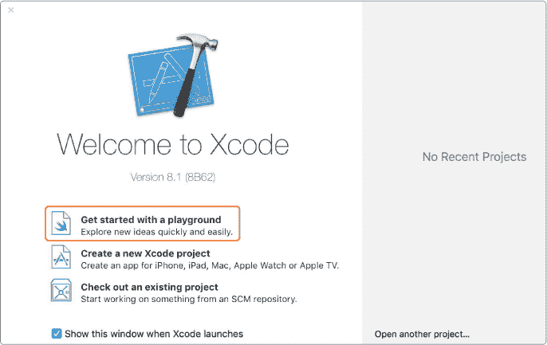

*图 2-1：开始使用 playground*

系统会要求你为你的 playground 命名（见图 2-2）。在这个示例中，我们将保持默认名称*MyPlayground*。确保你选择 iOS 作为运行 playground 的平台。

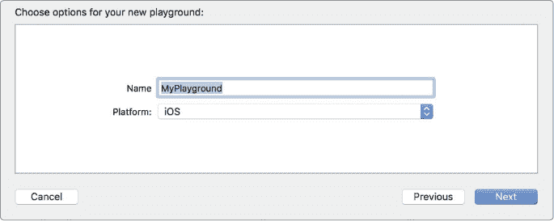

*图 2-2：命名 playground 并选择平台*

当 playground 首次打开时，你会看到窗口中有两个面板，就像在图 2-3 中所示。左边是 playground 编辑器，你将在这里编写代码。右边是结果侧边栏，它显示代码的执行结果。

图 2-3 中的代码行 var str = "Hello, playground"创建了一个名为 str 的变量。*变量*就像一个容器；你可以用它来存放几乎任何东西——一个简单的数字、一串字母，或者一个复杂的对象（我们稍后会解释那是什么）。让我们更仔细地看看变量是如何工作的。

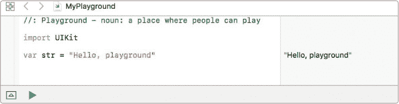

*图 2-3：Playground 编辑器和结果侧边栏*

### 常量和变量

这是来自图 2-3 的代码行：


它做了两件事。首先，它创建了一个名为 str 的变量。这被称为*声明*，因为我们在声明我们希望创建一个变量。要创建变量，你输入关键字 var，然后输入变量的名称——在这个例子中是 str。命名变量时有一些规则，我们稍后会讨论，所以现在先按照这个例子来做。

第二，这行代码使用=运算符将“Hello, playground”的值赋给 str。这被称为*赋值*，因为我们正在给新创建的变量赋值。记住，你可以把变量看作一个容器，用来存放某些东西。所以现在我们有一个名为 str 的容器，里面存放着“Hello, playground”。

你可以将这行代码读作“变量 str 等于 Hello, playground”。正如你所看到的，Swift 通常非常易读；这行代码几乎用英文告诉你它在做什么。

变量很有用，因为如果你想打印“Hello, playground”这句话，你只需要在 `str` 上使用 `print` 命令，就像下面的代码：

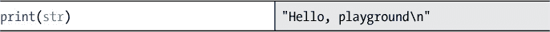

这会在结果侧边栏中打印 "Hello, playground\n"。`\n` 会自动添加到你打印内容的末尾。它被称为*换行*字符，告诉计算机换到下一行。

要查看程序的实际运行结果，打开调试区域，它会出现在两个面板下方，如图 2-4 所示。要做到这一点，请在 Xcode 菜单中选择 **视图** ▸ **调试区域** ▸ **显示调试区域**，或者按 ⌘ -SHIFT -Y。当 `str` 在调试区域的控制台中打印出来时，你会看到 “Hello, playground” 之间的引号和换行符不会出现。这就是如果你正式运行该程序时 `str` 的实际样子！

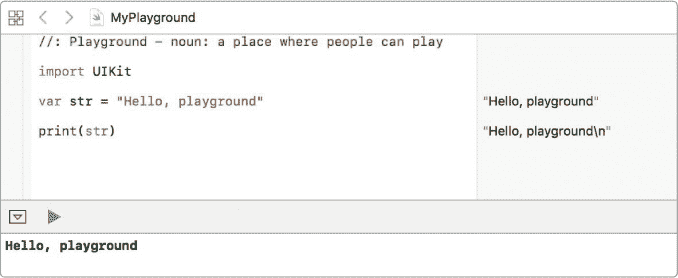

*图 2-4：在调试区域查看程序的真实输出*

变量可以在你的程序中变化（或*变化*！），因此你可以更改变量的值以存储其他内容。让我们现在试试。将以下几行添加到你的 playground 中。

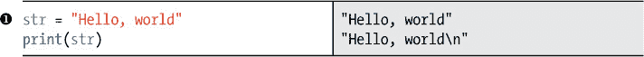

要更改变量的值，输入其名称并使用 `=` 运算符将其设置为新值。我们在 ➊ 处做这件事，将 `str` 的值更改为 "Hello, world"。计算机会丢弃 `str` 之前的内容，并说，“好的，老板，`str` 现在是 Hello, world ”（如果它能说话的话，应该是这样说！）。

请注意，当我们更改 `str` 的值时，我们不会再次写 `var`。计算机会记住我们在前一行代码中声明了 `str`，并知道 `str` 已经存在。所以我们不需要重新创建 `str`。我们只是想把不同的内容放入其中。

你也可以声明*常量*。像变量一样，常量也存储值。常量和变量之间的最大区别是，常量的值永远不能改变。变量可以变化，而常量则是，嗯，常量！声明常量和声明变量类似，不过我们使用的是 `let` 而不是 `var`：

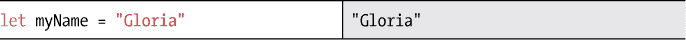

在这里，我们创建了一个叫做 `myName` 的常量，并将其赋值为 "Gloria"。

一旦你创建了一个常量并赋予它一个值，它将保持这个值直到时间的尽头。可以把常量看作是一块你雕刻了自己值的大石头。如果你尝试给 `myName` 赋予另一个值，比如 "Matt" ，你将得到一个像图 2-5 中那样的错误。

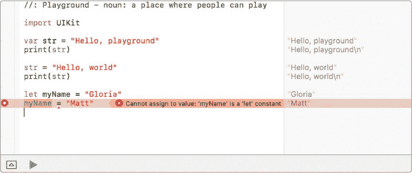

*图 2-5：尝试更改常量的值是行不通的。*

**注意**

*在 playground 中，一个红色圆圈内有一个小白点的错误会出现。点击错误标记将显示错误信息，并告诉你出了什么问题。如果你打开了调试区域，你还会看到描述发生了什么的信息，有时甚至会告诉你如何修复它。*

#### 何时使用常量与变量

现在你已经成功创建了一个变量和一个常量——干得好！但是，什么时候应该使用其中之一呢？在 Swift 中，最佳实践是使用常量而不是变量，除非你预计这个值会发生变化。常量有助于使代码更“安全”。如果你知道某个值永远不会变化，为什么不把它刻在石头上，避免以后可能的混淆呢？

比如说，你想跟踪你教室中的窗户总数和今天打开的窗户数。你教室中的窗户数不会变化，因此你应该使用常量来存储这个值。至于你教室中打开的窗户数，它会根据天气和时间变化，因此你应该使用变量来存储这个值。


我们将 numberOfWindows 设为常量并将其值设置为 8，因为窗户的总数永远是 8。我们将 numberOfWindowsOpen 设为变量并将其值设置为 3，因为我们希望在开关窗户时更改该值。

记住：使用 var 来声明变量，使用 let 来声明常量！

#### 命名常量和变量

你可以给变量或常量起几乎任何你想要的名字，但有一些例外。你不能将它们命名为 Swift 中已经是关键字的词。例如，你不能将一个变量命名为 var。写 var var 会让你和计算机都感到困惑。如果你尝试使用 Swift 的保留字命名变量或常量，编译器会报错。你也不能在同一个代码块中有两个名字相同的变量或常量。

除了这些规则外，在 Swift 中命名时还有一些其他好的编程指南。你的变量名应该始终以小写字母开头。为变量或常量命名时，使用*非常*具有描述性的名称也是一个好主意（名称可以尽量长）。使用描述性名称时，更容易理解该变量或常量的含义。如果你在看别人写的代码，你会觉得哪个变量名更容易理解呢：numKids 还是 numberOfKidsInMyClass？第一个比较模糊，而第二个则很具描述性。常见的命名方式是将多个单词组合在一起，比如 numberOfKidsInMyClass。这样的命名风格，通常每个单词的首字母大写，这种风格叫做*驼峰命名法*（camel case）。因为这种大小写字母交替的方式像骆驼背上的驼峰。


### 数据类型

在 Swift 中，你可以选择变量或常量要保存的数据类型。记得我们说过，变量可以看作是一个容器，它保存某些东西吗？那么，数据类型就像是容器的类型。计算机需要知道我们将把什么类型的东西放入每个容器中。在 Swift 编程中，一旦你告诉计算机你想要一个变量或常量保存某种数据类型，它就不会允许你将其他类型的东西放入那个变量或常量中。如果你有一个专门用来装土豆的篮子，把水倒进那个篮子里就不太合适——除非你喜欢水洒得到处都是！


#### 声明数据类型

当你创建一个变量或常量时，你可以告诉计算机它将保存什么类型的数据。在我们关于教室窗户的例子中，我们知道这个变量将始终是一个*整数*（即一个整数——你不可能有半个窗户），所以我们可以指定一个整数数据类型，如下所示：

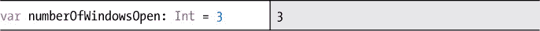

冒号表示“是类型”。用通俗的语言来说，这行代码的意思是：“变量 numberOfWindowsOpen，它是一个整数，等于 3。”所以这一行代码创建了一个变量，给它命名，告诉计算机它的数据类型，并赋值。呼！一行代码就做了这些？我们有提到过 Swift 是一种非常*简洁*的语言吗？某些语言可能需要几行代码才能做到同样的事情。Swift 设计得很巧妙，可以用一行代码完成许多操作！

你只需要声明一次数据类型。当我们告诉计算机一个变量将保存整数时，我们不需要再次告诉它。事实上，如果我们这么做，Xcode 会给我们报错。一旦数据类型被声明，变量或常量将永远保存该类型的数据。一次整数，永远是整数！

你还需要知道一件关于数据类型的事情：一个变量或常量不能保存与其数据类型不符的内容。例如，如果你试图将一个小数值放入 numberOfWindowsOpen 中，你会得到一个错误，如图 2-6 所示。

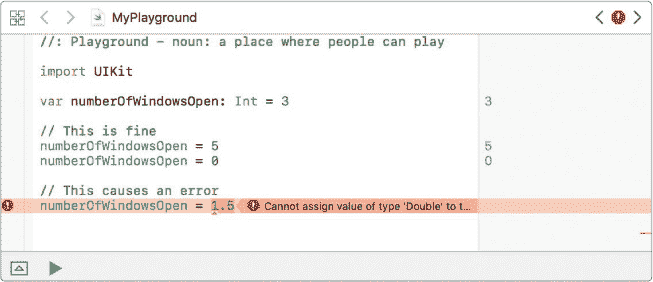

*图 2-6：你不能把一个小数值放入一个本应保存整数的变量中。*

将 numberOfWindowsOpen 设置为 5 或 0 是有效的并且可以正常工作。但你不能将 numberOfWindowsOpen 设置为 1.5。

#### 常见数据类型

正如你刚刚学到的，数据类型让计算机知道它正在处理哪种*类型*的数据，并且如何将其存储在内存中。那么，数据类型有哪些呢？一些常见的数据类型包括 Int、Double、Float、Bool 和 String。

让我们深入了解一下这些数据类型究竟是什么！

##### 整数（Int）

我们已经稍微谈过整数了，但让我们更详细地讲解一下它们。整数，在 Swift 中叫做 Int，是没有小数或分数部分的整数。你可以把它们当作计数数字来理解。整数是*有符号*的，意味着它们可以是负数、正数（或零）。

##### Double 和 Float（小数数字）

*小数数字*是小数点后有数字的数字，例如 3.14。（如果你希望一个整数 3 成为小数数字，它会被写作 3.0。）有两种数据类型可以存储小数数字：Double 和 Float（即*浮点数*）。Double 数据类型在 Swift 中更常用，因为它能存储更大的数字，因此我们将重点讲解 Double。

当你赋值给一个 Double 时，必须在小数点左侧有一个数字，否则会出错。例如，假设香蕉每个 19 分钱：

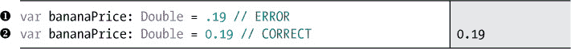

➊ 处的代码会导致错误，因为它小数点左侧没有数字。➋ 处的代码正常工作，因为它有一个前导零。（// ERROR 和 // CORRECT 是*注释*，它们是程序中的注释，计算机会忽略它们。请参阅 “关于注释的一些简短说明” 在 第 32 页。）

##### Bool（布尔值，或真/假）

*布尔值*只能是两种值之一：真或假。在 Swift 中，布尔数据类型叫做 Bool。

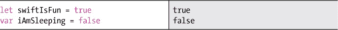

布尔值通常用于 if-else 语句中，告诉计算机程序应该走哪条路径。（我们将在第三章中更详细地讲解布尔值和 if-else 语句。）

##### 字符串

String 数据类型用于存储单词和短语。*字符串*是由引号括起来的一系列字符。例如，"Hello, playground" 就是一个字符串。字符串可以由各种字符组成：字母、数字、符号等。引号很重要，因为它们告诉计算机，所有在引号之间的内容都是你正在创建的字符串的一部分。

你可以通过将字符串连接在一起来构建句子，这个过程叫做字符串*连接*。让我们看看它是如何工作的！

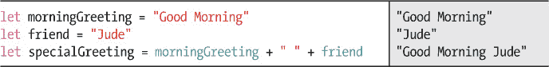

通过用加号（+）将字符串连接在一起，这段代码创建了一个名为 specialGreeting 的变量，其值为字符串 "Good Morning Jude"。注意，这里我们需要在 morningGreeting 和 friend 之间加一个包含空格字符（" "）的字符串，否则 specialGreeting 将变成 "Good MorningJude"。


#### 类型推断

你可能已经注意到，在我们声明变量时，有时会包含数据类型：

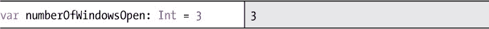

有时我们不会包含数据类型：

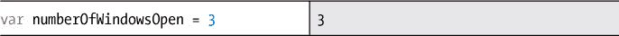

这是怎么回事？计算机实际上足够智能，大多数情况下能推断出数据类型。这就是所谓的*类型推断*——因为计算机会根据我们提供的线索，*推断*（或猜测）我们使用的数据类型。当你创建一个变量并给它一个初始值时，这个值对计算机来说是一个重要的线索。这里有一些例子：

• 如果你赋值为没有小数的数字（如 3），计算机会认为它是一个 Int 类型。

• 如果你赋值为带小数的数字（如 3.14），计算机会认为它是一个 Double 类型。

• 如果你赋值为*true*或*false*（没有引号），计算机会认为它是一个 Bool 类型。

• 如果你赋值为一个或多个带引号的字符，计算机会认为它是一个 String 类型。

当类型被推断时，变量或常量的类型就会像你自己声明数据类型一样被设置。这完全是为了方便。你可以在每次声明新的常量或变量时都指定数据类型，这完全没问题。但为什么不让计算机自己推断出来，节省时间并减少输入呢？

#### 通过强制转换转换数据类型

*强制转换*是一种临时转换变量或常量数据类型的方法。你可以把它想象成对变量施放一个咒语——让它的值表现得像是另一种数据类型，但仅仅是短暂的。为此，你需要写下一个新的数据类型，后跟括号，括号内是你要强制转换的变量。注意，这*并不会实际改变数据类型*。它只是为那一行代码提供了一个临时的值。这里有一些强制转换 Int 和 Double 之间的示例。查看代码执行结果旁边的结果面板。

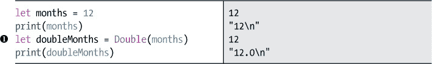

在➊，我们将 Int 类型的变量 months 强制转换为 Double，并存储在一个名为 doubleMonths 的新变量中。这为其添加了一个小数位，强制转换的结果是 12.0。

你也可以将 Double 转换为 Int：

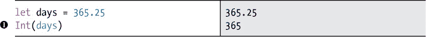

在➊，我们将 Double 类型的 days 强制转换为 Int 类型。你可以看到小数点和后面的所有数字都被去掉了：我们的数字变成了 365。这是因为 Int 类型无法容纳小数——它只能包含整数，因此小数点后面的部分被截去。

再次强调，强制转换实际上并不会改变数据类型。在我们的例子中，即使经过强制转换，days *仍然*是一个 Double 类型。我们可以通过打印 days 来验证这一点：

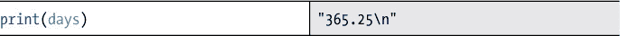

结果面板显示，days 的值依然是 365.25。

在接下来的部分，我们将介绍一些使用强制转换的示例。所以如果你现在不明白为什么要强制转换一个变量，再稍等一下！

### 运算符

在 Swift 中，有许多算术运算符可以用来做数学运算。你已经见过基本的赋值运算符=。你可能也熟悉加法（+）、减法（-）、乘法（*）和除法（/）。

你可以使用这些运算符对 Int、Float 和 Double 数据类型进行数学运算。被运算的数字称为*操作数*。通过在你的 Playground 中输入如下代码，试验这些数学运算符：

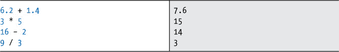

如果你在你的 Playground 中输入这段代码，你将看到每个数学表达式的结果出现在侧边栏中。写数学表达式的代码与正常书写它们没有太大区别。例如，16 减去 2 写作 16 – 2。

你甚至可以将数学表达式的结果保存在一个变量或常量中，以便在代码的其他地方使用。要了解如何工作，请在 Playground 中输入这些行：

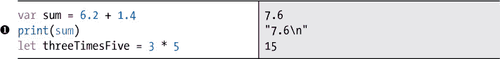

当你打印 sum ➊时，你将在侧边栏看到 7.6。

到目前为止，我们只在数学表达式中使用了数字，但数学运算符也适用于变量和常量。

将以下代码添加到你的 Playground 中：

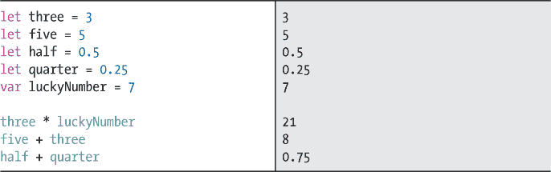

如你所见，你可以像对数字一样对变量和常量使用数学运算符。

**空格很重要**

在 Swift 中，运算符周围的空格很重要。你可以在数学运算符的两边写一个空格，或者完全不写空格。但不能只在运算符的一边加空格，而另一边没有空格。那会导致错误。请查看图 2-7。

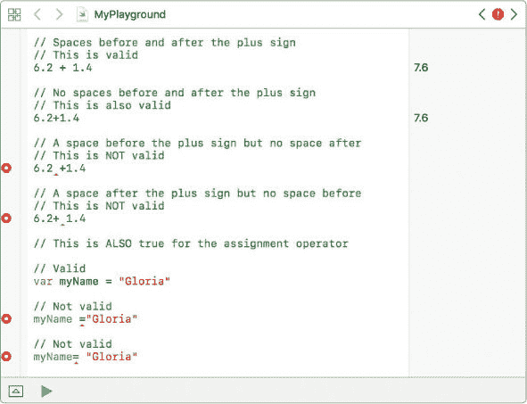

*图 2-7：确保运算符两边有相同数量的空格。*

有一点很重要：你只能对相同数据类型的变量或常量使用数学运算符。在前面的代码中，三和五都是 Int 数据类型。常量 half 和 quarter 是 Double 数据类型，因为它们是小数。如果你尝试将 Int 和 Double 相加或相乘，你会得到类似图 2-8 中的错误。

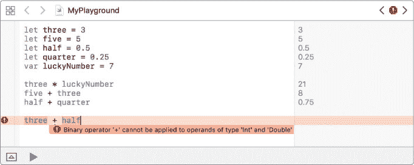

*图 2-8：在 Swift 中，不能对混合数据类型进行数学运算。*

但如果你真的想对混合数据类型进行数学运算呢？例如，假设你想计算你年龄的十分之一：

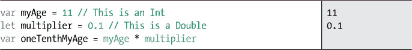

最后一行将会导致错误，因为我们尝试将一个 Int 与一个 Double 相乘。但别担心！你有几种方法可以确保操作数是相同的数据类型。

一个选择是将 myAge 声明为 Double 类型，如下所示：


这段代码有效，因为我们在乘两个 Double 数据类型。

第二种选择是使用类型转换。（我说过我们会回到这个问题！）类型转换在这种情况下是一个很好的解决方案，因为我们不想将 myAge 永久地改变为 Double 类型，我们只是希望能够像 Double 一样对它进行数学运算。我们来看一个例子：

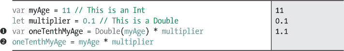

在 ➊ 处，我们将 myAge 转换为 Double 类型后再进行乘法运算。这样我们就不再有混合类型，因此代码能够正常运行。但在 ➋ 处，我们会得到一个错误。这是因为 myAge 仍然是一个 Int 类型。将它在 ➊ 处转换为 Double 类型并没有永久地改变它的类型。

我们能将乘数转换为一个 Int 吗？当然可以！这样我们就对两个整数进行了数学运算，效果很好。然而，这样会导致计算不够精确，因为我们丢失了小数位。当你将一个 Double 类型的变量转换为 Int 时，计算机会简单地去掉小数点后的数字，使其成为一个整数。在这种情况下，你的乘数 0.1 会被转换为 Int 类型的 0。我们来在 Playground 中转换一些变量，看看会得到什么结果：

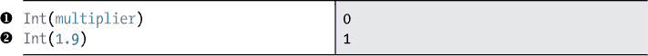

在 ➊ 处，将我们的 Double 类型变量乘数转换为 Int 后得到 0。这个值转换后与原值差异很大，因为我们丢失了小数位：0.1 变成了 0。如果我们没有预料到这种情况，这在代码中可能是一个非常糟糕的事情。在进行类型转换时，必须小心，以确保不会意外地改变值。在 ➋ 处，另一个将 Double 转换为 Int 的例子，如你所见，1.9 并没有四舍五入为 2，它的小数部分被去掉了，结果是 1。

还有一个数学运算符是 *取模运算符*（%），可能你不太熟悉。取模运算符（也叫 *模*）给出除法运算后的余数。例如，7 % 2 = 1，因为 7 除以 2 的余数是 1。试试在 Playground 中使用取模运算符，如下所示。

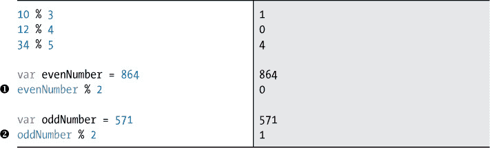

如你所见，取模运算符对于判断一个数是否为偶数（evenNumber % 2 等于 0）➊ 或奇数（oddNumber % 2 等于 1）➋ 很有用。

#### 运算顺序

到目前为止，我们每行代码只进行了一个数学运算，但在一行代码中做多个运算是很常见的。我们来看一个例子。

如果你有三张五美元钞票和两张一美元钞票，你总共有多少钱？我们来在一行中计算一下：

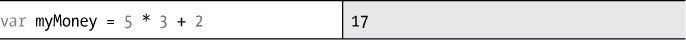

这将 17 的值赋给 myMoney。计算机会将 5 乘以 3，然后加上 2。那么计算机是如何知道先乘后加 2 的呢？它是从左到右计算的吗？不是！看看这个：


我们移动了数字，结果仍然是 17。如果计算机仅仅是从左到右进行计算，它会先计算 2 + 5，得到 7。然后它会将结果 7 乘以 3，得到 21。尽管我们改变了数学表达式中数字的顺序，但计算机仍然首先进行乘法（得到 15），然后再加上 2 得到 17。*计算机会始终先进行乘法和除法，然后进行加法和减法。*这就是所谓的*运算顺序*。

#### 使用括号的运算顺序

你不必像我们在货币示例中那样依赖计算机来确定应该先做哪个步骤。你，程序员，拥有决定权！你可以使用括号将操作分组。当你将括号放在某个操作周围时，你是在告诉计算机先执行这个步骤：

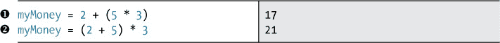

在 ➊ 处，括号告诉计算机首先计算 5 乘以 3，然后加上 2。结果是 17。在 ➋ 处，括号告诉计算机首先计算 2 加 5，然后将结果乘以 3，得到 21。

你可以通过在其他括号内部使用括号来使代码更加具体。计算机会先评估内部的括号，然后再评估外部的括号。试试这个例子：


首先，计算机会在内括号中计算 2 和 3 的和。然后，它将结果乘以 4，因为这在外部括号内。最后，它会加上外部括号外的 1。最终结果是 21。

#### 复合赋值运算符

你将使用的另一类运算符是*复合赋值运算符*。这些是将数学运算符和赋值运算符（=）结合起来的“快捷方式”运算符。例如，以下表达式：

```
a = a + b
```

会变成：

```
a + = b
```

你可以使用这些运算符通过对变量或常量进行操作来更新其值。简单来说，像 a += b 这样的表达式表示“将 b 加到 a 上，并将新值存储到 a 中。”表 2-1 显示了使用复合赋值运算符的数学表达式及其长写形式。

**表 2-1：** 简写赋值运算符与长写表达式

| **简写形式** | **长写形式** |
| --- | --- |
| a += b | a = a + b |
| a -= b | a = a - b |
| a *= b | a = a * b |
| a /= b | a = a / b |

让我们来看一下 += 运算符的实际应用。假设我们正在编写一个程序来计算方舟上的动物数量。首先，我们创建一个名为 animalsOnArk 的变量并将其设置为 0，因为方舟上还没有动物。当不同种类的动物登上方舟时，我们希望增加 animalsOnArk 来计算所有动物的数量。如果两只长颈鹿登上了方舟，那么我们需要将 2 加到 animalsOnArk 上。如果两只大象登上了方舟，我们再次需要加 2。如果四只羚羊登上了方舟，那么我们需要将 animalsOnArk 增加 4。

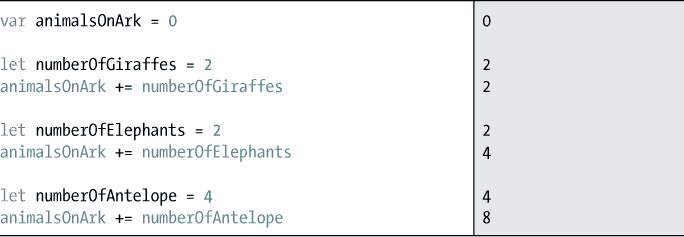

在两只长颈鹿、两只大象和四只羚羊登上方舟后，animalsOnArk 的最终值为 8。真是一座动物园！

**关于注释的几点快速说明**

大多数编程语言都提供了在代码中写注释的方式。注释是计算机忽略的备注，用来帮助阅读代码的人理解发生了什么。虽然没有注释程序也能正常运行，但在代码中不清楚或令人困惑的部分添加注释是个好主意。即使你不打算向别人展示你的程序，注释也会帮助你记住编写这段代码时的思路或想法。过去几个月或几年你写的代码，有时你会发现自己已经完全不记得当时的想法。

在 Swift 中有两种添加注释的方法。第一种方法是在你想添加的文本前面放两个斜杠（//）。这些注释可以单独放在一行，就像这样：

```
// My favorite things
```

或者注释也可以放在代码行的同一行内——只要注释放在代码*后面*：

```
var myFavoriteAnimal = "Horse" // Does not have to be a pet
```

第二种方法用于长注释，或者*多行*注释，其中注释的开始和结束由/*和*/标记。（注意，在本书中我们将使用-- *snip* --来显示我们为节省空间而省略的更多代码行。）

```
/*

  This block of code will add up the animals

  that walk onto an ark.

*/

{

  var animalsOnArk = 0

  let numberOfGiraffes = 2

  animalsOnArk += numberOfGiraffes

  --*snip*
 -

}
```

多行注释在调试代码时非常有用。例如，如果你不希望计算机运行你代码的某部分，因为你正在寻找一个 bug，但又不想删除所有辛苦写的代码，你可以使用多行注释来*暂时注释掉*代码的某些部分。当你将一段代码格式化为注释时，计算机会像忽略其他任何注释一样忽略这些代码。

### 你学到了什么

在这一章中，你学会了如何在 Swift playground 中编写代码，这让你可以立刻看到结果。你创建了变量和常量，并学会了如何使用基本的数据类型和操作符，这些内容你在编写自己的计算机程序时将反复使用。

在第三章中，你将使用条件语句，它告诉计算机你希望它执行哪个代码路径。代码路径的选择是基于条件值的。

## 在游乐场中学习编程


一个 “Hello, world!” 应用程序并不是什么小成就，但现在是时候真正学习如何编写代码了。Xcode 提供了一种特殊类型的文档，叫做*playground*，这是学习编程的好地方。在 playground 中，你可以立即编写和运行代码来查看结果，而无需像我们在第一章中那样编写一个完整的应用程序。

让我们打开一个游乐场。打开 Xcode 并选择 **开始使用游乐场**，如图 2-1 中欢迎进入 Xcode 对话框所示。如果这个窗口没有自动打开，可以从菜单的窗口选项中选择 **欢迎使用 Xcode**，或者按 ⌘-SHIFT-1。


*图 2-1：开始使用游乐场*

系统会要求你为游乐场命名（见图 2-2）。在这个示例中，我们保持默认名称 *MyPlayground*。确保选择 iOS 作为运行游乐场的平台。


*图 2-2：命名游乐场并选择平台*

当游乐场首次打开时，你会看到窗口中有两个面板，就像在图 2-3 中那样。左边是游乐场编辑器，你将在这里编写代码。右边是结果侧边栏，显示你的代码结果。

图 2-3 中的这行代码 `var str = "Hello, playground"` 创建了一个名为 str 的变量。*变量*就像一个容器；你可以用它来存储几乎任何东西——一个简单的数字、一串字母，或者一个复杂的对象（我们稍后会解释这是什么）。让我们更仔细地看看变量是如何工作的。


*图 2-3：游乐场编辑器和结果侧边栏*

### 常量和变量

这里是图 2-3 中的代码行：


它做了两件事。首先，它创建了一个名为 str 的变量。这称为*声明*，因为我们声明了我们想要创建一个变量。要创建一个变量，您输入关键字 var，然后输入变量的名称——在这个例子中是 str。命名变量时有一些规则，我们稍后会讲到，所以现在请使用这个示例。

其次，这行代码通过 = 运算符给 str 赋值为 "Hello, playground"。这叫做*赋值*，因为我们正在给我们新创建的变量赋值。记住，你可以把变量当作一个容器，它用来存储某些东西。所以现在我们有一个名为 str 的容器，它存储着 "Hello, playground"。

你可以将这行代码理解为“变量 str 等于 Hello, playground”。如你所见，Swift 通常非常易读；这行代码几乎用英语告诉你它在做什么。

变量很方便，因为如果你想打印“Hello, playground”，你只需要使用命令 `print` 在 str 上，就像以下代码一样：


这会在结果侧边栏打印出 "Hello, playground\n"。\n 会自动添加到你打印的内容的末尾。它被称为*换行符*，指示计算机换行。

要查看程序的实际运行结果，可以打开调试区域，它将出现在两个面板下方，如图 2-4 所示。为此，在 Xcode 菜单中选择**视图** ▸ **调试区域** ▸ **显示调试区域**，或者按下⌘-SHIFT-Y。当`str`在调试区域的控制台中打印出来时，你会看到 Hello, playground 的引号和换行符没有出现。这就是如果你正式运行此程序时`str`的真实样子！


*图 2-4：在调试区域查看程序的实际输出*

变量可以在程序中改变（或*变化*！），因此你可以更改变量的值以保存其他内容。现在我们就来试试。将以下几行代码添加到你的游乐场中。


要更改变量的值，输入其名称并使用`=`运算符将其设置为新值。我们在➊处执行此操作，将`str`的值更改为“Hello, world”。计算机会丢弃`str`原来的值，并说：“好的，老板，`str`现在是‘Hello, world’”（也就是，如果它能说话的话！）。

请注意，当我们更改`str`的值时，我们不会再写`var`。计算机会记住我们之前在代码中声明过`str`，并知道`str`已经存在。所以我们不需要再次创建`str`。我们只是想给它赋一个不同的值。

你也可以声明*常量*。像变量一样，常量也可以保存值。常量和变量之间的最大区别是常量的值永远无法改变。变量是可变的，而常量则是，嗯，常量！声明常量与声明变量类似，不过我们使用的是`let`而不是`var`：


这里我们创建了一个名为`myName`的常量，并将它的值设置为“Gloria”。

一旦你创建了一个常量并给它赋值，它将保持这个值直到时间的尽头。把常量想象成一块大石头，你在上面雕刻了你的值。如果你试图给`myName`另一个值，比如“Matt”，你会得到一个像图 2-5 那样的错误。


*图 2-5：尝试更改常量的值是行不通的。*

**注意**

*在游乐场中，错误会以一个红色圆圈和里面的小白圆圈的形式显示。点击错误标记会显示错误信息，并告诉你哪里出了问题。如果你已经显示了调试区域，你还会看到描述发生了什么的信息，有时甚至会告诉你如何修复它。*

#### 何时使用常量与变量

现在你已经成功创建了一个变量和一个常量——做得好！但是，什么时候应该使用常量，什么时候应该使用变量呢？在 Swift 中，最好使用常量而不是变量，除非你预期值会发生变化。常量有助于使代码“更安全”。如果你知道某个值永远不会改变，为什么不把它刻在石头上，避免将来可能产生的任何混淆呢？

例如，假设你想追踪教室中窗户的总数和今天开着的窗户数。教室中窗户的总数是不会变化的，因此你应该使用常量来存储这个值。而开着的窗户数会根据天气和时间变化，所以你应该使用变量来存储这个值。


我们将 numberOfWindows 设置为常量，并将其设置为 8，因为窗户的总数始终是 8。我们将 numberOfWindowsOpen 设置为变量，并将其初始化为 3，因为我们希望在开关窗户时改变这个值。

记住：使用 var 来声明变量，使用 let 来声明常量！

#### 命名常量和变量

你几乎可以为变量或常量命名任何你想要的名字，但有一些例外。你不能使用 Swift 中已经是保留字的词作为变量名。例如，你不能将变量命名为 var。写 var var 会让你和计算机都感到困惑。如果你尝试使用 Swift 的保留字命名变量或常量，程序会报错。同时，在同一代码块中，不能有两个变量或常量使用相同的名称。

除了这些规则之外，在 Swift 中命名时还有一些其他好的编程指南。你的名称应该始终以小写字母开头。拥有*非常*具有描述性的名称也是一个好主意（它们可以尽可能长）。使用描述性名称时，通常更容易理解该变量或常量的含义。如果你正在查看别人的代码，你会更容易理解哪个变量名称：numKids 还是 numberOfKidsInMyClass？前者模糊不清，而后者则更具描述性。你会经常看到一些由多个单词组合而成的变量和常量名称，如 numberOfKidsInMyClass。这种将多个单词连接起来组成变量名称时，每个单词首字母大写的命名风格被称为*驼峰式命名法*。这是因为字母大小写的模式看起来像是骆驼背上的驼峰。


### 数据类型

在 Swift 中，你可以选择变量或常量要保存的数据类型。还记得我们之前提到过，可以将变量看作是一个容器来存放某些东西吗？那么数据类型就像是容器的类型。计算机需要知道我们会往每个容器中放入什么样的东西。在 Swift 编程中，一旦你告诉计算机一个变量或常量要保存某种数据类型，它就不允许你往该变量或常量里放入除了该数据类型之外的任何东西。如果你有一个用来装土豆的篮子，往里面装水肯定是个坏主意——除非你喜欢水漏到鞋子里！


#### 声明数据类型

当你创建一个变量或常量时，你可以告诉计算机它将保存什么类型的数据。在我们关于教室窗户的例子中，我们知道这个变量将始终是一个*整数*（也就是一个整数——你不能真的有半个窗户），所以我们可以指定一个整数数据类型，像这样：


冒号表示“是类型”。用简单的英语来说，这行代码的意思是：“变量 numberOfWindowsOpen，它是一个整数，等于 3。”所以这一行代码创建了一个变量，给它命名，告诉计算机它的数据类型，并为其赋值。呼！一行代码做了这些事情？我们有提到过 Swift 是一种非常*简洁*的语言吗？一些语言可能需要几行代码才能做到同样的事情。而 Swift 的设计就是让你只用一行代码就能做很多事情！

你只需要声明一次数据类型。当我们告诉计算机一个变量将保存整数时，我们不需要再告诉它一次。事实上，如果我们再告诉它，Xcode 会给我们一个错误。数据类型一旦声明，变量或常量将永远保存该类型的数据。一旦是整数，就永远是整数！

还有一件关于数据类型你需要知道的事：变量或常量不能保存不属于其数据类型的内容。例如，如果你试图将一个小数赋值给 numberOfWindowsOpen，你会收到一个错误，如图 2-6 所示。


*图 2-6：你不能将小数赋值给一个应该保存整数的变量。*

将 numberOfWindowsOpen = 5 和 numberOfWindowsOpen = 0 是有效的且可以工作的。但你不能将 numberOfWindowsOpen = 1.5。

#### 常见数据类型

正如你刚刚学到的，数据类型让计算机知道它正在处理什么*类型*的数据，并且如何将其存储在内存中。那么，数据类型有哪些呢？一些常见的包括 Int、Double、Float、Bool 和 String。

让我们深入了解每个数据类型实际是什么！

##### Int（整数）

我们已经稍微谈了一下整数，但让我们更详细地讲讲它们。在 Swift 中，整数（Int）是没有小数或分数部分的整数。你可以把它们看作是计数数字。整数是*有符号的*，这意味着它们可以是负数、正数或者零。

##### Double 和 Float（小数）

*小数*是指小数点后有数字的数字，例如 3.14。（如果你希望它是一个小数，整数 3 会写作 3.0。）有两种数据类型可以存储小数：Double 和 Float（即*浮点数*）。在 Swift 中，Double 数据类型更常见，因为它可以保存更大的数字，所以我们将重点讲解它。

当你赋值给一个 Double 类型时，必须在小数点左边有一个数字，否则会报错。例如，假设香蕉每个 19 美分：


➊ 处的代码会报错，因为它在小数点左侧没有数字。➋ 处的代码没有问题，因为它有一个前导零。（“// ERROR”和“// CORRECT”是*注释*，它们是程序中的说明，计算机会忽略这些内容。请参阅“关于注释的一些快速说明”，详见第 32 页。）

##### Bool（布尔类型，或真/假）

一个*布尔值*只能是两者之一：真（true）或假（false）。在 Swift 中，布尔数据类型称为 Bool。


布尔值通常用于 if-else 语句中，告诉计算机程序应该走哪条路径。（我们将在第三章 中更详细地讨论布尔值和 if-else 语句。）

##### String

String 数据类型用于存储单词和短语。一个*字符串*是由一系列字符组成，并被引号括起来。例如，"Hello, playground" 就是一个字符串。字符串可以由各种字符组成：字母、数字、符号等等。引号很重要，因为它告诉计算机，引号之间的内容是你正在创建的字符串的一部分。

你可以通过将字符串连接在一起，来构建句子，这个过程叫做字符串*连接*。让我们看看它是如何工作的！


通过将字符串与加号（+）连接，这段代码创建了一个名为 specialGreeting 的变量，并赋值为字符串 "Good Morning Jude"。注意，在 morningGreeting 和 friend 之间需要加上包含空格字符（" "）的字符串，否则 specialGreeting 会变成 "Good MorningJude"。


#### 类型推断

你可能已经注意到，有时候我们在声明一个变量时会包含数据类型：


有时候我们不包含数据类型：


怎么回事？计算机其实非常聪明，通常可以自行判断数据类型。这被称为*类型推断*——因为计算机会根据我们提供的线索*推断*（或猜测）我们使用的数据类型。当你创建一个变量并为它赋一个初始值时，这个值对计算机来说是一个很重要的线索。以下是一些示例：

• 如果你赋值一个没有小数点的数字（比如 3），计算机会认为它是一个 Int 类型。

• 如果你赋值一个有小数点的数字（比如 3.14），计算机会认为它是一个 Double 类型。

• 如果你赋值*true* 或 *false*（没有引号），计算机会认为它是一个 Bool 类型。

• 如果你赋值一个或多个用引号括起来的字符，计算机会认为它是一个 String 类型。

当类型被推断时，变量或常量会被设置为该数据类型，就像你自己声明数据类型一样。这完全是为了方便。你可以在每次声明新常量或变量时都写上数据类型，这完全可以。但为什么不让计算机自动推断出来，省下时间和打字呢？

#### 通过类型转换改变数据类型

*类型转换* 是一种临时改变变量或常量数据类型的方法。你可以把它当作对变量施下的一个魔法——你让它的值像其他数据类型一样表现，但只是暂时的。要做到这一点，你需要写出一个新的数据类型，并在其后加上包含你正在转换的变量的括号。请注意，这*并不会实际改变数据类型*。它只是在这一行代码中为你提供一个临时的值。以下是 Int 和 Double 之间进行类型转换的几个示例。查看代码的结果，可以看到这些转换的效果。


在 ➊ 处，我们将 Int 类型的变量 months 转换为 Double，并将其存储在一个新的变量 doubleMonths 中。这样就添加了一个小数点，转换后的结果是 12.0。

你也可以将 Double 转换为 Int：


在 ➊ 处，我们将 Double 类型的变量 days 转换为 Int。你可以看到小数点和所有后续的数字都被去掉了：我们的数字变成了 365。这是因为 Int 类型无法保存小数，它只能包含整数，因此小数点后的内容会被截断。

再次强调，类型转换并不会真正改变数据类型。在我们的例子中，即使进行了类型转换，days 仍然是*Double* 类型。我们可以通过打印 days 来验证这一点：


结果侧边栏显示 days 仍然等于 365.25。

在接下来的部分，我们将介绍一些使用类型转换的示例。如果你现在还不清楚为什么要进行类型转换，请稍等片刻！

### 运算符

在 Swift 中有许多算术运算符，你可以用它们来进行数学运算。你已经见过基本的赋值运算符 = 。你可能也熟悉加法 (+)、减法 (-)、乘法 (*) 和除法 (/ )。

你可以使用这些运算符对 Int、Float 和 Double 数据类型进行数学运算。被操作的数字叫做*操作数*。通过在你的 Playground 中输入如下代码，试验这些数学运算符：


如果你在 Playground 中输入这段代码，你会看到每个数学表达式的结果出现在侧边栏。编写数学表达式的代码与正常书写数学表达式并没有太大区别。例如，16 减去 2 可以写作 16 – 2。

你甚至可以将数学表达式的结果保存到变量或常量中，以便在代码的其他地方使用。要了解如何操作，请在 Playground 中输入以下代码：


当你打印 sum ➊ 时，你会在侧边栏看到 7.6。

到目前为止，我们在数学表达式中只使用了数字，但数学运算符同样适用于变量和常量。

将以下代码添加到你的 playground 中：


如你所见，你可以像对数字一样，对变量和常量使用数学运算符。

**空格很重要**

在 Swift 中，运算符两边的空格非常重要。你可以在数学运算符两边各写一个空格，或者完全不写空格。但不能只在运算符的一边加空格，而另一边不加。那样会导致错误。看看图 2-7。


*图 2-7：确保运算符两边的空格数量相同。*

有一件重要的事情需要注意：你只能对*相同*数据类型的变量或常量使用数学运算符。在之前的代码中，数字三和五都是 Int 数据类型。常量 half 和 quarter 是 Double 数据类型，因为它们是小数。如果你尝试将 Int 和 Double 相加或相乘，你会遇到像图 2-8 中那样的错误。


*图 2-8：在 Swift 中，你不能对混合数据类型进行数学运算。*

可是，如果你真的想对混合数据类型进行数学运算怎么办？比如，假设你想计算你年龄的十分之一：


最后一行会导致错误，因为我们尝试将 Int 与 Double 相乘。但别担心！你有几个方法可以确保操作数是相同的数据类型。

一种选择是将 myAge 声明为 Double 类型，如下所示：


这段代码可以正常工作，因为我们在对两个 Double 数据类型进行乘法运算。

第二种选择是使用类型转换。（我告诉过你我们会回到这个话题！）类型转换在这种情况下是一个很好的解决方案，因为我们不想将 myAge 永久转换为 Double 类型，我们只是想将它当作 Double 来进行数学运算。我们来看一个例子：


在 ➊ 处，我们先将 myAge 转换为 Double 类型，再进行乘法运算。这样我们就不再有混合类型了，代码可以正常工作。但在 ➋ 处，我们会遇到错误。这是因为 myAge 仍然是 Int 类型。我们在 ➊ 处将它转换为 Double 类型，但这个转换并没有永久改变它的类型。

我们可以将 multiplier 转换为 Int 吗？当然可以！这样我们就可以对两个整数进行运算，结果是正确的。不过，这样会导致计算精度降低，因为我们会丢失小数部分。当你将一个 Double 类型的变量转换为 Int 时，计算机会直接去掉小数点后的数字，使其成为一个整数。在这种情况下，你的 multiplier 0.1 会被转换为 0。让我们在 playground 中转换一些变量，看看会得到什么：


在 ➊ ，将我们的 Double 类型转换为 Int 时，得到的是 0。这个值在转换后有很大不同，因为我们失去了小数部分：0.1 变成了 0。如果我们没有预料到这种情况，这可能会对我们的代码产生非常不好的影响。你必须小心在转换时，确保不会无意中改变你的值。在 ➋ ，这里有另一个将 Double 转换为 Int 的例子，正如你所看到的，1.9 并没有被四舍五入成 2。它的小数部分只是被去掉了，最终我们得到了 1。

还有另一个数学运算符，*取模运算符*（%），它可能对你来说不太熟悉。取模运算符（也叫 *模数*）给出除法后的余数。例如，7 % 2 = 1，因为 7 除以 2 的余数是 1。你可以在你的 playground 中尝试一下取模运算符，像这样。


如你所见，取模运算符对判断一个数字是偶数（evenNumber % 2 等于 0） ➊ 还是奇数（oddNumber % 2 等于 1） ➋ 非常有用。

#### 运算顺序

到目前为止，我们每行代码只做了一个数学运算，但在一行代码中做多个运算是很常见的。让我们看一个例子。

如果你有三张五美元的钞票和两张一美元的钞票，你有多少钱？我们在一行代码中计算一下：


这会将值 17 赋给 myMoney。计算机会先计算 5 乘以 3，然后再加上 2。但是计算机是怎么知道先乘法再加法的呢？它仅仅是从左到右工作吗？不！看看这个：


我们改变了数字的位置，但结果仍然是 17。如果计算机仅仅从左到右执行，它会先将 2 + 5 相加得到 7。然后它会将这个结果 7 乘以 3，得到 21。即使我们改变了数学表达式中数字的顺序，计算机仍然会先做乘法（得到 15），然后加上 2 得到 17。*计算机会始终先执行乘法和除法，然后才是加法和减法*。这被称为 *运算顺序*。

#### 使用括号的运算顺序

你不必像在钱的例子中那样依赖计算机来决定先做哪一步。你，作为程序员，有权决定！你可以使用括号将运算组合在一起。当你把括号加到某个部分时，你是在告诉计算机先做这一步：


在 ➊ ，括号告诉计算机先计算 5 乘以 3，然后再加上 2。这会得到 17。 在 ➋ ，括号告诉计算机先计算 2 加 5，然后再将结果乘以 3，得到 21。

你可以通过在括号内部再使用括号来让代码更加精确。计算机会先计算内部的括号，然后再计算外部的。试试看这个例子：


首先，计算机会将内括号中的 2 和 3 相加。然后，它会将结果乘以 4，因为这是外括号内的部分。最后，它会将 1 加上，因为它在两个括号外面。最终结果是 21。

#### 复合赋值运算符

你将使用的另一类运算符是*复合赋值运算符*。这些是将数学运算符与赋值运算符（=）结合的“快捷”运算符。例如，以下表达式

```
a = a + b
```

变成

```
a + = b
```

你可以使用这些运算符通过对变量或常量执行操作来更新其值。通俗地说，像`a += b`这样的表达式表示“将 b 加到 a 上，并将新值存储到 a 中。”表 2-1 展示了使用复合赋值运算符的数学表达式及其长格式表达式。

**表 2-1：** 短格式赋值运算符与长格式表达式

| **短格式** | **长格式** |
| --- | --- |
| a += b | a = a + b |
| a -= b | a = a - b |
| a *= b | a = a * b |
| a /= b | a = a / b |

让我们看看`+=`运算符的实际应用。假设我们正在编写一个程序来计算方舟上动物的数量。首先，我们创建一个名为 animalsOnArk 的变量，并将其设置为 0，因为方舟上还没有动物。当不同种类的动物登上方舟时，我们希望增加 animalsOnArk 的值来计算所有动物的数量。如果两只长颈鹿登上方舟，那么我们需要将 2 加到 animalsOnArk。如果两只大象登上方舟，那么我们需要再加 2。如果四只羚羊登上方舟，那么我们需要将 animalsOnArk 增加 4。


在两只长颈鹿、两只大象和四只羚羊登上方舟后，animalsOnArk 的最终值为 8。真是一个动物园！

**关于注释的几点快速说明**

大多数编程语言都提供了一种方式来在代码中添加内联注释。注释是计算机忽略的注释，用来帮助阅读代码的程序员理解发生了什么。尽管没有注释程序依然可以正常运行，但对于那些可能不清楚或令人困惑的代码段，最好加上注释。即使你不打算将程序展示给别人，注释也会帮助你记住当时编写代码时的思路。你很可能会在几个月或几年后回到某段代码，却完全忘记当时的思考过程。

Swift 中有两种方式添加注释。第一种方式是在你想添加注释的文本前加上两个正斜杠（//）。这些注释可以单独放在一行，就像这样：

```
// My favorite things
```

或者它们也可以放在与代码行相同的行内，只要注释在代码*之后*：

```
var myFavoriteAnimal = "Horse" // Does not have to be a pet
```

第二种方式用于长注释或*多行*注释，其中注释的开始和结束由/* 和 */标记。（请注意，在本书中，我们将使用-- *snip* --来表示我们为节省空间而省略的更多代码行。）

```
/*

  This block of code will add up the animals

  that walk onto an ark.

*/

{

  var animalsOnArk = 0

  let numberOfGiraffes = 2

  animalsOnArk += numberOfGiraffes

  --*snip*
 -

}
```

多行注释在调试代码时非常有用。例如，如果你不想让计算机运行代码的某部分，因为你正在尝试查找错误，但又不想删除你辛辛苦苦写的代码，可以使用多行注释来临时*注释掉*部分代码。当你将一块代码格式化为注释时，计算机会像忽略其他注释一样忽略这段代码。

### 你学到了什么

在本章中，你学习了如何在 Swift playground 中编写代码，这样你可以立即看到结果。你创建了变量和常量，并学习了如何使用基本数据类型和运算符，这些内容将在你编写自己的计算机程序时反复出现。

在第三章中，你将使用条件语句，这些语句告诉计算机你希望它执行哪条代码路径。代码路径的选择取决于条件的值。


一个“Hello, world!”应用程序是一个不小的成就，但现在是时候真正学习如何编写代码了。Xcode 提供了一种特殊类型的文档，叫做*playground*，这是学习编程的好地方。在 playground 中，你可以立即编写和运行代码，看到结果，而无需像我们在第一章中那样麻烦地编写整个应用程序。

让我们打开一个 playground。打开 Xcode 并选择**开始使用 playground**，如图 2-1 中“欢迎使用 Xcode”对话框所示。如果这个窗口没有自动打开，可以从菜单中的“窗口”选项选择**欢迎使用 Xcode**，或者按 ⌘-SHIFT-1。


*图 2-1：开始使用 playground*

你将被要求为你的 playground 命名（图 2-2）。在这个例子中，我们将保持默认名称*MyPlayground*。确保选择 iOS 作为运行 playground 的平台。


*图 2-2：命名 playground 并选择平台*

当 playground 首次打开时，你会看到窗口中有两个面板，正如在图 2-3 中所示。左侧是 playground 编辑器，你将在其中编写代码。右侧是结果侧边栏，显示你的代码结果。

图 2-3 中的代码行 var str = "Hello, playground" 创建了一个名为 str 的变量。*变量*就像一个容器；你可以用它来存储几乎任何东西——一个简单的数字、一串字母，或者一个复杂的对象（我们稍后会解释这是什么）。让我们更详细地看看变量是如何工作的。


*图 2-3：Playground 编辑器和结果侧边栏*

### 常量和变量

这里是来自图 2-3 的代码行：


它做了两件事。首先，它创建了一个名为 str 的变量。这被称为*声明*，因为我们正在声明我们希望创建一个变量。要创建一个变量，你输入关键字 var，然后为你的变量起一个名字——在这个例子中是 str。命名变量时有一些规则，我们稍后会讨论，所以现在就按照这个例子来。

其次，这一行代码使用 = 操作符将“Hello, playground”赋值给 str。这被称为*赋值*，因为我们正在将一个值赋给我们新创建的变量。记住，你可以把变量看作一个容器，用来存放某些东西。现在我们有了一个名为 str 的容器，它保存着“Hello, playground”。

你可以将这一行代码理解为“变量 str 等于 Hello, playground”。正如你所看到的，Swift 通常非常易读；这一行代码几乎用英语告诉你它在做什么。

变量很有用，因为如果你想打印“Hello, playground”这句话，你只需要在 str 上使用命令 print，如以下代码所示：


这会在结果侧边栏中打印“Hello, playground\n”。\n 会自动加在你打印的内容末尾。它被称为*换行符*，它告诉计算机换到新的一行。

要查看程序的实际运行结果，可以打开调试区域，它会出现在两个面板下方，如图 2-4 所示。操作方法是，在 Xcode 菜单中选择**视图** ▸ **调试区域** ▸ **显示调试区域**，或按下 ⌘ -SHIFT -Y。当在调试区域的控制台中打印 str 时，你会发现围绕着“Hello, playground”的引号和换行符并没有出现。这就是如果你正式运行这个程序时，str 的真实样子！


*图 2-4：在调试区域查看程序的实际输出*

变量在你的程序中是可以变化的（或者说*变化*！），所以你可以改变一个变量的值，让它保存其他内容。现在就试试看吧。将以下几行代码添加到你的 playground 中。


要改变一个变量的值，输入它的名称，并使用 = 操作符将其设置为新值。我们在 ➊ 处这样做，将 str 的值改为“Hello, world”。计算机会丢弃 str 原来保存的内容，并说：“好的，老板，str 现在是 Hello, world”（当然，如果它能说话的话！）。

注意，当我们改变 str 的值时，我们并没有再次写 var。计算机记住了我们在之前的代码行中声明了 str，并知道 str 已经存在。所以我们不需要重新创建 str，我们只需要为它赋予不同的值。

你也可以声明 *常量*。与变量一样，常量也存储值。常量与变量的最大区别在于常量的值永远无法改变。变量可以变化，而常量则是恒定的！声明常量与声明变量类似，但我们使用 let 而不是 var：


在这里，我们创建了一个名为 myName 的常量，并将其赋值为 "Gloria"。

一旦你创建了一个常量并赋予它一个值，它将一直保持这个值，直到永远。可以把常量想象成一块大岩石，你在上面刻下了这个值。如果你尝试给 myName 赋予另一个值，比如 "Matt"，你会看到像 图 2-5 中那样的错误。


*图 2-5：尝试更改常量的值是行不通的。*

**注意**

*在 Playground 中，错误会以一个红色圆圈显示，其中有一个小小的白色圆点。点击错误标记会显示错误信息，并告诉你哪里出错了。如果你显示了调试区域，你也会看到描述发生了什么的信息，有时甚至会告诉你如何修复它。*

#### 何时使用常量与变量

现在你已经成功创建了一个变量和一个常量——做得好！但是，什么时候应该使用一个而不是另一个呢？在 Swift 中，最好是使用常量而不是变量，除非你预期该值会改变。常量有助于让代码更加“安全”。如果你知道某个值永远不会改变，为什么不把它刻进石头里，避免以后出现任何混淆呢？

例如，假设你想跟踪教室里窗户的总数以及今天开着的窗户数。教室里的窗户数量不会改变，因此应该使用常量来存储这个值。教室里开着的窗户数会根据天气和时间而变化，因此应该使用变量来存储这个值。


我们将 numberOfWindows 设为常量，并将其值设为 8，因为窗户的总数始终是 8。我们将 numberOfWindowsOpen 设为变量，并将其值设为 3，因为在打开或关闭窗户时，我们需要更改该值。

记住：使用 var 来定义变量，使用 let 来定义常量！

#### 命名常量和变量

你几乎可以给变量或常量起任何名字，但有一些例外。你不能把它们命名为已经是 Swift 关键字的词。例如，你不能命名一个变量为 var。写 var var 会让你和计算机都感到困惑。如果你尝试使用 Swift 的保留字命名变量或常量，你会遇到错误。你也不能在同一代码块中有两个同名的变量或常量。

除了这些规则外，命名时还有一些其他好的编程指南可以遵循。你的名字应该总是以小写字母开头。给变量起个*非常*有描述性的名字也是个好主意（它们可以尽可能长）。当你使用一个描述性的名字时，理解该变量或常量的用途就变得容易多了。如果你在看别人的代码，哪个变量名更容易理解：numKids 还是 numberOfKidsInMyClass？第一个名字模糊不清，但第二个名字却很具描述性。常见的变量和常量命名方式是将一串单词连接在一起，比如 numberOfKidsInMyClass。每个单词的首字母大写的这种命名风格叫做*驼峰命名法*，因为这种大小写字母的模式看起来像是骆驼背上的驼峰。


### 数据类型

在 Swift 中，你可以选择变量或常量将存储什么样的数据——*数据类型*。记得我们说过，你可以把变量当作一个容器来存放某些东西吗？嗯，数据类型就像是容器类型。计算机需要知道我们将把什么样的东西放进每个容器里。在 Swift 编程中，一旦你告诉计算机你希望变量或常量存储某个数据类型，它就不会让你往该变量或常量中放入除该数据类型之外的任何东西。如果你有一个设计用来装土豆的篮子，把它装满水显然是个糟糕的主意——除非你喜欢水漏得到处都是！


#### 声明数据类型

当你创建一个变量或常量时，你可以告诉计算机它将存储哪种类型的数据。在我们关于教室窗户的例子中，我们知道这个变量将始终是一个*整数*（即一个整数——你不可能有半个窗户），所以我们可以指定一个整数数据类型，像这样：


冒号表示“是类型”。用通俗的语言来说，这行代码的意思是：“变量 numberOfWindowsOpen，它是一个整数，等于 3。”所以这一行代码创建了一个变量，给它命名，告诉计算机它的数据类型，并赋予它一个值。呼！一行代码就做了这一切？我们提到过 Swift 是一个非常*简洁*的语言吗？有些语言可能需要多行代码来完成相同的操作。Swift 的设计让你只需用一行代码就能做很多事！

你只需要声明一次数据类型。当我们告诉计算机某个变量将存储整数时，我们不需要再次告诉它。实际上，如果我们再这样做，Xcode 会给我们一个错误。一旦声明了数据类型，变量或常量将永远保持该数据类型。一次整数，永远是整数！

你还需要知道一件事：变量或常量不能存储与其数据类型不匹配的内容。例如，如果你尝试将小数存储到 numberOfWindowsOpen 中，你将会得到一个错误，如图 2-6 所示。


*图 2-6：你不能将小数存储到应当存储整数的变量中。*

将 numberOfWindowsOpen = 5 和 numberOfWindowsOpen = 0 是有效的，并且可以正常工作。但你不能将 numberOfWindowsOpen 设置为 1.5。

#### 常见数据类型

如你所学，数据类型告诉计算机它正在处理哪种*类型*的数据，以及如何在内存中存储它。那么，数据类型到底是什么呢？一些常见的数据类型包括 Int、Double、Float、Bool 和 String。

让我们深入了解一下这些数据类型的具体含义！

##### 整数（Int）

我们已经稍微讨论过整数，但让我们再详细了解一下它们。在 Swift 中，整数（Int）是没有小数或分数部分的整数。你可以把它们当作计数数字。整数是*有符号的*，意味着它们可以是负数、正数或零。

##### 双精度浮点数和浮点数（小数）

*小数*是指在小数点后有数字的数字，例如 3.14。（如果你想将整数 3 表示为小数，可以写作 3.0。）有两种数据类型可以存储小数：Double 和 Float（浮动点数的简写）。在 Swift 中，Double 数据类型更为常见，因为它可以存储更大的数字，因此我们将重点讨论 Double。

当你赋值一个 Double 时，必须在小数点左边有一个数字，否则你会得到错误。例如，假设香蕉的价格是每个 19 分：


➊ 处的代码会导致错误，因为它没有小数点左边的数字。➋ 处的代码没有问题，因为它有一个前导零。（// ERROR 和 // CORRECT 是 *注释*，它们是程序中的备注，计算机会忽略这些注释。请参见 “关于注释的一些快速说明” 第 32 页 page 32。）

##### 布尔值（Bool，真/假）

*布尔值*只能是两种值之一：true 或 false。在 Swift 中，布尔数据类型叫做 Bool。


布尔值通常用于 if-else 语句中，告诉计算机程序应当走哪条路径。（我们将在第三章 中更详细地讲解布尔值和 if-else 语句。）

##### 字符串

String 数据类型用于存储单词和短语。*字符串*是由引号括起来的一组字符。例如，"Hello, playground" 就是一个字符串。字符串可以由各种各样的字符组成：字母、数字、符号等等。引号非常重要，因为它们告诉计算机引号中的内容是你正在创建的字符串的一部分。

你可以通过将字符串相加来构建句子，这个过程叫做字符串*连接*。让我们来看一下它是如何工作的！


通过使用加号（+）将字符串相加，这段代码创建了一个名为 specialGreeting 的变量，值为字符串"Good Morning Jude"。注意，我们需要在 morningGreeting 和 friend 之间添加一个包含空格字符（" "）的字符串，否则 specialGreeting 将会是"Good MorningJude"。


#### 类型推断

你可能已经注意到，有时我们声明一个变量时，会包括数据类型：


有时我们并不包括数据类型：


怎么回事？实际上，计算机足够智能，能够推断出数据类型，大多数时候都是如此。这就是所谓的*类型推断*——因为计算机会根据我们提供的线索*推断*（或者猜测）我们使用的数据类型。当你创建一个变量并给它一个初始值时，这个值就是计算机的一个重要线索。以下是一些示例：

• 如果你赋值一个没有小数值的数字（如 3），计算机会假定它是一个 Int 类型。

• 如果你赋值一个带小数的数字（如 3.14），计算机会假定它是一个 Double 类型。

• 如果你赋值一个*true*或*false*（没有引号），计算机会假定它是一个 Bool 类型。

• 如果你赋值一个带引号的字符，计算机会假定它是一个 String 类型。

当类型被推断时，变量或常量会被设定为该数据类型，就像你自己声明数据类型一样。这完全是为了方便。你可以在每次声明新的常量或变量时都包括数据类型，这完全没有问题。但是，为什么不让计算机自己推断出来，从而节省时间并减少多余的输入呢？

#### 通过类型转换变换数据类型

*类型转换*是一种临时转换变量或常量数据类型的方法。你可以把它看作是对变量施放一个魔法——你让它的值表现得像另一个数据类型，但只是短暂的。要做到这一点，你写下新的数据类型，后面跟着括号，括号里放着你要转换的变量。注意，这*并不会真正改变数据类型*。它只是为这一行代码提供一个临时值。以下是一些 Int 和 Double 之间的类型转换示例。查看你的代码在结果侧边栏中的输出。


在➊处，我们将 Int 类型的变量 months 转换为 Double 类型，并将其存储在一个新的变量 doubleMonths 中。这会添加一个小数点，转换后的结果是 12.0。

你也可以将一个 Double 类型转换为 Int 类型：


在 ➊ 处，我们将 Double 类型的 days 转换为 Int 类型。你可以看到小数点和其后的所有数字都被去掉了：我们的数字变成了 365。这是因为 Int 类型不能存储小数，只能包含整数，所以小数点后的部分会被截断。

同样，类型转换并不会真正改变数据类型。在我们的例子中，即使经过转换，days*仍然*是一个 Double 类型。我们可以通过打印 days 来验证这一点：


结果侧边栏显示天数仍然等于 365.25。

在下一部分，我们将介绍一些关于何时以及如何使用类型转换的例子。所以如果你现在不清楚为什么需要转换变量，稍等一下吧！

### 运算符

Swift 中有许多算术运算符，可以用来进行数学运算。你已经见过基本的赋值运算符 = 。你可能也熟悉加法 (+)、减法 (-)、乘法 (*) 和除法 (/)。

你可以使用这些运算符对 Int、Float 和 Double 数据类型进行数学运算。正在操作的数字被称为*操作数*。在你的 Playground 中，通过输入以下代码，试着使用这些数学运算符进行实验：


如果你在你的 Playground 中输入这段代码，你会看到每个数学表达式的结果出现在侧边栏中。在代码中编写数学表达式和正常书写它们并没有太大区别。例如，16 减去 2 可以写成 16 – 2。

你甚至可以将数学表达式的结果保存在变量或常量中，这样你就可以在代码的其他地方使用它。为了查看如何操作，在你的 Playground 中输入以下几行代码：


当你打印 sum ➊时，你会在侧边栏看到 7.6。

到目前为止，我们只在数学表达式中使用了数字，但数学运算符同样适用于变量和常量。

将以下代码添加到你的 Playground：


如你所见，你可以像对数字一样，对变量和常量使用数学运算符。

**空格很重要**

在 Swift 中，运算符两边的空格非常重要。你可以在运算符两边写空格，或者完全不加空格。但你不能只在一个运算符的一边加空格，另一边不加，这会导致错误。看看图 2-7。


*图 2-7：确保运算符两边的空格数量相同。*

有一点非常重要：你只能对相同数据类型的变量或常量使用数学运算符。在之前的代码中，三和五都是 Int 数据类型。常量 half 和 quarter 是 Double 数据类型，因为它们是小数。如果你尝试对一个 Int 和一个 Double 进行加法或乘法运算，你会得到类似图 2-8 中的错误。


*图 2-8：在 Swift 中，不能对混合数据类型进行数学运算。*

但是，如果你真的想对混合数据类型进行数学运算呢？例如，假设你想计算你年龄的十分之一：


最后一行会报错，因为我们试图将一个 Int 与一个 Double 相乘。但别担心！你有几个选择来确保操作数是相同的数据类型。

一种选择是将 myAge 声明为 Double 类型，像这样：


这段代码可以正常运行，因为我们在对两个 Double 数据类型进行乘法运算。

第二个选择是使用类型转换。（我告诉过你我们会回到这个话题！）在这种情况下，类型转换是一个很好的解决方案，因为我们不想永久地将 myAge 改成 Double 类型，我们只是希望能像对待 Double 类型一样对其进行数学运算。让我们看个例子：


在➊处，我们将 myAge 转换为 Double 类型后再进行乘法运算。这意味着我们不再有混合类型，因此代码可以正常运行。但在➋处，我们会遇到错误。那是因为 myAge 仍然是 Int 类型。在➊处将其转换为 Double 类型并没有永久改变它的类型。

我们能将乘数转换为 Int 吗？当然可以！然后我们就能对两个整数进行数学运算，这样是没问题的。然而，这会导致计算精度降低，因为我们会丢失小数部分。当你将一个变量从 Double 转换为 Int 时，计算机会简单地去掉小数点后的数字，使其变成一个整数。在这种情况下，你的 0.1 乘数会转换为 Int 类型的 0。让我们在游乐场中进行一些变量转换，看看会得到什么结果：


在➊处，将我们的 Double 类型变量 multiplier 转换为 Int 后得到 0。转换后的值差异很大，因为我们丢失了小数部分：0.1 变成了 0。如果我们没有预料到这一点，这在我们的代码中可能会造成非常严重的问题。在进行类型转换时，你必须小心，以确保不会意外改变值。在➋处，另一个将 Double 转换为 Int 的例子，正如你所看到的，1.9 没有四舍五入到 2，它的小数部分被直接去掉，我们只剩下 1。

还有一个数学运算符，*模运算符*（%），它可能对你来说不太熟悉。模运算符（也叫做*取余*）给出除法后的余数。例如，7 % 2 = 1，因为 7 除以 2 的余数是 1。试试在你的游乐场中使用模运算符，方法如下：


如你所见，模运算符对于确定一个数字是偶数（evenNumber % 2 等于 0）➊或奇数（oddNumber % 2 等于 1）➋非常有用。

#### 运算顺序

到目前为止，我们每行代码只做了一次数学运算，但通常在一行代码中会做多个运算。让我们看个例子。

如果你有三张五美元的钞票和两张一美元的钞票，你有多少钱？让我们在一行代码中计算一下：


这将为 myMoney 赋值 17。计算机会先进行 5 乘 3 的运算，再加上 2。但计算机是如何知道先乘法后加法的呢？它只是按从左到右的顺序工作吗？不是的！看看这个：


我们移动了数字，结果仍然是 17。如果计算机仅仅按从左到右的顺序进行，它会先计算 2 + 5 得到 7。然后它会将结果 7 乘以 3 得到 21。尽管我们改变了数学表达式中数字的顺序，但计算机仍然首先进行乘法运算（得到 15），然后加上 2，得到 17。*计算机总是先进行乘法和除法运算，再进行加法和减法运算*。这就是所谓的*运算顺序*。

#### 使用括号控制运算顺序

你不必像在金钱例子中那样依赖计算机来判断该先做哪个步骤。你，程序员，有权决定！你可以使用括号将运算分组。当你在某个操作周围加上括号时，你告诉计算机先执行那一步：


在➊处，括号告诉计算机先进行 5 乘 3 的运算，再加上 2，这将得到 17。在➋处，括号告诉计算机先将 2 与 5 相加，再乘以 3，这样得到 21。

通过在其他括号内使用括号，你可以使代码更加具体。计算机会先计算内层的括号，再计算外层的括号。试试这个例子：


计算机首先会在内层括号中将 2 和 3 相加。然后，它会将结果乘以 4，因为它位于外层括号内。最后，它会将 1 加到结果中，因为它在两个括号外面。最终结果是 21。

#### 复合赋值运算符

你将使用的另一类运算符是*复合赋值运算符*。这些是将数学运算符与赋值运算符（=）结合起来的“快捷”运算符。例如，这个表达式：

```
a = a + b
```

变成

```
a + = b
```

你可以使用这些运算符通过对变量或常量执行运算来更新它的值。用通俗的话来说，像 a += b 这样的表达式表示“将 b 加到 a 上，并将新值存储在 a 中”。表 2-1 展示了使用复合赋值运算符的数学表达式及其长形式。

**表 2-1：** 简化赋值运算符与长形式表达式

| **简化形式** | **长形式** |
| --- | --- |
| a += b | a = a + b |
| a -= b | a = a - b |
| a *= b | a = a * b |
| a /= b | a = a / b |

让我们来看一下 += 运算符的实际应用。假设我们正在编写一个程序来计算方舟上的动物数量。首先，我们创建一个名为 animalsOnArk 的变量，并将其设置为 0，因为方舟上还没有动物。当不同种类的动物登上方舟时，我们希望增加 animalsOnArk 来统计所有动物。如果两只长颈鹿登上方舟，那么我们需要将 animalsOnArk 加 2。如果两只大象登上方舟，那么我们再次将 animalsOnArk 加 2。如果四只羚羊登上方舟，那么我们需要将 animalsOnArk 增加 4。


在两只长颈鹿、两只大象和四只羚羊登上方舟后，animalsOnArk 的最终值是 8。真是一个动物园！

**关于注释的几点简短说明**

大多数编程语言都有一种方法可以在代码中写内联注释。注释是被计算机忽略的说明，目的是帮助阅读代码的人理解代码的作用。虽然程序在没有注释的情况下也能正常运行，但在那些可能不太清晰或令人困惑的代码部分加入注释是个好主意。即使你不会把程序展示给别人看，注释也能帮助你记住自己在写代码时的想法。回过头来看你几个月或几年之前写的代码时，常常会对当时的想法一无所知。

Swift 中有两种添加注释的方式。第一种方式是在你想添加注释的文本前面加上两个斜杠（//）。这些注释可以单独放在一行，就像这样：

```
// My favorite things
```

或者，它们也可以放在与代码同一行——只要注释位于代码的*后面*：

```
var myFavoriteAnimal = "Horse" // Does not have to be a pet
```

第二种方式适用于长注释或*多行*注释，其中注释的开始和结束由 /* 和 */ 标记。（注意，在本书中我们将使用 -- *snip* -- 来表示我们省略的代码行，以节省空间。）

```
/*

  This block of code will add up the animals

  that walk onto an ark.

*/

{

  var animalsOnArk = 0

  let numberOfGiraffes = 2

  animalsOnArk += numberOfGiraffes

  --*snip*
 -

}
```

多行注释在调试代码时非常有用。例如，如果你不想让计算机运行代码中的某部分，因为你正在寻找一个错误，但你又不想删除所有辛苦写的代码，你可以使用多行注释来*暂时注释掉*某些代码块。当你将一段代码格式化为注释时，计算机会像忽略其他任何注释一样忽略这段代码。

### 你学到了什么

在本章中，你学习了如何在 Swift playground 中编写代码，这样你可以立刻看到结果。你创建了变量和常量，学习了如何使用基本的数据类型和运算符，这些内容在你编写自己的计算机程序时将会反复使用。

在第三章，你将使用条件语句，告诉计算机你希望它走哪条代码路径。代码路径是根据条件的值来选择的。

“Hello, world!” 应用并不简单，但现在是时候真正学习如何编写代码了。Xcode 提供了一种特殊类型的文档，称为 *playground*，这是一个学习编程的好地方。在 playground 中，你可以立即编写并运行代码，看到结果，而无需像我们在 第一章 中那样编写整个应用。

让我们打开一个 playground。打开 Xcode 并选择 **Get started with a playground**，如 图 2-1 中的 Xcode 欢迎对话框所示。如果此窗口没有自动打开，可以从菜单的 Window 选项中选择 **Welcome to Xcode**，或者按 ⌘ -SHIFT -1。


*图 2-1：开始使用 playground*

你需要为你的 playground 命名（图 2-2）。在这个示例中，我们将保留默认名称 *MyPlayground*。确保选择 iOS 作为运行 playground 的平台。


*图 2-2：命名 playground 并选择平台*

当 playground 初次打开时，你会看到窗口中有两个面板，就像 图 2-3 中所示。左侧是 playground 编辑器，你将在其中编写代码；右侧是结果侧边栏，显示代码的执行结果。

图 2-3 中的代码行 var str = "Hello, playground" 创建了一个名为 str 的变量。*变量*就像一个容器，你可以用它来保存几乎任何东西——一个简单的数字、一串字母，或者一个复杂的对象（我们稍后会解释这是什么）。让我们仔细看看变量是如何工作的。


*图 2-3：Playground 编辑器和结果侧边栏*

### 常量和变量

这是 图 2-3 中的那行代码：


这做了两件事。首先，它创建了一个名为 str 的变量。这被称为 *声明*，因为我们声明了我们想要创建一个变量。要创建变量，你需要输入 var 这个关键词，然后给你的变量命名——在这个例子中是 str。命名变量时有一些规则，我们稍后会讲解，所以现在先使用这个例子。

其次，这行代码使用 = 操作符给 str 赋值为 "Hello, playground"。这被称为 *赋值*，因为我们正在给新创建的变量分配一个值。记住，你可以把变量看作一个容器，用来存放东西。所以现在我们有一个名为 str 的容器，它存放的是 "Hello, playground"。

你可以将这一行代码理解为“变量 str 等于 Hello, playground。”正如你所见，Swift 通常非常易读；这行代码几乎用英语告诉你它在做什么。

变量非常方便，因为如果你想打印出“Hello, playground”，你只需要像下面的代码一样在 str 上使用 print 命令：


这将在结果侧边栏中打印"Hello, playground\n"。\n 会自动添加到你打印内容的末尾。它被称为*换行*字符，告诉计算机跳到下一行。

要查看程序实际运行时的结果，打开调试区，调试区会出现在两个面板下方，如图 2-4 所示。为此，去**视图** ▸ **调试区域** ▸ **显示调试区域**，或者按⌘ -SHIFT -Y。在调试区的控制台中打印 str 时，你可以看到“Hello, playground”周围的引号和换行符不会显示。这就是 str 如果你正式运行这个程序时的样子！


*图 2-4：在调试区查看你程序的实际输出*

变量可以在你的程序中改变（或者*变化*！），因此你可以改变变量的值，让它保存其他东西。现在让我们试试。将以下行添加到你的 playground。


要改变变量的值，输入变量名并使用=操作符将其设置为新值。我们在➊处这样做，将 str 的值改为"Hello, world"。计算机会抛弃 str 原本的值，并说：“好的，老板，str 现在是 Hello, world”（如果它能说话的话，它肯定会这么说！）。

注意，当我们改变 str 的值时，我们没有再次写 var。计算机会记得我们在之前的代码行中声明了 str，并知道 str 已经存在。因此我们不需要再次创建 str，只需要给它放入不同的值。

你也可以声明*常量*。像变量一样，常量也保存值。常量和变量之间的最大区别在于，常量的值永远无法改变。而变量可以变化，常量则是，嗯，常量！声明常量和声明变量类似，但我们使用的是 let 而不是 var：


这里我们创建了一个名为 myName 的常量，并将其值赋为"Gloria"。

一旦你创建了一个常量并赋予它一个值，它将一直保持这个值直到时间的尽头。可以把常量看作是一块大石头，你在上面刻下了你的值。如果你试图给 myName 另一个值，比如"Matt"，你会得到类似图 2-5 中的错误。


*图 2-5：尝试改变常量的值是行不通的。*

**注意**

*在 playground 中，错误会以一个红色圆圈和一个小白点显示。点击错误标记会显示错误信息并告诉你哪里出错了。如果你打开了调试区域，你还会看到描述发生了什么的相关信息，有时甚至会告诉你如何修复它。*

#### 何时使用常量与变量

现在你已经成功创建了一个变量和一个常量——做得好！但是，什么时候应该使用一个而不是另一个呢？在 Swift 中，除非你预计值会变化，否则最佳实践是使用常量而非变量。常量有助于使代码更加“安全”。如果你知道某个值永远不会改变，为什么不将其“刻在石头上”，避免将来可能的混淆呢？

例如，假设你想跟踪你教室里窗户的总数和今天打开的窗户数量。你教室里窗户的数量不会改变，因此你应该使用常量来存储这个值。然而，教室里打开的窗户数量会根据天气和一天中的时间变化，所以你应该使用变量来存储这个值。


我们将 `numberOfWindows` 设为常量并将其设置为 8，因为窗户的总数始终是 8。我们将 `numberOfWindowsOpen` 设为变量并将其设置为 3，因为当我们打开或关闭窗户时，我们需要改变这个值。

记住：使用 `var` 来声明变量，使用 `let` 来声明常量！

#### 常量和变量的命名

你几乎可以随意为变量或常量命名，只有少数例外。你不能使用已经是 Swift 关键字的词汇命名。例如，你不能命名一个变量为 var。写 `var var` 会让你和计算机都感到困惑。如果你尝试使用 Swift 的保留字来命名变量或常量，你会得到一个错误。你也不能在同一个代码块中有两个相同名称的变量或常量。

除了这些规则之外，在 Swift 中命名时还有一些其他良好的编程规范。你的变量名应该始终以小写字母开头。使用*非常*具描述性的名称也是一个好主意（名称可以尽可能长）。使用描述性名称时，理解这个变量或常量的作用会更加容易。如果你在查看别人的代码，你觉得哪个变量名更容易理解：`numKids` 还是 `numberOfKidsInMyClass`？第一个名称模糊，而第二个名称则很具描述性。常见的变量和常量命名方式是将多个单词连接在一起，如 `numberOfKidsInMyClass`。这种将多个单词的首字母大写的命名风格被称为*驼峰式命名法*。之所以叫这个名字，是因为字母的大小写模式看起来像骆驼背上的驼峰。


### 数据类型

在 Swift 中，你可以选择你希望变量或常量保存哪种类型的数据——即*数据类型*。还记得我们之前说过，你可以把变量当作一个容器来理解吗？数据类型就像是容器的类型。计算机需要知道我们将把什么样的东西放入每个容器中。在 Swift 编程中，一旦你告诉计算机一个变量或常量将保存某种数据类型，它就不会允许你在该变量或常量中放入除该数据类型之外的任何东西。如果你有一个设计用来装土豆的篮子，把篮子装满水是个坏主意——除非你喜欢水漏得满鞋子都是！


#### 声明数据类型

当你创建一个变量或常量时，你可以告诉计算机它将保存什么类型的数据。在我们关于教室窗户的例子中，我们知道这个变量将始终是一个*整数*（也就是一个整数——你不可能有半个窗户），所以我们可以指定一个整数数据类型，像这样：


冒号表示“是某种类型”。用简单的语言来说，这行代码的意思是：“变量 numberOfWindowsOpen，它是一个整数，等于 3。”所以这行代码创建了一个变量，给它起了个名字，告诉计算机它的数据类型，并给它赋值。呼！一行代码做了这一切？我们是不是提到过 Swift 是一种非常*简洁*的语言？一些语言可能需要几行代码来做同样的事情。而 Swift 的设计让你能够用一行代码做很多事情！

你只需要声明一次数据类型。当我们告诉计算机一个变量将保存整数时，我们不需要再次告诉它。事实上，如果我们再做这样的声明，Xcode 会给我们一个错误。一旦数据类型被声明，变量或常量将永远保存该类型的数据。一旦是整数，永远是整数！

还有一件你需要了解的关于数据类型的事：一个变量或常量不能保存不属于其数据类型的东西。例如，如果你尝试把一个小数放入 numberOfWindowsOpen，你将会得到一个错误，正如在图 2-6 中所示。


*图 2-6：你不能把小数放入应该保存整数的变量中。*

设置 numberOfWindowsOpen = 5 和 numberOfWindowsOpen = 0 是有效的且可行的。但你不能设置 numberOfWindowsOpen = 1.5。

#### 常见数据类型

如你刚刚学到的，数据类型让计算机知道它正在处理的是什么*类型*的数据，以及如何将其存储在内存中。那么数据类型都有哪些呢？一些常见的有 Int、Double、Float、Bool 和 String。

让我们深入了解一下这些数据类型到底是什么！

##### Int（整数）

我们已经稍微讨论了一些整数，接下来让我们更详细地讲解它们。在 Swift 中，整数（Int）是没有小数或分数部分的整数。你可以把它们看作是计数数字。整数是 *有符号的* ，意味着它们可以是负数、正数或零。

##### Double 和 Float（十进制数）

*十进制数* 是在小数点后有数字的数字，比如 3.14。（如果你希望整数像 3 一样表示为十进制数，可以写成 3.0。）有两种数据类型可以存储十进制数：Double 和 Float（即 *浮动点数*）。在 Swift 中，Double 数据类型更常见，因为它可以存储更大的数字，因此我们将重点讨论它们。

当你赋值给一个 Double 时，必须确保小数点左边有一个数字，否则会出现错误。例如，假设香蕉每个 19 分：


➊ 处的代码会导致错误，因为它没有小数点左边的数字。➋ 处的代码则正常工作，因为它有一个前导零。（短语 // ERROR 和 // CORRECT 是 *注释* ，注释是程序中的说明，计算机会忽略它们。参见 “关于注释的简短说明” 第 32 页 。）

##### Bool（布尔值，或真/假）

*布尔值* 只能是两者之一：true 或 false。在 Swift 中，布尔数据类型叫做 Bool。


布尔值通常用于 if-else 语句中，以告诉计算机程序应该走哪条路径。（我们将在第三章中更详细地介绍布尔值和 if-else 语句。）

##### 字符串

String 数据类型用于存储单词和短语。一个 *字符串* 是由引号括起来的一系列字符。例如，"Hello, playground" 就是一个字符串。字符串可以由各种字符组成：字母、数字、符号等等。引号很重要，因为它们告诉计算机，所有在引号中的内容都是你正在创建的字符串的一部分。

你可以通过将字符串连接在一起，以构建句子，这个过程叫做字符串 *连接*。让我们来看一下它是如何工作的！


通过用加号（+）将字符串连接起来，这段代码创建了一个名为 specialGreeting 的变量，值为字符串 "Good Morning Jude"。请注意，我们需要在 morningGreeting 和 friend 之间添加一个包含空格字符（" "）的字符串，否则 specialGreeting 的值将是 "Good MorningJude"。


#### 类型推断

你可能已经注意到，有时在声明变量时，我们会包括数据类型：


有时我们不包括数据类型：


这是怎么回事？计算机实际上足够智能，能够在大多数情况下推断出数据类型。这被称为*类型推断*——因为计算机会根据我们给出的线索*推测*，或者说猜测我们正在使用的数据类型。当你创建一个变量并给它一个初始值时，这个值就是计算机的一个重要线索。以下是一些示例：

• 如果你赋值一个没有小数部分的数字（如 3），计算机会假设它是一个 Int。

• 如果你赋值一个带小数部分的数字（如 3.14），计算机会假设它是一个 Double。

• 如果你赋值单词*true* 或 *false*（没有引号），计算机会假设它是一个 Bool 类型。

• 如果你赋值一个或多个带引号的字符，计算机会假设它是一个 String 类型。

当类型被推断时，变量或常量会被设置为该数据类型，就好像你自己声明了数据类型一样。这纯粹是为了方便。每次声明新的常量或变量时，你可以包含数据类型，这也是完全可以的。但是，为什么不让计算机来推断，省去你额外的时间和打字呢？

#### 通过类型转换转换数据类型

*类型转换*是一种临时改变变量或常量数据类型的方式。你可以把它看作是对变量施了一个“魔法”——让它的值暂时表现得像另一种数据类型，但仅仅是暂时的。为了实现这一点，你需要在变量后面写上一个新的数据类型，并用括号包裹住你要转换的变量。请注意，这*并不会真正改变数据类型*。它只是为这一行代码提供了一个临时值。这里有一些 Int 和 Double 之间转换的示例。看看你代码运行后的结果，在结果边栏中查看。


在 ➊ 处，我们将 Int 类型的变量 months 转换为 Double，并将其存储在一个名为 doubleMonths 的新变量中。这加入了小数点，转换结果是 12.0。

你也可以将 Double 转换为 Int：


在 ➊ 处，我们将 Double 类型的 days 转换为 Int。你可以看到小数部分和后面的所有数字都被去掉了：我们的数字变成了 365。这是因为 Int 无法保存小数——它只能包含整数，所以小数点后的部分会被截去。

再次强调，类型转换并不会真正改变数据类型。在我们的示例中，即使进行了转换，days 依然是*Double*。我们可以通过打印 days 来验证这一点：


结果边栏显示，days 仍然等于 365.25。

在接下来的章节中，我们将涵盖一些关于何时和在哪里使用类型转换的示例。所以，如果你现在还不清楚为什么要进行类型转换，稍等一会儿，我们会进一步解释！

### 运算符

Swift 中有许多算术运算符可以用来进行数学运算。你已经看到过基本的赋值运算符 =。你可能也熟悉加法（+）、减法（-）、乘法（*）和除法（/）。

你可以使用这些运算符对 Int、Float 和 Double 数据类型进行数学运算。被操作的数字称为 *操作数*。通过输入以下代码，你可以在 Playground 中试验这些数学运算符：


如果你在 Playground 中输入这段代码，你将在侧边栏看到每个数学表达式的结果。在代码中编写数学表达式与平常书写没有太大区别。例如，16 减去 2 写作 16 – 2。

你甚至可以将数学表达式的结果保存在一个变量或常量中，这样你就可以在代码的其他地方使用它。要查看这如何工作，请在 Playground 中输入以下代码：


当你打印 sum ➊ 时，你将在侧边栏看到 7.6。

到目前为止，我们的数学表达式中只使用了数字，但数学运算符也适用于变量和常量。

将以下代码添加到你的 Playground 中：


如你所见，你可以像对待数字一样使用数学运算符对变量和常量进行操作。

**空格很重要**

在 Swift 中，运算符周围的空格非常重要。你可以在数学运算符的两边都写一个空格，或者干脆不写空格。但你不能只在运算符的一边加空格，另一边不加，这样会导致错误。请查看图 2-7。


*图 2-7：确保运算符两边有相同数量的空格。*

有一点需要注意：你只能对相同数据类型的变量或常量使用数学运算符。在之前的代码中，三和五都是 Int 数据类型。常量 half 和 quarter 是 Double 数据类型，因为它们是小数。如果你尝试将 Int 和 Double 相加或相乘，你会得到像图 2-8 那样的错误。


*图 2-8：在 Swift 中，无法对混合数据类型进行数学运算。*

但是如果你真的想对混合数据类型进行数学运算呢？例如，假设你想计算自己年龄的十分之一：


最后一行会导致错误，因为我们尝试将一个 Int 与一个 Double 相乘。但别担心！你有几个选项可以确保操作数是相同的数据类型。

一个选择是将 myAge 声明为 Double 类型，像这样：


这段代码有效，因为我们正在相乘两个 Double 数据类型。

第二种选择是使用类型转换。（我告诉过你我们会再回到这个话题！）在这种情况下，类型转换是一个很好的解决方案，因为我们不想永久地将 myAge 转换为 Double 类型，我们只想能像 Double 类型一样进行数学运算。让我们看一个例子：


在➊处，我们在乘法运算前将 myAge 转换为 Double 类型。这意味着我们不再有混合类型，所以代码可以正常工作。但在➋处，我们会得到一个错误。那是因为 myAge 仍然是 Int 类型。将其在➊处转换为 Double 并没有永久改变它的类型。

我们能把乘数转换为 Int 类型吗？当然可以！然后我们就在对两个整数进行运算，这样也能正常工作。然而，这样会导致计算结果的精度降低，因为我们会丢失小数点。当你将一个 Double 类型的变量转换为 Int 时，计算机会简单地去掉小数部分，将它变成整数。在这个例子中，0.1 的乘数会被转换为 Int 类型的 0。让我们在 playground 中转换一些变量，看看结果：


在➊处，我们将 Double 类型的乘数转换为 Int 类型，结果为 0。这个值在转换后发生了很大变化，因为我们丢失了小数点：0.1 变成了 0。如果我们没有预料到这一点，这在代码中可能会造成很大的问题。进行类型转换时，你必须小心，确保不会意外地改变你的值。在➋处，另一个 Double 到 Int 的转换示例，如你所见，1.9 并没有四舍五入为 2，它的小数部分被去掉了，结果剩下 1。

还有一个数学运算符，*取模运算符*（%），它可能不太为你所熟悉。取模运算符（也叫*余数运算符*）给出的是除法后的余数。例如，7 % 2 = 1，因为 7 除以 2 的余数是 1。试试看在你的 playground 中使用取模运算符，像这样：


如你所见，取模运算符对判断一个数是否是偶数（evenNumber % 2 等于 0）➊或者是奇数（oddNumber % 2 等于 1）➋非常有用。

#### 运算顺序

到目前为止，我们每一行代码只做了一个数学运算，但通常一行代码会进行多个运算。让我们看一个例子。

如果你有三张五美元的钞票和两张一美元的钞票，你有多少钱？我们可以用一行代码来计算这个：


这将给 myMoney 赋值为 17。计算机先进行 5 乘以 3，然后加上 2。但计算机是如何知道先乘法再加法的呢？它只是从左到右操作吗？不是！看看这个：


我们移动了数字，但结果仍然是 17。如果计算机只是从左到右进行计算，它会先加 2 + 5 得到 7。然后它会将结果 7 乘以 3，得到 21。即使我们改变了数学表达式中数字的顺序，计算机仍然会先做乘法（得到 15），然后加上 2 得到 17。*计算机总是先进行乘法和除法，再进行加法和减法*。这被称为*运算顺序*。

#### 用括号确定操作顺序

你不必像我们在钱的例子中那样依赖计算机来判断应该先做哪一步。你，程序员，拥有决定权！你可以使用括号将操作组合在一起。当你在某个表达式周围加上括号时，你告诉计算机先执行那一步：


在➊处，括号告诉计算机先将 5 乘以 3，再加上 2。这会得到 17。在➋处，括号告诉计算机先加上 2 和 5，然后将结果乘以 3，得到 21。

你可以通过在其他括号内部使用括号来使你的代码更加具体。计算机会先计算内层括号中的内容，然后再计算外层括号中的内容。试试这个例子：


首先计算机在内层括号中加上 2 和 3。然后，它会将结果乘以 4，因为这在外层括号内。最后，它会加上 1，因为 1 在两个括号之外。最终结果是 21。

#### 复合赋值运算符

你将使用的另一类运算符是*复合赋值运算符*。这些是将数学运算符与赋值运算符（=）结合的“快捷”运算符。例如，这个表达式

```
a = a + b
```

变为

```
a + = b
```

你可以使用这些运算符通过对变量或常量进行操作来更新其值。用简单的语言来说，像`a += b`这样的表达式表示“将 b 加到 a，并将新值存储在 a 中。”表 2-1 显示了使用复合赋值运算符的数学表达式及其长形式表达式。

**表 2-1：** 短形式赋值运算符与长形式表达式

| **短形式** | **长形式** |
| --- | --- |
| a += b | a = a + b |
| a -= b | a = a - b |
| a *= b | a = a * b |
| a /= b | a = a / b |

让我们看看`+=`运算符的应用。假设我们正在编写一个程序来计算方舟上的动物数量。首先，我们创建一个名为`animalsOnArk`的变量，并将其设置为 0，因为方舟上还没有动物。当不同种类的动物登上方舟时，我们希望增加`animalsOnArk`以计算所有动物。如果两只长颈鹿登上方舟，那么我们需要将 2 加到`animalsOnArk`上。如果两只大象登上方舟，我们需要再加 2。如果四只羚羊登上方舟，那么我们需要将`animalsOnArk`增加 4。


两只长颈鹿、两只大象和四只羚羊登上方舟后，animalsOnArk 的最终值为 8。真是一个动物园！

**关于注释的一些快速提示**

大多数编程语言都提供了将注释放在代码行内的方式。注释是计算机忽略的说明，旨在帮助阅读代码的人理解代码的含义。虽然程序没有注释也能正常运行，但在一些可能不清楚或令人困惑的代码段中添加注释是一个好主意。即使你不打算将程序展示给别人，注释也能帮助你记住在编写代码时你是怎么想的，或者为什么这么做。很多时候，你会回到几个月或几年前写的代码，完全不记得当时的思路。

在 Swift 中有两种添加注释的方法。第一种方法是在你想要添加注释的文本前加上两个正斜杠（//）。这些注释可以单独放在一行，就像这样：

```
// My favorite things
```

或者它们可以与代码行放在同一行，只要注释在代码*之后*：

```
var myFavoriteAnimal = "Horse" // Does not have to be a pet
```

第二种方法适用于长注释或*多行*注释，其开始和结束由 /* 和 */ 标记。（请注意，在本书中，我们将使用 -- *省略* -- 来表示为了节省空间而省略的代码行。）

```
/*

  This block of code will add up the animals

  that walk onto an ark.

*/

{

  var animalsOnArk = 0

  let numberOfGiraffes = 2

  animalsOnArk += numberOfGiraffes

  --*snip*
 -

}
```

多行注释在调试代码时非常有用。例如，如果你不希望计算机执行某部分代码，因为你正在尝试找出一个错误，但又不想删除所有的工作，可以使用多行注释暂时*注释掉*代码段。当你将一段代码格式化为注释时，计算机会像忽略其他注释一样忽略这段代码。

### 你学到了什么

在本章中，你学会了如何在 Swift 游乐场中编写代码，这样你可以立刻看到结果。你创建了变量和常量，并学习了如何使用基本的数据类型和运算符，这些将是你在编写自己的计算机程序时反复遇到的内容。

在第三章中，你将使用条件语句，告诉计算机你希望它执行哪个代码路径。代码路径是基于条件的值来选择的。

让我们打开一个游乐场。打开 Xcode，并选择 **开始使用游乐场**，如图 2-1 中的“欢迎使用 Xcode”对话框所示。如果这个窗口没有自动打开，可以从菜单中的窗口选项选择 **欢迎使用 Xcode**，或者按 ⌘ -SHIFT -1。


*图 2-1：开始使用游乐场*

你将被要求为你的游乐场命名（见图 2-2）。在这个例子中，我们将保留默认名称 *MyPlayground*。确保选择 iOS 作为运行游乐场的平台。


*图 2-2：命名游乐场并选择平台*

当 playground 首次打开时，你会看到窗口中有两个面板，就像在图 2-3 中一样。左侧是 playground 编辑器，你将在这里编写代码；右侧是结果侧边栏，它显示你的代码的结果。

在图 2-3 中的代码行 var str = "Hello, playground" 创建了一个名为 str 的变量。一个*变量*就像一个容器；你可以用它来保存几乎任何东西——一个简单的数字、一串字母，或者一个复杂的对象（我们稍后会解释这是什么意思）。让我们仔细看看变量是如何工作的。


*图 2-3：Playground 编辑器和结果侧边栏*

### 常量和变量

这是图 2-3 中的代码行，再次展示：


它做了两件事。首先，它创建了一个名为 str 的变量。这被称为*声明*，因为我们声明我们想创建一个变量。要创建一个变量，你输入关键字 var，然后给你的变量命名——在这里是 str。命名变量时有一些规则，稍后我们会介绍，所以现在暂时按照这个示例来做。

其次，这行代码使用 = 运算符将 "Hello, playground" 的值赋给了 str。这被称为*赋值*，因为我们正在给我们新创建的变量赋一个值。记住，你可以把变量看作是一个容器，用来保存某个东西。所以现在我们有了一个名为 str 的容器，里面保存着 "Hello, playground"。

你可以将这行代码理解为“变量 str 等于 Hello, playground”。如你所见，Swift 通常非常易于阅读；这行代码几乎在英文中告诉你它在做什么。

变量很方便，因为如果你想打印出“Hello, playground”这句话，你只需对字符串使用 print 命令，就像以下代码所示：


这会在结果侧边栏打印出 "Hello, playground\n"。\n 会自动添加到你打印的任何内容的末尾。它被称为*换行符*，它告诉计算机跳到新的一行。

要查看程序实际运行时的结果，调出调试区域，它会出现在两个面板下方，如图 2-4 所示。为此，你可以在 Xcode 菜单中选择 **View** ▸ **Debug Area** ▸ **Show Debug Area**，或者按 ⌘ -SHIFT -Y。当 str 在调试区域的控制台中打印时，你会发现 “Hello, playground” 周围的引号和换行符不会出现。这就是如果你正式运行这个程序时，str 看起来的样子！


*图 2-4：在调试区域查看程序的真实输出*

变量在你的程序中是可以改变的（或者说是*变化*的！），所以你可以改变一个变量的值，让它保存其他的东西。我们现在就试试这个。将以下几行添加到你的 playground 中。


要更改变量的值，输入其名称并使用`=`操作符将其设置为新值。我们在➊处执行此操作，将`str`的值更改为“Hello, world”。计算机会丢弃`str`之前的内容，并说：“好的，老板，`str`现在是 Hello, world”（如果计算机能说话的话！）。

请注意，当我们更改`str`的值时，我们不会再次写`var`。计算机会记住我们在之前的代码行中声明了`str`，并知道`str`已经存在。因此，我们不需要再次创建`str`。我们只是想给它赋一个不同的值。

你也可以声明*常量*。像变量一样，常量也存储值。常量与变量的最大区别在于常量的值永远无法更改。变量的值是可变的，而常量的值是固定的！声明常量与声明变量类似，但我们使用`let`而不是`var`：


在这里，我们创建了一个名为`myName`的常量，并将其值赋为"Gloria"。

一旦创建了一个常量并赋值，它将一直保持该值直到永远。可以把常量想象成一块大石头，你在上面雕刻了你的值。如果你尝试给`myName`赋另一个值，比如"Matt"，你将遇到像图 2-5 中那样的错误。


*图 2-5：尝试更改常量的值是行不通的。*

**注意**

*在 Playground 中，错误会以一个红色圆圈和一个小白色圆圈的形式出现。点击错误标记将显示错误信息并告诉你出了什么问题。如果你显示了调试区域，你应该还能看到描述发生了什么的信息，有时甚至会告诉你如何修复它。*

#### 何时使用常量与变量

现在，你已经成功创建了一个变量和一个常量——做得好！但是什么时候该使用一个而不是另一个呢？在 Swift 中，最好使用常量而不是变量，除非你预计值会发生变化。常量帮助使代码“更安全”。如果你知道某个值永远不会改变，为什么不把它刻在石头上，避免以后可能出现的混乱呢？

例如，假设你想跟踪教室里窗口的总数和今天打开的窗口数量。教室中的窗口数量不会改变，因此应该使用常量来存储该值。然而，教室中打开的窗口数量会根据天气和时间变化，因此应该使用变量来存储这个值。


我们将`numberOfWindows`设置为常量并赋值为 8，因为总窗口数始终为 8。我们将`numberOfWindowsOpen`设置为变量并赋值为 3，因为当我们打开或关闭窗口时，需要更改该值。

记住：使用`var`声明变量，使用`let`声明常量！

#### 常量和变量的命名

你几乎可以随意为变量或常量命名，但有几个例外。你不能命名一个已经是 Swift 关键字的名字。例如，你不能将变量命名为 var。写 var var 会让你和计算机都感到困惑。如果你尝试使用 Swift 的保留字命名变量或常量，编译器会报错。你也不能在同一个代码块中有两个同名的变量或常量。

除了这些规则外，在 Swift 中命名时还有一些其他好的编程指南。你的变量名应该总是以小写字母开头。给变量取一个*非常*具有描述性的名字也是个好主意（长度可以随意）。使用描述性名字时，更容易理解该变量或常量的作用。如果你在看别人的代码，你会觉得哪个变量名更容易理解：numKids 还是 numberOfKidsInMyClass？第一个名字很模糊，而第二个名字很有描述性。常见的做法是将多个单词拼接成一个变量名，比如 numberOfKidsInMyClass。这种风格称为*驼峰命名法*（camel case），因为这种小写字母和大写字母交替的模式像是骆驼背上的驼峰。


### 数据类型

在 Swift 中，你可以选择变量或常量要存储的数据类型（*数据类型*）。还记得我们说过，变量可以看作是一个容器，里面放着某些东西吗？那么，数据类型就像是容器的类型。计算机需要知道我们将把什么样的东西放入每个容器中。在 Swift 编程中，一旦你告诉计算机一个变量或常量将存储某种数据类型，它就不会让你往这个变量或常量中放入任何其他类型的值。如果你有一个专门用来装土豆的篮子，那就不应该把水装进去——除非你喜欢水弄得满地都是！


#### 声明数据类型

当你创建一个变量或常量时，可以告诉计算机它将保存哪种类型的数据。在我们关于教室窗户的示例中，我们知道这个变量始终是一个*整数*（也就是一个整数——你不能有半个窗户），所以我们可以指定一个整数类型，如下所示：


冒号表示“是某种类型”。用简单的语言来说，这行代码的意思是：“名为 numberOfWindowsOpen 的变量，它是一个整数，值为 3。”因此，这行代码创建了一个变量，给它命名，告诉计算机它的数据类型，并为它赋值。呼！一行代码就做到了这一切？我们有没有提到 Swift 是一种非常*简洁*的语言？有些编程语言可能需要几行代码来完成同样的操作。而 Swift 的设计是让你可以用一行代码完成很多事情！

你只需要声明一次数据类型。当我们告诉计算机一个变量将存储整数时，我们不需要再次告诉它。事实上，如果我们再声明，Xcode 会给出错误。一旦声明了数据类型，变量或常量将永远只能存储该类型的数据。一次整数，永远是整数！

关于数据类型，还有一件事需要了解：变量或常量不能存储不符合其数据类型的内容。例如，如果你尝试将一个小数存入`numberOfWindowsOpen`，就会出现错误，正如图 2-6 所示。


*图 2-6：你不能将小数存入一个本应存储整数的变量中。*

设置`numberOfWindowsOpen = 5`和`numberOfWindowsOpen = 0`是有效的，并且可以正常工作。但你不能设置`numberOfWindowsOpen = 1.5`。

#### 常见数据类型

如你所学，数据类型让计算机知道它正在处理的数据*类型*是什么，并且如何在内存中存储它。那么，数据类型有哪些呢？一些常见的类型包括 Int、Double、Float、Bool 和 String。

让我们深入了解每一种数据类型！

##### Int（整数）

我们已经简单讨论过整数，但让我们更详细地了解它们。整数，在 Swift 中称为 Int，是没有小数或分数部分的整数。你可以将它们视为计数数字。整数是*有符号的*，意味着它们可以是负数、正数或零。

##### Double 和 Float（小数）

*小数*是指小数点后有数字的数字，例如 3.14。（如果你想让一个整数变为小数数字，它会写作 3.0）。有两种数据类型可以存储小数：Double 和 Float（即*浮点数*）。在 Swift 中，Double 数据类型更为常用，因为它可以存储更大的数字，因此我们将重点讨论 Double。

当你给一个 Double 赋值时，必须确保小数点左边有一个数字，否则会出现错误。例如，假设香蕉每个售价 19 美分：


➊处的代码会导致错误，因为小数点左边没有数字。➋处的代码可以正常工作，因为它有一个前导零。（“// ERROR”和“// CORRECT”是*注释*，是程序中的注释，计算机会忽略它们。请参见《关于注释的一些快速说明》，详细内容见第 32 页。）

##### Bool（布尔值，或真/假）

一个*布尔值*只能是两者之一：真或假。在 Swift 中，布尔数据类型叫做 Bool。


布尔值通常用于 if-else 语句中，告诉计算机程序应走哪条路径。（我们将在第三章中更详细地讲解布尔值和 if-else 语句。）

##### String

String 数据类型用于存储单词和短语。一个 *字符串* 是一组被引号括起来的字符。例如，"Hello, playground" 是一个字符串。字符串可以由各种字符组成：字母、数字、符号等等。引号非常重要，因为它们告诉计算机，所有引号之间的内容都是你正在创建的字符串的一部分。

你可以通过将字符串连接起来，构建句子，这个过程叫做字符串*连接*。让我们看看它是如何工作的！


通过用加号（+）将字符串连接起来，这段代码创建了一个名为 specialGreeting 的变量，值为字符串 "Good Morning Jude"。注意，我们需要在 morningGreeting 和 friend 之间添加一个包含空格字符（" "）的字符串，否则 specialGreeting 的值将会是 "Good MorningJude"。


#### 类型推断

你可能注意到，当我们声明一个变量时，有时会包括数据类型：


有时我们不会包括数据类型：


怎么回事？计算机实际上足够聪明，通常能推断出数据类型。这就是所谓的*类型推断*——因为计算机会*推断*，或者说猜测我们正在使用的数据类型，这个过程基于我们给它的线索。当你创建一个变量并给它初始值时，这个值就是给计算机的一个重要线索。下面是一些例子：

• 如果你赋值为没有小数值的数字（例如 3），计算机会认为它是一个 Int 类型。

• 如果你为一个数字赋值为小数（例如 3.14），计算机会认为它是一个 Double 类型。

• 如果你赋值为 *true* 或 *false*（没有引号），计算机会认为它是一个 Bool 类型。

• 如果你赋值为一个或多个带引号的字符，计算机会认为它是一个 String 类型。

当类型被推断时，变量或常量会被设置为该数据类型，就像你自己声明了数据类型一样。这纯粹是为了方便。你可以在每次声明新的常量或变量时都包含数据类型，这样完全没问题。但为什么不让计算机来推断，并节省时间和减少输入呢？

#### 通过类型转换转换数据类型

*类型转换* 是一种临时转换变量或常量数据类型的方法。你可以把它想象成对变量施法——你让它的值表现得像另一种数据类型，但只是短暂的。为此，你需要写一个新的数据类型，后面跟上括号，括号里是你要转换的变量。注意，这*并不会真正改变数据类型*，它只是给你一个在这一行代码中临时使用的值。下面是一些在 Int 和 Double 之间进行类型转换的示例。看看代码执行的结果。


在➊处，我们将 Int 类型的变量 months 转换为 Double 类型，并将结果存储在一个名为 doubleMonths 的新变量中。这样就添加了小数点，类型转换的结果是 12.0。

你也可以将 Double 类型转换为 Int 类型：


在➊处，我们将 Double 类型的 days 转换为 Int 类型。你可以看到小数部分和其后的所有数字都被去掉了：我们的数字变成了 365。这是因为 Int 类型无法存储小数，它只能保存整数，所以小数点后的部分被舍去。

再次说明，类型转换并不会改变数据类型。在我们的示例中，即使进行了类型转换，days *依然*是一个 Double 类型。我们可以通过打印 days 来验证这一点：


结果侧边栏显示 days 的值仍然是 365.25。

在接下来的章节中，我们将介绍一些使用类型转换的示例。所以如果你现在还不清楚为什么需要进行类型转换，请稍等片刻！

### 运算符

在 Swift 中有许多算术运算符可供使用来进行数学运算。你已经见过基本的赋值运算符=。你可能也熟悉加法（+）、减法（-）、乘法（*）和除法（/）。

你可以使用这些运算符对 Int、Float 和 Double 数据类型进行运算。被操作的数字称为*操作数*。在你的 playground 中通过输入类似以下的代码来尝试这些数学运算符：


如果你在 playground 中输入这段代码，你将看到每个数学表达式的结果显示在侧边栏。编写数学表达式的代码与正常书写并没有太大区别。例如，16 减去 2 可以写作 16 – 2。

你甚至可以将数学表达式的结果保存到一个变量或常量中，这样你就可以在代码的其他地方使用它。为了了解如何操作，请在你的 playground 中输入以下代码：


当你打印 sum➊时，你会在侧边栏看到 7.6。

到目前为止，我们在数学表达式中只使用了数字，但数学运算符也可以作用于变量和常量。

将以下代码添加到你的 playground 中：


正如你所看到的，你可以像对待数字一样使用数学运算符来操作变量和常量。

**空格很重要**

在 Swift 中，运算符周围的空格是非常重要的。你可以在数学运算符的两侧写上空格，或者完全不写空格。但你不能只在运算符的一侧加上空格，另一侧不加。这样会导致错误。查看图 2-7 以了解更多。


*图 2-7：确保运算符两侧的空格数量相同。*

有一件重要的事情需要注意：你只能在相同数据类型的变量或常量上使用数学运算符。在前面的代码中，三和五都是 Int 数据类型。常量 half 和 quarter 是 Double 数据类型，因为它们是小数。如果你尝试对一个 Int 和一个 Double 进行加法或乘法运算，你会遇到像图 2-8 中所示的错误。


*图 2-8：在 Swift 中，你不能对混合数据类型进行数学运算。*

那如果你真的想对混合数据类型进行数学运算呢？例如，假设你想计算你年龄的十分之一：


最后一行会报错，因为我们试图将一个 Int 类型与一个 Double 类型相乘。但不用担心！你有几个选项可以确保操作数是相同的数据类型。

一种选择是将 myAge 声明为 Double 类型，像这样：


这段代码能正常工作，因为我们正在对两个 Double 数据类型进行乘法运算。

第二个选项是使用类型转换。（我告诉过你我们会回到这个话题！）在这种情况下，类型转换是一个很好的解决方案，因为我们不想永久改变 myAge 为 Double 类型，我们只希望能够像操作 Double 一样进行数学运算。让我们看一个例子：


在➊处，我们在进行乘法运算之前将 myAge 转换为 Double。这意味着我们不再有混合数据类型，因此代码可以正常工作。但在➋处，我们会遇到错误。因为 myAge 仍然是 Int 类型。将它转换为 Double 类型只是在➊处暂时改变了它，并没有永久性地将它转换为 Double。

我们能将 multiplier 转换为 Int 吗？当然可以！这样我们就在进行两个整数的数学运算，效果很好。然而，这会导致计算精度降低，因为我们会丢失小数点。当你将一个 Double 类型的变量转换为 Int 时，计算机会简单地去掉小数点后的所有数字，使其变为整数。在这个例子中，你的 multiplier 值 0.1 会被转换为 Int 类型的 0。让我们在 playground 中进行一些变量转换，看看结果：


在➊处，将我们的 Double 类型的 multiplier 转换为 Int 后，我们得到 0。转换后的这个值和原值差别很大，因为我们丢失了小数点：0.1 变成了 0。如果我们没有预料到这种情况，这在代码中可能会引发严重问题。你必须小心类型转换，确保不会意外地改变你的值。在➋处，又有一个将 Double 转换为 Int 的例子，正如你所看到的，1.9 没有四舍五入到 2，而是其小数部分被移除，剩下了 1。

还有一个数学运算符是*取模运算符*（%），你可能对它不太熟悉。取模运算符（也叫*模数*）在除法运算后给出余数。例如，7 % 2 = 1，因为 7 除以 2 的余数是 1。尝试在你的 playground 中使用取模运算符，像这样：


正如你所看到的，取模运算符对于判断一个数字是偶数（evenNumber % 2 等于 0）➊ 还是奇数（oddNumber % 2 等于 1）➋ 非常有用。

#### 运算顺序

到目前为止，我们每行代码中只做了一个数学运算，但在一行代码中做多个运算是很常见的。让我们看一个例子。

如果你有三张五美元钞票和两张一美元钞票，你有多少钱？让我们在一行中计算这个：


这将值 17 分配给 myMoney。计算机先将 5 乘以 3，然后加上 2。但是，计算机是如何知道先乘法后加法的呢？它是从左到右计算吗？不是！看看这个：


我们移动了数字，但结果仍然是 17。如果计算机只是从左到右运算，它会先加 2 + 5 得到 7。然后它会将 7 乘以 3，得到 21。尽管我们改变了数学表达式中数字的顺序，计算机仍然会先进行乘法（得出 15），然后加上 2 得到 17。*计算机会始终先进行乘法和除法运算，再进行加法和减法运算。* 这就是所谓的 *运算顺序*。

#### 使用括号的运算顺序

你不必像在金钱示例中那样依赖计算机来确定首先做哪个步骤。你，程序员，拥有决定权！你可以使用括号将操作组合在一起。当你将括号放在某个操作周围时，你是在告诉计算机首先执行那个步骤：


在 ➊ 处，括号告诉计算机先将 5 乘以 3，然后加上 2。这将得到 17。在 ➋ 处，括号告诉计算机先将 2 加上 5，再乘以 3，得到 21。

你可以通过在其他括号内部使用括号来使代码更加具体。计算机会首先计算内部括号，然后计算外部括号。试试这个例子：


首先计算机在内层括号中将 2 和 3 相加。然后它将结果乘以 4，因为它在外层括号内。最后，它会加上 1，因为它在两个括号之外。最终结果是 21。

#### 复合赋值运算符

你将使用的另一类运算符是 *复合赋值运算符*。这些是将数学运算符与赋值运算符（=）结合的“快捷”运算符。例如，这个表达式

```
a = a + b
```

变成

```
a + = b
```

你可以使用这些运算符通过对变量或常量执行操作来更新其值。通俗地说，像 a += b 这样的表达式意味着“将 b 加到 a 中并将新值存储在 a 中。”表 2-1 展示了使用复合赋值运算符的数学表达式以及它们的长形式表达式。

**表 2-1:** 短形式赋值运算符与长形式表达式

| **短形式** | **长形式** |
| --- | --- |
| a += b | a = a + b |
| a -= b | a = a - b |
| a *= b | a = a * b |
| a /= b | a = a / b |

让我们看看 += 运算符的实际应用。假设我们正在编写一个程序来计算方舟上的动物数量。首先我们创建一个名为 animalsOnArk 的变量，并将其设置为 0，因为方舟上还没有动物。当不同种类的动物登上方舟时，我们希望增加 animalsOnArk 来统计所有动物的数量。如果两只长颈鹿登上方舟，那么我们需要将 animalsOnArk 增加 2。如果两只大象登上方舟，我们需要再增加 2。如果四只羚羊登上方舟，我们需要将 animalsOnArk 增加 4。


在两只长颈鹿、两只大象和四只羚羊登上方舟后，animalsOnArk 的最终值为 8。真是一个动物园！

**关于注释的一些快速提示**

大多数编程语言都提供了在代码中内联写注释的方法。注释是计算机忽略的注释，目的是帮助阅读代码的人理解代码的内容。虽然程序在没有任何注释的情况下也能正常运行，但对于那些可能不太清楚或容易混淆的代码部分，包含注释是个好主意。即使你不会把程序展示给其他人，注释也能帮助你记住你编写那段代码时的思路。甚至有时，你可能会回过头来查看几个月甚至几年前写的代码，完全不记得当时写那段代码时的想法。

Swift 中有两种添加注释的方法。第一种方法是在你想添加的文本前面放两个斜杠（//）。这些注释可以单独放在一行，比如这样：

```
// My favorite things
```

或者它们可以与代码行放在同一行——只要注释*位于*代码之后：

```
var myFavoriteAnimal = "Horse" // Does not have to be a pet
```

第二种方法用于长注释，或者*多行*注释，注释的开始和结束由 /* 和 */ 标记。（请注意，在本书中，我们将使用 -- *snip* -- 来表示我们为节省空间而省略的更多代码行。）

```
/*

  This block of code will add up the animals

  that walk onto an ark.

*/

{

  var animalsOnArk = 0

  let numberOfGiraffes = 2

  animalsOnArk += numberOfGiraffes

  --*snip*
 -

}
```

多行注释在调试代码时非常有用。例如，如果你不想让计算机运行你代码的某部分，因为你正在寻找一个 bug，但你又不想删除所有辛苦工作的代码，你可以使用多行注释暂时*注释掉*代码的某些部分。当你将一段代码格式化为注释时，计算机会像忽略其他注释一样忽略这段代码。

### 你学到了什么

在这一章中，你学习了如何在 Swift playground 中编写代码，这让你可以立即看到结果。你创建了变量和常量，并学习了如何使用基本的数据类型和运算符，这些运算符将在你编写自己的计算机程序时反复出现。

在第三章，你将使用条件语句，它告诉计算机你希望它走哪条代码路径。代码路径是根据条件的值来选择的。


*图 2-1：开始使用 Playground*

系统会要求你给你的 Playground 起个名字（见图 2-2）。在这个例子中，我们将保持默认名称*MyPlayground*。确保选择 iOS 作为运行 Playground 的平台。


*图 2-2：命名 Playground 并选择平台*

当 Playground 首次打开时，你会看到窗口中有两个面板，就像在图 2-3 中一样。左侧是 Playground 编辑器，你将在这里编写代码；右侧是结果侧边栏，它显示你的代码结果。

在图 2-3 中的`var str = "Hello, playground"`这一行代码创建了一个名为 str 的变量。*变量*就像一个容器；你可以用它来存放几乎任何东西——一个简单的数字、一串字母，或者一个复杂的对象（我们稍后会解释这个）。让我们仔细看看变量是如何工作的。


*图 2-3：Playground 编辑器和结果侧边栏*

### 常量和变量

这是图 2-3 中的代码行：


它做了两件事。首先，它创建了一个名为 str 的变量。这叫做*声明*，因为我们在声明我们希望创建一个变量。要创建一个变量，你输入`var`这个关键词，然后给你的变量命名——在这个例子中是 str。命名变量时有一些规则，我们稍后会介绍，暂时先使用这个例子。

第二行代码使用`=`操作符将“Hello, playground”赋值给变量 str。这叫做*赋值*，因为我们正在给新创建的变量赋一个值。记住，你可以把变量看作是一个容器，用来存放某些东西。所以现在我们有一个名为 str 的容器，里面存放着“Hello, playground”。

你可以把这一行代码理解为“变量 str 等于 Hello, playground”。正如你所看到的，Swift 通常非常易读；这一行代码几乎用英文告诉你它在做什么。

变量非常方便，因为如果你想打印出“Hello, playground”这句话，你只需要像下面的代码一样使用`print`命令在 str 上：


这将在结果侧边栏打印出“Hello, playground\n”。`\n`会自动添加到你打印的内容的末尾。它是一个*换行*字符，告诉计算机换到下一行。

为了查看你的程序实际运行的结果，打开调试区域，它会出现在两个面板下方，如图 2-4 所示。你可以通过在 Xcode 菜单中选择**视图** ▸ **调试区域** ▸ **显示调试区域**，或者按⌘ -SHIFT -Y 来打开调试区域。当 str 在调试区域的控制台中被打印出来时，你会看到“Hello, playground”周围的引号和换行符并没有显示。这就是如果你正式运行这个程序时，str 的真实样子！


*图 2-4：在调试区域查看程序的实际输出*

变量可以在你的程序中变化（或者*变化*！），所以你可以改变一个变量的值来存储其他内容。让我们现在试试。将以下代码添加到你的 playground 中。


要改变变量的值，输入变量名并使用=操作符将其设置为新值。我们在➊处做了这件事，将 str 的值改为“Hello, world”。计算机会丢弃 str 原本保存的内容，然后说：“好的，老板，str 现在是 Hello, world”（当然，如果它会说话的话！）。

请注意，当我们改变 str 的值时，我们没有再次写 var。计算机会记住我们之前在代码中声明了 str，并知道 str 已经存在。因此，我们不需要重新创建 str，只是想在其中放入不同的内容。

你也可以声明*常量*。像变量一样，常量也可以保存值。常量和变量之间的最大区别是，常量的值永远不能改变，而变量的值可以变化，常量则是，嗯，就是常量！声明常量类似于声明变量，不过我们使用的是 let 而不是 var：


在这里，我们创建了一个名为 myName 的常量，并将其值设置为“Gloria”。

一旦你创建了一个常量并给它赋值，它将一直保持这个值直到永远。可以把常量想象成一块大岩石，你在上面刻下了一个值。如果你尝试给 myName 赋另一个值，比如“Matt”，你会看到一个像图 2-5 中的错误信息。


*图 2-5：尝试更改常量的值将不起作用。*

**注意**

*在 playground 中，错误会以一个红色圆圈显示，里面有一个小白圈。点击错误标志将显示错误信息，并告诉你出了什么问题。如果你显示了调试区域，你应该还会看到描述发生了什么的信息，有时甚至会告诉你如何修复它。*

#### 何时使用常量与变量

现在你已经成功创建了一个变量和一个常量——干得不错！但是，什么时候应该使用常量而不是变量呢？在 Swift 中，最佳实践是使用常量而不是变量，除非你预期值会发生变化。常量有助于让代码变得“更安全”。如果你知道某个值永远不会变化，为什么不把它刻进石头里，避免以后可能的混淆呢？

例如，假设你想记录你教室里的窗户总数和今天打开的窗户数量。教室里的窗户数量不会变化，所以你应该使用常量来存储这个值。至于今天教室里开着的窗户数量，则会根据天气和时间变化，因此你应该使用变量来存储这个值。


我们将 numberOfWindows 设置为常量，并将其设为 8，因为窗户的总数将始终是 8。我们将 numberOfWindowsOpen 设置为变量，并将其设为 3，因为我们在开关窗户时需要更改这个值。

记住：使用 var 声明变量，使用 let 声明常量！

#### 命名常量和变量

你几乎可以为变量或常量命名任何你想要的名称，但有一些例外。你不能使用 Swift 中已经是关键字的词汇命名变量。例如，你不能将变量命名为 var。写 var var 对你和计算机来说都会造成困惑。如果你尝试使用 Swift 的保留字命名变量或常量，编译器会报错。你也不能在同一代码块中有两个具有相同名称的变量或常量。

除了这些规则外，还有一些其他良好的编程指导原则，在 Swift 中命名时应遵循。你的变量名应始终以小写字母开头。使用*非常*具有描述性的名称也是一个好主意（名称可以长到你想要的长度）。使用描述性名称时，更容易理解该变量或常量的作用。如果你在看别人写的代码，你更容易理解哪个变量名称：numKids 还是 numberOfKidsInMyClass？第一个名称含糊不清，但第二个名称则描述性更强。常见的做法是将多个词连在一起构成一个变量或常量的名称，像 numberOfKidsInMyClass。 这种命名风格，其中多个单词连接起来时，每个单词的首字母都大写，叫做*驼峰命名法*。之所以叫“驼峰”，是因为这种大小写字母的排列方式看起来像骆驼背上的驼峰。


### 数据类型

在 Swift 中，你可以选择希望变量或常量存储的那种数据——*数据类型*。还记得我们之前提到过，你可以把变量想象成一个容器，用来存放某些东西吗？那么，数据类型就像容器的类型。计算机需要知道我们会在每个容器里放什么。 在 Swift 编程中，一旦你告诉计算机某个变量或常量要存储特定的数据类型，它就不会让你在那个变量或常量中放入除了该数据类型以外的其他内容。如果你有一个专门用来装土豆的篮子，那么把它装满水可就不太合适了——除非你喜欢水漏得到处都是！


#### 声明数据类型

当你创建一个变量或常量时，可以告诉计算机它将存储哪种数据类型。在我们关于教室窗户的例子中，我们知道这个变量将始终是一个*整数*（也就是一个整数——你不可能有半个窗户），所以我们可以指定一个整数数据类型，像这样：


冒号表示“是类型”。用通俗的英语来说，这行代码的意思是，“变量`numberOfWindowsOpen`，它是一个整数，等于 3。”所以这行代码创建了一个变量，给它命名，告诉计算机它的数据类型，并赋予它一个值。呼！一行代码就做到了这一切？我们有没有提到 Swift 是一种非常*简洁*的语言？某些语言可能需要几行代码才能完成同样的事情。Swift 的设计使得你可以用一行代码做很多事情！

你只需要声明一次数据类型。当我们告诉计算机一个变量将存储整数时，我们不需要再告诉它一次。事实上，如果我们再这么做，Xcode 会给我们一个错误。一旦数据类型被声明，变量或常量就会永远存储该类型的数据。一次是整数，永远是整数！

你需要知道关于数据类型的另一件事：变量或常量不能存储不符合其数据类型的内容。例如，如果你尝试将一个小数值放入`numberOfWindowsOpen`，你会遇到错误，如图 2-6 所示。


*图 2-6：你不能将一个小数值放入一个应该存储整数的变量中。*

将`numberOfWindowsOpen = 5`和`numberOfWindowsOpen = 0`设置为有效并且可以工作。但你不能设置`numberOfWindowsOpen = 1.5`。

#### 常见的数据类型

正如你刚刚学到的，数据类型让计算机知道它正在处理什么*类型*的数据，并如何在内存中存储它。那么，数据类型有哪些呢？一些常见的类型包括 Int、Double、Float、Bool 和 String。

让我们深入了解一下这些数据类型到底是什么！

##### Int（整数）

我们已经稍微讨论过整数，但让我们更详细地了解它们。整数，在 Swift 中叫做 Int，是没有小数或分数部分的整数。你可以把它们看作是计数数字。整数是*有符号*的，意味着它们可以是负数、正数（或者零）。

##### Double 和 Float（小数）

*小数*是指小数点后有数字的数值，例如 3.14。（如果你想将整数 3 表示为小数，它应该写成 3.0。）有两种数据类型可以存储小数：Double 和 Float（即*浮动点数*的简称）。Double 数据类型在 Swift 中更常见，因为它可以存储更大的数字，因此我们将重点讲解它们。

当你赋值给一个 Double 时，必须始终在小数点左边有一个数字，否则会报错。例如，假设香蕉每个 19 美分：


➊处的代码会导致错误，因为小数点左边没有数字。➋处的代码没有问题，因为它有一个前导零。（“// 错误”和“// 正确”是*注释*，是程序中的备注，计算机会忽略这些注释。参见“关于注释的一些简短说明”以及第 32 页）。

##### Bool（布尔值，或真/假）

*布尔值*只能是两种情况之一：true 或 false。在 Swift 中，布尔数据类型被称为 Bool。


布尔值常常用于 if-else 语句中，告诉计算机程序应该走哪条路径。（我们将在第三章中详细讲解布尔值和 if-else 语句。）

##### String

String 数据类型用于存储单词和短语。*字符串*是由用引号括起来的字符集合。例如，"Hello, playground"是一个字符串。字符串可以由各种字符组成：字母、数字、符号等。引号很重要，因为它们告诉计算机引号之间的所有内容是你正在创建的字符串的一部分。

你可以通过将字符串拼接在一起来构建句子，这个过程称为字符串*连接*。让我们来看一下它是如何工作的！


通过使用加号（+）将字符串连接在一起，这段代码创建了一个名为 specialGreeting 的变量，并将字符串"Good Morning Jude"作为其值。注意，我们需要在 morningGreeting 和 friend 之间添加一个包含空格字符（" "）的字符串，否则 specialGreeting 会变成"Good MorningJude"。


#### 类型推断

你可能已经注意到，有时在声明变量时，我们会包括数据类型：


有时候我们不包括数据类型：


怎么回事？计算机实际上足够聪明，大多数情况下能够推断出数据类型。这叫做*类型推断*——因为计算机会根据我们提供的线索*推断*，或者猜测我们使用的数据类型。当你创建一个变量并给它初始值时，这个值就是计算机的重要线索。以下是一些例子：

• 如果你赋值一个没有小数值的数字（例如 3），计算机会认为它是一个 Int 类型。

• 如果你赋值一个带有小数值的数字（例如 3.14），计算机会认为它是一个 Double 类型。

• 如果你赋值为*true*或*false*（没有引号），计算机会认为它是一个 Bool 类型。

• 如果你赋值一个或多个带引号的字符，计算机会认为它是一个 String 类型。

当类型被推断时，变量或常量会被设置为该数据类型，就像你自己声明数据类型一样。这完全是为了方便。你可以每次声明一个新的常量或变量时都包含数据类型，这完全没有问题。但为什么不让计算机自己推断出来，节省时间和额外的打字呢？

#### 通过强制转换改变数据类型

*类型转换* 是一种暂时改变变量或常量数据类型的方法。你可以把它想象成对变量施加一个魔法——它的值会暂时表现得像不同的数据类型，但只会持续一小段时间。要进行类型转换，你需要写出新的数据类型，后面跟上括号，括号中是你要转换的变量。请注意，这 *并不会真正改变数据类型*，它只是为这一行代码提供了一个临时的值。这里有几个关于 Int 和 Double 类型转换的示例。查看代码执行后的结果侧边栏。


在 ➊ 处，我们将 Int 类型的变量 months 转换为 Double，并将其存储在一个名为 doubleMonths 的新变量中。这为数字添加了小数位，转换后的结果是 12.0。

你还可以将 Double 转换为 Int：


在 ➊ 处，我们将 Double 类型的变量 days 转换为 Int。你可以看到小数点和后面的所有数字被去掉了：我们的数字变成了 365。这是因为 Int 类型无法保存小数，它只能存储整数，因此小数点后的所有内容都被截断了。

再次强调，类型转换实际上并不会改变数据类型。在我们的示例中，即使进行了类型转换，days 仍然是 *Double* 类型。我们可以通过打印 days 来验证这一点：


结果侧边栏显示，days 仍然等于 365.25。

在下一部分中，我们将介绍一些使用类型转换的示例。如果现在你还不清楚为什么需要进行类型转换，稍等一下，你会明白的！

### 运算符

在 Swift 中有许多算术运算符可以用于数学运算。你已经见过基本的赋值运算符 =。你可能也很熟悉加法 (+)、减法 (-)、乘法 (*) 和除法 (/）。

你可以使用这些运算符对 Int、Float 和 Double 数据类型进行数学运算。参与运算的数字称为 *操作数*。通过在 Playground 中输入类似下面的代码，来尝试这些数学运算符：


如果你在 Playground 中输入这段代码，你将看到每个数学表达式的结果显示在侧边栏中。编写数学表达式与正常书写并没有太大区别。例如，16 减去 2 写作 16 – 2。

你甚至可以将数学表达式的结果保存到一个变量或常量中，这样你就可以在代码的其他地方使用它。要查看这是如何工作的，请在你的 Playground 中输入以下代码：


当你打印 sum ➊ 时，你将在侧边栏看到 7.6。

到目前为止，我们只在数学表达式中使用了数字，但数学运算符同样适用于变量和常量。

将以下代码添加到你的 Playground 中：


如你所见，你可以像对数字进行操作一样，对变量和常量使用数学运算符。

**空格很重要**

在 Swift 中，运算符两侧的空格非常重要。你可以在运算符的两边都加上空格，也可以完全不加空格。但你不能只在运算符的一侧加空格，另一侧不加。这会导致错误。请看一下 图 2-7。


*图 2-7：确保你的运算符两侧有相同数量的空格。*

有一点很重要：你只能对相同数据类型的变量或常量使用数学运算符。在前面的代码中，3 和 5 都是 Int 数据类型。常量 half 和 quarter 是 Double 数据类型，因为它们是小数。如果你尝试将 Int 和 Double 相加或相乘，你会遇到像 图 2-8 中的错误。


*图 2-8：在 Swift 中，你不能对混合数据类型进行数学运算。*

但如果你真的想对混合数据类型进行数学运算怎么办呢？例如，假设你想计算你年龄的十分之一：


最后一行会导致错误，因为我们尝试将一个 Int 和一个 Double 相乘。但别担心！你有几种方法可以确保你的操作数是相同的数据类型。

一种方法是将 myAge 声明为 Double 类型，像这样：


这段代码可以正常工作，因为我们在乘法中使用了两个 Double 数据类型。

第二种方法是使用类型转换。（我说过我们会回到这个话题的！）类型转换在这种情况下是一个很好的解决方案，因为我们不想永久地将 myAge 改为 Double 类型，我们只想能够像处理 Double 类型那样进行数学运算。让我们来看一个例子：


在 ➊ 处，我们在进行乘法运算之前，将 myAge 转换为 Double 类型。这意味着我们不再有混合数据类型，因此代码可以正常工作。但是在 ➋ 处，我们会得到一个错误。因为 myAge 仍然是 Int 类型。在 ➊ 处将它转换为 Double 类型并没有永久改变它的类型。

我们可以将乘数转换为 Int 吗？当然可以！这样我们就可以对两个整数进行运算，这样是可以正常工作的。然而，这会导致计算精度降低，因为我们会丢失小数部分。当你将一个 Double 类型的变量转换为 Int 类型时，计算机会直接去掉小数点后的数字，使其变为整数。在这种情况下，你的 0.1 乘数会被转换为 Int 类型的 0。让我们在 Playground 中试试转换变量，看看会得到什么结果：


在 ➊ 处，将我们的 Double 类型的 multiplier 转换为 Int 类型得到 0。转换后这个值有很大变化，因为我们丢失了小数部分：0.1 变成了 0。如果我们没有预料到这种情况，这可能会在代码中引发很严重的问题。进行类型转换时，必须小心，确保不会意外改变值。在 ➋ 处，还有一个将 Double 转换为 Int 的例子，如你所见，1.9 并没有被四舍五入到 2，而是小数部分被直接去掉，结果是 1。

还有一种数学运算符，*取模运算符*（%），它可能对你来说不太熟悉。取模运算符（也叫*模*）返回除法后的余数。例如，7 % 2 = 1，因为 7 除以 2 的余数是 1。试试在你的操作环境中使用取模运算符，如下所示。


如你所见，取模运算符对于确定一个数字是偶数（evenNumber % 2 等于 0）➊ 还是奇数（oddNumber % 2 等于 1）➋ 非常有用。

#### 运算优先级

到目前为止，我们每行代码只做了一次数学运算，但在一行代码中做多次运算是很常见的。让我们来看一个例子。

如果你有三张五美元钞票和两张一美元钞票，你有多少钱？让我们在一行代码中计算这个：


这为 myMoney 赋值为 17。计算机先将 5 乘以 3，然后再加上 2。那么计算机是如何知道先乘法再加法的呢？它是从左到右计算吗？不是！看看这个：


我们调整了数字顺序，结果仍然是 17。如果计算机仅仅从左到右计算，它会先加上 2 + 5 得到 7，再将 7 乘以 3 得到 21。尽管我们改变了数学表达式中数字的顺序，计算机仍然先进行乘法（得到 15），然后再加上 2 得到 17。*计算机总是先进行乘法和除法运算，再进行加法和减法。* 这被称为*运算优先级*。

#### 使用括号排序运算

你不需要像我们在钱的例子中那样依赖计算机来决定哪个步骤先做。你，程序员，拥有决定的权力！你可以使用括号将操作分组。当你把括号放在某个操作周围时，你告诉计算机首先执行这一步：


在 ➊ 处，括号告诉计算机先将 5 乘以 3，然后加上 2。这将给你 17。在 ➋ 处，括号告诉计算机先加上 2 加 5，然后再乘以 3，结果是 21。

你可以通过在其他括号内使用括号来使代码更加具体。计算机会先计算内层括号，然后再计算外层括号。试试这个例子：


计算机首先会在内层括号中加上 2 和 3。然后它会将结果乘以 4，因为它在外层括号内。最后，它会加上 1，因为它在两个括号外面。最终结果是 21。

#### 复合赋值运算符

你将使用的另一类运算符是*复合赋值运算符*。这些是“快捷”运算符，它们将数学运算符和赋值运算符（=）结合在一起。例如，这个表达式

```
a = a + b
```

变成

```
a + = b
```

你可以使用这些运算符通过对变量或常量执行操作来更新它的值。通俗来说，像 a += b 这样的表达式意味着“将 b 加到 a 中并将新值存储在 a 中”。表 2-1 显示了使用复合赋值运算符的数学表达式及其长形式。

**表 2-1：** 短形式赋值运算符与长形式表达式

| **短形式** | **长形式** |
| --- | --- |
| a += b | a = a + b |
| a -= b | a = a - b |
| a *= b | a = a * b |
| a /= b | a = a / b |

让我们来看一下 += 运算符的实际应用。假设我们正在尝试编写一个程序来计算方舟上的动物数量。首先，我们创建一个名为 animalsOnArk 的变量，并将其设置为 0，因为方舟上还没有动物。当不同种类的动物登上方舟时，我们希望增加 animalsOnArk 的值来统计所有动物。如果两只长颈鹿登上方舟，我们需要将 2 加到 animalsOnArk 中。如果两只大象登上方舟，我们需要再加 2。如果四只羚羊登上方舟，我们需要将 animalsOnArk 增加 4。


在两只长颈鹿、两只大象和四只羚羊登上方舟后，animalsOnArk 的最终值是 8。真是个动物园！

**关于注释的一些简短说明**

大多数编程语言都有一种将注释放在代码行中的方法。注释是计算机会忽略的备注，目的是帮助阅读代码的人理解发生了什么。虽然没有注释程序也能正常运行，但在可能不清楚或令人困惑的代码段中加上注释是个好主意。即使你不打算将程序展示给别人，注释也会帮助你记住编写代码时的思路或想法。你也许会回头查看几个月或几年前写的代码，发现自己根本不记得当时在想什么。

在 Swift 中有两种添加注释的方法。第一种方法是在你想要添加的文本前面加上两个斜杠（//）。这些注释可以单独占据一行，像这样：

```
// My favorite things
```

或者，它们可以与一行代码放在同一行——只要注释*在*代码后面：

```
var myFavoriteAnimal = "Horse" // Does not have to be a pet
```

第二种方法用于长注释或*多行*注释，其中注释的开始和结束分别用 /* 和 */ 标记。（请注意，本书中我们将使用 -- *snip* -- 来表示由于空间限制省略的其他代码行。）

```
/*

  This block of code will add up the animals

  that walk onto an ark.

*/

{

  var animalsOnArk = 0

  let numberOfGiraffes = 2

  animalsOnArk += numberOfGiraffes

  --*snip*
 -

}
```

多行注释在调试代码时非常有用。例如，如果你不想让计算机运行代码的某一部分，因为你正在寻找 bug，但又不想删除所有工作，你可以使用多行注释临时*注释掉*某些代码段。当你将一段代码格式化为注释时，计算机会像忽略其他注释一样忽略这段代码。

### 你学到了什么

在这一章中，你学会了如何在 Swift playground 中编写代码，这样你就可以立即看到结果。你创建了变量和常量，学会了如何使用基本的数据类型和运算符，这些在你编写自己的计算机程序时会反复使用。

在第三章中，你将使用条件语句，它告诉计算机你希望它执行哪条代码路径。代码路径是基于条件的值来选择的。

*图 2-1：开始使用 Playground*

你将被要求为你的 Playground 命名（图 2-2）。在这个例子中，我们将保留默认名称*MyPlayground*。确保选择 iOS 作为运行 Playground 的平台。


*图 2-2：命名 Playground 并选择平台*

当 Playground 首次打开时，你会看到窗口中有两个面板，就像在图 2-3 中一样。左侧是 Playground 编辑器，你将在这里编写代码。右侧是结果侧边栏，显示你的代码执行结果。

在图 2-3 中的那行代码 var str = "Hello, playground"创建了一个名为 str 的变量。*变量*就像一个容器，你可以用它来存储几乎任何东西——一个简单的数字、一串字母，或者一个复杂的对象（我们稍后会解释那是什么）。让我们仔细看看变量是如何工作的。


*图 2-3：Playground 编辑器和结果侧边栏*

### 常量和变量

这里再次展示图 2-3 中的那行代码：


它完成了两件事。首先，它创建了一个名为 str 的变量。这被称为*声明*，因为我们声明了希望创建一个变量。为了创建一个变量，你输入关键词 var，然后为你的变量命名——在这个例子中是 str。命名变量时有一些规则，稍后我们会讲解，所以现在先使用这个例子。

其次，这行代码通过=运算符将"Hello, playground"赋值给 str。这被称为*赋值*，因为我们将一个值赋给了我们新创建的变量。记住，你可以把变量看作一个容器，用来存放某些东西。所以现在我们有了一个名为 str 的容器，里面存放着"Hello, playground"。

你可以把这一行代码读作“变量 str 等于 Hello, playground”。正如你所看到的，Swift 通常非常易于阅读；这一行代码几乎用英语告诉你它在做什么。

变量非常方便，因为如果你想打印“Hello, playground”这句话，你只需要对 str 使用 print 命令，像下面这段代码一样：


这行代码会在结果侧边栏打印出"Hello, playground\n"。\n 会自动添加到你打印的内容末尾。它被称为*换行*字符，指示计算机跳到新的一行。

要查看程序实际运行时的结果，打开调试区域，它会出现在两个面板下方，如图 2-4 所示。你可以通过在 Xcode 菜单中选择**视图** ▸ **调试区域** ▸ **显示调试区域**，或者按 ⌘ -SHIFT -Y 来打开调试区域。当 str 在调试区域的控制台中打印时，你会看到 “Hello, playground” 周围的引号和换行符不再出现。这就是如果你正式运行这个程序时 str 的真实表现！


*图 2-4：在调试区域查看程序的真实输出*

变量可以在你的程序中变化（或 *变化*！），因此你可以更改变量的值以存储其他内容。现在让我们试试。将以下几行代码添加到你的 playground 中。


要更改变量的值，输入变量名并使用 = 操作符将其设置为新值。我们在 ➊ 处这样做，把 str 的值更改为 "Hello, world"。计算机会丢弃 str 原本的值，并说：“好的，老板，str 现在是 Hello, world”（也就是说，如果它能说话的话，它会这么说！）。

注意，当我们更改 str 的值时，我们并没有再次写 var。计算机会记得我们在之前的代码行中声明了 str，并知道 str 已经存在。所以我们不需要重新创建 str。我们只需要给它放入不同的值。

你也可以声明 *常量*。像变量一样，常量也存储值。常量和变量之间的最大区别是常量的值永远不能改变。变量可以变化，而常量，嗯，就是常量！声明常量类似于声明变量，但我们使用的是 let 而不是 var：


在这里，我们创建了一个名为 myName 的常量，并赋予它 "Gloria" 的值。

一旦你创建了一个常量并赋予它一个值，它将一直保持这个值，直到永远。可以把常量看作是你刻上了某个值的大石块。如果你试图给 myName 赋予另一个值，比如 "Matt" ，你将得到像图 2-5 中显示的错误。


*图 2-5：尝试更改常量的值将不起作用。*

**注意**

*在 playground 中，错误会以一个带有小白点的红色圆圈显示。点击错误标记会显示错误信息，并告诉你问题出在哪里。如果你已经显示了调试区域，你还应该能看到描述发生了什么的详细信息，有时甚至能看到如何修复它。*

#### 何时使用常量与变量

现在你已经成功创建了一个变量和一个常量——干得好！但是什么时候应该使用其中之一呢？在 Swift 中，最好使用常量而不是变量，除非你预期值会发生变化。常量有助于使代码更“安全”。如果你知道某个值永远不会改变，为什么不把它刻在石头上，以避免以后可能的混淆呢？

例如，假设你想记录你教室里窗户的总数以及今天开着的窗户数量。你教室里的窗户数量不会变化，因此应该使用常量来存储这个值。而今天开着的窗户数量则会根据天气和时间变化，所以应该使用变量来存储这个值。


我们将 numberOfWindows 设置为常量并赋值为 8，因为窗户的总数始终是 8。我们将 numberOfWindowsOpen 设置为变量并赋值为 3，因为当我们开关窗户时，窗户的数量会发生变化。

记住：使用 var 来声明变量，使用 let 来声明常量！

#### 命名常量和变量

你可以给变量或常量取几乎任何你想要的名字，但有几个例外。你不能用已经是 Swift 关键词的单词来命名。例如，你不能将一个变量命名为 var。写 var var 会让你和计算机都感到困惑。如果你试图用 Swift 的保留字来命名变量或常量，编译器会报错。另外，在同一段代码中，你也不能有两个同名的变量或常量。

除了这些规则外，还有一些其他良好的编程准则，适用于在 Swift 中命名事物。你的变量名应始终以小写字母开头。使用*非常*具有描述性的名称也是个好主意（它们可以尽可能长）。当你使用描述性名称时，更容易理解该变量或常量的作用。如果你正在查看别人写的代码，你会觉得哪个变量名更容易理解：numKids 还是 numberOfKidsInMyClass？第一个名字含糊不清，但第二个名字具有描述性。你会经常看到像 numberOfKidsInMyClass 这样的变量和常量，它们是由多个单词组合而成的。这种将多个单词连接起来时首字母大写的命名风格，叫做*驼峰命名法*（camel case）。之所以这么称呼，是因为大小写字母交替的模式就像骆驼背上的驼峰。


### 数据类型

在 Swift 中，你可以选择一个变量或常量持有的数据类型—*数据类型*。还记得我们说过可以将变量看作是一个容器，容器里可以装东西吗？那么，数据类型就像是容器的类型。计算机需要知道我们每个容器里将装什么。在 Swift 编程中，一旦你告诉计算机你希望一个变量或常量持有某种数据类型，它就不会允许你将其他类型的东西放入该变量或常量。如果你有一个用来装土豆的篮子，把这个篮子装满水肯定是不好的主意——除非你喜欢水漏到鞋子上！


#### 声明数据类型

当你创建一个变量或常量时，你可以告诉计算机它将存储什么类型的数据。在我们关于教室窗户的例子中，我们知道这个变量将始终是一个*整数*（也就是一个整数——你不可能有半个窗户），所以我们可以指定整数数据类型，像这样：


冒号表示“是某种类型”。用通俗的话来说，这行代码的意思是：“变量 `numberOfWindowsOpen`，它是一个整数，等于 3。”所以这行代码创建了一个变量，给它命名，告诉计算机它的数据类型，并赋予它一个值。呼！一行代码就做了这么多事？我们提到过 Swift 是一种非常*简洁*的语言吗？有些语言可能需要几行代码才能做同样的事。而 Swift 设计的目标就是让你可以用一行代码完成许多任务！

你只需要声明数据类型一次。当我们告诉计算机一个变量将存储整数时，之后不需要再告诉它。如果我们再这么做，Xcode 会给出错误提示。一旦数据类型被声明，变量或常量将永远存储该类型的数据。一次是整数，永远是整数！

你需要了解关于数据类型的另一件事：变量或常量不能存储与其数据类型不匹配的内容。例如，如果你尝试将一个小数赋值给 `numberOfWindowsOpen`，你会遇到错误，正如在图 2-6 中所示。


*图 2-6：你不能将一个小数赋值给一个本应存储整数的变量。*

将 `numberOfWindowsOpen = 5` 和 `numberOfWindowsOpen = 0` 设置为有效并能正常工作。但你不能将 `numberOfWindowsOpen = 1.5` 设置为有效。

#### 常见数据类型

正如你刚刚学到的，数据类型告诉计算机它正在处理什么*类型*的数据，并且如何将其存储在内存中。那么，数据类型到底是什么呢？一些常见的数据类型包括 Int、Double、Float、Bool 和 String。

让我们深入了解一下这些数据类型到底是什么！

##### Int（整数）

我们已经简单讲过整数，但让我们更详细地了解一下它们。整数，在 Swift 中称为 Int，是没有小数或分数部分的整数。你可以把它们看作是计数数字。整数是*有符号的*，意味着它们可以是负数、正数或零。

##### 双精度和浮点数（小数）

*小数*是指在小数点后有数字的数字，例如 3.14。（如果你想把整数 3 表示为小数，可以写成 3.0。）有两种数据类型可以存储小数：Double 和 Float（*浮动点数*的缩写）。由于 Double 数据类型能够存储更大的数字，因此在 Swift 中更为常用，我们将重点讨论它们。

当你赋值给 Double 时，必须在小数点左边有数字，否则会出错。例如，假设香蕉的价格是 19 美分一个：


➊ 处的代码会导致错误，因为它在小数点左侧没有数字。➋ 处的代码则运行正常，因为它有一个前导零。（"// ERROR" 和 "// CORRECT" 是 *注释*，注释是程序中的说明，计算机会忽略它们。详情见 “关于注释的一些快速说明” 以及 第 32 页。）

##### Bool（布尔值，或 True/False）

*布尔值* 只能是两种情况之一：真（true）或假（false）。在 Swift 中，布尔数据类型叫做 Bool。


布尔值通常在 if-else 语句中使用，用来告诉计算机程序应该走哪条路径。（我们将在第三章中更详细地讲解布尔值和 if-else 语句。）

##### String（字符串）

字符串数据类型用于存储单词和短语。*字符串* 是由双引号括起来的字符集合。例如，"Hello, playground" 就是一个字符串。字符串可以由各种字符组成：字母、数字、符号等。引号非常重要，因为它们告诉计算机，双引号之间的所有内容都是你正在创建的字符串的一部分。

你可以通过将字符串连接起来来构建句子，这个过程叫做字符串 *连接*。让我们看看它是如何工作的！


通过使用加号（+）将字符串连接起来，这段代码创建了一个名为 specialGreeting 的变量，其值为字符串 "Good Morning Jude"。请注意，我们需要在 morningGreeting 和 friend 之间加上包含空格字符（" "）的字符串，否则 specialGreeting 将会是 "Good MorningJude"。


#### 类型推断

你可能已经注意到，有时在声明变量时，我们会包含数据类型：


有时我们也不会包含数据类型：


怎么回事？实际上，计算机通常足够智能，能够推断出数据类型。这被称为 *类型推断* ——因为计算机会根据我们提供的线索来 *推断* 或猜测我们使用的数据类型。当你创建一个变量并为其赋初始值时，这个值会给计算机提供一个很大的线索。这里有几个例子：

• 如果你为一个没有小数部分的数值赋值（如 3），计算机会认为它是一个 Int。

• 如果你为一个数值赋值，且这个数值有小数部分（如 3.14），计算机会认为它是一个 Double。

• 如果你赋值为 *true* 或 *false*（没有引号），计算机会认为它是一个布尔值（Bool）。

• 如果你为一个或多个字符加上引号，计算机会认为它是一个字符串（String）。

当类型被推断时，变量或常量会被设置为该数据类型，就像你自己声明数据类型一样。这完全是为了方便。你可以在每次声明新常量或变量时都包含数据类型，这样做是完全可以的。但为什么不让计算机自己推断出来，省去你时间和额外的打字呢？

#### 通过强制转换转换数据类型

*强制类型转换*是临时转换变量或常量数据类型的一种方法。你可以把它想象成对一个变量施了个魔法——你让它的值表现得像另一个数据类型，但仅仅是暂时的。要做到这一点，你需要写一个新的数据类型，后面跟上括号，括号里是你要转换的变量。请注意，这*并不会真正改变数据类型*。它只是为那一行代码提供一个临时值。这里有几个关于在 Int 和 Double 之间转换的例子。看看你代码结果中的侧边栏。


在➊处，我们将 Int 类型的变量 months 转换为 Double，并存储在一个名为 doubleMonths 的新变量中。这样就添加了一个小数位，这次转换的结果是 12.0。

你还可以将 Double 类型转换为 Int：


在➊处，我们将 Double 类型的变量 days 转换为 Int。你会看到小数位和所有后面的数字都被去掉了：我们的数字变成了 365。这是因为 Int 类型无法存储小数，它只能包含整数，所以小数点后的任何部分都会被去掉。

同样，强制转换并不会真正改变数据类型。在我们的例子中，即使进行了强制转换，days*仍然是 Double 类型*。我们可以通过打印 days 来验证这一点：


结果侧边栏显示，days 仍然等于 365.25。

在接下来的部分，我们将展示一些强制转换的使用场景和时机。所以，如果现在你还不清楚为什么需要转换一个变量，稍等一下！

### 运算符

Swift 中有许多算术运算符可供你做数学运算。你已经见过基本的赋值运算符=。你可能也熟悉加法( + )、减法( - )、乘法( * )和除法( / )。

你可以使用这些运算符对 Int、Float 和 Double 数据类型进行数学运算。被运算的数字称为*操作数*。通过在你的操作区输入像下面这样的代码，来实验这些数学运算符：


如果你在你的操作区输入这段代码，你将能在侧边栏看到每个数学表达式的结果。在代码中书写数学表达式与正常书写并没有太大区别。例如，16 减去 2 写作 16 – 2。

你甚至可以将数学表达式的结果保存到变量或常量中，以便在代码的其他地方使用。要查看这个是如何工作的，请在操作区输入以下代码：


当你打印 sum ➊时，你会在侧边栏看到 7.6。

到目前为止，我们在数学表达式中只使用了数字，但数学运算符同样适用于变量和常量。

把以下代码添加到你的 Playground 中：


正如你所看到的，你可以像对待数字一样，对变量和常量使用数学运算符。

**空格很重要**

在 Swift 中，运算符两侧的空格是很重要的。你可以在运算符的两侧各留一个空格，或者完全不留空格。但你不能只在运算符的一侧留空格，而另一侧不留。这样会导致错误。看看图 2-7。


*图 2-7：确保运算符两侧的空格数量相同。*

有一点很重要：你只能对相同数据类型的变量或常量使用数学运算符。在前面的代码中，数字三和五都是 Int 类型。常量 half 和 quarter 是 Double 类型，因为它们是小数。如果你尝试对 Int 和 Double 进行加法或乘法运算，你会得到像图 2-8 中一样的错误。


*图 2-8：在 Swift 中，你不能对混合数据类型进行数学运算。*

但是如果你真的想对混合数据类型进行数学运算呢？例如，假设你想计算你年龄的十分之一：


最后一行会导致错误，因为我们尝试将 Int 与 Double 相乘。但别担心！你有几种方法可以确保你的操作数是相同的数据类型。

一个选项是将 myAge 声明为 Double 类型，像这样：


这段代码之所以能工作，是因为我们正在对两个 Double 数据类型进行相乘。

第二个选项是使用类型转换。（我说过我们会回到这个话题！）在这种情况下，类型转换是一个不错的解决方案，因为我们不希望永久地把 myAge 转换成 Double，我们只希望能够像对待 Double 一样进行数学运算。让我们看一个例子：


在➊，我们将 myAge 转换为 Double 类型，然后进行乘法运算。这样就没有混合数据类型了，因此代码可以正常工作。但在➋，我们会遇到错误。那是因为 myAge 仍然是 Int 类型。我们在➊做的类型转换并没有永久改变它的类型。

我们能把乘数转换为 Int 吗？当然可以！这样我们就对两个整数进行了数学运算，这样是没问题的。然而，这样的计算结果会不够精确，因为我们会丢失小数点。当你把一个变量从 Double 转换为 Int 时，计算机会简单地去掉小数点后的所有数字，使其变成整数。在这种情况下，你的乘数 0.1 会被转换成 Int 类型的 0。让我们在 Playground 中试试转换一些变量，看看会得到什么结果：


在 ➊ 处，将我们的 Double 类型的 multiplier 转换为 Int 后得到 0。这个值在转换后与原值差异很大，因为我们丢失了小数点：0.1 变成了 0。如果我们没有预料到这种情况，这在代码中可能是个很严重的问题。你必须小心类型转换，确保不会意外地改变值。在 ➋ 处，这是另一个将 Double 转换为 Int 的例子，如你所见，1.9 并没有四舍五入到 2，它的小数部分只是被去掉了，结果是 1。

还有一个数学运算符，*取模运算符*（%），你可能不太熟悉。取模运算符（也叫*模*）给出除法后的余数。例如，7 % 2 = 1，因为 7 除以 2 的余数是 1。你可以在你的操作环境中尝试一下取模运算符，示例如下。


如你所见，取模运算符对于判断一个数是偶数（evenNumber % 2 等于 0） ➊ 或奇数（oddNumber % 2 等于 1） ➋ 很有用。

#### 运算顺序

到目前为止，我们在每行代码中只进行了一次数学运算，但在一行中进行多个运算是很常见的。让我们来看一个例子。

如果你有三张五美元的钞票和两张一美元的钞票，你有多少钱呢？让我们在一行中计算：


这将值 17 赋给 myMoney。计算机先计算 5 乘以 3，再加上 2。那么计算机是如何知道先进行乘法再加 2 的呢？它是按从左到右的顺序执行的吗？不是！看看这个：


我们改变了数字的顺序，但结果仍然是 17。如果计算机只是从左到右执行，它会先加 2 + 5 得到 7，然后将这个结果 7 乘以 3，得到 21。即使我们改变了数学表达式中数字的顺序，计算机仍然会先进行乘法（得到 15），然后再加 2 得到 17。*计算机会始终先做乘法和除法，再做加法和减法。* 这就是所谓的*运算顺序*。

#### 使用括号排列运算顺序

你不必像我们在钱的例子中那样依赖计算机来确定首先做哪一步。你，程序员，拥有决定的权力！你可以使用括号来将操作分组。当你在某个操作周围加上括号时，你告诉计算机先执行这个步骤：


在 ➊ 处，括号告诉计算机首先计算 5 乘以 3，然后再加 2。这会给你 17 的结果。在 ➋ 处，括号告诉计算机首先加上 2 加 5，然后再将结果乘以 3，最终得到 21。

你可以通过在括号内嵌套括号来使代码更加具体。计算机会首先计算内层括号的内容，然后再计算外层的。试试这个例子：


首先，计算机会在内层括号中加上 2 和 3。然后，它将把结果乘以 4，因为这是在外层括号内。最后，它会加上 1，因为 1 在两个括号外面。最终结果是 21。

#### 复合赋值运算符

你将使用的另一类运算符是*复合赋值运算符*。这些是将数学运算符与赋值运算符（=）结合的“快捷”运算符。例如，这个表达式

```
a = a + b
```

变为

```
a + = b
```

你可以使用这些运算符通过对变量或常量执行操作来更新其值。用简单的语言来说，像`a += b`这样的表达式表示“将 b 加到 a 并将新值存储回 a”。表 2-1 展示了使用复合赋值运算符的数学表达式以及它们的长形式表达式。

**表 2-1：** 简短形式赋值运算符与长形式表达式

| **简短形式** | **长形式** |
| --- | --- |
| a += b | a = a + b |
| a -= b | a = a - b |
| a *= b | a = a * b |
| a /= b | a = a / b |

让我们看看`+=`运算符的使用。假设我们正在编写一个程序来计算方舟上动物的数量。首先，我们创建一个名为 animalsOnArk 的变量并将其设置为 0，因为方舟上还没有动物。当不同种类的动物登上方舟时，我们希望增加 animalsOnArk 的值来计算所有的动物。如果两只长颈鹿登上方舟，那么我们需要将 animalsOnArk 增加 2。如果两只大象登上方舟，我们需要再增加 2。如果四只羚羊登上方舟，我们需要将 animalsOnArk 增加 4。


在两只长颈鹿、两只大象和四只羚羊登上方舟后，animalsOnArk 的最终值是 8。真是一个动物园！

**关于注释的一些快速提示**

大多数编程语言都提供了一种方法来在代码中内联写注释。注释是被计算机忽略的备注，目的是帮助阅读代码的人理解代码的含义。虽然程序没有注释也能正常运行，但对于那些可能不清楚或令人困惑的代码部分，添加注释是一个好主意。即使你不打算将程序展示给别人，注释也能帮助你记住当时写代码时的思路。你可能会发现，几个月或几年后回来看自己写的代码时，完全不知道当时写这段代码时的想法。

有两种在 Swift 中添加注释的方法。第一种方法是在你想添加的文本前加上两个正斜杠（//）。这些注释可以单独放在一行上，如下所示：

```
// My favorite things
```

或者它们可以和代码行放在同一行——只要注释*位于*代码之后：

```
var myFavoriteAnimal = "Horse" // Does not have to be a pet
```

第二种方式用于长注释，或*多行*注释，其中注释的开始和结束分别用 /* 和 */ 标记。（请注意，本书中会使用 -- *snip* -- 来表示由于篇幅原因省略的更多代码行。）

```
/*

  This block of code will add up the animals

  that walk onto an ark.

*/

{

  var animalsOnArk = 0

  let numberOfGiraffes = 2

  animalsOnArk += numberOfGiraffes

  --*snip*
 -

}
```

多行注释在调试代码时非常有用。例如，如果你不希望计算机执行代码的某一部分，因为你在查找 bug，但又不想删除所有的工作，你可以使用多行注释来*临时注释掉*代码的某些部分。当你将一段代码格式化为注释时，计算机会忽略这段代码，就像它忽略任何其他注释一样。

### 你学到了什么

在本章中，你学习了如何在 Swift playground 中编写代码，这让你能够立即看到结果。你创建了变量和常量，并学习了如何使用基本的数据类型和运算符，这些你在编写自己的计算机程序时将会反复使用。

在第三章中，你将使用条件语句，它会告诉计算机你希望它执行哪条代码路径。代码路径的选择基于条件的值。

你将被要求为你的 playground 命名（见图 2-2）。在这个示例中，我们将保持默认名称 *MyPlayground*。确保选择 iOS 作为运行 playground 的平台。


*图 2-2：命名 playground 并选择平台*

当 playground 第一次打开时，你会看到窗口中有两个面板，就像在图 2-3 中一样。左边是 playground 编辑器，你将在这里编写代码。右边是结果侧边栏，显示你代码的运行结果。

图 2-3 中的代码行 `var str = "Hello, playground"` 创建了一个名为 str 的变量。*变量*就像一个容器，你可以用它来存储几乎任何东西——一个简单的数字、一串字母或一个复杂的对象（稍后我们会解释什么是对象）。让我们更详细地看看变量是如何工作的。


*图 2-3：Playground 编辑器和结果侧边栏*

### 常量和变量

这是来自图 2-3 的代码行：


它做了两件事。首先，它创建了一个名为 str 的变量。这叫做*声明*，因为我们在声明我们希望创建一个变量。要创建一个变量，你输入关键字 var，然后输入变量的名称——在这个例子中是 str。命名变量时有一些规则，我们稍后会介绍，所以现在先按这个例子来命名。

第二，这行代码通过 = 运算符给变量 str 赋值为 "Hello, playground"。这叫做*赋值*，因为我们正在为新创建的变量赋一个值。记住，你可以将变量看作是一个容器，用来存放某些东西。所以现在我们有一个名为 str 的容器，它存放着 "Hello, playground"。

你可以将这行代码读作“变量 str 等于 Hello, playground。”正如你所见，Swift 通常非常易读；这行代码几乎可以用英语告诉你它在做什么。

变量非常方便，因为如果你想打印“Hello, playground”这句话，你只需要对 str 使用 print 命令，像下面的代码一样：


这会在结果边栏中打印 "Hello, playground\n"。\n 会自动加到你打印的内容末尾。它被称为*换行符*，告诉计算机跳到新的一行。

要查看程序实际运行时的结果，打开调试区域，它会出现在两个面板下方，如图 2-4 所示。为此，请在 Xcode 菜单中选择 **视图** ▸ **调试区域** ▸ **显示调试区域**，或者按 ⌘-SHIFT-Y。当 str 在调试区域的控制台中打印时，你可以看到 Hello, playground 两侧的引号和换行符不会出现。这就是 str 在你正式运行这个程序时的真实样子！


*图 2-4：在调试区域查看程序的真实输出*

变量可以在程序中改变（或者*变化*！），因此你可以更改变量的值来存储其他内容。现在我们来试试这个。将以下代码添加到你的 playground 中。


要改变一个变量的值，输入其名称并使用 = 运算符将其设置为新值。我们在 ➊ 处这样做，将 str 的值更改为 "Hello, world"。计算机会丢弃 str 原先保存的内容，并说：“好的，老板，str 现在是 Hello, world”（当然，如果它能说话的话！）。

注意，当我们更改 str 的值时，并没有再次写 var。计算机会记住我们在前一行代码中声明了 str，并知道 str 已经存在。所以我们不需要再次创建 str。我们只是想给它放入不同的内容。

你还可以声明*常量*。像变量一样，常量也用来存储值。常量和变量之间的最大区别是常量的值永远不能改变。变量是可以变化的，而常量则是，嗯，常量！声明常量的方式与声明变量类似，但我们使用 let 而不是 var：


在这里，我们创建了一个名为 myName 的常量，并将其值设为 "Gloria"。

一旦你创建了一个常量并赋予它一个值，它将一直保持这个值，直到永远。可以把常量想象成一块大石头，你已经在上面刻下了它的值。如果你尝试给 myName 赋另一个值，比如 "Matt"，你会得到像图 2-5 中那样的错误。


*图 2-5：尝试更改常量的值将不起作用。*

**注意**

*在 Playground 中，错误会显示为一个红色圆圈，里面有一个小白点。点击错误标记会显示错误信息并告诉你问题所在。如果你显示了调试区域，你还会看到描述发生了什么情况，有时甚至会告诉你如何修复它。*

#### 何时使用常量与变量

现在你已经成功创建了一个变量和一个常量——干得好！但是，什么时候应该使用一个而不是另一个呢？在 Swift 中，除非你预计值会变化，否则最好使用常量而不是变量。常量帮助代码更“安全”。如果你知道某个值永远不会改变，那为什么不把它刻在石头上，避免以后产生任何可能的混淆呢？

举个例子，假设你想记录你教室的窗户总数和今天开着的窗户数量。你教室的窗户数量是固定的，因此你应该使用常量来存储这个值。至于教室里开着的窗户数量，则会随着天气和时间变化，所以你应该使用变量来存储这个值。


我们将 numberOfWindows 设置为常量并设置为 8，因为总窗户数始终是 8。我们将 numberOfWindowsOpen 设置为变量并设置为 3，因为我们需要在开关窗户时更改该值。

记住：使用 var 来表示变量，使用 let 来表示常量！

#### 命名常量和变量

你几乎可以将变量或常量命名为任何你想要的名字，但有几个例外。你不能将它们命名为 Swift 中已经是关键字的词。例如，你不能命名变量为 var。写 var var 会让你和计算机都感到困惑。如果你尝试使用 Swift 的保留字来命名变量或常量，你会遇到错误。同时，你也不能在同一代码块中有两个同名的变量或常量。

除了这些规则外，在 Swift 中命名时还有一些其他良好的编程指南。你的名称应始终以小写字母开头。使用*非常*描述性的名称也是个好主意（名称可以尽可能长）。当你使用描述性名称时，更容易理解这个变量或常量的用途。如果你在查看别人写的代码，你更容易理解哪个变量名呢：numKids 还是 numberOfKidsInMyClass？前者含糊不清，而后者则具有描述性。常见的做法是看到多个词组合在一起的变量和常量，例如 numberOfKidsInMyClass。这种将多个单词首字母大写的命名方式，被称为*驼峰命名法*。之所以这样命名，是因为大小写字母的模式看起来像是骆驼背上的驼峰。


### 数据类型

在 Swift 中，你可以选择希望一个变量或常量保存什么类型的数据——*数据类型*。还记得我们说过，你可以把一个变量当作一个容器来保存某些东西吗？那么，数据类型就像是容器的类型。计算机需要知道我们会把什么样的东西放进每个容器中。在 Swift 编程中，一旦你告诉计算机你希望一个变量或常量保存某种数据类型，它就不允许你将其他数据类型放入这个变量或常量中。如果你有一个设计用来装土豆的篮子，把它装满水可就不太合适了——除非你喜欢水漏得到处都是！


#### 声明数据类型

当你创建一个变量或常量时，你可以告诉计算机它将保存哪种类型的数据。在我们关于教室窗户的例子中，我们知道这个变量将始终是一个*整数*（也就是说，整数——你不可能真的有半个窗户），所以我们可以指定一个整数数据类型，像这样：


冒号表示“是...类型”。通俗来说，这行代码的意思是：“变量 `numberOfWindowsOpen`，它是一个整数，等于 3。”所以，这行代码创建了一个变量，给它命名，告诉计算机它的数据类型，并为它赋值。呼！一行代码完成了这些操作？我们提到过，Swift 是一种非常*简洁*的语言吗？某些语言可能需要几行代码才能完成同样的事情。Swift 设计的理念就是让你用一行代码做很多事情！

你只需要声明一次数据类型。当我们告诉计算机一个变量将保存整数时，我们不需要再次声明。事实上，如果我们再声明一次，Xcode 会给我们一个错误。一旦数据类型被声明，变量或常量将永远保存该类型的数据。一次是整数，永远是整数！

你还需要了解数据类型的另一件事：一个变量或常量不能保存与其数据类型不符的内容。例如，如果你试图将一个十进制数字放入 `numberOfWindowsOpen` 中，你会遇到错误，如图 2-6 所示。


*图 2-6：你不能将一个十进制数字放入一个应该保存整数的变量中。*

将 `numberOfWindowsOpen = 5` 和 `numberOfWindowsOpen = 0` 是有效的并且可以正常工作。但你不能设置 `numberOfWindowsOpen = 1.5`。

#### 常见数据类型

如你所学，数据类型让计算机知道它正在处理什么*类型*的数据，以及如何将其存储在内存中。那么，数据类型有哪些呢？一些常见的包括 Int、Double、Float、Bool 和 String。

让我们深入了解一下这些类型的实际含义吧！

##### 整数（Int）

我们之前已经简要讨论了整数，但现在让我们更详细地了解它们。整数（在 Swift 中叫做 Int）是没有小数部分或分数部分的整数。你可以把它们看作是计数数字。整数是*有符号*的，这意味着它们可以是负数、正数或零。

##### Double 和 Float（小数）

*小数*是指在小数点后有数字的数值，比如 3.14。（如果你想将整数 3 表示为小数，可以写作 3.0。）有两种数据类型可以存储小数：Double 和 Float（浮动小数点数的简写）。在 Swift 中，Double 数据类型更常见，因为它可以存储更大的数字，所以我们将重点讨论它。

当你为 Double 赋值时，必须在小数点左侧有一个数字，否则会出现错误。例如，假设每个香蕉的价格是 19 美分：


➊处的代码将会导致错误，因为它在小数点左侧没有数字。➋处的代码则没有问题，因为它有一个前导零。（// ERROR 和// CORRECT 是*注释*，它们是程序中的备注，计算机会忽略这些注释。请参见“关于注释的一些快速说明”在第 32 页的内容。）

##### 布尔值（Booleans，或真/假）

*布尔值*只能是两者之一：真或假。在 Swift 中，布尔数据类型称为 Bool。


布尔值通常用于 if-else 语句中，告诉计算机程序应该走哪条路径。（我们将在第三章中更详细地讲解布尔值和 if-else 语句。）

##### 字符串

String 数据类型用于存储单词和短语。*字符串*是由引号括起来的字符集合。例如，"Hello, playground"是一个字符串。字符串可以由各种字符组成：字母、数字、符号等。引号非常重要，因为它们告诉计算机，所有引号之间的内容是你正在创建的字符串的一部分。

你可以通过将字符串连接起来的方式来构建句子，这个过程称为字符串*连接*。让我们看看它是如何工作的！


通过使用加号（+）将字符串连接起来，这段代码创建了一个名为 specialGreeting 的变量，并将"Good Morning Jude"作为其值。注意，这里我们需要在 morningGreeting 和 friend 之间添加一个包含空格字符（" "）的字符串，否则 specialGreeting 的值将是"Good MorningJude"。


#### 类型推断

你可能已经注意到，当我们声明变量时，有时会包含数据类型：


有时我们不包括数据类型：


怎么回事？计算机其实足够智能，能够大多数时候推断出数据类型。这叫做*类型推断*——因为计算机会根据我们给出的线索*推测*，或猜测我们正在使用的数据类型。当你创建一个变量并赋一个初始值时，这个值就是给计算机的一个重要线索。以下是一些例子：

• 如果你赋值一个没有小数的数字（如 3），计算机会将其视为 Int 类型。

• 如果你赋值一个带小数的数字（如 3.14），计算机会将其视为 Double 类型。

• 如果你给变量赋值为*true*或*false*（没有引号），计算机会将其视为布尔值（Bool）。

• 如果你赋值一个或多个带引号的字符，计算机会将其视为 String 类型。

当类型被推断时，变量或常量会被自动设置为该数据类型，就好像你自己声明了数据类型一样。这是为了方便。每次声明新常量或变量时，你可以显式地包含数据类型，完全没问题。但为什么不让计算机自动推断出来，从而节省时间和额外的输入呢？

#### 数据类型转换

*类型转换*是一种临时改变变量或常量数据类型的方法。你可以把它想象成对变量施加了一种魔法——它的值像其他数据类型一样表现，但只在那一行代码中有效。为了实现这一点，你需要写出新的数据类型，后面跟上包含要转换的变量的括号。请注意，这*并不会真正改变数据类型*。它只是为那一行代码提供了一个临时值。这里有一些 Int 和 Double 之间的类型转换例子。看看你代码运行的结果侧边栏。


在➊处，我们将 Int 类型的变量 months 转换为 Double 类型，并将其存储在一个名为 doubleMonths 的新变量中。这会添加一个小数点，转换的结果是 12.0。

你也可以将 Double 类型转换为 Int 类型：


在➊处，我们将 Double 类型的 days 转换为 Int 类型。你可以看到小数部分及其后面的所有数字被去掉：我们的数字变成了 365。这是因为 Int 类型无法保存小数值，它只能包含整数，所以小数点后的部分会被截断。

再次强调，类型转换并不会实际改变数据类型。在我们的例子中，即使经过转换，days*仍然*是 Double 类型。我们可以通过打印 days 来验证这一点：


结果侧边栏显示 days 仍然等于 365.25。

在下一部分，我们将介绍一些使用类型转换的示例。如果你现在还不明白为什么需要进行类型转换，请稍等片刻！

### 运算符

Swift 中有许多算术运算符可以用于数学运算。你已经看到基本的赋值运算符=。你可能也熟悉加法（+）、减法（-）、乘法（*）和除法（/）。

你可以使用这些运算符对 Int、Float 和 Double 数据类型进行数学运算。正在运算的数字称为*操作数*。在你的游乐场中通过输入如下代码来试验这些数学运算符：


如果你在游乐场中输入这段代码，你将在侧边栏看到每个数学表达式的结果。编写数学表达式与正常编写它们没什么不同。例如，16 减去 2 写作 16 – 2。

你甚至可以将数学表达式的结果保存在一个变量或常量中，以便在代码的其他地方使用。要查看这个是如何工作的，请在你的游乐场中输入以下几行：


当你打印 sum ➊时，你将在侧边栏看到 7.6。

到目前为止，我们只在数学表达式中使用了数字，但数学运算符同样适用于变量和常量。

将以下代码添加到你的游乐场：


如你所见，你可以像对数字进行运算那样对变量和常量使用数学运算符。

**空格很重要**

在 Swift 中，运算符两侧的空格很重要。你可以在数学运算符的两侧写上空格，或者完全不留空格。但你不能只在运算符的一侧留空格而另一侧没有空格。这样会导致错误。请看一下图 2-7。


*图 2-7：确保运算符两侧有相同数量的空格。*

有一个重要的事项需要注意：你只能对*相同*数据类型的变量或常量使用数学运算符。在之前的代码中，三和五都是 Int 数据类型。常量 half 和 quarter 是 Double 数据类型，因为它们是小数。如果你尝试将 Int 与 Double 相加或相乘，你将遇到像图 2-8 中所示的错误。


*图 2-8：在 Swift 中，你不能对混合数据类型进行数学运算。*

但如果你真的想对混合数据类型进行数学运算呢？例如，假设你想计算你年龄的十分之一：


最后一行会导致错误，因为我们试图将一个 Int 与一个 Double 相乘。但不用担心！你有几种选择可以确保你的操作数是相同的数据类型。

一个选项是将 myAge 声明为 Double，如下所示：


这段代码有效，因为我们正在相乘两个 Double 数据类型。

第二种方法是使用强制类型转换。（我告诉过你我们会回来谈这个！）在这种情况下，强制类型转换是一个很好的解决方案，因为我们不想永久地将 myAge 改为 Double 类型，我们只是希望能够像操作 Double 类型一样对它进行数学运算。让我们来看一个例子：


在 ➊ 处，我们在进行乘法运算之前将 myAge 转换为 Double。这意味着我们不再有混合类型，所以代码可以正常工作。但在 ➋ 处，我们会遇到错误。那是因为 myAge 仍然是一个 Int 类型。即使在 ➊ 处将其转换为 Double，也并没有永久改变它的类型为 Double。

我们能将 multiplier 强制转换为 Int 吗？当然可以！然后我们就在做两个整数之间的运算，这样是没有问题的。然而，这样会导致计算结果的精度降低，因为我们会丢失小数部分。当你将一个 Double 类型的变量强制转换为 Int 时，计算机会直接去掉小数点后面的任何数字，使其变为整数。在这种情况下，你的 multiplier 0.1 会被强制转换为 Int 类型的 0。让我们在 playground 中强制转换一些变量，看看会得到什么结果：


在 ➊ 处，将我们的 Double 类型的 multiplier 强制转换为 Int 后，得到了 0。这个值在强制转换后有很大不同，因为我们丢失了小数点：0.1 变成了 0。如果我们没有预料到这一点，这可能会在我们的代码中造成很大的问题。在进行强制类型转换时，必须小心，以确保不会意外地改变你的值。在 ➋ 处，这是另一个将 Double 转换为 Int 的例子，正如你所看到的，1.9 并没有被四舍五入到 2，而是小数部分被去掉，剩下了 1。

还有另一个数学运算符，即 *取余运算符*（%），它可能对你来说比较陌生。取余运算符（也叫 *模* 运算符）返回除法运算后的余数。例如，7 % 2 = 1，因为 7 除以 2 的余数是 1。你可以在 playground 中尝试一下取余运算符，像这样：


正如你所看到的，取余运算符在判断一个数字是偶数（evenNumber % 2 等于 0）➊ 还是奇数（oddNumber % 2 等于 1）➋ 时非常有用。

#### 运算顺序

到目前为止，我们每行代码只做了一个数学运算，但在一行代码中做多个运算是很常见的。我们来看一个例子。

如果你有三张五美元的钞票和两张一美元的钞票，你有多少钱？让我们在一行中计算：


这将 17 赋值给 myMoney。计算机先计算 5 乘以 3，再加上 2。那么，计算机怎么知道先乘法 *再*加法呢？它是按从左到右的顺序吗？不是！看看这个：


我们调整了数字的顺序，但结果仍然是 17。如果计算机从左到右进行运算，它会先计算 2 + 5 得到 7，再将 7 乘以 3 得到 21。尽管我们改变了数学表达式中数字的顺序，计算机仍然会先执行乘法（得到 15），然后再加上 2 得到 17。*计算机会总是先做乘法和除法，再做加法和减法。* 这叫做 *运算顺序*。

#### 使用括号进行运算顺序控制

你不需要像我们在金钱示例中那样依赖计算机来判断应该先做哪个步骤。你，作为程序员，拥有决定的权力！你可以使用括号将操作分组。当你在某个操作周围加上括号时，你告诉计算机先执行这个步骤：


在 ➊ 处，括号告诉计算机先将 5 乘以 3，然后再加 2。这将得到 17。在 ➋ 处，括号告诉计算机先将 2 加 5，然后再乘以 3，得到 21。

你可以通过在括号内再使用括号来使代码更具体。计算机会先计算内层括号的内容，然后再计算外层括号。试试这个例子：


首先，计算机会先计算括号内的 2 和 3 的和。然后，它会将结果乘以 4，因为这个操作在外层括号内。最后它会加上外面括号之外的 1，得到最终结果 21。

#### 复合赋值运算符

你将使用的另一个运算符类别是*复合赋值运算符*。这些是将数学运算符与赋值运算符（=）结合的“快捷”运算符。例如，这个表达式

```
a = a + b
```

变成

```
a + = b
```

你可以使用这些运算符通过对变量或常量执行操作来更新它的值。通俗地说，像 a += b 这样的表达式表示“将 b 加到 a 中，并将新值存储到 a 中”。表 2-1 展示了使用复合赋值运算符的数学表达式及其长形式。

**表 2-1：** 简短形式赋值运算符与长形式表达式

| **简短形式** | **长形式** |
| --- | --- |
| a += b | a = a + b |
| a -= b | a = a - b |
| a *= b | a = a * b |
| a /= b | a = a / b |

让我们看看+=运算符的实际应用。假设我们正在编写一个程序来计算方舟上的动物数量。首先，我们创建一个名为 animalsOnArk 的变量，并将其初始化为 0，因为方舟上还没有动物。随着不同种类的动物上船，我们希望增加 animalsOnArk，以便计算所有动物。如果两只长颈鹿上了船，我们需要将 2 加到 animalsOnArk。如果两只大象上船，我们需要再加 2。如果四只羚羊上船，我们需要将 animalsOnArk 增加 4。


在两只长颈鹿、两只大象和四只羚羊登上方舟后，animalsOnArk 的最终值为 8。真是一个动物园！

**关于注释的一些简短说明**

大多数编程语言都提供了一种方法，允许你将注释写在代码内联的位置。注释是被计算机忽略的笔记，目的是帮助阅读代码的人理解代码的内容。虽然没有注释程序也能正常运行，但在代码中包含注释是个好主意，尤其是当某些代码段可能不清晰或容易混淆时。即使你不打算把程序展示给别人看，注释也能帮助你记住写这段代码时的思路或想法。很多时候，几个月或几年后你回头看自己写的代码时，可能完全记不得当时的想法。

在 Swift 中添加注释有两种方法。第一种方法是在你想要添加的文本前面加上两个斜杠（//）。这些注释可以放在它们自己的行上，像这样：

```
// My favorite things
```

或者它们也可以与一行代码放在同一行——只要注释出现在代码*之后*：

```
var myFavoriteAnimal = "Horse" // Does not have to be a pet
```

第二种方法适用于长注释，或*多行*注释，注释的开始和结束由/*和*/标记。（注意，在本书中我们会使用-- *snip* --来表示省略的代码行，以节省空间。）

```
/*

  This block of code will add up the animals

  that walk onto an ark.

*/

{

  var animalsOnArk = 0

  let numberOfGiraffes = 2

  animalsOnArk += numberOfGiraffes

  --*snip*
 -

}
```

多行注释在调试代码时非常有用。例如，如果你不想让计算机运行部分代码，因为你在找 bug，但又不想删除所有辛苦写的代码，你可以使用多行注释来*暂时注释掉*代码段。当你将一段代码格式化为注释时，计算机会像忽略任何其他注释一样忽略这段代码。

### 你学到了什么

在这一章，你学会了如何在 Swift 游乐场中编写代码，并能立即看到结果。你创建了变量和常量，并学习了如何使用基本的数据类型和运算符，这些你在编写自己程序时将会反复遇到。

在第三章中，你将使用条件语句，这些语句告诉计算机你希望它执行哪条代码路径。代码路径的选择基于条件值的不同。


*图 2-2：命名游乐场并选择平台*

当游乐场首次打开时，你会看到窗口中有两个面板，就像在图 2-3 中一样。左边是游乐场编辑器，在这里你会编写代码。右边是结果侧边栏，显示你的代码结果。

在图 2-3 中的那行代码`var str = "Hello, playground"`创建了一个名为 str 的变量。*变量*就像一个容器，你可以用它来保存几乎任何东西——一个简单的数字、一串字母，或者一个复杂的对象（我们稍后会解释这个是什么）。让我们更仔细地看看变量是如何工作的。


*图 2-3：Playground 编辑器和结果侧边栏*

### 常量和变量

这里是图 2-3 中的代码行：


它做了两件事。首先，它创建了一个名为 str 的变量。这叫做*声明*，因为我们声明了我们想创建一个变量。要创建一个变量，你输入关键词 var，然后输入变量的名字——在这个例子中是 str。命名变量时有一些规则，我们稍后会讲到，所以现在先按照这个例子进行。

其次，这行代码使用=操作符给 str 赋值“Hello, playground”。这叫做*赋值*，因为我们正在给新创建的变量赋值。记住，你可以把变量看作一个容器，它保存着某些东西。所以现在我们有一个名为 str 的容器，它保存着"Hello, playground"。

你可以把这行代码读作“变量 str 等于 Hello, playground”。正如你所见，Swift 通常非常易读；这行代码几乎用英语告诉你它在做什么。

变量非常方便，因为如果你想打印“Hello, playground”，你只需要在 str 上使用命令 print，像下面的代码一样：


这会在结果侧边栏中打印“Hello, playground\n”。\n 会自动添加到你打印的内容末尾。它被称为*换行*字符，告诉计算机换行。

要查看程序实际运行时的结果，请打开调试区域，它将出现在两个面板下方，如图 2-4 所示。操作方法是，在 Xcode 菜单中选择**视图** ▸ **调试区域** ▸ **显示调试区域**，或者按⌘ -SHIFT -Y。当 str 在调试区域的控制台中打印出来时，你可以看到 Hello, playground 周围的引号和换行符不会出现。这就是 str 在你正式运行程序时的样子！


*图 2-4：在调试区域查看程序的实际输出*

变量在程序中可以改变（或*变化*！），因此你可以更改变量的值以存储其他内容。现在让我们试一下。将以下代码行添加到你的 Playground 中。


要更改变量的值，输入它的名字，并使用=操作符将其设置为新值。我们在➊处这样做，将 str 的值改为"Hello, world"。计算机会丢弃 str 之前保存的内容，并说：“好的，老板，str 现在是 Hello, world”（也就是，如果它会说话的话！）。

注意，当我们更改 str 的值时，我们并没有再次写 var。计算机会记住我们在之前的代码行中声明了 str，并知道 str 已经存在。所以我们不需要重新创建 str，我们只需要给它赋予不同的值。

你也可以声明*常量*。像变量一样，常量也可以存储值。常量与变量之间的最大区别在于，常量的值一旦设置就永远无法改变。变量的值可以变化，而常量的值是固定的！声明常量与声明变量类似，但我们使用`let`而不是`var`：


这里我们创建了一个名为`myName`的常量，并将其赋值为"Gloria"。

一旦你创建了一个常量并给它赋值，它将一直保持这个值直到时间的尽头。可以把常量想象成一块大石头，你在上面刻下了你的值。如果你试图给`myName`赋另一个值，比如"Matt"，你会看到像图 2-5 中那样的错误。


*图 2-5：尝试更改常量的值将不起作用。*

**注意**

*在操场上，错误会以一个红色圆圈和其中的一个小白色圆圈的形式显示。点击错误标记会显示错误信息，并告诉你哪里出错。如果你有调试区域显示，你应该还能看到描述发生了什么的信息，有时甚至会告诉你如何修复它。*

#### 何时使用常量与变量

现在你已经成功创建了一个变量和一个常量——做得好！但是何时使用其中之一呢？在 Swift 中，最佳实践是使用常量而非变量，除非你预期该值会发生变化。常量有助于使代码“更安全”。如果你知道某个值永远不会改变，为什么不将其刻入石头，以避免将来可能的混淆呢？

举个例子，假设你想跟踪教室里窗户的总数和今天开着的窗户数。教室里窗户的总数是不会变化的，所以你应该使用常量来存储这个值。教室里开着的窗户数会根据天气和时间变化，因此你应该使用变量来存储这个值。


我们将`numberOfWindows`设为常量并将其设为 8，因为窗户的总数永远是 8。我们将`numberOfWindowsOpen`设为变量并将其设为 3，因为我们需要根据开关窗户来更改这个值。

记住：用`var`来声明变量，用`let`来声明常量！

#### 命名常量和变量

你可以为变量或常量起几乎任何你想要的名字，但有一些例外。你不能将它们命名为已经在 Swift 中是关键字的词。例如，你不能将变量命名为`var`。写`var var`只会让你和计算机都感到困惑。如果你尝试使用 Swift 的保留字命名变量或常量，会出现错误。你也不能在同一代码块中有两个名称相同的变量或常量。

除了这些规则外，在 Swift 中命名时还有一些其他的编程准则。你的变量名应该始终以小写字母开头。给变量起*非常*具有描述性的名字也是个好主意（名字可以尽量长）。当你使用描述性名字时，理解这个变量或常量的用途会容易很多。如果你在看别人的代码，你觉得哪个变量名更容易理解：numKids 还是 numberOfKidsInMyClass？第一个变量名模糊不清，但第二个变量名具有描述性。我们常看到像 numberOfKidsInMyClass 这样的变量名，它是由多个词拼接而成的。这种命名风格，即每个单词的首字母大写，将多个单词连接成一个变量名，被称为*驼峰命名法*。之所以叫驼峰命名法，是因为小写字母和大写字母的交替排列看起来像是骆驼背上的驼峰。


### 数据类型

在 Swift 中，你可以选择变量或常量保存什么样的数据——*数据类型*。还记得我们说过，变量就像一个容器，用来装东西吗？那么，数据类型就像容器的类型。计算机需要知道我们将把什么样的东西放进每个容器里。在 Swift 编程中，一旦你告诉计算机你希望变量或常量保存某种数据类型，它就不会允许你将其他类型的数据放入该变量或常量中。如果你有一个专门用来装土豆的篮子，把篮子装满水就不好了——除非你喜欢水漏到鞋子里！


#### 声明数据类型

当你创建一个变量或常量时，可以告诉计算机它将保存什么类型的数据。在我们关于教室窗户的例子中，我们知道这个变量将始终是一个*整数*（即一个整数——你不可能有半个窗户），所以我们可以指定一个整数数据类型，像这样：


冒号表示“是……类型”。用简单的话来说，这行代码的意思是：“变量 numberOfWindowsOpen，它是一个整数，等于 3。”所以这行代码创建了一个变量，给它命名，告诉计算机它的数据类型，并赋予它一个值。哇！一行代码就做了这么多事情？我们是不是提到过，Swift 是一种非常*简洁*的语言？有些语言可能需要几行代码才能做到相同的事情。Swift 的设计让你只用一行代码就能完成许多操作！

你只需要声明数据类型一次。当我们告诉计算机一个变量将存储整数时，我们不需要再次告诉它。事实上，如果我们再这样做，Xcode 会给我们一个错误。一旦声明了数据类型，变量或常量将永远保存该类型的数据。一旦是整数，永远都是整数！

你还需要了解数据类型的另一件事：变量或常量不能存储与其数据类型不匹配的内容。例如，如果你尝试将一个小数赋值给 `numberOfWindowsOpen`，你将会遇到错误，如图 2-6 所示。


*图 2-6：你不能将小数赋值给应该存储整数的变量。*

设置 `numberOfWindowsOpen = 5` 和 `numberOfWindowsOpen = 0` 是有效的并且可以正常工作。但你不能设置 `numberOfWindowsOpen = 1.5`。

#### 常见的数据类型

正如你刚刚学到的，数据类型让计算机知道它正在处理的数据*类型*是什么，以及如何将其存储在内存中。那么，数据类型有哪些呢？一些常见的数据类型包括 Int、Double、Float、Bool 和 String。

让我们深入了解一下这些数据类型到底是什么！

##### Int（整数）

我们已经简单讨论过整数，现在让我们更详细地讲解它们。整数，在 Swift 中称为 Int，是没有小数或分数部分的整数。你可以把它们当作计数数字。整数是*有符号*的，意味着它们可以是负数、正数或零。

##### 双精度和浮点数（小数）

*小数* 是在小数点后面有数字的数字，比如 3.14。（如果你想将整数 3 写成小数，它会被写成 3.0。）有两种数据类型可以存储小数：Double 和 Float（即*浮动点数*）。在 Swift 中，Double 数据类型更常见，因为它能存储更大的数字，所以我们将重点介绍它。

当你赋值一个 Double 时，你必须在小数点左侧有一个数字，否则会出现错误。例如，假设香蕉每个售价 19 美分：


➊ 处的代码会导致错误，因为小数点左侧没有数字。➋ 处的代码可以正常工作，因为它有一个前导零。（// ERROR 和 // CORRECT 是*注释*，是程序中的备注，计算机会忽略它们。请参见“关于注释的一些快速说明”在第 32 页的内容。）

##### 布尔值（布尔类型，或真/假）

*布尔值* 只能是两种状态之一：true 或 false。在 Swift 中，布尔数据类型被称为 Bool。


布尔值常用于 if-else 语句中，告诉计算机程序应该走哪条路径。（我们将在第三章中更详细地讨论布尔值和 if-else 语句。）

##### 字符串

字符串数据类型用于存储单词和短语。*字符串* 是一组被引号括起来的字符。例如，"Hello, playground" 是一个字符串。字符串可以由各种字符组成：字母、数字、符号等等。引号非常重要，因为它们告诉计算机，引号之间的所有内容都是你正在创建的字符串的一部分。

你可以通过将字符串连接起来的方式来构建句子，这个过程叫做字符串 *连接*。让我们来看一下它是如何工作的！


通过用加号（+）将字符串连接起来，这段代码创建了一个名为 specialGreeting 的变量，它的值是字符串 "Good Morning Jude"。请注意，在 morningGreeting 和 friend 之间我们需要加上一个包含空格字符（" "）的字符串，否则 specialGreeting 的值将是 "Good MorningJude"。


#### 类型推断

你可能注意到，在我们声明变量时，有时会包括数据类型：


有时我们并没有包含数据类型：


怎么回事？计算机实际上足够聪明，能够大多数时候推断出数据类型。这就是所谓的 *类型推断* ——因为计算机会 *推断* 或猜测我们使用的数据类型，这取决于我们给它的线索。当你创建一个变量并赋予初值时，这个值就是计算机的重要线索。以下是一些例子：

• 如果你为没有小数值的数字（比如 3）赋值，计算机会认为它是一个 Int 类型。

• 如果你为一个带小数值的数字（比如 3.14）赋值，计算机会认为它是一个 Double 类型。

• 如果你为单词 *true* 或 *false* 赋值（没有引号），计算机会认为它是一个 Bool 类型。

• 如果你为一个或多个字符加上引号，计算机会认为它是一个 String 类型。

当类型被推断时，变量或常量会被设置为那个数据类型，就像你自己声明了数据类型一样。这完全是为了方便。你可以在每次声明新常量或变量时都包含数据类型，这也是完全可以的。但为什么不让计算机自己推断出来，省去时间和额外的输入呢？

#### 使用类型转换改变数据类型

*类型转换* 是一种临时转换变量或常量数据类型的方法。你可以把它当作是对一个变量施法——你让它的值像不同的数据类型一样表现，但仅仅是暂时的。要做到这一点，你需要写上一个新的数据类型，并用括号包裹你正在转换的变量。请注意，这 *并不会真正改变数据类型*，它只是为这一行代码提供一个临时的值。下面是一些在 Int 和 Double 之间进行类型转换的例子。你可以看看代码执行结果侧边栏中的输出。


在 ➊ 处，我们将 Int 类型的变量 months 转换为 Double 类型，并将结果存储在一个名为 doubleMonths 的新变量中。这时就添加了一个小数点，转换结果是 12.0。

你也可以将一个 Double 转换为 Int 类型：


在➊处，我们将我们的 Double 类型的 days 转换为 Int 类型。你可以看到小数点和其后的所有数字都被去掉了：我们的数字变成了 365。这是因为 Int 类型无法存储小数，它只能包含整数，因此小数点后的部分被舍去。

再次强调，类型转换实际上并不会改变数据类型。在我们的示例中，即使进行了类型转换，days*仍然*是 Double 类型。我们可以通过打印 days 来验证这一点：


结果侧边栏显示 days 仍然等于 365.25。

在下一节中，我们将介绍一些类型转换的使用实例。如果现在还不清楚为什么要进行类型转换，稍等一下，我们会解释清楚的！

### 运算符

Swift 中有许多算术运算符，你可以用来做数学运算。你已经看到了基本的赋值运算符=。你可能也很熟悉加法（+）、减法（-）、乘法（*）和除法（/）。

你可以使用这些运算符对 Int、Float 和 Double 数据类型进行数学运算。被操作的数字叫做*操作数*。通过输入像以下这样的代码，在 Playground 中实验这些数学运算符：


如果你在 Playground 中输入这段代码，你将会在侧边栏看到每个数学表达式的结果。编写数学表达式与正常编写它们没有太大区别。例如，16 减去 2 就写作 16 – 2。

你甚至可以将数学表达式的结果保存在变量或常量中，以便在代码的其他地方使用。为了查看这一点，请在你的 Playground 中输入以下代码：


当你打印 sum➊时，侧边栏会显示 7.6。

到目前为止，我们只在数学表达式中使用了数字，但数学运算符同样适用于变量和常量。

将以下代码添加到你的 Playground：


如你所见，你可以像对待数字一样对变量和常量使用数学运算符。

**空格很重要**

在 Swift 中，运算符两边的空格是很重要的。你可以在数学运算符两边都写空格，或者完全不写空格。但你不能只在运算符的一边加空格，而另一边不加。这会导致错误。看看图 2-7。


*图 2-7：确保在运算符两边有相同数量的空格。*

有一个重要的事项需要注意：你只能对相同数据类型的变量或常量使用数学运算符。在前面的代码中，三和五都是 Int 类型。常量 half 和 quarter 是 Double 类型，因为它们是小数。如果你尝试对 Int 和 Double 进行加法或乘法运算，你将会遇到像图 2-8 中的错误。


*图 2-8：在 Swift 中，你不能对混合数据类型做数学运算。*

但是如果你真的想在混合数据类型上进行运算呢？例如，假设你想计算你年龄的十分之一：


最后一行会出现错误，因为我们尝试将一个 Int 类型与一个 Double 类型相乘。但别担心！你有几种方法可以确保操作数的类型一致。

一种选择是将 myAge 声明为 Double 类型，像这样：


这段代码能正常工作，因为我们正在对两个 Double 类型的数据进行乘法运算。

第二种选择是使用类型转换。（我告诉过你我们会回到这个问题！）类型转换在这种情况下是一个很好的解决方案，因为我们不想永久性地将 myAge 转换为 Double 类型，我们只是想能够像操作 Double 类型一样对它进行数学运算。让我们来看一个例子：


在 ➊ 处，我们在乘法运算前将 myAge 转换为 Double 类型。这意味着我们不再有混合类型，所以代码可以正常工作。但是在 ➋ 处，我们会遇到一个错误。原因是 myAge 仍然是 Int 类型。在 ➊ 处将其转换为 Double 类型并没有永久改变其类型。

我们能把乘数转换为整型（Int）吗？当然可以！然后我们就在两个整数上进行数学运算，这样是可以正常工作的。然而，这会导致计算精度下降，因为我们会丢失小数部分。当你将一个变量从 Double 类型转换为 Int 类型时，计算机会简单地去掉小数点后的数字，变成一个整数。在这种情况下，你的 0.1 乘数会被转换成 Int 类型的 0。让我们在游乐场中尝试转换一些变量，看看会得到什么：


在 ➊ 处，将我们的 Double 类型的乘数转换为 Int 会得到 0。这个值在转换后发生了很大变化，因为我们丢失了小数部分：0.1 变成了 0。如果我们没有预料到这一点，这可能会在代码中引发严重问题。你在进行类型转换时必须小心，确保不会意外地改变你的值。在 ➋ 处，我们又一次将 Double 转换为 Int，正如你所看到的，1.9 并没有被四舍五入为 2。它的小数部分只是被去掉了，我们最终得到了 1。

还有一个数学运算符——*取模运算符*（%），可能你不太熟悉。取模运算符（也叫做 *模* 运算符）给出除法后的余数。例如，7 % 2 = 1，因为 7 除以 2 的余数是 1。尝试在你的游乐场中使用取模运算符，如下所示。


正如你所看到的，取模运算符在判断一个数字是偶数（evenNumber % 2 等于 0）➊ 还是奇数（oddNumber % 2 等于 1）➋ 时非常有用。

#### 运算顺序

到目前为止，我们每行代码只做了一次数学运算，但在一行代码中进行多次运算是很常见的。让我们来看一个例子。

如果你有三张五美元钞票和两张一美元钞票，你有多少钱？让我们用一行代码来计算：


这会将值 17 赋给 myMoney。计算机会先计算 5 乘以 3，然后加上 2。那么，计算机是如何知道要先进行乘法，再加上 2 的呢？它是从左到右操作的吗？不是！看看这个：


我们调整了数字的顺序，结果依然是 17。如果计算机只是从左到右执行，它将先计算 2 + 5，得到 7。然后，它会将这个结果 7 乘以 3，得到 21。即使我们改变了数学表达式中数字的顺序，计算机仍然会先进行乘法运算（得到 15），然后加上 2，得到 17。*计算机总是先进行乘法和除法运算，然后才进行加法和减法。*这就是所谓的*运算顺序*。

#### 使用括号排列运算顺序

你不必像我们在金钱示例中那样依赖计算机来确定应该先做哪个步骤。你，作为程序员，有权决定！你可以使用括号将运算组合在一起。当你将括号放在某个操作周围时，你告诉计算机首先执行那一步：


在➊处，括号告诉计算机先计算 5 乘以 3，然后再加 2。这将给你 17。在➋处，括号告诉计算机先计算 2 加 5，然后将结果乘以 3，得到 21。

你可以通过在其他括号内使用括号来使代码更加具体。计算机会首先计算内部的括号，然后再计算外部的括号。试试这个例子：


首先，计算机计算内部括号中的 2 加 3。然后，它将结果乘以 4，因为这个操作在外部括号内。最后，它会加上 1，因为 1 位于两个括号之外。最终结果是 21。

#### 复合赋值运算符

你将使用的另一个运算符类别是*复合赋值运算符*。这些是将数学运算符与赋值运算符（=）结合的“快捷方式”运算符。例如，这个表达式：

```
a = a + b
```

变成：

```
a + = b
```

你可以使用这些运算符，通过对变量或常量执行运算来更新其值。用简单的语言来说，像 a += b 这样的表达式表示“将 b 加到 a 上，并将新值存储在 a 中。”表 2-1 显示了使用复合赋值运算符的数学表达式以及其长形式的表达式。

**表 2-1：** 简短形式赋值运算符与长形式表达式

| **简短形式** | **长形式** |
| --- | --- |
| a += b | a = a + b |
| a -= b | a = a - b |
| a *= b | a = a * b |
| a /= b | a = a / b |

让我们来看一下 += 操作符的应用。假设我们正在编写一个程序来计算方舟上动物的数量。首先，我们创建一个名为 animalsOnArk 的变量，并将其设置为 0，因为方舟上还没有动物。随着不同种类的动物登上方舟，我们希望增加 animalsOnArk 来统计所有的动物。如果两只长颈鹿登上方舟，那么我们需要将 animalsOnArk 增加 2。如果两只大象登上方舟，我们需要再次增加 2。如果四只羚羊登上方舟，我们需要将 animalsOnArk 增加 4。


当两只长颈鹿、两只大象和四只羚羊登上方舟时，animalsOnArk 的最终值是 8。真是一座动物园！

**关于注释的一些快速提示**

大多数编程语言都提供了与代码行内的注释书写方式。注释是计算机忽略的注解，目的是帮助阅读代码的人理解代码的作用。尽管没有注释程序仍然能正常运行，但最好为那些可能不清楚或令人困惑的代码部分添加注释。即使你不会把你的程序展示给其他人，注释也能帮助你记住你在编写代码时的思路或想法。回头看几个月甚至几年之前写的代码时，完全不知道自己当时在想什么，这种情况并不罕见。

Swift 中有两种方式可以添加注释。第一种方式是在你想要添加注释的文本前面放两个正斜杠（//）。这些注释可以单独放在一行上，如下所示：

```
// My favorite things
```

或者它们也可以放在与代码同行的同一行上——只要注释在代码之后*即可*：

```
var myFavoriteAnimal = "Horse" // Does not have to be a pet
```

第二种方式用于长注释或*多行*注释，注释的开始和结束由 /* 和 */ 标记。（请注意，在本书中，我们将使用 -- *snip* -- 来表示省略的代码行，以节省空间。）

```
/*

  This block of code will add up the animals

  that walk onto an ark.

*/

{

  var animalsOnArk = 0

  let numberOfGiraffes = 2

  animalsOnArk += numberOfGiraffes

  --*snip*
 -

}
```

多行注释在调试代码时非常有用。例如，如果你不希望计算机运行你代码的一部分，因为你正在尝试找出 bug，但你又不想删除所有辛苦写的代码，你可以使用多行注释来*暂时注释掉*部分代码。当你将一段代码格式化为注释时，计算机将忽略这些代码，就像忽略任何其他注释一样。

### 你学到了什么

在这一章中，你学习了如何在 Swift Playground 中编写代码，Swift Playground 允许你立即看到结果。你创建了变量和常量，并学习了如何使用基本的数据类型和操作符，这些在你编写自己的程序时将反复出现。

在第三章中，你将使用条件语句，这告诉计算机你希望它走哪一条代码路径。代码路径的选择基于条件的值。

*图 2-2：命名 Playground 并选择平台*

当游乐场首次打开时，你会看到窗口中有两个面板，就像在图 2-3 中那样。左边是游乐场编辑器，你将在这里编写代码。右边是结果侧边栏，它显示你代码的执行结果。

图 2-3 中的那行代码 var str = "Hello, playground" 创建了一个名为 str 的变量。*变量*就像一个容器；你可以用它来存储几乎任何东西——一个简单的数字、一串字母，或是一个复杂的对象（我们稍后会解释这是什么）。让我们仔细看看变量是如何工作的。


*图 2-3：游乐场编辑器和结果侧边栏*

### 常量和变量

这是图 2-3 中的代码行：


它做了两件事。首先，它创建了一个名为 str 的变量。这被称为*声明*，因为我们在声明我们想创建一个变量。要创建一个变量，你输入单词 var，然后输入变量的名称——在这个例子中是 str。命名变量时有一些规则，我们稍后会讲解，所以现在先使用这个例子。

其次，这一行代码使用 = 运算符将值 "Hello, playground" 赋给了 str。这被称为*赋值*，因为我们正在将一个值赋给我们新创建的变量。记住，你可以把变量看作一个容器，用来存储某些东西。所以现在我们有了一个名为 str 的容器，里面存储的是 "Hello, playground"。

你可以将这一行代码读作“变量 str 等于 Hello, playground”。正如你所见，Swift 语言通常非常易读；这一行代码几乎用英文告诉你它在做什么。

变量非常方便，因为如果你想打印“Hello, playground”这句话，你只需要在字符串（str）上使用 print 命令，就像下面的代码：


这会在结果侧边栏打印出 "Hello, playground\n"。其中的 \n 会自动加到你打印内容的结尾。它被称为*换行*字符，告诉计算机跳到新的一行。

要查看程序实际运行时的结果，打开调试区域，该区域会出现在两个面板下方，如图 2-4 所示。为此，请在 Xcode 菜单中选择 **视图** ▸ **调试区域** ▸ **显示调试区域**，或按 ⌘ -SHIFT -Y。当 str 在调试区域的控制台中打印时，你会看到 "Hello, playground" 周围的引号和换行符都不显示。这就是如果你正式运行这个程序时，str 的真实样子！


*图 2-4：在调试区域查看程序的实际输出*

在你的程序中，变量可以改变（或*变化*！），因此你可以更改变量的值来存储其他内容。现在我们就来试一下。将以下几行代码添加到你的游乐场中。


要更改变量的值，输入其名称并使用 = 运算符将其设置为新值。我们在 ➊ 处执行此操作，将 str 的值更改为 "Hello, world"。计算机会丢弃 str 原本存储的内容，并说：“好的，老板，str 现在是 Hello, world”（也就是说，如果它会说话的话！）。

注意，当我们更改 str 的值时，我们不会再次写 var。计算机会记住我们之前在代码中声明了 str，并知道 str 已经存在。所以我们不需要再次创建 str。我们只是想在其中放入不同的内容。

你也可以声明 *常量*。与变量类似，常量也保存值。常量和变量的最大区别在于常量的值永远无法更改。变量是可变的，而常量则是常量！声明常量类似于声明变量，但我们使用的是 let 而不是 var：


在这里，我们创建了一个名为 myName 的常量，并将其值设置为 "Gloria"。

一旦你创建了一个常量并赋予它一个值，它将永远保持这个值。把常量想象成一块大岩石，你已经在上面刻下了你的值。如果你尝试给 myName 另一个值，例如 "Matt"，你将遇到如 图 2-5 中所示的错误。


*图 2-5：尝试更改常量的值是行不通的。*

**注意**

*在 Playground 中，错误会以一个红色圆圈和一个小白圈的形式出现。点击错误标记会显示错误信息，并告诉你问题所在。如果你显示了调试区域，你还应该能看到描述发生了什么的信息，有时甚至会告诉你如何修复它。*

#### 何时使用常量与变量

现在你已经成功创建了一个变量和一个常量——做得好！但是，什么时候应该使用常量而不是变量呢？在 Swift 中，除非你预期值会发生变化，否则最好使用常量而不是变量。常量有助于使代码更加“安全”。如果你知道某个值永远不会改变，为什么不把它刻在石头上，避免以后可能的混淆呢？

例如，假设你想跟踪教室里窗户的总数和今天开着的窗户数。教室里的窗户数不会变化，所以你应该使用常量来存储这个值。然而，教室里开着的窗户数量会根据天气和时间的不同而变化，因此你应该使用变量来存储这个值。


我们将 numberOfWindows 设为常量，并将其值设置为 8，因为窗户的总数始终是 8。我们将 numberOfWindowsOpen 设为变量，并将其值设置为 3，因为当我们开关窗户时，我们希望更改这个值。

记住：使用 var 来声明变量，使用 let 来声明常量！

#### 命名常量和变量

你几乎可以为变量或常量起任何你想要的名字，但有一些例外情况。你不能将它们命名为 Swift 中已经存在的关键字。例如，你不能将变量命名为 var。写 var var 会让你和计算机都感到困惑。如果你尝试使用 Swift 的保留字来命名变量或常量，你会遇到错误。你还不能在同一代码块中有两个名字相同的变量或常量。

除了这些规则外，在 Swift 中命名时还有一些其他良好的编程指导原则。你的变量名应该始终以小写字母开头。使用*非常*具有描述性的名称也是个好主意（它们可以尽可能长）。当你使用描述性名称时，理解该变量或常量的用途要容易得多。如果你正在查看别人写的代码，你会发现哪个变量名更容易理解：numKids 还是 numberOfKidsInMyClass？第一个变量名模糊不清，而第二个则很具描述性。我们常见到的变量和常量名称通常是几个单词连接起来的形式，比如 numberOfKidsInMyClass。这种命名方式，其中每个单词的首字母大写，通常用于将多个单词组成一个变量名，这种命名风格叫做*驼峰式命名法*。之所以这样命名，是因为小写字母和大写字母交替出现的样式看起来像骆驼背上的驼峰。


### 数据类型

在 Swift 中，你可以选择一个变量或常量存储的*数据类型*。还记得我们说过，变量就像是一个容器，里面可以存放东西吗？那么，数据类型就像是容器的类型。计算机需要知道我们每个容器里会放些什么内容。在 Swift 编程中，一旦你告诉计算机某个变量或常量要存储某种数据类型，计算机就不会允许你把其他类型的数据放进去。如果你有一个专门用来装土豆的篮子，最好不要把水倒进去——除非你喜欢水洒得到处都是！


#### 声明数据类型

当你创建一个变量或常量时，你可以告诉计算机它将存储什么类型的数据。在我们关于教室窗户的示例中，我们知道这个变量将始终是一个*整数*（也就是说，一个整数——你不可能有半个窗户），所以我们可以指定一个整数数据类型，像这样：


冒号表示“是……的类型”。用简单的语言来说，这行代码的意思是，“变量 numberOfWindowsOpen 是整数类型，它的值等于 3。”所以这一行代码创建了一个变量，给它起了个名字，告诉计算机它的数据类型，并为它赋了一个值。呼！一行代码就做了这些事？我们是不是提到过 Swift 是一种非常*简洁*的语言？有些语言可能需要几行代码才能完成同样的操作。而 Swift 设计得非常高效，你只需一行代码就能完成很多事情！

你只需要声明一次数据类型。当我们告诉计算机某个变量将存储整数时，之后就不需要再次告诉它。事实上，如果你这样做，Xcode 会给你一个错误。一旦数据类型声明，变量或常量将永远存储该类型的数据。一旦是整数，永远是整数！

还有一件关于数据类型的事你需要了解：变量或常量不能存储不符合其数据类型的内容。例如，如果你试图把一个小数赋值给 `numberOfWindowsOpen`，你会得到一个错误，正如图 2-6 所示。


*图 2-6：你不能将小数赋给一个本应存储整数的变量。*

设置 `numberOfWindowsOpen = 5` 和 `numberOfWindowsOpen = 0` 是有效且可行的。但你不能设置 `numberOfWindowsOpen = 1.5`。

#### 常见数据类型

正如你刚刚学到的，数据类型让计算机知道它正在处理什么*类型*的数据，以及如何将其存储在内存中。那么，数据类型到底有哪些呢？一些常见的数据类型包括 Int、Double、Float、Bool 和 String。

让我们深入看看这些数据类型究竟是什么！

##### Int（整数）

我们已经稍微谈过了整数，但让我们更详细地了解它们。整数，在 Swift 中称为 Int，是没有小数或分数部分的整数。你可以把它们当作计数数字。整数是*有符号的*，意味着它们可以是负数、正数（或零）。

##### Double 和 Float（小数）

*小数*是指小数点后有数字的数字，比如 3.14。（如果你想把整数 3 作为小数使用，它将写作 3.0。）有两种数据类型可以存储小数：Double 和 Float（即*浮动点数*的简称）。在 Swift 中，Double 数据类型更为常见，因为它能存储更大的数字，因此我们将重点讨论它们。

当你赋值给一个 Double 时，必须确保小数点左边有数字，否则会报错。例如，假设每根香蕉的价格是 19 美分：


➊ 处的代码会导致错误，因为小数点左边没有数字。➋ 处的代码是正确的，因为它有一个前导零。（“// ERROR”和“// CORRECT”是*注释*，即程序中的备注，计算机会忽略它们。请参见 “关于注释的一些简要说明” 在第 32 页）。

##### Bool（布尔值，或真/假）

*布尔值*只能是两者之一：true 或 false。在 Swift 中，布尔数据类型被称为 Bool。


布尔值通常用于 if-else 语句中，告诉计算机程序应该走哪条路径。（我们将在第三章中更详细地讨论布尔值和 if-else 语句。）

##### String（字符串）

String 数据类型用于存储单词和短语。*字符串*是由引号括起来的字符集合。例如，"Hello, playground"是一个字符串。字符串可以由各种字符组成：字母、数字、符号等。引号很重要，因为它们告诉计算机，引号之间的所有内容都是你正在创建的字符串的一部分。

你可以通过将字符串连接在一起来构建句子，这个过程叫做字符串*拼接*。让我们看看它是如何工作的！


通过使用加号（+）将字符串连接在一起，这段代码创建了一个名为 specialGreeting 的变量，其值为字符串"Good Morning Jude"。请注意，我们需要在`morningGreeting`和`friend`之间添加一个包含空格字符（" "）的字符串，否则 specialGreeting 的值将变成"Good MorningJude"。


#### 类型推断

你可能已经注意到，有时在我们声明变量时，我们会包括数据类型：


有时候我们并不包含数据类型：


怎么回事？计算机实际上足够智能，大多数时候可以推断出数据类型。这叫做*类型推断*——因为计算机会根据我们提供的线索来*推断*，或者猜测，我们使用的数据类型。当你创建一个变量并为其赋予初始值时，这个值就是给计算机的一个重要线索。以下是一些示例：

• 如果你赋值一个没有小数值的数字（例如 3），计算机会认为它是一个 Int 类型。

• 如果你赋值一个带有小数值的数字（例如 3.14），计算机会认为它是一个 Double 类型。

• 如果你赋值为*true*或*false*（没有引号），计算机会认为它是一个 Bool 类型。

• 如果你赋值为一个或多个带引号的字符，计算机会认为它是一个 String 类型。

当类型被推断时，变量或常量会被设置为该数据类型，就像你自己声明了数据类型一样。这完全是为了方便。你可以在每次声明新常量或变量时都包括数据类型，这样也完全没问题。但为什么不让计算机自己推断出来，节省时间并减少额外的输入呢？

#### 通过类型转换转换数据类型

*类型转换*是一种暂时转换变量或常量数据类型的方法。你可以把它想象成给变量施下了一个魔法——它的值表现得像另一种数据类型，但仅仅是暂时的。要做到这一点，你需要写上新的数据类型，后面跟上括号，括号中是你正在转换的变量。请注意，这*并不会实际改变数据类型*。它只是为你在该行代码中提供了一个临时值。以下是一些 Int 和 Double 之间的转换示例。看看你的代码结果栏中的结果。


在 ➊ 处，我们将 Int 类型的变量 months 转换为 Double 类型，并将其存储在一个名为 doubleMonths 的新变量中。这会增加一个小数位，转换后的结果是 12.0。

你也可以将一个 Double 类型转换为 Int 类型：


在 ➊ 处，我们将 Double 类型的 days 转换为 Int 类型。你可以看到小数点和所有后面的数字都被移除了：我们的数字变成了 365。这是因为 Int 类型不能保存小数数字——它只能包含整数，因此小数点后的任何内容都会被删除。

再次强调，类型转换并不会实际改变数据类型。在我们的例子中，即使经过类型转换，days *仍然*是一个 Double 类型。我们可以通过打印 days 来验证这一点：


结果侧边栏显示，days 仍然等于 365.25。

在下一节中，我们将展示一些使用类型转换的实例。所以，如果现在你还不清楚为什么要转换一个变量，稍等片刻！

### 运算符

Swift 中有多种算术运算符可供你执行数学运算。你已经看到过基本的赋值运算符 = 。你可能也熟悉加法（+）、减法（-）、乘法（*）和除法（/）。

你可以使用这些运算符对 Int 、Float 和 Double 数据类型执行数学运算。被操作的数字称为 *操作数*。在 playground 中尝试这些数学运算符，输入如下代码：


如果你在 playground 中输入这段代码，你会看到每个数学表达式的结果在侧边栏中显示。编写数学表达式的方式与正常书写时并没有太大不同。例如，16 减 2 被写作 16 – 2。

你甚至可以将数学表达式的结果保存在变量或常量中，以便在代码的其他地方使用。要查看这一点如何工作，可以在你的 playground 中输入以下行：


当你打印 sum ➊ 时，你将在侧边栏看到 7.6。

到目前为止，我们只在数学表达式中使用了数字，但数学运算符也可以作用于变量和常量。

将以下代码添加到你的 playground 中：


如你所见，你可以像对数字一样，使用数学运算符对变量和常量进行运算。

**空格很重要**

在 Swift 中，运算符两边的空格很重要。你可以在数学运算符的两边写一个空格，或者完全不写空格。但是，你不能只在运算符的一边加空格而另一边不加，这会导致错误。看看 图 2-7。


*图 2-7：确保运算符两边的空格数量相等。*

有一点很重要需要注意：你只能对*相同*数据类型的变量或常量使用数学运算符。在之前的代码中，数字三和五都是 Int 类型。常量 half 和 quarter 是 Double 类型，因为它们是小数。如果你尝试将一个 Int 和一个 Double 相加或相乘，你会得到一个像图 2-8 那样的错误。


*图 2-8：在 Swift 中，不能对混合数据类型进行数学运算。*

那么，如果你真的想在不同数据类型之间进行数学运算呢？比如说，你想计算自己年龄的十分之一：


最后一行将会导致错误，因为我们尝试将 Int 类型与 Double 类型相乘。但不用担心！你有几个选择来确保操作数的数据类型一致。

一种选择是将 myAge 声明为 Double 类型，像这样：


这段代码有效，因为我们在乘以两个 Double 类型的数据。

第二种选择是使用类型转换。（我告诉过你我们会回到这个话题的！）在这种情况下，类型转换是一个很好的解决方案，因为我们不想将 myAge 永久更改为 Double 类型，我们只是希望能够像对待 Double 类型一样对它进行数学运算。让我们看一个例子：


在➊处，我们在乘法运算之前将 myAge 转换为 Double 类型。这意味着我们不再有混合数据类型，因此代码可以正常工作。但在➋处，我们将会得到错误。那是因为 myAge 仍然是 Int 类型。在➊处将其转换为 Double 并没有永久地将其更改为 Double 类型。

我们能将乘数转换为 Int 类型吗？当然可以！这样我们就可以对两个整数进行数学运算，效果很好。然而，这会导致计算结果不够精确，因为我们会丢失小数位。当你将一个变量从 Double 类型转换为 Int 类型时，计算机会简单地去除小数点后的任何数字，将其转化为整数。在这种情况下，你的 0.1 乘数会被转换为 Int 类型的 0。让我们在 Playground 中转换一些变量，看看会得到什么结果：


在➊处，将我们的 Double 类型变量 multiplier 转换为 Int 类型得到 0。这个值在转换后与原来的值差别很大，因为我们丢失了小数位：0.1 变成了 0。如果我们没有预料到这种情况，这可能会在代码中造成很大的问题。在进行类型转换时，你必须小心，确保不会意外改变值。在➋处，我们有另一个 Double 转换为 Int 的例子，正如你所看到的，1.9 并没有四舍五入到 2，而是小数部分被去掉，剩下了 1。

还有一个数学运算符——*取模运算符*（%），它可能对你来说不太熟悉。取模运算符（也叫*模数*）在除法运算后返回余数。例如，7 % 2 = 1，因为 7 除以 2 的余数是 1。你可以在 Playground 中尝试一下取模运算符，像这样。


如你所见，模运算符在判断一个数字是偶数（evenNumber % 2 等于 0）➊还是奇数（oddNumber % 2 等于 1）➋时非常有用。

#### 运算顺序

到目前为止，我们每一行代码只进行了一个数学运算，但在一行中做多个运算是很常见的。我们来看一个例子。

如果你有三张五美元钞票和两张一美元钞票，你有多少钱？我们来一行计算：


这将把 17 的值赋给 myMoney。计算机首先将 5 乘以 3，然后加上 2。但计算机怎么知道先乘法然后*再*加法呢？它是不是只是从左到右计算？不是的！看看这个：


我们把数字换了一下位置，结果仍然是 17。如果计算机只是从左到右操作，它会先加上 2 + 5 得到 7，然后再将这个结果 7 乘以 3，得到 21。即使我们改变了数学表达式中的数字顺序，计算机仍然先进行乘法运算（得到 15），然后加上 2 得到 17。*计算机总是先进行乘法和除法运算，然后进行加法和减法运算。*这就是*运算顺序*。

#### 使用括号排序运算

你不必像我们在钱的例子中那样依赖计算机来决定首先做哪个步骤。你，作为程序员，拥有决定的权力！你可以使用括号将操作组合在一起。当你把括号放在某个操作周围时，你告诉计算机首先执行这个步骤：


在➊，括号告诉计算机首先将 5 乘以 3，再加上 2。这将给你 17。在➋，括号告诉计算机首先将 2 加上 5，然后再乘以 3，得到 21。

你还可以通过在其他括号内使用括号来使代码更加具体。计算机会首先计算内层的括号，然后是外层的括号。试试这个例子：


首先，计算机会先在内层括号中加上 2 和 3。然后，它将结果乘以 4，因为这个运算在外层括号内。最后，它会加上 1，因为 1 在外层括号之外。最终结果是 21。

#### 复合赋值运算符

你将使用的另一类运算符是*复合赋值运算符*。这些是将数学运算符与赋值运算符（=）结合在一起的“快捷方式”运算符。例如，这个表达式

```
a = a + b
```

变成

```
a + = b
```

你可以使用这些运算符通过对变量或常量进行运算来更新其值。简单来说，像 a += b 这样的表达式意味着“将 b 加到 a，并将新值存储回 a。”表 2-1 展示了使用复合赋值运算符的数学表达式及其长形式表达式。

**表 2-1：** 简短形式赋值运算符与长形式表达式

| **简短形式** | **长形式** |
| --- | --- |
| a += b | a = a + b |
| a -= b | a = a - b |
| a *= b | a = a * b |
| a /= b | a = a / b |

让我们来看一下 += 运算符的实际应用。假设我们正在编写一个程序来计算方舟上的动物数量。首先，我们创建一个名为 animalsOnArk 的变量，并将其设置为 0，因为方舟上还没有动物。当不同种类的动物登上方舟时，我们希望增加 animalsOnArk 来计算所有的动物。如果两只长颈鹿登上方舟，那么我们需要将 animalsOnArk 增加 2。如果两只大象登上方舟，那么我们需要再增加 2。如果四只羚羊登上方舟，那么我们需要将 animalsOnArk 增加 4。


在两只长颈鹿、两只大象和四只羚羊登上方舟后，animalsOnArk 的最终值为 8 。真是一个动物园！

**关于注释的几个简短说明**

大多数编程语言都有一种方式，可以在代码中内联注释。注释是计算机忽略的备注，目的是帮助阅读代码的人理解发生了什么。虽然程序在没有任何注释的情况下也能正常运行，但在那些可能不清晰或令人困惑的代码部分添加注释是一个好主意。即使你不打算将程序展示给别人，注释也能帮助你记住在编写代码时的思路或意图。几个月或几年后回到一段自己曾经写的代码时，完全不记得当时的想法并不罕见。

在 Swift 中有两种添加注释的方式。第一种方法是在你要添加的文本前面放两个斜杠（//）。这些注释可以放在单独的一行中，如下所示：

```
// My favorite things
```

或者它们可以与代码行放在同一行——只要注释出现在代码*之后*：

```
var myFavoriteAnimal = "Horse" // Does not have to be a pet
```

第二种方法用于长注释，或者*多行*注释，其中注释的开始和结束由 /* 和 */ 标记。（注意，我们将在本书中使用 -- *snip* -- 来表示我们因篇幅问题省略了更多的代码行。）

```
/*

  This block of code will add up the animals

  that walk onto an ark.

*/

{

  var animalsOnArk = 0

  let numberOfGiraffes = 2

  animalsOnArk += numberOfGiraffes

  --*snip*
 -

}
```

多行注释在调试代码时非常有用。例如，如果你不想让计算机执行代码中的某一部分，因为你正在找 bug，但又不想删除所有辛苦的工作，你可以使用多行注释来*暂时注释掉*代码的某些部分。当你将一段代码格式化为注释时，计算机会像忽略其他注释一样忽略这段代码。

### 你学到了什么

在本章中，你学习了如何在 Swift Playground 中编写代码，这样你可以立即看到结果。你创建了变量和常量，并学习了如何使用你在编写自己计算机程序时将一再遇到的基本数据类型和运算符。

在第三章中，你将使用条件语句，这些语句告诉计算机你希望它执行哪条代码路径。代码路径是根据条件的值来选择的。

当 Playground 首次打开时，你会看到窗口中有两个面板，就像图 2-3 所示。左侧是 Playground 编辑器，你将在这里编写代码。右侧是结果侧边栏，显示你的代码结果。

图 2-3 中的那行代码 var str = "Hello, playground"创建了一个名为 str 的变量。一个*变量*就像一个容器；你可以用它来存储几乎任何东西——一个简单的数字、一串字母，或者一个复杂的对象（我们稍后会解释这是什么意思）。让我们更仔细地看看变量是如何工作的。


*图 2-3：Playground 编辑器和结果侧边栏*

### 常量与变量

这里是图 2-3 中的那行代码：


这行代码做了两件事。首先，它创建了一个名为 str 的变量。这叫做*声明*，因为我们在声明我们想要创建一个变量。要创建变量，你输入关键词 var，然后输入变量名——在这个例子中是 str。命名变量时有一些规则，我们稍后会讲解，所以现在先使用这个例子。

其次，这行代码通过=运算符将“Hello, playground”的值赋给 str。这叫做*赋值*，因为我们将一个值赋给了我们新创建的变量。记住，你可以把变量看作是一个容器，它可以存放一些东西。所以现在我们有一个名为 str 的容器，存放着“Hello, playground”。

你可以将这一行代码理解为“变量 str 等于 Hello, playground”。如你所见，Swift 通常非常易读；这一行代码几乎用英语告诉你它在做什么。

变量非常方便，因为如果你想打印“Hello, playground”这句话，你只需要在 str 上使用 print 命令，如下代码所示：


这将在结果侧边栏中打印“Hello, playground\n”。\n 会自动添加到你打印的内容的末尾。它被称为*换行符*，告诉计算机跳到下一行。

要查看程序实际运行的结果，请打开调试区域，它将出现在两个面板下方，如图 2-4 所示。为此，请在 Xcode 菜单中选择**View** ▸ **Debug Area** ▸ **Show Debug Area**，或按⌘ -SHIFT -Y。当 str 在调试区域的控制台中打印出来时，你会看到“Hello, playground”周围的引号和换行符都没有显示出来。这就是如果你正式运行该程序时，str 的实际样子！


*图 2-4：在调试区域查看程序的真实输出*

变量可以在你的程序中变化（或*变化*！），所以你可以更改变量的值以保存其他内容。让我们现在试试。将以下代码行添加到你的 Playground 中。


要改变变量的值，输入其名称并使用=运算符将其设置为一个新值。我们在➊处这样做，改变了 str 的值为"Hello, world"。计算机会丢弃 str 之前保存的任何值，并说：“好的，老板，str 现在是 Hello, world”（当然，如果计算机能说话，它会这么说！）。

注意，当我们改变 str 的值时，我们不需要再次写 var。计算机会记得我们在前一行代码中声明了 str，并知道 str 已经存在。所以我们不需要重新创建 str，我们只需要给它赋予不同的值。

你也可以声明*常量*。像变量一样，常量也存储值。常量与变量的最大区别在于常量的值永远不能改变，而变量的值是可以变化的，常量就是——常量！声明常量与声明变量类似，但我们使用的是 let 而不是 var：


在这里，我们创建了一个名为 myName 的常量，并将其值设置为"Gloria"。

一旦你创建了一个常量并赋予它一个值，它将一直保持这个值，直到永远。你可以把常量想象成一块大石头，你在上面刻下了这个值。如果你试图给 myName 赋予另一个值，比如"Matt"，你会遇到像图 2-5 那样的错误。


*图 2-5：尝试更改常量的值是行不通的。*

**注意**

*在 playground 中，错误会以一个红色圆圈和一个小白圆圈的形式出现。点击错误标志会显示错误信息，并告诉你哪里出了问题。如果你显示了调试区域，你也应该能看到描述发生了什么的相关信息，有时甚至能看到如何修复它。*

#### 何时使用常量与变量

现在你已经成功创建了一个变量和一个常量——做得好！但是什么时候应该使用其中之一而不是另一个呢？在 Swift 中，最好在没有预期值会改变的情况下使用常量，而不是变量。常量有助于让代码更加“安全”。如果你知道某个值永远不会改变，为什么不把它刻入石中，以避免以后可能的混淆呢？

例如，假设你想跟踪教室里窗户的总数和今天打开的窗户数量。教室里的窗户数量是不会改变的，所以你应该使用常量来存储这个值。而教室里打开的窗户数量会根据天气和一天中的时间变化，因此你应该使用变量来存储这个值。


我们将 numberOfWindows 设为常量，并设置为 8，因为窗户的总数永远是 8。我们将 numberOfWindowsOpen 设为变量，并设置为 3，因为我们希望在打开或关闭窗户时更改这个值。

记住：使用 var 来声明变量，使用 let 来声明常量！

#### 常量和变量的命名

你几乎可以给变量或常量起任何名字，但有一些例外。你不能将变量命名为 Swift 中已有的关键字。例如，你不能将变量命名为 var。写 var var 会让你和计算机都感到困惑。如果你尝试使用 Swift 的保留字作为变量或常量名称，你会遇到错误。此外，你在同一段代码块中不能有两个相同名称的变量或常量。

除了这些规则外，在 Swift 中命名时还有一些其他好的编程规范需要遵循。你的变量名应该始终以小写字母开头。使用*非常*具描述性的名称也是一个好主意（名称可以尽可能长）。当你使用描述性名称时，理解该变量或常量的用途会更容易。如果你在查看别人写的代码，你更容易理解哪个变量名：numKids 还是 numberOfKidsInMyClass？第一个变量名很模糊，但第二个变量名描述性更强。常见的情况是，看到变量和常量由多个词拼接在一起，比如 numberOfKidsInMyClass。这个命名风格，其中多个单词连接在一起，且每个单词的首字母大写，称为*驼峰命名法*。这是因为小写字母和大写字母的交替模式看起来像骆驼背上的驼峰。


### 数据类型

在 Swift 中，你可以选择你希望变量或常量存储的数据类型——即*数据类型*。还记得我们说过，你可以将变量看作是一个容器，用来存储某些东西吗？那么，数据类型就像是容器的类型。计算机需要知道你将在每个容器中放入什么类型的东西。在 Swift 编程中，一旦你告诉计算机变量或常量要存储某种数据类型，它就不会允许你在该变量或常量中放入其他数据类型的内容。如果你有一个专门用来装土豆的篮子，把它装满水肯定不是个好主意——除非你喜欢水洒到鞋子上！


#### 声明数据类型

当你创建一个变量或常量时，你可以告诉计算机它将存储哪种数据类型。在我们关于教室窗户的例子中，我们知道这个变量将始终是一个*整数*（也就是一个整数——你不可能有半个窗户），所以我们可以指定一个整数数据类型，像这样：


冒号表示“是某种类型”。用通俗的语言来说，这行代码的意思是：“变量 numberOfWindowsOpen，它是一个整数，等于 3。”所以这一行代码创建了一个变量，给它命名，告诉计算机它的数据类型，并赋予它一个值。呼！一行代码完成了所有这些？我们是不是提到过 Swift 是一种*简洁*的语言？有些语言可能需要多行代码才能完成同样的操作。Swift 的设计是让你可以用一行代码做很多事情！

你只需声明一次数据类型。当我们告诉计算机某个变量将存储整数时，不需要再次声明。事实上，如果再次声明，Xcode 会给出错误提示。一旦声明了数据类型，变量或常量将永远保持该数据类型。一旦是整数，永远是整数！

还有一件关于数据类型的重要事需要了解：变量或常量不能存储与其数据类型不匹配的内容。例如，如果你尝试将一个十进制数字放入 numberOfWindowsOpen 变量中，你将会遇到错误，如 图 2-6 所示。


*图 2-6：你不能将一个十进制数字放入一个本应存储整数的变量中。*

设置 numberOfWindowsOpen = 5 和 numberOfWindowsOpen = 0 是有效的，并且能正常工作。但你不能将 numberOfWindowsOpen 设置为 1.5。

#### 常见数据类型

正如你刚刚学到的，数据类型告诉计算机它正在处理哪种*类型*的数据，并且如何将其存储在内存中。那么，数据类型有哪些呢？一些常见的类型包括 Int、Double、Float、Bool 和 String。

让我们深入了解一下这些数据类型到底是什么！

##### 整数（Int）

我们已经稍微讨论过整数，但让我们更详细地了解它们。整数，在 Swift 中称为 Int，是没有小数部分或分数部分的整数。你可以把它们看作是计数数字。整数是*有符号的*，意味着它们可以是负数、正数或零。

##### 双精度和浮点数（十进制数字）

*十进制数字*是指小数点后有数字的数字，例如 3.14。 （如果你希望一个整数变成十进制数字，可以将它写成 3.0。）有两种数据类型可以存储十进制数字：Double 和 Float（浮点数的缩写）。由于 Double 数据类型能存储更大的数字，它在 Swift 中更常用，因此我们将重点介绍 Double。

当你赋值给一个 Double 时，必须始终确保小数点左侧有数字，否则会发生错误。例如，假设香蕉每个 19 美分：


➊ 处的代码会导致错误，因为小数点左侧没有数字。➋ 处的代码运行正常，因为它有一个前导零。（“// ERROR”和“// CORRECT”是*注释*，是程序中的注释，计算机会忽略它们。请参见 “关于注释的一些快速说明” 在 第 32 页 。）

##### 布尔值（Bool，真/假）

*布尔值*只能是两种情况之一：真（true）或假（false）。在 Swift 中，布尔数据类型称为 Bool。


布尔值常用于 if-else 语句中，用于告诉计算机程序应采取哪条路径。（我们将在 第三章 中更详细地讨论布尔值和 if-else 语句。）

##### 字符串（String）

字符串数据类型用于存储单词和短语。*字符串*是由一组字符组成的，这些字符被引号括起来。例如，“Hello, playground”就是一个字符串。字符串可以由各种字符组成：字母、数字、符号等等。引号很重要，因为它告诉计算机引号中的所有内容都是你正在创建的字符串的一部分。

你可以通过将字符串连接在一起来构建句子，这个过程叫做字符串*拼接*。让我们来看看它是如何工作的！


通过使用加号（+）将字符串连接在一起，这段代码创建了一个名为 specialGreeting 的变量，它的值是字符串“Good Morning Jude”。注意，在这里，我们需要在 morningGreeting 和 friend 之间添加一个包含空格字符（" "）的字符串，否则 specialGreeting 的值就会是“Good MorningJude”。


#### 类型推断

你可能注意到，当我们声明一个变量时，有时我们会包含数据类型：


有时我们并不包含数据类型：


发生了什么？其实，计算机足够智能，能够在大多数情况下推断出数据类型。这种机制叫做*类型推断*——因为计算机会根据我们提供的线索*推断*，或者说猜测我们使用的数据类型。当你创建一个变量并给它一个初始值时，这个值就是给计算机的一个重要线索。以下是一些例子：

• 如果你赋值给一个没有小数的数字（比如 3），计算机会认为它是一个整数（Int）。

• 如果你赋值给一个带小数的数字（比如 3.14），计算机会认为它是一个双精度浮点数（Double）。

• 如果你赋值给单词*true*或*false*（没有引号），计算机会认为它是一个布尔值（Bool）。

• 如果你赋值给一个或多个带引号的字符，计算机会认为它是一个字符串（String）。

当类型被推断时，变量或常量就像你自己声明数据类型一样被设定为该数据类型。这是为了方便起见。当然，你也可以每次声明一个新的常量或变量时都包括数据类型，这样做完全没有问题。但为什么不让计算机来推断出来，从而节省时间和减少多余的输入呢？

#### 通过类型转换改变数据类型

*类型转换*是一种临时转换变量或常量数据类型的方法。你可以把它想象成对变量施下的一个魔法——你让它的值表现得像是另一种数据类型，但仅仅是暂时的。为此，你需要写一个新的数据类型，后面跟上括号，括号内包含你要转换的变量。请注意，这*并不会真正改变数据类型*。它只是给你一个临时值，仅在那一行代码中有效。下面是几个在 Int 和 Double 之间进行转换的例子。你可以查看代码结果栏中的结果。


在 ➊ 处，我们将 Int 类型的变量 months 转换为 Double 类型，并将其存储在一个名为 doubleMonths 的新变量中。这添加了一个小数位，转换的结果是 12.0。

你也可以将一个 Double 转换为 Int：


在 ➊ 处，我们将我们的 Double 类型的 days 转换为 Int 类型。你可以看到小数点和它后面的所有数字被去掉了：我们的数字变成了 365。这是因为 Int 类型无法保存小数，它只能包含整数，因此小数点后面的部分被截断了。

再次强调，类型转换并不会真正改变数据类型。在我们的例子中，即使进行了类型转换，days 仍然是一个 *Double* 类型。我们可以通过打印 days 来验证这一点：


结果侧边栏显示，days 仍然等于 365.25。

在下一节中，我们将介绍一些关于何时以及如何使用类型转换的示例。所以，如果现在你还不清楚为什么要进行变量转换，稍等片刻，我们很快会解释！

### 运算符

在 Swift 中，有许多算术运算符可以用于数学计算。你已经看到了基本的赋值运算符 =。你可能也很熟悉加法（+）、减法（-）、乘法（*）和除法（/）。

你可以使用这些运算符对 Int、Float 和 Double 数据类型进行数学计算。进行运算的数字被称为 *操作数*。在 Playground 中尝试使用这些数学运算符，输入如下代码：


如果你在 Playground 中输入这段代码，你将会在侧边栏看到每个数学表达式的结果。编写数学表达式在代码中与通常的写法并没有太大区别。例如，16 减去 2 写作 16 – 2。

你甚至可以将数学表达式的结果保存在变量或常量中，以便在代码的其他地方使用。要查看其效果，可以在你的 Playground 中输入以下代码：


当你打印 sum ➊ 时，你会在侧边栏看到 7.6。

到目前为止，我们的数学表达式中只使用了数字，但数学运算符同样适用于变量和常量。

将以下代码添加到你的 Playground：


正如你所看到的，你可以像对待数字一样，在变量和常量上使用数学运算符。

**空格很重要**

在 Swift 中，运算符两边的空格非常重要。你可以在数学运算符的两边加上空格，或者完全不加空格。但不能只在运算符的一边加空格而另一边不加空格。这会导致错误。请查看 图 2-7。


*图 2-7：确保在运算符的两边都有相同数量的空格。*

有一个重要的事情需要注意：你只能对*相同*数据类型的变量或常量使用数学运算符。在前面的代码中，三和五都是 Int 数据类型。常量 half 和 quarter 是 Double 数据类型，因为它们是小数。如果你尝试将 Int 和 Double 相加或相乘，你会遇到像 图 2-8 中那样的错误。


*图 2-8：在 Swift 中，你不能对混合数据类型进行数学运算。*

但是如果你真的想对混合数据类型进行数学运算呢？例如，假设你想计算你年龄的十分之一：


最后一行会导致错误，因为我们尝试将一个 Int 与一个 Double 相乘。但是别担心！你有几个选项可以确保你的操作数是相同的数据类型。

一种选择是将 myAge 声明为 Double 类型，像这样：


这段代码能正常工作，因为我们对两个 Double 数据类型进行了相乘。

第二种选择是使用强制转换。（我告诉过你我们会回到这个话题！）在这种情况下，强制转换是一个很好的解决方案，因为我们不想永久性地将 myAge 转换为 Double 类型，我们只希望能够像使用 Double 类型一样对其进行数学运算。让我们看一个例子：


在 ➊ 处，我们将 myAge 强制转换为 Double 类型，然后再进行相乘。这意味着我们不再有混合数据类型，因此代码能够正常工作。但是在 ➋ 处，我们会遇到错误。那是因为 myAge 仍然是 Int 类型。在 ➊ 处将它强制转换为 Double 并不会永久改变它的数据类型。

我们能将 multiplier 强制转换为 Int 吗？当然可以！这样我们就对两个整数进行运算，这样是可以的。不过，这样做会导致计算结果精度降低，因为我们会丢失小数点。当你将一个 Double 类型的变量强制转换为 Int 类型时，计算机会直接去掉小数点后面的数字，将其转为整数。在这种情况下，你的 multiplier 0.1 会被强制转换为 0。让我们在 Playground 中强制转换一些变量，看看结果：


在 ➊ 处，将我们的 Double 类型变量 multiplier 强制转换为 Int 后得到 0。这个值在强制转换后发生了很大的变化，因为我们丢失了小数部分：0.1 变成了 0。如果我们没有预料到这种情况，这可能在代码中引发严重问题。你在进行强制转换时必须小心，确保不会意外改变值。在 ➋ 处，另一个将 Double 强制转换为 Int 的例子，如你所见，1.9 并没有四舍五入为 2，它的小数部分被移除，剩下的是 1。

还有另一个数学运算符，即*取模运算符*（%），它可能对你来说不太熟悉。取模运算符（也叫*模*）在除法后给出余数。例如，7 % 2 = 1，因为 7 除以 2 的余数是 1。试着在你的 Playground 中使用取模运算符，像这样。


如你所见，取模运算符对于确定一个数字是偶数（evenNumber % 2 等于 0） ➊ 还是奇数（oddNumber % 2 等于 1） ➋ 很有用。

#### 运算顺序

到目前为止，我们每行代码只执行了一次数学运算，但在一行中做多次运算是常见的。让我们看一个例子。

如果你有三张五美元钞票和两张一美元钞票，你有多少钱？让我们在一行中计算这个：


这将值 17 赋给 myMoney。计算机先将 5 乘以 3，然后加上 2\。但计算机怎么知道先乘法再加法呢？它是从左到右做的吗？不是！看看这个：


我们改变了数字的位置，结果仍然是 17\。如果计算机仅仅从左到右执行，它会先加上 2 + 5，得到 7\。然后它会将 7 乘以 3，得到 21\。即使我们改变了数学表达式中数字的顺序，计算机仍然会先做乘法（得到 15），然后再加上 2 得到 17\。*计算机总是先进行乘法和除法，再进行加法和减法。*这就是所谓的 *运算顺序*。

#### 使用括号的运算顺序

你不必像在金钱示例中那样依赖计算机来判断先做哪个步骤。你，作为程序员，有权决定！你可以使用括号来将运算组合在一起。当你把括号加在某个步骤周围时，你告诉计算机先执行那个步骤：


在 ➊ ，括号告诉计算机先将 5 乘以 3，再加 2\。这样得到的结果是 17\。在 ➋ ，括号告诉计算机先将 2 和 5 相加，再将结果乘以 3，得到的结果是 21。

你可以通过在其他括号内使用括号来使代码更具特定性。计算机会先计算内层括号中的内容，再计算外层的括号。试试这个例子：


首先计算机在内层括号中将 2 和 3 相加。然后，它将结果乘以 4，因为它在外层括号内。它会最后加上 1，因为它在两个括号外面。最终的结果是 21。

#### 复合赋值运算符

你将使用的另一类运算符是 *复合赋值运算符*。这些是将数学运算符和赋值运算符（=）结合的“快捷”运算符。例如，这个表达式

```
a = a + b
```

变成

```
a + = b
```

你可以使用这些运算符通过对变量或常量执行运算来更新它们的值。简单来说，像 a += b 这样的表达式意味着“将 b 加到 a 并把新值存储到 a 中。”表 2-1 显示了使用复合赋值运算符的数学表达式及其长形式。

**表 2-1：** 简写赋值运算符与长表达式

| **简写形式** | **长形式** |
| --- | --- |
| a += b | a = a + b |
| a -= b | a = a - b |
| a *= b | a = a * b |
| a /= b | a = a / b |

让我们来看一下 += 运算符的实际应用。假设我们正在编写一个程序来计算方舟上的动物数量。首先我们创建一个名为 animalsOnArk 的变量，并将其设置为 0，因为方舟上还没有动物。当不同种类的动物登上方舟时，我们希望增加 animalsOnArk 的值来计算所有的动物。如果两只长颈鹿登上了方舟，那么我们需要将 animalsOnArk 增加 2。如果两只大象登上了方舟，我们需要再次增加 2。如果四只羚羊登上方舟，那么我们需要将 animalsOnArk 增加 4。


在两只长颈鹿、两只大象和四只羚羊登上方舟后，animalsOnArk 的最终值为 8。真是个动物园！

**关于注释的一些简短说明**

大多数编程语言都有一种在代码中内联写注释的方式。注释是被计算机忽略的备注，目的是帮助阅读代码的人理解代码的功能。尽管没有注释程序仍然能够正常运行，但在代码中有些不清楚或令人困惑的部分添加注释是个好主意。即使你不会把程序展示给别人，注释也能帮助你记住在编写代码时的思路和目的。很多时候，当你回头查看几个月或几年前写的代码时，可能完全不记得当时的想法。

Swift 中有两种添加注释的方法。第一种方法是在你想要添加注释的文本前面加上两个正斜杠（//）。这些注释可以单独占一行，像这样：

```
// My favorite things
```

或者它们可以与一行代码放在同一行——只要注释位于代码*之后*：

```
var myFavoriteAnimal = "Horse" // Does not have to be a pet
```

第二种方法用于长注释或*多行*注释，其中注释的开始和结束由 /* 和 */ 标记。（请注意，在本书中，我们将使用 -- *snip* -- 来表示我们因空间原因省略了更多的代码行。）

```
/*

  This block of code will add up the animals

  that walk onto an ark.

*/

{

  var animalsOnArk = 0

  let numberOfGiraffes = 2

  animalsOnArk += numberOfGiraffes

  --*snip*
 -

}
```

多行注释在调试代码时非常有用。例如，如果你不想让计算机运行代码的一部分，因为你正在尝试找出一个错误，但又不想删除所有的工作，你可以使用多行注释暂时*注释掉*部分代码。当你将一段代码格式化为注释时，计算机会像忽略其他注释一样忽略那段代码。

### 你学到了什么

在这一章中，你学习了如何在 Swift playground 中编写代码，这样你可以立即看到结果。你创建了变量和常量，并学习了如何使用基本的数据类型和运算符，这些内容在你编写自己程序时会反复出现。

在第三章中，你将学习如何使用条件语句，它们告诉计算机选择你希望它执行的代码路径。代码路径的选择取决于条件的值。

代码行 var str = "Hello, playground" 在 图 2-3 中创建了一个名为 str 的变量。*变量*就像一个容器；你可以用它来存储几乎任何东西——一个简单的数字、一串字母，或者一个复杂的对象（我们稍后会解释这是什么）。让我们仔细看看变量是如何工作的。


*图 2-3：Playground 编辑器和结果侧边栏*

### 常量与变量

这里再次是 图 2-3 中的那行代码：


它做了两件事。首先，它创建了一个名为 str 的变量。这被称为*声明*，因为我们声明了希望创建一个变量。要创建变量，你输入关键字 var，然后输入变量的名称——在本例中是 str。命名变量时有一些规则，我们稍后会介绍，所以现在先用这个例子。

其次，这行代码使用 = 操作符将 "Hello, playground" 的值赋给 str。这称为*赋值*，因为我们正在给新创建的变量赋一个值。记住，你可以将变量看作一个容器，用来存储某些东西。所以现在我们有一个名为 str 的容器，它存储了 "Hello, playground"。

你可以把这行代码读作“变量 str 等于 Hello, playground。”如你所见，Swift 通常是非常易读的；这行代码几乎用英语告诉你它在做什么。

变量非常有用，因为如果你想打印 “Hello, playground” 这句话，你只需对 str 使用 print 命令，就像下面的代码一样：


这会在结果侧边栏中打印 "Hello, playground\n"。\n 会自动添加到你打印内容的末尾。它被称为*换行符*，告诉计算机换到新的一行。

要查看程序实际运行时的结果，打开调试区域，它将出现在两个面板下方，如 图 2-4 所示。为此，打开 Xcode 菜单中的 **视图** ▸ **调试区域** ▸ **显示调试区域**，或者按 ⌘ -SHIFT -Y。当 str 在调试区域的控制台中打印时，你可以看到 "Hello, playground" 周围的引号和换行符不会出现。这就是如果你正式运行这个程序时 str 的真实样子！


*图 2-4：在调试区域查看程序的实际输出*

变量可以在你的程序中发生变化（或*变化*！），因此你可以更改变量的值以存储其他内容。现在让我们尝试一下。将以下几行添加到你的 Playground 中。


要更改变量的值，输入它的名称并使用 = 操作符将其设置为新值。我们在 ➊ 处执行此操作，将 str 的值更改为 "Hello, world"。计算机会丢弃 str 原本存储的内容，并说：“好的，老板，str 现在是 Hello, world”（如果它能说话的话！）。

请注意，当我们更改`str`的值时，我们不会再写`var`。计算机会记住我们在前面的代码行中声明了`str`，并知道`str`已经存在。所以我们不需要再次创建`str`，我们只需要给它赋一个不同的值。

你也可以声明*常量*。像变量一样，常量也保存值。常量与变量的最大区别在于，常量的值永远无法更改。变量可以变化，而常量则是恒定的！声明常量与声明变量类似，但我们使用的是`let`而不是`var`：


在这里，我们创建了一个常量`myName`并给它赋值为“Gloria”。

一旦你创建了一个常量并给它赋值，它的值将一直保持到永远。可以将常量看作是一块巨石，你已经在上面刻下了你的值。如果你试图给`myName`赋另一个值，比如“Matt”，你将会遇到像图 2-5 所示的错误。


*图 2-5：试图更改常量的值是行不通的。*

**注意**

*在游乐场中，错误会以一个红色圆圈和里面的小白点的形式出现。点击错误标记会显示错误信息，并告诉你问题出在哪里。如果你显示了调试区域，你还应该看到描述发生了什么的详细信息，有时甚至能告诉你如何修复它。*

#### 何时使用常量与变量

现在你已经成功创建了一个变量和一个常量——做得好！但是什么时候该使用一个而不是另一个呢？在 Swift 中，最佳实践是使用常量而不是变量，除非你预期这个值会发生变化。常量帮助使代码更“安全”。如果你知道某个值永远不会改变，为什么不把它刻在石头上，避免以后可能出现的混淆呢？

比如说，你想跟踪你教室里窗户的总数和今天开着的窗户数量。你教室里的窗户数量是不会变的，所以应该使用常量来存储这个值。然而，教室里开着的窗户数量会根据天气和一天中的时间而变化，所以应该使用变量来存储这个值。


我们将`numberOfWindows`设为常量并将其值设为 8，因为窗户的总数始终为 8。我们将`numberOfWindowsOpen`设为变量并将其值设为 3，因为在打开或关闭窗户时，我们需要改变这个值。

记住：使用`var`声明变量，使用`let`声明常量！

#### 常量与变量的命名

你几乎可以将变量或常量命名为任何你想要的名字，只有少数几个例外。你不能将它们命名为已经是 Swift 关键字的词。例如，你不能命名一个变量为 var。写 var var 会让你和计算机都感到困惑。如果你试图使用 Swift 的保留字命名变量或常量，你将会遇到错误。你也不能在同一代码块中有两个名称相同的变量或常量。

除了这些规则之外，在 Swift 中命名时还有一些其他良好的编程规范。你的变量名应始终以小写字母开头。使用*非常*具描述性的名称也是一个好主意（它们可以尽可能长）。当你使用描述性名称时，更容易理解该变量或常量的用途。如果你在查看别人写的代码，你更容易理解哪个变量名？是 numKids 还是 numberOfKidsInMyClass？前者模糊不清，而后者更具描述性。我们常常看到变量和常量由一堆词组合在一起，比如 numberOfKidsInMyClass。这种将多个单词组合成一个变量名时，首字母大写的命名风格称为*驼峰命名法*。因为小写字母和大写字母交替的模式看起来像骆驼背上的驼峰。


### 数据类型

在 Swift 中，你可以选择变量或常量要保存的数据类型。记得我们曾说过你可以把变量当作一个容器，里面装东西吗？那么，数据类型就像容器的类型。计算机需要知道我们会将什么样的东西放入每个容器中。在 Swift 编程中，一旦你告诉计算机某个变量或常量要保存某种数据类型，它就不会允许你放入任何其他类型的数据。如果你有一个专门用来装土豆的篮子，把它装满水肯定是个糟糕的主意——除非你喜欢水浸透鞋子！


#### 声明数据类型

当你创建一个变量或常量时，你可以告诉计算机它将保存什么类型的数据。在我们关于教室窗户的例子中，我们知道这个变量将始终是一个*整数*（也就是一个整数——你不可能有半个窗户），因此我们可以像这样指定一个整数数据类型：


冒号表示“是某种类型”。用通俗的语言来说，这行代码表示：“变量 numberOfWindowsOpen 是一个整数，值为 3。”因此，这行代码创建了一个变量，给它命名，告诉计算机它的数据类型，并为它赋值。呼！一行代码做了这么多事情？我们提到过 Swift 是一种*简洁*的语言吗？有些语言可能需要多行代码才能完成同样的事情。Swift 被设计成可以用一行代码完成许多任务！

你只需要声明一次数据类型。当我们告诉计算机某个变量将保存整数时，我们不需要再次告诉它。事实上，如果我们这么做，Xcode 会给我们一个错误。一旦声明了数据类型，变量或常量将永远保存这种类型的数据。一个整数，一直是整数！

你还需要了解一件事：一个变量或常量不能保存不符合其数据类型的内容。例如，如果你尝试将小数数字放入 `numberOfWindowsOpen`，你会遇到错误，正如 图 2-6 所示。


*图 2-6：你不能将小数数字放入应该存储整数的变量中。*

将 `numberOfWindowsOpen = 5` 和 `numberOfWindowsOpen = 0` 设置是有效的并且可以正常工作。但你不能将 `numberOfWindowsOpen = 1.5` 设置为有效值。

#### 常见数据类型

正如你刚刚学到的，数据类型让计算机知道它正在处理的是哪种*类型*的数据，并且如何将其存储在内存中。那么，数据类型有哪些呢？一些常见的包括 Int、Double、Float、Bool 和 String。

让我们深入了解一下这些数据类型到底是什么！

##### Int（整数）

我们已经简要谈过整数，现在让我们更详细地了解它们。整数，在 Swift 中称为 Int，是没有小数或分数部分的整数。你可以把它们看作是计数数字。整数是*有符号*的，这意味着它们可以是负数、正数或零。

##### Double 和 Float（小数数字）

*小数*是指在小数点后有数字的数字，像 3.14。（如果你希望它是一个小数数字，像 3 这样的整数应写成 3.0。）有两种数据类型可以存储小数：Double 和 Float（即*浮动点数*）。在 Swift 中，Double 数据类型更为常见，因为它可以存储更大的数字，所以我们将重点讲解它。

当你分配一个 Double 值时，必须始终确保小数点左侧有一个数字，否则会出现错误。例如，假设香蕉的价格是 19 分每个：


➊ 处的代码会导致错误，因为它的小数点左侧没有数字。➋ 处的代码正常工作，因为它有一个前导零。（“// ERROR”和“// CORRECT”是*注释*，它们是程序中的备注，计算机会忽略它们。请参阅 “关于注释的一些快速说明” ，见 第 32 页。）

##### Bool（布尔值，或者说真/假）

*布尔值*只能是两种情况之一：真（true）或假（false）。在 Swift 中，布尔数据类型叫做 Bool。


布尔值通常在 if-else 语句中使用，告诉计算机程序应该采取哪个路径。（我们将在 第三章 中更详细地讲解布尔值和 if-else 语句。）

##### 字符串

String 数据类型用于存储单词和短语。*字符串*是由引号括起来的字符集合。例如，"Hello, playground" 是一个字符串。字符串可以由各种字符组成：字母、数字、符号等。引号非常重要，因为它告诉计算机，所有在引号之间的内容都是你正在创建的字符串的一部分。

你可以通过将字符串连接起来来构建句子，这个过程叫做字符串*连接*。让我们看看它是怎么工作的！


通过使用加号 (+) 将字符串连接起来，这段代码创建了一个名为 specialGreeting 的变量，它的值是字符串 "Good Morning Jude"。请注意，我们需要在 morningGreeting 和 friend 之间加上一个包含空格字符（" "）的字符串，否则 specialGreeting 就会变成 "Good MorningJude"。


#### 类型推断

你可能已经注意到，当我们声明一个变量时，有时会包含数据类型：


有时我们不会包含数据类型：


怎么回事？计算机实际上足够聪明，大多数情况下可以推断出数据类型。这就是所谓的*类型推断*——因为计算机会根据我们提供的线索*推断*或猜测我们使用的数据类型。当你创建一个变量并给它一个初始值时，这个值就是给计算机的一个重要线索。下面是一些示例：

• 如果你赋值为一个没有小数点的数字（比如 3），计算机会认为它是一个 Int 类型。

• 如果你赋值为一个带有小数点的数字（比如 3.14），计算机会认为它是一个 Double 类型。

• 如果你赋值为单词*true* 或 *false*（没有引号），计算机会认为它是一个 Bool 类型。

• 如果你赋值为一个或多个带引号的字符，计算机会认为它是一个 String 类型。

当类型被推断时，变量或常量会被设置为该数据类型，就好像你自己声明了数据类型一样。这纯粹是为了方便。每次声明新的常量或变量时，你可以包含数据类型，这完全没问题。但为什么不让计算机自动推断出来，从而节省时间和减少输入呢？

#### 通过类型转换来改变数据类型

*类型转换*是一种临时改变变量或常量数据类型的方式。你可以把它看作是对一个变量施下魔法——你让它的值表现得像是另一种数据类型，但仅仅是暂时的。要做到这一点，你写出一个新的数据类型，后面跟着括号，括号中是你要转换的变量。注意，这*并不会真正改变数据类型*。它只是为那一行代码提供一个临时的值。这里是一些在 Int 和 Double 之间进行类型转换的例子。看看你代码的结果边栏。


在 ➊ 处，我们将 Int 类型的变量 months 转换为 Double 类型，并将结果存储在一个名为 doubleMonths 的新变量中。这样就添加了一个小数位，转换的结果是 12.0。

你也可以将 Double 转换为 Int：


在 ➊ 处，我们将 Double 类型的 days 强制转换为 Int 类型。你可以看到小数位及其后的所有数字被去除了：我们的数字变成了 365。这是因为 Int 类型无法保存小数，它只能保存整数，因此小数点后的部分被截断了。

再次说明，强制转换并不会实际改变数据类型。在我们的例子中，即使进行了强制转换，days *仍然*是一个 Double 类型。我们可以通过打印 days 来验证这一点：


结果侧边栏显示 days 仍然等于 365.25。

在下一节中，我们将介绍一些使用强制转换的实例和场景。所以如果你现在不明白为什么要强制转换变量，稍等片刻，我们会讲解清楚！

### 运算符

在 Swift 中，有许多算术运算符可以用于数学运算。你已经看过基本的赋值运算符 = 。你可能也熟悉加法 (+)、减法 (-)、乘法 (*) 和除法 (/ )。

你可以使用这些运算符对 Int、Float 和 Double 数据类型进行运算。正在操作的数字称为 *操作数*。在 Playground 中尝试使用这些数学运算符，输入类似以下的代码：


如果你在 Playground 中输入这段代码，你会在侧边栏看到每个数学表达式的结果。在代码中写数学表达式与平常书写它们并没有太大不同。例如，16 减去 2 写作 16 – 2。

你甚至可以将数学表达式的结果保存在一个变量或常量中，这样你就可以在代码的其他地方使用它。要了解这是如何工作的，在 Playground 中输入以下几行代码：


当你打印 sum ➊ 时，你会在侧边栏看到 7.6。

到目前为止，我们在数学表达式中只使用了数字，但数学运算符也可以应用于变量和常量。

将以下代码添加到你的 Playground：


如你所见，你可以像对待数字一样，在变量和常量上使用数学运算符。

**空格很重要**

在 Swift 中，运算符两边的空格非常重要。你可以在数学运算符的两边写一个空格，或者完全不写空格。但不能只在运算符的一侧加空格，另一侧不加。那样会导致错误。请查看 图 2-7。


*图 2-7：确保运算符两侧的空格数目相同。*

有一点非常重要：你只能在相同数据类型的变量或常量之间使用数学运算符。在之前的代码中，三和五都是 Int 数据类型。常量 half 和 quarter 是 Double 数据类型，因为它们是小数。如果你尝试将 Int 和 Double 相加或相乘，你将会遇到类似 图 2-8 中的错误。


*图 2-8：在 Swift 中，你不能在混合数据类型之间进行数学运算。*

但如果你真的想在混合数据类型上进行数学运算呢？例如，假设你想计算你年龄的十分之一：


最后一行会出现错误，因为我们尝试将 Int 类型和 Double 类型相乘。但别担心！你有几种方法可以确保操作数是相同的数据类型。

一种选择是将 myAge 声明为 Double 类型，像这样：


这段代码可以正常工作，因为我们在乘法运算中使用了两个 Double 数据类型。

第二种选择是使用类型转换。（我告诉过你我们会回到这个问题的！）类型转换在这种情况下是一个很好的解决方案，因为我们不想永久地将 myAge 转换为 Double 类型，我们只是想像对待 Double 类型一样使用它进行数学运算。让我们看一个例子：


在 ➊ 处，我们在进行乘法前将 myAge 转换为 Double 类型。这意味着我们不再有混合类型，因此代码可以正常运行。但在 ➋ 处，我们会遇到错误。那是因为 myAge 仍然是 Int 类型。在 ➊ 处将其转换为 Double 并没有永久改变它的类型为 Double。

我们能否将 multiplier 转换为 Int 类型？当然可以！这样我们就在对两个整数进行数学运算，结果也能正常工作。然而，这样做会导致计算精度降低，因为我们会丢失小数部分。当你将 Double 类型的变量转换为 Int 类型时，计算机会简单地去掉小数点后面的数字，将其转换为整数。在这个例子中，0.1 会被转换为 0。让我们在 playground 中进行一些变量转换，看看会得到什么结果：


在 ➊ 处，将我们的 Double 类型变量 multiplier 转换为 Int 类型后，它变成了 0。这个值在转换后发生了显著变化，因为我们丢失了小数部分：0.1 变成了 0。如果我们没有预料到这种情况，这在代码中可能会造成很大的问题。在 ➋ 处，还有另一个例子，展示了将 Double 类型转换为 Int 类型，如你所见，1.9 并没有四舍五入为 2，而是小数部分被去掉，最终结果是 1。

还有一个数学运算符，*取模运算符*（%），它可能不太为你所熟悉。取模运算符（也叫 *模* 运算符）返回除法运算后的余数。例如，7 % 2 = 1，因为 7 除以 2 的余数是 1。试试看在你的 playground 中使用取模运算符，像这样：


正如你所看到的，取模运算符对于判断一个数是偶数（evenNumber % 2 等于 0）➊ 还是奇数（oddNumber % 2 等于 1）➋ 很有用。

#### 运算顺序

到目前为止，我们每行代码只做了一个数学运算，但通常会在一行代码中进行多个运算。让我们看一个例子。

如果你有三张五美元钞票和两张一美元钞票，你有多少钱？让我们在一行中计算这个：


这将给 `myMoney` 赋值为 17。计算机会先进行 5 乘 3 然后加上 2。但是计算机怎么知道先乘法后加法呢？它是从左到右工作吗？不是！看看这个：


我们调整了数字顺序，结果仍然是 17。如果计算机只是从左到右执行，它会先加上 2 + 5 得到 7，然后将 7 乘以 3 得到 21。尽管我们更改了数学表达式中数字的顺序，计算机仍然首先执行乘法（得到 15），然后加上 2 得到 17。*计算机会始终先进行乘法和除法，然后进行加法和减法。* 这叫做 *运算顺序*。

#### 使用括号排序运算

你不需要像我们在货币示例中那样依赖计算机来判断该先执行哪个步骤。你，程序员，拥有决定的权力！你可以使用括号将操作组合在一起。当你在某个操作周围加上括号时，你就是在告诉计算机先执行这一部分：


在 ➊ 处，括号告诉计算机先执行 5 乘 3，再加上 2。这将得到 17。在 ➋ 处，括号告诉计算机先将 2 加 5，然后再乘以 3，结果是 21。

你还可以通过在另一个括号内使用括号来使代码更具特定性。计算机会先计算内层的括号，再计算外层的括号。尝试这个示例：


首先计算机会将内层括号中的 2 和 3 相加，然后将结果乘以 4，因为它在外层括号内。最后，它会将 1 加到外面，因为它位于两个括号外面。最终结果是 21。

#### 复合赋值运算符

你将使用的另一个类别的运算符是 *复合赋值运算符*。这些是将数学运算符与赋值运算符（=）结合的“快捷”运算符。例如，这个表达式

```
a = a + b
```

变为

```
a + = b
```

你可以使用这些运算符通过对变量或常量执行操作来更新其值。通俗地说，像 `a += b` 这样的表达式表示“将 b 加到 a 中并将新值存储在 a 中。”表 2-1 展示了使用复合赋值运算符的数学表达式及其长形式表达式。

**表 2-1：** 短形式赋值运算符与长形式表达式

| **短形式** | **长形式** |
| --- | --- |
| a += b | a = a + b |
| a -= b | a = a - b |
| a *= b | a = a * b |
| a /= b | a = a / b |

让我们看看 += 运算符的实际应用。假设我们正在尝试编写一个程序来计算方舟上的动物数量。首先，我们创建一个名为 animalsOnArk 的变量，并将其设置为 0，因为方舟上还没有动物。当不同种类的动物登上方舟时，我们希望增加 animalsOnArk 的值，以便计算所有动物的数量。如果两只长颈鹿登上了方舟，那么我们需要将 animalsOnArk 增加 2。如果两只大象登上了方舟，我们也需要再加 2。如果四只羚羊登上了方舟，我们需要将 animalsOnArk 增加 4。


在两只长颈鹿、两只大象和四只羚羊登上方舟后，animalsOnArk 的最终值为 8。真是一个动物园！

**关于注释的一些快速说明**

大多数编程语言都提供了一种在代码中添加内联注释的方法。注释是被计算机忽略的备注，旨在帮助阅读代码的人理解代码的执行过程。虽然没有注释程序也能正常运行，但对于那些可能不清晰或令人困惑的代码部分，添加注释是个好主意。即使你不打算把程序展示给别人看，注释也能帮助你记住当初编写代码时的思路。回头看几个月或几年前写的代码时，完全想不起来自己当时是怎么想的，这种情况并不少见。

Swift 有两种方式可以添加注释。第一种方式是在你想要添加的文本前面加上两个正斜杠（//）。这些注释可以单独放在一行，就像这样：

```
// My favorite things
```

或者，它们也可以与一行代码放在同一行—只要注释位于代码的*后面*：

```
var myFavoriteAnimal = "Horse" // Does not have to be a pet
```

第二种方式用于长注释，或*多行*注释，其中注释的开始和结束由 /* 和 */ 标记。（请注意，我们将在本书中使用 -- *snip* -- 来表示我们为节省空间而省略的更多代码行。）

```
/*

  This block of code will add up the animals

  that walk onto an ark.

*/

{

  var animalsOnArk = 0

  let numberOfGiraffes = 2

  animalsOnArk += numberOfGiraffes

  --*snip*
 -

}
```

多行注释在调试代码时非常有用。例如，如果你不希望计算机运行某部分代码，因为你正在寻找一个 bug，但你又不想删除你所有的辛苦工作，你可以使用多行注释暂时*注释掉*部分代码。当你将一段代码格式化为注释时，计算机将像忽略其他注释一样忽略这些代码。

### 你学到了什么

在本章中，你学会了如何在 Swift playground 中编写代码，这让你能够立即看到结果。你创建了变量和常量，并学习了如何使用基本的数据类型和运算符，这些你将在编写自己的计算机程序时反复使用。

在第三章中，你将使用条件语句，告诉计算机你希望它执行的代码路径。代码路径的选择取决于条件的值。


*图 2-3：Playground 编辑器和结果侧边栏*

### 常量和变量

这里是图 2-3 中的代码行：


它做了两件事。首先，它创建了一个名为 str 的变量。这被称为*声明*，因为我们在声明我们想创建一个变量。要创建一个变量，你输入关键字 var，然后输入一个变量名称——在这个例子中是 str。命名变量时有一些规则，我们稍后会介绍，所以现在先使用这个例子。

其次，这行代码使用 = 运算符将 "Hello, playground" 的值赋给 str。这被称为*赋值*，因为我们正在为我们新创建的变量赋值。记住，你可以将变量视为一个容器，用来保存某些东西。所以现在我们有一个名为 str 的容器，里面保存着 "Hello, playground"。

你可以将这行代码理解为“变量 str 等于 Hello, playground。”如你所见，Swift 通常非常易读；这一行代码几乎用英语告诉你它在做什么。

变量很有用，因为如果你想打印“Hello, playground”，你只需对 str 使用 print 命令，就像以下代码一样：


这行代码会在结果侧边栏中打印 "Hello, playground\n"。\n 会自动添加到你打印的任何内容的末尾。它被称为*换行*字符，告诉计算机跳到新的一行。

要查看程序实际运行时的结果，可以打开调试区域，它将出现在两个面板下方，如图 2-4 所示。要这样做，可以在 Xcode 菜单中选择**视图** ▸ **调试区域** ▸ **显示调试区域**，或者按下 ⌘ -SHIFT -Y。当 str 在调试区域的控制台中打印时，你会发现 Hello, playground 周围的引号和换行符不会出现。这就是如果你正式运行这个程序时，str 的真实显示方式！


*图 2-4：在调试区域查看程序的真实输出*

变量在你的程序中可以改变（或者*变化*！），所以你可以改变一个变量的值来保存其他内容。现在我们来尝试一下。将以下代码添加到你的 playground 中。


要改变一个变量的值，输入它的名称并使用 = 运算符将其设置为新值。我们在 ➊ 处这样做，将 str 的值改为 "Hello, world"。计算机会丢弃 str 原来保存的内容，并说：“好的，老板，str 现在是 Hello, world”（如果它能说话的话！）。

注意，当我们改变 str 的值时，我们不需要再写 var。计算机记得我们在之前的代码行中声明了 str，并知道 str 已经存在。所以我们不需要再次创建 str。我们只是想给它赋予不同的内容。

你还可以声明 *常量*。像变量一样，常量也可以存储值。常量和变量之间的最大区别是，常量的值永远不能改变。变量的值是可以变化的，而常量则是固定的！声明一个常量和声明一个变量类似，但我们使用的是 `let` 而不是 `var`：


在这里，我们创建了一个名为 `myName` 的常量，并将其赋值为 "Gloria"。

一旦你创建了一个常量并为其赋值，它的值将一直保持到永远。你可以把常量想象成一块大石头，在上面刻下了你的值。如果你尝试给 `myName` 赋予另一个值，例如 "Matt" ，你会看到像 图 2-5 中那样的错误。


*图 2-5：尝试更改常量的值是行不通的。*

**注意**

*在 Playground 中，错误会以一个红色圆圈显示，里面有一个小白点。点击这个错误标记会显示错误信息，告诉你出了什么问题。如果你已经显示了调试区域，你还应该能看到描述发生了什么的信息，有时甚至能看到如何修复它。*

#### 何时使用常量与变量

现在你已经成功创建了一个变量和一个常量——做得好！但是你应该在什么时候选择使用其中之一呢？在 Swift 中，最佳实践是使用常量而不是变量，除非你预计这个值会改变。常量有助于让代码“更安全”。如果你知道某个值永远不会改变，为什么不把它固定下来，避免以后出现任何可能的混淆呢？

例如，假设你想记录教室里窗户的总数以及今天打开的窗户数量。教室里的窗户数量不会改变，所以你应该使用常量来存储这个值。而今天打开的窗户数量会根据天气和时间变化，因此你应该使用变量来存储这个值。


我们将 `numberOfWindows` 设置为常量并赋值为 8，因为窗户的总数始终是 8。我们将 `numberOfWindowsOpen` 设置为变量并赋值为 3，因为当我们打开或关闭窗户时，这个值会发生变化。

记住：使用 `var` 来定义变量，使用 `let` 来定义常量！

#### 命名常量和变量

你可以为变量或常量命名几乎任何你想要的名字，但有一些例外。你不能将它们命名为 Swift 中已经存在的关键字。例如，你不能将一个变量命名为 `var`。写 `var var` 会让你和计算机都感到困惑。如果你尝试使用 Swift 的保留字来命名变量或常量，程序会报错。你也不能在同一个代码块中有两个相同名称的变量或常量。

除了这些规则外，在 Swift 中命名时，还有一些其他好的编程指南可以遵循。你的名称应该始终以小写字母开头。使用*非常*具有描述性的名称也是一个好主意（它们可以尽可能长）。当你使用描述性名称时，更容易理解该变量或常量的作用。如果你在查看别人的代码，你会觉得哪个变量名更容易理解：numKids 还是 numberOfKidsInMyClass？第一个名称模糊不清，而第二个则很具描述性。常见的做法是看到一些由多个单词组合起来的变量或常量名称，比如 numberOfKidsInMyClass。这种命名风格，其中多个单词组合成一个变量名，每个单词的首字母大写，叫做*驼峰命名法*。之所以这么叫，是因为小写字母和大写字母交替的模式看起来像骆驼背上的驼峰。


### 数据类型

在 Swift 中，你可以选择变量或常量要保存什么类型的数据——*数据类型*。记得我们之前说过，你可以把变量当作一个容器来存放某些东西吗？数据类型就像是容器的类型。计算机需要知道我们将把什么类型的东西放入每个容器中。在 Swift 编程中，一旦你告诉计算机某个变量或常量将保存某种数据类型，它就不会允许你在该变量或常量中放入除该数据类型之外的其他内容。如果你有一个专门用来装土豆的篮子，把水放进去是个坏主意——除非你喜欢水洒得到处都是！


#### 声明数据类型

当你创建一个变量或常量时，你可以告诉计算机它将保存什么类型的数据。在我们关于教室窗户的例子中，我们知道这个变量将始终是一个*整数*（即一个整数——你不可能有半个窗户），所以我们可以像这样指定整数数据类型：


冒号表示“是某种类型”。用通俗的语言来说，这行代码的意思是：“变量 numberOfWindowsOpen 是一个整数，它等于 3。”所以这行代码创建了一个变量，给它命名，告诉计算机它的数据类型，并赋予它一个值。呼，这一行代码完成了这一切？我们有提到过 Swift 是一种*简洁*的语言吗？有些语言可能需要几行代码才能做到这一点。而 Swift 的设计是让你只用一行代码就能做很多事情！

你只需要声明一次数据类型。当我们告诉计算机一个变量将保存整数时，我们不需要再告诉它。如果我们重复声明，Xcode 会给我们一个错误。一旦数据类型被声明，变量或常量将永远保存该类型的数据。一次整数，永远整数！

还有一点你需要了解关于数据类型的知识：变量或常量不能存储不属于其数据类型的东西。例如，如果你尝试将小数数字赋给 numberOfWindowsOpen，你会得到一个错误，如 图 2-6 所示。


*图 2-6：你不能将一个小数数字放入一个应该存储整数的变量中。*

设置 numberOfWindowsOpen = 5 和 numberOfWindowsOpen = 0 是有效的并且能正常工作。但你不能设置 numberOfWindowsOpen = 1.5。

#### 常见的数据类型

正如你刚刚学到的，数据类型让计算机知道它正在处理的数据是 *什么类型*，以及如何将其存储在内存中。那么，数据类型有哪些呢？一些常见的包括 Int、Double、Float、Bool 和 String。

让我们深入了解一下每种数据类型究竟是什么！

##### Int（整数）

我们已经稍微谈过整数了，但让我们更详细地了解一下它们。在 Swift 中，整数（Int）是没有小数部分或分数部分的整数。你可以把它们当作计数数字来理解。整数是 *有符号* 的，意味着它们可以是负数、正数或零。

##### Double 和 Float（小数数字）

*小数* 是小数点后有数字的数字，比如 3.14。（如果你想将整数 3 表示为小数数字，它应写为 3.0。）有两种数据类型可以存储小数：Double 和 Float（即 *浮点数*）。由于 Double 数据类型能够存储更大的数字，因此在 Swift 中更常见，我们将重点讨论它。

当你赋值给一个 Double 类型时，必须在小数点左边有一个数字，否则会出现错误。例如，假设每个香蕉的价格是 19 美分：


➊ 处的代码会导致错误，因为小数点左边没有数字。➋ 处的代码是正确的，因为它有一个前导零。（// ERROR 和 // CORRECT 是 *注释*，它们是程序中的注释，计算机会忽略它们。请参阅 “关于注释的一些快速说明” 和 第 32 页 。）

##### Bool（布尔值，或真/假）

一个 *布尔值* 只能是两种情况之一：true 或 false。在 Swift 中，布尔值数据类型称为 Bool。


布尔值通常用于 if-else 语句中，告诉计算机程序应该走哪条路径。（我们将在 第三章 中详细讲解布尔值和 if-else 语句。）

##### String（字符串）

String 数据类型用于存储单词和短语。一个 *字符串* 是由引号括起来的字符集合。例如，“Hello, playground”是一个字符串。字符串可以由各种字符组成：字母、数字、符号等等。引号很重要，因为它们告诉计算机，所有引号之间的内容都是你正在创建的字符串的一部分。

你可以通过将字符串拼接在一起的方式来构建句子，这个过程叫做字符串 *连接*。让我们来看一下它是如何工作的！


通过将字符串用加号（+）连接起来，这段代码创建了一个名为 specialGreeting 的变量，值为字符串 "Good Morning Jude"。注意，在 morningGreeting 和 friend 之间需要加一个包含空格字符（" "）的字符串，否则 specialGreeting 的值会是 "Good MorningJude"。


#### 类型推断

你可能注意到，有时我们在声明变量时会包含数据类型：


有时我们不包括数据类型：


怎么回事？计算机其实足够聪明，能够在大多数情况下推断出数据类型。这就是所谓的 *类型推断* ——因为计算机会根据我们提供的线索来*推断*（或猜测）我们使用的数据类型。当你创建一个变量并给它一个初始值时，这个值对于计算机来说就是一个重要的线索。以下是一些例子：

• 如果你赋值一个没有小数点的数字（比如 3），计算机会假设它是一个 Int 类型。

• 如果你赋值一个带小数点的数字（比如 3.14），计算机会假设它是一个 Double 类型。

• 如果你赋值一个没有引号的 *true* 或 *false*，计算机会假设它是一个 Bool 类型。

• 如果你赋值一个带引号的字符（如 "hello"），计算机会假设它是一个 String 类型。

当类型是由计算机推断出来时，变量或常量会被设置为那个数据类型，就好像你自己声明了数据类型一样。这完全是为了方便。你每次声明新常量或变量时都可以包含数据类型，这也是完全可以的。但为什么不让计算机自己推断出来，省去你多余的时间和输入呢？

#### 使用类型转换来转换数据类型

*类型转换* 是一种暂时改变变量或常量数据类型的方式。你可以把它想象成对一个变量施了个魔法——让它的值暂时表现得像另一种数据类型。要做到这一点，你写上新的数据类型，然后用括号括住你要转换的变量。注意，这*并不会真正改变数据类型*。它只是在这一行代码中给你一个临时的值。以下是一些 Int 和 Double 之间的类型转换例子。查看代码运行结果的侧边栏。


在 ➊ 处，我们将 Int 类型的变量 months 转换为 Double 类型，并将其存储在一个名为 doubleMonths 的新变量中。这会添加一个小数点，类型转换的结果是 12.0。

你也可以将 Double 转换为 Int 类型：


在 ➊ 处，我们将我们的 Double 类型变量 days 转换成了 Int。你可以看到小数点和后面的所有数字都被去掉了：我们的数字变成了 365。这是因为 Int 类型不能保存小数，它只能存储整数，所以小数点后面的部分会被截断。

再次强调，类型转换并不会实际改变数据类型。在我们的示例中，即使经过类型转换，days*仍然*是一个 Double。我们可以通过打印 days 来验证这一点：


结果侧边栏显示，days 仍然等于 365.25。

在下一节中，我们将介绍一些使用类型转换的示例。所以如果你现在不清楚为什么要进行类型转换，稍等一下就明白了！

### 运算符

Swift 中有许多算术运算符可用于进行数学运算。你已经见过基本的赋值运算符 =。你可能也熟悉加法（+）、减法（-）、乘法（*）和除法（/）。

你可以使用这些运算符对 Int、Float 和 Double 数据类型进行数学运算。正在运算的数字称为*操作数*。通过在你的游乐场中输入以下代码来试验这些数学运算符：


如果你在游乐场中输入这段代码，你将看到每个数学表达式的结果在侧边栏中显示。编写数学表达式的方式与正常书写差别不大。例如，16 减去 2 可以写作 16 – 2。

你甚至可以将数学表达式的结果保存在变量或常量中，以便在代码的其他地方使用。要查看这如何工作，请在你的游乐场中输入以下几行：


当你打印 sum ➊ 时，你将在侧边栏中看到 7.6。

到目前为止，我们只在数学表达式中使用了数字，但数学运算符也适用于变量和常量。

将以下代码添加到你的游乐场中：


如你所见，你可以像对待数字一样对变量和常量使用数学运算符。

**空格很重要**

在 Swift 中，运算符两边的空格非常重要。你可以在运算符的两边都写一个空格，或者完全不留空格。但你不能只在运算符的一边留空格，另一边不留空格，这样会导致错误。请查看图 2-7。


*图 2-7：确保运算符两边的空格数量相同。*

有一点非常重要：你只能对*相同*数据类型的变量或常量使用数学运算符。在之前的代码中，三和五都是 Int 数据类型。常量 half 和 quarter 是 Double 数据类型，因为它们是小数。如果你尝试将 Int 和 Double 相加或相乘，你会得到像图 2-8 中那样的错误。


*图 2-8：在 Swift 中，你不能对不同数据类型进行数学运算。*

那如果你真的想对混合数据类型进行运算呢？比如，假设你想计算你年龄的十分之一：


最后一行会导致错误，因为我们尝试将一个 Int 和一个 Double 相乘。但别担心！你有几个选择来确保操作数的数据类型一致。

一种选择是将 myAge 声明为 Double 类型，像这样：


这段代码能正常工作，因为我们正在对两个 Double 数据类型进行乘法运算。

第二种选择是使用类型转换。（我说过我们会回到这个话题！）在这种情况下，类型转换是一个很好的解决方案，因为我们不想永久将 myAge 改为 Double 类型，我们只是希望能够像操作 Double 类型一样进行数学运算。让我们来看个例子：


在 ➊ 处，我们将 myAge 强制转换为 Double 类型后再进行乘法运算。这意味着我们不再有混合类型，因此代码能够正常工作。但在 ➋ 处，我们会得到一个错误。因为 myAge 仍然是 Int 类型。虽然在 ➊ 处将它转换成了 Double，但并没有永久改变其类型。

我们能将 multiplier 强制转换为 Int 吗？当然可以！那样我们就在对两个整数进行运算，完全没问题。然而，这会导致计算精度下降，因为我们会丢失小数部分。当你将一个 Double 类型的变量转换为 Int 时，计算机会简单地去掉小数点后的所有数字，使其变成一个整数。在这个例子中，你的 multiplier 0.1 会被转换为 Int 类型的 0。让我们在 playground 中强制转换一些变量，看看会得到什么结果：


在 ➊ 处，将我们的 Double 类型变量 multiplier 强制转换为 Int 后得到 0。这个值在转换后变化很大，因为我们丢失了小数点：0.1 变成了 0。如果我们没有预料到这种情况，这可能会在代码中引起严重问题。你必须小心进行类型转换，确保不会意外更改值。在 ➋ 处，我们又有了另一个将 Double 强制转换为 Int 的例子，正如你所看到的，1.9 没有被四舍五入到 2。它的小数部分被去掉，我们得到了 1。

还有一个数学运算符——*取余运算符*（%），它可能对你来说不太熟悉。取余运算符（也叫做*模运算*）会给出除法后的余数。例如，7 % 2 = 1，因为 7 除以 2 的余数是 1。你可以在 playground 中试试取余运算符，如下所示。


如你所见，取余运算符对于判断一个数是否为偶数（evenNumber % 2 等于 0）➊ 或奇数（oddNumber % 2 等于 1）➋ 非常有用。

#### 运算顺序

到目前为止，我们每行代码只做了一个数学运算，但通常在一行代码中会做多个运算。让我们看个例子。

如果你有三张五美元的纸币和两张一美元的纸币，你有多少钱？我们可以在一行内进行计算：


这将 17 赋值给 myMoney。计算机先计算 5 乘以 3，然后加上 2。那么计算机是怎么知道先乘法再加 2 的呢？它仅仅是从左到右操作吗？不是的！看看这个：


我们重新排列了数字，结果仍然是 17。如果计算机只是从左到右操作，它会先加 2 + 5 得到 7，然后将结果 7 乘以 3 得到 21。即使我们改变了数学表达式中数字的顺序，计算机仍然会先进行乘法（得到 15），然后再加上 2 得到 17。*计算机会始终先进行乘法和除法，再进行加法和减法。* 这被称为*运算顺序*。

#### 使用括号排列操作

你不必像我们在金钱示例中那样依赖计算机来决定先做哪一步。你，程序员，拥有决定的权力！你可以使用括号将操作组合在一起。当你将括号放在某个操作周围时，你告诉计算机先执行那个步骤：


在➊，括号告诉计算机先计算 5 乘以 3，再加 2，这将得到 17。在➋，括号告诉计算机先加 2 和 5，再将其乘以 3，结果是 21。

你可以通过在其他括号内使用括号来使代码更加具体。计算机会首先计算内层括号，然后计算外层括号。试试这个例子：


首先，计算机在内层括号中加上 2 和 3。然后它将结果乘以 4，因为它位于外层括号内。最后，它会加上 1，因为它位于两个括号之外。最终结果是 21。

#### 复合赋值运算符

你将使用的另一个运算符类别是*复合赋值运算符*。这些是将数学运算符与赋值运算符（=）结合的“快捷”运算符。例如，以下表达式：

```
a = a + b
```

变成

```
a + = b
```

你可以使用这些运算符通过对变量或常量执行操作来更新它的值。通俗地说，像 a += b 这样的表达式表示“将 b 加到 a 中并将新值存储到 a 中。”表 2-1 展示了使用复合赋值运算符的数学表达式以及它们的长形式表达式。

**表 2-1：** 简短形式赋值运算符与长形式表达式

| **简短形式** | **长形式** |
| --- | --- |
| a += b | a = a + b |
| a -= b | a = a - b |
| a *= b | a = a * b |
| a /= b | a = a / b |

让我们来看一下 += 运算符的实际应用。假设我们正在编写一个程序来计算方舟上的动物数量。首先，我们创建一个名为 animalsOnArk 的变量，并将其设置为 0，因为方舟上还没有动物。当不同种类的动物登上方舟时，我们希望增加 animalsOnArk 以计算所有动物的数量。如果两只长颈鹿登上方舟，那么我们需要将 animalsOnArk 加 2。如果两只大象登上方舟，那么我们需要再加 2。如果四只羚羊登上方舟，我们就需要将 animalsOnArk 增加 4。


在两只长颈鹿、两只大象和四只羚羊登上方舟之后，animalsOnArk 的最终值是 8。真是个动物园！

**关于注释的一些快速说明**

大多数编程语言都提供了一种与代码行内注释的方式。注释是计算机会忽略的注解，用来帮助阅读代码的程序员理解代码的意图。虽然程序没有注释也能正常运行，但对于可能不清晰或令人困惑的代码部分，添加注释是一个好主意。即使你不打算将程序展示给其他人，注释也有助于你记住写代码时的思路或做法。很多时候，几个月或几年后，你会重新查看自己写过的代码，却完全不知道当时的思路是什么。

在 Swift 中有两种添加注释的方法。第一种是在线前面加上两个正斜杠（//），然后添加你想加入的文本。这些注释可以单独占一行，像这样：

```
// My favorite things
```

或者它们可以和代码行放在同一行——只要注释位于代码的*后面*：

```
var myFavoriteAnimal = "Horse" // Does not have to be a pet
```

第二种方式用于长注释或*多行*注释，其中注释的开始和结束分别由 /* 和 */ 标记。（请注意，在本书中，我们将使用 -- *snip* -- 来表示由于篇幅原因省略的更多代码行。）

```
/*

  This block of code will add up the animals

  that walk onto an ark.

*/

{

  var animalsOnArk = 0

  let numberOfGiraffes = 2

  animalsOnArk += numberOfGiraffes

  --*snip*
 -

}
```

多行注释在调试代码时非常有用。例如，如果你不希望计算机运行代码中的某一部分，因为你正在尝试找出一个 bug，但又不想删除所有的辛苦工作，你可以使用多行注释暂时*注释掉*代码段。当你将一段代码格式化为注释时，计算机会像忽略任何其他注释一样忽略这段代码。

### 你学到了什么

在这一章中，你学习了如何在 Swift playground 中编写代码，Swift playground 让你可以立即看到结果。你创建了变量和常量，并学习了如何使用你在编写自己的计算机程序时将反复使用的基本数据类型和运算符。

在第三章中，你将使用条件语句，它告诉计算机你希望它走哪条代码路径。代码路径的选择基于条件值。


*图 2-3：Playground 编辑器和结果侧边栏*

### 常量和变量

这里是图 2-3 中的那行代码：


它做了两件事。首先，它创建了一个名为 str 的变量。这叫做*声明*，因为我们声明了希望创建一个变量。要创建一个变量，你输入关键字`var`，然后为变量命名——在这个例子中是 str。命名变量时有一些规则，我们稍后会讲到，所以现在就按照这个例子来。

其次，这行代码使用`=`运算符将“Hello, playground”赋值给 str。这被称为*赋值*，因为我们将一个值赋给了我们新创建的变量。记住，你可以把变量当作一个容器，用来存储东西。所以现在我们有一个名为 str 的容器，它保存着“Hello, playground”。

你可以将这一行代码理解为“变量 str 等于 Hello, playground”。正如你所看到的，Swift 通常是非常易读的，这一行代码几乎用英语告诉你它在做什么。

变量很方便，因为如果你想打印“Hello, playground”这句话，你只需要对 str 使用 print 命令，像下面的代码一样：


这段代码会在结果侧边栏中打印“Hello, playground\n”。`\n` 会自动添加到你打印内容的末尾。它被称为*换行*字符，告诉计算机换到新的一行。

要查看程序运行时的实际结果，请打开调试区域，调试区域会出现在两个面板下方，如图 2-4 所示。要打开它，可以在 Xcode 菜单中选择**视图** ▸ **调试区域** ▸ **显示调试区域**，或者按下⌘ -SHIFT -Y。当 str 在调试区域的控制台中打印时，你会发现“Hello, playground”周围的引号和换行符不会出现。这就是如果你正式运行这个程序时，str 的真实样子！


*图 2-4：查看程序在调试区域的实际输出*

变量在程序中可以变化（或者说*变化*！），因此你可以更改变量的值来保存其他内容。现在我们就来尝试一下。将以下代码行添加到你的 playground 中。


要更改变量的值，输入它的名字并使用`=`运算符将其设置为新值。我们在➊这里做了这个操作，将 str 的值更改为“Hello, world”。计算机会丢掉 str 之前保存的内容，然后说：“好的，老板，str 现在是 Hello, world”（当然，如果计算机能说话的话，它会这么说！）。

注意，当我们更改 str 的值时，并没有再次写`var`。计算机会记得我们在之前的代码行中声明了 str，并知道 str 已经存在。因此，我们不需要重新创建 str，只需将不同的东西放入其中。

你还可以声明*常量*。像变量一样，常量也保存值。常量与变量的最大区别是常量的值永远不能改变。变量可以变化，而常量是恒定的！声明常量类似于声明变量，但我们使用 let 而不是 var：


在这里，我们创建了一个名为 myName 的常量，并将其赋值为“Gloria”。

一旦你创建了常量并赋予它一个值，它将一直保持这个值，直到永远。可以把常量想象成一块大石头，上面刻有你设置的值。如果你试图将 myName 赋值为另一个值，比如“Matt”，你将会看到像图 2-5 那样的错误。


*图 2-5：尝试改变常量的值是行不通的。*

**注意**

*在 playground 中，错误会以一个红色圆圈表示，里面有一个小小的白色圆圈。点击错误标记将显示错误信息并告诉你出了什么问题。如果你显示了调试区域，你还应该能看到描述发生了什么的详细信息，有时甚至会告诉你如何修复它。*

#### 何时使用常量与变量

现在你已经成功创建了一个变量和一个常量——做得好！那么，什么时候应该使用常量，什么时候应该使用变量呢？在 Swift 中，除非你预期某个值会发生变化，否则最好使用常量而不是变量。常量有助于使代码“更安全”。如果你知道某个值永远不会改变，为什么不将它刻在石头上，避免以后可能的混淆呢？

例如，假设你想跟踪你教室里的窗户总数以及今天打开的窗户数量。你教室里的窗户总数是不会变化的，因此应该使用常量来存储这个值。而打开的窗户数量会根据天气和时间的不同而变化，因此应该使用变量来存储这个值。


我们将 numberOfWindows 设置为常量并赋值为 8，因为窗户的总数始终是 8。我们将 numberOfWindowsOpen 设置为变量并赋值为 3，因为当我们开关窗户时，我们需要更改这个值。

记住：使用 var 来声明变量，使用 let 来声明常量！

#### 常量和变量的命名

你可以给变量或常量命名几乎任何你想要的名字，但有一些例外。你不能使用 Swift 中的保留字作为名称。例如，不能命名变量为 var。写成 var var 会让你和计算机都感到困惑。如果你尝试使用 Swift 的保留字命名变量或常量，编译器会报错。你还不能在同一代码块中有两个同名的变量或常量。

除了这些规则之外，在 Swift 中命名时还有一些其他好的编程指南。你的命名应该总是以小写字母开头。使用*非常*具描述性的名称也是个好主意（它们可以尽可能长）。当你使用描述性名称时，更容易理解这个变量或常量应该是什么。如果你在看别人写的代码，你会发现哪个变量名更容易理解：numKids 还是 numberOfKidsInMyClass？第一个很模糊，但第二个很具描述性。常见的情况是，变量和常量是由一堆单词连接起来的，比如 numberOfKidsInMyClass。这种命名风格，即每个单词的首字母都大写，多个单词拼接起来形成变量名，被称为*驼峰命名法*。因为小写字母和大写字母的模式看起来像骆驼背上的驼峰。


### 数据类型

在 Swift 中，你可以选择变量或常量要保存的数据类型。记得我们之前说过，变量就像一个容器，里面装着某些东西吗？那数据类型就像是容器的类型。计算机需要知道我们会把什么东西放进每个容器里。在 Swift 编程中，一旦你告诉计算机你想让某个变量或常量保存某种数据类型，它就不会让你把其他类型的数据放进那个变量或常量里。如果你有一个专门用来装土豆的篮子，把水装进去可就不太好——除非你喜欢水洒得到处都是！


#### 声明数据类型

当你创建变量或常量时，可以告诉计算机它将保存什么类型的数据。在我们关于教室窗户的例子中，我们知道这个变量将始终是一个*整数*（也就是说，整数——你不可能有半个窗户），所以我们可以像这样指定一个整数数据类型：


冒号意味着“是某种类型”。用简单的英语来说，这行代码表示：“变量 numberOfWindowsOpen，它是一个整数，等于 3。”所以这一行代码创建了一个变量，给它命名，告诉计算机它的数据类型，并赋值。呼！一行代码就做到了这一切？我们有提到过 Swift 是一门*简洁*的语言吗？一些语言可能需要多行代码才能做同样的事。Swift 的设计使得你可以通过一行代码做很多事情！

你只需要声明一次数据类型。当我们告诉计算机一个变量将保存整数时，就不需要再次告诉它。事实上，如果我们再告诉它，Xcode 会给我们报错。一旦数据类型被声明，变量或常量将永远保存该类型的数据。一旦是整数，永远是整数！

你还需要了解关于数据类型的一件事：一个变量或常量不能存储不属于其数据类型的值。例如，如果你试图将一个小数存入 `numberOfWindowsOpen`，你会收到错误提示，如图 2-6 所示。


*图 2-6：你不能将小数存入本应存储整数的变量中。*

设置 `numberOfWindowsOpen = 5` 和 `numberOfWindowsOpen = 0` 是有效的并且能正常工作。但你不能将 `numberOfWindowsOpen = 1.5` 设置为有效值。

#### 常见数据类型

如你所学，数据类型让计算机知道它正在处理的*是什么类型*的数据，以及如何在内存中存储它。那么，数据类型有哪些呢？一些常见的数据类型包括 Int、Double、Float、Bool 和 String。

让我们深入了解一下这些数据类型到底是什么！

##### 整数（Int）

我们已经稍微讲了一些整数的知识，但让我们更详细地讨论一下它们。整数，在 Swift 中称为 Int，是没有小数或分数部分的整数。你可以把它们看作是计数数字。整数是*有符号的*，意味着它们可以是负数、正数或零。

##### Double 和 Float（小数）

*小数*是小数点后有数字的数字，比如 3.14（如果你想将整数 3 表示为小数，则应写作 3.0）。有两种数据类型可以存储小数：Double 和 Float（即*浮点数*）。在 Swift 中，Double 数据类型更常见，因为它可以存储更大的数字，所以我们将重点讨论它。

当你分配一个 Double 时，必须始终在小数点左边有一个数字，否则会出现错误。例如，假设香蕉每个价格 19 美分：


➊处的代码会导致错误，因为小数点左侧没有数字。➋处的代码正常工作，因为它有一个前导零。（// ERROR 和 // CORRECT 是*注释*，是程序中的备注，计算机会忽略这些注释。请参见 “关于注释的一些简短说明” 第 32 页 。）

##### 布尔值（Booleans，或 真/假）

*布尔值*只能是两种值之一：真或假。在 Swift 中，布尔数据类型叫做 Bool。


布尔值通常用于 if-else 语句中，用来告诉计算机程序应选择哪条路径。（我们将在第三章中更详细地讲解布尔值和 if-else 语句。）

##### 字符串

String 数据类型用于存储单词和短语。*字符串*是用引号括起来的字符集合。例如，"Hello, playground" 就是一个字符串。字符串可以由各种字符组成：字母、数字、符号等等。引号很重要，因为它们告诉计算机，所有在引号之间的内容都是你正在创建的字符串的一部分。

你可以通过将字符串连接在一起，使用一种叫做字符串 *连接* 的方式来构建句子。让我们看看它是如何工作的！


通过将字符串用加号（+）连接起来，这段代码创建了一个名为 specialGreeting 的变量，值为字符串 "Good Morning Jude"。注意，这里我们需要在 morningGreeting 和 friend 之间添加一个包含空格字符（" "）的字符串，否则 specialGreeting 的值就会变成 "Good MorningJude"。


#### 类型推断

你可能已经注意到，在某些情况下，我们声明一个变量时会包括数据类型：


有时我们并不包含数据类型：


怎么回事？计算机实际上足够聪明，通常能够推断出数据类型。这就是所谓的 *类型推断* ——因为计算机会根据我们给出的线索来 *推断* 或猜测我们使用的数据类型。当你创建一个变量并给它一个初始值时，这个值是计算机的重要线索。以下是一些示例：

• 如果你赋值给一个没有小数部分的数字（如 3），计算机会假设它是一个 Int 类型。

• 如果你赋值给一个带有小数部分的数字（如 3.14），计算机会假设它是一个 Double 类型。

• 如果你赋值给 *true* 或 *false*（没有引号），计算机会假设它是一个 Bool 类型。

• 如果你赋值给一个包含引号的字符，计算机会假设它是一个 String 类型。

当类型被推断时，变量或常量会被设置为该数据类型，就像你自己声明了数据类型一样。这完全是为了方便。每次声明一个新的常量或变量时，你都可以包含数据类型，这样做也完全没问题。但是，为什么不让计算机自动推断出来，省下时间和不必要的输入呢？

#### 使用类型转换转换数据类型

*类型转换* 是一种临时改变变量或常量数据类型的方法。你可以把它想象成对变量施下了一个咒语——它的值在短时间内表现得像不同的数据类型。要做到这一点，你需要在变量后面写上一个新的数据类型，并加上括号，括号内是你要转换的变量。注意，这*并不会实际改变数据类型*。它只是为这一行代码提供一个临时值。以下是一些在 Int 和 Double 之间进行类型转换的示例。查看一下代码结果侧边栏中的结果。


在 ➊ 处，我们将 Int 类型的变量 months 转换为 Double 类型，并将其存储在一个名为 doubleMonths 的新变量中。这就增加了一个小数位，转换后的结果是 12.0。

你也可以将 Double 类型转换为 Int 类型：


在 ➊ 处，我们将 Double 类型的 days 转换为 Int 类型。你可以看到小数点和其后的所有数字都被去除了：我们的数字变成了 365。这是因为 Int 类型无法存储小数，它只能包含整数，因此小数点后的部分被截断。

再次强调，类型转换实际上并不会改变数据类型。在我们的例子中，即使进行类型转换后，days 依然是 *Double* 类型。我们可以通过打印 days 来验证这一点：


结果侧边栏显示，days 仍然等于 365.25。

在接下来的章节中，我们将介绍一些关于何时和如何使用类型转换的例子。所以如果现在还不清楚为什么要进行类型转换，请再耐心等待一下！

### 运算符

在 Swift 中，有许多算术运算符可以用来进行数学运算。你已经见过基本的赋值运算符 = 。你可能也熟悉加法（+）、减法（-）、乘法（*）和除法（/）运算符。

你可以使用这些运算符对 Int、Float 和 Double 数据类型进行数学运算。进行运算的数字被称为 *操作数*。通过在 playground 中输入以下代码来实验这些数学运算符：


如果你在 playground 中输入这段代码，你将会看到每个数学表达式的结果显示在侧边栏。编写数学表达式和正常书写并没有太大区别。例如，16 减去 2 写作 16 – 2。

你甚至可以将数学表达式的结果保存在变量或常量中，以便在代码的其他地方使用。要了解如何操作，请在 playground 中输入以下几行：


当你打印 sum ➊ 时，你会在侧边栏看到 7.6。

到目前为止，我们只在数学表达式中使用了数字，但数学运算符同样适用于变量和常量。

将以下代码添加到你的 playground 中：


如你所见，你可以像对待数字一样对变量和常量使用数学运算符。

**空格很重要**

在 Swift 中，运算符两边的空格很重要。你可以在数学运算符的两边都写上空格，或者完全不留空格。但你不能只在运算符的一边加空格，另一边不加。这样会导致错误。请参考 图 2-7。


*图 2-7：确保运算符两边的空格数量相同。*

有一点很重要：你只能对相同数据类型的变量或常量使用数学运算符。在前面的代码中，three 和 five 都是 Int 数据类型。常量 half 和 quarter 是 Double 数据类型，因为它们是小数。如果你尝试将 Int 和 Double 相加或相乘，你将得到像 图 2-8 中的错误。


*图 2-8：在 Swift 中，不能对混合数据类型进行数学运算。*

但是如果你真的想在不同数据类型之间做数学运算呢？比如说，假设你想计算你年龄的十分之一：


最后一行会报错，因为我们试图将一个 Int 与一个 Double 相乘。但别担心！你有几个选项，可以确保你的操作数是相同的数据类型。

一种选择是将 myAge 声明为 Double 类型，如下所示：


这段代码能正常工作，因为我们在进行两个 Double 类型的数据相乘。

第二种选择是使用类型转换。（我说过我们会回到这个问题的！）在这种情况下，类型转换是一个很好的解决方案，因为我们不想永久性地将 myAge 改为 Double 类型，我们只是想能够像处理 Double 类型一样进行数学运算。让我们看一个例子：


在 ➊ 处，我们在乘法之前将 myAge 转换为 Double 类型。这意味着我们不再有不同的数据类型，因此代码能够正常运行。但在 ➋ 处我们会出错。这是因为 myAge 仍然是 Int 类型。在 ➊ 处将其转换为 Double 类型并不会永久性地将它转换成 Double。

我们可以将乘数转换为整型（Int）吗？当然可以！这样我们就在进行两个整数的数学运算，这样是可以正常工作的。然而，这会导致计算结果精度下降，因为我们会丢失小数位。当你将一个变量从 Double 转换为 Int 时，计算机会简单地去掉小数点后面的数字，使其成为一个整数。在这种情况下，你的乘数 0.1 会被转换为 0 的 Int。我们在 Playground 中转换一些变量，看看会得到什么：


在 ➊ 处，我们将 Double 类型的乘数转换为 Int，结果是 0。转换后的值与原值差异很大，因为我们丢失了小数位：0.1 变成了 0。如果我们没有预料到这种情况，这可能会在代码中造成很大的问题。进行类型转换时，你必须小心，确保不会意外地改变你的值。在 ➋ 处，这是另一个将 Double 转换为 Int 的例子，正如你所看到的，1.9 没有四舍五入到 2，而是去掉了小数部分，结果变成了 1。

还有另一个数学运算符，*取余运算符*（%），可能对你来说比较陌生。取余运算符（也叫做*模*）表示除法后的余数。例如，7 % 2 = 1，因为 7 除以 2 的余数是 1。你可以在 Playground 中尝试一下取余运算符，如下所示。


正如你所看到的，取余运算符对于判断一个数字是偶数（evenNumber % 2 等于 0） ➊ 还是奇数（oddNumber % 2 等于 1） ➋ 非常有用。

#### 运算顺序

到目前为止，我们每行代码只进行了一次数学运算，但通常我们会在一行中进行多次运算。让我们看一个例子。

如果你有三张五美元的钞票和两张一美元的钞票，你有多少钱？我们在一行中计算这个：


这将值 17 赋给 myMoney。计算机会先将 5 乘以 3，再加上 2。但计算机怎么知道先乘法再加法呢？它只是从左到右运算吗？不是！看看这个：


我们调整了数字的位置，结果仍然是 17。如果计算机仅仅从左到右进行运算，它将先加上 2 + 5 得到 7，然后将结果 7 乘以 3，得到 21。即使我们改变了数学表达式中的数字顺序，计算机依然会先进行乘法（得到 15），然后加上 2 得到 17。*计算机总是先进行乘法和除法运算，再进行加法和减法运算。* 这就是所谓的*运算顺序*。

#### 使用括号排序操作

你不需要像在金钱示例中那样依赖计算机来判断应该先做哪一步。你，程序员，拥有决定的权力！你可以使用括号将操作分组。当你在某个操作周围加上括号时，你告诉计算机先执行这一步：


在 ➊ 处，括号告诉计算机先将 5 乘以 3，再加上 2。结果是 17。在 ➋ 处，括号告诉计算机先将 2 与 5 相加，再乘以 3，结果是 21。

你还可以通过在一个括号内再使用括号来使你的代码更具特定性。计算机会先计算内层括号，再计算外层括号。试试这个例子：


首先，计算机在内层括号中加上 2 和 3。然后，它将结果乘以 4，因为它位于外层括号中。最后，它会将 1 相加，因为它位于两个括号外面。最终结果是 21。

#### 复合赋值运算符

你将会使用的另一个运算符类别是*复合赋值运算符*。这些是将数学运算符与赋值运算符（=）结合的“快捷方式”运算符。例如，这个表达式

```
a = a + b
```

变成

```
a + = b
```

你可以使用这些运算符通过对变量或常量进行运算来更新它的值。简单来说，像 a += b 这样的表达式表示“将 b 加到 a 中，并将新值存储到 a 中。”表 2-1 展示了使用复合赋值运算符的数学表达式及其长格式表达式。

**表 2-1：** 短格式赋值运算符与长格式表达式

| **短格式** | **长格式** |
| --- | --- |
| a += b | a = a + b |
| a -= b | a = a - b |
| a *= b | a = a * b |
| a /= b | a = a / b |

让我们来看一下 += 运算符的实际应用。假设我们要编写一个程序来计算方舟上的动物数量。首先，我们创建一个名为 animalsOnArk 的变量，并将其设置为 0，因为方舟上还没有动物。当不同种类的动物登上方舟时，我们希望增加 animalsOnArk 来统计所有的动物。如果两只长颈鹿登上了方舟，我们需要将 animalsOnArk 加 2。如果两只大象登上了方舟，我们还需要再加 2。如果四只羚羊登上了方舟，我们需要将 animalsOnArk 增加 4。


在两只长颈鹿、两只大象和四只羚羊登上方舟后，animalsOnArk 的最终值为 8。真是一个动物园！

**关于注释的一些简短说明**

大多数编程语言都提供了一种与代码行内嵌写注释的方式。注释是计算机会忽略的备注，目的是帮助阅读代码的人理解代码的含义。虽然没有注释程序也能正常运行，但为那些可能不清晰或容易混淆的代码部分添加注释是个好主意。即使你不打算将你的程序展示给别人，注释也会帮助你记住你在编写代码时的思路或想法。很多时候，你可能会回头查看几个月或几年前写的代码，却完全不知道当时的想法。

在 Swift 中有两种添加注释的方法。第一种方法是在你想添加注释的文本前面加上两个斜杠（//）。这些注释可以单独占一行，像这样：

```
// My favorite things
```

或者，它们也可以放在与代码同行的同一行上——只要注释在代码 *之后*：

```
var myFavoriteAnimal = "Horse" // Does not have to be a pet
```

第二种方法用于长注释，或者 *多行* 注释，其中注释的开始和结束分别用 /* 和 */ 来标记。（注意，在本书中，我们将使用 -- *snip* -- 来表示我们省略了为了节省空间而删减的其他代码行。）

```
/*

  This block of code will add up the animals

  that walk onto an ark.

*/

{

  var animalsOnArk = 0

  let numberOfGiraffes = 2

  animalsOnArk += numberOfGiraffes

  --*snip*
 -

}
```

多行注释在调试代码时非常有用。例如，如果你不希望计算机执行代码中的某部分，因为你正在寻找一个 bug，但你又不想删除所有的辛勤工作，你可以使用多行注释来 *临时注释掉* 代码的部分内容。当你将一段代码格式化为注释时，计算机会像忽略其他注释一样忽略该代码。

### 你学到的内容

在本章中，你学会了如何在 Swift playground 中编写代码，这样你可以立即看到结果。你创建了变量和常量，并学习了如何使用基本数据类型和运算符，这些内容你在编写自己的计算机程序时会反复使用。

在第三章中，你将使用条件语句，它告诉计算机你希望它走哪条代码路径。代码路径是根据条件的值来选择的。

*图 2-3：Playground 编辑器和结果侧边栏*

### 常量和变量

这是来自图 2-3 的代码行：


它做了两件事。首先，它创建了一个名为 str 的变量。这叫做*声明*，因为我们正在声明希望创建一个变量。要创建变量，你输入 var 这个词，然后为你的变量命名——在这个例子中是 str。命名变量时有一些规则，我们稍后会讲到，所以现在先使用这个例子。

第二，这行代码使用=操作符给 str 赋值“Hello, playground”。这叫做*赋值*，因为我们正在给新创建的变量赋值。记住，你可以把变量看作是一个容器，里面装着某些东西。所以现在我们有一个名为 str 的容器，里面装着“Hello, playground”。

你可以将这行代码读作“变量 str 等于 Hello, playground”。如你所见，Swift 通常非常易读；这行代码几乎用英语告诉你它在做什么。

变量非常有用，因为如果你想打印“Hello, playground”这句话，你只需对 str 使用 print 命令，就像下面的代码一样：


这会在结果侧边栏中打印“Hello, playground\n”。\n 会自动添加到你打印的任何内容的末尾。它被称为*换行符*，告诉计算机跳到新的一行。

要查看程序实际运行时的结果，请调出调试区域，它会显示在两个面板下方，如图 2-4 所示。为此，请在 Xcode 菜单中选择 **视图** ▸ **调试区域** ▸ **显示调试区域**，或者按下⌘ -SHIFT -Y。当在调试区域的控制台中打印出 str 时，你可以看到 Hello, playground 周围的引号和换行符并未显示出来。这就是如果你正式运行该程序时 str 的真实样子！


*图 2-4：在调试区域查看程序的真实输出*

变量在你的程序中可以改变（或者*变化*！），所以你可以更改变量的值来保存其他内容。现在我们来试试这个。将以下代码行添加到你的 playground 中。


要改变变量的值，输入变量名并使用=操作符将其设置为新值。我们在➊处这样做，将 str 的值改为“Hello, world”。计算机会抛弃 str 原来保存的内容，然后说：“好的，老板，str 现在是 Hello, world”（如果它能说话的话！）。

注意，当我们改变 str 的值时，我们并没有再次写 var。计算机记得我们在之前的代码行中声明了 str，并且知道 str 已经存在。所以我们不需要重新创建 str。我们只是想往里面放入不同的内容。

你也可以声明*常量*。像变量一样，常量也保存值。常量和变量之间的主要区别在于，常量的值永远不能改变。变量是可以变化的，而常量，嗯，就是常量！声明常量类似于声明变量，但我们使用的是 let 而不是 var：


这里我们创建了一个名为 myName 的常量，并将它的值设置为"Gloria"。

一旦你创建了一个常量并给它赋了值，它就会一直保持这个值，直到永远。把常量想象成一块大石头，你把值刻在其中。如果你尝试给 myName 赋予另一个值，比如"Matt"，你会得到一个错误，就像图 2-5 中所示的那样。


*图 2-5：尝试更改常量的值是行不通的。*

**注意**

*在 Playground 中，错误会显示为一个带有小白圈的红色圆圈。点击错误标记会显示错误信息，并告诉你出了什么问题。如果你有调试区域显示，你还应该能看到描述发生了什么的相关信息，有时甚至告诉你如何修复它。*

#### 何时使用常量与变量

现在你已经成功创建了一个变量和一个常量—干得好！但是，什么时候该使用一个而不是另一个呢？在 Swift 中，最佳实践是，除非你预期值会变化，否则应该使用常量而不是变量。常量帮助使代码更“安全”。如果你知道某个值永远不会变化，为什么不把它刻在石头上，避免以后可能的混淆呢？

比如说，你想记录教室里窗户的总数，以及今天打开的窗户数量。教室里的窗户数量不会变化，所以你应该使用常量来存储这个值。而今天打开的窗户数量会根据天气和时间的变化而变化，因此你应该使用变量来存储这个值。


我们将 numberOfWindows 设为常量，并将其值设置为 8，因为窗户的总数永远是 8。我们将 numberOfWindowsOpen 设为变量，并将其值设置为 3，因为当我们打开或关闭窗户时，我们需要更改这个值。

记住：用 var 表示变量，用 let 表示常量！

#### 常量和变量的命名

你可以给变量或常量取几乎任何名字，但有一些例外。你不能给它们取已经是 Swift 中关键词的名字。例如，你不能命名一个变量为 var。写成 var var 会让你和计算机都感到困惑。如果你尝试使用 Swift 的保留字作为变量或常量的名字，你会遇到错误。你也不能在同一段代码中有两个名字相同的变量或常量。

除了这些规则外，还有一些良好的编程规范，当你在 Swift 中命名变量时应遵循。你的变量名应该始终以小写字母开头。使用*非常*具有描述性的名称也是个好主意（名称可以尽量长）。当你使用描述性名称时，理解该变量或常量的用途会容易得多。如果你正在查看别人的代码，你会发现哪个变量名更容易理解：`numKids` 还是 `numberOfKidsInMyClass`？第一个名称比较模糊，而第二个则非常具有描述性。通常可以看到很多变量和常量是多个单词组合在一起的，比如 `numberOfKidsInMyClass`。这种每个单词的首字母大写的命名风格，叫做*驼峰命名法*。这是因为大小写字母的排列方式像骆驼背上的驼峰。


### 数据类型

在 Swift 中，你可以选择你希望变量或常量保存的数据类型——*数据类型*。还记得我们说过，变量可以看作是一个容器，用来装某些东西吗？那么，数据类型就像是容器的类型。计算机需要知道我们将把什么样的东西放进每个容器里。在 Swift 编程中，一旦你告诉计算机某个变量或常量要保存某种数据类型，它就不会允许你在该变量或常量中放入除该数据类型之外的任何东西。如果你有一个设计用来装土豆的篮子，把水装进去就不太合适——除非你喜欢水洒满鞋子！


#### 声明数据类型

当你创建一个变量或常量时，你可以告诉计算机它将保存什么类型的数据。在我们关于教室窗户的例子中，我们知道这个变量将始终是一个*整数*（即一个完整的数字——你不能有半个窗户），所以我们可以这样指定整数数据类型：


冒号表示“是某种类型”。用通俗的话来说，这行代码的意思是：“变量 `numberOfWindowsOpen`，它是一个整数，等于 3。”所以，这行代码创建了一个变量，给它命名，告诉计算机它的数据类型，并为其赋值。呼！一行代码就完成了所有这些？我们有没有提到 Swift 是一种非常*简洁*的语言？某些语言可能需要几行代码才能完成相同的操作。而 Swift 设计得让你只用一行代码就能做很多事！

你只需声明数据类型一次。当我们告诉计算机某个变量将保存整数时，我们不需要再次告诉它。事实上，如果我们这样做，Xcode 会给我们报错。一旦数据类型被声明，变量或常量将永远保存该数据类型。一旦是整数，永远是整数！

你还需要知道关于数据类型的一件事：变量或常量不能存储不是其数据类型的内容。例如，如果你尝试将十进制数放入 numberOfWindowsOpen 中，你会遇到错误，如图 2-6 所示。


*图 2-6：你不能将十进制数赋给一个应该存储整数的变量。*

将 numberOfWindowsOpen = 5 和 numberOfWindowsOpen = 0 是有效的，并且可以正常工作。但你不能将 numberOfWindowsOpen = 1.5。

#### 常见数据类型

如你所学，数据类型告诉计算机它正在处理哪种*类型*的数据，以及如何将其存储在内存中。那么，数据类型有哪些呢？一些常见的包括 Int、Double、Float、Bool 和 String。

让我们深入了解每种数据类型到底是什么吧！

##### Int（整数）

我们已经稍微提到过整数，但让我们更详细地讲解一下它们。整数，在 Swift 中称为 Int，是没有小数或分数部分的整数。你可以把它们看作是计数数值。整数是*有符号的*，意味着它们可以是负数、正数或零。

##### Double 和 Float（十进制数）

*十进制数*是指小数点后有数字的数，例如 3.14（如果你希望 3 成为十进制数，可以写成 3.0）。有两种数据类型可以存储十进制数：Double 和 Float（即*浮动小数点数*）。在 Swift 中，Double 数据类型更为常见，因为它可以存储更大的数字，因此我们将重点讨论 Double。

当你为 Double 赋值时，必须始终在小数点左边有数字，否则会出错。例如，假设香蕉每个售价 19 美分：


➊处的代码会出错，因为它的小数点左边没有数字。➋处的代码可以正常工作，因为它有一个前导零。（// ERROR 和// CORRECT 是*注释*，它们是程序中的备注，计算机会忽略它们。有关更多信息，请参见"关于注释的一些快速说明"，见第 32 页。）

##### Bool（布尔值，或真/假）

一个*布尔值*只能是两种值之一：true 或 false。在 Swift 中，布尔数据类型叫做 Bool。


布尔值常用于 if-else 语句中，告诉计算机程序应该走哪条路径。（我们将在第三章中更详细地讲解布尔值和 if-else 语句。）

##### 字符串

String 数据类型用于存储单词和短语。一个*字符串*是由引号括起来的一组字符。例如，"Hello, playground"是一个字符串。字符串可以由各种字符组成：字母、数字、符号等。引号很重要，因为它们告诉计算机，引号中的所有内容都是你正在创建的字符串的一部分。

你可以通过将字符串连接起来来构建句子，这个过程叫做字符串*连接*。让我们来看看它是如何工作的！


通过使用加号（+）将字符串连接起来，这段代码创建了一个名为 specialGreeting 的变量，其值为字符串"Good Morning Jude"。请注意，我们需要在`morningGreeting`和`friend`之间加入一个包含空格字符（" "）的字符串，否则 specialGreeting 的值将是"Good MorningJude"。


#### 类型推断

你可能已经注意到，有时当我们声明一个变量时，我们会包含数据类型：


有时我们不会包含数据类型：


怎么回事？计算机实际上足够聪明，通常能够推断出数据类型。这叫做*类型推断*——因为计算机会根据我们提供的线索*推断*，或者说猜测，我们使用的数据类型。当你创建一个变量并给它一个初始值时，这个值就是给计算机的重要线索。这里有几个示例：

• 如果你赋值一个没有小数的数字（如 3），计算机会认为它是一个 Int 类型。

• 如果你赋值一个带小数的数字（如 3.14），计算机会认为它是一个 Double 类型。

• 如果你赋值给*true*或*false*（没有引号），计算机会认为它是一个 Bool 类型。

• 如果你赋值一个或多个带引号的字符，计算机会认为它是一个 String 类型。

当类型被推断时，变量或常量将被设置为该数据类型，就像你自己声明了数据类型一样。这完全是为了方便。你可以在每次声明新常量或变量时都包括数据类型，这样也完全没问题。但为什么不让计算机自己推断出来，节省时间并减少额外的输入呢？

#### 通过类型转换改变数据类型

*类型转换*是一种暂时改变变量或常量数据类型的方法。你可以把它看作是对变量施加一个魔法——让它的值暂时表现得像不同的数据类型。要做到这一点，你需要写一个新的数据类型，后跟包含你正在转换的变量的括号。请注意，这*并不会真正改变数据类型*。它只是为这一行代码提供一个临时值。以下是 Int 与 Double 之间转换的几个示例。请查看代码结果侧边栏中的输出。


在➊处，我们将 Int 类型的变量`months`转换为 Double 类型，并将其存储在一个名为`doubleMonths`的新变量中。这为数字添加了小数位，转换的结果是 12.0。

你还可以将一个 Double 类型转换为 Int 类型：


在➊处，我们将 Double 类型的 days 转换为 Int 类型。您可以看到小数点及其后的所有数字都被移除了：我们的数字变成了 365。这是因为 Int 类型不能存储小数——它只能包含整数，所以小数点后的任何部分都会被删除。

再次强调，类型转换实际上并不会改变数据类型。在我们的示例中，即使进行了类型转换，days *仍然*是一个 Double 类型。我们可以通过打印 days 来验证这一点：


结果侧边栏显示 days 仍然等于 365.25。

在下一节中，我们将介绍一些使用类型转换的例子。如果现在还不清楚为什么要进行变量转换，请再耐心等一会儿！

### 运算符

Swift 中有许多算术运算符供您使用。您已经见过基本的赋值运算符=。您可能还熟悉加法(+) 、减法(-) 、乘法(*) 和除法(/)。

您可以使用这些运算符对 Int、Float 和 Double 数据类型进行数学运算。参与运算的数字称为*操作数*。您可以在游乐场中通过输入如下代码来尝试这些数学运算符：


如果您在游乐场中输入这段代码，您将看到每个数学表达式的结果显示在侧边栏中。编写数学表达式的代码与正常书写并没有太大区别。例如，16 减去 2 写作 16 – 2。

您甚至可以将数学表达式的结果保存在一个变量或常量中，以便在代码的其他地方使用。要了解这一点，请在您的游乐场中输入以下几行代码：


当您打印 sum ➊时，您将在侧边栏中看到 7.6。

到目前为止，我们在数学表达式中只使用了数字，但数学运算符同样适用于变量和常量。

将以下代码添加到您的游乐场中：


如您所见，您可以像对数字进行运算一样，对变量和常量使用数学运算符。

**空格很重要**

在 Swift 中，运算符周围的空格非常重要。您可以在数学运算符的两边都写空格，或者完全不加空格。但不能只在运算符的一侧加空格，另一侧不加，这会导致错误。请参见图 2-7。


*图 2-7：确保运算符两边的空格数量相同。*

有一点非常重要：您只能对相同数据类型的变量或常量使用数学运算符。在前面的代码中，三和五都是 Int 类型。常量 half 和 quarter 是 Double 类型，因为它们是小数。如果您尝试对一个 Int 和一个 Double 进行加法或乘法运算，您将得到像图 2-8 中那样的错误。


*图 2-8：在 Swift 中，您不能对不同数据类型做数学运算。*

但是，如果你真的想对混合数据类型做数学运算呢？例如，假设你想计算你年龄的十分之一：


最后一行会导致错误，因为我们尝试将一个 Int 与一个 Double 相乘。但别担心！你有几个选项可以确保操作数的数据类型一致。

一个选项是将 myAge 声明为 Double ，像这样：


这段代码能正常工作，因为我们在操作两个 Double 数据类型。

第二个选项是使用强制类型转换。（我告诉过你我们会回到这个问题！）强制类型转换在这种情况下是一个很好的解决方案，因为我们不想永久地将 myAge 改为 Double 类型，我们只是希望能够像对待 Double 类型一样对它进行数学运算。让我们来看一个例子：


在 ➊ 处，我们在乘法之前将 myAge 强制转换为 Double 。这意味着我们不再有混合类型，所以代码能正常工作。但在 ➋ 处，我们将会遇到错误。这是因为 myAge 仍然是 Int 类型。将其在 ➊ 处转换为 Double 并没有永久改变它的类型。

我们可以将乘数转换为 Int 吗？当然可以！这样我们就是在对两个整数做数学运算，结果是没问题的。然而，这样会导致计算精度较低，因为我们会丢失小数部分。当你将一个变量从 Double 转换为 Int 时，计算机会简单地去掉小数点后的数字，保留整数部分。在这种情况下，你的 0.1 乘数会转换为 Int 类型的 0 。让我们在 playground 中尝试一些变量转换，看看会得到什么结果：


在 ➊ 处，将我们的 Double 类型的乘数强制转换为 Int 给我们带来了 0 。转换后的值有很大不同，因为我们丢失了小数部分：0.1 变成了 0 。如果我们没有预料到这种情况，这在代码中可能是一个非常糟糕的事情。你必须小心转换，以确保你不会无意中改变你的值。在 ➋ 处，这是另一个将 Double 强制转换为 Int 的例子，正如你所看到的，1.9 并没有四舍五入成 2 。它的小数部分仅被移除，结果是 1 。

还有另一个数学运算符，*模运算符*（%），你可能不太熟悉。模运算符（也叫 *余数运算符*）给出的是除法后的余数。例如，7 % 2 = 1，因为 7 除以 2 的余数是 1。试着在你的 playground 中使用模运算符，如下所示。


正如你所见，模运算符对判断一个数是否为偶数（evenNumber % 2 等于 0） ➊ 或奇数（oddNumber % 2 等于 1） ➋ 很有用。

#### 运算顺序

到目前为止，我们每一行代码只进行了一个数学操作，但在一行代码上执行多个操作是很常见的。让我们看一个例子。

如果你有三张五美元纸币和两张一美元纸币，你有多少钱？我们来用一行代码计算一下：


这将 17 的值赋给 myMoney。计算机先将 5 乘以 3，再加上 2。那么，计算机如何知道先乘法再加法呢？它只是从左到右工作吗？不！看看这个：


我们重新排列了数字，结果仍然是 17。如果计算机只是从左到右处理，它会先加上 2 + 5 得到 7。然后它会将结果 7 乘以 3，得到 21。尽管我们改变了数学表达式中数字的顺序，计算机仍然会先进行乘法运算（得出 15），然后再加上 2 得到 17。*计算机总是先进行乘法和除法运算，再进行加法和减法运算。* 这叫做*运算顺序*。

#### 使用括号的运算顺序

你不需要像我们在金钱示例中那样依赖计算机来决定首先执行哪个步骤。你，作为程序员，有能力决定！你可以使用括号来将运算组合在一起。当你在某个操作周围加上括号时，你是在告诉计算机首先执行这个操作：


在➊，括号告诉计算机先将 5 乘以 3，然后加上 2。这样会得到 17。在➋，括号告诉计算机先将 2 加上 5，再乘以 3，结果是 21。

你可以通过在其他括号内使用括号来使你的代码更具特定性。计算机会首先计算内层括号中的内容，然后再计算外层括号中的内容。试试这个例子：


首先，计算机会在内层括号中加上 2 和 3。然后它将结果乘以 4，因为这在外层括号内。最后它会加上 1，因为 1 在两个括号外面。最终结果是 21。

#### 复合赋值运算符

你将使用的另一个类别的运算符是*复合赋值运算符*。这些是将数学运算符与赋值运算符（=）结合的“快捷方式”运算符。例如，这个表达式

```
a = a + b
```

变成

```
a + = b
```

你可以使用这些运算符通过对变量或常量执行某个操作来更新其值。用简单的语言来说，像 a += b 这样的表达式意味着“将 b 加到 a 中，并将新值存储在 a 中”。表 2-1 展示了使用复合赋值运算符的数学表达式，以及它们的长写形式。

**表 2-1：** 简写赋值运算符与长写表达式

| **简写形式** | **长写形式** |
| --- | --- |
| a += b | a = a + b |
| a -= b | a = a - b |
| a *= b | a = a * b |
| a /= b | a = a / b |

让我们来看一下+=运算符的实际应用。假设我们正在编写一个程序来计算方舟上的动物数量。首先，我们创建一个名为 animalsOnArk 的变量并将其设置为 0，因为方舟上还没有动物。当不同种类的动物登上方舟时，我们希望增加 animalsOnArk 来计算所有的动物。如果两只长颈鹿登上方舟，那么我们需要将 animalsOnArk 增加 2。如果两只大象登上方舟，我们再次需要增加 2。如果四只羚羊登上方舟，我们需要将 animalsOnArk 增加 4。


在两只长颈鹿、两只大象和四只羚羊登上方舟之后，animalsOnArk 的最终值是 8。真是一个动物园！

**关于注释的一些简要说明**

大多数编程语言都提供了一种在代码中添加行内注释的方法。注释是计算机会忽略的说明，用来帮助阅读代码的人理解代码的含义。虽然程序可以在没有注释的情况下正常运行，但在那些可能不太清晰或容易混淆的代码段中加入注释是个好主意。即使你不打算将程序展示给别人，注释也能帮助你记住编写这段代码时的想法或目的。即使是几个月或几年前写的代码，你也可能会在回顾时不记得当时的思路。

在 Swift 中有两种添加注释的方法。第一种方法是在你要添加注释的文本前面加上两个斜杠（//）。这些注释可以单独放在一行，例如：

```
// My favorite things
```

或者，它们也可以和代码行放在同一行——只要注释位于代码*之后*：

```
var myFavoriteAnimal = "Horse" // Does not have to be a pet
```

第二种方法用于长注释或*多行*注释，其中注释的开始和结束由/*和*/标记。（注意，本书中我们将使用-- *snip* --来表示由于篇幅限制省略了的代码行。）

```
/*

  This block of code will add up the animals

  that walk onto an ark.

*/

{

  var animalsOnArk = 0

  let numberOfGiraffes = 2

  animalsOnArk += numberOfGiraffes

  --*snip*
 -

}
```

多行注释在调试代码时非常有用。例如，如果你不希望计算机运行代码的某一部分，因为你正在尝试找出一个错误，但你又不想删除所有的辛勤工作，你可以使用多行注释将代码部分临时“注释掉”。当你将一块代码格式化为注释时，计算机会像忽略其他注释一样忽略这段代码。

### 你学到了什么

在本章中，你学会了如何在 Swift Playground 中编写代码，这样你可以立即看到结果。你创建了变量和常量，并学习了如何使用基本的数据类型和运算符，这些将会在你编写自己的计算机程序时反复使用。

在第三章中，你将使用条件语句，这些语句告诉计算机你希望它执行哪条代码路径。代码路径的选择是基于条件值的。

### 常量和变量

这里是图 2-3 中的一行代码：


它做了两件事。首先，它创建了一个名为 str 的变量。这被称为*声明*，因为我们正在声明希望创建一个变量。创建变量时，先输入关键字 var，然后为你的变量命名——在这个例子中是 str。命名变量时有一些规则，我们稍后会讲到，所以现在就使用这个例子。

第二，这行代码使用=操作符将“Hello, playground”赋值给 str。这被称为*赋值*，因为我们正在为新创建的变量赋值。记住，你可以把变量想象成一个容器，用来存储某些东西。所以现在我们有一个名为 str 的容器，存储着“Hello, playground”。

你可以将这行代码理解为“变量 str 等于 Hello, playground。”正如你所看到的，Swift 通常非常易读；这一行代码几乎直接告诉你它在做什么。

变量非常方便，因为如果你想打印“Hello, playground”这句话，你只需对 str 使用 print 命令，像以下代码一样：


这行代码会在结果侧边栏打印出“Hello, playground\n”。\n 会自动添加到你打印内容的末尾。它被称为*换行符*，告诉计算机跳到新的一行。

要查看程序实际运行时的结果，请调出调试区域，它会出现在两个面板下方，如图 2-4 所示。为此，请在 Xcode 菜单中选择**视图** ▸ **调试区域** ▸ **显示调试区域**，或按⌘ -SHIFT -Y。当 str 在调试区域的控制台中打印时，你会发现围绕“Hello, playground”的引号和换行符不会显示出来。这就是如果你正式运行这个程序时，str 的真实样子！


*图 2-4：在调试区域查看程序的实际输出*

变量可以在你的程序中发生变化（或*变化*！），因此你可以改变变量的值来存储其他内容。现在让我们试试这个。将以下几行代码添加到你的播放区域。


要改变变量的值，只需输入它的名称并使用=操作符为其设置新值。我们在➊处这样做，将 str 的值更改为“Hello, world”。计算机会丢弃 str 原来的内容，并说：“好的，老板，str 现在是 Hello, world”（如果它会说话的话！）。

请注意，当我们更改 str 的值时，我们不会再写 var。计算机会记住我们之前在代码中声明了 str，并知道 str 已经存在。因此，我们不需要重新创建 str。我们只是想给它放入不同的内容。

你还可以声明*常量*。像变量一样，常量也保存值。常量与变量之间的主要区别在于，常量的值永远不能改变。变量的值可以变化，而常量的值是恒定不变的！声明常量类似于声明变量，不过我们使用 let 而不是 var：


在这里，我们创建了一个名为 myName 的常量，并赋予它值"Gloria"。

一旦你创建了一个常量并赋予它一个值，它将一直保持这个值，直到永远。你可以把常量想象成一块大石头，你把值刻在上面。如果你试图将 myName 赋值为另一个值，比如"Matt"，你会得到像图 2-5 中的错误。


*图 2-5：试图改变常量的值是行不通的。*

**注意**

*在播放区，错误会以一个红色圆圈显示，圆圈里有一个小白点。点击错误标记将显示错误信息，并告诉你哪里出了问题。如果你显示了调试区域，你也应该能看到描述发生了什么的相关信息，有时甚至会告诉你如何修复它。*

#### 何时使用常量与变量

现在你已经成功创建了一个变量和一个常量——做得好！但是，什么时候应该使用一个而不是另一个呢？在 Swift 中，最佳实践是使用常量而不是变量，除非你预期该值会发生变化。常量帮助使代码更加“安全”。如果你知道某个值永远不会改变，为什么不把它刻在石头上，避免将来可能出现的任何混淆呢？

比如，假设你想追踪教室里窗户的总数以及今天打开的窗户数量。教室里窗户的总数不会改变，因此你应该使用常量来存储这个值。而教室里打开的窗户数量会根据天气和时间变化，所以你应该使用变量来存储这个值。


我们将 numberOfWindows 设为常量，并将其值设置为 8，因为总窗户数量始终是 8。我们将 numberOfWindowsOpen 设为变量，并将其值设置为 3，因为我们在开关窗户时需要改变这个值。

记住：使用 var 声明变量，使用 let 声明常量！

#### 常量和变量的命名

你可以给变量或常量命名几乎任何你想要的名字，但有一些例外。你不能将它们命名为已经是 Swift 关键字的词。例如，你不能将变量命名为 var。写 var var 会让你和计算机都感到困惑。如果你试图用 Swift 的保留字给变量或常量命名，你将会收到错误。你也不能在同一段代码中有两个相同名字的变量或常量。

除了这些规则之外，在 Swift 中命名时，还有一些其他好的编程指南。你的变量名应该始终以小写字母开头。使用*非常*具有描述性的名字也是一个好主意（名字可以长得随便你）。当你使用描述性名称时，更容易理解这个变量或常量的用途。如果你在看别人的代码，哪个变量名会让你更容易理解呢：`numKids` 还是 `numberOfKidsInMyClass`？第一个名字模糊不清，但第二个则具有描述性。常见的做法是使用一堆词拼接在一起作为变量或常量名，例如 `numberOfKidsInMyClass`。这种风格，多个单词拼接成一个变量名时每个单词的首字母大写，叫做*驼峰命名法*（camel case）。这是因为小写字母和大写字母的交替模式看起来像骆驼背上的驼峰。


### 数据类型

在 Swift 中，你可以选择你希望变量或常量保存的数据类型——即*数据类型*。记得我们之前说过，你可以把变量看作一个容器，用来装某些东西吗？那么，数据类型就像是容器的类型。计算机需要知道我们会在每个容器中放什么东西。在 Swift 编程中，一旦你告诉计算机你希望一个变量或常量保存某种数据类型，它就不会让你在该变量或常量中放入除了该数据类型以外的其他东西。如果你有一个用来装土豆的篮子，最好不要往里面放水——除非你喜欢水漏得到处都是！


#### 声明数据类型

当你创建一个变量或常量时，你可以告诉计算机它将保存什么类型的数据。在我们关于教室窗户的例子中，我们知道这个变量将始终是一个*整数*（也就是说，一个整数——你不能真的拥有半个窗户），所以我们可以指定一个整数数据类型，像这样：


冒号表示“是类型”。用简单的话来说，这行代码的意思是，“变量 `numberOfWindowsOpen`，它是一个整数，等于 3。”所以这一行代码创建了一个变量，给它命名，告诉计算机它的数据类型，并赋予它一个值。哇！一行代码做了所有这些事？我们有没有提到 Swift 是一个非常*简洁*的语言？某些语言可能需要几行代码才能完成同样的事情。Swift 的设计就是让你可以通过一行代码做很多事情！

你只需要声明一次数据类型。当我们告诉计算机某个变量将保存整数时，就不需要再告诉它一次。事实上，如果我们再告诉它，Xcode 会给我们一个错误。一旦数据类型被声明，变量或常量将永远保存该类型的数据。一旦是整数，就永远是整数！

你还需要知道一件事：变量或常量不能存储与其数据类型不匹配的内容。例如，如果你尝试把十进制数放入 numberOfWindowsOpen，你将会得到一个错误，正如 图 2-6 所示。


*图 2-6：你不能把十进制数放入一个本应存储整数的变量中。*

设置 numberOfWindowsOpen = 5 和 numberOfWindowsOpen = 0 是有效的并且可以工作。但你不能设置 numberOfWindowsOpen = 1.5。

#### 常见的数据类型

如你所学，数据类型让计算机知道它正在处理的数据是 *什么类型*，并且如何将其存储在内存中。那么，数据类型是什么呢？一些常见的数据类型包括 Int、Double、Float、Bool 和 String。

让我们深入了解一下，看看这些到底是什么！

##### Int（整数）

我们已经稍微谈了一下整数，但让我们再详细讲讲它们。整数，在 Swift 中称为 Int，是没有小数部分或分数部分的整数。你可以把它们看作是计数数字。整数是 *有符号的*，意味着它们可以是负数、正数或零。

##### Double 和 Float（十进制数）

*十进制数*是小数点后有数字的数字，例如 3.14。 （像 3 这样的整数，如果你想把它写成十进制数，可以写成 3.0。）有两种数据类型可以存储十进制数：Double 和 Float（*浮动小数点数* 的简写）。Double 数据类型在 Swift 中更常见，因为它可以存储更大的数字，所以我们将重点介绍它们。

当你赋值给一个 Double 时，必须在小数点左边有一个数字，否则会出现错误。例如，假设香蕉的价格是每个 19 分：


➊ 处的代码会导致错误，因为它的小数点左边没有数字。➋ 处的代码没有问题，因为它有一个前导零。（// ERROR 和 // CORRECT 是 *注释*，是程序中的说明，计算机会忽略这些内容。请参阅 “关于注释的一些快速说明” 以及 第 32 页）

##### Bool（布尔值，或真/假）

*布尔值* 只能是两者之一：真或假。在 Swift 中，布尔数据类型称为 Bool。


布尔值常用于 if-else 语句中，用于告诉计算机程序应该选择哪条路径。（我们将在 第三章 中更详细地讲解布尔值和 if-else 语句。）

##### String

String 数据类型用于存储单词和短语。*字符串*是由字符组成的集合，并且这些字符被引号括起来。例如，"Hello, playground" 就是一个字符串。字符串可以由各种各样的字符组成：字母、数字、符号等等。引号非常重要，因为它告诉计算机，所有引号之间的内容都是你正在创建的字符串的一部分。

你可以通过将字符串拼接在一起来构建句子，这个过程叫做字符串*连接*。让我们看看它是如何工作的！


通过使用加号（+）将字符串连接起来，这段代码创建了一个名为 specialGreeting 的变量，其值为字符串 "Good Morning Jude"。请注意，在 morningGreeting 和 friend 之间我们需要添加一个包含空格字符（" "）的字符串，否则 specialGreeting 的值将是 "Good MorningJude"。


#### 类型推断

你可能已经注意到，有时在声明变量时，我们会包含数据类型：


有时我们不会包含数据类型：


怎么回事？计算机实际上足够聪明，能够在大多数情况下推断出数据类型。这叫做*类型推断*——因为计算机会*推断*，或者猜测，我们使用的数据类型，基于我们给它的线索。当你创建一个变量并给它一个初始值时，这个值就是给计算机的一个重要线索。这里有一些例子：

• 如果你赋值一个没有小数值的数字（比如 3），计算机会认为它是一个整数（Int）。

• 如果你赋值一个带有小数值的数字（比如 3.14），计算机会认为它是一个浮点数（Double）。

• 如果你赋值*true* 或 *false*（没有引号），计算机会认为它是一个布尔值（Bool）。

• 如果你用引号括起一个或多个字符，计算机会认为它是一个字符串（String）。

当类型被推断时，变量或常量会被设置为该数据类型，就像你自己声明了数据类型一样。这纯粹是为了方便。你每次声明新常量或变量时都可以包含数据类型，这完全没问题。但是，为什么不让计算机自动推断出来，这样可以节省时间，减少输入呢？

#### 通过类型转换转换数据类型

*类型转换* 是一种临时转换变量或常量数据类型的方法。你可以把它想象成对变量施下一个咒语——你让它的值表现得像是另一种数据类型，但只是暂时的。要做到这一点，你需要写一个新的数据类型，后面跟着括号，括号里是你要转换的变量。注意，这*并不会真正改变数据类型*，它只是为这一行代码提供了一个临时值。这里有一些整数（Int）和浮点数（Double）之间类型转换的示例。你可以查看代码结果边栏中的结果。


在 ➊ 处，我们将 Int 类型的变量 months 转换为 Double，并将其存储在一个名为 doubleMonths 的新变量中。这会添加一个小数位，转换后的结果是 12.0。

你也可以将浮点数（Double）转换为整数（Int）：


在 ➊ 处，我们将 Double 类型的 days 转换为 Int 类型。你可以看到小数点和它后面的所有数字都被去掉了：我们的数字变成了 365。这是因为 Int 类型无法存储小数，它只能包含整数，所以小数点后面的部分被截断了。

再次强调，类型转换并不会真正改变数据类型。在我们的示例中，即使进行了类型转换，days 依然是 *Double* 类型。我们可以通过打印 days 来验证这一点：


结果侧边栏显示，days 仍然等于 365.25。

在下一节中，我们将介绍一些你使用类型转换的例子。如果现在还不清楚为什么要转换变量，稍等一下，马上就会明白！

### 运算符

在 Swift 中有许多算术运算符可以用来进行数学运算。你已经见过基本的赋值运算符 = 。你可能也熟悉加法 (+)、减法 (-)、乘法 (*) 和除法 (/)。

你可以使用这些运算符对 Int、Float 和 Double 数据类型进行数学运算。参与运算的数字叫做 *操作数*。通过在 playground 中输入类似以下的代码来尝试这些数学运算符：


如果你在 playground 中输入这段代码，你会在侧边栏看到每个数学表达式的结果。写数学表达式的代码与平常写法差别不大。例如，16 减去 2 就写作 16 - 2。

你甚至可以将数学表达式的结果保存在一个变量或常量中，以便在代码的其他地方使用。要了解如何做到这一点，请在你的 playground 中输入以下几行代码：


当你打印 sum ➊ 时，你会在侧边栏看到 7.6。

到目前为止，我们在数学表达式中只使用了数字，但数学运算符同样适用于变量和常量。

将以下代码添加到你的 playground 中：


如你所见，你可以像对数字进行操作一样，对变量和常量使用数学运算符。

**空格很重要**

在 Swift 中，运算符两侧的空格是很重要的。你可以在数学运算符的两侧写一个空格，或者完全不写空格。但是，你不能只在运算符的一侧加空格，另一侧不加。这样会导致错误。请查看图 2-7。


*图 2-7：确保运算符两侧的空格数量相同。*

有一件重要的事情需要注意：你只能对相同数据类型的变量或常量使用数学运算符。在前面的代码中，三和五都是 Int 类型。常量 half 和 quarter 是 Double 类型，因为它们是小数。如果你尝试将 Int 和 Double 相加或相乘，就会像在图 2-8 中那样遇到错误。


*图 2-8：在 Swift 中，无法对混合数据类型进行数学运算。*

但是，如果你真的想对混合数据类型进行数学运算呢？例如，假设你想计算你年龄的十分之一：


最后一行会导致错误，因为我们正在尝试将一个 Int 与一个 Double 相乘。但别担心！你有几个选项来确保操作数是相同的数据类型。

一种选择是将 myAge 声明为一个 Double 类型，如下所示：


这段代码能正常运行，因为我们正在对两个 Double 类型的数据进行乘法运算。

第二种选择是使用类型转换。（我告诉过你我们会回到这个话题！）在这种情况下，类型转换是一个很好的解决方案，因为我们不想永久地将 myAge 改为 Double 类型，我们只想能像 Double 类型一样进行数学运算。让我们看一个例子：


在➊处，我们在乘法之前将 myAge 转换为 Double。这意味着我们不再有混合类型，所以代码可以正常运行。但是在➋处，我们会遇到错误。那是因为 myAge 仍然是 Int 类型。在➊处将其转换为 Double 并没有永久改变它的类型。

我们能将 multiplier 转换为 Int 类型吗？当然可以！这样我们就可以对两个整数进行运算，这没有问题。然而，这会导致计算精度降低，因为我们会丢失小数位。当你将一个变量从 Double 转换为 Int 时，计算机会简单地删除小数点后的所有数字，使其变为整数。在这种情况下，你的 0.1 会被转换为 Int 类型的 0。让我们在实验环境中转换一些变量，看看会得到什么：


在➊处，我们将 Double 类型的 multiplier 转换为 Int，得到 0。这个值在转换后发生了很大的变化，因为我们丢失了小数位：0.1 变成了 0。如果我们没有预料到这一点，这在我们的代码中可能会造成非常严重的问题。你必须小心转换，以确保不会意外地改变值。在➋处，还有一个将 Double 转换为 Int 的例子，如你所见，1.9 没有四舍五入到 2，它的小数部分只是被去掉了，我们剩下的是 1。

还有一个数学运算符，*取模运算符*（%），可能对你来说不太熟悉。取模运算符（也叫*模*）返回除法后的余数。例如，7 % 2 = 1，因为 7 除以 2 的余数是 1。你可以在你的实验环境中试试取模运算符，代码如下。


正如你所看到的，取模运算符对于判断一个数字是偶数（evenNumber % 2 等于 0）➊还是奇数（oddNumber % 2 等于 1）➋很有用。

#### 运算优先级

到目前为止，我们每行代码只做了一次数学运算，但通常我们会在一行中做多个运算。我们来看一个例子。

如果你有三张五美元的钞票和两张一美元的钞票，你有多少钱？让我们在一行代码中计算这个：


这将 17 赋值给 myMoney。计算机先乘以 5 和 3，再加上 2。那么计算机怎么知道先进行乘法，再加上 2 呢？它是按从左到右的顺序来做吗？不是的！看看这个：


我们改变了数字的位置，结果仍然是 17。如果计算机只是从左到右执行，它会先加上 2 + 5，得到 7。然后，它会把这个结果 7 乘以 3，得到 21。即使我们改变了数学表达式中数字的顺序，计算机仍然是先进行乘法（得到 15），然后再加上 2，得到 17。*计算机总是先进行乘法和除法，再进行加法和减法。* 这就是所谓的*运算顺序*。

#### 使用括号排序操作

你不必像在金钱示例中那样依赖计算机来判断该先做哪个步骤。你，程序员，拥有决定的权力！你可以使用括号将操作组合在一起。当你把括号放在某个操作周围时，你告诉计算机先做这一步：


在➊处，括号告诉计算机先进行 5 乘 3 的运算，再加 2。这样得到的结果是 17。在➋处，括号告诉计算机先将 2 与 5 相加，再乘以 3，得到的结果是 21。

你可以通过在其他括号内使用括号来使代码更加具体。计算机会先计算内层括号，然后计算外层括号。试试这个例子：


计算机首先在内层括号中进行 2 和 3 的加法。然后，它会将结果乘以 4，因为这是在外层括号内的操作。最后，它会加上外部括号中的 1。最终结果是 21。

#### 复合赋值运算符

你将使用的另一个操作符类别是*复合赋值运算符*。这些是将数学运算符与赋值运算符（=）结合的“快捷”运算符。例如，这个表达式

```
a = a + b
```

becomes

```
a + = b
```

你可以使用这些运算符通过对变量或常量进行操作来更新它的值。用通俗的话来说，像 a += b 这样的表达式表示“将 b 加到 a 中，并将新值存储在 a 中”。表 2-1 显示了使用复合赋值运算符的数学表达式及其长形式的表达式。

**表 2-1：** 简短形式赋值运算符与长形式表达式

| **简短形式** | **长形式** |
| --- | --- |
| a += b | a = a + b |
| a -= b | a = a - b |
| a *= b | a = a * b |
| a /= b | a = a / b |

让我们来看一下`+=`操作符的实际应用。假设我们正在编写一个程序来计算方舟上的动物数量。首先，我们创建一个名为 animalsOnArk 的变量，并将其设置为 0，因为方舟上还没有动物。当不同种类的动物登上方舟时，我们希望增加 animalsOnArk 的值，以计算所有动物。如果两只长颈鹿登上方舟，我们需要将 2 加到 animalsOnArk 上。如果两只大象登上方舟，我们也需要再加 2。如果四只羚羊登上方舟，我们需要将 animalsOnArk 增加 4。


在两只长颈鹿、两只大象和四只羚羊登上方舟之后，animalsOnArk 的最终值是 8。真是一个动物园！

**关于注释的一些简短说明**

大多数编程语言都提供了一种方式来在代码内添加注释。注释是计算机忽略的说明，它们的作用是帮助阅读代码的人理解代码的含义。尽管程序没有注释也能正常运行，但在那些可能不太清晰或容易混淆的代码部分加上注释是个好主意。即使你不打算将程序展示给别人，注释也能帮助你记住当初编写那段代码时的思路。几个月甚至几年后回顾你写的代码时，完全忘记自己当时在想什么，这种情况并不罕见。

在 Swift 中有两种添加注释的方法。第一种方法是在你想添加注释的文本前面加上两个斜杠（//）。这些注释可以单独放在一行上，就像这样：

```
// My favorite things
```

或者它们也可以和代码行放在同一行——只要注释出现在代码的*后面*：

```
var myFavoriteAnimal = "Horse" // Does not have to be a pet
```

第二种方法用于长注释或*多行*注释，其注释的开始和结束由/*和*/标记。（请注意，在本书中，我们将使用-- *snip* --来表示为了节省空间我们省略了更多的代码行。）

```
/*

  This block of code will add up the animals

  that walk onto an ark.

*/

{

  var animalsOnArk = 0

  let numberOfGiraffes = 2

  animalsOnArk += numberOfGiraffes

  --*snip*
 -

}
```

多行注释在调试代码时非常有用。例如，如果你不希望计算机运行部分代码，因为你正在寻找一个 bug，但你又不想删除所有的工作，你可以使用多行注释来*暂时注释掉*代码的某些部分。当你将一块代码格式化为注释时，计算机会像忽略其他注释一样忽略这部分代码。

### 你学到了什么

在本章中，你学习了如何在 Swift Playground 中编写代码，这样你可以立刻看到结果。你创建了变量和常量，并学习了如何使用基本的数据类型和操作符，这些在你编写自己程序时会反复遇到。

在第三章中，你将使用条件语句，告诉计算机你希望它执行哪条代码路径。代码路径的选择是基于条件值的。

这是图 2-3 中的代码行：


它做了两件事。首先，它创建了一个名为 str 的变量。这被称为*声明*，因为我们正在声明我们想要创建一个变量。要创建变量，您输入“var”这个词，然后为变量命名——在这个例子中是 str。命名变量时有一些规则，我们稍后会讨论，所以现在就使用这个例子。

其次，这行代码使用=运算符将“Hello, playground”赋值给 str。这被称为*赋值*，因为我们正在将一个值赋给我们新创建的变量。记住，您可以将变量看作是一个容器，用来存放某些东西。所以现在我们有一个名为 str 的容器，里面存放着"Hello, playground"。

您可以将这一行代码理解为“变量 str 等于 Hello, playground。”如您所见，Swift 通常非常易读；这一行代码几乎以英语告诉你它在做什么。

变量很有用，因为如果您想打印“Hello, playground”这句话，您只需要使用命令 print 和 str，如下代码所示：


这会在结果侧边栏中打印"Hello, playground\n"。\n 会自动添加到您打印的内容的末尾。它被称为*换行符*，它告诉计算机换到新的一行。

要查看程序实际运行时的结果，请打开调试区域，该区域将出现在两个面板下方，如图 2-4 所示。为此，请在 Xcode 菜单中选择**视图** ▸ **调试区域** ▸ **显示调试区域**，或按下⌘ -SHIFT -Y。当在调试区域的控制台中打印 str 时，您会发现围绕“Hello, playground”的引号和换行符不会显示。这就是如果您正式运行该程序时，str 的真实样子！


*图 2-4：在调试区域查看程序的真实输出*

变量可以在程序中更改（或*变化*！），因此您可以更改变量的值以保存其他内容。现在我们来试试这个。将以下行添加到您的 playground 中。


要更改变量的值，只需键入变量名并使用=运算符将其设置为新值。我们在➊处执行此操作，将 str 的值更改为"Hello, world"。计算机会丢弃 str 之前保存的任何值，并且会说：“好的，老板，str 现在是 Hello, world”（如果它能说话的话！）。

注意，当我们改变 str 的值时，我们并没有再次写 var。计算机会记住我们在之前的代码行中声明了 str，并且知道 str 已经存在。所以我们不需要再次创建 str。我们只需要给它赋不同的值。

您还可以声明*常量*。像变量一样，常量也保存值。常量和变量之间的主要区别是常量的值永远不能改变。变量是可变的，而常量是固定的！声明常量与声明变量类似，但我们使用 let 而不是 var：


这里我们创建了一个名为 myName 的常量，并将其赋值为 "Gloria"。

一旦你创建了一个常量并赋值，它将保持该值直到永远。把常量想象成一块大石头，你已经在上面刻上了你的值。如果你试图给 myName 赋另一个值，比如 "Matt"，你会得到像 图 2-5 中那样的错误。


*图 2-5：试图改变常量的值是行不通的。*

**注意**

*在 playground 中，错误会以一个红色圆圈和一个小白点的形式显示。点击错误标记会显示错误信息，并告诉你哪里出了问题。如果你有显示调试区域，你还应该能看到描述发生了什么的相关信息，有时甚至会告诉你如何修复它。*

#### 何时使用常量与变量

现在你已经成功创建了一个变量和一个常量—做得好！但是，什么时候应该使用其中一个，而不是另一个呢？在 Swift 中，最佳实践是使用常量而不是变量，除非你预期值会发生变化。常量有助于让代码变得“更安全”。如果你知道某个值永远不会改变，为什么不把它刻入石中，避免以后可能的混淆呢？

比如说，假设你想追踪你教室中的窗户总数和今天打开的窗户数。你教室中的窗户数量不会改变，因此你应该使用常量来存储这个值。而今天打开的窗户数会根据天气和时间变化，因此你应该使用变量来存储这个值。


我们将 numberOfWindows 设置为常量并赋值为 8，因为窗户的总数永远是 8。我们将 numberOfWindowsOpen 设置为变量并赋值为 3，因为我们希望在开窗或关窗时能改变这个值。

记住：使用 var 来声明变量，使用 let 来声明常量！

#### 常量和变量的命名

你几乎可以为变量或常量取任何名字，但有一些例外。你不能将它们命名为已经是 Swift 中的保留字。例如，你不能将变量命名为 var。写 var var 会让你和计算机都感到困惑。如果你尝试使用 Swift 的保留字来命名变量或常量，会得到一个错误。你也不能在同一块代码中使用相同名字的两个变量或常量。

除了这些规则之外，Swift 在命名时还有一些其他好的编程指南。你的变量名应该始终以小写字母开头。使用*非常*描述性的名字也是个好主意（它们可以长得很长）。使用描述性名字时，理解这个变量或常量的作用会更容易。如果你在看别人的代码，哪一个变量名你会更容易理解：`numKids` 还是 `numberOfKidsInMyClass`？第一个变量名含糊不清，而第二个则非常描述性。常见的做法是将多个单词组合在一起作为变量或常量的名字，比如 `numberOfKidsInMyClass`。这种将多个单词的首字母大写的命名风格，称为 *驼峰命名法*。因为小写字母和大写字母交替的样式像是骆驼背上的驼峰。


### 数据类型

在 Swift 中，你可以选择变量或常量要持有什么类型的数据——即 *数据类型*。还记得我们说过，你可以把变量看作一个容器，里面存放某些东西吗？那么，数据类型就像是容器的类型。计算机需要知道我们将把什么类型的东西放进每个容器中。在 Swift 编程中，一旦你告诉计算机某个变量或常量要持有特定的数据类型，它就不会让你把除了该数据类型的其他东西放入这个变量或常量中。如果你有一个专门用来装土豆的篮子，把篮子装满水可不是什么好主意——除非你喜欢水漏得到处都是！


#### 声明数据类型

当你创建一个变量或常量时，你可以告诉计算机它将持有什么类型的数据。在我们关于教室窗户的例子中，我们知道这个变量将始终是一个 *整数*（即一个整数——你不可能有半个窗户），因此我们可以指定一个整数数据类型，如下所示：


冒号表示“是……的类型”。用通俗的英语来说，这行代码表示：“变量 `numberOfWindowsOpen` 是一个整数，等于 3。”所以这行代码创建了一个变量，给它命名，告诉计算机它的数据类型，并为其赋值。呼！一行代码完成了这一切？我们有提到过 Swift 是一种非常*简洁*的语言吗？一些语言可能需要几行代码才能完成相同的操作，而 Swift 的设计让你可以用一行代码完成很多事情！

你只需声明一次数据类型。当我们告诉计算机某个变量将存储整数时，我们不需要再告诉它一次。事实上，如果我们再告诉它，Xcode 会给出错误。一旦声明了数据类型，变量或常量将永远持有这种类型的数据。一次整数，永远是整数！

还有一件关于数据类型的事你需要知道：一个变量或常量不能存储与其数据类型不匹配的内容。例如，如果你尝试将小数赋值给 `numberOfWindowsOpen`，你将会遇到错误，正如图 2-6 所示。


*图 2-6：你不能将小数赋值给一个本应存储整数的变量。*

设置 `numberOfWindowsOpen = 5` 和 `numberOfWindowsOpen = 0` 是有效的并且能够正常工作。但是，你不能设置 `numberOfWindowsOpen = 1.5`。

#### 常见数据类型

正如你刚刚学到的，数据类型让计算机知道它正在处理的是什么*类型*的数据，以及如何在内存中存储这些数据。那么，数据类型有哪些呢？一些常见的数据类型包括整型 (Int)、双精度浮点数 (Double)、浮点数 (Float)、布尔型 (Bool) 和字符串 (String)。

让我们深入了解一下这些数据类型到底是什么吧！

##### 整型 (Integers)

我们已经稍微讲了一下整数，接下来我们将更详细地讲解它们。在 Swift 中，整数（称为 Int）是没有小数部分或分数部分的整数。你可以把它们看作是计数数字。整数是*有符号*的，这意味着它们可以是负数、正数或零。

##### 双精度浮点数和浮点数 (Decimal Numbers)

*小数*是指在小数点后有数字的数字，比如 3.14。 (如果你希望将整数 3 视为小数，它将写成 3.0)。有两种数据类型可以存储小数：双精度浮点数 (Double) 和浮点数 (Float，简称 *浮动点数*)。在 Swift 中，双精度浮点数更常见，因为它能够存储更大的数字，所以我们将重点讲解这个类型。

当你赋值一个双精度浮点数时，必须始终保证小数点左边有数字，否则会报错。例如，假设香蕉每个价格 19 美分：


➊ 处的代码将会报错，因为它没有小数点左侧的数字。而 ➋ 处的代码则没有问题，因为它有一个前导零。（“// 错误”和“// 正确”是*注释*，它们是程序中的说明，计算机会忽略这些内容。请参见 “关于注释的一些快速说明” ，详见第 32 页）。

##### 布尔型 (Booleans, 或者 True/False)

*布尔值*只能是两个值中的一个：真（true）或假（false）。在 Swift 中，布尔数据类型叫做 Bool。


布尔型通常用于 if-else 语句中，用来告诉计算机程序应该走哪条路径。（我们将在第三章中详细讲解布尔型和 if-else 语句。）

##### 字符串 (String)

字符串数据类型用于存储单词和短语。*字符串*是由引号括起来的字符集合。例如，"Hello, playground" 是一个字符串。字符串可以由各种各样的字符组成：字母、数字、符号等。引号非常重要，因为它告诉计算机，所有引号之间的内容都是你正在创建的字符串的一部分。

你可以通过将字符串连接起来来构建句子，这个过程叫做字符串 *连接*。让我们来看看它是如何工作的！


通过使用加号（+）将字符串连接在一起，这段代码创建了一个名为 specialGreeting 的变量，其值为字符串 "Good Morning Jude"。请注意，我们需要在 morningGreeting 和 friend 之间添加一个包含空格字符（" "）的字符串，否则 specialGreeting 的值将是 "Good MorningJude"。


#### 类型推断

你可能已经注意到，当我们声明一个变量时，有时会包括数据类型：


有时我们并不包括数据类型：


怎么回事？计算机实际上足够聪明，能够大部分时候推断出数据类型。这就是所谓的 *类型推断*——因为计算机会 *推断*，或猜测我们正在使用的数据类型，基于我们提供的线索。当你创建一个变量并赋予它初始值时，这个值对计算机来说是一个重要的线索。以下是一些例子：

• 如果你赋值一个没有小数值的数字（如 3），计算机会假设它是一个 Int 类型。

• 如果你赋值一个带小数值的数字（如 3.14），计算机会假设它是一个 Double 类型。

• 如果你赋值 *true* 或 *false*（没有引号），计算机会假设它是一个 Bool 类型。

• 如果你赋值一个或多个带引号的字符，计算机会假设它是一个 String 类型。

当类型被推断时，变量或常量会被设置为该数据类型，就像你自己声明数据类型一样。这纯粹是为了方便。每次声明新的常量或变量时，你可以包括数据类型，这完全没问题。但为什么不让计算机来推断出来，节省时间并减少额外的输入呢？

#### 通过类型转换变换数据类型

*类型转换* 是一种临时转换变量或常量数据类型的方法。你可以把它想象成对变量施法——你让它的值像不同的数据类型一样表现，但仅仅是短时间内。要做到这一点，你写一个新的数据类型，后跟括号，括号中包含你正在转换的变量。请注意，这 *并不会真正改变数据类型*。它只是给你一个临时的值，仅在这一行代码中有效。以下是一些在 Int 和 Double 之间转换的例子。请查看代码结果侧边栏中的输出。


在 ➊ ，我们将 Int 类型的变量 months 转换为 Double 类型，并将结果存储在名为 doubleMonths 的新变量中。这添加了一个小数点，因此转换后的结果是 12.0。

你也可以将一个 Double 转换为 Int：


在➊处，我们将 Double 类型的 days 转换为 Int 类型。你可以看到小数点和后面的所有数字都被去掉了：我们的数字变成了 365。这是因为 Int 类型无法保存小数，它只能存储整数，所以小数点后面的部分会被舍去。

再次强调，类型转换并不会改变数据类型。在我们的例子中，即使进行了类型转换，days *仍然*是一个 Double 类型。我们可以通过打印 days 来验证这一点：


侧边栏的结果显示，days 仍然等于 365.25。

在接下来的章节中，我们将讨论一些使用类型转换的例子。如果你现在不明白为什么要进行类型转换，稍等一下，我们很快就会解释！

### 运算符

在 Swift 中有许多算术运算符，你可以用来进行数学运算。你已经见过基本的赋值运算符=。你可能还熟悉加法(+) 、减法(-) 、乘法(*) 和除法(/)。

你可以使用这些运算符对 Int、Float 和 Double 数据类型进行数学运算。参与运算的数字被称为*操作数*。你可以在 playground 中尝试这些数学运算符，输入如下代码进行实验：


如果你在你的 playground 中输入这段代码，你会看到每个数学表达式的结果显示在侧边栏中。将数学表达式写入代码与正常书写并没有太大不同。例如，16 减去 2 可以写成 16 – 2。

你甚至可以将数学表达式的结果保存到一个变量或常量中，以便在代码的其他地方使用。要了解这如何工作，请在你的 playground 中输入以下代码：


当你打印 sum ➊时，侧边栏会显示 7.6。

到目前为止，我们的数学表达式中只使用了数字，但数学运算符同样适用于变量和常量。

将以下代码添加到你的 playground 中：


正如你所看到的，你可以像对数字一样对变量和常量使用数学运算符。

**空格很重要**

在 Swift 中，运算符两边的空格非常重要。你可以在数学运算符的两边各写一个空格，或者完全不写空格。但是你不能只在运算符的一边加空格，另一边不加。这会导致错误。请查看图 2-7。


*图 2-7：确保在运算符的两边有相同数量的空格。*

有一点很重要：你只能对相同数据类型的变量或常量使用数学运算符。在前面的代码中，three 和 five 都是 Int 类型。常量 half 和 quarter 是 Double 类型，因为它们是小数。如果你尝试对 Int 和 Double 进行加法或乘法运算，你将遇到像图 2-8 中那样的错误。


*图 2-8：在 Swift 中，你不能对混合数据类型进行数学运算。*

但是如果你真的想对混合数据类型进行数学运算呢？比如，假设你想计算自己年龄的十分之一：


最后一行会导致错误，因为我们尝试将一个 Int 与一个 Double 相乘。但别担心！你有几种方法可以确保操作数是相同的数据类型。

一种方法是将 myAge 声明为 Double 类型，像这样：


这段代码有效，因为我们在进行两个 Double 数据类型的相乘。

第二种方法是使用类型转换。（我之前说过我们会回到这个问题！）在这种情况下，类型转换是一个很好的解决方案，因为我们不想永久地将 myAge 转换为 Double 类型，我们只是希望能像对待 Double 一样进行数学运算。让我们来看一个例子：


在 ➊ 处，我们将 myAge 转换为 Double 类型后再进行乘法运算。这意味着我们不再有混合类型，因此代码可以正常工作。但在 ➋ 处，我们会遇到错误。因为 myAge 仍然是 Int 类型，虽然在 ➊ 处我们将其转换为 Double，但并没有永久改变它的类型。

我们可以将乘数转换为整数吗？当然可以！这样我们就在对两个整数进行运算，结果是可以正常工作的。然而，这样会导致计算不那么精确，因为我们会丢失小数点。当你将一个变量从 Double 转换为 Int 时，计算机会简单地去掉小数点后面的任何数字，使其变为整数。在这种情况下，乘数 0.1 会被转换为 Int 值 0。我们可以在编程环境中转换一些变量，看看会得到什么结果：


在 ➊ 处，将我们的 Double 类型的乘数转换为 Int 后得到 0。这个值在转换后差异很大，因为我们丢失了小数点：0.1 变成了 0。如果我们没有预料到这种情况，这可能在我们的代码中会带来很糟糕的结果。你必须小心类型转换，确保不会意外地改变值。在 ➋ 处，另一个将 Double 转换为 Int 的例子，如你所见，1.9 并没有四舍五入到 2，而是其小数部分被去掉，剩下 1。

还有一个数学运算符，*取余运算符*（%），可能对你来说不太熟悉。取余运算符（也叫*模*）是指除法后的余数。例如，7 % 2 = 1，因为 7 除以 2 的余数是 1。试试在你的编程环境中使用取余运算符，操作如下。


如你所见，取余运算符对判断一个数字是偶数（evenNumber % 2 等于 0）➊ 还是奇数（oddNumber % 2 等于 1）➋ 很有用。

#### 运算顺序

到目前为止，我们每行代码只进行了一次数学运算，但在一行代码中做多个运算是很常见的。我们来看一个例子。

如果你有三张五美元钞票和两张一美元钞票，你有多少钱？我们来在一行中计算一下：


这将给 myMoney 赋值 17。计算机会先进行 5 乘以 3，然后再加 2。那么计算机是如何知道先乘法再加法的呢？它只是从左到右工作吗？不是的！看这个：


我们调整了数字的位置，结果仍然是 17。如果计算机只是从左到右执行，它将先加 2 + 5 得到 7，然后将这个结果 7 乘以 3 得到 21。即使我们改变了数学表达式中数字的顺序，计算机仍然先进行乘法（得到 15），然后再加 2 得到 17。*计算机总是先进行乘法和除法运算，然后才是加法和减法。* 这被称为*运算顺序*。

#### 使用括号排列运算顺序

你不需要像我们在货币示例中那样依赖计算机来决定先做哪个步骤。你，作为程序员，有决定权！你可以使用括号来将操作组合在一起。当你把括号放在某个操作周围时，你是在告诉计算机先执行这个步骤：


在➊处，括号告诉计算机先进行 5 乘以 3，然后再加 2。这样会得到 17。在➋处，括号告诉计算机先进行 2 加 5，然后再将结果乘以 3，这样得到 21。

你可以通过在其他括号内使用括号使代码更加具体。计算机会首先计算内层括号的内容，然后再计算外层的。试试这个示例：


计算机首先会在内层括号中进行 2 加 3 的运算。然后，它会将结果乘以 4，因为这是在外层括号内。最后，它会加上 1，因为 1 在外层括号之外。最终结果是 21。

#### 复合赋值运算符

你将使用的另一类运算符是*复合赋值运算符*。这些是将数学运算符与赋值运算符（=）结合起来的“快捷方式”运算符。例如，这个表达式

```
a = a + b
```

变成

```
a + = b
```

你可以使用这些运算符通过对变量或常量进行运算来更新它们的值。用简单的话说，像 a += b 这样的表达式表示“将 b 加到 a 并把新值存储在 a 中。”表 2-1 展示了使用复合赋值运算符的数学表达式，以及它们的长形式表达式。

**表 2-1：** 简短形式赋值运算符与长形式表达式对比

| **简短形式** | **长形式** |
| --- | --- |
| a += b | a = a + b |
| a -= b | a = a - b |
| a *= b | a = a * b |
| a /= b | a = a / b |

让我们看看+=运算符的实际操作。假设我们正在编写一个程序来计算方舟上动物的数量。首先，我们创建一个名为 animalsOnArk 的变量，并将其设置为 0，因为方舟上还没有动物。当不同种类的动物登上方舟时，我们希望增加 animalsOnArk 的值，以便计算所有动物的数量。如果两只长颈鹿登上方舟，那么我们需要将 2 加到 animalsOnArk 上。如果两只大象登上方舟，那么我们需要再加 2。如果四只羚羊登上方舟，那么我们需要将 animalsOnArk 增加 4。


在两只长颈鹿、两只大象和四只羚羊登上方舟后，animalsOnArk 的最终值是 8。真是个动物园！

**关于注释的几点快速说明**

大多数编程语言都有一种方法可以将注释与代码内联写入。注释是计算机会忽略的备注，目的是帮助阅读代码的人理解发生了什么。虽然程序在没有任何注释的情况下也能正常运行，但最好为那些可能不清楚或令人困惑的代码部分添加注释。即使你不打算将程序展示给其他人，注释也会帮助你记住你写这段代码时的思路或想法。很常见的是，几个月或几年后你回来看自己写的代码，却完全不记得当时在想什么。

在 Swift 中有两种添加注释的方式。第一种方法是在你想添加的文本前面加上两个正斜杠（//）。这些注释可以单独放在一行，就像这样：

```
// My favorite things
```

或者它们可以和一行代码放在同一行—只要注释*在*代码之后：

```
var myFavoriteAnimal = "Horse" // Does not have to be a pet
```

第二种方法用于长注释或*多行*注释，其中注释的开始和结束由/*和*/标记。（注意，在本书中，我们将使用-- *snip* --来表示由于空间原因我们省略的更多代码行。）

```
/*

  This block of code will add up the animals

  that walk onto an ark.

*/

{

  var animalsOnArk = 0

  let numberOfGiraffes = 2

  animalsOnArk += numberOfGiraffes

  --*snip*
 -

}
```

多行注释在调试代码时非常有用。例如，如果你不想让计算机执行部分代码，因为你正在寻找一个 bug，但又不想删除你所有的辛苦工作，你可以使用多行注释暂时将部分代码*注释掉*。当你将一段代码格式化为注释时，计算机会忽略这段代码，就像它忽略任何其他注释一样。

### 你学到了什么

在这一章中，你学习了如何在 Swift playground 中编写代码，它让你可以立刻看到结果。你创建了变量和常量，并学习了如何使用基本的数据类型和运算符，这些在你编写自己的计算机程序时会不断遇到。

在第三章中，你将使用条件语句，这告诉计算机你希望它执行哪条代码路径。代码路径的选择是基于条件的值。


它做了两件事。首先，它创建了一个名为 str 的变量。这叫做*声明*，因为我们声明了我们想创建一个变量。要创建变量，你需要输入 var 这个词，然后输入变量的名称——在这个例子中是 str。命名变量时有一些规则，我们稍后会讲到，现在先按照这个例子来做。

第二，这行代码使用 = 运算符将“Hello, playground”的值赋给 str。这叫做*赋值*，因为我们正在为新创建的变量赋值。记住，你可以把变量想象成一个容器，用来存放某些东西。所以现在我们有一个名为 str 的容器，它保存着“Hello, playground”。

你可以把这一行代码理解为“变量 str 等于 Hello, playground”。如你所见，Swift 通常是非常易读的；这行代码几乎用英语告诉你它在做什么。

变量很有用，因为如果你想打印“Hello, playground”这句话，你只需要对 str 使用 print 命令，就像下面的代码那样：


这会在结果侧边栏打印出“Hello, playground\n”。\n 会自动添加到你打印的内容末尾。它被称为*换行*字符，告诉计算机跳到新的一行。

要查看程序的实际运行结果，打开调试区域，它会出现在下方两个面板之间，如图 2-4 所示。你可以通过 Xcode 菜单中的 **View** ▸ **Debug Area** ▸ **Show Debug Area** 或按 ⌘ -SHIFT -Y 来实现。当 str 在调试区域的控制台中打印时，你会看到“Hello, playground”周围的引号和换行符不会出现。这就是如果你正式运行这个程序时，str 真实的样子！


*图 2-4：在调试区域查看程序的实际输出*

变量可以在你的程序中改变（或*变化*！），因此你可以更改变量的值来保存其他内容。我们现在就来试试。将以下几行代码添加到你的 playground 中。


要更改变量的值，输入变量的名称并使用 = 运算符将其设置为新值。我们在 ➊ 这样做，目的是将 str 的值更改为“Hello, world”。计算机会丢弃 str 之前存储的任何内容，然后说：“好的，老板，str 现在是 Hello, world”（当然，如果它能说话的话，它会这么说！）。

请注意，当我们更改 str 的值时，我们不需要再次写 var。计算机会记住我们在前一行代码中声明了 str，并知道 str 已经存在。所以我们不需要再次创建 str，我们只是想给它赋予不同的内容。

你也可以声明*常量*。和变量一样，常量也用来保存值。常量和变量之间的最大区别是常量的值永远不能改变。变量可以变化，而常量则是恒定的！声明常量与声明变量类似，但我们使用 let 而不是 var：


这里我们创建了一个名为 `myName` 的常量，并将其赋值为 "Gloria"。

一旦你创建了一个常量并赋值，它将一直保持这个值，直到永远。可以将常量想象成一块大石头，你已经把值刻入其中。如果你尝试给 `myName` 赋另一个值，比如 "Matt"，你将会收到像 图 2-5 中的错误提示。


*图 2-5：尝试更改常量的值是行不通的。*

**注意**

*在 playground 中，错误会以一个带有小白圈的红色圆圈形式出现。点击错误标记会显示错误消息，并告诉你问题出在哪里。如果你打开了调试区域，还会看到描述发生了什么以及有时如何修复它的信息。*

#### 何时使用常量与变量

现在你已经成功创建了一个变量和一个常量——做得好！但是，什么时候应该使用其中一个而不是另一个呢？在 Swift 中，最佳实践是使用常量而不是变量，除非你预计该值会发生变化。常量有助于让代码变得“更安全”。如果你知道某个值永远不会改变，为什么不将它刻进石头里，避免以后可能的混淆呢？

举个例子，假设你想记录教室中窗户的总数以及今天开着的窗户数量。教室中的窗户数量不会改变，所以你应该使用常量来存储这个值。然而，今天开着的窗户数量会根据天气和时间变化，因此你应该使用变量来存储这个值。


我们将 `numberOfWindows` 设置为常量并赋值为 8，因为窗户总数永远是 8。我们将 `numberOfWindowsOpen` 设置为变量并赋值为 3，因为我们希望在开关窗户时更改这个值。

记住：使用 `var` 来声明变量，使用 `let` 来声明常量！

#### 常量和变量命名

你可以为变量或常量命名几乎任何你想要的名称，但有几个例外。你不能将它们命名为 Swift 中已存在的关键字。例如，你不能将变量命名为 `var`。写 `var var` 会让你和计算机都感到困惑。如果你尝试使用 Swift 的保留字来命名变量或常量，你会遇到错误。同时，你也不能在同一代码块中使用相同名称的两个变量或常量。

除了这些规则外，在 Swift 中为事物命名时，还有一些其他好的编程指导原则。你的名称应该始终以小写字母开头。使用*非常*具有描述性的名称也是个好主意（它们可以根据需要很长）。当你使用一个描述性名称时，理解这个变量或常量的含义就容易多了。如果你在看别人的代码，你会觉得哪个变量名更容易理解：numKids 还是 numberOfKidsInMyClass？第一个很模糊，但第二个很有描述性。我们常常看到像 numberOfKidsInMyClass 这样的变量和常量，它们由一串单词组成。这种命名风格，即每个单词的首字母大写，多个单词组合成一个变量名时，叫做*驼峰命名法*。这是因为大小写字母的排列看起来像骆驼背上的驼峰。


### 数据类型

在 Swift 中，你可以选择一个变量或常量所要存储的数据类型（*数据类型*）。还记得我们说过，可以把变量看作是一个容器吗？数据类型就像是容器的类型。计算机需要知道我们将把什么样的东西放进每个容器里。在 Swift 编程中，一旦你告诉计算机某个变量或常量将存储某种数据类型，它就不会允许你将其他类型的数据放入该变量或常量中。如果你有一个专门用来装土豆的篮子，把水放进这个篮子里就不太合适了——除非你喜欢水漏得到处都是！


#### 声明数据类型

当你创建一个变量或常量时，你可以告诉计算机它将持有什么类型的数据。在我们关于教室窗户的例子中，我们知道这个变量将始终是一个*整数*（也就是一个整数——你不可能有半个窗户），所以我们可以像这样指定一个整数数据类型：


冒号表示“是某种类型”。通俗来说，这行代码的意思是：“变量 numberOfWindowsOpen，类型为整数，等于 3。”所以这行代码创建了一个变量，给它命名，告诉计算机它的数据类型，并为它赋值。哇！一行代码完成了这一切？我们提到过 Swift 是一个*简洁*的语言吗？有些语言可能需要好几行代码才能做同样的事情。Swift 被设计得让你能用一行代码做很多事情！

你只需要声明数据类型一次。当我们告诉计算机某个变量将存储整数时，就不需要再重复告诉它。在事实上，如果我们重复声明，Xcode 会报错。一旦数据类型被声明，变量或常量将永远持有这种类型的数据。一次是整数，永远是整数！

你还需要知道一件事：一个变量或常量不能存储它数据类型之外的内容。例如，如果你试图将一个十进制数放入 numberOfWindowsOpen 中，你会得到一个错误，正如 图 2-6 所示。


*图 2-6：你不能将十进制数字放入一个应该存储整数的变量中。*

设置 numberOfWindowsOpen = 5 和 numberOfWindowsOpen = 0 是有效的，并且能正常工作。但是你不能将 numberOfWindowsOpen 设置为 1.5。

#### 常见数据类型

正如你刚刚学到的，数据类型让计算机知道它正在处理的数据是什么类型，并且知道如何将其存储在内存中。那么，数据类型有哪些呢？一些常见的数据类型包括 Int、Double、Float、Bool 和 String。

让我们深入了解一下，看看这些数据类型究竟是什么！

##### Int（整数）

我们已经稍微谈过整数了，但让我们更详细地讨论一下它们。整数，在 Swift 中称为 Int，是没有小数或分数部分的整数。你可以把它们看作是计数数字。整数是*有符号*的，意味着它们可以是负数、正数或零。

##### Double 和 Float（十进制数字）

*十进制数字* 是小数点后有数字的数字，如 3.14。（如果你想将整数 3 表示为十进制数字，它会写作 3.0。）有两种数据类型可以存储十进制数字：Double 和 Float（即 *浮点数*）。Double 数据类型在 Swift 中更为常见，因为它可以存储更大的数字，因此我们将重点讨论 Double。

当你赋值给一个 Double 时，必须始终在小数点左侧有一个数字，否则会出现错误。例如，假设香蕉每个 19 美分：


➊ 处的代码会导致错误，因为它的小数点左侧没有数字。➋ 处的代码没有问题，因为它有一个前导零。（// ERROR 和 // CORRECT 是*注释*，它们是程序中的说明，计算机会忽略它们。参见 “关于注释的一些快速说明” 在 第 32 页。）

##### Bool（布尔值，或真/假）

*布尔值* 只能是两种状态之一：真或假。在 Swift 中，布尔数据类型被称为 Bool。


布尔值常常用于 if-else 语句中，告诉计算机程序应该走哪条路径。（我们将在 第三章 中更详细地讨论布尔值和 if-else 语句。）

##### String（字符串）

String 数据类型用于存储单词和短语。*字符串* 是一系列被引号括起来的字符。例如，"Hello, playground" 是一个字符串。字符串可以由各种字符组成：字母、数字、符号等等。引号很重要，因为它们告诉计算机，所有引号之间的内容都是你正在创建的字符串的一部分。

你可以通过将字符串拼接在一起来构建句子，这个过程叫做字符串*连接*。让我们看看它是如何工作的！


通过使用加号（+）将字符串连接起来，这段代码创建了一个名为 specialGreeting 的变量，其值为 "Good Morning Jude"。注意，我们需要在 morningGreeting 和 friend 之间加上一个包含空格字符（" "）的字符串，否则 specialGreeting 将是 "Good MorningJude"。


#### 类型推断

你可能注意到有时在声明变量时，我们会指定数据类型：


有时我们不会指定数据类型：


这是怎么回事？其实计算机足够聪明，大多数时候能自动判断数据类型。这被称为*类型推断*——因为计算机会根据我们提供的线索*推测*或猜测我们使用的数据类型。当你创建一个变量并给它赋初值时，这个初始值就是计算机的重要线索。下面是一些示例：

• 如果你赋值一个没有小数点的数字（如 3），计算机会默认它是一个 Int 类型。

• 如果你赋值一个带小数点的数字（如 3.14），计算机会默认它是一个 Double 类型。

• 如果你赋值单词*true*或*false*（没有引号），计算机会默认它是一个 Bool 类型。

• 如果你赋值一个或多个带引号的字符，计算机会默认它是一个 String 类型。

当类型被推断时，变量或常量会被设置为该数据类型，就像你自己声明数据类型一样。这完全是为了方便。你可以在每次声明新常量或变量时都指定数据类型，完全没问题。但为什么不让计算机自己推断出来，省下时间和输入呢？

#### 通过转换数据类型进行转换

*转换* 是一种临时转换变量或常量的数据类型的方法。你可以把它想象成对变量施了一个魔法——让它的值表现得像另一个数据类型，但仅仅是短暂的。要做到这一点，你需要在变量后面写上新的数据类型，并将要转换的变量放在括号里。请注意，这*并不会真正改变数据类型*。它只是给你一个该行代码的临时值。这里有一些 Int 和 Double 之间转换的示例。查看代码运行结果的侧边栏。


在 ➊ 处，我们将 Int 类型的变量 months 转换为 Double 类型，并将其存储在一个新变量 doubleMonths 中。这添加了一个小数位，转换后的结果是 12.0。

你还可以将一个 Double 类型转换为 Int 类型：


在 ➊ 处，我们将 Double 类型的 days 转换为 Int 类型。你可以看到小数点和所有后面的数字都被去掉了：我们的数字变成了 365。这是因为 Int 类型不能保存小数，它只能保存整数，所以小数点后面的部分被舍弃了。

再次提醒，类型转换实际上并不会改变数据类型。在我们的例子中，即使进行了类型转换，days* 仍然是 Double 类型。我们可以通过打印 days 来验证这一点：


结果侧边栏显示 days 仍然等于 365.25。

在下一部分，我们将介绍一些你何时以及如何使用类型转换的例子。如果现在你还不清楚为什么要进行类型转换，请稍等片刻！

### 运算符

在 Swift 中有许多算术运算符可以用来进行数学运算。你已经见过基本的赋值运算符 = 。你可能也熟悉加法（+）、减法（-）、乘法（*）和除法（/）。

你可以使用这些运算符对 Int、Float 和 Double 数据类型进行数学运算。正在运算的数字被称为*操作数*。通过输入类似以下的代码，在 playground 中实验这些数学运算符：


如果你在 playground 中输入此代码，你将看到每个数学表达式的结果出现在侧边栏中。在代码中编写数学表达式与通常的写法没有太大区别。例如，16 减去 2 可以写作 16 – 2。

你甚至可以将数学表达式的结果保存在一个变量或常量中，以便在代码的其他地方使用。要查看它是如何工作的，请在你的 playground 中输入以下代码：


当你打印 sum ➊ 时，你会在侧边栏看到 7.6。

到目前为止，我们只在数学表达式中使用了数字，但数学运算符同样适用于变量和常量。

将以下代码添加到你的 playground 中：


如你所见，你可以像对数字进行操作一样，对变量和常量使用数学运算符。

**空格很重要**

在 Swift 中，运算符两边的空格非常重要。你可以在数学运算符的两侧都加上空格，或者完全不加空格。但你不能只在运算符的一侧加上空格，而另一侧没有空格。这样会导致错误。查看图 2-7。


*图 2-7：确保在运算符的两侧有相同数量的空格。*

有一点非常重要：你只能对相同数据类型的变量或常量使用数学运算符。在之前的代码中，三和五都是 Int 数据类型。常量 half 和 quarter 是 Double 数据类型，因为它们是小数。如果你尝试将 Int 和 Double 相加或相乘，你会遇到像图 2-8 中的错误。


*图 2-8：在 Swift 中，你不能对混合数据类型进行数学运算。*

但是如果你真的想对混合数据类型进行数学运算怎么办？例如，假设你想计算自己年龄的十分之一：


最后一行会导致错误，因为我们尝试将一个 Int 与一个 Double 相乘。但别担心！你有几个选项可以确保你的操作数是相同的数据类型。

一种选择是将 myAge 声明为 Double 类型，像这样：


这段代码能正常工作，因为我们正在对两个 Double 数据类型进行相乘。

第二个选项是使用类型转换。（我告诉过你我们会回到这个问题！）在这种情况下，类型转换是一个很好的解决方案，因为我们不想永久地将 myAge 变为 Double 类型，我们只是想把它当作 Double 来进行数学运算。让我们看看一个例子：


在➊处，我们在进行乘法运算前将 myAge 转换为 Double 类型。这样，我们就不再有混合类型，因此代码能正常工作。但在➋处，我们会遇到错误。这是因为 myAge 仍然是 Int 类型。虽然在➊处将它转换为 Double 类型，但它并没有永久变为 Double。

我们可以将 multiplier 转换为 Int 吗？当然可以！这样我们就在对两个整数进行数学运算，这没有问题。然而，这样会导致计算精度降低，因为我们会丢失小数部分。当你将一个变量从 Double 转换为 Int 时，计算机会简单地去除小数点后的任何数字，使其成为整数。在这种情况下，你的 0.1 的 multiplier 会被转换为 0 的 Int 类型。让我们在 Playground 中尝试转换一些变量，看看会得到什么结果：


在➊处，将我们的 Double 类型的 multiplier 转换为 Int 后，得到的结果是 0。这个值在转换后与原始值相差很大，因为我们丢失了小数部分：0.1 变成了 0。如果我们没有预料到这种情况，这可能会在代码中造成很大的问题。在进行类型转换时，你必须小心，确保不会意外地改变你的值。 在➋处，又有一个将 Double 转换为 Int 的例子，正如你所看到的，1.9 没有四舍五入成 2，它的小数部分直接被移除，结果是 1。

还有另一个数学运算符，*取模运算符*（%），可能你不太熟悉。取模运算符（也叫*模数*）在除法后返回余数。例如，7 % 2 = 1，因为 7 除以 2 的余数是 1。试着在你的 Playground 中使用取模运算符，像这样：


如你所见，取模运算符对于判断一个数字是偶数（evenNumber % 2 等于 0）➊还是奇数（oddNumber % 2 等于 1）➋非常有用。

#### 运算顺序

到目前为止，我们每行代码只做了一个数学运算，但在一行代码中进行多个运算是很常见的。让我们看看一个例子。

如果你有三张五美元钞票和两张一美元钞票，你有多少钱？让我们在一行代码中计算一下：


这将把 17 赋值给 myMoney。计算机先计算 5 乘 3，然后加上 2。但计算机怎么知道先乘法*再*加法呢？它只是从左到右计算吗？不是！看看这个：


我们改变了数字的顺序，结果仍然是 17。如果计算机从左到右计算，它会先加 2 + 5，得到 7。然后它会将结果 7 乘以 3，得到 21。尽管我们改变了数学表达式中数字的顺序，计算机仍然先进行乘法运算（得出 15），然后再加上 2，得到 17。*计算机总是先进行乘法和除法运算，然后再进行加法和减法运算。* 这被称为*运算顺序*。

#### 使用括号排序运算

你不必像我们在金钱示例中那样依赖计算机来决定先做哪个步骤。你，作为程序员，有决定权！你可以使用括号将运算组合在一起。当你将括号放在某个操作周围时，你告诉计算机先做这个步骤：


在➊处，括号告诉计算机先计算 5 乘以 3，再加上 2。这将给你 17。在➋处，括号告诉计算机先计算 2 加 5，再乘以 3，得到 21。

你可以通过在其他括号内使用括号来使代码更加具体。计算机会先计算内层的括号，然后再计算外层括号。试试这个例子：


首先，计算机在内层括号中加 2 和 3。然后它将结果乘以 4，因为这在外层括号中。最后它加上 1，因为 1 在两个括号外面。最终结果是 21。

#### 复合赋值运算符

你将使用的另一类运算符是*复合赋值运算符*。这些是将数学运算符与赋值运算符（=）结合起来的“快捷方式”运算符。例如，这个表达式

```
a = a + b
```

变为

```
a + = b
```

你可以使用这些运算符通过对变量或常量进行运算来更新其值。用简单的话来说，像 a += b 这样的表达式表示“将 b 加到 a 并将新值存储在 a 中。”表 2-1 显示了使用复合赋值运算符的数学表达式以及它们的长形式。

**表 2-1：** 短格式赋值运算符与长格式表达式

| **短格式** | **长格式** |
| --- | --- |
| a += b | a = a + b |
| a -= b | a = a - b |
| a *= b | a = a * b |
| a /= b | a = a / b |

让我们看看`+=`操作符的实际应用。假设我们正在编写一个程序来计算方舟上的动物数量。首先，我们创建一个名为 animalsOnArk 的变量，并将其设置为 0，因为方舟上还没有动物。当不同种类的动物登上方舟时，我们希望增加 animalsOnArk 的值，以便计算所有动物的数量。如果两只长颈鹿登上方舟，那么我们需要将 animalsOnArk 加 2。如果两只大象登上方舟，我们需要再次加 2。如果四只羚羊登上方舟，我们需要将 animalsOnArk 增加 4。


在两只长颈鹿、两只大象和四只羚羊登上方舟之后，animalsOnArk 的最终值是 8。真是个动物园！

**关于注释的一些简短评论**

大多数编程语言都提供了一种与代码内联写注释的方法。注释是计算机忽略的文本，用来帮助阅读代码的人理解代码的内容。尽管没有注释程序也能正常运行，但在代码不清晰或容易混淆的部分添加注释是个好主意。即使你不打算让别人看到你的程序，注释也能帮助你记住在编写那段代码时的思路或想法。回过头来看几个月甚至几年前写的代码时，常常不知道当时在想什么。

在 Swift 中有两种添加注释的方式。第一种方式是在线前加上两个斜杠（//）。这些注释可以单独放在一行，就像这样：

```
// My favorite things
```

或者，它们也可以放在代码行的同一行——只要注释位于代码*之后*：

```
var myFavoriteAnimal = "Horse" // Does not have to be a pet
```

第二种方法用于长注释，或者*多行*注释，其开始和结束由/*和*/标记。（注意，本书中我们会使用-- *snip* --来表示省略的更多代码行，以节省空间。）

```
/*

  This block of code will add up the animals

  that walk onto an ark.

*/

{

  var animalsOnArk = 0

  let numberOfGiraffes = 2

  animalsOnArk += numberOfGiraffes

  --*snip*
 -

}
```

多行注释在调试代码时非常有用。例如，如果你不希望计算机执行代码的某部分，因为你正在寻找一个 bug，但又不想删除所有辛苦写的代码，你可以使用多行注释来*临时注释掉*某些代码段。当你将一段代码格式化为注释时，计算机会像忽略其他任何注释一样忽略这段代码。

### 你学到了什么

在本章中，你学会了如何在 Swift playground 中编写代码，这样你可以立即看到结果。你创建了变量和常量，并学习了如何使用基本数据类型和操作符，这些将是你编写自己程序时反复遇到的内容。

在第三章中，你将使用条件语句，它告诉计算机你希望它执行哪条代码路径。代码路径是根据条件的值来选择的。

它做了两件事。首先，它创建了一个名为 str 的变量。这被称为*声明*，因为我们在声明我们想要创建一个变量。要创建一个变量，首先输入关键词 var，然后输入变量的名称——在这个例子中是 str。命名变量时有一些规则，我们稍后会讨论，现在先遵循这个示例。

其次，这行代码使用=运算符给 str 赋值"Hello, playground"。这被称为*赋值*，因为我们正在给新创建的变量赋一个值。记住，你可以把变量看作一个容器，用来存储东西。所以现在我们有了一个名为 str 的容器，它存储着"Hello, playground"。

你可以把这一行代码理解为“变量 str 等于 Hello, playground”。正如你所看到的，Swift 通常非常易读；这行代码几乎用英语告诉你它在做什么。

变量非常方便，因为如果你想打印“Hello, playground”，你只需对 str 使用 print 命令，就像以下代码一样：


这将在结果侧边栏中打印出"Hello, playground\n"。\n 会自动添加到你打印的内容末尾。它被称为*换行*符，告诉计算机跳到新的一行。

要查看程序实际运行时的结果，打开调试区域，它会出现在两个面板下方，如图 2-4 所示。你可以通过在 Xcode 菜单中选择**视图** ▸ **调试区域** ▸ **显示调试区域**，或者按⌘ -SHIFT -Y 来做到这一点。当 str 在调试区域的控制台中打印出来时，你会看到“Hello, playground”周围的引号和换行符不会出现。如果你正式运行这个程序，str 的输出就是这样！


*图 2-4：在调试区域查看程序的真实输出*

变量在程序中是可以变化的（或者说是*变化*的！），所以你可以改变变量的值来存储其他内容。现在让我们尝试一下。将以下几行添加到你的 playground 中。


要改变变量的值，输入它的名称并使用=运算符将其设置为新值。我们在➊处这样做，将 str 的值改变为"Hello, world"。计算机会丢弃 str 原来的值，并说：“好的，老板，str 现在是 Hello, world”（当然，如果它能说话的话！）。

注意，当我们改变 str 的值时，我们并没有再次写 var。计算机会记住我们在之前的代码行中声明了 str，并知道 str 已经存在。所以我们不需要重新创建 str，我们只是想给它赋一个不同的值。

你也可以声明*常量*。和变量一样，常量也存储值。常量和变量的最大区别在于常量的值永远不能改变，而变量的值是可以变化的，常量则是，嗯，常量！声明常量的方式和声明变量类似，但我们使用的是 let 而不是 var：


在这里，我们创建了一个名为 myName 的常量，并将其赋值为"Gloria"。

一旦你创建了一个常量并给它赋值，它将一直保持这个值，直到永远。你可以把常量想象成一块大石头，你把值刻在上面。如果你试图为 myName 赋予另一个值，比如"Matt"，你将得到一个类似于图 2-5 中的错误。


*图 2-5：尝试修改常量的值是无效的。*

**注意**

*在 playground 中，错误会以一个红色圆圈和一个小白色圆圈的形式显示。点击错误标记将显示错误信息并告诉你哪里出错。如果你有调试区域打开，你还应该看到描述发生了什么的信息，有时甚至会告诉你如何修复它。*

#### 何时使用常量与变量

现在你已经成功创建了一个变量和一个常量——干得不错！但什么时候应该使用其中一个而不是另一个呢？在 Swift 中，除非你预期某个值会变化，否则最好使用常量而不是变量。常量有助于使代码“更安全”。如果你知道某个值永远不会改变，为什么不将其刻入石板，避免以后可能产生的混淆呢？

例如，假设你想跟踪教室里窗户的总数和今天打开的窗户数。教室里窗户的数量不会改变，因此你应该使用常量来存储这个值。而今天打开的窗户数量则会根据天气和时间变化，因此你应该使用变量来存储这个值。


我们将 numberOfWindows 设置为常量并赋值为 8，因为窗户的总数将始终是 8。我们将 numberOfWindowsOpen 设置为变量并赋值为 3，因为我们在打开或关闭窗户时需要更改这个值。

记住：使用 var 表示变量，使用 let 表示常量！

#### 命名常量和变量

你几乎可以随意为变量或常量命名，但有几个例外。你不能将其命名为 Swift 中已有的关键字。例如，你不能将变量命名为 var。写成 var var 会让你和计算机都感到困惑。如果你尝试使用 Swift 的保留字作为变量或常量的名称，你将会收到错误提示。此外，你还不能在同一个代码块中使用两个相同名称的变量或常量。

除了这些规则，Swift 中还有一些其他好的编程指南，尤其是在命名时。你的变量名应始终以小写字母开头。使用*非常*具有描述性的名称也是一个好主意（它们可以任意长）。当你使用一个描述性名称时，更容易理解这个变量或常量的用途。如果你在查看别人的代码，你会觉得哪个变量名更容易理解：numKids 还是 numberOfKidsInMyClass？第一个比较模糊，而第二个则更具描述性。常见的做法是将多个词拼接在一起作为变量名，比如 numberOfKidsInMyClass。这个命名方式，其中每个单词的首字母大写，叫做*驼峰式命名*（camel case）。之所以叫驼峰式命名，是因为大小写字母的排列方式看起来像骆驼背上的驼峰。


### 数据类型

在 Swift 中，你可以选择你希望变量或常量持有的数据类型——*数据类型*。记得我们说过，变量就像一个容器，用来存放某些东西吗？那么，数据类型就像容器的类型。计算机需要知道我们将放入每个容器中的是什么类型的东西。在 Swift 编程中，一旦你告诉计算机一个变量或常量要持有某种数据类型，它就不会允许你放入除该数据类型之外的任何东西。如果你有一个专门用来装土豆的篮子，把水放进去显然是个糟糕的主意——除非你喜欢水漏得到处都是！


#### 声明数据类型

当你创建一个变量或常量时，你可以告诉计算机它将持有的数据类型。在我们关于教室窗户的例子中，我们知道这个变量将始终是一个*整数*（即一个整数——你不可能有半个窗户），所以我们可以指定一个整数数据类型，像这样：


冒号表示“是类型”。通俗来说，这行代码的意思是：“变量 numberOfWindowsOpen，它是一个整数，等于 3。”所以，这行代码创建了一个变量，给它命名，告诉计算机它的数据类型，并为它赋值。哇！一行代码做到了这一切？我们提到过 Swift 是一门*简洁*的语言吗？有些语言可能需要几行代码才能做到同样的事。Swift 设计得非常精简，让你可以用一行代码做很多事！

你只需要声明数据类型一次。当我们告诉计算机一个变量将存储整数时，我们不需要再次声明。事实上，如果我们再声明，Xcode 会给我们报错。一旦数据类型被声明，变量或常量就会永久保持该数据类型。一次整数，永远是整数！

你还需要知道一件关于数据类型的事情：变量或常量不能存储与其数据类型不匹配的值。例如，如果你尝试将小数值放入 numberOfWindowsOpen 中，你会得到一个错误，如图 2-6 所示。


*图 2-6：你不能将小数值放入一个本应保存整数的变量中。*

将 numberOfWindowsOpen 设置为 5 或 0 是有效的并且能够正常工作。但是，你不能将 numberOfWindowsOpen 设置为 1.5。

#### 常见数据类型

正如你刚才学到的，数据类型让计算机知道它正在处理什么*类型*的数据，以及如何将其存储在内存中。那么，数据类型有哪些呢？一些常见的数据类型包括 Int、Double、Float、Bool 和 String。

让我们深入了解一下这些数据类型究竟是什么！

##### 整数（Int）

我们已经稍微讨论过整数了，但让我们更详细地了解一下它们。整数，在 Swift 中称为 Int，是没有小数或分数部分的整数。你可以把它们当作计数数字。整数是*有符号*的，意味着它们可以是负数、正数或零。

##### Double 和 Float（小数）

*小数*是指小数点后有数字的数字，比如 3.14。（像 3 这样的整数如果你希望它成为小数，也会写成 3.0。）有两种数据类型可以存储小数：Double 和 Float（即*浮动点数*）。Double 数据类型在 Swift 中更常见，因为它可以存储更大的数字，因此我们将重点介绍它。

当你赋值给一个 Double 时，你必须在小数点左边有一个数字，否则会出现错误。例如，假设香蕉每个 19 美分：


➊的代码会导致错误，因为它的小数点左边没有数字。➋的代码能正常工作，因为它有一个前导零。（短语// ERROR 和// CORRECT 是*注释*，是程序中的备注，计算机会忽略它们。详情请参阅“关于注释的一些简要说明”第 32 页链接。）

##### 布尔值（Bool，真/假）

*布尔值*只能是两种情况之一：真或假。在 Swift 中，布尔数据类型称为 Bool。


布尔值通常用于 if-else 语句中，告诉计算机程序应选择哪条路径。（我们将在第三章中更详细地讨论布尔值和 if-else 语句。）

##### 字符串

字符串数据类型用于存储单词和短语。*字符串*是由引号括起来的一系列字符。例如，"Hello, playground"是一个字符串。字符串可以由各种字符组成：字母、数字、符号等。引号非常重要，因为它们告诉计算机，引号之间的内容是你正在创建的字符串的一部分。

你可以通过将字符串连接起来的方式来构建句子，这个过程叫做字符串*拼接*。让我们来看看它是如何工作的！


通过使用加号（+）将字符串连接在一起，这段代码创建了一个名为 `specialGreeting` 的变量，其值是字符串 "Good Morning Jude"。请注意，我们需要在 `morningGreeting` 和 `friend` 之间添加一个包含空格字符（" "）的字符串，否则 `specialGreeting` 的值将是 "Good MorningJude"。


#### 类型推断

你可能已经注意到，当我们声明一个变量时，有时会包括数据类型：


有时我们也不会包括数据类型：


怎么回事？其实计算机足够聪明，大多数情况下可以自动推断出数据类型。这叫做*类型推断*——因为计算机会根据我们提供的线索来*推测*我们使用的数据类型。当你创建一个变量并给它一个初始值时，这个值就是给计算机的一个重要线索。以下是一些示例：

• 如果你赋值一个没有小数部分的数字（例如 3），计算机会假设它是 `Int` 类型。

• 如果你赋值一个带有小数的数字（例如 3.14），计算机会假设它是 `Double` 类型。

• 如果你赋值一个没有引号的单词 *true* 或 *false*，计算机会假设它是 `Bool` 类型。

• 如果你赋值一个或多个带引号的字符，计算机会假设它是 `String` 类型。

当类型被推断时，变量或常量会被设定为该数据类型，就像你自己声明数据类型一样。这纯粹是为了方便。你可以在每次声明一个新常量或变量时都包括数据类型，这完全没问题。但为什么不让计算机自己推断出来，省下你的一些时间和额外的输入呢？

#### 使用类型转换转换数据类型

*类型转换* 是一种临时改变变量或常量数据类型的方式。你可以把它想象成对变量施加魔法——让它的值暂时表现得像另一种数据类型，但只是短时间内。为了实现这一点，你写一个新的数据类型，后面跟上括号，括号内是你要转换类型的变量。请注意，这*并不会真正改变数据类型*。它只是给你一个在那一行代码中临时的值。以下是一些 `Int` 和 `Double` 类型之间转换的示例。看看代码结果侧边栏中的结果吧。


在➊，我们将整数类型的变量 `months` 转换为双精度浮点数类型 `Double` 并存储在一个名为 `doubleMonths` 的新变量中。这会增加一个小数点，转换结果是 12.0。

你也可以将一个 `Double` 类型转换为 `Int` 类型：


在 ➊ 处，我们将 Double 类型的变量 days 转换为 Int 类型。你可以看到，小数点和其后的所有数字都被去掉了：我们的数字变成了 365。这是因为 Int 类型无法存储小数，它只能存储整数，所以小数点后面的部分被截断了。

再次强调，类型转换并不会真正改变数据类型。在我们的例子中，即使经过类型转换，days *依然*是一个 Double 类型。我们可以通过打印 days 来验证这一点：


结果侧边栏显示，days 仍然等于 365.25。

在下一节中，我们将介绍一些使用类型转换的例子。所以如果你现在还不清楚为什么要进行类型转换，请稍等一下！

### 运算符

Swift 中有许多算术运算符可以用来进行数学运算。你已经见过基本的赋值运算符 = 。你可能也很熟悉加法 (+)、减法 (-)、乘法 (*) 和除法 (/ )。

你可以使用这些运算符对 Int、Float 和 Double 数据类型进行数学运算。参与运算的数字被称为 *操作数*。你可以通过在 Playground 中输入以下代码来实验这些数学运算符：


如果你在 Playground 中输入这段代码，你将在侧边栏看到每个数学表达式的结果。在代码中写数学表达式与正常书写的差别不大。例如，16 减去 2 写作 16 – 2。

你甚至可以将数学表达式的结果保存在变量或常量中，以便在代码的其他地方使用。要了解它是如何工作的，可以在 Playground 中输入以下几行：


当你打印 sum ➊ 时，你会在侧边栏看到 7.6。

到目前为止，我们在数学表达式中只使用了数字，但数学运算符同样适用于变量和常量。

将以下代码添加到你的 Playground 中：


如你所见，你可以像对数字进行运算一样，对变量和常量使用数学运算符。

**空格很重要**

在 Swift 中，运算符两边的空格很重要。你可以在数学运算符的两边都加上空格，或者完全不加空格。但你不能只在运算符的一边加空格，而另一边不加，这样会导致错误。请查看图 2-7。


*图 2-7：确保在运算符两边有相同数量的空格。*

有一件重要的事情需要注意：你只能对相同数据类型的变量或常量使用数学运算符。在之前的代码中，三和五都是 Int 数据类型。常量 half 和 quarter 是 Double 数据类型，因为它们是小数。如果你尝试对一个 Int 和一个 Double 进行加法或乘法运算，你会遇到类似于图 2-8 中的错误。


*图 2-8：在 Swift 中，你不能对不同数据类型进行数学运算。*

但是，如果你真的想对混合数据类型做数学运算怎么办？比如，假设你想计算你年龄的十分之一：


最后一行会报错，因为我们试图将`Int`类型与`Double`类型相乘。但不用担心！你有几个选择，可以确保你的操作数是相同的数据类型。

一种选择是将`myAge`声明为`Double`类型，如下所示：


这段代码能够正常工作，因为我们在乘法运算中使用的是两个`Double`类型的数据。

第二个选项是使用类型转换。（我告诉过你我们会回到这个话题！）类型转换在这种情况下是一个很好的解决方案，因为我们不想永久地将`myAge`改为`Double`类型，我们只想能够像`Double`类型一样进行数学运算。让我们看一个例子：


在➊处，我们将`myAge`转换为`Double`类型后再进行乘法运算。这意味着我们不再有混合类型，所以代码能够正常工作。但在➋处，我们会得到一个错误。因为`myAge`仍然是`Int`类型。在➊处将它转换为`Double`并不会永久地将它更改为`Double`类型。

我们能将`multiplier`转换为`Int`类型吗？当然可以！这样我们就能对两个整数进行运算，这没问题。然而，这会导致计算的精度降低，因为我们会丢失小数部分。当你将一个`Double`类型的变量转换为`Int`类型时，计算机会简单地去掉小数点后的数字，保留整数部分。在这种情况下，`0.1`会被转换为`Int`类型的`0`。我们可以在 playground 中转换一些变量，看看结果：


在➊处，将`Double`类型的`multiplier`转换为`Int`类型会得到`0`。转换后的值发生了很大变化，因为我们失去了小数部分：`0.1`变成了`0`。如果我们没有预料到这一点，这在我们的代码中可能会是一个非常糟糕的事情。你在进行类型转换时必须小心，确保不会意外地改变你的值。在➋处，另一个将`Double`转换为`Int`的例子，如你所见，`1.9`并没有四舍五入到`2`，它的小数部分只是被去掉了，我们留下了`1`。

还有一个数学运算符，*取模运算符*（%），你可能不太熟悉。取模运算符（也叫做*模*运算）会给出除法后的余数。例如，`7 % 2 = 1`，因为 7 除以 2 的余数是 1。尝试在 playground 中使用取模运算符，如下所示。


如你所见，取模运算符对判断一个数字是偶数（`evenNumber % 2`等于 0）➊还是奇数（`oddNumber % 2`等于 1）➋非常有用。

#### 运算顺序

到目前为止，我们每行代码只做了一次数学运算，但通常在一行中会做多个运算。我们来看一个例子。

如果你有三张五美元钞票和两张一美元钞票，你有多少钱？让我们在一行中计算这个：


这将把值 17 赋给 myMoney。计算机会先计算 5 乘 3，再加 2。但是，计算机是如何知道先乘法再加法的呢？它只是从左到右吗？不是！看看这个：


我们改变了数字的顺序，但结果仍然是 17。如果计算机仅仅是从左到右执行，它会先计算 2 + 5 得到 7，然后把这个结果 7 乘以 3 得到 21。尽管我们改变了数学表达式中的数字顺序，计算机依然先做乘法（得到 15），然后加上 2 得到 17。*计算机会总是先进行乘法和除法，再进行加法和减法。* 这就是所谓的*运算优先级*。

#### 使用括号排列操作

你不必像在金钱示例中那样依赖计算机来判断先做哪一步。作为程序员，你有决定的权力！你可以使用括号来将操作分组。当你在某个操作周围加上括号时，你告诉计算机首先执行这一步：


在➊处，括号告诉计算机先计算 5 乘 3，再加 2。这样结果是 17。在➋处，括号告诉计算机先加 2 加 5，再将结果乘以 3，结果是 21。

你可以通过在括号内使用其他括号来使代码更加具体。计算机会先计算内层括号，再计算外层括号。试试这个例子：


计算机首先在内层括号中加上 2 和 3，然后将结果乘以 4，因为它在外层括号内。最后它会加上 1，因为它位于两个括号之外。最终结果是 21。

#### 复合赋值运算符

你将使用的另一类运算符是*复合赋值运算符*。这些是将数学运算符与赋值运算符（=）结合的“快捷方式”运算符。例如，这个表达式

```
a = a + b
```

变成

```
a + = b
```

你可以使用这些运算符通过对变量或常量执行运算来更新其值。简单来说，像 a += b 这样的表达式意味着“将 b 加到 a 上，并将新值存储在 a 中。”表 2-1 展示了使用复合赋值运算符的数学表达式以及它们的长写形式。

**表 2-1：** 简写赋值运算符与长写表达式对比

| **简写形式** | **长写形式** |
| --- | --- |
| a += b | a = a + b |
| a -= b | a = a - b |
| a *= b | a = a * b |
| a /= b | a = a / b |

让我们看看+=操作符的应用。假设我们正在编写一个程序来计算方舟上动物的数量。首先，我们创建一个名为 animalsOnArk 的变量并将其设置为 0，因为方舟上还没有动物。当不同种类的动物登上方舟时，我们希望增加 animalsOnArk，以便计算所有动物。如果两只长颈鹿登上方舟，我们需要将 animalsOnArk 增加 2。如果两只大象登上方舟，我们需要再次增加 2。如果四只羚羊登上方舟，我们需要将 animalsOnArk 增加 4。


在两只长颈鹿、两只大象和四只羚羊登上方舟后，animalsOnArk 的最终值是 8。真是个动物园！

**关于注释的一些快速提示**

大多数编程语言都提供了一种将注释放在代码中的方式。注释是计算机忽略的说明，目的是帮助阅读代码的人理解代码的作用。尽管程序在没有注释的情况下也能正常运行，但在代码中可能不太清楚或令人困惑的部分加上注释是一个好主意。即使你不打算将程序展示给别人，注释也会帮助你记住写这段代码时的想法或目的。将来你回看几个月或几年前写的代码时，很可能会忘记当时的思路。

在 Swift 中有两种添加注释的方法。第一种方法是在你想要添加注释的文本前面加上两个正斜杠（//）。这些注释可以单独放在一行，例如这样：

```
// My favorite things
```

或者它们也可以和代码行放在同一行，只要注释在代码*之后*：

```
var myFavoriteAnimal = "Horse" // Does not have to be a pet
```

第二种方式用于长注释或*多行*注释，注释的开始和结束由/*和*/标记。（请注意，在本书中，我们将使用-- *snip* --来表示为了节省空间而省略的更多代码行。）

```
/*

  This block of code will add up the animals

  that walk onto an ark.

*/

{

  var animalsOnArk = 0

  let numberOfGiraffes = 2

  animalsOnArk += numberOfGiraffes

  --*snip*
 -

}
```

多行注释在调试代码时非常有用。例如，如果你不想让计算机运行代码的某一部分，因为你正在尝试找出一个 bug，但又不想删除所有辛苦编写的代码，你可以使用多行注释来*临时注释掉*代码块。当你将一段代码格式化为注释时，计算机会忽略那部分代码，就像它忽略任何其他注释一样。

### 你学到了什么

在这一章中，你学习了如何在 Swift playground 中编写代码，它允许你立即看到结果。你创建了变量和常量，学习了如何使用基本的数据类型和运算符，这些你在编写自己的计算机程序时会反复遇到。

在第三章，你将使用条件语句，它告诉计算机你希望它执行的代码路径。代码路径的选择是基于条件的值。

第二，这行代码使用=运算符将“Hello, playground”赋值给 str。这被称为*赋值*，因为我们正在为新创建的变量赋值。记住，你可以把变量想象成一个容器，用来存放某些东西。所以现在我们有一个名为 str 的容器，里面存放的是“Hello, playground”。

你可以把这行代码理解为“变量 str 等于 Hello, playground”。正如你所见，Swift 通常是非常可读的；这行代码几乎用英语告诉你它在做什么。

变量非常方便，因为如果你想打印“Hello, playground”这句话，你只需要在 str 上使用 print 命令，如以下代码所示：


这会在结果侧边栏中打印“Hello, playground\n”。\n 会自动添加到你打印的内容的末尾。它被称为*换行*符，告诉计算机换到新的一行。

要查看程序的实际运行结果，请打开调试区域，该区域会出现在两个面板下方，如图 2-4 所示。为此，请在 Xcode 菜单中选择**视图** ▸ **调试区域** ▸ **显示调试区域**，或按⌘-SHIFT-Y。当 str 在调试区域的控制台中打印时，你会看到 Hello, playground 周围的引号和换行符不会显示。这就是如果你正式运行这个程序时 str 的真实表现！


*图 2-4：在调试区域查看程序的真实输出*

变量在你的程序中可以变化（或者*变化*！），所以你可以改变变量的值来保存其他内容。现在让我们试试看。将以下代码行添加到你的 Playground 中。


要更改变量的值，输入其名称并使用=运算符将其设置为新值。我们在➊处执行此操作，将 str 的值更改为“Hello, world”。计算机会丢弃 str 原来的值，并说：“好的，老板，str 现在是 Hello, world”（当然，它要是能说话的话，会这么说！）。

请注意，当我们更改 str 的值时，我们没有再次写 var。计算机会记住我们在之前的代码行中声明了 str，并知道 str 已经存在。所以我们不需要重新创建 str，只需要给它赋予不同的值。

你还可以声明*常量*。像变量一样，常量也保存值。常量和变量之间的最大区别在于，常量的值永远不能改变。而变量可以变化，常量则是，嗯，常量！声明常量与声明变量类似，但我们使用 let 而不是 var：


这里我们创建了一个名为 myName 的常量，并赋予它“Gloria”的值。

一旦你创建了一个常量并赋值，它将永远保持这个值。你可以把常量想象成一块大石头，你把值刻在上面。如果你尝试给 myName 赋一个新值，比如 "Matt"，你将看到像 图 2-5 中所示的错误。


*图 2-5：尝试改变常量的值会失败。*

**注意**

*在 playground 中，错误会显示为一个红色圆圈，里面有一个小白圆圈。点击错误标志会显示错误信息，并告诉你哪里出了问题。如果你开启了调试区域，你还应该能够看到描述发生了什么的相关信息，有时甚至会告诉你如何修复它。*

#### 何时使用常量与变量

现在你已经成功创建了一个变量和一个常量—做得好！但是，什么时候应该使用常量，什么时候使用变量呢？在 Swift 中，除非你预期值会发生变化，否则最好使用常量而不是变量。常量有助于使代码更“安全”。如果你知道某个值永远不会变化，为什么不把它“刻”在石头上，避免以后可能的混淆呢？

例如，假设你想追踪教室中窗户的总数以及今天打开的窗户数量。教室中的窗户数量不会变化，因此你应该使用常量来存储这个值。然而，今天打开的窗户数量会根据天气和时间的不同而变化，所以你应该使用变量来存储这个值。


我们将 numberOfWindows 设为常量，并赋值为 8，因为窗户的总数始终为 8。我们将 numberOfWindowsOpen 设为变量，并赋值为 3，因为我们希望在打开或关闭窗户时修改这个值。

记住：用 var 来定义变量，使用 let 来定义常量！

#### 命名常量和变量

你可以给变量或常量起几乎任何你想要的名字，当然有一些例外。你不能将它们命名为 Swift 中已经存在的保留字。例如，你不能将变量命名为 var。写成 var var 会让你和计算机都感到困惑。如果你尝试使用 Swift 的保留字命名变量或常量，系统会报错。你也不能在同一个代码块中定义两个同名的变量或常量。

除了这些规则之外，在 Swift 中为事物命名时，还需要遵循一些其他好的编程指南。你的变量名应始终以小写字母开头。使用*非常*描述性的名字也是个好主意（它们可以尽量长）。当你使用描述性名字时，理解这个变量或常量的意义就容易多了。如果你在看别人写的代码，你更容易理解哪个变量名：numKids 还是 numberOfKidsInMyClass？第一个不清晰，而第二个描述性强。你常常会看到一些变量和常量，像 numberOfKidsInMyClass 这样的多个词连接在一起。这种将多个单词组合成变量名时，每个单词的首字母大写的命名方式叫做*驼峰命名法*。因为这种大小写字母的模式看起来就像骆驼背上的驼峰。


### 数据类型

在 Swift 中，你可以选择一个变量或常量要存储的数据类型。还记得我们之前说过，变量就像一个容器，用来装东西吗？好吧，数据类型就像容器的类型。计算机需要知道我们将把什么样的东西放入每个容器中。在 Swift 编程中，一旦你告诉计算机某个变量或常量将持有特定的数据类型，它就不允许你放入其他类型的数据。如果你有一个用来装土豆的篮子，把水装进去可就不太好——除非你喜欢水洒得到处都是！


#### 声明数据类型

当你创建一个变量或常量时，你可以告诉计算机它将存储的数据类型。在我们关于教室窗户的例子中，我们知道这个变量将始终是一个*整数*（也就是说，一个整数——你不可能有半个窗户），所以我们可以指定一个整数数据类型，像这样：


冒号表示“是某种类型”。通俗来说，这行代码表示“变量 numberOfWindowsOpen，类型是整数，值等于 3。”所以这一行代码创建了一个变量，给它命名，告诉计算机它的数据类型，并为其赋值。呼！一行代码就做到了这一切？我们是不是提到过 Swift 是一门非常*简洁*的语言？一些其他语言可能需要几行代码才能完成同样的操作。Swift 的设计就是让你可以通过一行代码做很多事情！

你只需要声明一次数据类型。当我们告诉计算机某个变量将存储整数时，我们不需要再次声明。事实上，如果我们重复声明，Xcode 会报错。一旦数据类型被声明，变量或常量将永远持有该类型的数据。一次整数，永远是整数！

还有一件关于数据类型的事情需要了解：一个变量或常量不能存储不属于其数据类型的内容。例如，如果你尝试将十进制数放入 numberOfWindowsOpen，你将得到一个错误，如图 2-6 所示。


*图 2-6：你不能将十进制数放入本应保存整数的变量中。*

将 numberOfWindowsOpen = 5 和 numberOfWindowsOpen = 0 是有效且可行的。但你不能将 numberOfWindowsOpen = 1.5。

#### 常见数据类型

如你刚刚所学，数据类型让计算机知道它正在处理什么*类型*的数据，并且如何将其存储在内存中。那么，数据类型有哪些呢？一些常见的包括 Int、Double、Float、Bool 和 String。

让我们深入了解每一种数据类型到底是什么！

##### Int（整数）

我们已经稍微讨论过整数，但让我们更详细地了解它们。整数，在 Swift 中称为 Int，是没有小数部分或分数部分的整数。你可以把它们看作是计数数字。整数是*有符号的*，意味着它们可以是负数、正数或零。

##### Double 和 Float（十进制数）

*十进制数*是指小数点后有数字的数值，例如 3.14（如果你想让整数 3 成为十进制数，则应写成 3.0）。有两种数据类型可以存储十进制数：Double 和 Float（即*浮点数*）。Double 数据类型在 Swift 中更为常见，因为它可以存储更大的数字，因此我们将重点讲解 Double。

当你分配一个 Double 时，必须始终在小数点左侧有一个数字，否则会报错。例如，假设香蕉的价格是 19 美分一个：


➊处的代码会导致错误，因为它的十进制点左侧没有数字。➋处的代码正常工作，因为它有一个前导零。（短语// ERROR 和// CORRECT 是*注释*，是程序中的备注，计算机会忽略它们。请参见“关于注释的一些快速说明”，第 32 页。）

##### Bool（布尔值，或真/假）

*布尔值*只能是两个值之一：true 或 false。在 Swift 中，布尔数据类型称为 Bool。


布尔值常用于 if-else 语句中，告诉计算机程序应执行的路径。（我们将在第三章中更详细地讲解布尔值和 if-else 语句。）

##### String

String 数据类型用于存储单词和短语。*字符串*是由字符组成的集合，字符之间用引号括起来。例如，“Hello, playground”是一个字符串。字符串可以由各种字符组成：字母、数字、符号等等。引号很重要，因为它告诉计算机，所有引号之间的内容都是你正在创建的字符串的一部分。

你可以通过将字符串连接在一起来构建句子，这个过程叫做字符串 *连接*。让我们看看它是如何工作的！


通过使用加号（+）将字符串连接在一起，这段代码创建了一个名为 specialGreeting 的变量，其值为字符串 "Good Morning Jude"。注意，这里我们需要在 morningGreeting 和 friend 之间添加一个包含空格字符（" "）的字符串，否则 specialGreeting 的值会是 "Good MorningJude"。


#### 类型推断

你可能注意到，有时当我们声明一个变量时，我们会包括数据类型：


有时我们不包括数据类型：


怎么回事？计算机实际上足够聪明，通常能够推断出数据类型。这被称为 *类型推断* ——因为计算机会 *推断*，或者根据我们提供的线索猜测我们使用的数据类型。当你创建一个变量并给它一个初始值时，这个值对计算机来说是一个重要的线索。下面是一些例子：

• 如果你赋值为没有小数的数字（如 3），计算机会假设它是一个 Int 类型。

• 如果你赋值为一个带小数的数字（如 3.14），计算机会假设它是一个 Double 类型。

• 如果你赋值为 *true* 或 *false*（不带引号），计算机会假设它是一个 Bool 类型。

• 如果你赋值为一个或多个带引号的字符，计算机会假设它是一个 String 类型。

当类型被推断时，变量或常量被设置为该数据类型，就像你自己声明了数据类型一样。这纯粹是为了方便。你可以在每次声明新常量或变量时都包括数据类型，这也是完全可以的。但为什么不让计算机自动推断，从而节省时间和输入呢？

#### 通过转换改变数据类型

*转换* 是一种暂时改变变量或常量数据类型的方法。你可以把它想象成对变量施了个魔法——让它的值像其他数据类型那样表现，但仅仅是短暂的。要做到这一点，你写下新的数据类型，后面跟着括号，括号中放置你正在转换的变量。请注意，这 *并不会真正改变数据类型*。它只是为那一行代码提供一个临时值。下面是一些在 Int 和 Double 之间转换的示例。看看你代码的结果显示栏。


在 ➊ 处，我们将 Int 类型的变量 months 转换为 Double 类型，并将其存储在一个名为 doubleMonths 的新变量中。这添加了一个小数点，转换的结果是 12.0。

你也可以将一个 Double 转换为 Int：


在 ➊ 处，我们将 Double 类型的 days 转换为 Int 类型。你可以看到小数点和后面的所有数字被去掉了：我们的数字变成了 365。这是因为 Int 类型不能保存小数，它只能包含整数，所以小数点后面的部分会被截断。

同样，类型转换并不会真正改变数据类型。在我们的例子中，即使进行了类型转换，days*仍然*是 Double 类型。我们可以通过打印 days 来验证这一点：


结果侧边栏显示，days 仍然等于 365.25。

在接下来的章节中，我们将展示一些使用类型转换的示例。所以，如果现在还不清楚为什么需要进行类型转换，稍等一下！

### 运算符

在 Swift 中，有许多算术运算符可供使用。你已经见过基本的赋值运算符 = 。你可能也熟悉加法（+）、减法（-）、乘法（*）和除法（/）。

你可以使用这些运算符对 Int、Float 和 Double 数据类型进行数学运算。进行运算的数字被称为*操作数*。在 Playground 中尝试使用这些数学运算符，输入以下代码：


如果你在 Playground 中输入这段代码，你会在侧边栏看到每个数学表达式的结果。编写数学表达式与正常书写并没有太大区别。例如，16 减 2 可以写作 16 – 2。

你甚至可以将数学表达式的结果保存到变量或常量中，以便在代码的其他地方使用。要了解这一点，输入以下代码：


当你打印 sum ➊ 时，你会在侧边栏看到 7.6。

到目前为止，我们在数学表达式中只使用了数字，但数学运算符也可以用于变量和常量。

将以下代码添加到你的 Playground 中：


如你所见，你可以像对待数字一样，在变量和常量上使用数学运算符。

**空格很重要**

在 Swift 中，运算符两侧的空格非常重要。你可以在数学运算符的两侧写上空格，或者完全不写空格。但是，你不能只在运算符的一侧加空格，另一侧不加。这会导致错误。请看图 2-7。


*图 2-7：确保运算符两侧的空格数量相同。*

有一点需要注意：你只能对*相同*数据类型的变量或常量使用数学运算符。在之前的代码中，三和五都是 Int 数据类型。常量 half 和 quarter 是 Double 数据类型，因为它们是小数。如果你尝试对 Int 和 Double 进行加法或乘法操作，你会得到像图 2-8 那样的错误。


*图 2-8：在 Swift 中，不能对混合数据类型进行数学运算。*

但是，如果你真的想对混合数据类型进行数学运算怎么办？例如，假设你想计算你年龄的十分之一：


最后一行会导致错误，因为我们试图将一个 Int 类型与一个 Double 类型相乘。但别担心！你有几种选择可以确保你的操作数是相同的数据类型。

一种选择是将 myAge 声明为 Double 类型，像这样：


这段代码能正常工作，因为我们正在对两个 Double 数据类型进行乘法运算。

第二种选择是使用类型转换。（我告诉过你我们会回到这个问题的！）类型转换在这种情况下是一个很好的解决方案，因为我们不想将 myAge 永久转换为 Double 类型，我们只是想像 Double 类型一样对它进行数学运算。让我们看一个例子：


在 ➊ 处，我们将 myAge 转换为 Double 后再进行乘法运算。这意味着我们不再有混合类型，因此代码可以正常运行。但是在 ➋ 处，我们会遇到一个错误。这是因为 myAge 仍然是 Int 类型。在 ➊ 处将其转换为 Double 并没有永久性地将其更改为 Double 类型。

我们可以将乘数转换为整数（Int）吗？当然可以！这样我们就能对两个整数进行数学运算，这样是可以正常工作的。然而，这会导致计算精度下降，因为我们会丢失小数部分。当你将一个变量从 Double 转换为 Int 时，计算机会简单地去除小数点后的任何数字，使其变成一个整数。在这种情况下，0.1 的乘数会被转换为 0 的整数。让我们在 playground 中转换一些变量，看看会得到什么结果：


在 ➊ 处，将我们的 Double 类型的乘数转换为 Int 给我们得到了 0。这个值在转换后变化很大，因为我们丢失了小数部分：0.1 变成了 0。如果我们没有预料到这种情况，这可能会在代码中引发很严重的问题。你必须小心转换，确保不会意外地改变值。在 ➋ 处，这是另一个将 Double 转换为 Int 的例子，正如你所看到的，1.9 并没有四舍五入为 2。它的小数部分只是被去掉了，我们剩下的是 1。

还有一个数学运算符，*取模运算符*（%），你可能不太熟悉。取模运算符（也叫 *模*）返回除法后的余数。例如，7 % 2 = 1，因为 7 除以 2 的余数是 1。请在 playground 中试试取模运算符，示例如下：


如你所见，取模运算符对于判断一个数字是否为偶数（evenNumber % 2 等于 0） ➊ 或奇数（oddNumber % 2 等于 1） ➋ 非常有用。

#### 运算顺序

到目前为止，我们只在每一行代码中进行了一次数学运算，但通常在一行代码中会进行多个运算。我们来看一个例子。

如果你有三张五美元钞票和两张一美元钞票，你有多少钱？让我们在一行代码中计算一下：


这将 17 的值赋给 myMoney。计算机先计算 5 乘以 3，然后再加 2。但是计算机怎么知道先乘法*然后*加 2 呢？它只是从左到右计算吗？不是！看一下这个：


我们把数字顺序调整了一下，结果仍然是 17。如果计算机只是从左到右进行计算，它会先加 2 + 5 得到 7。然后，它会将这个结果 7 乘以 3，得到 21。尽管我们改变了数学表达式中数字的顺序，计算机仍然是先进行乘法（得出 15），然后加上 2 得到 17。*计算机总是先做乘法和除法，再做加法和减法。* 这就是所谓的*运算顺序*。

#### 使用括号排序运算

你不需要像我们在金钱例子中那样依赖计算机来决定先做哪一步。你，作为程序员，拥有决定的权力！你可以使用括号将操作组合在一起。当你把括号放在某个操作周围时，你告诉计算机先做那一步：


在➊处，括号告诉计算机先计算 5 乘以 3，再加 2。这样得到的结果是 17。在➋处，括号告诉计算机先加 2 和 5，再将结果乘以 3，这样得到的是 21。

你可以通过在其他括号内使用括号来让代码更加具体。计算机会先计算内层括号，再计算外层括号。试试这个例子：


计算机首先会在内层括号中计算 2 和 3 的和。然后，它会将结果乘以 4，因为它在外层括号内。最后，它会加上 1，因为 1 在两个括号外面。最终结果是 21。

#### 复合赋值运算符

你将会使用的另一类运算符是*复合赋值运算符*。这些是将数学运算符与赋值运算符（=）结合的“快捷”运算符。例如，下面这个表达式

```
a = a + b
```

变成

```
a + = b
```

你可以使用这些运算符来更新变量或常量的值，通过对其进行运算。用简单的英语来说，像 a += b 这样的表达式表示“将 b 加到 a 上，并将新值存储在 a 中。” 表 2-1 展示了使用复合赋值运算符的数学表达式以及其长格式表达式。

**表 2-1：** 短格式赋值运算符与长格式表达式

| **短格式** | **长格式** |
| --- | --- |
| a += b | a = a + b |
| a -= b | a = a - b |
| a *= b | a = a * b |
| a /= b | a = a / b |

让我们看看 += 运算符的实际应用。假设我们正在编写一个程序来计算方舟上的动物数量。首先，我们创建一个名为 animalsOnArk 的变量并将其设置为 0，因为方舟上还没有动物。当不同种类的动物登上方舟时，我们想要增加 animalsOnArk 来统计所有动物。如果两只长颈鹿登上了方舟，那么我们需要在 animalsOnArk 上加 2。如果两只大象登上了方舟，那么我们还需要再加 2。如果四只羚羊登上了方舟，那么我们需要将 animalsOnArk 增加 4。


在两只长颈鹿、两只大象和四只羚羊登上方舟之后，animalsOnArk 的最终值是 8。真是一个动物园！

**关于注释的一些快速评论**

大多数编程语言都提供了在代码中插入内联注释的方法。注释是被计算机忽略的备注，它们的目的是帮助阅读代码的人理解正在发生的事情。虽然没有注释程序也能正常运行，但对于那些可能不清楚或令人困惑的代码部分，添加注释是一个好主意。即使你不打算把程序展示给其他人，注释也会帮助你记住在编写代码时的思路或想法。你可能会遇到这样的问题：几个月或几年后再回来看自己写的代码，完全不知道当时在想什么。

在 Swift 中有两种方法添加注释。第一种方法是在你想要添加的文本前面加上两个正斜杠（//）。这些注释可以单独占一行，就像这样：

```
// My favorite things
```

或者它们可以与代码行放在同一行——只要注释*位于*代码之后：

```
var myFavoriteAnimal = "Horse" // Does not have to be a pet
```

第二种方法用于长注释或*多行*注释，其开始和结束分别由 /* 和 */ 标记。（请注意，在本书中我们将使用 -- *snip* -- 来表示由于篇幅问题省略的更多代码行。）

```
/*

  This block of code will add up the animals

  that walk onto an ark.

*/

{

  var animalsOnArk = 0

  let numberOfGiraffes = 2

  animalsOnArk += numberOfGiraffes

  --*snip*
 -

}
```

多行注释在调试代码时非常有用。例如，如果你不希望计算机执行某部分代码，因为你正在尝试找出 bug，但又不想删除你辛苦写的代码，你可以使用多行注释来临时*注释掉*代码部分。当你把一段代码格式化为注释时，计算机会像忽略其他注释一样忽略这些代码。

### 你学到了什么

在本章中，你学习了如何在 Swift playground 中编写代码，这样你可以立即看到结果。你创建了变量和常量，并学习了如何使用基本的数据类型和运算符，这些你在编写自己的计算机程序时将一再使用。

在第三章，你将使用条件语句，条件语句告诉计算机你希望它执行哪条代码路径。代码路径是根据条件的值来选择的。

你可以将这一行代码理解为“变量 str 等于 Hello, playground”。如你所见，Swift 通常非常易读；这一行代码几乎直接用英语告诉你它在做什么。

变量很方便，因为如果你想打印出“Hello, playground”，你只需要在 str 上使用 print 命令，如以下代码所示：


这会在结果侧边栏中打印出"Hello, playground\n"。\n 会自动添加到你打印内容的末尾。它被称为*换行符*，告诉计算机跳到下一行。

要查看程序的实际运行结果，打开调试区域，它会出现在两个面板下方，如图 2-4 所示。为此，请在 Xcode 菜单中选择**视图** ▸ **调试区域** ▸ **显示调试区域**，或者按⌘-SHIFT-Y。当 str 在调试区域的控制台中打印时，你会看到"Hello, playground"的引号和换行符不会出现。这就是如果你正式运行这个程序时 str 的真实样子！


*图 2-4：在调试区域查看程序的实际输出*

变量可以在你的程序中改变（或*变化*！），所以你可以改变一个变量的值来存储不同的内容。现在我们来试试。将以下几行代码添加到你的 playground 中。


要改变变量的值，输入它的名称并使用=运算符将其设置为一个新值。我们在➊处这样做，将 str 的值改为"Hello, world"。计算机会丢掉 str 原来的内容，并说：“好的，老板，str 现在是 Hello, world”（当然，如果它能说话的话，它会这么说！）。

注意，当我们改变 str 的值时，我们不再写 var。计算机记得我们之前在代码的某一行声明了 str，并知道 str 已经存在。所以我们不需要重新创建 str，我们只需要给它赋一个不同的值。

你还可以声明*常量*。像变量一样，常量也存储值。常量与变量之间的主要区别在于，常量的值永远不能更改，而变量的值是可以变化的，常量就是，嗯，常量！声明常量的方法与声明变量类似，但我们使用关键字 let 而不是 var：


在这里，我们创建了一个名为 myName 的常量，并将其赋值为"Gloria"。

一旦你创建了一个常量并赋予它一个值，它就会保持这个值直到永远。可以把常量想象成一块大石头，上面刻着你的值。如果你尝试给 myName 赋予另一个值，比如"Matt"，你会遇到像图 2-5 中那样的错误。


*图 2-5：试图改变常量的值是行不通的。*

**注意**

*在 Playground 中，错误会显示为一个红色圆圈，里面有一个小白圈。点击错误标记会显示错误信息，并告诉你问题所在。如果你有显示调试区域，你还应该能看到描述发生了什么以及有时如何修复的相关信息。*

#### 何时使用常量与变量

现在你已经成功创建了一个变量和一个常量——做得好！但什么时候应该使用一个而不是另一个呢？在 Swift 中，除非你预计值会发生变化，否则最好使用常量而不是变量。常量有助于使代码“更安全”。如果你知道某个值永远不会改变，为什么不把它固定下来，避免以后可能的混淆呢？

例如，假设你想跟踪教室中窗户的总数和今天打开的窗户数量。教室中的窗户数量不会改变，因此你应该使用常量来存储该值。教室中打开的窗户数量会根据天气和一天中的时间而变化，因此你应该使用变量来存储该值。


我们将`numberOfWindows`设为常量并将其设置为 8，因为窗户的总数始终为 8。我们将`numberOfWindowsOpen`设为变量并将其设置为 3，因为在打开或关闭窗户时，我们需要更改该值。

记住：使用`var`来声明变量，使用`let`来声明常量！

#### 命名常量和变量

你可以将变量或常量命名为几乎任何你想要的名字，但有一些例外。你不能将它们命名为 Swift 中已经是关键字的词。例如，你不能命名一个变量为`var`。写`var var`会让你和计算机都感到困惑。如果你试图使用 Swift 的保留字之一命名变量或常量，系统会报错。你也不能在同一代码块中有两个相同名称的变量或常量。

除了这些规则外，还有一些好的编程准则在 Swift 中命名时需要遵循。你的名字应该总是以小写字母开头。使用*非常*具描述性的名字也是一个好主意（它们可以尽量长）。当你使用描述性名字时，更容易理解这个变量或常量的作用。如果你在看别人写的代码，你会发现哪个变量名更容易理解：`numKids`还是`numberOfKidsInMyClass`？前者含糊不清，而后者则很有描述性。常见的做法是将多个单词连接在一起作为变量或常量名，例如`numberOfKidsInMyClass`。这种命名方式中每个单词的首字母大写，多个单词组合在一起构成一个变量名，这种方式叫做*驼峰命名法*。这是因为小写和大写字母的模式看起来像骆驼背上的驼峰。


### 数据类型

在 Swift 中，你可以选择变量或常量保存什么样的数据——即*数据类型*。还记得我们说过，你可以把变量当作一个容器吗？好吧，数据类型就像容器类型。计算机需要知道我们会在每个容器中放入什么。 在 Swift 编程中，一旦你告诉计算机你希望变量或常量保存某种数据类型，它就不会允许你在该变量或常量中放入除该数据类型以外的任何内容。如果你有一个专门用来装土豆的篮子，那么把篮子装满水就不是个好主意——除非你喜欢水漏得到处都是！


#### 声明数据类型

当你创建一个变量或常量时，你可以告诉计算机它将保存哪种类型的数据。在我们关于教室窗户的例子中，我们知道这个变量将始终是一个*整数*（即一个完整的数字——你不可能有半个窗户），所以我们可以指定一个整数数据类型，像这样：


冒号表示“是...类型”。通俗来说，这行代码的意思是：“变量 `numberOfWindowsOpen`，它是一个整数，等于 3。”所以这行代码创建了一个变量，给它命名，告诉计算机它的数据类型，并赋予它一个值。呼！一行代码做了这一切？我们有没有提到 Swift 是一门非常*简洁*的语言？某些语言可能需要几行代码来完成相同的事情，而 Swift 设计得让你只用一行代码就能做很多事情！

你只需要声明一次数据类型。当我们告诉计算机一个变量将保存整数时，我们不需要再次声明。事实上，如果我们再次声明，Xcode 会给我们一个错误。数据类型一旦声明，变量或常量将永久保持该类型的数据。一旦是整数，永远是整数！

关于数据类型，还有一点你需要知道：一个变量或常量不能保存与其数据类型不匹配的内容。例如，如果你尝试将一个小数放入 `numberOfWindowsOpen` 中，你会遇到错误，如图 2-6 所示。


*图 2-6：你不能把小数放入一个应该保存整数的变量中。*

设置 `numberOfWindowsOpen = 5` 和 `numberOfWindowsOpen = 0` 是有效的并且能正常工作。但你不能设置 `numberOfWindowsOpen = 1.5`。

#### 常见数据类型

如你刚刚所学，数据类型让计算机知道它正在处理什么*类型*的数据，以及如何将其存储在内存中。那么，数据类型有哪些呢？一些常见的数据类型包括 Int、Double、Float、Bool 和 String。

让我们深入探讨一下每个内容到底是什么吧！

##### Int（整数）

我们已经稍微谈到了一些整数，但让我们更详细地了解它们。一个整数，在 Swift 中被称为 Int，是没有小数或分数部分的整数。你可以把它们看作是计数数字。整数是*有符号的*，意味着它们可以是负数、正数或零。

##### Double 和 Float（小数）

*小数*是有小数点后数字的数字，比如 3.14。（如果你希望 3 是一个小数，可以将其写为 3.0。）有两种数据类型可以存储小数：Double 和 Float（*浮点数* 的简称）。在 Swift 中，Double 数据类型更常用，因为它可以存储更大的数字，所以我们将重点介绍它。

当你赋值给一个 Double 时，必须始终在小数点左边有一个数字，否则会出现错误。例如，假设香蕉的价格是每个 19 美分：


➊ 处的代码会导致错误，因为小数点左边没有数字。➋ 处的代码则能正常工作，因为它有一个前导零。（// ERROR 和 // CORRECT 是*注释*，它们是程序中的注释，计算机会忽略这些注释。有关注释的更多信息，请参见 “关于注释的一些快速说明” 在第 32 页上。）

##### Bool（布尔值，或真/假）

一个*布尔值*只能是两种状态之一：真或假。在 Swift 中，布尔数据类型被称为 Bool。


布尔值通常用于 if-else 语句中，告诉计算机程序应该走哪条路径。（我们将在第三章中更详细地介绍布尔值和 if-else 语句。）

##### 字符串

字符串数据类型用于存储单词和短语。一个*字符串*是由一系列字符组成，字符之间用引号括起来。例如，"Hello, playground" 就是一个字符串。字符串可以由各种字符组成：字母、数字、符号等。引号很重要，因为它们告诉计算机，所有引号之间的内容是你正在创建的字符串的一部分。

你可以通过将字符串连接在一起来构建句子，这个过程叫做字符串*连接*。让我们来看看它是如何工作的！


通过使用加号 (+) 将字符串连接在一起，这段代码创建了一个名为 specialGreeting 的变量，其值为字符串 "Good Morning Jude"。请注意，我们需要在 morningGreeting 和 friend 之间添加一个包含空格字符 (" ") 的字符串，否则 specialGreeting 的值将会是 "Good MorningJude"。


#### 类型推断

你可能已经注意到，有时候我们声明变量时会包括数据类型：


有时我们并不包括数据类型：


怎么回事？计算机实际上足够智能，大多数情况下能判断数据类型。这叫做*类型推断*——因为计算机会*推测*，或者说猜测我们使用的数据类型，依据的是我们给它的线索。当你创建一个变量并赋予初始值时，这个值就是给计算机的重要线索。以下是一些例子：

• 如果你赋值一个没有小数的数字（比如 3），计算机会认为它是一个整数（Int）。

• 如果你赋值一个带小数的数字（比如 3.14），计算机会认为它是一个 Double 类型。

• 如果你赋值 *true* 或 *false*（没有引号），计算机会认为它是一个布尔值（Bool）。

• 如果你赋值一个带引号的字符（比如 'a'），计算机会认为它是一个字符串（String）。

当类型被推断时，变量或常量会被设为该数据类型，就像你自己声明了数据类型一样。这完全是为了方便。每次声明一个新的常量或变量时，你可以包含数据类型，这完全没有问题。但为什么不让计算机自动推断出来，省下时间和多余的输入呢？

#### 使用类型转换转换数据类型

*类型转换* 是一种暂时改变变量或常量数据类型的方式。你可以把它当作给变量施了一个魔法——让它的值像另一个数据类型一样表现，但只是暂时的。要做到这一点，你需要写下新的数据类型，后面跟着圆括号，其中包含你正在转换的变量。请注意，这 *并不会真正改变数据类型*。它只是给你在这一行代码中暂时的一个值。以下是一些在 Int 和 Double 之间进行类型转换的例子。请查看代码结果侧边栏中的结果。


在 ➊ 处，我们将 Int 类型的变量 months 转换为 Double 类型，并将其存储在一个名为 doubleMonths 的新变量中。这为其添加了小数点，转换的结果是 12.0。

你还可以将 Double 类型转换为 Int 类型：


在 ➊ 处，我们将我们的 Double 类型变量 days 转换为 Int 类型。你可以看到小数点和后面的所有数字都被去掉了：我们的数字变成了 365。这是因为 Int 类型不能存储小数值——它只能存储整数，所以小数点后的部分会被截断。

再次强调，类型转换并不会真正改变数据类型。在我们的例子中，即使在转换之后，days *依然*是一个 Double 类型。我们可以通过打印 days 来验证这一点：


结果侧边栏显示，days 的值依然是 365.25。

在下一节中，我们将讨论一些你会使用类型转换的例子。所以如果现在还不清楚为什么要转换变量，稍等一下！

### 运算符

在 Swift 中有许多算术运算符可以用于数学运算。你已经看到过基本的赋值运算符 = 。你可能也熟悉加法 (+)、减法 (-)、乘法 (*) 和除法 (/ )。

你可以使用这些运算符对 Int、Float 和 Double 数据类型进行数学运算。进行运算的数字称为*操作数*。通过在 playground 中输入以下代码来实验这些数学运算符：


如果你在 playground 中输入这段代码，你会在侧边栏看到每个数学表达式的结果。在代码中编写数学表达式与正常编写它们没有太大区别。例如，16 减去 2 写作 16 – 2。

你甚至可以将数学表达式的结果保存在一个变量或常量中，这样你就可以在代码的其他地方使用它。要了解如何实现这一点，请在你的 playground 中输入以下几行代码：


当你打印 sum ➊ 时，你会在侧边栏看到 7.6。

到目前为止，我们在数学表达式中只使用了数字，但数学运算符也适用于变量和常量。

将以下代码添加到你的 playground 中：


如你所见，你可以像对数字一样对变量和常量使用数学运算符。

**空格很重要**

在 Swift 中，运算符两边的空格很重要。你可以在数学运算符两边写上空格，或者完全不写空格。但你不能只在运算符的一边放一个空格，而另一边不放。这样会导致错误。请查看图 2-7。


*图 2-7：确保运算符两边的空格数量相同。*

有一个重要事项需要注意：你只能对数据类型*相同*的变量或常量使用数学运算符。在前面的代码中，三和五都是 Int 数据类型。常量 half 和 quarter 是 Double 数据类型，因为它们是小数。如果你尝试将 Int 和 Double 相加或相乘，你将得到类似图 2-8 中的错误。


*图 2-8：在 Swift 中，您不能对混合数据类型进行数学运算。*

但是如果你真的想对混合数据类型进行数学运算怎么办？例如，假设你想计算你年龄的十分之一：


最后一行会出现错误，因为我们试图将一个 Int 与一个 Double 相乘。但不用担心！你有几种方法可以确保你的操作数是相同的数据类型。

一个选项是将 myAge 声明为 Double，如下所示：


这段代码有效，因为我们正在乘以两个 Double 数据类型。

第二种方法是使用类型转换。（我告诉过你我们会回到这个问题！）类型转换在这种情况下是一个很好的解决方案，因为我们不想永久性地把 myAge 改成 Double 类型，我们只是希望能像 Double 类型一样进行运算。让我们看一个例子：


在➊处，我们在进行乘法运算之前将 myAge 转换为 Double 类型。这意味着我们不再有混合类型，因此代码能够正常工作。但是在➋处，我们会遇到错误。原因是 myAge 仍然是 Int 类型。将它在➊处转换为 Double 并没有永久性地改变它的类型。

我们能把乘数转换为 Int 类型吗？当然可以！这样，我们就在对两个整数进行运算，这没问题。然而，这会导致计算精度下降，因为我们会丢失小数部分。当你将一个 Double 类型的变量转换为 Int 时，计算机会简单地去掉小数点后的所有数字，把它变成一个整数。在这种情况下，0.1 的乘数会转换为 Int 类型的 0。让我们在游乐场中转换一些变量，看看结果如何：


在➊处，将我们的 Double 类型变量乘数转换为 Int 类型后得到的值是 0。这个值在转换后变化很大，因为我们丢失了小数点：0.1 变成了 0。如果我们没有预料到这种情况，这可能在我们的代码中会引发严重的问题。进行类型转换时必须小心，确保不会意外地改变变量的值。在➋处，又有一个将 Double 转换为 Int 的例子，正如你所看到的，1.9 并没有被四舍五入到 2，它的小数部分直接被去掉，我们剩下的是 1。

还有一种数学运算符，*取模运算符*（%），它可能对你来说比较陌生。取模运算符（也叫*模数运算符*）返回除法后的余数。例如，7 % 2 = 1，因为 7 除以 2 余 1。尝试在你的游乐场中使用取模运算符，示例如下。


如你所见，取模运算符对于判断一个数字是偶数（evenNumber % 2 等于 0）➊还是奇数（oddNumber % 2 等于 1）➋ 很有用。

#### 运算顺序

到目前为止，我们在每一行代码中只做了一次数学运算，但通常会在一行代码中做多个运算。让我们来看一个例子。

如果你有三张五美元的钞票和两张一美元的钞票，你有多少钱？让我们在一行中计算：


这将把 17 的值赋给 myMoney。计算机首先计算 5 乘以 3，然后再加上 2。但计算机是如何知道先乘法然后*再*加 2 的呢？它只是从左到右做运算吗？不是！来看这个：


我们改变了数字的位置，结果仍然是 17。如果计算机只是从左到右执行，它会先计算 2 + 5，得到 7。然后它会将这个结果 7 乘以 3，得到 21。尽管我们改变了数学表达式中数字的顺序，但计算机仍然首先进行乘法运算（得到 15），然后加上 2 得到 17。*计算机总是先执行乘法和除法，再进行加法和减法。* 这被称为 *运算顺序*。

#### 使用括号的运算顺序

你不必像我们在货币示例中那样依赖计算机来确定首先执行哪一步。你，作为程序员，拥有决定的权力！你可以使用括号将操作组合在一起。当你在某个操作周围加上括号时，你是在告诉计算机首先执行这一步：


在 ➊ 处，括号告诉计算机首先计算 5 乘 3，然后加 2。这将得到 17。在 ➋ 处，括号告诉计算机首先计算 2 加 5，然后将结果乘以 3，得到 21。

你可以通过在其他括号内部使用括号，使你的代码更加具体。计算机会先计算内层括号的内容，然后再计算外层括号的内容。试试这个例子：


首先，计算机会在内层括号中将 2 和 3 相加。然后，它会将结果乘以 4，因为这是外层括号中的操作。最后，它会将 1 相加，因为它位于两个括号之外。最终结果是 21。

#### 复合赋值操作符

你还会使用另一类操作符，即 *复合赋值操作符*。这些是将数学运算符与赋值操作符（=）结合在一起的“快捷”操作符。例如，以下表达式

```
a = a + b
```

变成

```
a + = b
```

你可以使用这些操作符通过对变量或常量进行操作来更新它的值。用简单的英语来说，像 `a += b` 这样的表达式表示“将 b 加到 a 上，并将新值存储在 a 中。”表 2-1 显示了使用复合赋值操作符的数学表达式以及相同表达式的长形式。

**表 2-1：** 简短形式赋值操作符与长形式表达式

| **简短形式** | **长形式** |
| --- | --- |
| a += b | a = a + b |
| a -= b | a = a - b |
| a *= b | a = a * b |
| a /= b | a = a / b |

让我们来看一下 `+=` 操作符的实际应用。假设我们正在编写一个程序来计算方舟上的动物数量。首先，我们创建一个名为 animalsOnArk 的变量，并将其初始化为 0，因为方舟上还没有动物。当不同种类的动物登上方舟时，我们希望增加 animalsOnArk 的值以计算所有的动物。如果两只长颈鹿登上方舟，那么我们需要将 animalsOnArk 增加 2。如果两只大象登上方舟，我们需要再次增加 2。如果四只羚羊登上方舟，我们需要将 animalsOnArk 增加 4。


在两只长颈鹿、两只大象和四只羚羊登上方舟后，animalsOnArk 的最终值是 8。真是一个动物园！

**关于注释的一些快速说明**

大多数编程语言都提供了在代码中插入内联注释的方式。注释是被计算机忽略的备注，目的是帮助阅读代码的人理解代码的内容。虽然程序即使没有注释也能正常运行，但在代码的某些部分添加注释是一个好习惯，尤其是那些可能不清晰或容易引起混淆的部分。即使你不打算将程序展示给他人，注释也能帮助你记住自己在编写代码时的思路或想法。即便是几个月或几年后回过头来看你写的代码，也很常见会对当时的思路毫无头绪。

在 Swift 中有两种添加注释的方法。第一种方法是在你想要添加的文本前面放两个正斜杠（//）。这些注释可以单独放在一行，就像这样：

```
// My favorite things
```

它们也可以与一行代码放在同一行——只要注释在代码的*后面*：

```
var myFavoriteAnimal = "Horse" // Does not have to be a pet
```

第二种方式用于长注释或*多行*注释，其中注释的开始和结束分别由/*和*/标记。（注意，在本书中我们将使用-- *snip* --来表示省略的代码行，因空间问题未展示。）

```
/*

  This block of code will add up the animals

  that walk onto an ark.

*/

{

  var animalsOnArk = 0

  let numberOfGiraffes = 2

  animalsOnArk += numberOfGiraffes

  --*snip*
 -

}
```

多行注释在调试代码时非常有用。例如，如果你不希望计算机执行某部分代码，因为你正在找出一个 bug，但又不想删除所有辛苦写的代码，你可以使用多行注释来*暂时注释掉*某些代码段。当你将一段代码格式化为注释时，计算机会像忽略任何其他注释一样忽略这些代码。

### 你学到了什么

在本章中，你学习了如何在 Swift playground 中编写代码，这样你可以立即看到结果。你创建了变量和常量，并学习了如何使用基本的数据类型和运算符，这些在你编写自己的计算机程序时会一再出现。

在第三章中，你将使用条件语句，它们告诉计算机你希望它走哪条代码路径。代码路径是根据条件的值来选择的。

变量非常方便，因为如果你想打印“Hello, playground”这句话，你只需要在 str 上使用 print 命令，就像下面的代码一样：


这会在结果侧边栏打印出“Hello, playground\n”。\n 会自动添加到你打印的任何内容末尾。它被称为*换行符*，告诉计算机换到新的一行。

要查看程序实际运行时的结果，可以打开调试区域，该区域会显示在下方的两个面板下面，如图 2-4 所示。为此，请在 Xcode 菜单中选择**视图** ▸ **调试区域** ▸ **显示调试区域**，或按⌘ -SHIFT -Y。当`str`在调试区域的控制台中打印出来时，您会发现围绕"Hello, playground"的引号和换行符不会显示出来。这就是`str`在正式运行该程序时的实际样子！


*图 2-4：在调试区域查看程序的实际输出*

变量可以在程序中改变（或者*变化*！），因此你可以更改变量的值以保存其他内容。现在让我们试一下。将以下几行代码添加到你的 playground 中。


要更改变量的值，输入其名称并使用`=`操作符将其设置为新值。我们在➊处执行此操作，将`str`的值更改为"Hello, world"。计算机会丢弃`str`原本保存的内容，并说：“好的，老板，`str`现在是 Hello, world。”（当然，如果计算机能说话，它就会这么说！）

注意，当我们更改`str`的值时，我们不需要再次写`var`。计算机记得我们在前一行代码中声明了`str`，并且知道`str`已经存在。所以我们不需要重新创建`str`，我们只需要在其中放入不同的内容。

你还可以声明*常量*。像变量一样，常量也可以存储值。常量与变量的最大区别在于，常量的值永远不能改变。变量可以变化，而常量则是**常**的！声明常量与声明变量类似，但我们使用`let`而不是`var`：


这里我们创建了一个名为`myName`的常量，并将其赋值为"Gloria"。

一旦你创建了一个常量并赋予它一个值，它将一直保持这个值，直到永远。可以把常量看作是你刻有某个值的大石块。如果你尝试给`myName`另一个值，比如"Matt"，你会遇到如图 2-5 所示的错误。


*图 2-5：尝试更改常量的值是行不通的。*

**注意**

*在 playground 中，错误将显示为一个带有小白点的红色圆圈。点击错误标记将显示错误信息，并告诉你出了什么问题。如果你打开了调试区域，你还应该会看到描述发生了什么的信息，有时甚至会告诉你如何修复它。*

#### 什么时候使用常量与变量

现在你已经成功创建了一个变量和一个常量—做得好！但什么时候应该使用常量，什么时候使用变量呢？在 Swift 中，最佳实践是使用常量而不是变量，除非你预期该值会发生变化。常量有助于让代码“更安全”。如果你知道某个值永远不会改变，为什么不把它刻在石头上，避免将来可能出现的任何混淆呢？

比如，假设你想跟踪教室里的窗户总数和今天开着的窗户数量。教室里的窗户数量是不会改变的，因此你应该使用常量来存储这个值。而今天开着的窗户数量会根据天气和时间的不同而变化，所以你应该使用变量来存储这个值。


我们将 numberOfWindows 设置为常量并赋值为 8，因为窗户总数永远是 8。我们将 numberOfWindowsOpen 设置为变量并赋值为 3，因为我们在开关窗户时需要更改这个值。

记住：使用 var 来声明变量，使用 let 来声明常量！

#### 命名常量和变量

你可以为变量或常量命名几乎任何你想要的名称，但有几个例外。你不能将它们命名为 Swift 中已经存在的关键字。例如，你不能命名一个变量为 var。写 var var 会让你和计算机都感到困惑。如果你尝试使用 Swift 的保留字命名变量或常量，你会得到一个错误。你也不能在同一段代码块中使用相同名称的两个变量或常量。

除了这些规则，还有一些其他好的编程规范可以遵循，尤其是在 Swift 中命名事物时。你的命名应该始终以小写字母开头。使用*非常*具有描述性的名称也是一个好主意（它们可以根据需要长）。当你使用一个描述性的名称时，理解这个变量或常量的含义会容易得多。如果你在查看别人的代码，哪个变量名你会觉得更容易理解：numKids 还是 numberOfKidsInMyClass？第一个比较模糊，而第二个则很具描述性。常见的做法是使用由多个单词拼接在一起的变量或常量名，比如 numberOfKidsInMyClass。这种大写样式，即多个单词拼接成变量名时每个单词的首字母大写，称为*驼峰命名法*。因为这种大小写字母的组合看起来像骆驼背上的驼峰。


### 数据类型

在 Swift 中，你可以选择变量或常量要存储的数据类型。记得我们之前说过，变量就像一个容器，用来存放某些东西？好吧，数据类型就像容器的类型。计算机需要知道我们将把什么放入每个容器中。在 Swift 编程中，一旦你告诉计算机一个变量或常量要存储某种数据类型，它就不会允许你将其他类型的东西放入该变量或常量。如果你有一个专门用来装土豆的篮子，把水倒进篮子里显然是个坏主意——除非你喜欢水洒到鞋子上！


#### 声明数据类型

当你创建一个变量或常量时，你可以告诉计算机它将保存什么类型的数据。在我们关于教室窗户的例子中，我们知道这个变量将始终是一个*整数*（即，整数——你不可能有半扇窗户），所以我们可以指定一个整数数据类型，像这样：


冒号表示“是某种类型”。用简单的英语来说，这行代码的意思是：“变量 numberOfWindowsOpen，它是一个整数，等于 3。”所以这行代码创建了一个变量，给它命名，告诉计算机它的数据类型，并给它赋值。呼！一行代码做了这一切？我们有没有提到 Swift 是一种非常*简洁*的语言？一些语言可能需要好几行代码才能完成相同的事情。Swift 被设计成可以用一行代码做很多事情！

你只需声明一次数据类型。当我们告诉计算机一个变量将保存整数时，我们不需要再次告诉它。事实上，如果我们再告诉它，Xcode 会报错。数据类型一旦声明，变量或常量将永远保持该数据类型。一次是整数，永远是整数！

还有一件事你需要知道关于数据类型的事情：一个变量或常量不能存储与其数据类型不匹配的东西。例如，如果你尝试将一个小数放入 numberOfWindowsOpen 中，你会遇到错误，如图 2-6 所示。


*图 2-6：你不能将小数放入一个应该保存整数的变量中。*

将 numberOfWindowsOpen = 5 和 numberOfWindowsOpen = 0 是有效的，且可以正常工作。但是你不能将 numberOfWindowsOpen 设置为 1.5。

#### 常见数据类型

如你刚刚所学，数据类型让计算机知道它正在处理的数据是什么*类型*，以及如何在内存中存储它。那么，数据类型有哪些呢？一些常见的类型包括 Int、Double、Float、Bool 和 String。

让我们深入了解一下这些数据类型到底是什么！

##### Int（整数）

我们已经稍微讲了一些整数的知识，但让我们更详细地讨论它们。整数，在 Swift 中称为 Int，是一个没有小数或分数部分的整数。你可以把它们当作计数数字。整数是*有符号*的，这意味着它们可以是负数、正数或零。

##### Double 和 Float（小数）

*小数*是指有小数点后数字的数字，例如 3.14。（像 3 这样的整数如果想变成小数应该写成 3.0。）有两种数据类型可以存储小数：Double 和 Float（即*浮动小数点数*）。在 Swift 中，Double 类型更常用，因为它可以存储更大的数字，所以我们将重点讲解 Double。

当你赋值一个 Double 时，必须在小数点左侧有数字，否则会出现错误。例如，假设香蕉每个价格是 19 美分：


➊ 处的代码会导致错误，因为它没有小数点左边的数字。➋ 处的代码则正常运行，因为它有一个前导零。（短语 // ERROR 和 // CORRECT 是*注释*，它们是程序中的说明，计算机会忽略它们。请参见 “关于注释的一些快速说明” 在第 32 页。）

##### Bool（布尔值，或者是 True/False）

一个*布尔值*只能是两种情况之一：true 或 false。在 Swift 中，布尔数据类型叫做 Bool。


布尔值通常用于 if-else 语句中，以告诉计算机程序应采取哪条路径。（我们将在第三章中更详细地讲解布尔值和 if-else 语句。）

##### String

**String** 数据类型用于存储单词和短语。一个*字符串*是由被引号括起来的字符集合。例如，"Hello, playground" 是一个字符串。字符串可以由各种各样的字符组成：字母、数字、符号等等。引号非常重要，因为它们告诉计算机，引号之间的所有内容都是你正在创建的字符串的一部分。

你可以通过将字符串连接在一起的方式来构建句子，这个过程叫做字符串*连接*。让我们看看它是如何工作的！


通过使用加号（+）将字符串连接在一起，这段代码创建了一个名为 specialGreeting 的变量，并将字符串 "Good Morning Jude" 作为其值。请注意，我们需要在 morningGreeting 和 friend 之间添加一个包含空格字符（" "）的字符串，否则 specialGreeting 的值将是 "Good MorningJude"。


#### 类型推断

你可能已经注意到，有时我们在声明变量时，会包括数据类型：


有时我们不包括数据类型：


怎么回事？计算机实际上足够智能，通常能够推断出数据类型。这被称为*类型推断*——因为计算机会根据我们提供的线索*推测*我们使用的数据类型。当你创建一个变量并为其赋一个初值时，这个初值是计算机的重要线索。以下是一些例子：

• 如果你赋予一个没有小数点的数字（比如 3），计算机会认为它是一个 Int。

• 如果你赋予一个带小数点的数字（比如 3.14），计算机会认为它是一个 Double。

• 如果你赋予单词*true*或*false*（不带引号），计算机会认为它是一个 Bool。

• 如果你赋予一个或多个用引号括起来的字符，计算机会认为它是一个 String。

当类型被推断时，变量或常量会被设置为该数据类型，就像你自己声明数据类型一样。这是为了方便。你每次声明新常量或变量时，都可以指定数据类型，这完全没问题。但为什么不让计算机自动推断出来，这样既节省了时间，又少打字呢？

#### 通过类型转换变换数据类型

*类型转换* 是一种暂时改变变量或常量数据类型的方法。你可以把它当作是对变量施法——让它的值像不同的数据类型一样工作，但只是暂时的。要实现这一点，你需要写出新的数据类型，后跟括号，括号中包含你正在转换的变量。请注意，这 *并不会实际改变数据类型*。它只是为这一行代码提供一个临时的值。这里有一些 Int 和 Double 之间类型转换的示例。你可以查看代码执行结果侧边栏中的结果。


在 ➊ 处，我们将 Int 类型的变量 months 转换为 Double 类型，并将其存储在一个名为 doubleMonths 的新变量中。这时会增加一个小数点，转换后的结果是 12.0。

你还可以将一个 Double 类型转换为 Int 类型：


在 ➊ 处，我们将我们的 Double 类型的 days 转换为 Int 类型。你可以看到小数点和其后的所有数字都被去掉了：我们的数字变成了 365。这是因为 Int 类型无法存储小数，它只能包含整数，所以小数点后面的部分被去除。

再次强调，类型转换实际上并不会改变数据类型。在我们的示例中，即使进行了类型转换，days *仍然*是一个 Double。我们可以通过打印 days 来验证这一点：


结果侧边栏显示，days 仍然等于 365.25。

在下一节中，我们将介绍一些你在何时何地使用类型转换的示例。所以如果现在还不清楚为什么要进行类型转换，稍等一下，我们会解释得更清楚！

### 运算符

Swift 中有许多算术运算符可以用来进行数学计算。你已经见过基本的赋值运算符 = 。你可能也熟悉加法 (+)、减法 (-)、乘法 (*) 和除法 (/)。

你可以使用这些运算符对 Int、Float 和 Double 数据类型进行数学运算。被运算的数字叫做 *操作数*。你可以通过在 Playground 中输入类似以下的代码来实验这些数学运算符：


如果你在 Playground 中输入这段代码，你会在侧边栏看到每个数学表达式的结果。在代码中写数学表达式与正常写法并没有太大区别。例如，16 减去 2 写作 16 – 2。

你甚至可以将数学表达式的结果保存在变量或常量中，以便在代码的其他地方使用。要了解其工作原理，请在 Playground 中输入以下几行代码：


当你打印 sum ➊ 时，侧边栏中会显示 7.6。

到目前为止，我们只在数学表达式中使用了数字，但数学运算符也可以作用于变量和常量。

将以下代码添加到你的 Playground 中：


如你所见，你可以像对待数字一样，在变量和常量上使用数学运算符。

**空格很重要**

在 Swift 中，运算符两边的空格非常重要。你可以在运算符的两边都留一个空格，或者干脆不留空格。但你不能只在一边留空格，另一边不留空格。这样会导致错误。看看 图 2-7。


*图 2-7：确保在运算符两边的空格数量相同。*

有一点非常重要：你只能对相同数据类型的变量或常量使用数学运算符。在之前的代码中，三和五都是 Int 类型。常量 half 和 quarter 是 Double 类型，因为它们是小数。如果你尝试将 Int 和 Double 相加或相乘，你会得到像 图 2-8 中那样的错误。


*图 2-8：在 Swift 中，不能对混合数据类型进行数学运算。*

但如果你真的想对混合数据类型进行数学运算呢？例如，假设你想计算自己年龄的十分之一：


最后一行会报错，因为我们正在尝试将 Int 与 Double 相乘。但不用担心！你有几个选项可以确保操作数的数据类型一致。

一种选择是将 myAge 声明为 Double 类型，如下所示：


这段代码之所以有效，是因为我们在乘以两个 Double 数据类型。

第二种选择是使用类型转换。（我之前告诉过你，我们会回到这个话题！）类型转换在这种情况下是一个很好的解决方案，因为我们不想永久地将 myAge 转换为 Double 类型，我们只是希望能够像对待 Double 类型一样对它进行数学运算。让我们看一个例子：


在 ➊，我们在乘法运算前将 myAge 转换为 Double。这意味着我们不再有混合数据类型，所以代码可以正常工作。但在 ➋，我们会遇到错误。这是因为 myAge 仍然是 Int 类型。在 ➊ 将其转换为 Double 并不会永久改变它的类型。

我们能将乘数转换为 Int 吗？当然可以！这样我们就能对两个整数进行数学运算，这样也是可以的。不过，这样会导致计算结果不够精确，因为我们会丢失小数部分。当你将一个变量从 Double 转换为 Int 时，计算机会简单地去掉小数点后的数字，使其变成一个整数。在这种情况下，乘数 0.1 会被转换为 0 的 Int。让我们在 Playground 中转换一些变量，看看结果如何：


在➊处，将我们的 Double 类型数据转换为 Int 类型后，得到的结果是 0。转换后这个值与原值大不相同，因为我们丢失了小数点：0.1 变成了 0。如果我们没有预料到这种情况，它可能会在我们的代码中引发严重问题。进行类型转换时，必须小心，确保不会无意中改变值。在➋处，另一个 Double 转 Int 的例子，如你所见，1.9 并没有四舍五入成 2，而是其小数部分被去掉，结果只剩下 1。

还有一种数学运算符，即*取模运算符*（%），你可能不太熟悉。取模运算符（也叫*模运算*）给出除法的余数。例如，7 % 2 = 1，因为 7 除以 2 的余数是 1。你可以在你的游乐场中尝试一下取模运算符，如下所示。


如你所见，取模运算符在判断一个数字是偶数（evenNumber % 2 等于 0）➊还是奇数（oddNumber % 2 等于 1）➋时非常有用。

#### 运算顺序

到目前为止，我们每行代码中只做了一次数学运算，但在实际情况中，通常会在一行代码中进行多次运算。让我们看一个例子。

如果你有三张五美元和两张一美元的钞票，你有多少钱？让我们在一行中计算出来：


这行代码将 17 赋值给 myMoney。计算机先执行 5 乘以 3，然后加上 2。那么，计算机是如何知道先乘后加的呢？它只是从左到右依次执行吗？不是！请看这个：


我们调整了数字的位置，结果仍然是 17。如果计算机仅仅从左到右执行，它会先计算 2 + 5 得到 7，然后再将这个结果 7 乘以 3，得到 21。即使我们改变了数学表达式中数字的顺序，计算机仍然先执行乘法（得到 15），再加上 2，结果是 17。*计算机总是先进行乘法和除法运算，然后进行加法和减法运算。*这就是*运算顺序*。

#### 使用括号确定运算顺序

你不必像我们在货币例子中那样依赖计算机去决定先做哪一步。你，作为程序员，拥有决定权！你可以使用括号将操作分组。当你给某个操作加上括号时，你告诉计算机首先执行这个步骤：


在➊处，括号告诉计算机先计算 5 乘以 3，然后再加上 2。这将得到 17。在➋处，括号告诉计算机先加上 2 和 5，然后将结果乘以 3，得到 21。

你可以通过在括号内嵌套括号来使代码更具针对性。计算机会先计算内部的括号，然后再计算外部的。试试这个例子：


首先计算机在内层括号内加上了 2 和 3。然后它将结果乘以 4，因为这在外层括号内。最后，它将 1 加到结果中，因为它在外面。最终的结果是 21。

#### 复合赋值运算符

你将使用的另一类运算符是*复合赋值运算符*。这些是“快捷”运算符，将数学运算符与赋值运算符（=）结合起来。例如，这个表达式：

```
a = a + b
```

变成

```
a + = b
```

你可以使用这些运算符通过对变量或常量进行操作来更新它的值。通俗来说，像 a += b 这样的表达式意思是“将 b 加到 a 中，并将新的值存储回 a 中”。表 2-1 显示了使用复合赋值运算符的数学表达式及其长形式表达式。

**表 2-1：** 简短形式赋值运算符与长形式表达式

| **简短形式** | **长形式** |
| --- | --- |
| a += b | a = a + b |
| a -= b | a = a - b |
| a *= b | a = a * b |
| a /= b | a = a / b |

让我们看看 += 运算符的实际应用。假设我们正在编写一个程序来计算方舟上的动物数量。首先，我们创建一个名为 animalsOnArk 的变量并将其设置为 0，因为方舟上还没有动物。当不同种类的动物登上方舟时，我们希望增加 animalsOnArk 的值来统计所有动物。如果两只长颈鹿登上方舟，那么我们需要将 2 加到 animalsOnArk。如果两只大象登上方舟，那么我们需要再加 2。如果四只羚羊登上方舟，我们需要将 animalsOnArk 增加 4。


在两只长颈鹿、两只大象和四只羚羊登上方舟后，animalsOnArk 的最终值为 8。真是一个动物园！

**关于注释的几点快速说明**

大多数编程语言都提供了在代码中内联添加注释的方式。注释是被计算机忽略的备注，用来帮助阅读代码的人理解代码的作用。尽管程序在没有注释的情况下也能正常运行，但在代码中可能不清晰或让人困惑的部分添加注释是个好主意。即使你不打算把你的程序展示给别人，注释也能帮助你记住在编写代码时的思路或想法。将来回头看自己几个月或几年以前写的代码时，常常会不记得当时的思路。

Swift 中有两种方式可以添加注释。第一种方法是将两个斜杠（//）放在你想要添加注释的文本前面。这些注释可以单独放在一行中，像这样：

```
// My favorite things
```

或者它们可以与一行代码放在同一行——只要注释位于代码*之后*：

```
var myFavoriteAnimal = "Horse" // Does not have to be a pet
```

第二种方式用于长注释，或*多行*注释，其中注释的开始和结束由 /* 和 */ 标记。（注意，在本书中，我们会使用 -- *snip* -- 来显示为节省空间而省略的更多代码行。）

```
/*

  This block of code will add up the animals

  that walk onto an ark.

*/

{

  var animalsOnArk = 0

  let numberOfGiraffes = 2

  animalsOnArk += numberOfGiraffes

  --*snip*
 -

}
```

多行注释在调试代码时非常有用。例如，如果你不希望计算机运行你代码的某一部分，因为你正在尝试查找错误，但又不想删除你所有的辛苦工作，你可以使用多行注释来*临时注释掉*代码块。当你将一段代码格式化为注释时，计算机会像忽略任何其他注释一样忽略这段代码。

### 你学到了什么

在本章中，你学会了如何在 Swift playground 中编写代码，它让你能够立即看到结果。你创建了变量和常量，并学会了如何使用基本数据类型和操作符，这些将在你编写自己的计算机程序时反复出现。

在第三章中，你将使用条件语句，它告诉计算机你希望它走哪条代码路径。代码路径是根据条件的值来选择的。


这会在结果侧边栏中打印 "Hello, playground\n"。\n 会自动添加到你打印的内容的末尾。它被称为*换行符*，告诉计算机换到新的一行。

要查看程序的实际运行结果，请打开调试区域，调试区域将出现在两个面板下方，如图 2-4 所示。为此，请在 Xcode 菜单中选择 **视图** ▸ **调试区域** ▸ **显示调试区域**，或者按 ⌘ -SHIFT -Y。当 str 在调试区域的控制台中打印时，你可以看到 Hello, playground 周围的引号和换行符不会出现。这就是如果你正式运行这个程序时，str 实际上会是什么样子！


*图 2-4：在调试区域查看程序的真实输出*

变量在你的程序中是可以变化的（或*变化的*！），所以你可以改变变量的值来保存其他内容。现在我们来试试。将以下代码行添加到你的 playground 中。


要改变变量的值，输入变量名并使用 = 操作符将其设置为新值。我们在 ➊ 处做了这件事，将 str 的值更改为 "Hello, world" 。计算机会丢弃 str 原本存储的内容，然后说：“好的，老板，str 现在是 Hello, world ”（当然，如果它能说话的话！）。

注意，当我们改变 str 的值时，我们并没有再写 var。计算机会记住我们在之前的代码行中声明了 str，并知道 str 已经存在。所以我们不需要重新创建 str，只需要在其中放入不同的内容。

你也可以声明*常量*。和变量一样，常量也保存值。常量与变量之间的最大区别是，常量的值永远无法改变。变量的值可以变化，而常量是，嗯，常量！声明常量与声明变量类似，但我们使用的是 let 而不是 var：


在这里，我们创建了一个名为 myName 的常量，并将其值赋为"Gloria"。

一旦你创建了一个常量并赋予它一个值，它将一直保持该值，直到永远。把常量想象成一块大石头，你在上面刻下了你的值。如果你试图给 myName 另一个值，比如"Matt"，你会遇到类似于图 2-5 中的错误。


*图 2-5：尝试更改常量的值将不起作用。*

**注意**

*在 Playground 中，错误会以一个红色圆圈和一个小的白色圆圈的形式出现。点击错误标记会显示错误消息，并告诉你哪里出错。如果你显示了调试区域，你还应该会看到描述发生了什么的信息，有时甚至会告诉你如何修复它。*

#### 何时使用常量与变量

现在你已经成功创建了一个变量和一个常量——做得好！但是，什么时候应该使用常量，什么时候应该使用变量呢？在 Swift 中，除非你预计值会发生变化，否则最好使用常量而不是变量。常量有助于让代码“更安全”。如果你知道某个值永远不会改变，为什么不把它刻在石头上，避免以后可能的混乱呢？

例如，假设你想跟踪你教室里窗户的总数以及今天打开的窗户数。教室里窗户的总数不会改变，因此你应该使用常量来存储这个值。教室里打开的窗户数会根据天气和一天中的时间而变化，因此你应该使用变量来存储这个值。


我们将 numberOfWindows 设为常量，并将其值设为 8，因为窗户的总数始终为 8。我们将 numberOfWindowsOpen 设为变量，并将其值设为 3，因为我们希望在开关窗户时更改该值。

记住：使用 var 声明变量，使用 let 声明常量！

#### 常量和变量命名

你可以几乎随意给变量或常量命名，但有一些例外。你不能将其命名为 Swift 中已经是关键字的词语。例如，你不能将一个变量命名为 var。写作 var var 会让你和计算机都感到困惑。如果你尝试用 Swift 的保留字命名变量或常量，程序会报错。此外，同一段代码中不能有两个同名的变量或常量。

除了这些规则外，在 Swift 中为事物命名时，还有一些其他好的编程规范。你的变量名应该始终以小写字母开头。使用*非常*具有描述性的名字也是个好主意（它们可以很长）。当你使用描述性名称时，更容易理解这个变量或常量应该是什么。如果你在看别人写的代码，你更容易理解哪个变量名：numKids 还是 numberOfKidsInMyClass？第一个比较模糊，而第二个则很有描述性。常见的做法是，变量和常量名由一串单词组合而成，比如 numberOfKidsInMyClass。这个命名风格，在多个单词组合成变量名时，每个单词的首字母大写，就叫做*驼峰命名法*。这是因为这种大小写字母交替的模式看起来像是骆驼背上的驼峰。


### 数据类型

在 Swift 中，你可以选择变量或常量要持有的**数据类型**。还记得我们说过你可以把变量当作一个容器来装东西吗？数据类型就像是容器的类型。计算机需要知道我们将把什么样的东西放入每个容器中。在 Swift 编程中，一旦你告诉计算机某个变量或常量要持有某种数据类型，它就不会允许你在这个变量或常量中放入其他类型的数据。如果你有一个设计用来装土豆的篮子，填满水就不是一个好主意——除非你喜欢水洒得到处都是！


#### 声明数据类型

当你创建一个变量或常量时，你可以告诉计算机它将持有的数据类型。在我们关于教室窗户的例子中，我们知道这个变量将始终是一个*整数*（也就是说，整数——你不可能有一半窗户），所以我们可以像这样指定一个整数数据类型：


冒号表示“是...类型的”。通俗来说，这行代码的意思是：“变量 numberOfWindowsOpen，它是一个整数，等于 3。”所以这行代码创建了一个变量，给它命名，告诉计算机它的数据类型，并为它赋值。呼！一行代码就做到了这些？我们提到过 Swift 是一个非常*简洁*的语言吗？有些语言可能需要几行代码才能完成同样的操作。而 Swift 设计的初衷就是让你通过一行代码就能完成很多事情！

你只需要声明一次数据类型。当我们告诉计算机某个变量会持有整数时，我们不需要再告诉它一次。事实上，如果我们再告诉它，Xcode 会给我们报错。一旦声明了数据类型，变量或常量就会永久持有这种类型的数据。一次是整数，永远都是整数！

你还需要了解一件关于数据类型的事情：一个变量或常量不能存储它数据类型以外的内容。例如，如果你尝试将一个小数赋值给 numberOfWindowsOpen，就会出现错误，正如在 图 2-6 中所示。


*图 2-6：你不能将一个小数赋值给一个应存储整数的变量。*

将 numberOfWindowsOpen 设置为 5 或 0 都是有效的，并且可以正常工作。但你不能将 numberOfWindowsOpen 设置为 1.5。

#### 常见数据类型

如你所学，数据类型告诉计算机它正在处理的是什么*类型*的数据，以及如何将其存储在内存中。那么，数据类型具体有哪些呢？一些常见的数据类型包括：Int、Double、Float、Bool 和 String。

让我们深入了解一下这些数据类型的具体含义！

##### Int（整数）

我们已经稍微讲过整数了，但现在让我们更详细地讨论它们。整数，在 Swift 中被称为 Int，是没有小数或分数部分的整数。你可以把它们看作是计数数字。整数是 *有符号* 的，这意味着它们可以是负数、正数或零。

##### Double 和 Float（小数）

*小数*是指小数点后有数字的数值，例如 3.14。（如果你想将整数 3 表示为小数，应该写成 3.0。）有两种数据类型可以存储小数：Double 和 Float（即 *浮点数*）。由于 Double 数据类型能存储更大的数字，它在 Swift 中更为常见，因此我们将重点讲解这个数据类型。

当你赋值给 Double 时，小数点左侧必须有一个数字，否则会出现错误。例如，假设香蕉每个 19 分：


➊ 处的代码会报错，因为它的小数点左侧没有数字。➋ 处的代码则没有问题，因为它有一个前导零。（// ERROR 和 // CORRECT 是 *注释*，是程序中的备注，计算机会忽略它们。关于注释的更多信息，请参见 “关于注释的一些快速说明” 第 32 页。）

##### Bool（布尔值，或真/假）

*布尔值* 只能是两者之一：true 或 false。在 Swift 中，布尔数据类型被称为 Bool。


布尔值通常用于 if-else 语句中，指示计算机应该执行程序的哪条路径。（我们将在 第三章 中详细讲解布尔值和 if-else 语句。）

##### String

String 数据类型用于存储单词和短语。*字符串*是由一系列字符组成的，字符之间用引号括起来。例如，“Hello, playground”就是一个字符串。字符串可以由各种各样的字符组成：字母、数字、符号等。引号非常重要，因为它们告诉计算机，引号中的所有内容都是你正在创建的字符串的一部分。

你可以通过将字符串连接在一起来构建句子，这个过程叫做字符串*拼接*。让我们看看它是如何工作的！


通过用加号（+）将字符串连接起来，这段代码创建了一个名为 specialGreeting 的变量，值为字符串"Good Morning Jude"。注意，我们需要在 morningGreeting 和 friend 之间添加一个包含空格字符（" "）的字符串，否则 specialGreeting 的值会是"Good MorningJude"。


#### 类型推断

你可能注意到，有时候我们在声明一个变量时，会包括数据类型：


有时候我们不会指定数据类型：


怎么回事？计算机实际上足够聪明，大多数时候可以自己判断数据类型。这叫做*类型推断*——因为计算机会*推断*，或者说猜测我们正在使用的数据类型，基于我们给出的线索。当你创建一个变量并赋予它初始值时，这个值就是给计算机的一个重要线索。下面是一些示例：

• 如果你赋值一个没有小数的数字（比如 3），计算机会认为它是一个 Int 类型。

• 如果你赋值一个带小数的数字（比如 3.14），计算机会认为它是一个 Double 类型。

• 如果你赋值布尔值*true*或*false*（没有引号），计算机会认为它是一个 Bool 类型。

• 如果你为一个或多个字符加上引号，计算机会认为它是一个字符串（String）。

当类型被推断时，变量或常量会被设置为该数据类型，就好像你自己声明了数据类型一样。这纯粹是为了方便。你可以每次声明新常量或变量时都包括数据类型，这样完全没问题。但为什么不让计算机自己判断出来，省下你一些时间和额外的输入呢？

#### 通过强制转换变换数据类型

*强制转换*是一种暂时改变变量或常量数据类型的方法。你可以把它想象成对变量施下的魔法——让它的值暂时表现得像不同的数据类型，但仅仅是短暂的。要做到这一点，你需要写出一个新的数据类型，后面跟上括号，括号内是你要转换的变量。注意，这*并不会真正改变数据类型*。它只会在那一行代码中为你提供一个临时值。这里有几个 Int 和 Double 之间强制转换的例子。看看代码执行后的结果。


在➊处，我们将 Int 类型的变量 months 强制转换为 Double 类型，并将其存储在一个叫做 doubleMonths 的新变量中。这添加了一个小数位，强制转换的结果是 12.0。

你也可以将一个 Double 类型转换为 Int 类型：


在➊处，我们将 Double 类型的 days 强制转换为 Int。你可以看到小数点和后面的所有数字都被去除了：我们的数字变成了 365。这是因为 Int 无法容纳小数，它只能存储整数，因此小数点后的内容会被截断。

再次强调，强制转换并不会实际改变数据类型。在我们的示例中，即使进行了强制转换，days *依然*是一个 Double 类型。我们可以通过打印 days 来验证这一点：


结果侧边栏显示 days 仍然等于 365.25。

在下一节中，我们将展示一些使用强制转换的示例。所以，如果你现在不清楚为什么需要强制转换变量，请稍等片刻！

### 运算符

在 Swift 中有许多算术运算符，你可以用它们进行数学运算。你已经见过基本的赋值运算符=。你可能也熟悉加法（+）、减法（-）、乘法（*）和除法（/）。

你可以使用这些运算符对 Int、Float 和 Double 数据类型进行数学运算。进行运算的数字被称为*操作数*。通过在你的游乐场中输入以下代码，来尝试这些数学运算符：


如果你在你的游乐场中输入这段代码，你将看到每个数学表达式的结果出现在侧边栏中。在代码中书写数学表达式与平常写数学表达式并没有太大区别。例如，16 减去 2 就写作 16 – 2。

你甚至可以将数学表达式的结果保存到变量或常量中，以便在代码的其他地方使用。要了解这一点，请在你的游乐场中输入以下代码：


当你打印 sum➊时，你将在侧边栏看到 7.6。

到目前为止，我们只在数学表达式中使用了数字，但数学运算符也适用于变量和常量。

将以下代码添加到你的游乐场中：


如你所见，你可以像对待数字一样对变量和常量使用数学运算符。

**空格很重要**

在 Swift 中，运算符两边的空格非常重要。你可以在数学运算符的两侧写一个空格，或者完全不写空格。但你不能只在运算符的一侧加空格，另一侧不加，这样会导致错误。请看图 2-7。


*图 2-7：确保你的运算符两边有相同数量的空格。*

有一点非常重要：你只能对相同数据类型的变量或常量使用数学运算符。在之前的代码中，三和五都是 Int 类型。常量 half 和 quarter 是 Double 类型，因为它们是小数。如果你尝试将 Int 和 Double 相加或相乘，你会遇到像图 2-8 中的错误。


*图 2-8：在 Swift 中，无法对不同数据类型进行数学运算。*

但如果你真的想对混合数据类型做数学运算呢？例如，假设你想计算你年龄的十分之一：


最后一行会导致错误，因为我们试图将一个整数与一个 Double 相乘。但别担心！你有几种方法可以确保操作数是相同的数据类型。

一种选择是将 myAge 声明为 Double 类型，如下所示：


这段代码之所以能工作，是因为我们在乘两个 Double 类型的数。

第二种选择是使用类型转换。（我说过我们会回到这个问题的！）在这种情况下，类型转换是一个很好的解决方案，因为我们不想永久性地将 myAge 改为 Double 类型，我们只是想能够像对待 Double 类型一样对其进行数学运算。让我们看一个例子：


在 ➊ 处，我们在进行乘法运算之前将 myAge 转换为 Double。这意味着我们不再有混合类型，所以代码能够正常工作。但在 ➋ 处，我们会遇到一个错误。这是因为 myAge 仍然是 Int 类型。在 ➊ 处将它转换为 Double 并不会永久性地改变它的类型。

我们能把乘数转换成整数吗？当然可以！那么我们就在两个整数上做数学运算，这样是没问题的。然而，这样会导致计算结果不够精确，因为我们会丢失小数点。当你将一个变量从 Double 转换成 Int 时，计算机会简单地去掉小数点后的数字，使其变为整数。在这种情况下，你的乘数 0.1 会被转换成整数 0。让我们在 Playground 中转换一些变量，看看结果：


在 ➊ 处，将我们的 Double 类型乘数转换为 Int 得到 0。转换后的值与原值有很大不同，因为我们丢失了小数点：0.1 变成了 0。如果我们没预料到这一点，这可能会在代码中造成非常严重的问题。你在进行类型转换时必须小心，以确保你不会意外地改变了值。在 ➋ 处，还有另一个将 Double 转换为 Int 的例子，正如你所看到的，1.9 并没有四舍五入为 2。它的小数部分被直接去掉，我们剩下了 1。

还有一个数学运算符，*模运算符*（%），你可能不太熟悉。模运算符（也叫做*余数*）返回除法后的余数。例如，7 % 2 = 1，因为 7 除以 2 的余数是 1。你可以在 Playground 中尝试一下模运算符，方法如下：


如你所见，模运算符对于确定一个数字是偶数（evenNumber % 2 等于 0）➊ 还是奇数（oddNumber % 2 等于 1）➋ 很有用。

#### 运算顺序

到目前为止，我们在每行代码上只进行了一个数学运算，但通常在一行上会做多个运算。让我们看一个例子。

如果你有三张五美元钞票和两张一美元钞票，你有多少钱？让我们在一行内计算这个：


这将值 17 赋给 myMoney。计算机先将 5 乘以 3，然后加上 2。但计算机是如何知道先乘法后加法的呢？它仅仅是从左到右执行吗？不是！看看这个：


我们调换了数字，结果依然是 17。如果计算机从左到右执行，它会先将 2 + 5 相加得到 7，然后将这个结果 7 乘以 3，得到 21。即使我们改变了数学表达式中数字的顺序，计算机仍然先执行乘法（得到 15），然后加上 2 得到 17。*计算机总是先执行乘法和除法，然后执行加法和减法。* 这就是所谓的 *运算顺序*。

#### 使用括号排序操作

你不必像我们在金钱示例中那样依赖计算机来决定应该先执行哪个步骤。你，作为程序员，拥有决定的权力！你可以使用括号来将操作分组。当你把括号放在某个操作周围时，你告诉计算机先执行这个步骤：


在 ➊ 处，括号告诉计算机先执行 5 乘 3，再加 2。这样得到 17。在 ➋ 处，括号告诉计算机先将 2 加上 5，然后再乘以 3，结果是 21。

你可以通过在其他括号内使用括号来使代码更加具体。计算机会先计算内层括号中的内容，然后计算外层括号中的内容。试试这个例子：


首先，计算机会先将内层括号中的 2 和 3 相加。然后它会将结果乘以 4，因为那在外层括号内。最后它会加上外层括号外的 1。最终结果是 21。

#### 复合赋值运算符

你将使用的另一个运算符类别是 *复合赋值运算符*。这些是将数学运算符与赋值运算符（=）结合的“快捷”运算符。例如，这个表达式

```
a = a + b
```

变成

```
a + = b
```

你可以使用这些运算符通过对变量或常量执行操作来更新它们的值。通俗来说，像 a += b 这样的表达式表示“将 b 加到 a 上，并将新值存储在 a 中。”表 2-1 显示了使用复合赋值运算符的数学表达式及其更长形式的表达式。

**表 2-1：** 短格式赋值运算符与长格式表达式

| **短格式** | **长格式** |
| --- | --- |
| a += b | a = a + b |
| a -= b | a = a - b |
| a *= b | a = a * b |
| a /= b | a = a / b |

让我们看看+=运算符是如何运作的。假设我们正在编写一个程序来计算方舟上的动物数量。首先，我们创建一个名为 animalsOnArk 的变量，并将其设为 0，因为方舟上还没有动物。当不同种类的动物登上方舟时，我们希望增加 animalsOnArk 的值，以便计算所有动物的数量。如果两只长颈鹿登上方舟，那么我们需要将 animalsOnArk 加 2。如果两只大象登上方舟，那么我们需要再加 2。如果四只羚羊登上方舟，那么我们需要将 animalsOnArk 增加 4。


在两只长颈鹿、两只大象和四只羚羊登上方舟后，animalsOnArk 的最终值是 8。真是个动物园！

**关于注释的一些快速说明**

大多数编程语言都提供了一种在代码中嵌入注释的方式。注释是计算机会忽略的注解，目的是帮助阅读代码的人理解代码的内容。尽管没有注释程序也能正常运行，但对于可能不太清晰或容易混淆的代码部分，最好加上注释。即使你不打算将程序展示给别人，注释也能帮助你记住在编写代码时自己在做什么或在想什么。回头看看几个月甚至几年前写的代码，发现自己完全不记得当时的思路，这并不罕见。

在 Swift 中有两种添加注释的方法。第一种方法是在你想添加的文本前加上两个斜杠（//）。这些注释可以单独放在一行，比如这样：

```
// My favorite things
```

或者它们也可以与代码行放在同一行——只要注释出现在代码*之后*：

```
var myFavoriteAnimal = "Horse" // Does not have to be a pet
```

第二种方法适用于长注释，或者*多行*注释，注释的开始和结束分别用/*和*/标记。（注意，在本书中我们会使用-- *snip* -- 来表示为了节省空间而省略的代码行。）

```
/*

  This block of code will add up the animals

  that walk onto an ark.

*/

{

  var animalsOnArk = 0

  let numberOfGiraffes = 2

  animalsOnArk += numberOfGiraffes

  --*snip*
 -

}
```

多行注释在调试代码时非常有用。例如，如果你不希望计算机运行代码的某部分，因为你正在试图找出一个 bug，但又不想删除所有的辛苦工作，你可以使用多行注释暂时*注释掉*代码的某些部分。当你将一段代码格式化为注释时，计算机会像忽略任何其他注释一样忽略这段代码。

### 你学到的内容

在这一章中，你学会了如何在 Swift playground 中编写代码，这让你可以立即看到结果。你创建了变量和常量，并学习了如何使用基本的数据类型和运算符，这些在你编写自己程序时会反复遇到。

在第三章中，你将使用条件语句，它告诉计算机你希望它执行的代码路径。代码路径是根据条件的值来选择的。

这会在结果侧边栏中打印 "Hello, playground\n"。\n 会自动添加到你打印的内容的末尾。它被称为*换行符*，告诉计算机换到新的一行。

要查看程序实际运行时的结果，打开调试区域，它会显示在两个面板下方，如图 2-4 所示。你可以通过在 Xcode 菜单中选择 **视图** ▸ **调试区域** ▸ **显示调试区域**，或者按 ⌘-SHIFT-Y 来实现。当 str 在调试区域的控制台中打印出来时，你会看到 Hello, playground 周围的引号和换行符不会出现。这就是如果你正式运行这个程序时，str 实际显示的样子！


*图 2-4：在调试区域查看程序的真实输出*

变量在你的程序中可以改变（或*变化*！），因此你可以更改一个变量的值来存储其他内容。现在我们就来试试。将以下几行代码添加到你的 Playground 中。


要更改一个变量的值，输入变量名，并使用 = 运算符将其设置为新值。我们在 ➊ 处执行此操作，将 str 的值更改为 "Hello, world"。计算机会丢弃 str 原本的值，并说：“好的，老板，str 现在是 Hello, world”（如果计算机能说话的话！）。

请注意，当我们更改 str 的值时，并没有再次写 var。计算机会记住我们之前在代码中的某一行声明了 str，并知道 str 已经存在。所以我们不需要再次创建 str，只需要给它赋予不同的值。

你也可以声明*常量*。像变量一样，常量也保存值。常量和变量的最大区别在于，常量的值永远不能改变。而变量是可以变化的，常量则是恒定的！声明常量和声明变量类似，不过我们用的是 let，而不是 var：


这里我们创建了一个名为 myName 的常量，并将其值设置为 "Gloria"。

一旦你创建了常量并给它赋了值，它将保持这个值直到永远。可以把常量看作是一块大石头，你在上面雕刻了一个值。如果你试图给 myName 赋另一个值，比如 "Matt"，你会得到一个像图 2-5 中那样的错误。


*图 2-5：尝试更改常量的值是行不通的。*

**注意**

*在 Playground 中，错误会以一个红色圆圈和里面的小白点的形式显示。点击错误标记会显示错误信息，并告诉你哪里出错。如果你打开了调试区域，你还应该能看到描述发生了什么的详细信息，有时甚至会显示如何修复它。*

#### 何时使用常量与变量

现在你已经成功创建了一个变量和一个常量——干得好！但什么时候应该使用变量而不是常量呢？在 Swift 中，除非你预计值会改变，否则最好使用常量而非变量。常量有助于让代码“更安全”。如果你知道某个值永远不会改变，为什么不将它写死，避免以后产生任何可能的混淆呢？

举个例子，假设你想跟踪教室里的窗户总数以及今天开着的窗户数量。教室里的窗户总数不会改变，因此你应该使用常量来存储这个值。至于开着的窗户数量会根据天气和时间的不同而变化，因此你应该使用变量来存储这个值。


我们将 numberOfWindows 设置为常量并赋值为 8，因为窗户的总数始终为 8。我们将 numberOfWindowsOpen 设置为变量并赋值为 3，因为当我们开关窗户时，这个值会发生变化。

记住：使用 var 来定义变量，使用 let 来定义常量！

#### 常量和变量命名

你可以给变量或常量命名几乎任何你想要的名字，但有一些例外。你不能使用 Swift 中已经是关键字的单词命名变量。例如，你不能命名变量为 var。写 var var 会让你和计算机都感到困惑。如果你尝试使用 Swift 的保留字来命名变量或常量，会导致错误。此外，在同一个代码块中，你不能有两个相同名字的变量或常量。

除了这些规则外，还有一些其他好的编程指导原则，可以帮助你命名 Swift 中的变量或常量。你的名字应该总是以小写字母开头。给变量或常量起一个*非常*描述性的名字也是个好主意（名字可以尽可能长）。使用描述性名称时，更容易理解该变量或常量的作用。如果你正在查看别人的代码，你更容易理解哪个变量名：numKids 还是 numberOfKidsInMyClass？第一个名称含糊不清，但第二个名称很有描述性。常见的做法是，变量和常量的名字由多个单词组成，例如 numberOfKidsInMyClass。这个命名风格是*驼峰式命名法*，因为多个单词合并后的首字母大写的样子，像骆驼背上的驼峰。


### 数据类型

在 Swift 中，你可以选择变量或常量保存哪种类型的数据——*数据类型*。记得我们说过可以把变量看作一个容器，里面装着某些东西吗？那么数据类型就像是容器的类型。计算机需要知道我们将把什么类型的东西放进每个容器中。在 Swift 编程中，一旦你告诉计算机你希望某个变量或常量保存某个数据类型，它就不会让你放入其他类型的内容。如果你有一个设计用来装土豆的篮子，那么把它装满水肯定不是个好主意——除非你喜欢水洒到鞋子上！


#### 声明数据类型

当你创建一个变量或常量时，你可以告诉计算机它将保存哪种类型的数据。在我们关于教室窗户的例子中，我们知道这个变量将永远是一个*整数*（即一个整数——你不可能有半个窗户），所以我们可以像这样指定整数数据类型：


冒号表示“是类型”。用通俗的话来说，这行代码的意思是，“变量 numberOfWindowsOpen，类型是整数，等于 3。”所以这一行代码创建了一个变量，给它命名，告诉计算机它的数据类型，并赋值。呼！一行代码就做了这些？我们提到过 Swift 是一种非常*简洁*的语言吗？有些语言可能需要几行代码才能完成同样的事情。而 Swift 设计得让你可以用一行代码做很多事！

你只需要声明一次数据类型。当我们告诉计算机一个变量将保存整数时，我们不需要再告诉它一次。事实上，如果我们再告诉它，Xcode 会给我们报错。一旦数据类型被声明，变量或常量将永远保持该数据类型。一次整数，永远是整数！

还有一件事你需要了解关于数据类型的：变量或常量不能保存与其数据类型不符的内容。例如，如果你尝试将一个小数放入 numberOfWindowsOpen 中，你将会得到一个错误，如 图 2-6 所示。


*图 2-6：你不能将小数放入应该保存整数的变量中。*

设置 numberOfWindowsOpen = 5 和 numberOfWindowsOpen = 0 是有效的并且可以正常工作。但是你不能设置 numberOfWindowsOpen = 1.5。

#### 常见数据类型

正如你刚刚学到的，数据类型让计算机知道它正在处理什么*类型*的数据，并且如何将其存储在内存中。那么，数据类型是什么呢？一些常见的数据类型包括 Int、Double、Float、Bool 和 String。

让我们深入了解一下这些到底是什么！

##### Int（整数）

我们已经稍微提到过整数，现在让我们更详细地讨论它们。整数（在 Swift 中称为 Int）是没有小数部分或分数部分的整数。你可以把它们看作是计数数字。整数是 *有符号* 的，意味着它们可以是负数、正数或零。

##### Double 和 Float（小数）

*小数* 是指小数点后有数字的数字，例如 3.14。（如果你想将整数 3 作为小数表示，它应该写作 3.0。）有两种数据类型可以存储小数：Double 和 Float（即 *浮动点数*）。Double 数据类型在 Swift 中更常见，因为它可以存储更大的数字，因此我们将重点讨论它。

当你赋值给一个 Double 时，必须始终在小数点左边有一个数字，否则会出现错误。例如，假设香蕉的价格是每个 19 美分：


➊ 处的代码会导致错误，因为它没有小数点左边的数字。➋ 处的代码运行正常，因为它有一个前导零。（// ERROR 和 // CORRECT 是 *注释*，是程序中的备注，计算机会忽略这些内容。详见 “关于注释的一些快速说明” 在 第 32 页）

##### Bool（布尔值，或真/假）

*布尔值*只能是两种情况之一：真或假。在 Swift 中，布尔数据类型称为 Bool。


布尔值通常用于 if-else 语句中，告诉计算机程序应该采取哪条路径。（我们将在 第三章 中更详细地讲解布尔值和 if-else 语句。）

##### 字符串

字符串数据类型用于存储单词和短语。*字符串* 是由字符组成的集合，并用引号括起来。例如，"Hello, playground" 就是一个字符串。字符串可以由各种字符组成：字母、数字、符号等。引号很重要，因为它们告诉计算机，引号之间的所有内容都是你正在创建的字符串的一部分。

你可以通过将字符串连接起来，使用字符串 *连接* 的方法来构建句子。我们来看一下它是如何工作的！


通过用加号（+）将字符串连接起来，这段代码创建了一个名为 specialGreeting 的变量，其值为字符串 "Good Morning Jude"。注意，这里我们需要在 morningGreeting 和 friend 之间加一个包含空格字符（" "）的字符串，否则 specialGreeting 将变成 "Good MorningJude"。


#### 类型推断

你可能已经注意到，有时当我们声明一个变量时，会包含数据类型：


有时候我们没有包含数据类型：


这是怎么回事？实际上，计算机足够聪明，能够在大多数情况下自动推断数据类型。这就叫做 *类型推断* ——因为计算机会根据我们给出的线索 *推断* 或猜测我们使用的数据类型。当你创建一个变量并给它一个初始值时，这个值就是给计算机的一个重要线索。以下是一些例子：

• 如果你赋值给一个没有小数部分的数字（像 3），计算机会认为它是一个 Int 类型。

• 如果你赋值给一个带有小数值的数字（像 3.14），计算机会认为它是一个 Double 类型。

• 如果你赋值给单词 *true* 或 *false*（没有引号），计算机会认为它是一个 Bool 类型。

• 如果你赋值给一个或多个带引号的字符，计算机会认为它是一个 String 类型。

当类型被推断时，变量或常量会被设置为该数据类型，就好像你自己声明了数据类型一样。这是为了方便而做的。你可以在每次声明新常量或变量时都包括数据类型，这也是完全可以的。但是为什么不让计算机来推断呢，省下时间并减少输入呢？

#### 通过强制转换改变数据类型

*强制转换* 是一种临时转换变量或常量数据类型的方法。你可以把它当作对变量施法——你让它的值表现得像其他数据类型，但仅仅是暂时的。为了做到这一点，你写上新的数据类型，后面跟着括号，括号内是你要转换的变量。请注意，这 *并不会真正改变数据类型* 。它只是为那一行代码提供了一个临时的值。以下是一些在 Int 和 Double 之间进行强制转换的例子。看看你代码在结果侧边栏中的显示。


在 ➊ 处，我们将 Int 类型的变量 months 转换为 Double 类型，并将其存储在一个新的变量 doubleMonths 中。这为结果添加了小数位，转换后的结果是 12.0。

你也可以将一个 Double 转换为 Int：


在 ➊ 处，我们将我们的 Double 类型的 days 转换为 Int 类型。你可以看到，小数点和后面的所有数字都被去掉了：我们的数字变成了 365。这是因为 Int 类型无法存储小数——它只能包含整数，所以小数点后的部分被截断了。

同样，强制转换并不会真正改变数据类型。在我们的例子中，即使进行了强制转换，days *仍然*是 Double 类型。我们可以通过打印 days 来验证这一点：


结果侧边栏显示，days 仍然等于 365.25。

在下一节中，我们将展示一些使用强制类型转换的例子。所以如果你现在还不明白为什么要进行类型转换，请稍等一下！

### 操作符

在 Swift 中有许多算术运算符可以用来进行数学运算。你已经看过基本的赋值运算符=。你可能也熟悉加法（+）、减法（-）、乘法（*）和除法（/）。

你可以使用这些运算符对 Int、Float 和 Double 数据类型进行数学运算。正在进行运算的数字称为*操作数*。通过输入如下代码，你可以在 Playground 中实验这些数学运算符：


如果你在你的 Playground 中输入这段代码，你将在侧边栏看到每个数学表达式的结果。在代码中编写数学表达式与正常书写并没有太大区别。例如，16 减去 2 写作 16 – 2。

你甚至可以将数学表达式的结果保存在一个变量或常量中，以便在代码的其他地方使用。要了解它是如何工作的，请在 Playground 中输入以下代码：


当你打印 sum ➊时，你将在侧边栏看到 7.6。

到目前为止，我们的数学表达式中只使用了数字，但数学运算符也适用于变量和常量。

将以下代码添加到你的 Playground 中：


如你所见，你可以像对待数字一样对变量和常量使用数学运算符。

**空格很重要**

在 Swift 中，运算符周围的空格很重要。你可以在数学运算符的两侧写上空格，或者完全不写空格。但你不能只在运算符的一侧加空格，另一侧不加。这将导致错误。请查看图 2-7。


*图 2-7：确保在每个运算符的两侧有相同数量的空格。*

有一件重要的事情需要注意：你只能对*相同*数据类型的变量或常量使用数学运算符。在之前的代码中，数字三和五都是整数（Int）数据类型。常量 half 和 quarter 是双精度浮点数（Double）数据类型，因为它们是小数。如果你尝试将一个 Int 与一个 Double 相加或相乘，你将遇到类似图 2-8 中的错误。


*图 2-8：在 Swift 中，你不能对混合数据类型进行数学运算。*

那如果你真的想对混合数据类型进行数学运算呢？例如，假设你想计算你年龄的十分之一：


最后一行将导致错误，因为我们试图将一个 Int 与一个 Double 相乘。但别担心！你有几种选择来确保你的操作数是相同的数据类型。

一种选择是将 myAge 声明为 Double，像这样：


这段代码之所以能工作，是因为我们正在相乘两个 Double 数据类型。

第二种选择是使用类型转换。（我告诉过你我们会回到这个问题！）类型转换在这种情况下是一个很好的解决方案，因为我们不希望将 myAge 永久地转换为 Double，只是希望能够像处理 Double 类型一样对它进行数学运算。让我们来看一个例子：


在 ➊ 处，我们在进行乘法运算之前将 myAge 转换为 Double。这意味着我们不再有混合类型，因此代码可以正常工作。但是在 ➋ 处，我们会得到一个错误。这是因为 myAge 仍然是一个 Int。在 ➊ 处将它转换为 Double 并没有永久地将其改变为 Double 类型。

我们可以将乘数转换为整数（Int）吗？当然可以！这样我们就可以对两个整数进行数学运算，这样没问题。然而，这样会导致计算不够精确，因为我们会丢失小数部分。当你将一个变量从 Double 转换为 Int 时，计算机会简单地去掉小数点后的任何数字，将其转换为整数。在这种情况下，你的 0.1 乘数会转换为 0 的整数。让我们在 Playground 中尝试转换一些变量，看看会得到什么结果：


在 ➊ 处，将我们的 Double 类型的 multiplier 转换为 Int 后得到 0。这个值在转换后差异很大，因为我们丢失了小数部分：0.1 变成了 0。如果我们没有预料到这种情况，这可能会在代码中造成很大的问题。在进行类型转换时必须小心，确保不会意外地更改值。在 ➋ 处，我们又看到一个将 Double 转换为 Int 的例子，正如你所见，1.9 没有被四舍五入到 2，而是直接去掉了小数部分，剩下 1。

还有一个数学运算符，*取模运算符*（%），你可能不太熟悉。取模运算符（也叫*模*）给出除法后的余数。例如，7 % 2 = 1，因为 7 除以 2 的余数是 1。试试在 Playground 中使用取模运算符，像下面这样。


如你所见，取模运算符在判断一个数字是偶数（evenNumber % 2 等于 0）➊ 还是奇数（oddNumber % 2 等于 1）➋ 时非常有用。

#### 运算顺序

到目前为止，我们在每行代码中只做了一次数学运算，但在一行代码中进行多个运算是很常见的。让我们来看一个例子。

如果你有三张五美元和两张一美元的钞票，你有多少钱？让我们用一行代码计算一下：


这将值 17 赋给 myMoney。计算机先计算 5 乘以 3 然后加上 2。但计算机怎么知道先乘法再加法呢？它是按从左到右的顺序工作吗？不是的！看看这个：


我们改变了数字的位置，结果依然是 17。如果计算机从左到右进行运算，它会先将 2 和 5 相加得到 7，然后将这个结果 7 乘以 3 得到 21。即使我们改变了数学表达式中的数字顺序，计算机仍然会先进行乘法运算（得到 15），然后再加上 2 得到 17。*计算机会始终先执行乘法和除法运算，然后再进行加法和减法运算。* 这被称为 *运算顺序*。

#### 使用括号排列运算顺序

你不需要像在货币示例中那样依赖计算机来决定先做哪一步。你，作为程序员，有权决定！你可以使用括号将操作分组。当你将括号放在某个部分时，你告诉计算机首先执行那部分操作：


在 ➊ 中，括号告诉计算机首先进行 5 乘以 3 的运算，然后加上 2。这样得到 17。在 ➋ 中，括号告诉计算机首先将 2 和 5 相加，然后再乘以 3，结果为 21。

你可以通过在括号中使用其他括号来使代码更加具体。计算机会首先评估内层的括号，然后评估外层括号。试试这个例子：


首先，计算机会在内层括号之间进行 2 和 3 的加法运算。然后它会将结果乘以 4，因为它在外层括号内。最后，它会加上外部括号的 1。最终结果是 21。

#### 复合赋值运算符

你将使用的另一类运算符是 *复合赋值运算符*。这些是将数学运算符与赋值运算符 (=) 结合的“快捷”运算符。例如，这个表达式

```
a = a + b
```

变为

```
a + = b
```

你可以使用这些运算符通过对变量或常量执行运算来更新其值。简单来说，像 a += b 这样的表达式表示“将 b 加到 a 中，并将新值存储到 a 中”。表 2-1 显示了使用复合赋值运算符的数学表达式以及其长形式表达式。

**表 2-1：** 简短形式赋值运算符与长形式表达式

| **简短形式** | **长形式** |
| --- | --- |
| a += b | a = a + b |
| a -= b | a = a - b |
| a *= b | a = a * b |
| a /= b | a = a / b |

让我们来看一下 += 运算符的使用。假设我们正在编写一个程序来计算方舟上的动物数量。首先，我们创建一个名为 animalsOnArk 的变量，并将其初始化为 0，因为方舟上还没有动物。随着不同种类的动物登上方舟，我们希望增加 animalsOnArk 来计算所有动物。如果两只长颈鹿登上方舟，那么我们需要将 2 加到 animalsOnArk 中。如果两只大象登上方舟，我们需要再次加上 2。如果四只羚羊登上方舟，我们需要将 animalsOnArk 增加 4。


在两只长颈鹿、两只大象和四只羚羊登上方舟后，animalsOnArk 的最终值为 8 。真是一个动物园！

**关于注释的一些简短评论**

大多数编程语言都提供了与代码内联的注释方式。注释是计算机忽略的文本，旨在帮助阅读代码的人理解代码的作用。尽管没有注释程序也能正常运行，但对于那些可能不太清楚或容易混淆的代码段，添加注释是个好主意。即使你不打算把程序展示给别人，注释也能帮助你记住当初编写代码时的思路。我们常常会回过头来看几个月或几年前写的代码，结果完全记不起当时在想什么。

在 Swift 中有两种添加注释的方式。第一种方式是在你想要添加文本的前面放置两个斜杠（//）。这些注释可以单独占一行，像这样：

```
// My favorite things
```

或者它们可以与一行代码放在同一行，只要注释*位于代码之后*：

```
var myFavoriteAnimal = "Horse" // Does not have to be a pet
```

第二种方式用于长注释或*多行*注释，注释的开始和结束分别用 /* 和 */ 标记。（注意，在本书中我们会使用 -- *省略部分代码* -- 来表示因为篇幅问题省略的代码行。）

```
/*

  This block of code will add up the animals

  that walk onto an ark.

*/

{

  var animalsOnArk = 0

  let numberOfGiraffes = 2

  animalsOnArk += numberOfGiraffes

  --*snip*
 -

}
```

多行注释在调试代码时非常有用。例如，如果你不想让计算机运行代码的某一部分，因为你正在尝试找出一个 bug，但又不想删除你辛辛苦苦写的代码，你可以使用多行注释暂时*注释掉*某些代码部分。当你将一段代码格式化为注释时，计算机会像忽略其他注释一样忽略这部分代码。

### 你学到了什么

在这一章中，你学习了如何在 Swift playground 中编写代码，这样你可以立即看到结果。你创建了变量和常量，并学习了如何使用基础数据类型和运算符，这些内容在你编写自己的计算机程序时会反复遇到。

在第三章中，你将使用条件语句，它们告诉计算机你希望它执行哪条代码路径。代码路径的选择是根据条件的值来决定的。

要查看程序实际运行时的结果，调出调试区域，该区域会出现在两个面板下方，如图 2-4 所示。为此，点击 **视图** ▸ **调试区域** ▸ **显示调试区域**，或者按 ⌘-SHIFT-Y。在调试区域的控制台中打印出 str 时，你可以看到围绕 “Hello, playground” 的引号和换行符都没有出现。如果你正式运行该程序，str 的输出就会是这样的样子！


*图 2-4：在调试区域查看程序的真实输出*

变量在程序中是可以变化的（或者说*变化*！），因此你可以更改变量的值以保存其他内容。让我们现在尝试一下。在你的工作区添加以下几行代码。


要更改变量的值，输入其名称并使用=运算符将其设置为新值。我们在➊处这样做，将 str 的值更改为"Hello, world"。计算机会丢弃 str 之前存储的任何内容，并说：“好的，老板，str 现在是 Hello, world”（当然，如果它能说话的话！）。

请注意，当我们更改 str 的值时，我们不需要再次写 var。计算机会记住我们在之前的代码行中声明了 str，并知道 str 已经存在。因此，我们不需要重新创建 str。我们只需要将不同的内容放入其中。

你还可以声明*常量*。像变量一样，常量也存储值。常量和变量的最大区别是，常量的值永远无法更改。变量可以变化，而常量则是恒定的！声明常量与声明变量类似，但我们使用 let 而不是 var：


在这里，我们创建了一个名为 myName 的常量，并将其赋值为"Gloria"。

一旦你创建了一个常量并给它赋了一个值，它将一直保持该值，直到永远。可以把常量看作是你刻入其中的一个大石块。如果你尝试给 myName 赋另一个值，比如"Matt"，你会遇到一个错误，正如图 2-5 中所示。


*图 2-5：尝试更改常量的值将不起作用。*

**注意**

*在工作区中，错误会以一个红圈加上一个小白圈的形式出现。点击错误标记会显示错误信息并告诉你哪里出错了。如果你开启了调试区域，你还应该能看到描述发生了什么的信息，有时甚至会给出如何修复的建议。*

#### 何时使用常量与变量

现在你已经成功创建了一个变量和一个常量——干得好！但是，什么时候应该使用一个而不是另一个呢？在 Swift 中，最佳实践是使用常量而不是变量，除非你预计该值会改变。常量有助于使代码“更安全”。如果你知道某个值永远不会改变，为什么不把它刻在石头上，避免以后可能的混淆呢？

举个例子，假设你想记录教室中窗户的总数以及今天打开的窗户数。教室中窗户的数量是不会改变的，所以你应该使用常量来存储这个值。然而，教室中打开的窗户数量会根据天气和一天中的时间而变化，所以你应该使用变量来存储这个值。


我们将 numberOfWindows 设置为常量并设定为 8，因为窗口的总数将始终为 8。我们将 numberOfWindowsOpen 设为变量并设定为 3，因为在打开或关闭窗口时，我们会想要更改这个值。

记住：使用 var 声明变量，使用 let 声明常量！

#### 命名常量和变量

你几乎可以将变量或常量命名为你想要的任何名称，但有一些例外。你不能将它们命名为 Swift 中已存在的关键字。例如，你不能命名一个变量为 var。写 var var 会让你和计算机都感到困惑。如果你试图使用 Swift 的保留字命名变量或常量，系统会报错。你也不能在同一代码块中有两个同名的变量或常量。

除了这些规则外，还有一些其他良好的编程指南，在 Swift 中命名时应该遵循。你的变量名应该始终以小写字母开头。使用*非常*具有描述性的名称也是一个好主意（名称长度可以随意）。当你使用描述性名称时，更容易弄清楚该变量或常量的作用。如果你在查看别人的代码，你会觉得哪个变量名更容易理解：numKids 还是 numberOfKidsInMyClass？第一个名字模糊，而第二个则很具描述性。常见的做法是看到像 numberOfKidsInMyClass 这样的多个单词组合起来的变量或常量名称。这种大小写风格，多个单词组合成变量名时，每个单词的首字母都大写，被称为*驼峰命名法*。这是因为小写字母和大写字母的交替排列，看起来像骆驼背上的驼峰。


### 数据类型

在 Swift 中，你可以选择变量或常量所持有的数据类型—*数据类型*。还记得我们说过，你可以把变量想象成一个容器吗？那么数据类型就像是容器的类型。计算机需要知道我们将会往每个容器里放些什么。在 Swift 编程中，一旦你告诉计算机你希望一个变量或常量持有某种数据类型，它就不会允许你将其他类型的数据放入这个变量或常量里。如果你有一个设计用来装土豆的篮子，把水放进篮子里就不是个好主意——除非你喜欢水漏到鞋子里！


#### 声明数据类型

当你创建一个变量或常量时，你可以告诉计算机它将持有哪种类型的数据。在我们关于教室窗户的例子中，我们知道这个变量将始终是*整数*（即一个整数——你不可能有半个窗户），所以我们可以指定整数数据类型，像这样：


冒号表示“是某种类型”。通俗地说，这行代码的意思是，“变量 numberOfWindowsOpen，它是一个整数，等于 3。” 所以，这行代码创建了一个变量，给它命名，告诉计算机它的数据类型，并赋值。呼！一行代码完成了这些？我们提到过 Swift 是一种非常*简洁*的语言吗？有些语言可能需要几行代码才能完成同样的操作。而 Swift 设计得可以通过一行代码做很多事情！

你只需要声明一次数据类型。当我们告诉计算机某个变量将存储整数时，之后就不需要再告诉它了。事实上，如果我们再告诉它，Xcode 会给我们一个错误。一旦数据类型被声明，变量或常量将永远存储该类型的数据。一旦是整数，永远是整数！

还有一件关于数据类型的事需要知道：一个变量或常量不能存储与其数据类型不匹配的内容。例如，如果你试图把一个十进制数字赋值给 numberOfWindowsOpen，你将会得到一个错误，如图 2-6 所示。


*图 2-6：你不能把十进制数字赋值给一个应该存储整数的变量。*

设置 numberOfWindowsOpen = 5 和 numberOfWindowsOpen = 0 是有效的并且可以正常工作。但你不能设置 numberOfWindowsOpen = 1.5。

#### 常见数据类型

正如你刚才学到的，数据类型让计算机知道它正在处理什么*类型*的数据以及如何将其存储在内存中。那么，数据类型有哪些呢？一些常见的数据类型包括 Int、Double、Float、Bool 和 String。

让我们深入了解一下这些到底是什么！

##### Int（整数）

我们已经简要讨论过整数，但让我们再详细讲解一下。整数，在 Swift 中被称为 Int，是没有小数部分或分数部分的整数。你可以把它们看作是计数数字。整数是*有符号的*，意味着它们可以是负数、正数（或零）。

##### Double 和 Float（十进制数字）

*十进制数字*是指小数点后有数字的数字，比如 3.14。 （像 3 这样的整数如果你想将其作为十进制数字写，就需要写成 3.0。）有两种数据类型可以存储十进制数字：Double 和 Float（即*浮动点数*的缩写）。在 Swift 中，Double 数据类型更常见，因为它可以存储更大的数字，所以我们将重点讲解 Double。

当你给 Double 赋值时，必须始终在小数点左侧有一个数字，否则会出现错误。例如，假设每个香蕉的价格是 19 分：


➊ 处的代码会导致错误，因为它没有在小数点左侧有数字。➋ 处的代码正常工作，因为它有一个前导零。（// ERROR 和 // CORRECT 是*注释*，是程序中的注释，计算机会忽略它们。请参见 “关于注释的简短说明” 在第 32 页。）

##### Bool（布尔值，或 True/False）

*布尔值*只能是两种状态之一：true 或 false。在 Swift 中，布尔数据类型被称为 Bool。


布尔值通常用于 if-else 语句中，告诉计算机程序应该走哪条路径。（我们将在第三章中更详细地讨论布尔值和 if-else 语句。）

##### String

String 数据类型用于存储单词和短语。一个*字符串*是由引号括起来的一组字符。例如，"Hello, playground"就是一个字符串。字符串可以由各种字符组成：字母、数字、符号等等。引号很重要，因为它们告诉计算机，引号中的所有内容都是你正在创建的字符串的一部分。

你可以通过将字符串连接在一起的方式构建句子，这个过程称为字符串*连接*。让我们看看它是如何工作的！


通过使用加号（+）将字符串连接在一起，这段代码创建了一个名为 specialGreeting 的变量，其值为字符串"Good Morning Jude"。请注意，我们需要在 morningGreeting 和 friend 之间添加一个包含空格字符（" "）的字符串，否则 specialGreeting 将是"Good MorningJude"。


#### 类型推断

你可能已经注意到，有时我们声明变量时会包括数据类型：


有时我们也不包括数据类型：


怎么回事？实际上，计算机足够智能，大多数情况下能推断出数据类型。这就是*类型推断*——计算机会根据我们提供的线索来*推断*，或者说猜测我们使用的数据类型。当你创建一个变量并给它一个初始值时，这个值就是计算机的重要线索。以下是一些例子：

• 如果你分配一个没有小数点的数字（如 3），计算机会认为它是一个 Int 类型。

• 如果你分配一个带有小数点的数字（如 3.14），计算机会认为它是一个 Double 类型。

• 如果你分配*true*或*false*（没有引号），计算机会认为它是一个 Bool 类型。

• 如果你分配一个或多个用引号括起来的字符，计算机会认为它是一个 String 类型。

当类型被推断时，变量或常量会被设置为该数据类型，就像你自己声明数据类型一样。这是为了方便起见。你可以在每次声明新的常量或变量时都包括数据类型，这完全没问题。但是为什么不让计算机自己推断出来，节省时间和额外的输入呢？

#### 通过类型转换变换数据类型

*转换* 是一种暂时改变变量或常量数据类型的方法。你可以把它当作对变量施下的一个魔法——它使得变量的值暂时表现得像另一种数据类型，但仅仅是短暂的。为了实现这一点，你需要写出新的数据类型，后面跟上括号，括号内是你要转换的变量。请注意，这 *并不会实际改变数据类型*。它只是为那一行代码提供了一个临时的值。这里有一些 Int 和 Double 之间转换的示例。查看代码运行后的结果。


在 ➊ 处，我们将 Int 类型的变量 months 转换为 Double 类型，并将结果存储在一个新的变量 doubleMonths 中。这添加了一个小数点，转换后的结果是 12.0。

你也可以将 Double 转换为 Int：


在 ➊ 处，我们将 Double 类型的变量 days 转换为 Int 类型。你可以看到，小数点和所有后面的数字都被移除了：我们的数字变成了 365。这是因为 Int 类型无法容纳小数值——它只能存储整数，所以小数点后的部分被去掉了。

再次提醒，转换并不会真正改变数据类型。在我们的示例中，即使经过转换，days *仍然*是一个 Double 类型。我们可以通过打印 days 来验证这一点。


结果侧边栏显示 days 仍然等于 365.25。

在下一节中，我们将展示一些何时使用转换的示例。所以如果你现在还不清楚为什么要转换变量，稍等片刻就会明白！

### 运算符

Swift 中有许多算术运算符可供你使用来做数学运算。你已经见过基本的赋值运算符 = 。你可能也很熟悉加法 (+)、减法 (-)、乘法 (*) 和除法 (/ )。

你可以使用这些运算符对 Int、Float 和 Double 数据类型进行数学运算。进行运算的数字被称为 *操作数*。通过在 playground 中输入类似以下的代码来实验这些数学运算符：


如果你在 playground 中输入这段代码，你将在侧边栏看到每个数学表达式的结果。编写数学表达式的代码与正常书写没有太大区别。例如，16 减 2 写作 16 – 2。

你甚至可以将数学表达式的结果保存在一个变量或常量中，以便在代码的其他地方使用。要查看如何操作，请在 playground 中输入以下代码：


当你打印 sum ➊ 时，你将在侧边栏看到 7.6。

到目前为止，我们仅在数学表达式中使用了数字，但数学运算符也适用于变量和常量。

将以下代码添加到你的 playground 中：


如你所见，你可以像对数字一样，对变量和常量使用数学运算符。

**空格很重要**

在 Swift 中，运算符两边的空格很重要。你可以在数学运算符的两边都写一个空格，或者完全不加空格。但不能只在运算符的一侧加空格，而另一侧不加。这会导致错误。看看图 2-7。


*图 2-7：确保在运算符的两侧有相同数量的空格。*

有一点需要注意：你只能对**相同**数据类型的变量或常量使用数学运算符。在前面的代码中，`3`和`5`都是`Int`类型，常量`half`和`quarter`是`Double`类型，因为它们是小数。如果你尝试将`Int`和`Double`相加或相乘，你会遇到像图 2-8 中那样的错误。


*图 2-8：在 Swift 中，不能在不同数据类型之间做数学运算。*

但是如果你真的想在不同数据类型之间做数学运算怎么办？例如，假设你想计算自己年龄的十分之一：


最后一行会导致错误，因为我们尝试将`Int`类型与`Double`类型相乘。但别担心！你有几个选项来确保操作数的数据类型一致。

一种选择是将`myAge`声明为`Double`类型，如下所示：


这段代码可以正常工作，因为我们正在乘以两个`Double`类型的数据。

第二种选择是使用类型转换。（我告诉过你我们会回到这个话题！）在这种情况下，类型转换是一个很好的解决方案，因为我们不想永久性地将`myAge`更改为`Double`类型，我们只是希望能够像处理`Double`类型一样进行数学运算。让我们看一个例子：


在➊处，我们在乘法之前将`myAge`转换为`Double`。这意味着我们不再有混合类型，因此代码可以正常运行。但在➋处我们将会得到一个错误。这是因为`myAge`仍然是`Int`类型。将其在➊处转换为`Double`并没有永久地将其改变为`Double`类型。

我们可以将`multiplier`转换为`Int`吗？当然可以！那样我们就可以在两个整数上进行运算，这样也能正常工作。然而，这会导致计算结果不够精确，因为我们会丢失小数部分。当你将一个`Double`类型的变量转换为`Int`时，计算机会简单地去掉小数点后的数字，使它成为一个整数。在这种情况下，`0.1`会被转换为`Int`类型的`0`。让我们在 playground 中转换一些变量，看看会得到什么：


在➊处，将我们的`Double`类型的`multiplier`转换为`Int`后得到 0。这个值在转换后有很大不同，因为我们丢失了小数部分：0.1 变成了 0。如果我们没有预料到这种情况，这在代码中可能会是一个非常糟糕的情况。你在进行类型转换时必须小心，确保不会意外改变你的值。在➋处，还有另一个将`Double`类型转换为`Int`的例子，如你所见，1.9 没有被四舍五入为 2。它的小数部分被去掉，我们只剩下 1。

还有一个数学运算符，*取模运算符*（%），你可能不太熟悉。取模运算符（也叫 *模*）返回除法的余数。例如，7 % 2 = 1，因为 7 除以 2 的余数是 1。你可以在你的开发环境中尝试一下取模运算符，如下所示。


如你所见，取模运算符对于确定一个数字是偶数（evenNumber % 2 等于 0）➊ 或奇数（oddNumber % 2 等于 1）➋ 非常有用。

#### 运算顺序

到目前为止，我们每行代码只进行了一次数学运算，但在一行代码中进行多次运算是很常见的。我们来看一个例子。

如果你有三张五美元的钞票和两张一美元的钞票，你有多少钱？我们在一行内计算一下：


这将值 17 赋给 myMoney。计算机先计算 5 乘以 3，然后再加上 2。但是，计算机怎么知道先进行乘法，再加 2 呢？它只是从左到右计算吗？不！看看这个：


我们调整了数字的位置，但结果仍然是 17。如果计算机只是从左到右进行计算，它会先加上 2 + 5 得到 7。然后，它会将结果 7 乘以 3 得到 21。尽管我们改变了数学表达式中数字的顺序，计算机仍然先进行乘法（得到 15），然后加上 2 得到 17。*计算机始终会先做乘法和除法，再做加法和减法*。这就是所谓的 *运算顺序*。

#### 使用括号来排列运算顺序

你不需要像我们在钱的例子中那样依赖计算机来决定先做哪一步。你，程序员，才是决定的权力所在！你可以使用括号将运算分组。当你给某个部分加上括号时，你是在告诉计算机先做那一步：


在 ➊ 处，括号告诉计算机先计算 5 乘以 3，再加 2。这将得到 17。在 ➋ 处，括号告诉计算机先将 2 和 5 相加，然后再将结果乘以 3，得到 21。

你可以通过在括号内再嵌套括号来使代码更加具体。计算机会先计算内层括号中的内容，然后再计算外层括号中的内容。试试看这个例子：


计算机会先在内层括号内计算 2 和 3 的和。然后，它会将结果乘以 4，因为这个运算是在外层括号中。最后，它会将 1 加到结果中，因为 1 在两个括号外面。最终结果是 21。

#### 复合赋值运算符

你将使用的另一个运算符类别是 *复合赋值运算符*。这些是将数学运算符与赋值运算符（=）结合的“快捷”运算符。例如，下面的表达式

```
a = a + b
```

变成

```
a + = b
```

你可以使用这些运算符通过对变量或常量执行操作来更新其值。用简单的语言来说，像 a += b 这样的表达式意味着“将 b 加到 a 上，并将新值存储回 a。”表 2-1 展示了使用复合赋值运算符的数学表达式及其长形式的表达式。

**表 2-1：** 简短形式赋值运算符与长形式表达式

| **简短形式** | **长形式** |
| --- | --- |
| a += b | a = a + b |
| a -= b | a = a - b |
| a *= b | a = a * b |
| a /= b | a = a / b |

让我们来看一下+=运算符的实际应用。假设我们正在写一个程序来计算方舟上的动物数量。首先，我们创建一个名为 animalsOnArk 的变量并将其设置为 0，因为方舟上还没有动物。当不同种类的动物登上方舟时，我们想增加 animalsOnArk 的值，以便统计所有动物的数量。如果两只长颈鹿登上了方舟，我们就需要将 2 加到 animalsOnArk 中。如果两只大象登上了方舟，我们也需要再加 2。如果四只羚羊登上了方舟，我们就需要将 animalsOnArk 增加 4。


在两只长颈鹿、两只大象和四只羚羊登上方舟后，animalsOnArk 的最终值为 8。真是个动物园！

**关于注释的一些快速评论**

大多数编程语言都提供了一种方式，可以将注释写在代码中。注释是计算机会忽略的备注，用来帮助阅读代码的人理解代码的作用。虽然没有注释程序也能正常运行，但在代码中不明确或容易混淆的部分加上注释是一个好主意。即使你不打算把程序展示给别人，注释也能帮助你记住写这段代码时的思路和目的。你可能会发现，几个月或几年前写的代码再看时，已经完全不记得当时的思考过程。

在 Swift 中有两种添加注释的方式。第一种方式是在你想添加的文本前面加上两个斜杠（//）。这些注释可以单独放在一行，比如这样：

```
// My favorite things
```

或者它们也可以与代码行放在同一行——只要注释出现在代码*之后*：

```
var myFavoriteAnimal = "Horse" // Does not have to be a pet
```

第二种方式用于长注释，或*多行*注释，其中注释的开始和结束由/*和*/标记。（注意，本书中我们会使用-- *snip* --来表示省略了的代码行，以节省空间。）

```
/*

  This block of code will add up the animals

  that walk onto an ark.

*/

{

  var animalsOnArk = 0

  let numberOfGiraffes = 2

  animalsOnArk += numberOfGiraffes

  --*snip*
 -

}
```

多行注释在调试代码时非常有用。例如，如果你不希望计算机运行某部分代码，因为你正在寻找 bug，但又不想删除你辛苦写的所有代码，你可以使用多行注释来*暂时注释掉*代码段。当你把一段代码格式化为注释时，计算机会像忽略其他注释一样忽略这段代码。

### 你学到了什么

在本章中，你学习了如何在 Swift 游乐场中编写代码，它可以让你立刻看到结果。你创建了变量和常量，并学会了如何使用基本的数据类型和运算符，这些你在编写程序时会反复使用。

在第三章中，你将使用条件语句，它告诉计算机你希望它执行哪个代码路径。代码路径的选择是基于条件的值。


*图 2-4：在调试区域查看程序的实际输出*

变量可以在你的程序中改变（或*变化*！），所以你可以改变变量的值来存储其他内容。现在我们来试试。将以下几行代码添加到你的游乐场。


要改变一个变量的值，输入其名称并使用 = 运算符将其设置为新值。我们在 ➊ 处这样做，将 str 的值改为 "Hello, world"。计算机会丢弃 str 原本存储的内容，并说：“好的，老板，str 现在是 Hello, world” （如果它能说话的话！）。

注意，当我们改变 str 的值时，并没有再次写 var。计算机会记得我们之前声明了 str，并知道 str 已经存在。所以我们不需要再次创建 str。我们只需要给它放入不同的内容。

你也可以声明*常量*。像变量一样，常量也可以存储值。常量与变量的最大区别在于，常量的值永远不能改变。变量可以变化，而常量则是，嗯，恒定不变的！声明常量与声明变量类似，但我们使用 let 而不是 var：


在这里，我们创建了一个名为 myName 的常量，并赋值为 "Gloria"。

一旦你创建了一个常量并赋值，它将一直保持这个值，直到时间的尽头。可以把常量想象成一块大岩石，你把值刻在了岩石上。如果你尝试给 myName 赋另一个值，比如 "Matt"，你会看到像 图 2-5 中那样的错误。


*图 2-5：尝试改变常量的值是行不通的。*

**注意**

*在游乐场中，错误会以一个红色圆圈和其中的小白点显示。点击错误标记会显示错误信息，并告诉你哪里出错了。如果你显示了调试区域，你还应该能看到描述发生了什么的消息，有时甚至会告诉你如何修复它。*

#### 何时使用常量与变量

现在你已经成功创建了一个变量和一个常量——做得好！但是，什么时候应该使用变量，什么时候使用常量呢？在 Swift 中，最好是使用常量而非变量，除非你预计该值会发生变化。常量有助于使代码更加“安全”。如果你知道某个值永远不会改变，为什么不把它刻在石头上，避免以后可能的混淆呢？

例如，假设你想跟踪教室中窗户的总数以及今天打开的窗户数量。教室中的窗户数量不会变化，因此应该使用常量来存储这个值。而教室中打开的窗户数量会根据天气和时间变化，因此应该使用变量来存储这个值。


我们将 numberOfWindows 设置为常量并将其值设为 8，因为总窗户数始终为 8。我们将 numberOfWindowsOpen 设置为变量并将其值设为 3，因为我们希望在开关窗户时更改这个值。

记住：使用 var 来声明变量，使用 let 来声明常量！

#### 命名常量和变量

你可以给变量或常量命名几乎任何你想要的名字，但有一些例外。你不能使用 Swift 中已经是保留字的名称。例如，你不能命名一个变量为 var。写 var var 会让你和计算机都感到困惑。如果你尝试使用 Swift 的保留字来命名变量或常量，编译器会报错。此外，在同一段代码中，你也不能使用相同的名字命名两个变量或常量。

除了这些规则之外，在 Swift 中命名时，还有一些其他的良好编程规范。你的变量名应该始终以小写字母开头。使用*非常*具有描述性的名字也是一个好主意（它们可以长到你想要的程度）。当你使用描述性名称时，理解这个变量或常量的含义会容易得多。如果你在查看别人写的代码，你会更容易理解哪个变量名：numKids 还是 numberOfKidsInMyClass？第一个名字比较模糊，而第二个名字则更具描述性。常见的做法是将多个单词连接在一起作为变量名，例如 numberOfKidsInMyClass。这个命名风格，其中每个单词的首字母大写，当多个单词连接在一起构成变量名时，叫做*驼峰式命名*。之所以叫做驼峰式命名，是因为这种大小写字母的交替看起来像骆驼背上的驼峰。


### 数据类型

在 Swift 中，你可以选择变量或常量所持有的数据类型—即*数据类型*。记得我们之前说过，你可以把变量看作一个容器，它用来存放某些东西？那么，数据类型就像是容器的类型。计算机需要知道我们将要放入每个容器中的东西是什么。在 Swift 编程中，一旦你告诉计算机某个变量或常量要持有某种数据类型，它就不会允许你将除该数据类型以外的任何东西放入该变量或常量。如果你有一个专门用来装土豆的篮子，把篮子装满水肯定是不合适的—除非你喜欢水洒得到处都是！


#### 声明数据类型

当你创建一个变量或常量时，你可以告诉计算机它将保存什么类型的数据。在我们关于教室窗户的示例中，我们知道这个变量将始终是一个*整数*（也就是说，一个整数——你不可能有半个窗户），因此我们可以指定一个整数数据类型，如下所示：


冒号意味着“是某种类型”。用通俗的话来说，这行代码表示：“变量 numberOfWindowsOpen，是一个整数，等于 3。”因此，这行代码创建了一个变量，给它命名，告诉计算机它的数据类型，并为它赋值。呼！一行代码完成了这一切？我们提到过 Swift 是一门非常*简洁*的语言吗？有些语言可能需要几行代码才能完成同样的事情。Swift 的设计理念是让你只用一行代码就能做很多事情！

你只需要声明一次数据类型。当我们告诉计算机一个变量将保存整数时，我们不需要再次告诉它。事实上，如果我们这么做，Xcode 会给我们一个错误。一旦数据类型被声明，变量或常量将永远保存该类型的数据。一旦是整数，永远是整数！

你还需要知道关于数据类型的一件事：变量或常量不能保存不属于其数据类型的内容。例如，如果你尝试将一个小数放入 numberOfWindowsOpen 中，你会得到一个错误，如 图 2-6 所示。


*图 2-6：你不能将小数放入本应保存整数的变量中。*

设置 numberOfWindowsOpen = 5 和 numberOfWindowsOpen = 0 是有效的并且可以正常工作。但是你不能设置 numberOfWindowsOpen = 1.5。

#### 常见数据类型

正如你刚刚学到的，数据类型让计算机知道它正在处理的是哪种*类型*的数据，以及如何将其存储在内存中。那么，数据类型有哪些呢？一些常见的数据类型包括 Int、Double、Float、Bool 和 String。

让我们深入了解一下这些数据类型到底是什么！

##### Int（整数）

我们已经稍微提到过整数了，但让我们更详细地了解它们。整数，在 Swift 中称为 Int，是没有小数或分数部分的整数。你可以将它们看作是计数数字。整数是*有符号*的，意味着它们可以是负数、正数或零。

##### Double 和 Float（小数）

*小数*是那些小数点后有数字的数字，如 3.14（如果你想将整数 3 作为小数表示，可以写作 3.0）。有两种数据类型可以存储小数：Double 和 Float（即*浮动点数*）。由于 Double 类型可以存储更大的数字，因此它在 Swift 中更为常见，所以我们将重点介绍 Double。

当你赋值一个 Double 类型时，必须始终在小数点左边有一个数字，否则会出现错误。例如，假设香蕉每个成本 19 分钱：


➊处的代码将会报错，因为它没有小数点左侧的数字。➋处的代码运行正常，因为它有一个前导零。（“// ERROR”和“// CORRECT”是*注释*，它们是程序中的注释，计算机会忽略这些注释。详情请见“关于注释的简短说明”，位于第 32 页。）

##### Bool（布尔值，或真/假）

一个*布尔值*只能是两者之一：true 或 false。在 Swift 中，布尔数据类型被称为 Bool。


布尔值通常用于 if-else 语句中，告诉计算机程序应该走哪条路径。（我们将在第三章中更详细地讨论布尔值和 if-else 语句。）

##### String

String 数据类型用于存储单词和短语。*字符串*是由引号括起来的一组字符。例如，"Hello, playground"就是一个字符串。字符串可以由各种字符组成：字母、数字、符号等等。引号非常重要，因为它们告诉计算机，引号之间的所有内容都是你正在创建的字符串的一部分。

你可以通过将字符串连接在一起的方式来构建句子，这个过程叫做字符串*连接*。让我们看看它是如何工作的！


通过使用加号（+）将字符串连接起来，这段代码创建了一个名为 specialGreeting 的变量，并将字符串"Good Morning Jude"作为其值。请注意，在 morningGreeting 和 friend 之间需要添加一个包含空格字符（" "）的字符串，否则 specialGreeting 的值将是"Good MorningJude"。


#### 类型推断

你可能已经注意到，当我们声明一个变量时，有时会包括数据类型：


有时我们并不包括数据类型：


怎么回事？计算机实际上足够聪明，能够大部分时间根据我们提供的线索推断数据类型。这叫做*类型推断* ——因为计算机会*推断*或猜测我们使用的数据类型。每当你创建一个变量并给它一个初始值时，这个值就是计算机的一大线索。以下是一些例子：

• 如果你分配一个没有小数值的数字（比如 3），计算机将假定它是一个 Int。

• 如果你分配一个带小数值的数字（比如 3.14），计算机将假定它是一个 Double。

• 如果你分配单词*true*或*false*（没有引号），计算机将假定它是一个 Bool。

• 如果你分配一个或多个带引号的字符，计算机将假定它是一个 String。

当类型是推断出来时，变量或常量会被设置为该数据类型，就像你自己声明了数据类型一样。这完全是为了方便。你可以在每次声明新常量或变量时都指定数据类型，这完全没有问题。但是，为什么不让计算机自动推断出来，节省时间并减少额外的输入呢？

#### 通过强制类型转换改变数据类型

*强制类型转换*是一种临时改变变量或常量数据类型的方式。你可以把它当作给变量施了一个“魔法”——让它的值暂时像其他数据类型一样，但只在短时间内。要做到这一点，你需要写一个新的数据类型，并在后面加上括号，括号中是你要转换的变量。请注意，这*并不会真正改变数据类型*。它只是为那一行代码提供了一个临时值。以下是一些 Int 和 Double 之间的强制类型转换示例。查看代码结果的侧边栏，看看它们的表现。


在➊处，我们将 Int 类型的变量 months 转换为 Double 类型，并将其存储在一个名为 doubleMonths 的新变量中。这为结果添加了一个小数位，转换的结果是 12.0。

你也可以将 Double 类型转换为 Int 类型：


在➊处，我们将 Double 类型的变量 days 强制转换为 Int 类型。你可以看到小数点及其后面的所有数字都被去掉了：我们的数字变成了 365。这是因为 Int 类型无法存储小数—它只能包含整数，因此小数点后的任何内容都会被舍去。

再次强调，强制类型转换并不会真正改变数据类型。在我们的示例中，即使进行了强制类型转换，days*依然*是 Double 类型。我们可以通过打印 days 来验证这一点：


结果侧边栏显示，days 仍然等于 365.25。

在下一节中，我们将介绍一些使用强制类型转换的示例。所以，如果你现在还不清楚为什么要强制转换变量，稍等一下，继续看下去！

### 运算符

Swift 中有许多算术运算符，你可以用来进行数学计算。你已经见过基本的赋值运算符=。你可能也熟悉加法（+）、减法（-）、乘法（*）和除法（/）。

你可以使用这些运算符对 Int、Float 和 Double 数据类型进行数学运算。正在操作的数字被称为*操作数*。通过在你的 Playground 中输入如下代码，来实验这些数学运算符：


如果你在 Playground 中输入此代码，你将看到每个数学表达式的结果出现在侧边栏。编写数学表达式的代码与正常写法并没有太大区别。例如，16 减去 2 写作 16 - 2。

你甚至可以将数学表达式的结果保存到一个变量或常量中，这样你就可以在代码的其他地方使用它。要查看这如何工作，请在你的 Playground 中输入以下几行：


当你打印 sum➊时，你会在侧边栏看到 7.6。

到目前为止，我们在数学表达式中只使用了数字，但数学运算符也可以作用于变量和常量。

将以下代码添加到你的 Playground 中：


正如你所看到的，你可以像对待数字一样在变量和常量上使用数学运算符。

**空格很重要**

在 Swift 中，运算符两边的空格很重要。你可以在数学运算符的两侧写空格，或者完全不写空格。但不能只在运算符的一侧放空格，而另一侧不放空格。这样会导致错误。请查看 图 2-7。


*图 2-7：确保运算符两边的空格数量相同。*

有一件重要的事情需要注意：你只能对*相同*数据类型的变量或常量使用数学运算符。在前面的代码中，三和五都是 Int 数据类型。常量 half 和 quarter 是 Double 数据类型，因为它们是小数。如果你试图将 Int 和 Double 相加或相乘，你会得到一个像 图 2-8 中的错误。


*图 2-8：在 Swift 中，混合数据类型不能进行数学运算。*

但是，如果你真的想对混合数据类型进行数学运算呢？例如，假设你想计算你年龄的十分之一：


最后一行会出现错误，因为我们试图将 Int 和 Double 相乘。但不用担心！你有几个选项可以确保操作数是相同的数据类型。

一种选择是将 myAge 声明为 Double 类型，像这样：


这段代码能正常工作，因为我们在乘法中使用了两个 Double 类型的数据。

第二种选择是使用类型转换。（我告诉过你我们会回来讲这个！）类型转换在这种情况下是一个很好的解决方案，因为我们不想永久地将 myAge 转换为 Double 类型，我们只是希望能够像对待 Double 类型一样进行数学运算。让我们来看一个例子：


在 ➊ 处，我们在乘法之前将 myAge 转换为 Double 类型。这意味着我们不再有混合数据类型，因此代码能正常工作。但在 ➋ 处，我们将遇到一个错误。那是因为 myAge 仍然是 Int 类型。在 ➊ 处将其转换为 Double 并没有永久改变其数据类型。

我们能将 multiplier 转换为 Int 吗？当然可以！然后我们就在做两个整数的数学运算，这样是可以的。不过，这样会导致计算不够精确，因为我们会丢失小数点。当你将 Double 类型的变量转换为 Int 类型时，计算机会简单地去掉小数部分，使其变成整数。在这个例子中，你的 multiplier 0.1 会被转换为 Int 类型的 0。让我们在 Playground 中转换一些变量，看看会得到什么结果：


在 ➊ 处，将我们的 Double 类型的乘数转换为 Int 类型，结果是 0。这个值在转换后发生了很大的变化，因为我们丢失了小数部分：0.1 变成了 0。如果我们没有预料到这个情况，这可能会在代码中造成很大的问题。进行类型转换时，你必须小心，以确保不会意外更改值。在 ➋ 处，这是另一个将 Double 转换为 Int 的例子，正如你所看到的，1.9 没有被四舍五入到 2。它的小数部分被直接去除，结果是 1。

还有一个数学运算符，*取模运算符*（%），可能对你来说并不那么熟悉。取模运算符（也叫*模数*）在除法运算后返回余数。例如，7 % 2 = 1，因为 7 除以 2 的余数是 1。你可以在你的练习环境中尝试一下取模运算符，具体如下。


正如你所看到的，取模运算符对于判断一个数字是偶数（evenNumber % 2 等于 0）➊ 还是奇数（oddNumber % 2 等于 1）➋ 非常有用。

#### 运算顺序

到目前为止，我们每行代码只进行了一个数学运算，但在一行代码中做多个运算是很常见的。我们来看一个例子。

如果你有三张五美元的纸币和两张一美元的纸币，你有多少钱？我们可以在一行代码中计算这个：


这将一个值 17 赋给 myMoney。计算机会先做 5 乘 3 的运算，再加 2。但计算机是如何知道先乘法再加 2 的呢？它是仅仅从左到右做吗？不！看看这个：


我们调整了数字顺序，结果仍然是 17。如果计算机只是从左到右执行，它会先加 2 + 5，得到 7。然后，它会将这个结果 7 乘以 3，得到 21。即使我们改变了数学表达式中数字的顺序，计算机仍然会先进行乘法（得到 15），然后再加上 2，最终得到 17。*计算机总是先做乘法和除法，然后做加法和减法。* 这就是*运算顺序*。

#### 使用括号排列运算

你不需要像在钱的例子中那样依赖计算机来决定先做哪个步骤。你，作为程序员，拥有决定权！你可以使用括号将运算组合在一起。当你在某个步骤周围加上括号时，你告诉计算机先做那一步：


在 ➊ 处，括号告诉计算机先做 5 乘 3 的运算，再加 2。这样你会得到 17。在 ➋ 处，括号告诉计算机先做 2 加 5 的运算，然后将结果乘以 3，这样你会得到 21。

你可以通过在括号内使用其他括号来让代码更加精确。计算机会先计算内层的括号，然后计算外层的括号。试试这个例子：


首先，计算机会在内层括号中计算 2 和 3 的和。接着，它会将结果乘以 4，因为这个操作在外层括号内。最后，它会加上 1，因为 1 在两个括号之外。最终的结果是 21。

#### 复合赋值运算符

你将使用的另一类运算符是*复合赋值运算符*。这些是将数学运算符和赋值运算符（=）结合起来的“快捷”运算符。例如，这个表达式

```
a = a + b
```

变成

```
a + = b
```

你可以使用这些运算符通过对变量或常量执行某种操作来更新它的值。用通俗的话说，像 a += b 这样的表达式意思是“将 b 加到 a 上并把新值存储到 a 中”。表 2-1 展示了使用复合赋值运算符的数学表达式及其对应的长写形式表达式。

**表 2-1：** 简写赋值运算符与长写形式表达式

| **简写形式** | **长写形式** |
| --- | --- |
| a += b | a = a + b |
| a -= b | a = a - b |
| a *= b | a = a * b |
| a /= b | a = a / b |

让我们看看+=运算符的实际应用。假设我们正在编写一个程序来计算方舟上的动物数量。首先，我们创建一个名为 animalsOnArk 的变量，并将其设置为 0，因为方舟上还没有动物。当不同种类的动物登上方舟时，我们希望增加 animalsOnArk，以便统计所有的动物。如果两只长颈鹿登上方舟，那么我们需要将 2 加到 animalsOnArk。如果两只大象登上方舟，我们再次加 2。如果四只羚羊登上方舟，我们需要将 animalsOnArk 增加 4。


在两只长颈鹿、两只大象和四只羚羊登上方舟后，animalsOnArk 的最终值是 8。真是一个动物园！

**关于注释的一些快速说明**

大多数编程语言都提供了一种方式，可以在代码中内联写入注释。注释是计算机会忽略的备注，目的是帮助阅读代码的人理解代码的含义。尽管没有注释程序也能正常运行，但在那些可能不清晰或令人困惑的代码部分，加入注释是个好主意。即使你不打算把程序展示给别人看，注释也能帮助你记住在编写这段代码时的思路或想法。回过头来看几个月甚至几年前写的代码时，忘记当时的想法是很常见的情况。

Swift 中有两种方式可以添加注释。第一种方式是在你想要添加的文本前面放两个斜杠（//）。这些注释可以放在自己的独立行上，像这样：

```
// My favorite things
```

或者它们也可以与代码行放在同一行——只要注释出现在代码的*后面*：

```
var myFavoriteAnimal = "Horse" // Does not have to be a pet
```

第二种方式用于长注释或*多行*注释，注释的开始和结束由 /* 和 */ 标记。（注意，在本书中，我们将使用 -- *snip* -- 来表示由于篇幅问题省略的更多代码行。）

```
/*

  This block of code will add up the animals

  that walk onto an ark.

*/

{

  var animalsOnArk = 0

  let numberOfGiraffes = 2

  animalsOnArk += numberOfGiraffes

  --*snip*
 -

}
```

多行注释在调试代码时非常有用。例如，如果你不希望计算机运行代码的某一部分，因为你正在找 bug，但又不想删除你所有的努力成果，你可以使用多行注释来*临时注释掉*代码的部分内容。当你将一段代码格式化为注释时，计算机会忽略这些代码，就像它忽略其他注释一样。

### 你学到了什么

在本章中，你学习了如何在 Swift Playground 中编写代码，这样你可以立刻看到结果。你创建了变量和常量，并学习了如何使用基本的数据类型和操作符，这些会在你编写自己的计算机程序时反复出现。

在第三章中，你将使用条件语句，这些语句告诉计算机你希望它执行哪条代码路径。代码路径是根据条件的值来选择的。

*图 2-4：在调试区域查看程序的实际输出*

变量可以在你的程序中改变（或*变化*！），所以你可以更改一个变量的值来存储其他内容。我们现在就试试这个。将以下几行添加到你的 Playground 中。


要更改变量的值，输入其名称并使用 = 运算符将其设置为新值。我们在 ➊ 处这样做，以将 str 的值更改为 "Hello, world"。计算机会丢弃 str 之前保存的任何内容，并说：“好的，老板，str 现在是 Hello, world”（如果它能说话的话，它会这么说！）。

注意，当我们更改 str 的值时，我们并没有再次写 var。计算机会记得我们在之前的代码行中声明了 str，并知道 str 已经存在。所以我们不需要重新创建 str。我们只是想给它赋予一个不同的值。

你还可以声明*常量*。像变量一样，常量也保存值。常量和变量的最大区别在于，常量的值永远不能更改。变量可以变化，而常量则是恒定的！声明常量与声明变量类似，但我们使用 let 而不是 var：


在这里，我们创建了一个名为 myName 的常量，并将其赋值为 "Gloria"。

一旦你创建了一个常量并赋予它一个值，它将一直保持这个值，直到永远。你可以把常量想象成一块大石头，你把你的值雕刻在其中。如果你试图给 myName 赋另一个值，比如 "Matt"，你会遇到像图 2-5 中的错误。


*图 2-5：尝试更改常量的值是行不通的。*

**注意**

*在 playground 中，错误会显示为一个红色圆圈，里面有一个小白点。点击错误标记会显示错误信息，并告诉你哪里出了问题。如果你显示了调试区域，你还应该能看到描述发生了什么的信息，有时甚至能看到如何修复它。*

#### 何时使用常量与变量

现在，你已经成功地创建了一个变量和一个常量——做得好！但是，什么时候应该使用常量而不是变量呢？在 Swift 中，最佳实践是使用常量而非变量，除非你预计该值会发生变化。常量有助于使代码更加“安全”。如果你知道某个值永远不会改变，为什么不将其刻在石碑上，避免以后可能出现的混淆呢？

例如，假设你想跟踪教室中窗户的总数以及今天打开的窗户数量。教室中窗户的数量不会改变，因此你应该使用常量来存储这个值。然而，今天教室中打开的窗户数量会根据天气和时间变化，因此你应该使用变量来存储这个值。


我们将 numberOfWindows 设置为常量并赋值为 8，因为窗户的总数始终是 8。我们将 numberOfWindowsOpen 设置为变量并赋值为 3，因为当我们打开或关闭窗户时，我们需要改变这个值。

记住：使用 var 来表示变量，使用 let 来表示常量！

#### 常量和变量命名

你可以将变量或常量命名为几乎任何你想要的名称，但有几个例外。你不能将它们命名为 Swift 中已经存在的关键词。例如，你不能将一个变量命名为 var。写成 var var 会让你和计算机都感到困惑。如果你尝试用 Swift 的保留字命名变量或常量，系统会报错。你也不能在同一个代码块中有两个同名的变量或常量。

除了这些规则外，还有一些良好的编程规范在 Swift 中命名时应该遵循。你的命名应该始终以小写字母开头。使用*非常*具有描述性的名称也是一个好主意（它们可以尽可能长）。当你使用描述性名称时，更容易理解该变量或常量的用途。如果你在查看别人的代码时，你觉得哪个变量名更容易理解：numKids 还是 numberOfKidsInMyClass？第一个变量名模糊不清，但第二个则描述得更清楚。常见的做法是将多个单词连在一起作为变量或常量的名称，比如 numberOfKidsInMyClass。这样命名的方式，即多个单词连接在一起时，每个单词的首字母都大写，这种命名风格被称为 *驼峰命名法*。因为小写字母和大写字母的交替模式看起来像骆驼背上的驼峰。


### 数据类型

在 Swift 中，你可以选择变量或常量要存储什么类型的数据——*数据类型*。记得我们说过，变量就像是一个容器，用来存储某些东西吗？那么，数据类型就像是容器的类型。计算机需要知道我们将在每个容器中放什么东西。在 Swift 编程中，一旦你告诉计算机一个变量或常量将存储某种数据类型，它就不允许你往这个变量或常量中放入其他类型的内容。如果你有一个专门用来装土豆的篮子，把它装满水就不是一个好主意——除非你喜欢水洒得到处都是！


#### 声明数据类型

当你创建一个变量或常量时，你可以告诉计算机它将存储哪种类型的数据。在我们关于教室窗户的例子中，我们知道这个变量始终是一个*整数*（即一个完整的数字——你不可能有半个窗户），所以我们可以像这样指定一个整数数据类型：


冒号表示“是……类型”。用通俗的语言来说，这行代码的意思是，“变量 numberOfWindowsOpen 是一个整数，其值为 3。”所以这一行代码创建了一个变量，给它命名，告诉计算机它的数据类型，并为其赋值。呼！一行代码就完成了这些操作？我们有提到过 Swift 是一种非常*简洁*的语言吗？有些语言可能需要多行代码才能完成相同的操作。Swift 的设计让你能够用一行代码做很多事！

你只需声明数据类型一次。当我们告诉计算机一个变量将存储整数时，不需要再次告诉它。事实上，如果我们这样做，Xcode 会给出错误提示。数据类型一旦声明，变量或常量将永远保存该类型的数据。一旦是整数，永远是整数！

你还需要了解数据类型的另一点：变量或常量不能存储不属于其数据类型的内容。例如，如果你尝试将一个小数值放入 numberOfWindowsOpen 中，你会遇到错误，如图 2-6 所示。


*图 2-6：你不能将一个小数值放入应该存储整数的变量中。*

设置 numberOfWindowsOpen = 5 和 numberOfWindowsOpen = 0 是有效的，也能正常工作。但你不能设置 numberOfWindowsOpen = 1.5。

#### 常见数据类型

正如你刚刚学到的，数据类型让计算机知道它正在处理哪种*类型*的数据，以及如何将其存储在内存中。那么，数据类型有哪些呢？一些常见的数据类型包括 Int、Double、Float、Bool 和 String。

让我们深入探讨一下每个部分到底是什么！

##### Int（整数）

我们已经简要讨论过整数，但让我们再详细讲一下。整数，在 Swift 中叫做 Int，是没有小数或分数部分的整数。你可以把它们看作是计数数字。整数是*有符号*的，意味着它们可以是负数、正数或零。

##### Double 和 Float（十进制数字）

*十进制数字*是指在小数点后有数字的数字，比如 3.14。（如果你想把整数 3 写成十进制数字，它应该写作 3.0。）有两种数据类型可以存储十进制数字：Double 和 Float（即*浮点数*）。由于 Double 数据类型能够存储更大的数字，所以在 Swift 中更为常见，因此我们将重点讲解 Double。

当你赋值给一个 Double 时，必须确保小数点左侧有一个数字，否则会导致错误。例如，假设香蕉每个售价 19 美分：


代码➊会导致错误，因为它小数点左侧没有数字。代码➋则没有问题，因为它有一个前导零。（// ERROR 和// CORRECT 是*注释*，即程序中的注释，计算机会忽略这些内容。请参阅《关于注释的简短说明》，位于第 32 页。）

##### 布尔值（Boolean，或真/假）

*布尔值*只能是两个值之一：true 或 false。在 Swift 中，布尔数据类型叫做 Bool。


布尔值常常用于 if-else 语句中，告诉计算机程序应该执行哪条路径。（我们将在第三章中更详细地讲解布尔值和 if-else 语句。）

##### 字符串（String）

字符串数据类型用于存储单词和短语。*字符串*是由一系列字符组成，并且这些字符被引号括起来。例如，“Hello, playground”就是一个字符串。字符串可以由各种字符组成：字母、数字、符号等。引号很重要，因为它告诉计算机，所有在引号之间的内容都是你正在创建的字符串的一部分。

你可以通过将字符串相加来构建句子，这个过程叫做字符串*连接*。让我们看看它是如何工作的！


通过用加号（+）将字符串连接在一起，这段代码创建了一个叫做 specialGreeting 的变量，并将"Good Morning Jude"作为它的值。注意，我们需要在 morningGreeting 和 friend 之间加上一个包含空格字符（" "）的字符串，否则 specialGreeting 的值将是"Good MorningJude"。


#### 类型推断

你可能已经注意到，有时我们声明变量时会包含数据类型：


有时候我们不会显式声明数据类型：


怎么回事？计算机实际上足够聪明，能在大多数情况下推断出数据类型。这被称为 *类型推断* ——因为计算机会*推断*，或者说猜测，我们使用的数据类型是基于我们提供的线索。当你创建一个变量并赋一个初始值时，这个值就是给计算机的一个重要线索。以下是一些例子：

• 如果你赋值一个没有小数的数字（如 3），计算机会认为它是一个 Int。

• 如果你赋值一个有小数值的数字（如 3.14），计算机会认为它是一个 Double。

• 如果你赋值的是单词 *true* 或 *false*（没有引号），计算机会认为它是一个 Bool。

• 如果你赋值一个或多个带引号的字符，计算机会认为它是一个 String。

当类型被推断时，变量或常量会被设置为该数据类型，就像你自己声明了数据类型一样。这是出于方便考虑。你每次声明新的常量或变量时都可以包括数据类型，这完全没问题。但为什么不让计算机自动推断出来，省下时间和打字呢？

#### 通过类型转换转换数据类型

*类型转换* 是一种临时转换变量或常量数据类型的方法。你可以把它想象成对变量施法——你让它的值像不同的数据类型一样表现，但只是短暂的。要做到这一点，你需要在括号中写上要转换的变量，括号前面写上新的数据类型。请注意，这*并不会实际改变数据类型*。它只是在那一行代码中提供一个临时的值。以下是一些在 Int 和 Double 之间转换的例子。请查看代码结果旁边的结果。


在 ➊ 处，我们将 Int 类型的变量 months 转换为 Double，并将结果存储在一个名为 doubleMonths 的新变量中。这添加了一个小数位，转换结果是 12.0。

你还可以将 Double 转换为 Int：


在 ➊ 处，我们将 Double 类型的变量 days 转换为 Int。你可以看到小数位和它后面的所有数字都被去掉了：我们的数字变成了 365。这是因为 Int 类型无法保存小数，它只能包含整数，所以小数点后面的部分会被截去。

再次强调，类型转换并不会真正改变数据类型。在我们的例子中，即使经过转换，days *仍然*是一个 Double。我们可以通过打印 days 来验证这一点：


结果旁边的显示结果表明，days 仍然等于 365.25。

在下一节中，我们将展示一些你在何时以及如何使用类型转换的例子。所以，如果你现在还不清楚为什么要转换变量，稍等片刻！

### 运算符

Swift 中有许多算术运算符，你可以用它们进行数学运算。你已经见过基本的赋值运算符 =。你可能也熟悉加法（+）、减法（-）、乘法（*）和除法（/）。

你可以使用这些运算符对 Int、Float 和 Double 数据类型进行数学运算。被操作的数字称为 *操作数*。通过在 Playground 中输入类似以下的代码来尝试这些数学运算符：


如果你在 Playground 中输入这段代码，你将在侧边栏看到每个数学表达式的结果。编写数学表达式与通常书写它们并没有太大区别。例如，16 减去 2 写作 16 – 2。

你甚至可以将数学表达式的结果保存在一个变量或常量中，以便在代码的其他地方使用。要查看如何操作，请在 Playground 中输入以下代码：


当你打印 sum ➊ 时，你会在侧边栏看到 7.6。

到目前为止，我们的数学表达式只用了数字，但数学运算符同样适用于变量和常量。

向你的 Playground 添加以下代码：


如你所见，你可以像对数字进行运算那样使用数学运算符对变量和常量进行运算。

**空格很重要**

在 Swift 中，运算符两侧的空格是很重要的。你可以在数学运算符的两边各留一个空格，或者完全不留空格。但你不能只在运算符的一侧留空格，而另一侧不留空格。这样会导致错误。请查看 图 2-7。


*图 2-7：确保运算符两侧有相同数量的空格。*

有一点非常重要：你只能对相同数据类型的变量或常量使用数学运算符。在前面的代码中，三和五都是 Int 类型。常量 half 和 quarter 是 Double 类型，因为它们是小数。如果你尝试将 Int 和 Double 相加或相乘，你会得到像 图 2-8 中那样的错误。


*图 2-8：在 Swift 中，你不能对混合数据类型进行数学运算。*

那么，如果你真的想对混合数据类型进行数学运算呢？例如，假设你想计算自己年龄的十分之一：


最后一行将导致错误，因为我们试图将一个 Int 和一个 Double 相乘。但别担心！你有几种方法可以确保操作数是相同的数据类型。

一种选择是将 myAge 声明为 Double 类型，如下所示：


这段代码有效，因为我们在相乘的是两个 Double 类型的数据。

第二种选择是使用类型转换。（我告诉过你我们会回到这个问题！）类型转换在这种情况下是一个很好的解决方案，因为我们不想永久地将 myAge 改为 Double 类型，我们只希望能够像处理 Double 类型一样进行数学运算。让我们看一个例子：


在 ➊ ，我们在乘法之前将 myAge 转换为 Double。这意味着我们不再有混合类型，因此代码可以正常运行。但是在 ➋ 时，我们会得到一个错误。因为 myAge 仍然是 Int 类型。将它在 ➊ 处转换为 Double 并不会永久地将它改为 Double 类型。

我们可以将乘数转换为 Int 吗？当然可以！然后我们就在两个整数之间进行数学运算，这样没问题。然而，这会导致计算精度降低，因为我们会失去小数部分。当你将一个变量从 Double 转换为 Int 时，计算机会简单地去掉小数点后的所有数字，变成一个整数。在这种情况下，你的 0.1 乘数会被转换为 0。让我们在 Playground 中进行一些变量的转换，看看会得到什么：


在 ➊ ，将我们的 Double 类型的乘数转换为 Int 后得到 0。这个值转换后有很大变化，因为我们失去了小数位：0.1 变成了 0。如果我们没有预料到这种情况，这可能会对我们的代码造成非常不好的影响。在进行类型转换时必须小心，以确保不会意外地改变你的值。在 ➋ ，这是另一个将 Double 转换为 Int 的例子，正如你所看到的，1.9 没有被四舍五入到 2。它的小数部分被直接去除，我们得到的是 1。

还有另一个数学运算符，*取余运算符*（%），它可能对你来说不太熟悉。取余运算符（也叫 *模运算*）在除法后给出余数。例如，7 % 2 = 1，因为 7 除以 2 的余数是 1。你可以在 Playground 中尝试使用取余运算符，代码如下。


正如你所见，取余操作符对于判断一个数是否为偶数（evenNumber % 2 等于 0）➊ 或奇数（oddNumber % 2 等于 1）➋ 很有用。

#### 运算顺序

到目前为止，我们每行代码只做了一次数学运算，但通常会在一行中进行多次运算。让我们看一个例子。

如果你有三张五美元钞票和两张一美元钞票，你有多少钱？让我们在一行中计算一下：


这将值 17 分配给 myMoney。计算机会先将 5 乘以 3，然后再加上 2。那么计算机是如何知道先乘法再加法的呢？它只是从左到右操作吗？不！看看这个：


我们调整了数字的位置，结果依然是 17。如果计算机从左到右处理，它会先计算 2 + 5 得到 7，然后将 7 乘以 3 得到 21。即使我们改变了数学表达式中数字的顺序，计算机仍然先做乘法（得到 15），再加 2 得到 17。*计算机总是先进行乘法和除法，然后再进行加法和减法。* 这叫做*运算顺序*。

#### 使用括号来排序运算

你不必像我们在金钱示例中那样依赖计算机来决定首先执行哪个步骤。你，程序员，拥有决定权！你可以使用括号将操作组合在一起。当你将括号放在某个部分时，你是在告诉计算机先执行那一步：


在➊处，括号告诉计算机先将 5 乘以 3，然后再加 2。这样得到的结果是 17。在➋处，括号告诉计算机先将 2 加 5，然后再将其乘以 3，结果是 21。

你可以通过在括号中嵌套括号来使代码更加精确。计算机会先计算内层的括号，然后再计算外层的括号。试试这个例子：


首先，计算机会在内层括号中先计算 2 和 3 的和。然后，它会将结果乘以 4，因为这个操作是在外层括号内进行的。最后，它会加上 1，因为它在两个括号之外。最终结果是 21。

#### 复合赋值运算符

你将使用的另一类运算符是*复合赋值运算符*。这些是将数学运算符与赋值运算符（=）结合的“快捷”运算符。例如，这个表达式

```
a = a + b
```

变为

```
a + = b
```

你可以使用这些运算符通过对变量或常量执行操作来更新其值。用通俗的话来说，像 a += b 这样的表达式表示“将 b 加到 a 中，并将新值存储在 a 中。”表 2-1 展示了使用复合赋值运算符的数学表达式及其长写形式。

**表 2-1：** 简写赋值运算符与长写表达式对比

| **简写形式** | **长写形式** |
| --- | --- |
| a += b | a = a + b |
| a -= b | a = a - b |
| a *= b | a = a * b |
| a /= b | a = a / b |

让我们看看+=运算符是如何工作的。假设我们正在编写一个程序来计算方舟上的动物数量。首先，我们创建一个名为 animalsOnArk 的变量，并将其设置为 0，因为方舟上还没有动物。随着不同种类的动物登上方舟，我们想要增加 animalsOnArk 来统计所有动物。如果两只长颈鹿登上了方舟，那么我们需要将 2 加到 animalsOnArk 中。如果两只大象登上方舟，我们需要再加 2。如果四只羚羊登上方舟，那么我们需要将 animalsOnArk 增加 4。


当两只长颈鹿、两只大象和四只羚羊登上方舟时，动物在方舟上的最终数量是 8。真是一个动物园！

**关于注释的几个简要说明**

大多数编程语言都有一种写注释的方式，注释可以与代码行内嵌在一起。注释是被计算机忽略的注解，用于帮助阅读代码的人理解发生了什么。虽然程序没有注释也能正常运行，但在代码中可能不清楚或难以理解的部分加入注释是个好主意。即使你不打算向别人展示你的程序，注释也能帮助你记住在写代码时你的思路或目的。当你几个月甚至几年后再回到一段代码时，可能会完全忘记当时在想什么，这时候注释就显得非常有用了。

Swift 有两种方式添加注释。第一种方式是将两个斜杠（//）放在你想要添加的文本前面。这些注释可以单独放在一行上，像这样：

```
// My favorite things
```

你也可以将注释放在与代码行相同的一行上——只要注释出现在代码之后：

```
var myFavoriteAnimal = "Horse" // Does not have to be a pet
```

第二种方式用于长注释，或*多行*注释，注释的开始和结束分别由/*和*/标记。（请注意，我们在本书中会使用-- *snip* --来表示为了节省空间我们省略了更多的代码行。）

```
/*

  This block of code will add up the animals

  that walk onto an ark.

*/

{

  var animalsOnArk = 0

  let numberOfGiraffes = 2

  animalsOnArk += numberOfGiraffes

  --*snip*
 -

}
```

多行注释在调试代码时非常有用。例如，如果你不希望计算机执行你代码中的某部分，因为你正在找一个错误，但又不想删除所有的辛苦工作，你可以使用多行注释来*注释掉*代码的部分内容。当你将一块代码格式化为注释时，计算机会像忽略其他注释一样忽略这部分代码。

### 你学到了什么

在本章中，你学习了如何在 Swift 游乐场中编写代码，这让你可以立刻看到结果。你创建了变量和常量，并学习了如何使用基本的数据类型和运算符，这些你在编写自己的计算机程序时会一遍又一遍地使用。

在第三章中，你将使用条件语句，指示计算机应该走哪条代码路径。代码路径的选择基于条件的值。

变量在你的程序中是可以变化（或*变化*！）的，所以你可以改变变量的值来保存其他内容。现在让我们试一下。将以下几行添加到你的游乐场中。


要改变变量的值，输入其名称，并使用=操作符将其设置为新值。我们在➊处这样做，把 str 的值更改为“Hello, world”。计算机会丢弃 str 之前存储的任何内容，并说：“好的，老板，str 现在是 Hello, world”（当然，如果它能说话的话！）。

注意，当我们更改 str 的值时，我们不会再次写 var。计算机会记住我们之前在代码行中声明过 str，并知道 str 已经存在。所以我们不需要重新创建 str。我们只需要在里面放入不同的内容。

你还可以声明*常量*。像变量一样，常量也可以存储值。常量和变量之间的最大区别是常量的值永远不能改变。变量可以变化，而常量则是固定的！声明常量类似于声明变量，但我们使用 let 而不是 var：


在这里，我们创建了一个名为 myName 的常量，并将其值设置为"Gloria"。

一旦你创建了一个常量并赋予它一个值，它将一直保持这个值，直到永远。可以把常量想象成一块大石头，上面雕刻着你的值。如果你试图给 myName 赋另一个值，比如"Matt"，你将遇到如图 2-5 所示的错误。


*图 2-5：尝试改变常量的值是行不通的。*

**注意**

*在游乐场中，错误将以一个红色圆圈和其中一个小白圈的形式显示。点击错误标记将显示错误信息，并告诉你哪里出了问题。如果你打开了调试区域，你应该还能看到描述发生了什么的详细信息，有时甚至会告诉你如何修复它。*

#### 什么时候使用常量与变量

现在你已经成功创建了一个变量和一个常量，做得好！但是，你应该在什么情况下使用一个而不是另一个呢？在 Swift 中，最佳实践是除非你预期值会改变，否则最好使用常量而不是变量。常量帮助使代码“更安全”。如果你知道某个值永远不会改变，为什么不把它刻在石头上，避免以后可能的混淆呢？

例如，假设你想跟踪你教室里的窗户总数和今天打开的窗户数量。教室里的窗户数量不会改变，所以你应该使用常量来存储这个值。然而，教室里打开的窗户数量会根据天气和时间的不同而变化，因此你应该使用变量来存储这个值。


我们将 numberOfWindows 设为常量并将其值设置为 8，因为总窗户数将始终为 8。我们将 numberOfWindowsOpen 设为变量并将其值设置为 3，因为当我们打开或关闭窗户时，我们需要改变这个值。

记住：使用 var 来声明变量，使用 let 来声明常量！

#### 常量和变量的命名

你可以为变量或常量命名几乎任何你想要的名字，但有一些例外。你不能将它们命名为已经是 Swift 中的保留字。例如，你不能将变量命名为 var。写作 var var 会让你和计算机都感到困惑。如果你尝试使用 Swift 的保留字之一来命名变量或常量，编译器会报错。你也不能在同一段代码块中有两个名字相同的变量或常量。

除了这些规则之外，还有一些良好的编程指南可以遵循，尤其是在 Swift 中命名时。你的变量名应该始终以小写字母开头。使用*非常*具有描述性的名称也是一个好主意（它们可以很长）。使用描述性名称时，更容易理解该变量或常量的用途。如果你在查看别人的代码，你觉得哪个变量名更容易理解：numKids 还是 numberOfKidsInMyClass？第一个变量名模糊，而第二个则描述性更强。常见的做法是看到许多由单词组合而成的变量和常量名称，比如 numberOfKidsInMyClass。这种样式的命名方式叫做*驼峰命名法*，因为多个单词连接起来时，每个单词的首字母大写，像骆驼背上的驼峰一样。


### 数据类型

在 Swift 中，你可以选择变量或常量要持有的数据类型——*数据类型*。还记得我们说过，变量就像一个容器，里面可以装东西吗？那么，数据类型就像容器的类型。计算机需要知道每个容器里将装什么类型的东西。在 Swift 编程中，一旦你告诉计算机某个变量或常量要持有特定的数据类型，它就不会允许你在该变量或常量中放入任何其他类型的东西。如果你有一个用来装土豆的篮子，最好不要用它来装水——除非你喜欢水洒得到处都是！


#### 声明数据类型

当你创建变量或常量时，你可以告诉计算机它将持有什么类型的数据。在我们关于教室窗户的示例中，我们知道这个变量始终是一个*整数*（也就是一个整数——你不能真的有半个窗户），因此我们可以指定一个整数数据类型，像这样：


冒号表示“是……类型”。用简单的话来说，这行代码的意思是：“变量 numberOfWindowsOpen，它是一个整数，等于 3。”所以这行代码创建了一个变量，给它命名，告诉计算机它的数据类型，并赋予它一个值。哇！一行代码就完成了这些操作？我们有没有提到 Swift 是一种非常*简洁*的语言？有些编程语言可能需要几行代码才能完成同样的操作。而 Swift 的设计使得你可以用一行代码做很多事！

你只需要声明数据类型一次。当我们告诉计算机一个变量将保存整数时，不需要再次声明。事实上，如果我们重复声明，Xcode 会给我们一个错误。一旦声明了数据类型，变量或常量将永远保存该类型的数据。整数一旦确定，永远是整数！

你还需要知道一件关于数据类型的事：变量或常量不能保存不属于其数据类型的内容。例如，如果你尝试将一个小数放入 numberOfWindowsOpen，你会得到一个错误，如图 2-6 所示。


*图 2-6：你不能把一个小数放入一个本应保存整数的变量中。*

将 numberOfWindowsOpen 设置为 5 和 numberOfWindowsOpen 设置为 0 是有效的，并且可以正常工作。但是，你不能将 numberOfWindowsOpen 设置为 1.5。

#### 常见数据类型

正如你刚刚学到的，数据类型让计算机知道它正在处理什么*类型*的数据，以及如何将其存储在内存中。那么，数据类型有哪些呢？一些常见的包括 Int、Double、Float、Bool 和 String。

让我们深入了解一下这些数据类型到底是什么！

##### 整数（Int）

我们已经讨论过整数，接下来让我们更详细地了解它们。在 Swift 中，整数（Int）是没有小数或分数部分的整数。你可以将其视为计数数字。整数是*有符号*的，这意味着它们可以是负数、正数或零。

##### 双精度浮点数和浮点数（Decimal Numbers）

*小数*是指小数点后有数字的数字，比如 3.14。（如果你希望一个整数像 3 那样成为小数，可以写作 3.0。）有两种数据类型可以存储小数：Double 和 Float（浮动点数的缩写）。Double 数据类型在 Swift 中更常见，因为它可以存储更大的数字，所以我们将重点讲解 Double 类型。

当你赋值给 Double 类型时，必须在小数点左侧有一个数字，否则会报错。例如，假设香蕉每个 19 美分：


➊ 处的代码会导致错误，因为它没有小数点左边的数字。➋ 处的代码没有问题，因为它有一个前导零。（// ERROR 和 // CORRECT 是*注释*，它们是程序中的注释，计算机会忽略它们。详见 “关于注释的一些快速说明” 第 32 页。）

##### 布尔值（布尔类型，或真/假）

*布尔值*只有两种可能的值：true 或 false。在 Swift 中，布尔数据类型称为 Bool。


布尔值通常用于 if-else 语句中，告诉计算机程序应该选择哪个路径。（我们将在第三章中更详细地讲解布尔值和 if-else 语句。）

##### 字符串（String）

String 数据类型用于存储单词和短语。一个*字符串*是由一系列字符组成，并且这些字符被引号括起来。例如，"Hello, playground"是一个字符串。字符串可以由各种字符组成：字母、数字、符号等等。引号很重要，因为它告诉计算机，所有引号之间的内容都是你正在创建的字符串的一部分。

你可以通过将字符串连接起来来构建句子，这个过程叫做字符串*拼接*。让我们来看看它是如何工作的！


通过用加号（+）将字符串连接起来，这段代码创建了一个名为 specialGreeting 的变量，它的值是字符串"Good Morning Jude"。注意，我们需要在 morningGreeting 和 friend 之间加一个包含空格字符（" "）的字符串，否则 specialGreeting 将会是"Good MorningJude"。


#### 类型推断

你可能注意到，当我们声明一个变量时，有时会包含数据类型：


有时我们不包含数据类型：


这是怎么回事？计算机实际上足够聪明，通常能推断出数据类型。这被称为*类型推断*——因为计算机会根据我们提供的线索*推断*，或者说猜测我们使用的数据类型。当你创建一个变量并给它一个初始值时，这个值就是给计算机的一个重要线索。这里有一些例子：

• 如果你赋值一个没有小数点的数字（比如 3），计算机会认为它是一个 Int。

• 如果你赋值一个带小数点的数字（比如 3.14），计算机会认为它是一个 Double。

• 如果你赋值单词*true*或*false*（没有引号），计算机会认为它是一个 Bool。

• 如果你赋值一个或多个带引号的字符，计算机会认为它是一个 String。

当类型被推断时，变量或常量会被设置为该数据类型，就好像你自己声明了数据类型一样。这完全是为了方便。你可以每次声明新常量或变量时都包含数据类型，这完全没问题。但为什么不让计算机自己推断出来，从而节省时间和减少打字呢？

#### 通过类型转换变换数据类型

*类型转换*是一种暂时转换变量或常量数据类型的方法。你可以将其想象成对变量施放一个魔法——让它的值像另一种数据类型一样，但仅仅是短暂的。为此，你写下一个新的数据类型，后面跟上括号，括号里是你要转换类型的变量。注意，这*并不会真正改变数据类型*。它只是给你在那一行代码中一个临时值。下面是一些在 Int 和 Double 之间转换类型的例子。查看代码结果的侧边栏以查看结果。


在 ➊ 处，我们将 Int 类型的变量 months 强制转换为 Double 类型，并将其存储在一个名为 doubleMonths 的新变量中。这为数字添加了小数点，转换后的结果是 12.0。

你也可以将 Double 类型转换为 Int 类型：


在 ➊ 处，我们将我们的 Double 类型变量 days 强制转换为 Int 类型。你可以看到小数点及其后的所有数字都被去掉了：我们的数字变成了 365。这是因为 Int 类型不能存储小数——它只能存储整数，因此小数点后的部分被截断。

同样，强制类型转换并不会真正改变数据类型。在我们的示例中，即使经过强制类型转换，days *仍然*是一个 Double 类型。我们可以通过打印 days 来验证这一点：


结果侧边栏显示，days 仍然等于 365.25。

在下一节中，我们将讨论一些强制类型转换的使用场景和时机。所以如果现在还不清楚为什么需要进行类型转换，稍等片刻，我们将讲解更多内容！

### 运算符

Swift 中有很多算术运算符可以用来做数学运算。你已经见过基本的赋值运算符 = 。你可能也熟悉加法（+）、减法（-）、乘法（*）和除法（/）。

你可以使用这些运算符对 Int、Float 和 Double 数据类型进行数学运算。参与运算的数字被称为 *操作数*。通过在你的游乐场中输入类似以下的代码，来试验这些数学运算符：


如果你在你的游乐场输入这段代码，你将看到每个数学表达式的结果出现在侧边栏中。在代码中编写数学表达式与正常书写它们并没有太大区别。例如，16 减去 2 可以写作 16 – 2。

你甚至可以将数学表达式的结果保存到一个变量或常量中，以便在代码的其他地方使用它。要查看这如何工作，请在你的游乐场中输入以下几行代码：


当你打印 sum ➊ 时，你将在侧边栏看到 7.6。

到目前为止，我们在数学表达式中只使用了数字，但数学运算符也可以应用于变量和常量。

将以下代码添加到你的游乐场：


正如你所看到的，你可以像对数字那样对变量和常量使用数学运算符。

**空格很重要**

在 Swift 中，运算符两侧的空格是很重要的。你可以在数学运算符的两侧各留一个空格，或者完全不留空格。但是你不能只在运算符的一侧留空格，另一侧不留空格，这会导致错误。请查看图 2-7。


*图 2-7：确保运算符两侧有相同数量的空格。*

有一个重要的事项需要注意：你只能对相同数据类型的变量或常量使用数学运算符。在前面的代码中，三和五都是 Int 数据类型。常量 half 和 quarter 是 Double 数据类型，因为它们是小数。如果你尝试将 Int 和 Double 相加或相乘，你将得到类似图 2-8 中的错误。


*图 2-8：在 Swift 中，你不能对混合数据类型进行数学运算。*

那如果你真的想对混合数据类型进行数学运算呢？例如，假设你想计算自己年龄的十分之一：


最后一行会导致错误，因为我们尝试将一个 Int 类型与 Double 类型相乘。但别担心！你有几种选择来确保操作数是相同的数据类型。

一种方法是将 myAge 声明为 Double 类型，如下所示：


这段代码有效，因为我们在对两个 Double 数据类型进行乘法运算。

第二种选择是使用类型转换。（我告诉过你我们会回到这个话题！）在这种情况下，类型转换是一个不错的解决方案，因为我们不想永久改变 myAge 的类型为 Double，我们只希望能够将它当作 Double 来进行数学运算。我们来看一个例子：


在 ➊ 处，我们在乘法运算前将 myAge 转换为 Double。这意味着我们不再有混合类型，因此代码能够正常工作。但在 ➋ 处，我们会遇到错误。这是因为 myAge 仍然是 Int 类型。将其在 ➊ 处转换为 Double，并没有永久改变它的类型。

我们能否将乘数转换为整数（Int）？当然可以！这样我们就可以对两个整数进行数学运算，效果很好。然而，这会导致计算精度降低，因为我们会丢失小数位。当你将一个变量从 Double 类型转换为 Int 类型时，计算机会简单地去掉小数点后的数字，将其转换为整数。在这种情况下，你的乘数 0.1 会被转换为 Int 类型的 0。我们来在游乐场中尝试转换一些变量，看看会得到什么结果：


在 ➊ 处，将我们的 Double 类型的乘数转换为 Int 时，得到的结果是 0。转换后的值与原值相差甚远，因为我们丢失了小数位：0.1 变成了 0。如果我们没有预料到这种情况，这在代码中可能会造成严重问题。在进行类型转换时，你必须小心，以确保不会无意中改变了值。在 ➋ 处，另一个例子演示了将 Double 类型转换为 Int 类型，正如你所看到的，1.9 并没有四舍五入为 2，它的小数部分被直接去除，剩下了 1。

还有另一种数学运算符——*取模运算符*（%），你可能不太熟悉它。取模运算符（也叫*模数*）给出的是除法后的余数。例如，7 % 2 = 1，因为 7 除以 2 的余数是 1。在你的游乐场中尝试一下取模运算符吧，像下面这样。


如你所见，取模运算符对于判断一个数是否为偶数（evenNumber % 2 等于 0）➊ 或奇数（oddNumber % 2 等于 1）➋ 很有用。

#### 运算顺序

到目前为止，我们每行代码只做了一个数学运算，但通常会在一行中做多个运算。让我们看一个例子。

如果你有三张五美元的钞票和两张一美元的钞票，你有多少钱？我们可以在一行中计算出这个值：


这将 17 的值赋给 myMoney。计算机会先进行 5 乘 3 的运算，再加上 2。但计算机如何知道先乘法后加法呢？它是按从左到右的顺序进行的吗？不是！看一下这个：


我们调整了数字的位置，结果依然是 17。如果计算机只是按从左到右的顺序执行，它会先将 2 + 5 得到 7，然后再将 7 乘以 3 得到 21。尽管我们改变了数学表达式中的数字顺序，计算机仍然会先进行乘法（得到 15），然后再加上 2 得到 17。*计算机总是先进行乘法和除法运算，再进行加法和减法运算。* 这叫做 *运算顺序*。

#### 使用括号排序操作

你不必像我们在货币例子中那样依赖计算机来判断先做哪个步骤。作为程序员，你有权决定！你可以使用括号将操作组合在一起。当你在某个操作周围加上括号时，你是在告诉计算机先执行那一步：


在 ➊ 处，括号告诉计算机先进行 5 乘 3 的运算，再加上 2，这样会得到 17。在 ➋ 处，括号告诉计算机先加上 2 与 5，然后再将结果乘以 3，这样得到 21。

你可以通过在其他括号内使用括号来让代码更加精确。计算机会先计算内层括号，再计算外层括号。试试这个例子：


首先，计算机会在内层括号中进行 2 和 3 的加法运算。然后，它会将结果与外层括号中的 4 相乘。最后，它会加上外面括号之外的 1。最终结果是 21。

#### 复合赋值运算符

你将使用的另一类运算符是 *复合赋值运算符*。这些是将数学运算符与赋值运算符（=）结合的“快捷方式”运算符。例如，下面的表达式

```
a = a + b
```

变为

```
a + = b
```

你可以使用这些运算符通过对变量或常量执行操作来更新其值。用简单的英语来说，像 `a += b` 这样的表达式表示“将 b 加到 a 上，并将新值存储在 a 中。”表 2-1 展示了使用复合赋值运算符的数学表达式及其更长形式的表达式。

**表 2-1：** 简短形式赋值运算符与长形式表达式

| **简短形式** | **长形式** |
| --- | --- |
| a += b | a = a + b |
| a -= b | a = a - b |
| a *= b | a = a * b |
| a /= b | a = a / b |

让我们来看一下 += 运算符的实际应用。假设我们正在编写一个程序来计算方舟上的动物数量。首先我们创建一个名为 animalsOnArk 的变量，并将其设置为 0，因为方舟上还没有动物。当不同种类的动物登上方舟时，我们希望增加 animalsOnArk 来计算所有动物。如果两只长颈鹿登上方舟，那么我们需要将 2 加到 animalsOnArk。如果两只大象登上方舟，那么我们需要再加 2。如果四只羚羊登上方舟，那么我们需要将 animalsOnArk 增加 4。


在两只长颈鹿、两只大象和四只羚羊登上方舟后，animalsOnArk 的最终值是 8。真是一个动物园！

**关于注释的一些快速评论**

大多数编程语言都有一种方法可以将注释写在代码行内。注释是被计算机忽略的笔记，目的是帮助阅读代码的人理解代码发生了什么。虽然没有注释程序也能正常运行，但对于那些可能不太清晰或容易混淆的代码部分，最好添加注释。即使你不打算将程序展示给别人，注释也有助于你记住在写代码时的思路或意图。你可能会遇到几个月或几年前写的代码，却完全不记得当时是怎么想的。

在 Swift 中有两种方式添加注释。第一种方式是在你想要添加的文本前面加上两个正斜杠（//）。这些注释可以单独放在一行上，像这样：

```
// My favorite things
```

或者它们可以与一行代码放在同一行——只要注释位于代码的*后面*：

```
var myFavoriteAnimal = "Horse" // Does not have to be a pet
```

第二种方式用于长注释，或*多行*注释，其中注释的开始和结束由 /* 和 */ 标记。（请注意，在本书中我们将使用 -- *省略* -- 来表示由于空间原因省略的更多代码行。）

```
/*

  This block of code will add up the animals

  that walk onto an ark.

*/

{

  var animalsOnArk = 0

  let numberOfGiraffes = 2

  animalsOnArk += numberOfGiraffes

  --*snip*
 -

}
```

多行注释在调试代码时非常有用。例如，如果你不希望计算机运行代码的某一部分，因为你正在寻找一个 bug，但又不想删除所有的辛苦工作，你可以使用多行注释来*暂时注释掉*某些代码段。当你将一段代码格式化为注释时，计算机会像忽略其他注释一样忽略这部分代码。

### 你学到了什么

在本章中，你学会了如何在 Swift playground 中编写代码，它可以让你立即看到结果。你创建了变量和常量，并学习了如何使用基本数据类型和运算符，这些内容你将在编写自己的计算机程序时反复遇到。

在第三章中，你将使用条件语句，它告诉计算机你希望它执行哪条代码路径。代码路径是基于条件的值来选择的。


要改变一个变量的值，输入它的名称并使用=运算符来设置新的值。我们在➊处做了这个操作，把 str 的值改成了"Hello, world"。计算机会丢掉 str 原本的值，并说：“好的，老板，str 现在是 Hello, world”（当然，如果它能说话的话！）。

注意，当我们更改 str 的值时，我们没有再次写 var。计算机记得我们在之前的代码行中声明了 str，并且知道 str 已经存在。所以我们不需要重新创建 str。我们只是想给它赋一个不同的值。

你还可以声明*常量*。像变量一样，常量也存储值。常量和变量的最大区别在于，常量的值永远不能改变。变量是可以变化的，而常量嘛，就是常量！声明常量的方式类似于声明变量，但我们使用 let 而不是 var：


在这里我们创建了一个名为 myName 的常量，并赋值为"Gloria"。

一旦你创建了一个常量并为其赋值，它将在永恒的时间内保持这个值。可以把常量想象成一块大石头，你已经在石头上雕刻了这个值。如果你尝试给 myName 赋予另一个值，比如"Matt"，你将会得到一个错误，就像在图 2-5 中显示的那样。


*图 2-5：尝试改变常量的值是行不通的。*

**注意**

*在 playground 中，错误会显示为一个红色圆圈，里面有一个小小的白色圆圈。点击错误标记会显示错误消息并告诉你问题所在。如果你打开了调试区域，你还应该能看到描述发生了什么的信息，有时甚至能看到如何修复它。*

#### 何时使用常量与变量

现在你已经成功创建了一个变量和一个常量—干得好！但是什么时候应该使用其中一个而不是另一个呢？在 Swift 中，除非你预期值会改变，否则最好使用常量而非变量。常量有助于让代码“更安全”。如果你知道某个值永远不会改变，为什么不把它刻入石中，以避免后续可能的混乱呢？

比如说，你想要追踪教室中窗户的总数以及今天打开的窗户数。教室里的窗户总数是不会改变的，所以你应该使用常量来存储这个值。然而，教室中打开的窗户数会根据天气和时间变化，所以你应该使用变量来存储这个值。


我们将 numberOfWindows 声明为常量并设置为 8，因为总的窗户数永远是 8。我们将 numberOfWindowsOpen 声明为变量并设置为 3，因为我们希望在开窗或关窗时修改它的值。

记住：用 var 来声明变量，用 let 来声明常量！

#### 命名常量和变量

你可以给变量或常量起几乎任何你想要的名字，但有一些例外。你不能把它们命名为 Swift 中已有的关键字。例如，你不能把一个变量命名为`var`。写`var var`会让你和计算机都感到困惑。如果你试图用 Swift 的保留字给变量或常量命名，编译时会报错。你也不能在同一段代码块中有两个名字相同的变量或常量。

除了这些规则外，在 Swift 中命名时还有一些其他好的编程准则。你的变量名应该总是以小写字母开头。使用*非常*具有描述性的名称也是一个好主意（它们可以尽可能长）。当你使用描述性名称时，更容易理解该变量或常量应该是什么。如果你在看别人的代码，哪个变量名你会觉得更容易理解：`numKids`还是`numberOfKidsInMyClass`？第一个名称很模糊，而第二个名称则很有描述性。你常常会看到像`numberOfKidsInMyClass`这样由多个单词组成的变量和常量名称。这种命名风格叫做*驼峰命名法*（camel case），即多个单词连接在一起时，每个单词的首字母都大写，因为这种大小写字母的排列方式就像骆驼背上的驼峰。


### 数据类型

在 Swift 中，你可以选择你希望变量或常量保存什么样的数据——即*数据类型*。记得我们说过你可以把变量看作是一个容器，用来装东西吗？那么，数据类型就像是容器的类型。计算机需要知道我们打算在每个容器里放什么东西。在 Swift 编程中，一旦你告诉计算机要让一个变量或常量保存某种数据类型，它就不会允许你往这个变量或常量里放其他类型的数据。如果你有一个专门用来装土豆的篮子，那就不应该把它装满水——除非你喜欢水从篮子里漏出来，弄得鞋子湿透！


#### 声明数据类型

当你创建一个变量或常量时，你可以告诉计算机它将保存什么类型的数据。在我们关于教室窗户的例子中，我们知道这个变量将始终是一个*整数*（也就是一个整数——你不能真的有半扇窗户），所以我们可以指定一个整数数据类型，像这样：


冒号表示“是类型的”。用简单的英语来说，这行代码的意思是，“变量`numberOfWindowsOpen`，它是一个整数，等于 3。”所以这行代码创建了一个变量，给它起了个名字，告诉计算机它的数据类型，并赋了一个值。呼！一行代码就做了这些？我们提到过 Swift 是一种非常*简洁*的语言吧？某些语言可能需要几行代码来做同样的事情。而 Swift 的设计就是让你只用一行代码就能做一堆事情！

你只需要声明一次数据类型。当我们告诉计算机一个变量将存储整数时，之后就不需要再次声明了。事实上，如果我们重复声明，Xcode 会报错。一旦数据类型被声明，变量或常量将永远持有该类型的数据。一次整数，永远是整数！

还有一件你需要知道的关于数据类型的事情：变量或常量不能存储与其数据类型不符的内容。例如，如果你试图将小数存储到 numberOfWindowsOpen 中，你会得到一个错误，如图 2-6 所示。


*图 2-6：你不能把小数数值放入本应存储整数的变量中。*

设置 numberOfWindowsOpen = 5 和 numberOfWindowsOpen = 0 是有效的并且能够正常工作。但你不能设置 numberOfWindowsOpen = 1.5。

#### 常见数据类型

正如你刚刚学到的，数据类型让计算机知道它正在处理的*是什么类型*的数据，以及如何将其存储在内存中。那么，数据类型到底有哪些呢？一些常见的类型包括 Int、Double、Float、Bool 和 String。

让我们深入了解一下这些数据类型的具体内容！

##### Int（整数）

我们之前稍微提到过整数，现在让我们更详细地了解它们。整数，在 Swift 中叫做 Int，是没有小数部分或分数部分的整数。你可以把它们看作是计数数字。整数是*有符号的*，意味着它们可以是负数、正数或零。

##### Double 和 Float（小数）

*小数*是有小数点后面的数字，比如 3.14。（如果你想把整数 3 表示为小数，则需要写成 3.0。）有两种数据类型可以存储小数：Double 和 Float（即*浮动小数点数*）。Double 数据类型在 Swift 中更常见，因为它可以存储更大的数字，因此我们将重点讲解 Double。

当你赋值一个 Double 时，你必须在小数点左边有一个数字，否则会报错。例如，假设香蕉每个 19 美分：


➊处的代码会导致错误，因为它没有小数点左边的数字。➋处的代码正常工作，因为它有一个前导零。（“// ERROR”和“// CORRECT”是*注释*，它们是程序中的说明，计算机会忽略这些内容。请参阅《注释小贴士》在第 32 页的内容。）

##### Bool（布尔值，或真/假）

*布尔值*只能是两种情况之一：true 或 false。在 Swift 中，布尔数据类型被称为 Bool。


布尔值常用于 if-else 语句中，告诉计算机程序应该走哪条路径。（我们将在第三章中详细讨论布尔值和 if-else 语句。）

##### String（字符串）

String 数据类型用于存储单词和短语。一个*字符串*是由一系列字符组成的，这些字符被引号括起来。例如，"Hello, playground" 是一个字符串。字符串可以由各种各样的字符组成：字母、数字、符号等等。引号很重要，因为它们告诉计算机，引号之间的所有内容都是你正在创建的字符串的一部分。

你可以通过将字符串拼接在一起来构建句子，这个过程称为字符串*拼接*。让我们看看它是如何工作的！


通过用加号 (+) 将字符串连接在一起，这段代码创建了一个名为 specialGreeting 的变量，其值为字符串 "Good Morning Jude"。请注意，在 morningGreeting 和 friend 之间，我们需要加上一个包含空格字符（" "）的字符串，否则 specialGreeting 的值会是 "Good MorningJude"。


#### 类型推断

你可能已经注意到，当我们声明一个变量时，有时会包括数据类型：


有时我们并不包括数据类型：


怎么回事？计算机其实足够聪明，通常能够推断出数据类型。这叫做*类型推断*——因为计算机会根据我们提供的线索*推断*或猜测我们正在使用的数据类型。当你创建一个变量并为其赋予初始值时，这个值对计算机来说是一个重要线索。以下是一些例子：

• 如果你赋值一个没有小数部分的数字（如 3），计算机会认为它是一个 Int。

• 如果你赋值一个带有小数部分的数字（如 3.14），计算机会认为它是一个 Double。

• 如果你赋值 *true* 或 *false*（没有引号），计算机会认为它是一个 Bool。

• 如果你赋值一个或多个被引号包围的字符，计算机会认为它是一个 String。

当类型被推断时，变量或常量会被设定为该数据类型，就像你自己声明数据类型一样。这完全是为了方便。你每次声明一个新的常量或变量时，可以包含数据类型，这样也是完全可以的。但为什么不让计算机自己推断出来，省下你宝贵的时间和额外的输入呢？

#### 通过类型转换改变数据类型

*类型转换*是一种临时改变变量或常量数据类型的方式。你可以把它当作对变量施下魔法——你让它的值像另一种数据类型一样工作，但只是暂时的。要做到这一点，你写下新的数据类型，后面跟上括号，括号里放入你正在转换的变量。注意，这*并不会真正改变数据类型*。它只是为那一行代码提供一个临时值。以下是几个在 Int 和 Double 之间进行类型转换的例子。看看你的代码结果栏中的结果。


在 ➊ 处，我们将 Int 类型的变量 months 转换为 Double 类型，并将其存储在一个新的变量 doubleMonths 中。这会增加一个小数点，转换后的结果是 12.0。

你也可以将 Double 类型转换为 Int 类型：


在 ➊ 处，我们将 Double 类型的 days 转换为 Int 类型。你可以看到小数点和后面的所有数字都被去掉了：我们的数字变成了 365。这是因为 Int 类型不能存储小数，它只能存储整数，所以小数点后的部分被舍去。

同样，类型转换并不会真正改变数据类型。在我们的例子中，即使经过类型转换，days 仍然是 *Double* 类型。我们可以通过打印 days 来验证这一点：


结果侧边栏显示 days 仍然等于 365.25。

在接下来的章节中，我们将展示一些使用类型转换的例子。所以如果你现在还不清楚为什么需要进行类型转换，稍等一下，我们会解释的！

### 运算符

Swift 中有许多算术运算符，你可以用来进行数学运算。你已经看到过基本的赋值运算符 = 。你可能也熟悉加法 (+)、减法 (-)、乘法 (*) 和除法 (/ )。

你可以使用这些运算符对 Int、Float 和 Double 数据类型进行数学运算。被操作的数字称为 *操作数*。通过在 Playground 中输入如下代码，你可以尝试这些数学运算符：


如果你在 Playground 中输入这段代码，你将在侧边栏看到每个数学表达式的结果。编写数学表达式与正常写法并没有太大区别。例如，16 减去 2 就写作 16 – 2。

你甚至可以将数学表达式的结果保存在变量或常量中，以便在代码的其他地方使用。要查看如何实现这一点，请在你的 Playground 中输入以下几行：


当你打印 sum ➊ 时，你将在侧边栏看到 7.6。

到目前为止，我们在数学表达式中只使用了数字，但数学运算符同样适用于变量和常量。

将以下代码添加到你的 Playground：


如你所见，你可以像对待数字一样使用数学运算符对变量和常量进行运算。

**空格很重要**

在 Swift 中，运算符两侧的空格非常重要。你可以在数学运算符的两边都写上空格，或者完全不写空格。但你不能只在运算符的一边加空格，另一边不加。这样会导致错误。请查看 图 2-7。


*图 2-7：确保运算符两侧的空格数量相同。*

有一件重要的事情需要注意：你只能对*相同*数据类型的变量或常量使用数学运算符。在之前的代码中，三和五都是 Int 数据类型。常量 half 和 quarter 是 Double 数据类型，因为它们是小数。如果你尝试将 Int 和 Double 相加或相乘，你会遇到像图 2-8 中那样的错误。


*图 2-8：在 Swift 中，不能对混合数据类型进行数学运算。*

但如果你真的想对混合数据类型进行运算呢？例如，假设你想计算你年龄的十分之一：


最后一行会导致错误，因为我们尝试将 Int 类型与 Double 类型相乘。但别担心！你有几种方法可以确保操作数是相同的数据类型。

一种选择是将 myAge 声明为 Double 类型，如下所示：


这段代码可以工作，因为我们在做的是两个 Double 类型的数据的乘法运算。

第二个选择是使用类型转换。（我告诉过你我们会回到这个问题！）类型转换在这种情况下是一个很好的解决方案，因为我们不想永久地将 myAge 转换为 Double，只是想在进行数学运算时将其当作 Double 来处理。让我们来看一个例子：


在➊处，我们先将 myAge 转换为 Double 类型再进行乘法运算。这意味着我们不再有混合类型，因此代码可以正常工作。但在➋处，我们会遇到错误。那是因为 myAge 仍然是 Int 类型。在➊处将其转换为 Double 并不会永久改变其类型。

我们能否将 multiplier 转换为 Int？当然可以！这样我们就可以对两个整数进行数学运算，这样是可以的。然而，这样的计算会精度较低，因为我们会丢失小数部分。当你将一个 Double 类型的变量转换为 Int 时，计算机会简单地去掉小数点后的数字，将其转换为整数。在这个例子中，你的 0.1 会被转换为 Int 类型的 0。让我们在游乐场中转换一些变量，看看会得到什么结果：


在➊处，将我们的 Double 类型变量 multiplier 转换为 Int 得到 0。转换后的值与原值有很大差异，因为我们丢失了小数位：0.1 变成了 0。如果我们没有预料到这种情况，它可能会在代码中引发严重问题。在进行类型转换时，你必须小心，以确保不会意外改变值。在➋处，另一个例子展示了将 Double 转换为 Int 的过程，正如你所看到的，1.9 并没有四舍五入为 2，它的小数部分被去掉了，结果是 1。

还有一个数学运算符，*取模运算符*（%），它可能对你来说不太熟悉。取模运算符（也叫*模*）返回除法后的余数。例如，7 % 2 = 1，因为 7 除以 2 的余数是 1。你可以在你的游乐场中尝试取模运算符，像这样。


如你所见，模运算符对于判断一个数字是偶数（evenNumber % 2 等于 0）➊还是奇数（oddNumber % 2 等于 1）➋非常有用。

#### 运算顺序

到目前为止，我们每行代码只进行了一个数学运算，但通常在一行代码中会进行多个运算。我们来看看一个例子。

如果你有三张五美元的钞票和两张一美元的钞票，你有多少钱呢？让我们在一行中计算这个：


这将 17 赋值给 myMoney。计算机会先进行 5 乘以 3 的运算，然后加上 2。但计算机是如何知道先乘后加的呢？它是从左到右执行吗？不是！看看这个：


我们改变了数字的顺序，但结果仍然是 17。如果计算机仅仅是从左到右计算，它会先加上 2 + 5 得到 7，再将这个结果 7 乘以 3，得到 21。尽管我们改变了数学表达式中的数字顺序，计算机仍然先进行乘法（得到 15），然后再加上 2 得到 17。*计算机总是先做乘法和除法，然后做加法和减法*。这被称为*运算顺序*。

#### 使用括号来控制运算顺序

你不必像在金钱示例中那样依赖计算机来确定先做哪个步骤。你，作为程序员，拥有决定权！你可以使用括号将运算组合在一起。当你把括号放在某个步骤周围时，你告诉计算机先执行那一步：


在➊处，括号告诉计算机先进行 5 乘以 3 的运算，再加上 2，这样结果是 17。在➋处，括号告诉计算机先将 2 与 5 相加，再将结果乘以 3，得到 21。

你还可以通过在括号内嵌套其他括号来使代码更加精确。计算机会先计算内层括号，再计算外层括号。试试这个例子：


计算机会先计算内层括号中的 2 和 3 的和，然后将结果乘以 4，因为它在外层括号内。最后，它会加上 1，因为它在两个括号外面。最终结果是 21。

#### 复合赋值运算符

你将使用的另一个类别的运算符是*复合赋值运算符*。这些是将数学运算符与赋值运算符（=）结合起来的“快捷”运算符。例如，这个表达式

```
a = a + b
```

变成

```
a + = b
```

你可以使用这些运算符通过对变量或常量进行运算来更新它们的值。用简单的话来说，像 a += b 这样的表达式表示“将 b 加到 a 中，并将新的值存储到 a 中。”表 2-1 展示了使用复合赋值运算符的数学表达式和它们的长形式表达式。

**表 2-1：** 短形式赋值运算符与长形式表达式

| **短形式** | **长形式** |
| --- | --- |
| a += b | a = a + b |
| a -= b | a = a - b |
| a *= b | a = a * b |
| a /= b | a = a / b |

让我们看看+=运算符的实际应用。假设我们要编写一个程序来计算方舟上动物的数量。首先，我们创建一个名为 animalsOnArk 的变量，并将其设置为 0，因为方舟上还没有动物。随着不同类型的动物登上方舟，我们希望增加 animalsOnArk 的值，以便统计所有的动物。如果两只长颈鹿登上了方舟，我们需要将 animalsOnArk 增加 2。如果两只大象登上了方舟，我们再次将其增加 2。如果四只羚羊登上了方舟，我们需要将 animalsOnArk 增加 4。


在两只长颈鹿、两只大象和四只羚羊登上方舟后，animalsOnArk 的最终值为 8。真是一座动物园！

**关于注释的一些快速提示**

大多数编程语言都提供了一种方法，允许你在代码中写入注释。注释是计算机会忽略的文本，目的是帮助阅读代码的人理解代码的含义。尽管程序可以在没有注释的情况下正常运行，但对于可能不清晰或容易混淆的代码部分，加入注释是个好主意。即使你不打算向他人展示你的程序，注释也能帮助你记住自己在编写代码时的思路和目的。你可能会发现，几个月或几年后，再回来看自己写的代码时，完全不知道当时的思考过程。

在 Swift 中有两种方法可以添加注释。第一种方法是在你想添加注释的文本前面放置两个斜杠（//）。这些注释可以放在单独的一行中，如下所示：

```
// My favorite things
```

或者，你可以将注释放在与代码行同一行中——只要注释出现在代码的*后面*：

```
var myFavoriteAnimal = "Horse" // Does not have to be a pet
```

第二种方法用于长注释，或*多行*注释，其中注释的开始和结束分别由/*和*/标记。（请注意，我们在本书中会使用-- *snip* --来表示省略的更多代码行，以节省空间。）

```
/*

  This block of code will add up the animals

  that walk onto an ark.

*/

{

  var animalsOnArk = 0

  let numberOfGiraffes = 2

  animalsOnArk += numberOfGiraffes

  --*snip*
 -

}
```

多行注释在调试代码时非常有用。例如，如果你不希望计算机执行代码的某个部分，因为你在查找 bug，但又不想删除所有的工作成果，可以使用多行注释临时将代码“注释掉”。当你将一段代码格式化为注释时，计算机会像忽略其他注释一样忽略这些代码。

### 你学到了什么

在本章中，你学习了如何在 Swift Playground 中编写代码，它可以让你立即看到结果。你创建了变量和常量，并学习了如何使用基本的数据类型和运算符，这些内容将在你编写自己计算机程序时不断出现。

在第三章中，你将使用条件语句，这些语句告诉计算机你希望它执行哪条代码路径。代码路径是根据条件的值来选择的。

要更改变量的值，输入它的名字，并使用=操作符将其设置为一个新值。我们在➊处这样做，将 str 的值更改为"Hello, world"。计算机会丢弃 str 之前的任何内容，并说：“好的，老板，str 现在是 Hello, world”（当然，如果计算机能说话，它会这么说！）。

请注意，当我们更改 str 的值时，我们并没有再次写 var。计算机记得我们在之前的代码行中声明了 str，并知道 str 已经存在。所以我们不需要重新创建 str，我们只需要给它赋予不同的值。

你也可以声明*常量*。像变量一样，常量也存储值。常量与变量的最大区别是，常量的值永远无法更改。变量是可变的，而常量则是“常量”！声明常量的方式类似于声明变量，但我们使用 let 而不是 var：


在这里，我们创建了一个名为 myName 的常量，并将其赋值为"Gloria"。

一旦你创建了一个常量并赋予它一个值，它将一直保持这个值，直到永远。可以把常量想象成一块大石头，你在上面刻上了一个值。如果你尝试给 myName 赋予另一个值，比如"Matt"，你会得到像图 2-5 中那样的错误。


*图 2-5：尝试更改常量的值是行不通的。*

**注意**

*在 playground 中，错误会以一个红圈内带有小白圈的形式出现。点击错误标记将显示错误信息，并告诉你哪里出错了。如果你开启了调试区域，你还会看到描述发生了什么的信息，有时甚至会告诉你如何修复它。*

#### 何时使用常量与变量

现在你已经成功创建了一个变量和一个常量—做得好！但是，什么时候应该使用一个而不是另一个呢？在 Swift 中，最佳实践是除非你预期值会变化，否则使用常量而不是变量。常量有助于使代码更“安全”。如果你知道某个值永远不会改变，为什么不把它刻在石头上，避免以后可能的混淆呢？

例如，假设你想跟踪你教室里的窗户总数以及今天开着的窗户数。你教室里的窗户数是不会变化的，所以你应该使用常量来存储这个值。然而，今天开着的窗户数会根据天气和时间的变化而变化，所以你应该使用变量来存储这个值。


我们将 numberOfWindows 设为常量，并将其设置为 8，因为总窗户数将始终是 8。我们将 numberOfWindowsOpen 设为变量，并将其设置为 3，因为我们在开关窗户时需要更改这个值。

记住：使用 var 声明变量，使用 let 声明常量！

#### 命名常量和变量

你可以为变量或常量命名几乎任何你想要的名字，但有一些例外。你不能将它们命名为 Swift 中已经存在的保留字。例如，你不能将变量命名为 var。写 `var var` 会让人困惑，对你和计算机都不利。如果你尝试使用 Swift 的保留字命名变量或常量，你会收到错误提示。你也不能在同一个代码块中有两个同名的变量或常量。

除了这些规则外，还有一些其他良好的编程指导方针，当在 Swift 中命名事物时，应该遵循。你的变量名应该总是以小写字母开头。最好使用 *非常* 描述性的名称（它们可以尽可能长）。当你使用描述性名称时，更容易弄清楚该变量或常量的作用。如果你在看别人的代码，你觉得哪个变量名更容易理解：numKids 还是 numberOfKidsInMyClass？第一个比较模糊，但第二个更具描述性。通常你会看到变量和常量由多个词组成，如 numberOfKidsInMyClass。这种将多个单词连接起来形成变量名，并且每个单词的首字母都大写的命名风格被称为 *驼峰命名法*。之所以叫做驼峰命名法，是因为这种大小写字母的排列方式像骆驼背上的驼峰。


### 数据类型

在 Swift 中，你可以选择变量或常量所存储的数据类型——即 *数据类型*。还记得我们说过，变量就像是一个容器，里面可以放东西吗？那么，数据类型就像是容器的类型。计算机需要知道我们将把什么样的东西放进每个容器里。在 Swift 编程中，一旦你告诉计算机变量或常量要存储某种数据类型，它就不会允许你将其他类型的内容放入该变量或常量中。如果你有一个专门用来装土豆的篮子，那么把水放进去肯定不好——除非你喜欢水从篮子里漏出来弄湿鞋子！


#### 声明数据类型

当你创建一个变量或常量时，你可以告诉计算机它将存储什么类型的数据。在我们关于教室窗户的例子中，我们知道这个变量将始终是一个 *整数*（也就是说，一个整数——你不可能有半个窗户），所以我们可以指定一个整数数据类型，像这样：


冒号表示“是……类型”。用简单的语言来说，这行代码表示：“变量 numberOfWindowsOpen 是一个整数，它的值为 3。”所以这一行代码创建了一个变量，给它命名，告诉计算机它的数据类型，并赋予它一个值。哇！这一行代码完成了所有这些工作？我们提到过 Swift 是一个非常 *简洁* 的语言吗？有些语言可能需要多行代码来做同样的事情。而 Swift 设计得让你只需一行代码就能完成很多事！

你只需要声明数据类型一次。当我们告诉计算机一个变量将保存整数时，我们不需要再告诉它一次。事实上，如果我们这么做，Xcode 会给我们报错。一旦数据类型声明了，变量或常量就会永远保存那种类型的数据。一次是整数，永远是整数！

你还需要知道关于数据类型的一件事：变量或常量不能保存不属于其数据类型的东西。例如，如果你试图将十进制数放入 numberOfWindowsOpen 中，你会得到一个错误，如图 2-6 所示。


*图 2-6：你不能将十进制数放入应该存储整数的变量中。*

设置 numberOfWindowsOpen = 5 和 numberOfWindowsOpen = 0 是有效的并且能正常工作。但你不能设置 numberOfWindowsOpen = 1.5。

#### 常见数据类型

正如你刚学到的，数据类型让计算机知道它正在处理的数据是什么*类型*，以及如何将其存储在内存中。那么，数据类型是什么呢？一些常见的数据类型包括 Int、Double、Float、Bool 和 String。

让我们深入探讨一下这些到底是什么！

##### 整型（Int）

我们已经稍微讨论过整数了，但让我们更详细地讲解一下它们。整数，在 Swift 中叫做 Int，是没有小数部分或分数部分的整数。你可以把它们看作是计数数字。整数是*有符号*的，意味着它们可以是负数、正数或零。

##### 双精度浮点型和浮点型（Double 和 Float，十进制数）

*十进制数*是指小数点后有数字的数，如 3.14。（如果你想把整数 3 作为十进制数来表示，它应该写作 3.0。）有两种数据类型可以存储十进制数：Double 和 Float（*浮动点数*的简称）。在 Swift 中，Double 数据类型更为常用，因为它能够存储更大的数字，因此我们将重点讲解它。

当你给 Double 赋值时，必须在小数点左边有一个数字，否则会报错。例如，假设每根香蕉的价格是 19 分：


➊ 处的代码会报错，因为它没有小数点左边的数字。➋ 处的代码则能正常工作，因为它有一个前导零。（“// 错误”和“// 正确”是*注释*，它们是程序中的备注，计算机会忽略它们。请参阅 “关于注释的一些快速说明” 在第 32 页中。）

##### 布尔值（Bool，真/假）

一个*布尔值*只能是两种状态之一：true 或 false。在 Swift 中，布尔数据类型叫做 Bool。


布尔值通常用于 if-else 语句中，告诉计算机程序应该走哪条路径。（我们将在第三章中更详细地讨论布尔值和 if-else 语句。）

##### 字符串（String）

String 数据类型用于存储单词和短语。一个 *字符串* 是一组字符，字符之间用引号括起来。例如，"Hello, playground" 就是一个字符串。字符串可以由各种字符组成：字母、数字、符号等等。引号非常重要，因为它们告诉计算机，所有在引号之间的内容都是你正在创建的字符串的一部分。

你可以通过将字符串连接起来，构建句子，这个过程称为字符串的*拼接*。让我们来看看它是如何工作的！


通过使用加号（+）将字符串连接起来，这段代码创建了一个名为 specialGreeting 的变量，其值为 "Good Morning Jude"。请注意，我们需要在 morningGreeting 和 friend 之间添加一个包含空格字符（" "）的字符串，否则 specialGreeting 的值将是 "Good MorningJude"。


#### 类型推断

你可能注意到，在我们声明变量时，有时会包括数据类型：


有时我们并不会包含数据类型：


这是怎么回事？计算机实际上足够智能，能够在大多数情况下推断出数据类型。这被称为*类型推断*——因为计算机会根据我们提供的线索*推断*，或猜测我们使用的数据类型。当你创建一个变量并赋予它初始值时，这个值对于计算机来说就是一个重要的线索。以下是一些示例：

• 如果你赋值一个没有小数值的数字（例如 3），计算机会认为它是一个 Int。

• 如果你赋值一个带小数值的数字（例如 3.14），计算机会认为它是一个 Double。

• 如果你赋值 *true* 或 *false*（没有引号），计算机会认为这是一个布尔值（Bool）。

• 如果你赋值一个或多个带引号的字符，计算机会认为它是一个 String。

当类型被推断时，变量或常量的类型会被设置为该数据类型，就好像你自己声明了数据类型一样。这纯粹是为了方便。你可以每次声明新的常量或变量时都包括数据类型，这样完全没有问题。但为什么不让计算机推断出类型，从而节省时间和避免额外的输入呢？

#### 通过类型转换改变数据类型

*类型转换* 是一种临时改变变量或常量数据类型的方法。你可以把它想象成对变量施加魔法——你让它的值暂时表现得像是不同的数据类型。要做到这一点，你需要写出一个新的数据类型，后跟括号，括号中包含你要转换的变量。请注意，这*并不会真正改变数据类型*。它只是为那一行代码提供一个临时值。以下是一些在 Int 和 Double 之间进行类型转换的示例。看看你代码的结果侧边栏。


在 ➊ 处，我们将 Int 类型的变量 months 转换为 Double 类型，并将其存储在一个名为 doubleMonths 的新变量中。这会添加一个小数点，转换后的结果是 12.0。

你也可以将 Double 类型转换为 Int 类型：


在 ➊ 处，我们将 Double 类型的 days 强制转换为 Int 类型。你可以看到小数点和其后的所有数字被去除了：我们的数字变成了 365。这是因为 Int 类型无法保存小数数字——它只能包含整数，所以小数点后的部分会被截掉。

再次强调，强制转换并不会实际改变数据类型。在我们的示例中，即使经过强制转换，days 仍然是 *Double* 类型。我们可以通过打印 days 来验证这一点：


结果侧边栏显示 days 仍然等于 365.25。

在下一节中，我们将展示一些强制转换的使用场景和时机。所以，如果现在你还不明白为什么要进行强制转换，稍等片刻吧！

### 运算符

在 Swift 中有很多算术运算符可供使用。你已经见过基本的赋值运算符 =。你可能也熟悉加法 (+)、减法 (-)、乘法 (*) 和除法 (/)。

你可以使用这些运算符对 Int、Float 和 Double 数据类型进行数学运算。正在运算的数字叫做 *操作数*。在你的 playground 中尝试使用这些数学运算符，输入类似以下代码：


如果你在 playground 中输入这段代码，你会看到每个数学表达式的结果显示在侧边栏中。将数学表达式写在代码中并不比正常写法有太大不同。例如，16 减 2 就写作 16 – 2。

你甚至可以将数学表达式的结果保存到变量或常量中，这样就能在代码的其他地方使用它。要了解如何操作，在你的 playground 中输入以下代码：


当你打印 sum ➊ 时，你会在侧边栏看到 7.6。

到目前为止，我们只在数学表达式中使用了数字，但数学运算符也可以用于变量和常量。

在你的 playground 中添加以下代码：


如你所见，你可以像对待数字一样，对变量和常量使用数学运算符。

**空格很重要**

在 Swift 中，运算符两边的空格非常重要。你可以在运算符两边都加上空格，或者完全不加空格。但你不能只在运算符的一边加空格，而另一边不加。那样会导致错误。请参见 图 2-7。


*图 2-7：确保运算符两边的空格数量相同。*

有一点很重要：你只能在相同数据类型的变量或常量上使用数学运算符。在之前的代码中，`3`和`5`都是`Int`类型。常量`half`和`quarter`是`Double`类型，因为它们是小数。如果你尝试将一个`Int`和一个`Double`相加或相乘，你将会得到一个错误，像图 2-8 中所示。


*图 2-8：在 Swift 中，你不能对混合数据类型进行数学运算。*

那如果你真的想对混合数据类型进行数学运算呢？比如说，假设你想计算你的年龄的十分之一：


最后一行会导致错误，因为我们试图将`Int`类型与`Double`类型相乘。但是别担心！你有几种方法可以确保操作数的数据类型相同。

一个选择是将`myAge`声明为`Double`类型，像这样：


这段代码能正常工作，因为我们在乘法中使用了两个`Double`类型的数据。

第二个选项是使用类型转换。（我告诉过你我们会回到这个话题的！）在这种情况下，类型转换是一个很好的解决方案，因为我们不想将`myAge`永久地更改为一个`Double`类型，我们只是希望能够像处理`Double`一样进行数学运算。让我们看一个例子：


在 ➊ 处，我们在进行乘法之前将`myAge`转换为`Double`类型。这意味着我们不再有混合类型，所以代码可以正常工作。但在 ➋ 处，我们会得到一个错误。那是因为`myAge`仍然是`Int`类型。将它在 ➊ 处转换为`Double`并没有永久地改变它的类型。

我们能将乘数转换为`Int`类型吗？当然可以！那我们就在做两个整数的运算，这样是没问题的。不过，这会导致计算精度降低，因为我们会丢失小数位。当你将一个`Double`类型的变量转换为`Int`时，计算机会直接去掉小数点后的数字，将其变成一个整数。在这种情况下，乘数`0.1`会被转换为`Int`类型的`0`。让我们在游乐场中转换一些变量，看看结果：


在 ➊ 处，将我们的`Double`类型变量`multiplier`转换为`Int`后得到`0`。转换后的值差别很大，因为我们丢失了小数位：`0.1`变成了`0`。如果我们没有预料到这种情况，这可能会对我们的代码产生非常糟糕的影响。你在进行类型转换时必须小心，以确保不会意外地更改你的值。在 ➋ 处，这是另一个将`Double`转换为`Int`的例子，正如你所看到的，`1.9`并没有被四舍五入到`2`。它的小数部分直接被去掉，剩下了`1`。

还有一个数学运算符，*取模运算符*（%），可能对你来说不太熟悉。取模运算符（也叫*模*）给出除法后的余数。例如，`7 % 2 = 1`因为`7`除以`2`的余数是`1`。在你的游乐场中试试取模运算符，方法如下。


如你所见，取模运算符对于判断一个数字是偶数（evenNumber % 2 等于 0）➊ 或奇数（oddNumber % 2 等于 1）➋ 非常有用。

#### 运算顺序

到目前为止，我们在每一行代码中只执行了一次数学操作，但在一行代码中做多个操作是很常见的。我们来看看一个例子。

如果你有三张五美元钞票和两张一美元钞票，你一共有多少钱？让我们在一行中计算一下：


这将值 17 赋给 myMoney。计算机先将 5 乘以 3，然后加上 2 。但计算机如何知道先乘法再加法呢？它是从左到右工作吗？不是！看看这个：


我们重新排列了数字，结果仍然是 17 。如果计算机只是从左到右执行，它会先加上 2 + 5 得到 7 。然后它会将这个结果 7 乘以 3，得到 21 。尽管我们改变了数学表达式中的数字顺序，计算机仍然首先执行乘法（得出 15），然后加上 2 得到 17 。*计算机总是先执行乘法和除法，然后是加法和减法。* 这就是所谓的*运算顺序*。

#### 使用括号排序运算

你不需要像在钱的例子中那样依赖计算机来决定先做哪个步骤。你，程序员，有权决定！你可以使用括号来将操作组合在一起。当你把括号放在某个操作周围时，你就是告诉计算机先做这个步骤：


在 ➊ ，括号告诉计算机先将 5 乘以 3，然后再加上 2。这会给你 17 。在 ➋ ，括号告诉计算机先将 2 加 5，然后再乘以 3，这样你就得到 21。

你可以通过在其他括号内使用括号来使代码更加具体。计算机会首先评估内部括号，然后是外部括号。试试这个例子：


计算机会首先在内括号中将 2 和 3 相加。然后它会将结果乘以 4，因为这是在外括号内。最后，它会加上 1，因为它在两个括号之外。最终结果是 21。

#### 复合赋值运算符

你将使用的另一个类别的运算符是*复合赋值运算符*。这些是将数学运算符与赋值运算符（=）结合的“快捷”运算符。例如，下面这个表达式

```
a = a + b
```

变成了

```
a + = b
```

你可以使用这些运算符通过对变量或常量执行操作来更新其值。通俗地说，像 a += b 这样的表达式意味着“将 b 加到 a 中，并将新值存储在 a 中”。表 2-1 展示了使用复合赋值运算符的数学表达式及其长格式的相同表达式。

**表 2-1：** 短格式赋值运算符与长格式表达式

| **短格式** | **长格式** |
| --- | --- |
| a += b | a = a + b |
| a -= b | a = a - b |
| a *= b | a = a * b |
| a /= b | a = a / b |

让我们看看 += 运算符是如何工作的。假设我们正在编写一个程序来计算方舟上动物的数量。首先，我们创建一个名为 animalsOnArk 的变量，并将其设置为 0，因为方舟上还没有动物。当不同种类的动物登上方舟时，我们希望增加 animalsOnArk 的值来计算所有动物。如果两只长颈鹿登上方舟，那么我们需要将 animalsOnArk 增加 2。如果两只大象登上方舟，那么我们需要再加 2。如果四只羚羊登上方舟，那么我们需要将 animalsOnArk 增加 4。


在两只长颈鹿、两只大象和四只羚羊登上方舟后，animalsOnArk 的最终值为 8。真是个动物园！

**关于评论的一些简短说明**

大多数编程语言都提供了一种方式，可以将注释写在代码中。注释是计算机会忽略的注解，用于帮助阅读代码的人理解代码的作用。尽管没有注释程序也能正常运行，但对于一些可能不清晰或令人困惑的代码段，最好加上注释。即使你不打算将程序展示给其他人，注释也能帮助你记住写代码时的思路或想法。你可能会遇到几个月或几年前写的代码，根本记不起当时是怎么想的。

在 Swift 中有两种添加注释的方法。第一种方法是在你想添加的文本前面加上两个斜杠（//）。这些注释可以单独放在一行，就像这样：

```
// My favorite things
```

或者它们可以与代码行放在同一行——只要注释*在*代码之后：

```
var myFavoriteAnimal = "Horse" // Does not have to be a pet
```

第二种方式用于长评论或*多行*评论，其中评论的开始和结束由 /* 和 */ 标记。（请注意，在本书中，我们会使用 -- *snip* -- 来表示由于空间限制我们省略的更多代码行。）

```
/*

  This block of code will add up the animals

  that walk onto an ark.

*/

{

  var animalsOnArk = 0

  let numberOfGiraffes = 2

  animalsOnArk += numberOfGiraffes

  --*snip*
 -

}
```

多行注释在调试代码时非常有用。例如，如果你不希望计算机运行代码的某一部分，因为你正在寻找一个错误，但又不想删除所有的工作，你可以使用多行注释来*临时注释掉*某些代码段。当你将一块代码格式化为注释时，计算机会像忽略其他注释一样忽略这部分代码。

### 你学到的内容

在本章中，你学会了如何在 Swift playground 中编写代码，能够立即看到结果。你创建了变量和常量，并学习了如何使用你在编写计算机程序时将会反复使用的基本数据类型和运算符。

在第三章，你将使用条件语句，它告诉计算机你希望它走哪条代码路径。代码路径的选择基于条件的值。

注意，当我们改变`str`的值时，我们没有再次写`var`。计算机会记住我们在前一行代码中声明了`str`，并知道`str`已经存在。因此我们不需要重新创建`str`。我们只是想给它放入不同的值。

你也可以声明*常量*。像变量一样，常量也用来存储值。常量和变量之间的最大区别在于，常量的值永远不能改变。而变量是可以变化的，常量则是恒定的！声明常量的方式类似于声明变量，但我们使用`let`而不是`var`：


这里我们创建了一个名为`myName`的常量，并赋予它值“Gloria”。

一旦你创建了一个常量并赋予它一个值，它将保持这个值直到永远。把常量想象成一块大岩石，你在岩石上刻入了你的值。如果你尝试给`myName`赋另一个值，比如“Matt”，你会得到像图 2-5 这样的错误。


*图 2-5：尝试改变常量的值是行不通的。*

**注意**

*在 Playground 中，错误会显示为一个带有小白点的红色圆圈。点击错误标记会显示错误信息并告诉你出什么问题。如果你显示了调试区域，你还应该看到描述发生了什么以及如何修复的相关信息。*

#### 何时使用常量与变量

现在你已经成功地创建了一个变量和一个常量——做得好！但是，什么时候应该使用一个而不是另一个呢？在 Swift 中，除非你预期值会发生变化，否则最好使用常量而不是变量。常量有助于使代码“更安全”。如果你知道某个值永远不会改变，为什么不将它刻在石头上，避免以后出现任何可能的混淆呢？

比如，假设你想追踪教室里窗户的总数和今天开着的窗户数量。教室里窗户的总数是不会变化的，因此你应该使用常量来存储这个值。然而，教室里开着的窗户数量会根据天气和时间的不同而变化，因此你应该使用变量来存储这个值。


我们将`numberOfWindows`设为常量并赋值为 8，因为窗户的总数始终是 8。我们将`numberOfWindowsOpen`设为变量并赋值为 3，因为当我们开关窗户时，这个值需要发生变化。

记住：使用`var`来声明变量，使用`let`来声明常量！

#### 常量与变量的命名

你几乎可以为变量或常量命名任何你想要的名字，但有一些例外。你不能把它们命名为已经是 Swift 中的保留字。例如，你不能命名一个变量为 var。写 var var 会让你和计算机都感到困惑。如果你尝试使用 Swift 的保留字来命名变量或常量，系统会报错。你也不能在同一代码块中定义两个同名的变量或常量。

除了这些规则之外，在 Swift 中命名时，还有一些其他好的编程规范需要遵循。你的命名应该始终以小写字母开头。给变量起*非常*具描述性的名字也是一个好主意（它们可以尽可能长）。使用描述性名称时，更容易理解这个变量或常量应该表示的内容。如果你在查看别人写的代码，哪个变量名你会更容易理解呢：numKids 还是 numberOfKidsInMyClass？前者含糊不清，而后者则很具描述性。常见的做法是将多个词连接起来形成变量名，比如 numberOfKidsInMyClass。这种命名方式，多个单词连接在一起时每个单词的首字母大写，叫做 *驼峰式命名法*。这是因为大写字母和小写字母交替的样子像骆驼背上的驼峰。


### 数据类型

在 Swift 中，你可以选择变量或常量所保存的数据类型。还记得我们说过可以把变量当作容器来装东西吗？那么，数据类型就像是容器的类型。计算机需要知道每个容器里装的是什么。对于 Swift 编程来说，一旦你告诉计算机某个变量或常量要保存某种数据类型，它就不允许你放入该数据类型以外的任何内容。如果你有一个装土豆的篮子，把水装进去可就不太合适了——除非你喜欢水漏到鞋子上！


#### 声明数据类型

当你创建变量或常量时，你可以告诉计算机它将保存什么类型的数据。在我们关于教室窗户的示例中，我们知道这个变量将始终是一个 *整数*（即一个整数——你不可能有半个窗户），因此我们可以像这样指定一个整数数据类型：


冒号表示“是类型”。用通俗的语言来说，这行代码的意思是，“变量 numberOfWindowsOpen，它是一个整数，等于 3。”所以，这行代码创建了一个变量，给它命名，告诉计算机它的数据类型，并为其赋值。哇！一行代码完成了所有这些？我们提到过 Swift 是一种非常 *简洁* 的语言吗？有些语言可能需要几行代码才能完成相同的事情。Swift 设计得非常高效，让你可以用一行代码做很多事情！

你只需要声明数据类型一次。当我们告诉计算机一个变量将存储整数时，我们不需要再次告诉它。事实上，如果我们再次声明，Xcode 会给出错误。一旦数据类型声明，变量或常量将永远存储该类型的数据。一次是整数，永远是整数！

你需要了解的关于数据类型的另一件事是：变量或常量不能存储不是其数据类型的数据。例如，如果你尝试将小数赋给 `numberOfWindowsOpen`，你将得到一个错误，正如在图 2-6 中所示。


*图 2-6：你不能将小数值赋给一个应该存储整数的变量。*

设置 `numberOfWindowsOpen = 5` 和 `numberOfWindowsOpen = 0` 是有效的并且可以正常工作。但你不能将 `numberOfWindowsOpen = 1.5` 这样设置。

#### 常见数据类型

正如你刚刚学到的，数据类型让计算机知道它正在处理哪种*类型*的数据，以及如何将其存储在内存中。那么，数据类型有哪些呢？一些常见的类型包括 Int、Double、Float、Bool 和 String。

让我们深入了解这些数据类型具体是什么！

##### Int（整数）

我们已经简要讨论过整数，但让我们更详细地了解它们。整数，在 Swift 中称为 Int，是没有小数部分的整数。你可以把它们当作计数数字。整数是*有符号的*，意味着它们可以是负数、正数（或者零）。

##### Double 和 Float（小数）

*小数* 是指在小数点后有数字的数值，例如 3.14。（像 3 这样的整数，如果想表示为小数数值，就需要写作 3.0。）有两种数据类型可以存储小数：Double 和 Float（即*浮点数*）。由于 Double 可以存储更大的数字，因此它在 Swift 中更为常见，因此我们将重点介绍它们。

当你赋值给 Double 时，必须在小数点左侧有一个数字，否则会出现错误。例如，假设香蕉每个价格为 19 分：


在 ➊ 处的代码会产生错误，因为它没有在小数点左侧提供一个数字。➋ 处的代码工作正常，因为它有一个前导零。（// ERROR 和 // CORRECT 是*注释*，是程序中的注释，计算机会忽略它们。请参阅 “关于注释的一些快速说明” 第 32 页。）

##### Bool（布尔值，或真/假）

*布尔值* 只能是两种之一：true 或 false。在 Swift 中，布尔数据类型称为 Bool。


布尔值通常用于 if-else 语句中，用来告诉计算机程序应该走哪条路径。（我们将在第三章 中更详细地讲解布尔值和 if-else 语句。）

##### String

字符串数据类型用于存储单词和短语。*字符串* 是由引号括起来的一组字符。例如，"Hello, playground" 就是一个字符串。字符串可以由各种字符组成：字母、数字、符号等。引号很重要，因为它们告诉计算机，所有在引号之间的内容都是你正在创建的字符串的一部分。

你可以通过将字符串连接起来的方式来构建句子，这个过程叫做字符串 *连接*。让我们来看看它是如何工作的！


通过用加号（+）将字符串连接在一起，这段代码创建了一个名为 specialGreeting 的变量，它的值是字符串 "Good Morning Jude"。请注意，我们需要在 morningGreeting 和 friend 之间添加一个包含空格字符（" "）的字符串，否则 specialGreeting 就会变成 "Good MorningJude"。


#### 类型推断

你可能注意到，当我们声明一个变量时，有时会包含数据类型：


有时我们并不会包含数据类型：


这是怎么回事？计算机其实足够智能，通常能推断出数据类型。这被称为 *类型推断*——因为计算机会根据我们给它的线索来 *推断* 或猜测我们正在使用的数据类型。当你创建一个变量并给它一个初始值时，这个值就是计算机的重要线索。下面是一些例子：

• 如果你赋值一个没有小数的数字（例如 3），计算机会认为它是一个 Int 类型。

• 如果你赋值一个带小数的数字（例如 3.14），计算机会认为它是一个 Double 类型。

• 如果你赋值 *true* 或 *false*（没有引号），计算机会认为它是一个 Bool 类型。

• 如果你赋值一个包含引号的字符，计算机会认为它是一个字符串（String）。

当推断出类型时，变量或常量会被设置为该数据类型，就像你自己声明数据类型一样。这完全是为了方便。你可以在每次声明新常量或变量时都包含数据类型，这样做也是完全可以的。但为什么不让计算机自己推断类型，节省时间并减少额外的输入呢？

#### 通过类型转换改变数据类型

*类型转换* 是一种临时改变变量或常量数据类型的方法。你可以把它想象成对变量施加一个魔法——你让它的值表现得像另一种数据类型，但仅仅是短暂的。为了实现这一点，你写一个新的数据类型，后面跟上括号，括号中包含你要转换类型的变量。请注意，这 *并不会实际改变数据类型*。它只会在那一行代码中给你一个临时的值。下面是几个在 Int 和 Double 之间转换的例子。看看你代码的结果在侧边栏中的显示。


在 ➊ 处，我们将 Int 类型的变量 months 转换为 Double 类型，并将其存储在一个名为 doubleMonths 的新变量中。这样就添加了一个小数位，转换的结果是 12.0。

你还可以将 Double 类型转换为 Int 类型：


在 ➊ 处，我们将 Double 类型的 days 转换为 Int 类型。你可以看到小数点及其后的所有数字都被去除了：我们的数字变成了 365。这是因为 Int 类型无法保存小数，它只能存储整数，所以小数点后的部分被截断了。

再次提醒，类型转换并不会实际改变数据类型。在我们的示例中，即使经过转换，days *仍然*是 Double 类型。我们可以通过打印 days 来验证这一点：


结果侧边栏显示，days 仍然等于 365.25。

在下一部分，我们将展示一些使用类型转换的示例。如果现在你还不清楚为什么要转换变量，稍等一下，我们马上会讲解！

### 运算符

Swift 中有许多算术运算符可以用于数学运算。你已经见过基本的赋值运算符 = 。你可能也熟悉加法（+）、减法（-）、乘法（*）和除法（/）。

你可以使用这些运算符对 Int、Float 和 Double 数据类型进行数学运算。被操作的数字称为*操作数*。通过在你的游乐场中输入如下代码，来尝试这些数学运算符：


如果你在游乐场中输入这段代码，你会在侧边栏中看到每个数学表达式的结果。编写数学表达式的方式和正常书写数学一样。例如，16 减去 2 写作 16 – 2。

你甚至可以将数学表达式的结果保存在一个变量或常量中，以便在代码的其他地方使用。要查看其如何工作，请在你的游乐场中输入以下几行代码：


当你打印 sum ➊ 时，你将在侧边栏中看到 7.6。

到目前为止，我们只在数学表达式中使用了数字，但数学运算符同样适用于变量和常量。

将以下代码添加到你的游乐场中：


如你所见，你可以像对数字一样，对变量和常量使用数学运算符。

**空格很重要**

在 Swift 中，运算符两边的空格非常重要。你可以在数学运算符的两边各留一个空格，或者干脆不留空格。但你不能只在运算符的一边留空格，另一边不留空格，否则会导致错误。请查看图 2-7。


*图 2-7：确保运算符两边的空格数量相同。*

有一个重要的注意事项：你只能在相同数据类型的变量或常量上使用数学运算符。在之前的代码中，3 和 5 都是 `Int` 类型的。常量 `half` 和 `quarter` 是 `Double` 类型的，因为它们是小数。如果你尝试将一个 `Int` 和一个 `Double` 相加或相乘，你会得到像 图 2-8 中那样的错误。


*图 2-8：在 Swift 中，不能对混合数据类型进行数学运算。*

但是，如果你真的想对混合数据类型进行数学运算怎么办？例如，假设你想计算自己年龄的十分之一：


最后一行会导致错误，因为我们尝试将一个 `Int` 与一个 `Double` 相乘。但别担心！你有几个选项来确保操作数是相同的数据类型。

一种选择是将 `myAge` 声明为 `Double`，像这样：


这段代码可以正常工作，因为我们正在对两个 `Double` 数据类型进行相乘。

第二种选择是使用类型转换。（我说过我们会回到这个话题！）在这种情况下，类型转换是一个很好的解决方案，因为我们不想永久地将 `myAge` 更改为 `Double`，我们只是希望能够像对待 `Double` 一样对它进行数学运算。我们来看看一个例子：


在 ➊ 处，我们在进行乘法运算之前将 `myAge` 转换为 `Double`。这意味着我们不再有混合数据类型，所以代码可以正常工作。但在 ➋ 处，我们会得到一个错误。这是因为 `myAge` 仍然是 `Int` 类型。在 ➊ 处将其转换为 `Double` 并没有永久改变它的类型。

我们可以将乘数转换为 `Int` 吗？当然可以！这样我们就在对两个整数进行数学运算，这样是没问题的。然而，这会导致计算不太精确，因为我们会丢失小数部分。当你将一个 `Double` 类型的变量转换为 `Int` 时，计算机会简单地去掉小数点后的数字，将其变为整数。在这种情况下，你的乘数 0.1 会被转换成 `Int` 类型的 0。我们来在 playground 中转换一些变量，看看会得到什么：


在 ➊ 处，将我们的 `Double` 类型的变量 `multiplier` 转换为 `Int` 后得到 0。这个值在转换后与之前非常不同，因为我们丢失了小数部分：0.1 变成了 0。如果我们没有预料到这种情况，在代码中可能会带来严重的后果。因此，在进行类型转换时，你必须小心，确保不会无意中改变了值。在 ➋ 处，另一个例子是将 `Double` 转换为 `Int`，如你所见，1.9 并没有四舍五入到 2，而是直接去掉了小数部分，结果是 1。

还有一个数学运算符是 *取余运算符*（%），你可能不太熟悉它。取余运算符（也叫 *模运算*）返回除法后的余数。例如，7 % 2 = 1，因为 7 除以 2 的余数是 1。你可以在 playground 中尝试使用取余运算符，示例如下。


正如你所看到的，取模运算符在判断一个数字是偶数（evenNumber % 2 等于 0）➊ 还是奇数（oddNumber % 2 等于 1）➋时非常有用。

#### 运算顺序

到目前为止，我们在每一行代码中只做了一次数学运算，但在一行中做多次运算是很常见的。让我们看一个例子。

如果你有三张五美元的钞票和两张一美元的钞票，你有多少钱？让我们在一行内计算：


这会将 17 的值赋给 myMoney。计算机会先计算 5 乘 3，再加上 2。但是，计算机怎么知道先做乘法再加 2 呢？它只是从左到右执行吗？不是！看这个：


我们调整了数字的位置，结果仍然是 17。如果计算机只是从左到右执行，它会先计算 2 + 5 得到 7。然后它会将结果 7 乘以 3 得到 21。尽管我们改变了数学表达式中数字的顺序，计算机依然先做乘法（得到 15），然后加上 2 得到 17。*计算机始终会先做乘法和除法，再做加法和减法。* 这就是所谓的*运算顺序*。

#### 使用括号排序运算

你不需要像我们在金钱示例中那样依赖计算机来判断应该先做哪一步。你，作为程序员，有决定的权力！你可以使用括号来将运算组合在一起。当你在某个部分加上括号时，你告诉计算机首先执行那一步：


在➊处，括号告诉计算机先计算 5 乘 3，再加上 2。这将得到 17。在➋处，括号告诉计算机先计算 2 加 5，再乘以 3，得到 21。

你可以通过在括号内再加括号来使代码更加具体。计算机会首先计算内层括号，再计算外层括号。试试这个例子：


首先，计算机在内层括号中计算 2 和 3 的和。然后，它将结果乘以 4，因为它在外层括号内。最后，它会加上外面的 1，因为它不在任何括号内。最终结果是 21。

#### 复合赋值运算符

你将使用的另一个运算符类别是*复合赋值运算符*。这些是将数学运算符和赋值运算符（=）结合起来的“快捷”运算符。例如，这个表达式

```
a = a + b
```

变成

```
a + = b
```

你可以使用这些运算符通过对变量或常量执行运算来更新其值。用简单的话来说，像 a += b 这样的表达式表示“将 b 加到 a 中并把新值存回 a”。表 2-1 展示了使用复合赋值运算符的数学表达式，以及它们的长格式表达式。

**表 2-1：** 简写形式赋值运算符与长写形式表达式

| **简写形式** | **长写形式** |
| --- | --- |
| a += b | a = a + b |
| a -= b | a = a - b |
| a *= b | a = a * b |
| a /= b | a = a / b |

让我们看看+=运算符的实际应用。假设我们正在编写一个程序来计算方舟上的动物数量。首先，我们创建一个名为 animalsOnArk 的变量，并将其设为 0，因为方舟上还没有动物。当不同种类的动物登上方舟时，我们希望增加 animalsOnArk 的值来统计所有动物。如果两只长颈鹿登上方舟，那么我们需要把 animalsOnArk 加 2。如果两只大象登上方舟，那么我们再次需要加 2。如果四只羚羊登上方舟，那么我们需要将 animalsOnArk 增加 4。


两只长颈鹿、两只大象和四只羚羊登上方舟后，animalsOnArk 的最终值是 8。真是个动物园！

**关于注释的几点快速说明**

大多数编程语言都提供了在代码中写注释的方式。注释是计算机忽略的备注，目的是帮助阅读代码的人理解代码的作用。虽然程序在没有注释的情况下也能正常运行，但在可能不清晰或令人困惑的代码部分添加注释是一个好主意。即使你不打算将程序展示给其他人，注释也能帮助你记住在编写这段代码时的想法或意图。回过头来看几个月或几年前写的代码，你可能完全不知道当时自己在想什么，这并不罕见。

在 Swift 中有两种方式可以添加注释。第一种方式是在你想添加的文本前面加上两个斜杠（//）。这些注释可以单独放在一行上，如下所示：

```
// My favorite things
```

或者，它们也可以和代码行放在同一行——只要注释在代码的*后面*：

```
var myFavoriteAnimal = "Horse" // Does not have to be a pet
```

第二种方式用于长注释或*多行*注释，其开始和结束由/*和*/标记。（请注意，在本书中我们将使用-- *snip* --来表示我们省略了部分代码行以节省空间。）

```
/*

  This block of code will add up the animals

  that walk onto an ark.

*/

{

  var animalsOnArk = 0

  let numberOfGiraffes = 2

  animalsOnArk += numberOfGiraffes

  --*snip*
 -

}
```

多行注释在调试代码时非常有用。例如，如果你不希望计算机执行代码的一部分，因为你正在寻找错误，但又不想删除所有的工作，你可以使用多行注释来*暂时注释掉*代码的某些部分。当你将一段代码格式化为注释时，计算机会像忽略其他注释一样忽略这部分代码。

### 你学到了什么

在本章中，你学习了如何在 Swift Playground 中编写代码，这让你可以立即看到结果。你创建了变量和常量，并学习了如何使用基本的数据类型和运算符，这些内容在你编写自己的计算机程序时会反复遇到。

在第三章中，你将使用条件语句，它可以告诉计算机你希望它走哪条代码路径。代码路径的选择取决于条件的值。

你还可以声明 *常量*。像变量一样，常量也保存值。常量和变量的最大区别在于，常量的值永远无法改变，而变量是可以变化的，常量则是固定的！声明常量与声明变量类似，但我们使用的是 `let` 而不是 `var`：


在这里我们创建了一个名为 `myName` 的常量，并赋值为 "Gloria"。

一旦你创建了一个常量并赋予它一个值，它将保持该值直到永远。把常量想象成一块大石头，你已经在上面刻上了你的值。如果你试图给 `myName` 赋另一个值，比如 "Matt" ，你会遇到类似图 2-5 中的错误。


*图 2-5：尝试更改常量的值将无法生效。*

**注意**

*在游乐场中，错误会以一个红色圆圈显示，里面有一个小小的白色圆圈。点击错误标记会显示错误信息，并告诉你哪里出了问题。如果你打开了调试区，你还会看到描述发生了什么的信息，有时甚至会告诉你如何修复它。*

#### 何时使用常量与变量

现在你已经成功创建了一个变量和一个常量——做得好！但何时使用一个而不是另一个呢？在 Swift 中，最佳实践是使用常量而不是变量，除非你预计值会发生变化。常量有助于使代码更“安全”。如果你知道某个值永远不会改变，为什么不把它刻在石头上，避免以后可能的混淆呢？

例如，假设你想跟踪教室里窗户的总数以及今天打开的窗户数。教室里的窗户数不会变化，所以你应该使用常量来存储这个值。而教室里打开的窗户数会根据天气和时间变化，因此你应该使用变量来存储这个值。


我们将 `numberOfWindows` 定义为常量，并将其值设置为 8，因为窗户的总数始终是 8。我们将 `numberOfWindowsOpen` 定义为变量，并将其值设置为 3，因为我们希望在打开或关闭窗户时修改这个值。

记住：使用 `var` 定义变量，使用 `let` 定义常量！

#### 命名常量和变量

你几乎可以为变量或常量起任何名字，但有一些例外。你不能给它们取已经是 Swift 关键字的名字。例如，你不能将变量命名为 `var` 。写 `var var` 会让你和计算机都感到困惑。如果你试图使用 Swift 的保留字命名变量或常量，你会遇到错误。你也不能在同一代码块中使用相同名称的两个变量或常量。

除了这些规则外，在 Swift 中命名时还应遵循一些其他好的编程规范。你的变量名应该始终以小写字母开头。使用*非常*具有描述性的名称也是个好主意（名称可以尽量长）。当你使用描述性名称时，更容易理解这个变量或常量应该表示什么。如果你在看别人的代码，你会觉得哪个变量名更容易理解：numKids 还是 numberOfKidsInMyClass？第一个有些模糊，但第二个则很有描述性。常见的做法是将多个词组合成一个变量名，如 numberOfKidsInMyClass。这种风格，在多个单词组合起来形成一个变量名时，每个单词的首字母大写，叫做*驼峰命名法*。这是因为小写字母和大写字母交替的形式，像极了骆驼背上的驼峰。


### 数据类型

在 Swift 中，你可以选择变量或常量保存什么类型的数据——*数据类型*。记得我们说过，变量可以看作是一个容器，用来保存某物吗？那么，数据类型就像是容器的类型。计算机需要知道我们会在每个容器中放什么。在 Swift 编程中，一旦你告诉计算机变量或常量保存某种数据类型，它就不会允许你在该变量或常量中放入其他类型的数据。如果你有一个专门用来装土豆的篮子，那么往这个篮子里放水可就不合适了——除非你喜欢水漏得到处都是！


#### 声明数据类型

当你创建一个变量或常量时，你可以告诉计算机它将保存什么类型的数据。在我们关于教室窗户的例子中，我们知道这个变量将始终是一个*整数*（即一个整数——你不可能有半扇窗户），所以我们可以指定一个整数数据类型，像这样：


冒号意味着“是类型”。用简单的语言来说，这行代码的意思是：“变量 numberOfWindowsOpen，类型是整数，等于 3。”所以这行代码创建了一个变量，给它命名，告诉计算机它的数据类型，并给它赋值。哇！一行代码做了这一切？我们有提到 Swift 是一种非常*简洁*的语言吗？有些语言可能需要几行代码才能完成相同的任务。Swift 设计得非常高效，允许你用一行代码完成很多操作！

你只需要声明数据类型一次。当我们告诉计算机一个变量将保存整数时，我们不需要再次告诉它。事实上，如果我们再次声明，Xcode 会给我们报错。一旦数据类型被声明，一个变量或常量将永久保存该类型的数据。一旦是整数，永远是整数！

还有一件事你需要知道：变量或常量不能存储它不是其数据类型的内容。例如，如果你尝试将小数值赋给 numberOfWindowsOpen，你将得到错误，如 图 2-6 所示。


*图 2-6：你不能将一个小数值赋给一个应该存储整数的变量。*

设置 numberOfWindowsOpen = 5 和 numberOfWindowsOpen = 0 是有效的并且能够正常工作。但是，你不能将 numberOfWindowsOpen 设置为 1.5。

#### 常见数据类型

正如你刚刚学到的，数据类型让计算机知道它正在处理的是什么*类型*的数据，并且如何将其存储在内存中。那么，数据类型是什么呢？一些常见的数据类型包括 Int、Double、Float、Bool 和 String。

让我们深入了解一下这些数据类型到底是什么！

##### Int（整数）

我们已经稍微讨论过整数了，现在让我们更详细地了解一下。整数，在 Swift 中称为 Int，是没有小数部分或分数部分的整数。你可以将它们看作是计数数字。整数是 *有符号* 的，这意味着它们可以是负数、正数或零。

##### Double 和 Float（小数）

*小数* 是指小数点后有数字的数字，如 3.14。（像 3 这样的整数如果想表示为小数，则需要写成 3.0。）有两种数据类型可以存储小数：Double 和 Float（即 *浮动点数*）。在 Swift 中，Double 数据类型更常用，因为它可以存储更大的数字，因此我们将重点讲解 Double 类型。

当你赋值给一个 Double 时，必须确保小数点左侧有数字，否则会出错。例如，假设香蕉的价格是每个 19 美分：


➊ 处的代码会导致错误，因为它没有小数点左侧的数字。➋ 处的代码没有问题，因为它有一个前导零。（// ERROR 和 // CORRECT 是 *注释*，它们是程序中的注释，计算机会忽略这些注释。请参见 “关于注释的一些简要说明” 在 第 32 页 。）

##### Bool（布尔值，或真/假）

*布尔值* 只能是两者之一：true 或 false。在 Swift 中，布尔数据类型被称为 Bool。


布尔值通常用于 if-else 语句中，告诉计算机程序应该走哪条路径。（我们将在 第三章 中更详细地讨论布尔值和 if-else 语句。）

##### String

String 数据类型用于存储单词和短语。*字符串* 是一组用引号括起来的字符。例如，“Hello, playground” 就是一个字符串。字符串可以由各种字符组成：字母、数字、符号等。引号很重要，因为它们告诉计算机，所有引号之间的内容是你正在创建的字符串的一部分。

你可以通过将字符串拼接在一起来构建句子，这个过程称为字符串*连接*。让我们看看它是如何工作的！


通过用加号（+）将字符串连接在一起，这段代码创建了一个名为 specialGreeting 的变量，其值为字符串 "Good Morning Jude"。请注意，我们需要在 morningGreeting 和 friend 之间添加一个包含空格字符（" "）的字符串，否则 specialGreeting 的值会是 "Good MorningJude"。


#### 类型推断

你可能已经注意到，有时我们在声明一个变量时，会包含数据类型：


有时我们不包括数据类型：


这是怎么回事？计算机其实足够智能，大多数时候它可以推断出数据类型。这就是*类型推断*——因为计算机会*推断*，或猜测我们所使用的数据类型，基于我们给它的线索。当你创建一个变量并为其赋予初始值时，这个值就是给计算机的一个重要线索。以下是一些例子：

• 如果你赋值一个没有小数部分的数字（比如 3），计算机会认为它是一个 Int 类型。

• 如果你赋值一个带有小数值的数字（例如 3.14），计算机会认为它是一个 Double 类型。

• 如果你赋值给单词*true*或*false*（没有引号），计算机会认为它是一个 Bool 类型。

• 如果你赋值一个或多个用引号括起来的字符，计算机会认为它是一个 String 类型。

当类型被推断时，变量或常量会被自动设置为该数据类型，就好像你自己声明了数据类型一样。这纯粹是为了方便。你每次声明新常量或变量时都可以包含数据类型，这也是完全可以的。但为什么不让计算机自己推断出来，节省时间和输入的工作呢？

#### 通过转换数据类型进行类型转换

*类型转换*是一种临时转换变量或常量数据类型的方法。你可以把它看作是对变量施加一个法术——让它的值表现得像另一种数据类型，但只是暂时的。要做到这一点，你写一个新的数据类型，后面跟上括号，括号中放置你正在转换的变量。请注意，这*并不会真正改变数据类型*。它只是为那一行代码提供一个临时值。以下是一些在 Int 和 Double 之间进行类型转换的例子。请查看代码结果侧边栏中的结果。


在 ➊ 处，我们将 Int 类型的变量 months 转换为 Double，并将其存储在一个名为 doubleMonths 的新变量中。这添加了一个小数位，转换的结果是 12.0。

你也可以将一个 Double 转换为 Int：


在 ➊ 处，我们将 Double 类型的 days 强制转换为 Int 类型。你可以看到小数点及其后面的所有数字都被去掉了：我们的数字变成了 365。这是因为 Int 类型无法保存小数，它只能包含整数，所以小数点后的部分会被截断。

再次强调，强制转换并不会实际改变数据类型。在我们的例子中，即使强制转换后，days 仍然是一个 *Double* 类型。我们可以通过打印 days 来验证这一点：


结果侧边栏显示，days 仍然等于 365.25。

在接下来的章节中，我们将介绍一些强制转换的使用示例。所以，如果现在还不清楚为什么要对一个变量进行强制转换，请再耐心等一会！

### 运算符

在 Swift 中，有许多算术运算符可以用来进行数学运算。你已经见过基本的赋值运算符 =。你可能也熟悉加法 (+)、减法 (-)、乘法 (*) 和除法 (/ )。

你可以使用这些运算符对 Int、Float 和 Double 数据类型进行数学运算。参与运算的数字被称为 *操作数*。通过输入如下代码，你可以在 Playground 中尝试这些数学运算符：


如果你在 Playground 中输入这段代码，你会在侧边栏看到每个数学表达式的结果。在代码中编写数学表达式与正常书写并没有太大区别。例如，16 减去 2 写作 16 – 2。

你甚至可以将数学表达式的结果保存在变量或常量中，这样你就可以在代码的其他地方使用它。要了解这如何运作，请在你的 Playground 中输入以下代码：


当你打印 sum ➊ 时，你会在侧边栏看到 7.6。

到目前为止，我们只在数学表达式中使用了数字，但数学运算符同样适用于变量和常量。

将以下代码添加到你的 Playground 中：


如你所见，你可以像对待数字一样，使用数学运算符对变量和常量进行操作。

**空格很重要**

在 Swift 中，运算符两边的空格非常重要。你可以在数学运算符的两边写一个空格，也可以完全不写空格。但你不能只在运算符的一边加空格而另一边不加，这样会导致错误。请查看 图 2-7。


*图 2-7：确保运算符两边的空格数量相同。*

有一件重要的事情需要注意：你只能对相同数据类型的变量或常量使用数学运算符。在之前的代码中，三和五都是 Int 类型。常量 half 和 quarter 是 Double 类型，因为它们是小数。如果你尝试对 Int 和 Double 类型进行加法或乘法运算，你会遇到类似于 图 2-8 中的错误。


*图 2-8：在 Swift 中，你不能对混合数据类型进行数学运算。*

但是，如果你真的想对不同数据类型做数学运算呢？比如，假设你想计算你年龄的十分之一：


最后一行会报错，因为我们尝试将一个 Int 类型与一个 Double 类型相乘。但别担心！你有几种选择来确保你的操作数是相同的数据类型。

一种选择是将 myAge 声明为 Double 类型，像这样：


这段代码能正常工作，因为我们正在对两个 Double 数据类型进行乘法运算。

第二种选择是使用转换。（我告诉过你我们会回到这个问题的！）在这种情况下，转换是一个很好的解决方案，因为我们不想永久性地将 myAge 改为 Double 类型，我们只是想像 Double 类型一样对它进行数学运算。让我们看一个例子：


在 ➊ ，我们将 myAge 转换为 Double 类型后再进行乘法运算。这意味着我们不再有混合类型，所以代码能够正常工作。但是在 ➋ ，我们会遇到错误。那是因为 myAge 依然是 Int 类型。在 ➊ 时将它转换为 Double 类型并没有永久改变它的类型。

我们能将乘数转换为 Int 类型吗？当然可以！然后我们就在两个整数上进行数学运算，这样是没问题的。然而，这样会导致计算精度降低，因为我们会丢失小数点。当你将一个 Double 类型的变量转换为 Int 类型时，计算机会简单地去掉小数点后的数字，将其变为一个整数。在这种情况下，0.1 的乘数会转换为 Int 类型的 0。让我们在 playground 中试一下，看看会得到什么结果：


在 ➊ ，将我们的 Double 类型变量 multiplier 转换为 Int 类型后，结果是 0。这个值在转换后变化很大，因为我们失去了小数点部分：0.1 变成了 0。如果我们没料到这种情况发生，这在代码中可能是个很糟糕的事情。你必须小心转换操作，确保不会意外地改变你的值。在 ➋ 处，另一个将 Double 转换为 Int 的例子，正如你看到的，1.9 并没有四舍五入变为 2，它的小数部分被去掉了，剩下了 1。

还有一个数学运算符，叫做*取模运算符*（%），你可能不太熟悉它。取模运算符（也叫*模*）给出除法后的余数。例如，7 % 2 = 1，因为 7 除以 2 的余数是 1。你可以在 playground 中试一下取模运算符，像这样：


如你所见，取模运算符对于确定一个数字是偶数（evenNumber % 2 等于 0）➊ 还是奇数（oddNumber % 2 等于 1）➋ 非常有用。

#### 运算顺序

到目前为止，我们在每行代码上只做了一次数学运算，但通常在一行代码中会做不止一次运算。让我们看一个例子。

如果你有三张五美元纸币和两张一美元纸币，你有多少钱？我们用一行代码来计算这个：


这将值 17 赋给 myMoney。计算机先计算 5 乘 3，然后加 2。但是计算机是怎么知道先进行乘法然后再加 2 的呢？它只是从左到右工作吗？不！看看这个：


我们重新排列了数字，结果依然是 17。如果计算机只是从左到右执行，它会先加 2 + 5 得到 7，然后将 7 乘以 3 得到 21。尽管我们改变了数学表达式中数字的顺序，但计算机依然先进行乘法（得到 15），然后再加上 2 得到 17。*计算机总是先进行乘法和除法运算，然后再进行加法和减法运算。*这被称为*运算顺序*。

#### 使用括号排序运算

你不需要像在货币示例中那样依赖计算机来判断该先做哪一步。你，作为程序员，有决定权！你可以使用括号将运算组合在一起。当你把括号加在某个操作上时，你告诉计算机先做这一部分：


在➊，括号告诉计算机先计算 5 乘 3，然后再加 2。这将得到 17。在➋，括号告诉计算机先计算 2 加 5，然后再将结果乘以 3，得到 21。

你可以通过在其他括号内部使用括号来让你的代码更加精确。计算机会先计算内部的括号，再计算外部的括号。试试这个例子：


首先，计算机在内层括号中计算 2 和 3 的和。然后它将结果乘以 4，因为这是在外层括号内。最后，它会加上 1，因为它在两个括号之外。最终结果是 21。

#### 复合赋值运算符

你将使用的另一个类别的运算符是*复合赋值运算符*。这些是将数学运算符与赋值运算符（=）结合的“快捷”运算符。例如，下面这个表达式

```
a = a + b
```

变成了

```
a + = b
```

你可以使用这些运算符通过对变量或常量进行运算来更新它的值。通俗来说，像 a += b 这样的表达式意味着“将 b 加到 a 上，并把新值存回 a 中。”表 2-1 显示了使用复合赋值运算符的数学表达式及其更长形式的表达式。

**表 2-1：**短格式赋值运算符与长格式表达式

| **短格式** | **长格式** |
| --- | --- |
| a += b | a = a + b |
| a -= b | a = a - b |
| a *= b | a = a * b |
| a /= b | a = a / b |

让我们看看 `+=` 运算符的实际应用。假设我们正在编写一个程序来计算方舟上的动物数量。首先，我们创建一个名为 animalsOnArk 的变量并将其设置为 0，因为方舟上还没有动物。当不同种类的动物登上方舟时，我们希望增加 animalsOnArk 的值，以便统计所有动物。如果两只长颈鹿登上方舟，那么我们需要将 animalsOnArk 增加 2。如果两只大象登上方舟，那么我们需要再增加 2。如果四只羚羊登上方舟，那么我们需要将 animalsOnArk 增加 4。


在两只长颈鹿、两只大象和四只羚羊登上方舟后，animalsOnArk 的最终值为 8。真是一个动物园！

**关于注释的一些快速说明**

大多数编程语言都提供了一种将注释写入代码的方式。注释是计算机会忽略的备注，目的是帮助人类阅读代码时理解代码的内容。虽然程序在没有注释的情况下也能正常运行，但对于那些可能不清晰或令人困惑的代码段，添加注释是一个好主意。即使你不会将程序展示给别人，注释也会帮助你记住在编写代码时的思路或做法。很多时候，当你回过头去看几个月或几年以前写的代码时，可能完全不记得当时的想法。

在 Swift 中有两种方式添加注释。第一种方式是在你想要添加注释的文本前面放两个正斜杠（//）。这些注释可以单独放在一行上，如下所示：

```
// My favorite things
```

或者它们可以和一行代码放在同一行，只要注释位于代码*之后*：

```
var myFavoriteAnimal = "Horse" // Does not have to be a pet
```

第二种方法用于长注释或*多行*注释，其中注释的开始和结束由 /* 和 */ 标记。（注意，在本书中，我们会使用 -- *snip* -- 来表示因为空间限制而省略的代码行。）

```
/*

  This block of code will add up the animals

  that walk onto an ark.

*/

{

  var animalsOnArk = 0

  let numberOfGiraffes = 2

  animalsOnArk += numberOfGiraffes

  --*snip*
 -

}
```

多行注释在调试代码时非常有用。例如，如果你不希望计算机运行代码中的某部分，因为你正在寻找一个 bug，但你又不想删除所有的工作，你可以使用多行注释来临时*注释掉*代码的某些部分。当你将一段代码格式化为注释时，计算机会像忽略其他注释一样忽略这些代码。

### 你学到了什么

在本章中，你学习了如何在 Swift Playground 中编写代码，这样你可以立刻看到结果。你创建了变量和常量，并学习了如何使用基本的数据类型和运算符，这些将在你编写自己的计算机程序时反复用到。

在第三章中，你将使用条件语句，这些语句告诉计算机你希望它执行哪个代码路径。代码路径的选择是基于条件的值。


在这里，我们创建了一个名为 myName 的常量，并将其赋值为 "Gloria"。

一旦你创建了一个常量并给它赋值，它将保持这个值直到永远。你可以把常量想象成一块大石头，你已经在上面刻下了值。如果你尝试给 `myName` 赋另一个值，比如 "Matt"，你会收到类似 图 2-5 中的错误信息。


*图 2-5：尝试改变常量的值将会报错。*

**注意**

*在 playground 中，错误会以一个红色圆圈和一个小白色圆圈显示出来。点击错误标记会显示错误信息并告诉你哪里出了问题。如果你开启了调试区域，你还会看到描述发生了什么情况的信息，有时甚至会告诉你如何修复它。*

#### 何时使用常量与变量

现在你已经成功地创建了一个变量和一个常量，做得好！但是你应该什么时候使用一个而不是另一个呢？在 Swift 中，最佳实践是使用常量，而不是变量，除非你预计该值会改变。常量有助于使代码更加“安全”。如果你知道某个值永远不会改变，为什么不把它刻在石头上，避免以后产生任何可能的混淆呢？

例如，假设你想跟踪教室里的窗户总数以及今天打开的窗户数量。教室里的窗户总数不会改变，因此你应该使用常量来存储这个值。而教室里打开的窗户数量会根据天气和时间的不同而变化，因此你应该使用变量来存储这个值。


我们将 `numberOfWindows` 设置为常量并设为 8，因为窗户的总数始终是 8。我们将 `numberOfWindowsOpen` 设置为变量并设为 3，因为当我们打开或关闭窗户时，需要修改这个值。

记住：使用 `var` 来声明变量，使用 `let` 来声明常量！

#### 命名常量和变量

你可以为变量或常量命名几乎任何你想要的名字，但有一些例外。你不能将其命名为 Swift 中已存在的关键字。例如，你不能将变量命名为 `var`。写成 `var var` 会让你和计算机都感到困惑。如果你尝试使用 Swift 的保留字来命名变量或常量，编译器会报错。你也不能在同一个代码块中使用两个同名的变量或常量。

除了这些规则外，命名时还有一些其他好的编程规范。在 Swift 中，你的命名应该始终以小写字母开头。拥有*非常*具有描述性的名字也是个好主意（它们可以很长）。使用描述性名字时，更容易理解该变量或常量的作用。如果你在查看别人写的代码，你会更容易理解哪个变量名：numKids 还是 numberOfKidsInMyClass？第一个名字含糊不清，而第二个名字则具有描述性。你经常会看到变量和常量由一堆单词拼接而成，比如 numberOfKidsInMyClass。这个风格中，每个单词的首字母大写，多个单词拼接成一个变量名，叫做*驼峰命名法*。因为这种大小写字母交替的模式看起来像骆驼背上的驼峰。


### 数据类型

在 Swift 中，你可以选择你希望变量或常量保存的数据类型——即*数据类型*。还记得我们之前说过，变量可以看作是一个容器，用来存放某些东西吗？那么，数据类型就像是容器的类型。计算机需要知道我们将把什么类型的东西放入每个容器中。在 Swift 编程中，一旦你告诉计算机某个变量或常量将保存特定的数据类型，它将不会允许你在该变量或常量中放入任何其他数据类型。如果你有一个专门用来装土豆的篮子，把它装满水可能不是个好主意——除非你喜欢水漏得到处都是！


#### 声明数据类型

当你创建一个变量或常量时，你可以告诉计算机它将保存什么类型的数据。在我们关于教室窗户的例子中，我们知道这个变量将始终是一个*整数*（即一个整数——你不可能有半个窗户），因此我们可以指定一个整数数据类型，如下所示：


冒号意味着“是某种类型”。用通俗的话来说，这行代码表示：“变量 numberOfWindowsOpen，它是一个整数，等于 3。”所以这行代码创建了一个变量，给它命名，告诉计算机它的数据类型，并赋予它一个值。呼！一行代码做到了这一切？我们有提到 Swift 是一门非常*简洁*的语言吗？有些语言可能需要几行代码才能做同样的事情。Swift 的设计让你能通过一行代码完成很多操作！

你只需要声明数据类型一次。当我们告诉计算机某个变量将保存整数时，我们不需要再次告诉它。事实上，如果我们这样做，Xcode 会给我们一个错误。一旦数据类型声明完毕，变量或常量将永远保存该数据类型。整数一旦确定，永远是整数！

你还需要了解一个关于数据类型的概念：变量或常量不能存储与其数据类型不匹配的内容。例如，如果你尝试将一个十进制数字赋值给 `numberOfWindowsOpen`，你将得到一个错误，如图 2-6 所示。


*图 2-6：你不能将一个十进制数字放入应该存储整数的变量中。*

将 `numberOfWindowsOpen = 5` 和 `numberOfWindowsOpen = 0` 是有效的并且可以正常工作。但是你不能将 `numberOfWindowsOpen = 1.5`。

#### 常见数据类型

正如你刚刚学到的，数据类型让计算机知道它正在处理的是什么 *类型* 的数据，以及如何将其存储在内存中。那么，数据类型有哪些呢？一些常见的有 Int、Double、Float、Bool 和 String。

让我们深入了解这些数据类型，看看它们实际上是什么！

##### Int（整数）

我们已经简单讨论过整数了，但让我们更详细地了解它们。在 Swift 中，整数（称为 Int）是没有小数部分或分数部分的整数。你可以将它们视为计数数字。整数是 *有符号的*，意味着它们可以是负数、正数或零。

##### Double 和 Float（十进制数字）

*十进制数字* 是小数点后有数字的数字，如 3.14。（如果你希望整数 3 成为十进制数字，可以写成 3.0。）有两种数据类型可以存储十进制数字：Double 和 Float（即 *浮动小数点数字* 的缩写）。由于 Double 数据类型可以存储更大的数字，它在 Swift 中更为常见，因此我们将重点讨论它。

当你赋值一个 Double 时，必须确保小数点左侧有一个数字，否则会出现错误。例如，假设香蕉每个价格是 19 美分：


➊ 处的代码将导致错误，因为它的小数点左侧没有数字。➋ 处的代码则正常工作，因为它有一个前导零。（// ERROR 和 // CORRECT 是 *注释*，即程序中的备注，计算机会忽略它们。参见“关于注释的一些快速说明”在第 32 页。）

##### Bool（布尔值，或真/假）

*布尔值* 只能是两种值之一：true 或 false。在 Swift 中，布尔数据类型称为 Bool。


布尔值通常用于 if-else 语句中，告诉计算机程序应该采取哪条路径。（我们将在第三章中更详细地介绍布尔值和 if-else 语句。）

##### String

**String** 数据类型用于存储单词和短语。*字符串* 是一系列被引号括起来的字符。例如，"Hello, playground" 是一个字符串。字符串可以由各种字符组成：字母、数字、符号等等。引号非常重要，因为它们告诉计算机，引号中的所有内容都是你正在创建的字符串的一部分。

你可以通过将字符串连接在一起来构建句子，这个过程叫做字符串 *连接*。让我们看看它是如何工作的！


通过用加号（+）将字符串连接在一起，这段代码创建了一个名为 specialGreeting 的变量，其值为字符串 "Good Morning Jude"。请注意，我们需要在 morningGreeting 和 friend 之间添加一个包含空格字符（" "）的字符串，否则 specialGreeting 将是 "Good MorningJude"。


#### 类型推断

你可能注意到，有时我们声明一个变量时，会包括数据类型：


有时我们并不包括数据类型：


怎么回事？计算机其实很聪明，大部分情况下能够自己推断数据类型。这就是所谓的 *类型推断* ——因为计算机会根据我们提供的线索来*推测*我们使用的数据类型。当你创建一个变量并赋予它初始值时，这个值给计算机提供了一个重要的线索。以下是一些例子：

• 如果你赋值一个没有小数部分的数字（比如 3），计算机会认为它是一个 Int。

• 如果你赋值一个带小数部分的数字（比如 3.14），计算机会认为它是一个 Double。

• 如果你赋值单词 *true* 或 *false*（不带引号），计算机会认为它是一个 Bool。

• 如果你赋值一个或多个带引号的字符，计算机会认为它是一个 String。

当类型被推断时，变量或常量会被设定为该数据类型，就像你自己声明数据类型一样。这完全是为了方便。每次声明一个新的常量或变量时，你都可以包括数据类型，这样也是完全可以的。但为什么不让计算机自己推断出来，节省时间和减少额外的输入呢？

#### 使用类型转换改变数据类型

*类型转换* 是一种临时改变变量或常量数据类型的方法。你可以把它看作是对变量施了一种魔法——你让它的值像不同的数据类型一样表现，但只是暂时的。为了做到这一点，你需要写一个新的数据类型，并加上括号，括号中放置你要转换的变量。请注意，这*并不会真正改变数据类型*。它只是给你提供了该行代码的临时值。以下是一些 Int 和 Double 之间转换的示例。请查看代码在结果侧边栏中的输出。


在 ➊ 处，我们将 Int 类型的变量 months 转换为 Double，并将其存储在一个新的变量 doubleMonths 中。这增加了一个小数点，转换后的结果是 12.0。

你也可以将一个 Double 转换为 Int：


在 ➊ 处，我们将 Double 类型的 days 强制转换为 Int 类型。你可以看到小数点和后面的所有数字被去掉了：我们的数字变成了 365。这是因为 Int 类型无法存储小数，它只能包含整数，因此小数点后的部分会被舍去。

再次强调，强制转换并不会真正改变数据类型。在我们的示例中，即使强制转换之后，days* 仍然是 Double 类型。我们可以通过打印 days 来验证这一点：


结果边栏显示，days 仍然等于 365.25。

在下一节中，我们将介绍一些使用强制转换的示例。所以，如果你现在还不清楚为什么要强制转换变量，稍等一下！

### 运算符

在 Swift 中，有很多算术运算符可以用来做数学运算。你已经见过基本的赋值运算符 `=` 。你可能也熟悉加法（+）、减法（-）、乘法（*）和除法（/）。

你可以使用这些运算符对 Int、Float 和 Double 数据类型进行数学运算。进行运算的数字被称为*操作数*。在你的 Playground 中尝试这些数学运算符，输入像下面这样的代码：


如果你在 Playground 中输入这段代码，你将在边栏看到每个数学表达式的结果。用代码编写数学表达式与正常写法并没有太大区别。例如，16 减 2 就写作 16 – 2。

你甚至可以将数学表达式的结果保存在一个变量或常量中，这样你就可以在代码的其他地方使用它。要查看如何操作，请在 Playground 中输入以下行代码：


当你打印 sum ➊ 时，你会在边栏看到 7.6。

到目前为止，我们只在数学表达式中使用了数字，但数学运算符也可以用于变量和常量。

将以下代码添加到你的 Playground 中：


如你所见，你可以像对待数字一样，在变量和常量上使用数学运算符。

**空格很重要**

在 Swift 中，运算符两边的空格很重要。你可以在运算符的两侧写一个空格，或者完全不写空格。但你不能只在运算符的一侧加空格，另一侧不加空格。那样会导致错误。看看图 2-7。


*图 2-7：确保在每个运算符的两边都有相同数量的空格。*

有一件重要的事情需要注意：你只能对相同数据类型的变量或常量使用数学运算符。在之前的代码中，三和五都是 Int 数据类型。常量 half 和 quarter 是 Double 数据类型，因为它们是小数。如果你尝试将 Int 和 Double 相加或相乘，你会遇到像图 2-8 中那样的错误。


*图 2-8：在 Swift 中，不能对混合数据类型进行数学运算。*

但是，如果你真的想在不同数据类型上进行运算怎么办？比如，假设你想计算自己年龄的十分之一：


最后一行会出错，因为我们尝试将一个 Int 类型与一个 Double 类型相乘。但不用担心！你有几个选择来确保操作数的数据类型相同。

一种选择是将我的年龄声明为 Double，像这样：


这段代码之所以有效，是因为我们在进行两个 Double 数据类型的相乘操作。

第二种选择是使用强制转换。（我告诉过你，我们会回到这个话题！）在这种情况下，强制转换是一个很好的解决方案，因为我们不希望永久地将 myAge 改为 Double 类型，我们只希望能像操作 Double 类型一样对其进行数学运算。让我们看一个例子：


在➊处，我们将 myAge 强制转换为 Double 后再进行乘法运算。这样我们就不再有混合类型，代码就能正常工作。但在➋处，我们会得到一个错误。这是因为 myAge 仍然是 Int 类型。在➊处将其强制转换为 Double 并没有永久改变它的类型。

我们可以将 multiplier 强制转换为 Int 吗？当然可以！这样我们就在两个整数上做数学运算，这样就没有问题了。然而，这会导致计算不够精确，因为我们会丢失小数位。当你将一个 Double 类型的变量强制转换为 Int 时，计算机会直接去掉小数点后的所有数字，使其成为整数。在这种情况下，你的 multiplier（0.1）会被强制转换为 Int 类型的 0。让我们在 playground 中强制转换一些变量，看看结果如何：


在➊处，将我们的 Double 类型的 multiplier 强制转换为 Int 后得到了 0。这个值与强制转换前有所不同，因为我们丢失了小数位：0.1 变成了 0。如果我们没有预料到这种情况，这可能会在代码中产生严重的问题。因此，在强制转换时，必须小心，以确保你不会意外地改变值。在➋处，这是另一个将 Double 强制转换为 Int 的例子，正如你所看到的，1.9 并没有四舍五入到 2，它的小数部分被直接去掉，结果是 1。

还有一个数学运算符，*取余运算符*（%），它可能不太为你所熟悉。取余运算符（也叫做*模*）返回除法后的余数。例如，7 % 2 = 1，因为 7 除以 2 的余数是 1。你可以在你的 playground 中尝试取余运算符，方法如下。


如你所见，取余运算符对于判断一个数字是偶数（evenNumber % 2 等于 0）➊ 还是奇数（oddNumber % 2 等于 1）➋ 很有用。

#### 运算顺序

到目前为止，我们每行代码只做了一次数学运算，但在实际应用中，通常会在一行代码上进行多次运算。让我们看一个例子。

如果你有三张五美元的钞票和两张一美元的钞票，你有多少钱？让我们在一行代码中计算这个：


这将把值 17 赋给 myMoney。计算机会先乘以 5 和 3，然后再加上 2。但是计算机怎么知道先乘法，再加 2 呢？它是不是只是从左到右运算？不！看看这个：


我们调整了数字的顺序，结果依然是 17。如果计算机只是从左到右执行，它会先加上 2 + 5，得到 7。然后它会将这个结果 7 乘以 3，得到 21。即使我们改变了数学表达式中的数字顺序，计算机仍然会先进行乘法（得到 15），然后加上 2，得到 17。*计算机会始终先做乘法和除法，然后做加法和减法。* 这被称为*运算顺序*。

#### 使用括号的运算顺序

你不需要像我们在金钱例子中那样依赖计算机去判断首先执行哪一步。你，程序员，拥有决定权！你可以使用括号将操作分组。当你把括号放在某个操作周围时，你告诉计算机首先执行那一步：


在➊处，括号告诉计算机首先将 5 乘以 3，然后加上 2。这将给你 17。在➋处，括号告诉计算机首先将 2 与 5 相加，然后将结果乘以 3，得到 21。

你可以通过在其他括号内使用括号，使你的代码更加具体。计算机会首先计算内部括号的内容，然后再计算外部括号的内容。试试这个例子：


首先，计算机会在内部括号中加上 2 和 3。然后，它将结果乘以 4，因为 4 在外部括号内。最后，它会加上 1，因为 1 位于两个括号之外。最终结果是 21。

#### 复合赋值运算符

你将使用的另一个运算符类别是*复合赋值运算符*。这些是将数学运算符与赋值运算符（=）结合在一起的“快捷方式”运算符。例如，下面这个表达式

```
a = a + b
```

变为

```
a + = b
```

你可以使用这些运算符通过对变量或常量执行操作来更新它们的值。用简单的语言来说，像 a += b 这样的表达式意味着“将 b 加到 a 中，并将新值存储在 a 中”。表 2-1 展示了使用复合赋值运算符的数学表达式及其较长形式的表达式。

**表 2-1：** 短形式赋值运算符与长形式表达式

| **短形式** | **长形式** |
| --- | --- |
| a += b | a = a + b |
| a -= b | a = a - b |
| a *= b | a = a * b |
| a /= b | a = a / b |

让我们来看一下 += 运算符的实际应用。假设我们正在编写一个程序来计算方舟上的动物数量。首先，我们创建一个名为 animalsOnArk 的变量，并将其设置为 0，因为方舟上还没有动物。随着不同种类的动物登上方舟，我们希望增加 animalsOnArk 的值，以统计所有动物的数量。如果两只长颈鹿登上了方舟，那么我们需要将 animalsOnArk 加 2。如果两只大象登上了方舟，那么我们需要再加 2。如果四只羚羊登上了方舟，那么我们需要将 animalsOnArk 增加 4。


在两只长颈鹿、两只大象和四只羚羊登上方舟后，animalsOnArk 的最终值为 8 。真是一个动物园！

**关于注释的一些快速提示**

大多数编程语言都提供了在代码中插入注释的方式。注释是计算机忽略的备注，它们帮助阅读代码的人理解发生了什么。虽然没有注释程序也能正常运行，但对于那些可能不清楚或令人困惑的代码部分，添加注释是一个好主意。即使你不会把程序展示给别人看，注释也能帮助你记住编写这段代码时的思路。回过头来，你可能会发现自己几个月或几年后再看一段代码时，完全不知道当时的想法。

在 Swift 中有两种添加注释的方法。第一种方法是在你想添加的文本前面加上两个斜杠（//）。这些注释可以单独放在一行中，如下所示：

```
// My favorite things
```

或者它们可以放在与代码行同一行上，只要注释位于代码 *之后*：

```
var myFavoriteAnimal = "Horse" // Does not have to be a pet
```

第二种方法用于长注释或 *多行* 注释，注释的开始和结束由 /* 和 */ 标记。（请注意，在本书中，我们将使用 -- *snip* -- 来表示为了节省空间省略的代码行。）

```
/*

  This block of code will add up the animals

  that walk onto an ark.

*/

{

  var animalsOnArk = 0

  let numberOfGiraffes = 2

  animalsOnArk += numberOfGiraffes

  --*snip*
 -

}
```

多行注释在调试代码时非常有用。例如，如果你不想让计算机运行代码的某一部分，因为你正在查找一个 bug，但你也不想删除你辛苦写的代码，你可以使用多行注释暂时 *注释掉* 代码的部分内容。当你将一块代码格式化为注释时，计算机会像忽略任何其他注释一样忽略这段代码。

### 你学到了什么

在本章中，你学会了如何在 Swift playground 中编写代码，它可以让你立刻看到结果。你创建了变量和常量，学习了如何使用基本的数据类型和运算符，这些会在你编写自己的计算机程序时一再出现。

在第三章中，你将使用条件语句，这些语句告诉计算机你希望它走哪条代码路径。代码路径的选择取决于条件的值。

这里我们创建了一个名为 myName 的常量，并将其赋值为 "Gloria"。

一旦创建了常量并给定了一个值，它就会保持该值直到永远。可以把常量看作是你在一块大石头上刻下的值。如果你试图给 myName 赋一个新值，比如 "Matt"，你会遇到像 图 2-5 中那样的错误。


*图 2-5：尝试更改常量的值是行不通的。*

**注意**

*在 Playground 中，错误将以一个红色圆圈和一个小白圈的形式显示。点击错误标记将显示错误消息并告诉你问题所在。如果你有调试区域显示，你还会看到描述发生了什么的信息，有时甚至会告诉你如何修复它。*

#### 何时使用常量与变量

现在你已经成功创建了一个变量和一个常量——干得好！但是，什么时候应该使用其中之一而不是另一个呢？在 Swift 中，最好使用常量而不是变量，除非你预期该值会发生变化。常量有助于使代码更“安全”。如果你知道某个值永远不会改变，为什么不把它刻在石头上，避免以后可能的混淆呢？

例如，假设你想记录教室中窗户的总数以及今天开着的窗户数量。教室中窗户的总数不会改变，所以你应该使用常量来存储这个值。然而，今天开着的窗户数量会根据天气和时间的不同而变化，因此你应该使用变量来存储这个值。


我们将 numberOfWindows 设置为常量并赋值为 8，因为总的窗户数量永远是 8。我们将 numberOfWindowsOpen 设置为变量并赋值为 3，因为当我们开关窗户时，我们会希望改变这个值。

记住：使用 var 表示变量，使用 let 表示常量！

#### 命名常量和变量

你几乎可以给变量或常量取任何你想要的名字，但有几个例外。你不能把它们命名为 Swift 中已经是保留字的单词。例如，你不能命名一个变量为 var。写 var var 会让你和计算机都感到困惑。如果你尝试使用 Swift 的保留字命名变量或常量，会遇到错误。此外，在同一代码块中，你不能有两个同名的变量或常量。

除了这些规则外，在 Swift 中命名事物时，还有一些其他好的编程指南。你的名称应该始终以小写字母开头。给变量命名时，最好使用*非常*具描述性的名称（它们可以任意长）。当你使用描述性名称时，理解这个变量或常量的作用会容易得多。如果你在查看别人写的代码，你会发现哪个变量名更容易理解：numKids 还是 numberOfKidsInMyClass？前者模糊不清，但后者很具描述性。常见的做法是看到像 numberOfKidsInMyClass 这样的变量名，由多个词组成。这样的命名风格，其中每个单词的首字母大写，称为*驼峰命名法*。之所以这样叫，是因为大小写字母交替的模式看起来像骆驼背上的驼峰。


### 数据类型

在 Swift 中，你可以选择你希望变量或常量保存什么类型的数据——*数据类型*。还记得我们之前说过，你可以把一个变量看作是一个保存某些东西的容器吗？那么，数据类型就像是容器的类型。计算机需要知道我们将在每个容器中放入什么类型的东西。在 Swift 编程中，一旦你告诉计算机你希望某个变量或常量保存某种数据类型，它就不会允许你在该变量或常量中放入任何其他类型的数据。如果你有一个设计用来放土豆的篮子，把这个篮子装满水是个糟糕的主意——除非你喜欢水洒得到处都是！


#### 声明数据类型

当你创建一个变量或常量时，你可以告诉计算机它将保存什么类型的数据。在我们关于教室窗户的例子中，我们知道这个变量将始终是一个*整数*（也就是一个整数——你不可能有半个窗户），所以我们可以指定一个整数数据类型，像这样：


冒号表示“是某种类型”。通俗来说，这行代码的意思是：“变量 numberOfWindowsOpen，它是一个整数，等于 3。”所以这行代码创建了一个变量，给它命名，告诉计算机它的数据类型，并赋予它一个值。哇！一行代码做了这一切？我们是不是提到过 Swift 是一种非常*简洁*的语言？有些语言可能需要多行代码才能做同样的事。Swift 被设计成可以通过一行代码完成很多事情！

你只需要声明一次数据类型。当我们告诉计算机一个变量将保存整数时，我们不需要再告诉它一次。事实上，如果我们这样做，Xcode 会给我们报错。一旦数据类型被声明，变量或常量将永远保存该类型的数据。一旦是整数，永远是整数！

你还需要知道关于数据类型的另一件事：一个变量或常量不能存储与其数据类型不匹配的内容。例如，如果你试图把一个十进制数字放入 numberOfWindowsOpen 变量中，你会得到一个错误，如图 2-6 所示。


*图 2-6：你不能将十进制数字放入应该存储整数的变量中。*

将 numberOfWindowsOpen 设置为 5 和 0 是有效的并且能正常工作。但你不能将 numberOfWindowsOpen 设置为 1.5。

#### 常见的数据类型

正如你刚刚学到的，数据类型告诉计算机它正在处理的是什么*类型*的数据，以及如何将其存储在内存中。那么，数据类型有哪些呢？一些常见的类型包括 Int、Double、Float、Bool 和 String。

让我们深入了解一下这些数据类型到底是什么！

##### Int（整数）

我们已经稍微讲过整数了，但让我们更详细地了解它们。在 Swift 中，整数（Int）是没有小数或分数部分的整数。你可以把它们当作计数数字来看。整数是*有符号的*，意味着它们可以是负数、正数或零。

##### Double 和 Float（十进制数字）

*十进制数字*是指在小数点后有数字的数字，如 3.14。（如果你希望一个整数像 3 那样表示为十进制数字，它会写作 3.0。）有两种数据类型可以存储十进制数字：Double 和 Float（*浮动点数*的缩写）。在 Swift 中，Double 数据类型更为常见，因为它可以存储更大的数字，所以我们将重点讲解这种数据类型。

当你赋值给 Double 时，必须始终在小数点左边有一个数字，否则会报错。例如，假设每根香蕉的价格是 19 美分：


➊处的代码会报错，因为它的小数点左边没有数字。而➋处的代码没有问题，因为它有一个前导零。（// ERROR 和// CORRECT 是*注释*，即程序中的注释内容，计算机会忽略它们。参见“关于注释的一些快速说明”在第 32 页的内容。）

##### Bool（布尔值，或真/假）

*布尔值*只能是两种情况之一：真或假。在 Swift 中，布尔数据类型叫做 Bool。


布尔值通常用于 if-else 语句中，告诉计算机程序应该走哪条路径。（我们将在第三章中详细讲解布尔值和 if-else 语句。）

##### 字符串

String 数据类型用于存储单词和短语。*字符串*是由引号括起来的一系列字符。例如，"Hello, playground"就是一个字符串。字符串可以由各种字符组成：字母、数字、符号等等。引号很重要，因为它们告诉计算机，引号之间的所有内容都是你正在创建的字符串的一部分。

你可以通过将字符串连接起来的方式来构建句子，这个过程叫做字符串*连接*。让我们看看它是如何工作的！


通过使用加号（+）将字符串连接起来，这段代码创建了一个名为 specialGreeting 的变量，其值为字符串 "Good Morning Jude"。注意，在 morningGreeting 和 friend 之间我们需要添加一个包含空格字符（" "）的字符串，否则 specialGreeting 的值会是 "Good MorningJude"。


#### 类型推断

你可能注意到，当我们声明一个变量时，有时我们会包含数据类型：


有时我们并不包含数据类型：


怎么回事？其实计算机足够聪明，大多数时候它能够推断出数据类型。这就是*类型推断*——因为计算机会*推断*，或者说猜测，我们使用的数据类型是基于我们给它的线索。当你创建一个变量并给它一个初始值时，这个值是计算机的一个重要线索。以下是一些例子：

• 如果你赋值一个没有小数值的数字（比如 3），计算机会认为它是一个 Int。

• 如果你赋值一个带有小数值的数字（比如 3.14），计算机会认为它是一个 Double。

• 如果你赋值给单词*true*或*false*（没有引号），计算机会认为它是一个布尔值（Bool）。

• 如果你给一个或多个字符加上引号，计算机会认为它是一个字符串（String）。

当类型被推断时，变量或常量会被设置为该数据类型，就像你自己声明了数据类型一样。这纯粹是为了方便。你可以每次声明一个新的常量或变量时都包含数据类型，这完全没问题。但为什么不让计算机自己推断出来，从而节省时间和额外的输入呢？

#### 转换数据类型与类型转换

*类型转换*是一种临时转换变量或常量数据类型的方法。你可以把它想象成对变量施加的魔法——你让它的值表现得像其他数据类型，但仅仅是暂时的。要做到这一点，你需要写出一个新的数据类型，后面跟上括号，括号里放置你要转换的变量。注意，这*并不会真正改变数据类型*。它只是为这一行代码提供一个临时值。以下是一些 Int 和 Double 之间类型转换的例子。查看你代码的结果，看看结果侧边栏中的输出。


在 ➊ 处，我们将 Int 类型的变量 months 转换为 Double 类型，并将结果存储在一个新的变量 doubleMonths 中。这添加了一个小数点，转换后的结果是 12.0。

你也可以将一个 Double 转换为 Int：


在 ➊ 处，我们将 Double 类型的 days 转换为 Int 类型。你可以看到小数点及其后的所有数字被去掉了：我们的数字变成了 365。这是因为 Int 类型无法存储小数，它只能包含整数，因此小数点后的部分会被舍弃。

再次强调，类型转换实际上并不会改变数据类型。在我们的例子中，即使进行了类型转换，days *仍然*是一个 Double。我们可以通过打印 days 来验证这一点：


结果侧边栏显示，days 仍然等于 365.25。

在下一节中，我们将介绍一些使用类型转换的示例。所以，如果你现在还不明白为什么要转换变量，请稍等片刻！

### 运算符

在 Swift 中，有许多算术运算符可以用于数学运算。你已经见过基本的赋值运算符 = 。你可能也熟悉加法（+）、减法（-）、乘法（*）和除法（/）。

你可以使用这些运算符对 Int 、Float 和 Double 数据类型进行数学运算。参与运算的数字被称为 *操作数* 。在你的 playground 中，通过输入以下代码来实验这些数学运算符：


如果你在 playground 中输入这段代码，你会在侧边栏看到每个数学表达式的结果。编写数学表达式的代码与正常书写方式没有太大区别。例如，16 减去 2 写作 16 – 2。

你甚至可以将数学表达式的结果保存在变量或常量中，以便在代码的其他地方使用。要了解如何操作，请在你的 playground 中输入以下代码：


当你打印 sum ➊ 时，你会在侧边栏看到 7.6。

到目前为止，我们在数学表达式中只使用了数字，但数学运算符也适用于变量和常量。

将以下代码添加到你的 playground 中：


正如你所看到的，你可以像对数字进行数学运算一样对变量和常量进行运算。

**空格很重要**

在 Swift 中，操作符两边的空格是很重要的。你可以在数学运算符两侧都留空格，或者完全不留空格。但你不能只在操作符的一侧留空格，另一侧不留空格。否则会导致错误。请查看 图 2-7。


*图 2-7：确保操作符两边的空格数量相同。*

有一点需要注意：你只能对相同数据类型的变量或常量使用数学运算符。在前面的代码中，三和五都是 Int 数据类型。常量 half 和 quarter 是 Double 数据类型，因为它们是小数。如果你尝试将一个 Int 和一个 Double 相加或相乘，就会遇到像 图 2-8 中的错误。


*图 2-8：在 Swift 中，不能对混合数据类型进行数学运算。*

但是如果你真的想对混合数据类型进行数学运算怎么办？举个例子，假设你想计算你年龄的十分之一：


最后一行会导致错误，因为我们尝试将一个 Int 类型和一个 Double 类型相乘。但是别担心！你有几种方法可以确保操作数具有相同的数据类型。

一个选项是将我的年龄声明为 Double 类型，如下所示：


这段代码可以正常运行，因为我们正在相乘两个 Double 类型的数据。

第二个选项是使用类型转换。（我告诉过你我们会回到这个问题！）在这种情况下，类型转换是一个很好的解决方案，因为我们不想将我的年龄永久地转换为 Double 类型，我们只是希望能够像对待 Double 类型一样进行数学运算。让我们来看一个例子：


在 ➊ 处，我们将我的年龄转换为 Double 类型，然后进行乘法运算。这意味着我们不再有混合数据类型，因此代码可以正常运行。但是在 ➋ 处，我们会得到一个错误。那是因为我的年龄依然是 Int 类型。虽然在 ➊ 处我们将它转换为 Double 类型，但它并没有永久地变成 Double 类型。

我们可以将乘数转换为 Int 吗？当然可以！这样我们就在进行两个整数的数学运算，这样是可以正常工作的。然而，这样会导致计算结果不那么精确，因为我们会丢失小数部分。当你将一个变量从 Double 转换为 Int 时，计算机会简单地去掉小数点后面的所有数字，使其变成一个整数。在这种情况下，你的 0.1 乘数会转换为一个 Int 类型的 0。让我们在 playground 中转换一些变量，看看会得到什么结果：


在 ➊ 处，我们将 Double 类型的乘数转换为 Int 类型，结果为 0。这个值在转换后发生了很大的变化，因为我们丢失了小数部分：0.1 变成了 0。如果我们没有预料到这种情况，可能会在代码中引发严重问题。因此，在进行类型转换时必须小心，以确保不会意外改变值。在 ➋ 处，这是将 Double 转换为 Int 的另一个例子，正如你所看到的，1.9 并没有四舍五入到 2，而是小数部分被直接去掉，剩下了 1。

还有一种数学运算符——*取模运算符*（%），它可能不太为你所熟悉。取模运算符（也叫*模*）返回除法的余数。例如，7 % 2 = 1，因为 7 除以 2 的余数是 1。试试在你的 playground 中使用取模运算符，如下所示。


如你所见，取模运算符对于判断一个数字是偶数（evenNumber % 2 等于 0）➊ 还是奇数（oddNumber % 2 等于 1）➋ 非常有用。

#### 运算顺序

到目前为止，我们在每一行代码中只执行了一个数学运算，但通常会在一行中进行多个运算。我们来看一个例子。

如果你有三张五美元钞票和两张一美元钞票，你有多少钱？让我们在一行代码中计算这个问题：


这将值 17 赋给 myMoney。计算机先将 5 乘以 3，然后加上 2。但计算机是如何知道先乘法再加法的呢？它是从左到右计算吗？不是的！看看这个：


我们调换了数字的位置，但结果仍然是 17。如果计算机仅仅是从左到右计算，它会先将 2+5 相加，得到 7。然后它会将这个结果 7 与 3 相乘，得到 21。尽管我们改变了数学表达式中的数字顺序，但计算机仍然先进行乘法（得到 15），再加上 2 得到 17。*计算机总是先进行乘法和除法，然后才进行加法和减法。*这被称为*运算顺序*。

#### 使用括号安排运算顺序

你不需要像在货币例子中那样依赖计算机来判断应该先做哪一步。你，作为程序员，有决定权！你可以使用括号将操作分组。当你将括号放在某个操作周围时，你告诉计算机先执行那一步：


在➊处，括号告诉计算机先将 5 乘以 3，再加上 2。这会得到 17。在➋处，括号告诉计算机先将 2 和 5 相加，再将结果乘以 3，得到 21。

你可以通过在其他括号内使用括号使代码更加具体。计算机会先计算内层的括号，然后再计算外层的括号。试试这个例子：


首先计算机会将内层括号中的 2 和 3 相加。然后它将结果乘以 4，因为它位于外层括号内。最后它会将 1 加上，因为它在两个括号之外。最终结果是 21。

#### 复合赋值运算符

你将使用的另一个类别的运算符是*复合赋值运算符*。这些是将数学运算符与赋值运算符（=）结合的“快捷方式”运算符。例如，这个表达式

```
a = a + b
```

变成

```
a + = b
```

你可以使用这些运算符通过对变量或常量执行操作来更新其值。通俗来说，像 a += b 这样的表达式表示“将 b 加到 a 上，并将新值存储到 a 中”。表 2-1 展示了使用复合赋值运算符的数学表达式及其长格式表达式。

**表 2-1：** 短格式赋值运算符与长格式表达式

| **短格式** | **长格式** |
| --- | --- |
| a += b | a = a + b |
| a -= b | a = a - b |
| a *= b | a = a * b |
| a /= b | a = a / b |

让我们看看 += 运算符的实际应用。假设我们正在编写一个程序来计算方舟上的动物数量。首先，我们创建一个名为 animalsOnArk 的变量，并将其设置为 0，因为方舟上还没有动物。当不同种类的动物登上方舟时，我们希望增加 animalsOnArk 来计算所有动物的数量。如果两只长颈鹿登上方舟，那么我们需要将 animalsOnArk 增加 2。如果两只大象登上方舟，那么我们需要再加 2。如果四只羚羊登上方舟，那么我们需要将 animalsOnArk 增加 4。


在两只长颈鹿、两只大象和四只羚羊登上方舟后，动物在方舟上的最终数量是 8。这真是个动物园！

**关于注释的几个快速提示**

大多数编程语言都有一种方法来编写内联注释。注释是计算机忽略的注释，它们的作用是帮助阅读代码的人理解代码的内容。尽管没有注释程序也能正常运行，但在那些可能不清楚或令人困惑的代码段中加入注释是个好主意。即使你不打算将程序展示给其他人，注释也能帮助你记住当时编写代码时的思路或想法。即使是几个月或几年后回过头来看你写的代码，你也可能完全不记得当时的思路。

在 Swift 中有两种添加注释的方式。第一种方法是在你想要添加的文本前面加上两个正斜杠（//）。这些注释可以单独放在一行，就像这样：

```
// My favorite things
```

或者，它们也可以放在与代码行相同的行上，只要注释位于代码*之后*：

```
var myFavoriteAnimal = "Horse" // Does not have to be a pet
```

第二种方法适用于长注释或*多行*注释，其中注释的开始和结束是由 /* 和 */ 标记的。（请注意，我们在本书中将使用 -- *snip* -- 来表示由于空间限制我们省略的更多代码行。）

```
/*

  This block of code will add up the animals

  that walk onto an ark.

*/

{

  var animalsOnArk = 0

  let numberOfGiraffes = 2

  animalsOnArk += numberOfGiraffes

  --*snip*
 -

}
```

多行注释在调试代码时非常有用。例如，如果你不希望计算机运行代码的某一部分，因为你正在尝试找到一个 bug，但你又不想删除所有辛苦编写的代码，你可以使用多行注释来*暂时屏蔽*代码段。当你将一段代码格式化为注释时，计算机会像忽略其他注释一样忽略这段代码。

### 你学到的内容

在这一章中，你学习了如何在 Swift playground 中编写代码，这样你可以立即看到结果。你创建了变量和常量，并学会了如何使用基本数据类型和运算符，这些你将在编写自己的计算机程序时反复使用。

在第三章中，你将使用条件语句，它告诉计算机你希望它执行哪个代码路径。代码路径的选择是基于条件值的。

一旦你创建了一个常量并赋予它一个值，它将一直保持这个值，直到永远。把常量想象成一块大石头，你已经在上面刻好了你的值。如果你尝试给`myName`赋一个新值，比如“Matt”，你将会得到一个像图 2-5 那样的错误。


*图 2-5：尝试改变常量的值是行不通的。*

**注意**

*在游乐场中，错误会以一个红色圆圈和一个小白色圆圈的形式出现。点击错误标记将显示错误信息，并告诉你哪里出错了。如果你显示了调试区域，你还应该能看到描述发生了什么的信息，有时甚至会告诉你如何修复它。*

#### 何时使用常量与变量

现在你已经成功创建了一个变量和一个常量——做得好！但什么时候应该使用其中之一呢？在 Swift 中，最佳实践是使用常量而不是变量，除非你预期该值会发生变化。常量有助于让代码变得“更安全”。如果你知道某个值永远不会改变，为什么不把它刻进石头，避免以后出现任何混淆呢？

例如，假设你想跟踪教室中窗户的总数和今天打开的窗户数。教室中窗户的数量不会改变，因此你应该使用常量来存储这个值。然而，打开的窗户数会根据天气和一天中的时间变化，所以你应该使用变量来存储这个值。


我们将`numberOfWindows`设为常量，并赋值为 8，因为窗户的总数永远是 8。我们将`numberOfWindowsOpen`设为变量，并赋值为 3，因为当我们打开或关闭窗户时，我们希望修改这个值。

记住：使用`var`表示变量，使用`let`表示常量！

#### 命名常量和变量

你几乎可以随意命名变量或常量，但有一些例外。你不能将它们命名为已经是 Swift 中保留字的词。例如，你不能将变量命名为`var`。写`var var`会让你和计算机都感到困惑。如果你尝试使用 Swift 的保留字来命名变量或常量，程序会报错。此外，你不能在同一代码块中有两个同名的变量或常量。

除了这些规则外，还有一些其他良好的编程规范，适用于在 Swift 中命名事物。你的变量名应始终以小写字母开头。使用*非常*具描述性的名称也是一个好主意（它们可以长到你想要的程度）。使用描述性名称时，更容易理解该变量或常量的作用。如果你在查看别人写的代码，你会更容易理解哪个变量名：numKids 还是 numberOfKidsInMyClass？第一个变量名模糊不清，而第二个则很有描述性。常见的变量和常量名称是将多个单词组合在一起，比如 numberOfKidsInMyClass。这种风格称为*驼峰命名法*，因为多个单词连接成一个变量名时，每个单词的首字母大写，整体看起来就像骆驼背上的驼峰。


### 数据类型

在 Swift 中，你可以选择一个变量或常量要保存的数据类型。记得我们之前提到过，可以将变量看作是一个容器吗？那么，数据类型就像容器的类型。计算机需要知道我们每个容器里将放入什么类型的东西。在 Swift 编程中，一旦你告诉计算机某个变量或常量要保存某种数据类型，它就不允许你在该变量或常量中放入其他类型的数据。如果你有一个设计用来装土豆的篮子，最好不要把水倒进篮子里——除非你喜欢水洒得到处都是！


#### 声明数据类型

当你创建变量或常量时，可以告诉计算机它将保存什么类型的数据。在我们关于教室窗户的例子中，我们知道这个变量将始终是一个*整数*（也就是一个整数——你不可能有半个窗户），所以我们可以指定一个整数数据类型，像这样：


冒号表示“是……类型”。用通俗的语言来说，这行代码的意思是：“变量 numberOfWindowsOpen，类型为整数，等于 3。”所以，这行代码创建了一个变量，给它命名，告诉计算机它的数据类型，并赋予它一个值。呼！一行代码就完成了这些？我们有没有提到过，Swift 是一种非常*简洁*的语言？某些语言可能需要几行代码才能完成相同的操作。而 Swift 的设计是让你可以通过一行代码完成许多事情！

你只需要声明一次数据类型。当我们告诉计算机某个变量将保存整数时，我们无需再次声明。事实上，如果我们重复声明，Xcode 会给我们报错。数据类型一旦声明，变量或常量将永远保存该类型的数据。一次整数，永远整数！

还有一件事你需要了解关于数据类型：变量或常量不能存储不是其数据类型的数据。例如，如果你尝试将十进制数字放入 numberOfWindowsOpen 中，你会得到一个错误，如图 2-6 所示。


*图 2-6：你不能将十进制数字放入本应存储整数的变量中。*

设置 numberOfWindowsOpen = 5 和 numberOfWindowsOpen = 0 是有效的，并且可以正常工作。但你不能将 numberOfWindowsOpen 设置为 1.5。

#### 常见数据类型

正如你刚刚学到的，数据类型让计算机知道它正在处理的数据是*什么类型*，并且如何将其存储在内存中。那么，数据类型具体有哪些呢？一些常见的数据类型包括 Int、Double、Float、Bool 和 String。

让我们深入了解这些数据类型到底是什么！

##### Int（整数）

我们已经简单讲过整数了，但让我们更详细地了解它们。整数（在 Swift 中叫做 Int）是没有小数或分数部分的整数。你可以将它们看作是计数数字。整数是*有符号的*，意味着它们可以是负数、正数或零。

##### Double 和 Float（十进制数字）

*十进制数字*是小数点后有数字的数字，比如 3.14。（如果你希望整数 3 成为十进制数字，你需要写成 3.0。）有两种数据类型可以存储十进制数字：Double 和 Float（*浮点数*的简称）。在 Swift 中，Double 数据类型更常见，因为它可以存储更大的数字，因此我们将重点讨论 Double。

当你赋值给 Double 时，必须始终在小数点左边有一个数字，否则会出现错误。例如，假设香蕉的单价是 19 分：


代码 ➊ 会报错，因为它的小数点左边没有数字。代码 ➋ 没有问题，因为它有一个前导零。（“// 错误”和“// 正确”是*注释*，它们是程序中的备注，计算机会忽略这些内容。详见“关于注释的简要说明”第 32 页。）

##### Bool（布尔值，或真/假）

*布尔值*只能是两种状态之一：真或假。在 Swift 中，布尔值的数据类型称为 Bool。


布尔值常用于 if-else 语句中，告诉计算机程序应当执行的路径。（我们将在第三章中更详细地讲解布尔值和 if-else 语句。）

##### String

String 数据类型用于存储单词和短语。*字符串*是由字符组成，并且这些字符被双引号括起来。例如，“Hello, playground”就是一个字符串。字符串可以由各种字符组成：字母、数字、符号等。引号很重要，因为它们告诉计算机，引号之间的所有内容都是你正在创建的字符串的一部分。

你可以通过将字符串拼接在一起来构建句子，这个过程称为字符串的*连接*。让我们看看它是如何工作的！


通过用加号（+）将字符串连接在一起，这段代码创建了一个名为 specialGreeting 的变量，值为字符串 "Good Morning Jude"。注意，在这里我们需要在 morningGreeting 和 friend 之间添加一个包含空格字符（" "）的字符串，否则 specialGreeting 的值会是 "Good MorningJude"。


#### 类型推断

你可能注意到，有时我们在声明变量时会包含数据类型：


有时我们不包含数据类型：


怎么回事？计算机实际上足够聪明，能够大部分时间推断出数据类型。这被称为*类型推断*——因为计算机会根据我们提供的线索*推断*或猜测我们使用的数据类型。当你创建一个变量并给它一个初始值时，这个值对计算机来说是一个很大的线索。以下是一些示例：

• 如果你赋值一个没有小数的数字（比如 3），计算机会认为它是一个 Int 类型。

• 如果你赋值一个带小数的数字（比如 3.14），计算机会认为它是一个 Double 类型。

• 如果你赋值给单词 *true* 或 *false*（没有引号），计算机会认为它是一个 Bool 类型。

• 如果你赋值给一个或多个带引号的字符，计算机会认为它是一个 String 类型。

当类型被推断时，变量或常量会被设定为该数据类型，就像你自己声明数据类型一样。这完全是为了方便。每次声明新的常量或变量时，你可以包含数据类型，这也是完全可以的。但是，为什么不让计算机自己推断出来，省下时间和额外的输入呢？

#### 通过强制转换转换数据类型

*强制转换*是一种临时转换变量或常量的数据类型的方法。你可以把它看作是对变量施加魔法——让它的值像其他数据类型一样表现，但只是暂时的。要做到这一点，你写下一个新的数据类型，后面跟上括号，括号内是你要转换的变量。请注意，这*并不会真正改变数据类型*。它只是为这一行代码提供一个临时值。以下是一些 Int 和 Double 之间转换的示例。看看代码执行的结果吧。


在 ➊ 处，我们将 Int 类型的变量 months 强制转换为 Double，并将其存储在一个名为 doubleMonths 的新变量中。这为值添加了小数位，强制转换的结果是 12.0。

你也可以将一个 Double 转换为 Int：


在➊处，我们将 Double 类型的 days 转换为 Int 类型。你可以看到，小数点和其后的所有数字都被移除了：我们的数字变成了 365。这是因为 Int 类型不能存储小数，它只能存储整数，因此小数点后面的部分被截掉了。

再次强调，类型转换并不会实际改变数据类型。在我们的例子中，即使进行了类型转换，days*仍然*是一个 Double 类型。我们可以通过打印 days 来验证这一点：


结果边栏显示 days 仍然等于 365.25。

在下一节中，我们将展示一些关于何时以及为何使用类型转换的例子。如果现在还不清楚为什么要对变量进行类型转换，稍等一下，你就会明白！

### 运算符

在 Swift 中有许多算术运算符可以用来进行数学运算。你已经见过基本的赋值运算符=。你可能也熟悉加法（+）、减法（-）、乘法（*）和除法（/）。

你可以使用这些运算符对 Int、Float 和 Double 数据类型进行数学运算。被操作的数字称为*操作数*。通过在 playground 中输入如下代码，试着使用这些数学运算符：


如果你在 playground 中输入这段代码，你会看到每个数学表达式的结果显示在边栏中。在代码中写数学表达式并不比正常写法有太大区别。例如，16 减去 2 可以写作 16 – 2。

你甚至可以将数学表达式的结果保存到变量或常量中，这样就可以在代码的其他地方使用它。要看看这如何工作，在你的 playground 中输入以下代码：


当你打印 sum➊时，你会在边栏中看到 7.6。

到目前为止，我们只在数学表达式中使用了数字，但数学运算符同样适用于变量和常量。

将以下代码添加到你的 playground 中：


如你所见，你可以像对待数字一样，对变量和常量使用数学运算符。

**空格很重要**

在 Swift 中，运算符周围的空格非常重要。你可以在数学运算符的两侧写一个空格，或者完全不写空格。但是，你不能只在运算符的一侧加空格，而另一侧不加空格。那样会导致错误。请看图 2-7。


*图 2-7：确保运算符两侧有相同数量的空格。*

有一件重要的事情需要注意：你只能对相同数据类型的变量或常量使用数学运算符。在之前的代码中，三和五都是 Int 数据类型。常量 half 和 quarter 是 Double 数据类型，因为它们是小数。如果你尝试将 Int 和 Double 相加或相乘，你会遇到像图 2-8 中那样的错误。


*图 2-8：在 Swift 中，不能对混合数据类型进行数学运算。*

但是如果你真的想对混合数据类型进行数学运算该怎么办呢？比如说，假设你想计算你年龄的十分之一：


最后一行会导致错误，因为我们尝试将一个 Int 与一个 Double 相乘。但别担心！你有几个选项可以确保你的操作数是相同的数据类型。

一个选项是将 myAge 声明为 Double 类型，像这样：


这段代码可以正常工作，因为我们正在对两个 Double 数据类型进行相乘。

第二个选项是使用类型转换。（我告诉过你我们会回到这个问题！）在这种情况下，类型转换是一个很好的解决方案，因为我们不想将 myAge 永久转换为 Double 类型，我们只是想让它像 Double 一样进行数学运算。让我们看一个例子：


在 ➊ 处，我们将 myAge 转换为 Double 类型后再进行乘法运算。这意味着我们不再有混合类型，因此代码可以正常工作。但在 ➋ 处我们会遇到错误。因为 myAge 仍然是 Int 类型。将其在 ➊ 处转换为 Double 并没有永久改变它的类型。

我们能将 multiplier 转换为 Int 吗？当然可以！这样我们就用两个整数进行数学运算了，效果也不错。然而，这会导致计算精度降低，因为我们会丢失小数部分。当你将一个变量从 Double 转换为 Int 时，计算机会直接去除小数点后的任何数字，将其转化为一个整数。在这种情况下，你的 multiplier 0.1 会被转换为 Int 类型的 0。让我们在 playground 中进行一些变量转换，看看会得到什么结果：


在 ➊ 处，将我们的 Double 类型的 multiplier 转换为 Int 会得到 0。这个值在转换后会有很大不同，因为我们丢失了小数部分：0.1 变成了 0。如果我们没有预料到这种情况，这可能会在我们的代码中造成很大的问题。在进行类型转换时必须小心，以确保不会意外地改变值。在 ➋ 处，还有另一个例子，展示了将 Double 类型转换为 Int 类型。如你所见，1.9 并没有四舍五入为 2，它的小数部分被移除，结果只剩下 1。

还有另一个数学运算符，*取模运算符*（%），它可能对你来说不太熟悉。取模运算符（也叫 *模* 运算符）返回除法后的余数。例如，7 % 2 = 1，因为 7 除以 2 的余数是 1。尝试在 playground 中使用取模运算符，像这样。


如你所见，取模运算符在确定一个数字是偶数（evenNumber % 2 等于 0）➊ 或奇数（oddNumber % 2 等于 1）➋ 时非常有用。

#### 运算顺序

到目前为止，我们只在每一行代码上做了一次数学运算，但通常会在一行代码中进行多个操作。让我们看一个例子。

如果你有三张五美元的钞票和两张一美元的钞票，你总共有多少钱？我们在一行代码中计算一下：


这将把 17 的值赋给 myMoney。计算机会先计算 5 乘 3，再加上 2。但计算机如何知道先乘法再加 2 呢？它是从左到右处理的吗？不是的！看看这个：


我们改变了数字的顺序，但结果仍然是 17。如果计算机只是从左到右处理，它会先加上 2 + 5，得到 7。然后，它会把 7 乘以 3，得到 21。尽管我们改变了数学表达式中数字的顺序，计算机仍然会首先进行乘法（得到 15），然后加上 2，得到 17。*计算机始终会先进行乘法和除法，再进行加法和减法*。这就是所谓的*运算顺序*。

#### 使用括号排序运算

你不需要像我们在金钱示例中那样依赖计算机来判断哪个步骤先做。你，程序员，拥有决定权！你可以使用括号来将运算分组。当你把括号放在某个表达式周围时，你告诉计算机首先做这个步骤：


在➊，括号告诉计算机首先进行 5 乘 3，然后加上 2。这将给你 17。在➋，括号告诉计算机首先进行 2 加 5，然后将结果乘以 3，得到 21。

你还可以通过在括号内使用另一个括号来让代码更具体。计算机会先计算内层括号，然后计算外层的。试试这个例子：


首先，计算机会在内层括号中加上 2 和 3。然后，它会把结果乘以 4，因为这是在外层括号内的。最后，它会加上 1，因为它在两个括号之外。最终结果是 21。

#### 复合赋值运算符

你将使用的另一个类别的运算符是*复合赋值运算符*。这些是将数学运算符与赋值运算符（=）结合起来的“快捷”运算符。例如，这个表达式：

```
a = a + b
```

变成

```
a + = b
```

你可以使用这些运算符通过对变量或常量执行操作来更新它的值。通俗来说，像 a += b 这样的表达式表示“将 b 加到 a 上，并把新值存储到 a 中。”表 2-1 展示了使用复合赋值运算符的数学表达式及其长形式的表达式。

**表 2-1：** 简短形式赋值运算符与长形式表达式

| **简短形式** | **长形式** |
| --- | --- |
| a += b | a = a + b |
| a -= b | a = a - b |
| a *= b | a = a * b |
| a /= b | a = a / b |

让我们来看一下+=运算符的实际操作。假设我们正在编写一个计算方舟上动物数量的程序。首先，我们创建一个名为 animalsOnArk 的变量，并将其设置为 0，因为方舟上还没有动物。随着不同种类的动物登上方舟，我们希望增加 animalsOnArk 的值来统计所有动物的数量。如果两只长颈鹿登上方舟，那么我们需要将 animalsOnArk 加 2。如果两只大象登上方舟，我们又需要加 2。如果四只羚羊登上方舟，我们则需要将 animalsOnArk 增加 4。


在两只长颈鹿、两只大象和四只羚羊登上方舟后，animalsOnArk 的最终值为 8。真是个动物园！

**关于注释的一些快速说明**

大多数编程语言都提供了一种在代码中写注释的方式。注释是计算机忽略的备注，目的是帮助阅读代码的人理解代码的内容。尽管没有注释程序也能正常运行，但对于那些可能不清楚或令人困惑的代码部分，添加注释是一个好主意。即使你不会把程序展示给其他人，注释也能帮助你记住当初写代码时的思路或想法。你也许会发现，几个月或几年后，你回到自己曾经写过的代码时，完全记不起当时在想什么。

在 Swift 中有两种方式可以添加注释。第一种方式是在你想添加的文本前面放两个正斜杠（//）。这些注释可以单独占一行，如下所示：

```
// My favorite things
```

或者它们可以放在与代码行同一行，只要注释位于代码*之后*：

```
var myFavoriteAnimal = "Horse" // Does not have to be a pet
```

第二种方式用于长注释，或者*多行*注释，注释的开始和结束分别用/*和*/标记。（注意，在本书中，我们会使用-- *snip* --来表示我们为了节省空间而省略的更多代码行。）

```
/*

  This block of code will add up the animals

  that walk onto an ark.

*/

{

  var animalsOnArk = 0

  let numberOfGiraffes = 2

  animalsOnArk += numberOfGiraffes

  --*snip*
 -

}
```

多行注释在调试代码时非常有用。例如，如果你不希望计算机运行某部分代码，因为你正在寻找一个错误，但又不想删除所有的工作，你可以使用多行注释将代码的部分内容*临时注释掉*。当你将一块代码格式化为注释时，计算机会忽略这段代码，就像忽略任何其他注释一样。

### 你学到了什么

在这一章中，你学习了如何在 Swift playground 中编写代码，这让你可以立即看到结果。你创建了变量和常量，学习了如何使用你在编写计算机程序时将反复遇到的基本数据类型和运算符。

在第三章中，你将使用条件语句，它告诉计算机你希望它走哪条代码路径。代码路径是根据条件的值来选择的。


*图 2-5：尝试修改常量的值是行不通的。*

**注意**

*在 Playground 中，错误会以一个红圈和里面的小白圈的形式出现。点击错误标记会显示错误信息，并告诉你问题所在。如果你打开了调试区域，你也应该看到描述发生了什么的信息，有时甚至会告诉你如何修复它。*

#### 常量与变量的使用时机

现在你已经成功创建了一个变量和一个常量——干得好！但是，什么时候应该使用常量而不是变量呢？在 Swift 中，最佳实践是使用常量而不是变量，除非你预计值会发生变化。常量有助于使代码更加“安全”。如果你知道某个值永远不会变化，为什么不把它刻在石头上，以避免将来可能的混淆呢？

例如，假设你想跟踪教室里的窗户总数以及今天开着的窗户数量。教室里的窗户数量不会改变，所以你应该使用常量来存储这个值。然而，开着的窗户数量会根据天气和时间的变化而变化，因此你应该使用变量来存储这个值。


我们将 numberOfWindows 设为常量，并将其设置为 8，因为窗户的总数始终是 8。我们将 numberOfWindowsOpen 设为变量，并将其设置为 3，因为在打开或关闭窗户时，我们需要更改这个值。

记住：使用 var 声明变量，使用 let 声明常量！

#### 常量和变量命名

你几乎可以为变量或常量起任何名字，但有一些例外。你不能使用已经是 Swift 保留字的词汇命名。例如，你不能将变量命名为 var。写成 var var 会让你和计算机都感到困惑。如果你尝试使用 Swift 的保留字命名变量或常量，你会遇到错误。此外，你不能在同一个代码块中使用两个相同名称的变量或常量。

除了这些规则外，还有一些命名方面的良好编程规范。在 Swift 中，命名时你的名字应该总是以小写字母开头。最好使用*非常*具描述性的名称（它们可以尽可能长）。当你使用描述性名称时，理解这个变量或常量的含义会容易得多。如果你在查看别人写的代码，你会觉得哪个变量名更容易理解：numKids 还是 numberOfKidsInMyClass？第一个名称模糊不清，而第二个名称则更具描述性。常常可以看到变量和常量名称由一连串的单词组成，比如 numberOfKidsInMyClass。这种命名方式称为*驼峰命名法*，即每个单词的首字母大写，多个单词组合在一起形成变量名。这是因为大小写字母的模式看起来像骆驼背上的驼峰。


### 数据类型

在 Swift 中，你可以选择你希望变量或常量存储的*数据类型*。记得我们曾说过，你可以把变量看作是一个容器，它存储某些东西吗？那么，数据类型就像是容器的类型。计算机需要知道我们将把什么样的东西放进每个容器里。在 Swift 编程中，一旦你告诉计算机某个变量或常量应该存储特定的数据类型，它就不允许你在这个变量或常量里放入其他类型的数据。如果你有一个专门用来装土豆的篮子，把它装满水就是个坏主意——除非你喜欢水漏得到处都是！


#### 声明数据类型

当你创建一个变量或常量时，你可以告诉计算机它将存储哪种类型的数据。在我们关于教室窗户的示例中，我们知道这个变量将始终是一个*整数*（也就是一个整数——你不能真的有半个窗户），因此我们可以指定一个整数数据类型，如下所示：


冒号表示“是某种类型”。用简单的英语来说，这行代码的意思是，“变量 numberOfWindowsOpen，类型为整数，值为 3。”所以，这行代码创建了一个变量，给它命名，告诉计算机它的数据类型，并为它赋值。呼！一行代码就完成了这些？我们有提到 Swift 是一种非常*简洁*的语言吗？有些语言可能需要多行代码才能完成同样的事情。Swift 设计得如此简洁，让你可以用一行代码做很多事！

你只需要声明一次数据类型。当我们告诉计算机一个变量将存储整数时，我们不需要再告诉它一次。事实上，如果我们重复这样做，Xcode 会给我们报错。一旦数据类型被声明，变量或常量就会永远存储该类型的数据。一次整数，永远是整数！

你还需要了解关于数据类型的一件事：变量或常量不能存储与其数据类型不匹配的内容。例如，如果你试图将一个小数放入 numberOfWindowsOpen 中，你会遇到错误，正如在图 2-6 中所示。


*图 2-6：你不能将一个小数放入本应存储整数的变量中。*

将 numberOfWindowsOpen 设置为 5 和将 numberOfWindowsOpen 设置为 0 是有效的并且可以正常工作。但是你不能将 numberOfWindowsOpen 设置为 1.5。

#### 常见数据类型

正如你刚刚学到的，数据类型让计算机知道它正在处理哪种*类型*的数据，并且如何将其存储在内存中。那么，数据类型是什么呢？一些常见的数据类型包括 Int、Double、Float、Bool 和 String。

让我们深入了解一下这些数据类型到底是什么！

##### Int（整数）

我们之前稍微讲了一下整数，但让我们再详细看一下。整数，在 Swift 中称为 Int，是没有小数部分或分数部分的整数。你可以把它们看作是计数数字。整数是 *有符号的*，意味着它们可以是负数、正数或零。

##### Double 和 Float（小数）

*小数*是指在小数点后有数字的数字，比如 3.14。（像 3 这样的整数，如果你希望它表示为小数，应该写作 3.0。）有两种数据类型可以存储小数：Double 和 Float（*浮点数*的缩写）。在 Swift 中，Double 数据类型更为常见，因为它可以存储更大的数字，因此我们将重点讲解 Double。

当你赋值给一个 Double 时，你必须确保小数点左侧有数字，否则会出现错误。例如，假设香蕉的价格是每个 19 分：


➊ 处的代码会导致错误，因为它没有小数点左侧的数字。➋ 处的代码没有问题，因为它有一个前导零。（// ERROR 和 // CORRECT 是 *注释*，它们是程序中的说明，计算机会忽略它们。请参见“关于注释的一些快速说明”，位于第 32 页。）

##### Bool（布尔值，或真/假）

*布尔值*只能是两种状态之一：真或假。在 Swift 中，布尔数据类型叫做 Bool。


布尔值通常用于 if-else 语句中，以告诉计算机程序应该走哪条路径。（我们将在第三章中详细讨论布尔值和 if-else 语句。）

##### 字符串

String 数据类型用于存储单词和短语。*字符串*是由引号括起来的字符集合。例如，"Hello, playground" 就是一个字符串。字符串可以由各种字符组成：字母、数字、符号等等。引号非常重要，因为它们告诉计算机，所有引号中的内容都是你正在创建的字符串的一部分。

你可以通过将字符串连接在一起来构建句子，这个过程叫做字符串 *连接*。让我们看看它是如何工作的！


通过用加号（+）将字符串连接在一起，这段代码创建了一个名为 specialGreeting 的变量，并将字符串 "Good Morning Jude" 作为其值。请注意，在 morningGreeting 和 friend 之间，我们需要添加一个包含空格字符（" "）的字符串，否则 specialGreeting 将会是 "Good MorningJude"。


#### 类型推断

你可能已经注意到，我们在声明变量时有时会包含数据类型：


有时我们不包括数据类型：


怎么回事？计算机实际上足够聪明，大部分情况下它能够推断出数据类型。这叫做*类型推断*——因为计算机会根据我们给出的线索*推测*我们使用的数据类型。当你创建一个变量并给它一个初始值时，这个值就是计算机的重要线索。以下是一些示例：

• 如果你赋值为一个没有小数值的数字（如 3），计算机会认为它是一个 Int 类型。

• 如果你赋值为一个带小数值的数字（如 3.14），计算机会认为它是一个 Double 类型。

• 如果你赋值为*true*或*false*（没有引号），计算机会认为它是一个布尔值（Bool）。

• 如果你赋值为一个或多个带引号的字符，计算机会认为它是一个字符串（String）。

当类型被推断时，变量或常量会被设置为该数据类型，就像你自己声明数据类型一样。这纯粹是为了方便。你可以在每次声明新常量或变量时都指定数据类型，这也是完全可以的。但为什么不让计算机推断出数据类型，节省时间和额外的输入呢？

#### 通过类型转换转换数据类型

*类型转换*是一种临时改变变量或常量数据类型的方法。你可以将其想象成对变量施了一个“魔法”——它的值暂时像另一种数据类型一样表现，但只是短暂的。要做到这一点，你需要写出一个新的数据类型，后面跟上括号，其中包含你正在转换的变量。注意，这*并不会真正改变数据类型*。它只是给你该行代码一个临时的值。以下是一些在 Int 和 Double 之间转换的示例。请查看代码执行结果侧边栏中的结果。


在 ➊ 处，我们将 Int 类型的变量 months 转换为 Double 类型，并将结果存储在一个名为 doubleMonths 的新变量中。这为其添加了小数位，这次转换的结果是 12.0。

你也可以将 Double 类型转换为 Int 类型：


在 ➊ 处，我们将我们的 Double 类型的变量 days 转换为 Int 类型。你可以看到小数点及其后面的所有数字都被去掉了：我们的数字变成了 365。这是因为 Int 类型不能存储小数，它只能存储整数，所以小数点后面的部分被截断了。

再次强调，类型转换并不会真正改变数据类型。在我们的例子中，即使转换之后，days*仍然*是 Double 类型。我们可以通过打印 days 来验证这一点：


结果侧边栏显示 days 仍然等于 365.25。

在接下来的部分，我们将介绍一些使用类型转换的示例，告诉你在哪些情况下以及何时应该使用类型转换。所以如果你现在还不清楚为什么需要转换变量类型，请稍等片刻！

### 运算符

在 Swift 中，有许多算术运算符可以用于数学运算。你已经见过了基本的赋值运算符（=）。你可能也熟悉加法（+）、减法（-）、乘法（*）和除法（/）。

你可以使用这些运算符对 Int、Float 和 Double 数据类型进行数学运算。进行运算的数字被称为*操作数*。在你的 playground 中尝试这些数学运算符，输入如下代码：


如果你在你的 playground 中输入这段代码，你将会在侧边栏看到每个数学表达式的结果。在代码中写数学表达式与平常写它们并没有什么不同。例如，16 减去 2 写作 16 - 2。

你甚至可以将数学表达式的结果保存到一个变量或常量中，以便在代码的其他地方使用。要了解如何做到这一点，请在你的 playground 中输入以下几行代码：


当你打印 sum ➊时，你将在侧边栏看到 7.6。

到目前为止，我们只在数学表达式中使用了数字，但数学运算符同样适用于变量和常量。

将以下代码添加到你的 playground 中：


如你所见，你可以像对数字进行数学运算一样，使用数学运算符对变量和常量进行运算。

**空格很重要**

在 Swift 中，运算符两边的空格是很重要的。你可以在数学运算符的两边写上空格，或者完全不写空格。但是，你不能只在运算符的一边加空格而另一边不加空格。那样会导致错误。看看图 2-7。


*图 2-7：确保在运算符两边有相同数量的空格。*

有一件重要的事情需要注意：你只能对**相同**数据类型的变量或常量使用数学运算符。在之前的代码中，三和五都是整数（Int）数据类型。常量 half 和 quarter 是浮动小数（Double）数据类型，因为它们是小数。如果你尝试对一个 Int 和一个 Double 进行加法或乘法运算，你会遇到类似于图 2-8 中的错误。


*图 2-8：在 Swift 中，混合数据类型不能进行数学运算。*

但是，如果你真的想对混合数据类型进行数学运算怎么办？例如，假设你想计算你年龄的十分之一：


最后一行将导致错误，因为我们试图将一个 Int 与一个 Double 相乘。但不用担心！你有几种方法可以确保操作数是相同的数据类型。

一个选项是将 myAge 声明为 Double，如下所示：


这段代码有效，因为我们在乘以两个 Double 数据类型。

第二种方法是使用类型转换。（我告诉过你我们会回到这个问题！）在这种情况下，类型转换是一个很好的解决方案，因为我们不想永久地将`myAge`转换为 Double 类型，我们只是希望能够像对待 Double 类型一样对其进行数学运算。让我们看一个例子：


在➊处，我们将`myAge`转换为 Double 类型后再进行乘法运算。这意味着我们不再有混合类型，因此代码能正常运行。但在➋处，我们会遇到错误。因为`myAge`仍然是 Int 类型。将其在➊处转换为 Double 并没有永久改变其类型。

我们能把`multiplier`转换为 Int 类型吗？当然可以！这样我们就可以对两个整数进行运算了，完全没问题。然而，这样的运算会导致结果不那么精确，因为我们会丢失小数部分。当你将一个 Double 类型的变量转换为 Int 时，计算机会直接去掉小数点后的任何数字，使其成为一个整数。在这个例子中，你的`multiplier`值 0.1 会被转换为 Int 类型的 0。让我们在游乐场中转换一些变量，看看结果如何：


在➊处，将我们的 Double 类型变量`multiplier`转换为 Int 类型后得到 0。转换后的值相差很大，因为我们丢失了小数点：0.1 变成了 0。如果我们没有预料到这种情况，这可能会导致代码出现严重问题。转换时必须小心，确保不会无意中改变你的值。在➋处，另一个将 Double 转换为 Int 的例子，如你所见，1.9 没有被四舍五入到 2，而是直接去掉了小数部分，留下了 1。

还有一个数学运算符是*取余运算符*（%），这可能对你来说不太熟悉。取余运算符（也称为*模运算*）返回除法的余数。例如，7 % 2 = 1，因为 7 除以 2 的余数是 1。尝试在你的游乐场中使用取余运算符，如下所示。


如你所见，取余操作符在判断一个数字是偶数（evenNumber % 2 等于 0）➊还是奇数（oddNumber % 2 等于 1）➋时非常有用。

#### 运算优先级

到目前为止，我们每行代码只做了一次数学运算，但在一行中做多个运算是很常见的。让我们看一个例子。

如果你有三张五美元钞票和两张一美元钞票，你有多少钱？让我们在一行代码中计算这个：


这给`myMoney`赋值为 17。计算机先将 5 乘以 3，然后再加 2。但计算机是如何知道先乘法再加法的呢？它只是从左到右处理吗？不！看这个：


我们调整了数字顺序，但结果仍然是 17。如果计算机只是从左到右执行，它会先加上 2 + 5，得到 7。然后它会将 7 乘以 3，得到 21。即使我们改变了数学表达式中的数字顺序，计算机仍然会先做乘法（得到 15），然后加上 2，得到 17。*计算机总是先进行乘法和除法运算，然后才是加法和减法。* 这就是所谓的*运算顺序*。

#### 使用括号排列操作顺序

你不必像在金钱示例中那样依赖计算机来决定先做哪一步。你，程序员，拥有决定的权力！你可以使用括号将操作组合在一起。当你将括号加到某个操作周围时，你是在告诉计算机首先执行那一步：


在➊，括号告诉计算机首先计算 5 乘以 3，然后加上 2。这将得到 17。在➋，括号告诉计算机首先计算 2 加 5，然后将结果乘以 3，这将得到 21。

你可以通过在其他括号内使用括号来使代码更加具体。计算机会先计算内层括号的内容，然后再计算外层的内容。试试这个例子：


首先，计算机在内层括号中将 2 和 3 相加。然后，它将结果乘以 4，因为这个操作在外层括号内。最后，它会加上 1，因为它位于两个括号之外。最终结果是 21。

#### 复合赋值运算符

你将使用的另一类运算符是*复合赋值运算符*。这些是将数学运算符与赋值运算符（=）结合的“快捷”运算符。例如，下面这个表达式：

```
a = a + b
```

变成

```
a + = b
```

你可以使用这些运算符通过对变量或常量执行操作来更新它的值。简单来说，像`a += b`这样的表达式表示“将 b 加到 a 并将新值存储在 a 中”。表 2-1 展示了使用复合赋值运算符的数学表达式及其长形式表达式。

**表 2-1：** 简短形式赋值运算符与长形式表达式

| **简短形式** | **长形式** |
| --- | --- |
| a += b | a = a + b |
| a -= b | a = a - b |
| a *= b | a = a * b |
| a /= b | a = a / b |

让我们看看`+=`运算符的实际应用。假设我们正在编写一个程序来计算方舟上的动物数量。首先，我们创建一个名为 animalsOnArk 的变量，并将其设置为 0，因为方舟上还没有动物。当不同种类的动物登上方舟时，我们希望增加 animalsOnArk 来计算所有的动物。如果两只长颈鹿登上方舟，那么我们需要将 2 加到 animalsOnArk。如果两只大象登上方舟，我们需要再次加 2。如果四只羚羊登上方舟，我们需要将 animalsOnArk 增加 4。


在两只长颈鹿、两只大象和四只羚羊登上方舟后，animalsOnArk 的最终值为 8。真是一座动物园！

**关于注释的一些快速说明**

大多数编程语言都提供了一种在代码中内联写注释的方法。注释是计算机忽略的笔记，目的是帮助阅读代码的人理解代码发生了什么。尽管没有注释程序也能正常运行，但对于可能不清晰或令人困惑的代码部分，最好还是加上注释。即使你不会把程序展示给别人，注释也能帮助你记住编写代码时的想法或意图。回过头来看几个月或几年前写的代码时，突然忘记当时的想法是很常见的。

在 Swift 中有两种添加注释的方法。第一种方法是在你想添加的文本前面加上两个斜杠（//）。这些注释可以单独占一行，像这样：

```
// My favorite things
```

或者，它们也可以放在与代码行同一行，只要注释位于代码*之后*：

```
var myFavoriteAnimal = "Horse" // Does not have to be a pet
```

第二种方法用于长注释或*多行*注释，其中注释的开始和结束分别用 /* 和 */ 来标记。（请注意，在本书中我们将使用 -- *省略* -- 来表示因为空间原因省略的更多代码行。）

```
/*

  This block of code will add up the animals

  that walk onto an ark.

*/

{

  var animalsOnArk = 0

  let numberOfGiraffes = 2

  animalsOnArk += numberOfGiraffes

  --*snip*
 -

}
```

多行注释在调试代码时非常有用。例如，如果你不希望计算机运行代码的某部分，因为你正在尝试找出一个 bug，但又不想删除所有辛苦写的代码，你可以使用多行注释来*暂时注释掉*某些代码块。当你将一段代码格式化为注释时，计算机会像忽略其他注释一样忽略这段代码。

### 你学到了什么

在本章中，你学习了如何在 Swift playground 中编写代码，这可以让你立即查看结果。你创建了变量和常量，并学习了如何使用基本的数据类型和运算符，这些将会在你编写自己的计算机程序时反复用到。

在 第三章 中，你将使用条件语句，它告诉计算机你希望它执行哪个代码路径。代码路径是根据条件的值来选择的。


*图 2-5：尝试修改常量的值是行不通的。*

**注意**

*在 playground 中，错误会显示为一个红色圆圈，里面有一个小白点。点击错误标记会显示错误信息，并告诉你哪里出了问题。如果你打开了调试区域，你还应该能看到描述发生了什么的详细信息，有时甚至包括如何修复它的建议。*

#### 何时使用常量与变量

现在你已经成功创建了一个变量和一个常量—做得好！但什么时候应该使用其中之一呢？在 Swift 中，除非你预期值会发生变化，否则最好使用常量而不是变量。常量有助于让代码更“安全”。如果你知道某个值永远不会改变，为什么不把它刻入石中，避免以后可能的混淆呢？

例如，假设你想跟踪教室中窗户的总数以及今天开着的窗户数量。教室中的窗户数量不会改变，因此你应该使用常量来存储这个值。然而，教室中开着的窗户数量会根据天气和时间的不同而变化，因此你应该使用变量来存储这个值。


我们将 numberOfWindows 设为常量，并将其设置为 8，因为窗户的总数永远是 8。我们将 numberOfWindowsOpen 设为变量，并将其设置为 3，因为我们需要在打开或关闭窗户时更改该值。

记住：使用 var 来声明变量，使用 let 来声明常量！

#### 常量和变量的命名

你几乎可以给变量或常量起任何你想要的名字，但有一些例外。你不能将它们命名为 Swift 中已经是关键字的词。例如，你不能将变量命名为 var。写 var var 只会让你和计算机感到困惑。如果你试图使用 Swift 的保留字来命名变量或常量，你会遇到错误。此外，在同一段代码块中，你也不能有两个同名的变量或常量。

除了这些规则外，还有一些命名规范，在 Swift 中命名时值得遵循。你的变量或常量名应始终以小写字母开头。使用*非常*具有描述性的名称也是一个好主意（它们可以很长）。当你使用描述性名称时，更容易理解这个变量或常量的作用。如果你在看别人的代码，你会发现哪个变量名更容易理解：numKids 还是 numberOfKidsInMyClass？第一个名字模糊不清，但第二个名字更具描述性。你常常会看到变量和常量是由多个单词连接起来的，比如 numberOfKidsInMyClass。这种命名风格叫做*驼峰命名法*（camel case）。这是因为多个单词的首字母大写的形式看起来像骆驼背上的驼峰。


### 数据类型

在 Swift 中，你可以选择变量或常量存储的*数据类型*。记得我们之前提到过，你可以把变量看作是一个存储某种内容的容器吗？好吧，数据类型就像是容器的类型。计算机需要知道我们将在每个容器中放入什么东西。在 Swift 编程中，一旦你告诉计算机某个变量或常量要存储某种数据类型，它就不会允许你在该变量或常量中放入其他类型的数据。如果你有一个专门用来装土豆的篮子，那么把它装满水就不太好了——除非你喜欢水漏到鞋子上！


#### 声明数据类型

当你创建一个变量或常量时，你可以告诉计算机它将存储什么类型的数据。在我们关于教室窗户的例子中，我们知道这个变量始终是一个*整数*（即一个整数——你不可能真的拥有半个窗户），所以我们可以指定一个整数数据类型，像这样：


冒号意味着“是……类型”。用简单的英语来说，这行代码表示：“变量 numberOfWindowsOpen，它是一个整数，等于 3。”所以，这行代码创建了一个变量，给它命名，告诉计算机它的数据类型，并赋予它一个值。呼！一行代码就做了这些事情？我们提到过 Swift 是一种非常*简洁*的语言吗？一些其他语言可能需要几行代码才能完成相同的事情。Swift 被设计成可以通过一行代码完成许多操作！

你只需要声明数据类型一次。当我们告诉计算机某个变量将存储整数时，我们不需要再告诉它一次。事实上，如果我们再这样做，Xcode 会给我们报错。一旦数据类型被声明，变量或常量将永远存储该类型的数据。一次整数，永远是整数！

你还需要了解关于数据类型的一点：一个变量或常量不能存储不属于其数据类型的东西。例如，如果你试图把小数放入 numberOfWindowsOpen 中，你会收到一个错误，就像在图 2-6 中所示。


*图 2-6：你不能将一个小数放入一个本应存储整数的变量中。*

设置 numberOfWindowsOpen = 5 和 numberOfWindowsOpen = 0 是有效的，并且可以正常工作。但你不能设置 numberOfWindowsOpen = 1.5。

#### 常见数据类型

正如你刚刚学到的，数据类型让计算机知道它正在处理什么*类型*的数据，以及如何将其存储在内存中。那么，数据类型有哪些呢？一些常见的数据类型包括 Int、Double、Float、Bool 和 String。

让我们深入了解，看看这些实际的每一个是什么！

##### Int（整数）

我们已经稍微讨论过整数了，但让我们更详细地了解它们。整数，在 Swift 中叫做 Int，是没有小数点或分数部分的整数。你可以把它们看作是计数数字。整数是*有符号*的，意味着它们可以是负数、正数或零。

##### Double 和 Float（十进制数字）

*十进制数字* 是在小数点后面有数字的数字，像 3.14。 （例如，整数 3 如果你想让它成为十进制数字，会写作 3.0。）有两种数据类型可以存储十进制数字：Double 和 Float（即*浮点数*）。在 Swift 中，Double 数据类型更常见，因为它能存储更大的数字，所以我们将重点介绍它。

当你赋值给一个 Double 时，必须确保小数点左边有一个数字，否则会出现错误。例如，假设香蕉每个售价 19 美分：


➊的代码会导致错误，因为它的小数点左边没有数字。➋的代码就能正常工作，因为它有一个前导零。（// 错误和// 正确是*注释*，它们是程序中的注解，计算机会忽略它们。详见“关于注释的一些快速说明”在第 32 页。）

##### 布尔值（布尔类型，或者说真/假）

*布尔值* 只能是两种状态之一：真（true）或假（false）。在 Swift 中，布尔数据类型被称为 Bool。


布尔值通常用于 if-else 语句中，用来告诉计算机程序应该走哪条路径。（我们将在第三章中更详细地讲解布尔值和 if-else 语句。）

##### 字符串

字符串数据类型用于存储单词和短语。*字符串* 是由一系列字符组成，并且被双引号括起来的集合。例如，"Hello, playground"是一个字符串。字符串可以由各种各样的字符组成：字母、数字、符号等等。双引号非常重要，因为它们告诉计算机，所有在引号之间的内容都是你正在创建的字符串的一部分。

你可以通过将字符串拼接在一起来构建句子，这个过程叫做字符串的*连接*。让我们看看它是如何工作的！


通过用加号（+）将字符串连接在一起，这段代码创建了一个名为 specialGreeting 的变量，并将字符串"Good Morning Jude"作为它的值。请注意，这里我们需要在 morningGreeting 和 friend 之间加上一个包含空格字符（" "）的字符串，否则 specialGreeting 的值将是"Good MorningJude"。


#### 类型推断

你可能注意到，有时候我们在声明变量时会包括数据类型：


有时候我们并不包含数据类型：


怎么回事？计算机实际上足够聪明，通常能够推断出数据类型。这就叫做*类型推断*——因为计算机会根据我们提供的线索来*推断*或猜测我们使用的数据类型。当你创建一个变量并给它一个初始值时，这个值就是计算机的一个重要线索。以下是一些例子：

• 如果你赋值一个没有小数值的数字（比如 3），计算机会认为它是 Int 类型。

• 如果你赋值一个带小数的数字（比如 3.14），计算机会认为它是 Double 类型。

• 如果你赋值*true*或*false*（没有引号），计算机会认为它是 Bool 类型。

• 如果你赋值一个带引号的字符，计算机会认为它是一个 String 类型。

当类型被推断时，变量或常量会被设为该数据类型，就像你自己声明数据类型一样。这完全是为了方便。你每次声明一个新的常量或变量时，都可以包含数据类型，这完全没问题。但为什么不让计算机自动推断出来，节省时间和额外的输入呢？

#### 使用强制转换改变数据类型

*强制转换*是一种临时改变变量或常量数据类型的方式。你可以把它想象成对变量施了一个魔法——让它的值像另一种数据类型一样表现，但仅仅是短暂的。要做到这一点，你需要写出一个新的数据类型，后面跟着括号，括号中放置你要转换的变量。请注意，这*并不会真正改变数据类型*。它只是给你这个代码行中的一个临时值。以下是一些 Int 和 Double 之间强制转换的例子。你可以查看代码结果边栏中的输出。


在➊处，我们将 Int 类型的变量 months 转换为 Double 类型，并将其存储在一个新的变量 doubleMonths 中。这样就添加了一个小数位，转换的结果是 12.0。

你也可以将 Double 类型转换为 Int 类型：


在➊处，我们将 Double 类型的变量 days 转换为 Int 类型。你可以看到小数部分和其后的所有数字被移除：我们的数字变成了 365。这是因为 Int 类型不能保存小数，它只能存储整数，所以小数点后的部分会被截掉。

再次提醒，强制转换并不会真正改变数据类型。在我们的例子中，即使进行了强制转换，days*仍然*是 Double 类型。我们可以通过打印 days 来验证这一点：


结果边栏显示，days 仍然等于 365.25。

在接下来的部分，我们将介绍一些使用强制类型转换的示例，说明在什么情况下以及何时使用强制类型转换。所以，如果现在你还不明白为什么要强制转换一个变量，请稍等一下！

### 运算符

Swift 中有许多算术运算符可以用来进行数学运算。你已经看过基本的赋值运算符 = 。你可能也熟悉加法（+）、减法（-）、乘法（*）和除法（/）。

你可以使用这些运算符对 Int、Float 和 Double 数据类型进行数学运算。参与运算的数字称为*操作数*。你可以通过在你的 playground 中输入以下代码来实验这些数学运算符：


如果你在 playground 中输入这段代码，你会在侧边栏看到每个数学表达式的结果。用代码写数学表达式和正常写法没什么不同。例如，16 减去 2 写作 16 – 2。

你甚至可以将数学表达式的结果保存在变量或常量中，以便在代码的其他地方使用。要查看其工作原理，请在你的 playground 中输入以下几行：


当你打印 sum ➊ 时，你会在侧边栏看到 7.6。

到目前为止，我们只在数学表达式中使用了数字，但数学运算符也可以用于变量和常量。

将以下代码添加到你的 playground 中：


如你所见，你可以像对数字一样对变量和常量使用数学运算符。

**空格很重要**

在 Swift 中，运算符两边的空格很重要。你可以在数学运算符的两侧写空格，也可以完全不写空格。但是不能只在运算符的一侧加空格，另一侧不加。这会导致错误。请查看图 2-7。


*图 2-7：确保运算符两边的空格数量相同。*

有一点需要注意：你只能对相同数据类型的变量或常量使用数学运算符。在之前的代码中，三和五都是 Int 类型。常量 half 和 quarter 是 Double 类型，因为它们是小数。如果你尝试对 Int 和 Double 进行加法或乘法运算，你会遇到像图 2-8 中那样的错误。


*图 2-8：在 Swift 中，不能对混合数据类型进行数学运算。*

但是如果你真的想对混合数据类型进行数学运算呢？例如，假设你想计算自己年龄的十分之一：


最后一行会导致错误，因为我们试图将 Int 类型与 Double 类型相乘。但别担心！你有几种方法确保操作数的数据类型相同。

一种方法是将 myAge 声明为 Double 类型，如下所示：


这段代码有效，因为我们正在对两个 Double 数据类型进行乘法运算。

第二种方法是使用强制类型转换。（我告诉过你我们会回到这个问题！）强制类型转换在这种情况下是一个很好的解决方案，因为我们不想将 myAge 永久性地改为 Double 类型，我们只是希望能够像 Double 类型一样对它进行数学运算。让我们看一个例子：


在 ➊ 处，我们将 myAge 强制转换为 Double 类型，然后再进行乘法运算。这意味着我们不再有混合类型，因此代码可以正常工作。但在 ➋ 处，我们将会遇到错误。这是因为 myAge 仍然是一个 Int 类型。在 ➊ 处将其转换为 Double 并没有永久性地将其改为 Double 类型。

我们可以将 multiplier 强制转换为 Int 吗？当然可以！这样我们就可以对两个整数进行数学运算，结果是没问题的。然而，这会导致计算精度下降，因为我们会丢失小数部分。当你将一个 Double 类型的变量转换为 Int 类型时，计算机会简单地去掉小数点后的数字，将其变为整数。在这种情况下，你的 multiplier 0.1 会被强制转换为 Int 类型的 0。我们可以在 Playground 中进行一些变量强制转换，看看会得到什么结果：


在 ➊ 处，将我们的 Double 类型变量 multiplier 强制转换为 Int 后得到 0。这个值与转换前相差很大，因为我们丢失了小数部分：0.1 变成了 0。如果我们没有预料到这一点，这可能会在代码中产生严重问题。进行类型转换时必须小心，确保不会意外地改变值。在 ➋ 处，这是另一个将 Double 强制转换为 Int 的例子，正如你所看到的，1.9 并没有被四舍五入到 2，而是直接去掉了小数部分，剩下了 1。

还有一个数学运算符，*取模运算符*（%），它可能对你来说不太熟悉。取模运算符（也叫 *模* 运算符）返回除法后的余数。例如，7 % 2 = 1，因为 7 除以 2 的余数是 1。在 Playground 中试试取模运算符，方法如下。


如你所见，取模运算符对于确定一个数字是偶数（evenNumber % 2 等于 0） ➊ 或奇数（oddNumber % 2 等于 1） ➋ 非常有用。

#### 运算顺序

到目前为止，我们在每行代码中只进行了一个数学运算，但通常我们会在一行中做多个运算。让我们看一个例子。

如果你有三张五美元的钞票和两张一美元的钞票，那么你有多少钱？让我们在一行中计算一下：


这将值 17 分配给 myMoney。计算机首先将 5 乘以 3，然后再加上 2。但计算机是如何知道先进行乘法运算，再加 2 的呢？它是从左到右工作的吗？不是！看看这个：


我们调整了数字的位置，结果依然是 17。如果计算机只是从左到右进行运算，它会先计算 2 + 5，得到 7。然后，它会将这个结果 7 乘以 3，得到 21。尽管我们改变了数学表达式中数字的顺序，计算机仍然会先进行乘法运算（得到 15），然后再加上 2，得到 17。*计算机会始终先进行乘法和除法运算，然后再进行加法和减法。* 这就是所谓的 *运算顺序*。

#### 使用括号确定运算顺序

你不必像我们在钱的例子中那样依赖计算机来确定先做哪个步骤。你，程序员，拥有决定的权力！你可以使用括号将运算分组。当你将括号加到某个操作上时，你告诉计算机先执行这个步骤：


在 ➊，括号告诉计算机先将 5 乘以 3，然后加上 2。这样会得到 17。在 ➋，括号告诉计算机先将 2 加 5，再将其与 3 相乘，得到 21。

你还可以通过在另一个括号内使用括号来使代码更具体。计算机会首先计算内层括号，然后再计算外层括号。试试这个例子：


首先，计算机会在内层括号中将 2 和 3 相加。然后，它会将结果乘以 4，因为这个运算在外层括号内。最后，它会加上 1，因为 1 在两个括号外面。最终结果是 21。

#### 复合赋值运算符

另一类你会使用的运算符是 *复合赋值运算符*。这些是将数学运算符与赋值运算符（=）结合的“快捷”运算符。例如，这个表达式

```
a = a + b
```

变为

```
a + = b
```

你可以使用这些运算符通过对变量或常量执行运算来更新其值。用简单的话来说，像 a += b 这样的表达式意味着“将 b 加到 a 中，并将新值存储在 a 中”。表 2-1 显示了使用复合赋值运算符的数学表达式及其较长形式的相同表达式。

**表 2-1：** 短形式赋值运算符与长形式表达式对比

| **短形式** | **长形式** |
| --- | --- |
| a += b | a = a + b |
| a -= b | a = a - b |
| a *= b | a = a * b |
| a /= b | a = a / b |

让我们看看 += 运算符是如何工作的。假设我们正在编写一个程序来计算方舟上的动物数量。首先，我们创建一个名为 animalsOnArk 的变量并将其设置为 0，因为方舟上还没有动物。当不同种类的动物登上方舟时，我们希望增加 animalsOnArk 来统计所有动物的数量。如果两只长颈鹿登上方舟，我们需要将 animalsOnArk 增加 2。如果两只大象登上方舟，我们需要再次增加 2。如果四只羚羊登上方舟，我们需要将 animalsOnArk 增加 4。


在两只长颈鹿、两只大象和四只羚羊登上方舟后，animalsOnArk 的最终值为 8。真是个动物园！

**关于注释的一些快速提示**

大多数编程语言都有一种方式，可以将注释与代码内联写入。注释是计算机会忽略的说明，它们帮助阅读代码的人理解代码的含义。尽管没有注释程序依然能正常运行，但在那些可能不清晰或令人困惑的代码段中加入注释是一个好主意。即使你不打算将程序展示给其他人，注释也能帮助你记住写这段代码时的想法或思考过程。你会发现，几个月或几年后再回看你写的某段代码时，可能完全不记得当时的思路。

在 Swift 中有两种方式添加注释。第一种方式是在你想要添加注释的文本前加上两个斜杠（//）。这些注释可以单独占一行，如下所示：

```
// My favorite things
```

或者它们也可以放在与代码行同一行内，只要注释位于代码*之后*：

```
var myFavoriteAnimal = "Horse" // Does not have to be a pet
```

第二种方式用于长注释或*多行*注释，其中注释的开始和结束由/*和*/标记。（请注意，在本书中我们将使用 -- *省略* -- 来表示我们因篇幅问题省略的代码行。）

```
/*

  This block of code will add up the animals

  that walk onto an ark.

*/

{

  var animalsOnArk = 0

  let numberOfGiraffes = 2

  animalsOnArk += numberOfGiraffes

  --*snip*
 -

}
```

多行注释在调试代码时非常有用。例如，如果你不希望计算机运行你代码的某一部分，因为你正在尝试找到一个 bug，但又不想删除所有辛苦写的代码，你可以使用多行注释将代码部分*注释掉*，以便临时跳过这部分。当你将代码块格式化为注释时，计算机会像忽略其他注释一样忽略这些代码。

### 你学到了什么

在本章中，你学习了如何在 Swift playground 中编写代码，这让你可以立即看到结果。你创建了变量和常量，并学习了如何使用你将一遍又一遍看到的基本数据类型和运算符，当你编写自己的计算机程序时。

在第三章中，你将学习如何使用条件语句，告诉计算机你希望它执行哪条代码路径。代码路径的选择基于条件的值。

*图 2-5：尝试更改常量的值将不起作用。*

**注意**

*在 playground 中，错误会显示为一个红色圆圈，里面有一个小白点。点击错误标记会显示错误信息，并告诉你问题所在。如果你开启了调试区域，你还应该能看到描述发生了什么的信息，有时甚至会告诉你如何修复它。*

#### 何时使用常量与变量

现在你已经成功创建了一个变量和一个常量——做得好！但是，什么时候应该使用其中一个，而不是另一个呢？在 Swift 中，最佳实践是使用常量而不是变量，除非你预期该值会发生变化。常量有助于使代码“更安全”。如果你知道某个值永远不会变化，为什么不将它写死在代码中，避免以后可能的混淆呢？

例如，假设你想跟踪教室中窗户的总数以及今天打开的窗户数量。你教室中的窗户数量不会发生变化，因此你应该使用常量来存储该值。然而，教室中打开的窗户数量会根据天气和一天中的时间变化，因此你应该使用变量来存储该值。


我们将 numberOfWindows 设置为常量，并将其设为 8，因为窗户的总数始终是 8。我们将 numberOfWindowsOpen 设置为变量，并将其设为 3，因为当我们打开或关闭窗户时，我们希望更改该值。

记住：使用 var 来声明变量，使用 let 来声明常量！

#### 命名常量和变量

你几乎可以将变量或常量命名为任何你想要的名称，但有一些例外。你不能将它们命名为已经是 Swift 中的保留字。例如，你不能命名一个变量为 var。写 var var 会让你和计算机都感到困惑。如果你尝试使用 Swift 的保留字命名变量或常量，系统会报错。此外，在同一个代码块中，你不能有两个同名的变量或常量。

除了这些规则之外，命名时还有一些好的编程规范可以遵循。在 Swift 中，变量或常量的名称应始终以小写字母开头。使用*非常*具有描述性的名称也是一个好主意（名称可以长到你想要的程度）。当你使用描述性名称时，更容易理解该变量或常量的意义。如果你正在查看别人的代码，你会更容易理解哪个变量名：numKids 还是 numberOfKidsInMyClass？第一个名称不够明确，而第二个名称则描述性更强。你会经常看到由一系列单词组成的变量和常量名，比如 numberOfKidsInMyClass。这种命名方式，多个单词连接在一起时，每个单词的首字母大写，这种风格叫做 *驼峰命名法*。它因为字母的大写和小写交替，看起来像骆驼背上的驼峰。


### 数据类型

在 Swift 中，你可以选择一个变量或常量要保存什么类型的数据——即*数据类型*。记得我们之前说过，你可以把变量看作一个保存东西的容器吗？那么数据类型就像是容器的类型。计算机需要知道我们会在每个容器中放什么类型的东西。在 Swift 编程中，一旦你告诉计算机一个变量或常量要保存某种数据类型，它就不会允许你将除该数据类型以外的任何东西放入该变量或常量中。如果你有一个用来装土豆的篮子，把篮子装满水就不好了——除非你喜欢水把鞋子弄湿！


#### 声明数据类型

当你创建一个变量或常量时，你可以告诉计算机它将保存什么类型的数据。在我们关于教室窗户的例子中，我们知道这个变量将始终是一个*整数*（也就是一个整数——你不可能有半个窗户），所以我们可以指定一个整数数据类型，像这样：


冒号意味着“是某种类型。”用通俗的英语来说，这行代码的意思是：“变量 numberOfWindowsOpen，它是一个整数，等于 3。”所以这行代码创建了一个变量，给它命名，告诉计算机它的数据类型，并赋予它一个值。呼！一行代码就做了这一切？我们提到过，Swift 是一种非常*简洁*的语言吗？一些其他语言可能需要几行代码才能完成同样的事情。Swift 的设计使得你可以通过一行代码做很多事！

你只需要声明一次数据类型。当我们告诉计算机某个变量将保存整数时，我们不需要再告诉它一次。实际上，如果我们这么做，Xcode 会报错。数据类型一旦声明，变量或常量将永远保存该类型的数据。一次是整数，永远是整数！

还有一件你需要了解的数据类型的事情：变量或常量不能保存与其数据类型不符的内容。例如，如果你尝试将小数赋值给 numberOfWindowsOpen，你会遇到错误，如图 2-6 所示。


*图 2-6：你不能将小数放入一个应该保存整数的变量中。*

设置 numberOfWindowsOpen = 5 和 numberOfWindowsOpen = 0 是有效的，并且可以正常工作。但你不能将 numberOfWindowsOpen = 1.5。

#### 常见数据类型

如你刚刚所学，数据类型告诉计算机它正在处理的是什么*类型*的数据，以及如何将其存储在内存中。那么，数据类型有哪些呢？一些常见的类型包括 Int、Double、Float、Bool 和 String。

让我们深入了解，看看这些数据类型到底是什么！

##### Int（整数）

我们已经稍微谈过整数了，但让我们更详细地了解一下它们。整数，在 Swift 中称为 Int，是没有小数或分数部分的整数。你可以把它们看作是计数数字。整数是*有符号的*，意味着它们可以是负数、正数或零。

##### 双精度浮点数和浮点数（小数）

*小数*是指小数点后有数字的数字，如 3.14。（如果你想将整数 3 写成小数，它将是 3.0。）有两种数据类型可以存储小数：Double 和 Float（浮动点数的简称）。在 Swift 中，Double 数据类型更常用，因为它能存储更大的数字，所以我们将重点讨论它。

当你赋值给一个 Double 类型时，必须在小数点左边有一个数字，否则会报错。例如，假设香蕉的价格是每个 19 美分：


➊处的代码将导致错误，因为它小数点左边没有数字。➋处的代码正常工作，因为它有一个前导零。（// ERROR 和// CORRECT 是*注释*，是程序中的注解，计算机会忽略它们。请参见 “关于注释的一些快速说明” 以及第 32 页。）

##### Bool（布尔值，或真假）

一个*布尔值*只能是两种状态之一：true 或 false。在 Swift 中，布尔数据类型被称为 Bool。


布尔值常常用于 if-else 语句中，告诉计算机程序应该走哪条路径。（我们将在第三章中更详细地讨论布尔值和 if-else 语句。）

##### 字符串

字符串数据类型用于存储单词和短语。*字符串*是由一系列字符组成的，并被引号括起来。例如，“Hello, playground”就是一个字符串。字符串可以由各种各样的字符组成：字母、数字、符号等。引号很重要，因为它们告诉计算机，所有引号之间的内容都是你正在创建的字符串的一部分。

你可以通过将字符串连接在一起来构建句子，这个过程称为字符串*拼接*。让我们看看它是如何工作的！


通过使用加号（+）将字符串连接在一起，这段代码创建了一个名为 specialGreeting 的变量，其值为字符串“Good Morning Jude”。请注意，我们需要在 morningGreeting 和 friend 之间添加一个包含空格字符（" "）的字符串，否则 specialGreeting 的值将是“Good MorningJude”。


#### 类型推断

你可能已经注意到，有时我们声明一个变量时，会包括数据类型：


有时我们不会包括数据类型：


怎么回事？计算机实际上足够聪明，能够推断出数据类型，大多数时候都能准确推断。这被称为*类型推断*——因为计算机会*推断*，或者说根据我们给出的线索猜测我们使用的数据类型。当你创建一个变量并赋予它一个初始值时，这个值是计算机的一个重要线索。以下是一些示例：

• 如果你赋值一个没有小数的数字（例如 3），计算机会认为它是一个 Int。

• 如果你赋值一个带小数的数字（如 3.14），计算机会认为它是一个 Double。

• 如果你赋值单词*true*或*false*（没有引号），计算机会认为它是一个 Bool。

• 如果你赋值一个带引号的字符，计算机会认为它是一个 String。

当类型被推断时，变量或常量会被设置为该数据类型，就像你自己声明数据类型一样。这完全是为了方便。你每次声明新的常量或变量时都可以包含数据类型，这完全没问题。但为什么不让计算机自动推断出来，节省时间并减少输入呢？

#### 通过强制转换数据类型

*强制转换*是一种临时改变变量或常量数据类型的方法。你可以把它当作对一个变量施法——让它的值表现得像是另一种数据类型，但仅限于这一行代码。为此，你需要写一个新的数据类型，后跟括号，括号中放入你要转换的变量。请注意，这*并不会真正改变数据类型*。它只是为这一行代码提供一个临时值。这里是一些在 Int 和 Double 之间转换的示例。你可以查看代码结果侧边栏中的结果。


在➊处，我们将我们的 Int 变量 months 转换为 Double，并将其存储在一个名为 doubleMonths 的新变量中。这会添加一个小数位，转换后的结果是 12.0。

你也可以将 Double 转换为 Int：


在➊处，我们将我们的 Double 类型变量 days 转换为 Int。你可以看到小数点和后面的所有数字都被去掉了：我们的数字变成了 365。这是因为 Int 类型不能保存小数，它只能包含整数，所以小数点后的内容被去掉了。

同样，强制转换并不会真正改变数据类型。在我们的例子中，即使经过转换，days*仍然*是一个 Double。我们可以通过打印 days 来验证这一点：


结果侧边栏显示，days 仍然等于 365.25。

在接下来的章节中，我们将展示一些使用强制转换的例子。所以，如果你现在还不明白为什么要转换一个变量，稍等片刻！

### 运算符

在 Swift 中，有许多算术运算符可供你用来进行数学运算。你已经见过基本的赋值运算符 =。你可能还熟悉加法（+）、减法（-）、乘法（*）和除法（/）。

你可以使用这些运算符对 Int、Float 和 Double 数据类型进行数学运算。正在运算的数字称为 *操作数*。通过输入类似以下的代码，你可以在 playground 中实验这些数学运算符：


如果你在 playground 中输入这段代码，你将在侧边栏看到每个数学表达式的结果。用代码写数学表达式与平常写法没什么不同。例如，16 减去 2 写作 16 – 2。

你甚至可以将数学表达式的结果保存在一个变量或常量中，这样你就可以在代码的其他地方使用它。要了解这如何工作，请在 playground 中输入以下几行代码：


当你打印 sum ➊ 时，你会在侧边栏看到 7.6。

到目前为止，我们只在数学表达式中使用了数字，但数学运算符同样适用于变量和常量。

将以下代码添加到你的 playground 中：


正如你所看到的，你可以像对待数字一样使用数学运算符来操作变量和常量。

**空格很重要**

在 Swift 中，运算符两边的空格非常重要。你可以选择在数学运算符的两边都加上空格，或者完全不加空格。但你不能只在运算符的一边加空格，另一边不加空格。这会导致错误。看看 图 2-7。


*图 2-7：确保运算符两边的空格数量相同。*

有一点很重要：你只能对相同数据类型的变量或常量使用数学运算符。在前面的代码中，数字 3 和 5 都是 Int 数据类型。常量 half 和 quarter 是 Double 数据类型，因为它们是小数。如果你尝试对 Int 和 Double 进行加法或乘法运算，你会遇到像 图 2-8 中的错误。


*图 2-8：在 Swift 中，不能对不同数据类型进行数学运算。*

但如果你真的想对不同数据类型进行数学运算怎么办？例如，假设你想计算自己年龄的十分之一：


最后一行将导致错误，因为我们尝试将 Int 类型与 Double 类型相乘。但别担心！你有几个选择，可以确保你的操作数是相同的数据类型。

一种选择是将 myAge 声明为 Double 类型，如下所示：


这段代码之所以有效，是因为我们在乘以两个 Double 数据类型。

第二种选择是使用类型转换。（我之前说过我们会回到这个话题！）在这种情况下，类型转换是一个很好的解决方案，因为我们不想永久地将 myAge 更改为 Double 类型，我们只想像对待 Double 类型一样来进行数学运算。让我们看一个例子：


在➊处，我们在乘法运算前将 myAge 转换为 Double 类型。这意味着我们不再有混合类型，因此代码能正常工作。但在➋处，我们会得到一个错误。这是因为 myAge 仍然是 Int 类型。在➊处将它转换为 Double 类型并没有永久性地改变它。

我们能将 multiplier 转换为 Int 类型吗？当然可以！这样我们就可以对两个整数进行运算，这没问题。然而，这会导致计算不够精确，因为我们会丢失小数点。当你将一个 Double 类型的变量转换为 Int 类型时，计算机会简单地去掉小数部分，得到一个整数。在这种情况下，你的乘数 0.1 会被转换为 Int 类型的 0。让我们在练习场中转换一些变量，看看结果：


在➊处，将我们的 Double 类型的乘数转换为 Int 类型得到 0。这个值在转换后发生了变化，因为我们丢失了小数点：0.1 变成了 0。如果我们没有预料到这种情况，这在我们的代码中可能是一个非常糟糕的结果。你必须小心类型转换，确保不会意外改变你的值。在➋处，另一个例子展示了将 Double 类型转换为 Int 类型，如你所见，1.9 并没有四舍五入成 2，它的小数部分被去掉了，剩下的是 1。

还有一个数学运算符，*取模运算符*（%），你可能不太熟悉。取模运算符（也叫*模数*）给出的是除法后的余数。例如，7 % 2 = 1，因为 7 除以 2 余 1。你可以在你的练习场中尝试取模运算符，代码如下。


如你所见，取模运算符对于判断一个数字是偶数（evenNumber % 2 等于 0）➊还是奇数（oddNumber % 2 等于 1）➋非常有用。

#### 运算顺序

到目前为止，我们在每行代码中只做了一个数学运算，但通常我们会在一行中做多个运算。让我们看一个例子。

如果你有三张五美元钞票和两张一美元钞票，你有多少钱？我们来在一行中计算这个：


这将给 myMoney 赋值为 17。计算机会先计算 5 乘以 3，再加上 2。但计算机是怎么知道先乘法后加法的呢？它是按从左到右执行的吗？不是！来看这个：


我们调整了数字顺序，结果仍然是 17。如果计算机仅仅是从左到右操作，它会先加上 2 + 5，得到 7。然后，它会将这个结果 7 乘以 3，得到 21。尽管我们改变了数学表达式中数字的顺序，计算机仍然会先进行乘法（得到 15），再加上 2，最终得到 17。*计算机会始终先做乘法和除法，然后再进行加法和减法。* 这被称为*运算顺序*。

#### 使用括号控制运算顺序

你不必像我们在货币例子中那样依赖计算机来决定首先做哪个步骤。你，作为程序员，拥有决定权！你可以使用括号将运算组合在一起。当你在某个操作周围加上括号时，你告诉计算机首先执行这一步：


在➊处，括号告诉计算机首先将 5 乘以 3，然后加 2。这将得到 17。在➋处，括号告诉计算机首先将 2 加 5，然后将结果乘以 3，得到 21。

你可以通过在括号内嵌套括号来使代码更具特定性。计算机会首先计算内层的括号，然后计算外层的括号。试试这个例子：


首先，计算机会先在内层括号中加上 2 和 3。然后，它将结果乘以 4，因为它在外层括号内。最后，它会加上 1，因为 1 在两个括号之外。最终结果是 21。

#### 复合赋值运算符

你将使用的另一类运算符是*复合赋值运算符*。这些是将数学运算符与赋值运算符（=）结合的“快捷”运算符。例如，这个表达式

```
a = a + b
```

变为

```
a + = b
```

你可以使用这些运算符通过对变量或常量进行操作来更新其值。通俗来说，像 a += b 这样的表达式表示“将 b 加到 a 上，并将新值存储到 a 中。”表 2-1 展示了使用复合赋值运算符的数学表达式及其长格式表达式。

**表 2-1：** 简写赋值运算符与长格式表达式

| **简写形式** | **长格式** |
| --- | --- |
| a += b | a = a + b |
| a -= b | a = a - b |
| a *= b | a = a * b |
| a /= b | a = a / b |

让我们看看+=运算符的实际应用。假设我们正在编写一个程序来计算方舟上动物的数量。首先，我们创建一个名为 animalsOnArk 的变量，并将其设置为 0，因为方舟上还没有动物。当不同种类的动物登上方舟时，我们希望增加 animalsOnArk 的值，以便统计所有动物的数量。如果两只长颈鹿登上了方舟，那么我们需要将 2 加到 animalsOnArk 上。如果两只大象登上了方舟，我们再次需要加 2。如果四只羚羊登上了方舟，我们需要将 animalsOnArk 增加 4。


在两只长颈鹿、两只大象和四只羚羊登上方舟之后，animalsOnArk 的最终值是 8。真是一座动物园！

**关于注释的一些快速说明**

大多数编程语言都提供了在代码中内联写注释的方法。注释是计算机会忽略的备注，目的是帮助阅读代码的人理解代码的内容。虽然没有注释程序也能正常运行，但在那些可能不清楚或令人困惑的代码段中加入注释是个好主意。即使你不打算把程序展示给别人，你的注释也能帮助你记住当时写这段代码时的想法或目的。你可能会遇到几个月甚至几年之前写的代码，完全不知道当时的思路。

在 Swift 中有两种添加注释的方式。第一种方式是在你想添加的文本前面加上两个正斜杠（//）。这些注释可以单独放在一行，就像这样：

```
// My favorite things
```

或者它们也可以和代码行放在同一行中——只要注释*在*代码之后：

```
var myFavoriteAnimal = "Horse" // Does not have to be a pet
```

第二种方式适用于长注释，或*多行*注释，注释的开始和结束分别用/*和*/标记。（请注意，在本书中，我们将使用-- *snip* --来表示我们因为空间问题省略的更多代码行。）

```
/*

  This block of code will add up the animals

  that walk onto an ark.

*/

{

  var animalsOnArk = 0

  let numberOfGiraffes = 2

  animalsOnArk += numberOfGiraffes

  --*snip*
 -

}
```

多行注释在调试代码时非常有用。例如，如果你不希望计算机运行代码的一部分，因为你正在寻找一个 bug，但又不想删除所有辛苦写的代码，你可以使用多行注释来*临时注释掉*代码的某些部分。当你将一块代码格式化为注释时，计算机会忽略这些代码，就像忽略其他任何注释一样。

### 你学到了什么

在本章中，你学会了如何在 Swift playground 中编写代码，这样你可以立即看到结果。你创建了变量和常量，学会了如何使用基本的数据类型和运算符，这些你在编写自己的计算机程序时会一遍又一遍地用到。

在第三章中，你将使用条件语句，告诉计算机你希望它走哪条代码路径。代码路径的选择是基于条件值的。

**注意**

*在 playground 中，错误会显示为一个红色圆圈，圆圈里有一个小白圈。点击错误标记会显示错误信息并告诉你问题所在。如果你显示了调试区域，你还应该看到描述发生了什么的信息，有时甚至会告诉你如何修复它。*

#### 何时使用常量与变量

现在你已经成功创建了一个变量和一个常量——做得好！但是，什么时候应该使用其中一个而不是另一个呢？在 Swift 中，除非你预计值会发生变化，否则最好使用常量而非变量。常量有助于使代码更“安全”。如果你知道某个值永远不会改变，那为什么不将其铭刻为常量，避免将来可能的混淆呢？

例如，假设你想跟踪你教室里窗户的总数以及今天开着的窗户数量。你教室里的窗户数量是固定的，所以你应该使用常量来存储这个值。今天开着的窗户数量会根据天气和时间的变化而变化，因此你应该使用变量来存储这个值。


我们将 numberOfWindows 设置为常量并赋值为 8，因为窗户的总数总是 8。我们将 numberOfWindowsOpen 设置为变量并赋值为 3，因为当我们开关窗户时，这个值会变化。

记住：使用 var 来声明变量，使用 let 来声明常量！

#### 常量和变量命名

你几乎可以为变量或常量命名任何你想要的名字，但有几个例外。你不能将它们命名为 Swift 中已经存在的关键字。例如，你不能命名一个变量为 var。写 var var 只会让你和计算机感到困惑。如果你尝试使用 Swift 的保留字命名变量或常量，编译器会报错。你也不能在同一个代码块中使用相同名字的两个变量或常量。

除了这些规则之外，还有一些在 Swift 中命名时值得遵循的编程指南。你的变量名应该始终以小写字母开头。使用 *非常* 描述性的名称也是个好主意（它们可以很长）。使用描述性名称时，更容易理解该变量或常量的作用。如果你在查看别人写的代码，你会发现哪个变量名更容易理解：numKids 还是 numberOfKidsInMyClass？前者不明确，但后者很清晰。常见的命名方式是将多个词组合在一起，如 numberOfKidsInMyClass。这种在多个单词组合成变量名时，每个单词的首字母都大写的命名风格被称为 *驼峰命名法*。这是因为这种大小写字母交替的模式看起来像骆驼背上的驼峰。


### 数据类型

在 Swift 中，你可以选择变量或常量要存储什么类型的数据——也就是*数据类型*。还记得我们说过可以把变量想象成一个存放东西的容器吗？那么数据类型就像是容器的类型。计算机需要知道我们将把什么样的东西放入每个容器中。在 Swift 编程中，一旦你告诉计算机你想让某个变量或常量存储某种数据类型，它就不会让你把其他类型的数据放进去。如果你有一个专门用来放土豆的篮子，把它装满水就不是个好主意——除非你喜欢水洒满整个鞋子！


#### 声明数据类型

当你创建一个变量或常量时，你可以告诉计算机它将存储什么类型的数据。在我们关于教室窗户的例子中，我们知道这个变量将始终是一个*整数*（也就是一个整数——你不能真有半个窗户），所以我们可以像这样指定一个整数数据类型：


冒号表示“是类型”。用通俗的话来说，这行代码表示：“变量 `numberOfWindowsOpen` 是一个整数，它的值为 3。”所以这行代码创建了一个变量，给它命名，告诉计算机它的数据类型，并赋予它一个值。呼！一行代码就完成了这些操作？我们提到过 Swift 是一种非常*简洁*的语言吗？有些语言可能需要几行代码才能完成同样的事情。Swift 设计的目的是让你可以用一行代码完成许多操作！

你只需要声明一次数据类型。当我们告诉计算机某个变量将存储整数时，我们不需要再告诉它一次。事实上，如果我们重复声明，Xcode 会给我们一个错误。数据类型一旦声明，变量或常量就会永远存储这种类型的数据。一次是整数，永远是整数！

你需要了解关于数据类型的另一件事：变量或常量不能存储与其数据类型不匹配的内容。例如，如果你尝试将一个小数放入 `numberOfWindowsOpen` 变量中，你会收到一个错误，如图 2-6 所示。


*图 2-6：你不能将小数放入应该存储整数的变量中。*

将 `numberOfWindowsOpen = 5` 和 `numberOfWindowsOpen = 0` 是有效的并且能正常工作。但你不能将 `numberOfWindowsOpen = 1.5` 赋值。

#### 常见数据类型

如你刚刚所学，数据类型告诉计算机它正在处理什么*类型*的数据，以及如何将其存储在内存中。那么数据类型有哪些呢？一些常见的包括 Int、Double、Float、Bool 和 String。

让我们深入了解，看看这些数据类型到底是什么意思！

##### Int（整数）

我们已经稍微谈过整数了，但让我们再详细讲讲它们。整数，在 Swift 中被称为 Int，是没有小数部分或分数部分的整数。你可以把它们看作是计数数字。整数是 *有符号* 的，意味着它们可以是负数、正数或零。

##### Double 和 Float（十进制数）

*十进制数*是指小数点后有数字的数字，例如 3.14。 （像 3 这样的整数，如果你希望它是十进制数，可以写成 3.0。）有两种数据类型可以存储十进制数：Double 和 Float（即 *浮点数* 的简称）。Double 数据类型在 Swift 中更为常见，因为它可以存储更大的数字，所以我们将重点讲解这一类型。

当你赋值给一个 Double 时，必须在小数点左侧有一个数字，否则会出错。例如，假设香蕉每个售价 19 美分：


➊ 处的代码会导致错误，因为它没有小数点左边的数字。➋ 处的代码没有问题，因为它有一个前导零。（“// ERROR”和“// CORRECT”是 *注释* ，它们是程序中的备注，计算机会忽略这些内容。请参见 “关于注释的一些快速说明” 以及第 32 页 。）

##### 布尔值（Booleans，或真/假）

*布尔值* 只有两种可能的值：true 或 false。在 Swift 中，布尔数据类型被称为 Bool。


布尔值通常用于 if-else 语句中，用来告诉计算机程序应该走哪条路径。（我们将在第三章 中更详细地讲解布尔值和 if-else 语句。）

##### 字符串

String 数据类型用于存储单词和短语。一个 *字符串* 是由引号包围的一组字符。例如，“Hello, playground”就是一个字符串。字符串可以由各种字符组成：字母、数字、符号等等。引号非常重要，因为它们告诉计算机，引号之间的所有内容都是你正在创建的字符串的一部分。

你可以通过将字符串连接起来，使用一种叫做字符串 *拼接* 的方式来构建句子。我们来看看它是如何工作的！


通过使用加号 (+ ) 将字符串连接在一起，这段代码创建了一个名为 specialGreeting 的变量，其值为字符串 "Good Morning Jude"。请注意，我们需要在 morningGreeting 和 friend 之间添加一个包含空格字符（" "）的字符串，否则 specialGreeting 将会是 "Good MorningJude"。


#### 类型推断

你可能注意到有时我们声明变量时，会明确包括数据类型：


有时我们不需要明确指定数据类型：


怎么回事？计算机实际上足够聪明，大多数情况下能够推断出数据类型。这叫做 *类型推断* ——因为计算机会根据我们给它的线索，*推断* 或猜测我们正在使用的数据类型。当你创建一个变量并给它初始值时，这个值给计算机提供了一个很大的线索。这里有一些示例：

• 如果你赋值一个没有小数部分的数字（比如 3），计算机会认为它是一个 Int 类型。

• 如果你赋值一个带有小数的数字（比如 3.14），计算机会认为它是一个 Double 类型。

• 如果你赋值 *true* 或 *false*（不带引号），计算机会认为它是一个 Bool 类型。

• 如果你赋值一个带引号的字符，计算机会认为它是一个 String 类型。

当类型被推断时，变量或常量会被设置为该数据类型，就像你自己声明数据类型一样。这完全是为了方便。你可以每次声明一个新的常量或变量时都包括数据类型，这样也是完全可以的。但是为什么不让计算机自己推断出来，省去你多余的时间和输入呢？

#### 通过类型转换变换数据类型

*类型转换* 是一种暂时转换变量或常量数据类型的方法。你可以把它看作是给变量施了一个魔法——你让它的值表现得像是不同的数据类型，但只是短暂的。要做到这一点，你写下一个新的数据类型，后跟括号，括号里是你正在转换的变量。注意，这*并不会真正改变数据类型*，它只会在这一行代码中给你一个临时的值。以下是 Int 和 Double 之间转换的一些示例。看看代码结果侧边栏中的结果。


在 ➊ 处，我们将 Int 类型的变量 months 转换为 Double 类型，并将其存储在一个名为 doubleMonths 的新变量中。这添加了一个小数位，转换的结果是 12.0。

你也可以将 Double 转换为 Int：


在 ➊ 处，我们将 Double 类型的 days 转换为 Int 类型。你可以看到小数点和其后的所有数字都被移除了：我们的数字变成了 365。这是因为 Int 类型无法存储小数，它只能包含整数，所以小数点后的部分被截断了。

再次强调，类型转换并不会真正改变数据类型。在我们的示例中，即使进行了转换，days 仍然是 *Double* 类型。我们可以通过打印 days 来验证这一点：


结果侧边栏显示，days 仍然等于 365.25。

在下一节中，我们将展示一些类型转换的实际应用示例。所以，如果你现在还不清楚为什么需要转换变量，稍等一下，答案很快就会揭晓！

### 运算符

在 Swift 中，有很多算术运算符可以用于数学运算。你已经见过基本的赋值运算符 = 。你可能也熟悉加法（+）、减法（-）、乘法（*）和除法（/）运算符。

你可以使用这些运算符对 Int 、Float 和 Double 数据类型进行数学运算。正在进行运算的数字称为 *操作数* 。你可以在 playground 中试验这些数学运算符，输入类似以下的代码：


如果你在 playground 中输入这段代码，你会在侧边栏看到每个数学表达式的结果。在代码中编写数学表达式与正常书写数学表达式没什么区别。例如，16 减去 2 写作 16 – 2 。

你甚至可以将数学表达式的结果保存在变量或常量中，这样你就可以在代码的其他地方使用它。要查看如何操作，在 playground 中输入以下几行：


当你打印 sum ➊ 时，你会在侧边栏看到 7.6。

到目前为止，我们的数学表达式中只用了数字，但数学运算符同样适用于变量和常量。

将以下代码添加到你的 playground 中：


如你所见，你可以像对数字一样对变量和常量使用数学运算符。

**空格很重要**

在 Swift 中，运算符两边的空格很重要。你可以在数学运算符的两侧加上空格，或者完全不加空格。但是你不能只在运算符的一侧加空格，另一侧不加空格。这会导致错误。看看 图 2-7 。


*图 2-7：确保你的运算符两边有相同数量的空格。*

有一点很重要：你只能对数据类型 *相同* 的变量或常量使用数学运算符。在之前的代码中，三和五都是 Int 数据类型。常量 half 和 quarter 是 Double 数据类型，因为它们是小数。如果你尝试将一个 Int 和一个 Double 相加或相乘，你会得到类似 图 2-8 中的错误。


*图 2-8：在 Swift 中，你不能对混合数据类型进行数学运算。*

但如果你真的想对混合数据类型进行数学运算呢？例如，假设你想计算你年龄的十分之一：


最后一行会导致错误，因为我们尝试将一个 Int 与一个 Double 相乘。但是别担心！你有几种方法可以确保操作数的数据类型相同。

一种方法是将 myAge 声明为 Double ，像这样：


这段代码之所以能运行，是因为我们在相乘的是两个 Double 数据类型。

第二种选择是使用类型转换。（我告诉过你我们会回到这个话题！）类型转换在这种情况下是一个很好的解决方案，因为我们不想永久地将 myAge 转换为 Double 类型，我们只是希望能够像对待 Double 类型一样对它进行数学运算。让我们看一个例子：


在➊处，我们在乘法之前将 myAge 转换为 Double 类型。这意味着我们不再有混合类型，因此代码可以正常工作。但是在➋处我们会得到一个错误。这是因为 myAge 仍然是 Int 类型。将它在➊处转换为 Double 并没有永久改变它的类型。

我们可以将乘数转换为整数（Int）吗？当然可以！这样我们就在对两个整数进行数学运算，这样是没问题的。然而，这会导致计算不够精确，因为我们会丢失小数位。当你将一个变量从 Double 类型转换为 Int 类型时，计算机会简单地去掉小数点后的所有数字，转换成整数。在这种情况下，乘数 0.1 会被转换为整数 0。让我们在游乐场中转换一些变量，看看会得到什么结果：


在➊处，将我们的 Double 类型变量 multiplier 转换为 Int 类型，结果是 0。这个值在转换后变化很大，因为我们丢失了小数位：0.1 变成了 0。如果我们没有预料到这种情况，它可能会在我们的代码中引发问题。当进行类型转换时，你必须小心，以确保不会意外改变变量的值。在➋处，另一个将 Double 类型转换为 Int 类型的例子，如你所见，1.9 并没有被四舍五入到 2。它的小数部分只是被去除了，结果是 1。

还有一个数学运算符，*取模运算符*（%），它可能对你来说比较陌生。取模运算符（也叫做*模数*）是计算除法后的余数。例如，7 % 2 = 1，因为 7 除以 2 的余数是 1。你可以在你的游乐场中尝试一下取模运算符，方法如下：


如你所见，取模运算符对于判断一个数字是偶数（evenNumber % 2 等于 0）➊还是奇数（oddNumber % 2 等于 1）➋很有用。

#### 运算顺序

到目前为止，我们每行代码只进行了一个数学运算，但通常会在一行中进行多个运算。让我们看一个例子：

如果你有三张五美元钞票和两张一美元钞票，你有多少钱？让我们用一行代码来计算这个：


这将值 17 赋给 myMoney。计算机会先计算 5 乘以 3，再加上 2。但计算机是如何知道先乘法*然后*加法的呢？它只是从左到右计算吗？不！来看一下这个：


我们改变了数字的位置，但结果仍然是 17。如果计算机仅仅从左到右执行，它会先加上 2 + 5，得到 7。然后它会将这个结果 7 乘以 3，得到 21。尽管我们改变了数学表达式中数字的顺序，计算机仍然首先执行乘法（得到 15），然后再加上 2，得到 17。*计算机会始终先进行乘法和除法运算，然后才是加法和减法运算。* 这就是所谓的*运算顺序*。

#### 使用括号控制运算顺序

你不需要像我们在货币示例中那样依赖计算机来判断首先执行哪个步骤。你，作为程序员，拥有决定权！你可以使用括号将操作组合在一起。当你给某个部分加上括号时，你是在告诉计算机首先执行这部分：


在➊，括号告诉计算机先计算 5 乘 3，然后加 2。这将得到 17。在➋，括号告诉计算机先加 2 加 5，然后将结果乘以 3，得到 21。

你可以通过在其他括号内使用括号，使代码更加具体。计算机会先计算内层的括号，然后再计算外层的括号。试试这个例子：


首先计算机在内层括号中加上 2 和 3。然后它将结果乘以 4，因为这是外层括号的一部分。最后，它会加上 1，因为 1 在两个括号之外。最终结果是 21。

#### 复合赋值运算符

你将使用的另一个类别的运算符是*复合赋值运算符*。这些是将数学运算符与赋值运算符（=）结合起来的“快捷”运算符。例如，这个表达式

```
a = a + b
```

变为

```
a + = b
```

你可以使用这些运算符通过对变量或常量进行操作来更新它的值。用简单的语言来说，像 a += b 这样的表达式意味着“将 b 加到 a 上，并将新值存储回 a。”表 2-1 展示了使用复合赋值运算符的数学表达式以及它们的长格式表达式。

**表 2-1：** 简写赋值运算符与长写表达式的对比

| **简写形式** | **长写形式** |
| --- | --- |
| a += b | a = a + b |
| a -= b | a = a - b |
| a *= b | a = a * b |
| a /= b | a = a / b |

让我们看看+=运算符是如何运作的。假设我们要编写一个程序来计算方舟上的动物数量。首先我们创建一个名为 animalsOnArk 的变量，并将其初始化为 0，因为方舟上还没有动物。当不同种类的动物登上方舟时，我们想要增加 animalsOnArk 以记录所有动物。如果两只长颈鹿登上方舟，那么我们需要将 2 加到 animalsOnArk 中。如果两只大象登上方舟，那么我们还需要加 2。如果四只羚羊登上方舟，那么我们需要将 animalsOnArk 增加 4。


在两只长颈鹿、两只大象和四只羚羊登上方舟后，动物在方舟上的总数是 8。真是个动物园！

**关于注释的一些简短说明**

大多数编程语言都提供了一种在代码中插入内联注释的方式。注释是计算机会忽略的备注，目的是帮助阅读代码的人理解发生了什么。虽然没有注释程序也能正常运行，但最好在可能不清楚或令人困惑的代码部分添加注释。即使你不会将程序展示给其他人，注释也会帮助你记住当时写这段代码时的思路或想法。你可能会发现，几个月或几年后，回过头来看自己写的代码，完全不记得当时的想法了。

在 Swift 中有两种方式可以添加注释。第一种方式是在你想添加的文本前面加上两个正斜杠（//）。这些注释可以单独放在一行上，如下所示：

```
// My favorite things
```

或者它们可以和代码行放在同一行——只要注释在代码*之后*：

```
var myFavoriteAnimal = "Horse" // Does not have to be a pet
```

第二种方式用于长注释，或者*多行*注释，其中注释的开始和结束由 /* 和 */ 标记。（注意，本书中我们将使用 -- *snip* -- 来表示因为篇幅问题省略了更多的代码行。）

```
/*

  This block of code will add up the animals

  that walk onto an ark.

*/

{

  var animalsOnArk = 0

  let numberOfGiraffes = 2

  animalsOnArk += numberOfGiraffes

  --*snip*
 -

}
```

多行注释在调试代码时非常有用。例如，如果你不想让计算机运行代码的某部分，因为你正在尝试找出一个 bug，但又不想删除所有的努力成果，你可以使用多行注释来*暂时注释掉*部分代码。当你将一段代码格式化为注释时，计算机会像忽略任何其他注释一样忽略那段代码。

### 你学到的内容

在这一章中，你学习了如何在 Swift playground 中编写代码，这样你可以立即看到结果。你创建了变量和常量，并学习了如何使用基本数据类型和运算符，这些你在编写自己的计算机程序时将会一遍又一遍地遇到。

在第三章，你将使用条件语句，这些语句告诉计算机你希望它走哪条代码路径。代码路径是根据条件的值来选择的。

#### 什么时候使用常量与变量

现在你已经成功创建了一个变量和一个常量——做得好！但是，什么时候应该使用一个而不是另一个呢？在 Swift 中，最佳实践是除非你预期值会改变，否则使用常量而不是变量。常量有助于让代码变得“更安全”。如果你知道某个值永远不会改变，为什么不把它刻在石头上，避免之后可能产生的任何混乱呢？

例如，假设你想追踪教室中的窗户总数以及今天打开的窗户数。你教室里的窗户数量不会改变，因此你应该使用常量来存储这个值。然而，今天你教室里打开的窗户数量会根据天气和时间变化，因此你应该使用变量来存储这个值。


我们将`numberOfWindows`设为常量并将其值设置为 8，因为窗户的总数将始终是 8。我们将`numberOfWindowsOpen`设为变量并将其值设置为 3，因为当我们打开或关闭窗户时，我们需要改变这个值。

记住：使用`var`声明变量，使用`let`声明常量！

#### 命名常量和变量

你可以给变量或常量起几乎任何你想要的名字，但有几个例外。你不能给它们取已经在 Swift 中是关键字的名字。例如，你不能给一个变量命名为`var`。写`var var`只会让你和计算机感到困惑。如果你尝试使用 Swift 的保留字命名变量或常量，你会遇到错误。你也不能在同一个代码块中定义两个同名的变量或常量。

除了这些规则之外，还有一些其他良好的编程准则，在 Swift 中命名时需要遵循。你的名称应始终以小写字母开头。使用*非常*具有描述性的名称也是一个好主意（它们可以尽可能长）。当你使用描述性名称时，理解这个变量或常量应该是什么会更容易。如果你在看别人写的代码，你觉得哪个变量名更容易理解：`numKids` 还是 `numberOfKidsInMyClass`？第一个很模糊，而第二个则具有描述性。常见的情况是，变量和常量由一堆词串在一起，像 `numberOfKidsInMyClass`。这种命名风格，其中多个单词合并为一个变量名时，每个单词的首字母都大写，叫做*驼峰式命名法*。之所以这么叫，是因为小写字母和大写字母的排列方式看起来像骆驼背上的驼峰。


### 数据类型

在 Swift 中，你可以选择你希望变量或常量持有的数据类型——即*数据类型*。记得我们说过，变量就像是一个容器，用来装东西吗？好吧，数据类型就像是容器的类型。计算机需要知道我们将在每个容器中放入什么类型的东西。在 Swift 编程中，一旦你告诉计算机你希望某个变量或常量持有特定的数据类型，它就不允许你在那个变量或常量中放入除该数据类型之外的任何东西。如果你有一个设计用来装土豆的篮子，那么把水放进篮子里就不是一个好主意——除非你喜欢水洒得到处都是！


#### 声明数据类型

当你创建一个变量或常量时，你可以告诉计算机它将保存什么类型的数据。在我们关于教室窗户的例子中，我们知道这个变量将始终是一个*整数*（即一个整数——你不可能有半个窗户），所以我们可以指定一个整数数据类型，像这样：


冒号表示“是类型”。用通俗的英语来说，这行代码表示，“变量 numberOfWindowsOpen，类型是整数，等于 3。”因此，这行代码创建了一个变量，给它命名，告诉计算机它的数据类型，并赋值给它。呼！一行代码就完成了这一切？我们有提到 Swift 是一门非常*简洁*的语言吗？某些语言可能需要多行代码来做同样的事，而 Swift 的设计使得你可以通过一行代码完成很多事情！

你只需要声明数据类型一次。当我们告诉计算机一个变量将保存整数时，我们就不需要再次告诉它。事实上，如果我们这么做，Xcode 会给我们一个错误。一旦数据类型声明了，变量或常量将永远保存该类型的数据。一次是整数，永远是整数！

你需要知道关于数据类型的另一件事：一个变量或常量不能保存它的数据类型以外的内容。例如，如果你试图将一个小数放入 numberOfWindowsOpen，你会得到一个错误，正如图 2-6 所示。


*图 2-6：你不能把一个小数放入应该保存整数的变量中。*

将 numberOfWindowsOpen = 5 和 numberOfWindowsOpen = 0 是有效的并且可以正常工作。但是你不能设置 numberOfWindowsOpen = 1.5。

#### 常见数据类型

正如你刚刚学到的，数据类型让计算机知道它正在处理什么*类型*的数据，以及如何在内存中存储它。那么数据类型有哪些呢？一些常见的数据类型包括 Int、Double、Float、Bool 和 String。

让我们深入探讨一下，看看这些到底是什么！

##### Int（整数）

我们已经稍微谈过了整数，但让我们更详细地了解一下它们。整数，在 Swift 中被称为 Int，是一个没有小数或分数部分的整数。你可以把它们看作是计数数字。整数是*有符号的*，这意味着它们可以是负数、正数（或零）。

##### Double 和 Float（小数）

*小数*是指小数点后有数字的数字，例如 3.14（像 3 这样的整数如果想作为小数表示，通常写作 3.0）。有两种数据类型可以存储小数：Double 和 Float（即*浮动点数*的简写）。Double 数据类型在 Swift 中更常见，因为它可以存储更大的数字，所以我们将重点讲解它们。

当你赋值给一个 Double 时，你必须始终在小数点左边有一个数字，否则你会得到错误。例如，假设香蕉每个售价 19 分：


➊ 处的代码会导致错误，因为它的十进制点左边没有数字。而 ➋ 处的代码则没有问题，因为它有一个前导零。（// ERROR 和 // CORRECT 是 *注释*，是程序中的注解，计算机会忽略它们。请参见 “关于注释的一些简短说明” 在 第 32 页 。）

##### Bool（布尔值，或 True/False）

*布尔值* 只能是两种状态之一：true 或 false。在 Swift 中，布尔数据类型叫做 Bool。


布尔值通常用于 if-else 语句中，告诉计算机程序应该走哪条路径。（我们将在第三章中更详细地讲解布尔值和 if-else 语句。）

##### 字符串

String 数据类型用于存储单词和短语。一个 *字符串* 是一组用引号括起来的字符。例如，"Hello, playground" 就是一个字符串。字符串可以由各种字符组成：字母、数字、符号等等。引号非常重要，因为它们告诉计算机，所有在引号中的内容都是你正在创建的字符串的一部分。

你可以通过将字符串连接起来的方式来构建句子，这个过程叫做字符串 *拼接*。让我们看看它是如何工作的！


通过用加号（+）将字符串连接起来，这段代码创建了一个名为 specialGreeting 的变量，其值为字符串 "Good Morning Jude"。注意，我们在这里需要添加一个包含空格字符（" "）的字符串在 morningGreeting 和 friend 之间，否则 specialGreeting 的值将是 "Good MorningJude"。


#### 类型推断

你可能已经注意到，有时我们在声明变量时，会包含数据类型：


有时我们也不包括数据类型：


怎么回事？计算机实际上足够聪明，大多数时候可以推断出数据类型。这叫做 *类型推断* ——因为计算机会 *推断*，或者说根据我们提供的线索来猜测我们正在使用的数据类型。当你创建一个变量并给它一个初始值时，这个值对计算机来说是一个重要的线索。这里有一些例子：

• 如果你赋值一个没有小数点的数字（比如 3），计算机会认为它是一个 Int。

• 如果你赋值一个有小数点的数字（比如 3.14），计算机会认为它是一个 Double。

• 如果你赋值给 *true* 或 *false*（没有引号），计算机会认为它是一个 Bool。

• 如果你赋值给一个或多个字符，并加上引号，计算机会认为它是一个 String。

当类型被推断时，变量或常量会被设置为该数据类型，就像你自己声明数据类型一样。这完全是为了方便。每次声明新常量或变量时，你可以包含数据类型，这也是完全可以的。但是，为什么不让计算机自己推断出来，节省时间和额外的输入呢？

#### 通过类型转换转换数据类型

*类型转换* 是一种临时改变变量或常量数据类型的方法。你可以把它想象成对变量施了一个魔法——你让它的值表现得像另一个数据类型，但只是暂时的。要做到这一点，你写上一个新的数据类型，后面跟着括号，括号里包含你要转换的变量。注意，这 *并不会真正改变数据类型*，它只是为那一行代码提供了一个临时值。以下是一些在 Int 和 Double 之间进行类型转换的例子。你可以查看代码结果边栏中的结果。


在 ➊ 处，我们将 Int 类型的变量 months 转换为 Double 类型，并将其存储在一个名为 doubleMonths 的新变量中。这添加了一个小数位，类型转换的结果是 12.0。

你也可以将一个 Double 转换为 Int：


在 ➊ 处，我们将我们的 Double 类型变量 days 转换为 Int 类型。你可以看到小数点和后面的所有数字都被去掉了：我们的数字变成了 365。这是因为 Int 类型不能存储小数，它只能存储整数，因此小数点后的任何部分都会被截断。

再次强调，类型转换并不会真正改变数据类型。在我们的例子中，即使进行类型转换，days *仍然*是一个 Double 类型。我们可以通过打印 days 来验证这一点：


结果边栏显示 days 仍然等于 365.25。

在下一节中，我们将介绍一些你可能使用类型转换的例子。如果你现在不明白为什么要进行变量类型转换，请稍等片刻！

### 运算符

在 Swift 中有许多算术运算符，你可以用它们进行数学计算。你已经见过基本的赋值运算符 = 。你可能也熟悉加法 (+)、减法 (-)、乘法 (*) 和除法 (/)。

你可以使用这些运算符对 Int、Float 和 Double 数据类型进行数学运算。进行运算的数字被称为 *操作数*。通过在 Playground 中输入如下代码，你可以实验这些数学运算符：


如果你在 Playground 中输入这些代码，你会在边栏中看到每个数学表达式的结果。将数学表达式写入代码与平常写它们并没有太大区别。例如，16 减去 2 就写作 16 – 2。

你甚至可以将数学表达式的结果保存在一个变量或常量中，这样你就可以在代码的其他地方使用它。要查看如何操作，可以在你的 Playground 中输入以下代码：


当你打印 sum ➊ 时，你会在边栏中看到 7.6。

到目前为止，我们在数学表达式中只使用了数字，但数学运算符也可以作用于变量和常量。

将以下代码添加到你的 playground 中：


如你所见，你可以像对数字一样，对变量和常量使用数学运算符。

**空格很重要**

在 Swift 中，运算符两边的空格非常重要。你可以在运算符两边加上空格，或者完全不加空格。但不能只在运算符一侧加空格，另一侧不加，这样会导致错误。看看 图 2-7。


*图 2-7：确保运算符两侧的空格数量相同。*

有一点很重要：你只能对相同数据类型的变量或常量使用数学运算符。在之前的代码中，三和五都是 Int 数据类型。常量 half 和 quarter 是 Double 数据类型，因为它们是小数。如果你尝试将 Int 和 Double 进行加法或乘法运算，你会遇到类似于 图 2-8 中的错误。


*图 2-8：在 Swift 中，不能对混合数据类型进行数学运算。*

那么，如果你真的想对混合数据类型进行数学运算呢？比如，假设你想计算你年龄的十分之一：


最后一行会导致错误，因为我们尝试将 Int 类型与 Double 类型相乘。但别担心！你有几个选项可以确保你的操作数是相同的数据类型。

一种选择是将 myAge 声明为 Double 类型，如下所示：


这段代码之所以有效，是因为我们正在对两个 Double 数据类型进行乘法运算。

第二种选择是使用强制转换。（我告诉过你，我们会回到这个问题！）在这种情况下，强制转换是一个很好的解决方案，因为我们不想永久地将 myAge 转换为 Double 类型，我们只是想能够像 Double 类型一样对其进行数学运算。让我们看一个例子：


在 ➊ 处，我们将 myAge 强制转换为 Double 类型后再进行乘法运算。这意味着我们不再有混合类型，因此代码可以正常工作。但是在 ➋ 处我们会遇到错误。这是因为 myAge 仍然是一个 Int 类型。在 ➊ 处将其强制转换为 Double 并没有永久地将其转换为 Double 类型。

我们能将 multiplier 强制转换为 Int 吗？当然可以！这样我们就用两个整数做数学运算，结果是没问题的。然而，这会导致计算精度下降，因为我们会丢失小数部分。当你将一个变量从 Double 转换为 Int 时，计算机会简单地去掉小数点后面的数字，保留整数部分。在这个例子中，0.1 这个乘数会被强制转换为 Int 类型的 0。让我们在 playground 中强制转换一些变量，看看会得到什么结果：


在 ➊ ，将我们的 Double 类型变量 multiplier 强制转换为 Int 类型会得到 0。这个值在转换后与原值有很大的不同，因为我们丢失了小数点：0.1 变成了 0。如果我们没有预料到这种情况，这可能会在代码中引发严重问题。在 ➋ ，还有一个将 Double 强制转换为 Int 的例子，正如你所看到的，1.9 并没有四舍五入到 2，而是直接去掉了小数部分，结果是 1。

还有一个数学运算符，*取模运算符*（%），它可能不太为你熟悉。取模运算符（也叫 *模*）在除法后给出余数。例如，7 % 2 = 1，因为 7 除以 2 余 1\。试试在你的代码中使用取模运算符，如下所示。


如你所见，取模运算符对于判断一个数字是偶数（evenNumber % 2 等于 0） ➊ 还是奇数（oddNumber % 2 等于 1） ➋ 非常有用。

#### 运算顺序

到目前为止，我们在每行代码中只做了一个数学运算，但在一行代码中做多个运算是常见的。让我们看一个例子。

如果你有三张五美元的钞票和两张一美元的钞票，你有多少钱？让我们在一行代码中计算这个：


这会将 17 赋值给 myMoney 。计算机会先乘以 5 和 3，再加上 2\。但是，计算机怎么知道先乘再加 2 呢？它是按照从左到右的顺序做的吗？不是！看看这个：


我们把数字顺序换了，结果仍然是 17\。如果计算机只是从左到右执行，它会先加上 2 + 5，得到 7\。然后它会将这个结果 7 乘以 3，得到 21\。即使我们改变了数学表达式中数字的顺序，计算机仍然先乘法（得到 15），然后加上 2 得到 17\。*计算机总是先做乘法和除法，再做加法和减法。* 这就是所谓的 *运算顺序*。

#### 使用括号排列运算顺序

你不必像我们在金钱例子中那样依赖计算机来决定哪个步骤先做。你，作为程序员，拥有决定的权力！你可以使用括号将操作分组。当你把括号放在某个操作周围时，你告诉计算机先做这一步：


在 ➊ ，括号告诉计算机先乘以 5 和 3，再加上 2\。这会给你 17\。在 ➋ ，括号告诉计算机先加上 2 和 5，再将结果乘以 3，得到 21。

你可以通过在括号内再使用括号来让代码更加精确。计算机会先计算内层括号的内容，然后再计算外层括号的内容。试试这个例子：


首先计算机在内括号中将 2 和 3 相加。然后它将结果乘以 4，因为 4 在外括号内。最后，它会加上 1，因为它在两个括号外。最终结果是 21。

#### 复合赋值运算符

你将使用的另一类运算符是*复合赋值运算符*。这些是将数学运算符与赋值运算符（=）结合在一起的“快捷方式”运算符。例如，这个表达式

```
a = a + b
```

变成

```
a + = b
```

你可以使用这些运算符通过对变量或常量进行操作来更新它的值。用简单的语言来说，像 a += b 这样的表达式表示“将 b 加到 a，并将新值存储在 a 中”。表 2-1 展示了使用复合赋值运算符的数学表达式以及它们的长形式表达式。

**表 2-1：** 简写赋值运算符与长形式表达式对比

| **简写形式** | **长形式** |
| --- | --- |
| a += b | a = a + b |
| a -= b | a = a - b |
| a *= b | a = a * b |
| a /= b | a = a / b |

让我们来看一下+=运算符的实际应用。假设我们正在编写一个程序来计算方舟上的动物数量。首先，我们创建一个名为 animalsOnArk 的变量，并将其初始化为 0，因为方舟上还没有动物。当不同种类的动物登上方舟时，我们希望增加 animalsOnArk，以计算所有的动物。如果两只长颈鹿登上方舟，我们需要将 2 加到 animalsOnArk 上。如果两只大象登上方舟，我们还需要再加 2。如果四只羚羊登上方舟，我们需要将 animalsOnArk 增加 4。


在两只长颈鹿、两只大象和四只羚羊登上方舟后，animalsOnArk 的最终值是 8。真是个动物园！

**关于注释的几点简要说明**

大多数编程语言都提供了一种在代码中写注释的方式。注释是计算机忽略的注解，目的是帮助阅读代码的人理解代码的作用。虽然程序在没有任何注释的情况下也能正常运行，但为可能不清楚或令人困惑的代码部分添加注释是一个好主意。即使你不会将程序展示给其他人，注释也能帮助你记住在写这段代码时的思路或想法。几个月或几年后回来看自己写的代码，常常会对当时的思维一无所知。

在 Swift 中有两种添加注释的方法。第一种方法是在你想要添加的文本前面加上两个斜杠（//）。这些注释可以单独占一行，如下所示：

```
// My favorite things
```

或者它们也可以和代码行放在同一行，只要注释出现在代码*之后*：

```
var myFavoriteAnimal = "Horse" // Does not have to be a pet
```

第二种方法用于长注释或*多行*注释，其中注释的开始和结束由/*和*/标记。（请注意，在本书中，我们将使用-- *snip* --来表示我们因篇幅问题省略了的更多代码行。）

```
/*

  This block of code will add up the animals

  that walk onto an ark.

*/

{

  var animalsOnArk = 0

  let numberOfGiraffes = 2

  animalsOnArk += numberOfGiraffes

  --*snip*
 -

}
```

多行注释在调试代码时非常有用。例如，如果你不希望计算机运行代码的某一部分，因为你正在尝试找出错误，但又不想删除所有的工作内容，你可以使用多行注释来*暂时注释掉*代码块。当你将一段代码格式化为注释时，计算机会像忽略其他注释一样忽略这段代码。

### 你学到了什么

在本章中，你学会了如何在 Swift Playground 中编写代码，这样你可以立刻看到结果。你创建了变量和常量，并学会了使用基本数据类型和操作符，这些将在你编写自己的计算机程序时反复使用。

在第三章中，你将使用条件语句，它们告诉计算机你希望它执行哪条代码路径。代码路径的选择是基于条件的值。

现在你已经成功创建了一个变量和一个常量—干得好！但是，什么时候使用变量，什么时候使用常量呢？在 Swift 中，最佳实践是，除非你预计值会发生变化，否则使用常量而非变量。常量帮助代码变得“更安全”。如果你知道某个值永远不会改变，为什么不将它刻在石头上，以避免以后可能出现的任何混淆呢？

例如，假设你想跟踪教室中窗户的总数和今天打开的窗户数。教室中窗户的数量不会改变，因此你应该使用常量来存储这个值。然而，教室中打开的窗户数量会根据天气和时间的不同而变化，因此你应该使用变量来存储这个值。


我们将 numberOfWindows 设为常量，并将其值设置为 8，因为窗户的总数始终是 8。我们将 numberOfWindowsOpen 设为变量，并将其值设置为 3，因为在打开或关闭窗户时，我们希望能够更改该值。

记住：使用 var 声明变量，使用 let 声明常量！

#### 常量和变量命名

你可以几乎任意命名一个变量或常量，但有一些例外。你不能给它们起一个已经是 Swift 中的保留字的名称。例如，你不能将一个变量命名为 var。写`var var`会让你和计算机都感到困惑。如果你尝试使用 Swift 的保留字给变量或常量命名，编译器会报错。你也不能在同一代码块中使用两个同名的变量或常量。

除了这些规则外，在 Swift 中命名时还有一些其他好的编程指导原则。你的变量名应该始终以小写字母开头。使用*非常*具有描述性的名称也是个好主意（名称可以尽可能长）。当你使用一个描述性名称时，理解这个变量或常量的用途就容易得多。如果你在看别人的代码，你会觉得哪个变量名更容易理解：`numKids` 还是 `numberOfKidsInMyClass`？第一个名字模糊不清，但第二个名字则很具描述性。常见的做法是将多个单词组合成一个变量或常量名，比如 `numberOfKidsInMyClass`。这种命名方式中，多个单词的首字母都大写，这种风格叫做 *驼峰命名法*（camel case）。因为这种大小写字母交替的模式像骆驼背上的驼峰。


### 数据类型

在 Swift 中，你可以选择一个变量或常量要保存的数据类型。还记得我们说过可以把变量看作一个保存某物的容器吗？好吧，数据类型就像容器的类型。计算机需要知道我们每个容器里会放什么样的东西。在 Swift 编程中，一旦你告诉计算机某个变量或常量要保存某种数据类型，它就不会让你在那个变量或常量里放入其他数据类型。如果你有一个设计用来装土豆的篮子，那么将那个篮子装满水就不是一个好主意——除非你喜欢水洒得到处都是！


#### 声明数据类型

当你创建一个变量或常量时，你可以告诉计算机它将保存什么类型的数据。在我们关于教室窗户的例子中，我们知道这个变量将始终是一个*整数*（即一个整数——你不能真地有半个窗户），因此我们可以像这样指定一个整数数据类型：


冒号表示“是……类型”。用通俗的语言来说，这行代码表示“变量 `numberOfWindowsOpen` 是一个整数，值为 3。”所以这行代码创建了一个变量，给它起了个名字，告诉计算机它的数据类型，并为其赋了一个值。呼！一行代码就完成了这一切？我们有没有提到过 Swift 是一种非常*简洁*的语言？一些语言可能需要好几行代码才能做到同样的事情。而 Swift 设计的目标就是让你只需一行代码就能完成很多事情！

你只需要声明数据类型一次。当我们告诉计算机一个变量将保存整数时，我们不需要再次告诉它。实际上，如果我们再次声明，Xcode 会给我们报错。数据类型一旦声明，变量或常量就会一直保存这种类型的数据。只要是整数，永远都是整数！

你需要了解的关于数据类型的另一个问题是：变量或常量不能存储不属于它数据类型的内容。例如，如果你尝试将一个十进制数放入 numberOfWindowsOpen，你会遇到错误，如图 2-6 所示。


*图 2-6：你不能将十进制数放入一个应该存储整数的变量中。*

设置 numberOfWindowsOpen = 5 和 numberOfWindowsOpen = 0 是有效的并且可以正常工作。但你不能设置 numberOfWindowsOpen = 1.5。

#### 常见数据类型

正如你刚刚学到的，数据类型让计算机知道它正在处理什么*类型*的数据，以及如何将其存储在内存中。那么，数据类型是什么呢？一些常见的数据类型包括 Int、Double、Float、Bool 和 String。

让我们深入探讨一下，这些到底是什么！

##### Int（整数）

我们已经稍微讲过整数了，但让我们更详细地了解它们。整数，Swift 中称为 Int，是没有小数或分数部分的整数。你可以把它们看作是计数数字。整数是*有符号*的，这意味着它们可以是负数、正数（或者零）。

##### Double 和 Float（十进制数）

*十进制数* 是指小数点后有数字的数字，例如 3.14。（如果你希望 3 是十进制数，则应写为 3.0。）有两种数据类型可以存储十进制数：Double 和 Float（*浮动点数* 的缩写）。在 Swift 中，Double 数据类型更常见，因为它能存储更大的数字，因此我们将重点介绍 Double。

当你赋值给 Double 时，必须始终在小数点左侧有一个数字，否则会出现错误。例如，假设每个香蕉的价格是 19 美分：


➊ 处的代码会导致错误，因为它在小数点左侧没有数字。➋ 处的代码则没有问题，因为它有一个前导零。（// ERROR 和 // CORRECT 是*注释*，它们是程序中的说明，计算机会忽略它们。请参见“关于注释的一些快速说明”在第 32 页）。

##### Bool（布尔值，或真/假）

*布尔值* 只能是两种情况之一：真或假。在 Swift 中，布尔数据类型被称为 Bool。


布尔值常常用于 if-else 语句中，告诉计算机程序应该走哪条路径。（我们将在第三章中更详细地讲解布尔值和 if-else 语句。）

##### 字符串

String 数据类型用于存储单词和短语。*字符串* 是由字符组成的一组字符，字符之间用引号括起来。例如，"Hello, playground" 就是一个字符串。字符串可以由各种各样的字符组成：字母、数字、符号等。引号很重要，因为它们告诉计算机，引号之间的所有内容都是你正在创建的字符串的一部分。

你可以通过将字符串连接起来的方式构建句子，这个过程叫做字符串*拼接*。让我们看看它是怎么工作的！


通过使用加号（+）将字符串连接在一起，这段代码创建了一个名为 specialGreeting 的变量，其值为字符串"Good Morning Jude"。请注意，我们需要在 morningGreeting 和 friend 之间添加一个包含空格字符（" "）的字符串，否则 specialGreeting 的值将是"Good MorningJude"。


#### 类型推断

你可能已经注意到，有时在声明变量时，我们会包括数据类型：


有时候我们并不会包括数据类型：


怎么回事？计算机其实足够聪明，大多数时候能自己推测出数据类型。这叫做*类型推断*——因为计算机会*推断*或猜测我们使用的数据类型，基于我们给它的线索。当你创建一个变量并给它一个初始值时，这个值就是给计算机的一个重要线索。以下是一些例子：

• 如果你赋值一个没有小数的数字（比如 3），计算机会默认它是 Int 类型。

• 如果你赋值一个带有小数的数字（比如 3.14），计算机会默认它是 Double 类型。

• 如果你赋值单词*true*或*false*（没有引号），计算机会默认它是 Bool 类型。

• 如果你赋值一个带有引号的字符，计算机会默认它是 String 类型。

当类型被推断出来时，变量或常量会被设置为该数据类型，就像你自己声明了数据类型一样。这完全是为了方便。你可以每次声明一个新常量或变量时都包括数据类型，这完全没问题。但为什么不让计算机自己推断出来，省下你时间和额外的打字呢？

#### 通过类型转换转换数据类型

*类型转换* 是一种临时改变变量或常量数据类型的方法。你可以把它想象成对变量施放了一个咒语——你让它的值表现得像另一个数据类型，但只是暂时的。为了做到这一点，你写上新的数据类型，后面跟着括号，其中包含你要转换的变量。请注意，这*并不会真正改变数据类型*，它只是给你一个临时的值，只在这一行代码中有效。下面是一些 Int 和 Double 之间转换的例子。查看代码的结果窗口来看看结果。


在➊处，我们将 Int 类型的变量 months 转换为 Double 类型，并将其存储在一个名为 doubleMonths 的新变量中。这为数字添加了一个小数点，转换后的结果是 12.0。

你也可以将 Double 类型转换为 Int 类型：


在➊处，我们将 Double 类型的 days 转换为 Int 类型。你可以看到小数点和后面的所有数字都被去掉了：我们的数字变成了 365。这是因为 Int 类型无法存储小数，它只能包含整数，因此小数点后的任何内容都会被删除。

再次提醒，类型转换并不会实际改变数据类型。在我们的示例中，即使进行了类型转换，days*仍然*是一个 Double 类型。我们可以通过打印 days 来验证这一点：


结果侧边栏显示，days 仍然等于 365.25。

在接下来的部分，我们将介绍一些使用类型转换的示例。所以如果你现在还不清楚为什么要进行类型转换，请再稍等一下！

### 运算符

在 Swift 中有许多算术运算符可以用来进行数学计算。你已经见过基本的赋值运算符 = 。你可能也熟悉加法 (+)、减法 (-)、乘法 (*) 和除法 (/ )。

你可以使用这些运算符对 Int、Float 和 Double 数据类型进行数学运算。进行运算的数字被称为*操作数*。通过在你的编程环境中输入以下代码，来尝试这些数学运算符：


如果你在编程环境中输入此代码，你将在侧边栏看到每个数学表达式的结果。在代码中书写数学表达式和正常书写数学表达式没什么不同。例如，16 减去 2 写作 16 – 2。

你甚至可以将数学表达式的结果保存在变量或常量中，以便在代码的其他地方使用。要了解如何操作，请在编程环境中输入以下行：


当你打印 sum ➊时，你会在侧边栏看到 7.6。

到目前为止，我们的数学表达式中只使用了数字，但数学运算符也适用于变量和常量。

将以下代码添加到你的编程环境中：


如你所见，你可以像对数字那样使用数学运算符来操作变量和常量。

**空格很重要**

在 Swift 中，运算符两边的空格是很重要的。你可以在运算符的两边各留一个空格，或者完全不留空格。但你不能只在运算符的一侧加空格，而另一侧不加。这样会导致错误。请查看图 2-7。


*图 2-7：确保运算符两边的空格数量相同。*

有一件重要的事情需要注意：你只能在相同数据类型的变量或常量上使用数学运算符。在之前的代码中，三和五都是 Int 类型。常量 half 和 quarter 是 Double 类型，因为它们是小数。如果你尝试将 Int 和 Double 相加或相乘，你会遇到像图 2-8 中那样的错误。


*图 2-8：在 Swift 中，不能对混合数据类型进行数学运算。*

那么如果你真的想对混合数据类型进行数学运算怎么办呢？举个例子，假设你想计算你年龄的十分之一：


最后一行会导致错误，因为我们正在尝试将一个 Int 类型与一个 Double 类型相乘。但别担心！你有几种方法可以确保操作数的数据类型一致。

一种方法是将 myAge 声明为 Double 类型，像这样：


这段代码能够正常工作，因为我们在乘法运算中使用了两个 Double 数据类型。

第二种方法是使用强制转换。（我告诉过你我们会回到这个问题的！）在这种情况下，强制转换是一个很好的解决方案，因为我们不想将 myAge 永久转换为 Double 类型，我们只希望能够像 Double 类型一样对其进行数学运算。让我们来看一个例子：


在➊，我们将 myAge 强制转换为 Double 类型后再进行乘法运算。这意味着我们不再有混合类型，因此代码能够正常工作。但是在➋，我们会遇到错误。这是因为 myAge 仍然是 Int 类型。虽然在➊我们将其强制转换为 Double 类型，但并没有永久改变它的类型。

我们能将 multiplier 强制转换为 Int 吗？当然可以！这样我们就在对两个整数进行数学运算，结果是正常的。然而，这会导致计算不那么精确，因为我们会丢失小数部分。当你将一个 Double 类型的变量转换为 Int 类型时，计算机会简单地去除小数点后的所有数字，保留整数部分。在这种情况下，你的 multiplier（0.1）会被转换为 Int 类型的 0。让我们在 Playground 中转换一些变量，看看会得到什么结果：


在➊，我们将 Double 类型的 multiplier 强制转换为 Int 类型，结果是 0。转换后，这个值发生了很大变化，因为我们丢失了小数点：0.1 变成了 0。如果我们没有预料到这种情况，这在代码中可能是个非常糟糕的结果。在强制转换时，必须小心，以确保不会意外改变你的值。在➋，这里还有一个例子，将 Double 类型强制转换为 Int 类型。正如你所见，1.9 并没有四舍五入到 2，它的小数部分被直接去掉，结果是 1。

还有一个数学运算符是 *模运算符*（%），你可能不太熟悉。模运算符（也叫做 *余数*）在除法后返回余数。例如，7 % 2 = 1，因为 7 除以 2 的余数是 1。试试在你的 Playground 中使用模运算符，代码如下。


正如你所看到的，模运算符对于判断一个数字是偶数（evenNumber % 2 等于 0）➊ 还是奇数（oddNumber % 2 等于 1）➋ 非常有用。

#### 运算顺序

到目前为止，我们每一行代码只执行了一次数学运算，但通常我们会在一行代码中执行多个运算。让我们来看一个例子。

如果你有三张五美元的钞票和两张一美元的钞票，你有多少钱？让我们在一行中计算这个：


这会将 17 的值赋给 myMoney。计算机先将 5 乘以 3，再加上 2。但计算机是如何知道先乘法然后加 2 的呢？它是从左到右工作的吗？不是的！看看这个：


我们调整了数字的位置，结果仍然是 17。如果计算机只是从左到右运算，它会先加上 2 + 5，得到 7。然后它会将这个结果 7 乘以 3，得到 21。即使我们改变了数学表达式中数字的顺序，计算机仍然是先做乘法（得到 15），再加上 2 得到 17。*计算机会始终先执行乘法和除法，再执行加法和减法。* 这就是*运算顺序*。

#### 使用括号进行运算顺序的控制

你不必像在钱的例子中那样依赖计算机来判断该先做哪个步骤。你，作为程序员，拥有决定的权力！你可以使用括号将运算组合在一起。当你给某个表达式加上括号时，你是在告诉计算机先执行这个步骤：


在 ➊ 处，括号告诉计算机先将 5 乘以 3，然后再加上 2。这将得到 17。在 ➋ 处，括号告诉计算机先将 2 加上 5，然后将结果乘以 3，这样得到 21。

你可以通过在其他括号内使用括号来使代码更具体。计算机会先计算内层括号，再计算外层括号。试试这个例子：


首先，计算机在内层括号中将 2 和 3 相加。然后它将结果乘以 4，因为那是在外层括号内。它会最后加上 1，因为 1 在两个括号外面。最终的结果是 21。

#### 复合赋值运算符

你将使用的另一类运算符是*复合赋值运算符*。这些是将数学运算符与赋值运算符（=）结合的“快捷”运算符。例如，这个表达式

```
a = a + b
```

变为

```
a + = b
```

你可以使用这些运算符通过对变量或常量执行操作来更新其值。通俗来说，像 a += b 这样的表达式意味着“将 b 加到 a 中，并将新值存储在 a 中”。表 2-1 展示了使用复合赋值运算符的数学表达式及其对应的长形式表达式。

**表 2-1：** 短形式赋值运算符与长形式表达式

| **短形式** | **长形式** |
| --- | --- |
| a += b | a = a + b |
| a -= b | a = a - b |
| a *= b | a = a * b |
| a /= b | a = a / b |

让我们来看一下+=运算符的实际应用。假设我们要写一个程序来计算方舟上的动物数量。首先，我们创建一个名为 animalsOnArk 的变量并将其设置为 0，因为方舟上还没有动物。当不同种类的动物登上方舟时，我们希望增加 animalsOnArk 的值来计算所有的动物。如果两只长颈鹿登上了方舟，我们需要将 animalsOnArk 加上 2。如果两只大象登上了方舟，我们也需要再加 2。如果四只羚羊登上了方舟，我们需要将 animalsOnArk 增加 4。


在两只长颈鹿、两只大象和四只羚羊登上方舟后，animalsOnArk 的最终值是 8。真是一个动物园！

**关于注释的一些简短说明**

大多数编程语言都提供了一种在代码中嵌入注释的方法。注释是被计算机忽略的注解，目的是帮助阅读代码的人理解发生了什么。虽然程序没有注释也能正常运行，但对于那些可能不清晰或令人困惑的代码部分，加入注释是个好主意。即使你不打算将程序展示给别人，注释也能帮助你记住自己当时写代码时的思路或目的。几个月或几年后，当你回头查看自己写的代码时，完全不记得当时在想什么，这种情况是很常见的。

在 Swift 中有两种方法可以添加注释。第一种方法是在你想要添加注释的文本前面加上两个斜杠（//）。这些注释可以放在自己的行上，就像这样：

```
// My favorite things
```

或者它们也可以和代码行放在同一行——只要注释出现在代码*之后*：

```
var myFavoriteAnimal = "Horse" // Does not have to be a pet
```

第二种方法用于长注释，或者是*多行*注释，注释的开始和结束由/*和*/标记。（请注意，我们在本书中将使用-- *snip* --来表示为节省空间而省略的代码行。）

```
/*

  This block of code will add up the animals

  that walk onto an ark.

*/

{

  var animalsOnArk = 0

  let numberOfGiraffes = 2

  animalsOnArk += numberOfGiraffes

  --*snip*
 -

}
```

多行注释在调试代码时非常有用。例如，如果你不希望计算机执行某部分代码，因为你正在试图找出一个错误，但又不想删除所有辛苦写的代码，你可以使用多行注释来*暂时注释掉*这部分代码。当你将一段代码格式化为注释时，计算机会像忽略其他任何注释一样忽略这段代码。

### 你学到了什么

在本章中，你学习了如何在 Swift Playground 中编写代码，这样你可以立即看到结果。你创建了变量和常量，学习了如何使用基本的数据类型和运算符，这些内容会在你编写自己的计算机程序时反复出现。

在第三章中，你将使用条件语句，条件语句告诉计算机你希望它执行哪条代码路径。代码路径是根据条件的值来选择的。

例如，假设你想跟踪教室中窗户的总数以及今天打开的窗户数量。教室中窗户的数量不会改变，因此你应该使用常量来存储这个值。教室中打开的窗户数量会根据天气和时间的不同而变化，因此你应该使用变量来存储这个值。


我们将 `numberOfWindows` 设置为常量，并将其设置为 8，因为窗户的总数始终是 8。我们将 `numberOfWindowsOpen` 设置为变量，并将其设置为 3，因为我们希望在打开或关闭窗户时更改这个值。

记住：使用 `var` 来声明变量，使用 `let` 来声明常量！

#### 命名常量和变量

你几乎可以给变量或常量起任何你想要的名字，但有一些例外。你不能给它们取一个已经是 Swift 关键字的名字。例如，你不能把变量命名为 `var`。写 `var var` 会让你和计算机都感到困惑。如果你尝试使用 Swift 保留字命名变量或常量，你会收到错误提示。同时，在同一个代码块中，不能有两个名字相同的变量或常量。

除了这些规则外，还有一些在 Swift 中命名时要遵循的编程指南。你的命名应该始终以小写字母开头。最好使用*非常*具有描述性的名称（它们可以尽量长）。使用描述性名称时，更容易理解该变量或常量的用途。如果你在看别人的代码，哪个变量名更容易理解：`numKids` 还是 `numberOfKidsInMyClass`？第一个比较模糊，但第二个很具描述性。常见的变量和常量命名方式是将多个词拼接在一起，例如 `numberOfKidsInMyClass`。这种拼接方式中每个单词的首字母大写，称为 *驼峰命名法*，因为这种大小写字母交替的模式看起来像骆驼背上的驼峰。


### 数据类型

在 Swift 中，你可以选择一个变量或常量所存储的数据类型——*数据类型*。记得我们之前说过，可以将变量看作是一个容器吗？数据类型就像是容器的类型。计算机需要知道我们将要在每个容器中放入什么样的东西。在 Swift 编程中，一旦你告诉计算机某个变量或常量要存储某种数据类型，它就不会让你把其他类型的东西放入该变量或常量。如果你有一个专门用来装土豆的篮子，试图把水装进去就是个坏主意——除非你喜欢水漏到你的鞋子上！


#### 声明数据类型

当你创建一个变量或常量时，可以告诉计算机它将存储哪种类型的数据。在我们关于教室窗户的例子中，我们知道这个变量永远是一个*整数*（即一个整数——你不能真的有半个窗户），因此我们可以指定一个整数数据类型，像这样：


冒号表示“是……类型”。通俗地讲，这行代码的意思是：“变量 numberOfWindowsOpen，类型为整数，等于 3。”所以，这行代码创建了一个变量，给它命名，告诉计算机它的数据类型，并为它赋值。哇！一行代码完成了这一切？我们提到过 Swift 是一种非常*简洁*的语言吗？有些语言可能需要好几行代码来完成同样的事情。Swift 被设计成可以用一行代码完成很多事情！

你只需要声明一次数据类型。当我们告诉计算机一个变量将存储整数时，我们不需要再次告诉它。事实上，如果我们再这样做，Xcode 会给我们报错。一旦数据类型被声明，变量或常量将永远存储该类型的数据。一次整数，永远是整数！

你还需要了解一件事：一个变量或常量不能存储不属于其数据类型的内容。例如，如果你尝试将一个十进制数字放入 numberOfWindowsOpen ，你会遇到错误，如图 2-6 所示。


*图 2-6：你不能将十进制数字放入应该存储整数的变量中。*

设置 numberOfWindowsOpen = 5 和 numberOfWindowsOpen = 0 是有效且可行的。但是你不能设置 numberOfWindowsOpen = 1.5。

#### 常见数据类型

正如你刚刚学到的，数据类型告诉计算机它正在处理什么*类型*的数据，并且如何在内存中存储它。那么，数据类型都有哪些呢？一些常见的数据类型包括 Int 、Double 、Float 、Bool 和 String。

让我们深入了解一下这些类型到底是什么！

##### Int（整数）

我们已经稍微讨论了一下整数，但让我们更详细地了解它们。整数，在 Swift 中称为 Int，是没有小数或分数部分的整数。你可以将它们视为计数数字。整数是*有符号的*，这意味着它们可以是负数、正数或零。

##### 双精度浮点数和浮点数（十进制数字）

*十进制数字*是指小数点后有数字的数字，例如 3.14（如果你想让整数 3 变成十进制数字，可以写成 3.0）。有两种数据类型可以存储十进制数字：Double 和 Float（*浮动小数点数字*的简称）。Double 数据类型在 Swift 中更为常见，因为它能够存储更大的数字，所以我们将重点讲解这一种。

当你赋值给 Double 时，必须始终在小数点左侧有一个数字，否则会发生错误。例如，假设香蕉每个售价 19 美分：


➊ 处的代码会导致错误，因为它的十进制点左边没有数字。➋ 处的代码运行正常，因为它有一个前导零。（// ERROR 和 // CORRECT 是 *注释*，它们是程序中的注释，计算机会忽略这些内容。请参见 “关于注释的一些快速说明” 在 第 32 页 上。）

##### 布尔值（布尔型，或真/假）

一个 *布尔值* 只能是两种状态之一：true 或 false。在 Swift 中，布尔数据类型叫做 Bool。


布尔值常用于 if-else 语句中，用来告诉计算机程序应该走哪条路径。（我们将在 第三章 中更详细地讲解布尔值和 if-else 语句。）

##### 字符串

字符串数据类型用于存储单词和短语。*字符串* 是由一组字符组成的，这些字符被引号括起来。例如，"Hello, playground" 就是一个字符串。字符串可以由各种字符组成：字母、数字、符号等等。引号非常重要，因为它们告诉计算机，所有在引号之间的内容都是你正在创建的字符串的一部分。

你可以通过将字符串连接在一起来构建句子，这个过程叫做字符串 *连接*。让我们看看它是如何工作的！


通过用加号（+）将字符串连接在一起，这段代码创建了一个名为 specialGreeting 的变量，其值为字符串 "Good Morning Jude"。请注意，这里我们需要在 morningGreeting 和 friend 之间添加一个包含空格字符（" "）的字符串，否则 specialGreeting 会变成 "Good MorningJude"。


#### 类型推断

你可能已经注意到，有时在声明变量时，我们会包括数据类型：


有时我们并不指定数据类型：


怎么回事？其实计算机足够聪明，能够大部分时间自动推断数据类型。这叫做 *类型推断* ——因为计算机会根据我们给它的线索来 *推断* 或猜测我们使用的数据类型。当你创建一个变量并给它一个初始值时，这个值是给计算机的一个重要线索。以下是一些例子：

• 如果你赋予一个没有小数值的数字（例如 3），计算机会假定它是一个 Int 类型。

• 如果你赋予一个带小数值的数字（例如 3.14），计算机会假定它是一个 Double 类型。

• 如果你赋予的是 *true* 或 *false*（没有引号），计算机会假定它是一个 Bool 类型。

• 如果你赋予的是一个或多个带引号的字符，计算机会假定它是一个 String 类型。

当类型推断时，变量或常量会被自动设置为该数据类型，就好像你自己声明了数据类型一样。这纯粹是为了方便。你每次声明新的常量或变量时，可以包含数据类型，这完全没问题。但为什么不让计算机来推断数据类型，省下时间和不必要的打字呢？

#### 通过类型转换转换数据类型

*类型转换*是一种暂时转换变量或常量数据类型的方法。你可以把它看作是对变量施放一个魔法——让它的值像另一种数据类型那样表现，但只是暂时的。要做到这一点，你需要写一个新的数据类型，后跟括号，括号内是你要转换的变量。请注意，这*并不会真正改变数据类型*。它只是为这一行代码提供一个临时的值。以下是几个在 Int 和 Double 之间进行类型转换的示例。查看代码结果侧边栏中的输出。


在 ➊ 处，我们将 Int 类型的变量 months 转换为 Double 类型，并将结果存储在一个名为 doubleMonths 的新变量中。这为数字添加了小数部分，类型转换的结果是 12.0。

你还可以将一个 Double 类型转换为 Int 类型：


在 ➊ 处，我们将 Double 类型的 days 转换为 Int 类型。你可以看到小数点及其后面的所有数字都被去除了：我们的数字变成了 365。这是因为 Int 类型无法保存小数，它只能包含整数，所以小数点后的部分会被截断。

再次强调，类型转换并不会真正改变数据类型。在我们的示例中，即使经过类型转换，days 依然是*Double* 类型。我们可以通过打印 days 来验证这一点：


结果侧边栏显示，days 仍然等于 365.25。

在下一节中，我们将介绍一些使用类型转换的示例。所以，如果你现在还不清楚为什么要进行类型转换，请稍等片刻！

### 操作符

Swift 中有许多算术操作符，可以用来做数学运算。你已经看到了基本的赋值操作符 = 。你可能也熟悉加法 (+)、减法 (-)、乘法 (*) 和除法 (/ )。

你可以使用这些操作符在 Int、Float 和 Double 数据类型上进行数学运算。进行运算的数字被称为*操作数*。通过在你的 playground 中输入类似下面的代码，来试验这些数学操作符：


如果你在 playground 中输入这段代码，你将看到每个数学表达式的结果显示在侧边栏中。在代码中编写数学表达式与普通书写的数学表达式没什么不同。例如，16 减 2 可以写作 16 – 2。

你甚至可以将数学表达式的结果保存到一个变量或常量中，这样你就可以在代码的其他地方使用它。要查看如何操作，请在你的 playground 中输入以下几行代码：


当你打印 sum ➊ 时，你会在侧边栏看到 7.6。

到目前为止，我们只在数学表达式中使用了数字，但数学运算符也可以作用于变量和常量。

将以下代码添加到你的 Playground 中：


正如你所看到的，你可以像对待数字一样，对变量和常量使用数学运算符。

**空格很重要**

在 Swift 中，运算符两侧的空格非常重要。你可以在数学运算符的两边各留一个空格，也可以完全不留空格。但你不能只在运算符的一侧留空格，另一侧不留空格。这样会导致错误。请看一下图 2-7。


*图 2-7：确保运算符两侧的空格数量相同。*

有一件重要的事情需要注意：你只能对数据类型*相同*的变量或常量使用数学运算符。在之前的代码中，数字三和五都是 Int 数据类型。常量 half 和 quarter 是 Double 数据类型，因为它们是小数。如果你尝试将 Int 和 Double 相加或相乘，你会得到像图 2-8 那样的错误。


*图 2-8：在 Swift 中，不能对混合数据类型进行数学运算。*

但如果你真的想对混合数据类型进行数学运算怎么办呢？比如说，你想计算你年龄的十分之一：


最后一行会导致错误，因为我们正在尝试将 Int 与 Double 相乘。但别担心！你有几种选择来确保操作数是相同的数据类型。

一种选择是将 myAge 声明为 Double 类型，像这样：


这段代码能正常工作，因为我们正在对两个 Double 数据类型进行乘法运算。

第二种选择是使用类型转换。（我之前告诉过你我们会回到这个话题！）在这种情况下，类型转换是一个很好的解决方案，因为我们不想将 myAge 永久改为 Double 类型，我们只是想能够像对待 Double 类型一样进行数学运算。我们来看一个例子：


在 ➊ 处，我们在进行乘法运算之前将 myAge 转换为 Double 类型。这意味着我们不再有混合类型，因此代码可以正常工作。但在 ➋ 处，我们会遇到错误。那是因为 myAge 仍然是 Int 类型。在 ➊ 处将其转换为 Double 类型，并没有永久改变它的类型。

我们能把 multiplier 转换成 Int 吗？当然可以！这样我们就对两个整数进行数学运算，结果是可以正常工作的。不过，这样计算的精度会较低，因为我们会丢失小数部分。当你将一个 Double 类型的变量转换为 Int 类型时，计算机会简单地去掉小数点后的数字，把它变成一个整数。在这种情况下，你的 multiplier 0.1 会被转换成一个 Int 类型的 0。让我们在 Playground 中转换一些变量，看看结果如何：


在 ➊ 处，将我们的 Double 类型变量 `multiplier` 转换为 Int 类型后，我们得到了 0。转换后的值与原值相差很大，因为我们失去了小数部分：0.1 变成了 0。如果我们没有预料到这一点，这可能会在代码中产生很严重的问题。你必须小心进行类型转换，确保不会意外地改变你的值。在 ➋ 处，这是另一个将 Double 转换为 Int 的例子，正如你所看到的，1.9 并没有四舍五入成 2，它的小数部分直接被去掉，我们剩下的是 1。

还有另一个数学运算符，*取模运算符*（%），它可能对你来说比较陌生。取模运算符（也叫做 *模数*）在除法运算后给出余数。例如，7 % 2 = 1，因为 7 除以 2 的余数是 1。试试看在你的练习环境中使用取模运算符，如下所示：


如你所见，取模运算符在判断一个数字是偶数（evenNumber % 2 等于 0）➊ 还是奇数（oddNumber % 2 等于 1）➋ 时非常有用。

#### 运算优先级

到目前为止，我们每一行代码中只做了一次数学运算，但在一行代码中进行多次运算是很常见的。让我们来看一个例子。

如果你有三张五美元钞票和两张一美元钞票，你有多少钱？让我们在一行中计算这个：


这将给我的 `myMoney` 变量赋值为 17。计算机先将 5 乘以 3，然后再加 2。但是计算机是如何知道先乘法再加法的呢？它是从左到右计算的吗？不是的！来看这个：


我们调整了数字顺序，结果仍然是 17。如果计算机只是从左到右计算，它会先加 2 + 5 得到 7，然后再将 7 乘以 3，得到 21。即使我们改变了数学表达式中数字的顺序，计算机仍然会先进行乘法（得到 15），然后加上 2 得到 17。*计算机会始终先做乘法和除法，然后才做加法和减法*。这就是所谓的 *运算优先级*。

#### 使用括号排列运算顺序

你不必像我们在货币示例中那样依赖计算机来决定先做哪一步。你，作为程序员，有权决定！你可以使用括号将操作组合在一起。当你将括号加在某个操作上时，你告诉计算机先做这个步骤：


在 ➊ 处，括号告诉计算机先进行 5 乘 3，然后再加 2。这样会得到 17。在 ➋ 处，括号告诉计算机先进行 2 加 5，然后再将结果乘以 3，得到 21。

你可以通过在括号内再使用括号来让你的代码更加精确。计算机会先计算内层的括号，再计算外层的括号。试试这个例子：


首先计算机在内层括号之间加上 2 和 3。然后将结果乘以 4，因为这在外层括号内。它将最后加上 1，因为这个数在两组括号之外。最终结果是 21。

#### 复合赋值运算符

另一类你会使用的运算符是 *复合赋值运算符*。这些是与赋值运算符 (=) 结合的“快捷”运算符。例如，这个表达式

```
a = a + b
```

变成了

```
a + = b
```

你可以使用这些运算符通过对变量或常量执行操作来更新其值。简单来说，像 `a += b` 这样的表达式表示“将 b 加到 a 上并将新值存储在 a 中”。表 2-1 显示了使用复合赋值运算符的数学表达式以及它们的长形式。

**表 2-1:** 短形式赋值运算符 vs. 长形式表达式

| **短形式** | **长形式** |
| --- | --- |
| a += b | a = a + b |
| a -= b | a = a - b |
| a *= b | a = a * b |
| a /= b | a = a / b |

让我们看看 += 运算符的实际效果。假设我们要编写一个计算方舟上动物数量的程序。首先，我们创建一个名为 animalsOnArk 的变量并将其设置为 0，因为方舟上还没有动物。随着不同类型的动物登上方舟，我们希望增加 animalsOnArk 来统计所有动物的数量。如果两只长颈鹿登上方舟，那么我们需要将 2 添加到 animalsOnArk。如果两只大象登上方舟，那么我们需要再次添加 2。如果四只羚羊登上方舟，那么我们需要将 animalsOnArk 增加 4。


两只长颈鹿、两只大象和四只羚羊登上方舟后，animalsOnArk 的最终值是 8。真是个动物园！

**有关注释的一些快速说明**

大多数编程语言都有一种方法可以在代码中内联写注释。注释是计算机忽略的说明，用于帮助阅读代码的人理解其中发生的事情。虽然程序在没有任何注释的情况下也能正常运行，但在代码可能不清晰或混乱的部分加入注释是个好主意。即使你不打算向其他人展示你的程序，你的注释也会帮助你记住当时编写代码时的想法或思路。经常会回到几个月或几年前写的代码，但却不记得当时在想什么，这并不罕见。

在 Swift 中有两种方法可以添加注释。第一种方法是在你想要添加的文本前面放两个斜杠 (//)。这些注释可以单独放在一行，就像这样：

```
// My favorite things
```

或者可以将其放在同一行代码的后面：

```
var myFavoriteAnimal = "Horse" // Does not have to be a pet
```

第二种方法用于长评论，或*多行*注释，其中注释的开始和结束由/*和*/标记。（请注意，在本书中，我们将使用-- *snip* --来表示我们省略了更多的代码行，以节省空间。）

```
/*

  This block of code will add up the animals

  that walk onto an ark.

*/

{

  var animalsOnArk = 0

  let numberOfGiraffes = 2

  animalsOnArk += numberOfGiraffes

  --*snip*
 -

}
```

多行注释在调试代码时非常有用。例如，如果你不希望计算机运行代码的某部分，因为你正在寻找错误，但你又不想删除所有辛苦编写的代码，你可以使用多行注释来*暂时注释掉*代码的部分内容。当你将一块代码格式化为注释时，计算机会像忽略其他注释一样忽略这些代码。

### 你学到了什么

在本章中，你学习了如何在 Swift Playground 中编写代码，这样你可以立即看到结果。你创建了变量和常量，并学习了如何使用基本数据类型和运算符，这些都是你在编写自己程序时会反复使用的内容。

在第三章中，你将使用条件语句，这些语句告诉计算机你希望它走哪条代码路径。代码路径是根据条件的值来选择的。


我们将 numberOfWindows 设为常量，并将其设置为 8，因为窗口的总数将始终为 8。我们将 numberOfWindowsOpen 设为变量，并将其设置为 3，因为在打开或关闭窗口时，我们希望更改这个值。

记住：使用 var 表示变量，使用 let 表示常量！

#### 命名常量和变量

你几乎可以将变量或常量命名为任何你想要的名称，但有一些例外。你不能将它们命名为 Swift 中的保留字。例如，你不能将变量命名为 var。写 var var 会让你和计算机都感到困惑。如果你尝试使用 Swift 的保留字来命名变量或常量，编译器会报错。此外，你不能在同一代码块中有两个同名的变量或常量。

除了这些规则外，在 Swift 中命名时还需要遵循一些其他好的编程规范。你的名称应该总是以小写字母开头。使用*非常*具描述性的名称也是个好主意（它们可以尽可能长）。当你使用描述性名称时，更容易弄清楚该变量或常量的作用。如果你正在查看其他人的代码，你会更容易理解哪个变量名：numKids 还是 numberOfKidsInMyClass？前者含糊不清，而后者则具有描述性。常见的变量和常量命名方式是将多个单词连在一起，如 numberOfKidsInMyClass。这个命名风格称为*驼峰命名法*，因为多个单词的首字母大写的形式看起来像骆驼背上的驼峰。


### 数据类型

在 Swift 中，你可以选择一个变量或常量要保存的数据类型。记得我们曾经说过，你可以把变量看作一个容器，它会保存某些东西吗？好吧，数据类型就像是容器的类型。计算机需要知道我们将放入每个容器的是什么类型的东西。在 Swift 编程中，一旦你告诉计算机一个变量或常量要保存某种数据类型，它就不允许你在该变量或常量中放入除该数据类型之外的其他内容。如果你有一个专门装土豆的篮子，把篮子装满水就不是个好主意——除非你喜欢水漏得到处都是！


#### 声明数据类型

当你创建一个变量或常量时，你可以告诉计算机它将保存哪种类型的数据。在我们关于教室窗户的例子中，我们知道这个变量将始终是一个*整数*（也就是说，一个整数——你不能真的有半个窗户），所以我们可以指定一个整数数据类型，像这样：


冒号意味着“是类型”。用简单的英语来说，这行代码的意思是：“变量 `numberOfWindowsOpen`，它是一个整数，等于 3。”所以这行代码创建了一个变量，给它命名，告诉计算机它的数据类型，并赋值给它。呼！一行代码做了所有这些事情？我们提到过 Swift 是一种非常*简洁*的语言吗？有些语言可能需要几行代码才能完成同样的事情。Swift 的设计使得你可以用一行代码做很多事情！

你只需要声明数据类型一次。当我们告诉计算机一个变量将保存整数时，我们不需要再次告诉它。事实上，如果我们再告诉它，Xcode 会给我们报错。一旦数据类型被声明，一个变量或常量将永远保存这种数据类型。一旦是整数，永远都是整数！

你还需要知道有关数据类型的一件事：变量或常量不能保存不是其数据类型的内容。例如，如果你尝试将小数放入 `numberOfWindowsOpen`，你会得到一个错误，正如 图 2-6 所示。


*图 2-6：你不能将小数放入一个应该保存整数的变量中。*

将 `numberOfWindowsOpen = 5` 和 `numberOfWindowsOpen = 0` 设置为有效，并且可以正常工作。但你不能将 `numberOfWindowsOpen = 1.5` 设置为有效。

#### 常见数据类型

正如你刚刚学到的，数据类型让计算机知道它正在处理什么*类型*的数据，以及如何将其存储在内存中。那么，数据类型有哪些呢？一些常见的数据类型包括 Int、Double、Float、Bool 和 String。

让我们深入了解，看看这些实际的内容是什么！

##### Int（整数）

我们之前稍微提到过整数，但让我们更详细地讨论它们。整数，在 Swift 中被称为 Int，是没有小数或分数部分的整数。你可以把它们看作是计数数字。整数是*有符号*的，意味着它们可以是负数、正数（或者零）。

##### Double 和 Float（十进制数字）

*十进制数字* 是指小数点后有数字的数字，比如 3.14。（如果你想让整数 3 变成十进制数字，应该写成 3.0。）有两种数据类型可以存储十进制数字：Double 和 Float（即*浮点数*）。Double 数据类型在 Swift 中更为常见，因为它可以存储更大的数字，所以我们将重点讨论 Double。

当你赋值给 Double 时，必须始终在小数点左侧有一个数字，否则会出错。例如，假设香蕉每个售价 19 美分：


➊ 处的代码会导致错误，因为它在小数点左侧没有数字。➋ 处的代码运行正常，因为它有一个前导零。（// ERROR 和 // CORRECT 是*注释*，它们是程序中的注释，计算机会忽略它们。见 “关于注释的一些快速说明” 在第 32 页上。）

##### 布尔值（Booleans，或真/假）

*布尔值* 只能是两种状态之一：真或假。在 Swift 中，布尔数据类型被称为 Bool。


布尔值通常用于 if-else 语句中，告诉计算机程序应该走哪条路径。（我们将在第三章中详细讨论布尔值和 if-else 语句。）

##### 字符串

String 数据类型用于存储单词和短语。*字符串* 是由引号括起来的一组字符。例如，"Hello, playground" 就是一个字符串。字符串可以由各种各样的字符组成：字母、数字、符号等等。引号很重要，因为它们告诉计算机，引号之间的所有内容都是你正在创建的字符串的一部分。

你可以通过将字符串连接起来来构建句子，这个过程叫做字符串*连接*。让我们看看它是如何工作的！


通过使用加号（+）将字符串连接起来，这段代码创建了一个名为 specialGreeting 的变量，其值为字符串 "Good Morning Jude"。请注意，在这里我们需要在 morningGreeting 和 friend 之间添加一个包含空格字符（" "）的字符串，否则 specialGreeting 将会是 "Good MorningJude"。


#### 类型推断

你可能注意到，有时我们在声明一个变量时会包含数据类型：


有时候我们不会包含数据类型：


发生了什么？实际上，计算机足够聪明，通常能够判断出数据类型。这被称为*类型推断*——因为计算机会根据我们提供的线索*推断*，或者说猜测，我们使用的数据类型。当你创建一个变量并赋予初始值时，这个值就是给计算机的一个重要线索。以下是一些示例：

• 如果你给一个没有小数部分的数字（如 3）赋值，计算机会认为它是一个 Int 类型。

• 如果你给一个带有小数部分的数字（如 3.14）赋值，计算机会认为它是一个 Double 类型。

• 如果你赋值的是*true*或*false*（没有引号），计算机会认为它是一个 Bool 类型。

• 如果你赋值的是一个或多个被引号括起来的字符，计算机会认为它是一个 String 类型。

当类型被推断时，变量或常量会被设置为该数据类型，就像你自己声明数据类型一样。这完全是为了方便。你每次声明新常量或变量时都可以包含数据类型，这样做也是完全可以的。但为什么不让计算机自己推断出来，节省时间和额外的打字呢？

#### 通过类型转换转换数据类型

*类型转换*是一种临时改变变量或常量数据类型的方式。你可以将其理解为对变量施下魔法——让它的值表现得像是另一种数据类型，但仅仅是暂时的。要实现这一点，你需要写下新的数据类型，并在后面加上括号，括号内放置你要转换的变量。注意，这*并不会真正改变数据类型*，它只是为这一行代码提供了一个临时值。以下是一些 Int 与 Double 之间的转换示例。请查看你代码的结果旁边的输出。


在➊处，我们将 Int 类型的变量 months 转换为 Double，并将其存储在一个名为 doubleMonths 的新变量中。这为结果添加了小数部分，转换结果为 12.0。

你也可以将 Double 转换为 Int：


在➊处，我们将 Double 类型的变量 days 转换为 Int。你可以看到，小数点及其后面的所有数字都被移除了：我们的数字变成了 365。这是因为 Int 类型不能包含小数——它只能保存整数，所以小数点后的任何部分都会被去掉。

再次强调，类型转换并不会真正改变数据类型。在我们的示例中，即使经过转换，days*仍然*是一个 Double 类型。我们可以通过打印 days 来验证这一点：


结果旁边显示，days 仍然等于 365.25。

在接下来的章节中，我们将介绍一些何时以及如何使用类型转换的示例。所以如果现在你还不清楚为什么要进行类型转换，稍等一下，我们会解释的！

### 运算符

在 Swift 中，有很多算术运算符可以用来进行数学运算。你已经见过基本的赋值运算符 =。你可能也熟悉加法（+）、减法（-）、乘法（*）和除法（/）。

你可以使用这些运算符对 Int、Float 和 Double 数据类型进行数学运算。参与运算的数字称为*操作数*。你可以通过输入类似以下的代码，在 Playground 中尝试这些数学运算符：


如果你在 Playground 中输入这段代码，你会在侧边栏看到每个数学表达式的结果。在代码中编写数学表达式与正常书写并没有太大区别。例如，16 减去 2 写作 16 – 2。

你甚至可以将数学表达式的结果保存在变量或常量中，这样可以在代码的其他地方使用它。要了解这个是如何工作的，请在 Playground 中输入以下代码：


当你打印 sum ➊ 时，你将在侧边栏看到 7.6。

到目前为止，我们只在数学表达式中使用了数字，但数学操作符也可以作用于变量和常量。

将以下代码添加到你的 Playground：


如你所见，你可以像对数字一样，对变量和常量使用数学运算符。

**空格很重要**

在 Swift 中，操作符两边的空格很重要。你可以在数学操作符的两边都写上空格，或者完全不加空格。但是，你不能只在操作符的一边加空格，而另一边不加，这样会导致错误。看看图 2-7。


*图 2-7：确保操作符两边的空格数量相同。*

有一点很重要：你只能对相同数据类型的变量或常量使用数学运算符。在之前的代码中，三和五都是 Int 数据类型。常量 half 和 quarter 是 Double 数据类型，因为它们是小数。如果你尝试将 Int 和 Double 相加或相乘，你会遇到像图 2-8 中那样的错误。


*图 2-8：在 Swift 中，不能对混合数据类型进行数学运算。*

那如果你真的想对混合数据类型进行数学运算呢？比如说，假设你想计算自己年龄的十分之一：


最后一行会导致错误，因为我们尝试将 Int 和 Double 相乘。但别担心！你有几种选择来确保操作数是相同的数据类型。

一种选择是将 myAge 声明为 Double，像这样：


这段代码之所以有效，是因为我们正在对两个 Double 数据类型进行乘法运算。

第二种方法是使用类型转换。（我之前说过我们会回到这个问题！）类型转换在这种情况下是一个不错的解决方案，因为我们不希望永久性地将 myAge 转换为 Double，只是希望能够像处理 Double 一样对其进行数学运算。让我们来看一个例子：


在➊，我们将 myAge 转换为 Double 类型再进行乘法运算。这意味着我们不再有混合类型，因此代码可以正常工作。但在➋，我们会遇到错误。这是因为 myAge 仍然是 Int 类型。在➊将它转换为 Double 并没有永久性地将其改变为 Double 类型。

我们能将 multiplier 转换为 Int 类型吗？当然可以！那样我们就对两个整数进行运算，这样是没问题的。然而，这样的计算结果精度较低，因为我们会丢失小数部分。当你将一个变量从 Double 转换为 Int 时，计算机会直接删除小数点后的任何数字，使其成为一个整数。在这种情况下，你的小数 0.1 将会被转换成 0。让我们在操作环境中转换一些变量，看看结果：


在➊，我们将 Double 类型的 multiplier 转换为 Int 类型，得到 0。这个值在转换后差异很大，因为我们失去了小数部分：0.1 变成了 0。如果我们没有预料到这种情况，它可能会在代码中引发严重问题。你必须小心类型转换，以确保不会意外更改你的值。在➋，又有一个将 Double 转换为 Int 的例子，正如你所看到的，1.9 并没有四舍五入到 2，而是去掉了小数部分，剩下了 1。

还有一个数学运算符，*模运算符*（%），它可能对你来说不太熟悉。模运算符（也叫*模数*）在除法之后给出余数。例如，7 % 2 = 1，因为 7 除以 2 的余数是 1。你可以在你的操作环境中尝试模运算符，如下所示。


正如你所看到的，模运算符在判断一个数是偶数（evenNumber % 2 等于 0）➊ 还是奇数（oddNumber % 2 等于 1）➋ 时非常有用。

#### 运算顺序

到目前为止，我们每一行代码只进行了一个数学运算，但通常在一行代码中会做多个运算。我们来看一个例子。

如果你有三张五美元的钞票和两张一美元的钞票，你有多少钱？让我们在一行中计算一下：


这将给 myMoney 赋值为 17。计算机会先计算 5 乘以 3，再加上 2。但计算机怎么知道先乘法*然后*加 2 呢？它是不是就从左到右执行？不是！看看这个：


我们将数字位置调整了一下，结果仍然是 17。如果计算机只是从左到右进行运算，它会先加 2 + 5 得到 7。然后它会将结果 7 乘以 3，得到 21。即使我们改变了数学表达式中数字的顺序，计算机依然是先进行乘法运算（得到 15），然后再加上 2 得到 17。*计算机会始终先做乘法和除法，然后才是加法和减法。* 这被称为*运算顺序*。

#### 使用括号排序运算

你不需要像在金钱示例中那样依赖计算机来确定首先做哪个步骤。你，程序员，拥有决定的权力！你可以使用括号来将操作分组。当你在某个部分加上括号时，你告诉计算机首先执行那个步骤：


在 ➊，括号告诉计算机先将 5 乘以 3 然后加上 2。这样你会得到 17。 在 ➋，括号告诉计算机先将 2 和 5 相加，然后将结果乘以 3，得到 21。

你可以通过在其他括号内使用括号，使代码更加具体。计算机会先计算内层括号，然后再计算外层括号。试试这个示例：


首先，计算机会在内层括号中加上 2 和 3。然后，它将结果乘以 4，因为 4 位于外层括号中。最后它会加上 1，因为 1 在两个括号之外。最终结果是 21。

#### 复合赋值操作符

你将使用的另一个类别的操作符是*复合赋值操作符*。这些是将数学运算符与赋值运算符（=）结合的“快捷”操作符。例如，这个表达式

```
a = a + b
```

变成

```
a + = b
```

你可以使用这些操作符来通过对变量或常量进行运算来更新它的值。简单来说，像 a += b 这样的表达式表示“将 b 加到 a 上并将新值存储回 a”。表 2-1 展示了使用复合赋值操作符的数学表达式及其长写形式。

**表 2-1：** 简写形式赋值操作符与长写形式表达式

| **简写形式** | **长写形式** |
| --- | --- |
| a += b | a = a + b |
| a -= b | a = a - b |
| a *= b | a = a * b |
| a /= b | a = a / b |

让我们来看看 += 操作符的实际应用。假设我们正在编写一个程序来计算方舟上的动物数量。首先，我们创建一个名为 animalsOnArk 的变量并将其设置为 0，因为方舟上还没有动物。当不同种类的动物登上方舟时，我们希望增加 animalsOnArk 来计数所有的动物。如果两只长颈鹿登上方舟，我们需要将 animalsOnArk 增加 2。如果两只大象登上方舟，我们需要再增加 2。如果四只羚羊登上方舟，我们需要将 animalsOnArk 增加 4。


在两只长颈鹿、两只大象和四只羚羊登上方舟后，animalsOnArk 的最终值为 8。真是一个动物园！

**关于注释的几个简短说明**

大多数编程语言都提供了一种方式，在代码中内联写注释。注释是被计算机忽略的文本，它们的目的是帮助阅读代码的人理解代码的作用。尽管程序在没有任何注释的情况下也能正常运行，但对于那些可能不清楚或令人困惑的代码段，添加注释是一个好主意。即使你不打算将程序展示给其他人，注释也能帮助你记住当时写这段代码时的思路或想法。你可能会发现，几个月或几年后回到自己写的代码时，根本不知道当时自己是怎么想的。

Swift 中有两种添加注释的方法。第一种方法是在你想添加注释的文本前面放两个正斜杠（//）。这些注释可以单独放在一行上，像这样：

```
// My favorite things
```

或者它们也可以和一行代码放在同一行——只要注释放在代码的*后面*：

```
var myFavoriteAnimal = "Horse" // Does not have to be a pet
```

第二种方法用于长注释或*多行*注释，其中注释的开始和结束是由 /* 和 */ 标记的。（请注意，我们在本书中会使用 -- *snip* -- 来表示为节省空间而省略的代码行。）

```
/*

  This block of code will add up the animals

  that walk onto an ark.

*/

{

  var animalsOnArk = 0

  let numberOfGiraffes = 2

  animalsOnArk += numberOfGiraffes

  --*snip*
 -

}
```

多行注释在调试代码时非常有用。例如，如果你不希望计算机执行代码的某部分，因为你正在尝试找出一个错误，但又不想删除所有辛苦写的代码，你可以使用多行注释来*暂时注释掉*某些代码段。当你将一块代码格式化为注释时，计算机会像忽略其他注释一样忽略这段代码。

### 你学到了什么

在本章中，你学习了如何在 Swift playground 中编写代码，这样你可以立刻看到结果。你创建了变量和常量，并学习了如何使用基本的数据类型和运算符，这些内容你在编写自己程序时将会反复使用。

在第三章，你将学习如何使用条件语句，条件语句告诉计算机你希望它走哪条代码路径。代码路径的选择基于条件的值。


我们将 numberOfWindows 设置为常量并赋值为 8，因为窗户的总数永远是 8。我们将 numberOfWindowsOpen 设置为变量并赋值为 3，因为当我们打开或关闭窗户时，需要修改这个值。

记住：使用 var 声明变量，使用 let 声明常量！

#### 常量和变量命名

你几乎可以将变量或常量命名为任何你想要的名字，只有少数几个例外。你不能将它们命名为已经是 Swift 中的关键词。例如，你不能命名一个变量为 var。写 `var var` 会让你和计算机都感到困惑。如果你尝试使用 Swift 的保留字来命名变量或常量，系统会报错。你也不能在同一代码块中有两个同名的变量或常量。

除了这些规则之外，命名时还有一些良好的编程规范需要遵循。你的变量名应始终以小写字母开头。使用*非常*具有描述性的名称也是个好主意（名称可以长到你想要的程度）。当你使用描述性名称时，能更容易理解该变量或常量的含义。如果你在查看别人的代码，你会更容易理解哪种变量名称：`numKids` 还是 `numberOfKidsInMyClass`？第一个名字含糊不清，而第二个名字则很有描述性。常见的做法是使用由多个单词组成的变量名，比如 `numberOfKidsInMyClass`。这种命名风格称为 *驼峰命名法*，即当多个单词组合成一个变量名时，每个单词的首字母都大写。因为这种大小写字母交替的模式就像骆驼背上的驼峰。


### 数据类型

在 Swift 中，你可以选择一个变量或常量要保存什么样的数据——即*数据类型*。还记得我们说过变量就像一个容器，装载某些东西吗？那么，数据类型就像是容器的类型。计算机需要知道我们将放入每个容器的东西是什么。在 Swift 编程中，一旦你告诉计算机一个变量或常量要保存某种数据类型，它就不会允许你在该变量或常量中放入任何其他类型的数据。如果你有一个专门用来装土豆的篮子，那么把这个篮子装满水肯定是个坏主意——除非你喜欢水洒得到处都是！


#### 声明数据类型

当你创建一个变量或常量时，你可以告诉计算机它将保存什么类型的数据。在我们关于教室窗户的例子中，我们知道这个变量将始终是一个*整数*（即一个整数——你不能真的有半个窗户），所以我们可以像这样指定一个整数数据类型：


冒号表示“是类型”。用简单的语言来说，这行代码的意思是：“变量 `numberOfWindowsOpen`，它是一个整数，等于 3。”所以，这行代码创建了一个变量，给它命名，告诉计算机它的数据类型，并赋予它一个值。呼！一行代码就完成了这些？我们是不是提到过 Swift 是一种非常*简洁*的语言？某些语言可能需要几行代码来完成同样的操作。Swift 的设计就是为了让你用一行代码完成许多事情！

你只需要声明一次数据类型。当我们告诉计算机一个变量将保存整数时，我们不需要再次告诉它。事实上，如果我们这样做，Xcode 会给我们一个错误。一旦数据类型被声明，变量或常量将永远保存那种类型的数据。一旦是整数，永远是整数！

还有一件你需要了解的数据类型的事情：变量或常量不能包含其数据类型以外的内容。例如，如果你尝试将一个小数放入 numberOfWindowsOpen 中，你会遇到错误，如 图 2-6 所示。


*图 2-6：你不能把小数放入本应存储整数的变量中。*

将 numberOfWindowsOpen = 5 和 numberOfWindowsOpen = 0 设置为有效，并且能正常工作。但你不能将 numberOfWindowsOpen 设置为 1.5。

#### 常见数据类型

正如你刚刚学到的，数据类型让计算机知道它正在处理哪种*类型*的数据，并如何将其存储在内存中。那么，数据类型具体是什么呢？一些常见的数据类型包括 Int、Double、Float、Bool 和 String。

让我们深入了解一下这些到底是什么！

##### Int（整数）

我们已经简要讨论了整数，但让我们更详细地讲解它们。整数，在 Swift 中被称为 Int，是没有小数或分数部分的整数。你可以把它们看作是计数数字。整数是*有符号*的，意味着它们可以是负数、正数或零。

##### Double 和 Float（小数）

*小数*是指小数点后有数字的数字，例如 3.14。（如果你希望 3 是一个小数数字，它会被写成 3.0。）有两种数据类型可以存储小数：Double 和 Float（即 *浮点数*）。在 Swift 中，Double 数据类型更常用，因为它能容纳更大的数字，所以我们将重点讨论它们。

当你赋值给 Double 时，必须始终在小数点左侧有一个数字，否则会报错。例如，假设香蕉每个 19 美分：


➊ 处的代码会导致错误，因为小数点左边没有数字。➋ 处的代码则正常工作，因为它有一个前导零。（// ERROR 和 // CORRECT 是*注释*，它们是程序中的备注，计算机会忽略这些注释。有关更多信息，请参见 “关于注释的简要说明” 第 32 页。）

##### Bool（布尔值，或真/假）

*布尔值* 只能是两种值之一：真或假。在 Swift 中，布尔数据类型叫做 Bool。


布尔值常用于 if-else 语句中，告诉计算机程序应该走哪条路径。（我们将在第三章中更详细地讲解布尔值和 if-else 语句。）

##### String（字符串）

String 数据类型用于存储单词和短语。*字符串* 是一组被引号括起来的字符。例如，“Hello, playground” 就是一个字符串。字符串可以由各种字符组成：字母、数字、符号等等。引号非常重要，因为它们告诉计算机，引号中的所有内容都是你正在创建的字符串的一部分。

你可以通过将字符串连接起来，构建句子，这个过程叫做字符串 *连接*。让我们看看它是怎么工作的！


通过用加号（+）将字符串连接起来，这段代码创建了一个名为 specialGreeting 的变量，并赋值为字符串 "Good Morning Jude"。注意，在 morningGreeting 和 friend 之间，我们需要加一个包含空格字符（" "）的字符串，否则 specialGreeting 就会变成 "Good MorningJude"。


#### 类型推断

你可能注意到，有时我们在声明变量时会包含数据类型：


有时我们也不包含数据类型：


怎么回事？计算机实际上很聪明，大多数时候它能够推断出数据类型。这被称为 *类型推断* ——因为计算机会*推断*，或者猜测，我们使用的数据类型，基于我们提供的线索。当你创建一个变量并赋予它初始值时，那个值就是给计算机的一个大线索。这里有一些例子：

• 如果你赋值一个没有小数点的数字（比如 3），计算机会假设它是一个 Int 类型。

• 如果你赋值一个带小数点的数字（比如 3.14），计算机会假设它是一个 Double 类型。

• 如果你赋值 *true* 或 *false*（没有引号），计算机会假设它是一个 Bool 类型。

• 如果你赋值一个或多个带引号的字符，计算机会假设它是一个 String 类型。

当类型被推断时，变量或常量会被设置为该数据类型，就像你自己声明了数据类型一样。这完全是为了方便。你可以每次声明一个新的常量或变量时都包含数据类型，这也是完全可以的。但为什么不让计算机来推断出来，节省时间和额外的打字呢？

#### 通过类型转换改变数据类型

*类型转换* 是一种暂时改变变量或常量数据类型的方法。你可以把它想象成对变量施了一个魔法——让它的值表现得像不同的数据类型，但只是暂时的。为了实现这一点，你需要写出一个新的数据类型，后面跟上括号，括号内是你要转换的变量。请注意，这*并不会真正改变数据类型*。它只是为这一行代码提供一个临时的值。这里有几个在 Int 和 Double 之间进行类型转换的例子。查看一下代码执行结果的结果侧边栏。


在➊处，我们将 Int 类型的变量 months 转换为 Double 类型，并将其存储在一个名为 doubleMonths 的新变量中。这添加了一个小数点，且类型转换的结果是 12.0。

你还可以将 Double 转换为 Int：


在➊处，我们将 Double 类型的 days 转换为 Int 类型。你可以看到小数点及其后的所有数字被去掉了：我们的数字变成了 365。这是因为 Int 类型无法存储小数，它只能包含整数，因此小数点后的部分会被截去。

同样，类型转换实际上并不会改变数据类型。在我们的示例中，即使进行了类型转换，days *依然*是一个 Double 类型。我们可以通过打印 days 来验证这一点：


结果侧边栏显示 days 仍然等于 365.25。

在下一节中，我们将介绍一些使用类型转换的示例。所以，如果你现在还不清楚为什么要进行类型转换，请稍等片刻！

### 运算符

Swift 中有许多算术运算符，你可以用它们进行数学运算。你已经见过基本的赋值运算符`=`。你可能也熟悉加法（+）、减法（-）、乘法（*）和除法（/）。

你可以使用这些运算符对 Int、Float 和 Double 数据类型进行数学运算。进行运算的数字叫做*操作数*。在你的游乐场中通过输入类似以下的代码来实验这些数学运算符：


如果你在游乐场中输入这段代码，你会在侧边栏看到每个数学表达式的结果。写数学表达式的代码和正常写法并没有太大区别。例如，16 减去 2 写作 16 – 2。

你甚至可以将数学表达式的结果保存到一个变量或常量中，以便在代码的其他地方使用。要查看如何操作，可以在你的游乐场中输入以下几行：


当你打印 sum ➊时，你将在侧边栏看到 7.6。

到目前为止，我们只在数学表达式中使用了数字，但数学运算符也可以用于变量和常量。

将以下代码添加到你的游乐场中：


如你所见，你可以像对待数字一样，使用数学运算符对变量和常量进行操作。

**空格很重要**

在 Swift 中，运算符两边的空格很重要。你可以在数学运算符的两边写空格，也可以完全不留空格。但是，你不能只在运算符的一边留空格，而另一边不留。这会导致错误。请看图 2-7。


*图 2-7：确保你的运算符两边有相同数量的空格。*

有一点很重要需要注意：你只能对*相同*数据类型的变量或常量使用数学运算符。在前面的代码中，三和五都是整数（Int）数据类型。常量 half 和 quarter 是双精度浮点数（Double）数据类型，因为它们是小数。如果你尝试将 Int 和 Double 相加或相乘，你会遇到像图 2-8 中那样的错误。


*图 2-8：在 Swift 中，你不能对混合数据类型进行数学运算。*

但如果你真的想在混合数据类型上做数学运算呢？比如，假设你想计算自己年龄的十分之一：


最后一行会导致错误，因为我们正在尝试将一个 Int 与一个 Double 相乘。但别担心！你有几个方法可以确保操作数是相同的数据类型。

一种选择是将 myAge 声明为 Double，像这样：


这段代码可以正常工作，因为我们正在乘以两个 Double 数据类型。

第二种方法是使用类型转换。（我告诉过你我们会回到这个话题！）在这种情况下，类型转换是一个很好的解决方案，因为我们不想永久地将 myAge 转换为 Double，只是希望能够像对待 Double 一样对它进行数学运算。让我们看看一个例子：


在➊处，我们在乘法操作之前将 myAge 转换为 Double。这意味着我们不再有混合类型，因此代码可以正常工作。但在➋处，我们会得到一个错误。那是因为 myAge 仍然是 Int 类型。将它在➊处转换为 Double 并不会永久地改变它的类型为 Double。

我们能否将乘数转换为 Int？当然可以！那样我们就是在对两个整数进行数学运算，这样也能正常工作。然而，这样会导致计算精度降低，因为我们会丢失小数部分。当你将一个 Double 类型的变量转换为 Int 时，计算机会简单地删除小数点后的任何数字，使其成为一个整数。在这种情况下，你的乘数 0.1 会被转换为 Int 类型的 0。让我们在游乐场中转换一些变量，看看结果：


在➊处，将我们的 Double 类型变量乘数转换为 Int 后，得到 0。这个值在转换后差异很大，因为我们丢失了小数部分：0.1 变成了 0。如果我们没有预料到这种情况，这可能会在代码中带来很大的问题。你在转换时必须小心，确保不会意外地改变你的值。在➋处，还有另一个将 Double 转换为 Int 的例子，正如你看到的，1.9 并没有四舍五入到 2，它的小数部分被去掉了，我们剩下的是 1。

还有一个数学运算符是*取余运算符*（%），可能对你来说不太熟悉。取余运算符（也叫*模运算*）给出除法后的余数。例如，7 % 2 = 1，因为 7 除以 2 的余数是 1。试试在你的游乐场中使用取余运算符，如下所示。


正如你所看到的，取模运算符对于确定一个数是偶数（evenNumber % 2 等于 0）➊ 还是奇数（oddNumber % 2 等于 1）➋ 非常有用。

#### 运算顺序

到目前为止，我们每行代码中只做了一个数学运算，但在一行代码中做多个运算是很常见的。我们来看一个例子。

如果你有三张五美元的钞票和两张一美元的钞票，你有多少钱？让我们在一行中计算这个：


这将把值 17 赋给 myMoney。计算机会先将 5 乘以 3，然后再加上 2。但计算机是怎么知道先乘法然后再加 2 的呢？它是从左到右做的吗？不是！看看这个：


我们调换了数字的位置，结果仍然是 17。如果计算机只是从左到右处理，它会先加 2 + 5 得到 7。然后它会将 7 乘以 3，得到 21。即使我们改变了数学表达式中数字的顺序，计算机仍然先做乘法（得到 15），然后加上 2 得到 17。*计算机总是先做乘法和除法，然后才做加法和减法。*这就是 *运算顺序*。

#### 使用括号来决定运算顺序

你不需要像我们在货币示例中那样依赖计算机来判断先做哪个步骤。你，程序员，拥有决定的权力！你可以使用括号来将运算分组。当你将括号放在某个部分时，你是在告诉计算机先执行那个步骤：


在 ➊，括号告诉计算机先将 5 乘以 3 然后加 2。这样会得到 17。在 ➋，括号告诉计算机先加上 2 和 5，然后将结果乘以 3，得到 21。

你可以通过在其他括号内使用括号来使代码更加具体。计算机会先评估内部的括号，然后再评估外部的括号。试试这个例子：


首先，计算机会在内层括号中计算 2 和 3 的和。然后它将结果乘以 4，因为这是在外层括号内。它最后加上 1，因为它在两个括号外。最终结果是 21。

#### 复合赋值运算符

你将使用的另一个类别的运算符是 *复合赋值运算符*。这些是将数学运算符与赋值运算符（=）结合的“快捷”运算符。例如，这个表达式

```
a = a + b
```

变成

```
a + = b
```

你可以使用这些运算符通过对变量或常量执行操作来更新其值。通俗来说，像 a += b 这样的表达式表示“将 b 加到 a 上，并将新值存储在 a 中”。表 2-1 显示了使用复合赋值运算符的数学表达式及其长形式的表达式。

**表 2-1：** 简写形式赋值运算符与长形式表达式

| **简写形式** | **长形式** |
| --- | --- |
| a += b | a = a + b |
| a -= b | a = a - b |
| a *= b | a = a * b |
| a /= b | a = a / b |

让我们看看 `+=` 运算符的实际应用。假设我们正在编写一个程序来计算方舟上的动物数量。首先，我们创建一个名为 `animalsOnArk` 的变量并将其设置为 0，因为方舟上还没有动物。当不同种类的动物登上方舟时，我们希望增加 `animalsOnArk` 来计算所有动物的数量。如果两只长颈鹿登上了方舟，我们需要将 `animalsOnArk` 增加 2。如果两只大象登上了方舟，我们需要再增加 2。如果四只羚羊登上了方舟，我们需要将 `animalsOnArk` 增加 4。


在两只长颈鹿、两只大象和四只羚羊登上方舟后，`animalsOnArk` 的最终值是 8。真是一个动物园！

**关于注释的几个快速说明**

大多数编程语言都提供了一种方法来在代码中内联写注释。注释是计算机会忽略的注释，它们帮助阅读代码的人理解代码的含义。虽然没有注释程序也能正常运行，但在可能不清晰或容易混淆的代码部分添加注释是个好主意。即使你不打算把程序展示给别人，你的注释也会帮助你记住写代码时的思路或想法。你可能会遇到这样的情况：几个月或几年后回到你曾经写的某段代码，完全不记得当时是怎么想的。

在 Swift 中有两种方法添加注释。第一种方法是在你想添加的文本前面加上两个斜杠（//）。这些注释可以单独占一行，像这样：

```
// My favorite things
```

或者它们也可以与代码行放在同一行——只要注释在代码之后：

```
var myFavoriteAnimal = "Horse" // Does not have to be a pet
```

第二种方式用于长注释或*多行*注释，其中注释的开始和结束分别由 `/*` 和 `*/` 标记。（请注意，本书中我们会使用 -- *snip* -- 来表示我们为节省空间而省略的更多代码行。）

```
/*

  This block of code will add up the animals

  that walk onto an ark.

*/

{

  var animalsOnArk = 0

  let numberOfGiraffes = 2

  animalsOnArk += numberOfGiraffes

  --*snip*
 -

}
```

多行注释在调试代码时非常有用。例如，如果你不希望计算机运行代码的某部分，因为你正在试图找到一个 bug，但又不想删除所有辛苦写的代码，你可以使用多行注释暂时*注释掉*代码段。当你将一块代码格式化为注释时，计算机会像忽略其他注释一样忽略这部分代码。

### 你学到了什么

在本章中，你学习了如何在 Swift playground 中编写代码，这样你可以立刻看到结果。你创建了变量和常量，并学习了如何使用基本数据类型和运算符，这些将会在你编写自己的计算机程序时不断遇到。

在第三章中，你将使用条件语句，它告诉计算机你希望它执行哪个代码路径。代码路径的选择取决于条件的值。

我们将 `numberOfWindows` 设为常量，并将其值设为 8，因为窗户的总数将始终是 8。我们将 `numberOfWindowsOpen` 设为变量，并将其值设为 3，因为我们希望在打开或关闭窗户时更改该值。

记住：使用 `var` 来定义变量，使用 `let` 来定义常量！

#### 命名常量和变量

你几乎可以为变量或常量取任何你想要的名字，但有一些例外。你不能将它命名为 Swift 中已经存在的关键字。例如，你不能将变量命名为 `var`。写 `var var` 会让你和计算机都感到困惑。如果你尝试用 Swift 的保留字命名变量或常量，编译器会报错。你也不能在同一个代码块中定义两个同名的变量或常量。

除了这些规则外，在 Swift 中命名事物时，还应该遵循一些其他良好的编程规范。你的名称应该总是以小写字母开头。使用*非常*具描述性的名称也是一个好主意（它们可以尽可能长）。当你使用描述性名称时，更容易理解该变量或常量应该是什么。如果你在查看别人的代码，你会发现哪个变量名更容易理解：`numKids` 还是 `numberOfKidsInMyClass`？第一个名称模糊不清，而第二个名称则具有描述性。通常可以看到由多个单词拼接在一起的变量和常量名称，比如 `numberOfKidsInMyClass`。这种命名方式中，每个单词的首字母大写，被称为*驼峰命名法*。之所以叫驼峰命名法，是因为大写字母和小写字母交替的形式就像骆驼背上的驼峰。


### 数据类型

在 Swift 中，你可以选择一个变量或常量存储的**数据类型**。还记得我们之前说过，变量就像一个容器，能够容纳某些东西吗？那么，数据类型就像是容器的类型。计算机需要知道我们会在每个容器中放什么东西。在 Swift 编程中，一旦你告诉计算机某个变量或常量要存储某种数据类型，它就不允许你在该变量或常量中存储其他类型的数据。如果你有一个设计用来装土豆的篮子，把水放进去就是个糟糕的主意——除非你喜欢看到水漏到鞋子里！


#### 声明数据类型

当你创建变量或常量时，你可以告诉计算机它将存储什么类型的数据。在我们关于教室窗户的例子中，我们知道这个变量将始终是一个*整数*（即一个整数——你不可能有半个窗户），所以我们可以指定一个整数数据类型，像这样：


冒号意味着“是某种类型”。用简单的话来说，这行代码的意思是：“变量 numberOfWindowsOpen，它是一个整数，等于 3。”所以这行代码创建了一个变量，给它命名，告诉计算机它的数据类型，并为它赋值。哇！一行代码就做了这一切？我们有没有提到 Swift 是一个非常*简洁*的语言？有些语言可能需要几行代码来做同样的事。Swift 的设计就是让你能用一行代码完成很多事情！

你只需要声明一次数据类型。当我们告诉计算机某个变量将保存整数时，我们不需要再告诉它一次。事实上，如果我们这么做，Xcode 会给我们一个错误。一旦数据类型被声明，变量或常量就会永远保存该类型的数据。一旦是整数，永远是整数！

你需要了解有关数据类型的另一件事：变量或常量不能保存不属于其数据类型的内容。例如，如果你试图将一个小数放入 numberOfWindowsOpen，你会得到一个错误，如 图 2-6 所示。


*图 2-6：你不能将小数数值放入应该保存整数的变量中。*

将 numberOfWindowsOpen = 5 和 numberOfWindowsOpen = 0 设置为有效，并且可以正常工作。但是你不能将 numberOfWindowsOpen = 1.5 设置为有效。

#### 常见数据类型

正如你刚刚学到的，数据类型告诉计算机它正在处理什么*类型*的数据，并且如何将其存储在内存中。那么数据类型是什么呢？一些常见的类型包括 Int、Double、Float、Bool 和 String。

让我们深入了解，看看每种类型到底是什么！

##### Int（整数）

我们已经稍微谈过整数了，但让我们更详细地了解它们。整数，在 Swift 中称为 Int，是没有小数或分数部分的整数。你可以把它们当作计数数字。整数是*有符号*的，这意味着它们可以是负数、正数（或零）。

##### Double 和 Float（小数）

*小数* 是指在小数点后有数字的数字，例如 3.14。（如果你想将整数 3 表示为小数数字，可以写作 3.0。）有两种数据类型可以存储小数：Double 和 Float（*浮动点数* 的缩写）。在 Swift 中，Double 数据类型更为常用，因为它可以保存更大的数字，因此我们将重点讨论它。

当你赋值给一个 Double 时，必须始终在小数点左边有一个数字，否则会出现错误。例如，假设香蕉每个花费 19 分：


➊ 处的代码会导致错误，因为它没有小数点左边的数字。➋ 处的代码可以正常工作，因为它有一个前导零。（// ERROR 和 // CORRECT 是*注释*，是程序中的注释，计算机会忽略它们。请参阅 “关于注释的一些快速说明” 在 第 32 页 中。）

##### 布尔值（Booleans，或 True/False）

一个*布尔值*只能是两种情况之一：true 或 false。在 Swift 中，布尔数据类型被称为 Bool。


布尔值通常用于 if-else 语句中，告诉计算机程序应该走哪条路径。（我们将在第三章中更详细地讨论布尔值和 if-else 语句。）

##### 字符串

字符串数据类型用于存储单词和短语。一个*字符串*是由一组字符组成，并被引号括起来。例如，"Hello, playground" 是一个字符串。字符串可以由各种字符组成：字母、数字、符号等。引号非常重要，因为它们告诉计算机，所有在引号之间的内容都是你正在创建的字符串的一部分。

你可以通过将字符串连接在一起来构建句子，这个过程叫做字符串*连接*。让我们看看它是怎么工作的！


通过用加号 (+) 将字符串连接在一起，这段代码创建了一个名为 specialGreeting 的变量，其值为字符串 "Good Morning Jude"。请注意，我们需要在 morningGreeting 和 friend 之间加入一个包含空格字符（" "）的字符串，否则 specialGreeting 会变成 "Good MorningJude"。


#### 类型推断

你可能已经注意到，有时候我们声明变量时会包括数据类型：


有时候我们并不包括数据类型：


怎么回事？计算机实际上足够智能，可以大部分时间推断出数据类型。这叫做*类型推断*——因为计算机会根据我们提供的线索*推断*，或猜测我们使用的数据类型。当你创建一个变量并赋予它初始值时，这个值就是计算机的一个重要线索。以下是一些例子：

• 如果你赋一个没有小数值的数字（比如 3），计算机会认为它是一个 Int 类型。

• 如果你赋一个带小数值的数字（比如 3.14），计算机会认为它是一个 Double 类型。

• 如果你赋值为*true*或*false*（没有引号），计算机会认为它是一个布尔值。

• 如果你为一个或多个字符赋值，并将它们用引号括起来，计算机会认为它是一个字符串。

当类型被推断时，变量或常量会被设置为该数据类型，就好像你自己声明了数据类型一样。这完全是为了方便。你可以在每次声明一个新常量或变量时都包含数据类型，这也是完全可以的。但为什么不让计算机自动推断出来，省下时间并减少多余的输入呢？

#### 通过转换数据类型

*类型转换* 是一种暂时改变变量或常量数据类型的方式。你可以将其视为给变量施法——让它的值表现得像另一种数据类型，但仅限于短暂的时间。为此，你需要写出新的数据类型，后面跟上包含被转换变量的括号。注意，这*并不会实际改变数据类型*，它只是为该行代码提供一个临时的值。以下是一些在 Int 和 Double 类型之间转换的示例。查看代码运行结果的侧边栏。


在 ➊ 处，我们将 Int 类型的变量 months 转换为 Double 类型，并将结果存储在一个名为 doubleMonths 的新变量中。这增加了一个小数位，转换的结果是 12.0。

你还可以将一个 Double 类型转换为 Int 类型：


在 ➊ 处，我们将 Double 类型的 days 转换为 Int 类型。你可以看到小数位及其后的所有数字被移除了：我们的数字变成了 365。这是因为 Int 类型无法保存小数，它只能保存整数，所以小数点后的部分会被去掉。

再次强调，类型转换并不会实际改变数据类型。在我们的例子中，即使进行了转换，days *仍然*是 Double 类型。我们可以通过打印 days 来验证这一点：


结果侧边栏显示 days 仍然等于 365.25。

在接下来的章节中，我们将展示一些使用类型转换的例子。如果现在你还不清楚为什么要进行类型转换，请稍等片刻！

### 运算符

在 Swift 中有许多算术运算符，你可以用它们进行数学运算。你已经见过基本的赋值运算符 = 。你可能也很熟悉加法 (+)、减法 (-)、乘法 (*) 和除法 (/)。

你可以使用这些运算符对 Int、Float 和 Double 数据类型进行数学运算。进行运算的数字被称为*操作数*。在你的 Playground 中通过输入如下代码来实验这些数学运算符：


如果你在 Playground 中输入这段代码，你将看到每个数学表达式的结果出现在侧边栏中。编写数学表达式的方式与我们通常书写它们没有太大区别。例如，16 减去 2 就写作 16 – 2。

你甚至可以将数学表达式的结果保存在变量或常量中，这样你就可以在代码的其他地方使用它。要查看如何操作，请在 Playground 中输入以下几行：


当你打印 sum ➊ 时，你会在侧边栏看到 7.6。

到目前为止，我们的数学表达式中只使用了数字，但数学运算符同样适用于变量和常量。

将以下代码添加到 Playground 中：


如你所见，你可以像对待数字一样，使用数学运算符对变量和常量进行操作。

**空格很重要**

在 Swift 中，运算符两边的空格是很重要的。你可以在运算符的两边写空格，或者完全不写空格。但不能只在运算符的一边加空格，另一边不加。这样会导致错误。请看图 2-7。


*图 2-7：确保运算符两边有相同数量的空格。*

有一件重要的事情需要注意：你只能对**相同**数据类型的变量或常量使用数学运算符。在之前的代码中，`three`和`five`都是`Int`数据类型。常量`half`和`quarter`是`Double`数据类型，因为它们是小数。如果你尝试将`Int`和`Double`相加或相乘，你会遇到类似图 2-8 中的错误。


*图 2-8：在 Swift 中，不能对混合数据类型进行数学运算。*

那么，如果你确实想对混合数据类型进行数学运算怎么办？例如，假设你想计算自己年龄的十分之一：


最后一行会导致错误，因为我们尝试将`Int`与`Double`相乘。但别担心！你有几个选择来确保你的操作数是相同的数据类型。

一种选择是将`myAge`声明为`Double`类型，如下所示：


这段代码能够正常工作，因为我们正在乘以两个`Double`数据类型。

第二种选择是使用强制类型转换。（我告诉过你我们会回到这个话题！）在这种情况下，强制类型转换是一个很好的解决方案，因为我们不想将`myAge`永久更改为`Double`类型，我们只是希望能够像对待`Double`类型一样对其进行数学运算。让我们来看一个例子：


在➊处，我们在乘以`myAge`之前将其强制转换为`Double`。这意味着我们不再有混合类型，因此代码能够正常工作。但在➋处，我们会得到一个错误。那是因为`myAge`仍然是`Int`类型。在➊处强制转换为`Double`并不会永久改变它的类型。

我们能将`multiplier`强制转换为`Int`吗？当然可以！这样我们就用两个整数进行数学运算，这样是可以的。然而，这会导致计算的精度降低，因为我们将丢失小数部分。当你将一个`Double`类型的变量强制转换为`Int`时，计算机会简单地去掉小数点后面的所有数字，使其成为一个整数。在这种情况下，你的`multiplier`（0.1）会被转换为`Int`类型的`0`。让我们在 Playground 中强制转换一些变量，看看会得到什么结果：


在➊处，将我们的`Double`类型的`multiplier`强制转换为`Int`会得到`0`。转换后的值差别很大，因为我们丢失了小数点：`0.1`变成了`0`。如果我们没有预料到这种情况，它可能会在代码中引发严重问题。因此，在进行强制类型转换时，必须小心，确保不会意外地更改值。在➋处，另一个强制转换`Double`为`Int`的示例，如你所见，`1.9`并没有四舍五入为`2`，而是直接去掉了小数部分，剩下了`1`。

还有一个数学运算符，*取余运算符*（%），它可能对你来说不太熟悉。取余运算符（也叫 *模运算*）给出除法后的余数。例如，7 % 2 = 1，因为 7 除以 2 的余数是 1。尝试在你的编程环境中使用取余运算符，如下所示。


如你所见，取余运算符对于判断一个数字是偶数（evenNumber % 2 等于 0） ➊ 还是奇数（oddNumber % 2 等于 1） ➋ 非常有用。

#### 运算顺序

到目前为止，我们每行代码只进行了一个数学运算，但通常在一行代码中会进行多个操作。让我们看一个例子。

如果你有三张五美元钞票和两张一美元钞票，你有多少钱？让我们在一行代码中计算一下：


这将 17 的值赋给 myMoney。计算机先将 5 乘以 3，再加上 2。但是计算机是如何知道先做乘法然后再加 2 的呢？它是从左到右执行的吗？不是！看看这个：


我们移动了数字，结果仍然是 17。如果计算机只是从左到右执行，它会先将 2 + 5 相加得到 7。然后，它会将 7 乘以 3 得到 21。尽管我们改变了数学表达式中数字的顺序，计算机仍然首先执行乘法（得到 15），然后再加上 2 得到 17。*计算机总是先做乘法和除法，然后才做加法和减法*。这被称为 *运算顺序*。

#### 使用括号排列运算顺序

你不需要像我们在货币示例中那样依赖计算机来决定首先执行哪个步骤。你，作为程序员，拥有决定的权力！你可以使用括号将操作组合在一起。当你把括号加到某个操作周围时，你告诉计算机首先执行这个步骤：


在 ➊ 处，括号告诉计算机先将 5 乘以 3，再加 2。这样你会得到 17。在 ➋ 处，括号告诉计算机先将 2 加上 5，再将结果乘以 3，得到 21。

你可以通过在其他括号内使用括号来使代码更加具体。计算机会先计算内层括号，再计算外层括号。试试这个例子：


首先，计算机会在内层括号中将 2 和 3 相加。然后，它会将结果乘以 4，因为这是在外层括号内。最后，它会加上外层括号外的 1。最终结果是 21。

#### 复合赋值运算符

你将使用的另一个运算符类别是 *复合赋值运算符*。这些是将数学运算符与赋值运算符（=）结合的“快捷”运算符。例如，这个表达式

```
a = a + b
```

变成

```
a + = b
```

你可以使用这些操作符通过对变量或常量进行运算来更新其值。通俗来说，像 a += b 这样的表达式表示“将 b 加到 a 上，并将新的值存储在 a 中。”表 2-1 展示了使用复合赋值操作符的数学表达式及其对应的长写形式。

**表 2-1：** 简写形式赋值操作符与长写形式表达式

| **简写形式** | **长写形式** |
| --- | --- |
| a += b | a = a + b |
| a -= b | a = a - b |
| a *= b | a = a * b |
| a /= b | a = a / b |

让我们来看一下+=操作符的实际应用。假设我们正在写一个程序来计算方舟上的动物数量。首先，我们创建一个名为 animalsOnArk 的变量并将其设置为 0，因为方舟上还没有动物。随着不同种类的动物登上方舟，我们希望增加 animalsOnArk 的值，以便统计所有动物的数量。如果两只长颈鹿登上方舟，那么我们需要将 2 加到 animalsOnArk 上。如果两只大象登上方舟，我们需要再次加 2。如果四只羚羊登上方舟，我们需要将 animalsOnArk 增加 4。


在两只长颈鹿、两只大象和四只羚羊登上方舟之后，animalsOnArk 的最终值是 8。真是一座动物园！

**关于注释的一些快速评论**

大多数编程语言都提供了在代码中写注释的方式。注释是被计算机忽略的笔记，目的是帮助阅读代码的人理解代码的含义。虽然程序在没有任何注释的情况下也能正常运行，但在那些可能不清晰或令人困惑的代码段中加入注释是个好主意。即使你不打算将程序展示给别人，注释也会帮助你记住你在写代码时的想法和操作。有时，你可能会回顾几个月或几年前写的代码，却完全不记得当时的思路。

Swift 中有两种添加注释的方式。第一种是将两个斜杠（//）放在你想添加的文本前面。这些注释可以单独放在一行上，如下所示：

```
// My favorite things
```

或者它们可以放在与代码行同一行上——只要注释出现在代码*之后*：

```
var myFavoriteAnimal = "Horse" // Does not have to be a pet
```

第二种方式适用于长注释或*多行*注释，其开始和结束由/*和*/标记。（请注意，在本书中，我们将使用-- *snip* --来表示省略了的代码行，以节省空间。）

```
/*

  This block of code will add up the animals

  that walk onto an ark.

*/

{

  var animalsOnArk = 0

  let numberOfGiraffes = 2

  animalsOnArk += numberOfGiraffes

  --*snip*
 -

}
```

多行注释在调试代码时非常有用。例如，如果你不想让计算机执行代码的某部分，因为你正在寻找 bug，但又不想删除所有的工作，你可以使用多行注释暂时*注释掉*代码段。当你将一块代码格式化为注释时，计算机将忽略该代码，就像它忽略任何其他注释一样。

### 你学到了什么

在本章中，你学习了如何在 Swift Playground 中编写代码，这样你可以立即看到结果。你创建了变量和常量，并学习了如何使用基本的数据类型和操作符，这些内容在你编写自己程序时将反复出现。

在第三章中，你将使用条件语句，这些语句告诉计算机你希望它执行哪条代码路径。代码路径是根据条件的值来选择的。

记住：使用 var 来定义变量，使用 let 来定义常量！

#### 命名常量和变量

你可以给变量或常量起几乎任何你想要的名字，只有少数几个例外。你不能使用已经是 Swift 关键字的词作为变量名。例如，你不能命名一个变量为 var。写 var var 会让你和计算机都感到困惑。如果你尝试用 Swift 的保留字命名变量或常量，程序会报错。你也不能在同一代码块中使用相同名称的两个变量或常量。

除了这些规则外，在 Swift 中命名时，还有一些其他良好的编程准则需要遵循。你的命名应始终以小写字母开头。使用 *非常* 描述性的名称也是一个好主意（它们可以根据需要长）。使用描述性名称时，更容易理解该变量或常量的目的。如果你在看别人的代码，哪个变量名更容易理解：numKids 还是 numberOfKidsInMyClass？第一个比较模糊，而第二个则更具描述性。通常，你会看到变量和常量是由多个词连接在一起的，比如 numberOfKidsInMyClass。这种命名风格，在多个单词连接在一起时，每个单词的首字母都大写，叫做 *驼峰命名法*。这是因为大小写字母交替出现的模式，看起来像骆驼背上的驼峰。


### 数据类型

在 Swift 中，你可以选择你希望一个变量或常量存储的数据类型——即 *数据类型*。还记得我们说过，你可以把变量看作是一个装东西的容器吗？好吧，数据类型就像是容器的类型。计算机需要知道我们将把什么样的东西放进每个容器中。在 Swift 编程中，一旦你告诉计算机你希望某个变量或常量保存某种数据类型，它就不允许你往那个变量或常量中放入其他数据类型。如果你有一个专门用来装土豆的篮子，把水倒进篮子里可就不太合适了——除非你喜欢水洒得到处都是，弄湿你的鞋子！


#### 声明数据类型

当你创建一个变量或常量时，可以告诉计算机它将存储哪种类型的数据。在我们关于教室窗户的示例中，我们知道这个变量将始终是一个*整数*（即一个完整的数字——你不可能有半个窗户），因此我们可以指定一个整数数据类型，像这样：


冒号意味着“是某种类型”。用通俗的语言来说，这行代码的意思是：“变量 numberOfWindowsOpen，它是一个整数，等于 3。”因此，这行代码创建了一个变量，给它命名，告诉计算机它的数据类型，并为它赋值。呼！一行代码完成了所有这些？我们提到过 Swift 是一个非常*简洁*的语言吗？有些语言可能需要几行代码来完成同样的事情，而 Swift 的设计使得你可以用一行代码做很多事！

你只需要声明一次数据类型。当我们告诉计算机一个变量将存储整数时，我们不需要再次声明它。事实上，如果我们这么做，Xcode 会给我们一个错误。数据类型一旦声明，变量或常量就会永久存储该类型的数据。一次整数，永远是整数！

还有一件你需要了解的数据类型的事：变量或常量不能存储不是其数据类型的东西。例如，如果你试图将一个小数存入 numberOfWindowsOpen 中，你将得到一个错误，如图 2-6 所示。


*图 2-6：你不能将小数存储到本应存储整数的变量中。*

将 numberOfWindowsOpen 设置为 5 或 0 是有效的，并且可以正常工作。但是你不能将 numberOfWindowsOpen 设置为 1.5。

#### 常见数据类型

正如你刚刚学到的，数据类型让计算机知道它正在处理哪种*类型*的数据，并且如何将其存储在内存中。那么，数据类型有哪些呢？一些常见的包括 Int、Double、Float、Bool 和 String。

让我们深入了解，看看这些数据类型到底是什么！

##### Int（整数）

我们已经稍微谈到了整数，但让我们更详细地讲解它们。整数，在 Swift 中称为 Int，是没有小数或分数部分的完整数字。你可以将它们看作是计数数字。整数是*有符号的*，意味着它们可以是负数、正数或零。

##### Double 和 Float（小数）

*小数*是指小数点后有数字的数字，例如 3.14。（如果你想把整数 3 写成小数，可以写作 3.0。）有两种数据类型可以存储小数：Double 和 Float（即*浮动点数*）。在 Swift 中，Double 数据类型更为常见，因为它能存储更大的数字，所以我们将重点讲解 Double。

当你赋值给一个 Double 时，必须在小数点左侧有一个数字，否则会报错。例如，假设每个香蕉的价格是 19 美分：


➊ 处的代码会导致错误，因为它没有小数点左侧的数字。➋ 处的代码则没有问题，因为它有一个前导零。（“// ERROR”和“// CORRECT”是 *注释*，它们是程序中的备注，计算机会忽略这些内容。请参见 “关于注释的一些简短说明” 和 第 32 页。）

##### Bool（布尔值，或者是 True/False）

一个 *布尔值* 只能是两者之一：true 或 false。在 Swift 中，布尔数据类型称为 Bool。


布尔值常常用于 if-else 语句中，用来告诉计算机程序应该选择哪个路径。（我们将在第三章中详细讲解布尔值和 if-else 语句。）

##### String

String 数据类型用于存储单词和短语。*字符串* 是一系列被引号括起来的字符。例如，“Hello, playground”就是一个字符串。字符串可以由各种字符组成：字母、数字、符号等。引号非常重要，因为它们告诉计算机，所有在引号之间的内容都是你正在创建的字符串的一部分。

你可以通过将字符串拼接在一起来构建句子，这个过程称为字符串的 *连接*。让我们看看它是如何工作的！


通过用加号（+）将字符串拼接在一起，这段代码创建了一个名为 specialGreeting 的变量，其值为字符串 "Good Morning Jude"。请注意，我们需要在 morningGreeting 和 friend 之间加一个包含空格字符（" "）的字符串，否则 specialGreeting 将会是 "Good MorningJude"。


#### 类型推断

你可能已经注意到，有时在声明变量时，我们会包含数据类型：


有时我们并不包含数据类型：


怎么回事？计算机实际上足够聪明，通常能够推断出数据类型。这称为 *类型推断* ——因为计算机会根据我们提供的线索 *推断* 或猜测我们正在使用的数据类型。当你创建一个变量并给它一个初始值时，这个值就是计算机的重要线索。以下是一些示例：

• 如果你赋值一个没有小数部分的数字（如 3），计算机会认为它是一个 Int 类型。

• 如果你赋值一个带小数的数字（如 3.14），计算机会认为它是一个 Double 类型。

• 如果你赋值单词 *true* 或 *false*（没有引号），计算机会认为它是一个 Bool 类型。

• 如果你赋值一个或多个用引号括起来的字符，计算机会认为它是一个 String 类型。

当类型被推断时，变量或常量会被设置为该数据类型，就像你自己声明了数据类型一样。这纯粹是为了方便。每次声明一个新的常量或变量时，你可以包含数据类型，这完全没问题。但是为什么不让计算机自己推断出来，节省时间和额外的输入呢？

#### 通过强制转换转换数据类型

*强制转换*是一种临时转换变量或常量数据类型的方法。你可以把它当作给变量施了一个魔法——让它的值像另一个数据类型一样表现，但只是短暂的。要做到这一点，你需要写出新的数据类型，后面跟上包含你正在强制转换的变量的括号。请注意，这*并不会真正改变数据类型*。它只会为那一行代码提供一个临时的值。以下是一些在 Int 和 Double 之间进行强制转换的例子。看看你的代码在结果侧边栏中的结果。


在➊处，我们将 Int 类型的变量 months 强制转换为 Double，并将其存储在一个新的变量 doubleMonths 中。这添加了一个小数点，强制转换的结果是 12.0。

你还可以将 Double 类型强制转换为 Int：


在➊处，我们将 Double 类型的 days 强制转换为 Int。你可以看到小数点和它后面的所有数字都被去掉了：我们的数字变成了 365。这是因为 Int 类型无法容纳小数，它只能包含整数，所以小数点后的部分被截断了。

再次强调，强制转换并不会实际改变数据类型。在我们的例子中，即使在强制转换之后，days*仍然*是 Double 类型。我们可以通过打印 days 来验证这一点：


结果侧边栏显示 days 仍然等于 365.25。

在下一节中，我们将介绍一些使用强制转换的例子。 如果现在还不清楚为什么要强制转换变量，稍等一会儿，我们会解释的！

### 运算符

在 Swift 中有许多算术运算符可以用来进行数学运算。你已经见过基本的赋值运算符=。你可能也熟悉加法（+）、减法（-）、乘法（*）和除法（/）。

你可以使用这些运算符对 Int、Float 和 Double 数据类型进行数学运算。进行运算的数字被称为*操作数*。你可以通过在你的游乐场中输入如下代码来实验这些数学运算符：


如果你在游乐场中输入这段代码，你将在侧边栏看到每个数学表达式的结果。编写数学表达式的代码与通常的书写方式并没有太大区别。例如，16 减去 2 写作 16 – 2。

你甚至可以将数学表达式的结果保存在变量或常量中，这样你就可以在代码的其他地方使用它。要查看如何操作，在你的游乐场中输入这些行：


当你打印 sum ➊时，你会在侧边栏看到 7.6。

到目前为止，我们的数学表达式中只用了数字，但数学运算符也可以作用于变量和常量。

将以下代码添加到 Playground 中：


正如你所看到的，你可以像处理数字一样，使用数学运算符对变量和常量进行运算。

**空格很重要**

在 Swift 中，运算符两边的空格是很重要的。你可以在数学运算符两边写一个空格，或者干脆不写空格。但是，你不能只在运算符一边加空格，另一边不加，这会导致错误。请看一下图 2-7。


*图 2-7：确保运算符两边有相同数量的空格。*

有一个重要的事项需要注意：你只能对相同数据类型的变量或常量使用数学运算符。在之前的代码中，3 和 5 都是 Int 类型，常量 half 和 quarter 是 Double 类型，因为它们是小数。如果你尝试将一个 Int 和一个 Double 相加或相乘，你将得到像图 2-8 那样的错误。


*图 2-8：在 Swift 中，你不能对混合数据类型做数学运算。*

那么，如果你真的想对混合数据类型进行数学运算怎么办？例如，假设你想计算你的年龄的十分之一：


最后一行会导致错误，因为我们尝试将一个 Int 和一个 Double 相乘。但别担心！你有几种方法可以确保操作数是相同的数据类型。

一种方法是将 myAge 声明为 Double 类型，像这样：


这段代码有效，因为我们在乘两个 Double 类型的数据。

第二种方法是使用类型转换。（我告诉过你我们会回到这个问题！）在这种情况下，类型转换是一个很好的解决方案，因为我们不想永久地将 myAge 更改为 Double 类型，我们只想能够像处理 Double 类型一样对其进行数学运算。让我们看一个例子：


在 ➊ 处，我们在乘法运算之前将 myAge 转换为 Double。这意味着我们不再有混合类型，所以代码可以正常工作。但在 ➋ 处，我们将得到错误。这是因为 myAge 仍然是 Int 类型。将其在 ➊ 转换为 Double 并没有永久改变其类型。

我们可以将乘数转换为 Int 吗？当然可以！这样我们就在两个整数上做数学运算，完全没问题。然而，这会导致计算不够精确，因为我们会丢失小数部分。当你将一个 Double 类型的变量转换为 Int 时，计算机会简单地去掉小数点后的任何数字，使其变成一个整数。在这种情况下，你的 0.1 乘数会被转换成 Int 类型的 0。让我们在 Playground 中转换一些变量，看看会得到什么结果：


在➊处，将我们的 Double 类型乘数转换为 Int 类型得到 0。这个值在转换后与原值有很大差异，因为我们丢失了小数点：0.1 变成了 0。如果我们没有预料到这种情况，这可能会在我们的代码中引发严重问题。在进行类型转换时，必须小心，确保不会无意中改变值。 在➋处，另一个将 Double 类型转换为 Int 类型的示例，如你所见，1.9 并没有被四舍五入成 2。它的小数部分被直接去掉，剩下的是 1。

还有一个数学运算符是*取余运算符*（%），它可能对你来说并不那么熟悉。取余运算符（也叫*模运算*）给出的是除法后的余数。例如，7 % 2 = 1，因为 7 除以 2 的余数是 1。你可以在你的 Playground 中尝试取余运算符，像下面这样。


如你所见，取余运算符对于判断一个数字是偶数（evenNumber % 2 等于 0） ➊ 还是奇数（oddNumber % 2 等于 1） ➋ 非常有用。

#### 运算顺序

到目前为止，我们每行代码只做了一次数学运算，但通常我们会在一行中进行多次运算。让我们看一个例子。

如果你有三张五美元钞票和两张一美元钞票，那么你有多少钱？我们来一行代码计算这个：


这行代码将 17 赋值给 myMoney。计算机先将 5 乘以 3，然后加上 2。那么，计算机怎么知道先乘法再加法呢？它只是按从左到右的顺序执行吗？不！看看这个例子：


我们调整了数字的位置，但结果依然是 17。如果计算机仅按从左到右的顺序执行，它将先计算 2 + 5，得到 7。然后它会将结果 7 乘以 3，得到 21。即使我们在数学表达式中改变了数字的顺序，计算机依然会先进行乘法运算（得到 15），然后再加上 2，得到 17。*计算机总是先进行乘法和除法运算，再进行加法和减法运算。* 这就是*运算顺序*。

#### 使用括号排列运算顺序

你不必像在货币示例中那样依赖计算机来决定首先执行哪一步。你，作为程序员，拥有决定权！你可以使用括号来将运算组合在一起。当你将括号放在某个部分时，你告诉计算机先执行那一步：


在➊处，括号告诉计算机先计算 5 乘 3，然后再加上 2。这样得到的结果是 17。在➋处，括号告诉计算机先计算 2 加 5，然后将结果乘以 3，得到的是 21。

你还可以通过在其他括号内部使用括号来让代码更加精确。计算机会先计算内层括号中的内容，再计算外层括号中的内容。试试这个例子：


首先计算机将 2 和 3 加在内括号中。然后它将结果乘以 4，因为这是外括号的一部分。最后它会加上 1，因为它位于两个括号之外。最终结果是 21。

#### 复合赋值运算符

你将使用的另一类运算符是*复合赋值运算符*。这些是将数学运算符与赋值运算符（=）结合的“快捷”运算符。例如，这个表达式

```
a = a + b
```

变成

```
a + = b
```

你可以使用这些运算符通过对变量或常量执行运算来更新其值。用通俗的语言来说，像`a += b`这样的表达式表示“将 b 加到 a 上，并把新值存储到 a 中”。表 2-1 展示了使用复合赋值运算符的数学表达式及其更长形式的表达式。

**表 2-1：** 短格式赋值运算符与长格式表达式

| **短格式** | **长格式** |
| --- | --- |
| a += b | a = a + b |
| a -= b | a = a - b |
| a *= b | a = a * b |
| a /= b | a = a / b |

让我们来看一下`+=`运算符的使用。假设我们正在编写一个程序来计算方舟上的动物数量。首先我们创建一个变量`animalsOnArk`并将其设置为 0，因为方舟上还没有动物。随着不同类型的动物登上方舟，我们希望增加`animalsOnArk`以计算所有的动物。如果两只长颈鹿登上方舟，我们就需要将 2 加到`animalsOnArk`上。如果两只大象登上方舟，我们就需要再次加上 2。如果四只羚羊登上方舟，我们需要将`animalsOnArk`增加 4。


在两只长颈鹿、两只大象和四只羚羊登上方舟后，`animalsOnArk`的最终值是 8。真是一个动物园！

**关于注释的一些快速说明**

大多数编程语言都有一种方法，可以将注释与代码行内编写。注释是计算机忽略的备注，旨在帮助阅读代码的人理解代码的内容。虽然程序没有注释也能正常运行，但在可能不清楚或令人困惑的代码段中添加注释是个好主意。即使你不会将程序展示给其他人，注释也能帮助你记住自己在写代码时的思路或意图。回过头来，很多人发现自己几个月或几年后再看自己写的代码时，根本不知道当时在想什么，这种情况并不罕见。

在 Swift 中有两种添加注释的方式。第一种方式是在你想添加的文本前面加上两个斜杠（//）。这些注释可以单独占一行，如下所示：

```
// My favorite things
```

或者它们也可以与代码行写在同一行——只要注释在代码*之后*：

```
var myFavoriteAnimal = "Horse" // Does not have to be a pet
```

第二种方式适用于长评论或*多行*评论，其中评论的开始和结束由/*和*/标记。（请注意，在本书中，我们将使用-- *snip* --来表示由于篇幅限制省略的代码行。）

```
/*

  This block of code will add up the animals

  that walk onto an ark.

*/

{

  var animalsOnArk = 0

  let numberOfGiraffes = 2

  animalsOnArk += numberOfGiraffes

  --*snip*
 -

}
```

多行评论在调试代码时非常有用。例如，如果你不想让计算机运行代码的某一部分，因为你正在寻找一个 bug，但你又不想删除所有的工作内容，你可以使用多行评论*暂时注释掉*代码块。当你将一段代码格式化为评论时，计算机会像忽略其他任何评论一样忽略这段代码。

### 你学到了什么

在这一章中，你学会了如何在 Swift playground 中编写代码，这样你可以立刻看到结果。你创建了变量和常量，并学习了如何使用你在编写自己的计算机程序时会反复用到的基本数据类型和运算符。

在第三章中，你将使用条件语句，它告诉计算机你希望它执行哪条代码路径。代码路径的选择是基于条件的值。

#### 命名常量和变量

你几乎可以将变量或常量命名为任何你想要的名称，但有一些例外。你不能将它们命名为 Swift 中已经存在的词。例如，你不能将一个变量命名为 var。写 var var 只会让你和计算机感到困惑。如果你尝试使用 Swift 的保留字命名变量或常量，你会得到一个错误。你也不能在同一代码块中有两个相同名称的变量或常量。

除了这些规则之外，在 Swift 中命名时还有一些其他的良好编程规范。你的变量名应该始终以小写字母开头。使用*非常*具有描述性的名称也是个好主意（它们可以很长）。当你使用描述性名称时，更容易理解该变量或常量的作用。如果你在查看别人的代码，你会觉得哪个变量名更容易理解：numKids 还是 numberOfKidsInMyClass？前者模糊不清，而后者则很具描述性。常见的变量和常量命名方式是将多个单词连接在一起，如 numberOfKidsInMyClass。这种方式叫做*驼峰命名法*（camel case），因为这种大小写字母的排列方式看起来像骆驼背上的驼峰。


### 数据类型

在 Swift 中，你可以选择变量或常量要存储的数据类型—*数据类型*。记得我们说过，你可以把变量看作一个容器，用来存储某些东西吗？那么，数据类型就像是容器的类型。计算机需要知道我们会在每个容器中放入什么样的东西。在 Swift 编程中，一旦你告诉计算机某个变量或常量要存储某种数据类型，它就不允许你放入除该数据类型以外的任何东西。如果你有一个专门用来装土豆的篮子，把它装满水可不是个好主意——除非你喜欢水洒得到处都是！


#### 声明数据类型

当你创建一个变量或常量时，你可以告诉计算机它将存储什么类型的数据。在我们关于教室窗户的例子中，我们知道这个变量始终是一个*整数*（也就是一个整数——你不可能有半个窗户），所以我们可以指定整数数据类型，像这样：


冒号表示“是……类型”。用简单的话来说，这行代码的意思是：“变量 numberOfWindowsOpen，类型为整数，等于 3。”因此，这行代码创建了一个变量，给它命名，告诉计算机它的数据类型，并为其赋值。呼！一行代码做了这一切？我们有提到 Swift 是一种非常*简洁*的语言吗？某些语言可能需要多行代码才能完成相同的操作。Swift 的设计是让你能用一行代码做很多事情！

你只需要声明一次数据类型。当我们告诉计算机某个变量将存储整数时，就不需要再告诉它一次。事实上，如果我们再说一遍，Xcode 会给出错误。一旦数据类型被声明，变量或常量将永远存储该类型的数据。一次整数，永远是整数！

还有一件事你需要知道：变量或常量不能存储不是其数据类型的内容。例如，如果你试图将小数放入 numberOfWindowsOpen，你会遇到错误，如 图 2-6 所示。


*图 2-6：你不能把小数放入一个本应存储整数的变量中。*

设置 numberOfWindowsOpen = 5 和 numberOfWindowsOpen = 0 是有效的，并且能正常工作。但你不能将 numberOfWindowsOpen 设置为 1.5。

#### 常见数据类型

正如你刚刚学到的，数据类型让计算机知道它正在处理什么*类型*的数据，并且如何将其存储在内存中。那么，数据类型是什么呢？一些常见的数据类型包括 Int、Double、Float、Bool 和 String。

让我们深入了解一下这些数据类型到底是什么！

##### Int（整数）

我们已经稍微提到过整数，但让我们再详细讲解一下它们。在 Swift 中，整数被称为 Int，是没有小数或分数部分的整数。你可以将它们看作是计数数字。整数是*有符号*的，意味着它们可以是负数、正数或零。

##### Double 和 Float（小数）

*小数*是指小数点后有数字的数值，像 3.14 一样。（如果你希望整数 3 成为一个小数，应该写成 3.0。）有两种数据类型可以存储小数：Double 和 Float（浮点数的简写）。Double 数据类型在 Swift 中更为常见，因为它可以存储更大的数字，因此我们将重点讨论 Double。

当你赋值给一个 Double 时，必须在小数点左侧始终有一个数字，否则会出现错误。例如，假设香蕉每个 19 美分：


➊处的代码会导致错误，因为它的十进制点左侧没有数字。➋处的代码可以正常工作，因为它有一个前导零。（// ERROR 和// CORRECT 是*注释*，它们是程序中的注释，计算机会忽略这些注释。详情请见《关于注释的一些简短说明》第 32 页。）

##### 布尔值（Boolean，或 True/False）

*布尔值*只能是两种状态之一：true 或 false。在 Swift 中，布尔数据类型被称为 Bool。


布尔值通常用于 if-else 语句中，告诉计算机程序应该走哪条路径。（我们将在第三章中更详细地讲解布尔值和 if-else 语句。）

##### 字符串（String）

String 数据类型用于存储单词和短语。*字符串*是由双引号括起来的一组字符。例如，"Hello, playground"就是一个字符串。字符串可以由各种字符组成：字母、数字、符号等等。引号很重要，因为它们告诉计算机，所有在引号之间的内容都是你正在创建的字符串的一部分。

你可以通过将字符串连接在一起来构建句子，这个过程称为字符串*连接*。让我们来看一下它是如何工作的！


通过将字符串用加号（+）连接起来，这段代码创建了一个名为 specialGreeting 的变量，并将字符串"Good Morning Jude"作为其值。请注意，这里我们需要在 morningGreeting 和 friend 之间添加一个包含空格字符（" "）的字符串，否则 specialGreeting 的值将是"Good MorningJude"。


#### 类型推断

你可能已经注意到，有时候在声明变量时，我们会包括数据类型：


有时我们不包括数据类型：


怎么回事？计算机实际上足够智能，大多数情况下能够推断出数据类型。这被称为*类型推断*——因为计算机会根据我们提供的线索来*推断*，或者猜测我们使用的数据类型。当你创建一个变量并给它一个初始值时，这个值是计算机的一个重要线索。以下是一些示例：

• 如果你赋值一个没有小数部分的数字（比如 3），计算机会认为它是一个 Int 类型。

• 如果你赋值一个带有小数的数字（比如 3.14），计算机会认为它是一个 Double 类型。

• 如果你赋值单词*true*或*false*（没有引号），计算机会认为它是一个 Bool 类型。

• 如果你赋值一个带有引号的字符（比如“abc”），计算机会认为它是一个 String 类型。

当类型被推断时，变量或常量会被设置为那个数据类型，就好像你自己声明了数据类型一样。这完全是为了方便。你每次声明新的常量或变量时都可以包括数据类型，这完全没问题。但为什么不让计算机推断出数据类型，从而节省时间并减少额外的输入呢？

#### 通过类型转换改变数据类型

*类型转换*是一种临时改变变量或常量数据类型的方法。你可以将其视为对变量施加的魔法——你让它的值表现得像是不同的数据类型，但只是短暂的。要做到这一点，你需要写出一个新的数据类型，后面跟上括号，括号内包含你要转换的变量。请注意，这*并不会真正改变数据类型*。它只是为这一行代码提供一个临时的值。以下是一些 Int 和 Double 之间转换的示例。查看你代码的结果侧边栏中的结果。


在➊处，我们将我们的 Int 类型变量 months 转换为 Double 类型，并将其存储在一个新变量 doubleMonths 中。这添加了小数点，转换后的结果是 12.0。

你也可以将一个 Double 类型转换为 Int 类型：


在➊处，我们将我们的 Double 类型变量 days 转换为 Int 类型。你可以看到，小数点及其后的所有数字都被去掉了：我们的数字变成了 365。这是因为 Int 类型无法保存小数数值——它只能包含整数，所以小数点后的部分被去掉了。

再次强调，类型转换并不会实际改变数据类型。在我们的例子中，即使经过转换，days*仍然*是一个 Double 类型。我们可以通过打印 days 来验证这一点：


结果侧边栏显示，days 仍然等于 365.25。

在下一部分，我们将介绍一些使用类型转换的示例。所以如果你现在还不明白为什么要进行类型转换，稍等片刻！

### 操作符

在 Swift 中，有许多算术运算符可以用于数学运算。你已经见过基本的赋值运算符 = 。你可能也熟悉加法（+）、减法（-）、乘法（*）和除法（/）。

你可以使用这些运算符对 Int、Float 和 Double 数据类型进行数学运算。进行运算的数字被称为 *操作数*。在你的 Playground 中尝试这些数学运算符，输入如下代码：


如果你在 Playground 中输入这段代码，你会在侧边栏看到每个数学表达式的结果。在代码中编写数学表达式与正常写法没有太大区别。例如，16 减 2 写作 16 – 2。

你甚至可以将数学表达式的结果保存在变量或常量中，以便在代码的其他地方使用。要查看如何操作，请在 Playground 中输入这些行：


当你打印 sum ➊ 时，你会在侧边栏看到 7.6。

到目前为止，我们在数学表达式中只使用了数字，但数学运算符也可以用于变量和常量。

将以下代码添加到你的 Playground 中：


正如你所看到的，你可以像对数字那样，对变量和常量使用数学运算符。

**空格很重要**

在 Swift 中，运算符两边的空格非常重要。你可以选择在数学运算符的两侧各加一个空格，也可以完全不加空格。但是你不能只在运算符的一侧加空格，而另一侧不加空格，这样会导致错误。请看一下图 2-7。


*图 2-7：确保运算符两侧有相同数量的空格。*

有一点很重要：你只能对相同数据类型的变量或常量使用数学运算符。在前面的代码中，三和五都是 Int 数据类型。常量 half 和 quarter 是 Double 数据类型，因为它们是小数。如果你尝试对 Int 和 Double 进行加法或乘法运算，你会遇到像图 2-8 中那样的错误。


*图 2-8：在 Swift 中，不能对不同数据类型进行数学运算。*

那如果你真的想对不同数据类型进行数学运算呢？例如，假设你想计算自己年龄的十分之一：


最后一行会导致错误，因为我们尝试将 Int 与 Double 相乘。但别担心！你有几种方法可以确保操作数是相同的数据类型。

一种选择是将 myAge 声明为 Double 类型，如下所示：


这段代码有效，因为我们正在相乘两个 Double 数据类型。

第二个选择是使用类型转换。（我告诉过你我们会回到这个问题！）在这种情况下，类型转换是一个很好的解决方案，因为我们不想永久地将 myAge 转换为 Double 类型，我们只是希望能够像操作 Double 类型一样对其进行数学运算。让我们看一个例子：


在➊处，我们将 myAge 转换为 Double 类型再进行乘法运算。这意味着我们不再有混合类型，因此代码可以正常运行。但在➋处，我们将遇到错误。这是因为 myAge 仍然是 Int 类型。在➊处将其转换为 Double 类型并没有永久性地改变其类型。

我们可以将 multiplier 转换为 Int 类型吗？当然可以！这样我们就用两个整数进行数学运算，完全没问题。然而，这样做会导致计算精度降低，因为我们会丢失小数部分。当你将一个 Double 类型的变量转换为 Int 时，计算机会简单地去掉小数点后的数字，将其变为整数。在这种情况下，0.1 这个 multiplier 会被转换为 Int 类型的 0。让我们在 playground 中转换一些变量，看看会得到什么：


在➊处，我们将 Double 类型的 multiplier 转换为 Int 类型，结果是 0。这个值发生了很大的变化，因为我们丢失了小数部分：0.1 变成了 0。如果我们没有预料到这种情况，这可能会在代码中带来很大的问题。你在转换类型时必须小心，确保不会意外改变值。在➋处，还有另一个例子，显示了将 Double 转换为 Int，如你所见，1.9 并没有四舍五入为 2。它的小数部分被去掉，结果变成了 1。

还有另一个数学运算符，*取模运算符*（%），你可能不太熟悉。取模运算符（也叫*余数运算符*）给出除法运算后的余数。例如，7 % 2 = 1，因为 7 除以 2 的余数是 1。你可以在 playground 中尝试一下取模运算符，方法如下。


如你所见，取模运算符对于判断一个数是偶数（evenNumber % 2 等于 0）➊还是奇数（oddNumber % 2 等于 1）➋非常有用。

#### 运算顺序

到目前为止，我们每行代码只做了一次数学运算，但通常一行代码中会进行多次运算。我们来看一个例子。

如果你有三张五美元纸币和两张一美元纸币，你有多少钱？我们可以在一行中计算这个：


这将值 17 赋给 myMoney。计算机会先将 5 乘以 3，然后再加上 2。但计算机怎么知道要先乘法再加法呢？难道它只是从左到右依次计算吗？不！看看这个：


我们改变了数字的位置，但结果仍然是 17。如果计算机只是从左到右执行，它会先加上 2 + 5，得到 7。然后它会将 7 乘以 3，得到 21。即使我们改变了数学表达式中数字的顺序，计算机仍然会先执行乘法（得到 15），然后再加上 2，得到 17。*计算机会始终先执行乘法和除法，再执行加法和减法。* 这就是所谓的*运算顺序*。

#### 使用括号排序运算

你不必像我们在金钱示例中那样依赖计算机来确定该先做哪一步。你，作为程序员，拥有决定权！你可以使用括号将操作组合在一起。当你在某个部分加上括号时，你是在告诉计算机先执行那一步：


在➊，括号告诉计算机先执行 5 乘 3，再加上 2。这样你会得到 17。在➋，括号告诉计算机先加 2 加 5，然后将结果乘以 3，得到 21。

你还可以通过在其他括号内使用括号，使代码更加精确。计算机会首先评估内部的括号，然后是外部的。试试这个示例：


首先，计算机在内括号中加上 2 和 3。然后它将结果乘以 4，因为这在外部括号内。最后，它会加上 1，因为它在两个括号之外。最终结果是 21。

#### 复合赋值运算符

你将使用的另一个类别的运算符是*复合赋值运算符*。这些是将数学运算符与赋值运算符（=）结合的“快捷方式”运算符。例如，下面这个表达式

```
a = a + b
```

变为

```
a + = b
```

你可以使用这些运算符通过对变量或常量执行运算来更新它们的值。通俗地说，像 a += b 这样的表达式意味着“将 b 加到 a 中，并将新值存储在 a 中。”表 2-1 展示了使用复合赋值运算符的数学表达式及其更长形式。

**表 2-1：** 简写赋值运算符与长形式表达式

| **简写形式** | **长形式** |
| --- | --- |
| a += b | a = a + b |
| a -= b | a = a - b |
| a *= b | a = a * b |
| a /= b | a = a / b |

让我们看看+=运算符的实际应用。假设我们正在写一个程序来计算方舟上的动物数量。首先，我们创建一个名为 animalsOnArk 的变量，并将其设置为 0，因为方舟上还没有动物。当不同种类的动物登上方舟时，我们希望增加 animalsOnArk，以便计算所有动物的数量。如果两只长颈鹿登上方舟，那么我们需要将 2 加到 animalsOnArk 中。如果两只大象登上方舟，我们需要再加 2。如果四只羚羊登上方舟，那么我们需要将 animalsOnArk 增加 4。


当两只长颈鹿、两只大象和四只羚羊登上方舟时，animalsOnArk 的最终值是 8。真是一个动物园！

**关于注释的几点快速说明**

大多数编程语言都提供了一种在代码中内联写注释的方法。注释是计算机忽略的笔记，目的是帮助阅读代码的人理解发生了什么。虽然没有注释程序也能正常运行，但在可能不清楚或令人困惑的代码部分添加注释是一个好主意。即使你不打算将程序展示给别人，注释也能帮助你记住在写这段代码时你在做什么或在想什么。很常见的情况是，你回头看几个月或几年之前写的代码时，根本不记得当时自己在想什么。

在 Swift 中，有两种添加注释的方法。第一种方法是在你想要添加的文本前面加上两个斜杠（//）。这些注释可以单独放在一行，就像这样：

```
// My favorite things
```

或者它们也可以和一行代码放在同一行——只要注释出现在代码的*后面*：

```
var myFavoriteAnimal = "Horse" // Does not have to be a pet
```

第二种方法适用于长注释或*多行*注释，其中注释的开始和结束由 /* 和 */ 标记。（请注意，我们将在本书中使用 -- *snip* -- 来表示我们因篇幅原因省略的更多代码行。）

```
/*

  This block of code will add up the animals

  that walk onto an ark.

*/

{

  var animalsOnArk = 0

  let numberOfGiraffes = 2

  animalsOnArk += numberOfGiraffes

  --*snip*
 -

}
```

多行注释在调试代码时非常有用。例如，如果你不希望计算机运行代码的某部分，因为你正在尝试找出一个 bug，但又不想删除所有辛苦写的代码，你可以使用多行注释来*暂时注释掉*代码的某些部分。当你将一段代码格式化为注释时，计算机会像忽略其他注释一样忽略这段代码。

### 你学到了什么

在本章中，你学习了如何在 Swift playground 中编写代码，它允许你立即查看结果。你创建了变量和常量，学习了如何使用基础数据类型和运算符，这些内容你在编写计算机程序时会一遍又一遍地使用到。

在第三章中，你将使用条件语句，这些语句告诉计算机你希望它走哪条代码路径。代码路径是基于条件的值来选择的。

你可以将变量或常量命名为几乎任何你想要的名称，但有一些例外。你不能将它们命名为 Swift 中已经存在的关键词。例如，你不能将变量命名为 var。写 var var 只会让你和计算机都感到困惑。如果你尝试使用 Swift 的保留字命名变量或常量，编译器会报错。你也不能在同一个代码块中有两个相同名称的变量或常量。

除了这些规则外，在 Swift 中命名时，还有一些其他好的编程准则。你的命名应该始终以小写字母开头。使用*非常*具有描述性的名称也是个好主意（它们可以尽量长）。当你使用描述性名称时，理解变量或常量的用途就容易多了。如果你在看别人写的代码，你更容易理解哪个变量名称：numKids 还是 numberOfKidsInMyClass？第一个比较模糊，而第二个则很具描述性。我们常常会看到变量和常量是多个单词连接起来的形式，比如 numberOfKidsInMyClass。这个命名风格是将多个单词拼接在一起时，每个单词的首字母大写，这种样式被称为*驼峰命名法*。之所以叫这个名字，是因为字母大小写的排列看起来像骆驼背上的驼峰。


### 数据类型

在 Swift 中，你可以选择变量或常量要持有的数据类型——即*数据类型*。记得我们说过，可以将变量看作一个容器，用来存放某些东西吗？那么，数据类型就像是容器的类型。计算机需要知道我们在每个容器中放的是什么类型的东西。在 Swift 编程中，一旦你告诉计算机某个变量或常量要持有某种数据类型，它就不允许你在该变量或常量中放入其他数据类型。如果你有一个专门用来放土豆的篮子，把水放进这个篮子就不是个好主意——除非你喜欢水洒得到处都是！


#### 声明数据类型

当你创建一个变量或常量时，你可以告诉计算机它将保存什么类型的数据。在我们关于教室窗户的示例中，我们知道这个变量将始终是一个*整数*（即一个整数——你不可能有半个窗户），所以我们可以指定一个整数数据类型，像这样：


冒号表示“是类型”。通俗来说，这行代码的意思是：“变量 numberOfWindowsOpen，它是一个整数，等于 3。”所以这一行代码创建了一个变量，给它命名，告诉计算机它的数据类型，并赋予它一个值。呼！一行代码就完成了这些？我们有提到过 Swift 是一个非常*简洁*的语言吗？一些语言可能需要好几行代码才能完成同样的操作。而 Swift 的设计让你只需要一行代码就能做很多事情！

你只需要声明数据类型一次。当我们告诉计算机一个变量将保存整数时，我们不需要再次声明它。事实上，如果我们这样做，Xcode 会给我们一个错误。一旦数据类型被声明，变量或常量就会永远保持该数据类型。一旦是整数，就永远是整数！

关于数据类型，还有一点需要知道：变量或常量不能存储与其数据类型不匹配的内容。例如，如果你尝试将一个小数放入`numberOfWindowsOpen`中，就会出现错误，如图 2-6 所示。


*图 2-6：你不能将小数放入应该存储整数的变量中。*

将`numberOfWindowsOpen = 5`和`numberOfWindowsOpen = 0`是有效的，并且可以正常工作。但你不能将`numberOfWindowsOpen = 1.5`。

#### 常见数据类型

正如你刚刚学到的，数据类型告诉计算机正在处理的数据是*哪种*类型，并且如何在内存中存储它。那么，数据类型有哪些呢？一些常见的数据类型包括 Int、Double、Float、Bool 和 String。

让我们深入看看这些究竟是什么！

##### 整数（Int）

我们已经稍微讨论过整数了，但让我们更详细地讲解它们。整数，在 Swift 中称为 Int，是没有小数或分数部分的整数。你可以把它们看作是计数数字。整数是*有符号*的，这意味着它们可以是负数、正数或零。

##### Double 和 Float（小数）

*小数*是指小数点后有数字的数字，例如 3.14。（如果你想将整数 3 表示为小数，则应该写成 3.0。）有两种数据类型可以存储小数：Double 和 Float（即*浮点数*的缩写）。在 Swift 中，Double 数据类型更常用，因为它可以存储更大的数字，所以我们将重点介绍 Double。

当你赋值给 Double 时，必须在小数点左侧有一个数字，否则会出现错误。例如，假设香蕉每个 19 美分：


➊处的代码会导致错误，因为它在小数点左侧没有数字。➋处的代码没有问题，因为它有一个前导零。（“// 错误”和“// 正确”是*注释*，它们是程序中的备注，计算机会忽略这些内容。请参阅关于注释的一些快速说明，详见第 32 页。）

##### 布尔值（Bool，或真/假）

*布尔值*只能是两种值之一：true 或 false。在 Swift 中，布尔数据类型被称为 Bool。


布尔值通常用于 if-else 语句中，用来告诉计算机程序应该走哪条路径。（我们将在第三章中详细讲解布尔值和 if-else 语句。）

##### 字符串

字符串数据类型用于存储单词和短语。*字符串*是由一系列字符组成，并被引号括起来。例如，"Hello, playground"就是一个字符串。字符串可以由各种字符组成：字母、数字、符号等。引号非常重要，因为它告诉计算机，位于引号中的内容是你正在创建的字符串的一部分。

你可以通过将字符串拼接在一起，构建句子，这个过程叫做字符串*连接*。让我们来看看它是如何工作的！


通过用加号（+）将字符串拼接在一起，这段代码创建了一个名为 specialGreeting 的变量，其值为字符串"Good Morning Jude"。注意，我们需要在 morningGreeting 和 friend 之间加入一个包含空格字符（" "）的字符串，否则 specialGreeting 将变成"Good MorningJude"。


#### 类型推断

你可能注意到，当我们声明变量时，有时会包含数据类型：


有时我们不包括数据类型：


这是怎么回事？计算机实际上足够聪明，能够大部分时间推断出数据类型。这被称为*类型推断*——因为计算机会*推断*，或者猜测，我们根据给定的线索使用的数据类型。当你创建一个变量并给它初始值时，这个值就是计算机的重要线索。这里有几个示例：

• 如果你赋值一个没有小数部分的数字（比如 3），计算机会认为它是一个 Int 类型。

• 如果你赋值一个有小数值的数字（比如 3.14），计算机会认为它是一个 Double 类型。

• 如果你赋值给*true*或*false*（没有引号），计算机会认为它是一个 Bool 类型。

• 如果你赋值一个带引号的一个或多个字符，计算机会认为它是一个 String 类型。

当类型被推断时，变量或常量会被设置为那个数据类型，就像你自己声明了数据类型一样。这纯粹是为了方便。你每次声明一个新常量或变量时，可以包含数据类型，这完全没问题。但为什么不让计算机自动推断出来，节省时间和额外的打字呢？

#### 通过类型转换变换数据类型

*类型转换*是一种暂时改变变量或常量数据类型的方法。你可以把它看作是对一个变量施放了一个魔法——它的值表现得像是另一种数据类型，但只是短暂的。要实现这一点，你在变量后写上新的数据类型并用括号括住要转换的变量。注意，这*并不会真正改变数据类型*，它只是为这一行代码提供一个临时值。以下是 Int 与 Double 之间转换的几个示例。看看你代码结果侧边栏的输出。


在➊处，我们将 Int 类型的变量 months 转换为 Double，并将其存储在一个名为 doubleMonths 的新变量中。这增加了一个小数位，类型转换的结果是 12.0。

你也可以将 Double 转换为 Int：


在 ➊ 处，我们将 Double 类型的 days 转换为 Int 类型。你可以看到小数点及其后的所有数字都被去除了：我们的数字变成了 365。这是因为 Int 类型无法存储小数，它只能存储整数，因此小数点后的部分会被去掉。

再次强调，类型转换并不会实际改变数据类型。在我们的例子中，即使进行了类型转换，days 依然是 *Double* 类型。我们可以通过打印 days 来验证这一点：


结果侧边栏显示，days 仍然等于 365.25。

在下一节中，我们将讲解一些关于何时以及在哪里使用类型转换的例子。所以，如果现在还不清楚为什么要进行类型转换，请再耐心等一下！

### 运算符

在 Swift 中，有很多算术运算符可以用来进行数学运算。你已经看到过基本的赋值运算符 =。你可能也熟悉加法（+）、减法（-）、乘法（*）和除法（/）。

你可以使用这些运算符对 Int、Float 和 Double 数据类型进行数学运算。进行运算的数字称为 *操作数*。通过输入如下代码，在你的游乐场中试验这些数学运算符：


如果你在游乐场中输入这段代码，你将在侧边栏中看到每个数学表达式的结果。在代码中编写数学表达式与正常编写它们并没有太大区别。例如，16 减去 2 写作 16 – 2。

你甚至可以将数学表达式的结果保存到变量或常量中，以便在代码的其他地方使用。要查看此如何操作，请在你的游乐场中输入以下代码：


当你打印 sum ➊ 时，你将在侧边栏中看到 7.6。

到目前为止，我们只在数学表达式中使用了数字，但数学运算符也可以作用于变量和常量。

将以下代码添加到你的游乐场：


如你所见，你可以像对待数字一样对变量和常量使用数学运算符。

**空格很重要**

在 Swift 中，运算符两边的空格是很重要的。你可以在数学运算符两侧写上空格，或者完全不写空格。但是，你不能只在运算符的一侧加空格而另一侧不加空格。这会导致错误。请查看图 2-7。


*图 2-7：确保在每个运算符两边的空格数量相同。*

有一件重要的事情需要注意：你只能对相同数据类型的变量或常量使用数学运算符。在之前的代码中，三和五都是 Int 类型。常量 half 和 quarter 是 Double 类型，因为它们是小数。如果你尝试将 Int 和 Double 相加或相乘，你会遇到像图 2-8 中那样的错误。


*图 2-8：在 Swift 中，你不能对混合数据类型进行数学运算。*

但如果你真的想在混合数据类型上进行数学运算怎么办？例如，假设你想计算你年龄的十分之一：


最后一行会导致错误，因为我们尝试将`Int`类型与`Double`类型相乘。但不用担心！你有几个选项可以确保你的操作数是相同的数据类型。

一个选项是将`myAge`声明为`Double`类型，像这样：


这段代码能工作，因为我们将两个`Double`数据类型相乘。

第二个选项是使用类型转换。（我告诉过你我们会回到这个话题！）在这种情况下，类型转换是一个很好的解决方案，因为我们不想将`myAge`永久性地改为`Double`类型，我们只是希望能够像`Double`类型一样进行数学运算。让我们看一个例子：


在➊处，我们将`myAge`转换为`Double`后再进行相乘。这样就没有混合类型了，所以代码可以正常工作。但在➋处我们会遇到错误。那是因为`myAge`仍然是`Int`类型。在➊处将其转换为`Double`并没有永久改变它的类型。

我们能将`multiplier`转换为`Int`类型吗？当然可以！这样我们就可以在两个整数上进行数学运算，这没有问题。然而，这会导致计算的精度降低，因为我们会丢失小数部分。当你将`Double`类型的变量转换为`Int`时，计算机会简单地去掉小数点后的所有数字，使其变成一个整数。在这种情况下，你的`multiplier` 0.1 会转换为`Int`类型的 0。让我们在游乐场中转换一些变量，看看结果：


在➊处，我们将`Double`类型的`multiplier`转换为`Int`，结果是 0。转换后这个值发生了变化，因为我们丢失了小数部分：0.1 变成了 0。如果我们没有预料到这种情况，它可能会对代码造成很大的问题。在进行类型转换时，你必须小心，以确保不会意外改变值。在➋处，另一个例子是将`Double`转换为`Int`，正如你看到的，1.9 没有四舍五入到 2，而是去掉了小数部分，结果是 1。

还有另一个数学运算符——*取余运算符*（%），它可能不太为你所熟悉。取余运算符（也叫*模运算*）给出除法的余数。例如，7 % 2 = 1，因为 7 除以 2 的余数是 1。尝试在游乐场中使用取余运算符，像这样。


如你所见，取余运算符对于确定一个数字是偶数（`evenNumber % 2`等于 0）➊还是奇数（`oddNumber % 2`等于 1）➋非常有用。

#### 运算顺序

到目前为止，我们在每行代码中只做了一个数学运算，但通常我们会在一行中做多个运算。让我们看一个例子。

如果你有三张五美元的钞票和两张一美元的钞票，你有多少钱？让我们在一行代码中计算这个：


这将给 myMoney 赋值为 17。计算机会先计算 5 乘 3，再加上 2。那么计算机是如何知道先乘法再加法的呢？它是从左到右执行吗？不是！看看这个：


我们改变了数字的顺序，结果仍然是 17。如果计算机只是从左到右执行，它会先计算 2 + 5，得到 7，然后再将 7 乘以 3，得到 21。即使我们改变了数学表达式中数字的顺序，计算机仍然会先做乘法（得到 15），然后再加 2 得到 17。*计算机总是先做乘法和除法，然后才是加法和减法*。这叫做 *运算优先级*。

#### 使用括号来安排运算顺序

你不需要像我们在金钱示例中那样依赖计算机来决定先做哪一步。你，程序员，拥有决定的权力！你可以使用括号将操作组合在一起。当你在某个表达式周围加上括号时，你是在告诉计算机先执行这一步：


在 ➊ 处，括号告诉计算机先计算 5 乘 3，再加上 2。这将得到 17。在 ➋ 处，括号告诉计算机先计算 2 加 5，再将结果乘以 3，得到 21。

你可以通过在括号内再加括号来使代码更加具体。计算机会首先计算内层括号的内容，然后计算外层括号。试试这个例子：


首先，计算机会在内层括号内计算 2 和 3 的和。然后，它将结果乘以 4，因为它在外层括号内。最后，它会加上 1，因为它在两个括号外面。最终结果是 21。

#### 复合赋值运算符

你将使用的另一类运算符是 *复合赋值运算符*。这些是将数学运算符与赋值运算符（=）结合的“快捷”运算符。例如，这个表达式

```
a = a + b
```

变成

```
a + = b
```

你可以使用这些运算符通过对变量或常量执行操作来更新它们的值。通俗来说，像 a += b 这样的表达式意味着“将 b 加到 a 上并把新值存回 a”。表 2-1 显示了使用复合赋值运算符的数学表达式及其长形式的表达式。

**表 2-1:** 短形式赋值运算符与长形式表达式

| **短形式** | **长形式** |
| --- | --- |
| a += b | a = a + b |
| a -= b | a = a - b |
| a *= b | a = a * b |
| a /= b | a = a / b |

让我们看看+=运算符的实际应用。假设我们正在编写一个计算方舟上动物数量的程序。首先我们创建一个名为 animalsOnArk 的变量，并将其初始化为 0，因为方舟上还没有动物。当不同种类的动物登上方舟时，我们希望增加 animalsOnArk 以统计所有动物。如果两只长颈鹿登上方舟，那么我们需要将 2 加到 animalsOnArk。如果两只大象登上方舟，我们需要再加 2。如果四只羚羊登上方舟，我们需要将 animalsOnArk 增加 4。


在两只长颈鹿、两只大象和四只羚羊登上方舟后，animalsOnArk 的最终值为 8。真是个动物园！

**关于注释的一些简短说明**

大多数编程语言都提供了一种在代码中嵌入注释的方式。注释是计算机忽略的文本，用来帮助阅读代码的人理解代码的功能。尽管没有注释程序仍然可以正常运行，但在代码可能不清晰或令人困惑的部分添加注释是一个好主意。即使你不打算把你的程序展示给别人，注释也能帮助你记住在编写代码时的思路或意图。回过头来查看几个月或几年前写的代码，完全不记得当时的想法，这并不罕见。

在 Swift 中有两种添加注释的方式。第一种方式是在你想添加注释的文本前面加上两个正斜杠（//）。这些注释可以单独占一行，如下所示：

```
// My favorite things
```

或者它们可以与一行代码放在同一行——只要注释出现在代码的*后面*：

```
var myFavoriteAnimal = "Horse" // Does not have to be a pet
```

第二种方式用于长注释或*多行*注释，注释的开始和结束由/*和*/标记。（请注意，在本书中我们将使用-- *snip* --来表示因篇幅原因省略的代码行。）

```
/*

  This block of code will add up the animals

  that walk onto an ark.

*/

{

  var animalsOnArk = 0

  let numberOfGiraffes = 2

  animalsOnArk += numberOfGiraffes

  --*snip*
 -

}
```

多行注释在调试代码时非常有用。例如，如果你不希望计算机运行部分代码，因为你正在寻找一个 bug，但又不想删除所有的工作，可以使用多行注释暂时*注释掉*代码段。当你将一段代码格式化为注释时，计算机会像忽略其他注释一样忽略这段代码。

### 你学到了什么

在这一章中，你学习了如何在 Swift playground 中编写代码，它允许你立即查看结果。你创建了变量和常量，并学习了如何使用基本的数据类型和运算符，这些在你编写自己的计算机程序时将会反复使用。

在第三章，你将使用条件语句，它告诉计算机你希望它走哪条代码路径。代码路径是根据条件的值来选择的。

除了这些规则外，在 Swift 中命名时还有一些其他的良好编程指南。你的变量名应该始终以小写字母开头。使用*非常*描述性的名称也是一个好主意（它们可以尽可能长）。当你使用描述性名称时，更容易理解这个变量或常量应该代表什么。如果你在看别人写的代码，你会更容易理解哪个变量名：numKids 还是 numberOfKidsInMyClass？第一个变量名很模糊，而第二个则很有描述性。常见的做法是将多个单词拼接在一起，像 numberOfKidsInMyClass 这样的变量名。这个命名风格叫做*驼峰命名法*，因为单词的首字母大写，多个单词组合在一起，形状像骆驼背上的驼峰。


### 数据类型

在 Swift 中，你可以选择变量或常量保存什么类型的数据——*数据类型*。记得我们之前说过，变量可以看作是一个容器，用来保存某些东西吗？那么数据类型就像是容器的类型。计算机需要知道我们将把什么东西放入每个容器中。在 Swift 编程中，一旦你告诉计算机某个变量或常量将保存某种数据类型，它就不允许你在这个变量或常量中放入除该数据类型之外的任何东西。如果你有一个专门用来装土豆的篮子，那么把篮子装满水是个坏主意——除非你喜欢水洒满整个鞋子！


#### 声明数据类型

当你创建一个变量或常量时，可以告诉计算机它将保存哪种类型的数据。在我们关于教室窗户的例子中，我们知道这个变量将始终是一个*整数*（即一个整数——你不可能有半扇窗户），所以我们可以指定一个整数数据类型，像这样：


冒号表示“是某类型的”。用简单的话来说，这行代码的意思是：“变量 numberOfWindowsOpen，它是一个整数，等于 3。”所以这行代码创建了一个变量，给它命名，告诉计算机它的数据类型，并为它赋值。呼！一行代码就做了这些？我们有没有提到过 Swift 是一个非常*简洁*的语言？有些语言可能需要几行代码来完成同样的操作。Swift 的设计让你只需要一行代码就能完成许多操作！

你只需要声明数据类型一次。当我们告诉计算机一个变量将存储整数时，我们不需要再告诉它一次。事实上，如果我们再告诉它，Xcode 会给我们报错。一旦数据类型声明，变量或常量将永久保存该数据类型。整数一旦确定，永远都是整数！

还有一件事你需要了解关于数据类型：一个变量或常量不能存储与其数据类型不匹配的内容。例如，如果你尝试将一个小数放入 numberOfWindowsOpen，你会遇到错误，如图 2-6 所示。


*图 2-6：你不能把小数放入本应存储整数的变量中。*

设置 numberOfWindowsOpen = 5 和 numberOfWindowsOpen = 0 是有效的并且可以正常工作。但你不能设置 numberOfWindowsOpen = 1.5。

#### 常见的数据类型

如你所学，数据类型让计算机知道它正在处理的是哪种*类型*的数据，并且如何将其存储在内存中。那么有哪些数据类型呢？一些常见的有 Int、Double、Float、Bool 和 String。

让我们深入探讨，看看这些数据类型实际上是什么！

##### 整数（Int）

我们已经简要讨论过整数，但现在让我们更详细地看看它们。在 Swift 中，整数叫做 Int，是没有小数或分数部分的整数。你可以把它们看作是计数数字。整数是*有符号*的，意味着它们可以是负数、正数或零。

##### 双精度浮点数和浮点数（Double 和 Float）

*小数*是具有小数点后数字的数字，例如 3.14。（如果你想把 3 当做小数，可以写作 3.0。）有两种数据类型可以存储小数：Double 和 Float（*浮动小数点数*的缩写）。Double 数据类型在 Swift 中更常见，因为它可以存储更大的数字，所以我们将重点讨论 Double。

当你赋值给一个 Double 时，你必须始终在小数点左边有一个数字，否则会报错。例如，假设香蕉的价格是每个 19 美分：


➊的代码会导致错误，因为它没有小数点左边的数字。➋的代码没有问题，因为它有一个前导零。（“// 错误”和“// 正确”是*注释*，它们是程序中的注释，计算机会忽略它们。请参阅“关于注释的一些快速说明”在第 32 页）

##### 布尔值（Bool，或真/假）

一个*布尔值*只能是两种状态之一：真或假。在 Swift 中，布尔数据类型被称为 Bool。


布尔值通常用于 if-else 语句中，告诉计算机程序应该采取哪条路径。（我们将在第三章中更详细地讨论布尔值和 if-else 语句。）

##### 字符串（String）

字符串数据类型用于存储单词和短语。*字符串*是由一系列字符组成的，字符之间用引号括起来。例如，“Hello, playground”就是一个字符串。字符串可以由各种字符组成：字母、数字、符号等等。引号很重要，因为它们告诉计算机，所有在引号之间的内容都是你正在创建的字符串的一部分。

你可以通过将字符串连接在一起来构建句子，这个过程叫做字符串的*连接*。让我们看看它是如何工作的！


通过将字符串使用加号（+）连接，这段代码创建了一个名为 specialGreeting 的变量，并将字符串 "Good Morning Jude" 作为它的值。请注意，我们需要在 morningGreeting 和 friend 之间添加一个包含空格字符（" "）的字符串，否则 specialGreeting 的值会是 "Good MorningJude"。


#### 类型推断

你可能已经注意到，有时候我们声明一个变量时，会包含数据类型：


有时我们不包含数据类型：


怎么回事？计算机实际上通常足够聪明，能够推断出数据类型。这就是*类型推断*——因为计算机会根据我们提供的线索*推断*（或猜测）我们使用的数据类型。当你创建一个变量并赋予它初始值时，这个值给计算机提供了一个很大的线索。这里有几个例子：

• 如果你赋值一个没有小数值的数字（比如 3），计算机会认为它是一个 Int。

• 如果你赋值一个带有小数值的数字（比如 3.14），计算机会认为它是一个 Double。

• 如果你给 *true* 或 *false* 赋值（不加引号），计算机会认为它是一个布尔值（Bool）。

• 如果你给一个或多个字符加上引号，计算机会认为它是一个字符串（String）。

当类型被推断时，变量或常量会被自动设置为该数据类型，就像你自己声明了数据类型一样。这完全是为了方便。你每次声明新常量或变量时都可以包含数据类型，这也是完全可以的。但为什么不让计算机自己推断出来，节省时间并减少多余的输入呢？

#### 通过转换数据类型

*转换* 是一种临时改变变量或常量数据类型的方法。你可以把它想象成对一个变量施了一个魔法——你让它的值表现得像另一种数据类型，但仅仅是短暂的。要做到这一点，你写出一个新的数据类型，后面跟着包含你要转换的变量的圆括号。请注意，这*并不会实际改变数据类型*。它只是给你这个变量在当前这一行代码中的临时值。下面是一些在 Int 和 Double 之间进行转换的例子。查看一下你代码结果栏中的输出。


在 ➊ 处，我们将我们的 Int 变量 months 转换为 Double 类型，并将其存储在一个名为 doubleMonths 的新变量中。这样就添加了小数位，转换后的结果是 12.0。

你还可以将一个 Double 转换为 Int：


在➊处，我们将我们的 Double 类型变量 days 转换为 Int 类型。你可以看到小数点和它后面的所有数字都被去掉了：我们的数字变成了 365。这是因为 Int 类型无法保存小数数值——它只能包含整数，所以小数点后面的部分被截断了。

同样，类型转换实际上并不会改变数据类型。在我们的示例中，即使经过类型转换，days*仍然*是 Double 类型。我们可以通过打印 days 来验证这一点：


结果侧边栏显示天数仍然等于 365.25。

在接下来的部分，我们将介绍一些使用类型转换的例子。所以，如果你现在不清楚为什么要进行类型转换，稍等一下，我们会解释的！

### 运算符

Swift 中有许多算术运算符可以用来做数学运算。你已经见过基本的赋值运算符=。你可能也熟悉加法（+）、减法（-）、乘法（*）和除法（/）。

你可以使用这些运算符对 Int、Float 和 Double 数据类型进行数学运算。被操作的数字叫做*操作数*。通过输入以下代码，你可以在游乐场中实验这些数学运算符：


如果你在游乐场中输入这段代码，你将看到每个数学表达式的结果出现在侧边栏中。在代码中书写数学表达式与正常写法没什么不同。例如，16 减去 2 写作 16 – 2。

你甚至可以将数学表达式的结果保存在一个变量或常量中，这样你就可以在代码的其他地方使用它。要查看这个如何工作，请在你的游乐场中输入以下几行代码：


当你打印 sum ➊时，你将在侧边栏看到 7.6。

到目前为止，我们只在数学表达式中使用了数字，但数学运算符同样适用于变量和常量。

向你的游乐场中添加以下代码：


如你所见，你可以像对待数字一样使用数学运算符对变量和常量进行操作。

**空格很重要**

在 Swift 中，运算符两边的空格非常重要。你可以在数学运算符两侧写一个空格，或者完全不写空格。但是，你不能只在运算符的一侧加上空格，另一侧不加空格。这样会导致错误。看看图 2-7。


*图 2-7：确保每个运算符两侧的空格数量相同。*

有一点很重要：你只能在相同数据类型的变量或常量上使用数学运算符。在之前的代码中，三和五都是 Int 数据类型。常量 half 和 quarter 是 Double 数据类型，因为它们是小数。如果你尝试对 Int 和 Double 进行加法或乘法运算，你会遇到像图 2-8 中的错误。


*图 2-8：在 Swift 中，你不能对混合数据类型进行数学运算。*

但如果你真的想在混合数据类型上进行数学运算呢？比如，假设你想计算你年龄的十分之一：


最后一行会报错，因为我们试图将 Int 类型和 Double 类型相乘。但是不用担心！你有几个选项可以确保操作数的数据类型相同。

一种选择是将 myAge 声明为 Double 类型，像这样：


这段代码有效，因为我们正在相乘两个 Double 数据类型。

第二种选择是使用类型转换。（我告诉过你我们会回到这个话题！）在这种情况下，类型转换是一个很好的解决方案，因为我们不希望永久将 myAge 改为 Double 类型，我们只是希望能够像对待 Double 类型一样对它进行数学运算。让我们来看一个例子：


在 ➊ 处，我们在进行乘法运算前将 myAge 转换为 Double 类型。这意味着我们不再有混合类型，因此代码可以正常工作。但在 ➋ 处，我们会得到一个错误。这是因为 myAge 仍然是 Int 类型。在 ➊ 处将其转换为 Double 并没有永久改变它的类型。

我们能将 multiplier 转换为 Int 吗？当然可以！这样我们就能在两个整数上进行数学运算，效果很好。然而，这会导致计算精度降低，因为我们会丢失小数部分。当你将一个变量从 Double 转换为 Int 时，计算机会简单地去掉小数点后的数字，转化为一个整数。在这种情况下，你的 multiplier 0.1 会被转换为 Int 类型的 0。让我们在 Playground 中进行一些变量转换，看看会得到什么结果：


在 ➊ 处，将我们的 Double 类型变量 multiplier 转换为 Int 会得到 0。这个值在转换后发生了很大变化，因为我们丢失了小数部分：0.1 变成了 0。如果我们没有预料到这一点，这可能会在我们的代码中造成很大的问题。在进行类型转换时，你必须小心，确保不会意外改变你的值。在 ➋ 处，还有另一个将 Double 转换为 Int 的例子，你可以看到，1.9 并没有被四舍五入到 2，它的小数部分只是被去掉了，剩下了 1。

还有另一个数学运算符，*取模运算符*（%），你可能对它不太熟悉。取模运算符（也叫做 *模*）在除法之后给出余数。例如，7 % 2 = 1，因为 7 除以 2 的余数是 1。尝试在你的 Playground 中使用取模运算符，像这样。


如你所见，取模运算符对于判断一个数字是偶数（evenNumber % 2 等于 0） ➊ 还是奇数（oddNumber % 2 等于 1） ➋ 很有用。

#### 运算顺序

到目前为止，我们每行代码只做了一个数学操作，但通常会在一行代码中进行多个操作。让我们看一个例子。

如果你有三张五美元钞票和两张一美元钞票，你手里有多少钱？我们可以在一行代码中进行计算：


这将值 17 赋给 myMoney。计算机首先将 5 乘以 3，然后再加上 2。那么计算机是如何知道先乘法，再加法的呢？它是从左到右操作的吗？不是！看一下这个：


我们移动了数字，但结果仍然是 17。如果计算机只是从左到右执行，它将会先加上 2 + 5，得到 7。然后它将乘以 3，得到 21。尽管我们改变了数学表达式中数字的顺序，计算机仍然会首先进行乘法（得到 15），然后再加上 2，得到 17。*计算机始终会先执行乘法和除法，再执行加法和减法*。这就是所谓的 *运算顺序*。

#### 使用括号来排列操作顺序

你不需要像我们在钱的例子中那样依赖计算机来决定应该先做哪一步。你，程序员，拥有决定的权力！你可以使用括号将操作组合在一起。当你将括号放在某个操作周围时，你是在告诉计算机首先执行这一操作：


在➊，括号告诉计算机首先执行 5 乘以 3 的操作，然后再加上 2。这样结果是 17。在➋，括号告诉计算机先将 2 加上 5，然后再将结果乘以 3，得到 21。

你可以通过在其他括号内使用括号，使你的代码更加具体。计算机会首先计算内层括号，然后再计算外层括号。试试看这个例子：


首先计算机会先在内层括号中执行 2 加 3 的操作。然后它会将结果乘以 4，因为它在外层括号中。最后它会加上外部的 1，因为它在两组括号之外。最终结果是 21。

#### 复合赋值运算符

你将使用的另一个运算符类别是 *复合赋值运算符*。这些是将数学运算符与赋值运算符 (= ) 结合的“快捷”运算符。例如，这个表达式

```
a = a + b
```

变成了

```
a + = b
```

你可以使用这些运算符通过对变量或常量进行操作来更新它的值。通俗来说，像 a += b 这样的表达式表示“将 b 加到 a 上并把新的值存储到 a 中。”表 2-1 显示了使用复合赋值运算符的数学表达式，以及它们的长形式表达式。

**表 2-1：** 短格式赋值运算符与长格式表达式

| **短格式** | **长格式** |
| --- | --- |
| a += b | a = a + b |
| a -= b | a = a - b |
| a *= b | a = a * b |
| a /= b | a = a / b |

让我们看看+=运算符的实际应用。假设我们正在编写一个程序来计算方舟上动物的数量。首先，我们创建一个名为 animalsOnArk 的变量，并将其设置为 0，因为方舟上还没有动物。当不同种类的动物登上方舟时，我们希望增加 animalsOnArk 来计算所有动物的数量。如果两只长颈鹿登上方舟，那么我们需要将 2 加到 animalsOnArk。如果两只大象登上方舟，那么我们需要再加 2。如果四只羚羊登上方舟，那么我们需要将 animalsOnArk 增加 4。


在两只长颈鹿、两只大象和四只羚羊登上方舟后，animalsOnArk 的最终值为 8。真是一个动物园！

**关于注释的一些简短评论**

大多数编程语言都提供了一种方法来编写与代码行内联的注释。注释是计算机忽略的备注，目的是帮助阅读代码的人理解代码的含义。尽管没有注释程序也能正常运行，但在那些可能不太清晰或容易混淆的代码部分加入注释是一个好主意。即使你不打算把程序展示给别人看，注释也能帮助你记住当时编写代码时的想法和目的。几个月或几年后，再回到你编写的代码时，你可能会完全不记得当时的思路。

在 Swift 中有两种添加注释的方法。第一种方法是在你想添加的文本前面加上两个斜杠（//）。这些注释可以单独放在一行上，像这样：

```
// My favorite things
```

或者它们可以放在代码行的同一行上——只要注释出现在代码*之后*：

```
var myFavoriteAnimal = "Horse" // Does not have to be a pet
```

第二种方法适用于长注释或*多行*注释，注释的开始和结束由/*和*/标记。（注意，在本书中，我们会使用-- *snip* --来表示我们为节省空间而省略的更多代码行。）

```
/*

  This block of code will add up the animals

  that walk onto an ark.

*/

{

  var animalsOnArk = 0

  let numberOfGiraffes = 2

  animalsOnArk += numberOfGiraffes

  --*snip*
 -

}
```

多行注释在调试代码时非常有用。例如，如果你不希望计算机运行你代码的一部分，因为你正在尝试找出一个错误，但又不想删除所有的辛苦工作，你可以使用多行注释暂时*注释掉*代码段。当你将一段代码格式化为注释时，计算机会像忽略其他注释一样忽略这段代码。

### 你所学到的

在这一章中，你学会了如何在 Swift playground 中编写代码，它让你可以立即看到结果。你创建了变量和常量，学习了如何使用基本的数据类型和运算符，这些将在你编写自己的计算机程序时反复出现。

在第三章中，你将使用条件语句，告诉计算机你希望它执行的代码路径。代码路径的选择是基于条件值来决定的。


### 数据类型

在 Swift 中，你可以选择希望变量或常量保存的数据类型——*数据类型*。记得我们曾说过，变量就像一个容器，里面可以装东西吗？那么数据类型就像是容器的类型。计算机需要知道我们将把什么东西放入每个容器中。在 Swift 编程中，一旦你告诉计算机希望一个变量或常量保存某种数据类型，它就不允许你放入其他类型的数据。如果你有一个专门装土豆的篮子，那就不适合用它来装水——除非你喜欢水洒满鞋子！


#### 声明数据类型

当你创建一个变量或常量时，你可以告诉计算机它将保存什么类型的数据。在我们关于教室窗户的例子中，我们知道这个变量将始终是一个*整数*（也就是说，整数——你不可能有半个窗户），所以我们可以指定一个整数数据类型，如下所示：


冒号表示“是……类型”。用简单的语言来说，这行代码的意思是：“变量 numberOfWindowsOpen，它是一个整数，等于 3。”所以这行代码创建了一个变量，给它起了个名字，告诉计算机它的数据类型，并赋予它一个值。呼！一行代码就做到了这些？我们有提到过 Swift 是一门非常*简洁*的语言吗？某些语言可能需要几行代码来做同样的事情，而 Swift 设计得可以通过一行代码完成多项任务！

你只需要声明一次数据类型。当我们告诉计算机一个变量将保存整数时，我们不需要再告诉它一次。事实上，如果我们再告诉它，Xcode 会给我们一个错误。一旦数据类型被声明，变量或常量将永远保存这种数据类型。一旦是整数，就永远是整数！

你还需要知道一件事关于数据类型：变量或常量不能保存不是其数据类型的内容。例如，如果你试图将小数放入 numberOfWindowsOpen，你会遇到一个错误，如图 2-6 所示。


*图 2-6：你不能将小数输入到一个应保存整数的变量中。*

将 numberOfWindowsOpen 设置为 5 和 numberOfWindowsOpen 设置为 0 是有效的并且可以正常工作。但是你不能将 numberOfWindowsOpen 设置为 1.5。

#### 常见数据类型

正如你刚才学到的，数据类型告诉计算机它正在处理什么*类型*的数据以及如何将其存储在内存中。那么，数据类型有哪些呢？一些常见的包括 Int、Double、Float、Bool 和 String。

让我们深入了解，看看这些内容到底是什么！

##### 整数（Int）

我们已经稍微讨论过整数，但让我们更详细地了解它们。整数，在 Swift 中称为 Int，是没有小数部分或分数部分的整数。你可以把它们看作是计数数字。整数是*有符号的*，这意味着它们可以是负数、正数或零。

##### Double 和 Float（小数）

*小数* 是指小数点后有数字的数值，如 3.14。（像 3 这样的整数如果要表示为小数，则会写作 3.0。）有两种数据类型可以存储小数：Double 和 Float（即*浮点数*）。由于 Double 可以存储更大的数字，所以它在 Swift 中更常用，我们将重点介绍 Double。

当你为一个 Double 类型赋值时，必须始终在小数点左侧有一个数字，否则会出现错误。例如，假设香蕉的价格是每个 19 分：


➊ 处的代码会导致错误，因为它没有在小数点左侧包含数字。➋ 处的代码工作正常，因为它有一个前导零。（“// 错误”和“// 正确”是*注释*，是程序中的备注，计算机会忽略这些注释。详情请见 “关于注释的一些快速说明” 以及 第 32 页。）

##### 布尔值（布尔类型，或真/假）

*布尔值* 只能是两种状态之一：真或假。在 Swift 中，布尔数据类型称为 Bool。


布尔值常用于 if-else 语句中，告诉计算机程序应该走哪条路径。（我们将在 第三章 中更详细地讨论布尔值和 if-else 语句。）

##### 字符串

String 数据类型用于存储单词和短语。*字符串* 是由引号括起来的一组字符。例如，"Hello, playground" 是一个字符串。字符串可以由各种字符组成：字母、数字、符号等等。引号很重要，因为它们告诉计算机，所有在引号之间的内容都是你正在创建的字符串的一部分。

你可以通过将字符串连接起来来构建句子，这个过程叫做字符串 *连接*。我们来看看它是怎么工作的！


通过使用加号 (+) 将字符串连接起来，这段代码创建了一个名为 specialGreeting 的变量，其值为字符串 "Good Morning Jude"。注意，这里我们需要在 morningGreeting 和 friend 之间添加一个包含空格字符 (" ") 的字符串，否则 specialGreeting 的值会是 "Good MorningJude"。


#### 类型推断

你可能已经注意到，当我们声明一个变量时，有时会包括数据类型：


有时我们不会包括数据类型：


怎么回事？计算机实际上足够智能，大多数时候能够自动推断数据类型。这被称为 *类型推断* ——因为计算机会根据我们提供的线索来 *推断* 或猜测我们使用的数据类型。当你创建一个变量并赋予它初始值时，这个值就成了计算机的一个重要线索。以下是一些例子：

• 如果你赋值一个没有小数部分的数字（比如 3），计算机会认为它是一个 Int。

• 如果你赋值一个带有小数点的数字（比如 3.14），计算机会认为它是一个 Double。

• 如果你赋值单词 *true* 或 *false*（没有引号），计算机会认为它是一个 Bool。

• 如果你赋值一个或多个带引号的字符，计算机会认为它是一个 String。

当类型被推断时，变量或常量会被设置为该数据类型，就好像你自己声明了数据类型一样。这纯粹是为了方便。你可以在每次声明新的常量或变量时都包括数据类型，这样完全没问题。但为什么不让计算机自动推断呢，这样可以节省时间和打字？

#### 通过类型转换变换数据类型

*类型转换* 是一种暂时转换变量或常量的数据类型的方法。你可以把它当作对变量施法——让它的值表现得像不同的数据类型，但只会持续短短一段时间。要做到这一点，你需要写一个新的数据类型，然后在括号内写上你要转换的变量。注意，这 *并不会真正改变数据类型* 。它只是为那一行代码提供一个临时的值。以下是一些在 Int 和 Double 之间转换的例子。查看代码执行结果的侧边栏。


在 ➊ ，我们将 Int 类型的变量 months 转换为 Double 类型，并将结果存储在一个新的变量 doubleMonths 中。这为结果添加了一个小数点，这个类型转换的结果是 12.0。

你还可以将 Double 类型转换为 Int 类型：


在 ➊ ，我们将 Double 类型的 days 转换为 Int 类型。你可以看到小数点及其后的所有数字都被去掉了：我们的数字变成了 365。这是因为 Int 类型不能存储小数，它只能包含整数，所以小数点后的部分被截掉了。

再次强调，类型转换并不会真正改变数据类型。在我们的示例中，即使进行了类型转换，days *仍然*是一个 Double。我们可以通过打印 days 来验证这一点：


结果侧边栏显示，days 依然等于 365.25。

在下一节中，我们将介绍一些类型转换的使用场景和时机。所以如果现在不清楚为什么需要进行类型转换，请稍等一下！

### 运算符

在 Swift 中，有很多算术运算符可以用来做数学运算。你已经见过基本的赋值运算符 =。你可能也熟悉加法（+）、减法（-）、乘法（*）和除法（/）。

你可以使用这些运算符对 Int、Float 和 Double 数据类型进行数学运算。被操作的数字叫做 *操作数*。在 Playground 中尝试这些数学运算符，输入类似以下代码：


如果你在 Playground 中输入这段代码，你将看到每个数学表达式的结果显示在侧边栏中。在代码中写数学表达式与通常的书写方式没有太大区别。例如，16 减去 2 写作 16 – 2。

你甚至可以将数学表达式的结果保存在变量或常量中，这样你就可以在代码的其他地方使用它。为了了解它是如何工作的，可以在你的 Playground 中输入这些代码行：


当你打印 sum ➊ 时，你会在侧边栏看到 7.6。

到目前为止，我们在数学表达式中只使用了数字，但数学运算符同样适用于变量和常量。

将以下代码添加到你的 Playground 中：


正如你所看到的，你可以像对数字进行操作一样，使用数学运算符对变量和常量进行操作。

**空格很重要**

在 Swift 中，运算符两边的空格很重要。你可以在数学运算符的两边加上空格，也可以完全不加空格。但你不能只在运算符的一侧加空格，另一侧不加。这样会导致错误。请看 图 2-7。


*图 2-7：确保运算符两边的空格数量相同。*

有一件事很重要：你只能对具有 *相同* 数据类型的变量或常量使用数学运算符。在之前的代码中，三和五都是 Int 数据类型。常量 half 和 quarter 是 Double 数据类型，因为它们是小数。如果你尝试将 Int 和 Double 相加或相乘，你会得到类似于 图 2-8 中的错误。


*图 2-8：在 Swift 中，不能对混合数据类型进行数学运算。*

但是如果你真的想对混合数据类型进行数学运算怎么办？比如，假设你想计算你年龄的十分之一：


最后一行会导致错误，因为我们尝试将一个 Int 与一个 Double 相乘。但别担心！你有几个选项可以确保操作数是相同的数据类型。

一种选择是将 myAge 声明为 Double，像这样：


这段代码能正常工作，因为我们正在乘以两个 Double 数据类型。

第二种选择是使用类型转换。（我之前说过我们会回到这个话题！）在这种情况下，类型转换是一个很好的解决方案，因为我们不想永久改变 myAge 为 Double 类型，我们只是希望能够像处理 Double 类型一样进行数学运算。让我们看一个例子：


在➊处，我们在乘法之前将 myAge 转换为 Double 类型。这意味着我们不再有混合类型，因此代码能够正常工作。但是在➋处，我们会遇到错误。这是因为 myAge 仍然是 Int 类型。在➊处将其转换为 Double 类型并没有永久改变它的类型。

我们可以将 multiplier 转换为 Int 类型吗？当然可以！这样我们就在两个整数之间做数学运算，结果是正确的。然而，这样做会导致计算结果的精度下降，因为我们会丢失小数部分。当你将一个 Double 类型的变量转换为 Int 类型时，计算机会简单地去掉小数点后的所有数字，使其成为一个整数。在这种情况下，0.1 会被转换成 Int 类型的 0。让我们在练习环境中转换一些变量，看看会得到什么结果：


在➊处，将我们的 Double 类型的 multiplier 转换为 Int 类型得到 0。这个值在转换后与原来差异很大，因为我们丢失了小数部分：0.1 变成了 0。如果我们没有预料到这一点，这可能会在代码中引发严重的问题。在进行类型转换时，你必须小心，确保不会意外地改变你的值。在➋处，这是另一个将 Double 类型转换为 Int 类型的例子，如你所见，1.9 没有四舍五入到 2，而是其小数部分被去掉了，我们剩下的是 1。

还有一个数学运算符，即*取模运算符*（%），它可能对你来说不太熟悉。取模运算符（也叫*模*）在除法后给出余数。例如，7 % 2 = 1，因为 7 除以 2 的余数是 1。请在你的练习环境中尝试一下取模运算符，如下所示。


如你所见，取模运算符对于判断一个数字是偶数（evenNumber % 2 等于 0）➊ 还是奇数（oddNumber % 2 等于 1）➋ 非常有用。

#### 运算顺序

到目前为止，我们每一行代码只做了一个数学操作，但在一行代码中进行多个操作是很常见的。让我们看一个例子。

如果你有三张五美元钞票和两张一美元钞票，你有多少钱？我们在一行中计算一下：


这会将 17 赋值给 myMoney。计算机会先乘以 5 和 3，然后再加上 2。但计算机是如何知道先进行乘法运算然后再加 2 的呢？它是从左到右工作的吗？不是！看看这个：


我们调整了数字的位置，结果仍然是 17。如果计算机只是从左到右进行运算，它会先加 2 + 5 得到 7。然后，它会将结果 7 乘以 3，得到 21。尽管我们改变了数学表达式中数字的顺序，但计算机仍然会先进行乘法（得到 15），然后再加上 2，得到 17。*计算机总是先进行乘法和除法运算，再进行加法和减法运算。* 这就是所谓的 *运算顺序*。

#### 使用括号进行运算排序

你不需要像我们在金钱示例中那样依赖计算机来决定先做哪一步。你，作为程序员，有能力做出决定！你可以使用括号将运算组合在一起。当你把括号加到某个操作周围时，你告诉计算机先执行这一步：


在 ➊ 处，括号告诉计算机首先计算 5 乘以 3，然后再加 2。这将给你 17。 在 ➋ 处，括号告诉计算机首先加 2 和 5，再将结果乘以 3，得到 21。

你可以通过在其他括号内使用括号，使代码变得更加精确。计算机会首先计算内层括号，再计算外层括号。试试这个例子：


首先，计算机会在内层括号之间计算 2 和 3 的和。然后，它会将结果乘以 4，因为它在外层括号内。最后，它会加上 1，因为它在两个括号之外。最终结果是 21。

#### 复合赋值运算符

你将使用的另一个运算符类别是 *复合赋值运算符*。这些是将数学运算符与赋值运算符（=）结合的“快捷”运算符。例如，这个表达式

```
a = a + b
```

变成

```
a + = b
```

你可以使用这些运算符通过对变量或常量执行运算来更新它的值。简单来说，像 a += b 这样的表达式意味着“将 b 加到 a 并将新值存储到 a 中。” 表 2-1 展示了使用复合赋值运算符的数学表达式及其长写形式的表达式。

**表 2-1：** 简写形式赋值运算符与长写形式表达式

| **简写形式** | **长写形式** |
| --- | --- |
| a += b | a = a + b |
| a -= b | a = a - b |
| a *= b | a = a * b |
| a /= b | a = a / b |

让我们看看 += 运算符的实际应用。假设我们正在编写一个程序来计算方舟上的动物数量。首先，我们创建一个名为 animalsOnArk 的变量，并将其设置为 0，因为方舟上还没有动物。当不同种类的动物登上方舟时，我们希望增加 animalsOnArk 的值来统计所有动物。如果两只长颈鹿登上方舟，那么我们需要将 animalsOnArk 加 2。如果两只大象登上方舟，那么我们需要再加 2。如果四只羚羊登上方舟，那么我们需要将 animalsOnArk 增加 4。


在两只长颈鹿、两只大象和四只羚羊登上方舟后，动物在方舟上的最终数量是 8 。真是一个动物园！

**关于注释的一些简短说明**

大多数编程语言都提供了一种在代码中写注释的方式。注释是计算机会忽略的笔记，它们帮助阅读代码的人理解代码的含义。尽管没有注释程序也能正常运行，但对于那些可能不清楚或令人困惑的代码段，加入注释是一个好主意。即使你不打算把你的程序展示给其他人，注释也会帮助你记住在写代码时的思路或目的。有时候，几个月或几年后你回看自己写的代码，可能完全不记得当时的想法。

在 Swift 中有两种添加注释的方法。第一种是将两个斜杠（//）放在你要添加的文本前面。这些注释可以单独占一行，例如：

```
// My favorite things
```

或者它们也可以和代码行放在同一行——只要注释在代码之后：

```
var myFavoriteAnimal = "Horse" // Does not have to be a pet
```

第二种方式用于长注释或*多行*注释，其中注释的开始和结束由 /* 和 */ 标记。（请注意，在本书中，我们将使用 -- *snip* -- 来表示由于篇幅原因省略的更多代码行。）

```
/*

  This block of code will add up the animals

  that walk onto an ark.

*/

{

  var animalsOnArk = 0

  let numberOfGiraffes = 2

  animalsOnArk += numberOfGiraffes

  --*snip*
 -

}
```

多行注释在调试代码时非常有用。例如，如果你不希望计算机运行代码中的某部分，因为你正在尝试找出一个 bug，但又不想删除所有辛苦写的代码，你可以使用多行注释来*暂时屏蔽*某些代码。当你将一块代码格式化为注释时，计算机会像忽略其他注释一样忽略这些代码。

### 你学到了什么

在本章中，你学习了如何在 Swift Playground 中编写代码，它可以让你立即看到结果。你创建了变量和常量，并学习了如何使用基本的数据类型和运算符，这些将是你在编写计算机程序时反复遇到的内容。

在第三章中，你将使用条件语句，告诉计算机你希望它执行的代码路径。代码路径的选择基于条件的值。

### 数据类型

在 Swift 中，你可以选择变量或常量要保存的数据类型——*数据类型*。还记得我们说过可以把变量看作一个容器吗？那么，数据类型就像是容器的类型。计算机需要知道我们打算在每个容器中放入什么类型的东西。在 Swift 编程中，一旦你告诉计算机你希望一个变量或常量保存某种数据类型，它就不允许你往该变量或常量中放入其他类型的内容。如果你有一个设计用来装土豆的篮子，那么用它装水就不合适——除非你喜欢水洒得到处都是！


#### 声明数据类型

当你创建一个变量或常量时，你可以告诉计算机它将存储哪种类型的数据。在我们的课堂窗户示例中，我们知道这个变量将始终是一个 *整数*（也就是一个整数——你不可能真的有半个窗户），所以我们可以指定一个整数数据类型，像这样：


冒号表示“是类型的”。用通俗的话来说，这行代码表示，“整数类型的变量 `numberOfWindowsOpen` 等于 3。”所以这行代码创建了一个变量，给它命名，告诉计算机它的数据类型，并赋值给它。呼！一行代码做了这么多事情？我们提到过 Swift 是一种非常 *简洁* 的语言吗？一些其他语言可能需要几行代码才能完成这件事。而 Swift 设计得让你可以用一行代码完成许多事情！

你只需要声明一次数据类型。当我们告诉计算机一个变量将存储整数时，我们不需要再告诉它一次。事实上，如果我们再告诉它，Xcode 会给我们报错。一旦数据类型被声明，变量或常量将永远存储该类型的数据。一次整数，永远是整数！

还有一件关于数据类型的事需要你知道：变量或常量不能存储不属于其数据类型的内容。例如，如果你尝试将十进制数放入 `numberOfWindowsOpen` 中，你会得到一个错误，如 图 2-6 所示。


*图 2-6：你不能将十进制数放入应该存储整数的变量中。*

设置 `numberOfWindowsOpen = 5` 和 `numberOfWindowsOpen = 0` 是有效的，并且可以正常工作。但你不能设置 `numberOfWindowsOpen = 1.5`。

#### 常见数据类型

正如你刚刚学到的，数据类型告诉计算机它正在处理什么 *类型* 的数据，并且如何将其存储在内存中。那么数据类型到底是什么呢？一些常见的类型包括 Int、Double、Float、Bool 和 String。

让我们深入看看这些数据类型究竟是什么！

##### Int（整数）

我们已经稍微谈过整数，但让我们更详细地讨论一下它们。在 Swift 中，整数叫做 Int，它是一个没有小数或分数部分的整数。你可以把它们看作是计数数字。整数是 *有符号* 的，这意味着它们可以是负数、正数或零。

##### Double 和 Float（十进制数）

*十进制数*是小数点后有数字的数值，例如 3.14（如果你希望它是一个十进制数，整数 3 应写作 3.0）。有两种数据类型可以存储十进制数：Double 和 Float（*浮点数* 的缩写）。Double 数据类型在 Swift 中更为常见，因为它可以存储更大的数字，所以我们将重点讲解它们。

当你赋值给一个 Double 时，你必须在小数点左边始终有一个数字，否则你会收到错误。例如，假设香蕉每个 19 分：


➊ 处的代码会导致错误，因为它没有在小数点左侧提供数字。而➋ 处的代码则正常工作，因为它有一个前导零。（“// ERROR”和“// CORRECT”是*注释*，它们是程序中的说明，计算机会忽略这些内容。请参见“关于注释的一些快速说明” 第 32 页 。）

##### 布尔值（Bool，真/假）

*布尔值*只能是两者之一：true 或 false。在 Swift 中，布尔数据类型叫做 Bool。


布尔值通常在 if-else 语句中使用，用来告诉计算机程序应该走哪条路径。（我们将在第三章中更详细地讲解布尔值和 if-else 语句。）

##### 字符串

字符串数据类型用于存储单词和短语。一个*字符串*是由一系列字符组成，这些字符被双引号包围。例如，"Hello, playground"就是一个字符串。字符串可以由各种字符组成：字母、数字、符号等等。引号很重要，因为它告诉计算机，引号中的所有内容都是你正在创建的字符串的一部分。

你可以通过将字符串连接在一起，构建句子，这个过程叫做字符串*连接*。让我们来看一下它是如何工作的！


通过用加号（+）将字符串连接起来，这段代码创建了一个名为 specialGreeting 的变量，它的值是字符串"Good Morning Jude"。注意，我们需要在 morningGreeting 和 friend 之间加一个包含空格的字符串（" "），否则 specialGreeting 的值将是"Good MorningJude"。


#### 类型推断

你可能已经注意到，当我们声明一个变量时，有时会包括数据类型：


有时我们没有包括数据类型：


怎么回事？计算机其实足够聪明，能够大多数情况下推断出数据类型。这被称为*类型推断*——因为计算机会*推测*，或者说猜测，我们使用的数据类型，依据的是我们提供的线索。当你创建一个变量并赋予它初始值时，这个值就是计算机的重要线索。以下是一些例子：

• 如果你赋值一个没有小数部分的数字（比如 3），计算机会认为它是一个整数（Int）。

• 如果你赋值一个带小数点的数字（比如 3.14），计算机会认为它是一个双精度浮点数（Double）。

• 如果你给变量赋值为*true*或*false*（没有引号），计算机会认为它是一个布尔值（Bool）。

• 如果你赋值一个或多个带引号的字符，计算机会认为它是一个字符串（String）。

当类型被推断时，变量或常量会被设置为该数据类型，就像你自己声明数据类型一样。这纯粹是为了方便。你可以在每次声明新常量或变量时都包含数据类型，这完全没有问题。但为什么不让计算机自动推断出数据类型，从而节省时间和减少额外的输入呢？

#### 通过类型转换转换数据类型

*类型转换* 是一种暂时改变变量或常量数据类型的方法。你可以把它看作是对变量施了一个魔法——它的值会像另一种数据类型一样运行，但只是短暂的。为了实现这一点，你需要写出新的数据类型，并在其后加上括号，括号内是你要转换的变量。请注意，这*并不会真正改变数据类型*。它只是为那一行代码提供了一个临时的值。这里有几个 Int 和 Double 之间类型转换的示例。请查看代码结果边栏中的输出。


在 ➊ 处，我们将 Int 类型的变量 months 转换为 Double 类型，并将结果存储在一个名为 doubleMonths 的新变量中。这添加了一个小数位，转换后的结果是 12.0。

你也可以将 Double 类型转换为 Int 类型：


在 ➊ 处，我们将 Double 类型的 days 转换为 Int 类型。你可以看到小数点和后面的所有数字都被去掉了：我们的数字变成了 365。这是因为 Int 类型不能包含小数，它只能容纳整数，因此小数点后面的内容会被截断。

再次强调，类型转换并不会真正改变数据类型。在我们的示例中，即使进行类型转换，days 变量*仍然*是 Double 类型。我们可以通过打印 days 来验证这一点：


结果边栏显示 days 仍然等于 365.25。

在接下来的部分，我们将介绍一些你在什么情况下以及何时使用类型转换的示例。如果现在还不清楚为什么要转换变量类型，请稍等片刻！

### 运算符

Swift 中有许多算术运算符，你可以用来进行数学计算。你已经见过基本的赋值运算符 =。你可能也熟悉加法 (+)、减法 (-)、乘法 (*) 和除法 (/)。

你可以使用这些运算符对 Int、Float 和 Double 数据类型进行数学运算。进行运算的数字称为*操作数*。通过在 playground 中输入如下代码，来实验这些数学运算符：


如果你在 playground 中输入这段代码，你将会在边栏看到每个数学表达式的结果。在代码中编写数学表达式与正常书写它们并没有太大区别。例如，16 减去 2 就写作 16 – 2。

你甚至可以将数学表达式的结果保存到变量或常量中，这样你可以在代码的其他地方使用它。为了查看它是如何工作的，可以在你的 playground 中输入以下几行：


当你打印 sum ➊ 时，你将在边栏看到 7.6。

到目前为止，我们在数学表达式中仅使用了数字，但数学运算符也适用于变量和常量。

将以下代码添加到你的 Playground 中：


如你所见，你可以像在数字上使用数学运算符一样，在变量和常量上使用数学运算符。

**空格很重要**

在 Swift 中，运算符两侧的空格非常重要。你可以在数学运算符的两边写上空格，或者完全不加空格。但你不能只在运算符的一侧加空格，另一侧不加空格。这会导致错误。请查看图 2-7。


*图 2-7：确保运算符两侧的空格数量相同。*

有一点很重要：你只能在相同数据类型的变量或常量上使用数学运算符。在之前的代码中，三和五都是 Int 类型。常量 half 和 quarter 是 Double 类型，因为它们是小数数字。如果你尝试将 Int 和 Double 相加或相乘，你会得到像图 2-8 中那样的错误。


*图 2-8：在 Swift 中，不能对混合数据类型进行数学运算。*

那么，如果你真的想对混合数据类型进行数学运算怎么办？比如，假设你想计算自己年龄的十分之一：


最后一行会导致错误，因为我们尝试将 Int 类型和 Double 类型相乘。但是不用担心！你有几种方法可以确保操作数是相同的数据类型。

一种方法是将 myAge 声明为 Double 类型，像这样：


这段代码有效，因为我们在对两个 Double 类型的数据进行相乘。

第二种方法是使用类型转换。（我告诉过你，我们会回到这个话题的！）类型转换在这种情况下是一个很好的解决方案，因为我们不想永久将 myAge 改为 Double 类型，我们只是希望能像对待 Double 类型一样对它进行数学运算。让我们看一个例子：


在 ➊ 处，我们将 myAge 转换为 Double 类型后再进行相乘。这意味着我们不再有混合类型，所以代码可以正常工作。但在 ➋ 处，我们会遇到错误。这是因为 myAge 仍然是 Int 类型。虽然在 ➊ 处将它转换为 Double 类型，但这并不会永久改变它的类型。

我们能将 multiplier 转换为 Int 吗？当然可以！那样我们就是在对两个整数进行运算，效果是可以的。然而，这样会导致计算精度降低，因为我们会丢失小数点。在将 Double 类型的变量转换为 Int 类型时，计算机会直接去掉小数点后的数字，将其变成整数。在这种情况下，你的 multiplier 0.1 会被转换为整数 0。让我们在 Playground 中转换一些变量，看看会发生什么：


在 ➊ 处，将我们的 Double 类型的 multiplier 强制转换为 Int 类型，得到 0。这个值在转换后有很大变化，因为我们丢失了小数点：0.1 变成了 0。如果我们没有预料到这种情况，这可能会在代码中引发很大的问题。所以，在进行类型转换时，你必须小心，以确保你不会意外地改变值。在 ➋ 处，这是另一个将 Double 转换为 Int 的例子，如你所见，1.9 并没有四舍五入到 2，它的小数部分直接被去除，结果是 1。

还有一个数学运算符，即*取模运算符*（%），它可能对你来说不太熟悉。取模运算符（也叫*模数*）用于求除法后的余数。例如，7 % 2 = 1，因为 7 除以 2 的余数是 1。你可以在你的练习场中尝试使用取模运算符，代码如下。


如你所见，取模运算符对于判断一个数字是否为偶数（evenNumber % 2 等于 0）➊ 或奇数（oddNumber % 2 等于 1）➋ 很有用。

#### 运算优先级

到目前为止，我们在每行代码中只进行了一次数学运算，但在一行代码中做多个运算是很常见的。我们来看一个例子。

如果你有三张五美元钞票和两张一美元钞票，你有多少钱？我们可以用一行代码来计算：


这将把 17 赋值给 myMoney。计算机先计算 5 乘以 3，然后加上 2。但计算机是如何知道先做乘法，再*做加法*的呢？它是不是从左到右执行？不是！看看这个：


我们调换了数字的位置，结果仍然是 17。如果计算机仅仅按从左到右的顺序操作，它会先加 2 + 5 得到 7，然后将 7 乘以 3 得到 21。尽管我们改变了数学表达式中数字的顺序，但计算机仍然先做乘法（得到 15），然后加上 2，得到了 17。*计算机会始终先做乘法和除法，再做加法和减法。* 这就是*运算优先级*。

#### 使用括号进行运算顺序控制

你不必像在钱的例子中那样依赖计算机来决定先做哪个步骤。作为程序员，你有能力做出决定！你可以使用括号来组合运算。当你在某个操作周围加上括号时，你告诉计算机先做这一步：


在 ➊ 处，括号告诉计算机先进行 5 乘以 3 的运算，再加上 2。这将得到 17。在 ➋ 处，括号告诉计算机先加上 2 加 5，再将结果乘以 3，得到 21。

你还可以通过在括号内部再加括号，来使代码更加具体。计算机会先计算内层的括号，然后再计算外层的。尝试这个例子：


首先计算机在内层括号中将 2 和 3 相加。然后，它将结果乘以 4，因为它位于外层括号中。最后，它将加上 1，因为它在两个括号外。最终结果是 21。

#### 复合赋值运算符

你将使用的另一类运算符是*复合赋值运算符*。这些是将数学运算符与赋值运算符（=）结合起来的“快捷方式”运算符。例如，这个表达式

```
a = a + b
```

变成

```
a + = b
```

你可以使用这些运算符通过对变量或常量执行操作来更新其值。通俗来说，像 a += b 这样的表达式意味着“将 b 加到 a，并将新值存储在 a 中”。表 2-1 显示了使用复合赋值运算符的数学表达式及其对应的完整形式表达式。

**表 2-1：** 简写形式赋值运算符与完整形式表达式对比

| **简写形式** | **完整形式** |
| --- | --- |
| a += b | a = a + b |
| a -= b | a = a - b |
| a *= b | a = a * b |
| a /= b | a = a / b |

让我们来看一下+=运算符的实际应用。假设我们正在编写一个程序来计算方舟上的动物数量。首先我们创建一个叫做 animalsOnArk 的变量，并将其设置为 0，因为方舟上还没有动物。当不同种类的动物登上方舟时，我们希望增加 animalsOnArk 的值，以便计算所有的动物。如果两只长颈鹿登上方舟，那么我们需要将 2 加到 animalsOnArk。如果两只大象登上方舟，那么我们需要再加 2。如果四只羚羊登上方舟，那么我们需要将 animalsOnArk 增加 4。


在两只长颈鹿、两只大象和四只羚羊登上方舟后，animalsOnArk 的最终值是 8。真是一个动物园！

**关于注释的一些快速说明**

大多数编程语言都提供了在代码中写入内联注释的方法。注释是计算机忽略的备注，目的是帮助阅读代码的人理解代码的含义。虽然程序没有注释也能正常运行，但对于可能不清楚或令人困惑的代码部分，加入注释是一个好主意。即使你不打算向其他人展示你的程序，注释也能帮助你记住当时编写代码时的思路。回顾你几个月或几年之前写的代码时，完全不记得当时的想法也是常见的事情。

Swift 中有两种方式可以添加注释。第一种方法是在你想添加的文本前加上两个斜杠（//）。这些注释可以单独放在一行，比如这样：

```
// My favorite things
```

或者它们可以与一行代码放在同一行——只要注释*在*代码之后：

```
var myFavoriteAnimal = "Horse" // Does not have to be a pet
```

第二种方法用于长注释，或*多行*注释，其中注释的开始和结束由/*和*/标记。（请注意，我们将在本书中使用-- *省略* --来表示我们为了节省空间而省略的其他代码行。）

```
/*

  This block of code will add up the animals

  that walk onto an ark.

*/

{

  var animalsOnArk = 0

  let numberOfGiraffes = 2

  animalsOnArk += numberOfGiraffes

  --*snip*
 -

}
```

多行注释在调试代码时非常有用。例如，如果你不想让计算机运行代码的一部分，因为你正在尝试找出一个 bug，但又不想删除你辛辛苦苦写的所有代码，你可以使用多行注释来*暂时注释掉*代码的某些部分。当你把一段代码格式化为注释时，计算机就会忽略这些代码，就像它忽略任何其他注释一样。

### 你学到的内容

在本章中，你学会了如何在 Swift Playground 中编写代码，这样你可以立即看到结果。你创建了变量和常量，并学习了如何使用你在编写计算机程序时将一遍又一遍遇到的基本数据类型和运算符。

在第三章中，你将使用条件语句，它们告诉计算机你希望它走哪条代码路径。代码路径是根据条件的值来选择的。

在 Swift 中，你可以选择你希望变量或常量持有的*数据类型*。还记得我们提到过，变量就像是一个容器，用来存放某些东西吗？那么，数据类型就像是容器的类型。计算机需要知道我们会往每个容器里放什么样的东西。在 Swift 编程中，一旦你告诉计算机你希望一个变量或常量持有某种数据类型，它就不会让你把除了该数据类型之外的任何东西放入这个变量或常量。如果你有一个专门用来装土豆的篮子，把它装满水可就不太合适了——除非你喜欢水洒满鞋子！


#### 声明数据类型

当你创建变量或常量时，你可以告诉计算机它将持有什么类型的数据。在我们关于教室窗户的例子中，我们知道这个变量将始终是一个*整数*（也就是一个整数——你不可能有半个窗户），所以我们可以指定一个整数数据类型，像这样：


冒号表示“是类型的”。用通俗的英语来说，这行代码表示“变量 numberOfWindowsOpen 是一个整数，它的值等于 3”。所以，这行代码创建了一个变量，给它命名，告诉计算机它的数据类型，并为它赋值。哇！一行代码就完成了这些操作？我们有没有提到过 Swift 是一种非常*简洁*的语言？有些语言可能需要几行代码才能做同样的事。Swift 的设计理念就是让你可以用一行代码做很多事情！

你只需要声明一次数据类型。当我们告诉计算机某个变量将存储整数时，就不需要再次声明。事实上，如果我们再次声明，Xcode 会给我们报错。一旦声明了数据类型，变量或常量将永远存储该类型的数据。一次整数，永远整数！

还有一点你需要了解的数据类型知识：变量或常量不能存储不符合其数据类型的数据。例如，如果你尝试将小数放入 numberOfWindowsOpen 中，程序会报错，正如图 2-6 所示。


*图 2-6：你不能将小数放入一个本应存储整数的变量中。*

将 numberOfWindowsOpen 设置为 5 或 0 是有效的，并且能够正常工作。但你不能将 numberOfWindowsOpen 设置为 1.5。

#### 常见数据类型

正如你刚刚学到的，数据类型让计算机知道它正在处理的数据是什么*类型*，以及如何将其存储在内存中。那么，数据类型有哪些呢？一些常见的类型包括 Int、Double、Float、Bool 和 String。

让我们深入了解每一种数据类型到底是什么！

##### Int（整数）

我们已经稍微讨论过整数了，但让我们更详细地了解它们。整数，在 Swift 中称为 Int，是没有小数部分或分数部分的整数。你可以把它们看作是计数数字。整数是*有符号*的，意味着它们可以是负数、正数或零。

##### Double 和 Float（小数）

*小数* 是指小数点后有数字的数字，比如 3.14。（像 3 这样的整数如果想表示为小数，应该写作 3.0。）有两种数据类型可以存储小数：Double 和 Float（即*浮点数*）。Double 数据类型在 Swift 中更常见，因为它可以存储更大的数字，因此我们将重点讲解 Double。

当你赋值一个 Double 类型时，必须在小数点左边有一个数字，否则会报错。例如，假设香蕉每个价格为 19 分：


➊ 处的代码会报错，因为小数点左边没有数字。➋ 处的代码没有问题，因为它有一个前导零。（“// ERROR”和“// CORRECT”是*注释*，它们是程序中的备注，计算机会忽略这些内容。请参见“关于注释的一些快速说明”和第 32 页。）

##### Bool（布尔值，或 True/False）

*布尔值* 只能是两种状态之一：真（true）或假（false）。在 Swift 中，布尔数据类型称为 Bool。


布尔值常用于 if-else 语句中，指示计算机程序应走哪条路径。（我们将在第三章中详细讲解布尔值和 if-else 语句。）

##### String（字符串）

String 数据类型用于存储单词和短语。一个*字符串*是由一系列字符组成的，这些字符被引号括起来。例如，"Hello, playground"就是一个字符串。字符串可以由各种字符组成：字母、数字、符号等等。引号非常重要，因为它们告诉计算机，所有在引号中的内容都是你正在创建的字符串的一部分。

你可以通过将字符串连接在一起来构建句子，这个过程叫做字符串的*串联*。让我们看看它是如何工作的！


通过使用加号（+）将字符串连接在一起，这段代码创建了一个名为 specialGreeting 的变量，其值为字符串"Good Morning Jude"。请注意，我们需要在 morningGreeting 和 friend 之间添加一个包含空格字符（" "）的字符串，否则 specialGreeting 的值将变成"Good MorningJude"。


#### 类型推断

你可能已经注意到，在我们声明变量时，有时会包括数据类型：


有时我们并不会包括数据类型：


怎么回事？计算机其实足够聪明，大多数时候能够推断出数据类型。这就是所谓的*类型推断*——因为计算机会*推断*，或者说猜测，我们正在使用的数据类型，基于我们提供的线索。当你创建一个变量并赋予它初始值时，这个值是计算机的一个重要线索。以下是一些例子：

• 如果你赋值一个没有小数点的数字（比如 3），计算机会认为它是一个 Int 类型。

• 如果你赋值一个带有小数点的数字（比如 3.14），计算机会认为它是一个 Double 类型。

• 如果你赋值单词*true*或*false*（没有引号），计算机会认为它是一个 Bool 类型。

• 如果你赋值一个或多个用引号括起来的字符，计算机会认为它是一个 String 类型。

当类型被推断时，变量或常量将被设置为该数据类型，就像你自己声明了数据类型一样。这纯粹是为了方便。你可以在每次声明新的常量或变量时都包括数据类型，这完全没问题。但为什么不让计算机来推断它，从而节省时间和减少打字呢？

#### 通过类型转换来转换数据类型

*类型转换*是一种临时转换变量或常量的数据类型的方法。你可以把它看作是给变量施了一个魔法——让它的值表现得像不同的数据类型，但仅仅是暂时的。为了做到这一点，你需要写出新的数据类型，后面跟上括号，其中包含你要转换的变量。请注意，这 *并不会实际改变数据类型*。它只是为那一行代码提供了一个临时的值。以下是几个在 Int 和 Double 之间进行类型转换的例子。看看代码在结果边栏中的输出吧。


在 ➊ 处，我们将 Int 类型的变量 months 转换为 Double 类型，并将结果存储在一个名为 doubleMonths 的新变量中。这会添加一个小数位，类型转换的结果是 12.0。

你还可以将一个 Double 类型转换为 Int 类型：


在 ➊ 处，我们将 Double 类型的 days 转换为 Int 类型。你可以看到小数点和后面的所有数字都被去掉了：我们的数字变成了 365。这是因为 Int 类型不能保存小数——它只能存储整数，所以小数点后面的部分被截断了。

再次强调，类型转换并不会实际改变数据类型。在我们的示例中，即使经过类型转换，days *仍然*是一个 Double 类型。我们可以通过打印 days 来验证这一点：


结果侧边栏显示，days 仍然等于 365.25。

在下一部分，我们将介绍一些使用类型转换的示例。所以，如果现在还不清楚为什么要转换一个变量，请稍等片刻！

### 运算符

Swift 中有很多算术运算符，你可以用它们来进行数学运算。你已经见过基本的赋值运算符 = 。你也可能熟悉加法（+）、减法（-）、乘法（*）和除法（/）。

你可以使用这些运算符对 Int、Float 和 Double 数据类型进行数学运算。被运算的数字称为 *操作数*。通过在你的游乐场中输入类似以下代码，尝试这些数学运算符：


如果你在游乐场中输入这段代码，你将看到每个数学表达式的结果显示在侧边栏中。在代码中写数学表达式与正常书写它们并没有太大区别。例如，16 减去 2 写作 16 – 2。

你甚至可以将数学表达式的结果保存到一个变量或常量中，以便在代码的其他地方使用它。要查看它是如何工作的，输入以下代码行到你的游乐场：


当你打印出 sum ➊ 时，你将在侧边栏看到 7.6。

到目前为止，我们在数学表达式中只使用了数字，但数学运算符同样适用于变量和常量。

将以下代码添加到你的游乐场：


如你所见，你可以像对待数字一样，对变量和常量使用数学运算符。

**空格很重要**

在 Swift 中，运算符两边的空格很重要。你可以选择在数学运算符的两边都加一个空格，或者完全不加空格。但是你不能只在运算符的一边加空格，另一边不加。这样会导致错误。请查看图 2-7。


*图 2-7：确保你的运算符两边有相同数量的空格。*

有一个重要的事情需要注意：你只能对相同数据类型的变量或常量使用数学运算符。在之前的代码中，三和五都是 Int 类型的数据。常量 half 和 quarter 是 Double 类型的，因为它们是小数。如果你尝试将 Int 和 Double 相加或相乘，你会遇到像 图 2-8 中那样的错误。


*图 2-8：在 Swift 中，你不能对不同数据类型进行数学运算。*

那么，如果你真的想对不同数据类型进行数学运算怎么办呢？例如，假设你想计算你年龄的十分之一：


最后一行会导致错误，因为我们试图将一个 Int 和一个 Double 相乘。但别担心！你有几种选择可以确保你的操作数是相同的数据类型。

一种选择是将 myAge 声明为 Double 类型，像这样：


这段代码能正常工作，因为我们正在对两个 Double 类型的数据进行相乘。

第二种选择是使用类型转换。（我告诉过你我们会回到这个问题！）类型转换在这种情况下是一个很好的解决方案，因为我们不想永久地将 myAge 改为 Double 类型，我们只希望能够像处理 Double 类型一样对它进行数学运算。我们来看一个例子：


在 ➊ ，我们在乘法之前将 myAge 转换为 Double。这意味着我们不再有不同类型的数据，所以代码能够正常运行。但在 ➋ ，我们将得到一个错误。因为 myAge 仍然是 Int 类型。在 ➊ 处将其转换为 Double 并没有永久改变它的类型。

我们可以将乘数转换为 Int 吗？当然可以！这样我们就能对两个整数进行数学运算，这样是没问题的。然而，这样做会导致计算不够精确，因为我们会丢失小数部分。当你将一个 Double 类型的变量转换为 Int 时，计算机会简单地去掉小数点后的任何数字，将其转换为整数。在这个例子中，你的乘数 0.1 会转换为一个 Int 值 0。让我们在 playground 中转换一些变量，看看会得到什么结果：


在 ➊ ，将我们的 Double 类型变量乘数转换为 Int 后得到 0。这个值在转换后发生了很大变化，因为我们丢失了小数点：0.1 变成了 0。如果我们没有预料到这种情况，这在代码中可能会是一个很糟糕的事情。在进行类型转换时，必须小心，以确保不会意外改变你的值。在 ➋ ，这是另一个将 Double 转换为 Int 的例子，正如你所看到的，1.9 并没有被四舍五入到 2，而是直接去掉了小数部分，最终得到了 1。

还有一个数学运算符是 *取余运算符*（%），你可能不太熟悉它。取余运算符（也叫 *模*）给出的是除法后的余数。例如，7 % 2 = 1，因为 7 除以 2 的余数是 1。尝试在你的 playground 中使用取余运算符，代码如下：


如你所见，模运算符对于判断一个数字是偶数（evenNumber % 2 等于 0）➊还是奇数（oddNumber % 2 等于 1）➋非常有用。

#### 运算顺序

到目前为止，我们每行代码只进行了一次数学运算，但通常在一行代码中会有多个运算。让我们看一个例子。

如果你有三张五美元的钞票和两张一美元的钞票，你有多少钱？让我们在一行内计算这个：


这将 17 的值赋给 myMoney。计算机先进行 5 乘以 3 的运算，然后加上 2。那么计算机是如何知道先进行乘法再加 2 的呢？它是从左到右计算的吗？不是！来看一下这个：


我们调换了数字的位置，结果仍然是 17。如果计算机只是从左到右进行运算，它会先计算 2 + 5，得到 7，然后将 7 乘以 3，得到 21。尽管我们改变了数学表达式中数字的顺序，计算机仍然先进行乘法（得出 15），然后加上 2，得到 17。*计算机总是先进行乘法和除法运算，再进行加法和减法运算。* 这被称为*运算顺序*。

#### 使用括号排序运算

你不需要像我们在钱的例子中那样依赖计算机来判断应该先做哪个步骤。你，作为程序员，有权决定！你可以使用括号将运算组合起来。当你把括号加在某个部分时，你告诉计算机先执行那一步：


在➊位置，括号告诉计算机先进行 5 乘以 3 的运算，然后加上 2，这会得到 17。在➋位置，括号告诉计算机先进行 2 加 5 的运算，再将其结果乘以 3，得到 21。

你可以通过在括号内再使用括号来使代码更具可读性。计算机会先计算内层的括号，然后再计算外层的括号。试试这个例子：


首先，计算机在内层括号内进行加法运算，将 2 和 3 相加。然后它将结果乘以 4，因为这是外层括号内的运算。最后，它会加上 1，因为 1 在两个括号外。最终结果是 21。

#### 复合赋值运算符

你将使用的另一个运算符类别是*复合赋值运算符*。这些是将数学运算符与赋值运算符（=）结合的“快捷”运算符。例如，这个表达式

```
a = a + b
```

变成

```
a + = b
```

你可以使用这些运算符通过对变量或常量进行操作来更新它的值。用简单的话说，像 a += b 这样的表达式意味着“将 b 加到 a 上，并将新值存储到 a 中。”表 2-1 展示了使用复合赋值运算符的数学表达式及其长形式表达式。

**表 2-1：** 简短形式赋值运算符与长形式表达式对比

| **简短形式** | **长形式** |
| --- | --- |
| a += b | a = a + b |
| a -= b | a = a - b |
| a *= b | a = a * b |
| a /= b | a = a / b |

让我们看看`+=`操作符的实际应用。假设我们正在编写一个程序来计算方舟上动物的数量。首先，我们创建一个名为`animalsOnArk`的变量并将其设置为 0，因为方舟上还没有动物。随着不同种类的动物登上方舟，我们希望增加`animalsOnArk`的值来计算所有动物的数量。如果两只长颈鹿登上了方舟，那么我们需要将 2 加到`animalsOnArk`。如果两只大象登上方舟，那么我们需要再次加 2。如果四只羚羊登上了方舟，那么我们需要将`animalsOnArk`增加 4。


在两只长颈鹿、两只大象和四只羚羊登上方舟之后，`animalsOnArk`的最终值为 8。真是一座动物园！

**关于注释的一些简短说明**

大多数编程语言都有一种方法，可以在代码中插入注释。注释是计算机忽略的笔记，旨在帮助阅读代码的人理解代码的含义。虽然没有注释程序也能正常运行，但在一些可能不清晰或令人困惑的代码段中，加入注释是个好主意。即使你不打算把你的程序展示给其他人，注释也能帮助你记住写代码时的思路或想法。即使是几个月或几年前写的代码，也不罕见回过头来时完全不知道当时是怎么想的。

在 Swift 中有两种添加注释的方式。第一种方式是在你想添加的文本前面放置两个斜杠（//）。这些注释可以单独放在一行，如下所示：

```
// My favorite things
```

或者它们可以放在代码行的同一行上——只要注释位于代码*之后*：

```
var myFavoriteAnimal = "Horse" // Does not have to be a pet
```

第二种方法用于长注释或*多行*注释，其中注释的开始和结束由/*和*/标记。（注意，在本书中我们将使用-- *snip* --来表示省略了更多的代码行，以节省空间。）

```
/*

  This block of code will add up the animals

  that walk onto an ark.

*/

{

  var animalsOnArk = 0

  let numberOfGiraffes = 2

  animalsOnArk += numberOfGiraffes

  --*snip*
 -

}
```

多行注释在调试代码时非常有用。例如，如果你不希望计算机运行代码中的某些部分，因为你正在寻找错误，但又不想删除所有辛苦编写的代码，你可以使用多行注释暂时*注释掉*某些代码段。当你将一段代码格式化为注释时，计算机会像忽略其他注释一样忽略这段代码。

### 你学到了什么

在本章中，你学习了如何在 Swift playground 中编写代码，这样你可以立刻看到结果。你创建了变量和常量，并学习了如何使用基本的数据类型和操作符，这些将会在你编写自己的程序时反复出现。

在第三章中，你将使用条件语句，它告诉计算机你希望它执行哪个代码路径。代码路径是根据条件的值来选择的。


#### 声明数据类型

当你创建一个变量或常量时，你可以告诉计算机它将存储哪种类型的数据。在我们关于教室窗户的示例中，我们知道这个变量将始终是一个*整数*（也就是说，整数—你不可能有半个窗户），所以我们可以像这样指定一个整数数据类型：


冒号表示“是某种类型”。用简单的语言来说，这行代码的意思是：“变量 numberOfWindowsOpen 是一个整数，值为 3。”所以，这行代码创建了一个变量，给它命名，告诉计算机它的数据类型，并为它赋值。呼！一行代码就做了这一切？我们有没有提到过 Swift 是一种非常*简洁*的语言？有些语言可能需要多行代码来完成同样的事情。而 Swift 的设计是让你只用一行代码就能完成很多操作！

你只需要声明一次数据类型。当我们告诉计算机一个变量将存储整数时，我们不需要再告诉它。实际上，如果我们再说一次，Xcode 会报错。数据类型一旦声明，变量或常量将永远保存该数据类型。一旦是整数，就永远是整数！

你还需要知道一点关于数据类型的事情：变量或常量不能保存不是其数据类型的东西。例如，如果你尝试将小数赋值给 numberOfWindowsOpen，你将会报错，如图 2-6 所示。


*图 2-6：你不能将小数赋值给一个本应存储整数的变量。*

设置 numberOfWindowsOpen = 5 和 numberOfWindowsOpen = 0 是有效的并且能正常工作。但你不能将 numberOfWindowsOpen = 1.5。

#### 常见数据类型

正如你刚刚学到的，数据类型让计算机知道它正在处理的是哪种*类型*的数据，以及如何将其存储在内存中。那么，数据类型有哪些呢？一些常见的包括 Int、Double、Float、Bool 和 String。

让我们深入了解一下这些到底是什么！

##### Int（整数）

我们已经简单讨论过整数，接下来让我们更详细地了解它们。在 Swift 中，整数（Int）是没有小数部分或分数部分的整数。你可以把它们看作是计数数字。整数是*有符号*的，这意味着它们可以是负数、正数或零。

##### Double 和 Float（小数）

*小数*是指在小数点后有数字的数值，比如 3.14（如果你想表示小数，整数 3 也会写作 3.0）。有两种数据类型可以存储小数：Double 和 Float（即*浮点数*）。在 Swift 中，Double 数据类型更为常见，因为它能存储更大的数字，所以我们将重点介绍 Double。

当你赋值给一个 Double 时，必须在小数点左边总是有一个数字，否则会报错。例如，假设香蕉的价格是 19 美分每个：


➊处的代码会导致错误，因为它没有小数点左侧的数字。➋处的代码没有问题，因为它有一个前导零。（// ERROR 和// CORRECT 是*注释*，它们是程序中的备注，计算机会忽略这些注释。请参阅“关于注释的一些快速说明”在第 32 页中。）

##### 布尔值（Booleans，或真/假）

一个*布尔值*只能是两者之一：真（true）或假（false）。在 Swift 中，布尔数据类型叫做 Bool。


布尔值常用于 if-else 语句中，告诉计算机程序应该走哪条路径。（我们将在第三章中更详细地介绍布尔值和 if-else 语句。）

##### 字符串（String）

字符串数据类型用于存储单词和短语。一个*字符串*是由字符组成的集合，这些字符被引号括起来。例如，"Hello, playground"就是一个字符串。字符串可以由各种各样的字符组成：字母、数字、符号等等。引号很重要，因为它告诉计算机，引号中的所有内容都是你正在创建的字符串的一部分。

你可以通过将字符串连接起来来构建句子，这个过程叫做字符串*连接*。让我们看看它是如何工作的！


通过使用加号（+）将字符串连接起来，这段代码创建了一个名为 specialGreeting 的变量，并赋值为字符串"Good Morning Jude"。注意，我们需要在 morningGreeting 和 friend 之间添加一个包含空格字符（" "）的字符串，否则 specialGreeting 的值会是"Good MorningJude"。


#### 类型推断

你可能已经注意到，有时候我们在声明一个变量时，会包括数据类型：


而有时候我们没有包括数据类型：


怎么回事？计算机实际上非常智能，大多数时候它能推断出数据类型。这叫做*类型推断*——因为计算机会根据我们给出的线索*推断*（或猜测）我们正在使用的数据类型。当你创建一个变量并给它初始值时，这个值就是给计算机的一个重要线索。以下是一些例子：

• 如果你给变量赋值一个没有小数的数字（比如 3），计算机会认为它是一个整数（Int）。

• 如果你给变量赋值一个带有小数的数字（比如 3.14），计算机会认为它是一个双精度浮点数（Double）。

• 如果你给变量赋值为*true*或*false*（没有引号），计算机会认为它是一个布尔值（Bool）。

• 如果你给变量赋值为一个或多个带引号的字符，计算机会认为它是一个字符串（String）。

当类型推断时，变量或常量会被设置为该数据类型，就像你自己声明数据类型一样。这纯粹是为了方便。每次声明新的常量或变量时，你可以包括数据类型，这完全没问题。但为什么不让计算机来推断出数据类型，节省时间和打字呢？

#### 通过类型转换改变数据类型

*类型转换*是一种临时改变变量或常量数据类型的方法。你可以把它看作是对一个变量施了个魔法——让它的值表现得像另一种数据类型，但只是短暂的。要进行类型转换，你需要写出一个新的数据类型，后面跟着括号，括号中包含你要转换的变量。需要注意的是，这 *并不会真正改变数据类型*。它只是为这一行代码提供了一个临时的值。下面是一些在 Int 和 Double 之间进行类型转换的例子。查看你代码的结果，看看侧边栏中的显示。


在➊处，我们将 Int 类型的变量 months 转换为 Double 类型，并将其存储在一个新变量 doubleMonths 中。这样会添加一个小数位，转换的结果是 12.0。

你还可以将一个 Double 类型转换为 Int 类型：


在➊处，我们将 Double 类型的 days 转换为 Int 类型。你可以看到小数点和后面的所有数字都被去掉了：我们的数字变成了 365。这是因为 Int 类型无法保存小数数值，它只能包含整数，所以小数点后的任何数字都会被去除。

再次强调，类型转换并不会真正改变数据类型。在我们的例子中，即使进行了类型转换，days *仍然*是一个 Double 类型。我们可以通过打印 days 来验证这一点：


结果侧边栏显示，days 仍然等于 365.25。

在接下来的章节中，我们将介绍一些使用类型转换的例子。如果现在你还不清楚为什么要转换一个变量，稍等一下，我们很快会讲解。

### 运算符

在 Swift 中有许多算术运算符可以用来进行数学运算。你已经看过基本的赋值运算符=。你可能也熟悉加法（+）、减法（-）、乘法（*）和除法（/）。

你可以使用这些运算符对 Int、Float 和 Double 数据类型进行数学运算。进行运算的数字称为*操作数*。通过在你的游乐场中输入如下代码来实验这些数学运算符：


如果你在你的游乐场中输入这段代码，你会在侧边栏看到每个数学表达式的结果。将数学表达式写成代码与正常书写并没有太大区别。例如，16 减去 2 可以写作 16 – 2。

你甚至可以将数学表达式的结果保存在一个变量或常量中，以便在代码的其他地方使用。要查看如何操作，可以在你的游乐场中输入以下代码：


当你打印 sum➊时，你会在侧边栏看到 7.6。

到目前为止，我们在数学表达式中只使用了数字，但数学运算符也适用于变量和常量。

将以下代码添加到您的游乐场：


正如你所看到的，您可以像对待数字一样，对变量和常量使用数学运算符。

**空格很重要**

在 Swift 中，运算符周围的空格很重要。您可以在运算符两边写空格，或者完全省略空格。但您不能只在运算符的一边加空格，另一边不加。这样会导致错误。请看一下图 2-7。


*图 2-7：确保在运算符的两边都有相同数量的空格。*

有一个重要的注意事项：您只能对*相同*数据类型的变量或常量使用数学运算符。在前面的代码中，三和五都是 Int 数据类型。常量 half 和 quarter 是 Double 数据类型，因为它们是十进制数字。如果您尝试将 Int 和 Double 相加或相乘，您会遇到像图 2-8 中那样的错误。


*图 2-8：在 Swift 中，您不能对不同数据类型进行数学运算。*

但是如果你真的想对不同数据类型的混合进行数学运算呢？例如，假设你想计算你年龄的十分之一：


最后一行将导致错误，因为我们尝试将 Int 与 Double 相乘。但别担心！您有几个选项可以确保操作数的数据类型相同。

一种选择是将 myAge 声明为 Double，如下所示：


这段代码之所以有效，是因为我们在乘法运算中使用了两个 Double 数据类型。

第二种选择是使用类型转换。（我告诉过你我们会回到这个话题的！）在这种情况下，类型转换是一个很好的解决方案，因为我们不想永久性地将 myAge 更改为 Double，只是想能够像对待 Double 一样进行数学运算。让我们来看一个例子：


在 ➊ 处，我们在进行乘法运算之前将 myAge 转换为 Double。这意味着我们不再有不同的类型，所以代码可以正常工作。但是在 ➋ 处，我们会遇到错误。这是因为 myAge 仍然是 Int。将它在 ➊ 处转换为 Double 并不会永久地改变它为 Double 类型。

我们能把 multiplier 转换为 Int 吗？当然可以！这样我们就在做两个整数的数学运算，这样是没问题的。然而，这会导致计算精度降低，因为我们会丢失小数位。当你将 Double 类型的变量转换为 Int 时，计算机会简单地去掉小数点后的所有数字，使其成为一个整数。在这种情况下，您的 0.1 的 multiplier 会转换为一个值为 0 的 Int。让我们在游乐场中尝试转换一些变量，看看会得到什么结果：


在 ➊ ，将我们的 Double 类型的 multiplier 强制转换为 Int 类型时，得到了 0。这个值在转换后发生了很大变化，因为我们丢失了小数部分：0.1 变成了 0。如果我们没有预料到这种情况，这可能会在我们的代码中引起严重问题。进行强制转换时一定要小心，以确保不会意外地更改值。在 ➋ ，这是另一个将 Double 类型转换为 Int 类型的例子，正如你所见，1.9 并没有四舍五入为 2。它的小数部分被去除，剩下了 1。

还有一个数学运算符，*取模运算符*（%），它可能对你来说不太熟悉。取模运算符（也叫 *模*）在除法后返回余数。例如，7 % 2 = 1，因为 7 除以 2 的余数是 1。试着在你的 playground 中使用取模运算符，方法如下。


正如你所看到的，取模运算符对于判断一个数字是偶数（evenNumber % 2 等于 0）➊ 或奇数（oddNumber % 2 等于 1）➋ 很有用。

#### 运算顺序

到目前为止，我们每行代码只进行了一次数学运算，但通常在一行代码中会进行多次运算。让我们看一个例子。

如果你有三张五美元钞票和两张一美元钞票，你有多少钱呢？让我们在一行中计算这个：


这将值 17 分配给 myMoney。计算机先将 5 乘以 3，再加上 2。但计算机是如何知道先乘法，再加 2 的呢？它是从左到右运算吗？不是！看看这个：


我们调整了数字的位置，但结果仍然是 17。如果计算机只是从左到右进行计算，它会先加上 2 + 5，得到 7。然后它会将这个结果 7 乘以 3，得到 21。即使我们改变了数学表达式中数字的顺序，计算机仍然是先乘法（得到 15），然后再加上 2，得到 17。*计算机会总是先做乘法和除法，然后才做加法和减法。* 这就是所谓的 *运算顺序*。

#### 使用括号排列运算

你不需要像我们在钱的例子中那样依赖计算机来决定先做哪一步。你，作为程序员，拥有决定的权力！你可以使用括号将操作分组。将括号放在某个操作周围，告诉计算机先做这一步：


在 ➊ ，括号告诉计算机先将 5 乘以 3，再加上 2。这会给你 17。 在 ➋ ，括号告诉计算机先将 2 加 5，再将结果乘以 3，得到 21。

你可以通过在括号内再使用括号，使你的代码更加具体。计算机会先计算内部括号的内容，再计算外部括号的内容。试试这个例子：


首先计算机在内层括号中加上 2 和 3。然后它将结果乘以 4，因为那在外层括号内。最后它会加上 1，因为它在两个括号外。最终结果是 21。

#### 复合赋值运算符

另一类你会用到的运算符是*复合赋值运算符*。这些是将数学运算符与赋值运算符（=）结合的“快捷”运算符。例如，以下表达式

```
a = a + b
```

变成

```
a + = b
```

你可以使用这些运算符通过对变量或常量进行操作来更新其值。通俗来说，像 a += b 这样的表达式意味着“将 b 加到 a 上，并将新值存储在 a 中”。表 2-1 展示了使用复合赋值运算符的数学表达式，以及它们的长形式表达式。

**表 2-1：** 简写形式赋值运算符与长写形式表达式

| **简写形式** | **长写形式** |
| --- | --- |
| a += b | a = a + b |
| a -= b | a = a - b |
| a *= b | a = a * b |
| a /= b | a = a / b |

让我们看看+=运算符的实际应用。假设我们正在编写一个程序来计算方舟上的动物数量。首先，我们创建一个名为 animalsOnArk 的变量并将其设置为 0，因为方舟上还没有动物。当不同种类的动物登上方舟时，我们希望增加 animalsOnArk 的值以计算所有动物。如果两只长颈鹿登上方舟，那么我们需要将 animalsOnArk 增加 2。如果两只大象登上方舟，我们需要再次增加 2。如果四只羚羊登上方舟，我们需要将 animalsOnArk 增加 4。


在两只长颈鹿、两只大象和四只羚羊登上方舟后，animalsOnArk 的最终值为 8。真是一个动物园！

**关于注释的一些快速说明**

大多数编程语言都有一种方式可以在代码中写入注释。注释是被计算机忽略的文本，目的是帮助阅读代码的人理解代码的作用。虽然没有注释程序也能正常运行，但在代码中可能不清晰或令人困惑的部分加入注释是个好主意。即使你不会将程序展示给别人，注释也能帮助你记住写这段代码时的思路或想法。很多人会在几个月或几年后回头看自己写的代码，发现完全记不起当时的思路。

在 Swift 中有两种方法可以添加注释。第一种方法是在你想添加的文本前面放两个正斜杠（//）。这些注释可以单独放在一行上，如下所示：

```
// My favorite things
```

或者它们可以与代码放在同一行——只要注释位于代码的*后面*：

```
var myFavoriteAnimal = "Horse" // Does not have to be a pet
```

第二种方式用于长注释或*多行*注释，其中注释的开始和结束分别用 /* 和 */ 标记。（注意，我们在本书中会使用 -- *snip* -- 来表示我们省略的其他代码行，为了节省空间。）

```
/*

  This block of code will add up the animals

  that walk onto an ark.

*/

{

  var animalsOnArk = 0

  let numberOfGiraffes = 2

  animalsOnArk += numberOfGiraffes

  --*snip*
 -

}
```

多行注释在调试代码时非常有用。例如，如果你不希望计算机运行代码的某部分，因为你正在寻找 bug，但又不想删除所有辛苦编写的代码，你可以使用多行注释来*暂时注释掉*代码段。当你将一段代码格式化为注释时，计算机会忽略该代码，就像忽略其他任何注释一样。

### 你学到了什么

在本章中，你学习了如何在 Swift playground 中编写代码，这样你可以立即看到结果。你创建了变量和常量，并学习了如何使用基本的数据类型和运算符，这些你在编写自己的计算机程序时将会一遍又一遍地用到。

在第三章中，你将使用条件语句，告诉计算机你希望它走哪条代码路径。代码路径是根据条件的值来选择的。

#### 声明数据类型

当你创建一个变量或常量时，你可以告诉计算机它将保存什么类型的数据。在我们关于教室窗户的例子中，我们知道这个变量将始终是一个*整数*（也就是一个整数——你不可能有半个窗户），所以我们可以像这样指定一个整数数据类型：


冒号表示“是类型”。通俗来说，这行代码的意思是：“变量 numberOfWindowsOpen 是一个整数，它等于 3。”所以这行代码创建了一个变量，给它命名，告诉计算机它的数据类型，并赋予它一个值。呼！一行代码就做到了这一切？我们有提到 Swift 是一种非常*简洁*的语言吗？有些语言可能需要几行代码才能完成同样的事情。而 Swift 的设计使得你可以通过一行代码完成许多操作！

你只需要声明一次数据类型。当我们告诉计算机一个变量将保存整数时，我们不需要再告诉它一次。事实上，如果我们再告诉它，Xcode 会报错。一旦数据类型声明了，变量或常量将永久保存该类型的数据。一旦是整数，永远是整数！

还有一件事你需要了解关于数据类型的知识：变量或常量不能保存不属于其数据类型的内容。例如，如果你尝试将小数存入 numberOfWindowsOpen，你将得到一个错误，如图 2-6 所示。


*图 2-6：你不能将小数存入一个应该保存整数的变量中。*

将 numberOfWindowsOpen = 5 和 numberOfWindowsOpen = 0 是有效的，并且可以正常工作。但你不能将 numberOfWindowsOpen 设置为 1.5。

#### 常见数据类型

如你所学，数据类型告诉计算机正在处理的数据是什么*类型*，以及如何将其存储在内存中。那么，数据类型有哪些呢？一些常见的类型包括 Int、Double、Float、Bool 和 String。

让我们深入探讨一下，看看这些到底是什么！

##### Int（整数）

我们已经稍微讨论过整数，但让我们更详细地讲解一下它们。整数，在 Swift 中称为 Int，是没有小数或分数部分的整数。你可以把它们看作是计数数字。整数是*有符号的*，意味着它们可以是负数、正数（或零）。

##### Double 和 Float（小数）

*小数* 是指小数点后有数字的数字，比如 3.14。（如果你想将整数 3 转换为小数，你可以写成 3.0。）有两种数据类型可以存储小数：Double 和 Float（即*浮动点数*）。Double 数据类型在 Swift 中更常见，因为它能够存储更大的数字，所以我们将重点讲解它。

当你赋值给一个 Double 时，小数点左边必须有一个数字，否则你将得到一个错误。例如，假设香蕉每个的价格是 19 美分：


➊ 处的代码会报错，因为它没有小数点左边的数字。➋ 处的代码没有问题，因为它有一个前导零。（// 错误 和 // 正确 是*注释*，即程序中的备注，计算机会忽略这些。请参见“关于注释的一些简要说明”在第 32 页的内容。）

##### Bool（布尔值，或真/假）

*布尔值* 只能是两种值之一：true 或 false。在 Swift 中，布尔数据类型被称为 Bool。


布尔值通常用于 if-else 语句中，用来告诉计算机程序应该走哪条路径。（我们将在第三章中详细讲解布尔值和 if-else 语句。）

##### 字符串

字符串数据类型用于存储单词和短语。*字符串* 是由一组字符组成，并用引号括起来。例如，"Hello, playground" 就是一个字符串。字符串可以由各种各样的字符组成：字母、数字、符号等等。引号非常重要，因为它们告诉计算机，引号中的所有内容都是你正在创建的字符串的一部分。

你可以通过将字符串连接起来的方式构建句子，这个过程叫做字符串*连接*。让我们看看它是如何工作的！


通过使用加号（+）将字符串连接起来，这段代码创建了一个名为 specialGreeting 的变量，其值为字符串 "Good Morning Jude"。请注意，我们需要在 morningGreeting 和 friend 之间添加一个包含空格字符（" "）的字符串，否则 specialGreeting 的值将是 "Good MorningJude"。


#### 类型推断

你可能已经注意到，有时我们声明一个变量时会包含数据类型：


有时我们不包含数据类型：


这是怎么回事？实际上，计算机足够聪明，大部分时候可以自己推断出数据类型。这叫做 *类型推断* ——因为计算机会根据我们提供的线索 *推断* 或猜测我们正在使用的数据类型。当你创建一个变量并给它一个初始值时，这个值就是计算机的一个重要线索。以下是一些示例：

• 如果你赋值一个没有小数的数字（比如 3），计算机会认为它是一个 Int 类型。

• 如果你赋值一个带小数的数字（比如 3.14），计算机会认为它是一个 Double 类型。

• 如果你赋值单词 *true* 或 *false*（没有引号），计算机会认为它是一个 Bool 类型。

• 如果你赋值一个带引号的字符，计算机会认为它是一个 String 类型。

当类型被推断时，变量或常量会被设置为该数据类型，就像你自己声明数据类型一样。这完全是为了方便。每次声明新常量或变量时，你可以包含数据类型，这样也完全没问题。但为什么不让计算机自己推断出来，节省时间和多余的打字呢？

#### 使用类型转换转换数据类型

*类型转换* 是一种临时改变变量或常量数据类型的方法。你可以将其视为对变量施加一个魔法——你让它的值暂时像另一种数据类型一样表现，但仅仅是短暂的。要做到这一点，你写一个新的数据类型，后面跟着括号，括号中是你要转换的变量。请注意，*这并不会真正改变数据类型*。它只是为这一行代码提供一个临时值。下面是一些在 Int 和 Double 之间转换的示例。看看结果侧边栏中代码的输出。


在 ➊ 处，我们将 Int 类型的变量 months 转换为 Double 类型，并将其存储在一个名为 doubleMonths 的新变量中。这就添加了一个小数点，转换后的结果是 12.0。

你也可以将 Double 转换为 Int：


在 ➊ 处，我们将 Double 类型的变量 days 转换为 Int 类型。你可以看到小数点及其后面的所有数字都被移除了：我们的数字变成了 365。这是因为 Int 类型无法存储小数，它只能包含整数，所以小数点后面的部分被截断了。

再次强调，类型转换并不会真正改变数据类型。在我们的示例中，即使经过类型转换，days *仍然*是一个 Double 类型。我们可以通过打印 days 来验证这一点：


结果侧边栏显示 days 仍然等于 365.25。

在接下来的部分，我们将介绍一些使用类型转换的实例。所以，如果你现在还不清楚为什么要进行类型转换，稍等片刻，答案会变得更加清晰！

### 运算符

在 Swift 中，有许多算术运算符可以用来进行数学计算。你已经见过基本的赋值运算符`=`。你也可能熟悉加法（+）、减法（-）、乘法（*）和除法（/）。

你可以使用这些运算符对 Int、Float 和 Double 数据类型进行数学运算。被操作的数字称为*操作数*。通过输入以下代码，在 playground 中尝试这些数学运算符：


如果你在 playground 中输入这段代码，你将在侧边栏看到每个数学表达式的结果。在代码中写数学表达式并不比正常书写它们更难。例如，16 减去 2 写作 16 – 2。

你甚至可以将数学表达式的结果保存在变量或常量中，这样你就可以在代码的其他地方使用它。要查看如何实现这一点，请在 playground 中输入以下几行：


当你打印 sum ➊时，你将在侧边栏看到 7.6。

到目前为止，我们只在数学表达式中使用了数字，但数学运算符同样适用于变量和常量。

将以下代码添加到你的 playground 中：


如你所见，你可以像对数字做的那样，对变量和常量使用数学运算符。

**空格很重要**

在 Swift 中，运算符两侧的空格非常重要。你可以在数学运算符的两边都写一个空格，或者完全不写空格。但是你不能只在运算符的一侧放置空格，另一侧不放。这样会导致错误。看看图 2-7。


*图 2-7：确保在运算符两侧有相同数量的空格。*

有一件重要的事情需要注意：你只能对相同数据类型的变量或常量使用数学运算符。在前面的代码中，三和五都是 Int 数据类型。常量 half 和 quarter 是 Double 数据类型，因为它们是小数。如果你尝试将 Int 与 Double 相加或相乘，你会遇到像图 2-8 中那样的错误。


*图 2-8：在 Swift 中，不能对混合数据类型进行数学运算。*

但如果你真的想对混合数据类型进行数学运算怎么办呢？例如，假设你想计算你年龄的十分之一：


最后一行会导致错误，因为我们正在尝试将一个 Int 类型与一个 Double 类型相乘。但别担心！你有几种选择，确保你的操作数是相同的数据类型。

一种选择是将 myAge 声明为 Double，像这样：


这段代码有效，因为我们在乘以两个 Double 数据类型。

第二个选择是使用类型转换。（我之前说过我们会回到这个话题！）在这种情况下，类型转换是一个很好的解决方案，因为我们不想永久地将 myAge 更改为 Double 类型，我们只是希望能够像对待 Double 类型一样对它进行数学运算。我们来看一个例子：


在➊，我们将 myAge 转换为 Double 类型后再进行乘法运算。这意味着我们不再有混合类型，因此代码可以正常工作。但在➋，我们会遇到错误。因为 myAge 仍然是 Int 类型。在➊将其转换为 Double 类型并不会永久改变它的类型。

我们可以将 multiplier 转换为 Int 类型吗？当然可以！这样，我们就可以对两个整数进行数学运算，这样是没有问题的。然而，这会导致计算不够精确，因为我们会丢失小数部分。当你将 Double 类型的变量转换为 Int 类型时，计算机会简单地去掉小数点后的任何数字，使其变成整数。在这种情况下，原本为 0.1 的 multiplier 将被转换为 Int 类型的 0。让我们在 playground 中进行一些变量的转换，看看会得到什么结果：


在➊，我们将 Double 类型的 multiplier 转换为 Int 类型，得到的结果是 0。转换后的值和原值相差很大，因为我们丢失了小数部分：0.1 变成了 0。如果我们没有预料到这一点，这在代码中可能会引发严重问题。进行类型转换时必须小心，确保你不会意外地改变了值。在➋，又有一个将 Double 类型转换为 Int 类型的例子，正如你所看到的，1.9 并没有被四舍五入为 2。它的小数部分直接被移除，我们只剩下 1。

还有一个数学运算符——*取余运算符*（%），你可能不太熟悉。取余运算符（也称为*模运算*）返回除法的余数。例如，7 % 2 = 1，因为 7 除以 2 的余数是 1。你可以在 playground 中尝试使用取余运算符，像这样：


如你所见，取余运算符对于判断一个数字是偶数（evenNumber % 2 等于 0）➊还是奇数（oddNumber % 2 等于 1）➋非常有用。

#### 运算优先级

到目前为止，我们每一行代码只进行了一次数学运算，但通常在一行代码中会做多个操作。让我们来看一个例子。

如果你有三张五美元钞票和两张一美元钞票，你有多少钱？让我们在一行中计算出来：


这将值 17 赋给 myMoney。计算机首先进行 5 乘 3 的运算，然后再加上 2。那么计算机是怎么知道先乘法*再*加法呢？它是从左到右依次处理吗？不是的！看看这个：


我们调整了数字顺序，结果仍然是 17。如果计算机只是从左到右进行操作，它会先加 2 + 5，得到 7。然后，它会将结果 7 乘以 3，得到 21。即使我们改变了数学表达式中数字的顺序，计算机仍然会先进行乘法（得到 15），然后加上 2 得到 17。*计算机总是先进行乘法和除法运算，然后进行加法和减法运算。* 这就是所谓的*运算顺序*。

#### 使用括号排列操作

你不必像在钱的例子中那样依赖计算机来判断应该先做哪个步骤。你，作为程序员，有权决定！你可以使用括号将操作分组。当你将括号加在某个操作周围时，你告诉计算机先执行那个步骤：


在➊处，括号告诉计算机先将 5 乘以 3，再加 2。这将得到 17。在➋处，括号告诉计算机先加上 2 和 5，然后将结果乘以 3，得到 21。

你可以通过在括号内使用其他括号来使代码更加具体。计算机会先计算内层括号中的内容，再计算外层括号中的内容。试试这个例子：


首先，计算机会将内层括号中的 2 和 3 相加。然后，它会将结果乘以 4，因为这是外层括号中的操作。最后，它会加上 1，因为它位于两个括号之外。最终结果是 21。

#### 复合赋值运算符

你将使用的另一类运算符是*复合赋值运算符*。这些是将数学运算符与赋值运算符（=）结合的“快捷”运算符。例如，以下表达式

```
a = a + b
```

变为

```
a + = b
```

你可以使用这些运算符通过对变量或常量执行某个操作来更新它的值。简单来说，像 a += b 这样的表达式表示“将 b 加到 a 中，并将新值存储在 a 中。” 表 2-1 展示了使用复合赋值运算符的数学表达式，以及这些表达式的长写形式。

**表 2-1：** 简写形式赋值运算符与长写形式表达式的对比

| **简写形式** | **长写形式** |
| --- | --- |
| a += b | a = a + b |
| a -= b | a = a - b |
| a *= b | a = a * b |
| a /= b | a = a / b |

让我们看看+=运算符的实际应用。假设我们正在编写一个程序来计算方舟上的动物数量。首先，我们创建一个名为 animalsOnArk 的变量并将其设置为 0，因为方舟上还没有动物。当不同种类的动物登上方舟时，我们希望增加 animalsOnArk 的值来统计所有的动物。如果两只长颈鹿登上了方舟，那么我们需要将 animalsOnArk 加 2。如果两只大象登上了方舟，那么我们也需要加 2。如果四只羚羊登上了方舟，那么我们需要将 animalsOnArk 增加 4。


当两只长颈鹿、两只大象和四只羚羊登上方舟时，最终 `animalsOnArk` 的值为 8。真是一个动物园！

**关于注释的一些简要说明**

大多数编程语言都提供了一种方法，可以将注释放在代码内联。注释是被计算机忽略的备注，目的是帮助阅读代码的人理解代码的功能。尽管没有注释程序仍然可以正常运行，但对于那些可能不清晰或令人困惑的代码部分，添加注释是个好主意。即使你不打算将程序展示给其他人，注释也能帮助你记住当时写这段代码时的思路。有时候你可能会回过头来看几个月或几年之前写的代码，却完全不知道当时在想什么。

在 Swift 中有两种方式添加注释。第一种方法是在你想添加注释的文本前面加上两个正斜杠（//）。这些注释可以单独放在一行，就像这样：

```
// My favorite things
```

或者它们可以放在同一行代码后面——只要注释在代码*之后*：

```
var myFavoriteAnimal = "Horse" // Does not have to be a pet
```

第二种方法用于长注释或*多行*注释，其中注释的开始和结束分别用 /* 和 */ 标记。（请注意，在本书中，我们会使用 -- *snip* -- 来表示因空间限制省略的代码行。）

```
/*

  This block of code will add up the animals

  that walk onto an ark.

*/

{

  var animalsOnArk = 0

  let numberOfGiraffes = 2

  animalsOnArk += numberOfGiraffes

  --*snip*
 -

}
```

多行注释在调试代码时非常有用。例如，如果你不希望计算机运行代码的某一部分，因为你在寻找一个 bug，但又不想删除所有辛辛苦苦写的代码，你可以使用多行注释来*临时屏蔽*这部分代码。当你将一段代码格式化为注释时，计算机会像忽略任何其他注释一样忽略这段代码。

### 你学到了什么

在这一章中，你学习了如何在 Swift playground 中编写代码，这样你可以立即看到结果。你创建了变量和常量，并学会了使用一些基本的数据类型和运算符，这些在你编写自己的程序时会反复遇到。

在第三章，你将使用条件语句，它告诉计算机你希望它执行的代码路径。根据条件的值，选择相应的代码路径。

当你创建一个变量或常量时，可以告诉计算机它将保存什么类型的数据。在我们关于教室窗户的例子中，我们知道这个变量将始终是一个*整数*（也就是说，整数是一个完整的数字——你不可能有半个窗户），所以我们可以指定一个整数数据类型，像这样：


冒号表示“是类型”。用简单的话来说，这行代码的意思是：“变量 numberOfWindowsOpen，它是一个整数，等于 3。”所以这一行代码创建了一个变量，给它命名，告诉计算机它的数据类型，并为其赋值。呼！一行代码就完成了这一切？我们是不是提到过 Swift 是一种非常*简洁*的语言？一些语言可能需要多行代码才能做到这一点。而 Swift 的设计是让你只用一行代码就能做很多事！

你只需要声明一次数据类型。当我们告诉计算机某个变量将保存整数时，我们无需再告诉它一次。事实上，如果我们再次声明，Xcode 会给我们报错。一旦数据类型被声明，变量或常量将永远保持该数据类型。一旦是整数，就永远是整数！

还有一件事你需要了解关于数据类型：一个变量或常量不能保存它的数据类型以外的东西。例如，如果你试图将一个小数放入 numberOfWindowsOpen 中，你会得到一个错误，如 图 2-6 所示。


*图 2-6：你不能将一个小数放入应该保存整数的变量中。*

设置 numberOfWindowsOpen = 5 和 numberOfWindowsOpen = 0 是有效的并且可以正常工作。但你不能设置 numberOfWindowsOpen = 1.5。

#### 常见数据类型

正如你刚刚学到的，数据类型让计算机知道它正在处理的数据是什么*类型*，以及如何将其存储在内存中。那么，数据类型有哪些呢？一些常见的类型包括 Int、Double、Float、Bool 和 String。

让我们深入了解一下这些到底是什么吧！

##### Int（整数）

我们之前已经稍微提到过整数，但让我们更详细地了解一下。整数，在 Swift 中称为 Int，是没有小数或分数部分的整数。你可以将它们看作是计数数字。整数是*有符号的*，这意味着它们可以是负数、正数或零。

##### Double 和 Float（小数）

*小数* 是指小数点后有数字的数字，比如 3.14。（像 3 这样的整数如果你想让它成为小数，应该写作 3.0。）有两种数据类型可以存储小数：Double 和 Float（即 *浮动点数*）。在 Swift 中，Double 类型更为常见，因为它可以存储更大的数字，因此我们将重点讲解它们。

当你赋值给一个 Double 时，必须始终在小数点左侧有一个数字，否则你会得到一个错误。例如，假设香蕉的价格是每个 19 分：


➊ 处的代码将导致错误，因为它的小数点左侧没有数字。➋ 处的代码没有问题，因为它有一个前导零。（// ERROR 和 // CORRECT 是*注释*，是程序中的说明，计算机会忽略它们。参见 “关于注释的一些简短说明” 在 第 32 页 。）

##### Bool（布尔值，或真/假）

*布尔值*只能是两种状态之一：真（true）或假（false）。在 Swift 中，布尔数据类型被称为 Bool。


布尔值通常在 if-else 语句中使用，用来告诉计算机程序应该走哪条路径。（我们将在第三章中详细介绍布尔值和 if-else 语句。）

##### 字符串

字符串数据类型用于存储单词和短语。*字符串*是由一系列字符组成，并用引号括起来。例如，"Hello, playground" 就是一个字符串。字符串可以由各种字符组成：字母、数字、符号等等。引号非常重要，因为它们告诉计算机，所有在引号之间的内容都是你正在创建的字符串的一部分。

你可以通过将字符串拼接在一起来构建句子，这个过程叫做字符串*连接*。让我们来看一下它是如何工作的！


通过将字符串用加号（+）连接，这段代码创建了一个名为 specialGreeting 的变量，其值为字符串 "Good Morning Jude"。请注意，我们需要在 morningGreeting 和 friend 之间添加一个包含空格字符（" "）的字符串，否则 specialGreeting 将会是 "Good MorningJude"。


#### 类型推断

你可能已经注意到，有时候我们声明一个变量时，会包含数据类型：


有时我们不包括数据类型：


发生了什么？计算机实际上足够聪明，能够大多数时候推断出数据类型。这叫做*类型推断*——因为计算机会根据我们提供的线索来*推断*或猜测我们使用的数据类型。当你创建一个变量并给它一个初始值时，这个值就是给计算机的重要线索。以下是一些例子：

• 如果你赋值一个没有小数部分的数字（比如 3），计算机会认为它是一个整数（Int）。

• 如果你赋值一个有小数部分的数字（比如 3.14），计算机会认为它是一个双精度浮点数（Double）。

• 如果你赋值 *true* 或 *false*（没有引号），计算机会认为它是一个 Bool。

• 如果你赋值一个或多个带引号的字符，计算机会认为它是一个字符串。

当类型被推断时，变量或常量会被设置为该数据类型，就像你自己声明了数据类型一样。这完全是为了方便。你每次声明一个新的常量或变量时，都可以包含数据类型，这完全没问题。但为什么不让计算机自己推断出来，省下时间和多余的打字呢？

#### 通过转换数据类型进行类型转换

*类型转换* 是一种暂时改变变量或常量数据类型的方法。你可以把它看作是对变量施法——你让它的值表现得像不同的数据类型，但只是短暂的。为了做到这一点，你写上一个新的数据类型，后面跟上括号，括号中是你正在转换的变量。请注意，这*并不会真正改变数据类型*。它只是给你这个代码行的临时值。这里有一些在 Int 和 Double 之间转换的例子。请查看代码结果侧边栏中的结果。


在 ➊ ，我们将 Int 变量 months 转换为 Double 并将其存储在一个名为 doubleMonths 的新变量中。这会增加一个小数点，转换的结果是 12.0。

你也可以将 Double 转换为 Int：


在 ➊ ，我们将 Double 类型的 days 转换为 Int 。你可以看到小数点和其后所有的数字都被移除：我们的数字变成了 365 。这是因为 Int 类型不能保存小数数字——它只能包含整数，所以小数点后的部分会被截断。

再次强调，类型转换并不会真正改变数据类型。在我们的例子中，即使进行了类型转换，days *仍然*是 Double 类型。我们可以通过打印 days 来验证这一点：


结果侧边栏显示，days 仍然等于 365.25。

在下一节中，我们将介绍一些使用类型转换的例子。如果现在你还不清楚为什么要转换变量，稍等一下，我们很快会解释清楚！

### 运算符

Swift 中有许多算术运算符，你可以用它们做数学运算。你已经见过基本的赋值运算符 =。你可能也熟悉加法（+）、减法（-）、乘法（*）和除法（/）。

你可以使用这些运算符对 Int 、Float 和 Double 数据类型进行数学运算。进行运算的数字叫做 *操作数*。在 playground 中通过输入以下代码，尝试这些数学运算符：


如果你在 playground 中输入这段代码，你会在侧边栏看到每个数学表达式的结果。在代码中书写数学表达式与正常书写它们没有太大区别。例如，16 减去 2 写作 16 – 2。

你甚至可以将数学表达式的结果保存在一个变量或常量中，这样你就可以在代码的其他地方使用它。要查看这一点是如何工作的，请在 playground 中输入以下行：


当你打印 sum ➊ 时，你将在侧边栏看到 7.6。

到目前为止，我们只在数学表达式中使用了数字，但数学运算符同样适用于变量和常量。

将以下代码添加到你的 playground 中：


如你所见，你可以对变量和常量使用数学运算符，就像你对数字所做的那样。

**空格很重要**

在 Swift 中，运算符周围的空格非常重要。你可以在运算符的两边写上空格，或者完全不写空格。但你不能只在运算符的一边留空格，而另一边不留空格。这样会导致错误。请看图 2-7。


*图 2-7：确保运算符两边的空格数量相等。*

有一点重要的事情需要注意：你只能对**相同**数据类型的变量或常量使用数学运算符。在前面的代码中，三和五都是 Int 数据类型。常量 half 和 quarter 是 Double 数据类型，因为它们是小数。如果你尝试将 Int 和 Double 相加或相乘，你会遇到像图 2-8 中那样的错误。


*图 2-8：在 Swift 中，不能对不同数据类型进行数学运算。*

那么，如果你真的想在不同数据类型之间进行数学运算怎么办呢？例如，假设你想计算你年龄的十分之一：


最后一行会导致错误，因为我们尝试将 Int 与 Double 相乘。但不用担心！你有几个选项可以确保操作数是相同的数据类型。

一个选择是将 myAge 声明为 Double，如下所示：


这段代码能正常工作，因为我们在相乘的两个数据类型都是 Double 类型。

第二个选择是使用类型转换。（我告诉过你我们会回到这个问题的！）类型转换在这种情况下是一个很好的解决方案，因为我们不想永久性地将 myAge 更改为 Double 类型，我们只是希望能够像操作 Double 一样进行数学运算。我们来看一个例子：


在➊处，我们在进行乘法运算之前将 myAge 转换为 Double。这意味着我们不再有混合数据类型，所以代码可以正常工作。但在➋处我们会遇到错误。因为 myAge 仍然是 Int 类型。将它在➊处转换为 Double 并不会永久性地改变它的类型。

我们能把 multiplier 转换为 Int 吗？当然可以！这样我们就可以在两个整数上做数学运算，效果很好。然而，这样会导致计算的精度降低，因为我们会丢失小数位。当你将一个 Double 类型的变量转换为 Int 时，计算机会简单地去掉小数点后的任何数字，使其变成整数。在这种情况下，0.1 会被转换为 Int 类型的 0。让我们在 Playground 中转换一些变量，看看结果：


在➊处，将我们的 Double 类型的 multiplier 转换为 Int 后得到 0。这个值在转换后变化很大，因为我们丢失了小数位：0.1 变成了 0。如果我们没有预料到这种情况，这在代码中可能会造成很大的问题。你在进行类型转换时必须小心，确保不会意外更改值。在➋处，是将 Double 转换为 Int 的另一个例子，正如你所看到的，1.9 并没有四舍五入到 2，而是直接去掉了小数部分，留下了 1。

还有一个数学操作符，*取余操作符*（%），它可能对你来说不太熟悉。取余操作符（也叫*模运算*）在除法后返回余数。例如，7 % 2 = 1，因为 7 除以 2 的余数是 1。试试在你的 playground 中使用取余操作符，如下所示。


正如你所看到的，取余操作符对于判断一个数字是偶数（evenNumber % 2 等于 0）➊ 还是奇数（oddNumber % 2 等于 1）➋ 很有用。

#### 运算顺序

到目前为止，我们每行代码只做了一次数学运算，但通常在一行中会做多个运算。让我们看一个例子。

如果你有三张五美元的钞票和两张一美元的钞票，你有多少钱？让我们在一行中计算一下：


这将值 17 赋给 myMoney。计算机会先将 5 乘以 3，然后加上 2。但计算机是如何知道先乘法再加法的呢？它是按从左到右的顺序工作的吗？不是的！看看这个：


我们调换了数字的位置，结果仍然是 17。如果计算机只是从左到右进行操作，它会先加 2 + 5 得到 7，然后再将这个结果 7 乘以 3 得到 21。尽管我们改变了数学表达式中数字的顺序，但计算机仍然是先进行乘法（得到 15），再加上 2 得到 17。*计算机始终先进行乘法和除法，然后才进行加法和减法。* 这叫做*运算顺序*。

#### 使用括号安排运算顺序

你不必像在钱的例子中那样依赖计算机来决定首先做哪一步。你，作为程序员，有权决定！你可以使用括号将运算组合在一起。当你将括号放在某个操作周围时，你告诉计算机先做那一步：


在 ➊ 处，括号告诉计算机先将 5 乘以 3，再加 2。这样会得到 17。 在 ➋ 处，括号告诉计算机先加 2 和 5，再将结果乘以 3，得到 21。

你可以通过在其他括号内使用括号来使代码更加具体。计算机会首先评估内部括号，然后是外部括号。试试这个例子：


计算机会首先在内层括号中将 2 和 3 相加。然后，它会将结果乘以 4，因为这在外层括号内。最后，它会加上外面括号之外的 1。最终结果是 21。

#### 复合赋值操作符

你将使用的另一个操作符类别是*复合赋值操作符*。这些是将数学操作符与赋值操作符（=）结合的“快捷”操作符。例如，这个表达式

```
a = a + b
```

变成

```
a + = b
```

你可以使用这些操作符通过对变量或常量进行操作来更新其值。简单来说，像 `a += b` 这样的表达式意味着“将 b 加到 a 并将新值存储回 a。”表 2-1 显示了使用复合赋值操作符的数学表达式及其更长形式的表达式。

**表 2-1：** 简短形式赋值操作符与长形式表达式对比

| **简短形式** | **长形式** |
| --- | --- |
| a += b | a = a + b |
| a -= b | a = a - b |
| a *= b | a = a * b |
| a /= b | a = a / b |

让我们看看 `+=` 操作符的实际应用。假设我们正在编写一个程序来计算方舟上的动物数量。首先，我们创建一个变量叫做 animalsOnArk，并将其设置为 0，因为方舟上还没有动物。当不同种类的动物登上方舟时，我们希望增加 animalsOnArk 来计算所有的动物。如果两只长颈鹿登上方舟，那么我们需要将 animalsOnArk 加 2。如果两只大象登上方舟，我们也需要加 2。如果四只羚羊登上方舟，我们需要将 animalsOnArk 增加 4。


在两只长颈鹿、两只大象和四只羚羊登上方舟之后，animalsOnArk 的最终值是 8。真是一个动物园！

**关于注释的一些快速评论**

大多数编程语言都有一种在代码中添加内联注释的方式。注释是被计算机忽略的备注，它们是为了帮助阅读代码的人理解代码的含义。虽然没有注释程序也能正常运行，但在那些可能不清晰或令人困惑的代码部分加入注释是一个好主意。即使你不打算将程序展示给别人，你的注释也会帮助你记住在编写这些代码时的想法。很多时候，你可能会回头查看几个月或几年前写的代码，却完全不知道当时是怎么想的。

Swift 中有两种方式添加注释。第一种方式是将两个斜杠（//）放在你想要添加注释的文本前面。这些注释可以放在自己的行上，像这样：

```
// My favorite things
```

或者它们也可以与一行代码放在同一行——只要注释出现在代码的*后面*：

```
var myFavoriteAnimal = "Horse" // Does not have to be a pet
```

第二种方式适用于长注释或*多行*注释，注释的开始和结束由 `/*` 和 `*/` 标记。（请注意，在本书中，我们会使用 -- *snip* -- 来表示为了节省空间而省略的更多代码行。）

```
/*

  This block of code will add up the animals

  that walk onto an ark.

*/

{

  var animalsOnArk = 0

  let numberOfGiraffes = 2

  animalsOnArk += numberOfGiraffes

  --*snip*
 -

}
```

多行注释在调试代码时非常有用。例如，如果你不想让计算机运行代码的一部分，因为你正在寻找一个 bug，但又不想删除所有辛苦写的代码，你可以使用多行注释来*暂时注释掉*部分代码。当你将一段代码格式化为注释时，计算机会像忽略其他注释一样忽略这段代码。

### 你学到的东西

在这一章中，你学习了如何在 Swift playground 中编写代码，这让你能够立即看到结果。你创建了变量和常量，学习了如何使用基本的数据类型和运算符，这些将是你在编写自己的计算机程序时不断遇到的。

在第三章中，你将使用条件语句，指示计算机执行你希望它执行的代码路径。代码路径是根据条件的值来选择的。


冒号意味着“是类型”。通俗来说，这行代码表示，“变量 numberOfWindowsOpen，它是一个整数，等于 3。”所以这一行代码创建了一个变量，给它命名，告诉计算机它的数据类型，并赋予它一个值。哇！一行代码做了所有这些事情？我们提到过 Swift 是一种非常*简洁*的语言吗？有些语言可能需要多行代码来完成相同的事情。而 Swift 被设计为可以用一行代码完成很多操作！

你只需要声明数据类型一次。当我们告诉计算机一个变量将存储整数时，我们不需要再次告诉它。事实上，如果我们这么做，Xcode 会给我们一个错误。一旦数据类型声明完成，变量或常量将永远保存该数据类型。一旦是整数，永远都是整数！

你还需要了解一个关于数据类型的事情：变量或常量不能保存不属于其数据类型的内容。例如，如果你尝试将一个小数存入 numberOfWindowsOpen ，你会得到一个错误，正如在图 2-6 中所示。


*图 2-6：你不能将小数存入本应存储整数的变量中。*

设置 numberOfWindowsOpen = 5 和 numberOfWindowsOpen = 0 是有效的并且可以正常工作。但是你不能设置 numberOfWindowsOpen = 1.5。

#### 常见数据类型

正如你刚才学到的，数据类型让计算机知道它正在处理哪种*类型*的数据以及如何将其存储在内存中。那么数据类型有哪些呢？一些常见的有 Int、Double、Float、Bool 和 String。

让我们深入探讨一下，看看这些到底是什么！

##### 整型（Int）

我们已经稍微讨论过整数了，但让我们更详细地了解它们。在 Swift 中，整数被称为 Int，是没有小数部分或分数部分的整数。你可以把它们看作是计数数字。整数是*有符号的*，意味着它们可以是负数、正数（或者零）。

##### Double 和 Float（小数）

*小数*是指在小数点后有数字的数字，比如 3.14（像 3 这样的整数如果你想让它成为小数，应该写成 3.0）。有两种数据类型可以存储小数：Double 和 Float（即*浮点数*的缩写）。由于 Double 数据类型可以存储更大的数字，它在 Swift 中更为常用，因此我们将重点讨论 Double。

当你赋值给一个 Double 类型时，必须始终在小数点左边有一个数字，否则会出错。例如，假设香蕉每个 19 美分：


➊ 处的代码会导致错误，因为它没有小数点左边的数字。而 ➋ 处的代码则没问题，因为它有一个前导零。（// ERROR 和 // CORRECT 是*注释*，它们是程序中的说明，计算机会忽略这些注释。请参阅 “注释的一些快速说明” 在 第 32 页 中。）

##### 布尔值（Bool，或者 True/False）

*布尔值* 只能是两种情况之一：true 或 false。在 Swift 中，布尔数据类型叫做 Bool。


布尔值通常用于 if-else 语句中，告诉计算机程序应该走哪条路径。（我们将在 第三章 中更详细地讨论布尔值和 if-else 语句。）

##### 字符串（String）

字符串数据类型用于存储单词和短语。*字符串* 是由引号包围的一系列字符。例如，"Hello, playground" 就是一个字符串。字符串可以由各种字符组成：字母、数字、符号等等。引号非常重要，因为它们告诉计算机，引号之间的所有内容都是你正在创建的字符串的一部分。

你可以通过将字符串连接起来的方式来构建句子，这个过程叫做字符串*连接*。我们来看看它是怎么工作的！


通过使用加号（+）将字符串连接起来，这段代码创建了一个名为 specialGreeting 的变量，其值为字符串 "Good Morning Jude"。注意，我们需要在 morningGreeting 和 friend 之间加上一个包含空格字符（" "）的字符串，否则 specialGreeting 的值会变成 "Good MorningJude"。


#### 类型推断（TYPE INFERENCE）

你可能已经注意到，当我们声明一个变量时，有时会包含数据类型：


有时候我们不包含数据类型：


怎么回事？其实计算机通常足够智能，可以推断出数据类型。这种机制叫做*类型推断*——因为计算机会根据我们提供的线索，*推断*（或者说猜测）我们使用的数据类型。当你创建一个变量并给它赋一个初始值时，这个值是计算机的重要线索。以下是一些例子：

• 如果你赋值一个没有小数部分的数字（如 3），计算机会认为它是一个 Int。

• 如果你赋值一个带有小数值的数字（如 3.14），计算机会认为它是一个 Double。

• 如果你赋值 *true* 或 *false*（没有引号），计算机会认为它是一个 Bool。

• 如果你为一个或多个字符加上引号，计算机会认为它是一个字符串（String）。

当类型被推断时，变量或常量会自动设置为该数据类型，就像你自己声明数据类型一样。这完全是为了方便。你可以在每次声明新常量或变量时都包括数据类型，这样也没问题。但是为什么不让计算机来推断类型，省下时间和额外的打字呢？

#### 通过强制类型转换转换数据类型

*强制类型转换*是一种临时改变变量或常量数据类型的方法。你可以把它当作给变量施法——你让它的值表现得像是另一种数据类型，但仅仅是暂时的。要做到这一点，你写下新的数据类型，后面跟着包含你要转换的变量的圆括号。请注意，这*并不会真正改变数据类型*。它只是为那一行代码提供一个临时的值。以下是一些在 Int 和 Double 之间进行强制类型转换的示例。看看你的代码结果侧边栏中的输出。


在 ➊ 处，我们将 Int 类型的变量 months 强制转换为 Double，并将结果存储在一个名为 doubleMonths 的新变量中。这为结果添加了一个小数点，强制转换的结果是 12.0。

你还可以将 Double 类型转换为 Int：


在 ➊ 处，我们将 Double 类型的变量 days 强制转换为 Int。你可以看到小数点和其后的所有数字被去除：我们的数字变成了 365。这是因为 Int 无法保存小数—它只能存储整数，所以小数点后的内容会被截断。

再次强调，强制类型转换并不会实际改变数据类型。在我们的示例中，即使进行了强制转换，days*仍然*是一个 Double 类型。我们可以通过打印 days 来验证这一点：


结果侧边栏显示，days 仍然等于 365.25。

在下一部分，我们将介绍一些你可能会使用强制类型转换的示例。如果你现在还不清楚为什么要强制转换变量，稍等一下，我们会进一步解释！

### 运算符

Swift 中有许多算术运算符，你可以用来进行数学运算。你已经看到过基本的赋值运算符 = 。你也许已经熟悉加法 (+)、减法 (-)、乘法 (*) 和除法 (/ )。

你可以使用这些运算符对 Int、Float 和 Double 数据类型进行数学运算。进行运算的数字被称为*操作数*。在你的 Playground 中尝试这些数学运算符，输入如下代码：


如果你在 Playground 中输入这段代码，你将看到每个数学表达式的结果显示在侧边栏。编写数学表达式和正常书写它们并没有太大区别。例如，16 减 2 就写作 16 – 2。

你甚至可以将数学表达式的结果保存在变量或常量中，以便在代码的其他地方使用。要了解这是如何工作的，请在你的 Playground 中输入这些代码：


当你打印 sum ➊ 时，你会在侧边栏看到 7.6。

到目前为止，我们只在数学表达式中使用了数字，但数学运算符也适用于变量和常量。

将以下代码添加到你的 playground 中：


如你所见，你可以像对数字进行操作一样对变量和常量使用数学运算符。

**空格很重要**

在 Swift 中，操作符周围的空格非常重要。你可以在数学运算符的两边都加上空格，或者完全不加空格。但你不能只在操作符的一边加空格而另一边不加空格。这样会导致错误。看看图 2-7。


*图 2-7：确保在操作符的两边有相同数量的空格。*

有一点需要注意：你只能在数据类型*相同*的变量或常量上使用数学运算符。在前面的代码中，三个和五都是 Int 数据类型。常量 half 和 quarter 是 Double 数据类型，因为它们是小数数字。如果你尝试将 Int 和 Double 相加或相乘，你会得到像图 2-8 中那样的错误。


*图 2-8：在 Swift 中，你不能对不同数据类型进行数学运算。*

但是，如果你真的想对不同数据类型的变量进行数学运算怎么办呢？例如，假设你想计算你年龄的十分之一：


最后一行会导致错误，因为我们试图将一个 Int 类型的变量与一个 Double 类型的变量相乘。但是不用担心！你有几个选择来确保操作数是相同的数据类型。

一种选择是将 myAge 声明为 Double，像这样：


这段代码之所以有效，是因为我们正在乘以两个 Double 数据类型。

第二种选择是使用类型转换。（我告诉过你我们会回到这个问题！）类型转换在这种情况下是一个很好的解决方案，因为我们不想将 myAge 永久地转换为 Double 类型，我们只想能够像处理 Double 类型一样对其进行数学运算。让我们来看一个例子：


在 ➊ 处，我们在进行乘法运算前将 myAge 转换为 Double。这意味着我们不再有混合类型，因此代码能够正常运行。但是在 ➋ 处，我们会得到一个错误。那是因为 myAge 仍然是 Int 类型。将其在 ➊ 处转换为 Double 并没有永久改变它的类型。

我们能将乘数转换为 Int 吗？当然可以！这样我们就对两个整数进行数学运算，这样是没问题的。然而，这会导致计算精度降低，因为我们会丢失小数部分。当你将一个变量从 Double 转换为 Int 时，计算机会简单地去掉小数点后的数字，使其变为整数。在这种情况下，0.1 这个乘数会被转换为 Int 类型的 0。让我们在 playground 中转换一些变量，看看结果：


在➊处，将 Double 类型的 multiplier 转换为 Int 类型给我们得到 0。这个值在转换后变化很大，因为我们丢失了小数部分：0.1 变成了 0。如果我们没有预料到这种情况，这在我们的代码中可能会带来很大的问题。你必须小心转换，确保不会意外改变值。在➋处，另一个将 Double 转换为 Int 的例子，如你所见，1.9 并没有被四舍五入成 2。它的小数部分被直接去掉，我们只剩下 1。

还有一个数学运算符是*模运算符*（%），它可能对你来说不太熟悉。模运算符（也叫*余数运算符*）在除法后给出余数。例如，7 % 2 = 1，因为 7 除以 2 的余数是 1。试试在你的代码环境中使用模运算符，如下所示。


如你所见，模运算符对于判断一个数字是偶数（evenNumber % 2 等于 0）➊还是奇数（oddNumber % 2 等于 1）➋很有用。

#### 运算顺序

到目前为止，我们每行代码只做了一次数学运算，但通常一行代码会做多次运算。我们来看一个例子。

如果你有三张五美元钞票和两张一美元钞票，你有多少钱？我们来用一行代码计算这个问题：


这将为 myMoney 赋值为 17。计算机会先将 5 乘以 3，然后再加 2。但是计算机如何知道先乘法再加法呢？它是不是仅仅从左到右进行计算的？不！看看这个：


我们重新排列了数字，结果仍然是 17。如果计算机只是从左到右进行操作，它将先加 2 + 5 得到 7，然后将 7 乘以 3 得到 21。即使我们改变了数学表达式中数字的顺序，计算机仍然会先进行乘法运算（得到 15），然后再加 2 得到 17。*计算机总是先进行乘法和除法，再进行加法和减法。* 这就是所谓的*运算顺序*。

#### 使用括号进行运算顺序

你不必像我们在计算钱的例子中那样依赖计算机来决定哪个步骤先做。你，程序员，拥有决定权！你可以使用括号将运算组合在一起。当你在某个操作周围加上括号时，你告诉计算机先做这个操作：


在➊处，括号告诉计算机先将 5 乘以 3，然后加 2。这将得到 17。在➋处，括号告诉计算机先将 2 加上 5，然后再将结果乘以 3，这样得到 21。

你可以通过在其他括号内使用括号来使代码更加具体。计算机会首先评估内层括号的内容，然后是外层括号。试试这个例子：


首先，计算机会先计算内层括号中的 2 和 3 的和。然后，它会将结果乘以 4，因为它在外层括号内。最后，它会将 1 相加，因为 1 在两个括号之外。最终的结果是 21。

#### 复合赋值运算符

你将使用的另一类运算符是*复合赋值运算符*。这些是将数学运算符与赋值运算符（=）结合起来的“快捷”运算符。例如，这个表达式

```
a = a + b
```

转化为

```
a + = b
```

你可以使用这些运算符通过对变量或常量执行操作来更新其值。用通俗的话来说，像 a += b 这样的表达式意味着“将 b 加到 a 上，并将新值存储到 a 中”。表格 2-1 显示了使用复合赋值运算符的数学表达式以及其长形式的表达式。

**表格 2-1：** 短形式赋值运算符与长形式表达式

| **短形式** | **长形式** |
| --- | --- |
| a += b | a = a + b |
| a -= b | a = a - b |
| a *= b | a = a * b |
| a /= b | a = a / b |

让我们看看 += 运算符的实际应用。假设我们正在编写一个程序来计算方舟上的动物数量。首先，我们创建一个名为 animalsOnArk 的变量，并将其设置为 0，因为方舟上还没有动物。随着不同种类的动物登上方舟，我们希望通过增加 animalsOnArk 来计算所有的动物。如果两只长颈鹿登上了方舟，我们就需要把 2 加到 animalsOnArk 中。如果两只大象登上了方舟，我们就需要再次加上 2。如果四只羚羊登上了方舟，我们就需要将 animalsOnArk 增加 4。


在两只长颈鹿、两只大象和四只羚羊登上方舟之后，animalsOnArk 的最终值是 8。真是一个动物园！

**关于注释的一些快速说明**

大多数编程语言都提供了一种方法，可以将注释放在代码内联的位置。注释是计算机忽略的文本，用来帮助阅读代码的人理解代码的含义。虽然程序在没有注释的情况下也能正常运行，但在代码中可能不太清楚或容易混淆的部分加入注释是个好主意。即使你不打算向其他人展示你的程序，注释也能帮助你记住在写代码时自己在做什么或在想什么。回过头来看几个月或几年前写的代码，常常会发现自己已经忘记当时的思路。

在 Swift 中有两种方法可以添加注释。第一种方法是在你想添加的文本前面加上两个斜杠（//）。这些注释可以单独放在一行上，像这样：

```
// My favorite things
```

或者它们也可以和代码放在同一行——只要注释位于代码的*后面*：

```
var myFavoriteAnimal = "Horse" // Does not have to be a pet
```

第二种方式用于长注释或*多行*注释，注释的开始和结束由/*和*/标记。（请注意，本书中我们将使用-- *snip* --来表示因篇幅限制而省略的更多代码行。）

```
/*

  This block of code will add up the animals

  that walk onto an ark.

*/

{

  var animalsOnArk = 0

  let numberOfGiraffes = 2

  animalsOnArk += numberOfGiraffes

  --*snip*
 -

}
```

多行注释在调试代码时非常有用。例如，如果你不想让计算机运行部分代码，因为你正在找一个 bug，但又不想删除所有辛苦写的代码，你可以使用多行注释*注释掉*部分代码，暂时让计算机忽略它。当你把一段代码格式化为注释时，计算机会像忽略其他注释一样忽略这些代码。

### 你学到了什么

在这一章中，你学习了如何在 Swift Playground 中编写代码，这让你可以立即看到结果。你创建了变量和常量，并学习了如何使用你在编写程序时会反复用到的基本数据类型和操作符。

在第三章中，你将使用条件语句，它告诉计算机你希望它执行哪条代码路径。代码路径的选择基于条件的值。

冒号表示“是……类型”。用通俗的英语来说，这行代码的意思是：“变量 numberOfWindowsOpen 是一个整数，它的值等于 3。”所以这一行代码创建了一个变量，给它命名，告诉计算机它的数据类型，并为其赋值。呼！一行代码就完成了这一切？我们有提到过 Swift 是一个非常*简洁*的语言吗？有些语言可能需要几行代码才能完成相同的操作。Swift 的设计让你可以用一行代码做很多事情！

你只需要声明一次数据类型。当我们告诉计算机一个变量将存储整数时，之后就不需要再告诉它。事实上，如果你重复声明，Xcode 会报错。一旦数据类型被声明，变量或常量将永久存储这种类型的数据。一次是整数，永远是整数！

还有一件事你需要了解关于数据类型：一个变量或常量不能存储与其数据类型不匹配的内容。例如，如果你试图将一个小数存入 numberOfWindowsOpen，你将遇到一个错误，如图 2-6 所示。


*图 2-6：你不能把小数赋给一个应该存储整数的变量。*

设置 numberOfWindowsOpen = 5 和 numberOfWindowsOpen = 0 是有效且可行的。但你不能设置 numberOfWindowsOpen = 1.5。

#### 常见数据类型

正如你刚学到的，数据类型告诉计算机它正在处理哪种*类型*的数据，并且如何将其存储在内存中。那么，数据类型有哪些呢？一些常见的类型包括 Int、Double、Float、Bool 和 String。

让我们深入探讨，看看这些到底是什么！

##### Int（整数）

我们已经稍微讨论过整数了，但现在我们来更详细地讲解一下它们。整数，在 Swift 中叫做 Int，是没有小数部分或分数部分的整数。你可以把它们看作是计数数字。整数是 *有符号的*，这意味着它们可以是负数、正数或零。

##### Double 和 Float（十进制数字）

*十进制数字*是指小数点后有数字的数字，比如 3.14。 （如果你想把整数 3 表示为十进制数字，它会写作 3.0。）有两种数据类型可以存储十进制数字：Double 和 Float（浮动点数的缩写）。在 Swift 中，Double 数据类型更常用，因为它可以存储更大的数字，因此我们将重点介绍 Double。

当你为一个 Double 赋值时，必须在小数点左边有一个数字，否则会出现错误。例如，假设香蕉的价格是每个 19 美分：


➊ 处的代码会导致错误，因为它没有小数点左边的数字。➋ 处的代码没有问题，因为它有一个前导零。 （// ERROR 和 // CORRECT 是 *注释*，它们是程序中的备注，计算机会忽略这些内容。详情请见 “关于注释的一些简短说明” 第 32 页。）

##### Bool（布尔值，或真/假）

一个 *布尔值* 只能是两种值之一：true 或 false。在 Swift 中，布尔数据类型叫做 Bool。


布尔值通常用于 if-else 语句中，用来告诉计算机程序应该走哪条路径。 （我们将在第三章 中更详细地讲解布尔值和 if-else 语句。）

##### 字符串

字符串数据类型用于存储单词和短语。一个 *字符串* 是由引号括起来的一系列字符。例如，“Hello, playground”就是一个字符串。字符串可以由各种字符组成：字母、数字、符号等等。引号很重要，因为它们告诉计算机，引号之间的所有内容都是你正在创建的字符串的一部分。

你可以通过将字符串拼接在一起来构建句子，这个过程叫做字符串 *连接*。让我们看看它是怎么工作的！


通过使用加号（+）将字符串连接起来，这段代码创建了一个名为 specialGreeting 的变量，值为字符串 "Good Morning Jude"。注意，在 morningGreeting 和 friend 之间我们需要加一个包含空格字符（" "）的字符串，否则 specialGreeting 就会变成 "Good MorningJude"。


#### 类型推断

你可能注意到，当我们声明一个变量时，有时会包括数据类型：


有时我们不包括数据类型：


怎么回事？计算机实际上足够智能，大部分时候能够推断出数据类型。这被称为*类型推断*——因为计算机会根据我们给出的线索，*推断*或猜测我们正在使用的数据类型。当你创建一个变量并为它赋一个初始值时，这个值是给计算机的一个重要线索。以下是一些示例：

• 如果你赋值一个没有小数值的数字（例如 3），计算机会认为它是 Int 类型。

• 如果你赋值一个带小数值的数字（例如 3.14），计算机会认为它是 Double 类型。

• 如果你赋值 *true* 或 *false*（没有引号），计算机会认为它是 Bool 类型。

• 如果你赋值一个或多个带引号的字符，计算机会认为它是 String 类型。

当类型被推断时，变量或常量会被设置为该数据类型，就像你自己声明了数据类型一样。这完全是为了方便。你每次声明新常量或变量时都可以包含数据类型，这完全没问题。但为什么不让计算机自己推断出来，省下时间和多余的输入呢？

#### 通过类型转换变换数据类型

*类型转换*是一种暂时改变变量或常量数据类型的方式。你可以把它当作是对变量施法——你让它的值表现得像是另一种数据类型，但仅仅是短暂的。要做到这一点，你需要写一个新的数据类型，后面跟着括号，括号中包含你要转换的变量。注意，这*并不会真正改变数据类型*。它只是给你这一行代码的一个临时值。以下是一些在 Int 和 Double 之间进行转换的示例。查看一下代码结果侧边栏中的结果。


在 ➊ 处，我们将 Int 类型的变量 months 转换为 Double，并存储在一个名为 doubleMonths 的新变量中。这添加了一个小数位，转换后的结果是 12.0。

你还可以将 Double 转换为 Int：


在 ➊ 处，我们将 Double 类型的 days 转换为 Int。你可以看到小数点和它后面的所有数字都被去掉了：我们的数字变成了 365。这是因为 Int 类型无法容纳小数，它只能包含整数，因此小数点后的内容会被舍去。

再次强调，类型转换并不会真正改变数据类型。在我们的示例中，即使经过转换，days 仍然是*Double*。我们可以通过打印 days 来验证这一点：


结果侧边栏显示，days 仍然等于 365.25。

在下一部分，我们将介绍一些类型转换的使用示例和适用场景。所以如果现在你还不明白为什么要进行变量转换，稍等一下，接下来会更清楚！

### 运算符

在 Swift 中，有许多算术运算符可供你使用进行数学运算。你已经看过基本的赋值运算符 = 。你可能也熟悉加法（+）、减法（-）、乘法（*）和除法（/）运算符。

你可以使用这些运算符对 Int、Float 和 Double 数据类型进行数学运算。进行运算的数字被称为*操作数*。你可以在 Playground 中尝试这些数学运算符，输入类似以下的代码：


如果你在 Playground 中输入这段代码，你将看到每个数学表达式的结果在侧边栏中显示。写数学表达式的方式与平常写数学表达式并没有太大不同。例如，16 减去 2 写作 16 – 2。

你甚至可以将数学表达式的结果保存在变量或常量中，以便在代码的其他地方使用。要了解这是如何工作的，请在你的 Playground 中输入以下代码：


当你打印 sum ➊ 时，你会在侧边栏看到 7.6。

到目前为止，我们在数学表达式中只使用了数字，但数学运算符同样适用于变量和常量。

将以下代码添加到你的 Playground 中：


如你所见，你可以像对数字一样对变量和常量使用数学运算符。

**空格很重要**

在 Swift 中，运算符周围的空格非常重要。你可以在数学运算符的两侧加空格，也可以完全不加空格。但你不能只在运算符的一侧加空格，另一侧不加空格。这会导致错误。请查看图 2-7。


*图 2-7：确保运算符两边的空格数量相同。*

有一个重要的事项需要注意：你只能对数据类型*相同*的变量或常量使用数学运算符。在前面的代码中，三和五都是 Int 数据类型。常量 half 和 quarter 是 Double 数据类型，因为它们是小数。如果你尝试对 Int 和 Double 进行加法或乘法运算，你将得到像图 2-8 那样的错误。


*图 2-8：在 Swift 中，你不能对混合数据类型进行数学运算。*

但是，如果你真的想对混合数据类型进行数学运算呢？例如，假设你想计算你年龄的十分之一：


最后一行会导致错误，因为我们尝试将 Int 与 Double 相乘。但别担心！你有几个选项可以确保操作数是相同的数据类型。

一种选择是将 myAge 声明为 Double 类型，如下所示：


这段代码之所以能运行，是因为我们正在对两个 Double 数据类型进行相乘。

第二个选项是使用类型转换。（我之前说过我们会回到这个问题！）类型转换在这种情况下是一个很好的解决方案，因为我们不希望永久地将 myAge 改变为 Double 类型，我们只希望能够像处理 Double 类型一样进行数学运算。让我们看一个例子：


在➊处，我们将 myAge 转换为 Double 类型后进行乘法运算。这意味着我们不再有混合类型，因此代码可以正常工作。但是在➋处，我们会得到一个错误。那是因为 myAge 仍然是 Int 类型。在➊处将其转换为 Double 并不会永久改变其类型。

我们可以将 multiplier 转换为 Int 类型吗？当然可以！然后我们就在对两个整数进行数学运算，这没问题。不过，这会导致计算精度降低，因为我们会丢失小数部分。当你将一个 Double 类型的变量转换为 Int 时，计算机会简单地去掉小数点后的所有数字，使其变成一个整数。在这种情况下，你的 multiplier 值 0.1 会被转换成 Int 类型的 0。让我们在游乐场中进行一些变量转换，看看结果如何：


在➊处，将我们的 Double 类型的 multiplier 转换为 Int 后，得到了 0。这个值在转换后发生了很大变化，因为我们丢失了小数点：0.1 变成了 0。如果我们没预料到这种情况，它可能会在代码中造成很大的问题。进行类型转换时要小心，确保不会意外地改变你的值。在➋处，另一个例子展示了将 Double 转换为 Int，正如你所看到的，1.9 并没有四舍五入为 2。它的小数部分被移除，我们剩下了 1。

还有一个数学运算符，*取模运算符*（%），你可能不太熟悉。取模运算符（也叫*模数*）给出除法后的余数。例如，7 % 2 = 1，因为 7 除以 2 的余数是 1。试试在你的游乐场中使用取模运算符，像这样：


如你所见，取模运算符对于判断一个数字是偶数（evenNumber % 2 等于 0）➊或奇数（oddNumber % 2 等于 1）➋非常有用。

#### 运算顺序

到目前为止，我们在每行代码中只做了一个数学运算，但在一行中进行多个运算是很常见的。让我们看一个例子。

如果你有三张五美元的钞票和两张一美元的钞票，你有多少钱？让我们在一行代码中计算一下：


这将把 17 的值赋给 myMoney。计算机会先进行 5 乘以 3 的运算，然后再加上 2。但是计算机怎么知道先乘法再加法呢？它是从左到右依次计算吗？不！请看这个例子：


我们重新排列了数字，结果仍然是 17。如果计算机仅从左到右计算，它会先加上 2 + 5，得到 7。然后它会将这个结果 7 乘以 3，得到 21。即使我们改变了数学表达式中数字的顺序，计算机仍然会先进行乘法运算（得到 15），然后加上 2 得到 17。*计算机会始终先做乘法和除法，然后才做加法和减法。* 这被称为*运算顺序*。

#### 使用括号排列操作

你不必像我们在金钱示例中那样依赖计算机来决定该先做哪一步。作为程序员，你拥有决定的权力！你可以使用括号将操作分组。当你将括号放在某个操作周围时，你告诉计算机先执行这一步：


在➊处，括号告诉计算机先将 5 乘以 3，再加上 2，这将给你 17。在➋处，括号告诉计算机先将 2 加上 5，再乘以 3，得到 21。

你可以通过在其他括号内使用括号，使代码更加具体。计算机会先评估内层括号，然后再评估外层括号。试试这个例子：


首先，计算机会在内层括号中将 2 和 3 相加。然后，它会将结果乘以 4，因为 4 在外层括号内。最后，它会加上 1，因为 1 在两个括号之外。最终结果是 21。

#### 复合赋值运算符

你将使用的另一个类别的运算符是*复合赋值运算符*。这些是将数学运算符与赋值运算符（=）结合在一起的“快捷”运算符。例如，这个表达式

```
a = a + b
```

变为

```
a + = b
```

你可以使用这些运算符通过对变量或常量执行操作来更新它们的值。简单来说，像 a += b 这样的表达式意味着“将 b 加到 a，并将新值存储在 a 中。”表 2-1 显示了使用复合赋值运算符的数学表达式，以及相应的长格式表达式。

**表 2-1：** 短格式赋值运算符与长格式表达式

| **短格式** | **长格式** |
| --- | --- |
| a += b | a = a + b |
| a -= b | a = a - b |
| a *= b | a = a * b |
| a /= b | a = a / b |

让我们来看一下+=运算符的实际应用。假设我们正在编写一个程序来计算方舟上的动物数量。首先，我们创建一个名为 animalsOnArk 的变量，并将其初始化为 0，因为方舟上还没有动物。当不同种类的动物登上方舟时，我们希望增加 animalsOnArk 的值，以便统计所有动物。如果两只长颈鹿登上方舟，我们需要将 animalsOnArk 增加 2。如果两只大象登上方舟，我们再次需要加 2。如果四只羚羊登上方舟，我们需要将 animalsOnArk 增加 4。


当两只长颈鹿、两只大象和四只羚羊登上方舟后，animalsOnArk 的最终值为 8。真是一个动物园！

**关于注释的一些简短评论**

大多数编程语言都提供了一种将注释与代码内联的方式。注释是计算机忽略的注释，目的是帮助阅读代码的人理解代码的含义。尽管没有注释程序也能正常运行，但在代码可能不清晰或难以理解的部分添加注释是一个好主意。即使你不打算将程序展示给别人，注释也能帮助你记住当时编写代码时的思路或想法。你可能会遇到几个月或几年前写的代码，而完全不记得当时的思考过程。

在 Swift 中有两种添加注释的方法。第一种方法是在你要添加的文本前面加上两个斜杠（//）。这些注释可以单独放在一行，就像这样：

```
// My favorite things
```

或者，它们可以放在与代码行相同的行中——只要注释*位于*代码之后：

```
var myFavoriteAnimal = "Horse" // Does not have to be a pet
```

第二种方法用于长注释或*多行*注释，其中注释的开始和结束由/*和*/标记。（注意，在本书中我们将使用-- *snip* --来表示因为空间限制我们省略了更多的代码行。）

```
/*

  This block of code will add up the animals

  that walk onto an ark.

*/

{

  var animalsOnArk = 0

  let numberOfGiraffes = 2

  animalsOnArk += numberOfGiraffes

  --*snip*
 -

}
```

多行注释在调试代码时非常有用。例如，如果你不希望计算机运行代码的某一部分，因为你正在尝试找出一个错误，但你又不想删除所有的辛苦成果，你可以使用多行注释来*暂时注释掉*代码部分。当你将一段代码格式化为注释时，计算机会像忽略其他注释一样忽略这段代码。

### 你学到了什么

在这一章中，你学会了如何在 Swift playground 中编写代码，这样你可以立刻看到结果。你创建了变量和常量，并学习了如何使用基本的数据类型和运算符，这些在你编写自己的计算机程序时会一再遇到。

在第三章中，你将使用条件语句，它们告诉计算机你希望它执行的代码路径。代码路径的选择基于条件的值。

你只需要声明数据类型一次。当我们告诉计算机一个变量将保存整数时，我们不需要再次告诉它。事实上，如果我们再告诉它，Xcode 会给我们一个错误。一旦数据类型被声明，变量或常量将永远保存那种数据类型。一旦是整数，就永远是整数！

还有一件事你需要了解关于数据类型的知识：变量或常量不能保存不是其数据类型的内容。例如，如果你尝试将一个小数放入 numberOfWindowsOpen，你将会得到一个错误，如图 2-6 所示。


*图 2-6：你不能将小数放入本应保存整数的变量中。*

设置 numberOfWindowsOpen = 5 和 numberOfWindowsOpen = 0 是有效的并且能够正常工作。但你不能设置 numberOfWindowsOpen = 1.5。

#### 常见数据类型

正如你刚刚学到的，数据类型让计算机知道它正在处理的数据是什么类型，并且如何将其存储在内存中。那么，数据类型有哪些呢？一些常见的数据类型包括 Int、Double、Float、Bool 和 String。

让我们深入了解，看看这些到底是什么！

##### Int（整数）

我们已经稍微讲过整数，现在让我们更详细地讲解一下它们。整数，在 Swift 中称为 Int，是没有小数或分数部分的整数。你可以把它们看作是计数数字。整数是*有符号的*，意味着它们可以是负数、正数或零。

##### Double 和 Float（小数）

*小数* 是指小数点后有数字的数字，例如 3.14。（像 3 这样的整数，如果你想将其表示为小数，可以写作 3.0。）有两种数据类型可以存储小数：Double 和 Float（即*浮点数*的简称）。Double 数据类型在 Swift 中更为常见，因为它能存储更大的数字，因此我们将重点讲解它。

当你赋值给一个 Double 类型时，必须确保小数点左边有一个数字，否则会报错。例如，假设香蕉每个 19 美分：


➊ 处的代码会报错，因为它没有小数点左边的数字。➋ 处的代码可以正常工作，因为它有一个前导零。（// ERROR 和 // CORRECT 是*注释*，它们是程序中的备注，计算机会忽略这些内容。请参见 “关于注释的一些简短说明” 以及 第 32 页 ）

##### Bool（布尔值，或真/假）

*布尔值* 只能是两种值之一：真或假。在 Swift 中，布尔数据类型称为 Bool。


布尔值通常用于 if-else 语句中，告诉计算机程序应该走哪条路径。（我们将在 第三章 中更详细地讨论布尔值和 if-else 语句。）

##### String

String 数据类型用于存储单词和短语。*字符串* 是由字符组成的集合，字符之间用引号括起来。例如，"Hello, playground" 就是一个字符串。字符串可以由各种字符组成：字母、数字、符号等等。引号很重要，因为它告诉计算机引号之间的内容是你正在创建的字符串的一部分。

你可以通过将字符串连接在一起，使用字符串的*连接*来构建句子。让我们看看它是如何工作的！


通过用加号（+）将字符串连接在一起，这段代码创建了一个名为 specialGreeting 的变量，其值为字符串"Good Morning Jude"。注意，这里我们需要在 morningGreeting 和 friend 之间添加一个包含空格字符（" "）的字符串，否则 specialGreeting 的值将会是"Good MorningJude"。


#### 类型推断

你可能已经注意到，有时候在声明变量时，我们会包含数据类型：


有时我们不会包含数据类型：


怎么回事？计算机其实很聪明，通常能够根据我们提供的线索推断数据类型。这就叫做*类型推断*——因为计算机会*推断*，或者说猜测，我们使用的数据类型。你在创建一个变量并给它赋初值时，这个初值就是给计算机的一个重要线索。以下是一些示例：

• 如果你给变量赋一个没有小数值的数字（比如 3），计算机会认为它是一个整数（Int）。

• 如果你给变量赋一个带小数值的数字（比如 3.14），计算机会认为它是一个 Double 类型。

• 如果你给变量赋值*true*或*false*（不带引号），计算机会认为它是一个布尔值（Bool）。

• 如果你给一个或多个字符赋值并用引号括起来，计算机会认为它是一个字符串（String）。

当类型被推断时，变量或常量会被设置为该数据类型，就好像你自己声明了数据类型一样。这是为了方便。每次声明一个新的常量或变量时，你可以每次都包含数据类型，这样完全没有问题。但是，为什么不让计算机来推断，节省时间并减少输入呢？

#### 数据类型转换

*类型转换*是暂时转换变量或常量数据类型的一种方式。你可以把它想象成对变量施法——你让它的值像另一种数据类型那样表现，但只是暂时的。为了实现这一点，你需要写一个新的数据类型，后面跟上圆括号，其中放置你要转换类型的变量。注意，这*并不会真正改变数据类型*，它只是给你一个临时的值，仅适用于那一行代码。以下是一些在 Int 和 Double 之间转换类型的示例。查看你的代码执行结果，看看边栏中的输出。


在➊处，我们将 Int 类型的变量 months 转换为 Double 类型，并将结果存储在一个新的变量 doubleMonths 中。这样就增加了小数位，转换后的结果是 12.0。

你也可以将 Double 类型转换为 Int 类型：


在➊处，我们将 Double 类型的变量 days 转换为 Int 类型。你可以看到，小数部分和它后面的所有数字都被移除了：我们的数字变成了 365。这是因为 Int 类型无法保存小数数字——它只能包含整数，所以小数点后的内容会被去掉。

再次强调，类型转换并不会真正改变数据类型。在我们的例子中，即使进行了类型转换，days*仍然*是一个 Double。我们可以通过打印 days 来验证这一点：


结果侧边栏显示，days 仍然等于 365.25。

在下一节中，我们将介绍一些关于何时以及为什么使用类型转换的例子。如果你现在还不明白为什么需要进行类型转换，请再等一下！

### 运算符

Swift 中有许多算术运算符可以用来进行数学运算。你已经见过基本的赋值运算符=。你可能也很熟悉加法(+) 、减法(-) 、乘法(*) 和除法(/)。

你可以使用这些运算符对 Int、Float 和 Double 数据类型进行数学运算。被操作的数字称为*操作数*。通过在你的游乐场中输入如下代码，尝试使用这些数学运算符：


如果你在游乐场中输入这段代码，你将看到每个数学表达式的结果出现在侧边栏中。在代码中写数学表达式并不比正常书写它们有什么不同。例如，16 减去 2 写作 16 - 2。

你甚至可以将数学表达式的结果保存在变量或常量中，这样你就可以在代码的其他地方使用它。要查看如何操作，请在你的游乐场中输入以下几行代码：


当你打印 sum ➊时，你会在侧边栏看到 7.6。

到目前为止，我们在数学表达式中只使用了数字，但数学运算符也适用于变量和常量。

将以下代码添加到你的游乐场：


如你所见，你可以像对待数字一样对变量和常量使用数学运算符。

**空格很重要**

在 Swift 中，运算符两边的空格非常重要。你可以在数学运算符的两边都写空格，或者完全不写空格。但是，你不能只在运算符的一边写空格，另一边不写。这样会导致错误。看看图 2-7。


*图 2-7：确保在运算符两侧有相同数量的空格。*

有一点非常重要：你只能对相同数据类型的变量或常量使用数学运算符。在之前的代码中，三和五都是 Int 数据类型。常量 half 和 quarter 是 Double 数据类型，因为它们是小数。如果你尝试将 Int 和 Double 相加或相乘，你会得到像图 2-8 中那样的错误。


*图 2-8：在 Swift 中，你不能对不同数据类型进行数学运算。*

但如果你真的想对混合数据类型进行数学运算呢？例如，假设你想计算你年龄的十分之一：


最后一行会导致错误，因为我们尝试将 Int 类型和 Double 类型相乘。但不用担心！你有几个选项来确保操作数是相同的数据类型。

一种选择是将 myAge 声明为 Double 类型，像这样：


这段代码能正常工作，因为我们正在乘以两个 Double 数据类型。

第二种选择是使用类型转换。（我告诉过你我们会回到这个问题！）类型转换在这种情况下是一个很好的解决方案，因为我们不想永久地将 myAge 更改为 Double 类型，我们只是希望能够像操作 Double 类型一样进行数学运算。让我们看一个例子：


在➊处，我们将 myAge 转换为 Double 类型后再进行乘法运算。这意味着我们不再有混合类型，因此代码可以正常工作。但在➋处，我们会遇到错误。这是因为 myAge 仍然是 Int 类型。在➊处将其转换为 Double 并没有永久改变它的类型。

我们可以将 multiplier 转换为 Int 类型吗？当然可以！这样我们就可以对两个整数进行数学运算，这样也可以正常工作。不过，这会导致计算结果的精度降低，因为我们会丢失小数部分。当你将一个 Double 类型的变量转换为 Int 类型时，计算机会简单地去掉小数点后面的所有数字，使其变为一个整数。在这种情况下，你的 multiplier（0.1）会转换为 Int 类型的 0。让我们在游乐场中尝试转换一些变量，看看结果：


在➊处，将我们的 Double 类型的 multiplier 转换为 Int 后，我们得到 0。转换后的值与原来的值差异很大，因为我们丢失了小数部分：0.1 变成了 0。如果我们没有预料到这种情况，这在代码中可能会引发非常严重的问题。所以在进行类型转换时一定要小心，确保不会意外地改变值。在➋处，这是另一个将 Double 转换为 Int 的例子，正如你所看到的，1.9 并没有四舍五入为 2。它的小数部分被去掉，剩下了 1。

还有一个数学运算符——*取余运算符*（%），它可能对你来说不太熟悉。取余运算符（也叫*模数*）给出的是除法后的余数。例如，7 % 2 = 1，因为 7 除以 2 的余数是 1。你可以在你的游乐场中尝试取余运算符，方法如下：


如你所见，取余运算符对于判断一个数字是偶数（evenNumber % 2 等于 0）➊ 还是奇数（oddNumber % 2 等于 1）➋ 很有用。

#### 运算优先级

到目前为止，我们每行代码只做了一次数学运算，但通常我们会在一行代码中做不止一次运算。让我们看一个例子。

如果你有三张五美元钞票和两张一美元钞票，你有多少钱？让我们在一行代码中计算这个：


这将 17 赋值给 myMoney。计算机会先将 5 乘以 3，然后加上 2。但是计算机是如何知道先乘法再加法的呢？它只是从左到右计算吗？不是！看看这个：


我们改变了数字的顺序，结果仍然是 17。如果计算机只是从左到右进行运算，它会先将 2 + 5 加起来得到 7，然后将这个结果 7 乘以 3，得到 21。即使我们改变了数学表达式中数字的顺序，计算机仍然会首先进行乘法运算（得到 15），然后加上 2 得到 17。*计算机总是先做乘法和除法，然后做加法和减法*。这就是所谓的*运算顺序*。

#### 用括号来确定操作顺序

你不必像在金钱例子中那样依赖计算机来判断先做哪一步。你，作为程序员，拥有决定的权力！你可以使用括号将操作分组。当你把括号放在某个操作周围时，你就告诉计算机先执行这个步骤：


在 ➊ 处，括号告诉计算机首先进行 5 乘以 3 的运算，然后再加上 2。这样会得到 17。在 ➋ 处，括号告诉计算机首先进行 2 加 5 的运算，再将结果乘以 3，得到 21。

你可以通过在其他括号内使用括号来使你的代码更加具体。计算机会先计算内层括号，然后再计算外层括号。尝试这个例子：


首先，计算机会先在内层括号内加上 2 和 3。然后，它将结果乘以 4，因为这是外层括号的一部分。最后，它会加上外面的 1，因为它在两个括号外面。最终结果是 21。

#### 复合赋值操作符

另一类你将使用的操作符是*复合赋值操作符*。这些是将数学操作符与赋值操作符（=）结合起来的“快捷”操作符。例如，这个表达式

```
a = a + b
```

变成

```
a + = b
```

你可以使用这些操作符通过对变量或常量执行操作来更新它的值。用简单的语言来说，像 a += b 这样的表达式表示“将 b 加到 a 中，并将新的值存储在 a 中。”表 2-1 显示了使用复合赋值操作符的数学表达式，以及它们的长形式表达式。

**表 2-1：** 简写赋值操作符与长形式表达式对比

| **简写形式** | **长形式** |
| --- | --- |
| a += b | a = a + b |
| a -= b | a = a - b |
| a *= b | a = a * b |
| a /= b | a = a / b |

让我们来看一下 += 操作符的实际应用。假设我们正在编写一个程序来计算方舟上的动物数量。首先，我们创建一个名为 animalsOnArk 的变量，并将其设置为 0，因为方舟上还没有动物。随着不同种类的动物登上方舟，我们希望增加 animalsOnArk 来统计所有的动物数量。如果两只长颈鹿登上方舟，那么我们需要将 animalsOnArk 加 2。如果两只大象登上方舟，我们也需要加 2。如果四只羚羊登上方舟，我们需要将 animalsOnArk 增加 4。


在两只长颈鹿、两只大象和四只羚羊登上方舟后，animalsOnArk 的最终值为 8。真是一个动物园！

**关于注释的一些快速说明**

大多数编程语言都提供了一种在代码中内联编写注释的方法。注释是计算机会忽略的笔记，它们帮助阅读代码的人理解发生了什么。虽然没有注释程序也能正常运行，但在可能不清晰或令人困惑的代码部分添加注释是个好主意。即使你不会把你的程序展示给其他人，注释也会帮助你记住在编写那段代码时你在做什么或在想什么。回过头来看，几个月或几年之前写的代码，常常会让你完全不知道当时在想什么。

在 Swift 中有两种方式可以添加注释。第一种方法是在你想添加的文本前面加上两个斜杠（//）。这些注释可以单独放在一行，就像这样：

```
// My favorite things
```

或者它们可以与一行代码放在同一行——只要注释*位于*代码之后：

```
var myFavoriteAnimal = "Horse" // Does not have to be a pet
```

第二种方法用于长注释或*多行*注释，其开始和结束由/*和*/标记。（注意，在本书中，我们将使用-- *省略* --来显示为节省空间而省略的更多代码行。）

```
/*

  This block of code will add up the animals

  that walk onto an ark.

*/

{

  var animalsOnArk = 0

  let numberOfGiraffes = 2

  animalsOnArk += numberOfGiraffes

  --*snip*
 -

}
```

多行注释在调试代码时非常有用。例如，如果你不希望计算机运行部分代码，因为你正在尝试查找一个 bug，但又不想删除所有辛苦的工作，你可以使用多行注释来临时*注释掉*代码的部分内容。当你将一段代码格式化为注释时，计算机会像忽略其他任何注释一样忽略这段代码。

### 你学到了什么

在本章中，你学习了如何在 Swift playground 中编写代码，这样你可以立即看到结果。你创建了变量和常量，并学习了如何使用基本数据类型和运算符，这些将是你编写计算机程序时反复使用的内容。

在第三章中，你将使用条件语句，它们告诉计算机你希望它走哪条代码路径。代码路径是根据条件的值来选择的。

还有一件事你需要了解关于数据类型：变量或常量不能存储与其数据类型不匹配的内容。例如，如果你试图将小数数字放入 numberOfWindowsOpen 中，你将得到一个错误，如图 2-6 所示。


*图 2-6：你不能将小数数字放入一个应该存储整数的变量中。*

设置 numberOfWindowsOpen = 5 和 numberOfWindowsOpen = 0 是有效的并且可以正常工作。但你不能设置 numberOfWindowsOpen = 1.5。

#### 常见数据类型

正如你刚才学到的，数据类型让计算机知道它正在处理的数据是什么 *类型* ，以及如何将其存储在内存中。那么，数据类型有哪些呢？一些常见的包括 Int、Double、Float、Bool 和 String。

让我们深入了解一下这些数据类型的具体含义！

##### Int（整数）

我们已经稍微讨论了一下整数，但让我们更详细地了解它们。整数，在 Swift 中称为 Int，是没有小数或分数部分的整数。你可以把它们看作是计数数字。整数是 *有符号的*，意味着它们可以是负数、正数或零。

##### Double 和 Float（十进制数字）

*十进制数字*是指小数点后有数字的数字，例如 3.14。（如果你想让整数像 3 这样的数字成为十进制数字，则应写作 3.0。）有两种数据类型可以存储十进制数字：Double 和 Float（即 *浮动点数字*）。在 Swift 中，Double 数据类型更常见，因为它可以容纳更大的数字，因此我们将重点讨论它。

当你赋值给一个 Double 时，必须始终在小数点左侧有一个数字，否则会出现错误。例如，假设香蕉每个售价 19 分：


代码 ➊ 会导致错误，因为它在小数点左边没有数字。代码 ➋ 正常工作，因为它有一个前导零。（// ERROR 和 // CORRECT 这些短语是 *注释*，是程序中的备注，计算机会忽略它们。请参阅 “关于注释的一些简要说明” 在 第 32 页 ）

##### Bool（布尔值，或真/假）

*布尔值*只能是两种情况之一：真或假。在 Swift 中，布尔数据类型叫做 Bool。


布尔值通常用于 if-else 语句中，告诉计算机程序应该走哪条路径。（我们将在第三章中更详细地讨论布尔值和 if-else 语句。）

##### String

String 数据类型用于存储单词和短语。*字符串*是由引号括起来的字符集合。例如，"Hello, playground" 是一个字符串。字符串可以由各种字符组成：字母、数字、符号等。引号非常重要，因为它们告诉计算机，所有在引号之间的内容都是你正在创建的字符串的一部分。

你可以通过将字符串连接起来的方式来构建句子，这个过程叫做字符串 *连接*。让我们来看看它是如何工作的！


通过使用加号（+）将字符串连接起来，这段代码创建了一个名为 specialGreeting 的变量，其值为字符串 "Good Morning Jude"。注意，这里我们需要在 morningGreeting 和 friend 之间加入一个包含空格字符（" "）的字符串，否则 specialGreeting 会变成 "Good MorningJude"。


#### 类型推断

你可能已经注意到，当我们声明一个变量时，有时会包括数据类型：


有时我们则不包括数据类型：


怎么回事？计算机实际上足够聪明，能够大多数时候判断出数据类型。这被称为 *类型推断*——因为计算机会根据我们提供的线索*推断*，或者说猜测，我们正在使用的数据类型。当你创建一个变量并给它一个初始值时，这个值对计算机来说是一个很大的线索。以下是一些例子：

• 如果你给一个没有小数值的数字赋值（比如 3），计算机会认为它是一个 Int 类型。

• 如果你给一个带小数值的数字赋值（比如 3.14），计算机会认为它是一个 Double 类型。

• 如果你赋值给单词 *true* 或 *false*（没有引号），计算机会认为它是一个 Bool 类型。

• 如果你给一个或多个带引号的字符赋值，计算机会认为它是一个 String 类型。

当类型被推断时，变量或常量会被设定为该数据类型，就像你自己声明数据类型一样。这是为了方便。你每次声明新常量或变量时都可以包含数据类型，这完全没问题。但为什么不让计算机帮你推断出来，节省时间和额外的输入呢？

#### 通过类型转换转换数据类型

*类型转换* 是一种暂时改变变量或常量数据类型的方法。你可以把它想象成对一个变量施加了魔法——你让它的值表现得像是不同的数据类型，但只是暂时的。要做到这一点，你需要写一个新的数据类型，后跟括号，括号内是你要转换的变量。需要注意的是，这*并不会真正改变数据类型*，它只是为那一行代码提供一个临时值。这里有几个 Int 和 Double 之间的类型转换的例子。看看你代码的执行结果在结果侧边栏中的表现。


在 ➊ 处，我们将 Int 类型的变量 months 转换为 Double 类型，并将其存储在一个名为 doubleMonths 的新变量中。这会增加一个小数位，转换后的结果是 12.0。

你也可以将一个 Double 转换为一个 Int：


在 ➊ 处，我们将 Double 类型的变量 days 转换为 Int 类型。你可以看到，小数点和后面的所有数字都被去除了：我们的数字变成了 365。这是因为 Int 类型无法存储带小数的数字——它只能包含整数，所以小数点后的部分会被截掉。

再次强调，类型转换并不会真正改变数据类型。在我们的例子中，即使经过类型转换，days *仍然*是一个 Double 类型。我们可以通过打印 days 来验证这一点：


结果侧边栏显示 days 仍然等于 365.25。

在下一节中，我们将展示一些你可能会使用类型转换的例子。所以，如果你现在还不清楚为什么要进行类型转换，稍等片刻，马上就会明了！

### 运算符

在 Swift 中有很多算术运算符可以用于数学运算。你已经见过基本的赋值运算符=。你可能也熟悉加法（+）、减法（-）、乘法（*）和除法（/）。

你可以使用这些运算符对 Int、Float 和 Double 数据类型进行数学运算。正在运算的数字叫做*操作数*。通过在 Playground 中输入类似下面的代码，来尝试这些数学运算符：


如果你在 Playground 中输入这段代码，你将看到每个数学表达式的结果出现在侧边栏中。写数学表达式和正常写法并没有太大区别。例如，16 减去 2 写作 16 – 2。

你甚至可以将数学表达式的结果保存在变量或常量中，以便在代码的其他地方使用。要查看其工作原理，请在你的 Playground 中输入以下几行代码：


当你打印出 sum ➊时，你将在侧边栏看到 7.6。

到目前为止，我们只在数学表达式中使用了数字，但数学运算符也可以作用于变量和常量。

在你的 Playground 中添加以下代码：


如你所见，你可以像对待数字一样，对变量和常量使用数学运算符。

**空格很重要**

在 Swift 中，运算符两边的空格很重要。你可以在数学运算符的两边都写一个空格，也可以完全不加空格。但是，你不能只在运算符的一边加空格，而另一边不加。那样会导致错误。请查看图 2-7。


*图 2-7：确保运算符两边有相同数量的空格。*

有一点很重要：你只能对*相同*数据类型的变量或常量使用数学运算符。在之前的代码中，三和五都是 Int 数据类型。常量 half 和 quarter 是 Double 数据类型，因为它们是小数。如果你尝试将一个 Int 和一个 Double 相加或相乘，你会遇到像图 2-8 中的错误。


*图 2-8：在 Swift 中，你不能对混合数据类型进行数学运算。*

但如果你真的想对混合数据类型进行数学运算呢？例如，假设你想计算你年龄的十分之一：


最后一行会导致错误，因为我们试图将 Int 和 Double 相乘。但别担心！你有几种方法可以确保操作数是相同的数据类型。

一种方法是将 myAge 声明为 Double，像这样：


这段代码之所以有效，是因为我们正在对两个 Double 数据类型进行相乘。

第二种选择是使用类型转换。（我告诉过你我们会回到这个问题！）在这种情况下，类型转换是一个很好的解决方案，因为我们不想永久性地将 myAge 变为 Double 类型，我们只是希望能够像对待 Double 类型一样进行数学运算。让我们来看一个例子：


在➊处，我们将 myAge 转换为 Double 类型后进行乘法运算。这意味着我们不再有混合类型，因此代码可以正常工作。但在➋处，我们会遇到错误。因为 myAge 仍然是 Int 类型。将它在➊处转换为 Double 类型并不会永久改变它的类型。

我们能否将乘数转换为 Int 类型呢？当然可以！这样我们就在两个整数之间做数学运算，结果是正常的。然而，这样会导致计算结果精度降低，因为我们会失去小数部分。当你将一个 Double 类型的变量转换为 Int 类型时，计算机会简单地去掉小数部分，把它变成一个整数。在这种情况下，你的 0.1 乘数会被转换为 Int 类型的 0。让我们在 playground 中转换一些变量，看看会得到什么结果：


在➊处，将我们的 Double 类型的乘数转换为 Int 类型会得到 0。这个值在转换后变化很大，因为我们丢失了小数部分：0.1 变成了 0。如果我们没有预料到这种情况，它可能会在代码中引发很大的问题。因此，在进行类型转换时，必须小心，确保不会意外地改变值。在➋处，另一个例子是将 Double 类型转换为 Int 类型，正如你所看到的，1.9 并没有被四舍五入到 2。它的小数部分直接被去掉了，结果只剩下 1。

还有一个数学运算符，*取模运算符*（%），你可能不太熟悉。取模运算符（也叫*模数*）在除法后返回余数。例如，7 % 2 = 1，因为 7 除以 2 的余数是 1。试试看在你的 playground 中使用取模运算符，如下所示。


正如你所看到的，取模运算符对于确定一个数字是偶数（evenNumber % 2 等于 0）➊ 还是奇数（oddNumber % 2 等于 1）➋ 非常有用。

#### 运算顺序

到目前为止，我们每行代码只做了一个数学操作，但通常会在一行代码上进行多个操作。让我们看一个例子。

如果你有三张五美元钞票和两张一美元钞票，你有多少钱？让我们在一行代码中计算一下：


这会把 17 的值赋给 myMoney。计算机先计算 5 乘以 3，再加上 2。那么，计算机是如何知道先进行乘法再加上 2 的呢？它是不是只是从左到右运算的？不是！看看这个：


我们移动了数字的位置，结果仍然是 17。如果计算机只是从左到右进行计算，它会先将 2 + 5 相加得到 7，然后将结果 7 乘以 3 得到 21。即使我们改变了数学表达式中的数字顺序，计算机仍然会先进行乘法运算（得到 15），然后再加上 2，最终得到 17。*计算机会总是先进行乘法和除法运算，再进行加法和减法运算。* 这就是*运算顺序*。

#### 使用括号排序运算

你不必像我们在钱的例子中那样依赖计算机来决定应该先做哪一步。你，程序员，拥有决定的权力！你可以使用括号将运算组合在一起。当你将括号放在某个表达式周围时，你就是告诉计算机先执行这一部分：


在➊处，括号告诉计算机先将 5 乘以 3，然后加上 2。这样得到 17。在➋处，括号告诉计算机先将 2 和 5 相加，然后再将结果乘以 3，得到 21。

你可以通过在括号内嵌套其他括号来使代码更具体。计算机会先计算内层括号的内容，然后再计算外层括号。试试这个例子：


首先，计算机将内层括号中的 2 和 3 相加。然后，它会将结果乘以 4，因为这个运算是在外层括号中。最后，它会将 1 加上，因为它在两个括号之外。最终结果是 21。

#### 复合赋值运算符

你将使用的另一个运算符类别是*复合赋值运算符*。这些是“快捷方式”运算符，它们将数学运算符与赋值运算符（=）结合在一起。例如，这个表达式

```
a = a + b
```

变成

```
a + = b
```

你可以使用这些运算符通过对变量或常量进行运算来更新其值。通俗地说，像 a += b 这样的表达式表示“将 b 加到 a 中，并将新值存储在 a 中。”表 2-1 显示了使用复合赋值运算符的数学表达式及其对应的长写形式。

**表 2-1：** 简写赋值运算符与长写表达式

| **简写形式** | **长写形式** |
| --- | --- |
| a += b | a = a + b |
| a -= b | a = a - b |
| a *= b | a = a * b |
| a /= b | a = a / b |

让我们看一下+=运算符的实际应用。假设我们正在编写一个程序来计算方舟上的动物数量。首先，我们创建一个叫做 animalsOnArk 的变量，并将其设为 0，因为方舟上还没有动物。当不同种类的动物登上方舟时，我们希望增加 animalsOnArk 的值来统计所有动物。如果两只长颈鹿登上了方舟，那么我们需要将 animalsOnArk 增加 2。如果两只大象登上了方舟，那么我们再次增加 2。如果四只羚羊登上了方舟，那么我们需要将 animalsOnArk 增加 4。


在两只长颈鹿、两只大象和四只羚羊登上方舟之后，animalsOnArk 的最终值为 8。真是个动物园！

**关于注释的一些快速说明**

大多数编程语言都提供了一种方法，可以在代码中内联编写注释。注释是计算机忽略的文本，旨在帮助阅读代码的人理解代码的作用。虽然没有注释程序也能正常运行，但在代码可能不清楚或令人困惑的部分加入注释是个好主意。即使你不打算将程序展示给别人，注释也能帮助你记住当时写代码时的思路。很常见的情况是，你回到几个月或几年前写的一段代码时，完全不记得当时的思路。

在 Swift 中有两种添加注释的方式。第一种方式是在你要添加的文本前面加上两个斜杠（//）。这些注释可以放在它们自己的行上，就像这样：

```
// My favorite things
```

或者，它们也可以放在与代码行同一行上——只要注释位于代码的*后面*：

```
var myFavoriteAnimal = "Horse" // Does not have to be a pet
```

第二种方式用于长注释或*多行*注释，其中注释的开始和结束由/*和*/标记。（请注意，在本书中我们将使用-- *snip* --来表示由于篇幅限制省略的代码行。）

```
/*

  This block of code will add up the animals

  that walk onto an ark.

*/

{

  var animalsOnArk = 0

  let numberOfGiraffes = 2

  animalsOnArk += numberOfGiraffes

  --*snip*
 -

}
```

多行注释在调试代码时非常有用。例如，如果你不希望计算机运行某部分代码，因为你正在尝试找到一个错误，但又不想删除所有的工作，你可以使用多行注释暂时*注释掉*代码的某些部分。当你将一块代码格式化为注释时，计算机会像忽略其他注释一样忽略这段代码。

### 你学到了什么

在本章中，你学会了如何在 Swift playground 中编写代码，这样你可以立即看到结果。你创建了变量和常量，并学习了如何使用基本数据类型和运算符，这些将在你编写自己的计算机程序时反复使用。

在第三章中，你将使用条件语句，它告诉计算机你希望它执行哪条代码路径。代码路径是根据条件的值来选择的。


*图 2-6：你不能将一个小数数值放入一个本应存储整数的变量中。*

设置 numberOfWindowsOpen = 5 和 numberOfWindowsOpen = 0 是有效的并且能正常工作。但你不能设置 numberOfWindowsOpen = 1.5。

#### 常见数据类型

正如你刚刚学到的，数据类型让计算机知道它正在处理什么*类型*的数据，并如何将其存储在内存中。那么，数据类型是什么呢？一些常见的数据类型包括 Int、Double、Float、Bool 和 String。

让我们深入了解一下这些究竟是什么！

##### Int（整数）

我们已经稍微讨论过整数了，但让我们更详细地回顾一下它们。整数，在 Swift 中叫做 Int，是没有小数部分的整数。你可以把它们看作是计数数字。整数是*有符号的*，意味着它们可以是负数、正数或零。

##### 双精度浮点数和浮点数（十进制数字）

*十进制数字*是小数点后有数字的数字，比如 3.14。（如果你想让整数 3 成为十进制数字，它会写作 3.0。）有两种数据类型可以存储十进制数字：Double 和 Float（即*浮动点数*）。Double 数据类型在 Swift 中更常见，因为它可以存储更大的数字，所以我们将重点讨论 Double。

当你赋值一个 Double 时，必须始终在小数点左侧有一个数字，否则会报错。例如，假设香蕉每个 19 美分：


➊处的代码会导致错误，因为它没有小数点左侧的数字。➋处的代码正常工作，因为它有一个前导零。（// ERROR 和 // CORRECT 是*注释*，它们是程序中的备注，计算机会忽略它们。请参阅第 32 页的“关于注释的一些快速说明”）。

##### 布尔值（布尔类型，或真/假）

*布尔值*只能是两者之一：true 或 false。在 Swift 中，布尔数据类型称为 Bool。


布尔值通常用于 if-else 语句中，告诉计算机程序应该走哪条路径。（我们将在第三章中更详细地讨论布尔值和 if-else 语句。）

##### 字符串

字符串数据类型用于存储单词和短语。*字符串*是由字符组成的集合，这些字符被引号括起来。例如，“Hello, playground”是一个字符串。字符串可以由各种各样的字符组成：字母、数字、符号等。引号很重要，因为它们告诉计算机，所有引号之间的内容都是你正在创建的字符串的一部分。

你可以通过将字符串连接在一起来构建句子，这个过程叫做字符串*连接*。让我们看看它是如何工作的！


通过使用加号（+）将字符串连接在一起，这段代码创建了一个名为 specialGreeting 的变量，其值为字符串“Good Morning Jude”。请注意，在 morningGreeting 和 friend 之间需要添加一个包含空格字符（" "）的字符串，否则 specialGreeting 的值将是“Good MorningJude”。


#### 类型推断

你可能已经注意到，有时在声明变量时，我们会包含数据类型：


有时我们则不包括数据类型：


怎么回事？计算机其实大多数时候足够聪明，可以自动判断数据类型。这被称为*类型推断*——因为计算机会根据我们提供的线索*推断*，或者说猜测，我们正在使用的数据类型。当你创建一个变量并给它一个初始值时，这个值对计算机来说是一个重要线索。以下是一些例子：

• 如果你赋值一个没有小数的数字（例如 3），计算机会认为它是一个 Int 类型。

• 如果你赋值一个带小数的数字（例如 3.14），计算机会认为它是一个 Double 类型。

• 如果你赋值单词 *true* 或 *false*（不加引号），计算机会认为它是一个 Bool 类型。

• 如果你赋值一个或多个字符并加上引号，计算机会认为它是一个 String 类型。

当类型被推断时，变量或常量会被设置为那个数据类型，就像你自己声明数据类型一样。这完全是为了方便。每次声明新常量或变量时，你都可以包含数据类型，这也完全没问题。但是为什么不让计算机来判断，并节省你时间和额外的输入呢？

#### 通过类型转换改变数据类型

*类型转换*是一种临时改变变量或常量数据类型的方式。你可以把它想象成给变量施了个魔法——让它的值像其他数据类型一样表现，但只是暂时的。要做到这一点，你需要在变量前写上新的数据类型，并使用括号括起你要转换的变量。注意，这*并不会真正改变数据类型*。它只是给你当前行代码的一个临时值。以下是将 Int 和 Double 之间进行类型转换的一些例子。查看代码结果侧边栏中的结果。


在 ➊ 处，我们将 Int 类型的变量 months 转换为 Double 类型，并将其存储在名为 doubleMonths 的新变量中。这样就增加了一个小数位，转换后的结果是 12.0。

你还可以将 Double 转换为 Int：


在 ➊ 处，我们将 Double 类型的变量 days 转换为 Int 类型。你可以看到小数位和其后的所有数字都被去掉了：我们的数字变成了 365。这是因为 Int 类型不能包含小数——它只能保存整数，所以小数点后面的部分被删除了。

再次强调，类型转换并不会真正改变数据类型。在我们的例子中，即使进行了类型转换，days *仍然*是一个 Double 类型。我们可以通过打印 days 来验证这一点：


结果侧边栏显示，days 的值仍然是 365.25。

在接下来的章节中，我们将介绍一些关于何时以及在哪里使用类型转换的例子。所以如果你现在不清楚为什么要进行类型转换，请稍等片刻！

### 运算符

在 Swift 中有很多算术运算符可供你进行数学运算。你已经见过基本的赋值运算符 = 。你可能也熟悉加法 (+)、减法 (-)、乘法 (*) 和除法 (/ )。

你可以使用这些运算符对 Int、Float 和 Double 数据类型进行数学运算。进行运算的数字被称为*操作数*。在你的游乐场中试试这些数学运算符，通过输入以下代码：


如果你在你的游乐场中输入这段代码，你将看到每个数学表达式的结果出现在侧边栏中。在代码中编写数学表达式与正常书写数学表达式没有太大区别。例如，16 减去 2 写作 16 – 2。

你甚至可以将数学表达式的结果保存在变量或常量中，以便在代码的其他地方使用。为了了解这个是如何工作的，在你的游乐场中输入以下几行：


当你打印 sum ➊ 时，你将在侧边栏看到 7.6。

到目前为止，我们只在数学表达式中使用了数字，但数学运算符也适用于变量和常量。

将以下代码添加到你的游乐场中：


如你所见，你可以像对待数字一样，使用数学运算符对变量和常量进行运算。

**空格很重要**

在 Swift 中，运算符两侧的空格非常重要。你可以在数学运算符的两侧加空格，或者完全不加空格。但不能只在运算符的一侧加空格，而另一侧不加。那样会导致错误。请查看图 2-7。


*图 2-7：确保运算符两侧的空格数量相同。*

有一件重要的事情需要注意：你只能在相同数据类型的变量或常量上使用数学运算符。在前面的代码中，三和五都是 Int 数据类型。常量 half 和 quarter 是 Double 数据类型，因为它们是小数。如果你尝试将 Int 和 Double 相加或相乘，你将会遇到像图 2-8 中的错误。


*图 2-8：在 Swift 中，你不能对混合数据类型进行数学运算。*

那如果你真的想对混合数据类型进行数学运算呢？例如，假设你想计算自己年龄的十分之一：


最后一行会导致错误，因为我们试图将一个 Int 与一个 Double 相乘。但是别担心！你有几种选择来确保操作数的数据类型一致。

一种选择是将 myAge 声明为 Double，如下所示：


这段代码之所以有效，是因为我们在相乘的是两个 Double 数据类型。

第二种选择是使用类型转换。（我说过我们会回到这个话题！）在这种情况下，类型转换是一个很好的解决方案，因为我们不想永久性地将 myAge 转换为 Double 类型，我们只希望能够像使用 Double 类型那样进行数学运算。让我们看一个例子：


在➊，我们在乘以 myAge 之前将其转换为 Double 类型。这意味着我们不再有混合类型，所以代码可以正常工作。但在➋，我们会遇到错误。这是因为 myAge 仍然是 Int 类型。在➊处将其转换为 Double 并没有永久性地将其改变为 Double 类型。

我们能把乘数转换成 Int 类型吗？当然可以！那样我们就在两个整数上做数学运算，这没问题。然而，这会导致计算不够精确，因为我们会失去小数部分。当你将一个变量从 Double 类型转换为 Int 类型时，计算机会简单地去掉小数点后面的数字，使它变成整数。在这种情况下，你的 0.1 乘数会转换成 Int 类型的 0。让我们在游乐场中转换一些变量，看看会得到什么：


在➊处，我们将 Double 类型的乘数转换为 Int 类型，得到 0。转换后这个值与原来的值差别很大，因为我们丢失了小数部分：0.1 变成了 0。如果我们没有预料到这一点，这可能在代码中造成非常严重的问题。转换时必须小心，以确保不会意外地改变你的值。在➋处，还有另一个将 Double 转换为 Int 的例子，正如你所看到的，1.9 并没有四舍五入到 2。它的小数部分被去掉了，我们得到了 1。

还有另一个数学运算符，*取模运算符*（%），你可能对它不太熟悉。取模运算符（也叫做*模*）在除法后返回余数。例如，7 % 2 = 1，因为 7 除以 2 的余数是 1。试试在你的游乐场中使用取模运算符，如下所示。


如你所见，取模运算符对于判断一个数是偶数（evenNumber % 2 等于 0）➊ 还是奇数（oddNumber % 2 等于 1）➋ 非常有用。

#### 运算顺序

到目前为止，我们每行代码只做了一个数学运算，但通常在一行中会做多个运算。让我们看一个例子。

如果你有三张五美元的钞票和两张一美元的钞票，你有多少钱？我们在一行中计算这个：


这将给 myMoney 赋值 17。计算机会先乘以 5 和 3，然后再加 2。那么计算机怎么知道先乘法再加法呢？它是从左到右做的吗？不是的！看看这个：


我们改变了数字的顺序，结果仍然是 17。如果计算机只是从左到右执行，它将首先计算 2 + 5 得到 7。然后它会将这个结果 7 乘以 3，得到 21。即使我们改变了数学表达式中的数字顺序，计算机仍然先进行乘法运算（得出 15），然后再加上 2 得到 17。*计算机总是先进行乘法和除法运算，然后才是加法和减法*。这叫做 *运算顺序*。

#### 使用括号排序运算

你不必像我们在金钱例子中那样依赖计算机来决定应该先做哪一步。你，程序员，拥有决定权！你可以使用括号来将操作组合在一起。当你将括号放在某个部分时，你告诉计算机首先执行这一步：


在 ➊ 处，括号告诉计算机首先计算 5 乘 3，然后加上 2。这将给你 17。在 ➋ 处，括号告诉计算机首先加上 2 和 5，然后将结果乘以 3，得到 21。

你可以通过在其他括号内使用括号使代码更加具体。计算机会首先计算内层的括号，然后计算外层的括号。试试这个例子：


首先计算机在内层括号中将 2 和 3 相加。然后它将结果乘以 4，因为那是在外层括号中。最后，它会加上 1，因为它在两个括号外面。最终结果是 21。

#### 复合赋值操作符

你将使用的另一个操作符类别是 *复合赋值操作符*。这些是将数学运算符与赋值操作符（=）结合的“快捷”操作符。例如，这个表达式

```
a = a + b
```

becomes

```
a + = b
```

你可以使用这些操作符通过对变量或常量进行运算来更新其值。通俗来说，像 a += b 这样的表达式表示“将 b 加到 a 上，并将新值存储在 a 中。”表 2-1 显示了使用复合赋值操作符的数学表达式及其长形式。

**表 2-1：** 简短形式赋值操作符与长形式表达式

| **简短形式** | **长形式** |
| --- | --- |
| a += b | a = a + b |
| a -= b | a = a - b |
| a *= b | a = a * b |
| a /= b | a = a / b |

让我们看看 += 操作符是如何工作的。假设我们正在编写一个程序来计算方舟上动物的数量。首先我们创建一个名为 animalsOnArk 的变量并将其设置为 0，因为方舟上还没有动物。当不同种类的动物登上方舟时，我们希望增加 animalsOnArk 来计算所有动物的数量。如果两只长颈鹿登上方舟，那么我们需要将 2 加到 animalsOnArk 上。如果两只大象登上方舟，那么我们需要再次加上 2。如果四只羚羊登上方舟，那么我们需要将 animalsOnArk 增加 4。


在两只长颈鹿、两只大象和四只羚羊登上方舟后，animalsOnArk 的最终值是 8。真是个动物园！

**关于注释的一些快速说明**

大多数编程语言都提供了与代码行内写注释的方式。注释是计算机忽略的文本，它们的作用是帮助阅读代码的人理解代码的运行逻辑。尽管没有注释程序也可以正常运行，但在代码可能不清楚或让人困惑的部分加入注释是个好主意。即使你不打算把程序展示给别人看，注释也会帮助你记住你编写这段代码时的思路。有时候，你会回头看几个月或几年前写的代码，却完全不知道当时在想什么。

在 Swift 中有两种方式添加注释。第一种方法是将两个斜杠（//）放在你想添加的文本前面。这些注释可以单独放在一行，就像这样：

```
// My favorite things
```

或者它们也可以与一行代码放在同一行——只要注释出现在代码*之后*：

```
var myFavoriteAnimal = "Horse" // Does not have to be a pet
```

第二种方式用于长注释，或*多行*注释，其中注释的开始和结束由/*和*/标记。（注意，本书中我们会用 -- *snip* -- 来表示为了节省空间而省略的更多代码行。）

```
/*

  This block of code will add up the animals

  that walk onto an ark.

*/

{

  var animalsOnArk = 0

  let numberOfGiraffes = 2

  animalsOnArk += numberOfGiraffes

  --*snip*
 -

}
```

多行注释在调试代码时非常有用。例如，如果你不想让计算机执行代码中的某一部分，因为你正在寻找一个错误，但又不想删除所有辛苦编写的代码，你可以使用多行注释来*注释掉*代码中的部分内容。格式化一段代码为注释时，计算机会像忽略其他任何注释一样忽略这段代码。

### 你学到了什么

在本章中，你学会了如何在 Swift playground 中编写代码，这使得你能够立刻看到结果。你创建了变量和常量，并学习了如何使用你在编写自己的计算机程序时会一遍又一遍看到的基本数据类型和运算符。

在第三章中，你将使用条件语句，条件语句告诉计算机你希望它走哪条代码路径。代码路径的选择是基于条件值的。

*图 2-6：你不能将一个小数赋值给一个应该存储整数的变量。*

将 numberOfWindowsOpen = 5 和 numberOfWindowsOpen = 0 设置为有效并且可以工作。但你不能将 numberOfWindowsOpen = 1.5。

#### 常见数据类型

正如你刚刚学到的，数据类型让计算机知道它正在处理的是什么*类型*的数据，以及如何将其存储在内存中。那么，数据类型有哪些呢？一些常见的数据类型包括 Int、Double、Float、Bool 和 String。

让我们深入探讨一下，看看这些究竟是什么！

##### Int（整数）

我们已经稍微提到了整数，但让我们更详细地了解它们。整数，在 Swift 中叫做 Int，是没有小数或分数部分的整数。你可以把它们看作是计数数字。整数是 *有符号的* ，意味着它们可以是负数、正数或零。

##### 双精度和浮点数（小数）

*小数* 是在小数点后有数字的数字，比如 3.14。（如果你想让整数 3 变成小数，它应该写成 3.0。）有两种数据类型可以存储小数：Double 和 Float（*浮动小数* 的缩写）。Double 数据类型在 Swift 中更常用，因为它能存储更大的数字，所以我们将重点讲解 Double。

当你分配一个 Double 类型时，必须确保小数点左侧有一个数字，否则会出现错误。例如，假设香蕉每个价格为 19 分：


➊ 处的代码会导致错误，因为它没有小数点左侧的数字。➋ 处的代码正常工作，因为它有一个前导零。（短语 // ERROR 和 // CORRECT 是 *注释* ，它们是程序中的备注，计算机会忽略这些内容。请参阅 “关于注释的一些快速说明” ，详见 第 32 页。）

##### 布尔值（Boolean，真/假）

一个 *布尔值* 只能是两者之一：真（true）或假（false）。在 Swift 中，布尔数据类型叫做 Bool。


布尔值通常用于 if-else 语句中，告诉计算机程序应该走哪条路径。（我们将在 第三章 中详细讲解布尔值和 if-else 语句。）

##### 字符串

字符串数据类型用于存储单词和短语。一个 *字符串* 是一组被引号括起来的字符。例如，"Hello, playground" 是一个字符串。字符串可以由各种字符组成：字母、数字、符号等等。引号很重要，因为它们告诉计算机，所有在引号中的内容都是你正在创建的字符串的一部分。

你可以通过将字符串连接在一起来构建句子，这个过程叫做字符串 *连接* 。让我们看看它是如何工作的！


通过使用加号（+）将字符串连接在一起，这段代码创建了一个名为 specialGreeting 的变量，并将字符串 "Good Morning Jude" 作为它的值。请注意，我们需要在 morningGreeting 和 friend 之间添加一个包含空格字符（" "）的字符串，否则 specialGreeting 将变成 "Good MorningJude"。


#### 类型推断

你可能已经注意到，当我们声明一个变量时，有时会包含数据类型：


有时我们不会包含数据类型：


怎么回事？计算机实际上足够聪明，通常可以推断出数据类型。这被称为*类型推断*——因为计算机会*推断*，或猜测，我们所使用的数据类型，依据的是我们提供的线索。当你创建一个变量并给它一个初始值时，这个值就是计算机的一个重要线索。以下是一些示例：

• 如果你赋值一个没有小数的数字（例如 3），计算机会认为它是一个 Int。

• 如果你赋值一个带有小数的数字（例如 3.14），计算机会认为它是一个 Double。

• 如果你赋值单词*true*或*false*（没有引号），计算机会认为它是一个 Bool。

• 如果你赋值一个带引号的字符（例如"hello"），计算机会认为它是一个 String。

当类型被推断时，变量或常量会被设置为该数据类型，就像你自己声明数据类型一样。这完全是为了方便。你可以每次声明新常量或变量时都指定数据类型，这完全没问题。但为什么不让计算机推断出来，省下时间和额外的输入呢？

#### 通过转换数据类型

*转换*是一种暂时改变变量或常量数据类型的方式。你可以把它当作是对变量施下的魔法——你让它的值像另一种数据类型一样表现，但只是暂时的。要做到这一点，你写上新的数据类型，后面跟上括号，括号内是你正在转换的变量。注意，这*并不会真正改变数据类型*。它只是为这一行代码提供了一个临时的值。以下是一些在 Int 和 Double 之间转换的示例。请查看结果侧边栏中的代码结果。


在 ➊ 处，我们将 Int 类型的变量 months 转换为 Double 类型，并将其存储在一个名为 doubleMonths 的新变量中。这时就添加了小数点，转换后的结果是 12.0。

你也可以将 Double 转换为 Int：


在 ➊ 处，我们将 Double 类型的 days 转换为 Int 类型。你可以看到小数点及其后的所有数字都被去掉了：我们的数字变成了 365。这是因为 Int 类型不能存储小数——它只能包含整数，因此小数点后的部分会被截去。

再次强调，转换并不会真正改变数据类型。在我们的示例中，即使进行了转换，days*仍然*是 Double 类型。我们可以通过打印 days 来验证这一点：


结果侧边栏显示，days 仍然等于 365.25。

在接下来的部分，我们将展示一些使用转换的示例。所以，如果现在还不清楚为什么你需要转换一个变量，稍等一下，马上就能明白了！

### 运算符

在 Swift 中，有许多算术运算符可以用来进行数学运算。你已经见过基本的赋值运算符 =。你可能也熟悉加法（+）、减法（-）、乘法（*）和除法（/）。

你可以使用这些运算符对 Int、Float 和 Double 数据类型进行数学运算。被操作的数字称为 *操作数*。通过在 playground 中输入如下代码，来尝试这些数学运算符：


如果你在 playground 中输入这段代码，你将看到每个数学表达式的结果出现在侧边栏。写数学表达式在代码中与正常书写并没有太大区别。例如，16 减去 2 写作 16 – 2。

你甚至可以将数学表达式的结果保存在变量或常量中，这样就可以在代码的其他地方使用它。要查看它是如何工作的，在 playground 中输入以下几行代码：


当你打印 sum ➊ 时，你将在侧边栏看到 7.6。

到目前为止，我们在数学表达式中仅使用了数字，但数学运算符也适用于变量和常量。

将以下代码添加到你的 playground 中：


如你所见，你可以像对数字进行操作一样，对变量和常量使用数学运算符。

**空格很重要**

在 Swift 中，运算符两侧的空格很重要。你可以在运算符的两侧都写空格，也可以完全省略空格。但你不能只在运算符的一侧加空格而另一侧不加，那样会导致错误。请参见 图 2-7。


*图 2-7：确保运算符两侧的空格数量相同。*

有一点很重要：你只能对相同数据类型的变量或常量使用数学运算符。在之前的代码中，三和五都是 Int 数据类型。常量 half 和 quarter 是 Double 数据类型，因为它们是小数。如果你尝试将 Int 和 Double 相加或相乘，你将遇到像 图 2-8 中那样的错误。


*图 2-8：在 Swift 中，你不能对混合数据类型进行数学运算。*

但是如果你真的想对混合数据类型进行数学运算怎么办？例如，假设你想计算你年龄的十分之一：


最后一行会报错，因为我们正在尝试将 Int 与 Double 相乘。但是别担心！你有几个选项可以确保操作数是相同的数据类型。

一种解决方法是将 myAge 声明为 Double 类型，如下所示：


这段代码之所以有效，是因为我们正在对两个 Double 数据类型进行相乘。

第二种方法是使用类型转换。（我告诉过你我们会回到这个问题！）类型转换在这种情况下是一个很好的解决方案，因为我们不希望永久地将 myAge 改为 Double 类型，我们只想将其当作 Double 类型进行数学运算。让我们来看一个例子：


在 ➊ ，我们将 myAge 转换为 Double 类型后再进行乘法运算。这意味着我们不再有混合类型，因此代码可以正常运行。但在 ➋ ，我们会遇到错误。那是因为 myAge 仍然是 Int 类型。即使在 ➊ 将其转换为 Double 类型，它并不会永久改变为 Double 类型。

我们能将 multiplier 转换为 Int 吗？当然可以！这样我们就能在两个整数上进行运算，这也能正常工作。然而，这样做会导致计算精度降低，因为我们会丢失小数部分。当你将一个 Double 类型的变量转换为 Int 时，计算机会直接去掉小数点后的数字，变成一个整数。在这种情况下，0.1 会转换为 0 的 Int 类型。让我们在 playground 中转换一些变量，看看结果如何：


在 ➊ ，将我们的 Double 类型变量 multiplier 转换为 Int 后，结果是 0 。转换后的值与原来的值差异很大，因为小数部分被丢失了：0.1 变成了 0 。如果我们没有预料到这种情况，代码中可能会出问题。所以在进行类型转换时必须小心，确保不会意外改变变量的值。在 ➋ ，另一个将 Double 类型转换为 Int 的例子，正如你所看到的，1.9 并没有四舍五入成 2。它的小数部分直接被去掉了，剩下的是 1。

还有另一个数学运算符，即 *模运算符*（%），你可能不太熟悉。模运算符（也叫 *取余* 运算符）会返回除法后的余数。例如，7 % 2 = 1，因为 7 除以 2 的余数是 1。试试在 playground 中使用模运算符，如下所示。


如你所见，模运算符在判断一个数字是偶数（evenNumber % 2 等于 0）➊ 还是奇数（oddNumber % 2 等于 1）➋ 时非常有用。

#### 运算顺序

到目前为止，我们每一行代码中只做了一个数学运算，但在一行代码中进行多个运算是很常见的。让我们看一个例子。

如果你有三张五美元纸币和两张一美元纸币，你手上有多少钱？我们来用一行算式计算一下：


这将值 17 赋给 myMoney 。计算机先将 5 乘以 3，然后再加 2。但计算机怎么知道要先乘法然后*再*加法呢？它是从左到右进行计算吗？不是！看看这个：


我们调整了数字的顺序，结果仍然是 17。如果计算机只是从左到右执行，它会先加 2 + 5 得到 7，然后将这个结果 7 乘以 3，得到 21。尽管我们改变了数学表达式中数字的顺序，计算机依然先进行乘法（得到 15），然后再加上 2，得到 17。*计算机会始终先做乘法和除法，再做加法和减法。* 这被称为*运算顺序*。

#### 使用括号调整运算顺序

你不需要像我们在金钱例子中那样依赖计算机来确定应该先做哪个步骤。你，作为程序员，有权决定！你可以使用括号来将操作组合在一起。当你把括号放在某个操作周围时，你告诉计算机先执行这个步骤：


在➊，括号告诉计算机先计算 5 乘 3，然后加 2。这将得到 17。在➋，括号告诉计算机先计算 2 加 5，然后将结果乘以 3，得到 21。

你可以通过在括号内使用其他括号来使你的代码更加具体。计算机会先计算内层括号中的内容，然后再计算外层括号。试试这个例子：


首先，计算机会在内层括号中加 2 和 3。然后它会将结果乘以 4，因为它在外层括号内。最后，它会加上 1，因为 1 在两个括号外。最终结果是 21。

#### 复合赋值运算符

你将使用的另一类运算符是*复合赋值运算符*。这些是“快捷”运算符，将数学运算符与赋值运算符（=）结合起来。例如，这个表达式

```
a = a + b
```

变为

```
a + = b
```

你可以使用这些运算符通过对变量或常量执行操作来更新它的值。通俗来说，像 a += b 这样的表达式表示“将 b 加到 a 并把新值存回 a”。表 2-1 展示了使用复合赋值运算符的数学表达式及其完整形式。

**表 2-1:** 简写形式赋值运算符与完整表达式对比

| **简写形式** | **完整形式** |
| --- | --- |
| a += b | a = a + b |
| a -= b | a = a - b |
| a *= b | a = a * b |
| a /= b | a = a / b |

让我们看看+=操作符的实际应用。假设我们正在编写一个程序来计算方舟上的动物数量。首先，我们创建一个名为 animalsOnArk 的变量，并将其初始化为 0，因为方舟上还没有动物。当不同种类的动物登上方舟时，我们希望增加 animalsOnArk 的值，以便统计所有动物。如果两只长颈鹿登上了方舟，那么我们需要将 2 加到 animalsOnArk。如果两只大象登上了方舟，那么我们需要再次加上 2。如果四只羚羊登上了方舟，那么我们需要将 animalsOnArk 增加 4。


在两只长颈鹿、两只大象和四只羚羊登上方舟后，animalsOnArk 的最终值是 8。真是个动物园！

**关于注释的几点快速说明**

大多数编程语言都有一种方法可以在代码中插入内联注释。注释是计算机忽略的注释，它们的作用是帮助阅读代码的人理解代码的逻辑。虽然没有注释程序仍然可以正常运行，但在可能不清楚或让人困惑的代码部分加入注释是个好主意。即使你不打算将程序展示给其他人，注释也能帮助你记住当初写代码时的思路或想法。你可能会遇到这样一种情况：回到几个月或几年前写的代码时，完全不记得当时的思路。

在 Swift 中有两种添加注释的方法。第一种方法是在你想添加的文本前面加上两个正斜杠（//）。这些注释可以单独占一行，像这样：

```
// My favorite things
```

或者它们可以与一行代码放在同一行——只要注释出现在代码*之后*：

```
var myFavoriteAnimal = "Horse" // Does not have to be a pet
```

第二种方法用于长注释，或称为*多行注释*，其中注释的开始和结束由/*和*/标记。（请注意，本书中我们会使用-- *snip* --来表示我们为节省空间省略的更多代码行。）

```
/*

  This block of code will add up the animals

  that walk onto an ark.

*/

{

  var animalsOnArk = 0

  let numberOfGiraffes = 2

  animalsOnArk += numberOfGiraffes

  --*snip*
 -

}
```

多行注释在调试代码时非常有用。例如，如果你不想让计算机运行代码的某部分，因为你正在尝试找出一个错误，但又不想删除所有的辛勤工作，你可以使用多行注释来*临时注释掉*代码部分。当你将一块代码格式化为注释时，计算机会像忽略其他注释一样忽略这些代码。

### 你学到了什么

在本章中，你学习了如何在 Swift Playground 中编写代码，这样你可以立即查看结果。你创建了变量和常量，并学会了如何使用基本数据类型和运算符，这些内容将在你编写自己程序时反复出现。

在第三章中，你将使用条件语句，告诉计算机你希望它执行哪条代码路径。代码路径的选择基于条件的值。

设置 numberOfWindowsOpen = 5 和 numberOfWindowsOpen = 0 是有效的，并且可以正常工作。但你不能设置 numberOfWindowsOpen = 1.5。

#### 常见数据类型

正如你刚才学到的，数据类型让计算机知道它正在处理*哪种*数据，以及如何将其存储在内存中。那么，数据类型有哪些呢？一些常见的数据类型包括 Int、Double、Float、Bool 和 String。

让我们深入探讨，看看这些到底是什么！

##### Int（整数）

我们已经稍微谈过整数了，但让我们更详细地了解它们。整数，在 Swift 中叫做 Int，是没有小数或分数部分的整数。你可以把它们看作是计数数字。整数是*有符号的*，这意味着它们可以是负数、正数或零。

##### 双精度和浮点数（小数）

*小数*是指在小数点后有数字的数值，比如 3.14（如果你希望整数 3 成为小数，你可以写作 3.0）。有两种数据类型可以存储小数：Double 和 Float（即*浮动小数*）。在 Swift 中，Double 数据类型更常用，因为它能够存储更大的数字，因此我们将重点讨论 Double。

当你赋值一个 Double 类型时，必须确保小数点左边有一个数字，否则会报错。例如，假设香蕉每个 19 美分：


➊处的代码会导致错误，因为小数点左边没有数字。➋处的代码没有问题，因为它有一个前导零。（“// ERROR”和“// CORRECT”是*注释*，它们是程序中的注释，计算机会忽略这些内容。请参阅《关于注释的一些快速说明》，在第 32 页。）

##### Bool（布尔值，真/假）

*布尔值*只能是两者之一：真（true）或假（false）。在 Swift 中，布尔数据类型被称为 Bool。


布尔值通常在 if-else 语句中使用，用来告诉计算机程序应该走哪条路径。（我们将在第三章中详细讨论布尔值和 if-else 语句。）

##### 字符串

字符串数据类型用于存储单词和短语。一个*字符串*是由被引号括起来的一组字符。例如，"Hello, playground"就是一个字符串。字符串可以由各种各样的字符组成：字母、数字、符号等等。引号很重要，因为它告诉计算机，所有引号之间的内容都是你正在创建的字符串的一部分。

你可以通过将字符串连接在一起，来构建句子，这个过程称为字符串*连接*。让我们看看它是如何工作的！


通过使用加号（+）将字符串连接在一起，这段代码创建了一个名为 specialGreeting 的变量，其值为字符串"Good Morning Jude"。请注意，我们需要在 morningGreeting 和 friend 之间加入一个包含空格字符（" "）的字符串，否则 specialGreeting 将变成"Good MorningJude"。


#### 类型推断

你可能注意到，当我们声明一个变量时，有时会包括数据类型：


有时候我们不包括数据类型：


怎么回事？计算机实际上足够智能，大多数时候能推断出数据类型。这被称为 *类型推断* ——计算机会根据我们提供的线索 *推断* 或猜测我们使用的数据类型。当你创建一个变量并给它赋初值时，这个值就成了计算机的一个重要线索。以下是一些例子：

• 如果你赋值一个没有小数点的数字（比如 3），计算机会假定它是一个 Int 类型。

• 如果你赋值一个带小数点的数字（比如 3.14），计算机会假定它是一个 Double 类型。

• 如果你赋值 *true* 或 *false*（没有引号），计算机会假定它是一个 Bool 类型。

• 如果你赋值一个或多个带引号的字符，计算机会假定它是一个 String 类型。

当类型被推断时，变量或常量会被设置为该数据类型，就像你自己声明了数据类型一样。这是出于方便考虑。你每次声明一个新的常量或变量时都可以包括数据类型，这完全没有问题。但为什么不让计算机自动推断，节省时间和额外的输入呢？

#### 通过类型转换改变数据类型

*类型转换* 是一种临时改变变量或常量数据类型的方法。你可以把它看作是对变量施了一个魔法——让它的值暂时表现得像另一种数据类型，但只是在这一行代码中。为了实现这一点，你需要写出新的数据类型，后面跟着括号，括号内是你要转换的变量。请注意，这 *并不会真正改变数据类型*。它只是在这一行代码中给你一个临时的值。这里有一些在 Int 和 Double 之间转换的例子。看看你代码执行后的结果侧边栏。


在 ➊ 处，我们将 Int 类型的变量 months 转换为 Double，并将结果存储在一个新变量 doubleMonths 中。这为值添加了小数位，转换后的结果是 12.0。

你也可以将一个 Double 类型转换为 Int 类型：


在 ➊ 处，我们将 Double 类型的 days 转换为 Int 类型。你可以看到小数点及其后面的数字被去除了：我们的数字变成了 365。这是因为 Int 类型不能存储小数数字——它只能包含整数，所以小数点后的部分会被截断。

再次强调，类型转换并不会实际改变数据类型。在我们的例子中，即使进行了类型转换，days 依然是 *Double* 类型。我们可以通过打印 days 来验证这一点：


结果侧边栏显示，days 依然等于 365.25。

在接下来的章节中，我们将介绍一些使用类型转换的示例。所以如果你现在还不清楚为什么要转换变量，稍等一下！

### 运算符

Swift 中有许多算术运算符可以用于数学运算。你已经见过基本的赋值运算符 =。你可能也熟悉加法 (+)、减法 (-)、乘法 (*) 和除法 (/ )。

你可以使用这些运算符对 Int、Float 和 Double 数据类型进行数学运算。进行运算的数字称为*操作数*。在你的 playground 中通过输入如下代码来实验这些数学运算符：


如果你在 playground 中输入这段代码，你将在侧边栏看到每个数学表达式的结果。编写数学表达式与正常书写它们没什么不同。例如，16 减去 2 写作 16 – 2。

你甚至可以将数学表达式的结果保存在一个变量或常量中，以便在代码的其他地方使用。要查看这如何工作，请在你的 playground 中输入以下行：


当你打印 sum ➊ 时，你会在侧边栏看到 7.6。

到目前为止，我们在数学表达式中只使用了数字，但数学运算符也适用于变量和常量。

将以下代码添加到你的 playground 中：


如你所见，你可以像对数字进行操作一样，对变量和常量使用数学运算符。

**空格很重要**

在 Swift 中，运算符两边的空格很重要。你可以在数学运算符的两侧都写空格，或者完全不写空格。但是你不能只在运算符的一侧加空格，另一侧不加，这会导致错误。请看一下 图 2-7。


*图 2-7：确保运算符两侧有相同数量的空格。*

有一点需要注意：你只能对相同数据类型的变量或常量使用数学运算符。在之前的代码中，三和五都是 Int 数据类型。常量 half 和 quarter 是 Double 数据类型，因为它们是小数。如果你尝试将 Int 和 Double 相加或相乘，你将得到像 图 2-8 中那样的错误。


*图 2-8：在 Swift 中，你不能在混合数据类型上进行数学运算。*

但是，如果你真的想在混合数据类型上进行数学运算呢？例如，假设你想计算你年龄的十分之一：


最后一行会导致错误，因为我们尝试将 Int 和 Double 相乘。但是别担心！你有几种方法可以确保操作数是相同的数据类型。

一种选择是将 myAge 声明为 Double 类型，如下所示：


这段代码之所以有效，是因为我们在相乘两个 Double 数据类型。

第二种选择是使用类型转换。（我告诉过你我们会回到这个话题！）在这种情况下，类型转换是一个很好的解决方案，因为我们不想永久性地将 myAge 改为 Double 类型，我们只是希望能够像对待 Double 类型一样使用它来进行数学运算。让我们来看一个例子：


在 ➊ 处，我们将 myAge 转换为 Double 类型后再进行乘法运算。这意味着我们不再有混合类型，所以代码可以正常工作。但在 ➋ 处，我们会遇到错误。这是因为 myAge 仍然是 Int 类型。在 ➊ 处将它转换为 Double 类型并没有永久改变它的类型。

我们可以将乘数转换为 Int 吗？当然可以！这样我们就在两个整数之间进行数学运算，这没问题。然而，这会导致计算结果不够精确，因为我们会丢失小数部分。当你将一个变量从 Double 转换为 Int 时，计算机会简单地去掉小数点后的所有数字，将其转换为整数。在这种情况下，你的 0.1 乘数会被转换为 Int 类型的 0。让我们在游乐场里尝试转换一些变量，看看结果如何：


在 ➊ 处，我们将 Double 类型的 multiplier 转换为 Int，结果是 0。转换后这个值与原来的值差别很大，因为我们丢失了小数部分：0.1 变成了 0。如果我们没有预料到这种情况，这在代码中可能会带来很大的问题。你必须小心类型转换，确保不会意外改变你的值。在 ➋ 处，另一个例子是将 Double 类型转换为 Int，如你所见，1.9 并没有四舍五入到 2，它的小数部分被去掉了，结果是 1。

还有一个数学运算符是 *取模运算符*（%），它可能对你来说不太熟悉。取模运算符（也叫 *模数*）给出除法后的余数。例如，7 % 2 = 1，因为 7 除以 2 的余数是 1。你可以在游乐场里尝试使用取模运算符，方法如下。


如你所见，取模运算符对于判断一个数是否为偶数（evenNumber % 2 等于 0）➊ 或奇数（oddNumber % 2 等于 1）➋ 很有用。

#### 运算顺序

到目前为止，我们只在每行代码中进行了一个数学操作，但通常我们会在一行中进行多个操作。我们来看一个例子。

如果你有三张五美元的钞票和两张一美元的钞票，你有多少钱？让我们在一行中计算这个：


这将值 17 赋给 myMoney。计算机会先将 5 乘以 3，然后再加上 2。但计算机是怎么知道先乘法然后加法呢？它是从左到右运算的吗？不是的！看一下这个：


我们改变了数字的位置，但结果仍然是 17。如果计算机仅按从左到右的顺序进行，它将先计算 2 + 5 得到 7。然后将该结果 7 乘以 3，得到 21。即使我们改变了数学表达式中数字的顺序，计算机仍然先进行乘法（得到 15），然后加上 2 得到 17。*计算机会始终先进行乘法和除法，再进行加法和减法*。这就是所谓的 *运算顺序*。

#### 使用括号排列运算顺序

你不需要像在金钱示例中那样依赖计算机来确定首先执行哪一步。你，作为程序员，拥有决定的权力！你可以使用括号将操作组合在一起。当你在某个操作周围加上括号时，你告诉计算机首先执行那一步：


在 ➊ ，括号告诉计算机先计算 5 乘 3，再加 2。这样会得到 17。 在 ➋ ，括号告诉计算机先将 2 加 5，然后将结果乘以 3，得到 21。

你可以通过在其他括号内使用括号，使代码更加具体。计算机会首先计算内层的括号，然后计算外层的括号。试试这个例子：


首先，计算机会在内层括号中加上 2 和 3。然后，它将结果乘以 4，因为它位于外层括号内。最后，它会加上 1，因为它在两个括号外面。最终结果是 21。

#### 复合赋值运算符

你将使用的另一类运算符是 *复合赋值运算符*。这些是将数学运算符与赋值运算符（=）结合的“快捷”运算符。例如，这个表达式

```
a = a + b
```

变成

```
a + = b
```

你可以使用这些运算符通过对变量或常量执行操作来更新其值。通俗地说，像 a += b 这样的表达式表示“将 b 加到 a 上，并将新值存储在 a 中”。表 2-1 显示了使用复合赋值运算符的数学表达式及其长形式表达式。

**表 2-1：** 简写赋值运算符与长形式表达式

| **简写形式** | **长形式** |
| --- | --- |
| a += b | a = a + b |
| a -= b | a = a - b |
| a *= b | a = a * b |
| a /= b | a = a / b |

让我们来看一下 += 运算符的实际应用。假设我们正在编写一个程序来计算方舟上的动物数量。首先，我们创建一个名为 animalsOnArk 的变量，并将其设置为 0，因为方舟上还没有动物。随着不同种类的动物登上方舟，我们希望增加 animalsOnArk 来计算所有动物。如果两只长颈鹿登上方舟，那么我们需要将 2 加到 animalsOnArk 中。如果两只大象登上方舟，我们也需要再加 2。如果四只羚羊登上方舟，那么我们需要将 animalsOnArk 增加 4。


在两只长颈鹿、两只大象和四只羚羊登上方舟后，动物在方舟上的最终数量是 8 。真是个动物园！

**关于注释的一些快速说明**

大多数编程语言都提供了一种将注释写在代码内联的方式。注释是被计算机忽略的备注，目的是帮助阅读代码的人理解代码的含义。虽然没有注释程序也能正常运行，但在代码可能不清晰或让人困惑的部分添加注释是一个好主意。即使你不打算把程序展示给其他人看，注释也能帮助你记住当时编写代码时的思路。很常见的情况是，你回过头来看几个月或几年前写的代码，完全不记得当时的思路了。

Swift 中有两种添加注释的方法。第一种方法是将两个正斜杠（//）放在你想要添加的文本前面。这些注释可以放在独立的一行，就像这样：

```
// My favorite things
```

或者它们也可以放在与代码同一行，只要注释位于代码*之后*：

```
var myFavoriteAnimal = "Horse" // Does not have to be a pet
```

第二种方法用于长注释，或者*多行*注释，其中注释的开始和结束是由 /* 和 */ 来标记的。（注意，在本书中我们会使用 -- *省略* -- 来表示因篇幅问题而省略的更多代码行。）

```
/*

  This block of code will add up the animals

  that walk onto an ark.

*/

{

  var animalsOnArk = 0

  let numberOfGiraffes = 2

  animalsOnArk += numberOfGiraffes

  --*snip*
 -

}
```

多行注释在你调试代码时非常有用。例如，如果你不希望计算机运行某部分代码，因为你正在尝试找出一个 bug，但又不想删除所有辛苦写的代码，你可以使用多行注释暂时*注释掉*部分代码。当你将一段代码格式化为注释时，计算机会忽略这部分代码，就像忽略任何其他注释一样。

### 你学到了什么

在本章中，你学习了如何在 Swift playground 中编写代码，这样你可以立即看到结果。你创建了变量和常量，并学习了如何使用基本的数据类型和运算符，这些内容在你编写自己的计算机程序时会不断出现。

在第三章中，你将使用条件语句，告诉计算机你希望它走哪条代码路径。代码路径是根据条件的值来选择的。

#### 常见数据类型

正如你刚刚学到的，数据类型让计算机知道它正在处理哪种*类型*的数据，以及如何将其存储在内存中。那么，数据类型有哪些呢？一些常见的包括 Int、Double、Float、Bool 和 String。

让我们深入了解一下这些到底是什么！

##### Int（整数）

我们已经稍微谈过整数了，但让我们更详细地了解它们。在 Swift 中，整数被称为 Int，它是一个没有小数或分数部分的整数。你可以把它们当作计数数字来看。整数是*有符号*的，这意味着它们可以是负数、正数（或零）。

##### 双精度与浮点数（十进制数字）

*十进制数*是指小数点后有数字的数字，例如 3.14。（像 3 这样的整数如果你想把它表示为十进制数，可以写作 3.0。）有两种数据类型可以存储十进制数：Double 和 Float（即 *浮点数*）。在 Swift 中，Double 数据类型更为常见，因为它可以存储更大的数字，所以我们将重点讲解它。

当你赋值一个 Double 时，必须始终在小数点左侧有一个数字，否则会报错。例如，假设香蕉每个 19 分钱：


➊ 处的代码会导致错误，因为它没有小数点左侧的数字。➋ 处的代码正常工作，因为它有一个前导零。（// ERROR 和 // CORRECT 是 *注释*，注释是程序中的说明，计算机会忽略这些内容。有关注释的更多内容，请参见 “关于注释的一些简短说明” 第 32 页 。）

##### 布尔值（Booleans，或是 True/False）

*布尔值* 只能是两种状态之一：true 或 false。在 Swift 中，布尔值的数据类型叫做 Bool。


布尔值通常用于 if-else 语句中，告诉计算机程序应该走哪条路径。（我们将在第三章中详细讲解布尔值和 if-else 语句。）

##### 字符串

String 数据类型用于存储单词和短语。*字符串* 是一组被引号包围的字符。例如，"Hello, playground" 就是一个字符串。字符串可以由各种字符组成：字母、数字、符号等等。引号非常重要，因为它告诉计算机，引号中的内容是你正在创建的字符串的一部分。

你可以通过将字符串拼接在一起来构建句子，这个过程叫做字符串 *连接*。让我们看看它是如何工作的！


通过使用加号（+）将字符串连接在一起，这段代码创建了一个名为 specialGreeting 的变量，它的值是字符串 "Good Morning Jude"。请注意，这里我们需要在 morningGreeting 和 friend 之间添加一个包含空格字符（" "）的字符串，否则 specialGreeting 会变成 "Good MorningJude"。


#### 类型推断

你可能注意到，当我们声明变量时，有时会包括数据类型：


而有时我们不包括数据类型：


这是怎么回事？其实，计算机通常足够聪明，可以自动推断出数据类型。这就是所谓的 *类型推断* ——因为计算机会根据我们提供的线索来 *推断* 或猜测我们使用的数据类型。当你创建一个变量并给它一个初始值时，这个值就是计算机的重要线索。以下是一些例子：

• 如果你赋值一个没有小数部分的数字（比如 3），计算机会默认它是一个 Int 类型。

• 如果你赋值一个带有小数值的数字（例如 3.14），计算机会默认它是一个 Double 类型。

• 如果你赋值单词 *true* 或 *false*（没有引号），计算机会默认它是一个 Bool 类型。

• 如果你赋值一个或多个带引号的字符，计算机会默认它是一个 String 类型。

当类型被推断时，变量或常量会被设置为该数据类型，就像你自己声明数据类型一样。这纯粹是为了方便。你每次声明一个新的常量或变量时都可以包括数据类型，这完全没问题。但为什么不让计算机来推断类型，节省时间和额外的输入呢？

#### 通过类型转换转换数据类型

*类型转换* 是一种暂时改变变量或常量数据类型的方法。你可以把它看作是对变量施加魔法——让它的值像其他数据类型那样行为，但仅仅是暂时的。要做到这一点，你需要写出新的数据类型，后跟括号，其中包含你正在转换的变量。请注意，这 *并不会实际改变数据类型*。它只是为该行代码提供一个临时的值。以下是一些在 Int 和 Double 之间转换的示例。看看代码结果侧边栏中的结果。


在 ➊ 处，我们将 Int 类型的变量 months 转换为 Double 类型，并将其存储在一个名为 doubleMonths 的新变量中。这会添加一个小数点，该转换的结果是 12.0。

你也可以将一个 Double 类型转换为 Int 类型：


在 ➊ 处，我们将 Double 类型的 days 转换为 Int 类型。你可以看到小数点和它后面的所有数字都被去除了：我们的数字变成了 365。这是因为 Int 类型无法存储小数，它只能包含整数，因此小数点后的部分被截掉了。

再次强调，类型转换并不会实际改变数据类型。在我们的示例中，即使进行了类型转换，days *仍然*是 Double 类型。我们可以通过打印 days 来验证这一点：


结果侧边栏显示，days 仍然等于 365.25。

在下一部分，我们将展示一些关于何时以及如何使用类型转换的示例。所以，如果现在还不清楚为什么需要转换变量，请再稍等一下！

### 运算符

Swift 中有许多算术运算符可以用于数学运算。你已经见过基本的赋值运算符 = 。你可能也熟悉加法（+）、减法（-）、乘法（*）和除法（/）。

你可以使用这些运算符对 Int、Float 和 Double 数据类型进行数学运算。被运算的数字叫做 *操作数*。在你的 Playground 中通过输入如下代码来尝试这些数学运算符：


如果你在 Playground 中输入这段代码，你会在侧边栏看到每个数学表达式的结果。编写数学表达式与正常书写并没有太大区别。例如，16 减去 2 就写作 16 – 2。

你甚至可以将数学表达式的结果保存在变量或常量中，这样你就可以在代码的其他地方使用它。要查看这个如何工作，请在你的 Playground 中输入以下代码：


当你打印 sum ➊ 时，你会在侧边栏看到 7.6。

到目前为止，我们在数学表达式中只使用了数字，但数学运算符也可以作用于变量和常量。

将以下代码添加到你的 Playground 中：


如你所见，你可以像对待数字一样，将数学运算符应用于变量和常量。

**空格很重要**

在 Swift 中，运算符周围的空格非常重要。你可以在数学运算符的两边写上空格，也可以完全不留空格。但你不能只在运算符的一边加空格，另一边不加。否则会导致错误。请查看图 2-7。


*图 2-7：确保你在运算符两边的空格数量相同。*

有一个重要的事项需要注意：你只能对相同数据类型的变量或常量使用数学运算符。在前面的代码中，三和五都是 Int 类型。常量 half 和 quarter 是 Double 类型，因为它们是小数。如果你尝试将 Int 和 Double 相加或相乘，你会得到像图 2-8 中的错误。


*图 2-8：在 Swift 中，混合数据类型不能进行数学运算。*

那如果你真的想在混合数据类型上进行数学运算呢？比如说，假设你想计算你年龄的十分之一：


最后一行会导致错误，因为我们尝试将一个 Int 与一个 Double 相乘。但别担心！你有几种方法可以确保操作数的数据类型相同。

其中一个方法是将 myAge 声明为 Double 类型，如下所示：


这段代码之所以有效，是因为我们在乘法运算中使用了两个 Double 数据类型。

第二种方法是使用类型转换。（我告诉过你我们会回到这个话题！）类型转换在这种情况下是一个很好的解决方案，因为我们不希望将 myAge 永久转换为 Double 类型，我们只是希望能够像操作 Double 类型一样对其进行数学运算。让我们来看一个例子：


在 ➊ 处，我们在乘法之前将 myAge 转换为 Double 类型。这意味着我们不再有混合类型，所以代码能正常工作。但是在 ➋ 处，我们会得到一个错误。因为 myAge 仍然是 Int 类型。在 ➊ 处将它转换为 Double 类型并没有永久改变它的类型。

我们可以将乘数转换为整数吗？当然可以！这样我们就在对两个整数进行运算，这样是可以的。然而，这样的计算结果精度较低，因为我们会丢失小数部分。当你将一个从 `Double` 类型的变量转换为 `Int` 时，计算机会简单地去掉小数点后的数字，将其转换为整数。在这种情况下，你的乘数 0.1 会被转换为整数 0。让我们在 Playground 中尝试转换一些变量，看看会得到什么结果：


在 ➊ 处，将我们的 `Double` 类型的变量 `multiplier` 转换为 `Int` 得到 0。这个值经过转换后与原值差异很大，因为我们丢失了小数部分：0.1 变成了 0。如果我们没有预料到这种情况，这在代码中可能会导致很大的问题。当进行类型转换时，你必须小心，以确保不会无意中改变你的值。在 ➋ 处，另一个将 `Double` 转换为 `Int` 的例子，如你所见，1.9 并没有四舍五入为 2。它的小数部分被直接去掉，剩下的是 1。

还有一个数学运算符，*模运算符*（%），你可能不太熟悉。模运算符（也叫 *余数运算符*）给出除法后的余数。例如，7 % 2 = 1，因为 7 除以 2 的余数是 1。你可以在 Playground 中试试模运算符，操作如下。


如你所见，模运算符对于确定一个数字是偶数（evenNumber % 2 等于 0）➊ 还是奇数（oddNumber % 2 等于 1）➋ 很有用。

#### 运算顺序

到目前为止，我们每行代码只进行了一个数学运算，但通常在一行中会做多个运算。我们来看一个例子。

如果你有三张五美元的钞票和两张一美元的钞票，你有多少钱？我们在一行内计算一下：


这将给 `myMoney` 赋值为 17。计算机先将 5 乘以 3，然后加上 2。但是计算机怎么知道先乘法再加法呢？它只是从左到右执行吗？不是的！请看这个：


我们移动了数字的位置，结果仍然是 17。如果计算机只是从左到右执行，它会先加 2 + 5 得到 7，然后将结果 7 乘以 3，得到 21。尽管我们更改了数学表达式中数字的顺序，计算机仍然会首先进行乘法（得到 15），然后加上 2 得到 17。*计算机总是先执行乘法和除法，再执行加法和减法。* 这就是所谓的 *运算顺序*。

#### 使用括号来确定运算顺序

你不需要像在钱的例子中那样依赖计算机来确定先做哪一步。你，程序员，拥有决定权！你可以使用括号将操作组合在一起。当你在某个操作周围加上括号时，你告诉计算机先执行这一步：


在 ➊ 处，括号告诉计算机先进行 5 乘以 3 的运算，然后再加上 2。这样得到 17。在 ➋ 处，括号告诉计算机先进行 2 加 5 的运算，再乘以 3，结果是 21。

你可以通过在其他括号内使用括号来使你的代码更加具体。计算机会先计算内层括号中的内容，再计算外层括号中的内容。试试这个例子：


首先，计算机会在内层括号中将 2 和 3 相加。然后它将结果乘以 4，因为这个操作是在外层括号内进行的。最后，它会将 1 加上，因为它在两个括号外面。最终结果是 21。

#### 复合赋值运算符

你将使用的另一类运算符是*复合赋值运算符*。这些是将数学运算符与赋值运算符（=）结合的“快捷”运算符。例如，这个表达式

```
a = a + b
```

变为

```
a + = b
```

你可以使用这些运算符通过对变量或常量进行操作来更新它的值。用简单的语言来说，像 a += b 这样的表达式表示“将 b 加到 a 中，并将新值存储在 a 中”。表 2-1 显示了使用复合赋值运算符的数学表达式以及相同表达式的长格式。

**表 2-1：** 短格式赋值运算符与长格式表达式

| **短格式** | **长格式** |
| --- | --- |
| a += b | a = a + b |
| a -= b | a = a - b |
| a *= b | a = a * b |
| a /= b | a = a / b |

让我们看看+=运算符的实际应用。假设我们正在编写一个程序来计算方舟上的动物数量。首先，我们创建一个变量，叫做 animalsOnArk，并将其设置为 0，因为方舟上还没有动物。当不同种类的动物登上方舟时，我们希望增加 animalsOnArk 以计算所有的动物。如果两只长颈鹿登上方舟，那么我们需要将 2 加到 animalsOnArk。如果两只大象登上方舟，那么我们还需要加 2。如果四只羚羊登上方舟，那么我们需要将 animalsOnArk 增加 4。


在两只长颈鹿、两只大象和四只羚羊登上方舟之后，animalsOnArk 的最终值是 8。真是一个动物园！

**关于注释的一些简短说明**

大多数编程语言都提供了一种方法，可以在代码中写入内联注释。注释是计算机忽略的备注，用来帮助阅读代码的人理解发生了什么。尽管没有注释程序也能正常运行，但为可能不清楚或令人困惑的代码部分添加注释是个好主意。即使你不打算将程序展示给其他人，注释也能帮助你记住当时编写代码时的想法或做法。回过头来看几个月或几年前写的代码时，可能根本不记得当时的想法，这种情况并不罕见。

在 Swift 中有两种方法可以添加注释。第一种方法是在你要添加的文本前加上两个斜杠（//）。这些注释可以单独放在一行上，如下所示：

```
// My favorite things
```

或者它们可以与一行代码放在同一行——只要注释在代码*之后*：

```
var myFavoriteAnimal = "Horse" // Does not have to be a pet
```

第二种方法适用于长注释或*多行*注释，其中注释的开始和结束由/*和*/标记。（注意，在本书中我们将使用-- *snip* --来表示省略的更多代码行，以节省空间。）

```
/*

  This block of code will add up the animals

  that walk onto an ark.

*/

{

  var animalsOnArk = 0

  let numberOfGiraffes = 2

  animalsOnArk += numberOfGiraffes

  --*snip*
 -

}
```

多行注释在调试代码时非常有用。例如，如果你不希望计算机运行你代码的某部分，因为你正在试图找出一个错误，但你又不想删除所有的努力成果，你可以使用多行注释暂时*注释掉*代码的部分。当你将一段代码格式化为注释时，计算机会像忽略任何其他注释一样忽略这段代码。

### 你学到了什么

在本章中，你学会了如何在 Swift Playground 中编写代码，这让你可以立即看到结果。你创建了变量和常量，并学习了如何使用你在编写计算机程序时会一再使用的基本数据类型和运算符。

在第三章中，你将使用条件语句，这些语句告诉计算机你希望它执行哪条代码路径。代码路径的选择是基于条件的值。

正如你刚刚学到的，数据类型让计算机知道它正在处理什么*类型*的数据，并且如何将其存储在内存中。那么，数据类型是什么呢？一些常见的数据类型包括 Int、Double、Float、Bool 和 String。

让我们深入了解，看看这些每个具体是什么！

##### 整数（Int）

我们已经稍微谈了一些关于整数的内容，但让我们更详细地了解它们。整数，在 Swift 中称为 Int，是没有小数或分数部分的整数。你可以把它们看作是计数数字。整数是*有符号的*，意味着它们可以是负数、正数（或零）。

##### 双精度浮点数和浮点数（十进制数字）

*十进制数字*是指在小数点后有数字的数字，例如 3.14。（像 3 这样的整数，如果你希望它是十进制数字，则应写为 3.0。）有两种数据类型可以存储十进制数字：Double 和 Float（*浮动点数*的缩写）。Double 数据类型在 Swift 中更为常见，因为它可以存储更大的数字，因此我们将重点讨论它们。

当你赋值给一个 Double 时，你必须在小数点左侧始终有一个数字，否则会出现错误。例如，假设香蕉每个 19 美分：


➊处的代码会导致错误，因为它没有小数点左边的数字。➋处的代码没有问题，因为它有一个前导零。（// ERROR 和// CORRECT 是*注释*，它们是程序中的注释，计算机会忽略它们。请参阅“关于注释的一些快速说明”第 32 页（page 32）。）

##### Bool（布尔值，或真/假）

*布尔值*只能是两种情况之一：true 或 false。在 Swift 中，布尔数据类型被称为 Bool。


布尔值通常用于 if-else 语句中，告诉计算机程序应该走哪条路径。（我们将在第三章中更详细地讲解布尔值和 if-else 语句。）

##### 字符串

String 数据类型用于存储单词和短语。*字符串*是由引号括起来的一组字符。例如，"Hello, playground"就是一个字符串。字符串可以由各种字符组成：字母、数字、符号等等。引号很重要，因为它告诉计算机，所有引号之间的内容都是你正在创建的字符串的一部分。

你可以通过将字符串连接在一起来构建句子，这个过程称为字符串*连接*。让我们来看看它是如何工作的！


通过使用加号（+）将字符串连接起来，这段代码创建了一个名为 specialGreeting 的变量，其值为字符串"Good Morning Jude"。请注意，我们需要在 morningGreeting 和 friend 之间添加一个包含空格字符（" "）的字符串，否则 specialGreeting 的值将会是"Good MorningJude"。


#### 类型推断

你可能已经注意到，在我们声明变量时，有时会包括数据类型：


有时候我们并不包括数据类型：


怎么回事？计算机实际上足够聪明，能够在大多数情况下推断出数据类型。这被称为*类型推断*——因为计算机会根据我们给它的线索*推测*（或猜测）我们正在使用的数据类型。当你创建一个变量并给它初始值时，这个值对计算机来说是一个很大的线索。以下是一些示例：

• 如果你赋值给一个没有小数值的数字（比如 3），计算机会认为它是一个 Int 类型。

• 如果你赋值给一个带小数值的数字（比如 3.14），计算机会认为它是一个 Double 类型。

• 如果你赋值给单词*true*或*false*（没有引号），计算机会认为它是一个 Bool 类型。

• 如果你赋值给一个或多个带引号的字符，计算机会认为它是一个 String 类型。

当推断类型时，变量或常量会被设置为该数据类型，就像你自己声明数据类型一样。这完全是为了方便。你可以每次声明新的常量或变量时都包括数据类型，这也是完全可以的。但为什么不让计算机帮你推断出来，节省一些时间和额外的输入呢？

#### 通过类型转换转换数据类型

*类型转换* 是一种暂时改变变量或常量数据类型的方式。你可以把它想象成对变量施放了一个魔法——让它的值暂时像不同的数据类型一样表现，但只是短暂的一段时间。要做到这一点，你在数据类型后面加上括号，括号内放入你要转换的变量。请注意，这*并不会真正改变数据类型*，它只是为这一行代码提供一个临时的值。下面是几个在 Int 和 Double 之间转换的例子。查看你的代码结果并对照侧边栏中的结果。


在 ➊ 处，我们将 Int 类型的 months 转换为 Double 类型，并将其存储在一个名为 doubleMonths 的新变量中。这样就添加了一个小数位，转换的结果是 12.0。

你还可以将 Double 转换为 Int：


在 ➊ 处，我们将 Double 类型的 days 转换为 Int 类型。你可以看到小数点和后面的所有数字都被去掉了：我们的数字变成了 365。这是因为 Int 类型不能存储小数，它只能存储整数，所以小数点后的部分会被截掉。

同样，转换并不会真正改变数据类型。在我们的例子中，即使经过转换，days 仍然是一个 Double 类型。我们可以通过打印 days 来验证这一点：


结果侧边栏显示，days 仍然等于 365.25。

在接下来的章节中，我们将介绍一些使用类型转换的示例。如果现在你还不清楚为什么要进行类型转换，稍等一下，接下来会讲解！

### 运算符

Swift 中有许多算术运算符可以用来进行数学运算。你已经见过基本的赋值运算符 = 。你可能也很熟悉加法 (+)、减法 (-)、乘法 (*) 和除法 (/)。

你可以使用这些运算符对 Int、Float 和 Double 数据类型进行数学运算。进行运算的数字叫做 *操作数*。在 Playground 中通过输入类似以下的代码来尝试这些数学运算符：


如果你在 Playground 中输入这段代码，你将看到每个数学表达式的结果显示在侧边栏中。编写数学表达式与正常的书写方式没有太大不同。例如，16 减 2 可以写成 16 – 2。

你甚至可以将数学表达式的结果保存在一个变量或常量中，以便在代码的其他地方使用。为了了解这一点，输入以下代码：


当你打印 sum ➊ 时，你会在侧边栏看到 7.6。

到目前为止，我们在数学表达式中只使用了数字，但数学运算符也可以作用于变量和常量。

将以下代码添加到你的 playground 中：


如你所见，你可以像对待数字一样，对变量和常量使用数学运算符。

**空格很重要**

在 Swift 中，运算符两边的空格是很重要的。你可以在数学运算符的两边写上空格，或者完全不写空格。但是你不能只在运算符的一边加空格，另一边不加空格。那样会导致错误。看看图 2-7。


*图 2-7：确保在运算符的两边有相同数量的空格。*

有一个重要的事项需要注意：你只能对具有 *相同* 数据类型的变量或常量使用数学运算符。在前面的代码中，三和五都是 Int 数据类型。常量 half 和 quarter 是 Double 数据类型，因为它们是小数。如果你尝试将 Int 和 Double 相加或相乘，你会得到类似图 2-8 中出现的错误。


*图 2-8：在 Swift 中，不能对混合数据类型进行数学运算。*

但是如果你真的想对混合数据类型进行数学运算呢？例如，假设你想计算你年龄的十分之一：


最后一行将会导致错误，因为我们尝试将 Int 与 Double 相乘。但不用担心！你有几种方法可以确保你的操作数是相同的数据类型。

一个选择是将 myAge 声明为 Double 类型，如下所示：


这段代码有效，因为我们正在对两个 Double 数据类型进行乘法运算。

第二个选择是使用类型转换。（我告诉过你我们会回到这个问题的！）类型转换在这种情况下是一个很好的解决方案，因为我们不想永久地将 myAge 改为 Double 类型，我们只想让它像 Double 类型一样进行数学运算。我们来看看一个例子：


在 ➊ 处，我们在进行乘法之前将 myAge 转换为 Double。这意味着我们不再有混合类型，因此代码可以正常工作。但在 ➋ 处，我们会遇到错误。那是因为 myAge 仍然是 Int 类型。在 ➊ 处将其转换为 Double 并不会永久改变它的类型。

我们能把乘数转换为 Int 吗？当然可以！这样我们就可以对两个整数进行数学运算，结果是正确的。然而，这会导致计算精度降低，因为小数部分会丢失。当你将一个变量从 Double 转换为 Int 时，计算机会简单地去掉小数点后的所有数字，将其变为整数。在这种情况下，你的乘数 0.1 会转换为一个值为 0 的 Int。让我们在 playground 中转换一些变量，看看结果如何：


在 ➊ ，将我们的 Double 类型变量 multiplier 转换为 Int 类型给出了 0 。这个值在转换后变化很大，因为我们丢失了小数部分：0.1 变成了 0 。如果我们没有预料到这一点，这可能会在代码中带来很大的问题。在进行类型转换时，必须小心，以确保不会无意中更改数值。 在 ➋ ，另一个将 Double 转换为 Int 的例子，如你所见，1.9 并没有四舍五入到 2 。它的小数部分被直接去掉，结果是 1 。

还有一个数学运算符是 *取模运算符* （%），它可能对你来说不太熟悉。取模运算符（也叫 *模* ）给出除法后的余数。例如，7 % 2 = 1，因为 7 除以 2 的余数是 1 。在你的 playground 中试一下取模运算符，如下所示。


如你所见，取模运算符对于确定一个数字是偶数（evenNumber % 2 等于 0）➊ 还是奇数（oddNumber % 2 等于 1）➋ 非常有用。

#### 运算顺序

到目前为止，我们每行代码中只做了一次数学运算，但在一行代码中做多次运算是很常见的。我们来看一个例子。

如果你有三张五美元钞票和两张一美元钞票，那么你有多少钱？我们来在一行内计算一下：


这将把 17 赋值给 myMoney 。计算机先计算 5 乘以 3 ，然后加上 2 。但计算机是如何知道先进行乘法，然后再加上 2 的呢？它只是从左到右进行计算吗？不是！看看这个：


我们调换了数字的位置，结果仍然是 17。如果计算机只是从左到右计算，它会先加 2 + 5 得到 7 。然后它会将结果 7 乘以 3 得到 21 。尽管我们改变了数学表达式中数字的顺序，计算机仍然会先进行乘法（得到 15），然后再加上 2 得到 17 。*计算机总是先做乘法和除法，再做加法和减法*。这被称为 *运算顺序*。

#### 使用括号来安排运算顺序

你不必像我们在计算钱的例子中那样依赖计算机来决定首先执行哪个步骤。你，作为程序员，拥有决定的权力！你可以使用括号将运算组合在一起。当你把括号放在某个步骤周围时，你告诉计算机先执行这个步骤：


在 ➊ ，括号告诉计算机先进行 5 乘以 3 的计算，然后再加上 2 。这将给你 17 。在 ➋ ，括号告诉计算机先加上 2 和 5 ，然后再将结果乘以 3 ，得到 21 。

你可以通过在括号内嵌套括号来让你的代码更加具体。计算机会先计算内层的括号，再计算外层的括号。试试这个例子：


首先，计算机会在内层括号中计算 2 和 3 的和。然后，它会将结果乘以 4，因为它在外层括号内。最后，它会加上 1，因为 1 在两个括号外。最终结果是 21。

#### 复合赋值运算符

你将使用的另一类运算符是*复合赋值运算符*。这些是“快捷”运算符，将数学运算符与赋值运算符（=）结合在一起。例如，这个表达式

```
a = a + b
```

变成

```
a + = b
```

你可以使用这些运算符通过对变量或常量执行操作来更新它的值。通俗来说，像`a += b`这样的表达式表示“将 b 加到 a 上，并将新值存储在 a 中。”表 2-1 展示了使用复合赋值运算符的数学表达式以及它们的长形式表达式。

**表 2-1：** 短形式赋值运算符与长形式表达式

| **短形式** | **长形式** |
| --- | --- |
| a += b | a = a + b |
| a -= b | a = a - b |
| a *= b | a = a * b |
| a /= b | a = a / b |

让我们看看`+=`运算符的实际应用。假设我们正在编写一个程序来计算方舟上动物的数量。首先，我们创建一个叫做 animalsOnArk 的变量，并将其初始化为 0，因为方舟上还没有动物。当不同种类的动物登上方舟时，我们希望增加 animalsOnArk 以统计所有动物。如果两只长颈鹿登上方舟，我们就需要将 2 加到 animalsOnArk。如果两只大象登上方舟，我们就需要再加 2。如果四只羚羊登上方舟，我们就需要将 animalsOnArk 增加 4。


在两只长颈鹿、两只大象和四只羚羊登上方舟后，animalsOnArk 的最终值为 8。真是一个动物园！

**关于注释的一些快速说明**

大多数编程语言都提供了一种将注释与代码行内联的方式。注释是被计算机忽略的备注，目的是帮助阅读代码的程序员理解代码的内容。虽然程序在没有任何注释的情况下也能正常运行，但对于那些可能不清楚或令人困惑的代码段，添加注释是个好主意。即使你不打算将程序展示给其他人，注释也能帮助你记住在写代码时的思路。有时，几个月或几年后回过头来看自己写的代码，可能完全不记得当时的想法。

在 Swift 中，有两种添加注释的方法。第一种方法是在你要添加的文本前面加上两个正斜杠（//）。这些注释可以单独放在一行，例如：

```
// My favorite things
```

或者，它们可以与代码行放在同一行——只要注释出现在*代码之后*：

```
var myFavoriteAnimal = "Horse" // Does not have to be a pet
```

第二种方式用于长注释，或*多行*注释，注释的开始和结束由/*和*/标记。（注意，在本书中我们会用 -- *snip* -- 来表示有更多的代码行被我们为了节省空间而省略了。）

```
/*

  This block of code will add up the animals

  that walk onto an ark.

*/

{

  var animalsOnArk = 0

  let numberOfGiraffes = 2

  animalsOnArk += numberOfGiraffes

  --*snip*
 -

}
```

多行注释在调试代码时非常有用。例如，如果你不希望计算机执行某部分代码，因为你正在寻找错误，但又不想删除你辛苦编写的代码，你可以使用多行注释来*暂时注释掉*代码段。当你将一段代码格式化为注释时，计算机会像忽略其他注释一样忽略这些代码。

### 你学到了什么

在这一章中，你学习了如何在 Swift playground 中编写代码，这让你可以立即看到结果。你创建了变量和常量，并学习了如何使用你在编写自己程序时会反复使用的基本数据类型和运算符。

在第三章中，你将使用条件语句，它告诉计算机你希望它走哪条代码路径。代码路径是根据条件的值选择的。

让我们深入了解，看看这些每一个到底是什么！

##### Int（整数）

我们之前已经讨论过一些整数，但让我们更详细地了解它们。整数，在 Swift 中称为 Int，是没有小数或分数部分的整数。你可以把它们当作计数数字。整数是*有符号*的，这意味着它们可以是负数、正数或零。

##### Double 和 Float（十进制数）

*十进制数*是小数点后有数字的数字，如 3.14。（如果你希望一个整数如 3 成为十进制数，它会写作 3.0。）有两种数据类型可以存储十进制数：Double 和 Float（即*浮点数*的简称）。Double 数据类型在 Swift 中更常见，因为它可以存储更大的数字，所以我们将重点讨论 Double。

当你给一个 Double 类型赋值时，必须确保小数点左边有数字，否则会出错。例如，假设每个香蕉的价格是 19 美分：


➊ 处的代码会导致错误，因为它没有小数点左边的数字。➋ 处的代码工作正常，因为它有一个前导零。（短语 // ERROR 和 // CORRECT 是*注释*，是程序中的注释，计算机会忽略这些内容。请参见“关于注释的一些简短说明”在第 32 页上。）

##### 布尔值（Booleans，或真/假）

*布尔值*只能是两种情况之一：true 或 false。在 Swift 中，布尔数据类型叫做 Bool。


布尔值常用于 if-else 语句中，告诉计算机程序应该走哪条路径。（我们将在第三章中更详细地讨论布尔值和 if-else 语句。）

##### String（字符串）

String 数据类型用于存储单词和短语。一个*字符串*是由被引号括起来的字符集合。例如，"Hello, playground"是一个字符串。字符串可以由各种字符组成：字母、数字、符号等等。引号非常重要，因为它们告诉计算机，所有引号之间的内容都是你正在创建的字符串的一部分。

你可以通过将字符串连接在一起来构建句子，这个过程称为字符串*拼接*。让我们来看看它是如何工作的！


通过将字符串用加号（+）连接在一起，这段代码创建了一个名为 specialGreeting 的变量，并将字符串"Good Morning Jude"作为它的值。注意，在这里我们需要在 morningGreeting 和 friend 之间添加一个包含空格字符（" "）的字符串，否则 specialGreeting 的值将会是"Good MorningJude"。


#### 类型推断

你可能已经注意到，在我们声明变量时，有时会包括数据类型：


有时候我们不包括数据类型：


怎么回事？计算机实际上足够聪明，能够在大多数时候推断出数据类型。这叫做*类型推断*——因为计算机会*推断*，或者说猜测我们使用的数据类型，基于我们提供的线索。当你创建一个变量并给它一个初始值时，这个值对计算机来说是一个重要的线索。以下是一些示例：

• 如果你赋值给一个没有小数点的数字（如 3），计算机会假定它是一个 Int 类型。

• 如果你赋值给一个带小数点的数字（如 3.14），计算机会假定它是一个 Double 类型。

• 如果你赋值给*true*或*false*（没有引号），计算机会假定它是一个 Bool 类型。

• 如果你赋值给一个或多个带引号的字符，计算机会假定它是一个 String 类型。

当类型被推断时，变量或常量会被设置为该数据类型，就像你自己声明了数据类型一样。这纯粹是为了方便。每次声明新的常量或变量时，你可以包括数据类型，这也是完全可以的。但为什么不让计算机来推断，从而节省时间并减少额外的输入呢？

#### 通过类型转换改变数据类型

*类型转换*是一种临时转换变量或常量数据类型的方法。你可以把它看作是对变量施加一个法术——让它的值像不同的数据类型一样表现，但只持续一小段时间。要做到这一点，你需要写下一个新的数据类型，后面跟着包含你要转换的变量的圆括号。请注意，这*并不会真正改变数据类型*。它只是给你在那一行代码中的一个临时值。以下是一些在 Int 和 Double 之间进行类型转换的示例。看看代码结果栏中的结果。


在➊处，我们将 Int 类型的变量 months 转换为 Double 类型，并将其存储在一个名为 doubleMonths 的新变量中。这样就添加了一个小数位，转换后的结果是 12.0。

你也可以将一个 Double 类型转换为 Int 类型：


在➊处，我们将 Double 类型的 days 转换为 Int 类型。你可以看到小数点和后面的所有数字被去掉了：我们的数字变成了 365。这是因为 Int 类型无法存储小数数字——它只能包含整数，所以小数点后的部分被截断了。

再次强调，类型转换并不会实际改变数据类型。在我们的例子中，即使经过转换，days*仍然*是一个 Double 类型。我们可以通过打印 days 来验证这一点：


结果侧边栏显示天数仍然等于 365.25。

在下一部分，我们将介绍一些关于何时以及为何使用类型转换的例子。所以如果现在你还不明白为何要转换变量，稍等一下！

### 运算符

在 Swift 中，有许多算术运算符可以用来进行数学运算。你已经看过基本的赋值运算符`=`。你可能也熟悉加法（+）、减法（-）、乘法（*）和除法（/）。

你可以使用这些运算符对 Int、Float 和 Double 数据类型进行数学运算。参与运算的数字称为*操作数*。在你的 playground 中通过输入类似以下的代码来实验这些数学运算符：


如果你在 playground 中输入这段代码，你将看到每个数学表达式的结果显示在侧边栏中。在代码中编写数学表达式与正常写法没有太大区别。例如，16 减去 2 写作 16 – 2。

你甚至可以将数学表达式的结果保存到变量或常量中，以便在代码的其他地方使用。要查看如何实现，输入以下几行代码到你的 playground：


当你打印 sum ➊时，你会在侧边栏看到 7.6。

到目前为止，我们在数学表达式中只使用了数字，但数学运算符也可以作用于变量和常量。

将以下代码添加到你的 playground 中：


如你所见，你可以像对待数字一样对变量和常量使用数学运算符。

**空格很重要**

在 Swift 中，运算符两边的空格非常重要。你可以在数学运算符的两边都写空格，或者完全不写空格。但不能只在运算符的一边加空格，另一边不加空格。这样会导致错误。请查看图 2-7。


*图 2-7：确保在运算符的两侧都有相同数量的空格。*

有一点很重要：你只能在相同数据类型的变量或常量上使用数学运算符。在之前的代码中，数字三和五都是 Int 类型。常量 half 和 quarter 是 Double 类型，因为它们是带小数的数字。如果你尝试将 Int 和 Double 相加或相乘，你将会得到一个像图 2-8 中的错误。


*图 2-8：在 Swift 中，不能在混合数据类型上进行数学运算。*

但是如果你真的想在混合数据类型上进行数学运算呢？例如，假设你想计算你年龄的十分之一：


最后一行会导致错误，因为我们试图将一个 Int 类型与 Double 类型相乘。但别担心！你有几个选项可以确保操作数的数据类型一致。

其中一个选项是将 myAge 声明为 Double 类型，像这样：


这段代码之所以能工作，是因为我们在乘法运算中使用了两个 Double 数据类型。

第二种选择是使用类型转换。（我之前说过我们会回到这个话题！）在这种情况下，类型转换是一个很好的解决方案，因为我们不想永久地将 myAge 改为 Double 类型，我们只想能够像 Double 类型一样进行数学运算。我们来看一个例子：


在➊处，我们先将 myAge 转换为 Double 类型再进行乘法运算。这意味着我们不再有混合类型，因此代码可以正常工作。但在➋处，我们会得到一个错误。因为 myAge 仍然是 Int 类型。即使在➊处将其转换为 Double 类型，也并没有永久地将它改变为 Double 类型。

我们能将乘数转换为 Int 类型吗？当然可以！这样我们就可以在两个整数上做数学运算，这样是没问题的。然而，这样会导致计算精度降低，因为我们会丢失小数部分。当你将一个 Double 类型的变量转换为 Int 类型时，计算机会直接去掉小数点后的数字，使其变成整数。在这种情况下，乘数 0.1 会被转换为 Int 类型的 0。让我们在 playground 中进行类型转换，看看会得到什么结果：


在➊处，将我们的 Double 类型的乘数转换为 Int 类型得到 0。转换后的值与原值相差很大，因为我们丢失了小数部分：0.1 变成了 0。如果我们没有预料到这种情况，这可能会在代码中带来非常不好的后果。你在进行类型转换时必须小心，以确保不会意外地改变值。在➋处，另一个将 Double 类型转换为 Int 类型的例子，正如你所看到的，1.9 并没有被四舍五入到 2，而是其小数部分被直接去除，最终留下了 1。

还有另一个数学运算符，*取余运算符*（%），你可能不太熟悉。取余运算符（也叫做*模运算*）给出除法后的余数。例如，7 % 2 = 1，因为 7 除以 2 的余数是 1。你可以在 playground 中尝试取余运算符，像这样：


如你所见，取余运算符用于判断一个数字是偶数（evenNumber % 2 等于 0）➊ 还是奇数（oddNumber % 2 等于 1）➋。

#### 运算顺序

到目前为止，我们在每一行代码中只进行了一个数学运算，但在一行中进行多个运算是很常见的。让我们来看一个例子。

如果你有三张五美元纸币和两张一美元纸币，你有多少钱？让我们在一行上进行计算：


这将给`myMoney`赋值为 17。计算机会先将 5 乘以 3，然后再加 2。但计算机是如何知道先乘法再加法的呢？它是从左到右处理吗？不是！看看这个：


我们移动了数字，结果仍然是 17。如果计算机只是从左到右处理，它将先计算 2 + 5，得到 7，然后再将结果 7 乘以 3，得到 21。尽管我们改变了数学表达式中数字的顺序，计算机仍然会先做乘法（得到 15），然后加上 2 得到 17。*计算机会始终先做乘法和除法，再做加法和减法。* 这就是所谓的*运算顺序*。

#### 使用括号排序运算

你不必像我们在钱的例子中那样依赖计算机来决定先做哪个步骤。你，程序员，拥有决定权！你可以使用括号将操作组合在一起。当你将括号加在某个操作周围时，你告诉计算机先执行那一步：


在➊，括号告诉计算机先将 5 乘以 3 再加 2，这样会得到 17。在➋，括号告诉计算机先将 2 加 5，再乘以 3，得到 21。

你可以通过在括号内再加括号使代码更加具体。计算机会先计算内部的括号，然后再计算外部的括号。试试这个例子：


首先，计算机会在内层括号中先加 2 和 3。然后，它会将结果乘以 4，因为这在外层括号内。它最后才会加上 1，因为 1 在两个括号外。最终结果是 21。

#### 复合赋值运算符

你将使用的另一个运算符类别是*复合赋值运算符*。这些是将数学运算符与赋值运算符（=）结合的“快捷方式”运算符。例如，这个表达式：

```
a = a + b
```

变成

```
a + = b
```

你可以使用这些运算符通过对变量或常量进行操作来更新它的值。简单来说，像`a += b`这样的表达式表示“将 b 加到 a 并将新值存储在 a 中。”表 2-1 显示了使用复合赋值运算符的数学表达式和它们的长格式表达式。

**表 2-1：** 短格式赋值运算符与长格式表达式

| **短格式** | **长格式** |
| --- | --- |
| a += b | a = a + b |
| a -= b | a = a - b |
| a *= b | a = a * b |
| a /= b | a = a / b |

让我们来看一下+=运算符的实际应用。假设我们正在编写一个程序来计算方舟上有多少只动物。首先，我们创建一个名为 animalsOnArk 的变量，并将其设置为 0，因为方舟上还没有动物。当不同种类的动物登上方舟时，我们希望增加 animalsOnArk 的值以计算所有动物的数量。如果两只长颈鹿登上了方舟，我们需要将 animalsOnArk 加 2。如果两只大象登上方舟，我们需要再加 2。如果四只羚羊登上方舟，我们需要将 animalsOnArk 增加 4。


在两只长颈鹿、两只大象和四只羚羊登上方舟后，animalsOnArk 的最终值为 8。真是一个动物园！

**关于注释的几点快速说明**

大多数编程语言都提供了一种方法，将注释放在代码的行内。注释是计算机忽略的注释，它们帮助阅读代码的人理解发生了什么。尽管程序没有注释也能正常运行，但为那些可能不清晰或令人困惑的代码部分添加注释是个好主意。即使你不打算将程序展示给别人，注释也能帮助你记住写这段代码时的想法或目的。很多时候，我们回过头来看几个月甚至几年前写的代码，却不知道当时在想什么。

在 Swift 中，有两种添加注释的方法。第一种方法是将两个正斜杠（//）放在你要添加的文本前面。这些注释可以单独放在一行上，如下所示：

```
// My favorite things
```

或者它们也可以与代码行放在同一行——只要注释*位于*代码之后：

```
var myFavoriteAnimal = "Horse" // Does not have to be a pet
```

第二种方法用于长注释或*多行*注释，其中注释的开始和结束由/*和*/标记。（注意，在本书中，我们将使用-- *snip* --来显示我们为节省空间省略的代码行。）

```
/*

  This block of code will add up the animals

  that walk onto an ark.

*/

{

  var animalsOnArk = 0

  let numberOfGiraffes = 2

  animalsOnArk += numberOfGiraffes

  --*snip*
 -

}
```

多行注释在调试代码时非常有用。例如，如果你不希望计算机运行代码的某一部分，因为你正在寻找一个 bug，但你又不想删除所有的辛苦工作，你可以使用多行注释来*临时注释掉*代码的某些部分。当你将一段代码格式化为注释时，计算机会忽略这段代码，就像它忽略其他任何注释一样。

### 你学到了什么

在本章中，你学习了如何在 Swift playground 中编写代码，这让你能够立即看到结果。你创建了变量和常量，并学习了如何使用基本的数据类型和运算符，这些你将在编写自己程序时一遍遍地使用。

在第三章中，你将使用条件语句，它告诉计算机你希望它执行哪条代码路径。代码路径是根据条件的值来选择的。

##### 整数（Int）

我们之前已经简单介绍过整数，但让我们更详细地了解它们。整数，在 Swift 中被称为 Int，是没有小数或分数部分的整数。你可以把它们看作是计数数字。整数是 *有符号的* ，意味着它们可以是负数、正数或零。

##### 双精度和浮点数（十进制数字）

*十进制数字* 是指小数点后有数字的数字，例如 3.14。（像 3 这样的整数，如果你想将它表示为十进制数字，会写成 3.0。）有两种数据类型可以存储十进制数字：Double 和 Float（即 *浮动点数* 的简称）。在 Swift 中，Double 数据类型更常用，因为它可以存储更大的数字，因此我们将重点讨论这种数据类型。

当你赋值给一个 Double 时，必须确保小数点左边有数字，否则会出现错误。例如，假设香蕉每个 19 美分：


➊ 处的代码会导致错误，因为它在小数点左边没有数字。➋ 处的代码正常工作，因为它有一个前导零。（短语 // ERROR 和 // CORRECT 是 *注释* ，是程序中的说明，计算机会忽略这些内容。详见 “关于注释的一些快速说明” 在 第 32 页 ）

##### 布尔值（布尔类型，或真/假）

*布尔值* 只能是两种之一：true 或 false。在 Swift 中，布尔数据类型叫做 Bool。


布尔值通常用于 if-else 语句中，告诉计算机程序应该走哪条路径。（我们将在 第三章 中详细讲解布尔值和 if-else 语句。）

##### 字符串

String 数据类型用于存储单词和短语。*字符串* 是由引号括起来的一组字符。例如，"Hello, playground" 就是一个字符串。字符串可以由各种字符组成：字母、数字、符号等等。引号非常重要，因为它们告诉计算机，引号之间的所有内容是你正在创建的字符串的一部分。

你可以通过将字符串连接起来的方式构建句子，这个过程叫做字符串 *拼接* 。让我们看看它是如何工作的！


通过使用加号（+）将字符串连接在一起，这段代码创建了一个名为 specialGreeting 的变量，它的值是字符串 "Good Morning Jude"。请注意，我们需要在 morningGreeting 和 friend 之间添加一个包含空格字符（" "）的字符串，否则 specialGreeting 会变成 "Good MorningJude"。


#### 类型推断

你可能已经注意到，有时候我们声明一个变量时，会包括数据类型：


有时候我们不包括数据类型：


怎么回事？计算机实际上足够聪明，能够推断出数据类型，大多数时候。这个过程叫做*类型推断*——因为计算机会*推断*（或者说猜测）我们使用的数据类型，基于我们提供的线索。当你创建一个变量并给它一个初始值时，这个值就是给计算机的一个重要线索。以下是一些例子：

• 如果你赋值的是一个没有小数的数字（例如 3），计算机会假定它是一个 Int 类型。

• 如果你赋值一个带小数的数字（例如 3.14），计算机会假定它是一个 Double 类型。

• 如果你赋值的内容是单词 *true* 或 *false*（没有引号），计算机会假定它是一个 Bool 类型。

• 如果你赋值的是一个或多个字符并加上引号，计算机会假定它是一个 String 类型。

当类型被推断时，变量或常量会被设置为该数据类型，就像你自己声明了数据类型一样。这完全是为了方便。你每次声明新常量或变量时都可以包含数据类型，这完全没有问题。但为什么不让计算机自动推断出来，节省时间和打字呢？

#### 通过类型转换改变数据类型

*类型转换*是暂时改变变量或常量数据类型的一种方法。你可以把它想象成给一个变量施下魔法——你让它的值表现得像另一种数据类型，但只是暂时的。要做到这一点，你需要写一个新的数据类型，后面跟着包含你要转换的变量的括号。请注意，这*并不会真正改变数据类型*。它只是为这一行代码提供一个临时值。下面是几个将 Int 和 Double 之间进行类型转换的例子。请查看你代码的结果侧边栏。


在 ➊ 处，我们将 Int 类型的变量 months 转换为 Double 类型，并将其存储在一个名为 doubleMonths 的新变量中。这添加了一个小数点，转换后的结果是 12.0。

你也可以将一个 Double 转换为一个 Int 类型：


在 ➊ 处，我们将 Double 类型的变量 days 转换为 Int 类型。你可以看到，小数点及其后的所有数字都被去掉了：我们的数字变成了 365。这是因为 Int 类型不能保存小数——它只能包含整数，所以小数点后的部分会被去掉。

再次提醒，类型转换并不会真正改变数据类型。在我们的例子中，即使进行了转换，days *仍然*是一个 Double 类型。我们可以通过打印 days 来验证这一点：


结果侧边栏显示，days 仍然等于 365.25。

在下一部分，我们将介绍一些使用类型转换的例子。所以如果现在还不清楚为什么要转换一个变量，请稍等片刻！

### 运算符

Swift 中有许多算术运算符，你可以用来做数学运算。你已经看到了基本的赋值运算符=。你可能也熟悉加法（+）、减法（-）、乘法（*）和除法（/）。

你可以使用这些运算符对 Int、Float 和 Double 数据类型进行数学运算。正在操作的数字叫做*操作数*。通过在游乐场中输入类似以下代码，来尝试这些数学运算符：


如果你在游乐场中输入这段代码，你会在侧边栏看到每个数学表达式的结果。在代码中编写数学表达式与正常书写并没有太大区别。例如，16 减去 2 写作 16 – 2。

你甚至可以将数学表达式的结果保存在变量或常量中，这样你就可以在代码的其他地方使用它。要查看这个如何运作，请在你的游乐场中输入以下行：


当你打印 sum ➊时，你会在侧边栏看到 7.6。

到目前为止，我们只在数学表达式中使用了数字，但数学运算符同样适用于变量和常量。

将以下代码添加到你的游乐场：


如你所见，你可以像对待数字一样，对变量和常量使用数学运算符。

**空格很重要**

在 Swift 中，运算符两侧的空格非常重要。你可以在运算符两侧写上空格，或者完全不留空格。但你不能只在运算符的一侧留空格，而另一侧没有。那样会导致错误。请查看图 2-7。


*图 2-7：确保你的操作符两侧有相同数量的空格。*

有一点非常重要：你只能对相同数据类型的变量或常量使用数学运算符。在之前的代码中，三和五都是 Int 数据类型。常量 half 和 quarter 是 Double 数据类型，因为它们是小数。如果你尝试将 Int 和 Double 相加或相乘，你会遇到像图 2-8 中那样的错误。


*图 2-8：在 Swift 中，你不能在混合数据类型上进行数学运算。*

但是如果你真的想在混合数据类型上做数学运算呢？例如，假设你想计算你年龄的十分之一：


最后一行会导致错误，因为我们尝试将一个 Int 与一个 Double 相乘。但不用担心！你有几个选择来确保操作数的数据类型相同。

一个选项是将 myAge 声明为 Double，像这样：


这段代码可以正常工作，因为我们正在乘以两个 Double 数据类型。

第二种方法是使用类型转换。（我告诉过你我们会回到这个问题的！）在这种情况下，类型转换是一个很好的解决方案，因为我们不想将 myAge 永久改变为 Double 类型，我们只是希望能够像操作 Double 一样进行数学运算。让我们看看一个例子：


在➊处，我们在进行乘法操作前将 myAge 转换为 Double 类型。这意味着我们不再有混合类型，因此代码可以正常工作。但在➋处，我们会遇到错误。那是因为 myAge 仍然是 Int 类型。即使在➊处将它转换为 Double 类型，它并没有永久改变为 Double 类型。

我们能把 multiplier 转换为 Int 类型吗？当然可以！那样我们就用两个整数做运算，这没问题。然而，这会导致计算精度下降，因为我们会丢失小数部分。当你将一个 Double 类型的变量转换为 Int 时，计算机会直接去掉小数点后的数字，变成一个整数。在这个例子中，你的 0.1 会被转换为 Int 类型的 0。让我们在编程环境中转换一些变量，看看结果：


在➊处，将我们的 Double 类型的 multiplier 转换为 Int 类型后得到 0。这个值转换后与原值相差很大，因为我们丢失了小数部分：0.1 变成了 0。如果我们没有预料到这种情况，这在代码中可能会引发严重问题。在进行类型转换时，你必须小心，确保不会意外改变值。在➋处，这是另一个将 Double 类型转换为 Int 类型的例子，正如你所看到的，1.9 并不会被四舍五入为 2，它的小数部分只是被去掉了，我们最终得到的是 1。

还有另一个数学运算符，*取模运算符*（%），它可能对你来说不太熟悉。取模运算符（也叫*模数*）给出除法后的余数。例如，7 % 2 = 1，因为 7 除以 2 的余数是 1。你可以在你的编程环境中尝试一下取模运算符，示例如下。


如你所见，取模运算符对于判断一个数字是偶数（evenNumber % 2 等于 0）➊ 还是奇数（oddNumber % 2 等于 1）➋ 非常有用。

#### 运算顺序

到目前为止，我们每行代码只做了一次数学运算，但通常在一行代码中会进行多次运算。让我们来看一个例子。

如果你有三张五美元和两张一美元的钞票，你有多少钱？让我们在一行代码中计算一下：


这将 17 赋值给 myMoney。计算机先将 5 乘以 3，然后再加 2。但计算机是如何知道先乘法再加法的呢？它是从左到右处理吗？不是的！看看这个：


我们改变了数字的顺序，结果依然是 17。如果计算机只是从左到右计算，它会先加上 2 + 5，得到 7。然后，它会将这个结果 7 乘以 3，得到 21。尽管我们改变了数学表达式中数字的顺序，计算机仍然会首先进行乘法运算（得出 15），然后加上 2，得到 17。*计算机总是先进行乘法和除法运算，然后是加法和减法。* 这被称为*运算顺序*。

#### 使用括号来排列运算顺序

你不必像我们在金钱例子中那样依赖计算机来决定哪个步骤先做。你，作为程序员，有决定权！你可以使用括号将操作分组。当你将括号围绕某个操作时，你是在告诉计算机先做这一步：


在➊处，括号告诉计算机先将 5 乘以 3，然后加上 2。这样就得到 17。在➋处，括号告诉计算机先将 2 加上 5，然后再乘以 3，结果是 21。

你可以通过在其他括号内使用括号，使代码更加具体。计算机会先计算内层括号的内容，然后再计算外层括号的内容。试试这个例子：


首先，计算机会在内层括号中加上 2 和 3。然后，它会将结果乘以 4，因为这是外层括号中的一部分。最后，它会加上 1，因为它在两个括号外。最终结果是 21。

#### 复合赋值运算符

你将使用的另一类运算符是*复合赋值运算符*。这些是将数学运算符与赋值运算符（=）结合的“快捷”运算符。例如，这个表达式

```
a = a + b
```

会变成

```
a + = b
```

你可以使用这些运算符通过对变量或常量进行运算来更新它的值。用简单的语言来说，像 a += b 这样的表达式意味着“将 b 加到 a 上并将新值存储回 a”。表 2-1 展示了使用复合赋值运算符的数学表达式和相应的长写形式。

**表 2-1：** 简写形式赋值运算符与长写形式表达式对比

| **简写形式** | **长写形式** |
| --- | --- |
| a += b | a = a + b |
| a -= b | a = a - b |
| a *= b | a = a * b |
| a /= b | a = a / b |

让我们来看一下+=运算符的实际应用。假设我们正在编写一个程序来计算方舟上的动物数量。首先，我们创建一个变量叫做 animalsOnArk，并将其初始化为 0，因为方舟上还没有动物。当不同种类的动物登上方舟时，我们希望增加 animalsOnArk 的值来统计所有动物。如果两只长颈鹿登上方舟，我们就需要将 2 加到 animalsOnArk 中。如果两只大象登上方舟，我们就需要再加 2。如果四只羚羊登上方舟，我们就需要将 animalsOnArk 增加 4。


当两只长颈鹿、两只大象和四只羚羊登上方舟时，animalsOnArk 的最终值为 8。真是个动物园！

**关于注释的几个快速说明**

大多数编程语言都有一种方法，可以将注释写在代码的行内。注释是计算机忽略的注释，目的是帮助阅读代码的人理解代码的运行情况。尽管没有注释程序也能正常运行，但在可能不清晰或令人困惑的代码部分加入注释是个好主意。即使你不打算将程序展示给别人，你的注释也会帮助你记住当时编写代码时的思路。你回到几个月或几年前写的代码时，可能完全不记得当时的思考过程，这种情况其实并不罕见。

在 Swift 中有两种方法可以添加注释。第一种方法是在你要添加的文本前面加上两个正斜杠（//）。这些注释可以单独占一行，就像这样：

```
// My favorite things
```

或者，它们也可以放在与代码行同一行上——只要注释*位于*代码之后：

```
var myFavoriteAnimal = "Horse" // Does not have to be a pet
```

第二种方式用于长注释，或*多行*注释，其中注释的开始和结束分别用 /* 和 */ 标记。（请注意，在本书中我们将使用 -- *snip* -- 来表示我们为节省空间而省略的代码行。）

```
/*

  This block of code will add up the animals

  that walk onto an ark.

*/

{

  var animalsOnArk = 0

  let numberOfGiraffes = 2

  animalsOnArk += numberOfGiraffes

  --*snip*
 -

}
```

多行注释在调试代码时非常有用。例如，如果你不想让计算机运行代码的某一部分，因为你正在试图找到一个 bug，但又不想删除所有辛辛苦苦写的代码，你可以使用多行注释暂时*注释掉*这部分代码。当你将一段代码格式化为注释时，计算机会像忽略其他注释一样忽略这些代码。

### 你学到了什么

在本章中，你学习了如何在 Swift playground 中编写代码，这样你可以立即看到结果。你创建了变量和常量，并学习了如何使用基本的数据类型和运算符，这些你在编写自己程序时会反复用到。

在第三章中，你将使用条件语句，这些语句告诉计算机你希望它走哪条代码路径。代码路径的选择基于条件的值。

我们已经简单讨论过整数，但让我们更详细地了解它们。整数，在 Swift 中称为 Int，是没有小数或分数部分的整数。你可以把它们当作计数数字。整数是*有符号的*，意味着它们可以是负数、正数（或零）。

##### Double 和 Float（十进制数字）

*小数*是指小数点后有数字的数字，比如 3.14。（像 3 这样的整数如果想表示成小数，会写成 3.0。）有两种数据类型可以存储小数：Double 和 Float（即*浮动点数*）。在 Swift 中，Double 数据类型更常用，因为它能存储更大的数字，所以我们将重点讲解它。

当你赋值一个 Double 时，必须在小数点左边有一个数字，否则会报错。例如，假设香蕉每个 19 美分：


➊处的代码会导致错误，因为小数点左边没有数字。➋处的代码没有问题，因为它有一个前导零。（// ERROR 和// CORRECT 是*注释*，它们是程序中的注释，计算机会忽略它们。请参见“关于注释的一些简短说明”在第 32 页的内容。）

##### Bool（布尔值，或 True/False）

*布尔值*只能是两种状态之一：true 或 false。在 Swift 中，布尔数据类型被称为 Bool。


布尔值通常用于 if-else 语句中，用来告诉计算机程序应该走哪条路径。（我们将在第三章中详细讲解布尔值和 if-else 语句。）

##### 字符串

String 数据类型用于存储单词和短语。*字符串*是由字符组成的集合，字符之间用引号括起来。例如，"Hello, playground"就是一个字符串。字符串可以由各种字符组成：字母、数字、符号等。引号很重要，因为它们告诉计算机，所有引号之间的内容是你正在创建的字符串的一部分。

你可以通过将字符串连接起来来构建句子，这个过程叫做字符串*拼接*。让我们来看一下它是如何工作的！


通过使用加号（+）将字符串连接起来，这段代码创建了一个名为 specialGreeting 的变量，其值为字符串"Good Morning Jude"。请注意，这里我们需要在 morningGreeting 和 friend 之间添加一个包含空格字符（" "）的字符串，否则 specialGreeting 的值将是"Good MorningJude"。


#### 类型推断

你可能已经注意到，有时我们声明变量时会包含数据类型：


有时我们不会包含数据类型：


怎么回事？计算机实际上足够智能，可以大多数时候自动判断数据类型。这被称为*类型推断*——因为计算机会根据我们提供的线索*推断*或猜测我们使用的数据类型。当你创建一个变量并给它一个初始值时，这个值对计算机来说是一个重要线索。以下是一些例子：

• 如果你赋值一个没有小数的数字（比如 3），计算机会假设它是一个 Int 类型。

• 如果你给一个变量赋值一个带小数的数字（像 3.14），计算机会认为它是一个 Double 类型。

• 如果你给变量赋值 *true* 或 *false*（没有引号），计算机会认为它是一个 Bool 类型。

• 如果你给一个或多个字符加上引号，计算机会认为它是一个 String 类型。

当类型被推断时，变量或常量会被设置为该数据类型，就好像你自己声明了数据类型一样。这纯粹是为了方便。你每次声明新常量或变量时，也可以包含数据类型，这完全没问题。但为什么不让计算机来推断，省去自己多输入的时间和麻烦呢？

#### 使用类型转换进行数据类型转换

*类型转换* 是一种临时改变变量或常量数据类型的方法。你可以把它当作对变量施法——你让它的值表现得像是不同的数据类型，但只是短暂的。要做到这一点，你写出一个新的数据类型，后面跟着括号，括号中是你正在转换的变量。请注意，这 *并不会真正改变数据类型*。它只是为那一行代码提供一个临时的值。下面是一些在 Int 和 Double 之间进行转换的例子。查看代码结果侧边栏的输出。


在 ➊ 处，我们将 Int 类型的变量 months 转换为 Double 类型，并将其存储在一个名为 doubleMonths 的新变量中。这样就加上了小数位，转换结果是 12.0。

你也可以将 Double 转换为 Int：


在 ➊ 处，我们将 Double 类型的 days 转换为 Int 类型。你可以看到小数点和它后面的所有数字都被移除了：我们的数字变成了 365。这是因为 Int 类型无法存储小数，它只能保存整数，所以小数点后面的部分被截去。

再次强调，类型转换并不会真正改变数据类型。在我们的例子中，即使进行了转换，days *仍然*是 Double 类型。我们可以通过打印 days 来验证这一点：


结果侧边栏显示，days 依然等于 365.25。

在接下来的章节中，我们将展示一些你可以使用类型转换的场景和时机。所以如果你现在不明白为什么要进行类型转换，稍等一下，我们会继续解释！

### 运算符

Swift 中有许多算术运算符可以用来进行数学运算。你已经看到了基本的赋值运算符 =。你可能也熟悉加法（+）、减法（-）、乘法（*）和除法（/）。

你可以使用这些运算符在 Int、Float 和 Double 数据类型上执行数学运算。进行运算的数字叫做 *操作数*。通过输入如下代码，你可以在 Playground 中尝试这些数学运算符：


如果你在 playground 中输入这段代码，你会在侧边栏看到每个数学表达式的结果。在代码中写数学表达式和正常书写并没有太大区别。例如，16 减去 2 写作 16 – 2。

你甚至可以将数学表达式的结果保存在一个变量或常量中，这样就可以在代码的其他地方使用它。要查看这如何工作，请在 playground 中输入以下代码：


当你打印 sum ➊时，你会在侧边栏看到 7.6。

到目前为止，我们只在数学表达式中使用了数字，但数学运算符同样适用于变量和常量。

将以下代码添加到你的 playground 中：


如你所见，你可以像对待数字一样在变量和常量上使用数学运算符。

**空格很重要**

在 Swift 中，运算符两边的空格是很重要的。你可以在数学运算符两侧都写上空格，或者完全不留空格。但是你不能只在运算符的一侧留空格，而另一侧没有空格。这样会导致错误。看看图 2-7。


*图 2-7：确保运算符两侧的空格数量相同。*

有一点需要注意：你只能对相同数据类型的变量或常量使用数学运算符。在前面的代码中，三和五都是 Int 类型。常量 half 和 quarter 是 Double 类型，因为它们是小数。如果你尝试对 Int 和 Double 进行加法或乘法运算，你会得到一个像图 2-8 中那样的错误。


*图 2-8：在 Swift 中，无法对混合数据类型进行数学运算。*

但如果你真的想对混合数据类型进行数学运算呢？比如说，假设你想计算自己年龄的十分之一：


最后一行会导致错误，因为我们试图将 Int 和 Double 相乘。但别担心！你有几个选项可以确保操作数是相同的数据类型。

一种选择是将 myAge 声明为 Double 类型，像这样：


这段代码有效，因为我们正在对两个 Double 类型的数据进行相乘。

第二种选择是使用类型转换。（我告诉过你我们会回到这个问题！）类型转换在这种情况下是一个很好的解决方案，因为我们不想将 myAge 永久地改变为 Double 类型，我们只是想像 Double 类型一样对它进行数学运算。让我们看一个例子：


在➊处，我们在相乘之前将 myAge 转换为 Double 类型。这意味着我们不再有混合类型，因此代码可以正常工作。但在➋处，我们会遇到错误。这是因为 myAge 仍然是 Int 类型。在➊处将其转换为 Double 类型并没有永久改变它的类型。

我们可以把 multiplier 转换为 Int 类型吗？当然可以！这样我们就在两个整数上做数学运算，这没有问题。然而，这会导致计算精度下降，因为我们会失去小数位。当你把一个 Double 类型的变量转换为 Int 类型时，计算机会简单地去掉小数点后的所有数字，将其变为整数。在这种情况下，你的 0.1 会转换为 Int 类型的 0。让我们在 Playground 中转换一些变量，看看会得到什么结果：


在➊，将我们的 Double 类型的 multiplier 转换为 Int 类型后，得到的是 0。这个值在转换后有很大变化，因为我们丢失了小数位：0.1 变成了 0。如果我们没有预料到这一点，这在代码中可能是个很糟糕的事情。你在转换时必须小心，以确保你不会意外地改变值。在➋，这是另一个将 Double 转换为 Int 的例子，正如你所看到的，1.9 并没有被四舍五入到 2。它的小数部分被直接去掉了，我们剩下的是 1。

还有一个数学运算符，*模运算符*（%），你可能不太熟悉。模运算符（也叫*取余*）给出除法的余数。例如，7 % 2 = 1，因为 7 除以 2 的余数是 1。尝试在 Playground 中使用模运算符，操作如下。


如你所见，模运算符对于判断一个数字是偶数（evenNumber % 2 等于 0）➊ 还是奇数（oddNumber % 2 等于 1）➋ 很有用。

#### 运算顺序

到目前为止，我们每行代码只做了一次数学运算，但通常一行代码中会有多个运算。让我们来看一个例子。

如果你有三张五美元钞票和两张一美元钞票，你有多少钱？让我们在一行中计算这个：


这将把 17 赋值给 myMoney。计算机先将 5 乘以 3，然后再加 2。那么，计算机怎么知道先乘法再加法呢？它是从左到右做的吗？不是！看看这个：


我们移动了数字，结果还是 17。如果计算机只是从左到右进行计算，它会先加 2 + 5 得到 7。然后它会把结果 7 乘以 3 得到 21。即使我们改变了数学表达式中数字的顺序，计算机还是会先进行乘法（得到 15），然后再加上 2 得到 17。*计算机会始终先进行乘法和除法运算，再进行加法和减法运算。* 这就是*运算顺序*。

#### 使用括号排列运算顺序

你不需要像我们在钱的例子中那样依赖计算机来决定先做哪一步。你，作为程序员，拥有决定权！你可以使用括号来将运算分组。当你在某个部分加上括号时，你告诉计算机先做这一步：


在➊处，括号告诉计算机先将 5 乘以 3，再加 2。这样就得到 17。 在➋处，括号告诉计算机先将 2 和 5 相加，再将结果乘以 3，得到 21。

你可以通过在括号内再使用括号来使你的代码更具特定性。计算机会先计算内层括号中的内容，然后再计算外层括号中的内容。试试这个例子：


首先，计算机会将内层括号中的 2 和 3 相加。然后它会将结果乘以 4，因为这在外层括号内。最后它会加上外部括号之外的 1。最终结果是 21。

#### 复合赋值运算符

你将使用的另一个运算符类别是*复合赋值运算符*。这些是将数学运算符与赋值运算符（`=`）结合的“快捷”运算符。例如，这个表达式

```
a = a + b
```

变为

```
a + = b
```

你可以使用这些运算符通过对变量或常量执行操作来更新它的值。通俗来说，像`a += b`这样的表达式表示“将 b 加到 a 上，并将新值存储在 a 中。”表 2-1 展示了使用复合赋值运算符的数学表达式以及它们的长格式表达式。

**表 2-1：** 简短赋值运算符与长格式表达式

| **简短形式** | **长格式** |
| --- | --- |
| a += b | a = a + b |
| a -= b | a = a - b |
| a *= b | a = a * b |
| a /= b | a = a / b |

让我们看看`+=`运算符的实际应用。假设我们正在编写一个程序来计算方舟上的动物数量。首先，我们创建一个名为`animalsOnArk`的变量，并将其设置为 0，因为方舟上还没有动物。当不同种类的动物登上方舟时，我们希望增加`animalsOnArk`的值以计算所有动物。如果两只长颈鹿登上方舟，我们需要将 2 加到`animalsOnArk`上。如果两只大象登上方舟，我们需要再加 2。如果四只羚羊登上方舟，我们需要将`animalsOnArk`增加 4。


在两只长颈鹿、两只大象和四只羚羊登上方舟之后，`animalsOnArk`的最终值为 8。真是个动物园！

**关于注释的一些简短评论**

大多数编程语言都提供了一种方法，可以在代码中内联编写注释。注释是被计算机忽略的备注，用于帮助阅读代码的人理解代码的含义。尽管没有注释程序也能正常运行，但对于一些可能不太清楚或令人困惑的代码段，最好添加注释。即使你不打算将你的程序展示给其他人，你的注释也将帮助你记住写这些代码时的思考过程。有时候，你可能会回过头来看几个月或几年之前写的代码，却完全不记得当时是怎么想的。

在 Swift 中有两种方式添加注释。第一种方法是在你想添加的文本前面加上两个斜杠（//）。这些注释可以单独占一行，例如这样：

```
// My favorite things
```

或者，它们也可以与代码行放在同一行，只要注释出现在代码之后：

```
var myFavoriteAnimal = "Horse" // Does not have to be a pet
```

第二种方法用于长注释，或*多行*注释，其中注释的开始和结束分别由/*和*/标记。（请注意，在本书中我们将使用-- *snip* --来表示因空间原因省略的代码行。）

```
/*

  This block of code will add up the animals

  that walk onto an ark.

*/

{

  var animalsOnArk = 0

  let numberOfGiraffes = 2

  animalsOnArk += numberOfGiraffes

  --*snip*
 -

}
```

多行注释在调试代码时非常有用。例如，如果你不希望计算机运行代码中的某一部分，因为你正在寻找一个错误，但又不想删除所有的工作，可以使用多行注释将代码块临时*注释掉*。当你将一段代码格式化为注释时，计算机会像忽略其他注释一样忽略这部分代码。

### 你学到了什么

在本章中，你学习了如何在 Swift playground 中编写代码，这样你可以立即看到结果。你创建了变量和常量，并学习了如何使用基本数据类型和运算符，这些内容你在编写自己的计算机程序时会经常遇到。

在第三章中，你将使用条件语句，告诉计算机你希望它执行哪条代码路径。代码路径的选择是基于条件的值。

##### 双精度与浮点数（十进制数字）

*十进制数字*是指在小数点后有数字的数字，比如 3.14。（如果你希望一个整数像 3 变成十进制数字，它会被写成 3.0。）有两种数据类型可以存储十进制数字：Double 和 Float（浮动点数的缩写）。Double 数据类型在 Swift 中更常见，因为它能存储更大的数字，所以我们将重点讨论 Double。

当你赋值给 Double 时，必须确保小数点左边有数字，否则会出现错误。例如，假设香蕉每个 19 美分：


➊的代码会导致错误，因为它没有小数点左边的数字。➋的代码没有问题，因为它有一个前导零。（“// ERROR”和“// CORRECT”是*注释*，它们是程序中的注释，计算机会忽略它们。详见《关于注释的快速介绍》，在第 32 页）。

##### Bool（布尔值，或真/假）

*布尔值*只能是两种之一：真（true）或假（false）。在 Swift 中，布尔数据类型被称为 Bool。


布尔值通常用于 if-else 语句中，告诉计算机程序应该走哪条路径。（我们将在第三章中更详细地讲解布尔值和 if-else 语句。）

##### 字符串

字符串（String）数据类型用于存储单词和短语。*字符串* 是由引号括起来的字符集合。例如，"Hello, playground" 就是一个字符串。字符串可以由各种各样的字符组成：字母、数字、符号等。引号非常重要，因为它告诉计算机，所有在引号之间的内容都是你正在创建的字符串的一部分。

你可以通过将字符串连接起来，使用字符串*连接*（concatenation）来构建句子。让我们看看它是如何工作的！


通过使用加号（+）将字符串连接起来，这段代码创建了一个名为 specialGreeting 的变量，并将字符串 "Good Morning Jude" 作为其值。注意，我们需要在 morningGreeting 和 friend 之间添加一个包含空格字符（" "）的字符串，否则 specialGreeting 的值将是 "Good MorningJude"。


#### 类型推断

你可能已经注意到，我们在声明变量时有时会包括数据类型：


有时候我们不会包含数据类型：


怎么回事？计算机实际上足够聪明，大多数时候能够推断出数据类型。这叫做*类型推断* ——因为计算机会根据我们提供的线索来*推断*，或者说猜测我们使用的数据类型。当你创建一个变量并给它一个初始值时，这个值就成了计算机的重要线索。以下是一些例子：

• 如果你赋值一个没有小数点的数字（比如 3），计算机会认为它是一个整数（Int）。

• 如果你赋值一个带有小数点的数字（比如 3.14），计算机会认为它是一个双精度数（Double）。

• 如果你赋值 *true* 或 *false*（没有引号），计算机会认为它是一个布尔值（Bool）。

• 如果你给一个或多个字符加上引号，计算机会认为它是一个字符串（String）。

当类型被推断时，变量或常量会被设置为该数据类型，就像你自己声明数据类型一样。这完全是为了方便。如果你每次声明一个新的常量或变量时都包括数据类型，这完全没有问题。但为什么不让计算机自己推断出来，节省你一些时间和输入呢？

#### 数据类型转换

*类型转换* 是一种暂时改变变量或常量数据类型的方法。你可以把它想象成给变量施个魔法——让它的值表现得像另一种数据类型，但仅仅是短暂的一段时间。要做到这一点，你需要写上一个新的数据类型，后面跟着括号，括号里放入你要转换的变量。请注意，这*并不会真正改变数据类型*。它只会给你一个临时的值，适用于这一行代码。以下是一些在 Int 和 Double 之间转换的例子。看看你代码执行后的结果吧。


在 ➊ 处，我们将 Int 类型的变量 months 转换为 Double，并将其存储在一个名为 doubleMonths 的新变量中。这添加了一个小数点，转换的结果是 12.0。

你还可以将一个 Double 转换为 Int：


在 ➊ 处，我们将 Double 类型的 days 转换为 Int 类型。你可以看到小数点和后面的所有数字都被去掉了：我们的数字变成了 365。这是因为 Int 类型不能存储小数——它只能包含整数，因此小数点后的部分会被截断。

再次强调，类型转换并不会真正改变数据类型。在我们的例子中，即使进行了类型转换，days*依然*是一个 Double。我们可以通过打印 days 来验证这一点：


结果侧边栏显示，days 仍然等于 365.25。

在接下来的章节中，我们将举一些使用类型转换的例子。所以，如果你现在还不清楚为什么要进行类型转换，稍等片刻！

### 运算符

Swift 中有很多算术运算符可以用来进行数学计算。你已经见过基本的赋值运算符 = 。你可能也熟悉加法（+）、减法（-）、乘法（*）和除法（/）。

你可以使用这些运算符对 Int、Float 和 Double 数据类型进行数学运算。被操作的数字称为*操作数*。在你的 Playground 中尝试使用这些数学运算符，输入如下代码：


如果你在 Playground 中输入这段代码，你会在侧边栏看到每个数学表达式的结果。用代码书写数学表达式与正常书写并没有太大区别。例如，16 减去 2 写作 16 – 2。

你甚至可以将数学表达式的结果保存到变量或常量中，以便在代码的其他地方使用。要了解这一点，输入以下几行代码：


当你打印 sum ➊ 时，你会在侧边栏看到 7.6。

到目前为止，我们在数学表达式中仅使用了数字，但数学运算符也可以作用于变量和常量。

将以下代码添加到你的 Playground：


正如你所看到的，你可以像对待数字一样，对变量和常量使用数学运算符。

**空格很重要**

在 Swift 中，运算符两侧的空格非常重要。你可以在数学运算符两侧都写空格，或者完全省略空格。但你不能只在运算符一侧加空格，另一侧不加。这会导致错误。请看一下图 2-7。


*图 2-7：确保运算符两侧有相同数量的空格。*

有一件重要的事情需要注意：你只能在**相同**数据类型的变量或常量上使用数学运算符。在之前的代码中，三和五都是 Int 数据类型。常量 half 和 quarter 是 Double 数据类型，因为它们是小数。如果你尝试将 Int 和 Double 相加或相乘，你会得到像图 2-8 中那样的错误。


*图 2-8：在 Swift 中，你不能对不同数据类型做数学运算。*

但是，如果你真的想对不同数据类型进行数学运算呢？比如说，你想计算你年龄的十分之一：


最后一行会导致错误，因为我们尝试将一个 Int 和一个 Double 相乘。但别担心！你有几个方法可以确保操作数是相同的数据类型。

一种方法是将 myAge 声明为 Double 类型，如下所示：


这段代码可以正常运行，因为我们正在对两个 Double 数据类型进行乘法运算。

第二种方法是使用类型转换。（我告诉过你我们会回到这个话题！）类型转换在这种情况下是一个很好的解决方案，因为我们不希望将 myAge 永久改变为 Double 类型，我们只是希望能够像处理 Double 类型一样进行数学运算。让我们看一个例子：


在 ➊ 处，我们在乘法之前将 myAge 转换为 Double。这意味着我们不再有不同的数据类型，因此代码可以正常运行。但是在 ➋ 处，我们会遇到一个错误。这是因为 myAge 仍然是 Int 类型。即使在 ➊ 处将它转换为 Double，它并没有永久改变其类型。

我们能将乘数转换为整数（Int）吗？当然可以！这样我们就可以对两个整数进行数学运算，这样是可行的。然而，这会导致计算精度下降，因为我们会丢失小数部分。当你将一个变量从 Double 转换为 Int 时，计算机会简单地去掉小数点后的数字，使其变成一个整数。在这种情况下，你的 0.1 乘数会被转换成 Int 类型的 0。让我们在 playground 中尝试一些变量的转换，看看结果如何：


在 ➊ 处，将我们的 Double 类型的乘数（multiplier）转换为 Int 后得到的结果是 0。这个值在转换后差异较大，因为我们丢失了小数部分：0.1 变成了 0。如果我们没有预料到这种情况，这在代码中可能会带来非常糟糕的后果。你在进行类型转换时必须小心，确保不会意外更改值。在 ➋ 处，这是另一个将 Double 转换为 Int 的示例，正如你所看到的，1.9 并没有四舍五入为 2，它的小数部分被去掉，结果是 1。

还有另一个数学运算符，*取余运算符*（%），它可能对你来说不太熟悉。取余运算符（也叫 *模* 运算符）在除法后返回余数。例如，7 % 2 = 1，因为 7 除以 2 的余数是 1。你可以在 playground 中尝试一下取余运算符，如下所示。


如你所见，取模运算符对于判断一个数字是偶数（evenNumber % 2 等于 0）➊ 还是奇数（oddNumber % 2 等于 1）➋ 非常有用。

#### 运算顺序

到目前为止，我们每行代码只进行了一个数学运算，但通常在一行代码上会进行多个运算。让我们来看一个例子。

如果你有三张五美元的钞票和两张一美元的钞票，你有多少钱？我们在一行内计算一下：


这将 17 赋值给 myMoney。计算机先将 5 乘以 3，然后加上 2。但计算机是如何知道先乘法再加法的呢？它仅仅是从左到右处理吗？不是！看看这个：


我们改变了数字的顺序，结果仍然是 17。假如计算机仅按从左到右的顺序进行，它会先将 2 + 5 相加得到 7。然后将结果 7 乘以 3 得到 21。尽管我们改变了数字的顺序，计算机仍然先进行乘法运算（得到 15），然后再加上 2 得到 17。*计算机总是先进行乘法和除法运算，再进行加法和减法。* 这被称为*运算顺序*。

#### 使用括号排列运算

你不需要像在货币示例中那样依赖计算机来决定先做哪一步。你，程序员，拥有决定的权力！你可以使用括号将操作组合在一起。当你把括号放在某个操作周围时，你告诉计算机先做这个步骤：


在 ➊ 处，括号告诉计算机先将 5 乘以 3，然后再加 2。这样你就会得到 17。在 ➋ 处，括号告诉计算机先将 2 加上 5，然后再将结果乘以 3，得到 21。

你可以通过在其他括号内使用括号来使代码更为具体。计算机会先计算内部括号的内容，再计算外部的括号。试试这个例子：


首先，计算机会先在内层括号中加 2 和 3，然后将结果乘以 4，因为这是外层括号的一部分。最后，它会加上 1，因为它在两个括号外面。最终结果是 21。

#### 复合赋值运算符

你将使用的另一类运算符是*复合赋值运算符*。这些是将数学运算符与赋值运算符（=）结合在一起的“快捷方式”运算符。例如，这个表达式

```
a = a + b
```

变为

```
a + = b
```

你可以使用这些运算符通过对变量或常量进行运算来更新其值。用通俗的话来说，像 a += b 这样的表达式表示“将 b 加到 a 上，并将新值存储在 a 中。”表 2-1 显示了使用复合赋值运算符的数学表达式及其长形式表达式。

**表 2-1：** 简短形式赋值运算符与长形式表达式

| **简短形式** | **长形式** |
| --- | --- |
| a += b | a = a + b |
| a -= b | a = a - b |
| a *= b | a = a * b |
| a /= b | a = a / b |

让我们来看看+=操作符的实际应用。假设我们正在编写一个程序来计算方舟上的动物数量。首先，我们创建一个名为 animalsOnArk 的变量，并将其设置为 0，因为方舟上还没有动物。当不同种类的动物登上方舟时，我们希望增加 animalsOnArk 的值，以便计算所有的动物。如果两只长颈鹿登上方舟，我们需要将 2 加到 animalsOnArk。如果两只大象登上方舟，我们需要再加 2。如果四只羚羊登上方舟，我们需要将 animalsOnArk 增加 4。


在两只长颈鹿、两只大象和四只羚羊登上方舟后，animalsOnArk 的最终值是 8。真是个动物园！

**关于注释的一些快速说明**

大多数编程语言都有一种方法可以将注释写在代码行内。注释是计算机忽略的注释，它们是为了帮助阅读代码的程序员理解发生了什么。虽然程序在没有注释的情况下也能正常运行，但为可能不清晰或令人困惑的代码部分加上注释是个好主意。即使你不打算向别人展示你的程序，注释也会帮助你记住在编写代码时的思路或想法。回过头来看几个月或几年以前写的代码，你可能根本不记得当时的想法。

在 Swift 中有两种方式添加注释。第一种方式是在你想添加的文本前面加上两个斜杠（//）。这些注释可以单独放在一行，就像这样：

```
// My favorite things
```

或者，它们也可以和代码行放在同一行——只要注释出现在代码*之后*：

```
var myFavoriteAnimal = "Horse" // Does not have to be a pet
```

第二种方式用于长注释，或*多行*注释，其中注释的开始和结束由/*和*/标记。（注意，在本书中我们将使用-- *snip* --来表示我们为节省空间省略的代码行。）

```
/*

  This block of code will add up the animals

  that walk onto an ark.

*/

{

  var animalsOnArk = 0

  let numberOfGiraffes = 2

  animalsOnArk += numberOfGiraffes

  --*snip*
 -

}
```

多行注释在调试代码时非常有用。例如，如果你不希望计算机运行代码的某一部分，因为你正在寻找一个 bug，但又不想删除所有辛苦编写的代码，你可以使用多行注释来*暂时注释掉*某些代码段。当你将一段代码格式化为注释时，计算机会像忽略其他注释一样忽略这段代码。

### 你学到了什么

在这一章中，你学会了如何在 Swift Playground 中编写代码，它能让你立刻看到结果。你创建了变量和常量，并学习了如何使用基本的数据类型和操作符，这些你将会在编写自己的计算机程序时反复遇到。

在第三章中，你将使用条件语句，它们告诉计算机你希望它走哪条代码路径。代码路径是根据条件的值来选择的。

*小数*是指小数点后有数字的数字，如 3.14。 (如果你想把整数 3 表示为小数，可以写作 3.0。) 有两种数据类型可以存储小数：Double 和 Float（即*浮点数*的缩写）。由于 Double 可以存储更大的数字，因此在 Swift 中更常用，所以我们将重点讨论 Double。

当你赋值一个 Double 时，必须保证小数点左侧有一个数字，否则会出现错误。例如，假设香蕉的价格是每个 19 美分：


➊ 处的代码会导致错误，因为它没有小数点左侧的数字。➋ 处的代码可以正常工作，因为它有一个前导零。（短语 // ERROR 和 // CORRECT 是*注释*，是程序中的备注，计算机会忽略它们。请参见 “关于注释的一些快速说明” 以及 第 32 页。）

##### 布尔值（布尔类型，或 True/False）

一个*布尔值*只能是两种状态之一：真或假。在 Swift 中，布尔数据类型被称为 Bool。


布尔值常常用于 if-else 语句中，告诉计算机程序应该走哪条路径。（我们将在第三章中详细介绍布尔值和 if-else 语句。）

##### 字符串

String 数据类型用于存储单词和短语。一个*字符串*是由字符组成的集合，这些字符被双引号包围。例如，"Hello, playground" 就是一个字符串。字符串可以由各种字符组成：字母、数字、符号等等。双引号很重要，因为它们告诉计算机，双引号之间的所有内容都是你正在创建的字符串的一部分。

你可以通过将字符串连接在一起来构建句子，这个过程叫做字符串*连接*。让我们看看它是如何工作的！


通过用加号（+）将字符串连接起来，这段代码创建了一个名为 specialGreeting 的变量，其值为字符串 "Good Morning Jude"。请注意，我们需要在 morningGreeting 和 friend 之间添加一个包含空格字符（" "）的字符串，否则 specialGreeting 将是 "Good MorningJude"。


#### 类型推断

你可能已经注意到，在我们声明变量时，有时会包含数据类型：


有时我们不包含数据类型：


怎么回事？计算机实际上足够聪明，能够大多数情况下根据我们提供的线索推断数据类型。这就是*类型推断*——因为计算机会*推断*（或猜测）我们正在使用的数据类型。当你创建一个变量并给它一个初始值时，这个值对计算机来说是一个很大的线索。以下是一些示例：

• 如果你赋值一个没有小数部分的数字（如 3），计算机会假设它是一个 Int。

• 如果你给一个带有小数值的数字（例如 3.14）赋值，计算机会认为它是一个双精度浮点数（Double）。

• 如果你赋值给单词 *true* 或 *false*（没有引号），计算机会认为它是一个布尔值（Bool）。

• 如果你给一个或多个字符加上引号，计算机会认为它是一个字符串（String）。

当类型被推断时，变量或常量会被设置为该数据类型，就像你自己声明数据类型一样。这完全是为了方便。你可以在每次声明新常量或变量时都指定数据类型，这也是完全可以的。但为什么不让计算机自己推断出数据类型，省去时间和额外的输入呢？

#### 通过转换数据类型

*类型转换* 是一种临时转换变量或常量的数据类型的方法。你可以把它想象成给变量施了个魔法——你让它的值表现得像不同的数据类型，但只是暂时的。要实现这一点，你需要写一个新的数据类型，后面跟上括号，括号中是你要转换的变量。请注意，这 *并不会真正改变数据类型*。它只是为该行代码提供一个临时的值。以下是一些关于整数（Int）和双精度浮点数（Double）之间转换的例子。看看结果侧边栏中的代码执行结果。


在 ➊ 处，我们将整数变量 months 转换为双精度浮点数（Double），并将其存储在一个名为 doubleMonths 的新变量中。这会添加一个小数点，转换后的结果是 12.0。

你还可以将双精度浮点数（Double）转换为整数（Int）：


在 ➊ 处，我们将双精度浮点数 days 转换为整数（Int）。你可以看到小数点和后面的所有数字都被去除了：我们的数字变成了 365。这是因为整数（Int）不能包含小数，它只能存储整数，因此小数点后的部分会被截断。

再次强调，类型转换并不会真正改变数据类型。在我们的例子中，即使经过转换，days 仍然是一个双精度浮点数（Double）。我们可以通过打印 days 来验证这一点：


结果侧边栏显示 days 仍然等于 365.25。

在接下来的部分，我们将展示一些关于何时和如何使用类型转换的例子。所以如果你现在不明白为什么需要转换变量类型，请稍等片刻！

### 运算符

Swift 中有很多算术运算符可以用来做数学运算。你已经见过基本的赋值运算符 = 。你可能也熟悉加法（+）、减法（-）、乘法（*）和除法（/）。

你可以使用这些运算符对整数（Int）、浮点数（Float）和双精度浮点数（Double）数据类型进行数学运算。被操作的数字叫做 *操作数*。你可以在 Playground 中通过输入以下代码来尝试这些数学运算符：


如果你在你的游乐场中输入这段代码，你会在侧边栏看到每个数学表达式的结果。用代码书写数学表达式和正常书写它们并没有太大的区别。例如，16 减去 2 写作 16 – 2。

你甚至可以将数学表达式的结果保存到一个变量或常量中，这样你就可以在代码的其他地方使用它。为了了解它是如何工作的，在你的游乐场中输入这些行：


当你打印 sum ➊时，你会在侧边栏看到 7.6。

到目前为止，我们在数学表达式中只使用了数字，但数学运算符也可以应用于变量和常量。

将以下代码添加到你的游乐场中：


如你所见，你可以像对数字进行操作一样，对变量和常量使用数学运算符。

**空格很重要**

在 Swift 中，运算符周围的空格是很重要的。你可以在数学运算符的两边写一个空格，或者完全不写空格。但你不能只在运算符的一边加空格，另一边不加，这样会导致错误。请看图 2-7。


*图 2-7：确保你的运算符两边有相同数量的空格。*

有一件重要的事情需要注意：你只能对*相同*数据类型的变量或常量使用数学运算符。在前面的代码中，三和五都是 Int 数据类型。常量 half 和 quarter 是 Double 数据类型，因为它们是小数。如果你尝试将 Int 和 Double 相加或相乘，你会遇到类似图 2-8 中的错误。


*图 2-8：在 Swift 中，你不能对混合数据类型进行数学运算。*

但如果你真的想在混合数据类型上做数学运算呢？例如，假设你想计算你年龄的十分之一：


最后一行会导致一个错误，因为我们试图将一个 Int 与一个 Double 相乘。但不用担心！你有几个选项可以确保操作数的数据类型一致。

一种选择是将 myAge 声明为 Double，像这样：


这段代码能正常工作，因为我们正在相乘两个 Double 数据类型。

第二个选项是使用类型转换。（我告诉过你我们会回到这个问题！）在这种情况下，类型转换是一个很好的解决方案，因为我们不想永久地将 myAge 转换为 Double，我们只希望能够像使用 Double 一样对其进行数学运算。让我们看一个例子：


在➊处，我们将 myAge 转换为 Double，然后进行相乘。这意味着我们不再有混合类型，因此代码可以正常工作。但在➋处，我们会遇到错误。那是因为 myAge 仍然是 Int。将它在➊处转换为 Double 并没有永久改变它的数据类型。

我们可以将 multiplier 转换为 Int 吗？当然可以！那我们就在两个整数上做数学运算，这样也是可以的。不过，这会导致计算的精度降低，因为我们会丢失小数部分。当你将一个变量从 Double 转换为 Int 时，计算机会直接去掉小数点后的所有数字，将其转化为整数。在这种情况下，你的 multiplier 0.1 会被转换为 Int 类型的 0。让我们在游乐场中转换一些变量，看看结果如何：


在➊处，将我们的 Double 类型的 multiplier 转换为 Int 类型，得到的是 0。这个值在转换后发生了很大的变化，因为我们失去了小数点：0.1 变成了 0。如果我们没有预料到这种情况，这可能会对我们的代码造成很大的问题。你在转换时必须小心，以确保不会意外改变值。在➋处，另一个将 Double 转换为 Int 的例子，如你所见，1.9 没有四舍五入到 2。它的小数部分被去掉，结果是 1。

还有另一个数学运算符，*取模运算符*（%），它可能对你来说不太熟悉。取模运算符（也叫做*模*）给出除法的余数。例如，7 % 2 = 1，因为 7 除以 2 的余数是 1。你可以在你的游乐场中试试取模运算符，像这样。


如你所见，取模运算符对于判断一个数是偶数（evenNumber % 2 等于 0）➊还是奇数（oddNumber % 2 等于 1）➋非常有用。

#### 运算顺序

到目前为止，我们每行代码只做了一个数学运算，但通常我们会在一行代码中做多个运算。让我们看一个例子。

如果你有三张五美元的钞票和两张一美元的钞票，你有多少钱？我们可以在一行上进行计算：


这将给我的 money 赋值为 17。计算机先进行 5 乘以 3，然后加上 2。但计算机是如何知道先乘法再加法的呢？它是从左到右运算的吗？不是！看看这个：


我们移动了数字，但结果仍然是 17。如果计算机只是从左到右运算，它会先加 2 + 5 得到 7。然后它会将 7 乘以 3 得到 21。尽管我们改变了数学表达式中数字的顺序，但计算机仍然会先进行乘法运算（得到 15），然后加上 2 得到 17。*计算机总是先进行乘法和除法，再进行加法和减法。* 这叫做*运算顺序*。

#### 用括号安排运算顺序

你不必像我们在钱的例子中那样依赖计算机来决定先做哪一步。你，作为程序员，有权力决定！你可以使用括号来将运算组合起来。当你把括号放在某个操作周围时，你告诉计算机先做那一步：


在➊处，括号告诉计算机先将 5 乘以 3 再加 2。这样会得到 17。在➋处，括号告诉计算机先将 2 加 5 再乘以 3，这样得到 21。

你可以通过在其他括号内使用括号来使代码更加具体。计算机会先计算内层括号，再计算外层括号。试试这个例子：


首先计算机在内层括号中加上 2 和 3。然后它将结果乘以 4，因为这个操作在外层括号内。最后它会加上 1，因为 1 位于两个括号外。最终结果是 21。

#### 复合赋值运算符

你将使用的另一个运算符类别是*复合赋值运算符*。这些是将数学运算符与赋值运算符（=）结合的“快捷”运算符。例如，这个表达式

```
a = a + b
```

变成

```
a + = b
```

你可以使用这些运算符通过对变量或常量执行操作来更新其值。简单来说，像 a += b 这样的表达式表示“将 b 加到 a 并将新值存储回 a”。表 2-1 展示了使用复合赋值运算符的数学表达式及其长写形式的表达式。

**表 2-1：** 简写赋值运算符与长写表达式

| **简写形式** | **长写形式** |
| --- | --- |
| a += b | a = a + b |
| a -= b | a = a - b |
| a *= b | a = a * b |
| a /= b | a = a / b |

让我们来看看+=运算符的实际应用。假设我们正在编写一个程序来计算方舟上的动物数量。首先，我们创建一个名为 animalsOnArk 的变量并将其设置为 0，因为方舟上还没有动物。随着不同类型的动物登上方舟，我们希望通过增加 animalsOnArk 的值来统计所有动物的数量。如果两只长颈鹿登上方舟，我们就需要将 2 加到 animalsOnArk。如果两只大象登上方舟，我们再加 2。如果四只羚羊登上方舟，我们需要将 animalsOnArk 增加 4。


在两只长颈鹿、两只大象和四只羚羊登上方舟后，animalsOnArk 的最终值为 8。真是一个动物园！

**关于注释的简要说明**

大多数编程语言都有一种方法可以在代码中内联写注释。注释是计算机会忽略的注释，目的是帮助阅读代码的程序员理解代码的含义。虽然没有注释程序也能正常运行，但在代码可能不清晰或容易混淆的部分加入注释是一个好主意。即使你不打算将程序展示给其他人，注释也会帮助你记住在写这段代码时的想法和目的。许多时候，过了几个月或几年之后，你回到自己写的代码，会完全不记得当时的思考过程。

在 Swift 中有两种添加注释的方法。第一种方法是在你想添加注释的文本前加上两个正斜杠（//）。这些注释可以单独放在一行，如下所示：

```
// My favorite things
```

或者，它们也可以和代码行放在同一行——只要注释位于代码之后：

```
var myFavoriteAnimal = "Horse" // Does not have to be a pet
```

第二种方法用于长注释，或 *多行* 注释，注释的开始和结束由 /* 和 */ 标记。（请注意，在本书中，我们会使用 -- *snip* -- 来表示因空间原因我们省略的更多代码行。）

```
/*

  This block of code will add up the animals

  that walk onto an ark.

*/

{

  var animalsOnArk = 0

  let numberOfGiraffes = 2

  animalsOnArk += numberOfGiraffes

  --*snip*
 -

}
```

多行注释在调试代码时非常有用。例如，如果你不希望计算机运行某部分代码，因为你正在尝试找出一个 bug，但又不想删除所有辛苦编写的代码，你可以使用多行注释来 *注释掉* 部分代码，暂时让计算机忽略它。当你把一段代码格式化为注释时，计算机会像忽略其他注释一样忽略这些代码。

### 你学到的内容

在本章中，你学习了如何在 Swift playground 中编写代码，允许你立即查看结果。你创建了变量和常量，并学习了如何使用基本的数据类型和运算符，这些内容在你编写自己的计算机程序时会反复用到。

在 第三章 中，你将使用条件语句，告诉计算机你希望它走哪条代码路径。代码路径是根据条件值来选择的。

当你为一个 Double 赋值时，必须在小数点左侧有一个数字，否则会出现错误。例如，假设香蕉的单价是 19 美分：


➊ 处的代码会导致错误，因为小数点左侧没有数字。➋ 处的代码没有问题，因为它有一个前导零。（// ERROR 和 // CORRECT 是 *注释*，是程序中的注解，计算机会忽略它们。请参阅 “关于注释的一些快速说明” 在 第 32 页。）

##### Bool（布尔值，或者是 True/False）

一个 *布尔值* 只能是两种状态之一：true 或 false。在 Swift 中，布尔数据类型称为 Bool。


布尔值常用于 if-else 语句中，告诉计算机程序应该走哪条路径。（我们将在 第三章 中更详细地讨论布尔值和 if-else 语句。）

##### String

String 数据类型用于存储单词和短语。一个 *字符串* 是由引号包围的一系列字符。例如，"Hello, playground" 就是一个字符串。字符串可以由各种字符组成：字母、数字、符号等等。引号很重要，因为它们告诉计算机，所有在引号之间的内容都是你正在创建的字符串的一部分。

你可以通过将字符串连接起来来构建句子，这个过程叫做字符串 *连接*。让我们来看看它是如何工作的！


通过用加号（+）将字符串连接在一起，这段代码创建了一个名为 specialGreeting 的变量，其值为字符串 "Good Morning Jude"。请注意，我们需要在 morningGreeting 和 friend 之间添加一个包含空格字符（" "）的字符串，否则 specialGreeting 的值会是 "Good MorningJude"。


#### 类型推断

你可能注意到，有时在声明变量时，我们会包含数据类型：


有时候我们不会包括数据类型：


怎么回事？计算机实际上足够聪明，大部分时候能推断出数据类型。这被称为*类型推断*——因为计算机会*推断*，或者猜测，我们使用的数据类型，这取决于我们提供的线索。当你创建一个变量并给它一个初始值时，这个值就是给计算机的重要线索。以下是一些示例：

• 如果你赋值一个没有小数部分的数字（例如 3），计算机会假定它是 Int 类型。

• 如果你赋值一个带小数部分的数字（例如 3.14），计算机会假定它是 Double 类型。

• 如果你赋值的是 *true* 或 *false*（没有引号），计算机会假定它是 Bool 类型。

• 如果你赋值一个用引号括起来的一个或多个字符，计算机会假定它是 String 类型。

当类型被推断时，变量或常量会被设置为该数据类型，就像你自己声明了数据类型一样。这完全是为了方便。每次声明新常量或变量时，你可以包括数据类型，这也是完全可以的。但为什么不让计算机自己推断出来，节省时间和额外的输入呢？

#### 通过类型转换变换数据类型

*类型转换* 是一种临时转换变量或常量的数据类型的方法。你可以把它看作是对变量施放一个咒语——让它的值暂时表现得像另一种数据类型，但仅仅是短暂的。为了做到这一点，你写下一个新的数据类型，后面跟着括号，括号中包含你要转换的变量。请注意，这*并不会真正改变数据类型*。它只是为那一行代码提供一个临时的值。以下是一些 Int 和 Double 类型之间转换的示例。查看你的代码结果旁边的结果栏。


在 ➊ 处，我们将 Int 类型的变量 months 转换为 Double 类型，并将其存储在一个名为 doubleMonths 的新变量中。这会增加一个小数位，转换后的结果是 12.0。

你也可以将一个 Double 类型转换为 Int 类型：


在 ➊ 处，我们将我们的 Double 类型的天数转换为 Int 类型。你可以看到，所有的小数点及其后面的数字都被去掉了：我们的数字变成了 365。这是因为 Int 类型不能存储小数，它只能包含整数，因此小数点后面的部分会被截断。

再次强调，类型转换并不会实际改变数据类型。在我们的例子中，即使进行了类型转换，days 仍然是一个 Double 类型。我们可以通过打印 days 来验证这一点：


结果侧边栏显示 days 仍然等于 365.25。

在接下来的章节中，我们将介绍一些使用类型转换的例子。所以下面如果你还不清楚为什么要转换变量，稍等片刻再看！

### 运算符

在 Swift 中有许多算术运算符可以用来进行数学运算。你已经见过基本的赋值运算符 = 。你可能也熟悉加法 (+)、减法 (-)、乘法 (*) 和除法 (/ )。

你可以使用这些运算符对 Int、Float 和 Double 数据类型进行数学运算。进行运算的数值被称为 *操作数*。通过在 playground 中输入如下代码，可以尝试这些数学运算符：


如果你在 playground 中输入这段代码，你将看到每个数学表达式的结果显示在侧边栏中。在代码中编写数学表达式与平常写数学表达式没有太大区别。例如，16 减去 2 写作 16 – 2。

你甚至可以将数学表达式的结果保存到变量或常量中，以便在代码的其他地方使用。要了解这个如何工作，请在你的 playground 中输入以下代码：


当你打印 sum ➊ 时，你会在侧边栏看到 7.6。

到目前为止，我们在数学表达式中只使用了数字，但数学运算符同样适用于变量和常量。

将以下代码添加到你的 playground 中：


正如你所看到的，你可以像对待数字一样对变量和常量使用数学运算符。

**空格很重要**

在 Swift 中，运算符两侧的空格非常重要。你可以在数学运算符的两侧写空格，或者完全不写空格。但不能只在运算符的一侧留空格，另一侧不留空格，否则会导致错误。请查看 图 2-7。


*图 2-7：确保在运算符两侧有相同数量的空格。*

有一个重要的注意事项：你只能对相同数据类型的变量或常量使用数学运算符。在前面的代码中，三和五都是 Int 数据类型。常量 half 和 quarter 是 Double 数据类型，因为它们是小数。如果你尝试将 Int 和 Double 相加或相乘，程序会报错，就像 图 2-8 中所示的那样。


*图 2-8：在 Swift 中，你不能对混合数据类型进行数学运算。*

但是如果你真的想对混合数据类型进行数学运算怎么办？例如，假设你想计算自己年龄的十分之一：


最后一行会导致错误，因为我们试图将一个 Int 与一个 Double 相乘。但别担心！你有几种方法可以确保你的操作数是相同的数据类型。

一种选择是将 myAge 声明为 Double 类型，像这样：


这段代码可以正常工作，因为我们在乘两个 Double 类型的数据。

第二种选择是使用转换（我告诉过你我们会回到这个问题！）在这种情况下，转换是一个很好的解决方案，因为我们不想永久地将 myAge 改为 Double 类型，我们只希望能够像处理 Double 类型一样进行数学运算。让我们来看一个例子：


在➊处，我们将 myAge 转换为 Double 类型，然后再进行乘法运算。这意味着我们不再有混合类型，因此代码可以正常工作。但在➋处，我们会遇到错误。这是因为 myAge 仍然是 Int 类型。将它在➊处转换为 Double 并不会永久改变它的类型。

我们能把乘数转换为 Int 类型吗？当然可以！那样我们就是在两个整数上做数学运算，这样是没问题的。不过，这会导致计算的精度降低，因为我们会失去小数部分。当你将一个 Double 类型的变量转换为 Int 类型时，计算机会简单地去掉小数点后的所有数字，使其成为一个整数。在这个例子中，你的乘数 0.1 会被转换为 Int 类型的 0。让我们在 playground 中转换一些变量，看看结果：


在➊处，将我们的 Double 类型的乘数转换为 Int 会得到 0。这个值转换后变化很大，因为我们失去了小数位：0.1 变成了 0。如果我们没料到这种情况，这在代码中可能会是个大问题。转换时一定要小心，确保不会意外改变你的值。在➋处，这是另一个将 Double 转换为 Int 的例子，正如你所看到的，1.9 并没有四舍五入为 2。它的小数部分直接被去除，剩下的是 1。

还有一个数学运算符，*取模运算符*（%），它可能对你来说不太熟悉。取模运算符（也叫*余数*）在除法运算后返回余数。例如，7 % 2 = 1，因为 7 除以 2 的余数是 1。试试在 playground 中使用取模运算符，像这样：


如你所见，取模运算符对于判断一个数字是偶数（evenNumber % 2 等于 0）➊还是奇数（oddNumber % 2 等于 1）➋非常有用。

#### 运算顺序

到目前为止，我们每行代码只进行了一次数学运算，但在一行代码中做多次运算是很常见的。让我们看一个例子。

如果你有三张五美元的钞票和两张一美元的钞票，你有多少钱？我们在一行中计算一下：


这将 17 赋值给 myMoney。计算机先将 5 与 3 相乘，然后再加上 2。但计算机是如何知道先乘法再加法的呢？它是从左到右处理吗？不是的！看看这个：


我们调整了数字的顺序，结果仍然是 17。如果计算机仅仅按照从左到右的顺序执行，它会先加上 2 + 5 得到 7。然后它会将结果 7 乘以 3，得到 21。尽管我们改变了数学表达式中的数字顺序，计算机仍然会首先进行乘法（得到 15），然后加上 2 得到 17。*计算机总是先进行乘法和除法，然后才进行加法和减法。* 这被称为 *运算顺序*。

#### 使用括号确定运算顺序

你不需要像我们在钱的例子中那样依赖计算机来确定应该先做哪一步。作为程序员，你有权决定！你可以使用括号将运算组合在一起。当你将括号放在某个操作周围时，你告诉计算机首先执行那一步：


在 ➊ 处，括号告诉计算机先计算 5 乘 3 然后加 2。这会给你 17。 在 ➋ 处，括号告诉计算机先加上 2 和 5，然后将结果乘以 3，这样得到 21。

你可以通过在其他括号内使用括号来使代码更精确。计算机会先计算内层括号，然后再计算外层括号。试试这个例子：


首先，计算机会在内层括号中加上 2 和 3。然后，它会将结果乘以 4，因为这在外层括号内。最后，它会加上 1，因为它在两个括号之外。最终结果是 21。

#### 复合赋值运算符

你将使用的另一类运算符是 *复合赋值运算符*。这些是“快捷方式”运算符，将数学运算符与赋值运算符（=）结合在一起。例如，这个表达式

```
a = a + b
```

变为

```
a + = b
```

你可以使用这些运算符通过对变量或常量执行操作来更新其值。通俗来说，像 a += b 这样的表达式意味着“将 b 加到 a 上，并将新值存储在 a 中。”表 2-1 展示了使用复合赋值运算符的数学表达式及其较长形式的表达式。

**表 2-1：** 简短形式赋值运算符与长形式表达式

| **简短形式** | **长形式** |
| --- | --- |
| a += b | a = a + b |
| a -= b | a = a - b |
| a *= b | a = a * b |
| a /= b | a = a / b |

让我们看看 += 运算符的实际应用。假设我们正在编写一个程序来计算方舟上的动物数量。首先，我们创建一个名为 animalsOnArk 的变量，并将其设置为 0，因为方舟上还没有动物。当不同种类的动物登上方舟时，我们希望增加 animalsOnArk 的值来统计所有动物。如果两只长颈鹿登上方舟，那么我们需要把 animalsOnArk 加 2。如果两只大象登上方舟，我们也需要再加 2。如果四只羚羊登上方舟，我们需要将 animalsOnArk 增加 4。


当两只长颈鹿、两只大象和四只羚羊登上方舟时，animalsOnArk 的最终值为 8。这真是一个动物园！

**关于注释的一些简短说明**

大多数编程语言都有一种在代码内联写注释的方法。注释是计算机会忽略的备注，用来帮助人类阅读代码，理解代码的含义。虽然没有注释程序也能正常运行，但对于那些可能不太清晰或令人困惑的代码部分，加入注释是个好主意。即使你不会把程序展示给其他人，注释也能帮助你记住写代码时的思路或目的。你可能会遇到几个月或几年以前写的代码，然后完全不记得当时的思考过程。

在 Swift 中有两种添加注释的方式。第一种方式是在你想添加的文本前面加上两个正斜杠（//）。这些注释可以单独占一行，例如：

```
// My favorite things
```

或者它们可以和一行代码放在同一行——只要注释出现在代码*之后*：

```
var myFavoriteAnimal = "Horse" // Does not have to be a pet
```

第二种方式用于长评论，或*多行*评论，其中评论的开始和结束由/*和*/标记。（请注意，本书中我们将使用-- *snip* --来表示我们为节省空间而省略的更多代码行。）

```
/*

  This block of code will add up the animals

  that walk onto an ark.

*/

{

  var animalsOnArk = 0

  let numberOfGiraffes = 2

  animalsOnArk += numberOfGiraffes

  --*snip*
 -

}
```

多行注释在调试代码时非常有用。例如，如果你不希望计算机执行某部分代码，因为你在找一个 bug，但又不想删除你辛苦写的所有代码，你可以使用多行注释来*暂时注释掉*代码的某些部分。当你将一段代码格式化为注释时，计算机会像忽略其他注释一样忽略这段代码。

### 你学到了什么

在这一章中，你学习了如何在 Swift Playground 中编写代码，Playground 让你可以立即看到结果。你创建了变量和常量，并学习了如何使用基本的数据类型和运算符，这些内容会在你编写自己的计算机程序时反复遇到。

在第三章中，你将使用条件语句，条件语句告诉计算机你希望它执行哪一条代码路径。代码路径的选择是基于条件的值。


➊处的代码会导致错误，因为它在小数点左侧没有数字。➋处的代码则运行正常，因为它有一个前导零。（// ERROR 和// CORRECT 是*注释*，它们是程序中的备注，计算机会忽略这些注释。详情见“关于注释的一些简短说明”在第 32 页中。）

##### 布尔值（布尔类型，或真/假）

*布尔值*只能是两个值之一：true 或 false。在 Swift 中，布尔数据类型被称为 Bool。


布尔值通常用于 if-else 语句中，用来告诉计算机程序应该走哪条路径。（我们将在第三章中详细讨论布尔值和 if-else 语句。）

##### 字符串

String 数据类型用于存储单词和短语。一个 *字符串* 是由引号括起来的一组字符。例如，"Hello, playground" 就是一个字符串。字符串可以由各种各样的字符组成：字母、数字、符号等等。引号非常重要，因为它们告诉计算机，所有在引号之间的内容都是你正在创建的字符串的一部分。

你可以通过将字符串连接在一起来构建句子，这个过程叫做字符串 *连接*。让我们看看它是怎么工作的！


通过用加号（+）将字符串连接起来，这段代码创建了一个名为 specialGreeting 的变量，值为字符串 "Good Morning Jude"。注意，我们需要在 morningGreeting 和 friend 之间加上一个包含空格字符（" "）的字符串，否则 specialGreeting 的值将会是 "Good MorningJude"。


#### 类型推断

你可能已经注意到，当我们声明变量时，有时会包含数据类型：


有时候我们不包括数据类型：


怎么回事？计算机实际上足够聪明，能够在大多数情况下推断出数据类型。这被称为 *类型推断* ——因为计算机会根据我们提供的线索来 *推断* 或猜测我们使用的数据类型。当你创建一个变量并给它一个初始值时，这个值对于计算机来说是一个很大的线索。以下是一些例子：

• 如果你赋值一个没有小数的数字（如 3），计算机会假设它是一个 Int 类型。

• 如果你赋值一个带小数点的数字（比如 3.14），计算机会假设它是一个 Double 类型。

• 如果你赋值单词 *true* 或 *false*（没有引号），计算机会假设它是一个 Bool 类型。

• 如果你赋值一个或多个带引号的字符，计算机会假设它是一个 String 类型。

当类型被推断时，变量或常量会被设置为该数据类型，就好像你自己声明了数据类型一样。这是为了方便而做的。你可以在每次声明新的常量或变量时都包含数据类型，这完全没问题。但为什么不让计算机来推断类型，省下你的时间和额外的输入呢？

#### 数据类型转换

*类型转换* 是一种临时改变变量或常量数据类型的方式。你可以将它想象成对变量施了一个魔法——你让它的值像不同的数据类型一样表现，但只是暂时的。要做到这一点，你写下一个新的数据类型，然后括号中写入你要转换的变量。请注意，这 *并不会真正改变数据类型*，它只是为那一行代码提供了一个临时的值。这里有几个在 Int 和 Double 之间进行类型转换的例子。查看代码执行后的结果，看看侧边栏中的结果。


在 ➊ 处，我们将 Int 类型的变量 months 转换为 Double 类型，并将其存储在一个名为 doubleMonths 的新变量中。这样就增加了一个小数位，转换后的结果是 12.0。

你还可以将 Double 类型转换为 Int 类型：


在 ➊ 处，我们将 Double 类型的 days 转换为 Int 类型。你可以看到小数位和所有跟随的小数位被移除了：我们的数字变成了 365。这是因为 Int 类型无法存储小数数字——它只能包含整数，因此小数点后的内容会被删除。

再次提醒，类型转换并不会真正改变数据类型。在我们的例子中，即使进行了类型转换，days *仍然* 是 Double 类型。我们可以通过打印 days 来验证这一点：


结果侧边栏显示 days 仍然等于 365.25。

在接下来的部分，我们将展示一些关于何时以及如何使用类型转换的例子。如果你现在不清楚为什么要进行类型转换，那就再耐心等待一下吧！

### 运算符

在 Swift 中有很多算术运算符，你可以用来进行数学运算。你已经见过基本的赋值运算符 =。你可能也熟悉加法（+）、减法（-）、乘法（*）和除法（/）。

你可以使用这些运算符对 Int、Float 和 Double 数据类型进行数学运算。参与运算的数字被称为 *操作数*。你可以通过在 Playground 中输入类似以下的代码来实验这些数学运算符：


如果你在 Playground 中输入这段代码，你会看到每个数学表达式的结果出现在侧边栏中。在代码中写数学表达式与平常写它们并没有太大区别。例如，16 减去 2 就写作 16 – 2。

你甚至可以将数学表达式的结果保存在变量或常量中，这样你就可以在代码的其他地方使用它。要了解它是如何工作的，可以在你的 Playground 中输入以下代码：


当你打印 sum ➊ 时，你会在侧边栏中看到 7.6。

到目前为止，我们在数学表达式中只使用了数字，但数学运算符同样适用于变量和常量。

将以下代码添加到你的 Playground：


如你所见，你可以像对数字那样对变量和常量使用数学运算符。

**空格很重要**

在 Swift 中，操作符周围的空格非常重要。你可以在数学运算符的两边写一个空格，或者完全省略空格。但你不能只在操作符的一侧加空格，而另一侧不加。这将导致错误。看看图 2-7。


*图 2-7：确保在操作符的每一侧都有相同数量的空格。*

有一点需要注意：你只能对相同数据类型的变量或常量使用数学运算符。在前面的代码中，三和五都是 Int 类型。常量 half 和 quarter 是 Double 类型，因为它们是小数。如果你尝试将 Int 类型和 Double 类型进行加法或乘法运算，你将遇到像图 2-8 中那样的错误。


*图 2-8：在 Swift 中，你不能对混合数据类型进行数学运算。*

那如果你真的想对混合数据类型进行数学运算呢？比如说，假设你想计算你年龄的十分之一：


最后一行会导致错误，因为我们尝试将一个 Int 和一个 Double 进行乘法运算。但别担心！你有几种选择，确保你的操作数是相同的数据类型。

一种选择是将 myAge 声明为 Double 类型，像这样：


这段代码能正常工作，因为我们在进行两个 Double 类型的数据的乘法运算。

第二种选择是使用强制类型转换。（我告诉过你我们会再回来讲这个！）在这种情况下，强制类型转换是一个很好的解决方案，因为我们不想将 myAge 永久改为 Double 类型，我们只是希望能够像对待 Double 类型一样进行数学运算。我们来看一个例子：


在 ➊ 处，我们在进行乘法运算之前将 myAge 强制转换为 Double 类型。这意味着我们不再有混合类型，因此代码能够正常运行。但在 ➋ 处，我们会遇到错误。那是因为 myAge 仍然是 Int 类型。在 ➊ 处将其强制转换为 Double 类型并没有永久改变它的类型。

我们能将 multiplier 强制转换为 Int 吗？当然可以！这样我们就可以对两个整数进行数学运算，这样是没问题的。然而，这会导致计算精度降低，因为我们会失去小数部分。当你将一个 Double 类型的变量强制转换为 Int 类型时，计算机会简单地去掉小数点后的数字，将其转换为整数。在这种情况下，你的 multiplier 0.1 会转换为 Int 类型的 0。让我们在 playground 中强制转换一些变量，看看会得到什么：


在 ➊ 处，我们将 Double 类型的 multiplier 强制转换为 Int 类型后得到 0。这个值在强制转换后发生了很大的变化，因为我们丢失了小数部分：0.1 变成了 0。如果我们没有预料到这个变化，这在我们的代码中可能会是一个非常糟糕的事情。你必须小心强制转换，确保不会意外改变你的值。在 ➋ 处，另一个例子是将 Double 类型强制转换为 Int 类型，正如你所看到的，1.9 并没有被四舍五入为 2。它的小数部分被去掉了，我们只剩下了 1。

还有另一个数学运算符，*取模运算符*（%），它可能对你来说比较陌生。取模运算符（也叫做*模数*）给出除法后的余数。例如，7 % 2 = 1，因为 7 除以 2 的余数是 1。尝试在你的游乐场中使用取模运算符，方法如下。


如你所见，取模运算符对于判断一个数字是偶数（evenNumber % 2 等于 0）➊ 还是奇数（oddNumber % 2 等于 1）➋ 很有用。

#### 运算顺序

到目前为止，我们在每行代码中只做了一个数学运算，但通常我们会在一行中执行多个操作。让我们看一个例子。

如果你有三张五美元钞票和两张一美元钞票，你有多少钱？让我们用一行来计算：


这会将 17 的值赋给 myMoney。计算机先计算 5 乘 3，再加上 2。但计算机怎么知道先乘法后加法呢？是从左到右工作吗？不是！看看这个：


我们改变了数字的位置，结果仍然是 17。如果计算机只是从左到右执行，它会先计算 2 + 5 得到 7，然后再将 7 乘以 3 得到 21。即使我们改变了数学表达式中数字的顺序，计算机仍然会先执行乘法（得到 15），然后加上 2 得到 17。*计算机会始终先进行乘法和除法运算，再进行加法和减法运算*。这被称为 *运算顺序*。

#### 使用括号调整运算顺序

你不需要像在钱的例子中那样依赖计算机来确定首先执行哪个步骤。你，作为程序员，拥有决定权！你可以使用括号来将操作组合在一起。当你把括号加在某个步骤周围时，你告诉计算机先执行那个步骤：


在 ➊，括号指示计算机首先计算 5 乘以 3，然后加上 2。这样就得到了 17。在 ➋，括号指示计算机首先计算 2 加 5，然后将结果乘以 3，这样得到 21。

你可以通过在其他括号内使用括号来使代码更加明确。计算机会先计算内层括号的内容，再计算外层括号的内容。试试看这个例子：


首先计算括号内的 2 和 3 的和。然后它将结果乘以 4，因为这个操作在外部括号内。最后它会加上 1，因为它在两个括号外面。最终结果是 21。

#### 复合赋值运算符

你将使用的另一类运算符是 *复合赋值运算符*。这些是将数学运算符与赋值运算符（=）结合的“快捷方式”运算符。例如，这个表达式

```
a = a + b
```

变成了

```
a + = b
```

你可以使用这些运算符通过对变量或常量进行操作来更新其值。用简单的语言来说，像 a += b 这样的表达式表示“将 b 加到 a 中，并将新值存储到 a 中”。表 2-1 展示了使用复合赋值运算符的数学表达式，以及它们的长写形式。

**表 2-1：** 简写形式赋值运算符与长写形式表达式

| **简写形式** | **长写形式** |
| --- | --- |
| a += b | a = a + b |
| a -= b | a = a - b |
| a *= b | a = a * b |
| a /= b | a = a / b |

让我们看看+=运算符的实际应用。假设我们正在编写一个程序来计算方舟上的动物数量。首先，我们创建一个名为 animalsOnArk 的变量，并将其设为 0，因为方舟上还没有动物。随着不同种类的动物登上方舟，我们希望增加 animalsOnArk 的值以计算所有动物的数量。如果两只长颈鹿登上方舟，那么我们需要将 2 加到 animalsOnArk。如果两只大象登上方舟，我们需要再次加 2。如果四只羚羊登上方舟，我们需要将 animalsOnArk 增加 4。


在两只长颈鹿、两只大象和四只羚羊登上方舟后，animalsOnArk 的最终值为 8。真是个动物园！

**关于注释的一些简短说明**

大多数编程语言都提供了与代码行内编写注释的方式。注释是计算机会忽略的备注，它们是为了帮助阅读代码的人理解代码的作用。尽管没有注释程序也能正常运行，但在可能不清晰或让人困惑的代码段中添加注释是个好主意。即使你不打算把程序展示给别人看，注释也能帮助你记住在编写代码时的思路或想法。很常见的情况是，你回到几个月或几年前写的代码时，完全不记得当时在想什么。

在 Swift 中有两种添加注释的方式。第一种方法是在线前加上两个斜杠（//）。这些注释可以单独占一行，就像这样：

```
// My favorite things
```

或者它们可以放在与代码同一行上——只要注释出现在代码*之后*：

```
var myFavoriteAnimal = "Horse" // Does not have to be a pet
```

第二种方法用于长注释或*多行*注释，其中注释的开始和结束由/*和*/标记。（请注意，在本书中，我们将使用-- *snip* --来表示我们为节省空间省略的更多代码行。）

```
/*

  This block of code will add up the animals

  that walk onto an ark.

*/

{

  var animalsOnArk = 0

  let numberOfGiraffes = 2

  animalsOnArk += numberOfGiraffes

  --*snip*
 -

}
```

多行注释在调试代码时非常有用。例如，如果你不想让计算机执行代码的某部分，因为你在尝试找出 bug，但又不想删除所有辛苦写的代码，你可以使用多行注释来*暂时注释掉*代码块。当你将一段代码格式化为注释时，计算机会像忽略其他注释一样忽略该段代码。

### 你学到了什么

在本章中，你学会了如何在 Swift playground 中编写代码，它让你能够立即看到结果。你创建了变量和常量，并学会了如何使用基础的数据类型和运算符，这些你将在编写自己的计算机程序时反复遇到。

在第三章中，你将使用条件语句，这些语句告诉计算机你希望它执行哪条代码路径。代码路径的选择是根据条件值来决定的。

➊ 处的代码会报错，因为小数点左边没有数字。➋ 处的代码则没有问题，因为它有一个前导零。（// ERROR 和 // CORRECT 这些短语是*注释*，它们是程序中的注释，计算机会忽略这些内容。请参见 “关于注释的一些快速说明” 第 32 页 。）

##### 布尔值（布尔类型，或者是 True/False）

*布尔值* 只能是两种状态之一：true 或 false。在 Swift 中，布尔类型叫做 Bool。


布尔值常用于 if-else 语句中，用来告诉计算机程序应该走哪条路径。（我们将在第三章中更详细地讲解布尔值和 if-else 语句。）

##### 字符串

String 数据类型用于存储单词和短语。*字符串* 是由一组字符组成的，字符之间被引号括起来。例如，"Hello, playground" 是一个字符串。字符串可以由各种各样的字符组成：字母、数字、符号等。引号非常重要，因为它告诉计算机，所有在引号之间的内容都是你正在创建的字符串的一部分。

你可以通过将字符串连接起来，使用字符串*拼接*来构建句子。让我们来看一下它是如何工作的！


通过用加号（+）将字符串连接在一起，以下代码创建了一个名为 specialGreeting 的变量，并将字符串 "Good Morning Jude" 作为它的值。请注意，我们需要在 morningGreeting 和 friend 之间添加一个包含空格字符（" "）的字符串，否则 specialGreeting 的值会是 "Good MorningJude"。


#### 类型推断

你可能已经注意到，有时候在声明变量时，我们会指定数据类型：


有时候我们并不指定数据类型：


这是怎么回事呢？计算机实际上足够聪明，通常能够自动推断数据类型。这就是所谓的 *类型推断* ——因为计算机会根据我们提供的线索 *推断*（或者说猜测）我们使用的数据类型。当你创建一个变量并赋予它初始值时，这个值给计算机提供了很大的线索。以下是一些示例：

• 如果你赋值一个没有小数部分的数字（比如 3），计算机会默认它是一个 Int 类型。

• 如果你赋值一个带小数点的数字（比如 3.14），计算机会默认它是一个 Double 类型。

• 如果你赋值给单词*true*或*false*（没有引号），计算机会认为它是一个布尔值（Bool）。

• 如果你赋值给一个或多个带引号的字符，计算机会认为它是一个字符串（String）。

当类型是由系统推断出来时，变量或常量会被自动设置为推断出的数据类型，就像你自己声明数据类型一样。这完全是为了方便。你当然可以在每次声明一个新常量或变量时手动写出数据类型，这没有问题。但是为什么不让计算机自动推断出来，节省你一些时间和输入呢？

#### 通过类型转换改变数据类型

*类型转换*是暂时改变变量或常量的数据类型的一种方式。你可以把它想象成给一个变量施了个魔法——让它的值表现得像另一种数据类型，但只是暂时的。为了做到这一点，你需要写一个新的数据类型，后面跟上括号，括号里是你正在转换的变量。需要注意的是，这*并不会真正改变数据类型*。它只是给你提供了一个在那一行代码中的临时值。这里有一些在 Int 和 Double 之间进行类型转换的示例。看看你代码的执行结果，它们会出现在结果侧边栏中。


在➊，我们将 Int 类型的变量 months 转换为 Double 类型，并将其存储在一个新的变量 doubleMonths 中。这样就添加了小数部分，类型转换的结果是 12.0。

你也可以将 Double 转换为 Int：


在➊，我们将 Double 类型的变量 days 转换成了 Int 类型。你可以看到小数点及其后面的所有数字都被去掉了：我们的数字变成了 365。这是因为 Int 类型无法保存小数，它只能包含整数，所以小数点后面的部分被截断了。

再次强调，类型转换并不会真正改变数据类型。在我们的示例中，即使经过类型转换，days 依然是一个 Double 类型。我们可以通过打印 days 来验证这一点：


结果侧边栏显示，days 依然等于 365.25。

在下一节中，我们将介绍一些关于何时以及在哪里使用类型转换的示例。所以，如果你现在还不明白为什么要进行类型转换，请再耐心等一会儿！

### 运算符

Swift 中有一些算术运算符可以用来进行数学运算。你已经见过基本的赋值运算符 = 。你可能也熟悉加法（+）、减法（-）、乘法（*）和除法（/）运算符。

你可以使用这些运算符对 Int、Float 和 Double 数据类型进行数学运算。被操作的数字叫做*操作数*（operands）。你可以在 playground 中尝试这些数学运算符，输入像下面这样的代码：


如果你在 playground 中输入这段代码，你会在侧边栏看到每个数学表达式的结果。用代码写数学表达式与平常写差不多。例如，16 减去 2 就写作 16 - 2。

你甚至可以将数学表达式的结果保存在一个变量或常量中，以便在代码的其他地方使用。要了解这个是如何工作的，请在你的 Playground 中输入以下几行：


当你打印 sum ➊时，你会在侧边栏看到 7.6。

到目前为止，我们在数学表达式中只使用了数字，但数学操作符也可以用于变量和常量。

将以下代码添加到你的 Playground 中：


如你所见，你可以像对待数字一样对变量和常量使用数学操作符。

**空格很重要**

在 Swift 中，操作符两边的空格很重要。你可以在数学操作符两边都写空格，或者完全不加空格。但你不能只在操作符一边加空格，另一边不加。那样会导致错误。请看图 2-7。


*图 2-7：确保操作符两边的空格数量相同。*

有一点很重要：你只能对*相同*数据类型的变量或常量使用数学操作符。在之前的代码中，三和五都是 Int 数据类型。常量 half 和 quarter 是 Double 数据类型，因为它们是小数。如果你尝试将 Int 和 Double 相加或相乘，你会得到像图 2-8 中那样的错误。


*图 2-8：在 Swift 中，不能对混合数据类型进行数学运算。*

那么如果你真的想对混合数据类型进行数学运算呢？例如，假设你想计算自己年龄的十分之一：


最后一行会导致错误，因为我们试图将 Int 类型和 Double 类型相乘。但别担心！你有几种方法可以确保操作数是相同的数据类型。

一种方法是将 myAge 声明为 Double 类型，像这样：


这段代码有效，因为我们将两个 Double 数据类型相乘。

第二个选项是使用类型转换。（我告诉过你我们会回到这个话题！）在这种情况下，类型转换是一个很好的解决方案，因为我们不想永久地将 myAge 转换为 Double 类型，我们只是希望能够像处理 Double 类型一样进行数学运算。让我们看一个例子：


在➊处，我们将 myAge 转换为 Double 类型后再进行相乘。这意味着我们不再有混合数据类型，因此代码可以正常工作。但是在➋处，我们会遇到错误。那是因为 myAge 仍然是 Int 类型。在➊处将其转换为 Double 并没有永久地将其更改为 Double 类型。

我们能把 multiplier 转换为 Int 吗？当然可以！那样我们就在做两个整数的运算，这没问题。然而，这会导致计算结果不够精确，因为我们丢失了小数部分。当你将一个变量从 Double 类型转换为 Int 类型时，计算机会简单地去掉小数点后的数字，将其变为整数。在这个例子中，你的 multiplier（0.1）会转换为 Int 类型的 0。让我们在游乐场中尝试强制转换一些变量，看看会得到什么结果：


在➊处，将我们的 Double 类型的 multiplier 强制转换为 Int 类型会得到 0。这个值在转换后有很大不同，因为我们丢失了小数点：0.1 变成了 0。如果我们没有预料到这种情况，它可能会在我们的代码中引起很大的问题。你必须小心强制转换，确保不会意外改变你的值。在➋处，另一个将 Double 类型转换为 Int 类型的例子，如你所见，1.9 并没有四舍五入到 2。它的小数部分被去掉，结果只剩下 1。

还有另一个数学运算符，*模运算符*（%），你可能对它不太熟悉。模运算符（也叫做*余数*）返回除法后的余数。例如，7 % 2 = 1，因为 7 除以 2 的余数是 1。试试在你的游乐场中使用模运算符，如下所示。


如你所见，模运算符对于判断一个数字是偶数（evenNumber % 2 等于 0）➊ 还是奇数（oddNumber % 2 等于 1）➋ 很有用。

#### 运算顺序

到目前为止，我们每行代码只进行了一个数学运算，但在一行代码上执行多个运算是很常见的。让我们看一个例子。

如果你有三张五美元的钞票和两张一美元的钞票，你有多少钱？让我们在一行代码中计算这个：


这会将 17 的值赋给 myMoney。计算机会先将 5 乘以 3，然后加上 2。但计算机是怎么知道先乘法再加法的呢？它只是从左到右做运算吗？不是的！看看这个：


我们移动了数字，但结果仍然是 17。如果计算机只是从左到右做运算，它会先加上 2 + 5，得到 7。然后它会将这个结果 7 乘以 3，得到 21。即使我们改变了数学表达式中的数字顺序，计算机仍然会先进行乘法（得到 15），然后加上 2 得到 17。*计算机总是先进行乘法和除法，再进行加法和减法。* 这被称为*运算顺序*。

#### 使用括号确定运算顺序

你不需要像在钱的例子中那样依赖计算机来决定先做哪个步骤。你，程序员，拥有决定的权力！你可以使用括号将运算分组。当你将括号放在某个表达式周围时，你是在告诉计算机先做这个步骤：


在➊处，括号告诉计算机先将 5 乘以 3，再加上 2。结果是 17。在➋处，括号告诉计算机先将 2 与 5 相加，再乘以 3，结果是 21。

你可以通过在括号内再使用括号，使代码更具特定性。计算机会先计算内层的括号，然后再计算外层的括号。试试这个例子：


首先，计算机会先在内层括号中加上 2 和 3，然后它会将结果乘以 4，因为这个操作位于外层括号内。最后，它会加上 1，因为它位于两个括号之外。最终结果是 21。

#### 复合赋值运算符

你将使用的另一个运算符类别是*复合赋值运算符*。这些是将数学运算符与赋值运算符（=）结合的“快捷”运算符。例如，下面这个表达式

```
a = a + b
```

会变成

```
a + = b
```

你可以使用这些运算符通过对变量或常量进行操作来更新其值。简单来说，像 a += b 这样的表达式表示“将 b 加到 a 并将新值存储在 a 中”。表 2-1 展示了使用复合赋值运算符的数学表达式及其对应的长形式表达式。

**表 2-1：** 短形式赋值运算符与长形式表达式

| **短形式** | **长形式** |
| --- | --- |
| a += b | a = a + b |
| a -= b | a = a - b |
| a *= b | a = a * b |
| a /= b | a = a / b |

让我们看看+=运算符是如何工作的。假设我们正在编写一个程序来计算方舟上的动物数量。首先，我们创建一个名为 animalsOnArk 的变量，并将其初始化为 0，因为方舟上还没有动物。随着不同种类的动物登上方舟，我们希望增加 animalsOnArk 来统计所有动物的数量。如果两只长颈鹿登上了方舟，那么我们需要将 2 加到 animalsOnArk 上。如果两只大象登上了方舟，我们也需要再加 2。如果四只羚羊登上了方舟，我们就需要将 animalsOnArk 增加 4。


在两只长颈鹿、两只大象和四只羚羊登上方舟后，animalsOnArk 的最终值是 8。真是一个动物园！

**关于注释的一些简短说明**

大多数编程语言都提供了一种在代码中内联写注释的方式。注释是计算机忽略的说明，用来帮助人类阅读代码时理解代码的含义。虽然程序在没有注释的情况下也能正常运行，但建议你在可能不清楚或容易混淆的代码部分添加注释。即使你不打算将程序展示给别人，注释也能帮助你记住当时写这段代码时的思路。即便是几个月或几年后回过头来看自己写的代码，有时也会完全不记得当时的想法。

在 Swift 中有两种方式可以添加注释。第一种方法是在你想添加的文本前面加上两个正斜杠（//）。这些注释可以单独占一行，像这样：

```
// My favorite things
```

或者它们也可以放在代码行的同一行上——只要注释出现在代码*之后*：

```
var myFavoriteAnimal = "Horse" // Does not have to be a pet
```

第二种方式用于长注释，或*多行*注释，注释的开始和结束由 /* 和 */ 标记。（请注意，在本书中我们将使用 -- *snip* -- 来显示我们为节省空间而省略的更多代码行。）

```
/*

  This block of code will add up the animals

  that walk onto an ark.

*/

{

  var animalsOnArk = 0

  let numberOfGiraffes = 2

  animalsOnArk += numberOfGiraffes

  --*snip*
 -

}
```

多行注释在调试代码时非常有用。例如，如果你不希望计算机执行代码的一部分，因为你正在尝试找出一个错误，但你又不想删除所有的工作，可以使用多行注释来*临时注释掉*部分代码。当你将一段代码格式化为注释时，计算机会像忽略其他注释一样忽略这段代码。

### 你学到了什么

在本章中，你学习了如何在 Swift playground 中编写代码，这样你可以立即看到结果。你创建了变量和常量，并学习了如何使用基本数据类型和运算符，这些在你编写自己的计算机程序时将会反复出现。

在第三章中，你将使用条件语句，告诉计算机你希望它走哪条代码路径。代码路径的选择是基于条件的值。

##### Bool（布尔值，或真/假）

*布尔值* 只能是两种情况之一：真或假。在 Swift 中，布尔数据类型称为 Bool。


布尔值通常用于 if-else 语句中，告诉计算机程序应该走哪条路径。（我们将在第三章中更详细地介绍布尔值和 if-else 语句。）

##### 字符串

字符串数据类型用于存储单词和短语。*字符串* 是一组用引号括起来的字符。例如，"Hello, playground" 是一个字符串。字符串可以由各种字符组成：字母、数字、符号等。引号很重要，因为它们告诉计算机，所有在引号之间的内容都是你正在创建的字符串的一部分。

你可以通过将字符串连接在一起来构建句子，这个过程叫做字符串*连接*。让我们看看它是如何工作的！


通过使用加号（+）将字符串连接在一起，这段代码创建了一个名为 specialGreeting 的变量，并将 "Good Morning Jude" 作为它的值。请注意，我们需要在 morningGreeting 和 friend 之间添加一个包含空格字符（" "）的字符串，否则 specialGreeting 会变成 "Good MorningJude"。


#### 类型推断

你可能已经注意到，当我们声明一个变量时，有时会包含数据类型：


有时我们不会包含数据类型：


发生了什么？计算机实际上足够聪明，能够大部分时间自己推断出数据类型。这被称为 *类型推断*——因为计算机会根据我们给它的线索 *推断* 或猜测我们使用的数据类型。当你创建一个变量并为其赋予初始值时，这个值对计算机来说是一个重要线索。以下是一些例子：

• 如果你赋值一个没有小数值的数字（如 3），计算机会认为它是一个 Int 类型。

• 如果你赋值一个带有小数值的数字（如 3.14），计算机会认为它是一个 Double 类型。

• 如果你赋值单词 *true* 或 *false*（没有引号），计算机会认为它是一个 Bool 类型。

• 如果你赋值一个或多个字符并加上引号，计算机会认为它是一个 String 类型。

当类型被推断时，变量或常量会被设置为该数据类型，就好像你自己声明了数据类型一样。这完全是为了方便。每次声明一个新的常量或变量时，你可以包含数据类型，这完全没问题。但为什么不让计算机推断出来，节省你一些时间和额外的打字呢？

#### 通过类型转换转换数据类型

*类型转换* 是一种临时改变变量或常量的数据类型的方式。你可以把它想象成给变量施了一个魔法——让它的值暂时表现得像另一种数据类型，但仅仅是短暂的。为此，你需要写一个新的数据类型，后跟括号，括号内是你要转换的变量。请注意，这 *并不会真正改变数据类型*。它只会为该行代码提供一个临时值。这里是一些 Int 和 Double 类型之间转换的例子。请查看代码结果边栏中的结果。


在 ➊ 处，我们将我们的 Int 类型变量 months 转换为 Double 类型，并将其存储在一个名为 doubleMonths 的新变量中。这样就添加了一个小数位，转换的结果是 12.0。

你也可以将 Double 类型转换为 Int 类型：


在 ➊ 处，我们将我们的 Double 类型变量 days 转换为 Int 类型。你可以看到，小数位及其后面的所有数字都被去掉了：我们的数字变成了 365。这是因为 Int 类型无法保存小数数字——它只能包含整数，所以小数点后的任何内容都会被截断。

再次强调，类型转换并不会真正改变数据类型。在我们的例子中，即使经过类型转换，days *仍然*是 Double 类型。我们可以通过打印 days 来验证这一点：


结果边栏显示，days 仍然等于 365.25。

在下一节中，我们将介绍一些使用类型转换的例子。 所以，如果现在还不清楚为什么要进行类型转换，稍等片刻！

### 运算符

Swift 中有许多算术运算符可以用于数学运算。你已经见过基本的赋值运算符 = 。你也许对加法（+）、减法（-）、乘法（*）和除法（/）也比较熟悉。

你可以使用这些运算符对 Int、Float 和 Double 数据类型进行数学运算。参与运算的数字叫做*操作数*。通过在 Playground 中输入以下代码，尝试使用这些数学运算符：


如果你在 Playground 中输入这段代码，你会看到每个数学表达式的结果出现在侧边栏。编写数学表达式和正常书写并没有太大区别。例如，16 减去 2 就写作 16 – 2。

你甚至可以将数学表达式的结果保存在变量或常量中，以便在代码的其他地方使用。为了看到这个如何工作，请在你的 Playground 中输入以下代码：


当你打印 sum ➊ 时，你会在侧边栏看到 7.6。

到目前为止，我们在数学表达式中只使用了数字，但数学运算符也可以应用于变量和常量。

将以下代码添加到你的 Playground 中：


如你所见，你可以像对待数字一样使用数学运算符来操作变量和常量。

**空格很重要**

在 Swift 中，运算符周围的空格非常重要。你可以在运算符两边都加空格，或者干脆不加空格。但你不能只在运算符的一侧加空格，而另一侧不加。这会导致错误。请查看图 2-7。


*图 2-7：确保在每个运算符的两侧有相同数量的空格。*

有一点需要注意：你只能对具有*相同*数据类型的变量或常量使用数学运算符。在之前的代码中，三和五都是 Int 数据类型。常量 half 和 quarter 是 Double 数据类型，因为它们是小数。如果你尝试将 Int 和 Double 相加或相乘，你将遇到像图 2-8 那样的错误。


*图 2-8：在 Swift 中，你不能对混合数据类型进行数学运算。*

但如果你真的想对混合数据类型进行数学运算呢？比如，假设你想计算自己年龄的十分之一：


最后一行会导致错误，因为我们尝试将 Int 与 Double 相乘。但别担心！你有几个选项来确保操作数是相同的数据类型。

一种选择是将 myAge 声明为 Double，像这样：


这段代码能正常工作，因为我们正在对两个 Double 数据类型进行乘法运算。

第二个选项是使用类型转换。（我说过我们会回到这个话题！）在这种情况下，类型转换是一个很好的解决方案，因为我们不希望永久地将 myAge 改为 Double，只是想让它像 Double 一样参与数学运算。让我们看一个例子：


在 ➊ 处，我们在乘法之前将 myAge 转换为 Double。这意味着我们不再有混合类型，所以代码可以正常工作。但在 ➋ 处，我们会得到一个错误。这是因为 myAge 仍然是一个 Int。在 ➊ 处将它转换为 Double 并没有永久性地将它改为 Double。

我们能将乘数转换为整数吗？当然可以！这样我们就在做两个整数的数学运算，效果很好。然而，这会导致计算不够精确，因为我们会丢失小数点。当你将一个变量从 Double 转换为 Int 时，计算机会简单地去掉小数点后的数字，变成一个整数。在这种情况下，你的乘数 0.1 会转换为整数 0。让我们在 Playground 中转换一些变量，看看会得到什么：


在 ➊ 处，将我们的 Double 类型的 multiplier 转换为 Int 得到 0。这个值在转换后发生了很大的变化，因为我们丢失了小数点：0.1 变成了 0。如果我们没有预料到这一点，这可能会在代码中引起严重问题。当进行类型转换时，必须小心，以确保不会意外地改变你的值。在 ➋ 处，还有另一个将 Double 转换为 Int 的例子，正如你所见，1.9 并没有被四舍五入到 2，而是小数部分被直接去掉，我们只剩下 1。

还有一个数学运算符，*取余运算符*（%），它可能对你来说不太熟悉。取余运算符（也叫做*模运算*）给出除法后的余数。例如，7 % 2 = 1，因为 7 除以 2 的余数是 1。尝试在你的 Playground 中使用取余运算符，如下所示。


如你所见，取余运算符在判断一个数字是否为偶数（evenNumber % 2 等于 0） ➊ 或奇数（oddNumber % 2 等于 1） ➋ 时非常有用。

#### 运算顺序

到目前为止，我们在每行代码中只做了一次数学运算，但通常我们会在一行中做多个运算。让我们看一个例子。

如果你有三张五美元的钞票和两张一美元的钞票，你有多少钱？让我们在一行中计算这个：


这将给 myMoney 赋值为 17。计算机会先将 5 乘以 3，然后加上 2。但计算机怎么知道先乘法再加法呢？它只是从左到右工作吗？不！看看这个：


我们交换了数字的位置，结果仍然是 17。如果计算机只是从左到右计算，它将先计算 2 + 5，得到 7。然后它会把结果 7 与 3 相乘，得到 21。即使我们改变了数学表达式中的数字顺序，计算机仍然会先进行乘法运算（得到 15），然后加上 2 得到 17。*计算机会总是先进行乘法和除法运算，然后再进行加法和减法运算。*这被称为*运算顺序*。

#### 使用括号进行运算顺序控制

你不必像在金钱示例中那样依赖计算机来决定首先执行哪一步。你，作为程序员，有决定权！你可以使用括号来将运算组合在一起。当你把括号加在某个步骤上时，你告诉计算机首先执行那一步：


在➊处，括号告诉计算机先进行 5 乘 3 的运算，然后再加 2。这样你将得到 17。 在➋处，括号告诉计算机先加上 2 和 5，然后将其与 3 相乘，得到 21。

你可以通过在括号中嵌套其他括号来使代码更加明确。计算机会先评估内层的括号，然后是外层的括号。试试这个例子：


计算机会首先在内层括号中进行 2 和 3 的加法运算。然后它会将结果与 4 相乘，因为 4 在外层括号中。最后，它会加上 1，因为 1 在所有括号之外。最终结果是 21。

#### 复合赋值运算符

你将使用的另一类运算符是*复合赋值运算符*。这些是将数学运算符与赋值运算符（=）结合的“快捷方式”运算符。例如，这个表达式

```
a = a + b
```

变为

```
a + = b
```

你可以使用这些运算符通过对变量或常量进行运算来更新它们的值。用简单的语言来说，像 a += b 这样的表达式意味着“将 b 加到 a 上，并将新值存储回 a 中”。表 2-1 展示了使用复合赋值运算符的数学表达式及其长形式的相同表达式。

**表 2-1：** 简短形式赋值运算符与长形式表达式

| **简短形式** | **长形式** |
| --- | --- |
| a += b | a = a + b |
| a -= b | a = a - b |
| a *= b | a = a * b |
| a /= b | a = a / b |

让我们看看+=运算符的实际应用。假设我们正在编写一个程序来计算方舟上的动物数量。首先，我们创建一个名为 animalsOnArk 的变量并将其设置为 0，因为方舟上还没有动物。当不同种类的动物登上方舟时，我们希望增加 animalsOnArk 以便计算所有动物的数量。如果两只长颈鹿登上方舟，那么我们需要将 2 加到 animalsOnArk。如果两只大象登上方舟，我们需要再次加上 2。如果四只羚羊登上方舟，我们需要将 animalsOnArk 增加 4。


在两只长颈鹿、两只大象和四只羚羊登上方舟后，animalsOnArk 的最终值是 8。真是个动物园！

**关于注释的一些快速说明**

大多数编程语言都有一种与代码行内联写注释的方法。注释是计算机忽略的备注，目的是帮助阅读代码的人理解发生了什么。虽然没有注释程序也能正常运行，但对于可能不清楚或令人困惑的代码部分，最好加上注释。即使你不打算向其他人展示你的程序，注释也能帮助你记住写代码时的思路或意图。很多时候，当你回过头来看几个月或几年前写的代码时，可能会完全不知道当时是怎么想的。

在 Swift 中有两种添加注释的方法。第一种方法是在你想添加的文本前面加上两个斜杠（//）。这些注释可以单独放在一行，就像这样：

```
// My favorite things
```

或者它们可以与代码行放在同一行，只要注释位于代码的*之后*：

```
var myFavoriteAnimal = "Horse" // Does not have to be a pet
```

第二种方式用于长注释或*多行*注释，其中注释的开始和结束由/*和*/标记。（注意，在本书中，我们将使用-- *snip* --来表示由于空间原因我们省略了更多的代码行。）

```
/*

  This block of code will add up the animals

  that walk onto an ark.

*/

{

  var animalsOnArk = 0

  let numberOfGiraffes = 2

  animalsOnArk += numberOfGiraffes

  --*snip*
 -

}
```

多行注释在调试代码时非常有用。例如，如果你不希望计算机运行部分代码（因为你正在查找错误），但又不想删除所有辛苦写的代码，你可以使用多行注释来*临时注释掉*某些代码块。当你将一段代码格式化为注释时，计算机会像忽略其他注释一样忽略这些代码。

### 你学到了什么

在这一章中，你学会了如何在 Swift playground 中编写代码，这样你可以立即看到结果。你创建了变量和常量，学习了如何使用基本数据类型和操作符，这些内容在你编写自己的计算机程序时会反复出现。

在第三章中，你将使用条件语句，这些语句告诉计算机你希望它执行哪条代码路径。代码路径的选择是基于条件的值。

*布尔值*只能是两者之一：true 或 false。在 Swift 中，布尔数据类型称为 Bool。


布尔值常用于 if-else 语句中，用来告诉计算机程序应该走哪条路径。（我们将在第三章中更详细地讲解布尔值和 if-else 语句。）

##### 字符串

String 数据类型用于存储单词和短语。*字符串*是由一系列字符组成的，这些字符被放在引号里。例如，"Hello, playground"就是一个字符串。字符串可以由各种字符组成：字母、数字、符号等等。引号是非常重要的，因为它告诉计算机，所有在引号之间的内容都是你正在创建的字符串的一部分。

你可以通过将字符串连接在一起来构建句子，这个过程叫做字符串*连接*。让我们看看它是如何工作的！


通过用加号（+）将字符串连接起来，这段代码创建了一个名为 specialGreeting 的变量，其值为字符串"Good Morning Jude"。请注意，我们需要在 morningGreeting 和 friend 之间添加一个包含空格字符（" "）的字符串，否则 specialGreeting 的值将是"Good MorningJude"。


#### 类型推断

你可能注意到，在我们声明变量时，有时会包含数据类型：


有时候我们也不包括数据类型：


怎么回事？计算机实际上足够聪明，能够推断出数据类型，大多数情况下是这样。这被称为*类型推断*——因为计算机会根据我们给出的线索*推断*，或者说猜测，我们使用的数据类型。每当你创建一个变量并给它初始值时，这个值对计算机来说就是一个重要线索。这里有几个例子：

• 如果你赋值一个没有小数点的数字（比如 3），计算机会假设它是一个 Int 类型。

• 如果你赋值一个带小数点的数字（比如 3.14），计算机会假设它是一个 Double 类型。

• 如果你赋值单词*true*或*false*（没有引号），计算机会假设它是一个 Bool 类型。

• 如果你赋值一个用引号括起来的字符，计算机会假设它是一个 String 类型。

当类型被推断时，变量或常量会被设置为该数据类型，就像你自己声明数据类型一样。这完全是为了方便。你可以在每次声明新常量或变量时都包括数据类型，这也是完全可以的。但为什么不让计算机自己推断出来，节省时间和额外的输入呢？

#### 通过类型转换改变数据类型

*类型转换*是一种暂时改变变量或常量数据类型的方式。你可以把它想象成对变量施下了一个咒语——它的值会表现得像是另一种数据类型，但仅仅是暂时的。要做到这一点，你需要写下一个新的数据类型，后面跟上括号，括号内是你要转换的变量。请注意，这*并不会真正改变数据类型*。它只是为这行代码提供一个临时的值。这里有一些在 Int 和 Double 之间进行类型转换的例子。请查看代码的执行结果侧边栏。


在 ➊ 处，我们将 Int 类型的变量 months 转换为 Double 类型，并将结果存储在名为 doubleMonths 的新变量中。这为数字添加了一个小数位，转换后的结果是 12.0。

你还可以将 Double 类型转换为 Int 类型：


在 ➊ 处，我们将 Double 类型的 days 转换为 Int 类型。你可以看到小数部分和后面的所有数字被去除了：我们的数字变成了 365。这是因为 Int 类型无法存储小数，它只能包含整数，所以小数点后面的部分会被截断。

同样，类型转换并不会实际改变数据类型。在我们的例子中，即使进行了类型转换，days *仍然*是 Double 类型。我们可以通过打印 days 来验证这一点：


结果侧边栏显示，days 仍然等于 365.25。

在下一节中，我们将介绍一些使用类型转换的例子。如果你现在还不明白为什么要转换变量，稍等片刻，我们会讲解清楚！

### 运算符

Swift 中有多种算术运算符，你可以用来进行数学计算。你已经见过基础的赋值运算符 = 。你可能也熟悉加法（+）、减法（-）、乘法（*）和除法（/）。

你可以使用这些运算符对 Int、Float 和 Double 数据类型进行数学运算。参与运算的数字被称为*操作数*。通过在 playground 中输入如下代码，来试验这些数学运算符：


如果你在 playground 中输入这段代码，你会在侧边栏看到每个数学表达式的结果。编写数学表达式和正常书写没有太大区别。例如，16 减去 2 可以写作 16 – 2。

你甚至可以将数学表达式的结果保存在变量或常量中，以便在代码的其他地方使用。要了解如何操作，请在你的 playground 中输入以下几行代码：


当你打印 sum ➊ 时，你会在侧边栏看到 7.6。

到目前为止，我们在数学表达式中只使用了数字，但数学运算符同样适用于变量和常量。

将以下代码添加到你的 playground：


如你所见，你可以像对待数字一样在变量和常量上使用数学运算符。

**空格很重要**

在 Swift 中，运算符周围的空格非常重要。你可以在数学运算符的两边写一个空格，或者完全不加空格。但你不能只在运算符的一边加空格，而另一边不加空格。这样会导致错误。看看图 2-7。


*图 2-7：确保运算符两边的空格数量相同。*

有一点很重要：你只能对相同数据类型的变量或常量使用数学运算符。在前面的代码中，三个和五都是 Int 类型的数据，而常量 half 和 quarter 是 Double 类型的数据，因为它们是小数。如果你尝试将一个 Int 和一个 Double 相加或相乘，你会遇到类似于 图 2-8 中的错误。


*图 2-8：在 Swift 中，你不能对混合数据类型进行数学运算。*

那如果你真的想对混合数据类型进行数学运算呢？举个例子，假设你想计算你年龄的十分之一：


最后一行会报错，因为我们尝试将一个 Int 与一个 Double 相乘。但不用担心！你有几种方法可以确保操作数是相同的数据类型。

一种选择是将 myAge 声明为 Double 类型，像这样：


这段代码之所以能正常工作，是因为我们在进行两个 Double 类型数据的乘法运算。

第二种选择是使用类型转换。（我告诉过你，我们会回到这个话题的！）在这种情况下，类型转换是一个很好的解决方案，因为我们不想将 myAge 永久改变为 Double 类型，我们只希望能像对待 Double 类型一样对它进行数学运算。让我们来看一个例子：


在 ➊ 处，我们在进行乘法运算之前将 myAge 转换为 Double 类型。这意味着我们不再有混合类型，因此代码可以正常运行。但是在 ➋ 处，我们将会得到一个错误。那是因为 myAge 仍然是 Int 类型。将其在 ➊ 处转换为 Double 并不会永久改变其类型为 Double。

我们能否将乘数转换为 Int 呢？当然可以！这样我们就能对两个整数进行数学运算了，效果很好。然而，这样计算的结果会更不精确，因为我们会丢失小数点。当你将一个变量从 Double 转换为 Int 时，计算机会简单地删除小数点后的数字，使其变为一个整数。在这种情况下，0.1 的乘数会被转换为 Int 类型的 0。让我们在 Playground 中转换一些变量，看看会得到什么结果：


在 ➊ 处，将我们的 Double 类型变量乘数转换为 Int 后，结果为 0。这个值在转换后发生了很大变化，因为我们失去了小数点：0.1 变成了 0。如果我们没有预料到这种情况，这可能会在我们的代码中造成严重问题。你在进行类型转换时必须小心，确保不会意外改变数值。在 ➋ 处，展示了另一个将 Double 转换为 Int 的例子，如你所见，1.9 并没有四舍五入到 2，它的小数部分被去掉，结果为 1。

还有一个数学运算符，*取余运算符*（%），可能你不太熟悉。取余运算符（也叫 *模*）表示除法后的余数。例如，7 % 2 = 1，因为 7 除以 2 的余数是 1。试试看在你的 Playground 中使用取余运算符，如下所示。


如你所见，取模运算符对于判断一个数字是偶数（evenNumber % 2 等于 0） ➊ 还是奇数（oddNumber % 2 等于 1） ➋ 非常有用。

#### 运算顺序

到目前为止，我们每行代码只进行了一个数学运算，但通常会在一行中执行多个运算。让我们看一个例子。

如果你有三张五美元钞票和两张一美元钞票，你有多少钱？让我们在一行代码中计算这个：


这将值 17 赋给 myMoney。计算机会先将 5 乘以 3，然后加上 2。但计算机是如何知道先乘法再加 2 的呢？它是按从左到右的顺序工作吗？不是！看这个例子：


我们改变了数字的顺序，但结果依然是 17。如果计算机只是从左到右执行，它会先计算 2 + 5，得到 7，然后将结果 7 乘以 3，得到 21。尽管我们改变了数学表达式中的数字顺序，计算机仍然首先进行乘法运算（得到 15），然后加上 2 得到 17。*计算机会始终先进行乘法和除法运算，然后再进行加法和减法运算。* 这被称为*运算顺序*。

#### 使用括号确定运算顺序

你不必像在货币示例中那样依赖计算机来判断首先执行哪一步。你，作为程序员，拥有决定权！你可以使用括号来将操作分组。当你把括号放在某个表达式周围时，你告诉计算机先执行这个步骤：


在➊，括号告诉计算机先计算 5 乘以 3，再加上 2。这样会得到 17。在➋，括号告诉计算机先计算 2 加 5，再乘以 3，这样得到 21。

你可以通过在其他括号内使用括号来让代码更加具体。计算机会先计算内层括号，然后是外层括号。试试这个例子：


首先计算机在内层括号内先进行 2 和 3 的加法运算。然后它会将结果乘以 4，因为它在外层括号内。它会最后加上 1，因为它在两个括号之外。最终结果是 21。

#### 复合赋值运算符

你将使用的另一类运算符是*复合赋值运算符*。这些是将数学运算符与赋值运算符（=）结合起来的“快捷”运算符。例如，这个表达式

```
a = a + b
```

变成

```
a + = b
```

你可以使用这些运算符通过对变量或常量进行操作来更新其值。通俗来说，像 a += b 这样的表达式表示“将 b 加到 a 上，并将新值存储在 a 中。” 表 2-1 展示了使用复合赋值运算符的数学表达式以及它们的长形式表达式。

**表 2-1：** 短形式赋值运算符与长形式表达式

| **短形式** | **长形式** |
| --- | --- |
| a += b | a = a + b |
| a -= b | a = a - b |
| a *= b | a = a * b |
| a /= b | a = a / b |

让我们看看+=运算符的应用。假设我们正在编写一个程序来计算方舟上动物的数量。首先，我们创建一个名为 animalsOnArk 的变量，并将其设置为 0，因为方舟上还没有动物。当不同种类的动物登上方舟时，我们想要增加 animalsOnArk 来统计所有动物。如果两只长颈鹿登上方舟，我们需要将 2 加到 animalsOnArk 上。如果两只大象登上方舟，我们需要再加 2。如果四只羚羊登上方舟，我们需要将 animalsOnArk 增加 4。


在两只长颈鹿，两只大象和四只羚羊登上方舟后，动物在方舟上的总数为 8。真是一个动物园！

**关于注释的一些快速评论**

大多数编程语言都提供了一种方法，可以在代码中内联注释。注释是计算机忽略的备注，目的是帮助阅读代码的人理解代码的含义。虽然没有注释程序仍然可以正常运行，但在代码中不明确或容易混淆的部分添加注释是一个好习惯。即使你不打算将程序展示给其他人，注释也能帮助你记住你编写这段代码时的思路或想法。回过头来看几个月或几年前写的代码，很多时候你可能都不知道当时写这段代码时在想什么。

在 Swift 中有两种添加注释的方式。第一种方式是在你想添加的文本前面加上两个斜杠（//）。这些注释可以单独放在一行上，如下所示：

```
// My favorite things
```

或者它们可以与代码行放在同一行，只要注释位于代码*之后*：

```
var myFavoriteAnimal = "Horse" // Does not have to be a pet
```

第二种方式用于长注释，或*多行*注释，其中注释的开始和结束由/*和*/标记。（注意，我们将在本书中使用-- *snip* --来表示我们因篇幅问题省略了更多代码行。）

```
/*

  This block of code will add up the animals

  that walk onto an ark.

*/

{

  var animalsOnArk = 0

  let numberOfGiraffes = 2

  animalsOnArk += numberOfGiraffes

  --*snip*
 -

}
```

多行注释在调试代码时非常有用。例如，如果你不希望计算机执行你代码的某一部分，因为你正在尝试找出一个 bug，但又不想删除所有辛苦写的代码，你可以使用多行注释来临时*注释掉*代码段。当你将一段代码格式化为注释时，计算机会忽略这些代码，就像它忽略其他任何注释一样。

### 你学到了什么

在这一章中，你学会了如何在 Swift playground 中编写代码，这让你可以立即看到结果。你创建了变量和常量，并学习了如何使用基本的数据类型和运算符，这些内容在你编写自己的计算机程序时会反复使用。

在第三章中，你将使用条件语句，告诉计算机你希望它执行哪个代码路径。代码路径的选择是根据条件的值来决定的。


布尔值通常用于 if-else 语句中，告诉计算机程序应该走哪条路径。（我们将在第三章中更详细地讲解布尔值和 if-else 语句。）

##### 字符串

String 数据类型用于存储单词和短语。*字符串*是由引号括起来的一系列字符。例如，"Hello, playground" 就是一个字符串。字符串可以由各种字符组成：字母、数字、符号等等。引号很重要，因为它告诉计算机，所有在引号之间的内容都是你正在创建的字符串的一部分。

你可以通过将字符串连接在一起来构建句子，这个过程称为字符串 *连接*。让我们看看它是如何工作的！


通过用加号（+）将字符串连接在一起，这段代码创建了一个名为 specialGreeting 的变量，其值为字符串 "Good Morning Jude"。注意，我们需要在 morningGreeting 和 friend 之间添加一个包含空格字符（" "）的字符串，否则 specialGreeting 的值将是 "Good MorningJude"。


#### 类型推断

你可能已经注意到，有时我们在声明变量时会包含数据类型：


有时我们不会包含数据类型：


这是怎么回事？计算机实际上足够聪明，可以在大多数情况下自动推断出数据类型。这被称为 *类型推断* ——因为计算机会根据我们提供的线索来*推测*我们正在使用的数据类型。当你创建一个变量并为其赋初始值时，这个值就是计算机的重要线索。下面是一些例子：

• 如果你赋值一个没有小数的数字（如 3），计算机会认为它是一个 Int。

• 如果你分配一个带有小数的数字（如 3.14），计算机会认为它是一个 Double。

• 如果你赋值给 *true* 或 *false*（不带引号），计算机会认为它是一个 Bool。

• 如果你分配一个或多个被引号括起来的字符，计算机会认为它是一个 String。

当类型被推断时，变量或常量会被设置为相应的数据类型，就像你自己声明了数据类型一样。这完全是为了方便。你可以每次声明新常量或变量时都包含数据类型，这完全没问题。但为什么不让计算机自己推断出来，省下时间和额外的输入呢？

#### 通过类型转换变换数据类型

*类型转换* 是一种临时改变变量或常量数据类型的方式。你可以把它看作是对变量施放一个魔法——让它的值表现得像是另一种数据类型，但只是暂时的。要做到这一点，你写一个新的数据类型，后面跟着圆括号，里面是你要转换的变量。请注意，这*并不会真正改变数据类型*，它只是为这一行代码提供一个临时的值。以下是一些 Int 和 Double 之间类型转换的示例。查看代码结果旁边的结果栏。


在➊处，我们将 Int 类型的变量 months 转换为 Double，并将其存储在一个名为 doubleMonths 的新变量中。这会添加一个小数位，转换的结果是 12.0。

你也可以将 Double 转换为 Int：


在➊处，我们将 Double 类型的 days 转换为 Int。你可以看到小数位和其后的所有数字都被移除：我们的数字变成了 365。这是因为 Int 无法存储小数——它只能包含整数，因此小数点后的任何内容都会被去掉。

再次强调，类型转换并不会真正改变数据类型。在我们的示例中，即使进行类型转换，days*仍然*是 Double 类型。我们可以通过打印 days 来验证这一点：


结果侧边栏显示 days 仍然等于 365.25。

在下一节中，我们将展示一些关于何时以及如何使用类型转换的示例。如果你现在还不清楚为什么要进行类型转换，稍等一下就会明白！

### 运算符

Swift 中有许多算术运算符可以用来进行数学运算。你已经见过基本的赋值运算符=。你可能也熟悉加法（+）、减法（-）、乘法（*）和除法（/）。

你可以使用这些运算符对 Int、Float 和 Double 数据类型进行数学运算。进行运算的数字称为*操作数*。你可以通过在你的 playground 中输入类似以下的代码来实验这些数学运算符：


如果你在你的 playground 中输入这段代码，你将在侧边栏看到每个数学表达式的结果。在代码中编写数学表达式与正常书写并没有太大不同。例如，16 减去 2 写作 16 – 2。

你甚至可以将数学表达式的结果保存到变量或常量中，以便在代码的其他地方使用。要了解这一点是如何工作的，请在你的 playground 中输入以下代码：


当你打印 sum ➊时，你将在侧边栏看到 7.6。

到目前为止，我们的数学表达式中只使用了数字，但数学运算符同样适用于变量和常量。

将以下代码添加到你的 playground 中：


如你所见，你可以像对待数字一样，使用数学运算符对变量和常量进行操作。

**空格很重要**

在 Swift 中，操作符两边的空格非常重要。你可以在数学运算符的两边都写空格，或者完全不写空格。但不能只在操作符的一侧添加空格，另一侧不添加空格。这会导致错误。看看 图 2-7。


*图 2-7：确保操作符两侧有相同数量的空格。*

有一点需要注意：你只能对相同数据类型的变量或常量使用数学运算符。在之前的代码中，三和五都是 Int 数据类型。常量 half 和 quarter 是 Double 数据类型，因为它们是小数。如果你尝试将一个 Int 和一个 Double 相加或相乘，你将会遇到像 图 2-8 中的错误。


*图 2-8：在 Swift 中，不能对不同数据类型进行数学运算。*

但如果你真的想对不同数据类型进行数学运算怎么办呢？例如，假设你想计算你年龄的十分之一：


最后一行会导致错误，因为我们试图将一个 Int 类型和一个 Double 类型相乘。但别担心！你有几个选择来确保操作数的数据类型一致。

一种选择是将 myAge 声明为 Double 类型，像这样：


这段代码之所以有效，是因为我们正在对两个 Double 数据类型进行相乘。

第二种方法是使用类型转换。（我说过我们会回到这个问题！）在这种情况下，类型转换是一个很好的解决方案，因为我们不想将 myAge 永久地转换为 Double 类型，我们只是希望能够像处理 Double 类型一样进行数学运算。让我们看一个例子：


在 ➊ 处，我们在相乘之前将 myAge 强制转换为 Double 类型。这样，我们就不再有不同的数据类型，代码可以正常运行。但是在 ➋ 处，我们会遇到错误。这是因为 myAge 仍然是 Int 类型。在 ➊ 处将其转换为 Double 类型并不会永久改变它的类型。

我们能否将 multiplier 强制转换为 Int 呢？当然可以！这样我们就在对两个整数进行数学运算，这样是可以的。然而，这会导致计算结果不那么精确，因为我们会丢失小数部分。当你将一个 Double 类型的变量转换为 Int 时，计算机会简单地删除小数点后的所有数字，使其变成整数。在这种情况下，你的 multiplier 0.1 将会转换为 Int 类型的 0。让我们在 playground 中转换一些变量，看看会得到什么：


在 ➊ 处，我们将 Double 类型的 multiplier 强制转换为 Int 得到 0。这个值在转换后有很大的变化，因为我们丢失了小数部分：0.1 变成了 0。如果我们没有预料到这种变化，这可能会在代码中造成很大的问题。在强制转换时必须小心，以确保你不会意外地改变了值。在 ➋ 处，还有另一个将 Double 转换为 Int 的例子，正如你所看到的，1.9 并没有被四舍五入为 2。它的小数部分被直接去除，我们剩下了 1。

还有一个数学运算符是 *取模运算符*（%），它可能对你来说不太熟悉。取模运算符（也叫 *模数*）给出除法后的余数。例如，7 % 2 = 1，因为 7 除以 2 的余数是 1。你可以在你的编程环境中试试取模运算符，像这样。


正如你所看到的，取模运算符在确定一个数字是否为偶数（evenNumber % 2 等于 0）➊ 或奇数（oddNumber % 2 等于 1）➋ 时非常有用。

#### 运算顺序

到目前为止，我们在每行代码中只做了一个数学运算，但通常在一行代码中做多个运算。让我们看一个例子。

如果你有三张五美元的钞票和两张一美元的钞票，你有多少钱？让我们在一行代码中计算一下：


这将给 `myMoney` 赋值为 17。计算机先将 5 乘以 3，然后加上 2。但计算机是怎么知道先乘法再加法的呢？它是从左到右执行的吗？不是！看看这个：


我们改变了数字的顺序，结果仍然是 17。如果计算机只是从左到右执行，它会先加上 2 + 5 得到 7。然后，它会将这个结果 7 乘以 3，得到 21。尽管我们改变了数学表达式中数字的顺序，计算机仍然先做乘法（得到 15），然后再加上 2 得到 17。*计算机总是先做乘法和除法，然后做加法和减法。* 这就是 *运算顺序*。

#### 使用括号排序操作

你不必像我们在金钱例子中那样依赖计算机来判断哪个步骤先做。你，作为程序员，拥有决定的权力！你可以使用括号将操作组合在一起。当你将括号加在某个部分时，你是在告诉计算机先执行那一步：


在 ➊ 处，括号告诉计算机先将 5 乘以 3 然后再加上 2。这将得到 17。在 ➋ 处，括号告诉计算机先将 2 加上 5，再将结果乘以 3，这将得到 21。

你可以通过在其他括号内使用括号来使代码更具特定性。计算机会首先计算内层括号，然后再计算外层括号。试试这个例子：


首先，计算机将加法运算 2 和 3 在内层括号中进行。然后，它将结果乘以 4，因为这个操作在外层括号内。它最后会加上 1，因为它在两个括号外。最终结果是 21。

#### 复合赋值运算符

你将使用的另一个运算符是 *复合赋值运算符*。这些是将数学运算符和赋值运算符（=）结合的“快捷”运算符。例如，这个表达式

```
a = a + b
```

变成

```
a + = b
```

你可以使用这些运算符通过对变量或常量执行操作来更新它的值。通俗地说，像 a += b 这样的表达式意味着“将 b 加到 a 中，并将新值存储到 a 中。”表 2-1 显示了使用复合赋值运算符的数学表达式以及它们的长形式。

**表 2-1：** 短形式赋值运算符与长形式表达式

| **短形式** | **长形式** |
| --- | --- |
| a += b | a = a + b |
| a -= b | a = a - b |
| a *= b | a = a * b |
| a /= b | a = a / b |

让我们来看看 += 运算符是如何工作的。假设我们正在尝试编写一个程序来计算方舟上的动物数量。首先，我们创建一个名为 animalsOnArk 的变量，并将其设置为 0，因为方舟上还没有动物。当不同种类的动物登上方舟时，我们希望增加 animalsOnArk 来统计所有的动物。如果两只长颈鹿登上方舟，那么我们需要将 animalsOnArk 加 2。如果两只大象登上方舟，我们需要再加 2。如果四只羚羊登上方舟，我们需要将 animalsOnArk 增加 4。


在两只长颈鹿、两只大象和四只羚羊登上方舟之后，animalsOnArk 的最终值为 8。真是个动物园！

**关于注释的一些简要说明**

大多数编程语言都提供了一种方法，可以将注释与代码写在同一行。注释是计算机忽略的备注，目的是帮助阅读代码的人理解代码的内容。尽管没有任何注释程序也能正常运行，但在可能不清楚或令人困惑的代码段中加入注释是一个好主意。即使你不打算将程序展示给别人，注释也能帮助你记住编写代码时的想法或目的。很多时候，我们会回顾几个月或几年前写的代码，却完全记不起来当时的思路。

在 Swift 中有两种添加注释的方法。第一种方法是在你想要添加的文本前面加上两个斜杠（//）。这些注释可以放在自己的行上，就像这样：

```
// My favorite things
```

或者它们可以与一行代码放在同一行——只要注释位于代码*之后*：

```
var myFavoriteAnimal = "Horse" // Does not have to be a pet
```

第二种方法用于长注释或*多行*注释，其中注释的开始和结束分别由 /* 和 */ 标记。（请注意，在本书中，我们将使用 -- *snip* -- 来表示由于空间原因省略的更多代码行。）

```
/*

  This block of code will add up the animals

  that walk onto an ark.

*/

{

  var animalsOnArk = 0

  let numberOfGiraffes = 2

  animalsOnArk += numberOfGiraffes

  --*snip*
 -

}
```

多行注释在调试代码时非常有用。例如，如果你不希望计算机运行部分代码，因为你正在尝试找出一个 bug，但又不想删除所有辛苦写的代码，你可以使用多行注释来*暂时注释掉*部分代码。当你将一段代码格式化为注释时，计算机会像忽略任何其他注释一样忽略这段代码。

### 你学到了什么

在本章中，你学习了如何在 Swift playground 中编写代码，这样你可以立即看到结果。你创建了变量和常量，并学习了如何使用基本的数据类型和运算符，这些在你编写计算机程序时将反复使用。

在第三章中，你将使用条件语句，它们告诉计算机你希望它执行的代码路径。代码路径的选择是基于条件值的。

布尔值常用于 if-else 语句中，告诉计算机程序应该走哪条路径。（我们将在第三章中更详细地讨论布尔值和 if-else 语句。）

##### String

String 数据类型用于存储单词和短语。*字符串*是由引号括起来的一组字符。例如，"Hello, playground"就是一个字符串。字符串可以由各种字符组成：字母、数字、符号等等。引号很重要，因为它们告诉计算机，引号之间的内容是你正在创建的字符串的一部分。

你可以通过将字符串连接在一起来构建句子，这个过程叫做字符串*连接*。让我们看看它是如何工作的！


通过使用加号（+）将字符串连接在一起，这段代码创建了一个名为 specialGreeting 的变量，其值为"Good Morning Jude"。请注意，我们需要在 morningGreeting 和 friend 之间添加一个包含空格的字符串（" "），否则 specialGreeting 将是"Good MorningJude"。


#### 类型推断

你可能已经注意到，有时候我们在声明变量时会包含数据类型：


有时候我们不需要指定数据类型：


怎么回事？计算机实际上足够智能，能够大部分时间推断出数据类型。这就是所谓的*类型推断*——因为计算机会根据我们给它的线索*推断*，或猜测，我们使用的数据类型。当你创建一个变量并赋予它初始值时，这个值是给计算机的一个重要线索。以下是一些例子：

• 如果你赋值一个没有小数点的数字（例如 3），计算机会假设它是一个 Int。

• 如果你赋值一个带有小数值的数字（比如 3.14），计算机会假设它是一个 Double。

• 如果你赋值的是单词*true*或*false*（没有引号），计算机会假设它是一个 Bool。

• 如果你赋值一个由引号括起来的一个或多个字符，计算机会假设它是一个 String。

当类型被推断时，变量或常量会被设置为该数据类型，就像你自己声明数据类型一样。这完全是为了方便。每次声明一个新的常量或变量时，你可以包括数据类型，这完全没问题。但为什么不让计算机来推断呢，这样可以节省时间和额外的打字工作？

#### 通过类型转换转换数据类型

*类型转换*是一种临时改变变量或常量数据类型的方法。你可以把它看作是对变量施法——让它的值像另一种数据类型一样表现，但只是暂时的。要做到这一点，你需要写出新的数据类型，后面跟着括号，括号内是你要转换的变量。请注意，这*并不会真正改变数据类型*。它只会在这一行代码中给你一个临时值。以下是 Int 和 Double 之间转换的一些示例。你可以在结果侧边栏查看代码的执行结果。


在 ➊ 处，我们将 Int 类型的变量 months 转换为 Double 类型，并将其存储在一个新的变量 doubleMonths 中。这增加了一个小数位，转换后的结果是 12.0。

你还可以将一个 Double 类型转换为 Int 类型：


在 ➊ 处，我们将 Double 类型的 days 转换为 Int 类型。你可以看到小数点和其后的所有数字被去掉了：我们的数字变成了 365。这是因为 Int 类型不能保存小数数字——它只能包含整数，所以小数点后的部分会被截去。

再次强调，类型转换并不会真正改变数据类型。在我们的示例中，即使经过类型转换，days *仍然*是 Double 类型。我们可以通过打印 days 来验证这一点：


结果侧边栏显示，days 仍然等于 365.25。

在接下来的部分，我们将展示一些使用类型转换的示例。所以，如果你现在还不明白为什么要转换一个变量，稍等片刻！

### 运算符

Swift 中有很多算术运算符，你可以用它们进行数学运算。你已经见过基本的赋值运算符 = 。你可能也熟悉加法（+）、减法（-）、乘法（*）和除法（/）。

你可以使用这些运算符对 Int、Float 和 Double 数据类型进行数学运算。参与运算的数字叫做*操作数*。通过输入如下代码，你可以在 Playground 中尝试这些数学运算符：


如果你在 Playground 中输入这段代码，你会在侧边栏看到每个数学表达式的结果。在代码中编写数学表达式和正常书写数学表达式并没有太大区别。例如，16 减 2 写作 16 – 2。

你甚至可以将数学表达式的结果保存到变量或常量中，以便在代码的其他地方使用。要查看如何操作，请在 Playground 中输入以下代码：


当你打印 sum ➊ 时，你将在侧边栏看到 7.6。

到目前为止，我们在数学表达式中只使用了数字，但数学运算符也适用于变量和常量。

将以下代码添加到你的 Playground 中：


如你所见，你可以像对数字一样对变量和常量使用数学运算符。

**空格很重要**

在 Swift 中，操作符两边的空格很重要。你可以在数学操作符的两边加上空格，或者完全不加空格。但你不能只在操作符的一边加空格，另一边不加空格。那样会导致错误。请查看 图 2-7。


*图 2-7：确保操作符两边有相同数量的空格。*

有一点很重要：你只能对同一数据类型的变量或常量使用数学运算符。在前面的代码中，数字三和五都是 Int 类型。常量 half 和 quarter 是 Double 类型，因为它们是小数。如果你尝试将一个 Int 和一个 Double 相加或相乘，你会遇到类似于 图 2-8 中的错误。


*图 2-8：在 Swift 中，你不能对不同数据类型进行数学运算。*

但如果你真的想对混合数据类型进行数学运算怎么办呢？比如说，假设你想计算你年龄的十分之一：


最后一行会导致错误，因为我们试图将一个 Int 与一个 Double 相乘。但不用担心！你有几个选项，可以确保你的操作数是相同的数据类型。

一个选项是将 myAge 声明为 Double 类型，像这样：


这段代码之所以能工作，是因为我们在乘以两个 Double 数据类型。

第二种方法是使用类型转换。（我之前告诉过你，我们会回到这个问题！）类型转换在这种情况下是一个很好的解决方案，因为我们不想永久地将 myAge 改为 Double 类型，我们只是希望能够像操作 Double 一样进行数学运算。我们来看看一个例子：


在 ➊ 处，我们在乘以 myAge 之前将其转换为 Double。这意味着我们不再有混合类型，因此代码能够正常工作。但是在 ➋ 处我们会遇到错误。因为 myAge 仍然是 Int 类型。将其在 ➊ 处转换为 Double 并没有永久改变它为 Double 类型。

我们可以将 multiplier 转换为 Int 吗？当然可以！那样我们就能对两个整数进行数学运算，结果也没问题。然而，这会导致计算精度降低，因为我们会丢失小数部分。当你将一个 Double 类型的变量转换为 Int 时，计算机会简单地去掉小数点后的所有数字，将其变为整数。在这种情况下，0.1 的 multiplier 会被转换为 0 的 Int 类型。我们来在 Playground 中转换一些变量，看看会得到什么：


在 ➊ 处，将我们的 Double 类型的 multiplier 转换为 Int 会得到 0。转换后的值变化很大，因为我们丢失了小数部分：0.1 变成了 0。如果我们没有预料到这种情况，这可能会在代码中引起很大的问题。在进行类型转换时，你必须小心，确保不会意外地改变值。在 ➋ 处，又有一个将 Double 转换为 Int 的例子，正如你所见，1.9 并没有四舍五入为 2。它的小数部分被去掉了，我们得到的结果是 1。

还有一个数学运算符，*取余运算符*（%），它可能不太为你所熟悉。取余运算符（也叫*模运算*）给出除法后的余数。例如，7 % 2 = 1，因为 7 除以 2 的余数是 1。你可以在你的操作环境中试试取余运算符，像这样：


如你所见，取余运算符对于判断一个数字是偶数（evenNumber % 2 等于 0）➊ 还是奇数（oddNumber % 2 等于 1）➋ 很有用。

#### 运算顺序

到目前为止，我们每行代码只进行了一次数学运算，但在一行中进行多次运算是很常见的。我们来看看一个例子。

如果你有三张五美元的钞票和两张一美元的钞票，你有多少钱？我们在一行中计算：


这将 17 的值赋给 myMoney。计算机会先将 5 乘以 3，然后加上 2。但计算机是如何知道先乘法再加法的呢？它是从左到右执行的吗？不是！看看这个：


我们移动了数字顺序，结果仍然是 17。如果计算机只是从左到右执行，它会先加上 2 + 5 得到 7，然后将这个结果 7 乘以 3，得到 21。即使我们改变了数学表达式中数字的顺序，计算机仍然是先进行乘法（得到 15），然后加上 2 得到 17。*计算机总是先进行乘法和除法，然后进行加法和减法*。这被称为*运算顺序*。

#### 使用括号排序运算

你不必像我们在计算钱的例子中那样依赖计算机来决定先做哪一步。你，作为程序员，拥有决定权！你可以使用括号来将运算组合在一起。当你在某个部分加上括号时，你是在告诉计算机先执行那一步：


在➊，括号告诉计算机先计算 5 乘以 3，再加上 2。这样得到 17。在➋，括号告诉计算机先加 2 加 5，再乘以 3，结果是 21。

你可以通过在括号内使用括号来使代码更加具体。计算机会先计算内层的括号，再计算外层的括号。试试这个例子：


首先，计算机会在内层括号中加 2 和 3。然后它将结果乘以 4，因为这是外层括号的一部分。最后它会加上 1，因为 1 在两个括号之外。最终结果是 21。

#### 复合赋值运算符

你将使用的另一个运算符是*复合赋值运算符*。这些是将数学运算符与赋值运算符（=）结合的“快捷”运算符。例如，以下表达式：

```
a = a + b
```

变成：

```
a + = b
```

你可以使用这些运算符通过对变量或常量进行操作来更新其值。用简单的语言来说，像 a += b 这样的表达式表示“将 b 加到 a，并将新值存储在 a 中。”表 2-1 展示了使用复合赋值运算符的数学表达式以及它们的长格式表达式。

**表 2-1：** 短格式赋值运算符与长格式表达式

| **短格式** | **长格式** |
| --- | --- |
| a += b | a = a + b |
| a -= b | a = a - b |
| a *= b | a = a * b |
| a /= b | a = a / b |

让我们看看+=操作符的作用。假设我们正在编写一个程序来计算方舟上的动物数量。首先，我们创建一个名为 animalsOnArk 的变量，并将其设置为 0，因为方舟上还没有动物。当不同种类的动物登上方舟时，我们希望增加 animalsOnArk 的值，以计算所有动物的数量。如果两只长颈鹿登上方舟，那么我们需要将 2 加到 animalsOnArk。如果两只大象登上方舟，我们需要再加 2。如果四只羚羊登上方舟，我们需要将 animalsOnArk 增加 4。


在两只长颈鹿、两只大象和四只羚羊登上方舟后，animalsOnArk 的最终值为 8。真是个动物园！

**关于评论的几个快速提示**

大多数编程语言都提供了一种将评论与代码行内写在一起的方式。评论是计算机忽略的注释，目的是帮助阅读代码的人理解代码发生了什么。虽然没有评论程序仍然可以正常运行，但对于可能不太清晰或容易混淆的代码部分，最好加上评论。即使你不打算把程序展示给别人，评论也能帮助你记住当初编写代码时的思路。几个月或几年后回过头来看一段代码，常常会发现自己完全忘记当时是怎么想的。

Swift 中有两种方式可以添加评论。第一种方法是在你想添加的文本前面加上两个正斜杠（//）。这些评论可以单独占一行，像这样：

```
// My favorite things
```

或者，它们也可以与代码行写在同一行，只要评论出现在代码*之后*。

```
var myFavoriteAnimal = "Horse" // Does not have to be a pet
```

第二种方法用于长评论，或者*多行*评论，评论的开始和结束由/*和*/标记。（请注意，我们在本书中将使用-- *snip* --来表示我们为节省空间而省略的更多代码行。）

```
/*

  This block of code will add up the animals

  that walk onto an ark.

*/

{

  var animalsOnArk = 0

  let numberOfGiraffes = 2

  animalsOnArk += numberOfGiraffes

  --*snip*
 -

}
```

多行评论在调试代码时非常有用。例如，如果你不希望计算机运行代码的某部分，因为你正在尝试找出一个 bug，但又不想删除你所有的辛苦工作，你可以使用多行评论来*暂时注释掉*代码的某些部分。当你将一段代码格式化为评论时，计算机会像忽略任何其他评论一样忽略这段代码。

### 你学到了什么

在这一章中，你学习了如何在 Swift playground 中编写代码，能让你立即看到结果。你创建了变量和常量，并学习了如何使用基本的数据类型和运算符，这些会在你编写自己的计算机程序时反复遇到。

在第三章中，你将使用条件语句，它告诉计算机你希望它走哪条代码路径。代码路径是根据条件值来选择的。

##### 字符串

字符串数据类型用于存储单词和短语。一个*字符串*是由一组字符组成，这些字符被引号括起来。例如，“Hello, playground”就是一个字符串。字符串可以由各种字符组成：字母、数字、符号等。引号非常重要，因为它们告诉计算机，引号中的所有内容都是你正在创建的字符串的一部分。

你可以通过将字符串连接起来来构建句子，这个过程叫做字符串*连接*。让我们来看一下它是如何工作的！


通过使用加号（+）将字符串连接在一起，这段代码创建了一个名为 specialGreeting 的变量，其值为字符串"Good Morning Jude"。请注意，我们需要在 morningGreeting 和 friend 之间添加一个包含空格字符（" "）的字符串，否则 specialGreeting 的值会变成"Good MorningJude"。


#### 类型推断

你可能已经注意到，在声明一个变量时，有时我们会指定数据类型：


有时我们不会包含数据类型：


怎么回事？实际上，计算机大多数时候足够聪明，能够推断出数据类型。这被称为*类型推断*——因为计算机会根据我们提供的线索*推测*或猜测我们正在使用的数据类型。当你创建一个变量并给它一个初始值时，这个值就是给计算机的一个重要线索。这里有一些示例：

• 如果你分配一个没有小数的数字（如 3），计算机会认为它是一个 Int 类型。

• 如果你分配一个带小数点的数字（如 3.14），计算机会认为它是一个 Double 类型。

• 如果你分配单词*true*或*false*（没有引号），计算机会认为它是一个 Bool 类型。

• 如果你分配一个或多个带引号的字符，计算机会认为它是一个 String 类型。

当类型被推断时，变量或常量会被设置为该数据类型，就好像你自己声明了数据类型一样。这纯粹是为了方便。你可以在每次声明新的常量或变量时都包含数据类型，这样完全没问题。但是，为什么不让计算机来推断数据类型，从而节省时间和避免额外的输入呢？

#### 数据类型转换

*类型转换* 是一种临时改变变量或常量数据类型的方式。你可以把它想象成对一个变量施法——你让它的值暂时表现得像其他数据类型，但只持续一小段时间。为了实现这一点，你需要写下新的数据类型，然后在括号中写上你要转换的变量。请注意，这*并不会真正改变数据类型*。它只是给你一个该行代码的临时值。这里有一些在 Int 和 Double 之间进行转换的例子。查看代码运行后的结果侧边栏。


在 ➊ 处，我们将 Int 类型的变量 months 转换为 Double 类型，并将其存储在一个名为 doubleMonths 的新变量中。这添加了小数点，而这个转换的结果是 12.0。

你也可以将 Double 转换为 Int：


在 ➊ 处，我们将 Double 类型的 days 转换为 Int。你可以看到小数点和后面的所有数字都被移除了：我们的数字变成了 365。这是因为 Int 类型无法存储小数，它只能包含整数，因此小数点后的任何内容都会被去掉。

再次强调，类型转换实际上并不会改变数据类型。在我们的例子中，即使进行了类型转换，days 仍然是一个*Double* 类型。我们可以通过打印 days 来验证这一点：


结果侧边栏显示，days 仍然等于 365.25。

在接下来的部分中，我们将展示一些使用类型转换的例子。所以如果现在还不清楚为什么要进行类型转换，请稍等片刻！

### 运算符

在 Swift 中，有许多算术运算符可以用于数学计算。你已经见过基本的赋值运算符 = 。你可能也很熟悉加法 (+)、减法 (-)、乘法 (*) 和除法 (/ )。

你可以使用这些运算符在 Int、Float 和 Double 数据类型上进行数学运算。进行运算的数字称为*操作数*。通过在 playground 中输入如下代码，你可以尝试这些数学运算符：


如果你在 playground 中输入这段代码，你将会看到每个数学表达式的结果显示在侧边栏中。写数学表达式与普通书写没什么不同。例如，16 减去 2 就写作 16 – 2。

你甚至可以将数学表达式的结果保存在一个变量或常量中，以便在代码的其他地方使用。要查看这如何工作，在 playground 中输入以下几行代码：


当你打印 sum ➊ 时，你会在侧边栏看到 7.6。

到目前为止，我们在数学表达式中只使用了数字，但数学运算符也可以应用于变量和常量。

将以下代码添加到你的 playground：


如你所见，你可以像对数字那样对变量和常量使用数学运算符。

**空格很重要**

在 Swift 中，运算符两侧的空格很重要。你可以在数学运算符的两侧都加上空格，也可以完全不加空格。但你不能只在运算符的一侧加空格而另一侧不加。这样会导致错误。请看 图 2-7。


*图 2-7: 确保在运算符的两侧有相同数量的空格。*

有一点很重要：你只能对相同数据类型的变量或常量使用数学运算符。在之前的代码中，三和五都是 Int 数据类型。常量 half 和 quarter 是 Double 数据类型，因为它们是小数。如果你尝试将 Int 和 Double 相加或相乘，你会遇到像 图 2-8 中那样的错误。


*图 2-8: 在 Swift 中，无法对混合数据类型进行数学运算。*

那么，如果你真的想对混合数据类型进行数学运算怎么办？例如，假设你想计算你年龄的十分之一：


最后一行会导致错误，因为我们试图将 Int 和 Double 相乘。但别担心！你有几种方法可以确保你的操作数是相同的数据类型。

一种选择是将 myAge 声明为 Double，如下所示：


这段代码有效，因为我们正在乘以两个 Double 数据类型。

第二种选择是使用类型转换。（我告诉过你我们会回到这个话题！）类型转换在这种情况下是一个很好的解决方案，因为我们不想永久地将 myAge 改为 Double 类型，我们只想能够像对待 Double 一样对其进行数学运算。让我们来看一个例子：


在 ➊ 处，我们在乘法运算前将 myAge 强制转换为 Double。这意味着我们不再有混合类型，因此代码能够正常工作。但是在 ➋ 处，我们会遇到一个错误。因为 myAge 仍然是 Int 类型。即使在 ➊ 处将其转换为 Double，这种转换也没有永久改变其类型。

我们能否将 multiplier 转换为 Int？当然可以！这样我们就在对两个整数进行数学运算，这样是有效的。不过，这样会导致计算精度降低，因为我们会丢失小数部分。当你将 Double 类型的变量强制转换为 Int 类型时，计算机会简单地去掉小数部分，将其变为整数。在这种情况下，multiplier 为 0.1，转换为 Int 后就变成了 0。让我们在 Playground 中转换一些变量，看看结果如何：


在 ➊ 处，我们将 Double 类型的 multiplier 强制转换为 Int，结果是 0。转换后的值与原值差别很大，因为我们丢失了小数部分：0.1 变成了 0。如果我们没预料到这种变化，这可能会在代码中引发严重问题。因此，在进行类型转换时必须小心，确保不会意外改变值。在 ➋ 处，另一个例子展示了将 Double 转换为 Int，如你所见，1.9 并没有四舍五入为 2，它的小数部分被去掉，最终我们得到 1。

还有一个数学运算符是*取模运算符*（%），它可能对你来说不太熟悉。取模运算符（也叫*模*）返回除法后的余数。例如，7 % 2 = 1，因为 7 除以 2 的余数是 1。你可以在你的开发环境中尝试使用取模运算符，如下所示。


正如你所看到的，取模运算符对于确定一个数是偶数（evenNumber % 2 等于 0）➊ 还是奇数（oddNumber % 2 等于 1）➋ 很有用。

#### 运算顺序

到目前为止，我们每行代码只做了一次数学运算，但在一行代码中做多个运算是很常见的。让我们看一个例子。

如果你有三张五美元的钞票和两张一美元的钞票，你有多少钱？我们可以在一行代码中计算这个：


这将给`myMoney`赋值 17。计算机先计算 5 乘 3，再加 2。但计算机怎么知道先乘法再加法呢？它是从左到右计算吗？不是！看看这个：


我们调整了数字的顺序，但结果依然是 17。如果计算机只是从左到右计算，它会先计算 2 + 5，得到 7，再将结果 7 乘以 3，得到 21。即使我们改变了数学表达式中的数字顺序，计算机仍然会先做乘法（得到 15），然后加 2 得到 17。*计算机会始终先做乘法和除法，然后做加法和减法*。这被称为*运算顺序*。

#### 使用括号排序运算

你不需要像我们在计算钱的例子中那样依赖计算机来确定先做哪个步骤。你，作为程序员，有权决定！你可以使用括号将运算组合在一起。当你给某个操作加上括号时，你告诉计算机先执行这一步：


在➊，括号告诉计算机先计算 5 乘 3，再加 2。这样会得到 17。在➋，括号告诉计算机先计算 2 加 5，再将结果乘以 3，这会得到 21。

你还可以通过在括号内嵌套括号来使代码更加精确。计算机会先计算内层括号的内容，然后再计算外层括号的内容。试试这个例子：


首先计算机在内层括号中加 2 和 3，然后将结果乘以 4，因为这是外层括号中的操作。最后，它会加上 1，因为它在两个括号外面。最终结果是 21。

#### 复合赋值运算符

你将使用的另一个操作符类别是*复合赋值运算符*。这些是将数学运算符与赋值运算符（=）结合的“快捷方式”运算符。例如，这个表达式

```
a = a + b
```

变成

```
a + = b
```

你可以使用这些操作符通过对变量或常量进行操作来更新它的值。通俗来说，像 a += b 这样的表达式表示“将 b 加到 a 上，并将新值存储在 a 中。”表 2-1 展示了使用复合赋值操作符的数学表达式以及其长形式的表达式。

**表 2-1：** 简短形式赋值操作符与长形式表达式

| **简短形式** | **长形式** |
| --- | --- |
| a += b | a = a + b |
| a -= b | a = a - b |
| a *= b | a = a * b |
| a /= b | a = a / b |

让我们来看一下+=操作符的实际应用。假设我们正在尝试编写一个程序来计算方舟上的动物数量。首先，我们创建一个名为 animalsOnArk 的变量，并将其设置为 0，因为方舟上还没有动物。当不同种类的动物登上方舟时，我们想要增加 animalsOnArk 的值，以计算所有动物的数量。如果两只长颈鹿登上了方舟，我们就需要将 animalsOnArk 增加 2。如果两只大象登上了方舟，我们就需要再增加 2。如果四只羚羊登上了方舟，我们就需要将 animalsOnArk 增加 4。


在两只长颈鹿、两只大象和四只羚羊登上方舟后，animalsOnArk 的最终值为 8。真是个动物园！

**关于注释的一些快速评论**

大多数编程语言都有一种方法，可以在代码中内联写入注释。注释是计算机会忽略的备注，目的是帮助阅读代码的人理解代码的内容。虽然没有注释程序也能正常运行，但在可能不清晰或令人困惑的代码段中加上注释是个好主意。即使你不打算将程序展示给别人，注释也会帮助你记住当时写代码时的想法或思路。回头查看几个月或几年前写的代码时，完全忘记当时的思路是很常见的情况。

在 Swift 中，有两种方法可以添加注释。第一种方法是在你想添加的文本前面加上两个斜杠（//）。这些注释可以单独放在一行上，像这样：

```
// My favorite things
```

或者，它们可以与代码行放在同一行上——只要注释位于代码之后：

```
var myFavoriteAnimal = "Horse" // Does not have to be a pet
```

第二种方法用于长注释，或者*多行*注释，其中注释的开始和结束分别由/*和*/标记。（请注意，在本书中，我们将使用-- *snip* --来表示为了节省空间省略的更多代码行。）

```
/*

  This block of code will add up the animals

  that walk onto an ark.

*/

{

  var animalsOnArk = 0

  let numberOfGiraffes = 2

  animalsOnArk += numberOfGiraffes

  --*snip*
 -

}
```

多行注释在调试代码时非常有用。例如，如果你不希望计算机运行代码的某部分，因为你在找一个 bug，但又不想删除所有的辛勤工作，你可以使用多行注释暂时*注释掉*这部分代码。当你将一段代码格式化为注释时，计算机就会像忽略其他注释一样忽略这些代码。

### 你学到了什么

在本章中，你学会了如何在 Swift playground 中编写代码，并能立即看到结果。你创建了变量和常量，学习了如何使用你在编写自己的计算机程序时会反复使用的基本数据类型和操作符。

在第三章中，你将使用条件语句，它告诉计算机你希望它走哪条代码路径。路径的选择是基于条件值来决定的。

String 数据类型用于存储单词和短语。*字符串*是由引号包围的字符集合。例如，"Hello, playground"就是一个字符串。字符串可以由各种字符组成：字母、数字、符号等。引号很重要，因为它告诉计算机，所有在引号之间的内容都是你正在创建的字符串的一部分。

你可以通过将字符串连接起来，使用一种叫做字符串*拼接*的方式来构建句子。让我们看看它是如何工作的！


通过使用加号（+）将字符串连接在一起，这段代码创建了一个名为 specialGreeting 的变量，其值为字符串"Good Morning Jude"。请注意，我们需要在 morningGreeting 和 friend 之间添加一个包含空格字符（" "）的字符串，否则 specialGreeting 的值将会是"Good MorningJude"。


#### 类型推断

你可能已经注意到，有时在声明一个变量时，我们会包含数据类型：


有时候我们并不包含数据类型：


怎么回事？计算机实际上足够聪明，能在大多数情况下推断出数据类型。这叫做*类型推断*——因为计算机会根据我们给它的线索*推断*，或者说猜测我们正在使用的数据类型。当你创建一个变量并赋予它初始值时，这个值就是计算机的一个重要线索。以下是一些示例：

• 如果你赋值一个没有小数值的数字（例如 3），计算机会认为它是一个 Int 类型。

• 如果你赋值一个带有小数的数字（例如 3.14），计算机会认为它是一个 Double 类型。

• 如果你赋值*true*或*false*（没有引号），计算机会认为它是一个 Bool 类型。

• 如果你赋值一个带引号的字符（例如'3'），计算机会认为它是一个 String 类型。

当类型被推断时，变量或常量会被设定为该数据类型，就像你自己声明了数据类型一样。这纯粹是为了方便。你可以在每次声明新常量或变量时都包含数据类型，这完全没问题。但为什么不让计算机来推断出来，省下你的时间和额外的输入呢？

#### 通过转换数据类型进行类型转换

*类型转换* 是一种临时改变变量或常量数据类型的方法。你可以把它想象成对变量施放了一个魔法——让它的值暂时像另一种数据类型一样，但只是暂时的。要实现这一点，你需要在变量前写下新的数据类型，并用括号括住你要转换的变量。请注意，这 *并不会实际改变数据类型*，它只会在那一行代码中给你一个临时值。以下是一些在 Int 和 Double 之间转换的示例。看看你代码的结果如何显示在结果侧边栏中。


在➊处，我们将 Int 类型的变量 months 转换为 Double，并将其存储在一个名为 doubleMonths 的新变量中。这会添加一个小数点，转换结果为 12.0。

你也可以将 Double 转换为 Int：


在➊处，我们将 Double 类型的 days 转换为 Int。你可以看到小数点及其后面的所有数字被移除了：我们的数字变成了 365。这是因为 Int 类型无法保存小数—它只能包含整数，因此小数点后的任何内容都会被去掉。

再次强调，转换并不会实际改变数据类型。在我们的示例中，即使转换后，days *仍然*是一个 Double。我们可以通过打印 days 来验证这一点：


结果侧边栏显示，days 仍然等于 365.25。

在下一节中，我们将介绍一些你何时以及为什么要使用类型转换的示例。如果你现在还不清楚为什么要转换变量，稍等一下，我们会解释清楚！

### 运算符

在 Swift 中，有许多算术运算符可以用来做数学运算。你已经见过了基本的赋值运算符 = 。你可能也熟悉加法 (+)、减法 (-)、乘法 (*) 和除法 (/ )。

你可以使用这些运算符对 Int、Float 和 Double 数据类型进行数学运算。正在进行运算的数字被称为 *操作数*。在你的 playground 中尝试使用这些数学运算符，输入如下代码：


如果你在 playground 中输入这段代码，你将在侧边栏看到每个数学表达式的结果。将数学表达式写入代码并不与普通写法有太大区别。例如，16 减去 2 可以写成 16 – 2。

你甚至可以将数学表达式的结果保存在变量或常量中，这样你可以在代码的其他地方使用它。要查看如何实现，输入以下几行代码：


当你打印 sum ➊ 时，你会在侧边栏看到 7.6。

到目前为止，我们只在数学表达式中使用了数字，但数学运算符也适用于变量和常量。

将以下代码添加到你的 playground 中：


如你所见，你可以像对待数字一样，对变量和常量使用数学运算符。

**空格很重要**

在 Swift 中，运算符周围的空格很重要。你可以在数学运算符的两侧写上空格，或者完全不留空格。但你不能只在运算符的一侧留空格而另一侧不留。那样会导致错误。看看图 2-7。


*图 2-7：确保在运算符的两侧有相同数量的空格。*

有一点很重要：你只能在相同数据类型的变量或常量上使用数学运算符。在之前的代码中，三和五都是整数（Int）数据类型。常量 half 和 quarter 是双精度（Double）数据类型，因为它们是小数。如果你尝试将 Int 和 Double 相加或相乘，你会得到类似图 2-8 中的错误。


*图 2-8：在 Swift 中，你不能对混合数据类型进行数学运算。*

但是，如果你真的想对混合数据类型进行数学运算怎么办？例如，假设你想计算你年龄的十分之一：


最后一行将导致错误，因为我们试图将 Int 与 Double 相乘。但是不用担心！你有几个选择，可以确保操作数是相同的数据类型。

一种选择是将 myAge 声明为 Double，如下所示：


这段代码可以正常工作，因为我们正在相乘的是两个 Double 类型的数据。

第二个选择是使用类型转换。（我告诉过你我们会回到这个问题！）类型转换在这种情况下是一个很好的解决方案，因为我们不想将 myAge 永久性地转换为 Double 类型，我们只想能够像处理 Double 类型一样对它进行数学运算。让我们看一个例子：


在➊处，我们将 myAge 转换为 Double，然后进行乘法运算。这意味着我们不再有混合类型，因此代码可以正常工作。但在➋处，我们会遇到错误。这是因为 myAge 仍然是 Int 类型。在➊处将其转换为 Double 并没有永久改变它的类型。

我们可以将 multiplier 转换为 Int 吗？当然可以！这样我们就对两个整数进行了数学运算，效果很好。然而，这会导致计算精度降低，因为我们会丢失小数部分。当你将一个 Double 类型的变量转换为 Int 时，计算机会简单地去掉小数点后的所有数字，将其转换为整数。在这种情况下，你的 multiplier 0.1 会被转换为 Int 类型的 0。让我们在游乐场中尝试转换一些变量，看看结果：


在➊处，将我们的 Double 类型的 multiplier 转换为 Int，得到的结果是 0。这个值在转换后变化很大，因为我们丢失了小数点：0.1 变成了 0。如果我们没有预料到这一点，这可能会在代码中引发严重问题。在进行类型转换时，你必须小心，以确保不会无意中改变值。在➋处，另一个将 Double 转换为 Int 的示例，如你所见，1.9 并没有四舍五入为 2。它的小数部分被移除了，结果剩下了 1。

还有一个数学运算符，*模运算符*（%），可能你不太熟悉。模运算符（也叫*余数运算*）给出除法后的余数。例如，7 % 2 = 1，因为 7 除以 2 的余数是 1。试试在你的代码环境中使用模运算符，方法如下。


如你所见，模运算符在判断一个数字是偶数（evenNumber % 2 等于 0）➊ 还是奇数（oddNumber % 2 等于 1）➋ 时非常有用。

#### 运算顺序

到目前为止，我们每一行代码只做了一个数学运算，但在一行代码中进行多个运算是很常见的。我们来看一个例子。

如果你有三张五美元钞票和两张一美元钞票，你有多少钱？让我们在一行代码中计算一下：


这将把 17 的值赋给 myMoney。计算机先将 5 乘以 3，然后加 2。那么，计算机是怎么知道先乘法再加法的呢？它是从左到右处理的吗？不是的！看看这个：


我们移动了数字，结果仍然是 17。如果计算机只是从左到右处理，它会先加 2 + 5，得到 7。然后它会将这个结果 7 乘以 3，得到 21。尽管我们改变了数学表达式中数字的顺序，计算机仍然先进行乘法（得到 15），再加上 2 得到 17。*计算机总是先进行乘法和除法运算，然后才是加法和减法。* 这就是所谓的*运算顺序*。

#### 使用括号的运算顺序

你不需要像在货币示例中那样依赖计算机来判断该先做哪一步。你，程序员，才是有决定权的人！你可以使用括号来将运算分组。当你给某个部分加上括号时，你就是在告诉计算机先做这一步：


在➊处，括号告诉计算机先将 5 乘以 3，再加 2。这将得到 17。在➋处，括号告诉计算机先加 2 和 5，再将其乘以 3，这样得到 21。

你可以通过在括号内嵌套其他括号来使你的代码更具针对性。计算机会先计算内部的括号，然后再计算外部的括号。试试这个例子：


首先，计算机在内层括号中将 2 和 3 相加。然后，它将结果乘以 4，因为这是外层括号内的内容。最后，它会加上外部括号外的 1。最终结果是 21。

#### 复合赋值运算符

你会用到的另一类运算符是*复合赋值运算符*。这些是将数学运算符和赋值运算符（=）结合起来的“快捷”运算符。例如，这个表达式：

```
a = a + b
```

变成：

```
a + = b
```

你可以使用这些运算符通过对变量或常量执行操作来更新它的值。用简单的语言来说，像 a += b 这样的表达式表示“将 b 加到 a 上，并将新的值存储回 a 中。”表 2-1 展示了使用复合赋值运算符的数学表达式及其长格式表达式。

**表 2-1：** 短格式赋值运算符与长格式表达式

| **短格式** | **长格式** |
| --- | --- |
| a += b | a = a + b |
| a -= b | a = a - b |
| a *= b | a = a * b |
| a /= b | a = a / b |

让我们来看看 += 运算符的实际应用。假设我们正在编写一个程序来计算方舟上动物的数量。首先，我们创建一个名为 animalsOnArk 的变量并将其设置为 0，因为方舟上还没有动物。当各种动物登上方舟时，我们希望增加 animalsOnArk 来计算所有的动物。如果两只长颈鹿登上了方舟，那么我们需要将 2 加到 animalsOnArk 中。如果两只大象登上了方舟，那么我们再次需要加上 2。如果四只羚羊登上了方舟，那么我们需要将 animalsOnArk 增加 4。


在两只长颈鹿、两只大象和四只羚羊登上方舟后，animalsOnArk 的最终值为 8。真是个动物园！

**关于注释的一些快速评论**

大多数编程语言都提供了在代码中编写内联注释的方式。注释是计算机忽略的注释，目的是帮助阅读代码的人理解代码的功能。虽然程序没有注释也能正常运行，但对于那些可能不清晰或容易混淆的代码段，加入注释是一个好习惯。即使你不打算把程序展示给其他人，你的注释也会帮助你记住当时编写代码时的思路。你可能会遇到几个月或几年前编写的代码，根本记不起来当时的想法。

在 Swift 中有两种添加注释的方式。第一种方法是在你想要添加的文本前面放两个正斜杠（//）。这些注释可以单独占一行，例如：

```
// My favorite things
```

或者它们可以放在与代码同行的位置——只要注释在代码*之后*：

```
var myFavoriteAnimal = "Horse" // Does not have to be a pet
```

第二种方式用于长注释或*多行*注释，注释的开始和结束由 /* 和 */ 标记。（注意，在本书中，我们将使用 -- *snip* -- 来表示因空间原因省略的代码行。）

```
/*

  This block of code will add up the animals

  that walk onto an ark.

*/

{

  var animalsOnArk = 0

  let numberOfGiraffes = 2

  animalsOnArk += numberOfGiraffes

  --*snip*
 -

}
```

多行注释在调试代码时非常有用。例如，如果你不希望计算机运行代码的一部分，因为你正在寻找错误，但又不想删除所有辛苦写的代码，你可以使用多行注释来*注释掉*代码的部分内容。将代码块格式化为注释后，计算机就会像忽略其他注释一样忽略这部分代码。

### 你学到的内容

在本章中，你学习了如何在 Swift playground 中编写代码，这让你可以立刻看到结果。你创建了变量和常量，并学习了如何使用基本的数据类型和运算符，这些你将在编写自己的计算机程序时反复遇到。

在第三章中，你将使用条件语句，它告诉计算机你希望它执行哪个代码路径。代码路径的选择是基于条件的值。

你可以通过将字符串连接起来来构建句子，这个过程称为字符串 *连接*。让我们看看它是如何工作的！


通过使用加号（+）将字符串连接起来，这段代码创建了一个名为 specialGreeting 的变量，值为字符串 "Good Morning Jude"。请注意，我们需要在 morningGreeting 和 friend 之间加入一个包含空格字符（" "）的字符串，否则 specialGreeting 会变成 "Good MorningJude"。


#### 类型推断

你可能注意到，有时我们在声明变量时会包括数据类型：


而有时我们并不包括数据类型：


怎么回事？实际上，计算机足够聪明，通常能推断出数据类型。这被称为 *类型推断*——因为计算机会根据我们提供的线索 *推断* 或猜测我们使用的数据类型。当你创建一个变量并给它一个初始值时，这个值对计算机来说是一个很大的线索。这里有一些例子：

• 如果你赋值一个没有小数部分的数字（比如 3），计算机会假定它是一个 Int 类型。

• 如果你赋值一个带小数部分的数字（比如 3.14），计算机会假定它是一个 Double 类型。

• 如果你赋值单词 *true* 或 *false*（没有引号），计算机会假定它是一个 Bool 类型。

• 如果你赋值一个带有引号的字符（如 "a"），计算机会假定它是一个 String 类型。

当类型被推断时，变量或常量会被设置为那个数据类型，就好像你自己声明了数据类型一样。这完全是为了方便。每次声明新的常量或变量时，你都可以包括数据类型，这也是完全可以的。但为什么不让计算机自己推断出来，节省时间和额外的输入呢？

#### 通过类型转换改变数据类型

*类型转换* 是一种临时改变变量或常量数据类型的方法。你可以把它想象成对一个变量施法——你让它的值像是不同的数据类型，但仅仅是短暂的。为了做到这一点，你写上一个新的数据类型，后面跟上括号，括号内放着你要转换的变量。请注意，这 *并不会真正改变数据类型*。它只是为你提供了该行代码的临时值。这里有一些在 Int 和 Double 之间转换的例子。看看代码结果侧边栏中的结果。


在 ➊ 处，我们将 Int 类型的变量 months 强制转换为 Double，并将其存储在一个名为 doubleMonths 的新变量中。这添加了一个小数位，强制转换的结果是 12.0。

你还可以将 Double 转换为 Int：


在 ➊ 处，我们将 Double 类型的 days 强制转换为 Int 类型。你可以看到小数点和它后面的所有数字都被去掉了：我们的数字变成了 365。这是因为 Int 类型无法存储小数，它只能包含整数，所以小数点后的内容会被去掉。

再次强调，强制转换并不会真正改变数据类型。在我们的例子中，即使强制转换后，days *仍然*是一个 Double 类型。我们可以通过打印 days 来验证这一点：


结果侧边栏显示 days 仍然等于 365.25。

在接下来的章节中，我们将介绍一些使用强制转换的例子，以及你何时会用到它。所以如果现在还不清楚为什么需要强制转换变量，稍等一下！

### 运算符

Swift 中有许多算术运算符可供你用来进行数学运算。你已经见过基本的赋值运算符 =。你可能也熟悉加法 (+)、减法 (-)、乘法 (*) 和除法 (/) 运算符。

你可以使用这些运算符对 Int、Float 和 Double 数据类型进行数学运算。进行运算的数字被称为 *操作数*。在你的 Playground 中尝试这些数学运算符，输入如下代码：


如果你在你的 Playground 中输入这段代码，你会在侧边栏看到每个数学表达式的结果。用代码写数学表达式与正常写法没有太大区别。例如，16 减去 2 就写作 16 – 2。

你甚至可以将数学表达式的结果保存在变量或常量中，这样就可以在代码的其他地方使用它。要查看如何操作，可以在 Playground 中输入以下代码：


当你打印 sum ➊ 时，你会在侧边栏看到 7.6。

到目前为止，我们只在数学表达式中使用了数字，但数学运算符也适用于变量和常量。

在你的 Playground 中添加以下代码：


如你所见，你可以像对待数字一样使用数学运算符对变量和常量进行运算。

**空格很重要**

在 Swift 中，运算符周围的空格非常重要。你可以在数学运算符的两侧都写一个空格，或者完全不写空格。但你不能只在运算符的一侧加空格，另一侧不加空格。那样会导致错误。看看 图 2-7。


*图 2-7：确保在每个运算符的两侧都有相同数量的空格。*

有一点很重要：你只能对相同数据类型的变量或常量使用数学运算符。在前面的代码中，三和五都是 Int 数据类型。常量 half 和 quarter 是 Double 数据类型，因为它们是小数。如果你尝试将一个 Int 和一个 Double 相加或相乘，你会得到类似于图 2-8 中的错误。


*图 2-8：在 Swift 中，你不能对混合数据类型进行数学运算。*

但如果你真的想对混合数据类型进行数学运算怎么办？例如，假设你想计算自己年龄的十分之一：


最后一行会导致错误，因为我们尝试将一个 Int 类型与一个 Double 类型相乘。但别担心！你有几种选择可以确保操作数是相同的数据类型。

一种选择是像这样声明 myAge 为 Double 类型：


这段代码之所以有效，是因为我们在乘以两个 Double 数据类型。

第二种选择是使用类型转换。（我告诉过你我们会回到这个问题！）类型转换在这种情况下是一个很好的解决方案，因为我们不想将 myAge 永久改变为 Double 类型，我们只希望能够像处理 Double 一样进行数学运算。让我们来看一个例子：


在 ➊ 处，我们将 myAge 转换为 Double 类型后再进行乘法运算。这意味着我们不再有混合类型，因此代码可以正常工作。但在 ➋ 处，我们会得到一个错误。这是因为 myAge 仍然是 Int 类型。虽然在 ➊ 处将它转换为了 Double 类型，但这种转换并没有永久改变它的类型。

我们能把 multiplier 转换为 Int 吗？当然可以！这样我们就用两个整数进行数学运算，结果是没问题的。然而，这会导致计算不太精确，因为我们会丢失小数部分。当你将 Double 类型的变量转换为 Int 时，计算机会简单地去掉小数部分，使其变为整数。在这种情况下，0.1 会被转换成 0。让我们在 playground 中转换一些变量看看结果：


在 ➊ 处，将我们的 Double 类型变量 multiplier 转换为 Int 给我们 0。这个值在转换后发生了变化，因为我们丢失了小数部分：0.1 变成了 0。如果我们没有预料到这种情况，这可能在代码中造成很大的问题。进行类型转换时，必须小心，确保不会意外更改你的值。在 ➋ 处，还有另一个将 Double 转换为 Int 的例子，正如你所看到的，1.9 并没有四舍五入到 2，它的小数部分被去掉了，结果是 1。

还有一个数学运算符是 *取模运算符*（%），它可能对你来说比较陌生。取模运算符（也叫 *模*）返回除法后的余数。例如，7 % 2 = 1，因为 7 除以 2 的余数是 1。试试在你的 playground 中使用取模运算符，如下所示。


正如你所看到的，模运算符对于判断一个数字是偶数（evenNumber % 2 等于 0） ➊ 还是奇数（oddNumber % 2 等于 1） ➋ 非常有用。

#### 运算顺序

到目前为止，我们每行代码只进行了一个数学操作，但在一行代码中进行多个操作是常见的。让我们看一个例子。

如果你有三张五美元的钞票和两张一美元的钞票，你有多少钱？让我们在一行中计算这个：


这将值 17 赋给 myMoney。计算机先将 5 乘以 3，然后加上 2。但计算机是如何知道先乘法*然后*加 2 的呢？它是按从左到右的顺序吗？不是！看看这个：


我们调整了数字的位置，结果仍然是 17。若计算机仅按从左到右的顺序进行，它会先将 2 + 5 相加得到 7，然后将这个结果 7 乘以 3 得到 21。尽管我们更改了数学表达式中数字的顺序，但计算机仍然先进行乘法（得到 15），然后再加上 2 得到 17。*计算机会始终先进行乘法和除法，再进行加法和减法*。这叫做*运算顺序*。

#### 使用括号排列运算顺序

你不必像我们在金钱示例中那样依赖计算机来决定首先执行哪一步。你，作为程序员，拥有决定的权力！你可以使用括号将操作组合在一起。当你在某个操作周围加上括号时，你告诉计算机首先执行这一操作：


在 ➊ 处，括号告诉计算机先将 5 乘以 3，然后再加 2。这将得到 17。在 ➋ 处，括号告诉计算机先将 2 和 5 相加，再将结果乘以 3，得到 21。

你可以通过在其他括号内使用括号来使代码更具体。计算机会首先计算内层的括号，然后再计算外层的括号。试试这个例子：


计算机首先在内层括号内计算 2 和 3 的和。然后它将结果乘以 4，因为这个操作在外层括号内。最后它会加上 1，因为它位于两个括号之外。最终结果是 21。

#### 复合赋值运算符

你将使用的另一个运算符类别是*复合赋值运算符*。这些是将数学运算符与赋值运算符（=）结合的“快捷”运算符。例如，这个表达式

```
a = a + b
```

变为

```
a + = b
```

你可以使用这些运算符通过对变量或常量执行操作来更新其值。用简单的英语来说，像 `a += b` 这样的表达式表示“将 b 加到 a 上，并将新值存储在 a 中”。表 2-1 展示了使用复合赋值运算符的数学表达式及其长形式的相同表达式。

**表 2-1：** 短格式赋值运算符与长格式表达式

| **短格式** | **长格式** |
| --- | --- |
| a += b | a = a + b |
| a -= b | a = a - b |
| a *= b | a = a * b |
| a /= b | a = a / b |

让我们看看`+=`运算符的实际应用。假设我们正在编写一个程序来计算方舟上的动物数量。首先，我们创建一个名为 animalsOnArk 的变量，并将其设置为 0，因为方舟上还没有动物。当不同种类的动物登上方舟时，我们希望增加 animalsOnArk 的值，以便计算所有的动物。如果两只长颈鹿登上了方舟，那么我们需要将 2 加到 animalsOnArk。如果两只大象登上了方舟，我们需要再加 2。如果四只羚羊登上了方舟，那么我们需要将 animalsOnArk 增加 4。


在两只长颈鹿、两只大象和四只羚羊登上方舟之后，animalsOnArk 的最终值为 8。真是个动物园！

**关于注释的一些快速提示**

大多数编程语言都有一种方法，可以将注释写在代码内联的方式。注释是计算机忽略的备注，目的是帮助阅读代码的人理解代码的含义。尽管没有注释程序也能正常运行，但对于那些可能不清楚或令人困惑的代码部分，添加注释是个好主意。即使你不打算向别人展示你的程序，注释也能帮助你记住编写这段代码时的想法。许多程序员都会回头查看几个月或几年之前写的代码，完全不记得当时自己在想什么。

在 Swift 中有两种添加注释的方式。第一种方式是在你想添加的文本前面加上两个斜杠（//）。这些注释可以单独占一行，像这样：

```
// My favorite things
```

或者它们可以与一行代码放在同一行——只要注释出现在代码*之后*：

```
var myFavoriteAnimal = "Horse" // Does not have to be a pet
```

第二种方式适用于长注释或*多行*注释，其中注释的开始和结束由`/*`和`*/`标记。（请注意，本书中我们将使用-- *snip* --来表示省略的更多代码行。）

```
/*

  This block of code will add up the animals

  that walk onto an ark.

*/

{

  var animalsOnArk = 0

  let numberOfGiraffes = 2

  animalsOnArk += numberOfGiraffes

  --*snip*
 -

}
```

多行注释在调试代码时非常有用。例如，如果你不希望计算机执行某段代码，因为你正在试图找出一个错误，但又不想删除所有辛苦写的代码，可以使用多行注释来临时*注释掉*代码的部分内容。当你将一块代码格式化为注释时，计算机会像忽略其他注释一样忽略该段代码。

### 你学到了什么

在这一章中，你学会了如何在 Swift playground 中编写代码，这样你就能立即看到结果。你创建了变量和常量，并学会了如何使用基本数据类型和运算符，这些将在你编写自己的计算机程序时一再使用。

在第三章中，你将使用条件语句，它们告诉计算机你希望它走哪条代码路径。代码路径是基于条件的值来选择的。


通过使用加号（+）将字符串连接在一起，这段代码创建了一个名为 specialGreeting 的变量，其值为字符串 "Good Morning Jude"。请注意，我们需要在 morningGreeting 和 friend 之间添加一个包含空格字符（" "）的字符串，否则 specialGreeting 将会是 "Good MorningJude"。


#### 类型推断

你可能已经注意到，有时我们在声明变量时会包含数据类型：


有时我们并没有包含数据类型：


怎么回事？计算机实际上足够智能，能够大多数时候推断出数据类型。这就是所谓的 *类型推断* ——因为计算机会根据我们给它的线索 *推断* 或猜测我们使用的数据类型。当你创建一个变量并给它一个初始值时，这个值对于计算机来说是一个重要线索。以下是一些示例：

• 如果你赋值一个没有小数部分的数字（如 3），计算机将认为它是一个整数（Int）。

• 如果你赋值一个带小数值的数字（如 3.14），计算机将认为它是一个双精度浮点数（Double）。

• 如果你赋值 *true* 或 *false*（没有引号），计算机将认为它是一个布尔值（Bool）。

• 如果你赋值一个或多个带引号的字符，计算机将认为它是一个字符串（String）。

当类型被推断时，变量或常量会被设置为该数据类型，就像你自己声明数据类型一样。这完全是为了方便。你可以在每次声明新的常量或变量时都包含数据类型，这也是完全可以的。但为什么不让计算机推断出来，节省你时间和额外的输入呢？

#### 转换数据类型与类型转换

*类型转换* 是一种临时转换变量或常量数据类型的方法。你可以将其想象成对一个变量施加了一个法术——它的值暂时表现得像一个不同的数据类型。为了实现这一点，你需要写出一个新的数据类型，后跟括号，括号中包含你正在转换的变量。请注意，这 *并不会真正改变数据类型*。它只是为该行代码提供一个临时值。以下是一些在 Int 和 Double 之间进行类型转换的示例。请查看代码结果侧边栏中的结果。


在 ➊ 处，我们将 Int 类型变量 months 转换为 Double 类型，并将结果存储在名为 doubleMonths 的新变量中。这就添加了一个小数点，转换的结果是 12.0。

你也可以将 Double 转换为 Int：


在 ➊ 处，我们将我们的 Double 类型变量 days 转换为 Int 类型。你可以看到小数点和后面的所有数字都被去掉了：我们的数字变成了 365。这是因为 Int 类型无法存储小数，它只能包含整数，所以小数点后面的内容会被截断。

再次提醒，类型转换并不会真正改变数据类型。在我们的例子中，即使进行了类型转换，days*仍然*是 Double 类型。我们可以通过打印 days 来验证这一点：


结果侧边栏显示 days 仍然等于 365.25。

在接下来的部分，我们将展示一些使用类型转换的例子。所以，如果你现在不明白为什么要进行类型转换，稍等片刻！

### 操作符

在 Swift 中，有许多算术操作符可供使用来进行数学运算。你已经看到了基本的赋值操作符=。你可能也熟悉加法（+）、减法（-）、乘法（*）和除法（/）。

你可以使用这些操作符对 Int、Float 和 Double 数据类型进行数学运算。进行运算的数字叫做*操作数*。通过在游乐场中输入如下代码来尝试这些数学运算符：


如果你在你的游乐场中输入这段代码，你将看到每个数学表达式的结果出现在侧边栏。用代码编写数学表达式和正常编写它们并没有太大区别。例如，16 减去 2 写作 16 – 2。

你甚至可以将数学表达式的结果保存在变量或常量中，这样就可以在代码的其他地方使用它。要了解如何操作，请在你的游乐场中输入以下代码：


当你打印 sum ➊时，你会在侧边栏看到 7.6。

到目前为止，我们在数学表达式中只使用了数字，但数学操作符同样适用于变量和常量。

将以下代码添加到你的游乐场：


如你所见，你可以像对数字那样对变量和常量使用数学运算符。

**空格很重要**

在 Swift 中，操作符周围的空格很重要。你可以在数学操作符的两边写空格，或者完全不加空格。但是，你不能只在操作符的一边加空格，而另一边不加空格，这会导致错误。请看图 2-7。


*图 2-7：确保操作符两边有相同数量的空格。*

有一件重要的事情需要注意：你只能对相同数据类型的变量或常量使用数学操作符。在前面的代码中，三和五都是 Int 数据类型。常量 half 和 quarter 是 Double 数据类型，因为它们是小数。如果你尝试对一个 Int 和一个 Double 进行加法或乘法，你会得到像图 2-8 中那样的错误。


*图 2-8：在 Swift 中，不能对混合数据类型进行数学运算。*

那么，如果你真的想对混合数据类型进行数学运算怎么办？例如，假设你想计算你年龄的十分之一：


最后一行会出错，因为我们尝试将一个 Int 与一个 Double 相乘。但别担心！你有几个选项可以确保操作数是相同的数据类型。

一种方法是像这样将 myAge 声明为 Double 类型：


这段代码能正常工作，因为我们在进行两个 Double 数据类型的乘法运算。

第二种选择是使用类型转换。（我告诉过你我们会回到这个问题！）类型转换在这里是一个很好的解决方案，因为我们不想永久地将 myAge 改为 Double 类型，我们只想让它像 Double 类型一样进行数学运算。让我们来看一个例子：


在➊，我们将 myAge 转换为 Double 类型后再进行乘法运算。这意味着我们不再有混合类型，所以代码能正常工作。但在➋，我们会遇到一个错误。那是因为 myAge 仍然是 Int 类型。在➊处将其转换为 Double 并不会永久改变其类型。

我们能把乘数转换为 Int 类型吗？当然可以！然后我们就在两个整数之间进行数学运算，这样是可以的。然而，这会导致计算精度下降，因为我们会丢失小数部分。当你把一个 Double 类型的变量转换为 Int 类型时，计算机会直接去掉小数点后的所有数字，使其成为整数。在这种情况下，你的 0.1 乘数会转换为 0。让我们在操作区尝试一些变量转换，看看结果：


在➊，我们将 Double 类型的乘数转换为 Int，结果是 0。这个值在转换后与原值差别很大，因为我们丢失了小数部分：0.1 变成了 0。如果我们没预料到这种变化，这可能会对代码造成很坏的影响。所以在进行类型转换时要小心，确保不会意外改变数值。在➋，我们又有一个将 Double 转换为 Int 的例子，如你所见，1.9 并不会被四舍五入为 2，它的小数部分会被去掉，剩下 1。

还有一个数学运算符，*取模运算符*（%），可能你不太熟悉。取模运算符（也叫*模数*）会给出除法的余数。例如，7 % 2 = 1，因为 7 除以 2 的余数是 1。试试在操作区使用取模运算符，如下所示。


如你所见，取模运算符对于判断一个数是否为偶数（evenNumber % 2 等于 0）➊或者奇数（oddNumber % 2 等于 1）➋非常有用。

#### 运算顺序

到目前为止，我们每行代码只做了一次数学运算，但通常在一行中会做多个运算。让我们看一个例子。

如果你有三张五美元的钞票和两张一美元的钞票，你有多少钱？我们在一行中计算一下：


这将把 17 赋值给 myMoney。计算机会先将 5 乘以 3，然后再加上 2。但计算机怎么知道先乘法再加法呢？它是从左到右做的吗？不是！看看这个：


我们调整了数字顺序，结果仍然是 17。如果计算机只是从左到右计算，它会先加 2 和 5，得到 7。然后它会将 7 乘以 3，得到 21。即使我们改变了数学表达式中数字的顺序，计算机仍然会先进行乘法运算（得到 15），然后加上 2，得到 17。*计算机总是先进行乘法和除法运算，然后再进行加法和减法运算*。这被称为*运算顺序*。

#### 使用括号排序操作

你不需要像我们在金钱示例中那样依赖计算机来判断应该先做哪一步。你，作为程序员，有权决定！你可以使用括号将操作分组。当你将括号围住某个部分时，你告诉计算机先做这一步：


在➊处，括号告诉计算机首先将 5 乘以 3，然后加 2。这将给你 17。在➋处，括号告诉计算机首先加 2 和 5，然后将结果乘以 3，得到 21。

你可以通过在其他括号内使用括号，使你的代码更加具体。计算机会首先计算内层括号，然后再计算外层括号。试试这个例子：


首先，计算机会在内层括号中将 2 和 3 相加。然后，它会将结果乘以 4，因为这是在外层括号内。最后，它会加上外面的 1，因为它在两个括号之外。最终结果是 21。

#### 复合赋值操作符

你将使用的另一个操作符类别是*复合赋值操作符*。这些是将数学操作符与赋值操作符（=）结合的“快捷方式”操作符。例如，这个表达式

```
a = a + b
```

变为

```
a + = b
```

你可以使用这些操作符通过对变量或常量进行操作来更新它们的值。通俗来说，像 a += b 这样的表达式表示“将 b 加到 a 上，并将新值存储回 a 中”。表 2-1 展示了使用复合赋值操作符的数学表达式及其较长的形式。

**表 2-1：** 简短形式赋值操作符与长形式表达式

| **简短形式** | **长形式** |
| --- | --- |
| a += b | a = a + b |
| a -= b | a = a - b |
| a *= b | a = a * b |
| a /= b | a = a / b |

让我们看看+=操作符的实际应用。假设我们要编写一个程序来计算方舟上的动物数量。首先，我们创建一个名为 animalsOnArk 的变量，并将其设置为 0，因为方舟上还没有动物。当不同种类的动物登上方舟时，我们希望增加 animalsOnArk 的值来计算所有的动物。如果两只长颈鹿登上了方舟，那么我们需要将 2 加到 animalsOnArk 上。如果两只大象登上了方舟，我们也需要再加 2。如果四只羚羊登上了方舟，我们需要将 animalsOnArk 增加 4。


当两只长颈鹿、两只大象和四只羚羊登上方舟时，animalsOnArk 的最终值为 8。真是一个动物园！

**关于注释的几个快速评论**

大多数编程语言都提供了一种在代码中内联写注释的方式。注释是计算机忽略的笔记，用来帮助阅读代码的人理解代码发生了什么。虽然没有注释程序也能正常运行，但对于那些可能不清晰或令人困惑的代码段，添加注释是个好主意。即使你不打算将你的程序展示给别人，注释也能帮助你记住在写这段代码时你在做什么或在想什么。回来查看几个月或几年前写的代码时，毫不奇怪你会忘记当时的想法。

在 Swift 中有两种添加注释的方法。第一种方法是在你想添加的文本前面加上两个正斜杠（//）。这些注释可以单独放在一行，如下所示：

```
// My favorite things
```

或者它们可以与代码行放在同一行——只要注释位于代码*之后*：

```
var myFavoriteAnimal = "Horse" // Does not have to be a pet
```

第二种方法用于长注释或*多行*注释，其中注释的开始和结束由/*和*/标记。（请注意，在本书中我们将使用-- *snip* --来表示我们因篇幅原因省略的更多代码行。）

```
/*

  This block of code will add up the animals

  that walk onto an ark.

*/

{

  var animalsOnArk = 0

  let numberOfGiraffes = 2

  animalsOnArk += numberOfGiraffes

  --*snip*
 -

}
```

多行注释在调试代码时非常有用。例如，如果你不希望计算机执行某部分代码，因为你正在尝试查找错误，但你也不想删除所有辛苦写的代码，你可以使用多行注释来*暂时注释掉*代码块。当你将一段代码格式化为注释时，计算机会忽略这些代码，就像它忽略任何其他注释一样。

### 你学到了什么

在这一章中，你学会了如何在 Swift playground 中编写代码，这样你可以立即看到结果。你创建了变量和常量，并学会了如何使用基本的数据类型和运算符，这些将会在你编写自己的计算机程序时反复出现。

在第三章中，你将使用条件语句，指示计算机选择你希望它执行的代码路径。代码路径的选择基于条件的值。

通过用加号（+）将字符串连接起来，这段代码创建了一个名为 specialGreeting 的变量，其值为字符串"Good Morning Jude"。请注意，我们需要在这里将包含空格字符（" "）的字符串添加到 morningGreeting 和 friend 之间，否则 specialGreeting 将变为"Good MorningJude"。


#### 类型推断

你可能已经注意到，有时候我们声明变量时会包括数据类型：


有时候我们则不包括数据类型：


怎么回事？其实计算机大多数时候足够聪明，能推断出数据类型。这被称为*类型推断*——因为计算机会根据我们提供的线索来*推断*，或者说猜测我们使用的数据类型。当你创建一个变量并赋初始值时，这个值给计算机提供了一个重要线索。以下是一些例子：

• 如果你赋值一个没有小数的数字（比如 3），计算机会默认它是 Int 类型。

• 如果你赋值一个带有小数的数字（比如 3.14），计算机会默认它是 Double 类型。

• 如果你赋值*true*或*false*（没有引号），计算机会假定它是 Bool 类型。

• 如果你赋值一个或多个带有引号的字符，计算机会假定它是 String 类型。

当类型被推断时，变量或常量会被设置为该数据类型，就像你自己声明了数据类型一样。这完全是为了方便。你可以在每次声明新常量或变量时都包含数据类型，这也是完全可以的。但为什么不让计算机来推断并节省你输入的时间呢？

#### 通过转换数据类型

*转换*是一种临时改变变量或常量数据类型的方式。你可以把它看作是对变量施法——让它的值暂时像其他数据类型一样，但仅限于那一行代码。要做到这一点，你需要写出新的数据类型，后跟包含你要转换的变量的括号。注意，这*并不会真正改变数据类型*。它只是为那一行代码提供一个临时的值。以下是一些在 Int 和 Double 之间转换的示例。看看代码执行后的结果。


在➊处，我们将 Int 类型的变量 months 转换为 Double 类型，并将其存储在一个名为 doubleMonths 的新变量中。这样就添加了一个小数位，转换后的结果是 12.0。

你也可以将 Double 类型转换为 Int 类型：


在➊处，我们将 Double 类型的 days 转换为 Int 类型。你可以看到小数点和所有后面的数字都被去掉了：我们的数字变成了 365。这是因为 Int 类型无法保存小数，它只能包含整数，因此小数点后面的部分会被截断。

再次强调，转换并不会真正改变数据类型。在我们的例子中，即使转换后，days*仍然*是 Double 类型。我们可以通过打印 days 来验证这一点：


结果侧边栏显示，days 仍然等于 365.25。

在接下来的部分，我们将介绍一些使用转换的示例。所以如果现在还不清楚为什么要转换变量，稍等一下就明白了！

### 运算符

在 Swift 中，有很多算术运算符可供使用，你可以用它们来进行数学运算。你已经见过基本的赋值运算符 = 。你可能也很熟悉加法（+）、减法（-）、乘法（*）和除法（/）。

你可以使用这些运算符对 Int、Float 和 Double 数据类型进行数学运算。被操作的数字叫做*操作数*。通过输入以下代码，在游乐场中试验这些数学运算符：


如果你在游乐场中输入这段代码，你会看到每个数学表达式的结果显示在侧边栏中。在代码中写数学表达式与我们平常写它们并没有什么不同。例如，16 减去 2 可以写作 16 – 2。

你甚至可以将数学表达式的结果保存在变量或常量中，这样你就可以在代码的其他地方使用它。要了解它是如何工作的，可以在你的游乐场中输入以下代码：


当你打印 sum ➊时，你会在侧边栏看到 7.6。

到目前为止，我们的数学表达式中只使用了数字，但数学运算符也可以作用于变量和常量。

将以下代码添加到你的游乐场中：


如你所见，你可以像对待数字一样，对变量和常量使用数学运算符。

**空格很重要**

在 Swift 中，运算符两边的空格非常重要。你可以在运算符的两边都写一个空格，或者完全不加空格。但你不能只在运算符的一侧加空格，另一侧不加空格。那样会导致错误。请查看图 2-7。


*图 2-7：确保运算符两边的空格数量相同。*

有一点非常重要：你只能对具有相同数据类型的变量或常量使用数学运算符。在前面的代码中，3 和 5 都是 Int 数据类型。常量 half 和 quarter 是 Double 数据类型，因为它们是小数。如果你尝试将 Int 与 Double 相加或相乘，你将得到像图 2-8 中那样的错误。


*图 2-8：在 Swift 中，你不能对混合数据类型进行数学运算。*

但如果你真的想对混合数据类型进行数学运算呢？例如，假设你想计算你年龄的十分之一：


最后一行将会报错，因为我们尝试将一个 Int 类型与一个 Double 类型相乘。但别担心！你有几个选择来确保你的操作数是相同的数据类型。

一种方法是将 myAge 声明为 Double 类型，像这样：


这段代码能够正常工作，因为我们正在对两个 Double 数据类型进行乘法运算。

第二种选择是使用类型转换。（我告诉过你我们会回到这个话题！）在这种情况下，类型转换是一个很好的解决方案，因为我们不想永久地将 myAge 转换为 Double 类型，我们只希望能够像处理 Double 一样对其进行数学运算。让我们来看一个例子：


在 ➊ 处，我们将 myAge 转换为 Double 类型再进行乘法运算。这意味着我们不再有混合类型，所以代码可以正常工作。但在 ➋ 处，我们将遇到错误。因为 myAge 仍然是 Int 类型。将其在 ➊ 处转换为 Double 类型并不会永久改变其类型。

我们能将 multiplier 转换为 Int 吗？当然可以！那样的话，我们就在两个整数之间进行数学运算，结果是没问题的。然而，这样做会导致计算精度降低，因为我们会丢失小数位。当你将一个 Double 类型的变量转换为 Int 类型时，计算机会直接去掉小数点后的所有数字，使其变成一个整数。在这个例子中，你的 multiplier 0.1 会转换为整数 0。让我们在 playground 中进行一些变量转换，看看会得到什么结果：


在 ➊ 处，我们将 Double 类型的 multiplier 转换为 Int 类型后，得到 0。这个值与转换前的值有很大不同，因为我们丢失了小数位：0.1 变成了 0。如果我们没有预料到这种变化，这可能会在代码中引发严重问题。所以在进行类型转换时，必须小心，确保你没有意外地改变值。在 ➋ 处，还有一个将 Double 转换为 Int 的例子，正如你所见，1.9 并没有被四舍五入到 2，而是去掉了小数部分，剩下 1。

还有一个数学运算符，*取模运算符*（%），你可能不太熟悉它。取模运算符（也叫做 *模*）计算除法后的余数。例如，7 % 2 = 1，因为 7 除以 2 的余数是 1。试试在 playground 中使用取模运算符，如下所示。


如你所见，取模运算符在判断一个数字是偶数（evenNumber % 2 等于 0）➊ 或奇数（oddNumber % 2 等于 1）➋ 时非常有用。

#### 运算顺序

到目前为止，我们在每一行代码中只做了一次数学运算，但通常在一行代码中会做多个运算。我们来看一个例子。

如果你有三张五美元和两张一美元，你有多少钱？我们在一行代码中来计算一下：


这将给 myMoney 赋值为 17。计算机会先计算 5 乘以 3，再加上 2。但计算机怎么知道要先乘法然后*再*加上 2 呢？它是不是从左到右依次计算的？不是的！看看这个：


我们重新排列了数字，结果仍然是 17。如果计算机只是从左到右处理，它会先加上 2 + 5，得到 7。然后它会把这个结果 7 乘以 3，得到 21。即使我们改变了数学表达式中数字的顺序，计算机仍然会先进行乘法运算（得出 15），然后加上 2 得到 17。*计算机会始终先进行乘法和除法运算，再进行加法和减法运算。* 这就是所谓的*运算顺序*。

#### 括号中的运算顺序

你不需要像在钱的例子中那样依赖计算机来确定先做哪个步骤。你，作为程序员，拥有决定权！你可以使用括号将运算组合在一起。当你把括号放在某个表达式周围时，你告诉计算机先做那一步：


在➊处，括号告诉计算机先计算 5 乘以 3，然后再加上 2。这样你就得到了 17。 在➋处，括号告诉计算机先将 2 加上 5，再乘以 3，结果是 21。

你可以通过在其他括号内使用括号来使代码更加精确。计算机会首先计算内层括号，然后是外层括号。试试这个例子：


首先，计算机会在内层括号中加上 2 和 3。然后，它会将结果乘以 4，因为那是在外层括号内。最后，它会加上外部的 1，因为它位于两个括号之外。最终结果是 21。

#### 复合赋值运算符

你将使用的另一类运算符是*复合赋值运算符*。这些是将数学运算符与赋值运算符（=）结合的“快捷”运算符。例如，这个表达式

```
a = a + b
```

变成

```
a + = b
```

你可以使用这些运算符通过对变量或常量执行运算来更新其值。简单来说，像 a += b 这样的表达式表示“将 b 加到 a 中，并将新值存储在 a 中。”表 2-1 显示了使用复合赋值运算符的数学表达式以及它们的长形式表达式。

**表 2-1：** 简短形式赋值运算符与长形式表达式

| **简短形式** | **长形式** |
| --- | --- |
| a += b | a = a + b |
| a -= b | a = a - b |
| a *= b | a = a * b |
| a /= b | a = a / b |

让我们看看+=运算符的实际应用。假设我们正在编写一个程序来计算方舟上的动物数量。首先，我们创建一个名为 animalsOnArk 的变量，并将其设置为 0，因为方舟上还没有动物。当不同种类的动物登上方舟时，我们希望增加 animalsOnArk 的值来计算所有动物。如果两只长颈鹿登上方舟，那么我们需要将 2 加到 animalsOnArk。如果两只大象登上方舟，我们还需要再加 2。如果四只羚羊登上方舟，那么我们需要将 animalsOnArk 增加 4。


在两只长颈鹿、两只大象和四只羚羊登上方舟之后，animalsOnArk 的最终值是 8。真是个动物园！

**关于注释的一些快速说明**

大多数编程语言都提供了一种方法，可以在代码中写入注释。注释是计算机忽略的备注，目的是帮助阅读代码的人理解代码的含义。尽管程序在没有任何注释的情况下也能正常运行，但在可能不清晰或令人困惑的代码部分添加注释是一个好主意。即使你不打算向其他人展示你的程序，注释也能帮助你记住写这段代码时的思路或做法。回过头来查看几个月甚至几年前写的代码时，完全不记得当时的想法，这并不罕见。

在 Swift 中，有两种方式可以添加注释。第一种方式是在你想添加的文本前面加上两个斜杠（//）。这些注释可以放在自己的独立行中，像这样：

```
// My favorite things
```

或者它们也可以与代码行放在同一行——只要注释*位于*代码之后：

```
var myFavoriteAnimal = "Horse" // Does not have to be a pet
```

第二种方式适用于长注释或*多行*注释，其开始和结束由/*和*/标记。（注意，在本书中我们将使用-- *snip* --来表示省略的更多代码行，以节省空间。）

```
/*

  This block of code will add up the animals

  that walk onto an ark.

*/

{

  var animalsOnArk = 0

  let numberOfGiraffes = 2

  animalsOnArk += numberOfGiraffes

  --*snip*
 -

}
```

多行注释在调试代码时非常有用。例如，如果你不希望计算机运行代码的一部分，因为你正在寻找一个错误，但又不想删除你辛苦编写的所有代码，你可以使用多行注释暂时*注释掉*这部分代码。当你将一段代码格式化为注释时，计算机会像忽略任何其他注释一样忽略这段代码。

### 你学到了什么

在本章中，你学会了如何在 Swift Playground 中编写代码，这使你能够立即看到结果。你创建了变量和常量，并学习了如何使用基本的数据类型和操作符，这些都是你在编写计算机程序时会反复遇到的内容。

在第三章中，你将使用条件语句，告诉计算机你希望它执行哪条代码路径。代码路径的选择取决于条件的值。


#### 类型推断

你可能已经注意到，有时我们声明变量时，会包括数据类型：


有时我们不包括数据类型：


这是怎么回事？其实计算机足够聪明，通常可以根据我们提供的线索推断出数据类型。这就是所谓的*类型推断* ——因为计算机会根据我们给它的线索来*推断*，或者猜测我们正在使用的数据类型。当你创建一个变量并给它一个初始值时，这个值就是给计算机的一个重要线索。以下是一些示例：

• 如果你赋予一个没有小数值的数字（比如 3），计算机会认为它是一个 Int 类型。

• 如果你赋值一个带小数点的数字（例如 3.14），计算机会认为它是一个 Double 类型。

• 如果你赋值 *true* 或 *false*（没有引号），计算机会认为它是一个 Bool 类型。

• 如果你赋值一个或多个带引号的字符，计算机会认为它是一个 String 类型。

当类型被推断时，变量或常量会被设置为该数据类型，就像你自己声明数据类型一样。这是为了方便。你可以在每次声明新常量或变量时都包括数据类型，这完全没问题。但为什么不让计算机来推断类型，从而节省你的时间和打字呢？

#### 通过类型转换转换数据类型

*类型转换* 是一种暂时改变变量或常量数据类型的方法。你可以将其看作是对变量施下了一个“法术”——让它的值暂时表现为不同的数据类型，但仅在那一行代码中有效。为此，你在变量后面写上新的数据类型，并使用括号包围要转换的变量。请注意，这*并不会真正改变数据类型*。它仅仅是为你提供一个该行代码的临时值。这里是几个 Int 和 Double 之间转换的示例。请查看你代码在结果侧边栏中的显示。


在 ➊ 处，我们将我们的 Int 类型变量 months 转换为 Double，并将其存储在一个新变量 doubleMonths 中。这为结果添加了一个小数点，转换后的结果是 12.0。

你也可以将 Double 转换为 Int：


在 ➊ 处，我们将我们的 Double 类型变量 days 转换为 Int。你可以看到小数点和其后的所有数字被去掉了：我们的数字变成了 365。这是因为 Int 类型不能包含小数数值——它只能存储整数，所以小数点后面的部分被截断了。

再次强调，类型转换并不会真正改变数据类型。在我们的示例中，即使经过转换，days 仍然是 *Double* 类型。我们可以通过打印 days 来验证这一点：


结果侧边栏显示，days 仍然等于 365.25。

在接下来的章节中，我们将介绍一些使用类型转换的实例。所以，如果你现在还不明白为什么要转换变量，稍等一下！

### 运算符

在 Swift 中有许多算术运算符可以用来做数学运算。你已经见过基本的赋值运算符 =。你可能也熟悉加法（+）、减法（-）、乘法（*）和除法（/）运算符。

你可以使用这些运算符对 Int、Float 和 Double 数据类型进行数学运算。被运算的数字称为*操作数*。通过在你的 playground 中输入类似以下代码，尝试这些数学运算符：


如果你在 playground 中输入这段代码，你将在侧边栏看到每个数学表达式的结果。编写数学表达式与通常的写法没有太大区别。例如，16 减 2 写作 16 – 2。

你甚至可以将数学表达式的结果保存在一个变量或常量中，以便在代码的其他地方使用。要查看如何实现，输入以下几行代码到你的 playground：


当你打印 sum ➊ 时，你将在侧边栏看到 7.6。

到目前为止，我们只在数学表达式中使用了数字，但数学运算符同样适用于变量和常量。

将以下代码添加到你的 playground 中：


如你所见，你可以像对数字进行操作一样，对变量和常量使用数学运算符。

**空格很重要**

在 Swift 中，运算符两边的空格很重要。你可以在数学运算符的两边都写一个空格，或者完全不写空格。但不能只在运算符的一边加空格，而另一边不加空格。这会导致错误。看看图 2-7。


*图 2-7：确保在运算符的两边有相同数量的空格。*

有一件重要的事情需要注意：你只能对相同数据类型的变量或常量使用数学运算符。在之前的代码中，3 和 5 都是 Int 数据类型。常量 half 和 quarter 是 Double 数据类型，因为它们是小数。如果你尝试对一个 Int 和一个 Double 进行加法或乘法运算，你将遇到像 图 2-8 中那样的错误。


*图 2-8：在 Swift 中，不能对混合数据类型进行数学运算。*

但如果你真的想对混合数据类型进行数学运算怎么办？例如，假设你想计算你年龄的十分之一：


最后一行将导致错误，因为我们尝试将 Int 类型与 Double 类型相乘。但别担心！你有几个选项可以确保你的操作数是相同的数据类型。

一个选项是将 myAge 声明为 Double 类型，如下所示：


这段代码可以正常工作，因为我们正在对两个 Double 数据类型进行乘法运算。

第二个选项是使用类型转换。（我告诉过你我们会回到这个问题！）类型转换在这种情况下是一个很好的解决方案，因为我们不想永久地将 myAge 转换为 Double 类型，我们只是希望能够像对待 Double 类型一样对其进行数学运算。让我们来看一个例子：


在 ➊ 处，我们在进行乘法运算之前将 myAge 转换为 Double。这意味着我们不再有混合类型，因此代码可以正常工作。但在 ➋ 处，我们将遇到错误。因为 myAge 仍然是 Int 类型。将其在 ➊ 处转换为 Double 并没有永久改变其类型。

我们能将乘数转换为整数（Int）吗？当然可以！这样我们就在对两个整数进行数学运算，这样是可以正常工作的。然而，这会导致计算精度下降，因为我们会丢失小数点。当你将一个 Double 类型的变量转换为 Int 类型时，计算机会简单地去掉小数点后的所有数字，使其变成一个整数。在这种情况下，0.1 的乘数会被转换为 0。我们来在游乐场里转换一些变量，看看会得到什么：


在➊处，将我们的 Double 类型变量乘数转换为 Int 类型后，结果为 0。转换后的值与原值差别很大，因为我们丢失了小数部分：0.1 变成了 0。如果我们没有预料到这种情况，这在代码中可能会造成很严重的问题。你在转换时必须小心，确保不会意外改变你的值。在➋处，另一个 Double 转 Int 的例子，如你所见，1.9 并没有四舍五入为 2，它的小数部分直接被去掉，剩下的是 1。

还有一个数学运算符，*取余运算符*（%），它可能对你来说不太熟悉。取余运算符（也叫*模数*）给出除法后的余数。例如，7 % 2 = 1，因为 7 除以 2 的余数是 1。你可以在你的游乐场里尝试使用取余运算符，如下所示。


如你所见，取余运算符对于判断一个数字是偶数（evenNumber % 2 等于 0）➊ 还是奇数（oddNumber % 2 等于 1）➋ 很有用。

#### 运算顺序

到目前为止，我们在每行代码中只做了一个数学运算，但在一行代码中做多个运算是很常见的。让我们看一个例子。

如果你有三张五美元的钞票和两张一美元的钞票，你有多少钱？让我们在一行代码中计算这个：


这将给 myMoney 赋值 17。计算机会先将 5 乘以 3，然后再加上 2。那么，计算机是如何知道先乘法再加法的呢？它是不是只是从左到右处理？不是的！来看这个：


我们调整了数字的位置，但结果仍然是 17。如果计算机只是从左到右执行，它会先计算 2 + 5，得到 7，然后再将 7 乘以 3，得到 21。即使我们改变了运算式中的数字顺序，计算机依然是先进行乘法（得到 15），然后加上 2 得到 17。*计算机总是先做乘法和除法，然后再做加法和减法。* 这就叫做*运算顺序*。

#### 使用括号安排运算顺序

你不需要像我们在钱的例子中那样依赖计算机来判断首先进行哪个步骤。你，作为程序员，有决定权！你可以使用括号将运算组合在一起。当你在某个部分加上括号时，你是在告诉计算机首先执行这一部分：


在 ➊ 处，括号告诉计算机先进行 5 乘以 3 的运算，然后再加 2。这样会得到 17。 在 ➋ 处，括号告诉计算机先将 2 和 5 相加，然后再将结果乘以 3，最终得到 21。

你可以通过在括号中使用括号来使代码更加具体。计算机会先评估内层括号的内容，然后再评估外层的内容。试试这个例子：


首先，计算机会在内层括号中加上 2 和 3。然后，它会将结果乘以 4，因为这在外层括号内。最后，它会将 1 加上，因为它在两个括号外面。最终的结果是 21。

#### 复合赋值运算符

另一个你会使用的运算符类别是 *复合赋值运算符*。这些是将数学运算符与赋值运算符（=）结合起来的“快捷”运算符。例如，这个表达式

```
a = a + b
```

变为

```
a + = b
```

你可以使用这些运算符通过对变量或常量进行运算来更新其值。用简单的话来说，像 `a += b` 这样的表达式意味着“将 b 加到 a 上并把新值存储在 a 中。” 表 2-1 显示了使用复合赋值运算符的数学表达式，以及它们对应的长格式表达式。

**表 2-1：** 短格式赋值运算符与长格式表达式

| **短格式** | **长格式** |
| --- | --- |
| a += b | a = a + b |
| a -= b | a = a - b |
| a *= b | a = a * b |
| a /= b | a = a / b |

让我们来看一下 `+=` 运算符的实际应用。假设我们正在编写一个程序来计算方舟上的动物数量。首先，我们创建一个名为 animalsOnArk 的变量，并将其设置为 0，因为方舟上还没有动物。当不同种类的动物上船时，我们希望增加 animalsOnArk 来统计所有动物的数量。如果两只长颈鹿上了方舟，那么我们需要将 2 加到 animalsOnArk 上。如果两只大象上了方舟，我们也需要加上 2。如果四只羚羊上了方舟，那么我们需要将 animalsOnArk 增加 4。


在两只长颈鹿、两只大象和四只羚羊上了方舟之后，animalsOnArk 的最终值是 8。真是个动物园！

**关于注释的几个简要说明**

大多数编程语言都有一种方式来在代码中插入注释。注释是计算机会忽略的备注，它们旨在帮助人类读者理解代码的功能。虽然程序可以在没有任何注释的情况下正常运行，但对于那些可能不清楚或令人困惑的代码段，添加注释是个好主意。即使你不会将你的程序展示给别人，注释也会帮助你记住当时编写代码时的想法。有时，几个月或几年后你重新回顾自己写的代码，可能会完全不知道当时在想什么。

Swift 中有两种添加注释的方法。第一种方法是将两个斜杠（//）放在你想要添加注释的文本前面。你可以将这些注释放在独立的行上，像这样：

```
// My favorite things
```

或者它们可以放在与代码行相同的行上——只要注释位于代码*之后*：

```
var myFavoriteAnimal = "Horse" // Does not have to be a pet
```

第二种方法用于长注释或*多行*注释，其开始和结束由/*和*/标记。（请注意，在本书中，我们将使用-- *snip* --来表示由于篇幅问题我们省略了的更多代码行。）

```
/*

  This block of code will add up the animals

  that walk onto an ark.

*/

{

  var animalsOnArk = 0

  let numberOfGiraffes = 2

  animalsOnArk += numberOfGiraffes

  --*snip*
 -

}
```

多行注释在调试代码时非常有用。例如，如果你不希望计算机运行代码中的某一部分，因为你正在寻找一个错误，但又不想删除你所有的辛勤工作，你可以使用多行注释来临时*注释掉*代码的某些部分。当你将一段代码格式化为注释时，计算机会像忽略任何其他注释一样忽略这段代码。

### 你学到了什么

在这一章中，你学会了如何在 Swift Playground 中编写代码，这样你可以立即看到结果。你创建了变量和常量，并学会了使用基本的数据类型和运算符，这些内容你将在编写自己程序时反复使用。

在第三章中，你将使用条件语句，它告诉计算机你希望它执行的代码路径。代码路径是根据条件的值来选择的。

#### 类型推断

你可能已经注意到，有时在声明变量时，我们会包括数据类型：


有时我们则不包括数据类型：


怎么回事？实际上，计算机通常足够智能，能够推断出数据类型。这就是所谓的*类型推断*——因为计算机会根据我们提供的线索*推断*或猜测我们使用的数据类型。当你创建一个变量并给它一个初始值时，这个值是给计算机的一个重要线索。以下是一些例子：

• 如果你赋值一个没有小数部分的数字（比如 3），计算机会认为它是 Int 类型。

• 如果你赋值一个带小数的数字（比如 3.14），计算机会认为它是 Double 类型。

• 如果你赋值一个单词*true*或*false*（没有引号），计算机会认为它是 Bool 类型。

• 如果你赋值一个带引号的字符（如"hello"），计算机会认为它是 String 类型。

当类型被推断时，变量或常量被设置为该数据类型，就像你自己声明数据类型一样。这纯粹是为了方便。你可以在每次声明新常量或变量时都包括数据类型，这完全没问题。但为什么不让计算机来推断，并省去时间和额外的输入呢？

#### 通过类型转换变换数据类型

*强制转换* 是一种临时转换变量或常量的数据类型的方法。你可以把它当作对变量施下的魔法——让它的值表现得像是另一种数据类型，但仅限于短时间内。要做到这一点，你只需写上新的数据类型，后跟括号内包含你要转换的变量。注意，这 *并不会真正改变数据类型* 。它只是为那一行代码提供了一个临时值。以下是一些 Int 和 Double 之间的强制转换示例。请查看代码执行结果的侧边栏。


在 ➊ 处，我们将 Int 类型的变量 months 强制转换为 Double，并将其存储在一个名为 doubleMonths 的新变量中。这会添加一个小数点，强制转换的结果是 12.0。

你也可以将 Double 强制转换为 Int：


在 ➊ 处，我们将 Double 类型的变量 days 强制转换为 Int。你可以看到小数点和后面的所有数字都被去除了：我们的数字变成了 365。这是因为 Int 类型无法保存小数，它只能包含整数，因此小数点后的部分会被截掉。

再次强调，强制转换并不会实际改变数据类型。在我们的示例中，即使经过强制转换，days 仍然是一个 Double。我们可以通过打印 days 来验证这一点：


侧边栏显示，days 仍然等于 365.25。

在接下来的部分，我们将介绍一些关于什么时候和在哪些场景下使用强制转换的示例。所以如果现在还不明白为什么要进行强制转换，稍等片刻，我们会讲解清楚的！

### 运算符

Swift 中有许多算术运算符，你可以用它们来做数学运算。你已经见过基础的赋值运算符 = 。你可能也熟悉加法（+）、减法（-）、乘法（*）和除法（/）。

你可以使用这些运算符对 Int、Float 和 Double 数据类型进行数学运算。进行运算的数字被称为 *操作数*。通过在你的 playground 中输入类似以下的代码，来尝试这些数学运算符：


如果你在你的 playground 中输入这段代码，你会在侧边栏看到每个数学表达式的结果。将数学表达式写在代码中与通常的书写方式并没有太大区别。例如，16 减去 2 被写作 16 – 2。

你甚至可以将数学表达式的结果保存在变量或常量中，以便在代码的其他地方使用。要查看这个效果，输入以下代码行到你的 playground 中：


当你打印 sum ➊ 时，你会在侧边栏看到 7.6。

到目前为止，我们在数学表达式中只使用了数字，但数学运算符同样适用于变量和常量。

将以下代码添加到你的 playground 中：


如你所见，你可以像对待数字一样，使用数学运算符对变量和常量进行操作。

**空格很重要**

在 Swift 中，运算符两边的空格非常重要。你可以在运算符的两边各写一个空格，或者完全不写空格。但你不能只在运算符的一边加空格，而另一边不加空格。这会导致错误。请看图 2-7。


*图 2-7：确保运算符两边有相同数量的空格。*

有一点很重要：你只能对具有*相同*数据类型的变量或常量使用数学运算符。在前面的代码中，数字三和五都是 Int 类型。常量 half 和 quarter 是 Double 类型，因为它们是小数。如果你尝试将 Int 类型和 Double 类型相加或相乘，你会得到像图 2-8 那样的错误。


*图 2-8：在 Swift 中，你不能对混合数据类型进行数学运算。*

但是如果你真的想对混合数据类型进行数学运算怎么办？例如，假设你想计算你年龄的十分之一：


最后一行会导致错误，因为我们尝试将 Int 类型与 Double 类型相乘。但不用担心！你有几种方法确保操作数是相同的数据类型。

一种选择是将我的年龄声明为 Double 类型，像这样：


这段代码可以正常工作，因为我们在对两个 Double 类型的数据进行乘法运算。

第二种选择是使用强制转换。（我告诉过你我们会回到这个话题！）在这种情况下，强制转换是一个很好的解决方案，因为我们不希望永久将 myAge 改为 Double 类型，我们只希望能够像处理 Double 一样进行数学运算。让我们看一个例子：


在 ➊ 处，我们在乘法前将 myAge 强制转换为 Double 类型。这意味着我们不再有混合类型，所以代码可以正常工作。但在 ➋ 处，我们将遇到错误。那是因为 myAge 仍然是 Int 类型。将其在 ➊ 处强制转换为 Double 并没有永久改变其类型。

我们可以将 multiplier 强制转换为 Int 吗？当然可以！这样我们就在对两个整数进行数学运算，这样是可以正常工作的。然而，这样会导致计算不够精确，因为我们会丢失小数部分。当你将 Double 类型的变量强制转换为 Int 类型时，计算机会简单地去掉小数点后的所有数字，将其变为整数。在这种情况下，你的 multiplier 0.1 会被强制转换为 Int 类型的 0。让我们在 Playground 中强制转换一些变量，看看会得到什么：


在 ➊ 处，将我们的 Double 类型变量 multiplier 强制转换为 Int 会得到 0。这个值在强制转换后发生了很大的变化，因为我们丢失了小数点：0.1 变成了 0。如果我们没有预料到这种情况，这可能会在代码中引发非常糟糕的问题。在进行强制转换时，你必须小心，确保不会意外地改变你的值。在 ➋ 处，还有一个将 Double 类型转换为 Int 的例子，如你所见，1.9 并没有四舍五入到 2。它的小数部分被去掉了，最终我们得到了 1。

还有一个数学运算符，*取模运算符*（%），你可能不太熟悉。取模运算符（也叫 *模*）返回除法的余数。例如，7 % 2 = 1，因为 7 除以 2 的余数是 1。你可以在你的练习场中试一试取模运算符，像这样。


如你所见，取模运算符对于判断一个数字是偶数（evenNumber % 2 等于 0）➊ 还是奇数（oddNumber % 2 等于 1）➋ 非常有用。

#### 运算顺序

到目前为止，我们每一行代码只进行了一个数学运算，但通常会在一行代码中进行多个运算。让我们来看一个例子。

如果你有三张五美元的钞票和两张一美元的钞票，你有多少钱呢？我们来用一行代码计算一下：


这将 17 赋值给 myMoney。计算机会先计算 5 乘 3，然后再加 2。但是计算机怎么知道要先乘法再加法呢？它是从左到右计算的吗？不是的！看这个：


我们调整了数字的位置，结果仍然是 17。如果计算机只是从左到右计算，它会先计算 2 + 5 得到 7，然后再将 7 乘以 3 得到 21。即使我们改变了数学表达式中的数字顺序，计算机仍然会先进行乘法（得到 15），然后再加上 2 得到 17。*计算机总是先做乘法和除法，然后再做加法和减法。* 这就是所谓的 *运算顺序*。

#### 使用括号确定运算顺序

你不需要像在上面的例子中那样依赖计算机来判断先做哪一步。你，程序员，拥有决定权！你可以使用括号将运算组合在一起。当你给某个部分加上括号时，你就是在告诉计算机先做那一步：


在 ➊ 处，括号告诉计算机先计算 5 乘 3，然后再加 2。这将给出 17。 在 ➋ 处，括号告诉计算机先计算 2 + 5，然后再将结果乘以 3，得到 21。

你可以通过在括号内使用括号来让代码更具特定性。计算机会先计算内层括号的内容，再计算外层括号的内容。试试这个例子：


计算机会先在内层括号中计算 2 和 3 的和。然后，它会将结果乘以 4，因为这是在外层括号内。最后，它会加上外面括号的 1。最终结果是 21。

#### 复合赋值运算符

你还将使用另一类运算符，*复合赋值运算符*。这些是将数学运算符与赋值运算符（=）结合的“快捷”运算符。例如，这个表达式

```
a = a + b
```

变成

```
a + = b
```

你可以使用这些运算符通过对变量或常量进行运算来更新它的值。用通俗的话说，像 a += b 这样的表达式意味着“将 b 加到 a 上，并将新值存储回 a 中。”表 2-1 展示了使用复合赋值运算符的数学表达式以及它们的长形式表达式。

**表 2-1：** 简短形式赋值运算符与长形式表达式

| **简短形式** | **长形式** |
| --- | --- |
| a += b | a = a + b |
| a -= b | a = a - b |
| a *= b | a = a * b |
| a /= b | a = a / b |

让我们看看 += 运算符是如何工作的。假设我们正在编写一个程序来计算方舟上的动物数量。首先，我们创建一个名为 animalsOnArk 的变量，并将其设置为 0，因为方舟上还没有动物。当不同类型的动物登上方舟时，我们希望增加 animalsOnArk 的值，以便计算所有动物的数量。如果两只长颈鹿登上方舟，那么我们需要将 2 加到 animalsOnArk。如果两只大象登上方舟，那么我们需要再加 2。如果四只羚羊登上方舟，那么我们需要将 animalsOnArk 增加 4。


在两只长颈鹿、两只大象和四只羚羊登上方舟后，animalsOnArk 的最终值为 8 。真是个动物园！

**关于注释的一些快速说明**

大多数编程语言都提供了一种将注释放在代码中的内联方式。注释是计算机忽略的说明，用于帮助阅读代码的人理解代码发生了什么。虽然程序没有注释也能正常运行，但对于可能不清楚或令人困惑的代码部分，添加注释是一个好主意。即使你不打算将程序展示给其他人，注释也能帮助你记住当时编写代码时的想法或意图。很多时候，我们会回到几个月或几年前写的代码时，完全不知道当时在想什么。

Swift 中有两种方式可以添加注释。第一种方式是在你想添加注释的文本前加上两个斜杠（//）。这些注释可以单独放在一行上，如下所示：

```
// My favorite things
```

或者，它们也可以与代码行放在同一行——只要注释位于代码*之后*：

```
var myFavoriteAnimal = "Horse" // Does not have to be a pet
```

第二种方法用于长注释或*多行*注释，其中注释的开始和结束由 /* 和 */ 标记。（请注意，在本书中，我们将使用 -- *snip* -- 来表示我们因为篇幅问题省略的代码行。）

```
/*

  This block of code will add up the animals

  that walk onto an ark.

*/

{

  var animalsOnArk = 0

  let numberOfGiraffes = 2

  animalsOnArk += numberOfGiraffes

  --*snip*
 -

}
```

多行注释在调试代码时非常有用。例如，如果你不希望计算机运行代码的某个部分，因为你正在尝试找出一个 bug，但又不想删除你辛苦写的所有代码，你可以使用多行注释来*临时注释掉*代码的部分。当你将一段代码格式化为注释时，计算机会像忽略其他注释一样忽略这段代码。

### 你学到了什么

在本章中，你学习了如何在 Swift playground 中编写代码，这样你可以立即看到结果。你创建了变量和常量，并学习了如何使用基本数据类型和运算符，这些你在编写计算机程序时会反复遇到。

在第三章，你将使用条件语句，它告诉计算机你希望它执行哪条代码路径。代码路径是根据条件的值来选择的。

你可能已经注意到，在声明变量时，有时候我们会包括数据类型：


有时候我们不包含数据类型：


怎么回事？实际上，计算机足够智能，大多数情况下能自动推断出数据类型。这被称为*类型推断* ——因为计算机会*推断*，或者猜测我们正在使用的数据类型，依据的是我们提供的线索。当你创建一个变量并赋予它初始值时，这个值就是计算机的重要线索。以下是一些例子：

• 如果你为没有小数值的数字（如 3）赋值，计算机会假设它是一个 Int 类型。

• 如果你为一个带小数值的数字（如 3.14）赋值，计算机会假设它是一个 Double 类型。

• 如果你赋值给*true*或*false*（没有引号），计算机会假设它是一个 Bool 类型。

• 如果你为一个或多个用引号括起来的字符赋值，计算机会假设它是一个 String 类型。

当类型被推断时，变量或常量会被设置为该数据类型，就像你自己声明了数据类型一样。这纯粹是为了方便。你可以每次声明新常量或变量时都包括数据类型，这完全没问题。但为什么不让计算机来推断呢，这样可以节省时间并减少多余的输入？

#### 通过类型转换转换数据类型

*类型转换* 是一种临时转换变量或常量数据类型的方式。你可以把它想象成对变量施了一个咒语——它的值会暂时表现得像另一种数据类型，但仅仅是暂时的。为了实现这一点，你在变量后面写上新的数据类型，并将变量放入括号中。请注意，这*并不会真正改变数据类型*。它只是为你提供了一个临时值，仅限于这一行代码。以下是 Int 和 Double 之间的类型转换示例。查看代码结果侧边栏中的结果。


在➊，我们将 Int 类型的变量 months 转换为 Double，并将其存储在一个名为 doubleMonths 的新变量中。这样就添加了一个小数点，转换后的结果是 12.0。

你还可以将 Double 转换为 Int 类型：


在➊，我们将 Double 类型的 days 转换为 Int 类型。你可以看到小数点和其后的所有数字都被去掉了：我们的数字变成了 365。这是因为 Int 类型无法存储小数，它只能包含整数，因此小数点后面的部分会被去除。

再次强调，类型转换并不会真正改变数据类型。在我们的例子中，即使进行了类型转换，days *仍然*是一个 Double 类型。我们可以通过打印 days 来验证这一点：


结果侧边栏显示 days 仍然等于 365.25。

在下一部分，我们将展示一些类型转换的例子，告诉你何时以及如何使用类型转换。所以如果现在还不清楚为什么要转换变量，稍等一下！

### 运算符

Swift 中有许多算术运算符可以用来进行数学运算。你已经见过基本的赋值运算符 = 。你可能也很熟悉加法（+）、减法（-）、乘法（*）和除法（/）。

你可以使用这些运算符对 Int、Float 和 Double 数据类型进行数学运算。被操作的数字称为*操作数*。通过输入类似以下代码的内容，在你的游乐场中试验这些数学运算符：


如果你在游乐场中输入这些代码，你将在侧边栏看到每个数学表达式的结果。编写数学表达式的代码和正常书写它们没什么区别。例如，16 减 2 写作 16 - 2。

你甚至可以将数学表达式的结果保存在变量或常量中，以便在代码的其他地方使用。要查看如何操作，请在你的游乐场中输入以下几行代码：


当你打印 sum ➊ 时，你将在侧边栏看到 7.6。

到目前为止，我们的数学表达式中只使用了数字，但数学运算符也适用于变量和常量。

将以下代码添加到你的游乐场：


如你所见，你可以像对数字一样使用数学运算符来操作变量和常量。

**空格很重要**

在 Swift 中，运算符两边的空格非常重要。你可以在数学运算符的两侧各写一个空格，也可以完全不写空格。但你不能只在运算符的一侧加空格，另一侧不加空格。这样会导致错误。看看图 2-7。


*图 2-7：确保运算符两侧的空格数量相同。*

有一点很重要：你只能对数据类型*相同*的变量或常量使用数学运算符。在前面的代码中，三和五都是 Int 类型。常量 half 和 quarter 是 Double 类型，因为它们是小数。如果你尝试对 Int 和 Double 进行加法或乘法运算，就会像图 2-8 那样发生错误。


*图 2-8：在 Swift 中，你不能对混合数据类型进行数学运算。*

但如果你确实想对混合数据类型进行数学运算怎么办？例如，假设你想计算自己年龄的十分之一：


最后一行会导致错误，因为我们尝试将一个 `Int` 乘以一个 `Double`。但是别担心！你有几个选项可以确保你的操作数是相同的数据类型。

一种选择是将 `myAge` 声明为 `Double` 类型，像这样：


这段代码有效，因为我们在乘两个 `Double` 数据类型的数值。

第二种选择是使用类型转换。（我告诉过你我们会回到这个话题！）在这种情况下，类型转换是一个很好的解决方案，因为我们不想永久性地将 `myAge` 改为 `Double` 类型，我们只是希望能够像操作 `Double` 一样对其进行数学运算。让我们来看一个例子：


在 ➊ 处，我们在乘法前将 `myAge` 转换为 `Double`。这意味着我们不再有混合类型，所以代码可以正常工作。但在 ➋ 处我们会得到一个错误。因为 `myAge` 仍然是 `Int` 类型。在 ➊ 处将其转换为 `Double` 并没有永久改变其类型。

我们可以将 `multiplier` 转换为 `Int` 吗？当然可以！这样我们就用两个整数进行数学运算，这也能正常工作。然而，这会导致计算精度降低，因为我们会丢失小数位。当你将一个 `Double` 类型的变量转换为 `Int` 类型时，计算机会简单地去掉小数部分，保留整数部分。在这种情况下，0.1 会被转换为 `Int` 类型的 0。让我们在 Playground 中尝试一些变量的类型转换，看看会得到什么结果：


在 ➊ 处，我们将 `Double` 类型的 `multiplier` 转换为 `Int`，结果是 0。这个值在转换后有了很大的变化，因为我们丢失了小数位：0.1 变成了 0。如果我们没有预料到这种情况，这在代码中可能会导致很糟糕的结果。你必须小心进行类型转换，确保不会意外更改你的值。在 ➋ 处，我们有另一个将 `Double` 转换为 `Int` 的例子，正如你所看到的，1.9 并没有四舍五入成 2。它的小数部分被直接去掉了，我们只剩下了 1。

还有另一种数学运算符，*取模运算符*（%），你可能不太熟悉。取模运算符（也叫做 *模*）在除法之后给出余数。例如，`7 % 2 = 1`，因为 7 除以 2 的余数是 1。尝试在你的 Playground 中使用取模运算符，如下所示。


如你所见，取模运算符在确定一个数字是偶数（`evenNumber % 2` 等于 0）➊ 还是奇数（`oddNumber % 2` 等于 1）➋ 时非常有用。

#### 运算顺序

到目前为止，我们每行代码只进行了一次数学运算，但通常在一行代码中会进行多次运算。让我们看一个例子。

如果你有三张五美元钞票和两张一美元钞票，你有多少钱？让我们在一行代码中计算一下：


这行代码将 `17` 赋值给 `myMoney`。计算机会将 5 乘以 3，然后加上 2。但是计算机是如何知道先乘法再加法的呢？它是从左到右执行吗？不是的！来看这个：


我们调整了数字的位置，结果仍然是 17。如果计算机只是从左到右进行运算，它会先计算 2 + 5 得到 7，然后将结果 7 乘以 3，得到 21。尽管我们在数学表达式中改变了数字的顺序，计算机仍然会先进行乘法（得到 15），然后再加上 2，得到 17。*计算机总是先进行乘法和除法运算，然后进行加法和减法运算*。这叫做 *运算顺序*。

#### 使用括号确定运算顺序

你不必像在钱的例子中那样依赖计算机来判断先做哪一步。你，程序员，拥有决定的权力！你可以使用括号将运算组合在一起。当你在某个部分加上括号时，你告诉计算机首先执行这一步：


在 ➊ 处，括号告诉计算机先将 5 乘以 3，再加上 2。这将得到 17。在 ➋ 处，括号告诉计算机先将 2 加上 5，再乘以 3，这样得到 21。

你可以通过在其他括号内使用括号来使你的代码更具特定性。计算机会先计算内层括号中的内容，然后再计算外层括号中的内容。试试这个例子：


首先，计算机会先在内层括号中计算 2 和 3 的和。然后它将结果乘以 4，因为这是外层括号中的内容。最后，它会加上外面括号之外的 1。最终结果是 21。

#### 复合赋值运算符

你将使用的另一类运算符是 *复合赋值运算符*。这些是将数学运算符与赋值运算符（=）结合起来的“快捷”运算符。例如，这个表达式

```
a = a + b
```

变为

```
a + = b
```

你可以使用这些运算符通过对变量或常量进行运算来更新其值。简单来说，像 a += b 这样的表达式表示“将 b 加到 a 中，并将新值存储在 a 中”。表 2-1 显示了使用复合赋值运算符的数学表达式及其长形式表达式。

**表 2-1：** 简写形式赋值运算符与长写形式表达式

| **简写形式** | **长写形式** |
| --- | --- |
| a += b | a = a + b |
| a -= b | a = a - b |
| a *= b | a = a * b |
| a /= b | a = a / b |

让我们看看 += 运算符的实际应用。假设我们正在编写一个程序来计算方舟上的动物数量。首先，我们创建一个名为 animalsOnArk 的变量，并将其初始化为 0，因为方舟上还没有动物。随着不同种类的动物登上方舟，我们希望增加 animalsOnArk 的值来统计所有动物。如果两只长颈鹿登上方舟，那么我们需要将 2 加到 animalsOnArk 中。如果两只大象登上方舟，那么我们需要再加 2。如果四只羚羊登上方舟，那么我们需要将 animalsOnArk 增加 4。


在两只长颈鹿、两只大象和四只羚羊登上方舟后，animalsOnArk 的最终值为 8。真是个动物园！

**关于注释的一些简短说明**

大多数编程语言都提供了一种方法，可以将注释放在代码行中。注释是计算机忽略的笔记，目的是帮助人类阅读代码时理解代码的作用。虽然程序在没有注释的情况下也能正常运行，但为那些可能不清楚或令人困惑的代码部分添加注释是一个好主意。即使你不打算把程序展示给其他人，你的注释也能帮助你记住在写这段代码时的想法或目的。回头查看几个月或几年之前写的代码时，常常会发现自己完全不记得当时是怎么想的。

在 Swift 中有两种添加注释的方式。第一种是将两个斜杠（//）放在你想要添加的文本前面。这些注释可以单独放在一行，如下所示：

```
// My favorite things
```

或者它们可以和代码行放在同一行——只要注释位于代码*之后*：

```
var myFavoriteAnimal = "Horse" // Does not have to be a pet
```

第二种方式用于长注释或*多行*注释，注释的开始和结束由 /* 和 */ 标记。（注意，在本书中，我们将使用 -- *snip* -- 来表示我们为了节省空间而省略的更多代码行。）

```
/*

  This block of code will add up the animals

  that walk onto an ark.

*/

{

  var animalsOnArk = 0

  let numberOfGiraffes = 2

  animalsOnArk += numberOfGiraffes

  --*snip*
 -

}
```

多行注释在调试代码时很有用。例如，如果你不希望计算机运行你代码的某部分，因为你正在寻找一个 bug，但又不想删除所有的工作内容，你可以使用多行注释暂时*注释掉*这部分代码。当你把一段代码格式化为注释时，计算机会像忽略其他注释一样忽略这些代码。

### 你学到了什么

在这一章中，你学习了如何在 Swift playground 中编写代码，它可以让你立即看到结果。你创建了变量和常量，并学习了如何使用基本的数据类型和运算符，随着你编写自己的计算机程序，你将反复看到这些内容。

在第三章中，你将使用条件语句，这些语句告诉计算机你希望它走哪条代码路径。代码路径的选择基于条件的值。


有时我们不包含数据类型：


怎么回事？计算机实际上足够聪明，能够在大多数情况下推断出数据类型。这称为*类型推断*——因为计算机会根据我们提供的线索*推断*或猜测我们正在使用的数据类型。当你创建一个变量并给它赋一个初始值时，这个值就是给计算机的一个重要线索。以下是一些示例：

• 如果你赋值一个没有小数的数字（比如 3），计算机会认为它是一个 Int 类型。

• 如果你赋值一个带小数的数字（比如 3.14），计算机会认为它是一个 Double 类型。

• 如果你赋值给单词 *true* 或 *false*（没有引号），计算机会认为它是一个 Bool 类型。

• 如果你给一个或多个字符加上引号，计算机会认为它是一个 String 类型。

当类型被推断时，变量或常量会被设置为相应的数据类型，就好像你自己声明了数据类型一样。这是为了方便起见。每次声明新的常量或变量时，你可以包含数据类型，这完全没问题。但为什么不让计算机自动推断，省下时间和多余的输入呢？

#### 通过类型转换转换数据类型

*类型转换*是一种暂时改变变量或常量数据类型的方法。你可以把它看作是对变量施了一个魔法——让它的值像另一种数据类型一样表现，但只是暂时的。要实现这一点，你需要写上新的数据类型，后面跟着包含你正在转换的变量的括号。注意，*这并不会实际改变数据类型*。它只是为该行代码提供一个临时的值。下面是一些 Int 和 Double 之间的类型转换例子。看看你的代码在结果侧边栏中的表现吧。


在 ➊ 处，我们将 Int 类型的变量 months 转换为 Double 类型，并将其存储在一个新的变量 doubleMonths 中。这会加上一个小数点，转换后的结果是 12.0。

你还可以将 Double 转换为 Int 类型：


在 ➊ 处，我们将 Double 类型的 days 转换为 Int 类型。你可以看到小数点和其后所有数字都被去掉了：我们的数字变成了 365。这是因为 Int 类型不能保存小数，它只能保存整数，因此小数点后的任何部分都会被去掉。

同样，类型转换并不会实际改变数据类型。在我们的例子中，即使转换后，days *仍然*是 Double 类型。我们可以通过打印 days 来验证这一点：


结果侧边栏显示 days 仍然等于 365.25。

在接下来的部分，我们将展示一些类型转换的使用示例。所以如果现在你还不清楚为什么要转换变量，稍等片刻吧！

### 运算符

Swift 中有许多算术运算符，你可以用它们进行数学运算。你已经见过基础的赋值运算符 =。你可能也熟悉加法 (+)、减法 (-)、乘法 (*) 和除法 (/)。

你可以使用这些运算符对 Int、Float 和 Double 数据类型进行数学运算。被运算的数字叫做*操作数*。通过输入类似以下的代码，在你的 Playground 中试试这些数学运算符：


如果你在 Playground 中输入这段代码，你将看到每个数学表达式的结果显示在侧边栏中。编写数学表达式与正常书写并没有太大区别。例如，16 减去 2 你可以写成 16 – 2。

你甚至可以将数学表达式的结果保存在一个变量或常量中，这样你可以在代码的其他地方使用它。要看看这是如何工作的，请在你的 playground 中输入这些行：


当你打印 sum ➊ 时，在侧边栏中会看到 7.6。

到目前为止，我们在数学表达式中只使用了数字，但是数学运算符也适用于变量和常量。

将以下代码添加到你的 playground 中：


正如你所看到的，你可以像对数字那样在变量和常量上使用数学运算符。

**空格很重要**

在 Swift 中，操作符周围的空格很重要。你可以在数学运算符的两侧写一个空格，也可以完全省略空格。但是你不能只在操作符的一侧放置空格而在另一侧不放。那会导致错误。看看 图 2-7 。


*图 2-7: 确保在操作符的两侧有相同数量的空格。*

有一件重要的事情需要注意：你只能在相同数据类型的变量或常量上使用数学运算符。在前面的代码中，3 和 5 都是 Int 数据类型。常量 half 和 quarter 是 Double 数据类型，因为它们是小数。如果你试图在 Int 和 Double 上执行加法或乘法，你会得到一个错误，就像 图 2-8 中的那个一样。


*图 2-8: 在 Swift 中，你不能对混合数据类型进行数学运算。*

但是如果你真的想要对混合数据类型进行数学运算怎么办？例如，假设你想计算你年龄的十分之一：


最后一行会导致错误，因为我们试图将一个 Int 乘以一个 Double 。但不用担心！你有几个选项可以确保操作数是相同的数据类型。

一种选择是将 myAge 声明为 Double ，像这样：


这段代码之所以有效，是因为我们在乘以两个 Double 数据类型。

第二个选项是使用强制转换。（我告诉过你我们会回到这一点！）在这种情况下，强制转换是一个很好的解决方案，因为我们不想永久地将 myAge 改变为 Double ，我们只是想能够像 Double 一样执行数学运算。让我们看一个例子：


在 ➊ 处，我们将 myAge 转换为 Double 后再进行乘法运算。这意味着我们不再有混合类型，因此代码可以运行。但是在 ➋ 处，我们会遇到一个错误。这是因为 myAge 仍然是一个 Int 。在 ➊ 处将其转换为 Double 并没有永久地改变它为 Double 。

我们能把乘数转换为整数（Int）吗？当然可以！这样我们就对两个整数进行数学运算，这是可以正常工作的。然而，这样会导致计算不够精确，因为我们会丢失小数部分。当你将一个 Double 类型的变量转换为 Int 时，计算机会直接去掉小数点后面的数字，使其变成一个整数。在这种情况下，你的乘数 0.1 会被转换为 Int 类型的 0。让我们在游乐场中进行一些变量转换，看看会得到什么结果：


在➊处，我们将 Double 类型的乘数（multiplier）转换为 Int，结果是 0。这个值经过转换后与原来的值有很大不同，因为我们丢失了小数部分：0.1 变成了 0。如果我们没有预料到这一点，可能会对我们的代码产生不好的影响。你必须小心在进行类型转换时，确保不会意外地改变你的值。在➋处，另一个将 Double 转换为 Int 的例子，正如你所看到的，1.9 并没有四舍五入到 2，它的小数部分直接被去掉，剩下的是 1。

还有一个数学运算符，*模运算符*（%），可能对你来说不太熟悉。模运算符（也叫做*取模*）返回除法后的余数。例如，7 % 2 = 1，因为 7 除以 2 的余数是 1。试着在你的游乐场中使用模运算符，方法如下。


如你所见，模运算符在判断一个数是偶数（evenNumber % 2 等于 0）➊还是奇数（oddNumber % 2 等于 1）➋时非常有用。

#### 运算顺序

到目前为止，我们每行代码只做了一个数学运算，但通常在一行中会进行多个运算。让我们看一个例子。

如果你有三张五美元的钞票和两张一美元的钞票，你一共有多少钱？让我们在一行中计算这个：


这将给我的钱（myMoney）赋值为 17。计算机会先计算 5 乘以 3，再加上 2。那么计算机怎么知道先乘法再加法呢？它只是从左到右进行计算吗？不！看看这个：


我们调整了数字的顺序，结果仍然是 17。如果计算机仅仅是从左到右进行计算，它会先加上 2 + 5 得到 7，然后将结果 7 乘以 3，得到 21。尽管我们改变了数学表达式中数字的顺序，计算机仍然会首先进行乘法（得到 15），然后加上 2 得到 17。*计算机始终会先做乘法和除法，再做加法和减法*。这就是所谓的*运算顺序*。

#### 使用括号排序运算

你不需要像我们在钱的例子中那样依赖计算机来判断应该先做哪个步骤。你，程序员，才是决定者！你可以使用括号将操作分组。当你把括号加到某个操作时，你告诉计算机先执行这个步骤：


在 ➊ 处，括号告诉计算机先进行 5 乘 3，然后加 2。这样得到的结果是 17。在 ➋ 处，括号告诉计算机先加上 2 和 5，然后将结果乘以 3，得到的结果是 21。

你可以通过在括号内使用括号来使代码更加具体。计算机会先计算内层括号的内容，然后再计算外层括号的内容。试试这个例子：


首先，计算机会在内层括号中加上 2 和 3。然后，它将结果乘以 4，因为这是在外层括号内。最后，它会加上 1，因为它在两个括号之外。最终结果是 21。

#### 复合赋值运算符

你将使用的另一个运算符类别是 *复合赋值运算符*。这些是“快捷”运算符，将数学运算符与赋值运算符（=）结合。例如，这个表达式

```
a = a + b
```

变为

```
a + = b
```

你可以使用这些运算符通过对变量或常量执行操作来更新它的值。用通俗的话来说，像 `a += b` 这样的表达式表示“将 b 加到 a 上，并将新值存储在 a 中”。表 2-1 展示了使用复合赋值运算符的数学表达式，以及它们的长版本表达式。

**表 2-1：** 短格式赋值运算符与长格式表达式

| **短格式** | **长格式** |
| --- | --- |
| a += b | a = a + b |
| a -= b | a = a - b |
| a *= b | a = a * b |
| a /= b | a = a / b |

让我们看看 `+=` 运算符的实际应用。假设我们正在编写一个程序来计算方舟上的动物数量。首先，我们创建一个名为 animalsOnArk 的变量，并将其设置为 0，因为方舟上还没有动物。当不同种类的动物登上方舟时，我们希望增加 animalsOnArk 的值以计算所有动物。如果两只长颈鹿登上方舟，我们需要将 2 加到 animalsOnArk 上。如果两只大象登上方舟，我们需要再加上 2。如果四只羚羊登上方舟，我们需要将 animalsOnArk 增加 4。


在两只长颈鹿、两只大象和四只羚羊登上方舟之后，animalsOnArk 的最终值是 8。真是个动物园！

**关于注释的一些简短说明**

大多数编程语言都提供了一种方法，可以在代码中内联写注释。注释是计算机忽略的备注，目的是帮助阅读代码的人理解代码的作用。虽然没有注释程序也能正常运行，但对于一些可能不清楚或难以理解的代码段，加入注释是个好主意。即使你不打算将程序展示给其他人，注释也能帮助你记住写代码时的思路或想法。许多人会经历回顾几个月甚至几年前写的代码时，完全不知道当时写这段代码时在想什么的情况。

在 Swift 中有两种方法添加注释。第一种方法是在你想添加的文本前面加上两个正斜杠（//）。这些注释可以单独放在一行，比如这样：

```
// My favorite things
```

或者它们可以和一行代码放在同一行——只要注释在代码*之后*：

```
var myFavoriteAnimal = "Horse" // Does not have to be a pet
```

第二种方法用于长注释，或*多行*注释，注释的开始和结束分别用/*和*/标记。（注意，在本书中，我们将使用-- *snip* -- 来表示我们因为空间原因省略了更多的代码行。）

```
/*

  This block of code will add up the animals

  that walk onto an ark.

*/

{

  var animalsOnArk = 0

  let numberOfGiraffes = 2

  animalsOnArk += numberOfGiraffes

  --*snip*
 -

}
```

多行注释在调试代码时非常有用。例如，如果你不希望计算机运行代码的某一部分，因为你正在试图找出一个 bug，但又不想删除所有的努力，你可以使用多行注释来*临时注释掉*部分代码。当你将一块代码格式化为注释时，计算机会像忽略其他注释一样忽略这段代码。

### 你学到了什么

在本章中，你学习了如何在 Swift playground 中编写代码，这让你可以立刻看到结果。你创建了变量和常量，并学习了如何使用你在编写自己程序时会反复使用的基本数据类型和运算符。

在第三章，你将使用条件语句，指示计算机选择你希望它执行的代码路径。代码路径的选择基于条件的值。

有时候我们不会包含数据类型：


怎么回事？计算机实际上足够聪明，通常可以推断出数据类型。这被称为*类型推断*——因为计算机会根据我们提供的线索*推断*，或者猜测，我们正在使用的数据类型。当你创建一个变量并给它一个初始值时，这个值就是计算机的重要线索。以下是一些示例：

• 如果你给没有小数值的数字（如 3）赋值，计算机会假设它是一个 Int。

• 如果你给一个带小数值的数字（如 3.14）赋值，计算机会假设它是一个 Double。

• 如果你给单词*true*或*false*赋值（没有加引号），计算机会假设它是一个 Bool。

• 如果你给一个或多个字符加上引号，计算机会假设它是一个 String。

当类型被推断时，变量或常量会被设置为该数据类型，就像你自己声明数据类型一样。这完全是为了方便。每次声明新常量或变量时，你可以包括数据类型，这也完全没问题。但为什么不让计算机自动推断出来，节省时间和额外的输入呢？

#### 通过转换数据类型来改变数据类型

*类型转换* 是一种临时转换变量或常量数据类型的方法。你可以将其想象成给变量施了个魔法——你让它的值表现得像另一种数据类型，但仅仅是暂时的。要做到这一点，你需要写出新的数据类型，后面跟上括号，括号内是你要转换的变量。请注意，这*并不会实际改变数据类型*。它只是为这一行代码提供一个临时值。这里是一些在 Int 和 Double 之间转换的示例。请查看代码结果侧边栏中的结果。


在 ➊ 处，我们将 Int 类型的变量 months 转换为 Double，并将其存储在一个名为 doubleMonths 的新变量中。这样就添加了一个小数点，这次转换的结果是 12.0。

你也可以将一个 Double 转换为 Int：


在 ➊ 处，我们将 Double 类型的变量 days 转换为 Int。你可以看到小数点和后面的所有数字都被去掉了：我们的数字变成了 365。这是因为 Int 类型不能保存小数数值——它只能包含整数，所以小数点后的部分被截断了。

再次强调，类型转换并不会真正改变数据类型。在我们的例子中，即使进行了类型转换，days 仍然是一个 **Double**。我们可以通过打印 days 来验证这一点：


结果侧边栏显示 days 仍然等于 365.25。

在下一节中，我们将讲解一些你在何时何地使用类型转换的示例。如果现在你还不清楚为什么要转换变量，稍等片刻，答案会很快揭晓！

### 运算符

Swift 中有许多算术运算符可以用于进行数学运算。你已经见过基本的赋值运算符 = 。你可能也熟悉加法 (+)、减法 (-)、乘法 (*) 和除法 (/ )。

你可以使用这些运算符对 Int、Float 和 Double 数据类型进行数学运算。被运算的数值称为 *操作数*。通过输入如下代码，可以在你的游乐场中尝试这些数学运算符：


如果你在游乐场中输入这段代码，你会在侧边栏看到每个数学表达式的结果。将数学表达式写入代码并不比正常书写数学表达式更复杂。例如，16 减去 2 写作 16 – 2。

你甚至可以将数学表达式的结果保存在变量或常量中，这样你就可以在代码的其他地方使用它。要查看如何操作，请在你的游乐场中输入以下几行：


当你打印 sum ➊ 时，你将在侧边栏看到 7.6。

到目前为止，我们在数学表达式中只使用了数字，但数学运算符同样适用于变量和常量。

将以下代码添加到你的游乐场中：


如你所见，你可以像对待数字一样对变量和常量使用数学运算符。

**空格很重要**

在 Swift 中，运算符两边的空格是很重要的。你可以在数学运算符两边都加上空格，或者完全不加空格。但你不能只在运算符的一边加空格，另一边不加。这会导致错误。请查看 图 2-7。


*图 2-7：确保运算符两边的空格数量相同。*

有一点非常重要需要注意：你只能对相同数据类型的变量或常量使用数学运算符。在之前的代码中，三和五都是 Int 数据类型。常量 half 和 quarter 是 Double 数据类型，因为它们是小数。如果你尝试将一个 Int 和一个 Double 相加或相乘，你会遇到像 图 2-8 中的错误。


*图 2-8：在 Swift 中，你不能对混合数据类型进行运算。*

但如果你真的想对混合数据类型进行运算呢？例如，假设你想计算你年龄的十分之一：


最后一行会导致错误，因为我们试图将一个 Int 与一个 Double 相乘。但不用担心！你有几种方法可以确保操作数是相同的数据类型。

一个选择是将 myAge 声明为 Double 类型，像这样：


这段代码可以正常工作，因为我们在对两个 Double 数据类型进行相乘。

第二种选择是使用类型转换。（我告诉过你我们会回到这个问题的！）类型转换在这种情况下是一个很好的解决方案，因为我们不想永久地将 myAge 转换为 Double 类型，我们只是希望能够将它当作 Double 类型进行运算。让我们来看一个例子：


在 ➊ 处，我们将 myAge 转换为 Double 类型，然后再进行相乘。这意味着我们不再有混合类型，因此代码能够正常工作。但是在 ➋ 处，我们会遇到一个错误。这是因为 myAge 仍然是 Int 类型。将其在 ➊ 处转换为 Double 类型并没有永久改变它的类型。

我们能否将乘数转换为 Int 类型？当然可以！这样我们就能在两个整数上进行运算，这样是可以正常工作的。然而，这样会导致计算结果不那么精确，因为我们会丢失小数点。当你将一个 Double 类型的变量转换为 Int 类型时，计算机会简单地去掉小数点后的任何数字，将其变成一个整数。在这种情况下，你的 0.1 乘数会被转换为 Int 类型的 0。让我们在 playground 中转换一些变量，看看会得到什么结果：


在 ➊ 处，将我们的 Double 类型变量 multiplier 转换为 Int 后，得到的是 0。转换后的这个值与原值有很大不同，因为我们丢失了小数点：0.1 变成了 0。如果我们没有预料到这种情况，它可能会在代码中引发严重问题。所以在进行类型转换时，你必须小心，确保不会意外地改变值。在 ➋ 处，又有一个将 Double 转换为 Int 的例子，正如你所看到的，1.9 并没有被四舍五入为 2，它的小数部分被直接去除，最终结果是 1。

还有一个数学运算符是*取余运算符*（%），它可能对你来说不太熟悉。取余运算符（也叫*模运算*）给出除法后的余数。例如，7 % 2 = 1，因为 7 除以 2 的余数是 1。试试在你的练习环境中使用取余运算符，像这样。


如你所见，取余运算符在确定一个数字是偶数（evenNumber % 2 等于 0）➊ 还是奇数（oddNumber % 2 等于 1）➋ 时非常有用。

#### 运算顺序

到目前为止，我们在每行代码上只做了一次数学运算，但在一行代码上进行多个运算是很常见的。我们来看一个例子。

如果你有三张五美元的钞票和两张一美元的钞票，你一共有多少钱？让我们在一行中计算一下：


这将 17 赋值给 myMoney。计算机先将 5 乘以 3，再加上 2。但是，计算机是如何知道先乘法后加法的呢？它是从左到右执行吗？不是！看这个：


我们调整了数字的位置，但结果仍然是 17。如果计算机只是从左到右执行，它会先计算 2 + 5，得到 7，然后将 7 乘以 3，得到 21。即使我们改变了数学表达式中的数字顺序，计算机仍然是先做乘法（得到 15），然后加上 2 得到 17。*计算机会始终先做乘法和除法，再做加法和减法*。这就是*运算顺序*。

#### 使用括号排列运算顺序

你不必像我们在钱的例子中那样依赖计算机来判断哪个步骤应该先做。你，程序员，拥有决定权！你可以使用括号来将运算分组。当你在某个部分加上括号时，你告诉计算机先做这一步：


在➊，括号告诉计算机先将 5 乘以 3，再加上 2。这样你会得到 17。在➋，括号告诉计算机先将 2 加 5，再将结果乘以 3，得到 21。

你可以通过在括号内使用括号来使代码更加具体。计算机会首先评估内层括号，然后再评估外层括号。试试这个例子：


首先，计算机会在内层括号中计算 2 和 3 的和。然后，它将结果乘以 4，因为这是在外层括号内。最后，它会加上外层括号外的 1。最终结果是 21。

#### 复合赋值运算符

你将使用的另一类运算符是*复合赋值运算符*。这些是将数学运算符与赋值运算符（=）结合的“快捷方式”运算符。例如，以下表达式

```
a = a + b
```

变成

```
a + = b
```

你可以使用这些运算符通过对变量或常量执行运算来更新其值。简单来说，像 a += b 这样的表达式意味着“将 b 加到 a 并将新值存储在 a 中。”表 2-1 展示了使用复合赋值运算符的数学表达式及其长形式的表达式。

**表 2-1：** 简短形式赋值运算符与长形式表达式

| **简短形式** | **长形式** |
| --- | --- |
| a += b | a = a + b |
| a -= b | a = a - b |
| a *= b | a = a * b |
| a /= b | a = a / b |

让我们看看+=运算符的实际应用。假设我们正在编写一个程序来计算方舟上的动物数量。首先，我们创建一个名为 animalsOnArk 的变量，并将其设置为 0，因为方舟上还没有动物。当不同种类的动物登上方舟时，我们希望增加 animalsOnArk，以便统计所有的动物。如果两只长颈鹿登上方舟，我们就需要将 2 加到 animalsOnArk 中。如果两只大象登上方舟，我们需要再次加上 2。如果四只羚羊登上方舟，我们就需要将 animalsOnArk 增加 4。


两只长颈鹿、两只大象和四只羚羊登上方舟后，animalsOnArk 的最终值是 8。真是一座动物园！

**关于注释的几点快速说明**

大多数编程语言都提供了一种方法来将注释与代码行内嵌。注释是计算机忽略的说明，旨在帮助阅读代码的人理解代码的作用。虽然没有注释程序依然能够正常运行，但在代码中可能不清楚或容易引起混淆的部分添加注释是个好主意。即使你不打算将你的程序展示给别人，注释也能帮助你记住自己当时写这些代码时的想法。你可能会发现，当你回过头来看几个月或几年之前写的代码时，根本记不起当时的思路。

在 Swift 中有两种添加注释的方法。第一种方法是在你想添加的文本前面加上两个正斜杠（//）。这些注释可以单独放在一行上，像这样：

```
// My favorite things
```

或者它们可以与代码行放在同一行——只要注释位于代码*之后*：

```
var myFavoriteAnimal = "Horse" // Does not have to be a pet
```

第二种方法用于长注释或*多行*注释，其中注释的开始和结束分别由/*和*/标记。（注意，本书中我们会使用-- *snip* -- 来表示我们因篇幅问题省略了更多的代码行。）

```
/*

  This block of code will add up the animals

  that walk onto an ark.

*/

{

  var animalsOnArk = 0

  let numberOfGiraffes = 2

  animalsOnArk += numberOfGiraffes

  --*snip*
 -

}
```

多行注释在调试代码时非常有用。例如，如果你不希望计算机运行代码的某一部分，因为你正在尝试找出一个 bug，但又不想删除所有的努力，你可以使用多行注释来*暂时注释掉*某些代码块。当你将一段代码格式化为注释时，计算机会像忽略其他注释一样忽略这段代码。

### 你学到了什么

在本章中，你学会了如何在 Swift Playground 中编写代码，它可以让你立即看到结果。你创建了变量和常量，并学习了如何使用基本的数据类型和运算符，这些你在编写自己的计算机程序时会反复使用。

在第三章，你将使用条件语句，告诉计算机你希望它执行哪一条代码路径。代码路径是基于条件值来选择的。


怎么回事？计算机实际上足够智能，能够大多数时候推断出数据类型。这被称为*类型推断*——因为计算机会根据我们提供的线索*推断*或猜测我们正在使用的数据类型。当你创建一个变量并给它赋初值时，这个值对计算机来说是一个很重要的线索。以下是一些例子：

• 如果你赋值一个没有小数点的数字（如 3），计算机会假定它是一个 Int 类型。

• 如果你赋值一个带小数点的数字（如 3.14），计算机会假定它是一个 Double 类型。

• 如果你赋值给单词*true*或*false*（没有引号），计算机会假定它是一个 Bool 类型。

• 如果你赋值给一个或多个带引号的字符，计算机会假定它是一个 String 类型。

当类型被推断时，变量或常量会被设置为该数据类型，就像你自己声明了数据类型一样。这完全是为了方便。你可以在每次声明新常量或变量时都指定数据类型，这也完全没问题。但为什么不让计算机推断出数据类型，节省你一些时间和额外的输入呢？

#### 使用类型转换来转换数据类型

*类型转换*是一种临时转换变量或常量的数据类型的方式。你可以将其视为对变量施法——你让它的值表现得像另一种数据类型，但只在一行代码中有效。要做到这一点，你需要写一个新的数据类型，后面跟上括号，括号中是你要转换的变量。注意，这*并不会真正改变数据类型*，它只是为该行代码提供了一个临时的值。以下是一些在 Int 和 Double 之间转换的例子。查看代码结果栏中的输出结果。


在➊处，我们将 Int 类型的变量 months 转换为 Double 类型，并将其存储在一个新的变量 doubleMonths 中。这时会加上小数点，转换后的结果是 12.0。

你也可以将一个 Double 类型转换为 Int 类型：


在➊处，我们将 Double 类型的 days 转换为 Int 类型。你可以看到小数点和它后面的所有数字都被去掉了：我们的数字变成了 365。这是因为 Int 类型无法存储小数，它只能包含整数，因此小数点后面的部分会被截断。

再次强调，类型转换实际上并不会改变数据类型。在我们的例子中，即使进行了类型转换，days *仍然*是一个 Double 类型。我们可以通过打印 days 来验证这一点：


结果侧边栏显示，days 仍然等于 365.25。

在下一节中，我们将介绍一些关于何时以及如何使用类型转换的例子。所以，如果你现在还不明白为什么要转换一个变量，稍等一下吧！

### 运算符

在 Swift 中有许多算术运算符，你可以用来做数学运算。你已经见过基本的赋值运算符 =。你可能也熟悉加法（+）、减法（-）、乘法（*）和除法（/）。

你可以使用这些运算符对 Int、Float 和 Double 数据类型进行数学运算。被操作的数字称为*操作数*。在你的 playground 中通过输入类似以下的代码来实验这些数学运算符：


如果你在 playground 中输入这段代码，你将在侧边栏看到每个数学表达式的结果。用代码写数学表达式与正常写法没有太大区别。例如，16 减去 2 写作 16 – 2。

你甚至可以将数学表达式的结果保存在变量或常量中，这样你可以在代码的其他地方使用它。要了解这如何工作，在你的 playground 中输入以下几行代码：


当你打印 sum ➊ 时，你将在侧边栏看到 7.6。

到目前为止，我们只在数学表达式中使用了数字，但数学运算符也适用于变量和常量。

将以下代码添加到你的 playground 中：


正如你所看到的，你可以像对数字做运算一样，对变量和常量使用数学运算符。

**空格很重要**

在 Swift 中，运算符两侧的空格很重要。你可以在数学运算符两侧各写一个空格，或者完全不写空格。但你不能只在运算符的一侧加空格，另一侧不加空格。那样会导致错误。看看 图 2-7。


*图 2-7：确保运算符两侧有相同数量的空格。*

有一点很重要：你只能对相同数据类型的变量或常量使用数学运算符。在之前的代码中，三和五都是 Int 数据类型。常量 half 和 quarter 是 Double 数据类型，因为它们是小数。如果你尝试将 Int 和 Double 相加或相乘，你会得到类似 图 2-8 中的错误。


*图 2-8：在 Swift 中，你不能对混合数据类型进行数学运算。*

但如果你真的想对混合数据类型做数学运算怎么办？例如，假设你想计算你年龄的十分之一：


最后一行会导致错误，因为我们尝试将一个 Int 与一个 Double 相乘。但别担心！你有几个选项可以确保你的操作数是相同的数据类型。

一种选择是将 myAge 声明为 Double，像这样：


这段代码可以正常工作，因为我们在进行两个 Double 类型的数据的乘法运算。

第二种选择是使用类型转换。（我告诉过你，我们会回到这个话题！）在这种情况下，类型转换是一个很好的解决方案，因为我们不想将 myAge 永久地转换为 Double 类型，我们只是希望能够像处理 Double 类型一样进行数学运算。让我们来看一个例子：


在➊，我们在进行乘法之前将 myAge 转换为 Double 类型。这意味着我们不再有混合数据类型，因此代码可以正常工作。但是在➋，我们会遇到错误。原因是 myAge 仍然是 Int 类型。将其在➊转换为 Double 类型并不会永久改变它的类型。

我们可以将 multiplier 转换为 Int 类型吗？当然可以！这样我们就用两个整数进行运算，结果是正确的。然而，这会导致计算精度下降，因为我们会失去小数部分。当你将一个 Double 类型的变量转换为 Int 类型时，计算机会简单地去掉小数部分，将其变成整数。在这个例子中，你的 multiplier 0.1 会被转换为 Int 类型的 0。我们可以在游乐场中将一些变量进行类型转换，看看会得到什么结果：


在➊，我们将 Double 类型的 multiplier 转换为 Int 类型，结果得到 0。这个值与转换前有很大不同，因为我们丢失了小数点：0.1 变成了 0。如果我们没有预料到这种情况，它可能会在代码中造成很大的问题。当进行类型转换时，必须小心，确保你不会不小心改变了值。在➋，有另一个将 Double 类型转换为 Int 类型的例子，正如你所见，1.9 并没有四舍五入为 2。它的小数部分被直接去掉，结果是 1。

还有另一个数学运算符，*取余运算符*（%），它可能对你来说比较陌生。取余运算符（也叫*模运算符*）给出除法后的余数。例如，7 % 2 = 1，因为 7 除以 2 的余数是 1。你可以在你的游乐场中尝试使用取余运算符，像这样：


正如你所见，取余运算符在判断一个数字是偶数（evenNumber % 2 等于 0）➊还是奇数（oddNumber % 2 等于 1）➋时非常有用。

#### 运算顺序

到目前为止，我们每行代码只进行了一次数学运算，但通常我们会在一行代码中进行多次运算。我们来看一个例子。

如果你有三张五美元的钞票和两张一美元的钞票，你有多少钱？让我们在一行中进行计算：


这会给 myMoney 赋值为 17。计算机会先将 5 乘以 3，再加上 2。那么计算机是如何知道先乘法然后加 2 的呢？它仅仅是从左到右操作吗？不！来看这个例子：


我们调整了数字的顺序，结果仍然是 17。如果计算机从左到右进行运算，它会先加上 2 + 5，得到 7。然后它会将这个结果 7 乘以 3，得到 21。即使我们改变了数学表达式中数字的顺序，计算机仍然会先进行乘法（得到 15），然后加上 2 得到 17。*计算机会始终先进行乘法和除法，再进行加法和减法。* 这被称为*运算顺序*。

#### 使用括号排序运算

你不需要像我们在金钱示例中那样依赖计算机来判断首先应该执行哪个步骤。你，作为程序员，拥有决定权！你可以使用括号将运算组合在一起。当你将括号围绕某个操作时，你是在告诉计算机首先执行这一步：


在➊，括号告诉计算机先将 5 乘以 3，然后加上 2。这将给出 17 的结果。在➋，括号告诉计算机先将 2 加上 5，然后再将结果乘以 3，得到 21。

你可以通过在其他括号内部使用括号来使代码更加精确。计算机会先计算内部括号的内容，然后再计算外部括号。尝试这个例子：


首先，计算机会在内层括号中加上 2 和 3。然后它会将结果乘以 4，因为这是外层括号中的内容。最后，它会加上 1，因为 1 位于外部括号之外。最终结果是 21。

#### 复合赋值运算符

你将使用的另一类运算符是*复合赋值运算符*。这些是将数学运算符与赋值运算符（=）结合的“快捷方式”运算符。例如，以下表达式

```
a = a + b
```

变成

```
a + = b
```

你可以使用这些运算符通过对变量或常量执行操作来更新其值。简单来说，像 a += b 这样的表达式表示“将 b 加到 a 并将新值存储在 a 中”。表 2-1 显示了使用复合赋值运算符的数学表达式以及它们的长形式表达式。

**表 2-1：** 简短形式赋值运算符与长形式表达式

| **简短形式** | **长形式** |
| --- | --- |
| a += b | a = a + b |
| a -= b | a = a - b |
| a *= b | a = a * b |
| a /= b | a = a / b |

让我们看看+=运算符的实际应用。假设我们正在编写一个程序来计算方舟上的动物数量。首先，我们创建一个名为 animalsOnArk 的变量，并将其设置为 0，因为方舟上还没有动物。当不同种类的动物登上方舟时，我们希望增加 animalsOnArk 的值来计算所有动物的数量。如果两只长颈鹿登上方舟，那么我们需要将 2 加到 animalsOnArk。如果两只大象登上方舟，我们需要再加 2。如果四只羚羊登上方舟，我们需要将 animalsOnArk 增加 4。


在两只长颈鹿、两只大象和四只羚羊登上方舟后，animalsOnArk 的最终值是 8。真是个动物园！

**关于注释的几点快速说明**

大多数编程语言都提供了一种方式，允许你在代码中写入内联注释。注释是被计算机忽略的备注，用来帮助阅读代码的人理解代码的作用。虽然没有注释程序也能正常运行，但在那些可能不太清楚或令人困惑的代码段中加入注释是一个好主意。即使你不打算将你的程序展示给别人，你的注释也能帮助你记住在编写这段代码时的思路或意图。过了几个月或几年后，回过头来看自己写的代码，可能会发现根本不知道当时自己在想什么，这种情况其实很常见。

Swift 中有两种方式来添加注释。第一种方式是在你想添加的文本前面加上两个斜杠（//）。这些注释可以放在单独的一行上，例如：

```
// My favorite things
```

或者，注释也可以放在与代码行同一行上——只要注释在代码之后：

```
var myFavoriteAnimal = "Horse" // Does not have to be a pet
```

第二种方式用于长注释，或 *多行* 注释，其中注释的开始和结束由 /* 和 */ 标记。（注意，在本书中，我们将使用 -- *snip* -- 来表示省略的代码行，节省空间。）

```
/*

  This block of code will add up the animals

  that walk onto an ark.

*/

{

  var animalsOnArk = 0

  let numberOfGiraffes = 2

  animalsOnArk += numberOfGiraffes

  --*snip*
 -

}
```

多行注释在调试代码时非常有用。例如，如果你不希望计算机执行某部分代码，因为你正在尝试查找 bug，但又不想删除所有的辛勤劳动，你可以使用多行注释来 *临时注释掉* 代码段。当你将一块代码格式化为注释时，计算机会像忽略其他注释一样忽略这段代码。

### 你学到了什么

在本章中，你学习了如何在 Swift playground 中编写代码，这让你可以立即看到结果。你创建了变量和常量，并学习了如何使用基本的数据类型和运算符，这些都是你在编写自己的计算机程序时会不断遇到的。

在 第三章 中，你将使用条件语句，告诉计算机你希望它走哪条代码路径。代码路径的选择是根据条件的值来决定的。

怎么回事？实际上，计算机足够智能，通常能推断出数据类型。这叫做 *类型推断*——因为计算机会根据我们提供的线索来 *推断*，或猜测，我们使用的数据类型。当你创建一个变量并给它一个初始值时，这个值对计算机来说是一个重要的线索。以下是一些例子：

• 如果你给一个没有小数值的数字赋值（比如 3），计算机会假定它是一个 Int 类型。

• 如果你给一个数字赋值为带小数的数（比如 3.14），计算机会假定它是一个 Double 类型。

• 如果你给单词 *true* 或 *false* 赋值（不带引号），计算机会假定它是一个 Bool 类型。

• 如果你用引号括起来赋值一个或多个字符，计算机会认为它是一个字符串 (String)。

当类型被推断时，变量或常量会被设置为该数据类型，就像你自己声明数据类型一样。这完全是为了方便。你可以在每次声明新常量或变量时都指定数据类型，这也完全没问题。但为什么不让计算机帮你推断出来，从而节省时间和打字呢？

#### 使用强制类型转换转换数据类型

*强制转换* 是一种临时转换变量或常量数据类型的方法。你可以把它想象成对变量施放了一个魔法——它的值暂时变成了不同的数据类型，但仅仅是短时间内。为了做到这一点，你需要写出一个新的数据类型，后跟括号，括号里放置你要转换的变量。请注意，这 *并不会实际改变数据类型*，它只是给你这个一行代码的临时值。下面是一些在 Int 和 Double 之间进行强制转换的例子。看看你的代码结果侧边栏中的结果。


在 ➊ 处，我们将 Int 类型的变量 months 强制转换为 Double，并将其存储在一个名为 doubleMonths 的新变量中。这添加了一个小数点，转换后的结果是 12.0。

你也可以将 Double 强制转换为 Int：


在 ➊ 处，我们将 Double 类型的变量 days 强制转换为 Int。你可以看到，小数点和其后的所有数字都被去除了：我们的数字变成了 365。这是因为 Int 无法保存小数数字，它只能包含整数，所以小数点后的任何部分都会被去掉。

再次强调，强制类型转换并不会实际改变数据类型。在我们的例子中，即使经过转换，days *仍然*是 Double 类型。我们可以通过打印 days 来验证这一点：


结果侧边栏显示，days 仍然等于 365.25。

在接下来的部分，我们将介绍一些使用强制类型转换的例子。所以，如果现在你还不明白为什么要强制转换变量，请稍等片刻！

### 运算符

在 Swift 中，有许多算术运算符可以用来做数学运算。你已经见过基本的赋值运算符 = 。你可能也熟悉加法 (+)、减法 (-)、乘法 (*) 和除法 (/)。

你可以使用这些运算符对 Int、Float 和 Double 数据类型进行数学运算。正在运算的数字被称为 *操作数*。在 Playground 中实验这些数学运算符，输入类似下面的代码：


如果你在 Playground 中输入这段代码，你会看到每个数学表达式的结果显示在侧边栏中。在代码中编写数学表达式与通常书写它们的方式差不多。例如，16 减 2 写作 16 - 2。

你甚至可以将数学表达式的结果保存在一个变量或常量中，以便在代码的其他地方使用。要了解这是如何工作的，请在你的 playground 中输入以下几行代码：


当你打印 sum ➊ 时，你会在侧边栏看到 7.6。

到目前为止，我们的数学表达式中只用了数字，但数学运算符也适用于变量和常量。

将以下代码添加到你的 playground：


如你所见，你可以像对待数字一样对变量和常量使用数学运算符。

**空格很重要**

在 Swift 中，运算符两边的空格是很重要的。你可以在数学运算符的两边都写空格，或者完全不写空格。但不能只在运算符的一侧添加空格，另一侧不加空格。这会导致错误。请查看 图 2-7。


*图 2-7：确保在运算符的两侧有相同数量的空格。*

有一点需要特别注意：你只能在相同数据类型的变量或常量上使用数学运算符。在之前的代码中，数字三和五都是 Int 类型。常量 half 和 quarter 是 Double 类型，因为它们是小数。如果你尝试对一个 Int 和一个 Double 进行加法或乘法，你会得到像 图 2-8 中那样的错误。


*图 2-8：在 Swift 中，你不能在混合数据类型之间进行数学运算。*

但是，如果你真的想在混合数据类型之间进行数学运算呢？例如，假设你想计算自己年龄的十分之一：


最后一行会导致错误，因为我们尝试将一个 Int 与 Double 相乘。但别担心！你有几种方法可以确保你的操作数是相同的数据类型。

一种方法是将 myAge 声明为 Double 类型，像这样：


这段代码能够正常工作，因为我们正在对两个 Double 数据类型进行乘法运算。

第二个选项是使用类型转换。（我告诉过你我们会回到这个问题的！）类型转换在这种情况下是一个很好的解决方案，因为我们不想将 myAge 永久地更改为 Double 类型，我们只是希望能够像对待 Double 类型一样对其进行数学运算。让我们来看一个例子：


在 ➊ 处，我们在进行乘法运算前将 myAge 转换为 Double 类型。这意味着我们不再有混合类型，因此代码可以正常运行。但在 ➋ 处，我们会遇到一个错误。那是因为 myAge 仍然是 Int 类型。在 ➊ 处将其转换为 Double 并没有永久改变其类型。

我们可以将乘数转换为 Int 吗？当然可以！这样我们就可以对两个整数进行运算，效果很好。然而，这会导致计算精度降低，因为我们会丢失小数位。当你将一个 Double 类型的变量转换为 Int 时，计算机会简单地去掉小数点后面的所有数字，使其变为整数。在这种情况下，你的乘数 0.1 会被转换为 0 的 Int 类型。让我们在 playground 中进行一些变量转换，看看结果：


在 ➊ 处，将我们的 Double 类型的变量 multiplier 转换为 Int 后得到 0。转换后这个值变化很大，因为我们丢失了小数位：0.1 变成了 0。如果我们没有预料到这种情况，这可能在我们的代码中引发严重问题。在进行类型转换时，必须小心，确保不会无意中更改了值。在 ➋ 处，这是另一个将 Double 转换为 Int 的例子，正如你所看到的，1.9 并没有四舍五入到 2，它的小数部分只是被去掉了，我们剩下的是 1。

还有一个数学运算符，*模运算符*（%），它可能对你来说比较陌生。模运算符（也叫做 *模*）返回除法的余数。例如，7 % 2 = 1，因为 7 除以 2 的余数是 1。试试看在 playground 中使用模运算符，像这样：


如你所见，模运算符对于确定一个数字是偶数（evenNumber % 2 等于 0）➊ 还是奇数（oddNumber % 2 等于 1）➋ 很有用。

#### 运算顺序

到目前为止，我们每一行代码只进行了一个数学操作，但通常会在一行代码中进行多个操作。让我们看一个例子。

如果你有三张五美元钞票和两张一美元钞票，你有多少钱？让我们在一行中计算这个：


这将 17 赋值给 myMoney。计算机先将 5 乘以 3，然后加上 2。但计算机是怎么知道先进行乘法，然后再加 2 的呢？它只是从左到右工作吗？不是！看看这个：


我们移动了数字，结果仍然是 17。如果计算机只是从左到右进行运算，它会先加 2 + 5 得到 7。然后它会将这个结果 7 乘以 3，得到 21。即使我们改变了数学表达式中数字的顺序，计算机依然会先执行乘法（得到 15），然后再加上 2 得到 17。*计算机会始终先进行乘法和除法运算，然后进行加法和减法运算。* 这就叫做 *运算顺序*。

#### 使用括号排列运算顺序

你不必像我们在金钱示例中那样依赖计算机来决定首先执行哪一步。你，程序员，拥有决定的权力！你可以使用括号将操作分组。当你在某个操作周围加上括号时，你是在告诉计算机首先执行这一步：


在 ➊ 处，括号告诉计算机先计算 5 乘 3，再加上 2。这样会得到 17。在 ➋ 处，括号告诉计算机先计算 2 加 5，再乘以 3，这样会得到 21。

你可以通过在括号内再加括号来使代码更具体。计算机会先计算内层括号的内容，然后计算外层括号的内容。试试这个例子：


首先，计算机会先计算内层括号中的 2 和 3 的和，然后将结果乘以 4，因为那是在外层括号内。最后，它会加上 1，因为它在两个括号之外。最终结果是 21。

#### 复合赋值运算符

另一类你会用到的运算符是 *复合赋值运算符*。这些是将数学运算符与赋值运算符（=）结合在一起的“快捷方式”运算符。例如，这个表达式

```
a = a + b
```

成为

```
a + = b
```

你可以使用这些运算符通过对变量或常量执行操作来更新它的值。用简单的话说，像 a += b 这样的表达式表示“将 b 加到 a 上并将新值存储到 a 中。”表 2-1 展示了使用复合赋值运算符的数学表达式及其长写形式的表达式。

**表 2-1：** 简写赋值运算符与长写表达式

| **简写形式** | **长写形式** |
| --- | --- |
| a += b | a = a + b |
| a -= b | a = a - b |
| a *= b | a = a * b |
| a /= b | a = a / b |

让我们看看 += 运算符的应用。假设我们正在编写一个程序来计算方舟上的动物数量。首先，我们创建一个名为 animalsOnArk 的变量，并将其设置为 0，因为方舟上还没有动物。当不同种类的动物登上方舟时，我们想要增加 animalsOnArk 以计算所有的动物。如果两只长颈鹿登上方舟，那么我们需要将 2 加到 animalsOnArk。如果两只大象登上方舟，我们需要再加 2。如果四只羚羊登上方舟，那么我们需要将 animalsOnArk 增加 4。


在两只长颈鹿、两只大象和四只羚羊登上方舟后，animalsOnArk 的最终值为 8。真是个动物园！

**关于注释的一些快速说明**

大多数编程语言都提供了一种将注释写入代码中的方式。注释是被计算机忽略的备注，它们帮助阅读代码的人理解代码的含义。虽然程序在没有任何注释的情况下运行也没问题，但对于那些可能不清楚或让人困惑的代码段，添加注释是一个好主意。即使你不打算将程序展示给其他人，注释也会帮助你记住编写这段代码时的想法和意图。很多时候，几个月或几年后你回头查看曾经写过的代码，却完全忘记当时自己在想什么。

在 Swift 中有两种添加注释的方法。第一种方法是在你要添加的文本前加上两个斜杠（//）。这些注释可以单独占一行，像这样：

```
// My favorite things
```

或者，它们可以与代码行放在同一行，只要注释出现在代码 *之后*：

```
var myFavoriteAnimal = "Horse" // Does not have to be a pet
```

第二种方法用于长注释，或者 *多行* 注释，其中注释的开始和结束分别由 /* 和 */ 标记。（请注意，在本书中，我们会使用 -- *省略* -- 来表示为了节省空间而省略的代码行。）

```
/*

  This block of code will add up the animals

  that walk onto an ark.

*/

{

  var animalsOnArk = 0

  let numberOfGiraffes = 2

  animalsOnArk += numberOfGiraffes

  --*snip*
 -

}
```

多行注释在调试代码时非常有用。例如，如果你不希望计算机执行你代码中的一部分，因为你正在尝试找出一个 bug，但你又不想删除所有辛苦编写的代码，可以使用多行注释暂时 *注释掉* 代码块。当你把一段代码格式化为注释时，计算机会像忽略其他注释一样忽略这段代码。

### 你学到了什么

在本章中，你学会了如何在 Swift Playground 中编写代码，它可以让你立即看到结果。你创建了变量和常量，学习了如何使用基本的数据类型和操作符，这些内容会在你编写自己的计算机程序时反复出现。

在第三章中，你将使用条件语句，条件语句告诉计算机你希望它执行哪条代码路径。代码路径的选择基于条件的值。

• 如果你赋值一个没有小数的数字（比如 3），计算机会假定它是一个 Int 类型。

• 如果你赋值一个带小数的数字（比如 3.14），计算机会假定它是一个 Double 类型。

• 如果你赋值 *true* 或 *false*（没有引号），计算机会假定它是一个 Bool 类型。

• 如果你赋值一个或多个带引号的字符，计算机会假定它是一个 String 类型。

当类型推断发生时，变量或常量会被设置为该数据类型，就像你自己声明数据类型一样。这完全是为了方便。你可以在每次声明新常量或变量时都包括数据类型，完全没问题。但为什么不让计算机来推断出来，节省时间和打字呢？

#### 通过类型转换改变数据类型

*类型转换* 是一种暂时改变变量或常量数据类型的方式。你可以把它看作是对变量施下魔法——你让它的值表现得像是不同的数据类型，但只是暂时的。为了做到这一点，你需要在变量前面写上新的数据类型，并将你要转换的变量放在括号里。请注意，这 *并不会真正改变数据类型*。它只是给你一个临时的值，用于那一行代码。以下是 Int 和 Double 之间转换的一些示例。查看代码结果并参考结果侧边栏中的输出。


在 ➊ 处，我们将 Int 类型的变量 months 转换为 Double 类型，并将其存储在一个名为 doubleMonths 的新变量中。这为数字添加了一个小数点，转换后的结果是 12.0。

你还可以将 Double 类型转换为 Int 类型：


在 ➊ 处，我们将 Double 类型的 days 转换为 Int 类型。你可以看到小数点和所有跟随的小数位数被去除了：我们的数字变成了 365。这是因为 Int 类型不能存储小数，它只能存储整数，所以小数点后的内容会被截去。

再次提醒，类型转换并不会实际改变数据类型。在我们的例子中，即使经过类型转换，days *仍然*是一个 Double 类型。我们可以通过打印 days 来验证这一点：


结果侧边栏显示天数仍然等于 365.25。

在下一节中，我们将介绍一些使用类型转换的示例。如果现在你还不清楚为什么要进行类型转换，请稍等一下！

### 运算符

在 Swift 中有许多算术运算符可以用来做数学运算。你已经看到过基本的赋值运算符=。你可能也熟悉加法(+) 、减法(-) 、乘法(*) 和除法(/)。

你可以使用这些运算符对 Int、Float 和 Double 数据类型进行数学运算。进行运算的数字称为*操作数*。通过在你的游乐场中输入类似以下的代码，来尝试这些数学运算符：


如果你在你的游乐场中输入这段代码，你会看到每个数学表达式的结果显示在侧边栏中。在代码中编写数学表达式与正常书写它们没有太大区别。例如，16 减去 2 写作 16 – 2。

你甚至可以将数学表达式的结果保存在一个变量或常量中，以便在代码的其他地方使用。要了解它是如何工作的，在你的游乐场中输入以下几行代码：


当你打印 sum ➊时，你会在侧边栏看到 7.6。

到目前为止，我们只在数学表达式中使用了数字，但数学运算符也可以用于变量和常量。

将以下代码添加到你的游乐场中：


如你所见，你可以像对待数字一样，使用数学运算符对变量和常量进行运算。

**空格很重要**

在 Swift 中，运算符周围的空格很重要。你可以在数学运算符的两边写空格，或者完全不写空格。但你不能只在运算符的一边加空格，另一边不加空格。这会导致错误。请查看图 2-7。


*图 2-7：确保在运算符的两边有相同数量的空格。*

有一件重要的事情需要注意：你只能对相同数据类型的变量或常量使用数学运算符。在之前的代码中，三和五都是 Int 数据类型。常量 half 和 quarter 是 Double 数据类型，因为它们是小数。如果你尝试将 Int 和 Double 相加或相乘，代码会报错，就像 图 2-8 中显示的那样。


*图 2-8：在 Swift 中，你不能对不同数据类型进行运算。*

但是如果你真的想对不同数据类型进行数学运算怎么办？例如，假设你想计算你年龄的十分之一：


最后一行会导致错误，因为我们尝试将 Int 类型和 Double 类型相乘。但不用担心！你有几个选项可以确保运算符的类型一致。

一个选项是将 myAge 声明为 Double 类型，像这样：


这段代码之所以能正常工作，是因为我们正在对两个 Double 数据类型进行相乘。

第二个选项是使用强制转换。（我告诉过你我们会回到这个问题！）在这种情况下，强制转换是一个很好的解决方案，因为我们不想永久地将 myAge 改为 Double 类型，我们只想将它作为 Double 类型来进行数学运算。让我们看一个例子：


在➊处，我们将 myAge 强制转换为 Double 类型，然后再进行相乘。这意味着我们不再有混合数据类型，因此代码能够正常运行。但是在➋处，我们会遇到一个错误。原因是 myAge 仍然是 Int 类型。虽然在➊处我们将其强制转换为 Double，但这并没有永久改变它的类型。

我们能否将 multiplier 强制转换为 Int？当然可以！然后我们就能对两个整数进行运算，这样是没有问题的。然而，这会导致计算结果的精度下降，因为我们会丢失小数部分。当你将一个 Double 类型的变量强制转换为 Int 时，计算机会简单地去掉小数点后面的所有数字，保留整数部分。在这个例子中，你的 multiplier 0.1 会被转换为 Int 类型的 0。让我们在 playground 中试一下强制转换，看看结果如何：


在➊处，将我们的 Double 类型变量 multiplier 强制转换为 Int 后，结果为 0。这个值在强制转换后发生了很大变化，因为我们丢失了小数位：0.1 变成了 0。如果我们没有预料到这种情况，这可能会在代码中引发严重问题。强制转换时必须小心，确保不会无意间改变了变量的值。在➋处，展示了另一个将 Double 强制转换为 Int 的例子，正如你所看到的，1.9 并没有被四舍五入到 2，而是去掉了小数部分，结果只剩下 1。

还有一个数学运算符，*取模运算符*（%），它可能对你来说不太熟悉。取模运算符（也叫做 *模*）返回除法的余数。例如，7 % 2 = 1，因为 7 除以 2 的余数是 1。你可以在 playground 中试试取模运算符，操作如下。


如你所见，取模运算符对于判断一个数字是否为偶数（evenNumber % 2 等于 0）➊或奇数（oddNumber % 2 等于 1）➋非常有用。

#### 运算顺序

到目前为止，我们每行代码只做了一个数学操作，但在一行代码中进行多个操作是常见的。让我们来看一个例子。

如果你有三张五美元的钞票和两张一美元的钞票，你有多少钱？让我们在一行中计算这个：


这将值 17 赋给 myMoney。计算机先将 5 乘以 3，然后加上 2。但计算机是如何知道先乘后加的呢？它是按照从左到右的顺序吗？不是！看看这个：


我们改变了数字的顺序，结果仍然是 17。如果计算机只是从左到右进行操作，它会先加上 2 + 5 得到 7。然后它会将结果 7 乘以 3，得到 21。即使我们改变了数学表达式中的数字顺序，计算机仍然先执行乘法（得到 15），然后加上 2 得到 17。*计算机总是先执行乘法和除法，再进行加法和减法。*这被称为*运算顺序*。

#### 使用括号来控制运算顺序

你不必像我们在货币示例中那样依赖计算机来决定先做哪个步骤。你，程序员，拥有决定权！你可以使用括号将操作分组。当你把括号放在某个表达式周围时，你告诉计算机首先执行这个步骤：


在➊处，括号告诉计算机先将 5 乘以 3，然后加上 2。这将得到 17。在➋处，括号告诉计算机先将 2 加上 5，再将结果乘以 3，得到 21。

你可以通过在其他括号内使用括号，使代码更加具体。计算机会先计算内层括号，再计算外层括号。试试这个例子：


计算机首先在内层括号中将 2 和 3 相加。然后它将结果乘以 4，因为这在外层括号内。最后，它会加上 1，因为它在两个括号之外。最终结果是 21。

#### 复合赋值运算符

你将使用的另一个类别的运算符是*复合赋值运算符*。这些是“快捷方式”运算符，它将数学运算符与赋值运算符（=）结合。例如，这个表达式

```
a = a + b
```

变为

```
a + = b
```

你可以使用这些运算符通过对变量或常量执行操作来更新其值。通俗地说，像 a += b 这样的表达式表示“将 b 加到 a 上，并将新值存储回 a。”表 2-1 显示了使用复合赋值运算符的数学表达式，以及这些表达式的长形式。

**表 2-1：** 简短形式赋值运算符与长形式表达式对比

| **简短形式** | **长形式** |
| --- | --- |
| a += b | a = a + b |
| a -= b | a = a - b |
| a *= b | a = a * b |
| a /= b | a = a / b |

让我们看看+=运算符是如何工作的。假设我们正在编写一个程序来计算方舟上的动物数量。首先我们创建一个名为 animalsOnArk 的变量，并将其设置为 0，因为方舟上还没有动物。当不同种类的动物登上方舟时，我们希望增加 animalsOnArk 来计算所有的动物。如果两只长颈鹿登上方舟，那么我们需要将 animalsOnArk 加 2。如果两只大象登上方舟，我们需要再加 2。如果四只羚羊登上方舟，我们需要将 animalsOnArk 增加 4。


当两只长颈鹿、两只大象和四只羚羊登上方舟时，animalsOnArk 的最终值为 8。真是个动物园！

**关于注释的几点快速说明**

大多数编程语言都有一种将注释写在代码中的方法。注释是计算机会忽略的备注，目的是帮助阅读代码的人理解发生了什么。尽管程序没有注释也能正常运行，但对于可能不清楚或令人困惑的代码部分，加入注释是个好主意。即使你不会把程序展示给别人，注释也能帮助你记住编写代码时的思路或目的。即便你几个月或几年后回过头来看之前写的代码，通常也会搞不清当时的思路。

在 Swift 中有两种添加注释的方法。第一种方法是在你想要添加的文本前面加上两个正斜杠（//）。这些注释可以单独放在一行上，像这样：

```
// My favorite things
```

注释也可以放在与代码同一行上——只要注释位于代码*之后*：

```
var myFavoriteAnimal = "Horse" // Does not have to be a pet
```

第二种方法用于长注释或*多行*注释，注释的开始和结束由/*和*/标记。（注意：我们在本书中使用-- *snip* --来表示为了节省空间省略了更多的代码行。）

```
/*

  This block of code will add up the animals

  that walk onto an ark.

*/

{

  var animalsOnArk = 0

  let numberOfGiraffes = 2

  animalsOnArk += numberOfGiraffes

  --*snip*
 -

}
```

多行注释在调试代码时非常有用。例如，如果你不希望计算机运行代码中的某一部分，因为你正在尝试找出一个 bug，但又不想删除所有辛苦写的代码，你可以使用多行注释来*临时注释掉*代码的某些部分。当你将一段代码格式化为注释时，计算机会忽略这些代码，就像它忽略任何其他注释一样。

### 你学到的内容

在本章中，你学习了如何在 Swift playground 中编写代码，这样你可以立即看到结果。你创建了变量和常量，并学习了如何使用基本的数据类型和运算符，这些内容你在编写自己程序时会反复遇到。

在第三章中，你将使用条件语句，指示计算机执行你希望它执行的代码路径。代码路径是基于条件的值来选择的。

• 如果你赋值一个带小数值的数字（比如 3.14），计算机会认为它是 Double 类型。

• 如果你赋值 *true* 或 *false*（没有引号），计算机会认为它是 Bool 类型。

• 如果你赋值一个或多个用引号括起来的字符，计算机会认为它是 String 类型。

当类型推断时，变量或常量会被设置为该数据类型，就像你自己声明数据类型一样。这只是为了方便。你每次声明新常量或变量时都可以包含数据类型，这完全没有问题。但为什么不让计算机来推断出来，节省时间和打字呢？

#### 使用类型转换转换数据类型

*类型转换* 是一种临时转换变量或常量数据类型的方法。你可以把它想象成对变量施法——你让它的值表现得像是不同的数据类型，但仅仅是短暂的一段时间。要做到这一点，你需要写出新的数据类型，后面跟上括号，括号内是你要转换的变量。注意，这*并不会真正改变数据类型*。它只是给你该行代码一个临时的值。以下是 Int 和 Double 之间转换的几个示例。查看代码的结果侧边栏中的结果。


在 ➊ 处，我们将 Int 类型的变量 months 转换为 Double 类型，并将其存储在一个名为 doubleMonths 的新变量中。这为数字添加了一个小数位，类型转换的结果是 12.0。

你还可以将 Double 类型转换为 Int 类型：


在 ➊ 处，我们将 Double 类型的变量 days 转换为 Int 类型。你可以看到小数点和后面的所有数字都被去掉了：我们的数字变成了 365。这是因为 Int 类型不能存储小数，它只能包含整数，所以小数点后的部分被截断。

再次强调，类型转换并不会真正改变数据类型。在我们的示例中，即使经过转换，days *仍然*是 Double 类型。我们可以通过打印 days 来验证这一点：


结果侧边栏显示，days 依然等于 365.25。

在下一部分，我们将介绍一些使用类型转换的示例。所以如果现在还不清楚为什么要转换变量类型，请再耐心等待一下！

### 运算符

Swift 中有许多算术运算符，你可以用来进行数学计算。你已经见过基本的赋值运算符 = 。你可能也熟悉加法 (+)、减法 (-)、乘法 (*) 和除法 (/ )。

你可以使用这些运算符对 Int、Float 和 Double 数据类型进行数学运算。进行运算的数字叫做 *操作数*。通过在你的 Playground 中输入如下代码，来尝试这些数学运算符：


如果你在 playground 中输入这段代码，你会在侧边栏看到每个数学表达式的结果。编写数学表达式与正常写法并没有太大不同。例如，16 减去 2 写作 16 – 2。

你甚至可以将数学表达式的结果保存在变量或常量中，以便在代码的其他地方使用。要查看此如何工作，请在你的 playground 中输入以下几行：


当你打印 sum ➊时，你会在侧边栏看到 7.6。

到目前为止，我们在数学表达式中只使用了数字，但数学运算符也可以作用于变量和常量。

将以下代码添加到你的 playground 中：


如你所见，你可以像对数字一样对变量和常量使用数学运算符。

**空格很重要**

在 Swift 中，运算符两边的空格是很重要的。你可以在数学运算符的两侧写上空格，或者完全省略空格。但是，你不能只在运算符的一侧添加空格，而另一侧不加。这会导致错误。看看图 2-7。


*图 2-7：确保在运算符的两侧有相同数量的空格。*

有一点非常重要：你只能对同一数据类型的变量或常量使用数学运算符。在前面的代码中，三和五都是 Int 数据类型。常量 half 和 quarter 是 Double 数据类型，因为它们是小数。如果你尝试将 Int 与 Double 相加或相乘，你会遇到像图 2-8 中的错误。


*图 2-8：在 Swift 中，你不能对混合数据类型进行数学运算。*

但是，如果你真的想对混合数据类型进行数学运算呢？例如，假设你想计算你年龄的十分之一：


最后一行会导致错误，因为我们尝试将 Int 与 Double 相乘。但不用担心！你有几个选项可以确保操作数是相同的数据类型。

一种选项是将 myAge 声明为 Double，如下所示：


这段代码能够运行是因为我们正在对两个 Double 数据类型进行相乘。

第二个选项是使用类型转换。（我之前告诉过你我们会回到这个话题！）类型转换在这种情况下是一个很好的解决方案，因为我们不想永久性地将 myAge 转换为 Double，我们只希望能够像对待 Double 一样对它进行数学运算。让我们来看一个例子：


在➊，我们在相乘之前将 myAge 转换为 Double。这意味着我们不再有混合类型，因此代码能够正常工作。但在➋，我们会得到一个错误。这是因为 myAge 仍然是 Int 类型。将它在➊转换为 Double 并没有永久改变它的数据类型。

我们可以将乘数转换为整数吗？当然可以！然后我们就可以对两个整数进行数学运算，这很好。然而，这样做会导致计算结果不太精确，因为我们会丢失小数点。当你将一个 Double 类型的变量转换为 Int 类型时，计算机会直接移除小数点后的所有数字，使其变为整数。在这种情况下，你的乘数 0.1 会转换为整数 0 。让我们在 playground 中对一些变量进行类型转换，看看会得到什么：


在 ➊ 处，将我们的 Double 类型变量 multiplier 转换为 Int 类型得到 0 。这个值在转换后非常不同，因为我们丢失了小数点：0.1 变成了 0 。如果我们没有预料到这种情况，这可能会对我们的代码造成很大的影响。在 ➋ 处，又有一个将 Double 类型转换为 Int 类型的例子，正如你所看到的，1.9 并没有四舍五入到 2。它的小数值被移除，我们得到了 1 。

还有另一个数学运算符，*取模运算符*（%），可能对你来说不太熟悉。取模运算符（也称为*模数*）在除法后给出余数。例如，7 % 2 = 1，因为 7 除以 2 余数为 1。在你的 playground 中试试取模运算符，如下所示。


正如你所见，取模运算符对于判断一个数是偶数（evenNumber % 2 等于 0） ➊ 还是奇数（oddNumber % 2 等于 1） ➋ 非常有用。

#### 运算顺序

到目前为止，我们每行代码只做了一个数学运算，但通常在一行上进行多个运算是很常见的。让我们看一个例子。

如果你有三张五美元和两张一美元的钞票，你有多少钱？让我们在一行上计算一下：


这将为 myMoney 赋值为 17。计算机将 5 乘以 3 然后加上 2。但计算机如何知道要先乘法再加 2？它只是从左到右依次工作吗？不！看看这个例子：


我们移动了数字，结果仍然是 17。如果计算机只是从左到右执行，它会先计算 2 + 5 得到 7。然后它会将结果 7 乘以 3 得到 21。即使我们改变了数学表达式中的数字顺序，计算机仍然先进行乘法运算（得到 15），然后再加上 2 得到 17。*计算机总是先执行乘法和除法，然后再执行加法和减法。*这被称为*运算顺序*。

#### 用括号排序操作

你不必像在上面的金钱例子中那样依赖计算机来确定哪一步要先做。作为程序员，你有决定权！你可以使用括号将操作组合在一起。当你在某个地方加上括号时，你告诉计算机先执行那一步：


在 ➊ 处，括号告诉计算机先计算 5 乘 3，然后再加 2。这样得出的结果是 17。在 ➋ 处，括号告诉计算机先加 2 和 5，然后再将其乘以 3，结果为 21。

你可以通过在括号内使用其他括号来使代码更加具体。计算机会首先计算内部括号的内容，然后再计算外部括号的内容。试试这个例子：


首先，计算机会先计算内括号中的 2 和 3，然后将结果乘以 4，因为它是在外括号内。最后，它会加上 1，因为 1 在两个括号外。最终结果是 21。

#### 复合赋值运算符

你将使用的另一类运算符是 *复合赋值运算符*。这些是将数学运算符与赋值运算符 (= ) 结合的“快捷方式”运算符。例如，以下表达式

```
a = a + b
```

变成

```
a + = b
```

你可以使用这些运算符通过对变量或常量进行操作来更新其值。用通俗的话说，像 a += b 这样的表达式表示“将 b 加到 a 上，并将新值存储在 a 中。”表 2-1 显示了使用复合赋值运算符的数学表达式以及它们的长格式表达式。

**表 2-1:** 简短形式赋值运算符与长格式表达式

| **简短形式** | **长格式** |
| --- | --- |
| a += b | a = a + b |
| a -= b | a = a - b |
| a *= b | a = a * b |
| a /= b | a = a / b |

让我们看看 += 运算符的实际应用。假设我们正在写一个程序来计算方舟上的动物数量。首先，我们创建一个名为 animalsOnArk 的变量，并将其设置为 0，因为方舟上还没有动物。当不同种类的动物登上方舟时，我们希望增加 animalsOnArk 的值，以便计算所有动物。如果两只长颈鹿登上方舟，那么我们需要将 2 加到 animalsOnArk 上。如果两只大象登上方舟，那么我们需要再次加上 2。如果四只羚羊登上方舟，我们需要将 animalsOnArk 增加 4。


在两只长颈鹿、两只大象和四只羚羊登上方舟后，animalsOnArk 的最终值为 8。真是一个动物园！

**关于注释的一些快速评论**

大多数编程语言都提供了一种方法，可以在代码内编写注释。注释是计算机忽略的注释，用来帮助阅读代码的开发者理解发生了什么。虽然程序没有注释也能正常运行，但对于那些可能不清楚或令人困惑的代码部分，添加注释是一个好主意。即使你不打算向其他人展示你的程序，注释也有助于你记住自己写这段代码时的思路或想法。很多时候，我们可能会回过头来看自己几个月或几年前写的代码，却完全不记得当时的思考过程。

在 Swift 中有两种添加评论的方法。第一种方法是在你想添加的文本前面加上两个斜杠（//）。这些评论可以单独放在一行，就像这样：

```
// My favorite things
```

或者它们也可以和代码行放在同一行，只要评论位于代码 *之后*：

```
var myFavoriteAnimal = "Horse" // Does not have to be a pet
```

第二种方法用于长评论，或者是 *多行* 评论，评论的开始和结束由 /* 和 */ 标记。（请注意，在本书中我们将使用 -- *snip* -- 来表示因篇幅限制而省略的代码行。）

```
/*

  This block of code will add up the animals

  that walk onto an ark.

*/

{

  var animalsOnArk = 0

  let numberOfGiraffes = 2

  animalsOnArk += numberOfGiraffes

  --*snip*
 -

}
```

多行评论在调试代码时非常有用。例如，如果你不希望计算机运行代码的某部分，因为你正在尝试找出一个 bug，但又不想删除所有辛辛苦苦写的代码，你可以使用多行评论来 *暂时注释掉* 代码的某些部分。当你将一段代码格式化为评论时，计算机会忽略这部分代码，就像忽略任何其他评论一样。

### 你学到了什么

在本章中，你学会了如何在 Swift playground 中编写代码，这可以让你立即看到结果。你创建了变量和常量，并学会了如何使用基本数据类型和运算符，这些内容你在编写自己的计算机程序时会反复遇到。

在第三章中，你将使用条件语句，条件语句告诉计算机你希望它执行哪个代码路径。代码路径是根据条件值来选择的。

• 如果你赋值 *true* 或 *false*（没有引号），计算机会认为它是一个 Bool 类型。

• 如果你赋值一个或多个带有引号的字符，计算机会认为它是一个 String 类型。

当类型被推断时，变量或常量会被设置为该数据类型，就像你自己声明了数据类型一样。这完全是为了方便。你可以每次声明新常量或变量时都包括数据类型，这也是完全可以的。但为什么不让计算机来推断并节省你的时间和额外的输入呢？

#### 通过类型转换转换数据类型

*类型转换* 是一种临时转换变量或常量的数据类型的方法。你可以把它想象成对一个变量施法——让它的值表现得像另一种数据类型，但只是暂时的。要做到这一点，你需要写一个新的数据类型，后面跟上括号，括号中是你正在转换的变量。请注意，这 *并不会真正改变数据类型*。它只是为那一行代码提供了一个临时值。以下是一些 Int 和 Double 之间转换的示例。看看代码结果栏中的结果。


在 ➊ 处，我们将 Int 类型的变量 months 转换为 Double 类型，并将其存储在一个新变量 doubleMonths 中。这样就添加了一个小数位，这次转换的结果是 12.0。

你也可以将 Double 转换为 Int：


在➊处，我们将 Double 类型的 days 转换为 Int 类型。你可以看到小数点和其后的所有数字都被去掉了：我们的数字变成了 365。这是因为 Int 类型无法存储小数，它只能包含整数，所以小数点后的内容会被截断。

再次强调，类型转换并不会真正改变数据类型。在我们的例子中，即使经过转换，days*仍然*是 Double 类型。我们可以通过打印 days 来验证这一点：


结果侧边栏显示，days 仍然等于 365.25。

在下一节中，我们将介绍一些使用类型转换的例子。所以，如果现在还不清楚为什么要转换变量，请稍等片刻！

### 运算符

在 Swift 中有许多算术运算符可以用来进行数学运算。你已经见过基本的赋值运算符=。你可能也熟悉加法（+）、减法（-）、乘法（*）和除法（/）。

你可以使用这些运算符对 Int、Float 和 Double 数据类型进行数学运算。参与运算的数字被称为*操作数*。通过输入类似下面的代码，在 playground 中尝试这些数学运算符：


如果你在 playground 中输入这段代码，你将在侧边栏看到每个数学表达式的结果。编写数学表达式与正常书写它们没有太大区别。例如，16 减去 2 写作 16 – 2。

你甚至可以将数学表达式的结果保存在变量或常量中，以便在代码的其他地方使用。要了解如何操作，在 playground 中输入以下几行代码：


当你打印 sum ➊时，你将在侧边栏看到 7.6。

到目前为止，我们的数学表达式中只使用了数字，但数学运算符同样可以作用于变量和常量。

将以下代码添加到你的 playground 中：


如你所见，你可以像对待数字一样使用数学运算符来操作变量和常量。

**空格很重要**

在 Swift 中，运算符周围的空格很重要。你可以在数学运算符的两侧都添加空格，或者完全不加空格。但你不能只在运算符的一侧添加空格，另一侧不加。这样会导致错误。请查看图 2-7。


*图 2-7：确保在运算符的两侧有相同数量的空格。*

有一件重要的事情需要注意：你只能对具有*相同*数据类型的变量或常量使用数学运算符。在前面的代码中，三和五都是 Int 数据类型。常量 half 和 quarter 是 Double 数据类型，因为它们是小数。如果你尝试将 Int 和 Double 相加或相乘，你会得到类似图 2-8 中的错误。


*图 2-8：在 Swift 中，不能对不同数据类型进行数学运算。*

但如果你真的想对混合数据类型进行数学运算怎么办？比如说，假设你想计算你年龄的十分之一：


最后一行会导致错误，因为我们尝试将 Int 类型和 Double 类型相乘。但别担心！你有几种方法可以确保操作数的数据类型相同。

一个选项是将 myAge 声明为 Double 类型，如下所示：


这段代码能正常工作，因为我们在乘法运算时使用了两个 Double 数据类型。

第二个选项是使用强制类型转换。（我告诉过你我们会回到这个问题！）强制类型转换在这种情况下是一个很好的解决方案，因为我们不想永久性地将 myAge 转换为 Double 类型，我们只是希望能够像 Double 类型一样进行数学运算。让我们看一个例子：


在➊处，我们在进行乘法运算之前将 myAge 转换为 Double 类型。这意味着我们不再有混合数据类型，因此代码能正常工作。但是在➋处我们会遇到错误。这是因为 myAge 仍然是 Int 类型。在➊处将其强制转换为 Double 并没有永久性地改变它的类型。

我们可以将 multiplier 强制转换为 Int 类型吗？当然可以！这样我们就对两个整数进行运算，这样是可以正常工作的。然而，这样会导致计算精度降低，因为我们会失去小数部分。当你将一个 Double 类型的变量强制转换为 Int 类型时，计算机会简单地去掉小数点后的所有数字，使其变成一个整数。在这种情况下，你的 0.1 乘数会转换成一个 Int 类型的 0。让我们在游乐场中强制转换一些变量，看看结果如何：


在➊处，我们将 Double 类型的变量 multiplier 转换为 Int 类型，结果是 0。转换后这个值发生了很大变化，因为我们失去了小数部分：0.1 变成了 0。如果我们没有预料到这种情况，这可能会在代码中引发很大的问题。强制类型转换时必须小心，以确保不会意外改变变量的值。在➋处，这是另一个将 Double 转换为 Int 的例子，正如你所看到的，1.9 并没有四舍五入为 2。它的小数部分被去掉了，剩下的是 1。

还有一个数学运算符，*取模运算符*（%），你可能不太熟悉。取模运算符（也叫*模*）返回除法后的余数。例如，7 % 2 = 1，因为 7 除以 2 的余数是 1。试着在你的游乐场中使用取模运算符，像下面这样。


如你所见，取模运算符对于判断一个数字是偶数（evenNumber % 2 等于 0）➊还是奇数（oddNumber % 2 等于 1）➋很有用。

#### 运算顺序

到目前为止，我们每行代码只做了一个数学运算，但通常我们会在一行中进行多个运算。让我们看一个例子。

如果你有三张五美元的钞票和两张一美元的钞票，你有多少钱？让我们在一行中计算一下：


这会将 17 赋值给 myMoney。计算机先计算 5 乘以 3，然后加上 2。但是，计算机是怎么知道先乘法再加法的呢？它是从左到右依次执行的吗？不是的！看看这个：


我们调整了数字的位置，但结果依然是 17。如果计算机从左到右执行，它会先加上 2 + 5 得到 7，然后将这个结果 7 乘以 3，得到 21。即使我们改变了数学表达式中的数字顺序，计算机仍然会先进行乘法（得到 15），然后再加上 2 得到 17。*计算机总是先执行乘法和除法，然后再执行加法和减法。* 这就是所谓的 *运算顺序*。

#### 使用括号来确定运算顺序

你不必像我们在货币示例中那样依赖计算机来判断该先做哪个步骤。你，程序员，有能力决定！你可以使用括号将运算分组。将括号围绕某个操作时，你告诉计算机先执行那一步：


在 ➊ 处，括号告诉计算机先计算 5 乘以 3，然后加上 2。这将给出 17。在 ➋ 处，括号告诉计算机先计算 2 加 5，然后将结果乘以 3，得到 21。

你可以通过在括号内嵌套括号来使代码更加明确。计算机会先计算内层的括号，再计算外层的。试试这个例子：


首先，计算机会在内层括号中加上 2 和 3，然后将结果乘以 4，因为这是在外层括号内。最后，它会加上外面的 1，因为它在两个括号外面。最终结果是 21。

#### 复合赋值运算符

你将使用的另一个类别的运算符是 *复合赋值运算符*。这些是将数学运算符与赋值运算符（=）结合的“快捷方式”运算符。例如，以下表达式

```
a = a + b
```

变成

```
a + = b
```

你可以使用这些运算符通过对变量或常量进行运算来更新其值。简单来说，像 a += b 这样的表达式表示“将 b 加到 a 中，并将新值存储在 a 中。” 表 2-1 显示了使用复合赋值运算符的数学表达式及其长写形式。

**表 2-1:** 简写赋值运算符与长写表达式

| **简写形式** | **长写形式** |
| --- | --- |
| a += b | a = a + b |
| a -= b | a = a - b |
| a *= b | a = a * b |
| a /= b | a = a / b |

让我们看看`+=`运算符的实际应用。假设我们正在编写一个程序来计算方舟上的动物数量。首先，我们创建一个名为 animalsOnArk 的变量，并将其设置为 0，因为方舟上还没有动物。随着不同种类的动物登上方舟，我们希望增加 animalsOnArk 的值，以便计算所有动物的数量。如果两只长颈鹿登上了方舟，那么我们需要将 2 加到 animalsOnArk。如果两只大象登上了方舟，那么我们需要再次加上 2。如果四只羚羊登上了方舟，那么我们需要将 animalsOnArk 增加 4。


在两只长颈鹿、两只大象和四只羚羊登上方舟后，animalsOnArk 的最终值为 8。真是一个动物园！

**关于注释的一些快速评论**

大多数编程语言都提供了一种在代码中内联写注释的方式。注释是计算机会忽略的备注，目的是帮助阅读代码的人理解发生了什么。虽然程序在没有任何注释的情况下也能正常运行，但对于那些可能不清楚或难以理解的代码段，加入注释是一个好主意。即使你不打算把程序展示给别人看，注释也会帮助你记住当时写代码时的想法或目的。回过头来看你几个月或几年之前写的代码时，根本不记得当时在想什么，实际上是很常见的。

在 Swift 中有两种添加注释的方式。第一种方法是在你想添加的文本前加上两个斜杠（//）。这些注释可以单独占一行，像这样：

```
// My favorite things
```

或者它们可以与代码行放在同一行—只要注释位于代码*之后*：

```
var myFavoriteAnimal = "Horse" // Does not have to be a pet
```

第二种方法用于长注释或*多行*注释，注释的开始和结束由/*和*/标记。（请注意，在本书中，我们将使用-- *snip* --来表示为了节省空间我们省略了更多的代码行。）

```
/*

  This block of code will add up the animals

  that walk onto an ark.

*/

{

  var animalsOnArk = 0

  let numberOfGiraffes = 2

  animalsOnArk += numberOfGiraffes

  --*snip*
 -

}
```

多行注释在调试代码时非常有用。例如，如果你不希望计算机运行代码中的一部分，因为你正在寻找一个 bug，但又不想删除你所有辛苦的工作，你可以使用多行注释来*临时注释掉*代码段。当你将一段代码格式化为注释时，计算机会像忽略其他注释一样忽略这段代码。

### 你学到了什么

在本章中，你学会了如何在 Swift playground 中编写代码，这样你可以立即看到结果。你创建了变量和常量，学习了如何使用基本的数据类型和运算符，这些内容在你编写计算机程序时将反复出现。

在第三章，你将使用条件语句，这些语句告诉计算机你希望它执行哪个代码路径。代码路径的选择是基于条件的值。

• 如果你为一个或多个字符加上引号，计算机将认为它是一个字符串（String）。

当类型被推断时，变量或常量会被设置为该数据类型，就好像你自己声明了数据类型一样。这纯粹是为了方便。你可以每次声明一个新的常量或变量时都包括数据类型，这完全没问题。但为什么不让计算机自己推断出来，省下时间和多余的输入呢？

#### 通过类型转换改变数据类型

*类型转换* 是一种暂时改变变量或常量数据类型的方法。你可以把它想象成对一个变量施法——你让它的值像不同的数据类型那样表现，但只是暂时的。为了实现这个，你写出新的数据类型，后面跟上括号，括号中包含你要转换的变量。请注意，这 *并不会实际改变数据类型*。它只是给你一个临时的值，仅在这一行代码中有效。以下是一些在 Int 和 Double 之间进行类型转换的例子。看看代码结果侧边栏中的结果吧。


在 ➊ 处，我们将我们的 Int 变量 months 转换为 Double，并将结果存储在一个叫做 doubleMonths 的新变量中。这为结果添加了一个小数位，这个类型转换的结果是 12.0。

你还可以将一个 Double 转换为 Int：


在 ➊ 处，我们将 Double 类型的 days 转换为 Int。你可以看到小数点和其后的所有数字都被去掉了：我们的数字变成了 365。这是因为 Int 不能容纳小数，它只能包含整数，因此小数点后的部分被去除了。

再次强调，类型转换并不会实际改变数据类型。在我们的例子中，即使进行了类型转换，days *依然*是一个 Double。我们可以通过打印 days 来验证这一点：


结果侧边栏显示 days 仍然等于 365.25。

在下一部分，我们将展示一些你在何时以及为何使用类型转换的例子。所以如果现在还不明白为什么要转换变量，请再等一会儿！

### 运算符

在 Swift 中有许多算术运算符，你可以用它们来做数学运算。你已经看过基本的赋值运算符 = 了。你可能也熟悉加法（+）、减法（-）、乘法（*）和除法（/）。

你可以使用这些运算符对 Int、Float 和 Double 数据类型进行数学运算。被运算的数字叫做 *操作数*。在你的 playground 中尝试使用这些数学运算符，输入类似以下的代码：


如果你在 playground 中输入这段代码，你会在侧边栏看到每个数学表达式的结果。在代码中写数学表达式与正常写法并没有什么不同。例如，16 减 2 就写作 16 - 2。

你甚至可以将数学表达式的结果保存在变量或常量中，以便在代码的其他地方使用。为了看到这个如何工作，请在你的 playground 中输入以下代码：


当你打印 sum ➊ 时，你会在侧边栏看到 7.6。

到目前为止，我们的数学表达式中只用了数字，但数学运算符同样适用于变量和常量。

将以下代码添加到你的 playground 中：


如你所见，你可以像对数字进行操作一样，对变量和常量使用数学运算符。

**空格很重要**

在 Swift 中，操作符两边的空格很重要。你可以在数学运算符的两边各写一个空格，或者完全不写空格。但是你不能只在操作符的一边加空格，而另一边不加。这会导致错误。看看图 2-7。


*图 2-7：确保在操作符的两边有相同数量的空格。*

有一点很重要：你只能对相同数据类型的变量或常量使用数学运算符。在之前的代码中，三和五都是 Int 类型。常量 half 和 quarter 是 Double 类型，因为它们是小数。如果你试图将 Int 和 Double 相加或相乘，你会遇到像图 2-8 中那样的错误。


*图 2-8：在 Swift 中，你不能对混合数据类型进行数学运算。*

但如果你真的想对混合数据类型进行数学运算呢？例如，假设你想计算你的年龄的十分之一：


最后一行会出现错误，因为我们尝试将一个 Int 与一个 Double 相乘。但别担心！你有几个选择来确保操作数是相同的数据类型。

一种选择是将 myAge 声明为 Double 类型，像这样：


这段代码有效，因为我们正在对两个 Double 数据类型进行相乘。

第二种选择是使用类型转换。（我说过我们会回来讨论这个！）类型转换在这种情况下是一个很好的解决方案，因为我们不想永久地将 myAge 改为 Double 类型，我们只希望能够像对待 Double 一样对其进行数学运算。我们来看一个例子：


在 ➊ 处，我们将 myAge 转换为 Double 类型，然后进行相乘。这意味着我们不再有混合类型，所以代码能正常工作。但在 ➋ 处，我们会得到一个错误。那是因为 myAge 仍然是 Int 类型。在 ➊ 处将其转换为 Double 类型并没有永久改变它的类型。

我们能不能将 multiplier 转换为 Int 类型？当然可以！然后我们就对两个整数进行数学运算，这样是有效的。然而，这样会导致计算精度降低，因为我们会丢失小数部分。当你将变量从 Double 转换为 Int 时，计算机会简单地去掉小数点后面的所有数字，将其转为整数。在这种情况下，你的 0.1 会被转换成一个 Int 类型的 0。让我们在 playground 中进行变量转换，看看结果：


在➊处，将我们的 Double 类型的乘数（multiplier）转换为 Int 类型后得到 0。转换后的值与原值差别很大，因为我们丢失了小数点：0.1 变成了 0。如果我们没有预料到这种情况，它可能会在代码中造成很大的问题。所以在进行类型转换时，你必须小心，确保不会意外改变值。在➋处，这是另一个将 Double 转换为 Int 的例子，正如你所看到的，1.9 并没有四舍五入为 2。它的小数部分只是被去除了，剩下了 1。

还有一个数学运算符，*模运算符*（%），可能对你来说不太熟悉。模运算符（也叫*模数*）给出除法后的余数。例如，7 % 2 = 1，因为 7 除以 2 的余数是 1。你可以在自己的游乐场中尝试模运算符，方法如下。


正如你所看到的，模运算符对于判断一个数字是偶数（evenNumber % 2 等于 0）➊还是奇数（oddNumber % 2 等于 1）➋很有用。

#### 运算顺序

到目前为止，我们每行代码中只做了一次数学运算，但通常在一行代码上做不止一次运算。让我们看一个例子。

如果你有三张五美元的钞票和两张一美元的钞票，你有多少钱？让我们在一行中计算这个：


这将把值 17 赋给 myMoney。计算机会先将 5 乘以 3，然后再加 2。那么计算机是怎么知道要先乘法再加 2 的呢？它只是从左到右工作吗？不！看一下这个：


我们调整了数字的位置，但结果仍然是 17。如果计算机只是从左到右进行计算，它会先加 2 + 5，得到 7，然后再将 7 乘以 3，得到 21。尽管我们改变了数学表达式中数字的顺序，但计算机仍然会先进行乘法（得到 15），然后再加 2 得到 17。*计算机会始终先做乘法和除法，再进行加法和减法*。这就是*运算顺序*。

#### 使用括号排列运算顺序

你不必像我们在货币例子中那样依赖计算机来确定首先要做哪个步骤。你，作为程序员，有决定权！你可以使用括号将运算分组。当你将括号放在某个操作周围时，你告诉计算机先做那个操作：


在➊处，括号告诉计算机先进行 5 乘 3，然后再加 2。这将给你 17。在➋处，括号告诉计算机先加 2 加 5，然后再将结果乘以 3，得到 21。

你可以通过在其他括号内使用括号来让代码更具体。计算机会先计算内层括号，再计算外层括号。尝试这个例子：


首先，计算机会先在内层括号中将 2 和 3 相加。然后，它会将结果乘以 4，因为这是外层括号中的内容。最后，它会将 1 加上，因为它在两个括号外面。最终结果是 21。

#### 复合赋值运算符

你将使用的另一类运算符是 *复合赋值运算符*。这些是将数学运算符与赋值运算符（=）结合起来的“快捷”运算符。例如，这个表达式

```
a = a + b
```

变为

```
a + = b
```

你可以使用这些运算符通过对变量或常量执行操作来更新其值。简单来说，像 a += b 这样的表达式表示“将 b 加到 a 上，并将新值存回 a”。表 2-1 显示了使用复合赋值运算符的数学表达式以及相应的长写形式。

**表 2-1：** 简写赋值运算符与长写表达式的对比

| **简写形式** | **长写形式** |
| --- | --- |
| a += b | a = a + b |
| a -= b | a = a - b |
| a *= b | a = a * b |
| a /= b | a = a / b |

让我们来看一下 += 运算符的实际应用。假设我们正在编写一个程序来计算方舟上的动物数量。首先，我们创建一个名为 animalsOnArk 的变量并将其设置为 0，因为方舟上还没有动物。当不同种类的动物登上方舟时，我们希望增加 animalsOnArk 的值，以便统计所有动物的数量。如果两只长颈鹿登上方舟，我们就需要将 2 加到 animalsOnArk。如果两只大象登上方舟，我们就需要再加 2。如果四只羚羊登上方舟，我们需要将 animalsOnArk 增加 4。


在两只长颈鹿、两只大象和四只羚羊登上方舟后，animalsOnArk 的最终值为 8。真是一个动物园！

**关于注释的一些快速说明**

大多数编程语言都提供了在代码中内联写注释的方式。注释是计算机忽略的内容，目的是帮助阅读代码的程序员理解代码的含义。虽然程序在没有注释的情况下也能正常运行，但对于那些可能不太清晰或让人困惑的代码段，添加注释是个好主意。即使你不会将程序展示给别人，注释也能帮助你记住写这段代码时的思路或意图。你可能会发现，几个月或几年后回顾自己写的代码时，根本不知道当时的想法是什么。

Swift 中有两种方式可以添加注释。第一种方式是在你想添加的文本前面加上两个斜杠（//）。这些注释可以单独占一行，如下所示：

```
// My favorite things
```

或者它们也可以与代码行写在同一行上——只要注释出现在代码的 *后面*：

```
var myFavoriteAnimal = "Horse" // Does not have to be a pet
```

第二种方式用于长注释，或者 *多行* 注释，其中注释的开始和结束分别由 /* 和 */ 标记。（请注意，本书中我们会使用 -- *snip* -- 来表示由于空间原因省略的更多代码行。）

```
/*

  This block of code will add up the animals

  that walk onto an ark.

*/

{

  var animalsOnArk = 0

  let numberOfGiraffes = 2

  animalsOnArk += numberOfGiraffes

  --*snip*
 -

}
```

多行注释在调试代码时非常有用。例如，如果你不希望计算机运行某一部分代码，因为你正在寻找错误，但你又不想删除所有的努力工作，你可以使用多行注释来 *临时注释掉* 代码段。当你将一块代码格式化为注释时，计算机将像忽略其他注释一样忽略这段代码。

### 你学到的内容

在本章中，你学习了如何在 Swift playground 中编写代码，这让你能够立刻看到结果。你创建了变量和常量，并学习了如何使用基本的数据类型和运算符，这些都是你在编写计算机程序时会反复遇到的内容。

在 第三章 中，你将使用条件语句，它告诉计算机你希望它走哪条代码路径。代码路径的选择是基于条件值的。

当类型被推断时，变量或常量会被设置为那个数据类型，就像你自己声明数据类型一样。这是为了方便。每次声明一个新的常量或变量时，你可以包括数据类型，这完全没问题。但为什么不让计算机来推断出来，这样就省去了时间和额外的输入？

#### 通过类型转换改变数据类型

*类型转换* 是一种暂时改变变量或常量数据类型的方法。你可以把它想象成对变量施下了一个咒语——你让它的值暂时表现得像另一种数据类型，但仅仅是短暂的。为了做到这一点，你需要写出新的数据类型，后面跟上括号，括号中是你要转换的变量。请注意，这 *并不会真正改变数据类型*。它只是给你在这一行代码中一个临时的值。这里有一些在 Int 和 Double 之间进行转换的例子。查看你代码结果侧边栏中的结果。


在 ➊ 处，我们将我们的 Int 变量 months 转换为 Double 并将其存储在一个名为 doubleMonths 的新变量中。这添加了一个小数点，转换后的结果是 12.0。

你也可以将 Double 转换为 Int：


在 ➊ 处，我们将我们的 Double 变量 days 转换为 Int。你可以看到小数部分和所有后续的数字都被移除了：我们的数字变成了 365。这是因为 Int 类型无法保存小数数字——它只能包含整数，所以小数点后的任何内容都会被去掉。

再次强调，类型转换并不会真正改变数据类型。在我们的例子中，即使进行了类型转换，days *仍然* 是一个 Double 类型。我们可以通过打印 days 来验证这一点：


结果侧边栏显示，days 仍然等于 365.25。

在下一节中，我们将介绍一些使用类型转换的示例。所以如果你现在还不明白为什么需要进行类型转换，稍等一下！

### 运算符

Swift 中有许多算术运算符，你可以用它们做数学运算。你已经见过基本的赋值运算符 = 。你可能也熟悉加法 (+)、减法 (-)、乘法 (*) 和除法 (/)。

你可以使用这些运算符对 Int、Float 和 Double 数据类型进行数学运算。被操作的数字称为 *操作数*。在 Playground 中尝试使用这些数学运算符，输入如下代码：


如果你在 Playground 中输入这段代码，你会在侧边栏看到每个数学表达式的结果。将数学表达式写入代码和正常写法没有太大区别。例如，16 减去 2 写作 16 – 2。

你甚至可以将数学表达式的结果保存在变量或常量中，以便在代码的其他地方使用。要查看这如何工作，请在 Playground 中输入以下几行代码：


当你打印 sum ➊ 时，你会在侧边栏看到 7.6。

到目前为止，我们只在数学表达式中使用了数字，但数学运算符同样适用于变量和常量。

将以下代码添加到你的 Playground 中：


如你所见，你可以像对数字进行运算一样，对变量和常量使用数学运算符。

**空格很重要**

在 Swift 中，运算符两边的空格很重要。你可以在数学运算符的两边加空格，也可以完全不加空格。但你不能只在运算符的一边加空格而另一边不加空格，否则会导致错误。请查看 图 2-7。


*图 2-7：确保运算符两边有相同数量的空格。*

有一点很重要：你只能对相同数据类型的变量或常量使用数学运算符。在之前的代码中，三和五都是 Int 类型。常量 half 和 quarter 是 Double 类型，因为它们是小数。如果你尝试对 Int 和 Double 进行加法或乘法，你会得到像 图 2-8 中那样的错误。


*图 2-8：在 Swift 中，不能对混合数据类型进行数学运算。*

但是，如果你真的想对混合数据类型进行运算呢？例如，假设你想计算自己年龄的十分之一：


最后一行会导致错误，因为我们试图将 Int 类型与 Double 类型相乘。但别担心！你有几种方法可以确保操作数是相同的数据类型。

一种方法是将 myAge 声明为 Double 类型，如下所示：


这段代码可以运行，因为我们在乘法中使用了两个 Double 类型的数据。

第二个选项是使用强制转换。（我告诉过你我们会回到这个话题！）在这种情况下，强制转换是一个很好的解决方案，因为我们不想永久性地将 myAge 更改为 Double 类型，我们只是希望能够像 Double 类型一样对其进行数学运算。让我们看一个例子：


在➊处，我们在进行乘法操作之前将 myAge 转换为 Double 类型。这意味着我们不再有混合类型，因此代码可以正常工作。但在➋处，我们将会遇到错误。那是因为 myAge 仍然是 Int 类型。在➊处将其强制转换为 Double 并没有永久性地改变它为 Double 类型。

我们可以将 multiplier 强制转换为 Int 类型吗？当然可以！这样我们就对两个整数进行数学运算，这样是没问题的。然而，这样会导致计算不够精确，因为我们丢失了小数部分。当你将一个变量从 Double 转换为 Int 时，计算机会简单地去掉小数点后的所有数字，将其转为整数。在这种情况下，你的 0.1 乘数会被强制转换为 0 的 Int 类型。让我们在 playground 中强制转换一些变量，看看会得到什么：


在➊处，将我们的 Double 类型变量 multiplier 强制转换为 Int 类型后，结果为 0。这个值在强制转换后有很大的变化，因为我们丢失了小数部分：0.1 变成了 0。如果我们没有预料到这种情况，这在代码中可能会造成很大的问题。你必须小心强制转换，确保不会意外地改变你的值。在➋处，另一个例子展示了将 Double 类型转换为 Int 类型，正如你所看到的，1.9 并没有四舍五入为 2。它的小数部分直接被去掉，剩下 1。

还有另一个数学运算符，*取模运算符*（%），它可能对你来说不太熟悉。取模运算符（也叫*模*）给出除法后的余数。例如，7 % 2 = 1，因为 7 除以 2 的余数是 1。试试在你的 playground 中使用取模运算符，如下所示。


如你所见，取模运算符对于判断一个数字是否是偶数（evenNumber % 2 等于 0）➊或奇数（oddNumber % 2 等于 1）➋非常有用。

#### 运算顺序

到目前为止，我们只对每行代码做了一次数学运算，但通常情况下，一行代码会进行多个操作。让我们看一个例子。

如果你有三张五美元纸币和两张一美元纸币，你有多少钱？让我们用一行代码来计算：


这将给 myMoney 赋值为 17。计算机先乘以 5 和 3，然后加 2。但计算机怎么知道先乘法再加法呢？它只是从左到右工作吗？不！看看这个：


我们改变了数字的位置，结果仍然是 17。如果计算机只是从左到右进行运算，它会先加 2 + 5 得到 7。然后它会将结果 7 乘以 3，得到 21。即使我们改变了数学表达式中数字的顺序，计算机依然是先做乘法（得到 15），再加上 2 得到 17。*计算机会总是先进行乘法和除法运算，然后再进行加法和减法运算。* 这称为 *运算顺序*。

#### 使用括号排列运算顺序

你不需要像我们在金钱示例中那样依赖计算机来决定先做哪一步。你，作为程序员，拥有决定权！你可以使用括号来将运算分组。当你把括号加在某个表达式周围时，你告诉计算机首先执行这一部分：


在 ➊ 处，括号告诉计算机先计算 5 乘以 3，再加 2。这样你会得到 17。在 ➋ 处，括号告诉计算机先计算 2 加 5，再将结果乘以 3，这样你会得到 21。

你可以通过在括号内嵌套其他括号来使代码更加具体。计算机会先计算内层括号中的内容，然后计算外层括号中的内容。试试这个例子：


计算机首先在内层括号中加 2 和 3。然后，它将结果乘以 4，因为这是外层括号中的内容。最后它会加上外层括号外的 1。最终结果是 21。

#### 复合赋值运算符

你将使用的另一个运算符类别是 *复合赋值运算符*。这些是将数学运算符与赋值运算符（=）结合的“快捷”运算符。例如，以下表达式

```
a = a + b
```

变为

```
a + = b
```

你可以使用这些运算符通过对变量或常量执行运算来更新其值。简单来说，像 a += b 这样的表达式意味着“将 b 加到 a 上，并将新值存储在 a 中。”表 2-1 显示了使用复合赋值运算符的数学表达式及其长形式。

**表 2-1：** 简短形式赋值运算符与长形式表达式

| **简短形式** | **长形式** |
| --- | --- |
| a += b | a = a + b |
| a -= b | a = a - b |
| a *= b | a = a * b |
| a /= b | a = a / b |

让我们来看一下 += 运算符的应用。假设我们正在编写一个程序来计算方舟上的动物数量。首先，我们创建一个名为 animalsOnArk 的变量，并将其设置为 0，因为方舟上还没有动物。当不同种类的动物登上方舟时，我们希望增加 animalsOnArk 的值，以便统计所有的动物。如果两只长颈鹿登上了方舟，那么我们需要将 animalsOnArk 增加 2。如果两只大象登上了方舟，那么我们还需要再加 2。如果四只羚羊登上了方舟，那么我们需要将 animalsOnArk 增加 4。


在两只长颈鹿，两只大象和四只羚羊登上方舟后，animalsOnArk 的最终值是 8。真是个动物园！

**关于注释的一些快速说明**

大多数编程语言都提供了在代码中内联写注释的方式。注释是计算机会忽略的备注，目的是帮助阅读代码的人理解代码的作用。虽然没有注释程序也能正常运行，但对于那些可能不清楚或让人困惑的代码段，加入注释是个好主意。即使你不打算将程序展示给别人，注释也能帮助你记住编写这段代码时的思路。你可能会遇到这种情况，几个月或几年后回顾自己写的代码，却完全不记得当时的想法。

在 Swift 中有两种添加注释的方法。第一种是在线前加上两个斜杠（//），表示你想添加的文本。这些注释可以单独放在一行，如下所示：

```
// My favorite things
```

或者，它们可以与代码行放在同一行—只要注释位于*代码后面*：

```
var myFavoriteAnimal = "Horse" // Does not have to be a pet
```

第二种方法用于长注释或*多行*注释，其中注释的开始和结束由/*和*/标记。（请注意，在本书中，我们会使用-- *snip* --来表示省略了为了节省空间的其他代码行。）

```
/*

  This block of code will add up the animals

  that walk onto an ark.

*/

{

  var animalsOnArk = 0

  let numberOfGiraffes = 2

  animalsOnArk += numberOfGiraffes

  --*snip*
 -

}
```

多行注释在调试代码时非常有用。例如，如果你不希望计算机运行代码的一部分，因为你正在寻找一个 bug，但又不想删除所有辛辛苦苦写的代码，你可以使用多行注释暂时*注释掉*这部分代码。当你将一段代码格式化为注释时，计算机会像忽略其他注释一样忽略这段代码。

### 你学到了什么

在这一章中，你学会了如何在 Swift Playground 中编写代码，这样你可以立即看到结果。你创建了变量和常量，学习了如何使用基本的数据类型和运算符，这些内容你在编写自己程序时将会反复遇到。

在第三章中，你将使用条件语句，告诉计算机选择哪条代码路径。代码路径的选择基于条件的值。

#### 通过类型转换变换数据类型

*类型转换*是一种临时改变变量或常量数据类型的方式。你可以将其视为对变量施加魔法—让它的值表现得像另一种数据类型，但只是短暂的。为了实现这一点，你写下新的数据类型，后跟括号，括号内是你正在转换的变量。请注意，这*并不会真正改变数据类型*。它只是为那一行代码提供了一个临时值。以下是几个在 Int 和 Double 之间转换的示例。查看代码的结果侧边栏，看看结果。


在 ➊ 处，我们将 Int 类型的变量 months 转换为 Double，并将其存储在一个新的变量 doubleMonths 中。这会添加一个小数点，这次转换的结果是 12.0。

你还可以将 Double 类型转换为 Int 类型：


在 ➊ 处，我们将 Double 类型的 days 转换为 Int。你可以看到小数点及其后面的数字被去掉了：我们的数字变成了 365。这是因为 Int 类型无法保存小数—它只能存储整数，所以小数点后的任何数字都会被截掉。

再次提醒，类型转换并不会真正改变数据类型。在我们的例子中，即使经过类型转换，days *仍然*是一个 Double 类型。我们可以通过打印 days 来验证这一点：


结果侧边栏显示 days 仍然等于 365.25。

在接下来的章节中，我们将展示一些使用类型转换的例子。所以，如果你现在还不清楚为什么要进行类型转换，稍等片刻再看吧！

### 运算符

在 Swift 中有许多算术运算符可以用来进行数学运算。你已经见过基本的赋值运算符 =。你可能也熟悉加法 (+)、减法 (-)、乘法 (*) 和除法 (/)。

你可以使用这些运算符对 Int、Float 和 Double 数据类型进行数学运算。被操作的数字叫做 *操作数*。通过在你的游乐场中输入类似以下的代码，尝试这些数学运算符：


如果你在自己的游乐场中输入这段代码，你会在侧边栏看到每个数学表达式的结果。用代码书写数学表达式与正常书写并没有太大区别。例如，16 减 2 写作 16 – 2。

你甚至可以将数学表达式的结果保存到变量或常量中，这样你可以在代码的其他地方使用它。要查看这是如何工作的，在你的游乐场中输入以下几行代码：


当你打印 sum ➊ 时，你会在侧边栏看到 7.6。

到目前为止，我们在数学表达式中只使用了数字，但数学运算符同样适用于变量和常量。

将以下代码添加到你的游乐场中：


正如你所看到的，你可以像对数字进行操作一样，对变量和常量使用数学运算符。

**空格很重要**

在 Swift 中，运算符周围的空格非常重要。你可以在运算符两边都加空格，或者完全不加空格。但你不能只在运算符的一边加空格，另一边不加空格。那样会导致错误。看看 图 2-7。


*图 2-7：确保运算符两边的空格数量相同。*

有一个重要的事项需要注意：你只能对相同数据类型的变量或常量使用数学运算符。在前面的代码中，三和五都是 Int 数据类型。常量 half 和 quarter 是 Double 数据类型，因为它们是十进制数字。如果你尝试将一个 Int 和一个 Double 相加或相乘，你将遇到类似于图 2-8 中的错误。


*图 2-8：在 Swift 中，不能对混合数据类型进行数学运算。*

但如果你真的想在混合数据类型上进行数学运算呢？例如，假设你想计算你年龄的十分之一：


最后一行会导致错误，因为我们正在尝试将一个 Int 和一个 Double 相乘。但别担心！你有几个选项可以确保操作数是相同的数据类型。

一个选项是将 myAge 声明为 Double，像这样：


这段代码可以正常工作，因为我们正在乘以两个 Double 数据类型。

第二个选项是使用类型转换。（我告诉过你我们会回到这个话题！）在这种情况下，类型转换是一个很好的解决方案，因为我们不想永久地将 myAge 转换为 Double，只是希望能够像对待 Double 一样进行数学运算。我们来看一个例子：


在 ➊ 处，我们在乘法之前将 myAge 转换为 Double。这意味着我们不再有混合类型，所以代码可以正常工作。但是在 ➋ 处，我们会遇到错误。这是因为 myAge 仍然是 Int。虽然在 ➊ 处将它转换为 Double，但并没有永久改变它的类型。

我们能将乘数转换为 Int 吗？当然可以！然后我们就能在两个整数上进行运算，这样就没问题。然而，这样会导致计算精度降低，因为我们会丢失小数点。当你将一个 Double 类型的变量转换为 Int 时，计算机会直接去掉小数点后的数字，将其转换为整数。在这个例子中，你的乘数 0.1 会被转换为 0 的 Int。让我们在 Playground 中转换一些变量，看看会得到什么结果：


在 ➊ 处，将我们的 Double 类型的乘数转换为 Int 后得到 0。这个值在转换后与原值差别很大，因为我们丢失了小数点：0.1 变成了 0。如果我们没有预料到这一点，这可能会在代码中造成很大的问题。在 ➋ 处，另一个将 Double 转换为 Int 的例子，如你所见，1.9 并没有四舍五入到 2，而是其小数部分被去掉，我们只剩下了 1。

还有一个数学运算符是 *取余运算符*（%），它可能对你来说不太熟悉。取余运算符（也叫 *模数*）在除法后给出余数。例如，7 % 2 = 1，因为 7 除以 2 的余数是 1。尝试在你的 Playground 中使用取余运算符，像下面这样。


如你所见，取余运算符对于判断一个数字是偶数（evenNumber % 2 等于 0）➊还是奇数（oddNumber % 2 等于 1）➋ 非常有用。

#### 运算顺序

到目前为止，我们在每行代码中只做了一次数学运算，但在单行中做多个运算是很常见的。我们来看看一个例子。

如果你有三张五美元钞票和两张一美元钞票，你有多少钱？我们在一行代码中计算一下：


这会将 17 赋值给 myMoney。计算机会先将 5 乘以 3，再加上 2。那么计算机如何知道先乘法再加法呢？它只是从左到右执行吗？不是！看看这个：


我们改变了数字的顺序，但结果仍然是 17。如果计算机只是从左到右执行，它会先将 2 + 5 加起来得到 7，然后将结果 7 乘以 3，得到 21。即使我们改变了数学表达式中数字的顺序，计算机依然会先进行乘法运算（得到 15），然后再加 2，得到 17。*计算机总是先进行乘法和除法运算，然后才是加法和减法。*这就是所谓的*运算顺序*。

#### 使用括号来排列运算顺序

你不必像在金钱示例中那样依赖计算机来决定先做哪一步。你，作为程序员，有权决定！你可以使用括号将操作组合在一起。当你在某个操作周围加上括号时，你告诉计算机首先执行这一步：


在➊处，括号告诉计算机先将 5 乘以 3，然后再加 2。这将给你 17 的结果。在➋处，括号告诉计算机先将 2 和 5 相加，然后再将结果乘以 3，得到 21。

你可以通过在其他括号内使用括号来使代码更具针对性。计算机会首先计算内层括号，然后计算外层括号。试试这个例子：


首先，计算机将括号内的 2 和 3 相加。然后它将结果乘以 4，因为 4 位于外部括号内。它最后加上 1，因为 1 位于两个括号之外。最终结果是 21。

#### 复合赋值运算符

你将要使用的另一类运算符是*复合赋值运算符*。这些是将数学运算符与赋值运算符（=）结合的“快捷方式”运算符。例如，这个表达式

```
a = a + b
```

变成

```
a + = b
```

你可以使用这些运算符通过对变量或常量执行操作来更新其值。用通俗的语言来说，像`a += b`这样的表达式表示“将 b 加到 a 上，并将新的值存储回 a。”表 2-1 展示了使用复合赋值运算符的数学表达式及其较长形式的表达式。

**表 2-1：** 短形式赋值运算符与长形式表达式对比

| **短形式** | **长形式** |
| --- | --- |
| a += b | a = a + b |
| a -= b | a = a - b |
| a *= b | a = a * b |
| a /= b | a = a / b |

让我们看看 += 运算符的实际应用。假设我们正在编写一个程序来计算方舟上的动物数量。首先，我们创建一个名为 animalsOnArk 的变量，并将其设置为 0，因为方舟上还没有动物。当不同种类的动物登上方舟时，我们希望增加 animalsOnArk 来计算所有动物。如果两只长颈鹿登上了方舟，那么我们需要将 2 加到 animalsOnArk。如果两只大象登上了方舟，我们也需要再加 2。如果四只羚羊登上了方舟，那么我们需要将 animalsOnArk 增加 4。


在两只长颈鹿、两只大象和四只羚羊登上方舟后，animalsOnArk 的最终值为 8。真是个动物园！

**关于注释的一些快速说明**

大多数编程语言都提供了一种在代码中内联写注释的方式。注释是被计算机忽略的说明，用于帮助阅读代码的人理解代码发生了什么。虽然程序在没有注释的情况下也能正常运行，但在那些可能不清晰或让人困惑的代码段中添加注释是个好主意。即使你不会把程序展示给其他人，你的注释也会帮助你记住你当时写这段代码时的想法。即使是几个月或几年后回头看自己写的代码，也不罕见会完全忘记当时的思路。

在 Swift 中有两种添加注释的方法。第一种方法是在你想添加注释的文本前面加上两个斜杠（//）。这些注释可以单独放在一行，如下所示：

```
// My favorite things
```

或者可以将注释放在与代码行同一行中——只要注释*在*代码之后：

```
var myFavoriteAnimal = "Horse" // Does not have to be a pet
```

第二种方法用于长注释或*多行*注释，其中注释的开始和结束由/*和*/标记。（请注意，在本书中，我们将使用 -- *snip* -- 来表示我们为了节省空间而省略的更多代码行。）

```
/*

  This block of code will add up the animals

  that walk onto an ark.

*/

{

  var animalsOnArk = 0

  let numberOfGiraffes = 2

  animalsOnArk += numberOfGiraffes

  --*snip*
 -

}
```

多行注释在调试代码时非常有用。例如，如果你不希望计算机运行部分代码，因为你正在寻找一个 bug，但又不想删除你辛苦写的代码，你可以使用多行注释来*暂时注释掉*部分代码。当你将一段代码格式化为注释时，计算机会像忽略其他注释一样忽略这段代码。

### 你学到了什么

在这一章中，你学会了如何在 Swift playground 中编写代码，这样你可以立刻看到结果。你创建了变量和常量，学习了如何使用基本数据类型和运算符，接下来你会在编写自己的计算机程序时反复用到它们。

在第三章中，你将使用条件语句，它告诉计算机你希望它走哪条代码路径。代码路径是根据条件的值来选择的。

*类型转换*是一种临时改变变量或常量数据类型的方法。你可以把它想象成对变量施了一个法术——让它的值像另一种数据类型那样表现，但只是短暂的。要做到这一点，你写一个新的数据类型，后面跟上括号，其中包含你要转换的变量。请注意，这*并不会真正改变数据类型*。它只是为这一行代码提供了一个临时的值。以下是一些 Int 和 Double 类型之间转换的示例。查看你代码的结果侧边栏。


在 ➊ 处，我们将 Int 类型的变量 months 转换为 Double 类型，并将其存储在一个名为 doubleMonths 的新变量中。这为其添加了小数点，这次转换的结果是 12.0。

你也可以将 Double 类型转换为 Int 类型：


在 ➊ 处，我们将 Double 类型的 days 转换为 Int 类型。你可以看到，小数点和其后的所有数字都被去掉了：我们的数字变成了 365。这是因为 Int 类型无法保存小数数值——它只能包含整数，所以小数点后的任何部分都会被截去。

再次强调，类型转换并不会真正改变数据类型。在我们的示例中，即使进行了转换，days 变量*仍然*是 Double 类型。我们可以通过打印 days 来验证这一点：


结果侧边栏显示，days 仍然等于 365.25。

在接下来的章节中，我们将展示一些你在何时何地使用类型转换的例子。所以如果你现在还不明白为什么要转换一个变量，稍等一下，我们会讲解的！

### 运算符

Swift 中有许多算术运算符可以用来做数学运算。你已经见过基础的赋值运算符 =。你可能也很熟悉加法（+）、减法（-）、乘法（*）和除法（/）运算符。

你可以使用这些运算符对 Int、Float 和 Double 数据类型进行数学运算。被操作的数字叫做*操作数*。在你的 Playground 中通过输入类似以下的代码来实验这些数学运算符：


如果你在 Playground 中输入这些代码，你将能在侧边栏看到每个数学表达式的结果。在代码中编写数学表达式与平时写它们并没有太大区别。例如，16 减去 2 写作 16 – 2。

你甚至可以将数学表达式的结果保存在变量或常量中，以便在代码的其他地方使用。要了解它是如何工作的，可以在你的 Playground 中输入以下代码：


当你打印 sum ➊ 时，你将在侧边栏看到 7.6。

到目前为止，我们的数学表达式中只使用了数字，但数学运算符也可以应用于变量和常量。

将以下代码添加到你的 Playground 中：


如你所见，你可以像对待数字一样使用数学运算符操作变量和常量。

**空格很重要**

在 Swift 中，运算符两边的空格非常重要。你可以在运算符的两边写一个空格，或者干脆不加空格。但不能只在运算符的一边加空格，另一边不加，这会导致错误。看看图 2-7。


*图 2-7：确保运算符两边的空格数量相同。*

有一个重要的事项需要注意：你只能对相同数据类型的变量或常量使用数学运算符。在之前的代码中，三个和五都是 Int 数据类型。常量 half 和 quarter 是 Double 数据类型，因为它们是小数。如果你尝试将 Int 和 Double 相加或相乘，你将遇到类似图 2-8 中的错误。


*图 2-8：在 Swift 中，不能对混合数据类型进行数学运算。*

但如果你真的想对混合数据类型进行数学运算呢？例如，假设你想计算自己年龄的十分之一：


最后一行将会出错，因为我们尝试将一个 Int 与一个 Double 相乘。但别担心！你有几种方法可以确保你的操作数是相同的数据类型。

一种选择是将 myAge 声明为 Double ，像这样：


这段代码可以正常运行，因为我们在乘以两个 Double 数据类型。

第二种选择是使用强制转换。（我之前告诉过你我们会回到这个问题！）在这种情况下，强制转换是一个很好的解决方案，因为我们不想永久性地将 myAge 转换为 Double 类型，我们只希望能够像操作 Double 类型一样进行数学运算。让我们来看一个例子：


在 ➊ 处，我们将 myAge 强制转换为 Double 后再进行乘法运算。这意味着我们不再有混合类型，因此代码可以正常运行。但是在 ➋ 处，我们会遇到错误。这是因为 myAge 仍然是 Int 类型。将其在 ➊ 处强制转换为 Double 并不会永久改变其类型。

我们可以将 multiplier 强制转换为 Int 吗？当然可以！这样我们就能对两个整数进行运算，效果很好。然而，这会导致计算结果不够精确，因为我们会丢失小数部分。当你将一个 Double 类型的变量强制转换为 Int 时，计算机会简单地去掉小数部分，保留整数部分。在这种情况下，0.1 的 multiplier 将被强制转换为 0 的 Int 。让我们在 playground 中强制转换一些变量，看看会得到什么：


在 ➊ 处，将我们的 Double 类型的 multiplier 强制转换为 Int 后得到 0 。这个值在转换后变化很大，因为我们丢失了小数部分：0.1 变成了 0 。如果我们没有预料到这种变化，它可能会在代码中引发严重问题。在强制转换时，必须小心，确保不会意外地改变值。在 ➋ 处，还有一个例子，展示了将 Double 强制转换为 Int ，如你所见，1.9 并没有四舍五入到 2 。它的小数部分被去掉了，我们只留下了 1 。

还有一个数学运算符是*取模运算符*（%），你可能不太熟悉。取模运算符（也叫*模*运算）在除法后返回余数。例如，7 % 2 = 1，因为 7 除以 2 的余数是 1。你可以在你的开发环境中尝试取模运算，像这样：


如你所见，取模运算符对于判断一个数字是偶数（evenNumber % 2 等于 0）➊ 或奇数（oddNumber % 2 等于 1）➋ 非常有用。

#### 运算顺序

到目前为止，我们每行代码只进行了一次数学运算，但通常一行代码会进行多个运算。我们来看一个例子。

如果你有三张五美元的纸币和两张一美元的纸币，你有多少钱？让我们在一行中计算这个：


这将给`myMoney`赋值为 17。计算机会先计算 5 乘以 3，然后再加上 2。但是计算机是如何知道先乘法再加法的呢？它只是从左到右计算吗？不是的！来看这个例子：


我们改变了数字的位置，结果还是 17。如果计算机只是从左到右计算，它会先加 2 + 5 得到 7，然后将结果 7 乘以 3 得到 21。即使我们改变了数学表达式中的数字顺序，计算机仍然会先进行乘法运算（得到 15），然后加上 2 得到 17。*计算机会先进行乘法和除法运算，然后才进行加法和减法。* 这被称为*运算顺序*。

#### 使用括号排序运算

你不必像我们在货币例子中那样依赖计算机来判断该先做哪一步。你，程序员，拥有决定的权力！你可以使用括号来将运算组合在一起。当你把括号加在某个操作上时，你是在告诉计算机先做这一步：


在➊处，括号告诉计算机先进行 5 乘以 3 的运算，然后再加 2。这将得到 17。在➋处，括号告诉计算机先加 2 加 5，再将结果乘以 3，得到 21。

你可以通过在其他括号内使用括号，使你的代码更具针对性。计算机会首先计算内层括号，然后计算外层括号。试试这个例子：


首先，计算机会在内层括号中将 2 和 3 相加。然后它将结果乘以 4，因为这是在外层括号内。最后，它会加上 1，因为它在两个括号之外。最终结果是 21。

#### 复合赋值运算符

你将使用的另一类运算符是*复合赋值运算符*。这些是将数学运算符与赋值运算符（=）结合起来的“快捷方式”运算符。例如，这个表达式：

```
a = a + b
```

变成

```
a + = b
```

你可以使用这些运算符通过对变量或常量执行操作来更新它的值。通俗来说，像 a += b 这样的表达式意味着“将 b 加到 a 中，并将新值存储在 a 中。”表 2-1 展示了使用复合赋值运算符的数学表达式以及它们的长形式。

**表 2-1：** 简写赋值运算符与长格式表达式

| **简写形式** | **长形式** |
| --- | --- |
| a += b | a = a + b |
| a -= b | a = a - b |
| a *= b | a = a * b |
| a /= b | a = a / b |

让我们看看+=运算符的应用。假设我们正在编写一个程序来计算方舟上的动物数量。首先，我们创建一个名为 animalsOnArk 的变量，并将其设置为 0，因为方舟上还没有动物。当不同种类的动物登上方舟时，我们希望增加 animalsOnArk 的值，以计算所有动物的数量。如果两只长颈鹿登上了方舟，那么我们需要将 animalsOnArk 增加 2。如果两只大象登上方舟，我们需要再加 2。如果四只羚羊登上方舟，我们需要将 animalsOnArk 增加 4。


在两只长颈鹿、两只大象和四只羚羊登上方舟后，动物总数为 8。这真是一座动物园！

**关于注释的一些简短说明**

大多数编程语言都有一种方法，可以在代码中嵌入注释。注释是计算机会忽略的备注，用于帮助阅读代码的人理解发生了什么。尽管没有注释，程序也能正常运行，但在那些可能不清楚或令人困惑的代码段中加入注释是个好主意。即使你不打算将程序展示给别人，注释也会帮助你记住当时编写这段代码时的想法或意图。常常会遇到你在几个月或几年后回到一段代码时，完全不记得当时的思路。

在 Swift 中有两种添加注释的方式。第一种方式是将两个正斜杠（//）放在你想要添加注释的文本前面。这些注释可以单独放在一行，就像这样：

```
// My favorite things
```

或者，它们可以与代码行放在同一行——只要注释出现在代码的*后面*：

```
var myFavoriteAnimal = "Horse" // Does not have to be a pet
```

第二种方式适用于长注释或*多行*注释，其中注释的开始和结束分别由/*和*/标记。（请注意，本书中我们将使用-- *snip* --来表示为节省空间而省略的更多代码行。）

```
/*

  This block of code will add up the animals

  that walk onto an ark.

*/

{

  var animalsOnArk = 0

  let numberOfGiraffes = 2

  animalsOnArk += numberOfGiraffes

  --*snip*
 -

}
```

多行注释在调试代码时非常有用。例如，如果你不希望计算机运行代码中的某部分，因为你正在寻找一个 bug，但又不想删除你所有的辛苦工作，你可以使用多行注释来*暂时注释掉*某些代码段。当你将一块代码格式化为注释时，计算机会像忽略其他注释一样忽略这段代码。

### 你学到的知识

在本章中，你学习了如何在 Swift playground 中编写代码，这样你就可以立即看到结果。你创建了变量和常量，并学习了如何使用基本的数据类型和运算符，这些你在编写自己的计算机程序时会反复使用。

在 第三章 中，你将使用条件语句，指示计算机选择你想要它执行的代码路径。代码路径的选择是基于条件的值。


在 ➊ 处，我们将 Int 类型的变量 months 转换为 Double 类型，并将其存储在一个名为 doubleMonths 的新变量中。这添加了小数点，转换后的结果是 12.0。

你还可以将 Double 转换为 Int：


在 ➊ 处，我们将 Double 类型的 days 转换为 Int 类型。你可以看到小数点和它后面的所有数字都被移除了：我们的数字变成了 365。这是因为 Int 类型不能存储小数，它只能包含整数，所以小数点后的内容被截掉了。

再次强调，类型转换并不会真正改变数据类型。在我们的示例中，即使进行了类型转换，days *仍然*是 Double 类型。我们可以通过打印 days 来验证这一点：


结果侧边栏显示，days 仍然等于 365.25。

在下一部分，我们将举例说明什么时候以及如何使用类型转换。所以如果你现在还不明白为什么要进行类型转换，请再耐心等待一下！

### 运算符

在 Swift 中，有许多算术运算符可以用来进行数学运算。你已经见过基本的赋值运算符 = 。你可能也熟悉加法 (+)、减法 (-)、乘法 (*) 和除法 (/ )。

你可以使用这些运算符对 Int、Float 和 Double 数据类型进行数学运算。正在运算的数字被称为 *操作数*。你可以在你的 playground 中通过输入如下代码来进行这些数学运算的实验：


如果你在 playground 中输入这段代码，你将看到每个数学表达式的结果显示在侧边栏中。编写数学表达式的代码与正常书写的数学表达式并没有太大区别。例如，16 减去 2 书写为 16 – 2。

你甚至可以将数学表达式的结果保存在变量或常量中，这样你就可以在代码的其他地方使用它。要了解如何操作，请在你的 playground 中输入这些行：


当你打印 sum ➊ 时，你会在侧边栏看到 7.6。

到目前为止，我们只在数学表达式中使用了数字，但数学运算符也可以作用于变量和常量。

将以下代码添加到你的 playground 中：


正如你所见，你可以像对待数字一样，对变量和常量使用数学运算符。

**空格很重要**

在 Swift 中，运算符两边的空格很重要。你可以在运算符两边都加上空格，或者完全不加空格。但你不能只在一个运算符的一边加空格，另一边不加，这会导致错误。请看图 2-7。


*图 2-7：确保在运算符两边的空格数量相同。*

有一点很重要需要注意：你只能对*相同*数据类型的变量或常量使用数学运算符。在前面的代码中，`三` 和 `五` 都是 `Int` 数据类型。常量 `half` 和 `quarter` 是 `Double` 数据类型，因为它们是小数。如果你尝试对一个 `Int` 和一个 `Double` 进行加法或乘法运算，你将遇到像图 2-8 中那样的错误。


*图 2-8：在 Swift 中，你不能对混合数据类型进行数学运算。*

那么如果你真的想对混合数据类型进行数学运算该怎么办呢？例如，假设你想计算你年龄的十分之一：


最后一行会导致错误，因为我们尝试将一个 `Int` 与一个 `Double` 相乘。但别担心！你有几个选项可以确保操作数是相同的数据类型。

其中一个选项是将 `myAge` 声明为 `Double` 类型，像这样：


这段代码可以正常工作，因为我们在对两个 `Double` 数据类型进行乘法运算。

第二个选项是使用类型转换。（我告诉过你我们会回到这个问题！）在这种情况下，类型转换是一个很好的解决方案，因为我们不想永久性地将 `myAge` 转换为 `Double` 类型，我们只是希望能够像操作 `Double` 一样对其进行数学运算。让我们来看一个例子：


在 ➊ 位置，我们将 `myAge` 转换为 `Double` 类型，然后再进行乘法运算。这意味着我们不再有混合类型，因此代码正常工作。但在 ➋ 位置，我们会得到一个错误。那是因为 `myAge` 仍然是 `Int` 类型。我们在 ➊ 位置将其转换为 `Double` 并不会永久改变它的类型。

我们能将 `multiplier` 转换为 `Int` 吗？当然可以！然后我们就在对两个整数进行运算，这样是没问题的。不过，这样会导致计算结果的精度降低，因为我们会丢失小数位。当你将一个 `Double` 转换为 `Int` 时，计算机会简单地去掉小数部分，将其转为整数。在这种情况下，你的 `0.1` 乘数将会被转换为 `Int` 类型的 `0`。让我们在 playground 中对一些变量进行转换，看看会得到什么结果：


在 ➊ 位置，我们将 `Double` 类型的 `multiplier` 转换为 `Int` 类型，结果为 0。转换后这个值发生了很大变化，因为我们丢失了小数位：0.1 变成了 0。如果我们没预料到这种情况，这可能会在我们的代码中造成严重问题。所以在进行类型转换时，必须小心，以确保不会意外改变值。在 ➋ 位置，有另一个将 `Double` 转换为 `Int` 的例子，如你所见，1.9 并没有四舍五入到 2，它的小数部分被去掉，最终只剩下 1。

还有一个数学运算符，*取模运算符*（%），你可能不太熟悉。取模运算符（也称为*模*）给出除法后的余数。例如，7 % 2 = 1，因为 7 除以 2 的余数是 1。试试在你的编程环境中使用取模运算符，如下所示。


如你所见，取模运算符对于确定一个数字是否为偶数（evenNumber % 2 等于 0）➊ 或奇数（oddNumber % 2 等于 1）➋ 很有用。

#### 运算顺序

到目前为止，我们在每行代码中只做了一个数学运算，但在一行代码中做多个运算是很常见的。让我们看一个例子。

如果你有三张五美元钞票和两张一美元钞票，你有多少钱？让我们在一行内计算一下：


这将把 17 的值赋给 myMoney。计算机会先将 5 乘以 3，再加上 2。但是计算机是如何知道先进行乘法运算*然后*加 2 的呢？它是从左到右计算的吗？不是！看看这个：


我们改变了数字的顺序，但结果仍然是 17。如果计算机只是从左到右计算，它会先加 2 + 5，得到 7。然后它会将这个结果 7 乘以 3，得到 21。即使我们改变了数学表达式中的数字顺序，计算机仍然会先乘法（得到 15），然后加上 2 得到 17。*计算机会始终先进行乘法和除法运算，再进行加法和减法运算。*这称为*运算顺序*。

#### 使用括号排序运算

你不必像我们在钱的例子中那样依赖计算机来决定首先执行哪一步。你，程序员，拥有决定的权力！你可以使用括号来将运算组合在一起。当你将括号放在某个运算周围时，你告诉计算机首先执行这一步：


在➊处，括号告诉计算机先将 5 乘以 3，再加 2。这样就得到 17。在➋处，括号告诉计算机先将 2 加 5，再将其乘以 3，得到 21。

你可以通过在其他括号内部使用括号来使代码更加具体。计算机会先计算内层括号，再计算外层括号。试试这个例子：


首先，计算机在内层括号中加上 2 和 3。然后它将结果乘以 4，因为它在外层括号中。最后，它会加上 1，因为它在两个括号外面。最终结果是 21。

#### 复合赋值运算符

你将使用的另一个类别的运算符是*复合赋值运算符*。这些是将数学运算符与赋值运算符（=）结合的“快捷”运算符。例如，这个表达式：

```
a = a + b
```

变为：

```
a + = b
```

你可以使用这些运算符通过对变量或常量进行操作来更新其值。通俗来说，像 a += b 这样的表达式表示“将 b 加到 a 上，并将新值存储回 a 中。”表 2-1 展示了使用复合赋值运算符的数学表达式及其更长形式的表达式。

**表 2-1：** 简短形式赋值运算符与长形式表达式

| **简短形式** | **长形式** |
| --- | --- |
| a += b | a = a + b |
| a -= b | a = a - b |
| a *= b | a = a * b |
| a /= b | a = a / b |

让我们看看 += 运算符的实际应用。假设我们正在编写一个程序来计算方舟上的动物数量。首先，我们创建一个名为 animalsOnArk 的变量并将其设置为 0，因为方舟上还没有动物。当不同种类的动物登上方舟时，我们希望增加 animalsOnArk 来计算所有动物的数量。如果两只长颈鹿登上方舟，我们需要将 2 加到 animalsOnArk 上。如果两只大象登上方舟，我们需要再加 2。如果四只羚羊登上方舟，我们需要将 animalsOnArk 增加 4。


在两只长颈鹿、两只大象和四只羚羊登上方舟后，animalsOnArk 的最终值为 8。真是一个动物园！

**关于注释的一些简短说明**

大多数编程语言都提供了与代码行内联的注释方式。注释是计算机会忽略的注释，用于帮助阅读代码的人理解代码的含义。尽管程序在没有注释的情况下也能正常运行，但在代码可能不清晰或难以理解的部分添加注释是一个好主意。即使你不打算将你的程序展示给别人，注释也会帮助你记住当时写代码时的想法。有时，即便是几个月或几年后回来看自己写的代码，也可能会完全忘记当时的思路。

在 Swift 中有两种添加注释的方式。第一种方式是在你想添加的文本前加上两个正斜杠（//）。这些注释可以单独放在一行，如下所示：

```
// My favorite things
```

或者，它们也可以放在与代码行同一行上——只要注释位于代码*之后*：

```
var myFavoriteAnimal = "Horse" // Does not have to be a pet
```

第二种方式用于长评论，或者*多行*评论，其中评论的开始和结束由 /* 和 */ 标记。（请注意，本书中我们将使用 -- *省略* -- 来表示因篇幅问题而省略的代码行。）

```
/*

  This block of code will add up the animals

  that walk onto an ark.

*/

{

  var animalsOnArk = 0

  let numberOfGiraffes = 2

  animalsOnArk += numberOfGiraffes

  --*snip*
 -

}
```

多行注释在调试代码时非常有用。例如，如果你不想让计算机运行代码的一部分，因为你正在找一个 bug，但又不想删除所有辛苦编写的代码，你可以使用多行注释来*临时屏蔽*代码的部分内容。当你将一段代码格式化为注释时，计算机会像忽略其他任何注释一样忽略这些代码。

### 你学到了什么

在这一章中，你学会了如何在 Swift playground 中编写代码，这样你就可以立即看到结果。你创建了变量和常量，并学习了如何使用基本的数据类型和运算符，这些你将在编写自己的计算机程序时一遍又一遍地遇到。

在 第三章 中，你将使用条件语句，它告诉计算机你希望它走哪条代码路径。代码路径是根据条件的值来选择的。


在 ➊ 处，我们将 Int 类型的变量 months 转换为 Double，并将结果存储在一个名为 doubleMonths 的新变量中。这添加了一个小数位，转换的结果是 12.0。

你也可以将一个 Double 转换为 Int：


在 ➊ 处，我们将 Double 类型的 days 转换为 Int。你可以看到小数点及其后面的所有数字都被去掉了：我们的数字变成了 365。这是因为 Int 无法存储小数——它只能包含整数，因此小数点后的部分被截去。

再次强调，类型转换并不会真正改变数据类型。在我们的例子中，即使进行了类型转换，days *仍然*是一个 Double。我们可以通过打印 days 来验证这一点：


结果侧边栏显示 days 仍然等于 365.25。

在下一节中，我们将介绍一些使用类型转换的示例。所以，如果现在你还不清楚为什么要进行类型转换，稍微再等一等！

### 运算符

Swift 中有许多算术运算符，你可以用来进行数学运算。你已经看过基本的赋值运算符 =。你可能也熟悉加法 (+)、减法 (-)、乘法 (*) 和除法 (/)。

你可以使用这些运算符对 Int、Float 和 Double 数据类型进行数学运算。参与运算的数字被称为 *操作数*。通过输入如下代码，在 playground 中尝试这些数学运算符：


如果你在 playground 中输入这段代码，你将在侧边栏看到每个数学表达式的结果。编写数学表达式的代码与正常书写它们没有太大区别。例如，16 减去 2 可以写作 16 – 2。

你甚至可以将数学表达式的结果保存在一个变量或常量中，以便在代码的其他地方使用。要查看这是如何工作的，在 playground 中输入以下几行代码：


当你打印 sum ➊ 时，侧边栏将显示 7.6。

到目前为止，我们只在数学表达式中使用了数字，但数学运算符同样适用于变量和常量。

将以下代码添加到你的 playground 中：


正如你所看到的，你可以像对数字一样对变量和常量使用数学运算符。

**空格很重要**

在 Swift 中，运算符两侧的空格是很重要的。你可以在数学运算符的两侧都写一个空格，也可以完全不写空格。但你不能只在运算符的一侧加空格而另一侧不加，这会导致错误。看看 图 2-7 中的示例。


*图 2-7：确保运算符两侧的空格数量相同。*

有一点很重要需要注意：你只能对具有*相同*数据类型的变量或常量使用数学运算符。在前面的代码中，3 和 5 都是 Int 类型。常量 half 和 quarter 是 Double 类型，因为它们是小数。如果你尝试将 Int 和 Double 相加或相乘，你将会遇到像 图 2-8 中的错误。


*图 2-8：在 Swift 中，不能对不同数据类型进行数学运算。*

那如果你真的想对不同数据类型进行数学运算呢？例如，假设你想计算你年龄的十分之一：


最后一行会导致错误，因为我们尝试将一个 Int 类型与 Double 类型相乘。但别担心！你有几个选择来确保操作数是相同的数据类型。

一种选择是将 myAge 声明为 Double，像这样：


这段代码之所以有效，是因为我们正在对两个 Double 数据类型进行乘法运算。

第二种选择是使用强制类型转换。（我告诉过你我们会回到这个话题！）在这种情况下，强制类型转换是一个很好的解决方案，因为我们不想永久性地将 myAge 改为 Double 类型，我们只是想能够像处理 Double 类型一样处理它。让我们来看一个例子：


在 ➊ 处，我们在乘法运算前将 myAge 转换为 Double。这意味着我们不再有混合类型，因此代码能正常工作。但在 ➋ 处我们会遇到错误。这是因为 myAge 仍然是 Int 类型。在 ➊ 处将其转换为 Double 并没有永久改变它的类型。

我们能将乘数转换为 Int 吗？当然可以！这样我们就是在对两个整数进行运算，这样也能正常工作。然而，这会导致计算结果的精度降低，因为我们会丢失小数点。当你将一个变量从 Double 转换为 Int 时，计算机会简单地去掉小数点后的数字，将其转为整数。在这个例子中，你的乘数 0.1 会被转换为 Int 类型的 0。让我们在 playground 中转换一些变量，看看会得到什么结果：


在 ➊ 处，将我们的 Double 类型变量 multiplier 强制转换为 Int 后，得到 0。这个值在转换后变化很大，因为我们丢失了小数点：0.1 变成了 0。如果我们没有预料到这一点，这可能会在代码中造成很大的问题。强制类型转换时必须小心，确保不会意外更改值。在 ➋ 处，另一个将 Double 转换为 Int 的例子，如你所见，1.9 并没有四舍五入为 2，而是小数部分被去掉了，结果变成了 1。

还有一个数学运算符，*模运算符*（%），它可能对你来说不太熟悉。模运算符（也叫做*余数运算符*）返回除法后的余数。例如，7 % 2 = 1，因为 7 除以 2 的余数是 1。你可以在你的操作环境中尝试模运算符，像这样。


如你所见，模运算符对于判断一个数字是偶数（evenNumber % 2 等于 0） ➊ 还是奇数（oddNumber % 2 等于 1） ➋ 非常有用。

#### 运算顺序

到目前为止，我们每行代码只做了一次数学运算，但在一行代码中做多个运算是很常见的。让我们来看一个例子。

如果你有三张五美元的钞票和两张一美元的钞票，你有多少钱？我们来用一行代码计算一下：


这会将值 17 赋给 myMoney。计算机会先将 5 乘以 3，再加上 2。但是计算机是如何知道先乘法然后再加 2 的呢？它只是从左到右计算吗？不是！看看这个：


我们调整了数字的位置，结果仍然是 17。如果计算机只是从左到右进行运算，它应该会先加上 2 + 5 得到 7，然后再将 7 乘以 3 得到 21。即使我们改变了数学表达式中的数字顺序，计算机依然会先进行乘法（得到 15），然后再加上 2 得到 17。*计算机总是先进行乘法和除法运算，然后才是加法和减法运算。* 这就是*运算顺序*。

#### 使用括号的运算顺序

你不必像在钱的例子中那样依赖计算机来确定先做哪一步。你，程序员，拥有决定权！你可以使用括号将运算分组。当你给某个操作加上括号时，你就是在告诉计算机先做这一步：


在➊处，括号告诉计算机先乘以 5 和 3，再加上 2。这会给你 17。 在➋处，括号告诉计算机先加上 2 和 5，再将结果乘以 3，得到 21。

你可以通过在括号内使用其他括号来使代码更加具体。计算机会先计算内层括号的内容，然后再计算外层括号的内容。试试这个例子：


首先，计算机会在内层括号中计算 2 和 3 的和。然后，它会将结果乘以 4，因为它在外层括号内。最后它会加上 1，因为 1 位于两个括号外面。最终的结果是 21。

#### 复合赋值运算符

你将使用的另一个类别的运算符是*复合赋值运算符*。这些是将数学运算符与赋值运算符（=）结合的“快捷”运算符。例如，这个表达式

```
a = a + b
```

变成

```
a + = b
```

你可以使用这些运算符通过对变量或常量进行操作来更新它的值。用通俗的话来说，像 a += b 这样的表达式表示“将 b 加到 a 中并将新值存储到 a 中”。表 2-1 展示了使用复合赋值运算符的数学表达式及其长格式表达式。

**表 2-1：** 简短形式赋值运算符与长形式表达式对比

| **简短形式** | **长形式** |
| --- | --- |
| a += b | a = a + b |
| a -= b | a = a - b |
| a *= b | a = a * b |
| a /= b | a = a / b |

让我们来看一下+=运算符的实际应用。假设我们正在编写一个程序来计算方舟上动物的数量。首先，我们创建一个名为 animalsOnArk 的变量并将其设置为 0，因为方舟上还没有动物。当不同种类的动物上船时，我们希望增加 animalsOnArk 的值，以便统计所有的动物。如果两只长颈鹿上了方舟，那么我们需要将 animalsOnArk 加 2。如果两只大象上了方舟，我们也需要加 2。如果四只羚羊上了方舟，我们就需要将 animalsOnArk 增加 4。


在两只长颈鹿、两只大象和四只羚羊上船后，animalsOnArk 的最终值为 8。真是一个动物园！

**关于注释的一些快速提示**

大多数编程语言都有在代码中内联编写注释的方式。注释是计算机忽略的备注，它们旨在帮助阅读代码的人理解代码的意思。虽然程序可以在没有任何注释的情况下正常运行，但对于一些可能不清晰或令人困惑的代码段，最好加上注释。即使你不打算将程序展示给别人，注释也能帮助你记住写代码时的思路或目的。即便是几个月或几年后回来看一段自己写的代码，可能也会不记得当时的想法。

在 Swift 中有两种添加注释的方式。第一种方式是在你想添加的文本前面加上两个斜杠（//）。这些注释可以单独放在一行上，就像这样：

```
// My favorite things
```

或者，它们也可以放在与代码行同一行上——只要注释位于代码*之后*：

```
var myFavoriteAnimal = "Horse" // Does not have to be a pet
```

第二种方式用于长注释或*多行*注释，注释的开始和结束由/*和*/标记。（注意，在本书中，我们将使用-- *snip* --来表示省略的更多代码行，以节省空间。）

```
/*

  This block of code will add up the animals

  that walk onto an ark.

*/

{

  var animalsOnArk = 0

  let numberOfGiraffes = 2

  animalsOnArk += numberOfGiraffes

  --*snip*
 -

}
```

多行注释在调试代码时非常有用。例如，如果你不希望计算机执行代码的某一部分，因为你正在寻找一个 bug，但又不想删除所有辛辛苦苦写的代码，你可以使用多行注释来临时*注释掉*代码的某些部分。当你将一块代码格式化为注释时，计算机会像忽略其他注释一样忽略这段代码。

### 你学到了什么

在本章中，你学习了如何在 Swift playground 中编写代码，它可以让你立即看到结果。你创建了变量和常量，并学习了如何使用基本的数据类型和运算符，这些将在你编写自己计算机程序时不断遇到。

在第三章中，你将使用条件语句，这些语句告诉计算机你希望它走哪条代码路径。代码路径的选择是根据条件值来决定的。

在 ➊ 处，我们将 Int 类型的变量 months 转换为 Double 类型，并将结果保存在一个名为 doubleMonths 的新变量中。这会增加一个小数点，转换的结果是 12.0。

你还可以将 Double 转换为 Int 类型：


在 ➊ 处，我们将 Double 类型的 days 转换为 Int 类型。你可以看到小数点和后面的所有数字被去掉了：我们的数字变成了 365。这是因为 Int 类型不能保存小数，它只能包含整数，所以小数点后的部分被截掉了。

同样，类型转换并不会真正改变数据类型。在我们的例子中，即使进行了类型转换，days 仍然是 *Double* 类型。我们可以通过打印 days 来验证这一点：


结果侧边栏显示 days 仍然等于 365.25。

在接下来的部分，我们将介绍一些使用类型转换的例子。所以，如果你现在还不明白为什么需要转换变量，稍等片刻，我们会进一步讲解！

### 运算符

在 Swift 中有许多算术运算符可以用来进行数学运算。你已经见过基本的赋值运算符 =。你可能也熟悉加法（+）、减法（-）、乘法（*）和除法（/）。

你可以使用这些运算符对 Int、Float 和 Double 数据类型进行数学运算。进行运算的数字叫做 *操作数*。在 playground 中通过输入如下代码来尝试这些数学运算符：


如果你在 playground 中输入这段代码，你将看到每个数学表达式的结果显示在侧边栏中。在代码中编写数学表达式和正常书写它们并没有太大区别。例如，16 减去 2 写作 16 – 2。

你甚至可以将数学表达式的结果保存在变量或常量中，这样你就可以在代码的其他地方使用它。要查看这如何工作，请在你的 playground 中输入以下几行：


当你打印出 sum ➊ 时，你会在侧边栏看到 7.6。

到目前为止，我们在数学表达式中只使用了数字，但数学运算符也可以作用于变量和常量。

将以下代码添加到你的 playground 中：


正如你所看到的，你可以像对待数字一样对变量和常量使用数学运算符。

**空格很重要**

在 Swift 中，操作符周围的空格非常重要。你可以在数学操作符两侧都写一个空格，或者完全不写空格。但是你不能只在操作符的一侧加空格，而另一侧不加。这会导致错误。看看 图 2-7。


*图 2-7：确保在操作符两侧有相同数量的空格。*

有一点很重要：你只能在相同数据类型的变量或常量上使用数学操作符。在之前的代码中，三个和五都是 Int 类型。常量 half 和 quarter 是 Double 类型，因为它们是小数。如果你尝试将 Int 和 Double 相加或相乘，你会得到像 图 2-8 中那样的错误。


*图 2-8：在 Swift 中，混合数据类型无法进行数学运算。*

但是如果你真的想在混合数据类型上进行数学运算怎么办呢？比如，假设你想计算你年龄的十分之一：


最后一行会导致错误，因为我们试图将一个 Int 类型与一个 Double 类型相乘。但不用担心！你有几个选项可以确保操作数是相同的数据类型。

一个选项是将 myAge 声明为 Double 类型，像这样：


这段代码之所以能正常工作，是因为我们正在对两个 Double 类型的数据进行相乘。

第二个选项是使用强制转换。（我告诉过你我们会回到这个问题！）在这种情况下，强制转换是一个很好的解决方案，因为我们不想将 myAge 永久转换为 Double 类型，我们只是希望能像对待 Double 类型那样进行数学运算。让我们看一个例子：


在➊处，我们在相乘之前将 myAge 强制转换为 Double 类型。这意味着我们不再有混合类型，因此代码可以正常运行。但在➋处，我们会得到一个错误。这是因为 myAge 仍然是 Int 类型。将其在➊处强制转换为 Double 并不会永久改变它的类型。

我们能将 multiplier 强制转换为 Int 吗？当然可以！那样我们就是在对两个整数进行数学运算，这样是可以正常工作的。然而，这会导致计算不够精确，因为我们会丢失小数点。当你将一个 Double 类型的变量强制转换为 Int 类型时，计算机会简单地去掉小数点后的数字，将其变为整数。在这种情况下，0.1 会被强制转换为 0 的 Int 类型。让我们在 Playground 中强制转换一些变量，看看会得到什么结果：


在 ➊ 处，将我们的 Double 类型变量 multiplier 强制转换为 Int 后，我们得到 0。这个值在强制转换后与原来有很大不同，因为我们丢失了小数部分：0.1 变成了 0。如果我们没有预料到这种情况，这在代码中可能会是一个很糟糕的错误。在 ➋ 处，又有一个将 Double 强制转换为 Int 的例子，正如你所看到的，1.9 并没有四舍五入到 2，而是其小数部分被直接去掉，剩下了 1。

还有一个数学运算符，*模运算符*（%），它可能对你来说不太熟悉。模运算符（也叫 *余数运算符*）返回除法后的余数。例如，7 % 2 = 1，因为 7 除以 2 的余数是 1。尝试在你的 Playground 中使用模运算符，如下所示。


如你所见，模运算符在判断一个数字是偶数（evenNumber % 2 等于 0）➊ 还是奇数（oddNumber % 2 等于 1）➋ 时非常有用。

#### 运算顺序

到目前为止，我们每行代码只做了一个数学运算，但通常会在一行中做多个运算。我们来看一个例子。

如果你有三张五美元的钞票和两张一美元的钞票，你有多少钱呢？我们可以在一行中计算这个：


这将值 17 赋给 myMoney。计算机会先计算 5 乘以 3，然后加上 2。但计算机是如何知道先进行乘法 *然后* 再加上 2 的呢？它只是从左到右计算吗？不是的！看看这个：


我们调整了数字的顺序，结果仍然是 17。如果计算机只是从左到右计算，它会先加 2 + 5，得到 7。然后它会将这个结果 7 乘以 3，得到 21。尽管我们改变了数学表达式中数字的顺序，但计算机仍然会首先进行乘法（得出 15），然后加上 2 得到 17。*计算机会始终先进行乘法和除法，然后进行加法和减法。* 这被称为 *运算顺序*。

#### 使用括号排序运算

你不必像我们在钱的例子中那样依赖计算机来决定先做哪一步。你，程序员，拥有决定权！你可以使用括号将运算组合在一起。当你将括号加在某个操作上时，你告诉计算机先做这一步：


在 ➊，括号告诉计算机先进行 5 乘以 3，然后加 2。这样结果是 17。在 ➋，括号告诉计算机先加 2 和 5，然后将结果乘以 3，得到 21。

你可以通过在另一个括号内使用括号使代码更具可控性。计算机会先计算内层括号的内容，然后再计算外层的内容。试试这个例子：


首先，计算机会在内层括号中先进行 2 和 3 的加法。然后，它会将结果乘以 4，因为这是外层括号中的内容。最后，它会加上 1，因为 1 位于两个括号外面。最终结果是 21。

#### 复合赋值运算符

你将使用的另一类运算符是 *复合赋值运算符*。这些是将数学运算符与赋值运算符（=）结合的“快捷”运算符。例如，这个表达式

```
a = a + b
```

变成

```
a + = b
```

你可以使用这些运算符通过对变量或常量执行操作来更新它的值。用通俗的语言来说，像 a += b 这样的表达式意味着“将 b 加到 a 上并将新值存储到 a 中”。表 2-1 展示了使用复合赋值运算符的数学表达式以及它们的长形式。

**表 2-1：** 短格式赋值运算符与长格式表达式

| **短格式** | **长格式** |
| --- | --- |
| a += b | a = a + b |
| a -= b | a = a - b |
| a *= b | a = a * b |
| a /= b | a = a / b |

让我们来看一下+=运算符的实际应用。假设我们正在写一个程序来计算方舟上的动物数量。首先，我们创建一个名为 animalsOnArk 的变量，并将其设置为 0，因为方舟上目前没有动物。当不同种类的动物登上方舟时，我们希望增加 animalsOnArk 来计算所有的动物。如果两只长颈鹿登上了方舟，那么我们需要将 2 加到 animalsOnArk。如果两只大象登上了方舟，那么我们需要再加 2。如果四只羚羊登上了方舟，那么我们需要将 animalsOnArk 增加 4。


在两只长颈鹿、两只大象和四只羚羊登上方舟之后，animalsOnArk 的最终值为 8。真是一座动物园！

**关于注释的一些快速评论**

大多数编程语言都有一种方法可以将注释与代码行内写在一起。注释是计算机忽略的笔记，目的是帮助阅读代码的人理解代码的内容。尽管没有注释程序也能正常运行，但对于可能不清晰或令人困惑的代码部分，最好加上注释。即使你不打算将程序展示给别人，你的注释也能帮助你记住当初写这段代码时在做什么或在想什么。过去写的代码，即使是几个月或几年以前的，也常常让人想不起来当时是怎么想的。

Swift 中有两种添加注释的方法。第一种方法是在你想要添加的文本前面加上两个斜杠（//）。这些注释可以放在自己的行上，如下所示：

```
// My favorite things
```

或者，它们也可以放在与代码行相同的行上——只要注释出现在代码*之后*：

```
var myFavoriteAnimal = "Horse" // Does not have to be a pet
```

第二种方式用于长注释或*多行*注释，其中注释的开始和结束由/*和*/标记。（注意，在本书中，我们会用-- *snip* --来表示我们因为空间限制而省略的代码行。）

```
/*

  This block of code will add up the animals

  that walk onto an ark.

*/

{

  var animalsOnArk = 0

  let numberOfGiraffes = 2

  animalsOnArk += numberOfGiraffes

  --*snip*
 -

}
```

多行注释在调试代码时非常有用。例如，如果你不想让计算机运行代码中的某一部分，因为你正在寻找一个 bug，但又不想删除所有辛辛苦苦写的代码，你可以使用多行注释来*临时注释掉*代码的某些部分。当你将一段代码格式化为注释时，计算机会像忽略其他任何注释一样忽略这些代码。

### 你学到了什么

本章中你学会了如何在 Swift 游乐场中编写代码，这样你可以立刻看到结果。你创建了变量和常量，并学会了如何使用你在编写程序时会反复用到的基本数据类型和运算符。

在第三章中，你将使用条件语句，告诉计算机你希望它执行哪条代码路径。代码路径是根据条件的值来选择的。

你也可以将 Double 类型转换为 Int 类型：


在➊处，我们将 Double 类型的 days 转换为 Int 类型。你可以看到小数点和其后所有的数字都被去掉了：我们的数字变成了 365。这是因为 Int 类型不能存储小数，它只能包含整数，所以小数点后面的部分被截断了。

同样，类型转换并不会真正改变数据类型。在我们的例子中，即使经过类型转换，days*仍然*是 Double 类型。我们可以通过打印 days 来验证这一点：


结果侧边栏显示，days 仍然等于 365.25。

在下一部分中，我们将介绍一些关于何时以及如何使用类型转换的例子。所以如果你现在还不清楚为什么要转换变量的类型，稍等一下就明白了！

### 运算符

在 Swift 中有许多算术运算符可以用于数学运算。你已经见过基本的赋值运算符=。你可能也熟悉加法（+）、减法（-）、乘法（*）和除法（/）。

你可以使用这些运算符对 Int、Float 和 Double 数据类型进行数学运算。被操作的数字叫做*操作数*。在你的游乐场中尝试这些数学运算符，输入如下代码：


如果你在你的游乐场中输入这段代码，你将看到每个数学表达式的结果显示在侧边栏中。在代码中编写数学表达式与正常书写数学表达式并没有太大区别。例如，16 减去 2 写作 16 – 2。

你甚至可以将数学表达式的结果保存在变量或常量中，以便在代码的其他地方使用。为了了解这一点，输入以下代码到你的游乐场：


当你打印 sum ➊时，你会在侧边栏看到 7.6。

到目前为止，我们在数学表达式中只使用了数字，但数学运算符也可以作用于变量和常量。

将以下代码添加到你的游乐场中：


正如你所看到的，你可以像对数字进行运算一样，对变量和常量使用数学运算符。

**空格很重要**

在 Swift 中，运算符两边的空格非常重要。你可以在数学运算符的两边加空格，或者干脆不加空格。但你不能只在运算符的一边加空格，另一边不加。这样会导致错误。请看一下图 2-7。


*图 2-7：确保在运算符的两边有相同数量的空格。*

有一点很重要：你只能对相同数据类型的变量或常量使用数学运算符。在之前的代码中，三和五都是 Int 数据类型。常量 half 和 quarter 是 Double 数据类型，因为它们是小数。如果你尝试对一个 Int 和一个 Double 进行加法或乘法运算，你会得到一个像图 2-8 中的错误。


*图 2-8：在 Swift 中，您不能对混合数据类型进行数学运算。*

但如果你真的想对混合数据类型进行数学运算呢？比如说，你想计算你年龄的十分之一：


最后一行会导致错误，因为我们试图将 Int 类型与 Double 类型相乘。但别担心！你有几种方法可以确保操作数的数据类型一致。

一种方法是将 myAge 声明为 Double 类型，如下所示：


这段代码可以正常工作，因为我们对两个 Double 数据类型进行了乘法运算。

第二种方法是使用类型转换。（我告诉过你我们会回到这个问题！）在这种情况下，类型转换是一个很好的解决方案，因为我们不想永久地将 myAge 转换为 Double 类型，我们只是希望能够像 Double 类型一样对它进行数学运算。让我们来看一个示例：


在 ➊ 处，我们将 myAge 转换为 Double 类型后再进行乘法运算。这意味着我们不再有混合数据类型，所以代码能正常工作。但在 ➋ 处我们会得到一个错误。这是因为 myAge 仍然是 Int 类型。将它在 ➊ 处转换为 Double 类型并不会永久地改变它的类型。

我们能将 multiplier 转换为 Int 吗？当然可以！这样我们就对两个整数进行了数学运算，效果很好。然而，这会导致计算结果的精度下降，因为我们会丢失小数位。当你将一个变量从 Double 转换为 Int 时，计算机会简单地去掉小数点后的数字，使其变为整数。在这种情况下，您的 multiplier 为 0.1 时会被转换为 Int 类型的 0。让我们在 playground 中转换一些变量，看看结果如何：


在 ➊ 处，将我们的 Double 类型变量 multiplier 转换为 Int 后得到 0。这个值在转换后变化很大，因为我们丢失了小数位：0.1 变成了 0。如果我们没有预料到这种变化，这在代码中可能会带来很糟糕的结果。在进行类型转换时必须小心，确保不会不小心改变了值。在 ➋ 处，另一个将 Double 转换为 Int 的示例，正如你看到的，1.9 并没有四舍五入为 2。它的小数部分被直接去掉，剩下的是 1。

还有另一个数学运算符，*取余运算符*（%），可能对你来说不太熟悉。取余运算符（也叫做*模*）返回除法后的余数。例如，7 % 2 = 1，因为 7 除以 2 的余数是 1。请在您的 playground 中试试取余运算符，代码如下。


如你所见，取模运算符对于判断一个数字是偶数（evenNumber % 2 等于 0）➊ 还是奇数（oddNumber % 2 等于 1）➋ 非常有用。

#### 运算顺序

到目前为止，我们每行代码只执行了一个数学运算，但在一行代码上执行多个运算是很常见的。让我们来看一个例子。

如果你有三张五美元的纸币和两张一美元的纸币，你有多少钱？让我们在一行代码中计算一下：


这会将 17 的值赋给 myMoney。计算机先将 5 乘以 3，再加 2。那么计算机是如何知道先乘法再加法的呢？它只是从左到右执行吗？不！看看这个：


我们将数字调换了位置，结果仍然是 17。如果计算机只是从左到右计算，它会先加 2 + 5，得到 7，然后再将 7 乘以 3，得到 21。尽管我们改变了数学表达式中数字的顺序，计算机仍然先进行乘法运算（得到 15），然后再加 2，得到 17。*计算机总是先进行乘法和除法运算，然后才进行加法和减法运算。* 这就是所谓的*运算顺序*。

#### 使用括号进行操作排序

你不需要像我们在钱的例子中那样依赖计算机来决定首先执行哪个步骤。你，程序员，拥有做出决定的权力！你可以使用括号将运算组合在一起。当你在某个部分加上括号时，你告诉计算机先执行这一部分：


在 ➊ 处，括号告诉计算机先将 5 乘以 3，然后再加 2。这将得到 17。在 ➋ 处，括号告诉计算机先将 2 加 5，然后再乘以 3，这会得到 21。

你可以通过在括号内再使用括号来使代码更具针对性。计算机会先计算内部的括号，再计算外部的。试试这个例子：


首先，计算机会在内层括号中加上 2 和 3。然后，它将结果乘以 4，因为这在外层括号内。最后，它会加上外层括号外的 1。最终结果是 21。

#### 复合赋值运算符

你将使用的另一个运算符类别是*复合赋值运算符*。这些是将数学运算符与赋值运算符（=）结合的“快捷”运算符。例如，这个表达式

```
a = a + b
```

变为

```
a + = b
```

你可以使用这些运算符通过对变量或常量执行运算来更新其值。通俗来说，像 a += b 这样的表达式意味着“将 b 加到 a 上，并将新值存储回 a 中。”表 2-1 展示了使用复合赋值运算符的数学表达式及其较长形式。

**表 2-1：** 短格式赋值运算符与长格式表达式

| **短格式** | **长格式** |
| --- | --- |
| a += b | a = a + b |
| a -= b | a = a - b |
| a *= b | a = a * b |
| a /= b | a = a / b |

让我们看看 += 操作符的实际应用。假设我们正在编写一个程序，用于计算方舟上的动物数量。首先，我们创建一个名为 animalsOnArk 的变量，并将其设置为 0，因为方舟上还没有动物。当不同种类的动物登上方舟时，我们希望增加 animalsOnArk 的值以统计所有动物。如果两只长颈鹿登上了方舟，那么我们需要将 animalsOnArk 增加 2。如果两只大象登上了方舟，那么我们需要再次增加 2。如果四只羚羊登上了方舟，那么我们需要将 animalsOnArk 增加 4。


在两只长颈鹿、两只大象和四只羚羊登上方舟后，animalsOnArk 的最终值是 8。真是个动物园！

**关于注释的一些快速说明**

大多数编程语言都提供了一种在代码中内联写入注释的方式。注释是被计算机忽略的备注，目的是帮助阅读代码的程序员理解代码的功能。虽然没有注释程序也能正常运行，但在一些可能不清楚或令人困惑的代码部分加上注释是一个好主意。即使你不打算将你的程序展示给别人，注释也能帮助你记住编写这段代码时的思路或想法。很多时候，你可能会回到几个月或几年前写的代码，完全不记得当时写这段代码时在想什么。

在 Swift 中有两种添加注释的方法。第一种方法是将两个斜杠（//）放在你想要添加的文本前面。这些注释可以单独放在一行上，如下所示：

```
// My favorite things
```

或者，它们也可以和代码行放在同一行——只要注释*位于*代码之后：

```
var myFavoriteAnimal = "Horse" // Does not have to be a pet
```

第二种方法适用于长注释，或者*多行*注释，其中注释的开始和结束由 /* 和 */ 标记。（请注意，在本书中我们将使用 -- *snip* -- 来表示出于篇幅考虑我们省略了更多的代码行。）

```
/*

  This block of code will add up the animals

  that walk onto an ark.

*/

{

  var animalsOnArk = 0

  let numberOfGiraffes = 2

  animalsOnArk += numberOfGiraffes

  --*snip*
 -

}
```

多行注释在调试代码时非常有用。例如，如果你不想让计算机执行代码中的某部分，因为你正在查找一个 bug，但又不想删除所有的工作内容，你可以使用多行注释来*暂时注释掉*部分代码。当你将一段代码格式化为注释时，计算机会像忽略其他注释一样忽略这段代码。

### 你学到了什么

在本章中，你学会了如何在 Swift playground 中编写代码，Swift playground 允许你立即查看结果。你创建了变量和常量，学习了如何使用基本的数据类型和运算符，今后你将会多次使用这些内容来编写你自己的程序。

在第三章，你将使用条件语句，条件语句告诉计算机你希望它执行哪条代码路径。代码路径是根据条件的值来选择的。


在➊处，我们将 Double 类型的变量 days 转换为 Int 类型。你可以看到，小数点及其后的所有数字都被去掉了：我们的数字变成了 365。这是因为 Int 类型不能存储小数，它只能包含整数，因此小数点后的内容被剪切掉。

再次强调，类型转换并不会真正改变数据类型。在我们的例子中，即使进行了类型转换，days*依然*是一个 Double 类型。我们可以通过打印 days 来验证这一点：


结果侧边栏显示 days 仍然等于 365.25。

在接下来的章节中，我们将展示一些关于何时以及在哪里使用类型转换的例子。所以，如果现在你还不清楚为什么要进行类型转换，稍等一下，接下来会解释！

### 运算符

Swift 中有很多算术运算符可以用来进行数学运算。你已经见过基本的赋值运算符`=`。你可能也熟悉加法（+）、减法（-）、乘法（*）和除法（/）。

你可以使用这些运算符对 Int、Float 和 Double 数据类型进行数学运算。进行运算的数字被称为*操作数*。通过在游乐场中输入类似以下的代码，尝试这些数学运算符：


如果你在游乐场中输入这段代码，你将在侧边栏看到每个数学表达式的结果。写数学表达式的代码与正常书写数学表达式没有太大区别。例如，16 减去 2 写作 16 – 2。

你甚至可以将数学表达式的结果保存在一个变量或常量中，以便在代码的其他地方使用。要查看这如何运作，请在你的游乐场中输入这些行：


当你打印 sum➊时，你会在侧边栏看到 7.6。

到目前为止，我们的数学表达式中只使用了数字，但数学运算符也可以作用于变量和常量。

将以下代码添加到你的游乐场：


如你所见，你可以像对数字一样对变量和常量使用数学运算符。

**空格很重要**

在 Swift 中，运算符两边的空格非常重要。你可以在运算符的两边各留一个空格，或者完全不留空格。但你不能只在运算符的一边留空格而另一边不留空格。那样会导致错误。看看图 2-7。


*图 2-7：确保在运算符两边有相同数量的空格。*

有一个重要的事项需要注意：你只能对相同数据类型的变量或常量使用数学运算符。在前面的代码中，three 和 five 都是 Int 数据类型。而常量 half 和 quarter 是 Double 数据类型，因为它们是小数。如果你尝试对一个 Int 和一个 Double 进行加法或乘法运算，你会得到像图 2-8 中显示的那样的错误。


*图 2-8：在 Swift 中，你不能对不同数据类型进行数学运算。*

但如果你真的想对混合数据类型进行数学运算呢？例如，假设你想计算你年龄的十分之一：


最后一行会导致错误，因为我们尝试将一个 Int 和一个 Double 相乘。但不用担心！你有几个选项来确保操作数是相同的数据类型。

一种选择是将 myAge 声明为 Double，如下所示：


这段代码可以正常工作，因为我们正在对两个 Double 类型的数据进行相乘。

第二个选项是使用类型转换。（我告诉过你，我们会回到这个话题！）在这种情况下，类型转换是一个很好的解决方案，因为我们不希望永久地将 myAge 改为 Double，我们只是希望能够像处理 Double 一样进行数学运算。让我们看一个例子：


在 ➊ 处，我们在相乘之前将 myAge 转换为 Double。这意味着我们不再有混合类型，因此代码能够正常工作。但是在 ➋ 处，我们会遇到错误。那是因为 myAge 仍然是一个 Int。在 ➊ 处将其转换为 Double 并没有永久改变它的类型。

我们可以将 multiplier 转换为 Int 吗？当然可以！这样我们就是在两个整数上做运算，这样是可以的。然而，这会导致计算精度降低，因为我们会丢失小数部分。当你将一个 Double 类型的变量转换为 Int 时，计算机会简单地去掉小数点后的所有数字，使其成为一个整数。在这种情况下，你的 multiplier 0.1 会转换为 Int 类型的 0。让我们在 Playground 中尝试一些变量转换，看看会得到什么结果：


在 ➊ 处，将我们的 Double 类型的 multiplier 转换为 Int 后，我们得到 0。这个值在转换后有了很大的变化，因为我们丢失了小数部分：0.1 变成了 0。如果我们没有预料到这种情况，这在我们的代码中可能是一个非常糟糕的事情。你必须小心类型转换，确保不会意外改变你的值。在 ➋ 处，我们又有了一个将 Double 转换为 Int 的例子，正如你所看到的，1.9 并没有被四舍五入为 2，它的小数部分只是被去掉了，我们得到的是 1。

还有一个数学运算符——*取模运算符*（%），它可能对你来说不太熟悉。取模运算符（也叫 *模*）在除法后给出余数。例如，7 % 2 = 1，因为 7 除以 2 的余数是 1。试试看在 Playground 中使用取模运算符，像这样。


正如你所看到的，取模运算符对于判断一个数字是偶数（evenNumber % 2 等于 0）➊ 或奇数（oddNumber % 2 等于 1）➋ 非常有用。

#### 运算顺序

到目前为止，我们每行代码只做了一个数学运算，但通常在一行中会进行多个运算。让我们来看一个例子。

如果你有三张五美元和两张一美元的钞票，你有多少钱？让我们在一行中计算：


这将 17 赋值给 myMoney。计算机会先将 5 乘以 3，再加上 2。那么计算机如何知道先乘法再加法呢？它是从左到右处理的吗？不是！看看这个：


我们重新排列了数字，但结果仍然是 17。如果计算机仅仅从左到右执行，它会先加 2 + 5 得到 7，然后将 7 乘以 3 得到 21。即使我们改变了数学表达式中的数字顺序，计算机仍然会首先进行乘法（得到 15），然后加上 2 得到 17。*计算机会始终先进行乘法和除法运算，再进行加法和减法运算。* 这就是所谓的 *运算顺序*。

#### 使用括号排序运算

你不需要像我们在金钱示例中那样依赖计算机来确定首先做哪一步。你，作为程序员，拥有决定权！你可以使用括号将操作分组。当你在某个操作周围加上括号时，你告诉计算机首先执行那一步：


在 ➊ 处，括号告诉计算机先将 5 和 3 相乘，然后加上 2。这样结果就是 17。在 ➋ 处，括号告诉计算机先将 2 和 5 相加，再乘以 3，结果是 21。

你可以通过在括号内使用括号来使你的代码更加具体。计算机会先计算内层的括号，然后再计算外层括号。试试这个例子：


首先，计算机会在内层括号之间加上 2 和 3。然后，它会将结果乘以 4，因为这在外层括号内。最后，它会加上 1，因为它在两个括号之外。最终结果是 21。

#### 复合赋值运算符

你将使用的另一个类别的运算符是 *复合赋值运算符*。这些是将数学运算符与赋值运算符（=）结合的“快捷”运算符。例如，下面这个表达式

```
a = a + b
```

变成

```
a + = b
```

你可以使用这些运算符通过对变量或常量执行运算来更新它的值。通俗地说，像 a += b 这样的表达式表示“将 b 加到 a 上，并将新值存储到 a 中。”表 2-1 显示了使用复合赋值运算符的数学表达式及其长写形式。

**表 2-1：** 简写赋值运算符与长写表达式

| **简写形式** | **长写形式** |
| --- | --- |
| a += b | a = a + b |
| a -= b | a = a - b |
| a *= b | a = a * b |
| a /= b | a = a / b |

让我们看看 += 运算符是如何工作的。假设我们正在编写一个程序来计算方舟上的动物数量。首先，我们创建一个名为 animalsOnArk 的变量，并将其设为 0，因为方舟上还没有动物。当不同种类的动物登上方舟时，我们希望增加 animalsOnArk 来计算所有的动物。如果两只长颈鹿登上方舟，那么我们需要将 animalsOnArk 增加 2。如果两只大象登上方舟，那么我们还需要再加 2。如果四只羚羊登上方舟，那么我们需要将 animalsOnArk 增加 4。


在两只长颈鹿、两只大象和四只羚羊登上方舟后，animalsOnArk 的最终值是 8。真是一个动物园！

**关于注释的一些快速说明**

大多数编程语言都提供了在代码中内联写注释的方式。注释是计算机忽略的备注，目的是帮助阅读代码的人理解代码的含义。虽然程序没有注释也能正常运行，但在那些可能不清晰或令人困惑的代码段中加入注释是一个好主意。即使你不打算将程序展示给其他人，注释也会帮助你记住当时编写代码时的思路。即使是几个月或几年前编写的代码，回头再看时，你可能完全不记得当时的想法。

在 Swift 中有两种方式可以添加注释。第一种方式是在你要添加的文本前面加上两个正斜杠（//）。这些注释可以单独放在一行，就像这样：

```
// My favorite things
```

或者它们可以和代码行放在同一行中——只要注释出现在代码*之后*：

```
var myFavoriteAnimal = "Horse" // Does not have to be a pet
```

第二种方式用于长注释，或*多行*注释，其中注释的开始和结束由 /* 和 */ 标记。（注意，在本书中，我们将使用 -- *snip* -- 来表示因为空间原因省略了更多的代码行。）

```
/*

  This block of code will add up the animals

  that walk onto an ark.

*/

{

  var animalsOnArk = 0

  let numberOfGiraffes = 2

  animalsOnArk += numberOfGiraffes

  --*snip*
 -

}
```

多行注释在调试代码时非常有用。例如，如果你不希望计算机运行代码的某部分，因为你正在尝试找出一个 bug，但你又不想删除所有的辛勤工作，你可以使用多行注释来临时*注释掉*代码的部分内容。当你将一块代码格式化为注释时，计算机会像忽略其他注释一样忽略这段代码。

### 你学到了什么

在这一章中，你学习了如何在 Swift playground 中编写代码，这让你能够立即看到结果。你创建了变量和常量，学习了如何使用基本数据类型和运算符，这些内容将在你编写自己的计算机程序时反复使用。

在第三章中，你将使用条件语句，这些语句告诉计算机你希望它执行哪条代码路径。代码路径的选择基于条件的值。

在 ➊ 处，我们将 Double 类型的 days 转换为 Int 类型。你可以看到小数点和其后的所有数字都被移除：我们的数字变成了 365。这是因为 Int 类型无法存储小数，它只能包含整数，所以小数点后面的内容会被截断。

再次强调，类型转换实际上并不会改变数据类型。在我们的示例中，即使进行了类型转换，days *仍然*是一个 Double 类型。我们可以通过打印 days 来验证这一点：


结果侧边栏显示，days 仍然等于 365.25。

在接下来的章节中，我们将介绍一些使用类型转换的示例。所以如果你现在还不清楚为什么需要进行类型转换，稍等一下就会明白！

### 运算符

Swift 中有许多算术运算符可以用于数学运算。你已经见过基本的赋值运算符 =。你可能也熟悉加法（+）、减法（-）、乘法（*）和除法（/）。

你可以使用这些运算符对 Int、Float 和 Double 数据类型进行数学运算。进行运算的数字称为*操作数*。通过在你的 playground 中输入如下代码来试验这些数学运算符：


如果你在 playground 中输入这段代码，你将看到每个数学表达式的结果在侧边栏显示。编写数学表达式与通常的写法并没有太大区别。例如，16 减去 2 就写作 16 – 2。

你甚至可以将数学表达式的结果保存到一个变量或常量中，以便在代码的其他地方使用。要查看它是如何工作的，请在你的 playground 中输入以下代码：


当你打印 sum ➊ 时，你会在侧边栏看到 7.6。

到目前为止，我们在数学表达式中只使用了数字，但数学运算符同样适用于变量和常量。

将以下代码添加到你的 playground 中：


如你所见，你可以像对待数字一样，对变量和常量使用数学运算符。

**空格很重要**

在 Swift 中，运算符两边的空格非常重要。你可以在数学运算符两边写空格，也可以完全省略空格。但你不能仅在运算符的一侧加空格而另一侧不加，这样会导致错误。看看图 2-7 中的示例。


*图 2-7：确保运算符两边有相同数量的空格。*

有一点很重要：你只能对*相同*数据类型的变量或常量使用数学运算符。在前面的代码中，三和五都是 Int 数据类型。而常量 half 和 quarter 是 Double 数据类型，因为它们是小数。如果你尝试将一个 Int 和一个 Double 相加或相乘，你将得到一个错误，就像在图 2-8 中看到的那样。


*图 2-8：在 Swift 中，你不能对不同数据类型进行数学运算。*

但是，如果你真的想在混合数据类型上进行数学运算呢？例如，假设你想计算你年龄的十分之一：


最后一行将会导致错误，因为我们正在尝试将 Int 类型和 Double 类型相乘。但不用担心！你有几种方法可以确保操作数的数据类型一致。

一种选择是将 myAge 声明为 Double 类型，如下所示：


这段代码可以正常工作，因为我们在进行两个 Double 类型的相乘。

第二种选择是使用类型转换。（我告诉过你我们会回到这个问题的！）在这种情况下，类型转换是一个很好的解决方案，因为我们不想永久性地将 myAge 变为 Double 类型，我们只想能够像对待 Double 类型一样对它进行数学运算。我们来看一个例子：


在➊处，我们在进行乘法运算之前将 myAge 转换为 Double 类型。这意味着我们不再有混合类型，因此代码能正常工作。但在➋处，我们将会遇到错误。这是因为 myAge 仍然是 Int 类型。在➊处将其转换为 Double 类型并没有永久改变它的类型。

我们可以将乘数转换为 Int 类型吗？当然可以！这样我们就是在对两个整数进行运算，这也能正常工作。然而，这样会导致计算精度较低，因为我们会丢失小数部分。当你将一个变量从 Double 类型转换为 Int 类型时，计算机会简单地去掉小数点后的任何数字，保留整数部分。在这种情况下，你的乘数 0.1 会转换为 Int 类型的 0。我们来在 playground 中转换一些变量，看看会得到什么：


在➊处，将我们的 Double 类型乘数转换为 Int 类型后，结果为 0。这个值在转换后有了很大的变化，因为我们失去了小数部分：0.1 变成了 0。如果我们没有预料到这种情况，这在代码中可能是个非常糟糕的事情。进行类型转换时必须小心，确保你不会意外地改变值。在➋处，另一个将 Double 类型转换为 Int 类型的例子，正如你所见，1.9 并没有被四舍五入为 2，而是小数部分被去掉，我们得到的结果是 1。

还有一个数学运算符，*取模运算符*（%），它可能不太熟悉。取模运算符（也叫*模数*）用于除法后的余数。例如，7 % 2 = 1，因为 7 除以 2 的余数是 1。尝试在你的 playground 中使用取模运算符，方法如下。


正如你所见，取模运算符对于判断一个数字是偶数（evenNumber % 2 等于 0）➊还是奇数（oddNumber % 2 等于 1）➋是很有用的。

#### 运算顺序

到目前为止，我们只在每一行代码中做了一个数学运算，但通常会在一行中做多个运算。我们来看一个例子。

如果你有三张五美元钞票和两张一美元钞票，你有多少钱？让我们在一行代码中计算一下：


这将给我的变量 `myMoney` 赋值为 17。计算机会先计算 5 乘以 3，再加上 2。但是计算机是如何知道要先乘法然后加 2 的呢？它是按从左到右的顺序操作吗？不！看看这个：


我们改变了数字的顺序，结果仍然是 17。如果计算机只是按从左到右的顺序操作，它会先计算 2 + 5 得到 7，然后再用 7 乘以 3 得到 21。尽管我们改变了数学表达式中数字的顺序，计算机仍然会先进行乘法（得到 15），然后再加上 2 得到 17。*计算机会始终先进行乘法和除法，再进行加法和减法*。这就是所谓的 *运算顺序*。

#### 使用括号确定运算顺序

你不必像我们在钱的例子中那样依赖计算机来决定首先做哪个步骤。你，作为程序员，拥有决定权！你可以使用括号来将操作分组。当你在某个操作周围加上括号时，你告诉计算机先做这个步骤：


在 ➊ 处，括号告诉计算机先计算 5 乘以 3，再加上 2。这将给你 17。在 ➋ 处，括号告诉计算机先计算 2 加 5，再将结果乘以 3，这样会得到 21。

你可以通过在其他括号内使用括号来使你的代码更加具体。计算机会首先计算内层括号中的内容，然后再计算外层括号中的内容。试试这个例子：


首先，计算机会在内层括号中计算 2 和 3 的和。然后，它将结果乘以 4，因为它在外层括号内。最后，它会加上 1，因为它在两个括号之外。最终结果是 21。

#### 复合赋值运算符

你将使用的另一类运算符是 *复合赋值运算符*。这些是将数学运算符与赋值运算符（=）结合的“快捷”运算符。例如，这个表达式

```
a = a + b
```

变为

```
a + = b
```

你可以使用这些运算符通过对变量或常量执行运算来更新它的值。用通俗的语言来说，像 `a += b` 这样的表达式表示“将 b 加到 a 上，并将新值存储到 a 中。”表 2-1 显示了使用复合赋值运算符的数学表达式以及它们的长格式表达式。

**表 2-1：** 短格式赋值运算符与长格式表达式

| **短格式** | **长格式** |
| --- | --- |
| a += b | a = a + b |
| a -= b | a = a - b |
| a *= b | a = a * b |
| a /= b | a = a / b |

让我们来看看+=运算符的作用。假设我们正在编写一个程序来计算方舟上的动物数量。首先，我们创建一个名为 animalsOnArk 的变量，并将其初始化为 0，因为方舟上还没有动物。当不同种类的动物登上方舟时，我们希望增加 animalsOnArk 的值，以计算所有动物的数量。如果两只长颈鹿登上了方舟，那么我们需要将 animalsOnArk 增加 2。如果两只大象登上了方舟，我们需要再次增加 2。如果四只羚羊登上了方舟，我们则需要将 animalsOnArk 增加 4。


在两只长颈鹿、两只大象和四只羚羊登上方舟后，animalsOnArk 的最终值为 8。真是一座动物园！

**关于注释的一些快速说明**

大多数编程语言都提供了一种与代码行内联写注释的方式。注释是计算机会忽略的注释，目的是帮助阅读代码的人理解代码的功能。尽管程序没有注释也能正常运行，但在代码可能不太清晰或让人困惑的地方加入注释是一个好主意。即使你不打算将程序展示给其他人，你的注释也能帮助你记住当时写代码时的思路。有时候，当你几个月或几年后重新查看某段代码时，可能会完全不记得当时的想法。

在 Swift 中有两种添加注释的方式。第一种方式是在你想要添加的文本前加上两个正斜杠（//）。这些注释可以单独放在一行，如下所示：

```
// My favorite things
```

或者它们可以与一行代码放在同一行，只要注释位于代码的*后面*：

```
var myFavoriteAnimal = "Horse" // Does not have to be a pet
```

第二种方式用于长注释或*多行*注释，其中注释的开始和结束由 /* 和 */ 标记。（请注意，在本书中我们将使用 -- *snip* -- 来表示因篇幅问题而省略的代码行。）

```
/*

  This block of code will add up the animals

  that walk onto an ark.

*/

{

  var animalsOnArk = 0

  let numberOfGiraffes = 2

  animalsOnArk += numberOfGiraffes

  --*snip*
 -

}
```

多行注释在调试代码时非常有用。例如，如果你不希望计算机运行某部分代码，因为你正在寻找一个 bug，但又不想删除所有辛苦编写的代码，可以使用多行注释将某些代码暂时*注释掉*。当你将一块代码格式化为注释时，计算机会像忽略其他注释一样忽略这段代码。

### 你学到了什么

在这一章中，你学会了如何在 Swift playground 中编写代码，这样你可以立即看到结果。你创建了变量和常量，并学习了如何使用基本数据类型和运算符，这些内容会在你编写自己的程序时反复出现。

在第三章中，你将使用条件语句，它们告诉计算机你希望它执行哪条代码路径。代码路径的选择是基于条件值的。

再次强调，类型转换并不会真正改变数据类型。在我们的示例中，即使经过类型转换，days*依然*是 Double 类型。我们可以通过打印 days 来验证这一点：


结果侧边栏显示，days 依然等于 365.25。

在下一节中，我们将介绍一些在何时何地使用类型转换的示例。所以如果现在你还不清楚为什么需要进行类型转换，只需再等一会儿！

### 运算符

在 Swift 中有许多算术运算符可以用来进行数学运算。你已经见过基本的赋值运算符=。你可能也熟悉加法(+)、减法(-)、乘法(*)和除法(/)。

你可以使用这些运算符对 Int、Float 和 Double 数据类型进行数学运算。正在进行运算的数字被称为*操作数*。在你的游乐场中通过输入如下代码，尝试使用这些数学运算符：


如果你在你的游乐场中输入这段代码，你会在侧边栏看到每个数学表达式的结果。编写数学表达式与通常编写它们并没有太大区别。例如，16 减去 2 写作 16 - 2。

你甚至可以将数学表达式的结果保存到一个变量或常量中，以便在代码的其他地方使用。要查看如何实现这一点，请在你的游乐场中输入以下行代码：


当你打印 sum ➊时，你会在侧边栏看到 7.6。

到目前为止，我们在数学表达式中只使用了数字，但数学运算符也可以对变量和常量进行操作。

将以下代码添加到你的游乐场中：


正如你所看到的，你可以像对数字进行操作一样，对变量和常量使用数学运算符。

**空格很重要**

在 Swift 中，运算符两边的空格非常重要。你可以在数学运算符的两边各写一个空格，或者完全不写空格。但你不能只在运算符的一侧加空格，另一侧不加空格。这样会导致错误。看看图 2-7。


*图 2-7：确保运算符两边有相同数量的空格。*

有一点重要的事情需要注意：你只能对相同数据类型的变量或常量使用数学运算符。在之前的代码中，三和五都是 Int 数据类型。常量 half 和 quarter 是 Double 数据类型，因为它们是十进制数字。如果你尝试将 Int 和 Double 相加或相乘，你会得到像图 2-8 中的错误。


*图 2-8：在 Swift 中，你不能对混合数据类型进行数学运算。*

但如果你真的想对混合数据类型进行数学运算怎么办？例如，假设你想计算你年龄的十分之一：


最后一行会报错，因为我们试图将 Int 类型与 Double 类型相乘。但是别担心！你有几个选项可以确保操作数的类型一致。

一个选项是将 myAge 声明为 Double 类型，像这样：


这段代码可以正常工作，因为我们在进行两个 Double 类型的数据的乘法运算。

第二个选项是使用类型转换。（我告诉过你我们会再回来讲这个！）类型转换在这种情况下是个很好的解决方案，因为我们不想永久地将 myAge 改为 Double 类型，我们只想能够像 Double 类型一样对它进行数学运算。我们来看看一个例子：


在 ➊ ，我们将 myAge 转换为 Double 类型再进行乘法运算。这意味着我们不再有混合类型，因此代码可以正常工作。但在 ➋ ，我们会遇到错误。这是因为 myAge 仍然是 Int 类型。将其在 ➊ 转换为 Double 类型并没有永久性地改变它。

我们能将 multiplier 转换为 Int 类型吗？当然可以！这样我们就可以对两个整数进行数学运算，效果很好。然而，这样会导致计算精度降低，因为我们会丢失小数部分。当你将一个变量从 Double 转换为 Int 时，计算机会简单地去掉小数部分，保留整数部分。在这个例子中，你的 multiplier 值 0.1 会被转换为 0。我们可以在 Playground 中尝试对一些变量进行类型转换，看看会得到什么结果。


在 ➊ ，将我们的 Double 类型变量 multiplier 转换为 Int 时，得到的结果是 0。这个值转换后差异很大，因为我们丢失了小数点：0.1 变成了 0。如果我们没有预料到这种情况，它可能会在代码中引发问题。因此，在进行类型转换时必须小心，确保不会意外改变数值。在 ➋ ，这是另一个将 Double 转换为 Int 的例子，如你所见，1.9 没有四舍五入为 2，实际上它的小数部分被去掉了，结果是 1。

还有一种数学运算符，*模运算符*（%），它可能对你来说比较陌生。模运算符（也叫做 *余数*）是除法运算后的余数。例如，7 % 2 = 1，因为 7 除以 2 的余数是 1。试试在 Playground 中使用模运算符，代码如下。


如你所见，模运算符在判断一个数字是偶数（evenNumber % 2 等于 0）➊ 还是奇数（oddNumber % 2 等于 1）➋ 时非常有用。

#### 运算顺序

到目前为止，我们在每一行代码上只进行了一个数学运算，但在一行代码上进行多个运算是很常见的。我们来看看一个例子。

如果你有三张五美元的纸币和两张一美元的纸币，你有多少钱？我们来在一行代码中计算一下：


这行代码将 17 赋值给了 myMoney。计算机先将 5 乘以 3，然后再加上 2。但是，计算机是如何知道先进行乘法运算，再加上 2 的呢？它是从左到右执行的吗？不！看看这个：


我们调整了数字的位置，结果仍然是 17\。如果计算机只是从左到右执行，它将先加上 2 + 5，得到 7\。然后它会将这个结果 7 乘以 3，得到 21\。即使我们改变了数学表达式中数字的顺序，计算机仍然会先进行乘法运算（得到 15），然后加上 2 得到 17\。*计算机总是先进行乘法和除法运算，再进行加法和减法运算。* 这称为*运算顺序*。

#### 使用括号进行运算排序

你不必像在金钱示例中那样依赖计算机来判断首先做哪一步。你，程序员，拥有决定权！你可以使用括号来将操作组合在一起。当你将括号围绕某个操作时，你告诉计算机首先执行那一步：


在➊处，括号告诉计算机先进行 5 乘以 3 的运算，再加上 2\。这将得到 17\。在➋处，括号告诉计算机先加上 2 和 5，再将其乘以 3，得到 21。

你可以通过在其他括号内使用括号来使代码更具体。计算机会首先评估内层括号的内容，然后再评估外层括号。试试这个例子：


计算机首先会在内层括号中进行 2 和 3 的加法运算。然后，它会将结果乘以 4，因为它在外层括号内。最后它会加上外部的 1，因为它在两个括号外面。最终结果是 21。

#### 复合赋值运算符

你将使用的另一类运算符是*复合赋值运算符*。这些是将数学运算符与赋值运算符（=）结合的“快捷”运算符。例如，这个表达式

```
a = a + b
```

变成

```
a + = b
```

你可以使用这些运算符通过对变量或常量进行操作来更新它们的值。用通俗的话说，像 a += b 这样的表达式表示“将 b 加到 a 上，并将新值存储在 a 中。”表 2-1 展示了使用复合赋值运算符的数学表达式及其长形式表达式。

**表 2-1：** 简短形式赋值运算符与长形式表达式

| **简短形式** | **长形式** |
| --- | --- |
| a += b | a = a + b |
| a -= b | a = a - b |
| a *= b | a = a * b |
| a /= b | a = a / b |

让我们来看一下+=运算符的实际应用。假设我们正在编写一个程序来计算方舟上的动物数量。首先，我们创建一个变量叫做 animalsOnArk，并将其设置为 0，因为方舟上目前没有动物。当不同种类的动物登上方舟时，我们想要增加 animalsOnArk 以统计所有动物的数量。如果两只长颈鹿登上方舟，那么我们需要将 animalsOnArk 增加 2。如果两只大象登上方舟，我们需要再加 2。如果四只羚羊登上方舟，我们需要将 animalsOnArk 增加 4。


在两只长颈鹿，两只大象和四只羚羊登上方舟后，动物数量（animalsOnArk）的最终值为 8。真是一个动物园！

**关于注释的一些简要说明**

大多数编程语言都提供了一种方式，可以将注释嵌入到代码中。注释是被计算机忽略的笔记，目的是帮助阅读代码的人理解代码的作用。虽然没有注释程序也能正常运行，但在可能不清晰或容易混淆的代码段中添加注释是个好主意。即使你不会向别人展示你的程序，注释也能帮助你记住在写代码时的思路或想法。回头看几个月或几年前写的代码时，完全不记得当时的思路是很常见的。

Swift 中有两种添加注释的方式。第一种是在你想要添加注释的文本前面加上两个斜杠（//）。这些注释可以单独占一行，像这样：

```
// My favorite things
```

或者它们也可以放在代码行的同一行上——只要注释*在*代码之后：

```
var myFavoriteAnimal = "Horse" // Does not have to be a pet
```

第二种方式用于长注释或*多行*注释，其中注释的开始和结束分别由/*和*/标记。（请注意，在本书中，我们将使用-- *snip* --来表示因空间问题省略的代码行。）

```
/*

  This block of code will add up the animals

  that walk onto an ark.

*/

{

  var animalsOnArk = 0

  let numberOfGiraffes = 2

  animalsOnArk += numberOfGiraffes

  --*snip*
 -

}
```

多行注释在调试代码时非常有用。例如，如果你不想让计算机执行部分代码，因为你正在尝试找出一个 bug，但又不想删除所有辛苦编写的代码，你可以使用多行注释来*暂时注释掉*某些代码块。当你将一段代码格式化为注释时，计算机会忽略这段代码，就像忽略任何其他注释一样。

### 你学到了什么

在本章中，你学习了如何在 Swift playground 中编写代码，这样你可以立刻看到结果。你创建了变量和常量，并学会了如何使用基本数据类型和运算符，这些你在编写自己程序时会反复用到。

在第三章中，你将使用条件语句，它们告诉计算机你希望它走哪条代码路径。代码路径是根据条件值来选择的。


结果侧边栏显示，days 的值仍然是 365.25。

在下一节中，我们将举例说明在何种情况下以及何时使用类型转换。如果现在还不清楚为什么要转换变量类型，稍等片刻，后面会解释的！

### 运算符

Swift 中有很多算术运算符可以用来做数学运算。你已经见过基本的赋值运算符 =。你可能也很熟悉加法（+）、减法（-）、乘法（*）和除法（/）。

你可以使用这些运算符对 Int、Float 和 Double 数据类型进行数学运算。被操作的数字称为*操作数*。通过在 Playground 中输入以下代码来尝试这些数学运算符：


如果你在你的 Playground 中输入这段代码，你将在侧边栏看到每个数学表达式的结果。在代码中编写数学表达式与正常书写数学表达式没有太大区别。例如，16 减去 2 就是写作 16 – 2。

你甚至可以将数学表达式的结果保存到变量或常量中，以便在代码的其他地方使用。要查看这是如何工作的，请在 Playground 中输入以下行：


当你打印出 sum ➊ 时，你会在侧边栏看到 7.6。

到目前为止，我们只在数学表达式中使用了数字，但数学运算符也适用于变量和常量。

将以下代码添加到你的 Playground 中：


如你所见，你可以像对数字一样对变量和常量使用数学运算符。

**空格很重要**

在 Swift 中，运算符两边的空格非常重要。你可以选择在数学运算符的两边都加上空格，或者完全不加空格。但你不能只在运算符的一边加空格，而另一边不加，这样会导致错误。请看一下图 2-7。


*图 2-7：确保在运算符的两边有相同数量的空格。*

有一点非常重要：你只能对相同数据类型的变量或常量使用数学运算符。在前面的代码中，数字三和五都是 Int 数据类型。常量 half 和 quarter 是 Double 数据类型，因为它们是小数。如果你试图将 Int 和 Double 相加或相乘，你会得到像图 2-8 中那样的错误。


*图 2-8：在 Swift 中，你不能对混合数据类型进行数学运算。*

那么，如果你真的想对混合数据类型进行数学运算怎么办呢？比如说，假设你想计算你年龄的十分之一：


最后一行会导致错误，因为我们试图将 Int 和 Double 相乘。但别担心！你有几种选择可以确保你的操作数是相同的数据类型。

一种选择是将 myAge 声明为 Double 类型，如下所示：


这段代码有效，因为我们正在对两个 Double 数据类型进行相乘运算。

第二种选择是使用类型转换。（我告诉过你我们会回到这个问题！）类型转换在这种情况下是一个很好的解决方案，因为我们不想永久地将 myAge 转换为 Double 类型，我们只是希望能够像操作 Double 类型一样对其进行数学运算。我们来看一个例子：


在 ➊ 处，我们将 myAge 转换为 Double 类型再进行乘法运算。这意味着我们不再有混合类型，所以代码可以运行。但是在 ➋ 处，我们会遇到错误。这是因为 myAge 仍然是一个 Int 类型。在 ➊ 处将其转换为 Double 类型并没有永久地改变它为 Double 类型。

我们能将 multiplier 强制转换为 Int 类型吗？当然可以！然后我们在两个整数上进行数学运算，这完全没问题。但是，这会导致计算的精度降低，因为我们会失去小数位数。当您将一个 Double 类型的变量转换为 Int 类型时，计算机会简单地去掉小数点后的任何数字，使其成为一个整数。在这种情况下，您的 multiplier 为 0.1 会转换为一个 Int 类型的 0。让我们在 playground 中对一些变量进行强制转换并看看我们得到什么：


在 ➊ 处，将我们的 Double 类型变量 multiplier 强制转换为 Int 类型会得到 0。这个值在转换后有很大的不同，因为我们丢失了小数点：0.1 变成了 0。如果我们没有预料到这种情况发生，这可能会在我们的代码中造成很严重的问题。在 ➋ 处，还有另一个例子，将 Double 类型变量转换为 Int 类型，如您所见，1.9 并没有四舍五入为 2。它的小数值仅仅被移除，留下了 1。

还有另一个数学运算符，*模运算符*（%），可能不像加法和乘法那样熟悉。模运算符（也称为*模数*）在除法后给出余数。例如，7 % 2 = 1，因为 7 除以 2 的余数是 1。在您的 playground 中尝试使用模运算符，如下所示。


正如您所见，模运算符对于判断一个数是偶数（evenNumber % 2 等于 0）➊ 还是奇数（oddNumber % 2 等于 1）➋ 是非常有用的。

#### 运算顺序

到目前为止，我们每行代码只进行了一个数学运算，但是在一行代码中进行多个操作是很常见的。让我们看一个例子。

如果你有三张五美元和两张一美元的钞票，你有多少钱？让我们在一行中计算：


这将一个值 17 赋给 myMoney。计算机先将 5 乘以 3，然后再加 2。但计算机如何知道先乘再加 2 呢？它仅仅按照从左到右的顺序进行操作吗？不是的！看一下这个：


我们改变了数字的顺序，结果仍然是 17。如果计算机只是从左到右进行运算，它会计算 2 + 5 得到 7。然后它会将这个结果 7 乘以 3，得到 21。即使我们改变了数学表达式中数字的顺序，计算机仍然首先进行乘法运算（得到 15），然后再加上 2 得到 17。*计算机总是先进行乘法和除法运算，然后进行加法和减法。*这被称为*运算顺序*。

#### 使用括号进行运算顺序

你不必像在金钱例子中那样依赖计算机来决定先做哪一步。你，程序员，拥有决定的权力！你可以使用括号将运算组合在一起。当你把括号放在某个操作周围时，你告诉计算机先做这一步：


在 ➊ 处，括号告诉计算机先将 5 乘以 3，再加 2。这样得到的结果是 17。在 ➋ 处，括号告诉计算机先将 2 和 5 相加，再将结果乘以 3，得到的结果是 21。

你可以通过在括号内使用其他括号，使代码变得更具体。计算机会首先计算内层括号中的内容，然后再计算外层括号。试试这个例子：


计算机首先在内层括号中将 2 和 3 相加。然后，它会将结果乘以 4，因为它在外层括号内。最后，它会加 1，因为 1 位于外层括号之外。最终结果是 21。

#### 复合赋值运算符

你将使用的另一类运算符是*复合赋值运算符*。这些是将数学运算符与赋值运算符（=）结合的“快捷”运算符。例如，这个表达式

```
a = a + b
```

变成

```
a + = b
```

你可以使用这些运算符通过对变量或常量执行运算来更新它的值。用通俗的语言来说，像 a += b 这样的表达式表示“将 b 加到 a 上，并将新值存储在 a 中”。表 2-1 展示了使用复合赋值运算符的数学表达式和相应的长形式表达式。

**表 2-1：** 简短形式赋值运算符与长形式表达式

| **简短形式** | **长形式** |
| --- | --- |
| a += b | a = a + b |
| a -= b | a = a - b |
| a *= b | a = a * b |
| a /= b | a = a / b |

让我们看看+=运算符的实际应用。假设我们正在编写一个程序，用来计算方舟上的动物数量。首先，我们创建一个变量叫做 animalsOnArk，并将其设置为 0，因为方舟上还没有动物。当不同种类的动物登上方舟时，我们希望增加 animalsOnArk 的值，以计算所有动物的数量。如果两只长颈鹿登上了方舟，那么我们需要将 2 加到 animalsOnArk。如果两只大象登上了方舟，那么我们需要再加 2。如果四只羚羊登上了方舟，那么我们需要将 animalsOnArk 增加 4。


在两只长颈鹿、两只大象和四只羚羊登上方舟后，animalsOnArk 的最终值为 8。真是一个动物园！

**关于注释的几点简短说明**

大多数编程语言都有一种方法，可以在代码中插入内联注释。注释是被计算机忽略的备注，目的是帮助阅读代码的人理解发生了什么。尽管没有注释程序也能正常运行，但对于一些可能不清晰或让人困惑的代码部分，加入注释是个好主意。即使你不会将程序展示给别人，注释也能帮助你记住在编写代码时你在做什么或想什么。当你几个月或几年后回到你写过的一段代码时，常常会不记得当时的想法。

在 Swift 中有两种方式添加注释。第一种方法是在你想添加的文本前面加上两个斜杠（//）。这些注释可以单独放在一行，如下所示：

```
// My favorite things
```

或者它们可以与一行代码放在同一行—只要注释在代码*之后*：

```
var myFavoriteAnimal = "Horse" // Does not have to be a pet
```

第二种方式用于长注释或*多行*注释，注释的开始和结束由 /* 和 */ 标记。（请注意，本书中我们将使用 -- *省略部分* -- 来表示由于篇幅原因省略的更多代码行。）

```
/*

  This block of code will add up the animals

  that walk onto an ark.

*/

{

  var animalsOnArk = 0

  let numberOfGiraffes = 2

  animalsOnArk += numberOfGiraffes

  --*snip*
 -

}
```

多行注释在调试代码时非常有用。例如，如果你不希望计算机运行代码的一部分，因为你正在寻找一个 bug，但你又不想删除所有的努力，你可以使用多行注释*暂时注释掉*部分代码。当你将一块代码格式化为注释时，计算机会像忽略其他注释一样忽略这些代码。

### 你学到了什么

在本章中，你学习了如何在 Swift playground 中编写代码，这让你可以立即看到结果。你创建了变量和常量，并学习了如何使用基本数据类型和运算符，这些将在你编写计算机程序时反复用到。

在第三章中，你将使用条件语句，它们告诉计算机你希望它走哪条代码路径。代码路径的选择是基于条件值的。

结果侧边栏显示天数仍然等于 365.25。

在下一部分，我们将介绍一些关于何时以及如何使用类型转换的例子。如果现在还不清楚为什么要进行类型转换，稍等片刻！

### 运算符

在 Swift 中有许多算术运算符可以用来做数学运算。你已经见过基本的赋值运算符 = 。你可能也熟悉加法（+）、减法（-）、乘法（*）和除法（/）。

你可以使用这些运算符对 Int、Float 和 Double 数据类型进行数学运算。被运算的数字称为*操作数*。通过输入如下代码，你可以在 playground 中尝试这些数学运算符：


如果你在 Playground 中输入这段代码，你将看到每个数学表达式的结果出现在侧边栏中。在代码中编写数学表达式和正常书写数学表达式没有太大区别。例如，16 减 2 写作 16 – 2。

你甚至可以将数学表达式的结果保存到一个变量或常量中，以便在代码的其他地方使用。要查看它是如何工作的，请在 Playground 中输入以下代码：


当你打印 sum ➊ 时，你会在侧边栏看到 7.6。

到目前为止，我们只使用了数字进行数学运算，但数学运算符同样适用于变量和常量。

将以下代码添加到你的 Playground 中：


如你所见，你可以像对待数字一样，对变量和常量使用数学运算符。

**空格很重要**

在 Swift 中，运算符周围的空格很重要。你可以在数学运算符的两边都加空格，也可以完全不加空格。但你不能只在运算符的一边加空格，另一边不加，这样会导致错误。看看图 2-7。


*图 2-7：确保运算符两边的空格数相同。*

有一件重要的事情需要注意：你只能对相同数据类型的变量或常量使用数学运算符。在前面的代码中，三和五都是 Int 类型。常量 half 和 quarter 是 Double 类型，因为它们是小数。如果你尝试将 Int 和 Double 相加或相乘，你将遇到像图 2-8 中的错误。


*图 2-8：在 Swift 中，无法对混合数据类型进行数学运算。*

但如果你真的想对混合数据类型进行数学运算怎么办？例如，假设你想计算你年龄的十分之一：


最后一行会导致错误，因为我们正在尝试将一个 Int 类型和一个 Double 类型相乘。但别担心！你有几种方法可以确保操作数是相同的数据类型。

一个选择是将 myAge 声明为 Double 类型，如下所示：


这段代码有效，因为我们正在对两个 Double 类型的数据进行乘法运算。

第二个选项是使用类型转换。（我告诉过你我们会回到这个话题！）类型转换在这种情况下是一个很好的解决方案，因为我们不想将 myAge 永久更改为 Double 类型，我们只希望能够像处理 Double 类型一样进行数学运算。让我们来看一个例子：


在 ➊ 处，我们将 myAge 转换为 Double 类型后再进行乘法运算。这意味着我们不再有混合类型，因此代码可以正常运行。但在 ➋ 处我们会遇到错误。因为 myAge 仍然是 Int 类型。在 ➊ 处将其转换为 Double 类型并没有永久改变其类型。

我们能将 multiplier 强制转换为 Int 吗？当然可以！然后我们将对两个整数进行数学运算，这是完全可以的。但是，这将导致计算精度降低，因为我们将失去小数位。当你将一个 Double 型变量转换为 Int 时，计算机会简单地移除小数点后的所有数字，使其成为一个整数。在这种情况下，你的乘数 0.1 将转换为整数 0。让我们在 playground 中对一些变量进行强制转换，看看我们得到什么：


在 ➊ 处，将我们的 Double 型变量 multiplier 强制转换为 Int 后，得到了 0。这个值在转换后与原来大不相同，因为我们失去了小数点：0.1 变成了 0。如果我们没有预料到这一点，这对我们的代码可能是非常糟糕的事情。在 ➋ 处，还有另一个例子，将 Double 型变量转换为 Int，正如你所看到的，1.9 不会被四舍五入为 2，它的小数值只是被移除，留下了 1。

还有另一个数学运算符，*取模运算符*（%），可能对你来说不太熟悉。取模运算符（也称为 *模运算*）在除法后给出余数。例如，7 % 2 = 1，因为 7 除以 2 的余数是 1。在你的 playground 中尝试一下取模运算符，如下所示。


正如你所看到的，取模运算符对确定一个数是偶数（evenNumber % 2 等于 0）➊还是奇数（oddNumber % 2 等于 1）➋非常有用。

#### 操作顺序

到目前为止，我们每行代码只进行了一个数学运算，但是在单行代码中进行多个运算是很常见的。让我们看一个例子。

如果你有三张五美元的钞票和两张一美元的钞票，你会有多少钱？让我们在一行中计算一下：


这将给 myMoney 赋值为 17。计算机先将 5 乘以 3，然后再加上 2。但计算机是如何知道要先乘法，*然后*再加 2 的呢？它难道只是从左到右运行吗？不是！看看这个例子：


我们将数字换了个位置，结果仍然是 17。如果计算机只是从左到右进行运算，它会先计算 2 + 5 得到 7。然后它会将这个结果 7 乘以 3，得到 21。即使我们改变了数学表达式中的数字顺序，计算机仍然先乘法（得到 15），然后再加上 2，得到 17。*计算机总是先进行乘法和除法运算，然后再进行加法和减法运算。*这就是所谓的*操作顺序*。

#### 用括号进行排序操作

你不必像我们在上面的金钱例子中那样依赖计算机来确定先做哪一步。作为程序员，你有权利来决定！你可以使用括号将操作分组在一起。当你在某个地方加上括号时，你告诉计算机先做那一步：


在➊处，括号告诉计算机首先计算 5 乘 3，然后加上 2。这样得到的结果是 17。在➋处，括号告诉计算机首先计算 2 加 5，然后将结果乘以 3，最终得到 21。

你可以通过在其他括号内使用括号来使代码更具具体性。计算机会先计算内层括号，然后再计算外层括号。试试这个例子：


首先，计算机会先将内层括号中的 2 和 3 相加。然后，它会将结果乘以 4，因为 4 是在外层括号内。最后，它会将 1 加上，因为 1 在两个括号之外。最终结果是 21。

#### 复合赋值运算符

你将使用的另一类运算符是*复合赋值运算符*。这些是将数学运算符与赋值运算符（=）结合的“快捷”运算符。例如，这个表达式

```
a = a + b
```

变成

```
a + = b
```

你可以使用这些运算符通过对变量或常量进行运算来更新它的值。通俗来说，像 a += b 这样的表达式表示“将 b 加到 a 并将新值存储在 a 中。”表 2-1 展示了使用复合赋值运算符的数学表达式和它们的长形式表达式。

**表 2-1：** 简短形式赋值运算符与长形式表达式

| **简短形式** | **长形式** |
| --- | --- |
| a += b | a = a + b |
| a -= b | a = a - b |
| a *= b | a = a * b |
| a /= b | a = a / b |

让我们来看看+=运算符的实际应用。假设我们正在编写一个程序来计算方舟上动物的数量。首先，我们创建一个名为 animalsOnArk 的变量，并将其初始化为 0，因为方舟上还没有动物。随着不同种类的动物登上方舟，我们希望增加 animalsOnArk 的值以统计所有的动物。如果两只长颈鹿登上了方舟，那么我们需要将 2 加到 animalsOnArk。如果两只大象登上了方舟，我们需要再加 2。如果四只羚羊登上了方舟，那么我们需要将 animalsOnArk 增加 4。


在两只长颈鹿、两只大象和四只羚羊登上方舟后，animalsOnArk 的最终值是 8。真是一个动物园！

**关于注释的一些快速说明**

大多数编程语言都提供了一种与代码内联写注释的方法。注释是计算机忽略的注释，用于帮助阅读代码的人理解代码的运行逻辑。虽然程序在没有注释的情况下也能正常运行，但对于可能不清楚或令人困惑的代码段，最好添加注释。即使你不打算将程序展示给其他人，注释也能帮助你记住在编写代码时的思路或想法。回顾几个月或几年前写的代码时，常常会发现自己完全不记得当时的想法。

在 Swift 中有两种添加注释的方式。第一种方式是在你想添加的文本前面加上两个斜杠（//）。这些注释可以单独放在一行，如下所示：

```
// My favorite things
```

或者，它们也可以与一行代码放在同一行，只要注释在*代码后面*：

```
var myFavoriteAnimal = "Horse" // Does not have to be a pet
```

第二种方式用于长注释，或*多行*注释，其中注释的开始和结束由/*和*/标记。（注意，我们将在本书中使用-- *snip* --来表示因空间限制而省略的更多代码行。）

```
/*

  This block of code will add up the animals

  that walk onto an ark.

*/

{

  var animalsOnArk = 0

  let numberOfGiraffes = 2

  animalsOnArk += numberOfGiraffes

  --*snip*
 -

}
```

多行注释在调试代码时非常有用。例如，如果你不想让计算机运行代码的某一部分，因为你正在尝试找出一个 bug，但你也不想删除所有的辛勤工作，你可以使用多行注释来*暂时注释掉*代码的某些部分。当你将一段代码格式化为注释时，计算机会像忽略其他注释一样忽略这段代码。

### 你学到了什么

在这一章中，你学会了如何在 Swift playground 中编写代码，它让你能够立即看到结果。你创建了变量和常量，并学习了如何使用基本的数据类型和运算符，这些将是你编写计算机程序时不断接触到的。

在第三章中，你将使用条件语句，它告诉计算机你希望它执行哪条代码路径。代码路径是根据条件的值来选择的。

在接下来的部分中，我们将介绍一些使用类型转换的例子。如果现在还不清楚为什么要对变量进行类型转换，请稍等片刻！

### 运算符

在 Swift 中有很多算术运算符可供使用。你已经看到了基本的赋值运算符=。你可能也熟悉加法（+）、减法（-）、乘法（*）和除法（/）。

你可以使用这些运算符对 Int、Float 和 Double 数据类型进行数学运算。进行运算的数字被称为*操作数*。你可以通过在你的 playground 中输入如下代码来试验这些数学运算符：


如果你在 playground 中输入这段代码，你将在侧边栏看到每个数学表达式的结果。编写数学表达式与正常写作其实没什么不同。例如，16 减去 2 可以写成 16 – 2。

你甚至可以将数学表达式的结果保存到变量或常量中，这样你就可以在代码的其他地方使用它。要查看这是如何工作的，在你的 playground 中输入以下几行代码：


当你打印 sum ➊时，你将在侧边栏看到 7.6。

到目前为止，我们在数学表达式中只使用了数字，但数学运算符同样适用于变量和常量。

将以下代码添加到你的 playground 中：


如你所见，你可以像对待数字一样使用数学运算符处理变量和常量。

**空格很重要**

在 Swift 中，运算符两侧的空格很重要。你可以在数学运算符的两侧写空格，或者完全不写空格。但你不能只在一个运算符的一侧加空格，而另一侧不加。那样会导致错误。看看图 2-7。


*图 2-7：确保在运算符的两侧有相同数量的空格。*

有一点很重要：你只能对相同数据类型的变量或常量使用数学运算符。在前面的代码中，数字三和五都是 Int 数据类型。常量 half 和 quarter 是 Double 数据类型，因为它们是小数。如果你尝试将 Int 和 Double 相加或相乘，你会遇到类似图 2-8 中的错误。


*图 2-8：在 Swift 中，你不能对混合数据类型进行数学运算。*

但如果你真的想对混合数据类型进行数学运算呢？比如说，假设你想计算你年龄的十分之一：


最后一行会导致错误，因为我们尝试将 Int 与 Double 相乘。但不用担心！你有几个选项来确保操作数的数据类型相同。

一个选择是将 myAge 声明为 Double 类型，像这样：


这段代码可以正常工作，因为我们在对两个 Double 数据类型进行相乘。

第二个选项是使用类型转换。（我告诉过你我们会回来讨论这个！）在这种情况下，类型转换是一个很好的解决方案，因为我们不想永久地将 myAge 转换为 Double，我们只是希望能够像 Double 一样对其进行数学运算。让我们来看一个例子：


在➊，我们在乘法之前将 myAge 转换为 Double。这意味着我们不再有混合类型，因此代码可以正常运行。但在➋，我们会遇到错误。那是因为 myAge 仍然是 Int 类型。将其在➊转换为 Double 并没有永久地改变它的类型。

我们能将 multiplier 转换为 Int 吗？当然可以！这样我们就在对两个整数进行数学运算，这没问题。然而，这样会导致计算精度降低，因为我们会丢失小数部分。当你将 Double 类型的变量转换为 Int 时，计算机会简单地去掉小数点后的任何数字，使其变成整数。在这个例子中，你的 multiplier 0.1 会被转换为 Int 类型的 0。让我们在游乐场中转换一些变量，看看会得到什么：


在➊，我们将 Double 类型的 multiplier 转换为 Int，结果是 0。转换后的这个值与原值相差很大，因为我们丢失了小数点：0.1 变成了 0。如果我们没有预料到这个结果，这在代码中可能会造成很大的问题。你必须小心进行类型转换，确保不会意外地改变你的值。在➋，还有一个将 Double 转换为 Int 的例子，正如你所看到的，1.9 并没有四舍五入到 2，它的小数部分被去掉了，剩下的是 1。

还有另一个数学运算符——*取余运算符*（%），它可能对你来说不太熟悉。取余运算符（也叫做*模*）表示除法后的余数。例如，7 % 2 = 1，因为 7 除以 2 的余数是 1。你可以在你的编程环境中尝试一下取余运算符，像这样。


如你所见，取余运算符对于判断一个数字是偶数（evenNumber % 2 等于 0）➊ 还是奇数（oddNumber % 2 等于 1）➋ 很有用。

#### 运算顺序

到目前为止，我们每行代码只做了一次数学运算，但在一行代码中做多个运算是很常见的。让我们来看一个例子。

如果你有三张五美元的钞票和两张一美元的钞票，里面总共有多少钱？让我们在一行中计算一下：


这将给 myMoney 赋值 17。计算机会先计算 5 乘以 3，然后加上 2。那么计算机怎么知道先做乘法再加 2 呢？它是从左到右执行吗？不是！看看这个：


我们改变了数字的位置，结果仍然是 17。如果计算机只是从左到右计算，它会先加 2 + 5，得到 7。然后它会将这个结果 7 乘以 3，得到 21。即使我们改变了数学表达式中数字的顺序，计算机仍然会先做乘法（得到 15），然后再加 2 得到 17。*计算机会始终先做乘法和除法，再做加法和减法。* 这就是*运算顺序*。

#### 使用括号来控制运算顺序

你不必像我们在金钱示例中那样依赖计算机来确定首先做哪个步骤。你，作为程序员，拥有决定权！你可以使用括号将操作分组。当你在某个操作周围加上括号时，你告诉计算机先执行那一步：


在➊，括号告诉计算机先计算 5 乘以 3，再加 2。这样会得到 17。在➋，括号告诉计算机先加 2 和 5，再将结果乘以 3，得到 21。

你还可以通过在括号内使用其他括号来使代码更具体。计算机会首先计算内层括号的内容，然后再计算外层括号的内容。试试这个例子：


计算机会首先在内层括号中计算 2 加 3 的结果。然后它会将结果乘以 4，因为这个操作在外层括号中。最后，它会加上外层括号之外的 1。最终结果是 21。

#### 复合赋值运算符

你将使用的另一个运算符类别是*复合赋值运算符*。这些是将数学运算符与赋值运算符（=）结合的“快捷”运算符。例如，这个表达式

```
a = a + b
```

变成

```
a + = b
```

你可以使用这些运算符通过对变量或常量进行运算来更新其值。用简单的话来说，像 a += b 这样的表达式意味着“将 b 加到 a 上，并将新值存储到 a 中。”表 2-1 展示了使用复合赋值运算符的数学表达式以及它们的长写形式。

**表 2-1：** 简写形式赋值运算符与长写形式表达式

| **简写形式** | **长写形式** |
| --- | --- |
| a += b | a = a + b |
| a -= b | a = a - b |
| a *= b | a = a * b |
| a /= b | a = a / b |

让我们看看 += 运算符的实际应用。假设我们正在编写一个程序来计算方舟上动物的数量。首先，我们创建一个变量叫做 animalsOnArk，并将其设置为 0，因为方舟上还没有动物。当不同种类的动物登上方舟时，我们希望增加 animalsOnArk 来计算所有的动物。如果两只长颈鹿登上了方舟，我们需要将 animalsOnArk 增加 2。如果两只大象登上方舟，我们再次需要增加 2。如果四只羚羊登上方舟，我们需要将 animalsOnArk 增加 4。


在两只长颈鹿、两只大象和四只羚羊登上方舟后，animalsOnArk 的最终值为 8。真是个动物园！

**关于注释的一些快速说明**

大多数编程语言都提供了在代码中写入注释的方式。注释是被计算机忽略的文本，目的是帮助阅读代码的人理解代码的作用。尽管程序在没有注释的情况下也能正常运行，但对于那些可能不清楚或令人困惑的代码段，添加注释是个好主意。即使你不打算将程序展示给别人，注释也能帮助你记住当时编写代码时的想法和目的。很多时候，我们会回头查看几个月或几年前写的代码，而完全不记得当时的思路。

在 Swift 中有两种添加注释的方法。第一种方法是将两个斜杠（//）放在你想要添加注释的文本前面。这些注释可以单独放在一行上，如下所示：

```
// My favorite things
```

或者注释可以放在与代码行同一行中——只要注释放在代码*之后*：

```
var myFavoriteAnimal = "Horse" // Does not have to be a pet
```

第二种方式用于长注释，或称为*多行注释*，其开始和结束由 /* 和 */ 标记。（请注意，在本书中我们将使用 -- *snip* -- 来表示省略了部分代码行，以节省空间。）

```
/*

  This block of code will add up the animals

  that walk onto an ark.

*/

{

  var animalsOnArk = 0

  let numberOfGiraffes = 2

  animalsOnArk += numberOfGiraffes

  --*snip*
 -

}
```

多行注释在调试代码时非常有用。例如，如果你不希望计算机运行代码中的一部分，因为你正在试图找到一个 bug，但又不想删除你辛苦编写的代码，你可以使用多行注释来*暂时屏蔽*部分代码。当你将一段代码格式化为注释时，计算机将像忽略其他注释一样忽略这部分代码。

### 你学到了什么

在本章中，你学习了如何在 Swift playground 中编写代码，这让你可以立即看到结果。你创建了变量和常量，并学习了如何使用基本的数据类型和运算符，这些内容你将在编写自己的计算机程序时反复遇到。

在第三章中，你将使用条件语句，它们告诉计算机你希望它走哪条代码路径。代码路径的选择是基于条件的值。

### 运算符

在 Swift 中，有许多算术运算符可以用来进行数学运算。你已经见过基本的赋值运算符=。你可能也熟悉加法（+）、减法（-）、乘法（*）和除法（/）。

你可以使用这些运算符对 Int、Float 和 Double 数据类型进行数学运算。正在操作的数字被称为*操作数*。在你的 playground 中尝试这些数学运算符，输入如下代码：


如果你在 playground 中输入这段代码，你将在侧边栏看到每个数学表达式的结果。在代码中编写数学表达式与平常写法没有太大区别。例如，16 减去 2 写作 16 – 2。

你甚至可以将数学表达式的结果保存到一个变量或常量中，以便在代码的其他地方使用。为了查看这如何实现，请在你的 playground 中输入以下代码：


当你打印 sum ➊时，你会在侧边栏看到 7.6。

到目前为止，我们只在数学表达式中使用了数字，但数学运算符同样适用于变量和常量。

将以下代码添加到你的 playground 中：


正如你所看到的，你可以像对数字做运算一样，对变量和常量使用数学运算符。

**空格很重要**

在 Swift 中，运算符两边的空格非常重要。你可以在数学运算符的两侧都写一个空格，或者完全省略空格。但不能只在运算符的一侧加空格，而另一侧不加。那样会导致错误。请看图 2-7。


*图 2-7：确保运算符两侧的空格数量相同。*

有一点需要注意：你只能对*相同*数据类型的变量或常量使用数学运算符。在之前的代码中，三和五都是 Int 数据类型。常量 half 和 quarter 是 Double 数据类型，因为它们是小数。如果你尝试对 Int 和 Double 进行加法或乘法运算，你会遇到类似图 2-8 中显示的错误。


*图 2-8：在 Swift 中，不能对混合数据类型进行数学运算。*

那如果你真的想对混合数据类型进行数学运算呢？例如，假设你想计算你年龄的十分之一：


最后一行会导致错误，因为我们正在尝试将一个 Int 类型与一个 Double 类型相乘。但别担心！你有几种方法可以确保你的操作数是相同的数据类型。

一种选择是将 myAge 声明为 Double 类型，如下所示：


这段代码有效，因为我们正在对两个 Double 数据类型进行相乘。

第二种选择是使用强制转换。（我之前说过我们会回到这个问题！）在这种情况下，强制转换是一个很好的解决方案，因为我们并不想永久性地将 myAge 转换为 Double 类型，我们只想能够像对待 Double 类型一样进行数学运算。让我们看一个例子：


在 ➊ 处，我们在相乘之前将 myAge 强制转换为 Double 类型。这意味着我们不再有混合类型，因此代码可以正常工作。但在 ➋ 处，我们将会遇到一个错误。因为 myAge 仍然是 Int 类型。在 ➊ 处将其转换为 Double 类型并没有永久性地将其改变为 Double。

我们能否将 multiplier 强制转换为 Int 类型？当然可以！这样我们就是在对两个整数进行数学运算，这样也是可以的。然而，这会导致计算的精度降低，因为我们会丢失小数部分。当你将一个变量从 Double 转换为 Int 时，计算机会简单地去掉小数点后的数字，使其成为整数。在这种情况下，你的 multiplier 0.1 会转换为 0 的 Int。让我们在 Playground 中强制转换一些变量，看看会得到什么结果：


在 ➊ 处，将我们的 Double 类型的 multiplier 强制转换为 Int 类型，结果是 0。这个值在转换后变化很大，因为我们丢失了小数部分：0.1 变成了 0。如果我们没有预料到这种变化，这可能会对我们的代码造成严重影响。在进行强制转换时，必须小心，确保不会无意中改变值。在 ➋ 处，我们又有一个将 Double 转换为 Int 的例子，正如你所看到的，1.9 并没有四舍五入为 2，它的小数部分被移除，我们剩下的是 1。

还有一个数学运算符，*取模运算符*（%），它可能对你来说不太熟悉。取模运算符（也叫做 *模数*）在除法后给出余数。例如，7 % 2 = 1，因为 7 除以 2 的余数是 1。试着在 Playground 中使用取模运算符，如下所示。


如你所见，取模运算符对于判断一个数是否为偶数（evenNumber % 2 等于 0）➊ 或奇数（oddNumber % 2 等于 1）➋ 很有用。

#### 运算顺序

到目前为止，我们每行代码只进行了一次数学运算，但通常一行代码会有多个运算。让我们看一个例子。

如果你有三张五美元钞票和两张一美元钞票，你有多少钱？让我们在一行代码中计算一下：


这将 17 赋值给 myMoney。计算机先将 5 乘以 3，然后再加 2。但计算机是如何知道先乘法再加法的呢？它只是从左到右吗？不是！看这里：


我们改变了数字的顺序，结果依然是 17。如果计算机只是按从左到右的顺序执行，它会先加 2 + 5，得到 7。然后，它会将这个结果 7 乘以 3，得到 21。即使我们改变了数学表达式中数字的顺序，计算机仍然首先进行乘法（得到 15），然后加上 2 得到 17。*计算机始终先进行乘法和除法，然后才是加法和减法*。这被称为*运算顺序*。

#### 使用括号排序运算

你不需要像在货币例子中那样依赖计算机来确定首先做哪一步。你，作为程序员，拥有决定的权力！你可以使用括号将操作分组。当你在某个部分加上括号时，你是在告诉计算机先做那一步：


在 ➊，括号告诉计算机先做 5 乘以 3 的运算，然后再加上 2。这样结果是 17。在 ➋，括号告诉计算机先做 2 加 5 的运算，再将其乘以 3，这样结果是 21。

你可以通过在其他括号内使用括号，使你的代码更加精确。计算机会首先计算内层括号，然后再计算外层括号。试试这个例子：


首先，计算机在内层括号中进行加法运算，计算出 2 和 3 的和。然后，它会将结果乘以 4，因为这在外层括号内。最后，它会加上外部括号之外的 1。最终结果是 21。

#### 复合赋值运算符

你将使用的另一个类别的运算符是*复合赋值运算符*。这些是将数学运算符与赋值运算符（=）结合的“快捷”运算符。例如，这个表达式

```
a = a + b
```

变为

```
a + = b
```

你可以使用这些运算符通过对变量或常量进行操作来更新它的值。用通俗的话说，像 a += b 这样的表达式表示“将 b 加到 a 上，并将新值存储在 a 中。”表 2-1 展示了使用复合赋值运算符的数学表达式及其长写形式。

**表 2-1:** 简写形式赋值运算符与长写形式表达式

| **简写形式** | **长写形式** |
| --- | --- |
| a += b | a = a + b |
| a -= b | a = a - b |
| a *= b | a = a * b |
| a /= b | a = a / b |

让我们看看 += 运算符的实际应用。假设我们正在编写一个程序来计算方舟上的动物数量。首先，我们创建一个名为 animalsOnArk 的变量，并将其设置为 0，因为方舟上还没有动物。当不同种类的动物登上方舟时，我们希望增加 animalsOnArk 来计算所有动物。如果两只长颈鹿登上方舟，那么我们需要将 2 加到 animalsOnArk。如果两只大象登上方舟，那么我们需要再次加 2。如果四只羚羊登上方舟，那么我们需要将 animalsOnArk 增加 4。


在两只长颈鹿、两只大象和四只羚羊登上方舟后，animalsOnArk 的最终值是 8。真是一个动物园！

**关于注释的一些简短说明**

大多数编程语言都提供了在代码中内联写注释的方法。注释是计算机忽略的笔记，目的是帮助阅读代码的人理解代码的内容。尽管没有注释程序也能正常运行，但在可能不清楚或令人困惑的代码段中加入注释是一个好主意。即使你不会把程序展示给其他人，注释也能帮助你记住当时写这段代码时的想法。很多时候，你回头看几个月或几年前写的代码，可能完全不记得当时的思路。

在 Swift 中有两种添加注释的方法。第一种是在你想要添加的文本前面放两个正斜杠（//）。这些注释可以单独放在一行，就像这样：

```
// My favorite things
```

或者它们可以与代码行放在同一行——只要注释位于代码之后*即可*：

```
var myFavoriteAnimal = "Horse" // Does not have to be a pet
```

第二种方式用于长注释，或者*多行*注释，其中注释的开始和结束由 /* 和 */ 标记。（注意，在本书中我们将使用 -- *snip* -- 来表示由于篇幅原因省略的更多代码行。）

```
/*

  This block of code will add up the animals

  that walk onto an ark.

*/

{

  var animalsOnArk = 0

  let numberOfGiraffes = 2

  animalsOnArk += numberOfGiraffes

  --*snip*
 -

}
```

多行注释在调试代码时非常有用。例如，如果你不希望计算机执行你代码的一部分，因为你正在尝试找出一个 bug，但又不想删除所有辛苦写的代码，你可以使用多行注释暂时*注释掉*代码的部分。当你将一段代码格式化为注释时，计算机会像忽略其他注释一样忽略这段代码。

### 你学到的内容

在本章中，你学习了如何在 Swift playground 中编写代码，这让你可以立即看到结果。你创建了变量和常量，并学习了如何使用基本数据类型和运算符，接下来在编写自己的计算机程序时你将会再次使用这些内容。

在第三章中，你将使用条件语句，它告诉计算机你希望它走哪条代码路径。代码路径的选择基于条件的值。

在 Swift 中有很多算术运算符，你可以用来进行数学运算。你已经见过基本的赋值运算符 =。你可能也熟悉加法（+）、减法（-）、乘法（*）和除法（/）。

你可以使用这些运算符对 Int、Float 和 Double 数据类型进行数学运算。进行运算的数字被称为*操作数*。通过输入类似以下的代码，可以在你的 playground 中尝试这些数学运算符：


如果你在 Playground 中输入这段代码，你将在侧边栏看到每个数学表达式的结果。写数学表达式的方式和普通的书写方式没有太大区别。例如，16 减去 2 写作 16 – 2。

你甚至可以将数学表达式的结果保存在变量或常量中，以便在代码的其他地方使用。要查看这如何工作，可以在 Playground 中输入以下几行代码：


当你打印 sum ➊ 时，你会在侧边栏看到 7.6。

到目前为止，我们在数学表达式中只使用了数字，但数学运算符也适用于变量和常量。

将以下代码添加到你的 Playground：


如你所见，你可以像对数字做的那样，对变量和常量使用数学运算符。

**空格很重要**

在 Swift 中，运算符两边的空格很重要。你可以在数学运算符的两侧都加上空格，也可以完全不加空格。但你不能只在运算符的一侧加空格，另一侧不加空格。这会导致错误。请查看 图 2-7。


*图 2-7：确保运算符两侧的空格数量相同。*

有一点需要注意：你只能对相同数据类型的变量或常量使用数学运算符。在前面的代码中，三和五都是 Int 数据类型。常量 half 和 quarter 是 Double 数据类型，因为它们是小数。如果你尝试对 Int 和 Double 进行加法或乘法操作，你将得到像 图 2-8 中那样的错误。


*图 2-8：在 Swift 中，不能对混合数据类型进行数学运算。*

但如果你真的想对混合数据类型进行数学运算怎么办？比如，假设你想计算你年龄的十分之一：


最后一行会导致错误，因为我们正在尝试将一个 Int 乘以一个 Double。但别担心！你有几种选择来确保你的操作数是相同的数据类型。

一个选择是将 myAge 声明为 Double，如下所示：


这段代码可以正常工作，因为我们在乘两个 Double 数据类型。

第二种选择是使用强制类型转换。（我告诉过你，我们会回到这个问题！）在这种情况下，强制类型转换是一个很好的解决方案，因为我们不想永久地将 myAge 转换为 Double，只是希望能够像对待 Double 一样进行数学运算。让我们看一个例子：


在 ➊ 处，我们在进行乘法操作前将 myAge 强制转换为 Double。这意味着我们不再有混合类型，因此代码可以正常工作。但在 ➋ 处我们将会遇到错误。因为 myAge 仍然是 Int 类型。在 ➊ 处将它转换为 Double 并不会永久改变它的类型。

我们可以将 multiplier 转换为 Int 类型吗？当然可以！那样我们就会对两个整数进行数学运算，效果是可以的。然而，这会导致计算结果不那么精确，因为我们会失去小数部分。当你将一个变量从 Double 类型转换为 Int 类型时，计算机会直接去掉小数点后的所有数字，只保留整数。在这个例子中，你的 multiplier 值 0.1 将被转换为 Int 类型的 0。让我们在 Playground 中进行一些变量转换，看看会得到什么结果：


在 ➊ ，将我们的 Double 类型变量 multiplier 转换为 Int 类型时得到 0。转换后的值差异很大，因为我们丢失了小数部分：0.1 变成了 0。如果我们没有预料到这一点，这可能会在代码中引发严重问题。在进行类型转换时，你必须小心，确保不会意外改变数值。在 ➋ 处，另一个例子展示了将 Double 类型转换为 Int 类型，正如你所看到的，1.9 并不会四舍五入为 2。它的小数部分被直接去掉，剩下的只有 1。

还有一个数学运算符，*取余运算符*（%），它可能不太为你所熟悉。取余运算符（也称为*模运算*）会给出除法后的余数。例如，7 % 2 = 1，因为 7 除以 2 的余数是 1。你可以在 Playground 中试试取余运算符，代码如下。


如你所见，取余运算符对于确定一个数是否为偶数（evenNumber % 2 等于 0）➊ 或奇数（oddNumber % 2 等于 1）➋ 非常有用。

#### 运算顺序

到目前为止，我们每行代码只执行了一次数学运算，但在实际中，经常会在一行代码中进行多次运算。让我们来看一个例子。

如果你有三张五美元钞票和两张一美元钞票，你有多少钱？让我们用一行代码来计算：


这将值 17 赋给 myMoney 变量。计算机先计算 5 乘以 3，再加上 2。但计算机是如何知道先乘法然后*再*加法的呢？它只是从左到右工作吗？不！看看这个：


我们调整了数字顺序，但结果仍然是 17。如果计算机仅仅从左到右执行操作，它会先加上 2 + 5，得到 7。然后，它会将这个结果 7 乘以 3，得到 21。即使我们改变了数学表达式中数字的顺序，计算机仍然先执行乘法（得出 15），然后加上 2，得到 17。*计算机始终会先执行乘法和除法，然后才是加法和减法。* 这就是所谓的*运算顺序*。

#### 使用括号排列运算顺序

你不需要像在计算钱数时那样依赖计算机来决定首先执行哪个步骤。你，作为程序员，有权决定！你可以使用括号将操作组合在一起。当你把某个部分放在括号内时，你告诉计算机先执行这一部分：


在➊处，括号告诉计算机先计算 5 乘 3，然后再加 2。这将得到 17。在➋处，括号告诉计算机先加 2 加 5，再将结果乘以 3，得到 21。

你可以通过在其他括号内使用括号来使代码更具体。计算机会先评估内层括号，然后再评估外层括号。试试这个例子：


首先，计算机会在内层括号中加 2 和 3。然后，它将结果乘以 4，因为这在外层括号内。最后，它会加上外面的 1，因为它在两个括号之外。最终结果是 21。

#### 复合赋值运算符

你将使用的另一类运算符是*复合赋值运算符*。这些是“快捷方式”运算符，将数学运算符与赋值运算符（=）结合在一起。例如，这个表达式

```
a = a + b
```

变成

```
a + = b
```

你可以使用这些运算符通过对变量或常量执行操作来更新其值。通俗地说，像 a += b 这样的表达式意味着“将 b 加到 a 并将新值存储在 a 中。”表 2-1 展示了使用复合赋值运算符的数学表达式及其更长形式的表达式。

**表 2-1：** 短形式赋值运算符与长形式表达式

| **短形式** | **长形式** |
| --- | --- |
| a += b | a = a + b |
| a -= b | a = a - b |
| a *= b | a = a * b |
| a /= b | a = a / b |

让我们看看+=运算符的实际应用。假设我们正在编写一个程序来计算方舟上动物的数量。首先，我们创建一个名为 animalsOnArk 的变量并将其设置为 0，因为方舟上还没有动物。当不同种类的动物登上方舟时，我们希望增加 animalsOnArk，以便计算所有动物。如果两只长颈鹿登上方舟，我们就需要将 2 加到 animalsOnArk。如果两只大象登上方舟，我们需要再加 2。如果四只羚羊登上方舟，我们需要将 animalsOnArk 增加 4。


在两只长颈鹿、两只大象和四只羚羊登上方舟后，animalsOnArk 的最终值为 8。真是一个动物园！

**关于注释的一些简短评论**

大多数编程语言都提供了一种在代码中插入注释的方式。注释是计算机忽略的备注，旨在帮助阅读代码的人理解代码的含义。虽然程序没有注释也能正常运行，但在可能不清楚或令人困惑的代码段中加入注释是一个好主意。即使你不打算把程序展示给其他人，你的注释也能帮助你记住当时写代码时的想法或目的。很多时候，几个月或几年后回到之前写的代码，可能你会完全忘记当时的思路。

Swift 中有两种添加注释的方式。第一种方式是在你想添加的文本前面加上两个正斜杠（//）。这些注释可以单独放在一行上，如下所示：

```
// My favorite things
```

或者它们可以与一行代码放在同一行——只要注释出现在代码的*后面*：

```
var myFavoriteAnimal = "Horse" // Does not have to be a pet
```

第二种方式用于长注释，或者*多行*注释，其中注释的开始和结束由 /* 和 */ 标记。（注意，在本书中，我们将使用 -- *snip* -- 来表示由于空间原因省略的更多代码行。）

```
/*

  This block of code will add up the animals

  that walk onto an ark.

*/

{

  var animalsOnArk = 0

  let numberOfGiraffes = 2

  animalsOnArk += numberOfGiraffes

  --*snip*
 -

}
```

多行注释在调试代码时非常有用。例如，如果你不希望计算机运行你代码中的某部分，因为你正在寻找一个 bug，但你又不想删除所有的辛勤工作，你可以使用多行注释来*临时注释掉*代码的某些部分。当你将一块代码格式化为注释时，计算机会忽略该代码，就像它忽略其他任何注释一样。

### 你学到了什么

在这一章中，你学习了如何在 Swift playground 中编写代码，它可以让你立刻看到结果。你创建了变量和常量，并学习了如何使用你在编写计算机程序时会反复遇到的基本数据类型和运算符。

在第三章中，你将使用条件语句，它告诉计算机你希望它走哪条代码路径。代码路径是根据条件的值来选择的。

你可以使用这些运算符对 Int、Float 和 Double 数据类型进行数学运算。正在操作的数字称为*操作数*。通过在 playground 中输入如下代码，实验这些数学运算符：


如果你在 playground 中输入这段代码，你将会在侧边栏看到每个数学表达式的结果。在代码中编写数学表达式与正常编写它们没有太大区别。例如，16 减去 2 写作 16 – 2。

你甚至可以将数学表达式的结果保存到一个变量或常量中，以便在代码的其他地方使用它。要查看其工作原理，在你的 playground 中输入以下行：


当你打印 sum ➊ 时，你会在侧边栏看到 7.6。

到目前为止，我们在数学表达式中只使用了数字，但数学运算符也可以作用于变量和常量。

将以下代码添加到你的 playground 中：


如你所见，你可以像对待数字一样，在变量和常量上使用数学运算符。

**空格很重要**

在 Swift 中，运算符周围的空格非常重要。你可以在数学运算符的两边写一个空格，或者完全不写空格。但你不能只在运算符的一侧加空格而另一侧不加。那样会导致错误。请看一下图 2-7。


*图 2-7：确保在运算符的每一侧都有相同数量的空格。*

有一点需要注意：你只能对相同数据类型的变量或常量使用数学运算符。在前面的代码中，三和五都是 Int 数据类型。常量 half 和 quarter 是 Double 数据类型，因为它们是小数。如果你尝试将 Int 和 Double 进行加法或乘法运算，你将会遇到像图 2-8 中那样的错误。


*图 2-8：在 Swift 中，你不能对混合数据类型进行数学运算。*

但是，如果你真的想对混合数据类型进行数学运算怎么办？例如，假设你想计算你年龄的十分之一：


最后一行将会报错，因为我们正在尝试将 Int 类型与 Double 类型相乘。但别担心！你有几个选项，可以确保操作数具有相同的数据类型。

一种选择是将 myAge 声明为 Double 类型，像这样：


这段代码能正常工作，因为我们在乘两个 Double 类型的变量。

第二个选项是使用类型转换。（我告诉过你我们会回到这个问题！）在这种情况下，类型转换是一个很好的解决方案，因为我们并不想永久地将 myAge 转换为 Double，只是希望能够像对待 Double 类型一样对其进行数学运算。让我们来看一个例子：


在➊处，我们将 myAge 转换为 Double 类型，然后再进行乘法运算。这意味着我们不再有混合类型，因此代码可以正常工作。但是在➋处，我们会遇到错误。因为 myAge 仍然是 Int 类型。将它在➊处转换为 Double 并没有永久改变它的类型。

我们能将 multiplier 转换为 Int 类型吗？当然可以！那样我们就是在对两个整数进行数学运算，这样也能正常工作。然而，这样会导致计算结果精度降低，因为我们丢失了小数部分。当你将一个 Double 类型的变量转换为 Int 时，计算机会直接去掉小数点后的所有数字，将其变成整数。在这种情况下，你的 multiplier 0.1 会被转换为 Int 类型的 0。让我们在游乐场中转换一些变量，看看结果：


在➊处，将我们的 Double 类型变量 multiplier 转换为 Int 后得到 0。这个值经过类型转换后发生了变化，因为我们丢失了小数部分：0.1 变成了 0。如果我们没有预料到这种情况，这可能会在我们的代码中造成非常糟糕的后果。进行类型转换时必须小心，确保不会无意中改变你的值。在➋处，又是将 Double 类型转换为 Int 类型的例子，正如你所看到的，1.9 并没有被四舍五入为 2，而是直接去掉了小数部分，我们只剩下 1。

还有一个数学运算符——*取模运算符*（%），你可能不太熟悉。取模运算符（也叫*模数*）给出除法运算后的余数。例如，7 % 2 = 1，因为 7 除以 2 的余数是 1。请在你的游乐场中尝试使用取模运算符，操作如下。


正如你所看到的，取余运算符对于判断一个数是偶数（evenNumber % 2 等于 0）➊还是奇数（oddNumber % 2 等于 1）➋非常有用。

#### 运算顺序

到目前为止，我们在每行代码中只进行了一次数学运算，但在一行中进行多次运算是很常见的。我们来看一个例子。

如果你有三张五美元钞票和两张一美元钞票，你有多少钱？让我们在一行上计算这个：


这将把值 17 赋给 myMoney。计算机首先将 5 乘以 3，然后加上 2。但是计算机是如何知道先乘法再加法的呢？它只是从左到右工作吗？不！看看这个：


我们改变了数字的顺序，结果仍然是 17。如果计算机只是从左到右执行，它会先加 2+5，得到 7。然后它会将 7 乘以 3，得到 21。尽管我们改变了数学表达式中的数字顺序，计算机仍然会先做乘法（得到 15），然后再加 2，得到 17。*计算机总是先进行乘法和除法运算，然后是加法和减法。* 这被称为*运算顺序*。

#### 使用括号对运算顺序进行排序

你不必像在货币示例中那样依赖计算机来决定首先做哪一步。你，程序员，拥有决定的权力！你可以使用括号将运算组合在一起。当你将括号放在某个操作周围时，你告诉计算机先做这一步：


在➊，括号告诉计算机先将 5 乘以 3，然后加上 2。结果是 17。在➋，括号告诉计算机先将 2 加 5，然后再乘以 3，结果是 21。

你还可以通过在其他括号内使用括号来使代码更加具体。计算机会先计算内层括号的内容，然后再计算外层括号的内容。试试这个例子：


首先计算机在内层括号中加 2 和 3。然后它将结果乘以 4，因为这是在外层括号内的。最后，它会加 1，因为它在两个括号之外。最终结果是 21。

#### 复合赋值运算符

你将使用的另一类运算符是*复合赋值运算符*。这些是将数学运算符与赋值运算符（=）结合的“快捷”运算符。例如，这个表达式

```
a = a + b
```

变成

```
a + = b
```

你可以使用这些运算符通过对变量或常量进行运算来更新其值。用通俗的话说，像 a += b 这样的表达式表示“将 b 加到 a 并将新值存储在 a 中。”表 2-1 展示了使用复合赋值运算符的数学表达式以及它们的长格式表达式。

**表 2-1：** 短格式赋值运算符与长格式表达式

| **短格式** | **长格式** |
| --- | --- |
| a += b | a = a + b |
| a -= b | a = a - b |
| a *= b | a = a * b |
| a /= b | a = a / b |

让我们看看 += 运算符的使用情况。假设我们正在编写一个程序来计算方舟上的动物数量。首先，我们创建一个名为 animalsOnArk 的变量并将其设置为 0，因为方舟上还没有动物。当不同种类的动物登上方舟时，我们希望增加 animalsOnArk 来统计所有动物的数量。如果两只长颈鹿登上方舟，那么我们需要将 animalsOnArk 增加 2。如果两只大象登上方舟，我们需要再次增加 2。如果四只羚羊登上方舟，我们需要将 animalsOnArk 增加 4。


在两只长颈鹿、两只大象和四只羚羊登上方舟后，animalsOnArk 的最终值是 8。真是一个动物园！

**关于注释的一些快速评论**

大多数编程语言都提供了一种在代码中内联注释的方法。注释是被计算机忽略的笔记，旨在帮助阅读代码的人理解代码的作用。虽然程序没有注释也能正常运行，但对于那些可能不清晰或让人困惑的代码部分，加入注释是一个好主意。即使你不打算将程序展示给别人，注释也能帮助你记住写这段代码时的想法或目的。你可能会发现，几个月或几年后重新查看自己写的代码时，完全不知道当时为什么这么写。

在 Swift 中有两种添加注释的方式。第一种方法是在你要添加的文本前加上两个斜杠（//）。这些注释可以单独放在一行中，像这样：

```
// My favorite things
```

或者它们可以与一行代码放在同一行——只要注释*在*代码之后：

```
var myFavoriteAnimal = "Horse" // Does not have to be a pet
```

第二种方法用于长注释或*多行*注释，其中注释的开始和结束分别由 /* 和 */ 标记。（请注意，本书中我们将使用 -- *snip* -- 来表示因为篇幅问题我们省略了更多的代码行。）

```
/*

  This block of code will add up the animals

  that walk onto an ark.

*/

{

  var animalsOnArk = 0

  let numberOfGiraffes = 2

  animalsOnArk += numberOfGiraffes

  --*snip*
 -

}
```

多行注释在调试代码时非常有用。例如，如果你不想让计算机运行部分代码，因为你在找一个 bug，但又不想删除所有辛苦写的代码，你可以使用多行注释来*暂时注释掉*某些代码块。当你将一段代码格式化为注释时，计算机会像忽略其他注释一样忽略这段代码。

### 你学到了什么

在本章中，你学会了如何在 Swift playground 中编写代码，它让你能够立刻看到结果。你创建了变量和常量，并学习了如何使用你在编写自己计算机程序时会反复使用的基本数据类型和运算符。

在第三章中，你将使用条件语句，告诉计算机你希望它执行哪条代码路径。代码路径的选择基于条件值。


如果你在 playground 中输入这段代码，你会在侧边栏看到每个数学表达式的结果。在代码中编写数学表达式与平时写它们并没有太大区别。例如，16 减去 2 写作 16 – 2。

你甚至可以将数学表达式的结果保存在变量或常量中，以便在代码的其他地方使用。要了解这个是如何工作的，请在 playground 中输入以下代码：


当你打印 sum ➊时，你会在侧边栏看到 7.6。

到目前为止，我们只在数学表达式中使用了数字，但数学运算符同样适用于变量和常量。

将以下代码添加到你的 playground 中：


正如你所看到的，你可以像对待数字一样对变量和常量使用数学运算符。

**空格很重要**

在 Swift 中，运算符两边的空格是很重要的。你可以在运算符的两边各写一个空格，也可以完全不写空格。但你不能只在运算符的一侧留空格，另一侧不留空格。这会导致错误。看看图 2-7。


*图 2-7：确保运算符两边的空格数量相同。*

有一个重要的事项需要注意：你只能对相同数据类型的变量或常量使用数学运算符。在前面的代码中，三和五都是 Int 数据类型。常量 half 和 quarter 是 Double 数据类型，因为它们是小数。如果你尝试将 Int 和 Double 相加或相乘，你会得到像图 2-8 那样的错误。


*图 2-8：在 Swift 中，不能对混合数据类型进行数学运算。*

但是，如果你真的想在混合数据类型上进行数学运算该怎么办呢？例如，假设你想计算自己年龄的十分之一：


最后一行会导致错误，因为我们试图将一个 Int 和一个 Double 相乘。但别担心！你有几种方法可以确保操作数的数据类型相同。

一种选择是将 myAge 声明为 Double，如下所示：


这段代码有效，因为我们在乘法中使用了两个 Double 数据类型。

第二种选择是使用类型转换。（我告诉过你我们会回到这个话题！）在这种情况下，类型转换是一个很好的解决方案，因为我们不想永久地将 myAge 更改为 Double，我们只希望能够像操作 Double 一样进行数学运算。让我们来看一个例子：


在➊处，我们在乘法之前将 myAge 转换为 Double。这意味着我们不再有混合类型，所以代码可以正常工作。但在➋处我们会遇到错误。因为 myAge 仍然是 Int。在➊处将其转换为 Double 并没有永久地改变它的类型。

我们能将乘数转换为 Int 吗？当然可以！那我们就在做两个整数的数学运算，这没问题。然而，这会导致计算结果不那么精确，因为我们会丢失小数部分。当你将一个变量从 Double 转换为 Int 时，计算机会简单地去掉小数点后面的数字，使其变为整数。在这种情况下，你的 0.1 乘数会转换为 Int 类型的 0。让我们在游乐场中尝试转换一些变量，看看会得到什么：


在➊处，将我们的 Double 类型变量 multiplier 转换为 Int 后得到 0。这个值在转换后与原值相差很大，因为我们丢失了小数部分：0.1 变成了 0。如果我们没有预料到这一点，这可能会在代码中带来很大的问题。当你进行转换时，必须小心，确保不会意外地改变你的值。在➋处，这是另一个将 Double 转换为 Int 的例子，正如你所看到的，1.9 并没有四舍五入为 2。它的小数部分被去掉，我们剩下的是 1。

还有一个数学运算符，*取模运算符*（%），可能对你来说不太熟悉。取模运算符（也叫做*模*）给出的是除法后的余数。例如，7 % 2 = 1，因为 7 除以 2 的余数是 1。你可以在你的游乐场中试试取模运算符，操作如下。


如你所见，取模运算符对于判断一个数字是偶数（evenNumber % 2 等于 0）➊ 还是奇数（oddNumber % 2 等于 1）➋ 很有用。

#### 运算顺序

到目前为止，我们在每一行代码中只做了一次数学运算，但在一行中做多个运算是很常见的。让我们来看一个例子。

如果你有三张五美元钞票和两张一美元钞票，你有多少钱？让我们在一行中计算一下：


这将值 17 赋给了 myMoney。计算机会先将 5 乘以 3，然后再加上 2。但计算机是如何知道先乘再加 2 的呢？它是从左到右处理的吗？不是！看这里：


我们移动了数字，结果仍然是 17。如果计算机只是从左到右处理，它会先将 2 + 5 加起来，得到 7。然后它会把这个结果 7 乘以 3，得到 21。即使我们改变了数学表达式中数字的顺序，计算机仍然会先进行乘法（得到 15），然后再加上 2，得到 17。*计算机总是先做乘法和除法，再做加法和减法。* 这被称为*运算顺序*。

#### 使用括号排列运算顺序

你不必像在货币示例中那样依赖计算机来决定首先进行哪一步。你，作为程序员，拥有决定权！你可以使用括号将操作分组。当你在某个操作周围加上括号时，你是在告诉计算机首先执行那一步：


在 ➊ 处，括号告诉计算机先计算 5 乘以 3，然后再加 2。这将得到 17。在 ➋ 处，括号告诉计算机先计算 2 加 5，然后再乘以 3，结果是 21。

你可以通过在其他括号内使用括号来使代码更加具体。计算机会先计算内层括号内的内容，然后再计算外层括号。试试这个例子：


首先，计算机计算内层括号中的 2 和 3 的和。然后，它将结果乘以 4，因为这在外层括号内。最后，它会加上 1，因为 1 在两个括号之外。最终结果是 21。

#### 复合赋值运算符

你将使用的另一类运算符是*复合赋值运算符*。这些是将数学运算符与赋值运算符（=）结合的“快捷”运算符。例如，这个表达式

```
a = a + b
```

变成

```
a + = b
```

你可以使用这些运算符通过对变量或常量执行操作来更新它的值。通俗地说，像 a += b 这样的表达式表示“将 b 加到 a 中，并将新值存储在 a 中。”表 2-1 展示了使用复合赋值运算符的数学表达式及其对应的长形式。

**表 2-1：** 简短形式赋值运算符与长形式表达式

| **简短形式** | **长形式** |
| --- | --- |
| a += b | a = a + b |
| a -= b | a = a - b |
| a *= b | a = a * b |
| a /= b | a = a / b |

让我们来看一下+=运算符的实际应用。假设我们正在编写一个程序来计算方舟上的动物数量。首先，我们创建一个名为 animalsOnArk 的变量并将其设置为 0，因为方舟上还没有动物。随着不同类型的动物登上方舟，我们想要增加 animalsOnArk 来计算所有的动物。如果两只长颈鹿登上方舟，我们需要将 2 加到 animalsOnArk 上。如果两只大象登上方舟，我们也需要加 2。如果四只羚羊登上方舟，我们需要将 animalsOnArk 增加 4。


在两只长颈鹿、两只大象和四只羚羊登上方舟后，animalsOnArk 的最终值为 8。真是一个动物园！

**关于注释的几个简短说明**

大多数编程语言都提供了在代码中内联写入注释的方法。注释是被计算机忽略的备注，旨在帮助阅读代码的人理解代码的含义。虽然程序在没有注释的情况下也能正常运行，但在代码中可能不太清楚或令人困惑的部分加上注释是个好主意。即使你不打算将程序展示给别人，注释也能帮助你记住当初写这段代码时的思路或想法。很常见的情况是，当你回到几个月或几年前写的代码时，完全不记得当时的思路。

在 Swift 中添加注释有两种方式。第一种方式是在你想添加的文本前面加上两个斜杠（//）。这些注释可以单独放在一行，像这样：

```
// My favorite things
```

或者它们可以与一行代码放在同一行——只要注释位于代码的*后面*：

```
var myFavoriteAnimal = "Horse" // Does not have to be a pet
```

第二种方式用于长注释，或*多行*注释，其中注释的开始和结束由 /* 和 */ 标记。（注意，本书中我们将使用 -- *snip* -- 来表示为了节省空间而省略的更多代码行。）

```
/*

  This block of code will add up the animals

  that walk onto an ark.

*/

{

  var animalsOnArk = 0

  let numberOfGiraffes = 2

  animalsOnArk += numberOfGiraffes

  --*snip*
 -

}
```

多行注释在调试代码时非常有用。例如，如果你不希望计算机运行代码的某一部分，因为你正在尝试找出一个错误，但又不想删除所有的工作内容，你可以使用多行注释来*暂时注释掉*代码的部分内容。当你将一段代码格式化为注释时，计算机会像忽略其他注释一样忽略这些代码。

### 你学到的内容

在本章中，你学会了如何在 Swift Playground 中编写代码，这让你能够立即看到结果。你创建了变量和常量，并学习了如何使用基础的数据类型和运算符，这些你将会在编写自己的计算机程序时一遍又一遍地用到。

在 第三章 中，你将使用条件语句，这些语句告诉计算机你希望它走哪条代码路径。代码路径是根据条件的值来选择的。

如果你在 Playground 中输入这段代码，你将会在侧边栏看到每个数学表达式的结果。在代码中编写数学表达式并不比通常编写它们有什么不同。例如，16 减 2 写作 16 – 2。

你甚至可以将数学表达式的结果保存在一个变量或常量中，这样你就可以在代码的其他地方使用它。要查看这个是如何工作的，输入以下几行代码到你的 Playground 中：


当你打印 sum ➊ 时，你将在侧边栏看到 7.6。

到目前为止，我们只在数学表达式中使用了数字，但数学运算符也可以作用于变量和常量。

将以下代码添加到你的 Playground 中：


如你所见，你可以像对待数字一样，对变量和常量使用数学运算符。

**空格很重要**

在 Swift 中，运算符周围的空格是很重要的。你可以在数学运算符的两侧写上空格，或者完全不写空格。但你不能只在运算符的一侧加空格，而另一侧没有。这样会导致错误。看看 图 2-7。


*图 2-7：确保运算符的两侧有相同数量的空格。*

有一点很重要：你只能对相同数据类型的变量或常量使用数学运算符。在前面的代码中，三和五都是 Int 数据类型。常量 half 和 quarter 是 Double 数据类型，因为它们是带小数的数字。如果你尝试将 Int 和 Double 相加或相乘，你会遇到像图 2-8 中那样的错误。


*图 2-8：在 Swift 中，不能对混合数据类型进行数学运算。*

但是如果你真的想对混合数据类型进行数学运算呢？例如，假设你想计算你年龄的十分之一：


最后一行将会出现错误，因为我们试图将一个 Int 与一个 Double 相乘。但别担心！你有几种方法可以确保操作数是相同的数据类型。

一种方法是将 myAge 声明为 Double 类型，如下所示：


这段代码能正常工作，因为我们正在对两个 Double 数据类型进行乘法运算。

第二个选项是使用类型转换。（我告诉过你我们会回到这个话题！）在这种情况下，类型转换是一个很好的解决方案，因为我们不想将 myAge 永久地转换为 Double，我们只是希望能够像对待 Double 一样对它进行数学运算。让我们来看一个例子：


在➊，我们在进行乘法之前将 myAge 转换为 Double 类型。这意味着我们不再有混合类型，因此代码可以正常工作。但在➋，我们会遇到错误。因为 myAge 仍然是 Int 类型。在➊将其转换为 Double 类型并没有永久改变它的类型。

我们可以将乘数转换为 Int 吗？当然可以！然后我们就能对两个整数进行数学运算，这样是没问题的。然而，这样会导致计算的精度降低，因为我们会失去小数部分。当你将一个 Double 类型的变量转换为 Int 时，计算机会简单地去掉小数点后的数字，将其变成整数。在这种情况下，你的乘数 0.1 会被转换成 Int 类型的 0。让我们在游乐场中对一些变量进行类型转换，看看结果：


在➊，将我们的 Double 类型的乘数转换为 Int，结果是 0。这个值在转换后发生了很大变化，因为我们丢失了小数位：0.1 变成了 0。如果我们没有预料到这种情况发生，这可能会对我们的代码造成很大的影响。在进行类型转换时必须小心，确保不会意外地改变值。在➋，这是另一个将 Double 类型转换为 Int 的例子，正如你所看到的，1.9 没有四舍五入成 2。它的小数部分被去掉了，结果变成了 1。

还有另一个数学运算符，*取模运算符*（%），可能你对它不太熟悉。取模运算符（也叫*模*运算符）给出除法后的余数。例如，7 % 2 = 1，因为 7 除以 2 的余数是 1。试试看在你的游乐场中使用取模运算符，如下所示。


如你所见，模运算符对于判断一个数字是偶数（evenNumber % 2 等于 0）➊还是奇数（oddNumber % 2 等于 1）➋非常有用。

#### 运算顺序

到目前为止，我们每行代码只做了一个数学运算，但在一行代码中做多个运算是很常见的。让我们看一个例子。

如果你有三张五美元钞票和两张一美元钞票，你有多少钱？我们可以在一行代码中计算：


这将 17 赋值给 myMoney。计算机先将 5 乘以 3 得到 15，再加 2 得到 17。可是，计算机是如何知道先做乘法再加 2 的呢？它是不是只是从左到右做的呢？不是的！看看这个：


我们调整了数字的位置，结果仍然是 17。如果计算机只是从左到右执行操作，它会先加 2 和 5 得到 7，再将结果 7 乘以 3 得到 21。尽管我们改变了数学表达式中数字的顺序，计算机仍然是先乘法（得到 15），然后加 2 得到 17。*计算机总是先做乘法和除法，再做加法和减法。* 这叫做*运算顺序*。

#### 用括号来安排运算顺序

你不需要像我们在计算钱的例子中那样依赖计算机来判断先做哪一步。你，程序员，有权决定！你可以使用括号将运算组合在一起。当你把括号放在某个操作周围时，你告诉计算机先做这一步：


在➊处，括号告诉计算机先做 5 乘 3，再加 2，这样就得到了 17。在➋处，括号告诉计算机先做 2 加 5，再将结果乘以 3，这样得到 21。

你可以通过在其他括号内使用括号使你的代码更加精确。计算机会先计算内部括号的内容，再计算外部括号的内容。试试这个例子：


计算机首先在内部括号中加 2 和 3。然后它将结果乘以 4，因为这在外部括号内。它会最后加 1，因为 1 在两个括号之外。最终结果是 21。

#### 复合赋值运算符

你将使用的另一个运算符类别是*复合赋值运算符*。这些是将数学运算符与赋值运算符（=）结合的“快捷”运算符。例如，这个表达式

```
a = a + b
```

变为

```
a + = b
```

你可以使用这些运算符来通过对变量或常量执行操作来更新其值。简单来说，像 a += b 这样的表达式意味着“将 b 加到 a 中，并将新值存储回 a”。表 2-1 显示了使用复合赋值运算符的数学表达式以及它们的长形式表达式。

**表 2-1：** 简短形式赋值运算符与长形式表达式

| **简短形式** | **长形式** |
| --- | --- |
| a += b | a = a + b |
| a -= b | a = a - b |
| a *= b | a = a * b |
| a /= b | a = a / b |

让我们来看一下 += 运算符的使用。假设我们正在编写一个程序来计算方舟上的动物数量。首先，我们创建一个名为 animalsOnArk 的变量，并将其设置为 0，因为方舟上还没有动物。当不同种类的动物登上方舟时，我们希望增加 animalsOnArk 来计算所有的动物。如果两只长颈鹿登上方舟，我们需要将 animalsOnArk 加 2。如果两只大象登上方舟，我们需要再次加 2。如果四只羚羊登上方舟，我们需要将 animalsOnArk 增加 4。


在两只长颈鹿、两只大象和四只羚羊登上方舟后，animalsOnArk 的最终值是 8。真是一个动物园！

**关于注释的一些快速提示**

大多数编程语言都提供了一种将注释与代码内联写入的方式。注释是计算机忽略的备注，目的是帮助阅读代码的人理解代码的含义。虽然没有注释程序也能正常运行，但在代码中不清楚或令人困惑的部分加入注释是一个好主意。即使你不会将程序展示给其他人，注释也能帮助你记住在编写代码时的思路或想法。回顾几个月或几年前写的一段代码，完全不记得当时的想法是很常见的。

在 Swift 中有两种添加注释的方法。第一种方法是在你想要添加的文本前面加上两个斜杠（//）。这些注释可以单独放在一行上，像这样：

```
// My favorite things
```

或者它们也可以放在代码行的同一行上——只要注释出现在代码*之后*：

```
var myFavoriteAnimal = "Horse" // Does not have to be a pet
```

第二种方法用于长注释，或*多行*注释，其中注释的开始和结束由 /* 和 */ 标记。（请注意，我们将在本书中使用 -- *snip* -- 来表示我们省略的其他代码行，以节省空间。）

```
/*

  This block of code will add up the animals

  that walk onto an ark.

*/

{

  var animalsOnArk = 0

  let numberOfGiraffes = 2

  animalsOnArk += numberOfGiraffes

  --*snip*
 -

}
```

多行注释在调试代码时非常有用。例如，如果你不希望计算机运行代码的某部分，因为你正在寻找一个 bug，但又不想删除所有的辛勤工作，你可以使用多行注释来临时*注释掉*部分代码。当你将一块代码格式化为注释时，计算机会像忽略其他注释一样忽略这段代码。

### 你学到了什么

在本章中，你学习了如何在 Swift playground 中编写代码，这样你可以立即看到结果。你创建了变量和常量，并学习了如何使用基础数据类型和运算符，这些运算符将在你编写自己的计算机程序时不断遇到。

在第三章中，你将使用条件语句，它告诉计算机你希望它执行的代码路径。代码路径的选择是基于条件的值。

你甚至可以将数学表达式的结果保存在一个变量或常量中，以便在代码的其他地方使用。要查看这如何工作，在你的 Playground 中输入以下几行：


当你打印 `sum` ➊ 时，你会在侧边栏看到 7.6。

到目前为止，我们只在数学表达式中使用了数字，但数学运算符也适用于变量和常量。

将以下代码添加到你的 Playground 中：


如你所见，你可以像对待数字一样，使用数学运算符对变量和常量进行操作。

**空格很重要**

在 Swift 中，操作符两边的空格很重要。你可以在数学运算符的两侧都写上空格，或者完全不加空格。但不能只在操作符的一侧加空格，而另一侧不加。这会导致错误。请查看图 2-7。


*图 2-7：确保操作符两侧的空格数量相同。*

需要注意的一点是：你只能在相同数据类型的变量或常量上使用数学运算符。在前面的代码中，三和五都是 Int 类型。常量 `half` 和 `quarter` 是 Double 类型，因为它们是小数。如果你尝试将 Int 和 Double 相加或相乘，你将得到像图 2-8 中那样的错误。


*图 2-8：在 Swift 中，无法对混合数据类型进行数学运算。*

但是，如果你真的想对混合数据类型进行数学运算呢？例如，假设你想计算你年龄的十分之一：


最后一行将导致错误，因为我们试图将一个 Int 类型与一个 Double 类型相乘。但是别担心！你有几个选项可以确保操作数是相同的数据类型。

一个选项是将 `myAge` 声明为 Double 类型，像这样：


这段代码能正常工作，因为我们在相乘的是两个 Double 类型的数据。

第二个选项是使用类型转换。（我告诉过你我们会回到这个话题！）在这种情况下，类型转换是一个很好的解决方案，因为我们不想永久地将 `myAge` 改为 Double 类型，我们只希望能够像处理 Double 类型一样对其进行数学运算。让我们来看一个例子：


在 ➊ 处，我们将 `myAge` 转换为 Double 类型后再进行乘法运算。这意味着我们不再有混合类型，因此代码能正常工作。但在 ➋ 处，我们将会得到错误。那是因为 `myAge` 仍然是 Int 类型。在 ➊ 处将其转换为 Double 类型并没有永久改变它的类型。

我们能把乘数转换为 Int 吗？当然可以！这样我们就在两个整数上进行运算，这样是没问题的。然而，这会导致计算结果的精度降低，因为我们会丢失小数部分。当你将一个 Double 类型的变量转换为 Int 时，计算机会简单地去掉小数点后的数字，将其变成整数。在这种情况下，你的乘数 0.1 会转换为 Int 类型的 0。我们来在 playground 中转换一些变量，看看会得到什么结果：


在 ➊ 处，将我们的 Double 类型的乘数转换为 Int 得到 0。这个值在转换后与原值相差很大，因为我们失去了小数部分：0.1 变成了 0。如果我们没有预料到这一点，这在代码中可能会带来很糟糕的后果。你在进行类型转换时必须小心，确保不会无意中改变了值。在 ➋ 处，这是另一个将 Double 转换为 Int 的例子，如你所见，1.9 并没有四舍五入到 2。它的小数部分被直接去掉，结果变成了 1。

还有一个数学运算符——*取模运算符*（%），你可能不太熟悉。取模运算符（也称为 *模*）返回除法运算后的余数。例如，7 % 2 = 1，因为 7 除以 2 的余数是 1。你可以在 playground 中试试取模运算符，像这样：


如你所见，取模运算符对于判断一个数字是偶数（evenNumber % 2 等于 0）➊ 或奇数（oddNumber % 2 等于 1）➋ 非常有用。

#### 运算顺序

到目前为止，我们每行代码只进行了一次数学运算，但在一行代码中进行多个运算是很常见的。让我们看一个例子。

如果你有三张五美元钞票和两张一美元钞票，你有多少钱？让我们在一行中计算：


这将 17 赋值给 myMoney。计算机先将 5 乘以 3，然后再加上 2。那么，计算机是怎么知道先乘法再加法的呢？它只是从左到右工作吗？不！看看这个：


我们重新排列了数字，但结果依然是 17。如果计算机仅仅是从左到右执行，它会先加上 2 + 5 得到 7，再把结果 7 乘以 3 得到 21。即使我们改变了数学表达式中的数字顺序，计算机仍然先执行乘法（得到 15），然后再加上 2 得到 17。*计算机会始终先进行乘法和除法运算，然后再进行加法和减法运算。* 这被称为 *运算顺序*。

#### 使用括号改变运算顺序

你不需要像我们在货币例子中那样依赖计算机来决定先做哪一步。作为程序员，你有权决定！你可以使用括号来将运算组合在一起。当你把括号放在某个部分时，你是在告诉计算机先执行那部分：


在➊处，括号告诉计算机先计算 5 乘以 3，再加上 2。这将给你 17。在➋处，括号告诉计算机先加上 2 和 5，再将结果乘以 3，得到 21。

你可以通过在括号内部使用其他括号来使你的代码更加具体。计算机会先计算内层括号，再计算外层括号。试试这个例子：


首先，计算机会先计算内层括号中的 2 和 3 的和。然后，它会将结果乘以 4，因为它在外层括号内。最后，它会加上外面括号外的 1。最终结果是 21。

#### 复合赋值操作符

你将使用的另一个操作符类别是*复合赋值操作符*。这些是将数学运算符与赋值运算符（=）结合的“快捷方式”操作符。例如，以下表达式

```
a = a + b
```

变成了

```
a + = b
```

你可以使用这些操作符通过对变量或常量执行操作来更新其值。通俗来说，像`a += b`这样的表达式意味着“将 b 加到 a，并将新值存储回 a”。表 2-1 展示了使用复合赋值操作符的数学表达式及其更长的写法。

**表 2-1：** 简短形式赋值操作符与长形式表达式

| **简短形式** | **长形式** |
| --- | --- |
| a += b | a = a + b |
| a -= b | a = a - b |
| a *= b | a = a * b |
| a /= b | a = a / b |

让我们看看`+=`操作符的实际应用。假设我们正在编写一个程序来计算方舟上的动物数量。首先，我们创建一个变量叫做 animalsOnArk，并将其设置为 0，因为方舟上还没有动物。当不同种类的动物登上方舟时，我们希望增加 animalsOnArk 的值，以便统计所有动物的数量。如果两只长颈鹿登上了方舟，我们需要把 2 加到 animalsOnArk。如果两只大象登上了方舟，我们还需要再加 2。如果四只羚羊登上了方舟，我们需要将 animalsOnArk 增加 4。


在两只长颈鹿、两只大象和四只羚羊登上方舟后，animalsOnArk 的最终值是 8。真是一个动物园！

**关于注释的一些快速说明**

大多数编程语言都提供了在代码中写入注释的方式。注释是计算机会忽略的备注，用来帮助阅读代码的人理解代码的含义。虽然没有注释程序也能正常运行，但对于那些可能不清楚或容易混淆的代码段，加入注释是个好主意。即使你不打算将程序展示给其他人，注释也会帮助你记住当初写这段代码时的思路或想法。很多时候，你会回过头来查看几个月或几年前写的代码，而完全不知道当时自己在想什么。

在 Swift 中有两种添加注释的方式。第一种方式是将两个正斜杠（//）放在你想添加的文本前面。这些注释可以放在单独的一行上，如下所示：

```
// My favorite things
```

或者它们也可以与一行代码放在同一行——只要注释出现在代码*之后*：

```
var myFavoriteAnimal = "Horse" // Does not have to be a pet
```

第二种方式用于长注释，或者*多行*注释，其中注释的开始和结束由 /* 和 */ 标记。（请注意，在本书中，我们将使用 -- *snip* -- 来表示因为空间问题我们省略的更多代码行。）

```
/*

  This block of code will add up the animals

  that walk onto an ark.

*/

{

  var animalsOnArk = 0

  let numberOfGiraffes = 2

  animalsOnArk += numberOfGiraffes

  --*snip*
 -

}
```

多行注释在调试代码时非常有用。例如，如果你不希望计算机运行你代码的一部分，因为你正在尝试找出一个 bug，但你又不想删除所有辛苦写的内容，你可以使用多行注释来*暂时注释掉*代码的一部分。当你将一段代码格式化为注释时，计算机会像忽略任何其他注释一样忽略这段代码。

### 你学到了什么

在本章中，你学习了如何在 Swift 游乐场中编写代码，这样你可以立即看到结果。你创建了变量和常量，并学习了如何使用基本的数据类型和运算符，这些你将在编写自己的计算机程序时反复使用。

在 第三章 中，你将使用条件语句，告诉计算机你希望它走哪条代码路径。代码路径是根据条件的值选择的。


当你打印 sum ➊ 时，你将在侧边栏看到 7.6。

到目前为止，我们只在数学表达式中使用了数字，但数学运算符也可以作用于变量和常量。

将以下代码添加到你的游乐场中：


正如你所看到的，你可以像对待数字一样，在变量和常量上使用数学运算符。

**空格很重要**

在 Swift 中，运算符两侧的空格非常重要。你可以在数学运算符的两侧各写一个空格，或者完全不加空格。但你不能仅在运算符的一侧加空格，而另一侧不加空格。这样会导致错误。看看 图 2-7 。


*图 2-7：确保运算符两侧有相同数量的空格。*

有一点非常重要：你只能在相同数据类型的变量或常量上使用数学运算符。在之前的代码中，三和五都是 Int 数据类型。常量 half 和 quarter 是 Double 数据类型，因为它们是十进制数。如果你尝试对 Int 和 Double 进行加法或乘法运算，你会遇到像 图 2-8 中那样的错误。


*图 2-8：在 Swift 中，你不能对混合数据类型进行数学运算。*

但如果你真的想对混合数据类型进行数学运算呢？例如，假设你想计算你年龄的十分之一：


最后一行会报错，因为我们试图将 Int 类型与 Double 类型相乘。但别担心！你有几种选择来确保操作数是相同的数据类型。

一种方法是将`myAge`声明为 Double 类型，像这样：


这段代码能正常工作，因为我们在做两个 Double 类型的数据的乘法运算。

第二种方法是使用类型转换。（我告诉过你我们会回到这个问题的！）类型转换在这种情况下是一个很好的解决方案，因为我们不想永久性地将`myAge`变成 Double 类型，我们只是希望能够像 Double 类型那样进行数学运算。让我们来看一个例子：


在➊时，我们先将`myAge`转换为 Double 类型，然后再进行乘法运算。这样，我们不再有混合类型，因此代码能够正常工作。但在➋时，我们会遇到错误。因为`myAge`仍然是 Int 类型。虽然在➊时将其转换为 Double 类型，但这并没有永久性地改变它的类型。

我们能将`multiplier`转换为 Int 吗？当然可以！然后我们就在做两个整数的数学运算，这没问题。然而，这会导致计算精度下降，因为我们会丢失小数部分。当你将一个 Double 类型的变量转换为 Int 类型时，计算机会简单地去掉小数部分，将其变成一个整数。在这种情况下，0.1 这个`multiplier`会转换为 Int 类型的 0。让我们在 playground 中转换一些变量，看看结果：


在➊时，将我们的 Double 类型变量`multiplier`转换为 Int 类型后得到 0。这个值在转换后有很大不同，因为我们丢失了小数点：0.1 变成了 0。如果我们没有预料到这一点，这在我们的代码中可能会是一个非常糟糕的情况。你在进行类型转换时必须小心，以确保你不会意外地改变值。在➋时，另一个将 Double 转换为 Int 的例子，如你所见，1.9 并没有四舍五入为 2，而是小数部分被去掉，剩下了 1。

还有一个数学运算符，即*取余运算符*（%），可能对你来说不太熟悉。取余运算符（也叫*模运算*）给出除法后的余数。例如，7 % 2 = 1，因为 7 除以 2 的余数是 1。你可以在 playground 中试试取余运算符，像这样：


如你所见，取余运算符对于判断一个数字是偶数（evenNumber % 2 等于 0）➊还是奇数（oddNumber % 2 等于 1）➋非常有用。

#### 运算顺序

到目前为止，我们每行代码只进行了一次数学运算，但通常在一行代码中会有多个运算。让我们来看一个例子。

如果你有三张五美元钞票和两张一美元钞票，你手里有多少钱？让我们在一行中计算一下：


这将给`myMoney`赋值为 17。计算机会先将 5 乘以 3，然后再加上 2。但计算机是怎么知道先进行乘法运算然后再加上 2 的呢？它是不是仅仅从左到右进行运算？不是！看看这个：


我们调整了数字的位置，结果仍然是 17。如果计算机只是从左到右处理，它会先加上 2 + 5 得到 7，然后将这个结果 7 乘以 3，得到 21。即使我们改变了数学表达式中的数字顺序，计算机仍然会先进行乘法（得到 15），然后再加上 2 得到 17。*计算机会始终先进行乘法和除法运算，再进行加法和减法运算。* 这就是 *运算顺序*。

#### 使用括号来排序运算

你不必像在金钱示例中那样依赖计算机来判断首先执行哪个步骤。你，程序员，有权决定！你可以使用括号将运算分组。当你在某个操作周围加上括号时，你告诉计算机先执行这一步：


在 ➊ 处，括号告诉计算机先将 5 乘以 3，然后再加上 2。这样会得到 17。在 ➋ 处，括号告诉计算机先将 2 加上 5，然后再将结果乘以 3，得到 21。

你可以通过在其他括号内使用括号来使代码更加具体。计算机会首先计算内部括号中的内容，然后计算外部括号中的内容。试试这个例子：


首先，计算机在内层括号中将 2 和 3 相加。然后它将结果乘以 4，因为这是在外层括号内。最后，它会将 1 加上，因为它位于两个括号外。最终结果是 21。

#### 复合赋值运算符

你将使用的另一类运算符是 *复合赋值运算符*。这些是将数学运算符与赋值运算符（=）结合起来的“快捷方式”运算符。例如，以下表达式

```
a = a + b
```

变成

```
a + = b
```

你可以使用这些运算符通过对变量或常量进行运算来更新其值。通俗来说，像 a += b 这样的表达式表示“将 b 加到 a 上，并将新值存储在 a 中。”表 2-1 展示了使用复合赋值运算符的数学表达式以及它们的长形式。

**表 2-1：** 简短形式赋值运算符与长形式表达式

| **简短形式** | **长形式** |
| --- | --- |
| a += b | a = a + b |
| a -= b | a = a - b |
| a *= b | a = a * b |
| a /= b | a = a / b |

让我们看看 += 运算符的实际应用。假设我们正在编写一个程序来计算方舟上的动物数量。首先，我们创建一个名为 animalsOnArk 的变量，并将其初始化为 0，因为方舟上还没有动物。当不同种类的动物登上方舟时，我们希望增加 animalsOnArk 的值以统计所有的动物。如果两只长颈鹿登上方舟，那么我们需要将 animalsOnArk 增加 2。如果两只大象登上方舟，我们需要再次增加 2。如果四只羚羊登上方舟，我们需要将 animalsOnArk 增加 4。


在两只长颈鹿、两只大象和四只羚羊登上方舟后，动物方舟上的最终值是 8 。真是一个动物园！

**关于注释的一些简短评论**

大多数编程语言都提供了一种将注释写在代码行内的方式。注释是计算机会忽略的备注，目的是帮助阅读代码的人理解代码的作用。虽然没有注释程序也能正常运行，但在一些可能不太清楚或让人困惑的代码段中加上注释是个好主意。即使你不打算把程序展示给其他人，你的注释也会帮助你记住当时编写代码时的思路或想法。常常会遇到几个月或几年前写的代码，回头看时完全不知道当时是怎么想的。

在 Swift 中有两种方式可以添加注释。第一种方式是在线前加上两个正斜杠（//），然后写你想添加的文本。这些注释可以单独占一行，如下所示：

```
// My favorite things
```

或者它们可以与代码行放在同一行——只要注释出现在代码*之后*：

```
var myFavoriteAnimal = "Horse" // Does not have to be a pet
```

第二种方式用于长注释，或*多行*注释，其中注释的开始和结束由 /* 和 */ 标记。（注意，我们在本书中会使用 -- *省略* -- 来表示由于篇幅原因省略的代码行。）

```
/*

  This block of code will add up the animals

  that walk onto an ark.

*/

{

  var animalsOnArk = 0

  let numberOfGiraffes = 2

  animalsOnArk += numberOfGiraffes

  --*snip*
 -

}
```

多行注释在调试代码时非常有用。例如，如果你不想让计算机运行代码的某一部分，因为你正在尝试找出错误，但又不想删除所有辛苦编写的代码，你可以使用多行注释来*临时注释掉*代码的某些部分。当你将一块代码格式化为注释时，计算机会像忽略其他注释一样忽略这部分代码。

### 你学到的内容

在本章中，你学习了如何在 Swift playground 中编写代码，这样你可以立即看到结果。你创建了变量和常量，并学会了如何使用基本的数据类型和运算符，这些将在你编写自己的计算机程序时一遍又一遍地用到。

在第三章，你将使用条件语句，它告诉计算机你希望它走哪条代码路径。代码路径是根据条件的值来选择的。

当你打印 sum ➊ 时，侧边栏会显示 7.6。

到目前为止，我们只在数学表达式中使用了数字，但数学运算符也可以作用于变量和常量。

将以下代码添加到你的 playground 中：


如你所见，你可以像对数字使用数学运算符一样，对变量和常量使用运算符。

**空格很重要**

在 Swift 中，运算符两边的空格非常重要。你可以在数学运算符的两侧加空格，或者完全不加空格。但你不能只在运算符的一侧加空格而另一侧不加空格，否则会导致错误。请查看图 2-7。


*图 2-7：确保操作符两边的空格数相同。*

有一个重要的事项需要注意：你只能对相同数据类型的变量或常量使用数学运算符。在前面的代码中，三和五都是 Int 数据类型。常量 half 和 quarter 是 Double 数据类型，因为它们是小数。如果你尝试将 Int 和 Double 相加或相乘，你会得到像 图 2-8 中那样的错误。


*图 2-8：在 Swift 中，你不能对混合数据类型进行数学运算。*

那么，如果你真的想在混合数据类型上进行数学运算呢？例如，假设你想计算你年龄的十分之一：


最后一行会导致错误，因为我们尝试将 Int 和 Double 相乘。但是别担心！你有几种选择可以确保操作数的数据类型相同。

一种选择是将 myAge 声明为 Double 类型，如下所示：


这段代码能正常工作，因为我们在进行两个 Double 类型数据的乘法运算。

第二种选择是使用强制转换。（我告诉过你我们会回到这个问题！）在这种情况下，强制转换是一个很好的解决方案，因为我们不想永久改变 myAge 为 Double 类型，我们只想能够像对待 Double 一样对它进行数学运算。让我们看一个例子：


在 ➊ 处，我们将 myAge 强制转换为 Double 类型后再进行乘法运算。这意味着我们不再有混合类型，因此代码能够正常工作。但是在 ➋ 处，我们将会遇到错误。原因是 myAge 仍然是 Int 类型。将其在 ➊ 处强制转换为 Double 类型并不会永久改变它的类型。

我们能将 multiplier 强制转换为 Int 吗？当然可以！然后我们就在进行两个整数的数学运算，这样就能正常工作。然而，这样会导致计算不那么精确，因为我们会丢失小数部分。当你将一个 Double 类型的变量强制转换为 Int 时，计算机会简单地去掉小数点后的数字，使其变为一个整数。在这种情况下，你的 multiplier 0.1 会被强制转换为 Int 类型的 0。让我们在 playground 中强制转换一些变量，看看结果：


在 ➊ 处，将我们的 Double 类型的 multiplier 强制转换为 Int 后，结果为 0。这个值在强制转换后发生了变化，因为我们丢失了小数部分：0.1 变成了 0。如果我们没有预料到这一点，这在我们的代码中可能会造成很大的问题。在强制转换时必须小心，以确保不会意外改变数值。在 ➋ 处，另一个强制转换 Double 为 Int 的例子，如你所见，1.9 并没有四舍五入为 2，它的小数部分被去掉了，结果是 1。

还有一个数学运算符是 *模运算符*（%），可能你不太熟悉。模运算符（也叫 *余数*）在除法运算后给出余数。例如，7 % 2 = 1，因为 7 除以 2 余 1。尝试在你的 playground 中使用模运算符，方法如下。


如你所见，取余运算符对于判断一个数字是偶数（evenNumber % 2 等于 0）➊还是奇数（oddNumber % 2 等于 1）➋非常有用。

#### 运算顺序

到目前为止，我们在每行代码中只做了一个数学运算，但在一行代码中进行多个运算是很常见的。让我们看一个例子。

如果你有三张五美元纸币和两张一美元纸币，你有多少钱？我们在一行中计算这个：


这将把 17 的值赋给 myMoney。计算机先将 5 乘以 3，然后加上 2。那么计算机怎么知道先乘法再加法呢？它是从左到右进行吗？不是！看看这个：


我们改变了数字的顺序，结果仍然是 17。如果计算机只是从左到右进行计算，它会先加上 2 + 5 得到 7，然后将 7 乘以 3 得到 21。即使我们改变了数学表达式中数字的顺序，计算机仍然首先进行乘法运算（得到 15），然后再加上 2 得到 17。*计算机总是先进行乘法和除法运算，然后进行加法和减法运算。* 这就是所谓的*运算顺序*。

#### 使用括号进行操作顺序

你不需要像我们在金钱例子中那样依赖计算机来确定哪个步骤先做。你，作为程序员，拥有决定权！你可以使用括号来将操作分组。当你把括号放在某个步骤周围时，你是在告诉计算机先做这个步骤：


在➊，括号告诉计算机先计算 5 乘以 3，然后加上 2。这将给你 17。在➋，括号告诉计算机先计算 2 加 5，然后再乘以 3，结果是 21。

你可以通过在其他括号内使用括号来使代码更具体。计算机会先计算内层的括号，再计算外层的括号。试试这个例子：


计算机首先在内层括号中加上 2 和 3。然后，它将结果乘以 4，因为这在外层括号内。最后它加上 1，因为它在两个括号外。最终结果是 21。

#### 复合赋值运算符

你将使用的另一类运算符是*复合赋值运算符*。这些是“快捷方式”运算符，它们将数学运算符与赋值运算符（=）结合在一起。例如，这个表达式

```
a = a + b
```

变成

```
a + = b
```

你可以使用这些运算符通过对变量或常量执行操作来更新它的值。通俗来说，像 a += b 这样的表达式表示“将 b 加到 a 上，并将新值存储在 a 中。”表 2-1 展示了使用复合赋值运算符的数学表达式及其长形式。

**表 2-1：** 简短形式赋值运算符与长形式表达式

| **简短形式** | **长形式** |
| --- | --- |
| a += b | a = a + b |
| a -= b | a = a - b |
| a *= b | a = a * b |
| a /= b | a = a / b |

让我们看看+=运算符是如何工作的。假设我们正在尝试编写一个程序来计算方舟上的动物数量。首先，我们创建一个名为 animalsOnArk 的变量，并将其设置为 0，因为方舟上目前没有动物。当不同类型的动物登上方舟时，我们想增加 animalsOnArk 的值，以便计算所有的动物。如果两只长颈鹿登上方舟，那么我们需要把 animalsOnArk 加 2。如果两只大象登上方舟，我们需要再加 2。如果四只羚羊登上方舟，那么我们需要将 animalsOnArk 增加 4。


在两只长颈鹿、两只大象和四只羚羊登上方舟后，animalsOnArk 的最终值为 8。真是一个动物园！

**关于注释的一些简要说明**

大多数编程语言都有一种方式，可以将注释放在代码行内。注释是被计算机忽略的备注，它们的作用是帮助阅读代码的人理解代码的作用。虽然没有注释程序也能正常运行，但对于那些可能不太清晰或容易混淆的代码部分，最好加上注释。即使你不打算把你的程序展示给别人，注释也能帮助你记住当时编写代码时的想法或意图。回头再看几个月或几年前写的代码时，你可能完全不记得当时是怎么想的。

在 Swift 中有两种添加注释的方法。第一种方法是在你想添加注释的文本前面加上两个斜杠（//）。这些注释可以单独放在一行上，例如这样：

```
// My favorite things
```

或者它们可以与一行代码放在同一行——只要注释位于代码*之后*：

```
var myFavoriteAnimal = "Horse" // Does not have to be a pet
```

第二种方法用于长注释或*多行*注释，其中注释的开始和结束由/*和*/标记。（注意，在本书中，我们将使用-- *snip* --来表示由于篇幅原因省略了的代码行。）

```
/*

  This block of code will add up the animals

  that walk onto an ark.

*/

{

  var animalsOnArk = 0

  let numberOfGiraffes = 2

  animalsOnArk += numberOfGiraffes

  --*snip*
 -

}
```

多行注释在调试代码时非常有用。例如，如果你不希望计算机运行代码的某部分，因为你正在寻找一个错误，但又不想删除所有辛苦工作的代码，你可以使用多行注释将代码部分暂时“注释掉”。当你将一段代码格式化为注释时，计算机会像忽略其他注释一样忽略这段代码。

### 你学到了什么

在这一章，你学习了如何在 Swift playground 中编写代码，这可以让你立即看到结果。你创建了变量和常量，并学习了如何使用基本的数据类型和运算符，这些内容你将在编写自己程序时不断遇到。

在第三章中，你将使用条件语句，这些语句告诉计算机你希望它执行哪一条代码路径。代码路径是基于条件值来选择的。

到目前为止，我们只在数学表达式中使用了数字，但数学运算符也可以作用于变量和常量。

将以下代码添加到你的 playground 中：


如你所见，你可以像对数字一样在变量和常量上使用数学运算符。

**空格很重要**

在 Swift 中，运算符两边的空格是很重要的。你可以在数学运算符的两边各写一个空格，或者完全不留空格。但你不能只在运算符的一边留空格，而另一边不留。这样会导致错误。看一下图 2-7。


*图 2-7：确保运算符两边的空格数量相同。*

有一个重要的事项需要注意：你只能在*相同*数据类型的变量或常量上使用数学运算符。在前面的代码中，三和五都是 Int 数据类型。而常量 half 和 quarter 是 Double 数据类型，因为它们是小数。如果你尝试将 Int 和 Double 相加或相乘，你会得到像图 2-8 中那样的错误。


*图 2-8：在 Swift 中，无法对混合数据类型进行数学运算。*

那么，如果你真的想在不同数据类型上进行数学运算该怎么办呢？比如说，假设你想计算自己年龄的十分之一：


最后一行会导致错误，因为我们正在尝试将一个 Int 与一个 Double 相乘。但不用担心！你有几个选项来确保你的操作数是相同的数据类型。

一个选项是将 myAge 声明为 Double 类型，像这样：


这段代码之所以有效，是因为我们在对两个 Double 数据类型进行相乘。

第二个选项是使用类型转换。（我说过我们会回到这个话题！）类型转换在这种情况下是一个很好的解决方案，因为我们不想永久地将 myAge 改变为 Double 类型，我们只是希望能够像操作 Double 类型一样进行数学运算。我们来看一个例子：


在➊处，我们将 myAge 转换为 Double 类型后再进行相乘。这意味着我们不再有混合类型，所以代码可以正常工作。但在➋处，我们会遇到错误。那是因为 myAge 仍然是 Int 类型。将它转换为 Double 类型的操作在➊处并没有永久地改变它的类型。

我们能否将 multiplier 转换为 Int 类型？当然可以！这样我们就是在对两个整数进行数学运算，这样也没问题。然而，这样会导致计算精度降低，因为我们会失去小数部分。当你将一个变量从 Double 转换为 Int 时，计算机会直接去掉小数点后的数字，使其变成整数。在这个例子中，你的 multiplier 0.1 会被转换为 Int 类型的 0。让我们在 playground 中进行一些类型转换，看看会得到什么：


在➊处，将我们的 Double 类型转换为 Int 类型，结果得到 0。这个值在转换后发生了很大变化，因为我们丢失了小数点：0.1 变成了 0。如果我们没有预料到这种情况，它可能会在我们的代码中引起严重问题。你在进行类型转换时必须小心，确保不会意外地改变值。在➋处，又有一个将 Double 转换为 Int 的例子，如你所见，1.9 并没有四舍五入成 2，它的小数部分只是被去掉了，剩下的是 1。

还有一个数学运算符是*取模运算符*（%），你可能不太熟悉。取模运算符（也叫*模数*）返回除法后的余数。例如，7 % 2 = 1，因为 7 除以 2 的余数是 1。你可以在自己的练习环境中尝试使用取模运算符，代码如下。


如你所见，取模运算符对于判断一个数是偶数（evenNumber % 2 等于 0）➊还是奇数（oddNumber % 2 等于 1）➋ 很有用。

#### 运算顺序

到目前为止，我们每行代码中只进行了一个数学操作，但在一行代码中执行多个操作是很常见的。让我们看一个例子。

如果你有三张五美元的钞票和两张一美元的钞票，你有多少钱？让我们在一行代码中计算这个：


这将给 myMoney 变量赋值为 17。计算机会先计算 5 乘 3，然后加上 2。但计算机如何知道要先乘法再加法呢？它是从左到右执行的吗？不是！来看一下这个例子：


我们改变了数字的顺序，但结果仍然是 17。如果计算机只是按从左到右的顺序进行计算，它会先加 2+5 得到 7，然后把 7 乘以 3 得到 21。尽管我们改变了数学表达式中数字的顺序，但计算机仍然会先进行乘法（得到 15），然后再加上 2，得到 17。*计算机会先进行乘法和除法运算，然后才进行加法和减法。* 这被称为*运算顺序*。

#### 使用括号来排序操作

你不需要像在钱的例子中那样依赖计算机来确定先做哪个步骤，你作为程序员拥有决定权！你可以使用括号将操作组合在一起。当你将括号放在某个操作周围时，你是在告诉计算机先执行这个步骤：


在➊处，括号告诉计算机先计算 5 乘 3，再加 2。这将得到 17。在➋处，括号告诉计算机先加 2 和 5，再将结果乘以 3，得到 21。

你可以通过在括号内再嵌套括号来使代码更加精确。计算机会先计算内部的括号，然后再计算外部的括号。试试这个例子：


首先，计算机在内层括号中加上 2 和 3。然后，它将结果乘以 4，因为那在外层括号内。最后，它会加上 1，因为它在两个括号外。最终结果是 21。

#### 复合赋值运算符

另一类你会用到的运算符是*复合赋值运算符*。这些是“快捷”运算符，将数学运算符与赋值运算符（=）结合在一起。例如，这个表达式

```
a = a + b
```

变为

```
a + = b
```

你可以使用这些运算符通过对变量或常量进行操作来更新它的值。简单来说，像 a += b 这样的表达式意味着“将 b 加到 a 上，并将新值存储在 a 中。”表 2-1 展示了使用复合赋值运算符的数学表达式以及它们的长写形式。

**表 2-1：** 简写形式赋值运算符与长写形式表达式

| **简写形式** | **长写形式** |
| --- | --- |
| a += b | a = a + b |
| a -= b | a = a - b |
| a *= b | a = a * b |
| a /= b | a = a / b |

让我们看看+=运算符的实际应用。假设我们正在编写一个程序来计算方舟上的动物数量。首先，我们创建一个名为 animalsOnArk 的变量，并将其设置为 0，因为方舟上还没有动物。当不同类型的动物登上方舟时，我们想要增加 animalsOnArk 的值来计算所有的动物。如果两只长颈鹿登上方舟，那么我们需要将 animalsOnArk 增加 2。如果两只大象登上方舟，我们需要再次增加 2。如果四只羚羊登上方舟，我们需要将 animalsOnArk 增加 4。


在两只长颈鹿、两只大象和四只羚羊登上方舟后，animalsOnArk 的最终值是 8。真是一个动物园！

**关于注释的几点快速说明**

大多数编程语言都提供了一种将注释放入代码行中的方法。注释是计算机忽略的笔记，目的是帮助阅读代码的人理解代码的意图。虽然程序在没有任何注释的情况下也能正常运行，但对于可能不清晰或令人困惑的代码部分，添加注释是个好主意。即使你不打算将程序展示给别人，你的注释也能帮助你记住当初写这段代码时的思路或想法。回来查看几个月或几年前写的代码时，忘记当时的想法是很常见的。

在 Swift 中，有两种方式可以添加注释。第一种方式是在你想添加的文本前面加上两个正斜杠（//）。这些注释可以单独占一行，像这样：

```
// My favorite things
```

或者它们也可以和代码行放在同一行——只要注释出现在代码*之后*：

```
var myFavoriteAnimal = "Horse" // Does not have to be a pet
```

第二种方法用于长评论或*多行*评论，其中评论的开始和结束由/*和*/标记。（请注意，我们将在本书中使用-- *snip* --来显示我们因空间原因省略的更多代码行。）

```
/*

  This block of code will add up the animals

  that walk onto an ark.

*/

{

  var animalsOnArk = 0

  let numberOfGiraffes = 2

  animalsOnArk += numberOfGiraffes

  --*snip*
 -

}
```

多行评论在调试代码时非常有用。例如，如果你不希望计算机运行你代码的一部分，因为你正在寻找一个 bug，但又不想删除你辛苦编写的所有代码，你可以使用多行评论来*注释掉*代码的某些部分。当你将一段代码格式化为评论时，计算机会像忽略其他评论一样忽略这段代码。

### 你学到了什么

在本章中，你学习了如何在 Swift Playground 中编写代码，这可以让你立即看到结果。你创建了变量和常量，并学习了如何使用基本的数据类型和运算符，这些运算符将会在你编写自己的计算机程序时反复出现。

在第三章中，你将使用条件语句，这些语句告诉计算机你希望它走哪条代码路径。代码路径是根据条件的值来选择的。

将以下代码添加到你的 Playground 中：


如你所见，你可以像对待数字一样，在变量和常量上使用数学运算符。

**空格很重要**

在 Swift 中，运算符两侧的空格很重要。你可以在数学运算符的两侧都写上一个空格，或者完全不留空格。但是，你不能只在运算符的一侧留空格，而另一侧没有。那样会导致错误。看看图 2-7。


*图 2-7：确保在运算符两侧有相同数量的空格。*

有一点很重要：你只能在*相同*数据类型的变量或常量上使用数学运算符。在前面的代码中，三和五都是 Int 数据类型。常量 half 和 quarter 是 Double 数据类型，因为它们是小数。如果你试图将 Int 和 Double 相加或相乘，你将会遇到像图 2-8 中那样的错误。


*图 2-8：在 Swift 中，不能对混合数据类型进行数学运算。*

但是，如果你真的想在混合数据类型上进行数学运算呢？例如，假设你想计算你年龄的十分之一：


最后一行将导致错误，因为我们试图将 Int 与 Double 相乘。但是别担心！你有几种方法可以确保操作数是相同的数据类型。

一种方法是将 myAge 声明为 Double 类型，如下所示：


这段代码可以正常工作，因为我们正在乘以两个 Double 数据类型。

第二种选择是使用类型转换。（我告诉过你我们会回到这个问题的！）在这种情况下，类型转换是一个很好的解决方案，因为我们不想将`myAge`永久地转换为`Double`类型，我们只希望能够像对待`Double`一样对它进行数学运算。让我们看一个例子：


在➊处，我们将`myAge`转换为`Double`类型，然后再进行乘法运算。这意味着我们不再有混合类型，因此代码能够正常工作。但在➋处，我们会遇到错误。因为`myAge`仍然是`Int`类型。将它在➊处转换为`Double`并不会永久改变它的类型为`Double`。

我们可以将乘数转换为 Int 类型吗？当然可以！这样我们就是在对两个整数进行数学运算，这样是可以正常工作的。然而，这样计算的结果会 less precise，因为我们会丢失小数点。当你将一个`Double`类型的变量转换为`Int`时，计算机会直接去掉小数点后面的所有数字，保留整数部分。在这种情况下，乘数 0.1 会被转换为`Int`类型的 0。让我们在游乐场中转换一些变量，看看会得到什么：


在➊处，将我们的`Double`类型的乘数转换为`Int`时，得到的结果是 0。这个值在转换后发生了很大变化，因为我们丢失了小数部分：0.1 变成了 0。如果我们没有预料到这种情况，在代码中可能会造成很严重的问题。因此，在转换时一定要小心，确保不会意外地改变你的值。在➋处，这是另一个将`Double`类型转换为`Int`的例子，正如你所看到的，1.9 并没有四舍五入到 2。它的小数部分被直接去掉了，结果是 1。

还有另一个数学运算符，*取模运算符*（%），你可能不太熟悉。取模运算符（也叫做*模数*）给出的是除法后的余数。例如，7 % 2 = 1，因为 7 除以 2 的余数是 1。请在你的游乐场中尝试使用取模运算符，具体如下。


正如你所看到的，取模运算符对于判断一个数字是否为偶数（evenNumber % 2 等于 0） ➊ 或奇数（oddNumber % 2 等于 1） ➋ 非常有用。

#### 运算顺序

到目前为止，我们每一行代码只进行了一次数学运算，但在一行中进行多个运算是常见的。让我们看一个例子。

如果你有三张五美元的钞票和两张一美元的钞票，你一共有多少钱呢？让我们在一行代码中计算这个问题：


这将给我的`myMoney`变量赋值为 17。计算机先将 5 乘以 3，然后再加上 2。那么，计算机怎么知道先乘后加呢？它是按从左到右的顺序运算吗？不是！看一下这个：


我们改变了数字的位置，但结果仍然是 17。如果计算机只是从左到右操作，它会先加上 2 + 5，得到 7。然后它会将 7 乘以 3，得到 21。即使我们改变了数学表达式中数字的顺序，计算机仍然会先进行乘法（得到 15），然后加上 2 得到 17。*计算机总是先进行乘法和除法，再进行加法和减法。* 这就是所谓的*运算顺序*。

#### 使用括号排列运算顺序

你不需要像在金钱示例中那样依赖计算机来判断该先做哪一步。你，作为程序员，拥有决定的权力！你可以使用括号将操作分组。当你将括号放在某个部分时，你告诉计算机先执行那一步：


在➊处，括号告诉计算机先将 5 乘以 3，然后加上 2。这样会得到 17。在➋处，括号告诉计算机先将 2 加 5，然后再将结果乘以 3，这样得到 21。

你可以通过在括号内使用其他括号来使代码更为精确。计算机会先计算内层括号，再计算外层括号。试试这个例子：


首先，计算机会在内层括号中加上 2 和 3。然后它会将结果乘以 4，因为那是在外层括号内。最后它会加上 1，因为 1 位于两个括号之外。最终结果是 21。

#### 复合赋值运算符

你将使用的另一个运算符类别是*复合赋值运算符*。这些是将数学运算符与赋值运算符（=）结合的“快捷”运算符。例如，这个表达式

```
a = a + b
```

变成

```
a + = b
```

你可以使用这些运算符通过对变量或常量执行操作来更新其值。通俗来说，像`a += b`这样的表达式表示“将 b 加到 a 并将新值存储到 a 中”。表格 2-1 展示了使用复合赋值运算符的数学表达式以及其更长形式的表达式。

**表格 2-1：** 简写形式赋值运算符与长写形式表达式对比

| **简写形式** | **长写形式** |
| --- | --- |
| a += b | a = a + b |
| a -= b | a = a - b |
| a *= b | a = a * b |
| a /= b | a = a / b |

让我们看看`+=`运算符的实际应用。假设我们正在编写一个程序来计算方舟上的动物数量。首先，我们创建一个名为`animalsOnArk`的变量，并将其设为 0，因为方舟上还没有动物。当不同种类的动物登上方舟时，我们希望将`animalsOnArk`增加，以便统计所有动物的数量。如果两只长颈鹿登上了方舟，我们就需要将 2 加到`animalsOnArk`中。如果两只大象登上了方舟，我们也需要加上 2。如果四只羚羊登上了方舟，我们需要将`animalsOnArk`增加 4。


在两只长颈鹿、两只大象和四只羚羊登上方舟后，animalsOnArk 的最终值是 8。真是个动物园！

**关于注释的一些快速提示**

大多数编程语言都有一种方法可以将注释与代码内联写入。注释是计算机忽略的说明，它们的作用是帮助阅读代码的人理解发生了什么。虽然没有注释程序也能正常运行，但在代码可能不清晰或让人困惑的部分添加注释是个好主意。即使你不打算将程序展示给别人，注释也会帮助你记住当时编写代码时的想法。很多时候，你可能会回到几个月或几年前写的代码，完全不记得当时的思路。

在 Swift 中有两种方式添加注释。第一种方式是在你想添加的文本前加上两个正斜杠（//）。这些注释可以单独占一行，像这样：

```
// My favorite things
```

或者它们也可以与代码行放在同一行——只要注释*在*代码之后：

```
var myFavoriteAnimal = "Horse" // Does not have to be a pet
```

第二种方式用于长注释，或*多行*注释，其中注释的开始和结束由 /* 和 */ 标记。（注意，我们将在本书中使用 -- *省略部分* -- 来表示为了节省空间，我们省略了更多的代码行。）

```
/*

  This block of code will add up the animals

  that walk onto an ark.

*/

{

  var animalsOnArk = 0

  let numberOfGiraffes = 2

  animalsOnArk += numberOfGiraffes

  --*snip*
 -

}
```

多行注释在调试代码时非常有用。例如，如果你不希望计算机执行代码的一部分，因为你正在寻找一个 bug，但你又不想删除所有的工作，你可以使用多行注释来*暂时注释掉*代码的某些部分。当你将一段代码格式化为注释时，计算机会像忽略任何其他注释一样忽略这段代码。

### 你学到的

在本章中，你学习了如何在 Swift playground 中编写代码，这样你可以立即看到结果。你创建了变量和常量，并学习了如何使用基本数据类型和操作符，这些在你编写自己计算机程序时将反复遇到。

在 第三章 中，你将使用条件语句，它告诉计算机你希望它执行的代码路径。代码路径是根据条件的值来选择的。


如你所见，你可以像对待数字一样对变量和常量使用数学操作符。

**空格很重要**

在 Swift 中，操作符周围的空格是很重要的。你可以在数学操作符的两侧都加上空格，或者完全不加空格。但是你不能只在操作符的一侧加空格而另一侧不加。这样会导致错误。请看 图 2-7。


*图 2-7：确保操作符两侧的空格数量相同。*

有一个重要的事项需要注意：你只能对具有 *相同* 数据类型的变量或常量使用数学运算符。在之前的代码中，三和五都是 `Int` 数据类型。常量 `half` 和 `quarter` 是 `Double` 数据类型，因为它们是小数。如果你尝试将一个 `Int` 和一个 `Double` 相加或相乘，你会得到像 图 2-8 中那样的错误。


*图 2-8：在 Swift 中，不能对混合数据类型进行数学运算。*

但是，如果你真的想对混合数据类型进行数学运算呢？例如，假设你想计算你年龄的十分之一：


最后一行会导致错误，因为我们尝试将一个 `Int` 与一个 `Double` 相乘。但不用担心！你有几个选择，确保操作数的数据类型相同。

一个选择是将 `myAge` 声明为 `Double`，像这样：


这段代码有效，因为我们正在对两个 `Double` 数据类型进行乘法运算。

第二个选择是使用类型转换。（我告诉过你我们会回到这个问题！）类型转换在这种情况下是一个很好的解决方案，因为我们不希望将 `myAge` 永久改变为 `Double`，我们只希望能够像对待 `Double` 一样对其进行数学运算。让我们来看一个例子：


在 ➊，我们将 `myAge` 转换为 `Double` 后再进行乘法运算。这意味着我们不再有混合类型，因此代码可以正常工作。但在 ➋，我们会得到一个错误。因为 `myAge` 仍然是 `Int` 类型。在 ➊ 处将它转换为 `Double` 并没有永久改变它的类型。

我们可以将乘数转换为 `Int` 吗？当然可以！这样我们就可以在两个整数上进行数学运算，这样是没问题的。然而，这会导致计算精度降低，因为我们会丢失小数部分。当你将一个变量从 `Double` 转换为 `Int` 时，计算机会简单地去掉小数点后的数字，使其变成一个整数。在这种情况下，你的乘数 0.1 会被转换为 `Int` 类型的 0。让我们在 playground 中进行一些变量转换，看看结果如何：


在 ➊，我们将 `Double` 类型的 `multiplier` 转换为 `Int`，得到 0。转换后的值与原值差异很大，因为我们丢失了小数部分：0.1 变成了 0。如果我们没有预料到这种情况，这可能会对我们的代码产生非常不好的影响。你在进行类型转换时必须小心，以确保不会意外改变你的值。在 ➋，有另一个将 `Double` 转换为 `Int` 的例子，正如你所看到的，1.9 并没有四舍五入到 2，而是小数部分被移除，我们只剩下 1。

还有一个数学运算符，*取模运算符*（%），你可能对它不太熟悉。取模运算符（也叫 *模*）在除法后给出余数。例如，7 % 2 = 1，因为 7 除以 2 的余数是 1。你可以在 playground 中尝试取模运算符，如下所示。


正如你所看到的，模运算符对于确定一个数字是偶数（evenNumber % 2 等于 0）➊还是奇数（oddNumber % 2 等于 1）➋ 很有用。

#### 运算顺序

到目前为止，我们每一行代码只做了一次数学运算，但在一行代码中做多个操作是很常见的。让我们看一个例子。

如果你有三张五美元的钞票和两张一美元的钞票，你有多少钱？让我们在一行内计算：


这将 17 的值赋给 myMoney。计算机先计算 5 乘以 3，然后加上 2。但是计算机是如何知道先乘法然后再加法的呢？它只是从左到右做吗？不！看一下这个：


我们交换了数字的位置，结果仍然是 17。如果计算机只是从左到右执行，它会先计算 2 + 5 得到 7，然后将 7 乘以 3 得到 21。即使我们改变了数学表达式中的数字顺序，计算机仍然会先进行乘法运算（得到 15），然后加上 2 得到 17。*计算机总是先进行乘法和除法运算，再进行加法和减法运算。* 这就是所谓的*运算顺序*。

#### 使用括号排列操作

你不必像我们在货币示例中那样依赖计算机来决定先做哪个步骤。你，作为程序员，拥有决定的权力！你可以使用括号将操作分组。当你把括号放在某个操作周围时，你是在告诉计算机先执行这个步骤：


在➊处，括号告诉计算机先计算 5 乘以 3，再加上 2。这将得到 17。 在➋处，括号告诉计算机先计算 2 加 5，再乘以 3，得到 21。

你可以通过在括号内使用其他括号来使代码更加精确。计算机会先计算内层的括号，再计算外层的括号。试试这个例子：


计算机首先在内层括号中计算 2 和 3 的和。然后它将结果乘以 4，因为这个操作在外层括号内。最后它会加上 1，因为 1 在外层括号外面。最终结果是 21。

#### 复合赋值运算符

你将使用的另一个运算符类别是*复合赋值运算符*。这些是“快捷”运算符，将数学运算符与赋值运算符（=）结合在一起。例如，这个表达式

```
a = a + b
```

变成

```
a + = b
```

你可以使用这些运算符通过对变量或常量进行操作来更新其值。通俗来说，像`a += b`这样的表达式表示“将 b 加到 a 上，并将新值存储在 a 中。”表 2-1 展示了使用复合赋值运算符的数学表达式以及它们的长格式表达式。

**表 2-1：** 短格式赋值运算符与长格式表达式

| **短格式** | **长格式** |
| --- | --- |
| a += b | a = a + b |
| a -= b | a = a - b |
| a *= b | a = a * b |
| a /= b | a = a / b |

让我们看看+=运算符的实际应用。假设我们正在编写一个程序来计算方舟上动物的数量。首先，我们创建一个名为 animalsOnArk 的变量并将其初始化为 0，因为方舟上还没有动物。当不同种类的动物登上方舟时，我们希望增加 animalsOnArk 以计算所有动物的数量。如果两只长颈鹿登上方舟，那么我们需要将 2 加到 animalsOnArk 中。如果两只大象登上方舟，那么我们需要再次加 2。如果四只羚羊登上方舟，那么我们需要将 animalsOnArk 增加 4。


在两只长颈鹿、两只大象和四只羚羊登上方舟后，animalsOnArk 的最终值为 8。真是一个动物园！

**关于注释的一些快速评论**

大多数编程语言都有在代码内联写注释的方法。注释是计算机会忽略的备注，用来帮助阅读代码的人理解代码的内容。虽然没有注释程序也能正常运行，但在可能不清楚或让人困惑的代码段中加入注释是一个好主意。即使你不打算向其他人展示你的程序，注释也会帮助你记住在编写代码时你的思考过程。几个月或几年后回到你曾写的代码时，常常会发现自己根本不记得当时的想法。

Swift 中有两种添加注释的方式。第一种方式是在你想添加的文本前面加上两个斜杠（//）。这些注释可以单独放在一行上，就像这样：

```
// My favorite things
```

或者它们也可以和代码行放在同一行——只要注释出现在代码*之后*：

```
var myFavoriteAnimal = "Horse" // Does not have to be a pet
```

第二种方式用于长注释或*多行*注释，其中注释的开始和结束分别由/*和*/标记。（请注意，在本书中我们将使用-- *snip* --来表示我们为了节省空间而省略的更多代码行。）

```
/*

  This block of code will add up the animals

  that walk onto an ark.

*/

{

  var animalsOnArk = 0

  let numberOfGiraffes = 2

  animalsOnArk += numberOfGiraffes

  --*snip*
 -

}
```

多行注释在调试代码时非常有用。例如，如果你不希望计算机执行代码中的某部分，因为你正在尝试找出错误，但又不想删除所有的工作，你可以使用多行注释*暂时注释掉*部分代码。当你将代码块格式化为注释时，计算机会像忽略其他注释一样忽略这段代码。

### 你学到了什么

在本章中，你学会了如何在 Swift Playground 中编写代码，这让你可以立即看到结果。你创建了变量和常量，并学习了如何使用基本的数据类型和运算符，这些在你编写自己的程序时会反复用到。

在第三章中，你将使用条件语句，它告诉计算机你希望它走哪条代码路径。代码路径是基于条件的值来选择的。

如你所见，你可以像对待数字一样使用数学运算符来处理变量和常量。

**空格很重要**

在 Swift 中，运算符两边的空格非常重要。你可以在数学运算符两侧各留一个空格，也可以完全不留空格。但你不能只在运算符一侧留空格，而另一侧不留。这会导致错误。请看一下图 2-7。


*图 2-7：确保在运算符两侧有相同数量的空格。*

有一点很重要：你只能在相同数据类型的变量或常量之间使用数学运算符。在前面的代码中，三和五都是 Int 类型。常量 half 和 quarter 是 Double 类型，因为它们是小数。如果你尝试将 Int 和 Double 相加或相乘，你将会得到一个错误，就像在图 2-8 中看到的那样。


*图 2-8：在 Swift 中，不能对不同数据类型做数学运算。*

但如果你真的想对不同数据类型做数学运算呢？比如说，我们想计算你年龄的十分之一：


最后一行会导致错误，因为我们尝试将 Int 类型和 Double 类型相乘。但不用担心！你有几个选项来确保你的操作数是相同的数据类型。

一种解决方法是将 myAge 声明为 Double 类型，像这样：


这段代码有效，因为我们正在对两个 Double 数据类型进行乘法运算。

第二种方法是使用类型转换。（我告诉过你我们会回到这个问题！）类型转换在这种情况下是一个很好的解决方案，因为我们不想永久地将 myAge 转换为 Double，我们只是希望能够像处理 Double 一样进行数学运算。让我们看一个例子：


在 ➊ 处，我们在乘法之前将 myAge 转换为 Double。这意味着我们不再有混合类型，因此代码可以正常工作。但在 ➋ 处我们会遇到错误。那是因为 myAge 仍然是 Int 类型。即使在 ➊ 处进行了类型转换，它并没有永久地将其改为 Double 类型。

我们能将乘数转换为 Int 吗？当然可以！然后我们就在两个整数上进行数学运算，这样是没问题的。然而，这会导致计算结果不那么精确，因为我们会丢失小数部分。当你将一个变量从 Double 转换为 Int 时，计算机会简单地去掉小数点后的任何数字，使其成为一个整数。在这种情况下，你的 0.1 的乘数会被转换为 Int 类型的 0。让我们在 playground 中试试转换一些变量，看看结果如何：


在➊处，将我们的 Double 类型变量 multiplier 强制转换为 Int 类型时，结果是 0。这个值与强制转换前差别很大，因为我们丢失了小数点：0.1 变成了 0。如果我们没有预料到这种情况，这可能会在代码中引起很大的问题。你必须小心强制转换，确保不会意外改变值。在➋处，另一个将 Double 类型转换为 Int 的例子，如你所见，1.9 并没有四舍五入成 2。它的小数部分只是被去掉了，剩下了 1。

还有一个数学运算符，*取模运算符*（%），你可能不太熟悉。取模运算符（也叫做*模数*）给出除法后的余数。例如，7 % 2 = 1，因为 7 除以 2 的余数是 1。你可以在你的编程环境中尝试一下取模运算符，像这样。


如你所见，取模运算符对于判断一个数字是偶数（evenNumber % 2 等于 0）➊还是奇数（oddNumber % 2 等于 1）➋ 很有用。

#### 运算顺序

到目前为止，我们每行代码只做了一次数学运算，但通常在一行代码中会有多次运算。让我们看一个例子。

如果你有三张五美元的钞票和两张一美元的钞票，你有多少钱？让我们在一行中计算一下：


这会将 17 的值赋给 myMoney。计算机会先计算 5 乘以 3，再加上 2。但计算机是怎么知道先乘法再加法呢？它是从左到右处理的吗？不是！看看这个：


我们移动了数字，结果依然是 17。如果计算机只是从左到右处理，它会先计算 2 + 5 得到 7，然后再将这个结果 7 乘以 3 得到 21。即使我们改变了数学表达式中的数字顺序，计算机仍然先做乘法（得到 15），然后加上 2 得到 17。*计算机总是先进行乘法和除法，再进行加法和减法*。这就是*运算顺序*。

#### 带括号的运算顺序

你不必像在计算钱的例子中那样依赖计算机来决定先做哪个步骤。你，程序员，有权决定！你可以使用括号将操作分组。当你给某个步骤加上括号时，你告诉计算机先做那个步骤：


在➊处，括号告诉计算机先计算 5 乘以 3，再加上 2，这样得到 17。在➋处，括号告诉计算机先计算 2 加 5，再乘以 3，得到 21。

你可以通过在括号内再加括号，使代码更具体。计算机会先计算内层括号，再计算外层括号。试试这个例子：


首先，计算机会将 2 和 3 加在内层括号之间。然后它将结果乘以 4，因为那是在外层括号内。最后，它会加上 1，因为它在两个括号之外。最终结果是 21。

#### 复合赋值运算符

你将使用的另一类运算符是*复合赋值运算符*。这些是将数学运算符与赋值运算符（=）结合的“快捷”运算符。例如，这个表达式

```
a = a + b
```

变成

```
a + = b
```

你可以使用这些运算符通过对变量或常量执行操作来更新它的值。用简单的语言来说，像 a += b 这样的表达式表示“将 b 加到 a 上，并将新值存储在 a 中”。表 2-1 展示了使用复合赋值运算符的数学表达式以及它们更长形式的表达式。

**表 2-1：** 简写赋值运算符与长形式表达式

| **简写形式** | **长形式** |
| --- | --- |
| a += b | a = a + b |
| a -= b | a = a - b |
| a *= b | a = a * b |
| a /= b | a = a / b |

让我们看看+=运算符的应用。假设我们正在编写一个程序来计算方舟上的动物数量。首先，我们创建一个名为 animalsOnArk 的变量，并将其设置为 0，因为方舟上还没有动物。当不同种类的动物登上方舟时，我们希望增加 animalsOnArk，以便统计所有动物的数量。如果两只长颈鹿登上方舟，那么我们需要将 2 加到 animalsOnArk。如果两只大象登上方舟，我们需要再加 2。如果四只羚羊登上方舟，那么我们需要将 animalsOnArk 增加 4。


在两只长颈鹿、两只大象和四只羚羊登上方舟后，animalsOnArk 的最终值为 8。真是个动物园！

**关于注释的一些快速说明**

大多数编程语言都有一种方法可以在代码中内联注释。注释是被计算机忽略的备注，它们帮助阅读代码的人理解发生了什么。尽管没有注释程序也能正常运行，但为可能不清楚或令人困惑的代码段添加注释是个好主意。即使你不会把程序展示给别人，你的注释也会帮助你记住写这段代码时的想法。回过头来看几个月或几年前写的代码，常常会忘记当时的思路。

在 Swift 中有两种添加注释的方式。第一种方式是在你想要添加的文本前面加上两个正斜杠（//）。这些注释可以单独放在一行，比如这样：

```
// My favorite things
```

或者它们可以和一行代码放在同一行——只要注释位于代码的*后面*：

```
var myFavoriteAnimal = "Horse" // Does not have to be a pet
```

第二种方法用于长注释，或*多行*注释，其中注释的开始和结束由 /* 和 */ 标记。（请注意，在本书中，我们将使用 -- *snip* -- 来表示省略了更多代码行，以节省空间。）

```
/*

  This block of code will add up the animals

  that walk onto an ark.

*/

{

  var animalsOnArk = 0

  let numberOfGiraffes = 2

  animalsOnArk += numberOfGiraffes

  --*snip*
 -

}
```

多行注释在调试代码时非常有用。例如，如果你不想让计算机运行代码的一部分，因为你正在查找一个 bug，但你又不想删除所有辛苦编写的代码，你可以使用多行注释来临时*注释掉*代码部分。当你将一块代码格式化为注释时，计算机会忽略这部分代码，就像忽略任何其他注释一样。

### 你学到了什么

在本章中，你学习了如何在 Swift playground 中编写代码，这样你可以立即看到结果。你创建了变量和常量，并学习了如何使用基本数据类型和运算符，这些内容会在你编写自己的计算机程序时反复使用。

在第三章中，你将使用条件语句，告诉计算机你希望它走哪一条代码路径。代码路径的选择是根据条件值来确定的。

**空格很重要**

在 Swift 中，操作符两侧的空格很重要。你可以在数学运算符的两侧写上空格，或者完全不留空格。但你不能只在操作符的一侧留空格，另一侧不留空格。这样会导致错误。请看图 2-7。


*图 2-7：确保操作符两侧的空格数量相同。*

有一个重要的事项需要注意：你只能在**相同**数据类型的变量或常量上使用数学运算符。在之前的代码中，三和五都是 Int 数据类型。常量 half 和 quarter 是 Double 数据类型，因为它们是小数。如果你尝试将 Int 和 Double 相加或相乘，你会得到一个像图 2-8 中的错误。


*图 2-8：在 Swift 中，混合数据类型无法进行数学运算。*

但是，如果你真的想在混合数据类型上进行数学运算呢？比如，假设你想计算你年龄的十分之一：


最后一行会导致错误，因为我们尝试将一个 Int 与一个 Double 相乘。但是不用担心！你有几个选项来确保你的操作数是相同的数据类型。

一个选项是将 myAge 声明为 Double 类型，像这样：


这段代码可以正常工作，因为我们在相乘的是两个 Double 数据类型。

第二个选项是使用类型转换。（我告诉过你我们会回到这个问题！）类型转换在这种情况下是一个很好的解决方案，因为我们不想永久地将 myAge 改为 Double 类型，我们只想能够像操作 Double 类型一样进行数学运算。让我们看一个例子：


在➊，我们在进行乘法运算之前将 myAge 转换为 Double 类型。这意味着我们不再有混合类型，所以代码可以正常工作。但在➋，我们会遇到一个错误。这是因为 myAge 仍然是 Int 类型。在➊将其转换为 Double 并没有永久改变它的类型。

我们能将 multiplier 转换为 Int 吗？当然可以！这样我们就对两个整数做数学运算了，结果是没问题的。然而，这会导致计算不那么精确，因为我们丢失了小数部分。当你将一个 Double 类型的变量转换为 Int 时，计算机会简单地去掉小数部分，使它成为一个整数。在这个例子中，0.1 这个 multiplier 会转换为 Int 类型的 0。让我们在 Playground 中转换一些变量，看看结果如何：


在➊，将我们的 Double 类型的 multiplier 转换为 Int 类型会得到 0。这个值在转换后与原值差异很大，因为我们丢失了小数部分：0.1 变成了 0。如果我们没有预料到这种情况，它可能会对我们的代码造成非常严重的影响。因此，在转换时必须小心，以确保不会意外地改变你的值。在➋，这是另一个将 Double 转换为 Int 的例子，正如你所见，1.9 并没有四舍五入成 2，而是直接去掉了小数部分，剩下了 1。

还有一个数学运算符，*取模运算符*（%），它可能对你来说不太熟悉。取模运算符（也叫 *模*）返回除法后的余数。例如，7 % 2 = 1，因为 7 除以 2 的余数是 1。你可以在 Playground 中尝试取模运算符，像这样：


如你所见，取模运算符对于判断一个数字是偶数（evenNumber % 2 等于 0）➊ 还是奇数（oddNumber % 2 等于 1）➋ 很有用。

#### 运算顺序

到目前为止，我们每行代码只做了一次数学运算，但在一行代码中做多个运算是很常见的。让我们看一个例子。

如果你有三张五美元的钞票和两张一美元的钞票，你有多少钱？让我们在一行代码中计算一下：


这会将 17 赋值给 myMoney。计算机会先将 5 乘以 3 然后再加上 2。但计算机如何知道先乘法再加法呢？它是从左到右计算的吗？不是的！看这个：


我们改变了数字的位置，结果仍然是 17。如果计算机只是从左到右计算，它会先加 2 + 5 得到 7，然后再将 7 乘以 3 得到 21。即使我们改变了数学表达式中数字的顺序，计算机仍然会先进行乘法（得到 15），然后再加上 2 得到 17。*计算机总是先做乘法和除法，再做加法和减法*。这就是所谓的 *运算顺序*。

#### 使用括号调整运算顺序

你不需要像我们在金钱示例中那样依赖计算机来决定先做哪个步骤。你，作为程序员，拥有决定的权力！你可以使用括号将运算分组。当你将括号放在某个操作周围时，你是在告诉计算机先执行这一步：


在➊处，括号告诉计算机先计算 5 乘 3，再加 2。这样你得到 17。在➋处，括号告诉计算机先加 2 和 5，再将其乘以 3，这会得到 21。

你可以通过在括号内使用另一个括号来使代码更加具体。计算机会先计算内层括号，然后再计算外层括号。试试这个例子：


计算机首先在内层括号中加 2 和 3。然后它将结果乘以 4，因为这是外层括号中的操作。它最后才加 1，因为 1 在两个括号外面。最终结果是 21。

#### 复合赋值运算符

你将使用的另一类运算符是*复合赋值运算符*。这些是将数学运算符与赋值运算符（=）结合起来的“快捷方式”运算符。例如，这个表达式

```
a = a + b
```

变为

```
a + = b
```

你可以使用这些运算符通过对变量或常量进行操作来更新它们的值。通俗来说，像 a += b 这样的表达式意味着“将 b 加到 a，并将新值存储在 a 中。”表 2-1 展示了使用复合赋值运算符的数学表达式及其长形式表达式。

**表 2-1：** 简写形式赋值运算符与完整形式表达式对比

| **简写形式** | **完整形式** |
| --- | --- |
| a += b | a = a + b |
| a -= b | a = a - b |
| a *= b | a = a * b |
| a /= b | a = a / b |

让我们看看+=运算符的应用。假设我们正在编写一个程序来计算方舟上的动物数量。首先，我们创建一个叫做 animalsOnArk 的变量，并将其设为 0，因为方舟上还没有动物。当不同种类的动物登上方舟时，我们希望增加 animalsOnArk 来统计所有动物的数量。如果两只长颈鹿登上方舟，我们就需要把 2 加到 animalsOnArk。如果两只大象登上方舟，我们再加 2。如果四只羚羊登上方舟，我们需要将 animalsOnArk 增加 4。


在两只长颈鹿、两只大象和四只羚羊登上方舟后，animalsOnArk 的最终值是 8。真是一个动物园！

**关于注释的几个简短说明**

大多数编程语言都提供了将注释写在代码中的方法。注释是计算机忽略的文本，它们的作用是帮助阅读代码的人理解代码的含义。虽然程序没有注释也能正常运行，但对于那些可能不太清楚或容易混淆的代码段，加入注释是一个好主意。即使你不打算将程序展示给其他人，注释也能帮助你记住在编写代码时你当时的想法或目的。许多人在回顾几个月或几年前写的代码时，可能完全不记得自己当时的思路。

在 Swift 中有两种添加注释的方法。第一种方法是在你想要添加注释的文本前面加上两个斜杠（//）。这些注释可以单独放在一行中，像这样：

```
// My favorite things
```

或者，你也可以将注释放在代码行的后面，只要注释出现在代码的 *后面*：

```
var myFavoriteAnimal = "Horse" // Does not have to be a pet
```

第二种方法适用于长注释，或 *多行* 注释，其中注释的开始和结束由 /* 和 */ 标记。（注意，在本书中，我们将使用 -- *省略* -- 来表示有更多代码行被省略了，主要是为了节省空间。）

```
/*

  This block of code will add up the animals

  that walk onto an ark.

*/

{

  var animalsOnArk = 0

  let numberOfGiraffes = 2

  animalsOnArk += numberOfGiraffes

  --*snip*
 -

}
```

多行注释在调试代码时非常有用。例如，如果你不希望计算机运行某部分代码，因为你正在尝试找出一个错误，但又不想删除你辛苦写的代码，可以使用多行注释来暂时 *注释掉* 部分代码。当你将一段代码格式化为注释时，计算机会像忽略任何其他注释一样忽略这段代码。

### 你学到的内容

在本章中，你学习了如何在 Swift Playground 中编写代码，它能让你立即看到结果。你创建了变量和常量，并学习了如何使用基础数据类型和运算符，这些知识你将不断遇到，直到你编写出自己的计算机程序。

在 第三章 中，你将使用条件语句，它告诉计算机你希望它选择哪条代码路径。代码路径是根据条件的值来决定的。

有一个重要的注意事项：你只能对相同数据类型的变量或常量使用数学运算符。在前面的代码中，三和五都是 Int 数据类型。常量 half 和 quarter 是 Double 数据类型，因为它们是小数。如果你试图将一个 Int 和一个 Double 相加或相乘，你会得到一个像 图 2-8 中那样的错误。


*图 2-8：在 Swift 中，不能对不同数据类型做数学运算。*

但如果你真的想对不同数据类型进行数学运算呢？例如，假设你想计算自己年龄的十分之一：


最后一行将导致错误，因为我们尝试将一个 Int 与一个 Double 相乘。但别担心！你有几个方法可以确保操作数是相同的数据类型。

一个选项是将 myAge 声明为 Double 类型，像这样：


这段代码有效，因为我们在进行两个 Double 数据类型的乘法运算。

第二种选择是使用类型转换。（我告诉过你我们会回来讨论这个！）在这种情况下，类型转换是一个很好的解决方案，因为我们不想永久性地将 myAge 更改为 Double 类型，我们只是希望能够像操作 Double 类型一样对其进行数学运算。让我们看一个例子：


在➊处，我们在进行乘法运算之前将 myAge 转换为 Double 类型。这意味着我们不再有混合类型，因此代码可以正常工作。但在➋处我们会得到一个错误。那是因为 myAge 仍然是 Int 类型。将其在➊处转换为 Double 类型并没有永久性地将其更改为 Double 类型。

我们能否将 multiplier 转换为 Int 类型？当然可以！这样我们就可以对两个整数进行运算，这样也没问题。然而，这样会导致计算精度降低，因为我们会丢失小数部分。当你将一个变量从 Double 类型转换为 Int 类型时，计算机会简单地去掉小数点后的任何数字，转换成整数。在这种情况下，你的 multiplier 0.1 将被转换为 Int 类型的 0。让我们在游乐场里进行一些变量转换，看看会得到什么：


在➊处，将我们的 Double 类型的 multiplier 转换为 Int 类型，结果是 0。这个值在转换后发生了很大变化，因为我们丢失了小数点：0.1 变成了 0。如果我们没有预料到这种情况，这可能在代码中会带来很大的问题。在进行类型转换时，必须小心，确保不会意外更改值。在➋处，又是一个将 Double 转换为 Int 的例子，正如你所见，1.9 并没有向上四舍五入到 2，它的小数部分只是被移除了，我们剩下的是 1。

还有另一个数学运算符，即*取模运算符*（%），它可能不太为你熟悉。取模运算符（也叫*模*）在除法后给出余数。例如，7 % 2 = 1，因为 7 除以 2 的余数是 1。尝试在你的游乐场中使用取模运算符，像这样。


如你所见，取模运算符对于判断一个数是偶数（evenNumber % 2 等于 0）➊还是奇数（oddNumber % 2 等于 1）➋很有用。

#### 运算顺序

到目前为止，我们每行代码只做了一次数学运算，但在一行代码中进行多次运算是很常见的。让我们看一个例子。

如果你有三张五美元钞票和两张一美元钞票，你有多少钱？让我们在一行代码中计算一下：


这将值 17 赋给 myMoney。计算机将 5 乘以 3，然后加上 2。但计算机是怎么知道先乘法再加 2 的呢？它只是从左到右地处理吗？不是！看看这个：


我们移动了数字，结果仍然是 17。如果计算机只是按从左到右的顺序进行操作，它会先加 2 + 5 得到 7。然后它会将这个结果 7 乘以 3，得到 21。尽管我们改变了数学表达式中数字的顺序，计算机仍然会先进行乘法（得到 15），再加上 2，得到 17。*计算机会始终先进行乘法和除法运算，然后再进行加法和减法。* 这就是*运算顺序*。

#### 使用括号确定运算顺序

你不必像在货币示例中那样依赖计算机来确定首先做哪一步。你，作为程序员，拥有决定的权力！你可以使用括号将操作分组。当你将括号放在某个操作周围时，你告诉计算机先执行那一步：


在 ➊ 处，括号告诉计算机先进行 5 乘 3 的运算，再加上 2。这样得到 17。 在 ➋ 处，括号告诉计算机先加 2 和 5，再将结果乘以 3，这样得到 21。

你可以通过在括号内使用其他括号，使代码更具具体性。计算机会先计算内层括号，再计算外层括号。试试这个例子：


首先，计算机会在内层括号中加 2 和 3。然后它将结果乘以 4，因为这是外层括号中的操作。最后，它会加上 1，因为 1 在外层括号之外。最终结果是 21。

#### 复合赋值运算符

你将使用的另一类运算符是*复合赋值运算符*。这些是将数学运算符与赋值运算符（=）结合的“快捷”运算符。例如，表达式

```
a = a + b
```

变为

```
a + = b
```

你可以使用这些运算符通过对变量或常量进行操作来更新它的值。用通俗的语言来说，像`a += b`这样的表达式意味着“将 b 加到 a 中，并将新值存储到 a 中。”表 2-1 显示了使用复合赋值运算符的数学表达式及其更长形式的表达式。

**表 2-1：** 简写形式赋值运算符与长写形式表达式

| **简写形式** | **长写形式** |
| --- | --- |
| a += b | a = a + b |
| a -= b | a = a - b |
| a *= b | a = a * b |
| a /= b | a = a / b |

让我们来看一下`+=`运算符的实际应用。假设我们正在编写一个程序来计算方舟上动物的数量。首先，我们创建一个叫做 animalsOnArk 的变量，并将其初始化为 0，因为方舟上还没有动物。当不同种类的动物登上方舟时，我们希望增加 animalsOnArk 以计算所有的动物。如果两只长颈鹿登上方舟，我们需要将 2 加到 animalsOnArk 上。如果两只大象登上方舟，我们需要再次加 2。如果四只羚羊登上方舟，我们需要将 animalsOnArk 增加 4。


在两只长颈鹿、两只大象和四只羚羊登上方舟后，animalsOnArk 的最终值是 8 。真是个动物园！

**关于注释的一些快速提示**

大多数编程语言都提供了一种方式来将注释写在代码行内。注释是计算机忽略的笔记，目的是帮助阅读代码的人理解代码的含义。尽管没有注释程序也能正常运行，但建议你为那些可能不清晰或令人困惑的代码部分添加注释。即使你不打算将程序展示给别人，注释也会帮助你记住当时写这段代码时的思路。有时你可能会回过头来看几个月或几年前写的代码，而完全不记得当时是怎么想的。

Swift 中有两种方式可以添加注释。第一种方式是在你想要添加注释的文本前面加上两个斜杠（//）。这些注释可以单独占一行，像这样：

```
// My favorite things
```

或者它们也可以放在同一行代码后面，只要注释出现在代码*之后*：

```
var myFavoriteAnimal = "Horse" // Does not have to be a pet
```

第二种方式用于长注释，或*多行*注释，注释的开始和结束由 /* 和 */ 标记。（注意，在本书中我们将使用 -- *snip* -- 来表示因篇幅限制而省略的更多代码行。）

```
/*

  This block of code will add up the animals

  that walk onto an ark.

*/

{

  var animalsOnArk = 0

  let numberOfGiraffes = 2

  animalsOnArk += numberOfGiraffes

  --*snip*
 -

}
```

多行注释在调试代码时非常有用。例如，如果你不希望计算机运行代码中的某部分，因为你正在尝试找出一个 bug，但又不想删除所有辛苦编写的代码，你可以使用多行注释暂时*注释掉*部分代码。当你将一段代码格式化为注释时，计算机会像忽略其他注释一样忽略这段代码。

### 你学到了什么

在本章中，你学习了如何在 Swift playground 中编写代码，这样你可以立即看到结果。你创建了变量和常量，并学习了如何使用基本的数据类型和运算符，这些是你在编写计算机程序时会不断遇到的。

在第三章中，你将使用条件语句，这些语句告诉计算机你希望它走哪条代码路径。代码路径的选择基于条件的值。


*图 2-8：在 Swift 中，你不能对混合数据类型进行数学运算。*

但如果你真的想对混合数据类型进行数学运算怎么办？例如，假设你想计算你年龄的十分之一：


最后一行会导致错误，因为我们尝试将一个 Int 与一个 Double 相乘。但是别担心！你有几个选项可以确保操作数是相同的数据类型。

其中一个选项是将 myAge 声明为 Double ，像这样：


这段代码可以正常工作，因为我们正在相乘两个 Double 数据类型。

第二种选择是使用类型转换。（我告诉过你我们会回到这个话题！）在这种情况下，类型转换是一个很好的解决方案，因为我们不希望永久改变`myAge`的类型为`Double`，我们只是想像操作`Double`类型一样使用它。让我们看一个例子：


在➊，我们将`myAge`转换为`Double`类型后再进行乘法运算。这意味着我们不再有混合类型，因此代码能正常工作。但在➋，我们会遇到错误。这是因为`myAge`仍然是`Int`类型。虽然在➊我们将其转换为`Double`，但并没有永久改变它的类型。

我们能将`multiplier`转换为`Int`吗？当然可以！这样我们就对两个整数进行运算，效果也很好。然而，这样计算的精度较低，因为我们会丢失小数部分。当你将一个`Double`变量转换为`Int`时，计算机会直接去掉小数点后的数字，使其变成整数。在这种情况下，0.1 会被转换成`Int`类型的 0。让我们在 playground 中尝试一下转换，看看结果如何：


在➊，将我们的`Double`类型变量`multiplier`转换为`Int`类型得到 0。转换后的值与原值大不相同，因为我们失去了小数位：0.1 变成了 0。如果我们没有预料到这一点，在代码中可能会造成很大的问题。进行类型转换时必须小心，确保不会无意中改变值。在➋，这是另一个将`Double`转换为`Int`的例子，正如你所看到的，1.9 并没有被四舍五入为 2。它的小数部分被去掉，结果只剩下 1。

还有一个数学运算符，*取模运算符*（%），它可能对你来说不太熟悉。取模运算符（也叫*模*）在除法后返回余数。例如，7 % 2 = 1，因为 7 除以 2 的余数是 1。试试在你的 playground 中使用取模运算符，代码如下：


如你所见，取模运算符对于判断一个数字是偶数（`evenNumber % 2` 等于 0）➊还是奇数（`oddNumber % 2` 等于 1）➋很有用。

#### 运算顺序

到目前为止，我们每行代码只做了一个数学运算，但在一行中做多个运算是很常见的。让我们看一个例子。

如果你有三张五美元的钞票和两张一美元的钞票，你有多少钱？让我们在一行代码中计算这个：


这将给`myMoney`赋值为 17。计算机先将 5 乘以 3，然后加上 2。但计算机怎么知道先乘法再加法呢？是从左到右计算吗？不是！看看这个：


我们调换了数字的位置，结果仍然是 17。如果计算机只是从左到右进行运算，它会先加上 2 + 5 得到 7。然后它会将结果 7 乘以 3，得到 21。即使我们改变了数学表达式中数字的顺序，计算机仍然会首先执行乘法（得到 15），然后再加上 2 得到 17。*计算机总是先执行乘法和除法，然后执行加法和减法。*这就是*运算顺序*。

#### 使用括号来确定运算顺序

你不需要像我们在金钱示例中那样依赖计算机来决定首先执行哪一步。你，作为程序员，拥有决定权！你可以使用括号来将运算分组。当你把括号放在某个操作周围时，你是在告诉计算机首先执行这一操作：


在➊处，括号告诉计算机先将 5 乘以 3，然后加上 2。这将给你 17。在➋处，括号告诉计算机先将 2 加上 5，然后将结果乘以 3，得到 21。

你可以通过在其他括号内部使用括号来使代码更加具体。计算机会先计算内部的括号，然后再计算外部的括号。试试这个例子：


首先，计算机会在内层括号中加上 2 和 3。然后它会将结果乘以 4，因为那是在外层括号内。最后，它会加上 1，因为它在两个括号之外。最终结果是 21。

#### 复合赋值运算符

另一类你将使用的运算符是*复合赋值运算符*。这些是将数学运算符与赋值运算符（=）结合起来的“快捷方式”运算符。例如，这个表达式：

```
a = a + b
```

变为

```
a + = b
```

你可以使用这些运算符，通过对变量或常量执行操作来更新它的值。通俗地说，像`a += b`这样的表达式意味着“将 b 加到 a，并将新值存储在 a 中”。表 2-1 显示了使用复合赋值运算符的数学表达式及其较长形式的表达式。

**表 2-1：** 简写赋值运算符与长形式表达式

| **简写形式** | **长形式** |
| --- | --- |
| a += b | a = a + b |
| a -= b | a = a - b |
| a *= b | a = a * b |
| a /= b | a = a / b |

让我们来看一下`+=`运算符的实际应用。假设我们正在编写一个程序来计算方舟上的动物数量。首先，我们创建一个名为 animalsOnArk 的变量，并将其设置为 0，因为方舟上还没有动物。随着不同种类的动物登上方舟，我们希望增加 animalsOnArk，以便统计所有动物的数量。如果两只长颈鹿登上了方舟，那么我们需要将 2 加到 animalsOnArk。如果两只大象登上了方舟，那么我们需要再次加上 2。如果四只羚羊登上了方舟，我们需要将 animalsOnArk 增加 4。


当两只长颈鹿、两只大象和四只羚羊登上方舟时，动物在方舟上的最终数量是 8。真是一个动物园！

**关于注释的一些快速评论**

大多数编程语言都提供了一种方式，可以将注释与代码行内联。注释是计算机忽略的备注，旨在帮助阅读代码的人理解代码的执行过程。虽然程序没有注释也能正常运行，但对于一些可能不太清晰或容易混淆的代码部分，加入注释是个好主意。即使你不打算把程序展示给其他人，注释也能帮助你记住写代码时的思路或意图。很多时候，我们会回到几个月或几年前写的代码，发现自己完全不记得当时的想法。

Swift 中有两种添加注释的方式。第一种方式是在你想添加的文本前面放两个斜杠（//）。这些注释可以单独占一行，像这样：

```
// My favorite things
```

或者，它们也可以与代码行放在同一行上——只要注释*位于*代码之后：

```
var myFavoriteAnimal = "Horse" // Does not have to be a pet
```

第二种方式用于长注释或*多行*注释，其开始和结束分别由 /* 和 */ 标记。（注意，在本书中我们将使用 -- *snip* -- 来表示省略的更多代码行，以节省空间。）

```
/*

  This block of code will add up the animals

  that walk onto an ark.

*/

{

  var animalsOnArk = 0

  let numberOfGiraffes = 2

  animalsOnArk += numberOfGiraffes

  --*snip*
 -

}
```

多行注释在调试代码时非常有用。例如，如果你不希望计算机运行代码的一部分，因为你正在寻找错误，但又不想删除所有辛苦写的代码，你可以使用多行注释来*暂时注释掉*代码段。当你将一段代码格式化为注释时，计算机会像忽略任何其他注释一样忽略这段代码。

### 你学到了什么

在这一章中，你学习了如何在 Swift playground 中编写代码，这可以让你立刻看到结果。你创建了变量和常量，并学习了如何使用基本的数据类型和运算符，这些你在编写自己的计算机程序时将反复遇到。

在第三章中，你将使用条件语句，这些语句告诉计算机你希望它走哪条代码路径。代码路径是基于条件的值来选择的。

*图 2-8：在 Swift 中，你不能对混合数据类型进行数学运算。*

但是如果你真的想对混合数据类型进行数学运算呢？例如，假设你想计算你年龄的十分之一：


最后一行会导致错误，因为我们尝试将 Int 类型与 Double 类型相乘。但别担心！你有几个选项可以确保操作数是相同的数据类型。

一种选择是将 myAge 声明为 Double 类型，像这样：


这段代码能够正常工作是因为我们正在乘以两个 Double 数据类型。

第二种选择是使用类型转换。（我告诉过你我们会回到这个问题！）在这种情况下，类型转换是一个很好的解决方案，因为我们不希望将 myAge 永久改为 Double 类型，我们只希望能够像对待 Double 类型一样对待它进行数学运算。让我们看一个例子：


在 ➊ 处，我们在进行乘法运算之前将 myAge 转换为 Double 类型。这意味着我们不再有混合类型，因此代码可以正常工作。但在 ➋ 处我们会遇到一个错误。那是因为 myAge 仍然是 Int 类型。在 ➊ 处将其转换为 Double 类型并没有永久改变它的类型。

我们可以将乘数转换为一个整数吗？当然可以！这样我们就可以对两个整数进行数学运算，效果很好。不过，这样会导致计算结果不够精确，因为我们会丢失小数位。当你将一个变量从 Double 类型转换为 Int 类型时，计算机会直接去掉小数点后的数字，使其变成一个整数。在这种情况下，你的 0.1 乘数会转换为一个 Int 类型的 0。让我们在 playground 中尝试转换一些变量，看看会得到什么结果：


在 ➊ 处，将我们的 Double 类型的乘数转换为 Int 类型，结果为 0。转换后的这个值与原来的值差别很大，因为我们丢失了小数点：0.1 变成了 0。如果我们没有预料到这种情况，它可能会在我们的代码中造成严重问题。转换时必须小心，确保不会意外地改变值。在 ➋ 处，还有另一个将 Double 转换为 Int 的例子，正如你所看到的，1.9 并没有四舍五入为 2。它的小数部分被去除，结果变成了 1。

还有一个数学运算符，*取余运算符*（%），它可能对你来说不太熟悉。取余运算符（也叫做 *模数*）给出除法的余数。例如，7 % 2 = 1，因为 7 除以 2 的余数是 1。你可以在 playground 中尝试使用取余运算符，方法如下。


正如你所看到的，取余运算符在判断一个数字是偶数（evenNumber % 2 等于 0）➊ 还是奇数（oddNumber % 2 等于 1）➋ 时非常有用。

#### 运算顺序

到目前为止，我们在每行代码中只做了一个数学运算，但通常会在一行中做多个操作。让我们看一个例子。

如果你有三张五美元的纸币和两张一美元的纸币，你有多少钱？我们可以在一行中计算出这个结果：


这将值 17 赋给了 myMoney。计算机先将 5 乘以 3，然后加上 2。那么计算机是如何知道先乘法再加法的呢？它是从左到右进行计算的吗？不是的！看看这个：


我们将数字顺序调换，结果仍然是 17。如果计算机只是从左到右进行运算，它会先加上 2 + 5 得到 7。然后它会将这个结果 7 乘以 3，得到 21。即使我们改变了数学表达式中数字的顺序，计算机依然会先进行乘法运算（得到 15），然后再加上 2，最终得到 17。*计算机总是先进行乘法和除法运算，再进行加法和减法运算。* 这就是所谓的*运算优先级*。

#### 使用括号来排列运算

你不必像我们在金钱示例中那样依赖计算机来决定哪个步骤先做。作为程序员，你有权决定！你可以使用括号将运算组合在一起。当你将括号放在某个部分时，你告诉计算机先做这一步：


在➊处，括号告诉计算机先进行 5 乘以 3 的运算，然后再加上 2。这样得到的结果是 17。在➋处，括号告诉计算机先进行 2 加 5 的运算，再将结果乘以 3，得到 21。

你可以通过在其他括号内使用括号来让你的代码更加具体。计算机将首先计算内层括号，然后是外层括号。试试这个例子：


首先计算机在内层括号内进行 2 加 3 的运算。然后它将结果乘以 4，因为它在外层括号内。它最后加上 1，因为 1 在两个括号之外。最终的结果是 21。

#### 复合赋值运算符

另一类你会使用的运算符是*复合赋值运算符*。这些是将数学运算符与赋值运算符（=）结合在一起的“快捷”运算符。例如，这个表达式

```
a = a + b
```

变为

```
a + = b
```

你可以使用这些运算符通过对变量或常量执行某些操作来更新它的值。用通俗的话来说，像 a += b 这样的表达式意味着“将 b 加到 a 上并把新值存回 a”。表 2-1 展示了使用复合赋值运算符的数学表达式及其长形式。

**表 2-1：** 短形式赋值运算符与长形式表达式

| **短形式** | **长形式** |
| --- | --- |
| a += b | a = a + b |
| a -= b | a = a - b |
| a *= b | a = a * b |
| a /= b | a = a / b |

让我们来看一下+=运算符的实际应用。假设我们正在编写一个程序来计算方舟上的动物数量。首先，我们创建一个名为 animalsOnArk 的变量，并将其初始化为 0，因为方舟上还没有动物。随着不同种类的动物登上方舟，我们希望增加 animalsOnArk 的值来统计所有动物的数量。如果两只长颈鹿登上了方舟，我们需要将 2 加到 animalsOnArk。如果两只大象登上了方舟，我们需要再加上 2。如果四只羚羊登上了方舟，我们需要将 animalsOnArk 增加 4。


在两只长颈鹿、两只大象和四只羚羊登上方舟后，animalsOnArk 的最终值为 8。真是一个动物园！

**关于注释的一些快速提示**

大多数编程语言都提供了一种方法，可以将注释写在代码内联。注释是被计算机忽略的备注，它们的作用是帮助阅读代码的人理解代码的含义。虽然没有注释程序也能正常运行，但为那些可能不清楚或令人困惑的代码段添加注释是个好主意。即使你不打算将程序展示给别人，注释也能帮助你记住写这些代码时的思路或想法。很多时候，当你回过头来查看几个月或几年前写的代码时，可能完全记不起当时是怎么想的。

在 Swift 中有两种添加注释的方法。第一种方法是在你想添加的文本前面加上两个正斜杠（//）。这些注释可以单独放在一行，就像这样：

```
// My favorite things
```

或者它们可以与一行代码放在同一行——只要注释出现在代码*之后*：

```
var myFavoriteAnimal = "Horse" // Does not have to be a pet
```

第二种方法适用于长注释，或*多行*注释，其中注释的开始和结束由 /* 和 */ 标记。（请注意，我们在本书中将使用 -- *snip* -- 来表示我们省略了的更多代码行，出于篇幅考虑。）

```
/*

  This block of code will add up the animals

  that walk onto an ark.

*/

{

  var animalsOnArk = 0

  let numberOfGiraffes = 2

  animalsOnArk += numberOfGiraffes

  --*snip*
 -

}
```

多行注释在调试代码时非常有用。例如，如果你不想让计算机运行你代码的一部分，因为你正在寻找一个 bug，但你又不想删除所有辛苦写的代码，你可以使用多行注释来*暂时屏蔽*代码段。当你将一块代码格式化为注释时，计算机会忽略这段代码，就像它忽略其他任何注释一样。

### 你学到了什么

在本章中，你学习了如何在 Swift Playground 中编写代码，这样你可以立即看到结果。你创建了变量和常量，并学习了如何使用基本的数据类型和操作符，这些都会在你编写自己的计算机程序时反复出现。

在第三章中，你将使用条件语句，它告诉计算机你希望它走哪条代码路径。代码路径是根据条件的值来选择的。

但是，如果你真的想对混合数据类型做数学运算怎么办？例如，假设你想计算自己年龄的十分之一：


最后一行会导致错误，因为我们试图将一个 Int 类型与一个 Double 类型相乘。但别担心！你有几种方法可以确保操作数是相同的数据类型。

一种方法是将 myAge 声明为 Double 类型，如下所示：


这段代码能够正常工作，因为我们正在相乘两个 Double 数据类型。

第二种选择是使用强制转换。（我告诉过你我们会回到这个问题！）在这种情况下，强制转换是一个很好的解决方案，因为我们不想永久地将 myAge 改变为 Double 类型，我们只是希望能够像操作 Double 类型一样进行数学运算。让我们看一个例子：


在➊，我们将 myAge 转换为 Double 类型，然后进行乘法运算。这意味着我们不再有混合类型，因此代码可以正常运行。但是在➋，我们会遇到错误。这是因为 myAge 仍然是 Int 类型。将其转换为 Double 类型在➊并没有永久性地改变其类型。

我们能把 multiplier 转换为 Int 类型吗？当然可以！这样我们就对两个整数进行数学运算，这样也可以正常工作。然而，这会导致计算结果的精度降低，因为我们会失去小数部分。当你将一个变量从 Double 转换为 Int 时，计算机会简单地去掉小数点后的数字，将其变为整数。在这种情况下，你的 multiplier 0.1 会被转换为 Int 类型的 0。让我们在 Playground 中强制转换一些变量，看看会得到什么结果：


在➊，我们将 Double 类型的 multiplier 转换为 Int 类型，得到 0。这个值在转换后与原值相差很大，因为我们丢失了小数位：0.1 变成了 0。如果我们没有预料到这种情况，这可能会在代码中造成很大的问题。你在进行强制转换时必须小心，确保不会无意中改变你的值。在➋，我们又一次将 Double 类型转换为 Int 类型，正如你所看到的，1.9 并没有四舍五入成 2。它的小数部分只是被去掉了，我们得到的是 1。

还有一个数学运算符，*取模运算符*（%），它可能不太为你所熟悉。取模运算符（也叫*模*）返回除法运算后的余数。例如，7 % 2 = 1，因为 7 除以 2 的余数是 1。试试在你的 Playground 中使用取模运算符，如下所示。


如你所见，取模运算符对于判断一个数字是偶数（evenNumber % 2 等于 0）➊还是奇数（oddNumber % 2 等于 1）➋非常有用。

#### 运算优先级

到目前为止，我们每行代码只进行了一次数学运算，但通常在一行代码中会有多个运算。让我们看一个例子。

如果你有三张五美元钞票和两张一美元钞票，你有多少钱？让我们在一行代码中计算这个：


这将把 17 的值赋给 myMoney。计算机先将 5 乘以 3，然后加上 2。那么计算机怎么知道先乘法*再*加法呢？它是从左到右运算吗？不！看看这个：


我们调换了数字的位置，结果仍然是 17。如果计算机只是从左到右计算，它将先加 2 + 5 得到 7，然后将结果 7 乘以 3，得到 21。即使我们改变了数学表达式中数字的顺序，计算机仍然先进行乘法运算（得到 15），然后加上 2 得到 17。*计算机总是先进行乘法和除法运算，然后进行加法和减法。* 这就是*运算顺序*。

#### 使用括号确定运算顺序

你不需要像我们在金钱示例中那样依赖计算机来决定先做哪一步。作为程序员，你有权决定！你可以使用括号来组合运算。当你将括号放在某个部分时，实际上是告诉计算机首先执行这一部分：


在➊，括号告诉计算机首先进行 5 乘以 3 的运算，然后加上 2。这将得到 17。在➋，括号告诉计算机先进行 2 加 5 的运算，然后将结果乘以 3，得到 21。

你可以通过在括号内再使用括号来使代码更加具体。计算机会先计算内层的括号，然后再计算外层的括号。试试这个例子：


首先，计算机会在内层括号中先进行 2 和 3 的加法运算。然后，它会将结果乘以 4，因为它位于外层括号中。最后，它会加上 1，因为它在两组括号之外。最终结果是 21。

#### 复合赋值运算符

你将使用的另一类运算符是*复合赋值运算符*。这些是将数学运算符与赋值运算符（=）结合起来的“快捷方式”运算符。例如，以下表达式

```
a = a + b
```

变成

```
a + = b
```

你可以使用这些运算符通过对变量或常量进行运算来更新其值。用通俗的语言来说，像 a += b 这样的表达式意味着“将 b 加到 a 上，并将新的值存储在 a 中”。表 2-1 展示了使用复合赋值运算符的数学表达式及其长形式表达式。

**表 2-1：** 简写形式赋值运算符与长形式表达式的对比

| **简写形式** | **长形式** |
| --- | --- |
| a += b | a = a + b |
| a -= b | a = a - b |
| a *= b | a = a * b |
| a /= b | a = a / b |

让我们来看一下 += 运算符的实际应用。假设我们要编写一个程序来计算方舟上的动物数量。首先，我们创建一个名为 animalsOnArk 的变量，并将其初始化为 0，因为方舟上还没有动物。随着不同种类的动物登上方舟，我们希望增加 animalsOnArk 来计算所有动物的数量。如果两只长颈鹿登上方舟，我们就需要将 2 加到 animalsOnArk 上。如果两只大象登上方舟，我们再次需要加 2。如果四只羚羊登上方舟，我们则需要将 animalsOnArk 增加 4。


在两只长颈鹿、两只大象和四只羚羊登上方舟后，animalsOnArk 的最终值是 8。真是一个动物园！

**关于注释的一些简要说明**

大多数编程语言都提供了一种方法，可以在代码中内联写入注释。注释是计算机忽略的备注，目的是帮助阅读代码的人理解代码的作用。虽然程序没有注释也能正常运行，但对于那些可能不清楚或令人困惑的代码段，最好加上注释。即使您不会把程序展示给别人，注释也能帮助您记住在编写代码时的思路或想法。回过头来看，您可能会发现几个月或几年后，您已经完全忘记了当时写这段代码时的思考过程。

在 Swift 中有两种添加注释的方法。第一种方法是在您要添加的文本前面加上两个斜杠（//）。这些注释可以单独放在一行，就像这样：

```
// My favorite things
```

或者它们可以与代码行放在同一行——只要注释出现在代码*之后*：

```
var myFavoriteAnimal = "Horse" // Does not have to be a pet
```

第二种方式适用于长注释或*多行*注释，其中注释的开始和结束由/*和*/标记。（请注意，在本书中，我们将使用-- *snip* --来表示我们因空间原因省略的更多代码行。）

```
/*

  This block of code will add up the animals

  that walk onto an ark.

*/

{

  var animalsOnArk = 0

  let numberOfGiraffes = 2

  animalsOnArk += numberOfGiraffes

  --*snip*
 -

}
```

多行注释在调试代码时非常有用。例如，如果您不想让计算机运行部分代码，因为您正在尝试找出一个错误，但又不想删除所有的努力成果，您可以使用多行注释来*暂时注释掉*代码段。当您将一段代码格式化为注释时，计算机会像忽略其他注释一样忽略这段代码。

### 你学到了什么

在本章中，您学习了如何在 Swift playground 中编写代码，这样您可以立即看到结果。您创建了变量和常量，并学习了如何使用基本的数据类型和运算符，这些内容将在您编写自己的计算机程序时不断出现。

在第三章中，您将使用条件语句，这些语句告诉计算机您希望它执行哪个代码路径。代码路径的选择基于条件的值。


最后一行将导致错误，因为我们尝试将一个 Int 与一个 Double 相乘。但是不用担心！您有几个选项可以确保操作数是相同的数据类型。

一种选择是将 myAge 声明为 Double，如下所示：


这段代码能正常工作，因为我们在乘两个 Double 数据类型。

第二种选项是使用类型转换。（我告诉过你我们会回到这个问题！）类型转换在这种情况下是一个很好的解决方案，因为我们不想永久地将 myAge 更改为 Double，我们只想能够像 Double 一样对它进行数学运算。我们来看一个例子：


在 ➊ 处，我们将 myAge 转换为 Double 类型后再进行乘法运算。这样我们就不再有混合类型了，所以代码能正常工作。但在 ➋ 处我们会遇到错误。那是因为 myAge 依然是 Int 类型。我们在 ➊ 处将它转换为 Double 类型，并不会永久改变它的类型。

我们可以将乘数转换为 Int 吗？当然可以！这样我们就能对两个整数进行运算，这样是没问题的。然而，这样会导致计算结果不够精确，因为我们会失去小数位。当你将一个变量从 Double 转换为 Int 时，计算机会直接删除小数点后的数字，使其变为整数。在这个例子中，你的乘数 0.1 会被转换为 Int 类型的 0。让我们在 Playground 中尝试转换一些变量，看看会得到什么结果：


在 ➊ 处，将我们的 Double 类型变量 multiplier 转换为 Int，结果是 0。这个值在转换后有很大变化，因为我们丢失了小数部分：0.1 变成了 0。如果我们没有预料到这种情况，这可能会在代码中引发问题。当进行类型转换时，你必须小心，确保不会意外更改值。在 ➋ 处，又有一个将 Double 转换为 Int 的例子，正如你所见，1.9 并没有四舍五入为 2，它的小数部分只是被去掉了，留下了 1。

还有一个数学运算符，*取模运算符*（%），它可能对你来说不太熟悉。取模运算符（也叫*模数*）返回的是除法运算后的余数。例如，7 % 2 = 1，因为 7 除以 2 的余数是 1。试试在你的 Playground 中使用取模运算符，像这样。


如你所见，取模运算符对判断一个数是偶数（evenNumber % 2 等于 0）➊ 还是奇数（oddNumber % 2 等于 1）➋ 非常有用。

#### 运算顺序

到目前为止，我们在每行代码上只做了一次数学运算，但通常在一行代码上会做多次运算。我们来看看一个例子。

如果你有三张五美元的纸币和两张一美元的纸币，你有多少钱呢？让我们在一行中计算这个：


这将给 myMoney 赋值为 17。计算机先将 5 乘以 3，再加上 2。那么计算机是如何知道先乘法后加法的呢？它是从左到右执行吗？不！看这个：


我们改变了数字的顺序，但结果仍然是 17。如果计算机是从左到右进行计算的，它会先计算 2 + 5，得到 7。然后再将 7 乘以 3，得到 21。即使我们改变了数学表达式中数字的顺序，计算机依然会先进行乘法（得到 15），再加上 2，最终得到 17。*计算机会始终先做乘法和除法运算，然后再进行加法和减法。* 这就是所谓的*运算顺序*。

#### 使用括号来调整运算顺序

你不必像我们在金钱例子中那样依赖计算机来决定先做哪一步。你，作为程序员，有决定权！你可以使用括号将操作分组。当你将括号放在某个操作周围时，你告诉计算机先做这个操作：


在➊，括号告诉计算机首先计算 5 乘以 3，然后加 2。这将给你 17。 在➋，括号告诉计算机首先将 2 和 5 相加，然后再将结果乘以 3，得到 21。

你可以通过在另一个括号内使用括号使代码更加具体。计算机会首先计算内部的括号，然后再计算外部的括号。试试这个例子：


首先，计算机会将内部括号中的 2 和 3 相加。然后，它将结果乘以 4，因为这在外部括号内。它最后加上 1，因为 1 在两个括号之外。最终结果是 21。

#### 复合赋值运算符

你将使用的另一类运算符是*复合赋值运算符*。这些是将数学运算符与赋值运算符（=）结合的“快捷”运算符。例如，这个表达式

```
a = a + b
```

变成

```
a + = b
```

你可以使用这些运算符通过对变量或常量执行操作来更新它们的值。通俗来说，像`a += b`这样的表达式表示“将 b 加到 a 中，并将新值存储在 a 中”。表 2-1 展示了使用复合赋值运算符的数学表达式以及其长形式表达式。

**表 2-1：** 简短赋值运算符与长形式表达式

| **简短形式** | **长形式** |
| --- | --- |
| a += b | a = a + b |
| a -= b | a = a - b |
| a *= b | a = a * b |
| a /= b | a = a / b |

让我们看看`+=`运算符的实际应用。假设我们正在编写一个程序来计算方舟上的动物数量。首先，我们创建一个变量`animalsOnArk`并将其设置为 0，因为方舟上还没有动物。随着不同种类的动物登上方舟，我们希望增加`animalsOnArk`的值，以便计算所有的动物。如果两只长颈鹿登上了方舟，我们需要将 2 加到`animalsOnArk`上。如果两只大象登上了方舟，我们也需要再加 2。如果四只羚羊登上了方舟，我们需要将`animalsOnArk`增加 4。


在两只长颈鹿、两只大象和四只羚羊登上方舟之后，`animalsOnArk`的最终值是 8。真是个动物园！

**关于注释的一些简短评论**

大多数编程语言都提供了一种将注释放在代码中的方法。注释是计算机忽略的说明，它们帮助阅读代码的人理解发生了什么。虽然程序在没有任何注释的情况下也能正常运行，但在那些可能不清晰或令人困惑的代码部分添加注释是个好主意。即使你不会将程序展示给其他人，注释也会帮助你记住当时编写代码时的思路或想法。回过头来看几个月或几年前写的代码时，常常会忘记当时的思路。

在 Swift 中有两种方法可以添加注释。第一种方法是在你想要添加注释的文本前面加上两个斜杠（//）。这些注释可以单独放在一行上，像这样：

```
// My favorite things
```

或者，它们也可以与代码行放在同一行——只要注释出现在代码之后：

```
var myFavoriteAnimal = "Horse" // Does not have to be a pet
```

第二种方法用于长注释，或*多行*注释，其中注释的开始和结束由 /* 和 */ 标记。（注意，在本书中，我们将使用 -- *snip* -- 来表示我们省略的更多代码行，以节省空间。）

```
/*

  This block of code will add up the animals

  that walk onto an ark.

*/

{

  var animalsOnArk = 0

  let numberOfGiraffes = 2

  animalsOnArk += numberOfGiraffes

  --*snip*
 -

}
```

多行注释在调试代码时非常有用。例如，如果你不希望计算机运行代码的某一部分，因为你正在试图找出 bug，但又不想删除所有辛辛苦苦写的代码，你可以使用多行注释来*暂时注释掉*代码的部分内容。当你把一段代码格式化为注释时，计算机会忽略这段代码，就像它忽略任何其他注释一样。

### 你学到了什么

在本章中，你学会了如何在 Swift playground 中编写代码，这让你可以立即看到结果。你创建了变量和常量，并学习了如何使用基本的数据类型和运算符，这些你在编写自己的计算机程序时将会反复使用。

在第三章中，你将使用条件语句，它会告诉计算机你希望它执行哪个代码路径。代码路径的选择是基于条件的值。

最后一行会导致错误，因为我们尝试将一个 Int 类型与 Double 类型相乘。但别担心！你有几个选项可以确保操作数是相同的数据类型。

一种选择是将 myAge 声明为 Double 类型，像这样：


这段代码有效，因为我们正在相乘两个 Double 数据类型。

第二种方法是使用类型转换。（我告诉过你我们会回到这个话题！）在这种情况下，类型转换是一个很好的解决方案，因为我们不想永久地将 myAge 改为 Double 类型，我们只是希望能够像 Double 类型一样对它进行数学运算。让我们看一个例子：


在➊处，我们在乘法之前将 myAge 转换为 Double 类型。这样就没有混合类型了，所以代码可以正常工作。但在➋处，我们会遇到错误。这是因为 myAge 仍然是 Int 类型。在➊处将其转换为 Double 并没有永久改变它的类型。

我们可以将乘数转换为 Int 类型吗？当然可以！这样我们就在两个整数上进行数学运算，这样是可以的。然而，这会导致计算结果不那么精确，因为我们会丢失小数部分。当你将一个变量从 Double 类型转换为 Int 类型时，计算机会简单地去掉小数点后的数字，使其变成一个整数。在这种情况下，你的 0.1 乘数会被转换为 Int 类型的 0。让我们在 playground 中转换一些变量，看看会得到什么结果：


在➊处，将我们的 Double 类型的乘数转换为 Int 后，结果是 0。这个值在转换后差别很大，因为我们丢失了小数部分：0.1 变成了 0。如果我们没有预料到这种情况，这可能会在代码中造成很大的问题。在➋处，又有一个将 Double 类型转换为 Int 类型的例子，正如你所看到的，1.9 并没有四舍五入到 2，它的小数部分被去掉了，我们剩下的是 1。

还有一个数学运算符，*取模运算符*（%），它可能不太为你所熟悉。取模运算符（也叫*模*）在除法后给出余数。例如，7 % 2 = 1，因为 7 除以 2 的余数是 1。尝试在你的 playground 中使用取模运算符，如下所示。


如你所见，取模运算符对于判断一个数字是偶数（evenNumber % 2 等于 0）➊还是奇数（oddNumber % 2 等于 1）➋非常有用。

#### 运算顺序

到目前为止，我们在每行代码上只做了一个数学运算，但通常在一行代码上会进行多个运算。我们来看一个例子。

如果你有三张五美元钞票和两张一美元钞票，你有多少钱？让我们在一行中计算一下：


这将值 17 赋给 myMoney。计算机先将 5 乘以 3，再加上 2。那么计算机怎么知道先做乘法再加 2 呢？它是直接从左到右做的吗？不是！看这个：


我们改变了数字的顺序，结果仍然是 17。如果计算机只是从左到右进行操作，它会先加 2 + 5，得到 7，然后将这个结果 7 乘以 3，得到 21。即使我们改变了数学表达式中数字的顺序，计算机仍然会先做乘法（得到 15），然后加上 2 得到 17。*计算机会先做乘法和除法，再做加法和减法*。这就叫做*运算顺序*。

#### 使用括号排序运算

你不需要像我们在货币示例中那样依赖计算机来决定先做哪个步骤。你，作为程序员，有权决定！你可以使用括号来组合操作。当你在某个操作上加上括号时，你告诉计算机先做这一步：


在➊处，括号告诉计算机先将 5 乘以 3，再加上 2，这样结果就是 17。在➋处，括号告诉计算机先将 2 加上 5，然后再乘以 3，得到的结果是 21。

你可以通过在其他括号内使用括号，使你的代码更具特异性。计算机将首先评估内层括号，然后是外层括号。试试这个例子：


首先，计算机在内层括号中加上 2 和 3。然后，它将结果乘以 4，因为这个运算是在外层括号内。最后，它会加上 1，因为它在两个括号集外面。最终结果是 21。

#### 复合赋值运算符

你将使用的另一类运算符是*复合赋值运算符*。这些是将数学运算符与赋值运算符（=）结合起来的“快捷”运算符。例如，这个表达式

```
a = a + b
```

变成

```
a + = b
```

你可以使用这些运算符通过对变量或常量执行运算来更新其值。用简单的话来说，像`a += b`这样的表达式意味着“将 b 加到 a，并将新值存储在 a 中。”表 2-1 展示了使用复合赋值运算符的数学表达式及其长形式的表达式。

**表 2-1：** 简短形式赋值运算符与长形式表达式

| **简短形式** | **长形式** |
| --- | --- |
| a += b | a = a + b |
| a -= b | a = a - b |
| a *= b | a = a * b |
| a /= b | a = a / b |

让我们看看`+=`运算符的实际应用。假设我们正在编写一个程序来计算方舟上的动物数量。首先，我们创建一个名为`animalsOnArk`的变量，并将其初始化为 0，因为方舟上还没有动物。随着不同种类的动物登上方舟，我们希望增加`animalsOnArk`的值，以便统计所有动物的数量。如果两只长颈鹿登上方舟，那么我们需要将`animalsOnArk`增加 2。如果两只大象登上方舟，我们需要再增加 2。如果四只羚羊登上方舟，我们需要将`animalsOnArk`增加 4。


在两只长颈鹿、两只大象和四只羚羊登上方舟后，`animalsOnArk`的最终值为 8。真是一个动物园！

**关于注释的一些简短评论**

大多数编程语言都提供了一种方法来将注释与代码内联写入。注释是计算机忽略的注释，目的是帮助阅读代码的人理解代码的功能。尽管没有注释程序也能正常运行，但在代码的某些不明确或令人困惑的部分添加注释是个好主意。即使你不打算把程序展示给其他人看，注释也能帮助你记住写这段代码时的思路和目的。你很可能会在几个月或几年后回过头来看一段自己写的代码，而完全不记得当时的想法。

在 Swift 中有两种方式可以添加注释。第一种方式是将两个正斜杠（// ）放在你想添加注释的文本前面。这些注释可以单独放在一行上，如下所示：

```
// My favorite things
```

或者，它们也可以放在与代码行同一行上——只要注释在代码之后*出现*：

```
var myFavoriteAnimal = "Horse" // Does not have to be a pet
```

第二种方式用于长注释，或*多行*注释，其中注释的开始和结束分别由 /* 和 */ 标记。（请注意，我们将在本书中使用 -- *snip* -- 来表示我们省略的更多代码行，以节省空间。）

```
/*

  This block of code will add up the animals

  that walk onto an ark.

*/

{

  var animalsOnArk = 0

  let numberOfGiraffes = 2

  animalsOnArk += numberOfGiraffes

  --*snip*
 -

}
```

多行注释在调试代码时非常有用。例如，如果你不希望计算机运行部分代码，因为你正在寻找一个 bug，但又不想删除你所有的辛勤工作，你可以使用多行注释来*临时注释掉*部分代码。当你将一段代码格式化为注释时，计算机会像忽略其他注释一样忽略这段代码。

### 你学到了什么

在本章中，你学会了如何在 Swift playground 中编写代码，它让你可以立刻看到结果。你创建了变量和常量，并学习了如何使用你在编写自己计算机程序时会反复使用的基本数据类型和运算符。

在第三章中，你将使用条件语句，它告诉计算机你希望它走哪条代码路径。代码路径是根据条件的值来选择的。

一种选择是将 myAge 声明为 Double 类型，如下所示：


这段代码能够正常工作，因为我们正在相乘两个 Double 数据类型。

第二种选择是使用类型转换。（我告诉过你我们会回到这个问题的！）类型转换在这种情况下是一个很好的解决方案，因为我们不想永久地将 myAge 改为 Double 类型，我们只是希望能够像使用 Double 类型一样进行数学运算。让我们来看一个例子：


在 ➊ 处，我们在进行乘法运算之前将 myAge 转换为 Double 类型。这意味着我们不再有混合类型，所以代码能够正常工作。但是在 ➋ 处，我们将遇到一个错误。那是因为 myAge 仍然是 Int 类型。将它在 ➊ 处转换为 Double 并没有永久地将它改为 Double 类型。

我们能将 multiplier 转换为 Int 吗？当然可以！这样我们就在对两个整数进行运算，这没有问题。然而，这样会导致计算精度下降，因为我们会失去小数点。当你将一个 Double 类型的变量转换为 Int 时，计算机会简单地去掉小数点后的数字，使其变成一个整数。在这种情况下，你的 multiplier 0.1 会被转换成一个值为 0 的 Int。让我们在 Playground 中进行一些变量转换，看看结果：


在 ➊ 处，将我们的 Double 类型的 multiplier 转换为 Int 类型，得到 0。这个值在转换后发生了很大的变化，因为我们丢失了小数点：0.1 变成了 0。如果我们没有预料到这种情况，这在代码中可能会带来非常糟糕的后果。进行类型转换时必须小心，确保不会无意中改变你的值。在 ➋ 处，另一个将 Double 转换为 Int 的例子，如你所见，1.9 并没有四舍五入到 2。它的小数部分被去掉了，剩下了 1。

还有一个数学运算符，*取模运算符*（%），可能对你来说不太熟悉。取模运算符（也叫*模数*）给出除法后的余数。例如，7 % 2 = 1，因为 7 除以 2 余 1。尝试在 Playground 中使用取模运算符，像下面这样。


如你所见，取模运算符对判断一个数字是偶数（evenNumber % 2 等于 0） ➊ 还是奇数（oddNumber % 2 等于 1） ➋ 非常有用。

#### 运算优先级

到目前为止，我们每行代码只进行了一个数学运算，但在一行代码中进行多个运算是常见的情况。让我们来看一个例子。

如果你有三张五美元的钞票和两张一美元的钞票，你有多少钱？让我们在一行代码中计算一下：


这将 17 赋值给 myMoney。计算机先进行 5 乘 3 的运算，然后加上 2。但是计算机是怎么知道先乘法再加法的呢？它是从左到右操作的吗？不是！看看这个：


我们调整了数字的顺序，结果仍然是 17。如果计算机从左到右处理，它将先加上 2 + 5，得到 7。然后，它会将这个结果 7 乘以 3，得到 21。即使我们改变了数学表达式中数字的顺序，计算机仍然会先进行乘法（得到 15），然后再加上 2，得到 17。*计算机会始终先进行乘法和除法运算，然后才是加法和减法运算。* 这被称为*运算优先级*。

#### 使用括号排列运算顺序

你不必像我们在钱的例子中那样依赖计算机来决定先做哪一步。你，程序员，有权决定！你可以使用括号将运算组合在一起。当你把括号加到某个操作时，你告诉计算机先执行这一步：


在 ➊ 处，括号告诉计算机先计算 5 乘以 3，然后再加 2。这会给你 17 的结果。在 ➋ 处，括号告诉计算机先计算 2 加 5，然后将结果乘以 3，最终结果是 21。

你可以通过在其他括号内使用括号来使你的代码更具针对性。计算机会先评估内层的括号，然后再评估外层的括号。试试这个例子：


首先，计算机会将 2 和 3 相加，得出括号内的结果。然后，它会将结果乘以 4，因为这是在外层括号内。最后，它会将 1 加到结果中，因为 1 在两个括号之外。最终结果是 21。

#### 复合赋值运算符

另一类你将使用的运算符是 *复合赋值运算符*。这些是将数学运算符与赋值运算符（=）结合在一起的“快捷方式”运算符。例如，这个表达式

```
a = a + b
```

变为

```
a + = b
```

你可以使用这些运算符通过对变量或常量进行操作来更新它的值。用简单的语言来说，像 a += b 这样的表达式意味着“将 b 加到 a 上，并将新值存储回 a”。表 2-1 展示了使用复合赋值运算符的数学表达式及其长形式的表达式。

**表 2-1：** 简短形式赋值运算符与长形式表达式

| **简短形式** | **长形式** |
| --- | --- |
| a += b | a = a + b |
| a -= b | a = a - b |
| a *= b | a = a * b |
| a /= b | a = a / b |

让我们看看 += 运算符的实际应用。假设我们正在编写一个程序来计算方舟上的动物数量。首先，我们创建一个名为 animalsOnArk 的变量，并将其设置为 0，因为方舟上还没有动物。随着不同种类的动物登上方舟，我们希望增加 animalsOnArk 的值来统计所有动物。如果两只长颈鹿登上方舟，那么我们需要将 2 加到 animalsOnArk 上。如果两只大象登上方舟，我们需要再次加 2。如果四只羚羊登上方舟，我们需要将 animalsOnArk 增加 4。


在两只长颈鹿、两只大象和四只羚羊登上方舟之后，animalsOnArk 的最终值为 8。真是个动物园！

**关于注释的几点快速说明**

大多数编程语言都提供了一种方法，可以在代码中内联写注释。注释是计算机忽略的内容，目的是帮助阅读代码的人理解发生了什么。虽然没有注释程序也能正常运行，但在代码中可能不太清晰或容易混淆的部分加上注释是个好主意。即使你不会将程序展示给别人，注释也能帮助你记住当时写代码时的思路或想法。很常见的是，几个月或几年后再次查看自己写的代码时，完全不记得当时的想法。

在 Swift 中有两种方法可以添加注释。第一种方法是在你想要添加的文本前面加上两个斜杠（//）。这些注释可以单独占一行，像这样：

```
// My favorite things
```

或者可以将它们放在与代码行同一行上——只要注释位于代码的*后面*：

```
var myFavoriteAnimal = "Horse" // Does not have to be a pet
```

第二种方法用于长注释，或称*多行*注释，其中注释的开始和结束由 /* 和 */ 标记。（请注意，在本书中我们将使用 -- *snip* -- 来表示我们省略的代码行，以节省空间。）

```
/*

  This block of code will add up the animals

  that walk onto an ark.

*/

{

  var animalsOnArk = 0

  let numberOfGiraffes = 2

  animalsOnArk += numberOfGiraffes

  --*snip*
 -

}
```

多行注释在调试代码时非常有用。例如，如果你不想让计算机执行代码的某部分，因为你正在试图找出一个 bug，但你又不想删除你辛辛苦苦写的代码，你可以使用多行注释来*暂时注释掉*部分代码。当你将一段代码格式化为注释时，计算机会像忽略其他注释一样忽略这些代码。

### 你学到了什么

在本章中，你学习了如何在 Swift Playground 中编写代码，这让你可以立刻看到结果。你创建了变量和常量，学习了如何使用基本的数据类型和运算符，这些在你编写自己的计算机程序时会一再遇到。

在第三章中，你将使用条件语句，告诉计算机你希望它执行哪个代码路径。代码路径是根据条件的值来选择的。


这段代码能正常工作，因为我们正在对两个 Double 数据类型进行相乘。

第二种选择是使用类型转换。（我告诉过你我们会回到这个话题！）在这种情况下，类型转换是一个很好的解决方案，因为我们不想永久地将 myAge 改成 Double 类型，我们只是想把它当作 Double 来进行数学运算。让我们看一个例子：


在 ➊ 处，我们在相乘之前将 myAge 转换为 Double。这意味着我们不再有混合数据类型，因此代码能够正常工作。但在 ➋ 处，我们会遇到错误。这是因为 myAge 仍然是 Int 类型。将它在 ➊ 处转换为 Double 并没有永久改变它的类型。

我们能把 multiplier 转换为 Int 吗？当然可以！这样我们就能对两个整数进行数学运算，而这也能正常工作。然而，这样的计算结果会更不精确，因为我们会丢失小数部分。当你将一个变量从 Double 转换为 Int 时，计算机会简单地去掉小数点后的所有数字，使其变成一个整数。在这个例子中，你的 0.1 会被转换成一个 Int 类型的 0。让我们在 Playground 中转换一些变量，看看会得到什么：


在 ➊ ，将我们的 Double 类型的乘数转换为 Int 给出的结果是 0。这个值在转换后发生了很大的变化，因为我们丢失了小数位：0.1 变成了 0。如果我们没有预料到这种情况，它可能会在代码中造成很大的问题。你必须小心转换，以确保不会意外改变你的值。在 ➋ ，这是另一个将 Double 转换为 Int 的示例，正如你所看到的，1.9 并没有被四舍五入到 2。它的小数部分被去掉，剩下的是 1。

还有一个数学运算符，*取模运算符*（%），你可能对它不太熟悉。取模运算符（也叫做*模*）表示除法后的余数。例如，7 % 2 = 1，因为 7 除以 2 的余数是 1。试试看在你的代码编辑器里使用取模运算符，如下所示。


如你所见，取模运算符在判断一个数是偶数（evenNumber % 2 等于 0） ➊ 还是奇数（oddNumber % 2 等于 1） ➋ 时很有用。

#### 运算顺序

到目前为止，我们在每行代码上只做了一次数学运算，但在一行内做多个运算是很常见的。让我们来看一个例子。

如果你有三张五美元的钞票和两张一美元的钞票，你有多少钱？让我们在一行内计算一下：


这将给我的变量 myMoney 赋值为 17。计算机先乘以 5 与 3，再加 2。但计算机怎么知道要先乘法再加法呢？它只是从左到右处理吗？不是！看这个例子：


我们调整了数字顺序，结果依然是 17。如果计算机只是从左到右处理，它会先加 2 与 5，得到 7。然后它会将这个结果 7 乘以 3，得到 21。即使我们改变了数学表达式中的数字顺序，计算机仍然会首先执行乘法（得到 15），然后再加 2 得到 17。*计算机会始终先进行乘法和除法运算，然后是加法和减法。* 这就是所谓的*运算顺序*。

#### 使用括号的运算顺序

你不需要像我们在计算钱的例子中那样依赖计算机来决定先做哪一步。作为程序员，你有能力决定！你可以使用括号来将运算分组。当你将括号加在某个表达式上时，你是在告诉计算机先做那一步：


在 ➊ ，括号告诉计算机先乘 5 与 3，再加 2。这将给出 17。在 ➋ ，括号告诉计算机先加 2 与 5，然后再乘以 3，结果是 21。

你可以通过在括号内再加括号，使代码变得更具体。计算机会先处理内层的括号，然后是外层的括号。试试这个例子：


首先，计算机会在内层括号中计算 2 和 3 的和。然后，它会将结果乘以 4，因为它位于外层括号内。最后，它会加上 1，因为它在两个括号之外。最终结果是 21。

#### 复合赋值运算符

你将使用的另一类运算符是*复合赋值运算符*。这些是将数学运算符与赋值运算符（=）结合的“快捷”运算符。例如，这个表达式

```
a = a + b
```

变成

```
a + = b
```

你可以使用这些运算符通过对变量或常量执行运算来更新其值。用简单的语言来说，像 a += b 这样的表达式表示“将 b 加到 a 中，并将新值存储到 a 中”。表 2-1 显示了使用复合赋值运算符的数学表达式及其长形式表达式。

**表 2-1：** 简短形式赋值运算符与长形式表达式

| **简短形式** | **长形式** |
| --- | --- |
| a += b | a = a + b |
| a -= b | a = a - b |
| a *= b | a = a * b |
| a /= b | a = a / b |

让我们看看+=运算符的实际应用。假设我们正在编写一个程序来计算方舟上的动物数量。首先，我们创建一个名为 animalsOnArk 的变量，并将其设置为 0，因为方舟上还没有动物。当不同种类的动物登上方舟时，我们希望增加 animalsOnArk 的值来计算所有动物。如果两只长颈鹿登上方舟，我们需要将 2 加到 animalsOnArk 中。如果两只大象登上方舟，我们需要再次加 2。如果四只羚羊登上方舟，我们需要将 animalsOnArk 增加 4。


在两只长颈鹿、两只大象和四只羚羊登上方舟之后，animalsOnArk 的最终值是 8。真是个动物园！

**关于注释的一些快速说明**

大多数编程语言都有一种方式，可以将注释与代码行内书写。注释是计算机忽略的文本，用来帮助阅读代码的人理解发生了什么。虽然程序在没有注释的情况下也能正常运行，但对于那些可能不清晰或令人困惑的代码段，添加注释是一个好主意。即使你不会将程序展示给其他人，注释也能帮助你记住在编写代码时的思路和意图。很多时候，你可能会回头查看几个月甚至几年前写的代码，却完全不记得当时的想法。

在 Swift 中有两种添加注释的方法。第一种方法是在你想添加的文本前面加上两个斜杠（//）。这些注释可以单独放在一行，就像这样：

```
// My favorite things
```

或者它们可以与代码行放在同一行，只要注释在代码*之后*：

```
var myFavoriteAnimal = "Horse" // Does not have to be a pet
```

第二种方式用于长注释，或称为*多行*注释，注释的开始和结束由/*和*/标记。（注意，在本书中，我们会使用-- *snip* --来表示省略的代码行，这是因为篇幅问题。）

```
/*

  This block of code will add up the animals

  that walk onto an ark.

*/

{

  var animalsOnArk = 0

  let numberOfGiraffes = 2

  animalsOnArk += numberOfGiraffes

  --*snip*
 -

}
```

多行注释在调试代码时非常有用。例如，如果你不希望计算机执行代码的某些部分，因为你正在尝试找出一个 bug，但又不想删除所有的工作，你可以使用多行注释将部分代码暂时*注释掉*。当你将一块代码格式化为注释时，计算机会像忽略其他注释一样忽略这些代码。

### 你学到了什么

在本章中，你学会了如何在 Swift Playground 中编写代码，这样你可以立即看到结果。你创建了变量和常量，并学习了如何使用你在编写计算机程序时将一再遇到的基本数据类型和运算符。

在第三章中，你将使用条件语句，条件语句告诉计算机你希望它走哪条代码路径。代码路径的选择取决于条件的值。

这段代码有效，因为我们正在对两个 Double 类型的数据进行乘法运算。

第二种选择是使用类型转换。（我告诉过你我们会回到这个话题！）在这种情况下，类型转换是一个很好的解决方案，因为我们不想永久性地将 myAge 改变为 Double 类型，我们只是希望能够像处理 Double 类型一样对它进行数学运算。让我们看一个例子：


在➊处，我们在乘法运算前将 myAge 转换为 Double 类型。这意味着我们不再有混合类型，因此代码可以正常工作。但在➋处，我们会遇到一个错误。因为 myAge 仍然是 Int 类型。将其在➊处转换为 Double 并没有永久性地将其更改为 Double。

我们可以将 multiplier 转换为 Int 吗？当然可以！这样我们就可以对两个整数进行运算，这没问题。然而，这会导致计算不那么精确，因为我们会丢失小数部分。当你将一个 Double 类型的变量转换为 Int 类型时，计算机会简单地去掉小数点后的所有数字，将其变成整数。在这种情况下，你的 0.1 会被转换为 Int 类型的 0。让我们在 Playground 中转换一些变量，看看会得到什么结果：


在➊处，我们将 Double 类型的 multiplier 转换为 Int 类型，结果为 0。这个值在转换后发生了很大的变化，因为我们丢失了小数部分：0.1 变成了 0。如果我们没有预料到这一点，这可能在代码中带来很大的问题。在进行类型转换时，你必须小心，确保不会意外地改变你的值。在➋处，另一个 Double 到 Int 的转换示例，你可以看到，1.9 没有被四舍五入到 2，而是它的小数部分被去掉了，结果是 1。

还有一个数学运算符是 *取模运算符*（%），它可能不太为你所熟悉。取模运算符（也叫 *模数*）给出的是除法的余数。例如，7 % 2 = 1，因为 7 除以 2 的余数是 1。尝试在你的练习环境中使用取模运算符，如下所示。


如你所见，取模运算符对于判断一个数字是偶数（evenNumber % 2 等于 0）➊ 还是奇数（oddNumber % 2 等于 1）➋ 非常有用。

#### 运算顺序

到目前为止，我们每行代码中只做了一个数学运算，但通常在一行中会做多个运算。让我们看一个例子。

如果你有三张五美元纸币和两张一美元纸币，你有多少钱？让我们在一行中计算一下：


这将值 17 赋给 myMoney。计算机会先进行 5 乘以 3 的运算，然后加上 2。那么计算机是如何知道首先进行乘法运算，*然后*加上 2 的呢？它只是从左到右运算吗？不！看这里：


我们调整了数字的顺序，但结果仍然是 17。如果计算机仅仅从左到右进行运算，它会先加 2 + 5 得到 7，然后将结果 7 乘以 3，得到 21。即使我们改变了数学表达式中数字的顺序，计算机仍然会先进行乘法运算（得到 15），然后再加上 2，得到 17。*计算机会总是先进行乘法和除法运算，然后才是加法和减法运算*。这就是所谓的 *运算顺序*。

#### 用括号来安排运算顺序

你不必像在计算钱的例子中那样依赖计算机来确定首先要做哪一步。你，作为程序员，有权决定！你可以使用括号来将运算分组。当你把括号放在某个操作周围时，你告诉计算机首先做这一步：


在 ➊ 处，括号告诉计算机首先进行 5 乘以 3 的运算，然后再加上 2。这样会得到 17。在 ➋ 处，括号告诉计算机先加 2 和 5，然后再乘以 3，这样得到 21。

你可以通过在其他括号内部使用括号，使代码更加具体。计算机会先计算内部的括号，然后再计算外部的括号。试试这个例子：


首先计算机在内层括号中加 2 和 3。然后它将结果乘以 4，因为它在外层括号中。最后，它会加上 1，因为它在两个括号之外。最终结果是 21。

#### 复合赋值运算符

你将使用的另一类运算符是 *复合赋值运算符*。这些是将数学运算符与赋值运算符（=）结合起来的“快捷”运算符。例如，这个表达式：

```
a = a + b
```

变成

```
a + = b
```

你可以使用这些运算符通过对变量或常量执行操作来更新它的值。通俗来说，像 a += b 这样的表达式意味着“将 b 加到 a 上，并将新值存储回 a 中。”表 2-1 显示了使用复合赋值运算符的数学表达式，以及它们对应的长形式表达式。

**表 2-1：** 简短形式赋值运算符与长形式表达式

| **简短形式** | **长形式** |
| --- | --- |
| a += b | a = a + b |
| a -= b | a = a - b |
| a *= b | a = a * b |
| a /= b | a = a / b |

让我们看看 += 运算符的实际应用。假设我们正在编写一个程序来计算方舟上的动物数量。首先，我们创建一个名为 animalsOnArk 的变量，并将其初始化为 0，因为方舟上还没有动物。当不同种类的动物登上方舟时，我们希望增加 animalsOnArk 的值来统计所有的动物。如果两只长颈鹿登上了方舟，那么我们需要将 animalsOnArk 加 2。如果两只大象登上了方舟，我们也需要再加 2。如果四只羚羊登上了方舟，我们则需要将 animalsOnArk 增加 4。


在两只长颈鹿、两只大象和四只羚羊登上方舟后，animalsOnArk 的最终值为 8。真是一个动物园！

**关于注释的一些快速说明**

大多数编程语言都提供了在代码中写入内联注释的方式。注释是被计算机忽略的备注，目的是帮助阅读代码的人理解代码的含义。虽然没有注释程序依然能正常运行，但对于那些可能不清楚或容易混淆的代码部分，添加注释是个好主意。即使你不打算将程序展示给其他人，你的注释也能帮助你记住在编写代码时的思路或想法。我们常常会回到几个月或几年以前写的代码时，完全不记得当时在想什么。

在 Swift 中有两种方式来添加注释。第一种方式是在你想添加注释的文本前面加上两个正斜杠（//）。这些注释可以单独放在一行，如下所示：

```
// My favorite things
```

或者它们也可以放在代码行的同一行上——只要注释位于代码的*后面*：

```
var myFavoriteAnimal = "Horse" // Does not have to be a pet
```

第二种方式用于长注释，或*多行*注释，其中注释的开始和结束分别由 /* 和 */ 标记。（请注意，在本书中我们会使用 -- *snip* -- 来表示为了节省空间而省略的更多代码行。）

```
/*

  This block of code will add up the animals

  that walk onto an ark.

*/

{

  var animalsOnArk = 0

  let numberOfGiraffes = 2

  animalsOnArk += numberOfGiraffes

  --*snip*
 -

}
```

多行注释在调试代码时非常有用。例如，如果你不希望计算机运行代码中的某个部分，因为你正在尝试找出一个 bug，但又不想删除你辛苦写的所有代码，你可以使用多行注释来*暂时注释掉*部分代码。当你将一块代码格式化为注释时，计算机将像忽略其他注释一样忽略这段代码。

### 你学到了什么

在这一章中，你学会了如何在 Swift 游乐场中编写代码，这样你就能立刻看到结果。你创建了变量和常量，并学会了如何使用基本的数据类型和运算符，这些你在编写自己的计算机程序时会经常遇到。

在第三章中，你将使用条件语句，它告诉计算机你希望它执行哪条代码路径。根据条件的值来选择代码路径。

第二种方法是使用类型转换。（我告诉过你我们会回到这个话题！）在这种情况下，类型转换是一个很好的解决方案，因为我们不想永久地将 myAge 转换为 Double 类型，我们只想能够像操作 Double 类型那样对其进行数学运算。让我们看一个例子：


在➊处，我们将 myAge 转换为 Double 类型再进行乘法运算。这意味着我们不再有混合类型，因此代码能正常运行。但在➋处，我们会遇到一个错误。那是因为 myAge 仍然是 Int 类型。在➊处将它转换为 Double 类型并没有永久改变它的类型。

我们可以将乘数转换为 Int 类型吗？当然可以！这样我们就在对两个整数进行数学运算，这没问题。然而，这样会导致计算结果不够精确，因为小数部分会丢失。当你将一个 Double 类型的变量转换为 Int 时，计算机会直接去掉小数点后面的数字，将其转换为整数。在这种情况下，你的乘数 0.1 会被转换为 0。让我们在游乐场中转换一些变量，看看结果：


在➊处，将我们的 Double 类型变量 multiplier 转换为 Int 后，结果是 0。这个值在转换后发生了很大变化，因为我们丢失了小数部分：0.1 变成了 0。如果我们没预料到这个变化，这可能会在代码中带来很大的问题。你在进行类型转换时必须小心，确保不会意外地改变你的值。在➋处，另一个例子展示了将 Double 转换为 Int，如你所见，1.9 并没有被四舍五入为 2。它的小数部分直接被去掉，结果变成了 1。

还有一个数学运算符，*取余运算符*（%），你可能不太熟悉。取余运算符（也叫*模运算*）返回除法运算后的余数。例如，7 % 2 = 1，因为 7 除以 2 的余数是 1。你可以在你的游乐场中试试取余运算符，方法如下：


如你所见，取余运算符对于确定一个数是偶数（evenNumber % 2 等于 0）➊或奇数（oddNumber % 2 等于 1）➋非常有用。

#### 运算顺序

到目前为止，我们每一行代码只进行了一个数学运算，但通常我们会在一行中进行多个运算。让我们看一个例子。

如果你有三张五美元钞票和两张一美元钞票，你一共有多少钱？我们来在一行上计算一下：


这将为 myMoney 赋值 17。计算机先计算 5 乘以 3，再加上 2。但计算机是如何知道先做乘法再做加法的呢？它是从左到右做的吗？不是！看看这个：


我们调整了数字的位置，结果仍然是 17。如果计算机只是从左到右进行运算，它会先加 2 + 5 得到 7。然后，它会将 7 乘以 3 得到 21。即使我们改变了数学表达式中的数字顺序，计算机仍然先进行乘法（得到 15），然后再加 2，最终得到 17。*计算机总是先做乘法和除法，再做加法和减法。* 这就是所谓的 *运算顺序*。

#### 使用括号确定运算顺序

你不必像在钱的例子中那样依赖计算机来决定先做哪一步。你，作为程序员，拥有决定权！你可以使用括号将运算组合在一起。当你将括号放在某个操作周围时，你告诉计算机首先执行这一步：


在 ➊ 处，括号告诉计算机先进行 5 乘以 3 的运算，然后加上 2。这将得到 17。 在 ➋ 处，括号告诉计算机先将 2 和 5 相加，再将结果乘以 3，得到 21。

你还可以通过在其他括号内使用括号来使代码更具特定性。计算机会首先计算内部括号的内容，然后再计算外部括号。试试这个例子：


计算机会先将内层括号中的 2 和 3 相加。然后，它会将结果乘以 4，因为它位于外层括号内。最后它会加上 1，因为它在两个括号外面。最终结果是 21。

#### 复合赋值运算符

你将使用的另一个运算符类别是 *复合赋值运算符*。这些是将数学运算符与赋值运算符（=）结合的“快捷”运算符。例如，以下表达式：

```
a = a + b
```

变成

```
a + = b
```

你可以使用这些运算符通过对变量或常量进行操作来更新它的值。简单来说，像 a += b 这样的表达式表示“将 b 加到 a 上，并将新值存储回 a”。表 2-1 显示了使用复合赋值运算符的数学表达式及其长写形式。

**表 2-1：** 简写形式赋值运算符与长写形式表达式对比

| **简写形式** | **长写形式** |
| --- | --- |
| a += b | a = a + b |
| a -= b | a = a - b |
| a *= b | a = a * b |
| a /= b | a = a / b |

让我们看看 += 运算符的实际应用。假设我们正在编写一个程序来计算方舟上的动物数量。首先我们创建一个名为 animalsOnArk 的变量，并将其设置为 0，因为方舟上还没有动物。当不同种类的动物登上方舟时，我们希望增加 animalsOnArk 来计算所有动物。如果两只长颈鹿登上方舟，我们需要将 animalsOnArk 增加 2。如果两只大象登上方舟，我们需要再加 2。如果四只羚羊登上方舟，我们需要将 animalsOnArk 增加 4。


在两只长颈鹿、两只大象和四只羚羊登上方舟后，animalsOnArk 的最终值是 8。真是个动物园！

**关于注释的一些简要说明**

大多数编程语言都提供了一种方法，可以将注释放在代码中。注释是计算机忽略的笔记，目的是帮助阅读代码的人理解代码的作用。尽管程序在没有注释的情况下也能正常运行，但在代码可能不清晰或令人困惑的部分添加注释是一个好主意。即使你不打算将程序展示给其他人，注释也能帮助你记住编写代码时的思路或想法。回顾几个月或几年前写的代码时，发现自己完全不记得当时的思路是很常见的。

Swift 中有两种添加注释的方法。第一种方法是在你想要添加的文本前加上两个斜杠（//）。这些注释可以放在自己的行中，像这样：

```
// My favorite things
```

或者它们也可以放在与代码行同一行中——只要注释*位于*代码之后：

```
var myFavoriteAnimal = "Horse" // Does not have to be a pet
```

第二种方法用于长注释或*多行*注释，其中注释的开始和结束用 /* 和 */ 标记。（请注意，在本书中我们将使用 -- *snip* -- 来表示由于空间原因省略了的代码行。）

```
/*

  This block of code will add up the animals

  that walk onto an ark.

*/

{

  var animalsOnArk = 0

  let numberOfGiraffes = 2

  animalsOnArk += numberOfGiraffes

  --*snip*
 -

}
```

多行注释在调试代码时非常有用。例如，如果你不希望计算机运行部分代码，因为你正在尝试找到一个 bug，但你又不想删除所有的辛勤工作，你可以使用多行注释暂时将代码块*注释掉*。当你将一段代码格式化为注释时，计算机会忽略这些代码，就像它忽略其他任何注释一样。

### 你学到了什么

在本章中，你学习了如何在 Swift playground 中编写代码，这样你可以立刻看到结果。你创建了变量和常量，并学习了如何使用基本的数据类型和运算符，这些内容在你编写自己的计算机程序时会不断遇到。

在第三章，你将使用条件语句，这些语句告诉计算机你希望它走哪条代码路径。代码路径是根据条件的值来选择的。


在➊，我们先将 myAge 转换为 Double 类型，再进行乘法运算。这意味着我们不再有混合类型，所以代码能够正常工作。但在➋，我们会遇到错误。这是因为 myAge 仍然是 Int 类型。虽然在➊我们把它转换成了 Double 类型，但并没有永久改变它的类型。

我们能把 multiplier 转换为 Int 类型吗？当然可以！这样我们就在两个整数之间进行运算，这样没问题。然而，这会导致计算不那么精确，因为我们会丢失小数点。当你将一个 Double 类型的变量转换为 Int 时，计算机会简单地去掉小数部分，使其变为整数。在这种情况下，你的 multiplier 值 0.1 会转换为 0。我们可以在 Playground 中转换一些变量，看看会得到什么结果：


在➊，将我们的 Double 类型的 multiplier 转换为 Int 时，得到 0。这个值转换后与原值相差很大，因为我们丢失了小数点：0.1 变成了 0。如果我们没有预料到这种情况，它可能会在代码中造成严重问题。转换时一定要小心，确保不会不小心改变了值。在➋，又有一个例子是将 Double 转换为 Int，正如你所看到的，1.9 并没有被四舍五入成 2。它的小数部分被移除了，结果是 1。

还有一个数学运算符，*取余运算符*（%），你可能不太熟悉。取余运算符（也叫*模运算*）返回除法后的余数。例如，7 % 2 = 1，因为 7 除以 2 的余数是 1。你可以在你的 Playground 中试试取余运算符，方法如下。


如你所见，取余运算符对于判断一个数是否为偶数（evenNumber % 2 等于 0）➊或奇数（oddNumber % 2 等于 1）➋非常有用。

#### 运算顺序

到目前为止，我们每行代码只做了一次数学运算，但通常在一行代码中会进行多次运算。我们来看一个例子。

如果你有三张五美元钞票和两张一美元钞票，你有多少钱？我们在一行中计算一下：


这将值 17 赋给了 myMoney。计算机先将 5 乘以 3，然后再加 2。但计算机怎么知道先乘法再加法呢？它是直接从左到右吗？不是的！看看这个：


我们调整了数字的顺序，结果仍然是 17。如果计算机只是从左到右进行运算，它会先加上 2 + 5，得到 7。然后它会将结果 7 乘以 3，得到 21。尽管我们改变了数学表达式中的数字顺序，计算机仍然先进行乘法运算（这给我们 15），然后再加上 2 得到 17。*计算机总是先进行乘法和除法运算，然后才是加法和减法。* 这就是所谓的*运算顺序*。

#### 使用括号排列运算顺序

你不必像在金钱示例中那样依赖计算机来决定先做哪个步骤。你，作为程序员，拥有决定的权力！你可以使用括号将操作分组。当你把括号加在某个操作上时，你告诉计算机先执行这一步：


在 ➊ 处，括号告诉计算机先将 5 乘以 3，然后加上 2。这样会得到 17。在 ➋ 处，括号告诉计算机先将 2 和 5 相加，再乘以 3，这样得到 21。

你可以通过在另一个括号内使用括号来使代码更加具体。计算机会首先评估内层括号中的内容，然后再处理外层括号。试试这个例子：


首先，计算机会在内层括号中将 2 和 3 相加。然后，它会将结果乘以 4，因为这是在外层括号内。最后，它会将 1 加上，因为它在外层括号之外。最终结果是 21。

#### 复合赋值运算符

你将使用的另一类运算符是 *复合赋值运算符*。这些是将数学运算符与赋值运算符（=）结合在一起的“快捷方式”运算符。例如，这个表达式

```
a = a + b
```

变成

```
a + = b
```

你可以使用这些运算符通过对变量或常量进行操作来更新它的值。用通俗的语言来说，像 a += b 这样的表达式表示“将 b 加到 a 中，并将新值存储回 a。”表 2-1 展示了使用复合赋值运算符的数学表达式，以及其长形式的表达式。

**表 2-1：** 简写形式赋值运算符与长形式表达式

| **简写形式** | **长形式** |
| --- | --- |
| a += b | a = a + b |
| a -= b | a = a - b |
| a *= b | a = a * b |
| a /= b | a = a / b |

让我们看看 += 运算符的实际应用。假设我们要写一个程序来计算方舟上的动物数量。首先，我们创建一个名为 animalsOnArk 的变量，并将其初始化为 0，因为方舟上还没有动物。当不同种类的动物登上方舟时，我们想要增加 animalsOnArk 的值，以便统计所有动物。如果两只长颈鹿登上方舟，那么我们需要将 2 加到 animalsOnArk 上。如果两只大象登上方舟，我们还需要再加 2。如果四只羚羊登上方舟，那么我们需要将 animalsOnArk 增加 4。


在两只长颈鹿、两只大象和四只羚羊登上方舟后，动物总数变量 animalsOnArk 的最终值为 8 。真是个动物园！

**关于注释的几点快速说明**

大多数编程语言都有一种在代码中内联写注释的方式。注释是被计算机忽略的说明，用于帮助阅读代码的人理解代码的含义。虽然程序没有注释也能正常运行，但在那些可能不清晰或让人困惑的代码段中加入注释是个好主意。即使你不打算向别人展示你的程序，注释也能帮助你记住当时编写那段代码时的思路。你很可能会回到几个月或几年之前写的代码，却完全不记得当时的想法。

在 Swift 中有两种添加注释的方式。第一种方式是在你要添加的文本前面加上两个正斜杠（//）。这些注释可以单独放在一行，如下所示：

```
// My favorite things
```

或者，它们也可以与一行代码放在同一行——只要注释位于代码 *之后*：

```
var myFavoriteAnimal = "Horse" // Does not have to be a pet
```

第二种方式适用于长注释，或者是 *多行* 注释，其中注释的开始和结束由 /* 和 */ 标记。（请注意，在本书中我们会使用 -- *snip* -- 来表示省略的更多代码行，以节省空间。）

```
/*

  This block of code will add up the animals

  that walk onto an ark.

*/

{

  var animalsOnArk = 0

  let numberOfGiraffes = 2

  animalsOnArk += numberOfGiraffes

  --*snip*
 -

}
```

多行注释在调试代码时非常有用。例如，如果你不想让计算机运行代码的某部分，因为你正在寻找一个 bug，但又不想删除你辛苦写的代码，你可以使用多行注释来 *暂时注释掉* 代码段。当你将一块代码格式化为注释时，计算机就会像忽略其他注释一样忽略这段代码。

### 你学到了什么

在本章中，你学习了如何在 Swift playground 中编写代码，这让你能够立即看到结果。你创建了变量和常量，并学习了如何使用基本数据类型和运算符，这些内容在你编写自己计算机程序时会一再使用。

在第三章中，你将使用条件语句，它们告诉计算机你希望它执行哪条代码路径。代码路径是根据条件的值来选择的。

在➊处，我们将 myAge 强制转换为 Double 类型后再进行乘法运算。这意味着我们不再有混合类型，因此代码可以正常工作。但在➋处，我们会遇到错误。那是因为 myAge 仍然是 Int 类型。将其强制转换为 Double 类型并没有永久改变它的类型。

我们可以将 multiplier 强制转换为 Int 吗？当然可以！那样我们就在两个整数上进行运算，结果也是正确的。然而，这会导致计算精度降低，因为我们会丢失小数部分。当你将变量从 Double 类型转换为 Int 类型时，计算机会简单地去掉小数点后面的数字，使其变成一个整数。在这种情况下，0.1 的 multiplier 会转换成 0 的 Int 类型。让我们在 playground 中强制转换一些变量，看看会得到什么结果：


在➊，将我们的 Double 类型的 multiplier 转换为 Int 类型得到 0。这个值在转换后差异很大，因为我们丢失了小数部分：0.1 变成了 0。如果我们没有预料到这种情况，这可能会在代码中引发很大的问题。在➋，这是另一个将 Double 类型转换为 Int 类型的例子，如你所见，1.9 并没有被四舍五入为 2，它的小数部分被直接去掉，剩下了 1。

还有另一个数学运算符，*取模运算符*（%），它可能对你来说不太熟悉。取模运算符（也叫*模*）返回除法后的余数。例如，7 % 2 = 1，因为 7 除以 2 的余数是 1。试试在你的编程环境中使用取模运算符，像这样：


如你所见，取模运算符对于判断一个数字是偶数（evenNumber % 2 等于 0）➊ 还是奇数（oddNumber % 2 等于 1）➋ 很有用。

#### 运算顺序

到目前为止，我们每行代码只做了一个数学运算，但通常在一行代码上会做多个运算。让我们看一个例子。

如果你有三张五美元的钞票和两张一美元的钞票，你有多少钱？让我们在一行代码上计算一下：


这将给我的 money 变量赋值 17。计算机先将 5 乘以 3，再加上 2。但计算机是如何知道先进行乘法*然后*加上 2 的呢？它是从左到右工作吗？不是！看看这个：


我们改变了数字的顺序，但结果依然是 17。如果计算机只是从左到右进行计算，它会先加上 2 + 5，得到 7，然后再将这个结果 7 乘以 3，得到 21。尽管我们改变了数学表达式中数字的顺序，计算机仍然先进行乘法（得到 15），然后再加上 2 得到 17。*计算机总是先做乘法和除法，再做加法和减法*。这就是所谓的*运算顺序*。

#### 括号中的运算顺序

你不必像在钱的例子中那样依赖计算机来判断该先做哪一步。你，作为程序员，有决定权！你可以使用括号将运算组合在一起。当你在某个表达式周围加上括号时，你告诉计算机先执行这一步：


在➊，括号告诉计算机先将 5 乘以 3，然后再加上 2。这将得到 17。在➋，括号告诉计算机先加上 2 和 5，然后将结果乘以 3，得到 21。

你可以通过在其他括号内使用括号来使代码更加具体。计算机会先计算内层的括号，然后再计算外层的括号。试试这个例子：


首先，计算机会在内层括号中先加上 2 和 3。然后，它会将结果乘以 4，因为这在外层括号内。最后，它会将 1 加上，因为它在两个括号之外。最终结果是 21。

#### 复合赋值运算符

你将使用的另一类运算符是*复合赋值运算符*。这些是将数学运算符与赋值运算符（=）结合的“快捷方式”运算符。例如，这个表达式

```
a = a + b
```

变为

```
a + = b
```

你可以使用这些运算符通过对变量或常量进行操作来更新其值。用通俗的语言来说，像 a += b 这样的表达式意味着“将 b 加到 a 中，并将新值存储在 a 中。”表 2-1 展示了使用复合赋值运算符的数学表达式及其长形式。

**表 2-1：** 复合赋值运算符与长形式表达式

| **简短形式** | **长形式** |
| --- | --- |
| a += b | a = a + b |
| a -= b | a = a - b |
| a *= b | a = a * b |
| a /= b | a = a / b |

让我们看看+=运算符的实际应用。假设我们要写一个程序来计算方舟上动物的数量。首先，我们创建一个名为 animalsOnArk 的变量，并将其设为 0，因为方舟上还没有动物。随着不同种类的动物登上方舟，我们希望增加 animalsOnArk 的值，以统计所有动物的数量。如果两只长颈鹿登上方舟，我们需要将 2 加到 animalsOnArk。如果两只大象登上方舟，我们需要再加 2。如果四只羚羊登上方舟，我们需要将 animalsOnArk 增加 4。


在两只长颈鹿、两只大象和四只羚羊登上方舟后，animalsOnArk 的最终值为 8。真是一个动物园！

**关于注释的一些简短说明**

大多数编程语言都有一种方式可以将注释与代码行内写在一起。注释是被计算机忽略的注释，用来帮助阅读代码的人理解代码的内容。虽然没有注释程序也能运行得很好，但对于那些可能不太清楚或容易混淆的代码部分，最好加上注释。即使你不打算把你的程序展示给其他人看，注释也会帮助你记住当时写代码时在想什么。几个月或几年后，你可能会回过头来看自己写的代码，却完全不知道当时在想什么。

在 Swift 中有两种添加注释的方式。第一种方式是在你想添加的文本前面加上两个斜杠（//）。这些注释可以单独放在一行上，像这样：

```
// My favorite things
```

它们也可以与一行代码放在同一行——只要注释放在代码*之后*：

```
var myFavoriteAnimal = "Horse" // Does not have to be a pet
```

第二种方法用于长注释，或*多行*注释，其中注释的开始和结束由/*和*/标记。（注意，在本书中，我们将使用-- *snip* --来显示由于篇幅原因被省略的更多代码行。）

```
/*

  This block of code will add up the animals

  that walk onto an ark.

*/

{

  var animalsOnArk = 0

  let numberOfGiraffes = 2

  animalsOnArk += numberOfGiraffes

  --*snip*
 -

}
```

多行注释在调试代码时非常有用。例如，如果你不想让计算机运行代码的某一部分，因为你正在寻找一个 bug，但又不想删除所有的工作，你可以使用多行注释*暂时注释掉*部分代码。当你将一段代码格式化为注释时，计算机会像忽略任何其他注释一样忽略这些代码。

### 你学到了什么

在本章中，你学会了如何在 Swift 沙盒中编写代码，这样你可以立即看到结果。你创建了变量和常量，并学会了使用基本数据类型和运算符，这些你在编写计算机程序时将反复遇到。

在第三章中，你将使用条件语句，它告诉计算机你希望它执行的代码路径。代码路径是根据条件的值来选择的。

我们能将 multiplier 转换为 Int 吗？当然可以！那样我们就对两个整数进行了数学运算，这样是没问题的。然而，这会导致计算的精度降低，因为我们会丢失小数位。当你将一个 Double 类型的变量转换为 Int 时，计算机会简单地删除小数点后的所有数字，将其转化为整数。在这种情况下，你的 0.1 会转换成 Int 类型的 0。我们在沙盒中转换一些变量，看看会得到什么：


在➊处，将我们的 Double 类型变量 multiplier 转换为 Int 会得到 0。这个值在转换后有了很大变化，因为我们失去了小数位：0.1 变成了 0。如果我们没料到这种情况发生，这可能会导致我们的代码出错。在➋处，另一个将 Double 转换为 Int 的例子，你可以看到 1.9 并没有四舍五入为 2。它的小数部分被直接去掉，我们得到了 1。

还有一个数学运算符，*取模运算符*（%），它可能对你来说不太熟悉。取模运算符（也叫做*模*）给出除法后的余数。例如，7 % 2 = 1，因为 7 除以 2 余 1。你可以在你的沙盒中尝试取模运算符，操作如下。


如你所见，取模运算符对判断一个数字是偶数（evenNumber % 2 等于 0）➊ 还是奇数（oddNumber % 2 等于 1）➋ 很有用。

#### 运算顺序

到目前为止，我们每行代码只进行了一个数学运算，但在一行代码中进行多个运算是很常见的。让我们看一个例子。

如果你有三张五美元的钞票和两张一美元的钞票，你有多少钱？我们可以在一行代码中计算这个：


这将值 17 赋给 myMoney。计算机先将 5 乘以 3，然后加上 2。那么，计算机是如何知道先进行乘法，再加 2 的呢？它只是从左到右执行吗？不是的！看看这个：


我们调整了数字的位置，结果仍然是 17。如果计算机只是从左到右执行，它会先加上 2 + 5，得到 7。然后，它会将结果 7 乘以 3，得到 21。即使我们改变了数学表达式中的数字顺序，计算机仍然会先进行乘法（得到 15），然后再加上 2 得到 17。*计算机会总是先进行乘法和除法，然后再进行加法和减法。* 这就是所谓的*运算顺序*。

#### 使用括号排列操作的顺序

你不需要像我们在钱的例子中那样依赖计算机来决定首先执行哪一步。你，作为程序员，拥有决定的权力！你可以使用括号将操作分组。当你在某个操作周围加上括号时，你告诉计算机首先执行这个步骤：


在➊，括号告诉计算机先将 5 乘以 3，然后再加 2。这会得到 17。在➋，括号告诉计算机先将 2 加 5，然后再乘以 3，这会得到 21。

你可以通过在括号内使用其他括号来使你的代码更加具体。计算机会先计算内层的括号，然后再计算外层的括号。试试这个例子：


首先，计算机会先计算括号内的 2 和 3 相加。然后，它会将结果乘以 4，因为这个操作位于外层括号内。最后，它会加上 1，因为它在两个括号外面。最终结果是 21。

#### 复合赋值运算符

你将使用的另一类运算符是*复合赋值运算符*。这些是“快捷方式”运算符，将数学运算符与赋值运算符（=）结合。例如，这个表达式

```
a = a + b
```

变为

```
a + = b
```

你可以使用这些运算符通过对变量或常量执行操作来更新它们的值。用简单的语言来说，像 a += b 这样的表达式表示“将 b 加到 a 上，并将新值存储在 a 中。”表 2-1 展示了使用复合赋值运算符的数学表达式及其更长形式的表达式。

**表 2-1：** 短格式赋值运算符与长格式表达式

| **短格式** | **长格式** |
| --- | --- |
| a += b | a = a + b |
| a -= b | a = a - b |
| a *= b | a = a * b |
| a /= b | a = a / b |

让我们看看+=运算符的实际应用。假设我们正在编写一个计算方舟上动物数量的程序。首先，我们创建一个名为 animalsOnArk 的变量，并将其设为 0，因为方舟上还没有动物。当不同种类的动物登上方舟时，我们希望增加 animalsOnArk 来统计所有的动物。如果两只长颈鹿登上方舟，我们需要将 animalsOnArk 增加 2。如果两只大象登上方舟，我们需要再增加 2。如果四只羚羊登上方舟，我们需要将 animalsOnArk 增加 4。


在两只长颈鹿、两只大象和四只羚羊登上方舟后，最终的动物总数为 8 只。真是一座动物园！

**关于评论的几点快速说明**

大多数编程语言都有一种与代码行内嵌写评论的方式。评论是计算机会忽略的注释，目的是帮助阅读代码的人理解代码的作用。虽然程序没有评论也能正常运行，但在可能不清楚或令人困惑的代码段中加上评论是个好主意。即使你不打算将程序展示给其他人，你的评论也会帮助你记住自己在编写代码时的想法或目的。回到几个月或几年前写的代码时，完全不知道当时自己在想什么，这种情况并不罕见。

在 Swift 中有两种添加评论的方式。第一种方法是在你想添加的文本前加上两个斜杠（//）。这些评论可以单独放在一行，像这样：

```
// My favorite things
```

或者它们可以与一行代码放在同一行——只要评论*在*代码之后：

```
var myFavoriteAnimal = "Horse" // Does not have to be a pet
```

第二种方法用于长评论，或*多行*评论，其中评论的开始和结束分别由/*和*/标记。（请注意，在本书中我们会用-- *snip* --来表示为了节省空间而省略的代码行。）

```
/*

  This block of code will add up the animals

  that walk onto an ark.

*/

{

  var animalsOnArk = 0

  let numberOfGiraffes = 2

  animalsOnArk += numberOfGiraffes

  --*snip*
 -

}
```

多行评论在调试代码时非常有用。例如，如果你不想让计算机运行代码中的某部分，因为你正在尝试找出一个错误，但又不想删除所有辛苦编写的代码，你可以使用多行评论来*暂时注释掉*代码段。当你将一段代码格式化为评论时，计算机会像忽略其他评论一样忽略这段代码。

### 你学到了什么

在这一章中，你学会了如何在 Swift playground 中编写代码，这让你可以立即看到结果。你创建了变量和常量，学习了如何使用基本数据类型和运算符，这些你在编写自己计算机程序时会一遍又一遍地用到。

在第三章中，你将使用条件语句，告诉计算机你希望它执行哪条代码路径。代码路径是根据条件的值来选择的。


在 ➊ 处，将我们的 Double 类型变量 multiplier 强制转换为 Int 类型，得到的值是 0。这个值在转换后发生了很大的变化，因为我们丢失了小数点：0.1 变成了 0。如果我们没有预料到这一点，这可能会在代码中造成非常糟糕的后果。你必须小心进行类型转换，确保不会意外地更改你的值。在 ➋ 处，另一个例子将 Double 强制转换为 Int，你可以看到，1.9 并没有被四舍五入到 2，它的小数部分直接被去掉了，结果是 1。

还有一个数学运算符，*取模运算符*（%），它可能对你来说比较陌生。取模运算符（也叫*模*）返回除法后的余数。例如，7 % 2 = 1，因为 7 除以 2 的余数是 1。试试在你的操作环境中使用取模运算符，如下所示。


如你所见，取模运算符对于判断一个数字是偶数（evenNumber % 2 等于 0）➊ 还是奇数（oddNumber % 2 等于 1）➋ 非常有用。

#### 运算顺序

到目前为止，我们在每一行代码中只进行了一个数学运算，但在一行代码中进行多个运算是很常见的。让我们看一个例子。

如果你有三张五美元钞票和两张一美元钞票，你有多少钱？让我们在一行中计算一下：


这会把 17 赋值给 myMoney。计算机会先计算 5 乘 3，然后再加 2。但计算机怎么知道要先乘法再加法呢？它是从左到右计算的吗？不是！来看一下这个例子：


我们改变了数字的顺序，结果仍然是 17。如果计算机只是按从左到右的顺序操作，它会先计算 2 + 5，得到 7。然后它会把这个结果 7 乘以 3，得到 21。即使我们改变了数学表达式中数字的顺序，计算机仍然会先进行乘法（得到 15），然后再加 2 得到 17。*计算机总是先进行乘法和除法，然后进行加法和减法。* 这就是*运算顺序*。

#### 使用括号排序运算

你不必像我们在货币示例中那样依赖计算机来决定先做哪一步。你，作为程序员，拥有决定权！你可以使用括号将操作组合在一起。当你把括号放在某个操作周围时，你是在告诉计算机首先执行这一步：


在 ➊ 处，括号告诉计算机首先计算 5 乘 3，然后再加 2。这会给你 17 的结果。在 ➋ 处，括号告诉计算机首先计算 2 加 5，然后将结果乘以 3，这样你得到 21。

你可以通过在其他括号内使用括号来使代码更加具体。计算机会先计算内层括号，然后再计算外层括号。试试这个例子：


首先计算机会在内层括号中将 2 和 3 相加。然后，它会将结果乘以 4，因为那是在外层括号内。最后，它会将 1 加上，因为它在两个括号外。最终结果是 21。

#### 复合赋值操作符

你将使用的另一个操作符类别是*复合赋值操作符*。这些是将数学运算符与赋值运算符（=）结合的“快捷方式”操作符。例如，这个表达式

```
a = a + b
```

变为

```
a + = b
```

你可以使用这些操作符通过对变量或常量进行运算来更新它的值。用简单的话来说，像 `a += b` 这样的表达式表示“将 b 加到 a 中，并将新值存储在 a 中。”表 2-1 展示了使用复合赋值操作符的数学表达式及其长写形式的相同表达式。

**表 2-1：** 简写赋值操作符与长写表达式对比

| **简写形式** | **长写形式** |
| --- | --- |
| a += b | a = a + b |
| a -= b | a = a - b |
| a *= b | a = a * b |
| a /= b | a = a / b |

让我们来看看 += 操作符的实际应用。假设我们正在编写一个程序，用于计算方舟上的动物数量。首先，我们创建一个变量 `animalsOnArk` 并将其设置为 0，因为方舟上还没有动物。当不同种类的动物登上方舟时，我们想要增加 `animalsOnArk` 以计算所有动物。如果两只长颈鹿登上方舟，我们需要将 2 加到 `animalsOnArk` 上。如果两只大象登上方舟，我们需要再次加 2。如果四只羚羊登上方舟，我们需要将 `animalsOnArk` 增加 4。


在两只长颈鹿、两只大象和四只羚羊登上方舟后，`animalsOnArk` 的最终值是 8。真是个动物园！

**关于注释的一些简短说明**

大多数编程语言都提供了一种方法，可以在代码中内联写注释。注释是被计算机忽略的备注，它们的作用是帮助阅读代码的人理解代码的内容。虽然没有注释程序依然可以运行，但对于那些可能不清晰或令人困惑的代码部分，添加注释是个好主意。即使你不打算将程序展示给别人，注释也会帮助你记住当时写这段代码时的思路。许多人回头看几个月或几年前写的代码时，完全不记得当时是怎么想的。

在 Swift 中有两种添加注释的方法。第一种方法是在你想要添加的文本前面加上两个正斜杠（//）。这些注释可以单独放在一行上，如下所示：

```
// My favorite things
```

或者，它们也可以写在与代码同一行，只要注释出现在代码*之后*：

```
var myFavoriteAnimal = "Horse" // Does not have to be a pet
```

第二种方法用于长注释，或*多行*注释，其中注释的开始和结束分别由/*和*/标记。（请注意，在本书中，我们将使用-- *snip* --来表示我们省略的更多代码行，节省空间。）

```
/*

  This block of code will add up the animals

  that walk onto an ark.

*/

{

  var animalsOnArk = 0

  let numberOfGiraffes = 2

  animalsOnArk += numberOfGiraffes

  --*snip*
 -

}
```

多行注释在调试代码时非常有用。例如，如果你不希望计算机运行你代码中的某一部分，因为你正在尝试找出一个 bug，但你又不想删除所有辛苦写的代码，你可以使用多行注释来临时*注释掉*某些代码块。当你将一块代码格式化为注释时，计算机会忽略这部分代码，就像它忽略其他任何注释一样。

### 你学到了什么

在这一章中，你学会了如何在 Swift playground 中编写代码，这样你可以立刻看到结果。你创建了变量和常量，并学会了如何使用基本的数据类型和运算符，这些在你编写自己的计算机程序时会一再遇到。

在第三章中，你将使用条件语句，它们告诉计算机你希望它走哪条代码路径。代码路径的选择基于条件的值。

在 ➊ 处，将我们的 Double 类型变量 multiplier 转换为 Int 类型，得到的值是 0。这个值转换后变化很大，因为我们丢失了小数点：0.1 变成了 0。如果我们没有预料到这种情况，这可能会在代码中产生很大的问题。因此，在进行类型转换时，你必须小心，确保不会无意中改变了你的值。在 ➋ 处，又有一个将 Double 转换为 Int 的例子，你可以看到 1.9 并没有被四舍五入到 2，它的小数部分只是被去掉了，剩下的是 1。

还有另一种数学运算符，即*取模运算符*（%），它可能对你来说比较陌生。取模运算符（也叫*模*运算符）返回除法后的余数。例如，7 % 2 = 1，因为 7 除以 2 余 1。你可以在你的 playground 中尝试取模运算符，像这样。


如你所见，取模运算符在判断一个数字是偶数（evenNumber % 2 等于 0）➊ 或奇数（oddNumber % 2 等于 1）➋ 时非常有用。

#### 运算顺序

到目前为止，我们每行代码只做了一次数学运算，但在一行代码中做多个运算是很常见的。我们来看一个例子。

如果你有三张五美元的钞票和两张一美元的钞票，你有多少钱呢？让我们用一行代码来计算这个：


这将值 17 赋给我的钱（myMoney）。计算机先将 5 乘以 3，然后再加上 2。可是计算机是如何知道先乘法*再*加法呢？它是从左到右操作的吗？不是的！看看这个：


我们改变了数字的位置，结果仍然是 17。如果计算机只是从左到右执行，它会先将 2 + 5 相加得到 7，然后将结果 7 乘以 3 得到 21。即使我们改变了数学表达式中数字的顺序，计算机仍然先进行乘法运算（得到 15），然后加上 2 得到 17。*计算机会始终先进行乘法和除法运算，再进行加法和减法运算。* 这称为*运算顺序*。

#### 使用括号来确定运算顺序

你不必像我们在货币例子中那样依赖计算机来判断首先做哪一步。作为程序员，你有权决定！你可以使用括号来将操作分组。当你将括号放在某个操作周围时，你告诉计算机先执行那一步：


在➊处，括号告诉计算机先将 5 乘以 3，然后加上 2。这样结果是 17。在➋处，括号告诉计算机先将 2 加上 5，然后将结果乘以 3，得到 21。

你可以通过在括号内嵌套其他括号来使代码更加具体。计算机会首先评估内层的括号，然后再评估外层的括号。试试这个例子：


首先，计算机会在内层括号中将 2 和 3 相加。然后，它将结果乘以 4，因为它在外层括号内。最后，它会加上外层括号外的 1，得到最终结果 21。

#### 复合赋值运算符

你将使用的另一个运算符类别是*复合赋值运算符*。这些是将数学运算符与赋值运算符（=）结合在一起的“快捷方式”运算符。例如，这个表达式

```
a = a + b
```

变为

```
a + = b
```

你可以使用这些运算符通过对变量或常量执行操作来更新它的值。用简单的语言来说，像 a += b 这样的表达式表示“将 b 加到 a 并将新值存储回 a”。表 2-1 展示了使用复合赋值运算符的数学表达式及其长形式表达式。

**表 2-1：** 简写形式赋值运算符与长形式表达式

| **简写形式** | **长形式** |
| --- | --- |
| a += b | a = a + b |
| a -= b | a = a - b |
| a *= b | a = a * b |
| a /= b | a = a / b |

让我们来看一下+=运算符的实际应用。假设我们正在编写一个程序来计算方舟上的动物数量。首先，我们创建一个名为 animalsOnArk 的变量，并将其设置为 0，因为方舟上还没有动物。当不同种类的动物登上方舟时，我们希望增加 animalsOnArk 来计算所有动物的数量。如果两只长颈鹿登上了方舟，我们就需要将 2 加到 animalsOnArk。如果两只大象登上了方舟，我们再次需要加上 2。如果四只羚羊登上了方舟，我们则需要将 animalsOnArk 增加 4。


当两只长颈鹿、两只大象和四只羚羊登上方舟后，动物在方舟上的最终数量是 8。这真是一个动物园！

**关于注释的一些快速说明**

大多数编程语言都提供了一种将注释写在代码中的方法。注释是计算机忽略的注释，它们存在的目的是帮助阅读代码的人理解代码的作用。虽然程序在没有任何注释的情况下仍然可以正常运行，但对于那些可能不清楚或让人困惑的代码部分，加入注释是个好主意。即使你不打算将你的程序展示给别人，注释也能帮助你记住你在写代码时的想法或目的。即便是几个月或几年后回过头来看你写的代码，你可能也会忘记当时的思路。

在 Swift 中有两种添加注释的方式。第一种方式是在你想添加的文本前加上两个斜杠（//）。这些注释可以单独放在一行，如下所示：

```
// My favorite things
```

或者，它们也可以放在与代码行相同的一行中——只要注释*在*代码之后：

```
var myFavoriteAnimal = "Horse" // Does not have to be a pet
```

第二种方式用于长注释，或*多行*注释，其中注释的开始和结束由/*和*/标记。（注意，在本书中我们将使用-- *snip* --来表示为了节省空间而省略的更多代码行。）

```
/*

  This block of code will add up the animals

  that walk onto an ark.

*/

{

  var animalsOnArk = 0

  let numberOfGiraffes = 2

  animalsOnArk += numberOfGiraffes

  --*snip*
 -

}
```

多行注释在调试代码时非常有用。例如，如果你不希望计算机运行代码中的某一部分，因为你正在尝试找出一个 bug，但你又不想删除所有的工作，你可以使用多行注释来*暂时注释掉*代码块。当你将一段代码格式化为注释时，计算机会忽略这些代码，就像它忽略其他任何注释一样。

### 你学到了什么

在这一章中，你学习了如何在 Swift 游乐场中编写代码，它可以让你立即看到结果。你创建了变量和常量，并学习了如何使用基础的数据类型和运算符，这些内容你将在编写自己的计算机程序时不断遇到。

在第三章，你将使用条件语句，它告诉计算机你希望它走哪条代码路径。代码路径是根据条件的值来选择的。

还有另一个数学运算符，*取模运算符*（%），可能对你来说不太熟悉。取模运算符（也叫做*模*）给出除法后的余数。例如，7 % 2 = 1，因为 7 除以 2 的余数是 1。试着在你的游乐场中使用取模运算符，如下所示。


如你所见，取模运算符在判断一个数字是偶数（evenNumber % 2 等于 0）➊还是奇数（oddNumber % 2 等于 1）➋时非常有用。

#### 运算顺序

到目前为止，我们每行代码只进行了一个数学运算，但在一行代码中进行多个运算是很常见的。让我们看一个例子。

如果你有三张五美元的钞票和两张一美元的钞票，你有多少钱？让我们在一行中计算一下：


这会将值 17 赋给 myMoney。计算机先将 5 乘以 3，再加上 2。但计算机如何知道先进行乘法然后*再*加 2 呢？它只是从左到右处理吗？不是！看这个例子：


我们改变了数字的顺序，但结果仍然是 17。如果计算机只是从左到右操作，它会先加 2 + 5 得到 7，然后将这个结果 7 乘以 3，得到 21。尽管我们改变了数学表达式中数字的顺序，计算机仍然首先执行乘法（得到 15），然后再加 2 得到 17。*计算机会始终先进行乘法和除法，然后才是加法和减法。* 这就是所谓的*运算顺序*。

#### 使用括号排序运算

你不必像我们在钱的例子中那样依赖计算机来确定哪个步骤先做。你，程序员，拥有决定的权力！你可以使用括号将运算组合在一起。当你把括号放在某个部分时，你告诉计算机首先执行那一步：


在➊处，括号告诉计算机先将 5 乘以 3，然后再加 2，这样你会得到 17。在➋处，括号告诉计算机先加 2 和 5，再将结果乘以 3，得到 21。

你可以通过在其他括号内使用括号，使你的代码更加具体。计算机会先计算内层的括号，然后再计算外层的括号。试试这个例子：


计算机会首先在内层括号中加 2 和 3，然后将结果乘以 4，因为这在外层括号内。最后，它会加 1，因为它在外部括号之外。最终结果是 21。

#### 复合赋值运算符

你将使用的另一个运算符类别是*复合赋值运算符*。这些是“快捷方式”运算符，它们将数学运算符与赋值运算符（=）结合起来。例如，这个表达式

```
a = a + b
```

变为

```
a + = b
```

你可以使用这些运算符通过对变量或常量执行运算来更新其值。通俗地说，像 a += b 这样的表达式表示“将 b 加到 a 并将新值存储在 a 中”。表 2-1 展示了使用复合赋值运算符的数学表达式及其对应的长形式表达式。

**表 2-1：** 短形式赋值运算符与长形式表达式

| **短形式** | **长形式** |
| --- | --- |
| a += b | a = a + b |
| a -= b | a = a - b |
| a *= b | a = a * b |
| a /= b | a = a / b |

让我们看看 += 运算符是如何工作的。假设我们正在编写一个程序来计算方舟上的动物数量。首先，我们创建一个名为 animalsOnArk 的变量，并将其设置为 0，因为方舟上还没有动物。当不同种类的动物登上方舟时，我们希望增加 animalsOnArk 的值，以便统计所有动物。如果两只长颈鹿登上了方舟，那么我们需要把 2 加到 animalsOnArk 中。如果两只大象登上了方舟，那么我们需要再加 2。如果四只羚羊登上了方舟，那么我们需要把 animalsOnArk 增加 4。


当两只长颈鹿、两只大象和四只羚羊登上方舟时，animalsOnArk 的最终值是 8 。真是一个动物园！

**关于注释的几个快速说明**

大多数编程语言都提供了一种与代码行内注释的方式。注释是计算机忽略的备注，旨在帮助阅读代码的人理解发生了什么。虽然没有注释程序也能正常运行，但在可能不清楚或令人困惑的代码部分加入注释是个好主意。即使你不打算向别人展示你的程序，注释也会帮助你记住在编写那段代码时你当时的想法或意图。很多时候，当你几个月或几年后回到自己写的代码时，可能完全不记得当时是怎么想的。

Swift 中有两种添加注释的方式。第一种方式是在你想添加的文本前面放两个正斜杠（//）。这些注释可以单独放在一行上，像这样：

```
// My favorite things
```

或者，它们也可以与一行代码放在同一行——只要注释出现在代码*之后*：

```
var myFavoriteAnimal = "Horse" // Does not have to be a pet
```

第二种方式用于长注释，或*多行*注释，其开始和结束由 /* 和 */ 标记。（请注意，我们将在本书中使用 -- *省略* -- 来表示我们为节省空间省略了更多代码行。）

```
/*

  This block of code will add up the animals

  that walk onto an ark.

*/

{

  var animalsOnArk = 0

  let numberOfGiraffes = 2

  animalsOnArk += numberOfGiraffes

  --*snip*
 -

}
```

多行注释在调试代码时非常有用。例如，如果你不希望计算机运行代码中的一部分，因为你正在寻找一个 bug，但又不想删除所有的辛勤工作，你可以使用多行注释来*暂时注释掉*代码的部分。将一块代码格式化为注释时，计算机会像忽略其他注释一样忽略这段代码。

### 你学到了什么

在本章中，你学习了如何在 Swift playground 中编写代码，这样你可以立即看到结果。你创建了变量和常量，学习了如何使用基本的数据类型和运算符，这些你在编写自己的计算机程序时将会反复遇到。

在第三章，你将使用条件语句，它们告诉计算机你希望它走哪条代码路径。代码路径的选择基于条件的值。


如你所见，取模运算符在判断一个数字是偶数（evenNumber % 2 等于 0）➊ 还是奇数（oddNumber % 2 等于 1）➋ 时非常有用。

#### 运算顺序

到目前为止，我们在每行代码中只进行了一次数学运算，但在一行代码上做多个操作是常见的。让我们看一个例子。

如果你有三张五美元的纸币和两张一美元的纸币，你有多少钱？让我们在一行中计算：


这给我的变量 myMoney 赋值为 17。计算机先将 5 乘以 3，再加 2。那么计算机怎么知道先乘法然后加 2 呢？它只是从左到右计算吗？不！看看这个：


我们改变了数字的顺序，但结果仍然是 17。如果计算机只是从左到右执行，它会先加 2 + 5 得到 7。然后它会将这个结果 7 乘以 3，得到 21。即使我们改变了数学表达式中数字的顺序，计算机仍然首先进行乘法（得到 15），然后再加 2 得到 17。*计算机总是先做乘法和除法，然后做加法和减法*。这被称为*运算顺序*。

#### 使用括号进行操作顺序排列

你不需要像我们在金钱示例中那样依赖计算机来决定先做哪个步骤。你，作为程序员，拥有决定的权力！你可以使用括号将运算组合在一起。当你将括号放在某个操作周围时，你告诉计算机先执行这一步：


在 ➊ 处，括号告诉计算机先将 5 乘以 3，再加 2。这将得到 17。在 ➋ 处，括号告诉计算机先加 2 和 5，再将结果乘以 3，得到 21。

你可以通过在其他括号内使用括号来让代码更加具体。计算机会先计算内层的括号，再计算外层的括号。试试这个例子：


计算机会先将内层括号中的 2 和 3 相加。然后它将结果乘以 4，因为它在外层括号内。最后它会加上外部括号中的 1，因为它在两个括号外面。最终结果是 21。

#### 复合赋值运算符

你将使用的另一个运算符类别是*复合赋值运算符*。这些是将数学运算符与赋值运算符（=）结合的“快捷方式”运算符。例如，这个表达式

```
a = a + b
```

变为

```
a + = b
```

你可以使用这些运算符通过对变量或常量执行操作来更新它的值。用简单的语言来说，像 a += b 这样的表达式意味着“将 b 加到 a 上，并将新的值存储在 a 中。”表 2-1 显示了使用复合赋值运算符的数学表达式及其更长的形式。

**表 2-1：** 简短形式赋值运算符与长形式表达式

| **简短形式** | **长形式** |
| --- | --- |
| a += b | a = a + b |
| a -= b | a = a - b |
| a *= b | a = a * b |
| a /= b | a = a / b |

让我们看看`+=`操作符的实际应用。假设我们正在编写一个程序来计算方舟上的动物数量。首先，我们创建一个名为 animalsOnArk 的变量，并将其设置为 0，因为方舟上还没有动物。当不同种类的动物登上方舟时，我们希望增加 animalsOnArk 的值来统计所有动物的数量。如果两只长颈鹿登上方舟，我们需要将 animalsOnArk 加 2。如果两只大象登上方舟，我们还需要再加 2。如果四只羚羊登上方舟，我们需要将 animalsOnArk 增加 4。


两只长颈鹿、两只大象和四只羚羊登上方舟后，animalsOnArk 的最终值是 8。真是个动物园！

**关于注释的一些快速说明**

大多数编程语言都提供了一种方法，可以在代码中内联写注释。注释是被计算机忽略的备注，它们的目的是帮助阅读代码的人理解代码的作用。虽然没有注释程序也能正常运行，但对于一些可能不清晰或令人困惑的代码段，加入注释是一个好主意。即使你不打算把程序展示给其他人，注释也能帮助你记住你写代码时的思路或意图。你可能会在几个月或几年后回到一段代码，完全不知道当时写这段代码时的想法。

Swift 中有两种添加注释的方式。第一种方法是在你想添加注释的文本前面加上两个正斜杠（//）。这些注释可以单独放在一行上，像这样：

```
// My favorite things
```

或者它们可以放在与代码行相同的行中——只要注释在代码*之后*：

```
var myFavoriteAnimal = "Horse" // Does not have to be a pet
```

第二种方法适用于长注释，或者*多行*注释，其中注释的开始和结束由/*和*/标记。（注意，在本书中，我们将使用-- *snip* --来表示为节省空间而省略的更多代码行。）

```
/*

  This block of code will add up the animals

  that walk onto an ark.

*/

{

  var animalsOnArk = 0

  let numberOfGiraffes = 2

  animalsOnArk += numberOfGiraffes

  --*snip*
 -

}
```

多行注释在调试代码时非常有用。例如，如果你不希望计算机运行部分代码，因为你正在寻找 bug，但又不想删除所有辛苦写的代码，你可以使用多行注释来*临时注释掉*代码段。当你将一段代码格式化为注释时，计算机会像忽略其他注释一样忽略这段代码。

### 你学到了什么

在本章中，你学习了如何在 Swift Playground 中编写代码，它可以让你立即看到结果。你创建了变量和常量，学习了如何使用基本的数据类型和操作符，这些内容你将在编写自己的计算机程序时一再遇到。

在第三章中，你将使用条件语句，它告诉计算机你希望它执行哪条代码路径。代码路径的选择基于条件的值。

如你所见，取模运算符对于判断一个数字是偶数（evenNumber % 2 等于 0）➊还是奇数（oddNumber % 2 等于 1）➋ 非常有用。

#### 运算顺序

到目前为止，我们每行代码只做了一次数学运算，但在一行代码中做多个运算是很常见的。我们来看看一个例子。

如果你有三张五美元钞票和两张一美元钞票，你有多少钱？我们在一行内计算这个：


这会将 17 的值赋给 myMoney。计算机会先将 5 乘以 3，再加上 2。但计算机是如何知道先乘法然后加 2 的呢？它是从左到右做的吗？不是！看一下这个：


我们改变了数字的顺序，结果仍然是 17。如果计算机只是从左到右计算，它会先计算 2+5 得到 7，然后将 7 乘以 3 得到 21。尽管我们改变了数学表达式中数字的顺序，但计算机仍然先做乘法（得到 15），然后加上 2 得到 17。*计算机总是先做乘法和除法，再做加法和减法。* 这被称为*运算顺序*。

#### 使用括号排列运算顺序

你不必像我们在钱的例子中那样依赖计算机来确定哪个步骤先做。你，程序员，拥有决定权！你可以使用括号将运算组合起来。当你在某个表达式周围加上括号时，你是在告诉计算机先做这一步：


在➊，括号告诉计算机先将 5 乘以 3，再加上 2。这将给你 17。在➋，括号告诉计算机先将 2 加 5，再将结果乘以 3，得到 21。

你可以通过在括号内再加括号来使代码更加具体。计算机会先计算内层的括号，然后再计算外层括号。试试这个例子：


首先，计算机会在内层括号之间加上 2 和 3。然后，它会将结果乘以 4，因为那是在外层括号内。最后，它会加上 1，因为它位于两个括号之外。最终结果是 21。

#### 复合赋值运算符

你将使用的另一个运算符类别是*复合赋值运算符*。这些是将数学运算符与赋值运算符（=）结合的“快捷”运算符。例如，这个表达式

```
a = a + b
```

变为

```
a + = b
```

你可以使用这些运算符通过对变量或常量进行运算来更新它们的值。简单来说，像 a += b 这样的表达式意味着“将 b 加到 a 中，并将新值存储在 a 中。”表 2-1 显示了使用复合赋值运算符的数学表达式及其更长形式的表达式。

**表 2-1：** 短格式赋值运算符与长格式表达式

| **短格式** | **长格式** |
| --- | --- |
| a += b | a = a + b |
| a -= b | a = a - b |
| a *= b | a = a * b |
| a /= b | a = a / b |

让我们来看一下 += 操作符的作用。假设我们正在编写一个程序来计算方舟上的动物数量。首先，我们创建一个名为 animalsOnArk 的变量，并将其设置为 0，因为方舟上还没有动物。当不同种类的动物登上方舟时，我们希望增加 animalsOnArk 来计算所有的动物。如果两只长颈鹿登上方舟，那么我们需要将 animalsOnArk 增加 2。如果两只大象登上方舟，那么我们需要再次增加 2。如果四只羚羊登上方舟，那么我们需要将 animalsOnArk 增加 4。


在两只长颈鹿、两只大象和四只羚羊登上方舟后，animalsOnArk 的最终值为 8。真是个动物园！

**关于注释的一些快速评论**

大多数编程语言都提供了一种在代码内联编写注释的方式。注释是计算机忽略的备注，目的是帮助阅读代码的人理解代码的含义。虽然没有注释程序也能正常运行，但在可能不清楚或令人困惑的代码段中加上注释是个好主意。即使你不打算把程序展示给别人，你的注释也会帮助你记住当时写这段代码时的思路。有时候，你可能会回到几个月或几年前写的代码，完全不记得当时是怎么想的。

在 Swift 中有两种添加注释的方法。第一种方法是在你想添加的文本前面加上两个正斜杠（//）。这些注释可以单独放在一行，比如这样：

```
// My favorite things
```

或者它们也可以放在与代码行相同的一行——只要注释在代码*之后*：

```
var myFavoriteAnimal = "Horse" // Does not have to be a pet
```

第二种方法用于长注释或*多行*注释，其中注释的开始和结束由 /* 和 */ 标记。（请注意，在本书中我们将使用 -- *snip* -- 来表示有更多的代码行被省略了，为了节省空间。）

```
/*

  This block of code will add up the animals

  that walk onto an ark.

*/

{

  var animalsOnArk = 0

  let numberOfGiraffes = 2

  animalsOnArk += numberOfGiraffes

  --*snip*
 -

}
```

多行注释在调试代码时非常有用。例如，如果你不希望计算机执行某部分代码，因为你正在尝试找出一个 bug，但你又不想删除所有辛苦编写的代码，你可以使用多行注释来*暂时注释掉*代码的某些部分。当你将一段代码格式化为注释时，计算机会像忽略其他注释一样忽略这些代码。

### 你学到了什么

在这一章中，你学会了如何在 Swift playground 中编写代码，这让你可以立刻看到结果。你创建了变量和常量，并学习了如何使用基础的数据类型和运算符，这些你将会在编写自己的计算机程序时反复遇到。

在第三章中，你将使用条件语句，条件语句告诉计算机你希望它走哪条代码路径。代码路径是基于条件的值来选择的。

#### 运算顺序

到目前为止，我们在每行代码中只做了一次数学运算，但在一行代码中做多个运算是很常见的。我们来看一个例子。

如果你有三张五美元钞票和两张一美元钞票，你有多少钱呢？让我们用一行代码来计算：


这将值 17 赋给 myMoney。计算机先将 5 乘以 3，然后加上 2。那么计算机是如何知道先乘法再加法的呢？它是从左到右做吗？不是！看看这个：


我们调整了数字的位置，但结果仍然是 17。如果计算机只是从左到右计算，它会先加 2 + 5 得到 7。然后它会将这个结果 7 乘以 3，得到 21。尽管我们改变了数学表达式中数字的顺序，计算机仍然会先做乘法（得出 15），然后加上 2 得到 17。*计算机会始终先做乘法和除法，然后做加法和减法。* 这被称为*运算顺序*。

#### 使用括号排序运算

你不必像在钱的例子中那样依赖计算机来决定先做哪个步骤。你，程序员，才是决定的权力！你可以使用括号将操作分组。当你将括号放在某个步骤周围时，你就是告诉计算机先做那个步骤：


在 ➊ 处，括号告诉计算机先将 5 乘以 3，然后加上 2。这样结果是 17。在 ➋ 处，括号告诉计算机先将 2 加 5，然后再乘以 3，这样得到 21。

你还可以通过在其他括号内使用括号来让你的代码更具体。计算机会先计算内层括号中的内容，然后再计算外层括号中的内容。试试这个例子：


首先，计算机会先计算内层括号中的 2 和 3。然后，它将结果乘以 4，因为那是在外层括号内。最后，它会加上 1，因为它在两个括号之外。最终结果是 21。

#### 复合赋值运算符

你将使用的另一类运算符是*复合赋值运算符*。这些是将数学运算符和赋值运算符（=）结合起来的“快捷”运算符。例如，这个表达式：

```
a = a + b
```

变成：

```
a + = b
```

你可以使用这些运算符通过对变量或常量进行操作来更新其值。用通俗的话说，像 a += b 这样的表达式意味着“将 b 加到 a 上，并将新值存储到 a 中。”表 2-1 显示了使用复合赋值运算符的数学表达式以及相同表达式的长格式。

**表 2-1：** 简写形式赋值运算符与长格式表达式

| **简写形式** | **长格式** |
| --- | --- |
| a += b | a = a + b |
| a -= b | a = a - b |
| a *= b | a = a * b |
| a /= b | a = a / b |

让我们来看一下+=运算符的使用情况。假设我们正在编写一个程序来计算方舟上的动物数量。首先，我们创建一个名为 animalsOnArk 的变量，并将其初始化为 0，因为方舟上还没有动物。随着不同种类的动物登上方舟，我们希望增加 animalsOnArk 的值，以便统计所有动物。如果两只长颈鹿登上方舟，那么我们需要将 animalsOnArk 增加 2。如果两只大象登上方舟，我们需要再加 2。如果四只羚羊登上方舟，我们需要将 animalsOnArk 增加 4。


在两只长颈鹿、两只大象和四只羚羊登上方舟后，animalsOnArk 的最终值是 8。真是一个动物园！

**关于注释的一些快速说明**

大多数编程语言都有一种方法，可以将注释与代码行内一起写。注释是被计算机忽略的备注，目的是帮助阅读代码的人理解代码的作用。虽然没有注释程序也能正常运行，但在代码中可能不清晰或让人困惑的部分添加注释是个好主意。即使你不会把程序展示给别人看，注释也能帮助你记住自己在写这段代码时的思路或想法。你可能会发现，几个月或几年后回过头来看自己写的代码时，完全不记得当时在想什么。

在 Swift 中有两种添加注释的方法。第一种方法是在你想添加的文本前面加上两个斜杠（//）。这些注释可以单独放在一行上，像这样：

```
// My favorite things
```

你也可以将注释放在与代码行相同的一行上——只要注释位于代码的*后面*：

```
var myFavoriteAnimal = "Horse" // Does not have to be a pet
```

第二种方法用于长注释，或*多行*注释，注释的开始和结束由/*和*/标记。（注意，在本书中，我们会用-- *省略* --来表示由于篇幅问题我们省略的更多代码行。）

```
/*

  This block of code will add up the animals

  that walk onto an ark.

*/

{

  var animalsOnArk = 0

  let numberOfGiraffes = 2

  animalsOnArk += numberOfGiraffes

  --*snip*
 -

}
```

多行注释在调试代码时非常有用。例如，如果你不希望计算机运行代码的某个部分，因为你正在寻找一个错误，但又不想删除所有辛苦的工作，可以使用多行注释来*临时注释掉*代码的部分内容。当你将一块代码格式化为注释时，计算机会像忽略其他注释一样忽略这些代码。

### 你学到了什么

在这一章中，你学习了如何在 Swift playground 中编写代码，这让你可以立即看到结果。你创建了变量和常量，并学习了如何使用你在编写计算机程序时会一再遇到的基本数据类型和运算符。

在第三章中，你将使用条件语句，条件语句会告诉计算机你希望它走哪条代码路径。代码路径的选择是基于条件值的。

到目前为止，我们每行代码只进行了一次数学运算，但在一行中进行多个操作是很常见的。让我们看一个例子。

如果你有三张五美元的钞票和两张一美元的钞票，你有多少钱？我们来在一行中计算一下：


它将 17 的值赋给 myMoney。计算机会先进行 5 乘 3，然后加上 2。那么计算机如何知道先乘法然后加 2 呢？它是从左到右计算的吗？不是！看看这个：


我们移动了数字，但结果仍然是 17。如果计算机只是从左到右操作，它会先计算 2 + 5，得到 7。然后它会将结果 7 乘以 3，得到 21。尽管我们改变了数学表达式中的数字顺序，计算机仍然会先乘法（得到 15），然后再加 2 得到 17。*计算机会始终先进行乘法和除法，再进行加法和减法。* 这叫做*运算顺序*。

#### 使用括号排序操作

你不必像在货币示例中那样依赖计算机来确定应该先做哪一步。你，程序员，拥有决定权！你可以使用括号将操作分组。当你在某个操作周围加上括号时，你告诉计算机首先做这个步骤：


在➊处，括号告诉计算机首先进行 5 乘 3，然后再加 2。这会得到 17。在➋处，括号告诉计算机首先加上 2 加 5，然后再将结果乘以 3，得到 21。

你可以通过在括号内再使用括号来使代码更具体。计算机会首先评估内层的括号，再评估外层的括号。试试这个例子：


首先，计算机会在内层括号中加 2 和 3。然后，它将结果乘以 4，因为这是在外层括号内的。最后，它会加 1，因为 1 在两个括号外面。最终结果是 21。

#### 复合赋值运算符

你将使用的另一个类别的运算符是*复合赋值运算符*。这些是“快捷”运算符，它们将数学运算符与赋值运算符（=）结合起来。例如，这个表达式

```
a = a + b
```

变成

```
a + = b
```

你可以使用这些运算符通过对变量或常量执行操作来更新其值。通俗来说，像 a += b 这样的表达式表示“将 b 加到 a 并将新值存储到 a 中。” 表 2-1 展示了使用复合赋值运算符的数学表达式及其更长形式的表达式。

**表 2-1：** 简写形式赋值运算符与长形式表达式

| **简写形式** | **长形式** |
| --- | --- |
| a += b | a = a + b |
| a -= b | a = a - b |
| a *= b | a = a * b |
| a /= b | a = a / b |

让我们看看 += 运算符的实际应用。假设我们正在编写一个程序来计算方舟上的动物数量。首先，我们创建一个名为 animalsOnArk 的变量，并将其设置为 0，因为方舟上还没有动物。当不同种类的动物登上方舟时，我们希望增加 animalsOnArk 来统计所有动物的数量。如果两只长颈鹿登上方舟，那么我们需要将 animalsOnArk 增加 2。如果两只大象登上方舟，那么我们再次增加 2。如果四只羚羊登上方舟，那么我们需要将 animalsOnArk 增加 4。


在两只长颈鹿、两只大象和四只羚羊登上方舟后，animalsOnArk 的最终值为 8。真是个动物园！

**关于注释的几个简短提示**

大多数编程语言都提供了一种将注释放入代码中的方法。注释是计算机忽略的备注，它们是为了帮助阅读代码的程序员理解代码的作用。虽然程序没有注释也能正常运行，但在代码可能不清晰或令人困惑的部分添加注释是个好主意。即使你不打算向别人展示你的程序，注释也会帮助你记住写这段代码时的思路。有时你可能会回到几个月或几年前写的代码，根本不知道当时在想什么。

在 Swift 中有两种添加注释的方式。第一种是将两个斜杠（//）放在你想添加的文本前面。这些注释可以单独放在一行上，像这样：

```
// My favorite things
```

或者它们可以与代码行放在同一行，只要注释位于代码*之后*：

```
var myFavoriteAnimal = "Horse" // Does not have to be a pet
```

第二种方法用于长注释，或*多行*注释，注释的开始和结束由/*和*/标记。（请注意，我们在本书中会使用 -- *snip* -- 来表示由于篇幅原因省略了其他代码行。）

```
/*

  This block of code will add up the animals

  that walk onto an ark.

*/

{

  var animalsOnArk = 0

  let numberOfGiraffes = 2

  animalsOnArk += numberOfGiraffes

  --*snip*
 -

}
```

多行注释在调试代码时非常有用。例如，如果你不希望计算机运行代码中的一部分，因为你正在寻找一个 bug，但又不想删除所有辛苦写的代码，你可以使用多行注释来*暂时注释掉*部分代码。当你将一块代码格式化为注释时，计算机会忽略这段代码，就像忽略其他任何注释一样。

### 你学到了什么

在这一章中，你学会了如何在 Swift playground 中编写代码，这样你可以立即看到结果。你创建了变量和常量，学习了如何使用基本的数据类型和运算符，这些内容你将在编写自己程序时反复遇到。

在第三章中，你将使用条件语句，它告诉计算机你希望它执行哪条代码路径。代码路径的选择是基于条件的值。

如果你有三张五美元钞票和两张一美元钞票，那么你有多少钱？我们在一行内计算：


这将 17 赋值给 myMoney。计算机会先进行 5 乘 3 的运算，再加上 2。那么，计算机是如何知道先乘法再加法呢？它只是从左到右处理吗？不是！看看这个：


我们调整了数字的位置，结果仍然是 17。如果计算机仅仅按从左到右的顺序执行，它将首先计算 2 加 5 得到 7，然后将结果 7 乘以 3 得到 21。即使我们改变了数学表达式中的数字顺序，计算机依然首先执行乘法（得到 15），然后加上 2 得到 17。*计算机会首先执行乘法和除法，然后才会执行加法和减法。* 这就是所谓的*运算优先级*。

#### 使用括号排序运算

你不必像我们在金钱例子中那样依赖计算机来判断首先做哪个步骤。你，作为程序员，拥有决定的权力！你可以使用括号将运算分组。当你将括号放在某个表达式周围时，你是在告诉计算机首先执行这一操作：


在➊处，括号告诉计算机首先执行 5 乘 3，然后加上 2。这将给你 17 的结果。在➋处，括号告诉计算机首先加上 2 和 5，然后将结果乘以 3，最终得到 21。

你可以通过在其他括号内使用括号，使代码更具体。计算机会先处理内层括号，然后再处理外层括号。试试这个例子：


首先，计算机会在内层括号中先加上 2 和 3。然后，它将结果乘以 4，因为这是外层括号中的内容。最后，它会加上 1，因为 1 位于两个括号外。最终结果是 21。

#### 复合赋值运算符

你将使用的另一类运算符是*复合赋值运算符*。这些是“快捷”运算符，将数学运算符与赋值运算符（=）结合。例如，这个表达式：

```
a = a + b
```

变为

```
a + = b
```

你可以使用这些运算符通过对变量或常量执行运算来更新其值。通俗地说，像 a += b 这样的表达式表示“将 b 加到 a 中，并将新值存储在 a 中。”表 2-1 显示了使用复合赋值运算符的数学表达式和相应的长形式表达式。

**表 2-1：** 简短形式赋值运算符与长形式表达式

| **简短形式** | **长形式** |
| --- | --- |
| a += b | a = a + b |
| a -= b | a = a - b |
| a *= b | a = a * b |
| a /= b | a = a / b |

让我们来看一下+=运算符的实际应用。假设我们正在编写一个程序来计算方舟上的动物数量。首先，我们创建一个名为 animalsOnArk 的变量，并将其设置为 0，因为方舟上还没有动物。当不同种类的动物登上方舟时，我们希望增加 animalsOnArk 来计算所有动物的数量。如果两只长颈鹿登上了方舟，我们需要将 2 加到 animalsOnArk。如果两只大象登上了方舟，我们再次需要加 2。如果四只羚羊登上了方舟，我们需要将 animalsOnArk 增加 4。


当两只长颈鹿、两只大象和四只羚羊登上方舟后，animalsOnArk 的最终值为 8。真是一个动物园！

**关于注释的一些快速说明**

大多数编程语言都提供了一种方法来在代码中内联写注释。注释是计算机会忽略的备注，它们的目的是帮助阅读代码的人理解代码的作用。虽然没有注释程序也能正常运行，但在那些可能不清楚或令人困惑的代码段中加入注释是一个好主意。即使你不会把程序展示给别人看，注释也能帮助你记住当时写这段代码时你在做什么或在想什么。回过头来看，几个月或几年后你可能会发现自己完全不记得当初写这段代码时的思路。

在 Swift 中有两种添加注释的方式。第一种方式是在你要添加注释的文本前面加上两个斜杠（//）。这些注释可以单独占一行，像这样：

```
// My favorite things
```

或者它们可以与代码行放在同一行，只要注释在代码*之后*：

```
var myFavoriteAnimal = "Horse" // Does not have to be a pet
```

第二种方式用于长注释，或称为*多行*注释，注释的开始和结束由/*和*/标记。（请注意，在本书中，我们将使用-- *snip* --来表示我们为节省空间而省略的更多代码行。）

```
/*

  This block of code will add up the animals

  that walk onto an ark.

*/

{

  var animalsOnArk = 0

  let numberOfGiraffes = 2

  animalsOnArk += numberOfGiraffes

  --*snip*
 -

}
```

多行注释在调试代码时非常有用。例如，如果你不希望计算机执行代码的一部分，因为你正在尝试找出一个 bug，但又不想删除所有的代码工作，你可以使用多行注释来*临时注释掉*代码段。当你将一块代码格式化为注释时，计算机会像忽略任何其他注释一样忽略这段代码。

### 你学到了什么

在本章中，你学习了如何在 Swift Playground 中编写代码，这样你可以立刻看到结果。你创建了变量和常量，并学习了如何使用基本的数据类型和运算符，这些都是你在编写计算机程序时会反复使用的内容。

在第三章中，你将使用条件语句，条件语句告诉计算机你希望它执行哪个代码路径。代码路径的选择是根据条件的值来决定的。


这将值 17 分配给 myMoney。计算机先将 5 乘以 3，然后加上 2。但计算机是如何知道先乘法再加法的呢？它是从左到右进行计算的吗？不是！看这里：


我们改变了数字的位置，结果仍然是 17。如果计算机只是从左到右操作，它会先将 2 + 5 加起来得到 7。然后它会将 7 乘以 3，得到 21。即使我们改变了数学表达式中数字的顺序，计算机仍然会先进行乘法（得到 15），然后再加上 2 得到 17。*计算机总是先进行乘法和除法，再进行加法和减法*。这就是 *运算顺序*。

#### 使用括号确定操作顺序

你不必像我们在货币示例中那样依赖计算机来决定先做哪个步骤。你，程序员，有权决定！你可以使用括号将操作组合在一起。当你在某个操作周围加上括号时，你是在告诉计算机先执行这个步骤：


在 ➊ 处，括号告诉计算机先乘 5 乘以 3，然后加上 2。这样就得到 17。在 ➋ 处，括号告诉计算机先将 2 加到 5 中，然后再乘以 3，这样得到 21。

你可以通过在其他括号内使用括号来使代码更具特定性。计算机会先评估内层括号，然后再评估外层括号。试试这个例子：


计算机首先会在内层括号中将 2 和 3 相加。然后它将结果乘以 4，因为这在外层括号内。最后，它会加上 1，因为它在两个括号外面。最终结果是 21。

#### 复合赋值运算符

另一类你将使用的运算符是 *复合赋值运算符*。这些是将数学运算符与赋值运算符（=）结合的“快捷”运算符。例如，这个表达式

```
a = a + b
```

转变为

```
a + = b
```

你可以使用这些运算符通过对变量或常量执行操作来更新它的值。用简单的英语来说，像 `a += b` 这样的表达式表示“将 b 加到 a 上，并将新值存储回 a 中”。表 2-1 显示了使用复合赋值运算符的数学表达式以及它们的长写形式。

**表 2-1：** 简写形式赋值运算符与长写形式表达式

| **简写形式** | **长写形式** |
| --- | --- |
| a += b | a = a + b |
| a -= b | a = a - b |
| a *= b | a = a * b |
| a /= b | a = a / b |

让我们看看 += 运算符的实际应用。假设我们正在编写一个程序来计算方舟上的动物数量。首先，我们创建一个名为 animalsOnArk 的变量，并将其设置为 0，因为方舟上还没有动物。当不同种类的动物登上方舟时，我们希望增加 animalsOnArk 来计算所有动物的数量。如果两只长颈鹿登上方舟，我们就需要把 animalsOnArk 加 2。如果两只大象登上方舟，我们再加 2。如果四只羚羊登上方舟，我们就需要把 animalsOnArk 增加 4。


在两只长颈鹿、两只大象和四只羚羊登上方舟后，animalsOnArk 的最终值为 8。真是一个动物园！

**关于注释的几点快速评论**

大多数编程语言都有一种在代码中内联写注释的方式。注释是被计算机忽略的笔记，目的是帮助阅读代码的人理解代码的内容。尽管没有注释程序也能正常运行，但对于一些可能不清楚或容易混淆的代码段，最好加上注释。即使你不打算将程序展示给别人，注释也能帮助你记住当时写代码时的思路或意图。你可能会发现，几个月或几年后，再回到之前写的代码时，根本不记得当时的想法。

在 Swift 中有两种添加注释的方式。第一种方式是在你想要添加的文本前面放置两个正斜杠（//）。这些注释可以单独放在一行，就像这样：

```
// My favorite things
```

或者，它们也可以与代码行放在同一行——只要注释位于代码之后*即可*：

```
var myFavoriteAnimal = "Horse" // Does not have to be a pet
```

第二种方式用于长注释或*多行*注释，其中注释的开始和结束由 /* 和 */ 标记。（注意，我们在本书中使用 -- *snip* -- 来表示省略的代码行，以节省空间。）

```
/*

  This block of code will add up the animals

  that walk onto an ark.

*/

{

  var animalsOnArk = 0

  let numberOfGiraffes = 2

  animalsOnArk += numberOfGiraffes

  --*snip*
 -

}
```

多行注释在调试代码时非常有用。例如，如果你不希望计算机运行部分代码，因为你在寻找错误，但又不想删除所有的工作成果，你可以使用多行注释来*暂时注释掉*部分代码。当你将一段代码格式化为注释时，计算机将忽略这段代码，就像忽略任何其他注释一样。

### 你学到的内容

在本章中，你学习了如何在 Swift playground 中编写代码，playground 可以让你立即看到结果。你创建了变量和常量，并学习了如何使用基本数据类型和运算符，这些你将会在编写自己的计算机程序时反复遇到。

在第三章中，你将使用条件语句，条件语句告诉计算机你希望它执行的代码路径。代码路径的选择是根据条件的值来决定的。

这将把 17 的值赋给 myMoney。计算机会将 5 乘以 3 然后加上 2。那么计算机怎么知道先乘法再加法呢？它是从左到右计算的吗？不是的！看看这个：


我们重新排列了数字，结果仍然是 17。如果计算机只是从左到右执行，它会先加 2 + 5 得到 7。然后，它会将 7 乘以 3，得到 21。尽管我们改变了数学表达式中的数字顺序，计算机仍然会先进行乘法（得到 15），然后加上 2 得到 17。*计算机会始终先进行乘法和除法，再进行加法和减法。* 这称为 *运算顺序*。

#### 使用括号排序操作

你不需要像我们在金钱示例中那样依赖计算机来判断该先做哪个步骤。你，程序员，拥有决定的权力！你可以使用括号将操作分组。当你将括号放在某个表达式周围时，你告诉计算机先执行这一部分：


在 ➊ 处，括号告诉计算机先将 5 乘以 3，再加上 2。这将得到 17。在 ➋ 处，括号告诉计算机先将 2 加 5，然后再乘以 3，得到 21。

你可以通过在其他括号内使用括号来使你的代码更加具体。计算机会首先计算内部括号，然后计算外部括号。试试这个例子：


首先，计算机会先计算括号内的 2 和 3 相加的结果。然后，它会将结果乘以 4，因为它位于外层括号内。最后，它会加上 1，因为它在两个括号之外。最终结果是 21。

#### 复合赋值运算符

你将使用的另一个运算符类别是 *复合赋值运算符*。这些是将数学运算符与赋值运算符 (=) 结合的“快捷”运算符。例如，这个表达式

```
a = a + b
```

变成

```
a + = b
```

你可以使用这些运算符通过对变量或常量进行运算来更新它的值。通俗来说，像 a += b 这样的表达式意味着“将 b 加到 a 中，并将新值存储到 a 中。”表 2-1 显示了使用复合赋值运算符的数学表达式和它们的长格式表达式。

**表 2-1：** 短格式赋值运算符与长格式表达式对比

| **短格式** | **长格式** |
| --- | --- |
| a += b | a = a + b |
| a -= b | a = a - b |
| a *= b | a = a * b |
| a /= b | a = a / b |

让我们看看+=操作符是如何工作的。假设我们正在写一个程序来计算方舟上的动物数量。首先我们创建一个变量叫做 animalsOnArk，并将其设置为 0，因为方舟上还没有动物。随着不同种类的动物上船，我们希望增加 animalsOnArk 的值来统计所有动物的数量。如果两只长颈鹿登船，我们需要将 2 加到 animalsOnArk 上。如果两只大象上船，我们需要再次加 2。如果四只羚羊登船，我们需要将 animalsOnArk 增加 4。


在两只长颈鹿、两只大象和四只羚羊登船后，animalsOnArk 的最终值为 8。真是一个动物园！

**关于注释的一些快速说明**

大多数编程语言都有在代码内联写注释的方法。注释是被计算机忽略的内容，目的是帮助人类读者理解代码的含义。虽然程序没有注释也能正常运行，但对于那些可能不清晰或容易混淆的代码块，加入注释是一个好主意。即使你不会把程序展示给其他人，注释也会帮助你记住当时写代码时的思路或想法。你可能会发现，几个月或几年后再回来看曾经写过的代码时，完全记不得当时的思路。

在 Swift 中有两种添加注释的方式。第一种是在你想添加的文本前加上两个斜杠（//）。这些注释可以单独放在一行，如下所示：

```
// My favorite things
```

或者它们可以和一行代码放在同一行——只要注释出现在代码*之后*：

```
var myFavoriteAnimal = "Horse" // Does not have to be a pet
```

第二种方式用于长注释，或*多行*注释，其中注释的开始和结束由/* 和 */标记。（注意，在本书中我们将使用-- *snip* --来表示省略了部分代码行以节省空间。）

```
/*

  This block of code will add up the animals

  that walk onto an ark.

*/

{

  var animalsOnArk = 0

  let numberOfGiraffes = 2

  animalsOnArk += numberOfGiraffes

  --*snip*
 -

}
```

多行注释在调试代码时非常有用。例如，如果你不希望计算机运行某部分代码，因为你正在尝试找出错误，但又不想删除所有辛苦写的代码，你可以使用多行注释来*临时注释掉*部分代码。当你将一段代码格式化为注释时，计算机会像忽略其他注释一样忽略这段代码。

### 你学到了什么

在这一章中，你学会了如何在 Swift 的 playground 中编写代码，这样你可以立即看到结果。你创建了变量和常量，并学会了使用基本的数据类型和操作符，这些你在编写自己的计算机程序时将会反复使用。

在第三章中，你将使用条件语句，它们告诉计算机你希望它走哪条代码路径。代码路径的选择是基于条件值的。


我们调整了数字的位置，结果仍然是 17。如果计算机仅按从左到右的顺序执行，它会先计算 2 + 5 得到 7。然后，它会将结果 7 乘以 3，得到 21。尽管我们改变了数学表达式中数字的顺序，计算机仍然会先进行乘法（得出 15），然后加上 2 得到 17。*计算机总是先做乘法和除法，然后做加法和减法。* 这称为*运算顺序*。

#### 使用括号排序运算

你不需要像我们在钱的例子中那样依赖计算机来决定先做哪个步骤。你，作为程序员，拥有做决定的权力！你可以使用括号将运算分组。当你在某个操作周围加上括号时，你告诉计算机先执行这一步：


在 ➊ 处，括号告诉计算机先将 5 乘以 3，然后再加 2。结果将是 17。在 ➋ 处，括号告诉计算机先加上 2 加 5，再将结果乘以 3，得到 21。

你可以通过在另一个括号内使用括号，使代码更加具体。计算机会先评估内层括号中的内容，然后是外层括号。试试这个例子：


首先，计算机在内层括号中加上 2 和 3。然后，它会将结果乘以 4，因为这个操作是在外层括号内。最后，它会加上外层括号中的 1。最终结果是 21。

#### 复合赋值运算符

你将使用的另一类运算符是*复合赋值运算符*。这些是将数学运算符与赋值运算符（=）结合的“快捷方式”运算符。例如，这个表达式

```
a = a + b
```

变为

```
a + = b
```

你可以使用这些运算符通过对变量或常量进行运算来更新其值。用通俗的话来说，像 `a += b` 这样的表达式意味着“将 b 加到 a 上，并将新值存储在 a 中。”表 2-1 显示了使用复合赋值运算符的数学表达式及其长形式。

**表 2-1：** 简写赋值运算符与长形式表达式

| **简写形式** | **长形式** |
| --- | --- |
| a += b | a = a + b |
| a -= b | a = a - b |
| a *= b | a = a * b |
| a /= b | a = a / b |

让我们看看 += 运算符的实际应用。假设我们正在编写一个程序来计算方舟上的动物数量。首先，我们创建一个名为 animalsOnArk 的变量，并将其设置为 0，因为方舟上还没有动物。当不同种类的动物登上方舟时，我们希望增加 animalsOnArk 以统计所有动物的数量。如果两只长颈鹿登上了方舟，那么我们需要将 2 加到 animalsOnArk 上。如果两只大象登上了方舟，那么我们需要再加 2。如果四只羚羊登上了方舟，那么我们需要将 animalsOnArk 增加 4。


在两只长颈鹿、两只大象和四只羚羊登上方舟之后，animalsOnArk 的最终值为 8。真是一个动物园！

**关于注释的几点快速说明**

大多数编程语言都提供了一种将注释写在代码行内的方法。注释是计算机忽略的注释，用来帮助阅读代码的人理解发生了什么。虽然没有注释程序也能正常运行，但对于那些可能不清楚或令人困惑的代码部分，最好添加注释。即使你不打算将程序展示给别人，你的注释也会帮助你记住当时写代码时的想法或操作。几个月或几年后回顾一段代码时，完全没有头绪自己当时在想什么，这是很常见的事。

在 Swift 中有两种添加注释的方法。第一种方法是在你想添加的文本前面加上两个斜杠（//）。这些注释可以单独放在一行，就像这样：

```
// My favorite things
```

或者它们可以与一行代码放在同一行——只要注释出现在代码*之后*：

```
var myFavoriteAnimal = "Horse" // Does not have to be a pet
```

第二种方法用于长注释，或者*多行*注释，其中注释的开始和结束由 /* 和 */ 标记。（请注意，在本书中，我们将使用 -- *snip* -- 来表示为了节省空间而省略的代码行。）

```
/*

  This block of code will add up the animals

  that walk onto an ark.

*/

{

  var animalsOnArk = 0

  let numberOfGiraffes = 2

  animalsOnArk += numberOfGiraffes

  --*snip*
 -

}
```

多行注释在调试代码时非常有用。例如，如果你不希望计算机运行代码中的一部分，因为你正在尝试找出一个错误，但又不想删除你所有的辛勤工作，你可以使用多行注释来临时*注释掉*代码部分。当你将一段代码格式化为注释时，计算机会像忽略任何其他注释一样忽略该代码。

### 你学到了什么

在这一章，你学会了如何在 Swift playground 中编写代码，这让你能够立即查看结果。你创建了变量和常量，并学习了如何使用你在编写程序时会一再遇到的基本数据类型和操作符。

在第三章中，你将使用条件语句，它告诉计算机你希望它走哪条代码路径。代码路径是根据条件的值来选择的。

我们重新排列了数字，结果仍然是 17。如果计算机只是从左到右进行运算，它会先加 2 + 5 得到 7。然后它会将这个结果 7 乘以 3，得到 21。即使我们改变了数学表达式中的数字顺序，计算机仍然先做乘法（得到 15），然后再加上 2 得到 17。*计算机会始终先进行乘法和除法，然后再进行加法和减法。* 这叫做*运算顺序*。

#### 使用括号来排序操作

你不需要像我们在货币示例中那样依赖计算机来判断首先执行哪个步骤。你，作为程序员，拥有决定的权力！你可以使用括号将操作分组。当你在某个表达式周围加上括号时，你告诉计算机首先执行那个步骤：


在 ➊ 处，括号告诉计算机先计算 5 乘以 3，再加上 2。这将得到 17。在 ➋ 处，括号告诉计算机先计算 2 加 5，再乘以 3，结果是 21。

你可以通过在括号内使用其他括号来让代码更加具体。计算机会先计算内部括号的内容，然后再计算外部括号的内容。试试这个例子：


首先，计算机会在内层括号中计算 2 和 3 的和。然后，它会将结果乘以 4，因为这是外层括号中的内容。最后，它会加上外层括号外的 1。最终结果是 21。

#### 复合赋值运算符

你将使用的另一个类别的运算符是*复合赋值运算符*。这些是“快捷方式”运算符，将数学运算符与赋值运算符（=）结合在一起。例如，这个表达式：

```
a = a + b
```

变成

```
a + = b
```

你可以使用这些运算符通过对变量或常量进行运算来更新它的值。通俗来说，像 a += b 这样的表达式意味着“将 b 加到 a 上，并将新的值存储在 a 中。”表 2-1 显示了使用复合赋值运算符的数学表达式以及它们的长形式表达式。

**表 2-1：** 简短形式赋值运算符与长形式表达式

| **简短形式** | **长形式** |
| --- | --- |
| a += b | a = a + b |
| a -= b | a = a - b |
| a *= b | a = a * b |
| a /= b | a = a / b |

让我们来看看+=运算符的实际应用。假设我们正在编写一个程序来计算方舟上的动物数量。首先，我们创建一个名为 animalsOnArk 的变量并将其设置为 0，因为方舟上目前没有动物。随着不同类型的动物登上方舟，我们想要增加 animalsOnArk 的值以统计所有的动物。如果两只长颈鹿登上方舟，我们就需要将 animalsOnArk 加 2。如果两只大象登上方舟，我们再加 2。如果四只羚羊登上方舟，我们就需要将 animalsOnArk 增加 4。


在两只长颈鹿、两只大象和四只羚羊登上方舟后，animalsOnArk 的最终值是 8。真是一个动物园！

**关于注释的几点快速说明**

大多数编程语言都提供了在代码中写注释的方式。注释是计算机会忽略的说明，目的是帮助阅读代码的人理解代码的作用。尽管程序没有注释也能正常运行，但对于那些可能不清楚或令人困惑的代码段，加入注释是个好主意。即使你不打算将程序展示给别人，注释也能帮助你记住写这段代码时的思路和目的。很多时候，你可能会回顾几个月或几年前写的代码，完全不知道当时在想什么。

在 Swift 中有两种方式添加注释。第一种方式是在你想添加的文本前面加上两个斜杠（//）。这些注释可以独立放在一行，如下所示：

```
// My favorite things
```

或者它们也可以与代码行写在同一行——只要注释在代码*之后*：

```
var myFavoriteAnimal = "Horse" // Does not have to be a pet
```

第二种方式用于长注释，或*多行*注释，注释的开始和结束由 /* 和 */ 标记。（请注意，在本书中，我们使用 -- *snip* -- 来表示因为篇幅原因省略的代码行。）

```
/*

  This block of code will add up the animals

  that walk onto an ark.

*/

{

  var animalsOnArk = 0

  let numberOfGiraffes = 2

  animalsOnArk += numberOfGiraffes

  --*snip*
 -

}
```

多行注释在调试代码时非常有用。例如，如果你不希望计算机执行部分代码（因为你正在寻找一个错误），但又不想删除所有的工作，你可以使用多行注释来*临时注释掉*代码段。当你将一段代码格式化为注释时，计算机会像忽略其他注释一样忽略这段代码。

### 你学到的内容

在这一章中，你学习了如何在 Swift Playground 中编写代码，它可以让你立即看到结果。你创建了变量和常量，学习了如何使用基本的数据类型和运算符，这些内容你在编写自己的程序时将反复遇到。

在 第三章 中，你将使用条件语句，告诉计算机你希望它执行哪条代码路径。代码路径是根据条件的值来选择的。

#### 使用括号控制运算顺序

你不需要像我们在货币示例中那样依赖计算机来决定首先执行哪一步。你，作为程序员，拥有决定权！你可以使用括号将运算分组。当你将括号放在某个运算周围时，你是在告诉计算机首先执行这一步：


在 ➊ 处，括号告诉计算机先计算 5 乘以 3，再加 2，这样结果是 17。 在 ➋ 处，括号告诉计算机先计算 2 加 5，再将结果乘以 3，得到 21。

你可以通过在括号内部再使用括号来使代码更加具体。计算机会先评估内层的括号，然后再处理外层括号。试试这个例子：


首先，计算机会在内层括号之间加上 2 和 3。然后，它将结果乘以 4，因为这是外层括号中的内容。最后，它会加上 1，因为 1 位于两个括号外面。最终结果是 21。

#### 复合赋值运算符

你将使用的另一类运算符是 *复合赋值运算符*。这些是将数学运算符与赋值运算符（=）结合的“快捷”运算符。例如，这个表达式

```
a = a + b
```

变为

```
a + = b
```

你可以使用这些运算符通过对变量或常量进行操作来更新它们的值。通俗来说，像 a += b 这样的表达式意味着“将 b 加到 a 上，并将新值存储回 a 中。”表 2-1 展示了使用复合赋值运算符的数学表达式及其长格式表达式。

**表 2-1：** 简短形式赋值运算符与长形式表达式

| **简短形式** | **长形式** |
| --- | --- |
| a += b | a = a + b |
| a -= b | a = a - b |
| a *= b | a = a * b |
| a /= b | a = a / b |

让我们看看 += 运算符的实际应用。假设我们正在编写一个程序来计算方舟上的动物数量。首先，我们创建一个名为 animalsOnArk 的变量，并将其设置为 0，因为方舟上还没有动物。当不同种类的动物登上方舟时，我们想要增加 animalsOnArk 来统计所有动物。如果两只长颈鹿登上了方舟，那么我们需要将 2 加到 animalsOnArk 上。如果两只大象登上了方舟，我们需要再加 2。如果四只羚羊登上了方舟，我们需要将 animalsOnArk 增加 4。


在两只长颈鹿、两只大象和四只羚羊登上方舟后，animalsOnArk 的最终值为 8。真是个动物园！

**关于注释的几点快速说明**

大多数编程语言都提供了一种将注释放在代码中的方法。注释是被计算机忽略的备注，旨在帮助阅读代码的人理解代码的含义。尽管程序在没有注释的情况下也能正常运行，但对于那些可能不清楚或令人困惑的代码部分，加入注释是个好主意。即使你不打算将你的程序展示给其他人，注释也会帮助你记住在编写代码时的想法和目的。很多时候，几个月或几年后，你回来看一段代码，可能会完全忘记当时的思考过程。

在 Swift 中，有两种添加注释的方法。第一种方法是将两个正斜杠（//）放在你想添加的文本前面。这些注释可以单独放在一行，如下所示：

```
// My favorite things
```

或者它们可以放在与代码行同一行上——只要注释位于代码 *之后*：

```
var myFavoriteAnimal = "Horse" // Does not have to be a pet
```

第二种方式用于长注释，或 *多行* 注释，其中注释的开始和结束由 /* 和 */ 标记。（注意，在本书中，我们会使用 -- *snip* -- 来表示有更多的代码行已被省略以节省空间。）

```
/*

  This block of code will add up the animals

  that walk onto an ark.

*/

{

  var animalsOnArk = 0

  let numberOfGiraffes = 2

  animalsOnArk += numberOfGiraffes

  --*snip*
 -

}
```

多行注释在调试代码时非常有用。例如，如果你不希望计算机运行代码的一部分，因为你正在寻找一个 bug，但又不想删除所有的工作，你可以使用多行注释暂时 *注释掉* 代码的某些部分。当你将一段代码格式化为注释时，计算机会忽略这段代码，就像它忽略其他任何注释一样。

### 你学到了什么

在本章中，你学习了如何在 Swift playground 中编写代码，使用该工具你可以立即看到结果。你创建了变量和常量，并学习了如何使用基本数据类型和运算符，这些内容会在你编写自己的计算机程序时一再遇到。

在第三章中，你将使用条件语句，它告诉计算机你希望它执行哪个代码路径。代码路径是基于条件的值来选择的。

你不必像在货币示例中那样依赖计算机来确定该先做哪一步。你，作为程序员，拥有决定的权力！你可以使用括号将运算分组。当你在某个部分加上括号时，你告诉计算机先执行那一步：


在 ➊ 处，括号告诉计算机先计算 5 乘 3，然后加上 2。这将得到 17。在 ➋ 处，括号告诉计算机先计算 2 加 5，然后将其乘以 3，这将得到 21。

你可以通过在其他括号内部使用括号来使代码更加具体。计算机会首先评估内层的括号，然后是外层括号。试试这个例子：


首先，计算机会在内层括号中计算 2 和 3 的和。然后，它会将结果乘以 4，因为这个运算是在外层括号中。最后，它会加上 1，因为它在两个括号外面。最终结果是 21。

#### 复合赋值运算符

你将使用的另一类运算符是 *复合赋值运算符*。这些是将数学运算符与赋值运算符 (= ) 结合的“快捷方式”运算符。例如，这个表达式

```
a = a + b
```

变成

```
a + = b
```

你可以使用这些运算符通过对变量或常量执行操作来更新其值。通俗地说，像 a += b 这样的表达式表示“将 b 加到 a 并将新值存储在 a 中。”表 2-1 展示了使用复合赋值运算符的数学表达式以及它们的长形式表达式。

**表 2-1：** 简写赋值运算符与完整形式表达式

| **简写形式** | **完整形式** |
| --- | --- |
| a += b | a = a + b |
| a -= b | a = a - b |
| a *= b | a = a * b |
| a /= b | a = a / b |

让我们看看`+=`操作符的实际应用。假设我们正在编写一个程序来计算方舟上的动物数量。首先，我们创建一个名为 animalsOnArk 的变量，并将其设置为 0，因为方舟上还没有动物。当不同种类的动物登上方舟时，我们希望增加 animalsOnArk 的值，以便统计所有动物。如果两只长颈鹿登上方舟，那么我们需要将 2 加到 animalsOnArk 上。如果两只大象登上方舟，那么我们需要再次加 2。如果四只羚羊登上方舟，那么我们需要将 animalsOnArk 增加 4。


在两只长颈鹿、两只大象和四只羚羊登上方舟后，animalsOnArk 的最终值为 8。真是个动物园！

**关于注释的一些快速评论**

大多数编程语言都提供了一种在代码中插入注释的方法。注释是计算机忽略的备注，用于帮助阅读代码的人理解代码的含义。尽管程序在没有注释的情况下也能正常运行，但在可能不清楚或令人困惑的代码段中加入注释是个好主意。即使你不打算将程序展示给别人，注释也能帮助你记住编写代码时的思路或目的。回过头来看几个月或几年之前编写的代码时，完全不知道当时在想什么，这种情况并不罕见。

在 Swift 中有两种添加注释的方法。第一种方法是在你要添加的文本前加上两个正斜杠（//）。这些注释可以放在单独的一行中，如下所示：

```
// My favorite things
```

或者，它们也可以放在与代码行相同的一行中——只要注释位于代码*之后*：

```
var myFavoriteAnimal = "Horse" // Does not have to be a pet
```

第二种方法用于长注释或*多行*注释，其中注释的开始和结束由/*和*/标记。（注意，我们在本书中使用-- *snip* --表示为节省空间省略了的其他代码行。）

```
/*

  This block of code will add up the animals

  that walk onto an ark.

*/

{

  var animalsOnArk = 0

  let numberOfGiraffes = 2

  animalsOnArk += numberOfGiraffes

  --*snip*
 -

}
```

多行注释在调试代码时非常有用。例如，如果你不希望计算机运行代码的某部分，因为你正在尝试找出一个 bug，但你又不想删除所有辛苦写的代码，你可以使用多行注释来*暂时注释掉*部分代码。当你将一段代码格式化为注释时，计算机会像忽略其他注释一样忽略这部分代码。

### 你学到了什么

在本章中，你学习了如何在 Swift playground 中编写代码，它让你能立刻看到结果。你创建了变量和常量，并学习了如何使用你在编写自己的计算机程序时将反复遇到的基本数据类型和操作符。

在第三章中，你将使用条件语句，它告诉计算机你希望它执行哪条代码路径。代码路径的选择取决于条件值的真假。


在 ➊，括号告诉计算机先将 5 乘以 3，再加上 2。结果是 17。在 ➋，括号告诉计算机先将 2 与 5 相加，然后将结果乘以 3，结果是 21。

你可以通过在括号内使用其他括号来使代码更加具体。计算机会先计算内层括号，然后再计算外层括号。试试这个例子：


首先，计算机在内层括号中加上 2 和 3。然后，它将结果乘以 4，因为这在外层括号内。最后，它会加上 1，因为它在两个括号之外。最终结果是 21。

#### 复合赋值运算符

你将使用的另一个运算符类别是 *复合赋值运算符*。这些是将数学运算符与赋值运算符（=）结合起来的“快捷”运算符。例如，下面这个表达式

```
a = a + b
```

变为

```
a + = b
```

你可以使用这些运算符通过对变量或常量执行操作来更新它们的值。通俗来说，像 a += b 这样的表达式表示“将 b 加到 a 上，并将新值存回 a 中。”表 2-1 展示了使用复合赋值运算符的数学表达式及其长写形式。

**表 2-1:** 简写赋值运算符与长写表达式对比

| **简写形式** | **长写形式** |
| --- | --- |
| a += b | a = a + b |
| a -= b | a = a - b |
| a *= b | a = a * b |
| a /= b | a = a / b |

让我们看看 += 运算符是如何工作的。假设我们正在编写一个程序来计算方舟上的动物数量。首先，我们创建一个名为 animalsOnArk 的变量，并将其初始化为 0，因为方舟上还没有动物。当不同种类的动物登上方舟时，我们希望通过增加 animalsOnArk 来计算所有动物的数量。如果两只长颈鹿登上方舟，那么我们需要将 2 加到 animalsOnArk 中。如果两只大象登上方舟，我们需要再加 2。如果四只羚羊登上方舟，我们需要将 animalsOnArk 增加 4。


在两只长颈鹿、两只大象和四只羚羊登上方舟后，animalsOnArk 的最终值是 8。真是一个动物园！

**关于注释的一些简短说明**

大多数编程语言提供了一种方法，可以在代码中内联写注释。注释是计算机忽略的备注，用来帮助阅读代码的人理解代码的含义。尽管没有注释程序仍然能够正常运行，但在代码可能不清晰或令人困惑的部分加上注释是一个好主意。即使你不会把程序展示给别人，你的注释也会帮助你记住在编写那段代码时的思路或想法。回头来看几个月或几年前写的代码，很多人都会发现自己已经不记得当时是怎么想的。

在 Swift 中有两种添加注释的方法。第一种方法是在你想要添加文本的前面放两个斜杠（//）。这些注释可以单独放在一行，如下所示：

```
// My favorite things
```

或者，它们可以与代码行放在同一行上——只要注释出现在代码*之后*：

```
var myFavoriteAnimal = "Horse" // Does not have to be a pet
```

第二种方法用于长注释，或者*多行*注释，其开始和结束由/*和*/标记。（注意，在本书中，我们将使用-- *snip* --来表示我们为了节省空间省略的更多代码行。）

```
/*

  This block of code will add up the animals

  that walk onto an ark.

*/

{

  var animalsOnArk = 0

  let numberOfGiraffes = 2

  animalsOnArk += numberOfGiraffes

  --*snip*
 -

}
```

多行注释在调试代码时非常有用。例如，如果你不希望计算机运行代码中的某部分，因为你正在尝试找到一个错误，但又不想删除所有的工作，你可以使用多行注释来*暂时注释掉*部分代码。当你将一块代码格式化为注释时，计算机会像忽略其他注释一样忽略那段代码。

### 你学到的知识

在本章中，你学习了如何在 Swift playground 中编写代码，这样你可以立即看到结果。你创建了变量和常量，并学习了如何使用基本的数据类型和运算符，这些你将在编写自己的计算机程序时反复使用。

在第三章中，你将使用条件语句，它们告诉计算机你希望它走哪条代码路径。代码路径是根据条件的值来选择的。

在➊处，括号告诉计算机首先将 5 和 3 相乘，然后加上 2。这样就会得到 17。在➋处，括号告诉计算机首先将 2 加上 5，然后乘以 3，得到 21。

你可以通过在其他括号内使用括号来使代码更加具体。计算机会先计算内层括号的内容，再计算外层括号。试试这个例子：


首先，计算机在内层括号内将 2 与 3 相加。然后，它会将结果乘以 4，因为这在外层括号内。最后，它会加上 1，因为 1 在两个括号外。最终结果是 21。

#### 复合赋值运算符

你将使用的另一个运算符类别是*复合赋值运算符*。这些是将数学运算符与赋值运算符（=）结合的“快捷”运算符。例如，以下表达式

```
a = a + b
```

变成

```
a + = b
```

你可以使用这些运算符通过对变量或常量执行操作来更新其值。用通俗的话说，像 a += b 这样的表达式意味着“将 b 加到 a 中，并将新值存储到 a 中”。表 2-1 展示了使用复合赋值运算符的数学表达式以及它们的长形式表达式。

**表 2-1：** 简写赋值运算符与长形式表达式对比

| **简写形式** | **长形式** |
| --- | --- |
| a += b | a = a + b |
| a -= b | a = a - b |
| a *= b | a = a * b |
| a /= b | a = a / b |

让我们来看一下+=运算符的实际应用。假设我们正在编写一个程序来计算方舟上的动物数量。首先，我们创建一个名为 animalsOnArk 的变量，并将其设置为 0，因为方舟上还没有动物。随着不同种类的动物登上方舟，我们希望增加 animalsOnArk 的值，以计算所有的动物。如果两只长颈鹿登上方舟，那么我们需要将 animalsOnArk 加 2。如果两只大象登上方舟，我们也需要加 2。如果四只羚羊登上方舟，那么我们需要将 animalsOnArk 增加 4。


在两只长颈鹿、两只大象和四只羚羊登上方舟之后，animalsOnArk 的最终值为 8。真是一个动物园！

**关于注释的一些简短评论**

大多数编程语言都提供了一种与代码内联的方式来编写注释。注释是被计算机忽略的备注，目的是帮助阅读代码的人理解代码的运行情况。虽然没有注释程序也能正常运行，但在那些可能不清晰或让人困惑的代码段中，加入注释是一个好主意。即使你不打算向其他人展示你的程序，注释也能帮助你记住在编写代码时你是如何思考的或在做什么。很多时候，几个月或几年后你回头看自己写的代码，却完全不知道当时是怎么想的。

在 Swift 中，有两种方法可以添加注释。第一种方法是在你想添加的文本前面加上两个正斜杠（//）。这些注释可以单独放在一行上，如下所示：

```
// My favorite things
```

或者，它们也可以与代码行放在同一行，只要注释在代码*之后*：

```
var myFavoriteAnimal = "Horse" // Does not have to be a pet
```

第二种方法用于长注释或*多行*注释，其中注释的开始和结束由/*和*/标记。（请注意，我们将在本书中使用-- *snip* --来表示由于空间原因省略的更多代码行。）

```
/*

  This block of code will add up the animals

  that walk onto an ark.

*/

{

  var animalsOnArk = 0

  let numberOfGiraffes = 2

  animalsOnArk += numberOfGiraffes

  --*snip*
 -

}
```

多行注释在调试代码时非常有用。例如，如果你不希望计算机运行代码的某一部分，因为你正在尝试查找错误，但你又不想删除所有辛苦写的代码，可以使用多行注释来*暂时注释掉*代码段。当你将一块代码格式化为注释时，计算机将像忽略其他注释一样忽略这些代码。

### 你学到了什么

在这一章中，你学习了如何在 Swift playground 中编写代码，这样你可以立即看到结果。你创建了变量和常量，并学习了如何使用基本的数据类型和运算符，这些内容在你编写自己的计算机程序时会不断遇到。

在第三章中，你将使用条件语句，这些语句告诉计算机你希望它执行哪条代码路径。代码路径的选择是基于条件的值。

你还可以通过在括号内再使用括号来使代码更加具体。计算机会先计算内层括号，然后再计算外层括号。试试这个例子：


计算机首先在内层括号中加上 2 和 3。然后它将结果乘以 4，因为这是外层括号中的操作。最后，它会加上外层括号之外的 1。最终结果是 21。

#### 复合赋值运算符

你将使用的另一个运算符类别是 *复合赋值运算符*。这些是将数学运算符与赋值运算符（=）结合的“快捷方式”运算符。例如，以下表达式

```
a = a + b
```

变成

```
a + = b
```

你可以使用这些运算符通过对变量或常量进行操作来更新其值。通俗来说，像 `a += b` 这样的表达式表示“将 b 加到 a 上，并将新值存储在 a 中。”表 2-1 展示了使用复合赋值运算符的数学表达式及其较长形式的表达式。

**表 2-1：** 短格式赋值运算符与长格式表达式对比

| **简短形式** | **长形式** |
| --- | --- |
| a += b | a = a + b |
| a -= b | a = a - b |
| a *= b | a = a * b |
| a /= b | a = a / b |

让我们来看一下 `+=` 运算符的实际应用。假设我们要编写一个程序来计算方舟上的动物数量。首先，我们创建一个名为 `animalsOnArk` 的变量，并将其设置为 0，因为方舟上还没有动物。当不同种类的动物登上方舟时，我们希望增加 `animalsOnArk` 来统计所有动物。如果两只长颈鹿登上方舟，我们需要将 2 加到 `animalsOnArk` 上。如果两只大象登上方舟，我们需要再次加上 2。如果四只羚羊登上方舟，我们需要将 `animalsOnArk` 增加 4。


在两只长颈鹿、两只大象和四只羚羊登上方舟之后，`animalsOnArk` 的最终值是 8。真是一个动物园！

**关于注释的一些简短说明**

大多数编程语言都提供了一种在代码内联编写注释的方式。注释是计算机忽略的说明，用来帮助阅读代码的程序员理解代码的作用。虽然没有注释程序也能正常运行，但在可能不清晰或容易混淆的代码段中加入注释是个好主意。即使你不打算将程序展示给其他人，注释也能帮助你记住编写代码时的思路。很多时候，你可能会在几个月或几年后回到自己写的代码，完全不记得当时是怎么想的。

Swift 中有两种方式可以添加注释。第一种方式是在你想添加的文本前面加上两个斜杠（//）。这些注释可以单独放在一行，就像这样：

```
// My favorite things
```

或者它们也可以放在与代码同一行——只要注释位于代码*之后*：

```
var myFavoriteAnimal = "Horse" // Does not have to be a pet
```

第二种方式用于长注释或*多行*注释，其中注释的开始和结束由 /* 和 */ 标记。（请注意，在本书中，我们会用 -- *snip* -- 来显示为了节省空间而省略的更多代码行。）

```
/*

  This block of code will add up the animals

  that walk onto an ark.

*/

{

  var animalsOnArk = 0

  let numberOfGiraffes = 2

  animalsOnArk += numberOfGiraffes

  --*snip*
 -

}
```

多行注释在调试代码时非常有用。例如，如果你不想让计算机运行代码的某部分，因为你正在尝试找到一个 bug，但你又不想删除所有的工作，可以使用多行注释临时*注释掉*代码部分。当你将一段代码格式化为注释时，计算机会像忽略其他注释一样忽略这段代码。

### 你学到了什么

在这一章中，你学习了如何在 Swift playground 中编写代码，这样你可以立即看到结果。你创建了变量和常量，并学习了如何使用基本的数据类型和运算符，这些你将一遍又一遍地使用，编写自己的计算机程序时也会遇到。

在第三章中，你将使用条件语句，它们告诉计算机你希望它走哪条代码路径。代码路径的选择取决于条件的值。


首先计算机会在内层括号中加上 2 和 3。然后，它将结果乘以 4，因为它在外层括号内。最后它会加上 1，因为它在两个括号之外。最终结果是 21。

#### 复合赋值运算符

你将使用的另一类运算符是*复合赋值运算符*。这些是将数学运算符与赋值运算符（=）结合的“快捷”运算符。例如，这个表达式

```
a = a + b
```

变成

```
a + = b
```

你可以使用这些运算符通过对变量或常量进行运算来更新其值。通俗来说，像 a += b 这样的表达式意味着“将 b 加到 a 上，并将新值存储在 a 中。”表 2-1 显示了使用复合赋值运算符的数学表达式以及它们的长形式。

**表 2-1：** 简短赋值运算符与长形式表达式

| **简短形式** | **长形式** |
| --- | --- |
| a += b | a = a + b |
| a -= b | a = a - b |
| a *= b | a = a * b |
| a /= b | a = a / b |

让我们来看一下 += 运算符的实际应用。假设我们正在编写一个程序来计算方舟上的动物数量。首先我们创建一个名为 animalsOnArk 的变量并将其设置为 0，因为方舟上还没有动物。随着不同种类的动物登上方舟，我们想要增加 animalsOnArk 来统计所有动物的数量。如果两只长颈鹿登上方舟，那么我们需要将 animalsOnArk 增加 2。如果两只大象登上方舟，那么我们需要再增加 2。如果四只羚羊登上方舟，那么我们需要将 animalsOnArk 增加 4。


在两只长颈鹿、两只大象和四只羚羊登上方舟后，animalsOnArk 的最终值是 8。真是一个动物园！

**关于注释的一些快速评论**

大多数编程语言都提供了将注释与代码内联的方式。注释是计算机忽略的注释，目的是帮助阅读代码的开发者理解代码的含义。虽然程序在没有任何注释的情况下也能正常运行，但为那些可能不清晰或令人困惑的代码段添加注释是个好主意。即使你不打算把程序展示给其他人，你的注释也能帮助你记住当时写代码时的思路。回头看几个月或几年前写的代码时，根本不记得当时是怎么想的，这种情况并不少见。

在 Swift 中有两种方式添加注释。第一种方式是在你想要添加的文本前面放置两个斜杠（//）。这些注释可以放在单独的一行上，像这样：

```
// My favorite things
```

或者，它们可以与一行代码放在同一行上——只要注释出现在代码 *之后*：

```
var myFavoriteAnimal = "Horse" // Does not have to be a pet
```

第二种方式用于长注释或 *多行* 注释，其中注释的开始和结束由 /* 和 */ 标记。（注意，在本书中，我们将使用 -- *省略* -- 来表示由于篇幅原因我们省略的其他代码行。）

```
/*

  This block of code will add up the animals

  that walk onto an ark.

*/

{

  var animalsOnArk = 0

  let numberOfGiraffes = 2

  animalsOnArk += numberOfGiraffes

  --*snip*
 -

}
```

多行注释在调试代码时非常有用。例如，如果你不想让计算机运行代码的一部分，因为你正在尝试找出一个错误，但又不想删除所有辛苦工作的代码，你可以使用多行注释临时 *注释掉* 代码块。当你将一段代码格式化为注释时，计算机会像忽略其他任何注释一样忽略这些代码。

### 你学到的内容

在这一章中，你学会了如何在 Swift playground 中编写代码，这样你可以立即看到结果。你创建了变量和常量，学习了如何使用基础数据类型和运算符，这些你在编写自己的计算机程序时将一再遇到。

在第三章中，你将使用条件语句，条件语句告诉计算机你希望它执行哪条代码路径。代码路径是根据条件的值来选择的。

首先，计算机在内括号中添加了 2 和 3。然后它将结果乘以 4，因为这是外括号中的内容。最后它会添加 1，因为它位于两个括号之外。最终结果是 21。

#### 复合赋值运算符

你将使用的另一个类别的运算符是 *复合赋值运算符*。这些是将数学运算符与赋值运算符（=）结合的“快捷”运算符。例如，这个表达式

```
a = a + b
```

变成

```
a + = b
```

你可以使用这些运算符通过对变量或常量执行操作来更新它们的值。通俗来说，像 `a += b` 这样的表达式表示“将 b 加到 a 上，并将新的值存储在 a 中。”表 2-1 展示了使用复合赋值运算符的数学表达式以及它们的较长形式。

**表 2-1:** 简短赋值运算符与长表达式

| **简短形式** | **长形式** |
| --- | --- |
| a += b | a = a + b |
| a -= b | a = a - b |
| a *= b | a = a * b |
| a /= b | a = a / b |

让我们来看一下 += 运算符的实际应用。假设我们正在编写一个程序来计算方舟上的动物数量。首先我们创建一个名为 animalsOnArk 的变量，并将其设置为 0，因为方舟上还没有动物。当不同种类的动物登上方舟时，我们希望增加 animalsOnArk 的值，以便计算所有动物。如果两只长颈鹿登上方舟，那么我们需要将 2 加到 animalsOnArk。如果两只大象登上方舟，我们需要再次加 2。如果四只羚羊登上方舟，我们需要将 animalsOnArk 增加 4。


在两只长颈鹿、两只大象和四只羚羊登上方舟后，animalsOnArk 的最终值为 8。真是个动物园！

**关于注释的几点快速提示**

大多数编程语言都有在代码中插入内联注释的方式。注释是被计算机忽略的笔记，目的是帮助阅读代码的人理解代码的作用。虽然程序可以在没有注释的情况下正常运行，但在代码中包含注释是一种好习惯，尤其是当代码的某些部分可能不清楚或令人困惑时。即使你不打算将程序展示给其他人，注释也能帮助你记住在编写代码时的思路。你可能会遇到回顾几个月甚至几年之前写的代码时，完全忘记当时自己在想什么的情况。

在 Swift 中有两种添加注释的方式。第一种方法是在你想添加注释的文本前面加上两个正斜杠（//）。这些注释可以单独占一行，像这样：

```
// My favorite things
```

或者它们也可以与代码行放在同一行——只要注释位于代码的*后面*：

```
var myFavoriteAnimal = "Horse" // Does not have to be a pet
```

第二种方法适用于长注释或*多行*注释，其中注释的开始和结束由 /* 和 */ 标记。（请注意，在本书中我们将使用 -- *snip* -- 来表示由于空间问题省略的更多代码行。）

```
/*

  This block of code will add up the animals

  that walk onto an ark.

*/

{

  var animalsOnArk = 0

  let numberOfGiraffes = 2

  animalsOnArk += numberOfGiraffes

  --*snip*
 -

}
```

多行注释在调试代码时非常有用。例如，如果你不想让计算机运行某部分代码，因为你正在尝试找到一个错误，但又不想删除所有辛苦编写的代码，你可以使用多行注释将代码的部分暂时*注释掉*。当你将一段代码格式化为注释时，计算机会像忽略其他注释一样忽略该段代码。

### 你学到了什么

在这一章中，你学会了如何在 Swift playground 中编写代码，这让你能够立即看到结果。你创建了变量和常量，并学习了如何使用基本数据类型和运算符，这些内容在你编写程序时会经常使用到。

在第三章，你将使用条件语句，它们告诉计算机你希望它执行哪条代码路径。代码路径的选择取决于条件的值。

#### 复合赋值运算符

另一类你将使用的运算符是*复合赋值运算符*。这些是“快捷方式”运算符，将数学运算符与赋值运算符（=）结合起来。例如，这个表达式

```
a = a + b
```

变成

```
a + = b
```

你可以使用这些运算符通过对变量或常量执行运算来更新其值。用简单的话来说，像 a += b 这样的表达式表示“将 b 加到 a 上，并将新值存储到 a 中。”表 2-1 展示了使用复合赋值运算符的数学表达式及其更长形式的表达式。

**表 2-1:** 简写赋值运算符与长写表达式的对比

| **简写形式** | **长写形式** |
| --- | --- |
| a += b | a = a + b |
| a -= b | a = a - b |
| a *= b | a = a * b |
| a /= b | a = a / b |

让我们来看看 += 运算符的实际应用。假设我们正在编写一个程序来计算方舟上动物的数量。首先，我们创建一个名为 animalsOnArk 的变量，并将其设置为 0，因为方舟上还没有动物。随着不同种类的动物登上方舟，我们希望增加 animalsOnArk 的值来计算所有动物。如果两只长颈鹿登上方舟，我们需要将 2 加到 animalsOnArk 上。如果两只大象登上方舟，我们需要再次加 2。如果四只羚羊登上方舟，我们需要将 animalsOnArk 增加 4。


在两只长颈鹿、两只大象和四只羚羊登上方舟后，animalsOnArk 的最终值是 8。真是一个动物园！

**关于注释的几个简短说明**

大多数编程语言都提供了一种将注释与代码内联书写的方式。注释是计算机忽略的笔记，目的是帮助阅读代码的人理解代码的含义。尽管没有注释程序也能正常运行，但在那些可能不清楚或容易混淆的代码部分加上注释是个好主意。即使你不打算将程序展示给其他人，注释也会帮助你记住编写这段代码时的思路或想法。将来回头看你几个月或几年前写的代码时，没准你根本不记得当时在想什么。

在 Swift 中有两种方式添加注释。第一种方式是在你想添加的文本前面加上两个斜杠（//）。这些注释可以单独放在一行，就像这样：

```
// My favorite things
```

或者它们可以与代码行放在同一行—只要注释位于代码的*后面*：

```
var myFavoriteAnimal = "Horse" // Does not have to be a pet
```

第二种方式用于长注释，或者*多行*注释，其中注释的开始和结束由 /* 和 */ 标记。（注意，在本书中，我们将使用 -- *snip* -- 来表示我们为节省空间而省略的更多代码行。）

```
/*

  This block of code will add up the animals

  that walk onto an ark.

*/

{

  var animalsOnArk = 0

  let numberOfGiraffes = 2

  animalsOnArk += numberOfGiraffes

  --*snip*
 -

}
```

多行注释在调试代码时非常有用。例如，如果你不希望计算机运行代码的某一部分，因为你正在寻找错误，但又不想删除所有的工作，你可以使用多行注释来*暂时注释掉*代码的某些部分。当你将一段代码格式化为注释时，计算机会像忽略其他注释一样忽略这段代码。

### 你学到的内容

在本章中，你学习了如何在 Swift playground 中编写代码，它允许你立即看到结果。你创建了变量和常量，并学习了如何使用基本的数据类型和运算符，这些运算符将在你编写自己的计算机程序时反复使用。

在第三章中，你将使用条件语句，它告诉计算机你希望它走哪条代码路径。代码路径是根据条件的值来选择的。

你将使用的另一个类别的运算符是*复合赋值运算符*。这些是“快捷”运算符，它们将数学运算符与赋值运算符（=）结合在一起。例如，这个表达式

```
a = a + b
```

变为

```
a + = b
```

你可以使用这些运算符通过对变量或常量执行操作来更新它的值。用简单的语言来说，像 a += b 这样的表达式意味着“将 b 加到 a 上，并将新值存储在 a 中。”表 2-1 展示了使用复合赋值运算符的数学表达式及其更长形式的表达式。

**表 2-1：** 短格式赋值运算符与长格式表达式

| **短格式** | **长格式** |
| --- | --- |
| a += b | a = a + b |
| a -= b | a = a - b |
| a *= b | a = a * b |
| a /= b | a = a / b |

让我们看看+=运算符的实际应用。假设我们正在编写一个程序来计算方舟上的动物数量。首先，我们创建一个名为 animalsOnArk 的变量，并将其设置为 0，因为方舟上还没有动物。当不同种类的动物登上方舟时，我们希望增加 animalsOnArk 以计算所有的动物。如果两只长颈鹿登上方舟，我们就需要将 2 加到 animalsOnArk。如果两只大象登上方舟，我们需要再次加 2。如果四只羚羊登上方舟，我们需要将 animalsOnArk 增加 4。


在两只长颈鹿、两只大象和四只羚羊登上方舟后，animalsOnArk 的最终值为 8。真是一个动物园！

**关于注释的一些简短评论**

大多数编程语言都提供了与代码行内写注释的方式。注释是计算机会忽略的备注，用来帮助阅读代码的人理解发生了什么。尽管没有注释程序也能正常运行，但对于那些可能不清楚或令人困惑的代码段，最好还是加上注释。即使你不打算把程序展示给别人看，注释也会帮助你记住在编写代码时的思路。很多时候，我们会回头看看几个月或几年前写的代码，却完全不记得当时的想法。

在 Swift 中有两种方式可以添加注释。第一种方式是在你想添加的文本前面加上两个斜杠（//）。这些注释可以单独放在一行上，如下所示：

```
// My favorite things
```

或者它们可以与一行代码放在同一行——只要注释出现在代码的*后面*：

```
var myFavoriteAnimal = "Horse" // Does not have to be a pet
```

第二种方式用于长注释，或*多行*注释，其中注释的开始和结束由/* 和 */ 标记。（请注意，在本书中，我们将使用 -- *省略部分* -- 来表示因为空间问题省略的更多代码行。）

```
/*

  This block of code will add up the animals

  that walk onto an ark.

*/

{

  var animalsOnArk = 0

  let numberOfGiraffes = 2

  animalsOnArk += numberOfGiraffes

  --*snip*
 -

}
```

多行注释在调试代码时非常有用。例如，如果你不想让计算机执行部分代码，因为你正在寻找一个 bug，但又不想删除所有的工作，你可以使用多行注释来*暂时注释掉*代码部分。当你将一段代码格式化为注释时，计算机会忽略这段代码，就像忽略任何其他注释一样。

### 你学到的内容

在这一章中，你学习了如何在 Swift playground 中编写代码，这让你可以立刻看到结果。你创建了变量和常量，并学习了如何使用基本的数据类型和运算符，这些会在你编写自己的计算机程序时反复用到。

在第三章，你将使用条件语句，它告诉计算机你希望它执行哪个代码路径。代码路径是根据条件的值来选择的。

```
a = a + b
```

变成

```
a + = b
```

你可以使用这些运算符通过对变量或常量执行操作来更新其值。用通俗的话来说，像 a += b 这样的表达式意味着“把 b 加到 a 上并将新值存储在 a 中。”表 2-1 显示了使用复合赋值运算符的数学表达式及其长格式表达式。

**表 2-1：** 短格式赋值运算符与长格式表达式

| **短格式** | **长格式** |
| --- | --- |
| a += b | a = a + b |
| a -= b | a = a - b |
| a *= b | a = a * b |
| a /= b | a = a / b |

让我们看看 += 运算符的实际应用。假设我们正在编写一个程序，用来计算方舟上的动物数量。首先我们创建一个名为 animalsOnArk 的变量，并将其设置为 0，因为方舟上还没有动物。当不同种类的动物登上方舟时，我们希望增加 animalsOnArk 来统计所有的动物。如果两只长颈鹿登上了方舟，那么我们需要将 animalsOnArk 增加 2。如果两只大象登上了方舟，我们需要再增加 2。如果四只羚羊登上了方舟，那么我们需要将 animalsOnArk 增加 4。


当两只长颈鹿、两只大象和四只羚羊登上方舟时，animalsOnArk 的最终值为 8。真是一个动物园！

**关于注释的一些快速说明**

大多数编程语言都提供了一种方式，在代码中插入内联注释。注释是被计算机忽略的注解，目的是帮助阅读代码的人理解代码的含义。尽管没有注释程序也能正常运行，但在那些可能不清晰或容易混淆的代码部分加入注释是个好主意。即使你不打算将程序展示给其他人，注释也能帮助你记住自己当时写这段代码时的思路或做法。很多时候，你会回到几个月或几年前写的代码中，却完全记不得当时的想法。

在 Swift 中有两种添加注释的方法。第一种方法是在你想要添加注释的文本前加上两个正斜杠（//）。这些注释可以单独放在一行，就像这样：

```
// My favorite things
```

或者它们可以与一行代码放在同一行——只要注释出现在代码*之后*：

```
var myFavoriteAnimal = "Horse" // Does not have to be a pet
```

第二种方法适用于长注释，或*多行*注释，其中注释的开始和结束由/* 和 */ 标记。（注意：在本书中我们会使用 -- *snip* -- 来表示由于篇幅问题省略的代码行。）

```
/*

  This block of code will add up the animals

  that walk onto an ark.

*/

{

  var animalsOnArk = 0

  let numberOfGiraffes = 2

  animalsOnArk += numberOfGiraffes

  --*snip*
 -

}
```

多行注释在调试代码时非常有用。例如，如果你不想让计算机运行某一部分代码，因为你正在尝试找出一个 bug，但又不想删除所有辛苦写的代码，你可以使用多行注释将代码暂时*注释掉*。当你将一段代码格式化为注释时，计算机会像忽略其他注释一样忽略这段代码。

### 你学到了什么

在这一章中，你学会了如何在 Swift playground 中编写代码，Swift playground 让你可以立刻看到结果。你创建了变量和常量，并学习了如何使用你在编写自己计算机程序时会反复使用的基本数据类型和运算符。

在 第三章 中，你将使用条件语句，它们告诉计算机你希望它执行哪条代码路径。代码路径是根据条件的值来选择的。

变成

```
a + = b
```

你可以使用这些运算符通过对变量或常量进行操作来更新它的值。简单来说，像 a += b 这样的表达式表示“将 b 加到 a 上并把新值存储在 a 中。”表 2-1 展示了使用复合赋值运算符的数学表达式以及它们的长写形式。

**表 2-1：** 简写赋值运算符与长写形式表达式

| **简写形式** | **长写形式** |
| --- | --- |
| a += b | a = a + b |
| a -= b | a = a - b |
| a *= b | a = a * b |
| a /= b | a = a / b |

让我们看看+=运算符的作用。假设我们正在尝试编写一个程序来计算方舟上的动物数量。首先，我们创建一个名为 animalsOnArk 的变量并将其设置为 0，因为方舟上还没有动物。当不同种类的动物登上方舟时，我们希望增加 animalsOnArk 的值，以计算所有的动物。如果两只长颈鹿登上方舟，那么我们需要将 animalsOnArk 加 2。如果两只大象登上方舟，我们需要再加 2。如果四只羚羊登上方舟，我们需要将 animalsOnArk 增加 4。


在两只长颈鹿、两只大象和四只羚羊登上方舟后，animalsOnArk 的最终值为 8。真是一个动物园！

**关于注释的一些快速说明**

大多数编程语言都提供了一种方式，在代码中内联编写注释。注释是被计算机忽略的注释，它们是帮助阅读代码的人理解代码的作用。虽然没有注释程序也可以正常运行，但对于可能不太清楚或令人困惑的代码段，最好还是加上注释。即使你不打算把程序展示给别人看，注释也能帮助你记住当时编写这段代码时的思路和意图。你可能会发现，几个月或几年后再回过头来看自己写的代码，已经完全记不得当时的想法了。

在 Swift 中有两种添加注释的方法。第一种是在线前加上两个斜杠（//），然后输入你想添加的注释。这些注释可以单独放在一行上，比如这样：

```
// My favorite things
```

或者它们可以放在与代码行同一行，只要注释出现在代码的*之后*：

```
var myFavoriteAnimal = "Horse" // Does not have to be a pet
```

第二种方法用于长注释或*多行*注释，注释的开始和结束分别由/*和*/标记。（注意，在本书中，我们将使用-- *snip* --来表示省略了更多的代码行，主要是为了节省空间。）

```
/*

  This block of code will add up the animals

  that walk onto an ark.

*/

{

  var animalsOnArk = 0

  let numberOfGiraffes = 2

  animalsOnArk += numberOfGiraffes

  --*snip*
 -

}
```

多行注释在调试代码时非常有用。例如，如果你不希望计算机运行代码的某部分，因为你正在尝试找出一个错误，但又不想删除你辛辛苦苦写的所有代码，你可以使用多行注释将部分代码*注释掉*，从而暂时禁用它。当你将一段代码格式化为注释时，计算机会像忽略其他注释一样忽略这段代码。

### 你学到了什么

在本章中，你学习了如何在 Swift playground 中编写代码，这让你可以立即看到结果。你创建了变量和常量，并学习了如何使用基本的数据类型和运算符，这些将在你编写自己的计算机程序时反复使用。

在第三章中，你将使用条件语句，它告诉计算机你希望它走哪条代码路径。代码路径的选择基于条件的值。

```
a + = b
```

你可以使用这些运算符通过对变量或常量执行操作来更新其值。用通俗的语言来说，像`a += b`这样的表达式表示“将 b 加到 a 上，并将新值存储在 a 中。”表 2-1 显示了使用复合赋值运算符的数学表达式及其较长形式的表达式。

**表 2-1：** 短格式赋值运算符与长格式表达式

| **短格式** | **长格式** |
| --- | --- |
| a += b | a = a + b |
| a -= b | a = a - b |
| a *= b | a = a * b |
| a /= b | a = a / b |

让我们看看`+=`运算符的实际应用。假设我们正在编写一个程序来计算方舟上的动物数量。首先，我们创建一个名为 animalsOnArk 的变量，并将其设置为 0，因为方舟上还没有动物。当不同种类的动物登上方舟时，我们想要增加 animalsOnArk，以便计算所有动物。如果两只长颈鹿登上方舟，那么我们需要将 2 加到 animalsOnArk 上。如果两只大象登上方舟，我们还需要再加 2。如果四只羚羊登上方舟，我们需要将 animalsOnArk 增加 4。


在两只长颈鹿、两只大象和四只羚羊登上方舟后，animalsOnArk 的最终值为 8。真是一座动物园！

**关于注释的一些简短说明**

大多数编程语言都提供了一种方法来在代码中内联编写注释。注释是计算机会忽略的注释，它们是为了帮助阅读代码的人理解代码的作用。虽然程序在没有任何注释的情况下也能正常运行，但对于那些可能不清晰或令人困惑的代码段，最好加入注释。即使你不打算将程序展示给其他人，你的注释也能帮助你记住写这段代码时的思路。很常见的是，当你回到几个月或几年前写的代码时，可能完全忘记当时的想法。

在 Swift 中有两种添加注释的方法。第一种方法是在你想添加注释的文本前面加上两个斜杠（//）。这些注释可以单独放在一行，比如这样：

```
// My favorite things
```

或者它们可以放在代码行的同一行中——只要注释位于代码*之后*：

```
var myFavoriteAnimal = "Horse" // Does not have to be a pet
```

第二种方式用于长注释或*多行*注释，其中注释的开始和结束由/*和*/标记。（请注意，在本书中，我们将使用-- *snip* --来表示我们因空间原因省略的更多代码行。）

```
/*

  This block of code will add up the animals

  that walk onto an ark.

*/

{

  var animalsOnArk = 0

  let numberOfGiraffes = 2

  animalsOnArk += numberOfGiraffes

  --*snip*
 -

}
```

多行注释在调试代码时非常有用。例如，如果你不希望计算机运行代码的一部分，因为你正在寻找一个 bug，但又不想删除所有辛苦写的代码，你可以使用多行注释来*暂时注释掉*部分代码。当你将代码块格式化为注释时，计算机会像忽略其他注释一样忽略这些代码。

### 你学到了什么

在本章中，你学习了如何在 Swift playground 中编写代码，这样你可以立即看到结果。你创建了变量和常量，并学习了如何使用基本数据类型和运算符，这些将在你编写自己程序时反复遇到。

在第三章中，你将使用条件语句，它们告诉计算机你希望它走哪条代码路径。代码路径是根据条件值来选择的。

你可以使用这些运算符通过对变量或常量进行操作来更新它的值。简单来说，像 a += b 这样的表达式表示“将 b 加到 a 中，并将新值存储在 a 中”。表 2-1 显示了使用复合赋值运算符的数学表达式及其长形式表达式。

**表 2-1：** 简短形式赋值运算符与长形式表达式

| **简短形式** | **长形式** |
| --- | --- |
| a += b | a = a + b |
| a -= b | a = a - b |
| a *= b | a = a * b |
| a /= b | a = a / b |

让我们看看 += 运算符的实际应用。假设我们正在编写一个程序来计算方舟上的动物数量。首先，我们创建一个名为 animalsOnArk 的变量，并将其设置为 0，因为方舟上还没有动物。当不同种类的动物登上方舟时，我们希望增加 animalsOnArk 的值，以便计算所有动物的数量。如果两只长颈鹿登上方舟，那么我们需要将 animalsOnArk 增加 2。如果两只大象登上方舟，那么我们需要再次增加 2。如果四只羚羊登上方舟，那么我们需要将 animalsOnArk 增加 4。


在两只长颈鹿、两只大象和四只羚羊登上方舟后，animalsOnArk 的最终值为 8。真是一个动物园！

**关于注释的一些快速提示**

大多数编程语言都提供了一种方法，可以在代码中内联写入注释。注释是计算机忽略的备注，目的是帮助阅读代码的人理解代码的内容。虽然没有注释程序也能正常运行，但对于可能不清晰或令人困惑的代码部分，最好加上注释。即使你不打算将你的程序展示给别人，注释也有助于你记住在编写代码时的思路。你可能会遇到几个月或几年前写的代码，然后完全不知道当时是怎么想的。

在 Swift 中有两种添加注释的方法。第一种方法是在你想添加的文本前面加上两个斜杠（//）。这些注释可以单独放在一行，就像这样：

```
// My favorite things
```

或者它们也可以和一行代码放在同一行——只要注释位于代码*之后*：

```
var myFavoriteAnimal = "Horse" // Does not have to be a pet
```

第二种方式用于长注释或*多行*注释，其中注释的开始和结束分别由 /* 和 */ 标记。（请注意，在本书中我们将使用 -- *snip* -- 来表示省略的代码行，以节省空间。）

```
/*

  This block of code will add up the animals

  that walk onto an ark.

*/

{

  var animalsOnArk = 0

  let numberOfGiraffes = 2

  animalsOnArk += numberOfGiraffes

  --*snip*
 -

}
```

多行注释在调试代码时非常有用。例如，如果你不想让计算机运行某部分代码，因为你正在寻找 bug，但又不想删除所有的工作，你可以使用多行注释来*暂时注释掉*部分代码。当你将一块代码格式化为注释时，计算机会像忽略其他注释一样忽略这段代码。

### 你学到了什么

在本章中，你学习了如何在 Swift playground 中编写代码，这样你可以立即看到结果。你创建了变量和常量，并学习了如何使用基本数据类型和运算符，这些你在编写自己程序时将会反复遇到。

在第三章，你将使用条件语句，这些语句告诉计算机你希望它走哪条代码路径。代码路径是根据条件的值来选择的。

**表 2-1：** 简短形式赋值运算符与长形式表达式

| **简短形式** | **长形式** |
| --- | --- |
| a += b | a = a + b |
| a -= b | a = a - b |
| a *= b | a = a * b |
| a /= b | a = a / b |

让我们看看 += 运算符的实际应用。假设我们正在编写一个程序来计算方舟上的动物数量。首先，我们创建一个名为 animalsOnArk 的变量并将其设置为 0，因为方舟上还没有动物。随着不同种类的动物登上方舟，我们希望增加 animalsOnArk 来统计所有动物。如果两只长颈鹿登上方舟，那么我们需要把 animalsOnArk 增加 2。如果两只大象登上方舟，我们需要再增加 2。如果四只羚羊登上方舟，那么我们需要将 animalsOnArk 增加 4。


在两只长颈鹿、两只大象和四只羚羊登上方舟后，animalsOnArk 的最终值为 8。真是一个动物园！

**关于注释的一些快速说明**

大多数编程语言都提供了在代码中插入注释的方法。注释是计算机忽略的备注，目的是帮助人类阅读代码并理解代码的含义。虽然没有注释程序也能正常运行，但在可能不清楚或令人困惑的代码部分添加注释是个好主意。即使你不会把程序展示给别人，注释也能帮助你记住当时写代码时的思路或想法。很多时候，当你重新回到几个月或几年前写的代码时，你可能完全记不清当时的想法。

在 Swift 中有两种方法可以添加注释。第一种方法是在你想要添加注释的文本前加上两个斜杠（//）。这些注释可以单独占一行，例如：

```
// My favorite things
```

或者它们可以与一行代码放在同一行——只要注释出现在代码*之后*：

```
var myFavoriteAnimal = "Horse" // Does not have to be a pet
```

第二种方法用于长注释或*多行*注释，其中注释的开始和结束由 /* 和 */ 标记。（请注意，在本书中，我们会使用 -- *snip* -- 来表示我们因篇幅问题省略的代码行。）

```
/*

  This block of code will add up the animals

  that walk onto an ark.

*/

{

  var animalsOnArk = 0

  let numberOfGiraffes = 2

  animalsOnArk += numberOfGiraffes

  --*snip*
 -

}
```

多行注释在调试代码时非常有用。例如，如果你不想让计算机运行代码的某一部分，因为你正在寻找一个 bug，但又不想删除你所有的辛勤工作，你可以使用多行注释暂时*注释掉*代码的某些部分。当你将一段代码格式化为注释时，计算机会像忽略其他注释一样忽略这段代码。

### 你学到了什么

在本章中，你学会了如何在 Swift playground 中编写代码，这让你可以立即看到结果。你创建了变量和常量，并学会了使用你在编写计算机程序时将一再遇到的基本数据类型和运算符。

在第三章中，你将使用条件语句，条件语句告诉计算机你希望它走哪条代码路径。代码路径的选择基于条件的值。

| **简短形式** | **长形式** |
| --- | --- |
| a += b | a = a + b |
| a -= b | a = a - b |
| a *= b | a = a * b |
| a /= b | a = a / b |

让我们来看一下 += 运算符的实际应用。假设我们正在编写一个程序来计算方舟上动物的数量。首先，我们创建一个名为 animalsOnArk 的变量，并将其设置为 0，因为方舟上还没有动物。当不同种类的动物登上方舟时，我们希望增加 animalsOnArk 的值，以便统计所有动物的数量。如果两只长颈鹿登上方舟，那么我们需要把 animalsOnArk 增加 2。如果两只大象登上方舟，我们需要再次增加 2。如果四只羚羊登上方舟，我们需要将 animalsOnArk 增加 4。


当两只长颈鹿、两只大象和四只羚羊登上方舟后，animalsOnArk 的最终值是 8 。真是一个动物园！

**关于注释的一些简短说明**

大多数编程语言都提供了一种方法，可以将注释写在代码行内。注释是计算机忽略的备注，目的是帮助阅读代码的人理解代码的含义。尽管没有注释程序仍然可以正常运行，但在可能不清晰或令人困惑的代码部分加上注释是一个好主意。即使你不打算向别人展示你的程序，注释也会帮助你记住在编写代码时你是怎么想的或做的。你可能会回头看几个月或几年前写的代码，却完全不知道当时为什么这么写。

在 Swift 中，有两种方式可以添加注释。第一种方式是在你想添加的文本前面加上两个斜杠（//）。这些注释可以单独占一行，像这样：

```
// My favorite things
```

或者它们可以和一行代码放在同一行——只要注释是在代码*之后*的部分：

```
var myFavoriteAnimal = "Horse" // Does not have to be a pet
```

第二种方式用于长注释或*多行*注释，注释的开始和结束分别用/*和*/标记。（请注意，在本书中，我们将使用-- *snip* --来表示因篇幅问题省略的代码行。）

```
/*

  This block of code will add up the animals

  that walk onto an ark.

*/

{

  var animalsOnArk = 0

  let numberOfGiraffes = 2

  animalsOnArk += numberOfGiraffes

  --*snip*
 -

}
```

多行注释在调试代码时非常有用。例如，如果你不希望计算机运行代码中的某一部分，因为你正在找一个 bug，但又不想删除所有辛苦写的代码，你可以使用多行注释来*注释掉*代码的某些部分，暂时让计算机忽略这些代码。当你将一段代码格式化为注释时，计算机会像忽略其他注释一样忽略这些代码。

### 你学到了什么

在这一章，你学会了如何在 Swift Playground 中编写代码，它让你能够立即看到结果。你创建了变量和常量，并学会了如何使用基本的数据类型和运算符，这些内容你将在编写自己程序时一遍又一遍地遇到。

在第三章，你将使用条件语句，告诉计算机你希望它走哪条代码路径。代码路径的选择是基于条件的值。

让我们看看+=运算符的应用。假设我们正在编写一个程序来计算方舟上的动物数量。首先，我们创建一个名为 animalsOnArk 的变量并将其设置为 0，因为方舟上还没有动物。当不同种类的动物登上方舟时，我们希望增加 animalsOnArk 来统计所有动物。如果两只长颈鹿登上方舟，我们需要将 2 加到 animalsOnArk 上。如果两只大象登上方舟，我们需要再加 2。如果四只羚羊登上方舟，我们需要将 animalsOnArk 增加 4。


在两只长颈鹿、两只大象和四只羚羊登上方舟后，animalsOnArk 的最终值为 8。真是个动物园！

**关于注释的一些简短说明**

大多数编程语言都提供了一种在代码中内联写注释的方式。注释是计算机忽略的文本，旨在帮助阅读代码的人理解代码的含义。尽管程序在没有注释的情况下也能正常运行，但对于那些可能不清楚或令人困惑的代码段，添加注释是一个好主意。即使你不打算将你的程序展示给别人，注释也能帮助你记住在编写那段代码时的思路或意图。回顾几个月或几年前写的代码时，根本不记得当时的想法也是很常见的。

Swift 中有两种添加注释的方式。第一种是将两个斜杠（//）放在你想添加的文本前面。这些注释可以单独放在一行中，如下所示：

```
// My favorite things
```

或者它们也可以和代码放在同一行中——只要注释出现在代码*之后*：

```
var myFavoriteAnimal = "Horse" // Does not have to be a pet
```

第二种方式用于长评论或*多行*注释，其中注释的开始和结束分别由/*和*/标记。（请注意，在本书中我们将使用-- *snip* --来表示我们省略了的更多代码行，以节省空间。）

```
/*

  This block of code will add up the animals

  that walk onto an ark.

*/

{

  var animalsOnArk = 0

  let numberOfGiraffes = 2

  animalsOnArk += numberOfGiraffes

  --*snip*
 -

}
```

多行注释在调试代码时非常有用。例如，如果你不希望计算机运行代码的某部分，因为你正在尝试找出一个错误，但又不想删除所有辛苦写的代码，你可以使用多行注释将某些代码暂时*注释掉*。当你将一段代码格式化为注释时，计算机将像忽略其他注释一样忽略这部分代码。

### 你学到了什么

在本章中，你学习了如何在 Swift playground 中编写代码，它让你可以立即看到结果。你创建了变量和常量，并学习了如何使用基本的数据类型和操作符，这些内容你将在编写自己的计算机程序时反复使用。

在第三章中，你将使用条件语句，它告诉计算机你希望它执行哪个代码路径。代码路径是根据条件的值来选择的。


在两只长颈鹿、两只大象和四只羚羊登上方舟后，动物在方舟上的总数为 8。真是一个动物园！

**关于注释的一些快速说明**

大多数编程语言都提供了一种在代码中内联写注释的方式。注释是计算机忽略的文本，旨在帮助阅读代码的人理解代码的含义。尽管程序在没有注释的情况下也能正常运行，但对于那些可能不清楚或令人困惑的代码段，添加注释是一个好主意。即使你不打算将你的程序展示给别人，注释也能帮助你记住在编写那段代码时的思路或意图。回顾几个月或几年前写的代码时，根本不记得当时的想法也是很常见的。

在 Swift 中有两种添加注释的方法。第一种方法是在你想添加的文本前面加上两个正斜杠（//）。这些注释可以单独放在一行，就像这样：

```
// My favorite things
```

或者它们可以放在与代码行同一行中——只要注释位于代码*之后*：

```
var myFavoriteAnimal = "Horse" // Does not have to be a pet
```

第二种方法用于长注释或*多行*注释，其中注释的开始和结束由/*和*/标记。（请注意，在本书中，我们将使用-- *snip* --来表示由于空间限制省略的更多代码行。）

```
/*

  This block of code will add up the animals

  that walk onto an ark.

*/

{

  var animalsOnArk = 0

  let numberOfGiraffes = 2

  animalsOnArk += numberOfGiraffes

  --*snip*
 -

}
```

多行注释在调试代码时非常有用。例如，如果你不想让计算机运行代码的某一部分，因为你正在查找一个错误，但你又不想删除所有的工作，你可以使用多行注释来*临时注释掉*代码的某些部分。当你将一段代码格式化为注释时，计算机会像忽略其他注释一样忽略这些代码。

### 你学到了什么

在这一章中，你学习了如何在 Swift 的 playground 中编写代码，playground 让你可以立刻看到结果。你创建了变量和常量，学习了如何使用基本的数据类型和运算符，这些内容在你编写自己的计算机程序时会反复遇到。

在第三章中，你将使用条件语句，它告诉计算机你希望它走哪条代码路径。代码路径的选择是基于条件的值。


在两只长颈鹿、两只大象和四只羚羊登上方舟后，animalsOnArk 的最终值为 8。真是一个动物园！

**关于注释的几点快速说明**

大多数编程语言都提供了一种在代码中添加注释的方式。注释是被计算机忽略的说明，旨在帮助阅读代码的人理解代码的作用。尽管程序在没有注释的情况下也能正常运行，但对于那些可能不清楚或令人困惑的代码部分，加入注释是个好主意。即使你不打算将程序展示给别人，注释也能帮助你记住在编写代码时的思考过程或目的。有时候，你可能会回到几个月或几年前写的代码，完全不记得当时的思考了。

在 Swift 中有两种添加注释的方法。第一种方法是在你想添加的文本前面加上两个正斜杠（//）。这些注释可以单独放在一行，就像这样：

```
// My favorite things
```

或者它们可以放在与代码行同一行中——只要注释位于代码*之后*：

```
var myFavoriteAnimal = "Horse" // Does not have to be a pet
```

第二种方法用于长注释或*多行*注释，其中注释的开始和结束由/*和*/标记。（请注意，在本书中，我们将使用-- *snip* --来表示由于空间限制省略的更多代码行。）

```
/*

  This block of code will add up the animals

  that walk onto an ark.

*/

{

  var animalsOnArk = 0

  let numberOfGiraffes = 2

  animalsOnArk += numberOfGiraffes

  --*snip*
 -

}
```

多行注释在调试代码时非常有用。例如，如果你不希望计算机执行代码的一部分，因为你正在试图找出一个 bug，但又不想删除所有辛苦写的代码，你可以使用多行注释来暂时*注释掉*部分代码。当你将一段代码格式化为注释时，计算机会像忽略其他注释一样忽略这些代码。

### 你学到了什么

在本章中，你学习了如何在 Swift Playground 中编写代码，它可以让你立即查看结果。你创建了变量和常量，并学习了如何使用基本数据类型和运算符，这些将在你编写自己的计算机程序时反复出现。

在第三章中，你将使用条件语句，它告诉计算机你希望它走哪条代码路径。代码路径是根据条件值来选择的。

在两只长颈鹿、两只大象和四只羚羊登上方舟后，animalsOnArk 的最终值为 8。真是个动物园！

**关于注释的一些快速说明**

大多数编程语言都提供了一种方法，可以在代码中内联编写注释。注释是被计算机忽略的注释，它们是为了帮助阅读代码的人理解发生了什么。尽管没有注释程序仍然可以正常运行，但在可能不清晰或令人困惑的代码段中添加注释是一个好主意。即使你不打算将你的程序展示给别人，注释也会帮助你记住写代码时的思路和意图。回过头来看几个月或几年以前写的代码，你可能会完全忘记当时的想法。

在 Swift 中有两种方式可以添加注释。第一种方式是在你想要添加的文本前面放两个斜杠（//）。这些注释可以单独占一行，像这样：

```
// My favorite things
```

或者它们也可以与一行代码放在同一行——只要注释在代码*后面*：

```
var myFavoriteAnimal = "Horse" // Does not have to be a pet
```

第二种方式用于长注释或*多行*注释，其中注释的开始和结束分别由 /* 和 */ 标记。（请注意，在本书中，我们将使用 -- *snip* -- 来表示由于空间原因省略了更多的代码行。）

```
/*

  This block of code will add up the animals

  that walk onto an ark.

*/

{

  var animalsOnArk = 0

  let numberOfGiraffes = 2

  animalsOnArk += numberOfGiraffes

  --*snip*
 -

}
```

多行注释在调试代码时非常有用。例如，如果你不希望计算机执行代码的一部分，因为你正在试图找出一个 bug，但又不想删除所有辛苦写的代码，你可以使用多行注释来暂时*注释掉*部分代码。当你将一段代码格式化为注释时，计算机会像忽略其他注释一样忽略这些代码。

### 你学到了什么

在本章中，你学习了如何在 Swift Playground 中编写代码，它可以让你立即查看结果。你创建了变量和常量，并学习了如何使用基本数据类型和运算符，这些将在你编写自己的计算机程序时反复出现。

在第三章中，你将使用条件语句，它告诉计算机你希望它走哪条代码路径。代码路径是根据条件的值来选择的。

**关于注释的几个简短说明**

大多数编程语言都提供了一种与代码内联的注释方式。注释是被计算机忽略的备注，旨在帮助阅读代码的人理解代码的内容。虽然程序在没有任何注释的情况下也能正常运行，但对于那些可能不清楚或令人困惑的代码段，加入注释是个好主意。即使你不打算将程序展示给其他人，注释也会帮助你记住当时编写代码时的思路。你也许会遇到几个月或几年前写的代码，回来时完全忘记了当时的想法。

有两种方式可以在 Swift 中添加注释。第一种方式是在你想要添加的文本前面放置两个正斜杠（//）。这些注释可以单独放在一行上，如下所示：

```
// My favorite things
```

或者它们可以与代码行放在同一行，只要注释位于代码*之后*：

```
var myFavoriteAnimal = "Horse" // Does not have to be a pet
```

第二种方式用于长注释或*多行*注释，其中注释的开始和结束是通过/*和*/标记的。（请注意，我们在本书中将使用-- *snip* --来表示省略的更多代码行，主要是出于空间考虑。）

```
/*

  This block of code will add up the animals

  that walk onto an ark.

*/

{

  var animalsOnArk = 0

  let numberOfGiraffes = 2

  animalsOnArk += numberOfGiraffes

  --*snip*
 -

}
```

多行注释在调试代码时非常有用。例如，如果你不想让计算机执行代码中的一部分，因为你正在试图找出一个 bug，但又不想删除所有的努力成果，你可以使用多行注释来临时*注释掉*代码段。当你将一块代码格式化为注释时，计算机会像忽略其他注释一样忽略这段代码。

### 你学到了什么

在这一章中，你学习了如何在 Swift playground 中编写代码，这样你可以立即看到结果。你创建了变量和常量，并学习了如何使用基本的数据类型和运算符，这些你在编写自己的计算机程序时将会反复使用。

在第三章中，你将使用条件语句，它告诉计算机你希望它走哪条代码路径。代码路径是根据条件的值来选择的。

### 你学到了什么

在这一章中，你学习了如何在 Swift playground 中编写代码，这样你可以立即看到结果。你创建了变量和常量，并学习了如何使用基本的数据类型和运算符，这些你在编写自己的计算机程序时将会反复使用。

在第三章中，你将使用条件语句，它告诉计算机你希望它走哪条代码路径。代码路径是根据条件的值来选择的。

在这一章，你学会了如何在 Swift Playground 中编写代码，这样你可以立刻看到结果。你创建了变量和常量，并学会了如何使用基本的数据类型和运算符，这些你将会在编写自己程序时反复遇到。

在第三章中，你将使用条件语句，这些语句告诉计算机你希望它执行哪条代码路径。代码路径的选择基于条件的值。

在第三章中，你将使用条件语句，这些语句告诉计算机你希望它执行哪条代码路径。代码路径的选择基于条件的值。
