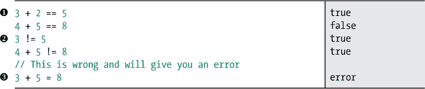
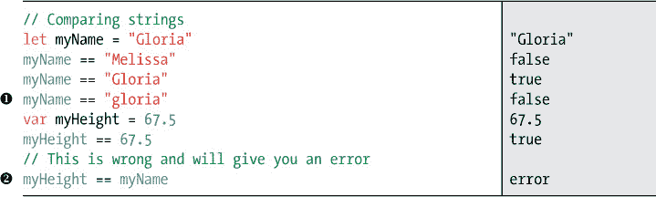
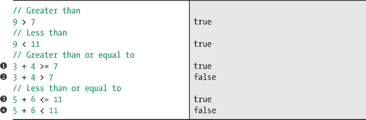
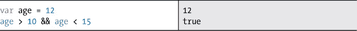
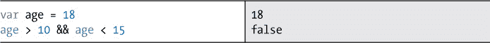
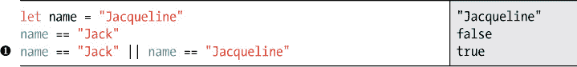
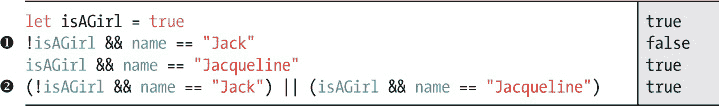
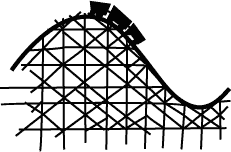
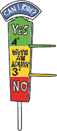
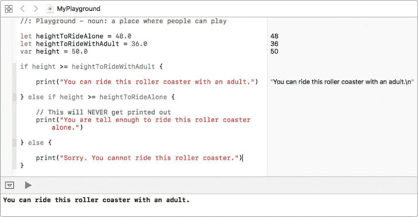

## 第三章：## 做出选择


现在我们已经讲解了如何创建常量和变量，你准备好学习如何告诉计算机做出选择了。本章将讲解如何通过告诉计算机选择程序的执行路径来控制程序的流程。当我们谈论*流程*时，我们指的是程序语句执行的顺序。

到目前为止，你只看到过按照你输入的顺序执行的语句。你已经用这些语句做了些很酷的事情，但通过告诉计算机如何根据语句的执行顺序做出选择，你可以做得更多。为了让计算机做出选择，我们将使用*条件语句*，它告诉计算机根据条件的值执行一些代码。

你每天都在使用条件语句做出选择！例如，在早上离开家之前，你会查看天气。如果是晴天，你可能会戴上太阳镜。如果下雨了，你会拿起雨伞。在每种情况下，你都在检查一个条件。如果条件“下雨了”成立，那么你出门时就会带上雨伞。当条件可能为真或假时，这称为*布尔表达式*。你在第二章中学到的 Bool 数据类型用于表示真或假的值。


### 布尔表达式

一种常见的布尔表达式是使用*比较运算符*来比较两个值。比较运算符有六种。我们先从两个简单的开始：*相等* 和 *不相等*。

#### 等于与不等于

你将经常使用 *相等* 和 *不相等* 这两个比较运算符。*相等* 用两个等号表示，写作 ==。*不相等* 用一个感叹号和一个等号表示，写作 !=。

让我们在 Playground 中试试这两者！



用简单的语言来说，➊ 这一行表示“3 加 2 等于 5”，这是一个正确的陈述，右侧面板的输出将在你输入完这行代码后确认这一点。在 ➋ 这一行，写的是“3 不等于 5”，这也是一个正确的陈述。请注意 ➌ 是一个错误。你知道为什么吗？虽然 = 和 == 看起来很相似，但记住单个等号 (=) 是用于赋值的。那行代码的意思是，“将 8 的值赋给名为 3 + 5 的变量”，这显然是不可行的。

在 Swift 中，== 操作符不仅适用于数字，还可以用于其他数据类型。我们来尝试进行一些其他的比较。



➊ 这一行是个难点；你是否预料到它为真？这两个字符串很相似，但并不完全相同，*相等* 的比较仅在两个值完全匹配时才为真。常量 myName 的值是 "Gloria"，字母 *G* 是大写的，这与 "gloria"（小写 *g*）不同。

还记得在第二章中我们说过，您不能在不同数据类型的事物上使用数学运算符如+和*吗？比较运算也是如此。在②处，由于一个是 String，另一个是 Double，所以会导致错误。

#### 大于和小于

现在让我们看看其他四个比较运算符。我们将从*大于*（表示为>）和*小于*（表示为<）开始。您可能已经对这些运算符的工作原理有了很好的理解。例如，布尔表达式 9 > 7，表示“9 大于 7”，是 true 的。通常，您还想知道某些事物是否大于或等于某些事物，或者是否小于或等于某些事物。有两个运算符可以涵盖这些情况：*大于或等于*（看起来像>=）和*小于或等于*（看起来像<=）。让我们通过更多示例来尝试这些：



注意*大于或等于*处于➊和*大于*处于➋之间的差异。3 + 4 的和不大于 7，但大于或等于 7。同样，5 + 6 小于或等于 11➌，但不小于 11➍。

表格 3-1 总结了六个比较运算符。

**表格 3-1:** 比较运算符

| **符号** | **定义** |
| --- | --- |
| == | 等于 |
| != | 不等于 |
| > | 大于 |
| < | 小于 |
| >= | 大于或等于 |
| <= | 小于或等于 |

在编写条件语句时，您经常会发现自己经常使用这些运算符。

#### 复合布尔表达式

复合布尔表达式是简单布尔表达式的组合。这很像在英语中用*and*和*or*来制作复合句子。在编程中，还有第三种情况：*not*。在 Swift 中，我们称这些词为*逻辑运算符*。Swift 中的三个逻辑运算符显示在表格 3-2 中。

**表格 3-2:** 逻辑运算符

| **符号** | **定义** |
| --- | --- |
| && | 逻辑与 |
| &#124;&#124; | 逻辑或 |
| ! | 逻辑非 |

使用逻辑运算符，您可以编写测试值是否落在范围内的语句，例如“这个人的年龄是否在 10 到 15 岁之间？”您可以通过同时测试年龄是否大于 10 且小于 15 来做到这一点，就像这样：



语句 age > 10 && age < 15 是 true，因为两个条件都成立：age 大于 10 且小于 15。AND 语句仅在两个条件都为 true 时才为 true。

尝试将年龄的值更改为 18，看看会发生什么：



因为我们将年龄改为 18 岁，所以语句的一侧是真的。变量年龄仍大于 10，但不再小于 15，因此我们的表达式评估为 false。

现在通过在代码环境中输入以下代码来测试 OR：



首先，我们创建一个名为 Jacqueline 的人，通过将常量名称设置为“Jacqueline”。接下来，我们测试一些条件，看看它们是否为真或假。因为 name == "Jacqueline" 为真，即使 name == "Jack" 为假，➊ 处的 OR 语句仍然为真。在英语中，这个语句的意思是：“这个人的名字是 Jack *或者* 这个人的名字是 Jacqueline。”在 OR 语句中，只有一个条件为真时，整个表达式才为真。


让我们试着使用一些 NOT 语句。在你的代码环境中输入以下内容：



! 操作符在复合布尔语句 ➊ 中被使用，你可以把它读作“我们这个人是*不是*女孩*并且*我们这个人叫 Jack。”这个语句包含了两个逻辑运算符，! 和 &&。你可以根据需要在编写复合布尔表达式时组合任意多个逻辑运算符。

有时候，使用括号是个好主意，它可以告诉计算机优先评估什么。括号还可以让代码更易于阅读。这类似于你在一个方程中使用多个数学运算时如何使用括号，正如在 “使用括号排序运算”中所描述的，在第 30 页的内容一样。在 ➋ 处，我们使用括号告诉计算机首先检查 !isAGirl && name == "Jack"，然后再检查 isAGirl && name == "Jacqueline"。在评估完这两部分后，计算机可以评估整个语句的 OR 部分，由于第二部分为真，所以整个表达式为真。同样，在 OR 语句中，只要有任何一个条件为真，整个表达式就是对的。

表 3-3 显示了三种逻辑运算符以及你可以用它们构建的复合表达式，并且给出了它们对应的布尔值。

**表 3-3：** 布尔逻辑运算符的复合表达式

| **逻辑运算符** | **复合表达式** | **值** |
| --- | --- | --- |
| NOT (! ) | !true | false |
| NOT (! ) | !false | true |
| AND (&& ) | true && true | true |
| AND (&& ) | true && false | false |
| AND (&& ) | false && true | false |
| AND (&& ) | false && false | false |
| OR (&#124;&#124; ) | true &#124;&#124; true | true |
| OR (&#124;&#124; ) | true &#124;&#124; false | true |
| OR (&#124;&#124; ) | false &#124;&#124; true | true |
| OR (&#124;&#124; ) | false &#124;&#124; false | false |

表格的第一项显示了“不为真”的东西是假的。同样，“不为假”的东西就为真。

使用 AND 操作符时，只有 true && true 才为真。这意味着 && 操作符两边的表达式必须为真，&& 表达式才会为真。一个 true && false 的复合表达式会被评估为假。两个条件都为假的复合 && 表达式也会评估为假。

关于 OR 运算符，|| 运算符两边的任意一个表达式为真时，|| 表达式就为真。因此，true || true 为真，true || false 也为真。只有当复合 OR 表达式两边的条件都为假时，才会返回假。

### 条件语句

条件语句分为两类：if 语句和 switch 语句。这些语句向计算机提供一个条件，计算机根据该条件做出选择。

#### IF 语句

if 语句以关键字 if 开始，后面跟一个 *条件*，该条件始终是一个布尔表达式。计算机会检查条件，如果条件为真，则执行 if 语句中的代码；如果条件为假，则跳过该代码。让我们编写一些代码，测试孩子是否足够高可以乘坐过山车。请在你的代码编辑器中输入以下代码：

```
  let
 heightToRideAlone = 48.0

  var
 height = 49.5

➊
 if
 height
 >= heightToRideAlone
 {

➋
     print
 ("You are tall enough to ride this roller coaster."
 )

  }
```

在这里，我们将 48 英寸设为孩子可以独自乘坐过山车的最小身高，并将骑行者的身高设为 49.5 英寸。在 ➊ 处，我们测试骑行者的身高是否大于或等于 heightToRideAlone。如果是，程序就会说他们足够高，可以乘坐过山车。为了编写 if 语句，我们在条件 height >= heightToRideAlone 前加上关键字 if，然后将当条件为真时要执行的代码放在一对大括号 ➋ 中。因为骑行者足够高，计算机将打印“你足够高，可以乘坐这个过山车。”



万岁！

让我们看看如果改变骑行者的身高会发生什么。将身高改为小于 48.0 的数字。这次，因为 if 语句中的条件评估为假，程序会跳过 if 语句中的所有代码，什么都不会发生。

##### else 语句

通常，你会希望告诉计算机，当条件为真时执行一件事，当条件为假时执行另一件事。为此，在 if 语句和代码块后，只需键入关键字 else，后面跟着另一个你希望在 if 条件不成立时执行的代码块。如果骑行者的身高不够满足条件，让我们让计算机告诉他们不能乘坐过山车：

```
  if
 height
 >= heightToRideAlone
 {

      print
 ("You are tall enough to ride this roller coaster."
 )

➊
 } else
 {

      print
 ("Sorry. You cannot ride this roller coaster."
 )

  }
```

现在，如果你将骑行者的身高改为不到 48 英寸，你会看到“抱歉，你不能乘坐这个过山车。” 这是因为 ➊ 处的 else 语句告诉计算机，当条件判断为假时，打印该消息。用简单的语言来说，这就像是在说，“如果骑行者足够高，可以乘坐过山车，就说他们可以乘坐。否则，说他们不能。”

##### else if 语句

我们也可以测试骑行者身高的不同条件，为乘坐过山车创建更多规则。我们可以通过添加 else if 条件来做到这一点。让我们添加一个新的最小身高要求，要求孩子必须与成人一起乘坐：

```
  let
 heightToRideAlone = 48.0

  let
 heightToRideWithAdult = 36.0

  var
 height = 47.5

 if
 height
 >= heightToRideAlone
 {

      print
 ("You are tall enough to ride this roller coaster alone."
 )

➊
 } else if
 height
 >= heightToRideWithAdult
 {

      print
 ("You can ride this roller coaster with an adult."
 )

  } else
 {

      print
 ("Sorry. You cannot ride this roller coaster."
 )

  }
```

➊处的 else if 语句检查骑乘者的身高是否大于或等于 heightToRideWithAdult。如果骑乘者的身高在 48 英寸以下但大于 36 英寸，则结果面板中会出现“你可以和成人一起坐这个过山车。”如果他们太矮，无法单独或与成人一起骑行，计算机会打印“抱歉，你不能坐这个过山车。”

else if 语句很简洁，因为你可以用它们来测试许多不同的条件，但非常重要的一点是，你必须关注这些条件的顺序。为了说明这一点，将骑乘者的身高更改为 50.0，以便他们足够高可以单独骑行。然后，通过将 height >= heightToRideWithAdult 作为第一个条件，height >= heightToRideAlone 作为第二个条件，来更改我们 if else 语句中的条件顺序。你认为会打印什么？查看图 3-1 来了解答案。



*图 3-1：小心 else if 语句的顺序。*

你可以看到，尽管骑乘者的身高高于 heightToRideAlone，程序仍然打印出“你可以和成人一起坐这个过山车。”这是预期的输出，适用于身高大于 heightToRideWithAdult 但小于 heightToRideAlone 的骑乘者。我们得到这个结果是因为骑乘者的身高符合第一个条件，因此计算机打印了第一个句子，并且不会检查其他条件。

一旦 if 或 else if 语句的任何部分被发现为真，后面的条件就不会再被检查。在图 3-1 的示例中，第一个条件为真，因此其他条件被跳过。这可能会导致程序出现意外结果，所以如果你在 if 或 else if 语句中遇到问题，请检查条件的顺序！

当你在使用 if、else 或 else if 语句时，有一些重要的规则。第一个是，你不能有 else 或 else if 语句，除非你先写一个 if 语句。第二个是，虽然你可以在 if 后面使用任意多个 else if 语句，但只能有一个 else——而且这个 else 必须放在最后。如果没有其他条件成立，else 将作为一个捕捉所有情况的语句。

**优雅的编码**

请密切注意我们在本书中使用的编码风格。所谓*编码风格*，是指代码的写法、使用的空格数量、某些行的缩进以及新的一行应该写什么。请看一下这段代码：

```
// The opening brace, {, of a block of code goes on

// the same line as the condition

if height >= heightToRideAlone {

    // Statements inside a block of code should be indented by 4 spaces

    print("You are tall enough to ride this roller coaster alone.")

// The closing brace, }, of a block of code goes at the start of a new line

} else if height >= heightToRideWithAdult {

    // Extra blank lines can be added between statements

    // to make the code look less crowded

    print("You can ride this roller coaster with an adult.")

} else {

    print("Sorry. You cannot ride this roller coaster.")

}
```

请注意，在 if 条件之后，我们留出了一个空格，然后在同一行上放置了左大括号{。代码块的右大括号}总是位于下一行的开头。大括号内的语句缩进四个空格。这是 Xcode 自动为你做的，以使代码更具可读性。如果这样做更容易阅读，可以随意添加空行。通常，在一段代码（如 if 语句）之前应该始终有至少一个空行。


#### SWITCH 语句

而 if 语句仅用于评估布尔表达式（即必须为真或为假），switch 语句则可以根据多个条件进行评估和分支。你可以使用 switch 来检查整数的值，并告诉计算机如果整数等于 1 就做一件事，如果整数等于 2 则做另一件事，依此类推。或者，你可以创建一个字符串 dayOfTheWeek，并编写一个 switch 语句，根据 dayOfTheWeek 的值让计算机做不同的事情。

当计算机找到第一个匹配项时，相应的代码块会执行。看看以下代码，它为不同年级的学生分配项目：

```
  var
 studentGrade = 5

  var
 studentProject = "To be determined"

➊
 switch
 studentGrade
 {

➋
 case
 1
 :

      studentProject
 = "A country of the student's choice"

  case
 2
 :

      studentProject
 = "The Iditarod"

  case
 3
 :

      studentProject
 = "Native Americans"

  case
 4
 :

      studentProject
 = "A state of the student's choice"

  case
 5
 :

      studentProject
 = "Colonial times"

➌
 case
 6
 , 7
 , 8
 :

      studentProject
 = "Student's choice"

➍
 default
 :

      studentProject
 = "N/A"

  }
```

switch 语句以关键字 switch 开头，后面跟着*控制表达式*。在这个示例中，控制表达式是变量 studentGrade。

控制表达式之后，从➊开始一个大括号，switch 语句的主体就在这些大括号内。


switch 语句的主体由一个或多个 case 组成。在这个示例中，总共有六个 case。每个 case 以关键字 case 开头，后面跟着一个值和冒号，如➋所示。如果 case 语句与控制表达式匹配，紧接着的代码就会执行。每个 case 必须至少有一行代码，否则会出现错误。在这个示例中，switch 语句用于将分配给变量 studentProject 的字符串从“待确定”更改为与控制表达式匹配的 case 中的字符串。

请注意，你可以有多个案例都执行相同的操作。你可以看到 6 年级、7 年级和 8 年级的学生都可以选择他们自己的项目 ➌。我们通过写关键字 case，然后列出以逗号分隔的值来指定这一点。

最后，switch 语句必须涵盖控制表达式的所有可能情况或值。在我们的示例中，由于 studentGrade 是一个 Int 类型，所以下面的 switch 语句需要包含所有可能的 Int 值的 case。但这样写会非常耗时，因为有太多！例如，–7 是一个 Int，1,000 也是。你真的想写 1,000 个 case 吗？

你可以使用关键字 default 作为最后一个 case，而不是为每个值单独写一个 case，就像我们在➍中所做的那样。你只需输入 default 后跟冒号（default:），然后写下当其他 case 不匹配时需要执行的代码。请注意，默认 case 前面没有 case 这个词。默认 case 对于处理可能不期望的值非常有用，可以让你避免写太多的 case 语句。在这个例子中，我们只期望 studentGrade 的值为 1 到 8，所以我们使用默认 case 来处理所有其他可能的值。

尝试运行这个 switch 语句，看看结果。然后尝试更改值来测试不同的条件。玩一玩吧！

### 你学到了什么

在本章中，你学习了如何编程让计算机根据条件做出选择，使用了 if 和 switch 语句。你学会了如何编写布尔表达式和复合表达式，并了解了不同的比较运算符。条件语句是一个重要的编程工具，几乎在每个有用的程序中都能看到。在第四章，我们将讨论另一种重要的编程语句——循环。循环告诉计算机重复做某件事，直到该停止时为止。


## 做出选择


现在我们已经介绍了如何创建常量和变量，你准备好学习如何让计算机做出选择了。本章将讨论如何通过告诉计算机选择执行路径来控制计算机程序的流程。当我们谈到*流程*时，指的是程序语句执行的顺序。

到目前为止，你只看到过按输入顺序执行的语句。你已经做了一些很酷的事情，但通过告诉计算机如何根据执行语句的顺序做出选择，你可以做得更多。为了让计算机做出选择，我们将使用*条件语句*，它根据条件的值告诉计算机执行某些代码。

你每天都在使用条件语句做选择！例如，早上出门前你会查看天气。如果是晴天，你可能会戴上一副太阳镜。如果下雨，你就拿起雨伞。在每种情况下，你都在检查一个条件。如果“下雨”这个条件为真，那么当你离开家时，你会带上雨伞。当条件可能为真或为假时，它就叫做*布尔表达式*。你在第二章中学到的 Bool 数据类型用于表示真或假的值。


### 布尔表达式

一种常见的布尔表达式是使用*比较运算符*比较两个值。共有六种比较运算符。让我们从两个简单的运算符开始：*相等*和*不相等*。

#### 相等与不相等

你会经常使用 *等于* 和 *不等于* 的比较运算符。*等于* 用两个等号写在一起，像这样：==。*不等于* 用感叹号和一个等号写在一起，像这样：!=。

让我们在游乐场中同时尝试这两个！


用通俗的语言来说，➊ 处的代码表示“3 加 2 等于 5”，这是一个正确的陈述，右侧面板的输出会在你输入完成后确认这一点。➋ 处的代码表示“3 不等于 5”，这也是一个正确的陈述。注意 ➌ 处是错误的。你知道为什么吗？虽然 = 和 == 看起来很相似，但记住单个等号（=）是用来赋值的。那行代码的意思是，“将 8 的值赋给名为 3 + 5 的东西”，这是不行的。

在 Swift 中，== 运算符也适用于其他数据类型，而不仅仅是数字。让我们尝试一些其他的比较。


➊ 这一行比较棘手；你预计它为真吗？这两个字符串接近，但并不完全相同，*相等*的比较只有在两个值完全匹配时才为真。常量 myName 的值是 "Gloria"，大写的 *G* ，这与 "gloria"（小写的 *g*）不相同。

记得在第二章时我们说过，你不能对不同数据类型的东西使用数学运算符，如 + 和 * 吗？比较时也是如此。你不能比较不同类型的东西。➋ 处的代码会导致错误，因为一个是字符串（String），另一个是双精度浮点数（Double）。

#### 大于和小于

现在让我们看一下其他四个比较运算符。我们从 *大于*（表示为 >）和 *小于*（表示为 <）开始。你可能已经对这些运作有了很好的理解。像 9 > 7 这样的布尔表达式，意思是“9 大于 7”，它为真。通常，你还会想知道某个东西是否大于或等于某个东西，或者是否小于或等于某个东西。还有两个运算符可以处理这些情况：*大于或等于*（表示为 >=）和 *小于或等于*（表示为 <=）。让我们用更多的例子来尝试这些：


请注意 ➊ 处的 *大于或等于* 与 ➋ 处的 *大于* 之间的区别。3 + 4 的和不大于 7，但它大于或等于 7。同样，5 + 6 小于或等于 11 ➌ ，但它不小于 11 ➍。

表 3-1 总结了六个比较运算符。

**表 3-1：** 比较运算符

| **符号** | **定义** |
| --- | --- |
| == | 等于 |
| != | 不等于 |
| > | 大于 |
| < | 小于 |
| >= | 大于或等于 |
| <= | 小于或等于 |

在编写条件语句时，你会经常使用这些运算符。

#### 复合布尔表达式

复合布尔表达式是将多个简单布尔表达式连接在一起。它有点像在英语中使用“*and*”和“*or*”构成复合句。在编程中，还有第三种情况：*not*。在 Swift 中，我们称这些词为*逻辑运算符*。逻辑运算符可以将一个布尔表达式与另一个表达式结合，或者对其取反。Swift 中的三种逻辑运算符如表 3-2 所示。

**表 3-2：** 逻辑运算符

| **符号** | **定义** |
| --- | --- |
| && | 逻辑与 |
| &#124;&#124; | 逻辑或 |
| ! | 逻辑非 |

使用逻辑运算符，你可以编写测试某个值是否在范围内的语句，例如：“这个人的年龄在 10 到 15 岁之间吗？”你可以通过测试年龄是否大于 10 *且* 小于 15 来实现，像这样：


语句`age > 10 && age < 15`为真，因为两个条件都为真：年龄大于 10 且小于 15。一个 AND 语句只有在两个条件都为真时才为真。

尝试将 age 的值改为 18，看看会发生什么：


因为我们将年龄改为 18，所以只有一边的条件为真。变量 age 仍然大于 10，但不再小于 15，所以我们的表达式的值为假。

现在通过在你的演示区输入以下代码来测试 OR 运算符：


首先，我们通过将常量 name 设置为"Jacqueline"来创建一个名为 Jacqueline 的人物。接下来，我们测试一些条件以查看它们是对还是错。因为`name == "Jacqueline"`为真，所以➊处的 OR 语句为真，尽管`name == "Jack"`为假。用英语来说，这个语句的意思是：“这个人的名字是 Jack *或者* 这个人的名字是 Jacqueline。”在 OR 语句中，只需要有一个条件为真，整个表达式才为真。


让我们尝试使用一些 NOT 语句。将以下内容输入到你的演示区：


`!`运算符用于复合布尔语句➊中，你可以将其理解为“我们的人*不是*女孩*且*我们的人叫 Jack。”该语句有两个逻辑运算符，`!`和`&&`。在编写复合布尔表达式时，你可以组合任意多个逻辑运算符。

有时候，使用括号来告诉计算机先计算哪个部分是一个好主意。括号还可以让代码更容易阅读。这就像你在一个数学方程中使用多个运算时使用括号一样，正如在 “使用括号来排序操作” 第 30 页中描述的那样。在 ➋ 处，我们使用括号告诉计算机首先检查 !isAGirl && name == "Jack"，然后检查 isAGirl && name == "Jacqueline"。在计算完这两个部分后，计算机可以计算整个语句的 OR 部分，结果为 true，因为第二部分为 true。在 OR 语句中，如果任何条件为 true，整个表达式就为 true。

表 3-3 显示了三个逻辑运算符及其复合表达式，并列出了它们对应的布尔值。

**表 3-3：** 使用逻辑运算符的复合布尔表达式

| **逻辑运算符** | **复合表达式** | **值** |
| --- | --- | --- |
| 非 (! ) | !true | false |
| 非 (! ) | !false | true |
| 与 (&& ) | true && true | true |
| 与 (&& ) | true && false | false |
| 与 (&& ) | false && true | false |
| 与 (&& ) | false && false | false |
| 或 (&#124;&#124; ) | true &#124;&#124; true | true |
| 或 (&#124;&#124; ) | true &#124;&#124; false | true |
| 或 (&#124;&#124; ) | false &#124;&#124; true | true |
| 或 (&#124;&#124; ) | false &#124;&#124; false | false |

表格的第一项显示，NOT true 是 false。同理，NOT false 是 true。

使用 AND 运算符时，只有 true && true 为 true。这意味着 && 运算符两边的表达式必须都为 true，&& 表达式才为 true。一个复合表达式 true && false 的结果为 false。如果两个条件都为 false，复合 && 表达式的结果也会是 false。

当谈到 OR 运算符时，|| 运算符两边的表达式中只需一个为 true，整个 || 表达式就为 true。因此，true || true 为 true，true || false 也是 true。只有当两个条件都为 false 时，复合 OR 表达式才为 false。

### 条件语句

条件语句分为两类：if 语句和 switch 语句。这些语句向计算机提供一个条件，计算机根据该条件做出选择。

#### IF 语句

if 语句以关键字 if 开头，后面跟着一个 *条件*，该条件始终是一个布尔表达式。计算机会检查该条件，如果条件为 true，则执行 if 语句中的代码；如果条件为 false，则跳过该代码。让我们写一些代码，测试一个孩子是否足够高，能乘坐过山车。请将以下代码输入到你的编程环境中：

```
  let
 heightToRideAlone = 48.0

  var
 height = 49.5

➊
 if
 height
 >= heightToRideAlone
 {

➋
     print
 ("You are tall enough to ride this roller coaster."
 )

  }
```

这里，我们将 48 英寸设为孩子单独乘坐过山车的最低身高，并将骑行者的身高设置为 49.5 英寸。在 ➊ 处，我们测试骑行者的身高是否大于或等于 `heightToRideAlone`。如果是，程序会说他们足够高，可以乘坐过山车。为了编写我们的 `if` 语句，我们在条件 `height >= heightToRideAlone` 前面加上关键字 `if`。然后，我们将希望在该条件为真时执行的代码括在一对大括号 ➋ 中。因为我们的骑行者足够高，计算机会打印 "You are tall enough to ride this roller coaster."（你足够高，可以乘坐这个过山车）。


耶！

让我们看看如果改变骑行者的身高会发生什么。将身高更改为低于 48.0 的数值。这一次，由于 `if` 语句中的条件评估为 false，程序会跳过 `if` 语句中的所有代码，什么也不会发生。

##### else 语句

通常，你会希望告诉计算机，如果某个语句为真，做一件事；如果该语句为假，做另一件事。为此，在 `if` 语句和代码块后面，只需输入关键字 `else`，然后输入另一个代码块，当 `if` 条件不为真时执行。如果骑行者的身高不够，我们让计算机告诉他们不能乘坐过山车：

```
  if
 height
 >= heightToRideAlone
 {

      print
 ("You are tall enough to ride this roller coaster."
 )

➊
 } else
 {

      print
 ("Sorry. You cannot ride this roller coaster."
 )

  }
```

现在，如果你将骑行者的身高更改为低于 48 英寸，你会看到 "Sorry. You cannot ride this roller coaster."（抱歉，你不能乘坐这个过山车）。这是因为 ➊ 处的 `else` 语句告诉计算机，如果条件评估为 false，就打印该信息。通俗地说，这就像是说：“如果骑行者足够高可以乘坐过山车，就说他们可以。如果不行，就说他们不行。”

##### else if 语句

我们还可以测试骑行者身高的不同条件，以创建更多的过山车乘坐规则。我们可以通过添加 `else if` 条件来实现这一点。让我们增加一个新的最小身高，要求孩子与成人一起乘坐：

```
  let
 heightToRideAlone = 48.0

  let
 heightToRideWithAdult = 36.0

  var
 height = 47.5

 if
 height
 >= heightToRideAlone
 {

      print
 ("You are tall enough to ride this roller coaster alone."
 )

➊
 } else if
 height
 >= heightToRideWithAdult
 {

      print
 ("You can ride this roller coaster with an adult."
 )

  } else
 {

      print
 ("Sorry. You cannot ride this roller coaster."
 )

  }
```

➊ 处的 `else if` 语句检查骑行者的身高是否大于或等于 `heightToRideWithAdult`。如果骑行者身高低于 48 英寸，但高于 36 英寸，那么在结果面板中会出现 "You can ride this roller coaster with an adult."（你可以与成人一起乘坐过山车）这一行。如果他们的身高不够，无法单独或与成人一起乘坐过山车，计算机会打印 "Sorry. You cannot ride this roller coaster."（抱歉，你不能乘坐这个过山车）。

`else if` 语句很整洁，因为你可以用它们测试许多不同的条件，但非常重要的一点是，你需要关注这些条件的顺序。为了展示我们的意思，请将骑行者的身高改为 50.0，以便他们足够高，可以单独骑行。然后，通过将条件 `height >= heightToRideWithAdult` 移到第一个条件，将 `height >= heightToRideAlone` 移到第二个条件，来改变我们 `if else` 语句中的条件顺序。你认为会打印什么内容？查看图 3-1 来了解答案。


*图 3-1：小心`else if`语句的顺序。*

你可以看到，尽管骑行者的身高高于`heightToRideAlone`，程序还是输出了“你可以和成人一起乘坐这过山车。” 这是对于身高大于`heightToRideWithAdult`但小于`heightToRideAlone`的骑行者的预期输出。我们得到这个结果是因为骑行者的身高符合第一个条件，因此计算机输出了第一个句子，并且不会检查其他条件。

一旦`if`或`else if`语句的某部分被判定为`true`，其余的条件将不再被检查。在我们图 3-1 中的例子中，第一个条件为真，因此跳过了其余的条件。这可能会导致程序中出现意外的结果，所以如果你在`if`或`else if`语句中遇到问题，请检查条件的顺序！

在使用`if`、`else`或`else if`语句时，有一些重要的规则。第一个规则是，除非你先写一个`if`语句，否则不能有`else`或`else if`语句。第二个规则是，虽然在`if`语句后可以有任意数量的`else if`语句，但只能有一个`else`，而且这个`else`必须是最后一个。`else`是用于捕捉所有其他条件都不成立的情况。

**风格化编程**

请特别注意我们在本书中使用的编码风格。所谓*编码风格*，是指代码的写法、使用的空格数量、某些行的缩进，以及哪些内容放在新的一行。看看这段代码：

```
// The opening brace, {, of a block of code goes on

// the same line as the condition

if height >= heightToRideAlone {

    // Statements inside a block of code should be indented by 4 spaces

    print("You are tall enough to ride this roller coaster alone.")

// The closing brace, }, of a block of code goes at the start of a new line

} else if height >= heightToRideWithAdult {

    // Extra blank lines can be added between statements

    // to make the code look less crowded

    print("You can ride this roller coaster with an adult.")

} else {

    print("Sorry. You cannot ride this roller coaster.")

}
```

请注意，在`if`条件之后，我们留出一个空格，然后将大括号`{`放在同一行。代码块的闭合大括号`}`总是放在下一行的开始位置。大括号内的语句缩进四个空格。这是 Xcode 自动为你做的，以使代码更具可读性。如果空白行能让你更容易阅读，欢迎添加。一般来说，在像`if`语句这样的代码块之前，你应该始终留出至少一行空白行。


#### 切换语句

`if`语句仅用于评估布尔表达式（必须为真或假的东西），而`switch`语句可以评估并根据多个条件进行分支。你可以使用`switch`来检查一个整数的值，并告诉计算机如果该整数等于 1，就执行某个操作，等于 2 时执行另一个操作，依此类推。或者，你可以创建一个名为`dayOfTheWeek`的字符串，并编写一个`switch`语句，根据`dayOfTheWeek`的值让计算机执行不同的操作。

当计算机找到第一个匹配项时，相关的代码块就会被执行。看看下面这段代码，它为不同年级的学生分配项目：

```
  var
 studentGrade = 5

  var
 studentProject = "To be determined"

➊
 switch
 studentGrade
 {

➋
 case
 1
 :

      studentProject
 = "A country of the student's choice"

  case
 2
 :

      studentProject
 = "The Iditarod"

  case
 3
 :

      studentProject
 = "Native Americans"

  case
 4
 :

      studentProject
 = "A state of the student's choice"

  case
 5
 :

      studentProject
 = "Colonial times"

➌
 case
 6
 , 7
 , 8
 :

      studentProject
 = "Student's choice"

➍
 default
 :

      studentProject
 = "N/A"

  }
```

`switch`语句以关键字`switch`开始，后面跟着*控制表达式*。在这个例子中，控制表达式是变量`studentGrade`。

在控制表达式之后，一组大括号从 ➊ 开始，`switch` 语句的主体位于这些大括号内。


`switch` 语句的主体由一个或多个 `case` 组成。在这个例子中，总共有六个 `case`。每个 `case` 以关键字 `case` 开头，后跟一个值和冒号，如 ➋ 所示。如果某个 `case` 语句与控制表达式匹配，则紧跟在 `case` 后的代码将会执行。每个 `case` 必须至少有一行代码，否则会报错。在这个例子中，`switch` 用于将字符串 "To be determined" 所赋值的变量 `studentProject` 改为与控制表达式匹配的 `case` 中的字符串。

请注意，您可以有多个案例，它们都执行相同的操作。您可以看到，6、7 和 8 年级的学生都可以选择自己的项目 ➌。我们通过编写关键字 `case` 和一个由逗号分隔的值列表来指定这一点。

最后，`switch` 语句必须考虑控制表达式的所有可能的 `case` 或值。在我们的例子中，由于 `studentGrade` 是一个 `Int` 类型，我们的 `switch` 语句需要有一个适用于所有可能的 `Int` 值的 `case`。但是这将需要非常长的时间来编写，因为有太多可能的值！例如，–7 是 `Int` 类型，1,000 也是。你真的想写 1,000 个 `case` 吗？

不必为每个值编写一个单独的 `case`，你可以将关键字 `default` 用作最后一个 `case`，正如我们在 ➍ 处所做的那样。你只需输入 `default` 后跟冒号（`default:`），然后写下如果其他 `case` 都不匹配时要执行的代码。注意，`default` 语句前面没有 `case` 这个词。`default` 语句对于处理你可能没有预料到的值非常有帮助，并且可以避免编写那么多的 `case` 语句。在这个例子中，我们只期望 `studentGrade` 的值为 1 到 8 之间的整数，因此我们使用 `default` 语句来处理所有其他可能的值。

尝试运行这个 `switch` 语句，看看你得到的结果。然后尝试更改值以测试不同的条件。玩玩看吧！

### 你学到了什么

在本章中，您学会了如何通过使用 `if` 和 `switch` 语句编写程序，使计算机根据条件做出选择。您学会了如何编写布尔表达式和复合表达式，以及不同的比较运算符。条件语句是一个至关重要的编程工具，几乎所有有用的程序中都能看到它们。在第四章，我们将探讨另一种重要的编程语句——循环。循环告诉计算机反复做某事，直到停止循环。

 

现在我们已经介绍了如何创建常量和变量，你已经准备好学习如何让计算机做出选择。本章将介绍如何通过告诉计算机走哪条路径来控制计算机程序的流程。当我们谈论*流程*时，我们指的是程序中语句执行的顺序。

到目前为止，你只见过按你输入的顺序执行的语句。你已经用这些做了一些很酷的事情，但通过告诉计算机如何根据执行语句的顺序做出选择，你可以做得更多。为了让计算机做出选择，我们将使用*条件语句*，告诉计算机根据条件的值来运行一些代码。

你每天都在使用条件语句做选择！例如，在早上出门前，你会查看天气。如果是晴天，你可能会戴上太阳镜。如果下雨，你则会拿起雨伞。在这两种情况下，你都在检查一个条件。如果条件“下雨”是真的，那么你出门时会拿起雨伞。当条件可能为真或假时，这就叫做*布尔表达式*。你在第二章中学到的 Bool 数据类型用来表示 true 或 false 的值。


### 布尔表达式

一种常见的布尔表达式类型是使用*比较运算符*来比较两个值。有六种比较运算符。我们先从两个简单的开始：*相等*与*不相等*。

#### 相等与不相等

你会经常使用*相等*与*不相等*比较运算符。*相等*用两个等号紧挨着写，像这样：==。*不相等*用感叹号和一个等号写，像这样：!=。

我们在 Playground 中试试这两个！


用简单的英语来说，➊ 这一行表示“3 加 2 等于 5”，这是一个正确的陈述，当你输入完成后，右侧窗格的输出会确认这一点。在 ➋ 处，这一行表示“3 不等于 5”，这也是一个正确的陈述。注意，➌ 是一个错误。你知道为什么吗？虽然 = 和 == 看起来很像，但请记住，单个等号 (=) 是用来赋值的。那行代码的意思是，“将 8 的值赋给叫做 3 + 5 的东西”，这显然是行不通的。

在 Swift 中，== 运算符不仅适用于数字，还适用于其他数据类型。我们来尝试进行一些其他比较。


➊ 这一行有点棘手；你期望它为真吗？这两个字符串很相似，但并不完全相同，*相等*比较只有在两个值完全匹配时才为真。常量 myName 的值是 "Gloria"，大写的*G*，这与 "gloria"（小写的*g*）不同。

记得在 第二章 中我们说过，你不能对不同数据类型的东西使用数学运算符，如 + 和 * 吗？比较也一样，你不能比较不同类型的东西。➋ 处的这一行将导致错误，因为一个是 String 类型，另一个是 Double 类型。

#### 大于与小于

现在让我们看看另外四个比较运算符。我们从 *大于*（写作 >）和 *小于*（写作 <）开始。你可能已经大致了解它们是如何工作的。像 9 > 7 这样的布尔表达式，意思是“9 大于 7”，它为真。通常，你还需要知道某个值是否大于或等于另一个值，或者小于或等于另一个值。还有两个运算符可以覆盖这些情况：*大于或等于*（写作 >=）和 *小于或等于*（写作 <=）。我们通过一些例子来试试这些：


请注意 ➊ 处的 *大于或等于* 和 ➋ 处的 *大于* 之间的区别。3 + 4 的和不是大于 7，但它大于或等于 7。类似地，5 + 6 小于或等于 11 ➌，但它不小于 11 ➍。

表 3-1 总结了六个比较运算符。

**表 3-1：** 比较运算符

| **符号** | **定义** |
| --- | --- |
| == | 等于 |
| != | 不等于 |
| > | 大于 |
| < | 小于 |
| >= | 大于或等于 |
| <= | 小于或等于 |

在编写条件语句时，你会经常使用这些运算符。

#### 复合布尔表达式

复合布尔表达式是由简单布尔表达式组合而成的。这有点像在英语中用 *and* 和 *or* 构成复合句。在编程中，还有第三种情况：*not*。在 Swift 中，我们将这些词称为 *逻辑运算符*。逻辑运算符要么将一个布尔表达式与另一个表达式结合，要么对其进行否定。Swift 中的三种逻辑运算符如 表 3-2 所示。

**表 3-2：** 逻辑运算符

| **符号** | **定义** |
| --- | --- |
| && | 逻辑与 |
| &#124;&#124; | 逻辑或 |
| ! | 逻辑非 |

使用逻辑运算符，你可以编写测试某个值是否在某个范围内的语句，例如，“这个人的年龄是否在 10 到 15 之间？”你可以通过测试年龄是否大于 10 *且* 小于 15 来实现，像这样：


语句 age > 10 && age < 15 为真，因为两个条件都为真：age 大于 10 且小于 15。只有当两个条件都为真时，AND 语句才为真。

尝试将 age 的值改为 18，看看会发生什么：


因为我们将 age 改为 18，所以语句只有一边为真。变量 age 仍然大于 10，但不再小于 15，因此我们的表达式求值为 false。

现在通过在你的编程环境中输入以下代码来测试 OR 运算符：


首先，我们通过将常量 name 设置为 "Jacqueline" 来创造一个名叫 Jacqueline 的人。接下来，我们测试一些条件，看看它们是 true 还是 false 。因为 name == "Jacqueline" 为 true ，所以即使 name == "Jack" 为 false，➊ 处的 OR 语句仍然为 true 。用英语表达就是：“这个人叫 Jack *或者* 这个人叫 Jacqueline。”在 OR 语句中，只要其中一个条件为 true，整个表达式就为 true 。


让我们试着使用一些 NOT 语句。将以下代码输入到你的编程环境中：


! 运算符用于复合布尔语句 ➊ ，你可以理解为“我们的人*不是*女孩*并且*我们的人叫 Jack。”这个语句包含两个逻辑运算符，! 和 && 。在编写复合布尔表达式时，你可以根据需要组合任意多个逻辑运算符。

有时，使用括号来告诉计算机首先评估哪些内容是一个好主意。括号还能使代码更易于阅读。这就像你在一个数学公式中使用多个运算符时，会用括号来表明运算顺序一样，正如在 “使用括号对运算顺序进行排序” 中所描述的那样，在 第 30 页 。在 ➋ 中，我们使用括号告诉计算机首先检查 !isAGirl && name == "Jack"，然后检查 isAGirl && name == "Jacqueline"。当计算机评估完这两部分之后，它可以评估整个 OR 语句，因为第二部分为 true ，整个语句的值也为 true 。再次强调，在 OR 语句中，只要任何一个条件为 true，整个表达式就为 true 。

表 3-3 显示了三种逻辑运算符及其可以组成的复合表达式，以及它们对应的布尔值。

**表 3-3：** 使用逻辑运算符的复合布尔表达式

| **逻辑运算符** | **复合表达式** | **值** |
| --- | --- | --- |
| NOT (! ) | !true | false |
| NOT (! ) | !false | true |
| AND (&& ) | true && true | true |
| AND (&& ) | true && false | false |
| AND (&& ) | false && true | false |
| AND (&& ) | false && false | false |
| OR (&#124;&#124; ) | true &#124;&#124; true | true |
| OR (&#124;&#124; ) | true &#124;&#124; false | true |
| OR (&#124;&#124; ) | false &#124;&#124; true | true |
| OR (&#124;&#124; ) | false &#124;&#124; false | false |

表格中的第一项显示，不为 true 的值为 false 。类似地，不为 false 的值为 true 。

使用 AND 运算符时，只有同时满足 true && true 时，结果才为 true 。这意味着 && 运算符两边的表达式必须都为 true ，整个 && 表达式才为 true 。如果一个复合表达式是 true && false ，结果将为 false 。而且，如果复合 && 表达式两边的条件都为 false ，结果也会是 false 。

在使用 OR 运算符时，只有在||运算符两边的表达式中至少有一个为真时，||表达式才为真。因此，true || true 为真，true || false 也为真。只有在两个侧面都为假时，复合 OR 表达式才为假。

### 条件语句

条件语句分为两类：if 语句和 switch 语句。这些语句向计算机提供一个条件，计算机根据这个条件做出选择。

#### IF 语句

if 语句以关键字 if 开始，后面跟着一个*条件*，它总是一个布尔表达式。计算机会检查条件，如果条件为真，则执行 if 语句中的代码；如果条件为假，则跳过这段代码。让我们编写一些代码，测试一个孩子是否足够高可以坐过山车。将以下代码输入到你的编程环境中：

```
  let
 heightToRideAlone = 48.0

  var
 height = 49.5

➊
 if
 height
 >= heightToRideAlone
 {

➋
     print
 ("You are tall enough to ride this roller coaster."
 )

  }
```

在这里，我们设置 48 英寸为孩子单独坐过山车的最低身高，并将骑车者的身高设置为 49.5 英寸。在➊处，我们测试骑车者的身高是否大于或等于 heightToRideAlone。如果是，程序会说他们足够高可以坐过山车。为了编写我们的 if 语句，我们在条件 height >= heightToRideAlone 前加上关键字 if。然后将我们希望在该条件为真时执行的代码用一对大括号括起来➋。由于我们的骑车者足够高，计算机会打印“你足够高可以坐这个过山车。”


太棒了！

让我们看看如果改变骑车者的身高会发生什么。如果将身高改为小于 48.0，这次，因为 if 语句中的条件评估为假，程序会跳过 if 语句中的所有代码，什么也不发生。

##### else 语句

通常，你会希望在一个条件为真时让计算机做一件事，而在条件为假时做另一件事。为此，在 if 语句和代码块后，直接输入关键字 else，后面跟着你希望在 if 条件不为真时执行的代码块。如果骑车者的身高不符合条件，我们可以让计算机告诉他们不能坐过山车：

```
  if
 height
 >= heightToRideAlone
 {

      print
 ("You are tall enough to ride this roller coaster."
 )

➊
 } else
 {

      print
 ("Sorry. You cannot ride this roller coaster."
 )

  }
```

现在，如果你将骑车者的身高改为低于 48 英寸，你将看到“对不起，你不能坐这个过山车。”这是因为在➊处的 else 语句告诉计算机，如果条件评估为假，则打印该消息。用通俗的话来说，这就像是在说：“如果骑车者足够高可以坐过山车，就说他们可以坐；否则，说他们不能坐。”

##### else if 语句

我们还可以测试骑车者的身高的不同条件，以为坐过山车创建更多规则。我们可以通过添加 else if 条件来实现这一点。让我们添加一个新的最低身高要求，要求孩子与成年人一起坐：

```
  let
 heightToRideAlone = 48.0

  let
 heightToRideWithAdult = 36.0

  var
 height = 47.5

 if
 height
 >= heightToRideAlone
 {

      print
 ("You are tall enough to ride this roller coaster alone."
 )

➊
 } else if
 height
 >= heightToRideWithAdult
 {

      print
 ("You can ride this roller coaster with an adult."
 )

  } else
 {

      print
 ("Sorry. You cannot ride this roller coaster."
 )

  }
```

➊处的 else if 语句检查骑行者的身高是否大于或等于 heightToRideWithAdult。如果骑行者的身高在 48 英寸以下但超过 36 英寸，那么“你可以和成年人一起坐这个过山车。”将会出现在结果面板中。如果他们的身高既不够高到能单独坐，也不够高到能和成年人一起坐，那么计算机将打印出“抱歉，你不能坐这个过山车。”

else if 语句很整洁，因为你可以用它们来测试很多不同的条件，但非常重要的是要注意这些条件的顺序。为了展示我们的意思，把骑行者的身高改为 50.0，这样他们就足够高，可以单独乘坐。然后，调整 if else 语句中条件的顺序，将 height >= heightToRideWithAdult 放在第一个条件，height >= heightToRideAlone 放在第二个条件。你认为会打印出什么？看看图 3-1 来了解。


*图 3-1：注意 else if 语句的顺序。*

你可以看到，尽管骑行者的身高大于 heightToRideAlone，程序仍然打印出“你可以和成年人一起坐这个过山车。”这是对于身高大于 heightToRideWithAdult 但小于 heightToRideAlone 的骑行者来说预期的输出。我们得到这个结果是因为骑行者的身高符合第一个条件，所以计算机打印出第一句，而不会继续检查其他条件。

一旦 if 或 else if 语句的某部分被判定为真，剩余的条件将不会再被检查。在我们图 3-1 的例子中，第一个条件为真，所以剩余的条件被跳过了。这可能会导致程序中的意外结果，因此如果你在 if 或 else if 语句中遇到问题，检查条件的顺序！

当你在使用 if、else 或 else if 语句时，有一些重要的规则。首先，除非你先写了一个 if 语句，否则不能有 else 或 else if 语句。其次，虽然你可以在 if 后面写任意多的 else if 语句，但只能有一个 else，而且这个 else 必须是最后的。else 是一个兜底情况，用来处理其他条件都不成立的情况。

**风格化编程**

请密切关注本书中使用的编码风格。我们所说的*编码风格*，是指代码的书写方式、使用的空格数、某些行的缩进以及哪些内容应该另起一行。请看这段代码：

```
// The opening brace, {, of a block of code goes on

// the same line as the condition

if height >= heightToRideAlone {

    // Statements inside a block of code should be indented by 4 spaces

    print("You are tall enough to ride this roller coaster alone.")

// The closing brace, }, of a block of code goes at the start of a new line

} else if height >= heightToRideWithAdult {

    // Extra blank lines can be added between statements

    // to make the code look less crowded

    print("You can ride this roller coaster with an adult.")

} else {

    print("Sorry. You cannot ride this roller coaster.")

}
```

注意，在 `if` 条件后，我们留出一个空格，然后将左大括号 `{` 放在同一行。代码块的右大括号 `}` 总是放在下一行的开头。大括号内的语句缩进四个空格。这是 Xcode 自动为你做的，以提高代码的可读性。如果这样更容易阅读，你可以随意添加空行。通常，你应该在代码块（如 `if` 语句）前至少留一个空行。


#### SWITCH 语句

而 `if` 语句仅用于评估布尔表达式（必须为真或假的内容），`switch` 语句可以评估并根据多个条件分支。你可以使用 `switch` 来检查整数的值，并告诉计算机如果该整数等于 1，就做一件事，等于 2 就做另一件事，依此类推。或者，你可以创建一个字符串 `dayOfTheWeek`，并编写一个 `switch` 语句，根据 `dayOfTheWeek` 的值让计算机做不同的事情。

当计算机找到第一个匹配项时，就会执行该代码块。看看以下代码，它为不同年级的学生分配项目：

```
  var
 studentGrade = 5

  var
 studentProject = "To be determined"

➊
 switch
 studentGrade
 {

➋
 case
 1
 :

      studentProject
 = "A country of the student's choice"

  case
 2
 :

      studentProject
 = "The Iditarod"

  case
 3
 :

      studentProject
 = "Native Americans"

  case
 4
 :

      studentProject
 = "A state of the student's choice"

  case
 5
 :

      studentProject
 = "Colonial times"

➌
 case
 6
 , 7
 , 8
 :

      studentProject
 = "Student's choice"

➍
 default
 :

      studentProject
 = "N/A"

  }
```

`switch` 语句以关键字 `switch` 开始，后跟 *控制表达式*。在这个例子中，控制表达式是变量 `studentGrade`。

在控制表达式后，开始了一对大括号 ➊ ，`switch` 语句的主体就在这些大括号内。


`switch` 语句的主体由一个或多个 `case` 组成。在这个例子中，总共有六个 `case`。每个 `case` 以关键字 `case` 开头，后跟一个值和一个冒号，如 ➋ 所示。如果某个 `case` 语句匹配控制表达式，则紧跟在 `case` 后的代码将执行。每个 `case` 必须至少有一行代码，否则会报错。在这个例子中，`switch` 用来将分配给变量 `studentProject` 的字符串从 "待定" 更改为与控制表达式匹配的 `case` 中的字符串。

注意，你可以让多个 case 做相同的事情。你可以看到，6、7 和 8 年级的学生都可以选择自己的项目 ➌ 。我们通过写关键字 `case`，然后列出一个用逗号分隔的值来指定这一点。

最后，一个 `switch` 语句必须考虑控制表达式的所有可能的情况或值。在我们的例子中，由于 `studentGrade` 是一个 Int 类型，`switch` 语句需要为所有可能的 Int 值提供一个 case。但是，由于可能的值太多，这样写会非常耗时！例如，–7 是一个 Int 类型，1,000 也是。你真的想写 1,000 个 case 吗？

你可以像我们在步骤➍中所做的那样，使用默认（default）关键字作为最后一个案例，而不是为每个值写一个单独的案例。你只需输入 default 后跟一个冒号（default:），然后编写你希望在其他案例不匹配时执行的代码。注意，默认案例前面没有 case 这个词。默认案例对于处理你可能没有预料到的值非常有用，它可以让你避免写太多的 case 语句。在这个例子中，我们只期望学生成绩（studentGrade）的值在 1 到 8 之间，因此我们使用默认案例来覆盖所有其他可能的值。

尝试运行这个 switch 语句，看看你得到什么结果。然后尝试更改值来测试不同的条件。尽情玩玩吧！

### 你学到的内容

在本章中，你学会了如何通过使用 if 和 switch 语句，根据条件来编程让计算机做出选择。你学会了如何编写布尔表达式和复合表达式，以及不同的比较运算符。条件语句是一个重要的编程工具，几乎在每个有用的程序中都可以看到它们。在第四章中，我们将探讨另一种重要的编程语句——循环。循环告诉计算机反复执行某个操作，直到该停止时为止。


现在我们已经讲解了如何创建常量和变量，接下来你准备好学习如何告诉计算机做出选择。本章内容是关于通过告诉计算机选择哪条路径来控制计算机程序的流程。当我们谈论*流程*时，我们指的是程序语句执行的顺序。

到目前为止，你只看到了按你输入的顺序执行的语句。你已经用这些做了一些很酷的事情，但通过告诉计算机如何根据语句执行的顺序做出选择，你可以做得更多。为了让计算机做出选择，我们将使用*条件语句*，它告诉计算机根据条件的值运行一些代码。

你每天都在使用条件语句做出选择！例如，早上离家前，你会检查天气。如果是晴天，你可能会戴上太阳镜；如果下雨了，你会拿起雨伞。在每种情况下，你都在检查一个条件。如果“下雨了”这个条件为真，那么你离开家时就会带上雨伞。当条件可能为真或假时，这被称为*布尔表达式*。你在第二章中学到的 Bool 数据类型用于表示 true 或 false 值。


### 布尔表达式

一种常见的布尔表达式是使用*比较运算符*来比较两个值。比较运算符一共有六种。让我们从两个简单的运算符开始：*等于*和*不等于*。

#### 等于与不等于

你会经常使用*等于*和*不等于*的比较运算符。*等于*用两个等号表示，像这样：==。*不等于*用一个感叹号和一个等号表示，像这样：!=。

让我们在 Playground 中试一试这两个运算符吧！


用简单的英语来说，➊处的代码表示，“三加二等于五”，这是一个正确的陈述，当你输入完后，右侧的输出会确认这一点。➋处的代码表示，“三不等于五”，这也是一个正确的陈述。注意➌处有个错误。你知道为什么吗？虽然=和==看起来很像，但记住单个等号（=）是用来赋值的。那条语句的意思是，“把 8 的值赋给名为 3 + 5 的东西”，这是不成立的。

在 Swift 中，==运算符不仅适用于数字，还适用于其他数据类型。我们来试着做一些其他的比较。


➊处的代码有点棘手；你以为它会是对的吗？这两个字符串接近但并不完全相同，*等于*比较只有在两个值完全匹配时才为真。常量 myName 的值是“Gloria”，大写的*G*，这与小写的*g*的“gloria”不同。

记得在第二章中我们说过，不能对不同数据类型的事物使用数学运算符，比如 + 和 * 吗？比较也是一样的。你不能比较不同类型的事物。➋处的代码会导致错误，因为一个是 String 类型，另一个是 Double 类型。

#### 大于和小于

现在让我们看看其他四个比较运算符。我们从*大于*（写作>）和*小于*（写作<）开始。你可能已经对这些运算符有了很好的理解。例如，布尔表达式 9 > 7，表示“9 大于 7”，这是正确的。你可能还想知道某个值是否大于或等于另一个值，或者是否小于或等于另一个值。还有两个运算符可以处理这些情况：*大于或等于*（看起来像>=）和*小于或等于*（看起来像<=）。让我们通过更多例子来试一试：


注意➊处的*大于或等于*和➋处的*大于*之间的区别。3 + 4 的和不大于 7，但它大于或等于 7。同样，5 + 6 小于或等于 11 ➌，但它不小于 11 ➍。

表 3-1 总结了六个比较运算符。

**表 3-1：** 比较运算符

| **符号** | **定义** |
| --- | --- |
| == | 等于 |
| != | 不等于 |
| > | 大于 |
| < | 小于 |
| >= | 大于或等于 |
| <= | 小于或等于 |

在编写条件语句时，你会经常使用这些运算符。

#### 复合布尔表达式

复合布尔表达式是由多个简单布尔表达式组合而成的。它就像用 *and* 和 *or* 这两个词在英语中构成复合句。在编程中，还有第三种情况：*not*。在 Swift 中，我们将这些词称为 *逻辑运算符*。逻辑运算符可以将一个布尔表达式与另一个布尔表达式结合起来，或者对其取反。Swift 中的三种逻辑运算符如下表 Table 3-2 所示。

**Table 3-2:** 逻辑运算符

| **符号** | **定义** |
| --- | --- |
| && | 逻辑与 |
| &#124;&#124; | 逻辑或 |
| ! | 逻辑非 |

使用逻辑运算符，你可以编写语句来测试一个值是否在某个范围内，例如：“这个人的年龄在 10 到 15 岁之间吗？”你可以通过同时测试年龄是否大于 10 *并且* 小于 15 来实现，像这样：


语句 age > 10 && age < 15 为真，因为两个条件都为真：年龄大于 10 且小于 15。一个与语句只有在两个条件都为真时才为真。

尝试将 age 的值更改为 18 来看看会发生什么：


因为我们将年龄改为 18，所以只有一边的条件为真。变量 age 仍然大于 10，但不再小于 15，因此我们的表达式计算结果为假。

现在通过在你的 playground 中输入以下代码来测试 OR：


首先，我们通过将常量 name 设置为“Jacqueline”来构造一个名为 Jacqueline 的人。接着，我们测试一些条件，看它们是对还是错。因为 name == "Jacqueline" 为真，即使 name == "Jack" 为假，➊ 处的或语句也为真。在英语中，这句话的意思是：“这个人叫 Jack *或者* 这个人叫 Jacqueline。”在一个或语句中，只要有一个条件为真，整个表达式就为真。


让我们尝试使用一些 NOT 语句。在你的 playground 中输入以下内容：


! 运算符在复合布尔语句 ➊ 中被使用，你可以将其读作“我们这个人是 *不是* 女孩 *并且* 我们这个人叫 Jack。”该语句有两个逻辑运算符，! 和 &&。你可以在编写复合布尔表达式时组合任意数量的逻辑运算符。

有时候，使用括号来让计算机知道先计算什么是个好主意。括号也使代码更易读。这就像你在一个方程式中使用多个数学运算时如何使用括号一样，如在“使用括号排序运算”中描述的那样，在第 30 页 中。 在 ➋ 中，我们使用括号告诉计算机首先检查 !isAGirl && name == "Jack"，然后检查 isAGirl && name == "Jacqueline"。在评估了这两部分后，计算机可以评估整个语句的 OR 部分，结果为真，因为第二部分为真。再次强调，在 OR 语句中，如果任何条件为真，整个表达式为真。

表 3-3 展示了三种逻辑运算符及其所能构造的复合表达式，以及它们对应的布尔值。

**表 3-3：** 带有逻辑运算符的复合布尔表达式

| **逻辑运算符** | **复合表达式** | **值** |
| --- | --- | --- |
| NOT (! ) | !true | false |
| NOT (! ) | !false | true |
| AND (&& ) | true && true | true |
| AND (&& ) | true && false | false |
| AND (&& ) | false && true | false |
| AND (&& ) | false && false | false |
| OR (&#124;&#124; ) | true &#124;&#124; true | true |
| OR (&#124;&#124; ) | true &#124;&#124; false | true |
| OR (&#124;&#124; ) | false &#124;&#124; true | true |
| OR (&#124;&#124; ) | false &#124;&#124; false | false |

表中的第一项显示，任何不为真的东西为假。类似地，任何不为假的东西为真。

对于 AND 运算符，只有 true && true 才为真。这意味着 && 运算符两侧的表达式必须都为真，&& 表达式才为真。一个 true && false 的复合表达式会评估为假。而两个条件都为假的复合 && 表达式也会评估为假。

对于 OR 运算符，只有 || 运算符两侧的表达式中有一个为真，|| 表达式才为真。因此，true || true 为真，true || false 也为真。只有两个侧面都是假时，复合 OR 表达式才为假。

### 条件语句

条件语句分为两类：if 语句和 switch 语句。这些语句给计算机提供一个条件，计算机会根据这个条件做出选择。

#### IF 语句

if 语句以关键字 if 开头，后跟一个 *条件*，这个条件始终是一个布尔表达式。计算机会检查条件，如果条件为真，则执行 if 语句中的代码；如果条件为假，则跳过这些代码。我们来写些代码，测试一个小孩是否足够高，能坐过山车。将以下代码输入到你的编程环境中：

```
  let
 heightToRideAlone = 48.0

  var
 height = 49.5

➊
 if
 height
 >= heightToRideAlone
 {

➋
     print
 ("You are tall enough to ride this roller coaster."
 )

  }
```

在这里，我们设置了 48 英寸作为孩子单独乘坐过山车的最小身高，并将骑行者的身高设置为 49.5 英寸。在➊处，我们测试骑行者的身高是否大于或等于`heightToRideAlone`。如果是，程序将说他们足够高，可以乘坐过山车。为了编写`if`语句，我们将关键字`if`放在条件`height >= heightToRideAlone`前面。然后我们将希望在该条件为真时执行的代码包裹在一对大括号➋中。由于我们的骑行者足够高，计算机将打印“你足够高，可以乘坐这个过山车。”


好极了！

让我们看看如果我们改变骑行者的身高会发生什么。将身高改为小于 48.0。此时，由于`if`语句中的条件评估为假，程序跳过`if`语句中的所有代码，什么也不发生。

##### else 语句

通常，你会希望告诉计算机，如果某个条件为真，就执行一件事；如果条件为假，就执行另一件事。为此，在`if`语句和代码块后面，输入关键字`else`，然后跟上你希望在`if`条件不成立时执行的代码块。如果骑行者的身高不足以满足条件，让我们让计算机告诉他们不能乘坐过山车：

```
  if
 height
 >= heightToRideAlone
 {

      print
 ("You are tall enough to ride this roller coaster."
 )

➊
 } else
 {

      print
 ("Sorry. You cannot ride this roller coaster."
 )

  }
```

现在，如果你将骑行者的身高更改为低于 48 英寸，你将看到“抱歉，你不能乘坐这个过山车。”这是因为在➊处的`else`语句告诉计算机，如果条件为假，就打印这个信息。用通俗的话说，这就像是说：“如果骑行者足够高，可以乘坐过山车，就说他们可以；否则，说他们不能。”

##### else if 语句

我们还可以测试骑行者身高的不同条件，以制定更多的过山车乘坐规则。我们可以通过添加`else if`条件来实现这一点。让我们添加一个新的最小身高要求，要求孩子必须和成人一起乘坐：

```
  let
 heightToRideAlone = 48.0

  let
 heightToRideWithAdult = 36.0

  var
 height = 47.5

 if
 height
 >= heightToRideAlone
 {

      print
 ("You are tall enough to ride this roller coaster alone."
 )

➊
 } else if
 height
 >= heightToRideWithAdult
 {

      print
 ("You can ride this roller coaster with an adult."
 )

  } else
 {

      print
 ("Sorry. You cannot ride this roller coaster."
 )

  }
```

➊处的`else if`语句检查骑行者的身高是否大于或等于`heightToRideWithAdult`。如果骑行者的身高在 48 英寸以下但又高于 36 英寸，那么结果窗格中将出现“你可以和成人一起乘坐这个过山车。”如果骑行者太矮，无法单独或与成人一起乘坐，那么计算机将打印“抱歉，你不能乘坐这个过山车。”

`else if`语句非常整洁，因为你可以用它来测试许多不同的条件，但非常重要的一点是，你必须注意这些条件的顺序。为了让你明白我们的意思，先将骑行者的身高改为 50.0，这样他们就足够高可以单独乘坐。然后，通过将`height >= heightToRideWithAdult`设为第一个条件，`height >= heightToRideAlone`设为第二个条件，来改变`if else`语句中条件的顺序。你认为会打印什么？请查看图 3-1 来找出答案。


*图 3-1：小心 else if 语句的顺序。*

你可以看到，尽管骑车者的身高高于 heightToRideAlone ，程序依然打印出 "You can ride this roller coaster with an adult." 这是预期的输出，因为骑车者的身高大于 heightToRideWithAdult 但小于 heightToRideAlone 。我们得到这个结果是因为骑车者的身高匹配了第一个条件，因此计算机打印了第一个句子，并且不再检查其他条件。

一旦 if 或 else if 语句的某个部分为真，其它条件就不会被检查。在我们在 图 3-1 中的例子中，第一个条件为真，所以其后的条件被跳过。这可能会导致程序出现意外结果，所以如果你遇到 if 或 else if 语句的问题，请检查条件的顺序！

当你使用 if 、else 或 else if 语句时，有一些重要的规则。第一个规则是，除非先写一个 if 语句，否则不能有 else 或 else if 语句。第二个规则是，虽然你可以在 if 后面添加任意数量的 else if 语句，但只能有一个 else ——且该 else 必须放在最后。else 是一个通用情况，当其他条件都不成立时执行。

**带有风格的代码**

密切注意我们在本书中使用的编码风格。所谓 *编码风格* ，是指代码书写的方式、空格的使用数量、某些行的缩进以及哪些内容放在新的一行。请看这段代码：

```
// The opening brace, {, of a block of code goes on

// the same line as the condition

if height >= heightToRideAlone {

    // Statements inside a block of code should be indented by 4 spaces

    print("You are tall enough to ride this roller coaster alone.")

// The closing brace, }, of a block of code goes at the start of a new line

} else if height >= heightToRideWithAdult {

    // Extra blank lines can be added between statements

    // to make the code look less crowded

    print("You can ride this roller coaster with an adult.")

} else {

    print("Sorry. You cannot ride this roller coaster.")

}
```

注意，在 if 条件后，我们留一个空格，然后将开括号 { 放在同一行。代码块的闭括号 } 总是放在下一行的开头。括号内的语句缩进四个空格。这是 Xcode 自动为你完成的，使代码更加易读。如果觉得加空行能让你更容易阅读，尽管加。在一般情况下，代码块如 if 语句前应该至少有一行空白行。


#### switch 语句

如果说 if 语句仅用于评估一个布尔表达式（即必须为真或假的东西），那么 switch 语句可以在任何数量的条件上进行评估和分支。你可以使用 switch 来检查一个整数的值，如果该整数等于 1，就让计算机做一件事，如果等于 2，就做另一件事，依此类推。或者，你可以创建一个名为 dayOfTheWeek 的字符串，并编写一个 switch 语句，使计算机根据 dayOfTheWeek 的值执行不同的操作。

当计算机找到第一个匹配项时，相关代码块会被执行。请看以下代码，它为不同年级的学生分配项目：

```
  var
 studentGrade = 5

  var
 studentProject = "To be determined"

➊
 switch
 studentGrade
 {

➋
 case
 1
 :

      studentProject
 = "A country of the student's choice"

  case
 2
 :

      studentProject
 = "The Iditarod"

  case
 3
 :

      studentProject
 = "Native Americans"

  case
 4
 :

      studentProject
 = "A state of the student's choice"

  case
 5
 :

      studentProject
 = "Colonial times"

➌
 case
 6
 , 7
 , 8
 :

      studentProject
 = "Student's choice"

➍
 default
 :

      studentProject
 = "N/A"

  }
```

switch 语句以关键字 switch 开始，后面跟着 *控制表达式*。在这个例子中，控制表达式是变量 studentGrade。

在控制表达式后，花括号从➊开始，`switch`语句的主体就在这些花括号内。


`switch`语句的主体由一个或多个`case`组成。在这个示例中，共有六个`case`。每个`case`都以关键字`case`开始，后面跟着一个值和一个冒号，如➋所示。如果一个`case`语句与控制表达式匹配，紧接在该`case`后的代码将会执行。每个`case`必须至少有一行代码，否则会报错。在这个示例中，`switch`用于将赋给变量`studentProject`的字符串从“待定”改为与控制表达式匹配的`case`中的字符串。

请注意，你可以让多个`case`执行相同的操作。你可以看到 6、7 和 8 年级的学生都可以选择自己的项目➌。我们通过编写关键字`case`，然后用逗号分隔的值列表来指定这一点。

最后，`switch`语句必须考虑控制表达式的每个可能的情况或值。在我们的示例中，因为`studentGrade`是一个 Int 类型，我们的`switch`语句需要为所有可能的 Int 值编写一个`case`。但这将需要很长时间来编写，因为有太多可能性了！例如，–7 是一个 Int，1,000 也是一个 Int。你真的想为 1,000 个不同的情况写代码吗？

与其为每个值编写一个单独的`case`，你可以使用关键字`default`作为最后一个`case`，就像我们在➍所做的那样。你只需输入`default`，后面跟一个冒号（`default:`），然后输入如果没有其他`case`匹配时你希望运行的代码。注意，`default`语句前面没有`case`这个词。`default`语句对于处理你可能没有预料到的值非常有用，它让你避免写这么多`case`语句。在这个示例中，我们只期望`studentGrade`的值为 1 到 8 之间，因此我们使用`default`语句来覆盖所有其他可能的值。

尝试运行这个`switch`语句，看看结果。然后尝试更改值来测试不同的条件。试试看吧！

### 你学到了什么

在本章中，你学习了如何编程让计算机根据条件做出选择，使用了`if`和`switch`语句。你学会了如何编写布尔表达式和复合表达式，以及不同的比较运算符。条件语句是编程中的一个基本工具，几乎每个有用的程序中都会看到它们。在第四章中，我们将探讨另一种重要的编程语句——循环。循环告诉计算机反复执行某个操作，直到需要停止循环为止。


到目前为止，你只见过按你输入的顺序执行的语句。你已经用这些做了一些很酷的事情，但通过告诉计算机如何选择执行语句的顺序，你可以做更多的事情。为了让计算机做出选择，我们将使用*条件语句*，它告诉计算机根据条件的值运行某些代码。

你每天都会使用条件语句做出选择！比如，早上离开家之前，你会查看天气。如果天气晴朗，你可能会戴上太阳镜。如果下雨了，你就拿上雨伞。在每种情况下，你都在检查一个条件。如果条件“正在下雨”是真的，那么当你离开家时，你会拿上雨伞。当条件可能为真或为假时，这就叫做*布尔表达式*。你在第二章中学到的 Bool 数据类型用于表示真假值。


### 布尔表达式

一种常见的布尔表达式是使用*比较运算符*比较两个值。比较运算符有六种。让我们从两个简单的开始：*相等* 和 *不相等*。

#### 相等和不相等

你会经常使用 *相等* 和 *不相等* 比较运算符。*相等* 用两个等号表示，像这样：==。*不相等* 用一个感叹号和一个等号表示，像这样：!=。

我们来 Playground 中试试这两个吧！


用简单的英语来说，➊ 处的代码表示：“三加二等于五”，这是一个真实的陈述，当你输入完后，右侧面板的输出会确认这一点。在➋ 处，代码表示，“三不等于五”，这也是一个真实的陈述。注意，➌ 是一个错误。你知道为什么吗？虽然 = 和 == 看起来很相似，但请记住，单个等号 (=) 是用于赋值的。那条语句的意思是：“将 8 的值赋给名为 3 + 5 的变量”，但这行不通。

在 Swift 中，== 运算符不仅适用于数字，还适用于其他数据类型。我们来尝试进行一些其他比较吧。


➊ 处的代码有点棘手，你期待它是真的么？这两个字符串很相近，但并不完全相同，*相等* 比较只有在两个值完全匹配时才为真。常量 myName 的值是 "Gloria"，首字母是大写 *G*，这与 "gloria"（小写 *g*）不同。

记得在第二章中我们说过，你不能对不同数据类型的东西使用数学运算符，比如 + 和 * 吗？比较也是一样的。你不能比较不同类型的东西。➋ 处的代码会导致错误，因为一个是字符串 (String)，另一个是双精度浮点数 (Double)。

#### 大于和小于

现在让我们看看另外四个比较运算符。我们从 *大于*（写作 >）和 *小于*（写作 <）开始。你可能已经对它们的工作原理有了很好的了解。一个布尔表达式像 9 > 7，表示“9 大于 7”，它为真。通常，你还想知道某个值是否大于或等于某个值，或者小于或等于某个值。还有两个运算符可以处理这些情况：*大于或等于*（写作 >=）和 *小于或等于*（写作 <=）。我们来通过一些例子试试看：


注意➊处的*大于或等于*与➋处的*大于*的区别。3 + 4 的和不大于 7，但它大于或等于 7。同样，5 + 6 小于或等于 11 ➌，但它不小于 11 ➍。

表 3-1 总结了六个比较运算符。

**表 3-1：** 比较运算符

| **符号** | **定义** |
| --- | --- |
| == | 等于 |
| != | 不等于 |
| > | 大于 |
| < | 小于 |
| >= | 大于或等于 |
| <= | 小于或等于 |

在编写条件语句时，你会经常使用这些运算符。

#### 复合布尔表达式

复合布尔表达式是简单的布尔表达式，通过逻辑运算符连接在一起。它有点像在英语中用 *和* 或 *或* 连接复合句。在编程中，还有第三种情况：*非*。在 Swift 中，我们称这些词为 *逻辑运算符*。逻辑运算符要么将一个布尔表达式与另一个布尔表达式结合，要么对其进行取反。Swift 中的三个逻辑运算符见 表 3-2。

**表 3-2：** 逻辑运算符

| **符号** | **定义** |
| --- | --- |
| && | 逻辑 AND |
| &#124;&#124; | 逻辑 OR |
| ! | 逻辑 NOT |

使用逻辑运算符，你可以编写测试一个值是否落在某个范围内的语句，比如：“这个人的年龄是否在 10 到 15 之间？”你可以通过同时测试 age 是否大于 10 *且*小于 15 来实现，像这样：


语句 age > 10 && age < 15 为真，因为两个条件都为真：age 大于 10 且小于 15。AND 语句仅在两个条件都为真时才为真。

尝试将 age 的值改为 18 来看看会发生什么：


因为我们将 age 改为 18，所以只有一边的语句为真。变量 age 仍然大于 10，但不再小于 15，所以我们的表达式结果为假。

现在通过在你的游乐场中输入以下代码来测试 OR：


首先，我们通过将常量名称设置为“Jacqueline”来创造一个名为 Jacqueline 的人。接着，我们测试一些条件，看看它们是否为真或假。由于 name == "Jacqueline" 为真，即使 name == "Jack" 为假，➊处的或（OR）语句也为真。用英语来说，这个语句意思是：“此人的名字是 Jack *或者*此人的名字是 Jacqueline。”在或（OR）语句中，只需要有一个条件为真，整个表达式就为真。


让我们尝试使用一些 NOT 语句。将以下内容输入到你的操作环境中：


! 运算符在复合布尔语句 ➊ 中使用，你可以将其理解为：“我们的人*不是*女孩*并且*我们的人叫 Jack。”该语句有两个逻辑运算符：! 和 &&。在编写复合布尔表达式时，你可以结合任意多个逻辑运算符。

有时候，使用括号是一个好主意，它可以告诉计算机先进行哪些运算。括号也能使代码更易于阅读。这就像你在一个方程式中使用多个数学运算时使用括号一样，如 “使用括号排序运算”一节中描述的那样。 在➋处，我们使用括号告诉计算机先检查 !isAGirl && name == "Jack"，然后再检查 isAGirl && name == "Jacqueline"。在计算了这两部分后，计算机就可以对整个语句的 OR 部分进行求值，因为第二部分为真。再次强调，在 OR 语句中，只要任何条件为真，整个表达式就为真。

表 3-3 展示了三种逻辑运算符以及可以使用它们构建的复合表达式，并给出了它们对应的布尔值。

**表 3-3：** 布尔逻辑运算符的复合表达式

| **逻辑运算符** | **复合表达式** | **值** |
| --- | --- | --- |
| 非（! ） | !true | false |
| 非（! ） | !false | true |
| 与（&& ） | true && true | true |
| 与（&& ） | true && false | false |
| 与（&& ） | false && true | false |
| 与（&& ） | false && false | false |
| 或（&#124;&#124; ） | true &#124;&#124; true | true |
| 或（&#124;&#124; ） | true &#124;&#124; false | true |
| 或（&#124;&#124; ） | false &#124;&#124; true | true |
| 或（&#124;&#124; ） | false &#124;&#124; false | false |

表格中的第一项显示，不为真的东西是假。同样，不为假的东西是真的。

使用与（&&）运算符时，只有同时为真&&真时结果才为真。这意味着&&运算符两边的表达式必须都为真，整个&&表达式才为真。一个复合表达式如果是真&&假，将计算为假。如果一个复合&&表达式两边的条件都为假，结果也会计算为假。

对于 OR 运算符，只有在 || 运算符两边的表达式中至少一个为真时，|| 表达式才为真。因此，true || true 为真，true || false 也为真。只有在两个表达式都为假时，复合的 OR 表达式才会为假。

### 条件语句

条件语句分为两类：if 语句和 switch 语句。这些语句向计算机提供一个条件，计算机会基于该条件做出选择。

#### IF 语句

if 语句以关键字 if 开头，后面跟着一个 *条件*，它总是一个布尔表达式。计算机会检查条件，如果条件为真，则执行 if 语句中的代码；如果条件为假，则跳过这些代码。让我们写一些代码来测试一个孩子是否足够高，能够乘坐过山车。将以下代码输入到你的操作平台中：

```
  let
 heightToRideAlone = 48.0

  var
 height = 49.5

➊
 if
 height
 >= heightToRideAlone
 {

➋
     print
 ("You are tall enough to ride this roller coaster."
 )

  }
```

在这里，我们将 48 英寸设为孩子可以单独乘坐过山车的最低身高，并将乘客的身高设为 49.5 英寸。在 ➊ 处，我们测试乘客的身高是否大于或等于 heightToRideAlone。如果是，程序会显示他们足够高，可以乘坐过山车。为了写这个 if 语句，我们在条件 height >= heightToRideAlone 前面加上关键字 if。然后，我们将希望在该条件为真时执行的代码包裹在一对大括号 ➋ 中。由于我们的乘客身高足够，计算机会打印出“你足够高，可以乘坐这个过山车。”


耶！

让我们看看如果我们改变乘客的身高会发生什么。将身高改为小于 48.0。由于 if 语句中的条件为假，程序跳过了 if 语句中的所有代码，因此没有任何反应。

##### else 语句

通常情况下，你会希望在某个条件为真时让计算机执行一件事，而在该条件为假时执行另一件事。为此，在 if 语句和代码块之后，只需键入关键字 else，然后跟随另一个代码块，当 if 条件不成立时执行该代码块。如果乘客的身高不足以满足条件，我们可以让计算机告诉他们不能乘坐过山车：

```
  if
 height
 >= heightToRideAlone
 {

      print
 ("You are tall enough to ride this roller coaster."
 )

➊
 } else
 {

      print
 ("Sorry. You cannot ride this roller coaster."
 )

  }
```

现在，如果你将乘客的身高更改为小于 48 英寸，你将看到“抱歉，你不能乘坐这个过山车。”这是因为在 ➊ 的 else 语句告诉计算机，当条件为假时打印该消息。用通俗的话来说，这就像是在说：“如果乘客足够高，可以乘坐过山车，就告诉他们可以坐；否则，就告诉他们不能坐。”

##### else if 语句

我们还可以测试不同的条件，以为乘客的身高设置更多规则，从而决定是否能乘坐过山车。我们可以通过添加 else if 条件来实现这一点。让我们增加一个新的最低身高要求，要求孩子与成人一起乘坐：

```
  let
 heightToRideAlone = 48.0

  let
 heightToRideWithAdult = 36.0

  var
 height = 47.5

 if
 height
 >= heightToRideAlone
 {

      print
 ("You are tall enough to ride this roller coaster alone."
 )

➊
 } else if
 height
 >= heightToRideWithAdult
 {

      print
 ("You can ride this roller coaster with an adult."
 )

  } else
 {

      print
 ("Sorry. You cannot ride this roller coaster."
 )

  }
```

➊ 处的 else if 语句检查骑车者的身高是否大于或等于 heightToRideWithAdult。如果骑车者的身高在 48 英寸以下但大于 36 英寸，那么结果面板上会出现“你可以和成人一起乘坐这个过山车。”如果他们太矮，无法单独或与成人一起乘坐过山车，则计算机会打印“抱歉，你不能单独乘坐这个过山车。”

else if 语句很整洁，因为你可以用它来测试许多不同的条件，但非常重要的一点是，你必须注意这些条件的顺序。为了展示我们的意思，请将骑车者的身高改为 50.0，这样他们就足够高，可以单独乘坐。然后，修改我们的 if else 语句中的条件顺序，把 height >= heightToRideWithAdult 放在第一个条件，height >= heightToRideAlone 放在第二个条件。你认为会打印出什么？请查看图 3-1 来找答案。


*图 3-1：小心排列 else if 语句的顺序。*

你可以看到，尽管骑车者的身高高于 heightToRideAlone，程序仍然打印出“你可以和成人一起乘坐这个过山车。”这是因为骑车者的身高大于 heightToRideWithAdult 但小于 heightToRideAlone。我们得到这个结果是因为骑车者的身高符合第一个条件，所以计算机会打印第一句话，并且不再检查其他条件。

一旦 if 或 else if 语句的某部分被判断为 true，程序将不会再检查其他条件。在我们图 3-1 中的示例中，第一个条件为真，因此其余条件被跳过。这可能会导致程序中出现意外的结果，因此，如果你在使用 if 或 else if 语句时遇到问题，请检查条件的顺序！

当你使用 if、else 或 else if 语句时，有几个重要的规则。第一个是，你不能在没有先写 if 语句的情况下使用 else 或 else if 语句。第二个是，尽管在 if 后可以有任意多个 else if 语句，但只能有一个 else —— 并且这个 else 必须是最后一个。else 语句用于捕获所有其他情况，如果之前的条件都没有成立，就会执行它。

**有风格的代码**

请密切关注我们在本书中使用的编码风格。这里所说的*编码风格*，指的是代码的书写方式、使用的空格数量、某些行的缩进方式以及哪些内容需要放在新的一行。请看这段代码：

```
// The opening brace, {, of a block of code goes on

// the same line as the condition

if height >= heightToRideAlone {

    // Statements inside a block of code should be indented by 4 spaces

    print("You are tall enough to ride this roller coaster alone.")

// The closing brace, }, of a block of code goes at the start of a new line

} else if height >= heightToRideWithAdult {

    // Extra blank lines can be added between statements

    // to make the code look less crowded

    print("You can ride this roller coaster with an adult.")

} else {

    print("Sorry. You cannot ride this roller coaster.")

}
```

注意，在`if`条件之后，我们留一个空格，然后将打开的大括号 `{` 放在同一行。块的关闭大括号 `}` 总是放在下一行的开头。大括号中的语句缩进四个空格。这是 Xcode 自动为你完成的操作，使代码更具可读性。如果这样做让你更容易阅读，随意添加空行。通常，在像`if`语句这样的代码块之前，你应该至少有一个空行。


#### SWITCH 语句

而`if`语句仅用于评估布尔表达式（必须为真或假的东西），`switch`语句可以评估并根据任意数量的条件进行分支。你可以使用`switch`来检查一个整数的值，并告诉计算机当整数等于 1 时做某事，当整数等于 2 时做另一件事，依此类推。或者，你可以创建一个名为`dayOfTheWeek`的字符串，并编写一个`switch`语句，根据`dayOfTheWeek`的值让计算机做不同的事情。

当计算机找到第一个匹配项时，那个代码块会被执行。看看以下代码，它为不同年级的学生分配项目：

```
  var
 studentGrade = 5

  var
 studentProject = "To be determined"

➊
 switch
 studentGrade
 {

➋
 case
 1
 :

      studentProject
 = "A country of the student's choice"

  case
 2
 :

      studentProject
 = "The Iditarod"

  case
 3
 :

      studentProject
 = "Native Americans"

  case
 4
 :

      studentProject
 = "A state of the student's choice"

  case
 5
 :

      studentProject
 = "Colonial times"

➌
 case
 6
 , 7
 , 8
 :

      studentProject
 = "Student's choice"

➍
 default
 :

      studentProject
 = "N/A"

  }
```

`switch`语句以`switch`关键字开始，后面跟着*控制表达式*。在这个例子中，控制表达式是变量`studentGrade`。

在控制表达式之后，一组大括号从 ➊ 开始，`switch`语句的主体在这些大括号内。


`switch`语句的主体由一个或多个`case`组成。在这个例子中，总共有六个`case`。每个`case`以`case`关键字开头，后面跟着一个值和一个冒号，如 ➋ 所示。如果一个`case`语句与控制表达式匹配，紧随其后的代码将会执行。每个`case`必须至少有一行代码，否则会报错。在这个例子中，`switch`用于将分配给变量`studentProject`的字符串从"待定"更改为与控制表达式匹配的`case`中的字符串。

注意，你可以有多个`case`都执行相同的操作。你可以看到，6、7、8 年级的学生都可以选择自己的项目 ➌。我们通过写`case`关键字，然后是一个以逗号分隔的值列表来指定这一点。

最后，`switch`语句必须考虑控制表达式的每个可能的`case`或值。在我们的例子中，由于`studentGrade`是`Int`类型，我们的`switch`语句需要包含所有可能的`Int`值的`case`。但这将需要很长时间来编写，因为有这么多！例如，–7 是`Int`类型，1000 也是`Int`类型。你真的想写 1000 个`case`吗？

你可以使用关键字 default 作为最后一个 case，而不是为每个值写一个单独的 case，就像我们在 ➍ 处所做的那样。你只需输入 default 后跟一个冒号（default:），然后写下你希望在其他 case 不匹配时运行的代码。注意，default case 前没有 case 这个词。default case 对于处理你可能没有预料到的值非常有用，并且可以让你避免写太多的 case 语句。在这个例子中，我们只期望 studentGrade 的值在 1 到 8 之间，所以我们使用 default case 来涵盖所有其他可能的值。

尝试运行这个 switch 语句，看看你得到的结果。然后尝试改变这些值，测试不同的条件。尽情尝试吧！

### 你学到的内容

在本章中，你学会了如何通过 if 和 switch 语句编写程序，让计算机根据条件做出选择。你学会了如何编写布尔表达式和复合表达式，以及不同的比较运算符。条件语句是一个重要的编程工具，几乎在每个有用的程序中都能看到它们。在第四章中，我们将探讨另一种重要的编程语句——循环。循环告诉计算机重复执行某些操作，直到停止循环的条件成立。


你每天都会使用条件语句来做出选择！例如，早上离家前，你会检查天气。如果是晴天，你可能会戴上一副太阳镜。如果下雨了，你会拿上雨伞。在每种情况下，你都在检查一个条件。如果“下雨”这个条件为真，那么你离开家时就会带上雨伞。当条件可能为真或假时，这叫做*布尔表达式*。你在第二章中学到的 Bool 数据类型用于表示真或假的值。


### 布尔表达式

一种常见的布尔表达式是通过*比较运算符*比较两个值。比较运算符有六种。让我们从两个简单的开始：*等于*和*不等于*。

#### 等于与不等于

你将经常使用*等于*和*不等于*比较运算符。*等于*用两个等号紧挨着写，如：==。*不等于*用感叹号和一个等号写，如：!=。

让我们在练习场中试试这两个运算符！


用简单的英语来说，➊ 这一行表示，“三加二等于五”，这是一个正确的陈述，右侧窗格的输出会在你输入完成后确认这一点。在➋，这一行表示，“三不等于五”，这也是一个正确的陈述。请注意，➌ 是一个错误。你知道为什么吗？虽然 = 和 == 看起来非常相似，但请记住，单个等号（=）用于赋值。那条语句的意思是，“将 8 的值放入名为 3 + 5 的东西中”，这是不成立的。

在 Swift 中，==运算符也可以与其他数据类型一起使用，而不仅仅是数字。让我们试着进行一些其他的比较。


➊处的代码有点棘手；你预料到它是对的吗？那两个字符串相似但不完全相同，*等于*的比较只有在两个值完全匹配时才为真。常量 myName 的值是"Gloria"，首字母*G*大写，这与"gloria"（小写*g*）不同。

请记住在第二章时我们提到过，不能对不同数据类型的东西使用数学运算符，如+和*。比较也是如此。你不能比较不同类型的东西。➋处的代码会导致错误，因为一个是字符串，另一个是双精度浮点数（Double）。

#### 大于与小于

现在让我们来看一下另外四个比较运算符。我们从*大于*（写作>）和*小于*（写作<）开始。你可能已经对它们的工作原理有了一个很好的了解。像 9 > 7 这样的布尔表达式，表示“9 大于 7”，它是对的。通常，你还会想知道某个东西是否大于或等于某个东西，或者是否小于或等于某个东西。还有两个运算符可以处理这些情况：*大于或等于*（看起来像>=）和*小于或等于*（看起来像<=）。让我们通过一些例子来试试这些运算符：


注意➊处的*大于等于*与➋处的*大于*之间的区别。3 + 4 的和不大于 7，但它大于或等于 7。同样，5 + 6 小于或等于 11 ➌，但它不小于 11 ➍。

表 3-1 总结了六个比较运算符。

**表 3-1：** 比较运算符

| **符号** | **定义** |
| --- | --- |
| == | 等于 |
| != | 不等于 |
| > | 大于 |
| < | 小于 |
| >= | 大于或等于 |
| <= | 小于或等于 |

在编写条件语句时，你会经常使用这些运算符。

#### 复合布尔表达式

复合布尔表达式是将简单布尔表达式连接在一起的表达式。它很像用*和*和*或*在英语中构造复合句。在编程中，还有第三种情况：*非*。在 Swift 中，我们称这些词为*逻辑运算符*。逻辑运算符要么将一个布尔表达式与另一个布尔表达式结合，要么对其进行取反。Swift 中的三个逻辑运算符如表 3-2 所示。

**表 3-2：** 逻辑运算符

| **符号** | **定义** |
| --- | --- |
| && | 逻辑与 |
| &#124;&#124; | 逻辑或 |
| ! | 逻辑非 |

使用逻辑运算符，你可以编写测试某个值是否位于某个范围内的语句，例如：“这个人的年龄是否在 10 到 15 岁之间？”你可以通过同时测试年龄是否大于 10*且*小于 15 来实现，像这样：


语句 age > 10 && age < 15 为真，因为两个条件都为真：age 大于 10 且小于 15。AND 语句只有在两个条件都为真时才为真。

尝试将 age 的值改为 18，看看会发生什么：


因为我们将 age 改为 18，所以语句只有一侧为真。变量 age 仍然大于 10，但不再小于 15，因此我们的表达式评估为假。

现在通过在 playground 中输入以下代码来测试 OR：


首先，我们通过将常量 name 设置为 "Jacqueline" 来构造一个名为 Jacqueline 的人。接下来，我们测试一些条件来查看它们是对还是错。由于 name == "Jacqueline" 为真，➊ 处的 OR 语句为真，即使 name == "Jack" 为假。用英文来说，这个语句表示：“此人的名字是 Jack *或* 此人的名字是 Jacqueline。”在 OR 语句中，只要其中一个条件为真，整个表达式就为真。


让我们尝试使用一些 NOT 语句。在你的 playground 中输入以下内容：


在复合布尔表达式 ➊ 中使用了 ! 运算符，你可以将其理解为“我们的这个人*不是*女孩*并且*我们这个人的名字是 Jack。”该语句有两个逻辑运算符，! 和 &&。你可以在编写复合布尔表达式时组合任意多个逻辑运算符。

有时候使用括号来告诉计算机先计算什么是个好主意。括号还能让代码更容易阅读。这就像你在一个数学方程式中使用多个运算符时使用括号的方式，正如在 “使用括号排列运算”中所描述的，在第 30 页中。 在 ➋ 处，我们使用括号告诉计算机首先检查 !isAGirl && name == "Jack"，然后检查 isAGirl && name == "Jacqueline"。在计算完这两个部分后，计算机可以计算整个语句的 OR 部分，这将为真，因为第二部分为真。再次强调，在 OR 语句中，如果任何条件为真，整个表达式就为真。

表 3-3 显示了三种逻辑运算符以及你可以用它们创建的复合表达式，以及它们对应的布尔值。

**表 3-3：** 使用逻辑运算符的复合布尔表达式

| **逻辑运算符** | **复合表达式** | **值** |
| --- | --- | --- |
| NOT (! ) | !true | false |
| NOT (! ) | !false | true |
| AND (&& ) | true && true | true |
| AND (&& ) | true && false | false |
| AND (&& ) | false && true | false |
| AND (&& ) | false && false | false |
| OR (&#124;&#124; ) | true &#124;&#124; true | true |
| OR (&#124;&#124; ) | true &#124;&#124; false | true |
| OR (&#124;&#124; ) | false &#124;&#124; true | true |
| OR (&#124;&#124; ) | false &#124;&#124; false | false |

表格的第一项显示，不成立的东西是假的。同样，成立的东西就是真的。

使用`AND`操作符时，只有`true && true`才为真。这意味着`&&`操作符两边的表达式都必须为真，整个`&&`表达式才为真。一个复合表达式`true && false`将评估为假。而一个`&&`复合表达式，如果两边条件都是假，也将评估为假。

当涉及到`OR`操作符时，`||`操作符两边的表达式中，只要有一个为真，整个`||`表达式就为真。因此，`true || true`为真，`true || false`也为真。只有当`||`表达式两边的条件都是假时，才会评估为假。

### 条件语句

条件语句分为两类：`if`语句和`switch`语句。这些语句给计算机提供了一个条件，计算机会根据该条件做出选择。

#### IF 语句

一个`if`语句以关键字`if`开始，后面跟着一个*条件*，这个条件始终是一个布尔表达式。计算机会检查该条件，如果条件为真，则执行`if`语句内的代码；如果条件为假，则跳过这些代码。让我们编写一些代码，测试一个孩子是否足够高可以坐过山车。将以下代码输入到你的代码编辑器中：

```
  let
 heightToRideAlone = 48.0

  var
 height = 49.5

➊
 if
 height
 >= heightToRideAlone
 {

➋
     print
 ("You are tall enough to ride this roller coaster."
 )

  }
```

在这里，我们设置了 48 英寸为儿童可以单独乘坐过山车的最低身高，并将乘客的身高设置为 49.5 英寸。在➊处，我们测试乘客的身高是否大于或等于`heightToRideAlone`。如果是，程序会显示他们足够高，可以乘坐过山车。为了编写`if`语句，我们在条件`height >= heightToRideAlone`前加上关键字`if`。然后，我们将希望在该条件成立时执行的代码放在一对大括号➋中。由于我们的乘客足够高，计算机会打印出“你足够高，可以乘坐这个过山车。”


万岁！

让我们看看如果我们改变乘客的身高会发生什么。将身高改为小于 48.0 的数字。这一次，因为`if`语句中的条件评估为假，程序会跳过`if`语句中的所有代码，什么也不会发生。

##### else 语句

通常，你会希望告诉计算机，如果某个条件为真时做一件事，而当该条件为假时做另一件事。要实现这一点，在`if`语句和代码块之后，只需输入关键字`else`，然后再输入一个代码块，当`if`条件不成立时，计算机会执行这个代码块。如果乘客的身高不符合要求，那么让计算机告诉他们不能坐过山车：

```
  if
 height
 >= heightToRideAlone
 {

      print
 ("You are tall enough to ride this roller coaster."
 )

➊
 } else
 {

      print
 ("Sorry. You cannot ride this roller coaster."
 )

  }
```

现在，如果你将骑车者的身高改为低于 48 英寸，你会看到“抱歉，你不能乘坐这个过山车。” 这是因为 ➊ 处的 `else` 语句告诉计算机，如果语句为假，则打印该消息。通俗来说，这就像在说：“如果骑车者足够高可以乘坐过山车，就说他们可以乘坐；否则，说他们不能。”

##### else if 语句

我们还可以测试骑车者身高的不同条件，以制定更多的过山车乘坐规则。我们可以通过添加 `else if` 条件来实现这一点。让我们添加一个新的最小身高要求，要求孩子必须与成人一起乘坐：

```
  let
 heightToRideAlone = 48.0

  let
 heightToRideWithAdult = 36.0

  var
 height = 47.5

 if
 height
 >= heightToRideAlone
 {

      print
 ("You are tall enough to ride this roller coaster alone."
 )

➊
 } else if
 height
 >= heightToRideWithAdult
 {

      print
 ("You can ride this roller coaster with an adult."
 )

  } else
 {

      print
 ("Sorry. You cannot ride this roller coaster."
 )

  }
```

➊处的 `else if` 语句检查骑车者的身高是否大于或等于 `heightToRideWithAdult`。如果骑车者的身高高于 36 英寸但低于 48 英寸，那么结果面板中会出现“你可以和成人一起乘坐这个过山车。”如果他们太矮，无法独自乘坐或与成人一起乘坐，则计算机会打印“抱歉，你不能乘坐这个过山车。”

`else if` 语句很简洁，因为你可以用它来测试许多不同的条件，但非常重要的是要注意这些条件的顺序。为了说明我们的意思，将骑车者的身高改为 50.0，这样他们就足够高可以独自乘坐了。然后，通过将 `height >= heightToRideWithAdult` 作为第一个条件，`height >= heightToRideAlone` 作为第二个条件，来改变 `if else` 语句中的条件顺序。你认为会打印什么？查看图 3-1 看看答案。


*图 3-1：小心排列 `else if` 语句的顺序。*

你可以看到，即使骑车者的身高超过了 `heightToRideAlone`，程序仍然打印出“你可以和成人一起乘坐这个过山车。” 这是因为骑车者的身高大于 `heightToRideWithAdult` 但小于 `heightToRideAlone`，符合第一个条件，所以计算机打印了第一句，并且没有继续检查其他条件。

一旦 `if` 或 `else if` 语句中的某个部分被判定为真，剩下的条件将不再被检查。在我们在图 3-1 中的例子中，第一个条件为真，因此其后的条件被跳过了。这可能导致程序中出现意外的结果，因此，如果你在使用 `if` 或 `else if` 语句时遇到问题，请检查条件的顺序！

在使用 `if`、`else` 或 `else if` 语句时，有一些重要的规则。第一条是，除非先写一个 `if` 语句，否则不能使用 `else` 或 `else if` 语句。第二条是，尽管你可以在 `if` 后面有任意数量的 `else if` 语句，但只能有一个 `else`，并且这个 `else` 必须放在最后。`else` 是在没有其他条件成立时的兜底选项。

**有风格的代码**

请密切关注我们在本书中使用的编码风格。所谓 *编码风格*，指的是代码的编写方式、使用的空格数量、某些行的缩进以及哪些内容应该放在新的一行。看看这段代码：

```
// The opening brace, {, of a block of code goes on

// the same line as the condition

if height >= heightToRideAlone {

    // Statements inside a block of code should be indented by 4 spaces

    print("You are tall enough to ride this roller coaster alone.")

// The closing brace, }, of a block of code goes at the start of a new line

} else if height >= heightToRideWithAdult {

    // Extra blank lines can be added between statements

    // to make the code look less crowded

    print("You can ride this roller coaster with an adult.")

} else {

    print("Sorry. You cannot ride this roller coaster.")

}
```

注意，在 if 条件之后，我们留了一个空格，然后将左大括号 { 放在同一行上。代码块的右大括号 } 总是放在下一行的开头。大括号内的语句会缩进四个空格。这是 Xcode 自动为你做的，以便让代码更具可读性。如果这样做能让你更容易阅读，欢迎添加空行。通常，在 if 语句等代码块之前，你应该至少留有一行空白。


#### SWITCH 语句

而 if 语句仅用于评估布尔表达式（必须为真或假的东西），switch 语句可以评估并根据任意多个条件进行分支。你可以使用 switch 来检查整数的值，并告诉计算机在整数等于 1 时做一件事，在整数等于 2 时做另一件事，以此类推。或者，你可以创建一个名为 dayOfTheWeek 的字符串，并编写一个 switch 语句，根据 dayOfTheWeek 的值让计算机做不同的事情。

当计算机找到第一个匹配项时，那个代码块会被执行。看看以下代码，它为不同年级的学生分配项目：

```
  var
 studentGrade = 5

  var
 studentProject = "To be determined"

➊
 switch
 studentGrade
 {

➋
 case
 1
 :

      studentProject
 = "A country of the student's choice"

  case
 2
 :

      studentProject
 = "The Iditarod"

  case
 3
 :

      studentProject
 = "Native Americans"

  case
 4
 :

      studentProject
 = "A state of the student's choice"

  case
 5
 :

      studentProject
 = "Colonial times"

➌
 case
 6
 , 7
 , 8
 :

      studentProject
 = "Student's choice"

➍
 default
 :

      studentProject
 = "N/A"

  }
```

switch 语句以关键字 switch 开始，后跟 *控制表达式*。在这个例子中，控制表达式是变量 studentGrade。

在控制表达式之后，从 ➊ 开始一对大括号，switch 语句的主体位于这些大括号内。


switch 语句的主体由一个或多个 case 组成。在这个例子中，总共有六个 case。每个 case 以关键字 case 开头，后跟一个值和冒号，如 ➋ 所示。如果 case 语句与控制表达式匹配，紧跟在 case 后的代码将执行。每个 case 必须至少包含一行代码，否则会报错。在这个例子中，switch 用于将分配给变量 studentProject 的字符串从 "To be determined" 改为与控制表达式匹配的 case 中的字符串。

请注意，你可以让多个 case 执行相同的操作。你可以看到 6、7 和 8 年级的学生都可以选择自己的项目 ➌ 。我们通过编写关键字 case，然后列出用逗号分隔的值来指定这一点。

最后，switch 语句必须考虑控制表达式的每个可能的 case 或值。在我们的例子中，因为 studentGrade 是一个 Int 类型，我们的 switch 语句需要为所有可能的 Int 值设置 case。但是这将需要非常长的时间来编写，因为可能的值实在太多了！例如，–7 是 Int 类型，1000 也是 Int 类型。你真的想写 1000 个 case 吗？

不必为每个值写一个单独的 case，你可以使用关键字 default 作为最后一个 case，就像我们在 ➍ 处做的那样。你只需要输入 default 后跟冒号（default:），然后是你希望在其他 case 不匹配时运行的代码。注意，default case 前面没有写 case 关键字。default case 对于处理那些你可能没预料到的值非常有用，可以避免写太多的 case 语句。在这个例子中，我们期望 studentGrade 只有 1 到 8 之间的值，所以我们使用 default case 来覆盖所有其他可能的值。

尝试运行这个 switch 语句，看看你得到什么。然后试着修改值以测试不同的条件。尽情玩耍吧！

### 你学到了什么

在这一章中，你学会了如何编程让计算机根据条件做出选择，使用了 if 和 switch 语句。你学会了如何编写布尔表达式和复合表达式，以及不同的比较运算符。条件语句是一个非常重要的编程工具，几乎每个有用的程序中都能看到它们。在 第四章 中，我们将处理另一种重要的编程语句——循环。循环告诉计算机重复执行某个操作，直到停止循环。

 

### 布尔表达式

一种常见的布尔表达式是使用 *比较运算符* 来比较两个值。共有六种比较运算符。我们从两个简单的开始：*等于* 和 *不等于*。

#### 等于与不等于

你会经常使用 *等于* 和 *不等于* 比较运算符。*等于* 用两个等号写在一起，像这样：== 。*不等于* 用一个感叹号和一个等号写，像这样：!= 。

让我们在 playground 中试试这两者吧！


用简单的语言来说，➊ 这一行表示，“三加二等于五”，这是一个正确的陈述，右侧窗格中的输出会在你输入完成后立即确认这一点。➋ 处的那一行表示，“三不等于五”，这也是一个正确的陈述。注意，➌ 是一个错误。你知道为什么吗？虽然 = 和 == 看起来很相似，但记住单个等号（=）用于赋值。那条语句的意思是，“把 8 的值放入名为 3 + 5 的东西中”，这显然是行不通的。

在 Swift 中，== 运算符也可以与其他数据类型一起使用，不仅仅是数字。让我们尝试进行一些其他的比较。


➊ 这一行有点棘手，你期待它为真吗？这两个字符串虽然很接近，但并不完全相同，*等于* 比较只有在两个值完全匹配时才会返回真。常量 myName 的值是 "Gloria"，其中 *G* 是大写字母，而 "gloria" 则是小写的 *g*，这两者是不一样的。

还记得在第二章中我们说过不能对不同数据类型的东西使用数学运算符如+和*吗？比较运算也是一样的。你不能比较不同类型的东西。➋ 处的这一行会导致错误，因为一个是字符串，另一个是双精度浮点数。

#### 大于和小于

现在我们来看四个其他的比较运算符。我们先从*大于*（写作 >）和*小于*（写作 <）开始。你大概已经对这些运算符的用法有了较好的了解。像 9 > 7 这样的布尔表达式，“9 大于 7”是对的。通常，你还想知道某个值是否大于或等于某个值，或者小于或等于某个值。还有两个运算符可以处理这些情况：*大于或等于*（写作 >=）和*小于或等于*（写作 <=）。让我们通过一些示例来试试这些运算符：


注意*大于或等于*（➊）和*大于*（➋）之间的区别。3 + 4 的和不是大于 7，但它大于或等于 7。同样，5 + 6 小于或等于 11（➌），但它不是小于 11（➍）。

表 3-1 总结了六种比较运算符。

**表 3-1：** 比较运算符

| **符号** | **定义** |
| --- | --- |
| == | 等于 |
| != | 不等于 |
| > | 大于 |
| < | 小于 |
| >= | 大于或等于 |
| <= | 小于或等于 |

你会在编写条件语句时经常使用这些运算符。

#### 复合布尔表达式

复合布尔表达式是由简单布尔表达式组成的，类似于英语中用*and*和*or*连接的复合句。在编程中，还有第三种情况：*not*。在 Swift 中，我们称这些词为*逻辑运算符*。逻辑运算符要么将一个布尔表达式与另一个布尔表达式结合，要么否定它。Swift 中的三个逻辑运算符见表 3-2。

**表 3-2：** 逻辑运算符

| **符号** | **定义** |
| --- | --- |
| && | 逻辑与 |
| &#124;&#124; | 逻辑或 |
| ! | 逻辑非 |

使用逻辑运算符，你可以写出测试值是否在某个范围内的语句，例如：“这个人的年龄在 10 到 15 岁之间吗？”你可以通过测试年龄是否大于 10 *并且* 小于 15 来实现，像这样：


语句 age > 10 && age < 15 为真，因为两个条件都为真：年龄大于 10 且小于 15。只有当两个条件都为真时，AND 语句才为真。

尝试将年龄的值改为 18，看看会发生什么：


因为我们将年龄改为 18，所以语句的只有一边为真。变量年龄仍然大于 10，但不再小于 15，因此我们的表达式评估为假。

现在通过在你的操作区中输入这段代码来测试 OR：


首先，我们通过将常量名称设置为"Jacqueline"来构造一个名为 Jacqueline 的人物。接下来，我们测试一些条件以判断它们是对还是错。因为 name == "Jacqueline"为真，所以即使 name == "Jack"为假，➊处的 OR 语句依然为真。在英文中，这句话的意思是：“这个人的名字是 Jack *或者* 这个人的名字是 Jacqueline。”在 OR 语句中，只有其中一个条件为真时，整个表达式就为真。


让我们尝试使用一些 NOT 语句。将以下内容输入到你的操作区：


!运算符在复合布尔语句➊中使用，可以将其理解为“我们的人*不是*女孩*而且*我们的人叫 Jack。”该语句包含两个逻辑运算符，!和&&。在编写复合布尔表达式时，你可以组合任意多个逻辑运算符。

有时，使用括号是个好主意，这样可以让计算机知道应该先计算什么。括号还使代码更易于阅读。这类似于在一个方程式中使用多个数学运算时使用括号，就像在 “使用括号排序运算”中描述的那样，见第 30 页。在➋处，我们使用括号告诉计算机首先检查!isAGirl && name == "Jack"，然后检查 isAGirl && name == "Jacqueline"。当计算机计算完这两部分后，它可以评估整个语句的 OR 部分，这将为真，因为第二部分为真。再次强调，在 OR 语句中，如果任何条件为真，整个表达式就为真。

表格 3-3 展示了三种逻辑运算符和你可以用它们构造的复合表达式，以及它们对应的布尔值。

**表格 3-3：** 布尔逻辑运算符的复合布尔表达式

| **逻辑运算符** | **复合表达式** | **值** |
| --- | --- | --- |
| NOT (! ) | !true | false |
| NOT (! ) | !false | true |
| AND (&& ) | true && true | true |
| AND (&& ) | true && false | false |
| AND (&& ) | false && true | false |
| AND (&& ) | false && false | false |
| OR (&#124;&#124; ) | true &#124;&#124; true | true |
| OR (&#124;&#124; ) | true &#124;&#124; false | true |
| OR (&#124;&#124; ) | false &#124;&#124; true | true |
| OR (&#124;&#124; ) | false &#124;&#124; false | false |

表格中的第一项显示，NOT true 等于 false。同样，NOT false 等于 true。

使用 AND 运算符时，只有 true && true 才为真。这意味着&&运算符两边的表达式必须都为真，&&表达式才会为真。一个 true && false 的复合表达式将评估为假。而且，如果&&表达式两边的条件都为假，它的结果也会是假的。

对于 OR 运算符，只有在||运算符两侧的表达式中至少有一个为真时，||表达式才为真。因此，true || true 为真，true || false 也为真。只有当两个侧面的表达式都为假时，复合 OR 表达式才会为假。

### 条件语句

条件语句分为两类：if 语句和 switch 语句。这些语句向计算机提供一个条件，计算机根据该条件做出选择。

#### IF 语句

if 语句以关键字 if 开头，后面跟着一个*条件*，它始终是一个布尔表达式。计算机检查该条件，如果条件为真，则执行 if 语句中的代码；如果条件为假，则跳过该代码。让我们编写一些代码，测试一个孩子是否足够高可以乘坐过山车。将以下代码输入到你的操作环境中：

```
  let
 heightToRideAlone = 48.0

  var
 height = 49.5

➊
 if
 height
 >= heightToRideAlone
 {

➋
     print
 ("You are tall enough to ride this roller coaster."
 )

  }
```

在这里，我们设置了 48 英寸为孩子可以独自乘坐过山车的最小身高，并将骑乘者的身高设置为 49.5 英寸。在➊处，我们测试骑乘者的身高是否大于或等于 heightToRideAlone。如果是，程序将告诉他们足够高，可以乘坐过山车。为了编写我们的 if 语句，我们在条件 height >= heightToRideAlone 前面加上关键字 if。然后我们将希望在该条件为真时执行的代码包裹在一对大括号中➋。因为我们的骑乘者足够高，计算机将打印“你足够高，可以乘坐这个过山车。”


欢呼！

让我们看看如果我们改变骑乘者的身高会发生什么。将身高设置为小于 48.0 的数字。这次，因为 if 语句中的条件判断结果为 false，程序跳过了 if 语句中的所有代码，因此没有任何反应。

##### else 语句

通常，你会想告诉计算机，如果某个条件为真，就做一件事；如果该条件为假，则做另一件事。为此，在 if 语句和代码块后面，直接输入关键字 else，后跟另一个你想在 if 条件不成立时执行的代码块。如果骑乘者的身高不足以满足条件，我们让计算机告诉他们不能坐过山车：

```
  if
 height
 >= heightToRideAlone
 {

      print
 ("You are tall enough to ride this roller coaster."
 )

➊
 } else
 {

      print
 ("Sorry. You cannot ride this roller coaster."
 )

  }
```

现在，如果你将骑乘者的身高改为小于 48 英寸，你将看到“抱歉，您不能乘坐此过山车。”这是因为在➊处的 else 语句告诉计算机在条件为假时打印出该消息。用通俗的话来说，这就像是说：“如果骑乘者足够高，可以乘坐过山车，则说他们可以乘坐；否则，说他们不能乘坐。”

##### else if 语句

我们还可以测试骑乘者身高的不同条件，创建更多的过山车乘坐规则。我们可以通过添加 else if 条件来实现这一点。让我们增加一个新的最小身高要求，规定孩子必须与成人一起乘坐：

```
  let
 heightToRideAlone = 48.0

  let
 heightToRideWithAdult = 36.0

  var
 height = 47.5

 if
 height
 >= heightToRideAlone
 {

      print
 ("You are tall enough to ride this roller coaster alone."
 )

➊
 } else if
 height
 >= heightToRideWithAdult
 {

      print
 ("You can ride this roller coaster with an adult."
 )

  } else
 {

      print
 ("Sorry. You cannot ride this roller coaster."
 )

  }
```

➊处的 else if 语句检查骑乘者的身高是否大于或等于 heightToRideWithAdult。如果骑乘者的身高在 48 英寸以下但高于 36 英寸，那么结果面板中会显示“你可以和成年人一起坐这列过山车。”如果他们的身高不足以单独乘坐或与成年人一起乘坐，计算机会打印“抱歉，你不能坐这列过山车。”

else if 语句很有用，因为你可以用它来测试多个不同的条件，但非常重要的一点是，你要注意这些条件的顺序。为了说明我们的意思，将骑乘者的身高改为 50.0，使其足够高可以独自乘坐过山车。然后，通过将 height >= heightToRideWithAdult 作为第一个条件，height >= heightToRideAlone 作为第二个条件，改变我们 if else 语句中条件的顺序。你认为会打印什么结果？查看图 3-1 以了解答案。


*图 3-1：小心 else if 语句的顺序。*

你可以看到，尽管骑乘者的身高高于 heightToRideAlone，但程序仍然输出“你可以和成年人一起坐这列过山车。”这是对于身高大于 heightToRideWithAdult 但小于 heightToRideAlone 的骑乘者的预期输出。我们得到这个结果是因为骑乘者的身高符合第一个条件，因此计算机打印了第一句话，而没有继续检查其他条件。

一旦 if 或 else if 语句中的某个条件为真，其他条件就不会再被检查。在我们图 3-1 的例子中，第一个条件为真，因此其后的条件会被跳过。这可能会导致程序出现意料之外的结果，所以如果你在 if 或 else if 语句中遇到问题，请检查条件的顺序！

当你使用 if、else 或 else if 语句时，有一些重要规则。首先，你不能在没有先写 if 语句的情况下使用 else 或 else if 语句。第二，虽然你可以在 if 语句后使用任意数量的 else if 语句，但只能有一个 else，并且这个 else 必须放在最后。else 是一个兜底条件，表示如果其他条件都不成立时的处理。

**编程风格**

请特别注意本书中使用的编程风格。我们所说的*编程风格*，指的是代码书写的方式、空格的使用、某些行的缩进，以及哪些内容放在新的一行。请看这段代码：

```
// The opening brace, {, of a block of code goes on

// the same line as the condition

if height >= heightToRideAlone {

    // Statements inside a block of code should be indented by 4 spaces

    print("You are tall enough to ride this roller coaster alone.")

// The closing brace, }, of a block of code goes at the start of a new line

} else if height >= heightToRideWithAdult {

    // Extra blank lines can be added between statements

    // to make the code look less crowded

    print("You can ride this roller coaster with an adult.")

} else {

    print("Sorry. You cannot ride this roller coaster.")

}
```

请注意，在 if 条件后我们留一个空格，然后在同一行上放置开括号{。块的闭括号}总是放在下一行的开头。括号内的语句需要缩进四个空格。这是 Xcode 自动为您完成的操作，以提高代码的可读性。如果觉得更容易阅读，可以随意添加空行。通常，在像 if 语句这样的代码块之前，应该始终至少留一行空白行。


#### SWITCH 语句

与 if 语句仅用于评估布尔表达式（必须为真或假的某种表达式）不同，switch 语句可以评估并根据多个条件进行分支。您可以使用 switch 来检查一个整数的值，并指示计算机如果该整数等于 1 就做某件事，等于 2 就做另一件事，依此类推。或者，您可以创建一个名为 dayOfTheWeek 的字符串，并编写一个 switch 语句，根据 dayOfTheWeek 的值使计算机做出不同的操作。

当计算机找到第一个匹配项时，该代码块就会被执行。看一下下面的代码，它为不同年级的学生分配项目：

```
  var
 studentGrade = 5

  var
 studentProject = "To be determined"

➊
 switch
 studentGrade
 {

➋
 case
 1
 :

      studentProject
 = "A country of the student's choice"

  case
 2
 :

      studentProject
 = "The Iditarod"

  case
 3
 :

      studentProject
 = "Native Americans"

  case
 4
 :

      studentProject
 = "A state of the student's choice"

  case
 5
 :

      studentProject
 = "Colonial times"

➌
 case
 6
 , 7
 , 8
 :

      studentProject
 = "Student's choice"

➍
 default
 :

      studentProject
 = "N/A"

  }
```

switch 语句以关键字 switch 开头，后跟*控制表达式*。在这个例子中，控制表达式是变量 studentGrade。

控制表达式后，一对大括号从➊开始，switch 语句的主体位于这些大括号内。


switch 语句的主体由一个或多个 case 组成。在这个例子中，总共有六个 case。每个 case 以关键字 case 开头，后跟一个值和一个冒号，如➋所示。如果 case 语句匹配控制表达式，紧接着 case 的代码就会执行。每个 case 必须至少包含一行代码，否则会报错。在这个例子中，switch 语句用于将字符串 studentProject 的值从"待定"更改为匹配控制表达式的 case 中的字符串。

请注意，您可以让多个 case 执行相同的操作。您可以看到，6、7 和 8 年级的学生都可以选择自己的项目➌。我们通过写下关键字 case，然后列出一个用逗号分隔的值来指定这一点。

最后，switch 语句必须考虑控制表达式的所有可能情况或值。在我们的示例中，由于 studentGrade 是一个 Int 类型，我们的 switch 语句需要为所有可能的 Int 值编写 case。但这样写起来会非常冗长，因为可能的值太多了！例如，–7 是一个 Int 类型，1000 也是一个 Int 类型。您真的想写 1000 个 case 吗？

与其为每个值编写单独的`case`，不如使用关键字`default`作为最后的`case`，就像我们在➍中所做的那样。你只需输入`default`后跟一个冒号（default:），然后编写你希望在其他`case`都不匹配时执行的代码。注意，`default`的`case`前面没有`case`这个词。`default`语句非常有用，可以处理那些你可能没有预料到的值，并且避免了写很多`case`语句。在这个示例中，我们只期望`studentGrade`的值为 1 到 8 之间的数字，因此我们使用`default`语句来覆盖所有其他可能的值。

尝试运行这个`switch`语句，看看你得到什么。然后尝试更改值来测试不同的条件。尽情玩吧！

### 你学到了什么

在本章中，你学习了如何通过使用`if`和`switch`语句编写程序，让计算机根据条件做出选择。你学习了如何编写布尔表达式和复合表达式，以及不同的比较运算符。条件语句是一个基本的编程工具，几乎所有有用的程序中都会出现。在第四章，我们将介绍另一种重要的编程语句——循环。循环指示计算机反复执行某个任务，直到该停止循环的时候。


### 布尔表达式

一种常见的布尔表达式类型是使用*比较运算符*比较两个值。有六种比较运算符。我们从两个简单的开始：`is equal`和`is not equal`。

#### 相等与不相等

你将会经常使用`is equal`和`is not equal`比较运算符。`is equal`用两个等号写成，像这样：`==`。`is not equal`用一个感叹号和一个等号写成，像这样：`!=`。

让我们在游乐场中试试这两者吧！


用简单的英语来说，➊这一行的意思是，“三加二等于五”，这是一个真实的陈述，右侧面板的输出会在你输入完成后确认这一点。在➋，这一行说，“三不等于五”，这也是一个真实的陈述。注意，➌是一个错误。你知道为什么吗？虽然`=`和`==`看起来很像，但记住，单个等号（`=`）用于赋值。那条语句的意思是，“把值 8 赋给一个叫做 3 + 5 的东西”，这是行不通的。

在 Swift 中，`==`运算符不仅适用于数字，还可以用于其他数据类型。让我们尝试进行一些其他的比较。


➊那一行很棘手；你期待它为真吗？这两个字符串相似但并不完全相同，`is equal`的比较只有在两个值完全相同的情况下才为真。常量`myName`的值是"Gloria"，首字母是大写的*G*，这与"gloria"（小写的*g*）是不一样的。

记得在 第二章 中我们提到过，你不能对不同数据类型的变量使用数学运算符如 + 和 * 吗？比较也是如此。你不能比较不同类型的东西。➋ 这一行会引发错误，因为一个是字符串（String），另一个是双精度浮点数（Double）。

#### 大于与小于

现在让我们来看四个其他的比较运算符。我们从 *大于*（写作 >）和 *小于*（写作 <）开始。你可能已经对这些有了一个大致的了解。像 9 > 7 这样的布尔表达式，“9 大于 7”是正确的。通常，你还想知道某个值是否大于或等于某个值，或者小于或等于某个值。还有两个运算符可以覆盖这些情况：*大于或等于*（写作 >=）和 *小于或等于*（写作 <=）。让我们通过一些例子来试试这些运算符：


注意 *大于或等于* ➊ 与 *大于* ➋ 的区别。3 + 4 的和不大于 7，但它大于或等于 7。同样，5 + 6 小于或等于 11 ➌，但它不小于 11 ➍。

Table 3-1 总结了六种比较运算符。

**Table 3-1:** 比较运算符

| **符号** | **定义** |
| --- | --- |
| == | 等于 |
| != | 不等于 |
| > | 大于 |
| < | 小于 |
| >= | 大于或等于 |
| <= | 小于或等于 |

当你编写条件语句时，你会经常使用这些运算符。

#### 复合布尔表达式

复合布尔表达式是将简单布尔表达式连接起来的表达式。它很像用 *and* 和 *or* 这样的词构成复合句。在编程中，还有第三种情况：*not*。在 Swift 中，我们称这些词为 *逻辑运算符*。逻辑运算符要么将布尔表达式与另一个表达式结合，要么取反它。Swift 中的三种逻辑运算符如下表 Table 3-2 所示。

**Table 3-2:** 逻辑运算符

| **符号** | **定义** |
| --- | --- |
| && | 逻辑与 |
| &#124;&#124; | 逻辑或 |
| ! | 逻辑非 |

使用逻辑运算符，你可以编写语句，测试某个值是否在一个范围内，比如，“这个人的年龄是否在 10 到 15 之间？”你可以通过测试 age 是否大于 10 *且* 小于 15 来同时判断，像这样：


语句 age > 10 && age < 15 为真，因为两个条件都为真：age 大于 10 且小于 15。只有当两个条件都为真时，AND 语句才为真。

尝试将 age 的值改为 18，看看会发生什么：


因为我们将 age 改为 18，只有一侧的条件为真。变量 age 仍然大于 10，但不再小于 15，所以我们的表达式的值为 false。

现在通过在你的游乐场中输入以下代码来测试 OR：


首先，我们通过将常量 name 设置为 "Jacqueline" 来构造一个名为 Jacqueline 的人。接下来，我们测试一些条件，看看它们是 true 还是 false。由于 name == "Jacqueline" 为真，➊ 处的 OR 语句为真，即使 name == "Jack" 为假。在英语中，这个语句表示：“这个人的名字是 Jack *或* 这个人的名字是 Jacqueline。”在 OR 语句中，只要一个条件为真，整个表达式就为真。


让我们尝试一些 NOT 语句。请输入以下内容到你的游乐场：


! 操作符用于复合布尔语句 ➊ ，你可以将其理解为“我们的人是*不是*女孩*并且*我们的人叫杰克”。该语句包含两个逻辑操作符，! 和 &&。你可以根据需要将多个逻辑操作符组合在一起，编写复合布尔表达式。

有时候，使用括号是个好主意，这样可以让计算机知道先评估什么。括号还可以让代码更易读。这类似于你在一个方程中使用多个数学运算时，所使用的括号，就像在“使用括号排序运算”（[Ordering Operations with Parentheses）](text00012.html#page_30)中描述的那样。在 ➋ 处，我们使用括号告诉计算机首先检查 !isAGirl && name == "Jack"，然后再检查 isAGirl && name == "Jacqueline"。在评估了两个部分后，计算机可以评估整个语句的 OR 部分，结果为真，因为第二部分为真。同样，在 OR 语句中，如果任何条件为真，整个表达式就为真。

表 3-3 显示了三种逻辑操作符以及你可以使用它们组合的复合表达式，并给出了它们对应的布尔值。

**表 3-3：** 布尔逻辑运算符与复合布尔表达式

| **逻辑操作符** | **复合表达式** | **值** |
| --- | --- | --- |
| NOT (! ) | !true | false |
| NOT (! ) | !false | true |
| AND (&& ) | true && true | true |
| AND (&& ) | true && false | false |
| AND (&& ) | false && true | false |
| AND (&& ) | false && false | false |
| OR (&#124;&#124; ) | true &#124;&#124; true | true |
| OR (&#124;&#124; ) | true &#124;&#124; false | true |
| OR (&#124;&#124; ) | false &#124;&#124; true | true |
| OR (&#124;&#124; ) | false &#124;&#124; false | false |

表格中的第一项显示，不是真的东西为假。同样，假的东西不是真的为真。

使用 AND 操作符时，只有 true && true 的结果才为真。这意味着 && 操作符两侧的表达式必须都为真，&& 表达式才为真。一个 true && false 的复合表达式会评估为假。而一个两个条件都为假的复合 && 表达式也会评估为假。

对于`OR`操作符，只要`||`操作符两边的任一表达式为真，整个`||`表达式就为真。因此，`true || true`为真，`true || false`也为真。只有在两个表达式都为假时，复合的`OR`表达式才会为假。

### 条件语句

条件语句分为两类：`if`语句和`switch`语句。这些语句向计算机提供一个条件，计算机会根据该条件做出选择。

#### IF 语句

`if`语句以关键字`if`开头，后面跟着一个*条件*，这个条件通常是一个布尔表达式。计算机会检查这个条件，如果条件为真，就执行`if`语句中的代码；如果条件为假，则跳过这些代码。让我们编写一些代码来测试孩子是否足够高，能够骑过山车。请将以下代码输入到你的编程环境中：

```
  let
 heightToRideAlone = 48.0

  var
 height = 49.5

➊
 if
 height
 >= heightToRideAlone
 {

➋
     print
 ("You are tall enough to ride this roller coaster."
 )

  }
```

在这里，我们将 48 英寸设置为孩子单独骑过山车的最低身高，并将骑乘者的身高设置为 49.5 英寸。在➊处，我们测试骑乘者的身高是否大于或等于`heightToRideAlone`。如果是，程序就会说他们足够高，能够骑过山车。为了编写我们的`if`语句，我们在条件`height >= heightToRideAlone`前加上`if`关键字。然后，我们将当该条件为真时希望执行的代码包裹在一对大括号➋中。因为我们的骑乘者足够高，计算机会打印“你足够高，能够骑这个过山车。”


万岁！

让我们看看如果改变骑乘者的身高会发生什么。将身高改为小于 48.0 的数字。这一次，因为`if`语句中的条件为假，程序会跳过`if`语句中的所有代码，什么也不会发生。

##### else 语句

通常，你需要告诉计算机在语句为真时做一件事，而在语句为假时做另一件事。为了实现这一点，在`if`语句和代码块后，输入关键字`else`，后面跟着你希望在`if`条件为假时执行的另一块代码。如果骑乘者的身高不足以满足条件，我们可以让计算机告诉他们不能骑过山车：

```
  if
 height
 >= heightToRideAlone
 {

      print
 ("You are tall enough to ride this roller coaster."
 )

➊
 } else
 {

      print
 ("Sorry. You cannot ride this roller coaster."
 )

  }
```

现在，如果你将骑乘者的身高改为低于 48 英寸，你会看到“抱歉，你不能骑这个过山车。”这是因为在➊处的`else`语句告诉计算机，如果条件为假，就打印出这个消息。用简单的语言来说，这就像是在说：“如果骑乘者足够高，能骑过山车，就说他们能骑；否则，就说他们不能骑。”

##### else if 语句

我们还可以测试不同的条件来根据骑乘者的身高创建更多的过山车骑行规则。我们可以通过添加`else if`条件来实现这一点。让我们添加一个新的最低身高要求，规定孩子必须和成人一起骑乘：

```
  let
 heightToRideAlone = 48.0

  let
 heightToRideWithAdult = 36.0

  var
 height = 47.5

 if
 height
 >= heightToRideAlone
 {

      print
 ("You are tall enough to ride this roller coaster alone."
 )

➊
 } else if
 height
 >= heightToRideWithAdult
 {

      print
 ("You can ride this roller coaster with an adult."
 )

  } else
 {

      print
 ("Sorry. You cannot ride this roller coaster."
 )

  }
```

➊ 处的 `else if` 语句检查骑行者的身高是否大于或等于 `heightToRideWithAdult`。如果骑行者的身高在 36 英寸到 48 英寸之间，则结果面板会显示 "You can ride this roller coaster with an adult." 如果身高太矮，既不能单独骑行，也不能与成人一起骑行，则计算机会打印出 "Sorry. You cannot ride this roller coaster."

`else if` 语句很有条理，因为你可以用它们来测试许多不同的条件，但非常重要的一点是你必须注意这些条件的顺序。为了说明我们的意思，将骑行者的身高改为 50.0，使其足够高以便独自骑行。然后，通过将 `height >= heightToRideWithAdult` 作为第一个条件，将 `height >= heightToRideAlone` 作为第二个条件，来改变我们 `if else` 语句中条件的顺序。你认为会打印出什么？查看 图 3-1 来找出答案。


*图 3-1: 注意 `else if` 语句的顺序。*

你可以看到，尽管骑行者的身高大于 `heightToRideAlone`，程序仍然打印出 "You can ride this roller coaster with an adult." 这是因为对于一个身高大于 `heightToRideWithAdult` 但小于 `heightToRideAlone` 的骑行者来说，这是预期的输出。我们得到这个结果是因为骑行者的身高符合第一个条件，所以计算机打印了第一行并跳过了其他条件。

一旦 `if` 或 `else if` 语句的某个部分被判断为真，剩下的条件将不会被检查。在我们在 图 3-1 中的示例中，第一个条件为真，因此其余条件被跳过。这可能会导致你的程序出现意外结果，所以如果你在 `if` 或 `else if` 语句中遇到问题，请检查条件的顺序！

当你在处理 `if`、`else` 或 `else if` 语句时，有一些重要的规则。第一个规则是，除非先写一个 `if` 语句，否则不能有 `else` 或 `else if` 语句。第二个规则是，尽管你可以在一个 `if` 后面有任意数量的 `else if`，但只能有一个 `else`，并且这个 `else` 必须放在最后。`else` 是一个用于捕捉所有其他情况的默认语句，当没有其他条件满足时会执行。

**优雅的代码**

请密切关注我们在本书中使用的编码风格。所谓 *编码风格*，指的是代码的写作方式，使用的空格数，某些行的缩进以及哪些内容应该写在新的一行。来看一下这段代码：

```
// The opening brace, {, of a block of code goes on

// the same line as the condition

if height >= heightToRideAlone {

    // Statements inside a block of code should be indented by 4 spaces

    print("You are tall enough to ride this roller coaster alone.")

// The closing brace, }, of a block of code goes at the start of a new line

} else if height >= heightToRideWithAdult {

    // Extra blank lines can be added between statements

    // to make the code look less crowded

    print("You can ride this roller coaster with an adult.")

} else {

    print("Sorry. You cannot ride this roller coaster.")

}
```

请注意，在 if 条件之后，我们留出一个空格，然后将左花括号{放在同一行上。代码块的右花括号}始终位于下一行的开头。花括号中的语句缩进四个空格。这是 Xcode 自动为你做的，以提高代码的可读性。如果这样做让你更容易阅读，可以随意添加空行。通常，应该在代码块之前至少留一行空白行，例如 if 语句之前。


#### SWITCH 语句

与 if 语句只用于评估布尔表达式（必须为真或假的东西）不同，switch 语句可以评估并根据任意数量的条件进行分支。你可以使用 switch 来检查一个整数的值，并告诉计算机如果整数等于 1 就做某事，如果整数等于 2 就做另一件事，依此类推。或者，你可以创建一个名为 dayOfTheWeek 的字符串，并编写一个 switch 语句，使计算机根据 dayOfTheWeek 的值执行不同的操作。

当计算机找到第一个匹配项时，那个代码块会被执行。看看以下代码，它为不同年级的学生分配项目：

```
  var
 studentGrade = 5

  var
 studentProject = "To be determined"

➊
 switch
 studentGrade
 {

➋
 case
 1
 :

      studentProject
 = "A country of the student's choice"

  case
 2
 :

      studentProject
 = "The Iditarod"

  case
 3
 :

      studentProject
 = "Native Americans"

  case
 4
 :

      studentProject
 = "A state of the student's choice"

  case
 5
 :

      studentProject
 = "Colonial times"

➌
 case
 6
 , 7
 , 8
 :

      studentProject
 = "Student's choice"

➍
 default
 :

      studentProject
 = "N/A"

  }
```

switch 语句以关键字 switch 开头，后跟*控制表达式*。在这个例子中，控制表达式是变量 studentGrade。

在控制表达式之后，花括号从➊开始，switch 语句的主体位于这些花括号内部。


switch 语句的主体由一个或多个 case 组成。在这个例子中，共有六个 case。每个 case 都以关键字 case 开头，后跟一个值和一个冒号，如➋所示。如果某个 case 语句匹配控制表达式，紧跟在该 case 后的代码就会执行。每个 case 必须至少有一行代码，否则会报错。在这个例子中，switch 用于将分配给变量 studentProject 的字符串从“To be determined”更改为与控制表达式匹配的 case 中的字符串。

注意，你可以让多个 case 执行相同的操作。你可以看到，6 年级、7 年级和 8 年级的学生都可以选择自己的项目➌。我们通过写下关键字 case，然后列出一个逗号分隔的值列表来指定这一点。

最后，switch 语句必须考虑控制表达式的所有可能 case 或值。在我们的例子中，由于 studentGrade 是一个 Int 类型，switch 语句需要为所有可能的 Int 值提供 case。但是这会写得非常长，因为有很多可能的值！例如，–7 是一个 Int，1000 也是一个 Int。你真的想写 1000 个 case 吗？

不必为每个值写一个单独的 case，你可以使用关键字 default 作为最后一个 case，就像我们在 ➍ 处所做的那样。你只需键入 default 后跟冒号（default:），然后编写如果其他 case 不匹配时要执行的代码。注意，default case 前面没有加上 case 关键字。默认 case 对处理那些你可能没有预料到的值非常有用，可以避免写太多的 case 语句。在这个例子中，我们只期望 studentGrade 的值在 1 到 8 之间，因此我们使用 default case 来覆盖所有其他可能的值。

尝试运行这个 switch 语句，看看你得到什么结果。然后尝试更改值来测试不同的条件。动手试试吧！

### 你学到了什么

在本章中，你学习了如何使用 if 和 switch 语句让计算机根据条件做出选择。你学习了如何编写布尔表达式和复合表达式，并了解了不同的比较操作符。条件语句是编程中的一项基本工具，几乎每个有用的程序中都会看到它们。在 第四章 中，我们将探讨另一种重要的编程语句——循环。循环告诉计算机重复做某件事，直到停止循环的条件满足为止。


一种常见的布尔表达式是使用 *比较操作符* 比较两个值的表达式。比较操作符共有六种。让我们从两个简单的开始：*相等* 和 *不相等*。

#### 相等与不相等

你将经常使用 *相等* 和 *不相等* 比较操作符。*相等* 使用两个等号连在一起表示，如：==。*不相等* 使用一个感叹号和一个等号表示，如：!=。

让我们在 playground 中试试这两个操作！


用简单的英语来说，➊ 处的这一行表示“3 加 2 等于 5”，这是一个正确的陈述，当你输入完后，右侧面板将会确认这一点。➋ 处的这一行表示“3 不等于 5”，这也是一个正确的陈述。注意，➌ 处是一个错误。你知道为什么吗？虽然 = 和 == 看起来很相似，但记住单个等号（=）是用来赋值的。那条语句的意思是：“把 8 的值放入一个名为 3 + 5 的东西”，这是不成立的。

在 Swift 中，== 操作符不仅适用于数字，也适用于其他数据类型。让我们试试做一些其他的比较。


➊ 处的这一行是一个难点；你是否认为它为真？这两条字符串很相似，但并不完全相同，*相等*比较只有在两个值完全匹配时才会返回真。常量 myName 的值是 "Gloria"，首字母为大写 *G*，这与 "gloria"（首字母小写 *g*）不同。

还记得在第二章中我们说过，你不能对不同数据类型的东西使用数学运算符，如 + 和 * 吗？对于比较也是一样的。你不能比较不同类型的东西。➋处的代码会引发错误，因为一个是字符串（String），另一个是双精度浮点数（Double）。

#### 大于和小于

现在我们来看看另外四个比较运算符。我们先从*大于*（写作 >）和*小于*（写作 <）开始。你可能已经对它们的工作原理有了不错的理解。像 9 > 7 这样的布尔表达式，意思是“9 大于 7”，结果为真。通常，你还会想知道某个值是否大于或等于某个值，或者是否小于或等于某个值。还有两个运算符可以覆盖这些情况：*大于或等于*（写作 >=）和*小于或等于*（写作 <=）。让我们通过一些例子来试试这些：


请注意➊处的*大于或等于*与➋处的*大于*之间的区别。3 + 4 的和不是大于 7，但它大于或等于 7。同样，5 + 6 小于或等于 11 ➌，但它不小于 11 ➍。

表 3-1 总结了六个比较运算符。

**表 3-1：** 比较运算符

| **符号** | **定义** |
| --- | --- |
| == | 等于 |
| != | 不等于 |
| > | 大于 |
| < | 小于 |
| >= | 大于或等于 |
| <= | 小于或等于 |

在编写条件语句时，你会经常使用这些运算符。

#### 复合布尔表达式

复合布尔表达式是由多个简单的布尔表达式组合而成的。这就像用英语中的“and”和“or”连接复合句一样。在编程中，还有第三种情况：*not*。在 Swift 中，我们称这些为*逻辑运算符*。逻辑运算符要么将一个布尔表达式与另一个表达式结合，要么对其取反。Swift 中的三个逻辑运算符如表 3-2 所示。

**表 3-2：** 逻辑运算符

| **符号** | **定义** |
| --- | --- |
| && | 逻辑与 |
| &#124;&#124; | 逻辑或 |
| ! | 逻辑非 |

使用逻辑运算符，你可以编写判断某个值是否落在某个范围内的语句，例如，“这个人的年龄是否介于 10 到 15 岁之间？”你可以通过同时测试年龄是否大于 10*并*小于 15 来实现，例如这样：


语句 age > 10 && age < 15 为真，因为两个条件都为真：年龄大于 10 并且小于 15。与（AND）语句仅在两个条件都为真时才为真。

尝试将年龄（age）的值改为 18，看看会发生什么：


由于我们将年龄改为 18，只有一边的条件成立。变量年龄仍然大于 10，但不再小于 15，因此我们的表达式计算结果为假（false）。

现在通过在你的练习场中输入以下代码来测试 OR：


首先，我们通过将常量 name 设置为“Jacqueline”来创造一个名叫 Jacqueline 的人。接着，我们测试一些条件，看看它们是对还是错。因为 name == "Jacqueline" 为真，所以即使 name == "Jack" 为假，在 ➊ 处的 OR 语句也是对的。在英文中，这个语句表示：“这个人叫 Jack *或者* 这个人叫 Jacqueline。”在 OR 语句中，只要一个条件为真，整个表达式就为真。


让我们试着使用一些 NOT 语句。将以下内容输入到你的练习场中：


! 运算符在复合布尔语句 ➊ 中被使用，你可以将其解读为“我们的人 *不是* 一个女孩 *并且* 我们的人叫 Jack”。该语句有两个逻辑运算符，! 和 &&。在编写复合布尔表达式时，你可以组合任意多的逻辑运算符。

有时候，使用括号来告诉计算机优先评估哪个部分是一个好主意。括号还可以让代码更容易阅读。这类似于你在一个方程式中使用多个数学运算时使用括号的方式，正如在《使用括号来排序运算》中所描述的那样，位于第 30 页。在 ➋ 处，我们使用括号来告诉计算机首先检查 !isAGirl && name == "Jack"，然后检查 isAGirl && name == "Jacqueline"。在评估完这两个部分之后，计算机可以评估整个语句的 OR 部分，因为第二部分为真。所以在 OR 语句中，如果任何条件为真，整个表达式就为真。

表 3-3 显示了三种逻辑运算符以及你可以用它们创建的复合表达式，并给出了它们对应的布尔值。

**表 3-3：** 带逻辑运算符的复合布尔表达式

| **逻辑运算符** | **复合表达式** | **值** |
| --- | --- | --- |
| NOT (! ) | !true | false |
| NOT (! ) | !false | true |
| AND (&& ) | true && true | true |
| AND (&& ) | true && false | false |
| AND (&& ) | false && true | false |
| AND (&& ) | false && false | false |
| OR (&#124;&#124; ) | true &#124;&#124; true | true |
| OR (&#124;&#124; ) | true &#124;&#124; false | true |
| OR (&#124;&#124; ) | false &#124;&#124; true | true |
| OR (&#124;&#124; ) | false &#124;&#124; false | false |

表格中的第一个项目表明，某些东西如果 *不是* 真，那么它就是假。类似地，某些东西如果 *不是* 假，那么它就是对的。

使用 AND 运算符时，只有 true && true 才为真。这意味着 && 运算符两侧的表达式都必须为真，&& 表达式才会为真。一个 true && false 的复合表达式会评估为假。而且，一个两边条件都是假的复合 && 表达式也会评估为假。

当涉及到 OR 运算符时，只有在 || 运算符两侧的表达式中至少有一个为真，整个 || 表达式才为真。因此，true || true 为真，true || false 也为真。只有当两个表达式都为假时，复合 OR 表达式才会为假。

### 条件语句

条件语句分为两类：if 语句和 switch 语句。这些语句为计算机提供一个条件，计算机根据该条件做出选择。

#### IF 语句

if 语句以关键字 if 开头，后面跟着一个 *条件*，这个条件总是一个布尔表达式。计算机会检查该条件，如果条件为真，则执行 if 语句中的代码，如果条件为假，则跳过这些代码。让我们编写一些代码来测试一个孩子是否足够高，可以乘坐过山车。将以下代码输入到你的 Playground 中：

```
  let
 heightToRideAlone = 48.0

  var
 height = 49.5

➊
 if
 height
 >= heightToRideAlone
 {

➋
     print
 ("You are tall enough to ride this roller coaster."
 )

  }
```

在这里，我们将 48 英寸设置为孩子可以独自乘坐过山车的最小身高，并将骑行者的身高设置为 49.5 英寸。在 ➊ 处，我们测试骑行者的身高是否大于或等于 heightToRideAlone。如果是，程序会说他们足够高可以乘坐过山车。为了编写我们的 if 语句，我们在条件 height >= heightToRideAlone 前面加上关键字 if，然后将我们希望在该条件为真时执行的代码包裹在一对大括号 ➋ 中。由于我们的骑行者足够高，计算机会打印 "你足够高可以乘坐这个过山车"。


万岁！

让我们看看如果我们改变骑行者的身高会发生什么。将身高改为小于 48.0 的数字。这时，由于 if 语句中的条件计算结果为假，程序会跳过 if 语句中的所有代码，什么都不会发生。

##### else 语句

通常，你会希望在条件为真时让计算机做一件事，而在条件为假时做另一件事。为此，在 if 语句和代码块之后，只需键入关键字 else，并跟上你希望在 if 条件不成立时执行的另一个代码块。如果骑行者的身高不符合条件，我们可以让计算机告诉他们不能乘坐过山车：

```
  if
 height
 >= heightToRideAlone
 {

      print
 ("You are tall enough to ride this roller coaster."
 )

➊
 } else
 {

      print
 ("Sorry. You cannot ride this roller coaster."
 )

  }
```

现在，如果你将骑行者的身高改为小于 48 英寸，你会看到 "抱歉，您不能乘坐这个过山车。" 这是因为 ➊ 处的 else 语句告诉计算机在条件计算结果为假时打印这个消息。用通俗的语言来说，这就像是在说：“如果骑行者足够高可以乘坐过山车，那么就说他们可以坐；否则，就说他们不能坐。”

##### else if 语句

我们还可以测试骑行者身高的不同条件，以为乘坐过山车制定更多规则。我们可以通过添加 else if 条件来实现这一点。让我们添加一个新的最小身高要求，要求孩子和成人一起乘坐：

```
  let
 heightToRideAlone = 48.0

  let
 heightToRideWithAdult = 36.0

  var
 height = 47.5

 if
 height
 >= heightToRideAlone
 {

      print
 ("You are tall enough to ride this roller coaster alone."
 )

➊
 } else if
 height
 >= heightToRideWithAdult
 {

      print
 ("You can ride this roller coaster with an adult."
 )

  } else
 {

      print
 ("Sorry. You cannot ride this roller coaster."
 )

  }
```

➊处的 else if 语句检查骑乘者的身高是否大于或等于 heightToRideWithAdult。如果骑乘者的身高低于 48 英寸但高于 36 英寸，那么结果面板中会出现"您可以与成年人一起乘坐这列过山车。"如果身高过矮，无法单独或与成年人一起乘坐，则计算机会打印"抱歉，您不能乘坐这列过山车。"  

else if 语句很整洁，因为你可以用它来测试许多不同的条件，但非常重要的一点是，你必须注意这些条件的顺序。为了向你展示我们的意思，将骑乘者的身高改为 50.0，使他们足够高，可以单独乘坐。然后，通过将 height >= heightToRideWithAdult 条件放在第一个，height >= heightToRideAlone 条件放在第二个，改变我们 if else 语句中的条件顺序。你认为会打印什么？查看图 3-1 以了解答案。  


*图 3-1：小心 else if 语句的顺序。*  

你可以看到，尽管骑乘者的身高高于 heightToRideAlone，但程序仍然打印"您可以与成年人一起乘坐这列过山车。"这正是对于身高大于 heightToRideWithAdult 但小于 heightToRideAlone 的骑乘者预期的输出。我们得到这个结果是因为骑乘者的身高符合第一个条件，因此计算机打印了第一句话，并且不再检查其他条件。  

一旦 if 或 else if 语句中的某个条件为真，其他条件就不会被检查。在图 3-1 的示例中，第一个条件为真，因此跳过了剩余的条件。这可能导致程序中的意外结果，因此如果你在使用 if 或 else if 语句时遇到问题，检查条件的顺序吧！  

当你使用 if、else 或 else if 语句时，有一些重要的规则。第一个规则是，除非你先写一个 if 语句，否则不能有 else 或 else if 语句。第二个规则是，虽然在 if 语句后可以有任意多个 else if 语句，但只能有一个 else——而且 else 必须放在最后。else 是一个“兜底”的情况，当其他条件都不满足时会执行它。  

**代码风格**  

请密切注意我们在本书中使用的编码风格。所谓*编码风格*，指的是代码书写的方式、使用的空格数、某些行的缩进，以及哪些内容应该另起一行。看一下这段代码：  

```
// The opening brace, {, of a block of code goes on

// the same line as the condition

if height >= heightToRideAlone {

    // Statements inside a block of code should be indented by 4 spaces

    print("You are tall enough to ride this roller coaster alone.")

// The closing brace, }, of a block of code goes at the start of a new line

} else if height >= heightToRideWithAdult {

    // Extra blank lines can be added between statements

    // to make the code look less crowded

    print("You can ride this roller coaster with an adult.")

} else {

    print("Sorry. You cannot ride this roller coaster.")

}
```

请注意，在 if 条件后，我们在同一行留一个空格，然后放上左花括号“{”。代码块的右花括号“}”总是放在下一行的开头。花括号内的语句缩进四个空格。这是 Xcode 为你自动处理的，使代码更加易读。如果这样做让你更容易阅读，也可以添加空行。通常，在写 if 语句等代码块之前，你应该至少有一行空行。


#### SWITCH 语句

如果语句仅用于评估布尔表达式（必须为真或假的某种情况），那么 if 语句就是用来做这个的；而 switch 语句可以评估并根据多个条件进行分支。你可以使用 switch 来检查一个整数的值，并告诉计算机，如果整数等于 1 就做一件事，等于 2 就做另一件事，依此类推。或者，你可以创建一个叫做 dayOfTheWeek 的字符串，并写一个 switch 语句，让计算机根据 dayOfTheWeek 的值做不同的事情。

当计算机找到第一个匹配时，那个代码块将被执行。请看以下代码，这段代码为不同年级的学生分配项目：

```
  var
 studentGrade = 5

  var
 studentProject = "To be determined"

➊
 switch
 studentGrade
 {

➋
 case
 1
 :

      studentProject
 = "A country of the student's choice"

  case
 2
 :

      studentProject
 = "The Iditarod"

  case
 3
 :

      studentProject
 = "Native Americans"

  case
 4
 :

      studentProject
 = "A state of the student's choice"

  case
 5
 :

      studentProject
 = "Colonial times"

➌
 case
 6
 , 7
 , 8
 :

      studentProject
 = "Student's choice"

➍
 default
 :

      studentProject
 = "N/A"

  }
```

switch 语句以关键字 switch 开始，后面跟着*控制表达式*。在这个例子中，控制表达式是变量 studentGrade。

在控制表达式之后，花括号从➊开始，switch 语句的主体就在这些花括号内。


switch 语句的主体由一个或多个 case 组成。在这个例子中，总共有六个 case。每个 case 以关键字 case 开始，后跟一个值和一个冒号，如➋所示。如果一个 case 语句匹配控制表达式，则紧跟在 case 后的代码将被执行。每个 case 必须至少包含一行代码，否则会报错。在这个例子中，switch 被用来将字符串“待定”赋值给变量 studentProject，直到遇到与控制表达式匹配的 case 字符串。

请注意，你可以让多个 case 执行相同的操作。你可以看到，6 年级、7 年级和 8 年级的学生都可以选择自己的项目➌。我们通过编写关键字 case 和逗号分隔的值列表来指定这一点。

最后，switch 语句必须考虑到控制表达式的所有可能情况或值。在我们的例子中，因为 studentGrade 是一个整数类型（Int），所以我们的 switch 语句需要为所有可能的 Int 值创建 case。但这样写会非常繁琐，因为可能的值太多了！例如，–7 是一个 Int，1,000 也是。你真的想写 1,000 个 case 吗？

与其为每个值写一个单独的 case，你可以像我们在 ➍ 处所做的那样，使用关键字 default 作为最后一个 case。你只需输入 default 后跟一个冒号（default:），然后写上你希望在没有其他 case 匹配时运行的代码。请注意，default case 前面没有 case 这个词。default case 对于处理你可能没有预料到的值非常有帮助，它能帮助你避免写太多的 case 语句。在这个例子中，我们只期望学生成绩（studentGrade）为 1 到 8 之间的值，因此我们使用 default case 来覆盖所有其他可能的值。

尝试运行这个 switch 语句，看看你得到什么结果。然后尝试更改数值，测试不同的条件。尽情玩玩看吧！

### 你学到了什么

在本章中，你学习了如何编写程序，使计算机根据条件做出选择，使用了 if 和 switch 语句。你学习了如何编写布尔表达式和复合表达式，以及不同的比较运算符。条件语句是编程中的一种基本工具，几乎在每个有用的程序中都会出现。在第四章中，我们将讨论另一种重要的编程语句——循环。循环告诉计算机在停止之前重复做某件事。


#### 相等和不相等

你会经常使用 *相等* 和 *不相等* 这两个比较运算符。*相等* 用两个等号写在一起，像这样：==。*不相等* 用一个感叹号和一个等号写在一起，像这样：!=。

让我们在 playground 中试一下这两个字符串吧！


用简单的英语来说，➊ 处的代码表示，“三加二等于五”，这是一个正确的陈述，右侧窗格中的输出会在你输入完后确认这一点。在➋ 处，代码表示，“三不等于五”，这也是一个正确的陈述。注意，➌ 处是错误的。你知道为什么吗？虽然 = 和 == 看起来很相似，但记住单个等号（=）是赋值操作。那行代码的意思是，“将 8 的值赋给名为 3 + 5 的东西”，这是不成立的。

在 Swift 中，== 运算符也适用于其他数据类型，而不仅仅是数字。让我们试着做一些其他的比较。


➊ 处的这一行是个 tricky 的问题，你是否预计它会为 true？这两个字符串很接近，但并不完全相同，*相等* 的比较只有在两个值完全匹配时才为 true。常量 myName 的值是 "Gloria"，其中的 *G* 是大写的，这与 "gloria"（小写 g）不一样。

还记得在第二章中我们说过，你不能对不同数据类型的东西使用加法和乘法运算符吗？比较操作也是一样的。你不能比较不同类型的东西。➋ 处的代码会导致错误，因为一个是字符串（String），另一个是双精度浮点数（Double）。

#### 大于和小于

现在让我们来看四个其他的比较运算符。我们从*大于*（表示为>）和*小于*（表示为<）开始。你可能已经对这些运算符的用法有了很好的了解。像 9 > 7 这样的布尔表达式，意思是“9 大于 7”，它为真。通常，你还希望知道某个值是否大于或等于某个值，或者是否小于或等于某个值。有两个运算符可以覆盖这些情况：*大于或等于*（表示为>=）和*小于或等于*（表示为<=）。我们可以通过一些例子来尝试这些运算符：


注意区分➊处的*大于或等于*和➋处的*大于*。3 + 4 的和并不大于 7，但它是大于或等于 7 的。同样，5 + 6 小于或等于 11 ➌，但它并不小于 11 ➍。

表 3-1 总结了六个比较运算符。

**表 3-1：** 比较运算符

| **符号** | **定义** |
| --- | --- |
| == | 等于 |
| != | 不等于 |
| > | 大于 |
| < | 小于 |
| >= | 大于或等于 |
| <= | 小于或等于 |

当你编写条件语句时，你会经常使用这些运算符。

#### 复合布尔表达式

复合布尔表达式是将简单的布尔表达式结合在一起。它就像在英语中用*and*和*or*构造复合句一样。在编程中，还有第三种情况：*not*。在 Swift 中，我们称这些词为*逻辑运算符*。逻辑运算符要么将布尔表达式与另一个布尔表达式结合，要么对其进行否定。Swift 中的三个逻辑运算符如下表所示：表 3-2。

**表 3-2：** 逻辑运算符

| **符号** | **定义** |
| --- | --- |
| && | 逻辑与 |
| &#124;&#124; | 逻辑或 |
| ! | 逻辑非 |

使用逻辑运算符，你可以编写语句来测试一个值是否落在某个范围内，例如：“这个人的年龄是否在 10 到 15 之间？”你可以通过同时测试年龄大于 10*且*小于 15 来实现，像这样：


语句 age > 10 && age < 15 为真，因为两个条件都为真：age 大于 10 且小于 15。AND 语句只有在两个条件都为真时才为真。

尝试将 age 的值改为 18，看看会发生什么：


因为我们将 age 改为 18，所以只有一边的条件为真。变量 age 仍然大于 10，但不再小于 15，因此我们的表达式求值为假。

现在通过在你的操作环境中输入这段代码来测试 OR：


首先，我们通过将常量 name 设置为 "Jacqueline"，虚构了一个名叫 Jacqueline 的人。接下来，我们测试一些条件，看看它们是 true 还是 false。因为 name == "Jacqueline" 为 true，即使 name == "Jack" 为 false，➊ 处的 OR 语句依然为 true。用英语来说，这个语句表示“此人叫 Jack *或者* 此人叫 Jacqueline。”在 OR 语句中，只需要有一个条件为 true，整个表达式就为 true。


让我们尝试使用一些 NOT 语句。在你的练习场中输入以下内容：


! 操作符用于复合布尔语句 ➊，你可以将其理解为“我们的人*不是*女孩*并且*我们的人叫 Jack。”该语句有两个逻辑操作符，! 和 &&。你可以在写复合布尔表达式时组合任意多个逻辑操作符。

有时候，使用括号来让计算机知道首先评估什么是个好主意。括号还能让代码更容易阅读。这就像在一个方程式中使用多个数学运算时所用的括号一样，正如在“使用括号来排列操作顺序”中所描述的，参见第 30 页。在 ➋ 中，我们使用括号告诉计算机首先检查 !isAGirl && name == "Jack"，然后再检查 isAGirl && name == "Jacqueline"。当计算机评估完两部分后，它就可以评估整个语句的 OR 部分，因为第二部分为 true，所以整个表达式为 true。同样，在 OR 语句中，只要有一个条件为 true，整个表达式就为 true。

表 3-3 显示了三种逻辑操作符以及可以用它们构造的复合表达式，并列出了它们对应的布尔值。

**表 3-3：** 布尔逻辑操作符与复合布尔表达式

| **逻辑操作符** | **复合表达式** | **值** |
| --- | --- | --- |
| NOT (! ) | !true | false |
| NOT (! ) | !false | true |
| AND (&& ) | true && true | true |
| AND (&& ) | true && false | false |
| AND (&& ) | false && true | false |
| AND (&& ) | false && false | false |
| OR (&#124;&#124; ) | true &#124;&#124; true | true |
| OR (&#124;&#124; ) | true &#124;&#124; false | true |
| OR (&#124;&#124; ) | false &#124;&#124; true | true |
| OR (&#124;&#124; ) | false &#124;&#124; false | false |

表格的第一项显示，NOT true 的值为 false。类似地，NOT false 的值为 true。

使用 AND 操作符时，只有当两个条件都为 true && true 时，结果才为 true。这意味着 && 操作符两边的表达式必须都为 true，&& 表达式的结果才为 true。如果复合表达式为 true && false，它将计算为 false。而且，如果复合表达式中的两个条件都为 false，结果也将是 false。

对于 OR 运算符来说，只要 || 运算符两边的任意一个表达式为真，整个 || 表达式就为真。因此，true || true 为真，true || false 也为真。只有两边都为假时，复合 OR 表达式才会为假。

### 条件语句

条件语句分为两类：if 语句和 switch 语句。这些语句向计算机提供一个条件，计算机根据该条件做出选择。

#### IF 语句

if 语句以关键字 if 开头，后面跟着一个*条件*，条件总是一个布尔表达式。计算机检查条件，如果条件为真，就执行 if 语句中的代码；如果条件为假，就跳过该代码。让我们写一些代码来测试一个孩子是否足够高以乘坐过山车。请在你的编程环境中输入以下代码：

```
  let
 heightToRideAlone = 48.0

  var
 height = 49.5

➊
 if
 height
 >= heightToRideAlone
 {

➋
     print
 ("You are tall enough to ride this roller coaster."
 )

  }
```

在这里，我们设定 48 英寸为孩子单独乘坐过山车的最小身高，并将骑车者的身高设为 49.5 英寸。在 ➊ 处，我们测试骑车者的身高是否大于或等于 heightToRideAlone。如果是，程序会说他们足够高，可以乘坐过山车。为了编写我们的 if 语句，我们将关键字 if 放在条件 height >= heightToRideAlone 前面。然后，我们把希望在条件为真时执行的代码包裹在一对大括号 ➋ 中。由于我们的骑车者足够高，计算机会打印出 "You are tall enough to ride this roller coaster."（你足够高，可以乘坐这辆过山车）。


万岁！

让我们看看如果我们改变骑车者的身高会发生什么。将身高改为小于 48.0 的数字。这时，由于 if 语句中的条件为假，程序会跳过所有的 if 语句中的代码，什么也不会发生。

##### else 语句

通常，你会希望计算机在某个语句为真时做一件事，而在该语句为假时做另一件事。为了做到这一点，在 if 语句和代码块后面，只需输入关键字 else，然后编写你希望在 if 条件不成立时执行的代码块。如果骑车者的身高不足以满足条件，让计算机告诉他们不能骑过山车：

```
  if
 height
 >= heightToRideAlone
 {

      print
 ("You are tall enough to ride this roller coaster."
 )

➊
 } else
 {

      print
 ("Sorry. You cannot ride this roller coaster."
 )

  }
```

现在，如果你将骑车者的身高改为小于 48 英寸，你会看到 "Sorry. You cannot ride this roller coaster."（抱歉，你不能乘坐这辆过山车）。这是因为 ➊ 处的 else 语句告诉计算机如果条件为假，就打印这个消息。通俗来说，这就像是在说：“如果骑车者足够高可以乘坐过山车，就告诉他们可以乘坐；否则，告诉他们不能乘坐。”

##### else if 语句

我们还可以测试不同的条件来判断骑车者的身高，以创建更多的过山车骑行规则。我们可以通过添加 else if 条件来实现。让我们添加一个新的最小身高，要求孩子必须与成人一起骑行：

```
  let
 heightToRideAlone = 48.0

  let
 heightToRideWithAdult = 36.0

  var
 height = 47.5

 if
 height
 >= heightToRideAlone
 {

      print
 ("You are tall enough to ride this roller coaster alone."
 )

➊
 } else if
 height
 >= heightToRideWithAdult
 {

      print
 ("You can ride this roller coaster with an adult."
 )

  } else
 {

      print
 ("Sorry. You cannot ride this roller coaster."
 )

  }
```

➊处的 else if 语句检查骑车者的身高是否大于或等于 heightToRideWithAdult。如果骑车者的身高低于 48 英寸但高于 36 英寸，则结果窗格中会显示“你可以和成年人一起坐这个过山车”。如果他们的身高太矮，无法单独乘坐或和成年人一起乘坐，那么计算机会打印出“抱歉，你不能坐这个过山车”。

else if 语句非常简洁，因为你可以用它来测试许多不同的条件，但非常重要的是要注意这些条件的顺序。为了说明我们的意思，将骑车者的身高改为 50.0，使他们足够高可以单独乘坐。然后，通过将 height >= heightToRideWithAdult 作为第一个条件，将 height >= heightToRideAlone 作为第二个条件，来改变 if else 语句中条件的顺序。你认为会打印出什么？查看图 3-1 来找出答案。


*图 3-1：小心 else if 语句的顺序。*

你可以看到，尽管骑车者的身高高于 heightToRideAlone，程序仍然打印出“你可以和成年人一起坐这个过山车。”这是对于一个身高大于 heightToRideWithAdult 但小于 heightToRideAlone 的骑车者来说的预期输出。我们得到这个结果是因为骑车者的身高符合第一个条件，因此计算机会打印出第一句话，并且不再检查其他条件。

一旦 if 或 else if 语句中的某个部分被判断为真，其他条件就不会被检查了。在我们在图 3-1 中的例子里，第一个条件为真，所以其他条件被跳过了。这可能会导致程序中出现意外的结果，所以如果你在 if 或 else if 语句中遇到问题，请检查条件的顺序！

当你使用 if、else 或 else if 语句时，有几个重要的规则。第一个是，除非你先写了 if 语句，否则不能有 else 或 else if 语句。第二个是，虽然你可以在 if 后面有任意多的 else if，但只能有一个 else——并且这个 else 必须放在最后。else 语句是用来处理所有其他情况的，如果前面的条件都不满足的话。

**风格化编码**

请密切关注本书中使用的编码风格。所谓的*编码风格*，指的是代码的书写方式、使用的空格数量、某些行的缩进以及哪些内容应该放在新的一行。看看这段代码：

```
// The opening brace, {, of a block of code goes on

// the same line as the condition

if height >= heightToRideAlone {

    // Statements inside a block of code should be indented by 4 spaces

    print("You are tall enough to ride this roller coaster alone.")

// The closing brace, }, of a block of code goes at the start of a new line

} else if height >= heightToRideWithAdult {

    // Extra blank lines can be added between statements

    // to make the code look less crowded

    print("You can ride this roller coaster with an adult.")

} else {

    print("Sorry. You cannot ride this roller coaster.")

}
```

请注意，在 if 条件之后，我们留有空格并将左花括号 { 放在同一行。块的右花括号 } 总是位于下一行的开头。花括号中的语句缩进四个空格。这是 Xcode 自动为你做的，目的是使代码更易读。如果这样做能帮助你更容易阅读，可以随意添加空白行。通常，你在 if 语句等代码块之前，应该至少留一行空白行。


#### SWITCH 语句

与 if 语句仅用于评估布尔表达式（必须为真或假）不同，switch 语句可以评估并根据多个条件进行分支。你可以使用 switch 来检查一个整数的值，并告诉计算机如果该整数等于 1 执行一件事，如果该整数等于 2 执行另一件事，以此类推。或者，你可以创建一个名为 dayOfTheWeek 的字符串，并编写一个 switch 语句，根据 dayOfTheWeek 的值让计算机做不同的事情。

当计算机找到第一个匹配项时，那个代码块会被执行。请看下面的代码，它为不同年级的学生分配项目：

```
  var
 studentGrade = 5

  var
 studentProject = "To be determined"

➊
 switch
 studentGrade
 {

➋
 case
 1
 :

      studentProject
 = "A country of the student's choice"

  case
 2
 :

      studentProject
 = "The Iditarod"

  case
 3
 :

      studentProject
 = "Native Americans"

  case
 4
 :

      studentProject
 = "A state of the student's choice"

  case
 5
 :

      studentProject
 = "Colonial times"

➌
 case
 6
 , 7
 , 8
 :

      studentProject
 = "Student's choice"

➍
 default
 :

      studentProject
 = "N/A"

  }
```

switch 语句以关键字 switch 开头，后面跟着 *控制表达式*。在这个例子中，控制表达式是变量 studentGrade。

控制表达式之后，在 ➊ 处开始了一组花括号，switch 语句的主体就在这些花括号内。


switch 语句的主体由一个或多个 case 组成。在这个例子中，共有六个 case。每个 case 都以关键字 case 开头，后跟一个值和一个冒号，如 ➋ 所示。如果某个 case 语句匹配了控制表达式，则紧随其后的代码将会执行。每个 case 必须至少有一行代码，否则会报错。在这个例子中，switch 被用来将赋值给变量 studentProject 的字符串从 "To be determined" 更改为与控制表达式匹配的字符串。

注意，你可以让多个 case 执行相同的操作。你可以看到，6、7 和 8 年级的学生都可以选择他们自己的项目 ➌。我们通过编写关键字 case 和一个用逗号分隔的值列表来指定这一点。

最后，一个 switch 语句必须考虑到控制表达式的每一个可能的 case 或值。在我们的例子中，由于 studentGrade 是一个 Int 类型，我们的 switch 语句需要涵盖所有可能的 Int 值。但是这将需要非常长的时间来编写，因为有太多的可能值！例如，-7 是一个 Int 类型，1000 也是。你真的想写 1000 个 case 吗？

与其为每个值编写一个单独的 case，你可以使用关键字 default 作为最后一个 case，就像我们在 ➍ 所做的那样。你只需输入 default 后跟一个冒号（default:），然后输入当其他所有 case 不匹配时要执行的代码。注意，默认 case 前面没有 case 关键字。默认 case 对于处理你可能没有预料到的值非常有用，它能帮助你避免编写太多的 case 语句。在这个例子中，我们只期望 studentGrade 的值为 1 到 8 之间，所以我们使用 default case 来覆盖所有其他可能的值。

尝试运行这个 switch 语句，看看你得到的结果是什么。然后尝试更改值，测试不同的条件。玩一玩它吧！

### 你学到了什么

在本章中，你学习了如何使用 if 和 switch 语句编写程序，让计算机根据条件做出选择。你学习了如何编写布尔表达式和复合表达式，以及不同的比较运算符。条件语句是编程中一个重要的工具，几乎在每一个有用的程序中都能看到它。 在第四章中，我们将讨论另一种重要的编程语句——循环。循环告诉计算机反复执行某些操作，直到该停止时为止。


你会经常使用 *相等* 和 *不相等* 的比较运算符。*相等* 使用两个等号写成这样：== 。*不相等* 使用感叹号和一个等号写成这样：!= 。

让我们在游乐场里试试这两者！


用简单的语言来说，➊ 这一行的意思是，“三加二等于五，”这是一个正确的陈述，右侧面板的输出会在你输入完成后确认这一点。在 ➋ 中，这一行表示，“三不等于五，”这也是一个正确的陈述。注意 ➌ 是一个错误。你知道为什么吗？虽然 = 和 == 看起来很相似，但记住，单个等号（=）是用来赋值的。那行代码的意思是，“将值 8 赋给名为 3 + 5 的东西，”这是不行的。

在 Swift 中，== 运算符不仅适用于数字，还适用于其他数据类型。让我们尝试做一些其他的比较。


➊ 这一行有点 tricky；你是否预期它是对的？那两个字符串非常相似，但并不完全相同，*相等* 的比较只有在两个值完全匹配时才会返回 true。常量 myName 的值是 "Gloria"，首字母是大写的 *G* ，这与 "gloria"（小写的 *g*）不同。

记得在第二章中我们说过，你不能对不同数据类型的内容使用数学运算符，比如 + 和 * 吗？比较也是一样的。你不能比较不同类型的东西。➋ 这一行会导致错误，因为一个是 String 类型，另一个是 Double 类型。

#### 大于与小于

现在让我们来看另外四个比较运算符。我们从 *大于*（写作 >）和 *小于*（写作 <）开始。你可能已经对它们的工作原理有了较好的了解。例如，布尔表达式 9 > 7 ，意思是“9 大于 7”，这个表达式为真。通常，你还想知道某个值是否大于或等于某个值，或者是否小于或等于某个值。还有两个运算符可以处理这些情况：*大于或等于*（表示为 >=）和 *小于或等于*（表示为 <=）。我们通过一些示例来试试这些运算符：


注意➊处的 *大于或等于* 和➋处的 *大于* 之间的区别。3 + 4 的和不是大于 7，但它大于或等于 7。同样，5 + 6 小于或等于 11 ➌ ，但它并不小于 11 ➍。

表 3-1 总结了六个比较运算符。

**表 3-1：** 比较运算符

| **符号** | **定义** |
| --- | --- |
| == | 等于 |
| != | 不等于 |
| > | 大于 |
| < | 小于 |
| >= | 大于或等于 |
| <= | 小于或等于 |

在编写条件语句时，你会发现自己经常使用这些运算符。

#### 复合布尔表达式

复合布尔表达式是将多个简单的布尔表达式组合在一起的表达式。这就像是用 *and* 和 *or* 这样的词来构成英文的复合句。在编程中，还有第三种情况：*not* 。在 Swift 中，我们称这些词为 *逻辑运算符* 。逻辑运算符可以将一个布尔表达式与另一个表达式结合起来，或者对其取反。Swift 中的三种逻辑运算符如表 3-2 所示。

**表 3-2：** 逻辑运算符

| **符号** | **定义** |
| --- | --- |
| && | 逻辑与 |
| &#124;&#124; | 逻辑或 |
| ! | 逻辑非 |

使用逻辑运算符，你可以写出测试某个值是否在范围内的语句，例如：“这个人的年龄在 10 到 15 之间吗？”你可以通过测试年龄是否大于 10 *并且* 小于 15 来实现，像这样：


语句 age > 10 && age < 15 为真，因为两个条件都成立：年龄大于 10 且小于 15。只有两个条件都为真时，*与* 语句才为真。

尝试将年龄的值更改为 18，看看会发生什么：


因为我们将年龄更改为 18，所以语句的一侧仍然为真。变量 age 仍然大于 10，但它不再小于 15，所以我们的表达式结果为假。

现在尝试在你的 playground 中输入以下代码，测试 OR 运算符：


首先，我们创建一个名为 Jacqueline 的人物，通过将常量 name 设置为 "Jacqueline"。接下来，我们测试一些条件，看看它们是对还是错。因为 name == "Jacqueline" 为真，所以即使 name == "Jack" 为假，➊ 处的 OR 语句也为真。用英文来说，这个语句的意思是：“此人名叫 Jack *或者* 此人名叫 Jacqueline。” 在 OR 语句中，只有其中一个条件为真，整个表达式就为真。


让我们尝试使用一些 NOT 语句。在你的操作环境中输入以下内容：


! 运算符用于复合布尔语句 ➊，你可以把它读作“我们的人*不是*女孩*并且*我们的人叫 Jack。”这个语句有两个逻辑运算符，! 和 &&。在编写复合布尔表达式时，你可以组合任意多的逻辑运算符。

有时候，使用括号让计算机知道首先要计算什么是个好主意。括号还可以让代码更易读。这类似于你在一个方程式中使用多个数学运算时使用括号的方式，如在 “使用括号排序运算”中所描述的内容，在第 30 页。在 ➋ 处，我们使用括号告诉计算机首先检查 !isAGirl && name == "Jack"，然后检查 isAGirl && name == "Jacqueline"。在评估完这两部分后，计算机可以评估整个语句的 OR 部分，因为第二部分为真。再一次，在 OR 语句中，如果任何一个条件为真，整个表达式就为真。

表 3-3 展示了三种逻辑运算符以及你可以用它们构造的复合表达式，并列出了它们对应的布尔值。

**表 3-3：** 带有逻辑运算符的复合布尔表达式

| **逻辑运算符** | **复合表达式** | **值** |
| --- | --- | --- |
| NOT (! ) | !true | false |
| NOT (! ) | !false | true |
| AND (&& ) | true && true | true |
| AND (&& ) | true && false | false |
| AND (&& ) | false && true | false |
| AND (&& ) | false && false | false |
| OR (&#124;&#124; ) | true &#124;&#124; true | true |
| OR (&#124;&#124; ) | true &#124;&#124; false | true |
| OR (&#124;&#124; ) | false &#124;&#124; true | true |
| OR (&#124;&#124; ) | false &#124;&#124; false | false |

表格的第一项显示，某些不为真的东西是假的。同样，某些不为假的东西是真的。

使用 AND 运算符时，只有 true && true 才为真。这意味着 && 运算符两边的表达式必须都为真，&& 表达式才为真。一个 true && false 的复合表达式会评估为假。而一个两边条件都为假的复合 && 表达式也会评估为假。

对于 OR 操作符，只需要||操作符两侧的任一表达式为真，整个||表达式就为真。因此，true || true 为真，true || false 也为真。只有在两个侧面都为假时，复合 OR 表达式才会评估为假。

### 条件语句

条件语句分为两类：if 语句和 switch 语句。这些语句向计算机提供一个条件，计算机根据该条件做出选择。

#### IF 语句

if 语句以关键字 if 开头，后跟一个*条件*，该条件始终是一个布尔表达式。计算机会检查条件，如果条件为真，则执行 if 语句内的代码；如果条件为假，则跳过该代码。让我们写一些代码，测试孩子是否足够高以乘坐过山车。请将以下代码输入到你的编程环境中：

```
  let
 heightToRideAlone = 48.0

  var
 height = 49.5

➊
 if
 height
 >= heightToRideAlone
 {

➋
     print
 ("You are tall enough to ride this roller coaster."
 )

  }
```

在这里，我们设置了 48 英寸为孩子独自乘坐过山车的最低身高，并且将乘客的身高设置为 49.5 英寸。在➊处，我们测试乘客的身高是否大于或等于 heightToRideAlone。如果是，程序会说他们足够高，可以乘坐过山车。为了编写 if 语句，我们在条件 height >= heightToRideAlone 前加上关键字 if。然后，我们将当条件为真时要执行的代码放在一对大括号➋中。因为我们的乘客足够高，计算机会打印“你足够高，可以乘坐这个过山车。”


太好了！

如果我们改变乘客的身高，看看会发生什么。将身高改为小于 48.0 的数字。这时，因为 if 语句中的条件评估为假，程序会跳过 if 语句中的所有代码，什么都不会发生。

##### else 语句

通常，你会想要让计算机在某个条件为真时执行一项操作，而在该条件为假时执行另一项操作。为此，在 if 语句和代码块后面，只需键入关键字 else，后跟你希望在 if 条件不成立时执行的另一个代码块。如果乘客的身高不足以满足条件，那么让计算机告诉他们不能乘坐过山车：

```
  if
 height
 >= heightToRideAlone
 {

      print
 ("You are tall enough to ride this roller coaster."
 )

➊
 } else
 {

      print
 ("Sorry. You cannot ride this roller coaster."
 )

  }
```

现在，如果你将乘客的身高改为小于 48 英寸，你会看到“抱歉，您不能乘坐这个过山车。”这是因为在➊处的 else 语句告诉计算机，如果条件评估为假，则打印此消息。通俗地说，这就像是在说，“如果乘客足够高可以乘坐过山车，就说他们可以乘坐。如果不行，就说他们不能。”

##### else if 语句

我们还可以为乘客的身高测试不同的条件，以创建更多的过山车乘坐规则。我们可以通过添加 else if 条件来实现这一点。让我们添加一个新的最低身高要求，让孩子必须与成人一起乘坐：

```
  let
 heightToRideAlone = 48.0

  let
 heightToRideWithAdult = 36.0

  var
 height = 47.5

 if
 height
 >= heightToRideAlone
 {

      print
 ("You are tall enough to ride this roller coaster alone."
 )

➊
 } else if
 height
 >= heightToRideWithAdult
 {

      print
 ("You can ride this roller coaster with an adult."
 )

  } else
 {

      print
 ("Sorry. You cannot ride this roller coaster."
 )

  }
```

➊ 处的 else if 语句检查骑行者的身高是否大于或等于 heightToRideWithAdult。如果骑行者的身高在 48 英寸以下但又高于 36 英寸，则会在结果窗格中出现 "你可以和成年人一起乘坐这列过山车。" 如果骑行者太矮，既不能单独乘坐也不能和成年人一起乘坐，则计算机会打印 "抱歉，你不能单独乘坐这列过山车。"

else if 语句非常简洁，因为你可以用它来测试许多不同的条件，但非常重要的是要注意这些条件的顺序。为了让你明白我们的意思，把骑行者的身高改为 50.0，这样他们就足够高可以单独乘坐了。然后，通过将条件的顺序进行调整，先把 height >= heightToRideWithAdult 放为第一个条件，再将 height >= heightToRideAlone 放为第二个条件。你认为会打印什么？查看图 3-1 来找出答案。


*图 3-1：小心 else if 语句的顺序。*

你可以看到，尽管骑行者的身高超过了 heightToRideAlone 的要求，但程序打印了 "你可以和成年人一起乘坐这列过山车。" 这是预期的输出，因为骑行者的身高大于 heightToRideWithAdult 但小于 heightToRideAlone。我们得到这个结果是因为骑行者的身高符合第一个条件，因此计算机打印了第一句话，并且没有继续检查其他条件。

一旦发现 if 或 else if 语句的某一部分为真，后续的条件将不会被检查。在我们在图 3-1 中的示例中，第一个条件为真，因此其余的条件被跳过。这可能会导致程序出现意外结果，所以如果你在 if 或 else if 语句中遇到问题，请检查条件的顺序！

在处理 if、else 或 else if 语句时，有几个重要的规则。第一个规则是，除非先写一个 if 语句，否则不能使用 else 或 else if 语句。第二个规则是，虽然你可以在 if 语句后使用任意数量的 else if，但只能有一个 else，而且这个 else 必须是最后一个。else 是一个捕获所有情况的语句，如果其他条件都不成立时执行。

**有风格的编程**

密切关注我们在本书中使用的编程风格。所谓 *编程风格*，是指代码的书写方式、使用的空格数量、某些行的缩进以及哪些内容应该单独成行。看看这段代码：

```
// The opening brace, {, of a block of code goes on

// the same line as the condition

if height >= heightToRideAlone {

    // Statements inside a block of code should be indented by 4 spaces

    print("You are tall enough to ride this roller coaster alone.")

// The closing brace, }, of a block of code goes at the start of a new line

} else if height >= heightToRideWithAdult {

    // Extra blank lines can be added between statements

    // to make the code look less crowded

    print("You can ride this roller coaster with an adult.")

} else {

    print("Sorry. You cannot ride this roller coaster.")

}
```

请注意，在 `if` 条件之后，我们留出一个空格，然后将左括号 `{` 放在同一行。块的右括号 `}` 始终放在下一行的开头。括号内的语句缩进四个空格。这是 Xcode 自动为你做的，以便让代码更易读。如果有助于阅读，随意添加空白行。一般来说，应该在代码块（如 `if` 语句）前至少留一行空白行。


#### SWITCH 语句

而 `if` 语句仅用于评估布尔表达式（必须为真或假的东西），`switch` 语句可以评估并根据多个条件进行分支。你可以使用 `switch` 来检查一个整数的值，并告诉计算机如果该整数等于 1 就做一件事，如果等于 2 就做另一件事，依此类推。或者，你可以创建一个名为 `dayOfTheWeek` 的字符串，并编写一个 `switch` 语句，根据 `dayOfTheWeek` 的值让计算机执行不同的操作。

当计算机找到第一个匹配时，那个代码块就会被执行。看看下面的代码，它为不同年级的学生分配项目：

```
  var
 studentGrade = 5

  var
 studentProject = "To be determined"

➊
 switch
 studentGrade
 {

➋
 case
 1
 :

      studentProject
 = "A country of the student's choice"

  case
 2
 :

      studentProject
 = "The Iditarod"

  case
 3
 :

      studentProject
 = "Native Americans"

  case
 4
 :

      studentProject
 = "A state of the student's choice"

  case
 5
 :

      studentProject
 = "Colonial times"

➌
 case
 6
 , 7
 , 8
 :

      studentProject
 = "Student's choice"

➍
 default
 :

      studentProject
 = "N/A"

  }
```

`switch` 语句以关键字 `switch` 开头，后跟 *控制表达式*。在这个例子中，控制表达式是变量 `studentGrade`。

在控制表达式之后，括号从➊开始，`switch` 语句的主体就在这些括号内。


`switch` 语句的主体由一个或多个 `case` 组成。在这个例子中，总共有六个 `case`。每个 `case` 以关键字 `case` 开头，后跟一个值和一个冒号，如➋所示。如果某个 `case` 语句与控制表达式匹配，则紧跟在 `case` 后面的代码将会执行。每个 `case` 必须至少有一行代码，否则会报错。在这个例子中，`switch` 用来将分配给变量 `studentProject` 的字符串从 "待定" 改为与控制表达式匹配的 `case` 中的字符串。

请注意，你可以让多个 `case` 做同样的事情。你可以看到，6 年级、7 年级和 8 年级的学生都可以选择自己的项目 ➌。我们通过写关键字 `case`，然后是一个用逗号分隔的值列表来指定这一点。

最后，`switch` 语句必须考虑控制表达式的每一个可能的 `case` 或值。在我们的例子中，由于 `studentGrade` 是一个 `Int` 类型，因此我们的 `switch` 语句需要为所有可能的 `Int` 值提供一个 `case`。但因为可能的值太多，这样写起来会非常长！例如，–7 是一个 `Int`，1000 也是。你真的想写 1000 个 `case` 吗？

你可以使用关键字 default 作为最后一个 case，而不是为每个值编写单独的 case，就像我们在 ➍ 处所做的那样。你只需要输入 default 后跟冒号（default:），然后是如果其他 case 不匹配时要执行的代码。注意，default case 前面没有 "case" 这个词。默认 case 非常有用，可以处理你可能没有预料到的值，并且避免编写过多的 case 语句。在这个例子中，我们只期望 studentGrade 的值为 1 到 8，因此我们使用 default case 来覆盖所有其他可能的值。

尝试运行这个 switch 语句，看看结果。然后尝试更改值以测试不同的条件。动手玩一玩吧！

### 你学到了什么

在本章中，你学习了如何编写计算机程序，使其根据条件作出选择，使用了 if 和 switch 语句。你学习了如何编写布尔表达式和复合表达式，并了解了不同的比较操作符。条件语句是编程中的重要工具，几乎在每个有用的程序中都会看到它们。在 第四章 中，我们将讨论另一种重要的编程语句——循环。循环指示计算机重复执行某个操作，直到停止循环为止。


让我们在 playground 中试试这两者！


用简单的英文来说，➊ 这一行表示 "三加二等于五"，这是一个正确的陈述，右侧面板的输出会在你输入完后确认这一点。在 ➋ 处，行表示 "三不等于五"，这也是一个正确的陈述。注意，➌ 是一个错误。你知道为什么吗？虽然 = 和 == 看起来很相似，但请记住单个等号（=）是用来赋值的。那条语句的意思是 "把 8 的值赋给名为 3 + 5 的东西"，这行不通。

在 Swift 中，== 操作符不仅适用于数字，还可以与其他数据类型一起使用。让我们试着进行一些其他的比较。


➊ 这一行是个 tricky 题目；你是否预计它为真？这两个字符串很相似，但并不完全相同，只有在两个值完全匹配时，*相等* 的比较才为真。常量 myName 的值是大写字母 *G* 的 "Gloria"，这与小写字母 *g* 的 "gloria" 不相同。

还记得在 第二章 中我们提到过你不能对不同数据类型的东西使用数学运算符，如 + 和 * 吗？比较时也是如此。你不能比较不同类型的东西。➋ 这一行会导致错误，因为一个是字符串（String），另一个是浮点数（Double）。

#### 大于与小于

现在让我们来看其他四个比较运算符。我们从*大于*（写作>）和*小于*（写作<）开始。你可能已经对这些有了很好的了解。像 9 > 7 这样的布尔表达式，意思是“9 大于 7”，它为真。通常，你还需要知道某个值是否大于或等于某个值，或者是否小于或等于某个值。还有两个运算符可以处理这些情况：*大于或等于*（写作>=）和*小于或等于*（写作<=）。让我们用一些例子来试试这些：


注意➊处的*大于或等于*和➋处的*大于*之间的区别。3 + 4 的和并不大于 7，但它大于或等于 7。同样，5 + 6 小于或等于 11 ➌，但它并不小于 11 ➍。

表 3-1 总结了六种比较运算符。

**表 3-1：** 比较运算符

| **符号** | **定义** |
| --- | --- |
| == | 等于 |
| != | 不等于 |
| > | 大于 |
| < | 小于 |
| >= | 大于或等于 |
| <= | 小于或等于 |

在编写条件语句时，你会经常使用这些运算符。

#### 复合布尔表达式

复合布尔表达式是通过将简单的布尔表达式连接起来得到的。它有点像用*and*和*or*在英语中构成复合句。在编程中，还有第三种情况：*not*。在 Swift 中，我们称这些词为*逻辑运算符*。逻辑运算符要么将一个布尔表达式与另一个表达式结合，要么对其取反。Swift 中的三种逻辑运算符见于表 3-2。

**表 3-2：** 逻辑运算符

| **符号** | **定义** |
| --- | --- |
| && | 逻辑与 |
| &#124;&#124; | 逻辑或 |
| ! | 逻辑非 |

使用逻辑运算符，你可以编写测试某个值是否在一个范围内的语句，比如：“这个人的年龄是否在 10 到 15 岁之间？”你可以通过同时测试年龄是否大于 10 *并且* 小于 15 来实现，像这样：


语句 age > 10 && age < 15 为真，因为两个条件都为真：年龄大于 10 且小于 15。与的语句只有在两个条件都为真时才为真。

尝试将年龄的值改为 18，看看会发生什么：


由于我们将年龄改为 18，语句的只有一边为真。变量 age 仍然大于 10，但不再小于 15，所以我们的表达式为假。

现在通过在你的 Playground 中输入以下代码来测试 OR：


首先，我们创建一个名为 Jacqueline 的人，设定常量 name 为“Jacqueline”。接下来，我们测试一些条件，看看它们是为真还是为假。因为 name == "Jacqueline"为真，即使 name == "Jack"为假，➊处的 OR 语句也为真。用英语来讲，这个语句表示：“这个人的名字是 Jack *或者* 这个人的名字是 Jacqueline。”在 OR 语句中，只要有一个条件为真，整个表达式就为真。


让我们尝试使用一些 NOT 语句。请输入以下内容到你的代码实验环境中：


!运算符在复合布尔语句➊中使用，你可以将其解读为：“我们的人*不是*女孩*并且*我们的人叫 Jack。”这个语句有两个逻辑运算符，!和&&。在编写复合布尔表达式时，你可以根据需要组合任意数量的逻辑运算符。

有时，使用括号来告诉计算机优先计算什么是个好主意。括号还能使代码更易于阅读。这类似于在一个数学方程式中使用多个运算时加上括号，正如在“使用括号排序运算”一节中所描述的，在第 30 页。在➋处，我们使用括号告诉计算机首先检查!isAGirl && name == "Jack"，然后检查 isAGirl && name == "Jacqueline"。在评估了两个部分之后，计算机可以评估整个语句的 OR 部分，因为第二部分为真。所以，在 OR 语句中，只要任何一个条件为真，整个表达式就为真。

表 3-3 显示了三个逻辑运算符以及你可以用它们构造的复合表达式，和它们对应的布尔值。

**表 3-3：** 带有逻辑运算符的复合布尔表达式

| **逻辑运算符** | **复合表达式** | **值** |
| --- | --- | --- |
| NOT (! ) | !true | false |
| NOT (! ) | !false | true |
| AND (&& ) | true && true | true |
| AND (&& ) | true && false | false |
| AND (&& ) | false && true | false |
| AND (&& ) | false && false | false |
| OR (&#124;&#124; ) | true &#124;&#124; true | true |
| OR (&#124;&#124; ) | true &#124;&#124; false | true |
| OR (&#124;&#124; ) | false &#124;&#124; true | true |
| OR (&#124;&#124; ) | false &#124;&#124; false | false |

表中的第一项显示，某个不为真的事物是假的。同样，某个不为假的事物为真。

使用 AND 运算符时，只有当两个条件都为真时（true && true）结果才为真。这意味着&&运算符两边的表达式必须都为真，整个&&表达式才为真。一个由 true && false 组成的复合表达式将计算为 false。而两个条件都为 false 的&&复合表达式也会计算为 false。

对于 OR 运算符而言，只有当||运算符两侧的表达式之一为真时，整个||表达式才为真。因此，true || true 为真，true || false 也为真。只有当两个侧面的表达式都为假时，复合 OR 表达式才为假。

### 条件语句

条件语句分为两类：if 语句和 switch 语句。这些语句为计算机提供一个条件，计算机根据该条件做出选择。

#### IF 语句

一个 if 语句以关键字 if 开始，后面跟着一个*条件*，它始终是一个布尔表达式。计算机会检查条件，并在条件为真时执行 if 语句中的代码，或者在条件为假时跳过该代码。让我们编写一些代码，测试一个孩子是否足够高，能够乘坐过山车。将以下代码输入到您的游乐场中：

```
  let
 heightToRideAlone = 48.0

  var
 height = 49.5

➊
 if
 height
 >= heightToRideAlone
 {

➋
     print
 ("You are tall enough to ride this roller coaster."
 )

  }
```

在这里，我们将 48 英寸设定为孩子可以单独乘坐过山车的最低身高，并将我们的骑行者身高设定为 49.5 英寸。在➊处，我们测试骑行者的身高是否大于或等于 heightToRideAlone。如果是，程序会显示他们的身高足够乘坐过山车。为了编写我们的 if 语句，我们将关键字 if 放在条件 height >= heightToRideAlone 之前。然后，我们将希望在该条件为真时执行的代码放入一对大括号➋中。由于我们的骑行者身高足够，计算机会打印“你够高，可以乘坐这辆过山车”。


万岁！

让我们看看如果我们改变骑行者的身高会发生什么。将身高改为低于 48.0 的数字。这次，由于 if 语句中的条件计算为假，程序会跳过 if 语句中的所有代码，什么也不发生。

##### else 语句

通常，您希望在某个条件为真时让计算机执行一件事，而在该条件为假时执行另一件事。为此，在 if 语句和代码块之后，只需输入关键字 else，然后跟随另一个代码块，这个代码块将在 if 条件不成立时执行。如果骑行者的身高不足以满足条件，我们可以让计算机告诉他们不能乘坐过山车：

```
  if
 height
 >= heightToRideAlone
 {

      print
 ("You are tall enough to ride this roller coaster."
 )

➊
 } else
 {

      print
 ("Sorry. You cannot ride this roller coaster."
 )

  }
```

现在，如果你将骑行者的身高改为低于 48 英寸，你会看到“抱歉，您不能乘坐这辆过山车。”这是因为在➊处的 else 语句告诉计算机，如果语句的值为假，则打印该消息。简单来说，这就像在说，“如果骑行者的身高足够乘坐过山车，就说他们可以乘坐。否则，说他们不能。”

##### else if 语句

我们还可以测试骑行者身高的不同条件，制定更多的过山车乘坐规则。我们可以通过添加 else if 条件来实现这一点。让我们添加一个新的最低身高要求，要求孩子必须与成人一起乘坐：

```
  let
 heightToRideAlone = 48.0

  let
 heightToRideWithAdult = 36.0

  var
 height = 47.5

 if
 height
 >= heightToRideAlone
 {

      print
 ("You are tall enough to ride this roller coaster alone."
 )

➊
 } else if
 height
 >= heightToRideWithAdult
 {

      print
 ("You can ride this roller coaster with an adult."
 )

  } else
 {

      print
 ("Sorry. You cannot ride this roller coaster."
 )

  }
```

➊处的 else if 语句检查骑行者的身高是否大于或等于 heightToRideWithAdult。如果骑行者的身高介于 48 英寸和 36 英寸之间，则结果面板中会显示"你可以和成人一起乘坐这个过山车。" 如果他们太矮，既无法独自乘坐，也无法和成人一起乘坐，计算机会打印"抱歉，你不能乘坐这个过山车。"

else if 语句很简洁，因为你可以用它来测试许多不同的条件，但非常重要的是要注意这些条件的顺序。为了让你理解我们的意思，请将骑行者的身高更改为 50.0，以使他们足够高可以独自乘坐。然后，通过将 height >= heightToRideWithAdult 作为第一个条件，将 height >= heightToRideAlone 作为第二个条件，来改变 if else 语句中的条件顺序。你认为将会打印什么？查看图 3-1 了解答案。


*图 3-1：小心排列 else if 语句的顺序。*

你可以看到，即使骑行者的身高超过了 heightToRideAlone，程序仍然打印出"你可以和成人一起乘坐这个过山车。" 这是因为骑行者的身高符合第一个条件，因此计算机会打印出第一个句子，且不再检查其他条件。

一旦 if 或 else if 语句的某部分被判断为真，剩余的条件将不再被检查。在我们在图 3-1 中的示例中，第一个条件为真，因此其余条件被跳过。这可能会导致程序出现意外结果，所以如果你在 if 或 else if 语句中遇到问题，检查条件的顺序吧！

当你使用 if、else 或 else if 语句时，有几个重要的规则。第一个是，除非先写一个 if 语句，否则不能有 else 或 else if 语句。第二个是，虽然在 if 后面可以有任意多个 else if 语句，但只能有一个 else——并且这个 else 必须是最后一个。else 语句是当其他条件都不成立时的兜底情况。

**有风格的代码**

请密切关注我们在本书中使用的编码风格。*编码风格*指的是代码的书写方式、使用的空格数量、某些行的缩进，以及哪些内容应该另起一行。看看这段代码：

```
// The opening brace, {, of a block of code goes on

// the same line as the condition

if height >= heightToRideAlone {

    // Statements inside a block of code should be indented by 4 spaces

    print("You are tall enough to ride this roller coaster alone.")

// The closing brace, }, of a block of code goes at the start of a new line

} else if height >= heightToRideWithAdult {

    // Extra blank lines can be added between statements

    // to make the code look less crowded

    print("You can ride this roller coaster with an adult.")

} else {

    print("Sorry. You cannot ride this roller coaster.")

}
```

请注意，在 if 条件之后，我们留出一个空格，然后将开括号{放在同一行。代码块的闭括号}总是放在下一行的开始。大括号内的语句要缩进四个空格。这是 Xcode 自动为你完成的，使得代码更易于阅读。如果这样能帮助你更好地理解代码，尽管添加空行。通常情况下，你应该在一个代码块之前总是至少添加一行空行，例如 if 语句前。


#### SWITCH 语句

而 if 语句只用于评估布尔表达式（即必须为真或假的东西），switch 语句则可以评估并分支出多个条件。你可以使用 switch 检查一个整数的值，如果该整数等于 1，就让计算机执行一件事；如果整数等于 2，则执行另一件事，依此类推。或者，你可以创建一个名为 dayOfTheWeek 的字符串，并编写一个 switch 语句，根据 dayOfTheWeek 的值让计算机执行不同的操作。

当计算机找到第一个匹配项时，相关代码块就会被执行。来看下面的代码，它为不同年级的学生分配项目：

```
  var
 studentGrade = 5

  var
 studentProject = "To be determined"

➊
 switch
 studentGrade
 {

➋
 case
 1
 :

      studentProject
 = "A country of the student's choice"

  case
 2
 :

      studentProject
 = "The Iditarod"

  case
 3
 :

      studentProject
 = "Native Americans"

  case
 4
 :

      studentProject
 = "A state of the student's choice"

  case
 5
 :

      studentProject
 = "Colonial times"

➌
 case
 6
 , 7
 , 8
 :

      studentProject
 = "Student's choice"

➍
 default
 :

      studentProject
 = "N/A"

  }
```

switch 语句以关键字 switch 开始，后面跟着*控制表达式*。在这个例子中，控制表达式是变量 studentGrade。

在控制表达式之后，一组大括号从➊开始，switch 语句的主体就在这些大括号内。


switch 语句的主体由一个或多个 case 组成。在这个例子中，总共有六个 case。每个 case 都以关键字 case 开头，后面跟着一个值和冒号，如➋所示。如果某个 case 语句匹配控制表达式，那么紧接在该 case 后的代码就会被执行。每个 case 必须至少有一行代码，否则会报错。在这个例子中，switch 用于将赋给变量 studentProject 的字符串从"待定"更改为与控制表达式匹配的 case 中的字符串。

注意，你可以让多个 case 做相同的事情。你可以看到 6、7 和 8 年级的学生都可以选择自己的项目➌。我们通过写上关键字 case，然后列出一个用逗号分隔的值列表来指定这一点。

最后，一个 switch 语句必须考虑控制表达式的所有可能 case 或值。在我们的例子中，因为 studentGrade 是 Int 类型，我们的 switch 语句需要有针对所有可能 Int 值的 case。但由于有很多 Int 值，这会花费很长时间去编写！例如，–7 是 Int 类型，1,000 也是 Int 类型。你真的想写 1,000 个 case 吗？

你可以使用默认关键字（default）作为最后一个 case，而不需要为每个值写一个单独的 case，就像我们在 ➍ 处做的那样。你只需输入 default 后跟冒号（default:），然后是你希望在其他 case 都不匹配时执行的代码。注意，默认 case 前面没有 "case" 这个词。默认 case 对于处理你可能没预料到的值非常有用，这样你就可以避免写太多的 case 语句。在这个例子中，我们只期望 studentGrade 的值在 1 到 8 之间，所以我们使用默认 case 来处理所有其他可能的值。

尝试运行这个 switch 语句，看看结果是什么。然后尝试更改值来测试不同的条件。玩得开心！

### 你学到的内容

在这一章中，你学习了如何让计算机根据条件做出选择，使用 if 和 switch 语句。你学习了如何编写布尔表达式和复合表达式，以及不同的比较运算符。条件语句是一个非常重要的编程工具，几乎在每个有用的程序中都能看到。在第四章，我们将探讨另一种重要的编程语句——循环。循环告诉计算机不断重复某个操作，直到该停止循环为止。

 

用简单的英语来说，➊ 处的这一行是：“三加二等于五”，这是一个正确的陈述，右侧的输出面板会在你完成输入后确认这一点。在 ➋ 处，这一行说：“三不等于五”，这也是一个正确的陈述。请注意，➌ 处是一个错误。你知道为什么吗？虽然 = 和 == 看起来很相似，但请记住，单个等号（=）用于赋值。那行代码的意思是，“把 8 的值放入一个名为 3 + 5 的东西”，这显然不成立。

在 Swift 中，== 运算符不仅适用于数字，也可以用于其他数据类型。我们来尝试做一些其他的比较。


➊ 处的这一行有点棘手；你预料它会为真吗？这两个字符串接近，但不完全相同，*相等*的比较只有在两个值完全匹配时才为真。常量 myName 的值是 "Gloria"，首字母 *G* 为大写，这与 "gloria" 的小写 *g* 不同。

还记得在第二章我们提到过不能对不同数据类型的事物使用数学运算符如 + 和 * 吗？比较也是一样的道理。你不能比较不同类型的事物。➋ 处的这一行会导致错误，因为一个是字符串（String），另一个是浮点数（Double）。

#### 大于与小于

现在让我们看一下另外四个比较运算符。我们从 *大于*（写作 >）和 *小于*（写作 <）开始。你可能已经对这些运作方式有了一个大致的了解。像 9 > 7 这样的布尔表达式，表示“9 大于 7”，它为真。通常，你还会想知道某个东西是否大于或等于某个值，或者是否小于或等于某个值。还有两个运算符可以处理这些情况：*大于或等于*（表示为 >=）和 *小于或等于*（表示为 <=）。让我们通过一些例子来试试这些：


注意 ➊ 处的 *大于或等于* 和 ➋ 处的 *大于* 之间的区别。3 + 4 的和并不大于 7，但它大于或等于 7。同样，5 + 6 小于或等于 11 ➌ ，但它并不小于 11 ➍。

表 3-1 总结了六个比较运算符。

**表 3-1：** 比较运算符

| **符号** | **定义** |
| --- | --- |
| == | 等于 |
| != | 不等于 |
| > | 大于 |
| < | 小于 |
| >= | 大于或等于 |
| <= | 小于或等于 |

当你编写条件语句时，你会经常使用这些运算符。

#### 复合布尔表达式

复合布尔表达式是将简单的布尔表达式连接在一起。它就像用 *and* 和 *or* 这些词在英语中构造复合句一样。在编程中，还有第三种情况：*not*。在 Swift 中，我们称这些词为 *逻辑运算符*。逻辑运算符要么将一个布尔表达式与另一个布尔表达式结合起来，要么对其取反。Swift 中的三个逻辑运算符如 表 3-2 所示。

**表 3-2：** 逻辑运算符

| **符号** | **定义** |
| --- | --- |
| && | 逻辑 AND |
| &#124;&#124; | 逻辑 OR |
| ! | 逻辑 NOT |

使用逻辑运算符，你可以编写测试某个值是否在某个范围内的语句，比如：“这个人的年龄是否在 10 到 15 之间？”你可以通过同时测试年龄是否大于 10 *并且*小于 15 来实现，像这样：


语句 age > 10 && age < 15 为真，因为两个条件都为真：年龄大于 10 且小于 15。AND 语句仅在两个条件都为真时才为真。

尝试将年龄的值更改为 18，看看会发生什么：


因为我们将年龄改为 18，所以表达式的一侧是假的。变量 age 仍然大于 10，但不再小于 15，因此我们的表达式求值为假。

现在通过在你的实验区输入这段代码来测试 OR：


首先，我们通过将常量名称设置为“Jacqueline”来构造一个名为 Jacqueline 的人物。接着，我们测试一些条件，看看它们是否为真或假。由于 name == "Jacqueline" 为真，因此即使 name == "Jack" 为假，➊处的或（OR）语句仍然为真。在英语中，这个语句表示：“这个人的名字是 Jack *或者* 这个人的名字是 Jacqueline。”在或（OR）语句中，只要有一个条件为真，整个表达式就为真。


让我们尝试使用一些 NOT 语句。将以下内容输入到你的操作平台中：


! 操作符在复合布尔语句 ➊ 中被使用，你可以将其读作：“我们的人*不是*女孩*并且*我们的人叫 Jack。”该语句包含了两个逻辑操作符，! 和 &&。当你编写复合布尔表达式时，可以结合任意多个逻辑操作符。

有时使用括号来告诉计算机先计算什么是个好主意。括号还能使代码更易读。这与在一个方程式中使用多个数学运算时使用括号的方式类似，正如在《使用括号排序运算》一节中提到的，位于第 30 页。在➋处，我们使用括号告诉计算机先检查 !isAGirl && name == "Jack"，然后检查 isAGirl && name == "Jacqueline"。在计算了这两部分后，计算机可以计算整个语句的或（OR）部分，结果为真，因为第二部分为真。同样地，在或（OR）语句中，如果任何条件为真，整个表达式就为真。

表 3-3 显示了三种逻辑运算符以及可以用它们构建的复合表达式，并列出了它们对应的布尔值。

**表 3-3:** 布尔逻辑操作符与复合布尔表达式

| **逻辑运算符** | **复合表达式** | **值** |
| --- | --- | --- |
| 非（NOT）（! ） | !真（true） | 假（false） |
| 非（NOT）（! ） | !假（false） | 真（true） |
| 与（AND）（&& ） | 真（true）&& 真（true） | 真（true） |
| 与（AND）（&& ） | 真（true）&& 假（false） | 假（false） |
| 与（AND）（&& ） | 假（false）&& 真（true） | 假（false） |
| 与（AND）（&& ） | 假（false）&& 假（false） | 假（false） |
| 或（OR）（&#124;&#124; ） | 真（true）&#124;&#124; 真（true） | 真（true） |
| 或（OR）（&#124;&#124; ） | 真（true）&#124;&#124; 假（false） | 真（true） |
| 或（OR）（&#124;&#124; ） | 假（false）&#124;&#124; 真（true） | 真（true） |
| 或（OR）（&#124;&#124; ） | 假（false）&#124;&#124; 假（false） | 假（false） |

表格的第一项显示，某个不为真（NOT true）的东西就是假的（false）。类似地，某个不为假的（NOT false）的东西就是对的（true）。

使用与（AND）操作符时，只有真（true）&& 真（true）才为真（true）。这意味着&&操作符两边的表达式必须都为真，&&表达式才为真。如果复合表达式是真（true）&& 假（false），它将被计算为假（false）。如果复合&&表达式两边的条件都是假（false），它也会计算为假（false）。

在涉及到`OR`运算符时，只有两侧的表达式中有一个为真，`||`表达式才为真。因此，`true || true`为真，`true || false`也为真。只有当复合`OR`表达式两边的值都为假时，才会是假的。

### 条件语句

条件语句分为两类：`if`语句和`switch`语句。这些语句给计算机提供一个条件，计算机根据该条件做出选择。

#### IF 语句

`if`语句以关键字`if`开头，后面跟着一个*条件*，该条件始终是一个布尔表达式。计算机会检查该条件，并在条件为真时执行`if`语句中的代码，或者在条件为假时跳过该代码。让我们编写一些代码来测试一个孩子是否足够高以乘坐过山车。将以下代码输入到你的练习环境中：

```
  let
 heightToRideAlone = 48.0

  var
 height = 49.5

➊
 if
 height
 >= heightToRideAlone
 {

➋
     print
 ("You are tall enough to ride this roller coaster."
 )

  }
```

在这里，我们设定了 48 英寸为孩子单独乘坐过山车的最低身高，并将骑乘者的身高设为 49.5 英寸。在➊处，我们测试骑乘者的身高是否大于或等于`heightToRideAlone`。如果是，程序会显示他们足够高可以乘坐过山车。为了编写我们的`if`语句，我们在条件`height >= heightToRideAlone`前面加上关键字`if`。然后我们将想要在条件为真时执行的代码放在一对大括号➋中。因为我们的骑乘者足够高，计算机会打印出“你足够高，能乘坐这个过山车。”


太棒了！

让我们看看如果改变骑乘者的身高会发生什么。将身高更改为小于 48.0 英寸。此次，因为`if`语句中的条件评估为假，程序跳过了`if`语句中的所有代码，因此没有任何反应。

##### else 语句

通常，你会希望在某个语句为真时告诉计算机做一件事，而在该语句为假时做另一件事。为此，在`if`语句和代码块后面，只需输入关键字`else`，然后跟上另一个代码块，当`if`条件不为真时执行该代码块。如果骑乘者的身高不符合条件，我们可以让计算机告诉他们不能乘坐过山车：

```
  if
 height
 >= heightToRideAlone
 {

      print
 ("You are tall enough to ride this roller coaster."
 )

➊
 } else
 {

      print
 ("Sorry. You cannot ride this roller coaster."
 )

  }
```

现在，如果你将骑乘者的身高更改为小于 48 英寸，你会看到“抱歉，你不能乘坐这个过山车。”这是因为➊处的`else`语句告诉计算机，当该语句的条件为假时，打印出该消息。用简单的语言来说，这就像是在说：“如果骑乘者的身高足够乘坐过山车，就告诉他们可以乘坐。否则，告诉他们不能。”

##### else if 语句

我们还可以测试骑乘者身高的不同条件，以创建更多关于过山车骑行的规则。我们可以通过添加`else if`条件来实现。让我们添加一个新的最小身高要求，规定孩子必须和成年人一起才能乘坐：

```
  let
 heightToRideAlone = 48.0

  let
 heightToRideWithAdult = 36.0

  var
 height = 47.5

 if
 height
 >= heightToRideAlone
 {

      print
 ("You are tall enough to ride this roller coaster alone."
 )

➊
 } else if
 height
 >= heightToRideWithAdult
 {

      print
 ("You can ride this roller coaster with an adult."
 )

  } else
 {

      print
 ("Sorry. You cannot ride this roller coaster."
 )

  }
```

➊处的 else if 语句检查骑行者的身高是否大于或等于 heightToRideWithAdult。如果骑行者的身高低于 48 英寸但高于 36 英寸，那么结果窗格中将显示"您可以与成人一起乘坐这个过山车。"如果身高太矮，无法单独或与成人一起乘坐，那么计算机将打印"抱歉，您无法乘坐这个过山车。"

else if 语句非常整洁，因为你可以用它们测试许多不同的条件，但非常重要的一点是，你必须注意这些条件的顺序。为了说明我们的意思，将骑行者的身高改为 50.0，使其足够高，可以单独乘坐。然后，改变我们 if else 语句中条件的顺序，将 height >= heightToRideWithAdult 设置为第一个条件，将 height >= heightToRideAlone 设置为第二个条件。你认为会打印出什么内容？请查看图 3-1 以了解答案。


*图 3-1：小心 else if 语句的顺序。*

您可以看到，尽管骑行者的身高大于 heightToRideAlone，程序仍然打印出"您可以与成人一起乘坐这个过山车。" 这是预期的输出，因为骑行者的身高大于 heightToRideWithAdult 但小于 heightToRideAlone。我们得到这个结果是因为骑行者的身高符合第一个条件，所以计算机打印出第一个句子，并且不再检查其他条件。

一旦 if 或 else if 语句的某个部分被评估为真，剩下的条件就不会再被检查。在图 3-1 中的示例中，第一个条件为真，因此剩下的条件被跳过了。这可能会导致程序中出现意外的结果，因此如果你在使用 if 或 else if 语句时遇到问题，请检查条件的顺序！

当你在使用 if、else 或 else if 语句时，有一些重要的规则。第一条是，在编写 else 或 else if 语句之前，必须先写 if 语句。第二条是，虽然在 if 语句后你可以有任意多的 else if 语句，但你只能有一个 else，并且那个 else 必须是最后一个。else 语句是一个捕获所有其他情况的语句，前提是没有其他条件被满足。

**代码风格**

请特别注意我们在本书中使用的编码风格。*编码风格*指的是代码的书写方式、使用的空格数、某些行的缩进以及哪些内容应该放在新的一行。请看一下这段代码：

```
// The opening brace, {, of a block of code goes on

// the same line as the condition

if height >= heightToRideAlone {

    // Statements inside a block of code should be indented by 4 spaces

    print("You are tall enough to ride this roller coaster alone.")

// The closing brace, }, of a block of code goes at the start of a new line

} else if height >= heightToRideWithAdult {

    // Extra blank lines can be added between statements

    // to make the code look less crowded

    print("You can ride this roller coaster with an adult.")

} else {

    print("Sorry. You cannot ride this roller coaster.")

}
```

请注意，在 if 条件之后我们留一个空格，然后将大括号 `{` 放在同一行。块的闭合大括号 `}` 始终位于下一行的开头。大括号中的语句会缩进四个空格。这是 Xcode 自动为你完成的操作，以使代码更具可读性。如果这样做能让你更容易阅读，随意添加空行。一般来说，你应该在每个代码块前至少添加一行空白行，比如在 if 语句前。


#### SWITCH 语句

而 if 语句仅用于评估布尔表达式（必须为真或假的内容），switch 语句可以评估并根据任意多个条件进行分支。你可以使用 switch 来检查一个整数的值，并告诉计算机如果该整数等于 1 就做一件事，如果该整数等于 2 就做另一件事，依此类推。或者，你可以创建一个名为 dayOfTheWeek 的字符串，并编写一个 switch 语句，使计算机根据 dayOfTheWeek 的值执行不同的操作。

当计算机找到第一个匹配项时，该代码块会被执行。看看下面的代码，它为不同年级分配学生项目：

```
  var
 studentGrade = 5

  var
 studentProject = "To be determined"

➊
 switch
 studentGrade
 {

➋
 case
 1
 :

      studentProject
 = "A country of the student's choice"

  case
 2
 :

      studentProject
 = "The Iditarod"

  case
 3
 :

      studentProject
 = "Native Americans"

  case
 4
 :

      studentProject
 = "A state of the student's choice"

  case
 5
 :

      studentProject
 = "Colonial times"

➌
 case
 6
 , 7
 , 8
 :

      studentProject
 = "Student's choice"

➍
 default
 :

      studentProject
 = "N/A"

  }
```

switch 语句以关键字 switch 开头，后跟 *控制表达式* 。在这个例子中，控制表达式是变量 studentGrade。

控制表达式之后，一对大括号从 ➊ 开始，switch 语句的主体就在这些大括号内。


switch 语句的主体由一个或多个 case 组成。在这个例子中，总共有六个 case。每个 case 以关键字 case 开头，后跟一个值和一个冒号，如 ➋ 所示。如果某个 case 语句与控制表达式匹配，那么该 case 后面的代码就会执行。每个 case 必须至少有一行代码，否则会报错。在这个例子中，switch 用于将分配给变量 studentProject 的字符串从 "待定" 更改为与控制表达式匹配的 case 中的字符串。

请注意，你可以让多个 case 执行相同的操作。你可以看到，6、7 和 8 年级的学生都可以选择自己的项目 ➌ 。我们通过编写关键字 case，然后是一个用逗号分隔的值列表来指定这一点。

最后，switch 语句必须考虑到控制表达式的每一个可能的 case 或值。在我们的例子中，因为 studentGrade 是一个 Int 类型，所以下面的 switch 语句需要有一个 case 来处理所有可能的 Int 值。但是由于有太多的值，这将花费非常长的时间去编写！例如，–7 是一个 Int，1,000 也是。你真想写出 1,000 个 case 吗？

与其为每个值写一个单独的 case，不如将关键字 default 作为最后一个 case，就像我们在 ➍ 中做的那样。你只需要输入 default 后跟冒号（default: ），然后写上你想在其他 case 都不匹配时执行的代码。注意，default case 前面没有 case 这个词。default case 对于处理你可能不会预料到的值非常有用，它让你避免写这么多 case 语句。在这个例子中，我们预期 studentGrade 只有 1 到 8 之间的值，因此我们使用 default case 来涵盖所有其他可能的值。

尝试运行这个 switch 语句，看看你会得到什么。然后尝试更改值，测试不同的条件。玩得开心！

### 你学到了什么

在这一章中，你学会了如何通过 if 和 switch 语句让计算机根据条件做出选择。你学会了如何编写布尔表达式和复合表达式，以及不同的比较运算符。条件语句是编程中必不可少的工具，几乎每个有用的程序中都会出现。在第四章中，我们将学习另一种重要的编程语句——循环。循环指示计算机重复做某事，直到停止循环为止。


用简单的英语来说，➊ 这一行的意思是，“三加二等于五”，这是一个正确的陈述，右侧窗格的输出会在你输入完后确认这一点。➋ 这一行的意思是，“三不等于五”，这也是一个正确的陈述。注意 ➌ 是错误的。你知道为什么吗？虽然 = 和 == 看起来很相似，但请记住，单个等号（=）是赋值运算符。那条语句的意思是，“把 8 的值赋给名为 3 + 5 的东西”，这是不行的。

在 Swift 中，== 运算符也可以与其他数据类型一起使用，而不仅仅是数字。让我们试着进行一些其他比较。


➊ 这一行很棘手；你期望它为真吗？这两个字符串相似，但并不完全相同，*相等*比较只有在两个值完全匹配时才为真。常量 myName 的值为 "Gloria"，首字母是大写的 *G* ，而 "gloria" 是小写字母 *g* ，两者并不相同。

记得在第二章中我们提到过，你不能对不同数据类型的值使用加法和乘法等数学运算符吗？比较操作也是如此。你不能比较不同类型的东西。➋ 这一行会导致错误，因为一个是字符串（String），另一个是浮动小数（Double）。

#### 大于和小于

现在让我们看一下其他四个比较运算符。我们从*大于*（写作 >）和*小于*（写作 <）开始。你可能已经对它们的工作原理有了一些了解。一个布尔表达式像 `9 > 7`，意思是“9 大于 7”，它为真。通常，你还希望知道某个值是否大于或等于某个值，或者小于或等于某个值。还有两个运算符可以覆盖这些情况：*大于或等于*（写作 >=）和*小于或等于*（写作 <=）。让我们通过一些例子来尝试这些：


请注意 *大于或等于*（➊）和 *大于*（➋）之间的区别。3 + 4 的和不是大于 7，但它大于或等于 7。同样，5 + 6 小于或等于 11（➌），但它不小于 11（➍）。

表 3-1 总结了六个比较运算符。

**表 3-1：** 比较运算符

| **符号** | **定义** |
| --- | --- |
| == | 等于 |
| != | 不等于 |
| > | 大于 |
| < | 小于 |
| >= | 大于或等于 |
| <= | 小于或等于 |

在编写条件语句时，你会发现经常使用这些运算符。

#### 复合布尔表达式

复合布尔表达式是通过连接简单布尔表达式而成的。它就像用*和*、*或*这些词来构成英语中的复合句。在编程中，还有第三种情况：*非*（not）。在 Swift 中，我们称这些词为*逻辑运算符*。逻辑运算符要么将一个布尔表达式与另一个表达式结合，要么对其取反。Swift 中的三个逻辑运算符在 表 3-2 中列出。

**表 3-2：** 逻辑运算符

| **符号** | **定义** |
| --- | --- |
| && | 逻辑与 |
| &#124;&#124; | 逻辑或 |
| ! | 逻辑非 |

使用逻辑运算符，你可以编写测试某个值是否在某个范围内的语句，例如，“这个人的年龄在 10 到 15 岁之间吗？”你可以通过同时测试年龄是否大于 10 *且*小于 15 来实现，像这样：


语句 `age > 10 && age < 15` 为真，因为两个条件都为真：年龄大于 10 且小于 15。一个与运算（AND）语句只有在两个条件都为真时才为真。

尝试将 `age` 的值改为 18，看看会发生什么：


因为我们将年龄改为 18，所以只有一侧的语句为真。变量 `age` 仍然大于 10，但不再小于 15，所以我们的表达式评估为假。

现在通过在你的沙盒中输入这段代码来测试 OR 运算符：


首先，我们创建一个名为 Jacqueline 的人，将常量 name 设置为 "Jacqueline"。接着，我们测试一些条件，看看它们是对还是错。因为 name == "Jacqueline" 为真，所以即使 name == "Jack" 为假，➊ 处的 OR 语句仍然为真。用英文来说，这个语句是：“此人的名字是 Jack *或* 此人的名字是 Jacqueline。” 在 OR 语句中，只需要其中一个条件为真，整个表达式就为真。


让我们尝试使用一些 NOT 语句。请在你的实验环境中输入以下内容：


! 运算符在复合布尔语句 ➊ 中使用，你可以将其理解为：“我们的人*不是*女孩 *并且* 我们的人叫 Jack。”该语句包含了两个逻辑运算符，! 和 &&。在编写复合布尔表达式时，你可以根据需要组合任意多个逻辑运算符。

有时候，使用括号来告诉计算机先计算哪个部分是个好主意。括号还可以使代码更易于阅读。这类似于你在一个数学公式中使用多个运算符时的情况，正如在“使用括号排序运算符”中描述的那样，在第 30 页。在➋ 处，我们使用括号告诉计算机先检查 !isAGirl && name == "Jack"，然后再检查 isAGirl && name == "Jacqueline"。在计算完这两部分后，计算机可以计算整个语句的 OR 部分，因为第二部分为真。因此，在 OR 语句中，只要其中任何一个条件为真，整个表达式就为真。

表 3-3 显示了三种逻辑运算符以及你可以用它们构造的复合表达式，并列出了它们对应的布尔值。

**表 3-3：** 使用逻辑运算符的复合布尔表达式

| **逻辑运算符** | **复合表达式** | **值** |
| --- | --- | --- |
| NOT (! ) | !true | false |
| NOT (! ) | !false | true |
| AND (&& ) | true && true | true |
| AND (&& ) | true && false | false |
| AND (&& ) | false && true | false |
| AND (&& ) | false && false | false |
| OR (&#124;&#124; ) | true &#124;&#124; true | true |
| OR (&#124;&#124; ) | true &#124;&#124; false | true |
| OR (&#124;&#124; ) | false &#124;&#124; true | true |
| OR (&#124;&#124; ) | false &#124;&#124; false | false |

表格的第一项显示了，NOT true 为 false。同样，NOT false 为 true。

使用 AND 运算符时，只有当左右两边的表达式都为 true && true 时，结果才为真。这意味着 && 运算符两边的表达式都必须为真，&& 表达式才会为真。如果一个复合表达式是 true && false，它的结果会是 false。而当两个条件都是假的复合 && 表达式，也会得出 false。

当谈到 OR 运算符时，||运算符两边的任一表达式只要为真，整个||表达式就为真。因此，true || true 为真，true || false 也为真。只有在两个表达式都为假时，复合的 OR 表达式才会为假。

### 条件语句

条件语句分为两类：if 语句和 switch 语句。这些语句为计算机提供一个条件，计算机会根据这个条件做出选择。

#### IF 语句

一个 if 语句以关键字 if 开始，后面跟着一个*条件*，它总是一个布尔表达式。计算机会检查这个条件，并在条件为真时执行 if 语句中的代码，或者在条件为假时跳过这些代码。让我们写一些代码，测试一个孩子是否足够高，可以乘坐过山车。将以下代码输入到你的代码环境中：

```
  let
 heightToRideAlone = 48.0

  var
 height = 49.5

➊
 if
 height
 >= heightToRideAlone
 {

➋
     print
 ("You are tall enough to ride this roller coaster."
 )

  }
```

在这里，我们将 48 英寸设为孩子单独乘坐过山车的最低身高，并将骑行者的身高设为 49.5 英寸。在➊处，我们测试骑行者的身高是否大于或等于 heightToRideAlone。如果是，程序会说他们足够高，可以乘坐过山车。为了编写我们的 if 语句，我们把关键字 if 放在条件 height >= heightToRideAlone 前面。然后，我们将当条件为真时要执行的代码包裹在一对大括号➋中。由于我们的骑行者足够高，计算机将打印“你足够高，可以乘坐这个过山车。”


万岁！

让我们看看如果我们更改骑行者的身高会发生什么。将 height 更改为小于 48.0 的数值。这时，由于 if 语句中的条件为假，程序会跳过 if 语句中的所有代码，什么也不会发生。

##### else 语句

通常，你会希望在条件为真时让计算机执行某个操作，而在条件为假时执行其他操作。为此，在 if 语句和代码块后面，输入关键字 else，后面跟着你希望在 if 条件不为真时执行的另一组代码。如果骑行者的身高不足以满足条件，我们可以让计算机告诉他们不能乘坐过山车：

```
  if
 height
 >= heightToRideAlone
 {

      print
 ("You are tall enough to ride this roller coaster."
 )

➊
 } else
 {

      print
 ("Sorry. You cannot ride this roller coaster."
 )

  }
```

现在，如果你将骑行者的身高更改为低于 48 英寸，你会看到“抱歉，您无法乘坐这个过山车。”这是因为➊处的 else 语句告诉计算机在条件为假时打印此消息。用简单的话来说，这就像是在说：“如果骑行者的身高足够，可以乘坐过山车，就说他们可以坐。如果不行，就说他们不能坐。”

##### else if 语句

我们还可以测试不同的骑行者身高条件，以创建更多的乘车规则。我们可以通过添加 else if 条件来实现这一点。让我们增加一个新的最低身高，要求孩子与成人一起乘坐：

```
  let
 heightToRideAlone = 48.0

  let
 heightToRideWithAdult = 36.0

  var
 height = 47.5

 if
 height
 >= heightToRideAlone
 {

      print
 ("You are tall enough to ride this roller coaster alone."
 )

➊
 } else if
 height
 >= heightToRideWithAdult
 {

      print
 ("You can ride this roller coaster with an adult."
 )

  } else
 {

      print
 ("Sorry. You cannot ride this roller coaster."
 )

  }
```

➊处的 `else if` 语句检查骑车者的身高是否大于或等于 `heightToRideWithAdult`。如果骑车者的身高在 48 英寸以下，但又高于 36 英寸，则结果面板中会出现“你可以和成人一起乘坐这过山车。”如果他们太矮，无法单独或与成人一起乘坐过山车，则计算机会显示“抱歉，你无法单独或与成人一起乘坐这过山车。”

`else if` 语句很整洁，因为你可以用它们来测试很多不同的条件，但非常重要的一点是，你需要注意这些条件的顺序。为了让你明白我们的意思，请将骑车者的身高改为 50.0，使他们足够高可以单独乘坐过山车。然后，通过将 `height >= heightToRideWithAdult` 作为第一个条件，`height >= heightToRideAlone` 作为第二个条件，来改变 `if else` 语句中的条件顺序。你觉得会输出什么？请查看图 3-1 来了解答案。


*图 3-1：小心 `else if` 语句的顺序。*

你可以看到，尽管骑车者的身高高于 `heightToRideAlone`，程序却输出了“你可以和成人一起乘坐这过山车。” 这是因为骑车者的身高符合第一个条件，因此计算机会打印出第一行，并且不再检查其他条件。

一旦 `if` 或 `else if` 语句的某一部分被判断为真，剩下的条件就不会被检查。在我们图 3-1 中的示例中，第一个条件为真，所以后续的条件被跳过。这可能会导致程序中出现意外的结果，因此，如果你在 `if` 或 `else if` 语句中遇到问题，检查条件的顺序！

当你处理 `if`、`else` 或 `else if` 语句时，有一些重要的规则。第一个规则是，除非先写一个 `if` 语句，否则不能使用 `else` 或 `else if` 语句。第二个规则是，尽管你可以在 `if` 后面有任意多个 `else if`，但 `else` 语句只能有一个——并且这个 `else` 必须是最后一个。`else` 是一个兜底的情况，当其他条件都没有满足时执行。

**有风格的代码**

请密切关注我们在本书中使用的编码风格。所谓*编码风格*，是指代码的书写方式，空格的数量，某些行的缩进，以及哪些内容放在新的一行。请看一下这段代码：

```
// The opening brace, {, of a block of code goes on

// the same line as the condition

if height >= heightToRideAlone {

    // Statements inside a block of code should be indented by 4 spaces

    print("You are tall enough to ride this roller coaster alone.")

// The closing brace, }, of a block of code goes at the start of a new line

} else if height >= heightToRideWithAdult {

    // Extra blank lines can be added between statements

    // to make the code look less crowded

    print("You can ride this roller coaster with an adult.")

} else {

    print("Sorry. You cannot ride this roller coaster.")

}
```

请注意，在 if 条件后我们留一个空格，然后将开括号{放在同一行。块的闭括号}总是位于下一行的开头。括号内的语句缩进四个空格。这是 Xcode 自动为你完成的操作，目的是使代码更易读。如果这样做能让你更容易阅读，可以随意添加空行。一般来说，在像 if 语句这样的代码块前应该始终有至少一个空行。


#### SWITCH 语句

与 if 语句仅用于评估布尔表达式（必须为真或假的东西）不同，switch 语句可以根据多个条件进行评估和分支。你可以使用 switch 检查一个整数的值，并指示计算机在整数等于 1 时执行某个操作，在整数等于 2 时执行另一个操作，以此类推。或者，你可以创建一个名为 dayOfTheWeek 的字符串，并编写一个 switch 语句，使计算机根据 dayOfTheWeek 的值执行不同的操作。

当计算机找到第一个匹配项时，将执行该代码块。看看以下代码，它为不同年级的学生分配项目：

```
  var
 studentGrade = 5

  var
 studentProject = "To be determined"

➊
 switch
 studentGrade
 {

➋
 case
 1
 :

      studentProject
 = "A country of the student's choice"

  case
 2
 :

      studentProject
 = "The Iditarod"

  case
 3
 :

      studentProject
 = "Native Americans"

  case
 4
 :

      studentProject
 = "A state of the student's choice"

  case
 5
 :

      studentProject
 = "Colonial times"

➌
 case
 6
 , 7
 , 8
 :

      studentProject
 = "Student's choice"

➍
 default
 :

      studentProject
 = "N/A"

  }
```

switch 语句以关键字 switch 开始，后跟*控制表达式*。在这个例子中，控制表达式是变量 studentGrade。

在控制表达式之后，➊处开始一组大括号，switch 语句的主体位于这些大括号内。


switch 语句的主体由一个或多个 case 组成。在这个例子中，总共有六个 case。每个 case 以关键字 case 开始，后跟一个值和冒号，如➋所示。如果 case 语句与控制表达式匹配，紧跟在 case 之后的代码将会执行。每个 case 必须至少有一行代码，否则会出现错误。在这个例子中，switch 用于将分配给变量 studentProject 的字符串从"待定"更改为与控制表达式匹配的 case 中的字符串。

请注意，你可以让多个 case 执行相同的操作。你可以看到，6、7 和 8 年级的学生都可以选择自己的项目➌。我们通过编写关键字 case，然后是一个以逗号分隔的值列表来指定这一点。

最后，switch 语句必须考虑到控制表达式的所有可能 case 或值。在我们的例子中，因为 studentGrade 是一个 Int 类型，switch 语句需要为所有可能的 Int 值提供一个 case。但由于可能的值太多，这将花费大量时间！例如，-7 是 Int 类型，1000 也是 Int 类型。你真的想写 1000 个 case 吗？

与其为每个值编写一个单独的案例，不如将关键字 default 作为最后一个案例，就像我们在 ➍ 处所做的那样。你只需键入 default 后跟一个冒号（default:），然后输入在其他案例不匹配时要运行的代码。注意，默认案例前面没有 case 这个词。默认案例对于处理你可能没有预料到的值非常有用，可以避免写那么多的 case 语句。在这个例子中，我们只期望 studentGrade 的值为 1 到 8，因此我们使用默认案例来覆盖所有其他可能的值。

尝试运行这个 switch 语句，看看你得到什么。然后尝试更改值以测试不同的条件。尽情尝试吧！

### 你学到了什么

在本章中，你学会了如何编写程序，通过 if 和 switch 语句根据条件做出选择。你学会了如何编写布尔表达式和复合表达式，并了解了不同的比较运算符。条件语句是编程中的一个重要工具，几乎每个有用的程序中都能看到它们。在第四章中，我们将讨论另一种重要的编程语句——循环。循环告诉计算机反复做某事，直到该停止循环为止。


在 Swift 中，==运算符不仅适用于数字，也适用于其他数据类型。让我们试着做一些其他的比较。


➊处的这一行比较棘手；你是否预料到它是 true？这两个字符串很接近，但并不完全相同，*相等*比较只有在两个值完全匹配时才会为 true。常量 myName 的值为"Gloria"，首字母为*G*，这与"gloria"（小写*G*）并不相同。

还记得在第二章我们说过，你不能对不同数据类型的东西使用加法和乘法等数学运算符吗？比较也是一样的，你不能比较不同类型的东西。➋处的这一行会导致错误，因为一个是 String，另一个是 Double。

#### 大于和小于

现在让我们看看另外四个比较运算符。我们从*大于*（写作>）和*小于*（写作<）开始。你可能已经对这些运作方式有了一个很好的理解。像 9 > 7 这样的布尔表达式，意思是“9 大于 7”，它的值为 true。通常，你还希望知道某个值是否大于或等于某个值，或者是否小于或等于某个值。还有两个运算符可以处理这些情况：*大于或等于*（看起来像>=）和*小于或等于*（看起来像<=）。让我们通过一些更多的例子来试试这些：


注意➊处的*大于或等于*和➋处的*大于*之间的区别。3 + 4 的和并不大于 7，但它大于或等于 7。同样，5 + 6 小于或等于 11 ➌，但它并不小于 11 ➍。

表 3-1 总结了六个比较运算符。

**表 3-1：** 比较运算符

| **符号** | **定义** |
| --- | --- |
| == | 等于 |
| != | 不等于 |
| > | 大于 |
| < | 小于 |
| >= | 大于或等于 |
| <= | 小于或等于 |

在编写条件语句时，你会经常使用这些运算符。

#### 复合布尔表达式

复合布尔表达式是简单布尔表达式的组合，就像用*和*和*或*这两个词组成复合句一样。在编程中，还有第三种情况：*非*。在 Swift 中，我们将这些词称为*逻辑运算符*。逻辑运算符要么将一个布尔表达式与另一个表达式结合，要么对其取反。Swift 中的三个逻辑运算符显示在表 3-2 中。

**表 3-2：** 逻辑运算符

| **符号** | **定义** |
| --- | --- |
| && | 逻辑与 |
| &#124;&#124; | 逻辑或 |
| ! | 逻辑非 |

使用逻辑运算符，你可以编写语句来测试某个值是否在范围内，比如，“这个人的年龄是否在 10 到 15 之间？”你可以通过同时测试年龄是否大于 10*且*小于 15 来做到这一点，像这样：


语句 age > 10 && age < 15 为真，因为两个条件都为真：age 大于 10 并且小于 15。AND 语句只有在两个条件都为真时才为真。

尝试将 age 的值更改为 18，看看会发生什么：


由于我们将 age 改为 18，所以只有一个条件为真。变量 age 仍然大于 10，但它不再小于 15，因此我们的表达式评估为假。

现在通过在练习场中输入以下代码来测试 OR：


首先，我们设置一个名叫 Jacqueline 的人，将常量 name 设置为“Jacqueline”。接下来，我们测试一些条件，看看它们是真还是假。因为 name == "Jacqueline"为真，所以即使 name == "Jack"为假，➊处的 OR 语句仍然为真。用英文来说，这个语句的意思是，“此人的名字是 Jack*或*此人的名字是 Jacqueline。”在 OR 语句中，只要其中一个条件为真，整个表达式就为真。


让我们尝试使用一些 NOT 语句。请输入以下内容到你的练习场中：


!运算符用于复合布尔语句➊，你可以将其理解为“我们的人*不是*女孩*且*我们的人叫 Jack。”该语句包含两个逻辑运算符，!和&&。在编写复合布尔表达式时，你可以根据需要结合任意多个逻辑运算符。

有时，使用括号是个好主意，可以让计算机知道首先要评估哪个部分。括号还可以使代码更易读。这就像你在一个方程式中使用多个数学运算时使用括号一样，正如在 “使用括号来排序操作” 中所描述的。在➋，我们使用括号告诉计算机首先检查 !isAGirl && name == "Jack"，然后检查 isAGirl && name == "Jacqueline"。在评估了这两个部分之后，计算机可以评估整个语句的 OR 部分，该部分为真，因为第二部分为真。再次强调，在 OR 语句中，如果任何一个条件为真，整个表达式都为真。

表 3-3 显示了三种逻辑运算符及其能够生成的复合表达式，以及它们对应的布尔值。

**表 3-3：** 带逻辑运算符的复合布尔表达式

| **逻辑运算符** | **复合表达式** | **值** |
| --- | --- | --- |
| NOT (! ) | !true | false |
| NOT (! ) | !false | true |
| AND (&& ) | true && true | true |
| AND (&& ) | true && false | false |
| AND (&& ) | false && true | false |
| AND (&& ) | false && false | false |
| OR (&#124;&#124; ) | true &#124;&#124; true | true |
| OR (&#124;&#124; ) | true &#124;&#124; false | true |
| OR (&#124;&#124; ) | false &#124;&#124; true | true |
| OR (&#124;&#124; ) | false &#124;&#124; false | false |

表格的第一项显示，NOT 真是假的。同样，NOT 假是真。

使用 AND 运算符时，只有真 && 真才为真。这意味着 && 运算符两边的表达式必须都为真，&& 表达式才为真。一个复合表达式真 && 假会评估为假。两个条件都为假的复合 && 表达式也会评估为假。

当谈到 OR 运算符时，只有在 || 运算符两边的表达式中，至少有一个为真，|| 表达式才为真。因此，真 || 真为真，真 || 假也为真。只有在两边的复合 OR 表达式都为假时，才会评估为假。

### 条件语句

条件语句分为两类：if 语句和 switch 语句。这些语句为计算机提供一个条件，计算机根据该条件做出选择。

#### 条件语句

一个 if 语句以关键字 if 开头，后跟一个*条件*，该条件始终是一个布尔表达式。计算机检查该条件，如果条件为真，则执行 if 语句内的代码；如果条件为假，则跳过该代码。我们来写一些代码，测试一个孩子是否足够高，可以乘坐过山车。将以下代码输入到你的开发环境中：

```
  let
 heightToRideAlone = 48.0

  var
 height = 49.5

➊
 if
 height
 >= heightToRideAlone
 {

➋
     print
 ("You are tall enough to ride this roller coaster."
 )

  }
```

在这里，我们将 48 英寸设为孩子可以单独乘坐过山车的最低身高，并将骑行者的身高设为 49.5 英寸。在 ➊处，我们测试骑行者的身高是否大于或等于 heightToRideAlone。如果符合条件，程序会显示他们足够高，可以单独乘坐过山车。为了编写 if 语句，我们将关键字 if 放在条件 `height >= heightToRideAlone` 前面。然后，我们将希望在条件成立时执行的代码放在一对大括号 ➋ 中。由于骑行者的身高足够，计算机会打印"你足够高，可以单独乘坐这列过山车。"


太棒了！

让我们看看如果我们改变骑行者的身高会发生什么。将身高改为小于 48.0。这个时候，由于 if 语句中的条件为假，程序会跳过 if 语句中的所有代码，什么也不会发生。

##### else 语句

通常情况下，你需要告诉计算机，如果一个条件成立就做一件事，如果条件不成立就做另一件事。要做到这一点，在 if 语句和代码块后面，输入关键字 else，后跟你希望在 if 条件不成立时执行的代码块。如果骑行者的身高不够达到条件，我们让计算机告诉他们不能坐过山车：

```
  if
 height
 >= heightToRideAlone
 {

      print
 ("You are tall enough to ride this roller coaster."
 )

➊
 } else
 {

      print
 ("Sorry. You cannot ride this roller coaster."
 )

  }
```

现在，如果你将骑行者的身高更改为小于 48 英寸，你将看到"抱歉，你不能乘坐这列过山车。"这是因为 ➊处的 else 语句告诉计算机，当条件为假时，打印该信息。简单来说，这就像是在说：“如果骑行者的身高足够乘坐过山车，告诉他们可以坐。否则，告诉他们不能坐。”

##### else if 语句

我们还可以测试骑行者身高的不同条件，为过山车的乘坐规则添加更多规则。我们可以通过添加 else if 条件来做到这一点。让我们添加一个新的最小身高，要求孩子必须与成人一起乘坐：

```
  let
 heightToRideAlone = 48.0

  let
 heightToRideWithAdult = 36.0

  var
 height = 47.5

 if
 height
 >= heightToRideAlone
 {

      print
 ("You are tall enough to ride this roller coaster alone."
 )

➊
 } else if
 height
 >= heightToRideWithAdult
 {

      print
 ("You can ride this roller coaster with an adult."
 )

  } else
 {

      print
 ("Sorry. You cannot ride this roller coaster."
 )

  }
```

➊处的 else if 语句检查骑行者的身高是否大于或等于 heightToRideWithAdult。如果骑行者的身高低于 48 英寸但高于 36 英寸，那么结果窗口中将显示"你可以和成人一起乘坐这列过山车。"如果他们的身高太矮，无法单独或与成人一起乘坐，计算机将显示"抱歉，你不能乘坐这列过山车。"

else if 语句很有用，因为你可以用它来测试多种不同的条件，但非常重要的一点是，你需要注意这些条件的顺序。为了演示这一点，将骑行者的身高改为 50.0，使其足够高，可以单独乘坐。然后，改变 if else 语句中的条件顺序，将 `height >= heightToRideWithAdult` 设置为第一个条件，`height >= heightToRideAlone` 设置为第二个条件。你认为会打印什么？查看图 3-1 看看答案。


*图 3-1：小心 else if 语句的顺序。*

你可以看到，即使骑车者的身高超过了 heightToRideAlone 的值，程序还是会打印出“你可以和成年人一起坐这个过山车。” 这是当骑车者身高大于 heightToRideWithAdult 但小于 heightToRideAlone 时的预期输出。我们之所以得到这个结果，是因为骑车者的身高满足第一个条件，因此计算机打印出第一句话，而不再检查其他条件。

一旦 if 或 else if 语句的任何部分被判定为真，其他条件将不再被检查。在我们图 3-1 中的例子中，第一个条件为真，因此其他条件被跳过。这可能会导致程序中出现意外的结果，所以如果你在 if 或 else if 语句中遇到问题，检查条件的顺序！

在使用 if 、else 或 else if 语句时，有几个重要的规则。第一个是，除非你先写一个 if 语句，否则不能有 else 或 else if 语句。第二个是，尽管你可以在 if 后面有任意多个 else if ，但只能有一个 else ——而且这个 else 必须是最后一个。else 是在其他条件都不满足时的默认情况。

**带样式的代码**

注意我们在本书中使用的编码风格。通过 *编码风格* ，我们指的是代码的书写方式、使用的空格数量、某些行的缩进方式，以及哪些内容放在新的一行。看看这段代码：

```
// The opening brace, {, of a block of code goes on

// the same line as the condition

if height >= heightToRideAlone {

    // Statements inside a block of code should be indented by 4 spaces

    print("You are tall enough to ride this roller coaster alone.")

// The closing brace, }, of a block of code goes at the start of a new line

} else if height >= heightToRideWithAdult {

    // Extra blank lines can be added between statements

    // to make the code look less crowded

    print("You can ride this roller coaster with an adult.")

} else {

    print("Sorry. You cannot ride this roller coaster.")

}
```

注意，在 if 条件后，我们留出一个空格，然后在同一行上放置左花括号 { 。块的右花括号 } 总是放在下一行的开头。花括号中的语句会缩进四个空格。这是 Xcode 为你自动执行的操作，以便使代码更具可读性。如果这样可以让你更容易阅读，随时可以添加空白行。通常，在像 if 语句这样的代码块之前，应该至少有一个空白行。


#### SWITCH 语句

与只用来评估布尔表达式（必须为真或假的条件）的 if 语句不同，switch 语句可以评估并根据多个条件进行分支。你可以使用 switch 来检查整数的值，并告诉计算机在整数等于 1 时做一件事，在整数等于 2 时做另一件事，依此类推。或者，你可以创建一个名为 dayOfTheWeek 的字符串，并编写一个 switch 语句，根据 dayOfTheWeek 的值让计算机执行不同的操作。

当计算机找到第一个匹配项时，相关的代码块会被执行。看看下面的代码，它为不同年级的学生分配项目：

```
  var
 studentGrade = 5

  var
 studentProject = "To be determined"

➊
 switch
 studentGrade
 {

➋
 case
 1
 :

      studentProject
 = "A country of the student's choice"

  case
 2
 :

      studentProject
 = "The Iditarod"

  case
 3
 :

      studentProject
 = "Native Americans"

  case
 4
 :

      studentProject
 = "A state of the student's choice"

  case
 5
 :

      studentProject
 = "Colonial times"

➌
 case
 6
 , 7
 , 8
 :

      studentProject
 = "Student's choice"

➍
 default
 :

      studentProject
 = "N/A"

  }
```

switch 语句以关键字 switch 开头，后面跟着 *控制表达式* 。在这个例子中，控制表达式是变量 studentGrade 。

在控制表达式之后，从 ➊ 开始一对大括号，`switch` 语句的主体位于这些大括号内。


`switch` 语句的主体由一个或多个 `case` 组成。在这个例子中，总共有六个 `case`。每个 `case` 以 `case` 关键字开头，后面跟着一个值和冒号，如 ➋ 所示。如果一个 `case` 语句匹配控制表达式，则紧跟在 `case` 后面的代码将会运行。每个 `case` 必须至少有一行代码，否则会报错。在这个例子中，`switch` 被用来将分配给变量 `studentProject` 的字符串从 "待定" 改为与控制表达式匹配的 `case` 中的字符串。

请注意，你可以让多个 `case` 做相同的事情。你可以看到 6、7 和 8 年级的学生都可以选择自己的项目➌。我们通过写 `case` 关键字，然后是一个以逗号分隔的值列表来指定这一点。

最后，一个 `switch` 语句必须考虑到控制表达式的每一个可能的情况或值。在我们的示例中，由于 `studentGrade` 是一个 `Int` 类型，我们的 `switch` 语句需要为所有可能的 `Int` 值编写一个 `case`。但是，这样写会花费非常长的时间，因为有太多的可能性！例如，-7 是一个 `Int`，1000 也是一个 `Int`。你真的想写 1000 个 `case` 吗？

与其为每个值编写单独的 `case`，你可以将 `default` 关键字用作最后一个 `case`，就像我们在 ➍ 处所做的那样。你只需输入 `default`，后面跟一个冒号 (`default:`)，然后输入你希望在没有其他 `case` 匹配时运行的代码。请注意，`default` 语句前面没有 `case` 关键字。`default` 语句对于处理你可能没有预料到的值非常有用，它能帮助你避免写这么多的 `case` 语句。在这个例子中，我们只期望 `studentGrade` 的值在 1 到 8 之间，因此我们使用 `default` 来处理所有其他可能的值。

尝试运行这个 `switch` 语句，看看你得到的结果。然后尝试更改值以测试不同的条件。尽情玩玩吧！

### 你学到了什么

在本章中，你学习了如何使用 `if` 和 `switch` 语句编程让计算机根据条件做出选择。你学习了如何编写布尔表达式和复合表达式，以及不同的比较运算符。条件语句是一个基本的编程工具，几乎在每一个有用的程序中都会看到它们。在第四章，我们将讨论另一种重要的编程语句——循环。循环指示计算机重复执行某些操作，直到停止循环的时刻。

 

➊ 这一行是一个难点；你是否预料到它会为真？这两个字符串很接近，但并不完全相同，*相等* 比较只有在两个值完全匹配时才会为真。常量 `myName` 的值是 "Gloria"（首字母 *G* 大写），而 "gloria"（首字母 *g* 小写）并不相同。

记得在第二章中我们提到过，你不能对不同数据类型的东西使用数学运算符如+和*吗？比较时也是如此。你不能比较不同类型的东西。➋处的代码将导致错误，因为一个是 String，另一个是 Double。

#### 大于与小于

现在让我们来看四个其他的比较运算符。我们将从*大于*（写作>）和*小于*（写作<）开始。你可能已经对这些运作有了一个大致的了解。像 9 > 7 这样的布尔表达式，意思是“9 大于 7”，它是真的。通常，你还想知道某个值是否大于或等于某个值，或小于或等于某个值。还有两个运算符可以处理这些情况：*大于或等于*（看起来像>=）和*小于或等于*（看起来像<=）。让我们通过一些例子来尝试这些：


请注意➊处的*大于或等于*与➋处的*大于*之间的区别。3 + 4 的和并不大于 7，但它大于或等于 7。同样，5 + 6 小于或等于 11 ➌，但它并不小于 11 ➍。

表 3-1 总结了六种比较运算符。

**表 3-1：** 比较运算符

| **符号** | **定义** |
| --- | --- |
| == | 等于 |
| != | 不等于 |
| > | 大于 |
| < | 小于 |
| >= | 大于或等于 |
| <= | 小于或等于 |

当你编写条件语句时，你会经常使用这些运算符。

#### 复合布尔表达式

复合布尔表达式是将简单的布尔表达式连接在一起。它很像用英语中的*and*和*or*构造复合句。在编程中，还有第三种情况：*not*。在 Swift 中，我们称这些词为*逻辑运算符*。逻辑运算符要么将一个布尔表达式与另一个表达式结合，要么对其取反。Swift 中的三个逻辑运算符如表 3-2 所示。

**表 3-2：** 逻辑运算符

| **符号** | **定义** |
| --- | --- |
| && | 逻辑与 |
| &#124;&#124; | 逻辑或 |
| ! | 逻辑非 |

使用逻辑运算符，你可以编写测试某个值是否在范围内的语句，例如：“这个人的年龄在 10 到 15 之间吗？”你可以通过同时测试年龄大于 10*并*小于 15 来实现，像这样：


语句 age > 10 && age < 15 为真，因为两个条件都为真：age 大于 10 并且小于 15。AND 语句仅当两个条件都为真时才为真。

尝试将年龄的值更改为 18，看看会发生什么：


因为我们将年龄更改为 18，所以表达式的一侧为真。变量年龄仍然大于 10，但不再小于 15，因此我们的表达式计算为 false。

现在通过在 Playground 中输入以下代码来测试 OR：


首先，我们通过将常量 name 设置为 "Jacqueline" 来编造一个名为 Jacqueline 的人。接下来，我们测试一些条件，看看它们是 true 还是 false。因为 name == "Jacqueline" 为 true，所以 ➊ 处的 OR 语句为 true，尽管 name == "Jack" 为 false。用英文来说，这个语句是：“此人名为 Jack *或* 此人名为 Jacqueline。”在 OR 语句中，只要有一个条件为 true，整个表达式就为 true。


让我们尝试使用一些 NOT 语句。请输入以下内容到你的 Playground：


在复合布尔语句 ➊ 中使用了 ! 运算符，你可以将其理解为“我们的人*不是*女孩*且*我们的人名为 Jack。”该语句包含两个逻辑运算符，! 和 &&。当你编写复合布尔表达式时，可以组合任意多个逻辑运算符。

有时，使用括号来告诉计算机首先评估哪个部分是个好主意。括号也使代码更易读。这就像在一个方程中使用多个数学运算时，使用括号来决定操作的顺序，如在《使用括号的运算顺序》中描述的那样，位于第 30 页。在 ➋ 处，我们使用括号来告诉计算机首先检查 !isAGirl && name == "Jack"，然后检查 isAGirl && name == "Jacqueline"。在计算机评估完这两部分后，计算机可以评估整个语句的 OR 部分，结果为 true，因为第二部分为 true。再次强调，在 OR 语句中，如果任何条件为 true，整个表达式就为 true。

表 3-3 显示了三种逻辑运算符及其组合表达式，以及对应的布尔值。

**表 3-3：** 使用逻辑运算符的复合布尔表达式

| **逻辑运算符** | **复合表达式** | **值** |
| --- | --- | --- |
| NOT (! ) | !true | false |
| NOT (! ) | !false | true |
| AND (&& ) | true && true | true |
| AND (&& ) | true && false | false |
| AND (&& ) | false && true | false |
| AND (&& ) | false && false | false |
| OR (&#124;&#124; ) | true &#124;&#124; true | true |
| OR (&#124;&#124; ) | true &#124;&#124; false | true |
| OR (&#124;&#124; ) | false &#124;&#124; true | true |
| OR (&#124;&#124; ) | false &#124;&#124; false | false |

表格中的第一项显示了“NOT true”是 false，类似地，“NOT false”是 true。

使用 AND 运算符时，只有 true && true 才为 true。这意味着 && 运算符两侧的表达式都必须为 true，整个 && 表达式才为 true。一个 true && false 的复合表达式会评估为 false。而且，如果两个条件都为 false，则复合 && 表达式也会评估为 false。

说到 OR 运算符，|| 运算符两边的表达式只需要有一个为真，整个 || 表达式就为真。因此，true || true 为真，true || false 也为真。只有在两个条件都为假时，复合 OR 表达式才会是假的。

### 条件语句

条件语句分为两类：if 语句和 switch 语句。这些语句给计算机提供了一个条件，计算机会根据该条件做出选择。

#### IF 语句

if 语句以关键字 if 开头，后跟一个 *条件*，该条件始终是一个布尔表达式。计算机检查条件，并在条件为真时执行 if 语句中的代码，或者在条件为假时跳过该代码。让我们编写一些代码来测试一个孩子是否足够高，能否乘坐过山车。将以下代码输入到你的 playground 中：

```
  let
 heightToRideAlone = 48.0

  var
 height = 49.5

➊
 if
 height
 >= heightToRideAlone
 {

➋
     print
 ("You are tall enough to ride this roller coaster."
 )

  }
```

在这里，我们设置了 48 英寸作为孩子可以单独乘坐过山车的最小身高，并且将骑乘者的身高设置为 49.5 英寸。在 ➊，我们测试骑乘者的身高是否大于或等于 heightToRideAlone。如果是，程序会告诉他们他们足够高，可以乘坐过山车。为了编写我们的 if 语句，我们将关键字 if 放在条件 height >= heightToRideAlone 前面。然后我们将希望在该条件为真时执行的代码包裹在一对大括号 ➋ 中。因为我们的骑乘者足够高，计算机将打印 "你足够高，可以乘坐这座过山车"。


万岁！

让我们看看如果改变骑乘者的身高会发生什么。将身高改为小于 48.0 的数字。这一次，因为 if 语句中的条件为假，程序跳过了 if 语句中的所有代码，什么也没发生。

##### else 语句

通常，你会希望告诉计算机，如果某个条件为真，就执行一件事；如果该条件为假，就执行另一件事。要做到这一点，只需在 if 语句和代码块后面输入关键字 else，后面跟着你希望在 if 条件不为真时执行的代码块。如果骑乘者的身高不足以满足条件，我们就让计算机告诉他们不能乘坐过山车：

```
  if
 height
 >= heightToRideAlone
 {

      print
 ("You are tall enough to ride this roller coaster."
 )

➊
 } else
 {

      print
 ("Sorry. You cannot ride this roller coaster."
 )

  }
```

现在，如果你将骑乘者的身高改为小于 48 英寸，你将看到 "对不起，您不能乘坐这座过山车"。这是因为在 ➊ 的 else 语句告诉计算机当条件为假时打印该消息。用简单的话说，这就像是在说，“如果骑乘者足够高可以乘坐过山车，就说他们可以乘坐；否则，说他们不能。”

##### else if 语句

我们还可以测试骑乘者身高的不同条件，以制定更多乘坐过山车的规则。我们可以通过添加 else if 条件来做到这一点。让我们添加一个新的最小身高，要求孩子必须与成年人一起乘坐：

```
  let
 heightToRideAlone = 48.0

  let
 heightToRideWithAdult = 36.0

  var
 height = 47.5

 if
 height
 >= heightToRideAlone
 {

      print
 ("You are tall enough to ride this roller coaster alone."
 )

➊
 } else if
 height
 >= heightToRideWithAdult
 {

      print
 ("You can ride this roller coaster with an adult."
 )

  } else
 {

      print
 ("Sorry. You cannot ride this roller coaster."
 )

  }
```

➊处的 else if 语句检查骑行者的身高是否大于或等于 heightToRideWithAdult。如果骑行者的身高低于 48 英寸但高于 36 英寸，则在结果窗格中显示"你可以与成人一起乘坐这过山车"。如果他们太矮，既不能单独乘坐也不能与成人一起乘坐，计算机会打印"抱歉，你不能乘坐这过山车"。

else if 语句很整洁，因为你可以用它们测试许多不同的条件，但非常重要的一点是你要注意这些条件的顺序。为了让你明白我们的意思，把骑行者的身高改为 50.0，使他们足够高可以单独乘坐。然后，改变我们 if else 语句中的条件顺序，将 height >= heightToRideWithAdult 设为第一个条件，将 height >= heightToRideAlone 设为第二个条件。你认为会打印什么？请查看图 3-1 看看结果。


*图 3-1：小心 else if 语句的顺序。*

你可以看到，尽管骑行者的身高高于 heightToRideAlone，但程序仍然打印"你可以与成人一起乘坐这过山车"，这是对于身高大于 heightToRideWithAdult 但小于 heightToRideAlone 的骑行者预期的输出。我们得到这个结果是因为骑行者的身高符合第一个条件，所以计算机会打印第一句，并且不会再检查其他条件。

一旦 if 或 else if 语句的任何部分被判定为 true，其后的条件就不会再被检查。在图 3-1 中的示例中，第一个条件为真，因此其后的条件被跳过。这可能会导致程序中出现意外的结果，所以如果你在 if 或 else if 语句中遇到问题，检查条件的顺序！

当你处理 if、else 或 else if 语句时，有几个重要规则。第一个是，你不能在没有先写 if 语句的情况下使用 else 或 else if 语句。第二个是，虽然在 if 语句后你可以有任意多个 else if 语句，但你只能有一个 else，并且这个 else 必须是最后一个。else 是一个兜底情况，表示如果没有其他条件发生时执行的代码。

**带风格的代码**

仔细注意我们在本书中使用的编码风格。我们所说的*编码风格*是指代码的书写方式、使用的空格数量、某些行的缩进方式，以及哪些内容应放在新的一行。请看这段代码：

```
// The opening brace, {, of a block of code goes on

// the same line as the condition

if height >= heightToRideAlone {

    // Statements inside a block of code should be indented by 4 spaces

    print("You are tall enough to ride this roller coaster alone.")

// The closing brace, }, of a block of code goes at the start of a new line

} else if height >= heightToRideWithAdult {

    // Extra blank lines can be added between statements

    // to make the code look less crowded

    print("You can ride this roller coaster with an adult.")

} else {

    print("Sorry. You cannot ride this roller coaster.")

}
```

请注意，在 if 条件之后，我们留出一个空格，然后在同一行放置左大括号 {。代码块的右大括号 } 总是位于下一行的开头。大括号内的语句缩进四个空格。这是 Xcode 自动为你做的，目的是让代码更具可读性。如果觉得有助于阅读，随时可以添加空行。通常情况下，你应该在 if 语句等代码块前至少留一行空白行。


#### SWITCH 语句

如果语句只用于评估布尔表达式（必须为真或假的东西），那么 switch 语句则可以评估并根据任意数量的条件进行分支。你可以使用 switch 来检查一个整数的值，并告诉计算机当整数等于 1 时做一件事，等于 2 时做另一件事，依此类推。或者，你可以创建一个名为 dayOfTheWeek 的字符串，并编写一个 switch 语句，使计算机根据 dayOfTheWeek 的值做不同的事情。

当计算机找到第一个匹配项时，相关代码块会被执行。看看以下代码，它为不同年级分配学生项目：

```
  var
 studentGrade = 5

  var
 studentProject = "To be determined"

➊
 switch
 studentGrade
 {

➋
 case
 1
 :

      studentProject
 = "A country of the student's choice"

  case
 2
 :

      studentProject
 = "The Iditarod"

  case
 3
 :

      studentProject
 = "Native Americans"

  case
 4
 :

      studentProject
 = "A state of the student's choice"

  case
 5
 :

      studentProject
 = "Colonial times"

➌
 case
 6
 , 7
 , 8
 :

      studentProject
 = "Student's choice"

➍
 default
 :

      studentProject
 = "N/A"

  }
```

switch 语句以关键字 switch 开始，后面跟着 *控制表达式*。在这个例子中，控制表达式是变量 studentGrade。

在控制表达式之后，从 ➊ 开始会有一组大括号，switch 语句的主体就在这些大括号内。


switch 语句的主体由一个或多个 case 组成。在这个例子中，共有六个 case。每个 case 以关键字 case 开始，后面跟着一个值和一个冒号，如 ➋ 所示。如果 case 语句与控制表达式匹配，紧随其后的代码就会执行。每个 case 至少必须包含一行代码，否则会出错。在这个例子中，switch 用来将分配给变量 studentProject 的字符串 "待定" 更改为与控制表达式匹配的 case 中的字符串。

请注意，多个 case 可以执行相同的操作。你可以看到，6、7 和 8 年级的学生都可以选择自己的项目 ➌。我们通过写关键字 case 然后跟一个以逗号分隔的值列表来指定这一点。

最后，switch 语句必须考虑控制表达式的所有可能情况或值。在我们的例子中，因为 studentGrade 是 Int 类型，所以我们的 switch 语句需要针对所有可能的 Int 值写一个 case。但由于可能的值太多，这会花费很长时间来编写！例如，–7 是一个 Int，1000 也是 Int。你真的想写 1000 个 case 吗？

不必为每个值编写单独的 case，你可以使用关键字 default 作为最后一个 case，正如我们在 ➍ 处所做的。你只需输入 default 后跟冒号（default:），然后输入你希望在其他 case 不匹配时执行的代码。注意，default case 前面没有 "case" 这个词。default case 在处理你可能没有预料到的值时非常有用，它能让你避免编写那么多 case 语句。在这个例子中，我们期望 studentGrade 的值只有 1 到 8，因此我们使用 default case 来处理其他所有可能的值。

尝试运行这个 switch 语句，看看你得到什么。然后尝试更改值来测试不同的条件。尽情玩一下吧！

### 你学到了什么

在本章中，你学习了如何通过 if 和 switch 语句编程使计算机根据条件做出选择。你学习了如何编写布尔表达式和复合表达式，并了解了不同的比较运算符。条件语句是编程中的重要工具，几乎在每个有用的程序中都能看到它们。在 第四章 中，我们将讨论另一种重要的编程语句——循环。循环告诉计算机反复执行某个操作，直到需要停止循环为止。


➊ 处的这一行很有挑战性；你是否期望它为真？那两个字符串相似，但并不完全相同，*相等* 比较只有在两个值完全匹配时才为真。常量 myName 的值为 "Gloria"，首字母是 *G*，与 "gloria"（小写 *g*）并不相同。

记得在 第二章 中我们提到过，不能对不同数据类型的东西使用数学运算符如 + 和 * 吗？比较也是一样的。你不能比较不同类型的东西。➋ 处的这一行会导致错误，因为一个是字符串（String），另一个是双精度浮点数（Double）。

#### 大于与小于

现在让我们看看另外四个比较运算符。我们从 *大于*（表示为 >）和 *小于*（表示为 <）开始。你可能已经对它们的工作方式有了很好的了解。一个像 9 > 7 的布尔表达式，意思是“9 大于 7”，是对的。通常，你还需要知道某个东西是否大于或等于某个东西，或者是否小于或等于某个东西。还有两个运算符可以处理这些情况：*大于或等于*（表示为 >=）和 *小于或等于*（表示为 <=）。我们通过一些更多的例子来尝试这些运算符：


请注意 ➊ 处的 *大于或等于* 和 ➋ 处的 *大于* 之间的区别。3 + 4 的和并不大于 7，但它大于或等于 7。同样，5 + 6 小于或等于 11 ➌，但它并不小于 11 ➍。

表 3-1 总结了六种比较运算符。

**表 3-1：** 比较运算符

| **符号** | **定义** |
| --- | --- |
| == | 等于 |
| != | 不等于 |
| > | 大于 |
| < | 小于 |
| >= | 大于或等于 |
| <= | 小于或等于 |

在编写条件语句时，你会经常使用这些运算符。

#### 复合布尔表达式

复合布尔表达式是将简单的布尔表达式连接在一起。它就像用 *and* 和 *or* 这些词在英语中构造复合句一样。在编程中，还有第三种情况：*not*。在 Swift 中，我们称这些词为 *逻辑运算符*。逻辑运算符要么将一个布尔表达式与另一个表达式结合，要么对其进行否定。Swift 中的三种逻辑运算符如下所示：表格 3-2。

**表格 3-2：** 逻辑运算符

| **符号** | **定义** |
| --- | --- |
| && | 逻辑 AND |
| &#124;&#124; | 逻辑 OR |
| ! | 逻辑 NOT |

使用逻辑运算符，你可以编写测试值是否在某个范围内的语句，例如：“这个人的年龄在 10 到 15 之间吗？”你可以通过同时测试年龄大于 10 *并且* 小于 15 来实现，像这样：


语句 age > 10 && age < 15 为真，因为两个条件都为真：age 大于 10 且小于 15。一个 AND 语句仅当两个条件都为真时才为真。

尝试将 age 的值更改为 18，看看会发生什么：


由于我们将 age 改为 18，语句的仅一侧为真。变量 age 仍然大于 10，但不再小于 15，因此我们的表达式计算为假。

现在通过在你的游乐场中输入以下代码来测试 OR：


首先，我们设定一个名为 Jacqueline 的人，常量 name 的值为 "Jacqueline"。接下来，我们测试一些条件，看看它们是否为真或假。因为 name == "Jacqueline" 为真，即使 name == "Jack" 为假，➊ 处的 OR 语句也为真。用英语表达，这个语句说的是：“这个人的名字是 Jack *或者* 这个人的名字是 Jacqueline。”在 OR 语句中，只需要其中一个条件为真，整个表达式就为真。


让我们尝试使用一些 NOT 语句。将以下内容输入你的游乐场：


! 运算符用于复合布尔语句 ➊，可以解读为“我们的人是 *不是* 女孩 *并且* 我们的人叫 Jack。”该语句包含两个逻辑运算符，! 和 &&。在编写复合布尔表达式时，你可以根据需要结合任意多个逻辑运算符。

有时使用括号是个好主意，可以让计算机知道应该先计算什么。括号还可以让代码更易读。这类似于在一个数学公式中使用括号来确定操作的顺序，正如在 “使用括号排序运算”（第 30 页）中描述的那样。在 ➋ 处，我们使用括号告诉计算机先检查 !isAGirl && name == "Jack"，然后再检查 isAGirl && name == "Jacqueline"。在计算完这两部分之后，计算机可以计算整个语句的 OR 部分，这将为 true，因为第二部分为 true。同样，在 OR 语句中，如果任何条件为 true，整个表达式就为 true。

表格 3-3 显示了三种逻辑运算符以及可以用它们构造的复合表达式，并列出了它们对应的布尔值。

**表格 3-3：** 带逻辑运算符的复合布尔表达式

| **逻辑运算符** | **复合表达式** | **值** |
| --- | --- | --- |
| NOT (!) | !true | false |
| NOT (!) | !false | true |
| AND (&&) | true && true | true |
| AND (&&) | true && false | false |
| AND (&&) | false && true | false |
| AND (&&) | false && false | false |
| OR (&#124;&#124;) | true &#124;&#124; true | true |
| OR (&#124;&#124;) | true &#124;&#124; false | true |
| OR (&#124;&#124;) | false &#124;&#124; true | true |
| OR (&#124;&#124;) | false &#124;&#124; false | false |

表格中的第一项显示，NOT true 为 false。同样，NOT false 为 true。

使用 AND 运算符时，只有 true && true 才为 true。这意味着 && 运算符两边的表达式必须都为 true，整个 && 表达式才为 true。一个 true && false 的复合表达式将会计算为 false。一个两边都为 false 的复合 && 表达式也会计算为 false。

在 OR 运算符中，|| 运算符两边的任一表达式为 true，整个 || 表达式才为 true。因此，true || true 为 true，true || false 也为 true。只有在两边都为 false 的复合 OR 表达式才会计算为 false。

### 条件语句

条件语句分为两类：if 语句和 switch 语句。这些语句向计算机提供一个条件，计算机根据条件做出选择。

#### IF 语句

if 语句以关键字 if 开头，后跟一个 *条件*，这个条件总是一个布尔表达式。计算机会检查条件，如果条件为 true，则执行 if 语句中的代码；如果条件为 false，则跳过这段代码。让我们写一些代码，测试一个孩子是否足够高，可以乘坐过山车。请输入以下代码到你的编程环境中：

```
  let
 heightToRideAlone = 48.0

  var
 height = 49.5

➊
 if
 height
 >= heightToRideAlone
 {

➋
     print
 ("You are tall enough to ride this roller coaster."
 )

  }
```

在这里，我们设定 48 英寸为孩子可以独自乘坐过山车的最小身高，并将骑乘者的身高设置为 49.5 英寸。在➊处，我们测试骑乘者的身高是否大于或等于`heightToRideAlone`。如果是，程序会显示他们足够高，可以乘坐过山车。为了编写`if`语句，我们在条件`height >= heightToRideAlone`前面加上关键字`if`，然后将当该条件为真时要执行的代码包裹在一对大括号➋中。由于我们的骑乘者身高足够，计算机会打印“你足够高，可以乘坐这个过山车。”


万岁！

让我们看看如果改变骑乘者的身高会发生什么。将身高改为小于 48.0 的数字。这次，由于`if`语句中的条件为假，程序会跳过所有`if`语句中的代码，什么也不会发生。

##### else 语句

通常，你会希望在条件为真时让计算机执行某一操作，而在条件为假时执行另一操作。为此，在`if`语句和代码块之后，只需输入关键字`else`，后跟另一个代码块，告诉计算机在`if`条件不成立时执行什么操作。如果骑乘者的身高不符合条件，我们让计算机告诉他们不能乘坐过山车：

```
  if
 height
 >= heightToRideAlone
 {

      print
 ("You are tall enough to ride this roller coaster."
 )

➊
 } else
 {

      print
 ("Sorry. You cannot ride this roller coaster."
 )

  }
```

现在，如果你将骑乘者的身高改为低于 48 英寸，你将看到“抱歉，你不能乘坐这个过山车。” 这是因为在➊处的 else 语句告诉计算机在条件为假时打印该消息。用通俗的话说，这就像是在说：“如果骑乘者足够高，可以乘坐过山车，那就说他们可以乘坐；否则，说明他们不能乘坐。”

##### else if 语句

我们还可以测试骑乘者的身高，制定更多的过山车乘坐规则。我们可以通过添加`else if`条件来实现这一点。让我们添加一个新的最小身高要求，要求孩子必须与成人一起乘坐：

```
  let
 heightToRideAlone = 48.0

  let
 heightToRideWithAdult = 36.0

  var
 height = 47.5

 if
 height
 >= heightToRideAlone
 {

      print
 ("You are tall enough to ride this roller coaster alone."
 )

➊
 } else if
 height
 >= heightToRideWithAdult
 {

      print
 ("You can ride this roller coaster with an adult."
 )

  } else
 {

      print
 ("Sorry. You cannot ride this roller coaster."
 )

  }
```

在➊处的`else if`语句检查骑乘者的身高是否大于或等于`heightToRideWithAdult`。如果骑乘者的身高低于 48 英寸但高于 36 英寸，那么“你可以与成人一起乘坐这个过山车。”会出现在结果窗口中。如果他们的身高太矮，不能独自乘坐或者与成人一起乘坐，那么计算机会打印“抱歉，你不能乘坐这个过山车。”

`else if`语句很有用，因为你可以利用它们来测试多种不同的条件，但非常重要的一点是，你要注意这些条件的顺序。为了展示我们的意思，先将骑乘者的身高改为 50.0 英寸，这样他们就可以独自乘坐了。然后，改变`if else`语句中条件的顺序，将`height >= heightToRideWithAdult`作为第一个条件，`height >= heightToRideAlone`作为第二个条件。你认为会打印出什么？请查看图 3-1 来找到答案。


*图 3-1：小心 else if 语句的顺序。*

你可以看到，尽管骑车者的身高高于 heightToRideAlone ，程序却打印了“你可以和成年人一起坐这个过山车。”这是预期的输出，因为骑车者的身高大于 heightToRideWithAdult 但小于 heightToRideAlone 。我们得到这个结果是因为骑车者的身高符合第一个条件，所以计算机会打印第一句话，而不再检查其他条件。

一旦 if 或 else if 语句的任何部分被判断为真，剩余的条件就不会被检查。在我们在图 3-1 中的例子里，第一个条件为真，所以剩余的条件被跳过。这可能会导致程序中的意外结果，所以如果你在 if 或 else if 语句中遇到问题，请检查条件的顺序！

当你使用 if、else 或 else if 语句时，有一些重要的规则。第一个规则是，除非你首先写了 if 语句，否则不能使用 else 或 else if 语句。第二个规则是，尽管在 if 语句后可以有任意多个 else if ，但只能有一个 else ——并且这个 else 必须放在最后。else 是在其他条件都不满足时的兜底情况。

**有风格的代码**

请密切关注本书中使用的编码风格。我们所说的 *编码风格*，指的是代码的书写方式、使用的空格数量、某些行的缩进以及哪些内容应该放在新的一行。看看这段代码：

```
// The opening brace, {, of a block of code goes on

// the same line as the condition

if height >= heightToRideAlone {

    // Statements inside a block of code should be indented by 4 spaces

    print("You are tall enough to ride this roller coaster alone.")

// The closing brace, }, of a block of code goes at the start of a new line

} else if height >= heightToRideWithAdult {

    // Extra blank lines can be added between statements

    // to make the code look less crowded

    print("You can ride this roller coaster with an adult.")

} else {

    print("Sorry. You cannot ride this roller coaster.")

}
```

请注意，在 if 条件后，我们留了一个空格，然后将左大括号 `{` 放在同一行。块的右大括号 `}` 始终放在下一行的开头。大括号中的语句缩进四个空格。这是 Xcode 自动为你完成的，目的是让代码更具可读性。如果这让你更容易阅读，可以随意添加空行。通常，任何一段代码（如 if 语句）之前应该至少有一个空行。


#### SWITCH 语句

而 if 语句仅用于评估布尔表达式（必须为真或假），switch 语句则可以评估并根据任意数量的条件进行分支。你可以使用 switch 来检查一个整数的值，并告诉计算机如果整数等于 1 做一件事，等于 2 做另一件事，以此类推。或者，你可以创建一个名为 dayOfTheWeek 的字符串，并编写一个 switch 语句，根据 dayOfTheWeek 的值让计算机做出不同的操作。

当计算机找到第一个匹配项时，该代码块会被执行。看看以下代码，它为不同年级的学生分配项目：

```
  var
 studentGrade = 5

  var
 studentProject = "To be determined"

➊
 switch
 studentGrade
 {

➋
 case
 1
 :

      studentProject
 = "A country of the student's choice"

  case
 2
 :

      studentProject
 = "The Iditarod"

  case
 3
 :

      studentProject
 = "Native Americans"

  case
 4
 :

      studentProject
 = "A state of the student's choice"

  case
 5
 :

      studentProject
 = "Colonial times"

➌
 case
 6
 , 7
 , 8
 :

      studentProject
 = "Student's choice"

➍
 default
 :

      studentProject
 = "N/A"

  }
```

switch 语句以关键字 switch 开头，后跟 *控制表达式*。在此示例中，控制表达式是变量 studentGrade。

在控制表达式之后，括号从➊开始，switch 语句的主体位于这些括号内。


switch 语句的主体由一个或多个 case 组成。在这个例子中，总共有六个 case。每个 case 都以关键字 case 开头，后面跟着一个值和冒号，如➋所示。如果某个 case 语句与控制表达式匹配，紧跟在 case 后面的代码将会运行。每个 case 至少需要有一行代码，否则会报错。在这个例子中，switch 用来将赋给变量 studentProject 的字符串从 "待确定" 改为与控制表达式匹配的 case 中的字符串。

请注意，你可以让多个 case 执行相同的操作。你可以看到 6、7、8 年级的学生都可以选择自己的项目➌。我们通过写出关键字 case，然后是一个由逗号分隔的值列表来指定这一点。

最后，switch 语句必须考虑到控制表达式的所有可能的 case 或值。在我们的例子中，由于 studentGrade 是 Int 类型，我们的 switch 语句需要为所有可能的 Int 值提供一个 case。但这会花费很长时间来编写，因为可能的值太多了！例如，–7 是 Int 类型，1000 也是 Int 类型。你真的想写 1000 个 case 吗？

你可以使用关键字 default 作为最后一个 case，而不需要为每个值写一个单独的 case，就像我们在 ➍ 所做的那样。你只需输入 default 后跟冒号（default: ），然后写下当其他 case 不匹配时需要执行的代码。请注意，default case 前面没有关键字 case。default case 对于处理你可能没有预料到的值非常有帮助，它可以避免你写太多的 case 语句。在这个例子中，我们只预期 studentGrade 的值为 1 到 8 之间，所以我们使用 default case 来处理所有其他可能的值。

尝试运行这个 switch 语句，看看你能得到什么结果。然后尝试更改值，测试不同的条件。尽情尝试吧！

### 你学到的知识

在本章中，你学会了如何通过 if 和 switch 语句让计算机根据条件做出选择。你学会了如何写布尔表达式和复合表达式，以及不同的比较运算符。条件语句是编程中必不可少的工具，几乎所有有用的程序中都会出现。在第四章中，我们将讨论另一种重要的编程语句——循环。循环指示计算机重复执行某些操作，直到需要停止循环为止。


记得在第二章我们提到过，不能对不同数据类型的东西使用数学运算符，如 + 和 * 吗？比较也是一样。你不能比较不同类型的东西。➋ 处的代码将会报错，因为一个是 String 类型，另一个是 Double 类型。

#### 大于与小于

现在让我们看四个其他的比较运算符。我们从*大于*（写作 >）和*小于*（写作 <）开始。你可能已经对这些运算符有了一些了解。像 9 > 7 这样的布尔表达式，读作“9 大于 7”，它为真。通常，你还会想知道某个值是否大于或等于某个值，或者是否小于或等于某个值。还有两个运算符可以覆盖这些情况：*大于或等于*（写作 >=）和*小于或等于*（写作 <=）。让我们通过一些例子来尝试一下：


注意➊处的*大于或等于*与➋处的*大于*之间的区别。3 + 4 的和不大于 7，但它大于或等于 7。同样，5 + 6 小于或等于 11 ➌，但它并不小于 11 ➍。

表 3-1 总结了六种比较运算符。

**表 3-1：** 比较运算符

| **符号** | **定义** |
| --- | --- |
| == | 等于 |
| != | 不等于 |
| > | 大于 |
| < | 小于 |
| >= | 大于或等于 |
| <= | 小于或等于 |

在编写条件语句时，你会经常使用这些运算符。

#### 复合布尔表达式

复合布尔表达式是将简单的布尔表达式组合在一起。它很像用英语中的*and*和*or*构造复合句。在编程中，还有第三种情况：*not*。在 Swift 中，我们称这些词为*逻辑运算符*。逻辑运算符可以将一个布尔表达式与另一个表达式结合，或者对其进行取反。Swift 中的三个逻辑运算符如 表 3-2 所示。

**表 3-2：** 逻辑运算符

| **符号** | **定义** |
| --- | --- |
| && | 逻辑与 |
| &#124;&#124; | 逻辑或 |
| ! | 逻辑非 |

使用逻辑运算符，你可以编写测试值是否在某个范围内的语句，例如，“这个人的年龄是否在 10 到 15 之间？”你可以通过测试年龄是否大于 10 *且*小于 15 来实现，像这样：


语句 age > 10 && age < 15 为真，因为两个条件都为真：age 大于 10 且小于 15。只有两个条件都为真时，*与*语句才为真。

尝试将年龄值更改为 18，看看会发生什么：


因为我们将年龄改为 18，所以语句只有一边为真。变量 age 仍然大于 10，但不再小于 15，所以我们的表达式结果为假。

现在通过在你的 Playground 中输入以下代码来测试“或”运算符：


首先，我们通过将常量 name 设置为"Jacqueline"，虚构一个名为 Jacqueline 的人。接着，我们测试一些条件，看看它们是 true 还是 false。因为 name == "Jacqueline"为 true，即使 name == "Jack"为 false，➊处的 OR 语句也为 true。用英语说，这个语句的意思是：“这个人的名字是 Jack *或者* 这个人的名字是 Jacqueline。”在 OR 语句中，整个表达式只需其中一个条件为 true，就会为 true。


让我们尝试使用一些 NOT 语句。将以下内容输入到你的编程环境中：


!运算符用于复合布尔语句➊，你可以将其理解为“我们的人*不是*女孩*并且*我们的人叫 Jack。”这个语句有两个逻辑运算符，!和&&。在编写复合布尔表达式时，你可以根据需要组合任意数量的逻辑运算符。

有时候，使用括号来告诉计算机先计算哪个部分是一个好主意。括号也使代码更易读。这就像在一个方程式中使用多个数学运算时，你使用括号来指定先后顺序，正如在《使用括号进行运算顺序安排》中所描述的那样，第 30 页。在➋处，我们使用括号来告诉计算机首先检查!isAGirl && name == "Jack"，然后检查 isAGirl && name == "Jacqueline"。当它评估完两个部分后，计算机可以评估整个 OR 语句，因为第二部分为 true。再次提醒，在 OR 语句中，如果任何一个条件为 true，整个表达式为 true。

表 3-3 展示了三种逻辑运算符和你可以用它们创建的复合表达式，以及它们对应的布尔值。

**表 3-3：** 使用逻辑运算符的复合布尔表达式

| **逻辑运算符** | **复合表达式** | **值** |
| --- | --- | --- |
| NOT (! ) | !true | false |
| NOT (! ) | !false | true |
| AND (&& ) | true && true | true |
| AND (&& ) | true && false | false |
| AND (&& ) | false && true | false |
| AND (&& ) | false && false | false |
| OR (&#124;&#124; ) | true &#124;&#124; true | true |
| OR (&#124;&#124; ) | true &#124;&#124; false | true |
| OR (&#124;&#124; ) | false &#124;&#124; true | true |
| OR (&#124;&#124; ) | false &#124;&#124; false | false |

表格中的第一个项显示，某个不是 true 的东西就是 false。同样，某个不是 false 的东西就是 true。

使用 AND 运算符时，只有在 true && true 的情况下才为 true。这意味着&&运算符两边的表达式必须为 true，整个&&表达式才为 true。一个由 true && false 组成的复合表达式将计算为 false。而且，如果两个条件都为 false，复合&&表达式也将计算为 false。

当涉及到 OR 运算符时，|| 运算符两侧的任一表达式为真，整个 || 表达式就为真。因此，true || true 为真，true || false 也为真。只有当两个条件都为假时，复合 OR 表达式才会是假的。

### 条件语句

条件语句分为两类：if 语句和 switch 语句。这些语句向计算机提供一个条件，计算机会根据这个条件做出选择。

#### IF 语句

一个 if 语句以关键字 if 开始，后面跟着一个 *条件*，这个条件总是一个布尔表达式。计算机会检查条件，如果条件为真，它会执行 if 语句内的代码；如果条件为假，它会跳过这段代码。让我们写一些代码来测试一个孩子是否足够高可以乘坐过山车。将以下代码输入到你的编程环境中：

```
  let
 heightToRideAlone = 48.0

  var
 height = 49.5

➊
 if
 height
 >= heightToRideAlone
 {

➋
     print
 ("You are tall enough to ride this roller coaster."
 )

  }
```

在这里，我们设置了 48 英寸作为孩子单独乘坐我们过山车的最低身高，并将乘客的身高设置为 49.5 英寸。在 ➊ 处，我们测试乘客的身高是否大于或等于 heightToRideAlone。如果是，程序会显示他们足够高可以乘坐过山车。为了编写我们的 if 语句，我们将关键字 if 放在条件 height >= heightToRideAlone 前面。然后我们将希望在条件为真时执行的代码包裹在一对大括号 ➋ 中。由于我们的乘客足够高，计算机会打印“你足够高，可以乘坐这个过山车。”


太棒了！

让我们看看如果改变乘客的身高会发生什么。将身高改为低于 48.0。这次，由于 if 语句中的条件评估为假，程序会跳过 if 语句中的所有代码，什么也不会发生。

##### else 语句

通常，你会希望告诉计算机，如果一个语句为真，就做一件事；如果该语句为假，就做另一件事。为此，在 if 语句和代码块之后，只需输入关键字 else，后面跟着你希望在 if 条件不成立时执行的代码块。如果乘客不够高，不能满足条件，我们可以让计算机告诉他们不能乘坐过山车：

```
  if
 height
 >= heightToRideAlone
 {

      print
 ("You are tall enough to ride this roller coaster."
 )

➊
 } else
 {

      print
 ("Sorry. You cannot ride this roller coaster."
 )

  }
```

现在，如果你把乘客的身高改为低于 48 英寸，你会看到“抱歉，你不能乘坐这个过山车。”这是因为在 ➊ 处的 else 语句告诉计算机，如果条件为假，就打印这条消息。简单来说，这就像是在说，“如果乘客足够高可以乘坐过山车，就说他们可以乘坐；否则，就说他们不能。”

##### else if 语句

我们还可以测试不同的条件来设定乘客的身高，从而为乘坐过山车制定更多规则。我们可以通过添加 else if 条件来实现这一点。让我们设置一个新的最低身高，要求孩子在和大人一起时才能乘坐：

```
  let
 heightToRideAlone = 48.0

  let
 heightToRideWithAdult = 36.0

  var
 height = 47.5

 if
 height
 >= heightToRideAlone
 {

      print
 ("You are tall enough to ride this roller coaster alone."
 )

➊
 } else if
 height
 >= heightToRideWithAdult
 {

      print
 ("You can ride this roller coaster with an adult."
 )

  } else
 {

      print
 ("Sorry. You cannot ride this roller coaster."
 )

  }
```

➊ 处的 else if 语句检查骑行者的身高是否大于或等于 heightToRideWithAdult。如果骑行者的身高小于 48 英寸但大于 36 英寸，则在结果窗格中会显示 "You can ride this roller coaster with an adult."。如果他们太矮无法独自或与成人一起骑行，则计算机会打印 "Sorry. You cannot ride this roller coaster."

else if 语句非常整洁，因为你可以用它们来测试许多不同的条件，但非常重要的是要注意这些条件的顺序。为了让你理解我们的意思，请将骑行者的身高改为 50.0，这样他们就足够高独自骑行了。然后，通过将 height >= heightToRideWithAdult 设为第一个条件，height >= heightToRideAlone 设为第二个条件来改变我们的 if else 语句的顺序。你认为会打印什么？查看图 3-1 获取答案。


*图 3-1: 谨慎编写 else if 语句的顺序。*

你可以看到，即使骑行者的身高高于 heightToRideAlone，程序也会打印 "You can ride this roller coaster with an adult." 这是一个身高大于 heightToRideWithAdult 但小于 heightToRideAlone 的骑行者的预期输出。我们之所以得到这个结果，是因为骑行者的身高符合第一个条件，所以计算机打印第一个句子并且不再检查其他任何条件。

一旦 if 或 else if 语句的任何部分被发现为 true，则不会再检查其余的条件。在我们的示例中，在图 3-1 中，第一个条件为 true，因此其余条件被跳过。这可能会导致程序中的意外结果，因此如果在 if 或 else if 语句中遇到问题，请检查条件的顺序！

当你使用 if、else 或 else if 语句时，有几条重要的规则。第一条是，除非先编写 if 语句，否则不能有 else 或 else if 语句。第二条是，尽管在 if 语句后面可以有任意多个 else if，但只能有一个 else —— 而且 else 必须是最后的。else 是一个捕获所有情况的备用方案，如果没有其他事情发生。

**有风格的代码**

注意我们在本书中使用的编码风格。通过 *编码风格*，我们指的是代码的编写方式，使用的空格数量，某些行的缩进以及何时换行。看看这段代码：

```
// The opening brace, {, of a block of code goes on

// the same line as the condition

if height >= heightToRideAlone {

    // Statements inside a block of code should be indented by 4 spaces

    print("You are tall enough to ride this roller coaster alone.")

// The closing brace, }, of a block of code goes at the start of a new line

} else if height >= heightToRideWithAdult {

    // Extra blank lines can be added between statements

    // to make the code look less crowded

    print("You can ride this roller coaster with an adult.")

} else {

    print("Sorry. You cannot ride this roller coaster.")

}
```

请注意，在 if 条件后，我们留出一个空格，然后将开括号 { 放在同一行上。块的闭括号 } 始终放在下一行的开始位置。括号内的语句缩进四个空格。Xcode 会自动为你执行此操作，使代码更易读。如果觉得更容易阅读，可以自由添加空行。通常，你应在代码块（如 if 语句）之前至少添加一行空行。


#### SWITCH 语句

与仅用于评估布尔表达式（必须为真或假的某些东西）的 if 语句不同，switch 语句可以评估并基于多个条件进行分支。你可以使用 switch 来检查整数的值，并指示计算机在整数等于 1 时做一件事，等于 2 时做另一件事，依此类推。或者，你可以创建一个名为 dayOfTheWeek 的字符串，并编写一个 switch 语句，使计算机根据 dayOfTheWeek 的值执行不同的操作。

当计算机找到第一个匹配项时，执行该代码块。看看以下代码，它为不同年级的学生分配项目：

```
  var
 studentGrade = 5

  var
 studentProject = "To be determined"

➊
 switch
 studentGrade
 {

➋
 case
 1
 :

      studentProject
 = "A country of the student's choice"

  case
 2
 :

      studentProject
 = "The Iditarod"

  case
 3
 :

      studentProject
 = "Native Americans"

  case
 4
 :

      studentProject
 = "A state of the student's choice"

  case
 5
 :

      studentProject
 = "Colonial times"

➌
 case
 6
 , 7
 , 8
 :

      studentProject
 = "Student's choice"

➍
 default
 :

      studentProject
 = "N/A"

  }
```

switch 语句以关键字 switch 开头，后跟 *控制表达式*。在此示例中，控制表达式是变量 studentGrade。

在控制表达式之后，括号从 ➊ 开始，switch 语句的主体位于这些括号内。


switch 语句的主体由一个或多个 case 组成。在这个例子中，共有六个 case。每个 case 以关键字 case 开头，后跟一个值和冒号，如 ➋ 所示。如果某个 case 语句与控制表达式匹配，则该 case 后面的代码将执行。每个 case 至少必须有一行代码，否则会出现错误。在此示例中，switch 用于将赋给变量 studentProject 的字符串从 "To be determined" 更改为与控制表达式匹配的 case 中的字符串。

注意，你可以让多个 case 执行相同的操作。你可以看到 6、7 和 8 年级的学生都可以选择自己的项目 ➌。我们通过编写关键字 case，然后跟着一个逗号分隔的值列表来指定这一点。

最后，switch 语句必须考虑控制表达式的所有可能情况或值。在我们的例子中，由于 studentGrade 是一个 Int 类型，因此我们的 switch 语句需要为所有可能的 Int 值提供一个 case。但是，这将非常耗时，因为有这么多！例如，–7 是一个 Int，1000 也是一个 Int。你真的想写 1000 个 case 吗？

你可以使用关键字 `default` 作为最后一个条件，而不必为每个值单独写一个 case，就像我们在 ➍ 所做的那样。你只需键入 `default` 后跟一个冒号（default:），然后写上如果没有其他条件匹配时要执行的代码。请注意，default 语句前没有 `case` 这个词。`default` 语句对于处理一些你可能没有预料到的值非常有用，它让你避免写大量的 `case` 语句。在这个例子中，我们预期 `studentGrade` 的值仅为 1 到 8，因此我们使用 `default` 语句来处理所有其他可能的值。

尝试运行这个 `switch` 语句并查看结果。然后尝试更改值来测试不同的条件。玩得开心！

### 你所学到的

在本章中，你学习了如何使用 `if` 和 `switch` 语句根据条件让计算机做出选择。你学习了如何编写布尔表达式和复合表达式，以及不同的比较运算符。条件语句是一个基本的编程工具，几乎在每个有用的程序中都会看到。在第四章中，我们将处理另一种重要的编程语句——循环。循环指示计算机重复执行某些操作，直到该停止的时候。


#### 大于与小于

现在让我们来看看另外四个比较运算符。我们从 *大于*（写作 >）和 *小于*（写作 <）开始。你可能已经对它们的工作原理有了一个不错的了解。像 9 > 7 这样的布尔表达式，意思是“9 大于 7”，这是正确的。通常，你还会想知道某个值是否大于或等于某个值，或者是否小于或等于某个值。还有两个运算符可以处理这些情况：*大于或等于*（看起来像 >=）和 *小于或等于*（看起来像 <=）。让我们通过更多的例子来试试这些运算符：


注意 ➊ 处的 *大于或等于* 和 ➋ 处的 *大于* 之间的区别。3 + 4 的和并不大于 7，但它大于或等于 7。同样，5 + 6 小于或等于 11 ➌，但它并不小于 11 ➍。

表 3-1 总结了六个比较运算符。

**表 3-1：** 比较运算符

| **符号** | **定义** |
| --- | --- |
| == | 等于 |
| != | 不等于 |
| > | 大于 |
| < | 小于 |
| >= | 大于或等于 |
| <= | 小于或等于 |

当你编写条件语句时，你会经常使用这些运算符。

#### 复合布尔表达式

复合布尔表达式是由多个简单布尔表达式组合而成的，就像在英语中用 *and* 和 *or* 连接复合句子一样。在编程中，还有第三种情况：*not* 。在 Swift 中，我们将这些词称为 *逻辑操作符*。逻辑操作符要么将一个布尔表达式与另一个表达式结合，要么对其进行否定。Swift 中的三种逻辑操作符如表 3-2 所示。

**表 3-2：** 逻辑操作符

| **符号** | **定义** |
| --- | --- |
| && | 逻辑 AND |
| &#124;&#124; | 逻辑 OR |
| ! | 逻辑 NOT |

使用逻辑操作符，你可以编写测试某个值是否在某个范围内的语句，比如，“这个人的年龄在 10 到 15 之间吗？”你可以通过测试年龄是否同时大于 10 *并且*小于 15 来实现，如下所示：


语句 `age > 10 && age < 15` 为真，因为两个条件都为真：年龄大于 10 并且小于 15。只有当两个条件都为真时，AND 语句才为真。

尝试将年龄的值改为 18 看看会发生什么：


因为我们将年龄改为 18，语句的只有一边为真。变量 `age` 仍然大于 10，但不再小于 15，所以我们的表达式计算结果为假。

现在通过在你的游乐场中输入以下代码来测试 OR：


首先，我们创建一个名为 Jacqueline 的人，并将常量 `name` 设置为 "Jacqueline"。接下来，我们测试一些条件，看看它们是对还是错。因为 `name == "Jacqueline"` 为真，即使 `name == "Jack"` 为假，➊ 处的 OR 语句仍然为真。在英语中，这句话的意思是，“此人的名字是杰克*或者*此人的名字是 Jacqueline。”在 OR 语句中，只需有一个条件为真，整个表达式就为真。


让我们尝试使用一些 NOT 语句。在你的游乐场中输入以下内容：


`!` 操作符用于复合布尔语句 ➊ ，你可以把它理解为“我们的人*不是*女孩*并且*我们的人叫杰克”。该语句有两个逻辑操作符，`!` 和 `&&` 。在编写复合布尔表达式时，你可以根据需要组合任意多个逻辑操作符。

有时候，使用括号来告诉计算机先评估哪些内容是个好主意。括号还可以使代码更易于阅读。这类似于你在一个方程式中使用多个数学运算时使用括号，就像在“使用括号的运算顺序”一节中描述的那样，位于第 30 页。在➋处，我们使用括号告诉计算机首先检查!isAGirl && name == "Jack"，然后检查 isAGirl && name == "Jacqueline"。在评估完这两部分之后，计算机就可以评估整个语句的 OR 部分，因为第二部分为真，整个表达式也为真。同样，在 OR 语句中，只要任何条件为真，整个表达式就为真。

表 3-3 展示了三种逻辑运算符及其对应的复合表达式，以及这些表达式的布尔值。

**表 3-3：** 布尔逻辑运算符的复合表达式

| **逻辑运算符** | **复合表达式** | **值** |
| --- | --- | --- |
| 非 (! ) | !true | false |
| 非 (! ) | !false | true |
| 与 (&& ) | true && true | true |
| 与 (&& ) | true && false | false |
| 与 (&& ) | false && true | false |
| 与 (&& ) | false && false | false |
| 或 (&#124;&#124; ) | true &#124;&#124; true | true |
| 或 (&#124;&#124; ) | true &#124;&#124; false | true |
| 或 (&#124;&#124; ) | false &#124;&#124; true | true |
| 或 (&#124;&#124; ) | false &#124;&#124; false | false |

表格的第一项显示，某个不为真的东西是假的。同样，某个不为假的东西是真的。

使用与运算符时，只有 true && true 才为真。这意味着&&运算符两边的表达式必须都为真，整个&&表达式才为真。一个 true && false 的复合表达式会评估为假。而一个两边都为假的复合&&表达式也会评估为假。

说到 OR 运算符时，只要||运算符两边的表达式中有一个为真，整个||表达式就为真。因此，true || true 为真，true || false 也为真。只有当两边都为假时，复合 OR 表达式才为假。

### 条件语句

条件语句分为两类：if 语句和 switch 语句。这些语句给计算机提供了一个条件，计算机根据该条件作出选择。

#### IF 语句

if 语句以关键字 if 开始，后跟一个*条件*，该条件总是一个布尔表达式。计算机会检查条件，如果条件为真，就执行 if 语句内的代码；如果条件为假，则跳过这部分代码。让我们写一些代码，测试一个孩子是否足够高，能够坐过山车。在你的开发环境中输入以下代码：

```
  let
 heightToRideAlone = 48.0

  var
 height = 49.5

➊
 if
 height
 >= heightToRideAlone
 {

➋
     print
 ("You are tall enough to ride this roller coaster."
 )

  }
```

在这里，我们设定了 48 英寸作为孩子可以独自乘坐过山车的最低身高，并且我们将骑行者的身高设定为 49.5 英寸。在➊处，我们测试骑行者的身高是否大于或等于 heightToRideAlone。如果是，程序会说他们足够高，可以乘坐过山车。为了编写我们的 if 语句，我们在条件 height >= heightToRideAlone 前面加上关键字 if。然后我们将希望在条件成立时执行的代码包裹在一对大括号➋中。因为骑行者的身高足够，所以计算机会打印出“你足够高，可以乘坐这个过山车。”


太棒了！

让我们来看一下如果我们改变骑行者的身高会发生什么。将身高改为小于 48.0 的数字。这次，由于 if 语句中的条件评估为 false，程序跳过了 if 语句中的所有代码，什么也没有发生。

##### else 语句

通常，你会希望告诉计算机，如果某个语句为真，就做一件事；如果为假，就做另一件事。要做到这一点，在 if 语句和代码块之后，只需输入关键字 else，后面跟着你希望在 if 条件不成立时执行的另一个代码块。如果骑行者的身高不符合条件，我们可以让计算机告诉他们不能坐过山车：

```
  if
 height
 >= heightToRideAlone
 {

      print
 ("You are tall enough to ride this roller coaster."
 )

➊
 } else
 {

      print
 ("Sorry. You cannot ride this roller coaster."
 )

  }
```

现在，如果你将骑行者的身高改为小于 48 英寸，你会看到“抱歉，你不能乘坐这个过山车。”这是因为在➊处的 else 语句告诉计算机，如果条件评估为 false，就打印该消息。用通俗的话来说，这就像是在说：“如果骑行者足够高，能够乘坐过山车，就说他们可以乘坐。否则，说他们不能乘坐。”

##### else if 语句

我们还可以测试骑行者身高的不同条件，创建更多乘坐过山车的规则。我们可以通过添加 else if 条件来做到这一点。让我们增加一个新的最低身高要求，让孩子必须和成人一起乘坐过山车：

```
  let
 heightToRideAlone = 48.0

  let
 heightToRideWithAdult = 36.0

  var
 height = 47.5

 if
 height
 >= heightToRideAlone
 {

      print
 ("You are tall enough to ride this roller coaster alone."
 )

➊
 } else if
 height
 >= heightToRideWithAdult
 {

      print
 ("You can ride this roller coaster with an adult."
 )

  } else
 {

      print
 ("Sorry. You cannot ride this roller coaster."
 )

  }
```

在➊处的 else if 语句检查骑行者的身高是否大于或等于 heightToRideWithAdult。如果骑行者的身高小于 48 英寸，但大于 36 英寸，那么“你可以与成人一起乘坐过山车”这行文字会出现在结果窗格中。如果他们的身高太矮，既不能单独乘坐，也不能与成人一起乘坐，计算机会打印出“抱歉，你不能乘坐这个过山车。”

else if 语句很简洁，因为你可以用它来测试许多不同的条件，但非常重要的一点是你需要注意这些条件的顺序。为了向你展示我们所说的，先将骑行者的身高改为 50.0，以便他们足够高可以单独乘坐。然后，通过将 if else 语句中的条件顺序改变，先判断 height >= heightToRideWithAdult，再判断 height >= heightToRideAlone。你觉得会打印出什么？查看图 3-1 来找答案。


*图 3-1：注意你的 else if 语句的顺序。*

你可以看到，尽管骑行者的身高超过了 heightToRideAlone，程序还是输出了 "You can ride this roller coaster with an adult."，这正是对于身高大于 heightToRideWithAdult 但小于 heightToRideAlone 的骑行者应该输出的结果。我们得出这个结果是因为骑行者的身高匹配了第一个条件，因此计算机输出了第一句，而没有继续检查其他条件。

一旦 if 或 else if 语句的某个部分被判定为真，其余的条件将不再被检查。在我们在图 3-1 中的例子中，第一个条件为真，因此其余条件被跳过。这可能导致程序出现意外结果，因此如果你遇到 if 或 else if 语句中的问题，请检查条件的顺序！

在处理 if、else 或 else if 语句时，有几个重要的规则。第一个是，除非你先写一个 if 语句，否则不能有 else 或 else if 语句。第二个是，虽然你可以在 if 语句后面写任意数量的 else if 语句，但只能有一个 else，而且该 else 必须是最后一个。else 是一种捕获所有其他情况的语句，如果其他条件都不满足，则执行该语句。

**带样式的代码**

请特别注意我们在本书中使用的编码风格。我们所说的 *编码风格*，指的是代码的书写方式、使用的空格数、某些行的缩进以及哪些内容需要放在新的一行。看一下这段代码：

```
// The opening brace, {, of a block of code goes on

// the same line as the condition

if height >= heightToRideAlone {

    // Statements inside a block of code should be indented by 4 spaces

    print("You are tall enough to ride this roller coaster alone.")

// The closing brace, }, of a block of code goes at the start of a new line

} else if height >= heightToRideWithAdult {

    // Extra blank lines can be added between statements

    // to make the code look less crowded

    print("You can ride this roller coaster with an adult.")

} else {

    print("Sorry. You cannot ride this roller coaster.")

}
```

请注意，在 if 条件后，我们留有空格，并将左大括号 { 放在同一行。代码块的右大括号 } 始终位于下一行的开头。大括号内的语句缩进四个空格。这是 Xcode 自动为你做的，以提高代码的可读性。如果加空行能帮助你更容易阅读，尽管添加。通常来说，在代码块之前（如 if 语句），你应该至少保留一行空白行。


#### SWITCH 语句

而 if 语句仅用于评估布尔表达式（即必须为真或假的表达式），switch 语句则可以评估并根据多个条件进行分支。你可以使用 switch 来检查一个整数的值，并告诉计算机，如果该整数等于 1，则执行某个操作，若等于 2，则执行其他操作，依此类推。或者，你可以创建一个名为 dayOfTheWeek 的字符串，并编写一个 switch 语句，根据 dayOfTheWeek 的值让计算机执行不同的操作。

当计算机找到第一个匹配项时，就会执行那段代码。看一下以下代码，它为不同年级的学生分配项目：

```
  var
 studentGrade = 5

  var
 studentProject = "To be determined"

➊
 switch
 studentGrade
 {

➋
 case
 1
 :

      studentProject
 = "A country of the student's choice"

  case
 2
 :

      studentProject
 = "The Iditarod"

  case
 3
 :

      studentProject
 = "Native Americans"

  case
 4
 :

      studentProject
 = "A state of the student's choice"

  case
 5
 :

      studentProject
 = "Colonial times"

➌
 case
 6
 , 7
 , 8
 :

      studentProject
 = "Student's choice"

➍
 default
 :

      studentProject
 = "N/A"

  }
```

switch 语句以关键字 switch 开始，后面跟着 *控制表达式*。在这个例子中，控制表达式是变量 studentGrade。

在控制表达式之后，括号在 ➊ 处开始，switch 语句的主体就在这些括号内。


switch 语句的主体由一个或多个 case 组成。在这个例子中，总共有六个 case。每个 case 以关键字 case 开头，后跟一个值和一个冒号，如 ➋ 所示。如果某个 case 语句匹配控制表达式，紧跟其后的代码将会执行。每个 case 必须至少有一行代码，否则会报错。在这个例子中，switch 用于将分配给变量 studentProject 的字符串从 "待确定" 改为与控制表达式匹配的 case 中的字符串。

注意，你可以让多个 case 执行相同的操作。你可以看到，6、7 和 8 年级的学生都可以选择自己的项目 ➌ 。我们通过编写关键字 case 和一个用逗号分隔的值列表来指定这一点。

最后，switch 语句必须涵盖控制表达式的每一个可能的 case 或值。在我们的例子中，因为 studentGrade 是 Int 类型，所以我们的 switch 语句需要为所有可能的 Int 值设置一个 case。但这样写会花费非常长的时间，因为有太多的值！例如，–7 是 Int 类型，1,000 也是 Int 类型。你真的想写 1,000 个 case 吗？

与其为每个值写一个单独的 case，不如使用关键字 default 作为最后一个 case，正如我们在 ➍ 处所做的。你只需输入 default 后跟一个冒号（default: ），然后编写当其他 case 都不匹配时要执行的代码。注意，default case 前面没有关键字 case。default case 对于处理你可能没有预料到的值非常有帮助，它可以避免你编写这么多 case 语句。在这个例子中，我们只预期 studentGrade 的值在 1 到 8 之间，所以我们使用 default case 来处理所有其他可能的值。

尝试运行这个 switch 语句，看看会得到什么结果。然后尝试改变这些值，测试不同的条件。试试看吧！

### 你学到了什么

在本章中，你学习了如何使用 if 和 switch 语句根据条件让计算机做出选择。你学习了如何编写布尔表达式和复合表达式，并了解了不同的比较运算符。条件语句是编程中必不可少的工具，几乎所有有用的程序中都有使用。在第四章中，我们将讨论另一种重要的编程语句——循环。循环指示计算机反复执行某些操作，直到该停止时为止。


现在让我们看一下其他四个比较运算符。我们从*大于*（写作 > ）和*小于*（写作 < ）开始。你可能已经对它们的工作方式有了很好的了解。例如，布尔表达式 9 > 7 ，意思是“9 大于 7”，它为真。通常，你还想知道某个值是否大于或等于某个值，或者小于或等于某个值。有两个运算符可以处理这些情况：*大于或等于*（写作 >= ）和*小于或等于*（写作 <= ）。让我们通过一些示例来尝试这些运算符：


注意 ➊ 处的*大于或等于*与 ➋ 处的*大于*之间的区别。3 + 4 的和不大于 7，但它大于或等于 7。同样，5 + 6 小于或等于 11 ➌ ，但它不小于 11 ➍ 。

表 3-1 总结了六个比较运算符。

**表 3-1：** 比较运算符

| **符号** | **定义** |
| --- | --- |
| == | 等于 |
| != | 不等于 |
| > | 大于 |
| < | 小于 |
| >= | 大于或等于 |
| <= | 小于或等于 |

在编写条件语句时，你会经常使用这些运算符。

#### 复合布尔表达式

复合布尔表达式是将简单布尔表达式连接起来的表达式。这就像在英语中用*和*与*或*构成复合句一样。在编程中，还有第三种情况：*非*。在 Swift 中，我们称这些词为*逻辑运算符*。逻辑运算符要么将一个布尔表达式与另一个表达式结合，要么对其取反。Swift 中的三种逻辑运算符见 表 3-2。

**表 3-2：** 逻辑运算符

| **符号** | **定义** |
| --- | --- |
| && | 逻辑与 |
| &#124;&#124; | 逻辑或 |
| ! | 逻辑非 |

使用逻辑运算符，你可以编写语句来测试一个值是否在某个范围内，例如，“这个人的年龄在 10 到 15 岁之间吗？”你可以通过同时测试年龄是否大于 10 *且* 小于 15 来实现，像这样：


语句 age > 10 && age < 15 为真，因为两个条件都为真：年龄大于 10 并且小于 15。一个 AND 语句只有在两个条件都为真时才为真。

尝试将年龄的值改为 18，看看会发生什么：


因为我们将年龄改为 18，所以只有一边的条件为真。变量年龄仍然大于 10，但不再小于 15，所以我们的表达式的结果为假。

现在通过在你的代码环境中输入以下代码来测试 OR：


首先，我们构造一个名叫 Jacqueline 的人，设置常量 `name` 为 "Jacqueline"。接下来，我们测试一些条件，查看它们是为真还是为假。由于 `name == "Jacqueline"` 为真，➊ 处的 OR 语句为真，即使 `name == "Jack"` 为假。在英语中，这个语句可以说：“此人的名字是 Jack *或* 此人的名字是 Jacqueline。”在 OR 语句中，只有一个条件为真，整个表达式才会为真。


让我们尝试使用一些 NOT 语句。将以下内容输入到你的操作环境中：


`!` 运算符用于复合布尔表达式 ➊ 中，你可以将其读作“我们的人*不是*女孩*且*我们的人名叫 Jack”。该语句有两个逻辑运算符，`!` 和 `&&`。在编写复合布尔表达式时，你可以根据需要组合任意多个逻辑运算符。

有时，使用括号来告诉计算机先进行哪些计算是一个好主意。括号也使代码更易读。这类似于你在一个方程式中使用多个数学运算时如何使用括号，正如在 “使用括号排序运算” 中所描述的，参见 第 30 页。在 ➋ 中，我们使用括号告诉计算机首先检查 `!isAGirl && name == "Jack"`，然后检查 `isAGirl && name == "Jacqueline"`。当计算机评估完这两部分后，它可以评估整个语句的 OR 部分，由于第二部分为真，结果为真。再次强调，在 OR 语句中，如果任一条件为真，整个表达式为真。

表 3-3 显示了三种逻辑运算符及其可以组合的复合表达式，并给出了相应的布尔值。

**表 3-3：** 带逻辑运算符的复合布尔表达式

| **逻辑运算符** | **复合表达式** | **值** |
| --- | --- | --- |
| NOT (! ) | !true | false |
| NOT (! ) | !false | true |
| AND (&& ) | true && true | true |
| AND (&& ) | true && false | false |
| AND (&& ) | false && true | false |
| AND (&& ) | false && false | false |
| OR (&#124;&#124; ) | true &#124;&#124; true | true |
| OR (&#124;&#124; ) | true &#124;&#124; false | true |
| OR (&#124;&#124; ) | false &#124;&#124; true | true |
| OR (&#124;&#124; ) | false &#124;&#124; false | false |

表格中的第一项显示，`!true` 是 `false`。同理，`!false` 是 `true`。

使用 AND 运算符时，只有 `true && true` 为真。这意味着 `&&` 运算符两边的表达式必须都为真，整个 `&&` 表达式才会为真。一个复合表达式 `true && false` 的结果为假。而两个条件都为假的复合 `&&` 表达式也会评估为假。

在 OR 运算符中，只有 || 运算符两边的一个表达式为真，整个 || 表达式才为真。因此，true || true 为真，true || false 也为真。只有在复合 OR 表达式中，双方都为假时，结果才为假。

### 条件语句

条件语句分为两类：if 语句和 switch 语句。这些语句向计算机提供一个条件，计算机会根据这个条件做出选择。

#### IF 语句

if 语句以关键字 if 开头，后面跟一个 *条件*，该条件始终是一个布尔表达式。计算机会检查条件，如果条件为真，则执行 if 语句中的代码；如果条件为假，则跳过这些代码。让我们编写一些代码，测试一个孩子是否足够高，可以乘坐过山车。请输入以下代码到你的练习平台中：

```
  let
 heightToRideAlone = 48.0

  var
 height = 49.5

➊
 if
 height
 >= heightToRideAlone
 {

➋
     print
 ("You are tall enough to ride this roller coaster."
 )

  }
```

在这里，我们设置 48 英寸作为孩子可以独自乘坐过山车的最小身高，并且我们将骑行者的身高设置为 49.5 英寸。在 ➊，我们测试骑行者的身高是否大于或等于 heightToRideAlone。如果是，程序会显示他们足够高，可以乘坐过山车。为了编写我们的 if 语句，我们在条件 height >= heightToRideAlone 前加上 if 关键字。然后，我们将希望在条件为真时执行的代码放在一对大括号 ➋ 中。因为我们的骑行者足够高，计算机会打印出“你足够高，可以乘坐这个过山车”。


太棒了！

让我们看看如果改变骑行者的身高会发生什么。如果将身高改为低于 48.0 的数字，这次因为 if 语句中的条件为假，程序会跳过所有 if 语句中的代码，什么也不会发生。

##### else 语句

通常，你会希望告诉计算机，如果某个条件为真，就做一件事；如果条件为假，就做另一件事。为此，在 if 语句和代码块后，只需输入关键字 else，后面跟着你希望在 if 条件不为真时执行的另一块代码。如果骑行者不够高满足条件，让我们让计算机告诉他们不能乘坐过山车：

```
  if
 height
 >= heightToRideAlone
 {

      print
 ("You are tall enough to ride this roller coaster."
 )

➊
 } else
 {

      print
 ("Sorry. You cannot ride this roller coaster."
 )

  }
```

现在，如果你将骑行者的身高改为低于 48 英寸，你会看到“抱歉，您不能乘坐这个过山车。”这是因为在 ➊ 处的 else 语句告诉计算机，如果条件为假，打印这个消息。用通俗的话说，这就像是在说：“如果骑行者足够高，可以乘坐过山车，就告诉他们可以乘坐；否则，就告诉他们不能乘坐。”

##### else if 语句

我们还可以根据骑行者的身高测试不同的条件，以创建更多的过山车乘坐规则。我们可以通过添加 else if 条件来实现这一点。让我们添加一个新的最小身高要求，要求孩子必须与成年人一起乘坐：

```
  let
 heightToRideAlone = 48.0

  let
 heightToRideWithAdult = 36.0

  var
 height = 47.5

 if
 height
 >= heightToRideAlone
 {

      print
 ("You are tall enough to ride this roller coaster alone."
 )

➊
 } else if
 height
 >= heightToRideWithAdult
 {

      print
 ("You can ride this roller coaster with an adult."
 )

  } else
 {

      print
 ("Sorry. You cannot ride this roller coaster."
 )

  }
```

➊处的 `else if` 语句检查骑行者的身高是否大于或等于 `heightToRideWithAdult`。如果骑行者的身高在 48 英寸以下但大于 36 英寸，则在结果面板中显示“你可以和成人一起坐这辆过山车。”如果他们太矮，不能单独坐车或和成人一起坐车，计算机则会打印“抱歉，您不能单独坐这辆过山车。”

`else if` 语句很简洁，因为你可以用它来测试许多不同的条件，但非常重要的一点是，你必须注意这些条件的顺序。为了向你展示我们想表达的意思，将骑行者的身高改为 50.0，以便他们足够高可以单独坐车。然后，通过将 `height >= heightToRideWithAdult` 放到第一个条件，`height >= heightToRideAlone` 放到第二个条件，改变我们 `if else` 语句的顺序。你认为会打印出什么结果呢？查看图 3-1 看看答案。


*图 3-1：小心 `else if` 语句的顺序。*

你可以看到，尽管骑行者的身高大于 `heightToRideAlone`，程序仍然打印出“你可以和成人一起坐这辆过山车。”这是因为对于身高大于 `heightToRideWithAdult` 但小于 `heightToRideAlone` 的骑行者来说，程序输出的是预期结果。我们得到这个结果是因为骑行者的身高匹配了第一个条件，所以计算机打印出了第一个句子，并没有继续检查其他条件。

一旦 `if` 或 `else if` 语句中的某个条件为真，剩下的条件就不会再被检查。在我们在图 3-1 中的示例中，第一个条件为真，因此其他条件被跳过。这可能会导致程序出现意外结果，因此如果你在 `if` 或 `else if` 语句中遇到问题，请检查条件的顺序！

当你在使用 `if`、`else` 或 `else if` 语句时，有几个重要的规则。第一个是，除非先写一个 `if` 语句，否则不能有 `else` 或 `else if` 语句。第二个是，尽管在一个 `if` 后面可以有任意多个 `else if`，但是只能有一个 `else` —— 且这个 `else` 必须是最后一个。`else` 是在其他条件都不满足时的“捕获”情况。

**风格化编程**

请密切注意我们在本书中使用的编程风格。所谓*编程风格*，是指代码的编写方式、使用的空格数、某些行的缩进以及哪些内容需要换行。看一下这段代码：

```
// The opening brace, {, of a block of code goes on

// the same line as the condition

if height >= heightToRideAlone {

    // Statements inside a block of code should be indented by 4 spaces

    print("You are tall enough to ride this roller coaster alone.")

// The closing brace, }, of a block of code goes at the start of a new line

} else if height >= heightToRideWithAdult {

    // Extra blank lines can be added between statements

    // to make the code look less crowded

    print("You can ride this roller coaster with an adult.")

} else {

    print("Sorry. You cannot ride this roller coaster.")

}
```

请注意，在 if 条件之后，我们留一个空格，然后将左大括号 { 放在同一行上。代码块的右大括号 } 始终位于下一行的开头。括号内的语句缩进四个空格。这是 Xcode 自动为你完成的操作，目的是提高代码的可读性。如果这样能帮助你更容易阅读，也可以添加空行。通常，在代码块之前你应该至少留一行空行，比如在 if 语句之前。


#### SWITCH 语句

与 if 语句仅用于评估布尔表达式（必须为真或假的某个东西）不同，switch 语句可以评估并根据任意数量的条件进行分支。你可以使用 switch 来检查整数的值，并告诉计算机，如果整数等于 1 就做一件事，如果等于 2 就做另一件事，以此类推。或者，你可以创建一个名为 dayOfTheWeek 的字符串，并编写一个 switch 语句，使计算机根据 dayOfTheWeek 的值做出不同的动作。

当计算机找到第一个匹配项时，该代码块会被执行。请看下面的代码，它为不同年级的学生分配项目：

```
  var
 studentGrade = 5

  var
 studentProject = "To be determined"

➊
 switch
 studentGrade
 {

➋
 case
 1
 :

      studentProject
 = "A country of the student's choice"

  case
 2
 :

      studentProject
 = "The Iditarod"

  case
 3
 :

      studentProject
 = "Native Americans"

  case
 4
 :

      studentProject
 = "A state of the student's choice"

  case
 5
 :

      studentProject
 = "Colonial times"

➌
 case
 6
 , 7
 , 8
 :

      studentProject
 = "Student's choice"

➍
 default
 :

      studentProject
 = "N/A"

  }
```

switch 语句以关键字 switch 开头，后跟 *控制表达式*。在这个示例中，控制表达式是变量 studentGrade。

在控制表达式之后，括号从 ➊ 开始，switch 语句的主体位于这些括号内。


switch 语句的主体由一个或多个 case 组成。在这个示例中，总共有六个 case。每个 case 以关键字 case 开头，后跟一个值和一个冒号，如 ➋ 所示。如果 case 语句与控制表达式匹配，紧跟在 case 后面的代码将被执行。每个 case 必须至少有一行代码，否则会出现错误。在这个示例中，switch 用于将分配给变量 studentProject 的字符串从 "待定" 改为与控制表达式匹配的 case 中的字符串。

注意，你可以让多个 case 执行相同的操作。你可以看到，6、7 和 8 年级的学生都可以选择自己的项目 ➌。我们通过写关键字 case 后面跟着一个用逗号分隔的值列表来指定这一点。

最后，switch 语句必须考虑控制表达式的每一个可能的 case 或值。在我们的示例中，因为 studentGrade 是一个 Int 类型，所以我们的 switch 语句需要为所有可能的 Int 值写一个 case。但这样写会非常繁琐，因为可能的值非常多！比如，–7 是 Int 类型，1000 也是 Int 类型。你真的想写 1000 个 case 吗？

不必为每个值编写单独的 case，你可以使用关键字 default 作为最后的 case，就像我们在 ➍ 中所做的那样。你只需键入 default 后跟一个冒号（default:），然后输入如果没有其他 case 匹配时要运行的代码。注意，默认 case 前面没有 case 这个词。默认 case 对于处理你可能未预见的值非常有用，并且可以避免编写过多的 case 语句。在这个例子中，我们只预期 studentGrade 的值在 1 到 8 之间，所以我们使用默认 case 来覆盖所有其他可能的值。

尝试运行这个 switch 语句，看看你得到什么结果。然后尝试改变数值，测试不同的条件。多试试吧！

### 你学到了什么

在本章中，你学习了如何通过 if 和 switch 语句编写程序，让计算机根据条件做出选择。你学会了如何编写布尔表达式和复合表达式，以及不同的比较运算符。条件语句是编程中的基本工具，几乎每个有用的程序中都有它们。在 第四章，我们将讨论另一种重要的编程语句——循环。循环指示计算机不断执行某个操作，直到停止循环的时刻。

 

注意 ➊ 中的 *大于或等于* 和 ➋ 中的 *大于* 的区别。3 + 4 的和不是大于 7，但它大于或等于 7。同样，5 + 6 小于或等于 11 ➌，但它不小于 11 ➍。

表 3-1 总结了六种比较运算符。

**表 3-1：** 比较运算符

| **符号** | **定义** |
| --- | --- |
| == | 等于 |
| != | 不等于 |
| > | 大于 |
| < | 小于 |
| >= | 大于或等于 |
| <= | 小于或等于 |

你会发现自己在编写条件语句时经常使用这些运算符。

#### 复合布尔表达式

复合布尔表达式是将多个简单的布尔表达式结合起来的表达式。这就像用英语中的 *and* 和 *or* 连接复合句一样。在编程中，还有第三种情况：*not*。在 Swift 中，我们称这些词为 *逻辑运算符*。逻辑运算符可以将一个布尔表达式与另一个表达式结合，或者取反它。Swift 中的三种逻辑运算符如 表 3-2 所示。

**表 3-2：** 逻辑运算符

| **符号** | **定义** |
| --- | --- |
| && | 逻辑与 |
| &#124;&#124; | 逻辑或 |
| ! | 逻辑非 |

使用逻辑运算符，你可以编写测试某个值是否落在某个范围内的语句，比如“这个人的年龄是否在 10 到 15 岁之间？”你可以通过同时测试年龄是否大于 10 *并且* 小于 15 来实现，像这样：


语句 age > 10 && age < 15 为真，因为两个条件都为真：age 大于 10 且小于 15。一个与（AND）语句只有在两个条件都为真时才为真。

尝试将 age 的值更改为 18，看看会发生什么：


因为我们将 age 改为 18，所以只有语句的一边为真。变量 age 仍然大于 10，但不再小于 15，因此我们的表达式评估为 false。

现在通过在你的 Playground 中输入以下代码来测试 OR：


首先，我们通过将常量 name 设置为 "Jacqueline" 来创建一个名为 Jacqueline 的人。接下来，我们测试一些条件，看看它们是真还是假。因为 name == "Jacqueline" 为真，所以 ➊ 处的 OR 语句为真，即使 name == "Jack" 为假。在英语中，这个语句表示：“此人的名字是 Jack *或者* 此人的名字是 Jacqueline。” 在 OR 语句中，只需要一个条件为真，整个表达式就为真。


让我们尝试使用一些 NOT 语句。在你的 Playground 中输入以下内容：


! 运算符在复合布尔语句 ➊ 中使用，你可以将其理解为“我们的人*不是*女孩*并且*我们的人叫 Jack。” 这个语句有两个逻辑运算符，! 和 &&。在编写复合布尔表达式时，你可以组合任意多的逻辑运算符。

有时候，使用括号告诉计算机先计算什么是个好主意。括号还可以使代码更易读。这类似于你在一个方程式中使用多个数学运算时使用括号，如 “使用括号的运算顺序” 在 第 30 页 中所述。在 ➋ 处，我们使用括号告诉计算机先检查 !isAGirl && name == "Jack"，然后检查 isAGirl && name == "Jacqueline"。在计算了这两个部分后，计算机可以计算整个语句的 OR 部分，这将为真，因为第二部分为真。同样，在 OR 语句中，如果任何一个条件为真，整个表达式为真。

表 3-3 显示了三个逻辑运算符以及你可以用它们构造的复合表达式，及其对应的布尔值。

**表 3-3：** 使用逻辑运算符的复合布尔表达式

| **逻辑运算符** | **复合表达式** | **值** |
| --- | --- | --- |
| 非 (! ) | !true | false |
| 非 (! ) | !false | true |
| 与 (&& ) | true && true | true |
| 与 (&& ) | true && false | false |
| 与 (&& ) | false && true | false |
| 与 (&& ) | false && false | false |
| 或 (&#124;&#124; ) | true &#124;&#124; true | true |
| 或 (&#124;&#124; ) | true &#124;&#124; false | true |
| 或 (&#124;&#124; ) | false &#124;&#124; true | true |
| 或 (&#124;&#124; ) | false &#124;&#124; false | false |

表格的第一项显示，某些不为真的东西是假的。同样，某些不为假的东西是真的。

使用 AND 运算符时，只有 true && true 为真。这意味着 && 运算符两边的表达式都必须为真，&& 表达式才为真。一个 true && false 的复合表达式会评估为假。两个条件都为假的复合 && 表达式也会评估为假。

关于 OR 运算符，只需要其中一边的表达式为真，整个 || 表达式就为真。因此，true || true 为真，true || false 也为真。只有当两边的复合 OR 表达式都为假时，才会返回假。

### 条件语句

条件语句分为两类：if 语句和 switch 语句。这些语句向计算机提供一个条件，计算机会根据该条件做出选择。

#### IF 语句

if 语句以关键字 if 开始，后面跟着一个*条件*，它始终是一个布尔表达式。计算机会检查该条件，如果条件为真，则执行 if 语句中的代码；如果条件为假，则跳过该代码。让我们写些代码，测试一个孩子是否足够高，可以坐过山车。将以下代码输入到你的代码平台中：

```
  let
 heightToRideAlone = 48.0

  var
 height = 49.5

➊
 if
 height
 >= heightToRideAlone
 {

➋
     print
 ("You are tall enough to ride this roller coaster."
 )

  }
```

在这里，我们设定 48 英寸为孩子可以单独乘坐过山车的最低身高，并将骑行者的身高设为 49.5 英寸。在 ➊，我们测试骑行者的身高是否大于或等于 heightToRideAlone。如果是，程序会显示他们足够高，可以乘坐过山车。为了写我们的 if 语句，我们将关键字 if 放在条件 height >= heightToRideAlone 前面。然后，我们将希望在该条件为真时执行的代码放在一对大括号 ➋ 中。因为我们的骑行者足够高，计算机会打印“你足够高，可以乘坐这个过山车。”


耶！

让我们看看如果改变骑行者的身高会发生什么。将身高改为小于 48.0 的数字。这一次，由于 if 语句中的条件评估为假，程序跳过 if 语句中的所有代码，什么也不发生。

##### else 语句

通常，你会希望告诉计算机，如果语句为真时执行一件事情，而如果语句为假时执行另一件事。为此，在 if 语句和代码块后面，只需输入关键字 else，后面跟着另一个代码块，当 if 条件不为真时执行该代码块。如果骑行者没有足够高来满足条件，我们让计算机告诉他们不能乘坐过山车：

```
  if
 height
 >= heightToRideAlone
 {

      print
 ("You are tall enough to ride this roller coaster."
 )

➊
 } else
 {

      print
 ("Sorry. You cannot ride this roller coaster."
 )

  }
```

现在如果你把骑车者的身高改为小于 48 英寸，你会看到 "抱歉，你不能乘坐这个过山车。" 这是因为在 ➊ 处的 `else` 语句告诉计算机，当条件为假时，打印出这个消息。用通俗的话来说，这就像是说，“如果骑车者的身高足够高，可以乘坐过山车，那么就说他们可以乘坐；否则，就说他们不能。”

##### else if 语句

我们还可以测试骑车者身高的不同条件，为过山车的乘坐规则添加更多条件。我们可以通过添加 `else if` 条件来做到这一点。让我们添加一个新的最低身高，要求孩子必须和成人一起乘坐：

```
  let
 heightToRideAlone = 48.0

  let
 heightToRideWithAdult = 36.0

  var
 height = 47.5

 if
 height
 >= heightToRideAlone
 {

      print
 ("You are tall enough to ride this roller coaster alone."
 )

➊
 } else if
 height
 >= heightToRideWithAdult
 {

      print
 ("You can ride this roller coaster with an adult."
 )

  } else
 {

      print
 ("Sorry. You cannot ride this roller coaster."
 )

  }
```

在 ➊ 处的 `else if` 语句检查骑车者的身高是否大于或等于 `heightToRideWithAdult`。如果骑车者的身高在 36 英寸到 48 英寸之间，那么在结果面板中将出现 "你可以和成人一起乘坐这个过山车。" 如果他们太矮，既不能单独乘坐也不能和成人一起乘坐，那么计算机将打印 "抱歉，你不能乘坐这个过山车。"

`else if` 语句很有条理，因为你可以用它来测试多种不同的条件，但非常重要的一点是要注意这些条件的顺序。为了让你明白我们的意思，将骑车者的身高改为 50.0，这样他们就足够高，可以单独乘坐过山车了。然后，改变 `if else` 语句中条件的顺序，把 `height >= heightToRideWithAdult` 放在第一个条件，`height >= heightToRideAlone` 放在第二个条件。你觉得会打印出什么内容呢？看看图 3-1 来找答案吧。


*图 3-1：小心 `else if` 语句的顺序。*

你可以看到，尽管骑车者的身高大于 `heightToRideAlone`，程序仍然打印出 "你可以和成人一起乘坐这个过山车。" 这是一个期望的输出，因为骑车者的身高大于 `heightToRideWithAdult`，但小于 `heightToRideAlone`。我们得到这个结果是因为骑车者的身高符合第一个条件，所以计算机打印了第一个句子，并且没有继续检查其他条件。

一旦 `if` 或 `else if` 语句的任何部分被认为为真，其余的条件将不再被检查。在我们在图 3-1 中的例子中，第一个条件为真，所以其余的条件被跳过。这可能会导致程序中的意外结果，因此，如果你在 `if` 或 `else if` 语句中遇到问题，请检查条件的顺序！

当你使用 `if`、`else` 或 `else if` 语句时，有一些重要的规则。第一个是，除非先写一个 `if` 语句，否则不能有 `else` 或 `else if` 语句。第二个是，尽管你可以在一个 `if` 后面添加任意数量的 `else if`，但只能有一个 `else`，而且这个 `else` 必须放在最后。`else` 是一个兜底的情况，表示如果其他条件都不成立。

**风格化代码**

请密切注意我们在本书中使用的编码风格。这里的*编码风格*指的是代码书写的方式、空格的使用数量、特定行的缩进以及哪些内容需要换行。请看下面这段代码：

```
// The opening brace, {, of a block of code goes on

// the same line as the condition

if height >= heightToRideAlone {

    // Statements inside a block of code should be indented by 4 spaces

    print("You are tall enough to ride this roller coaster alone.")

// The closing brace, }, of a block of code goes at the start of a new line

} else if height >= heightToRideWithAdult {

    // Extra blank lines can be added between statements

    // to make the code look less crowded

    print("You can ride this roller coaster with an adult.")

} else {

    print("Sorry. You cannot ride this roller coaster.")

}
```

请注意，在 if 条件后我们留了一个空格，然后将左大括号 { 放在同一行。块的右大括号 } 总是放在下一行的开头。大括号内的语句缩进四个空格。这是 Xcode 自动为你做的，以提高代码的可读性。如果对你来说这样更易读，可以随意添加空行。通常来说，在 if 语句等代码块前应该至少有一个空行。


#### SWITCH 语句

如果语句只用于评估布尔表达式（必须为真或假的东西），那么 if 语句就足够了；而 switch 语句可以根据任意多个条件进行评估和分支。你可以使用 switch 来检查一个整数的值，并告诉计算机如果该整数等于 1 就做一件事，等于 2 就做另一件事，以此类推。或者，你可以创建一个名为 dayOfTheWeek 的字符串，并编写一个 switch 语句，根据 dayOfTheWeek 的值让计算机做不同的事情。

当计算机找到第一个匹配项时，那个代码块就会被执行。请看以下代码，它为不同年级的学生分配项目：

```
  var
 studentGrade = 5

  var
 studentProject = "To be determined"

➊
 switch
 studentGrade
 {

➋
 case
 1
 :

      studentProject
 = "A country of the student's choice"

  case
 2
 :

      studentProject
 = "The Iditarod"

  case
 3
 :

      studentProject
 = "Native Americans"

  case
 4
 :

      studentProject
 = "A state of the student's choice"

  case
 5
 :

      studentProject
 = "Colonial times"

➌
 case
 6
 , 7
 , 8
 :

      studentProject
 = "Student's choice"

➍
 default
 :

      studentProject
 = "N/A"

  }
```

switch 语句以关键字 switch 开头，后跟*控制表达式*。在这个例子中，控制表达式是变量 studentGrade。

在控制表达式之后，从 ➊ 开始一组大括号，switch 语句的主体就在这些大括号内。


switch 语句的主体由一个或多个 case 组成。在这个例子中，总共有六个 case。每个 case 以关键字 case 开头，后跟一个值和一个冒号，如 ➋ 所示。如果某个 case 语句与控制表达式匹配，那么该 case 后的代码将会执行。每个 case 必须至少包含一行代码，否则会出错。在这个例子中，switch 用来将分配给变量 studentProject 的字符串从 "To be determined" 更改为与控制表达式匹配的字符串。

注意，你可以让多个 case 执行相同的操作。你可以看到 6、7 和 8 年级的学生都可以选择自己的项目 ➌。我们通过编写关键字 case 和一个逗号分隔的值列表来指定这一点。

最后，switch 语句必须考虑控制表达式的所有可能情况或值。在我们的例子中，由于 studentGrade 是一个 Int 类型，因此我们的 switch 语句需要为所有可能的 Int 值提供一个 case。但由于 Int 值的种类非常多，这将花费很长时间去编写！例如，–7 是一个 Int 类型的值，1,000 也是。你真的想写 1,000 个 case 吗？

与其为每个值编写单独的情况，你可以像我们在 ➍ 处所做的那样，将关键词 default 用作最后一个情况。你只需输入 default 后跟一个冒号（default:），然后编写你希望在没有其他情况匹配时执行的代码。注意，默认情况前面没有出现关键词 case。默认情况对于处理你可能不预期的值非常有帮助，可以避免编写那么多的 case 语句。在这个示例中，我们只期望 studentGrade 的值在 1 到 8 之间，因此我们使用默认情况来覆盖所有其他可能的值。

尝试运行这个 switch 语句，看看结果如何。然后尝试更改值以测试不同的条件。动手试试吧！

### 你学到的知识

在本章中，你学习了如何编写程序使计算机根据条件做出选择，使用了 if 和 switch 语句。你学会了如何编写布尔表达式和复合表达式，以及不同的比较运算符。条件语句是一个重要的编程工具，几乎在每个有用的程序中都能看到。在第四章中，我们将介绍另一种重要的编程语句——循环。循环让计算机在达到停止条件之前反复执行某些操作。


请注意 ➊ 处的 *大于或等于* 和 ➋ 处的 *大于* 之间的区别。3 + 4 的和不大于 7，但它大于或等于 7。类似地，5 + 6 小于或等于 11 ➌，但它不小于 11 ➍。

表 3-1 总结了六种比较运算符。

**表 3-1：** 比较运算符

| **符号** | **定义** |
| --- | --- |
| == | 等于 |
| != | 不等于 |
| > | 大于 |
| < | 小于 |
| >= | 大于或等于 |
| <= | 小于或等于 |

当你编写条件语句时，你会发现自己经常使用这些运算符。

#### 复合布尔表达式

复合布尔表达式是将简单的布尔表达式连接在一起。它就像在英语中用 *and* 和 *or* 连接复合句子一样。在编程中，还有第三种情况：*not*。在 Swift 中，我们将这些词称为 *逻辑运算符*。逻辑运算符要么将一个布尔表达式与另一个表达式结合，要么对其进行否定。Swift 中的三个逻辑运算符如表 3-2 所示。

**表 3-2：** 逻辑运算符

| **符号** | **定义** |
| --- | --- |
| && | 逻辑与 |
| &#124;&#124; | 逻辑或 |
| ! | 逻辑非 |

使用逻辑运算符，你可以编写测试值是否在某个范围内的语句，比如，“这个人的年龄是否在 10 到 15 岁之间？”你可以通过测试年龄是否大于 10 *并且*小于 15 来实现，像这样：


语句 age > 10 && age < 15 为真，因为两个条件都为真：age 大于 10 并且小于 15。只有当两个条件都为真时，AND 语句才为真。

尝试将 age 的值改为 18 看看会发生什么：


因为我们将 age 改为 18，所以语句只有一边为真。变量 age 仍然大于 10，但不再小于 15，因此表达式的结果为假。

现在通过在你的 playground 中输入以下代码来测试 OR：


首先，我们创建一个名叫 Jacqueline 的人，方法是将常量 name 设置为“Jacqueline”。接下来，我们测试一些条件，看它们是对还是错。因为 name == "Jacqueline" 为真，虽然 name == "Jack" 为假，但在 ➊ 的 OR 语句仍然为真。在英语中，这句话表示：“此人的名字是 Jack *或者* 此人的名字是 Jacqueline。”在 OR 语句中，只要有一个条件为真，整个表达式就为真。


让我们试试使用一些 NOT 语句。在你的 playground 中输入以下内容：


! 运算符用于复合布尔语句 ➊ 中，你可以理解为“我们的人*不是*女孩*并且*我们的人叫 Jack。”该语句有两个逻辑运算符，! 和 && 。在编写复合布尔表达式时，你可以根据需要组合任意多个逻辑运算符。

有时，使用括号来告诉计算机首先计算什么是个好主意。括号还可以使代码更易于阅读。这类似于你在一个方程中使用多个数学运算时所使用的括号，正如在“使用括号来确定运算顺序”中所描述的，在第 30 页。在 ➋ 处，我们使用括号告诉计算机先检查 !isAGirl && name == "Jack"，然后检查 isAGirl && name == "Jacqueline"。在计算完这两部分后，计算机可以对整个语句的 OR 部分进行计算，结果为真，因为第二部分为真。同样，在 OR 语句中，如果任何一个条件为真，整个表达式就为真。

表 3-3 展示了三种逻辑运算符以及你可以使用它们构造的复合表达式，并且显示了它们对应的布尔值。

**表 3-3：** 带有逻辑运算符的复合布尔表达式

| **逻辑运算符** | **复合表达式** | **值** |
| --- | --- | --- |
| NOT (! ) | !true | false |
| NOT (! ) | !false | true |
| AND (&& ) | true && true | true |
| AND (&& ) | true && false | false |
| AND (&& ) | false && true | false |
| AND (&& ) | false && false | false |
| OR (&#124;&#124; ) | true &#124;&#124; true | true |
| OR (&#124;&#124; ) | true &#124;&#124; false | true |
| OR (&#124;&#124; ) | false &#124;&#124; true | true |
| OR (&#124;&#124; ) | false &#124;&#124; false | false |

表格的第一项显示了“不为真”的东西是假的。同样，“不为假”的东西为真。

使用 AND 运算符时，只有“真 && 真”才为真。这意味着，&& 运算符两边的表达式必须为真，&& 表达式才能为真。一个复合表达式“真 && 假”会评估为假。而一个复合 && 表达式，若两边的条件都为假，也会评估为假。

当谈到 OR 运算符时，只有在 || 运算符两边的任意一个表达式为真时，|| 表达式才为真。因此，“真 || 真”为真，“真 || 假”也为真。只有在两边都为假的复合 OR 表达式最终会评估为假。

### 条件语句

条件语句分为两类：if 语句和 switch 语句。这些语句向计算机提供一个条件，计算机会根据该条件做出选择。

#### IF 语句

if 语句以关键字 if 开头，后跟一个 *条件*，该条件始终是一个布尔表达式。计算机会检查该条件，如果条件为真，则执行 if 语句中的代码；如果条件为假，则跳过该代码。让我们编写一些代码，测试一个孩子是否足够高，可以乘坐过山车。将以下代码输入到你的操作平台中：

```
  let
 heightToRideAlone = 48.0

  var
 height = 49.5

➊
 if
 height
 >= heightToRideAlone
 {

➋
     print
 ("You are tall enough to ride this roller coaster."
 )

  }
```

这里，我们将 48 英寸设置为孩子可以单独乘坐过山车的最小身高，并将骑行者的身高设置为 49.5 英寸。在 ➊ 处，我们测试骑行者的身高是否大于或等于 heightToRideAlone。如果是，程序会显示他们足够高，可以乘坐过山车。为了编写我们的 if 语句，我们在条件 height >= heightToRideAlone 前面加上关键字 if。然后，我们将希望在条件为真时执行的代码放入一对大括号 ➋ 中。因为我们的骑行者足够高，计算机将打印出 "You are tall enough to ride this roller coaster."（你够高，可以乘坐这个过山车。）


万岁！

让我们看看如果改变骑行者的身高会发生什么。将身高更改为小于 48.0 的数字。这时，因为 if 语句中的条件评估为假，程序会跳过 if 语句中的所有代码，什么也不会发生。

##### else 语句

通常，你会希望告诉计算机在语句为真时做一件事，但在语句为假时做另一件事。为此，在 if 语句和代码块后面，只需键入关键字 else，后跟当 if 条件不为真时要执行的另一个代码块。如果骑行者没有足够的身高满足条件，我们可以让计算机告诉他们不能乘坐过山车：

```
  if
 height
 >= heightToRideAlone
 {

      print
 ("You are tall enough to ride this roller coaster."
 )

➊
 } else
 {

      print
 ("Sorry. You cannot ride this roller coaster."
 )

  }
```

现在，如果你把骑乘者的身高改为低于 48 英寸，你会看到“抱歉，您无法乘坐这个过山车。” 这是因为在 ➊ 处的 `else` 语句指示计算机在条件为假时打印该消息。用通俗的话来说，这就像是说：“如果骑乘者足够高可以乘坐过山车，告诉他们可以乘坐。否则，告诉他们不能乘坐。”

##### else if 语句

我们还可以测试不同的骑乘者身高条件，为过山车骑行制定更多规则。我们可以通过添加`else if`条件来实现这一点。让我们增加一个新的最小身高要求，规定孩子必须与成年人一起骑乘：

```
  let
 heightToRideAlone = 48.0

  let
 heightToRideWithAdult = 36.0

  var
 height = 47.5

 if
 height
 >= heightToRideAlone
 {

      print
 ("You are tall enough to ride this roller coaster alone."
 )

➊
 } else if
 height
 >= heightToRideWithAdult
 {

      print
 ("You can ride this roller coaster with an adult."
 )

  } else
 {

      print
 ("Sorry. You cannot ride this roller coaster."
 )

  }
```

在 ➊ 处的 `else if` 语句检查骑乘者的身高是否大于或等于 `heightToRideWithAdult`。如果骑乘者的身高低于 48 英寸但高于 36 英寸，那么在结果面板中会显示“您可以与成年人一起乘坐这个过山车。” 如果他们太矮，不能单独骑乘或与成年人一起骑乘，则计算机会打印出“抱歉，您无法乘坐这个过山车。”

`else if` 语句很整洁，因为你可以用它们来测试许多不同的条件，但非常重要的一点是要注意这些条件的顺序。为了演示我们的意思，把骑乘者的身高改为 50.0，以便他们足够高可以单独骑乘。然后，通过将 `height >= heightToRideWithAdult` 作为第一个条件，`height >= heightToRideAlone` 作为第二个条件，来改变 `if else` 语句中的条件顺序。你认为会打印出什么？请查看图 3-1 来了解答案。


*图 3-1：小心排列 `else if` 语句的顺序。*

你可以看到，即使骑乘者的身高高于 `heightToRideAlone`，程序仍然打印出“您可以与成年人一起乘坐这个过山车。” 这是对于一个身高大于 `heightToRideWithAdult` 但小于 `heightToRideAlone` 的骑乘者来说预期的输出。我们得到这个结果是因为骑乘者的身高符合第一个条件，所以计算机打印出第一句话，并且不再检查其他条件。

一旦 `if` 或 `else if` 语句的某部分被评估为真，剩余的条件将不再被检查。在我们在图 3-1 中的示例中，第一个条件为真，因此其余条件会被跳过。这可能导致程序出现意外结果，因此如果你在 `if` 或 `else if` 语句中遇到问题，检查条件的顺序！

当你处理 `if` 、`else` 或 `else if` 语句时，有一些重要规则。第一条是，除非先写一个 `if` 语句，否则不能有 `else` 或 `else if` 语句。第二条是，虽然在一个 `if` 后你可以有任意多个 `else if` 语句，但只能有一个 `else` ——而且这个 `else` 必须放在最后。`else` 是在其他条件都不满足时的“兜底”情况。

**代码与风格**

请特别注意我们在本书中使用的编码风格。所谓的 *编码风格* ，指的是代码的书写方式、空格的使用数量、某些行的缩进以及哪些内容应该放在新的一行。看看这段代码：

```
// The opening brace, {, of a block of code goes on

// the same line as the condition

if height >= heightToRideAlone {

    // Statements inside a block of code should be indented by 4 spaces

    print("You are tall enough to ride this roller coaster alone.")

// The closing brace, }, of a block of code goes at the start of a new line

} else if height >= heightToRideWithAdult {

    // Extra blank lines can be added between statements

    // to make the code look less crowded

    print("You can ride this roller coaster with an adult.")

} else {

    print("Sorry. You cannot ride this roller coaster.")

}
```

请注意，在 if 条件之后，我们留出一个空格，然后将左大括号 `{` 放在同一行。代码块的右大括号 `}` 始终放在下一行的开头。大括号内的语句缩进四个空格。这是 Xcode 自动为你做的，以提高代码的可读性。如果你觉得这样做有助于阅读，随时可以添加空行。一般来说，你应该始终在代码块前至少留一行空白，比如 if 语句。


#### SWITCH 语句

与仅用于评估布尔表达式（必须为真或假的条件）的 if 语句不同，switch 语句可以评估并根据任意数量的条件分支。你可以使用 switch 来检查一个整数的值，并告诉计算机在整数等于 1 时执行一项操作，在整数等于 2 时执行另一项操作，以此类推。或者，你可以创建一个名为 dayOfTheWeek 的字符串，并编写一个 switch 语句，根据 dayOfTheWeek 的值让计算机做出不同的事情。

当计算机找到第一个匹配项时，该代码块会被执行。看看以下代码，它为不同年级的学生分配项目：

```
  var
 studentGrade = 5

  var
 studentProject = "To be determined"

➊
 switch
 studentGrade
 {

➋
 case
 1
 :

      studentProject
 = "A country of the student's choice"

  case
 2
 :

      studentProject
 = "The Iditarod"

  case
 3
 :

      studentProject
 = "Native Americans"

  case
 4
 :

      studentProject
 = "A state of the student's choice"

  case
 5
 :

      studentProject
 = "Colonial times"

➌
 case
 6
 , 7
 , 8
 :

      studentProject
 = "Student's choice"

➍
 default
 :

      studentProject
 = "N/A"

  }
```

switch 语句以关键字 switch 开头，后跟 *控制表达式* 。在这个例子中，控制表达式是变量 studentGrade。

在控制表达式之后，➊ 处会开始一对大括号，switch 语句的主体就在这些大括号内。


switch 语句的主体由一个或多个 case 组成。在这个例子中，总共有六个 case。每个 case 以关键字 case 开头，后跟一个值和冒号，如 ➋ 所示。如果 case 语句与控制表达式匹配，紧跟在 case 后面的代码将被执行。每个 case 必须至少包含一行代码，否则会报错。在这个例子中，switch 用于将分配给变量 studentProject 的字符串从 "待定" 更改为与控制表达式匹配的 case 字符串。

注意，你可以让多个 case 执行相同的操作。你可以看到，6、7 和 8 年级的学生都可以选择自己的项目 ➌ 。我们通过编写关键字 case，然后列出以逗号分隔的值来指定这一点。

最后，switch 语句必须考虑控制表达式的每种可能情况或值。在我们的例子中，由于 studentGrade 是一个 Int 类型，我们的 switch 语句需要为所有可能的 Int 值提供一个 case。但由于可能的值非常多，这样写会花费很多时间！例如，–7 是一个 Int，1,000 也是。你真的想写 1,000 个 case 吗？

你可以使用关键字 default 作为最后一个 case，而不是为每个值写一个单独的 case，正如我们在 ➍ 中所做的。你只需键入 default 后跟冒号（default:），然后输入如果其他 case 不匹配时要运行的代码。请注意，default case 前面没有 case 这个词。default case 对处理你可能没有预料到的值非常有用，能帮助你避免编写太多的 case 语句。在这个例子中，我们只预期 studentGrade 的值为 1 到 8，因此我们使用 default case 来覆盖所有其他可能的值。

尝试运行这个 switch 语句，看看你得到什么结果。然后尝试更改值以测试不同的条件。玩玩看吧！

### 你学到的内容

在本章中，你学习了如何通过 if 和 switch 语句编程，让计算机根据条件做出选择。你学会了如何编写布尔表达式和复合表达式，以及不同的比较运算符。条件语句是编程中的重要工具，几乎在每个有用的程序中都会看到它们。在第四章中，我们将讨论另一种重要的编程语句——循环。循环告诉计算机重复执行某个操作，直到需要停止时为止。


表 3-1 总结了六个比较运算符。

**表 3-1：** 比较运算符

| **符号** | **定义** |
| --- | --- |
| == | 等于 |
| != | 不等于 |
| > | 大于 |
| < | 小于 |
| >= | 大于或等于 |
| <= | 小于或等于 |

你会发现，在编写条件语句时经常会用到这些运算符。

#### 复合布尔表达式

复合布尔表达式是由多个简单布尔表达式结合而成的，就像用 *and* 和 *or* 连接英文中的复合句一样。在编程中，还有第三种情况：*not*。在 Swift 中，我们称这些词为 *逻辑运算符*。逻辑运算符要么将一个布尔表达式与另一个布尔表达式结合，要么对其取反。Swift 中的三种逻辑运算符如 表 3-2 所示。

**表 3-2：** 逻辑运算符

| **符号** | **定义** |
| --- | --- |
| && | 逻辑与 |
| &#124;&#124; | 逻辑或 |
| ! | 逻辑非 |

使用逻辑运算符，你可以编写测试某个值是否在一个范围内的语句，比如：“这个人的年龄是否在 10 到 15 岁之间？”你可以通过同时测试年龄是否大于 10 *且* 小于 15 来做到这一点，如下所示：


语句 age > 10 && age < 15 为真，因为两个条件都为真：年龄大于 10 且小于 15。仅当两个条件都为真时，AND 语句才为真。

尝试将年龄的值更改为 18，看看会发生什么：


因为我们将年龄更改为 18，所以只有一侧的语句为真。变量 age 仍然大于 10，但不再小于 15，因此我们的表达式评估为假。

现在在你的练习场中输入以下代码来测试 OR：


首先，我们通过将常量名设置为“Jacqueline”来创建一个名为 Jacqueline 的人物。接下来，我们测试一些条件，看看它们是正确还是错误的。因为 name == "Jacqueline" 为真，即使 name == "Jack" 为假，➊处的 OR 语句仍然为真。在英文中，这个语句表示：“此人的名字是 Jack *或者* 此人的名字是 Jacqueline。”在 OR 语句中，只需要其中一个条件为真，整个表达式就为真。


让我们试着使用一些 NOT 语句。在你的练习场中输入以下内容：


在复合布尔语句 ➊ 中使用了 ! 运算符，你可以把它理解为“我们的人*不是*女孩 *并且* 我们的人名叫 Jack。”该语句有两个逻辑运算符，! 和 &&。在编写复合布尔表达式时，你可以根据需要组合任意多个逻辑运算符。

有时，使用括号可以让计算机知道首先评估哪些内容。括号还能使代码更易读。这类似于你在进行多个数学运算时使用括号，如在 “使用括号排序运算”（见 第 30 页）中所描述的那样。在 ➋ 处，我们使用括号告诉计算机首先检查 !isAGirl && name == "Jack"，然后检查 isAGirl && name == "Jacqueline"。当计算机评估了两个部分后，它就可以评估整个语句的 OR 部分，结果为真，因为第二部分为真。再强调一下，在 OR 语句中，只要任何条件为真，整个表达式就为真。

表 3-3 显示了三种逻辑运算符及其可以组合的复合表达式，以及它们对应的布尔值。

**表 3-3：** 带逻辑运算符的复合布尔表达式

| **逻辑运算符** | **复合表达式** | **值** |
| --- | --- | --- |
| NOT (! ) | !true | false |
| NOT (! ) | !false | true |
| AND (&& ) | true && true | true |
| AND (&& ) | true && false | false |
| AND (&& ) | false && true | false |
| AND (&& ) | false && false | false |
| OR (&#124;&#124; ) | true &#124;&#124; true | true |
| OR (&#124;&#124; ) | true &#124;&#124; false | true |
| OR (&#124;&#124; ) | false &#124;&#124; true | true |
| OR (&#124;&#124; ) | false &#124;&#124; false | false |

表格的第一项显示，某个不为真的东西是假的。类似地，某个不为假的东西是真的。

使用 AND 运算符时，只有当两边的表达式都为 true && true 时，结果才为 true。这意味着 && 运算符两边的表达式必须都为 true，&& 表达式才能为 true。如果是 true && false 的复合表达式，结果将为 false。而两个条件都为 false 的复合 && 表达式也将评估为 false。

当涉及到 OR 运算符时，只有 || 运算符两边的其中一个表达式为 true 时，|| 表达式才为 true。因此，true || true 为 true，true || false 也为 true。只有当两个表达式都为 false 时，复合 OR 表达式的结果才会是 false。

### 条件语句

条件语句分为两类：if 语句和 switch 语句。这些语句向计算机提供一个条件，计算机会根据这个条件做出选择。

#### IF 语句

if 语句以关键字 if 开头，后跟一个 *条件*，该条件总是一个布尔表达式。计算机会检查条件，如果条件为 true，则执行 if 语句中的代码；如果条件为 false，则跳过该代码。让我们编写一些代码，测试孩子是否足够高可以乘坐过山车。将以下代码输入到你的代码沙箱中：

```
  let
 heightToRideAlone = 48.0

  var
 height = 49.5

➊
 if
 height
 >= heightToRideAlone
 {

➋
     print
 ("You are tall enough to ride this roller coaster."
 )

  }
```

在这里，我们将 48 英寸设为孩子可以独自乘坐过山车的最低身高，并将骑乘者的身高设为 49.5 英寸。在 ➊ 处，我们测试骑乘者的身高是否大于或等于 heightToRideAlone。如果是，程序会说他们足够高，可以乘坐过山车。为了编写我们的 if 语句，我们将关键字 if 放在条件 height >= heightToRideAlone 前面。然后，我们将希望在条件为 true 时执行的代码包裹在一对大括号 ➋ 中。因为我们的骑乘者足够高，计算机会打印出“你足够高，可以乘坐这个过山车。”


好极了！

让我们看看如果我们改变骑乘者的身高会发生什么。将身高改为小于 48.0 的数字。这次，因为 if 语句中的条件评估为 false，程序跳过了 if 语句中的所有代码，什么也没发生。

##### else 语句

通常，你希望在某个语句为 true 时让计算机做一件事，而在该语句为 false 时让计算机做另一件事。为此，在 if 语句和代码块之后，只需输入关键字 else，后面跟着一个你希望在 if 条件不为 true 时执行的代码块。如果骑乘者的身高不足以满足条件，我们让计算机告诉他们不能乘坐过山车：

```
  if
 height
 >= heightToRideAlone
 {

      print
 ("You are tall enough to ride this roller coaster."
 )

➊
 } else
 {

      print
 ("Sorry. You cannot ride this roller coaster."
 )

  }
```

现在，如果你把骑车者的身高改成低于 48 英寸，你会看到“抱歉，您不能乘坐这个过山车。”这是因为在➊的`else`语句告诉计算机如果条件为假，就打印这个信息。通俗点说，这就像是在说：“如果骑车者足够高能乘坐过山车，就说他们能坐；否则，就说他们不能坐。”

##### else if 语句

我们也可以测试骑车者的不同身高，为过山车添加更多的规则。我们可以通过添加`else if`条件来实现这一点。让我们增加一个新的最低身高要求，要求孩子与成人一起乘坐：

```
  let
 heightToRideAlone = 48.0

  let
 heightToRideWithAdult = 36.0

  var
 height = 47.5

 if
 height
 >= heightToRideAlone
 {

      print
 ("You are tall enough to ride this roller coaster alone."
 )

➊
 } else if
 height
 >= heightToRideWithAdult
 {

      print
 ("You can ride this roller coaster with an adult."
 )

  } else
 {

      print
 ("Sorry. You cannot ride this roller coaster."
 )

  }
```

➊处的`else if`语句检查骑车者的身高是否大于或等于`heightToRideWithAdult`。如果骑车者身高低于 48 英寸但高于 36 英寸，结果窗格中将显示“你可以与成人一起乘坐这个过山车。”如果他们身高不足，既不能独自乘坐，也不能与成人一起乘坐，计算机会打印出“抱歉，您不能乘坐这个过山车。”

`else if`语句很整洁，因为你可以用它来测试很多不同的条件，但非常重要的一点是，你必须注意这些条件的顺序。为了向你展示我们的意思，试着把骑车者的身高改为 50.0，使其足够高可以独自乘坐。然后，通过将`height >= heightToRideWithAdult`作为第一个条件，`height >= heightToRideAlone`作为第二个条件，来改变我们`if else`语句中条件的顺序。你认为会打印什么内容？请查看图 3-1 以了解答案。


*图 3-1：小心排列`else if`语句的顺序。*

你可以看到，即使骑车者的身高高于`heightToRideAlone`，程序仍然打印出“你可以与成人一起乘坐这个过山车。”这是预期的输出，因为骑车者的身高大于`heightToRideWithAdult`但小于`heightToRideAlone`。我们得到这个结果是因为骑车者的身高符合第一个条件，因此计算机打印出第一个句子，而不会检查其他条件。

一旦某个`if`或`else if`语句中的条件被判定为真，后续的条件将不会被检查。在我们图 3-1 中的示例中，第一个条件为真，因此其后的条件会被跳过。这可能会导致程序出现意外的结果，所以如果你在`if`或`else if`语句中遇到问题，请检查条件的顺序！

当你使用`if`、`else`或`else if`语句时，有几个重要的规则。第一个是，除非你先写`if`语句，否则不能有`else`或`else if`语句。第二个是，虽然你可以在`if`语句后面添加任意多的`else if`，但只能有一个`else`，而且这个`else`必须放在最后。`else`是一个兜底的情况，用来处理其它条件未被满足的情形。

**带有风格的代码**

请特别注意我们在本书中使用的编码风格。我们所说的 *编码风格* 是指代码的写作方式、空格数量、某些行的缩进以及哪些内容需要换行。请看下面的代码：

```
// The opening brace, {, of a block of code goes on

// the same line as the condition

if height >= heightToRideAlone {

    // Statements inside a block of code should be indented by 4 spaces

    print("You are tall enough to ride this roller coaster alone.")

// The closing brace, }, of a block of code goes at the start of a new line

} else if height >= heightToRideWithAdult {

    // Extra blank lines can be added between statements

    // to make the code look less crowded

    print("You can ride this roller coaster with an adult.")

} else {

    print("Sorry. You cannot ride this roller coaster.")

}
```

注意，在 if 条件之后，我们留出一个空格，然后将打开的大括号 { 放在同一行。代码块的闭括号 } 总是放在下一行的开始位置。大括号内的语句缩进四个空格。Xcode 会自动为你做这些操作，以提高代码的可读性。如果这样做能让你更容易阅读，随时可以添加空行。通常情况下，代码块（例如 if 语句）之前应至少有一行空白行。


#### SWITCH 语句

而 if 语句仅用于评估布尔表达式（即必须为真或为假），switch 语句则可以根据多个条件进行评估和分支。你可以使用 switch 来检查一个整数的值，并告诉计算机，如果整数等于 1，就做一件事；如果等于 2，就做另一件事，依此类推。或者，你可以创建一个名为 dayOfTheWeek 的字符串，并编写一个 switch 语句，让计算机根据 dayOfTheWeek 的值执行不同的操作。

当计算机找到第一个匹配项时，该代码块将被执行。看看以下代码，它为不同年级分配学生项目：

```
  var
 studentGrade = 5

  var
 studentProject = "To be determined"

➊
 switch
 studentGrade
 {

➋
 case
 1
 :

      studentProject
 = "A country of the student's choice"

  case
 2
 :

      studentProject
 = "The Iditarod"

  case
 3
 :

      studentProject
 = "Native Americans"

  case
 4
 :

      studentProject
 = "A state of the student's choice"

  case
 5
 :

      studentProject
 = "Colonial times"

➌
 case
 6
 , 7
 , 8
 :

      studentProject
 = "Student's choice"

➍
 default
 :

      studentProject
 = "N/A"

  }
```

switch 语句以关键字 switch 开始，后面跟着 *控制表达式*。在这个例子中，控制表达式是变量 studentGrade。

在控制表达式之后，一对大括号从 ➊ 开始，switch 语句的主体就在这些大括号内。


switch 语句的主体由一个或多个 case 组成。在这个例子中，共有六个 case。每个 case 都以关键字 case 开头，后面跟着一个值和一个冒号，如 ➋ 所示。如果某个 case 语句匹配控制表达式，则紧随其后的代码会执行。每个 case 必须至少包含一行代码，否则会报错。在这个例子中，switch 被用来将分配给变量 studentProject 的字符串从 "To be determined" 更改为与控制表达式匹配的 case 中的字符串。

请注意，你可以让多个 case 执行相同的操作。你可以看到，6、7 和 8 年级的学生都可以选择自己的项目 ➌。我们通过写关键字 case，然后列出一个逗号分隔的值列表来指定这一点。

最后，switch 语句必须考虑控制表达式的所有可能情况或值。在我们的例子中，由于 studentGrade 是 Int 类型，所以我们的 switch 语句需要考虑所有可能的 Int 值。但这会花费很长时间去写，因为有太多可能性！例如，-7 是一个 Int 类型，1000 也是。你真的想写 1000 个 case 吗？

与其为每个值编写单独的情况，不如使用关键字`default`作为最后一个情况，正如我们在➍处所做的那样。你只需键入`default`后跟冒号（default:），然后写下如果其他情况都不匹配时你希望执行的代码。请注意，`default`情况前没有`case`这个词。`default`情况对于处理可能不预期的值非常有用，并且可以避免编写太多的`case`语句。在这个例子中，我们只期望`studentGrade`的值在 1 到 8 之间，因此我们使用`default`情况来涵盖所有其他可能的值。

尝试运行这个`switch`语句，看看你得到什么结果。然后尝试更改值以测试不同的条件。玩得开心！

### 你学到了什么

在本章中，你学习了如何编程让计算机根据条件做出选择，使用的是`if`和`switch`语句。你学习了如何编写布尔表达式和复合表达式，以及不同的比较运算符。条件语句是一个重要的编程工具，几乎每个有用的程序中都会看到它们。在第四章中，我们将学习另一种重要的编程语句——循环。循环告诉计算机反复执行某个任务，直到该停止时为止。


**表 3-1：** 比较运算符

| **符号** | **定义** |
| --- | --- |
| == | 等于 |
| != | 不等于 |
| > | 大于 |
| < | 小于 |
| >= | 大于或等于 |
| <= | 小于或等于 |

在编写条件语句时，你会经常使用这些运算符。

#### 复合布尔表达式

复合布尔表达式是将简单的布尔表达式连接在一起的表达式。它就像用英语中的词汇*and*和*or*来构造复合句一样。在编程中，还有第三种情况：*not*。在 Swift 中，我们称这些词为*逻辑运算符*。逻辑运算符要么将一个布尔表达式与另一个布尔表达式结合，要么取反它。在 Swift 中，三种逻辑运算符如表 3-2 所示。

**表 3-2：** 逻辑运算符

| **符号** | **定义** |
| --- | --- |
| && | 逻辑与 |
| &#124;&#124; | 逻辑或 |
| ! | 逻辑非 |

使用逻辑运算符，你可以编写测试一个值是否在某个范围内的语句，比如“这个人的年龄是否在 10 到 15 岁之间？”你可以通过同时测试`age`大于 10*且*小于 15 来做到这一点，像这样：


语句`age > 10 && age < 15`为真，因为两个条件都为真：`age`大于 10 并且小于 15。一个`AND`语句只有在两个条件都为真时才为真。

尝试将`age`的值更改为 18，看看会发生什么：


因为我们将年龄改为 18，所以语句的只有一边为真。变量 age 仍然大于 10，但它不再小于 15，因此我们的表达式评估结果为 false。

现在通过在演示环境中输入以下代码来测试 OR：


首先，我们通过将常量 name 设置为 "Jacqueline" 来创造一个名叫 Jacqueline 的人。接下来，我们测试一些条件，看看它们是对还是错。由于 name == "Jacqueline" 为真，所以 ➊ 处的 OR 语句为真，即使 name == "Jack" 为假。在英语中，这个语句表示：“这个人的名字是 Jack *或* 这个人的名字是 Jacqueline。”在 OR 语句中，只要有一个条件为真，整个表达式就为真。


让我们尝试使用一些 NOT 语句。将以下内容输入到你的演示环境中：


! 运算符用于复合布尔语句 ➊，你可以将其理解为“我们的人*不是*女孩*并且*我们的人叫 Jack。”该语句包含两个逻辑运算符，! 和 && 。在编写复合布尔表达式时，你可以根据需要组合任意多个逻辑运算符。

有时候，使用括号让计算机知道应该先评估什么是个好主意。括号还使代码更容易阅读。这类似于你在一个方程中使用多个数学运算时如何使用括号，正如在“使用括号排序运算”一节中所描述的那样，见于第 30 页。在 ➋ 处，我们使用括号告诉计算机首先检查 !isAGirl && name == "Jack"，然后再检查 isAGirl && name == "Jacqueline"。在评估完这两部分后，计算机可以评估整个语句的 OR 部分，因为第二部分为真，所以整个语句为真。在 OR 语句中，只要有任何条件为真，整个表达式就为真。

表 3-3 显示了三种逻辑运算符及其对应的复合表达式，以及它们对应的布尔值。

**表 3-3：** 布尔逻辑运算符的复合表达式

| **逻辑运算符** | **复合表达式** | **值** |
| --- | --- | --- |
| NOT (! ) | !true | false |
| NOT (! ) | !false | true |
| AND (&& ) | true && true | true |
| AND (&& ) | true && false | false |
| AND (&& ) | false && true | false |
| AND (&& ) | false && false | false |
| OR (&#124;&#124; ) | true &#124;&#124; true | true |
| OR (&#124;&#124; ) | true &#124;&#124; false | true |
| OR (&#124;&#124; ) | false &#124;&#124; true | true |
| OR (&#124;&#124; ) | false &#124;&#124; false | false |

表格的第一项显示，非真即为假。同样，非假的就是对的。

对于 AND 运算符，只有 true && true 才为真。这意味着 && 运算符两边的表达式必须都为真，&& 表达式才为真。一个复合表达式 true && false 会评估为假。且两个条件都为假的复合 && 表达式也会评估为假。

对于 OR 运算符，只有在 || 运算符两边的表达式中有一个为真时，|| 表达式才为真。因此，true || true 为真，true || false 也为真。只有当两个侧面的复合 OR 表达式都为假时，结果才为假。

### 条件语句

条件语句分为两类：if 语句和 switch 语句。这些语句为计算机提供一个条件，计算机根据该条件做出选择。

#### IF 语句

if 语句以关键字 if 开头，后跟一个*条件*，该条件始终是一个布尔表达式。计算机会检查条件，并在条件为真时执行 if 语句中的代码，或者在条件为假时跳过这些代码。让我们编写一些代码，测试一个孩子是否足够高以乘坐过山车。将以下代码输入到你的操作环境中：

```
  let
 heightToRideAlone = 48.0

  var
 height = 49.5

➊
 if
 height
 >= heightToRideAlone
 {

➋
     print
 ("You are tall enough to ride this roller coaster."
 )

  }
```

在这里，我们将 48 英寸设置为孩子独自乘坐过山车的最低身高，并将骑行者的身高设置为 49.5 英寸。在 ➊，我们测试骑行者的身高是否大于或等于 heightToRideAlone。如果是，程序会说他们足够高，可以乘坐过山车。为了编写我们的 if 语句，我们将关键字 if 放在条件 height >= heightToRideAlone 前面。然后，我们将希望在该条件为真时执行的代码包裹在一对大括号 ➋ 中。因为我们的骑行者足够高，计算机将打印出“你足够高，可以乘坐这个过山车。”


好极了！

让我们看看如果我们改变骑行者的身高会发生什么。将 height 改为一个小于 48.0 的数字。这一次，因为 if 语句中的条件评估为假，程序会跳过 if 语句中的所有代码，什么也不会发生。

##### else 语句

通常，你会希望告诉计算机，当某个条件为真时执行一件事，而当条件为假时执行另一件事。为此，在 if 语句和代码块之后，只需键入关键字 else，后跟你希望在 if 条件不成立时执行的另一个代码块。如果骑行者的身高不足以满足条件，让计算机告诉他们不能乘坐过山车：

```
  if
 height
 >= heightToRideAlone
 {

      print
 ("You are tall enough to ride this roller coaster."
 )

➊
 } else
 {

      print
 ("Sorry. You cannot ride this roller coaster."
 )

  }
```

现在，如果你将骑车者的身高改为小于 48 英寸，你会看到 "Sorry. You cannot ride this roller coaster." 这是因为在 ➊ 处的 else 语句告诉计算机如果该语句评估为 false，则打印该消息。用简单的话来说，这就像在说：“如果骑车者的身高足够高可以骑过山车，那么就说他们可以骑；否则，说明他们不能骑。”

##### else if 语句

我们还可以测试不同的骑车者身高条件，以为过山车骑行制定更多的规则。我们可以通过添加 else if 条件来实现这一点。让我们添加一个新的最小身高要求，要求孩子在成人陪同下骑行：

```
  let
 heightToRideAlone = 48.0

  let
 heightToRideWithAdult = 36.0

  var
 height = 47.5

 if
 height
 >= heightToRideAlone
 {

      print
 ("You are tall enough to ride this roller coaster alone."
 )

➊
 } else if
 height
 >= heightToRideWithAdult
 {

      print
 ("You can ride this roller coaster with an adult."
 )

  } else
 {

      print
 ("Sorry. You cannot ride this roller coaster."
 )

  }
```

➊ 处的 else if 语句检查骑车者的身高是否大于或等于 heightToRideWithAdult。如果骑车者的身高在 48 英寸以下，但高于 36 英寸，那么结果窗格中会显示 "You can ride this roller coaster with an adult." 如果他们的身高太矮，既不能单独骑行也不能和成人一起骑行，计算机则打印 "Sorry. You cannot ride this roller coaster."

else if 语句很简洁，因为你可以用它们来测试许多不同的条件，但非常重要的是要注意这些条件的顺序。为了展示我们的意思，将骑车者的身高更改为 50.0，这样他们就高到足以单独骑行。然后，改变 if else 语句中条件的顺序，将 height >= heightToRideWithAdult 放在第一个条件，将 height >= heightToRideAlone 放在第二个条件。你认为会打印什么？请查看 图 3-1 以了解答案。


*图 3-1：小心 else if 语句的顺序。*

你可以看到，即使骑车者的身高高于 heightToRideAlone，程序仍然输出 "You can ride this roller coaster with an adult." 这是因为骑车者的身高大于 heightToRideWithAdult 但小于 heightToRideAlone，我们期望的输出是这样的。我们得到这个结果是因为骑车者的身高匹配了第一个条件，所以计算机打印了第一个句子，并没有继续检查其他条件。

一旦 if 或 else if 语句的某一部分被判断为 true，剩余的条件将不再检查。在我们在 图 3-1 中的示例中，第一个条件为真，因此其后的条件被跳过了。这可能会导致程序中出现意外结果，所以如果你在 if 或 else if 语句中遇到问题，请检查条件的顺序！

当你在使用 if、else 或 else if 语句时，有几个重要的规则。第一个是，除非先写了 if 语句，否则不能使用 else 或 else if 语句。第二个是，虽然你可以在 if 后添加任意数量的 else if，但只能有一个 else，并且该 else 必须位于最后。else 是如果没有其他条件成立时的通用情况。

**带样式的代码**

请特别注意我们在本书中使用的编码风格。我们所说的 *编码风格* 指的是代码的书写方式、使用的空格数量、某些行的缩进以及哪些内容应该放在新的一行。请看下面这段代码：

```
// The opening brace, {, of a block of code goes on

// the same line as the condition

if height >= heightToRideAlone {

    // Statements inside a block of code should be indented by 4 spaces

    print("You are tall enough to ride this roller coaster alone.")

// The closing brace, }, of a block of code goes at the start of a new line

} else if height >= heightToRideWithAdult {

    // Extra blank lines can be added between statements

    // to make the code look less crowded

    print("You can ride this roller coaster with an adult.")

} else {

    print("Sorry. You cannot ride this roller coaster.")

}
```

注意，在 if 条件之后，我们留了一个空格，然后将左花括号 { 放在同一行。代码块的右花括号 } 总是放在下一行的开头。花括号内的语句缩进四个空格。Xcode 会自动为你处理这一点，以使代码更具可读性。如果添加空行让你更容易阅读，完全可以这么做。一般来说，在像 if 语句这样的代码块之前，你应该至少有一个空行。


#### SWITCH 语句

而 if 语句仅用于评估一个布尔表达式（必须为真或假），switch 语句则可以评估并根据多个条件进行分支。你可以使用 switch 来检查一个整数的值，并告诉计算机如果该整数等于 1，就做一件事，如果等于 2，就做另一件事，以此类推。或者，你可以创建一个名为 dayOfTheWeek 的字符串，并写一个 switch 语句，根据 dayOfTheWeek 的值让计算机做不同的事情。

当计算机找到第一个匹配项时，执行该代码块。请看以下代码，它为不同年级的学生分配项目：

```
  var
 studentGrade = 5

  var
 studentProject = "To be determined"

➊
 switch
 studentGrade
 {

➋
 case
 1
 :

      studentProject
 = "A country of the student's choice"

  case
 2
 :

      studentProject
 = "The Iditarod"

  case
 3
 :

      studentProject
 = "Native Americans"

  case
 4
 :

      studentProject
 = "A state of the student's choice"

  case
 5
 :

      studentProject
 = "Colonial times"

➌
 case
 6
 , 7
 , 8
 :

      studentProject
 = "Student's choice"

➍
 default
 :

      studentProject
 = "N/A"

  }
```

switch 语句以关键字 switch 开头，后跟 *控制表达式*。在这个例子中，控制表达式是变量 studentGrade。

在控制表达式之后，花括号在 ➊ 开始，switch 语句的主体就在这些花括号内。


switch 语句的主体由一个或多个 case 组成。在这个例子中，总共有六个 case。每个 case 都以关键字 case 开头，后跟一个值和一个冒号，如 ➋ 所示。如果一个 case 语句与控制表达式匹配，紧随其后的代码将执行。每个 case 必须至少有一行代码，否则会报错。在这个例子中，switch 用来将分配给变量 studentProject 的字符串从 "To be determined" 更改为与控制表达式匹配的字符串。

注意，你可以让多个 case 执行相同的操作。你可以看到，6、7 和 8 年级的学生都可以选择自己的项目 ➌。我们通过写关键字 case 然后跟着一个用逗号分隔的值列表来指定这一点。

最后，switch 语句必须考虑控制表达式的所有可能情况或值。在我们的例子中，由于 studentGrade 是一个 Int 类型，因此我们的 switch 语句需要包含所有可能的 Int 值的 case。但这会非常繁琐，因为有很多！例如，–7 是一个 Int，1000 也是一个 Int。你真的想写 1000 个 case 吗？

与其为每个值写一个单独的 case，你可以使用关键字 default 作为最后一个 case，就像我们在 ➍ 处所做的那样。你只需键入 default 后跟冒号 (default:)，然后输入你希望在其他 case 不匹配时运行的代码。注意，default case 前面没有 case 这个词。默认 case 对于处理你可能没有预料到的值非常有用，可以避免写太多 case 语句。在这个例子中，我们期望 studentGrade 只有 1 到 8 之间的值，因此我们使用 default case 来处理所有其他可能的值。

尝试运行这个 switch 语句，看看你得到什么结果。然后尝试改变值以测试不同的条件。玩一玩吧！

### 你学到的

在本章中，你学会了如何使用 if 和 switch 语句编程，让计算机根据条件做出选择。你学会了如何写布尔表达式和复合表达式，并了解了不同的比较运算符。条件语句是编程中一个重要的工具，几乎所有有用的程序中都会出现。在第四章，我们将讨论另一种重要的编程语句——循环。循环指示计算机重复执行某个操作，直到停止循环的条件满足。


| **符号** | **定义** |
| --- | --- |
| == | 等于 |
| != | 不等于 |
| > | 大于 |
| < | 小于 |
| >= | 大于或等于 |
| <= | 小于或等于 |

你会发现，在编写条件语句时，这些运算符会经常用到。

#### 复合布尔表达式

复合布尔表达式是将多个简单布尔表达式连接在一起的表达式。这就像在英语中用 *and* 和 *or* 连接复合句一样。在编程中，还有第三种情况：*not*。在 Swift 中，我们把这些词称为 *逻辑运算符*。逻辑运算符要么将一个布尔表达式与另一个布尔表达式结合，要么对其进行否定。Swift 中的三种逻辑运算符如表 3-2 所示。

**表 3-2：** 逻辑运算符

| **符号** | **定义** |
| --- | --- |
| && | 逻辑与 |
| &#124;&#124; | 逻辑或 |
| ! | 逻辑非 |

使用逻辑运算符，你可以编写测试某个值是否在某个范围内的语句，例如，“这个人的年龄是否在 10 到 15 岁之间？”你可以通过同时测试年龄是否大于 10 *且* 小于 15 来实现，像这样：


语句 age > 10 && age < 15 为真，因为两个条件都成立：age 大于 10 且小于 15。只有两个条件都为真时，AND 语句才为真。

尝试将 age 的值改为 18，看看会发生什么：


因为我们将 age 改为了 18，所以只有语句的一边为真。变量 age 仍然大于 10，但不再小于 15，因此我们的表达式结果为假。

现在通过在你的操作环境中输入以下代码来测试 OR：


首先，我们构造了一个名为 Jacqueline 的人，通过将常量 name 设置为“Jacqueline”。接下来，我们测试一些条件，看看它们是对的还是错的。由于 name == "Jacqueline" 为真，即使 name == "Jack" 为假，➊ 处的 OR 语句也为真。用英语来说，这个语句是：“这个人的名字是杰克*或者*这个人的名字是 Jacqueline。”在 OR 语句中，只需要一个条件为真，整个表达式就为真。


让我们尝试使用一些 NOT 语句。在你的操作环境中输入以下内容：


! 运算符用于复合布尔表达式 ➊，你可以将其读作“我们的人*不是*女孩*并且*我们的人叫杰克。”这个语句有两个逻辑运算符，! 和 &&。你可以在编写复合布尔表达式时组合任意多个逻辑运算符。

有时使用括号来告诉计算机先计算什么是个好主意。括号也让代码更易于阅读。这就像在一个方程式中使用多个数学运算时使用括号一样，正如在 “使用括号顺序运算” 中提到的 第 30 页 所描述的那样。在 ➋，我们使用括号告诉计算机首先检查 !isAGirl && name == "Jack"，然后检查 isAGirl && name == "Jacqueline"。在计算机评估了两个部分之后，它可以评估整个语句的 OR 部分，因为第二部分为真。再次强调，在 OR 语句中，只要其中一个条件为真，整个表达式就是对的。

表 3-3 显示了三种逻辑运算符及其对应的布尔值以及你可以使用这些运算符组合的复合表达式。

**表 3-3：** 使用逻辑运算符的复合布尔表达式

| **逻辑运算符** | **复合表达式** | **值** |
| --- | --- | --- |
| NOT (! ) | !true | false |
| NOT (! ) | !false | true |
| AND (&& ) | true && true | true |
| AND (&& ) | true && false | false |
| AND (&& ) | false && true | false |
| AND (&& ) | false && false | false |
| OR (&#124;&#124; ) | true &#124;&#124; true | true |
| OR (&#124;&#124; ) | true &#124;&#124; false | true |
| OR (&#124;&#124; ) | false &#124;&#124; true | true |
| OR (&#124;&#124; ) | false &#124;&#124; false | false |

表格中的第一项显示了“不是正确”的东西是假的。同样，“不是假的”是对的。

使用 AND 运算符时，只有“真 && 真”才是对的。这意味着 && 运算符两侧的表达式必须都为真，整个 && 表达式才为真。如果是“真 && 假”，结果为假。如果是“假 && 假”，结果也为假。

对于 OR 运算符，|| 运算符两边的表达式中只要有一个为真，|| 表达式就为真。因此，true || true 为真，true || false 也为真。只有当两个条件都为假时，复合 OR 表达式才会为假。

### 条件语句

条件语句分为两类：if 语句和 switch 语句。这些语句向计算机呈现一个条件，计算机会根据该条件做出选择。

#### IF 语句

if 语句以关键字 if 开头，后面跟着一个*条件*，它始终是一个布尔表达式。计算机会检查条件，如果条件为真，则执行 if 语句中的代码；如果条件为假，则跳过这些代码。让我们编写一些代码，测试一个孩子是否足够高，能够骑过山车。在你的开发环境中输入以下代码：

```
  let
 heightToRideAlone = 48.0

  var
 height = 49.5

➊
 if
 height
 >= heightToRideAlone
 {

➋
     print
 ("You are tall enough to ride this roller coaster."
 )

  }
```

在这里，我们设定了 48 英寸作为孩子独自骑过山车的最小身高，并且将骑行者的身高设为 49.5 英寸。在 ➊ 处，我们测试骑行者的身高是否大于或等于 heightToRideAlone。如果是，程序就会说他们足够高，能够骑过山车。为了编写我们的 if 语句，我们在条件 height >= heightToRideAlone 前加上关键字 if。然后将我们希望在该条件为真时执行的代码包裹在一对大括号 ➋ 中。由于骑行者的身高足够，计算机会打印 "You are tall enough to ride this roller coaster."


万岁！

让我们看看如果改变骑行者的身高会发生什么。将身高更改为小于 48.0 的数字。这次，由于 if 语句中的条件计算为假，程序会跳过 if 语句中的所有代码，因此什么都不会发生。

##### else 语句

通常，你会希望在某个语句为真时让计算机做一件事，而在该语句为假时做另一件事。为此，在 if 语句和代码块后，只需输入关键字 else，并跟上另一个你希望在 if 条件不为真时执行的代码块。如果骑行者的身高不够，可以让计算机告诉他们无法骑过山车：

```
  if
 height
 >= heightToRideAlone
 {

      print
 ("You are tall enough to ride this roller coaster."
 )

➊
 } else
 {

      print
 ("Sorry. You cannot ride this roller coaster."
 )

  }
```

现在，如果你把骑行者的身高改为低于 48 英寸，你会看到 "Sorry. You cannot ride this roller coaster." 这是因为在 ➊ 处的 else 语句告诉计算机，如果条件为假，则打印该消息。用简单的话说，这就像在说：“如果骑行者足够高，可以骑过山车，告诉他们可以骑。如果不够高，就告诉他们不能骑。”

##### else if 语句

我们也可以测试不同的身高条件，以为过山车骑行制定更多的规则。我们可以通过添加 else if 条件来实现。让我们添加一个新的最小身高要求，要求孩子必须与成年人一起骑行：

```
  let
 heightToRideAlone = 48.0

  let
 heightToRideWithAdult = 36.0

  var
 height = 47.5

 if
 height
 >= heightToRideAlone
 {

      print
 ("You are tall enough to ride this roller coaster alone."
 )

➊
 } else if
 height
 >= heightToRideWithAdult
 {

      print
 ("You can ride this roller coaster with an adult."
 )

  } else
 {

      print
 ("Sorry. You cannot ride this roller coaster."
 )

  }
```

在 ➊ 处的 else if 语句检查骑行者的身高是否大于或等于 `heightToRideWithAdult`。如果骑行者的身高介于 48 英寸以下但高于 36 英寸，则结果面板中会出现 "你可以和成年人一起乘坐这个过山车"。如果他们太矮，无法单独或与成年人一起乘坐，则计算机会打印 "抱歉，你不能乘坐这个过山车"。

else if 语句很整洁，因为你可以用它们来测试许多不同的条件，但非常重要的一点是，你必须注意这些条件的顺序。为了说明我们的意思，将骑行者的身高改为 50.0，这样他们就足够高可以单独乘坐了。然后，通过将 `height >= heightToRideWithAdult` 作为第一个条件，将 `height >= heightToRideAlone` 作为第二个条件，来改变我们 if else 语句中条件的顺序。你认为会打印什么？查看 图 3-1 以了解答案。


*图 3-1：小心 else if 语句的顺序。*

你可以看到，即使骑行者的身高超过了 `heightToRideAlone`，程序仍然打印出 "你可以和成年人一起乘坐这个过山车。" 这是一个预期的输出，适用于身高大于 `heightToRideWithAdult` 但小于 `heightToRideAlone` 的骑行者。我们得到这个结果是因为骑行者的身高符合第一个条件，所以计算机打印了第一个句子，并且不再检查其他条件。

一旦 if 或 else if 语句的任何部分被判定为真，剩下的条件就不会再被检查。在 图 3-1 的例子中，第一个条件为真，因此剩余的条件被跳过。这可能会导致程序出现意外的结果，所以如果你遇到 if 或 else if 语句的问题，检查条件的顺序吧！

当你处理 if、else 或 else if 语句时，有几个重要的规则。第一个是，除非你先写了 if 语句，否则不能使用 else 或 else if 语句。第二个是，虽然你可以在 if 后面添加任意数量的 else if 语句，但只能有一个 else，而且该 else 必须放在最后。else 是在没有其他条件满足时的兜底情况。

**风格代码**

请密切关注本书中使用的编码风格。我们所说的 *编码风格* 是指代码的书写方式、使用的空格数、某些行的缩进，以及哪些内容需要另起一行。看看这段代码：

```
// The opening brace, {, of a block of code goes on

// the same line as the condition

if height >= heightToRideAlone {

    // Statements inside a block of code should be indented by 4 spaces

    print("You are tall enough to ride this roller coaster alone.")

// The closing brace, }, of a block of code goes at the start of a new line

} else if height >= heightToRideWithAdult {

    // Extra blank lines can be added between statements

    // to make the code look less crowded

    print("You can ride this roller coaster with an adult.")

} else {

    print("Sorry. You cannot ride this roller coaster.")

}
```

请注意，在 if 条件后，我们留出一个空格，然后将左大括号{放在同一行。代码块的右大括号}总是放在下一行的开始处。大括号中的语句缩进四个空格。这是 Xcode 自动为你做的，以使代码更具可读性。如果这让你更容易阅读，可以随意添加空行。一般来说，你在 if 语句等代码块之前，应该始终至少留一行空行。


#### SWITCH 语句

与 if 语句仅用于评估布尔表达式（必须为真或假的东西）不同，switch 语句可以评估并根据多个条件进行分支。你可以使用 switch 来检查一个整数的值，并告诉计算机在整数等于 1 时执行一件事，在整数等于 2 时执行另一件事，依此类推。或者，你可以创建一个名为 dayOfTheWeek 的字符串，并编写一个 switch 语句，根据 dayOfTheWeek 的值让计算机执行不同的操作。

当计算机找到第一个匹配时，该代码块会被执行。请看下面的代码，它为不同年级的学生分配项目：

```
  var
 studentGrade = 5

  var
 studentProject = "To be determined"

➊
 switch
 studentGrade
 {

➋
 case
 1
 :

      studentProject
 = "A country of the student's choice"

  case
 2
 :

      studentProject
 = "The Iditarod"

  case
 3
 :

      studentProject
 = "Native Americans"

  case
 4
 :

      studentProject
 = "A state of the student's choice"

  case
 5
 :

      studentProject
 = "Colonial times"

➌
 case
 6
 , 7
 , 8
 :

      studentProject
 = "Student's choice"

➍
 default
 :

      studentProject
 = "N/A"

  }
```

switch 语句以关键字 switch 开始，后跟*控制表达式*。在这个例子中，控制表达式是变量 studentGrade。

在控制表达式之后，从➊开始一个大括号，switch 语句的主体就在这些大括号内。


switch 语句的主体由一个或多个 case 组成。在这个例子中，总共有六个 case。每个 case 都以关键字 case 开始，后跟一个值和冒号，如➋所示。如果 case 语句匹配控制表达式，紧随其后的代码将执行。每个 case 必须至少有一行代码，否则会报错。在这个例子中，switch 用于将分配给变量 studentProject 的字符串从"待定"更改为与控制表达式匹配的 case 中的字符串。

请注意，你可以让多个 case 执行相同的操作。你可以看到，6 年级、7 年级和 8 年级的学生都可以选择自己的项目➌。我们通过写出关键字 case，然后列出用逗号分隔的值来指定这一点。

最后，switch 语句必须考虑控制表达式的所有可能 case 或值。在我们的例子中，由于 studentGrade 是一个 Int 类型，我们的 switch 语句需要为所有可能的 Int 值提供一个 case。但这会花费非常长的时间来编写，因为有很多！例如，–7 是一个 Int，1000 也是一个 Int。你真的想写 1000 个 case 吗？

不必为每个值编写单独的 case，你可以使用关键字 default 作为最后一个 case，就像我们在 ➍ 处做的那样。你只需输入 default 后跟冒号（default:），然后编写如果没有其他 case 匹配时要运行的代码。注意，default case 前面没有“case”一词。default case 对于处理那些你可能没有预料到的值非常有用，可以避免编写大量的 case 语句。在这个例子中，我们期望 studentGrade 的值只有 1 到 8 之间，所以我们使用 default case 来覆盖所有其他可能的值。

尝试运行这个 switch 语句，看看你得到什么结果。然后尝试更改值以测试不同的条件。玩得开心！

### 你学到了什么

在这一章中，你学习了如何通过 if 和 switch 语句编程，使计算机根据条件做出选择。你学会了如何编写布尔表达式和复合表达式，以及不同的比较运算符。条件语句是编程中必不可少的工具，几乎所有有用的程序中都能看到它们。在第四章中，我们将讨论另一种重要的编程语句——循环。循环指示计算机重复执行某个操作，直到停止循环的条件满足为止。


你会发现，在编写条件语句时，常常需要使用这些运算符。

#### 复合布尔表达式

复合布尔表达式是简单的布尔表达式的组合。它有点像用 *and* 和 *or* 连接英语中的复合句。在编程中，还有第三种情况：*not*。在 Swift 中，我们称这些词为 *逻辑运算符*。逻辑运算符要么将一个布尔表达式与另一个布尔表达式结合，要么否定它。Swift 中的三种逻辑运算符见表 3-2。

**表 3-2：** 逻辑运算符

| **符号** | **定义** |
| --- | --- |
| && | 逻辑“与” |
| &#124;&#124; | 逻辑“或” |
| ! | 逻辑“非” |

使用逻辑运算符，你可以编写测试某个值是否在某个范围内的语句，比如“这个人的年龄在 10 到 15 岁之间吗？”你可以通过测试年龄是否大于 10 *并且* 小于 15 来实现，像这样：


语句 age > 10 && age < 15 为真，因为两个条件都为真：age 大于 10 且小于 15。逻辑“与”语句只有在两个条件都为真时才为真。

尝试将 age 的值改为 18，看看会发生什么：


因为我们将 age 改为 18，所以语句的一边为真。变量 age 仍然大于 10，但不再小于 15，因此我们的表达式评估为假。

现在通过在你的 playground 中输入以下代码来测试“或”：


首先，我们通过将常量 name 设置为“Jacqueline”来创造一个名叫 Jacqueline 的人。接下来，我们测试一些条件来查看它们是对还是错。因为 name == "Jacqueline" 为真，所以在 ➊ 处的 OR 语句为真，即使 name == "Jack" 为假。用英语来说，这个语句的意思是：“此人的名字是 Jack *或* 此人的名字是 Jacqueline。”在 OR 语句中，只需要其中一个条件为真，整个表达式就为真。


让我们尝试使用一些非语句。将以下内容输入到你的操练环境中：


! 操作符在复合布尔语句 ➊ 中使用，你可以理解为“我们的人*不是*女孩*并且*我们的人叫 Jack。”该语句包含两个逻辑操作符，! 和 &&。你可以在编写复合布尔表达式时结合任意多个逻辑操作符。

有时候，使用括号来告诉计算机首先计算什么是个好主意。括号还能使代码更易读。这类似于你在一个数学方程中使用多个运算时如何使用括号，正如在 “使用括号排列操作”中所描述的那样，在第 30 页。在 ➋ 处，我们使用括号来告诉计算机首先检查 !isAGirl && name == "Jack"，然后检查 isAGirl && name == "Jacqueline"。计算机评估了两部分后，就可以对整个语句的 OR 部分进行评估，因为第二部分为真。因此，在 OR 语句中，如果任何条件为真，整个表达式就为真。

表 3-3 显示了三种逻辑操作符以及可以用它们组成的复合表达式，还有它们对应的布尔值。

**表 3-3：** 使用逻辑操作符的复合布尔表达式

| **逻辑操作符** | **复合表达式** | **值** |
| --- | --- | --- |
| 非 (! ) | !true | false |
| 非 (! ) | !false | true |
| 与 (&& ) | true && true | true |
| 与 (&& ) | true && false | false |
| 与 (&& ) | false && true | false |
| 与 (&& ) | false && false | false |
| 或 (&#124;&#124; ) | true &#124;&#124; true | true |
| 或 (&#124;&#124; ) | true &#124;&#124; false | true |
| 或 (&#124;&#124; ) | false &#124;&#124; true | true |
| 或 (&#124;&#124; ) | false &#124;&#124; false | false |

表格的第一项显示了 NOT 为假的东西是 false。同样，NOT 为真的东西是 true。

使用与操作符时，只有 true && true 才为真。这意味着 && 操作符两边的表达式必须都为真，&& 表达式才为真。一个由 true && false 组成的复合表达式会返回 false。而且，如果两个条件都是 false 的复合 && 表达式也会返回 false。

当谈到 OR 运算符时，只有在 || 运算符两侧的表达式中至少有一个为真，|| 表达式才为真。因此，true || true 为真，true || false 也为真。只有在两边都是 false 时，复合 OR 表达式才会为假。

### 条件语句

条件语句分为两类：if 语句和 switch 语句。这些语句为计算机提供了一个条件，计算机会根据这个条件做出选择。

#### IF 语句

if 语句以关键字 if 开头，后跟一个 *条件*，这个条件始终是一个布尔表达式。计算机会检查该条件，如果条件为真，则执行 if 语句中的代码；如果条件为假，则跳过该代码。让我们编写一些代码，测试孩子是否足够高可以坐过山车。将以下代码输入到你的 Playground 中：

```
  let
 heightToRideAlone = 48.0

  var
 height = 49.5

➊
 if
 height
 >= heightToRideAlone
 {

➋
     print
 ("You are tall enough to ride this roller coaster."
 )

  }
```

在这里，我们将 48 英寸设为孩子可以独自乘坐过山车的最低身高，并将骑车者的身高设为 49.5 英寸。在 ➊ 处，我们测试骑车者的身高是否大于或等于 heightToRideAlone。如果是，程序会说他们足够高可以坐过山车。为了编写我们的 if 语句，我们将关键字 if 放在条件 height >= heightToRideAlone 前面。然后，我们把希望在该条件成立时执行的代码放在一对大括号 ➋ 中。由于骑车者足够高，计算机会打印“你足够高可以坐这辆过山车。”


万岁！

让我们看看如果我们改变骑车者的身高会发生什么。将身高改为小于 48 的数字。这一次，因为 if 语句中的条件评估为假，程序会跳过 if 语句中的所有代码，什么也不会发生。

##### else 语句

通常，你会希望告诉计算机，如果某个条件为真就做一件事，如果该条件为假则做另一件事。为此，在 if 语句和代码块之后，只需键入关键字 else，后面跟着另一个代码块，当 if 条件不成立时执行。如果骑车者的身高不足以满足条件，让计算机告诉他们不能坐过山车：

```
  if
 height
 >= heightToRideAlone
 {

      print
 ("You are tall enough to ride this roller coaster."
 )

➊
 } else
 {

      print
 ("Sorry. You cannot ride this roller coaster."
 )

  }
```

现在，如果你将骑车者的身高改为低于 48 英寸，你将看到“抱歉，你不能乘坐这个过山车。”这是因为在 ➊ 处的 else 语句告诉计算机如果条件为假，则打印此消息。用简单的话来说，这就像是在说，“如果骑车者足够高可以坐过山车，就说他们可以坐；否则，就说他们不能坐。”

##### else if 语句

我们还可以测试骑车者身高的不同条件，为过山车乘坐设定更多规则。我们可以通过添加 else if 条件来实现这一点。让我们添加一个新的最低身高要求，要求孩子必须和成人一起坐过山车：

```
  let
 heightToRideAlone = 48.0

  let
 heightToRideWithAdult = 36.0

  var
 height = 47.5

 if
 height
 >= heightToRideAlone
 {

      print
 ("You are tall enough to ride this roller coaster alone."
 )

➊
 } else if
 height
 >= heightToRideWithAdult
 {

      print
 ("You can ride this roller coaster with an adult."
 )

  } else
 {

      print
 ("Sorry. You cannot ride this roller coaster."
 )

  }
```

在➊处的 else if 语句检查骑行者的身高是否大于或等于 heightToRideWithAdult。如果骑行者身高低于 48 英寸但高于 36 英寸，那么结果面板中会显示“你可以和成人一起乘坐这个过山车。”如果他们的身高太矮，无法单独或与成人一起乘坐，那么计算机会打印出“抱歉，你不能单独乘坐这个过山车。”

else if 语句很简洁，因为你可以用它来测试多种不同的条件，但非常重要的是要注意这些条件的顺序。为了让你明白我们的意思，首先将骑行者的身高改为 50.0，以便他们足够高可以单独乘坐。然后，通过将我们的 if else 语句中的条件顺序调换，使得 height >= heightToRideWithAdult 成为第一个条件，height >= heightToRideAlone 成为第二个条件。你认为会打印出什么内容？查看图 3-1 看看答案。


*图 3-1：小心处理 else if 语句的顺序。*

你可以看到，尽管骑行者的身高高于 heightToRideAlone，程序还是打印出“你可以和成人一起乘坐这个过山车。”这是预期的输出，适用于身高高于 heightToRideWithAdult 但低于 heightToRideAlone 的骑行者。我们得到这个结果是因为骑行者的身高满足第一个条件，因此计算机打印出第一句话，并不会再检查其他条件。

一旦 if 或 else if 语句中的某个部分被判断为真，后面的条件将不再被检查。在图 3-1 中的示例中，第一个条件为真，因此后续的条件会被跳过。这可能会导致程序出现意外结果，所以如果你在处理 if 或 else if 语句时遇到问题，一定要检查条件的顺序！

当你在处理 if、else 或 else if 语句时，有几个重要的规则。第一条是，除非你首先写一个 if 语句，否则不能使用 else 或 else if 语句。第二条是，尽管你可以在 if 语句后使用任意多个 else if 语句，但只能有一个 else，而且这个 else 必须是最后一个。如果没有其他条件成立，那么 else 就是“兜底”的情况。

**风格化代码**

请仔细留意我们在本书中使用的编码风格。所谓*编码风格*，指的是代码的书写方式、空格的使用数量、某些行的缩进以及哪些内容应该放在新的一行上。看看这段代码：

```
// The opening brace, {, of a block of code goes on

// the same line as the condition

if height >= heightToRideAlone {

    // Statements inside a block of code should be indented by 4 spaces

    print("You are tall enough to ride this roller coaster alone.")

// The closing brace, }, of a block of code goes at the start of a new line

} else if height >= heightToRideWithAdult {

    // Extra blank lines can be added between statements

    // to make the code look less crowded

    print("You can ride this roller coaster with an adult.")

} else {

    print("Sorry. You cannot ride this roller coaster.")

}
```

注意，在 if 条件之后，我们留出一个空格，然后将左大括号 { 放在同一行。代码块的右大括号 } 总是放在下一行的开头。大括号内的语句缩进四个空格。这是 Xcode 自动为你做的，以提高代码的可读性。如果觉得有助于阅读，可以随意添加空行。通常，应该在每个代码块（如 if 语句）之前至少有一个空行。


#### switch 语句

与仅用于评估布尔表达式（必须为真或假）的 if 语句不同，switch 语句可以评估并分支出任意数量的条件。你可以使用 switch 来检查一个整数的值，并告诉计算机如果该整数等于 1 就做一件事，等于 2 就做另一件事，依此类推。或者，你可以创建一个名为 dayOfTheWeek 的字符串，并写一个 switch 语句，让计算机根据 dayOfTheWeek 的值做不同的事情。

当计算机找到第一个匹配项时，相应的代码块将被执行。看看下面的代码，它为不同年级的学生分配项目：

```
  var
 studentGrade = 5

  var
 studentProject = "To be determined"

➊
 switch
 studentGrade
 {

➋
 case
 1
 :

      studentProject
 = "A country of the student's choice"

  case
 2
 :

      studentProject
 = "The Iditarod"

  case
 3
 :

      studentProject
 = "Native Americans"

  case
 4
 :

      studentProject
 = "A state of the student's choice"

  case
 5
 :

      studentProject
 = "Colonial times"

➌
 case
 6
 , 7
 , 8
 :

      studentProject
 = "Student's choice"

➍
 default
 :

      studentProject
 = "N/A"

  }
```

switch 语句以关键字 switch 开头，后跟 *控制表达式* 。在此示例中，控制表达式是变量 studentGrade。

在控制表达式之后，从 ➊ 开始一对大括号，switch 语句的主体位于这些大括号内。


switch 语句的主体由一个或多个 case 组成。在此示例中，总共有六个 case。每个 case 以关键字 case 开头，后跟一个值和冒号，如 ➋ 所示。如果某个 case 语句匹配控制表达式，则紧随其后的代码将被执行。每个 case 至少必须有一行代码，否则会报错。在此示例中，switch 用来将变量 studentProject 的值从 "待确定" 改为匹配控制表达式的 case 中的字符串。

请注意，你可以让多个 case 执行相同的操作。你可以看到，6、7 和 8 年级的学生都可以选择自己的项目 ➌ 。我们通过写下关键字 case，然后列出一个以逗号分隔的值来指定这一点。

最后，switch 语句必须考虑控制表达式的每一个可能的 case 或值。在我们的示例中，由于 studentGrade 是一个 Int 类型，switch 语句需要为所有可能的 Int 值设置一个 case。但这将需要很长时间，因为有很多值！例如，–7 是一个 Int 类型，1000 也是。你真的想写 1000 个 case 吗？

与其为每个值编写单独的案例，不如像我们在 ➍ 中做的那样，使用关键字 default 作为最后一个案例。你只需键入 default 后跟冒号（default:），然后编写如果没有其他案例匹配时你希望执行的代码。请注意，default 语句前面没有 case 这个词。default 语句非常有用，可以处理你可能没预料到的值，并且能避免编写太多的 case 语句。在这个例子中，我们只期望 studentGrade 的值为 1 到 8 之间，所以我们使用 default 语句来处理其他所有可能的值。

试着运行这个 switch 语句，看看你得到什么。然后尝试改变值，测试不同的条件。玩一玩吧！

### 你学到了什么

在本章中，你学习了如何使用 if 和 switch 语句编程，让计算机根据条件做出选择。你学习了如何编写布尔表达式和复合表达式，以及不同的比较运算符。条件语句是一个重要的编程工具，几乎在每个有用的程序中都会看到。在第四章中，我们将研究另一种重要的编程语句——循环。循环指示计算机重复执行某个任务，直到该停止时为止。


#### 复合布尔表达式

复合布尔表达式是简单布尔表达式的组合。它有点像用 *and* 和 *or* 这些词在英语中构成复合句。在编程中，还有第三种情况：*not*。在 Swift 中，我们称这些词为 *逻辑运算符*。逻辑运算符要么将布尔表达式与另一个表达式结合，要么对其取反。Swift 中的三种逻辑运算符如下表 3-2 所示：Table 3-2。

**表 3-2：** 逻辑运算符

| **符号** | **定义** |
| --- | --- |
| && | 逻辑 AND |
| &#124;&#124; | 逻辑 OR |
| ! | 逻辑 NOT |

使用逻辑运算符，你可以编写测试一个值是否在某个范围内的语句，例如：“这个人的年龄是否在 10 到 15 岁之间？”你可以通过同时测试年龄大于 10 *且* 小于 15 来做到这一点，如下所示：


语句 age > 10 && age < 15 为真，因为两个条件都为真：age 大于 10 且小于 15。只有当两个条件都为真时，AND 语句才为真。

试着将 age 的值改为 18，看看会发生什么：


因为我们将 age 改为 18，语句只有一边为真。变量 age 仍然大于 10，但不再小于 15，因此我们的表达式的值为 false。

现在通过在你的 playground 中输入以下代码来测试 OR：


首先，我们通过将常量 name 设置为“Jacqueline”来构造一个名为 Jacqueline 的人。接着，我们测试一些条件，看看它们是否为真或假。因为 name == "Jacqueline"为真，尽管 name == "Jack"为假，➊处的 OR 语句仍然为真。用英语来说，这个语句的意思是：“这个人的名字是 Jack *或者* 这个人的名字是 Jacqueline。”在 OR 语句中，只有其中一个条件为真，整个表达式就为真。


让我们试试使用一些 NOT 语句。将以下内容输入到你的游乐场中：


!运算符在复合布尔语句➊中被使用，你可以理解为“我们这个人*不是*女孩*而且*我们这个人叫 Jack。”这个语句有两个逻辑运算符，!和&&。在写复合布尔表达式时，你可以组合任意数量的逻辑运算符。

有时候，使用括号来告诉计算机先评估什么是一个好主意。括号还可以使代码更易于阅读。这就像在一个等式中进行多个数学运算时使用括号一样，正如在“使用括号的操作顺序”中描述的，在第 30 页中也提到了这一点。在➋处，我们使用括号告诉计算机首先检查!isAGirl && name == "Jack"，然后检查 isAGirl && name == "Jacqueline"。在评估了这两部分之后，计算机可以评估整个 OR 语句，因为第二部分为真。再说一遍，在 OR 语句中，只要有一个条件为真，整个表达式就为真。

表 3-3 展示了三种逻辑运算符以及你可以用它们构造的复合表达式，并显示它们对应的布尔值。

**表 3-3：** 布尔逻辑运算符的复合表达式

| **逻辑运算符** | **复合表达式** | **值** |
| --- | --- | --- |
| NOT (! ) | !true | false |
| NOT (! ) | !false | true |
| AND (&& ) | true && true | true |
| AND (&& ) | true && false | false |
| AND (&& ) | false && true | false |
| AND (&& ) | false && false | false |
| OR (&#124;&#124; ) | true &#124;&#124; true | true |
| OR (&#124;&#124; ) | true &#124;&#124; false | true |
| OR (&#124;&#124; ) | false &#124;&#124; true | true |
| OR (&#124;&#124; ) | false &#124;&#124; false | false |

表格的第一项显示了“不是”真值的东西是假的。类似地，"不是"假的东西是真值。

使用 AND 运算符时，只有 true && true 才为真。这意味着&&运算符两边的表达式必须都为真，&&表达式才为真。如果一个复合表达式是 true && false，它的结果是 false。而且，如果一个复合&&表达式两边的条件都为假，它的结果也会是 false。

说到 OR 运算符，只有 || 运算符两侧的其中一个表达式为真时，整个 || 表达式才为真。因此，true || true 为真，true || false 也为真。只有当两个侧面都为假时，复合 OR 表达式才为假。

### 条件语句

条件语句分为两类：if 语句和 switch 语句。这些语句向计算机提供一个条件，计算机会根据该条件做出选择。

#### IF 语句

if 语句以关键字 if 开始，后面跟一个 *条件*，该条件始终是一个布尔表达式。计算机会检查该条件，如果条件为真，则执行 if 语句中的代码；如果条件为假，则跳过该代码。让我们编写一些代码来测试孩子是否足够高，能坐过山车。将以下代码输入到你的开发环境中：

```
  let
 heightToRideAlone = 48.0

  var
 height = 49.5

➊
 if
 height
 >= heightToRideAlone
 {

➋
     print
 ("You are tall enough to ride this roller coaster."
 )

  }
```

在这里，我们将 48 英寸设为孩子可以独自坐过山车的最低身高，并将骑车者的身高设为 49.5 英寸。在 ➊ 处，我们测试骑车者的身高是否大于或等于 heightToRideAlone。如果是，程序会说他们足够高，可以坐过山车。为了编写我们的 if 语句，我们将关键字 if 放在条件 height >= heightToRideAlone 前面。然后，我们将希望在该条件为真时执行的代码包裹在一对大括号中 ➋。由于我们的骑车者足够高，计算机会打印“你足够高，可以坐这个过山车。”


太棒了！

让我们看看如果我们改变骑车者的身高会发生什么。将身高改为小于 48.0。这次，由于 if 语句中的条件评估为假，程序会跳过 if 语句中的所有代码，什么也不做。

##### else 语句

通常，你会想要告诉计算机，如果语句为真就做一件事，如果语句为假就做另一件事。要做到这一点，只需在 if 语句和代码块之后，键入关键字 else，并跟上另一个代码块，当 if 条件不为真时执行该代码块。如果骑车者的身高不满足条件，让我们让计算机告诉他他不能坐过山车：

```
  if
 height
 >= heightToRideAlone
 {

      print
 ("You are tall enough to ride this roller coaster."
 )

➊
 } else
 {

      print
 ("Sorry. You cannot ride this roller coaster."
 )

  }
```

现在，如果你将骑车者的身高改为低于 48 英寸，你会看到“抱歉，你不能坐这个过山车。”这是因为 ➊ 处的 else 语句告诉计算机，如果语句的结果为假，就打印这条消息。用通俗的语言来说，这就像是在说：“如果骑车者足够高，可以坐过山车，那么就说他可以坐；否则，说他不能坐。”

##### else if 语句

我们还可以测试不同的条件来制定更多关于坐过山车的规则。我们可以通过添加 else if 条件来做到这一点。让我们添加一个新的最小身高要求，要求孩子与成人一起坐过山车：

```
  let
 heightToRideAlone = 48.0

  let
 heightToRideWithAdult = 36.0

  var
 height = 47.5

 if
 height
 >= heightToRideAlone
 {

      print
 ("You are tall enough to ride this roller coaster alone."
 )

➊
 } else if
 height
 >= heightToRideWithAdult
 {

      print
 ("You can ride this roller coaster with an adult."
 )

  } else
 {

      print
 ("Sorry. You cannot ride this roller coaster."
 )

  }
```

➊处的`else if`语句检查骑行者的身高是否大于或等于`heightToRideWithAdult`。如果骑行者的身高低于 48 英寸但高于 36 英寸，则会在结果面板中显示“你可以与成人一起乘坐这个过山车。”如果他们太矮，无法单独或与成人一起乘坐过山车，则计算机会打印“抱歉，你不能单独乘坐这个过山车。”

`else if`语句很整洁，因为你可以用它们来测试多种不同的条件，但非常重要的是要注意这些条件的顺序。为了向你展示我们所说的，先将骑行者的身高改为 50.0，这样他们就足够高，可以单独乘坐过山车了。然后，通过将`height >= heightToRideWithAdult`作为第一个条件，将`height >= heightToRideAlone`作为第二个条件，改变`if else`语句中的条件顺序。你认为会打印出什么？请查看图 3-1 来了解。


*图 3-1：注意`else if`语句的顺序。*

你会发现，尽管骑行者的身高超过了`heightToRideAlone`，程序还是打印出了“你可以与成人一起乘坐这个过山车。”这是因为对于身高大于`heightToRideWithAdult`但小于`heightToRideAlone`的骑行者，程序输出了预期的结果。我们得到了这个结果是因为骑行者的身高符合第一个条件，所以计算机会打印出第一个句子，并不会继续检查其他条件。

一旦`if`或`else if`语句中的某个条件为真，后续的条件就不会被检查。在我们在图 3-1 中的示例中，第一个条件为真，因此后续的条件被跳过。这可能会导致程序中出现意外的结果，因此，如果你在使用`if`或`else if`语句时遇到问题，请检查条件的顺序！

当你使用`if`、`else`或`else if`语句时，有几个重要的规则。第一个是，除非你先写一个`if`语句，否则不能使用`else`或`else if`语句。第二个是，虽然你可以在`if`语句后添加任意多个`else if`语句，但你只能有一个`else`，而且这个`else`必须放在最后。如果没有其他条件成立，那么`else`就是“兜底”情况。

**风格化代码**

请密切注意我们在本书中使用的编码风格。我们所说的*编码风格*，是指代码的书写方式、使用的空格数量、某些行的缩进方式以及哪些内容应该放在新的一行。请看看这段代码：

```
// The opening brace, {, of a block of code goes on

// the same line as the condition

if height >= heightToRideAlone {

    // Statements inside a block of code should be indented by 4 spaces

    print("You are tall enough to ride this roller coaster alone.")

// The closing brace, }, of a block of code goes at the start of a new line

} else if height >= heightToRideWithAdult {

    // Extra blank lines can be added between statements

    // to make the code look less crowded

    print("You can ride this roller coaster with an adult.")

} else {

    print("Sorry. You cannot ride this roller coaster.")

}
```

请注意，在 if 条件之后，我们留出一个空格，然后将左大括号 { 放在同一行。块的右大括号 } 总是放在下一行的开头。大括号内的语句会缩进四个空格。这是 Xcode 自动为你做的，以使代码更具可读性。如果这样做能帮助你更容易地阅读代码，可以随意添加空行。一般来说，if 语句等代码块前应该至少留有一行空行。


#### SWITCH 语句

与 if 语句仅用于评估布尔表达式（必须为真或假的东西）不同，switch 语句可以根据任意数量的条件进行评估和分支。你可以使用 switch 来检查一个整数的值，并告诉计算机在整数等于 1 时做一件事，在整数等于 2 时做另一件事，以此类推。或者，你可以创建一个名为 dayOfTheWeek 的字符串，并写一个 switch 语句，让计算机根据 dayOfTheWeek 的值做不同的事情。

当计算机找到第一个匹配时，相应的代码块将被执行。看看以下代码，它为不同年级的学生分配项目：

```
  var
 studentGrade = 5

  var
 studentProject = "To be determined"

➊
 switch
 studentGrade
 {

➋
 case
 1
 :

      studentProject
 = "A country of the student's choice"

  case
 2
 :

      studentProject
 = "The Iditarod"

  case
 3
 :

      studentProject
 = "Native Americans"

  case
 4
 :

      studentProject
 = "A state of the student's choice"

  case
 5
 :

      studentProject
 = "Colonial times"

➌
 case
 6
 , 7
 , 8
 :

      studentProject
 = "Student's choice"

➍
 default
 :

      studentProject
 = "N/A"

  }
```

switch 语句以关键字 switch 开头，后跟 *控制表达式*。在这个例子中，控制表达式是变量 studentGrade。

在控制表达式后，代码块从 ➊ 开始，switch 语句的主体就在这些大括号内。


switch 语句的主体由一个或多个 case 组成。在这个示例中，总共有六个 case。每个 case 以关键字 case 开头，后跟一个值和一个冒号，如 ➋ 所示。如果某个 case 语句匹配控制表达式，则紧随其后的代码将会执行。每个 case 必须至少有一行代码，否则会报错。在本例中，switch 用来将赋值给变量 studentProject 的字符串从 "To be determined" 改为与控制表达式匹配的 case 中的字符串。

请注意，你可以让多个 case 执行相同的操作。你可以看到，6、7 和 8 年级的学生都可以选择自己的项目 ➌ 。我们通过写关键字 case，然后列出用逗号分隔的值来指定这一点。

最后，switch 语句必须考虑控制表达式的所有可能 case 或值。在我们的例子中，由于 studentGrade 是一个 Int 类型，switch 语句需要为所有可能的 Int 值提供一个 case。但由于可能的值太多，这将会非常耗时！例如，-7 是一个 Int，1000 也是。你真想写出 1000 个 case 吗？

不必为每个值编写单独的 case，你可以使用关键字 default 作为最后一个 case，就像我们在 ➍ 处所做的那样。你只需键入 default 后跟冒号（default:），然后输入你希望在其他 case 都不匹配时运行的代码。请注意，default case 前面没有写 case 这个词。default case 对于处理可能未预料到的值非常有用，可以避免编写过多的 case 语句。在这个例子中，我们期望学生的成绩只有 1 到 8 之间的值，因此我们使用 default case 来处理所有其他可能的值。

尝试运行这个 switch 语句，看看你得到的结果是什么。然后尝试修改值，测试不同的条件。玩得开心！

### 你学到的内容

在本章中，你学习了如何编写程序，让计算机根据条件做出选择，使用了 if 和 switch 语句。你学会了如何编写布尔表达式和复合表达式，以及不同的比较运算符。条件语句是编程中的基本工具，几乎在每个有用的程序中都能看到。在第四章中，我们将讨论另一种重要的编程语句——循环。循环指示计算机重复做某件事，直到停止循环为止。


复合布尔表达式是由简单布尔表达式组合而成的。这就像用英语中的单词*and*和*or*构成复合句一样。在编程中，还有第三种情况：*not*。在 Swift 中，我们称这些词为*逻辑运算符*。逻辑运算符要么将一个布尔表达式与另一个布尔表达式组合，要么对其进行取反。Swift 中的三种逻辑运算符显示在表 3-2 中。

**表 3-2：** 逻辑运算符

| **符号** | **定义** |
| --- | --- |
| && | 逻辑与 |
| &#124;&#124; | 逻辑或 |
| ! | 逻辑非 |

使用逻辑运算符，你可以编写测试语句，判断某个值是否在一个范围内，比如：“这个人的年龄在 10 到 15 岁之间吗？”你可以通过同时测试年龄是否大于 10 *且* 小于 15 来做到这一点，如下所示：


语句 age > 10 && age < 15 为真，因为两个条件都为真：age 大于 10 且小于 15。与语句只有在两个条件都为真时才成立。

尝试将年龄的值改为 18，看看会发生什么：


由于我们将年龄改为 18，语句的一侧为真。变量 age 仍然大于 10，但不再小于 15，因此我们的表达式计算为 false。

现在通过在你的 playground 中输入以下代码来测试 OR：


首先，我们通过将常量 name 设置为 "Jacqueline" 来构造一个名为 Jacqueline 的人。接下来，我们测试一些条件，看看它们是否为真（true）或假（false）。因为 name == "Jacqueline" 为真（true），所以在 ➊ 的 OR 语句中，尽管 name == "Jack" 为假（false），整个语句仍为真（true）。用英文来说，这个语句的意思是：“这个人的名字是 Jack *或者* 这个人的名字是 Jacqueline。” 在 OR 语句中，只有一个条件为真时，整个表达式才为真。


让我们试着使用一些 NOT 语句。在你的 playground 中输入以下内容：


在复合布尔语句 ➊ 中使用了 ! 运算符，你可以将其理解为“我们的人 *不是* 女孩 *并且* 我们的人名叫 Jack”。这个语句有两个逻辑运算符，! 和 &&。在编写复合布尔表达式时，你可以结合任意数量的逻辑运算符。

有时，使用括号来告诉计算机先计算什么是个好主意。括号还能让代码更容易阅读。这就像在一个数学方程式中使用括号来确定多个运算的优先级一样，正如在“使用括号排列运算顺序”中所描述的那样，在第 30 页。在 ➋，我们使用括号告诉计算机首先检查 !isAGirl && name == "Jack" ，然后检查 isAGirl && name == "Jacqueline"。在计算完这两个部分后，计算机就可以评估整个语句的 OR 部分，结果为真（true），因为第二部分为真（true）。同样，在 OR 语句中，只要任何条件为真，整个表达式就为真。

表 3-3 展示了三种逻辑运算符及其可以组合的复合表达式，以及对应的布尔值。

**表 3-3：** 带逻辑运算符的复合布尔表达式

| **逻辑运算符** | **复合表达式** | **值** |
| --- | --- | --- |
| NOT (! ) | !true | false |
| NOT (! ) | !false | true |
| AND (&& ) | true && true | true |
| AND (&& ) | true && false | false |
| AND (&& ) | false && true | false |
| AND (&& ) | false && false | false |
| OR (&#124;&#124; ) | true &#124;&#124; true | true |
| OR (&#124;&#124; ) | true &#124;&#124; false | true |
| OR (&#124;&#124; ) | false &#124;&#124; true | true |
| OR (&#124;&#124; ) | false &#124;&#124; false | false |

表格的第一项显示，任何不为真（NOT true）的值就是假（false）。类似地，任何不为假（NOT false）的值就是真（true）。

使用 AND 运算符时，只有 true && true 为真（true）。这意味着 && 运算符两边的表达式都必须为真，整个 && 表达式才为真。如果复合表达式是 true && false，它的结果就是假（false）。如果复合 && 表达式两边的条件都是假，它的结果也会是假的（false）。

对于 OR 操作符，只有在 || 操作符两边的一个表达式为真时，整个 || 表达式才为真。因此，true || true 为真，true || false 也为真。只有在两个表达式都为假的复合 OR 表达式才为假。

### 条件语句

条件语句分为两类：if 语句和 switch 语句。这些语句为计算机提供一个条件，计算机会根据该条件做出选择。

#### IF 语句

if 语句以关键字 if 开头，后跟一个 *条件*，该条件始终是一个布尔表达式。计算机会检查该条件，并在条件为真时执行 if 语句中的代码，或者在条件为假时跳过这段代码。让我们编写一些代码，测试一个孩子是否足够高可以乘坐过山车。在你的编程环境中输入以下代码：

```
  let
 heightToRideAlone = 48.0

  var
 height = 49.5

➊
 if
 height
 >= heightToRideAlone
 {

➋
     print
 ("You are tall enough to ride this roller coaster."
 )

  }
```

在这里，我们将 48 英寸设为孩子可以单独乘坐过山车的最低身高，并将骑行者的身高设为 49.5 英寸。在 ➊ 处，我们测试骑行者的身高是否大于或等于 heightToRideAlone。如果是，程序会显示他们足够高，可以乘坐过山车。为了编写 if 语句，我们在条件 height >= heightToRideAlone 前面加上关键字 if。然后我们将当该条件为真时需要执行的代码包裹在一对大括号 ➋ 中。由于我们的骑行者足够高，计算机将打印出 "你足够高，可以乘坐这个过山车"。


耶！

让我们看看如果改变骑行者的身高会发生什么。将身高改为小于 48.0 的数字。这一次，因为 if 语句中的条件评估为假，程序会跳过 if 语句中的所有代码，什么也不发生。

##### else 语句

通常，你会希望告诉计算机，如果某个语句为真则执行一项操作，如果为假则执行另一项操作。为此，在 if 语句和代码块之后，只需输入关键字 else，然后跟上一个代码块，用于在 if 条件不满足时执行。如果骑行者的身高不足以满足条件，我们让计算机告诉他们不能乘坐过山车：

```
  if
 height
 >= heightToRideAlone
 {

      print
 ("You are tall enough to ride this roller coaster."
 )

➊
 } else
 {

      print
 ("Sorry. You cannot ride this roller coaster."
 )

  }
```

现在，如果你将骑行者的身高改为低于 48 英寸，你会看到 "抱歉，你不能乘坐这个过山车"。这是因为 ➊ 处的 else 语句告诉计算机，如果条件评估为假，则打印该消息。通俗来说，这就像是在说：“如果骑行者足够高可以乘坐过山车，就说他们可以乘坐。否则，说他们不能。”

##### else if 语句

我们还可以测试骑行者的不同身高条件，制定更多的过山车乘坐规则。我们可以通过添加 else if 条件来做到这一点。让我们增加一个新的最低身高，要求孩子必须与成人一起乘坐：

```
  let
 heightToRideAlone = 48.0

  let
 heightToRideWithAdult = 36.0

  var
 height = 47.5

 if
 height
 >= heightToRideAlone
 {

      print
 ("You are tall enough to ride this roller coaster alone."
 )

➊
 } else if
 height
 >= heightToRideWithAdult
 {

      print
 ("You can ride this roller coaster with an adult."
 )

  } else
 {

      print
 ("Sorry. You cannot ride this roller coaster."
 )

  }
```

➊ 处的 else if 语句检查骑行者的身高是否大于或等于 `heightToRideWithAdult`。如果骑行者的身高低于 48 英寸，但高于 36 英寸，那么在结果面板中会出现“你可以和成人一起坐这辆过山车。” 如果他们太矮，既不能单独乘坐也不能和成人一起乘坐，计算机会打印“抱歉，你不能坐这辆过山车。”

else if 语句非常整洁，因为你可以用它们来测试许多不同的条件，但非常重要的是你要注意这些条件的顺序。为了说明这一点，将骑行者的身高改为 50.0，使他们足够高可以单独乘坐过山车。然后，通过将 `height >= heightToRideWithAdult` 设为第一个条件，`height >= heightToRideAlone` 设为第二个条件，来更改我们 if else 语句中的条件顺序。你认为会打印什么？查看图 3-1 来了解答案。


*图 3-1：小心 else if 语句的顺序。*

你可以看到，尽管骑行者的身高超过了 `heightToRideAlone`，程序仍然打印出“你可以和成人一起坐这辆过山车。” 这是因为骑行者的身高大于 `heightToRideWithAdult` 但小于 `heightToRideAlone`，这是预期的输出。我们得到这个结果是因为骑行者的身高符合第一个条件，因此计算机会打印第一句话，而不再检查其他条件。

一旦 if 或 else if 语句的任何部分被判定为真，剩余的条件就不会再被检查。在我们图 3-1 中的例子里，第一个条件为真，因此其后的条件被跳过。这可能会导致你程序中的意外结果，因此如果你在 if 或 else if 语句中遇到问题，检查条件的顺序！

当你处理 if、else 或 else if 语句时，有几个重要的规则。第一个是，除非你首先写了 if 语句，否则不能有 else 或 else if 语句。第二个是，虽然你可以在 if 后面写任意数量的 else if，但你只能有一个 else ——并且这个 else 必须是最后一个。else 是在其他条件都没有满足时的兜底情况。

**编写风格**

请特别注意我们在本书中使用的编码风格。所谓*编码风格*，是指代码书写的方式、使用的空格数量、某些行的缩进，以及哪些内容应该放在新的一行。请看一下这段代码：

```
// The opening brace, {, of a block of code goes on

// the same line as the condition

if height >= heightToRideAlone {

    // Statements inside a block of code should be indented by 4 spaces

    print("You are tall enough to ride this roller coaster alone.")

// The closing brace, }, of a block of code goes at the start of a new line

} else if height >= heightToRideWithAdult {

    // Extra blank lines can be added between statements

    // to make the code look less crowded

    print("You can ride this roller coaster with an adult.")

} else {

    print("Sorry. You cannot ride this roller coaster.")

}
```

请注意，在 if 条件之后，我们留出一个空格，然后在同一行放置开括号 { 。代码块的闭括号 } 总是放在下一行的开始位置。括号中的语句缩进四个空格。这是 Xcode 自动为你完成的，使得代码更易读。如果这样能让你更容易阅读，随时可以添加空行。通常，你应该在每段代码块（例如 if 语句）之前至少留一个空行。


#### SWITCH 语句

与 if 语句仅用于评估布尔表达式（即必须为真或假的东西）不同，switch 语句可以评估并基于多个条件分支。你可以使用 switch 来检查一个整数的值，并告诉计算机如果该整数等于 1 做某件事，等于 2 做另外一件事，以此类推。或者，你可以创建一个名为 dayOfTheWeek 的字符串，并写一个 switch 语句，让计算机根据 dayOfTheWeek 的值做不同的事情。

当计算机找到第一个匹配时，将执行该代码块。看看以下代码，它为不同年级的学生分配项目：

```
  var
 studentGrade = 5

  var
 studentProject = "To be determined"

➊
 switch
 studentGrade
 {

➋
 case
 1
 :

      studentProject
 = "A country of the student's choice"

  case
 2
 :

      studentProject
 = "The Iditarod"

  case
 3
 :

      studentProject
 = "Native Americans"

  case
 4
 :

      studentProject
 = "A state of the student's choice"

  case
 5
 :

      studentProject
 = "Colonial times"

➌
 case
 6
 , 7
 , 8
 :

      studentProject
 = "Student's choice"

➍
 default
 :

      studentProject
 = "N/A"

  }
```

switch 语句以关键字 switch 开始，后跟 *控制表达式* 。在本例中，控制表达式是变量 studentGrade。

在控制表达式之后，从 ➊ 开始的括号中包含了 switch 语句的主体。


switch 语句的主体由一个或多个 case 组成。在这个例子中，总共有六个 case。每个 case 以关键字 case 开始，后跟一个值和一个冒号，如 ➋ 所示。如果一个 case 语句与控制表达式匹配，那么紧跟着该 case 的代码将会执行。每个 case 必须至少包含一行代码，否则会报错。在这个例子中，switch 用来将分配给变量 studentProject 的字符串从 "待定" 更改为与控制表达式匹配的 case 中的字符串。

请注意，你可以有多个 case 执行相同的操作。你可以看到，6、7 和 8 年级的学生都可以选择自己的项目 ➌ 。我们通过写出关键字 case 和一个逗号分隔的值列表来指定这一点。

最后，一个 switch 语句必须考虑到控制表达式的每一个可能的 case 或值。在我们的例子中，由于 studentGrade 是一个 Int 类型，我们的 switch 语句需要为所有可能的 Int 值提供一个 case。但由于值太多，这会花费很长时间来编写！例如，–7 是一个 Int 类型，1,000 也是一个 Int 类型。你真的想编写 1,000 个 case 吗？

与其为每个值写一个单独的 case，你可以将关键字 default 作为最后一个 case，就像我们在➍处所做的那样。你只需输入 default，后跟冒号（default:），然后是你希望在其他 case 都不匹配时执行的代码。注意，default case 前面没有 case 这个词。默认 case 对于处理你可能没预料到的值非常有用，可以避免写太多的 case 语句。在这个例子中，我们只期待 studentGrade 的值为 1 到 8 之间，因此我们使用 default case 来覆盖所有其他可能的值。

尝试运行这个 switch 语句，看看你得到什么。然后尝试更改值以测试不同的条件。尽情玩吧！

### 你学到的内容

在本章中，你学会了如何编程让计算机根据条件做出选择，使用的是 if 和 switch 语句。你学习了如何编写布尔表达式和复合表达式，以及不同的比较运算符。条件语句是编程中必不可少的工具，几乎所有有用的程序中都会用到它。在第四章中，我们将讨论另一种重要的编程语句——循环。循环让计算机反复执行某个任务，直到停止循环。


**表 3-2：** 逻辑运算符

| **符号** | **定义** |
| --- | --- |
| && | 逻辑与 |
| &#124;&#124; | 逻辑或 |
| ! | 逻辑非 |

使用逻辑运算符，你可以编写语句来测试一个值是否在某个范围内，比如，“这个人的年龄是否在 10 到 15 之间？”你可以通过测试年龄是否大于 10 *并且*小于 15 来实现，像这样：


语句 age > 10 && age < 15 为真，因为两个条件都为真：年龄大于 10 且小于 15。与语句只有在两个条件都为真时才为真。

尝试将年龄的值改为 18，看看会发生什么：


因为我们把年龄改成了 18，所以语句只有一边为真。变量年龄仍然大于 10，但不再小于 15，所以我们的表达式结果为假。

现在，通过在你的操作区输入这段代码来测试 OR：


首先，我们创建一个名为 Jacqueline 的人，方法是将常量 name 设置为“Jacqueline”。接着，我们测试一些条件，看看它们是为真还是为假。因为 name == "Jacqueline" 为真，所以即使 name == "Jack" 为假，➊处的或语句依然为真。用英文来说，这个语句表示：“这个人叫 Jack *或者* 这个人叫 Jacqueline。”在或语句中，只要其中一个条件为真，整个表达式就为真。


让我们尝试使用一些 NOT 语句。在你的操作区输入以下内容：


! 运算符用于复合布尔语句 ➊ 中，你可以理解为“我们的人*不是*女孩*并且*我们的人叫 Jack。” 这个语句包含两个逻辑运算符，! 和 &&。在写复合布尔表达式时，你可以结合任意数量的逻辑运算符。

有时候，使用括号来告诉计算机先进行哪部分运算是个好主意。括号还可以让代码更易于阅读。这类似于你在一个方程式中使用多个数学运算时所用的括号，如在“使用括号排序运算”中所描述的，见第 30 页。在 ➋ 处，我们使用括号告诉计算机先检查 !isAGirl && name == "Jack"，然后再检查 isAGirl && name == "Jacqueline"。在计算机评估了这两部分后，可以计算整个语句的 OR 部分，因为第二部分为 true。再一次，在 OR 语句中，只要任何条件为 true，整个表达式就为 true。

表 3-3 显示了三个逻辑运算符及其能够组成的复合表达式，以及它们对应的布尔值。

**表 3-3:** 带有逻辑运算符的复合布尔表达式

| **逻辑运算符** | **复合表达式** | **值** |
| --- | --- | --- |
| NOT (! ) | !true | false |
| NOT (! ) | !false | true |
| AND (&& ) | true && true | true |
| AND (&& ) | true && false | false |
| AND (&& ) | false && true | false |
| AND (&& ) | false && false | false |
| OR (&#124;&#124; ) | true &#124;&#124; true | true |
| OR (&#124;&#124; ) | true &#124;&#124; false | true |
| OR (&#124;&#124; ) | false &#124;&#124; true | true |
| OR (&#124;&#124; ) | false &#124;&#124; false | false |

表格的第一项显示，NOT true 为 false。类似地，NOT false 为 true。

使用 AND 运算符时，只有当两个表达式都为 true && true 时，结果才为 true。这意味着 && 运算符两边的表达式必须都为 true，&& 表达式才能为 true。一个 true && false 的复合表达式会计算为 false。而且，一个两个条件都为 false 的复合 && 表达式也会计算为 false。

对于 OR 运算符，只有 || 运算符两边的一个表达式为 true，整个 || 表达式才为 true。因此，true || true 为 true，true || false 也为 true。只有当两边都为 false 的复合 OR 表达式才会为 false。

### 条件语句

条件语句分为两类：if 语句和 switch 语句。这些语句向计算机提供一个条件，计算机根据该条件作出选择。

#### IF 语句

if 语句以关键词 if 开始，后面跟着一个*条件*，它总是一个布尔表达式。计算机会检查这个条件，并且如果条件为真，就执行 if 语句中的代码；如果条件为假，就跳过这些代码。让我们编写一些代码，测试孩子是否足够高可以乘坐过山车。请输入以下代码到你的编程环境：

```
  let
 heightToRideAlone = 48.0

  var
 height = 49.5

➊
 if
 height
 >= heightToRideAlone
 {

➋
     print
 ("You are tall enough to ride this roller coaster."
 )

  }
```

在这里，我们将 48 英寸设为孩子单独乘坐过山车的最低身高，并将骑乘者的身高设置为 49.5 英寸。在➊处，我们测试骑乘者的身高是否大于或等于 heightToRideAlone。如果是，程序会显示他们足够高，可以独自乘坐过山车。为了编写我们的 if 语句，我们在条件 height >= heightToRideAlone 前加上关键词 if。然后，我们将当该条件为真时要执行的代码放在一对大括号➋中。由于我们的骑乘者足够高，计算机将打印“你足够高，可以乘坐这个过山车。”


太棒了！

让我们看看如果我们改变骑乘者的身高会发生什么。将身高改为小于 48.0 时。这次，由于 if 语句中的条件评估为假，程序跳过 if 语句中的所有代码，什么也不会发生。

##### else 语句

通常，你会希望告诉计算机，如果某个语句为真时执行一件事情，但如果该语句为假时执行其他事情。为此，在 if 语句和代码块后，键入关键词 else，后面跟着另一个代码块，当 if 条件不成立时执行该代码块。如果骑乘者没有达到条件要求的身高，我们让计算机告诉他们不能乘坐过山车：

```
  if
 height
 >= heightToRideAlone
 {

      print
 ("You are tall enough to ride this roller coaster."
 )

➊
 } else
 {

      print
 ("Sorry. You cannot ride this roller coaster."
 )

  }
```

现在，如果你把骑乘者的身高改为小于 48 英寸，你会看到“抱歉，你不能乘坐这个过山车”。这是因为在➊处的 else 语句告诉计算机，如果语句评估为假，就打印这条信息。简单来说，这就像在说：“如果骑乘者足够高可以乘坐过山车，就说他们可以乘坐；否则，就说他们不能。”

##### else if 语句

我们还可以测试骑乘者身高的不同条件，以创建更多的乘车规则。我们可以通过添加 else if 条件来实现这一点。让我们添加一个新的最低身高要求，要求孩子与成人一起乘车：

```
  let
 heightToRideAlone = 48.0

  let
 heightToRideWithAdult = 36.0

  var
 height = 47.5

 if
 height
 >= heightToRideAlone
 {

      print
 ("You are tall enough to ride this roller coaster alone."
 )

➊
 } else if
 height
 >= heightToRideWithAdult
 {

      print
 ("You can ride this roller coaster with an adult."
 )

  } else
 {

      print
 ("Sorry. You cannot ride this roller coaster."
 )

  }
```

在➊处的 else if 语句检查骑乘者的身高是否大于或等于 heightToRideWithAdult。如果骑乘者的身高小于 48 英寸但大于 36 英寸，那么“你可以和成人一起乘坐这个过山车”的信息会出现在结果窗格中。如果他们太矮，无法单独乘坐或与成人一起乘坐，那么计算机将打印“抱歉，你不能乘坐这个过山车。”

`else if`语句很整洁，因为你可以用它们来测试很多不同的条件，但你必须非常注意这些条件的顺序。为了演示我们的意思，将骑车者的身高改为 50.0，使其足够高，可以单独乘坐。然后，通过将`height >= heightToRideWithAdult`设为第一个条件，将`height >= heightToRideAlone`设为第二个条件，来改变`if else`语句中的条件顺序。你认为会打印什么？请看图 3-1 来找答案。


*图 3-1：小心排列`else if`语句的顺序。*

你可以看到，尽管骑车者的身高超过了`heightToRideAlone`，程序仍然打印出“你可以和成年人一起乘坐这辆过山车。”这是对于一个身高大于`heightToRideWithAdult`但小于`heightToRideAlone`的骑车者的预期输出。我们得到这个结果是因为骑车者的身高符合第一个条件，所以计算机打印出第一个句子，并且不再检查其他条件。

一旦`if`或`else if`语句中的任何部分为真，其余条件将不再被检查。在我们在图 3-1 中的示例中，第一个条件为真，因此其余的条件被跳过。这可能会导致程序中出现意外的结果，所以如果你在`if`或`else if`语句中遇到问题，请检查条件的顺序！

当你使用`if`、`else`或`else if`语句时，有一些重要的规则。第一个规则是，除非你先写一个`if`语句，否则不能有`else`或`else if`语句。第二个规则是，尽管在`if`语句后可以有任意数量的`else if`，但是只能有一个`else`，并且`else`必须是最后的。如果没有其他条件满足，`else`是最后的兜底条件。

**有风格的代码**

请密切关注我们在本书中使用的编码风格。所谓的*编码风格*，指的是代码的写法、使用的空格数量、某些行的缩进以及哪些内容应该写在新的一行。请看一下这段代码：

```
// The opening brace, {, of a block of code goes on

// the same line as the condition

if height >= heightToRideAlone {

    // Statements inside a block of code should be indented by 4 spaces

    print("You are tall enough to ride this roller coaster alone.")

// The closing brace, }, of a block of code goes at the start of a new line

} else if height >= heightToRideWithAdult {

    // Extra blank lines can be added between statements

    // to make the code look less crowded

    print("You can ride this roller coaster with an adult.")

} else {

    print("Sorry. You cannot ride this roller coaster.")

}
```

注意，在`if`条件后，我们留出一个空格，然后将左大括号`{`放在同一行。代码块的右大括号`}`总是放在下一行的开始。大括号内的语句需要缩进四个空格。这是 Xcode 为你自动完成的，以便使代码更加易读。如果觉得更易读，可以随意添加空行。一般来说，`if`语句等代码块前应该至少有一个空行。


#### 切换语句

与 `if` 语句仅用于评估布尔表达式（必须为真或假的东西）不同，`switch` 语句可以评估并根据任意数量的条件进行分支。你可以使用 `switch` 来检查一个整数的值，并告诉计算机如果该整数等于 1，就做一件事；如果整数等于 2，就做另一件事，依此类推。或者，你可以创建一个名为 `dayOfTheWeek` 的字符串，并编写一个 `switch` 语句，让计算机根据 `dayOfTheWeek` 的值做不同的事情。

当计算机找到第一个匹配项时，那个代码块将被执行。看看下面的代码，它为不同年级的学生分配项目：

```
  var
 studentGrade = 5

  var
 studentProject = "To be determined"

➊
 switch
 studentGrade
 {

➋
 case
 1
 :

      studentProject
 = "A country of the student's choice"

  case
 2
 :

      studentProject
 = "The Iditarod"

  case
 3
 :

      studentProject
 = "Native Americans"

  case
 4
 :

      studentProject
 = "A state of the student's choice"

  case
 5
 :

      studentProject
 = "Colonial times"

➌
 case
 6
 , 7
 , 8
 :

      studentProject
 = "Student's choice"

➍
 default
 :

      studentProject
 = "N/A"

  }
```

`switch` 语句以关键字 `switch` 开始，后面跟着 *控制表达式*。在这个例子中，控制表达式是变量 `studentGrade`。

在控制表达式之后，开始一个大括号（➊），`switch` 语句的主体就在这些大括号内。


`switch` 语句的主体由一个或多个 `case` 组成。在这个例子中，总共有六个 `case`。每个 `case` 以关键字 `case` 开始，后面跟着一个值和冒号，如 ➋ 所示。如果 `case` 语句与控制表达式匹配，紧跟在 `case` 后面的代码将被执行。每个 `case` 必须至少有一行代码，否则会报错。在这个例子中，`switch` 被用来将分配给变量 `studentProject` 的字符串从 "待定" 改为与控制表达式匹配的字符串。

注意，你可以让多个 `case` 执行相同的操作。你可以看到，6、7 和 8 年级的学生都可以选择自己的项目 ➌。我们通过编写关键字 `case`，然后跟一个逗号分隔的值列表来指定这一点。

最后，`switch` 语句必须考虑控制表达式的所有可能情况或值。在我们的例子中，因为 `studentGrade` 是一个 `Int` 类型，所以我们的 `switch` 语句需要为所有可能的 `Int` 值提供一个 `case`。但这会花费很长时间，因为有很多可能的值！例如，-7 是一个 `Int`，1000 也是。你真的想写 1000 个 `case` 吗？

不必为每个值编写单独的 `case`，你可以使用关键字 `default` 作为最后一个 `case`，就像我们在 ➍ 处做的那样。你只需要输入 `default` 后跟一个冒号（`default:`），然后是你希望在其他 `case` 都不匹配时运行的任何代码。请注意，`default` `case` 前面没有 `case` 这个词。`default` 语句对于处理那些你可能没有预料到的值非常有用，它可以帮助你避免编写过多的 `case` 语句。在这个例子中，我们只期望 `studentGrade` 的值为 1 到 8，因此我们使用 `default` 来覆盖所有其他可能的值。

尝试运行这个 `switch` 语句，看看你得到什么结果。然后尝试更改数值，测试不同的条件。玩一玩吧！

### 你学到了什么

在本章中，你学习了如何使用 `if` 和 `switch` 语句编写程序，让计算机根据条件做出选择。你学习了如何编写布尔表达式和复合表达式，以及不同的比较运算符。条件语句是一个必不可少的编程工具，几乎每个有用的程序中都可以看到它们。在第四章，我们将讨论另一种重要的编程语句——循环。循环告诉计算机反复执行某个操作，直到停止循环为止。


| **符号** | **定义** |
| --- | --- |
| `&&` | 逻辑与 |
| ` | | ` | 逻辑或 |
| `!` | 逻辑非 |

使用逻辑运算符，你可以编写测试一个值是否在某个范围内的语句，例如：“这个人的年龄在 10 到 15 岁之间吗？”你可以通过同时测试年龄是否大于 10 *并且*小于 15 来实现，像这样：


语句 `age > 10 && age < 15` 为真，因为两个条件都为真：年龄大于 10 且小于 15。一个 AND 语句只有在两个条件都为真时才为真。

尝试将 `age` 的值改为 18，看看会发生什么：


因为我们将 `age` 改为 18，所以语句中只有一边为真。变量 `age` 仍然大于 10，但不再小于 15，因此我们的表达式计算结果为假。

现在通过在你的编程环境中输入这段代码来测试 OR：


首先，我们通过将常量 `name` 设置为 "Jacqueline" 来创建一个名为 Jacqueline 的人。接下来，我们测试一些条件，看看它们是否为真或假。因为 `name == "Jacqueline"` 为真，虽然 `name == "Jack"` 为假，➊处的 OR 语句仍然为真。在英文中，这个语句的意思是：“此人的名字是 Jack *或者* 此人的名字是 Jacqueline。”在 OR 语句中，只要一个条件为真，整个表达式就为真。


让我们尝试一些 NOT 语句。将以下内容输入到你的编程环境中：


`!` 运算符用于复合布尔语句 ➊，你可以将其理解为“我们的人*不是*女孩*并且*我们的人叫杰克。”该语句包含两个逻辑运算符，`!` 和 `&&`。在编写复合布尔表达式时，你可以根据需要组合任意多的逻辑运算符。

有时候，使用括号来让计算机知道先计算哪个部分是一个好主意。括号也使代码更易于阅读。这就像你在一个方程式中使用多个数学运算时使用括号一样，如在第 30 页中的“使用括号来确定运算顺序”中描述的那样。在 ➋ 处，我们使用括号告诉计算机先检查 !isAGirl && name == "Jack"，然后再检查 isAGirl && name == "Jacqueline"。在计算完两个部分后，计算机可以计算整个语句的 OR 部分，这时为真，因为第二部分为真。同样，在 OR 语句中，如果任何条件为真，整个表达式就为真。

表 3-3 显示了三种逻辑运算符及其复合表达式，以及它们对应的布尔值。

**表 3-3：** 使用逻辑运算符的复合布尔表达式

| **逻辑运算符** | **复合表达式** | **值** |
| --- | --- | --- |
| NOT (! ) | !true | false |
| NOT (! ) | !false | true |
| AND (&& ) | true && true | true |
| AND (&& ) | true && false | false |
| AND (&& ) | false && true | false |
| AND (&& ) | false && false | false |
| OR (&#124;&#124; ) | true &#124;&#124; true | true |
| OR (&#124;&#124; ) | true &#124;&#124; false | true |
| OR (&#124;&#124; ) | false &#124;&#124; true | true |
| OR (&#124;&#124; ) | false &#124;&#124; false | false |

表格的第一项显示，某些不是 true 的值为 false。类似地，某些不是 false 的值为 true。

使用 AND 运算符时，只有 true && true 才为真。这意味着 && 运算符两边的表达式必须都为真，&& 表达式才为真。一个 true && false 的复合表达式会计算为假。而当两个条件都为假的复合 && 表达式时，也会计算为假。

当涉及到 OR 运算符时，只有 || 运算符两边的一个表达式为真，整个 || 表达式才为真。因此，true || true 为真，true || false 也为真。只有当两个侧边的表达式都为假时，复合的 OR 表达式才会为假。

### 条件语句

条件语句分为两类：if 语句和 switch 语句。这些语句给计算机提供一个条件，计算机会基于该条件做出选择。

#### IF 语句

if 语句以关键字 if 开头，后面跟着一个 *条件*，条件总是一个布尔表达式。如果条件为真，计算机会执行 if 语句内的代码；如果条件为假，则跳过这些代码。让我们写一段代码，测试一个孩子是否足够高，可以乘坐过山车。在你的编程环境中输入以下代码：

```
  let
 heightToRideAlone = 48.0

  var
 height = 49.5

➊
 if
 height
 >= heightToRideAlone
 {

➋
     print
 ("You are tall enough to ride this roller coaster."
 )

  }
```

在这里，我们将 48 英寸设为孩子单独乘坐过山车的最小身高，并将骑乘者的身高设为 49.5 英寸。在➊处，我们测试骑乘者的身高是否大于或等于 heightToRideAlone。如果是，程序会告诉他们身高足够可以乘坐过山车。为了写出我们的 if 语句，我们在条件 height >= heightToRideAlone 前加上关键字 if。然后，我们将当该条件为真时要执行的代码放在一对大括号➋中。由于骑乘者的身高足够，计算机会打印出“你够高，可以乘坐这个过山车。”


万岁！

让我们看看如果我们改变骑乘者的身高会发生什么。将身高改为小于 48.0 的数字。这次，由于 if 语句中的条件被评估为假，程序跳过了 if 语句中的所有代码，什么也没发生。

##### else 语句

通常，你需要告诉计算机，如果某个条件为真，则执行某个操作，否则执行另一个操作。为此，在 if 语句和代码块之后，只需输入关键字 else，后跟一个代码块，该代码块将在 if 条件不成立时执行。如果骑乘者的身高不足以满足条件，那么我们可以让计算机告诉他们不能乘坐过山车：

```
  if
 height
 >= heightToRideAlone
 {

      print
 ("You are tall enough to ride this roller coaster."
 )

➊
 } else
 {

      print
 ("Sorry. You cannot ride this roller coaster."
 )

  }
```

现在，如果你将骑乘者的身高改为小于 48 英寸，你会看到“抱歉，你不能乘坐这个过山车。”这是因为在➊处的 else 语句告诉计算机，如果条件评估为假，则打印该消息。用简单的话来说，就像是在说：“如果骑乘者足够高可以乘坐过山车，就说他们可以乘坐。否则，告诉他们不能乘坐。”

##### else if 语句

我们还可以测试骑乘者身高的不同条件，以创建更多的乘坐过山车规则。我们可以通过添加 else if 条件来实现。让我们添加一个新的最小身高，要求孩子必须和成人一起乘坐：

```
  let
 heightToRideAlone = 48.0

  let
 heightToRideWithAdult = 36.0

  var
 height = 47.5

 if
 height
 >= heightToRideAlone
 {

      print
 ("You are tall enough to ride this roller coaster alone."
 )

➊
 } else if
 height
 >= heightToRideWithAdult
 {

      print
 ("You can ride this roller coaster with an adult."
 )

  } else
 {

      print
 ("Sorry. You cannot ride this roller coaster."
 )

  }
```

➊处的 else if 语句检查骑乘者的身高是否大于或等于 heightToRideWithAdult。如果骑乘者的身高小于 48 英寸但大于 36 英寸，那么结果面板中将出现“你可以和成人一起乘坐这个过山车。”如果他们太矮，无法单独或和成人一起乘坐，那么计算机会打印“抱歉，你不能乘坐这个过山车。”

else if 语句很方便，因为你可以用它们来测试很多不同的条件，但非常重要的是要注意这些条件的顺序。为了展示我们的意思，将骑乘者的身高改为 50.0，以便他们足够高可以单独乘坐。然后，通过将 height >= heightToRideWithAdult 放在第一个条件，height >= heightToRideAlone 放在第二个条件，改变 if else 语句中条件的顺序。你认为会打印什么？看看图 3-1 来找出答案。


*图 3-1：小心 else if 语句的顺序。*

你可以看到，尽管骑行者的身高超过了 heightToRideAlone，程序仍然打印出“你可以和成年人一起坐这个过山车。”这是预期的输出，因为骑行者的身高大于 heightToRideWithAdult 但小于 heightToRideAlone。我们得到这个结果是因为骑行者的身高匹配了第一个条件，所以计算机打印了第一句，并且不再检查其他条件。

一旦 if 或 else if 语句的任何部分被评估为真，剩余的条件就不会再被检查。在我们图 3-1 中的例子里，第一个条件为真，所以剩下的条件会被跳过。这可能会导致程序出现意外的结果，因此如果你在 if 或 else if 语句中遇到问题，请检查条件的顺序！

当你在使用 if、else 或 else if 语句时，有几个重要的规则。第一个是，除非先写一个 if 语句，否则不能有 else 或 else if 语句。第二个是，虽然你可以在 if 后添加任意多个 else if 语句，但只能有一个 else ——并且这个 else 必须放在最后。else 是一个“兜底”情况，用于处理其他条件都未满足时的情况。

**代码与风格**

请特别注意我们在本书中使用的编码风格。*编码风格* 指的是代码的编写方式、使用的空格数量、某些行的缩进以及哪些内容应该放在新的一行上。看看这段代码：

```
// The opening brace, {, of a block of code goes on

// the same line as the condition

if height >= heightToRideAlone {

    // Statements inside a block of code should be indented by 4 spaces

    print("You are tall enough to ride this roller coaster alone.")

// The closing brace, }, of a block of code goes at the start of a new line

} else if height >= heightToRideWithAdult {

    // Extra blank lines can be added between statements

    // to make the code look less crowded

    print("You can ride this roller coaster with an adult.")

} else {

    print("Sorry. You cannot ride this roller coaster.")

}
```

注意，在 if 条件之后，我们留一个空格，然后将左大括号 { 放在同一行。块的右大括号 } 总是放在下一行的开始位置。大括号内的语句缩进四个空格。这是 Xcode 自动为你完成的，以使代码更具可读性。如果对你来说更容易阅读，可以随意添加空行。一般来说，在像 if 语句这样的代码块之前，你应该至少留一个空行。


#### switch 语句

而 if 语句仅用于评估布尔表达式（即必须为真或假的东西），switch 语句则可以评估并基于多个条件进行分支。你可以使用 switch 检查整数的值，并告诉计算机如果整数等于 1 做一件事，如果整数等于 2 做另一件事，依此类推。或者，你可以创建一个名为 dayOfTheWeek 的字符串，并编写一个 switch 语句，让计算机根据 dayOfTheWeek 的值执行不同的操作。

当计算机找到第一个匹配项时，那个代码块会被执行。看看下面的代码，它为不同年级的学生分配项目：

```
  var
 studentGrade = 5

  var
 studentProject = "To be determined"

➊
 switch
 studentGrade
 {

➋
 case
 1
 :

      studentProject
 = "A country of the student's choice"

  case
 2
 :

      studentProject
 = "The Iditarod"

  case
 3
 :

      studentProject
 = "Native Americans"

  case
 4
 :

      studentProject
 = "A state of the student's choice"

  case
 5
 :

      studentProject
 = "Colonial times"

➌
 case
 6
 , 7
 , 8
 :

      studentProject
 = "Student's choice"

➍
 default
 :

      studentProject
 = "N/A"

  }
```

switch 语句以关键字 switch 开始，后跟 *控制表达式*。在这个例子中，控制表达式是变量 studentGrade。

在控制表达式后，开始一个大括号（➊），switch 语句的主体就在这些大括号内。


switch 语句的主体由一个或多个 case 组成。在这个例子中，总共有六个 case。每个 case 都以关键字 case 开头，后面跟一个值和冒号，如 ➋ 所示。如果某个 case 语句匹配控制表达式，则紧跟在 case 后面的代码将会执行。每个 case 至少必须有一行代码，否则会出现错误。在这个例子中，switch 用来将分配给变量 studentProject 的字符串从 "To be determined" 更改为与控制表达式匹配的 case 中的字符串。

注意，你可以让多个 case 执行相同的操作。你可以看到，6、7、8 年级的学生都可以选择自己的项目 ➌。我们通过写关键字 case 和一个逗号分隔的值列表来指定这一点。

最后，switch 语句必须考虑控制表达式的所有可能 case 或值。在我们的例子中，因为 studentGrade 是一个 Int 类型，我们的 switch 语句需要为所有可能的 Int 值写一个 case。但这会花费非常长的时间，因为可能的值非常多！比如，–7 是一个 Int，1000 也是。你真的想写 1000 个 case 吗？

与为每个值编写单独的 case 不同，你可以使用关键字 default 作为最后一个 case，正如我们在 ➍ 所做的那样。你只需键入 default 后跟一个冒号（default:），然后写下如果其他 case 都不匹配时要运行的代码。请注意，default case 前面没有写 case 这个词。default case 对于处理那些你可能不会预料到的值非常有用，可以避免编写过多的 case 语句。在这个例子中，我们只期望 studentGrade 的值为 1 到 8 之间，所以我们使用 default case 来处理所有其他可能的值。

尝试运行这个 switch 语句，看看你得到什么结果。然后尝试更改值以测试不同的条件。随意玩玩看！

### 你学到了什么

在本章中，你学习了如何使用 if 和 switch 语句编程，让计算机根据条件做出选择。你学习了如何编写布尔表达式和复合表达式，并了解了不同的比较运算符。条件语句是一个至关重要的编程工具，几乎在每个有用的程序中都能看到。在第四章中，我们将讨论另一种重要的编程语句——循环。循环让计算机反复执行某个操作，直到该停止时。


使用逻辑运算符，你可以编写测试语句，检查一个值是否在某个范围内，比如，“这个人的年龄在 10 到 15 岁之间吗？”你可以通过同时测试年龄大于 10 *并且*小于 15 来实现，如下所示：


语句 age > 10 && age < 15 为真，因为两个条件都为真：年龄大于 10 并且小于 15。AND 语句只有在两个条件都为真时才为真。

尝试将年龄值改为 18，看看会发生什么：


因为我们将年龄改为 18，所以语句只有一侧为真。变量 age 仍然大于 10，但不再小于 15，因此我们的表达式评估为假。

现在通过在你的练习环境中输入以下代码来测试 OR：


首先，我们通过将常量 name 设置为“Jacqueline”来虚构一个名叫 Jacqueline 的人。接着，我们测试一些条件，看看它们是对还是错。由于 name == "Jacqueline" 为真，➊处的 OR 语句为真，尽管 name == "Jack" 为假。用英文表达就是，“这个人的名字是 Jack*或*这个人的名字是 Jacqueline。”在 OR 语句中，只有一个条件为真，整个表达式就为真。


让我们尝试使用一些 NOT 语句。将以下内容输入到你的练习环境中：


! 操作符在复合布尔语句 ➊ 中使用，你可以将其理解为“我们的人*不是*女孩*并且*我们的人叫做 Jack。”这个语句有两个逻辑运算符，! 和 &&。在编写复合布尔表达式时，你可以根据需要组合任意多的逻辑运算符。

有时候，使用括号是一个好主意，可以让计算机知道首先要计算什么。括号还可以使代码更容易阅读。这就像在一个方程式中使用多个数学运算时如何使用括号一样，正如在“使用括号排列运算”一节中所描述的，位于第 30 页。在➋处，我们使用括号告诉计算机首先检查 !isAGirl && name == "Jack"，然后检查 isAGirl && name == "Jacqueline"。在计算机评估了这两部分后，它可以对整个语句的 OR 部分进行评估，因为第二部分为真。因此，在 OR 语句中，只要任何条件为真，整个表达式就为真。

表 3-3 显示了三种逻辑运算符及其复合表达式，并给出了它们对应的布尔值。

**表 3-3：** 带有逻辑运算符的复合布尔表达式

| **逻辑运算符** | **复合表达式** | **值** |
| --- | --- | --- |
| NOT (! ) | !true | false |
| NOT (! ) | !false | true |
| AND (&&) | true && true | true |
| AND (&&) | true && false | false |
| AND (&&) | false && true | false |
| AND (&&) | false && false | false |
| OR (&#124;&#124;) | true &#124;&#124; true | true |
| OR (&#124;&#124;) | true &#124;&#124; false | true |
| OR (&#124;&#124;) | false &#124;&#124; true | true |
| OR (&#124;&#124;) | false &#124;&#124; false | false |

表格的第一项显示，某个不为真的事物是假的。类似地，某个不为假的事物就是真的。

使用 AND 运算符时，只有两个条件都为真 && 真时，结果才为真。这意味着 && 运算符两侧的表达式必须都为真，整个 && 表达式才会为真。一个复合表达式真 && 假的结果是假的。而且，当两个条件都为假时，复合 && 表达式的结果也是假的。

对于 OR 运算符来说，只要 || 运算符两侧的表达式有一个为真，整个 || 表达式就为真。因此，真 || 真为真，真 || 假也为真。只有在复合 OR 表达式两侧的条件都为假时，才会得出假。

### 条件语句

条件语句分为两类：if 语句和 switch 语句。这些语句向计算机呈现一个条件，计算机会基于这个条件做出选择。

#### IF 语句

if 语句以关键字 if 开始，后跟一个 *条件*，这个条件总是一个布尔表达式。计算机会检查条件，如果条件为真，就执行 if 语句内的代码；如果条件为假，则跳过该代码。让我们编写一些代码来测试一个孩子是否足够高，能坐过山车。请在你的代码运行环境中输入以下代码：

```
  let
 heightToRideAlone = 48.0

  var
 height = 49.5

➊
 if
 height
 >= heightToRideAlone
 {

➋
     print
 ("You are tall enough to ride this roller coaster."
 )

  }
```

在这里，我们设置 48 英寸为孩子单独坐过山车的最小身高，并将乘客的身高设置为 49.5 英寸。在 ➊，我们测试乘客的身高是否大于或等于 heightToRideAlone。如果是，程序会说他们足够高，可以坐过山车。为了编写我们的 if 语句，我们将关键字 if 放在条件 height >= heightToRideAlone 前面。然后我们将要在该条件为真时执行的代码包裹在一对大括号 ➋ 中。因为我们的乘客足够高，计算机会打印出 "你足够高，可以坐这个过山车"。


欢呼！

让我们看看如果改变乘客的身高会发生什么。将 height 改成一个小于 48.0 的数字。这一次，由于 if 语句中的条件评估为假，程序跳过了 if 语句中的所有代码，什么也不会发生。

##### else 语句

通常，你会希望告诉计算机：如果某个语句为真，做一件事；如果该语句为假，则做另一件事。为此，在 if 语句和代码块之后，只需输入关键字 else，并跟上你希望在 if 条件不成立时执行的另一个代码块。如果乘客不够高，无法满足条件，我们让计算机告诉他们不能坐过山车：

```
  if
 height
 >= heightToRideAlone
 {

      print
 ("You are tall enough to ride this roller coaster."
 )

➊
 } else
 {

      print
 ("Sorry. You cannot ride this roller coaster."
 )

  }
```

现在，如果你将骑乘者的身高改为低于 48 英寸，你会看到“抱歉，你不能乘坐这个过山车。”这是因为位于➊的`else`语句告诉计算机，如果该语句计算为假，则打印该消息。简单来说，这就像是在说：“如果骑乘者足够高，可以乘坐过山车，就说他们可以；否则，就说他们不能。”

##### `else if` 语句

我们还可以测试骑乘者身高的不同条件，以创建更多的乘车规则。我们可以通过添加`else if`条件来实现这一点。让我们添加一个新的最小身高要求，要求孩子必须与成人一起乘坐：

```
  let
 heightToRideAlone = 48.0

  let
 heightToRideWithAdult = 36.0

  var
 height = 47.5

 if
 height
 >= heightToRideAlone
 {

      print
 ("You are tall enough to ride this roller coaster alone."
 )

➊
 } else if
 height
 >= heightToRideWithAdult
 {

      print
 ("You can ride this roller coaster with an adult."
 )

  } else
 {

      print
 ("Sorry. You cannot ride this roller coaster."
 )

  }
```

位于➊的`else if`语句检查骑乘者的身高是否大于或等于`heightToRideWithAdult`。如果骑乘者的身高在 48 英寸以下但超过 36 英寸，则结果面板中会出现“你可以与成人一起乘坐这个过山车。”如果他们的身高既不足以单独乘坐也不足以与成人一起乘坐，计算机会打印“抱歉，你不能乘坐这个过山车。”

`else if`语句很简洁，因为你可以用它们来测试许多不同的条件，但非常重要的一点是，你需要关注这些条件的顺序。为了让你明白我们的意思，将骑乘者的身高改为 50.0，使他们足够高可以单独乘坐。然后，通过将`height >= heightToRideWithAdult`放在第一个条件，`height >= heightToRideAlone`放在第二个条件，来更改`if else`语句中条件的顺序。你认为会打印什么？查看图 3-1 来找出答案。


*图 3-1：小心`else if`语句的顺序。*

你可以看到，即使骑乘者的身高大于`heightToRideAlone`，程序依然打印出“你可以与成人一起乘坐这个过山车。”，这正是身高大于`heightToRideWithAdult`但小于`heightToRideAlone`的骑乘者的预期输出。我们得到这个结果是因为骑乘者的身高符合第一个条件，所以计算机会打印第一句话，而不会检查其他条件。

一旦`if`或`else if`语句的某一部分被判断为真，剩余的条件将不再被检查。在我们示例中的图 3-1 中，第一个条件为真，因此后续条件被跳过。这可能会导致程序中出现意外结果，因此如果你在`if`或`else if`语句中遇到问题，请检查条件的顺序！

在使用`if`、`else`或`else if`语句时，有几个重要的规则。首先，除非你先写`if`语句，否则不能有`else`或`else if`语句。第二，尽管你可以在`if`后面添加任意多个`else if`语句，但只能有一个`else`，并且这个`else`必须是最后一个。`else`是一个“兜底”情况，用于处理其他条件都未满足时的情况。

**风格化的代码**

请密切注意我们在本书中使用的编码风格。所谓*编码风格*，是指代码的书写方式、使用的空格数、某些行的缩进以及哪些内容放在新的一行。看看这段代码：

```
// The opening brace, {, of a block of code goes on

// the same line as the condition

if height >= heightToRideAlone {

    // Statements inside a block of code should be indented by 4 spaces

    print("You are tall enough to ride this roller coaster alone.")

// The closing brace, }, of a block of code goes at the start of a new line

} else if height >= heightToRideWithAdult {

    // Extra blank lines can be added between statements

    // to make the code look less crowded

    print("You can ride this roller coaster with an adult.")

} else {

    print("Sorry. You cannot ride this roller coaster.")

}
```

注意，在 if 条件之后，我们留一个空格，然后在同一行放置开括号{。块的闭括号}总是位于下一行的开头。大括号中的语句缩进四个空格。这是 Xcode 自动为你做的，以提高代码的可读性。如果这样做让你更容易阅读，欢迎添加空行。一般来说，应该始终在像 if 语句这样的代码块之前留至少一行空白行。


#### SWITCH 语句

而 if 语句仅用于评估一个布尔表达式（必须为真或假的某种东西），switch 语句可以根据任意多个条件进行评估和分支。你可以使用 switch 来检查一个整数的值，并告诉计算机如果整数等于 1 就做一件事，如果整数等于 2 就做另一件事，依此类推。或者，你可以创建一个名为 dayOfTheWeek 的字符串，并写一个 switch 语句，让计算机根据 dayOfTheWeek 的值做不同的事情。

当计算机找到第一个匹配项时，相应的代码块会被执行。看看下面的代码，它为不同年级的学生分配项目：

```
  var
 studentGrade = 5

  var
 studentProject = "To be determined"

➊
 switch
 studentGrade
 {

➋
 case
 1
 :

      studentProject
 = "A country of the student's choice"

  case
 2
 :

      studentProject
 = "The Iditarod"

  case
 3
 :

      studentProject
 = "Native Americans"

  case
 4
 :

      studentProject
 = "A state of the student's choice"

  case
 5
 :

      studentProject
 = "Colonial times"

➌
 case
 6
 , 7
 , 8
 :

      studentProject
 = "Student's choice"

➍
 default
 :

      studentProject
 = "N/A"

  }
```

switch 语句以关键字 switch 开始，后面跟着*控制表达式*。在这个例子中，控制表达式是变量 studentGrade。

在控制表达式之后，一对大括号从➊开始，switch 语句的主体就在这些大括号内部。


switch 语句的主体由一个或多个 case 组成。在这个例子中，总共有六个 case。每个 case 都以关键字 case 开始，后面跟着一个值和一个冒号，如➋所示。如果一个 case 语句与控制表达式匹配，那么紧随其后的代码将会执行。每个 case 必须至少有一行代码，否则会报错。在这个例子中，switch 用于将分配给变量 studentProject 的字符串从"To be determined"更改为与控制表达式匹配的 case 中的字符串。

请注意，你可以让多个 case 执行相同的操作。你可以看到，6、7 和 8 年级的学生都可以选择自己的项目➌。我们通过写关键字 case，然后列出逗号分隔的值来指定这一点。

最后，switch 语句必须考虑到控制表达式的所有可能 case 或值。在我们的例子中，因为 studentGrade 是一个 Int，所以我们的 switch 语句需要针对所有可能的 Int 值编写 case。但是，由于 Int 值的数量非常多，这样写会非常费时！例如，-7 是一个 Int，1000 也是一个 Int。你真想写 1000 个 case 吗？

与其为每个值编写单独的案例，不如使用关键字 default 作为最后一个案例，正如我们在 ➍ 所做的那样。你只需输入 default 后跟一个冒号（default: ），然后写上如果没有其他案例匹配时想要运行的代码。请注意，default 案例前面没有 case 这个词。default 案例对于处理你可能没有预料到的值非常有用，它可以让你避免写太多的 case 语句。在这个例子中，我们只期望 studentGrade 的值在 1 到 8 之间，因此我们使用 default 案例来涵盖所有其他可能的值。

尝试运行这个 switch 语句，看看你得到什么结果。然后尝试更改值以测试不同的条件。试试看吧！

### 你学到了什么

在本章中，你学习了如何使用 if 和 switch 语句根据条件让计算机做出选择。你学习了如何编写布尔表达式和复合表达式，以及不同的比较运算符。条件语句是一个重要的编程工具，几乎在每个有用的程序中都可以看到。在第四章中，我们将探讨另一种重要的编程语句——循环。循环告诉计算机重复做某件事，直到该停止循环的时候。

 

语句 age > 10 && age < 15 为真，因为两个条件都为真：age 大于 10 且小于 15。只有当两个条件都为真时，AND 语句才为真。

尝试将 age 的值改为 18，看看会发生什么：


因为我们将 age 改为了 18，所以只有一个条件为真。变量 age 仍然大于 10，但不再小于 15，因此我们的表达式评估为 false。

现在通过在你的游乐场中输入以下代码来测试 OR：


首先，我们通过将常量 name 设置为"Jacqueline"来创造了一个名为 Jacqueline 的人。接下来，我们测试一些条件，看看它们是否为真或假。因为 name == "Jacqueline"为真，所以即使 name == "Jack"为假，➊处的 OR 语句也为真。用英语来说，这个语句是，“此人名叫 Jack*或者*此人名叫 Jacqueline。”在 OR 语句中，只有一个条件为真时，整个表达式就为真。


让我们尝试使用一些 NOT 语句。将以下内容输入到你的游乐场中：


!操作符在复合布尔表达式 ➊ 中使用，你可以将其理解为“我们的人*不是*女孩*并且*我们的人叫做 Jack。”这个语句有两个逻辑操作符，! 和 &&。你可以在编写复合布尔表达式时结合尽可能多的逻辑操作符。

有时使用括号是个好主意，可以让计算机知道应该先评估哪个部分。括号还可以让代码更易读。这类似于你在一个方程式中使用多个数学运算时如何使用括号，如在 “使用括号来排序运算” 中所述，在 第 30 页。在 ➋ 处，我们使用括号告诉计算机首先检查 !isAGirl && name == "Jack"，然后检查 isAGirl && name == "Jacqueline"。在评估完两个部分之后，计算机可以评估整个语句的 OR 部分，这将为真，因为第二部分为真。同样，在 OR 语句中，如果任何条件为真，整个表达式就为真。

表 3-3 显示了三个逻辑运算符及其组合表达式，以及它们对应的布尔值。

**表 3-3：** 逻辑运算符的复合布尔表达式

| **逻辑运算符** | **复合表达式** | **值** |
| --- | --- | --- |
| NOT (! ) | !true | false |
| NOT (! ) | !false | true |
| AND (&& ) | true && true | true |
| AND (&& ) | true && false | false |
| AND (&& ) | false && true | false |
| AND (&& ) | false && false | false |
| OR (&#124;&#124; ) | true &#124;&#124; true | true |
| OR (&#124;&#124; ) | true &#124;&#124; false | true |
| OR (&#124;&#124; ) | false &#124;&#124; true | true |
| OR (&#124;&#124; ) | false &#124;&#124; false | false |

表格中的第一项显示，NOT true 为假。类似地，NOT false 为真。

使用 AND 运算符时，只有 true && true 才为真。这意味着 && 运算符两边的表达式必须都为真，&& 表达式才为真。true && false 的复合表达式将评估为假。而一个两个条件都为假的复合 && 表达式也将评估为假。

对于 OR 运算符，只有 || 运算符两边的表达式中有一个为真，|| 表达式才为真。因此，true || true 为真，true || false 也为真。只有两边都是假的复合 OR 表达式最终才会为假。

### 条件语句

条件语句分为两类：if 语句和 switch 语句。这些语句向计算机呈现一个条件，计算机根据该条件做出选择。

#### if 语句

if 语句以关键字 if 开始，后面跟着一个 *条件*，它始终是一个布尔表达式。计算机检查条件，如果条件为真，则执行 if 语句中的代码；如果条件为假，则跳过该代码。让我们写一些代码，测试一个孩子是否足够高，可以乘坐过山车。在你的 playground 中输入以下代码：

```
  let
 heightToRideAlone = 48.0

  var
 height = 49.5

➊
 if
 height
 >= heightToRideAlone
 {

➋
     print
 ("You are tall enough to ride this roller coaster."
 )

  }
```

在这里，我们将 48 英寸设置为孩子可以单独乘坐过山车的最小身高，并将骑乘者的身高设置为 49.5 英寸。在➊处，我们测试骑乘者的身高是否大于或等于 heightToRideAlone。如果是，程序会说他们足够高，可以乘坐过山车。为了编写我们的 if 语句，我们将关键字 if 放在 height >= heightToRideAlone 条件前面。然后，我们将当该条件为真时要执行的代码放在一对大括号中➋。由于我们的骑乘者足够高，计算机将打印“你足够高，可以乘坐这个过山车。”


太好了！

让我们看看如果改变骑乘者的身高会发生什么。将身高改为小于 48.0 的数字。这次，由于 if 语句中的条件评估为假，程序跳过了 if 语句中的所有代码，什么也没有发生。

##### else 语句

通常，你会希望告诉计算机，在条件为真时执行某个操作，在条件为假时执行另一项操作。为此，在 if 语句和代码块之后，只需输入关键字 else，然后是你希望在 if 条件不为真时执行的另一块代码。如果骑乘者的身高不足以满足条件，我们让计算机告诉他们不能乘坐过山车：

```
  if
 height
 >= heightToRideAlone
 {

      print
 ("You are tall enough to ride this roller coaster."
 )

➊
 } else
 {

      print
 ("Sorry. You cannot ride this roller coaster."
 )

  }
```

现在，如果你将骑乘者的身高改为小于 48 英寸，你会看到“抱歉，你不能乘坐这个过山车。”这是因为➊处的 else 语句告诉计算机如果该条件为假，就打印这条信息。用简单的英语来说，这就像是在说：“如果骑乘者足够高能乘坐过山车，就说他们能乘坐。否则，说他们不能。”

##### else if 语句

我们还可以测试骑乘者的身高条件，制定更多乘坐过山车的规则。我们可以通过添加 else if 条件来做到这一点。让我们添加一个新的最小身高要求，要求孩子与成人一起乘坐：

```
  let
 heightToRideAlone = 48.0

  let
 heightToRideWithAdult = 36.0

  var
 height = 47.5

 if
 height
 >= heightToRideAlone
 {

      print
 ("You are tall enough to ride this roller coaster alone."
 )

➊
 } else if
 height
 >= heightToRideWithAdult
 {

      print
 ("You can ride this roller coaster with an adult."
 )

  } else
 {

      print
 ("Sorry. You cannot ride this roller coaster."
 )

  }
```

➊处的 else if 语句检查骑乘者的身高是否大于或等于 heightToRideWithAdult。如果骑乘者的身高低于 48 英寸但高于 36 英寸，那么结果面板中会显示“你可以和成人一起乘坐这个过山车。”如果身高太矮，既不能单独乘坐也不能和成人一起乘坐，那么计算机会显示“抱歉，你不能乘坐这个过山车。”

else if 语句很有用，因为你可以用它们测试许多不同的条件，但非常重要的一点是你需要注意这些条件的顺序。为了向你展示我们所说的，先将骑乘者的身高改为 50.0，以便他们可以单独乘坐过山车。然后，通过将 height >= heightToRideWithAdult 作为第一个条件，height >= heightToRideAlone 作为第二个条件，来改变 if else 语句中条件的顺序。你认为会打印什么？看看图 3-1 来找出答案。


*图 3-1：小心 else if 语句的顺序。*

你可以看到，尽管骑车者的身高高于 heightToRideAlone，程序还是打印了“你可以和成人一起乘坐这座过山车。” 这是期望的输出，对于身高大于 heightToRideWithAdult 但小于 heightToRideAlone 的骑车者来说，我们得到这个结果是因为骑车者的身高符合第一个条件，所以计算机打印出第一个句子，而不再检查其他条件。

一旦 if 或 else if 语句的某个部分被评估为真，后面的条件就不会再被检查。在我们例子中的图 3-1 中，第一个条件为真，所以跳过了后续的条件。这可能导致程序出现意外结果，因此如果你在使用 if 或 else if 语句时遇到问题，请检查条件的顺序！

当你使用 if、else 或 else if 语句时，有一些重要的规则。第一个规则是，除非先写一个 if 语句，否则不能有 else 或 else if 语句。第二个规则是，尽管你可以在 if 语句后面写任意多个 else if 语句，但只能有一个 else，而且那个 else 必须是最后的。else 是一个兜底情况，用来处理其他条件都不成立时的情况。

**代码风格**

请密切关注我们在本书中使用的编码风格。我们所说的*编码风格*是指代码的书写方式、空格的使用数量、某些行的缩进方式，以及哪些内容应该放在新的一行。看看这段代码：

```
// The opening brace, {, of a block of code goes on

// the same line as the condition

if height >= heightToRideAlone {

    // Statements inside a block of code should be indented by 4 spaces

    print("You are tall enough to ride this roller coaster alone.")

// The closing brace, }, of a block of code goes at the start of a new line

} else if height >= heightToRideWithAdult {

    // Extra blank lines can be added between statements

    // to make the code look less crowded

    print("You can ride this roller coaster with an adult.")

} else {

    print("Sorry. You cannot ride this roller coaster.")

}
```

请注意，在 if 条件后，我们留有一个空格，然后将左大括号{放在同一行。代码块的右大括号}总是放在下一行的开始处。大括号中的语句缩进四个空格。这是 Xcode 自动为你做的，以提高代码的可读性。如果有助于阅读，随意添加空白行。通常，在 if 语句等代码块之前，你应该至少有一行空白行。


#### 选择语句

而 if 语句只用于评估布尔表达式（必须为真或假的东西），switch 语句则可以评估并根据任意多个条件进行分支。你可以使用 switch 来检查整数的值，如果整数等于 1，则让计算机执行一项操作，如果整数等于 2，则执行另一项操作，依此类推。或者，你可以创建一个名为 dayOfTheWeek 的字符串，并写一个 switch 语句，根据 dayOfTheWeek 的值让计算机做不同的事情。

当计算机找到第一个匹配项时，相关的代码块会被执行。看看下面这段代码，它根据不同的年级为学生分配项目：

```
  var
 studentGrade = 5

  var
 studentProject = "To be determined"

➊
 switch
 studentGrade
 {

➋
 case
 1
 :

      studentProject
 = "A country of the student's choice"

  case
 2
 :

      studentProject
 = "The Iditarod"

  case
 3
 :

      studentProject
 = "Native Americans"

  case
 4
 :

      studentProject
 = "A state of the student's choice"

  case
 5
 :

      studentProject
 = "Colonial times"

➌
 case
 6
 , 7
 , 8
 :

      studentProject
 = "Student's choice"

➍
 default
 :

      studentProject
 = "N/A"

  }
```

switch 语句以关键字 switch 开始，后跟*控制表达式*。在这个例子中，控制表达式是变量 studentGrade。

在控制表达式之后，从 ➊ 开始一个大括号，switch 语句的主体位于这些大括号内。


switch 语句的主体由一个或多个 case 组成。在这个例子中，总共有六个 case。每个 case 以关键字 case 开头，后面跟一个值和冒号，如 ➋ 所示。如果一个 case 语句匹配控制表达式，紧接着的代码将会执行。每个 case 必须至少有一行代码，否则会报错。在这个例子中，switch 用来将分配给变量 studentProject 的字符串从 "待定" 更改为与控制表达式匹配的 case 中的字符串。

注意，你可以让多个 case 执行相同的操作。你可以看到，6、7 和 8 年级的学生都可以选择自己的项目 ➌。我们通过编写关键字 case，后跟一个逗号分隔的值列表来指定这一点。

最后，一个 switch 语句必须考虑到控制表达式的每个可能情况或值。在我们的例子中，由于 studentGrade 是一个 Int 类型，我们的 switch 语句需要为所有可能的 Int 值创建一个 case。但这将需要非常长的时间来编写，因为有很多可能的值！例如，–7 是一个 Int 类型，1,000 也是。你真的想写 1,000 个 case 吗？

与其为每个值写一个单独的 case，你可以使用关键字 default 作为最后一个 case，就像我们在 ➍ 处所做的那样。你只需键入 default 后跟一个冒号 (default: )，然后是你希望在其他 case 都不匹配时运行的代码。注意，default case 前面没有单词 "case"。default case 非常有用，它处理了你可能没有预料到的值，并让你避免写太多的 case 语句。在这个例子中，我们只期望 studentGrade 的值在 1 到 8 之间，所以我们使用 default case 来覆盖所有其他可能的值。

尝试运行这个 switch 语句，看看你得到什么。然后尝试更改值以测试不同的条件。玩一玩吧！

### 你学到了什么

在本章中，你学习了如何编程让计算机根据条件做出选择，使用 if 和 switch 语句。你学习了如何编写布尔表达式和复合表达式，以及不同的比较运算符。条件语句是一个重要的编程工具，几乎在每一个有用的程序中都能看到。在第四章，我们将处理另一种重要的编程语句——循环。循环指示计算机重复做某件事情，直到停止循环的时候。


语句 age > 10 && age < 15 为真，因为两个条件都为真：age 大于 10 并且小于 15。一个 AND 语句只有在两个条件都为真时才为真。

尝试将 age 的值更改为 18 看看会发生什么：


因为我们将 age 改为 18，所以只有一侧的语句为真。变量 age 仍然大于 10，但不再小于 15，因此我们的表达式结果为假。

现在，通过在你的操作区输入以下代码来测试 OR：


首先，我们通过将常量 name 设置为“Jacqueline”来构建一个名为 Jacqueline 的人。接下来，我们测试一些条件，看看它们是否为真或假。因为 name == "Jacqueline" 为真，所以在➊处的“或”语句为真，即使 name == "Jack" 为假。在英文中，这个语句的意思是：“此人的名字是 Jack *或* 此人的名字是 Jacqueline。”在“或”语句中，只需一个条件为真，整个表达式就为真。


让我们尝试使用一些 NOT 语句。请将以下内容输入到你的操作区：


! 操作符用于复合布尔语句 ➊，你可以将其理解为“我们的人*不是*女孩*且*我们的人叫 Jack。”该语句包含两个逻辑运算符，! 和 &&。在编写复合布尔表达式时，你可以根据需要组合任意多的逻辑运算符。

有时候，使用括号来告诉计算机先评估什么是个好主意。括号也让代码更容易阅读。这类似于在一个方程式中使用多个数学运算时所使用的括号，如在《使用括号的运算顺序》中描述的那样，在第 30 页中说明。在➋处，我们使用括号告诉计算机先检查 !isAGirl && name == "Jack"，然后再检查 isAGirl && name == "Jacqueline"。在评估完这两部分后，计算机可以评估整个语句的“或”部分，这将为真，因为第二部分为真。同样，在“或”语句中，如果任何条件为真，则整个表达式为真。

表 3-3 展示了三种逻辑运算符及其可以构建的复合表达式，以及它们对应的布尔值。

**表 3-3：** 使用逻辑运算符的复合布尔表达式

| **逻辑运算符** | **复合表达式** | **值** |
| --- | --- | --- |
| 非（! ） | !true | false |
| 非（! ） | !false | true |
| 与（&& ） | true && true | true |
| 与（&& ） | true && false | false |
| 与（&& ） | false && true | false |
| 与（&& ） | false && false | false |
| 或（&#124;&#124; ） | true &#124;&#124; true | true |
| 或（&#124;&#124; ） | true &#124;&#124; false | true |
| 或（&#124;&#124; ） | false &#124;&#124; true | true |
| 或（&#124;&#124; ） | false &#124;&#124; false | false |

表格中的第一项显示了“非真”是假的。同样，“非假”是真的。

对于 AND 运算符，只有 true && true 为真。这意味着 && 运算符两边的表达式都必须为真，整个 && 表达式才能为真。一个为 true && false 的复合表达式会评估为假。而两个条件都为假的复合 && 表达式也会评估为假。

对于 OR 运算符，|| 运算符两边的表达式中，只需有一个为真，整个 || 表达式就为真。因此，true || true 为真，true || false 也是为真。只有当两个表达式都为假时，复合 OR 表达式才会为假。

### 条件语句

条件语句分为两类：if 语句和 switch 语句。这些语句给计算机提供一个条件，计算机会根据这个条件做出选择。

#### IF 语句

if 语句以关键字 if 开头，后跟一个 *条件*，该条件始终是一个布尔表达式。计算机会检查该条件，并在条件为真时执行 if 语句中的代码，若条件为假则跳过该代码。让我们编写一些代码，测试一个孩子是否足够高可以乘坐过山车。请将以下代码输入到你的 Playground 中：

```
  let
 heightToRideAlone = 48.0

  var
 height = 49.5

➊
 if
 height
 >= heightToRideAlone
 {

➋
     print
 ("You are tall enough to ride this roller coaster."
 )

  }
```

在这里，我们将 48 英寸设置为孩子可以单独乘坐过山车的最低身高，并将我们的乘客身高设置为 49.5 英寸。在 ➊ 处，我们测试乘客的身高是否大于或等于 heightToRideAlone。如果是，程序会显示他们足够高可以乘坐过山车。为了编写我们的 if 语句，我们在条件 height >= heightToRideAlone 前面加上关键字 if。然后，我们将当条件为真时要执行的代码放在一对大括号 ➋ 中。因为我们的乘客足够高，计算机会打印出“你足够高，可以乘坐这个过山车。”


万岁！

让我们看看如果改变乘客身高会发生什么。将身高设置为低于 48.0 的数值。这一次，因为 if 语句中的条件为假，程序跳过了 if 语句中的所有代码，什么也没发生。

##### else 语句

通常，你希望告诉计算机，如果语句为真时做一件事，而如果语句为假时做另一件事。为此，在 if 语句和代码块后面，直接输入关键字 else，后跟当 if 条件不成立时你希望执行的另一个代码块。如果乘客的身高不足以满足条件，我们可以让计算机告诉他们不能乘坐过山车：

```
  if
 height
 >= heightToRideAlone
 {

      print
 ("You are tall enough to ride this roller coaster."
 )

➊
 } else
 {

      print
 ("Sorry. You cannot ride this roller coaster."
 )

  }
```

现在，如果你把骑行者的身高改为低于 48 英寸，你会看到“对不起，你不能乘坐这个过山车。”这是因为在 ➊ 处的 `else` 语句告诉计算机，如果该语句的结果为 `false`，就打印这个消息。简单来说，这就像是在说，“如果骑行者的身高足够，可以乘坐过山车，那么就说他们可以乘坐；否则，就说他们不能乘坐。”

##### `else if` 语句

我们也可以为骑行者的身高测试不同的条件，从而为过山车的乘坐规则增加更多的限制。我们可以通过添加 `else if` 条件来实现这一点。让我们添加一个新的最低身高要求，规定孩子必须和成人一起乘坐：

```
  let
 heightToRideAlone = 48.0

  let
 heightToRideWithAdult = 36.0

  var
 height = 47.5

 if
 height
 >= heightToRideAlone
 {

      print
 ("You are tall enough to ride this roller coaster alone."
 )

➊
 } else if
 height
 >= heightToRideWithAdult
 {

      print
 ("You can ride this roller coaster with an adult."
 )

  } else
 {

      print
 ("Sorry. You cannot ride this roller coaster."
 )

  }
```

在 ➊ 处的 `else if` 语句检查骑行者的身高是否大于或等于 `heightToRideWithAdult`。如果骑行者的身高低于 48 英寸，但高于 36 英寸，那么在结果窗格中会出现 "你可以和成人一起乘坐这个过山车。" 如果他们太矮，既不能单独乘坐也不能和成人一起乘坐，计算机会打印 "对不起，你不能乘坐这个过山车。"

`else if` 语句非常整洁，因为你可以用它来测试很多不同的条件，但非常重要的一点是你要注意这些条件的顺序。为了展示我们的意思，将骑行者的身高改为 50.0，使他们足够高可以单独骑行。然后，改变我们 `if else` 语句中条件的顺序，将 `height >= heightToRideWithAdult` 作为第一个条件，而将 `height >= heightToRideAlone` 作为第二个条件。你认为会打印什么？查看 图 3-1 来找答案。


*图 3-1：小心处理 `else if` 语句的顺序。*

你会看到，即使骑行者的身高已经大于 `heightToRideAlone`，程序依然打印出 "你可以和成人一起乘坐这个过山车。" 这是因为骑行者的身高大于 `heightToRideWithAdult`，但小于 `heightToRideAlone`，所以符合第一个条件，计算机打印了第一个句子，并且没有继续检查其他条件。

一旦 `if` 或 `else if` 语句的某一部分被判断为 `true`，剩余的条件将不会再被检查。在我们在 图 3-1 中的示例中，第一个条件为真，因此后面的条件会被跳过。这可能会导致程序中的意外结果，因此，如果你在 `if` 或 `else if` 语句中遇到问题，请检查条件的顺序！

当你在编写 `if`、`else` 或 `else if` 语句时，有一些重要的规则。第一个规则是，在你先写了一个 `if` 语句之前，你不能使用 `else` 或 `else if` 语句。第二个规则是，虽然你可以在一个 `if` 后面添加任意多的 `else if` 语句，但你只能有一个 `else`，并且这个 `else` 必须放在最后。如果其他条件都不满足，`else` 就是一个兜底的情况。

**有风格的代码**

请特别注意我们在本书中使用的编码风格。通过 *编码风格* ，我们指的是代码的写法、使用的空格数量、某些行的缩进方式，以及什么内容应该放在新的一行。看看这段代码：

```
// The opening brace, {, of a block of code goes on

// the same line as the condition

if height >= heightToRideAlone {

    // Statements inside a block of code should be indented by 4 spaces

    print("You are tall enough to ride this roller coaster alone.")

// The closing brace, }, of a block of code goes at the start of a new line

} else if height >= heightToRideWithAdult {

    // Extra blank lines can be added between statements

    // to make the code look less crowded

    print("You can ride this roller coaster with an adult.")

} else {

    print("Sorry. You cannot ride this roller coaster.")

}
```

注意，在 if 条件后，我们留了一个空格，然后把左大括号 { 放在同一行。代码块的右大括号 } 总是放在下一行的开始位置。大括号中的语句缩进四个空格。这是 Xcode 自动为你做的，使代码更具可读性。如果它能帮助你更容易阅读，随时可以加上空行。一般来说，你应该在每段代码（如 if 语句）之前至少有一行空行。


#### SWITCH 语句

而 if 语句只用于评估布尔表达式（必须为真或假的东西），switch 语句可以评估并根据多个条件进行分支。你可以使用 switch 来检查整数的值，并告诉计算机如果整数等于 1 就做某事，如果整数等于 2 就做其他事，以此类推。或者，你可以创建一个名为 dayOfTheWeek 的字符串，并编写一个 switch 语句，根据 dayOfTheWeek 的值让计算机执行不同的操作。

当计算机找到第一个匹配项时，那个代码块就会被执行。看看下面的代码，它为不同年级的学生分配项目：

```
  var
 studentGrade = 5

  var
 studentProject = "To be determined"

➊
 switch
 studentGrade
 {

➋
 case
 1
 :

      studentProject
 = "A country of the student's choice"

  case
 2
 :

      studentProject
 = "The Iditarod"

  case
 3
 :

      studentProject
 = "Native Americans"

  case
 4
 :

      studentProject
 = "A state of the student's choice"

  case
 5
 :

      studentProject
 = "Colonial times"

➌
 case
 6
 , 7
 , 8
 :

      studentProject
 = "Student's choice"

➍
 default
 :

      studentProject
 = "N/A"

  }
```

switch 语句以关键字 switch 开始，后跟 *控制表达式*。在这个例子中，控制表达式是变量 studentGrade。

在控制表达式之后，一对大括号从 ➊ 开始，switch 语句的主体在这些大括号内部。


switch 语句的主体由一个或多个 case 组成。在这个例子中，总共有六个 case。每个 case 以关键字 case 开始，后跟一个值和一个冒号，如 ➋ 所示。如果一个 case 语句与控制表达式匹配，那么紧随其后的代码就会执行。每个 case 必须至少包含一行代码，否则会报错。在这个例子中，switch 用来将赋给变量 studentProject 的字符串从 "To be determined" 更改为与控制表达式匹配的 case 中的字符串。

注意，你可以让多个 case 执行相同的操作。你可以看到，6、7 和 8 年级的学生都可以选择自己的项目 ➌。我们通过编写关键字 case 和一个用逗号分隔的值列表来指定这一点。

最后，switch 语句必须考虑控制表达式的所有可能情况或值。在我们的例子中，由于 studentGrade 是一个 Int 类型，我们的 switch 语句需要包含所有可能的 Int 值的情况。但这会写得非常冗长，因为有太多可能的值！例如，–7 是一个 Int 类型，1000 也是 Int 类型。你真想写出 1000 个情况吗？

与其为每个值单独写一个案例，不如将关键字 default 作为最后一个案例使用，就像我们在➍处所做的那样。你只需键入 default，后跟一个冒号（default:），然后输入如果其他案例都不匹配时你想执行的代码。注意，默认案例前面没有写 case 这个词。默认案例非常有助于处理那些你可能没有预料到的值，并且可以避免编写过多的 case 语句。在这个例子中，我们只期望 studentGrade 的值为 1 到 8 之间的数字，所以我们使用默认案例来处理所有其他可能的值。

尝试运行这个 switch 语句，看看你得到什么。然后尝试改变值以测试不同的条件。玩一玩吧！

### 你学到的知识

在本章中，你学习了如何编程使计算机根据条件做出选择，使用了 if 和 switch 语句。你学习了如何编写布尔表达式和复合表达式，以及不同的比较运算符。条件语句是编程中必不可少的工具，几乎在所有有用的程序中都能看到。在第四章中，我们将处理另一种重要的编程语句——循环。循环告诉计算机重复执行某些操作，直到停止循环的条件成立。


尝试将 age 的值改为 18，看看会发生什么：


因为我们将 age 改为 18，所以语句的只有一侧为真。变量 age 仍然大于 10，但不再小于 15，因此我们的表达式结果为 false。

现在通过在你的编程环境中输入以下代码来测试 OR：


首先，我们假设一个叫 Jacqueline 的人，通过将常量 name 设置为"Jacqueline"。接着，我们测试一些条件，看它们是否为真或假。因为 name == "Jacqueline"为真，所以在➊处的 OR 语句为真，即使 name == "Jack"为假。用英文来说，这个语句是，“这个人叫 Jack*或*这个人叫 Jacqueline。”在 OR 语句中，只有其中一个条件为真，整个表达式就为真。


让我们尝试使用一些 NOT 语句。将以下内容输入到你的编程环境中：


!运算符在复合布尔语句➊中使用，你可以把它读作“我们的人*不是*女孩*并且*我们的人叫 Jack。”这个语句有两个逻辑运算符，!和&&。在编写复合布尔表达式时，你可以结合任意数量的逻辑运算符。

有时候，使用括号是个好主意，这样计算机就知道首先要评估什么。括号也能使代码更易读。这就像你在一个方程式中使用多个数学运算时使用括号一样，具体可以参见 “使用括号排列运算顺序” 在 第 30 页。在 ➋ 中，我们使用括号告诉计算机先检查 !isAGirl && name == "Jack"，然后再检查 isAGirl && name == "Jacqueline"。在评估完这两部分后，计算机可以对整个语句的 OR 部分进行评估，结果为真，因为第二部分为真。同样，在 OR 语句中，如果任何一个条件为真，整个表达式就为真。

表格 3-3 显示了三种逻辑操作符及其可以组合的复合表达式，以及相应的布尔值。

**表格 3-3：** 使用逻辑操作符的复合布尔表达式

| **逻辑操作符** | **复合表达式** | **值** |
| --- | --- | --- |
| 非（!） | !true | false |
| 非（!） | !false | true |
| 与（&&） | true && true | true |
| 与（&&） | true && false | false |
| 与（&&） | false && true | false |
| 与（&&） | false && false | false |
| 或（&#124;&#124;） | true &#124;&#124; true | true |
| 或（&#124;&#124;） | true &#124;&#124; false | true |
| 或（&#124;&#124;） | false &#124;&#124; true | true |
| 或（&#124;&#124;） | false &#124;&#124; false | false |

表格中的第一项显示，非（NOT）真为假。同理，非（NOT）假为真。

使用与操作符（&&）时，只有 true && true 才为真。这意味着 && 操作符两边的表达式都必须为真，整个 && 表达式才为真。一个真 && 假的复合表达式会评估为假。两个条件都为假的 && 复合表达式也会评估为假。

说到 OR 操作符，|| 操作符两边的表达式只需要有一个为真，整个 || 表达式就为真。因此，true || true 为真，true || false 也为真。只有两边都是假的复合 OR 表达式才会评估为假。

### 条件语句

条件语句分为两类：if 语句和 switch 语句。这些语句向计算机提供一个条件，计算机基于该条件做出选择。

#### IF 语句

if 语句以关键字 if 开始，后跟一个 *条件*，条件始终是一个布尔表达式。计算机会检查条件，如果条件为真，则执行 if 语句内的代码；如果条件为假，则跳过该代码。我们来写一段代码，测试一个孩子是否足够高，可以乘坐过山车。请将以下代码输入到你的编程环境中：

```
  let
 heightToRideAlone = 48.0

  var
 height = 49.5

➊
 if
 height
 >= heightToRideAlone
 {

➋
     print
 ("You are tall enough to ride this roller coaster."
 )

  }
```

这里，我们设定 48 英寸为孩子单独乘坐过山车的最低身高，并将骑车者的身高设定为 49.5 英寸。在➊处，我们测试骑车者的身高是否大于或等于 heightToRideAlone。如果是，程序会显示他们足够高可以乘坐过山车。为了编写我们的 if 语句，我们在条件 height >= heightToRideAlone 前加上关键字 if。然后，我们将希望在该条件为真时执行的代码放在一对大括号中 ➋。由于骑车者足够高，计算机会打印出“你足够高，可以乘坐这辆过山车。”


太棒了！

让我们看看如果改变骑车者的身高会发生什么。将身高改为小于 48.0。此次，由于 if 语句中的条件评估为 false，程序跳过了 if 语句中的所有代码，因此没有任何反应。

##### else 语句

通常，当某个语句为真时，你希望计算机做一件事，而当该语句为假时做另一件事。为此，在 if 语句和代码块后面，只需输入关键字 else，后跟你希望在 if 条件不成立时执行的另一个代码块。如果骑车者的身高不够，可以让计算机告诉他们无法乘坐过山车：

```
  if
 height
 >= heightToRideAlone
 {

      print
 ("You are tall enough to ride this roller coaster."
 )

➊
 } else
 {

      print
 ("Sorry. You cannot ride this roller coaster."
 )

  }
```

现在，如果你将骑车者的身高改为低于 48 英寸，你会看到“抱歉，你不能乘坐这辆过山车。”这是因为➊处的 else 语句告诉计算机，如果条件评估为 false，就打印出这个消息。用通俗的英语来说，就像是说：“如果骑车者足够高可以乘坐过山车，就说他们可以乘坐；否则，告诉他们不能乘坐。”

##### else if 语句

我们还可以测试骑车者身高的不同条件，以创建更多的过山车骑行规则。我们可以通过添加 else if 条件来实现这一点。让我们添加一个新的最低身高要求，规定孩子需要与成人一起乘坐：

```
  let
 heightToRideAlone = 48.0

  let
 heightToRideWithAdult = 36.0

  var
 height = 47.5

 if
 height
 >= heightToRideAlone
 {

      print
 ("You are tall enough to ride this roller coaster alone."
 )

➊
 } else if
 height
 >= heightToRideWithAdult
 {

      print
 ("You can ride this roller coaster with an adult."
 )

  } else
 {

      print
 ("Sorry. You cannot ride this roller coaster."
 )

  }
```

➊处的 else if 语句检查骑车者的身高是否大于或等于 heightToRideWithAdult。如果骑车者的身高低于 48 英寸但高于 36 英寸，那么结果面板中会显示“你可以与成人一起乘坐这辆过山车。”如果身高太矮，无法单独或与成人一起乘坐过山车，则计算机会显示“抱歉，你不能乘坐这辆过山车。”

else if 语句很方便，因为你可以用它们来测试许多不同的条件，但非常重要的一点是要注意这些条件的顺序。为了让你明白我们的意思，将骑车者的身高改为 50.0，使他们足够高，可以单独乘坐过山车。然后，改变 if else 语句中条件的顺序，把 height >= heightToRideWithAdult 作为第一个条件，把 height >= heightToRideAlone 作为第二个条件。你认为会打印出什么？查看图 3-1 来找出答案。


*图 3-1：小心 else if 语句的顺序。*

你可以看到，尽管骑车者的身高大于 heightToRideAlone，但程序仍然输出“你可以和成年人一起乘坐这个过山车。”这就是当骑车者的身高大于 heightToRideWithAdult 但小于 heightToRideAlone 时，期望的输出结果。我们得到这个结果是因为骑车者的身高符合第一个条件，所以计算机打印了第一个句子，并且不会再检查其他条件。

一旦 if 或 else if 语句中的任何一部分被判断为真，后续的条件就不会再被检查。在我们在图 3-1 中的例子中，第一个条件为真，所以后续的条件被跳过了。这可能会导致程序中出现意外的结果，因此如果你遇到 if 或 else if 语句中的问题，请检查条件的顺序！

当你在使用 if、else 或 else if 语句时，有一些重要的规则。第一条是，除非你先写一个 if 语句，否则不能使用 else 或 else if 语句。第二条是，虽然在 if 后面你可以有任意多的 else if 语句，但你只能有一个 else，而且该 else 必须是最后的。else 是在其他条件都没有满足时的兜底情况。

**有风格的代码**

请密切注意我们在本书中使用的编码风格。所谓的*编码风格*，是指代码书写的方式、使用的空格数、某些行的缩进，以及哪些内容应该另起一行。看看这段代码：

```
// The opening brace, {, of a block of code goes on

// the same line as the condition

if height >= heightToRideAlone {

    // Statements inside a block of code should be indented by 4 spaces

    print("You are tall enough to ride this roller coaster alone.")

// The closing brace, }, of a block of code goes at the start of a new line

} else if height >= heightToRideWithAdult {

    // Extra blank lines can be added between statements

    // to make the code look less crowded

    print("You can ride this roller coaster with an adult.")

} else {

    print("Sorry. You cannot ride this roller coaster.")

}
```

注意，在 if 条件后我们留有空格，并将左大括号 { 放在同一行。代码块的右大括号 } 总是放在下一行的开头。大括号内的语句缩进四个空格。这是 Xcode 自动为你做的，以提高代码的可读性。如果这样做能让你更容易阅读代码，可以随意添加空白行。通常，在像 if 语句这样的代码块前，你应该至少留有一行空白行。


#### SWITCH 语句

而 if 语句仅用于评估布尔表达式（必须为真或为假），switch 语句可以评估并根据任意多个条件进行分支。你可以使用 switch 来检查整数的值，并告诉计算机如果整数等于 1 就做某事，整数等于 2 就做其他事情，依此类推。或者，你可以创建一个名为 dayOfTheWeek 的字符串，并编写一个 switch 语句，让计算机根据 dayOfTheWeek 的值做不同的事情。

当计算机找到第一个匹配的条件时，该代码块会被执行。看一下以下代码，它根据不同的年级为学生分配项目：

```
  var
 studentGrade = 5

  var
 studentProject = "To be determined"

➊
 switch
 studentGrade
 {

➋
 case
 1
 :

      studentProject
 = "A country of the student's choice"

  case
 2
 :

      studentProject
 = "The Iditarod"

  case
 3
 :

      studentProject
 = "Native Americans"

  case
 4
 :

      studentProject
 = "A state of the student's choice"

  case
 5
 :

      studentProject
 = "Colonial times"

➌
 case
 6
 , 7
 , 8
 :

      studentProject
 = "Student's choice"

➍
 default
 :

      studentProject
 = "N/A"

  }
```

switch 语句以关键字 switch 开头，后面跟着*控制表达式*。在这个例子中，控制表达式是变量 studentGrade。

在控制表达式之后，从 ➊ 开始一个大括号，switch 语句的主体就在这些大括号内。


switch 语句的主体由一个或多个 case 组成。在这个示例中，总共有六个 case。每个 case 都以关键字 case 开头，后跟一个值和一个冒号，如 ➋ 所示。如果某个 case 语句与控制表达式匹配，紧接在该 case 后的代码将会运行。每个 case 必须至少有一行代码，否则会报错。在这个示例中，switch 用于将字符串 "To be determined" 赋值给变量 studentProject，替换为与控制表达式匹配的 case 中的字符串。

请注意，你可以让多个 case 执行相同的操作。你可以看到，6、7 和 8 年级的学生都可以选择他们自己的项目 ➌。我们通过写关键字 case 和一个逗号分隔的值列表来指定这一点。

最后，switch 语句必须考虑到控制表达式的每一个可能的情况或值。在我们的示例中，由于 studentGrade 是一个 Int 类型，我们的 switch 语句需要针对所有可能的 Int 值编写一个 case。然而，这样写会非常繁琐，因为 Int 的可能值非常多！例如，–7 是一个 Int，1000 也是。你真的想写 1000 个 case 吗？

不必为每个值编写单独的 case，你可以使用关键字 default 作为最后一个 case，就像我们在 ➍ 所做的那样。你只需输入 default，后跟冒号（default:），然后编写当其他 case 不匹配时要执行的代码。注意，default case 前面没有 case 这个词。default case 对于处理你可能没有预料到的值非常有用，它让你避免写太多的 case 语句。在这个示例中，我们只期望 studentGrade 的值在 1 到 8 之间，因此我们使用 default case 来覆盖所有其他可能的值。

尝试运行这个 switch 语句，看看你得到什么。然后尝试修改值以测试不同的条件。尽情玩耍吧！

### 你学到了什么

在本章中，你学习了如何通过使用 if 和 switch 语句让计算机根据条件做出选择。你学习了如何编写布尔表达式和复合表达式，以及不同的比较运算符。条件语句是编程中的重要工具，几乎所有有用的程序中都能看到它们。在第四章中，我们将讨论另一种重要的编程语句——循环。循环指示计算机反复执行某项操作，直到停止循环的条件成立为止。

 

由于我们将 age 改为 18，语句的只有一侧为真。变量 age 仍然大于 10，但不再小于 15，因此我们的表达式的结果为 false。

现在通过在你的操作环境中输入以下代码来测试 OR：


首先，我们通过将常量 name 设置为 "Jacqueline" 来创建一个名为 Jacqueline 的人物。接下来，我们测试一些条件，看看它们是真还是假。因为 name == "Jacqueline" 为真，所以在 ➊ 处的 OR 语句为真，即使 name == "Jack" 为假。用英文来说，这个语句是：“这个人的名字是 Jack *或者* 这个人的名字是 Jacqueline。”在 OR 语句中，只要其中一个条件为真，整个表达式就为真。


让我们尝试使用一些 NOT 语句。请在你的代码环境中输入以下内容：


! 运算符用于复合布尔语句 ➊，你可以把它读作：“我们的人*不是*女孩，*并且*我们的人叫 Jack。”该语句有两个逻辑运算符，! 和 &&。在编写复合布尔表达式时，你可以根据需要组合多个逻辑运算符。

有时候，使用括号来告诉计算机先评估什么是个好主意。括号还可以使代码更易于阅读。这类似于你在一个方程式中使用多个数学运算时如何使用括号，正如在 “使用括号控制运算顺序” 中描述的那样，第 30 页 上也有提到。在 ➋ 处，我们使用括号告诉计算机先检查 !isAGirl && name == "Jack"，然后再检查 isAGirl && name == "Jacqueline"。在计算机评估完这两部分后，它就可以评估整个 OR 部分的语句，因为第二部分为真。再次强调，在 OR 语句中，如果任何条件为真，整个表达式就为真。

表 3-3 显示了三种逻辑运算符及其复合表达式，并给出了对应的布尔值。

**表 3-3：** 布尔逻辑运算符的复合表达式

| **逻辑运算符** | **复合表达式** | **值** |
| --- | --- | --- |
| 非（! ） | !true | false |
| 非（! ） | !false | true |
| 与（&& ） | true && true | true |
| 与（&& ） | true && false | false |
| 与（&& ） | false && true | false |
| 与（&& ） | false && false | false |
| 或（&#124;&#124; ） | true &#124;&#124; true | true |
| 或（&#124;&#124; ） | true &#124;&#124; false | true |
| 或（&#124;&#124; ） | false &#124;&#124; true | true |
| 或（&#124;&#124; ） | false &#124;&#124; false | false |

表格的第一项显示，非 true 为 false。同理，非 false 为 true。

使用 AND 运算符时，只有 true && true 才为真。这意味着 && 运算符两侧的表达式都必须为真，&& 表达式才能为真。一个 true && false 的复合表达式将会评估为 false。而一个两个条件都是 false 的 && 复合表达式也会评估为 false。

当涉及到 `OR` 运算符时，`||` 运算符两边的表达式中只要有一个为真，`||` 表达式就为真。因此，`true || true` 为真，`true || false` 也为真。只有在两边的表达式都为假时，复合的 `OR` 表达式才会为假。

### 条件语句

条件语句分为两类：`if` 语句和 `switch` 语句。这些语句为计算机提供了一个条件，计算机会根据该条件做出选择。

#### IF 语句

一个 `if` 语句以关键字 `if` 开头，后面跟着一个*条件*，它始终是一个布尔表达式。计算机会检查该条件，如果条件为真，则执行 `if` 语句内的代码；如果条件为假，则跳过这些代码。让我们编写一些代码，测试一个孩子是否足够高可以乘坐过山车。将以下代码输入到你的开发环境中：

```
  let
 heightToRideAlone = 48.0

  var
 height = 49.5

➊
 if
 height
 >= heightToRideAlone
 {

➋
     print
 ("You are tall enough to ride this roller coaster."
 )

  }
```

在这里，我们将 48 英寸设置为孩子可以单独乘坐过山车的最低身高，并将乘客的身高设置为 49.5 英寸。在➊处，我们测试乘客的身高是否大于或等于 `heightToRideAlone`。如果是，程序会说他们足够高可以乘坐过山车。为了编写 `if` 语句，我们将关键字 `if` 放在条件 `height >= heightToRideAlone` 前面。然后，我们将当条件为真时要执行的代码放在一对大括号➋中。由于我们的乘客足够高，计算机会打印 "You are tall enough to ride this roller coaster."（你足够高可以乘坐这辆过山车）。


欢呼吧！

让我们看看如果我们改变乘客的身高会发生什么。将身高改为小于 48.0。这次，因为 `if` 语句中的条件计算为假，程序会跳过 `if` 语句中的所有代码，什么也不会发生。

##### else 语句

通常，你会想要告诉计算机，如果某个条件为真就做一件事，而如果条件为假就做另一件事。为此，在 `if` 语句和代码块之后，只需输入关键字 `else`，后面跟着另一个代码块，用于在 `if` 条件不为真时执行。如果乘客不够高不能满足条件，我们就让计算机告诉他们不能乘坐过山车：

```
  if
 height
 >= heightToRideAlone
 {

      print
 ("You are tall enough to ride this roller coaster."
 )

➊
 } else
 {

      print
 ("Sorry. You cannot ride this roller coaster."
 )

  }
```

现在，如果你将乘客的身高改为低于 48 英寸，你会看到 "Sorry. You cannot ride this roller coaster."（抱歉，你不能乘坐这辆过山车）。这是因为在➊处的 `else` 语句告诉计算机如果条件为假，就打印该消息。用简单的话来说，这就像是在说，“如果乘客足够高可以乘坐过山车，就说他们能乘坐；否则，就说他们不能。”

##### else if 语句

我们还可以测试乘客身高的不同条件，以制定更多的过山车乘坐规则。我们可以通过添加 `else if` 条件来实现这一点。让我们添加一个新的最低身高要求，让孩子必须和成人一起乘坐过山车：

```
  let
 heightToRideAlone = 48.0

  let
 heightToRideWithAdult = 36.0

  var
 height = 47.5

 if
 height
 >= heightToRideAlone
 {

      print
 ("You are tall enough to ride this roller coaster alone."
 )

➊
 } else if
 height
 >= heightToRideWithAdult
 {

      print
 ("You can ride this roller coaster with an adult."
 )

  } else
 {

      print
 ("Sorry. You cannot ride this roller coaster."
 )

  }
```

➊处的 else if 语句检查骑行者的身高是否大于或等于 heightToRideWithAdult。如果骑行者的身高介于 48 英寸以下但高于 36 英寸，那么结果窗格中将出现“你可以和成人一起乘坐这辆过山车。”如果骑行者太矮，既不能独自乘坐也不能和成人一起乘坐，程序则打印出“抱歉，你不能独自乘坐这辆过山车。”

else if 语句很整洁，因为你可以用它们来测试多种不同的条件，但非常重要的一点是，必须注意这些条件的顺序。为了让你理解我们的意思，将骑行者的身高改为 50.0，使其足够高可以独自乘坐。然后，改变 if else 语句中条件的顺序，将 height >= heightToRideWithAdult 作为第一个条件，将 height >= heightToRideAlone 作为第二个条件。你觉得会打印出什么？请查看图 3-1 了解结果。


*图 3-1：小心 else if 语句的顺序。*

你可以看到，即使骑行者的身高高于 heightToRideAlone，程序仍然打印出“你可以和成人一起乘坐这辆过山车。”这就是当骑行者的身高大于 heightToRideWithAdult 但小于 heightToRideAlone 时，期望的输出。我们得到这个结果是因为骑行者的身高匹配了第一个条件，所以计算机打印出第一句，而不再检查其他条件。

一旦发现 if 或 else if 语句的某个部分为真，剩余的条件将不再被检查。在图 3-1 中的示例中，第一个条件为真，因此跳过了剩余的条件。这可能会导致程序出现意外结果，所以如果你在 if 或 else if 语句中遇到问题，检查条件的顺序！

在处理 if、else 或 else if 语句时，有一些重要的规则。第一条是，除非你先写了 if 语句，否则不能有 else 或 else if 语句。第二条是，虽然你可以在 if 后添加任意数量的 else if，但只能有一个 else，并且这个 else 必须是最后一个。else 是当其他条件都没有满足时的兜底情况。

**有风格的代码**

请密切关注我们在本书中使用的编码风格。所谓*编码风格*，是指代码的书写方式、使用的空格数量、某些行的缩进方式以及哪些内容需要换行。请查看以下代码：

```
// The opening brace, {, of a block of code goes on

// the same line as the condition

if height >= heightToRideAlone {

    // Statements inside a block of code should be indented by 4 spaces

    print("You are tall enough to ride this roller coaster alone.")

// The closing brace, }, of a block of code goes at the start of a new line

} else if height >= heightToRideWithAdult {

    // Extra blank lines can be added between statements

    // to make the code look less crowded

    print("You can ride this roller coaster with an adult.")

} else {

    print("Sorry. You cannot ride this roller coaster.")

}
```

请注意，在 if 条件后，我们留有一个空格，然后将左大括号`{`放在同一行上。代码块的右大括号`}`总是放在下一行的开始。大括号内的语句会缩进四个空格。这是 Xcode 自动为你完成的，目的是让代码更具可读性。如果这样做能让你更容易阅读代码，欢迎添加空行。通常情况下，在如 if 语句之类的代码块之前，至少应该有一个空行。


#### SWITCH 语句

如果说 if 语句仅用于评估布尔表达式（必须为真或假的东西），那么 switch 语句可以根据任意数量的条件进行评估和分支。你可以使用 switch 来检查一个整数的值，并告诉计算机如果该整数等于 1 就做某件事，如果等于 2 就做另一件事，以此类推。或者，你可以创建一个叫做 dayOfTheWeek 的字符串，并编写一个 switch 语句，根据 dayOfTheWeek 的值让计算机执行不同的操作。

当计算机找到第一个匹配项时，那个代码块将会执行。看看下面的代码，它为不同年级的学生分配项目：

```
  var
 studentGrade = 5

  var
 studentProject = "To be determined"

➊
 switch
 studentGrade
 {

➋
 case
 1
 :

      studentProject
 = "A country of the student's choice"

  case
 2
 :

      studentProject
 = "The Iditarod"

  case
 3
 :

      studentProject
 = "Native Americans"

  case
 4
 :

      studentProject
 = "A state of the student's choice"

  case
 5
 :

      studentProject
 = "Colonial times"

➌
 case
 6
 , 7
 , 8
 :

      studentProject
 = "Student's choice"

➍
 default
 :

      studentProject
 = "N/A"

  }
```

switch 语句以关键字`switch`开始，后跟*控制表达式*。在这个例子中，控制表达式是变量 studentGrade。

在控制表达式之后，从 ➊ 开始一对大括号，switch 语句的主体位于这些大括号内。


switch 语句的主体由一个或多个 case 组成。在这个例子中，总共有六个 case。每个 case 以关键字`case`开始，后跟一个值和冒号，如 ➋ 所示。如果一个 case 语句与控制表达式匹配，那么紧随其后的代码将会执行。每个 case 必须至少有一行代码，否则会报错。在这个例子中，switch 用来将赋值给变量 studentProject 的字符串从"To be determined"更改为匹配控制表达式的 case 中的字符串。

注意，你可以有多个案例做相同的事情。你可以看到 6 年级、7 年级和 8 年级的学生都可以选择他们自己的项目 ➌。我们通过写关键字`case`，然后列出逗号分隔的值来指定这一点。

最后，switch 语句必须考虑到控制表达式的每个可能的情况或值。在我们的例子中，因为 studentGrade 是一个 Int 类型，我们的 switch 语句需要为所有可能的 Int 值提供一个 case。但由于有很多 Int 值，这样写会非常耗时！例如，-7 是一个 Int 类型，1000 也是。你真的想写 1000 个 case 吗？

与其为每个值编写一个单独的案例，你可以使用关键字 default 作为最后一个案例，正如我们在 ➍ 中所做的那样。你只需输入 default 后跟冒号（default: ），然后是你希望在其他案例都不匹配时运行的代码。请注意，默认案例前面没有“case”这个词。默认案例对于处理你可能不会预料到的值非常有用，并且可以避免编写太多的案例语句。在这个示例中，我们只预期 studentGrade 的值在 1 到 8 之间，因此我们使用默认案例来处理所有其他可能的值。

尝试运行这个 switch 语句，看看你得到什么结果。然后尝试更改值来测试不同的条件。玩得开心！

### 你学到了什么

在本章中，你学习了如何编程让计算机根据条件做出选择，使用了 if 和 switch 语句。你学习了如何编写布尔表达式和复合表达式，以及不同的比较运算符。条件语句是编程中一个重要的工具，几乎每个有用的程序中都会看到它们。在第四章中，我们将讨论另一种重要的编程语句——循环。循环告诉计算机重复做某件事，直到停止循环的时刻。


因为我们把 age 改为 18，所以语句的只有一边为真。变量 age 仍然大于 10，但不再小于 15，因此我们的表达式的结果为假。

现在通过在你的 playground 中输入以下代码来测试 OR：


首先，我们通过将常量 name 设置为 "Jacqueline" 来编造一个名叫 Jacqueline 的人。接着，我们测试一些条件，看看它们是否为真或假。因为 name == "Jacqueline" 为真，所以在 ➊ 处的 OR 语句为真，尽管 name == "Jack" 为假。在英语中，这个语句表示：“这个人的名字是 Jack 或者这个人的名字是 Jacqueline。”在 OR 语句中，只有其中一个条件为真时，整个表达式才为真。


让我们尝试使用一些 NOT 语句。在你的 playground 中输入以下内容：


在复合布尔语句 ➊ 中使用了 ! 运算符，你可以将其读作“我们的人不是女孩，并且我们的人叫 Jack。”该语句有两个逻辑运算符，! 和 &&。在编写复合布尔表达式时，你可以根据需要组合任意多个逻辑运算符。

有时使用括号来告诉计算机先评估哪个部分是个好主意。括号还可以让代码更易读。这类似于你在一个方程式中使用多个数学运算时使用括号，正如在 “使用括号排序运算” 中所描述的那样，见于 第 30 页。在 ➋ 处，我们使用括号告诉计算机先检查 !isAGirl && name == "Jack"，然后检查 isAGirl && name == "Jacqueline"。在评估了这两个部分之后，计算机可以评估整个语句的 OR 部分，由于第二部分为 true，最终结果为 true。再次强调，在 OR 语句中，只要有任何一个条件为 true，整个表达式就为 true。

表 3-3 显示了三个逻辑运算符和你可以用它们创建的复合表达式，以及它们对应的布尔值。

**表 3-3：** 使用逻辑运算符的复合布尔表达式

| **逻辑运算符** | **复合表达式** | **值** |
| --- | --- | --- |
| 非 (! ) | !true | false |
| 非 (! ) | !false | true |
| 和 (&& ) | true && true | true |
| 和 (&& ) | true && false | false |
| 和 (&& ) | false && true | false |
| 和 (&& ) | false && false | false |
| 或 (&#124;&#124; ) | true &#124;&#124; true | true |
| 或 (&#124;&#124; ) | true &#124;&#124; false | true |
| 或 (&#124;&#124; ) | false &#124;&#124; true | true |
| 或 (&#124;&#124; ) | false &#124;&#124; false | false |

表格的第一项显示，某些不是 true 的东西就是 false。同样，某些不是 false 的东西就是 true。

使用 AND 运算符时，只有 true && true 为 true。这意味着 && 运算符两边的表达式都必须为 true，&& 表达式才为 true。一个 true && false 的复合表达式将评估为 false。一个两边都为 false 的复合 && 表达式也将评估为 false。

说到 OR 运算符，只要 || 运算符两边的任一表达式为 true，整个 || 表达式就为 true。因此，true || true 为 true，true || false 也为 true。只有当两边的复合 OR 表达式都为 false 时，结果才会是 false。

### 条件语句

条件语句分为两类：if 语句和 switch 语句。这些语句为计算机提供一个条件，计算机根据该条件做出选择。

#### IF 语句

一个 if 语句以关键词 if 开头，后跟一个 *条件*，该条件始终是一个布尔表达式。计算机会检查该条件，并在条件为 true 时执行 if 语句内的代码，或者在条件为 false 时跳过这段代码。让我们编写一些代码来测试一个孩子是否足够高，可以乘坐过山车。将以下代码输入到你的 playground 中：

```
  let
 heightToRideAlone = 48.0

  var
 height = 49.5

➊
 if
 height
 >= heightToRideAlone
 {

➋
     print
 ("You are tall enough to ride this roller coaster."
 )

  }
```

在这里，我们将 48 英寸设为孩子可以单独乘坐过山车的最低身高，并将骑乘者的身高设为 49.5 英寸。在➊处，我们测试骑乘者的身高是否大于或等于 heightToRideAlone。如果是，程序将输出他们足够高，可以乘坐过山车。为了编写 if 语句，我们将关键字 if 放在条件 height >= heightToRideAlone 前面。然后，我们将希望在该条件为真时执行的代码包裹在一对大括号➋中。由于我们的骑乘者足够高，计算机会打印“你足够高，可以乘坐这个过山车。”


万岁！

让我们看看如果我们改变骑乘者的身高会发生什么。将身高改为低于 48.0。因为 if 语句中的条件评估为假，程序会跳过 if 语句中的所有代码，什么也不会发生。

##### else 语句

通常，你会希望告诉计算机如果某个语句为真时执行一件事，但如果该语句为假时执行另一件事。为此，在 if 语句和代码块之后，只需输入关键字 else，后面跟着另一个代码块，用于在 if 条件不成立时执行的代码。如果骑乘者不够高以满足条件，我们让计算机告诉他们不能乘坐过山车：

```
  if
 height
 >= heightToRideAlone
 {

      print
 ("You are tall enough to ride this roller coaster."
 )

➊
 } else
 {

      print
 ("Sorry. You cannot ride this roller coaster."
 )

  }
```

现在，如果你将骑乘者的身高改为低于 48 英寸，你将看到“抱歉，你不能乘坐这个过山车。”这是因为在➊处的 else 语句告诉计算机如果语句为假时打印这个消息。用简单的英语来说，这就像是在说：“如果骑乘者足够高可以乘坐过山车，就说他们可以乘坐；否则，说他们不能乘坐。”

##### else if 语句

我们也可以测试骑乘者身高的不同条件，为乘坐过山车创建更多规则。我们可以通过添加 else if 条件来实现这一点。让我们添加一个新的最低身高，要求孩子与成人一起乘坐：

```
  let
 heightToRideAlone = 48.0

  let
 heightToRideWithAdult = 36.0

  var
 height = 47.5

 if
 height
 >= heightToRideAlone
 {

      print
 ("You are tall enough to ride this roller coaster alone."
 )

➊
 } else if
 height
 >= heightToRideWithAdult
 {

      print
 ("You can ride this roller coaster with an adult."
 )

  } else
 {

      print
 ("Sorry. You cannot ride this roller coaster."
 )

  }
```

在➊处的 else if 语句检查骑乘者的身高是否大于或等于 heightToRideWithAdult。如果骑乘者身高低于 48 英寸但高于 36 英寸，那么结果窗格中将显示“你可以与成人一起乘坐这个过山车。”如果他们太矮，既不能单独乘坐也不能与成人一起乘坐，计算机会打印“抱歉，你不能乘坐这个过山车。”

else if 语句很有用，因为你可以用它们来测试许多不同的条件，但非常重要的一点是要注意这些条件的顺序。为了让你明白我们是什么意思，先将骑乘者的身高改为 50.0，这样他们就足够高可以单独乘坐过山车。然后，通过将 height >= heightToRideWithAdult 设为第一个条件，将 height >= heightToRideAlone 设为第二个条件，来改变我们 if else 语句中条件的顺序。你认为会打印什么？查看图 3-1 来了解答案。


*图 3-1：小心`else if`语句的顺序。*

你可以看到，尽管骑车人的身高高于`heightToRideAlone`，程序仍然打印出“你可以和成人一起乘坐这列过山车。”这是当骑车人的身高大于`heightToRideWithAdult`但小于`heightToRideAlone`时的预期输出。我们得到这个结果是因为骑车人的身高符合第一个条件，所以计算机打印出第一个句子，而不再检查其他条件。

一旦`if`或`else if`语句中的某个条件被判断为真，其他条件就不会被检查。在我们图 3-1 的示例中，第一个条件为真，所以后续的条件被跳过。这可能导致程序出现意外结果，所以如果你在`if`或`else if`语句中遇到问题，检查条件的顺序！

当你使用`if`、`else`或`else if`语句时，有一些重要的规则。第一个规则是，除非先写一个`if`语句，否则不能有`else`或`else if`语句。第二个规则是，虽然在`if`语句后可以有任意多个`else if`，但是只能有一个`else`，而且这个`else`必须是最后一个。`else`是一个兜底情况，如果没有满足其他条件，就执行`else`中的内容。

**有风格的代码**

请密切注意我们在本书中使用的编码风格。所谓的*编码风格*，指的是代码的书写方式、空格的使用数量、某些行的缩进以及哪些内容需要另起一行。看看下面这段代码：

```
// The opening brace, {, of a block of code goes on

// the same line as the condition

if height >= heightToRideAlone {

    // Statements inside a block of code should be indented by 4 spaces

    print("You are tall enough to ride this roller coaster alone.")

// The closing brace, }, of a block of code goes at the start of a new line

} else if height >= heightToRideWithAdult {

    // Extra blank lines can be added between statements

    // to make the code look less crowded

    print("You can ride this roller coaster with an adult.")

} else {

    print("Sorry. You cannot ride this roller coaster.")

}
```

注意，在`if`条件后我们会留一个空格，然后将左大括号`{`放在同一行。代码块的右大括号`}`总是放在下一行的开头。大括号内的语句缩进四个空格。Xcode 会自动为你做到这一点，以提高代码的可读性。如果你觉得添加空行会更易于阅读，可以随意添加。一般来说，应该始终在代码块前留至少一个空行，比如在`if`语句前。


#### Switch 语句

虽然`if`语句仅用于评估布尔表达式（必须为真或假的东西），但`switch`语句可以评估并根据任意数量的条件进行分支。你可以使用`switch`检查整数的值，并告诉计算机当整数等于 1 时执行某个操作，当整数等于 2 时执行另一个操作，依此类推。或者，你可以创建一个名为`dayOfTheWeek`的字符串，并编写一个`switch`语句，使计算机根据`dayOfTheWeek`的值执行不同的操作。

当计算机找到第一个匹配时，该代码块会被执行。看看下面这段代码，它为不同年级的学生分配项目：

```
  var
 studentGrade = 5

  var
 studentProject = "To be determined"

➊
 switch
 studentGrade
 {

➋
 case
 1
 :

      studentProject
 = "A country of the student's choice"

  case
 2
 :

      studentProject
 = "The Iditarod"

  case
 3
 :

      studentProject
 = "Native Americans"

  case
 4
 :

      studentProject
 = "A state of the student's choice"

  case
 5
 :

      studentProject
 = "Colonial times"

➌
 case
 6
 , 7
 , 8
 :

      studentProject
 = "Student's choice"

➍
 default
 :

      studentProject
 = "N/A"

  }
```

`switch`语句以关键字`switch`开始，后面跟着*控制表达式*。在这个例子中，控制表达式是变量`studentGrade`。

在控制表达式后面，会在 ➊ 处开始一对大括号，switch 语句的主体就在这些大括号内。


switch 语句的主体由一个或多个 case 组成。在这个例子中，共有六个 case。每个 case 以关键字 case 开头，后面跟一个值和一个冒号，如 ➋ 所示。如果某个 case 语句与控制表达式匹配，那么紧接着该 case 的代码将会执行。每个 case 必须至少包含一行代码，否则会报错。在这个例子中，switch 被用来将分配给变量 studentProject 的字符串从 "待定" 改为与控制表达式匹配的 case 中的字符串。

请注意，你可以让多个 case 执行相同的操作。你可以看到 6、7 和 8 年级的学生都可以选择自己的项目 ➌。我们通过编写关键字 case 和一个以逗号分隔的值列表来指定这一点。

最后，switch 语句必须考虑控制表达式的所有可能 case 或值。在我们的例子中，由于 studentGrade 是一个 Int 类型，我们的 switch 语句需要为所有可能的 Int 值提供一个 case。但是，由于有很多可能的值，这将需要很长时间才能编写！例如，–7 是 Int 类型，1,000 也是。你真想写 1,000 个 case 吗？

如果不想为每个值写一个单独的 case，可以使用关键字 default 作为最后一个 case，就像我们在 ➍ 中所做的那样。你只需键入 default，后跟一个冒号（default:），然后写下如果其他 case 都不匹配时要执行的代码。请注意，default case 前面没有 case 关键字。default case 对于处理那些可能不符合预期的值非常有帮助，可以避免写太多的 case 语句。在这个例子中，我们只期望 studentGrade 的值在 1 到 8 之间，因此我们使用 default case 来涵盖所有其他可能的值。

尝试运行这个 switch 语句，看看会得到什么结果。然后尝试更改数值来测试不同的条件。玩玩看吧！

### 你学到了什么

在本章中，你学会了如何使用 if 和 switch 语句编写程序，使计算机根据条件做出选择。你学会了如何编写布尔表达式和复合表达式，以及不同的比较运算符。条件语句是编程中的基本工具，几乎在每一个有用的程序中都能看到。 在第四章中，我们将讨论另一种重要的编程语句——循环。循环指示计算机反复执行某些操作，直到停止循环为止。


现在通过在你的游乐场中输入这段代码来测试 OR：


首先，我们通过将常量 name 设置为 "Jacqueline" 来虚构一个名为 Jacqueline 的人。接着，我们测试一些条件，看看它们是 true 还是 false。因为 name == "Jacqueline" 为 true，即使 name == "Jack" 为 false，➊ 处的 OR 语句仍然为 true。在英文中，这个语句的意思是：“这个人叫 Jack *或者* 这个人叫 Jacqueline。”在 OR 语句中，只要其中一个条件为 true，整个表达式就为 true。


让我们尝试使用一些 NOT 语句。将以下内容输入到你的代码编辑器中：


! 运算符用于复合布尔语句 ➊，你可以将其理解为“我们的人*不是*女孩*且*我们的人名叫 Jack。”该语句有两个逻辑运算符，! 和 &&。在编写复合布尔表达式时，你可以组合任意多个逻辑运算符。

有时，使用括号是一个好主意，可以让计算机知道首先评估什么。括号还可以使代码更易读。这类似于在一个方程式中使用多个数学运算时使用括号，就像在 “用括号对运算顺序进行排序”（第 30 页）中描述的那样。在 ➋ 处，我们使用括号告诉计算机首先检查 !isAGirl && name == "Jack"，然后检查 isAGirl && name == "Jacqueline"。在评估完这两个部分后，计算机可以评估整个语句的 OR 部分，因为第二部分为 true。再次强调，在 OR 语句中，只要有一个条件为 true，整个表达式就为 true。

表 3-3 显示了三种逻辑运算符以及你可以使用它们构建的复合表达式和它们对应的布尔值。

**表 3-3：** 带有逻辑运算符的复合布尔表达式

| **逻辑运算符** | **复合表达式** | **值** |
| --- | --- | --- |
| 非（!） | !true | false |
| 非（!） | !false | true |
| 与（&&） | true && true | true |
| 与（&&） | true && false | false |
| 与（&&） | false && true | false |
| 与（&&） | false && false | false |
| 或（&#124;&#124;） | true &#124;&#124; true | true |
| 或（&#124;&#124;） | true &#124;&#124; false | true |
| 或（&#124;&#124;） | false &#124;&#124; true | true |
| 或（&#124;&#124;） | false &#124;&#124; false | false |

表格中的第一项显示，不为 true 的东西为 false。同样，不为 false 的东西为 true。

使用与运算符时，只有当两个操作数都为 true && true 时，结果才为 true。这意味着，&& 运算符两边的表达式必须都为 true，整个 && 表达式才为 true。一个 true && false 的复合表达式会评估为 false。而一个两个条件都为 false 的复合 && 表达式也会评估为 false。

当涉及到 OR 运算符时，只有在 || 运算符两侧的一个表达式为真时，|| 表达式才为真。因此，true || true 为真，true || false 也为真。只有当两个表达式都为假时，复合的 OR 表达式才会为假。

### 条件语句

条件语句分为两类：if 语句和 switch 语句。这些语句为计算机提供一个条件，计算机根据该条件做出选择。

#### IF 语句

if 语句以关键字 if 开头，后跟一个 *条件*，该条件始终是一个布尔表达式。计算机会检查该条件，并在条件为真时执行 if 语句中的代码，或者在条件为假时跳过该代码。让我们编写一些代码来测试孩子是否足够高可以乘坐过山车。请在你的 playground 中输入以下代码：

```
  let
 heightToRideAlone = 48.0

  var
 height = 49.5

➊
 if
 height
 >= heightToRideAlone
 {

➋
     print
 ("You are tall enough to ride this roller coaster."
 )

  }
```

在这里，我们将 48 英寸设置为孩子单独乘坐过山车的最小身高，并将骑行者的身高设置为 49.5 英寸。在 ➊ 处，我们测试骑行者的身高是否大于或等于 heightToRideAlone。如果是，程序会告诉他们足够高可以乘坐过山车。为了编写 if 语句，我们将关键字 if 放在条件 height >= heightToRideAlone 前面。然后我们将希望在该条件为真时执行的代码放入一对大括号 ➋ 中。由于骑行者足够高，计算机会打印“你足够高，可以乘坐这个过山车”。


好极了！

让我们来看一下如果我们改变骑行者的身高会发生什么。将身高改为小于 48.0 的数字。这次，由于 if 语句中的条件评估为 false，程序跳过了 if 语句中的所有代码，因此什么也没有发生。

##### else 语句

通常，你会希望告诉计算机在条件为真时做一件事，而在条件为假时做另一件事。为了做到这一点，在 if 语句和代码块之后，只需输入关键字 else，后面跟着一个你希望在 if 条件不成立时执行的代码块。如果骑行者的身高不足以满足条件，我们可以让计算机告诉他们不能乘坐过山车：

```
  if
 height
 >= heightToRideAlone
 {

      print
 ("You are tall enough to ride this roller coaster."
 )

➊
 } else
 {

      print
 ("Sorry. You cannot ride this roller coaster."
 )

  }
```

现在，如果你将骑行者的身高改为小于 48 英寸，你会看到“抱歉，你不能乘坐这个过山车。”这是因为在 ➊ 处的 else 语句告诉计算机在条件评估为 false 时打印该消息。简单来说，这就像是在说：“如果骑行者足够高，可以乘坐过山车，就告诉他们可以乘坐；否则，就说他们不能乘坐。”

##### else if 语句

我们还可以测试骑行者身高的不同条件，为过山车乘坐设置更多规则。我们可以通过添加 else if 条件来做到这一点。让我们添加一个新的最小身高要求，要求孩子必须与成人一起乘坐：

```
  let
 heightToRideAlone = 48.0

  let
 heightToRideWithAdult = 36.0

  var
 height = 47.5

 if
 height
 >= heightToRideAlone
 {

      print
 ("You are tall enough to ride this roller coaster alone."
 )

➊
 } else if
 height
 >= heightToRideWithAdult
 {

      print
 ("You can ride this roller coaster with an adult."
 )

  } else
 {

      print
 ("Sorry. You cannot ride this roller coaster."
 )

  }
```

➊处的 else if 语句检查骑行者的身高是否大于或等于 `heightToRideWithAdult`。如果骑行者的身高在 48 英寸以下但大于 36 英寸，则结果窗格中会出现 "You can ride this roller coaster with an adult." 如果他们的身高既不足以单独乘坐也不能与成人一起乘坐，计算机会打印 "Sorry. You cannot ride this roller coaster."

else if 语句很整洁，因为你可以用它来测试许多不同的条件，但非常重要的是你需要注意这些条件的顺序。为了说明我们的意思，把骑行者的身高改为 50.0，以便他们足够高，可以单独乘坐。然后，通过把 `height >= heightToRideWithAdult` 作为第一个条件，把 `height >= heightToRideAlone` 作为第二个条件，改变 if else 语句中条件的顺序。你认为会打印什么？查看图 3-1 来找出答案。


*图 3-1：小心 else if 语句的顺序。*

你可以看到，即使骑行者的身高高于 `heightToRideAlone`，程序仍然打印出 "You can ride this roller coaster with an adult." 这是因为对于身高大于 `heightToRideWithAdult` 但小于 `heightToRideAlone` 的骑行者，程序的预期输出是这个。我们得到这个结果，是因为骑行者的身高符合第一个条件，计算机打印了第一个句子，并没有继续检查其他条件。

一旦 if 或 else if 语句的某一部分被判定为真，其余的条件将不会被检查。在图 3-1 中的例子里，第一个条件为真，因此其余条件被跳过。这可能会导致程序出现意外结果，因此，如果你在 if 或 else if 语句中遇到问题，请检查条件的顺序！

当你在使用 if、else 或 else if 语句时，有几个重要的规则。首先，除非你先写一个 if 语句，否则不能有 else 或 else if 语句。第二，虽然在 if 后面可以有任意多个 else if，但你只能有一个 else ——并且这个 else 必须是最后一个。else 是在其他所有条件都未满足时的捕获情况。

**有风格的代码**

请密切关注我们在本书中使用的编码风格。所谓*编码风格*，指的是代码的书写方式、使用的空格数量、某些行的缩进方式，以及哪些内容应该放在新的一行。看看这个代码：

```
// The opening brace, {, of a block of code goes on

// the same line as the condition

if height >= heightToRideAlone {

    // Statements inside a block of code should be indented by 4 spaces

    print("You are tall enough to ride this roller coaster alone.")

// The closing brace, }, of a block of code goes at the start of a new line

} else if height >= heightToRideWithAdult {

    // Extra blank lines can be added between statements

    // to make the code look less crowded

    print("You can ride this roller coaster with an adult.")

} else {

    print("Sorry. You cannot ride this roller coaster.")

}
```

请注意，在 if 条件之后，我们留出一个空格，然后将打开的大括号“{”放在同一行。代码块的闭合大括号“}”总是放在下一行的开头。大括号内的语句通过四个空格进行缩进。这是 Xcode 自动为你做的，目的是让代码更具可读性。如果这样更容易阅读，随时可以添加空行。一般来说，在像 if 语句这样的代码块之前，你应该至少有一行空行。


#### SWITCH 语句

如果语句仅用于评估布尔表达式（必须为真或假），而 switch 语句可以评估并根据多个条件进行分支。你可以使用 switch 检查一个整数的值，并告诉计算机如果整数等于 1 就执行一件事，如果整数等于 2 则执行另一件事，以此类推。或者，你可以创建一个名为 dayOfTheWeek 的字符串，并编写一个 switch 语句，使计算机根据 dayOfTheWeek 的值执行不同的操作。

当计算机找到第一个匹配项时，该代码块会被执行。看看以下代码，它为不同年级的学生分配项目：

```
  var
 studentGrade = 5

  var
 studentProject = "To be determined"

➊
 switch
 studentGrade
 {

➋
 case
 1
 :

      studentProject
 = "A country of the student's choice"

  case
 2
 :

      studentProject
 = "The Iditarod"

  case
 3
 :

      studentProject
 = "Native Americans"

  case
 4
 :

      studentProject
 = "A state of the student's choice"

  case
 5
 :

      studentProject
 = "Colonial times"

➌
 case
 6
 , 7
 , 8
 :

      studentProject
 = "Student's choice"

➍
 default
 :

      studentProject
 = "N/A"

  }
```

switch 语句以关键字 switch 开始，后跟*控制表达式*。在这个例子中，控制表达式是变量 studentGrade。

控制表达式后，开始一个大括号集合，从➊开始，switch 语句的主体位于这些大括号内。


switch 语句的主体由一个或多个 case 组成。在这个例子中，总共有六个 case。每个 case 都以关键字 case 开头，后跟一个值和冒号，如➋所示。如果一个 case 语句与控制表达式匹配，紧随其后的代码将会执行。每个 case 必须至少有一行代码，否则会报错。在这个例子中，switch 用来将变量 studentProject 的字符串从“To be determined”修改为与控制表达式匹配的 case 中的字符串。

注意，你可以让多个 case 执行相同的操作。你可以看到 6、7、8 年级的学生都可以选择自己的项目➌。我们通过写出关键字 case 和一个用逗号分隔的值列表来指定这一点。

最后，switch 语句必须涵盖控制表达式的每个可能的 case 或值。在我们的例子中，因为 studentGrade 是一个 Int 类型，所以下面的 switch 语句需要为所有可能的 Int 值设置 case。但由于有太多 Int 值，这样写会非常繁琐！例如，–7 是一个 Int 类型，1000 也是 Int 类型。你真的想写 1000 个 case 吗？

你可以像我们在 ➍ 所做的那样，使用关键字 default 作为最后一个情况，而不是为每个值写一个单独的情况。你只需输入 default 后跟冒号（default: ），然后编写在其他情况都不匹配时要执行的代码。请注意，default 情况前面没有写 case 这个词。default 情况对于处理你可能没有预料到的值非常有用，并能帮助你避免写过多的 case 语句。在这个例子中，我们预计 studentGrade 只有 1 到 8 之间的值，因此使用 default 情况来处理所有其他可能的值。

尝试运行这个 switch 语句，看看结果如何。然后尝试更改值以测试不同的条件。尽情试试吧！

### 你学到的内容

在本章中，你学习了如何编程使计算机根据条件做出选择，使用 if 和 switch 语句。你学习了如何编写布尔表达式和复合表达式，以及不同的比较运算符。条件语句是编程中不可或缺的工具，几乎所有有用的程序中都会看到它们。在第四章 中，我们将探讨另一种重要的编程语句——循环。循环指示计算机反复执行某个操作，直到需要停止为止。

 

首先，我们通过将常量 name 设置为 "Jacqueline" 来创造一个名叫 Jacqueline 的人。接着，我们测试一些条件来看看它们是正确还是错误的。因为 name == "Jacqueline" 为真，即使 name == "Jack" 为假，➊ 处的 OR 语句仍然为真。在英语中，这个语句表示，“这个人的名字是 Jack *或者* 这个人的名字是 Jacqueline。”在 OR 语句中，只要其中一个条件为真，整个表达式就为真。


让我们尝试使用一些 NOT 语句。将以下内容输入到你的 playground 中：


! 运算符用于复合布尔语句 ➊ ，你可以将其理解为“我们的人不是女孩*并且*我们的人叫杰克。”该语句有两个逻辑运算符，! 和 && 。在编写复合布尔表达式时，你可以根据需要组合任意多个逻辑运算符。

有时，使用括号让计算机知道先评估哪个部分是个好主意。括号也使代码更易读。这类似于在一个方程中使用多个数学运算时使用括号，如在 “使用括号排列运算顺序”中所描述的 第 30 页。在 ➋ 处，我们使用括号告诉计算机首先检查 !isAGirl && name == "Jack"，然后检查 isAGirl && name == "Jacqueline"。当计算机评估完两个部分后，它可以评估整个语句的 OR 部分，因为第二部分为真。所以，在 OR 语句中，只要有任何一个条件为真，整个表达式就是对的。

表格 3-3 展示了三种逻辑运算符以及你可以用它们构造的复合表达式，并给出了它们对应的布尔值。

**表格 3-3：** 逻辑运算符的复合布尔表达式

| **逻辑运算符** | **复合表达式** | **值** |
| --- | --- | --- |
| 非（!） | !true | false |
| 非（!） | !false | true |
| 与（&&） | true && true | true |
| 与（&&） | true && false | false |
| 与（&&） | false && true | false |
| 与（&&） | false && false | false |
| 或（&#124;&#124;） | true &#124;&#124; true | true |
| 或（&#124;&#124;） | true &#124;&#124; false | true |
| 或（&#124;&#124;） | false &#124;&#124; true | true |
| 或（&#124;&#124;） | false &#124;&#124; false | false |

表格中的第一项显示，NOT true 为 false。同理，NOT false 为 true。

使用 AND 运算符时，只有 true && true 为真。这意味着 && 运算符两边的表达式都必须为真，&& 表达式才能为真。一个复合表达式 true && false 会得出假值。两个条件都为假的复合 && 表达式也会得出假值。

对于 OR 运算符，只有一侧的表达式为真时，整个 || 表达式才为真。因此，true || true 为真，true || false 也为真。只有当两边的复合 OR 表达式都是假时，才会得到假值。

### 条件语句

条件语句分为两类：if 语句和 switch 语句。这些语句向计算机提供一个条件，计算机根据该条件做出选择。

#### if 语句

if 语句以关键字 if 开始，后跟一个*条件*，该条件始终是一个布尔表达式。计算机会检查条件，如果条件为真，则执行 if 语句内的代码；如果条件为假，则跳过该代码。让我们编写一些代码来测试一个孩子是否足够高，可以乘坐过山车。将以下代码输入到你的编程环境中：

```
  let
 heightToRideAlone = 48.0

  var
 height = 49.5

➊
 if
 height
 >= heightToRideAlone
 {

➋
     print
 ("You are tall enough to ride this roller coaster."
 )

  }
```

在这里，我们将 48 英寸设置为孩子单独乘坐过山车的最低身高，并且将骑车者的身高设置为 49.5 英寸。在➊位置，我们测试骑车者的身高是否大于或等于 heightToRideAlone。如果条件成立，程序会表示他们足够高，可以乘坐过山车。为了编写我们的 if 语句，我们将 if 关键字放在 height >= heightToRideAlone 条件前面。然后，我们将希望在该条件成立时执行的代码用一对大括号➋包围起来。因为我们的骑车者足够高，计算机会打印出“你足够高可以乘坐这个过山车。”


万岁！

让我们看看如果我们改变骑车者的身高会发生什么。将身高改为低于 48.0 的数值。这次，由于 if 语句中的条件判断为假，程序跳过了 if 语句中的所有代码，因此什么也不会发生。

##### else 语句

通常，你会希望告诉计算机，在某个条件为真时执行一项操作，而在该条件为假时执行另一项操作。为此，在 if 语句和代码块之后，只需输入关键字 else，后面跟上你希望在 if 条件不成立时执行的代码块。如果骑车者的身高不符合条件，我们可以让计算机告诉他们不能乘坐过山车：

```
  if
 height
 >= heightToRideAlone
 {

      print
 ("You are tall enough to ride this roller coaster."
 )

➊
 } else
 {

      print
 ("Sorry. You cannot ride this roller coaster."
 )

  }
```

现在，如果你将骑车者的身高改为低于 48 英寸，你将看到“抱歉，你不能乘坐这个过山车。”这是因为在➊位置的 else 语句告诉计算机，如果条件判断为假，就打印该消息。通俗来说，这就像是说：“如果骑车者足够高可以乘坐过山车，就说他们可以乘坐。否则，就说他们不能。”

##### else if 语句

我们还可以测试骑车者的身高的不同条件，以创建更多的过山车乘坐规则。我们可以通过添加 else if 条件来实现这一点。让我们添加一个新的最低身高要求，要求孩子必须与成人一起乘坐：

```
  let
 heightToRideAlone = 48.0

  let
 heightToRideWithAdult = 36.0

  var
 height = 47.5

 if
 height
 >= heightToRideAlone
 {

      print
 ("You are tall enough to ride this roller coaster alone."
 )

➊
 } else if
 height
 >= heightToRideWithAdult
 {

      print
 ("You can ride this roller coaster with an adult."
 )

  } else
 {

      print
 ("Sorry. You cannot ride this roller coaster."
 )

  }
```

在➊位置的 else if 语句检查骑车者的身高是否大于或等于 heightToRideWithAdult。如果骑车者的身高介于 48 英寸以下但高于 36 英寸之间，那么结果窗格中会出现“你可以和成人一起乘坐这个过山车。”如果他们的身高太矮，无法单独乘坐或与成人一起乘坐，那么计算机会打印出“抱歉，你不能乘坐这个过山车。”

else if 语句非常简洁，因为你可以用它们测试许多不同的条件，但非常重要的一点是，你必须注意这些条件的顺序。为了让你明白我们是什么意思，将骑车者的身高改为 50.0，这样他们就足够高可以单独乘坐过山车了。然后，通过将 if else 语句中的条件顺序调换，将 height >= heightToRideWithAdult 作为第一个条件，将 height >= heightToRideAlone 作为第二个条件。你认为会打印出什么？查看图 3-1 以了解答案。


*图 3-1：小心排列 else if 语句的顺序。*

你可以看到，即使骑车者的身高高于 heightToRideAlone，程序仍然输出“你可以与成年人一起乘坐这个过山车。”这是因为骑车者的身高大于 heightToRideWithAdult 但小于 heightToRideAlone，符合第一个条件，因此计算机会输出第一句话，而不会检查其他条件。

一旦 if 或 else if 语句的某一部分被判定为真，其余的条件将不再被检查。在我们在图 3-1 中的示例中，第一个条件为真，因此跳过了其余条件。这可能会导致程序中出现意外结果，所以如果你在 if 或 else if 语句中遇到问题，请检查条件的顺序！

当你使用 if、else 或 else if 语句时，有几个重要的规则。第一个是，你不能有 else 或 else if 语句，除非你首先写了一个 if 语句。第二个是，尽管在 if 后你可以有任意多个 else if，但你只能有一个 else，并且这个 else 必须是最后一个。else 是一个兜底条件，如果其他条件都没有成立，它会被执行。

**风格化代码**

请密切关注我们在本书中使用的编码风格。我们所说的*编码风格*是指代码的书写方式、使用的空格数量、某些行的缩进方式，以及哪些内容应该另起一行。看看这段代码：

```
// The opening brace, {, of a block of code goes on

// the same line as the condition

if height >= heightToRideAlone {

    // Statements inside a block of code should be indented by 4 spaces

    print("You are tall enough to ride this roller coaster alone.")

// The closing brace, }, of a block of code goes at the start of a new line

} else if height >= heightToRideWithAdult {

    // Extra blank lines can be added between statements

    // to make the code look less crowded

    print("You can ride this roller coaster with an adult.")

} else {

    print("Sorry. You cannot ride this roller coaster.")

}
```

注意，在 if 条件后，我们留有一个空格，然后将开括号 { 放在同一行。代码块的闭括号 } 始终放在下一行的开始。括号中的语句缩进四个空格。Xcode 会自动为你处理这一点，使代码更具可读性。如果添加空行能让你更容易阅读，尽管添加。通常，在一个代码块（如 if 语句）之前，你应该至少有一个空行。


#### SWITCH 语句

如果语句仅用于评估布尔表达式（必须为真或假），而 switch 语句则可以评估并根据多个条件分支。你可以使用 switch 来检查整数的值，并告诉计算机如果整数等于 1 做一件事，等于 2 做另一件事，依此类推。或者，你可以创建一个名为 dayOfTheWeek 的字符串，编写一个 switch 语句，根据 dayOfTheWeek 的值让计算机执行不同的操作。

当计算机找到第一个匹配项时，执行该代码块。看看下面这段代码，它为不同年级的学生分配项目：

```
  var
 studentGrade = 5

  var
 studentProject = "To be determined"

➊
 switch
 studentGrade
 {

➋
 case
 1
 :

      studentProject
 = "A country of the student's choice"

  case
 2
 :

      studentProject
 = "The Iditarod"

  case
 3
 :

      studentProject
 = "Native Americans"

  case
 4
 :

      studentProject
 = "A state of the student's choice"

  case
 5
 :

      studentProject
 = "Colonial times"

➌
 case
 6
 , 7
 , 8
 :

      studentProject
 = "Student's choice"

➍
 default
 :

      studentProject
 = "N/A"

  }
```

switch 语句以关键字 switch 开头，后跟*控制表达式*。在这个例子中，控制表达式是变量 studentGrade。

在控制表达式之后，从 ➊ 开始一对大括号，switch 语句的主体就在这些大括号内。


switch 语句的主体由一个或多个 case 组成。在这个例子中，总共有六个 case。每个 case 以关键字 case 开始，后跟一个值和一个冒号，如 ➋ 所示。如果某个 case 语句与控制表达式匹配，那么紧随其后的代码将会执行。每个 case 必须至少有一行代码，否则会出现错误。在这个例子中，switch 语句用于将赋给变量 studentProject 的字符串从"待定"改为与控制表达式匹配的 case 中的字符串。

注意，你可以让多个 case 执行相同的操作。你可以看到 6 年级、7 年级和 8 年级的学生都可以选择自己的项目 ➌。我们通过编写关键字 case 并后跟一个逗号分隔的值列表来指定这一点。

最后，switch 语句必须考虑控制表达式的每一个可能的 case 或值。在我们的例子中，由于 studentGrade 是 Int 类型，我们的 switch 语句需要为所有可能的 Int 值写一个 case。但由于值实在太多，这样写会非常耗时！比如，–7 是一个 Int 类型值，1,000 也是 Int 类型值。你真的想写 1,000 个 case 吗？

你可以使用关键字 default 作为最后一个 case，而不是为每个值写一个单独的 case，就像我们在 ➍ 中做的那样。你只需输入 default 后跟冒号（default:），然后写上如果没有其他 case 匹配时要执行的代码。注意，default case 前面没有加上 case 这个词。default case 在处理你可能没有预料到的值时非常有用，并且可以避免写那么多 case 语句。在这个例子中，我们只期望 studentGrade 的值是 1 到 8 之间，所以我们使用 default case 来处理所有其他可能的值。

尝试运行这个 switch 语句，看看你得到什么结果。然后试着修改值来测试不同的条件。玩一玩吧！

### 你学到了什么

在这一章中，你学习了如何编程使计算机根据条件做出选择，使用了 if 和 switch 语句。你学会了如何编写布尔表达式和复合表达式，以及各种比较运算符。条件语句是编程中的一个重要工具，几乎在每个有用的程序中都会看到。在第四章中，我们将讨论另一种重要的编程语句——循环。循环告诉计算机反复做某件事，直到需要停止循环为止。


首先，我们创造了一个名为 Jacqueline 的人，通过将常量 name 设置为"Jacqueline"。接下来，我们测试一些条件，看看它们是对还是错。因为 name == "Jacqueline"为真，所以➊处的 OR 语句为真，即使 name == "Jack"为假。在英语中，这个语句的意思是：“这个人的名字是 Jack *或者* 这个人的名字是 Jacqueline。”在 OR 语句中，只有一个条件为真时，整个表达式就为真。


让我们尝试使用一些 NOT 语句。将以下内容输入到你的游乐场中：


!运算符在复合布尔语句➊中使用，你可以将其读作“我们的人*不是*女孩*并且*我们的人叫 Jack。”该语句有两个逻辑运算符，! 和 &&。在编写复合布尔表达式时，你可以根据需要组合任意数量的逻辑运算符。

有时候使用括号来告诉计算机先计算什么是一个不错的主意。括号还可以使代码更易读。这与在一个方程式中使用多个数学运算时使用括号的方式类似，如在《使用括号排列运算》中所述，见第 30 页。在➋处，我们使用括号来告诉计算机首先检查!isAGirl && name == "Jack"，然后检查 isAGirl && name == "Jacqueline"。在评估了这两个部分后，计算机可以评估整个语句的 OR 部分，结果为真，因为第二部分为真。同样，在 OR 语句中，如果任何条件为真，则整个表达式为真。

表 3-3 展示了三个逻辑运算符以及你可以用它们构造的复合表达式，还有它们对应的布尔值。

**表 3-3：** 布尔复合表达式与逻辑运算符

| **逻辑运算符** | **复合表达式** | **值** |
| --- | --- | --- |
| NOT (!) | !true | false |
| NOT (!) | !false | true |
| AND (&&) | true && true | true |
| AND (&&) | true && false | false |
| AND (&&) | false && true | false |
| AND (&&) | false && false | false |
| OR (&#124;&#124;) | true &#124;&#124; true | true |
| OR (&#124;&#124;) | true &#124;&#124; false | true |
| OR (&#124;&#124;) | false &#124;&#124; true | true |
| OR (&#124;&#124;) | false &#124;&#124; false | false |

表格的第一项显示了“不是真”是假的。同样，“不是假”的就是对的。

使用 AND 运算符时，只有 true && true 为真。这意味着&&运算符两边的表达式必须都为真，&&表达式才会为真。一个 true && false 的复合表达式将评估为假。而一个两边条件都为假的&&复合表达式也会评估为假。

当涉及到 OR 运算符时，||运算符两侧的任何一个表达式为真，||表达式就为真。因此，true || true 为真，true || false 也为真。只有当两个侧面都为假时，复合 OR 表达式才为假。

### 条件语句

条件语句分为两类：if 语句和 switch 语句。这些语句向计算机提供一个条件，计算机会根据该条件做出选择。

#### IF 语句

一个 if 语句以关键字 if 开始，后跟一个*条件*，条件始终是一个布尔表达式。计算机会检查该条件，如果条件为真，就执行 if 语句内部的代码；如果条件为假，就跳过该代码。让我们编写一些代码，测试孩子是否足够高可以乘坐过山车。将以下代码输入到你的游乐场中：

```
  let
 heightToRideAlone = 48.0

  var
 height = 49.5

➊
 if
 height
 >= heightToRideAlone
 {

➋
     print
 ("You are tall enough to ride this roller coaster."
 )

  }
```

在这里，我们设置了 48 英寸为孩子可以单独乘坐过山车的最小身高，并且将骑车人的身高设置为 49.5 英寸。在➊处，我们测试骑车人的身高是否大于或等于 heightToRideAlone。如果是，程序会说他们足够高可以乘坐过山车。为了编写我们的 if 语句，我们将关键字 if 放在条件 height >= heightToRideAlone 前面。然后，我们将希望在条件为真时执行的代码放在一对大括号➋中。由于我们的骑车人足够高，计算机会打印“你足够高可以乘坐这个过山车。”


万岁！

让我们看看如果改变骑车人身高会发生什么。将身高改为低于 48.0 的数字。这一次，由于 if 语句中的条件为假，程序会跳过 if 语句中的所有代码，并且什么也不会发生。

##### else 语句

通常，你会希望计算机在某个条件为真时做一件事，而在该条件为假时做另一件事。为了做到这一点，在 if 语句和代码块之后，只需输入关键字 else，后跟你希望在 if 条件不成立时执行的另一个代码块。如果骑车人不够高，无法满足条件，我们可以让计算机告诉他们不能乘坐过山车：

```
  if
 height
 >= heightToRideAlone
 {

      print
 ("You are tall enough to ride this roller coaster."
 )

➊
 } else
 {

      print
 ("Sorry. You cannot ride this roller coaster."
 )

  }
```

现在，如果你将骑车人的身高改为低于 48 英寸，你会看到“抱歉，您不能乘坐这个过山车。”这是因为➊处的 else 语句告诉计算机，如果该语句的判断结果为假，就打印该信息。用简单的语言来说，这就像是说：“如果骑车人够高能乘坐过山车，就说他们能坐。否则，说他们不能坐。”

##### else if 语句

我们还可以测试骑车人身高的不同条件，以创建更多的过山车乘坐规则。我们可以通过添加 else if 条件来实现这一点。让我们添加一个新的最小身高要求，要求孩子在有成人陪同的情况下才能乘坐：

```
  let
 heightToRideAlone = 48.0

  let
 heightToRideWithAdult = 36.0

  var
 height = 47.5

 if
 height
 >= heightToRideAlone
 {

      print
 ("You are tall enough to ride this roller coaster alone."
 )

➊
 } else if
 height
 >= heightToRideWithAdult
 {

      print
 ("You can ride this roller coaster with an adult."
 )

  } else
 {

      print
 ("Sorry. You cannot ride this roller coaster."
 )

  }
```

➊处的`else if`语句检查骑行者的身高是否大于或等于`heightToRideWithAdult`。如果骑行者的身高在 48 英寸以下但高于 36 英寸，则结果面板中会出现“你可以和成年人一起乘坐这个过山车。”如果他们太矮，既无法单独乘坐也无法与成年人一起乘坐，计算机将打印出“抱歉，您无法乘坐这个过山车。”

`else if`语句很简洁，因为你可以用它们测试许多不同的条件，但非常重要的一点是，你必须注意这些条件的顺序。为了说明这一点，将骑行者的身高更改为 50.0，使他们足够高可以单独乘坐。然后，改变`if else`语句中条件的顺序，将`height >= heightToRideWithAdult`设为第一个条件，`height >= heightToRideAlone`设为第二个条件。你认为会打印出什么内容？请查看图 3-1 来了解。


*图 3-1：小心 else if 语句的顺序。*

你可以看到，尽管骑行者的身高高于`heightToRideAlone`，程序却打印出“你可以和成年人一起乘坐这个过山车。”这是因为骑行者的身高大于`heightToRideWithAdult`但小于`heightToRideAlone`，符合第一个条件，计算机打印出第一句，而不再检查其他条件。

一旦`if`或`else if`语句的某个条件为真，剩下的条件就不会再被检查。在我们在图 3-1 中的例子中，第一个条件为真，因此剩下的条件被跳过。这可能会导致程序出现意外结果，所以如果你在`if`或`else if`语句中遇到问题，记得检查条件的顺序！

当你使用`if`、`else`或`else if`语句时，有一些重要的规则。第一个是，你不能使用`else`或`else if`语句，除非先写一个`if`语句。第二个是，虽然你可以在`if`后面使用任意多个`else if`，但`else`只能出现一次——而且必须放在最后。`else`是一个兜底条件，当其他条件都不成立时，才会执行。

**有风格的代码**

请特别注意本书中使用的编码风格。所谓*编码风格*，是指代码的编写方式、空格数量、某些行的缩进方式，以及哪些内容需要放在新的一行。请看一下这段代码：

```
// The opening brace, {, of a block of code goes on

// the same line as the condition

if height >= heightToRideAlone {

    // Statements inside a block of code should be indented by 4 spaces

    print("You are tall enough to ride this roller coaster alone.")

// The closing brace, }, of a block of code goes at the start of a new line

} else if height >= heightToRideWithAdult {

    // Extra blank lines can be added between statements

    // to make the code look less crowded

    print("You can ride this roller coaster with an adult.")

} else {

    print("Sorry. You cannot ride this roller coaster.")

}
```

注意，在 `if` 条件之后，我们留出一个空格，然后在同一行放置左大括号 `{` 。代码块的右大括号 `}` 总是放在下一行的开头。大括号内的语句缩进四个空格。这是 Xcode 自动为你做的，目的是使代码更易读。如果这样做能让你更容易阅读，随意添加空行。一般来说，应该在像 `if` 语句这样的代码块之前至少留一行空行。


#### SWITCH 语句

而 `if` 语句仅用于评估布尔表达式（必须为真或假的东西），`switch` 语句则可以评估并根据多个条件进行分支。你可以使用 `switch` 来检查一个整数的值，并告诉计算机在整数等于 1 时执行某个操作，整数等于 2 时执行另一操作，依此类推。或者，你可以创建一个名为 `dayOfTheWeek` 的字符串，并编写一个 `switch` 语句，根据 `dayOfTheWeek` 的值让计算机执行不同的操作。

当计算机找到第一个匹配项时，该代码块会被执行。看看以下代码，它为不同年级的学生分配项目：

```
  var
 studentGrade = 5

  var
 studentProject = "To be determined"

➊
 switch
 studentGrade
 {

➋
 case
 1
 :

      studentProject
 = "A country of the student's choice"

  case
 2
 :

      studentProject
 = "The Iditarod"

  case
 3
 :

      studentProject
 = "Native Americans"

  case
 4
 :

      studentProject
 = "A state of the student's choice"

  case
 5
 :

      studentProject
 = "Colonial times"

➌
 case
 6
 , 7
 , 8
 :

      studentProject
 = "Student's choice"

➍
 default
 :

      studentProject
 = "N/A"

  }
```

`switch` 语句以 `switch` 关键字开始，后面跟着 *控制表达式* 。在这个例子中，控制表达式是变量 `studentGrade` 。

在控制表达式之后，一对大括号从 ➊ 开始，`switch` 语句的主体位于这些大括号内。


`switch` 语句的主体由一个或多个 `case` 组成。在这个例子中，总共有六个 `case` 。每个 `case` 以关键字 `case` 开始，后面跟着一个值和一个冒号，如 ➋ 所示。如果一个 `case` 语句与控制表达式匹配，紧接在 `case` 后面的代码将会执行。每个 `case` 必须至少有一行代码，否则会报错。在这个例子中，`switch` 用于将分配给变量 `studentProject` 的字符串从 "待定" 改为与控制表达式匹配的 `case` 中的字符串。

请注意，你可以让多个 `case` 执行相同的操作。你可以看到，6、7 和 8 年级的学生都可以选择自己的项目 ➌ 。我们通过写 `case` 关键字，然后列出一个以逗号分隔的值来指定这一点。

最后，`switch` 语句必须考虑控制表达式的每个可能的情况或值。在我们的例子中，由于 `studentGrade` 是一个 `Int` 类型，`switch` 语句需要包含所有可能的 `Int` 值的 `case` 。但由于有很多值，这样写会非常冗长！例如，–7 是 `Int` 类型，1000 也是。你真的想写 1000 个 `case` 吗？

与其为每个值编写单独的 case 语句，不如使用关键字 default 作为最后一个 case 语句，就像我们在➌中做的那样。你只需输入 default，后面跟一个冒号（default:），然后写下你希望在其他 case 不匹配时执行的代码。注意，default 语句前面没有 case 字样。default 语句对于处理你可能没有预料到的值非常有用，可以避免写太多的 case 语句。在这个例子中，我们只期望 studentGrade 的值为 1 到 8，因此我们使用 default 语句来覆盖所有其他可能的值。

尝试运行这个 switch 语句，看看你得到什么。然后尝试更改值以测试不同的条件。玩得开心！

### 你学到了什么

在本章中，你学习了如何使用 if 和 switch 语句编写条件判断，指导计算机做出选择。你学习了如何编写布尔表达式和复合表达式，以及不同的比较运算符。条件语句是编程中必不可少的工具，几乎所有有用的程序中都会看到它们。在第四章中，我们将探讨另一种重要的编程语句——循环。循环告诉计算机反复执行某些操作，直到该停止时才停止。

 

让我们尝试使用一些 NOT 语句。将以下内容输入到你的操作区：


! 运算符用于复合布尔语句➊，你可以将其理解为“我们的人*不是*女孩*且*我们的人名叫 Jack。”该语句包含两个逻辑运算符，!和&&。在编写复合布尔表达式时，你可以根据需要组合任意多个逻辑运算符。

有时使用括号让计算机知道先计算什么是个好主意。括号还可以使代码更易读。这类似于在一个方程式中使用多个数学运算时使用括号，就像在“用括号顺序运算”一节中第 30 页所描述的那样。在➋中，我们使用括号告诉计算机首先检查!isAGirl && name == "Jack"，然后检查 isAGirl && name == "Jacqueline"。在计算完这两个部分后，计算机可以对整个语句的 OR 部分进行计算，因为第二部分为真。再次强调，在 OR 语句中，只要任何条件为真，整个表达式就为真。

表 3-3 展示了三种逻辑运算符以及你可以用它们组合的复合表达式，并给出了它们对应的布尔值。

**表 3-3：** 使用逻辑运算符的复合布尔表达式

| **逻辑运算符** | **复合表达式** | **值** |
| --- | --- | --- |
| NOT (! ) | !true | false |
| NOT (! ) | !false | true |
| AND (&& ) | true && true | true |
| AND (&& ) | true && false | false |
| AND (&& ) | false && true | false |
| AND (&& ) | false && false | false |
| OR (&#124;&#124; ) | true &#124;&#124; true | true |
| OR (&#124;&#124; ) | true &#124;&#124; false | true |
| OR (&#124;&#124; ) | false &#124;&#124; true | true |
| OR (&#124;&#124; ) | false &#124;&#124; false | false |

表格的第一项显示，某个不为真的事物是假的。同样，某个不为假的事物就是真的。

使用 AND 运算符时，只有 true && true 为真。这意味着&&运算符两边的表达式必须都为真，&&表达式才为真。true && false 的复合表达式将评估为假。而两个条件都是假的&&复合表达式也会评估为假。

当使用 OR 运算符时，只有两边任意一个表达式为真，整个||表达式才为真。因此，true || true 为真，true || false 也为真。只有当两边的表达式都是假时，复合 OR 表达式才为假。

### 条件语句

条件语句分为两类：if 语句和 switch 语句。这些语句给计算机提供了一个条件，计算机根据这个条件做出选择。

#### IF 语句

一个 if 语句以关键字 if 开头，后面跟着一个*条件*，这个条件始终是一个布尔表达式。计算机会检查条件，如果条件为真，则执行 if 语句中的代码；如果条件为假，则跳过这些代码。让我们编写一些代码来测试一个孩子是否足够高可以乘坐过山车。将以下代码输入到你的游乐场中：

```
  let
 heightToRideAlone = 48.0

  var
 height = 49.5

➊
 if
 height
 >= heightToRideAlone
 {

➋
     print
 ("You are tall enough to ride this roller coaster."
 )

  }
```

在这里，我们设置了 48 英寸为孩子可以独自乘坐过山车的最低身高，并将我们的骑乘者的身高设置为 49.5 英寸。在➊处，我们测试骑乘者的身高是否大于或等于 heightToRideAlone。如果是，程序会提示他们的身高足够，可以乘坐过山车。为了编写我们的 if 语句，我们在条件 height >= heightToRideAlone 前面加上关键字 if。然后，我们将当该条件为真时希望执行的代码放在一对大括号➋中。因为我们的骑乘者足够高，计算机会打印出"你足够高，可以乘坐这个过山车"。


耶！

让我们看看如果我们改变骑乘者的身高会发生什么。将身高改为小于 48.0 的数值。这一次，由于 if 语句中的条件评估为假，程序会跳过 if 语句中的所有代码，什么也不会发生。

##### else 语句

通常，你会希望告诉计算机，当某个条件为真时做一件事，当该条件为假时做另一件事。为此，在 if 语句和代码块之后，只需输入关键字 else，后面跟着一个代码块，用于在 if 条件不成立时执行。如果骑车者的身高不足以满足条件，我们让计算机告诉他们不能坐过山车：

```
  if
 height
 >= heightToRideAlone
 {

      print
 ("You are tall enough to ride this roller coaster."
 )

➊
 } else
 {

      print
 ("Sorry. You cannot ride this roller coaster."
 )

  }
```

现在，如果你将骑车者的身高更改为低于 48 英寸，你将看到“抱歉，你不能坐这个过山车。”这是因为 ➊ 处的 else 语句告诉计算机，如果条件计算为假，则打印该消息。用简单的英语来说，这就像是在说：“如果骑车者的身高足够高，可以坐过山车，就说他们可以坐；否则，告诉他们不能坐。”

##### else if 语句

我们还可以测试骑车者身高的不同条件，制定更多坐过山车的规则。我们可以通过添加 else if 条件来做到这一点。让我们新增一个最低身高条件，要求孩子必须和成人一起坐过山车：

```
  let
 heightToRideAlone = 48.0

  let
 heightToRideWithAdult = 36.0

  var
 height = 47.5

 if
 height
 >= heightToRideAlone
 {

      print
 ("You are tall enough to ride this roller coaster alone."
 )

➊
 } else if
 height
 >= heightToRideWithAdult
 {

      print
 ("You can ride this roller coaster with an adult."
 )

  } else
 {

      print
 ("Sorry. You cannot ride this roller coaster."
 )

  }
```

➊ 处的 else if 语句检查骑车者的身高是否大于或等于 heightToRideWithAdult。如果骑车者的身高介于 36 英寸和 48 英寸之间，结果面板会显示“你可以和成人一起坐这个过山车。”如果骑车者的身高太矮，无法单独或和成人一起坐过山车，计算机会打印出“抱歉，你不能坐这个过山车。”

else if 语句很简洁，因为你可以用它来测试许多不同的条件，但你必须非常注意这些条件的顺序。为了向你展示我们的意思，将骑车者的身高更改为 50.0，这样他们就足够高可以单独坐过山车了。然后，改变 if else 语句中条件的顺序，将 height >= heightToRideWithAdult 设为第一个条件，height >= heightToRideAlone 设为第二个条件。你认为会打印什么？查看图 3-1 看看结果。


*图 3-1：小心 else if 语句的顺序。*

你可以看到，尽管骑车者的身高大于 heightToRideAlone，程序依然打印出“你可以和成人一起坐这个过山车。” 这是对一个身高大于 heightToRideWithAdult 但小于 heightToRideAlone 的骑车者的预期输出。我们得到这个结果是因为骑车者的身高符合第一个条件，所以计算机打印出了第一个句子，且不会再检查其他条件。

一旦 if 或 else if 语句的某个部分被判断为真，剩余的条件就不会再被检查。在我们在图 3-1 中的例子中，第一个条件为真，因此其余条件被跳过。这可能导致程序中出现意外的结果，所以如果你在 if 或 else if 语句中遇到问题，一定要检查条件的顺序！

当你使用 if、else 或 else if 语句时，有几个重要规则。第一个规则是，除非先写 if 语句，否则不能使用 else 或 else if 语句。第二个规则是，尽管你可以在 if 后面有任意多个 else if，但只能有一个 else ——而且该 else 必须放在最后。else 是一个兜底的情况，用于当其他条件都没有满足时执行。

**具有风格的代码**

请密切注意我们在本书中使用的编码风格。所谓*编码风格*，指的是代码的书写方式、使用的空格数量、某些行的缩进方式以及哪些内容需要另起一行。请看一下这段代码：

```
// The opening brace, {, of a block of code goes on

// the same line as the condition

if height >= heightToRideAlone {

    // Statements inside a block of code should be indented by 4 spaces

    print("You are tall enough to ride this roller coaster alone.")

// The closing brace, }, of a block of code goes at the start of a new line

} else if height >= heightToRideWithAdult {

    // Extra blank lines can be added between statements

    // to make the code look less crowded

    print("You can ride this roller coaster with an adult.")

} else {

    print("Sorry. You cannot ride this roller coaster.")

}
```

请注意，在 if 条件后，我们留一个空格，然后将左花括号 { 放在同一行。块的右花括号 } 总是放在下一行的开头。花括号内的语句缩进四个空格。这是 Xcode 自动为你做的，它可以让代码更具可读性。如果这样更容易阅读，你可以随意添加空行。通常，在像 if 语句这样的代码块之前，你应该至少有一个空行。


#### SWITCH 语句

而 if 语句仅用于评估一个布尔表达式（必须为真或假的东西），switch 语句则可以根据任意多个条件进行评估和分支。你可以使用 switch 来检查一个整数的值，如果整数等于 1，做一件事；如果整数等于 2，做另一件事；依此类推。或者，你可以创建一个名为 dayOfTheWeek 的字符串，并写一个 switch 语句，根据 dayOfTheWeek 的值让计算机做不同的事情。

当计算机找到第一个匹配项时，将执行该代码块。请看下面的代码，它为不同年级分配学生项目：

```
  var
 studentGrade = 5

  var
 studentProject = "To be determined"

➊
 switch
 studentGrade
 {

➋
 case
 1
 :

      studentProject
 = "A country of the student's choice"

  case
 2
 :

      studentProject
 = "The Iditarod"

  case
 3
 :

      studentProject
 = "Native Americans"

  case
 4
 :

      studentProject
 = "A state of the student's choice"

  case
 5
 :

      studentProject
 = "Colonial times"

➌
 case
 6
 , 7
 , 8
 :

      studentProject
 = "Student's choice"

➍
 default
 :

      studentProject
 = "N/A"

  }
```

switch 语句以关键字 switch 开始，后跟*控制表达式*。在这个例子中，控制表达式是变量 studentGrade。

在控制表达式之后，一对花括号从 ➊ 开始，switch 语句的主体位于这些花括号内。


switch 语句的主体由一个或多个 case 组成。在这个例子中，总共有六个 case。每个 case 以关键字 case 开头，后跟一个值和一个冒号，如 ➋ 所示。如果 case 语句与控制表达式匹配，则紧随其后的代码将被执行。每个 case 至少必须有一行代码，否则会出错。在这个例子中，switch 用来将变量 studentProject 的字符串值从 "待定" 改为与控制表达式匹配的 case 中的字符串。

请注意，你可以让多个案例执行相同的操作。你可以看到 6、7 和 8 年级的学生都可以选择自己的项目 ➌ 。我们通过写出关键字`case`，然后列出一个用逗号分隔的值列表来指定这一点。

最后，一个`switch`语句必须考虑控制表达式的每一个可能的案例或值。在我们的示例中，因为`studentGrade`是一个`Int`类型，所以我们的`switch`语句需要包含所有可能的`Int`值的案例。但这将非常耗时，因为有太多了！例如，–7 是一个`Int`，1000 也是一个`Int`。你真的想写 1000 个案例吗？

与其为每个值写一个单独的案例，不如使用关键字`default`作为最后一个案例，正如我们在 ➍ 中所做的那样。你只需键入`default`后跟一个冒号（default: ），然后输入你希望在其他案例不匹配时运行的代码。注意，`default`案例前面没有`case`这个词。`default`案例非常有用，可以处理那些你可能未预料到的值，并且能避免写过多的`case`语句。在这个示例中，我们只预期`studentGrade`的值为 1 至 8，因此我们使用`default`案例来覆盖所有其他可能的值。

尝试运行这个`switch`语句，看看会得到什么结果。然后试着改变值以测试不同的条件。玩一玩吧！

### 你学到的内容

在这一章中，你学习了如何通过使用`if`和`switch`语句编程让计算机根据条件做出选择。你学习了如何编写布尔表达式和复合表达式，以及不同的比较运算符。条件语句是一个基本的编程工具，几乎在每个有用的程序中都能看到它们。在第四章中，我们将讨论另一种重要的编程语句——循环。循环让计算机在直到停止循环的时候反复执行某些操作。


让我们尝试使用一些`NOT`语句。在你的游乐场中输入以下内容：


`!`运算符用于复合布尔语句 ➊ 中，你可以将其理解为“我们的人*不是*女孩，*并且*我们的人叫做 Jack。”该语句有两个逻辑运算符，`!`和`&&`。在写复合布尔表达式时，你可以根据需要组合任意多的逻辑运算符。

有时候，使用括号是一个好主意，可以让计算机知道首先评估什么。括号也让代码更容易阅读。这类似于你在一个方程中使用多个数学运算时使用括号，就像在 “使用括号进行运算顺序” 第 30 页 中描述的那样。在 ➋ 处，我们使用括号告诉计算机首先检查 !isAGirl && name == "Jack"，然后再检查 isAGirl && name == "Jacqueline"。当它评估了这两部分后，计算机可以评估整个语句的“或”部分，因为第二部分为真，因此整个语句为真。同样，在 OR 语句中，如果任何条件为真，则整个表达式为真。

表格 3-3 显示了三种逻辑操作符以及你可以用它们创建的复合表达式，并展示了它们对应的布尔值。

**表格 3-3：** 使用逻辑操作符的复合布尔表达式

| **逻辑操作符** | **复合表达式** | **值** |
| --- | --- | --- |
| 非 (! ) | !true | false |
| 非 (! ) | !false | true |
| 与 (&& ) | true && true | true |
| 与 (&& ) | true && false | false |
| 与 (&& ) | false && true | false |
| 与 (&& ) | false && false | false |
| 或 (&#124;&#124; ) | true &#124;&#124; true | true |
| 或 (&#124;&#124; ) | true &#124;&#124; false | true |
| 或 (&#124;&#124; ) | false &#124;&#124; true | true |
| 或 (&#124;&#124; ) | false &#124;&#124; false | false |

表格的第一项显示了“非真”是假的。同样，“非假”是真的。

使用与（AND）操作符时，只有“真 && 真”才是真。这意味着&&操作符两边的表达式必须都为真，&&表达式才为真。一个复合表达式“真 && 假”将评估为假。若两个条件都为假，复合&&表达式也会评估为假。

关于 OR 操作符，只要 || 操作符两边的一个表达式为真，整个 || 表达式就为真。因此，“真 || 真”为真，“真 || 假”也为真。只有当两边的表达式都是假时，复合 OR 表达式才会为假。

### 条件语句

条件语句分为两类：if 语句和 switch 语句。这些语句向计算机提供一个条件，计算机会基于该条件做出选择。

#### if 语句

一个 if 语句以关键字 if 开头，后跟一个 *条件*，该条件始终是一个布尔表达式。计算机会检查条件，如果条件为真，则执行 if 语句内部的代码；如果条件为假，则跳过这些代码。让我们写一些代码来测试一个孩子是否足够高，能够坐过山车。请输入以下代码到你的 playground 中：

```
  let
 heightToRideAlone = 48.0

  var
 height = 49.5

➊
 if
 height
 >= heightToRideAlone
 {

➋
     print
 ("You are tall enough to ride this roller coaster."
 )

  }
```

在这里，我们将 48 英寸设定为孩子可以单独乘坐过山车的最低身高，并将骑乘者的身高设置为 49.5 英寸。在➊处，我们测试骑乘者的身高是否大于或等于`heightToRideAlone`。如果是，程序会显示他们足够高，可以单独乘坐过山车。为了编写`if`语句，我们在条件`height >= heightToRideAlone`前面加上关键字`if`。然后，将我们希望在该条件为真时执行的代码用大括号括起来 ➋。因为骑乘者足够高，计算机会打印“您足够高，可以单独乘坐这个过山车。”


好极了！

让我们看看如果改变骑乘者的身高会发生什么。把身高改为小于 48.0 的数值。这时，由于`if`语句中的条件评估为假，程序会跳过`if`语句中的所有代码，不做任何事情。

##### else 语句

通常，你会希望告诉计算机，在条件为真时执行一件事，在条件为假时执行另一件事。为此，在`if`语句和代码块之后，只需输入关键字`else`，并跟上另一个你希望在`if`条件不成立时执行的代码块。如果骑乘者的身高不足以满足条件，让我们让计算机告诉他们不能乘坐过山车：

```
  if
 height
 >= heightToRideAlone
 {

      print
 ("You are tall enough to ride this roller coaster."
 )

➊
 } else
 {

      print
 ("Sorry. You cannot ride this roller coaster."
 )

  }
```

现在，如果你把骑乘者的身高改为低于 48 英寸，你会看到“抱歉，您无法单独乘坐这个过山车。”这是因为➊处的`else`语句告诉计算机，如果条件为假，则打印这条信息。简单来说，这就像是在说，“如果骑乘者足够高可以乘坐过山车，就告诉他们可以乘坐；否则，告诉他们不能。”

##### else if 语句

我们也可以测试骑乘者的身高，创建更多的过山车乘坐规则。我们可以通过添加`else if`条件来实现。让我们增加一个新的最低身高要求，规定孩子必须与成年人一起乘坐：

```
  let
 heightToRideAlone = 48.0

  let
 heightToRideWithAdult = 36.0

  var
 height = 47.5

 if
 height
 >= heightToRideAlone
 {

      print
 ("You are tall enough to ride this roller coaster alone."
 )

➊
 } else if
 height
 >= heightToRideWithAdult
 {

      print
 ("You can ride this roller coaster with an adult."
 )

  } else
 {

      print
 ("Sorry. You cannot ride this roller coaster."
 )

  }
```

➊ 处的`else if`语句检查骑乘者的身高是否大于或等于`heightToRideWithAdult`。如果骑乘者的身高低于 48 英寸但高于 36 英寸，则“您可以与成年人一起乘坐这个过山车。”这行文字会显示在结果窗格中。如果骑乘者身高不足以单独或与成年人一起乘坐过山车，则计算机会打印“抱歉，您无法单独乘坐这个过山车。”

`else if`语句非常简洁，因为可以用它们测试许多不同的条件，但非常重要的是要注意这些条件的顺序。为了让你理解我们想表达的意思，把骑乘者的身高改为 50.0，这样他们就足够高可以单独乘坐。接着，修改`if else`语句中条件的顺序，将`height >= heightToRideWithAdult`设置为第一个条件，将`height >= heightToRideAlone`设置为第二个条件。你认为会打印什么内容呢？查看图 3-1 来找出答案。


*图 3-1：小心 else if 语句的顺序。*

你可以看到，尽管骑车人的身高高于 heightToRideAlone，程序仍然输出"你可以与成人一起乘坐这个过山车"。这是因为我们期望身高大于 heightToRideWithAdult 但小于 heightToRideAlone 的骑车人会得到这样的输出。我们得到了这个结果，因为骑车人的身高满足了第一个条件，因此计算机输出了第一句，并且没有检查其他任何条件。

一旦 if 或 else if 语句的某部分被判定为真，剩余的条件将不再检查。在我们在图 3-1 中的示例中，第一个条件为真，因此跳过了其余的条件。这可能会导致程序中出现意外的结果，因此，如果你在 if 或 else if 语句中遇到问题，请检查条件的顺序！

当你在编写 if、else 或 else if 语句时，有几个重要的规则。第一个是，除非你先写一个 if 语句，否则不能有 else 或 else if 语句。第二个是，虽然你可以在 if 语句后添加任意多个 else if 语句，但只能有一个 else，而且这个 else 必须放在最后。else 是用来处理其他所有条件未满足时的默认情况。

**优雅的代码**

请密切关注我们在本书中使用的编码风格。我们所说的*编码风格*，是指代码的编写方式，使用的空格数，某些行的缩进，以及哪些内容应该放在新的一行。请看一下这段代码：

```
// The opening brace, {, of a block of code goes on

// the same line as the condition

if height >= heightToRideAlone {

    // Statements inside a block of code should be indented by 4 spaces

    print("You are tall enough to ride this roller coaster alone.")

// The closing brace, }, of a block of code goes at the start of a new line

} else if height >= heightToRideWithAdult {

    // Extra blank lines can be added between statements

    // to make the code look less crowded

    print("You can ride this roller coaster with an adult.")

} else {

    print("Sorry. You cannot ride this roller coaster.")

}
```

注意，在 if 条件之后，我们留一个空格，然后将开括号 `{` 放在同一行。块的闭括号 `}` 总是位于下一行的开始位置。括号中的语句缩进四个空格。这是 Xcode 自动为你做的，以提高代码的可读性。如果这样做能帮助你更容易地阅读代码，可以随意添加空行。通常，你应该在 if 语句等代码块之前至少留有一个空行。


#### SWITCH 语句

与 if 语句仅用于评估布尔表达式（必须为真或假）不同，switch 语句可以评估并根据任意数量的条件进行分支。你可以使用 switch 检查整数的值，如果整数等于 1，则执行一个操作，如果整数等于 2，则执行另一个操作，依此类推。或者，你可以创建一个名为 dayOfTheWeek 的字符串，编写一个 switch 语句，根据 dayOfTheWeek 的值让计算机执行不同的操作。

当计算机找到第一个匹配项时，执行该代码块。请看以下代码，它为不同年级分配学生项目：

```
  var
 studentGrade = 5

  var
 studentProject = "To be determined"

➊
 switch
 studentGrade
 {

➋
 case
 1
 :

      studentProject
 = "A country of the student's choice"

  case
 2
 :

      studentProject
 = "The Iditarod"

  case
 3
 :

      studentProject
 = "Native Americans"

  case
 4
 :

      studentProject
 = "A state of the student's choice"

  case
 5
 :

      studentProject
 = "Colonial times"

➌
 case
 6
 , 7
 , 8
 :

      studentProject
 = "Student's choice"

➍
 default
 :

      studentProject
 = "N/A"

  }
```

switch 语句以关键字 switch 开始，后面跟着*控制表达式*。在这个例子中，控制表达式是变量 studentGrade。

在控制表达式之后，一组大括号从 ➊ 开始，switch 语句的主体位于这些大括号内。


switch 语句的主体由一个或多个 case 组成。在这个示例中，总共有六个案例。每个案例以关键字 case 开头，后面跟一个值和一个冒号，如 ➋ 所示。如果某个 case 语句与控制表达式匹配，则该 case 后面的代码会执行。每个 case 必须至少包含一行代码，否则会出现错误。在这个示例中，switch 用来将赋值给变量 studentProject 的字符串从 "To be determined" 改为与控制表达式匹配的字符串。

请注意，你可以让多个 case 执行相同的操作。你可以看到 6、7、8 年级的学生都可以选择自己的项目 ➌。我们通过编写关键字 case 后跟一个用逗号分隔的值列表来指定这一点。

最后，switch 语句必须考虑控制表达式的每个可能的 case 或值。在我们的示例中，由于 studentGrade 是一个 Int 类型，我们的 switch 语句需要针对所有可能的 Int 值编写一个 case。但因为 Int 值非常多，这样写起来会非常长！例如，–7 是一个 Int，1000 也是。你真的想写 1000 个 case 吗？

不需要为每个值写一个单独的案例，你可以使用关键字 default 作为最后一个案例，就像我们在 ➍ 所做的那样。你只需输入 default 后跟冒号（default:），然后编写在其他案例都不匹配时要执行的代码。注意，default 案例前面没有“case”这个词。default 案例对于处理你可能不预期的值非常有帮助，它让你避免写太多的 case 语句。在这个示例中，我们只期望 studentGrade 的值在 1 到 8 之间，因此我们使用 default 案例来处理所有其他可能的值。

尝试运行这个 switch 语句，看看结果如何。然后试着改变值以测试不同的条件。试着玩一玩！

### 你学到了什么

在本章中，你学习了如何使用 if 和 switch 语句编写程序，使计算机根据条件做出选择。你学习了如何编写布尔表达式和复合表达式，以及不同的比较运算符。条件语句是编程中的一种基本工具，几乎每个有用的程序中都可以看到它们。在第四章，我们将学习另一种重要的编程语句——循环。循环指示计算机重复执行某个操作，直到停止循环为止。

 

在复合布尔语句 ➊ 中使用了 ! 运算符，你可以将其理解为“我们的人*不是*女孩*并且*我们的人叫 Jack。”该语句有两个逻辑运算符，! 和 &&。你可以在编写复合布尔表达式时组合任意多个逻辑运算符。

有时使用括号来告诉计算机首先计算哪个部分是个好主意。括号还可以使代码更易于阅读。这类似于你在进行多个数学运算时使用括号来确定运算顺序，正如在“使用括号排序运算”中第 30 页所描述的那样。在➋，我们使用括号告诉计算机首先检查!isAGirl && name == "Jack"，然后再检查 isAGirl && name == "Jacqueline"。在计算机评估完这两部分之后，它可以评估整个语句的 OR 部分，这将为真，因为第二部分为真。再次强调，在 OR 语句中，如果任何条件为真，则整个表达式为真。

表格 3-3 显示了三个逻辑运算符以及你可以用它们构建的复合表达式及其对应的布尔值。

**表格 3-3：** 布尔逻辑运算符的复合表达式

| **逻辑运算符** | **复合表达式** | **值** |
| --- | --- | --- |
| 非 (! ) | !true | false |
| 非 (! ) | !false | true |
| 与 (&& ) | true && true | true |
| 与 (&& ) | true && false | false |
| 与 (&& ) | false && true | false |
| 与 (&& ) | false && false | false |
| 或 (&#124;&#124; ) | true &#124;&#124; true | true |
| 或 (&#124;&#124; ) | true &#124;&#124; false | true |
| 或 (&#124;&#124; ) | false &#124;&#124; true | true |
| 或 (&#124;&#124; ) | false &#124;&#124; false | false |

表格中的第一个项目显示了“非真”是假的。同样，“非假”就是真的。

使用与运算符时，只有 true && true 才为真。这意味着&&运算符两边的表达式都必须为真，整个&&表达式才为真。true && false 的复合表达式将评估为假。并且，如果复合&&表达式两边的条件都为假，那么它也会评估为假。

对于 OR 运算符，只有||运算符两边的表达式中有一个为真时，整个||表达式才为真。因此，true || true 为真，true || false 也为真。只有当两边的表达式都为假时，复合的 OR 表达式才会为假。

### 条件语句

条件语句分为两类：if 语句和 switch 语句。这些语句向计算机提出一个条件，计算机会根据这个条件做出选择。

#### IF 语句

if 语句以关键字 if 开始，后面跟着一个*条件*，这个条件总是一个布尔表达式。计算机会检查该条件，如果条件为真，则执行 if 语句中的代码；如果条件为假，则跳过该代码。让我们写一些代码来测试一个孩子是否足够高，可以乘坐过山车。将以下代码输入到你的代码练习场中：

```
  let
 heightToRideAlone = 48.0

  var
 height = 49.5

➊
 if
 height
 >= heightToRideAlone
 {

➋
     print
 ("You are tall enough to ride this roller coaster."
 )

  }
```

这里，我们设置 48 英寸作为孩子可以独自乘坐过山车的最低身高，并将骑乘者的身高设置为 49.5 英寸。➊ 处，我们测试骑乘者的身高是否大于或等于 `heightToRideAlone`。如果是，程序会说他们足够高，可以乘坐过山车。为了编写 `if` 语句，我们在条件 `height >= heightToRideAlone` 前加上关键字 `if`。然后，我们将希望在该条件为真时执行的代码用一对大括号 ➋ 包裹起来。因为我们的骑乘者足够高，所以计算机会打印 "你足够高，可以乘坐这辆过山车。"


好极了！

让我们看看如果改变骑乘者的身高会发生什么。将身高改为低于 48.0。由于 `if` 语句中的条件为假，程序跳过了 `if` 语句中的所有代码，因此什么也不会发生。

##### else 语句

通常，你会想告诉计算机，如果某个条件为真时执行一件事，而如果该条件为假时执行另一件事。为此，在 `if` 语句和代码块之后，只需输入关键字 `else`，然后是你希望在 `if` 条件不成立时执行的另一块代码。如果骑乘者不够高，无法满足条件，那么我们就让计算机告诉他们不能乘坐过山车：

```
  if
 height
 >= heightToRideAlone
 {

      print
 ("You are tall enough to ride this roller coaster."
 )

➊
 } else
 {

      print
 ("Sorry. You cannot ride this roller coaster."
 )

  }
```

现在，如果你将骑乘者的身高改为低于 48 英寸，你将看到 "抱歉，你不能乘坐这辆过山车。" 这是因为 ➊ 处的 `else` 语句告诉计算机，如果语句为假，则打印该消息。通俗地说，这就像是在说，“如果骑乘者足够高，可以乘坐过山车，就说他们可以乘坐。否则，说他们不能。”

##### else if 语句

我们还可以测试骑乘者身高的不同条件，以创建更多的过山车乘坐规则。我们可以通过添加 `else if` 条件来实现这一点。让我们添加一个新的最低身高，要求孩子必须与成人一起乘坐：

```
  let
 heightToRideAlone = 48.0

  let
 heightToRideWithAdult = 36.0

  var
 height = 47.5

 if
 height
 >= heightToRideAlone
 {

      print
 ("You are tall enough to ride this roller coaster alone."
 )

➊
 } else if
 height
 >= heightToRideWithAdult
 {

      print
 ("You can ride this roller coaster with an adult."
 )

  } else
 {

      print
 ("Sorry. You cannot ride this roller coaster."
 )

  }
```

➊ 处的 `else if` 语句检查骑乘者的身高是否大于或等于 `heightToRideWithAdult`。如果骑乘者的身高低于 48 英寸但高于 36 英寸，那么结果面板中会出现 "你可以与成人一起乘坐这辆过山车。" 如果他们太矮，既不能独自乘坐也不能与成人一起乘坐，那么计算机会打印 "抱歉，你不能乘坐这辆过山车。"

`else if` 语句非常简洁，因为你可以用它来测试许多不同的条件，但非常重要的是要注意这些条件的顺序。为了向你展示我们的意思，先将骑乘者的身高设置为 50.0，这样他们就足够高，可以独自骑行。然后，通过将 `height >= heightToRideWithAdult` 设为第一个条件，并将 `height >= heightToRideAlone` 设为第二个条件，来改变我们 `if else` 语句中条件的顺序。你认为会打印什么？查看图 3-1 来找出答案。


*图 3-1：小心 else if 语句的顺序。*

你可以看到，即使骑乘者的身高高于 heightToRideAlone，程序仍然打印出 "你可以与成人一起乘坐这个过山车。" 这是因为骑乘者的身高大于 heightToRideWithAdult，但小于 heightToRideAlone。我们之所以得到这个结果，是因为骑乘者的身高满足第一个条件，因此计算机打印了第一句，并且不会再检查其他条件。

一旦 if 或 else if 语句中的任何一部分被判断为真，剩余的条件将不会再被检查。在我们在图 3-1 中的示例中，第一个条件为真，因此其后的条件被跳过了。这可能导致程序中的意外结果，因此，如果你在 if 或 else if 语句中遇到问题，检查条件的顺序吧！

当你在编写 if、else 或 else if 语句时，有一些重要的规则。首先，你不能在没有首先写出 if 语句的情况下写 else 或 else if 语句。第二，虽然你可以在 if 语句后添加任意数量的 else if，但你只能有一个 else ——并且这个 else 必须是最后一个。else 是当其他条件都不满足时的兜底情况。

**有风格的代码**

请特别注意我们在本书中使用的编码风格。所谓 *编码风格*，指的是代码的书写方式、使用的空格数量、某些行的缩进以及哪些内容应该放在新的一行。看看这段代码：

```
// The opening brace, {, of a block of code goes on

// the same line as the condition

if height >= heightToRideAlone {

    // Statements inside a block of code should be indented by 4 spaces

    print("You are tall enough to ride this roller coaster alone.")

// The closing brace, }, of a block of code goes at the start of a new line

} else if height >= heightToRideWithAdult {

    // Extra blank lines can be added between statements

    // to make the code look less crowded

    print("You can ride this roller coaster with an adult.")

} else {

    print("Sorry. You cannot ride this roller coaster.")

}
```

请注意，在 if 条件之后，我们留出一个空格，然后将大括号 { 放在同一行上。块的闭合大括号 } 总是放在下一行的开始处。大括号内的语句会缩进四个空格。这是 Xcode 为了提高代码可读性而自动为你完成的操作。如果这样做让你更容易阅读，完全可以添加空白行。通常，你应该始终在像 if 语句这样的代码块前至少留出一行空白行。


#### SWITCH 语句

而 if 语句仅用于评估一个布尔表达式（必须为真或假的内容），switch 语句则可以评估并根据任意多个条件进行分支。你可以使用 switch 来检查一个整数的值，并告诉计算机，如果整数等于 1 则执行某个操作，如果整数等于 2 则执行另一项操作，以此类推。或者，你可以创建一个名为 dayOfTheWeek 的字符串，并编写一个 switch 语句，根据 dayOfTheWeek 的值让计算机执行不同的操作。

当计算机找到第一个匹配项时，该代码块将被执行。看看下面的代码，它为不同年级的学生分配项目：

```
  var
 studentGrade = 5

  var
 studentProject = "To be determined"

➊
 switch
 studentGrade
 {

➋
 case
 1
 :

      studentProject
 = "A country of the student's choice"

  case
 2
 :

      studentProject
 = "The Iditarod"

  case
 3
 :

      studentProject
 = "Native Americans"

  case
 4
 :

      studentProject
 = "A state of the student's choice"

  case
 5
 :

      studentProject
 = "Colonial times"

➌
 case
 6
 , 7
 , 8
 :

      studentProject
 = "Student's choice"

➍
 default
 :

      studentProject
 = "N/A"

  }
```

switch 语句以关键字 switch 开头，后面跟着 *控制表达式*。在这个例子中，控制表达式是变量 studentGrade。

在控制表达式后，括号在 ➊ 开始，`switch` 语句的主体就在这些括号内部。


`switch` 语句的主体由一个或多个 `case` 组成。在这个例子中，总共有六个 `case`。每个 `case` 都以关键字 `case` 开头，后面跟着一个值和冒号，如 ➋ 所示。如果某个 `case` 语句与控制表达式匹配，那么紧随其后的代码将会执行。每个 `case` 必须至少有一行代码，否则会报错。在这个例子中，`switch` 用于将分配给变量 `studentProject` 的字符串从 "待定" 更改为与控制表达式匹配的 `case` 中的字符串。

请注意，你可以让多个 `case` 执行相同的操作。你可以看到，6、7 和 8 年级的学生都可以选择自己的项目 ➌。我们通过编写关键字 `case`，然后跟着一个用逗号分隔的值列表来指定这一点。

最后，`switch` 语句必须考虑控制表达式的每一个可能的情况或值。在我们的例子中，由于 `studentGrade` 是一个 `Int`，所以我们的 `switch` 语句需要为所有可能的 `Int` 值设置一个 `case`。但是，由于有太多值，这样写起来会非常耗时！例如，`-7` 是一个 `Int`，而 `1,000` 也是一个 `Int`。你真的想写 1,000 个 `case` 吗？

你可以不为每个值写一个单独的 `case`，而是使用关键字 `default` 作为最后一个 `case`，就像我们在 ➍ 中所做的那样。你只需输入 `default`，然后跟着冒号（`default:`），接着输入如果没有其他 `case` 匹配时想要执行的代码。注意，`default` 语句前没有 `case` 这个词。`default` 语句非常有用，能够处理你可能没有预料到的值，并且可以避免编写大量的 `case` 语句。在这个例子中，我们只期望 `studentGrade` 的值为 1 到 8，因此我们使用 `default` 语句来覆盖所有其他可能的值。

尝试运行这个 `switch` 语句，看看你得到什么结果。然后试着更改值以测试不同的条件。尽情尝试吧！

### 你学到了什么

在本章中，你学习了如何使用 `if` 和 `switch` 语句编程，使计算机根据条件做出选择。你学会了如何编写布尔表达式和复合表达式，以及不同的比较运算符。条件语句是一个基本的编程工具，几乎所有有用的程序中都会看到它们。在 第四章 中，我们将探讨另一种重要的编程语句——循环。循环告诉计算机反复执行某件事情，直到该停止循环为止。


`!` 运算符在复合布尔语句 ➊ 中使用，你可以把它读作“我们的人*不是*女孩*并且*我们的人叫杰克。”该语句有两个逻辑运算符，`!` 和 `&&`。你可以在写复合布尔表达式时结合尽可能多的逻辑运算符。

有时候，使用括号是一个好主意，这样可以让计算机知道首先评估什么。括号还可以使代码更易于阅读。这就像你在一个方程式中使用多个数学运算时，使用括号的方式，正如在“使用括号进行运算顺序”一节中描述的那样，在第 30 页中提到的。 在 ➋ 处，我们使用括号告诉计算机首先检查 !isAGirl && name == "Jack" ，然后检查 isAGirl && name == "Jacqueline" 。在评估完这两个部分后，计算机可以对整个语句的 OR 部分进行评估，因为第二部分为真，整个语句将为真。同样，在 OR 语句中，只要有一个条件为真，整个表达式就为真。

表 3-3 显示了三种逻辑运算符以及你可以使用它们构建的复合表达式，以及它们对应的布尔值。

**表 3-3：** 带逻辑运算符的复合布尔表达式

| **逻辑运算符** | **复合表达式** | **值** |
| --- | --- | --- |
| NOT (! ) | !true | false |
| NOT (! ) | !false | true |
| AND (&& ) | true && true | true |
| AND (&& ) | true && false | false |
| AND (&& ) | false && true | false |
| AND (&& ) | false && false | false |
| OR (&#124;&#124; ) | true &#124;&#124; true | true |
| OR (&#124;&#124; ) | true &#124;&#124; false | true |
| OR (&#124;&#124; ) | false &#124;&#124; true | true |
| OR (&#124;&#124; ) | false &#124;&#124; false | false |

表格的第一项显示了“不是 true”的值为假。同样，“不是 false”的值为真。

使用 AND 运算符时，只有**true && true**才为真。这意味着&&运算符两边的表达式必须都为真，整个&&表达式才为真。如果一个复合表达式是**true && false**，则会评估为假。而当两个条件都是假的复合&&表达式也会评估为假。

对于 OR 运算符，只有 || 运算符两边的表达式中有一个为真，整个 || 表达式才为真。因此，**true || true** 为真，**true || false** 也为真。只有两边的复合 OR 表达式都为假时，结果才为假。

### 条件语句

条件语句分为两类：if 语句和 switch 语句。这些语句为计算机提供一个条件，计算机根据该条件作出选择。

#### IF 语句

if 语句以关键字 if 开头，后跟一个*条件*，该条件总是一个布尔表达式。如果条件为真，计算机会执行 if 语句中的代码；如果条件为假，计算机会跳过这段代码。让我们写一些代码来测试一个孩子是否足够高，可以乘坐过山车。将以下代码输入到你的编程环境中：

```
  let
 heightToRideAlone = 48.0

  var
 height = 49.5

➊
 if
 height
 >= heightToRideAlone
 {

➋
     print
 ("You are tall enough to ride this roller coaster."
 )

  }
```

在这里，我们设定了 48 英寸为孩子可以单独乘坐过山车的最低身高，并将骑乘者的身高设为 49.5 英寸。在➊处，我们测试骑乘者的身高是否大于或等于 heightToRideAlone。如果是，程序会说他们足够高，可以乘坐过山车。为了编写我们的 if 语句，我们将关键字 if 放在条件 height >= heightToRideAlone 前面。然后，我们将希望在该条件为真时执行的代码放在一对大括号➋中。因为我们的骑乘者够高，计算机会打印“你足够高，能乘坐这个过山车。”


耶！

让我们看看如果改变骑乘者的身高会发生什么。将身高改为小于 48.0 的数字。这次，因为 if 语句中的条件为假，程序跳过 if 语句中的所有代码，什么都没有发生。

##### else 语句

通常情况下，你会想告诉计算机，如果某个条件为真就执行一件事，如果为假则执行另一件事。为了做到这一点，在 if 语句和代码块之后，只需输入关键字 else，后面跟着你希望在 if 条件不成立时执行的另一个代码块。如果骑乘者的身高不符合条件，我们让计算机告诉他们不能乘坐过山车：

```
  if
 height
 >= heightToRideAlone
 {

      print
 ("You are tall enough to ride this roller coaster."
 )

➊
 } else
 {

      print
 ("Sorry. You cannot ride this roller coaster."
 )

  }
```

如果你把骑乘者的身高改为低于 48 英寸，你会看到“抱歉，您不能乘坐这个过山车。”这是因为在➊处的 else 语句告诉计算机，当条件为假时打印该消息。通俗来说，这就像是在说：“如果骑乘者足够高可以乘坐过山车，就说他们可以乘坐；否则，说他们不能乘坐。”

##### else if 语句

我们还可以测试骑乘者身高的不同条件，以创建更多的过山车乘坐规则。我们可以通过添加 else if 条件来做到这一点。让我们添加一个新的最低身高，要求孩子与成人一起乘坐：

```
  let
 heightToRideAlone = 48.0

  let
 heightToRideWithAdult = 36.0

  var
 height = 47.5

 if
 height
 >= heightToRideAlone
 {

      print
 ("You are tall enough to ride this roller coaster alone."
 )

➊
 } else if
 height
 >= heightToRideWithAdult
 {

      print
 ("You can ride this roller coaster with an adult."
 )

  } else
 {

      print
 ("Sorry. You cannot ride this roller coaster."
 )

  }
```

在➊处的 else if 语句检查骑乘者的身高是否大于或等于 heightToRideWithAdult。如果骑乘者的身高低于 48 英寸但高于 36 英寸，那么结果窗格中将出现“你可以和成人一起乘坐这个过山车。”如果他们太矮，既不能单独乘坐也不能和成人一起乘坐，那么计算机会打印“抱歉，您不能乘坐这个过山车。”

else if 语句很方便，因为你可以用它来测试许多不同的条件，但非常重要的是你要注意这些条件的顺序。为了让你明白我们的意思，将骑乘者的身高改为 50.0，使他们足够高可以单独乘坐。然后，通过将 height >= heightToRideWithAdult 放在第一个条件，height >= heightToRideAlone 放在第二个条件，改变 if else 语句中的条件顺序。你认为会打印什么？查看图 3-1 来找出答案。


*图 3-1：小心 else if 语句的顺序。*

你可以看到，尽管骑行者的身高高于 heightToRideAlone，程序仍然打印出 "You can ride this roller coaster with an adult."，这是预期的输出，适用于身高大于 heightToRideWithAdult 但小于 heightToRideAlone 的骑行者。我们得到这个结果是因为骑行者的身高符合第一个条件，因此计算机会打印第一个句子，而不再检查其他条件。

一旦 if 或 else if 语句的任何部分被判断为真，其他条件就不会再被检查。在我们在 图 3-1 中的示例中，第一个条件为真，因此跳过了其余条件。这可能会导致程序出现意外结果，所以如果你在 if 或 else if 语句中遇到问题，请检查条件的顺序！

在使用 if、else 或 else if 语句时，有几个重要的规则。第一个规则是，除非先写一个 if 语句，否则不能使用 else 或 else if 语句。第二个规则是，虽然你可以在 if 语句后面使用任意多个 else if 语句，但只能有一个 else，并且那个 else 必须放在最后。else 是用来处理其他条件都不成立时的通用情况。

**有风格的代码**

请特别注意我们在本书中使用的编码风格。我们所说的 *编码风格* 是指代码的写作方式、使用的空格数量、某些行的缩进以及哪些内容应该放在新的一行。看一下这段代码：

```
// The opening brace, {, of a block of code goes on

// the same line as the condition

if height >= heightToRideAlone {

    // Statements inside a block of code should be indented by 4 spaces

    print("You are tall enough to ride this roller coaster alone.")

// The closing brace, }, of a block of code goes at the start of a new line

} else if height >= heightToRideWithAdult {

    // Extra blank lines can be added between statements

    // to make the code look less crowded

    print("You can ride this roller coaster with an adult.")

} else {

    print("Sorry. You cannot ride this roller coaster.")

}
```

请注意，在 if 条件后我们留出一个空格，然后在同一行放置开括号 {。代码块的闭括号 } 总是放在下一行的开始位置。大括号内的语句缩进四个空格。这是 Xcode 为了提高代码可读性自动为你做的。你可以根据需要添加空行，以使代码更易于阅读。一般来说，在像 if 语句这样的代码块前面，应该至少有一个空行。


#### SWITCH 语句

如果说 if 语句仅用于评估布尔表达式（必须为真或假的事物），那么 switch 语句可以评估并根据任意多个条件进行分支。你可以使用 switch 来检查一个整数的值，并告诉计算机如果该整数等于 1 执行某个操作，如果等于 2 执行另一个操作，以此类推。或者，你可以创建一个名为 dayOfTheWeek 的字符串，并编写一个 switch 语句，根据 dayOfTheWeek 的值让计算机执行不同的操作。

当计算机找到第一个匹配项时，那个代码块会被执行。看一下下面的代码，它为不同年级分配学生项目：

```
  var
 studentGrade = 5

  var
 studentProject = "To be determined"

➊
 switch
 studentGrade
 {

➋
 case
 1
 :

      studentProject
 = "A country of the student's choice"

  case
 2
 :

      studentProject
 = "The Iditarod"

  case
 3
 :

      studentProject
 = "Native Americans"

  case
 4
 :

      studentProject
 = "A state of the student's choice"

  case
 5
 :

      studentProject
 = "Colonial times"

➌
 case
 6
 , 7
 , 8
 :

      studentProject
 = "Student's choice"

➍
 default
 :

      studentProject
 = "N/A"

  }
```

switch 语句以关键字 switch 开头，后跟 *控制表达式*。在此示例中，控制表达式是变量 studentGrade。

在控制表达式之后，从➊开始一对大括号，switch 语句的主体就在这些大括号内。


switch 语句的主体由一个或多个 case 组成。在这个例子中，总共有六个 case。每个 case 以关键字 case 开始，后跟一个值和冒号，如➋所示。如果一个 case 语句与控制表达式匹配，那么紧跟在 case 之后的代码将会执行。每个 case 必须至少有一行代码，否则你会收到错误。在这个例子中，switch 语句用于将分配给变量 studentProject 的字符串从“To be determined”更改为与控制表达式匹配的 case 中的字符串。

注意，你可以有多个条件执行相同的操作。你可以看到，6 年级、7 年级和 8 年级的学生都可以选择自己的项目 ➌ 。我们通过写关键字 case 并列出一个用逗号分隔的值列表来指定这一点。

最后，switch 语句必须考虑控制表达式的所有可能情况或值。在我们的例子中，由于 studentGrade 是一个 Int 类型，我们的 switch 语句需要为所有可能的 Int 值编写 case。但这样写会花费很长时间，因为 Int 值实在太多了！例如，–7 是一个 Int，1,000 也是一个 Int。你真想为 1,000 个 case 写代码吗？

你可以使用关键字 default 作为最后一个 case，而不是为每个值写一个单独的 case，就像我们在➔处所做的那样。你只需输入 default，后跟冒号（default:），然后写上你希望在其他 case 都不匹配时运行的代码。注意，default case 前面没有 case 这个词。default case 对于处理那些你可能没有预料到的值非常有帮助，并且可以避免写太多的 case 语句。在这个例子中，我们只期望 studentGrade 的值在 1 到 8 之间，因此我们使用 default case 来涵盖所有其他可能的值。

尝试运行这个 switch 语句，看看结果。然后尝试更改值，测试不同的条件。玩一玩吧！

### 你学到了什么

在这一章中，你学会了如何通过 if 和 switch 语句让计算机根据条件做出选择。你学会了如何编写布尔表达式和复合表达式，并了解了不同的比较运算符。条件语句是编程中的一个基本工具，几乎所有有用的程序都能看到它们的身影。在第四章，我们将讨论另一种重要的编程语句——循环。循环指示计算机反复执行某个操作，直到需要停止循环为止。


有时，使用括号告诉计算机先评估哪个部分是个好主意。括号也能让代码更易读。这类似于你在一个方程式中使用多个数学运算时使用括号，就像在《使用括号排列运算》中描述的那样，见 第 30 页。在 ➋ 处，我们使用括号告诉计算机首先检查 !isAGirl && name == "Jack"，然后检查 isAGirl && name == "Jacqueline"。在评估了这两个部分后，计算机可以评估整个 OR 语句，因为第二部分为真，整个语句为真。同样，在 OR 语句中，只要有一个条件为真，整个表达式就为真。

表 3-3 显示了三种逻辑运算符及其对应的布尔值，以及可以使用它们构造的复合表达式。

**表 3-3：** 带逻辑运算符的复合布尔表达式

| **逻辑运算符** | **复合表达式** | **值** |
| --- | --- | --- |
| NOT (! ) | !true | false |
| NOT (! ) | !false | true |
| AND (&& ) | true && true | true |
| AND (&& ) | true && false | false |
| AND (&& ) | false && true | false |
| AND (&& ) | false && false | false |
| OR (&#124;&#124; ) | true &#124;&#124; true | true |
| OR (&#124;&#124; ) | true &#124;&#124; false | true |
| OR (&#124;&#124; ) | false &#124;&#124; true | true |
| OR (&#124;&#124; ) | false &#124;&#124; false | false |

表格的第一项显示了一个 NOT true 的值是 false。同样，NOT false 的值是 true。

使用 AND 运算符时，只有 true && true 才为真。这意味着 && 运算符两侧的表达式都必须为真，整个 && 表达式才为真。一个复合表达式 true && false 将评估为假。而一个复合 && 表达式，如果两个条件都为假，结果也会是假的。

当涉及到 OR 运算符时，只有在 || 运算符两侧的任一表达式为真时，整个 || 表达式才为真。因此，true || true 为真，true || false 也为真。只有在两个条件都为假时，复合 OR 表达式才会为假。

### 条件语句

条件语句分为两类：if 语句和 switch 语句。这些语句为计算机提供一个条件，计算机会根据这个条件做出选择。

#### IF 语句

一个 if 语句以关键字 if 开始，后面跟着一个 *条件*，条件始终是一个布尔表达式。计算机会检查该条件，如果条件为真，则执行 if 语句中的代码；如果条件为假，则跳过该代码。我们来写一些代码，测试一个孩子是否足够高可以坐过山车。将以下代码输入到你的操作环境中：

```
  let
 heightToRideAlone = 48.0

  var
 height = 49.5

➊
 if
 height
 >= heightToRideAlone
 {

➋
     print
 ("You are tall enough to ride this roller coaster."
 )

  }
```

在这里，我们设定了 48 英寸作为孩子单独乘坐过山车的最低身高，并且我们将骑乘者的身高设置为 49.5 英寸。在➊处，我们测试骑乘者的身高是否大于或等于 heightToRideAlone。如果是，程序会显示他们足够高，可以乘坐过山车。为了编写我们的 if 语句，我们在条件 height >= heightToRideAlone 前加上关键字 if。然后，我们将希望在该条件为真时执行的代码放在一对大括号➋内。因为我们的骑乘者足够高，计算机会打印出“你足够高，可以乘坐这个过山车。”


好极了！

让我们看看如果改变骑乘者的身高会发生什么。将身高更改为小于 48.0 的数字。这次，因为 if 语句中的条件评估为假，程序会跳过 if 语句中的所有代码，什么也不会发生。

##### else 语句

通常，你希望告诉计算机，如果某个语句为真则执行一件事，但如果该语句为假则执行另一件事。为此，在 if 语句和代码块之后，只需键入关键字 else，然后再加上你希望在 if 条件不为真时执行的另一个代码块。如果骑乘者的身高不符合条件，我们让计算机告诉他们不能乘坐过山车：

```
  if
 height
 >= heightToRideAlone
 {

      print
 ("You are tall enough to ride this roller coaster."
 )

➊
 } else
 {

      print
 ("Sorry. You cannot ride this roller coaster."
 )

  }
```

现在，如果你将骑乘者的身高更改为小于 48 英寸，你会看到“抱歉，你不能乘坐这个过山车。”这是因为在➊处的 else 语句告诉计算机，如果条件评估为假，则打印该消息。用简单的语言来说，这就像是在说：“如果骑乘者足够高可以乘坐过山车，就说他们可以乘坐；否则，就说他们不能。”

##### else if 语句

我们还可以测试骑乘者身高的不同条件，创建更多的过山车乘坐规则。我们可以通过添加 else if 条件来实现这一点。让我们添加一个新的最低身高，要求孩子和成人一起乘坐：

```
  let
 heightToRideAlone = 48.0

  let
 heightToRideWithAdult = 36.0

  var
 height = 47.5

 if
 height
 >= heightToRideAlone
 {

      print
 ("You are tall enough to ride this roller coaster alone."
 )

➊
 } else if
 height
 >= heightToRideWithAdult
 {

      print
 ("You can ride this roller coaster with an adult."
 )

  } else
 {

      print
 ("Sorry. You cannot ride this roller coaster."
 )

  }
```

在➊处的 else if 语句检查骑乘者的身高是否大于或等于 heightToRideWithAdult。如果骑乘者的身高低于 48 英寸，但高于 36 英寸，则结果窗格中会显示“你可以和成人一起乘坐这个过山车”。如果他们的身高太低，既不能单独乘坐也不能和成人一起乘坐，那么计算机会打印出“抱歉，你不能乘坐这个过山车。”

else if 语句很方便，因为你可以用它们来测试许多不同的条件，但非常重要的一点是你要注意这些条件的顺序。为了让你明白我们是什么意思，将骑乘者的身高改为 50.0，这样他们就足够高，可以单独乘坐。然后，改变我们 if else 语句中条件的顺序，将 height >= heightToRideWithAdult 设置为第一个条件，height >= heightToRideAlone 设置为第二个条件。你认为会打印出什么？查看图 3-1 来了解。


*图 3-1：小心排列 else if 语句的顺序。*

你可以看到，尽管骑行者的身高高于 heightToRideAlone，但程序仍然输出了“你可以与成人一起乘坐这辆过山车。”这正是对于身高大于 heightToRideWithAdult 但小于 heightToRideAlone 的骑行者所期望的输出。我们得到这个结果是因为骑行者的身高符合第一个条件，因此计算机会打印第一句话，而不再检查其他条件。

一旦 if 或 else if 语句的某部分被发现为真，剩余的条件将不再被检查。在图 3-1 中的示例中，第一个条件为真，因此其他条件被跳过。这可能导致程序出现意外结果，因此，如果你在 if 或 else if 语句中遇到问题，请检查条件的顺序！

当你在使用 if、else 或 else if 语句时，有一些重要的规则。第一个规则是，除非你先写一个 if 语句，否则不能有 else 或 else if 语句。第二个规则是，尽管你可以在 if 后添加任意数量的 else if ，但只能有一个 else ——而且该 else 必须是最后一个。如果没有其他条件成立，else 就是用于处理所有其他情况的“兜底”选项。

**具有风格的代码**

请密切注意我们在本书中使用的编码风格。我们所说的*编码风格*，指的是代码的编写方式、使用的空格数量、某些行的缩进以及哪些内容需要放在新的一行。请看这段代码：

```
// The opening brace, {, of a block of code goes on

// the same line as the condition

if height >= heightToRideAlone {

    // Statements inside a block of code should be indented by 4 spaces

    print("You are tall enough to ride this roller coaster alone.")

// The closing brace, }, of a block of code goes at the start of a new line

} else if height >= heightToRideWithAdult {

    // Extra blank lines can be added between statements

    // to make the code look less crowded

    print("You can ride this roller coaster with an adult.")

} else {

    print("Sorry. You cannot ride this roller coaster.")

}
```

注意，在 if 条件后，我们留出一个空格，然后在同一行放置左大括号 {。代码块的右大括号 } 总是放在下一行的开始位置。大括号中的语句缩进四个空格。这是 Xcode 自动为你做的，以提高代码的可读性。如果能让你更容易阅读，随意添加空行。通常来说，在代码块（如 if 语句）之前应该始终有至少一行空行。


#### SWITCH 语句

与 if 语句只用于评估布尔表达式（即必须为真或假的东西）不同，switch 语句可以评估并根据多个条件分支。你可以使用 switch 来检查整数的值，如果整数等于 1，就让计算机执行某一操作，如果整数等于 2，就执行另一操作，依此类推。或者，你可以创建一个名为 dayOfTheWeek 的字符串，并写一个 switch 语句，根据 dayOfTheWeek 的值让计算机执行不同的操作。

当计算机找到第一个匹配项时，相关代码块会被执行。请看下面的代码，它为不同年级的学生分配项目：

```
  var
 studentGrade = 5

  var
 studentProject = "To be determined"

➊
 switch
 studentGrade
 {

➋
 case
 1
 :

      studentProject
 = "A country of the student's choice"

  case
 2
 :

      studentProject
 = "The Iditarod"

  case
 3
 :

      studentProject
 = "Native Americans"

  case
 4
 :

      studentProject
 = "A state of the student's choice"

  case
 5
 :

      studentProject
 = "Colonial times"

➌
 case
 6
 , 7
 , 8
 :

      studentProject
 = "Student's choice"

➍
 default
 :

      studentProject
 = "N/A"

  }
```

switch 语句以关键字 switch 开头，后面跟着*控制表达式*。在这个例子中，控制表达式是变量 studentGrade。

控制表达式之后，在➊处开始一对大括号，`switch`语句的主体位于这些大括号内部。


`switch`语句的主体由一个或多个`case`组成。在这个例子中，总共有六个`case`。每个`case`以`case`关键字开始，后跟一个值和冒号，如➋所示。如果某个`case`语句与控制表达式匹配，那么紧跟着该`case`的代码将会执行。每个`case`必须至少有一行代码，否则你会遇到错误。在这个例子中，`switch`用于将分配给`studentProject`变量的字符串从“To be determined”更改为与控制表达式匹配的`case`中的字符串。

请注意，你可以让多个`case`语句执行相同的操作。你可以看到，6、7 和 8 年级的学生都可以选择他们自己的项目➌。我们通过写`case`关键字，后面跟着用逗号分隔的值列表来指定这一点。

最后，一个`switch`语句必须涵盖控制表达式的所有可能情况或值。在我们的例子中，由于`studentGrade`是一个`Int`类型，我们的`switch`语句需要为所有可能的`Int`值编写一个`case`。但这会需要花费非常长的时间来编写，因为可能的值实在太多了！例如，–7 是一个`Int`类型，1000 也是`Int`类型。你真的想写 1000 个`case`语句吗？

与其为每个值编写单独的`case`，你可以使用`default`关键字作为最后一个`case`，就像我们在➍处所做的那样。你只需输入`default`后跟冒号（`default:`），然后输入如果其他`case`都不匹配时要运行的代码。注意，`default`语句前面没有`case`这个词。`default`语句非常有用，可以处理你可能没有预料到的值，并且让你避免编写太多的`case`语句。在这个例子中，我们只期望`studentGrade`的值为 1 到 8，所以我们使用`default`语句来处理所有其他可能的值。

尝试运行这个`switch`语句，看看结果。然后尝试改变值来测试不同的条件。玩一玩吧！

### 你学到了什么

在这一章中，你学习了如何使用`if`和`switch`语句根据条件让计算机做出选择。你学习了如何编写布尔表达式和复合表达式，以及不同的比较运算符。条件语句是编程中的一种基本工具，几乎所有有用的程序中都会出现。在第四章中，我们将学习另一种重要的编程语句——循环。循环告诉计算机重复执行某个操作，直到停止循环的时刻。


表 3-3 展示了三个逻辑运算符以及可以用它们构建的复合表达式，并列出了它们对应的布尔值。

**表 3-3：** 使用逻辑运算符的复合布尔表达式

| **逻辑运算符** | **复合表达式** | **值** |
| --- | --- | --- |
| NOT (! ) | !true | false |
| 非 (! ) | !false | true |
| 与 (&& ) | true && true | true |
| 与 (&& ) | true && false | false |
| 与 (&& ) | false && true | false |
| 与 (&& ) | false && false | false |
| 或 (&#124;&#124; ) | true &#124;&#124; true | true |
| 或 (&#124;&#124; ) | true &#124;&#124; false | true |
| 或 (&#124;&#124; ) | false &#124;&#124; true | true |
| 或 (&#124;&#124; ) | false &#124;&#124; false | false |

表格的第一项显示，非真就是假。同样，非假就是真。

使用与操作符时，只有 true && true 才为真。这意味着&&操作符两边的表达式都必须为真，&&表达式才为真。一个复合表达式 true && false 将评估为假。而且一个复合&&表达式，若两边的条件都为假，也将评估为假。

当涉及到或操作符时，||操作符两边的任一表达式为真，||表达式就为真。因此，true || true 为真，true || false 也为真。只有一个复合 OR 表达式，当两边都为假时，最终才为假。

### 条件语句

条件语句分为两类：if 语句和 switch 语句。这些语句为计算机提供一个条件，计算机会根据该条件做出选择。

#### IF 语句

if 语句以关键字 if 开始，后面跟一个*条件*，该条件始终是一个布尔表达式。计算机会检查条件，如果条件为真，就执行 if 语句中的代码；如果条件为假，就跳过这些代码。让我们编写一些代码，测试孩子是否足够高，可以乘坐过山车。将以下代码输入到你的编程环境中：

```
  let
 heightToRideAlone = 48.0

  var
 height = 49.5

➊
 if
 height
 >= heightToRideAlone
 {

➋
     print
 ("You are tall enough to ride this roller coaster."
 )

  }
```

在这里，我们将 48 英寸设置为孩子可以单独乘坐过山车的最小身高，并将乘客的身高设置为 49.5 英寸。在➊处，我们测试乘客的身高是否大于或等于 heightToRideAlone。如果是，程序会说他们足够高可以乘坐过山车。为了编写我们的 if 语句，我们在条件 height >= heightToRideAlone 前加上关键字 if。然后，我们将当条件为真时需要执行的代码包裹在一对大括号➋中。因为我们的乘客身高足够，所以计算机会打印出“你足够高，可以乘坐这个过山车”。


好耶！

让我们看看如果改变乘客的身高会发生什么。将身高改为小于 48.0 的数字。这时，由于 if 语句中的条件为假，程序会跳过 if 语句中的所有代码，什么也不会发生。

##### else 语句

通常情况下，你会希望在某个条件为真时，让计算机执行一件事情；而在该条件为假时，执行另外一件事情。要做到这一点，在 `if` 语句和代码块之后，直接输入关键字 `else`，后面跟着当 `if` 条件不为真时要执行的另一个代码块。如果骑行者的身高不足以满足条件，那么让计算机告诉他们无法乘坐过山车：

```
  if
 height
 >= heightToRideAlone
 {

      print
 ("You are tall enough to ride this roller coaster."
 )

➊
 } else
 {

      print
 ("Sorry. You cannot ride this roller coaster."
 )

  }
```

现在，如果你将骑行者的身高改为低于 48 英寸，你将看到 "Sorry. You cannot ride this roller coaster."（抱歉，您不能乘坐这辆过山车）。这是因为 ➊ 处的 `else` 语句告诉计算机，如果条件评估为假，就打印出这个消息。通俗来说，这就像是在说：“如果骑行者足够高，可以乘坐过山车，就说他们可以乘坐；否则，就说他们不能。”

##### else if 语句

我们还可以测试骑行者的身高的不同条件，为乘坐过山车创建更多规则。我们可以通过添加 `else if` 条件来实现这一点。让我们添加一个新的最低身高要求，要求孩子必须和成年人一起乘坐：

```
  let
 heightToRideAlone = 48.0

  let
 heightToRideWithAdult = 36.0

  var
 height = 47.5

 if
 height
 >= heightToRideAlone
 {

      print
 ("You are tall enough to ride this roller coaster alone."
 )

➊
 } else if
 height
 >= heightToRideWithAdult
 {

      print
 ("You can ride this roller coaster with an adult."
 )

  } else
 {

      print
 ("Sorry. You cannot ride this roller coaster."
 )

  }
```

➊ 处的 `else if` 语句检查骑行者的身高是否大于或等于 `heightToRideWithAdult`。如果骑行者的身高在 48 英寸以下但高于 36 英寸，那么结果面板中会显示 "You can ride this roller coaster with an adult."（你可以与成年人一起乘坐这辆过山车）。如果他们的身高太矮，无法单独或与成年人一起乘坐，那么计算机会打印 "Sorry. You cannot ride this roller coaster."（抱歉，您不能乘坐这辆过山车）。

`else if` 语句非常简洁，因为你可以用它们来测试许多不同的条件，但非常重要的是，你要注意这些条件的顺序。为了让你明白我们的意思，将骑行者的身高改为 50.0，这样他们就足够高，可以单独骑行了。然后，通过将 `if else` 语句中的条件顺序进行调整，把 `height >= heightToRideWithAdult` 作为第一个条件，把 `height >= heightToRideAlone` 作为第二个条件。你认为会打印什么？请查看图 3-1 来找出答案。


*图 3-1：小心 `else if` 语句的顺序。*

你可以看到，即使骑行者的身高大于 `heightToRideAlone`，程序仍然打印出 "You can ride this roller coaster with an adult."（你可以与成年人一起乘坐这辆过山车）。这是因为骑行者的身高满足第一个条件，所以计算机打印出第一个句子，并且不再检查其他条件。

一旦 `if` 或 `else if` 语句的某一部分被判断为真，剩下的条件就不会再被检查。在我们图 3-1 中的例子里，第一个条件为真，所以其余的条件被跳过。这可能导致程序出现意外的结果，因此，如果你在使用 `if` 或 `else if` 语句时遇到问题，请检查条件的顺序！

当你在使用 `if`、`else` 或 `else if` 语句时，有几个重要的规则。第一个规则是，除非先写 `if` 语句，否则不能有 `else` 或 `else if` 语句。第二个规则是，尽管你可以在 `if` 语句后面有任意数量的 `else if`，但 `else` 只能有一个 —— 而且那个 `else` 必须放在最后。`else` 是一个“兜底”情况，当其他条件都不成立时执行。

**有风格的代码**

请注意本书中使用的编码风格。所谓的 *编码风格* 是指代码书写的方式、使用的空格数、特定行的缩进以及哪些内容应该换行。看看这段代码：

```
// The opening brace, {, of a block of code goes on

// the same line as the condition

if height >= heightToRideAlone {

    // Statements inside a block of code should be indented by 4 spaces

    print("You are tall enough to ride this roller coaster alone.")

// The closing brace, }, of a block of code goes at the start of a new line

} else if height >= heightToRideWithAdult {

    // Extra blank lines can be added between statements

    // to make the code look less crowded

    print("You can ride this roller coaster with an adult.")

} else {

    print("Sorry. You cannot ride this roller coaster.")

}
```

请注意，在 `if` 条件后，我们会留一个空格，然后将左大括号 `{` 放在同一行。代码块的右大括号 `}` 总是位于下一行的开始处。大括号中的语句通常缩进四个空格。这是 Xcode 自动为你完成的，目的是让代码更易读。如果有助于阅读，可以随意添加空行。通常来说，在代码块（例如 `if` 语句）之前，应该至少留一行空行。


#### 选择语句（SWITCH STATEMENTS）

`if` 语句仅用于评估一个布尔表达式（即必须为真或假的东西），而 `switch` 语句可以评估并根据多个条件进行分支。你可以使用 `switch` 来检查一个整数的值，并指示计算机在整数等于 1 时做某件事，在整数等于 2 时做另一件事，依此类推。或者，你可以创建一个名为 `dayOfTheWeek` 的字符串，并编写一个 `switch` 语句，让计算机根据 `dayOfTheWeek` 的值做不同的事情。

当计算机找到第一个匹配项时，那个代码块就会被执行。看看下面的代码，它为不同年级的学生分配项目：

```
  var
 studentGrade = 5

  var
 studentProject = "To be determined"

➊
 switch
 studentGrade
 {

➋
 case
 1
 :

      studentProject
 = "A country of the student's choice"

  case
 2
 :

      studentProject
 = "The Iditarod"

  case
 3
 :

      studentProject
 = "Native Americans"

  case
 4
 :

      studentProject
 = "A state of the student's choice"

  case
 5
 :

      studentProject
 = "Colonial times"

➌
 case
 6
 , 7
 , 8
 :

      studentProject
 = "Student's choice"

➍
 default
 :

      studentProject
 = "N/A"

  }
```

`switch` 语句以关键字 `switch` 开头，后跟 *控制表达式*。在这个例子中，控制表达式是变量 `studentGrade`。

在控制表达式之后，会有一对大括号，从 ➊ 开始，`switch` 语句的主体就在这对大括号内部。


`switch` 语句的主体由一个或多个 `case` 组成。在这个示例中，总共有六个 `case`。每个 `case` 以关键字 `case` 开头，后面跟一个值和冒号，如 ➋ 所示。如果 `case` 语句匹配控制表达式，紧随其后的代码就会执行。每个 `case` 必须至少有一行代码，否则会报错。在这个例子中，`switch` 用于将变量 `studentProject` 的字符串从 "To be determined" 改为与控制表达式匹配的 `case` 中的字符串。

请注意，你可以让多个 case 执行相同的操作。你可以看到 6、7 和 8 年级的学生都可以选择自己的项目 ➌。我们通过编写关键字 case，后面跟上一个用逗号分隔的值列表来指定这一点。

最后，一个 switch 语句必须考虑到控制表达式的所有可能情况或值。在我们的例子中，由于 studentGrade 是一个 Int 类型，我们的 switch 语句需要为所有可能的 Int 值设置一个 case。但这将需要写很长时间，因为可能的值太多了！例如，–7 是一个 Int，1000 也是 Int。你真想写 1000 个 case 吗？

如果不想为每个值写一个单独的 case，可以使用关键字 default 作为最后一个 case，就像我们在 ➍ 处所做的那样。你只需输入 default 后跟冒号 (default: )，然后写上你希望在其他 case 不匹配时执行的代码。注意，default case 前面没有 case 这个词。default case 对于处理你可能没有预料到的值非常有帮助，它可以帮助你避免写太多的 case 语句。在这个例子中，我们期望 studentGrade 只有 1 到 8 之间的值，因此我们使用 default case 来处理其他所有可能的值。

尝试运行这个 switch 语句，看看你得到的结果。然后尝试改变值，测试不同的条件。玩得开心点！

### 你学到的内容

在这一章中，你学习了如何编写程序，让计算机根据条件做出选择，使用 if 和 switch 语句。你学会了如何编写布尔表达式和复合表达式，以及不同的比较运算符。条件语句是编程中的重要工具，几乎每个有用的程序中都能看到它们。在第四章中，我们将讨论另一种重要的编程语句——循环。循环告诉计算机在停止之前重复执行某个操作。


**表 3-3：** 使用逻辑运算符的复合布尔表达式

| **逻辑运算符** | **复合表达式** | **值** |
| --- | --- | --- |
| 非 (! ) | !true | false |
| 非 (! ) | !false | true |
| 与 (&& ) | true && true | true |
| 与 (&& ) | true && false | false |
| 与 (&& ) | false && true | false |
| 与 (&& ) | false && false | false |
| 或 (&#124;&#124; ) | true &#124;&#124; true | true |
| 或 (&#124;&#124; ) | true &#124;&#124; false | true |
| 或 (&#124;&#124; ) | false &#124;&#124; true | true |
| 或 (&#124;&#124; ) | false &#124;&#124; false | false |

表格的第一项显示，不为真的东西是 false。同样，不为假的东西是 true。

使用 AND 运算符时，只有在两个条件都为 true && true 时，结果才为 true。这意味着 && 运算符两边的表达式必须都为真，&& 表达式才会为真。一个复合表达式 true && false 会计算为 false。而两个条件都为假的复合 && 表达式也会计算为 false。

在 OR 运算符的情况下，只要 || 运算符两边的表达式中有一个为真，|| 表达式就会为真。因此，true || true 为 true，true || false 也为 true。只有在两个条件都为假时，复合 OR 表达式才会为 false。

### 条件语句

条件语句分为两类：if 语句和 switch 语句。这些语句向计算机提供一个条件，计算机根据该条件做出选择。

#### IF 语句

if 语句以关键字 if 开头，后面跟着一个 *条件*，该条件始终是一个布尔表达式。计算机会检查该条件，如果条件为真，则执行 if 语句中的代码；如果条件为假，则跳过该代码。我们来编写一些代码，测试一个孩子是否足够高，可以乘坐过山车。将以下代码输入到你的编程环境中：

```
  let
 heightToRideAlone = 48.0

  var
 height = 49.5

➊
 if
 height
 >= heightToRideAlone
 {

➋
     print
 ("You are tall enough to ride this roller coaster."
 )

  }
```

在这里，我们将 48 英寸设为孩子单独乘坐过山车的最低身高，并将骑车者的身高设为 49.5 英寸。在 ➊ 处，我们测试骑车者的身高是否大于或等于 heightToRideAlone。如果是，程序会显示他们足够高，可以乘坐过山车。为了编写我们的 if 语句，我们将关键字 if 放在条件 height >= heightToRideAlone 前面。然后我们将希望在条件为真时执行的代码包裹在一对大括号 ➋ 中。由于我们的骑车者足够高，计算机会打印出“你足够高，可以乘坐这个过山车。”


太棒了！

我们来看看如果改变骑车者的身高会发生什么。将身高改为小于 48.0 的数字。这一次，由于 if 语句中的条件计算为假，程序会跳过 if 语句中的所有代码，什么都不会发生。

##### else 语句

通常，你需要告诉计算机，如果某个条件为真就做一件事，如果该条件为假就做另一件事。为此，在 if 语句和代码块之后，只需输入关键字 else，后面跟着你希望在 if 条件不为真时执行的另一个代码块。如果骑车者的身高不够满足条件，我们让计算机告诉他们不能乘坐过山车：

```
  if
 height
 >= heightToRideAlone
 {

      print
 ("You are tall enough to ride this roller coaster."
 )

➊
 } else
 {

      print
 ("Sorry. You cannot ride this roller coaster."
 )

  }
```

现在，如果你将骑车者的身高修改为小于 48 英寸，你将看到“抱歉，您无法乘坐这辆过山车。”这是因为在 ➊ 的 `else` 语句告诉计算机，如果语句评估为 `false`，就打印这个消息。通俗来说，这就像是在说：“如果骑车者足够高，可以乘坐过山车，则说他们可以乘坐；否则，说他们不能乘坐。”

##### else if 语句

我们还可以测试不同的身高条件，为乘坐过山车制定更多规则。我们可以通过添加 `else if` 条件来实现这一点。让我们添加一个新的最低身高要求，让孩子必须和成人一起乘坐：

```
  let
 heightToRideAlone = 48.0

  let
 heightToRideWithAdult = 36.0

  var
 height = 47.5

 if
 height
 >= heightToRideAlone
 {

      print
 ("You are tall enough to ride this roller coaster alone."
 )

➊
 } else if
 height
 >= heightToRideWithAdult
 {

      print
 ("You can ride this roller coaster with an adult."
 )

  } else
 {

      print
 ("Sorry. You cannot ride this roller coaster."
 )

  }
```

➊ 处的 `else if` 语句检查骑车者的身高是否大于或等于 `heightToRideWithAdult`。如果骑车者的身高小于 48 英寸，但大于 36 英寸，则会在结果窗格中显示“您可以与成人一起乘坐这辆过山车。”如果他们太矮，无法单独乘坐或与成人一起乘坐，计算机会打印“抱歉，您无法乘坐这辆过山车。”

`else if` 语句很简洁，因为你可以用它来测试很多不同的条件，但非常重要的一点是，你要注意这些条件的顺序。为了向你展示我们的意思，请将骑车者的身高改为 50.0，这样他们就足够高，可以单独乘坐过山车。然后，通过将 `height >= heightToRideWithAdult` 设为第一个条件，`height >= heightToRideAlone` 设为第二个条件，改变我们 `if else` 语句中的条件顺序。你认为会打印什么内容呢？查看 图 3-1 看看答案。


*图 3-1：小心排列 `else if` 语句的顺序。*

你可以看到，即使骑车者的身高超过了 `heightToRideAlone`，程序还是打印出“您可以与成人一起乘坐这辆过山车。”这是预期的输出，适用于身高大于 `heightToRideWithAdult` 但小于 `heightToRideAlone` 的骑车者。我们得到这个结果是因为骑车者的身高符合第一个条件，所以计算机会打印第一个句子，并且不会再检查其他条件。

一旦 `if` 或 `else if` 语句的某一部分被判断为 `true`，剩余的条件将不会再被检查。在我们 图 3-1 中的示例里，第一个条件为 `true`，因此剩下的条件被跳过了。这可能导致程序出现意外的结果，因此如果你在 `if` 或 `else if` 语句中遇到问题，检查条件的顺序！

当你使用 `if`、`else` 或 `else if` 语句时，有一些重要的规则。第一个规则是，除非你先写一个 `if` 语句，否则不能有 `else` 或 `else if` 语句。第二个规则是，尽管在 `if` 后可以有任意多个 `else if`，但只能有一个 `else` —— 并且这个 `else` 必须是最后的。`else` 是一种通用情况，表示如果其他条件都不成立时执行。

**带样式的代码**

请特别注意本书中使用的编码风格。所谓*编码风格*，是指代码的书写方式、使用的空格数量、某些行的缩进以及哪些内容放在新的一行。看看这段代码：

```
// The opening brace, {, of a block of code goes on

// the same line as the condition

if height >= heightToRideAlone {

    // Statements inside a block of code should be indented by 4 spaces

    print("You are tall enough to ride this roller coaster alone.")

// The closing brace, }, of a block of code goes at the start of a new line

} else if height >= heightToRideWithAdult {

    // Extra blank lines can be added between statements

    // to make the code look less crowded

    print("You can ride this roller coaster with an adult.")

} else {

    print("Sorry. You cannot ride this roller coaster.")

}
```

注意，在`if`条件语句后，我们留出一个空格，并且将左大括号`{`放在同一行。块的右大括号`}`总是位于下一行的开始位置。大括号内的语句缩进四个空格。这是 Xcode 自动为你完成的操作，使代码更具可读性。如果这让你更容易阅读，可以随意添加空行。通常，你应该在代码块前至少留一行空白行，比如在`if`语句前。


#### SWITCH 语句

`if`语句仅用于评估布尔表达式（即必须为真或假的表达式），而`switch`语句可以评估并分支处理任意数量的条件。你可以使用`switch`来检查整数的值，并告诉计算机，如果整数等于 1，则执行某个操作，如果整数等于 2，则执行另一个操作，以此类推。或者，你可以创建一个名为`dayOfTheWeek`的字符串，并编写一个`switch`语句，根据`dayOfTheWeek`的值让计算机执行不同的操作。

当计算机找到第一个匹配项时，该代码块将被执行。看一下以下代码，它为不同年级的学生分配项目：

```
  var
 studentGrade = 5

  var
 studentProject = "To be determined"

➊
 switch
 studentGrade
 {

➋
 case
 1
 :

      studentProject
 = "A country of the student's choice"

  case
 2
 :

      studentProject
 = "The Iditarod"

  case
 3
 :

      studentProject
 = "Native Americans"

  case
 4
 :

      studentProject
 = "A state of the student's choice"

  case
 5
 :

      studentProject
 = "Colonial times"

➌
 case
 6
 , 7
 , 8
 :

      studentProject
 = "Student's choice"

➍
 default
 :

      studentProject
 = "N/A"

  }
```

`switch`语句以关键字`switch`开始，后跟*控制表达式*。在这个例子中，控制表达式是变量`studentGrade`。

在控制表达式之后，一对大括号从➊开始，`switch`语句的主体位于这些大括号内。


`switch`语句的主体由一个或多个`case`组成。在这个例子中，总共有六个`case`。每个`case`以关键字`case`开始，后跟一个值和一个冒号，如➋所示。如果某个`case`语句与控制表达式匹配，那么紧随其后的代码将被执行。每个`case`必须至少包含一行代码，否则会报错。在这个例子中，`switch`用于将赋给变量`studentProject`的字符串从“待定”更改为与控制表达式匹配的`case`中的字符串。

注意，你可以让多个`case`做相同的事情。你可以看到，6 年级、7 年级和 8 年级的学生都可以选择自己的项目➌。我们通过编写关键字`case`，然后列出一个由逗号分隔的值列表来指定这一点。

最后，`switch`语句必须考虑所有可能的控制表达式的`case`或值。在我们的例子中，由于`studentGrade`是`Int`类型，因此我们的`switch`语句需要为所有可能的`Int`值写一个`case`。但这将花费很长时间，因为有很多`Int`值！例如，–7 是`Int`，1000 也是`Int`。你真想写 1000 个`case`吗？

与其为每个值写一个单独的 case，你可以使用关键字 default 作为最后一个 case，就像我们在 ➍ 中做的那样。你只需键入 default 后跟冒号（default:），然后是你希望在没有其他 case 匹配时运行的代码。注意，default case 前面没有关键字 case。default case 对于处理你可能没有预料到的值非常有用，并且可以减少写大量 case 语句的需求。在这个例子中，我们只期望 studentGrade 的值为 1 到 8，因此我们使用 default case 来处理所有其他可能的值。

尝试运行这个 switch 语句，看看你得到什么结果。然后尝试更改值以测试不同的条件。尽情玩弄吧！

### 你学到的知识

在这一章中，你学习了如何使用 if 和 switch 语句编程，让计算机根据条件做出选择。你学会了如何编写布尔表达式和复合表达式，以及不同的比较运算符。条件语句是编程中的重要工具，几乎在每个有用的程序中都能看到。在第四章，我们将介绍另一种重要的编程语句——循环。循环指示计算机重复执行某个操作，直到需要停止时。


| **逻辑运算符** | **复合表达式** | **值** |
| --- | --- | --- |
| NOT (! ) | !true | false |
| NOT (! ) | !false | true |
| AND (&& ) | true && true | true |
| AND (&& ) | true && false | false |
| AND (&& ) | false && true | false |
| AND (&& ) | false && false | false |
| OR (&#124;&#124; ) | true &#124;&#124; true | true |
| OR (&#124;&#124; ) | true &#124;&#124; false | true |
| OR (&#124;&#124; ) | false &#124;&#124; true | true |
| OR (&#124;&#124; ) | false &#124;&#124; false | false |

表格的第一项显示了 NOT true 为 false。类似地，NOT false 为 true。

使用 AND 操作符时，只有在两边的表达式都为 true && true 时，结果才为 true。这意味着 && 操作符两边的表达式必须都为 true，整个表达式才会为 true。一个复合表达式 true && false 会得出 false。而当两个条件都为 false 时，整个 && 表达式也会得出 false。

当涉及到 OR 操作符时，只需要 || 操作符两边的一个表达式为 true，整个 || 表达式就为 true。因此，true || true 为 true，true || false 也为 true。只有当两个条件都为 false 时，OR 表达式才为 false。

### 条件语句

条件语句分为两类：if 语句和 switch 语句。这些语句给计算机提供一个条件，计算机会根据这个条件做出选择。

#### IF 语句

if 语句以关键字 if 开头，后面跟着一个 *条件*，该条件总是一个布尔表达式。计算机会检查该条件，并在条件为真时执行 if 语句中的代码，或者在条件为假时跳过该代码。让我们编写一些代码，测试一个孩子是否足够高可以乘坐过山车。将以下代码输入到您的代码编辑器中：

```
  let
 heightToRideAlone = 48.0

  var
 height = 49.5

➊
 if
 height
 >= heightToRideAlone
 {

➋
     print
 ("You are tall enough to ride this roller coaster."
 )

  }
```

在这里，我们将 48 英寸设置为孩子单独乘坐过山车的最低身高，并将骑乘者的身高设置为 49.5 英寸。在 ➊ 处，我们测试骑乘者的身高是否大于或等于 heightToRideAlone。如果是，程序会说他们足够高可以乘坐过山车。为了编写我们的 if 语句，我们将关键字 if 放在条件 height >= heightToRideAlone 前面。然后，我们将要在条件为真时执行的代码放在一对大括号 ➋ 中。由于我们的骑乘者足够高，计算机会打印出“你足够高可以乘坐这个过山车。”


太棒了！

让我们看看如果我们改变骑乘者的身高会发生什么。将身高改为小于 48.0 英寸的数值。这一次，由于 if 语句中的条件为假，程序跳过了 if 语句中的所有代码，什么都没有发生。

##### else 语句

通常，你会希望在条件为真时让计算机执行某个操作，而在条件为假时执行其他操作。为此，在 if 语句和代码块之后，只需输入关键字 else，然后输入另一个你希望在 if 条件不成立时执行的代码块。如果骑乘者的身高不足以满足条件，我们让计算机告诉他们不能乘坐过山车：

```
  if
 height
 >= heightToRideAlone
 {

      print
 ("You are tall enough to ride this roller coaster."
 )

➊
 } else
 {

      print
 ("Sorry. You cannot ride this roller coaster."
 )

  }
```

现在，如果你将骑乘者的身高更改为小于 48 英寸，你会看到“抱歉，您无法乘坐这个过山车。” 这是因为在 ➊ 处的 else 语句告诉计算机，如果条件判断为假，就打印该信息。通俗来说，这就像是说：“如果骑乘者足够高可以乘坐过山车，就说他们可以乘坐。否则，说他们不能乘坐。”

##### else if 语句

我们还可以测试不同的条件来判断骑乘者的身高，以创建更多的过山车乘坐规则。我们可以通过添加 else if 条件来实现这一点。让我们添加一个新的最低身高要求，要求孩子必须与成人一起乘坐：

```
  let
 heightToRideAlone = 48.0

  let
 heightToRideWithAdult = 36.0

  var
 height = 47.5

 if
 height
 >= heightToRideAlone
 {

      print
 ("You are tall enough to ride this roller coaster alone."
 )

➊
 } else if
 height
 >= heightToRideWithAdult
 {

      print
 ("You can ride this roller coaster with an adult."
 )

  } else
 {

      print
 ("Sorry. You cannot ride this roller coaster."
 )

  }
```

在 ➊ 处的 else if 语句检查骑乘者的身高是否大于或等于 heightToRideWithAdult。如果骑乘者的身高低于 48 英寸但高于 36 英寸，则结果面板中会出现“你可以和成人一起乘坐这个过山车。” 如果他们太矮，无法单独乘坐或与成人一起乘坐，则计算机会打印“抱歉，您无法乘坐这个过山车。”

else if 语句很整洁，因为你可以用它来测试许多不同的条件，但非常重要的一点是，你必须注意这些条件的顺序。为了让你理解我们的意思，把骑车者的身高改为 50.0 ，这样他们就足够高可以单独骑行。然后，通过将我们的 if else 语句中的条件顺序调整，先检查 height >= heightToRideWithAdult ，再检查 height >= heightToRideAlone 。你认为会打印出什么结果？请查看图 3-1 来了解答案。


*图 3-1：小心处理 else if 语句的顺序。*

你可以看到，尽管骑车者的身高超过了 heightToRideAlone ，程序却打印出了“你可以和成年人一起坐这辆过山车。”这是预期的输出结果，因为骑车者的身高大于 heightToRideWithAdult 但小于 heightToRideAlone 。我们得到这个结果是因为骑车者的身高符合第一个条件，因此计算机打印了第一个句子，并且不再检查其他条件。

一旦 if 或 else if 语句的某部分被判定为 true ，剩下的条件就不会再被检查了。在我们图 3-1 的例子中，第一个条件为 true ，因此剩下的条件被跳过。这可能会导致程序中的意外结果，所以如果你遇到 if 或 else if 语句的问题，请检查条件的顺序！

当你使用 if 、else 或 else if 语句时，有几个重要的规则。第一个是，你不能有 else 或 else if 语句，除非你先写了一个 if 语句。第二个是，尽管在 if 后面可以有任意多个 else if ，你只能有一个 else ——而且这个 else 必须是最后一个。else 是用来处理其他情况的，如果前面的条件都不成立，就会执行 else 语句。

**优雅的代码**

请密切关注本书中使用的编码风格。所谓*编码风格*，是指代码的书写方式、空格的使用数量、某些行的缩进以及哪些内容应该放在新的一行上。来看一下这段代码：

```
// The opening brace, {, of a block of code goes on

// the same line as the condition

if height >= heightToRideAlone {

    // Statements inside a block of code should be indented by 4 spaces

    print("You are tall enough to ride this roller coaster alone.")

// The closing brace, }, of a block of code goes at the start of a new line

} else if height >= heightToRideWithAdult {

    // Extra blank lines can be added between statements

    // to make the code look less crowded

    print("You can ride this roller coaster with an adult.")

} else {

    print("Sorry. You cannot ride this roller coaster.")

}
```

请注意，在 if 条件之后，我们留下了一个空格，然后把左大括号 { 放在同一行。块的右大括号 } 始终放在下一行的开头。大括号中的语句缩进四个空格。这是 Xcode 自动为你完成的，目的是让代码更易读。如果对你来说更容易阅读，可以随意添加空行。通常来说，在一段代码（如 if 语句）之前，你应该至少保留一个空行。


#### 切换语句

而 if 语句仅用于评估一个布尔表达式（必须为真或假的东西），switch 语句则可以评估并根据任意数量的条件进行分支。你可以使用 switch 来检查一个整数的值，如果整数等于 1，则让计算机执行某个操作，如果整数等于 2，则执行另一个操作，依此类推。或者，你可以创建一个名为 dayOfTheWeek 的字符串，并编写一个 switch 语句，根据 dayOfTheWeek 的值让计算机执行不同的操作。

当计算机找到第一个匹配项时，就会执行相应的代码块。来看一下下面的代码，它为不同年级的学生分配项目：

```
  var
 studentGrade = 5

  var
 studentProject = "To be determined"

➊
 switch
 studentGrade
 {

➋
 case
 1
 :

      studentProject
 = "A country of the student's choice"

  case
 2
 :

      studentProject
 = "The Iditarod"

  case
 3
 :

      studentProject
 = "Native Americans"

  case
 4
 :

      studentProject
 = "A state of the student's choice"

  case
 5
 :

      studentProject
 = "Colonial times"

➌
 case
 6
 , 7
 , 8
 :

      studentProject
 = "Student's choice"

➍
 default
 :

      studentProject
 = "N/A"

  }
```

switch 语句以关键字 switch 开始，后面跟着 *控制表达式* 。在这个例子中，控制表达式是变量 studentGrade。

在控制表达式之后，左花括号从 ➊ 开始，switch 语句的主体就在这些花括号内。


switch 语句的主体由一个或多个 case 组成。在这个例子中，总共有六个 case。每个 case 以关键字 case 开始，后面跟着一个值和一个冒号，如 ➋ 所示。如果某个 case 语句与控制表达式匹配，那么紧接着 case 的代码就会执行。每个 case 必须至少包含一行代码，否则会报错。在这个例子中，switch 被用来将字符串从 "To be determined" 修改为与控制表达式匹配的 case 中的字符串，并将其分配给变量 studentProject。

请注意，你可以让多个 case 执行相同的操作。你可以看到，6、7 和 8 年级的学生都可以选择自己的项目 ➌ 。我们通过编写关键字 case，然后跟着一个以逗号分隔的值列表来指定这一点。

最后，switch 语句必须考虑到控制表达式的所有可能情况或值。在我们的例子中，由于 studentGrade 是一个 Int 类型，我们的 switch 语句需要针对所有可能的 Int 值写出一个 case。但是这样写会非常繁琐，因为值太多了！例如，–7 是 Int 类型，1000 也是 Int 类型。你真的想写 1000 个 case 吗？

不必为每个值编写一个单独的 case，你可以使用关键字 default 作为最后一个 case，就像我们在 ➍ 所做的那样。你只需键入 default 后跟一个冒号（default: ），然后编写你希望在其他 case 不匹配时执行的代码。请注意，default case 前面没有单词 case。default case 非常有用，能够处理你可能没有预料到的值，避免编写过多的 case 语句。在这个例子中，我们只期望 studentGrade 的值在 1 到 8 之间，因此我们使用 default case 来涵盖所有其他可能的值。

尝试运行这个 switch 语句并查看结果。然后尝试更改值以测试不同的条件。玩得开心点！

### 你学到的知识

在本章中，你学习了如何使用 if 和 switch 语句编程，让计算机根据条件做出选择。你学习了如何编写布尔表达式和复合表达式，以及不同的比较运算符。条件语句是编程中的基本工具，几乎每个有用的程序中都可以看到它们。在 第四章中，我们将讨论另一种重要的编程语句——循环。循环告诉计算机重复做某事，直到该停止循环为止。


表格的第一项显示，不为真的东西是 false。同样，不为 false 的东西是 true。

使用 AND 运算符时，只有 true && true 为 true。这意味着 && 运算符两边的表达式必须为真，&& 表达式才为真。一个复合表达式 true && false 将评估为 false。而且，如果两个条件都为 false，复合 && 表达式也会评估为 false。

当涉及到 OR 运算符时，只有 || 运算符两边的一个表达式为真时，|| 表达式才为真。因此，true || true 为 true，true || false 也为 true。只有在两边的表达式都为 false 时，复合 OR 表达式才会返回 false。

### 条件语句

条件语句分为两类：if 语句和 switch 语句。这些语句向计算机提出一个条件，计算机会根据该条件做出选择。

#### IF 语句

一个 if 语句以关键字 if 开头，后跟一个 *条件*，条件始终是一个布尔表达式。计算机会检查条件，如果条件为真，则执行 if 语句中的代码；如果条件为假，则跳过这段代码。让我们编写一些代码来测试一个孩子是否足够高可以乘坐过山车。请将以下代码输入到你的编程环境中：

```
  let
 heightToRideAlone = 48.0

  var
 height = 49.5

➊
 if
 height
 >= heightToRideAlone
 {

➋
     print
 ("You are tall enough to ride this roller coaster."
 )

  }
```

在这里，我们设定 48 英寸为孩子可以单独乘坐过山车的最小身高，并且将骑行者的身高设为 49.5 英寸。在 ➊，我们测试骑行者的身高是否大于或等于 heightToRideAlone。如果是，程序会表示他们足够高可以乘坐过山车。为了编写我们的 if 语句，我们在条件 height >= heightToRideAlone 前面加上关键字 if。然后，我们将当条件为真时要执行的代码放入一对大括号中 ➋。由于我们的骑行者足够高，计算机会打印出 "You are tall enough to ride this roller coaster."


太棒了！

让我们看看如果改变骑行者的身高会发生什么。将身高改为小于 48.0。由于此时 if 语句中的条件评估为 false，程序会跳过 if 语句中的所有代码，因此没有任何操作发生。

##### else 语句

通常，你会希望告诉计算机在某个条件为真时做一件事，而在该条件为假时做另一件事。为此，在 `if` 语句和代码块之后，只需输入关键字 `else`，然后编写另一个代码块，指定当 `if` 条件不成立时要执行的内容。如果骑乘者的身高不足以满足条件，让计算机告诉他们不能乘坐过山车：

```
  if
 height
 >= heightToRideAlone
 {

      print
 ("You are tall enough to ride this roller coaster."
 )

➊
 } else
 {

      print
 ("Sorry. You cannot ride this roller coaster."
 )

  }
```

现在，如果你将骑乘者的身高改为低于 48 英寸，你会看到“抱歉，你不能乘坐这个过山车”。这是因为 ➊处的 `else` 语句告诉计算机，如果该语句的值为假，则打印该消息。用简单的话来说，这就像是说：“如果骑乘者的身高足够乘坐过山车，就说他们可以乘坐。否则，就说他们不能。”

##### `else if` 语句

我们还可以测试骑乘者身高的不同条件，以制定更多的过山车乘坐规则。我们可以通过添加 `else if` 条件来实现这一点。让我们添加一个新的最低身高，要求孩子在成人陪同下才能乘坐：

```
  let
 heightToRideAlone = 48.0

  let
 heightToRideWithAdult = 36.0

  var
 height = 47.5

 if
 height
 >= heightToRideAlone
 {

      print
 ("You are tall enough to ride this roller coaster alone."
 )

➊
 } else if
 height
 >= heightToRideWithAdult
 {

      print
 ("You can ride this roller coaster with an adult."
 )

  } else
 {

      print
 ("Sorry. You cannot ride this roller coaster."
 )

  }
```

➊处的 `else if` 语句检查骑乘者的身高是否大于或等于 `heightToRideWithAdult`。如果骑乘者的身高低于 48 英寸但高于 36 英寸，则结果窗格中会显示“你可以和成人一起乘坐这个过山车”。如果身高过低，既不能独自乘坐也不能和成人一起乘坐，计算机会显示“抱歉，你不能乘坐这个过山车”。

`else if` 语句很有用，因为你可以用它们来测试多种不同的条件，但必须特别注意这些条件的顺序。为了让你理解这一点，将骑乘者的身高改为 50.0，使其足够高可以单独乘坐过山车。然后，通过将 `height >= heightToRideWithAdult` 设为第一个条件，`height >= heightToRideAlone` 设为第二个条件，改变我们 `if else` 语句中的条件顺序。你认为会打印什么？查看图 3-1 来了解答案。


*图 3-1：小心 `else if` 语句的顺序。*

你可以看到，尽管骑乘者的身高大于 `heightToRideAlone`，程序仍然打印“你可以和成人一起乘坐这个过山车。”这是因为对于身高大于 `heightToRideWithAdult` 但小于 `heightToRideAlone` 的骑乘者，程序会打印第一条语句，而不再检查其他条件。

一旦 `if` 或 `else if` 语句的某个部分被判断为真，其余的条件将不再被检查。在图 3-1 中的示例中，第一个条件为真，因此其余的条件会被跳过。这可能会导致程序中出现意外的结果，因此如果你在 `if` 或 `else if` 语句中遇到问题，请检查条件的顺序！

当你使用 if、else 或 else if 语句时，有一些重要的规则。第一条是，除非先写一个 if 语句，否则不能有 else 或 else if 语句。第二条是，虽然你可以在 if 语句后添加任意多个 else if 语句，但只能有一个 else，而且那个 else 必须是最后一个。else 是一个“兜底”情况，用来处理其他条件都没有满足时的情况。

**有风格的代码**

请密切关注我们在本书中使用的编码风格。*编码风格*指的是代码的写法、使用的空格数、某些行的缩进以及哪些内容应放在新的一行。请看以下代码：

```
// The opening brace, {, of a block of code goes on

// the same line as the condition

if height >= heightToRideAlone {

    // Statements inside a block of code should be indented by 4 spaces

    print("You are tall enough to ride this roller coaster alone.")

// The closing brace, }, of a block of code goes at the start of a new line

} else if height >= heightToRideWithAdult {

    // Extra blank lines can be added between statements

    // to make the code look less crowded

    print("You can ride this roller coaster with an adult.")

} else {

    print("Sorry. You cannot ride this roller coaster.")

}
```

注意，在 if 条件后我们会留一个空格，然后将左花括号 `{` 放在同一行。块的右花括号 `}` 总是放在下一行的开始。花括号内的语句缩进四个空格。这是 Xcode 自动为你做的，目的是让代码更具可读性。如果需要，你可以添加空行，这有助于代码的阅读。一般来说，代码块（如 if 语句）之前应至少有一行空行。


#### SWITCH 语句

而 if 语句仅用于评估一个布尔表达式（一个必须为真或假的东西），switch 语句则可以根据多个条件进行评估和分支。你可以使用 switch 来检查一个整数的值，并告诉计算机，如果整数等于 1 则执行某个操作，若等于 2 则执行另一个操作，依此类推。或者，你也可以创建一个名为 dayOfTheWeek 的字符串，并编写一个 switch 语句，根据 dayOfTheWeek 的值让计算机执行不同的操作。

当计算机找到第一个匹配项时，那个代码块就会执行。请看下面的代码，它为不同年级的学生分配项目：

```
  var
 studentGrade = 5

  var
 studentProject = "To be determined"

➊
 switch
 studentGrade
 {

➋
 case
 1
 :

      studentProject
 = "A country of the student's choice"

  case
 2
 :

      studentProject
 = "The Iditarod"

  case
 3
 :

      studentProject
 = "Native Americans"

  case
 4
 :

      studentProject
 = "A state of the student's choice"

  case
 5
 :

      studentProject
 = "Colonial times"

➌
 case
 6
 , 7
 , 8
 :

      studentProject
 = "Student's choice"

➍
 default
 :

      studentProject
 = "N/A"

  }
```

switch 语句以关键字 switch 开始，后面跟着*控制表达式*。在这个例子中，控制表达式是变量 studentGrade。

在控制表达式之后，switch 语句会从 ➊ 开始一对花括号，switch 语句的主体就在这些花括号内。


switch 语句的主体由一个或多个 case 组成。在这个例子中，总共有六个 case。每个 case 以关键字 case 开头，后跟一个值和冒号，如 ➋ 所示。如果一个 case 语句与控制表达式匹配，则紧随其后的代码会运行。每个 case 必须至少有一行代码，否则会报错。在这个例子中，switch 语句用于将赋值给变量 studentProject 的字符串从"待确定"更改为与控制表达式匹配的 case 中的字符串。

注意，你可以让多个 case 执行相同的操作。你可以看到，6、7 和 8 年级的学生都可以选择自己的项目 ➌。我们通过写关键字 case，然后跟一个逗号分隔的值列表来指定这一点。

最后，一个 switch 语句必须考虑到控制表达式的每一个可能的情况或值。在我们的示例中，由于 studentGrade 是一个 Int 类型，我们的 switch 语句需要包含所有可能的 Int 值的情况。但这将需要非常长的时间来编写，因为可能的值实在是太多了！例如，–7 是一个 Int 类型的值，1,000 也是。你真的想写 1,000 个 case 吗？

你可以使用关键字 default 作为最后一个 case，而不是为每个值单独编写一个 case，就像我们在 ➍ 中所做的那样。你只需输入 default 后跟冒号（default:），然后输入你希望在其他 case 都不匹配时执行的代码。请注意，default case 前面没有 case 这个词。default case 对于处理你可能没有预料到的值非常有用，可以避免你编写太多的 case 语句。在这个示例中，我们只期望 studentGrade 的值为 1 到 8，因此我们使用 default case 来处理其他所有可能的值。

尝试运行这个 switch 语句，看看你得到什么结果。然后尝试更改值，测试不同的条件。玩一玩吧！

### 你学到了什么

在本章中，你学习了如何编程使计算机根据条件做出选择，使用了 if 和 switch 语句。你学习了如何编写布尔表达式和组合表达式，并了解了不同的比较运算符。条件语句是编程中不可或缺的工具，几乎每个有用的程序中都会看到它们。在第四章中，我们将讨论另一个重要的编程语句——循环。循环告诉计算机在达到停止条件之前反复执行某些操作。


使用 AND 运算符时，只有两个条件都为 true && true 时，结果才为 true。这意味着 && 运算符两边的表达式必须都为 true，整个 && 表达式才会为 true。一个组合表达式，如果是 true && false，将会评估为 false。而一个条件都为 false 的组合 && 表达式也会评估为 false。

在 OR 运算符的情况下，只有 || 运算符两边的一个表达式为 true 时，整个 || 表达式才为 true。因此，true || true 为 true，true || false 也为 true。只有当两边的条件都为 false 时，组合 OR 表达式才会评估为 false。

### 条件语句

条件语句分为两类：if 语句和 switch 语句。这些语句向计算机提出一个条件，计算机根据该条件做出选择。

#### IF 语句

if 语句以关键字 if 开头，后跟一个*条件*，该条件总是一个布尔表达式。计算机会检查该条件，如果条件为真，则执行 if 语句中的代码；如果条件为假，则跳过该代码。让我们编写一些代码来测试孩子是否足够高，能够乘坐过山车。将以下代码输入到你的代码练习平台中：

```
  let
 heightToRideAlone = 48.0

  var
 height = 49.5

➊
 if
 height
 >= heightToRideAlone
 {

➋
     print
 ("You are tall enough to ride this roller coaster."
 )

  }
```

在这里，我们将 48 英寸设定为孩子可以单独乘坐过山车的最低身高，并将骑行者的身高设为 49.5 英寸。在➊处，我们测试骑行者的身高是否大于或等于 heightToRideAlone。如果是，程序会说他们足够高，可以乘坐过山车。为了编写我们的 if 语句，我们将关键字 if 放在条件 height >= heightToRideAlone 前面。然后，我们将希望在该条件成立时执行的代码用大括号括起来➋。因为我们的骑行者足够高，计算机会打印出“你足够高，能乘坐这个过山车。”


耶！

让我们看看如果改变骑行者的身高会发生什么。将身高改为小于 48.0 的数字。这一次，因为 if 语句中的条件计算为 false，程序跳过 if 语句中的所有代码，什么也不会发生。

##### else 语句

通常情况下，你会希望在条件为真时让计算机做一件事，而在条件为假时让它做另一件事。要做到这一点，在 if 语句和代码块之后，只需键入关键字 else，后跟当 if 条件不成立时要执行的另一个代码块。如果骑行者的身高不符合条件，我们可以让计算机告诉他们不能乘坐过山车：

```
  if
 height
 >= heightToRideAlone
 {

      print
 ("You are tall enough to ride this roller coaster."
 )

➊
 } else
 {

      print
 ("Sorry. You cannot ride this roller coaster."
 )

  }
```

现在，如果你将骑行者的身高改为小于 48 英寸，你将看到“抱歉，你不能乘坐这个过山车。”这是因为➊处的 else 语句告诉计算机如果条件为假，就打印这个消息。通俗地说，这就像在说：“如果骑行者足够高可以乘坐过山车，就说他们能乘坐。否则，说他们不能。”

##### else if 语句

我们还可以测试骑行者身高的不同条件，以创建更多的过山车骑行规则。我们可以通过添加 else if 条件来实现。让我们添加一个新的最小身高要求，要求孩子必须和成人一起乘坐：

```
  let
 heightToRideAlone = 48.0

  let
 heightToRideWithAdult = 36.0

  var
 height = 47.5

 if
 height
 >= heightToRideAlone
 {

      print
 ("You are tall enough to ride this roller coaster alone."
 )

➊
 } else if
 height
 >= heightToRideWithAdult
 {

      print
 ("You can ride this roller coaster with an adult."
 )

  } else
 {

      print
 ("Sorry. You cannot ride this roller coaster."
 )

  }
```

➊处的 else if 语句检查骑行者的身高是否大于或等于 heightToRideWithAdult。如果骑行者的身高小于 48 英寸但大于 36 英寸，那么结果面板中将出现“你可以和成人一起乘坐这个过山车”的消息。如果他们太矮，既不能单独乘坐也不能和成人一起乘坐，计算机则会显示“抱歉，你不能乘坐这个过山车。”

else if 语句很整洁，因为你可以用它们来测试许多不同的条件，但非常重要的一点是，你必须注意这些条件的顺序。为了向你展示我们的意思，将骑行者的身高改为 50.0，使其足够高，可以单独乘坐。然后，通过将 height >= heightToRideWithAdult 作为第一个条件，height >= heightToRideAlone 作为第二个条件，改变 if else 语句中的条件顺序。你认为会打印什么？请查看 图 3-1 来找出答案。


*图 3-1：小心 else if 语句的顺序。*

你可以看到，尽管骑行者的身高超过了 heightToRideAlone，程序仍然输出 "你可以和成人一起乘坐这列过山车。" 这是对于身高大于 heightToRideWithAdult 但小于 heightToRideAlone 的骑行者的预期输出。我们得到这个结果是因为骑行者的身高符合第一个条件，因此计算机打印了第一句话，并且不再检查其他条件。

一旦 if 或 else if 语句的某个条件被判断为 true，剩下的条件将不会再被检查。在我们 图 3-1 中的例子里，第一个条件为 true，所以剩下的条件会被跳过。这可能导致程序出现意外结果，因此，如果你在 if 或 else if 语句中遇到问题，检查条件的顺序！

当你使用 if、else 或 else if 语句时，有一些重要的规则。第一个是，除非先写 if 语句，否则不能有 else 或 else if 语句。第二个是，尽管你可以在 if 语句后使用任意数量的 else if，但只能有一个 else，并且这个 else 必须放在最后。如果没有其他条件成立，else 会处理所有其他情况。

**具有风格的代码**

请密切注意本书中使用的编码风格。通过 *编码风格*，我们指的是代码书写方式、使用的空格数量、某些行的缩进以及哪些内容应另起一行。请看这段代码：

```
// The opening brace, {, of a block of code goes on

// the same line as the condition

if height >= heightToRideAlone {

    // Statements inside a block of code should be indented by 4 spaces

    print("You are tall enough to ride this roller coaster alone.")

// The closing brace, }, of a block of code goes at the start of a new line

} else if height >= heightToRideWithAdult {

    // Extra blank lines can be added between statements

    // to make the code look less crowded

    print("You can ride this roller coaster with an adult.")

} else {

    print("Sorry. You cannot ride this roller coaster.")

}
```

请注意，在 if 条件后，我们留出一个空格，然后在同一行上放置左大括号 {。块的右大括号 } 总是放在下一行的开始。大括号内的语句缩进四个空格。这是 Xcode 自动为你做的，以便让代码更具可读性。如果这能让你更容易阅读，可以随意添加空行。通常，你应该在一个代码块（如 if 语句）之前至少留一行空行。


#### SWITCH 语句

而`if`语句仅用于评估一个布尔表达式（必须为真或假），`switch`语句可以评估并根据多个条件进行分支。你可以使用`switch`来检查一个整数的值，并告诉计算机，如果整数等于 1 则执行一件事，如果等于 2 则执行另一件事，依此类推。或者，你可以创建一个名为`dayOfTheWeek`的字符串，并写一个`switch`语句，根据`dayOfTheWeek`的值让计算机执行不同的操作。

当计算机找到第一个匹配项时，相关的代码块就会执行。来看一下以下代码，它根据不同的年级为学生分配项目：

```
  var
 studentGrade = 5

  var
 studentProject = "To be determined"

➊
 switch
 studentGrade
 {

➋
 case
 1
 :

      studentProject
 = "A country of the student's choice"

  case
 2
 :

      studentProject
 = "The Iditarod"

  case
 3
 :

      studentProject
 = "Native Americans"

  case
 4
 :

      studentProject
 = "A state of the student's choice"

  case
 5
 :

      studentProject
 = "Colonial times"

➌
 case
 6
 , 7
 , 8
 :

      studentProject
 = "Student's choice"

➍
 default
 :

      studentProject
 = "N/A"

  }
```

`switch`语句以关键字`switch`开头，后跟*控制表达式*。在这个例子中，控制表达式是变量`studentGrade`。

在控制表达式之后，花括号从➊开始，`switch`语句的主体就在这些花括号内。


`switch`语句的主体由一个或多个`case`组成。在这个例子中，总共有六个`case`。每个`case`以关键字`case`开头，后跟一个值和冒号，如➋所示。如果某个`case`语句与控制表达式匹配，紧跟在该`case`后面的代码就会执行。每个`case`必须至少包含一行代码，否则会出现错误。在这个例子中，`switch`用于将分配给变量`studentProject`的字符串从“待定”更改为与控制表达式匹配的`case`中的字符串。

请注意，你可以让多个`case`执行相同的操作。你可以看到，6、7 和 8 年级的学生都可以选择自己的项目➌。我们通过写`case`关键字，后面跟一个用逗号分隔的值列表来指定这一点。

最后，`switch`语句必须考虑控制表达式的每个可能的情况或值。在我们的示例中，因为`studentGrade`是一个 Int 类型，我们的`switch`语句需要包含所有可能的 Int 值的情况。但由于可能的值非常多，这将非常耗时！例如，–7 是一个 Int 类型的值，1,000 也是。你真的想写 1,000 个情况吗？

不必为每个值写一个单独的情况，你可以使用关键字`default`作为最后一个情况，就像我们在➍处所做的那样。你只需输入`default`后跟冒号（`default:`），然后编写如果没有其他情况匹配时要执行的代码。请注意，`default`情况前没有`case`这个词。`default`情况对于处理你可能不期望的值非常有帮助，它可以避免你写太多的`case`语句。在这个例子中，我们预期`studentGrade`的值只有 1 到 8，所以我们使用`default`情况来覆盖所有其他可能的值。

尝试运行这个`switch`语句，看看结果是什么。然后试着修改值来测试不同的条件。尽情玩弄它吧！

### 你学到的内容

在本章中，你学习了如何使用 if 和 switch 语句编程，让计算机根据条件做出选择。你学习了如何编写布尔表达式和复合表达式，以及不同的比较运算符。条件语句是编程中的一个基本工具，几乎在每个有用的程序中都能看到。在第四章中，我们将探讨另一种重要的编程语句——循环。循环指示计算机一遍又一遍地做某事，直到是时候停止循环。


当涉及到 OR 运算符时，||运算符两边的表达式中只需要有一个为真，整个||表达式就为真。因此，true || true 为真，true || false 也为真。只有在两边都为假的复合 OR 表达式才会为假。

### 条件语句

条件语句分为两类：if 语句和 switch 语句。这些语句为计算机提供一个条件，计算机根据该条件做出选择。

#### if 语句

if 语句以关键词 if 开始，后跟一个*条件*，这个条件总是一个布尔表达式。计算机检查条件，并在条件为真时执行 if 语句内的代码，或者在条件为假时跳过该代码。让我们编写一些代码来测试一个孩子是否足够高可以乘坐过山车。将以下代码输入到你的操作环境中：

```
  let
 heightToRideAlone = 48.0

  var
 height = 49.5

➊
 if
 height
 >= heightToRideAlone
 {

➋
     print
 ("You are tall enough to ride this roller coaster."
 )

  }
```

在这里，我们将 48 英寸设定为孩子可以单独乘坐过山车的最低身高，而我们设定乘客的身高为 49.5 英寸。在➊处，我们测试乘客的身高是否大于或等于 heightToRideAlone。如果是，程序会显示他们足够高，可以乘坐过山车。为了编写我们的 if 语句，我们将关键词 if 放在条件 height >= heightToRideAlone 前面。然后，我们将希望在条件成立时执行的代码放在一对大括号➋中。因为我们的乘客足够高，计算机将打印出“你足够高，可以乘坐这个过山车。”


好极了！

让我们看看如果我们改变乘客的身高会发生什么。将身高改为小于 48.0 的数字。这次，由于 if 语句中的条件计算为假，程序会跳过 if 语句中的所有代码，什么也不会发生。

##### else 语句

通常情况下，你可能希望在某个语句为真时让计算机做一件事，而在该语句为假时做另一件事。为此，在 if 语句和代码块之后，只需键入关键词 else，后跟另一个在 if 条件不成立时要执行的代码块。如果乘客的身高不符合条件，我们让计算机告诉他们不能乘坐过山车：

```
  if
 height
 >= heightToRideAlone
 {

      print
 ("You are tall enough to ride this roller coaster."
 )

➊
 } else
 {

      print
 ("Sorry. You cannot ride this roller coaster."
 )

  }
```

现在，如果你将骑行者的身高改为小于 48 英寸，你将看到“抱歉，你不能乘坐这个过山车。”这是因为➊处的 else 语句告诉计算机，如果条件为假，则打印该消息。通俗来说，这就像是在说：“如果骑行者的身高足够乘坐过山车，就说他们可以乘坐；否则，就说他们不能乘坐。”

##### else if 语句

我们还可以测试骑行者身高的不同条件，以创建更多的过山车乘坐规则。我们可以通过添加 else if 条件来做到这一点。让我们添加一个新的最低身高，要求孩子必须和成人一起乘坐：

```
  let
 heightToRideAlone = 48.0

  let
 heightToRideWithAdult = 36.0

  var
 height = 47.5

 if
 height
 >= heightToRideAlone
 {

      print
 ("You are tall enough to ride this roller coaster alone."
 )

➊
 } else if
 height
 >= heightToRideWithAdult
 {

      print
 ("You can ride this roller coaster with an adult."
 )

  } else
 {

      print
 ("Sorry. You cannot ride this roller coaster."
 )

  }
```

➊处的 else if 语句检查骑行者的身高是否大于或等于 heightToRideWithAdult。如果骑行者的身高小于 48 英寸但大于 36 英寸，那么结果面板中会出现“你可以和成人一起乘坐这个过山车。”如果他们的身高不足以单独乘坐或与成人一起乘坐，计算机会打印“抱歉，你不能乘坐这个过山车。”

else if 语句很简洁，因为你可以使用它们来测试很多不同的条件，但非常重要的一点是，你需要注意这些条件的顺序。为了展示我们的意思，将骑行者的身高改为 50.0，这样他们就足够高可以单独乘坐过山车了。然后，通过将 height >= heightToRideWithAdult 改为第一个条件，将 height >= heightToRideAlone 改为第二个条件，改变 if else 语句的顺序。你认为会打印出什么内容？查看图 3-1 来找出答案。


*图 3-1：小心 else if 语句的顺序。*

你可以看到，尽管骑行者的身高高于 heightToRideAlone，程序却打印出了“你可以和成人一起乘坐这个过山车。”这是因为骑行者的身高大于 heightToRideWithAdult 但小于 heightToRideAlone，所以这是预期的输出。我们得到这个结果是因为骑行者的身高符合第一个条件，所以计算机打印出第一个句子，并且不再检查其他条件。

一旦 if 或 else if 语句中的某个条件被判断为真，其他条件将不再被检查。在图 3-1 中的例子中，第一个条件为真，所以其他条件被跳过。这可能导致程序出现意外的结果，因此如果你在使用 if 或 else if 语句时遇到问题，检查一下条件的顺序！

当你使用 if、else 或 else if 语句时，有几个重要的规则。第一个是，除非你首先写一个 if 语句，否则不能使用 else 或 else if 语句。第二个是，虽然你可以在 if 后面有任意多个 else if 语句，但只能有一个 else，而且这个 else 必须排在最后。else 是一个兜底条件，用于处理其他条件都不满足的情况。

**风格化编程**

仔细注意我们在本书中使用的编码风格。所谓的 *编码风格*，是指代码的写法、空格数量、某些行的缩进以及哪些内容需要另起一行。看看下面这段代码：

```
// The opening brace, {, of a block of code goes on

// the same line as the condition

if height >= heightToRideAlone {

    // Statements inside a block of code should be indented by 4 spaces

    print("You are tall enough to ride this roller coaster alone.")

// The closing brace, }, of a block of code goes at the start of a new line

} else if height >= heightToRideWithAdult {

    // Extra blank lines can be added between statements

    // to make the code look less crowded

    print("You can ride this roller coaster with an adult.")

} else {

    print("Sorry. You cannot ride this roller coaster.")

}
```

请注意，在 if 条件后我们留有空格，然后将左大括号 { 放在同一行。代码块的右大括号 } 总是放在下一行的开始。大括号中的语句缩进四个空格。这是 Xcode 自动为你做的，它使代码更加可读。如果有助于阅读，你可以自由添加空行。通常，在像 if 语句这样的代码块之前，应该至少留一个空行。


#### SWITCH 语句

与仅用于评估布尔表达式（必须为真或假的东西）的 if 语句不同，switch 语句可以评估并根据任意多个条件进行分支。你可以使用 switch 来检查一个整数的值，并指示计算机在该整数等于 1 时做一件事，在该整数等于 2 时做另一件事，依此类推。或者，你可以创建一个名为 dayOfTheWeek 的字符串，并编写一个 switch 语句，根据 dayOfTheWeek 的值让计算机做不同的事情。

当计算机找到第一个匹配项时，执行该代码块。看看下面的代码，它为不同年级的学生分配项目：

```
  var
 studentGrade = 5

  var
 studentProject = "To be determined"

➊
 switch
 studentGrade
 {

➋
 case
 1
 :

      studentProject
 = "A country of the student's choice"

  case
 2
 :

      studentProject
 = "The Iditarod"

  case
 3
 :

      studentProject
 = "Native Americans"

  case
 4
 :

      studentProject
 = "A state of the student's choice"

  case
 5
 :

      studentProject
 = "Colonial times"

➌
 case
 6
 , 7
 , 8
 :

      studentProject
 = "Student's choice"

➍
 default
 :

      studentProject
 = "N/A"

  }
```

switch 语句以关键字 switch 开头，后面跟着 *控制表达式*。在这个例子中，控制表达式是变量 studentGrade。

在控制表达式后，从 ➊ 开始，一对大括号内是 switch 语句的主体。


switch 语句的主体由一个或多个 case 组成。在这个例子中，共有六个 case。每个 case 都以关键字 case 开头，后面跟着一个值和冒号，如 ➋ 所示。如果一个 case 语句与控制表达式匹配，则紧接在该 case 后面的代码会执行。每个 case 必须至少包含一行代码，否则会报错。在这个例子中，switch 用来将变量 studentProject 从 "待确定" 更改为与控制表达式匹配的 case 中的字符串。

注意，你可以让多个 case 执行相同的操作。你可以看到 6、7 和 8 年级的学生都可以选择自己的项目 ➌。我们通过编写关键字 case，然后跟上一个以逗号分隔的值列表来指定这一点。

最后，switch 语句必须考虑控制表达式的每一个可能的 case 或值。在我们的例子中，因为 studentGrade 是一个 Int 类型，switch 语句需要为所有可能的 Int 值编写一个 case。但这样写起来会非常麻烦，因为可能的值太多了！例如，–7 是一个 Int，1000 也是。你真的想写 1000 个 case 吗？

我们可以像在 ➍ 中做的那样，使用关键字 default 作为最后一个案例，而不必为每个值写一个单独的 case。你只需输入 default 后跟一个冒号（default:），然后输入当其他所有 case 都不匹配时你想执行的代码。注意，默认 case 前面没有 case 这个词。默认 case 非常有用，它处理你可能没有预料到的值，可以让你避免写太多的 case 语句。在这个例子中，我们只期望 studentGrade 的值在 1 到 8 之间，因此我们使用默认 case 来涵盖所有其他可能的值。

尝试运行这个 switch 语句，看看你得到什么结果。然后尝试更改这些值以测试不同的条件。试试看吧！

### 你学到了什么

在这一章中，你学习了如何编程让计算机根据条件做出选择，使用了 if 和 switch 语句。你学习了如何编写布尔表达式和复合表达式，以及不同的比较运算符。条件语句是一个重要的编程工具，几乎每个有用的程序中都可以看到它。 在第四章中，我们将探讨另一种重要的编程语句——循环。循环告诉计算机做某件事，直到该停止为止。


### 条件语句

条件语句分为两类：if 语句和 switch 语句。这些语句向计算机提出一个条件，计算机会根据这个条件做出选择。

#### IF 语句

if 语句以关键字 if 开头，后面跟着一个*条件*，条件始终是一个布尔表达式。计算机会检查该条件，如果条件为真，则执行 if 语句中的代码；如果条件为假，则跳过该代码。让我们编写一些代码，测试一个孩子是否足够高，能够乘坐过山车。将以下代码输入到你的开发环境中：

```
  let
 heightToRideAlone = 48.0

  var
 height = 49.5

➊
 if
 height
 >= heightToRideAlone
 {

➋
     print
 ("You are tall enough to ride this roller coaster."
 )

  }
```

这里，我们设定 48 英寸为孩子可以单独乘坐过山车的最低身高，并且我们将骑车者的身高设置为 49.5 英寸。在 ➊ 中，我们测试骑车者的身高是否大于或等于 heightToRideAlone。如果是，程序会说他们足够高，可以乘坐过山车。为了编写我们的 if 语句，我们将关键字 if 放在条件 height >= heightToRideAlone 前面。然后我们将当条件为真时要执行的代码包裹在一对大括号 ➋ 中。因为我们的骑车者足够高，计算机会打印“你足够高，可以乘坐这个过山车。”


好极了！

让我们看看如果我们改变骑车者的身高会发生什么。将身高改为小于 48.0 的数字。这次，由于 if 语句中的条件为假，程序跳过了 if 语句中的所有代码，因此没有发生任何事情。

##### else 语句

通常，你希望告诉计算机，如果某个语句为真就做一件事，如果该语句为假则做另一件事。为此，在 if 语句和代码块后面，只需键入关键字 else，然后添加一个代码块，当 if 条件不成立时执行。如果骑车者的身高不符合条件，让计算机告诉他们不能乘坐过山车：

```
  if
 height
 >= heightToRideAlone
 {

      print
 ("You are tall enough to ride this roller coaster."
 )

➊
 } else
 {

      print
 ("Sorry. You cannot ride this roller coaster."
 )

  }
```

现在，如果你将骑车者的身高改为低于 48 英寸，你会看到 "抱歉，你不能乘坐这个过山车。" 这是因为 ➊ 处的 else 语句告诉计算机，如果该语句的值为假，则打印该消息。简单来说，这就像是在说：“如果骑车者足够高，可以乘坐过山车，就说他们可以乘坐。如果不行，就说他们不能乘坐。”

##### else if 语句

我们还可以测试不同的条件来判断骑车者的身高，从而创建更多的过山车乘坐规则。我们可以通过添加 else if 条件来实现这一点。让我们增加一个新的最小身高要求，让孩子必须和大人一起乘坐：

```
  let
 heightToRideAlone = 48.0

  let
 heightToRideWithAdult = 36.0

  var
 height = 47.5

 if
 height
 >= heightToRideAlone
 {

      print
 ("You are tall enough to ride this roller coaster alone."
 )

➊
 } else if
 height
 >= heightToRideWithAdult
 {

      print
 ("You can ride this roller coaster with an adult."
 )

  } else
 {

      print
 ("Sorry. You cannot ride this roller coaster."
 )

  }
```

➊ 处的 else if 语句检查骑车者的身高是否大于或等于 heightToRideWithAdult。如果骑车者的身高小于 48 英寸但大于 36 英寸，则会在结果窗格中显示 "你可以和大人一起乘坐这个过山车。" 如果他们的身高既不够单独乘坐，也不够和大人一起乘坐，那么计算机会打印 "抱歉，你不能乘坐这个过山车。"

else if 语句非常有用，因为你可以用它来测试许多不同的条件，但非常重要的一点是要注意这些条件的顺序。为了说明这一点，将骑车者的身高改为 50.0，这样他们就足够高，可以单独乘坐过山车了。然后，通过将 height >= heightToRideWithAdult 设置为第一个条件，将 height >= heightToRideAlone 设置为第二个条件，来改变 if else 语句中的条件顺序。你认为会打印什么？查看图 3-1 来找出答案。


*图 3-1：小心 else if 语句的顺序。*

你可以看到，尽管骑车者的身高大于 heightToRideAlone，但程序打印了 "你可以和大人一起乘坐这个过山车。" 这是符合预期的输出，因为骑车者的身高大于 heightToRideWithAdult 但小于 heightToRideAlone。我们得到这个结果是因为骑车者的身高符合第一个条件，所以计算机打印了第一个句子，并且没有检查其他条件。

一旦 if 或 else if 语句中的任何部分被判断为真，后续的条件将不再被检查。在我们在图 3-1 中的例子中，第一个条件为真，因此后面的条件被跳过。这可能会导致程序中出现意外结果，因此，如果你在 if 或 else if 语句中遇到问题，请检查条件的顺序！

当你使用 if、else 或 else if 语句时，有一些重要规则。首先，你不能在没有先写 if 语句的情况下使用 else 或 else if 语句。其次，尽管你可以在 if 语句后使用任意数量的 else if 语句，但你只能有一个 else—而且这个 else 必须放在最后。else 是一个兜底情况，如果没有其他条件被满足，就会执行 else 中的代码。

**带样式的代码**

仔细注意我们在本书中使用的编码风格。*编码风格*指的是代码的书写方式、使用的空格数量、某些行的缩进以及哪些内容应该放在新的一行。看看这段代码：

```
// The opening brace, {, of a block of code goes on

// the same line as the condition

if height >= heightToRideAlone {

    // Statements inside a block of code should be indented by 4 spaces

    print("You are tall enough to ride this roller coaster alone.")

// The closing brace, }, of a block of code goes at the start of a new line

} else if height >= heightToRideWithAdult {

    // Extra blank lines can be added between statements

    // to make the code look less crowded

    print("You can ride this roller coaster with an adult.")

} else {

    print("Sorry. You cannot ride this roller coaster.")

}
```

注意，在 if 条件之后，我们留出空格，然后在同一行上放置开括号{。代码块的闭括号}始终放在下一行的开头。大括号内的语句缩进四个空格。Xcode 会自动为你做这件事，使代码更易读。如果有助于你的阅读，也可以随意添加空行。一般来说，在每一块代码（如 if 语句）之前，最好有至少一个空行。


#### SWITCH 语句

如果 if 语句仅用于评估布尔表达式（即必须为真或假的东西），那么 switch 语句可以评估并根据多个条件进行分支。你可以使用 switch 检查一个整数的值，并告诉计算机在整数等于 1 时做一件事，在整数等于 2 时做另一件事，依此类推。或者，你可以创建一个字符串叫做 dayOfTheWeek，并编写一个 switch 语句，让计算机根据 dayOfTheWeek 的值做不同的事情。

当计算机找到第一个匹配项时，该代码块会被执行。看看下面的代码，它为不同的年级分配学生项目：

```
  var
 studentGrade = 5

  var
 studentProject = "To be determined"

➊
 switch
 studentGrade
 {

➋
 case
 1
 :

      studentProject
 = "A country of the student's choice"

  case
 2
 :

      studentProject
 = "The Iditarod"

  case
 3
 :

      studentProject
 = "Native Americans"

  case
 4
 :

      studentProject
 = "A state of the student's choice"

  case
 5
 :

      studentProject
 = "Colonial times"

➌
 case
 6
 , 7
 , 8
 :

      studentProject
 = "Student's choice"

➍
 default
 :

      studentProject
 = "N/A"

  }
```

switch 语句以关键字 switch 开始，后跟*控制表达式*。在这个例子中，控制表达式是变量 studentGrade。

在控制表达式之后，从➊开始出现一对大括号，switch 语句的主体就在这些大括号内。


switch 语句的主体由一个或多个 case 组成。在这个例子中，总共有六个 case。每个 case 以关键字 case 开始，后跟一个值和一个冒号，如➋所示。如果某个 case 语句与控制表达式匹配，那么紧随其后的代码将被执行。每个 case 必须至少包含一行代码，否则会报错。在这个例子中，switch 用于将分配给变量 studentProject 的字符串从"To be determined"更改为与控制表达式匹配的 case 中的字符串。

注意，你可以让多个 case 执行相同的操作。你可以看到，6、7 和 8 年级的学生都可以选择自己的项目 ➌ 。我们通过编写关键字`case`，然后列出一个以逗号分隔的值列表来指定这一点。

最后，一个`switch`语句必须考虑控制表达式的每个可能的 case 或值。在我们的例子中，因为`studentGrade`是一个 Int 类型，我们的`switch`语句需要为所有可能的 Int 值写一个 case。但这会花费非常长的时间，因为有太多可能的值！例如，-7 是一个 Int 类型，1000 也是。你真的想写 1000 个 case 吗？

你可以像我们在 ➍ 中所做的那样，将关键字`default`作为最后一个 case，而不是为每个值写一个单独的 case。你只需要输入`default`，后跟冒号（default: ），然后写下如果其他 case 都不匹配时要执行的代码。注意，`default`这个 case 前面没有`case`这个词。`default` case 对于处理那些你可能没有预料到的值非常有用，可以让你避免写太多的 case 语句。在这个例子中，我们只期望`studentGrade`的值为 1 到 8 之间，因此我们使用`default` case 来覆盖所有其他可能的值。

尝试运行这个`switch`语句，看看你得到什么。然后试着改变这些值来测试不同的条件。玩一玩吧！

### 你学到了什么

在这一章中，你学习了如何编程让计算机根据条件做出选择，使用了`if`和`switch`语句。你学习了如何编写布尔表达式和复合表达式，以及不同的比较运算符。条件语句是编程中的一个重要工具，几乎每个有用的程序中都有它们。在第四章中，我们将讨论另一种重要的编程语句——循环。循环告诉计算机重复执行某个操作，直到停止循环为止。


条件语句分为两类：`if`语句和`switch`语句。这些语句给计算机提供一个条件，计算机根据这个条件做出选择。

#### IF 语句

`if`语句以关键字`if`开头，后面跟一个*条件*，条件总是一个布尔表达式。计算机会检查条件，如果条件为真，就执行`if`语句中的代码；如果条件为假，则跳过这些代码。让我们编写一些代码来测试一个孩子是否足够高，可以坐过山车。将以下代码输入到你的游乐场中：

```
  let
 heightToRideAlone = 48.0

  var
 height = 49.5

➊
 if
 height
 >= heightToRideAlone
 {

➋
     print
 ("You are tall enough to ride this roller coaster."
 )

  }
```

在这里，我们将 48 英寸设定为孩子可以单独乘坐过山车的最低身高，而将骑行者的身高设定为 49.5 英寸。在➊处，我们测试骑行者的身高是否大于或等于 heightToRideAlone。如果是，程序会提示他们足够高，可以乘坐过山车。为了编写我们的 if 语句，我们在条件 height >= heightToRideAlone 前面加上关键词 if，然后将当条件为真时要执行的代码放在一对大括号➋中。因为我们的骑行者足够高，计算机会打印“你足够高，可以乘坐这辆过山车。”


太棒了！

让我们看看如果我们改变骑行者的身高会发生什么。将身高改为小于 48.0 的数字。这时，由于 if 语句中的条件评估为 false，程序会跳过 if 语句中的所有代码，什么也不会发生。

##### else 语句

通常，你会希望计算机在某个条件为真时做一件事，而在该条件为假时做另一件事。为了实现这一点，在 if 语句和代码块之后，只需键入关键词 else，然后跟着你希望在 if 条件不成立时执行的另一段代码。如果骑行者的身高不够满足条件，我们可以让计算机告诉他们不能乘坐过山车：

```
  if
 height
 >= heightToRideAlone
 {

      print
 ("You are tall enough to ride this roller coaster."
 )

➊
 } else
 {

      print
 ("Sorry. You cannot ride this roller coaster."
 )

  }
```

现在，如果你把骑行者的身高改为小于 48 英寸，你会看到“抱歉，您不能乘坐这辆过山车。”这是因为在➊处的 else 语句告诉计算机在条件评估为 false 时打印该消息。用简单的语言来说，这就像在说：“如果骑行者足够高可以乘坐过山车，就说他们可以乘坐；否则，说他们不能乘坐。”

##### else if 语句

我们还可以测试不同的条件来为骑行过山车制定更多规则。我们可以通过添加 else if 条件来实现这一点。让我们添加一个新的最低身高要求，要求孩子必须与成人一起乘坐：

```
  let
 heightToRideAlone = 48.0

  let
 heightToRideWithAdult = 36.0

  var
 height = 47.5

 if
 height
 >= heightToRideAlone
 {

      print
 ("You are tall enough to ride this roller coaster alone."
 )

➊
 } else if
 height
 >= heightToRideWithAdult
 {

      print
 ("You can ride this roller coaster with an adult."
 )

  } else
 {

      print
 ("Sorry. You cannot ride this roller coaster."
 )

  }
```

在➊处的 else if 语句检查骑行者的身高是否大于或等于 heightToRideWithAdult。如果骑行者的身高小于 48 英寸但大于 36 英寸，那么“你可以与成人一起乘坐这辆过山车。”将出现在结果窗格中。如果他们太矮，不能单独乘坐或与成人一起乘坐，那么计算机会打印“抱歉，您不能乘坐这辆过山车。”

else if 语句很整洁，因为你可以用它们来测试许多不同的条件，但非常重要的是要注意这些条件的顺序。为了向你展示我们的意思，把骑行者的身高改为 50.0，使他们足够高，可以单独乘坐。然后，改变 if else 语句中条件的顺序，把 height >= heightToRideWithAdult 放在第一个条件，height >= heightToRideAlone 放在第二个条件。你认为会打印什么？查看图 3-1 来了解答案。


*图 3-1：小心你的 else if 语句的顺序。*

你可以看到，尽管骑车者的身高比 heightToRideAlone 高，但程序打印了 "你可以和成人一起乘坐这个过山车。" 这是预期的输出，适用于身高大于 heightToRideWithAdult 但小于 heightToRideAlone 的骑车者。我们得到这个结果是因为骑车者的身高符合第一个条件，因此计算机会打印第一句话，而不会检查其他条件。

一旦 if 或 else if 语句的任何部分被发现为真，剩余的条件将不再被检查。在我们 图 3-1 的例子中，第一个条件为真，因此其余条件被跳过。这可能会导致程序出现意外结果，因此如果你在 if 或 else if 语句中遇到问题，请检查条件的顺序！

当你使用 if 、 else 或 else if 语句时，有几个重要的规则。第一个是，除非首先写一个 if 语句，否则不能有 else 或 else if 语句。第二个是，尽管你可以在 if 后添加任意数量的 else if ，但只能有一个 else ——并且这个 else 必须放在最后。else 是一个捕捉所有情况的语句，如果没有其他条件成立，则执行它。

**代码风格**

请特别注意本书中使用的编码风格。我们所说的 *编码风格* ，是指代码的写法、空格的使用、某些行的缩进，以及哪些内容应放在新的一行。看看这段代码：

```
// The opening brace, {, of a block of code goes on

// the same line as the condition

if height >= heightToRideAlone {

    // Statements inside a block of code should be indented by 4 spaces

    print("You are tall enough to ride this roller coaster alone.")

// The closing brace, }, of a block of code goes at the start of a new line

} else if height >= heightToRideWithAdult {

    // Extra blank lines can be added between statements

    // to make the code look less crowded

    print("You can ride this roller coaster with an adult.")

} else {

    print("Sorry. You cannot ride this roller coaster.")

}
```

请注意，在 if 条件后，我们留出一个空格，然后将左大括号 { 放在同一行上。块的右大括号 } 总是位于下一行的开头。大括号内的语句缩进四个空格。这是 Xcode 自动为你完成的操作，以提高代码的可读性。如果这能让你更容易阅读，随时可以添加空行。通常，你应该在代码块（如 if 语句）之前至少留一行空白。


#### SWITCH 语句

与仅用于评估布尔表达式（即必须为真或假的内容）的 if 语句不同，switch 语句可以根据多个条件进行评估和分支。你可以使用 switch 来检查一个整数的值，并告诉计算机如果整数等于 1 ，则做一件事；如果整数等于 2 ，则做另一件事，依此类推。或者，你可以创建一个名为 dayOfTheWeek 的字符串，并编写一个 switch 语句，使计算机根据 dayOfTheWeek 的值做出不同的操作。

当计算机找到第一个匹配项时，相关的代码块会被执行。看一下下面的代码，它为不同年级的学生分配项目：

```
  var
 studentGrade = 5

  var
 studentProject = "To be determined"

➊
 switch
 studentGrade
 {

➋
 case
 1
 :

      studentProject
 = "A country of the student's choice"

  case
 2
 :

      studentProject
 = "The Iditarod"

  case
 3
 :

      studentProject
 = "Native Americans"

  case
 4
 :

      studentProject
 = "A state of the student's choice"

  case
 5
 :

      studentProject
 = "Colonial times"

➌
 case
 6
 , 7
 , 8
 :

      studentProject
 = "Student's choice"

➍
 default
 :

      studentProject
 = "N/A"

  }
```

switch 语句以关键字 switch 开头，后跟 *控制表达式* 。在这个例子中，控制表达式是变量 studentGrade 。

在控制表达式之后，从 ➊ 开始一对大括号，switch 语句的主体就在这对大括号内。


switch 语句的主体由一个或多个 case 组成。在这个例子中，总共有六个 case。每个 case 都以关键字 case 开始，后跟一个值和一个冒号，如 ➋ 所示。如果某个 case 语句与控制表达式匹配，则紧随其后的代码将会执行。每个 case 必须至少包含一行代码，否则会出错。在这个例子中，switch 语句用于将字符串"To be determined"赋值给变量 studentProject，直到匹配到控制表达式的 case 字符串。

请注意，你可以有多个条件都执行相同的操作。你可以看到 6 年级、7 年级和 8 年级的学生都可以选择自己的项目 ➌ 。我们通过编写关键字 case 并列出以逗号分隔的值来指定这一点。

最后，switch 语句必须考虑控制表达式的每一个可能的情况或值。在我们的例子中，由于 studentGrade 是一个 Int 类型，我们的 switch 语句需要为所有可能的 Int 值编写一个 case。但这会花费很长时间，因为有太多可能的值！例如，–7 是一个 Int 类型，1,000 也是。你真的想为 1,000 个情况写代码吗？

你可以使用关键字 default 作为最后一个 case，而不是为每个值编写单独的 case，就像我们在 ➍ 所做的那样。你只需键入 default，后面跟一个冒号（default:），然后编写如果没有其他 case 匹配时要执行的代码。注意，default case 前面没有 case 关键字。default case 对于处理你可能没有预料到的值非常有用，它让你避免编写过多的 case 语句。在这个例子中，我们只期望 studentGrade 的值在 1 到 8 之间，因此我们使用 default case 来处理所有其他可能的值。

尝试运行这个 switch 语句，看看会得到什么。然后尝试更改值来测试不同的条件。尽情玩耍吧！

### 你学到了什么

在本章中，你学习了如何通过 if 和 switch 语句根据条件让计算机做出选择。你学习了如何编写布尔表达式和复合表达式，以及不同的比较运算符。条件语句是编程中必不可少的工具，几乎在每一个有用的程序中都会看到。 在第四章中，我们将讨论另一种重要的编程语句——循环。循环告诉计算机在停止之前反复执行某些操作。


#### IF 语句

一个 if 语句以关键字 if 开头，后面跟着一个 *条件*，该条件总是一个布尔表达式。计算机会检查条件，如果条件为真，就执行 if 语句中的代码；如果条件为假，则跳过该代码。让我们写一些代码，测试孩子是否足够高，可以单独乘坐过山车。将以下代码输入到你的编程环境中：

```
  let
 heightToRideAlone = 48.0

  var
 height = 49.5

➊
 if
 height
 >= heightToRideAlone
 {

➋
     print
 ("You are tall enough to ride this roller coaster."
 )

  }
```

在这里，我们将 48 英寸设置为孩子单独乘坐过山车的最低身高，并将骑乘者的身高设置为 49.5 英寸。在 ➊ 处，我们测试骑乘者的身高是否大于或等于 heightToRideAlone。如果是，程序会显示他们足够高，可以乘坐过山车。为了编写我们的 if 语句，我们将关键字 if 放在条件 height >= heightToRideAlone 前面。然后将我们希望在该条件为真时执行的代码包裹在一对大括号 ➋ 中。因为我们的骑乘者足够高，计算机会打印“你足够高，可以乘坐这个过山车。”


万岁！

让我们看看如果我们改变骑乘者的身高会发生什么。将身高更改为低于 48.0 的数字。这一次，因为 if 语句中的条件评估为 false，程序会跳过 if 语句中的所有代码，什么都不会发生。

##### else 语句

通常，你会希望在语句为真时让计算机执行某个操作，而在语句为假时执行其他操作。为了实现这一点，在 if 语句和代码块之后，只需输入关键字 else，后跟另一个代码块，用于在 if 条件不成立时执行。如果骑乘者的身高不够高满足条件，我们就让计算机告诉他们不能乘坐过山车：

```
  if
 height
 >= heightToRideAlone
 {

      print
 ("You are tall enough to ride this roller coaster."
 )

➊
 } else
 {

      print
 ("Sorry. You cannot ride this roller coaster."
 )

  }
```

现在，如果你将骑乘者的身高更改为低于 48 英寸，你会看到“抱歉，你不能乘坐这个过山车。”这是因为在 ➊ 处的 else 语句告诉计算机，如果条件评估为 false，就打印该消息。用通俗的语言来说，这就像是在说：“如果骑乘者的身高足够高，可以乘坐过山车，就说他们可以乘坐；否则，就说他们不能。”

##### else if 语句

我们还可以测试骑乘者身高的不同条件，来为过山车骑行制定更多规则。我们可以通过添加 else if 条件来实现这一点。让我们添加一个新的最低身高要求，规定孩子必须与成人一起乘坐过山车：

```
  let
 heightToRideAlone = 48.0

  let
 heightToRideWithAdult = 36.0

  var
 height = 47.5

 if
 height
 >= heightToRideAlone
 {

      print
 ("You are tall enough to ride this roller coaster alone."
 )

➊
 } else if
 height
 >= heightToRideWithAdult
 {

      print
 ("You can ride this roller coaster with an adult."
 )

  } else
 {

      print
 ("Sorry. You cannot ride this roller coaster."
 )

  }
```

➊ 处的 else if 语句检查骑乘者的身高是否大于或等于 heightToRideWithAdult。如果骑乘者的身高低于 48 英寸但高于 36 英寸，则结果面板中会显示“你可以与成人一起乘坐这个过山车”。如果他们的身高不足以单独乘坐或与成人一起乘坐，计算机会打印“抱歉，你不能乘坐这个过山车。”

`else if` 语句很整洁，因为你可以用它们来测试多种不同的条件，但非常重要的一点是你要注意这些条件的顺序。为了说明这一点，请将骑车人的身高更改为 50.0，这样他们就足够高，可以单独乘坐过山车。然后，将我们 `if else` 语句中的条件顺序颠倒，使得 `height >= heightToRideWithAdult` 成为第一个条件，`height >= heightToRideAlone` 成为第二个条件。你认为会打印出什么内容？请查看图 3-1 以找出答案。


*图 3-1：小心你对 else if 语句的排序。*

你可以看到，即使骑车人的身高大于 `heightToRideAlone`，程序仍然打印出“你可以和成年人一起乘坐这个过山车。”这是因为骑车人的身高大于 `heightToRideWithAdult` 但小于 `heightToRideAlone`，这是我们预期的输出。我们之所以得到这个结果，是因为骑车人的身高满足了第一个条件，所以计算机打印出了第一句话，并且没有检查其他条件。

一旦 if 或 else if 语句的任何部分被判定为真，剩余的条件将不会被检查。在我们图 3-1 的示例中，第一个条件为真，因此其余的条件被跳过。这可能会导致程序中出现意外的结果，所以如果你在 if 或 else if 语句中遇到问题，请检查条件的顺序！

在使用 if、else 或 else if 语句时，有几个重要的规则。第一个是，除非你先写一个 if 语句，否则不能有 else 或 else if 语句。第二个是，虽然你可以在 if 后面有任意多个 else if 语句，但只能有一个 else，并且该 else 必须放在最后。else 是一个兜底情况，用于处理其他条件都不成立时的情况。

**风格化代码**

请密切关注我们在本书中使用的编码风格。我们所说的 *编码风格*，指的是代码的编写方式、使用的空格数量、某些行的缩进以及哪些内容应该单独放在新的一行。看看这段代码：

```
// The opening brace, {, of a block of code goes on

// the same line as the condition

if height >= heightToRideAlone {

    // Statements inside a block of code should be indented by 4 spaces

    print("You are tall enough to ride this roller coaster alone.")

// The closing brace, }, of a block of code goes at the start of a new line

} else if height >= heightToRideWithAdult {

    // Extra blank lines can be added between statements

    // to make the code look less crowded

    print("You can ride this roller coaster with an adult.")

} else {

    print("Sorry. You cannot ride this roller coaster.")

}
```

请注意，在 if 条件语句后，我们会留一个空格，然后将左花括号 `{` 放在同一行。块的右花括号 `}` 总是放在下一行的开始位置。花括号中的语句会缩进四个空格。这是 Xcode 自动为您完成的，以使代码更具可读性。如果这样能让你更容易阅读，尽管添加空行也可以。通常情况下，你应该在代码块（如 if 语句）前至少有一个空行。


#### SWITCH 语句

与 if 语句仅用于评估布尔表达式（必须为真或假）不同，switch 语句可以评估并分支出任意多个条件。你可以使用 switch 来检查一个整数的值，并告诉计算机如果该整数等于 1 就做一件事，等于 2 就做另一件事，以此类推。或者，你可以创建一个名为 dayOfTheWeek 的字符串，并编写一个 switch 语句，根据 dayOfTheWeek 的值让计算机执行不同的操作。

当计算机找到第一个匹配时，对应的代码块将被执行。看看下面的代码，它为不同年级的学生分配项目：

```
  var
 studentGrade = 5

  var
 studentProject = "To be determined"

➊
 switch
 studentGrade
 {

➋
 case
 1
 :

      studentProject
 = "A country of the student's choice"

  case
 2
 :

      studentProject
 = "The Iditarod"

  case
 3
 :

      studentProject
 = "Native Americans"

  case
 4
 :

      studentProject
 = "A state of the student's choice"

  case
 5
 :

      studentProject
 = "Colonial times"

➌
 case
 6
 , 7
 , 8
 :

      studentProject
 = "Student's choice"

➍
 default
 :

      studentProject
 = "N/A"

  }
```

switch 语句以关键字 switch 开始，后跟 *控制表达式* 。在这个例子中，控制表达式是变量 studentGrade。

控制表达式后，括号开始于 ➊ ，switch 语句的主体位于这些括号内。


switch 语句的主体由一个或多个 case 组成。在这个示例中，总共有六个 case。每个 case 都以关键字 case 开头，后跟一个值和一个冒号，如 ➋ 所示。如果某个 case 语句匹配控制表达式，则紧随其后的代码将运行。每个 case 必须至少有一行代码，否则会报错。在这个例子中，switch 用于将变量 studentProject 从 "待确定" 的字符串更改为与控制表达式匹配的字符串。

注意，你可以让多个 case 执行相同的操作。你可以看到，6、7 和 8 年级的学生都可以选择自己的项目 ➌ 。我们通过写出关键字 case，然后是一个以逗号分隔的值列表来指定这一点。

最后，switch 语句必须涵盖控制表达式的所有可能 case 或值。在我们的例子中，由于 studentGrade 是一个 Int 类型，我们的 switch 语句需要包含所有可能的 Int 值的 case。但由于可能的值非常多，这样写会非常耗时！例如，–7 是一个 Int 类型，1,000 也是。你真的想写 1,000 个 case 吗？

不必为每个值单独写 case，你可以使用关键字 default 作为最后一个 case，如我们在 ➍ 所示。你只需输入 default 后跟一个冒号（default:），然后编写你希望在其他所有 case 不匹配时运行的代码。注意，default case 前没有 case 关键字。default case 非常有用，可以处理你可能没有预料到的值，并避免写太多的 case 语句。在这个示例中，我们预计 studentGrade 的值只有 1 到 8 之间的整数，所以我们使用 default case 来涵盖所有其他可能的值。

尝试运行这个 switch 语句，看看你得到什么结果。然后尝试更改值以测试不同的条件。试着玩一玩吧！

### 你学到了什么

在本章中，你学习了如何通过使用 if 和 switch 语句让计算机根据条件做出选择。你学会了如何编写布尔表达式和复合表达式，以及不同的比较运算符。条件语句是编程中的一种重要工具，几乎所有有用的程序中都会用到。在第四章中，我们将处理另一种重要的编程语句——循环。循环指示计算机重复执行某些操作，直到需要停止循环为止。


if 语句以关键字 if 开头，后跟一个*条件*，条件始终是布尔表达式。计算机会检查该条件，如果条件为真，则执行 if 语句内的代码；如果条件为假，则跳过该代码。让我们编写一些代码，测试孩子是否足够高可以乘坐过山车。在你的代码环境中输入以下代码：

```
  let
 heightToRideAlone = 48.0

  var
 height = 49.5

➊
 if
 height
 >= heightToRideAlone
 {

➋
     print
 ("You are tall enough to ride this roller coaster."
 )

  }
```

在这里，我们将 48 英寸设置为孩子可以独立乘坐过山车的最低身高，并将骑行者的身高设置为 49.5 英寸。在➊处，我们测试骑行者的身高是否大于或等于 heightToRideAlone。如果是，程序会说他们足够高，可以乘坐过山车。为了编写 if 语句，我们在条件 height >= heightToRideAlone 前加上关键字 if，然后将我们希望在条件为真时执行的代码包裹在一对大括号中➋。由于我们的骑行者身高足够，计算机将打印“你足够高，可以乘坐这辆过山车。”


耶！

让我们看看如果我们改变骑行者的身高会发生什么。将身高改为低于 48.0。这次，由于 if 语句中的条件为假，程序跳过 if 语句中的所有代码，因此什么也不会发生。

##### else 语句

通常情况下，你会希望告诉计算机，如果某个条件为真，执行一件事；如果条件为假，则执行另一件事。为此，在 if 语句和代码块之后，只需键入关键字 else，后跟你希望在 if 条件为假时执行的代码块。如果骑行者的身高不够，满足条件，我们让计算机告诉他们不能乘坐过山车：

```
  if
 height
 >= heightToRideAlone
 {

      print
 ("You are tall enough to ride this roller coaster."
 )

➊
 } else
 {

      print
 ("Sorry. You cannot ride this roller coaster."
 )

  }
```

如果你将骑行者的身高改为低于 48 英寸，你会看到“抱歉，您不能乘坐这辆过山车。” 这是因为在➊处的 else 语句告诉计算机，如果条件为假，则打印该消息。通俗来说，这就像是在说：“如果骑行者足够高，能够乘坐过山车，就说他们可以乘坐；否则，说他们不能。”

##### else if 语句

我们还可以测试骑行者身高的不同条件，为乘坐过山车设置更多规则。我们可以通过添加 else if 条件来做到这一点。让我们增加一个新的最低身高，要求孩子必须与成年人一起乘坐：

```
  let
 heightToRideAlone = 48.0

  let
 heightToRideWithAdult = 36.0

  var
 height = 47.5

 if
 height
 >= heightToRideAlone
 {

      print
 ("You are tall enough to ride this roller coaster alone."
 )

➊
 } else if
 height
 >= heightToRideWithAdult
 {

      print
 ("You can ride this roller coaster with an adult."
 )

  } else
 {

      print
 ("Sorry. You cannot ride this roller coaster."
 )

  }
```

➊处的 else if 语句检查骑乘者的身高是否大于或等于 heightToRideWithAdult。如果骑乘者的身高小于 48 英寸但高于 36 英寸，则结果面板中会出现“你可以和成人一起乘坐这个过山车。”如果身高既不足以单独乘坐过山车，也不足以和成人一起乘坐，计算机会打印“抱歉，你不能单独乘坐这个过山车。”

else if 语句非常整洁，因为你可以用它们来测试许多不同的条件，但非常重要的是要注意这些条件的顺序。为了说明我们的意思，将骑乘者的身高改为 50.0，这样他们就足够高可以单独乘坐过山车。然后，通过将我们的 if else 语句中的条件顺序调换，使得 height >= heightToRideWithAdult 成为第一个条件，height >= heightToRideAlone 成为第二个条件。你觉得程序会输出什么？查看图 3-1 看看答案。


*图 3-1：注意你的 else if 语句的顺序。*

你可以看到，即使骑乘者的身高超过了 heightToRideAlone，程序仍然输出“你可以和成人一起乘坐这个过山车。”这是对于身高大于 heightToRideWithAdult 但小于 heightToRideAlone 的骑乘者的预期输出。我们得到这个结果是因为骑乘者的身高符合第一个条件，所以计算机会输出第一句话，并且不再检查其他任何内容。

一旦 if 或 else if 语句的某一部分被判断为真，剩下的条件就不会再被检查。在我们在图 3-1 中的示例中，第一个条件为真，所以其他条件被跳过。这可能会导致程序中的意外结果，因此，如果你在 if 或 else if 语句中遇到问题，一定要检查条件的顺序！

当你在处理 if、else 或 else if 语句时，有几个重要的规则。第一个规则是，你不能有 else 或 else if 语句，除非你先写了一个 if 语句。第二个规则是，虽然在 if 语句后你可以有任意数量的 else if 语句，但只能有一个 else，而且这个 else 必须放在最后。else 是如果其他条件都没有成立时的“兜底”条件。

**有风格的代码**

请特别注意我们在本书中使用的编码风格。我们所说的*编码风格*，是指代码的书写方式、空格的使用、某些行的缩进以及哪些内容需要单独一行。请看这段代码：

```
// The opening brace, {, of a block of code goes on

// the same line as the condition

if height >= heightToRideAlone {

    // Statements inside a block of code should be indented by 4 spaces

    print("You are tall enough to ride this roller coaster alone.")

// The closing brace, }, of a block of code goes at the start of a new line

} else if height >= heightToRideWithAdult {

    // Extra blank lines can be added between statements

    // to make the code look less crowded

    print("You can ride this roller coaster with an adult.")

} else {

    print("Sorry. You cannot ride this roller coaster.")

}
```

请注意，在 `if` 条件之后，我们留出一个空格，然后将左大括号 `{` 放在同一行。块的右大括号 `}` 总是放在下一行的开始位置。大括号内的语句使用四个空格进行缩进。Xcode 会自动为你处理这些，以使代码更加可读。如果这让你更容易阅读，随时可以添加空行。通常，在像 `if` 语句这样的代码块之前，应该至少有一个空行。


#### SWITCH 语句

与 `if` 语句只用于评估布尔表达式（必须为真或假）不同，`switch` 语句可以评估并根据多个条件进行分支。你可以使用 `switch` 来检查一个整数的值，并告诉计算机，如果该整数等于 1 就做一件事，等于 2 就做另一件事，依此类推。或者，你可以创建一个名为 `dayOfTheWeek` 的字符串，写一个 `switch` 语句，使计算机根据 `dayOfTheWeek` 的值做出不同的操作。

当计算机找到第一个匹配项时，对应的代码块会被执行。看一下以下代码，它为不同年级的学生分配项目：

```
  var
 studentGrade = 5

  var
 studentProject = "To be determined"

➊
 switch
 studentGrade
 {

➋
 case
 1
 :

      studentProject
 = "A country of the student's choice"

  case
 2
 :

      studentProject
 = "The Iditarod"

  case
 3
 :

      studentProject
 = "Native Americans"

  case
 4
 :

      studentProject
 = "A state of the student's choice"

  case
 5
 :

      studentProject
 = "Colonial times"

➌
 case
 6
 , 7
 , 8
 :

      studentProject
 = "Student's choice"

➍
 default
 :

      studentProject
 = "N/A"

  }
```

`switch` 语句以关键字 `switch` 开始，后面跟着 *控制表达式*。在这个例子中，控制表达式是变量 `studentGrade`。

在控制表达式之后，一组大括号从 ➊ 开始，`switch` 语句的主体位于这些大括号内。


`switch` 语句的主体由一个或多个 `case` 组成。在这个例子中，总共有六个 `case`。每个 `case` 都以关键字 `case` 开头，后跟一个值和一个冒号，如 ➋ 所示。如果某个 `case` 语句与控制表达式匹配，那么紧跟其后的代码将被执行。每个 `case` 至少必须有一行代码，否则会报错。在这个例子中，`switch` 用于将分配给变量 `studentProject` 的字符串从 "To be determined" 改为与控制表达式匹配的 `case` 中的字符串。

注意，你可以让多个 `case` 执行相同的操作。你可以看到 6、7 和 8 年级的学生都可以选择自己的项目 ➌。我们通过写 `case` 关键字，然后列出一个逗号分隔的值列表来指定这一点。

最后，`switch` 语句必须考虑控制表达式的每一种可能情况或值。在我们的示例中，因为 `studentGrade` 是一个 `Int` 类型，所以我们的 `switch` 语句需要涵盖所有可能的 `Int` 值。但是这将花费非常长的时间，因为有这么多值！例如，-7 是一个 `Int`，1000 也是。你真的想写 1000 个案例吗？

你可以使用关键字 default 作为最后一个 case，而不是为每个值单独写一个 case，就像我们在 ➍ 处所做的那样。你只需要输入 default 后跟一个冒号（default:），然后写下如果没有其他 case 匹配时你想要执行的代码。请注意，默认 case 前面没有出现关键字 case。默认 case 非常有助于处理你可能没有预料到的值，且可以避免写过多的 case 语句。在这个例子中，我们期望 studentGrade 只有 1 到 8 的值，因此我们使用默认 case 来处理其他所有可能的值。

尝试运行这个 switch 语句，看看会得到什么结果。然后尝试更改值来测试不同的条件。玩玩看吧！

### 你学到了什么

在本章中，你学会了如何通过 if 和 switch 语句根据条件让计算机做出选择。你学会了如何编写布尔表达式和复合表达式，以及不同的比较运算符。条件语句是一个必不可少的编程工具，几乎所有有用的程序中都可以看到它们。在第四章中，我们将解决另一个重要的编程语句类型——循环。循环告诉计算机做某件事情直到停止。


```
  let
 heightToRideAlone = 48.0

  var
 height = 49.5

➊
 if
 height
 >= heightToRideAlone
 {

➋
     print
 ("You are tall enough to ride this roller coaster."
 )

  }
```

在这里，我们设置了 48 英寸作为孩子可以单独乘坐过山车的最小身高，并且将骑乘者的身高设置为 49.5 英寸。在 ➊ 处，我们测试骑乘者的身高是否大于或等于 heightToRideAlone。如果是，程序会提示他们已经足够高可以乘坐过山车。为了写这个 if 语句，我们在条件 height >= heightToRideAlone 前加上关键字 if。然后我们将当条件为真时要执行的代码包裹在一对大括号 ➋ 中。由于我们的骑乘者足够高，计算机会打印“你已经足够高，可以乘坐这个过山车。”


太棒了！

让我们看看如果我们改变骑乘者的身高会发生什么。将身高改成小于 48.0 的数字。这次，由于 if 语句中的条件评估为 false，程序会跳过 if 语句中的所有代码，什么都不会发生。

##### else 语句

通常，你会希望告诉计算机，如果语句为真就做一件事，如果为假就做另一件事。为此，在 if 语句和代码块之后，只需输入关键字 else，然后跟上你希望在 if 条件为假时执行的另一个代码块。如果骑乘者的身高不符合条件，我们可以让计算机告诉他们不能乘坐过山车：

```
  if
 height
 >= heightToRideAlone
 {

      print
 ("You are tall enough to ride this roller coaster."
 )

➊
 } else
 {

      print
 ("Sorry. You cannot ride this roller coaster."
 )

  }
```

现在，如果你将骑车者的身高改为小于 48 英寸，你会看到 "Sorry. You cannot ride this roller coaster."（抱歉，你不能乘坐这个过山车）。这是因为 ➊ 处的 `else` 语句告诉计算机，在该条件为假时打印这个消息。通俗来说，这就像是说，“如果骑车者足够高可以坐过山车，说明他们可以坐；否则，说明他们不能坐。”

##### else if 语句

我们也可以测试不同的条件来为骑车者的身高设置更多的规则。我们可以通过添加 `else if` 条件来实现这一点。让我们添加一个新的最小身高，要求孩子必须与成人一起乘坐过山车：

```
  let
 heightToRideAlone = 48.0

  let
 heightToRideWithAdult = 36.0

  var
 height = 47.5

 if
 height
 >= heightToRideAlone
 {

      print
 ("You are tall enough to ride this roller coaster alone."
 )

➊
 } else if
 height
 >= heightToRideWithAdult
 {

      print
 ("You can ride this roller coaster with an adult."
 )

  } else
 {

      print
 ("Sorry. You cannot ride this roller coaster."
 )

  }
```

➊ 处的 `else if` 语句检查骑车者的身高是否大于或等于 `heightToRideWithAdult`。如果骑车者的身高在 36 英寸和 48 英寸之间，那么结果面板会显示 "You can ride this roller coaster with an adult."（你可以和成人一起坐这个过山车）。如果他们的身高太矮，既不能独自乘坐也不能与成人一起乘坐，计算机会打印 "Sorry. You cannot ride this roller coaster."（抱歉，你不能乘坐这个过山车）。

`else if` 语句很整洁，因为你可以用它们来测试许多不同的条件，但非常重要的一点是你要注意这些条件的顺序。为了让你明白我们所说的，首先将骑车者的身高改为 50.0，使其足够高可以独自乘坐。然后，通过将 `height >= heightToRideWithAdult` 设置为第一个条件，`height >= heightToRideAlone` 设置为第二个条件，来更改 `if else` 语句中的条件顺序。你认为会打印什么？查看图 3-1 了解答案。


*图 3-1：小心你的 `else if` 语句的顺序。*

你可以看到，即使骑车者的身高超过了 `heightToRideAlone`，程序仍然打印出 "You can ride this roller coaster with an adult."（你可以和成人一起坐这个过山车）。这是因为骑车者的身高符合第一个条件，所以计算机会打印出第一句，并且不再检查其他条件。

一旦 `if` 或 `else if` 语句的某个部分被判断为真，剩下的条件将不再被检查。在我们在图 3-1 中的示例中，第一个条件为真，所以其他条件被跳过。这可能会导致程序出现意外结果，因此如果你在 `if` 或 `else if` 语句中遇到问题，请检查条件的顺序！

当你使用 `if`、`else` 或 `else if` 语句时，有几个重要的规则。第一个是你不能有 `else` 或 `else if` 语句，除非先写一个 `if` 语句。第二个是，虽然你可以在一个 `if` 语句后面有任意多个 `else if`，但只能有一个 `else`，并且该 `else` 必须位于最后。`else` 是在其他所有条件都不满足时的兜底情况。

**带样式的代码**

请密切注意本书中使用的编码风格。我们所说的*编码风格*，是指代码的书写方式、使用的空格数、某些行的缩进方式，以及哪些内容需要换行。看看这段代码：

```
// The opening brace, {, of a block of code goes on

// the same line as the condition

if height >= heightToRideAlone {

    // Statements inside a block of code should be indented by 4 spaces

    print("You are tall enough to ride this roller coaster alone.")

// The closing brace, }, of a block of code goes at the start of a new line

} else if height >= heightToRideWithAdult {

    // Extra blank lines can be added between statements

    // to make the code look less crowded

    print("You can ride this roller coaster with an adult.")

} else {

    print("Sorry. You cannot ride this roller coaster.")

}
```

注意，在 if 条件之后，我们留出一个空格，然后将左大括号 { 放在同一行。块的右大括号 } 总是放在下一行的开始。大括号内的语句缩进四个空格。这是 Xcode 自动为你完成的，以使代码更易读。如果觉得有助于阅读，你可以随意添加空行。一般来说，在类似 if 语句的代码块之前，你应该总是至少有一个空行。


#### SWITCH 语句

而 if 语句仅用于评估布尔表达式（必须为真或假的内容），switch 语句则可以评估并分支到多个条件。你可以使用 switch 来检查一个整数的值，并告诉计算机如果该整数等于 1 就做一件事，等于 2 就做另一件事，依此类推。或者，你可以创建一个名为 dayOfTheWeek 的字符串，并编写一个 switch 语句，根据 dayOfTheWeek 的值让计算机执行不同的操作。

当计算机找到第一个匹配项时，那个代码块将被执行。看看下面的代码，它为不同年级的学生分配项目：

```
  var
 studentGrade = 5

  var
 studentProject = "To be determined"

➊
 switch
 studentGrade
 {

➋
 case
 1
 :

      studentProject
 = "A country of the student's choice"

  case
 2
 :

      studentProject
 = "The Iditarod"

  case
 3
 :

      studentProject
 = "Native Americans"

  case
 4
 :

      studentProject
 = "A state of the student's choice"

  case
 5
 :

      studentProject
 = "Colonial times"

➌
 case
 6
 , 7
 , 8
 :

      studentProject
 = "Student's choice"

➍
 default
 :

      studentProject
 = "N/A"

  }
```

switch 语句以关键字 switch 开始，后面跟着*控制表达式*。在这个例子中，控制表达式是变量 studentGrade。

在控制表达式之后，从➊开始的一对大括号，switch 语句的主体就在这些大括号内。


switch 语句的主体由一个或多个 case 组成。在这个例子中，总共有六个 case。每个 case 以关键字 case 开始，后面跟着一个值和一个冒号，如➋所示。如果某个 case 语句与控制表达式匹配，则紧跟其后的代码将会执行。每个 case 必须至少包含一行代码，否则会报错。在这个例子中，switch 用于将变量 studentProject 的字符串从"待确定"更改为与控制表达式匹配的 case 中的字符串。

请注意，你可以让多个 case 执行相同的操作。你可以看到，6、7 和 8 年级的学生都可以选择自己的项目➌。我们通过写 case 关键字，然后列出以逗号分隔的值来指定这一点。

最后，switch 语句必须考虑控制表达式的每个可能值或情况。在我们的例子中，因为 studentGrade 是 Int 类型，我们的 switch 语句需要为所有可能的 Int 值设置 case。但这样写会花费很多时间，因为有太多的 Int 值！例如，–7 是 Int 类型，1000 也是 Int 类型。你真的想写 1000 个 case 吗？

与其为每个值写一个单独的案例，不如使用关键字`default`作为最后的案例，就像我们在➍处所做的那样。你只需输入`default`，后跟一个冒号（`default:`），然后输入你希望在其他案例不匹配时执行的代码。请注意，`default`案例前没有`case`一词。`default`案例对于处理你可能不预料到的值非常有用，它让你避免编写那么多的`case`语句。在这个例子中，我们期望`studentGrade`的值仅为 1 到 8，所以我们使用`default`案例来覆盖所有其他可能的值。

尝试运行这个`switch`语句，看看你会得到什么。然后尝试更改值以测试不同的条件。尽情尝试吧！

### 你学到了什么

在本章中，你学习了如何使用`if`和`switch`语句编程，让计算机根据条件做出选择。你学会了如何编写布尔表达式和复合表达式，以及不同的比较运算符。条件语句是编程中的重要工具，几乎每个有用的程序中都能看到它们。在第四章，我们将探讨另一种重要的编程语句——循环。循环告诉计算机反复执行某个操作，直到停止循环为止。


在这里，我们将 48 英寸设置为儿童独自乘坐过山车的最低身高，并将骑乘者的身高设置为 49.5 英寸。在➊处，我们测试骑乘者的身高是否大于或等于`heightToRideAlone`。如果是，程序会告诉他们身高足够，可以乘坐过山车。为了编写`if`语句，我们在条件`height >= heightToRideAlone`前面加上关键字`if`。然后，我们将希望在条件成立时执行的代码包裹在一对大括号➋中。因为我们的骑乘者身高足够，所以计算机会打印“你足够高，可以乘坐这辆过山车”。


好极了！

让我们看看如果我们改变骑乘者的身高会发生什么。将`height`改为小于 48.0 的数字。这次，因为`if`语句中的条件评估为假，程序会跳过`if`语句中的所有代码，什么都不会发生。

##### else 语句

通常，你会希望在条件为真时让计算机做一件事，而在条件为假时做另一件事。为此，在`if`语句和代码块后面，只需输入关键字`else`，然后紧跟着另一个代码块，这个代码块将在`if`条件不成立时执行。如果骑乘者的身高不符合条件，我们让计算机告诉他们不能乘坐过山车：

```
  if
 height
 >= heightToRideAlone
 {

      print
 ("You are tall enough to ride this roller coaster."
 )

➊
 } else
 {

      print
 ("Sorry. You cannot ride this roller coaster."
 )

  }
```

现在，如果你将骑车者的身高改为低于 48 英寸，你将看到“抱歉，你不能乘坐这辆过山车。”这是因为➊处的`else`语句告诉计算机，如果条件为假，就打印这条信息。通俗来说，这就像是说，“如果骑车者足够高可以乘坐过山车，就说他们可以乘坐；否则，说他们不能。”

##### else if 语句

我们还可以测试骑车者身高的不同条件，以制定更多的过山车乘坐规则。我们可以通过添加`else if`条件来实现这一点。让我们添加一个新的最小身高要求，要求孩子在成人陪同下才能乘坐：

```
  let
 heightToRideAlone = 48.0

  let
 heightToRideWithAdult = 36.0

  var
 height = 47.5

 if
 height
 >= heightToRideAlone
 {

      print
 ("You are tall enough to ride this roller coaster alone."
 )

➊
 } else if
 height
 >= heightToRideWithAdult
 {

      print
 ("You can ride this roller coaster with an adult."
 )

  } else
 {

      print
 ("Sorry. You cannot ride this roller coaster."
 )

  }
```

➊处的`else if`语句检查骑车者的身高是否大于或等于`heightToRideWithAdult`。如果骑车者的身高低于 48 英寸但高于 36 英寸，则在结果面板中会出现“你可以和成人一起乘坐这辆过山车。” 如果他们的身高不足以单独乘坐或与成人一起乘坐，那么计算机会打印出“抱歉，你不能乘坐这辆过山车。”

`else if`语句很简洁，因为你可以用它们测试许多不同的条件，但非常重要的一点是，你必须注意这些条件的顺序。为了向你展示我们的意思，将骑车者的身高改为 50.0，以便他们足够高可以单独乘坐。然后，改变`if else`语句中条件的顺序，使`height >= heightToRideWithAdult`成为第一个条件，`height >= heightToRideAlone`成为第二个条件。你认为会打印什么？查看图 3-1 来找出答案。


*图 3-1：小心`else if`语句的顺序。*

你可以看到，即使骑车者的身高大于`heightToRideAlone`，程序还是打印了“你可以和成人一起乘坐这辆过山车。”这正是身高大于`heightToRideWithAdult`但小于`heightToRideAlone`的骑车者预期的输出。我们之所以得到这个结果，是因为骑车者的身高符合第一个条件，因此计算机打印了第一句话，并且不会再检查其他条件。

一旦`if`或`else if`语句中的任何部分被判定为真，其余的条件将不会再被检查。在我们图 3-1 中的示例中，第一个条件为真，因此其余的条件被跳过。这可能会导致程序中的意外结果，所以如果你在`if`或`else if`语句中遇到问题，检查条件的顺序！

当你在使用`if`、`else`或`else if`语句时，有一些重要的规则。首先，除非你先写一个`if`语句，否则不能使用`else`或`else if`语句。第二，虽然在`if`后可以有任意数量的`else if`语句，但只能有一个`else`，并且这个`else`必须是最后一个。`else`是当其他条件都不成立时的“兜底”情况。

**有风格的代码**

请特别注意我们在本书中使用的编码风格。*编码风格*指的是代码的书写方式、空格的数量、特定行的缩进，以及哪些内容应该放在新的一行。看一下这段代码：

```
// The opening brace, {, of a block of code goes on

// the same line as the condition

if height >= heightToRideAlone {

    // Statements inside a block of code should be indented by 4 spaces

    print("You are tall enough to ride this roller coaster alone.")

// The closing brace, }, of a block of code goes at the start of a new line

} else if height >= heightToRideWithAdult {

    // Extra blank lines can be added between statements

    // to make the code look less crowded

    print("You can ride this roller coaster with an adult.")

} else {

    print("Sorry. You cannot ride this roller coaster.")

}
```

注意，在 if 条件后我们留出一个空格，然后将左大括号{放在同一行。块的右大括号}总是位于下一行的开头。大括号内的语句会缩进四个空格。Xcode 会自动为你完成这一步，使代码更易读。如果这让你更容易阅读，可以随意添加空行。通常，在像 if 语句这样的代码块前，你应该始终至少留一个空行。


#### SWITCH 语句

与 if 语句仅用于评估布尔表达式（必须为真或假的东西）不同，switch 语句可以评估并根据任意数量的条件进行分支。你可以使用 switch 检查一个整数的值，如果整数等于 1 则让计算机做一件事，整数等于 2 则做另一件事，依此类推。或者，你可以创建一个名为 dayOfTheWeek 的字符串，并编写一个 switch 语句，让计算机根据 dayOfTheWeek 的值做不同的事情。

当计算机找到第一个匹配时，相应的代码块会执行。看一下下面的代码，它为不同年级的学生分配项目：

```
  var
 studentGrade = 5

  var
 studentProject = "To be determined"

➊
 switch
 studentGrade
 {

➋
 case
 1
 :

      studentProject
 = "A country of the student's choice"

  case
 2
 :

      studentProject
 = "The Iditarod"

  case
 3
 :

      studentProject
 = "Native Americans"

  case
 4
 :

      studentProject
 = "A state of the student's choice"

  case
 5
 :

      studentProject
 = "Colonial times"

➌
 case
 6
 , 7
 , 8
 :

      studentProject
 = "Student's choice"

➍
 default
 :

      studentProject
 = "N/A"

  }
```

switch 语句以关键字 switch 开始，后跟*控制表达式*。在这个例子中，控制表达式是变量 studentGrade。

控制表达式后，一组大括号从➊开始，switch 语句的主体位于这些大括号内。


switch 语句的主体由一个或多个 case 组成。在这个例子中，总共有六个 case。每个 case 都以关键字 case 开始，后跟一个值和一个冒号，如➋所示。如果某个 case 语句与控制表达式匹配，则紧跟其后的代码将会执行。每个 case 必须至少有一行代码，否则你会遇到错误。在这个例子中，switch 被用来将分配给变量 studentProject 的字符串从"待定"改为与控制表达式匹配的 case 中的字符串。

请注意，你可以有多个 case 都执行相同的操作。你可以看到 6 年级、7 年级和 8 年级的学生都可以选择自己的项目 ➌。我们通过写关键字 case 并列出一个逗号分隔的值列表来指定这一点。

最后，switch 语句必须考虑控制表达式的每一个可能的 case 或值。在我们的例子中，因为 studentGrade 是一个 Int，所以我们的 switch 语句需要包含所有可能的 Int 值的 case。但是，这样写会非常耗时，因为有太多的 Int 值！例如，-7 是一个 Int，1,000 也是。你真想写 1,000 个 case 吗？

你可以使用关键字 default 作为最后一个案例，而不是为每个值编写一个单独的案例，正如我们在➍所做的那样。你只需输入 default，后面跟一个冒号（default:），然后输入在其他案例都不匹配时你希望执行的代码。请注意，默认案例前面没有“case”这个词。默认案例对于处理那些你可能不预期的值非常有用，并且可以让你避免编写这么多的 case 语句。在这个例子中，我们期望 studentGrade 的值仅为 1 到 8，因此我们使用默认案例来涵盖所有其他可能的值。

尝试运行这个 switch 语句，看看你得到什么。然后尝试改变值以测试不同的条件。玩得开心！

### 你学到了什么

在本章中，你学习了如何编写程序，让计算机根据条件做出选择，使用 if 语句和 switch 语句。你学习了如何编写布尔表达式和复合表达式，以及不同的比较运算符。条件语句是一个重要的编程工具，几乎每个有用的程序中都会看到它们。在第四章中，我们将讨论另一种重要的编程语句——循环。循环让计算机在一段时间内反复执行某个任务，直到需要停止。

 

太棒了！

让我们看看如果改变骑行者的身高会发生什么。将身高更改为低于 48.0 的数字。这次，由于 if 语句中的条件为假，程序会跳过 if 语句中的所有代码，什么也不会发生。

##### else 语句

通常，你会想要告诉计算机，如果某个条件为真就做一件事，如果为假就做另一件事。为了做到这一点，在 if 语句和代码块之后，只需输入关键字 else，后面跟着你希望在 if 条件不成立时执行的另一段代码。如果骑行者的身高不满足条件，让我们让计算机告诉他们不能乘坐过山车：

```
  if
 height
 >= heightToRideAlone
 {

      print
 ("You are tall enough to ride this roller coaster."
 )

➊
 } else
 {

      print
 ("Sorry. You cannot ride this roller coaster."
 )

  }
```

如果你将骑行者的身高设置为低于 48 英寸，你会看到“抱歉，你不能乘坐这个过山车”。这是因为在➊的 else 语句告诉计算机在条件为假时打印该信息。用简单的英语来说，这就像是说：“如果骑行者足够高可以乘坐过山车，就说他们可以坐。否则，说他们不能坐。”

##### else if 语句

我们还可以测试骑行者身高的不同条件，为乘坐过山车创建更多的规则。我们可以通过添加 else if 条件来做到这一点。让我们添加一个新的最小身高，要求孩子必须和成人一起乘坐：

```
  let
 heightToRideAlone = 48.0

  let
 heightToRideWithAdult = 36.0

  var
 height = 47.5

 if
 height
 >= heightToRideAlone
 {

      print
 ("You are tall enough to ride this roller coaster alone."
 )

➊
 } else if
 height
 >= heightToRideWithAdult
 {

      print
 ("You can ride this roller coaster with an adult."
 )

  } else
 {

      print
 ("Sorry. You cannot ride this roller coaster."
 )

  }
```

➊ 处的 else if 语句检查骑行者的身高是否大于或等于 `heightToRideWithAdult`。如果骑行者的身高大于 36 英寸且小于 48 英寸，那么结果面板中会显示“你可以与成人一起乘坐这个过山车”。如果骑行者的身高太矮，既不能单独乘坐也不能与成人一起乘坐，那么计算机会打印“抱歉，你不能乘坐这个过山车”。

else if 语句很整洁，因为你可以用它们来测试许多不同的条件，但非常重要的一点是，你必须注意这些条件的顺序。为了说明我们的意思，将骑行者的身高改为 50.0，这样他们就足够高，能够单独乘坐。然后，通过将 if else 语句中的条件顺序调整，把 `height >= heightToRideWithAdult` 作为第一个条件，`height >= heightToRideAlone` 作为第二个条件。你认为会打印出什么？请查看图 3-1 来了解答案。


*图 3-1：小心排列 else if 语句的顺序。*

你可以看到，尽管骑行者的身高大于 `heightToRideAlone`，程序仍然打印出“你可以与成人一起乘坐这个过山车”。这是因为骑行者的身高符合第一个条件，因此计算机打印出第一句话，并且不再检查其他条件。

一旦 if 或 else if 语句中的任何一个条件成立，剩下的条件就不会再被检查。在我们图 3-1 中的示例中，第一个条件成立，因此其他条件被跳过。这可能会导致程序中的意外结果，所以如果你在 if 或 else if 语句中遇到问题，记得检查条件的顺序！

在使用 if、else 或 else if 语句时，有几个重要的规则。第一个规则是，除非首先写一个 if 语句，否则不能有 else 或 else if 语句。第二个规则是，尽管你可以在 if 后面有任意多的 else if，但只能有一个 else——而且这个 else 必须是最后一个。else 是一个“兜底”的条件，如果前面的条件都不成立，就会执行它。

**优雅的代码**

请密切关注本书中使用的编码风格。所谓的*编码风格*，是指代码的编写方式、空格的使用数量、某些行的缩进，以及哪些内容应该放在新的一行。请看一下这段代码：

```
// The opening brace, {, of a block of code goes on

// the same line as the condition

if height >= heightToRideAlone {

    // Statements inside a block of code should be indented by 4 spaces

    print("You are tall enough to ride this roller coaster alone.")

// The closing brace, }, of a block of code goes at the start of a new line

} else if height >= heightToRideWithAdult {

    // Extra blank lines can be added between statements

    // to make the code look less crowded

    print("You can ride this roller coaster with an adult.")

} else {

    print("Sorry. You cannot ride this roller coaster.")

}
```

请注意，在 if 条件后，我们会留一个空格，然后在同一行上放置开括号 `{`。块的闭括号 `}` 总是放在下一行的开头。括号内的语句会缩进四个空格。这是 Xcode 自动为你完成的，目的是让代码更具可读性。如果觉得更容易阅读，可以随意添加空行。一般来说，你在 if 语句等代码块前应该始终至少保留一行空行。


#### SWITCH 语句

而 if 语句只用于评估布尔表达式（即必须为真或假的东西），switch 语句可以评估并基于任意数量的条件进行分支。你可以使用 switch 来检查一个整数的值，并让计算机在该整数等于 1 时执行一件事，等于 2 时执行另一件事，以此类推。或者，你可以创建一个名为 dayOfTheWeek 的字符串，并编写一个 switch 语句，使计算机根据 dayOfTheWeek 的值执行不同的操作。

当计算机找到第一个匹配时，该代码块会被执行。来看下面的代码，它为不同年级的学生分配项目：

```
  var
 studentGrade = 5

  var
 studentProject = "To be determined"

➊
 switch
 studentGrade
 {

➋
 case
 1
 :

      studentProject
 = "A country of the student's choice"

  case
 2
 :

      studentProject
 = "The Iditarod"

  case
 3
 :

      studentProject
 = "Native Americans"

  case
 4
 :

      studentProject
 = "A state of the student's choice"

  case
 5
 :

      studentProject
 = "Colonial times"

➌
 case
 6
 , 7
 , 8
 :

      studentProject
 = "Student's choice"

➍
 default
 :

      studentProject
 = "N/A"

  }
```

switch 语句以关键字 switch 开头，后面跟着 *控制表达式*。在这个例子中，控制表达式是变量 studentGrade。

控制表达式之后，从 ➊ 开始一个括号集，switch 语句的主体就在这些括号内。


switch 语句的主体由一个或多个 case 组成。在这个例子中，共有六个 case。每个 case 都以关键字 case 开头，后面跟着一个值和冒号，如 ➋ 所示。如果某个 case 语句匹配控制表达式，紧随其后的代码就会执行。每个 case 至少要有一行代码，否则会出现错误。在这个例子中，switch 用于将赋给变量 studentProject 的字符串从 "To be determined" 更改为与控制表达式匹配的 case 中的字符串。

请注意，你可以有多个 case 执行相同的操作。你可以看到 6、7 和 8 年级的学生都可以选择自己的项目 ➌。我们通过编写关键字 case 和一个以逗号分隔的值列表来指定这一点。

最后，switch 语句必须考虑到控制表达式的所有可能 case 或值。在我们的例子中，由于 studentGrade 是一个 Int 类型，我们的 switch 语句需要为所有可能的 Int 值提供一个 case。但这将需要很长时间编写，因为有太多的可能性！例如，–7 是一个 Int 类型，1000 也是一个 Int 类型。你真的想写 1000 个 case 吗？

你可以使用关键字 default 作为最后一个 case，而不是为每个值编写单独的 case，就像我们在 ➍ 中做的那样。你只需键入 default 后跟冒号 (default: )，然后编写如果其他 case 都不匹配时要执行的代码。请注意，default case 前面没有 case 关键字。default case 对处理你可能没预料到的值非常有帮助，它可以帮助你避免编写太多的 case 语句。在这个示例中，我们预期 studentGrade 的值仅为 1 到 8 之间，因此我们使用 default case 来覆盖所有其他可能的值。

尝试运行这个 switch 语句，看看你得到什么。然后试着更改值来测试不同的条件。玩得开心！

### 你学到了什么

在本章中，你学习了如何通过 if 和 switch 语句编写程序，使计算机根据条件做出选择。你学习了如何编写布尔表达式和复合表达式，以及不同的比较运算符。条件语句是一个重要的编程工具，几乎所有有用的程序中都会看到它们。在第四章中，我们将讨论另一种重要的编程语句——循环。循环告诉计算机重复执行某些操作，直到该停止的时候。


太棒了！

让我们看看如果我们改变骑行者的身高会发生什么。将身高更改为小于 48.0 的数字。这次，由于 if 语句中的条件为 false ，程序跳过了 if 语句中的所有代码，因此没有任何反应。

##### else 语句

通常，你会希望告诉计算机，如果某个语句为真，则执行一件事情，如果该语句为假，则执行另一件事情。要做到这一点，只需在 if 语句和代码块后，输入关键字 else，后面跟着另一个你希望在 if 条件不成立时执行的代码块。如果骑行者的身高不足以满足条件，让我们让计算机告诉他们不能乘坐过山车：

```
  if
 height
 >= heightToRideAlone
 {

      print
 ("You are tall enough to ride this roller coaster."
 )

➊
 } else
 {

      print
 ("Sorry. You cannot ride this roller coaster."
 )

  }
```

现在，如果你将骑行者的身高更改为小于 48 英寸，你将看到“抱歉，您不能乘坐这个过山车。”这是因为在 ➊ 的 else 语句告诉计算机，如果语句的结果为 false ，则打印出此消息。通俗地说，这就像在说：“如果骑行者足够高，可以乘坐过山车，那么就说他们可以乘坐；否则，说他们不能乘坐。”

##### else if 语句

我们还可以测试骑行者身高的不同条件，以创建更多的过山车乘坐规则。我们可以通过添加 else if 条件来实现这一点。让我们添加一个新的最小身高要求，要求孩子与成人一起乘坐：

```
  let
 heightToRideAlone = 48.0

  let
 heightToRideWithAdult = 36.0

  var
 height = 47.5

 if
 height
 >= heightToRideAlone
 {

      print
 ("You are tall enough to ride this roller coaster alone."
 )

➊
 } else if
 height
 >= heightToRideWithAdult
 {

      print
 ("You can ride this roller coaster with an adult."
 )

  } else
 {

      print
 ("Sorry. You cannot ride this roller coaster."
 )

  }
```

➊ 处的 else if 语句检查骑乘者的身高是否大于或等于 `heightToRideWithAdult`。如果骑乘者的身高在 48 英寸以下但高于 36 英寸，那么结果窗格中会显示 "你可以和成年人一起乘坐这个过山车。" 如果他们的身高太矮，无法单独或与成年人一起乘坐过山车，则计算机会显示 "抱歉，你不能单独或与成年人一起乘坐这个过山车"。

else if 语句非常整洁，因为你可以用它们来测试许多不同的条件，但非常重要的一点是，你必须注意这些条件的顺序。为了向你展示我们的意思，把骑乘者的身高改为 50.0，这样他们就足够高，可以单独乘坐。然后，通过将 `height >= heightToRideWithAdult` 设为第一个条件，将 `height >= heightToRideAlone` 设为第二个条件，改变 if else 语句中条件的顺序。你认为会打印出什么？查看 图 3-1 来找出答案。


*图 3-1：小心排列 else if 语句的顺序。*

你可以看到，尽管骑乘者的身高高于 `heightToRideAlone`，程序却打印出 "你可以和成年人一起乘坐这个过山车"。这是因为骑乘者的身高符合第一个条件，因此计算机打印出第一个句子，并且不再检查其他条件。

一旦 if 或 else if 语句中的某一部分被判断为真，后续的条件将不再被检查。在 图 3-1 中，我们的第一个条件为真，因此后面的条件被跳过。这可能会导致程序出现意外结果，因此，如果你在使用 if 或 else if 语句时遇到问题，请检查条件的顺序！

当你在使用 if、else 或 else if 语句时，有一些重要的规则。首先，你不能在没有写 if 语句的情况下使用 else 或 else if 语句。第二，尽管你可以在 if 语句后使用任意数量的 else if ，但你只能有一个 else ——而且这个 else 必须是最后一个。else 是用于捕获其他条件都未满足时的情况。

**具有风格的代码**

请密切关注我们在本书中使用的编码风格。所谓*编码风格*，指的是代码书写的方式，使用的空格数量，某些行的缩进方式，以及哪些内容需要另起一行。看看这段代码：

```
// The opening brace, {, of a block of code goes on

// the same line as the condition

if height >= heightToRideAlone {

    // Statements inside a block of code should be indented by 4 spaces

    print("You are tall enough to ride this roller coaster alone.")

// The closing brace, }, of a block of code goes at the start of a new line

} else if height >= heightToRideWithAdult {

    // Extra blank lines can be added between statements

    // to make the code look less crowded

    print("You can ride this roller coaster with an adult.")

} else {

    print("Sorry. You cannot ride this roller coaster.")

}
```

请注意，在 if 条件之后，我们留出一个空格，然后在同一行上放置开括号 {。代码块的闭括号 } 总是放在下一行的开始处。括号内的语句缩进四个空格。Xcode 会自动为你执行此操作，以使代码更具可读性。如果这样做能让你更容易阅读，可以自由地添加空行。通常，应该在一块代码（如 if 语句）前至少有一个空行。


#### SWITCH 语句

而 if 语句仅用于评估布尔表达式（必须为真或假的某种表达式），switch 语句可以评估并根据多个条件进行分支。你可以使用 switch 检查整数的值，并告诉计算机在整数等于 1 时执行一项操作，等于 2 时执行另一项操作，依此类推。或者，你可以创建一个名为 dayOfTheWeek 的字符串，并编写一个 switch 语句，使计算机根据 dayOfTheWeek 的值执行不同的操作。

当计算机找到第一个匹配项时，执行该代码块。看看以下代码，它为不同年级的学生分配项目：

```
  var
 studentGrade = 5

  var
 studentProject = "To be determined"

➊
 switch
 studentGrade
 {

➋
 case
 1
 :

      studentProject
 = "A country of the student's choice"

  case
 2
 :

      studentProject
 = "The Iditarod"

  case
 3
 :

      studentProject
 = "Native Americans"

  case
 4
 :

      studentProject
 = "A state of the student's choice"

  case
 5
 :

      studentProject
 = "Colonial times"

➌
 case
 6
 , 7
 , 8
 :

      studentProject
 = "Student's choice"

➍
 default
 :

      studentProject
 = "N/A"

  }
```

switch 语句以关键字 switch 开头，后面跟着 *控制表达式*。在这个示例中，控制表达式是变量 studentGrade。

在控制表达式后，括号开始于 ➊，switch 语句的主体位于这些括号内。


switch 语句的主体由一个或多个 case 组成。在这个示例中，总共有六个 case。每个 case 以关键字 case 开头，后跟一个值和一个冒号，如 ➋ 所示。如果一个 case 语句匹配控制表达式，那么紧随其后的代码将被执行。每个 case 必须至少包含一行代码，否则会报错。在这个示例中，switch 用于将变量 studentProject 的字符串从 "待定" 更改为与控制表达式匹配的 case 中的字符串。

请注意，你可以让多个 case 执行相同的操作。你可以看到，6、7 和 8 年级的学生都可以选择自己的项目 ➌。我们通过编写关键字 case，然后列出一个以逗号分隔的值列表来指定这一点。

最后，switch 语句必须考虑到控制表达式的所有可能 case 或值。在我们的示例中，由于 studentGrade 是一个 Int 类型，因此我们的 switch 语句需要为所有可能的 Int 值添加一个 case。但这会非常繁琐，因为 Int 类型的值实在太多了！比如，–7 是一个 Int，1,000 也是。你真的想写 1,000 个 case 吗？

你可以不为每个值写一个单独的 case，而是使用关键字 default 作为最后一个 case，正如我们在 ➍ 处所做的那样。你只需键入 default 后跟冒号（default:），然后编写在其他 case 都不匹配时要执行的代码。请注意，default case 前面没有单词 case。default case 对处理你可能没有预料到的值非常有用，它能让你避免写太多 case 语句。在这个例子中，我们只期望 studentGrade 的值为 1 到 8 之间，因此我们使用 default case 来处理其他所有可能的值。

尝试运行这个 switch 语句，看看会得到什么结果。然后尝试更改值，测试不同的条件。玩得开心！

### 你学到的内容

在这一章中，你学习了如何通过 if 和 switch 语句让计算机根据条件做出选择。你学习了如何编写布尔表达式和复合表达式，以及不同的比较运算符。条件语句是一个重要的编程工具，几乎在每个有用的程序中都能看到。在第四章中，我们将讨论另一种重要的编程语句——循环。循环告诉计算机反复执行某个操作，直到停止循环为止。


让我们看看如果我们改变骑乘者的身高会发生什么。将身高更改为小于 48.0 的数字。这时，由于 if 语句中的条件判断为假，程序会跳过 if 语句中的所有代码，什么也不发生。

##### else 语句

通常，你会希望在某个语句为真时让计算机做一件事，而在该语句为假时做另一件事。为了做到这一点，在 if 语句和代码块后面，只需输入关键字 else，后面跟着另一个你希望在 if 条件不成立时执行的代码块。如果骑乘者的身高不足以满足条件，我们可以让计算机告诉他们不能乘坐过山车：

```
  if
 height
 >= heightToRideAlone
 {

      print
 ("You are tall enough to ride this roller coaster."
 )

➊
 } else
 {

      print
 ("Sorry. You cannot ride this roller coaster."
 )

  }
```

现在，如果你将骑乘者的身高改为小于 48 英寸，你将看到“抱歉，你不能乘坐这个过山车。”这是因为在 ➊ 处的 else 语句告诉计算机，如果条件判断为假，则输出该消息。用简单的英语来说，这就像是说：“如果骑乘者的身高足够，可以乘坐过山车，则说他们可以乘坐。否则，说他们不能乘坐。”

##### else if 语句

我们还可以为骑乘者的身高测试不同的条件，以创建更多的过山车乘坐规则。我们可以通过添加 else if 条件来实现这一点。让我们添加一个新的最低身高要求，要求孩子和成人一起乘坐：

```
  let
 heightToRideAlone = 48.0

  let
 heightToRideWithAdult = 36.0

  var
 height = 47.5

 if
 height
 >= heightToRideAlone
 {

      print
 ("You are tall enough to ride this roller coaster alone."
 )

➊
 } else if
 height
 >= heightToRideWithAdult
 {

      print
 ("You can ride this roller coaster with an adult."
 )

  } else
 {

      print
 ("Sorry. You cannot ride this roller coaster."
 )

  }
```

➊ 处的 else if 语句检查骑乘者的身高是否大于或等于 heightToRideWithAdult。如果骑乘者的身高在 48 英寸以下但大于 36 英寸，则会在结果窗格中显示 "You can ride this roller coaster with an adult." 如果他们太矮，无法独自或与成人一起乘坐过山车，则计算机会打印 "Sorry. You cannot ride this roller coaster."

else if 语句很整洁，因为你可以用它们来测试许多不同的条件，但非常重要的一点是要注意这些条件的顺序。为了展示我们所说的，先把骑乘者的身高改为 50.0，这样他们就足够高可以独自乘坐。然后，通过将条件 height >= heightToRideWithAdult 置于第一个条件，将 height >= heightToRideAlone 置于第二个条件，来改变 if else 语句中的条件顺序。你认为会打印什么？查看图 3-1 来了解答案。


*图 3-1：小心 else if 语句的顺序。*

你可以看到，尽管骑乘者的身高超过了 heightToRideAlone，但程序打印了 "You can ride this roller coaster with an adult." 这是预期的输出，因为骑乘者的身高大于 heightToRideWithAdult 但小于 heightToRideAlone。我们得到这个结果是因为骑乘者的身高符合第一个条件，所以计算机打印了第一行，而没有继续检查其他条件。

一旦 if 或 else if 语句中的某个部分被判断为真，剩余的条件就不会再被检查。在我们在图 3-1 中的例子中，第一个条件为真，因此后续的条件被跳过了。这可能会导致程序中出现意外的结果，所以如果你在 if 或 else if 语句中遇到问题，记得检查条件的顺序！

当你在使用 if、else 或 else if 语句时，有几个重要的规则。第一个规则是，除非你先写了一个 if 语句，否则不能有 else 或 else if 语句。第二个规则是，虽然在 if 后你可以有任意多个 else if 语句，但你只能有一个 else ——并且这个 else 必须是最后一个。else 是一个兜底的情况，表示如果其他条件都不成立。

**风格化代码**

请特别注意本书中使用的编码风格。我们所说的*编码风格*是指代码的书写方式、空格的使用、某些行的缩进以及哪些内容应该写在新的一行上。看看这段代码：

```
// The opening brace, {, of a block of code goes on

// the same line as the condition

if height >= heightToRideAlone {

    // Statements inside a block of code should be indented by 4 spaces

    print("You are tall enough to ride this roller coaster alone.")

// The closing brace, }, of a block of code goes at the start of a new line

} else if height >= heightToRideWithAdult {

    // Extra blank lines can be added between statements

    // to make the code look less crowded

    print("You can ride this roller coaster with an adult.")

} else {

    print("Sorry. You cannot ride this roller coaster.")

}
```

请注意，在 if 条件语句之后，我们留出一个空格，然后在同一行放置开括号 { 。代码块的闭括号 } 总是放在下一行的开始处。大括号内的语句需要缩进四个空格。这是 Xcode 自动为你完成的，以使代码更具可读性。如果这样做能让你更容易阅读代码，可以自由地添加空行。通常情况下，在类似 if 语句的代码块之前，你应该至少留出一行空白行。


#### SWITCH 语句

与 if 语句仅用于评估布尔表达式（必须为真或假）不同，switch 语句可以评估并根据多个条件进行分支。你可以使用 switch 来检查一个整数的值，如果整数等于 1，就让计算机做一件事，如果整数等于 2，就做另一件事，依此类推。或者，你可以创建一个名为 dayOfTheWeek 的字符串，并编写一个 switch 语句，让计算机根据 dayOfTheWeek 的值做不同的事情。

当计算机找到第一个匹配项时，对应的代码块将会执行。看看下面的代码，它为不同年级的学生分配项目：

```
  var
 studentGrade = 5

  var
 studentProject = "To be determined"

➊
 switch
 studentGrade
 {

➋
 case
 1
 :

      studentProject
 = "A country of the student's choice"

  case
 2
 :

      studentProject
 = "The Iditarod"

  case
 3
 :

      studentProject
 = "Native Americans"

  case
 4
 :

      studentProject
 = "A state of the student's choice"

  case
 5
 :

      studentProject
 = "Colonial times"

➌
 case
 6
 , 7
 , 8
 :

      studentProject
 = "Student's choice"

➍
 default
 :

      studentProject
 = "N/A"

  }
```

switch 语句以关键字 switch 开头，后面跟着 *控制表达式*。在这个示例中，控制表达式是变量 studentGrade。

在控制表达式之后，从 ➊ 开始一个大括号，switch 语句的主体就在这些大括号内。


switch 语句的主体由一个或多个 case 组成。在这个示例中，总共有六个 case。每个 case 以关键字 case 开头，后跟一个值和一个冒号，如 ➋ 所示。如果某个 case 语句与控制表达式匹配，紧接着的代码就会执行。每个 case 至少要有一行代码，否则会出现错误。在这个例子中，switch 用来将分配给变量 studentProject 的字符串从 "待定" 更改为与控制表达式匹配的 case 中的字符串。

注意，你可以让多个 case 执行相同的操作。你可以看到，6、7 和 8 年级的学生都可以选择自己的项目 ➌ 。我们通过写出关键字 case，并跟着一个以逗号分隔的值列表来指定这一点。

最后，switch 语句必须考虑到控制表达式的所有可能情况或值。在我们的示例中，由于 studentGrade 是一个 Int 类型，我们的 switch 语句需要考虑所有可能的 Int 值。但这会花费很长时间，因为可能的值太多了！例如，–7 是一个 Int，1000 也是。你真的想写 1000 个 case 吗？

与其为每个值写一个单独的 case，不如使用关键字 default 作为最后一个 case，正如我们在 ➍ 处所做的那样。你只需输入 default 后跟一个冒号（default:），然后编写当其他 case 都不匹配时要执行的代码。注意，default case 前面没有单词 case。默认 case 对处理你可能没有预料到的值非常有帮助，可以避免写很多 case 语句。在这个例子中，我们只期望 studentGrade 的值为 1 到 8，因此我们使用 default case 来覆盖其他所有可能的值。

尝试运行这个 switch 语句，看看你得到什么结果。然后尝试更改值以测试不同的条件。玩一玩吧！

### 你学到了什么

在这一章中，你学会了如何通过 if 和 switch 语句让计算机根据条件做出选择。你学会了如何编写布尔表达式和复合表达式，并了解了不同的比较运算符。条件语句是编程中不可或缺的工具，几乎每个有用的程序中都会看到它们。在第四章，我们将处理另一种重要的编程语句——循环。循环指示计算机反复执行某个操作，直到停止循环的时刻。


##### else 语句

通常，你会希望告诉计算机，如果某个语句为真则执行一件事，但如果语句为假则执行另一件事。为了实现这一点，在 if 语句和代码块之后，只需输入关键字 else，然后再输入另一个代码块，当 if 条件不成立时，计算机会执行这个代码块。如果骑乘者不够高，无法满足条件，让计算机告诉他们不能乘坐过山车：

```
  if
 height
 >= heightToRideAlone
 {

      print
 ("You are tall enough to ride this roller coaster."
 )

➊
 } else
 {

      print
 ("Sorry. You cannot ride this roller coaster."
 )

  }
```

现在，如果你把骑乘者的身高改为低于 48 英寸，你会看到 "抱歉，你不能乘坐这个过山车。" 这是因为 ➊ 处的 else 语句告诉计算机在条件为假时打印这个信息。通俗来说，这就像在说：“如果骑乘者足够高，可以乘坐过山车，就说他们可以。否则，就说他们不能。”

##### else if 语句

我们还可以为骑乘者的身高测试不同的条件，创建更多的过山车乘坐规则。我们可以通过添加 else if 条件来实现这一点。让我们添加一个新的最低身高要求，要求孩子必须与成人一起乘坐：

```
  let
 heightToRideAlone = 48.0

  let
 heightToRideWithAdult = 36.0

  var
 height = 47.5

 if
 height
 >= heightToRideAlone
 {

      print
 ("You are tall enough to ride this roller coaster alone."
 )

➊
 } else if
 height
 >= heightToRideWithAdult
 {

      print
 ("You can ride this roller coaster with an adult."
 )

  } else
 {

      print
 ("Sorry. You cannot ride this roller coaster."
 )

  }
```

➊处的 else if 语句检查骑乘者的身高是否大于或等于 heightToRideWithAdult。如果骑乘者的身高低于 48 英寸但高于 36 英寸，那么结果窗格中会显示 "你可以与成人一起乘坐这个过山车。" 如果他们的身高不足以独自或与成人一起乘坐，那么计算机会打印 "抱歉，你不能乘坐这个过山车。"

else if 语句很整洁，因为你可以用它们来测试许多不同的条件，但非常重要的一点是，你需要关注这些条件的顺序。为了说明这一点，将骑行者的身高改为 50.0，使其足够高可以独自乘坐。然后，通过将 height >= heightToRideWithAdult 放在第一条件，height >= heightToRideAlone 放在第二条件来改变 if else 语句中条件的顺序。你认为会输出什么结果？请查看图 3-1 来了解答案。


*图 3-1：小心 else if 语句的顺序。*

你可以看到，尽管骑行者的身高超过了 heightToRideAlone，程序还是输出了 “你可以和一个成年人一起乘坐这个过山车。” 这是因为骑行者的身高大于 heightToRideWithAdult，但小于 heightToRideAlone，程序根据第一个条件输出了这个语句，之后没有检查其他条件。

一旦 if 或 else if 语句中的某个条件为真，后面的条件将不会被检查。在我们在图 3-1 中的例子中，第一个条件为真，因此后面的条件会被跳过。这可能会导致程序中出现意料之外的结果，因此如果你在 if 或 else if 语句中遇到问题，请检查条件的顺序！

当你在使用 if、else 或 else if 语句时，有一些重要的规则。第一个规则是，除非你首先写了 if 语句，否则不能使用 else 或 else if 语句。第二个规则是，尽管你可以在 if 语句后使用任意多个 else if 语句，但只能有一个 else，并且该 else 必须位于最后。else 是一个通配符，用于处理其他条件都不成立的情况。

**代码风格**

请注意我们在本书中使用的编码风格。*编码风格* 指的是代码的编写方式、使用的空格数、某些行的缩进以及哪些内容应该另起一行。请看一下这段代码：

```
// The opening brace, {, of a block of code goes on

// the same line as the condition

if height >= heightToRideAlone {

    // Statements inside a block of code should be indented by 4 spaces

    print("You are tall enough to ride this roller coaster alone.")

// The closing brace, }, of a block of code goes at the start of a new line

} else if height >= heightToRideWithAdult {

    // Extra blank lines can be added between statements

    // to make the code look less crowded

    print("You can ride this roller coaster with an adult.")

} else {

    print("Sorry. You cannot ride this roller coaster.")

}
```

请注意，在 if 条件之后，我们留了一个空格，然后将左大括号 `{` 放在同一行。代码块的右大括号 `}` 总是位于下一行的开头。大括号中的语句缩进四个空格。Xcode 会自动为你执行这些操作，以使代码更易读。如果这能帮助你更好地理解代码，可以随意添加空行。通常，在编写 if 语句等代码块前，你应该至少空一行。


#### switch 语句

与 if 语句仅用于评估布尔表达式（必须为真或假的事物）不同，switch 语句可以评估并根据任意多个条件进行分支。你可以使用 switch 来检查整数的值，并告诉计算机当整数等于 1 时执行某个操作，当整数等于 2 时执行其他操作，以此类推。或者，你可以创建一个名为 dayOfTheWeek 的字符串，并编写一个 switch 语句，使计算机根据 dayOfTheWeek 的值执行不同的操作。

当计算机找到第一个匹配项时，该代码块将被执行。看一下以下代码，它为不同年级的学生分配项目：

```
  var
 studentGrade = 5

  var
 studentProject = "To be determined"

➊
 switch
 studentGrade
 {

➋
 case
 1
 :

      studentProject
 = "A country of the student's choice"

  case
 2
 :

      studentProject
 = "The Iditarod"

  case
 3
 :

      studentProject
 = "Native Americans"

  case
 4
 :

      studentProject
 = "A state of the student's choice"

  case
 5
 :

      studentProject
 = "Colonial times"

➌
 case
 6
 , 7
 , 8
 :

      studentProject
 = "Student's choice"

➍
 default
 :

      studentProject
 = "N/A"

  }
```

switch 语句以关键字 switch 开始，后跟*控制表达式*。在这个例子中，控制表达式是变量 studentGrade。

在控制表达式之后，会从➊开始一对大括号，switch 语句的主体就在这些大括号内。


switch 语句的主体由一个或多个 case 组成。在这个例子中，总共有六个 case。每个 case 都以关键字 case 开始，后跟一个值和冒号，如➋所示。如果某个 case 语句与控制表达式匹配，紧接在 case 后的代码将会执行。每个 case 必须至少有一行代码，否则会出现错误。在这个例子中，switch 被用来将分配给变量 studentProject 的字符串从"待确定"更改为与控制表达式匹配的 case 中的字符串。

请注意，你可以让多个 case 执行相同的操作。你可以看到，6、7 和 8 年级的学生都可以选择自己的项目➌。我们通过写出关键字 case，然后是逗号分隔的值列表来指定这一点。

最后，switch 语句必须考虑控制表达式的所有可能情况或值。在我们的例子中，由于 studentGrade 是一个整数（Int），因此我们的 switch 语句需要为所有可能的整数值写 case。然而，由于有很多值，这将是一个非常庞大的工作！例如，-7 是一个整数，1000 也是一个整数。你真的想写 1000 个 case 吗？

与为每个值写一个单独的 case 不同，你可以使用关键字 default 作为最后一个 case，正如我们在➍所做的那样。你只需输入 default 后跟冒号（default:），然后编写你希望在其他 case 都不匹配时执行的代码。请注意，default case 前面没有 case 一词。default case 对于处理你可能没有预料到的值非常有用，并且可以让你避免写太多的 case 语句。在这个例子中，我们只期望 studentGrade 的值在 1 到 8 之间，因此我们使用 default case 来覆盖所有其他可能的值。

尝试运行这个 switch 语句，看看会得到什么结果。然后尝试更改值，测试不同的条件。尽情尝试吧！

### 你学到了什么

在这一章中，你学习了如何使用 if 和 switch 语句编程，使计算机根据条件做出选择。你学习了如何编写布尔表达式和复合表达式，以及不同的比较操作符。条件语句是编程中的重要工具，几乎每个有用的程序中都有它们。在 第四章 中，我们将讨论另一种重要的编程语句——循环。循环让计算机重复执行某些操作，直到需要停止循环为止。


通常，如果某个条件为真，你希望计算机做一件事，如果该条件为假，则做另一件事。要做到这一点，在 if 语句和代码块之后，只需要输入关键字 else，后面跟着一个你希望在 if 条件不成立时执行的代码块。如果骑行者的身高不符合条件，我们让计算机告诉他们不能坐过山车：

```
  if
 height
 >= heightToRideAlone
 {

      print
 ("You are tall enough to ride this roller coaster."
 )

➊
 } else
 {

      print
 ("Sorry. You cannot ride this roller coaster."
 )

  }
```

现在，如果你将骑行者的身高改为低于 48 英寸，你会看到“抱歉，您不能乘坐这个过山车”。这是因为在 ➊ 处的 else 语句告诉计算机，如果条件为假，则打印出该消息。简单来说，这就像在说，“如果骑行者的身高足够乘坐过山车，就说他们可以乘坐。否则，说他们不能乘坐。”

##### else if 语句

我们还可以测试骑行者身高的不同条件，为过山车设置更多的乘坐规则。我们可以通过添加 else if 条件来实现这一点。我们来新增一个最低身高要求，要求孩子必须和成人一起乘坐：

```
  let
 heightToRideAlone = 48.0

  let
 heightToRideWithAdult = 36.0

  var
 height = 47.5

 if
 height
 >= heightToRideAlone
 {

      print
 ("You are tall enough to ride this roller coaster alone."
 )

➊
 } else if
 height
 >= heightToRideWithAdult
 {

      print
 ("You can ride this roller coaster with an adult."
 )

  } else
 {

      print
 ("Sorry. You cannot ride this roller coaster."
 )

  }
```

在 ➊ 处的 else if 语句检查骑行者的身高是否大于或等于 `heightToRideWithAdult`。如果骑行者的身高低于 48 英寸但高于 36 英寸，则在结果面板中会显示“你可以和成人一起乘坐这个过山车。”如果他们的身高不足以单独乘坐或和成人一起乘坐，则计算机会打印“抱歉，您不能乘坐这个过山车。”

else if 语句非常整洁，因为你可以用它们来测试多种不同的条件，但非常重要的一点是，你需要注意这些条件的顺序。为了让你更好理解我们的意思，将骑行者的身高改为 50.0，这样他们就足够高可以单独乘坐过山车了。然后，将我们的 if else 语句中的条件顺序改变，将 `height >= heightToRideWithAdult` 设为第一个条件，将 `height >= heightToRideAlone` 设为第二个条件。你认为会打印出什么？查看 图 3-1 来找出答案。


*图 3-1：小心 else if 语句的顺序。*

你可以看到，尽管骑乘者的身高高于 heightToRideAlone，但程序仍然输出 "你可以与成人一起乘坐这过山车。" 这是预期的输出，因为骑乘者的身高大于 heightToRideWithAdult 但小于 heightToRideAlone。我们得到这个结果是因为骑乘者的身高符合第一个条件，所以计算机打印出第一句话，并且不再检查其他条件。

一旦 if 或 else if 语句的某部分被判断为真，其他条件将不再被检查。在我们在 图 3-1 中的例子中，第一个条件为真，因此跳过了其余的条件。这可能会导致程序中的意外结果，因此如果你在 if 或 else if 语句中遇到问题，请检查条件的顺序！

当你在处理 if、else 或 else if 语句时，有几个重要的规则。第一个规则是，除非你先写一个 if 语句，否则不能有 else 或 else if 语句。第二个规则是，尽管你可以在 if 后添加任意数量的 else if，但只能有一个 else ——而且这个 else 必须是最后一个。如果没有其他条件成立，else 就是一个兜底的情况。

**风格化代码**

密切关注我们在本书中使用的编码风格。我们所说的 *编码风格*，是指代码的写法、使用的空格数量、特定行的缩进方式以及哪些内容放在新的一行。看看这段代码：

```
// The opening brace, {, of a block of code goes on

// the same line as the condition

if height >= heightToRideAlone {

    // Statements inside a block of code should be indented by 4 spaces

    print("You are tall enough to ride this roller coaster alone.")

// The closing brace, }, of a block of code goes at the start of a new line

} else if height >= heightToRideWithAdult {

    // Extra blank lines can be added between statements

    // to make the code look less crowded

    print("You can ride this roller coaster with an adult.")

} else {

    print("Sorry. You cannot ride this roller coaster.")

}
```

请注意，在 if 条件后，我们留有一个空格，然后在同一行放置左大括号 {。代码块的右大括号 } 总是放在下一行的开头。大括号中的语句缩进四个空格。这是 Xcode 自动为你完成的操作，使代码更具可读性。如果这样能让你更容易阅读代码，可以随意添加空行。一般来说，在一段代码（如 if 语句）之前，应该至少留有一行空行。


#### SWITCH 语句

与 if 语句只用于评估布尔表达式（必须为真或假的东西）不同，switch 语句可以评估并基于任何多个条件进行分支。你可以使用 switch 来检查整数的值，并指示计算机在整数等于 1 时做一件事，等于 2 时做另一件事，以此类推。或者，你可以创建一个名为 dayOfTheWeek 的字符串，并编写一个 switch 语句，使计算机根据 dayOfTheWeek 的值执行不同的操作。

当计算机找到第一个匹配项时，将执行该代码块。看看下面的代码，它为不同年级的学生分配项目：

```
  var
 studentGrade = 5

  var
 studentProject = "To be determined"

➊
 switch
 studentGrade
 {

➋
 case
 1
 :

      studentProject
 = "A country of the student's choice"

  case
 2
 :

      studentProject
 = "The Iditarod"

  case
 3
 :

      studentProject
 = "Native Americans"

  case
 4
 :

      studentProject
 = "A state of the student's choice"

  case
 5
 :

      studentProject
 = "Colonial times"

➌
 case
 6
 , 7
 , 8
 :

      studentProject
 = "Student's choice"

➍
 default
 :

      studentProject
 = "N/A"

  }
```

switch 语句以关键字 switch 开始，后面跟着 *控制表达式*。在这个例子中，控制表达式是变量 studentGrade。

在控制表达式之后，从➊开始出现一对大括号，switch 语句的主体位于这对大括号内。


switch 语句的主体由一个或多个 case 组成。在这个例子中，总共有六个 case。每个 case 以关键字 case 开始，后跟一个值和一个冒号，如➋所示。如果某个 case 语句与控制表达式匹配，那么紧接着这个 case 的代码就会运行。每个 case 必须至少有一行代码，否则会报错。在这个例子中，switch 语句用于将变量 studentProject 的字符串从"待定"更改为与控制表达式匹配的 case 中的字符串。

注意，你可以让多个 case 执行相同的操作。你可以看到 6、7 和 8 年级的学生都可以选择他们自己的项目➌。我们通过写 case 关键字，然后用逗号分隔的值列表来指定这一点。

最后，switch 语句必须考虑到控制表达式的每一个可能的 case 或值。在我们的例子中，因为 studentGrade 是一个 Int 类型，我们的 switch 语句需要为所有可能的 Int 值写一个 case。但这会花费非常长的时间，因为有太多 Int 值！例如，–7 是一个 Int 类型，1,000 也是 Int 类型。你真的想写 1,000 个 case 吗？

你可以使用关键字 default 作为最后一个 case，而不是为每个值单独写一个 case，就像我们在➍处所做的那样。你只需输入 default 后跟一个冒号（default:），然后写下你希望在其他 case 都不匹配时运行的代码。注意，default case 前面没有写 case 这个词。default case 对于处理你可能不会预料到的值非常有用，它让你避免写太多的 case 语句。在这个例子中，我们只期望 studentGrade 的值在 1 到 8 之间，所以我们使用 default case 来处理其他所有可能的值。

尝试运行这个 switch 语句，看看你得到什么结果。然后尝试更改值以测试不同的条件。玩得开心点！

### 你学到了什么

在本章中，你学习了如何编程让计算机根据条件做出选择，使用了 if 和 switch 语句。你学会了如何写布尔表达式和复合表达式，并了解了不同的比较运算符。条件语句是编程中的一个基本工具，几乎在每个有用的程序中都能看到。在第四章中，我们将处理另一种重要的编程语句——循环。循环告诉计算机反复执行某些操作，直到是时候停止循环。


```
  if
 height
 >= heightToRideAlone
 {

      print
 ("You are tall enough to ride this roller coaster."
 )

➊
 } else
 {

      print
 ("Sorry. You cannot ride this roller coaster."
 )

  }
```

现在，如果你将骑行者的身高改为低于 48 英寸，你会看到“抱歉，你不能乘坐这座过山车。”这是因为在➊处的`else`语句指示计算机如果条件为假时打印该消息。用通俗的话来说，这就像是说：“如果骑行者的身高足够高，可以乘坐过山车，就说他们可以乘坐；否则，就说他们不能。”

##### else if 语句

我们还可以测试骑行者身高的不同条件，来创建更多的过山车乘坐规则。我们可以通过添加`else if`条件来实现这一点。让我们增加一个新的最小身高，要求孩子必须与成人一起乘坐：

```
  let
 heightToRideAlone = 48.0

  let
 heightToRideWithAdult = 36.0

  var
 height = 47.5

 if
 height
 >= heightToRideAlone
 {

      print
 ("You are tall enough to ride this roller coaster alone."
 )

➊
 } else if
 height
 >= heightToRideWithAdult
 {

      print
 ("You can ride this roller coaster with an adult."
 )

  } else
 {

      print
 ("Sorry. You cannot ride this roller coaster."
 )

  }
```

在➊处的`else if`语句检查骑行者的身高是否大于或等于`heightToRideWithAdult`。如果骑行者的身高高于 48 英寸但低于 36 英寸，那么在结果面板中会显示“你可以和成人一起乘坐这座过山车。”如果他们的身高太矮，无法单独乘坐或与成人一起乘坐，那么计算机会显示“抱歉，你不能乘坐这座过山车。”

`else if`语句非常整洁，因为你可以用它们来测试许多不同的条件，但非常重要的一点是，你需要注意这些条件的顺序。为了说明这一点，将骑行者的身高更改为 50.0，这样他们就足够高，可以单独乘坐。然后，通过将`height >= heightToRideWithAdult`作为第一个条件，将`height >= heightToRideAlone`作为第二个条件，来改变`if else`语句中的条件顺序。你认为会打印出什么？查看图 3-1 来找出答案。


*图 3-1：小心`else if`语句的顺序。*

你可以看到，即使骑行者的身高高于`heightToRideAlone`，程序仍然打印出“你可以和成人一起乘坐这座过山车。”这是因为骑行者的身高大于`heightToRideWithAdult`但小于`heightToRideAlone`，符合第一个条件，因此计算机会打印出第一个句子，而不再检查其他条件。

一旦`if`或`else if`语句的某一部分被判断为真，其他条件将不再被检查。在我们图 3-1 的示例中，第一个条件为真，所以其他条件被跳过。这可能会导致程序出现意外结果，因此，如果你在`if`或`else if`语句中遇到问题，请检查条件的顺序！

当你在使用`if`、`else`或`else if`语句时，有几个重要的规则。第一个规则是，在写出`if`语句之前，不能使用`else`或`else if`语句。第二个规则是，虽然你可以在`if`后面有任意数量的`else if`，但只能有一个`else`—而且`else`必须排在最后。`else`是一个捕捉所有其他情况的语句，如果其他条件都没有满足，它会执行。

**风格化代码**

请特别注意我们在本书中使用的编码风格。*编码风格*指的是代码的书写方式、空格的数量、特定行的缩进以及哪些内容应该放在新的一行。请看这段代码：

```
// The opening brace, {, of a block of code goes on

// the same line as the condition

if height >= heightToRideAlone {

    // Statements inside a block of code should be indented by 4 spaces

    print("You are tall enough to ride this roller coaster alone.")

// The closing brace, }, of a block of code goes at the start of a new line

} else if height >= heightToRideWithAdult {

    // Extra blank lines can be added between statements

    // to make the code look less crowded

    print("You can ride this roller coaster with an adult.")

} else {

    print("Sorry. You cannot ride this roller coaster.")

}
```

注意，在 if 条件之后，我们留有空格并将左花括号{放在同一行。代码块的右花括号}总是放在下一行的开头。花括号内的语句缩进四个空格。这是 Xcode 自动为你做的，目的是让代码更易读。如果这样能让你更容易阅读，可以随意添加空行。一般来说，你应该始终在一块代码（如 if 语句）之前至少留一行空白。


#### SWITCH 语句

而 if 语句仅用于评估布尔表达式（即必须为真或假的东西），switch 语句则可以评估并根据任意数量的条件进行分支。你可以使用 switch 语句来检查一个整数的值，并告诉计算机，如果整数等于 1 则执行一项操作，等于 2 则执行另一项操作，依此类推。或者，你可以创建一个名为 dayOfTheWeek 的字符串，并写一个 switch 语句，让计算机根据 dayOfTheWeek 的值做不同的事情。

当计算机找到第一个匹配项时，相应的代码块会被执行。请看下面的代码，它为不同年级的学生分配项目：

```
  var
 studentGrade = 5

  var
 studentProject = "To be determined"

➊
 switch
 studentGrade
 {

➋
 case
 1
 :

      studentProject
 = "A country of the student's choice"

  case
 2
 :

      studentProject
 = "The Iditarod"

  case
 3
 :

      studentProject
 = "Native Americans"

  case
 4
 :

      studentProject
 = "A state of the student's choice"

  case
 5
 :

      studentProject
 = "Colonial times"

➌
 case
 6
 , 7
 , 8
 :

      studentProject
 = "Student's choice"

➍
 default
 :

      studentProject
 = "N/A"

  }
```

switch 语句以关键字 switch 开头，后面跟着*控制表达式*。在这个例子中，控制表达式是变量 studentGrade。

控制表达式之后，花括号从➊开始，switch 语句的主体位于这些花括号内。


switch 语句的主体由一个或多个 case 组成。在这个例子中，总共有六个 case。每个 case 以关键字 case 开头，后跟一个值和冒号，如➋所示。如果某个 case 语句匹配控制表达式，紧接在 case 后的代码就会执行。每个 case 必须至少有一行代码，否则会报错。在这个例子中，switch 用于将赋给变量 studentProject 的字符串从"待定"更改为与控制表达式匹配的 case 中的字符串。

请注意，你可以让多个 case 做相同的事情。你可以看到 6、7、8 年级的学生都可以选择自己的项目➌。我们通过写关键字 case，后跟一个以逗号分隔的值列表来指定这一点。

最后，switch 语句必须考虑到控制表达式的每个可能情况或值。在我们的例子中，因为 studentGrade 是一个整数（Int），所以我们的 switch 语句需要包含所有可能的整数值的 case。但这样写会花费非常长的时间，因为整数的值非常多！例如，-7 是一个整数，1000 也是一个整数。你真的想写 1000 个 case 吗？

与其为每个值写一个单独的案例，不如像我们在 ➍ 所做的那样，使用关键字 default 作为最后一个案例。你只需要输入 default 后跟冒号（default:），然后写上你希望在其他案例不匹配时运行的代码。注意，default 案例前面没有 case 这个词。default 案例对于处理你可能没有预料到的值非常有用，它让你避免写太多的 case 语句。在这个例子中，我们只期望 studentGrade 的值为 1 到 8 之间，因此我们使用 default 案例来涵盖所有其他可能的值。

尝试运行这个 switch 语句，看看你得到什么结果。然后，尝试更改值来测试不同的条件。试着玩一玩！

### 你学到了什么

在本章中，你学习了如何通过 if 和 switch 语句让计算机根据条件做出选择。你学习了如何编写布尔表达式和复合表达式，以及不同的比较运算符。条件语句是编程中的一个基本工具，几乎每个有用的程序中都可以看到它们。在第四章，我们将探讨另一种重要的编程语句——循环。循环指示计算机重复执行某个操作，直到停止循环为止。


现在，如果你将骑行者的身高改为小于 48 英寸，你会看到“抱歉，你不能乘坐这个过山车。”这是因为 ➊ 处的 else 语句告诉计算机如果条件为假，则打印该消息。用简单的话来说，这就像是说：“如果骑行者足够高，可以乘坐过山车，就说他们可以乘坐；否则，就说他们不能。”

##### else if 语句

我们还可以测试骑行者身高的不同条件，以制定更多的过山车乘坐规则。我们可以通过添加 else if 条件来实现这一点。让我们添加一个新的最低身高，要求孩子必须和成人一起乘坐：

```
  let
 heightToRideAlone = 48.0

  let
 heightToRideWithAdult = 36.0

  var
 height = 47.5

 if
 height
 >= heightToRideAlone
 {

      print
 ("You are tall enough to ride this roller coaster alone."
 )

➊
 } else if
 height
 >= heightToRideWithAdult
 {

      print
 ("You can ride this roller coaster with an adult."
 )

  } else
 {

      print
 ("Sorry. You cannot ride this roller coaster."
 )

  }
```

➊ 处的 else if 语句检查骑行者的身高是否大于或等于 heightToRideWithAdult。如果骑行者的身高在 48 英寸以下但高于 36 英寸，则会在结果窗格中显示“你可以和成人一起乘坐这个过山车”。如果他们太矮，无法单独乘坐或与成人一起乘坐，则计算机会打印“抱歉，你不能乘坐这个过山车。”

else if 语句很有条理，因为你可以用它们来测试许多不同的条件，但非常重要的一点是，你必须注意这些条件的顺序。为了说明我们的意思，将骑行者的身高改为 50.0，使他们足够高可以单独乘坐。然后，通过将 height >= heightToRideWithAdult 设置为第一个条件，height >= heightToRideAlone 设置为第二个条件，来改变 if else 语句中的条件顺序。你认为会打印什么？看看图 3-1 来找答案。


*图 3-1：小心 `else if` 语句的顺序。*

你可以看到，尽管骑车者的身高大于 `heightToRideAlone`，程序仍然输出“你可以和成人一起乘坐这个过山车。”这是因为骑车者的身高满足第一个条件，所以计算机会打印第一句话，且不会再检查其他条件。

一旦 `if` 或 `else if` 语句中的任何部分被判断为真，剩余的条件将不再被检查。在我们在图 3-1 中的例子里，第一个条件为真，所以其他条件会被跳过。这可能会导致程序出现意外的结果，因此如果你在 `if` 或 `else if` 语句中遇到问题，请检查条件的顺序！

当你使用 `if` 、`else` 或 `else if` 语句时，有几个重要的规则。第一个是，除非你先写一个 `if` 语句，否则不能使用 `else` 或 `else if` 语句。第二个是，尽管你可以在 `if` 后使用任意数量的 `else if`，但只能有一个 `else` ——而且该 `else` 必须放在最后。`else` 是一个“兜底”条件，用于在其他条件都没有匹配时执行。

**有风格的代码**

请密切注意我们在本书中使用的编码风格。所谓的 *编码风格*，是指代码的编写方式、使用的空格数量、某些行的缩进以及哪些内容应该放在新的一行。请看一下这段代码：

```
// The opening brace, {, of a block of code goes on

// the same line as the condition

if height >= heightToRideAlone {

    // Statements inside a block of code should be indented by 4 spaces

    print("You are tall enough to ride this roller coaster alone.")

// The closing brace, }, of a block of code goes at the start of a new line

} else if height >= heightToRideWithAdult {

    // Extra blank lines can be added between statements

    // to make the code look less crowded

    print("You can ride this roller coaster with an adult.")

} else {

    print("Sorry. You cannot ride this roller coaster.")

}
```

注意，在 `if` 条件之后，我们留出一个空格，然后将左大括号 `{` 放在同一行。代码块的右大括号 `}` 总是放在下一行的开始处。大括号内的语句要缩进四个空格。这是 Xcode 自动为你做的，以提高代码的可读性。如果你觉得空行能让代码更易读，随时可以添加。在一般情况下，你应该在每个代码块（例如 `if` 语句）之前至少留出一个空行。


#### SWITCH 语句

与 `if` 语句仅用于评估布尔表达式（即必须为真或假的条件）不同，`switch` 语句可以评估并分支到任意多个条件。你可以使用 `switch` 来检查一个整数的值，并告诉计算机当该整数等于 1 时做一件事，等于 2 时做另一件事，依此类推。或者，你可以创建一个名为 `dayOfTheWeek` 的字符串，并编写一个 `switch` 语句，根据 `dayOfTheWeek` 的值让计算机做不同的事情。

当计算机找到第一个匹配项时，执行相应的代码块。请看以下代码，它为不同年级的学生分配项目：

```
  var
 studentGrade = 5

  var
 studentProject = "To be determined"

➊
 switch
 studentGrade
 {

➋
 case
 1
 :

      studentProject
 = "A country of the student's choice"

  case
 2
 :

      studentProject
 = "The Iditarod"

  case
 3
 :

      studentProject
 = "Native Americans"

  case
 4
 :

      studentProject
 = "A state of the student's choice"

  case
 5
 :

      studentProject
 = "Colonial times"

➌
 case
 6
 , 7
 , 8
 :

      studentProject
 = "Student's choice"

➍
 default
 :

      studentProject
 = "N/A"

  }
```

`switch` 语句以关键字 `switch` 开始，后面跟着 *控制表达式*。在这个例子中，控制表达式是变量 `studentGrade`。

在控制表达式后，括号从 ➊ 开始，switch 语句的主体就在这些括号内部。


switch 语句的主体由一个或多个 case 组成。在这个例子中，总共有六个 case。每个 case 以关键字 case 开始，后跟一个值和冒号，如 ➋ 所示。如果某个 case 语句匹配控制表达式，紧随其后的代码将执行。每个 case 必须至少包含一行代码，否则会出错。在这个例子中，switch 被用来将分配给变量 studentProject 的字符串从 "待确定" 更改为与控制表达式匹配的 case 中的字符串。

请注意，你可以让多个 case 执行相同的操作。你可以看到 6、7 和 8 年级的学生都可以选择自己的项目 ➌。我们通过写关键字 case 然后列出一个用逗号分隔的值列表来指定这一点。

最后，一个 switch 语句必须涵盖控制表达式的所有可能的 case 或值。在我们的例子中，因为 studentGrade 是一个 Int 类型，我们的 switch 语句需要为所有可能的 Int 值写一个 case。但这会花费非常长的时间，因为有很多值！例如，-7 是一个 Int，1000 也是。你真的想写 1000 个 case 吗？

你可以使用关键字 default 作为最后一个 case，而不需要为每个值都写一个单独的 case，就像我们在 ➍ 所做的那样。你只需要输入 default 后跟冒号（default:），然后写上如果没有其他 case 匹配时要执行的代码。请注意，default case 前面没有写关键字 case。default case 对于处理你可能没有预料到的值非常有用，并且可以避免你写这么多的 case 语句。在这个例子中，我们只期望 studentGrade 的值在 1 到 8 之间，所以我们使用 default case 来覆盖所有其他可能的值。

尝试运行这个 switch 语句，看看你得到的结果是什么。然后尝试改变值，测试不同的条件。玩得开心吧！

### 你学到了什么

在本章中，你学习了如何编程让计算机根据条件做出选择，使用了 if 和 switch 语句。你学习了如何编写布尔表达式和复合表达式，以及不同的比较运算符。条件语句是编程中的一个基本工具，几乎在每个有用的程序中都会看到。在 第四章 中，我们将探讨另一种重要的编程语句——循环。循环告诉计算机重复做某件事情，直到该停止循环为止。


##### else if 语句

我们还可以测试不同的条件来根据骑乘者的身高创建更多的过山车规则。我们可以通过添加 else if 条件来实现这一点。让我们添加一个新的最低身高要求，要求孩子必须与成年人一起乘坐：

```
  let
 heightToRideAlone = 48.0

  let
 heightToRideWithAdult = 36.0

  var
 height = 47.5

 if
 height
 >= heightToRideAlone
 {

      print
 ("You are tall enough to ride this roller coaster alone."
 )

➊
 } else if
 height
 >= heightToRideWithAdult
 {

      print
 ("You can ride this roller coaster with an adult."
 )

  } else
 {

      print
 ("Sorry. You cannot ride this roller coaster."
 )

  }
```

➊ 处的 `else if` 语句检查骑车者的身高是否大于或等于 `heightToRideWithAdult`。如果骑车者的身高在 48 英寸以下但高于 36 英寸，那么结果窗格中会显示“你可以与成人一起乘坐这辆过山车”。如果他们太矮，无法单独或与成人一起乘坐，那么计算机会打印“抱歉，你不能乘坐这辆过山车”。

`else if` 语句非常简洁，因为你可以用它来测试许多不同的条件，但非常重要的一点是要注意这些条件的顺序。为了演示这一点，将骑车者的身高改为 50.0，这样他们就足够高可以单独乘坐了。接着，改变我们 `if else` 语句中的条件顺序，将 `height >= heightToRideWithAdult` 放在第一个条件，将 `height >= heightToRideAlone` 放在第二个条件。你认为会打印什么？查看 图 3-1 来找答案。


*图 3-1：小心处理 `else if` 语句的顺序。*

你可以看到，尽管骑车者的身高超过了 `heightToRideAlone`，程序却打印出“你可以与成人一起乘坐这辆过山车。”这是预期的输出，因为该骑车者的身高大于 `heightToRideWithAdult` 但低于 `heightToRideAlone`。我们得到这个结果是因为骑车者的身高匹配了第一个条件，计算机打印了第一个句子，而不会再检查其他条件。

一旦 `if` 或 `else if` 语句的某个部分被判断为 `true`，其余的条件将不再被检查。在 图 3-1 的示例中，第一个条件为 `true`，因此其余条件会被跳过。这可能导致程序中出现意外结果，所以如果你在 `if` 或 `else if` 语句中遇到问题，请检查条件的顺序！

在使用 `if`、`else` 或 `else if` 语句时，有几个重要的规则。第一个规则是，除非先写一个 `if` 语句，否则不能使用 `else` 或 `else if` 语句。第二个规则是，虽然在 `if` 后可以有任意数量的 `else if` 语句，但只能有一个 `else`，而且该 `else` 必须是最后一个。`else` 是一个通用的条件，如果其他条件都没有满足，则会执行它。

**带有风格的代码**

仔细注意本书中使用的编码风格。我们所说的 *编码风格* 是指代码的编写方式、使用的空格数量、某些行的缩进以及哪些内容应写在新的一行上。请看一下这段代码：

```
// The opening brace, {, of a block of code goes on

// the same line as the condition

if height >= heightToRideAlone {

    // Statements inside a block of code should be indented by 4 spaces

    print("You are tall enough to ride this roller coaster alone.")

// The closing brace, }, of a block of code goes at the start of a new line

} else if height >= heightToRideWithAdult {

    // Extra blank lines can be added between statements

    // to make the code look less crowded

    print("You can ride this roller coaster with an adult.")

} else {

    print("Sorry. You cannot ride this roller coaster.")

}
```

请注意，在 if 条件之后，我们留出一个空格，然后将开括号 { 放在同一行。代码块的闭括号 } 总是放在下一行的开始位置。括号内的语句缩进四个空格。这是 Xcode 自动为你完成的，以提高代码的可读性。如果觉得需要，可以随意添加空白行来使代码更易读。一般来说，你应该在每个代码块前至少留一个空白行，例如 if 语句之前。


#### SWITCH 语句

而 if 语句仅用于评估布尔表达式（即必须为真或假的东西），switch 语句可以评估并基于多个条件进行分支。你可以使用 switch 来检查一个整数的值，并指示计算机在整数等于 1 时做一件事，在整数等于 2 时做另一件事，以此类推。或者，你可以创建一个名为 dayOfTheWeek 的字符串，并编写一个 switch 语句，使计算机根据 dayOfTheWeek 的值执行不同的操作。

当计算机找到第一个匹配项时，将执行该代码块。请看下面的代码，它为不同年级分配学生项目：

```
  var
 studentGrade = 5

  var
 studentProject = "To be determined"

➊
 switch
 studentGrade
 {

➋
 case
 1
 :

      studentProject
 = "A country of the student's choice"

  case
 2
 :

      studentProject
 = "The Iditarod"

  case
 3
 :

      studentProject
 = "Native Americans"

  case
 4
 :

      studentProject
 = "A state of the student's choice"

  case
 5
 :

      studentProject
 = "Colonial times"

➌
 case
 6
 , 7
 , 8
 :

      studentProject
 = "Student's choice"

➍
 default
 :

      studentProject
 = "N/A"

  }
```

switch 语句以关键字 switch 开头，后跟 *控制表达式*。在这个例子中，控制表达式是变量 studentGrade。

在控制表达式后，花括号从 ➊ 开始，switch 语句的主体位于这些花括号内。


switch 语句的主体由一个或多个 case 组成。在这个例子中，共有六个 case。每个 case 都以关键字 case 开头，后跟一个值和冒号，如 ➋ 所示。如果某个 case 语句与控制表达式匹配，紧随其后的代码将执行。每个 case 至少必须有一行代码，否则会报错。在这个例子中，switch 用于将分配给变量 studentProject 的字符串从 "待定" 改为与控制表达式匹配的 case 中的字符串。

请注意，你可以让多个 case 执行相同的操作。你可以看到 6、7 和 8 年级的学生都可以选择自己的项目 ➌。我们通过编写关键字 case 和用逗号分隔的值列表来指定这一点。

最后，switch 语句必须考虑控制表达式的所有可能值。在我们的例子中，由于 studentGrade 是 Int 类型，因此我们的 switch 语句需要为所有可能的 Int 值提供一个 case。但这会写得非常冗长，因为有很多值！例如，–7 是一个 Int，1,000 也是一个 Int。你真想写 1,000 个 case 吗？

与其为每个值编写单独的案例，不如像我们在 ➍ 中所做的那样，将关键字 default 作为最后一个案例。你只需键入 default 后跟冒号（default:），然后输入你希望在其他案例不匹配时执行的代码。请注意，默认案例前面没有“case”一词。默认案例非常有用，可以处理你可能没有预料到的值，并且帮助你避免编写大量的 case 语句。在这个例子中，我们期望学生的成绩值仅为 1 到 8，所以我们使用默认案例来涵盖所有其他可能的值。

尝试运行这个 switch 语句，看看会得到什么结果。然后尝试更改值以测试不同的条件。动手试试吧！

### 你学到了什么

在本章中，你学习了如何使用 if 和 switch 语句编写程序，使计算机能够根据条件做出选择。你学习了如何编写布尔表达式和复合表达式，以及不同的比较运算符。条件语句是一个重要的编程工具，几乎所有有用的程序中都能看到它们。在第四章中，我们将学习另一种重要的编程语句——循环。循环指示计算机重复执行某个操作，直到需要停止时为止。


我们还可以为骑车者的身高测试不同的条件，以创建更多的过山车乘坐规则。我们可以通过添加 else if 条件来实现这一点。让我们增加一个新的最低身高要求，要求孩子与成人一起乘坐：

```
  let
 heightToRideAlone = 48.0

  let
 heightToRideWithAdult = 36.0

  var
 height = 47.5

 if
 height
 >= heightToRideAlone
 {

      print
 ("You are tall enough to ride this roller coaster alone."
 )

➊
 } else if
 height
 >= heightToRideWithAdult
 {

      print
 ("You can ride this roller coaster with an adult."
 )

  } else
 {

      print
 ("Sorry. You cannot ride this roller coaster."
 )

  }
```

➊ 处的 else if 语句检查骑车者的身高是否大于或等于 heightToRideWithAdult。如果骑车者身高低于 48 英寸但高于 36 英寸，那么“你可以和成人一起乘坐这个过山车。”的文字会出现在结果窗格中。如果他们太矮，无法单独或与成人一起乘坐，那么计算机会显示“抱歉，您无法单独乘坐这个过山车。”

else if 语句很简洁，因为你可以用它来测试许多不同的条件，但非常重要的一点是，你必须注意这些条件的顺序。为了让你理解我们的意思，将骑车者的身高改为 50.0，使其足够高，可以单独乘坐过山车。然后，通过将 height >= heightToRideWithAdult 作为第一个条件，将 height >= heightToRideAlone 作为第二个条件，改变 if else 语句中条件的顺序。你觉得会打印什么？查看图 3-1 来了解答案。


*图 3-1：小心处理 else if 语句的顺序。*

你可以看到，尽管骑乘者的身高大于 heightToRideAlone，但程序仍然打印出 “你可以和成人一起坐这列过山车。” 这是因为骑乘者的身高符合第一个条件，因此计算机打印第一句话，而不再检查其他条件。我们得到这个结果是因为骑乘者的身高匹配了第一个条件，程序执行了相应的代码块。

一旦 if 或 else if 语句中的任何部分被判定为真，剩余的条件将不再被检查。在我们在图 3-1 中的例子中，第一个条件为真，因此剩下的条件被跳过。这可能会导致程序出现意外的结果，因此，如果你在使用 if 或 else if 语句时遇到问题，请检查条件的顺序！

当你使用 if、else 或 else if 语句时，有几个重要的规则。第一个规则是，除非先写了 if 语句，否则不能有 else 或 else if 语句。第二个规则是，尽管你可以在 if 语句后有任意数量的 else if 语句，但只能有一个 else ——而且这个 else 必须放在最后。else 是一个“兜底”语句，用于处理其他条件都不成立的情况。

**有风格的代码**

请密切注意我们在本书中使用的编码风格。所谓的*编码风格*，是指代码的书写方式、使用的空格数量、某些行的缩进，以及哪些内容应放在新的一行。请看下面的代码：

```
// The opening brace, {, of a block of code goes on

// the same line as the condition

if height >= heightToRideAlone {

    // Statements inside a block of code should be indented by 4 spaces

    print("You are tall enough to ride this roller coaster alone.")

// The closing brace, }, of a block of code goes at the start of a new line

} else if height >= heightToRideWithAdult {

    // Extra blank lines can be added between statements

    // to make the code look less crowded

    print("You can ride this roller coaster with an adult.")

} else {

    print("Sorry. You cannot ride this roller coaster.")

}
```

请注意，在 if 条件之后，我们留有一个空格，然后将左花括号 { 放在同一行。代码块的右花括号 } 总是放在下一行的开始。括号内的语句缩进四个空格。这是 Xcode 自动为你完成的，以提高代码的可读性。如果对你来说，添加空行有助于阅读，可以自由添加空行。一般来说，你应该在类似 if 语句这样的代码块之前至少留一个空行。


#### SWITCH 语句

如果语句仅用于评估布尔表达式（即必须为真或假的内容），则可以使用 if 语句；而 switch 语句可以评估并分支多个条件。你可以使用 switch 来检查整数的值，并根据该值决定计算机执行的操作，例如：如果整数等于 1，则执行一件事；如果整数等于 2，则执行另一件事，依此类推。或者，你可以创建一个名为 dayOfTheWeek 的字符串，并编写一个 switch 语句，根据 dayOfTheWeek 的值让计算机做出不同的操作。

当计算机找到第一个匹配的条件时，相应的代码块会被执行。请看下面的代码，它根据不同年级水平分配学生项目：

```
  var
 studentGrade = 5

  var
 studentProject = "To be determined"

➊
 switch
 studentGrade
 {

➋
 case
 1
 :

      studentProject
 = "A country of the student's choice"

  case
 2
 :

      studentProject
 = "The Iditarod"

  case
 3
 :

      studentProject
 = "Native Americans"

  case
 4
 :

      studentProject
 = "A state of the student's choice"

  case
 5
 :

      studentProject
 = "Colonial times"

➌
 case
 6
 , 7
 , 8
 :

      studentProject
 = "Student's choice"

➍
 default
 :

      studentProject
 = "N/A"

  }
```

switch 语句以关键字 switch 开始，后面跟着*控制表达式*。在这个例子中，控制表达式是变量 studentGrade。

在控制表达式之后，从➊开始一对大括号，switch 语句的主体就在这些大括号内。


switch 语句的主体由一个或多个 case 组成。在这个例子中，总共有六个 case。每个 case 以关键字 case 开始，后跟一个值和冒号，如➋所示。如果一个 case 语句与控制表达式匹配，则紧随其后的代码将执行。每个 case 必须至少包含一行代码，否则会报错。在这个例子中，switch 语句用于将变量 studentProject 的字符串值从“待定”更改为与控制表达式匹配的 case 中的字符串。

请注意，你可以让多个 case 执行相同的操作。你可以看到，6 年级、7 年级和 8 年级的学生都可以选择自己的项目➌。我们通过写出关键字 case，然后列出一个逗号分隔的值列表来指定这一点。

最后，一个 switch 语句必须考虑到控制表达式的所有可能 case 或值。在我们的例子中，由于 studentGrade 是一个 Int 类型，我们的 switch 语句需要包含所有可能的 Int 值的 case。但这将花费非常长的时间，因为可能值太多了！例如，–7 是 Int 类型，1,000 也是 Int 类型。你真的想写 1,000 个 case 吗？

与其为每个值编写一个单独的 case，不如在最后使用关键字 default 作为 case，就像我们在➍处所做的那样。你只需输入 default，后跟一个冒号（default:），然后是你希望在没有其他 case 匹配时运行的代码。注意，default case 前面没有 case 这个词。default case 非常有用，可以处理你可能没有预料到的值，并让你避免编写太多 case 语句。在这个例子中，我们只期望 studentGrade 的值在 1 到 8 之间，因此我们使用 default case 来覆盖所有其他可能的值。

尝试运行这个 switch 语句，看看你得到什么。然后尝试更改值以测试不同的条件。尽情玩耍吧！

### 你学到了什么

在本章中，你学习了如何编程让计算机根据条件做出选择，使用了 if 和 switch 语句。你学习了如何编写布尔表达式和复合表达式，以及不同的比较运算符。条件语句是编程中必不可少的工具，几乎每个有用的程序中都能看到它们。在第四章中，我们将处理另一种重要的编程语句——循环。循环告诉计算机反复执行某个操作，直到停止循环的时刻。


```
  let
 heightToRideAlone = 48.0

  let
 heightToRideWithAdult = 36.0

  var
 height = 47.5

 if
 height
 >= heightToRideAlone
 {

      print
 ("You are tall enough to ride this roller coaster alone."
 )

➊
 } else if
 height
 >= heightToRideWithAdult
 {

      print
 ("You can ride this roller coaster with an adult."
 )

  } else
 {

      print
 ("Sorry. You cannot ride this roller coaster."
 )

  }
```

➊ 处的 `else if` 语句检查骑乘者的身高是否大于或等于 `heightToRideWithAdult`。如果骑乘者的身高高于 36 英寸但低于 48 英寸，则结果面板中会显示 "You can ride this roller coaster with an adult."（你可以与成年人一起乘坐这辆过山车）。如果骑乘者身高不足以单独乘坐或与成年人一起乘坐，则计算机会打印 "Sorry. You cannot ride this roller coaster."（抱歉，你不能乘坐这辆过山车）。

`else if` 语句非常整洁，因为你可以用它们来测试多种不同的条件，但非常重要的是，你必须注意这些条件的顺序。为了展示这一点，把骑乘者的身高改为 50.0，确保他们足够高可以单独乘坐过山车。然后，通过将 `height >= heightToRideWithAdult` 放在第一个条件位置，`height >= heightToRideAlone` 放在第二个条件位置，来改变 `if else` 语句中的条件顺序。你认为会打印什么？请查看 图 3-1 来找到答案。


*图 3-1：小心处理 `else if` 语句的顺序。*

你可以看到，尽管骑乘者的身高高于 `heightToRideAlone`，程序依然打印了 "You can ride this roller coaster with an adult."（你可以与成年人一起乘坐这辆过山车），这是针对身高大于 `heightToRideWithAdult` 但小于 `heightToRideAlone` 的骑乘者的预期输出。我们得到这个结果是因为骑乘者的身高符合第一个条件，所以计算机会打印第一句，并且不再检查其他条件。

一旦 `if` 或 `else if` 语句中的某个条件为真，剩下的条件就不会被检查。在我们在 图 3-1 中的示例中，第一个条件为真，因此其他条件会被跳过。这可能会导致程序中的意外结果，所以如果你在 `if` 或 `else if` 语句中遇到问题，检查条件的顺序！

当你使用 `if` 、`else` 或 `else if` 语句时，有几个重要的规则。首先，除非先写一个 `if` 语句，否则不能有 `else` 或 `else if` 语句。其次，尽管在 `if` 后可以有任意数量的 `else if`，但是只能有一个 `else` ——并且 `else` 必须是最后一个。`else` 是一个通配条件，用于处理当其他条件都没有成立时的情况。

**以风格编写代码**

请密切注意我们在本书中使用的编码风格。我们所说的 *编码风格* ，指的是代码的书写方式、空格的使用数量、某些行的缩进以及新行的添加位置。看看这段代码：

```
// The opening brace, {, of a block of code goes on

// the same line as the condition

if height >= heightToRideAlone {

    // Statements inside a block of code should be indented by 4 spaces

    print("You are tall enough to ride this roller coaster alone.")

// The closing brace, }, of a block of code goes at the start of a new line

} else if height >= heightToRideWithAdult {

    // Extra blank lines can be added between statements

    // to make the code look less crowded

    print("You can ride this roller coaster with an adult.")

} else {

    print("Sorry. You cannot ride this roller coaster.")

}
```

请注意，在 `if` 条件后，我们留一个空格，然后将左大括号 `{` 放在同一行。代码块的右大括号 `}` 总是放在下一行的开头。大括号内的语句缩进四个空格。这是 Xcode 为你自动完成的操作，目的是使代码更易读。如果这样能帮助你阅读，可以随意添加空行。通常，你应该在代码块（如 `if` 语句）前至少有一行空白行。


#### SWITCH 语句

虽然 `if` 语句仅用于评估布尔表达式（必须为真或假的事物），`switch` 语句可以评估并根据任意数量的条件进行分支。你可以使用 `switch` 来检查一个整数的值，并告诉计算机如果该整数等于 1 就做一件事，如果整数等于 2 就做另一件事，依此类推。或者，你可以创建一个名为 `dayOfTheWeek` 的字符串，并编写一个 `switch` 语句，使计算机根据 `dayOfTheWeek` 的值做出不同的操作。

当计算机找到第一个匹配项时，那个代码块会被执行。看看下面的代码，它为不同年级的学生分配项目：

```
  var
 studentGrade = 5

  var
 studentProject = "To be determined"

➊
 switch
 studentGrade
 {

➋
 case
 1
 :

      studentProject
 = "A country of the student's choice"

  case
 2
 :

      studentProject
 = "The Iditarod"

  case
 3
 :

      studentProject
 = "Native Americans"

  case
 4
 :

      studentProject
 = "A state of the student's choice"

  case
 5
 :

      studentProject
 = "Colonial times"

➌
 case
 6
 , 7
 , 8
 :

      studentProject
 = "Student's choice"

➍
 default
 :

      studentProject
 = "N/A"

  }
```

`switch` 语句以关键字 `switch` 开头，后面跟着 *控制表达式*。在这个例子中，控制表达式是变量 `studentGrade`。

在控制表达式后，一组大括号从 ➊ 开始，`switch` 语句的主体在这些大括号内。


`switch` 语句的主体由一个或多个 `case` 组成。在这个例子中，总共有六个 `case`。每个 `case` 都以关键字 `case` 开头，后跟一个值和一个冒号，如 ➋ 所示。如果某个 `case` 语句与控制表达式匹配，那么紧接在 `case` 后面的代码就会执行。每个 `case` 必须至少包含一行代码，否则会报错。在这个例子中，`switch` 用来将分配给变量 `studentProject` 的字符串从 "待定" 更改为与控制表达式匹配的 `case` 中的字符串。

请注意，你可以让多个 `case` 做相同的事情。你可以看到，6、7、8 年级的学生都可以选择自己的项目 ➌ 。我们通过写下关键字 `case`，然后跟着一个逗号分隔的值列表来指定这一点。

最后，一个 `switch` 语句必须考虑控制表达式的每一个可能的 `case` 或值。在我们的例子中，因为 `studentGrade` 是一个 `Int` 类型，我们的 `switch` 语句需要为所有可能的 `Int` 值写一个 `case`。但由于可能的值非常多，这样写会非常耗时！例如，–7 是 `Int`，1,000 也是。你真的想写 1,000 个 `case` 吗？

你可以使用关键字 default 作为最后一个情况，而不是为每个值编写单独的情况，就像我们在 ➍ 中所做的那样。你只需键入 default，后跟冒号（default:），然后写下如果其他条件都不匹配时要运行的代码。注意，default 情况前面没有写 case。default 情况对于处理你可能没有预料到的值非常有用，它可以让你避免编写过多的 case 语句。在这个例子中，我们期望 studentGrade 的值仅在 1 到 8 之间，所以我们使用 default 情况来覆盖所有其他可能的值。

尝试运行这个 switch 语句，看看你得到什么结果。然后尝试改变值来测试不同的条件。玩一玩吧！

### 你学到了什么

在本章中，你学习了如何通过 if 和 switch 语句编程让计算机根据条件做出选择。你学会了如何编写布尔表达式和复合表达式，并了解了不同的比较运算符。条件语句是编程中的一个基本工具，几乎每个有用的程序中都会用到。在第四章，我们将处理另一种重要的编程语句——循环。循环告诉计算机反复执行某些操作，直到停止循环的时刻。


➊处的 else if 语句检查骑行者的身高是否大于或等于 heightToRideWithAdult。如果骑行者的身高介于 36 英寸和 48 英寸之间，那么结果面板中会显示“你可以和成人一起乘坐这个过山车。”如果骑行者的身高太矮，无法单独乘坐或与成人一起乘坐，计算机会打印出“抱歉，你不能单独乘坐这个过山车。”

else if 语句很方便，因为你可以用它来测试许多不同的条件，但非常重要的是，你要注意这些条件的顺序。为了展示这一点，请将骑行者的身高改为 50.0，这样他们就足够高可以单独乘坐了。然后，通过把 height >= heightToRideWithAdult 设置为第一个条件，把 height >= heightToRideAlone 设置为第二个条件，来改变我们 if else 语句中的条件顺序。你认为会打印什么？看看图 3-1 来找答案。


*图 3-1：小心 else if 语句的顺序。*

你可以看到，尽管骑行者的身高高于 heightToRideAlone，程序却输出了“你可以和成人一起乘坐这个过山车。”这是符合预期的结果，因为骑行者的身高大于 heightToRideWithAdult，但小于 heightToRideAlone。我们得到这个结果是因为骑行者的身高符合第一个条件，所以计算机打印了第一句话，且不再检查其他条件。

一旦 if 或 else if 语句中的某部分条件被判断为 true ，其他条件将不会再被检查。在我们在图 3-1 中的例子中，第一个条件为 true ，因此后续的条件会被跳过。这可能会导致程序中出现意外的结果，所以如果你在 if 或 else if 语句中遇到问题，一定要检查条件的顺序！

当你在使用 if、else 或 else if 语句时，有几个重要的规则。第一个是，除非你首先写一个 if 语句，否则不能有 else 或 else if 语句。第二个是，尽管在 if 后可以有任意多个 else if ，但只能有一个 else —— 并且这个 else 必须放在最后。else 是一个兜底的情况，当其他条件都不满足时，会执行这个 else 语句。

**有风格的代码**

请密切注意我们在本书中使用的编码风格。所谓 *编码风格* ，指的是代码的编写方式、空格的使用数量、某些行的缩进，以及哪些内容应该写在新的一行。请看一下这段代码：

```
// The opening brace, {, of a block of code goes on

// the same line as the condition

if height >= heightToRideAlone {

    // Statements inside a block of code should be indented by 4 spaces

    print("You are tall enough to ride this roller coaster alone.")

// The closing brace, }, of a block of code goes at the start of a new line

} else if height >= heightToRideWithAdult {

    // Extra blank lines can be added between statements

    // to make the code look less crowded

    print("You can ride this roller coaster with an adult.")

} else {

    print("Sorry. You cannot ride this roller coaster.")

}
```

请注意，在 if 条件后，我们留有一个空格，然后将左大括号 { 放在同一行。块的右大括号 } 总是放在下一行的开始处。大括号内的语句缩进了四个空格。这是 Xcode 自动为你完成的，以便使代码更具可读性。如果这样做能让你更容易阅读，可以随意添加空行。一般来说，你应该在代码块（如 if 语句）之前至少留有一行空行。


#### SWITCH 语句

与 if 语句仅用于评估布尔表达式（必须为真或假的东西）不同，switch 语句可以评估并根据多个条件进行分支。你可以使用 switch 来检查一个整数的值，如果该整数等于 1，则让计算机执行一项操作；如果该整数等于 2，则执行另一项操作，依此类推。或者，你可以创建一个名为 dayOfTheWeek 的字符串，并编写一个 switch 语句，根据 dayOfTheWeek 的值让计算机执行不同的操作。

当计算机找到第一个匹配项时，相应的代码块会被执行。请看以下代码，它为不同年级分配学生项目：

```
  var
 studentGrade = 5

  var
 studentProject = "To be determined"

➊
 switch
 studentGrade
 {

➋
 case
 1
 :

      studentProject
 = "A country of the student's choice"

  case
 2
 :

      studentProject
 = "The Iditarod"

  case
 3
 :

      studentProject
 = "Native Americans"

  case
 4
 :

      studentProject
 = "A state of the student's choice"

  case
 5
 :

      studentProject
 = "Colonial times"

➌
 case
 6
 , 7
 , 8
 :

      studentProject
 = "Student's choice"

➍
 default
 :

      studentProject
 = "N/A"

  }
```

switch 语句以关键字 switch 开始，后面跟着 *控制表达式* 。在这个例子中，控制表达式是变量 studentGrade。

在控制表达式之后，一对大括号从 ➊ 开始，switch 语句的主体在这些大括号内。


switch 语句的主体由一个或多个 case 组成。在这个示例中，总共有六个 case。每个 case 都以关键字 case 开始，后跟一个值和冒号，如 ➋ 所示。如果 case 语句匹配控制表达式，那么紧接着该 case 的代码将会执行。每个 case 至少需要有一行代码，否则会出错。在这个示例中，switch 被用来将赋给变量 studentProject 的字符串从 "待定" 更改为与控制表达式匹配的 case 中的字符串。

请注意，你可以让多个 case 执行相同的操作。你可以看到，6、7 和 8 年级的学生都可以选择自己的项目 ➌ 。我们通过写关键字 case，然后是一个用逗号分隔的值列表来指定这一点。

最后，switch 语句必须考虑控制表达式的每个可能的 case 或值。在我们的示例中，由于 studentGrade 是一个 Int 类型，我们的 switch 语句需要为所有可能的 Int 值提供一个 case。但由于可能的值太多，这将花费很长时间来编写！例如，–7 是一个 Int，1000 也是。你真的想写 1000 个 case 吗？

与其为每个值写一个单独的 case，你可以使用关键字 default 作为最后一个 case，正如我们在 ➍ 中所做的那样。你只需键入 default 后跟冒号（default:），然后写下当其他 case 不匹配时要执行的代码。请注意，default case 前面没有关键字 case。default case 对处理你可能没有预料到的值非常有帮助，能够避免写太多的 case 语句。在这个示例中，我们预期 studentGrade 的值仅在 1 到 8 之间，所以我们使用 default case 来覆盖所有其他可能的值。

尝试运行这个 switch 语句，看看你得到什么结果。然后尝试改变这些值，测试不同的条件。玩得开心！

### 你学到了什么

在本章中，你学习了如何编写程序，让计算机根据条件做出选择，使用了 if 和 switch 语句。你学会了如何编写布尔表达式和复合表达式，并了解了不同的比较运算符。条件语句是编程中的一个重要工具，几乎每个有用的程序中都能看到它们。在第四章中，我们将探讨另一种重要的编程语句——循环。循环指示计算机重复执行某个操作，直到停止循环的时刻。


else if 语句很简洁，因为你可以用它们测试许多不同的条件，但非常重要的是你要注意这些条件的顺序。为了向你展示我们的意思，先将骑车者的身高改为 50.0，使其足够高可以独自乘坐。然后，修改 if else 语句中条件的顺序，将 height >= heightToRideWithAdult 放在第一个条件，height >= heightToRideAlone 放在第二个条件。你认为会输出什么？查看图 3-1 来了解答案。


*图 3-1：小心 else if 语句的顺序。*

你可以看到，尽管骑车者的身高比 heightToRideAlone 高，但程序仍然输出“You can ride this roller coaster with an adult.”，这对于身高大于 heightToRideWithAdult 但小于 heightToRideAlone 的骑车者来说是预期的输出。我们得到这个结果是因为骑车者的身高满足第一个条件，因此计算机会输出第一句话，而不会继续检查其他条件。

一旦 if 或 else if 语句中的某一部分被判定为真，剩余的条件将不会再被检查。在我们示例中的图 3-1 中，第一个条件为真，因此其他条件被跳过。这可能会导致程序中的意外结果，所以如果你在 if 或 else if 语句中遇到问题，请检查条件的顺序！

当你使用 if、else 或 else if 语句时，有几个重要的规则。第一，除非先写 if 语句，否则不能有 else 或 else if 语句。第二，虽然你可以在 if 语句后有任意数量的 else if，但只能有一个 else，并且这个 else 必须是最后一个。else 语句是“兜底”语句，用来处理其他条件都不满足的情况。

**有风格的代码**

请特别注意本书中使用的编码风格。我们所说的*编码风格*，指的是代码的写法、使用的空格数、某些行的缩进方式，以及哪些内容应该放在新的一行。看看这段代码：

```
// The opening brace, {, of a block of code goes on

// the same line as the condition

if height >= heightToRideAlone {

    // Statements inside a block of code should be indented by 4 spaces

    print("You are tall enough to ride this roller coaster alone.")

// The closing brace, }, of a block of code goes at the start of a new line

} else if height >= heightToRideWithAdult {

    // Extra blank lines can be added between statements

    // to make the code look less crowded

    print("You can ride this roller coaster with an adult.")

} else {

    print("Sorry. You cannot ride this roller coaster.")

}
```

注意，在 if 条件后面我们留了一个空格，然后在同一行上放置了打开的大括号{。块的闭合大括号}总是放在下一行的开始处。大括号中的语句会缩进四个空格。这是 Xcode 自动为你做的，它使代码更加可读。如果觉得空行能让你更容易阅读，可以随意添加。一般来说，if 语句等代码块之前至少应该有一个空行。


#### switch 语句

与只用于评估布尔表达式（必须为真或假的条件）的 `if` 语句不同，`switch` 语句可以评估并根据多个条件分支。如果你需要检查一个整数的值，并告诉计算机如果该整数等于 1 就做某件事，等于 2 就做另一件事，以此类推，你可以使用 `switch`。或者，你可以创建一个名为 `dayOfTheWeek` 的字符串，并编写一个 `switch` 语句，根据 `dayOfTheWeek` 的值让计算机做出不同的反应。

当计算机找到第一个匹配项时，相应的代码块就会被执行。看看以下这段代码，它为不同年级的学生分配项目：

```
  var
 studentGrade = 5

  var
 studentProject = "To be determined"

➊
 switch
 studentGrade
 {

➋
 case
 1
 :

      studentProject
 = "A country of the student's choice"

  case
 2
 :

      studentProject
 = "The Iditarod"

  case
 3
 :

      studentProject
 = "Native Americans"

  case
 4
 :

      studentProject
 = "A state of the student's choice"

  case
 5
 :

      studentProject
 = "Colonial times"

➌
 case
 6
 , 7
 , 8
 :

      studentProject
 = "Student's choice"

➍
 default
 :

      studentProject
 = "N/A"

  }
```

`switch` 语句以关键词 `switch` 开头，后跟 *控制表达式*。在这个例子中，控制表达式是变量 `studentGrade`。

在控制表达式后，代码块在 ➊ 处开始，`switch` 语句的主体就包含在这些大括号内。


`switch` 语句的主体由一个或多个 `case` 组成。在这个例子中，共有六个 `case`。每个 `case` 都以关键词 `case` 开头，后跟一个值和一个冒号，如 ➋ 所示。如果一个 `case` 语句匹配了控制表达式，那么紧接着该 `case` 的代码就会执行。每个 `case` 必须至少有一行代码，否则会报错。在这个例子中，`switch` 用来将分配给变量 `studentProject` 的字符串从 "To be determined" 改为与控制表达式匹配的 `case` 中的字符串。

请注意，你可以让多个 `case` 做相同的事情。你可以看到，6、7 和 8 年级的学生都可以选择他们自己的项目 ➌。我们通过编写关键词 `case`，后面跟一个逗号分隔的值列表来指定这一点。

最后，`switch` 语句必须考虑到控制表达式的所有可能情况或值。在我们的例子中，由于 `studentGrade` 是一个 Int 类型，`switch` 语句需要为所有可能的 Int 值设置一个 `case`。但是，由于值的种类实在太多，写起来会非常冗长！例如，–7 是一个 Int，1,000 也是。你真的想写 1,000 个 `case` 吗？

不需要为每个值编写单独的案例，你可以像我们在 ➍ 所做的那样，将关键词 `default` 作为最后一个案例。你只需输入 `default` 后跟一个冒号（default:），然后编写如果其他案例都不匹配时要执行的代码。注意，`default` 案例前面没有 `case` 这个词。`default` 案例对于处理你可能没有预料到的值非常有帮助，它可以让你避免写那么多的 `case` 语句。在这个例子中，我们只预期学生成绩（studentGrade）的值为 1 到 8，所以我们使用 `default` 案例来覆盖所有其他可能的值。

尝试运行这个 `switch` 语句，看看你得到什么结果。然后尝试更改值来测试不同的条件。玩得开心点！

### 你学到了什么

在本章中，你学习了如何使用 if 和 switch 语句编程，使计算机根据条件做出选择。你学习了如何编写布尔表达式和复合表达式，并了解了不同的比较运算符。条件语句是编程中的一个基本工具，几乎在每一个有用的程序中都会看到。 在第四章中，我们将讨论另一种重要的编程语句——循环。循环告诉计算机做某件事，直到它停止为止。

 

*图 3-1：小心 else if 语句的顺序。*

你可以看到，尽管骑车者的身高大于 heightToRideAlone，程序仍然打印出“你可以与成人一起乘坐这个过山车。”这是对于身高大于 heightToRideWithAdult 但小于 heightToRideAlone 的骑车者所期望的输出。我们得到这个结果是因为骑车者的身高满足第一个条件，所以计算机打印出第一句并且不再检查其他条件。

一旦 if 或 else if 语句中的任何部分被判定为真，其他条件将不会再被检查。在图 3-1 中的示例中，第一个条件为真，因此跳过了其余的条件。这可能会导致程序中出现意外的结果，因此如果你在 if 或 else if 语句中遇到问题，检查条件的顺序！

当你使用 if、else 或 else if 语句时，有一些重要的规则。第一个规则是，除非先写一个 if 语句，否则不能使用 else 或 else if 语句。第二个规则是，虽然你可以在 if 后面有任意多个 else if，但只能有一个 else ——并且这个 else 必须是最后的。else 是所有其他条件未发生时的通用处理情况。

**编写风格的代码**

请密切注意本书中使用的编程风格。所谓*编程风格*，是指代码的写法、使用的空格数量、某些行的缩进以及哪些内容应放在新的一行。看一下这段代码：

```
// The opening brace, {, of a block of code goes on

// the same line as the condition

if height >= heightToRideAlone {

    // Statements inside a block of code should be indented by 4 spaces

    print("You are tall enough to ride this roller coaster alone.")

// The closing brace, }, of a block of code goes at the start of a new line

} else if height >= heightToRideWithAdult {

    // Extra blank lines can be added between statements

    // to make the code look less crowded

    print("You can ride this roller coaster with an adult.")

} else {

    print("Sorry. You cannot ride this roller coaster.")

}
```

注意到在 if 条件后，我们留下了一个空格，并将左大括号 { 放在同一行。代码块的右大括号 } 总是放在下一行的开头。大括号内的语句缩进四个空格。这是 Xcode 自动为你完成的，使得代码更具可读性。如果这对你来说更容易阅读，随意添加空白行。一般来说，你在编写如 if 语句等代码块之前，应该至少有一行空白行。


#### SWITCH 语句

与 `if` 语句仅用于评估布尔表达式（即必须为真或假的条件）不同，`switch` 语句可以评估并根据任意数量的条件进行分支。你可以使用 `switch` 来检查一个整数的值，并告诉计算机当该整数等于 1 时执行某个操作，当整数等于 2 时执行另一个操作，依此类推。或者，你可以创建一个名为 `dayOfTheWeek` 的字符串，并编写一个 `switch` 语句，使计算机根据 `dayOfTheWeek` 的值执行不同的操作。

当计算机找到第一个匹配时，该代码块将被执行。看一下以下代码，它为不同年级的学生分配项目：

```
  var
 studentGrade = 5

  var
 studentProject = "To be determined"

➊
 switch
 studentGrade
 {

➋
 case
 1
 :

      studentProject
 = "A country of the student's choice"

  case
 2
 :

      studentProject
 = "The Iditarod"

  case
 3
 :

      studentProject
 = "Native Americans"

  case
 4
 :

      studentProject
 = "A state of the student's choice"

  case
 5
 :

      studentProject
 = "Colonial times"

➌
 case
 6
 , 7
 , 8
 :

      studentProject
 = "Student's choice"

➍
 default
 :

      studentProject
 = "N/A"

  }
```

`switch` 语句以关键字 `switch` 开始，后跟 *控制表达式*。在这个例子中，控制表达式是变量 `studentGrade`。

在控制表达式之后，一对大括号在 ➊ 处开始，`switch` 语句的主体位于这些大括号内。


`switch` 语句的主体由一个或多个 case 组成。在这个例子中，总共有六个 case。每个 case 以关键字 `case` 开始，后跟一个值和一个冒号，如 ➋ 所示。如果一个 case 语句与控制表达式匹配，紧接着的代码就会执行。每个 case 必须至少有一行代码，否则会出错。在这个例子中，`switch` 用来将分配给变量 `studentProject` 的字符串从 "待定" 改为与控制表达式匹配的 case 中的字符串。

请注意，你可以让多个 case 执行相同的操作。你可以看到 6、7 和 8 年级的学生都可以选择自己的项目 ➌。我们通过写出关键字 `case`，然后跟着一个用逗号分隔的值列表来指定这一点。

最后，一个 `switch` 语句必须考虑控制表达式的所有可能情况或值。在我们的例子中，由于 `studentGrade` 是一个 `Int` 类型，`switch` 语句需要为所有可能的 `Int` 值提供一个 case。但是，这将花费很长时间，因为有很多值！例如，-7 是一个 `Int`，1,000 也是一个 `Int`。你真的想写 1,000 个 case 吗？

你可以使用关键字 `default` 作为最后一个 case，而不必为每个值写一个单独的 case，就像我们在 ➍ 中所做的那样。你只需键入 `default` 后跟一个冒号（`default:`），然后写下你想在没有其他 case 匹配时运行的代码。注意，`default` case 前面没有 `case` 关键字。`default` case 对处理你可能没有预料到的值非常有用，并且可以让你避免写那么多 case 语句。在这个例子中，我们只期望 `studentGrade` 的值为 1 到 8，所以我们使用 `default` case 来覆盖所有其他可能的值。

尝试运行这个 `switch` 语句，看看你得到什么。然后尝试更改值以测试不同的条件。试试看！

### 你学到了什么

在本章中，你学会了如何使用 `if` 和 `switch` 语句根据条件让计算机做出选择。你学会了如何编写布尔表达式和复合表达式，并了解了不同的比较运算符。条件语句是一个基本的编程工具，几乎在每个有用的程序中都会出现。在第四章中，我们将探讨另一种重要的编程语句——循环。循环告诉计算机重复做某件事，直到停止循环的条件满足。

 

*图 3-1：注意 `else if` 语句的顺序。*

你可以看到，即使骑乘者的身高超过了 `heightToRideAlone`，程序仍然输出“你可以和成年人一起坐这个过山车。” 这是因为骑乘者的身高符合第一个条件，计算机打印了第一个句子，之后没有再检查其他条件。这个输出是期望的结果，对于一个身高大于 `heightToRideWithAdult` 但小于 `heightToRideAlone` 的骑乘者来说，应该如此。

一旦 `if` 或 `else if` 语句中的任何条件被判定为真，剩余的条件就不会再被检查。在我们图 3-1 的示例中，第一个条件为真，因此其后的条件被跳过了。这可能会导致程序中出现意料之外的结果，所以如果你遇到 `if` 或 `else if` 语句中的问题，一定要检查条件的顺序！

当你使用 `if`、`else` 或 `else if` 语句时，有几个重要的规则。第一个是，除非你先写了一个 `if` 语句，否则不能使用 `else` 或 `else if` 语句。第二个是，尽管你可以在 `if` 后面写任意数量的 `else if`，但你只能有一个 `else`，而且这个 `else` 必须是最后一个。`else` 是一种捕获所有其他情况的语句，当其他条件都没有满足时执行。

**风格化的代码**

请特别注意我们在本书中使用的编码风格。所谓 *编码风格*，指的是代码的书写方式、空格的使用数量、某些行的缩进以及哪些内容应放在新的一行。看看这段代码：

```
// The opening brace, {, of a block of code goes on

// the same line as the condition

if height >= heightToRideAlone {

    // Statements inside a block of code should be indented by 4 spaces

    print("You are tall enough to ride this roller coaster alone.")

// The closing brace, }, of a block of code goes at the start of a new line

} else if height >= heightToRideWithAdult {

    // Extra blank lines can be added between statements

    // to make the code look less crowded

    print("You can ride this roller coaster with an adult.")

} else {

    print("Sorry. You cannot ride this roller coaster.")

}
```

请注意，在 `if` 条件之后，我们留了一个空格，然后将打开大括号 `{` 放在同一行。块的关闭大括号 `}` 总是放在下一行的开始。大括号内的语句会缩进四个空格。这是 Xcode 自动为你完成的，以提高代码的可读性。如果添加空行能让你更容易阅读，随意添加。一般来说，在一个代码块之前（例如 `if` 语句）你应该始终留一个空行。


#### SWITCH 语句

与只用来评估布尔表达式（必须为真或假）的`if`语句不同，`switch`语句可以评估并根据任意数量的条件进行分支。你可以使用`switch`来检查整数的值，如果整数等于 1 则让计算机做某事，整数等于 2 则做其他事，依此类推。或者，你可以创建一个名为`dayOfTheWeek`的字符串，并编写一个`switch`语句，根据`dayOfTheWeek`的值让计算机做不同的事情。

当计算机找到第一个匹配项时，相关的代码块将被执行。来看一下下面的代码，它为不同年级分配学生项目：

```
  var
 studentGrade = 5

  var
 studentProject = "To be determined"

➊
 switch
 studentGrade
 {

➋
 case
 1
 :

      studentProject
 = "A country of the student's choice"

  case
 2
 :

      studentProject
 = "The Iditarod"

  case
 3
 :

      studentProject
 = "Native Americans"

  case
 4
 :

      studentProject
 = "A state of the student's choice"

  case
 5
 :

      studentProject
 = "Colonial times"

➌
 case
 6
 , 7
 , 8
 :

      studentProject
 = "Student's choice"

➍
 default
 :

      studentProject
 = "N/A"

  }
```

`switch`语句以关键字`switch`开始，后面跟着*控制表达式*。在这个例子中，控制表达式是变量`studentGrade`。

在控制表达式后，括号从 ➊ 开始，`switch`语句的主体位于这些括号内。


`switch`语句的主体由一个或多个`case`组成。在这个例子中，总共有六个`case`。每个`case`都以关键字`case`开始，后面跟着一个值和一个冒号，如 ➋ 所示。如果某个`case`语句与控制表达式匹配，`case`后面的代码将被执行。每个`case`必须至少有一行代码，否则会报错。在这个示例中，`switch`用于将分配给变量`studentProject`的字符串从“待定”更改为与控制表达式匹配的`case`中的字符串。

请注意，你可以让多个`case`执行相同的操作。你可以看到，6、7、8 年级的学生都可以选择自己的项目 ➌ 。我们通过编写关键字`case`，然后列出一个以逗号分隔的值列表来指定这一点。

最后，`switch`语句必须考虑到控制表达式的所有可能情况或值。在我们的示例中，由于`studentGrade`是一个`Int`，因此我们的`switch`语句需要为所有可能的`Int`值提供一个`case`。但这样写会非常耗时，因为有太多可能的值！例如，-7 是一个`Int`，1000 也是。你真想写 1000 个`case`吗？

与其为每个值编写一个单独的案例，不如使用关键字`default`作为最后一个案例，正如我们在 ➍ 所做的那样。你只需输入`default`后跟一个冒号（default: ），然后输入你希望在其他案例都不匹配时执行的代码。请注意，`default`案例前面没有`case`这个词。`default`案例对于处理那些你可能不会预料到的值非常有用，可以避免编写过多的`case`语句。在这个示例中，我们预期`studentGrade`的值仅为 1 至 8，因此我们使用`default`案例来处理所有其他可能的值。

尝试运行这个`switch`语句，看看会得到什么结果。然后尝试更改值以测试不同的条件。试着玩一玩吧！

### 你学到了什么

在本章中，你学习了如何通过 if 和 switch 语句让计算机根据条件做出选择。你学习了如何编写布尔表达式和复合表达式，并了解了不同的比较运算符。条件语句是编程中的重要工具，几乎在每个有用的程序中都会出现。在第四章，我们将处理另一种重要的编程语句——循环。循环告诉计算机重复执行某个任务，直到循环停止。


*图 3-1：小心 else if 语句的顺序。*

你可以看到，尽管骑行者的身高高于 heightToRideAlone，但程序输出了 "你可以和成人一起坐这个过山车。" 这是当骑行者的身高大于 heightToRideWithAdult 但小于 heightToRideAlone 时，预期的输出。我们得到这个结果是因为骑行者的身高符合第一个条件，因此计算机会输出第一句，而不会继续检查其他条件。

一旦 if 或 else if 语句的任何部分被判断为 true，剩余的条件将不会被检查。在我们在图 3-1 中的示例中，第一个条件为 true，因此其余条件会被跳过。这可能会导致程序出现意外的结果，因此，如果你在 if 或 else if 语句中遇到问题，请检查条件的顺序！

当你使用 if、else 或 else if 语句时，有一些重要的规则。第一条是，除非你先写一个 if 语句，否则不能有 else 或 else if 语句。第二条是，尽管你可以在 if 语句后有任意多个 else if，但你只能有一个 else ——而且那个 else 必须是最后一个。else 是一个“兜底”条件，用于处理其他条件都不成立的情况。

**具有风格的代码**

请密切关注我们在本书中使用的编码风格。*编码风格* 指的是代码的写作方式、使用的空格数量、某些行的缩进以及哪些内容应当换行。看看这段代码：

```
// The opening brace, {, of a block of code goes on

// the same line as the condition

if height >= heightToRideAlone {

    // Statements inside a block of code should be indented by 4 spaces

    print("You are tall enough to ride this roller coaster alone.")

// The closing brace, }, of a block of code goes at the start of a new line

} else if height >= heightToRideWithAdult {

    // Extra blank lines can be added between statements

    // to make the code look less crowded

    print("You can ride this roller coaster with an adult.")

} else {

    print("Sorry. You cannot ride this roller coaster.")

}
```

请注意，在 if 条件后，我们留出一个空格，然后将左大括号 `{` 放在同一行。代码块的右大括号 `}` 总是放在下一行的开头。大括号中的语句会缩进四个空格。这是 Xcode 自动为你做的，以使代码更具可读性。如果对你来说更容易阅读，尽管添加空行也无妨。通常，你应该始终在代码块之前至少添加一个空行，例如在 if 语句之前。


#### SWITCH 语句

与仅用于评估布尔表达式（即必须为真或假的条件）的 if 语句不同，switch 语句可以评估并基于多个条件进行分支。你可以使用 switch 来检查一个整数的值，如果该整数等于 1，就让计算机执行一项操作，如果该整数等于 2，就执行另一项操作，依此类推。或者，你可以创建一个名为 dayOfTheWeek 的字符串，并编写一个 switch 语句，根据 dayOfTheWeek 的值让计算机执行不同的操作。

当计算机找到第一个匹配项时，该代码块会被执行。来看一下以下代码，它为不同年级的学生项目分配值：

```
  var
 studentGrade = 5

  var
 studentProject = "To be determined"

➊
 switch
 studentGrade
 {

➋
 case
 1
 :

      studentProject
 = "A country of the student's choice"

  case
 2
 :

      studentProject
 = "The Iditarod"

  case
 3
 :

      studentProject
 = "Native Americans"

  case
 4
 :

      studentProject
 = "A state of the student's choice"

  case
 5
 :

      studentProject
 = "Colonial times"

➌
 case
 6
 , 7
 , 8
 :

      studentProject
 = "Student's choice"

➍
 default
 :

      studentProject
 = "N/A"

  }
```

switch 语句以关键字 switch 开头，后面跟着 *控制表达式*。在这个示例中，控制表达式是变量 studentGrade。

控制表达式后，代码块在 ➊ 处开始，switch 语句的主体位于这些大括号内。


switch 语句的主体由一个或多个 case 组成。在这个示例中，总共有六个 case。每个 case 以关键字 case 开头，后面跟着一个值和一个冒号，如 ➋ 所示。如果某个 case 语句与控制表达式匹配，紧接着该 case 的代码将会执行。每个 case 必须至少有一行代码，否则会出现错误。在这个示例中，switch 用来将变量 studentProject 从 "To be determined" 修改为与控制表达式匹配的 case 中的字符串。

请注意，你可以让多个 case 执行相同的操作。你可以看到，6、7 和 8 年级的学生都可以选择自己的项目 ➌。我们通过写上关键字 case，然后是一个以逗号分隔的值列表来指定这一点。

最后，switch 语句必须涵盖控制表达式的所有可能 case 或值。在我们的示例中，由于 studentGrade 是 Int 类型，我们的 switch 语句需要包含所有可能的 Int 值的 case。但是这将非常耗时，因为可能的值太多了！例如，–7 是一个 Int，1,000 也是 Int。你真的想写 1,000 个 case 吗？

不必为每个值写一个单独的 case，你可以使用关键字 default 作为最后一个 case，就像我们在 ➍ 中所做的那样。你只需输入 default 后跟一个冒号（default:），然后编写当其他 case 都不匹配时要执行的代码。请注意，default case 前面没有写 case 这个词。default case 对于处理那些你可能没有预料到的值非常有用，可以让你避免写这么多 case 语句。在这个示例中，我们只预期 studentGrade 的值为 1 到 8，因此我们使用 default case 来处理所有其他可能的值。

尝试运行这个 switch 语句，看看你得到什么。然后试着修改值，测试不同的条件。玩得开心！

### 你学到了什么

在本章中，你学会了如何通过 if 和 switch 语句根据条件编程，让计算机做出选择。你学习了如何编写布尔表达式和复合表达式，以及不同的比较运算符。条件语句是一个重要的编程工具，几乎所有有用的程序中都会使用到它们。在第四章，我们将讨论另一种重要的编程语句——循环语句。循环语句告诉计算机反复执行某个操作，直到停止循环为止。


你可以看到，尽管骑车者的身高超过了 heightToRideAlone，但程序仍然输出 "You can ride this roller coaster with an adult." 这是预期的输出，适用于身高大于 heightToRideWithAdult 但小于 heightToRideAlone 的骑车者。我们得到这个结果是因为骑车者的身高符合第一个条件，所以计算机输出了第一个句子，并且没有继续检查其它条件。

一旦 if 或 else if 语句中的任何一个条件被判定为真，剩余的条件将不会再被检查。在我们在图 3-1 中的例子里，第一个条件为真，因此其后的条件会被跳过。这可能导致程序出现意外的结果，因此，如果你在 if 或 else if 语句中遇到问题，检查条件的顺序吧！

当你使用 if、else 或 else if 语句时，有几个重要的规则。第一个规则是，除非你先写一个 if 语句，否则不能写 else 或 else if 语句。第二个规则是，尽管在 if 后可以有任意数量的 else if 语句，但你只能有一个 else，并且这个 else 必须写在最后。else 是一个通用的情况，用于处理其它条件都不成立的情况。

**优雅编程**

请特别注意本书中使用的编码风格。我们所说的 *编码风格*，是指代码书写的方式、空格的使用数量、某些行的缩进以及什么内容应该换行。看看这段代码：

```
// The opening brace, {, of a block of code goes on

// the same line as the condition

if height >= heightToRideAlone {

    // Statements inside a block of code should be indented by 4 spaces

    print("You are tall enough to ride this roller coaster alone.")

// The closing brace, }, of a block of code goes at the start of a new line

} else if height >= heightToRideWithAdult {

    // Extra blank lines can be added between statements

    // to make the code look less crowded

    print("You can ride this roller coaster with an adult.")

} else {

    print("Sorry. You cannot ride this roller coaster.")

}
```

请注意，在 if 条件后，我们留出一个空格，然后将开括号 { 放在同一行。块的闭括号 } 总是放在下一行的开头。括号内的语句缩进四个空格。这是 Xcode 自动为你完成的操作，目的是让代码更加易读。如果有助于你的阅读，尽管添加空行。一般来说，你应该在每一段代码之前，比如 if 语句前，至少留出一个空行。


#### SWITCH 语句

而 if 语句仅用于评估一个布尔表达式（必须为真或假），switch 语句可以评估并根据任意数量的条件进行分支。你可以使用 switch 来检查一个整数的值，并告诉计算机如果该整数等于 1 执行某个操作，等于 2 执行另一个操作，以此类推。或者，你可以创建一个名为 dayOfTheWeek 的字符串，并编写一个 switch 语句，根据 dayOfTheWeek 的值让计算机执行不同的操作。

当计算机找到第一个匹配时，那个代码块将被执行。看看下面的代码，它为不同年级的学生分配项目：

```
  var
 studentGrade = 5

  var
 studentProject = "To be determined"

➊
 switch
 studentGrade
 {

➋
 case
 1
 :

      studentProject
 = "A country of the student's choice"

  case
 2
 :

      studentProject
 = "The Iditarod"

  case
 3
 :

      studentProject
 = "Native Americans"

  case
 4
 :

      studentProject
 = "A state of the student's choice"

  case
 5
 :

      studentProject
 = "Colonial times"

➌
 case
 6
 , 7
 , 8
 :

      studentProject
 = "Student's choice"

➍
 default
 :

      studentProject
 = "N/A"

  }
```

switch 语句以关键字 switch 开始，后面跟着 *控制表达式*。在这个示例中，控制表达式是变量 studentGrade。

在控制表达式后，开始一对大括号 ➊，switch 语句的主体就在这些大括号内。


switch 语句的主体由一个或多个 case 组成。在这个示例中，总共有六个 case。每个 case 都以关键字 case 开头，后跟一个值和冒号，如 ➋ 所示。如果某个 case 语句与控制表达式匹配，则紧随其后的代码将执行。每个 case 至少需要有一行代码，否则会报错。在这个示例中，switch 被用来将分配给变量 studentProject 的字符串从 "To be determined" 改为与控制表达式匹配的字符串。

请注意，你可以让多个 case 执行相同的操作。你可以看到，6、7 和 8 年级的学生都可以选择自己的项目 ➌。我们通过编写关键字 case，后跟一个以逗号分隔的值列表来指定这一点。

最后，一个 switch 语句必须考虑所有可能的控制表达式的情况或值。在我们的示例中，由于 studentGrade 是一个 Int 类型，我们的 switch 语句需要包含所有可能的 Int 值的 case。然而，这会花费非常长的时间来编写，因为有太多可能的值！例如，–7 是一个 Int，1,000 也是 Int。你真的想写 1,000 个 case 吗？

如果不想为每个值写一个单独的 case，你可以使用关键字 default 作为最后一个 case，就像我们在 ➍ 处所做的那样。你只需键入 default 后跟一个冒号（default:），然后输入如果没有其他 case 匹配时你希望执行的代码。注意，default case 前面没有关键字 case。default case 对于处理你可能不预期的值非常有帮助，可以避免编写过多的 case 语句。在这个示例中，我们只期望 studentGrade 的值为 1 到 8，因此我们使用 default case 来处理所有其他可能的值。

尝试运行这个 switch 语句，看看你得到什么结果。然后尝试更改值来测试不同的条件。玩一玩吧！

### 你学到了什么

在本章中，你学习了如何通过使用 if 和 switch 语句编程，让计算机根据条件做出选择。你学习了如何编写布尔表达式和复合表达式，并了解了不同的比较运算符。条件语句是一个重要的编程工具，几乎在每个有用的程序中都会出现。在第四章中，我们将讨论另一种重要的编程语句——循环。循环指示计算机反复执行某个操作，直到停止循环的条件被满足。


一旦 if 或 else if 语句的任何部分被发现为真，剩余的条件将不再被检查。在我们图 3-1 中的示例中，第一个条件为真，因此其余条件被跳过。这可能会导致程序中出现意外的结果，因此如果你在 if 或 else if 语句中遇到问题，请检查条件的顺序！

当你使用 if、else 或 else if 语句时，有一些重要的规则。第一条是，除非你先写一个 if 语句，否则不能使用 else 或 else if 语句。第二条是，虽然你可以在 if 语句后面使用任意数量的 else if，但你只能有一个 else ——并且这个 else 必须是最后一个。else 是一种兜底情况，用来处理其他条件都没有发生的情况。

**带有风格的代码**

密切关注本书中使用的编码风格。所谓*编码风格*，指的是代码的书写方式、使用的空格数量、某些行的缩进方式以及哪些内容应放在新的一行上。看看这段代码：

```
// The opening brace, {, of a block of code goes on

// the same line as the condition

if height >= heightToRideAlone {

    // Statements inside a block of code should be indented by 4 spaces

    print("You are tall enough to ride this roller coaster alone.")

// The closing brace, }, of a block of code goes at the start of a new line

} else if height >= heightToRideWithAdult {

    // Extra blank lines can be added between statements

    // to make the code look less crowded

    print("You can ride this roller coaster with an adult.")

} else {

    print("Sorry. You cannot ride this roller coaster.")

}
```

请注意，在 if 条件之后，我们留一个空格，然后将开括号 { 放在同一行。块的闭括号 } 总是位于下一行的开头。括号内的语句缩进四个空格。这是 Xcode 自动为你完成的，它使代码更易读。如果有助于阅读，随时可以添加空行。通常情况下，在像 if 语句这样的代码块之前，你应该至少留一行空行。


#### SWITCH 语句

而 if 语句仅用于评估布尔表达式（即必须为真或假的表达式），switch 语句可以评估并根据多个条件分支执行不同操作。你可以使用 switch 来检查一个整数的值，并根据整数的值判断计算机执行某个操作，比如整数等于 1 时做某事，等于 2 时做另一件事，依此类推。或者，你可以创建一个字符串 dayOfTheWeek，并编写一个 switch 语句，根据 dayOfTheWeek 的值让计算机执行不同的操作。

当计算机找到第一个匹配项时，那个代码块会被执行。看看以下代码，它为不同年级的学生分配项目：

```
  var
 studentGrade = 5

  var
 studentProject = "To be determined"

➊
 switch
 studentGrade
 {

➋
 case
 1
 :

      studentProject
 = "A country of the student's choice"

  case
 2
 :

      studentProject
 = "The Iditarod"

  case
 3
 :

      studentProject
 = "Native Americans"

  case
 4
 :

      studentProject
 = "A state of the student's choice"

  case
 5
 :

      studentProject
 = "Colonial times"

➌
 case
 6
 , 7
 , 8
 :

      studentProject
 = "Student's choice"

➍
 default
 :

      studentProject
 = "N/A"

  }
```

switch 语句以关键字 switch 开头，后面跟着 *控制表达式*。在这个例子中，控制表达式是变量 studentGrade。

在控制表达式之后，一对大括号从 ➊ 开始，switch 语句的主体就在这些大括号内。


switch 语句的主体由一个或多个 case 组成。在这个例子中，总共有六个 case。每个 case 以关键字 case 开头，后跟一个值和冒号，如 ➋ 所示。如果一个 case 语句匹配控制表达式，那么紧接着的代码将被执行。每个 case 至少需要有一行代码，否则会报错。在这个例子中，switch 用于将字符串 "To be determined" 修改为与控制表达式匹配的 case 中的字符串，赋值给变量 studentProject。

请注意，你可以让多个 case 执行相同的操作。你可以看到，6、7 和 8 年级的学生都可以选择自己的项目 ➌。我们通过写出关键字 case 和一个以逗号分隔的值列表来指定这一点。

最后，switch 语句必须考虑到控制表达式的所有可能情况或值。在我们的例子中，由于 studentGrade 是一个 Int 类型，switch 语句需要为所有可能的 Int 值编写 case。然而，这将花费非常长的时间，因为有太多值！例如，–7 是 Int 类型，1000 也是 Int 类型。你真的想写 1000 个 case 吗？

不必为每个值都写一个单独的 case，你可以使用关键字 default 作为最后一个 case，正如我们在 ➍ 所做的那样。你只需要输入 default 后跟冒号（default:），然后输入如果其他 case 都不匹配时要运行的代码。注意，default case 前没有使用关键字 case。default case 对处理你可能没有预料到的值非常有用，并且可以避免写太多的 case 语句。在这个例子中，我们只期望 studentGrade 的值在 1 到 8 之间，因此我们使用 default case 来处理所有其他可能的值。

尝试运行这个 switch 语句，看看你得到什么结果。然后尝试更改值，以测试不同的条件。玩得开心！

### 你学到的知识

在本章中，您学习了如何通过 if 和 switch 语句编程，使计算机根据条件做出选择。您学习了如何编写布尔表达式和复合表达式，以及不同的比较运算符。条件语句是编程中的基本工具，几乎所有有用的程序中都会出现。在第四章中，我们将介绍另一种重要的编程语句——循环。循环指示计算机反复执行某个操作，直到该停止循环的条件满足为止。


在使用 `if`、`else` 或 `else if` 语句时，有几个重要的规则。第一个规则是，除非你先写一个 `if` 语句，否则不能有 `else` 或 `else if` 语句。第二个规则是，虽然你可以在 `if` 后面有任意多个 `else if`，但只能有一个 `else`，而且这个 `else` 必须放在最后。`else` 是在其他条件都不成立时的“兜底”情况。

**有风格的代码**

请密切关注我们在本书中使用的编码风格。所谓的 *编码风格*，是指代码的写法、使用的空格数量、某些行的缩进以及哪些内容放在新的一行上。来看一下这段代码：

```
// The opening brace, {, of a block of code goes on

// the same line as the condition

if height >= heightToRideAlone {

    // Statements inside a block of code should be indented by 4 spaces

    print("You are tall enough to ride this roller coaster alone.")

// The closing brace, }, of a block of code goes at the start of a new line

} else if height >= heightToRideWithAdult {

    // Extra blank lines can be added between statements

    // to make the code look less crowded

    print("You can ride this roller coaster with an adult.")

} else {

    print("Sorry. You cannot ride this roller coaster.")

}
```

注意，在 `if` 条件后，我们留一个空格，然后将开括号 `{` 放在同一行。代码块的闭括号 `}` 始终位于下一行的开头。花括号内的语句缩进四个空格。这是 Xcode 自动为你完成的，以使代码更具可读性。如果这样做能让你更容易阅读，也可以随意添加空行。通常，你应该在 `if` 语句等代码块前至少保留一行空白行。


#### 切换语句

而 `if` 语句仅用于评估一个布尔表达式（即必须为真或假的东西），`switch` 语句则可以评估并根据多个条件进行分支。你可以使用 `switch` 来检查一个整数的值，并告诉计算机在该整数等于 `1` 时做一件事，在该整数等于 `2` 时做另一件事，依此类推。或者，你也可以创建一个名为 `dayOfTheWeek` 的字符串，并编写一个 `switch` 语句，根据 `dayOfTheWeek` 的值让计算机执行不同的操作。

当计算机找到第一个匹配项时，相关代码块将会执行。看看以下代码，它为不同年级的学生分配项目：

```
  var
 studentGrade = 5

  var
 studentProject = "To be determined"

➊
 switch
 studentGrade
 {

➋
 case
 1
 :

      studentProject
 = "A country of the student's choice"

  case
 2
 :

      studentProject
 = "The Iditarod"

  case
 3
 :

      studentProject
 = "Native Americans"

  case
 4
 :

      studentProject
 = "A state of the student's choice"

  case
 5
 :

      studentProject
 = "Colonial times"

➌
 case
 6
 , 7
 , 8
 :

      studentProject
 = "Student's choice"

➍
 default
 :

      studentProject
 = "N/A"

  }
```

`switch` 语句以关键字 `switch` 开始，后面跟着 *控制表达式*。在这个例子中，控制表达式是变量 `studentGrade`。

在控制表达式后，花括号（`{`）从 ➊ 处开始，`switch` 语句的主体位于这些花括号内。


`switch` 语句的主体由一个或多个 `case` 组成。在这个示例中，总共有六个 `case`。每个 `case` 都以关键字 `case` 开头，后面跟一个值和一个冒号，如 ➋ 所示。如果某个 `case` 语句与控制表达式匹配，那么该 `case` 后面的代码将会执行。每个 `case` 至少必须有一行代码，否则会报错。在这个示例中，`switch` 被用来将变量 `studentProject` 从 "To be determined" 的字符串修改为与控制表达式匹配的 `case` 对应的字符串。

注意，你可以让多个 case 执行相同的操作。你可以看到 6、7 和 8 年级的学生都可以选择自己的项目 ➌ 。我们通过编写关键字 case，后跟一个用逗号分隔的值列表来指定这一点。

最后，switch 语句必须考虑控制表达式的每个可能案例或值。在我们的示例中，由于 studentGrade 是一个 Int 类型，因此我们的 switch 语句需要涵盖所有可能的 Int 值。但这将需要很长时间才能编写，因为有太多的值！例如，–7 是 Int 类型，1,000 也是。你真的想写 1,000 个案例吗？

与其为每个值编写单独的案例，不如使用关键字 default 作为最后一个案例，就像我们在 ➍ 处所做的那样。你只需输入 default 后跟冒号（default:），然后写上你希望在没有其他案例匹配时执行的代码。注意，default 案例前没有加上“case”这个词。default 案例非常有助于处理一些你可能没有预料到的值，同时让你避免编写太多的 case 语句。在这个示例中，我们只预期 studentGrade 的值为 1 到 8，因此我们使用 default 案例来覆盖所有其他可能的值。

尝试运行这个 switch 语句，看看会得到什么结果。然后尝试改变值，测试不同的条件。尽情玩耍吧！

### 你学到了什么

在本章中，你学习了如何通过 if 和 switch 语句让计算机根据条件做出选择。你学会了如何编写布尔表达式和复合表达式，以及不同的比较运算符。条件语句是编程中的一个基本工具，几乎在每个有用的程序中都会看到。在第四章中，我们将探讨另一种重要的编程语句——循环。循环指示计算机重复执行某个操作，直到需要停止循环为止。


**有风格的代码**

请密切注意我们在本书中使用的编码风格。*编码风格*指的是代码的书写方式，空格的数量，某些行的缩进，以及哪些内容放在新的一行。看一下这段代码：

```
// The opening brace, {, of a block of code goes on

// the same line as the condition

if height >= heightToRideAlone {

    // Statements inside a block of code should be indented by 4 spaces

    print("You are tall enough to ride this roller coaster alone.")

// The closing brace, }, of a block of code goes at the start of a new line

} else if height >= heightToRideWithAdult {

    // Extra blank lines can be added between statements

    // to make the code look less crowded

    print("You can ride this roller coaster with an adult.")

} else {

    print("Sorry. You cannot ride this roller coaster.")

}
```

注意，在 if 条件后，我们留出一个空格，然后将左大括号{放在同一行。代码块的右大括号}始终放在下一行的开头。大括号中的语句会缩进四个空格。Xcode 会自动为你处理这些，使代码更具可读性。如果这样做让你更容易阅读，可以随意添加空行。通常，代码块如 if 语句之前至少应有一个空行。


#### SWITCH 语句

而 if 语句仅用于评估布尔表达式（即必须为真或假的条件），switch 语句可以评估并根据任何数量的条件分支。你可以使用 switch 来检查一个整数的值，如果整数等于 1，做一件事；如果等于 2，做另一件事，依此类推。或者，你可以创建一个名为 dayOfTheWeek 的字符串，并编写一个 switch 语句，让计算机根据 dayOfTheWeek 的值做不同的事情。

当计算机找到第一个匹配项时，那个代码块会被执行。看看以下代码，它为不同年级的学生分配项目：

```
  var
 studentGrade = 5

  var
 studentProject = "To be determined"

➊
 switch
 studentGrade
 {

➋
 case
 1
 :

      studentProject
 = "A country of the student's choice"

  case
 2
 :

      studentProject
 = "The Iditarod"

  case
 3
 :

      studentProject
 = "Native Americans"

  case
 4
 :

      studentProject
 = "A state of the student's choice"

  case
 5
 :

      studentProject
 = "Colonial times"

➌
 case
 6
 , 7
 , 8
 :

      studentProject
 = "Student's choice"

➍
 default
 :

      studentProject
 = "N/A"

  }
```

switch 语句以关键字 switch 开头，后面跟着 *控制表达式*。在这个例子中，控制表达式是变量 studentGrade。

在控制表达式之后，括号在 ➊ 处开始，switch 语句的主体位于这些括号内部。


switch 语句的主体由一个或多个 case 组成。在这个例子中，总共有六个 case。每个 case 以关键字 case 开头，后面跟着一个值和一个冒号，如 ➋ 所示。如果某个 case 语句与控制表达式匹配，紧接着的代码将会执行。每个 case 必须至少有一行代码，否则会出错。在这个例子中，switch 被用来将赋给变量 studentProject 的字符串从 "待定" 改为与控制表达式匹配的 case 中的字符串。

请注意，你可以让多个 case 做相同的事情。你可以看到 6、7 和 8 年级的学生都可以选择自己的项目 ➌。我们通过写出关键字 case，后面跟着一个用逗号分隔的值列表来指定这一点。

最后，一个 switch 语句必须考虑控制表达式的每一个可能的情况或值。在我们的例子中，由于 studentGrade 是一个 Int 类型，switch 语句需要为所有可能的 Int 值编写 case。但这会花费非常长的时间，因为有太多可能值！例如，–7 是 Int 类型，1000 也是。你真的想写 1000 个 case 吗？

不必为每个值写一个单独的 case，你可以使用关键字 default 作为最后一个 case，就像我们在 ➍ 处所做的那样。你只需输入 default 后跟一个冒号（default:），然后写下你希望在其他 case 都不匹配时运行的代码。请注意，default case 前面没有关键字 case。default case 对于处理你可能没有预料到的值非常有用，可以避免写大量的 case 语句。在这个例子中，我们只期望 studentGrade 的值为 1 到 8，所以我们使用 default case 来处理所有其他可能的值。

尝试运行这个 switch 语句，看看会得到什么结果。然后尝试更改值以测试不同的条件。玩得开心点！

### 你学到了什么

在这一章中，你学习了如何通过`if`和`switch`语句编程让计算机根据条件做出选择。你学习了如何编写布尔表达式和复合表达式，并了解了不同的比较运算符。条件语句是编程中的一个重要工具，几乎在每个有用的程序中都能看到。在第四章中，我们将讨论另一种重要的编程语句——循环。循环告诉计算机反复执行某些操作，直到停止循环的时候。


#### SWITCH 语句

与仅用于评估布尔表达式（必须为真或假的内容）的`if`语句不同，`switch`语句可以评估并基于任意数量的条件进行分支。你可以使用`switch`检查整数的值，并告诉计算机当整数等于 1 时执行一项操作，等于 2 时执行另一项操作，以此类推。或者，你可以创建一个名为 dayOfTheWeek 的字符串，并编写一个`switch`语句，根据 dayOfTheWeek 的值让计算机执行不同的操作。

当计算机找到第一个匹配项时，将执行该代码块。看看以下代码，它为不同年级的学生分配项目：

```
  var
 studentGrade = 5

  var
 studentProject = "To be determined"

➊
 switch
 studentGrade
 {

➋
 case
 1
 :

      studentProject
 = "A country of the student's choice"

  case
 2
 :

      studentProject
 = "The Iditarod"

  case
 3
 :

      studentProject
 = "Native Americans"

  case
 4
 :

      studentProject
 = "A state of the student's choice"

  case
 5
 :

      studentProject
 = "Colonial times"

➌
 case
 6
 , 7
 , 8
 :

      studentProject
 = "Student's choice"

➍
 default
 :

      studentProject
 = "N/A"

  }
```

`switch`语句以关键字`switch`开始，后面跟着*控制表达式*。在这个例子中，控制表达式是变量 studentGrade。

在控制表达式之后，左花括号在➊处开始，`switch`语句的主体就在这些花括号内。


`switch`语句的主体由一个或多个`case`组成。在这个例子中，总共有六个`case`。每个`case`以关键字`case`开头，后面跟着一个值和一个冒号，如➋所示。如果某个`case`语句与控制表达式匹配，那么紧跟其后的代码将会执行。每个`case`必须至少有一行代码，否则会报错。在这个例子中，`switch`被用来将分配给变量 studentProject 的字符串从"To be determined"更改为与控制表达式匹配的`case`中对应的字符串。

请注意，你可以让多个`case`执行相同的操作。你可以看到，6、7 和 8 年级的学生都可以选择自己的项目➌。我们通过编写关键字`case`，然后列出一个用逗号分隔的值列表来指定这一点。

最后，`switch`语句必须考虑控制表达式的每个可能情况或值。在我们的示例中，因为 studentGrade 是一个整数类型（Int），所以我们的`switch`语句需要为所有可能的整数值提供一个`case`。但是这将需要很长时间来编写，因为有太多整数值！例如，–7 是一个整数类型（Int），1000 也是。你真的想写 1000 个`case`吗？

不必为每个值写一个单独的 case，你可以使用关键字 default 作为最后一个 case，就像我们在 ➍ 处做的那样。你只需输入 default 后跟冒号 (default:)，然后输入如果没有其他 case 匹配时要运行的代码。注意，default case 前面没有 case 这个词。default case 对于处理你可能没有预料到的值非常有用，它可以帮助你避免写那么多的 case 语句。在这个例子中，我们只期望 studentGrade 的值在 1 到 8 之间，因此我们使用 default case 来覆盖所有其他可能的值。

尝试运行这个 switch 语句，看看会得到什么结果。然后试着改变值，测试不同的条件。玩得开心！

### 你学到了什么

在本章中，你学习了如何通过 if 和 switch 语句编程，让计算机根据条件做出选择。你学习了如何编写布尔表达式和复合表达式，以及不同的比较运算符。条件语句是编程中的一个基本工具，几乎每个有用的程序中都会看到它们。在第四章中，我们将学习另一种重要的编程语句——循环。循环告诉计算机反复做某件事，直到是时候停止循环。


如果说 if 语句仅用于评估布尔表达式（必须为真或假），那么 switch 语句则可以评估并分支出任意多个条件。你可以使用 switch 来检查一个整数的值，并告诉计算机如果该整数等于 1 做一件事，如果等于 2 做另一件事，以此类推。或者，你可以创建一个名为 dayOfTheWeek 的字符串，编写一个 switch 语句，让计算机根据 dayOfTheWeek 的值做出不同的操作。

当计算机找到第一个匹配项时，相应的代码块会被执行。看看以下代码，它为不同年级的学生分配项目：

```
  var
 studentGrade = 5

  var
 studentProject = "To be determined"

➊
 switch
 studentGrade
 {

➋
 case
 1
 :

      studentProject
 = "A country of the student's choice"

  case
 2
 :

      studentProject
 = "The Iditarod"

  case
 3
 :

      studentProject
 = "Native Americans"

  case
 4
 :

      studentProject
 = "A state of the student's choice"

  case
 5
 :

      studentProject
 = "Colonial times"

➌
 case
 6
 , 7
 , 8
 :

      studentProject
 = "Student's choice"

➍
 default
 :

      studentProject
 = "N/A"

  }
```

switch 语句以关键字 switch 开头，后面跟着 *控制表达式*。在这个例子中，控制表达式是变量 studentGrade。

在控制表达式之后，一对大括号从 ➊ 开始，switch 语句的主体就在这些大括号内。


switch 语句的主体由一个或多个 case 组成。在这个例子中，总共有六个 case。每个 case 以关键字 case 开头，后面跟着一个值和一个冒号，如 ➋ 所示。如果某个 case 语句与控制表达式匹配，则紧接着该 case 的代码会被执行。每个 case 必须至少包含一行代码，否则会出现错误。在这个例子中，switch 用来将分配给变量 studentProject 的字符串从 "待定" 改为与控制表达式匹配的字符串。

注意，你可以让多个 case 执行相同的操作。你可以看到 6、7 和 8 年级的学生都可以选择自己的项目 ➌ 。我们通过写关键字 case，后跟一个逗号分隔的值列表来指定这一点。

最后，switch 语句必须考虑控制表达式的每一个可能的 case 或值。在我们的例子中，由于 studentGrade 是一个 Int 类型，我们的 switch 语句需要为所有可能的 Int 值提供 case。但由于有这么多 Int 值，这样写会非常耗时！例如，–7 是一个 Int，1000 也是。你真的想写 1000 个 case 吗？

你也可以使用关键字 default 作为最后一个 case，而不是为每个值写一个单独的 case，就像我们在 ➍ 中所做的那样。你只需输入 default 后跟冒号（default:），然后输入你希望在其他 case 都不匹配时执行的代码。注意，default case 前面没有 case 关键字。default case 对于处理你可能没有预料到的值非常有用，它可以让你避免写很多 case 语句。在这个例子中，我们只期望 studentGrade 的值是 1 到 8 之间的整数，因此我们使用 default case 来覆盖所有其他可能的值。

尝试运行这个 switch 语句，看看结果是什么。然后尝试更改值以测试不同的条件。玩一玩吧！

### 你学到的东西

在本章中，你学习了如何使用 if 和 switch 语句根据条件让计算机做出选择。你学习了如何编写布尔表达式和复合表达式，以及不同的比较运算符。条件语句是一个重要的编程工具，几乎所有有用的程序中都会看到它们。在第四章中，我们将讨论另一个重要的编程语句——循环。循环告诉计算机重复执行某个操作，直到需要停止循环为止。


当计算机找到第一个匹配项时，相关的代码块会被执行。看看以下代码，它为不同年级的学生分配项目：

```
  var
 studentGrade = 5

  var
 studentProject = "To be determined"

➊
 switch
 studentGrade
 {

➋
 case
 1
 :

      studentProject
 = "A country of the student's choice"

  case
 2
 :

      studentProject
 = "The Iditarod"

  case
 3
 :

      studentProject
 = "Native Americans"

  case
 4
 :

      studentProject
 = "A state of the student's choice"

  case
 5
 :

      studentProject
 = "Colonial times"

➌
 case
 6
 , 7
 , 8
 :

      studentProject
 = "Student's choice"

➍
 default
 :

      studentProject
 = "N/A"

  }
```

switch 语句以关键字 switch 开始，后跟 *控制表达式*。在这个例子中，控制表达式是变量 studentGrade。

在控制表达式后面，括号在 ➊ 处开始，switch 语句的主体位于这些括号内部。


switch 语句的主体由一个或多个 case 组成。在这个例子中，总共有六个 case。每个 case 以关键字 case 开始，后跟一个值和一个冒号，如 ➋ 所示。如果某个 case 语句与控制表达式匹配，则紧跟在 case 后的代码将会执行。每个 case 至少必须有一行代码，否则会报错。在这个例子中，switch 用来将分配给变量 studentProject 的字符串从 "To be determined" 更改为与控制表达式匹配的 case 中的字符串。

注意，你可以让多个 case 做相同的事情。你可以看到 6 年级、7 年级和 8 年级的学生都可以选择自己的项目➌。我们通过写关键字 case，然后是以逗号分隔的值列表来指定这一点。

最后，switch 语句必须考虑控制表达式的所有可能情况或值。在我们的示例中，由于 studentGrade 是 Int 类型，我们的 switch 语句需要为所有可能的 Int 值提供一个 case。但是由于可能的值太多，写出来会非常耗时！例如，–7 是 Int 类型，1,000 也是 Int 类型。你真想写 1,000 个 case 吗？

与其为每个值编写单独的案例，不如使用关键字 default 作为最后一个案例，就像我们在➍处所做的那样。你只需输入 default 后跟冒号（default:），然后写下你希望在其他案例都不匹配时执行的代码。请注意，default 案例前面没有 case 这个词。default 案例对于处理那些你可能没有预料到的值非常有用，它让你避免编写太多的 case 语句。在这个示例中，我们只期望 studentGrade 的值在 1 到 8 之间，因此我们使用 default 案例来涵盖所有其他可能的值。

尝试运行这个 switch 语句，看看你会得到什么结果。然后尝试更改值以测试不同的条件。动手试试看！

### 你学到的内容

在本章中，你学会了如何通过 if 和 switch 语句让计算机根据条件做出选择。你学会了如何编写布尔表达式和复合表达式，以及各种比较运算符。条件语句是一个重要的编程工具，几乎在每个有用的程序中都能看到。在第四章中，我们将探讨另一种重要的编程语句——循环。循环告诉计算机重复做某件事情，直到需要停止循环为止。


```
  var
 studentGrade = 5

  var
 studentProject = "To be determined"

➊
 switch
 studentGrade
 {

➋
 case
 1
 :

      studentProject
 = "A country of the student's choice"

  case
 2
 :

      studentProject
 = "The Iditarod"

  case
 3
 :

      studentProject
 = "Native Americans"

  case
 4
 :

      studentProject
 = "A state of the student's choice"

  case
 5
 :

      studentProject
 = "Colonial times"

➌
 case
 6
 , 7
 , 8
 :

      studentProject
 = "Student's choice"

➍
 default
 :

      studentProject
 = "N/A"

  }
```

switch 语句以关键字 switch 开头，后跟*控制表达式*。在这个示例中，控制表达式是变量 studentGrade。

在控制表达式之后，在➊处开始了一对大括号，switch 语句的主体位于这些大括号内。


switch 语句的主体由一个或多个 case 组成。在这个示例中，总共有六个 case。每个 case 以关键字 case 开头，后跟一个值和冒号，如➋所示。如果某个 case 语句与控制表达式匹配，紧接在 case 之后的代码就会执行。每个 case 必须至少包含一行代码，否则会出现错误。在这个示例中，switch 用于将分配给变量 studentProject 的字符串从“待确定”更改为与控制表达式匹配的 case 中的字符串。

请注意，你可以让多个 case 执行相同的操作。你可以看到，6、7 和 8 年级的学生都可以选择自己的项目➌。我们通过编写关键字 case 和逗号分隔的值列表来指定这一点。

最后，switch 语句必须考虑控制表达式的每一个可能值或情况。在我们的例子中，因为 studentGrade 是一个 Int 类型，所以我们的 switch 语句需要涵盖所有可能的 Int 值。但这将花费很长时间，因为可能的值太多了！例如，-7 是一个 Int 类型，1000 也是。你真的想写 1000 个 case 吗？

你可以使用关键字 default 作为最后一个 case，而不是为每个值编写一个单独的 case，就像我们在➍处所做的那样。你只需输入 default，后面跟一个冒号（default:），然后是你希望在没有其他 case 匹配时执行的代码。请注意，default case 前面没有 case 这个词。default case 非常有用，可以处理你可能没有预料到的值，并让你避免编写太多的 case 语句。在这个例子中，我们预期 studentGrade 的值只有 1 到 8，所以我们使用 default case 来处理所有其他可能的值。

尝试运行这个 switch 语句，看看你得到什么结果。然后尝试更改值，测试不同的条件。试试看吧！

### 你学到的知识

在本章中，你学习了如何编程让计算机根据条件做出选择，使用的是 if 和 switch 语句。你学习了如何编写布尔表达式和复合表达式，并了解了不同的比较运算符。条件语句是编程中的一个基本工具，几乎每个有用的程序中都会用到它。在第四章中，我们将处理另一种重要的编程语句——循环。循环指示计算机重复执行某个操作，直到停止循环的时刻。


switch 语句以关键字 switch 开始，后面跟着*控制表达式*。在这个例子中，控制表达式是变量 studentGrade。

在控制表达式之后，从➊开始，switch 语句的主体用一对大括号包围，所有代码都写在这些大括号内。


switch 语句的主体由一个或多个 case 组成。在这个例子中，总共有六个 case。每个 case 以关键字 case 开始，后面跟着一个值和一个冒号，如➋所示。如果某个 case 语句与控制表达式匹配，紧随其后的代码就会执行。每个 case 必须至少有一行代码，否则会报错。在这个例子中，switch 用于将赋给变量 studentProject 的字符串从"待确定"更改为与控制表达式匹配的字符串。

请注意，你可以让多个 case 做相同的事情。你可以看到，6、7 和 8 年级的学生都可以选择自己的项目 ➌。我们通过编写关键字 case，然后跟着一个以逗号分隔的值列表来指定这一点。

最后，一个 switch 语句必须考虑所有可能的控制表达式的情况或值。在我们的示例中，由于 studentGrade 是一个 Int 类型，我们的 switch 语句需要为所有可能的 Int 值设置一个 case。但这会花费很长时间，因为 Int 值太多了！例如，-7 是一个 Int，1000 也是。你真的想写 1000 个 case 吗？

与其为每个值编写单独的 case，你可以使用关键字 default 作为最后一个 case，就像我们在 ➍ 中做的那样。你只需输入 default，后面跟上冒号（default:），然后写下当其他 case 不匹配时要执行的代码。注意，default case 前面没有 case 这个词。default case 非常有用，它可以处理那些你可能没有预料到的值，帮助你避免编写太多的 case 语句。在这个例子中，我们预期 studentGrade 的值只会在 1 到 8 之间，因此我们使用 default case 来涵盖所有其他可能的值。

尝试运行这个 switch 语句，看看会得到什么结果。然后试着更改值，以测试不同的条件。玩一玩吧！

### 你学到的知识

在本章中，你学习了如何通过使用 if 和 switch 语句编写程序，使计算机根据条件做出选择。你学习了如何编写布尔表达式和复合表达式，以及不同的比较运算符。条件语句是编程中至关重要的工具，几乎每个有用的程序中都会看到它们。在第四章中，我们将介绍另一种重要的编程语句——循环。循环告诉计算机重复做某件事，直到需要停止循环为止。


在控制表达式之后，从 ➊ 开始一组大括号，switch 语句的主体就在这些大括号内。


switch 语句的主体由一个或多个 case 组成。在这个例子中，共有六个 case。每个 case 都以关键字 case 开头，后跟一个值和一个冒号，如 ➋ 所示。如果某个 case 语句匹配控制表达式，那么紧接着 case 的代码就会执行。每个 case 必须至少有一行代码，否则会出现错误。在这个例子中，switch 用于将分配给变量 studentProject 的字符串从 "To be determined" 更改为与控制表达式匹配的 case 中的字符串。

请注意，你可以让多个 case 做相同的事情。你可以看到，6、7 和 8 年级的学生都可以选择自己的项目 ➌。我们通过编写关键字 case，然后跟着一个以逗号分隔的值列表来指定这一点。

最后，switch 语句必须考虑控制表达式的每个可能的 case 或值。在我们的例子中，因为 studentGrade 是一个 Int 类型，我们的 switch 语句需要为所有可能的 Int 值写一个 case。但这样写会非常耗时，因为有太多了！例如，-7 是一个 Int 类型，1000 也是。你真的想写 1000 个 case 吗？

你可以使用关键字 default 作为最后一个 case，而不是为每个值单独写一个 case，正如我们在➍处所做的那样。你只需输入 default 后跟冒号（default:），然后写下当其他 case 都不匹配时你希望执行的代码。注意，default case 前面没有 case 这个词。default case 对于处理你可能没有预料到的值非常有用，可以避免写太多 case 语句。在这个例子中，我们预期 studentGrade 只有 1 到 8 之间的值，因此我们使用 default case 来涵盖所有其他可能的值。

尝试运行这个 switch 语句，看看你得到什么。然后尝试更改值来测试不同的条件。玩玩看吧！

### 你学到了什么

在这一章中，你学习了如何使用 if 和 switch 语句编写程序，让计算机根据条件做出选择。你学习了如何编写布尔表达式和复合表达式，以及不同的比较运算符。条件语句是一个重要的编程工具，几乎在每一个有用的程序中都会出现。在第四章中，我们将讨论另一种重要的编程语句——循环。循环指示计算机反复做某件事，直到停止循环的时刻。

 

switch 语句的主体由一个或多个 case 组成。在这个例子中，总共有六个 case。每个 case 都以关键字 case 开始，后跟一个值和冒号，如➋所示。如果一个 case 语句匹配控制表达式，紧接着 case 之后的代码就会执行。每个 case 必须至少有一行代码，否则你会遇到错误。在这个例子中，switch 被用来将变量 studentProject 分配的字符串从“待定”改为与控制表达式匹配的 case 中的字符串。

请注意，你可以有多个情况都执行相同的操作。你可以看到 6、7 和 8 年级的学生都可以选择自己的项目 ➌。我们通过写下关键字 case，并跟上一个用逗号分隔的值列表来指定这一点。

最后，switch 语句必须考虑控制表达式的每个可能的 case 或值。在我们的例子中，因为 studentGrade 是一个 Int 类型，我们的 switch 语句需要为所有可能的 Int 值写一个 case。但这样写会非常耗时，因为有太多了！例如，-7 是一个 Int 类型，1000 也是。你真的想写 1000 个 case 吗？

你可以使用关键字 default 作为最后一个 case，而不是为每个值写一个单独的 case，正如我们在 ➍ 处所做的那样。你只需输入 default 后跟冒号（default:），然后写下如果没有其他 case 匹配时要执行的代码。请注意，default case 前面没有关键字 case。default case 对于处理你可能不预料到的值非常有用，并且可以避免编写过多的 case 语句。在这个例子中，我们只期望 studentGrade 的值在 1 到 8 之间，因此我们使用 default case 来覆盖所有其他可能的值。

尝试运行这个 switch 语句，看看你会得到什么。然后尝试改变值，测试不同的条件。玩一玩吧！

### 你学到的内容

在本章中，你学习了如何通过 if 和 switch 语句编程使计算机根据条件做出选择。你学习了如何编写布尔表达式和复合表达式，以及不同的比较运算符。条件语句是一个基本的编程工具，几乎所有有用的程序中都会出现。在第四章中，我们将讨论另一种重要的编程语句——循环。循环指示计算机重复执行某些操作，直到该停止的条件满足。


switch 语句的主体由一个或多个 case 组成。在这个例子中，总共有六个 case。每个 case 都以关键字 case 开头，后跟一个值和一个冒号，如 ➋ 所示。如果某个 case 语句与控制表达式匹配，那么紧接着该 case 的代码将会运行。每个 case 必须至少包含一行代码，否则会报错。在这个例子中，switch 用于将分配给变量 studentProject 的字符串从 "To be determined" 改为与控制表达式匹配的 case 中的字符串。

注意，你可以让多个 case 执行相同的操作。你可以看到，6、7 和 8 年级的学生都可以选择自己的项目➌。我们通过写下关键字 case 后跟一个逗号分隔的值列表来指定这一点。

最后，switch 语句必须考虑到控制表达式的每个可能的情况或值。在我们的例子中，由于 studentGrade 是一个 Int 类型，我们的 switch 语句需要涵盖所有可能的 Int 值。但由于可能的值太多，这将花费很长时间来编写！例如，–7 是一个 Int 类型，1000 也是一个 Int 类型。你真的想写 1000 个 case 吗？

不需要为每个值写单独的 case，你可以像我们在 ➍ 所做的那样，将关键字 default 作为最后一个 case。你只需输入 default 后跟一个冒号（default:），然后编写如果其他 case 都不匹配时你想执行的代码。请注意，default case 前面没有 case 这个词。default case 对于处理你可能没有预料到的值非常有用，它可以帮助你避免写这么多的 case 语句。在这个例子中，我们只期望 studentGrade 的值在 1 到 8 之间，所以我们使用 default case 来涵盖所有其他可能的值。

尝试运行这个 switch 语句，看看你得到什么结果。然后尝试更改这些值，测试不同的条件。玩得开心！

### 你学到的内容

在本章中，你学习了如何使用 if 和 switch 语句让计算机根据条件做出选择。你学习了如何编写布尔表达式和复合表达式，并了解了不同的比较运算符。条件语句是一个非常重要的编程工具，几乎每个有用的程序中都能看到它们。在第四章中，我们将探讨另一种重要的编程语句——循环。循环指示计算机反复执行某个操作，直到停止循环为止。


请注意，你可以让多个 case 执行相同的操作。你可以看到，6、7 和 8 年级的学生都可以选择自己的项目 ➌ 。我们通过写关键字 case，然后是一个逗号分隔的值列表来指定这一点。

最后，一个 switch 语句必须考虑所有可能的 case 或控制表达式的值。在我们的例子中，由于 studentGrade 是 Int 类型，我们的 switch 语句需要为所有可能的 Int 值编写 case。但因为可能的值太多，写起来会非常耗时！例如，–7 是一个 Int 类型，1,000 也是 Int 类型。你真的想写 1,000 个 case 吗？

不需要为每个值写单独的 case，你可以像我们在 ➍ 所做的那样，将关键字 default 作为最后一个 case。你只需输入 default 后跟一个冒号（default:），然后编写如果其他 case 都不匹配时你想执行的代码。请注意，default case 前面没有 case 这个词。default case 对于处理你可能没有预料到的值非常有用，它可以帮助你避免写这么多的 case 语句。在这个例子中，我们只期望 studentGrade 的值在 1 到 8 之间，所以我们使用 default case 来涵盖所有其他可能的值。

尝试运行这个 switch 语句，看看你得到什么结果。然后尝试更改这些值，测试不同的条件。玩得开心！

### 你学到的内容

在本章中，你学习了如何编程使计算机根据条件做出选择，使用了 if 和 switch 语句。你学习了如何编写布尔表达式和复合表达式，并了解了不同的比较运算符。条件语句是编程中的一个重要工具，几乎所有有用的程序中都会出现。在第四章中，我们将讨论另一种重要的编程语句——循环。循环告诉计算机做某件事，直到该停止为止。


最后，switch 语句必须涵盖控制表达式的每一个可能的情况或值。在我们的例子中，由于 studentGrade 是一个 Int 类型，switch 语句需要为所有可能的 Int 值提供一个 case。但是因为 Int 的值太多了，写起来会非常冗长！例如，–7 是 Int 类型，1,000 也是。你真的想写 1,000 个 case 吗？

与其为每个值单独写一个 case，你可以使用关键字 default 作为最后一个 case，正如我们在 ➍ 所做的那样。你只需输入 default 后跟冒号 (default: )，然后写上你希望在其他 case 都不匹配时运行的代码。注意，default case 前面没有 case 这个词。default case 对于处理你可能未预料到的值非常有用，它能让你避免写那么多 case 语句。在这个例子中，我们预期 studentGrade 的值仅为 1 到 8 之间，因此我们使用 default case 来处理所有其他可能的值。

尝试运行这个 switch 语句，看看你得到什么结果。然后尝试更改数值来测试不同的条件。玩得开心！

### 你学到了什么

在本章中，你学习了如何编程使计算机根据条件做出选择，使用了 if 和 switch 语句。你学习了如何编写布尔表达式和复合表达式，并了解了不同的比较运算符。条件语句是编程中的一个重要工具，几乎所有有用的程序中都会出现。在第四章中，我们将讨论另一种重要的编程语句——循环。循环告诉计算机做某件事，直到该停止为止。


与其为每个值单独写一个 case，你可以使用关键字 default 作为最后一个 case，正如我们在 ➍ 所做的那样。你只需输入 default 后跟冒号 (default: )，然后写上你希望在其他 case 都不匹配时运行的代码。注意，default case 前面没有 case 这个词。default case 对于处理你可能未预料到的值非常有用，它能让你避免写那么多 case 语句。在这个例子中，我们预期 studentGrade 的值仅为 1 到 8 之间，因此我们使用 default case 来处理所有其他可能的值。

尝试运行这个 switch 语句，看看你得到什么结果。然后尝试更改值来测试不同的条件。玩一玩吧！

### 你学到了什么

在这一章，你学会了如何使用 if 和 switch 语句编程，使计算机能够根据条件做出选择。你学会了如何编写布尔表达式和复合表达式，并了解了不同的比较运算符。条件语句是一个必不可少的编程工具，几乎每个有用的程序中都会出现。在第四章，我们将解决另一种重要的编程语句——循环。循环告诉计算机反复执行某些操作，直到停止循环的时刻。


尝试运行这个 switch 语句，看看你得到什么结果。然后尝试更改值来测试不同的条件。玩一玩吧！

### 你学到了什么

在这一章，你学会了如何使用 if 和 switch 语句编程，使计算机能够根据条件做出选择。你学会了如何编写布尔表达式和复合表达式，并了解了不同的比较运算符。条件语句是一个必不可少的编程工具，几乎每个有用的程序中都会出现。在第四章，我们将解决另一种重要的编程语句——循环。循环告诉计算机反复执行某些操作，直到停止循环的时刻。


### 你学到了什么

在这一章，你学会了如何使用 if 和 switch 语句编程，使计算机能够根据条件做出选择。你学会了如何编写布尔表达式和复合表达式，并了解了不同的比较运算符。条件语句是一个必不可少的编程工具，几乎每个有用的程序中都会出现。在第四章，我们将解决另一种重要的编程语句——循环。循环告诉计算机反复执行某些操作，直到停止循环的时刻。


在这一章，你学会了如何使用 if 和 switch 语句编程，使计算机能够根据条件做出选择。你学会了如何编写布尔表达式和复合表达式，并了解了不同的比较运算符。条件语句是一个必不可少的编程工具，几乎每个有用的程序中都会出现。在第四章，我们将解决另一种重要的编程语句——循环。循环告诉计算机反复执行某些操作，直到停止循环的时刻。

 
