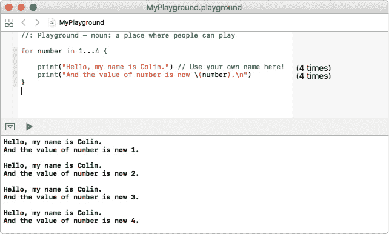
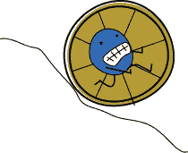
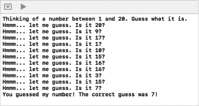
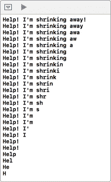
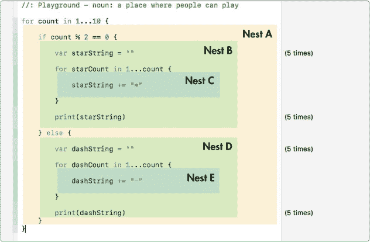
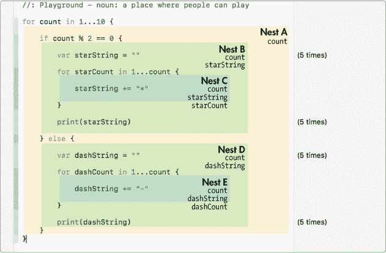
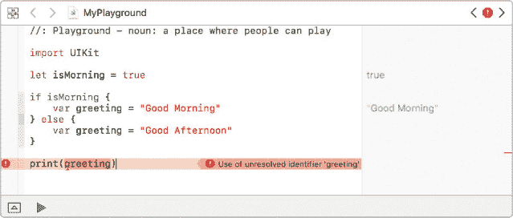

## 第四章：## 编写循环代码


你刚刚学到，条件语句可以根据满足的条件执行不同的代码分支。*循环*是你控制程序顺序的另一种方式。使用循环，你可以告诉计算机执行一段代码若干次。这使得你能够反复使用代码块，而不必每次都重写它们！

在 Swift 中，有两种主要类型的循环：for-in 循环和 while 循环。for-in 循环告诉计算机执行一个确定次数的循环，它在你一开始就知道代码需要重复多少次时非常有用。while 循环则告诉计算机在满足某个条件之前一直重复执行循环，这对于你更关注基于程序中的事件或条件重复代码的情况非常合适。让我们深入了解每种类型的循环，并进一步学习它！

### 打开调试区域

在开始编写循环之前，让我们确保你的 Playground 已经设置好显示调试区域。当你在 Playground 中编写 for-in 循环时，右侧的结果边栏只会告诉你循环执行了多少次。要查看循环的输出，你需要通过选择 **视图** ▸ **调试区域** ▸ **显示调试区域**（⌘ -SHIFT -Y）来显示调试区域。如果这个菜单显示的是“隐藏调试区域”，那说明调试区域已经显示了，你无需做任何操作。

当你显示调试区域时，它默认出现在 Playground 的底部，你可以拖动其上方的分隔线来调整其高度。

### 使用 FOR-IN 遍历范围和集合

A for-in 循环告诉计算机遍历一系列数字或集合中的每一项。我们将在第六章中详细讨论集合，但现在可以把集合想象成一组物品——比如一袋弹珠或一箱奖杯。让我们先看看如何遍历一系列数字。


#### 打招呼！

你可以使用 for-in 循环告诉计算机类似这样的意思：“我想让这段代码执行 4 次。”要做到这一点，你首先写上 for 关键字，后面跟一个变量来计数循环执行了多少次，然后是 in 关键字，最后是你希望循环遍历的数字范围。让我们编写一个简单的 for-in 循环，打印你的名字 4 次：

```
for
 ➊
 number in
 ➋
 1...4
 {

    print
 ("Hello, my name is Colin."
 ) // Use your own name here!

}
```

for-in 循环以关键字 for 开始，后面跟着一个变量 ➊，它将用作计数器来遍历数字范围。我们将计数器变量命名为 number，但你可以给这个变量任何你想要的名字。计数器变量后面跟着关键字 in。这个关键字告诉计算机期望一个整数范围。在 in 后，我们提供了一个我们希望 for-in 循环使用的范围 1...4 ➋。这叫做从 1 到 4 的 *闭区间*，它表示计数从 1 开始，到 4 结束。三点符号（...）是 *闭区间运算符*。

让我们在 for-in 循环中添加一行，这样我们就能看到 number 从 1 增加到 4。将以下代码行添加到循环中打印你名字的那一行后面：

```
print
 ("And the value of number is now
 ➊
 \(
 number).
 ➋
 \n"
 )
```

在 for-in 循环内部，我们像使用任何其他变量一样使用 number。这个语句打印一个包含 number 值的字符串。要将变量和常量嵌入到字符串中，你输入一个反斜杠，然后在括号内输入你想要打印的变量或常量，就像我们在 ➊ 处做的那样。这会将变量的值与字符串的其余部分一起打印。很酷吧！

为了使输出更加美观，在➋处我们还在句子的末尾添加了一个空的新行，方法是写下表示新行的特殊字符 \n。当该句子被打印时，计算机不会打印 \n，而是添加一个新行，就像你按下键盘上的 RETURN 或 ENTER 键时一样。

你的屏幕应该看起来像图 4-1。如果你没有看到打印的文本，请确保通过按 ⌘ -SHIFT -Y 打开调试区域。



*图 4-1：for-in 循环的调试区域显示*

for-in 循环将运行 4 次。第一次循环时，number 等于 1；第二次循环时，它等于 2；依此类推，直到最后一次循环时，它等于 4。当 number 达到 1 到 4 的范围的结束时，循环结束。

在 for-in 循环中，当计数器 number 在循环中循环，从 1 增加到 4 时，我们说计数器 *迭代* 了从 1 到 4 的范围。每次运行 for-in 循环中的代码时，我们称之为一次 *迭代*。

你可以更改这些数字以设置不同的范围进行循环。试试看，看看会发生什么！

#### 说早安！

除了遍历数字范围外，for-in 循环对于遍历集合也很有用。在这里，你将使用一个称为 *数组* 的集合。我们将在第六章 中详细讨论数组，但现在你只需要知道数组是存储在常量或变量中的一组项目。当你使用 for-in 循环遍历数组时，你是在告诉计算机“对于数组中的每一项，做某些事情！”让我们编写代码来向孩子们打招呼。

```
➊
 let
 kidsInClass = ["Gretchen"
 , "Kristina"
 , "Jimmy"
 , "Marcus"
 , 

      "Helen"
 , "Eric"
 , "Alex"
 ]

➋
 for
 kidsName in
 kidsInClass
 {

➌
      print
 ("Good Morning
 \(
 kidsName)!"
 )

  }
```

在 ➊ 处，我们创建了一个叫做 kidsInClass 的数组，其中包含七个字符串。方括号告诉计算机我们正在创建一个数组，每个字符串用逗号分隔。(箭头表示长行在页面上换行—你不需要输入箭头。)

要打印“Good Morning *kidsName* !”给每个名字在 kidsInClass 数组中，在 ➋ 处我们写 for kidsName in kidsInClass ，接着是大括号和我们的代码。大括号中的代码会针对数组中的每一项执行一次。这种类型的循环总是遵循格式 for *constantName* in *collectionName* ，其中 *constantName* 是你选择的名字，用来在循环内调用集合中的每个项。

在 ➌ 处，for-in 循环内，我们写下代码来为每个名字打印问候语。为此，我们像使用其他常量一样使用 kidsName。kidsName 只在这个循环的大括号内存在，它临时存储当前孩子的名字，随着 for-in 循环遍历数组。这样，我们可以在循环的每个周期打印每个名字，向大家说早安！


### 使用 while 循环测试条件

当你知道计算机需要做多少次某件事时，使用 for-in 循环非常合适，但有时你可能希望计算机反复执行某个操作，直到满足特定条件。为此，你应该使用 while 循环。

while 循环有两种类型：while 和 repeat-while 。它们都包含在条件为真时会重复执行的代码块。while 循环和 repeat-while 循环的区别在于，while 循环在执行代码块之前检查条件，而 repeat-while 循环在执行代码块之后检查条件。让我们来看一些例子，看看它们如何工作！

#### 猜猜我的数字

while 循环会一直执行某个操作，直到某个条件为真。这对于猜数字游戏非常有效，比如当你想出一个数字，并让朋友猜它是什么，直到他们猜对为止。我们可以写一个程序来实现这一点！你将选择一个 1 到 20 之间的数字，计算机会尝试猜出它是什么。写下以下代码到一个新的 playground 中：

```
➊
 import
 Foundation

  let
 numberIAmThinkingOf = 7

➋
 var
 currentGuess = -1

  print
 ("Thinking of a number between 1 and 20\. Guess what it is."
 )

➌
 while
 ➍
 currentGuess
 != numberIAmThinkingOf
 {

      // Guessing a random number

➎
     currentGuess
 = Int
 (arc4random_uniform
 (20
 )) + 1

      print
 ("Hmmm... let me guess. Is it
 \(
 currentGuess
 )?"
 )

  }

  // The right answer

  print
 ("You guessed my number! The correct guess was
 \(
 currentGuess
 )!"
 )
```

在这个例子中，我们使用了一个特殊的库，叫做 Foundation 框架，它包含了我们需要的函数来生成随机数。为了使用这个库，我们在我们的 playground 顶部写下导入 Foundation 的代码 ➊ 。(我们将在第七章中更详细地讨论函数。)

接下来，我们创建一个常量叫做 numberIAmThinkingOf，并将其设定为 1 到 20 之间的任何数字。然后，在 ➋ 处，我们创建一个变量叫做 currentGuess，代表计算机的猜测，并将其设置为 -1 。将 currentGuess 变量设置为 -1 是一种很好的方式，表示计算机还没有进行猜测。

while 循环从关键字 `while` 开始，在 ➌ 处，后面跟着一个条件 ➍ 。在这个例子中，条件检查当前的 `currentGuess` 是否不等于 `numberIAmThinkingOf` 。如果条件为真，意味着计算机还没有正确猜到我们的秘密数字，while 循环内部的语句就会执行。

因为 while 循环依赖于条件，所以非常重要的一点是，你必须确保在 while 循环内部有某种方式改变条件，否则循环将永远执行下去，永远不会进入程序的下一部分！与 for-in 循环不同，while 循环没有自动增加或减少的计数器，完全由你来控制！



我们在 ➎ 处通过让计算机猜测 1 到 20 之间的新数字，然后将该新数字赋值给 `currentGuess` 来实现这一点。别太担心完全理解那行代码的含义；只需知道 `Int(arc4random_uniform(20))` 会生成一个 0 到 19 之间的随机整数，然后我们在该行末尾加上 `+ 1`，这样就能得到 1 到 20 之间的数字。

如果你发现自己不小心陷入了一个无限循环，最好的方法是通过在 `while` 关键字前加上两个斜杠来将其注释掉。这将停止循环，方便你找出问题所在。

当计算机最终猜到正确的数字时，while 循环结束，并向控制台打印一条友好的信息。输出应该类似于 图 4-2。

当你在 playground 中输入这个程序时，你的循环运行了多少次？它可能与 图 4-2 中的次数不同。这个数字猜测程序是一个使用 while 循环可以做到的例子，而 for-in 循环无法做到。我们无法知道计算机需要多少次随机猜测才能猜中正确的数字，因此不能用 for-in 循环来做这个任务。while 循环允许计算机继续猜测，直到它猜到正确的答案。



*图 4-2：数字猜测程序的输出*

#### 缩小

repeat-while 循环与 while 循环非常相似，只是它的写法不同，并且结束循环的条件是在循环运行后才进行检查的。我们将通过删除句子中的字母直到它消失来测试 repeat-while 循环。

尝试以下代码：

```
  import
 Foundation

  var
 shrinking = "Help! I'm shrinking away!"

➊
 repeat
 {

      print
 (shrinking
 )

      shrinking
 = ➋
 String
 (shrinking
 .characters
 .dropLast
 ())

  }

➌
 while
 shrinking
 .characters
 .count
 > 0

```

在这个例子中，我们需要使用一种方法来截取字符串中的最后一个字符。我们需要使用之前在猜数字游戏中用到的相同的**Foundation**框架，因此在你的 playground 顶部输入 `import Foundation`。


当你的计算机看到一个 repeat-while 循环时，它会执行 repeat 关键字后的代码块 ➊，然后检查 while 关键字后面的条件 ➌ 是否为真。在我们的示例中，我们从创建一个名为 shrink 的字符串变量开始。在 repeat 代码块中，我们打印字符串，然后删除最后一个字符。你不需要记住或理解 dropLast()方法的具体实现；只需知道➋处的代码会删除字符串中的最后一个字符。

我们通过删除最后一个字符并将这个更短的字符串保存在 shrink 变量中，来制作一个更短的字符串。这将更新 shrink 变量的值为新的、更短的字符串。在这种情况下，我们想要不断地删除字符，直到没有字符剩下。所以，我们的 while 循环的条件是，当 shrink 中的字符数量大于 0 时，重复这个过程。要确定字符串中的字符数量，你可以在字符串名称后面输入.characters.count。查看图 4-3 来看看那个不可思议的缩小句子！



*图 4-3：救命！我在缩小！*

### 使用哪个循环？

如你所见，在代码中有多种方式可以创建循环。作为程序员，你可以选择最适合你需求的方式。请记住，通常没有唯一的正确答案，因为根据编写方式，for-in、while 和 repeat-while 循环都可以完成相同的任务。当你不知道循环需要执行多少次时，你可能会选择 while 或 repeat-while 循环，但几乎可以通过 while 循环实现每个 for-in 循环。通常，最好选择你最理解的一种。

如果你认为另一种类型的循环更适合某个特定情况，改变主意并尝试新技巧也是完全可以的。你编写的第一段代码不必是完美的，实际上（即便是经验丰富的程序员）几乎永远也不会完美！但编程的重点是练习和解决问题：写一点代码，看看它如何工作，然后再回来改进它。

### 嵌套和作用域

现在你已经知道如何编写循环和条件语句来做出选择了。你还可以将这些元素几乎以任何你想要的方式组合在一起。例如，你可以在 for-in 循环中放入 if 语句，可以在 if 块中放入 while 循环，或者将一个 for-in 循环放入另一个 for-in 循环中。当你将循环和条件语句组合时，有两个重要概念需要牢记：嵌套和作用域。

#### 代码块的嵌套

当你将一个代码块放在另一个代码块内时，这就叫做*嵌套*。所以，如果你在一个`while`循环中写了一个 if 语句，我们就称它为*嵌套的* if 语句。记住，当我们说*代码块*时，我们指的是在大括号`{}`之间的代码。举个例子，输入以下代码，它将输出一个星号和破折号组成的三角形模式：

```
➊
 for
 count in
 1
 ...10
 {

      // NEST A

➋
     if
 count % 2
 == 0
 {

         // NEST B

         var
 starString = ""

➌
         for
 starCount in
 1
 ...count {

             // NEST C

             starString += "*"

         }

➍
         print
 (starString)

➎
     } else
 {

         // NEST D

         var
 dashString = ""

         for
 dashCount in
 1
 ...count {

             // NEST E

             dashString += "-"

         }

         print
 (dashString)

     }

  }
```

看一看图 4-4。我们为 Xcode 添加了一些颜色，帮助你看清每个嵌套的代码块。

你可以根据需要嵌套任意数量的代码块。在这个例子中，我们将每个代码块分别称为 Nest A、Nest B、Nest C，依此类推。正如你在图 4-4 中看到的，我们的程序包含一个最外层的 Nest A，它包含了`for count in 1...10`语句内的所有代码。Nest A 包含两个嵌套的代码块，Nest B 和 Nest D。每个嵌套的代码块中也包含一个嵌套：Nest C 位于 Nest B 内，而 Nest E 位于 Nest D 内。



*图 4-4：一个嵌套的 if-else 语句与嵌套的 for-in 循环*

现在让我们深入代码，看看发生了什么。在 ➊ 位置，有一个最外层的`for-in`循环，我们称之为 Nest A，它会运行 10 次，count 从 1 增加到 10。在那个`for-in`循环内部，在 ➋ 位置有一个嵌套的 if-else 语句，它会检查 count 是偶数还是奇数。那个 if 语句包含了 Nest B。为了检查一个数是否是偶数，我们使用模运算符（%），它告诉我们当一个整数被另一个整数除时，余数是多少。如果一个数除以 2 的余数是 0，那么它一定是偶数。因此，为了判断 count 是否是偶数，我们检查是否 `count % 2 == 0`。

如果 count 是偶数，我们打印一串星号（*）。我们使用 count 来决定打印多少个星号。我们通过创建一个空的 starString 字符串，并使用一个嵌套的`for-in`循环，Nest C，在 ➌ 位置每次让 starCount 从 1 迭代到 count 时，添加一个星号。在嵌套的`for-in`循环结束后，在 ➍ 位置我们打印我们的 starString，它现在包含了 count 个星号。我们打印一个嵌套的 else 语句 ➎，我们称之为 Nest D。当 count 为奇数时，我们按照 Nest E 中的指示，打印出一串破折号而不是星号。

#### 常量和变量的作用域

在编程中，变量有*作用域*，作用域指的是变量存在的位置以及可以使用它的地方。当你在嵌套的代码块内声明一个常量或变量时，该常量或变量在外部是不存在的。这意味着它的作用域仅限于它所在的代码块以及该代码块内的所有嵌套代码。图 4-5 展示了我们嵌套代码中变量的作用域。



*图 4-5：变量或常量的作用域仅限于其声明所在的嵌套块，以及该嵌套块中所有嵌套的代码。*

在我们的程序中声明了五个变量：count、starString、starCount、dashString 和 dashCount。最外层的嵌套，Nest A，只能看到 count。它无法访问其内部嵌套代码块中的任何变量或常量，这意味着你不能使用在 Nest B 或 C 中声明的变量或常量。变量 starString 在 Nest B 中声明。因此，Nest B 可以访问 starString 以及在 Nest A 中创建的任何内容，包括 count。Nest C 可以访问 starCount、starString 和 count。类似地，在 else 子句中，Nest D 可以访问 count 和 dashString，Nest E 可以访问 count、dashString 和 dashCount。如果你尝试使用一个块无法访问的变量，因为它在其作用域之外，你将遇到错误。例如，你不能在最外层的 Nest A 中打印 dashString。


让我们看另一个例子。我们将编写代码来创建一个问候语。如果是早晨，我们希望问候语为“Good Morning”。否则，我们希望问候语为“Good Afternoon”。请输入以下代码到你的 playground 中：

```
let
 isMorning = true

if
 isMorning
 {

    var
 greeting = "Good Morning"

} else
 {

    var
 greeting = "Good Afternoon"

}

print
 (greeting
 )
```

当你在这个 if-else 语句之后打印 greeting 时，你会遇到错误，如图 4-6 所示。变量 greeting 超出了 if-else 块的作用域，因此计算机不知道 greeting 是什么。



*图 4-6：尝试在作用域外访问 greeting 会导致错误。*

为了解决这个问题，你必须在 if-else 块外声明 greeting。按照下面的方式重写 greeting 代码以输出问候语：

```
  let
 isMorning = true

➊
 var
 greeting = ""

  if
 isMorning
 {

      greeting
 = "Good Morning"

  } else
 {

      greeting
 = "Good Afternoon"

  }

➋
 print
 (greeting
 )
```

这次，我们在 if-else 块之前（在 ➊ 处）声明了 greeting 为空字符串。然后，根据 isMorning 是否为 true 或 false，将 greeting 设置为“Good Morning”或“Good Afternoon”。最后，我们在 ➋ 处打印 greeting，因为它与打印语句在同一作用域内。

### 你学到了什么

在本章中，你学会了如何使用循环重复代码。你了解了你可以使用 for-in 循环或 while 循环来实现许多相同的目标。for-in 循环非常适合循环遍历一组项目并对每个项目执行某些操作，而 while 循环更适用于你不知道循环需要运行多少次的情况。

在第五章中，我们将介绍 Swift 中的一种新变量类型——可选类型（optionals）。可选类型是可以有值也可以没有值的变量。当你需要创建一个变量，但又不知道它的值时，可选类型非常有用。

## 编写循环代码


你刚刚学到，使用条件语句可以根据满足的条件执行不同的代码分支。*循环*是你控制程序执行顺序的另一种方式。通过循环，你可以告诉计算机执行某个代码块若干次。这使得你可以反复使用代码块，而不需要每次都重新编写它们！

在 Swift 中，有两种主要类型的循环：for-in 循环和 while 循环。for-in 循环告诉计算机运行循环一定次数，它在你知道需要多少次重复时非常有用。while 循环告诉计算机不断运行循环，直到满足某个条件，这在你更关心根据程序中的事件或条件来重复代码时非常有用。让我们深入了解每种循环类型，学习更多内容！

### 打开调试区域

在开始编写循环之前，让我们确保你的 playground 已经设置好显示调试区域。当你在 playground 中编写 for-in 循环时，右侧的结果侧边栏仅告诉你循环执行了多少次。要查看循环的输出，你需要通过选择 **视图** ▸ **调试区域** ▸ **显示调试区域** (⌘ -SHIFT -Y) 来显示 playground 的调试区域。如果此菜单显示“隐藏调试区域”，那么调试区域已经显示，你不需要做任何操作。

当你显示调试区域时，它默认会出现在 playground 的底部，你可以拖动它上方的分隔线来调整它的高度。

### 使用 FOR-IN 遍历范围和集合

for-in 循环告诉计算机在一个数字范围内或在集合中的每个项目上运行循环。我们将在第六章中详细讨论集合，但现在可以将集合理解为一组项目——比如一袋弹珠或一箱奖杯。让我们先看看如何遍历一个数字范围。


#### 打个招呼！

你可以使用 for-in 循环告诉计算机类似于“我想运行这段代码 4 次”。为此，你需要编写 for 关键字，后面跟着一个计数循环执行次数的变量，然后是 in 关键字，最后是你希望循环遍历的数字范围。让我们编写一个简单的 for-in 循环，打印你的名字 4 次：

```
for
 ➊
 number in
 ➋
 1...4
 {

    print
 ("Hello, my name is Colin."
 ) // Use your own name here!

}
```

for-in 循环以关键字 for 开始，后面跟着一个变量 ➊，它将用作计数器，用来遍历数字范围。我们将计数器变量命名为 number，但你可以为这个变量取任何你喜欢的名字。在计数器变量后面是关键字 in。这个关键字告诉计算机预期一个整数范围。在 in 后面，我们提供想要 for-in 循环使用的范围 1...4 ➋。这是一个从 1 到 4 的*闭区间*，表示计数从 1 开始，直到 4 结束。三个点符号（...）是*闭区间运算符*。

让我们在 for-in 循环中添加一行代码，这样我们就可以看到 number 从 1 到 4 是如何变化的。在打印你名字的那行代码之后，添加以下代码：

```
print
 ("And the value of number is now
 ➊
 \(
 number).
 ➋
 \n"
 )
```

在 for-in 循环内部，我们像使用任何其他变量一样使用 number。此语句打印包含 number 值的字符串。要将变量和常量嵌入字符串中，你只需要输入反斜杠，然后在括号中输入你想要打印的变量或常量，就像我们在 ➊ 所做的那样。这会将变量的值与字符串的其余部分一起打印出来。非常酷吧！

为了使输出更漂亮，在 ➋ 我们还在句子的末尾添加了一个空的新行，通过写特殊字符 `\n` 来实现。当那句话被打印时，计算机会不打印 `\n`，而是换行，就像你按下 RETURN 或 ENTER 键时那样。

你的屏幕应该显示像图 4-1 那样。如果你没有看到打印的文本，请确保调试区域已打开，按下 ⌘ -SHIFT -Y。


*图 4-1：for-in 循环的调试区域显示*

for-in 循环将执行 4 次。第一次循环时，number 等于 1；第二次循环时，number 等于 2；依此类推，直到最后一次循环，number 等于 4。当 number 达到范围 1 到 4 的末尾时，循环结束。

在 for-in 循环中，当计数器 number 在循环中从 1 增加到 4 时，我们说计数器 *遍历* 从 1 到 4 的范围。每次 for-in 循环中的代码运行时，我们称之为一次 *迭代*。

你可以改变这些数字来设置不同的循环范围。试试看，看看会发生什么！

#### 早上好！

除了遍历数字范围外，for-in 循环还可以用于遍历集合。在这里，你将使用一个叫做 *数组* 的集合。我们将在第六章 中更详细地讨论数组，但现在你只需要知道数组是存储在常量或变量中的项目列表。当你使用 for-in 循环遍历数组时，你是在告诉计算机“对数组中的每一项执行某些操作！”让我们编写代码来向孩子们问好。

```
➊
 let
 kidsInClass = ["Gretchen"
 , "Kristina"
 , "Jimmy"
 , "Marcus"
 , 

      "Helen"
 , "Eric"
 , "Alex"
 ]

➋
 for
 kidsName in
 kidsInClass
 {

➌
      print
 ("Good Morning
 \(
 kidsName)!"
 )

  }
```

在 ➊，我们创建了一个名为 kidsInClass 的数组，包含七个字符串。方括号告诉计算机我们正在创建一个数组，数组中的每个字符串之间用逗号分隔。（箭头表示长行已在页面上换行——你不需要输入箭头。）

为了打印每个名字的 “早上好 *kidsName* !”，在 ➋ 我们写 `for kidsName in kidsInClass`，然后是花括号和我们的代码。花括号中的代码会对数组中的每一项运行一次。这种循环始终遵循格式 `for *constantName* in *collectionName*`，其中 *constantName* 是你选择的名称，用于在循环中调用集合中的每一项。

在➌处，在 for-in 循环内部，我们编写代码以打印每个名字的问候语。为此，我们像使用任何其他常量一样使用 kidsName。kidsName 仅存在于此循环的花括号内，并暂时存储当前孩子的名字，在 for-in 循环遍历数组时进行更新。通过这种方式，我们可以在每次循环中打印每个名字，向大家说早安！


### 使用 while 循环测试条件

当你知道计算机需要执行多少次操作时，for-in 循环非常适合，但有时你可能希望计算机不断地执行某个操作，直到满足特定条件。对此，你应该使用 while 循环。

while 循环有两种类型：while 和 repeat-while。它们都包含会反复执行的代码块，只要条件为真。while 循环和 repeat-while 循环的区别在于，while 循环在执行代码块之前检查条件，而 repeat-while 循环在执行代码块之后检查条件。让我们来看一些例子，看看它们如何工作！

#### 猜我的数字

while 循环会一直执行某些操作，直到某个条件为真。这在猜数字游戏中非常有效，比如你想到一个数字，并让朋友猜测它是什么，直到他们猜对为止。我们可以编写一个程序来实现这个功能！你会从 1 到 20 之间选择一个数字，然后计算机将尝试猜测它是什么。请在新的 playground 中编写以下代码：

```
➊
 import
 Foundation

  let
 numberIAmThinkingOf = 7

➋
 var
 currentGuess = -1

  print
 ("Thinking of a number between 1 and 20\. Guess what it is."
 )

➌
 while
 ➍
 currentGuess
 != numberIAmThinkingOf
 {

      // Guessing a random number

➎
     currentGuess
 = Int
 (arc4random_uniform
 (20
 )) + 1

      print
 ("Hmmm... let me guess. Is it
 \(
 currentGuess
 )?"
 )

  }

  // The right answer

  print
 ("You guessed my number! The correct guess was
 \(
 currentGuess
 )!"
 )
```

在这个例子中，我们使用了一个特殊的库，叫做 Foundation 框架，它具有我们需要的功能来生成一个随机数字。要使用这个库，我们需要在 playground 的顶部写上 import Foundation ➊这行代码。（我们将在第七章中详细讨论函数。）

接下来，我们创建一个名为 numberIAmThinkingOf 的常量，并将其设置为 1 到 20 之间的任何数字。然后，在➋处，我们创建一个名为 currentGuess 的变量，用来表示计算机的猜测，并将其设置为-1。将 currentGuess 变量设置为-1 是一个很好的方法，用来表示计算机尚未进行猜测。

while 循环从关键词 while 在➌处开始，接着是一个条件在➍处。在这个例子中，条件检查 currentGuess 是否不等于 numberIAmThinkingOf。如果条件为真，说明计算机还没有正确猜到我们的秘密数字，那么 while 循环内部的语句就会执行。

因为 while 循环依赖于一个条件，所以非常重要的是在 while 循环内部包含某种方式来改变条件，否则它会无限执行下去，永远无法进入程序的下一部分！与 for-in 循环不同，while 循环没有一个自动增加或减少的计数器，控制它的工作完全由你来掌控！


我们在 ➎ 处让计算机猜测一个 1 到 20 之间的新数字，然后将这个新数字放入 currentGuess 中。你无需过于担心完全理解那行代码的细节；只需知道 Int(arc4random_uniform(20)) 会生成一个介于 0 和 19 之间的随机整数，我们在该行的末尾加上 + 1，这样最终得到的数字就在 1 到 20 之间。

如果你发现自己不小心陷入了一个无限循环，最好的做法是通过在 while 关键字前加上两个斜杠来将其注释掉。这样可以停止循环，让你找出问题所在。

当计算机最终猜到正确的数字时，while 循环结束，并且会向控制台打印出一条友好的消息。输出应该类似于图 4-2。

当你将这个程序输入到 playground 中时，你的循环运行了多少次？这个次数很可能与图 4-2 中的次数不同。这个数字猜测程序是一个使用 while 循环的例子，而这种循环是 for-in 循环无法做到的。我们无法知道计算机需要多少次随机猜测才能猜中正确的数字，因此无法用 for-in 循环来实现这一点。while 循环让计算机可以不停地猜测，直到猜出正确的答案。


*图 4-2：数字猜测程序的输出*

#### 缩小吧

repeat-while 循环与 while 循环非常相似，只不过它的写法不同，并且结束循环的条件是在循环执行 *后* 检查的。我们将通过删除一个句子中的字母直到它消失来测试 repeat-while 循环。

尝试以下代码：

```
  import
 Foundation

  var
 shrinking = "Help! I'm shrinking away!"

➊
 repeat
 {

      print
 (shrinking
 )

      shrinking
 = ➋
 String
 (shrinking
 .characters
 .dropLast
 ())

  }

➌
 while
 shrinking
 .characters
 .count
 > 0

```

在这个例子中，我们需要使用一个方法来去掉字符串中的最后一个字符。我们需要使用与猜数字游戏中相同的 Foundation 框架，因此在 playground 顶部输入 import Foundation。（我们将在第八章中更详细地讨论方法。）


当你的计算机看到一个 repeat-while 循环时，它会运行 repeat 关键字后面的代码块 ➊，然后检查 while 关键字后面的条件 ➌ 是否为真。在我们的示例中，我们首先创建了一个名为 shrinking 的变量字符串。在 repeat 块中，我们打印我们的字符串，然后去掉最后一个字符。你不必记住或理解实现这一功能的 dropLast() 方法；只需知道 ➋ 处的代码会从我们的字符串中移除最后一个字符。

我们通过去掉最后一个字符并将这个更短的字符串保存在 shrinking 变量中，来让我们的 shrinking 字符串变得更短。这会将 shrinking 的值更新为新的、更短的字符串。在这种情况下，我们希望不断去除字符，直到没有字符剩下。所以我们的 while 循环的条件是只要 shrinking 中的字符数大于 0，就重复这个过程。要确定字符串中的字符数，可以在字符串名称后输入 .characters.count。查看 图 4-3，看看不可思议的缩短句子！


*图 4-3：救命！我在缩小！*

### 使用哪个循环？

如你所见，你可以通过多种方式在代码中创建循环。由你这个程序员来决定哪种方式适合你需要做的事情。请记住，通常没有唯一正确的答案，因为 for-in、while 和 repeat-while 循环可以做相同的事情，具体取决于它们的写法。当你不知道循环需要运行多少次时，你可能会需要使用 while 或 repeat-while 循环，但你几乎可以用 while 循环完成几乎所有的 for-in 循环。通常最好选择你最理解的那一个。

如果你认为其他类型的循环在特定情况下会更有效，稍后改变主意并尝试新技术也是完全可以的。你写的第一段代码不需要完美，事实上（即使是经验丰富的程序员）它几乎永远不会是完美的！但编码的重点是练习和解决问题：写一点代码，看看它是如何工作的，然后再回来改进它。

### 嵌套和作用域

所以现在你知道如何编写循环和条件语句来做出选择了。你还可以将这些元素几乎以任何你想要的方式组合起来。例如，你可以在 for-in 循环中放入 if 语句，在 if 块中放入 while 循环，或在另一个 for-in 循环中放入 for-in 循环。当你组合循环和条件语句时，有两个重要的概念需要牢记：嵌套和作用域。

#### 代码块的嵌套

当你把一个代码块嵌套在另一个代码块内时，这叫做 *嵌套*。因此，如果你在 while 循环中写一个 if 语句，你就可以称它为 *嵌套的* if 语句。记住，当我们说 *代码块* 时，是指在大括号 {} 之间的代码。作为示例，输入以下代码，它会输出一个由星号和破折号组成的三角形图案：

```
➊
 for
 count in
 1
 ...10
 {

      // NEST A

➋
     if
 count % 2
 == 0
 {

         // NEST B

         var
 starString = ""

➌
         for
 starCount in
 1
 ...count {

             // NEST C

             starString += "*"

         }

➍
         print
 (starString)

➎
     } else
 {

         // NEST D

         var
 dashString = ""

         for
 dashCount in
 1
 ...count {

             // NEST E

             dashString += "-"

         }

         print
 (dashString)

     }

  }
```

看一下 图 4-4。我们为 Xcode 增加了一些颜色，帮助你看到每个嵌套的代码块。

你可以嵌套任意数量的代码块。在这个示例中，我们将每个代码块称为 Nest A、Nest B、Nest C，以此类推。如图 4-4 所示，我们的程序包含一个最外层的 Nest A，它包含了 for count in 1...10 语句中的所有代码。Nest A 包含了两个嵌套的代码块，Nest B 和 Nest D。而这些嵌套代码块中的每一个也包含了一个嵌套：Nest B 中包含了 Nest C，Nest D 中包含了 Nest E。


*图 4-4：一个包含嵌套 for-in 循环的嵌套 if-else 语句*

现在让我们深入代码，看看发生了什么。在➊处，有一个最外层的 for-in 循环，我们称之为 Nest A，它将运行 10 次，当 count 从 1 增加到 10 时。这个 for-in 循环内部，在➋处有一个嵌套的 if-else 语句，它将检查 count 是偶数还是奇数。这个 if 语句包含 Nest B。为了检查一个数字是否为偶数，我们使用模运算符（%），它告诉我们当一个整数被另一个整数除时，余数是多少。如果一个数字除以 2 后余数为 0，那么它必须是一个偶数。因此，为了确定 count 是否为偶数，我们检查 count % 2 == 0。

如果 count 是偶数，我们打印出一串星号（*）。我们用 count 来决定打印多少个星号。我们通过创建一个空的 starString，然后使用嵌套的 for-in 循环（Nest C），在➌处每次 starCount 从 1 迭代到 count 时添加一个星号。当嵌套的 for-in 循环完成后，在➍处我们打印出我们的 starString，它现在包含了 count 个星号。我们打印出一个嵌套的 else 语句➎，我们称之为 Nest D。当 count 是奇数时，我们根据 Nest E 的指示打印出一串破折号，而不是星号。

#### 常量和变量的作用域

在编程中，变量有*作用域*，它指的是变量的存在范围以及它可以在哪些地方使用。当你在嵌套的代码块中声明常量或变量时，该常量或变量在该嵌套代码块外部并不存在。这意味着它的作用域仅限于它被声明的代码块以及该块中的任何嵌套代码。图 4-5 展示了我们嵌套代码中变量的作用域。


*图 4-5：变量或常量的作用域仅限于声明它的嵌套块，以及任何嵌套在该嵌套块中的代码。*

我们的程序中声明了五个变量：count、starString、starCount、dashString 和 dashCount。最外层的嵌套，Nest A，只能看到 count。它无法访问其内部嵌套代码块中的任何变量或常量，这意味着你不能使用在 Nest B 或 C 中声明的变量或常量。变量 starString 在 Nest B 中声明。因此，Nest B 可以访问 starString 以及在 Nest A 中创建的所有内容，包括 count。Nest C 可以访问 starCount、starString 和 count。同样，在 else 分支中，Nest D 可以访问 count 和 dashString，而 Nest E 可以访问 count、dashString 和 dashCount。如果你试图使用一个代码块无法访问的变量，因为它超出了作用域，你将会得到一个错误。例如，你不能在最外层的 Nest A 中打印 dashString。


让我们来看另一个例子。我们将编写一段代码来创建一个问候语。如果是早晨，我们希望问候语是“Good Morning”。否则，我们希望问候语是“Good Afternoon”。在你的 playground 中输入以下代码：

```
let
 isMorning = true

if
 isMorning
 {

    var
 greeting = "Good Morning"

} else
 {

    var
 greeting = "Good Afternoon"

}

print
 (greeting
 )
```

当你在 if-else 语句之后打印 greeting 时，你会得到一个错误，如图 4-6 所示。变量 greeting 位于 if-else 块的作用域外，因此计算机不知道 greeting 是什么。


*图 4-6：尝试在作用域之外访问 greeting 会导致错误。*

为了解决这个问题，你必须在 if-else 块外声明 greeting。按照如下方式重写 greeting 代码以输出问候语：

```
  let
 isMorning = true

➊
 var
 greeting = ""

  if
 isMorning
 {

      greeting
 = "Good Morning"

  } else
 {

      greeting
 = "Good Afternoon"

  }

➋
 print
 (greeting
 )
```

这次，我们在 if-else 块之前声明了 greeting 为空字符串，在➊处。然后，根据 isMorning 是否为 true 或 false，我们将 greeting 设置为“Good Morning”或“Good Afternoon”。最后，在➋处，if-else 块之后，我们打印 greeting，因为它在与 print 语句相同的作用域内声明。

### 你学到的内容

在这一章中，你学会了如何使用循环来重复代码。你了解到，你可以使用 for-in 循环或 while 循环来完成许多相同的目标。for-in 循环非常适合遍历一个集合并对每个项目执行同样的操作，而 while 循环更适合在你不知道循环需要运行多少次的情况下使用。

在第五章中，我们将介绍 Swift 中一种新的变量类型——可选值。可选值是可以有值也可以没有值的变量。当你需要创建一个变量，但还不知道它的值时，可选值非常有用。


你刚刚学到了使用条件语句来根据满足的条件执行不同的代码分支。*循环*是另一种控制程序顺序的方式。通过循环，你可以告诉计算机执行一个代码块多次。这让你能够反复使用代码块，而不需要重新编写它们！

在 Swift 中，有两种主要的循环类型：for-in 循环和 while 循环。for-in 循环告诉计算机循环一定次数，它非常适用于你一开始就知道代码需要重复多少次的情况。while 循环则告诉计算机在满足某个条件之前一直运行循环，它非常适用于你更关心基于程序中的事件或条件来重复执行代码的场景。让我们深入了解每种循环类型，并学习更多内容！

### 打开调试区域

在我们开始编写循环之前，确保你的 playground 已经设置好显示调试区域。当你在 playground 中编写 for-in 循环时，右侧的结果侧边栏仅告诉你循环运行了多少次。要查看循环的输出，你需要通过选择 **视图** ▸ **调试区域** ▸ **显示调试区域**（⌘ -SHIFT -Y）来显示调试区域。如果该菜单显示为“隐藏调试区域”，那么调试区域已经显示，你不需要做任何操作。

当你显示调试区域时，它默认出现在你的 playground 底部，你可以拖动上方的分隔线来调整其高度。

### 通过 for-in 遍历范围和集合

for-in 循环告诉计算机在一系列数字或集合中的每个项上运行循环。我们将在第六章中更详细地讨论集合，但现在，可以把集合想象成一组物品——比如一袋弹珠或一箱奖杯。让我们先来看如何遍历一系列数字。


#### 打招呼！

你可以使用 for-in 循环告诉计算机类似于“我想运行这段代码 4 次”的指令。为此，你写下 for 关键字，后面跟一个变量，用于计数循环运行的次数，再加上 in 关键字，最后是你希望循环遍历的数字范围。让我们写一个简单的 for-in 循环，打印你的名字 4 次：

```
for
 ➊
 number in
 ➋
 1...4
 {

    print
 ("Hello, my name is Colin."
 ) // Use your own name here!

}
```

for-in 循环以关键字 for 开始，后面跟一个变量 ➊，它将用作计数器来遍历数字范围。我们将计数器变量命名为 number，但你可以给这个变量任何你喜欢的名称。在计数器变量后面是 in 关键字。这个关键字告诉计算机预期一个整数范围。在 in 后，我们提供 for-in 循环将使用的范围 1...4 ➋。这叫做从 1 到 4 的 *闭区间*，表示计数从 1 开始，到 4 结束。三个点符号（...）是 *闭区间操作符*。

让我们在 for-in 循环中添加一行代码，这样我们就能看到数字从 1 增加到 4。请在循环内打印你名字的那一行代码之后添加如下内容：

```
print
 ("And the value of number is now
 ➊
 \(
 number).
 ➋
 \n"
 )
```

在 for-in 循环内部，我们像使用任何其他变量一样使用 number。这个语句打印了一个包含 number 值的字符串。要将变量和常量嵌入到字符串中，你只需键入反斜杠，然后在括号中输入你想要打印的变量或常量，就像我们在 ➊ 处所做的那样。这会打印出变量的值以及字符串的其余部分。挺酷的！

为了使输出更美观，在 ➋ 处，我们还在句子的末尾添加了一个空的新行，方法是写入表示新行的特殊字符 \n。当该句子被打印时，计算机不会打印 \n，而是会添加一个新行，就像你按下 RETURN 或 ENTER 键时一样。

你的屏幕应该显示 图 4-1。如果你没有看到打印的文本，请确保通过按 ⌘ -SHIFT -Y 打开调试区域。


*图 4-1：for-in 循环的调试区域显示*

这个 for-in 循环将执行 4 次。第一次循环时，number 的值为 1；第二次循环时，number 的值为 2；依此类推，直到最后一次循环，number 的值为 4。当 number 达到范围 1 到 4 的末尾时，循环结束。

在一个 for-in 循环中，当计数器 number 在循环中从 1 增加到 4 时，我们说计数器 *迭代* 了从 1 到 4 的范围。每次 for-in 循环中的代码被执行时，我们称之为一次 *迭代*。

你可以更改这些数字来设置不同的范围进行循环。试试看，看看会发生什么！

#### 早上好！

除了循环遍历数字范围外，for-in 循环对于遍历集合也非常有用。在这里，你将使用一个名为 *数组* 的集合。我们将在 第六章 中进一步讲解数组，但现在你只需要知道的是，数组是存储在常量或变量中的一组项。当你使用 for-in 循环遍历数组时，你是在告诉计算机：“对于数组中的每个项，做点什么！”让我们写一些代码来问候孩子们。

```
➊
 let
 kidsInClass = ["Gretchen"
 , "Kristina"
 , "Jimmy"
 , "Marcus"
 , 

      "Helen"
 , "Eric"
 , "Alex"
 ]

➋
 for
 kidsName in
 kidsInClass
 {

➌
      print
 ("Good Morning
 \(
 kidsName)!"
 )

  }
```

在 ➊ 处，我们创建了一个名为 kidsInClass 的数组，里面包含了七个字符串。方括号告诉计算机我们正在创建一个数组，数组中的每个字符串由逗号分隔。（箭头表示长行在页面上换行——你不需要输入箭头。）

为了对 kidsInClass 数组中的每个名字打印“Good Morning *kidsName* !”，在 ➋ 处我们写了 `for kidsName in kidsInClass`，后跟花括号和我们的代码。花括号中的代码将为数组中的每个项执行一次。这种类型的循环始终遵循 *constantName* in *collectionName* 的格式，其中 *constantName* 是你选择的用于在循环内调用集合中每一项的名称。

在 ➌ 处，在 for-in 循环内部，我们编写代码打印每个名字的问候语。为此，我们像使用其他常量一样使用 kidsName。kidsName 只在这个循环的花括号内存在，并且它临时存储当前孩子的名字，随着 for-in 循环遍历数组。这样，我们就可以在每次循环时打印每个名字，向每个人道早安！


### 使用 while 循环测试条件

当你知道计算机需要执行某个操作的次数时，for-in 循环是很好的选择，但有时你可能希望计算机重复执行某个操作，直到满足特定条件。为了实现这一点，你应该使用 while 循环。

有两种类型的 while 循环：while 和 repeat-while。两者都包含会重复执行的代码块，只要条件为真。while 循环和 repeat-while 循环的区别在于，while 循环在运行代码块之前检查条件，而 repeat-while 循环在运行代码块之后检查条件。让我们看一些例子，看看它们是如何工作的！

#### 猜我的数字

while 循环会不断执行某个操作，直到特定条件为真。这对于猜数字游戏非常有效，例如，当你想出一个数字并让朋友猜这个数字，直到他们猜对为止。我们可以编写一个程序来实现这个功能！你将选择一个 1 到 20 之间的数字，计算机会尝试猜测它是什么。请在新的 playground 中编写以下代码：

```
➊
 import
 Foundation

  let
 numberIAmThinkingOf = 7

➋
 var
 currentGuess = -1

  print
 ("Thinking of a number between 1 and 20\. Guess what it is."
 )

➌
 while
 ➍
 currentGuess
 != numberIAmThinkingOf
 {

      // Guessing a random number

➎
     currentGuess
 = Int
 (arc4random_uniform
 (20
 )) + 1

      print
 ("Hmmm... let me guess. Is it
 \(
 currentGuess
 )?"
 )

  }

  // The right answer

  print
 ("You guessed my number! The correct guess was
 \(
 currentGuess
 )!"
 )
```

在这个例子中，我们使用了一个特殊的库，叫做 Foundation 框架，它提供了我们需要的函数来创建一个随机数。为了使用这个库，我们在 playground 的顶部写入行 `import Foundation` ➊。（我们将在第七章中更详细地讨论函数。）

接下来，我们创建一个常量叫做 `numberIAmThinkingOf`，并将它设置为 1 到 20 之间的任意数字。然后，在 ➋ 处，我们创建一个变量叫做 `currentGuess` 来代表计算机的猜测，并将其设置为 -1。将 `currentGuess` 变量设置为 -1 是一个好方法，表示计算机还没有猜测过。

while 循环从关键字 `while` 开始，位于 ➌ 处，接着是一个条件，位于 ➍ 处。在这个例子中，条件检查 `currentGuess` 是否不等于 `numberIAmThinkingOf`。如果条件为真，表示计算机还没有正确猜出我们的秘密数字，那么 while 循环中的语句将被执行。

由于 while 循环依赖于条件，因此非常重要的是，你需要在 while 循环内部提供某种方式来改变条件，否则它将无限运行，永远无法进入程序的下一个部分！与 for-in 循环不同，while 循环没有自动增加或减少的计数器。控制它完全取决于你！


我们在 ➎ 处让计算机猜一个 1 到 20 之间的新数字，然后将这个新数字放入 currentGuess。你不必完全理解执行此操作的那一行代码；只需知道 Int(arc4random_uniform(20)) 会生成一个 0 到 19 之间的随机整数，我们在那行代码的末尾加上 + 1，这样我们得到的是一个 1 到 20 之间的数字。

如果你发现自己不小心进入了一个永远运行的循环，最好的做法是通过在 while 关键字前加上两个斜杠来注释掉它。这样会停止循环，方便你找出哪里出了问题。

当计算机最终猜中正确数字时，while 循环结束，并在控制台打印出一条提示信息。输出应该类似于图 4-2。

当你将这个程序输入到一个 playground 中时，你的循环运行了多少次？这个次数很可能与图 4-2 中的不同。这个猜数字程序是使用 while 循环可以做到的，而用 for-in 循环做不到的一个例子。我们无法知道需要多少次随机猜测，直到计算机猜中正确的数字，所以我们不能用 for-in 循环来做这个。while 循环让计算机可以一直猜，直到猜中正确答案。


*图 4-2：数字猜测程序的输出*

#### 收缩

repeat-while 循环与 while 循环非常相似，不同之处在于它的写法不同，而且结束循环的条件是在循环运行*之后*才会检查。我们将通过删除句子中的字母直到它消失来测试 repeat-while 循环。

尝试以下代码：

```
  import
 Foundation

  var
 shrinking = "Help! I'm shrinking away!"

➊
 repeat
 {

      print
 (shrinking
 )

      shrinking
 = ➋
 String
 (shrinking
 .characters
 .dropLast
 ())

  }

➌
 while
 shrinking
 .characters
 .count
 > 0

```

在这个例子中，我们需要使用一种方法来删除字符串中的最后一个字符。我们需要使用在猜数字游戏中使用过的 Foundation 框架，所以在 playground 的顶部输入 import Foundation。（我们将在第八章 中更详细地讨论方法。）


当你的计算机看到 repeat-while 循环时，它会运行 repeat 关键字后面的代码块 ➊，然后检查 while 关键字后面的条件 ➌ 是否为真。在我们的例子中，我们首先创建一个名为 shrinking 的变量字符串。在 repeat 块中，我们打印出字符串，然后切掉最后一个字符。你不需要记住或理解执行此操作的 dropLast() 方法；只需知道 ➋ 处的代码会删除我们字符串中的最后一个字符。

我们通过去掉最后一个字符，并将这个较短的字符串保存在`shrinking`变量中，从而把我们的字符串缩短。这会更新`shrinking`变量的值为新的、更短的字符串。在这种情况下，我们希望不断去除字符，直到没有字符剩下。所以，我们的`while`循环的条件是：只要`shrinking`中的字符数大于 0，就重复这个过程。要确定字符串中的字符数，你可以在字符串名后面输入`.characters.count`。查看图 4-3，看看这个神奇的缩短句子！


*图 4-3：救命！我正在缩小！*

### 使用哪个循环？

如你所见，有多种方法可以在代码中创建循环。选择哪种方法取决于你，作为程序员，需要选择最适合你需求的那一种。请记住，通常没有单一的正确答案，因为`for-in`、`while`和`repeat-while`循环都可以完成相同的任务，具体取决于它们的写法。当你不知道循环需要运行多少次时，你可能会选择`while`或`repeat-while`循环，但几乎每个`for-in`循环都可以通过`while`循环来完成。通常最好选择你最了解的那种。

如果你后来改变主意，认为其他类型的循环可能更适合某个特定情况，尝试使用新的技术也是完全可以的。你写的第一段代码不需要完美，实际上（即使是对于有经验的程序员）它几乎永远也不会完美！但是，编写代码的关键在于练习和解决问题：写一点代码，看看它是如何工作的，然后再回来改进它。

### 嵌套与作用域

现在你知道了如何编写循环和条件语句来做选择。你还可以将这些元素以几乎任何你想要的方式组合。例如，你可以将`if`语句放在`for-in`循环中，将`while`循环放在`if`块中，或者将`for-in`循环嵌套在另一个`for-in`循环中。当你将循环和条件语句结合起来时，有两个重要的概念你需要记住：嵌套和作用域。

#### 嵌套代码块

当你把一个代码块放在另一个代码块里时，这叫做*嵌套*。所以，如果你在`while`循环中写一个`if`语句，你就可以称之为*嵌套*的`if`语句。记住，当我们说*代码块*时，我们指的是位于大括号`{}`之间的代码。例如，输入以下代码，输出一个由星号和破折号组成的三角形图案：

```
➊
 for
 count in
 1
 ...10
 {

      // NEST A

➋
     if
 count % 2
 == 0
 {

         // NEST B

         var
 starString = ""

➌
         for
 starCount in
 1
 ...count {

             // NEST C

             starString += "*"

         }

➍
         print
 (starString)

➎
     } else
 {

         // NEST D

         var
 dashString = ""

         for
 dashCount in
 1
 ...count {

             // NEST E

             dashString += "-"

         }

         print
 (dashString)

     }

  }
```

看看图 4-4。我们为 Xcode 添加了一些颜色，帮助你看到每个嵌套的代码块。

你可以根据需要嵌套任意多的代码块。在这个例子中，我们将每个代码块分别称为 Nest A、Nest B、Nest C 等。如图 4-4 所示，我们的程序包含最外层的 Nest A，它包含了 for count in 1...10 语句内的所有代码。Nest A 包含两个嵌套的代码块，Nest B 和 Nest D。每个嵌套的代码块也包含一个嵌套：Nest B 内部有 Nest C，Nest D 内部有 Nest E。


*图 4-4：带有嵌套 for-in 循环的嵌套 if-else 语句*

现在，让我们深入分析代码，看看发生了什么。在 ➊，有一个最外层的 for-in 循环，我们称之为 Nest A，它将运行 10 次，因为 count 从 1 增加到 10。在这个 for-in 循环内部，在 ➋ 有一个嵌套的 if-else 语句，用来检查 count 是偶数还是奇数。这个 if 语句包含 Nest B。为了检查一个数字是否为偶数，我们使用模运算符（%），它告诉我们当一个整数被另一个整数除时的余数是多少。如果一个数字被 2 除余数为 0，那么它一定是偶数。所以，为了判断 count 是否为偶数，我们检查 count % 2 == 0。

如果 count 是偶数，我们打印一串星号（*）。我们用 count 来确定要打印多少颗星。我们通过创建一个空的 starString，然后在 ➌ 使用嵌套的 for-in 循环 Nest C，每次 starCount 从 1 迭代到 count 时就添加一个星号。嵌套的 for-in 循环结束后，在 ➍ 我们打印 starString，它现在包含 count 数量的星号。我们打印一个嵌套的 else 语句 ➎，它被称为 Nest D。当 count 是奇数时，我们打印一串破折号而不是星号，这是 Nest E 中的指令。

#### 常量和变量的作用域

在编程中，变量有*作用域*，它指的是变量存在的范围以及可以使用变量的地方。当你在嵌套的代码块内部声明常量或变量时，该常量或变量在该嵌套块外部是不存在的。也就是说，它的作用域仅限于声明它的代码块以及该代码块中嵌套的任何代码。图 4-5 展示了我们嵌套代码中变量的作用域。


*图 4-5：变量或常量的作用域仅限于其声明所在的嵌套块以及该嵌套块中的任何代码。*

在我们的程序中声明了五个变量：count、starString、starCount、dashString 和 dashCount。最外层的嵌套，Nest A，只能看到 count。它无法访问其嵌套代码块中的任何变量或常量，这意味着你不能使用在 Nest B 或 Nest C 中声明的变量或常量。变量 starString 在 Nest B 中声明，因此 Nest B 可以访问 starString 以及 Nest A 中创建的任何内容，包括 count。Nest C 可以访问 starCount、starString 和 count。同样，在 else 分支中，Nest D 可以访问 count 和 dashString，而 Nest E 可以访问 count、dashString 和 dashCount。如果你试图使用一个块无法访问的变量，因为它超出了作用域，你会得到一个错误。例如，你不能在最外层的嵌套 Nest A 中打印 dashString。


让我们看另一个例子。我们将编写代码来创建一个问候语。如果是早晨，我们希望问候语是“早上好”。否则，我们希望问候语是“下午好”。在你的 playground 中输入以下代码：

```
let
 isMorning = true

if
 isMorning
 {

    var
 greeting = "Good Morning"

} else
 {

    var
 greeting = "Good Afternoon"

}

print
 (greeting
 )
```

当你在 if-else 语句后打印 greeting 时，会出现错误，如图 4-6 所示。变量 greeting 超出了 if-else 块的作用域，因此计算机不知道 greeting 是什么。


*图 4-6：尝试在作用域外访问 greeting 会导致错误。*

为了解决这个问题，你必须在 if-else 块外声明 greeting。按以下方式重写 greeting 代码以输出问候语：

```
  let
 isMorning = true

➊
 var
 greeting = ""

  if
 isMorning
 {

      greeting
 = "Good Morning"

  } else
 {

      greeting
 = "Good Afternoon"

  }

➋
 print
 (greeting
 )
```

这次，我们在 if-else 块之前，在 ➊ 处声明了 greeting 为一个空字符串。然后，根据 isMorning 是否为真，我们将 greeting 设置为“早上好”或“下午好”。最后，我们在 ➋ 处打印 greeting，位于 if-else 块之后，因为它与 print 语句处于同一作用域。

### 你学到了什么

在本章中，你学习了如何使用循环重复代码。你了解到，可以使用 for-in 循环或 while 循环来完成许多相同的目标。for-in 循环非常适合遍历一组项目，并对每个项目执行相同的操作，而 while 循环则更适合在你不知道循环需要执行多少次时使用。

在第五章中，我们将介绍 Swift 中的一种新变量类型——可选项。可选项是可以有值也可以没有值的变量。当你需要创建一个变量，但还不知道它的值时，可选项非常有用。

你刚刚学到了如何使用条件语句根据满足的条件执行不同的代码分支。*循环*是另一种控制程序顺序的方式。使用循环，你可以告诉计算机执行某段代码任意次数。这让你能够重复使用代码块，而不必每次都重新编写！

在 Swift 中，有两种主要的循环类型：for-in 循环和 while 循环。for-in 循环告诉计算机运行一定次数的循环，当你一开始就知道希望代码重复多少次时，它非常有用。while 循环则告诉计算机不断运行一个循环，直到满足某个条件，这对于你更关心基于程序中的事件或条件来重复代码时非常有用。让我们深入了解每种类型的循环，学习更多内容！

### 打开调试区域

在我们开始编写循环之前，先确保你的 playground 已经设置为显示调试区域。当你在 playground 中编写 for-in 循环时，右侧的结果侧边栏只会告诉你循环执行了多少次。要查看循环的输出，你需要通过选择 **视图** ▸ **调试区域** ▸ **显示调试区域** (⌘ -SHIFT -Y) 来显示 playground 的调试区域。如果此菜单显示为“隐藏调试区域”，则说明调试区域已经显示，你无需做任何操作。

当你显示调试区域时，它默认出现在你的 playground 底部，你可以拖动它上方的分隔线来调整它的高度。

### 通过 for-in 循环遍历范围和集合

for-in 循环告诉计算机在一系列数字范围内或在一个集合中的每个项目上运行循环。我们将在第六章中进一步讨论集合，但现在，暂时把集合看作是一组项目——就像一袋弹珠或一箱奖杯。首先，我们来看如何在数字范围内进行循环。


#### 打个招呼！

你可以使用 for-in 循环告诉计算机类似“我要运行这段代码 4 次”这样的指令。为此，你需要编写关键字 for，后面跟着一个变量用于计数循环执行多少次，然后是 in 关键字，最后是你希望循环遍历的数字范围。让我们编写一个简单的 for-in 循环，打印你的名字 4 次：

```
for
 ➊
 number in
 ➋
 1...4
 {

    print
 ("Hello, my name is Colin."
 ) // Use your own name here!

}
```

for-in 循环以关键字 for 开始，后面跟着一个变量 ➊，它将作为计数器用于遍历数字范围。我们把我们的计数器变量命名为 number，但你可以给这个变量起任何你想要的名字。计数器变量之后是关键字 in。这个关键字告诉计算机期望一个整数范围。在 in 之后，我们提供我们希望 for-in 循环使用的范围，即 1...4 ➋。这被称为从 1 到 4 的*闭区间*，它表示计数从 1 开始，到 4 结束。三个点符号（...）是*闭区间运算符*。

让我们在 for-in 循环中添加一行代码，这样我们就能看到 number 从 1 增加到 4。将以下代码添加到打印你名字的那一行之后：

```
print
 ("And the value of number is now
 ➊
 \(
 number).
 ➋
 \n"
 )
```

在 for-in 循环中，我们像使用任何其他变量一样使用 number。这个语句打印包含 number 值的字符串。要将变量和常量嵌入到字符串中，你需要输入反斜杠，然后输入你想打印的变量或常量名称，就像我们在➊位置做的那样。这会将变量的值与其他字符串一起打印。很酷吧！

为了使输出更美观，在➋位置我们还通过编写换行符号 \n 在句子的末尾添加了一个空行。当句子打印时，计算机不会打印 \n，而是添加一个新行，就像你在键盘上按 RETURN 或 ENTER 键时一样。

你的屏幕应该看起来像图 4-1。如果你没有看到打印的文本，请确保调试区域已开启，可以通过按 ⌘ -SHIFT -Y 来打开。


*图 4-1：for-in 循环的调试区域显示*

for-in 循环将执行 4 次。第一次循环时，number 的值为 1；第二次循环时，值为 2；依此类推，直到最后一次循环，值为 4。当 number 达到范围 1 到 4 的末尾时，循环结束。

在 for-in 循环中，当计数器 number 在循环中进行迭代，从 1 增加到 4 时，我们称计数器*迭代*了从 1 到 4 的范围。每次 for-in 循环中的代码执行时，我们称之为一次*迭代*。

你可以更改这些数字，以设置不同的范围来进行循环。试试看，看看会发生什么！

#### 说早安！

除了循环遍历数字范围，for-in 循环还可用于遍历集合。在这里，你将使用一个名为*数组*的集合。我们将在第六章中深入讨论数组，但目前你只需要知道，数组是存储在常量或变量中的一组项目。当你使用 for-in 循环遍历数组时，你是在告诉计算机：“对于数组中的每个项目，做一些事情！”让我们编写一个代码来向孩子们打招呼。

```
➊
 let
 kidsInClass = ["Gretchen"
 , "Kristina"
 , "Jimmy"
 , "Marcus"
 , 

      "Helen"
 , "Eric"
 , "Alex"
 ]

➋
 for
 kidsName in
 kidsInClass
 {

➌
      print
 ("Good Morning
 \(
 kidsName)!"
 )

  }
```

在➊位置，我们创建了一个名为 kidsInClass 的数组，其中包含七个字符串。方括号告诉计算机我们正在创建一个数组，数组中的每个字符串之间用逗号分隔。（箭头表示长行被换行显示——你不需要输入箭头。）

为了打印“Good Morning *kidsName*！”对每个在 kidsInClass 数组中的名字，在➋位置我们写了 `for kidsName in kidsInClass`，然后是大括号和我们的代码。大括号内的代码会在数组中的每个项目上运行一次。这种类型的循环总是遵循格式 `for *constantName* in *collectionName*`，其中 *constantName* 是你选择的名字，用来代表循环中每个集合项。

在➌处，在 for-in 循环内部，我们编写代码为每个名字打印一个问候语。为此，我们像使用其他常量一样使用 kidsName。kidsName 仅在此循环的花括号内存在，并暂时存储当前孩子的名字，随着 for-in 循环遍历数组。这样，我们可以在每次循环时打印每个名字，祝大家早上好！


### 使用 while 循环测试条件

当你知道计算机需要执行多少次某个操作时，for-in 循环非常合适，但有时你可能希望计算机重复执行某个操作，直到满足特定条件。这时，你应该使用 while 循环。

while 循环有两种类型：while 和 repeat-while。两者都包含一些代码块，这些代码块会在条件为真时重复执行。while 循环和 repeat-while 循环之间的区别在于，while 循环在运行代码块*之前*检查条件，而 repeat-while 循环在运行代码块*之后*检查条件。让我们来看一些例子，看看每种如何工作！

#### 猜我的数字

while 循环会一直执行某个操作，直到某个条件为真。这对于猜数字游戏非常有效，就像你想到一个数字，并让朋友一直猜，直到他们猜对为止。我们可以编写一个程序来实现这一点！你将选择一个 1 到 20 之间的数字，计算机会尝试猜出它是什么。请在新的 playground 中编写以下代码：

```
➊
 import
 Foundation

  let
 numberIAmThinkingOf = 7

➋
 var
 currentGuess = -1

  print
 ("Thinking of a number between 1 and 20\. Guess what it is."
 )

➌
 while
 ➍
 currentGuess
 != numberIAmThinkingOf
 {

      // Guessing a random number

➎
     currentGuess
 = Int
 (arc4random_uniform
 (20
 )) + 1

      print
 ("Hmmm... let me guess. Is it
 \(
 currentGuess
 )?"
 )

  }

  // The right answer

  print
 ("You guessed my number! The correct guess was
 \(
 currentGuess
 )!"
 )
```

在这个例子中，我们使用了一个名为 Foundation 框架的特殊库，它包含我们需要创建随机数的函数。为了使用这个库，我们在 playground 的顶部写入行`import Foundation` ➊。（我们将在第七章中更详细地讨论函数。）

接下来，我们创建一个名为 numberIAmThinkingOf 的常量，并将其设置为 1 到 20 之间的任意数字。然后，在➋处，我们创建一个名为 currentGuess 的变量来表示计算机的猜测，并将其设置为-1。将 currentGuess 变量设置为-1 是一个很好的方式来表示计算机尚未进行猜测。

while 循环从关键词 while 开始，在➌处跟随一个条件，在➍处进行判断。在这种情况下，条件检查 currentGuess 是否不等于 numberIAmThinkingOf。如果条件为真，那意味着计算机仍然没有正确猜出我们的秘密数字，while 循环中的语句会执行。

由于 while 循环依赖于条件，因此非常重要的是你要在 while 循环*内部*包含某种方式来改变条件，否则它会一直运行下去，永远无法进入程序的下一个部分！与 for-in 循环不同，while 循环没有一个自动增加或减少的计数器。控制它的责任在于你！


我们通过在 ➎ 让计算机猜一个新的 1 到 20 之间的数字，然后将这个新数字放入 currentGuess 中来实现这一点。不要太担心完全理解这行代码的作用；只要知道 `Int(arc4random_uniform(20))` 会生成一个 0 到 19 之间的随机整数，而我们在这一行代码的末尾加上了 `+ 1`，这样就能得到一个 1 到 20 之间的数字。

如果你发现自己不小心进入了一个永远运行的循环，最好的办法是通过在 `while` 关键字前面加上两个斜杠来注释掉它。这样就会停止循环，方便你查明出错的原因。

当计算机最终猜中正确的数字时，while 循环结束，并且一个友好的消息会打印到控制台。输出应该像图 4-2 一样。

当你将这个程序输入到 Playground 时，你的循环运行了多少次？它可能和图 4-2 中的次数不同。这个数字猜测程序是 while 循环能做到的，而 for-in 循环做不到的一个例子。我们无法知道计算机需要多少次随机猜测才能猜中正确的数字，因此我们无法使用 for-in 循环来实现这一点。while 循环允许计算机根据需要猜测任意次数，直到得到正确答案。


*图 4-2：数字猜测程序的输出*

#### 缩小消失

repeat-while 循环与 while 循环非常相似，只是它的写法不同，且结束循环的条件是在循环运行*之后*检查的。我们将通过删除句子中的字母，直到它消失，来测试 repeat-while 循环。

尝试以下代码：

```
  import
 Foundation

  var
 shrinking = "Help! I'm shrinking away!"

➊
 repeat
 {

      print
 (shrinking
 )

      shrinking
 = ➋
 String
 (shrinking
 .characters
 .dropLast
 ())

  }

➌
 while
 shrinking
 .characters
 .count
 > 0

```

在这个例子中，我们需要使用一种方法来去掉字符串中的最后一个字符。我们需要使用在猜数字游戏中使用的相同的 Foundation 框架，因此在 Playground 的顶部输入 `import Foundation`。（我们将在第八章中更详细地讨论方法。）


当你的计算机看到 repeat-while 循环时，它会运行 repeat 关键字后面的代码块 ➊，然后检查 while 关键字后面的条件 ➌ 是否为真。在我们的例子中，我们首先创建一个名为 shrinking 的字符串变量。在 repeat 块中，我们打印出我们的字符串，然后去掉最后一个字符。你不需要记住或理解执行这一操作的 `dropLast()` 方法；只需知道 ➋ 这行代码会移除我们字符串中的最后一个字符。

我们通过去掉字符串的最后一个字符来制作一个更短的字符串，然后将这个更短的字符串保存在 shrinking 变量中。这会将 shrinking 的值更新为新的、更短的字符串。在这种情况下，我们希望不断去除字符，直到没有字符剩下。所以我们的 while 循环的条件是：只要 shrinking 中的字符数大于 0，就重复这个过程。要确定字符串中的字符数，可以在字符串名称后输入 .characters.count。查看图 4-3，看看那个不可思议的缩小句子！


*图 4-3：救命！我在缩小！*

### 使用哪个循环？

如你所见，在代码中创建循环有几种方法。由你来决定，作为程序员，你需要选择适合你的需求的那种方法。请记住，通常没有单一的正确答案，因为 for-in、while 和 repeat-while 循环可以做相同的事情，具体取决于它们的写法。当你不知道循环需要执行多少次时，你可能会发现需要使用 while 或 repeat-while 循环，但你几乎可以通过 while 循环完成所有的 for-in 循环。通常，最好选择你最理解的那种。

如果你认为不同类型的循环在特定情况下会更有效，完全可以在以后改变主意并尝试新的技巧。你写的第一段代码不必完美，事实上（即使是对于有经验的程序员）几乎从来不会完美！但是编码的关键是练习和解决问题：写一点代码，看看它如何工作，然后再回去优化它。

### 嵌套和作用域

现在你知道如何编写循环和条件语句来做出选择。你还可以将这些元素以几乎任何你想要的方式结合起来。例如，你可以将 if 语句放在 for-in 循环内，将 while 循环放在 if 块内，或者将 for-in 循环放在另一个 for-in 循环内。当你将循环和条件语句结合时，有两个重要的概念需要记住：嵌套和作用域。

#### 嵌套代码块

当你将一个代码块放在另一个代码块内时，这叫做*嵌套*。因此，如果你在 while 循环中写一个 if 语句，你可以称之为*嵌套*的 if 语句。记住，当我们说*代码块*时，是指在大括号 {} 之间的代码。例如，输入以下代码，它将输出一个星号和破折号组成的三角形模式：

```
➊
 for
 count in
 1
 ...10
 {

      // NEST A

➋
     if
 count % 2
 == 0
 {

         // NEST B

         var
 starString = ""

➌
         for
 starCount in
 1
 ...count {

             // NEST C

             starString += "*"

         }

➍
         print
 (starString)

➎
     } else
 {

         // NEST D

         var
 dashString = ""

         for
 dashCount in
 1
 ...count {

             // NEST E

             dashString += "-"

         }

         print
 (dashString)

     }

  }
```

看一下图 4-4。我们在 Xcode 中添加了一些颜色，帮助你看到每个嵌套的代码块。

你可以根据需要嵌套任意多的代码块。在这个示例中，我们将每个代码块称为 Nest A、Nest B、Nest C 等等。正如你在 图 4-4 中看到的，我们的程序包含一个最外层的 Nest A，它包括了所有在 for count in 1...10 语句内部的代码。Nest A 包含两个嵌套的代码块，Nest B 和 Nest D。而每个嵌套的代码块也包含一个嵌套：Nest B 中有 Nest C，Nest D 中有 Nest E。


*图 4-4：一个包含嵌套 for-in 循环的嵌套 if-else 语句*

现在让我们深入代码，看看发生了什么。在 ➊ 处，有一个最外层的 for-in 循环，我们称之为 Nest A，它将在 count 从 1 增加到 10 时运行 10 次。在这个 for-in 循环内部，在 ➋ 处有一个嵌套的 if-else 语句，用于检查 count 是偶数还是奇数。这个 if 语句包含了 Nest B。要检查一个数字是否为偶数，我们使用取模运算符（%），它告诉我们一个整数除以另一个整数后的余数是什么。如果一个数字除以 2 后余数为 0，那么它一定是偶数。因此，为了确定 count 是否为偶数，我们检查 count % 2 == 0。

如果 count 是偶数，我们打印一个星号字符串（*）。我们使用 count 来决定打印多少个星号。我们通过创建一个空的 starString，然后使用一个嵌套的 for-in 循环（Nest C）在 ➌ 处每次 starCount 从 1 迭代到 count 时，添加一个星号。嵌套的 for-in 循环结束后，在 ➍ 处我们打印我们的 starString，它现在包含了 count 个星号。接着，我们打印一个嵌套的 else 语句 ➎，我们称之为 Nest D。当 count 是奇数时，我们根据 Nest E 的指示打印出一串破折号，而不是星号。

#### 常量和变量的作用域

在编程中，变量有 *作用域*，指的是变量存在的范围以及它可以被使用的地方。当你在一个嵌套的代码块中声明常量或变量时，该常量或变量在该嵌套代码块之外是不存在的。这意味着它的作用域仅限于它所在的代码块以及该代码块中的任何嵌套代码。 图 4-5 展示了我们嵌套代码中变量的作用域。


*图 4-5：变量或常量的作用域仅限于其声明所在的嵌套及嵌套中包含的代码。*

我们的程序中声明了五个变量：`count`、`starString`、`starCount`、`dashString` 和 `dashCount`。最外层的嵌套，A 层，只能访问 `count`。它无法访问其嵌套代码块中的任何变量或常量，这意味着你不能使用在 B 层或 C 层声明的变量或常量。`starString` 变量在 B 层声明，因此 B 层可以访问 `starString` 以及 A 层中创建的任何内容，包括 `count`。C 层可以访问 `starCount`、`starString` 和 `count`。类似地，在 else 语句中，D 层可以访问 `count` 和 `dashString`，E 层可以访问 `count`、`dashString` 和 `dashCount`。如果你尝试在代码块无法访问的情况下使用一个变量（因为它超出了作用域），你将会遇到错误。例如，你不能在最外层的嵌套 A 层中打印 `dashString`。


让我们来看另一个例子。我们将编写一段代码来创建一个问候语。如果是早晨，我们希望问候语是“早上好”。否则，我们希望问候语是“下午好”。请输入以下代码到你的操作区：

```
let
 isMorning = true

if
 isMorning
 {

    var
 greeting = "Good Morning"

} else
 {

    var
 greeting = "Good Afternoon"

}

print
 (greeting
 )
```

当你在 if-else 语句后打印问候语时，会发生错误，如图 4-6 所示。变量问候语在 if-else 语句块的作用域之外，因此计算机无法识别问候语是什么。


*图 4-6：尝试在作用域外访问问候语会导致错误。*

为了解决这个问题，你必须在 if-else 语句块外声明问候语。请按以下方式重写问候语代码，以便输出问候语：

```
  let
 isMorning = true

➊
 var
 greeting = ""

  if
 isMorning
 {

      greeting
 = "Good Morning"

  } else
 {

      greeting
 = "Good Afternoon"

  }

➋
 print
 (greeting
 )
```

这一次，我们在 if-else 语句块之前声明了问候语为一个空字符串，在➊位置。然后，根据 `isMorning` 是否为真，我们将问候语设置为“早上好”或“下午好”。最后，我们在➋位置打印问候语，放在 if-else 语句块之后，因为它在与打印语句相同的作用域内声明。

### 你学到了什么

在本章中，你学习了如何使用循环来重复代码。你了解了可以使用 `for-in` 循环或 `while` 循环来完成许多相同的目标。`for-in` 循环非常适合遍历一组项目并对每个项目执行相同的操作，而 `while` 循环更适合用于你不知道循环需要运行多少次的情况。

在第五章中，我们将介绍 Swift 中一种新的变量类型——可选类型（optionals）。可选类型是可以有值或者没有值的变量。当你需要创建一个变量，但还不知道它的值时，可选类型非常有用。

在 Swift 中，有两种主要的循环类型：for-in 循环和 while 循环。for-in 循环告诉计算机执行一个固定次数的循环，当你一开始就知道需要重复多少次代码时，它非常有用。而 while 循环告诉计算机持续执行循环，直到满足某个条件，当你更关心根据程序中的事件或条件来重复代码时，它非常合适。让我们深入了解每种循环类型，学习更多细节！

### 打开调试区域

在我们开始编写循环之前，先确保你的 Playground 已经设置好显示调试区域。当你在 Playground 中编写 for-in 循环时，右侧的结果侧边栏只会告诉你循环运行了多少次。要查看循环的输出，你需要通过选择 **视图** ▸ **调试区域** ▸ **显示调试区域** (⌘ -SHIFT -Y) 来显示 Playground 的调试区域。如果菜单上显示的是“隐藏调试区域”，说明调试区域已经显示，你无需做任何操作。

当你显示调试区域时，默认情况下它会出现在 Playground 的底部，你可以拖动其上方的分隔线来调整它的高度。

### 通过 for-in 循环遍历范围和集合

for-in 循环告诉计算机在一个数字范围内或在集合中的每一项上运行循环。我们将在第六章中讨论更多关于集合的内容，但现在可以将集合看作是一组物品——比如一袋弹珠或一箱奖杯。让我们先看看如何遍历一个数字范围。


#### 打个招呼！

你可以使用 for-in 循环告诉计算机类似“我想让这段代码执行 4 次”的指令。为此，你需要编写 for 关键字，后跟一个变量来计数循环运行的次数，然后是 in 关键字，最后是你希望循环遍历的数字范围。让我们写一个简单的 for-in 循环，打印你的名字 4 次：

```
for
 ➊
 number in
 ➋
 1...4
 {

    print
 ("Hello, my name is Colin."
 ) // Use your own name here!

}
```

for-in 循环以关键字 for 开始，后跟一个变量 ➊，这个变量将作为计数器，用来遍历数字范围。我们将计数器变量命名为 number，但你可以给这个变量起任何你喜欢的名字。计数器变量后面跟着关键字 in 。这个关键字告诉计算机接下来将会是一个整数范围。在 in 后面，我们提供了我们希望 for-in 循环使用的范围 1...4 ➋ 。这被称为从 1 到 4 的 *闭区间*，表示计数从 1 开始，到 4 结束。三点符号（...）是 *闭区间运算符*。

让我们在 for-in 循环中添加一行代码，这样我们就可以看到数字从 1 到 4 的递增过程。在打印名字的那行代码后，添加以下这一行：

```
print
 ("And the value of number is now
 ➊
 \(
 number).
 ➋
 \n"
 )
```

在 for-in 循环中，我们像使用任何其他变量一样使用 number。这个语句打印一个包含 number 值的字符串。要将变量和常量嵌入字符串中，你输入反斜杠，然后在括号中输入你想打印的变量或常量，就像我们在➊处所做的那样。这样可以将变量的值和其他字符串一起打印出来。挺酷的吧！

为了使输出更加美观，在➋处，我们还通过编写特殊字符`\n`在句子的末尾添加了一个空的新行。当该句子被打印时，计算机不会打印`\n`，而是添加一个新行，就像你按下 RETURN 或 ENTER 键时一样。

你的屏幕应显示类似于图 4-1 的内容。如果你没有看到打印的文本，请确保通过按⌘-SHIFT-Y 打开调试区域。


*图 4-1：for-in 循环的调试区域显示*

for-in 循环将执行 4 次。第一次循环时，number 等于 1；第二次循环时，number 等于 2；以此类推，直到最后一次循环，number 等于 4。当 number 到达范围 1 到 4 的末尾时，循环结束。

在 for-in 循环中，当计数器 number 循环遍历从 1 到 4 的范围时，我们称计数器*迭代*了从 1 到 4 的范围。每次 for-in 循环内的代码执行时，我们称之为一次*迭代*。

你可以更改这些数字来设置不同的循环范围。试试看，看看会发生什么！

#### 说早安！

除了循环遍历数字范围，for-in 循环还用于遍历集合。在这里，你将使用一个叫做*数组*的集合。我们将在第六章中详细讨论数组，但你现在只需要知道数组是一个存储在常量或变量中的项目列表。当你使用 for-in 循环遍历数组时，你是在告诉计算机“对于数组中的每一项，做点什么！”让我们写一些代码来问候孩子们。

```
➊
 let
 kidsInClass = ["Gretchen"
 , "Kristina"
 , "Jimmy"
 , "Marcus"
 , 

      "Helen"
 , "Eric"
 , "Alex"
 ]

➋
 for
 kidsName in
 kidsInClass
 {

➌
      print
 ("Good Morning
 \(
 kidsName)!"
 )

  }
```

在➊处，我们创建了一个名为 kidsInClass 的数组，其中包含七个字符串。方括号告诉计算机我们正在创建一个数组，每个字符串之间用逗号分隔。（箭头表示一行很长，已在页面上换行——你不需要输入箭头。）

为了打印“Good Morning *kidsName*！”对于 kidsInClass 数组中的每个名字，在➋处我们写了`for kidsName in kidsInClass`，然后是大括号和我们的代码。大括号内的代码将对数组中的每一项执行一次。这种类型的循环总是遵循格式`for *constantName* in *collectionName*`，其中*constantName*是你选择的名称，用来表示循环中集合的每一项。

在 ➌ 处，在 for-in 循环内部，我们写入代码为每个名字打印问候语。为此，我们像使用其他常量一样使用 kidsName。kidsName 只在这个循环的括号内存在，并暂时存储当前孩子的名字，随着 for-in 循环遍历数组。这样，我们就可以在每个循环周期中打印每个名字，向大家说早安！


### 使用 while 循环测试条件

for-in 循环非常适合当你知道计算机需要执行多少次操作时，但有时你可能希望计算机不断执行某个操作，直到满足特定条件。为此，你应该使用 while 循环。

while 循环有两种类型：while 和 repeat-while。两者都包含会反复执行的代码块，只要条件为真。while 循环和 repeat-while 循环的区别在于，while 循环会在运行代码块之前检查条件，而 repeat-while 循环会在运行代码块之后检查条件。让我们通过一些示例来看每种方式如何工作！

#### 猜我的数字

while 循环会不断执行某个操作，直到某个条件为真。这对于猜数字游戏非常有效，比如当你想到一个数字，并让朋友猜测直到他们猜对为止。我们可以编写一个程序来实现这个功能！你将选择一个 1 到 20 之间的数字，计算机会尝试猜测它是什么。请在新的 playground 中写入以下代码：

```
➊
 import
 Foundation

  let
 numberIAmThinkingOf = 7

➋
 var
 currentGuess = -1

  print
 ("Thinking of a number between 1 and 20\. Guess what it is."
 )

➌
 while
 ➍
 currentGuess
 != numberIAmThinkingOf
 {

      // Guessing a random number

➎
     currentGuess
 = Int
 (arc4random_uniform
 (20
 )) + 1

      print
 ("Hmmm... let me guess. Is it
 \(
 currentGuess
 )?"
 )

  }

  // The right answer

  print
 ("You guessed my number! The correct guess was
 \(
 currentGuess
 )!"
 )
```

在这个例子中，我们使用了一个名为 Foundation 框架的特殊库，它包含了我们需要创建随机数的函数。要使用这个库，我们在 playground 顶部写入 import Foundation ➊ 这一行。（我们将在第七章 中更详细地讨论函数。）

接下来，我们创建一个名为 numberIAmThinkingOf 的常量，并将其设置为 1 到 20 之间的任意数字。然后，在 ➋ 处，我们创建一个名为 currentGuess 的变量来表示计算机的猜测，并将其设置为 -1。将 currentGuess 变量设置为 -1 是一个很好的方法，表示计算机还没有进行猜测。

while 循环以关键字 while 开始，在 ➌ 处，后面跟着一个条件，在 ➍ 处。在这个例子中，条件检查 currentGuess 是否不等于 numberIAmThinkingOf。如果条件为真，意味着计算机还没有正确猜出我们的秘密数字，while 循环内部的语句就会执行。

由于 while 循环依赖于条件，所以非常重要的是你需要在 while 循环内部提供某种方式来改变条件，否则它会一直运行，永远无法进入程序的下一个部分！与 for-in 循环不同，while 循环没有一个自动增加或减少的计数器。你需要自己控制它！


我们在 ➎ 处通过让计算机猜一个介于 1 和 20 之间的新数字，然后将这个新数字放入 currentGuess 来实现。你不需要完全理解执行这一操作的代码行；只需知道 Int(arc4random_uniform(20)) 会生成一个介于 0 和 19 之间的随机整数，最后我们在这一行代码末尾加上 + 1，这样就能得到一个介于 1 和 20 之间的数字。

如果你发现自己不小心陷入了一个永远运行的循环，最好的做法是通过在 while 关键字前加上两个斜杠来将其注释掉。这样就能停止循环，方便你查找出错的地方。

当计算机最终猜对正确的数字时，while 循环结束，控制台将打印出一条提示信息。输出应该像 图 4-2 中的那样。

当你将这个程序输入到 Playground 中时，你的循环运行了多少次？这个次数可能与 图 4-2 中的次数不同。这个数字猜测程序就是你可以用 while 循环做的，而用 for-in 循环做不到的一个例子。我们无法预知计算机需要多少次随机猜测才能得到正确的数字，所以无法使用 for-in 循环来做这件事。while 循环让计算机可以不断猜测，直到猜到正确的答案。


*图 4-2：数字猜测程序的输出*

#### 收缩消失

repeat-while 循环与 while 循环非常相似，不同之处在于它的写法不同，并且结束循环的条件是在循环运行*后*检查的。我们将通过删除句子中的字母直到它消失来测试 repeat-while 循环。

尝试以下代码：

```
  import
 Foundation

  var
 shrinking = "Help! I'm shrinking away!"

➊
 repeat
 {

      print
 (shrinking
 )

      shrinking
 = ➋
 String
 (shrinking
 .characters
 .dropLast
 ())

  }

➌
 while
 shrinking
 .characters
 .count
 > 0

```

在这个例子中，我们需要使用一种方法来删除字符串中的最后一个字符。我们需要在猜数字游戏中使用的同一个 Foundation 框架，所以在 Playground 的顶部输入 import Foundation。（我们将在 第八章 中更详细地讨论方法。）


当计算机看到 repeat-while 循环时，它会先执行 repeat 关键字 ➊ 后面的代码块，然后检查 while 关键字 ➌ 后面的条件是否为真。在我们的示例中，我们首先创建一个名为 shrinking 的字符串变量。在 repeat 块中，我们打印这个字符串，然后删除最后一个字符。你不需要记住或理解执行这一操作的 dropLast() 方法；只需知道在 ➋ 处的代码会删除字符串的最后一个字符。

我们通过删除字符串的最后一个字符，来从不断缩小的字符串中制作出更短的字符串，然后将这个更短的字符串保存在 shrinking 变量中。这会更新 shrinking 的值为新的、更短的字符串。在这种情况下，我们希望不断删除字符，直到没有字符剩下。所以，我们的 while 循环的条件是，只要 shrinking 中的字符数量大于 0，就重复这个过程。要确定字符串中的字符数量，你可以在字符串名称后输入 .characters.count。看看图 4-3，看看这个不可思议的缩小句子！


*图 4-3：救命！我在变小！*

### 选择哪种循环？

如你所见，有多种方式可以在代码中创建循环。作为程序员，你可以选择最适合你需求的方式。请记住，通常没有单一的正确答案，因为根据写法的不同，for-in、while 和 repeat-while 循环都可以完成相同的任务。当你不知道循环需要执行多少次时，可能需要使用 while 或 repeat-while 循环，但几乎可以通过 while 循环实现任何 for-in 循环。通常，选择你最理解的循环方式是最好的。

如果你认为另一种循环方式更适合特定情况，完全可以稍后改变主意并尝试新的技术。你编写的第一段代码不必完美，事实上（即使是经验丰富的程序员）几乎永远不会完美！但是编程的重点是练习和解决问题：写一点代码，看看它如何运行，然后再回来改进它。

### 嵌套和作用域

现在你知道如何编写循环和条件语句来做选择了。你也可以几乎以任何方式将这些元素结合起来。例如，你可以将一个 if 语句放在一个 for-in 循环内，或者将一个 while 循环放在一个 if 语句块内，或者将一个 for-in 循环放在另一个 for-in 循环内。当你将循环和条件语句结合时，有两个重要的概念需要牢记：嵌套和作用域。

#### 代码块的嵌套

当你把一个代码块放入另一个代码块中时，这叫做*嵌套*。所以，如果你在 while 循环中写了一个 if 语句，你可以称其为*嵌套的* if 语句。记住，当我们说*代码块*时，我们指的是大括号{}之间的代码。例如，输入以下代码，它会输出一个星号和破折号组成的三角形图案：

```
➊
 for
 count in
 1
 ...10
 {

      // NEST A

➋
     if
 count % 2
 == 0
 {

         // NEST B

         var
 starString = ""

➌
         for
 starCount in
 1
 ...count {

             // NEST C

             starString += "*"

         }

➍
         print
 (starString)

➎
     } else
 {

         // NEST D

         var
 dashString = ""

         for
 dashCount in
 1
 ...count {

             // NEST E

             dashString += "-"

         }

         print
 (dashString)

     }

  }
```

看一下图 4-4。我们在 Xcode 中为你添加了一些颜色，帮助你看到每个嵌套的代码块。

你可以根据需要嵌套任意多的代码块。在这个例子中，我们将每个代码块称为 Nest A、Nest B、Nest C 等等。如图 4-4 所示，我们的程序包含一个最外层的 Nest A，它包含了 for count in 1...10 语句中的所有代码。Nest A 包含两个嵌套代码块，Nest B 和 Nest D。而这些嵌套的代码块中，每个也包含一个嵌套：Nest B 内有 Nest C，Nest D 内有 Nest E。


*图 4-4：包含嵌套 for-in 循环的嵌套 if-else 语句*

现在让我们深入代码，看看发生了什么。在 ➊ 处，有一个最外层的 for-in 循环，我们称之为 Nest A，它将随着 count 从 1 增加到 10 执行 10 次。在这个 for-in 循环内，在 ➋ 处有一个嵌套的 if-else 语句，它将检查 count 是偶数还是奇数。这个 if 语句包含 Nest B。为了检查一个数字是否为偶数，我们使用取余运算符（%），它会告诉我们当一个整数被另一个整数除时的余数。如果一个数字除以 2 后余数为 0，那么它一定是偶数。因此，为了判断 count 是否为偶数，我们检查 count % 2 == 0。

如果 count 是偶数，我们打印出一串星号（*）。我们使用 count 来决定打印多少颗星号。我们通过创建一个空的 starString，然后使用嵌套的 for-in 循环 Nest C（在 ➌ 处）来在 starCount 从 1 遍历到 count 时每次添加一个星号。在嵌套的 for-in 循环完成后，在 ➍ 处我们打印出我们的 starString，它现在包含了 count 个星号。接着我们打印出一个嵌套的 else 语句 ➎，我们称之为 Nest D。当 count 为奇数时，我们打印出一串破折号，而不是星号，这一部分是在 Nest E 中进行的。

#### 常量和变量作用域

在编程中，变量具有*作用域*，它指的是变量存在的范围以及它可以使用的地方。当你在一个嵌套代码块内声明常量或变量时，该常量或变量在嵌套代码块外是不存在的。这意味着它的作用域仅限于声明它的代码块以及该代码块中的任何嵌套代码。图 4-5 显示了我们嵌套代码中的变量作用域。


*图 4-5：变量或常量的作用域仅限于其声明所在的嵌套以及该嵌套中的任何代码。*

我们的程序中声明了五个变量：count、starString、starCount、dashString 和 dashCount。最外层的嵌套块 A 只能访问 count。它无法访问其嵌套代码块中的任何变量或常量，这意味着你不能使用在嵌套块 B 或 C 中声明的变量或常量。变量 starString 在嵌套块 B 中声明。因此，嵌套块 B 可以访问 starString 以及在嵌套块 A 中创建的任何内容，包括 count。嵌套块 C 可以访问 starCount、starString 和 count。类似地，在 else 条件中，嵌套块 D 可以访问 count 和 dashString，嵌套块 E 可以访问 count、dashString 和 dashCount。如果你尝试使用一个代码块无法访问的变量，因为它超出了其作用域，就会出现错误。例如，你不能在最外层的嵌套块 A 中打印 dashString。


让我们来看另一个例子。我们将编写代码来创建一个问候语。如果是早晨，我们希望问候语是“Good Morning”。否则，我们希望问候语是“Good Afternoon”。将以下代码输入到你的 playground 中：

```
let
 isMorning = true

if
 isMorning
 {

    var
 greeting = "Good Morning"

} else
 {

    var
 greeting = "Good Afternoon"

}

print
 (greeting
 )
```

当你在此 if-else 语句后打印 greeting 时，会出现错误，如图 4-6 所示。变量 greeting 超出了 if-else 块的作用域，因此计算机无法识别 greeting 是什么。


*图 4-6：尝试在作用域外访问 greeting 会导致错误。*

为了解决这个问题，你必须在 if-else 块外声明 greeting。将 greeting 代码重写如下，以输出 greeting：

```
  let
 isMorning = true

➊
 var
 greeting = ""

  if
 isMorning
 {

      greeting
 = "Good Morning"

  } else
 {

      greeting
 = "Good Afternoon"

  }

➋
 print
 (greeting
 )
```

这次，我们在 if-else 块之前的 ➊ 处声明了 greeting 为一个空字符串。然后，根据 isMorning 是否为 true 或 false，我们将 greeting 设置为 “Good Morning” 或 “Good Afternoon”。最后，我们在 ➋ 处打印 greeting，因为它在与打印语句相同的作用域内声明。

### 你学到了什么

在本章中，你学习了如何使用循环来重复代码。你了解到可以使用 for-in 循环或 while 循环来完成许多相同的任务。for-in 循环非常适合循环遍历一组项目，并对每个项目执行相同的操作，而 while 循环则更适合在你不知道循环需要运行多少次的情况下使用。

在第五章中，我们将介绍 Swift 中的一种新类型变量——可选类型（optionals）。可选类型是可以有值或没有值的变量。当你需要创建一个变量，但尚不知道其值时，可选类型非常有用。

### 打开调试区域

在我们开始编写循环之前，确保你的 playground 已经设置好显示调试区域。当你在 playground 中编写 for-in 循环时，右侧的结果侧边栏只会告诉你循环运行了多少次。要查看循环的输出，你需要通过选择 **查看** ▸ **调试区域** ▸ **显示调试区域**（⌘-SHIFT-Y）来显示调试区域。如果该菜单显示“隐藏调试区域”，那么调试区域已经显示了，你不需要做任何事情。

当你显示调试区域时，它默认出现在你的 playground 底部，你可以拖动它顶部的分隔线来调整其高度，使其更高或更低。

### 使用 FOR-IN 遍历范围和集合

for-in 循环告诉计算机在一系列数字或集合中的每个项目上运行循环。我们将在第六章中详细讨论集合，但现在可以将集合视为一组物品——比如一袋弹珠或一个奖杯盒。让我们先看看如何遍历数字范围。


#### 打招呼！

你可以使用 for-in 循环告诉计算机类似于“我要运行这段代码 4 次”。为此，你写下关键字 for，后跟一个变量来计算循环运行的次数，然后是 in 关键字，最后是你希望循环遍历的数字范围。让我们写一个简单的 for-in 循环，打印你的名字 4 次：

```
for
 ➊
 number in
 ➋
 1...4
 {

    print
 ("Hello, my name is Colin."
 ) // Use your own name here!

}
```

for-in 循环以关键字 for 开始，后跟一个变量 ➊，这个变量将用作计数器，用于遍历数字范围。我们将计数器变量命名为 number，但你可以给这个变量任何你想要的名字。在计数器变量之后是关键字 in。这个关键字告诉计算机期待一个整数范围。在 in 后，我们提供了 for-in 循环要使用的范围 1...4 ➋。这叫做从 1 到 4 的*闭区间*，表示计数从 1 开始，到 4 结束。三个点符号（...）是*闭区间运算符*。

让我们在 for-in 循环中添加一行代码，以便查看 number 从 1 到 4 是如何增加的。请在打印你的名字的那行代码后面添加以下代码：

```
print
 ("And the value of number is now
 ➊
 \(
 number).
 ➋
 \n"
 )
```

在 for-in 循环中，我们像使用任何其他变量一样使用 number。这个语句打印包含 number 值的字符串。要将变量和常量嵌入字符串中，你需要键入反斜杠，然后在括号中输入你想要打印的变量或常量，就像我们在 ➊ 中做的那样。这将打印变量的值与其他字符串一起。非常酷吧！

为了让输出更美观，在 ➋ 处我们还通过写特殊字符来添加了一个空的新行 \n。打印该句子时，计算机不会打印 \n，而是像按下 RETURN 或 ENTER 键时一样添加一个新行。

你的屏幕应该像图 4-1 一样。如果你没有看到打印的文本，请确保通过按 ⌘ -SHIFT -Y 打开调试区域。


*图 4-1：for-in 循环的调试区域显示*

for-in 循环将运行 4 次。第一次运行时，number 等于 1；第二次运行时，它等于 2；以此类推，直到最后一次循环，它等于 4。当 number 达到范围 1 到 4 的末尾时，循环结束。

在 for-in 循环中，当计数器 number 遍历循环，数字从 1 增加到 4 时，我们说计数器 *迭代* 了从 1 到 4 的范围。每次执行 for-in 循环中的代码时，我们称之为一次 *迭代*。

你可以更改这些数字来设置不同的循环范围。试试看，看看会发生什么！

#### 说早安！

除了遍历数字范围，for-in 循环在遍历集合时也很有用。在这里，你将使用一个名为 *数组* 的集合。我们将在第六章中详细讨论数组，但目前你只需要知道的是，数组是存储在常量或变量中的项目列表。当你使用 for-in 循环遍历数组时，你是在告诉计算机“对于数组中的每个项目，做某事！”让我们写一段代码来向孩子们打招呼。

```
➊
 let
 kidsInClass = ["Gretchen"
 , "Kristina"
 , "Jimmy"
 , "Marcus"
 , 

      "Helen"
 , "Eric"
 , "Alex"
 ]

➋
 for
 kidsName in
 kidsInClass
 {

➌
      print
 ("Good Morning
 \(
 kidsName)!"
 )

  }
```

在 ➊ 处，我们创建了一个名为 kidsInClass 的数组，它包含七个字符串。方括号告诉计算机我们正在创建一个数组，数组中的每个字符串由逗号分隔。（箭头表示一行很长已经换行了——你无需输入箭头。）

为了在 kidsInClass 数组中的每个名字前打印“Good Morning *kidsName* !”，在 ➋ 处我们写 for kidsName in kidsInClass ，然后是花括号和我们的代码。花括号中的代码会为数组中的每个元素执行一次。这类循环总是遵循格式 for *constantName* in *collectionName*，其中 *constantName* 是你选择的名称，用来表示在循环中从集合中获取的每个元素。

在 ➌ 处，在 for-in 循环内部，我们写下代码，为每个名字打印问候语。为此，我们像使用其他常量一样使用 kidsName。kidsName 仅在这个循环的花括号内存在，它暂时存储当前孩子的名字，当 for-in 循环遍历数组时。这样，我们就可以在循环的每个周期中打印每个名字，向每个人说早安！


### 使用 while 循环测试条件

当你知道计算机需要做某件事情多少次时，for-in 循环非常有效，但有时你可能希望计算机反复做某件事，直到满足特定条件。为此，你应该使用 while 循环。

while 循环有两种类型：while 和 repeat-while。它们都包含在条件为真时会反复执行的代码块。while 循环和 repeat-while 循环的区别在于，while 循环在执行代码块之前检查条件，*而*repeat-while 循环在执行代码块之后检查条件。让我们通过一些例子来看它们是如何工作的！

#### 猜我的数字

while 循环会一直执行某些操作，直到某个条件为真。这对于猜数字游戏非常适用，例如，当你想出一个数字并让朋友猜是什么，直到他们猜对为止。我们可以编写一个这样的程序！你将选择一个 1 到 20 之间的数字，而计算机将尝试猜测它是什么。请在新的 playground 中编写以下代码：

```
➊
 import
 Foundation

  let
 numberIAmThinkingOf = 7

➋
 var
 currentGuess = -1

  print
 ("Thinking of a number between 1 and 20\. Guess what it is."
 )

➌
 while
 ➍
 currentGuess
 != numberIAmThinkingOf
 {

      // Guessing a random number

➎
     currentGuess
 = Int
 (arc4random_uniform
 (20
 )) + 1

      print
 ("Hmmm... let me guess. Is it
 \(
 currentGuess
 )?"
 )

  }

  // The right answer

  print
 ("You guessed my number! The correct guess was
 \(
 currentGuess
 )!"
 )
```

在这个例子中，我们使用了一个特殊的库，叫做 Foundation 框架，它包含了我们需要的生成随机数的函数。为了使用这个库，我们在 playground 的顶部写下 import Foundation ➊这一行。（我们将在第七章中更详细地讨论函数。）

接下来，我们创建一个名为 numberIAmThinkingOf 的常量，并将其设置为 1 到 20 之间的任意数字。然后，在➋处，我们创建一个名为 currentGuess 的变量，表示计算机的猜测，并将其设置为-1。将 currentGuess 变量设置为-1 是一种很好的方式，表示计算机还没有做出猜测。

while 循环从关键词 while 开始，在➌处，接着是条件在➍处。在这个例子中，条件检查 currentGuess 是否不等于 numberIAmThinkingOf。如果条件为真，意味着计算机还没有正确猜测我们的秘密数字，那么 while 循环中的语句将会执行。

因为 while 循环依赖于条件，所以非常重要的是，在 while 循环内部包含某种方式来改变条件，*否则*循环会一直运行下去，永远不会进入程序的下一部分！与 for-in 循环不同，while 循环没有自动增加或减少的计数器。必须由你来控制！


我们在➎处通过让计算机猜一个介于 1 和 20 之间的新数字，然后将该新数字放入 currentGuess 来做到这一点。不要太担心完全理解那行代码；只需知道 Int(arc4random_uniform(20))将创建一个 0 到 19 之间的随机整数，我们在那行代码的末尾加上+1，这样就能得到 1 到 20 之间的数字。

如果你发现自己不小心陷入了一个永远运行的循环，最好的做法是通过在 while 关键字前加两个斜杠来注释掉它。这样就能停止循环，让你找出问题所在。

当计算机最终猜对数字时，while 循环结束，并且会在控制台打印出一条友好的消息。输出应该类似于图 4-2。

当你将这个程序输入到 playground 时，你的循环运行了多少次？它的次数可能与图 4-2 中的次数不同。这个数字猜测程序就是一个 while 循环能做到的例子，而 for-in 循环做不到。我们无法知道猜对数字需要多少次随机猜测，因此不能写一个 for-in 循环来实现这个功能。while 循环允许计算机一直猜，直到它猜对为止。


*图 4-2：数字猜测程序的输出*

#### 缩小吧

repeat-while 循环与 while 循环非常相似，区别在于它的写法不同，而且检查结束循环的条件是在循环运行*之后*进行的。我们将通过删除句子中的字母直到它消失来测试 repeat-while 循环。

尝试运行以下代码：

```
  import
 Foundation

  var
 shrinking = "Help! I'm shrinking away!"

➊
 repeat
 {

      print
 (shrinking
 )

      shrinking
 = ➋
 String
 (shrinking
 .characters
 .dropLast
 ())

  }

➌
 while
 shrinking
 .characters
 .count
 > 0

```

在这个示例中，我们需要使用一个方法来去掉字符串中的最后一个字符。我们需要和在猜数字游戏中使用的相同的 Foundation 框架，因此在 playground 的顶部输入 import Foundation。（我们将在第八章中详细讨论方法。）


当你的计算机看到 repeat-while 循环时，它会执行 repeat 关键字后面的代码块 ➊，然后检查 while 关键字后面的条件 ➌ 是否为真。在我们的示例中，我们首先创建一个名为 shrinking 的字符串变量。在我们的 repeat 块中，我们打印出这个字符串，然后删除最后一个字符。你不必记住或理解执行这一操作的 dropLast() 方法；只需要知道 ➋ 处的代码会从我们的字符串中删除最后一个字符。

我们通过去掉最后一个字符并将缩短后的字符串保存在 shrinking 变量中，来从原本的字符串中创建一个更短的字符串。这会将 shrinking 的值更新为新的、更短的字符串。在这种情况下，我们希望不断删除字符，直到没有字符剩下。因此，我们的 while 循环的条件是，只要 shrinking 中的字符数量大于 0，就继续执行这个过程。要确定字符串中的字符数量，可以在字符串名称后输入 .characters.count。查看图 4-3，看看那个令人难以置信的缩短句子！


*图 4-3：救命！我在缩短！*

### 使用哪种循环？

正如你所看到的，你可以用几种方式在代码中创建循环。由你，作为程序员，来选择最适合你需求的方式。请记住，通常没有唯一正确的答案，因为 for-in、while 和 repeat-while 循环可以做相同的事情，具体取决于它们的写法。当你不知道循环需要运行多少次时，可能会发现需要使用 while 或 repeat-while 循环，但几乎所有的 for-in 循环都可以通过 while 循环来完成。通常，最好选择你最理解的那一个。

如果你后来改变主意，觉得使用另一种类型的循环会更适合某个特定情况，那也是完全可以的。你写的第一段代码不必完美，事实上（即便是对有经验的程序员来说）它几乎永远不会完美！但编程的关键是练习和解决问题：写一点代码，看看它如何工作，然后再回来改进它。

### 嵌套和作用域

现在你知道如何编写循环和条件语句来做选择了。你还可以将这些元素以几乎任何你想要的方式组合。例如，你可以将 if 语句嵌套在 for-in 循环中，while 循环嵌套在 if 块中，或者将 for-in 循环嵌套在另一个 for-in 循环中。当你将循环和条件语句结合时，有两个重要的概念需要记住：嵌套和作用域。

#### 嵌套代码块

当你将一个代码块嵌套在另一个代码块内部时，这叫做*嵌套*。比如，如果你在 while 循环中写了一个 if 语句，那就叫做*嵌套*的 if 语句。记住，当我们说*代码块*时，我们指的是在花括号（{}）之间的代码。例如，输入以下代码，它将输出一个星号和破折号组成的三角形图案：

```
➊
 for
 count in
 1
 ...10
 {

      // NEST A

➋
     if
 count % 2
 == 0
 {

         // NEST B

         var
 starString = ""

➌
         for
 starCount in
 1
 ...count {

             // NEST C

             starString += "*"

         }

➍
         print
 (starString)

➎
     } else
 {

         // NEST D

         var
 dashString = ""

         for
 dashCount in
 1
 ...count {

             // NEST E

             dashString += "-"

         }

         print
 (dashString)

     }

  }
```

看看图 4-4。我们在 Xcode 中添加了一些颜色，帮助你看到每个嵌套的代码块。

你可以根据需要嵌套任意多个代码块。在这个示例中，我们将每个代码块分别称为 Nest A、Nest B、Nest C，以此类推。正如你在图 4-4 中看到的，我们的程序包含了最外层的 Nest A，它包括了`for count in 1...10`语句内的所有代码。Nest A 包含了两个嵌套的代码块，Nest B 和 Nest D。而这些嵌套的代码块中，每一个也都包含了一个嵌套：Nest C 位于 Nest B 内部，Nest E 位于 Nest D 内部。


*图 4-4：带有嵌套 for-in 循环的嵌套 if-else 语句*

现在让我们深入研究代码，看看发生了什么。在 ➊ 处，有一个最外层的 for-in 循环，我们称之为 Nest A，它将运行 10 次，count 从 1 增加到 10。在这个 for-in 循环内部，有一个嵌套的 if-else 语句，位于 ➋，它将检查 count 是偶数还是奇数。这个 if 语句包含了 Nest B。为了检查一个数字是否为偶数，我们使用取模运算符（%），它告诉我们当一个整数除以另一个整数时余数是多少。如果一个数字被 2 除并且余数为 0，那么它一定是偶数。所以，为了判断 count 是否为偶数，我们检查 count % 2 == 0。

如果 count 是偶数，我们将打印一串星号（*）。我们使用 count 来决定打印多少颗星。我们通过创建一个空的 starString 并使用一个嵌套的 for-in 循环，Nest C，在 ➌ 处每次 starCount 从 1 遍历到 count 时添加一个星号。嵌套的 for-in 循环结束后，在 ➍ 处我们打印我们的 starString，它现在有 count 个星号。我们打印一个嵌套的 else 语句 ➎，我们称之为 Nest D。当 count 是奇数时，我们按照 Nest E 中的指示，打印出一串破折号，而不是星号。

#### 常量和变量的作用域

在编程中，变量有*作用域*，指的是变量存在的范围以及它可以被使用的地方。当你在嵌套代码块中声明常量或变量时，该常量或变量在外部是不存在的。这意味着它的作用域仅限于声明它的代码块及该代码块中的任何嵌套代码。图 4-5 显示了我们嵌套代码中变量的作用域。


*图 4-5：变量或常量的作用域仅限于声明它的嵌套以及该嵌套中的任何代码。*

我们的程序中声明了五个变量：count、starString、starCount、dashString 和 dashCount。最外层的嵌套，Nest A，只能看到 count。它无法访问其嵌套代码块中的任何变量或常量，这意味着你不能使用在 Nest B 或 C 中声明的变量或常量。变量 starString 在 Nest B 中声明。因此，Nest B 可以访问 starString 以及 Nest A 中创建的任何内容，包括 count。Nest C 可以访问 starCount、starString 和 count。同样，在 else 子句中，Nest D 可以访问 count 和 dashString，而 Nest E 可以访问 count、dashString 和 dashCount。如果你尝试使用一个代码块无法访问的变量，因为它超出了作用域，就会报错。例如，你不能在最外层的嵌套 Nest A 中打印 dashString。


让我们来看另一个例子。我们将编写代码来生成一个问候语。如果是早晨，我们希望问候语为“Good Morning”。否则，我们希望问候语为“Good Afternoon”。在你的 Playground 中输入以下代码：

```
let
 isMorning = true

if
 isMorning
 {

    var
 greeting = "Good Morning"

} else
 {

    var
 greeting = "Good Afternoon"

}

print
 (greeting
 )
```

当你在 `if-else` 语句之后打印 `greeting` 时，你会得到一个错误，如图 4-6 所示。变量 `greeting` 在 `if-else` 语句块的作用域之外，所以计算机不知道 `greeting` 是什么。


*图 4-6：尝试在作用域之外访问 `greeting` 会导致错误。*

为了解决这个问题，你必须在 `if-else` 语句块外部声明 `greeting`。按如下方式重写 `greeting` 代码以输出 `greeting`：

```
  let
 isMorning = true

➊
 var
 greeting = ""

  if
 isMorning
 {

      greeting
 = "Good Morning"

  } else
 {

      greeting
 = "Good Afternoon"

  }

➋
 print
 (greeting
 )
```

这一次，我们在 `if-else` 语句块之前声明了 `greeting` 为一个空字符串，在 ➊ 处。然后，根据 `isMorning` 是 `true` 还是 `false`，我们将 `greeting` 设置为“Good Morning”或“Good Afternoon”。最后，我们在 ➋ 处打印 `greeting`，即在 `if-else` 语句块之后，因为它在与打印语句相同的作用域内声明。

### 你学到了什么

在这一章，你学习了如何使用循环来重复代码。你了解到可以使用 `for-in` 循环或 `while` 循环来完成许多相同的目标。`for-in` 循环非常适合遍历一组项目，并为每个项目执行一项操作，而 `while` 循环更适用于当你不知道循环需要执行多少次时。

在第五章中，我们将介绍一种新的变量类型——可选项（optionals）。可选项是可以有值也可以没有值的变量。当你需要创建一个变量，但还不知道它的值时，可选项非常有用。

在我们开始写循环之前，先确保你的 Playground 已设置好显示调试区域。当你在 Playground 中编写 `for-in` 循环时，右侧的结果侧边栏只会告诉你循环执行了多少次。要查看循环的输出，你需要通过选择 **视图** ▸ **调试区域** ▸ **显示调试区域**（⌘ -SHIFT -Y）来显示 Playground 的调试区域。如果该菜单显示“隐藏调试区域”，那么说明调试区域已经显示，你不需要做任何操作。

当你显示调试区域时，默认情况下它会出现在你的 Playground 底部，你可以拖动其顶部的分隔线来调整它的高度。

### 使用 `for-in` 遍历范围和集合

`for-in` 循环告诉计算机在数字范围内或对集合中的每个项目运行循环。我们将在第六章中详细讲解集合，但现在，你可以将集合理解为一组项目——比如一袋弹珠或一箱奖杯。首先，让我们看看如何遍历一个数字范围。


#### 打招呼！

你可以使用 `for-in` 循环来告诉计算机类似于“我想运行这段代码 4 次”。为此，你需要写出 `for` 关键字，后面跟一个用于计数循环执行次数的变量，然后是 `in` 关键字，最后是你希望循环遍历的数字范围。让我们写一个简单的 `for-in` 循环，将你的名字打印 4 次：

```
for
 ➊
 number in
 ➋
 1...4
 {

    print
 ("Hello, my name is Colin."
 ) // Use your own name here!

}
```

for-in 循环以关键字 for 开始，后面跟一个变量 ➊，这个变量将作为计数器遍历数字范围。我们将计数器变量命名为 number，但你可以为这个变量取任何你喜欢的名字。在计数器变量后是关键字 in。这个关键字告诉计算机，接下来会有一个整数范围。in 后，我们提供了我们希望 for-in 循环使用的范围，1...4 ➋。这被称为一个从 1 到 4 的*闭区间*，它表示计数从 1 开始，直到 4 结束。三个点符号（...）是*闭区间运算符*。

让我们在 for-in 循环中添加一行代码，以便观察数字如何从 1 增加到 4。将以下代码行添加到循环中打印姓名的那一行后面：

```
print
 ("And the value of number is now
 ➊
 \(
 number).
 ➋
 \n"
 )
```

在 for-in 循环内部，我们像使用其他变量一样使用 number。这个语句打印出一个包含 number 值的字符串。要将变量和常量嵌入到字符串中，你只需要键入反斜杠，然后在括号中输入你想打印的变量或常量，就像我们在 ➊ 处所做的那样。这会将变量的值与其余的字符串一起打印出来。很酷吧！

为了让输出看起来更漂亮，在 ➋ 处，我们还在句子的末尾添加了一个空的新行，通过写入表示新行的特殊字符 \n。当该句子被打印时，计算机不会打印 \n，而是会添加一个新行，就像你按下 RETURN 或 ENTER 键时一样。

你的屏幕应该显示如图 4-1 所示。如果没有显示打印的文本，请确保通过按下⌘-SHIFT-Y 来开启调试区域。


*图 4-1：for-in 循环的调试区域显示*

for-in 循环将运行 4 次。第一次循环时，number 的值为 1；第二次循环时，number 为 2；以此类推，直到最后一次循环时，number 的值为 4。当 number 达到 1 到 4 范围的末尾时，循环结束。

在 for-in 循环中，当计数器 number 在循环中增加，从 1 增加到 4 时，我们称计数器*遍历*了从 1 到 4 的范围。每次运行 for-in 循环中的代码时，我们称之为*一次迭代*。

你可以更改这些数字以设置不同的范围进行循环。试试看，看看会发生什么！

#### 早上好！

除了遍历一系列数字，for-in 循环还可以用于遍历集合。在这里，你将使用一个名为*数组*的集合。我们将在第六章中详细讨论数组，但目前你只需要知道数组是一个包含项目的常量或变量。当你使用 for-in 循环遍历数组时，你是在告诉计算机：“对于数组中的每个项目，做一些事情！”让我们编写一个打招呼的代码，向孩子们问好。

```
➊
 let
 kidsInClass = ["Gretchen"
 , "Kristina"
 , "Jimmy"
 , "Marcus"
 , 

      "Helen"
 , "Eric"
 , "Alex"
 ]

➋
 for
 kidsName in
 kidsInClass
 {

➌
      print
 ("Good Morning
 \(
 kidsName)!"
 )

  }
```

在 ➊ ，我们创建了一个名为 kidsInClass 的数组，它包含了七个字符串。方括号告诉电脑我们正在创建一个数组，数组中的每个字符串之间由逗号分隔。（箭头表示长行被换行了——你不需要输入这个箭头。）

为了在 kidsInClass 数组中的每个名字前打印“Good Morning *kidsName* !”，在 ➋ ，我们写下 for kidsName in kidsInClass ，后面跟着大括号和我们的代码。大括号中的代码会为数组中的每个项执行一次。这种类型的循环始终遵循这种格式：for *constantName* in *collectionName* ，其中 *constantName* 是你选择的名称，用于在循环中调用集合中的每个项。

在 ➌ ，在 for-in 循环内部，我们编写代码为每个名字打印问候语。为此，我们像使用其他常量一样使用 kidsName。kidsName 仅在这个循环的大括号内部存在，并且它临时存储当前孩子的名字，在 for-in 循环遍历数组时使用。通过这种方式，我们可以在每次循环时打印每个名字，祝大家早安！


### 使用 while 循环测试条件

当你知道电脑要执行多少次操作时，for-in 循环是非常有用的，但有时你可能希望电脑重复做某件事，直到满足特定条件。为此，你应该使用 while 循环。

while 循环有两种类型：while 和 repeat-while。两者都包含一个代码块，只要条件为真，就会反复执行。while 循环和 repeat-while 循环的区别在于，while 循环会在执行代码块之前检查条件，而 repeat-while 循环会在执行代码块之后检查条件。我们来看一些例子，看看每种循环如何工作！

#### 猜我的数字

while 循环会一直执行某个操作，直到特定条件成立。这对于猜数字游戏非常有效，比如当你想到一个数字并让朋友猜测它，直到他们猜对为止。我们可以写一个程序来实现这个功能！你将选择一个 1 到 20 之间的数字，电脑将尝试猜出它是什么。请在新的 playground 中编写以下代码：

```
➊
 import
 Foundation

  let
 numberIAmThinkingOf = 7

➋
 var
 currentGuess = -1

  print
 ("Thinking of a number between 1 and 20\. Guess what it is."
 )

➌
 while
 ➍
 currentGuess
 != numberIAmThinkingOf
 {

      // Guessing a random number

➎
     currentGuess
 = Int
 (arc4random_uniform
 (20
 )) + 1

      print
 ("Hmmm... let me guess. Is it
 \(
 currentGuess
 )?"
 )

  }

  // The right answer

  print
 ("You guessed my number! The correct guess was
 \(
 currentGuess
 )!"
 )
```

在这个例子中，我们使用了一个名为 Foundation 的特殊库，它具有我们需要的生成随机数的功能。为了使用这个库，我们在 playground 的顶部写下这一行代码：import Foundation ➊。（我们将在第七章中详细讨论函数。）

接下来，我们创建一个名为 numberIAmThinkingOf 的常量，并将其设置为 1 到 20 之间的任意数字。然后，在 ➋ ，我们创建一个名为 currentGuess 的变量来表示计算机的猜测，并将其设置为 -1。将 currentGuess 变量设置为 -1 是一个很好的方法，表示计算机尚未进行猜测。

while 循环从关键词 while 开始，位于 ➌ ，接着是一个条件，位于 ➍ 。在这个例子中，条件检查 `currentGuess` 是否不等于 `numberIAmThinkingOf`。如果条件为真，这意味着计算机仍然没有正确猜出我们的秘密数字，while 循环中的语句将会执行。

因为 while 循环依赖于条件，所以你必须确保在 while 循环*内部*有某种方式改变条件，否则它会永远运行下去，无法进入程序的下一部分！与 for-in 循环不同，while 循环没有自动增加或减少的计数器。你需要自己来控制它！


我们在 ➎ 处这样做：让计算机猜一个 1 到 20 之间的新数字，然后将这个新数字放入 `currentGuess`。不必太担心完全理解执行这行代码的原理；只需知道 `Int(arc4random_uniform(20))` 会生成一个介于 0 和 19 之间的随机整数，接着我们在该行末尾加上 +1，这样最终会得到一个介于 1 到 20 之间的数字。

如果你发现自己不小心陷入了一个永远运行的循环，最好的做法是通过在 while 关键字前加上两个斜杠将其注释掉。这样可以停止循环，让你找出出错的地方。

当计算机最终猜中正确的数字时，while 循环结束，控制台会打印出一条友好的消息。输出应该类似于 图 4-2。

当你将这个程序输入到 playground 时，你的循环运行了多少次？它可能与 图 4-2 中的次数不同。这个数字猜测程序是 while 循环的一个例子，是你无法用 for-in 循环做到的。我们无法知道计算机需要多少次随机猜测才能猜中正确的数字，所以我们不能写一个 for-in 循环来实现这一点。while 循环让计算机可以继续猜测，直到它猜出正确的答案。


*图 4-2：数字猜测程序的输出*

#### SHRINK AWAY

repeat-while 循环与 while 循环非常相似，不同之处在于它的写法不同，而且结束循环的条件在循环执行*之后*才会进行检查。我们将通过删除句子中的字母直到其消失来测试 repeat-while 循环。

尝试以下代码：

```
  import
 Foundation

  var
 shrinking = "Help! I'm shrinking away!"

➊
 repeat
 {

      print
 (shrinking
 )

      shrinking
 = ➋
 String
 (shrinking
 .characters
 .dropLast
 ())

  }

➌
 while
 shrinking
 .characters
 .count
 > 0

```

在这个例子中，我们需要使用一种方法来删除字符串中的最后一个字符。我们需要在猜数字游戏中使用的相同 Foundation 框架，所以在你的 playground 顶部输入 `import Foundation`。 （我们将在 第八章 中更详细地讨论方法。）


当你的计算机看到一个 `repeat-while` 循环时，它会运行 `repeat` 关键字后面的代码块 ➊，然后检查 `while` 关键字后面的条件 ➌ 是否为真。在我们的示例中，我们首先创建一个名为 shrinking 的变量字符串。在 `repeat` 块中，我们打印字符串，然后去掉最后一个字符。你不需要记住或理解实现此功能的 `dropLast()` 方法；只需要知道 ➋ 处的代码会移除字符串的最后一个字符。

我们通过去掉 shrinking 字符串中的最后一个字符并将其保存回 shrinking 变量，来创建一个更短的字符串。这样会将 shrinking 的值更新为新的、更短的字符串。在这种情况下，我们希望不断去除字符，直到没有字符剩下。因此，我们的 `while` 循环的条件是只要 shrinking 中的字符数大于 0，就重复这个过程。要确定字符串中的字符数，可以在字符串名称后输入 `.characters.count`。查看 图 4-3，看看那个令人难以置信的缩短句子！


*图 4-3：救命！我在缩小！*

### 选择使用哪种循环？

如你所见，有几种方法可以在代码中创建循环。由你，程序员来选择最适合你需求的那一个。请记住，通常没有单一的正确答案，因为 `for-in`、`while` 和 `repeat-while` 循环可以根据它们的编写方式做同样的事情。当你不知道循环需要执行多少次时，你可能会发现需要使用 `while` 或 `repeat-while` 循环，但几乎每个 `for-in` 循环都可以通过 `while` 循环来完成。通常最好选择你最理解的那一个。

如果你觉得不同类型的循环对于某个特定情况更有效，完全可以在之后更改思路并尝试新的技术。你写的第一段代码不必完美，实际上（即使是对于经验丰富的程序员来说）它几乎从来不会完美！但编程的要点是练习和解决问题：写一点代码，看看它如何工作，然后再回来改进它。

### 嵌套与作用域

所以现在你知道如何编写循环和条件语句来做出选择了。你也可以以任何你想要的方式将这些元素结合在一起。例如，你可以将 `if` 语句放在 `for-in` 循环内，将 `while` 循环放在 `if` 块内，或者将 `for-in` 循环放在另一个 `for-in` 循环内。当你将循环和条件语句结合使用时，有两个重要概念你需要记住：嵌套和作用域。

#### 嵌套代码块

当你把一个代码块放到另一个代码块内部时，这就叫做*嵌套*。所以，如果你在`while`循环中写了一个`if`语句，你就可以称它为*嵌套的*`if`语句。记住，当我们说*代码块*时，指的是在大括号`{}`之间的代码。例如，输入以下代码，它会输出一个星号和破折号的三角形图案：

```
➊
 for
 count in
 1
 ...10
 {

      // NEST A

➋
     if
 count % 2
 == 0
 {

         // NEST B

         var
 starString = ""

➌
         for
 starCount in
 1
 ...count {

             // NEST C

             starString += "*"

         }

➍
         print
 (starString)

➎
     } else
 {

         // NEST D

         var
 dashString = ""

         for
 dashCount in
 1
 ...count {

             // NEST E

             dashString += "-"

         }

         print
 (dashString)

     }

  }
```

看一下图 4-4。我们在 Xcode 中添加了一些颜色，帮助你看到每个嵌套的代码块。

你可以根据需要嵌套任意多个代码块。在这个例子中，我们将每个代码块称为 Nest A、Nest B、Nest C，依此类推。正如图 4-4 中所示，我们的程序包含最外层的 Nest A，它包括了`for count in 1...10`语句中的所有代码。Nest A 包含了两个嵌套代码块，Nest B 和 Nest D。每个嵌套的代码块也包含了一个嵌套：Nest B 内部有 Nest C，而 Nest D 内部有 Nest E。


*图 4-4：一个嵌套的`if-else`语句和嵌套的`for-in`循环*

现在让我们深入代码，看看发生了什么。在 ➊ 处，有一个最外层的`for-in`循环，我们称之为 Nest A，它会运行 10 次，`count`从 1 增加到 10。在这个`for-in`循环内部，在 ➋ 处有一个嵌套的`if-else`语句，它会检查`count`是偶数还是奇数。这个`if`语句包含了 Nest B。要检查一个数字是否为偶数，我们使用模运算符（%），它告诉我们当一个整数除以另一个整数时余数是多少。如果一个数字被 2 除并且余数是 0，那么它必定是偶数。因此，为了确定`count`是否为偶数，我们检查`count % 2 == 0`。

如果`count`是偶数，我们打印一串星号（*）。我们使用`count`来决定打印多少个星号。我们通过创建一个空的`starString`，然后使用一个嵌套的`for-in`循环（在 ➌ 处）每次迭代`starCount`从 1 到`count`时添加一个星号。嵌套的`for-in`循环完成后，在 ➍ 处我们打印出`starString`，此时它包含了`count`个星号。我们打印一个嵌套的`else`语句 ➎，我们将其称为 Nest D。当`count`是奇数时，我们按照 Nest E 中的指示，打印出一串破折号，而不是星号。

#### 常量和变量作用域

在编程中，变量有*作用域*，它指的是变量的存在范围以及它可以在哪些地方使用。当你在嵌套代码块中声明常量或变量时，该常量或变量在外部代码块中不存在。这意味着它的作用域仅限于声明它的代码块以及该代码块中的任何嵌套代码。图 4-5 展示了我们嵌套代码中变量的作用域。


*图 4-5：变量或常量的作用域仅限于声明它的嵌套块以及该嵌套块中任何嵌套的代码。*

在我们的程序中声明了五个变量：count、starString、starCount、dashString 和 dashCount。最外层的嵌套块 Nest A 只能看到 count。它无法访问其内部嵌套代码块中的任何变量或常量，这意味着你无法使用在 Nest B 或 C 中声明的变量或常量。变量 starString 在 Nest B 中声明。因此，Nest B 可以访问 starString 以及在 Nest A 中创建的任何内容，包括 count。Nest C 可以访问 starCount、starString 和 count。同样，在 else 块中，Nest D 可以访问 count 和 dashString，而 Nest E 可以访问 count、dashString 和 dashCount。如果你尝试使用一个代码块无法访问的变量，因为它超出了其作用域，你将会遇到错误。例如，你不能在最外层的嵌套块 Nest A 中打印 dashString。


让我们看另一个例子。我们将编写代码来创建一个问候语。如果是早晨，我们希望问候语为“Good Morning”。否则，我们希望问候语为“Good Afternoon”。将以下代码输入到你的 Playground 中：

```
let
 isMorning = true

if
 isMorning
 {

    var
 greeting = "Good Morning"

} else
 {

    var
 greeting = "Good Afternoon"

}

print
 (greeting
 )
```

当你在 if-else 语句之后打印 greeting 时，会出现错误，如图 4-6 所示。变量 greeting 超出了 if-else 块的作用域，因此计算机不知道 greeting 是什么。


*图 4-6：尝试在其作用域外访问 greeting 会导致错误。*

要解决这个问题，你必须在 if-else 块外声明 greeting。将 greeting 代码重写如下，以输出问候语：

```
  let
 isMorning = true

➊
 var
 greeting = ""

  if
 isMorning
 {

      greeting
 = "Good Morning"

  } else
 {

      greeting
 = "Good Afternoon"

  }

➋
 print
 (greeting
 )
```

这次，我们在 if-else 块之前声明了 greeting 为空字符串，在 ➊ 处。然后，我们根据 isMorning 是否为 true 或 false，将 greeting 设置为“Good Morning”或“Good Afternoon”。最后，我们在 ➋ 处打印 greeting，在 if-else 块之后，因为它在与打印语句相同的作用域内声明。

### 你学到的内容

在本章中，你学会了如何使用循环来重复代码。你学到可以使用 for-in 循环或 while 循环来实现许多相同的目标。for-in 循环非常适合遍历一个集合并对每个项执行相同的操作，而 while 循环更适合当你不知道循环需要运行多少次时使用。

在第五章中，我们将介绍一种新的 Swift 变量——可选项（optionals）。可选项是可以有值或没有值的变量。当你需要创建一个变量，但还不知道它的值时，可选项非常有用。

当你显示调试区域时，它默认出现在 Playground 的底部，你可以拖动其顶部的分隔线来调整其高度。

### 使用 FOR-IN 遍历范围和集合

for-in 循环告诉计算机遍历一个数字范围或集合中的每个项。我们将在第六章 中进一步讨论集合，但现在，你可以将集合理解为一组物品——比如一袋弹珠或一箱奖杯。让我们先来看如何遍历一个数字范围。


#### 说声你好！

你可以使用 for-in 循环告诉计算机类似于“我想让这段代码执行 4 次”这样的内容。为此，你写出 for 关键字，接着是一个用于计数循环执行次数的变量，然后是 in 关键字，最后是你希望循环遍历的数字范围。让我们编写一个简单的 for-in 循环，打印你的名字 4 次：

```
for
 ➊
 number in
 ➋
 1...4
 {

    print
 ("Hello, my name is Colin."
 ) // Use your own name here!

}
```

for-in 循环以关键字 for 开始，后面跟着一个变量 ➊，该变量将作为计数器遍历数字范围。我们将计数器变量命名为 number，但你可以给这个变量任何你想要的名字。计数器变量后面是关键字 in。这个关键字告诉计算机期待一个整数范围。在 in 后面，我们提供了 for-in 循环将使用的范围 1...4 ➋。这被称为从 1 到 4 的*闭区间*，它表示计数从 1 开始，到 4 结束。三个点符号（...）是*闭区间操作符*。

让我们在 for-in 循环中添加一行，以便查看 number 如何从 1 增加到 4。将以下行添加到循环内打印名字的行之后：

```
print
 ("And the value of number is now
 ➊
 \(
 number).
 ➋
 \n"
 )
```

在 for-in 循环内，我们像使用任何其他变量一样使用 number。这个语句打印一个包含 number 值的字符串。要将变量和常量嵌入字符串中，你需要输入反斜杠，然后输入你想打印的变量或常量，并将其放在括号内，就像我们在 ➊ 处做的那样。这将打印变量的值以及其余的字符串。非常酷！

为了让输出更美观，在 ➋ 处我们还在句子的末尾添加了一个空的新行，通过写入换行符的特殊字符 \n。当打印这句话时，计算机不会打印 \n，而是添加一个新行，就像按下键盘上的 RETURN 或 ENTER 键一样。

你的屏幕应显示类似于图 4-1 的内容。如果你没有看到打印的文本，请确保通过按 ⌘ -SHIFT -Y 打开调试区域。


*图 4-1：for-in 循环的调试区域显示*

for-in 循环将运行 4 次。第一次循环时，number 等于 1；第二次运行时，number 等于 2；依此类推，直到最后一次循环，number 等于 4。当 number 达到范围 1 到 4 的末尾时，循环结束。

在 for-in 循环中，当计数器 number 在循环中依次增加，从 1 增加到 4 时，我们说计数器*迭代*了从 1 到 4 的范围。每次 for-in 循环内的代码执行时，我们称之为一次*迭代*。

你可以更改这些数字来设置不同的范围进行循环。试试看，看看会发生什么！

#### 说早安！

除了循环遍历一系列数字外，for-in 循环还非常适用于遍历集合。在这里，你将使用一个名为*数组*的集合。我们将在第六章中详细讨论数组，但现在你只需要知道的是，数组是存储在常量或变量中的一系列项目。当你使用 for-in 循环遍历数组时，你是在告诉计算机：“对于数组中的每一个项目，做某件事！”让我们编写一段代码来向孩子们打招呼。

```
➊
 let
 kidsInClass = ["Gretchen"
 , "Kristina"
 , "Jimmy"
 , "Marcus"
 , 

      "Helen"
 , "Eric"
 , "Alex"
 ]

➋
 for
 kidsName in
 kidsInClass
 {

➌
      print
 ("Good Morning
 \(
 kidsName)!"
 )

  }
```

在 ➊ 处，我们创建了一个名为 kidsInClass 的数组，它包含七个字符串。方括号告诉计算机我们正在创建一个数组，数组中的每个字符串由逗号分隔。（箭头表示一行过长被换行显示——你无需输入箭头。）

为了打印“Good Morning *kidsName*！”对于 kidsInClass 数组中的每个名字，在 ➋ 处我们写 `for kidsName in kidsInClass`，然后加上大括号和我们的代码。大括号中的代码会在数组中的每个项目上运行一次。这类循环总是遵循格式 `for *constantName* in *collectionName*`，其中 *constantName* 是你选择的名字，用于在循环中表示集合中的每个项目。

在 ➌ 处，for-in 循环内，我们写下打印每个名字的问候语的代码。为此，我们像使用其他常量一样使用 kidsName。kidsName 仅在该循环的大括号内有效，它暂时存储当前孩子的名字，随着 for-in 循环遍历数组。这样，我们可以在每次循环时打印每个名字，向大家说早安！


### 使用 while 循环测试条件

当你知道计算机需要做某件事的次数时，for-in 循环非常适合，但有时你可能希望计算机不断重复做某件事，直到满足特定条件。为此，你应该使用 while 循环。

while 循环有两种类型：while 和 repeat-while。它们都包含会反复执行的代码块，只要条件为真。while 循环和 repeat-while 循环的区别在于，while 循环会在执行代码块之前检查条件，而 repeat-while 循环会在执行代码块之后检查条件。让我们来看一些例子，看看它们是如何工作的！

#### 猜我的数字

while 循环会一直执行某件事，直到某个条件为真。这对于猜数字游戏非常有效，比如当你想一个数字并让朋友猜它是什么，直到他们猜对为止。我们可以编写一个程序来实现这个功能！你将选择一个 1 到 20 之间的数字，计算机将尝试猜出它是什么。在新的 Playground 中写下以下代码：

```
➊
 import
 Foundation

  let
 numberIAmThinkingOf = 7

➋
 var
 currentGuess = -1

  print
 ("Thinking of a number between 1 and 20\. Guess what it is."
 )

➌
 while
 ➍
 currentGuess
 != numberIAmThinkingOf
 {

      // Guessing a random number

➎
     currentGuess
 = Int
 (arc4random_uniform
 (20
 )) + 1

      print
 ("Hmmm... let me guess. Is it
 \(
 currentGuess
 )?"
 )

  }

  // The right answer

  print
 ("You guessed my number! The correct guess was
 \(
 currentGuess
 )!"
 )
```

在这个例子中，我们使用了一个名为 Foundation 框架的特殊库，它包含了我们需要用来生成随机数的功能。为了使用这个库，我们在 playground 的顶部写下了`import Foundation`这一行➊。（我们将在第七章中更详细地讨论函数。）

接下来，我们创建一个名为`numberIAmThinkingOf`的常量，并将它设置为 1 到 20 之间的任何数字。然后，在➋处，我们创建一个名为`currentGuess`的变量来表示计算机的猜测，并将其设置为-1。将`currentGuess`变量设置为-1 是一个很好的方式，表明计算机还没有猜对。

`while`循环在➌处以`while`关键字开始，后面跟着一个条件在➍处。在这种情况下，条件检查`currentGuess`是否不等于`numberIAmThinkingOf`。如果条件为真，这意味着计算机还没有正确猜到我们的秘密数字，那么`while`循环内部的语句会继续执行。

由于`while`循环依赖于条件，因此非常重要的一点是你需要在`while`循环内部包含某种方式来改变条件，否则它会永远运行下去，无法进入程序的下一部分！与`for-in`循环不同，`while`循环没有一个自动增加或减少的计数器。控制循环的关键在于你自己！


我们在➎处通过让计算机猜一个 1 到 20 之间的新数字来完成这个操作，并将该新数字存入`currentGuess`。不用过于担心完全理解那行代码；只需知道`Int(arc4random_uniform(20))`会生成一个 0 到 19 之间的随机整数，我们在该行的末尾加上`+ 1`，这样最终得到的数字就在 1 到 20 之间。

如果你发现自己不小心陷入了一个永远运行的循环，最好的做法是通过在`while`关键字前加上两个斜杠来注释掉它。这样就能停止循环，方便你找出出了什么问题。

当计算机最终猜对了数字，`while`循环结束，并且会向控制台打印出一条漂亮的消息。输出应该类似于图 4-2。

当你把这个程序输入到 playground 时，循环执行了多少次？这可能与图 4-2 中的次数不同。这个数字猜测程序是使用`while`循环实现的一个例子，是你无法通过`for-in`循环做到的。我们无法预测计算机猜对数字所需要的随机猜测次数，所以我们不能使用`for-in`循环来完成此任务。而`while`循环让计算机可以根据需要一直猜，直到猜对为止。


*图 4-2：数字猜测程序的输出*

#### 收缩

repeat-while 循环与 while 循环非常相似，只是它的写法不同，且结束循环的条件是在循环运行 *之后* 检查的。我们将通过删除句子中的字母，直到它消失，来测试 repeat-while 循环。

试试以下代码：

```
  import
 Foundation

  var
 shrinking = "Help! I'm shrinking away!"

➊
 repeat
 {

      print
 (shrinking
 )

      shrinking
 = ➋
 String
 (shrinking
 .characters
 .dropLast
 ())

  }

➌
 while
 shrinking
 .characters
 .count
 > 0

```

在这个例子中，我们需要使用一种方法来去掉字符串的最后一个字符。我们需要使用在猜数字游戏中用到的相同的 Foundation 框架，所以在 Playground 的顶部输入 import Foundation。（我们将在 第八章 中更详细地讨论方法。）


当你的计算机看到 repeat-while 循环时，它会先执行 repeat 关键字后面的代码块 ➊，然后检查 while 关键字后面的条件 ➌ 是否为真。在我们的例子中，我们首先创建一个名为 shrinking 的字符串变量。在我们的 repeat 块中，我们打印出字符串，然后去掉最后一个字符。你不需要记住或理解执行此操作的 dropLast() 方法；只需要知道在 ➋ 处的代码将删除我们字符串的最后一个字符。

我们通过去掉字符串的最后一个字符并将其保存到 shrinking 变量中，来将原本的字符串变成一个更短的字符串。这会更新 shrinking 的值为新的、更短的字符串。在这种情况下，我们希望不断移除字符，直到没有字符剩下。因此，我们的 while 循环的条件是，当 shrinking 中的字符数量大于 0 时，重复此过程。要确定字符串中字符的数量，你可以在字符串名称后输入 .characters.count。查看 图 4-3，看看那个令人惊叹的缩小句子！


*图 4-3：救命！我在缩小！*

### 选择使用哪种循环？

正如你所看到的，有几种方法可以在代码中创建循环。由你作为程序员来选择最适合你需要做的事情的循环。请记住，通常没有单一正确的答案，因为 for-in、while 和 repeat-while 循环可以做相同的事情，具体取决于它们的编写方式。当你不知道循环需要运行多少次时，你可能会发现需要使用 while 或 repeat-while 循环，但几乎可以通过 while 循环实现所有 for-in 循环。通常最好选择你最理解的那个。

如果你认为某种类型的循环在特定情况下效果更好，完全可以稍后改变主意并尝试一种新的技巧。你编写的第一段代码不必完美，事实上（即使是经验丰富的程序员）几乎永远都不完美！但编程的重点是练习和解决问题：编写一些代码，查看它如何工作，然后再回去改进它。

### 嵌套与作用域

现在你知道如何编写循环和条件语句来做出选择了。你还可以根据需要将这些元素以几乎任何方式组合起来。例如，你可以将 if 语句放在 for-in 循环中，将 while 循环放在 if 块中，或者将一个 for-in 循环放在另一个 for-in 循环中。当你将循环和条件语句组合时，有两个重要的概念需要牢记：嵌套和作用域。

#### 嵌套代码块

当你将一个代码块嵌套在另一个代码块中时，这叫做*嵌套*。所以，如果你在一个 while 循环中写一个 if 语句，这就叫做*嵌套的* if 语句。记住，当我们说*代码块*时，是指大括号 {} 之间的代码。例如，输入以下代码，它会输出一个星号和破折号组成的三角形模式：

```
➊
 for
 count in
 1
 ...10
 {

      // NEST A

➋
     if
 count % 2
 == 0
 {

         // NEST B

         var
 starString = ""

➌
         for
 starCount in
 1
 ...count {

             // NEST C

             starString += "*"

         }

➍
         print
 (starString)

➎
     } else
 {

         // NEST D

         var
 dashString = ""

         for
 dashCount in
 1
 ...count {

             // NEST E

             dashString += "-"

         }

         print
 (dashString)

     }

  }
```

看一下图 4-4。我们在 Xcode 中添加了一些颜色，帮助你看到每个嵌套的代码块。

你可以根据需要嵌套任意多的代码块。在这个例子中，我们将每个代码块称为 Nest A、Nest B、Nest C，依此类推。如图 4-4 所示，我们的程序包含一个最外层的 Nest A，它包括所有在 for count in 1...10 语句中的代码。Nest A 包含两个嵌套的代码块，分别是 Nest B 和 Nest D。每个嵌套的代码块还包含一个嵌套：Nest C 位于 Nest B 内部，Nest E 位于 Nest D 内部。


*图 4-4：带有嵌套 for-in 循环的嵌套 if-else 语句*

现在让我们深入看看代码，了解发生了什么。在 ➊ 处，有一个最外层的 for-in 循环，我们称之为 Nest A，它将执行 10 次，count 从 1 增加到 10。在这个 for-in 循环内部，在 ➋ 处有一个嵌套的 if-else 语句，它会检查 count 是偶数还是奇数。这个 if 语句包含了 Nest B。为了检查一个数字是否为偶数，我们使用取模运算符（%），它告诉我们当一个整数除以另一个整数时，余数是多少。如果一个数字除以 2 后余数为 0，那么它一定是偶数。因此，为了确定 count 是否为偶数，我们检查 count % 2 == 0。

如果 count 是偶数，我们会打印一串星号（*）。我们使用 count 来确定打印多少个星号。通过创建一个空的 starString，然后使用嵌套的 for-in 循环 Nest C，在 ➌ 处每次 starCount 从 1 到 count 迭代时添加一个星号。嵌套的 for-in 循环完成后，在 ➍ 处我们打印出 starString，它现在包含了 count 个星号。我们打印出一个嵌套的 else 语句 ➎，我们称之为 Nest D。当 count 为奇数时，我们按照 Nest E 的指示，打印出一串破折号，而不是星号。

#### 常量与变量作用域

在编程中，变量有一个*作用域*，指的是变量存在的地方以及可以使用它的地方。当你在一个嵌套的代码块内声明一个常量或变量时，该常量或变量在嵌套块外不可用。这意味着它的作用域仅限于声明它的代码块以及该块内的任何嵌套代码。图 4-5 展示了我们嵌套代码中变量的作用域。


*图 4-5：变量或常量的作用域仅限于其声明的嵌套块以及该嵌套块中的任何代码。*

我们的程序中声明了五个变量：count、starString、starCount、dashString 和 dashCount。最外层的嵌套，Nest A，只能访问 count。它无法访问嵌套块内部的任何变量或常量，这意味着你不能使用在 Nest B 或 Nest C 中声明的变量或常量。变量 starString 在 Nest B 中声明，因此 Nest B 可以访问 starString 以及 Nest A 中的任何内容，包括 count。Nest C 可以访问 starCount、starString 和 count。类似地，在 else 分支中，Nest D 可以访问 count 和 dashString，而 Nest E 可以访问 count、dashString 和 dashCount。如果你尝试使用一个代码块无法访问的变量，因为它在其作用域外，你将得到一个错误。例如，你不能在最外层的 Nest A 中打印 dashString。


让我们来看另一个例子。我们将编写一段代码来创建一个问候语。如果是早晨，我们希望问候语为“Good Morning”。否则，我们希望问候语为“Good Afternoon”。在你的编程环境中输入以下代码：

```
let
 isMorning = true

if
 isMorning
 {

    var
 greeting = "Good Morning"

} else
 {

    var
 greeting = "Good Afternoon"

}

print
 (greeting
 )
```

当你在这个 if-else 语句之后打印 greeting 时，会得到一个错误，如图 4-6 所示。变量 greeting 超出了 if-else 块的作用域，因此计算机无法识别 greeting。


*图 4-6：尝试在其作用域外访问 greeting 会导致错误。*

为了解决这个问题，你必须在 if-else 块外声明 greeting。按如下方式重写 greeting 代码以输出问候语：

```
  let
 isMorning = true

➊
 var
 greeting = ""

  if
 isMorning
 {

      greeting
 = "Good Morning"

  } else
 {

      greeting
 = "Good Afternoon"

  }

➋
 print
 (greeting
 )
```

这次，我们在 if-else 块之前声明了 greeting 为空字符串，位置在➊处。然后，我们根据 isMorning 的值（true 或 false）将 greeting 设置为“Good Morning”或“Good Afternoon”。最后，我们在➋处打印 greeting，因为它在与打印语句相同的作用域内声明。

### 你学到了什么

在本章中，你学习了如何使用循环重复代码。你学会了可以使用 for-in 循环或 while 循环来实现许多相同的目标。for-in 循环非常适合遍历一组项并对每一项执行某些操作，而 while 循环更适合用于你不知道循环需要执行多少次的情况。

在第五章中，我们将介绍一种新的变量类型——可选值。可选值是可以有值或者没有值的变量。当你需要创建一个变量，但还不知道它的值时，可选值非常有用。

### 使用 FOR-IN 遍历范围和集合

for-in 循环告诉计算机在数字范围内或者集合中的每个项目上运行循环。我们将在第六章中详细讨论集合，但现在，暂时把集合看作一组物品——就像一袋弹珠或一箱奖杯。首先让我们看看如何遍历一个数字范围。


#### 你好！

你可以使用 for-in 循环来告诉计算机类似“我想运行这段代码 4 次”这样的指令。为此，你需要写出 for 关键字，后跟一个变量，用来计数循环运行的次数，再是 in 关键字，最后是你希望循环遍历的数字范围。让我们写一个简单的 for-in 循环，打印你的名字 4 次：

```
for
 ➊
 number in
 ➋
 1...4
 {

    print
 ("Hello, my name is Colin."
 ) // Use your own name here!

}
```

for-in 循环以关键字 for 开始，后面跟一个变量 ➊，它将作为计数器遍历数字范围。我们将计数器变量命名为 number，但你可以给这个变量起任何你喜欢的名字。计数器变量后面是 in 关键字。这个关键字告诉计算机，接下来是一个整数范围。在 in 后面，我们提供了希望 for-in 循环使用的范围 1...4 ➋ 。这被称为从 1 到 4 的*闭区间*，它表示计数从 1 开始，到 4 结束。三点符号（...）是*闭区间运算符*。

让我们在 for-in 循环中添加一行，这样我们就可以看到 number 从 1 到 4 的变化。将以下这一行添加到循环内打印你的名字的那一行后面：

```
print
 ("And the value of number is now
 ➊
 \(
 number).
 ➋
 \n"
 )
```

在 for-in 循环内部，我们像使用其他变量一样使用 number。这个语句打印一个包含 number 值的字符串。要将变量和常量嵌入到字符串中，你只需输入反斜杠，然后在括号中输入你想要打印的变量或常量，就像我们在 ➊ 所做的那样。这会将变量的值与字符串的其余部分一起打印出来。挺酷的！

为了让输出更漂亮，在 ➋ 处我们还在句子的末尾添加了一个空的新行，通过写下表示新行的特殊字符 \n。当打印该句子时，计算机不会打印 \n，而是添加一个新行，就像你在键盘上按下 RETURN 或 ENTER 键一样。

你的屏幕应该看起来像图 4-1。如果没有看到打印的文本，请确保调试区域已打开，可以通过按 ⌘ -SHIFT -Y 来开启。


*图 4-1：for-in 循环的调试区域显示*

for-in 循环将运行 4 次。第一次循环时，number 等于 1；第二次循环时，它等于 2；以此类推，直到最后一次循环时，它等于 4。当 number 达到 1 到 4 的范围的末尾时，循环结束。

在 `for-in` 循环中，当计数器 `number` 循环遍历时，它从 1 增加到 4，我们说计数器 *迭代* 从 1 到 4 的范围。每次 `for-in` 循环中的代码运行时，我们称之为一次 *迭代*。

你可以更改这些数字，以设置不同的范围进行循环。试试看，看看会发生什么！

#### 说早安！

除了循环遍历数字范围，`for-in` 循环还用于遍历集合。在这里，你将使用一个名为 *数组* 的集合。我们将在第六章中详细讨论数组，但现在你只需要知道的是，数组是存储在常量或变量中的项目列表。当你使用 `for-in` 循环遍历数组时，你是在告诉计算机“对于数组中的每一项，做一些事！”让我们编写代码来向孩子们打招呼。

```
➊
 let
 kidsInClass = ["Gretchen"
 , "Kristina"
 , "Jimmy"
 , "Marcus"
 , 

      "Helen"
 , "Eric"
 , "Alex"
 ]

➋
 for
 kidsName in
 kidsInClass
 {

➌
      print
 ("Good Morning
 \(
 kidsName)!"
 )

  }
```

在 ➊ 处，我们创建了一个名为 `kidsInClass` 的数组，包含七个字符串。方括号告诉计算机我们正在创建一个数组，数组中的每个字符串之间用逗号分隔。（箭头表示长行在页面上换行——你不需要输入箭头。）

要为 `kidsInClass` 数组中的每个名字打印“Good Morning *kidsName* !”，在 ➋ 处我们写 `for kidsName in kidsInClass`，后面跟着大括号和我们的代码。大括号中的代码将在数组中的每个项上运行一次。这种类型的循环总是遵循 `for *constantName* in *collectionName*` 格式，其中 *constantName* 是你选择的名字，用来在循环中调用集合中的每一项。

在 ➌ 处，在 `for-in` 循环内，我们写入代码以为每个名字打印问候语。为此，我们像使用任何常量一样使用 `kidsName`。`kidsName` 只在此循环的大括号内存在，它临时存储当前孩子的名字，当 `for-in` 循环遍历数组时。这样，我们就可以在每次循环时打印每个名字，向大家说早安！


### 使用 while 循环进行条件测试

当你知道计算机需要做多少次操作时，`for-in` 循环非常有用，但有时你可能希望计算机重复做某件事，直到满足特定条件。为了实现这一点，你应该使用 `while` 循环。

`while` 循环有两种类型：`while` 和 `repeat-while`。这两种循环都包含将在条件为真时反复执行的代码块。`while` 循环与 `repeat-while` 循环的区别在于，`while` 循环在运行代码块之前检查条件，而 `repeat-while` 循环在运行代码块之后检查条件。让我们通过一些示例来看看每种循环是如何工作的！

#### 猜我的数字

`while` 循环会一直执行某个操作，直到某个条件为真。这对于猜数字游戏非常有效，就像你想一个数字让朋友猜，直到他们猜对为止。我们可以编写一个程序来实现这一点！你将选择一个 1 到 20 之间的数字，计算机将尝试猜出这个数字。在一个新的 Playground 中写入以下代码：

```
➊
 import
 Foundation

  let
 numberIAmThinkingOf = 7

➋
 var
 currentGuess = -1

  print
 ("Thinking of a number between 1 and 20\. Guess what it is."
 )

➌
 while
 ➍
 currentGuess
 != numberIAmThinkingOf
 {

      // Guessing a random number

➎
     currentGuess
 = Int
 (arc4random_uniform
 (20
 )) + 1

      print
 ("Hmmm... let me guess. Is it
 \(
 currentGuess
 )?"
 )

  }

  // The right answer

  print
 ("You guessed my number! The correct guess was
 \(
 currentGuess
 )!"
 )
```

在这个例子中，我们使用了一个特殊的库，叫做 Foundation 框架，它提供了我们需要的功能来生成随机数。为了使用这个库，我们在 Playground 的顶部写上 `import Foundation` ➊ 这一行。（我们将在 第七章 中更详细地讨论函数。）

接下来，我们创建一个名为 `numberIAmThinkingOf` 的常量，并将其设置为 1 到 20 之间的任意数字。然后，在 ➋ 处，我们创建一个名为 `currentGuess` 的变量来表示计算机的猜测，并将其设置为 -1。将 `currentGuess` 变量设置为 -1 是一个很好的方法，表示计算机还没有猜对。

`while` 循环在 ➌ 处以关键字 `while` 开始，后面跟着一个条件 ➍。在这个例子中，条件检查 `currentGuess` 是否不等于 `numberIAmThinkingOf`。如果条件为真，意味着计算机仍未正确猜中我们的秘密数字，`while` 循环中的语句将继续执行。

因为 `while` 循环依赖于一个条件，所以非常重要的一点是你必须在 `while` 循环**内部**包含某种方式来改变这个条件，否则循环会一直执行下去，永远无法到达程序的下一部分！与 `for-in` 循环不同，`while` 循环没有一个自动增加或减少的计数器，这完全由你来控制！


我们在 ➎ 通过让计算机猜一个 1 到 20 之间的新数字，并将该新数字放入 `currentGuess` 来实现这个功能。无需过于担心完全理解执行这一操作的代码行；只需知道 `Int(arc4random_uniform(20))` 会生成一个介于 0 到 19 之间的随机整数，我们在该行的末尾加上 `+ 1`，这样最终会得到一个介于 1 和 20 之间的数字。

如果你发现自己不小心陷入了一个无限循环中，最好的做法是通过在 `while` 关键字前面加上两个斜杠来将其注释掉。这样可以停止循环，便于你查找出错的原因。

当计算机最终猜出正确的数字时，`while` 循环结束，控制台将输出一条漂亮的消息。输出应该类似于 图 4-2。

当你把这个程序输入到 Playground 时，你的循环执行了多少次？这个次数可能与 图 4-2 中的不同。这个猜数字的程序是一个你可以用 while 循环做而不能用 for-in 循环做的例子。我们无法知道需要多少次随机猜测才能猜中正确的数字，所以无法用 for-in 循环来做。while 循环让计算机继续猜测，直到它猜对为止。


*图 4-2：数字猜测程序的输出结果*

#### 收缩吧

repeat-while 循环与 while 循环非常相似，唯一不同的是它的写法不同，且判断是否结束循环的条件是在循环运行 *之后* 检查的。我们将通过删除句子中的字母，直到它消失，来测试 repeat-while 循环。

试试以下代码：

```
  import
 Foundation

  var
 shrinking = "Help! I'm shrinking away!"

➊
 repeat
 {

      print
 (shrinking
 )

      shrinking
 = ➋
 String
 (shrinking
 .characters
 .dropLast
 ())

  }

➌
 while
 shrinking
 .characters
 .count
 > 0

```

在这个例子中，我们需要使用一个能去掉字符串最后一个字符的方法。我们需要在猜数字游戏中使用的相同 Foundation 框架，所以在 Playground 顶部输入 import Foundation。（我们将在 第八章 中更详细地讨论方法。）


当你的计算机看到 repeat-while 循环时，它会先执行 repeat 关键字后的代码块 ➊，然后检查 while 关键字后面的条件 ➌ 是否为真。在我们的例子中，我们先创建一个名为 shrinking 的字符串变量。在 repeat 块中，我们打印我们的字符串，然后去掉最后一个字符。你不需要记住或理解 dropLast() 方法的细节，只需知道在 ➋ 处的代码会从字符串中删除最后一个字符。

我们通过去掉最后一个字符，制作出一个更短的字符串，然后将这个更短的字符串保存在 shrinking 变量中。这会将 shrinking 的值更新为新的、更短的字符串。在这种情况下，我们希望继续删除字符，直到没有字符剩下。所以我们 while 循环的条件是，只要 shrinking 中的字符数大于 0，就重复这个过程。要确定字符串中字符的数量，您可以在字符串名称后输入 .characters.count。查看 图 4-3，看看这个神奇的收缩句子！


*图 4-3：救命！我正在缩小！*

### 选择使用哪个循环？

如你所见，代码中有几种创建循环的方法。作为程序员，你可以选择适合自己需求的方法。请记住，通常没有单一的正确答案，因为`for-in`、`while`和`repeat-while`循环可以根据书写方式实现相同的功能。当你不知道循环需要执行多少次时，可能需要使用`while`或`repeat-while`循环，但几乎每个`for-in`循环都可以用`while`循环来实现。通常，选择你最理解的循环类型是最好的。

如果你觉得其他类型的循环在某种情况下会更有效，稍后改变思路并尝试新技术也是完全可以的。你写的第一段代码不必完美，事实上（即使是对于经验丰富的程序员来说），它几乎永远都不会是完美的！但编写代码的目的就是练习和解决问题：写一些代码，看看它如何工作，然后再回去改进它。

### 嵌套与作用域

所以现在你知道如何编写循环和条件语句来做出选择了。你还可以将这些元素以几乎任何你想要的方式结合起来。例如，你可以将`if`语句放入`for-in`循环中，将`while`循环放入`if`块内，或将`for-in`循环嵌套在另一个`for-in`循环中。当你将循环和条件语句结合时，有两个重要的概念需要记住：嵌套和作用域。

#### 代码块的嵌套

当你将一个代码块放入另一个代码块中时，这叫做*嵌套*。例如，如果你在一个`while`循环中写一个`if`语句，那么你可以称之为*嵌套的*`if`语句。请记住，当我们说*代码块*时，是指在大括号{}之间的代码。举个例子，输入以下代码，它将输出一个由星号和破折号组成的三角形图案：

```
➊
 for
 count in
 1
 ...10
 {

      // NEST A

➋
     if
 count % 2
 == 0
 {

         // NEST B

         var
 starString = ""

➌
         for
 starCount in
 1
 ...count {

             // NEST C

             starString += "*"

         }

➍
         print
 (starString)

➎
     } else
 {

         // NEST D

         var
 dashString = ""

         for
 dashCount in
 1
 ...count {

             // NEST E

             dashString += "-"

         }

         print
 (dashString)

     }

  }
```

看看图 4-4。我们在 Xcode 中为你加了一些颜色，以帮助你看到每个嵌套的代码块。

你可以根据需要嵌套任意数量的代码块。在这个例子中，我们将每个代码块分别称为 Nest A、Nest B、Nest C，以此类推。如图 4-4 所示，我们的程序包含了最外层的 Nest A，它包含了`for count in 1...10`语句内部的所有代码。Nest A 包含两个嵌套的代码块：Nest B 和 Nest D。每个嵌套的代码块内还有一个嵌套：Nest B 内部有 Nest C，Nest D 内部有 Nest E。


*图 4-4：一个包含嵌套`if-else`语句和嵌套的`for-in`循环的例子*

现在让我们深入研究代码，看看发生了什么。在 ➊ 处，有一个最外层的 for-in 循环，我们称之为 Nest A，该循环将运行 10 次，count 从 1 增加到 10。这个 for-in 循环内部，在 ➋ 处有一个嵌套的 if-else 语句，用来检查 count 是偶数还是奇数。这个 if 语句包含了 Nest B。为了检查一个数字是否是偶数，我们使用模运算符（%），它可以告诉我们当一个整数除以另一个整数时，余数是多少。如果一个数除以 2 的余数是 0，那么它一定是偶数。因此，要判断 count 是否为偶数，我们检查 count % 2 == 0。

如果 count 是偶数，我们打印出一串星号（*）。我们使用 count 来决定打印多少个星号。我们通过创建一个空的 starString，然后使用一个嵌套的 for-in 循环，Nest C，在 ➌ 处每次迭代 starCount 从 1 到 count 时添加一个星号。嵌套的 for-in 循环结束后，在 ➍ 处我们打印出我们的 starString，它现在包含了 count 个星号。然后我们打印出一个嵌套的 else 语句 ➎，我们称之为 Nest D。当 count 是奇数时，我们打印出一串破折号，而不是星号，这正是 Nest E 中的指示。

#### 常量和变量的作用域

在编程中，变量有 *作用域*，这指的是变量的存在范围以及它可以使用的地方。当你在一个嵌套的代码块中声明常量或变量时，该常量或变量在外部是不存在的。这意味着它的作用域仅限于声明它的代码块及该块中的任何嵌套代码。图 4-5 展示了我们嵌套代码中变量的作用域。


*图 4-5：变量或常量的作用域仅限于声明它的块及其内的任何嵌套代码。*

在我们的程序中声明了五个变量：count、starString、starCount、dashString 和 dashCount。最外层的嵌套，Nest A，只能访问 count。它无法访问其嵌套代码块中的任何变量或常量，这意味着你不能使用在 Nest B 或 Nest C 中声明的变量或常量。变量 starString 在 Nest B 中声明。因此，Nest B 可以访问 starString，以及在 Nest A 中创建的任何内容，包括 count。Nest C 可以访问 starCount、starString 和 count。类似地，在 else 语句中，Nest D 可以访问 count 和 dashString，Nest E 可以访问 count、dashString 和 dashCount。如果你尝试使用一个代码块无法访问的变量，因为它超出了作用域，就会报错。例如，你不能在最外层的嵌套，Nest A 中打印 dashString。


让我们看另一个例子。我们将编写一个代码来创建问候语。如果是早晨，我们希望问候语是“早上好”。否则，我们希望问候语是“下午好”。在你的开发环境中输入以下代码：

```
let
 isMorning = true

if
 isMorning
 {

    var
 greeting = "Good Morning"

} else
 {

    var
 greeting = "Good Afternoon"

}

print
 (greeting
 )
```

当你在 if-else 语句之后打印 greeting 时，出现错误，如图 4-6 所示。变量 greeting 超出了 if-else 语句块的作用域，因此计算机不知道 greeting 是什么。


*图 4-6：尝试在作用域外访问 greeting 会导致错误。*

要解决这个问题，你必须在 if-else 语句块之外声明 greeting。将 greeting 代码改写如下，以输出问候语：

```
  let
 isMorning = true

➊
 var
 greeting = ""

  if
 isMorning
 {

      greeting
 = "Good Morning"

  } else
 {

      greeting
 = "Good Afternoon"

  }

➋
 print
 (greeting
 )
```

这次，我们在 if-else 语句块之前声明了 greeting 为一个空字符串，位置在 ➊。然后，根据 isMorning 是否为 true 或 false，我们将 greeting 设置为“Good Morning”或“Good Afternoon”。最后，我们在 ➋ 处打印 greeting，因为它是在与 print 语句相同的作用域内声明的。

### 你学到了什么

在本章中，你学习了如何使用循环重复代码。你了解到可以使用 for-in 循环或 while 循环来实现许多相同的目标。for-in 循环非常适合遍历一组项目并对每个项目执行相同的操作，而 while 循环则更适合在你不知道循环需要执行多少次时使用。

在第五章中，我们将介绍一种新的变量类型——可选类型（optionals）。可选类型是可以有值也可以没有值的变量。当你需要创建一个变量，但尚不知道其值时，可选类型非常有用。

for-in 循环告诉计算机在一个数字范围内运行循环，或者遍历集合中的每一项。我们将在第六章中更多地讨论集合，但现在，可以将集合看作是一组物品——比如一袋弹珠或一箱奖杯。首先，让我们看看如何遍历数字范围。


#### 打个招呼！

你可以使用 for-in 循环告诉计算机类似于“我想运行这段代码 4 次”。为此，你写下 for 关键字，后跟一个变量，用来计数循环运行的次数，然后是 in 关键字，最后是你希望循环遍历的数字范围。让我们编写一个简单的 for-in 循环，打印你的名字 4 次：

```
for
 ➊
 number in
 ➋
 1...4
 {

    print
 ("Hello, my name is Colin."
 ) // Use your own name here!

}
```

for-in 循环以关键字 for 开始，后面跟着一个变量 ➊，该变量将作为计数器，用来遍历数字范围。我们将计数器变量命名为 number，但你可以根据需要为该变量命名任何名称。在计数器变量后面是关键字 in。这个关键字告诉计算机预期是一个整数范围。在 in 后面，我们提供希望 for-in 循环使用的范围，1...4 ➋。这被称为 *闭区间*，从 1 到 4，表示计数从 1 开始，到 4 结束。三个点符号（...）是 *闭区间操作符*。

让我们在 for-in 循环中添加一行代码，这样我们就能看到 number 从 1 增加到 4。在循环内部打印你名字的那一行之后，添加以下代码：

```
print
 ("And the value of number is now
 ➊
 \(
 number).
 ➋
 \n"
 )
```

在 for-in 循环中，我们像使用其他变量一样使用 number。这个语句打印一个包含 number 值的字符串。要将变量和常量嵌入到字符串中，你需要输入一个反斜杠，然后在括号中输入你想打印的变量或常量，就像我们在 ➊ 处做的那样。这样就会将变量的值与字符串的其余部分一起打印出来。很酷吧！

为了让输出更美观，在 ➋ 处我们还通过写入换行符 \n 在句子的末尾添加了一个空行。当该句子被打印时，计算机不会打印 \n，而是添加一个新行，就像你按下键盘上的 RETURN 或 ENTER 键一样。

你的屏幕应该显示如图 4-1 所示。如果你没有看到打印的文本，请确保通过按 ⌘ -SHIFT -Y 打开了调试区域。


*图 4-1：for-in 循环的调试区域显示*

for-in 循环将执行 4 次。第一次循环时，number 等于 1；第二次循环时，number 等于 2；依此类推，直到最后一次循环时，number 等于 4。当 number 达到 1 到 4 的范围末尾时，循环结束。

在 for-in 循环中，当计数器 number 在循环中递增，从 1 到 4 时，我们说计数器在 1 到 4 的范围内*迭代*。每次执行 for-in 循环中的代码时，我们称之为一次 *迭代*。

你可以更改这些数字来设置不同的范围进行循环。试试看，看看会发生什么！

#### 说早安！

除了循环遍历数字范围，for-in 循环还可以用来遍历集合。在这里，你将使用一个叫做 *数组* 的集合。我们将在第六章中详细讨论数组，但你现在需要知道的是，数组是存储在常量或变量中的项目列表。当你使用 for-in 循环遍历数组时，你是在告诉计算机“对数组中的每个项目执行某些操作！”让我们编写代码来问候孩子们。

```
➊
 let
 kidsInClass = ["Gretchen"
 , "Kristina"
 , "Jimmy"
 , "Marcus"
 , 

      "Helen"
 , "Eric"
 , "Alex"
 ]

➋
 for
 kidsName in
 kidsInClass
 {

➌
      print
 ("Good Morning
 \(
 kidsName)!"
 )

  }
```

在 ➊ 处，我们创建了一个名为 kidsInClass 的数组，它包含七个字符串。方括号告诉计算机我们正在创建一个数组，而数组中的每个字符串由逗号分隔。（箭头表示一行很长被换行了——你不需要输入这个箭头。）

为了打印每个 kidsInClass 数组中的名字“Good Morning *kidsName* !”，在 ➋ 处我们写了 for kidsName in kidsInClass，后面跟着花括号和我们的代码。花括号中的代码将对数组中的每个项目运行一次。这种类型的循环总是遵循 *constantName* in *collectionName* 的格式，其中 *constantName* 是你为集合中的每个项目选择的名字。

在 ➌ 处，在 for-in 循环内部，我们写下代码来为每个名字打印问候语。为此，我们像使用其他常量一样使用 `kidsName`。`kidsName` 仅在该循环的花括号内存在，它暂时存储当前孩子的名字，当 for-in 循环遍历数组时，每次循环都会更新这个名字。这样，我们就可以在每次循环中打印每个名字，向每个人道早安！


### 使用 while 循环测试条件

当你知道计算机需要执行某个操作的次数时，for-in 循环非常适用，但有时你可能希望计算机不断执行某个操作，直到满足特定条件。对于这种情况，你应该使用 while 循环。

while 循环有两种形式：while 和 repeat-while。两者都包含一段会反复执行的代码块，只要条件为真。while 循环和 repeat-while 循环的区别在于，while 循环在执行代码块之前会先检查条件，而 repeat-while 循环是在执行代码块之后检查条件。让我们通过一些例子来看每种方式是如何工作的！

#### 猜我的数字

while 循环会一直执行某个操作，直到满足特定条件为止。这对于猜数字游戏非常有效，比如当你想一个数字并让朋友猜出来，直到他们猜对为止。我们可以编写一个程序来实现这个功能！你将从 1 到 20 之间选择一个数字，然后让计算机尝试猜测它是什么。在新的 playground 中写下以下代码：

```
➊
 import
 Foundation

  let
 numberIAmThinkingOf = 7

➋
 var
 currentGuess = -1

  print
 ("Thinking of a number between 1 and 20\. Guess what it is."
 )

➌
 while
 ➍
 currentGuess
 != numberIAmThinkingOf
 {

      // Guessing a random number

➎
     currentGuess
 = Int
 (arc4random_uniform
 (20
 )) + 1

      print
 ("Hmmm... let me guess. Is it
 \(
 currentGuess
 )?"
 )

  }

  // The right answer

  print
 ("You guessed my number! The correct guess was
 \(
 currentGuess
 )!"
 )
```

在这个例子中，我们使用了一个特殊的库，叫做 Foundation 框架，它提供了我们需要的功能来生成随机数。为了使用这个库，我们在 playground 的顶部写下 `import Foundation` ➊ 。(我们将在 第七章 中详细讨论函数。)

接下来，我们创建一个常量，叫做 `numberIAmThinkingOf`，并将其设置为 1 到 20 之间的任意数字。然后，在 ➋ 处，我们创建一个变量叫做 `currentGuess` 来表示计算机的猜测，并将其初始值设为 -1。将 `currentGuess` 变量设为 -1 是一个很好的方式，表示计算机还没有进行猜测。

while 循环从关键字 while 开始，在 ➌ 处后面跟着一个条件 ➍ 。在这个例子中，条件检查当前猜测的数字是否与我心中所想的数字不相等。如果条件为真，意味着计算机还没有正确猜出我们的秘密数字，while 循环中的语句将继续执行。

由于 while 循环依赖于条件，所以非常重要的一点是，你需要在 while 循环内部有某种方式来改变条件，否则它将会永远执行下去，无法进入程序的下一部分！与 for-in 循环不同，while 循环没有自动增加或减少的计数器。你需要自己来控制它！


我们在 ➎ 处让计算机猜一个 1 到 20 之间的新数字，并将该新数字放入 currentGuess 中。不要太担心完全理解这行代码是如何实现的；只需知道 Int(arc4random_uniform(20)) 会生成一个 0 到 19 之间的随机整数，我们在这行代码末尾加上 + 1，这样就会得到一个 1 到 20 之间的数字。

如果你发现自己不小心陷入了一个永远运行的循环，最好的办法是通过在 while 关键字前加两个斜杠来注释掉它。这样可以停止循环，让你找出问题所在。

当计算机最终猜出正确的数字时，while 循环结束，并且会在控制台打印出一条漂亮的消息。输出应该类似于 图 4-2。

当你在 playground 中输入这个程序时，你的循环运行了多少次？这个次数可能与 图 4-2 中的次数不同。这个数字猜测程序是 while 循环的一个示例，它是你可以用 while 循环做的事情，而用 for-in 循环做不到的。我们无法知道需要多少次随机猜测才能得到正确的数字，因此我们不能用 for-in 循环来实现这个。while 循环让计算机不断猜测，直到它得到正确的答案。


*图 4-2：数字猜测程序的输出*

#### 缩小

repeat-while 循环与 while 循环非常相似，不同之处在于它的写法不同，而且结束循环的条件是在循环运行 *之后* 检查的。我们将通过删除句子中的字母直到它消失来测试 repeat-while 循环。

试试以下代码：

```
  import
 Foundation

  var
 shrinking = "Help! I'm shrinking away!"

➊
 repeat
 {

      print
 (shrinking
 )

      shrinking
 = ➋
 String
 (shrinking
 .characters
 .dropLast
 ())

  }

➌
 while
 shrinking
 .characters
 .count
 > 0

```

在这个例子中，我们需要使用一种方法来删除字符串中的最后一个字符。我们需要在猜数字游戏中使用过的同一个 Foundation 框架，因此在 playground 的顶部输入 `import Foundation`。 （我们将在 第八章 中更详细地讨论方法。）


当你的计算机遇到一个 repeat-while 循环时，它会运行 repeat 关键字后面的代码块➊，然后检查 while 关键字后面的条件 ➌ 是否为真。在我们的示例中，我们首先创建一个名为 shrinking 的变量字符串。在我们的 repeat 块中，我们打印这个字符串，然后去掉最后一个字符。你不需要记住或理解 dropLast() 方法是如何实现的；只需知道 ➋ 处的代码会从我们的字符串中删除最后一个字符。

我们通过去掉最后一个字符并将这个更短的字符串保存在 `shrinking` 变量中来制作一个更短的字符串。这样就更新了 `shrinking` 的值为新的、较短的字符串。在这个例子中，我们想不断移除字符直到没有字符为止。因此，`while` 循环的条件是：只要 `shrinking` 中的字符数大于 0，就重复这个过程。要确定字符串中的字符数，可以在字符串名后加上 `.characters.count`。请查看 图 4-3，看看这个神奇的缩小句子！


*图 4-3：救命！我在缩小！*

### 选择哪种循环？

如你所见，有几种方法可以在代码中创建循环。作为程序员，你可以选择适合你需要做的事情的那种方法。请记住，通常没有唯一正确的答案，因为 `for-in`、`while` 和 `repeat-while` 循环可以根据它们的编写方式完成相同的任务。当你不知道循环需要执行多少次时，可能会需要使用 `while` 或 `repeat-while` 循环，但几乎所有的 `for-in` 循环都可以通过 `while` 循环来实现。通常，选择你最理解的那一种会比较好。

如果你认为另一种类型的循环在特定情况下效果更好，完全可以在以后改变主意并尝试新方法。你写的第一段代码不必完美，事实上（即使对于经验丰富的程序员来说）它几乎永远都不会完美！但编码的重点是练习和解决问题：编写一点代码，看看它如何工作，然后再返回去优化它。

### 嵌套和作用域

现在你已经知道如何编写循环和条件语句来做出选择。你还可以将这些元素几乎以任何你想要的方式结合。例如，你可以在 `for-in` 循环中放入一个 `if` 语句，在 `if` 块中放入一个 `while` 循环，或者在另一个 `for-in` 循环中放入一个 `for-in` 循环。将循环和条件语句结合时，有两个重要的概念需要牢记：嵌套和作用域。

#### 代码块嵌套

当你把一个代码块放入另一个代码块时，这叫做 *嵌套*。例如，如果你在 `while` 循环中写一个 `if` 语句，这就是一个 *嵌套的* `if` 语句。记住，当我们说 *代码块* 时，我们指的是在大括号 `{}` 之间的代码。举个例子，输入以下代码，它将输出一个星号和破折号组成的三角形模式：

```
➊
 for
 count in
 1
 ...10
 {

      // NEST A

➋
     if
 count % 2
 == 0
 {

         // NEST B

         var
 starString = ""

➌
         for
 starCount in
 1
 ...count {

             // NEST C

             starString += "*"

         }

➍
         print
 (starString)

➎
     } else
 {

         // NEST D

         var
 dashString = ""

         for
 dashCount in
 1
 ...count {

             // NEST E

             dashString += "-"

         }

         print
 (dashString)

     }

  }
```

看看 图 4-4。我们在 Xcode 中添加了一些颜色，以帮助你看到每个嵌套的代码块。

你可以嵌套任意数量的代码块。在这个例子中，我们将每个代码块分别称为 Nest A、Nest B、Nest C 等等。正如你在图 4-4 中看到的，我们的程序包含了最外层的 Nest A，其中包含了 for count in 1...10 语句内部的所有代码。Nest A 包含了两个嵌套的代码块，Nest B 和 Nest D。而每个嵌套的代码块也包含了一个嵌套：Nest C 位于 Nest B 内部，Nest E 位于 Nest D 内部。


*图 4-4：一个嵌套的 if-else 语句与嵌套的 for-in 循环*

现在让我们深入分析代码，看看发生了什么。在 ➊ 处，有一个最外层的 for-in 循环，我们称之为 Nest A，它会运行 10 次，当 count 从 1 增加到 10 时。在这个 for-in 循环内部，在 ➋ 处有一个嵌套的 if-else 语句，它将检查 count 是偶数还是奇数。这个 if 语句包含了 Nest B。为了检查一个数字是否为偶数，我们使用取余运算符（%），它告诉我们一个整数除以另一个整数后的余数是多少。如果一个数被 2 除后余数是 0，那么它一定是偶数。所以为了判断 count 是否为偶数，我们检查 count % 2 == 0。

如果 count 是偶数，我们打印出一串星号（*）。我们使用 count 来确定打印多少个星号。我们通过创建一个空的 starString，并在 ➌ 处使用一个嵌套的 for-in 循环（Nest C）每次迭代时添加一个星号，当 starCount 从 1 到 count 迭代时。嵌套的 for-in 循环完成后，在 ➍ 处我们打印我们的 starString，它现在包含了 count 个星号。我们打印一个嵌套的 else 语句 ➎，我们将其称为 Nest D。当 count 为奇数时，我们按照 Nest E 中的指示打印一串破折号，而不是星号。

#### 常量和变量的作用域

在编程中，变量有*作用域*，即变量存在的地方和它可以使用的地方。当你在一个嵌套的代码块中声明一个常量或变量时，该常量或变量在该嵌套代码块外部是不存在的。这意味着它的作用域仅限于声明它的代码块以及该代码块中任何嵌套的代码。图 4-5 展示了我们嵌套代码中变量的作用域。


*图 4-5：变量或常量的作用域仅限于声明它的嵌套代码块以及该代码块中任何嵌套的代码。*

在我们的程序中声明了五个变量：count、starString、starCount、dashString 和 dashCount。最外层的嵌套块 A 只能看到 count。它无法访问嵌套代码块 B 或 C 中的任何变量或常量，这意味着你不能使用在嵌套块 B 或 C 中声明的变量或常量。变量 starString 在嵌套块 B 中声明。因此，嵌套块 B 可以访问 starString 以及嵌套块 A 中创建的任何内容，包括 count。嵌套块 C 可以访问 starCount、starString 和 count。类似地，在 else 子句中，嵌套块 D 可以访问 count 和 dashString，而嵌套块 E 可以访问 count、dashString 和 dashCount。如果你尝试使用一个代码块无法访问的变量，因为它超出了作用域，你将会遇到错误。例如，你不能在最外层的嵌套块 A 中打印 dashString。


让我们看一个其他的例子。我们将编写代码创建一个问候语。如果是早晨，我们希望问候语是“早上好”。否则，我们希望问候语是“下午好”。在你的 playground 中输入以下代码：

```
let
 isMorning = true

if
 isMorning
 {

    var
 greeting = "Good Morning"

} else
 {

    var
 greeting = "Good Afternoon"

}

print
 (greeting
 )
```

当你在 if-else 语句后打印 greeting 时，会出现错误，如图 4-6 所示。变量 greeting 超出了 if-else 块的作用域，因此计算机不知道 greeting 是什么。


*图 4-6：尝试在其作用域外访问 greeting 会导致错误。*

为了解决这个问题，你必须在 if-else 块外声明 greeting。将 greeting 代码重写如下，以输出 greeting：

```
  let
 isMorning = true

➊
 var
 greeting = ""

  if
 isMorning
 {

      greeting
 = "Good Morning"

  } else
 {

      greeting
 = "Good Afternoon"

  }

➋
 print
 (greeting
 )
```

这一次，我们在 if-else 块之前，在 ➊ 处将 greeting 声明为一个空字符串。然后，根据 isMorning 是否为 true 或 false，我们将 greeting 设置为“早上好”或“下午好”。最后，我们在 ➋ 处打印 greeting，因为它在与 print 语句相同的作用域内被声明。

### 你学到的内容

在这一章中，你学习了如何使用循环来重复代码。你学会了可以使用 for-in 循环或 while 循环来实现许多相同的目标。for-in 循环非常适合循环遍历一组项目，并对每个项目执行相同的操作，而 while 循环更适用于当你不知道循环需要执行多少次时。

在第五章中，我们将介绍一种新的变量类型——可选项。可选项是可以具有值或没有值的变量。当你需要创建一个变量，但还不知道它的值时，它们非常有用。


#### 打招呼！

你可以使用 for-in 循环告诉计算机类似“我想执行这段代码 4 次”这样的指令。为此，你写下 for 关键字，后跟一个变量来计数循环执行的次数，然后是 in 关键字，最后是你希望循环遍历的数字范围。让我们写一个简单的 for-in 循环，打印你的名字 4 次：

```
for
 ➊
 number in
 ➋
 1...4
 {

    print
 ("Hello, my name is Colin."
 ) // Use your own name here!

}
```

for-in 循环以关键字 for 开始，后面跟着一个变量 ➊，该变量将用作计数器，用于遍历数字范围。我们将计数器变量命名为 number，但你可以给这个变量任何你想要的名字。计数器变量后面跟着关键字 in。这个关键字告诉计算机，接下来会是一个整数范围。在 in 后面，我们提供了我们希望 for-in 循环使用的范围 1...4 ➋。这被称为从 1 到 4 的 *闭区间*，它表示计数从 1 开始，到 4 结束。三点符号（...）是 *闭区间运算符*。

让我们在 for-in 循环中添加一行代码，以便看到 number 从 1 到 4 的变化。在打印你名字的语句后面，添加以下这一行：

```
print
 ("And the value of number is now
 ➊
 \(
 number).
 ➋
 \n"
 )
```

在 for-in 循环内部，我们像使用其他变量一样使用 number。此语句打印一个包含 number 值的字符串。要将变量和常量嵌入到字符串中，你只需输入反斜杠，然后在括号内输入你要打印的变量或常量，就像我们在 ➊ 处所做的那样。这会将变量的值与其余字符串一起打印出来。相当酷吧！

为了让输出更美观，在 ➋ 处，我们还通过写入新行的特殊字符 \n，在句子末尾添加了一个空行。当句子打印出来时，计算机不会打印 \n，而是像按下 RETURN 或 ENTER 键一样添加一个新行。

你的屏幕应该像 图 4-1 一样。如果你没有看到打印的文本，请确保调试区域已打开，方法是按下 ⌘ -SHIFT -Y。


*图 4-1：for-in 循环的调试区域显示*

for-in 循环将执行 4 次。第一次循环时，number 等于 1；第二次循环时，number 等于 2；以此类推，直到最后一次循环，number 等于 4。当 number 达到 1 到 4 范围的末尾时，循环结束。

在一个 for-in 循环中，当计数器 number 在循环中从 1 增加到 4 时，我们说计数器 *迭代* 了从 1 到 4 的范围。每次运行 for-in 循环中的代码时，我们称之为一次 *迭代*。

你可以更改这些数字以设置不同的循环范围。试试看，看看会发生什么！

#### 早安！

除了循环遍历数字范围外，for-in 循环还用于循环遍历集合。在这里，你将使用一个名为 *数组* 的集合。我们将在 第六章 中详细讨论数组，但现在你需要知道的是，数组是存储在常量或变量中的一系列项。当你使用 for-in 循环遍历数组时，你是在告诉计算机：“对于数组中的每一项，做一些事情！”让我们编写代码来向孩子们打招呼。

```
➊
 let
 kidsInClass = ["Gretchen"
 , "Kristina"
 , "Jimmy"
 , "Marcus"
 , 

      "Helen"
 , "Eric"
 , "Alex"
 ]

➋
 for
 kidsName in
 kidsInClass
 {

➌
      print
 ("Good Morning
 \(
 kidsName)!"
 )

  }
```

在➊，我们创建了一个名为`kidsInClass`的数组，其中包含七个字符串。方括号告诉计算机我们在创建一个数组，数组中的每个字符串用逗号分隔。（箭头表示一行过长被换行，你不需要输入箭头。）

要打印“Good Morning *kidsName* !”给`kidsInClass`数组中的每个名字，我们在➋写`for kidsName in kidsInClass`，后面跟着大括号和我们的代码。大括号中的代码会针对数组中的每个元素运行一次。这种类型的循环总是遵循格式`for *constantName* in *collectionName*`，其中`*constantName*`是你在循环中为集合中的每个元素选择的名称。

在➌，在`for-in`循环内部，我们编写代码为每个名字打印问候语。为此，我们像使用任何其他常量一样使用`kidsName`。`kidsName`只在这个循环的大括号内存在，它临时存储当前孩子的名字，当`for-in`循环遍历数组时。这样，我们可以在循环的每个周期中打印每个名字，向大家说早安！


### 使用 while 循环测试条件

当你知道计算机应该执行多少次操作时，`for-in`循环是很好的选择，但有时你可能希望计算机反复执行某个操作，直到满足特定条件。对于这种情况，你应该使用 while 循环。

while 循环有两种类型：while 和 repeat-while。两者都包含会重复执行的代码块，只要条件为真。while 循环和 repeat-while 循环的区别在于，while 循环在执行代码块之前检查条件，而 repeat-while 循环在执行代码块之后检查条件。让我们通过一些例子来看看它们是如何工作的！

#### 猜猜我的数字

while 循环会一直执行某个操作，直到某个条件为真。这在猜数字游戏中非常有效，例如你心里想了一个数字，让朋友猜它是多少，直到他们猜对为止。我们可以写一个程序来实现这一点！你会在 1 到 20 之间选择一个数字，计算机会尝试猜出它是什么。在一个新的 playground 中写下以下代码：

```
➊
 import
 Foundation

  let
 numberIAmThinkingOf = 7

➋
 var
 currentGuess = -1

  print
 ("Thinking of a number between 1 and 20\. Guess what it is."
 )

➌
 while
 ➍
 currentGuess
 != numberIAmThinkingOf
 {

      // Guessing a random number

➎
     currentGuess
 = Int
 (arc4random_uniform
 (20
 )) + 1

      print
 ("Hmmm... let me guess. Is it
 \(
 currentGuess
 )?"
 )

  }

  // The right answer

  print
 ("You guessed my number! The correct guess was
 \(
 currentGuess
 )!"
 )
```

在这个例子中，我们使用了一个特别的库，叫做 Foundation 框架，它有我们需要的函数来创建随机数。要使用这个库，我们在我们的 playground 顶部写入`import Foundation`这一行➊。（我们将在第七章中更详细地讨论函数。）

接下来，我们创建一个名为`numberIAmThinkingOf`的常量，并将其设置为 1 到 20 之间的任意数字。然后，在➋，我们创建一个名为`currentGuess`的变量来表示计算机的猜测，并将其设置为-1。将`currentGuess`变量设置为-1 是一个很好的方法，表示计算机还没有猜测。

while 循环从关键字 while 开始，位于➌处，后面跟着一个条件，位于➍处。在这个例子中，条件检查 currentGuess 是否不等于 numberIAmThinkingOf。如果条件为真，意味着计算机仍然没有正确猜到我们的秘密数字，那么 while 循环内的语句将被执行。

因为 while 循环依赖于一个条件，所以非常重要的是你要在 while 循环中包含某种方式来改变条件的值，*否则*它会一直执行，永远不会进入程序的下一部分！与 for-in 循环不同，while 循环没有自动增加或减少的计数器。这一切由你来控制！


我们在➎处通过让计算机猜一个 1 到 20 之间的新数字，然后将这个新数字放入 currentGuess 中来实现这一点。不要太担心完全理解实现这一功能的代码行；只需要知道 Int(arc4random_uniform(20))会生成一个 0 到 19 之间的随机整数，我们在该行末尾加上+1，这样最终得到的数字就在 1 到 20 之间。

如果你发现自己不小心进入了一个无限循环，最好的做法是通过在 while 关键字前加上两个斜杠来将其注释掉。这将停止循环，让你可以找出问题所在。

当计算机最终猜到正确的数字时，while 循环结束并且会在控制台打印一条漂亮的消息。输出应该看起来像图 4-2 一样。

当你在 playground 中输入这个程序时，循环运行了多少次？它的次数可能与图 4-2 中的不同。这个数字猜测程序就是一个使用 while 循环的例子，是 for-in 循环无法完成的。我们无法知道计算机需要多少次随机猜测才能猜到正确的数字，所以我们无法用 for-in 循环来做这件事。while 循环允许计算机不断猜测，直到它得到正确的答案。


*图 4-2：数字猜测程序的输出*

#### 缩小

repeat-while 循环与 while 循环非常相似，只是它的写法不同，且结束循环的条件是在循环执行*后*检查的。我们将通过删除句子中的字母直到它消失来测试 repeat-while 循环。

尝试以下代码：

```
  import
 Foundation

  var
 shrinking = "Help! I'm shrinking away!"

➊
 repeat
 {

      print
 (shrinking
 )

      shrinking
 = ➋
 String
 (shrinking
 .characters
 .dropLast
 ())

  }

➌
 while
 shrinking
 .characters
 .count
 > 0

```

在这个例子中，我们需要使用一种方法来去掉字符串中的最后一个字符。我们需要使用在猜数字游戏中用到的相同的 Foundation 框架，因此在你的 playground 顶部输入`import Foundation`。 （我们将在第八章中更详细地讨论方法。）


当计算机遇到`repeat-while`循环时，它会在`repeat`关键字后运行代码块 ➊，然后检查`while`关键字后面的条件 ➌ 是否为真。在我们的例子中，我们首先创建了一个名为`shrinking`的字符串变量。在`repeat`块中，我们打印出字符串，然后去掉最后一个字符。你不需要记住或理解`dropLast()`方法是如何工作的；只需知道代码 ➋ 会从我们的字符串中删除最后一个字符。

我们通过去掉最后一个字符来制作一个更短的字符串，并将这个更短的字符串保存在`shrinking`变量中。这会更新`shrinking`的值为新的、更短的字符串。在这种情况下，我们希望不断去除字符，直到没有字符剩下。因此，我们的`while`循环的条件是只要`shrinking`中的字符数量大于 0，就重复这个过程。要确定字符串中的字符数，可以在字符串名称后面加上`.characters.count`。查看图 4-3，看看这个神奇的“缩水”句子！


*图 4-3：救命！我正在缩小！*

### 使用哪个循环？

正如你所见，在代码中创建循环有多种方法。由你作为程序员来选择最适合你需求的那种。请记住，通常没有单一的正确答案，因为`for-in`、`while`和`repeat-while`循环可以完成相同的任务，具体取决于它们的编写方式。当你不知道循环需要运行多少次时，你可能会选择`while`或`repeat-while`循环，但几乎所有的`for-in`循环都可以通过`while`循环来实现。通常最好选择你最理解的那种。

如果你认为某种不同类型的循环更适合特定情况，稍后改变主意并尝试新技巧也是完全可以的。你写的第一段代码不必完美，实际上（即使是经验丰富的程序员）它几乎从来都不会完美！但编程的重点在于实践和解决问题：编写一点代码，看看它如何工作，然后再回来改进它。

### 嵌套和作用域

所以现在你知道如何编写循环和条件语句来做出选择了。你还可以几乎以任何你想要的方式组合这些元素。例如，你可以将`if`语句放在`for-in`循环内部，`while`循环放在`if`块内部，或者将`for-in`循环放在另一个`for-in`循环内部。当你组合循环和条件语句时，有两个重要的概念需要记住：嵌套和作用域。

#### 嵌套代码块

当你将一个代码块放在另一个代码块内时，这就是 *嵌套*。所以如果你在 while 循环中写一个 if 语句，那就叫做 *嵌套* 的 if 语句。记住，当我们说 *代码块* 时，我们指的是开括号和闭括号之间的代码 {}。例如，输入以下代码，它会输出一个三角形形状的星号和破折号图案：

```
➊
 for
 count in
 1
 ...10
 {

      // NEST A

➋
     if
 count % 2
 == 0
 {

         // NEST B

         var
 starString = ""

➌
         for
 starCount in
 1
 ...count {

             // NEST C

             starString += "*"

         }

➍
         print
 (starString)

➎
     } else
 {

         // NEST D

         var
 dashString = ""

         for
 dashCount in
 1
 ...count {

             // NEST E

             dashString += "-"

         }

         print
 (dashString)

     }

  }
```

请看 图 4-4。我们在 Xcode 中添加了一些颜色，帮助你看到每个嵌套代码块。

你可以根据需要嵌套任意数量的代码块。在这个例子中，我们将每个代码块称为 Nest A、Nest B、Nest C 等等。如 图 4-4 所示，我们的程序包含最外层的 Nest A，Nest A 包含 for count in 1...10 语句中的所有代码。Nest A 包含两个嵌套的代码块，Nest B 和 Nest D。而每个嵌套代码块也包含一个嵌套：Nest B 内有 Nest C，Nest D 内有 Nest E。


*图 4-4：一个带有嵌套 for-in 循环的嵌套 if-else 语句*

现在，让我们深入代码，看看发生了什么。在 ➊，有一个最外层的 for-in 循环，我们称之为 Nest A，它会运行 10 次，当 count 从 1 增加到 10 时。在这个 for-in 循环内，在 ➋ 有一个嵌套的 if-else 语句，它会检查 count 是偶数还是奇数。这个 if 语句包含了 Nest B。为了检查一个数字是否为偶数，我们使用取模运算符（%），它告诉我们一个整数除以另一个整数后会留下什么余数。如果一个数除以 2 后余数为 0，那么它一定是偶数。所以为了确定 count 是否为偶数，我们检查 count % 2 == 0。

如果 count 是偶数，我们打印一串星号（*）。我们使用 count 来确定打印多少颗星星。我们通过创建一个空的 starString，然后在 ➌ 使用嵌套的 for-in 循环（Nest C）每次 starCount 从 1 到 count 迭代时添加一个星号。嵌套的 for-in 循环结束后，在 ➍ 我们打印 starString，此时它已经包含了 count 个星号。我们打印一个嵌套的 else 语句 ➎，我们称之为 Nest D。当 count 为奇数时，我们按照 Nest E 的指示打印一串破折号，而不是星号。

#### 常量和变量的作用域

在编程中，变量有 *作用域*，指的是变量存在的范围以及它可以使用的地方。当你在嵌套代码块内声明常量或变量时，该常量或变量在嵌套代码块外不存在。这意味着它的作用域仅限于声明它的代码块及该代码块中的任何嵌套代码。图 4-5 显示了我们嵌套代码中变量的作用域。


*图 4-5：变量或常量的作用域仅限于声明它的嵌套结构以及该结构中的任何嵌套代码。*

在我们的程序中声明了五个变量：count、starString、starCount、dashString 和 dashCount。最外层的嵌套结构 Nest A 只能访问 count。它无法访问任何在嵌套代码块内部声明的变量或常量，这意味着你不能使用在 Nest B 或 C 中声明的变量或常量。变量 starString 在 Nest B 中声明，因此 Nest B 可以访问 starString 以及 Nest A 中创建的所有内容，包括 count。Nest C 可以访问 starCount、starString 和 count。同样，在 else 子句中，Nest D 可以访问 count 和 dashString，Nest E 可以访问 count、dashString 和 dashCount。如果你尝试使用一个代码块无法访问的变量（因为它在作用域之外），你会得到一个错误。例如，你不能在最外层的 Nest A 中打印 dashString。


让我们看另一个例子。我们将编写代码来创建问候语。如果是早晨，我们希望问候语为“Good Morning”。否则，我们希望问候语为“Good Afternoon”。将以下代码输入到你的 playground 中：

```
let
 isMorning = true

if
 isMorning
 {

    var
 greeting = "Good Morning"

} else
 {

    var
 greeting = "Good Afternoon"

}

print
 (greeting
 )
```

当你在这个 if-else 语句后打印 greeting 时，会得到一个错误，如图 4-6 所示。变量 greeting 超出了 if-else 块的作用域，因此计算机不知道 greeting 是什么。


*图 4-6：尝试在其作用域外访问问候语会导致错误。*

为了解决这个问题，你必须在 if-else 块外声明问候语。将问候语代码重写如下以输出问候语：

```
  let
 isMorning = true

➊
 var
 greeting = ""

  if
 isMorning
 {

      greeting
 = "Good Morning"

  } else
 {

      greeting
 = "Good Afternoon"

  }

➋
 print
 (greeting
 )
```

这次，我们在 if-else 块之前（➊）声明了一个空字符串 greeting。然后，根据 isMorning 是 true 还是 false，我们将 greeting 设置为“Good Morning”或“Good Afternoon”。最后，在 if-else 块之后（➋）打印 greeting，因为它在与 print 语句相同的作用域内声明。

### 你学到了什么

在本章中，你学会了如何使用循环来重复代码。你学会了可以使用 for-in 循环或 while 循环来实现许多相同的目标。for-in 循环非常适合遍历一个集合，并对每个项目做一件事，而 while 循环更适合在你不知道循环需要执行多少次的情况下使用。

在第五章中，我们将介绍 Swift 中的一种新变量——可选值（optionals）。可选值是可以有值也可以没有值的变量。当你需要创建一个变量，但还不知道它的值时，可选值非常有用。

#### 打个招呼！

你可以使用 for-in 循环告诉计算机类似“我要运行这段代码 4 次”。为此，你需要写出 for 关键字，后跟一个变量来计数循环运行的次数，再写出 in 关键字，最后是你希望循环运行的数字范围。让我们写一个简单的 for-in 循环，打印你的名字 4 次：

```
for
 ➊
 number in
 ➋
 1...4
 {

    print
 ("Hello, my name is Colin."
 ) // Use your own name here!

}
```

`for-in` 循环以关键字 `for` 开始，后面跟着一个变量 ➊，该变量将作为计数器来遍历数字范围。我们将计数器变量命名为 `number`，但你可以给这个变量任何你想要的名字。计数器变量之后是关键字 `in`。这个关键字告诉计算机期望一个整数范围。在 `in` 后面，我们提供了希望 `for-in` 循环使用的范围，1...4 ➋。这被称为从 1 到 4 的 *闭区间*，它表示计数从 1 开始，到 4 结束。三点符号（...）是 *闭区间操作符*。

让我们在 `for-in` 循环中添加一行，以便看到 `number` 如何从 1 增加到 4。将以下代码行添加到打印你名字的语句之后：

```
print
 ("And the value of number is now
 ➊
 \(
 number).
 ➋
 \n"
 )
```

在 `for-in` 循环内部，我们像使用其他变量一样使用 `number`。这条语句打印一个包含 `number` 值的字符串。要将变量和常量嵌入字符串中，你需要输入反斜杠，然后在括号中输入你想要打印的变量或常量，就像我们在 ➊ 中做的那样。这会将变量的值与字符串的其余部分一起打印出来。真酷！

为了使输出更加美观，在 ➋ 处，我们还在句子的末尾添加了一个空的新行，通过编写特殊字符 `\n` 来表示新行。当这句话被打印时，计算机不会打印 `\n`，而是会换行，就像你在键盘上按下 RETURN 或 ENTER 键一样。

你的屏幕应该显示像 图 4-1 一样。如果你没有看到打印的文本，请确保通过按 ⌘ -SHIFT -Y 打开调试区域。


*图 4-1：`for-in` 循环的调试区域显示*

`for-in` 循环将运行 4 次。第一次循环时，`number` 等于 1；第二次运行时，它等于 2；依此类推，直到最后一次循环，它等于 4。当 `number` 达到 1 到 4 的范围的末尾时，循环结束。

在 `for-in` 循环中，当计数器 `number` 遍历循环，从 1 增加到 4 时，我们说计数器 *迭代* 了从 1 到 4 的范围。每次 `for-in` 循环内的代码执行时，我们称之为一次 *迭代*。

你可以更改这些数字，设置不同的范围来进行循环。试试看，看看会发生什么！

#### 早上好！

除了遍历数字范围，`for-in` 循环还适用于遍历集合。在这里，你将使用一个名为 *数组* 的集合。我们将在 第六章 中更详细地讲解数组，但现在你只需要知道数组是一个存储在常量或变量中的项目列表。当你使用 `for-in` 循环遍历一个数组时，你是在告诉计算机“对于数组中的每个项目，做点什么！”让我们编写一段代码，向孩子们打招呼。

```
➊
 let
 kidsInClass = ["Gretchen"
 , "Kristina"
 , "Jimmy"
 , "Marcus"
 , 

      "Helen"
 , "Eric"
 , "Alex"
 ]

➋
 for
 kidsName in
 kidsInClass
 {

➌
      print
 ("Good Morning
 \(
 kidsName)!"
 )

  }
```

在 ➊ 处，我们创建了一个名为 kidsInClass 的数组，其中包含七个字符串。方括号告诉计算机我们正在创建一个数组，数组中的每个字符串用逗号分隔。（箭头表示一行过长已经换行——你不需要输入箭头。）

为了打印“Good Morning *kidsName*！”对于 kidsInClass 数组中的每个名字，在 ➋ 处我们写下 for kidsName in kidsInClass，然后是花括号和我们的代码。花括号中的代码会对数组中的每一项执行一次。这种类型的循环始终遵循格式 for *constantName* in *collectionName*，其中 *constantName* 是你选择用来表示循环内集合中每个项的名称。

在 ➌ 处，在 for-in 循环内部，我们编写代码为每个名字打印问候语。为此，我们像使用任何其他常量一样使用 kidsName。kidsName 只存在于该循环的花括号内部，它暂时存储当前孩子的名字，当 for-in 循环遍历数组时，每次循环都会更新该名字。这样，我们可以在每次循环时打印每个名字，祝大家早安！


### 使用 while 循环测试条件

当你知道计算机需要执行某个操作的次数时，for-in 循环非常适用，但有时你可能希望计算机不断执行某个操作，直到满足特定条件。对于这种情况，你应该使用 while 循环。

有两种类型的 while 循环：while 和 repeat-while。它们都包含将反复执行的代码块，只要条件为真。while 循环和 repeat-while 循环的区别在于，while 循环在执行代码块之前检查条件，而 repeat-while 循环在执行代码块之后检查条件。让我们通过一些例子来看看它们是如何工作的！

#### 猜猜我的数字

while 循环会一直执行某些操作，直到某个条件为真。这在猜数字游戏中非常有效，比如当你想一个数字并让朋友猜，直到他们猜对为止。我们可以编写一个程序来实现这个功能！你将选择一个 1 到 20 之间的数字，计算机将尝试猜出它是什么。请在新的 playground 中编写以下代码：

```
➊
 import
 Foundation

  let
 numberIAmThinkingOf = 7

➋
 var
 currentGuess = -1

  print
 ("Thinking of a number between 1 and 20\. Guess what it is."
 )

➌
 while
 ➍
 currentGuess
 != numberIAmThinkingOf
 {

      // Guessing a random number

➎
     currentGuess
 = Int
 (arc4random_uniform
 (20
 )) + 1

      print
 ("Hmmm... let me guess. Is it
 \(
 currentGuess
 )?"
 )

  }

  // The right answer

  print
 ("You guessed my number! The correct guess was
 \(
 currentGuess
 )!"
 )
```

在这个例子中，我们使用了一个特殊的库，叫做 Foundation 框架，它包含我们需要用来创建随机数的函数。为了使用这个库，我们在 playground 的顶部写下 import Foundation ➊ 这行代码。（我们将在第七章中详细讨论函数。）

接下来，我们创建一个名为 numberIAmThinkingOf 的常量，并将其设置为 1 到 20 之间的任意数字。然后，在 ➋ 处，我们创建一个名为 currentGuess 的变量，表示计算机的猜测，并将其设置为 -1。将 currentGuess 变量设置为 -1 是一个很好的方法，表示计算机尚未做出猜测。

while 循环从关键字 `while` 开始，在 ➌ 处，后跟一个条件在 ➍ 处。在这个例子中，条件检查 `currentGuess` 是否不等于 `numberIAmThinkingOf`。如果条件为真，意味着计算机还没有正确猜出我们的秘密数字，那么 while 循环内的语句就会运行。

因为 while 循环依赖于条件，所以确保在 while 循环内部有某种方式改变条件非常重要，否则它将永远运行下去，无法进入程序的下一部分！与 for-in 循环不同，while 循环没有自动递增或递减的计数器。控制它的是你！


我们在 ➎ 处通过让计算机猜一个 1 到 20 之间的新数字，并将这个新数字放入 `currentGuess` 来实现这一点。不要太担心完全理解这行代码的作用；只需知道 `Int(arc4random_uniform(20))` 会生成一个 0 到 19 之间的随机整数，而我们在这一行的末尾加上 `+ 1`，这样就可以得到一个 1 到 20 之间的数字。

如果你发现自己不小心陷入了一个永远运行的循环，最好的办法是通过在 `while` 关键字前加上两个斜杠来注释掉它。这样可以停止循环，帮助你找出问题所在。

当计算机最终猜出正确的数字时，while 循环结束，并且一个友好的消息会打印到控制台。输出应该类似于图 4-2。

当你把这个程序输入到 Playground 中时，你的循环运行了多少次？这可能与图 4-2 中的次数不同。这个数字猜测程序是一个例子，它展示了你可以用 while 循环做的事情，而用 for-in 循环做不到。我们无法知道计算机猜对数字之前需要多少次随机猜测，因此无法写一个 for-in 循环来完成这个任务。while 循环允许计算机进行任意次数的猜测，直到它猜出正确的数字。


*图 4-2：数字猜测程序的输出*

#### 缩小

`repeat-while` 循环与 `while` 循环非常相似，只不过它的写法不同，并且结束循环的条件是在循环运行后检查的。我们将通过删除句子中的字母，直到它消失，来测试 `repeat-while` 循环。

尝试以下代码：

```
  import
 Foundation

  var
 shrinking = "Help! I'm shrinking away!"

➊
 repeat
 {

      print
 (shrinking
 )

      shrinking
 = ➋
 String
 (shrinking
 .characters
 .dropLast
 ())

  }

➌
 while
 shrinking
 .characters
 .count
 > 0

```

在这个例子中，我们需要使用一个方法来去除字符串中的最后一个字符。我们需要使用与猜数字游戏中相同的 Foundation 框架，因此在你的 Playground 顶部输入 `import Foundation`。 （我们将在第八章中更详细地讨论方法。）


当你的计算机看到一个 repeat-while 循环时，它会执行 repeat 关键字后面的代码块 ➊，然后检查 while 关键字后面的条件 ➌ 是否为真。在我们的例子中，我们首先创建一个名为 shrinking 的字符串变量。在 repeat 块中，我们打印字符串，然后去掉最后一个字符。你不需要记住或理解执行这个操作的 dropLast() 方法；只需要知道 ➋ 处的代码会移除我们字符串中的最后一个字符。

我们通过去掉缩小字符串的最后一个字符来生成一个更短的字符串，然后将这个更短的字符串保存在 shrinking 变量中。这会更新 shrinking 的值为新的、更短的字符串。在这种情况下，我们希望继续去掉字符，直到字符串中没有字符为止。所以我们的 while 循环的条件是，当 shrinking 中的字符数量大于 0 时，继续重复这个过程。要确定字符串中字符的数量，你可以在字符串名称后面输入 .characters.count。查看 图 4-3，看看这个不可思议的缩小句子！


*图 4-3：救命！我在缩小！*

### 选择使用哪种循环？

如你所见，代码中有几种方式可以创建循环。作为程序员的你，可以选择最适合你需要做的事情的那种方式。请记住，通常没有单一的“正确”答案，因为 depending on how they’re written（取决于如何编写），for-in、while 和 repeat-while 循环可以完成相同的任务。你可能会发现，当你不确定循环需要执行多少次时，可能需要使用 while 或 repeat-while 循环，但几乎可以通过 while 循环来实现所有的 for-in 循环。通常最好选择你最理解的那种。

如果你认为某种不同类型的循环在特定情况下更有效，也完全可以在以后改变主意，尝试新的方法。你写的第一段代码不需要完美，事实上（即使是经验丰富的程序员）它几乎从来不会完美！但编程的关键是实践和解决问题：写一点代码，看看它是如何工作的，然后再回头优化它。

### 嵌套与作用域

现在你已经知道如何编写循环和条件语句来做出选择了。你还可以根据需要以几乎任何方式将这些元素组合起来。例如，你可以将一个 if 语句放在一个 for-in 循环内，或者将一个 while 循环放在一个 if 块内，甚至可以将一个 for-in 循环放在另一个 for-in 循环内。当你将循环和条件语句组合时，有两个重要的概念需要记住：嵌套和作用域。

#### 代码块嵌套

当你把一个代码块放到另一个代码块里面时，这就叫做*嵌套*。例如，如果你在一个 while 循环中写了一个 if 语句，那么你可以称之为*嵌套*的 if 语句。记住，当我们说*代码块*时，我们指的是在大括号 {} 内的代码。例如，输入以下代码，它将输出一个由星号和短横线组成的三角形图案：

```
➊
 for
 count in
 1
 ...10
 {

      // NEST A

➋
     if
 count % 2
 == 0
 {

         // NEST B

         var
 starString = ""

➌
         for
 starCount in
 1
 ...count {

             // NEST C

             starString += "*"

         }

➍
         print
 (starString)

➎
     } else
 {

         // NEST D

         var
 dashString = ""

         for
 dashCount in
 1
 ...count {

             // NEST E

             dashString += "-"

         }

         print
 (dashString)

     }

  }
```

看一下图 4-4。我们在 Xcode 中添加了一些颜色，帮助你看到每个嵌套的代码块。

你可以嵌套任意多个代码块。在这个例子中，我们将每个代码块称为嵌套 A、嵌套 B、嵌套 C，依此类推。如图 4-4 所示，我们的程序包含一个最外层的嵌套 A，它包括了从 1 到 10 语句中的所有代码。嵌套 A 包含了两个嵌套代码块，嵌套 B 和嵌套 D。而这些嵌套代码块中的每一个也包含一个嵌套：嵌套 C 在嵌套 B 内，而嵌套 E 在嵌套 D 内。


*图 4-4：包含嵌套 for-in 循环的嵌套 if-else 语句*

现在让我们深入了解代码，看看发生了什么。在➊，有一个最外层的 for-in 循环，我们称之为嵌套 A，它会运行 10 次，随着 count 从 1 增加到 10。在这个 for-in 循环内部，在➋处有一个嵌套的 if-else 语句，它将检查 count 是偶数还是奇数。这个 if 语句包含嵌套 B。为了检查一个数字是否为偶数，我们使用取模运算符（%），它会告诉我们一个整数除以另一个整数后余数是多少。如果一个数字除以 2 后余数为 0，那么它一定是偶数。因此，为了判断 count 是否为偶数，我们检查 count % 2 == 0。

如果 count 是偶数，我们打印一个星号（*）字符串。我们用 count 来决定打印多少个星号。我们通过创建一个空的 starString，然后使用嵌套的 for-in 循环（嵌套 C）在➌处，每次 starCount 从 1 迭代到 count 时添加一个星号。在嵌套的 for-in 循环结束后，在 ➍ 处我们打印我们的 starString，它现在包含 count 个星号。接着我们打印一个嵌套的 else 语句➎，我们称之为嵌套 D。当 count 是奇数时，我们按照嵌套 E 的指示，打印一个由短横线组成的字符串，而不是星号。

#### 常量和变量的作用域

在编程中，变量具有*作用域*，指的是变量存在的地方以及它可以被使用的地方。当你在一个嵌套的代码块内声明一个常量或变量时，这个常量或变量在该嵌套代码块外是不存在的。这意味着它的作用域仅限于它被声明的代码块以及该代码块中的任何嵌套代码。图 4-5 展示了我们嵌套代码中变量的作用域。


*图 4-5：变量或常量的作用域仅限于声明它的嵌套以及该嵌套中的任何嵌套代码。*

在我们的程序中声明了五个变量：count、starString、starCount、dashString 和 dashCount。最外层的嵌套，Nest A，只能访问 count。它无法访问任何嵌套代码块内的变量或常量，这意味着你不能使用在 Nest B 或 Nest C 中声明的变量或常量。变量 starString 在 Nest B 中声明，因此 Nest B 可以访问 starString 以及 Nest A 中创建的任何内容，包括 count。Nest C 可以访问 starCount、starString 和 count。同样，在 else 语句块中，Nest D 可以访问 count 和 dashString，Nest E 可以访问 count、dashString 和 dashCount。如果你尝试使用一个代码块无法访问的变量（因为它超出了其作用域），你将得到错误。例如，你不能在最外层的 Nest A 中打印 dashString。


让我们看一个例子。我们将编写一段代码来创建一个问候语。如果是早晨，我们希望问候语是“Good Morning”。否则，我们希望问候语是“Good Afternoon”。将以下代码输入到你的游乐场中：

```
let
 isMorning = true

if
 isMorning
 {

    var
 greeting = "Good Morning"

} else
 {

    var
 greeting = "Good Afternoon"

}

print
 (greeting
 )
```

当你在 if-else 语句后打印 greeting 时，你会得到一个错误，如图 4-6 所示。变量 greeting 在 if-else 语句块之外，因此计算机不知道 greeting 是什么。


*图 4-6：尝试在作用域之外访问 greeting 会导致错误。*

为了解决这个问题，你必须在 if-else 语句块外声明 greeting。请按如下方式重写 greeting 代码以输出问候语：

```
  let
 isMorning = true

➊
 var
 greeting = ""

  if
 isMorning
 {

      greeting
 = "Good Morning"

  } else
 {

      greeting
 = "Good Afternoon"

  }

➋
 print
 (greeting
 )
```

这一次，我们在 if-else 语句块之前声明了 greeting 为一个空字符串，见➊。然后，根据 isMorning 的值是 true 还是 false，我们将 greeting 设置为“Good Morning”或“Good Afternoon”。最后，在➋处，我们在 if-else 语句块之后打印 greeting，因为它在与打印语句相同的作用域内声明。

### 你学到了什么

在本章中，你学习了如何使用循环来重复代码。你了解到，你可以使用 for-in 循环或 while 循环来实现许多相同的目标。for-in 循环非常适合遍历一组项目并对每个项目执行一项操作，而 while 循环更适合在你不知道循环需要执行多少次时使用。

在第五章中，我们将介绍一种新的 Swift 变量——可选类型。可选类型是可以有值或没有值的变量。当你需要创建一个变量，但还不知道其值时，它们非常有用。

你可以使用 for-in 循环来告诉计算机类似于“我想运行这段代码 4 次”的指令。为此，你写下 for 关键字，接着是一个变量来计数循环执行的次数，再加上 in 关键字，最后是你希望循环执行的数字范围。让我们写一个简单的 for-in 循环，打印你的名字 4 次：

```
for
 ➊
 number in
 ➋
 1...4
 {

    print
 ("Hello, my name is Colin."
 ) // Use your own name here!

}
```

for-in 循环以关键字 for 开始，后跟一个变量 ➊，该变量将用作计数器来遍历数字范围。我们将计数器变量命名为 number，但你可以给这个变量任何你想要的名字。计数器变量后面是关键字 in。这个关键字告诉计算机，接下来会有一个整数范围。在 in 后，我们提供了希望 for-in 循环使用的范围 1...4 ➋。这被称为 *闭区间*，表示从 1 到 4 的范围，意味着计数从 1 开始，直到 4 结束。三个点符号（...）是 *闭区间操作符*。

让我们在 for-in 循环中添加一行，以便看到 number 从 1 增加到 4。将以下行添加到循环中打印你名字的那一行后面：

```
print
 ("And the value of number is now
 ➊
 \(
 number).
 ➋
 \n"
 )
```

在 for-in 循环中，我们像使用其他变量一样使用 number。此语句打印一个包含 number 值的字符串。要将变量和常量嵌入字符串中，你只需要键入反斜杠，然后在括号中输入你想要打印的变量或常量，就像我们在 ➊ 处所做的那样。这会将变量的值与字符串的其余部分一起打印出来。很酷吧！

为了让输出更美观，在 ➋ 处，我们还通过写入新行的特殊字符 \n 来在句子末尾添加了一个空的新行。当打印这句子时，计算机不会打印 \n，而是会添加一个新行，就像你按下键盘上的 RETURN 或 ENTER 键时一样。

你的屏幕应该会显示图 4-1。如果你没有看到打印的文本，请确保通过按 ⌘ -SHIFT -Y 打开调试区域。


*图 4-1：for-in 循环的调试区域显示*

for-in 循环将运行 4 次。第一次循环时，number 等于 1；第二次循环时，number 等于 2；依此类推，直到最后一次循环，number 等于 4。当 number 达到从 1 到 4 的范围的末尾时，循环结束。

在 for-in 循环中，当计数器 number 在循环中迭代，从 1 增加到 4 时，我们说计数器 *遍历* 从 1 到 4 的范围。每次 for-in 循环中的代码被执行时，我们称之为一次 *迭代*。

你可以更改这些数字来设置不同的范围进行循环。试试看，看看会发生什么！

#### 早安！

除了遍历数字范围，for-in 循环对于遍历集合也非常有用。在这里，你将使用一个名为 *array* 的集合。我们将在第六章中详细讨论数组，但目前你需要知道的是，数组是存储在常量或变量中的一组项目。当你使用 for-in 循环遍历一个数组时，你是在告诉计算机“对于数组中的每个项目，做某事！”让我们写一段代码来向孩子们打招呼。

```
➊
 let
 kidsInClass = ["Gretchen"
 , "Kristina"
 , "Jimmy"
 , "Marcus"
 , 

      "Helen"
 , "Eric"
 , "Alex"
 ]

➋
 for
 kidsName in
 kidsInClass
 {

➌
      print
 ("Good Morning
 \(
 kidsName)!"
 )

  }
```

在 ➊ ，我们创建了一个名为 kidsInClass 的数组，它包含七个字符串。方括号告诉计算机我们正在创建一个数组，数组中的每个字符串由逗号分隔。（箭头表示长行已经在页面上换行——你不需要输入这个箭头。）

要为 kidsInClass 数组中的每个名字打印“Good Morning *kidsName* !”，在 ➋ 我们写 for kidsName in kidsInClass ，然后是花括号和我们的代码。花括号内的代码会对数组中的每个项执行一次。这种类型的循环始终遵循 *constantName* in *collectionName* 的格式，其中 *constantName* 是你选择的名称，用来在循环内引用集合中的每个项。

在 ➌ ，在 for-in 循环内，我们编写代码打印每个名字的问候语。为此，我们像使用任何其他常量一样使用 kidsName。kidsName 只在这个循环的花括号内存在，并临时存储当前孩子的名字，随着 for-in 循环遍历数组。这样，我们就可以在每次循环时打印每个名字，向每个人道早安！


### 使用 while 循环测试条件

当你知道计算机需要执行多少次操作时，for-in 循环非常适用，但有时候你可能希望计算机不断执行某个操作，直到满足特定条件。对于这种情况，你应该使用 while 循环。

while 循环有两种类型：while 和 repeat-while 。它们都包含代码块，只要条件为真，就会不断执行。while 循环和 repeat-while 循环的区别在于，while 循环在执行代码块之前检查条件，而 repeat-while 循环则是在执行代码块之后检查条件。让我们看一些示例，看看它们是如何工作的！

#### 猜猜我的数字

while 循环会一直执行某个操作，直到特定条件为真。这在猜数字游戏中非常有效，比如你想一个数字，然后让朋友猜它是多少，直到他们猜对为止。我们可以写一个这样的程序！你将选择一个介于 1 到 20 之间的数字，计算机会尝试猜出它是什么。请在一个新的 playground 中写下以下代码：

```
➊
 import
 Foundation

  let
 numberIAmThinkingOf = 7

➋
 var
 currentGuess = -1

  print
 ("Thinking of a number between 1 and 20\. Guess what it is."
 )

➌
 while
 ➍
 currentGuess
 != numberIAmThinkingOf
 {

      // Guessing a random number

➎
     currentGuess
 = Int
 (arc4random_uniform
 (20
 )) + 1

      print
 ("Hmmm... let me guess. Is it
 \(
 currentGuess
 )?"
 )

  }

  // The right answer

  print
 ("You guessed my number! The correct guess was
 \(
 currentGuess
 )!"
 )
```

在这个例子中，我们使用了一个特殊的库，叫做 Foundation 框架，它提供了我们需要的功能来创建随机数。为了使用这个库，我们在 playground 的顶部写下导入 Foundation ➊ 。 （我们将在第七章中详细讨论函数。）

接下来，我们创建一个名为 numberIAmThinkingOf 的常量，并将其设置为介于 1 和 20 之间的任意数字。然后，在 ➋ ，我们创建一个名为 currentGuess 的变量，用来表示计算机的猜测，并将其设置为 -1 。将 currentGuess 变量设置为 -1 是一个很好的方法，表示计算机尚未进行猜测。

while 循环以关键字 while 开始，位于➌处，后面跟着一个条件，位于➍处。在这个例子中，条件检查 currentGuess 是否不等于 numberIAmThinkingOf。如果条件为真，这意味着计算机仍然没有正确猜出我们的秘密数字，while 循环中的语句将继续执行。

因为 while 循环依赖于某个条件，所以在 while 循环内部改变条件非常重要，否则它会无限循环，永远无法执行程序的下一部分！与 for-in 循环不同，while 循环没有自动增加或减少的计数器。控制它的是你！


我们在➎处让计算机猜测一个介于 1 和 20 之间的新数字，然后将该新数字放入 currentGuess。不要太担心完全理解执行此操作的代码行；只需要知道 Int(arc4random_uniform(20))会生成一个介于 0 和 19 之间的随机整数，然后我们在该行的末尾加上+ 1，这样最终就会得到一个介于 1 和 20 之间的数字。

如果你发现自己不小心陷入了一个永远运行的循环，最好的方法是通过在 while 关键字前加上两个斜杠来注释掉它。这会停止循环，让你能够弄清楚出了什么问题。

当计算机最终猜中正确的数字时，while 循环结束，控制台会打印出一条漂亮的消息。输出应该类似于图 4-2。

当你将这个程序输入到 playground 时，你的循环运行了多少次？这可能与图 4-2 中的次数不同。这个数字猜测程序是使用 while 循环实现的一个例子，是 for-in 循环无法做到的。我们无法知道需要多少次随机猜测才能让计算机猜中正确的数字，因此我们不能用 for-in 循环来完成这个任务。while 循环让计算机可以无限次地猜测，直到它得到正确的答案。


*图 4-2：数字猜测程序的输出*

#### 收缩消失

repeat-while 循环与 while 循环非常相似，只是写法不同，并且结束循环的条件是在循环运行*后*检查的。我们将通过删除句子中的字母直到它消失来测试 repeat-while 循环。

尝试以下代码：

```
  import
 Foundation

  var
 shrinking = "Help! I'm shrinking away!"

➊
 repeat
 {

      print
 (shrinking
 )

      shrinking
 = ➋
 String
 (shrinking
 .characters
 .dropLast
 ())

  }

➌
 while
 shrinking
 .characters
 .count
 > 0

```

在这个例子中，我们需要使用一种方法来截取字符串中的最后一个字符。我们需要在猜测游戏中使用的相同 Foundation 框架，所以在 playground 顶部输入`import Foundation`。（我们将在第八章中更详细地讨论方法。）


当计算机看到一个 repeat-while 循环时，它会先执行 repeat 关键字后面的代码块➊，然后检查 while 关键字后面的条件 ➌ 是否为真。在我们的例子中，我们首先创建一个名为 shrinking 的字符串变量。在我们的 repeat 块中，我们打印这个字符串，然后去掉最后一个字符。你不必记住或理解 dropLast()方法，它的作用就是去掉最后一个字符；只需要知道在➋的代码会从我们的字符串中移除最后一个字符。

我们通过去掉 shrinking 字符串的最后一个字符并将这个更短的字符串保存在 shrinking 变量中，从而创建一个更短的字符串。这会将 shrinking 的值更新为新的、较短的字符串。在这种情况下，我们希望继续去除字符，直到没有字符剩余。所以我们的 while 循环的条件是，只要 shrinking 中字符的数量大于 0，就继续执行这个过程。要确定字符串中字符的数量，可以在字符串名称后输入.characters.count。查看图 4-3，看看那个令人惊讶的缩小句子！


*图 4-3：救命！我在缩小！*

### 使用哪种循环？

如你所见，代码中有几种方式可以创建一个循环。选择哪种循环取决于你作为程序员的需求。请记住，通常没有单一的正确答案，因为 for-in、while 和 repeat-while 循环可以根据写法做相同的事情。你可能会发现，当你不知道循环需要执行多少次时，你可能需要 while 或 repeat-while 循环，但几乎所有的 for-in 循环都可以通过 while 循环实现。通常，最好选择你最了解的那一种。

如果你认为不同类型的循环对于特定情况更有效，完全可以稍后改变主意并尝试新技术。你写的第一段代码不必完美，事实上（即便是经验丰富的程序员）几乎不可能完美！但是，编程的关键是练习和解决问题：写一点代码，看看效果，然后回过头去完善它。

### 嵌套和作用域

现在你已经知道如何编写循环和条件语句来做出选择。你还可以根据自己的需求将这些元素以几乎任何方式组合。例如，你可以将一个 if 语句放在一个 for-in 循环内部，将一个 while 循环放在一个 if 块内部，或者将一个 for-in 循环放在另一个 for-in 循环内。当你将循环和条件语句结合时，有两个重要的概念需要牢记：嵌套和作用域。

#### 代码块的嵌套

当你将一个代码块放入另一个代码块中时，这称为*嵌套*。所以，如果你在 while 循环中写一个 if 语句，我们称之为*嵌套*的 if 语句。请记住，当我们说到*代码块*时，我们指的是位于大括号 {} 之间的代码。作为示例，输入以下代码，它会输出一个星号和破折号组成的三角形图案：

```
➊
 for
 count in
 1
 ...10
 {

      // NEST A

➋
     if
 count % 2
 == 0
 {

         // NEST B

         var
 starString = ""

➌
         for
 starCount in
 1
 ...count {

             // NEST C

             starString += "*"

         }

➍
         print
 (starString)

➎
     } else
 {

         // NEST D

         var
 dashString = ""

         for
 dashCount in
 1
 ...count {

             // NEST E

             dashString += "-"

         }

         print
 (dashString)

     }

  }
```

查看图 4-4。我们为 Xcode 添加了一些颜色，帮助你更清晰地看到每个嵌套的代码块。

你可以根据需要嵌套任意数量的代码块。在这个示例中，我们将每个代码块分别称为 Nest A、Nest B、Nest C 等。如图 4-4 所示，我们的程序包含了最外层的 Nest A，它包含了 for count in 1...10 语句中的所有代码。Nest A 包含了两个嵌套的代码块，Nest B 和 Nest D。而这些嵌套的代码块也各自包含了嵌套：Nest C 位于 Nest B 内，Nest E 位于 Nest D 内。


*图 4-4：一个包含嵌套 for-in 循环的嵌套 if-else 语句*

现在让我们深入代码，看看发生了什么。在 ➊ 处，有一个最外层的 for-in 循环，我们称之为 Nest A，它将随着 count 从 1 增加到 10 而执行 10 次。在这个 for-in 循环内，有一个嵌套的 if-else 语句，位于 ➋，它将检查 count 是偶数还是奇数。这个 if 语句包含了 Nest B。为了检查一个数字是否为偶数，我们使用取模运算符（%），它会告诉我们当一个整数被另一个整数除时的余数。如果一个数字被 2 除，余数为 0，那么它必定是偶数。所以，为了判断 count 是否为偶数，我们检查 count % 2 == 0。

如果 count 是偶数，我们打印一串星号（*）。我们使用 count 来确定要打印多少个星号。我们通过创建一个空的 starString，并使用一个嵌套的 for-in 循环，在 ➌ 处每次 starCount 从 1 到 count 迭代时都添加一个星号。嵌套的 for-in 循环结束后，在 ➍ 处我们打印 starString，它现在包含了 count 数量的星号。我们打印一个嵌套的 else 语句 ➎，我们称之为 Nest D。当 count 是奇数时，我们按照 Nest E 中的指示打印出一串破折号，而不是星号。

#### 常量与变量作用域

在编程中，变量有*作用域*，它指的是变量存在的范围，以及它可以被使用的地方。当你在嵌套的代码块内声明一个常量或变量时，该常量或变量在外部的代码中不存在。这意味着它的作用域仅限于声明它的代码块以及该代码块中嵌套的任何代码。图 4-5 展示了我们嵌套代码中变量的作用域。


*图 4-5：变量或常量的作用域仅限于它被声明的嵌套以及该嵌套中所有嵌套的代码。*

在我们的程序中声明了五个变量：count、starString、starCount、dashString 和 dashCount。最外层的 Nest A 只能看到 count。它无法访问其嵌套代码块内部的任何变量或常量，这意味着你不能使用在 Nest B 或 Nest C 中声明的变量或常量。变量 starString 在 Nest B 中声明，因此 Nest B 可以访问 starString 以及在 Nest A 中创建的任何内容，包括 count。Nest C 可以访问 starCount、starString 和 count。同样，在 else 子句中，Nest D 可以访问 count 和 dashString，而 Nest E 可以访问 count、dashString 和 dashCount。如果你尝试使用一个代码块无法访问的变量，因为它在其作用域之外，你会得到一个错误。例如，你不能在最外层的 Nest A 中打印 dashString。


让我们来看另一个例子。我们将编写代码来创建一个问候语。如果是早晨，我们希望问候语是“Good Morning”。否则，我们希望问候语是“Good Afternoon”。在你的 playground 中输入以下代码：

```
let
 isMorning = true

if
 isMorning
 {

    var
 greeting = "Good Morning"

} else
 {

    var
 greeting = "Good Afternoon"

}

print
 (greeting
 )
```

当你在 if-else 语句后打印 greeting 时，会出现错误，如图 4-6 所示。变量 greeting 位于 if-else 块的作用域外，因此计算机不知道 greeting 是什么。


*图 4-6：尝试在作用域外访问 greeting 会导致错误。*

要解决这个问题，你必须在 if-else 块外部声明 greeting。按如下方式重写 greeting 代码以输出问候语：

```
  let
 isMorning = true

➊
 var
 greeting = ""

  if
 isMorning
 {

      greeting
 = "Good Morning"

  } else
 {

      greeting
 = "Good Afternoon"

  }

➋
 print
 (greeting
 )
```

这次，我们在 if-else 块之前声明了 greeting 为一个空字符串，在 ➊ 处。然后，根据 isMorning 是否为 true 或 false，将 greeting 设置为“Good Morning”或“Good Afternoon”。最后，我们在 ➋ 处打印 greeting，位于 if-else 块之后，因为它在与 print 语句相同的作用域内声明。

### 你学到的内容

在这一章中，你学习了如何使用循环来重复代码。你了解了可以使用 for-in 循环或 while 循环来实现许多相同的目标。for-in 循环非常适合遍历一个项目集合并对每个项目执行相同的操作，而 while 循环更适合在你不知道循环需要执行多少次时使用。

在第五章中，我们将介绍一种新的变量类型——可选项（optionals）。可选项是可以有值或者没有值的变量。当你需要创建一个变量，但尚不知道其值时，可选项非常有用。

```
for
 ➊
 number in
 ➋
 1...4
 {

    print
 ("Hello, my name is Colin."
 ) // Use your own name here!

}
```

for-in 循环以关键字 for 开始，后跟一个变量➊，该变量将作为计数器来遍历数字范围。我们将计数器变量命名为 number，但你可以给这个变量取任何你喜欢的名字。计数器变量之后是关键字 in。这个关键字告诉计算机预期一个整数范围。在 in 之后，我们提供了 for-in 循环要使用的范围 1...4➋。这被称为从 1 到 4 的*闭区间*，表示计数从 1 开始，到 4 结束。三个点符号（...）是*闭区间运算符*。

让我们在 for-in 循环中添加一行代码，这样我们就能看到 number 如何从 1 增加到 4。请在循环中打印你名字的那一行后面添加以下代码：

```
print
 ("And the value of number is now
 ➊
 \(
 number).
 ➋
 \n"
 )
```

在 for-in 循环中，我们像使用任何其他变量一样使用 number。这个语句打印出一个包含 number 值的字符串。要将变量和常量嵌入到字符串中，你需要输入反斜杠，然后在括号中输入你想打印的变量或常量，就像我们在➊处做的那样。这会将变量的值与字符串的其他部分一起打印出来。挺酷的吧！

为了让输出更漂亮，在➋处，我们还通过写入特殊字符\n 来在句子的末尾添加了一个空的新行。当这个句子被打印时，计算机并不会打印出\n，而是添加一个新行，就像你按下键盘上的 RETURN 或 ENTER 键一样。

你的屏幕应该像图 4-1 一样。如果你没有看到打印的文本，请确保通过按下⌘ -SHIFT -Y 来开启调试区域。


*图 4-1：for-in 循环的调试区域显示*

for-in 循环将运行 4 次。第一次运行时，number 等于 1；第二次运行时，它等于 2；依此类推，直到最后一次循环，它等于 4。当 number 达到 1 到 4 的范围的末尾时，循环结束。

在 for-in 循环中，当计数器 number 在循环中从 1 到 4 增加时，我们说计数器*迭代*了从 1 到 4 的范围。每次 for-in 循环中的代码执行时，我们称之为*一次迭代*。

你可以更改这些数字来设置不同的循环范围。试试看，看看会发生什么！

#### 说早安！

除了可以遍历一系列数字，for-in 循环还可以用于遍历集合。在这里，你将使用一个叫做*数组*的集合。我们将在第六章中深入讨论数组，但现在你需要知道的就是，数组是一个存储在常量或变量中的项目列表。当你使用 for-in 循环遍历数组时，你是在告诉计算机：“对数组中的每个项目，做点什么！”让我们编写一个向孩子们问好的代码。

```
➊
 let
 kidsInClass = ["Gretchen"
 , "Kristina"
 , "Jimmy"
 , "Marcus"
 , 

      "Helen"
 , "Eric"
 , "Alex"
 ]

➋
 for
 kidsName in
 kidsInClass
 {

➌
      print
 ("Good Morning
 \(
 kidsName)!"
 )

  }
```

在 ➊ 处，我们创建了一个名为 kidsInClass 的数组，它包含七个字符串。方括号告诉计算机我们正在创建一个数组，数组中的每个字符串由逗号分隔。（箭头表示一行很长已换行—你无需输入箭头符号。）

为了打印每个名字的 “Good Morning *kidsName* !” 在 kidsInClass 数组中，在 ➋ 处我们写下 for kidsName in kidsInClass，后面跟着花括号和我们的代码。花括号内的代码会在数组中的每个项目上运行一次。这种类型的循环总是遵循 *constantName* in *collectionName* 的格式，其中 *constantName* 是你选择的名称，用于在循环内引用集合中的每个项目。

在 ➌ 处，在 for-in 循环内部，我们编写代码为每个名字打印问候语。为了做到这一点，我们像使用其他常量一样使用 kidsName。kidsName 只存在于此循环的花括号内，它临时存储当前孩子的名字，在 for-in 循环遍历数组时更新。这样，我们就可以在循环的每个周期中打印每个名字，祝大家早安！


### 使用 while 循环测试条件

当你知道计算机需要执行某个操作的次数时，for-in 循环非常适用，但有时你可能希望计算机不断执行某个操作，直到满足特定条件。为此，你应该使用 while 循环。

while 循环有两种类型：while 和 repeat-while。它们都包含会在条件为真时不断执行的代码块。while 循环和 repeat-while 循环的区别在于，while 循环在运行代码块之前检查条件，而 repeat-while 循环则在运行代码块之后检查条件。让我们看一些例子，看看它们是如何工作的！

#### 猜我的数字

while 循环会不断执行某个操作，直到某个条件为真。这在猜数字游戏中非常有效，比如当你想到一个数字并让朋友猜出来，直到他们猜对为止。我们可以编写一个执行这个操作的程序！你会选择一个 1 到 20 之间的数字，计算机会尝试猜出它是什么。请在一个新的 Playground 中编写以下代码：

```
➊
 import
 Foundation

  let
 numberIAmThinkingOf = 7

➋
 var
 currentGuess = -1

  print
 ("Thinking of a number between 1 and 20\. Guess what it is."
 )

➌
 while
 ➍
 currentGuess
 != numberIAmThinkingOf
 {

      // Guessing a random number

➎
     currentGuess
 = Int
 (arc4random_uniform
 (20
 )) + 1

      print
 ("Hmmm... let me guess. Is it
 \(
 currentGuess
 )?"
 )

  }

  // The right answer

  print
 ("You guessed my number! The correct guess was
 \(
 currentGuess
 )!"
 )
```

在这个例子中，我们使用了一个特殊的库，叫做 Foundation 框架，它包含了我们创建随机数所需的功能。为了使用这个库，我们在 Playground 顶部写下 import Foundation ➊。（我们将在第七章中更详细地讨论函数。）

接下来，我们创建一个名为 numberIAmThinkingOf 的常量，并将它设置为 1 到 20 之间的任意数字。然后，在 ➋ 处，我们创建一个名为 currentGuess 的变量来表示计算机的猜测，并将它设置为 -1。将 currentGuess 变量设置为 -1 是一种很好的方式来表示计算机还没有猜测。

while 循环从 ➌ 的 while 关键字开始，后面跟着 ➍ 的条件。在这种情况下，条件检查 currentGuess 是否不等于 numberIAmThinkingOf。如果条件为真，这意味着计算机仍然没有正确猜出我们的秘密数字，while 循环内的语句会继续执行。

因为 while 循环依赖于条件，所以非常重要的一点是你必须在 while 循环内有某种方式来改变条件，否则它将永远运行下去，永远不会进入程序的下一部分！与 for-in 循环不同，while 循环没有自动增加或减少的计数器。控制循环是否结束完全取决于你！


我们在 ➎ 通过让计算机猜一个新的 1 到 20 之间的数字，并将这个新数字放入 currentGuess 来实现这一点。不要过于担心完全理解实现这一点的代码行；只需要知道 `Int(arc4random_uniform(20))` 会生成一个介于 0 和 19 之间的随机整数，最后在那行代码末尾加上 + 1，这样我们就得到了一个介于 1 和 20 之间的数字。

如果你发现自己不小心陷入了一个永远运行的循环，最好的方法是通过在 while 关键字前加上两个斜杠来将其注释掉。这样可以停止循环，以便你找出问题所在。

当计算机最终猜对了正确的数字时，while 循环结束，并在控制台打印出一条消息。输出应该类似于图 4-2。

当你将这个程序输入到 Playground 中时，循环运行了多少次？这可能与图 4-2 中不同。这个数字猜测程序是你可以使用 while 循环完成的事情的一个例子，而这是使用 for-in 循环无法做到的。我们无法知道需要多少次随机猜测，直到计算机猜对正确的数字，因此无法写一个 for-in 循环来完成这个任务。while 循环让计算机在需要时继续猜测，直到猜对为止。


*图 4-2：数字猜测程序的输出*

#### 缩小

repeat-while 循环与 while 循环非常相似，只是写法不同，并且检查结束条件是在循环运行*之后*进行的。我们将通过删除句子中的字母直到它消失来测试 repeat-while 循环。

试试以下代码：

```
  import
 Foundation

  var
 shrinking = "Help! I'm shrinking away!"

➊
 repeat
 {

      print
 (shrinking
 )

      shrinking
 = ➋
 String
 (shrinking
 .characters
 .dropLast
 ())

  }

➌
 while
 shrinking
 .characters
 .count
 > 0

```

在这个例子中，我们需要使用一种方法来删除字符串中的最后一个字符。我们需要使用和猜数字游戏中相同的 Foundation 框架，因此在 Playground 的顶部输入 `import Foundation`。 （我们将在第八章中更详细地讨论方法。）


当你的计算机看到一个 repeat-while 循环时，它会在 repeat 关键字后运行代码块 ➊，然后检查 while 关键字后的条件 ➌ 是否为真。在我们的例子中，我们首先创建一个叫做 shrinking 的变量字符串。在 repeat 块中，我们打印字符串，然后去掉最后一个字符。你不需要记住或理解 dropLast() 方法的实现；只需要知道代码在 ➋ 处去掉了我们字符串中的最后一个字符。

我们通过去掉最后一个字符，将缩短的字符串变成一个更短的字符串，然后将这个更短的字符串保存在 shrinking 变量中。这会将 shrinking 的值更新为新的、更短的字符串。在这种情况下，我们希望继续去掉字符，直到没有字符剩下。所以我们 while 循环的条件是，只要 shrinking 中的字符数大于 0，就重复这个过程。要确定字符串中字符的数量，可以在字符串名称后输入 .characters.count。查看 图 4-3，看看这个神奇的缩短句子！


*图 4-3：救命！我在缩小！*

### 使用哪种循环？

如你所见，有几种方式可以在代码中创建循环。选择哪个循环取决于你，程序员，选择最适合你需求的那一个。请记住，通常没有唯一的正确答案，因为 for-in、while 和 repeat-while 循环可以根据它们的编写方式做相同的事情。当你不知道循环需要执行多少次时，你可能会选择 while 或 repeat-while 循环，但几乎所有的 for-in 循环都可以通过 while 循环来实现。通常最好选择你最理解的那个循环。

如果你认为另一种类型的循环对某个特定情况更有效，完全可以改变主意，尝试新的技术。你写的第一段代码不必是完美的，事实上（即使是经验丰富的程序员）它几乎从来都不是完美的！但编程的关键是练习和解决问题：写一点代码，看看它如何运行，然后再回去改进它。

### 嵌套与作用域

所以现在你知道如何写循环和条件语句来做出选择。你也可以以几乎任何你想要的方式将这些元素结合在一起。例如，你可以把 if 语句放在 for-in 循环里面，把 while 循环放在 if 块里面，或者把 for-in 循环放在另一个 for-in 循环里面。当你将循环和条件语句结合时，有两个重要的概念需要记住：嵌套和作用域。

#### 代码的嵌套块

当你把一个代码块放进另一个代码块里时，这叫做*嵌套*。所以，如果你在 while 循环中写一个 if 语句，那么你可以称之为*嵌套*的 if 语句。记住，当我们说*代码块*时，指的是大括号（{}）之间的代码。例如，输入以下代码，它将输出一个星号和破折号交替的三角形图案：

```
➊
 for
 count in
 1
 ...10
 {

      // NEST A

➋
     if
 count % 2
 == 0
 {

         // NEST B

         var
 starString = ""

➌
         for
 starCount in
 1
 ...count {

             // NEST C

             starString += "*"

         }

➍
         print
 (starString)

➎
     } else
 {

         // NEST D

         var
 dashString = ""

         for
 dashCount in
 1
 ...count {

             // NEST E

             dashString += "-"

         }

         print
 (dashString)

     }

  }
```

请看一下图 4-4。我们为 Xcode 添加了一些颜色，以帮助你看到每个嵌套的代码块。

你可以将任意数量的代码块嵌套在一起。在这个例子中，我们将每个代码块分别称为 Nest A、Nest B、Nest C 等。如图 4-4 所示，我们的程序包含一个最外层的 Nest A，它包含了 for count in 1...10 语句中的所有代码。Nest A 包含两个嵌套的代码块 Nest B 和 Nest D。而这些嵌套的代码块也各自包含一个嵌套块：Nest C 位于 Nest B 内部，Nest E 位于 Nest D 内部。


*图 4-4：带有嵌套 for-in 循环的嵌套 if-else 语句*

现在让我们深入代码，看看发生了什么。在➊处，有一个最外层的 for-in 循环，我们称之为 Nest A，它将运行 10 次，count 从 1 增加到 10。在这个 for-in 循环内部，在➋处有一个嵌套的 if-else 语句，它将检查 count 是偶数还是奇数。这个 if 语句包含 Nest B。为了检查一个数字是否是偶数，我们使用模运算符（%），它告诉我们当一个整数被另一个整数除时，余数是多少。如果一个数字被 2 除且余数为 0，那么它必定是偶数。因此，要判断 count 是否为偶数，我们检查 count % 2 == 0。

如果 count 是偶数，我们打印一个星号字符串（*）。我们使用 count 来确定打印多少个星号。我们通过创建一个空的 starString，并使用一个嵌套的 for-in 循环——在➌处的 Nest C——每次 starCount 从 1 迭代到 count 时添加一个星号。在嵌套的 for-in 循环完成后，在➍处我们打印 starString，此时它包含了 count 个星号。然后我们打印一个嵌套的 else 语句➎，我们称之为 Nest D。当 count 是奇数时，我们按照 Nest E 中的指示，打印一串破折号而不是星号。

#### 常量和变量作用域

在编程中，变量有*作用域*，指的是变量存在的地方以及可以使用的地方。当你在嵌套的代码块内部声明常量或变量时，该常量或变量在嵌套代码块外部是不存在的。这意味着它的作用域仅限于声明它的代码块及该代码块中的任何嵌套代码。图 4-5 展示了我们嵌套代码中变量的作用域。


*图 4-5：变量或常量的作用域仅限于其声明所在的嵌套块，以及任何嵌套在该块中的代码。*

在我们的程序中声明了五个变量：count、starString、starCount、dashString 和 dashCount。最外层的嵌套块，Nest A，只能访问 count。它无法访问其嵌套代码块中的任何变量或常量，这意味着你不能使用在嵌套块 B 或 C 中声明的变量或常量。变量 starString 在嵌套块 B 中声明。因此，嵌套块 B 可以访问 starString 以及在嵌套块 A 中创建的任何内容，包括 count。嵌套块 C 可以访问 starCount、starString 和 count。同样，在 else 分支中，嵌套块 D 可以访问 count 和 dashString，而嵌套块 E 可以访问 count、dashString 和 dashCount。如果你尝试使用一个代码块无法访问的变量，因为它超出了其作用域，你会得到一个错误。例如，你不能在最外层的嵌套块 Nest A 中打印 dashString。


让我们来看另一个例子。我们将编写代码来创建一个问候语。如果是早晨，我们希望问候语是“早上好”。否则，我们希望问候语是“下午好”。将以下代码输入到你的 playground 中：

```
let
 isMorning = true

if
 isMorning
 {

    var
 greeting = "Good Morning"

} else
 {

    var
 greeting = "Good Afternoon"

}

print
 (greeting
 )
```

当你在 if-else 语句之后打印 greeting 时，会出现错误，如图 4-6 所示。变量 greeting 超出了 if-else 块的作用域，因此计算机不知道 greeting 是什么。


*图 4-6：尝试在其作用域外访问 greeting 会导致错误。*

为了解决这个问题，你必须在 if-else 块外声明 greeting。将 greeting 代码重写如下以输出问候语：

```
  let
 isMorning = true

➊
 var
 greeting = ""

  if
 isMorning
 {

      greeting
 = "Good Morning"

  } else
 {

      greeting
 = "Good Afternoon"

  }

➋
 print
 (greeting
 )
```

这次，我们在 if-else 块之前声明了 greeting 为一个空字符串，在 ➊ 处。然后，根据 isMorning 是否为 true 或 false，我们将 greeting 设置为“早上好”或“下午好”。最后，我们在 ➋ 处打印 greeting，因为它在与打印语句相同的作用域中声明。

### 你学到的内容

在本章中，你学习了如何使用循环重复代码。你了解到可以使用 `for-in` 循环或 `while` 循环来完成许多相同的目标。`for-in` 循环非常适合遍历一组项并对每个项执行相同的操作，而 `while` 循环更适合在你不知道循环需要运行多少次时使用。

在第五章中，我们将介绍 Swift 中一种新的变量类型——可选项。可选项是可以有值也可以没有值的变量。当你需要创建一个变量，但还不知道它的值时，它们非常有用。

for-in 循环以关键字 for 开始，后面跟着一个变量➊，该变量将作为计数器遍历数字范围。我们将计数器变量命名为 number，但你可以为此变量起任何名字。计数器变量后面跟着关键字 in。这个关键字告诉计算机期待一个整数范围。在 in 后面，我们提供 for-in 循环要使用的范围 1...4➋。这叫做从 1 到 4 的*闭区间*，它表示计数从 1 开始，到 4 结束。三个点符号（...）是*闭区间运算符*。

让我们在 for-in 循环中添加一行，这样我们就能看到数字从 1 增加到 4。将以下代码添加到循环内打印姓名的那一行后面：

```
print
 ("And the value of number is now
 ➊
 \(
 number).
 ➋
 \n"
 )
```

在 for-in 循环内部，我们像使用任何其他变量一样使用 number。这个语句打印包含 number 值的字符串。为了将变量和常量嵌入字符串中，你输入反斜杠，然后在括号中输入你想打印的变量或常量，就像我们在➊中做的那样。这会打印变量的值与字符串的其余部分。很酷吧！

为了让输出更美观，在➋处我们在句子的末尾也添加了一个空的换行符，通过写特殊字符\n。当这个句子被打印时，计算机不会打印\n，而是添加一个新行，就像你按下 RETURN 或 ENTER 键时一样。

你的屏幕应该看起来像图 4-1。如果没有看到打印的文本，确保通过按⌘-SHIFT-Y 打开调试区域。


*图 4-1：for-in 循环的调试区域显示*

for-in 循环将执行 4 次。第一次循环时，number 等于 1；第二次循环时，number 等于 2；依此类推，直到最后一次循环，number 等于 4。当 number 达到从 1 到 4 的范围的末尾时，循环结束。

在 for-in 循环中，当计数器 number 在循环中逐步增加，从 1 到 4 时，我们说计数器*迭代*了从 1 到 4 的范围。每次 for-in 循环中的代码执行时，我们称之为一次*迭代*。

你可以更改这些数字来设置不同的范围进行循环。试试看，看看会发生什么！

#### 说早安！

除了循环一个数字范围之外，for-in 循环还可以用于遍历集合。在这里，你将使用一个名为*数组*的集合。我们将在第六章中详细讲解数组，但现在你只需要知道的是，数组是存储在常量或变量中的项目列表。当你使用 for-in 循环遍历数组时，你是在告诉计算机“对于数组中的每个项，做点什么！”让我们写一段代码来向孩子们问好。

```
➊
 let
 kidsInClass = ["Gretchen"
 , "Kristina"
 , "Jimmy"
 , "Marcus"
 , 

      "Helen"
 , "Eric"
 , "Alex"
 ]

➋
 for
 kidsName in
 kidsInClass
 {

➌
      print
 ("Good Morning
 \(
 kidsName)!"
 )

  }
```

在➊处，我们创建了一个名为 kidsInClass 的数组，它包含七个字符串。方括号告诉计算机我们正在创建一个数组，每个字符串由逗号分隔。（箭头表示一行很长，已经换行显示——你不需要输入这个箭头。）

要为 kidsInClass 数组中的每个名字打印“Good Morning *kidsName* !”，在➋处我们写下 for kidsName in kidsInClass，后面跟上花括号和我们的代码。花括号中的代码会在数组中的每个元素上执行一次。这种类型的循环始终遵循*constantName* in *collectionName*的格式，其中*constantName*是你选择用来在循环中引用集合中每个元素的名字。

在➌处，在 for-in 循环内，我们编写代码来为每个名字打印问候语。为此，我们像使用其他常量一样使用 kidsName。kidsName 只存在于这个循环的花括号内，它临时存储当前孩子的名字，当 for-in 循环遍历数组时，便会更新它。通过这种方式，我们可以在每个循环周期中打印出每个名字，向每个人道一声早安！


### 使用 while 循环测试条件

当你知道计算机需要执行多少次操作时，for-in 循环非常适合，但有时你可能希望计算机一直执行某个操作，直到满足特定条件为止。对于这种情况，你应该使用 while 循环。

while 循环有两种类型：while 和 repeat-while。它们都包含一个代码块，只要条件为真，它就会反复执行。while 循环与 repeat-while 循环的区别在于，while 循环在运行代码块之前检查条件，而 repeat-while 循环在运行代码块之后检查条件。让我们看一些例子，看看它们是如何工作的！

#### 猜我的数字

while 循环会一直执行某些操作，直到满足特定条件为止。这对于猜数字游戏非常有效，例如，当你想出一个数字，让朋友猜出它是什么，直到他们猜对为止。我们可以编写一个程序来实现这一点！你将从 1 到 20 之间选择一个数字，然后计算机将尝试猜测它是什么。请在新的 playground 中编写以下代码：

```
➊
 import
 Foundation

  let
 numberIAmThinkingOf = 7

➋
 var
 currentGuess = -1

  print
 ("Thinking of a number between 1 and 20\. Guess what it is."
 )

➌
 while
 ➍
 currentGuess
 != numberIAmThinkingOf
 {

      // Guessing a random number

➎
     currentGuess
 = Int
 (arc4random_uniform
 (20
 )) + 1

      print
 ("Hmmm... let me guess. Is it
 \(
 currentGuess
 )?"
 )

  }

  // The right answer

  print
 ("You guessed my number! The correct guess was
 \(
 currentGuess
 )!"
 )
```

在这个例子中，我们使用了一个名为 Foundation 框架的特殊库，它提供了我们需要的函数来创建一个随机数。为了使用这个库，我们在 playground 的顶部写下 import Foundation ➊。（我们将在第七章中更详细地讨论函数。）

接下来，我们创建一个名为 numberIAmThinkingOf 的常量，并将其设置为 1 到 20 之间的任意数字。然后，在➋处，我们创建一个名为 currentGuess 的变量来表示计算机的猜测，并将其设置为-1。将 currentGuess 变量设置为-1 是一个很好的方式，表示计算机尚未猜测。

while 循环从关键字 while 开始，在步骤➌处，后面跟着一个条件，位于步骤➍。在这个例子中，条件检查 currentGuess 是否不等于 numberIAmThinkingOf。如果条件为真，意味着计算机仍然没有正确猜出我们的秘密数字，while 循环内的语句将继续执行。

因为 while 循环依赖于一个条件，所以非常重要的是在 while 循环内包含某种方式来改变条件，否则它将永远运行下去，无法进入程序的下一个部分！与 for-in 循环不同，while 循环没有自动增加或减少的计数器。控制这一点的责任在于你！


我们在步骤➎中通过让计算机猜测 1 到 20 之间的一个新数字，然后将该数字放入 currentGuess 来实现这一点。不要太担心完全理解这行代码的含义；只需要知道 Int(arc4random_uniform(20))会生成一个 0 到 19 之间的随机整数，我们在这行代码的末尾加上+1，这样最终得到的数字就在 1 到 20 之间。

如果你发现自己不小心陷入了一个永远运行的循环，最好的做法是通过在 while 关键字前加两个斜杠来注释掉它。这将停止循环，便于你找出出错的地方。

当计算机最终猜对数字时，while 循环结束，并且一条友好的消息会被打印到控制台。输出应类似于图 4-2。

当你把这个程序输入到 playground 中时，你的循环运行了多少次？它的次数很可能与图 4-2 中显示的不同。这个数字猜测程序是 while 循环可以做到的，而 for-in 循环做不到的一个例子。我们无法知道计算机需要多少次随机猜测才能猜对数字，因此我们不能用 for-in 循环来完成这件事。while 循环让计算机不断猜测，直到猜对为止。


*图 4-2：数字猜测程序的输出*

#### 收缩掉

repeat-while 循环与 while 循环非常相似，只是写法不同，且结束循环的条件是在循环执行*之后*检查的。我们将通过删除句子中的字母，直到它消失，来测试 repeat-while 循环。

尝试以下代码：

```
  import
 Foundation

  var
 shrinking = "Help! I'm shrinking away!"

➊
 repeat
 {

      print
 (shrinking
 )

      shrinking
 = ➋
 String
 (shrinking
 .characters
 .dropLast
 ())

  }

➌
 while
 shrinking
 .characters
 .count
 > 0

```

在这个例子中，我们需要使用一个方法来去掉字符串中的最后一个字符。我们需要使用与猜数字游戏中相同的 Foundation 框架，所以在你的 playground 文件顶部输入`import Foundation`。 （我们将在第八章中更详细地讨论方法。）


当你的计算机看到一个 repeat-while 循环时，它会运行 repeat 关键字后面的代码块 ➊，然后检查 while 关键字后面的条件 ➌ 是否为真。在我们的示例中，我们首先创建一个名为 shrinking 的字符串变量。在我们的 repeat 块中，我们打印字符串，然后去掉最后一个字符。你不需要记住或理解 dropLast() 方法做了什么；只需要知道，➋ 处的代码会从字符串中删除最后一个字符。

我们通过去掉最后一个字符并将这个更短的字符串保存在缩小的变量中，从而使得我们的缩小字符串变得更短。这会更新缩小变量的值为新的、更短的字符串。在这种情况下，我们希望一直去除字符，直到没有字符剩下。因此，我们的 while 循环的条件是，只要缩小字符串中的字符数大于 0，就重复这个过程。要确定一个字符串的字符数，输入 .characters.count 在字符串名称后面。查看 图 4-3，看看那个神奇的缩小句子吧！


*图 4-3：救命！我在缩小！*

### 使用哪个循环？

如你所见，有几种方式可以在代码中创建循环。由你，程序员来选择适合你所需的方式。记住，通常没有唯一正确的答案，因为根据写法的不同，for-in 循环、while 循环和 repeat-while 循环可以做同样的事情。当你不知道循环需要运行多少次时，你可能会发现需要使用 while 或 repeat-while 循环，但几乎所有的 for-in 循环都可以通过 while 循环实现。通常最好选择你最理解的那一个。

如果你认为不同类型的循环对于某个特定情境更有效，改变主意并尝试新的技巧也是完全可以的。你写的第一段代码不必完美，实际上（即使是对于经验丰富的程序员）它几乎永远都不会完美！但编程的关键是练习和解决问题：写一点代码，看看它是如何工作的，然后返回并改进它。

### 嵌套和作用域

现在你知道了如何编写循环和条件语句来做出选择。你也可以根据自己的需求，将这些元素以几乎任何方式组合在一起。例如，你可以将 if 语句放入 for-in 循环中，将 while 循环放入 if 块中，或将 for-in 循环放入另一个 for-in 循环中。当你组合循环和条件语句时，有两个重要的概念需要记住：嵌套和作用域。

#### 嵌套代码块

当你把一个代码块放入另一个代码块时，这叫做 *嵌套*。所以，如果你在 while 循环中写了一个 if 语句，你可以称之为 *嵌套* if 语句。记住，当我们说 *代码块* 时，我们指的是大括号 {} 之间的代码。例如，输入以下代码，它会输出一个由星号和破折号组成的三角形模式：

```
➊
 for
 count in
 1
 ...10
 {

      // NEST A

➋
     if
 count % 2
 == 0
 {

         // NEST B

         var
 starString = ""

➌
         for
 starCount in
 1
 ...count {

             // NEST C

             starString += "*"

         }

➍
         print
 (starString)

➎
     } else
 {

         // NEST D

         var
 dashString = ""

         for
 dashCount in
 1
 ...count {

             // NEST E

             dashString += "-"

         }

         print
 (dashString)

     }

  }
```

看一下 图 4-4。我们在 Xcode 中添加了一些颜色，帮助你查看每个嵌套代码块。

你可以根据需要嵌套任意数量的代码块。在这个例子中，我们将每个代码块称为 Nest A、Nest B、Nest C 等等。如 图 4-4 所示，我们的程序包含最外层的 Nest A，它包括了 for count in 1...10 语句内的所有代码。Nest A 包含两个嵌套的代码块，Nest B 和 Nest D。而这些嵌套的代码块也各自包含一个嵌套：Nest C 在 Nest B 内，Nest E 在 Nest D 内。


*图 4-4：一个嵌套的 if-else 语句和嵌套的 for-in 循环*

现在让我们深入代码，看看发生了什么。在 ➊ 处，有一个最外层的 for-in 循环，我们称之为 Nest A，它会随着 count 从 1 增加到 10 而运行 10 次。在这个 for-in 循环内，有一个嵌套的 if-else 语句在 ➋ 处，用来检查 count 是偶数还是奇数。这个 if 语句包含了 Nest B。为了检查一个数字是否为偶数，我们使用取模运算符（%），它告诉我们当一个整数除以另一个整数时余数是多少。如果一个数除以 2 后余数为 0，那么它一定是偶数。所以要判断 count 是否为偶数，我们检查 count % 2 == 0。

如果 count 是偶数，我们打印一个星号字符串（*）。我们使用 count 来决定打印多少个星号。我们通过创建一个空的 starString，并使用嵌套的 for-in 循环，在 ➌ 处每次 starCount 从 1 到 count 迭代时添加一个星号。在嵌套的 for-in 循环结束后，在 ➍ 处我们打印我们的 starString，它现在包含 count 个星号。我们打印一个嵌套的 else 语句 ➎，我们称之为 Nest D。当 count 是奇数时，我们按 Nest E 的指示，打印一个破折号字符串，而不是星号。

#### 常量和变量的作用域

在编程中，变量有 *作用域*，它指的是变量存在的范围以及变量可以被使用的地方。当你在嵌套代码块中声明一个常量或变量时，该常量或变量在嵌套代码块之外是不存在的。这意味着它的作用域仅限于声明它的代码块以及该代码块中的任何嵌套代码。图 4-5 显示了我们嵌套代码中变量的作用域。


*图 4-5：变量或常量的作用域仅限于声明它的嵌套以及该嵌套中的任何代码。*

我们的程序中声明了五个变量：count、starString、starCount、dashString 和 dashCount。最外层的嵌套块，嵌套 A，只能看到 count。它无法访问嵌套块中的任何变量或常量，这意味着你不能使用在嵌套 B 或 C 中声明的变量或常量。变量 starString 在嵌套 B 中声明。因此，嵌套 B 既能访问 starString，也能访问嵌套 A 中创建的任何内容，包括 count。嵌套 C 能访问 starCount、starString 和 count。同样地，在 else 子句中，嵌套 D 能访问 count 和 dashString，而嵌套 E 能访问 count、dashString 和 dashCount。如果你试图使用一个块无法访问的变量，因为它超出了作用域，就会出现错误。例如，你不能在最外层的嵌套 A 中打印 dashString。


让我们看另一个例子。我们将编写代码来创建问候语。如果是早晨，我们希望问候语是“早上好”。否则，我们希望问候语是“下午好”。将以下代码输入到你的 playground 中：

```
let
 isMorning = true

if
 isMorning
 {

    var
 greeting = "Good Morning"

} else
 {

    var
 greeting = "Good Afternoon"

}

print
 (greeting
 )
```

当你在 if-else 语句后打印 greeting 时，会出现错误，如 图 4-6 所示。变量 greeting 超出了 if-else 块的作用域，因此计算机不知道 greeting 是什么。


*图 4-6：尝试在作用域外访问 greeting 会导致错误。*

为了解决这个问题，必须在 if-else 块外声明 greeting。将 greeting 代码重写如下，以输出问候语：

```
  let
 isMorning = true

➊
 var
 greeting = ""

  if
 isMorning
 {

      greeting
 = "Good Morning"

  } else
 {

      greeting
 = "Good Afternoon"

  }

➋
 print
 (greeting
 )
```

这次，我们在 if-else 块之前声明了 greeting 为一个空字符串，在 ➊ 处。然后，根据 isMorning 是否为 true 或 false，我们将 greeting 设置为“早上好”或“下午好”。最后，我们在 ➋ 处打印 greeting，因为它在与打印语句相同的作用域中声明。

### 你学到了什么

在本章中，你学习了如何使用循环重复代码。你学会了可以使用 for-in 循环或 while 循环来实现许多相同的目标。for-in 循环非常适合遍历一个集合并对每个项目做一件事，而 while 循环则更适合当你不知道循环需要执行多少次时使用。

在 第五章 中，我们将介绍 Swift 中一种新的变量类型——可选类型。可选类型是可以有值或没有值的变量。当你需要创建一个变量，但还不知道它的值时，可选类型非常有用。

让我们在 for-in 循环中添加一行代码，这样我们就可以看到数字从 1 增加到 4。在打印名字的那行代码后面添加以下一行：

```
print
 ("And the value of number is now
 ➊
 \(
 number).
 ➋
 \n"
 )
```

在 for-in 循环内，我们像使用任何其他变量一样使用 number。这个语句打印一个包含 number 值的字符串。要将变量和常量嵌入到字符串中，你需要输入一个反斜杠，然后在括号中输入你想打印的变量或常量，就像我们在➊处所做的那样。这样就可以将变量的值和字符串的其余部分一起打印出来。相当酷吧！

为了使输出看起来更美观，在➋处我们还在句子的末尾添加了一个空的新行，通过写下新行的特殊字符 \n。当句子被打印时，计算机不会打印 \n，而是会添加一个新行，就像你在键盘上按下 RETURN 或 ENTER 键时一样。

你的屏幕应该显示如图 4-1 所示。如果没有显示打印的文本，请确保通过按 ⌘ -SHIFT -Y 打开调试区域。


*图 4-1：for-in 循环的调试区域显示*

for-in 循环将运行 4 次。第一次循环时，number 等于 1；第二次循环时，它等于 2；以此类推，直到最后一次循环，number 等于 4。当 number 达到 1 到 4 的范围的末尾时，循环结束。

在 for-in 循环中，当计数器 number 遍历循环时，它会从 1 增加到 4，我们称计数器在 1 到 4 的范围内*迭代*。每次 for-in 循环内的代码执行时，我们称之为一次*迭代*。

你可以更改这些数字，设置不同的范围来进行循环。试试看，看看会发生什么！

#### 说早安！

除了循环遍历数字范围外，for-in 循环在遍历集合时也非常有用。在这里，你将使用一个名为*数组*的集合。我们将在第六章中详细讨论数组，但现在你只需要知道的是，数组是存储在常量或变量中的项目列表。当你使用 for-in 循环遍历一个数组时，你是在告诉计算机：“对于数组中的每个项目，做点什么！”让我们编写一段代码来问候孩子们。

```
➊
 let
 kidsInClass = ["Gretchen"
 , "Kristina"
 , "Jimmy"
 , "Marcus"
 , 

      "Helen"
 , "Eric"
 , "Alex"
 ]

➋
 for
 kidsName in
 kidsInClass
 {

➌
      print
 ("Good Morning
 \(
 kidsName)!"
 )

  }
```

在➊处，我们创建了一个名为 kidsInClass 的数组，包含七个字符串。方括号告诉计算机我们正在创建一个数组，数组中的每个字符串由逗号分隔。（箭头表示一行太长被换行显示——你不需要输入这个箭头。）

要为 kidsInClass 数组中的每个名字打印“Good Morning *kidsName* ！”，在➋处我们写下 for kidsName in kidsInClass，后面跟着大括号和我们的代码。大括号内的代码会针对数组中的每个项目执行一次。这类循环总是遵循格式：for *constantName* in *collectionName*，其中 *constantName* 是你为循环中每个集合项选择的名称。

在 ➌ 处，在 for-in 循环内，我们编写代码为每个名字打印一条问候语。为此，我们像使用任何其他常量一样使用 `kidsName`。`kidsName` 只在该循环的花括号内存在，它暂时存储当前孩子的名字，当 for-in 循环遍历数组时。这种方式使得我们可以在每次循环中打印出每个名字，向大家问好！


### 使用 while 循环测试条件

当你知道计算机要执行多少次操作时，for-in 循环非常适合，但有时候你可能希望计算机反复执行某个操作，直到满足特定条件。为此，你应该使用 while 循环。

while 循环有两种类型：while 和 repeat-while。两者都包含代码块，这些代码块会在条件为真时不断执行。while 循环和 repeat-while 循环的区别在于，while 循环在执行代码块之前检查条件，而 repeat-while 循环则在执行代码块之后检查条件。让我们通过一些例子来看看它们各自是如何工作的！

#### 猜我的数字

while 循环会一直执行某个操作，直到满足某个条件为止。这在猜数字游戏中非常有效，例如当你想到一个数字并让朋友猜它是什么，直到他们猜对为止。我们可以编写一个程序来实现这个！你将选择一个 1 到 20 之间的数字，计算机将尝试猜出它是什么。请在新的 playground 中编写以下代码：

```
➊
 import
 Foundation

  let
 numberIAmThinkingOf = 7

➋
 var
 currentGuess = -1

  print
 ("Thinking of a number between 1 and 20\. Guess what it is."
 )

➌
 while
 ➍
 currentGuess
 != numberIAmThinkingOf
 {

      // Guessing a random number

➎
     currentGuess
 = Int
 (arc4random_uniform
 (20
 )) + 1

      print
 ("Hmmm... let me guess. Is it
 \(
 currentGuess
 )?"
 )

  }

  // The right answer

  print
 ("You guessed my number! The correct guess was
 \(
 currentGuess
 )!"
 )
```

在这个例子中，我们使用了一个特殊的库，叫做 Foundation 框架，它包含了我们需要用来生成随机数的函数。为了使用这个库，我们在 playground 的顶部写下 `import Foundation` ➊。（我们将在第七章中详细讨论函数。）

接下来，我们创建一个常量叫做 `numberIAmThinkingOf`，并将其设置为 1 到 20 之间的任意数字。然后，在 ➋ 处，我们创建一个名为 `currentGuess` 的变量来表示计算机的猜测，并将其设置为 -1。将 `currentGuess` 变量设置为 -1 是一个很好的方式，表示计算机尚未猜测。

while 循环以关键词 `while` 开始，位于 ➌ 处，后面跟着一个条件，在 ➍ 处。在这个例子中，条件检查 `currentGuess` 是否不等于 `numberIAmThinkingOf`。如果条件为真，这意味着计算机仍然没有正确猜出我们的秘密数字，while 循环中的语句将继续执行。

由于 while 循环依赖于一个条件，因此非常重要的是你在 while 循环内包含某种方式来改变该条件，否则它将永远运行下去，无法进入程序的下一部分！与 for-in 循环不同，while 循环没有一个自动增加或减少的计数器。你需要自己控制它！


我们在 ➎ 处让计算机猜一个 1 到 20 之间的新数字，然后将这个新数字存入 `currentGuess`。不用太担心完全理解那行代码是如何实现的；只需要知道 `Int(arc4random_uniform(20))` 会生成一个 0 到 19 之间的随机整数，而我们在该行的末尾加上 +1，使得最终得到一个 1 到 20 之间的数字。

如果你发现自己不小心陷入了一个永远运行的循环，最好的做法是通过在 `while` 关键字前面加上两个斜杠来注释掉它。这样可以停止循环，方便你找出问题所在。

当计算机最终猜对了正确的数字时，while 循环结束，并在控制台上打印出一条消息。输出应该类似于图 4-2。

当你把这个程序输入到 playground 时，你的循环运行了多少次？这可能与图 4-2 中的次数不同。这个数字猜测程序是一个例子，展示了使用 while 循环可以做到的，而 for-in 循环做不到。我们无法知道计算机需要多少次随机猜测才能猜中正确的数字，所以无法使用 for-in 循环来完成这一任务。while 循环允许计算机继续猜测，直到它找到正确答案。


*图 4-2：数字猜测程序的输出*

#### 缩小

repeat-while 循环与 while 循环非常相似，区别在于它的写法不同，并且结束循环的条件是在循环执行*之后*检查的。我们将通过删除句子中的字母，直到它消失，来测试 repeat-while 循环。

尝试运行以下代码：

```
  import
 Foundation

  var
 shrinking = "Help! I'm shrinking away!"

➊
 repeat
 {

      print
 (shrinking
 )

      shrinking
 = ➋
 String
 (shrinking
 .characters
 .dropLast
 ())

  }

➌
 while
 shrinking
 .characters
 .count
 > 0

```

在这个示例中，我们需要使用一种方法来删除字符串中的最后一个字符。我们需要在猜数字游戏中使用的同一个 Foundation 框架，所以在你的 playground 顶部输入 `import Foundation`。（我们将在第八章中详细讨论方法。）


当计算机遇到 repeat-while 循环时，它会先执行 repeat 关键字后面的代码块 ➊，然后检查 while 关键字后面的条件 ➌ 是否为真。在我们的示例中，我们首先创建一个名为 `shrinking` 的字符串变量。在 repeat 块中，我们打印这个字符串，然后去掉最后一个字符。你不需要记住或理解执行这一操作的 `dropLast()` 方法；只需要知道，➋ 处的代码会移除字符串的最后一个字符。

我们通过去掉最后一个字符来从正在缩小的字符串中制作一个更短的字符串，然后将这个更短的字符串保存到“shrinking”变量中。这会将“shrinking”的值更新为新的、更短的字符串。在这种情况下，我们希望继续移除字符，直到没有字符剩下。所以我们 while 循环的条件是：只要“shrinking”中字符的数量大于 0，就重复这个过程。要确定字符串中字符的数量，可以在字符串名称后输入 .characters.count。查看图 4-3，看看那个令人惊叹的缩小句子！


*图 4-3：救命！我正在缩小！*

### 选择使用哪种循环？

如你所见，有几种方法可以在代码中创建循环。由你来决定，作为程序员，选择最适合你需要做的事情的循环方式。记住，通常没有单一的正确答案，因为 for-in、while 和 repeat-while 循环可以根据写法做相同的事情。当你不知道循环需要执行多少次时，可能需要使用 while 或 repeat-while 循环，但几乎所有的 for-in 循环都可以用 while 循环来实现。通常最好选择你最理解的那一种。

如果你认为某种不同类型的循环更适合特定情况，稍后改变主意并尝试新技术也是完全可以的。你写的第一段代码不必是完美的，实际上（即使是经验丰富的程序员）几乎永远不会完美！但是编程的意义在于实践和解决问题：写一点代码，看看它是如何工作的，然后回过头来进行改进。

### 嵌套与作用域

现在你知道如何编写循环和条件语句来做出选择。你还可以根据需要将这些元素以几乎任何方式组合。例如，你可以将 if 语句放在 for-in 循环中，将 while 循环放在 if 语句块中，或者将 for-in 循环放在另一个 for-in 循环中。当你结合循环和条件语句时，有两个重要的概念需要记住：嵌套和作用域。

#### 嵌套代码块

当你把一个代码块放在另一个代码块内部时，这就叫做*嵌套*。例如，如果你在 while 循环中写一个 if 语句，那就是一个*嵌套*的 if 语句。记住，当我们说*代码块*时，我们是指在大括号 {} 之间的代码。例如，输入以下代码，它将输出一个星号和破折号组成的三角形模式：

```
➊
 for
 count in
 1
 ...10
 {

      // NEST A

➋
     if
 count % 2
 == 0
 {

         // NEST B

         var
 starString = ""

➌
         for
 starCount in
 1
 ...count {

             // NEST C

             starString += "*"

         }

➍
         print
 (starString)

➎
     } else
 {

         // NEST D

         var
 dashString = ""

         for
 dashCount in
 1
 ...count {

             // NEST E

             dashString += "-"

         }

         print
 (dashString)

     }

  }
```

看看图 4-4。我们在 Xcode 中添加了一些颜色，帮助你看到每个嵌套的代码块。

你可以嵌套任意数量的代码块。在这个例子中，我们将每个代码块称为 Nest A、Nest B、Nest C 等等。如图 4-4 所示，我们的程序包含了最外层的 Nest A，它包含了 `for count in 1...10` 语句中的所有代码。Nest A 中有两个嵌套的代码块，分别是 Nest B 和 Nest D。而这些嵌套的代码块也包含了各自的嵌套：Nest C 位于 Nest B 内部，Nest E 位于 Nest D 内部。


*图 4-4：一个包含嵌套 for-in 循环的嵌套 if-else 语句*

现在，让我们深入分析代码，看看发生了什么。在 ➊ 处，有一个最外层的 for-in 循环，我们称之为 Nest A，它会运行 10 次，count 从 1 迭代到 10。在这个 for-in 循环内部，在 ➋ 处有一个嵌套的 if-else 语句，用来判断 count 是偶数还是奇数。这个 if 语句包含了 Nest B。要判断一个数字是否为偶数，我们使用模运算符（%），它可以告诉我们当一个整数除以另一个整数时的余数。如果一个数除以 2 的余数为 0，那么它一定是偶数。所以要判断 count 是否为偶数，我们检查 `count % 2 == 0`。

如果 count 是偶数，我们打印一个星号字符串（*）。我们使用 count 来决定打印多少个星号。我们通过创建一个空的 starString，并使用嵌套的 for-in 循环 Nest C 在 ➌ 处每次将一个星号添加到 starString 中，循环从 1 迭代到 count。嵌套的 for-in 循环结束后，在 ➍ 处我们打印我们的 starString，它现在包含了 count 数量的星号。然后，我们打印一个嵌套的 else 语句 ➎，我们称之为 Nest D。当 count 为奇数时，我们按照 Nest E 中的指示，打印一个破折号字符串，而不是星号。

#### 常量和变量作用域

在编程中，变量有*作用域*，即变量存在的位置以及它可以被使用的地方。当你在嵌套的代码块内声明常量或变量时，该常量或变量在嵌套块外是不可见的。这意味着它的作用域仅限于声明它的代码块以及该代码块内的任何嵌套代码。图 4-5 展示了我们嵌套代码中变量的作用域。


*图 4-5：变量或常量的作用域仅限于声明它的嵌套块以及该嵌套块中的任何嵌套代码。*

在我们的程序中，声明了五个变量：`count`、`starString`、`starCount`、`dashString`和`dashCount`。最外层的嵌套块 A 只能看到`count`。它无法访问嵌套代码块中的任何变量或常量，这意味着你不能使用在嵌套块 B 或 C 中声明的变量或常量。变量`starString`在嵌套块 B 中声明，因此嵌套块 B 可以访问`starString`以及在嵌套块 A 中创建的任何内容，包括`count`。嵌套块 C 可以访问`starCount`、`starString`和`count`。类似地，在`else`语句中，嵌套块 D 可以访问`count`和`dashString`，而嵌套块 E 可以访问`count`、`dashString`和`dashCount`。如果你试图使用一个块无法访问的变量（因为它在作用范围外），你将遇到错误。例如，你不能在最外层的嵌套块 A 中打印`dashString`。


让我们来看一个新的例子。我们将编写一段代码来创建一个问候语。如果是早晨，我们希望问候语是“早上好”。否则，我们希望问候语是“下午好”。请输入以下代码到你的代码编辑器中：

```
let
 isMorning = true

if
 isMorning
 {

    var
 greeting = "Good Morning"

} else
 {

    var
 greeting = "Good Afternoon"

}

print
 (greeting
 )
```

当你在这个`if-else`语句之后打印问候语时，会出现错误，如图 4-6 所示。变量`greeting`超出了`if-else`块的作用范围，所以计算机不知道`greeting`是什么。


*图 4-6：试图在作用范围外访问`greeting`会导致错误。*

为了解决这个问题，你必须在`if-else`块外声明`greeting`。将问候语的代码重写如下，以输出问候语：

```
  let
 isMorning = true

➊
 var
 greeting = ""

  if
 isMorning
 {

      greeting
 = "Good Morning"

  } else
 {

      greeting
 = "Good Afternoon"

  }

➋
 print
 (greeting
 )
```

这一次，我们在`if-else`块之前在➊处声明了`greeting`为空字符串。然后，我们根据`isMorning`的真假，将`greeting`设置为“早上好”或“下午好”。最后，在➋处打印`greeting`，因为它在与打印语句相同的作用域中声明。

### 你学到了什么

在这一章中，你学习了如何使用循环来重复代码。你了解到你可以使用`for-in`循环或`while`循环来完成许多相同的目标。`for-in`循环非常适合遍历一组项目并对每个项目做同一件事情，而`while`循环则更适用于你不知道循环需要执行多少次的情况。

在第五章中，我们将介绍 Swift 中的一种新变量类型——可选类型。可选类型是可以有值或没有值的变量。当你需要创建一个变量，但尚不知道它的值时，可选类型非常有用。

```
print
 ("And the value of number is now
 ➊
 \(
 number).
 ➋
 \n"
 )
```

在`for-in`循环中，我们像使用任何其他变量一样使用`number`。这条语句打印包含`number`值的字符串。要将变量和常量嵌入字符串中，你输入一个反斜杠，然后输入你想要打印的变量或常量，像我们在➊处做的那样。这将打印变量的值与字符串的其余部分。很酷吧！

为了让输出更美观，在 ➋ 处，我们在句子的末尾还添加了一个空的新行，通过编写特殊字符“\n”。当该句子被打印时，计算机不会打印 \n，而是像你按下 RETURN 或 ENTER 键时一样添加一个新行。

你的屏幕应该像图 4-1 一样。如果你没有看到打印的文本，请按下⌘-SHIFT-Y 来确保调试区域已开启。


*图 4-1：for-in 循环的调试区域显示*

for-in 循环将运行 4 次。第一次循环时，number 的值为 1；第二次运行时，值为 2；以此类推，直到最后一次循环时，值为 4。当 number 达到从 1 到 4 的范围的末尾时，循环结束。

在 for-in 循环中，当计数器 number 在循环中从 1 增加到 4 时，我们说计数器在从 1 到 4 的范围内*迭代*。每次执行 for-in 循环内部的代码时，我们称之为一次*迭代*。

你可以更改这些数字来设置不同的范围进行循环。试试看，看看会发生什么！

#### 说早安！

除了遍历数字范围，for-in 循环还可以用来遍历集合。在这里，你将使用一个名为*数组*的集合。我们将在第六章中详细讨论数组，但你现在只需要知道的是，数组是存储在常量或变量中的一组项目。当你使用 for-in 循环遍历数组时，你是在告诉计算机“对于数组中的每一项，做些什么！”让我们写一个代码来向孩子们问好。

```
➊
 let
 kidsInClass = ["Gretchen"
 , "Kristina"
 , "Jimmy"
 , "Marcus"
 , 

      "Helen"
 , "Eric"
 , "Alex"
 ]

➋
 for
 kidsName in
 kidsInClass
 {

➌
      print
 ("Good Morning
 \(
 kidsName)!"
 )

  }
```

在 ➊ 处，我们创建了一个名为 kidsInClass 的数组，它包含七个字符串。方括号告诉计算机我们正在创建一个数组，数组中的每个字符串由逗号分隔。（箭头表示长行在页面上换行——你不需要输入这个箭头。）

为了打印“早安 *kidsName*！”对于 kidsInClass 数组中的每个名字，在 ➋ 处我们写了 `for kidsName in kidsInClass`，然后是大括号和我们的代码。大括号中的代码会对数组中的每一项执行一次。这种类型的循环始终遵循格式 `for *常量名* in *集合名*`，其中 *常量名* 是你在循环内选择的每个项的名字。

在 ➌ 处，在 for-in 循环内，我们编写代码打印每个名字的问候语。为此，我们像使用任何其他常量一样使用 kidsName。kidsName 只在这个循环的大括号内存在，并暂时存储当前孩子的名字，随着 for-in 循环遍历数组。这么一来，我们可以在每次循环时打印每个名字，祝大家早安！


### 使用 while 循环测试条件

for-in 循环非常适合当你知道计算机需要做多少次某个操作时，但有时你可能希望计算机反复做某件事，直到满足特定条件。为此，你应该使用 while 循环。

while 循环有两种类型：while 和 repeat-while。它们都包含代码块，只要条件为真，就会一遍又一遍地执行。while 循环和 repeat-while 循环的区别在于，while 循环会在运行代码块之前检查条件，而 repeat-while 循环会在运行代码块之后检查条件。我们来看一些例子，看看每种循环是如何工作的！

#### 猜我的数字

while 循环会持续执行某个操作，直到满足某个条件为止。这非常适合猜数字游戏，比如你想一个数字并让朋友猜出来，直到他们猜对为止。我们可以编写一个程序来实现这个功能！你将选择一个 1 到 20 之间的数字，然后计算机会尝试猜测它是什么。请在新的 Playground 中写下以下代码：

```
➊
 import
 Foundation

  let
 numberIAmThinkingOf = 7

➋
 var
 currentGuess = -1

  print
 ("Thinking of a number between 1 and 20\. Guess what it is."
 )

➌
 while
 ➍
 currentGuess
 != numberIAmThinkingOf
 {

      // Guessing a random number

➎
     currentGuess
 = Int
 (arc4random_uniform
 (20
 )) + 1

      print
 ("Hmmm... let me guess. Is it
 \(
 currentGuess
 )?"
 )

  }

  // The right answer

  print
 ("You guessed my number! The correct guess was
 \(
 currentGuess
 )!"
 )
```

在这个例子中，我们使用了一个特殊的库，叫做 Foundation 框架，它包含了我们需要的功能来生成随机数。为了使用这个库，我们在 Playground 的顶部写下 import Foundation ➊ 这一行。（我们将在第七章中更详细地讨论函数。）

接下来，我们创建一个常量，叫做 numberIAmThinkingOf，并将其设置为 1 到 20 之间的任意数字。然后，在 ➋ 处，我们创建一个变量，叫做 currentGuess，代表计算机的猜测，并将其设置为 -1。将 currentGuess 设置为 -1 是一个很好的方法，表示计算机尚未做出猜测。

while 循环以关键字 while 开始，在 ➌ 处后跟一个条件，在 ➍ 处检查条件。在这个例子中，条件检查 currentGuess 是否不等于 numberIAmThinkingOf。如果条件为真，意味着计算机仍然没有猜对我们的秘密数字，那么 while 循环内部的语句将被执行。

因为 while 循环依赖于条件，所以非常重要的一点是，你需要在 while 循环内部包含某种方式来改变条件，否则它会一直执行下去，永远不会进入程序的下一个部分！与 for-in 循环不同，while 循环没有自动增加或减少的计数器。控制它的责任在于你！


在 ➎ 处，我们让计算机猜一个 1 到 20 之间的新数字，然后将这个新数字赋值给 currentGuess。不要太担心完全理解那行代码的作用；只要知道 Int(arc4random_uniform(20)) 会生成一个 0 到 19 之间的随机整数，并且我们在该行末尾加了 + 1，这样最终会得到一个 1 到 20 之间的数字。

如果你发现自己不小心进入了一个无限循环，最好的方法是通过在`while`关键字前加上两个斜杠将其注释掉。这样可以停止循环，让你能够查明哪里出了问题。

当计算机最终猜对了数字，`while`循环结束，并且会在控制台打印出一条友好的消息。输出应该类似于图 4-2。

当你在一个播放环境中输入这个程序时，你的循环运行了多少次？这次运行的次数可能与图 4-2 中的不同。这个数字猜谜程序是一个使用`while`循环可以做的事情，而`for-in`循环无法做到的例子。我们无法知道计算机需要多少次随机猜测才能得到正确的数字，因此不能使用`for-in`循环来完成这项任务。`while`循环让计算机可以根据需要反复猜测，直到得到正确答案。


*图 4-2：数字猜谜程序的输出*

#### 缩小循环

`repeat-while`循环与`while`循环非常相似，不同之处在于它的写法不同，且循环结束的条件是在循环运行*之后*检查的。我们将通过删除句子中的字母直到它消失来测试`repeat-while`循环。

尝试以下代码：

```
  import
 Foundation

  var
 shrinking = "Help! I'm shrinking away!"

➊
 repeat
 {

      print
 (shrinking
 )

      shrinking
 = ➋
 String
 (shrinking
 .characters
 .dropLast
 ())

  }

➌
 while
 shrinking
 .characters
 .count
 > 0

```

在这个例子中，我们需要使用一个方法来去掉字符串中的最后一个字符。我们需要使用之前在猜谜游戏中使用的`Foundation`框架，因此在你的播放环境顶部输入`import Foundation`。 （我们将在第八章中更详细地讨论方法。）


当计算机看到`repeat-while`循环时，它会在`repeat`关键字后执行代码块➊，然后检查`while`关键字后面的条件➌是否为真。在我们的例子中，我们首先创建一个名为`shrinking`的字符串变量。在`repeat`块中，我们打印出字符串，然后去掉最后一个字符。你不需要记住或理解执行此操作的`dropLast()`方法；只需要知道在➋处的代码会去掉我们字符串中的最后一个字符。

我们通过去掉字符串的最后一个字符并将这个缩短后的字符串保存到`shrinking`变量中，来生成一个更短的字符串。这样更新了`shrinking`的值为新的、更短的字符串。在这种情况下，我们希望不断去掉字符，直到没有字符为止。因此，我们的`while`循环的条件是：只要`shrinking`中字符的数量大于 0，就重复这个过程。要确定字符串中的字符数，你可以在字符串名称后输入`.characters.count`。查看图 4-3，看看不可思议的缩小句子！


*图 4-3：救命！我正在缩小！*

### 使用哪个循环？

如你所见，有几种方法可以在代码中创建循环。选择哪种方式取决于你，程序员自己，选择适合你需要做的事情的方式。请记住，通常没有唯一正确的答案，因为`for-in`、`while`和`repeat-while`循环可以完成相同的任务，具体取决于它们的写法。当你不知道循环需要运行多少次时，你可能会选择`while`或`repeat-while`循环，但几乎每个`for-in`循环都可以用`while`循环来完成。通常，选择你最理解的方式是最好的。

如果你认为不同类型的循环对特定情况更合适，完全可以稍后改变主意，尝试新的技巧。你写的第一段代码不必完美，事实上（即使对于有经验的程序员来说），几乎永远不会是完美的！但是，编程的重点是练习和解决问题：写一点代码，看看它如何工作，然后再回来改进它。

### 嵌套和作用域

所以现在你知道如何编写循环和条件语句来做出选择了。你也可以根据需要将这些元素组合在一起。例如，你可以将一个 if 语句放在`for-in`循环内，将一个`while`循环放在 if 块内，或者将一个`for-in`循环放在另一个`for-in`循环内。当你将循环和条件语句组合在一起时，有两个重要的概念需要牢记：嵌套和作用域。

#### 代码块的嵌套

当你将一个代码块放入另一个代码块中时，这叫做*嵌套*。因此，如果你在`while`循环中写一个 if 语句，你可以称之为*嵌套的* if 语句。记住，当我们说*代码块*时，我们指的是大括号{}之间的代码。举个例子，输入以下代码，它将输出一个星号和短横线组成的三角形图案：

```
➊
 for
 count in
 1
 ...10
 {

      // NEST A

➋
     if
 count % 2
 == 0
 {

         // NEST B

         var
 starString = ""

➌
         for
 starCount in
 1
 ...count {

             // NEST C

             starString += "*"

         }

➍
         print
 (starString)

➎
     } else
 {

         // NEST D

         var
 dashString = ""

         for
 dashCount in
 1
 ...count {

             // NEST E

             dashString += "-"

         }

         print
 (dashString)

     }

  }
```

看一下图 4-4。我们为 Xcode 添加了一些颜色，以帮助你看到每个嵌套的代码块。

你可以根据需要嵌套任意多的代码块。在这个示例中，我们将每个代码块分别称为 Nest A、Nest B、Nest C 等。如图 4-4 所示，我们的程序包含一个最外层的 Nest A，里面包含了`for count in 1...10`语句中的所有代码。Nest A 包含两个嵌套的代码块，Nest B 和 Nest D。每个嵌套的代码块也包含一个嵌套：Nest C 位于 Nest B 内，Nest E 位于 Nest D 内。


*图 4-4：一个嵌套的 if-else 语句与嵌套的 for-in 循环*

现在让我们深入分析代码，看看发生了什么。在 ➊ ，有一个最外层的 for-in 循环，我们称之为 Nest A，它会执行 10 次，count 从 1 到 10 递增。在这个 for-in 循环内， ➋ 有一个嵌套的 if-else 语句，用来检查 count 是偶数还是奇数。这个 if 语句包含了 Nest B。为了检查一个数字是否是偶数，我们使用取余运算符（%），它告诉我们当一个整数被另一个整数除时的余数。如果一个数字除以 2 的余数是 0，那么它必须是偶数。因此，为了确定 count 是否是偶数，我们检查 count % 2 == 0。

如果 count 是偶数，我们会打印一个星号字符串（*）。我们使用 count 来决定打印多少个星号。我们通过创建一个空的 starString 来实现，然后在 ➌ 使用一个嵌套的 for-in 循环 Nest C，每次 starCount 从 1 到 count 迭代时，就添加一个星号。嵌套的 for-in 循环结束后，在 ➍ 我们打印出我们的 starString，里面现在包含 count 个星号。我们打印一个嵌套的 else 语句 ➎，我们称之为 Nest D。当 count 为奇数时，我们会根据 Nest E 的指示，打印一个由破折号组成的字符串，而不是星号。

#### 常量和变量的作用域

在编程中，变量有 *作用域*，它指的是变量存在的范围以及可以使用的地方。当你在嵌套代码块中声明常量或变量时，该常量或变量在嵌套代码块之外不存在。这意味着它的作用域仅限于声明它的代码块以及该代码块中的任何嵌套代码。图 4-5 显示了我们嵌套代码中变量的作用域。


*图 4-5：变量或常量的作用域仅限于声明它的嵌套以及嵌套中的任何代码。*

我们的程序中声明了五个变量：count、starString、starCount、dashString 和 dashCount。最外层的嵌套，Nest A，只能看到 count。它无法访问其嵌套代码块中的任何变量或常量，这意味着你不能使用在 Nest B 或 Nest C 中声明的变量或常量。变量 starString 在 Nest B 中声明。因此，Nest B 可以访问 starString 以及 Nest A 中创建的任何内容，包括 count。Nest C 可以访问 starCount、starString 和 count。类似地，在 else 子句中，Nest D 可以访问 count 和 dashString，而 Nest E 可以访问 count、dashString 和 dashCount。如果你尝试使用一个代码块无法访问的变量，因为它超出了其作用域，就会出现错误。例如，你不能在最外层的嵌套 Nest A 中打印 dashString。


让我们看一个其他的例子。我们将编写代码来创建一个问候语。如果是早晨，我们希望问候语为“Good Morning”。否则，我们希望问候语为“Good Afternoon”。将以下代码输入到你的 Playground 中：

```
let
 isMorning = true

if
 isMorning
 {

    var
 greeting = "Good Morning"

} else
 {

    var
 greeting = "Good Afternoon"

}

print
 (greeting
 )
```

当你在这个 if-else 语句后打印 greeting 时，你会得到一个错误，如 图 4-6 所示。变量 greeting 超出了 if-else 块的作用域，因此计算机无法识别 greeting。


*图 4-6：尝试在其作用域外访问 greeting 会导致错误。*

为了解决这个问题，你必须在 if-else 块之外声明 greeting。请按照如下方式重写 greeting 代码，以便输出 greeting：

```
  let
 isMorning = true

➊
 var
 greeting = ""

  if
 isMorning
 {

      greeting
 = "Good Morning"

  } else
 {

      greeting
 = "Good Afternoon"

  }

➋
 print
 (greeting
 )
```

这次，我们在 if-else 块之前声明了 greeting 为一个空字符串，位于 ➊ 位置。然后，根据 isMorning 是否为真，我们将 greeting 设置为“Good Morning”或“Good Afternoon”。最后，我们在 ➋ 位置，即 if-else 块之后，打印 greeting，因为它在与打印语句相同的作用域内声明。

### 你学到了什么

在本章中，你学习了如何使用循环重复代码。你学到可以使用 for-in 循环或 while 循环来完成许多相同的目标。for-in 循环非常适合遍历一组项目，并对每个项目执行某些操作，而 while 循环则更适合当你不知道循环需要运行多少次时使用。

在第五章中，我们将介绍 Swift 中的一种新型变量——可选值（optionals）。可选值是可以有值，也可以没有值的变量。当你需要创建一个变量，但还不知道它的值时，可选值非常有用。

在 for-in 循环内部，我们像使用其他变量一样使用 number。这个语句打印一个包含 number 值的字符串。为了将变量和常量嵌入字符串中，你输入一个反斜杠，然后在括号中输入你想打印的变量或常量，就像我们在 ➊ 位置所做的那样。这会打印出变量的值和字符串的其他部分。相当酷吧！

为了让输出更美观，在 ➋ 位置，我们还在句子的末尾添加了一个空的新行，通过编写表示新行的特殊字符 \n。当该句子被打印时，计算机不会打印 \n，而是添加一个新行，就像你在键盘上按下 RETURN 或 ENTER 键一样。

你的屏幕应该看起来像 图 4-1。如果你没有看到打印出的文本，请通过按 ⌘ -SHIFT -Y 来确保调试区域已打开。


*图 4-1：for-in 循环的调试区域显示*

for-in 循环将运行 4 次。第一次循环时，number 的值为 1；第二次循环时，它的值为 2；依此类推，直到最后一次循环，number 的值为 4。当 number 达到从 1 到 4 的范围的末尾时，循环结束。

在 for-in 循环中，当计数器 number 在循环中从 1 增加到 4 时，我们说计数器 *迭代* 了从 1 到 4 的范围。每次执行 for-in 循环内的代码时，我们称之为一次 *迭代*。

你可以更改这些数字，设置不同的范围进行循环。试试看，看看会发生什么！

#### 早安！

除了遍历数字范围，for-in 循环在遍历集合时也很有用。在这里，你将使用一个名为 *array* 的集合。我们会在第六章中详细讨论数组，但现在你只需要知道，数组是存储在常量或变量中的一系列项目。当你使用 for-in 循环遍历数组时，你是在告诉计算机“对于数组中的每一项，做点什么！”让我们写一段代码来向孩子们问好。

```
➊
 let
 kidsInClass = ["Gretchen"
 , "Kristina"
 , "Jimmy"
 , "Marcus"
 , 

      "Helen"
 , "Eric"
 , "Alex"
 ]

➋
 for
 kidsName in
 kidsInClass
 {

➌
      print
 ("Good Morning
 \(
 kidsName)!"
 )

  }
```

在 ➊ 处，我们创建了名为 kidsInClass 的数组，它包含七个字符串。方括号告诉计算机我们正在创建一个数组，数组中的每个字符串之间用逗号分隔。（箭头表示一行很长，已在页面上换行—你不需要输入箭头。）

为了打印“Good Morning *kidsName* !”对于 kidsInClass 数组中的每个名字，在 ➋ 处我们写 `for kidsName in kidsInClass` ，后面跟上大括号和我们的代码。大括号中的代码会为数组中的每一项执行一次。这种循环总是遵循 *constantName* in *collectionName* 的格式，其中 *constantName* 是你为每个项目选择的名称，它会在循环内部引用集合中的每一项。

在 ➌ 处，在 for-in 循环内部，我们编写代码以打印每个名字的问候语。为了做到这一点，我们像使用任何其他常量一样使用 kidsName。kidsName 仅在该循环的大括号内有效，它会暂时存储当前孩子的名字，随着 for-in 循环遍历数组。这样，我们就可以在每次循环中打印每个名字，祝每个人早安！


### 使用 while 循环测试条件

当你知道计算机需要执行多少次操作时，for-in 循环非常适用，但有时候你可能希望计算机在满足特定条件之前不断执行某个操作。对此，你应该使用 while 循环。

while 循环有两种类型：while 和 repeat-while。两者都包含将在条件为真时重复执行的代码块。while 循环与 repeat-while 循环的区别在于，while 循环在执行代码块之前检查条件，而 repeat-while 循环在执行代码块之后检查条件。让我们看一些示例来了解它们的工作原理！

#### 猜我的数字

while 循环会一直执行某个操作，直到某个条件为真。这在猜数字游戏中很有用，例如你想一个数字并让朋友猜出来，直到他们猜对为止。我们可以写一个程序来实现这个功能！你将选择一个 1 到 20 之间的数字，然后电脑会尝试猜测它是什么。请在新的 playground 中编写以下代码：

```
➊
 import
 Foundation

  let
 numberIAmThinkingOf = 7

➋
 var
 currentGuess = -1

  print
 ("Thinking of a number between 1 and 20\. Guess what it is."
 )

➌
 while
 ➍
 currentGuess
 != numberIAmThinkingOf
 {

      // Guessing a random number

➎
     currentGuess
 = Int
 (arc4random_uniform
 (20
 )) + 1

      print
 ("Hmmm... let me guess. Is it
 \(
 currentGuess
 )?"
 )

  }

  // The right answer

  print
 ("You guessed my number! The correct guess was
 \(
 currentGuess
 )!"
 )
```

在这个例子中，我们使用了一个特殊的库，叫做 Foundation 框架，它包含我们需要用来生成随机数的函数。为了使用这个库，我们在 Playground 的顶部写下 `import Foundation` ➊。（我们将在第七章中更详细地讨论函数。）

接下来，我们创建一个常量叫做 numberIAmThinkingOf，并将其设置为 1 到 20 之间的任意数字。然后，在 ➋ 处，我们创建一个名为 currentGuess 的变量来表示计算机的猜测，并将其设置为 -1。将 currentGuess 变量设置为 -1 是一个很好的方法，表示计算机还没有猜测。

while 循环从关键字 while 在 ➌ 开始，后面跟着一个条件在 ➍ 处。在这种情况下，条件检查 currentGuess 是否不等于 numberIAmThinkingOf。如果条件为真，这意味着计算机还没有正确猜到我们的秘密数字，while 循环内的语句将继续执行。

因为 while 循环依赖于一个条件，所以非常重要的是要在 while 循环 *内部* 包含某种方式来改变这个条件，否则它将永远运行下去，无法继续执行程序的下一部分！与 for-in 循环不同，while 循环没有自动增加或减少的计数器。控制它的是你自己！


我们在 ➎ 这样做，通过让计算机在 1 到 20 之间猜一个新的数字，然后将这个新数字放入 currentGuess 中。不要太担心完全理解实现这一点的代码行；只需知道 `Int(arc4random_uniform(20))` 会生成一个 0 到 19 之间的随机整数，然后我们在那行代码的末尾加上 +1，这样最终就会得到一个 1 到 20 之间的数字。

如果你发现自己不小心陷入了一个永远运行的循环，最好的做法是通过在 while 关键字前加上两个斜杠来注释掉它。这样就可以停止循环，以便找出出错的原因。

当计算机最终猜对正确的数字时，while 循环结束，并且会在控制台打印出一条友好的消息。输出应该类似于图 4-2。

当你将这个程序输入到 Playground 时，你的循环运行了多少次？这个次数可能与图 4-2 中的次数不同。这个数字猜测程序就是一个例子，展示了使用 while 循环可以做的事情，而 for-in 循环做不到。我们无法知道计算机需要多少次随机猜测才能猜到正确的数字，所以我们不能写一个 for-in 循环来完成这个任务。while 循环允许计算机不断猜测，直到它猜到正确的答案。


*图 4-2：数字猜测程序的输出*

#### 收缩起来

repeat-while 循环与 while 循环非常相似，唯一不同的是它的书写方式不同，且结束循环的条件是在循环运行*后*检查的。我们将通过删除句子中的字母，直到句子消失，来测试 repeat-while 循环。

尝试以下代码：

```
  import
 Foundation

  var
 shrinking = "Help! I'm shrinking away!"

➊
 repeat
 {

      print
 (shrinking
 )

      shrinking
 = ➋
 String
 (shrinking
 .characters
 .dropLast
 ())

  }

➌
 while
 shrinking
 .characters
 .count
 > 0

```

在这个例子中，我们需要使用一种方法来去掉字符串中的最后一个字符。我们需要在猜字游戏中使用的相同 Foundation 框架，因此在 playground 顶部输入 import Foundation。（我们将在第八章 中更详细地讨论方法。）


当计算机遇到 repeat-while 循环时，它会运行 repeat 关键字后的代码块 ➊，然后检查 while 关键字后面的条件 ➌ 是否为真。在我们的例子中，我们首先创建一个名为 shrinking 的变量字符串。在 repeat 块中，我们打印该字符串，然后去掉最后一个字符。你不需要记住或理解执行此操作的 dropLast() 方法；只需要知道 ➋ 处的代码将从字符串中删除最后一个字符。

我们通过去掉 shrinking 字符串的最后一个字符并将缩短后的字符串保存在 shrinking 变量中，来使 shrinking 字符串变得更短。这会更新 shrinking 的值为新的、更短的字符串。在这种情况下，我们希望不断删除字符，直到没有字符为止。所以我们的 while 循环的条件是：只要 shrinking 中的字符数大于 0，就重复这一过程。要确定字符串中的字符数，你可以在字符串名称后面加上 .characters.count。查看图 4-3，看看这个不可思议的缩小句子！


*图 4-3：救命！我正在缩小！*

### 选择哪个循环？

如你所见，创建循环的方式有几种。由你，程序员，来选择最适合你需求的方式。请记住，通常没有唯一正确的答案，因为 for-in、while 和 repeat-while 循环可以根据编写方式执行相同的操作。当你不知道循环需要运行多少次时，你可能会选择使用 while 或 repeat-while 循环，但几乎所有的 for-in 循环都可以通过 while 循环来实现。通常最好选择你最理解的那种循环。

如果你认为其他类型的循环在某些情况下会更合适，完全可以稍后改变主意，尝试新的技巧。你写的第一段代码不必完美，事实上（即使是经验丰富的程序员）它几乎永远都不会是完美的！但编程的关键是练习和解决问题：写一点代码，看看它如何运行，然后再回去改进它。

### 嵌套与作用域

所以现在你知道如何编写循环和条件语句来做出选择了。你也可以按照你想要的任何方式组合这些元素。例如，你可以将一个 if 语句放在一个 for-in 循环中，或者将一个 while 循环放在一个 if 语句块中，或者将一个 for-in 循环放在另一个 for-in 循环中。当你组合循环和条件语句时，有两个重要的概念需要牢记：嵌套和作用域。

#### 代码块的嵌套

当你将一个代码块放在另一个代码块内部时，这叫做*嵌套*。所以，如果你在一个 while 循环中写了一个 if 语句，那就叫做*嵌套的* if 语句。记住，当我们说*代码块*时，我们指的是花括号 {} 之间的代码。举个例子，输入以下代码，它会输出一个星号和破折号组成的三角形图案：

```
➊
 for
 count in
 1
 ...10
 {

      // NEST A

➋
     if
 count % 2
 == 0
 {

         // NEST B

         var
 starString = ""

➌
         for
 starCount in
 1
 ...count {

             // NEST C

             starString += "*"

         }

➍
         print
 (starString)

➎
     } else
 {

         // NEST D

         var
 dashString = ""

         for
 dashCount in
 1
 ...count {

             // NEST E

             dashString += "-"

         }

         print
 (dashString)

     }

  }
```

看一下图 4-4。我们为 Xcode 添加了一些颜色，以帮助你看到每个嵌套的代码块。

你可以根据需要嵌套任意数量的代码块。在这个例子中，我们将每个代码块称为 Nest A、Nest B、Nest C 等等。如图 4-4 所示，我们的程序包含了最外层的 Nest A，它包含了 for count in 1...10 语句内部的所有代码。Nest A 包含两个嵌套的代码块，Nest B 和 Nest D。而这两个嵌套的代码块中也各自包含一个嵌套：Nest B 中有 Nest C，Nest D 中有 Nest E。


*图 4-4：一个带有嵌套 for-in 循环的嵌套 if-else 语句*

现在让我们深入代码，看看发生了什么。在 ➊ 处，有一个最外层的 for-in 循环，我们称之为 Nest A，它将运行 10 次，当 count 从 1 增加到 10 时。这个 for-in 循环内部，在 ➋ 处有一个嵌套的 if-else 语句，用来检查 count 是偶数还是奇数。这个 if 语句包含了 Nest B。为了检查一个数字是否是偶数，我们使用取模运算符（%），它告诉我们一个整数除以另一个整数后的余数是多少。如果一个数除以 2 后余数为 0，那么它必定是偶数。所以为了判断 count 是否是偶数，我们检查 count % 2 == 0。

如果 count 是偶数，我们打印一个星号字符串（*）。我们使用 count 来确定要打印多少个星号。我们通过创建一个空的 starString，然后使用嵌套的 for-in 循环 Nest C（在 ➌ 处）每次 starCount 从 1 迭代到 count 时都添加一个星号。嵌套的 for-in 循环完成后，在 ➍ 处我们打印我们的 starString，它现在有 count 个星号。接着我们打印一个嵌套的 else 语句 ➎，我们称之为 Nest D。当 count 是奇数时，我们按照 Nest E 的指示打印出一串破折号，而不是星号。

#### 常量和变量的作用域

在编程中，变量有 *作用域*，这指的是变量存在的地方以及可以使用的地方。当你在嵌套的代码块中声明常量或变量时，该常量或变量在该嵌套块外部并不存在。这意味着它的作用域仅限于声明它的代码块以及该代码块中的任何嵌套代码。图 4-5 显示了我们嵌套代码中变量的作用域。


*图 4-5：变量或常量的作用域仅限于其声明的嵌套块以及该嵌套块中的任何代码。*

在我们的程序中声明了五个变量：count、starString、starCount、dashString 和 dashCount。最外层的嵌套，Nest A，只能看到 count。它无法访问其嵌套代码块中的任何变量或常量，这意味着你不能使用在 Nest B 或 C 中声明的变量或常量。变量 starString 在 Nest B 中声明。因此，Nest B 可以访问 starString 以及在 Nest A 中创建的任何内容，其中包括 count。Nest C 可以访问 starCount、starString 和 count。类似地，在 else 语句中，Nest D 可以访问 count 和 dashString，而 Nest E 可以访问 count、dashString 和 dashCount。如果你尝试使用一个块无法访问的变量，因为它超出了作用域，你会收到错误。例如，你不能在最外层的 Nest A 中打印 dashString。


让我们看一个例子。我们将编写代码来创建一个问候语。如果是早晨，我们希望问候语为“Good Morning”。否则，我们希望问候语为“Good Afternoon”。在你的 playground 中输入以下代码：

```
let
 isMorning = true

if
 isMorning
 {

    var
 greeting = "Good Morning"

} else
 {

    var
 greeting = "Good Afternoon"

}

print
 (greeting
 )
```

在 if-else 语句之后打印 greeting 时，你会遇到错误，如图 4-6 所示。变量 greeting 超出了 if-else 语句块的作用域，因此计算机不知道 greeting 是什么。


*图 4-6：尝试在作用域外访问 greeting 会产生错误。*

要解决这个问题，你必须在 if-else 语句块外部声明 greeting。请按以下方式重写 greeting 代码以输出问候语：

```
  let
 isMorning = true

➊
 var
 greeting = ""

  if
 isMorning
 {

      greeting
 = "Good Morning"

  } else
 {

      greeting
 = "Good Afternoon"

  }

➋
 print
 (greeting
 )
```

这次，我们在 if-else 语句块之前，在 ➊ 位置声明了 greeting 为一个空字符串。然后，根据 isMorning 是否为 true 或 false，我们将 greeting 设置为“Good Morning”或“Good Afternoon”。最后，我们在 ➋ 位置打印 greeting，因为它在与 print 语句相同的作用域中声明。

### 你学到了什么

在这一章中，你学习了如何使用循环重复代码。你了解到，你可以使用 for-in 循环或 while 循环来完成许多相同的目标。for-in 循环非常适合遍历一组项目并对每个项目执行一件事，而 while 循环更适用于当你不知道循环需要执行多少次时。

在第五章中，我们将介绍一种新的变量类型——可选类型。可选类型是既可以有值也可以没有值的变量。当你需要创建一个变量，但暂时不知道它的值时，可选类型非常有用。

为了使输出更加美观，在➋处，我们还通过写入换行符 `\n` 在句子的末尾添加了一个空行。当打印该句子时，计算机不会打印出 `\n`，而是会添加一个换行，就像你在键盘上按下 RETURN 或 ENTER 键一样。

你的屏幕应该显示如图 4-1 所示。如果你没有看到打印的文本，请确保调试区域已开启，可以通过按 ⌘ -SHIFT -Y 来打开。


*图 4-1：for-in 循环的调试区域显示*

for-in 循环将运行 4 次。第一次循环时，number 等于 1；第二次循环时，它等于 2；以此类推，直到最后一次循环，number 等于 4。当 number 达到范围 1 到 4 的结束时，循环结束。

在 for-in 循环中，当计数器 number 在循环中从 1 增加到 4 时，我们称计数器 *遍历* 了从 1 到 4 的范围。每当 for-in 循环中的代码执行时，我们称之为一次 *迭代*。

你可以改变这些数字，设置不同的范围来进行循环。试试看，看看会发生什么！

#### 早上好！

除了循环遍历数字范围，for-in 循环还适用于遍历集合。在这里，你将使用一种名为 *数组* 的集合。我们将在第六章中详细讨论数组，但你现在只需要知道，数组是一个存储在常量或变量中的项目列表。当你使用 for-in 循环遍历数组时，你是在告诉计算机“对数组中的每个项目，执行某些操作！”让我们写一段代码来向孩子们打招呼。

```
➊
 let
 kidsInClass = ["Gretchen"
 , "Kristina"
 , "Jimmy"
 , "Marcus"
 , 

      "Helen"
 , "Eric"
 , "Alex"
 ]

➋
 for
 kidsName in
 kidsInClass
 {

➌
      print
 ("Good Morning
 \(
 kidsName)!"
 )

  }
```

在 ➊ 处，我们创建了一个名为 kidsInClass 的数组，包含七个字符串。方括号告诉计算机我们正在创建一个数组，数组中的每个字符串通过逗号分隔。（箭头表示一行很长，已在页面上换行——你不需要输入箭头。）

为了打印“早上好 *kidsName*！”给 kidsInClass 数组中的每个名字，在➋处我们写了 `for kidsName in kidsInClass`，后面跟着大括号和我们的代码。大括号内的代码会在数组中的每个项目上运行一次。这种类型的循环总是遵循 `for *constantName* in *collectionName*` 的格式，其中 *constantName* 是你在循环中为集合中的每个项目选择的名称。

在 ➌ 处，在 for-in 循环内部，我们编写了打印每个名字的问候语的代码。为此，我们像使用任何其他常量一样使用 kidsName。kidsName 只在循环的大括号内存在，它临时存储当前孩子的名字，当 for-in 循环遍历数组时，每一轮循环都会用它打印一个名字，以此来向每个人问好！


### 使用 while 循环测试条件

for-in 循环非常适合在你知道计算机需要执行多少次某个操作时使用，但有时你可能希望计算机反复执行某个操作，直到满足特定条件。对于这种情况，你应该使用 while 循环。

while 循环有两种类型：while 和 repeat-while。两者都包含可以在条件为真时反复执行的代码块。while 循环与 repeat-while 循环的区别在于，while 循环在执行代码块之前检查条件，而 repeat-while 循环在执行代码块之后检查条件。我们来看看一些例子，看看它们如何工作！

#### 猜我的数字

while 循环会持续执行某些操作，直到某个条件为真。这对于猜数字游戏非常有效，比如你心里想一个数字，让朋友猜它是什么，直到他们猜对为止。我们可以写一个程序来做这个！你将选一个 1 到 20 之间的数字，计算机会试着猜出来。请在一个新的 Playground 中编写以下代码：

```
➊
 import
 Foundation

  let
 numberIAmThinkingOf = 7

➋
 var
 currentGuess = -1

  print
 ("Thinking of a number between 1 and 20\. Guess what it is."
 )

➌
 while
 ➍
 currentGuess
 != numberIAmThinkingOf
 {

      // Guessing a random number

➎
     currentGuess
 = Int
 (arc4random_uniform
 (20
 )) + 1

      print
 ("Hmmm... let me guess. Is it
 \(
 currentGuess
 )?"
 )

  }

  // The right answer

  print
 ("You guessed my number! The correct guess was
 \(
 currentGuess
 )!"
 )
```

在这个例子中，我们使用一个名为 Foundation 框架的特殊库，它包含了我们需要的创建随机数字的功能。为了使用这个库，我们在我们的 Playground 顶部写下了`import Foundation` ➊。（我们将在第七章中详细讨论函数。）

接下来，我们创建一个名为 numberIAmThinkingOf 的常量，并将其设置为 1 到 20 之间的任意数字。然后，在第➋行，我们创建一个名为 currentGuess 的变量，表示计算机的猜测，并将其设置为-1。将 currentGuess 变量设置为-1 是一个很好的方式，表示计算机还没有猜测。

while 循环从第➌行的关键词 while 开始，后面跟着一个条件在第➍行。在这个例子中，条件检查 currentGuess 是否不等于 numberIAmThinkingOf。如果条件为真，意味着计算机还没有正确猜到我们的秘密数字，那么 while 循环中的语句将被执行。

因为 while 循环依赖于条件，所以你必须在 while 循环内部提供某种方式来改变条件，否则它会永远运行下去，无法进入程序的下一部分！与 for-in 循环不同，while 循环没有自动递增或递减的计数器，控制它的责任在于你！


在第➎行，我们让计算机猜测一个 1 到 20 之间的新数字，并将该数字放入 currentGuess 变量中。不要太担心完全理解那行代码的实现；只需知道`Int(arc4random_uniform(20))`会生成一个 0 到 19 之间的随机整数，然后我们在那行代码的末尾加上+1，这样我们最终得到的是 1 到 20 之间的数字。

如果你发现自己不小心陷入了一个永远运行的循环，最好的做法是通过在 while 关键字前面加上两个斜杠将其注释掉。这样可以停止循环，让你找出哪里出了问题。

当计算机最终猜到正确的数字时，while 循环结束并在控制台打印出一条友好的信息。输出结果应该类似于图 4-2。

当你将这个程序输入到一个 playground 中时，你的循环执行了多少次？这个数字可能与你在图 4-2 中看到的不同。这个数字猜测程序是你可以用 while 循环实现的一个例子，而用 for-in 循环则无法完成。我们无法知道计算机需要多少次随机猜测才能得到正确的数字，因此我们不能用 for-in 循环来做这个事情。while 循环允许计算机一直猜测，直到它得到正确的答案。


*图 4-2：数字猜测程序的输出*

#### 收缩吧

repeat-while 循环与 while 循环非常相似，唯一不同的是它的写法以及结束循环的条件是在循环运行*之后*才检查的。我们将通过删除句子中的字母直到它消失来测试 repeat-while 循环。

试试以下代码：

```
  import
 Foundation

  var
 shrinking = "Help! I'm shrinking away!"

➊
 repeat
 {

      print
 (shrinking
 )

      shrinking
 = ➋
 String
 (shrinking
 .characters
 .dropLast
 ())

  }

➌
 while
 shrinking
 .characters
 .count
 > 0

```

在这个例子中，我们需要使用一种方法来去掉字符串中的最后一个字符。我们需要和猜数字游戏中一样的 Foundation 框架，因此在 playground 的顶部输入`import Foundation`。 (我们将在第八章中更详细地讨论方法。)


当你的计算机遇到一个 repeat-while 循环时，它会运行 repeat 关键字➊后的代码块，然后检查 while 关键字➌后的条件是否为真。在我们的示例中，我们首先创建一个名为 shrinking 的字符串变量。在我们的 repeat 代码块中，我们打印这个字符串，然后去掉最后一个字符。你不必记住或理解 dropLast()方法是如何工作的；只需要知道➋处的代码会从我们的字符串中移除最后一个字符。

我们通过去掉最后一个字符来使 shrinking 字符串变得更短，然后将这个更短的字符串保存回 shrinking 变量中。这会更新 shrinking 的值为新的、更短的字符串。在这种情况下，我们希望继续删除字符，直到没有字符为止。所以，我们的 while 循环的条件是，只要 shrinking 中的字符数量大于 0，就重复这个过程。要确定字符串中有多少个字符，你需要在字符串名称后面输入`.characters.count`。查看图 4-3，看看这个不可思议的收缩句子！


*图 4-3：救命！我正在收缩！*

### 该使用哪种循环？

如你所见，有几种方法可以在代码中创建一个循环。选择哪一种方法取决于你，作为程序员，选择最适合你需要完成的任务的方式。请记住，通常没有唯一正确的答案，因为 for-in、while 和 repeat-while 循环可以做同样的事情，具体取决于它们的写法。当你不知道循环需要运行多少次时，你可能会发现你需要使用 while 或 repeat-while 循环，但几乎所有的 for-in 循环都可以用 while 循环来完成。通常最好选择你最理解的那种。

如果你认为其他类型的循环在某种特定情况下效果更好，那么稍后改变主意并尝试新的技术也是完全可以的。你写的第一段代码不必完美，事实上（即便是对于经验丰富的程序员来说）它几乎永远都不会是完美的！但编程的重点在于练习和解决问题：写一些代码，看看它是如何工作的，然后再回去改进它。

### 嵌套与作用域

现在你已经知道如何写循环和条件语句来做选择。你还可以将这些元素以几乎任何你想要的方式组合起来。例如，你可以将一个 if 语句放在 for-in 循环中，将 while 循环放在 if 块中，或者将 for-in 循环放在另一个 for-in 循环中。当你组合循环和条件语句时，有两个重要的概念你需要记住：嵌套和作用域。

#### 代码块嵌套

当你将一个代码块放入另一个代码块中时，这被称为*嵌套*。所以如果你在 while 循环中写了一个 if 语句，那就叫做*嵌套*的 if 语句。记住，当我们说*代码块*时，我们指的是大括号{}之间的代码。例如，输入以下代码，它会输出一个星号和短横线组成的三角形模式：

```
➊
 for
 count in
 1
 ...10
 {

      // NEST A

➋
     if
 count % 2
 == 0
 {

         // NEST B

         var
 starString = ""

➌
         for
 starCount in
 1
 ...count {

             // NEST C

             starString += "*"

         }

➍
         print
 (starString)

➎
     } else
 {

         // NEST D

         var
 dashString = ""

         for
 dashCount in
 1
 ...count {

             // NEST E

             dashString += "-"

         }

         print
 (dashString)

     }

  }
```

看一看图 4-4。我们为 Xcode 添加了一些颜色，帮助你看清楚每个嵌套的代码块。

你可以嵌套任意数量的代码块。在这个例子中，我们将每个代码块称为 Nest A、Nest B、Nest C，以此类推。如图 4-4 所示，我们的程序包含了最外层的 Nest A，Nest A 包括了 for count in 1...10 语句内部的所有代码。Nest A 包含了两个嵌套的代码块，Nest B 和 Nest D。每一个嵌套的代码块也包含了一个嵌套：Nest C 在 Nest B 内部，Nest E 在 Nest D 内部。


*图 4-4：一个嵌套的 if-else 语句与嵌套的 for-in 循环*

现在让我们深入代码，看看发生了什么。在 ➊ 处，有一个最外层的 for-in 循环，我们称之为 Nest A，它将运行 10 次，当 count 从 1 增加到 10 时。在这个 for-in 循环内部，在 ➋ 处有一个嵌套的 if-else 语句，它将检查 count 是偶数还是奇数。该 if 语句包含了 Nest B。为了检查一个数字是否是偶数，我们使用取余运算符（%），它告诉我们当一个整数被另一个整数除时，余数是什么。如果一个数字被 2 除，余数是 0，那么这个数字一定是偶数。因此，为了判断 count 是否是偶数，我们检查 count % 2 == 0。

如果 count 是偶数，我们打印一串星号（*）。我们使用 count 来决定打印多少个星号。我们通过创建一个空的 starString 来实现这一点，然后在 ➌ 使用嵌套的 for-in 循环 Nest C，每次 starCount 从 1 到 count 迭代时添加一个星号。嵌套的 for-in 循环完成后，在 ➍ 我们打印 starString，此时它包含了 count 个星号。然后我们打印一个嵌套的 else 语句 ➎，我们称之为 Nest D。当 count 是奇数时，我们按照 Nest E 中的指示，打印一串破折号而不是星号。

#### 常量和变量的作用域

在编程中，变量有 *作用域*，它指的是变量存在的范围以及可以使用的地方。当你在嵌套代码块中声明一个常量或变量时，该常量或变量在嵌套代码块外部是不可用的。这意味着它的作用域仅限于声明它的代码块和该代码块中的任何嵌套代码。图 4-5 显示了我们嵌套代码中变量的作用域。


*图 4-5：变量或常量的作用域仅限于声明它的嵌套块以及该嵌套块中的任何代码。*

我们的程序中声明了五个变量：count、starString、starCount、dashString 和 dashCount。最外层的嵌套，Nest A，只能看到 count。它无法访问嵌套代码块内部的任何变量或常量，这意味着你不能使用在 Nest B 或 C 中声明的变量或常量。变量 starString 在 Nest B 中声明，因此 Nest B 可以访问 starString 以及在 Nest A 中创建的任何内容，其中包括 count。Nest C 可以访问 starCount、starString 和 count。同样地，在 else 语句块中，Nest D 可以访问 count 和 dashString，而 Nest E 可以访问 count、dashString 和 dashCount。如果你尝试使用一个代码块无法访问的变量，因为它超出了该代码块的作用域，你将会得到一个错误。例如，你不能在最外层的嵌套 Nest A 中打印 dashString。


让我们看一个例子。我们将编写代码来创建一个问候语。如果是早晨，我们希望问候语是“Good Morning”。否则，我们希望问候语是“Good Afternoon”。将以下代码输入到你的 playground 中：

```
let
 isMorning = true

if
 isMorning
 {

    var
 greeting = "Good Morning"

} else
 {

    var
 greeting = "Good Afternoon"

}

print
 (greeting
 )
```

当你在这个 if-else 语句之后打印 `greeting` 时，会出现错误，如图 4-6 所示。变量 `greeting` 超出了 if-else 块的作用域，因此计算机不知道 `greeting` 是什么。


*图 4-6：尝试在作用域之外访问 `greeting` 会引发错误。*

要解决这个问题，你必须在 if-else 块外声明 `greeting`。按如下方式重写 `greeting` 代码，以输出问候语：

```
  let
 isMorning = true

➊
 var
 greeting = ""

  if
 isMorning
 {

      greeting
 = "Good Morning"

  } else
 {

      greeting
 = "Good Afternoon"

  }

➋
 print
 (greeting
 )
```

这次，我们在 if-else 块之前声明了 `greeting` 为一个空字符串，在 ➊ 处。然后，根据 `isMorning` 是否为真，我们将 `greeting` 设置为“Good Morning”或“Good Afternoon”。最后，在 ➋ 处，打印 `greeting`，因为它在与打印语句相同的作用域中声明。

### 你学到了什么

在本章中，你学习了如何使用循环重复代码。你学会了可以使用 `for-in` 循环或 `while` 循环来完成许多相同的目标。`for-in` 循环非常适合遍历一个集合中的项目，并为每个项目执行一项操作，而 `while` 循环则更适用于你不知道循环需要运行多少次的情况。

在第五章中，我们将介绍一种新的变量类型——可选类型。可选类型是可以有值或没有值的变量。当你需要创建一个变量，但还不知道它的值时，可选类型非常有用。

你的屏幕应该显示如图 4-1 所示的内容。如果你看不到打印的文本，请通过按 ⌘ -SHIFT -Y 确保调试区域已开启。


*图 4-1：`for-in` 循环的调试区域显示*

`for-in` 循环将运行 4 次。第一次循环时，`number` 等于 1；第二次时，它等于 2；以此类推，直到最后一次循环，`number` 等于 4。当 `number` 达到范围 1 到 4 的末尾时，循环结束。

在 `for-in` 循环中，当计数器 `number` 在循环中递增，从 1 到 4 时，我们说计数器在 1 到 4 的范围内*迭代*。每次执行 `for-in` 循环中的代码时，我们称之为一次*迭代*。

你可以更改这些数字以设置不同的范围进行循环。试试看，看看会发生什么！

#### 早上好！

除了遍历数字范围之外，`for-in` 循环还非常适用于遍历集合。在这里，你将使用一种名为*数组*的集合。我们将在第六章中详细讨论数组，但你现在只需要知道，数组是存储在常量或变量中的项目列表。当你使用 `for-in` 循环遍历一个数组时，你是在告诉计算机“对数组中的每个项目执行某些操作！”让我们编写代码来向孩子们打招呼。

```
➊
 let
 kidsInClass = ["Gretchen"
 , "Kristina"
 , "Jimmy"
 , "Marcus"
 , 

      "Helen"
 , "Eric"
 , "Alex"
 ]

➋
 for
 kidsName in
 kidsInClass
 {

➌
      print
 ("Good Morning
 \(
 kidsName)!"
 )

  }
```

在 ➊ ，我们创建了一个名为 `kidsInClass` 的数组，其中包含七个字符串。方括号告诉计算机我们正在创建一个数组，每个字符串之间用逗号分隔。（箭头表示长行已换行显示——你不需要输入这个箭头。）

为了打印“Good Morning *kidsName* !”在 kidsInClass 数组中的每个名字位置，在 ➋ 我们写 `for kidsName in kidsInClass`，后面跟着大括号和我们的代码。大括号中的代码将为数组中的每一项执行一次。这种类型的循环总是遵循格式 `for *constantName* in *collectionName*`，其中 *constantName* 是你选择的名字，用于表示在循环中从集合中提取的每一项。

在 ➌ 的 for-in 循环中，我们编写代码来为每个名字打印问候语。为此，我们像使用任何其他常量一样使用 `kidsName`。`kidsName` 只存在于这个循环的大括号内，并且它临时存储当前孩子的名字，随着 for-in 循环遍历数组。这样，我们可以在循环的每次迭代中打印每个名字，祝大家早安！


### 使用 while 循环测试条件

当你知道要让计算机执行多少次某个操作时，for-in 循环非常适用，但有时你可能希望计算机重复执行某个操作，直到满足特定条件。对此，你应该使用 while 循环。

while 循环有两种类型：while 和 repeat-while。两者都包含代码块，只要条件为真，代码块就会反复执行。while 循环和 repeat-while 循环的区别在于，while 循环在执行代码块之前检查条件，而 repeat-while 循环在执行代码块之后检查条件。让我们看一些例子，看看它们是如何工作的！

#### 猜我的数字

while 循环会一直执行某个操作，直到某个条件为真。这对于猜数字游戏非常有效，比如你想一个数字并让朋友猜它，直到他们猜对为止。我们可以写一个程序来实现这个！你将选择一个 1 到 20 之间的数字，计算机会尝试猜测它是什么。在新的 Playground 中编写以下代码：

```
➊
 import
 Foundation

  let
 numberIAmThinkingOf = 7

➋
 var
 currentGuess = -1

  print
 ("Thinking of a number between 1 and 20\. Guess what it is."
 )

➌
 while
 ➍
 currentGuess
 != numberIAmThinkingOf
 {

      // Guessing a random number

➎
     currentGuess
 = Int
 (arc4random_uniform
 (20
 )) + 1

      print
 ("Hmmm... let me guess. Is it
 \(
 currentGuess
 )?"
 )

  }

  // The right answer

  print
 ("You guessed my number! The correct guess was
 \(
 currentGuess
 )!"
 )
```

在这个例子中，我们使用了一个特殊的库，叫做 Foundation 框架，它包含了创建随机数所需的函数。为了使用这个库，我们在 Playground 的顶部写入 `import Foundation` ➊。（我们将在 第七章 中详细讨论函数。）

接下来，我们创建一个常量 `numberIAmThinkingOf`，并将其设置为 1 到 20 之间的任意数字。然后，在 ➋ ，我们创建一个变量 `currentGuess` 来表示计算机的猜测，并将其设置为 -1。将 `currentGuess` 变量设置为 -1 是一个很好的方法，表示计算机还没有做出猜测。

`while`循环从关键字`while`开始，位于➌，后面跟着一个条件，位于➍。在这个例子中，条件检查`currentGuess`是否不等于`numberIAmThinkingOf`。如果条件为真，说明计算机仍然没有正确猜中我们的秘密数字，`while`循环内的语句将继续执行。

因为`while`循环依赖于一个条件，所以非常重要的一点是，你需要在`while`循环*内部*包含一些改变条件的方法，否则它将永远运行下去，无法进入程序的下一部分！与`for-in`循环不同，`while`循环没有一个自动增加或减少的计数器。控制循环的是你自己！


我们在➎处通过让计算机在 1 到 20 之间猜一个新数字，然后将这个新数字放入`currentGuess`来实现这一点。不要过于担心理解这行代码的全部含义；只需要知道`Int(arc4random_uniform(20))`会生成一个 0 到 19 之间的随机整数，而我们在这行代码末尾加上`+ 1`，这样就能得到一个 1 到 20 之间的数字。

如果你发现自己不小心陷入了一个永远运行的循环，最好的做法是通过在`while`关键字前加上两个斜杠来将其注释掉。这样可以停止循环，帮助你找出出错的原因。

当计算机最终猜中正确的数字时，`while`循环结束，并在控制台打印一条友好的消息。输出应该类似于图 4-2。

当你将这个程序输入到 playground 时，你的循环运行了多少次？很可能与你在图 4-2 中看到的次数不同。这个数字猜测程序是`while`循环可以做的一个例子，而`for-in`循环做不到这个。我们无法知道计算机需要多少次随机猜测才能猜中正确的数字，因此无法写一个`for-in`循环来完成这个任务。`while`循环让计算机不断猜测，直到得到正确答案。


*图 4-2：数字猜测程序的输出*

#### 收缩

`repeat-while`循环与`while`循环非常相似，区别在于它的写法不同，并且结束循环的条件是在循环运行*后*才检查的。我们将通过删除句子中的字母直到它消失来测试`repeat-while`循环。

试试下面的代码：

```
  import
 Foundation

  var
 shrinking = "Help! I'm shrinking away!"

➊
 repeat
 {

      print
 (shrinking
 )

      shrinking
 = ➋
 String
 (shrinking
 .characters
 .dropLast
 ())

  }

➌
 while
 shrinking
 .characters
 .count
 > 0

```

在这个例子中，我们需要使用一种方法来去掉字符串中的最后一个字符。我们需要使用和猜数字游戏中相同的 Foundation 框架，因此在你的 playground 顶部输入`import Foundation`。我们将在第八章中更详细地讨论方法。


当你的计算机看到一个 repeat-while 循环时，它会先执行 repeat 关键字后面的代码块➊，然后检查 while 关键字后面的条件是否为真➌。在我们的示例中，我们首先创建一个名为 shrinking 的字符串变量。在 repeat 块中，我们打印出字符串，然后去掉最后一个字符。你不必记住或理解 dropLast() 方法的实现；只需要知道 ➋ 处的代码会从我们的字符串中移除最后一个字符。

我们通过去掉最后一个字符来制作一个更短的字符串，然后将这个更短的字符串保存在 shrinking 变量中。这会更新 shrinking 的值为新的、更短的字符串。在这种情况下，我们希望不断去掉字符，直到没有字符剩下。因此，我们的 while 循环的条件是只要 shrinking 中的字符数量大于 0，就重复这个过程。要确定字符串中的字符数量，输入 .characters.count 紧跟在字符串名称后面。查看 图 4-3 以查看这个令人惊叹的缩短句子！


*图 4-3：救命！我在缩小！*

### 选择使用哪种循环？

如你所见，创建循环的方式有好几种。你，作为程序员，需选择适合你需求的那一种。记住，通常没有唯一正确的答案，因为 for-in、while 和 repeat-while 循环可以根据编写方式执行相同的任务。当你不知道循环需要执行多少次时，你可能会发现需要使用 while 或 repeat-while 循环，但几乎所有的 for-in 循环都可以通过 while 循环来实现。通常最好选择你最理解的那一种。

如果你认为另一种类型的循环在某种特定情况下会更有效，改变主意并尝试新技巧也是完全可以的。你写的第一段代码不必完美，实际上（即使是经验丰富的程序员）它几乎从来不会完美！但是，编程的要点是练习和解决问题：写一点代码，看看它是如何工作的，然后再回去改进它。

### 嵌套与作用域

现在你知道如何编写循环和条件语句来做出选择。你还可以按你想要的方式组合这些元素。例如，你可以将 if 语句放在 for-in 循环内，将 while 循环放在 if 块中，或者将 for-in 循环嵌套在另一个 for-in 循环内。当你组合循环和条件语句时，有两个重要的概念需要记住：嵌套和作用域。

#### 代码块嵌套

当你将一个代码块放置在另一个代码块内时，这叫做 *嵌套*。所以，如果你在一个 while 循环中写一个 if 语句，你就可以称之为一个 *嵌套的* if 语句。记住，当我们说 *代码块* 时，我们指的是位于花括号 {} 之间的代码。例如，输入以下代码，它会输出一个由星号和短横线组成的三角形图案：

```
➊
 for
 count in
 1
 ...10
 {

      // NEST A

➋
     if
 count % 2
 == 0
 {

         // NEST B

         var
 starString = ""

➌
         for
 starCount in
 1
 ...count {

             // NEST C

             starString += "*"

         }

➍
         print
 (starString)

➎
     } else
 {

         // NEST D

         var
 dashString = ""

         for
 dashCount in
 1
 ...count {

             // NEST E

             dashString += "-"

         }

         print
 (dashString)

     }

  }
```

看一下 图 4-4。我们为 Xcode 添加了一些颜色，帮助你看到每个嵌套的代码块。

你可以根据需要嵌套任意多的代码块。在这个例子中，我们将每个代码块称为 Nest A、Nest B、Nest C 等。如 图 4-4 所示，我们的程序包含一个最外层的 Nest A，它包含了所有在 for count in 1...10 语句内的代码。Nest A 包含了两个嵌套的代码块，Nest B 和 Nest D。而这些嵌套的代码块也各自包含一个嵌套：Nest C 在 Nest B 内，Nest E 在 Nest D 内。


*图 4-4：带有嵌套 for-in 循环的嵌套 if-else 语句*

现在让我们深入了解代码，看看发生了什么。在 ➊ 处，有一个最外层的 for-in 循环，我们称之为 Nest A，它将执行 10 次，随着 count 从 1 增加到 10。在那个 for-in 循环内部，有一个嵌套的 if-else 语句（➋），它会检查 count 是偶数还是奇数。这个 if 语句包含了 Nest B。为了检查一个数字是否是偶数，我们使用取模运算符（%），它告诉我们当一个整数被另一个整数除时的余数。如果一个数字被 2 除，且余数为 0，那么它一定是偶数。因此，为了判断 count 是否为偶数，我们检查 count % 2 == 0。

如果 count 是偶数，我们打印一串星号（*）。我们使用 count 来确定打印多少个星号。我们通过创建一个空的 starString，然后使用嵌套的 for-in 循环（Nest C）在 ➌ 处，每次 starCount 从 1 到 count 迭代时，添加一个星号。嵌套的 for-in 循环结束后，在 ➍ 处我们打印我们的 starString，这时它已经包含了 count 个星号。我们打印一个嵌套的 else 语句 ➎，我们称之为 Nest D。当 count 为奇数时，我们按照 Nest E 中的指示，打印一串短横线代替星号。

#### 常量和变量的作用域

在编程中，变量有 *作用域*，它指的是变量存在的地方以及它可以被使用的地方。当你在嵌套的代码块中声明常量或变量时，那个常量或变量在该嵌套代码块之外是不存在的。也就是说，它的作用域仅限于声明它的代码块以及该代码块中的任何嵌套代码。图 4-5 展示了我们嵌套代码中变量的作用域。


*图 4-5：变量或常量的作用域仅限于声明它的嵌套代码块以及该代码块中任何嵌套的代码。*

在我们的程序中声明了五个变量：count、starString、starCount、dashString 和 dashCount。最外层的嵌套块 Nest A 只能看到 count。它无法访问任何嵌套代码块中的变量或常量，这意味着你不能使用在 Nest B 或 Nest C 中声明的变量或常量。变量 starString 在 Nest B 中声明，因此 Nest B 可以访问 starString 以及 Nest A 中创建的任何内容，其中包括 count。Nest C 可以访问 starCount、starString 和 count。同样，在 else 语句中，Nest D 可以访问 count 和 dashString，Nest E 可以访问 count、dashString 和 dashCount。如果你试图使用一个代码块无法访问的变量，因为它超出了作用域，就会报错。例如，你不能在最外层的嵌套块 Nest A 中打印 dashString。


让我们看一个不同的例子。我们将编写代码来创建问候语。如果是早晨，我们希望问候语是“Good Morning”。否则，我们希望问候语是“Good Afternoon”。在你的 Playground 中输入以下代码：

```
let
 isMorning = true

if
 isMorning
 {

    var
 greeting = "Good Morning"

} else
 {

    var
 greeting = "Good Afternoon"

}

print
 (greeting
 )
```

当你在此 if-else 语句后打印 greeting 时，会出现错误，如 图 4-6 所示。变量 greeting 超出了 if-else 块的作用域，因此计算机无法识别 greeting。


*图 4-6：尝试在其作用域外访问 greeting 会导致错误。*

要解决这个问题，必须在 if-else 块外声明 greeting。将 greeting 代码重写如下，以输出问候语：

```
  let
 isMorning = true

➊
 var
 greeting = ""

  if
 isMorning
 {

      greeting
 = "Good Morning"

  } else
 {

      greeting
 = "Good Afternoon"

  }

➋
 print
 (greeting
 )
```

这次，我们在 if-else 块之前的 ➊ 处将 greeting 声明为空字符串。然后，根据 isMorning 是否为真，我们将 greeting 设置为“Good Morning”或“Good Afternoon”。最后，我们在 ➋ 处的 if-else 块之后打印 greeting，因为它在与 print 语句相同的作用域内声明。

### 你学到了什么

在本章中，你学习了如何使用循环重复代码。你学会了如何使用 for-in 循环或 while 循环来实现许多相同的目标。for-in 循环非常适合遍历一个项集合，并对每个项执行一件事情，而 while 循环更适用于当你不知道循环需要运行多少次时。

在 第五章 中，我们将介绍 Swift 中的一种新变量——可选值（optionals）。可选值是可以有值或没有值的变量。当你需要创建一个变量，但还不知道它的值时，可选值非常有用。


*图 4-1：for-in 循环的调试区域显示*

这个 for-in 循环将运行 4 次。第一次循环时，number 等于 1；第二次循环时，number 等于 2；以此类推，直到最后一次循环时，number 等于 4。当 number 达到范围 1 到 4 的末尾时，循环结束。

在 for-in 循环中，当计数器 `number` 循环遍历时，它从 1 到 4 增加，我们称计数器*迭代*了从 1 到 4 的范围。每次 for-in 循环内的代码执行时，我们称之为一次*迭代*。

你可以更改这些数字来设置不同的范围进行循环。试试看，看看会发生什么！

#### 早安！

除了可以遍历一系列数字，for-in 循环对于遍历集合也非常有用。在这里，你将使用一种名为*数组*的集合。我们将在第六章中详细讲解数组，但现在你只需要知道的是，数组是存储在常量或变量中的项的列表。当你使用 for-in 循环遍历数组时，你是在告诉计算机：“对于数组中的每一项，做点什么！”让我们写一段代码来向孩子们问好。

```
➊
 let
 kidsInClass = ["Gretchen"
 , "Kristina"
 , "Jimmy"
 , "Marcus"
 , 

      "Helen"
 , "Eric"
 , "Alex"
 ]

➋
 for
 kidsName in
 kidsInClass
 {

➌
      print
 ("Good Morning
 \(
 kidsName)!"
 )

  }
```

在 ➊ 处，我们创建了一个名为 `kidsInClass` 的数组，包含七个字符串。方括号告诉计算机我们正在创建一个数组，数组中的每个字符串由逗号分隔。（箭头表示一行过长已换行——你不需要输入箭头。）

要打印每个名字的“Good Morning *kidsName* !” ，在 ➋ 处我们写 `for kidsName in kidsInClass` ，然后是大括号和我们的代码。大括号内的代码会对数组中的每一项执行一次。这样的循环总是遵循 `for *constantName* in *collectionName*` 的格式，其中 *constantName* 是你为每个项目选择的名称，循环内的集合项将会被称作它。

在 ➌ 处，在 for-in 循环内部，我们编写了代码来为每个名字打印问候语。为此，我们像使用任何其他常量一样使用 `kidsName`。`kidsName` 只在循环的大括号内存在，它暂时存储当前孩子的名字，当 for-in 循环遍历数组时，`kidsName` 会被更新。这样，我们就可以在每次循环时打印每个名字，祝大家早安！


### 使用 while 循环测试条件

for-in 循环非常适合在你知道计算机要执行多少次操作时使用，但有时候你可能希望计算机反复执行某些操作，直到满足特定条件。为此，你应该使用 while 循环。

while 循环有两种类型：while 和 repeat-while。两者都包含将在条件为真时反复执行的代码块。while 循环与 repeat-while 循环的区别在于，while 循环在执行代码块之前检查条件，而 repeat-while 循环则是在执行代码块之后检查条件。让我们看一些示例来了解它们各自的工作方式！

#### 猜我的数字

while 循环会一直执行，直到某个条件为真。这对于猜数字游戏来说非常有效，比如当你想一个数字，然后让朋友猜出这个数字，直到他们猜对为止。我们可以写一个程序来实现这个！你会选择一个 1 到 20 之间的数字，计算机将尝试猜测它是什么。请在新的 playground 中编写以下代码：

```
➊
 import
 Foundation

  let
 numberIAmThinkingOf = 7

➋
 var
 currentGuess = -1

  print
 ("Thinking of a number between 1 and 20\. Guess what it is."
 )

➌
 while
 ➍
 currentGuess
 != numberIAmThinkingOf
 {

      // Guessing a random number

➎
     currentGuess
 = Int
 (arc4random_uniform
 (20
 )) + 1

      print
 ("Hmmm... let me guess. Is it
 \(
 currentGuess
 )?"
 )

  }

  // The right answer

  print
 ("You guessed my number! The correct guess was
 \(
 currentGuess
 )!"
 )
```

在这个示例中，我们使用了一个特殊的库，叫做 Foundation 框架，它具有我们需要的功能来创建一个随机数。为了使用这个库，我们在我们的 playground 顶部写下 `import Foundation` ➊。 （我们将在第七章中更详细地讨论函数。）

接下来，我们创建一个常量叫做 numberIAmThinkingOf，并将它设置为 1 到 20 之间的任意数字。然后，在 ➋，我们创建一个变量叫做 currentGuess 来表示计算机的猜测，并将它设置为-1。将 currentGuess 变量设置为-1 是一个很好的方法，用来表示计算机还没有进行猜测。

while 循环以关键字 while 在 ➌ 开始，后面跟着一个条件在 ➍。在这个例子中，条件检查当前猜测是否不等于 numberIAmThinkingOf。如果条件为真，意味着计算机还没有正确猜出我们的秘密数字，while 循环中的语句就会执行。

因为 while 循环依赖于条件，所以确保在 while 循环中包含某种方式来改变条件非常重要，否则它会永远执行下去，无法进入程序的下一部分！与 for-in 循环不同，while 循环没有一个自动增加或减少的计数器。你必须自己控制它！


我们在 ➎ 通过让计算机猜测一个 1 到 20 之间的新数字，并将这个新数字赋值给 currentGuess 来做到这一点。不要太担心完全理解执行这行代码的具体过程；只需要知道 `Int(arc4random_uniform(20))` 会生成一个 0 到 19 之间的随机整数，最后我们在该行代码后加上 + 1，这样最终会得到一个 1 到 20 之间的数字。

如果你发现自己不小心陷入了一个永远运行的循环，最好的方法是将 while 关键字注释掉，在它前面加上两个斜杠。这样就会停止循环，你可以找出哪里出了问题。

当计算机最终猜中正确的数字时，while 循环结束，并且会在控制台上打印一条漂亮的消息。输出应该类似于图 4-2。

当你将这个程序输入 playground 时，你的循环运行了多少次？这个次数可能与 图 4-2 中的不同。这个数字猜测程序是你可以用 while 循环做的事情，而用 for-in 循环做不到。我们无法知道需要多少次随机猜测才能让计算机猜对数字，因此我们无法编写一个 for-in 循环来完成这个任务。while 循环允许计算机在需要的次数内不断猜测，直到得到正确答案。


*图 4-2：数字猜测程序的输出*

#### 收缩吧

repeat-while 循环与 while 循环非常相似，不同之处在于它的写法不同，并且检查结束循环的条件是在循环运行*之后*进行的。我们将通过删除句子中的字母直到它消失来测试 repeat-while 循环。

尝试以下代码：

```
  import
 Foundation

  var
 shrinking = "Help! I'm shrinking away!"

➊
 repeat
 {

      print
 (shrinking
 )

      shrinking
 = ➋
 String
 (shrinking
 .characters
 .dropLast
 ())

  }

➌
 while
 shrinking
 .characters
 .count
 > 0

```

在这个例子中，我们需要使用一个方法来去掉字符串中的最后一个字符。我们需要和猜数字游戏中使用的相同的 Foundation 框架，所以在你的 playground 顶部输入 import Foundation。（我们将在 第八章 中详细讨论方法。）


当你的计算机遇到一个 repeat-while 循环时，它会在 repeat 关键字之后运行代码块 ➊，然后检查 while 关键字之后的条件 ➌ 是否为真。在我们的示例中，我们首先创建一个名为 shrinking 的字符串变量。在 repeat 块中，我们打印字符串，然后去掉最后一个字符。你不需要记住或理解实现这一功能的 dropLast() 方法；只需知道 ➋ 处的代码会移除我们字符串中的最后一个字符。

我们通过去掉 shrinking 字符串的最后一个字符来创建一个更短的字符串，然后将这个更短的字符串保存在 shrinking 变量中。这会更新 shrinking 的值为新的、更短的字符串。在这种情况下，我们希望不断删除字符，直到没有字符剩下。所以我们的 while 循环的条件是只要 shrinking 中的字符数大于 0，就重复这个过程。要确定字符串中的字符数，你需要在字符串名称后面输入 .characters.count。查看 图 4-3，看看这个令人惊叹的缩小句子！


*图 4-3：救命！我正在缩小！*

### 选择使用哪个循环？

如你所见，创建循环的方式有很多种。选择哪一种完全取决于你，作为程序员，选择最适合你需求的方式。请记住，通常没有单一的正确答案，因为 for-in、while 和 repeat-while 循环可以根据写法实现相同的功能。当你不知道循环需要执行多少次时，你可能会选择 while 或 repeat-while 循环，但几乎可以用 while 循环实现任何 for-in 循环。通常最好选择你最理解的那种方式。

如果你认为其他类型的循环在特定情况下效果更好，完全可以稍后改变主意并尝试新技术。你写的第一段代码不需要完美，事实上（即使对于经验丰富的程序员来说）几乎永远不会完美！但是，编写代码的意义在于实践和解决问题：编写一点代码，看看效果如何，然后再回头改进它。

### 嵌套与作用域

现在你知道如何编写循环和条件语句来进行选择了。你还可以根据需要几乎以任何方式组合这些元素。例如，你可以将 if 语句放入 for-in 循环中，将 while 循环放入 if 块中，或将 for-in 循环放入另一个 for-in 循环中。当你组合循环和条件语句时，有两个重要的概念需要牢记：嵌套和作用域。

#### 代码块的嵌套

当你将一个代码块放入另一个代码块中时，这就叫做*嵌套*。因此，如果你在 while 循环中写了一个 if 语句，那么你就可以称它为*嵌套的* if 语句。记住，当我们说*代码块*时，我们指的是大括号{}之间的代码。例如，输入以下代码，它会输出一个星号和破折号构成的三角形模式：

```
➊
 for
 count in
 1
 ...10
 {

      // NEST A

➋
     if
 count % 2
 == 0
 {

         // NEST B

         var
 starString = ""

➌
         for
 starCount in
 1
 ...count {

             // NEST C

             starString += "*"

         }

➍
         print
 (starString)

➎
     } else
 {

         // NEST D

         var
 dashString = ""

         for
 dashCount in
 1
 ...count {

             // NEST E

             dashString += "-"

         }

         print
 (dashString)

     }

  }
```

看看图 4-4。我们在 Xcode 中添加了一些颜色，以帮助你查看每个嵌套的代码块。

你可以根据需要嵌套任意多的代码块。在这个示例中，我们将每个代码块称为 Nest A、Nest B、Nest C 等等。如图 4-4 所示，我们的程序包含了最外层的 Nest A，它包括了 for count in 1...10 语句中的所有代码。Nest A 包含两个嵌套的代码块，Nest B 和 Nest D。而这两个嵌套的代码块每个也包含一个嵌套：Nest C 在 Nest B 中，Nest E 在 Nest D 中。


*图 4-4：一个嵌套的 if-else 语句，包含嵌套的 for-in 循环*

现在让我们深入分析代码，看看发生了什么。在 ➊ 处，有一个最外层的 for-in 循环，我们称之为嵌套 A，它会执行 10 次，count 从 1 增加到 10。在这个 for-in 循环内部，➋ 处有一个嵌套的 if-else 语句，它将检查 count 是偶数还是奇数。这个 if 语句包含嵌套 B。为了检查一个数字是否为偶数，我们使用模运算符（%），它告诉我们当一个整数除以另一个整数时的余数。如果一个数字除以 2 的余数是 0，那么它必须是偶数。因此，要判断 count 是否为偶数，我们检查 count % 2 == 0。

如果 count 是偶数，我们打印一个星号（*）字符串。我们使用 count 来决定打印多少个星号。我们通过创建一个空的 starString，然后使用嵌套的 for-in 循环（嵌套 C，位置 ➌），每次 starCount 从 1 迭代到 count 时添加一个星号。嵌套的 for-in 循环完成后，在 ➍ 处我们打印我们的 starString，它现在包含了 count 个星号。我们打印一个嵌套的 else 语句 ➎，我们称之为嵌套 D。当 count 为奇数时，我们打印一个破折号（-）字符串，而不是星号，正如在嵌套 E 中所指示的那样。

#### 常量和变量的作用域

在编程中，变量有*作用域*，它指的是变量存在的范围以及它可以在哪些地方使用。当你在嵌套代码块内声明一个常量或变量时，该常量或变量在外部的代码块中是不存在的。这意味着它的作用域仅限于声明它的代码块以及该代码块中任何嵌套的代码。图 4-5 展示了我们嵌套代码中变量的作用域。


*图 4-5：变量或常量的作用域仅限于声明它的嵌套以及该嵌套中的任何嵌套代码。*

在我们的程序中声明了五个变量：count、starString、starCount、dashString 和 dashCount。最外层的嵌套，嵌套 A，只能看到 count。它无法访问任何在其嵌套代码块内部的变量或常量，这意味着你不能使用在嵌套 B 或嵌套 C 中声明的变量或常量。变量 starString 在嵌套 B 中声明。因此，嵌套 B 可以访问 starString 以及嵌套 A 中创建的任何内容，包括 count。嵌套 C 可以访问 starCount、starString 和 count。类似地，在 else 子句中，嵌套 D 可以访问 count 和 dashString，嵌套 E 可以访问 count、dashString 和 dashCount。如果你尝试使用某个代码块无法访问的变量，因为它在作用域外，你会得到一个错误。例如，你不能在最外层的嵌套 A 中打印 dashString。


让我们看另一个例子。我们将编写代码来创建一个问候语。如果是早晨，我们希望问候语是“Good Morning”。否则，我们希望问候语是“Good Afternoon”。在你的编程环境中输入以下代码：

```
let
 isMorning = true

if
 isMorning
 {

    var
 greeting = "Good Morning"

} else
 {

    var
 greeting = "Good Afternoon"

}

print
 (greeting
 )
```

当你在这个 if-else 语句之后打印 greeting 时，会出现错误，如图 4-6 所示。变量 greeting 位于 if-else 块的作用域之外，因此计算机不知道 greeting 是什么。


*图 4-6：尝试在作用域外访问 greeting 会导致错误。*

要解决这个问题，你必须在 if-else 块外声明 greeting。将 greeting 代码重写如下，以输出 greeting：

```
  let
 isMorning = true

➊
 var
 greeting = ""

  if
 isMorning
 {

      greeting
 = "Good Morning"

  } else
 {

      greeting
 = "Good Afternoon"

  }

➋
 print
 (greeting
 )
```

这次，我们在 if-else 块之前声明了 greeting 为空字符串，位置在 ➊。然后，我们根据 isMorning 是否为 true 或 false，将 greeting 设置为“Good Morning”或“Good Afternoon”。最后，我们在 ➋（即 if-else 块之后）打印 greeting，因为它与打印语句在同一个作用域内。

### 你学到了什么

在这一章中，你学会了如何使用循环重复代码。你了解到，你可以使用 for-in 循环或 while 循环来实现许多相同的目标。for-in 循环非常适合遍历一个集合中的每一项并对每一项执行某些操作，而 while 循环则更适合在你不知道循环需要执行多少次的情况下使用。

在第五章中，我们将介绍一种新的变量类型——可选类型（optionals）。可选类型是既可以有值，也可以没有值的变量。当你需要创建一个变量，但还不知道它的值时，它就非常有用。

*图 4-1：for-in 循环的调试区域显示*

这个 for-in 循环将运行 4 次。第一次循环时，number 等于 1；第二次循环时，number 等于 2；依此类推，直到最后一次循环，number 等于 4。当 number 达到范围 1 到 4 的末尾时，循环结束。

在 for-in 循环中，当计数器 number 在循环中依次从 1 增加到 4 时，我们称计数器 *遍历* 从 1 到 4 的范围。每次运行 for-in 循环内部的代码时，我们称之为一次 *迭代*。

你可以改变这些数字来设置不同的范围进行循环。试试看，看看会发生什么！

#### 说早安！

除了遍历数字范围，for-in 循环还适用于遍历集合。在这里，你将使用一种名为 *数组* 的集合。我们将在第六章中进一步讨论数组，但现在你需要知道的是，数组是存储在常量或变量中的一组项。当你使用 for-in 循环遍历一个数组时，你是在告诉计算机“对于数组中的每一项，做一些事情！”让我们写些代码，向孩子们打招呼。

```
➊
 let
 kidsInClass = ["Gretchen"
 , "Kristina"
 , "Jimmy"
 , "Marcus"
 , 

      "Helen"
 , "Eric"
 , "Alex"
 ]

➋
 for
 kidsName in
 kidsInClass
 {

➌
      print
 ("Good Morning
 \(
 kidsName)!"
 )

  }
```

在 ➊，我们创建了一个名为 kidsInClass 的数组，其中包含七个字符串。方括号告诉计算机我们正在创建一个数组，数组中的每个字符串之间用逗号分隔。（箭头表示长行在页面上换行——你无需输入箭头。）

为了为 kidsInClass 数组中的每个名字打印“Good Morning *kidsName* !”，在➋处我们写下 for kidsName in kidsInClass，后面跟着花括号和我们的代码。花括号中的代码会为数组中的每个项运行一次。这类循环总是遵循格式：for *constantName* in *collectionName*，其中*constantName*是你为循环内的每个项选择的名字。

在➌处，在 for-in 循环内，我们编写代码来为每个名字打印问候语。为此，我们像使用其他常量一样使用 kidsName。kidsName 仅在这个循环的花括号内存在，它暂时存储当前孩子的名字，随着 for-in 循环遍历数组。这样，我们可以在每次循环中打印每个名字，向大家说早安！


### 使用 while 循环测试条件

for-in 循环非常适合当你知道计算机需要执行某个操作多少次时，但有时你可能希望计算机不断地做某事，直到满足特定条件。为了实现这一点，你应该使用 while 循环。

while 循环有两种类型：while 和 repeat-while。两者都包含在条件为真时会反复执行的代码块。while 循环和 repeat-while 循环的区别在于，while 循环在执行代码块之前检查条件，而 repeat-while 循环在执行代码块之后检查条件。我们来看一些例子，看看每种是如何工作的！

#### 猜我的数字

while 循环会一直执行某个操作，直到特定条件为真。这对于猜数字游戏非常有效，例如当你想出一个数字并让朋友猜这个数字，直到他们猜对为止。我们可以编写一个程序来实现这个！你将选择一个 1 到 20 之间的数字，计算机将尝试猜出它是什么。请在新的 playground 中编写以下代码：

```
➊
 import
 Foundation

  let
 numberIAmThinkingOf = 7

➋
 var
 currentGuess = -1

  print
 ("Thinking of a number between 1 and 20\. Guess what it is."
 )

➌
 while
 ➍
 currentGuess
 != numberIAmThinkingOf
 {

      // Guessing a random number

➎
     currentGuess
 = Int
 (arc4random_uniform
 (20
 )) + 1

      print
 ("Hmmm... let me guess. Is it
 \(
 currentGuess
 )?"
 )

  }

  // The right answer

  print
 ("You guessed my number! The correct guess was
 \(
 currentGuess
 )!"
 )
```

在这个例子中，我们使用了一个名为 Foundation 框架的特殊库，它包含了创建随机数所需的功能。为了使用这个库，我们在 playground 的顶部写下 import Foundation ➊。（我们将在第七章中更详细地讨论函数。）

接下来，我们创建一个名为 numberIAmThinkingOf 的常量，并将其设置为 1 到 20 之间的任意数字。然后，在➋处，我们创建一个名为 currentGuess 的变量，用来表示计算机的猜测，并将其设置为-1。将 currentGuess 变量设置为-1 是一个很好的方式，用来表示计算机尚未进行猜测。

while 循环从关键词 while 开始，在➌处后跟一个条件，在➍处检查。这个条件检查 currentGuess 是否不等于 numberIAmThinkingOf。如果条件为真，那意味着计算机还没有正确猜出我们的秘密数字，while 循环中的语句会继续执行。

因为 while 循环依赖于一个条件，所以确保在 while 循环 *内部* 包含某种方式来改变条件非常重要，否则它将永远运行下去，永远不会进入程序的下一部分！与 for-in 循环不同，while 循环没有自动增加或减少的计数器。你需要自己控制它！


我们在 ➎ 处通过让计算机猜一个 1 到 20 之间的新数字，并将该新数字放入 currentGuess 来实现这一点。不要太担心完全理解这行代码的功能；只需要知道 `Int(arc4random_uniform(20))` 会生成一个 0 到 19 之间的随机整数，并且我们在该行的末尾加上 +1，这样我们就能得到一个 1 到 20 之间的数字。

如果你发现自己不小心陷入了一个永远运行的循环，最好的做法是通过在 `while` 关键字前加上两个斜杠来注释掉它。这样可以停止循环，让你找出哪里出了问题。

当计算机最终猜中正确的数字时，while 循环结束，并且一个友好的消息会被打印到控制台。输出应该像图 4-2 一样。

当你在一个游乐场中输入这段程序时，你的循环运行了多少次？这个次数可能与图 4-2 中的次数不同。这个猜数字程序是一个使用 while 循环实现的例子，而这正是你无法通过 for-in 循环来做的事情。我们无法知道计算机需要多少次随机猜测才能猜到正确的数字，因此我们不能写一个 for-in 循环来做这件事。while 循环让计算机能够继续猜测，直到它猜对为止。


*图 4-2：数字猜测程序的输出*

#### 收缩

repeat-while 循环与 while 循环非常相似，只不过它的写法不同，且检查结束循环的条件是在循环运行 *之后* 进行的。我们将通过删除句子中的字母直到它消失来测试 repeat-while 循环。

尝试以下代码：

```
  import
 Foundation

  var
 shrinking = "Help! I'm shrinking away!"

➊
 repeat
 {

      print
 (shrinking
 )

      shrinking
 = ➋
 String
 (shrinking
 .characters
 .dropLast
 ())

  }

➌
 while
 shrinking
 .characters
 .count
 > 0

```

在这个例子中，我们需要使用一个方法来去掉字符串中的最后一个字符。我们需要在猜数字游戏中使用的相同的 Foundation 框架，因此在游乐场的顶部输入 `import Foundation`。（我们将在第八章中更详细地讨论方法。）


当你的计算机看到 repeat-while 循环时，它会执行 repeat 关键字后面的代码块➊，然后检查 while 关键字后面的条件是否为真 ➌。在我们的例子中，我们通过创建一个名为 shrinking 的变量字符串开始。在 repeat 块中，我们打印出字符串，然后删除最后一个字符。你不需要记住或理解执行此操作的 dropLast() 方法；只需要知道➋处的代码会移除我们字符串中的最后一个字符。

我们通过去掉最后一个字符来缩短字符串，然后将这个更短的字符串保存在 shrinking 变量中。这会将 shrinking 的值更新为新的、更短的字符串。在这种情况下，我们希望不断删除字符，直到没有字符剩下。所以我们 while 循环的条件是：只要 shrinking 中的字符数大于 0，就重复这个过程。要确定字符串中的字符数，你可以在字符串名称后输入 .characters.count。查看 图 4-3，看看令人惊叹的缩短句子！


*图 4-3：救命！我正在缩小！*

### 选择哪种循环？

如你所见，在代码中有多种方法可以创建一个循环。由你，程序员，来选择最适合你需要做的事情的那种方式。请记住，通常没有唯一的正确答案，因为 for-in、while 和 repeat-while 循环可以做同样的事情，具体取决于它们的写法。当你不知道循环需要执行多少次时，你可能会需要使用 while 或 repeat-while 循环，但你几乎可以用 while 循环实现任何 for-in 循环。通常最好选择你最理解的那种。

如果你认为另一种类型的循环更适合某种情况，完全可以稍后改变主意并尝试新的技术。你写的第一段代码不必完美，事实上（即使是经验丰富的程序员），它几乎永远不会完美！但编程的要点是练习和解决问题：写一点代码，看看它如何工作，然后再回来改进它。

### 嵌套与作用域

现在你知道如何编写循环和条件语句来做出选择了。你还可以按照你想要的任何方式将这些元素组合在一起。例如，你可以将一个 if 语句放入一个 for-in 循环中，将一个 while 循环放入一个 if 块中，或者将一个 for-in 循环放入另一个 for-in 循环中。当你将循环和条件语句结合使用时，有两个重要的概念需要记住：嵌套和作用域。

#### 嵌套代码块

当你把一个代码块放在另一个代码块里面时，这就是所谓的 *嵌套*。所以，如果你在 while 循环中写一个 if 语句，那就叫做 *嵌套的* if 语句。记住，当我们说 *代码块* 时，我们指的是在花括号 {} 之间的代码。例如，输入以下代码，输出一个星号和破折号组成的三角形图案：

```
➊
 for
 count in
 1
 ...10
 {

      // NEST A

➋
     if
 count % 2
 == 0
 {

         // NEST B

         var
 starString = ""

➌
         for
 starCount in
 1
 ...count {

             // NEST C

             starString += "*"

         }

➍
         print
 (starString)

➎
     } else
 {

         // NEST D

         var
 dashString = ""

         for
 dashCount in
 1
 ...count {

             // NEST E

             dashString += "-"

         }

         print
 (dashString)

     }

  }
```

看一下 图 4-4。我们在 Xcode 中添加了一些颜色，帮助你看到每个嵌套的代码块。

你可以根据需要嵌套任意数量的代码块。在这个例子中，我们将每个代码块称为 Nest A、Nest B、Nest C，依此类推。正如你在图 4-4 中看到的，我们的程序包含一个最外层的 Nest A，它包含了 for count in 1...10 语句中的所有代码。Nest A 包含两个嵌套的代码块，分别是 Nest B 和 Nest D。而每个嵌套的代码块也包含一个嵌套：Nest B 中有 Nest C，Nest D 中有 Nest E。


*图 4-4：带有嵌套 for-in 循环的嵌套 if-else 语句*

现在，让我们深入分析代码，看看发生了什么。在 ➊ 处，有一个最外层的 for-in 循环，我们称之为 Nest A，它会运行 10 次，count 从 1 增加到 10。在这个 for-in 循环内部，在 ➋ 处有一个嵌套的 if-else 语句，它会检查 count 是偶数还是奇数。这个 if 语句包含了 Nest B。要检查一个数是否为偶数，我们使用取模运算符（%），它告诉我们当一个整数除以另一个整数时，余数是多少。如果一个数除以 2 的余数是 0，那么它一定是偶数。因此，要判断 count 是否为偶数，我们检查 count % 2 == 0。

如果 count 是偶数，我们打印出一串星号（*）。我们用 count 来确定打印多少颗星。我们通过创建一个空的 starString，然后使用嵌套的 for-in 循环（Nest C），在 ➌ 处每次 starCount 从 1 迭代到 count 时都添加一颗星。嵌套的 for-in 循环完成后，在 ➍ 处我们打印我们的 starString，它现在包含了 count 个星号。我们打印一个嵌套的 else 语句 ➎，我们称之为 Nest D。当 count 为奇数时，我们按 Nest E 的指示打印出一串破折号，而不是星号。

#### 常量和变量的作用域

在编程中，变量有 *作用域*，它指的是变量存在的范围以及可以使用它的地方。当你在一个嵌套的代码块内声明一个常量或变量时，该常量或变量在外部的代码中是不存在的。也就是说，它的作用域仅限于声明它的代码块以及该代码块中的任何嵌套代码。图 4-5 展示了我们嵌套代码中变量的作用域。


*图 4-5：变量或常量的作用域仅限于声明它的嵌套块，以及任何嵌套在该嵌套块中的代码。*

在我们的程序中声明了五个变量：count、starString、starCount、dashString 和 dashCount。最外层的 Nest A 只能看到 count。它无法访问嵌套代码块中的任何变量或常量，这意味着你不能使用在 Nest B 或 C 中声明的变量或常量。变量 starString 在 Nest B 中声明。因此，Nest B 可以访问 starString 以及在 Nest A 中创建的任何内容，包括 count。Nest C 可以访问 starCount、starString 和 count。同样，在 else 语句中，Nest D 可以访问 count 和 dashString，而 Nest E 可以访问 count、dashString 和 dashCount。如果你尝试使用一个代码块无法访问的变量，因为它超出了作用域，你将会遇到错误。例如，你不能在最外层的 Nest A 中打印 dashString。


我们来看另一个例子。我们将编写一个创建问候语的代码。如果是早晨，我们希望问候语为“早上好”。否则，我们希望问候语为“下午好”。在你的 playground 中输入以下代码：

```
let
 isMorning = true

if
 isMorning
 {

    var
 greeting = "Good Morning"

} else
 {

    var
 greeting = "Good Afternoon"

}

print
 (greeting
 )
```

当你在这个 if-else 语句之后打印 greeting 时，你会得到一个错误，如 图 4-6 所示。变量 greeting 超出了 if-else 语句块的作用域，因此计算机不知道 greeting 是什么。


*图 4-6：尝试在作用域外访问 greeting 会导致错误。*

为了解决这个问题，你必须在 if-else 语句块外声明 greeting。按照以下方式重写 greeting 代码以输出问候语：

```
  let
 isMorning = true

➊
 var
 greeting = ""

  if
 isMorning
 {

      greeting
 = "Good Morning"

  } else
 {

      greeting
 = "Good Afternoon"

  }

➋
 print
 (greeting
 )
```

这次，我们在 if-else 代码块之前，在 ➊ 处声明了 greeting 为空字符串。然后，根据 isMorning 是否为 true 或 false，设置 greeting 为“早上好”或“下午好”。最后，我们在 ➋ 处打印 greeting，因为它在与打印语句相同的作用域中声明。

### 你学到的内容

在本章中，你学会了如何使用循环重复代码。你学会了可以使用 for-in 循环或 while 循环来实现许多相同的目标。for-in 循环非常适合遍历一组项，并对每个项执行某些操作，而 while 循环则更适合在你不知道循环需要运行多少次时使用。

在 第五章 中，我们将介绍一种新的 Swift 变量——可选类型。可选类型是可以有值也可以没有值的变量。当你需要创建一个变量，但还不知道它的值时，可选类型非常有用。

for-in 循环将运行 4 次。第一次循环时，number 等于 1；第二次循环时，number 等于 2；依此类推，直到最后一次循环，number 等于 4。当 number 达到从 1 到 4 的范围末尾时，循环结束。

在 for-in 循环中，当计数器 number 从 1 增加到 4 时，我们说计数器在从 1 到 4 的范围内*迭代*。每次 for-in 循环中的代码执行时，我们称之为一次*迭代*。

你可以改变这些数字来设置不同的范围进行循环。试试看，看看会发生什么！

#### 早上好！

除了循环遍历数字范围，for-in 循环还可以用来循环遍历集合。在这里，你将使用一个名为*数组*的集合。我们将在第六章中详细讨论数组，但现在你只需要知道，数组是存储在常量或变量中的一组项目。当你使用 for-in 循环遍历数组时，你是在告诉计算机“对于数组中的每一项，做点什么！”让我们编写代码，向孩子们问好。

```
➊
 let
 kidsInClass = ["Gretchen"
 , "Kristina"
 , "Jimmy"
 , "Marcus"
 , 

      "Helen"
 , "Eric"
 , "Alex"
 ]

➋
 for
 kidsName in
 kidsInClass
 {

➌
      print
 ("Good Morning
 \(
 kidsName)!"
 )

  }
```

在 ➊ 处，我们创建了一个名为 kidsInClass 的数组，里面包含七个字符串。方括号告诉计算机我们正在创建一个数组，数组中的每个字符串都由逗号分隔。（箭头表示一行太长，在页面上换行了—你不需要输入这个箭头。）

要为 kidsInClass 数组中的每个名字打印“Good Morning *kidsName* !”，在 ➋ 处我们写 `for kidsName in kidsInClass`，后面加上花括号和我们的代码。花括号中的代码会对数组中的每一项执行一次。这些循环总是遵循格式 `for *constantName* in *collectionName*`，其中 *constantName* 是你选择的名字，用来表示在循环中从集合中获取的每一项。

在 ➌ 处，在 for-in 循环内，我们编写了代码为每个名字打印问候语。为此，我们像使用任何其他常量一样使用 kidsName。kidsName 只在这个循环的花括号内存在，它临时存储当前孩子的名字，当 for-in 循环遍历数组时。通过这种方式，我们可以在每个循环周期中打印每个名字，向每个人说早安！


### 使用 while 循环测试条件

当你知道计算机需要执行多少次某件事时，for-in 循环非常合适，但有时你可能希望计算机重复做某件事，直到满足特定条件。为此，你应该使用 while 循环。

while 循环有两种类型：while 和 repeat-while。两者都包含代码块，这些代码会反复执行，只要条件为真。while 循环与 repeat-while 循环的区别在于，while 循环在运行代码块之前*检查*条件，而 repeat-while 循环在运行代码块之后*检查*条件。让我们通过一些示例来看每种循环是如何工作的！

#### 猜我的数字

while 循环会一直执行某些操作，直到某个条件为真。这在猜数字游戏中非常有效，比如你想到一个数字，让朋友猜它是什么，直到他们猜对为止。我们可以编写一个程序来实现这个功能！你将选择一个介于 1 到 20 之间的数字，然后计算机将尝试猜出它是什么。在一个新的 playground 中编写以下代码：

```
➊
 import
 Foundation

  let
 numberIAmThinkingOf = 7

➋
 var
 currentGuess = -1

  print
 ("Thinking of a number between 1 and 20\. Guess what it is."
 )

➌
 while
 ➍
 currentGuess
 != numberIAmThinkingOf
 {

      // Guessing a random number

➎
     currentGuess
 = Int
 (arc4random_uniform
 (20
 )) + 1

      print
 ("Hmmm... let me guess. Is it
 \(
 currentGuess
 )?"
 )

  }

  // The right answer

  print
 ("You guessed my number! The correct guess was
 \(
 currentGuess
 )!"
 )
```

在这个例子中，我们使用了一个名为 Foundation 的特殊库，它提供了我们需要的创建随机数的函数。要使用这个库，我们在 playground 顶部写上 import Foundation ➊ 这一行。（我们将在第七章 中更详细地讨论函数。）

接下来，我们创建一个常量，名为 numberIAmThinkingOf，并将它设置为 1 到 20 之间的任意数字。然后，在 ➋ 处，我们创建一个名为 currentGuess 的变量，用来表示计算机的猜测，并将它设置为 -1。将 currentGuess 变量设置为 -1 是一种很好的方式，用来表示计算机还没有进行猜测。

while 循环从 ➌ 处的 while 关键字开始，后面跟着 ➍ 处的条件。在这个例子中，条件检查 currentGuess 是否不等于 numberIAmThinkingOf。如果条件为真，说明计算机还没有正确猜出我们的秘密数字，while 循环中的语句将继续执行。

因为 while 循环依赖于一个条件，因此你必须确保在 while 循环内部有某种方式让条件发生变化，否则循环将永远运行下去，无法进入程序的下一部分！与 for-in 循环不同，while 循环没有一个自动增加或减少的计数器。控制它的工作完全取决于你！


我们在 ➎ 处通过让计算机猜一个介于 1 到 20 之间的新数字，并将这个新数字赋值给 currentGuess 来实现这一点。不要太担心完全理解实现这一点的代码行；只需要知道 Int(arc4random_uniform(20)) 会生成一个介于 0 到 19 之间的随机整数，接着我们在该行的末尾加上 + 1，这样最终就会得到一个介于 1 到 20 之间的数字。

如果你发现自己不小心进入了一个永远运行的循环，最好的方法是通过在 while 关键字前面加上两个斜杠来将其注释掉。这将停止循环，让你找出哪里出了问题。

当计算机最终猜对数字时，while 循环结束，并且会在控制台打印出一条友好的消息。输出应该类似于图 4-2。

当你将这个程序输入到 playground 时，你的循环运行了多少次？这个次数很可能和图 4-2 中的次数不同。这个猜数字程序是一个 while 循环可以完成的任务，而 for-in 循环无法完成的任务。我们无法知道需要多少次随机猜测才能猜中正确的数字，因此无法写一个 for-in 循环来实现这个功能。while 循环允许计算机不断猜测，直到它猜对为止。


*图 4-2：猜数字程序的输出*

#### 缩小吧

repeat-while 循环与 while 循环非常相似，只是写法不同，且结束循环的条件是在循环运行*之后*检查的。我们将通过删除句子中的字母直到它消失来测试 repeat-while 循环。

尝试以下代码：

```
  import
 Foundation

  var
 shrinking = "Help! I'm shrinking away!"

➊
 repeat
 {

      print
 (shrinking
 )

      shrinking
 = ➋
 String
 (shrinking
 .characters
 .dropLast
 ())

  }

➌
 while
 shrinking
 .characters
 .count
 > 0

```

在这个例子中，我们需要使用一种方法来去掉字符串中的最后一个字符。我们需要和在猜数字游戏中一样的 Foundation 框架，所以在你的 playground 顶部输入 import Foundation。（我们将在第八章中详细讨论方法。）


当你的计算机遇到一个 repeat-while 循环时，它会运行 repeat 关键字后面的代码块➊，然后检查 while 关键字后面的条件是否为真 ➌。在我们的示例中，我们首先创建一个名为 shrinking 的变量字符串。在我们的 repeat 代码块中，我们打印字符串，然后去掉最后一个字符。你不需要记住或理解执行此操作的 dropLast()方法；只需知道➋处的代码会从我们的字符串中删除最后一个字符。

我们通过去掉 shrinking 字符串的最后一个字符来制作一个更短的字符串，然后将这个更短的字符串保存在 shrinking 变量中。这会将 shrinking 的值更新为新的、更短的字符串。在这种情况下，我们希望不断删除字符，直到没有字符剩下。所以我们的 while 循环条件是：只要 shrinking 中的字符数大于 0，就重复这个过程。要确定字符串中的字符数，你需要在字符串名称后输入.characters.count。查看图 4-3，看看那个不可思议的缩短句子！


*图 4-3：救命！我在缩小！*

### 使用哪种循环？

如你所见，有多种方法可以在代码中创建循环。你作为程序员，可以选择最适合你需求的方法。请记住，通常没有唯一的正确答案，因为 for-in、while 和 repeat-while 循环可以做同样的事情，具体取决于它们是如何编写的。你可能会发现，在不知道循环需要运行多少次时，你需要使用 while 或 repeat-while 循环，但你几乎可以用 while 循环实现每一个 for-in 循环。通常最好选择你最理解的那一种。

如果你认为不同类型的循环在某个特定情况下会更有效，完全可以在以后改变主意并尝试新的技术。你写的第一段代码不必完美，事实上（即使是经验丰富的程序员），它几乎从来不会完美！但编程的关键是练习和解决问题：写一点代码，看看它是如何工作的，然后再回去改进它。

### 嵌套与作用域

现在你已经知道如何编写循环和条件语句来做选择了。你还可以以几乎任何你想要的方式将这些元素组合在一起。例如，你可以把一个 if 语句放在 for-in 循环中，把一个 while 循环放在 if 块中，或者把一个 for-in 循环放在另一个 for-in 循环中。当你将循环和条件语句组合在一起时，有两个重要的概念需要记住：嵌套和作用域。

#### 嵌套代码块

当你将一个代码块嵌套在另一个代码块内时，这叫做*嵌套*。因此，如果你在 while 循环中写了一个 if 语句，那么就叫做*嵌套的*if 语句。记住，当我们说到*代码块*时，是指在大括号{}之间的代码。例如，输入以下代码，它将输出一个由星号和破折号组成的三角形图案：

```
➊
 for
 count in
 1
 ...10
 {

      // NEST A

➋
     if
 count % 2
 == 0
 {

         // NEST B

         var
 starString = ""

➌
         for
 starCount in
 1
 ...count {

             // NEST C

             starString += "*"

         }

➍
         print
 (starString)

➎
     } else
 {

         // NEST D

         var
 dashString = ""

         for
 dashCount in
 1
 ...count {

             // NEST E

             dashString += "-"

         }

         print
 (dashString)

     }

  }
```

看一下图 4-4。我们为 Xcode 添加了一些颜色，帮助你查看每个嵌套的代码块。

你可以根据需要嵌套任意数量的代码块。在这个例子中，我们将每个代码块称为 Nest A、Nest B、Nest C，依此类推。如你在图 4-4 中所见，我们的程序包含了最外层的 Nest A，其中包括了 for count in 1...10 语句内的所有代码。Nest A 包含两个嵌套的代码块，Nest B 和 Nest D。每个嵌套的代码块中也包含了另一个嵌套：Nest C 在 Nest B 内，Nest E 在 Nest D 内。


*图 4-4：带有嵌套 for-in 循环的嵌套 if-else 语句*

现在让我们深入代码，看看发生了什么。在 ➊ 处，有一个最外层的 `for-in` 循环，我们称之为 Nest A，它将随着 `count` 从 1 增加到 10，而运行 10 次。在这个 `for-in` 循环内部，➋ 处有一个嵌套的 `if-else` 语句，用来检查 `count` 是偶数还是奇数。这个 `if` 语句包含了 Nest B。为了检查一个数字是否为偶数，我们使用模运算符（%），它告诉我们当一个整数被另一个整数除时，余数是多少。如果一个数字被 2 除，余数为 0，那么它必定是偶数。因此，要判断 `count` 是否为偶数，我们检查 `count % 2 == 0`。

如果 `count` 是偶数，我们打印一个星号字符串（*）。我们使用 `count` 来决定打印多少个星号。为此，我们先创建一个空的 `starString`，然后在 ➌ 处使用一个嵌套的 `for-in` 循环，Nest C，来每次迭代时从 1 打印到 `count` 个星号。嵌套的 `for-in` 循环结束后，在 ➍ 处我们打印我们的 `starString`，它现在包含了 `count` 个星号。接着我们打印一个嵌套的 `else` 语句 ➎，我们称之为 Nest D。当 `count` 是奇数时，我们按照 Nest E 的指示，打印一个由破折号组成的字符串，而不是星号。

#### 常量和变量的作用域

在编程中，变量有*作用域*，即变量存在的范围以及可以使用的地方。当你在嵌套的代码块内声明一个常量或变量时，该常量或变量在该嵌套代码块外部是不存在的。这意味着它的作用域仅限于声明它的代码块以及该代码块内的任何嵌套代码。图 4-5 显示了我们嵌套代码中变量的作用域。


*图 4-5：变量或常量的作用域仅限于声明它的嵌套层级以及该层级内的任何嵌套代码。*

我们的程序中声明了五个变量：`count`、`starString`、`starCount`、`dashString` 和 `dashCount`。最外层的嵌套层级，Nest A，只能看到 `count`。它无法访问其嵌套代码块中的任何变量或常量，这意味着你不能使用在 Nest B 或 Nest C 中声明的变量或常量。变量 `starString` 在 Nest B 中声明。因此，Nest B 可以访问 `starString`，以及在 Nest A 中创建的任何内容，包括 `count`。Nest C 可以访问 `starCount`、`starString` 和 `count`。类似地，在 `else` 子句中，Nest D 可以访问 `count` 和 `dashString`，而 Nest E 可以访问 `count`、`dashString` 和 `dashCount`。如果你试图使用一个代码块无法访问的变量，因为它超出了作用域，你将会遇到错误。例如，你不能在最外层的嵌套层级 Nest A 中打印 `dashString`。


让我们看另一个例子。我们将编写代码生成一个问候语。如果是早晨，我们希望问候语是“Good Morning”。否则，问候语是“Good Afternoon”。请输入以下代码到你的 Playground 中：

```
let
 isMorning = true

if
 isMorning
 {

    var
 greeting = "Good Morning"

} else
 {

    var
 greeting = "Good Afternoon"

}

print
 (greeting
 )
```

当你在这个 if-else 语句之后打印 greeting 时，你会遇到一个错误，如图 4-6 所示。变量 greeting 在 if-else 块的作用域之外，因此计算机无法识别 greeting。


*图 4-6：尝试在其作用域之外访问 greeting 会导致错误。*

为了解决这个问题，你必须在 if-else 块之外声明 greeting。请按如下方式重写 greeting 代码，以输出问候语：

```
  let
 isMorning = true

➊
 var
 greeting = ""

  if
 isMorning
 {

      greeting
 = "Good Morning"

  } else
 {

      greeting
 = "Good Afternoon"

  }

➋
 print
 (greeting
 )
```

这次，我们在 if-else 块之前，在 ➊ 处声明了一个空字符串作为 greeting。然后，我们根据 isMorning 是否为 true 或 false，设置 greeting 为“Good Morning”或“Good Afternoon”。最后，我们在 ➋ 处打印 greeting，因为它在与打印语句相同的作用域内声明。

### 你学到了什么

在本章中，你学会了如何使用循环重复代码。你学到了可以使用 for-in 循环或 while 循环来实现许多相同的目标。for-in 循环非常适合遍历集合中的项并对每个项执行一件事，而 while 循环则更适合在你不知道循环需要运行多少次时使用。

在第五章中，我们将介绍 Swift 中的一种新变量类型——可选项。可选项是可以有值或没有值的变量。当你需要创建一个变量，但还不知道它的值时，可选项非常有用。

在 for-in 循环中，当计数器 number 从 1 循环到 4 时，我们说计数器在 1 到 4 的范围内*迭代*。每次 for-in 循环内的代码运行时，我们称之为一次*迭代*。

你可以更改这些数字来设置不同的范围进行循环。试试看，看看会发生什么！

#### 早上好！

除了循环一系列数字，for-in 循环还可以用于循环遍历集合。在这里，你将使用一个名为*数组*的集合。我们将在第六章中进一步讨论数组，但现在你只需要知道数组是存储在常量或变量中的项的列表。当你使用 for-in 循环遍历数组时，你是在告诉计算机：“对于数组中的每一项，做某事！”让我们编写代码来向孩子们问好。

```
➊
 let
 kidsInClass = ["Gretchen"
 , "Kristina"
 , "Jimmy"
 , "Marcus"
 , 

      "Helen"
 , "Eric"
 , "Alex"
 ]

➋
 for
 kidsName in
 kidsInClass
 {

➌
      print
 ("Good Morning
 \(
 kidsName)!"
 )

  }
```

在 ➊ 处，我们创建了一个名为 kidsInClass 的数组，包含七个字符串。方括号告诉计算机我们正在创建一个数组，数组中的每个字符串由逗号分隔。（箭头表示一行过长被换行显示——你不需要输入箭头。）

要为 kidsInClass 数组中的每个名字打印“Good Morning *kidsName* !”，在 ➋ 处我们写`for kidsName in kidsInClass`，后面跟着大括号和代码。大括号内的代码将对数组中的每一项执行一次。这样的循环总是遵循`for *constantName* in *collectionName*`的格式，其中*constantName*是你为循环中数组每一项起的名字。

在 ➌ 位置的 for-in 循环内部，我们编写代码以为每个名字打印一个问候语。为此，我们像使用其他常量一样使用 kidsName。kidsName 只在这个循环的花括号内有效，它临时存储当前孩子的名字，随着 for-in 循环遍历数组。在每次循环时，我们可以打印出每个名字，祝大家早上好！


### 使用 while 循环测试条件

当你知道计算机要执行多少次操作时，for-in 循环非常有用，但有时你可能希望计算机不断执行某个操作，直到满足特定条件。对于这种情况，你应该使用 while 循环。

while 循环有两种类型：while 和 repeat-while。两者都包含一段会反复执行的代码，只要条件为真。while 循环和 repeat-while 循环的区别在于，while 循环在执行代码块之前检查条件，而 repeat-while 循环在执行代码块之后检查条件。让我们来看一些示例，看看它们是如何工作的！

#### 猜我的数字

while 循环会一直执行某个操作，直到满足某个条件为止。这对于猜数字游戏非常有效，例如当你想到一个数字并让朋友猜它是什么，直到他们猜对为止。我们可以编写一个程序来实现这个！你将选择一个 1 到 20 之间的数字，计算机会尝试猜出这个数字。请在新的 playground 中编写以下代码：

```
➊
 import
 Foundation

  let
 numberIAmThinkingOf = 7

➋
 var
 currentGuess = -1

  print
 ("Thinking of a number between 1 and 20\. Guess what it is."
 )

➌
 while
 ➍
 currentGuess
 != numberIAmThinkingOf
 {

      // Guessing a random number

➎
     currentGuess
 = Int
 (arc4random_uniform
 (20
 )) + 1

      print
 ("Hmmm... let me guess. Is it
 \(
 currentGuess
 )?"
 )

  }

  // The right answer

  print
 ("You guessed my number! The correct guess was
 \(
 currentGuess
 )!"
 )
```

在这个例子中，我们使用了一个特殊的库，叫做 Foundation 框架，它包含我们需要的函数来生成随机数。为了使用这个库，我们在 playground 的顶部写上 import Foundation ➊。（我们将在第七章中更详细地讨论函数。）

接下来，我们创建一个常量，命名为 numberIAmThinkingOf，并将其设置为 1 到 20 之间的任意数字。然后，在 ➋ 位置，我们创建一个变量，命名为 currentGuess，代表计算机的猜测，并将其设置为 -1。将 currentGuess 变量设置为 -1 是表示计算机尚未猜测的好方法。

while 循环以关键词 while 开始，位于 ➌ 位置，后面跟着一个条件，位于 ➍ 位置。在这个例子中，条件检查当前猜测是否不等于我想的数字。如果条件为真，说明计算机还没有正确猜出我们的秘密数字，此时 while 循环中的语句将继续执行。

由于 while 循环依赖于条件，所以非常重要的是要在 while 循环内包含某种方式来改变条件，否则它将永远运行下去，无法进入程序的下一部分！与 for-in 循环不同，while 循环没有自动递增或递减的计数器。控制它的责任在于你自己！


我们在 ➎ 处这样做：让计算机猜一个 1 到 20 之间的新数字，并将该数字赋值给 `currentGuess`。不用太担心完全理解那行代码的作用；只要知道 `Int(arc4random_uniform(20))` 会生成一个 0 到 19 之间的随机整数，而我们在那行代码末尾加上 `+ 1`，这样最终得到的数字就在 1 到 20 之间。

如果你发现自己不小心进入了一个无限循环，最好的做法是将 `while` 关键字注释掉，方法是在它前面加上两个斜杠。这将停止循环，方便你找出哪里出了问题。

当计算机终于猜中正确的数字时，`while` 循环结束，控制台会打印出一条友好的信息。输出应该类似于图 4-2。

当你把这个程序输入到 Playground 时，你的循环运行了多少次？这可能与图 4-2 中的次数不同。这个数字猜测程序是一个示例，展示了你可以用 `while` 循环做的事情，而 `for-in` 循环做不到。我们无法预料需要多少次随机猜测才能猜中正确的数字，所以我们无法用 `for-in` 循环来实现这一点。`while` 循环让计算机可以不停地猜，直到它猜对为止。


*图 4-2：数字猜测程序的输出*

#### 收缩

`repeat-while` 循环与 `while` 循环非常相似，唯一的不同是它的写法不同，并且结束循环的条件是在循环执行*之后*才会检查。我们将通过删除句子中的字母直到句子消失来测试 `repeat-while` 循环。

尝试以下代码：

```
  import
 Foundation

  var
 shrinking = "Help! I'm shrinking away!"

➊
 repeat
 {

      print
 (shrinking
 )

      shrinking
 = ➋
 String
 (shrinking
 .characters
 .dropLast
 ())

  }

➌
 while
 shrinking
 .characters
 .count
 > 0

```

在这个示例中，我们需要使用一种方法来删除字符串中的最后一个字符。我们需要在猜数字游戏中使用过的相同 `Foundation` 框架，因此在 Playground 的顶部输入 `import Foundation`。我们将在第八章中详细讨论方法。


当你的计算机看到一个 `repeat-while` 循环时，它会运行 `repeat` 关键字后面的代码块 ➊，然后检查 `while` 关键字后面的条件 ➌ 是否为真。在我们的示例中，我们首先创建了一个名为 `shrinking` 的变量字符串。在 `repeat` 块中，我们打印出字符串，然后去掉最后一个字符。你不需要记住或完全理解执行此操作的 `dropLast()` 方法；只要知道 ➋ 处的代码会从字符串中删除最后一个字符。

我们通过去掉最后一个字符来生成一个更短的字符串，然后将这个更短的字符串保存到 shrinking 变量中。这会将 shrinking 的值更新为新的、更短的字符串。在这种情况下，我们希望不断去除字符，直到没有字符剩下。所以我们的 while 循环的条件是只要 shrinking 中的字符数大于 0，就重复这个过程。要确定字符串中的字符数，你可以在字符串名称后面加上 .characters.count。查看图 4-3，看看令人难以置信的缩小句子！


*图 4-3：救命！我在缩小！*

### 使用哪种循环？

如你所见，有几种方法可以在代码中创建循环。由你——程序员——决定选择哪种适合你的需求。请记住，通常没有单一的正确答案，因为 for-in 循环、while 循环和 repeat-while 循环可以完成相同的工作，具体取决于它们的写法。当你不知道循环需要执行多少次时，可能会选择 while 或 repeat-while 循环，但几乎可以用 while 循环实现所有的 for-in 循环。通常最好选择你最熟悉的一种。

如果你认为某种不同类型的循环对于特定情况更有效，那么稍后改变主意并尝试新技术也是完全可以的。你写的第一段代码不必完美，事实上（即使是对于经验丰富的程序员）它几乎永远不会完美！但是编写代码的重点在于练习和解决问题：写一点代码，看看它的效果，然后回去优化它。

### 嵌套和作用域

现在你知道如何编写循环和条件语句来做出选择。你还可以根据需要将这些元素以任何你想要的方式组合起来。例如，你可以把一个 if 语句放进一个 for-in 循环中，把一个 while 循环放进一个 if 块里，或者把一个 for-in 循环放进另一个 for-in 循环中。当你将循环和条件语句组合时，有两个重要的概念需要记住：嵌套和作用域。

#### 代码块的嵌套

当你把一个代码块放进另一个代码块中时，这叫做*嵌套*。例如，如果你在一个 while 循环中写一个 if 语句，你就可以称之为*嵌套的* if 语句。记住，当我们说*代码块*时，我们是指位于大括号 {} 之间的代码。例如，输入以下代码，它将输出一个星号和破折号组成的三角形图案：

```
➊
 for
 count in
 1
 ...10
 {

      // NEST A

➋
     if
 count % 2
 == 0
 {

         // NEST B

         var
 starString = ""

➌
         for
 starCount in
 1
 ...count {

             // NEST C

             starString += "*"

         }

➍
         print
 (starString)

➎
     } else
 {

         // NEST D

         var
 dashString = ""

         for
 dashCount in
 1
 ...count {

             // NEST E

             dashString += "-"

         }

         print
 (dashString)

     }

  }
```

看一下图 4-4。我们在 Xcode 中添加了一些颜色，帮助你看到每个嵌套代码块。

你可以根据需要嵌套任意多个代码块。在这个例子中，我们将每个代码块分别称为 Nest A、Nest B、Nest C，依此类推。如图 4-4 所示，我们的程序包含了一个最外层的 Nest A，其中包括了 for count in 1...10 语句内部的所有代码。Nest A 包含了两个嵌套的代码块，Nest B 和 Nest D。每个嵌套的代码块中还包含了其他的嵌套：Nest B 内部有 Nest C，Nest D 内部有 Nest E。


*图 4-4：一个嵌套的 if-else 语句与嵌套的 for-in 循环*

现在让我们深入代码，看看发生了什么。在➊处，有一个最外层的 for-in 循环，我们称之为 Nest A，它将在 count 从 1 增加到 10 时运行 10 次。在那个 for-in 循环内部，➋处有一个嵌套的 if-else 语句，用来检查 count 是偶数还是奇数。这个 if 语句包含 Nest B。为了检查一个数字是否为偶数，我们使用取余运算符（%），它告诉我们一个整数除以另一个整数时的余数。如果一个数字被 2 除，余数为 0，那么它一定是偶数。因此，为了判断 count 是否为偶数，我们检查 count % 2 == 0。

如果 count 是偶数，我们打印一串星号（*）。我们使用 count 来决定打印多少颗星。我们通过创建一个空的 starString 来做到这一点，然后使用一个嵌套的 for-in 循环，Nest C，在➌处每次 starCount 从 1 迭代到 count 时添加一个星号。嵌套的 for-in 循环结束后，在➍处我们打印 starString，它现在包含了 count 个星号。接下来我们打印一个嵌套的 else 语句➎，我们将其称为 Nest D。当 count 是奇数时，我们按照 Nest E 的指示，打印一串破折号，而不是星号。

#### 常量和变量的作用域

在编程中，变量有*作用域*，即变量的存在范围以及它可以使用的范围。当你在一个嵌套的代码块中声明一个常量或变量时，这个常量或变量在外部不可见。也就是说，它的作用域仅限于声明它的代码块及该代码块内的任何嵌套代码。图 4-5 展示了我们嵌套代码中变量的作用域。


*图 4-5：变量或常量的作用域仅限于其声明的嵌套块以及该嵌套块内的任何代码。*

在我们的程序中声明了五个变量：count、starString、starCount、dashString 和 dashCount。最外层的嵌套块 A 只能访问 count。它无法访问其内部嵌套代码块中的任何变量或常量，这意味着你不能使用在嵌套块 B 或 C 中声明的变量或常量。变量 starString 在嵌套块 B 中声明，因此嵌套块 B 可以访问 starString 以及在嵌套块 A 中创建的任何内容，包括 count。嵌套块 C 可以访问 starCount、starString 和 count。类似地，在 else 语句中，嵌套块 D 可以访问 count 和 dashString，而嵌套块 E 可以访问 count、dashString 和 dashCount。如果你尝试使用某个代码块无法访问的变量（因为它超出了作用域），就会出现错误。例如，你不能在最外层的嵌套块 A 中打印 dashString。


让我们看看另一个例子。我们将编写代码来创建问候语。如果是早晨，我们希望问候语是“早安”。否则，我们希望问候语是“午安”。在你的 playground 中输入以下代码：

```
let
 isMorning = true

if
 isMorning
 {

    var
 greeting = "Good Morning"

} else
 {

    var
 greeting = "Good Afternoon"

}

print
 (greeting
 )
```

当你在这个 if-else 语句之后打印 greeting 时，会出现一个错误，如图 4-6 所示。变量 greeting 超出了 if-else 块的作用域，因此计算机无法识别 greeting。


*图 4-6：尝试在作用域之外访问 greeting 会导致错误。*

为了解决这个问题，你必须在 if-else 块外部声明 greeting。将 greeting 代码重写如下，以输出问候语：

```
  let
 isMorning = true

➊
 var
 greeting = ""

  if
 isMorning
 {

      greeting
 = "Good Morning"

  } else
 {

      greeting
 = "Good Afternoon"

  }

➋
 print
 (greeting
 )
```

这次，我们在 if-else 块之前声明了 greeting 为空字符串，在 ➊ 处。然后，根据 isMorning 是 true 还是 false，我们将 greeting 设置为“早安”或“午安”。最后，我们在 ➋ 处打印 greeting，因为它在与 print 语句相同的作用域中声明。

### 你学到了什么

在本章中，你学习了如何使用循环来重复代码。你了解到，可以使用 for-in 循环或 while 循环来完成许多相同的目标。for-in 循环非常适合遍历一组项目，并对每个项目执行相同的操作，而 while 循环则更适合在你不知道循环需要执行多少次时使用。

在第五章中，我们将介绍 Swift 中的一种新变量——可选类型。可选类型是可以有值或没有值的变量。它们在你需要创建一个变量，但又不确定其值时非常有用。

你可以更改这些数字以设置不同的范围进行循环。试试看，看看会发生什么！

#### 说早安！

除了遍历一系列数字，for-in 循环对于遍历集合也非常有用。在这里，你将使用一个叫做*数组*的集合。我们将在第六章中详细讨论数组，但现在你只需要知道数组是存储在常量或变量中的一组项目。当你使用 for-in 循环遍历数组时，你是在告诉计算机“对于数组中的每一项，做点什么！”让我们编写一段代码来向孩子们打招呼。

```
➊
 let
 kidsInClass = ["Gretchen"
 , "Kristina"
 , "Jimmy"
 , "Marcus"
 , 

      "Helen"
 , "Eric"
 , "Alex"
 ]

➋
 for
 kidsName in
 kidsInClass
 {

➌
      print
 ("Good Morning
 \(
 kidsName)!"
 )

  }
```

在 ➊ 处，我们创建了一个名为 kidsInClass 的数组，其中包含七个字符串。方括号告诉计算机我们正在创建一个数组，数组中的每个字符串用逗号分隔。（箭头表示长行已在页面上换行——你不需要输入箭头。）

为了打印每个 kidsInClass 数组中的名字，格式为“Good Morning *kidsName* !”，在 ➋ 处我们写了 for kidsName in kidsInClass，后面跟着大括号和我们的代码。大括号中的代码将对数组中的每一项执行一次。这类循环总是遵循格式 for *constantName* in *collectionName*，其中 *constantName* 是你在循环中为集合内每个项目起的名字。

在 ➌ 处，在 for-in 循环内部，我们编写代码为每个名字打印一个问候语。为此，我们像使用其他常量一样使用 kidsName。kidsName 只存在于这个循环的大括号内，它临时存储当前孩子的名字，随着 for-in 循环遍历数组。这样，我们可以在每次循环时打印每个名字，向大家道一声早安！


### 使用 while 循环测试条件

当你知道要让计算机做多少次事情时，for-in 循环非常适用，但有时你可能希望计算机一直做某件事，直到满足特定条件。为此，你应该使用 while 循环。

while 循环有两种类型：while 和 repeat-while。两者都包含代码块，只要条件为真，代码块就会被反复执行。while 循环和 repeat-while 循环的区别在于，while 循环在执行代码块之前*检查*条件，而 repeat-while 循环在执行代码块之后*检查*条件。让我们看一些例子，了解它们是如何工作的！

#### 猜猜我的数字

while 循环会一直执行某件事，直到某个条件为真。这在猜数字游戏中非常有效，比如当你想一个数字，让朋友猜它是多少，直到他们猜对为止。我们可以编写一个程序来实现这个！你将选择一个 1 到 20 之间的数字，计算机会尝试猜出它是什么。请在新的 playground 中编写以下代码：

```
➊
 import
 Foundation

  let
 numberIAmThinkingOf = 7

➋
 var
 currentGuess = -1

  print
 ("Thinking of a number between 1 and 20\. Guess what it is."
 )

➌
 while
 ➍
 currentGuess
 != numberIAmThinkingOf
 {

      // Guessing a random number

➎
     currentGuess
 = Int
 (arc4random_uniform
 (20
 )) + 1

      print
 ("Hmmm... let me guess. Is it
 \(
 currentGuess
 )?"
 )

  }

  // The right answer

  print
 ("You guessed my number! The correct guess was
 \(
 currentGuess
 )!"
 )
```

在这个示例中，我们使用了一个特殊的库，叫做 Foundation 框架，它提供了我们需要的函数来创建随机数。为了使用这个库，我们在 playground 的顶部写下 import Foundation ➊ 这一行。（我们将在第七章中更详细地讨论函数。）

接下来，我们创建一个常量，叫做 numberIAmThinkingOf，并将它设为 1 到 20 之间的任意数字。然后，在 ➋ 处，我们创建一个名为 currentGuess 的变量来表示计算机的猜测，并将其初始化为 -1。将 currentGuess 变量设为 -1 是为了表示计算机还没有进行猜测。

while 循环从 ➌ 处的关键字 while 开始，后面跟着一个条件 ➍。在这个例子中，条件检查 currentGuess 是否不等于 numberIAmThinkingOf。如果条件为真，就意味着计算机还没有猜中我们设定的数字，此时 while 循环内的语句将会执行。

由于 while 循环依赖于一个条件，因此非常重要的一点是你必须确保在 while 循环内部有某种方式可以改变这个条件，否则它会永远运行下去，无法进入程序的下一部分！与 for-in 循环不同，while 循环没有一个自动增加或减少的计数器。控制循环的进程需要你自己来管理！


我们在 ➎ 处通过让计算机猜一个 1 到 20 之间的新数字，然后将该新数字放入 currentGuess 来实现。无需过于担心这行代码的具体含义；只需知道 Int(arc4random_uniform(20)) 会生成一个 0 到 19 之间的随机整数，我们在这一行末尾加上 + 1，这样就能得到 1 到 20 之间的数字。

如果你发现自己不小心陷入了一个永远运行的循环，最好的方法是通过在 while 关键字前加两个斜杠来注释掉这行代码。这样可以停止循环，帮助你查找出问题所在。

当计算机最终猜对了数字时，while 循环结束，并向控制台打印一条友好的消息。输出应该类似于图 4-2。

当你把这个程序输入到 playground 中时，你的循环运行了多少次？这可能与图 4-2 中的次数不同。这个数字猜测程序就是一个使用 while 循环可以实现的例子，而使用 for-in 循环无法完成相同任务。我们无法知道需要多少次随机猜测才能让计算机猜中正确的数字，因此无法使用 for-in 循环来做这件事。while 循环让计算机可以根据需要进行任意次数的猜测，直到它猜对为止。


*图 4-2：数字猜测程序的输出*

#### 缩小

repeat-while 循环与 while 循环非常相似，唯一不同的是它的写法，且结束循环的条件是在循环执行*后*才进行检查。我们将通过删除句子中的字母直到它消失来测试 repeat-while 循环。

尝试以下代码：

```
  import
 Foundation

  var
 shrinking = "Help! I'm shrinking away!"

➊
 repeat
 {

      print
 (shrinking
 )

      shrinking
 = ➋
 String
 (shrinking
 .characters
 .dropLast
 ())

  }

➌
 while
 shrinking
 .characters
 .count
 > 0

```

在这个示例中，我们需要使用一个方法来去掉字符串的最后一个字符。我们需要用到和猜字游戏中相同的 Foundation 框架，所以在你的 playground 顶部输入`import Foundation`。（我们将在第八章中详细讨论方法。）


当你的计算机遇到一个 repeat-while 循环时，它会执行 repeat 关键字之后的代码块➊，然后检查 while 关键字之后的条件➌是否为真。在我们的示例中，我们首先创建了一个名为 shrinking 的字符串变量。在 repeat 块中，我们打印字符串，然后去掉最后一个字符。你不需要记住或理解 dropLast()方法是如何实现的；只需要知道在➋的代码会从我们的字符串中去掉最后一个字符。

我们通过去掉 shrinking 字符串的最后一个字符来创建一个更短的字符串，并将这个更短的字符串保存在 shrinking 变量中。这会将 shrinking 的值更新为新的、更短的字符串。在这种情况下，我们希望继续去除字符，直到没有字符剩下。因此，我们的 while 循环的条件是只要 shrinking 中的字符数大于 0，就继续重复这个过程。要确定字符串中的字符数，你可以在字符串名称后面输入`.characters.count`。查看图 4-3 看看那个不可思议的缩小句子！


*图 4-3：救命！我正在缩小！*

### 选择使用哪种循环？

正如你所看到的，创建循环的方式有很多种。最终由你——程序员来选择适合你需求的方式。记住，通常没有唯一正确的答案，因为 for-in、while 和 repeat-while 循环可以根据写法实现相同的功能。你可能会发现在你不知道循环需要执行多少次时，while 或 repeat-while 循环更合适，但几乎每个 for-in 循环都可以通过 while 循环来完成。通常，选择你最理解的循环方式是最好的。

如果你后来改变主意，觉得另一种类型的循环更适合某种情况，完全可以尝试新技术。你编写的第一段代码不需要完美，实际上（即使是对于有经验的程序员）它几乎永远不会是完美的！但是编程的关键在于练习和解决问题：写一点代码，看看它如何工作，然后再回来优化它。

### 嵌套与作用域

所以现在你知道如何编写循环和条件语句来做出选择了。你也可以几乎以任何你想要的方式将这些元素组合在一起。例如，你可以将 if 语句放入 for-in 循环中，将 while 循环放入 if 块中，或者将 for-in 循环放入另一个 for-in 循环中。当你将循环和条件语句结合使用时，有两个重要的概念需要记住：嵌套和作用域。

#### 嵌套代码块

当你将一个代码块放入另一个代码块时，这叫做*嵌套*。所以，如果你在 while 循环中写一个 if 语句，那么你就可以称之为*嵌套的*if 语句。记住，当我们说*代码块*时，我们指的是大括号{}之间的代码。举个例子，输入以下代码，它会输出一个星号和破折号组成的三角形图案：

```
➊
 for
 count in
 1
 ...10
 {

      // NEST A

➋
     if
 count % 2
 == 0
 {

         // NEST B

         var
 starString = ""

➌
         for
 starCount in
 1
 ...count {

             // NEST C

             starString += "*"

         }

➍
         print
 (starString)

➎
     } else
 {

         // NEST D

         var
 dashString = ""

         for
 dashCount in
 1
 ...count {

             // NEST E

             dashString += "-"

         }

         print
 (dashString)

     }

  }
```

看一下图 4-4。我们为 Xcode 添加了一些颜色，帮助你看到每个嵌套的代码块。

你可以根据需要嵌套任意数量的代码块。在这个示例中，我们将每个代码块称为 Nest A、Nest B、Nest C，以此类推。正如你在图 4-4 中看到的，我们的程序包含一个最外层的 Nest A，其中包括了 for count in 1...10 语句中的所有代码。Nest A 包含两个嵌套的代码块，Nest B 和 Nest D。而这些嵌套的代码块也各自包含一个嵌套块：Nest B 中嵌套了 Nest C，Nest D 中嵌套了 Nest E。


*图 4-4：一个包含嵌套 for-in 循环的嵌套 if-else 语句*

现在，让我们深入研究代码，看看发生了什么。在➊处，有一个最外层的 for-in 循环，我们称之为 Nest A，它会运行 10 次，count 从 1 增加到 10。在这个 for-in 循环内部，➋处有一个嵌套的 if-else 语句，它会检查 count 是偶数还是奇数。这个 if 语句包含了 Nest B。为了检查一个数是否为偶数，我们使用取模运算符（%），它告诉我们当一个整数被另一个整数除时，余数是多少。如果一个数被 2 除后余数为 0，那么它一定是偶数。因此，为了判断 count 是否为偶数，我们检查 count % 2 == 0。

如果 count 是偶数，我们打印出一串星号（*）。我们使用 count 来确定打印多少个星号。我们通过创建一个空的 starString，然后使用一个嵌套的 for-in 循环（Nest C）在➌处，每当 starCount 从 1 到 count 迭代时，就添加一个星号。嵌套的 for-in 循环完成后，在➍处我们打印出我们的 starString，它现在有 count 个星号。我们打印出一个嵌套的 else 语句➎，我们称之为 Nest D。当 count 是奇数时，我们按照 Nest E 中的指示打印出一串破折号，而不是星号。

#### 常量和变量作用域

在编程中，变量有 *作用域*，它指的是变量存在的地方以及可以使用的地方。当你在嵌套代码块中声明常量或变量时，该常量或变量在该嵌套代码块外部是不存在的。这意味着它的作用域仅限于声明它的代码块以及该代码块内的任何嵌套代码。Figure 4-5 展示了我们嵌套代码的变量作用域。


*Figure 4-5: 变量或常量的作用域仅限于它声明的嵌套块及其内的任何代码。*

在我们的程序中声明了五个变量：count、starString、starCount、dashString 和 dashCount。最外层的嵌套，Nest A，只能看到 count。它无法访问其嵌套代码块中的任何变量或常量，这意味着你不能使用在 Nest B 或 C 中声明的变量或常量。变量 starString 在 Nest B 中声明。因此，Nest B 可以访问 starString 以及在 Nest A 中创建的任何内容，包括 count。Nest C 可以访问 starCount、starString 和 count。同样，在 else 子句中，Nest D 可以访问 count 和 dashString，而 Nest E 可以访问 count、dashString 和 dashCount。如果你尝试使用一个代码块无法访问的变量，因为它超出了其作用域，你会得到一个错误。例如，你不能在最外层的嵌套，即 Nest A 中打印 dashString。


让我们看另一个例子。我们将编写代码来创建一个问候语。如果是早晨，我们希望问候语为“Good Morning”。否则，我们希望问候语为“Good Afternoon”。请输入以下代码到您的操作平台：

```
let
 isMorning = true

if
 isMorning
 {

    var
 greeting = "Good Morning"

} else
 {

    var
 greeting = "Good Afternoon"

}

print
 (greeting
 )
```

当你在 if-else 语句之后打印 greeting 时，会出现一个错误，如 Figure 4-6 所示。变量 greeting 超出了 if-else 块的作用域，因此计算机不知道 greeting 是什么。


*Figure 4-6: 尝试在作用域之外访问 greeting 会产生错误。*

要解决此问题，您必须在 if-else 块之外声明 greeting。请按以下方式重写 greeting 代码以输出问候语：

```
  let
 isMorning = true

➊
 var
 greeting = ""

  if
 isMorning
 {

      greeting
 = "Good Morning"

  } else
 {

      greeting
 = "Good Afternoon"

  }

➋
 print
 (greeting
 )
```

这次，我们在 if-else 块之前的 ➊ 处声明了 greeting 作为一个空字符串。然后，我们根据 isMorning 是否为 true 或 false 来设置 greeting 为 “Good Morning” 或 “Good Afternoon”。最后，我们在 ➋ 处打印 greeting，因为它在与 print 语句相同的作用域内声明。

### 你学到了什么

在本章中，您学习了如何使用循环重复代码。您了解到，您可以使用 for-in 循环或 while 循环来完成许多相同的目标。for-in 循环非常适合遍历一组项目并对每个项目执行某个操作，而 while 循环更适合当你不知道循环需要运行多少次时使用。

在第五章中，我们将介绍 Swift 中的一种新变量类型—可选类型（optionals）。可选类型是可以有值或没有值的变量。当你需要创建一个变量，但还不知道它的值时，可选类型非常有用。

#### 说早安！

除了遍历一系列数字，for-in 循环对于遍历集合也非常有用。在这里，你将使用一种名为 *数组* 的集合。我们将在第六章中深入讲解数组，但现在你只需要知道，数组是存储在常量或变量中的项目列表。当你使用 for-in 循环遍历数组时，你是在告诉计算机“对于数组中的每个项目，做某事！”让我们写一些代码，向孩子们问好。

```
➊
 let
 kidsInClass = ["Gretchen"
 , "Kristina"
 , "Jimmy"
 , "Marcus"
 , 

      "Helen"
 , "Eric"
 , "Alex"
 ]

➋
 for
 kidsName in
 kidsInClass
 {

➌
      print
 ("Good Morning
 \(
 kidsName)!"
 )

  }
```

在 ➊ 处，我们创建了一个名为 kidsInClass 的数组，它包含七个字符串。方括号告诉计算机我们正在创建一个数组，数组中的每个字符串由逗号分隔。（箭头表示一行太长，已在页面上换行—你不需要输入箭头。）

为了为 kidsInClass 数组中的每个名字打印“Good Morning *kidsName* !”，在 ➋ 处，我们写下 for kidsName in kidsInClass ，后面跟着大括号和我们的代码。大括号中的代码会在数组中的每个项目上执行一次。这类循环始终遵循 *constantName* in *collectionName* 的格式，其中 *constantName* 是你选择的名称，用来表示循环中集合中的每个项目。

在 ➌ 处，在 for-in 循环内部，我们写下代码为每个名字打印问候语。为此，我们像使用其他常量一样使用 kidsName。kidsName 仅存在于循环的大括号内，并暂时存储当前孩子的名字，随着 for-in 循环遍历数组。这样，我们可以在每个循环周期打印每个名字，向大家说早安！


### 使用 while 循环测试条件

当你知道要让计算机做多少次某事时，for-in 循环非常适用，但有时你可能希望计算机不断地执行某个操作，直到满足特定条件为止。为此，你应该使用 while 循环。

while 循环有两种形式：while 和 repeat-while。它们都包含代码块，只要条件为真，代码块就会被重复执行。while 循环和 repeat-while 循环的区别在于，while 循环在执行代码块之前检查条件，而 repeat-while 循环在执行代码块之后检查条件。我们来看一些例子，看看它们是如何工作的！

#### 猜我的数字

while 循环会一直执行某个操作，直到某个条件为真。这对于猜数字游戏非常有效，例如当你想到一个数字，并让你的朋友猜它是什么，直到他们猜对为止。我们可以写一个程序来实现这个功能！你将选择一个介于 1 到 20 之间的数字，计算机将尝试猜出这个数字。请在新的 Playground 中写下以下代码：

```
➊
 import
 Foundation

  let
 numberIAmThinkingOf = 7

➋
 var
 currentGuess = -1

  print
 ("Thinking of a number between 1 and 20\. Guess what it is."
 )

➌
 while
 ➍
 currentGuess
 != numberIAmThinkingOf
 {

      // Guessing a random number

➎
     currentGuess
 = Int
 (arc4random_uniform
 (20
 )) + 1

      print
 ("Hmmm... let me guess. Is it
 \(
 currentGuess
 )?"
 )

  }

  // The right answer

  print
 ("You guessed my number! The correct guess was
 \(
 currentGuess
 )!"
 )
```

在这个例子中，我们使用了一个特殊的库，叫做 Foundation 框架，它具有我们创建随机数字所需的功能。为了使用这个库，我们在游乐场的顶部写下 import Foundation ➊这一行。（我们将在第七章中详细讨论函数。）

接下来，我们创建一个常量，名为 numberIAmThinkingOf，并将其设置为 1 到 20 之间的任意数字。然后，在➋处，我们创建一个变量，名为 currentGuess，表示计算机的猜测，并将其设置为-1。将 currentGuess 变量设置为-1 是一种很好的方式，表示计算机尚未猜测。

while 循环从关键字 while 开始，位于➌处，后面跟着一个条件，位于➍处。在这个例子中，条件检查 currentGuess 是否不等于 numberIAmThinkingOf。如果条件为真，表示计算机仍未正确猜出我们的秘密数字，while 循环中的语句将继续执行。

因为 while 循环依赖于一个条件，所以你需要在 while 循环内部包含某种方式来改变这个条件，否则它会一直执行下去，永远无法进入程序的下一部分！与 for-in 循环不同，while 循环没有自动增加或减少的计数器。控制它的任务由你来完成！


我们在➎处通过让计算机在 1 到 20 之间猜一个新数字，并将这个新数字放入 currentGuess 来实现这一点。不要太担心完全理解执行此操作的那行代码；只需知道 Int(arc4random_uniform(20))会生成一个 0 到 19 之间的随机整数，我们在该行代码的末尾加上+1，以便生成一个 1 到 20 之间的数字。

如果你发现自己不小心陷入了一个永远运行的循环，最好的办法是通过在 while 关键字前加上两个斜杠来将其注释掉。这将停止循环，让你找出出了什么问题。

当计算机最终猜出正确的数字时，while 循环结束，控制台将打印出一条漂亮的消息。输出应该像图 4-2 一样。

当你在一个游乐场中输入这个程序时，你的循环执行了多少次？它可能与图 4-2 中的次数不同。这个数字猜测程序是你可以用 while 循环做的一个例子，而在 for-in 循环中做不到。我们无法知道计算机需要多少次随机猜测才能猜中正确的数字，所以我们不能使用 for-in 循环来实现这一点。while 循环允许计算机不断猜测，直到它猜对为止。


*图 4-2：数字猜测程序的输出*

#### SHRINK AWAY

repeat-while 循环与 while 循环非常相似，不同之处在于它的写法不同，并且结束循环的条件在循环执行 *后* 被检查。我们将通过删除句子中的字母直到它消失来测试 repeat-while 循环。

尝试以下代码：

```
  import
 Foundation

  var
 shrinking = "Help! I'm shrinking away!"

➊
 repeat
 {

      print
 (shrinking
 )

      shrinking
 = ➋
 String
 (shrinking
 .characters
 .dropLast
 ())

  }

➌
 while
 shrinking
 .characters
 .count
 > 0

```

在这个示例中，我们需要使用一种方法来删除字符串中的最后一个字符。我们需要使用在猜字游戏中用到的同一个 Foundation 框架，因此在你的 playground 顶部输入 `import Foundation`。（我们将在第八章 中更详细地讨论方法。）


当你的计算机遇到 repeat-while 循环时，它会在 repeat 关键字 ➊ 后运行代码块，然后检查 while 关键字 ➌ 后的条件是否为真。在我们的示例中，我们首先创建一个名为 shrinking 的变量字符串。在 repeat 块中，我们打印字符串，然后删除最后一个字符。你不必记住或理解 `dropLast()` 方法是如何做到这一点的；只需要知道在 ➋ 处的代码会删除字符串中的最后一个字符。

我们通过去掉 shrinking 字符串中的最后一个字符，并将更新后的短字符串保存在 shrinking 变量中，来创建一个更短的字符串。这会更新 shrinking 的值为新的、更短的字符串。在这种情况下，我们希望一直去除字符，直到没有字符剩下。因此，我们的 while 循环条件是：只要 shrinking 中的字符数量大于 0，就重复此过程。要确定字符串中的字符数，你可以在字符串名后加上 `.characters.count`。查看 图 4-3，看看这句令人惊讶的缩小句子！


*图 4-3：救命！我在变小！*

### 选择哪种循环？

如你所见，在代码中有多种方式可以创建循环。选择哪一种完全取决于你，程序员，需要根据具体需求选择最合适的。请记住，通常没有唯一正确的答案，因为 for-in、while 和 repeat-while 循环可以根据写法实现相同的功能。当你不知道循环需要运行多少次时，可能会选择 while 或 repeat-while 循环，但几乎可以用 while 循环实现所有 for-in 循环。通常最好选择你最理解的那种。

如果你认为不同类型的循环在某些情况下能更好地工作，稍后改变主意并尝试新技术也是完全可以的。你写的第一段代码不必完美，实际上（即使对于经验丰富的程序员来说）几乎从来不会是完美的！但编程的关键在于练习和解决问题：写一些代码，看看它如何运行，然后再回来改进它。

### 嵌套与作用域

现在你已经知道如何编写循环和条件语句来进行选择。你还可以将这些元素以几乎任何你想要的方式组合起来。例如，你可以将 if 语句放在 for-in 循环内，将 while 循环放在 if 语句块内，或者将 for-in 循环放在另一个 for-in 循环内。当你将循环和条件语句组合时，有两个重要的概念需要记住：嵌套和作用域。

#### 代码块嵌套

当你将一个代码块放入另一个代码块中时，这叫做*嵌套*。所以，如果你在 while 循环中写了一个 if 语句，你就可以称它为*嵌套*的 if 语句。记住，当我们说*代码块*时，是指位于花括号{}之间的代码。例如，输入以下代码，它将输出一个由星号和破折号组成的三角形图案：

```
➊
 for
 count in
 1
 ...10
 {

      // NEST A

➋
     if
 count % 2
 == 0
 {

         // NEST B

         var
 starString = ""

➌
         for
 starCount in
 1
 ...count {

             // NEST C

             starString += "*"

         }

➍
         print
 (starString)

➎
     } else
 {

         // NEST D

         var
 dashString = ""

         for
 dashCount in
 1
 ...count {

             // NEST E

             dashString += "-"

         }

         print
 (dashString)

     }

  }
```

看一下图 4-4。我们在 Xcode 中添加了一些颜色，以帮助你查看每个嵌套的代码块。

你可以根据需要嵌套任意多个代码块。在这个示例中，我们将每个代码块称为 Nest A、Nest B、Nest C，依此类推。如图 4-4 所示，我们的程序包含最外层的 Nest A，里面包括了 for count in 1...10 语句中的所有代码。Nest A 包含两个嵌套的代码块，Nest B 和 Nest D。每个嵌套的代码块里也包含一个嵌套：Nest C 在 Nest B 内部，Nest E 在 Nest D 内部。


*图 4-4：带有嵌套 for-in 循环的嵌套 if-else 语句*

现在让我们深入代码，看看发生了什么。在➊位置，有一个最外层的 for-in 循环，我们称之为 Nest A，它会运行 10 次，count 从 1 增加到 10。在这个 for-in 循环内，在➋位置有一个嵌套的 if-else 语句，它会检查 count 是偶数还是奇数。这个 if 语句包含 Nest B。要检查一个数字是否为偶数，我们使用取模运算符（%），它告诉我们当一个整数除以另一个整数时，余数是多少。如果一个数字被 2 除后余数为 0，那么它必须是偶数。因此，为了判断 count 是否为偶数，我们检查 count % 2 == 0。

如果 count 是偶数，我们打印一串星号（*）。我们使用 count 来决定打印多少个星号。我们通过创建一个空的 starString，然后使用嵌套的 for-in 循环 Nest C，在➌位置，每次 starCount 从 1 迭代到 count 时，就添加一个星号。在嵌套的 for-in 循环完成后，在➍位置，我们打印我们的 starString，它现在包含了 count 个星号。接着我们打印一个嵌套的 else 语句➎，我们称之为 Nest D。当 count 为奇数时，我们按照 Nest E 的指示打印一串破折号，而不是星号。

#### 常量和变量作用域

在编程中，变量有 *作用域*，指的是变量存在的地方以及可以使用它的地方。当你在一个嵌套代码块内声明常量或变量时，那个常量或变量在该嵌套代码块之外是不存在的。这意味着它的作用域仅限于声明它的代码块及其内部的任何嵌套代码。图 4-5 展示了我们嵌套代码中变量的作用域。


*图 4-5: 变量或常量的作用域仅限于其声明的嵌套内，以及该嵌套中的任何代码。*

在我们的程序中声明了五个变量：count、starString、starCount、dashString 和 dashCount。最外层的嵌套，Nest A，只能看到 count。它无法访问任何位于其嵌套代码块内的变量或常量，这意味着你不能使用在 Nest B 或 Nest C 中声明的变量或常量。变量 starString 在 Nest B 中声明，因此 Nest B 可以访问 starString 以及在 Nest A 中创建的任何内容，包括 count。Nest C 可以访问 starCount、starString 和 count。同样，在 else 子句中，Nest D 可以访问 count 和 dashString，而 Nest E 可以访问 count、dashString 和 dashCount。如果你试图使用一个代码块无法访问的变量，因为它在作用域之外，就会出现错误。例如，你不能在最外层的嵌套代码块 Nest A 中打印 dashString。


让我们看另一个例子。我们将编写代码来创建一个问候语。如果是早晨，我们希望问候语为“Good Morning”。否则，我们希望问候语为“Good Afternoon”。在你的练习场中输入以下代码：

```
let
 isMorning = true

if
 isMorning
 {

    var
 greeting = "Good Morning"

} else
 {

    var
 greeting = "Good Afternoon"

}

print
 (greeting
 )
```

当你在这个 if-else 语句后打印 greeting 时，你会遇到错误，如 图 4-6 所示。变量 greeting 在 if-else 块的作用域之外，所以计算机不知道 greeting 是什么。


*图 4-6: 尝试在作用域之外访问 greeting 会导致错误。*

要解决这个问题，你必须在 if-else 块之外声明 greeting。请按照以下方式重写 greeting 代码来输出 greeting：

```
  let
 isMorning = true

➊
 var
 greeting = ""

  if
 isMorning
 {

      greeting
 = "Good Morning"

  } else
 {

      greeting
 = "Good Afternoon"

  }

➋
 print
 (greeting
 )
```

这次，我们在 if-else 块之前声明了 greeting 为空字符串，在 ➊ 位置。然后，我们根据 isMorning 是否为真，将 greeting 设置为“Good Morning”或“Good Afternoon”。最后，我们在 ➋ 位置打印 greeting，因为它在与打印语句相同的作用域内声明。

### 你学到的内容

在这一章中，你学会了如何使用循环来重复代码。你学会了可以使用 for-in 循环或 while 循环来完成许多相同的目标。for-in 循环非常适合遍历一组项目并对每个项目做相同的事情，而 while 循环更适用于当你不知道循环需要运行多少次时。

在第五章中，我们将介绍 Swift 中的一种新型变量——可选项（optionals）。可选项是可以有值也可以没有值的变量。当你需要创建一个变量，但又不确定它的值时，它非常有用。

除了遍历数字范围，for-in 循环还非常适用于遍历集合。在这里，你将使用一个称为*数组*（array）的集合。我们将在第六章中详细讨论数组，但现在你需要知道的是，数组是一个存储在常量或变量中的项目列表。当你使用 for-in 循环遍历数组时，你是在告诉计算机：“对于数组中的每个项目，做某事！”让我们编写代码，向孩子们打招呼。

```
➊
 let
 kidsInClass = ["Gretchen"
 , "Kristina"
 , "Jimmy"
 , "Marcus"
 , 

      "Helen"
 , "Eric"
 , "Alex"
 ]

➋
 for
 kidsName in
 kidsInClass
 {

➌
      print
 ("Good Morning
 \(
 kidsName)!"
 )

  }
```

在➊处，我们创建了一个名为 kidsInClass 的数组，它包含七个字符串。方括号告诉计算机我们正在创建一个数组，数组中的每个字符串由逗号分隔。（箭头表示一行太长已换行，你不需要输入箭头。）

为了打印“早上好 *kidsName*！”对于 kidsInClass 数组中的每个名字，在➋处我们写 for kidsName in kidsInClass，后面跟着花括号和我们的代码。花括号中的代码将在数组中的每个项目上执行一次。这些循环总是遵循格式 for *constantName* in *collectionName*，其中*constantName*是你选择在循环中引用集合项的名称。

在➌处，for-in 循环内部，我们写入代码来为每个名字打印问候语。为此，我们像使用任何其他常量一样使用 kidsName。kidsName 只存在于循环的花括号内，并且它暂时存储当前孩子的名字，在 for-in 循环遍历数组时更新。这样，我们可以在每次循环中打印出每个名字，向大家问好！


### 使用 while 循环测试条件

for-in 循环在你知道计算机需要执行多少次操作时非常有用，但有时你可能希望计算机在满足特定条件之前反复执行某些操作。为此，你应该使用 while 循环。

有两种类型的 while 循环：while 和 repeat-while。它们都包含在条件为真时会反复执行的代码块。while 循环与 repeat-while 循环的区别在于，while 循环在执行代码块之前检查条件，而 repeat-while 循环则在执行代码块之后检查条件。让我们通过一些例子来看看每种循环的工作方式！

#### 猜我的数字

while 循环会一直做某事，直到某个条件为真。这非常适用于猜数字游戏，比如当你想出一个数字，让朋友猜是什么，直到他们猜对为止。我们可以编写一个程序来实现这个功能！你将选择一个 1 到 20 之间的数字，计算机会尝试猜出这个数字是什么。请在一个新的 playground 中编写以下代码：

```
➊
 import
 Foundation

  let
 numberIAmThinkingOf = 7

➋
 var
 currentGuess = -1

  print
 ("Thinking of a number between 1 and 20\. Guess what it is."
 )

➌
 while
 ➍
 currentGuess
 != numberIAmThinkingOf
 {

      // Guessing a random number

➎
     currentGuess
 = Int
 (arc4random_uniform
 (20
 )) + 1

      print
 ("Hmmm... let me guess. Is it
 \(
 currentGuess
 )?"
 )

  }

  // The right answer

  print
 ("You guessed my number! The correct guess was
 \(
 currentGuess
 )!"
 )
```

在这个例子中，我们使用了一个叫做 Foundation 框架的特殊库，它提供了我们需要用来生成随机数的功能。为了使用这个库，我们在 playground 的顶部写下了 import Foundation ➊ 这一行。（我们将在第七章中详细讨论函数。）

接下来，我们创建一个名为 numberIAmThinkingOf 的常量，并将其设置为 1 到 20 之间的任意数字。然后，在 ➋ 处，我们创建一个名为 currentGuess 的变量来表示计算机的猜测，并将其设置为 -1。将 currentGuess 变量设置为 -1 是一个很好的方式，用来表示计算机还没有猜测出来。

while 循环从 ➌ 处的 while 关键字开始，后面跟着 ➍ 处的条件。在这个例子中，条件检查 currentGuess 是否不等于 numberIAmThinkingOf。如果条件为真，这意味着计算机仍然没有正确猜中我们的秘密数字，while 循环中的语句就会执行。

由于 while 循环依赖于条件，因此非常重要的一点是，你必须在 while 循环**内部**包含某种方式来改变条件，否则它会永远运行下去，永远无法进入程序的下一部分！与 for-in 循环不同，while 循环没有自动增加或减少的计数器。你需要自己控制它！


我们在 ➎ 处让计算机猜测一个新的 1 到 20 之间的数字，并将这个新数字放入 currentGuess 中。不要过于担心完全理解那行代码，它的作用是：Int(arc4random_uniform(20)) 会生成一个介于 0 到 19 之间的随机整数，我们在这一行的末尾加上 + 1，这样最终得到的数字会在 1 到 20 之间。

如果你发现自己不小心进入了一个永远运行的循环，最好的做法是通过在 while 关键字前加上两个斜杠来将其注释掉。这样会停止循环，让你有机会弄清楚出错的原因。

当计算机最终猜到正确的数字时，while 循环结束，并且会在控制台打印一条消息。输出应该类似于图 4-2。

当你在一个 playground 中输入这个程序时，你的循环运行了多少次？它可能与图 4-2 中的次数不同。这个数字猜测程序是一个例子，展示了你可以使用 while 循环完成而不能用 for-in 循环完成的事情。我们无法知道计算机需要多少次随机猜测才能猜中正确的数字，所以我们不能写一个 for-in 循环来做这件事。while 循环允许计算机不断猜测，直到它猜对为止。


*图 4-2：数字猜测程序的输出*

#### 缩小

repeat-while 循环与 while 循环非常相似，只是它的写法不同，且结束循环的条件在循环执行*之后*才进行检查。我们将通过删除句子中的字母直到它消失来测试 repeat-while 循环。

尝试以下代码：

```
  import
 Foundation

  var
 shrinking = "Help! I'm shrinking away!"

➊
 repeat
 {

      print
 (shrinking
 )

      shrinking
 = ➋
 String
 (shrinking
 .characters
 .dropLast
 ())

  }

➌
 while
 shrinking
 .characters
 .count
 > 0

```

在这个示例中，我们需要使用一个方法来去掉字符串中的最后一个字符。我们需要在猜字游戏中使用过的相同 Foundation 框架，所以在你的 playground 顶部输入 `import Foundation`。 （我们将在 第八章 中更详细地讨论方法。）


当你的计算机看到一个 repeat-while 循环时，它会执行 repeat 关键字后面的代码块 ➊，然后检查 while 关键字后面的条件 ➌ 是否为真。在我们的示例中，我们首先创建一个名为 shrinking 的变量字符串。在 repeat 块中，我们打印出我们的字符串，然后截掉最后一个字符。你不需要记住或理解执行此操作的 dropLast() 方法；只需知道 ➋ 处的代码会从我们的字符串中删除最后一个字符。

我们通过去掉最后一个字符，制作一个更短的 shrinking 字符串，然后将这个更短的字符串保存在 shrinking 变量中。这会将 shrinking 的值更新为新的、更短的字符串。在这种情况下，我们希望不断去除字符，直到没有字符剩下。所以，我们的 while 循环的条件是，当 shrinking 中的字符数大于 0 时，重复这个过程。要确定字符串中的字符数，你可以在字符串名称后输入 .characters.count。查看 图 4-3 以查看令人惊讶的收缩句子！


*图 4-3：救命！我在缩小！*

### 选择哪个循环？

如你所见，在代码中创建循环有几种方式。由你，程序员，来选择适合你需求的方式。记住，通常没有单一的正确答案，因为 for-in、while 和 repeat-while 循环可以根据写法实现相同的功能。当你不知道循环需要运行多少次时，可能需要使用 while 或 repeat-while 循环，但几乎每个 for-in 循环都能用 while 循环实现。通常最好选择你最理解的那种方式。

如果你认为另一种类型的循环在某种特定情况下会更有效，也完全可以稍后改变主意，尝试一种新的技术。你写的第一段代码不必是完美的，实际上（即使是对于有经验的程序员来说）它几乎永远不会是完美的！但编程的重点是练习和解决问题：写一点代码，看看它如何工作，然后再回来进行改进。

### 嵌套与作用域

现在你知道如何编写循环和条件语句来做出选择了。你也可以将这些元素以几乎任何你想要的方式组合在一起。例如，你可以将 if 语句放入 for-in 循环中，将 while 循环放入 if 块中，或者将 for-in 循环放入另一个 for-in 循环中。当你组合循环和条件语句时，有两个重要的概念需要记住：嵌套和作用域。

#### 代码块的嵌套

当你将一个代码块放入另一个代码块中时，这叫做*嵌套*。所以，如果你在一个 while 循环中写一个 if 语句，你就可以称之为*嵌套*的 if 语句。记住，当我们说到*代码块*时，我们指的是位于花括号（{}）之间的代码。举个例子，输入以下代码，它将输出一个星号和破折号组成的三角形图案：

```
➊
 for
 count in
 1
 ...10
 {

      // NEST A

➋
     if
 count % 2
 == 0
 {

         // NEST B

         var
 starString = ""

➌
         for
 starCount in
 1
 ...count {

             // NEST C

             starString += "*"

         }

➍
         print
 (starString)

➎
     } else
 {

         // NEST D

         var
 dashString = ""

         for
 dashCount in
 1
 ...count {

             // NEST E

             dashString += "-"

         }

         print
 (dashString)

     }

  }
```

看一下图 4-4。我们为 Xcode 添加了一些颜色，以帮助你看到每个嵌套的代码块。

你可以根据需要嵌套任意多的代码块。在这个例子中，我们将每个代码块分别称为 Nest A、Nest B、Nest C，依此类推。正如你在图 4-4 中看到的，我们的程序包含一个最外层的 Nest A，它包含了 for count in 1...10 语句中的所有代码。Nest A 包含了两个嵌套的代码块 Nest B 和 Nest D。而这两个嵌套的代码块中又各自包含了一个嵌套块：Nest C 位于 Nest B 内，Nest E 位于 Nest D 内。


*图 4-4：一个包含嵌套 for-in 循环的嵌套 if-else 语句*

现在让我们深入研究一下代码，看看发生了什么。在 ➊ 处，有一个最外层的 for-in 循环，我们称之为 Nest A，它将运行 10 次，count 从 1 增加到 10。在这个 for-in 循环内部，➋ 处有一个嵌套的 if-else 语句，它会检查 count 是偶数还是奇数。这个 if 语句包含 Nest B。为了检查一个数字是否为偶数，我们使用模运算符（%），它可以告诉我们一个整数除以另一个整数时的余数。如果一个数字除以 2 的余数是 0，那么它必须是偶数。因此，为了确定 count 是否为偶数，我们检查 count % 2 == 0。

如果 count 是偶数，我们就打印一个星号字符串（*）。我们用 count 来决定打印多少个星号。我们通过创建一个空的 starString，然后使用一个嵌套的 for-in 循环 Nest C，在 ➌ 处，每次 starCount 从 1 迭代到 count 时，就加一个星号。嵌套的 for-in 循环完成后，在 ➍ 处，我们打印出我们的 starString，它现在包含了 count 个星号。接着，我们打印一个嵌套的 else 语句 ➎，我们称之为 Nest D。当 count 是奇数时，我们按照 Nest E 中的指示，打印出一个破折号字符串，而不是星号。

#### 常量和变量的作用域

在编程中，变量具有*作用域*，它指的是变量存在和可以使用的位置。当你在嵌套代码块中声明常量或变量时，该常量或变量在该嵌套块之外是不存在的。这意味着它的作用域仅限于声明它的代码块以及该代码块中的任何嵌套代码。图 4-5 展示了我们嵌套代码中变量的作用域。


*图 4-5: 变量或常量的作用域仅限于其声明的嵌套块，以及该嵌套块中的任何代码。*

我们的程序中声明了五个变量：count、starString、starCount、dashString 和 dashCount。最外层的嵌套，Nest A，只能看到 count。它无法访问其嵌套代码块中声明的任何变量或常量，这意味着你不能使用在 Nests B 或 C 中声明的变量或常量。变量 starString 在 Nest B 中声明。因此，Nest B 可以访问 starString 以及在 Nest A 中创建的任何内容，包括 count。Nest C 可以访问 starCount、starString 和 count。类似地，在 else 子句中，Nest D 可以访问 count 和 dashString，而 Nest E 可以访问 count、dashString 和 dashCount。如果你试图在代码块外部作用域无法访问的变量中使用一个变量，你会收到一个错误。例如，在最外层的嵌套 Nest A 中，你不能打印 dashString。


让我们看另一个例子。我们将编写一个创建问候语的代码。如果是早上，我们希望问候语是“Good Morning”。否则，我们希望问候语是“Good Afternoon”。将以下代码输入到你的 playground 中：

```
let
 isMorning = true

if
 isMorning
 {

    var
 greeting = "Good Morning"

} else
 {

    var
 greeting = "Good Afternoon"

}

print
 (greeting
 )
```

当你在这个 if-else 语句后打印 greeting 时，你会收到一个错误，如图 4-6 所示。变量 greeting 在 if-else 块的作用域之外，因此计算机不知道 greeting 是什么。


*图 4-6: 试图在其作用域之外访问 greeting 会导致错误。*

要解决这个问题，你必须在 if-else 块之外声明 greeting。将 greeting 代码重写如下以输出 greeting：

```
  let
 isMorning = true

➊
 var
 greeting = ""

  if
 isMorning
 {

      greeting
 = "Good Morning"

  } else
 {

      greeting
 = "Good Afternoon"

  }

➋
 print
 (greeting
 )
```

这次，我们在 if-else 块之前的位置➊将 greeting 声明为空字符串。然后，根据 isMorning 是 true 还是 false，我们将 greeting 设置为“Good Morning”或“Good Afternoon”。最后，在 if-else 块之后的位置➋，我们打印 greeting，因为它是在与打印语句相同的作用域中声明的。

### 你学到了什么

在本章中，你学习了如何使用循环重复代码。你学会了可以使用 for-in 循环或 while 循环来实现许多相同的目标。for-in 循环非常适合遍历项目集合并针对每个项目执行一项操作，而 while 循环更适合在不知道循环需要运行多少次时使用。

在 第五章 中，我们将介绍一种新的变量类型——可选类型（optionals）。可选类型是可以有值或没有值的变量。当你需要创建一个变量，但还不知道它的值时，可选类型非常有用。

```
➊
 let
 kidsInClass = ["Gretchen"
 , "Kristina"
 , "Jimmy"
 , "Marcus"
 , 

      "Helen"
 , "Eric"
 , "Alex"
 ]

➋
 for
 kidsName in
 kidsInClass
 {

➌
      print
 ("Good Morning
 \(
 kidsName)!"
 )

  }
```

在 ➊ 处，我们创建了一个名为 `kidsInClass` 的数组，包含了七个字符串。方括号告诉电脑我们正在创建一个数组，数组中的每个字符串由逗号分隔。（箭头表示一行太长已经换行——你不需要输入箭头。）

为了打印出“Good Morning *kidsName* !”并显示在每个 `kidsInClass` 数组中的名字旁边，在 ➋ 处，我们写 `for kidsName in kidsInClass`，后面跟着大括号和我们的代码。大括号内的代码会针对数组中的每一项执行一次。这种类型的循环总是遵循 *constantName* in *collectionName* 的格式，其中 *constantName* 是你选择的名字，用来在循环内表示集合中的每一项。

在 ➌ 处，在 `for-in` 循环内部，我们编写代码为每个名字打印一个问候语。为此，我们像使用其他常量一样使用 `kidsName`。`kidsName` 只在此循环的大括号内存在，并临时存储当前孩子的名字，随着 `for-in` 循环遍历数组。这让我们可以在每次循环中打印每个名字，向每个人道一声早安！


### 使用 `while` 循环测试条件

`for-in` 循环很适合当你知道电脑需要执行多少次操作时，但有时你可能希望电脑反复执行某个操作，直到满足特定条件为止。为此，你应该使用 `while` 循环。

`while` 循环有两种类型：`while` 和 `repeat-while`。两者都包含将在条件为真时反复执行的代码块。`while` 循环与 `repeat-while` 循环的区别在于，`while` 循环在执行代码块之前会先检查条件，而 `repeat-while` 循环则是在执行完代码块后再检查条件。让我们通过一些示例来看每种类型的循环是如何工作的！

#### 猜猜我的数字

`while` 循环会不断执行某个操作，直到某个条件为真。这对于猜数字游戏非常有效，就像你想到一个数字，让朋友猜它是什么，直到猜对为止。我们可以写一个程序来实现这一点！你会选择一个介于 1 和 20 之间的数字，电脑会尝试猜测它是什么。请在新的 playground 中写下以下代码：

```
➊
 import
 Foundation

  let
 numberIAmThinkingOf = 7

➋
 var
 currentGuess = -1

  print
 ("Thinking of a number between 1 and 20\. Guess what it is."
 )

➌
 while
 ➍
 currentGuess
 != numberIAmThinkingOf
 {

      // Guessing a random number

➎
     currentGuess
 = Int
 (arc4random_uniform
 (20
 )) + 1

      print
 ("Hmmm... let me guess. Is it
 \(
 currentGuess
 )?"
 )

  }

  // The right answer

  print
 ("You guessed my number! The correct guess was
 \(
 currentGuess
 )!"
 )
```

在这个示例中，我们使用了一个特殊的库，叫做 Foundation 框架，它提供了我们需要的函数来生成随机数。要使用这个库，我们需要在 playground 的顶部写下 `import Foundation` ➊。（我们将在 第七章 中更详细地讨论函数。）

接下来，我们创建一个名为 numberIAmThinkingOf 的常量，并将其设置为 1 到 20 之间的任意数字。然后，在 ➋ 处，我们创建一个名为 currentGuess 的变量来表示计算机的猜测，并将其设置为 -1。将 currentGuess 变量设置为 -1 是一种很好的方式来表示计算机尚未猜测。

while 循环在 ➌ 处以 while 关键字开始，后面跟着一个条件在 ➍ 处。在此例中，条件检查 currentGuess 是否不等于 numberIAmThinkingOf。如果条件为真，那就意味着计算机仍然没有猜对我们的秘密数字，while 循环内的语句会执行。

因为 while 循环依赖于条件，所以你必须确保在 while 循环*内部*有某种方式改变条件，否则它将永远运行下去，永远无法进入程序的下一部分！与 for-in 循环不同，while 循环没有自动增加或减少的计数器。控制它的责任在你！


我们在 ➎ 处通过让计算机猜一个 1 到 20 之间的新数字，然后将该新数字放入 currentGuess 来实现这一点。不要太担心完全理解这行代码的含义；只需要知道 Int(arc4random_uniform(20)) 会生成一个 0 到 19 之间的随机整数，而在这一行的末尾加上 + 1，这样我们就能得到一个 1 到 20 之间的数字。

如果你发现自己不小心陷入了一个无限运行的循环，最好的做法是通过在 while 关键字前加上两个斜杠将其注释掉。这样可以停止循环，让你查明问题所在。

当计算机最终猜对正确的数字时，while 循环结束，并向控制台打印出一条消息。输出应该类似于 图 4-2。

当你将这个程序输入到 playground 中时，你的循环执行了多少次？这可能与 图 4-2 中的次数不同。这个数字猜测程序是你可以用 while 循环做的一种事情，而用 for-in 循环是无法做到的。我们无法知道计算机需要多少次随机猜测才能猜对正确的数字，所以我们不能用 for-in 循环来做这个。while 循环允许计算机不断猜测，直到它猜对为止。


*图 4-2：数字猜测程序的输出*

#### 收缩消失

repeat-while 循环与 while 循环非常相似，只不过写法不同，结束循环的条件是在循环执行*后*进行检查的。我们将通过删除句子中的字母直到它消失来测试 repeat-while 循环。

尝试以下代码：

```
  import
 Foundation

  var
 shrinking = "Help! I'm shrinking away!"

➊
 repeat
 {

      print
 (shrinking
 )

      shrinking
 = ➋
 String
 (shrinking
 .characters
 .dropLast
 ())

  }

➌
 while
 shrinking
 .characters
 .count
 > 0

```

在这个例子中，我们需要使用一个可以去掉字符串最后一个字符的方法。我们需要使用在猜字游戏中用到的相同`Foundation`框架，所以在你的`playground`顶部输入`import Foundation`。（我们将在第八章中详细讨论方法。）


当你的计算机遇到一个`repeat-while`循环时，它会运行`repeat`关键字后面的代码块➊，然后检查`while`关键字后面的条件➌是否为真。在我们的示例中，我们首先创建了一个名为`shrinking`的字符串变量。在`repeat`代码块中，我们打印出字符串，然后去掉最后一个字符。你无需记住或理解`dropLast()`方法的细节；只需知道➋的代码会从我们的字符串中删除最后一个字符。

我们通过去掉`shrinking`字符串的最后一个字符并将这个较短的字符串保存在`shrinking`变量中，来制作一个更短的字符串。这将`shrinking`的值更新为新的、较短的字符串。在这种情况下，我们希望不断去掉字符，直到字符串没有剩余字符为止。所以我们的`while`循环的条件是，只要`shrinking`中的字符数大于 0，就重复这个过程。要确定字符串中的字符数，你可以在字符串名后加上`.characters.count`。查看图 4-3 以查看神奇的缩小句子！


*图 4-3：救命！我在缩小！*

### 使用哪个循环？

如你所见，在代码中有多种方式可以创建循环。作为程序员，你需要选择最适合你需求的那种方式。记住，通常没有唯一正确的答案，因为`for-in`、`while`和`repeat-while`循环可以做同样的事情，这取决于它们的写法。当你不知道循环需要执行多少次时，你可能会需要一个`while`或`repeat-while`循环，但几乎每个`for-in`循环都可以用`while`循环实现。通常最好选择你最了解的那一种。

如果你认为另一种类型的循环在某种特定情况下更有效，完全可以改变主意，尝试新的技术。你写的第一段代码不需要完美，实际上（即便是经验丰富的程序员）几乎永远不会完美！但编程的关键在于练习和解决问题：写一点代码，看看它是如何工作的，然后再回过头来优化它。

### 嵌套与作用域

现在你已经知道如何编写循环和条件语句来做出选择了。你也可以几乎以任何你想要的方式将这些元素结合起来。例如，你可以将`if`语句放入`for-in`循环中，将`while`循环放入`if`块中，或者将`for-in`循环嵌套在另一个`for-in`循环中。当你将循环和条件语句结合时，有两个重要的概念需要牢记：嵌套和作用域。

#### 嵌套代码块

当你将一个代码块嵌套在另一个代码块中时，这就是*嵌套*。所以，如果你在 while 循环中写一个 if 语句，我们就称之为*嵌套的* if 语句。记住，当我们说*代码块*时，是指大括号 {} 之间的代码。举个例子，输入以下代码，它会输出一个星号和破折号交替的三角形图案：

```
➊
 for
 count in
 1
 ...10
 {

      // NEST A

➋
     if
 count % 2
 == 0
 {

         // NEST B

         var
 starString = ""

➌
         for
 starCount in
 1
 ...count {

             // NEST C

             starString += "*"

         }

➍
         print
 (starString)

➎
     } else
 {

         // NEST D

         var
 dashString = ""

         for
 dashCount in
 1
 ...count {

             // NEST E

             dashString += "-"

         }

         print
 (dashString)

     }

  }
```

看一下图 4-4。我们为 Xcode 添加了一些颜色，以帮助您查看每个嵌套的代码块。

您可以根据需要嵌套任意数量的代码块。在这个示例中，我们将每个代码块分别称为 Nest A、Nest B、Nest C，依此类推。如图 4-4 所示，我们的程序包含最外层的 Nest A，它包含了 for count in 1...10 语句中的所有代码。Nest A 包含两个嵌套的代码块，分别是 Nest B 和 Nest D。每个嵌套的代码块中也包含一个嵌套：Nest C 在 Nest B 内部，Nest E 在 Nest D 内部。


*图 4-4：带有嵌套 for-in 循环的嵌套 if-else 语句*

现在让我们深入研究代码，看看发生了什么。在 ➊ 处，有一个最外层的 for-in 循环，我们称之为 Nest A，它将运行 10 次，count 从 1 增加到 10。在那个 for-in 循环内部，在 ➋ 处有一个嵌套的 if-else 语句，用来检查 count 是偶数还是奇数。这个 if 语句包含了 Nest B。为了检查一个数字是否是偶数，我们使用取模运算符（%），它告诉我们当一个整数被另一个整数除时，余数是多少。如果一个数字被 2 除，且余数是 0，那么它一定是偶数。所以，要判断 count 是否为偶数，我们检查 count % 2 == 0。

如果 count 是偶数，我们会打印一串星号（*）。我们使用 count 来确定要打印多少颗星星。我们通过创建一个空的 starString，然后使用嵌套的 for-in 循环 Nest C，在 ➌ 处每次 starCount 从 1 迭代到 count 时添加一个星号。嵌套的 for-in 循环结束后，在 ➍ 处我们打印我们的 starString，它现在包含了 count 个星号。然后我们打印一个嵌套的 else 语句 ➎，我们称之为 Nest D。当 count 是奇数时，我们会打印一串破折号代替星号，正如在 Nest E 中所指示的那样。

#### 常量和变量的作用域

在编程中，变量有*作用域*，它指的是变量存在的位置以及可以使用的位置。当您在一个嵌套代码块内部声明一个常量或变量时，该常量或变量在该嵌套代码块外部是不存在的。这意味着它的作用域仅限于声明它的代码块和该代码块中的任何嵌套代码。图 4-5 展示了我们嵌套代码中的变量作用域。


*图 4-5：变量或常量的作用域仅限于声明它的嵌套代码块，以及该嵌套中任何嵌套的代码。*

在我们的程序中声明了五个变量：count、starString、starCount、dashString 和 dashCount。最外层的嵌套，Nest A，只能访问 count。它无法访问任何嵌套代码块中的变量或常量，这意味着你不能使用在 Nest B 或 Nest C 中声明的变量或常量。变量 starString 在 Nest B 中声明，因此 Nest B 可以访问 starString 以及 Nest A 中创建的任何内容，包括 count。Nest C 可以访问 starCount、starString 和 count。同样，在 else 子句中，Nest D 可以访问 count 和 dashString，而 Nest E 可以访问 count、dashString 和 dashCount。如果你试图使用一个代码块无法访问的变量（因为它在其作用域外），你将会遇到错误。例如，你不能在最外层的嵌套 Nest A 中打印 dashString。


让我们看另一个例子。我们将编写代码来创建一个问候语。如果是早晨，我们希望问候语是“Good Morning”（早上好）。否则，我们希望问候语是“Good Afternoon”（下午好）。请输入以下代码到你的 playground 中：

```
let
 isMorning = true

if
 isMorning
 {

    var
 greeting = "Good Morning"

} else
 {

    var
 greeting = "Good Afternoon"

}

print
 (greeting
 )
```

当你在这个 if-else 语句后打印 greeting 时，会出现错误，如 图 4-6 所示。变量 greeting 超出了 if-else 块的作用域，因此计算机无法识别 greeting。


*图 4-6：尝试在作用域外访问 greeting 会导致错误。*

为了解决这个问题，你必须在 if-else 块外部声明 greeting。将 greeting 的代码重写如下，以输出问候语：

```
  let
 isMorning = true

➊
 var
 greeting = ""

  if
 isMorning
 {

      greeting
 = "Good Morning"

  } else
 {

      greeting
 = "Good Afternoon"

  }

➋
 print
 (greeting
 )
```

这次，我们在 if-else 块之前的 ➊ 处声明了 greeting 为空字符串。然后，根据 isMorning 是否为真，我们将 greeting 设置为“Good Morning”或“Good Afternoon”。最后，我们在 ➋ 处打印 greeting，因为它与打印语句在同一个作用域中。

### 你学到了什么

在这一章中，你学会了如何使用循环来重复代码。你了解了可以使用 for-in 循环或 while 循环来实现许多相同的目标。for-in 循环非常适合遍历一个集合中的每个项目，并对每个项目执行一项操作，而 while 循环则更适合当你不知道循环需要执行多少次时使用。

在 第五章 中，我们将介绍一种新的变量类型——可选类型（optionals）。可选类型是可以有值或没有值的变量。当你需要创建一个变量，但还不知道它的值时，它非常有用。

在 ➊ 处，我们创建了一个名为 kidsInClass 的数组，它包含七个字符串。方括号告诉计算机我们正在创建一个数组，并且数组中的每个字符串通过逗号分隔。（箭头表示一行很长，在页面上换行了——你无需输入箭头。）

为了打印每个名字的问候语 “Good Morning *kidsName* !”，在 ➋ 处我们写 for kidsName in kidsInClass，后面跟着大括号和我们的代码。大括号中的代码将为数组中的每个项目执行一次。此类循环始终遵循格式 for *constantName* in *collectionName* ，其中 *constantName* 是你为集合中的每个项选择的名称。

在 ➌ ，在 for-in 循环内部，我们编写代码为每个名字打印问候语。为此，我们像使用任何其他常量一样使用 kidsName。kidsName 仅在这个循环的大括号内存在，它暂时存储当前孩子的名字，随着 for-in 循环遍历数组。这样，我们就可以在每次循环时打印出每个名字，向每个人问好！


### 使用 while 循环测试条件

当你知道计算机需要执行某个操作的次数时，for-in 循环非常适合，但有时你可能希望计算机反复执行某个操作，直到满足特定条件。对此，你应该使用 while 循环。

while 循环有两种形式：while 和 repeat-while。两者都包含代码块，只要条件为真，代码块就会不断执行。while 循环和 repeat-while 循环的区别在于，while 循环在执行代码块之前检查条件，而 repeat-while 循环在执行代码块之后检查条件。让我们通过一些例子来看一下每种循环是如何工作的！

#### 猜我的数字

while 循环会一直执行某个操作，直到某个条件为真。这对于猜数字游戏非常有效，就像你想一个数字并让朋友猜这个数字，直到他们猜对为止。我们可以编写一个实现这个功能的程序！你将选择一个介于 1 和 20 之间的数字，计算机将尝试猜测它是什么。请在新的 playground 中编写以下代码：

```
➊
 import
 Foundation

  let
 numberIAmThinkingOf = 7

➋
 var
 currentGuess = -1

  print
 ("Thinking of a number between 1 and 20\. Guess what it is."
 )

➌
 while
 ➍
 currentGuess
 != numberIAmThinkingOf
 {

      // Guessing a random number

➎
     currentGuess
 = Int
 (arc4random_uniform
 (20
 )) + 1

      print
 ("Hmmm... let me guess. Is it
 \(
 currentGuess
 )?"
 )

  }

  // The right answer

  print
 ("You guessed my number! The correct guess was
 \(
 currentGuess
 )!"
 )
```

在这个例子中，我们使用了一个特殊的库，叫做 Foundation 框架，它包含了我们需要的函数来创建随机数。为了使用这个库，我们在 playground 的顶部写入 import Foundation ➊ 。(我们将在 第七章 中详细讨论函数。)

接下来，我们创建一个名为 numberIAmThinkingOf 的常量，并将其设置为 1 到 20 之间的任何数字。然后，在 ➋ 处，我们创建一个名为 currentGuess 的变量，表示计算机的猜测，并将其设置为 -1。将 currentGuess 变量设置为 -1 是表示计算机还没有猜测的好方法。

while 循环以关键字 while 开始，位于 ➌ ，后面跟着一个条件，位于 ➍ 。在这种情况下，条件检查当前的 currentGuess 是否不等于 numberIAmThinkingOf。如果条件为真，这意味着计算机仍然没有正确猜到我们的秘密数字，while 循环内部的语句将被执行。

因为 while 循环依赖于条件，所以非常重要的一点是，你必须在 while 循环*内部*包含某种方式来改变条件，否则它会无限运行，永远无法进入程序的下一部分！与 for-in 循环不同，while 循环没有一个会自动增加或减少的计数器。这就由你来控制！


我们通过在➎处让计算机猜一个 1 到 20 之间的新数字，然后将这个新数字放入 currentGuess 来实现这一点。不要太担心完全理解那行代码的实现；只需知道`Int(arc4random_uniform(20))`会生成一个 0 到 19 之间的随机整数，然后我们在那行代码的末尾加上+1，这样就得到了一个 1 到 20 之间的数字。

如果你发现自己不小心陷入了一个无限循环，最好的方法是通过在 while 关键字前加上两个斜杠来注释掉它。这样可以停止循环，让你查找出问题所在。

当计算机最终猜中正确的数字时，while 循环结束，控制台会打印出一条漂亮的消息。输出应该类似于图 4-2 中的内容。

当你将这个程序输入到 playground 中时，你的循环运行了多少次？它的运行次数可能与图 4-2 中的次数不同。这个数字猜测程序是使用 while 循环可以做的事情的一个例子，是 for-in 循环无法做到的。我们无法知道计算机需要多少次随机猜测才能猜中正确的数字，因此不能写一个 for-in 循环来实现这个功能。while 循环让计算机不断地猜测，直到它猜出正确的答案。


*图 4-2：数字猜测程序的输出*

#### 收缩掉

repeat-while 循环与 while 循环非常相似，除了写法不同，并且结束循环的条件是在循环运行*之后*才检查的。我们将通过删除句子中的字母直到它消失来测试 repeat-while 循环。

尝试以下代码：

```
  import
 Foundation

  var
 shrinking = "Help! I'm shrinking away!"

➊
 repeat
 {

      print
 (shrinking
 )

      shrinking
 = ➋
 String
 (shrinking
 .characters
 .dropLast
 ())

  }

➌
 while
 shrinking
 .characters
 .count
 > 0

```

在这个例子中，我们需要使用一个方法来去掉字符串中的最后一个字符。我们需要在猜数字游戏中使用过的那个 Foundation 框架，所以在 playground 的顶部输入`import Foundation`。 （我们将在第八章中更详细地讨论方法。）


当你的计算机看到一个 repeat-while 循环时，它会先运行 repeat 关键字后面的代码块➊，然后检查 while 关键字后面的条件是否为真➌。在我们的示例中，我们首先创建一个名为 shrinking 的字符串变量。在我们的 repeat 代码块中，我们打印出这个字符串，然后删除最后一个字符。你不需要记住或理解 dropLast()方法是如何实现的；只需知道➋处的代码会删除字符串中的最后一个字符。

我们通过去掉最后一个字符，将原本变小的字符串转变成一个更短的字符串，然后将这个更短的字符串保存在变量 `shrinking` 中。这会更新 `shrinking` 变量的值为新的、更短的字符串。在这种情况下，我们希望继续删除字符，直到没有字符剩下。所以，我们的 `while` 循环的条件是，当 `shrinking` 中的字符数大于 0 时，重复这个过程。要确定一个字符串的字符数，可以在字符串名后输入 `.characters.count`。查看 图 4-3，看看令人惊讶的缩小句子！


*图 4-3：救命！我在变小！*

### 使用哪种循环？

如你所见，在代码中有几种方式可以创建循环。选择哪一种取决于你，作为程序员，选择最适合你需要做的事情的方式。记住，通常没有唯一正确的答案，因为 `for-in`、`while` 和 `repeat-while` 循环可以做相同的事情，具体取决于它们是如何编写的。当你不知道循环需要运行多少次时，你可能会需要一个 `while` 或 `repeat-while` 循环，但你几乎可以用 `while` 循环来完成任何 `for-in` 循环。通常最好选择你最理解的那种。

如果你认为不同类型的循环更适合特定的情况，稍后改变主意并尝试新技术也是完全可以的。你写的第一段代码不必是完美的，实际上（即使是经验丰富的程序员）它几乎永远不会完美！但编程的关键是练习和解决问题：写一点代码，看看它是如何工作的，然后返回并改进它。

### 嵌套与作用域

现在你知道如何编写循环和条件语句来做出选择。你还可以将这些元素以几乎任何你想要的方式组合在一起。例如，你可以在 `for-in` 循环中放入 `if` 语句，在 `if` 语句块中放入 `while` 循环，或者将一个 `for-in` 循环放在另一个 `for-in` 循环中。当你将循环和条件语句结合时，有两个重要的概念需要牢记：嵌套和作用域。

#### 代码块嵌套

当你将一个代码块放入另一个代码块时，这称为 *嵌套*。所以，如果你在 `while` 循环中写一个 `if` 语句，你就可以称其为 *嵌套的* `if` 语句。记住，当我们说 *代码块* 时，我们是指位于大括号 `{}` 之间的代码。例如，输入以下代码，它会输出一个由星号和破折号组成的三角形图案：

```
➊
 for
 count in
 1
 ...10
 {

      // NEST A

➋
     if
 count % 2
 == 0
 {

         // NEST B

         var
 starString = ""

➌
         for
 starCount in
 1
 ...count {

             // NEST C

             starString += "*"

         }

➍
         print
 (starString)

➎
     } else
 {

         // NEST D

         var
 dashString = ""

         for
 dashCount in
 1
 ...count {

             // NEST E

             dashString += "-"

         }

         print
 (dashString)

     }

  }
```

看看 图 4-4。我们在 Xcode 中添加了一些颜色，帮助你看到每个嵌套的代码块。

你可以嵌套任意数量的代码块。在这个例子中，我们将每个代码块称为 Nest A、Nest B、Nest C 等等。如 图 4-4 所示，我们的程序包含一个最外层的 Nest A，它包含了所有位于 for count in 1...10 语句中的代码。Nest A 包含两个嵌套的代码块，Nest B 和 Nest D。而这些嵌套的代码块也各自包含一个嵌套：Nest C 位于 Nest B 内，Nest E 位于 Nest D 内。


*图 4-4：一个带有嵌套 for-in 循环的嵌套 if-else 语句*

现在让我们深入代码，看看发生了什么。在 ➊ 处，有一个最外层的 for-in 循环，我们称之为 Nest A，它会运行 10 次，随着 count 从 1 增加到 10。在这个 for-in 循环内部，在 ➋ 处有一个嵌套的 if-else 语句，它会检查 count 是偶数还是奇数。这个 if 语句包含了 Nest B。要检查一个数字是否为偶数，我们使用模运算符（%），它告诉我们一个整数被另一个整数除后的余数是什么。如果一个数字除以 2 后余数为 0，那么它一定是偶数。所以要判断 count 是否为偶数，我们检查 count % 2 == 0。

如果 count 是偶数，我们打印一串星号（*）。我们使用 count 来确定要打印多少颗星。我们通过创建一个空的 starString，并使用一个嵌套的 for-in 循环，即在 ➌ 处的 Nest C，来每次 starCount 从 1 迭代到 count 时添加一个星号。嵌套的 for-in 循环结束后，在 ➍ 处，我们打印我们的 starString，它现在包含了 count 个星号。接着我们打印一个嵌套的 else 语句 ➎，我们称之为 Nest D。当 count 是奇数时，我们会打印一串破折号，而不是星号，这在 Nest E 中有说明。

#### 常量和变量的作用域

在编程中，变量有 *作用域*，即变量存在的范围以及可以使用的地方。当你在一个嵌套的代码块中声明一个常量或变量时，这个常量或变量在该嵌套代码块之外是不存在的。这意味着它的作用域仅限于声明它的代码块以及该块中任何嵌套的代码。图 4-5 显示了我们嵌套代码中的变量作用域。


*图 4-5：变量或常量的作用域仅限于其声明的嵌套块以及该块中嵌套的任何代码。*

在我们的程序中声明了五个变量：count、starString、starCount、dashString 和 dashCount。最外层的嵌套，嵌套 A，只能访问 count。它无法访问任何内部嵌套代码块中的变量或常量，这意味着你不能使用在嵌套 B 或 C 中声明的变量或常量。变量 starString 在嵌套 B 中声明。因此，嵌套 B 可以访问 starString 以及在嵌套 A 中创建的任何内容，包括 count。嵌套 C 可以访问 starCount、starString 和 count。类似地，在 else 条件语句中，嵌套 D 可以访问 count 和 dashString，而嵌套 E 可以访问 count、dashString 和 dashCount。如果你尝试在一个代码块中使用该块无法访问的变量（因为它超出了作用域），将会出现错误。例如，你不能在最外层的嵌套 A 中打印 dashString。


让我们来看另一个例子。我们将编写代码来创建一个问候语。如果是早晨，我们希望问候语为“Good Morning”。否则，我们希望问候语为“Good Afternoon”。将以下代码输入到你的 playground 中：

```
let
 isMorning = true

if
 isMorning
 {

    var
 greeting = "Good Morning"

} else
 {

    var
 greeting = "Good Afternoon"

}

print
 (greeting
 )
```

当你在 if-else 语句后打印 greeting 时，会出现错误，如图 4-6 所示。变量 greeting 位于 if-else 语句的作用域之外，因此计算机不知道 greeting 是什么。


*图 4-6：尝试在其作用域外访问 greeting 会产生错误。*

为了解决这个问题，你必须在 if-else 语句外声明 greeting。将 greeting 代码重新编写如下，以输出问候语：

```
  let
 isMorning = true

➊
 var
 greeting = ""

  if
 isMorning
 {

      greeting
 = "Good Morning"

  } else
 {

      greeting
 = "Good Afternoon"

  }

➋
 print
 (greeting
 )
```

这次，我们在 if-else 代码块前，➊ 处声明了一个空字符串变量 greeting。然后，我们根据 isMorning 是否为 true 或 false，分别将 greeting 设置为“Good Morning”或“Good Afternoon”。最后，我们在➋ 处打印 greeting，因为它是在与打印语句相同作用域中声明的。

### 你学到了什么

在本章中，你学会了如何使用循环重复代码。你学会了可以使用 for-in 循环或 while 循环来完成许多相同的任务。for-in 循环非常适合遍历一个集合并对每一项执行相同的操作，而 while 循环更适合当你不知道循环需要运行多少次时使用。

在第五章中，我们将介绍一种新的变量类型——可选值（optionals）。可选值是可以有值也可以没有值的变量。当你需要创建一个变量，但尚不清楚其值时，可选值非常有用。

为了打印“Good Morning *kidsName*！”对于 kidsInClass 数组中的每个名字，我们在 ➋ 处写 for kidsName in kidsInClass ，后跟大括号和代码。大括号中的代码将对数组中的每一项执行一次。这种类型的循环始终遵循 *constantName* in *collectionName* 的格式，其中 *constantName* 是你选择的名字，用来在循环中引用集合中的每一项。

在 ➌ 处，在 for-in 循环内，我们编写代码打印每个名字的问候语。为此，我们像使用任何其他常量一样使用 kidsName。kidsName 仅存在于这个循环的花括号内，并暂时存储当前孩子的名字，当 for-in 循环遍历数组时，每次循环都会打印出每个名字，向大家说早安！


### 使用 while 循环测试条件

for-in 循环非常适合在你知道计算机要做多少次某件事时使用，但有时你可能希望计算机反复做某事，直到满足特定条件。为此，你应该使用 while 循环。

while 循环有两种类型：while 和 repeat-while。它们都包含可以重复执行的代码块，只要条件为真。while 循环与 repeat-while 循环的区别在于，while 循环在执行代码块之前检查条件，而 repeat-while 循环在执行代码块之后检查条件。让我们通过一些例子来看它们是如何工作的！

#### 猜我的数字

while 循环会一直执行某个操作，直到某个条件为真。这对于猜数字游戏非常有效，比如你想一个数字，然后让朋友猜这个数字，直到他们猜对为止。我们可以编写一个程序来实现这个功能！你将选择一个 1 到 20 之间的数字，然后计算机将尝试猜出这个数字。请在新的 playground 中编写以下代码：

```
➊
 import
 Foundation

  let
 numberIAmThinkingOf = 7

➋
 var
 currentGuess = -1

  print
 ("Thinking of a number between 1 and 20\. Guess what it is."
 )

➌
 while
 ➍
 currentGuess
 != numberIAmThinkingOf
 {

      // Guessing a random number

➎
     currentGuess
 = Int
 (arc4random_uniform
 (20
 )) + 1

      print
 ("Hmmm... let me guess. Is it
 \(
 currentGuess
 )?"
 )

  }

  // The right answer

  print
 ("You guessed my number! The correct guess was
 \(
 currentGuess
 )!"
 )
```

在这个例子中，我们使用了一个特殊的库，叫做 Foundation 框架，它包含了我们用来生成随机数的函数。为了使用这个库，我们在 playground 顶部写下 import Foundation ➊ 。(我们将在第七章中更详细地讨论函数。)

接下来，我们创建一个常量，名为 numberIAmThinkingOf，并将其设置为 1 到 20 之间的任意数字。然后，在 ➋ 处，我们创建一个名为 currentGuess 的变量，代表计算机的猜测，并将其设置为 -1。将 currentGuess 变量设置为 -1 是一个很好的方式，表示计算机还没有做出猜测。

while 循环以关键字 while 开始于 ➌ ，后面跟着一个条件 ➍ 。在这个例子中，条件检查 currentGuess 是否不等于 numberIAmThinkingOf。如果条件为真，意味着计算机还没有正确猜出我们的秘密数字，while 循环中的语句就会执行。

由于 while 循环依赖于一个条件，因此确保在 while 循环内有某种方式来改变该条件非常重要，否则它将永远运行下去，无法进入程序的下一部分！与 for-in 循环不同，while 循环没有一个自动增加或减少的计数器。控制它的责任在于你自己！


我们在 ➎ 通过让计算机猜一个 1 到 20 之间的新数字，然后将这个新数字赋值给 `currentGuess` 来做到这一点。你不必完全理解做这件事的那行代码；只需要知道 `Int(arc4random_uniform(20))` 会生成一个 0 到 19 之间的随机整数，我们在那行代码的末尾加上 `+ 1`，这样最终得到的数字会在 1 到 20 之间。

如果你发现自己不小心陷入了一个永远运行的循环，最好的方法是通过在 `while` 关键字前加上两个斜杠来注释掉它。这样可以停止循环，让你找到出错的地方。

当计算机最终猜对数字时，`while` 循环结束，并在控制台上打印出一条友好的消息。输出应该看起来像图 4-2 中的样子。

当你在一个 Playground 中输入这个程序时，你的循环执行了多少次？这个次数很可能与图 4-2 中的次数不同。这个数字猜测程序是你可以使用 `while` 循环做的事情的一个例子，而这是 `for-in` 循环做不到的。我们无法预料计算机猜对数字需要多少次随机猜测，因此我们无法用 `for-in` 循环来实现这个功能。`while` 循环让计算机可以继续猜测，直到猜对为止。


*图 4-2：数字猜测程序的输出*

#### 收缩

`repeat-while` 循环与 `while` 循环非常相似，不同之处在于它的写法，并且结束循环的条件会在循环执行*之后*被检查。我们将通过删除句子中的字母直到它消失来测试 `repeat-while` 循环。

尝试以下代码：

```
  import
 Foundation

  var
 shrinking = "Help! I'm shrinking away!"

➊
 repeat
 {

      print
 (shrinking
 )

      shrinking
 = ➋
 String
 (shrinking
 .characters
 .dropLast
 ())

  }

➌
 while
 shrinking
 .characters
 .count
 > 0

```

在这个例子中，我们需要使用一种方法来去掉字符串中的最后一个字符。我们需要在猜数字游戏中用到的相同的 Foundation 框架，所以在 Playground 顶部输入 `import Foundation`。我们将在第八章中更详细地讨论方法。


当你的计算机看到一个 `repeat-while` 循环时，它会先执行 `repeat` 关键字后面的代码块➊，然后检查 `while` 关键字后面的条件是否为真 ➌。在我们的例子中，我们首先创建一个名为 `shrinking` 的字符串变量。在我们的 `repeat` 块中，我们打印出这个字符串，然后去掉最后一个字符。你不需要记住或理解 `dropLast()` 方法的具体内容；只需要知道代码中的 ➋ 会移除我们字符串中的最后一个字符。

我们通过去掉最后一个字符并将缩短后的字符串保存在 shrinking 变量中，来创建一个更短的字符串。这会更新 shrinking 的值为新的、更短的字符串。在这种情况下，我们希望不断去除字符，直到没有字符剩下。因此，我们的 while 循环的条件是只要 shrinking 中的字符数量大于 0，就重复这个过程。要确定字符串中的字符数量，你可以在字符串名称后输入 .characters.count。查看 图 4-3，看看那个令人惊叹的缩短句子！


*图 4-3：救命！我正在缩小！*

### 选择使用哪个循环？

正如你所见，创建一个循环的方式有很多种。选择哪种方式取决于你，程序员，哪种最适合你的需求。请记住，通常没有单一的正确答案，因为 for-in、while 和 repeat-while 循环可以根据它们的写法完成相同的任务。当你不知道循环需要运行多少次时，可能会发现需要使用 while 或 repeat-while 循环，但几乎所有的 for-in 循环都可以用 while 循环实现。通常，最好选择你最理解的那种方式。

如果你觉得在某个特定情况下，另一种类型的循环可能会更有效，稍后改变主意并尝试新技术也是完全可以的。你写的第一段代码不必完美，事实上（即使对于经验丰富的程序员），它几乎永远不会完美！但是编程的意义在于练习和解决问题：写一点代码，看看它是如何工作的，然后再回来改进它。

### 嵌套与作用域

现在你知道如何写循环和条件语句来做出选择了。你还可以几乎以任何你想要的方式组合这些元素。例如，你可以将 if 语句放在 for-in 循环内，将 while 循环放在 if 块内，或者将 for-in 循环放在另一个 for-in 循环内。当你组合循环和条件语句时，有两个重要的概念需要记住：嵌套和作用域。

#### 代码块嵌套

当你把一个代码块放在另一个代码块内时，这叫做 *嵌套*。所以如果你在 while 循环内写一个 if 语句，就叫做 *嵌套的* if 语句。记住，当我们说 *代码块* 时，指的是在大括号 {} 内的代码。例如，输入以下代码，输出一个星号和破折号组成的三角形图案：

```
➊
 for
 count in
 1
 ...10
 {

      // NEST A

➋
     if
 count % 2
 == 0
 {

         // NEST B

         var
 starString = ""

➌
         for
 starCount in
 1
 ...count {

             // NEST C

             starString += "*"

         }

➍
         print
 (starString)

➎
     } else
 {

         // NEST D

         var
 dashString = ""

         for
 dashCount in
 1
 ...count {

             // NEST E

             dashString += "-"

         }

         print
 (dashString)

     }

  }
```

看一下 图 4-4。我们为 Xcode 添加了一些颜色，帮助你看到每个嵌套的代码块。

你可以嵌套任意数量的代码块。在这个例子中，我们将每个代码块称为嵌套 A、嵌套 B、嵌套 C，依此类推。如图 4-4 所示，我们的程序包含了一个最外层的嵌套 A，它包括了 for count in 1...10 语句中的所有代码。嵌套 A 包含两个嵌套代码块，嵌套 B 和嵌套 D。而这两个嵌套代码块每个也都包含了一个嵌套：嵌套 C 在嵌套 B 内，嵌套 E 在嵌套 D 内。


*图 4-4：带有嵌套 for-in 循环的嵌套 if-else 语句*

现在让我们深入研究代码，看看发生了什么。在 ➊ 处，有一个最外层的 for-in 循环，我们称之为嵌套 A，它会随着 count 从 1 递增到 10 而运行 10 次。在这个 for-in 循环内部，在 ➋ 处有一个嵌套的 if-else 语句，它会检查 count 是偶数还是奇数。这个 if 语句包含了嵌套 B。为了检查一个数字是否是偶数，我们使用取余运算符（%），它告诉我们当一个整数被另一个整数除时，余数是多少。如果一个数字除以 2 后余数为 0，那么它一定是偶数。因此，为了确定 count 是否为偶数，我们检查 count % 2 == 0。

如果 count 为偶数，我们打印出一串星号（*）。我们使用 count 来确定打印多少颗星。我们通过创建一个空的 starString，然后在 ➌ 处使用一个嵌套的 for-in 循环（嵌套 C），每次 starCount 从 1 迭代到 count 时添加一颗星。在嵌套的 for-in 循环结束后，在 ➍ 处我们打印我们的 starString，它现在包含了 count 数量的星星。我们打印一个嵌套的 else 语句 ➎，我们称之为嵌套 D。当 count 为奇数时，我们打印出一串破折号，而不是星星，如嵌套 E 中的指示。

#### 常量和变量作用域

在编程中，变量有 *作用域*，它指的是变量存在的地方以及可以使用它的地方。当你在一个嵌套代码块中声明常量或变量时，该常量或变量在嵌套块之外是不存在的。这意味着它的作用域仅限于它声明所在的代码块以及该代码块中的任何嵌套代码。图 4-5 显示了我们嵌套代码中变量的作用域。


*图 4-5：变量或常量的作用域仅限于其声明所在的嵌套以及该嵌套内的任何嵌套代码。*

在我们的程序中声明了五个变量：count、starString、starCount、dashString 和 dashCount。最外层的嵌套块 A 只能看到 count。它无法访问嵌套代码块内的任何变量或常量，这意味着你不能使用在 B 或 C 嵌套块中声明的变量或常量。变量 starString 是在嵌套块 B 中声明的，因此嵌套块 B 可以访问 starString 以及嵌套块 A 中的任何内容，其中包括 count。嵌套块 C 可以访问 starCount、starString 和 count。同样，在 else 子句中，嵌套块 D 可以访问 count 和 dashString，嵌套块 E 可以访问 count、dashString 和 dashCount。如果你尝试使用一个代码块无法访问的变量（因为它超出了作用域），你将会得到一个错误。例如，你不能在最外层的嵌套块 A 中打印 dashString。


让我们来看另一个例子。我们将编写代码来创建一个问候语。如果是早晨，我们希望问候语是“Good Morning”。否则，我们希望问候语是“Good Afternoon”。请输入以下代码到你的 playground 中：

```
let
 isMorning = true

if
 isMorning
 {

    var
 greeting = "Good Morning"

} else
 {

    var
 greeting = "Good Afternoon"

}

print
 (greeting
 )
```

当你在 if-else 语句之后打印 greeting 时，会出现错误，如图 4-6 所示。变量 greeting 超出了 if-else 块的作用域，因此计算机不知道 greeting 是什么。


*图 4-6：尝试在作用域外访问 greeting 会导致错误。*

为了解决这个问题，你必须在 if-else 块外声明 greeting。请按如下方式重写 greeting 代码以输出问候语：

```
  let
 isMorning = true

➊
 var
 greeting = ""

  if
 isMorning
 {

      greeting
 = "Good Morning"

  } else
 {

      greeting
 = "Good Afternoon"

  }

➋
 print
 (greeting
 )
```

这次，我们在 if-else 块之前声明了 greeting 为空字符串，位于➊处。然后，我们根据 isMorning 是 true 还是 false，将 greeting 的值设置为“Good Morning”或“Good Afternoon”。最后，我们在➋处打印 greeting，因为它在与打印语句相同的作用域内声明。

### 你学到了什么

在这一章中，你学会了如何使用循环来重复代码。你学会了可以使用 for-in 循环或 while 循环来完成许多相同的目标。for-in 循环非常适合遍历一组项目并对每个项目执行一个操作，而 while 循环更适合用于当你不知道循环需要执行多少次时。

在第五章中，我们将介绍 Swift 中的一种新变量类型——可选值（optionals）。可选值是可以有一个值或没有值的变量。当你需要创建一个变量，但还不知道它的值时，它们非常有用。

在③处，for-in 循环内，我们编写代码为每个名字打印问候语。为了实现这一点，我们像使用任何其他常量一样使用 kidsName。kidsName 仅存在于这个循环的花括号内，并且它临时存储当前孩子的名字，随着 for-in 循环遍历数组。这样，我们就可以在每次循环中打印每个名字，向大家说早安！


### 使用 while 循环测试条件

当你知道计算机需要执行多少次操作时，for-in 循环非常合适，但有时你可能希望计算机反复执行某个操作，直到满足特定条件。为此，你应该使用 while 循环。

while 循环有两种类型：while 和 repeat-while。两者都包含会在条件为 true 时反复执行的代码块。while 循环和 repeat-while 循环的区别在于，while 循环在执行代码块之前检查条件，而 repeat-while 循环则在执行代码块之后检查条件。让我们通过一些例子来看看它们是如何工作的！

#### 猜我的数字

while 循环会一直执行，直到某个条件为真。这对于猜数字游戏非常有效，例如你想一个数字，让朋友一直猜直到猜对为止。我们可以编写一个程序来实现这个功能！你会选择一个 1 到 20 之间的数字，然后计算机会试图猜出是什么。请在新的 playground 中编写以下代码：

```
➊
 import
 Foundation

  let
 numberIAmThinkingOf = 7

➋
 var
 currentGuess = -1

  print
 ("Thinking of a number between 1 and 20\. Guess what it is."
 )

➌
 while
 ➍
 currentGuess
 != numberIAmThinkingOf
 {

      // Guessing a random number

➎
     currentGuess
 = Int
 (arc4random_uniform
 (20
 )) + 1

      print
 ("Hmmm... let me guess. Is it
 \(
 currentGuess
 )?"
 )

  }

  // The right answer

  print
 ("You guessed my number! The correct guess was
 \(
 currentGuess
 )!"
 )
```

在这个例子中，我们使用了一个特殊的库，叫做 Foundation 框架，它包含了我们需要的创建随机数字的函数。为了使用这个库，我们在 playground 的顶部写下 import Foundation ➊。（我们将在第七章中更详细地讨论函数。）

接下来，我们创建一个常量叫做 numberIAmThinkingOf，并将其设置为 1 到 20 之间的任意数字。然后，在 ➋ 处，我们创建一个变量叫做 currentGuess 来表示计算机的猜测，并将其设置为 -1。将 currentGuess 变量设置为 -1 是一个很好的方法，表示计算机还没有进行猜测。

while 循环从关键词 while 开始，在 ➌ 处，后面跟着一个条件 ➍。在这个例子中，条件检查 currentGuess 是否不等于 numberIAmThinkingOf。如果条件为 true，则意味着计算机还没有正确猜出我们的秘密数字，while 循环内的语句就会执行。

因为 while 循环依赖于条件，所以非常重要的是你要在 while 循环内包含某种方式来改变条件，否则它会永远执行下去，无法进入程序的下一部分！与 for-in 循环不同，while 循环没有自动增加或减少的计数器。控制它的是你自己！


我们在 ➎ 通过让计算机猜一个 1 到 20 之间的新数字，然后将这个新数字放入 currentGuess 来实现这一点。不要过于担心完全理解那行代码是如何做到的；只需知道 Int(arc4random_uniform(20)) 会生成一个 0 到 19 之间的随机整数，我们在该行末尾加上 + 1，这样最终就得到一个 1 到 20 之间的数字。

如果你发现自己不小心陷入了一个永远运行的循环，最好的办法是通过在`while`关键字前加上两个斜杠来注释掉它。这样会停止循环，让你可以找出问题所在。

当计算机最终猜到正确的数字时，`while`循环结束，并且会向控制台输出一条信息。输出应该看起来像图 4-2 中的样子。

当你在 playground 中输入这个程序时，你的循环运行了多少次？这个次数可能与图 4-2 中的次数不同。这个数字猜测程序是你可以使用`while`循环做的事情，而`for-in`循环无法做到的一个例子。我们无法预知计算机需要多少次随机猜测才能猜中正确的数字，因此无法用`for-in`循环来做这件事。`while`循环允许计算机继续猜测，直到得到正确的答案。


*图 4-2：数字猜测程序的输出*

#### 缩小吧

`repeat-while`循环与`while`循环非常相似，只是它的写法不同，结束循环的条件是在循环执行*之后*检查的。我们将通过删除句子中的字母直到它消失来测试`repeat-while`循环。

尝试以下代码：

```
  import
 Foundation

  var
 shrinking = "Help! I'm shrinking away!"

➊
 repeat
 {

      print
 (shrinking
 )

      shrinking
 = ➋
 String
 (shrinking
 .characters
 .dropLast
 ())

  }

➌
 while
 shrinking
 .characters
 .count
 > 0

```

在这个例子中，我们需要使用一种方法来去掉字符串中的最后一个字符。我们需要使用之前在猜数字游戏中用到的相同的 Foundation 框架，所以在你的 playground 顶部输入`import Foundation`。 （我们将在第八章中更详细地讨论方法。）


当你的计算机看到一个`repeat-while`循环时，它会先运行`repeat`关键字后面的代码块➊，然后检查`while`关键字后面的条件➌是否为真。在我们的例子中，我们从创建一个名为`shrinking`的变量字符串开始。在我们的`repeat`代码块中，我们打印出我们的字符串，然后去掉最后一个字符。你不需要记住或理解执行此操作的`dropLast()`方法；只需知道代码中的➋部分会去掉我们字符串中的最后一个字符。

我们通过去掉最后一个字符来将缩小的字符串变短，然后将这个更短的字符串保存在缩小的变量中。这将更新缩小变量的值为新的、更短的字符串。在这种情况下，我们希望一直去除字符，直到没有字符为止。所以我们的`while`循环的条件是，当缩小字符串的字符数大于 0 时，重复这个过程。要确定字符串中的字符数，可以在字符串名称后输入 `.characters.count`。查看图 4-3，看看这个不可思议的缩小句子！


*图 4-3：救命！我在缩小！*

### 使用哪个循环？

如你所见，创建循环的方式有很多种。由你，程序员，来选择适合你需要做的事情的方式。记住，通常没有单一的正确答案，因为 for-in、while 和 repeat-while 循环可以做相同的事情，具体取决于它们的写法。当你不确定循环需要运行多少次时，你可能会选择 while 或 repeat-while 循环，但几乎所有的 for-in 循环都可以通过 while 循环实现。通常最好选择你最理解的一种。

如果你认为另一种类型的循环更适合某个特定的情况，后续改变主意并尝试新技术也是完全可以的。你写的第一段代码不必完美，事实上（即便是经验丰富的程序员）它几乎从来都不会是完美的！但编程的关键是实践和解决问题：编写一点代码，看看它是如何工作的，然后返回去优化它。

### 嵌套与作用域

现在你知道如何编写循环和条件语句来做出选择了。你还可以以任何你想要的方式组合这些元素。例如，你可以把 if 语句放进 for-in 循环里，把 while 循环放进 if 块里，或者把一个 for-in 循环放进另一个 for-in 循环中。当你组合循环和条件语句时，有两个重要的概念需要记住：嵌套和作用域。

#### 代码块嵌套

当你把一个代码块放入另一个代码块中时，这叫做*嵌套*。因此，如果你在 while 循环里写了一个 if 语句，这就叫做*嵌套* if 语句。记住，当我们说*代码块*时，指的是在花括号 {} 内部的代码。例如，输入以下代码，它会输出一个星号和破折号的三角形模式：

```
➊
 for
 count in
 1
 ...10
 {

      // NEST A

➋
     if
 count % 2
 == 0
 {

         // NEST B

         var
 starString = ""

➌
         for
 starCount in
 1
 ...count {

             // NEST C

             starString += "*"

         }

➍
         print
 (starString)

➎
     } else
 {

         // NEST D

         var
 dashString = ""

         for
 dashCount in
 1
 ...count {

             // NEST E

             dashString += "-"

         }

         print
 (dashString)

     }

  }
```

看看图 4-4。我们在 Xcode 中添加了一些颜色，以帮助你看到每个嵌套的代码块。

你可以嵌套任意数量的代码块。在这个例子中，我们将每个代码块称为嵌套 A、嵌套 B、嵌套 C，依此类推。正如在图 4-4 中看到的，我们的程序包含了最外层的嵌套 A，它包括了 for count in 1...10 语句中的所有代码。嵌套 A 包含两个嵌套代码块，嵌套 B 和嵌套 D。而且这些嵌套代码块也包含了嵌套：嵌套 C 在嵌套 B 中，嵌套 E 在嵌套 D 中。


*图 4-4：一个包含嵌套 for-in 循环的 if-else 语句*

现在让我们深入代码，看看发生了什么。在 ➊ 处，有一个最外层的 for-in 循环，我们称之为嵌套块 A，它将运行 10 次，count 从 1 增加到 10。在这个 for-in 循环内部，在 ➋ 处有一个嵌套的 if-else 语句，用来检查 count 是奇数还是偶数。这个 if 语句包含嵌套块 B。为了检查一个数字是否为偶数，我们使用取余运算符（%），它告诉我们当一个整数被另一个整数除时，余数会是多少。如果一个数字除以 2 后余数为 0，那么它必须是偶数。所以要判断 count 是否为偶数，我们检查 count % 2 == 0。

如果 count 是偶数，我们会打印一串星号（*）。我们使用 count 来决定打印多少个星号。我们通过创建一个空的 starString，然后使用一个嵌套的 for-in 循环（嵌套块 C），在 ➌ 处，每当 starCount 从 1 迭代到 count 时，就添加一个星号。嵌套的 for-in 循环结束后，在 ➍ 处我们打印 starString，它现在包含了 count 个星号。我们打印一个嵌套的 else 语句 ➎，我们称之为嵌套块 D。当 count 是奇数时，我们会按照嵌套块 E 中的指令打印一串破折号，而不是星号。

#### 常量和变量作用域

在编程中，变量具有*作用域*，它指的是变量存在的地方以及它可以被使用的地方。当你在嵌套代码块中声明常量或变量时，这个常量或变量在该嵌套块外部是不可见的。这意味着它的作用域仅限于声明它的代码块及该代码块中的任何嵌套代码。图 4-5 显示了我们嵌套代码中变量的作用域。


*图 4-5：变量或常量的作用域仅限于声明它的嵌套块及该嵌套块中的任何代码。*

我们的程序中声明了五个变量：count、starString、starCount、dashString 和 dashCount。最外层的嵌套块 A 只能看到 count。它无法访问其内部嵌套代码块中的任何变量或常量，这意味着你不能使用在嵌套块 B 或 C 中声明的变量或常量。变量 starString 在嵌套块 B 中声明，因此嵌套块 B 可以访问 starString 以及嵌套块 A 中创建的任何内容，包括 count。嵌套块 C 可以访问 starCount、starString 和 count。类似地，在 else 语句块中，嵌套块 D 可以访问 count 和 dashString，嵌套块 E 可以访问 count、dashString 和 dashCount。如果你尝试使用一个代码块无法访问的变量，因为它超出了该代码块的作用域，你将得到一个错误。例如，你不能在最外层嵌套块 A 中打印 dashString。


让我们看另一个例子。我们将编写一段代码来创建一个问候语。如果是早晨，我们希望问候语是“早上好”。否则，我们希望问候语是“下午好”。在你的操作环境中输入以下代码：

```
let
 isMorning = true

if
 isMorning
 {

    var
 greeting = "Good Morning"

} else
 {

    var
 greeting = "Good Afternoon"

}

print
 (greeting
 )
```

当你在 if-else 语句之后打印 greeting 时，会出现一个错误，如图 4-6 所示。变量 greeting 超出了 if-else 块的作用域，因此计算机不知道 greeting 是什么。


*图 4-6：尝试在作用域外访问 greeting 会引发错误。*

为了解决这个问题，你必须在 if-else 块之外声明 greeting。将 greeting 代码重写如下，以输出 greeting：

```
  let
 isMorning = true

➊
 var
 greeting = ""

  if
 isMorning
 {

      greeting
 = "Good Morning"

  } else
 {

      greeting
 = "Good Afternoon"

  }

➋
 print
 (greeting
 )
```

这次，我们在 if-else 块之前，➊ 声明了 greeting 作为一个空字符串。然后，根据 isMorning 为真或为假的值，将 greeting 设置为“Good Morning”或“Good Afternoon”。最后，在 if-else 块之后，我们打印 greeting ➋，因为它在与 print 语句相同的作用域中声明。

### 你学到了什么

在本章中，你学会了如何使用循环来重复执行代码。你了解到，可以使用 for-in 循环或 while 循环来实现许多相同的目标。for-in 循环非常适合遍历一个集合的每一项，并对每一项执行同样的操作，而 while 循环则更适合当你不知道循环需要执行多少次时使用。

在第五章中，我们将介绍一种新的变量类型——可选值（optionals）。可选值是可以有值或没有值的变量。当你需要创建一个变量，但还不知道它的值时，它们非常有用。


### 使用 while 循环测试条件

当你知道计算机需要执行多少次操作时，for-in 循环非常适合；但有时你可能希望计算机不断执行某个操作，直到满足特定条件。为此，你应该使用 while 循环。

while 循环有两种类型：while 和 repeat-while。两者都包含将在条件为真时反复执行的代码块。while 循环和 repeat-while 循环的区别在于，while 循环会在执行代码块之前检查条件，而 repeat-while 循环会在执行代码块之后检查条件。让我们看一些例子来看看它们如何工作！

#### 猜我的数字

while 循环会不断执行某些操作，直到某个条件为真。这在猜数字游戏中非常有效，例如，当你想到一个数字，并让朋友猜这个数字，直到他们猜对为止。我们可以编写一个执行这个操作的程序！你将选择一个 1 到 20 之间的数字，计算机会尝试猜出它是什么。请在一个新的 playground 中写下以下代码：

```
➊
 import
 Foundation

  let
 numberIAmThinkingOf = 7

➋
 var
 currentGuess = -1

  print
 ("Thinking of a number between 1 and 20\. Guess what it is."
 )

➌
 while
 ➍
 currentGuess
 != numberIAmThinkingOf
 {

      // Guessing a random number

➎
     currentGuess
 = Int
 (arc4random_uniform
 (20
 )) + 1

      print
 ("Hmmm... let me guess. Is it
 \(
 currentGuess
 )?"
 )

  }

  // The right answer

  print
 ("You guessed my number! The correct guess was
 \(
 currentGuess
 )!"
 )
```

在这个例子中，我们使用一个特殊的库，叫做 Foundation 框架，它具有我们需要的功能来生成随机数。为了使用这个库，我们在 playground 的顶部写入这一行 `import Foundation` ➊。（我们将在第七章中更详细地讨论函数。）

接下来，我们创建一个常量叫做 numberIAmThinkingOf，并将它设置为 1 到 20 之间的任意数字。然后，在 ➋ ，我们创建一个变量叫做 currentGuess，表示计算机的猜测，并将其初始化为-1。将 currentGuess 变量设置为-1 是一个很好的方法，表示计算机还没有做出猜测。

while 循环从关键词 while 开始，位于 ➌ ，然后是一个条件，位于 ➍ 。在这种情况下，条件检查 currentGuess 是否不等于 numberIAmThinkingOf。如果条件为真，这意味着计算机还没有正确猜测我们的秘密数字，while 循环内部的语句就会执行。

由于 while 循环依赖于一个条件，因此非常重要的一点是你必须在 while 循环内部确保有某种方式改变这个条件，否则循环将永远执行下去，永远不会进入程序的下一部分！与 for-in 循环不同，while 循环没有一个会自动增加或减少的计数器。你需要自己控制它！


我们在 ➎ 这样做：让计算机在 1 到 20 之间随机猜一个新数字，并将这个新数字放入 currentGuess 中。不要太担心完全理解执行这行代码的过程；只需要知道 Int(arc4random_uniform(20))会生成一个 0 到 19 之间的随机整数，而我们在这行代码的末尾加上+1，使得最终得到的数字在 1 到 20 之间。

如果你发现自己不小心陷入了一个永远运行的循环，最好的做法是通过在 while 关键词前面加上两个斜杠来注释掉它。这样可以停止循环，让你找出哪里出了问题。

当计算机终于猜对数字时，while 循环结束，控制台会打印一条友好的消息。输出应该类似于图 4-2。

当你将这个程序输入到一个编程环境时，你的循环运行了多少次？这可能与图 4-2 中的次数不同。这个数字猜测程序是一个使用 while 循环的示例，这是一个 for-in 循环无法实现的功能。我们无法预先知道计算机猜对数字需要多少次随机猜测，因此我们不能用 for-in 循环来做这件事。while 循环让计算机可以不断猜测，直到它猜对为止。


*图 4-2：数字猜测程序的输出*

#### 收缩

repeat-while 循环与 while 循环非常相似，只是写法不同，而且结束循环的条件是在循环运行*之后*检查的。我们将通过删除句子中的字母，直到它消失，来测试 repeat-while 循环。

试试以下代码：

```
  import
 Foundation

  var
 shrinking = "Help! I'm shrinking away!"

➊
 repeat
 {

      print
 (shrinking
 )

      shrinking
 = ➋
 String
 (shrinking
 .characters
 .dropLast
 ())

  }

➌
 while
 shrinking
 .characters
 .count
 > 0

```

在这个例子中，我们需要使用一个方法来删除字符串中的最后一个字符。我们需要使用之前在猜数字游戏中使用的 `Foundation` 框架，因此在你的 playground 顶部输入 `import Foundation`。（我们将在 第八章 中更详细地讨论方法。）


当你的计算机看到一个 `repeat-while` 循环时，它会在 `repeat` 关键字后运行代码块 ➊，然后检查 `while` 关键字后面的条件 ➌ 是否为真。在我们的示例中，我们首先创建一个名为 `shrinking` 的字符串变量。在 `repeat` 块中，我们打印我们的字符串，然后删除最后一个字符。你不需要记住或理解执行此操作的 `dropLast()` 方法；只需要知道 ➋ 处的代码会删除我们字符串中的最后一个字符。

我们通过删除 `shrinking` 字符串中的最后一个字符来生成一个更短的字符串，然后将该短字符串保存在 `shrinking` 变量中。这会将 `shrinking` 的值更新为新的、更短的字符串。在这种情况下，我们希望不断删除字符，直到没有字符剩下。所以，我们的 `while` 循环的条件是只要 `shrinking` 中的字符数大于 0，就重复此过程。要确定字符串中的字符数，你可以在字符串名称后面加上 `.characters.count`。查看 图 4-3 以查看那个不可思议的缩小句子！


*图 4-3：救命！我在缩小！*

### 选择使用哪种循环？

正如你所看到的，创建循环的方式有很多种。由你作为程序员来选择最适合你需求的方式。请记住，通常没有唯一正确的答案，因为 `for-in`、`while` 和 `repeat-while` 循环可以做同样的事情，具体取决于它们的写法。当你不知道循环需要运行多少次时，你可能会发现需要使用 `while` 或 `repeat-while` 循环，但你几乎可以通过 `while` 循环完成每个 `for-in` 循环。通常最好选择你最理解的循环方式。

如果你认为不同类型的循环更适合某个特定情况，后来改变主意并尝试新技术也是完全可以的。你写的第一段代码不必完美，事实上（即使是经验丰富的程序员）它几乎永远不会完美！但是，编程的关键在于练习和解决问题：写一点代码，看看它如何运行，然后返回并改进它。

### 嵌套和作用域

所以现在你知道如何编写循环和条件语句来做出选择。你也可以以几乎任何你想要的方式将这些元素结合在一起。例如，你可以将 `if` 语句放在 `for-in` 循环内，将 `while` 循环放在 `if` 块内，或者将一个 `for-in` 循环放在另一个 `for-in` 循环内。当你将循环和条件语句结合时，有两个重要的概念需要记住：嵌套和作用域。

#### 嵌套代码块

当你将一个代码块放置在另一个代码块内时，这称为*嵌套*。所以如果你在一个`while`循环中写一个`if`语句，这就是一个*嵌套的*`if`语句。记住，当我们说到*代码块*时，我们指的是在大括号{}之间的代码。例如，输入以下代码，它将输出一个星号和破折号组成的三角形图案：

```
➊
 for
 count in
 1
 ...10
 {

      // NEST A

➋
     if
 count % 2
 == 0
 {

         // NEST B

         var
 starString = ""

➌
         for
 starCount in
 1
 ...count {

             // NEST C

             starString += "*"

         }

➍
         print
 (starString)

➎
     } else
 {

         // NEST D

         var
 dashString = ""

         for
 dashCount in
 1
 ...count {

             // NEST E

             dashString += "-"

         }

         print
 (dashString)

     }

  }
```

看一下图 4-4。我们在 Xcode 中添加了一些颜色，帮助你看到每个嵌套的代码块。

你可以将任意多的代码块嵌套在一起。在这个示例中，我们将每个代码块称为 Nest A、Nest B、Nest C，依此类推。正如你在图 4-4 中看到的，我们的程序包含一个最外层的 Nest A，它包括了`for count in 1...10`语句中的所有代码。Nest A 包含两个嵌套的代码块，Nest B 和 Nest D。而这些嵌套的代码块每一个也包含了一个嵌套：Nest C 在 Nest B 中，Nest E 在 Nest D 中。


*图 4-4：一个嵌套的`if-else`语句，包含嵌套的`for-in`循环*

现在，让我们深入代码，看看发生了什么。在➊处，有一个最外层的`for-in`循环，我们称之为 Nest A，它将随着`count`从 1 增加到 10，循环执行 10 次。在这个`for-in`循环内部，在➋处有一个嵌套的`if-else`语句，它将检查`count`是偶数还是奇数。这个`if`语句包含了 Nest B。为了检查一个数字是否是偶数，我们使用取余操作符（%），它会告诉我们一个整数除以另一个整数时的余数。如果一个数字除以 2 后的余数为 0，那么它一定是偶数。因此，为了判断`count`是否为偶数，我们检查`count % 2 == 0`。

如果`count`是偶数，我们打印一串星号（*）。我们使用`count`来决定打印多少颗星号。我们通过创建一个空的`starString`，然后使用嵌套的`for-in`循环（在➌处）每次`starCount`从 1 到`count`循环时添加一个星号。嵌套的`for-in`循环结束后，在➍处我们打印出`starString`，它现在包含`count`个星号。我们接着打印一个嵌套的`else`语句➎，我们称之为 Nest D。当`count`为奇数时，我们按照 Nest E 的指示，打印一串破折号，而不是星号。

#### 常量和变量的作用域

在编程中，变量有*作用域*，作用域指的是变量存在的地方以及可以使用它的地方。当你在一个嵌套的代码块中声明一个常量或变量时，该常量或变量在外部的代码中是不存在的。这意味着它的作用域仅限于声明它的代码块，以及该代码块中的任何嵌套代码。图 4-5 展示了我们嵌套代码中变量的作用域。


*图 4-5：变量或常量的作用域仅限于声明它的嵌套块及该块中嵌套的任何代码。*

我们的程序中声明了五个变量：count、starString、starCount、dashString 和 dashCount。最外层的嵌套块 A 只能访问 count，它无法访问内部嵌套块中的任何变量或常量，这意味着你不能使用在嵌套块 B 或 C 中声明的变量或常量。变量 starString 在嵌套块 B 中声明。因此，嵌套块 B 可以访问 starString 以及在嵌套块 A 中创建的内容，包括 count。嵌套块 C 可以访问 starCount、starString 和 count。同样，在 else 分支中，嵌套块 D 可以访问 count 和 dashString，而嵌套块 E 可以访问 count、dashString 和 dashCount。如果你尝试使用一个块无法访问的变量，因为它在作用域之外，你将会得到一个错误。例如，你不能在最外层的嵌套块 A 中打印 dashString。


让我们来看另一个例子。我们将编写一段代码，创建一个问候语。如果是早晨，我们希望问候语是“早上好”。否则，我们希望问候语是“下午好”。在你的游乐场中输入以下代码：

```
let
 isMorning = true

if
 isMorning
 {

    var
 greeting = "Good Morning"

} else
 {

    var
 greeting = "Good Afternoon"

}

print
 (greeting
 )
```

当你在这个 if-else 语句之后打印问候语时，会得到一个错误，如图 4-6 所示。变量问候语超出了 if-else 块的作用域，因此计算机不知道问候语是什么。


*图 4-6：尝试在作用域外访问问候语会导致错误。*

为了解决这个问题，你必须在 if-else 块之外声明问候语。将问候语代码重写如下，以输出问候语：

```
  let
 isMorning = true

➊
 var
 greeting = ""

  if
 isMorning
 {

      greeting
 = "Good Morning"

  } else
 {

      greeting
 = "Good Afternoon"

  }

➋
 print
 (greeting
 )
```

这次，我们在 if-else 块之前（➊）声明了问候语为一个空字符串。然后，根据 isMorning 是否为 true 或 false，将问候语设置为“早上好”或“下午好”。最后，我们在 if-else 块后（➋）打印问候语，因为它在与打印语句相同的作用域中声明。

### 你学到的内容

在本章中，你学习了如何使用循环重复代码。你了解到可以使用 for-in 循环或 while 循环来实现许多相同的目标。for-in 循环非常适合循环遍历一个项目集合，并为每个项目执行一项操作，而 while 循环则更适合当你不知道循环需要运行多少次时。

在第五章中，我们将介绍 Swift 中的一种新类型的变量——可选类型。可选类型是可以有值也可以没有值的变量。当你需要创建一个变量，但还不知道它的值时，它们非常有用。

### 使用 while 循环测试条件

当你知道计算机要做多少次某件事时，for-in 循环非常适用，但有时你可能希望计算机反复做某件事，直到满足特定条件。这时，你应该使用 while 循环。

while 循环有两种类型：while 和 repeat-while。两者都包含将不断执行的代码块，只要条件为真。while 循环和 repeat-while 循环的区别在于，while 循环在执行代码块之前检查条件，而 repeat-while 循环在执行代码块之后检查条件。让我们通过一些示例来看看每种循环是如何工作的！

#### 猜我的数字

while 循环会一直执行某些操作，直到某个条件为真。这对于猜数字游戏非常有效，就像你想出一个数字，让朋友猜它是什么，直到他们猜对为止。我们可以写一个程序来实现这一点！你将选择一个 1 到 20 之间的数字，计算机将尝试猜出它是什么。请在新的 playground 中编写以下代码：

```
➊
 import
 Foundation

  let
 numberIAmThinkingOf = 7

➋
 var
 currentGuess = -1

  print
 ("Thinking of a number between 1 and 20\. Guess what it is."
 )

➌
 while
 ➍
 currentGuess
 != numberIAmThinkingOf
 {

      // Guessing a random number

➎
     currentGuess
 = Int
 (arc4random_uniform
 (20
 )) + 1

      print
 ("Hmmm... let me guess. Is it
 \(
 currentGuess
 )?"
 )

  }

  // The right answer

  print
 ("You guessed my number! The correct guess was
 \(
 currentGuess
 )!"
 )
```

在这个例子中，我们使用了一个特殊的库，叫做 Foundation 框架，它包含我们需要的函数来生成随机数。为了使用这个库，我们在 playground 的顶部写下 `import Foundation` ➊。（我们将在第七章 中更详细地讨论函数。）

接下来，我们创建一个常量 `numberIAmThinkingOf`，并将其设置为 1 到 20 之间的任何数字。然后，在 ➋ 处，我们创建一个名为 `currentGuess` 的变量来表示计算机的猜测，并将其设置为 -1。将 `currentGuess` 变量设置为 -1 是一个很好的方法，表示计算机尚未猜测。

while 循环从关键词 while 开始，在 ➌ 处，后面跟着一个条件，在 ➍ 处。在这个例子中，条件检查 `currentGuess` 是否不等于 `numberIAmThinkingOf`。如果条件为真，这意味着计算机还没有正确猜到我们的秘密数字，while 循环中的语句就会执行。

因为 while 循环依赖于一个条件，所以非常重要的是，在 while 循环内部有某种方式来改变这个条件，否则它会一直运行下去，永远不会进入程序的下一部分！与 for-in 循环不同，while 循环没有自动增加或减少的计数器，控制它的责任在于你！


我们在 ➎ 处让计算机猜一个 1 到 20 之间的新数字，然后将这个新数字赋值给 `currentGuess`。不要太担心完全理解那行代码的含义；只需要知道 `Int(arc4random_uniform(20))` 会生成一个 0 到 19 之间的随机整数，然后在那行代码的末尾加上 + 1，这样我们就能得到一个 1 到 20 之间的数字。

如果你发现自己不小心陷入了一个永远运行的循环，最好的方法是通过在 while 关键字前面加上两个斜杠来注释掉它。这样就能停止循环，帮助你找出问题所在。

当计算机最终猜对了数字时，while 循环结束，并且会向控制台打印一条消息。输出应该类似于图 4-2。

当你将这个程序输入到一个 Playground 中时，你的循环执行了多少次？这个次数很可能与图 4-2 中的次数不同。这个数字猜测程序是你可以用 `while` 循环完成的一个示例，是 `for-in` 循环无法完成的。我们无法知道计算机需要多少次随机猜测才能得到正确的数字，因此我们不能用 `for-in` 循环来做这件事。`while` 循环让计算机可以不断猜测，直到得到正确的答案。


*图 4-2：数字猜测程序的输出*

#### 缩小吧

`repeat-while` 循环与 `while` 循环非常相似，唯一不同的是它的写法，且循环结束的条件是在循环执行*之后*才检查的。我们将通过删除句子中的字母，直到它消失，来测试 `repeat-while` 循环。

试试以下代码：

```
  import
 Foundation

  var
 shrinking = "Help! I'm shrinking away!"

➊
 repeat
 {

      print
 (shrinking
 )

      shrinking
 = ➋
 String
 (shrinking
 .characters
 .dropLast
 ())

  }

➌
 while
 shrinking
 .characters
 .count
 > 0

```

在这个例子中，我们需要使用一个方法来去掉字符串中的最后一个字符。我们需要在猜数字游戏中使用的相同 `Foundation` 框架，因此在 Playground 顶部输入 `import Foundation`。我们将在第八章中更详细地讨论方法。


当计算机看到 `repeat-while` 循环时，它会运行 `repeat` 关键字➊后面的代码块，然后检查 `while` 关键字➌后的条件是否为真。在我们的例子中，我们从创建一个名为 `shrinking` 的变量字符串开始。在 `repeat` 块中，我们打印字符串，然后去掉最后一个字符。你不必记住或理解做这件事的 `dropLast()` 方法；只需要知道在 ➋ 处的代码去掉了字符串中的最后一个字符。

我们通过去掉最后一个字符，制作了一个较短的字符串，然后将这个较短的字符串保存在 `shrinking` 变量中。这会将 `shrinking` 的值更新为新的、较短的字符串。在这种情况下，我们想一直去掉字符，直到没有字符剩下。所以，我们的 `while` 循环的条件是：只要 `shrinking` 中字符的数量大于 0，就重复这个过程。要确定字符串中字符的数量，可以在字符串名称后输入 `.characters.count`。查看图 4-3，看看不可思议的缩小句子！


*图 4-3：救命！我在缩小！*

### 使用哪种循环？

如你所见，有几种方法可以在代码中创建循环。由你，程序员来选择适合你需要做的事情的方法。记住，通常没有唯一正确的答案，因为 for-in、while 和 repeat-while 循环可以做相同的事情，具体取决于它们的写法。当你不知道循环需要运行多少次时，你可能会发现需要使用 while 或 repeat-while 循环，但几乎每个 for-in 循环都可以通过 while 循环完成。通常最好选择你最理解的那一个。

如果你认为某种不同类型的循环在特定情况下会更有效，完全可以在之后改变主意并尝试新的技术。你写的第一段代码不必完美，实际上（即使是对于有经验的程序员来说）它几乎永远不会完美！但编程的要点是练习和解决问题：写一点代码，看看它如何工作，然后再回去改进它。

### 嵌套和作用域

现在你知道如何编写循环和条件语句来做出选择。你还可以根据需要以几乎任何方式将这些元素结合在一起。例如，你可以把一个 if 语句放在一个 for-in 循环里，一个 while 循环放在一个 if 语句块里，或者将一个 for-in 循环放在另一个 for-in 循环里。当你将循环和条件语句结合时，有两个重要的概念需要记住：嵌套和作用域。

#### 嵌套代码块

当你将一个代码块放入另一个代码块时，这叫做*嵌套*。所以，如果你在一个 while 循环中写了一个 if 语句，这就叫做*嵌套*的 if 语句。记住，当我们说*代码块*时，是指开闭大括号 {} 之间的代码。例如，输入以下代码，它会输出一个由星号和破折号组成的三角形图案：

```
➊
 for
 count in
 1
 ...10
 {

      // NEST A

➋
     if
 count % 2
 == 0
 {

         // NEST B

         var
 starString = ""

➌
         for
 starCount in
 1
 ...count {

             // NEST C

             starString += "*"

         }

➍
         print
 (starString)

➎
     } else
 {

         // NEST D

         var
 dashString = ""

         for
 dashCount in
 1
 ...count {

             // NEST E

             dashString += "-"

         }

         print
 (dashString)

     }

  }
```

看看图 4-4。我们在 Xcode 中添加了一些颜色，以帮助你看到每个嵌套的代码块。

你可以根据需要嵌套任意数量的代码块。在这个例子中，我们将每个代码块称为 Nest A、Nest B、Nest C，依此类推。如图 4-4 所示，我们的程序包含一个最外层的 Nest A，它包括所有位于 for count in 1...10 语句内部的代码。Nest A 包含两个嵌套的代码块，Nest B 和 Nest D。每个嵌套的代码块中还包含一个嵌套块：Nest B 中有 Nest C，Nest D 中有 Nest E。


*图 4-4：一个嵌套的 if-else 语句，包含嵌套的 for-in 循环*

现在让我们深入代码，看看发生了什么。在 ➊ 处，有一个最外层的 for-in 循环，我们称之为 Nest A，它将在 count 从 1 增加到 10 时执行 10 次。在这个 for-in 循环内部，➋ 处有一个嵌套的 if-else 语句，用来检查 count 是偶数还是奇数。这个 if 语句包含了 Nest B。为了检查一个数字是否是偶数，我们使用取模运算符（%），它告诉我们当一个整数除以另一个整数时，余数是多少。如果一个数字除以 2 后余数为 0，那么它一定是偶数。因此，要判断 count 是否为偶数，我们检查 count % 2 == 0。

如果 count 是偶数，我们打印一串星号（*）。我们使用 count 来决定打印多少颗星星。我们通过创建一个空的 starString，然后使用一个嵌套的 for-in 循环（Nest C）在 ➌ 处添加每颗星星，每当 starCount 从 1 到 count 迭代时。嵌套的 for-in 循环结束后，在 ➍ 处我们打印我们的 starString，它现在包含了 count 数量的星星。然后我们打印一个嵌套的 else 语句 ➎，我们称之为 Nest D。当 count 为奇数时，我们按照 Nest E 的指示打印一串破折号，而不是星星。

#### 常量和变量的作用域

在编程中，变量有*作用域*，即变量存在的范围以及它可以被使用的地方。当你在嵌套代码块内部声明常量或变量时，这个常量或变量在外部是不存在的。这意味着它的作用域仅限于声明它的代码块以及该代码块中的任何嵌套代码。图 4-5 显示了我们嵌套代码中的变量作用域。


*图 4-5：变量或常量的作用域仅限于声明它的嵌套块，以及该块中任何嵌套的代码。*

我们的程序中声明了五个变量：count、starString、starCount、dashString 和 dashCount。最外层的嵌套块 Nest A 只能看到 count。它无法访问任何嵌套代码块中的变量或常量，这意味着你不能使用在 Nest B 或 C 中声明的变量或常量。变量 starString 在 Nest B 中声明，因此 Nest B 可以访问 starString 以及在 Nest A 中创建的任何内容，其中包括 count。Nest C 可以访问 starCount、starString 和 count。同样，在 else 子句中，Nest D 可以访问 count 和 dashString，Nest E 可以访问 count、dashString 和 dashCount。如果你尝试使用一个代码块无法访问的变量，因为它超出了其作用域，你将会遇到错误。例如，你不能在最外层的 Nest A 中打印 dashString。


让我们来看另一个例子。我们将编写一段代码来生成问候语。如果是早晨，我们希望问候语为“Good Morning”。否则，我们希望问候语为“Good Afternoon”。在你的 playground 中输入以下代码：

```
let
 isMorning = true

if
 isMorning
 {

    var
 greeting = "Good Morning"

} else
 {

    var
 greeting = "Good Afternoon"

}

print
 (greeting
 )
```

当你在这个 if-else 语句之后打印 greeting 时，会发生错误，如图 4-6 所示。变量 greeting 超出了 if-else 语句块的作用域，因此计算机不知道 greeting 是什么。


*图 4-6：尝试在作用域之外访问 greeting 会引发错误。*

为了解决这个问题，你必须在 if-else 语句块外声明 greeting。按如下方式重写 greeting 代码以输出 greeting：

```
  let
 isMorning = true

➊
 var
 greeting = ""

  if
 isMorning
 {

      greeting
 = "Good Morning"

  } else
 {

      greeting
 = "Good Afternoon"

  }

➋
 print
 (greeting
 )
```

这次，我们在 if-else 语句块之前，在 ➊ 处声明了 greeting 为一个空字符串。然后，根据 isMorning 是否为 true 或 false，我们将 greeting 设置为“Good Morning”或“Good Afternoon”。最后，我们在 ➋ 处的 if-else 语句块之后打印 greeting，因为它是在与打印语句相同的作用域中声明的。

### 你学到了什么

在本章中，你学习了如何使用循环来重复代码。你学到可以使用 for-in 循环或 while 循环来完成许多相同的目标。for-in 循环非常适合遍历一个集合并对每个项做一件事，而 while 循环则更适用于当你不知道循环需要执行多少次时。

在第五章中，我们将介绍 Swift 中一种新的变量类型——可选项（optionals）。可选项是可以有值或没有值的变量。当你需要创建一个变量，但还不知道它的值时，可选项非常有用。

当你知道希望计算机做多少次某件事时，for-in 循环非常适用。但有时你可能希望计算机重复执行某件事，直到满足特定条件。为此，你应该使用 while 循环。

有两种类型的 while 循环：while 和 repeat-while。两者都包含代码块，在条件为 true 时会不断执行。while 循环与 repeat-while 循环的区别在于，while 循环在执行代码块之前检查条件，而 repeat-while 循环在执行代码块之后检查条件。让我们通过一些示例来看每种循环是如何工作的！

#### 猜我的数字

while 循环会一直执行，直到某个条件为真。这在猜数字游戏中很有效，比如当你想到一个数字，让朋友猜它是什么，直到猜对为止。我们可以编写一个程序来实现这个！你将选择一个 1 到 20 之间的数字，计算机会尝试猜出它是什么。请在新的 Playground 中写下以下代码：

```
➊
 import
 Foundation

  let
 numberIAmThinkingOf = 7

➋
 var
 currentGuess = -1

  print
 ("Thinking of a number between 1 and 20\. Guess what it is."
 )

➌
 while
 ➍
 currentGuess
 != numberIAmThinkingOf
 {

      // Guessing a random number

➎
     currentGuess
 = Int
 (arc4random_uniform
 (20
 )) + 1

      print
 ("Hmmm... let me guess. Is it
 \(
 currentGuess
 )?"
 )

  }

  // The right answer

  print
 ("You guessed my number! The correct guess was
 \(
 currentGuess
 )!"
 )
```

在这个示例中，我们使用了一个名为 Foundation 框架的特殊库，它提供了创建随机数所需的功能。为了使用这个库，我们在 Playground 的顶部写下 import Foundation ➊ 这一行。（我们将在第七章中更详细地讨论函数。）

接下来，我们创建一个常量 numberIAmThinkingOf，并将其设定为 1 到 20 之间的任何数字。然后，在 ➋ 处，我们创建一个变量 currentGuess 来表示计算机的猜测，并将其初始化为 -1。将 currentGuess 设置为 -1 是为了表明计算机还没有进行猜测。

while 循环从关键字 while 开始，位于 ➌ 处，后面跟着一个条件，位于 ➍ 处。在这个例子中，条件检查 currentGuess 是否不等于 numberIAmThinkingOf。如果条件为真，意味着计算机仍然没有正确猜出我们的秘密数字，这时 while 循环中的语句会执行。

因为 while 循环依赖于一个条件，所以很重要的一点是，你必须确保在 while 循环内有某种方式来改变条件，否则循环将永远运行下去，无法进入程序的下一部分！与 for-in 循环不同，while 循环没有一个自动增减的计数器。控制它的工作由你来完成！


我们在 ➎ 处通过让计算机猜一个新的 1 到 20 之间的数字，并将这个新数字赋值给 currentGuess 来实现。无需过于担心完全理解这行代码；只需知道 Int(arc4random_uniform(20)) 会生成一个 0 到 19 之间的随机整数，我们在该行的末尾加上 + 1，这样就能得到一个介于 1 到 20 之间的数字。

如果你发现自己不小心进入了一个永远运行的循环，最好的做法是通过在 while 关键字前加上两个斜杠来将其注释掉。这样可以停止循环，帮助你找出问题所在。

当计算机最终猜对数字时，while 循环结束，并在控制台打印一条提示信息。输出应该类似于 图 4-2。

当你将这个程序输入到 playground 中时，你的循环运行了多少次？它的次数可能与 图 4-2 中的不一样。这个数字猜测程序是 while 循环的一种示例，这是你用 for-in 循环做不到的。我们无法预料计算机需要多少次随机猜测才能猜对数字，所以我们不能使用 for-in 循环来做这件事。while 循环允许计算机根据需要不断猜测，直到猜出正确答案。


*图 4-2：数字猜测程序的输出*

#### 缩小范围

repeat-while 循环与 while 循环非常相似，只是写法不同，且判断结束循环的条件是在循环执行后检查的。我们将通过删除句子中的字母直到它消失来测试 repeat-while 循环。

尝试以下代码：

```
  import
 Foundation

  var
 shrinking = "Help! I'm shrinking away!"

➊
 repeat
 {

      print
 (shrinking
 )

      shrinking
 = ➋
 String
 (shrinking
 .characters
 .dropLast
 ())

  }

➌
 while
 shrinking
 .characters
 .count
 > 0

```

在这个例子中，我们需要使用一个方法来去除字符串中的最后一个字符。我们需要使用与猜字游戏中相同的 Foundation 框架，所以在你的 playground 顶部输入 import Foundation。（我们将在 第八章 中更详细地讨论方法。）


当你的计算机看到一个 repeat-while 循环时，它会运行 repeat 关键字后面的代码块➊，然后检查 while 关键字后面的条件是否为真➌。在我们的例子中，我们首先创建了一个名为 shrinking 的字符串变量。在 repeat 块中，我们打印我们的字符串，然后去掉最后一个字符。你不需要记住或理解做这件事的 dropLast() 方法；只需要知道在 ➋ 处的代码会去除我们字符串的最后一个字符。

我们通过去掉最后一个字符并将这个更短的字符串保存在 shrinking 变量中，从而将 shrinking 字符串变短。这会更新 shrinking 的值为新的、更短的字符串。在这种情况下，我们希望继续去除字符，直到没有字符剩下。因此，我们的 while 循环的条件是：只要 shrinking 中的字符数大于 0，就重复此过程。要确定字符串中的字符数，可以在字符串名称后输入 .characters.count。查看 图 4-3 以了解令人难以置信的缩短句子！


*图 4-3：救命！我正在缩短！*

### 使用哪个循环？

如你所见，代码中有几种方式可以创建循环。由你，程序员，来选择最适合你需求的方式。记住，通常没有唯一正确的答案，因为 for-in 循环、while 循环和 repeat-while 循环可以做相同的事情，具体取决于它们的编写方式。当你不知道循环需要运行多少次时，可能需要使用 while 或 repeat-while 循环，但几乎每一个 for-in 循环都可以通过 while 循环完成。通常最好选择你最理解的循环方式。

如果你认为不同类型的循环在特定情况下效果更好，完全可以稍后改变主意并尝试新技巧。你写的第一段代码不必完美，事实上（即使是经验丰富的程序员）它几乎永远不会完美！但是，编程的关键是练习和解决问题：写一点代码，看看它是如何工作的，然后再回来改进它。

### 嵌套和作用域

现在你知道如何编写循环和条件语句来做出选择了。你也可以将这些元素以几乎任何你想要的方式组合在一起。例如，你可以将 if 语句放在 for-in 循环中，将 while 循环放在 if 块内，或者将一个 for-in 循环放在另一个 for-in 循环内。当你将循环和条件语句结合时，有两个重要的概念需要记住：嵌套和作用域。

#### 代码块的嵌套

当你将一个代码块放在另一个代码块内时，这就叫做*嵌套*。所以，如果你在一个 while 循环中写一个 if 语句，你可以称之为*嵌套*的 if 语句。记住，当我们说*代码块*时，我们指的是大括号{}之间的代码。例如，输入以下代码，它会输出一个三角形形状的星号和破折号模式：

```
➊
 for
 count in
 1
 ...10
 {

      // NEST A

➋
     if
 count % 2
 == 0
 {

         // NEST B

         var
 starString = ""

➌
         for
 starCount in
 1
 ...count {

             // NEST C

             starString += "*"

         }

➍
         print
 (starString)

➎
     } else
 {

         // NEST D

         var
 dashString = ""

         for
 dashCount in
 1
 ...count {

             // NEST E

             dashString += "-"

         }

         print
 (dashString)

     }

  }
```

看一下图 4-4。我们为 Xcode 添加了一些颜色，帮助你查看每个嵌套的代码块。

你可以根据需要嵌套任意数量的代码块。在这个例子中，我们将每个代码块称为 Nest A、Nest B、Nest C，以此类推。如图 4-4 所示，我们的程序包含最外层的 Nest A，其中包括 for count in 1...10 语句中的所有代码。Nest A 包含两个嵌套的代码块，Nest B 和 Nest D。而每个嵌套的代码块也包含一个嵌套：Nest B 里面包含 Nest C，Nest D 里面包含 Nest E。


*图 4-4：一个包含嵌套 for-in 循环的嵌套 if-else 语句*

现在让我们深入研究代码，看看发生了什么。在 ➊ 处，有一个最外层的 for-in 循环，我们称之为 Nest A，它会执行 10 次，当 count 从 1 增加到 10 时。在那个 for-in 循环内部，➋处有一个嵌套的 if-else 语句，它会检查 count 是偶数还是奇数。这个 if 语句包含了 Nest B。为了检查一个数是否为偶数，我们使用取模运算符（%），它告诉我们一个整数除以另一个整数时的余数。如果一个数除以 2 后余数为 0，那么它一定是偶数。因此，为了确定 count 是否为偶数，我们检查 count % 2 == 0。

如果 count 是偶数，我们会打印出一串星号（*）。我们使用 count 来决定打印多少个星号。我们通过创建一个空的 starString 字符串，然后使用一个嵌套的 for-in 循环（Nest C）在 ➌ 处每次 starCount 从 1 迭代到 count 时都添加一个星号。嵌套的 for-in 循环结束后，在 ➍ 处我们打印 starString，这时它已经有了 count 个星号。接着我们打印一个嵌套的 else 语句 ➎，我们称之为 Nest D。当 count 是奇数时，我们按照 Nest E 的指示，打印出一串破折号而不是星号。

#### 常量和变量的作用域

在编程中，变量有*作用域*，它指的是变量存在的位置以及可以使用的位置。当你在嵌套的代码块内部声明一个常量或变量时，这个常量或变量在该嵌套块外部是不存在的。这意味着它的作用域仅限于它声明所在的代码块，以及该块中的任何嵌套代码。图 4-5 展示了我们嵌套代码中变量的作用域。


*图 4-5：变量或常量的作用域仅限于其声明所在的嵌套块，以及该块中嵌套的任何代码。*

在我们的程序中声明了五个变量：count、starString、starCount、dashString 和 dashCount。最外层的嵌套，Nest A，只能访问 count。它无法访问其嵌套代码块内部的任何变量或常量，这意味着你不能使用在 Nest B 或 C 中声明的变量或常量。变量 starString 在 Nest B 中声明，因此 Nest B 可以访问 starString 以及 Nest A 中创建的任何内容，包括 count。Nest C 可以访问 starCount、starString 和 count。同样，在 else 语句中，Nest D 可以访问 count 和 dashString，而 Nest E 可以访问 count、dashString 和 dashCount。如果你尝试使用一个块无法访问的变量（因为它在其作用域之外），你会遇到错误。例如，你不能在最外层的 Nest A 中打印 dashString。


让我们看一个例子。我们将编写代码来创建一个问候语。如果是早晨，我们希望问候语为“Good Morning”。否则，我们希望问候语为“Good Afternoon”。在你的 playground 中输入以下代码：

```
let
 isMorning = true

if
 isMorning
 {

    var
 greeting = "Good Morning"

} else
 {

    var
 greeting = "Good Afternoon"

}

print
 (greeting
 )
```

当你在这个 if-else 语句之后打印 greeting 时，会遇到错误，如图 4-6 所示。变量 greeting 超出了 if-else 块的作用域，因此计算机不知道 greeting 是什么。


*图 4-6：尝试在作用域之外访问 greeting 会导致错误。*

要解决这个问题，你必须在 if-else 块外部声明 greeting。按照以下方式重写 greeting 代码以输出问候语：

```
  let
 isMorning = true

➊
 var
 greeting = ""

  if
 isMorning
 {

      greeting
 = "Good Morning"

  } else
 {

      greeting
 = "Good Afternoon"

  }

➋
 print
 (greeting
 )
```

这次，我们在 if-else 块之前，➊ 处将 greeting 声明为空字符串。然后，根据 isMorning 是否为 true 或 false，我们将 greeting 设置为“Good Morning”或“Good Afternoon”。最后，我们在 ➋ 处打印 greeting，因为它在与打印语句相同的作用域内声明。

### 你学到的内容

在本章中，你学会了如何使用循环重复代码。你了解到你可以使用 for-in 循环或 while 循环来完成许多相同的目标。for-in 循环非常适合遍历一组项目并对每个项目执行一个操作，而 while 循环更适合当你不知道循环需要运行多少次时使用。

在第五章中，我们将介绍 Swift 中的一种新变量——可选项。可选项是可以有值或没有值的变量。当你需要创建一个变量，但还不知道它的值时，可选项非常有用。

while 循环有两种类型：while 和 repeat-while。两者都包含一段代码块，只要条件为真，就会一遍又一遍地执行。while 循环和 repeat-while 循环的区别在于，while 循环在执行代码块之前检查条件，而 repeat-while 循环在执行代码块之后检查条件。让我们看一些例子来了解每种类型的工作方式！

#### 猜我的数字

while 循环会一直做某件事，直到某个条件为真。这对于猜数字游戏非常有效，比如你想到一个数字，让朋友猜它是什么，直到他们猜对为止。我们可以写一个程序来实现这个功能！你将选择一个 1 到 20 之间的数字，计算机将尝试猜测它。请在新的 playground 中编写以下代码：

```
➊
 import
 Foundation

  let
 numberIAmThinkingOf = 7

➋
 var
 currentGuess = -1

  print
 ("Thinking of a number between 1 and 20\. Guess what it is."
 )

➌
 while
 ➍
 currentGuess
 != numberIAmThinkingOf
 {

      // Guessing a random number

➎
     currentGuess
 = Int
 (arc4random_uniform
 (20
 )) + 1

      print
 ("Hmmm... let me guess. Is it
 \(
 currentGuess
 )?"
 )

  }

  // The right answer

  print
 ("You guessed my number! The correct guess was
 \(
 currentGuess
 )!"
 )
```

在这个例子中，我们使用了一个特别的库，叫做 Foundation 框架，它有我们需要用来生成随机数的函数。为了使用这个库，我们在我们的 playground 文件顶部写下 import Foundation ➊。（我们将在第七章中详细讨论函数。）

接下来，我们创建一个常量叫做 numberIAmThinkingOf，并将其设置为 1 到 20 之间的任何数字。然后，在➋处，我们创建一个变量叫做 currentGuess，用来表示计算机的猜测，并将其设置为-1。将 currentGuess 变量设置为-1 是一个很好的方式，表示计算机还没有猜测。

while 循环从在➌处的 while 关键字开始，接着是一个在➍处的条件。在这种情况下，条件检查 currentGuess 是否不等于 numberIAmThinkingOf。如果条件为真，说明计算机还没有正确猜出我们的秘密数字，while 循环内的语句将会执行。

由于 while 循环依赖于一个条件，所以非常重要的一点是，在 while 循环内部包含某种方式来改变这个条件，否则它将永远运行下去，永远无法执行程序的下一部分！与 for-in 循环不同，while 循环没有自动增加或减少的计数器。控制它的工作交给你来完成！


我们在➎处通过让计算机猜一个 1 到 20 之间的新数字，然后将这个新数字放入 currentGuess 中来实现这一点。对于这一行代码，你不必完全理解；只需要知道 Int(arc4random_uniform(20))会生成一个 0 到 19 之间的随机整数，我们在这一行的末尾加上+ 1，这样就能得到 1 到 20 之间的数字。

如果你发现自己不小心陷入了一个永远运行的循环，最好的方法是通过在 while 关键字前加上两个斜杠来注释掉它。这样可以停止循环，让你查找问题所在。

当计算机最终猜出正确的数字时，while 循环结束，并且在控制台中打印出一条信息。输出应该看起来像图 4-2。

当你把这个程序输入到一个游乐场时，你的循环运行了多少次？这个次数很可能与图 4-2 中的次数不同。这个数字猜测程序是一个例子，展示了使用 `while` 循环可以做的事，而 `for-in` 循环做不到。我们无法知道直到计算机猜对数字需要多少次随机猜测，因此不能用 `for-in` 循环来做这件事。`while` 循环允许计算机不断猜测，直到猜对为止。


*图 4-2：数字猜测程序的输出*

#### 缩小过程

`repeat-while` 循环与 `while` 循环非常相似，唯一的区别是它的写法不同，并且循环结束的条件是在循环运行后才检查的。我们将通过删除句子中的字母直到它消失来测试 `repeat-while` 循环。

尝试以下代码：

```
  import
 Foundation

  var
 shrinking = "Help! I'm shrinking away!"

➊
 repeat
 {

      print
 (shrinking
 )

      shrinking
 = ➋
 String
 (shrinking
 .characters
 .dropLast
 ())

  }

➌
 while
 shrinking
 .characters
 .count
 > 0

```

在这个例子中，我们需要使用一个方法来剪掉字符串中的最后一个字符。我们需要在猜数字游戏中使用的同一个 Foundation 框架，所以在你的游乐场顶部输入 `import Foundation`。 (我们将在第八章中详细讨论方法。)


当计算机遇到 `repeat-while` 循环时，它会先运行 `repeat` 关键字后的代码块 ➊，然后检查 `while` 关键字后面的条件 ➌ 是否为真。在我们的例子中，我们首先创建了一个名为 `shrinking` 的字符串变量。在 `repeat` 块中，我们打印字符串，然后去掉最后一个字符。你不需要记住或理解 `dropLast()` 方法的具体内容；只需知道 ➋ 处的代码会从字符串中移除最后一个字符。

我们通过去掉最后一个字符来从我们的缩小字符串中生成一个更短的字符串，然后将这个更短的字符串保存在缩小变量中。这会更新 `shrinking` 的值为新的、更短的字符串。在这个例子中，我们希望不断移除字符，直到没有字符剩下。所以我们 `while` 循环的条件是，只要 `shrinking` 中的字符数量大于 0，就继续重复这个过程。要确定字符串中的字符数，你可以在字符串名后输入 `.characters.count`。看看图 4-3，看看这个令人惊叹的缩小句子！


*图 4-3：救命！我正在缩小！*

### 使用哪种循环？

正如你所看到的，代码中有几种方式可以创建循环。由你，程序员来选择适合你需求的那种。请记住，通常没有唯一的正确答案，因为`for-in`、`while`和`repeat-while`循环可以完成相同的任务，具体取决于它们的编写方式。当你不确定循环需要运行多少次时，你可能会需要`while`或`repeat-while`循环，但几乎所有的`for-in`循环都可以用`while`循环来实现。通常最好选择你最理解的一种。

如果你认为其他类型的循环在特定情况下更合适，改变主意并尝试新技术也是完全可以的。你写的第一段代码不必完美，事实上（即使是经验丰富的程序员）它几乎从不会完美！但是编程的意义在于实践和解决问题：写一点代码，看看它如何工作，然后再回来优化它。

### 嵌套与作用域

现在你已经知道如何编写循环和条件语句来做出选择。你还可以几乎以任何你想要的方式组合这些元素。例如，你可以把一个`if`语句放进一个`for-in`循环里，或者把一个`while`循环放进一个`if`块中，或者将一个`for-in`循环嵌套在另一个`for-in`循环里。当你将循环和条件语句组合时，有两个重要的概念你需要牢记：嵌套和作用域。

#### 代码块嵌套

当你把一个代码块放进另一个代码块时，这叫做*嵌套*。所以，如果你在一个`while`循环中写了一个`if`语句，你可以称之为*嵌套的*`if`语句。记住，当我们说*代码块*时，我们指的是位于大括号`{}`之间的代码。例如，输入以下代码，它将输出一个由星号和破折号组成的三角形图案：

```
➊
 for
 count in
 1
 ...10
 {

      // NEST A

➋
     if
 count % 2
 == 0
 {

         // NEST B

         var
 starString = ""

➌
         for
 starCount in
 1
 ...count {

             // NEST C

             starString += "*"

         }

➍
         print
 (starString)

➎
     } else
 {

         // NEST D

         var
 dashString = ""

         for
 dashCount in
 1
 ...count {

             // NEST E

             dashString += "-"

         }

         print
 (dashString)

     }

  }
```

看看图 4-4。我们在 Xcode 中添加了一些颜色，帮助你看到每个嵌套的代码块。

你可以根据需要嵌套任意数量的代码块。在这个例子中，我们将每个代码块称为 Nest A、Nest B、Nest C，依此类推。正如你在图 4-4 中看到的，我们的程序包含了最外层的 Nest A，它包含了`for count in 1...10`语句中的所有代码。Nest A 包含两个嵌套的代码块，分别是 Nest B 和 Nest D。而这两个嵌套的代码块也包含嵌套：Nest B 内部有 Nest C，Nest D 内部有 Nest E。


*图 4-4：带有嵌套`for-in`循环的嵌套`if-else`语句*

现在让我们深入分析代码，看看发生了什么。在 ➊，有一个最外层的 for-in 循环，我们称之为 Nest A，它将运行 10 次，count 从 1 增加到 10。这个 for-in 循环内，有一个嵌套的 if-else 语句在 ➋，它会检查 count 是偶数还是奇数。那个 if 语句包含了 Nest B。为了检查一个数是否为偶数，我们使用取模运算符（%），它告诉我们一个整数除以另一个整数时的余数。如果一个数除以 2 后余数为 0，那么它一定是偶数。所以为了判断 count 是否为偶数，我们检查 count % 2 == 0。

如果 count 是偶数，我们打印一串星号（*）。我们使用 count 来决定打印多少个星号。我们通过创建一个空的 starString，并使用嵌套的 for-in 循环（Nest C）在 ➌ 每次 starCount 从 1 迭代到 count 时添加一个星号。在嵌套的 for-in 循环完成后，在 ➍ 我们打印出 starString，它现在有 count 个星号。我们打印一个嵌套的 else 语句 ➎，我们称之为 Nest D。当 count 是奇数时，我们打印出一串破折号，而不是星号，这在 Nest E 中有说明。

#### 常量和变量的作用域

在编程中，变量有*作用域*，这指的是变量存在的地方以及它可以被使用的地方。当你在嵌套代码块内声明常量或变量时，该常量或变量在外部的嵌套块中是不存在的。这意味着它的作用域仅限于声明它的代码块以及该代码块内的任何嵌套代码。图 4-5 展示了我们嵌套代码中变量的作用域。


*图 4-5：变量或常量的作用域仅限于其声明的嵌套块以及该嵌套块中的任何代码。*

在我们的程序中声明了五个变量：count、starString、starCount、dashString 和 dashCount。最外层的嵌套 Nest A 只能看到 count。它无法访问其嵌套代码块中的任何变量或常量，这意味着你不能使用在 Nest B 或 C 中声明的变量或常量。变量 starString 在 Nest B 中声明，因此 Nest B 可以访问 starString 以及在 Nest A 中创建的任何内容，其中包括 count。Nest C 可以访问 starCount、starString 和 count。同样，在 else 语句中，Nest D 可以访问 count 和 dashString，Nest E 可以访问 count、dashString 和 dashCount。如果你尝试使用一个代码块无法访问的变量，因为它超出了其作用域，你将会遇到错误。例如，你不能在最外层的 Nest A 中打印 dashString。


让我们来看一个例子。我们将编写一个创建问候语的代码。如果是早晨，我们希望问候语为“Good Morning”。否则，我们希望问候语为“Good Afternoon”。请输入以下代码到你的游乐场：

```
let
 isMorning = true

if
 isMorning
 {

    var
 greeting = "Good Morning"

} else
 {

    var
 greeting = "Good Afternoon"

}

print
 (greeting
 )
```

当你在这个 if-else 语句后打印 greeting 时，会发生错误，如图 4-6 所示。变量 greeting 在 if-else 块的作用域外，因此计算机不知道 greeting 是什么。


*图 4-6：尝试在作用域外访问 greeting 会导致错误。*

为了解决这个问题，你必须在 if-else 块外声明 greeting。请按如下方式重写 greeting 代码，以输出 greeting：

```
  let
 isMorning = true

➊
 var
 greeting = ""

  if
 isMorning
 {

      greeting
 = "Good Morning"

  } else
 {

      greeting
 = "Good Afternoon"

  }

➋
 print
 (greeting
 )
```

这次，我们在 if-else 块之前，位于 ➊ 处声明了 greeting 为一个空字符串。然后，我们根据 isMorning 是否为真来设置 greeting 为“Good Morning”或“Good Afternoon”。最后，我们在 if-else 块之后，位于 ➋ 处打印 greeting，因为它在与 print 语句相同的作用域中声明。

### 你学到的内容

在这一章中，你学会了如何使用循环重复代码。你学到了可以使用 for-in 循环或 while 循环来实现许多相同的目标。for-in 循环非常适合遍历一组项目并对每个项目做同一件事，而 while 循环则更适合当你不知道循环需要运行多少次时。

在第五章中，我们将介绍 Swift 中的一种新变量类型——可选值（optionals）。可选值是可以拥有值，也可以没有值的变量。当你需要创建一个变量，但还不知道它的值时，可选值非常有用。

#### 猜我的数字

while 循环会一直执行某个操作，直到某个条件为真。这非常适合猜数字游戏，比如当你心里想一个数字，让朋友猜它是什么，直到他们猜对为止。我们可以写一个程序来实现这个功能！你将从 1 到 20 之间选择一个数字，计算机会尝试猜出这个数字。请在新的 playground 中写下以下代码：

```
➊
 import
 Foundation

  let
 numberIAmThinkingOf = 7

➋
 var
 currentGuess = -1

  print
 ("Thinking of a number between 1 and 20\. Guess what it is."
 )

➌
 while
 ➍
 currentGuess
 != numberIAmThinkingOf
 {

      // Guessing a random number

➎
     currentGuess
 = Int
 (arc4random_uniform
 (20
 )) + 1

      print
 ("Hmmm... let me guess. Is it
 \(
 currentGuess
 )?"
 )

  }

  // The right answer

  print
 ("You guessed my number! The correct guess was
 \(
 currentGuess
 )!"
 )
```

在这个例子中，我们使用了一个特殊的库，叫做 Foundation 框架，它提供了创建随机数所需的功能。为了使用这个库，我们在 playground 顶部写下了 import Foundation ➊ 。(我们将在第七章中更详细地讨论函数。)

接下来，我们创建一个名为 numberIAmThinkingOf 的常量，并将其设置为 1 到 20 之间的任何数字。然后，在 ➋ 处，我们创建一个名为 currentGuess 的变量来表示计算机的猜测，并将其设置为 -1。将 currentGuess 变量设置为 -1 是一个很好的方式，表示计算机还没有进行猜测。

while 循环从关键字 while 开始，位于 ➌ 处，后面跟着一个条件，位于 ➍ 处。在这个例子中，条件检查 currentGuess 是否不等于 numberIAmThinkingOf。如果条件为真，意味着计算机还没有正确猜出我们的秘密数字，这时 while 循环中的语句会执行。

由于`while`循环依赖于条件，所以非常重要的一点是，你必须在`while`循环内部有某种方式来改变条件，否则它将永远运行下去，永远不会执行到程序的下一部分！与`for-in`循环不同，`while`循环没有自动递增或递减的计数器。控制它的责任在于你自己！


我们通过让计算机在 1 到 20 之间猜一个新数字，然后将这个新数字放入`currentGuess`来实现这一点。在这一行代码的实现上，不必过于担心完全理解它的每个细节；只需知道`Int(arc4random_uniform(20))`会生成一个 0 到 19 之间的随机整数，我们在这一行代码的末尾加上`+ 1`，这样我们最终得到的数字就在 1 到 20 之间。

如果你发现自己不小心陷入了一个永远运行的循环，最好的做法是通过在`while`关键字前面加上两个斜杠来将其注释掉。这样可以停止循环，让你能够找出哪里出了问题。

当计算机最终猜对了数字，`while`循环结束，控制台会打印出一条信息。输出应该类似于图 4-2 中的样子。

当你将这个程序输入到 Playground 中时，你的循环运行了多少次？它可能与图 4-2 中的次数不同。这个数字猜测程序是一个使用`while`循环能做到，而`for-in`循环做不到的例子。我们无法知道计算机需要多少次随机猜测才能猜中正确的数字，因此无法使用`for-in`循环来完成这个任务。`while`循环让计算机可以一直猜，直到它得到正确的答案。


*图 4-2：数字猜测程序的输出*

#### 收缩消失

`repeat-while`循环与`while`循环非常相似，区别在于它的写法不同，且循环结束的条件在循环执行*之后*才会检查。我们将通过删除句子中的字母，直到它消失，来测试`repeat-while`循环。

尝试以下代码：

```
  import
 Foundation

  var
 shrinking = "Help! I'm shrinking away!"

➊
 repeat
 {

      print
 (shrinking
 )

      shrinking
 = ➋
 String
 (shrinking
 .characters
 .dropLast
 ())

  }

➌
 while
 shrinking
 .characters
 .count
 > 0

```

在这个例子中，我们需要使用一个方法来删除字符串中的最后一个字符。我们需要在猜数字游戏中使用的相同`Foundation`框架，所以在 Playground 的顶部输入`import Foundation`。 (我们将在第八章中详细讨论方法。)


当你的计算机看到`repeat-while`循环时，它会在`repeat`关键字后运行代码块➊，然后检查`while`关键字后的条件➌是否为真。在我们的例子中，我们首先创建了一个名为`shrinking`的字符串变量。在我们的`repeat`代码块中，我们打印这个字符串，然后删除它的最后一个字符。你不必记住或理解`dropLast()`方法的实现；只需知道代码➋会删除我们字符串中的最后一个字符。

我们通过去掉最后一个字符来从正在缩小的字符串中创建一个更短的字符串，然后将这个更短的字符串保存到`shrinking`变量中。这会将`shrinking`的值更新为新的、更短的字符串。在这种情况下，我们希望不断去除字符，直到没有字符剩下。所以我们的`while`循环的条件是，当`shrinking`中字符的数量大于 0 时，重复这个过程。要确定字符串中字符的数量，可以在字符串名称后输入`.characters.count`。看看图 4-3，了解这个神奇的缩小句子！


*图 4-3：救命！我正在缩小！*

### 选择哪种循环？

正如你所看到的，创建循环的方式有很多种。最终选择哪一种，取决于你作为程序员的需求。记住，通常并没有唯一正确的答案，因为`for-in`、`while`和`repeat-while`循环可以根据它们的写法完成相同的任务。当你不知道循环需要执行多少次时，可能需要使用`while`或`repeat-while`循环，但几乎所有的`for-in`循环都可以用`while`循环来实现。通常最好选择你最熟悉的那一种。

如果你认为另一种类型的循环更适合某个特定情况，改变主意后尝试新的技术也是完全可以的。你写的第一段代码不必完美，事实上（即使是对于经验丰富的程序员来说），它几乎永远不会完美！但是编写代码的关键是实践和解决问题：写一点代码，看看它如何工作，然后返回去改进它。

### 嵌套与作用域

现在你知道如何编写循环和条件语句来做出选择了。你也可以按照你自己的方式将这些元素组合在一起。例如，你可以把`if`语句放进`for-in`循环里，把`while`循环放进`if`语句块里，或者把一个`for-in`循环嵌套在另一个`for-in`循环里。当你将循环和条件语句组合起来时，有两个重要的概念需要记住：嵌套和作用域。

#### 嵌套代码块

当你把一个代码块放入另一个代码块中时，这叫做*嵌套*。比如说，如果你在一个`while`循环里写一个`if`语句，那就叫做*嵌套的*`if`语句。记住，当我们说*代码块*时，我们是指位于大括号（{}）之间的代码。举个例子，输入以下代码，它将输出一个由星号和破折号组成的三角形图案：

```
➊
 for
 count in
 1
 ...10
 {

      // NEST A

➋
     if
 count % 2
 == 0
 {

         // NEST B

         var
 starString = ""

➌
         for
 starCount in
 1
 ...count {

             // NEST C

             starString += "*"

         }

➍
         print
 (starString)

➎
     } else
 {

         // NEST D

         var
 dashString = ""

         for
 dashCount in
 1
 ...count {

             // NEST E

             dashString += "-"

         }

         print
 (dashString)

     }

  }
```

看看图 4-4。我们在 Xcode 中添加了一些颜色，以帮助你查看每个嵌套的代码块。

你可以嵌套任意多个代码块。在这个例子中，我们将每个代码块称为 Nest A、Nest B、Nest C 等等。正如你在 图 4-4 中看到的，我们的程序包含一个最外层的 Nest A，它包括所有在 for count in 1...10 语句中的代码。Nest A 包含两个嵌套代码块，Nest B 和 Nest D。而每个嵌套代码块也包含一个嵌套：Nest B 中包含 Nest C，Nest D 中包含 Nest E。


*图 4-4：一个带有嵌套 for-in 循环的嵌套 if-else 语句*

现在让我们深入代码，看看发生了什么。在 ➊ 处，有一个最外层的 for-in 循环，我们称之为 Nest A，它会执行 10 次，随着 count 从 1 增加到 10。在这个 for-in 循环内部，在 ➋ 处有一个嵌套的 if-else 语句，它将检查 count 是偶数还是奇数。该 if 语句包含 Nest B。为了检查一个数字是否为偶数，我们使用模运算符（%），它可以告诉我们当一个整数除以另一个整数时的余数。如果一个数字除以 2 后余数为 0，那么它必须是偶数。因此，为了判断 count 是否为偶数，我们检查 count % 2 == 0。

如果 count 是偶数，我们打印一串星号（*）。我们使用 count 来决定打印多少个星号。我们通过创建一个空的 starString，然后使用嵌套的 for-in 循环（在 ➌ 处的 Nest C）每次 starCount 从 1 迭代到 count 时添加一个星号。嵌套的 for-in 循环完成后，在 ➍ 处我们打印 starString，此时它包含 count 数量的星号。我们打印一个嵌套的 else 语句 ➎，我们称之为 Nest D。当 count 是奇数时，我们按照 Nest E 的指示打印一串短横线，而不是星号。

#### 常量和变量的作用域

在编程中，变量具有 *作用域*，它指的是变量存在的范围以及可以使用该变量的地方。当你在一个嵌套代码块内部声明常量或变量时，该常量或变量在外部无法访问。也就是说，它的作用域仅限于声明它的代码块及该代码块中的任何嵌套代码。图 4-5 显示了我们嵌套代码中变量的作用域。


*图 4-5：变量或常量的作用域仅限于声明它的嵌套及该嵌套中的任何代码。*

在我们的程序中声明了五个变量：count、starString、starCount、dashString 和 dashCount。最外层的嵌套（Nest A）只能看到 count。它无法访问其嵌套代码块中的任何变量或常量，这意味着你不能使用在 Nest B 或 Nest C 中声明的变量或常量。变量 starString 在 Nest B 中声明，因此 Nest B 可以访问 starString 以及 Nest A 中创建的任何内容，包括 count。Nest C 可以访问 starCount、starString 和 count。同样，在 else 语句中，Nest D 可以访问 count 和 dashString，而 Nest E 可以访问 count、dashString 和 dashCount。如果你尝试使用一个块代码无法访问的变量，因为它超出了作用域，你会得到一个错误。例如，你不能在最外层的 Nest A 中打印 dashString。


让我们看另一个例子。我们将编写代码创建一个问候语。如果是早晨，我们希望问候语是“Good Morning”。否则，我们希望问候语是“Good Afternoon”。将以下代码输入到你的 playground 中：

```
let
 isMorning = true

if
 isMorning
 {

    var
 greeting = "Good Morning"

} else
 {

    var
 greeting = "Good Afternoon"

}

print
 (greeting
 )
```

在 if-else 语句之后打印 greeting 时，你会得到一个错误，如图 4-6 所示。变量 greeting 超出了 if-else 块的作用域，因此计算机不知道 greeting 是什么。


*图 4-6：尝试在其作用域之外访问 greeting 会引发错误。*

为了解决这个问题，你必须在 if-else 块外声明 greeting。请按照以下方式重写 greeting 代码，以输出问候语：

```
  let
 isMorning = true

➊
 var
 greeting = ""

  if
 isMorning
 {

      greeting
 = "Good Morning"

  } else
 {

      greeting
 = "Good Afternoon"

  }

➋
 print
 (greeting
 )
```

这次，我们在 if-else 块之前（在➊处）声明了 greeting 为空字符串。然后，根据 isMorning 是 true 还是 false，我们将 greeting 设置为“Good Morning”或“Good Afternoon”。最后，在 if-else 块之后（在➋处），我们打印了 greeting，因为它在与 print 语句相同的作用域中声明。

### 你学到了什么

在本章中，你学会了如何使用循环重复代码。你了解到可以使用 for-in 循环或 while 循环来实现许多相同的目标。for-in 循环非常适合遍历一组项并对每个项执行相同的操作，而 while 循环则更适合当你不知道循环需要执行多少次时使用。

在第五章中，我们将介绍 Swift 中的一种新变量——可选变量。可选变量是可以有值也可以没有值的变量。当你需要创建一个变量，但尚不知道它的值时，可选变量非常有用。

while 循环会一直执行某些操作，直到某个条件为真。这对于猜数字游戏非常适用，例如，当你想到一个数字并让朋友猜它是什么，直到他们猜对为止。我们可以编写一个程序来实现这个功能！你会选一个 1 到 20 之间的数字，计算机会尝试猜出它是什么。请在新的 playground 中写下以下代码：

```
➊
 import
 Foundation

  let
 numberIAmThinkingOf = 7

➋
 var
 currentGuess = -1

  print
 ("Thinking of a number between 1 and 20\. Guess what it is."
 )

➌
 while
 ➍
 currentGuess
 != numberIAmThinkingOf
 {

      // Guessing a random number

➎
     currentGuess
 = Int
 (arc4random_uniform
 (20
 )) + 1

      print
 ("Hmmm... let me guess. Is it
 \(
 currentGuess
 )?"
 )

  }

  // The right answer

  print
 ("You guessed my number! The correct guess was
 \(
 currentGuess
 )!"
 )
```

在这个例子中，我们使用了一个名为 Foundation 的特殊库，它包含我们需要的功能来生成随机数字。为了使用这个库，我们在我们的 playground 顶部写入 import Foundation ➊ 这一行。（我们将在第七章中更详细地讨论函数。）

接下来，我们创建一个名为 numberIAmThinkingOf 的常量，并将其设置为 1 到 20 之间的任何数字。然后，在 ➋ 处，我们创建一个名为 currentGuess 的变量来表示计算机的猜测，并将其设置为 -1。将 currentGuess 变量设置为 -1 是一种很好的方式，表示计算机尚未猜测。

while 循环从 ➌ 处的 while 关键字开始，后面是 ➍ 处的条件。在这种情况下，条件检查 currentGuess 是否不等于 numberIAmThinkingOf。如果条件为真，这意味着计算机仍未正确猜到我们的秘密数字，while 循环中的语句将被执行。

因为 while 循环依赖于一个条件，所以非常重要的是，在 while 循环内部包含某种方式来改变条件，否则它会永远运行，无法进入程序的下一部分！与 for-in 循环不同，while 循环没有一个自动增加或减少的计数器。控制这一点完全取决于你！


我们在 ➎ 处让计算机猜一个新的 1 到 20 之间的数字，然后将这个新数字放入 currentGuess 中。不要太担心完全理解这行代码的作用；只需要知道，Int(arc4random_uniform(20)) 会生成一个 0 到 19 之间的随机整数，我们在该行的末尾加上 +1，这样最终得到的数字就会在 1 到 20 之间。

如果你发现自己不小心进入了一个永远运行的循环，最好的做法是通过在 while 关键字前加上两个斜杠来注释掉它。这样可以停止循环，让你查找错误的原因。

当计算机最终猜到正确的数字时，while 循环结束，并向控制台打印一条友好的消息。输出应该类似于图 4-2。

当你将这个程序输入到 playground 中时，你的循环运行了多少次？它可能与图 4-2 中的次数不同。这个数字猜测程序是一个你可以用 while 循环实现的例子，而使用 for-in 循环无法实现。我们无法预知计算机需要多少次随机猜测才能猜对数字，因此我们无法使用 for-in 循环来完成这个任务。while 循环允许计算机继续猜测直到猜对为止。


*图 4-2：数字猜测程序的输出*

#### 缩小

`repeat-while`循环与`while`循环非常相似，只不过它的写法不同，结束循环的条件是在循环执行之后检查的。我们将通过删除句子中的字母直到它消失来测试`repeat-while`循环。

试试以下代码：

```
  import
 Foundation

  var
 shrinking = "Help! I'm shrinking away!"

➊
 repeat
 {

      print
 (shrinking
 )

      shrinking
 = ➋
 String
 (shrinking
 .characters
 .dropLast
 ())

  }

➌
 while
 shrinking
 .characters
 .count
 > 0

```

在这个例子中，我们需要使用一个方法来去掉字符串中的最后一个字符。我们需要使用在猜字游戏中使用过的同一个 Foundation 框架，因此在你的 Playground 顶部输入`import Foundation`。我们将在第八章中更详细地讨论方法。


当你的计算机看到`repeat-while`循环时，它会先执行`repeat`关键字后的代码块➊，然后检查`while`关键字后面的条件➌是否为真。在我们的例子中，我们首先创建一个名为`shrinking`的字符串变量。在`repeat`块中，我们打印我们的字符串，然后去掉最后一个字符。你不需要记住或理解实现这一功能的`dropLast()`方法；只需要知道在➋处的代码会从我们的字符串中移除最后一个字符。

我们通过去掉`shrinking`字符串中的最后一个字符，创建一个更短的字符串，然后将这个更短的字符串保存在`shrinking`变量中。这会将`shrinking`的值更新为新的、更短的字符串。在这个情况下，我们想一直去除字符，直到没有字符剩下。所以我们`while`循环的条件是只要`shrinking`中的字符数大于 0，就继续重复这个过程。要确定一个字符串中的字符数，可以在字符串名称后面输入`.characters.count`。查看图 4-3 看看这个不可思议的缩小句子！


*图 4-3：救命！我在缩小！*

### 选择哪个循环？

如你所见，有几种方法可以在代码中创建循环。由你，程序员来决定选择哪一种最适合你的需求。请记住，通常没有唯一正确的答案，因为`for-in`、`while`和`repeat-while`循环都可以实现相同的功能，具体取决于它们的写法。当你不知道循环需要运行多少次时，你可能会选择`while`或`repeat-while`循环，但你几乎可以用`while`循环实现任何`for-in`循环。通常最好选择你最理解的那一种。

如果你觉得另一种类型的循环更适合特定情况，后续改变主意并尝试新技术也是完全可以的。你写的第一段代码不必完美，事实上（即使是对于经验丰富的程序员）它几乎永远不会完美！但编程的重点是练习和解决问题：写一点代码，看看它如何工作，然后再回去改进它。

### 嵌套与作用域

所以现在你已经知道如何编写循环和条件语句来做出选择。你还可以将这些元素按几乎任何你想要的方式组合在一起。例如，你可以将 if 语句放入 for-in 循环中，将 while 循环放入 if 块中，或者将 for-in 循环放入另一个 for-in 循环中。当你组合循环和条件语句时，有两个重要的概念需要记住：嵌套和作用域。

#### 嵌套代码块

当你把一个代码块放进另一个代码块时，这叫做 *嵌套*。所以如果你在一个 while 循环中写一个 if 语句，这就叫做 *嵌套的* if 语句。记住，当我们说 *代码块* 时，我们指的是在大括号 {} 之间的代码。例如，输入以下代码，它会输出一个由星号和破折号组成的三角形模式：

```
➊
 for
 count in
 1
 ...10
 {

      // NEST A

➋
     if
 count % 2
 == 0
 {

         // NEST B

         var
 starString = ""

➌
         for
 starCount in
 1
 ...count {

             // NEST C

             starString += "*"

         }

➍
         print
 (starString)

➎
     } else
 {

         // NEST D

         var
 dashString = ""

         for
 dashCount in
 1
 ...count {

             // NEST E

             dashString += "-"

         }

         print
 (dashString)

     }

  }
```

看看图 4-4。我们在 Xcode 中添加了一些颜色，帮助你看到每个嵌套的代码块。

你可以根据需要嵌套任意多个代码块。在这个示例中，我们将每个代码块称为 Nest A、Nest B、Nest C，以此类推。正如你在图 4-4 中看到的，我们的程序包含一个最外层的 Nest A，它包括了 for count in 1...10 语句中的所有代码。Nest A 中包含了两个嵌套的代码块，分别是 Nest B 和 Nest D。而这两个嵌套的代码块中，每个也包含一个嵌套：Nest B 中有 Nest C，Nest D 中有 Nest E。


*图 4-4：一个嵌套的 if-else 语句，包含嵌套的 for-in 循环*

现在让我们深入分析代码，看看发生了什么。在 ➊ 处，有一个最外层的 for-in 循环，我们称之为 Nest A，它会运行 10 次，count 从 1 增加到 10。这个 for-in 循环内部，在 ➋ 处有一个嵌套的 if-else 语句，用来检查 count 是偶数还是奇数。这个 if 语句包含了 Nest B。要检查一个数字是否为偶数，我们使用取模运算符（%），它告诉我们当一个整数除以另一个整数时，余数会是多少。如果一个数字被 2 除后余数为 0，那么它一定是偶数。因此，为了判断 count 是否为偶数，我们检查 count % 2 == 0。

如果 count 是偶数，我们会打印一串星号（*）。我们使用 count 来确定要打印多少个星号。我们通过创建一个空的 starString，然后使用嵌套的 for-in 循环，Nest C，在 ➌ 处每次 starCount 从 1 到 count 迭代时添加一个星号。嵌套的 for-in 循环结束后，在 ➍ 处我们打印我们的 starString，这时它包含了 count 个星号。我们打印一个嵌套的 else 语句 ➎，我们称之为 Nest D。当 count 是奇数时，我们打印一串破折号而不是星号，如 Nest E 中所指示的那样。

#### 常量和变量作用域

在编程中，变量有*作用域*，指的是变量存在的位置以及可以使用它的位置。当你在一个嵌套代码块内声明常量或变量时，该常量或变量在该嵌套代码块外部不存在。这意味着它的作用域仅限于声明它的代码块以及该块中的任何嵌套代码。图 4-5 展示了我们嵌套代码中变量的作用域。


*图 4-5：变量或常量的作用域仅限于声明它们的嵌套块，以及该块中任何嵌套的代码。*

我们的程序中声明了五个变量：count、starString、starCount、dashString 和 dashCount。最外层的嵌套块 A 只能访问 count。它无法访问任何嵌套块内的变量或常量，这意味着你不能使用在嵌套块 B 或 C 中声明的变量或常量。变量 starString 在嵌套块 B 中声明。因此，嵌套块 B 可以访问 starString 以及在嵌套块 A 中创建的任何内容，包括 count。嵌套块 C 可以访问 starCount、starString 和 count。类似地，在 else 子句中，嵌套块 D 可以访问 count 和 dashString，嵌套块 E 可以访问 count、dashString 和 dashCount。如果你尝试使用某个代码块无法访问的变量（因为它超出了作用域），就会出现错误。例如，你不能在最外层的嵌套块 A 中打印 dashString。


让我们来看一个新的例子。我们将编写一个生成问候语的代码。如果是早晨，我们希望问候语是“早上好”。否则，我们希望问候语是“下午好”。请输入以下代码到你的开发环境中：

```
let
 isMorning = true

if
 isMorning
 {

    var
 greeting = "Good Morning"

} else
 {

    var
 greeting = "Good Afternoon"

}

print
 (greeting
 )
```

在这个 if-else 语句之后打印问候语时，会出现一个错误，如图 4-6 所示。变量 greeting 在 if-else 块的作用域之外，因此计算机无法识别 greeting。


*图 4-6：尝试在作用域之外访问 greeting 会导致错误。*

为了解决这个问题，你必须在 if-else 块外部声明 greeting。将问候语的代码重写如下，以输出问候语：

```
  let
 isMorning = true

➊
 var
 greeting = ""

  if
 isMorning
 {

      greeting
 = "Good Morning"

  } else
 {

      greeting
 = "Good Afternoon"

  }

➋
 print
 (greeting
 )
```

这次，我们在 if-else 块之前声明了一个空字符串的 greeting，位于 ➊ 处。然后，我们根据 isMorning 的真假将 greeting 设置为“早上好”或“下午好”。最后，我们在 ➋ 处打印 greeting，因为它被声明在与打印语句相同的作用域中。

### 你学到的内容

在这一章中，你学习了如何使用循环重复代码。你学会了可以使用 for-in 循环或 while 循环来完成许多相同的目标。for-in 循环非常适合遍历一组项目，并对每个项目做相同的处理，而 while 循环则更适用于当你不知道循环需要执行多少次时。

在第五章中，我们将介绍 Swift 中一种新的变量类型——可选类型（optionals）。可选类型是既可以有值也可以没有值的变量。当你需要创建一个变量，但还不知道它的值时，可选类型就非常有用。

```
➊
 import
 Foundation

  let
 numberIAmThinkingOf = 7

➋
 var
 currentGuess = -1

  print
 ("Thinking of a number between 1 and 20\. Guess what it is."
 )

➌
 while
 ➍
 currentGuess
 != numberIAmThinkingOf
 {

      // Guessing a random number

➎
     currentGuess
 = Int
 (arc4random_uniform
 (20
 )) + 1

      print
 ("Hmmm... let me guess. Is it
 \(
 currentGuess
 )?"
 )

  }

  // The right answer

  print
 ("You guessed my number! The correct guess was
 \(
 currentGuess
 )!"
 )
```

在这个例子中，我们使用了一个叫做 Foundation 框架的特殊库，它提供了我们需要的函数来生成随机数字。为了使用这个库，我们在 playground 的顶部写下`import Foundation` ➊这一行。（我们将在第七章中更详细地讨论函数。）

接下来，我们创建一个常量`numberIAmThinkingOf`并将其设置为 1 到 20 之间的任意数字。然后，在➋处，我们创建一个名为`currentGuess`的变量，表示计算机的猜测，并将其设置为-1。将`currentGuess`变量设置为-1 是一个很好的方式来表明计算机还没有进行猜测。

`while`循环从➌处的`while`关键字开始，后面是➍处的条件。在这个例子中，条件检查`currentGuess`是否不等于`numberIAmThinkingOf`。如果条件为真，意味着计算机还没有正确猜出我们的秘密数字，`while`循环中的语句就会继续执行。

因为`while`循环依赖于一个条件，所以非常重要的是，你必须在`while`循环内部包含某种方式来改变这个条件，否则循环将永远运行下去，永远不会进入程序的下一部分！与`for-in`循环不同，`while`循环没有一个自动增加或减少的计数器。控制条件变化的责任在你！


我们在➎处通过让计算机猜一个介于 1 和 20 之间的新数字，并将该新数字赋值给`currentGuess`来做到这一点。不要太担心完全理解那行代码的作用；只需知道`Int(arc4random_uniform(20))`会生成一个介于 0 到 19 之间的随机整数，并且我们在那行代码的末尾加上`+ 1`，这样最终会得到一个介于 1 和 20 之间的数字。

如果你发现自己不小心陷入了一个永远运行的循环，最好的做法是通过在`while`关键字前加上两个斜杠来注释掉它。这样会停止循环，方便你找出问题所在。

当计算机最终猜对数字时，`while`循环结束，并且会在控制台上打印一条漂亮的消息。输出应该像图 4-2 那样。

当你将这个程序输入到 playground 时，你的循环运行了多少次？它的次数很可能与图 4-2 中的次数不同。这个数字猜测程序是一个典型的例子，展示了使用`while`循环能够实现的功能，而`for-in`循环做不到这一点。我们无法知道计算机会进行多少次随机猜测才能猜对正确的数字，所以我们不能使用`for-in`循环来完成这个任务。`while`循环允许计算机根据需要进行任意次数的猜测，直到猜对为止。


*图 4-2：数字猜测程序的输出*

#### 渐渐缩小

repeat-while 循环与 while 循环非常相似，除了它的写法不同，并且结束循环的条件是在循环运行*之后*进行检查的。我们将通过删除句子中的字母，直到它消失来测试 repeat-while 循环。

尝试以下代码：

```
  import
 Foundation

  var
 shrinking = "Help! I'm shrinking away!"

➊
 repeat
 {

      print
 (shrinking
 )

      shrinking
 = ➋
 String
 (shrinking
 .characters
 .dropLast
 ())

  }

➌
 while
 shrinking
 .characters
 .count
 > 0

```

在这个例子中，我们需要使用一个方法来去掉字符串中的最后一个字符。我们需要在猜数字游戏中使用的相同的 Foundation 框架，因此在你的 playground 顶部输入`import Foundation`。（我们将在第八章中更详细地讨论方法。）


当你的计算机看到一个 repeat-while 循环时，它会先运行 repeat 关键字后面的代码块 ➊，然后检查 while 关键字后面的条件 ➌ 是否为真。在我们的示例中，我们首先创建了一个名为 shrinking 的字符串变量。在我们的 repeat 块中，我们打印出字符串，然后去掉最后一个字符。你不需要记住或理解 dropLast()方法的实现；只需要知道在 ➋ 的代码会移除字符串中的最后一个字符。

我们通过去掉 shrinking 字符串中的最后一个字符来制作一个更短的字符串，然后将这个更短的字符串保存回 shrinking 变量中。这会将 shrinking 的值更新为新的、更短的字符串。在这种情况下，我们希望一直去除字符，直到字符串中没有字符为止。因此，我们的 while 循环的条件是只要 shrinking 中的字符数量大于 0，就重复这个过程。要确定字符串中的字符数量，你可以在字符串名称后输入.characters.count。查看图 4-3，看看这个神奇的缩短句子！


*图 4-3：救命！我在缩小！*

### 选择使用哪种循环？

如你所见，创建循环的方式有很多种。由你——程序员来决定选择哪种最适合你的需求。请记住，通常没有唯一的正确答案，因为 for-in、while 和 repeat-while 循环可以做同样的事情，具体取决于它们的写法。当你不知道循环需要运行多少次时，你可能会发现需要使用 while 或 repeat-while 循环，但几乎所有的 for-in 循环都可以通过 while 循环来实现。通常最好选择你最理解的那种。

如果你认为另一种类型的循环在特定情况下会更有效，后续改变主意并尝试新技术也是完全可以的。你写的第一段代码不必完美，事实上（即使是经验丰富的程序员）它几乎从来不会是完美的！但编程的重点是练习和解决问题：写一点代码，看看它的效果，然后再回来优化它。

### 嵌套与作用域

现在你知道如何编写循环和条件语句来做出选择了。你也可以将这些元素按你想要的任何方式组合起来。例如，你可以将一个 if 语句放在一个 for-in 循环中，将一个 while 循环放在一个 if 块中，或者将一个 for-in 循环放在另一个 for-in 循环中。当你将循环和条件语句结合使用时，有两个重要的概念需要牢记：嵌套和作用域。

#### 嵌套代码块

当你把一个代码块放入另一个代码块中，这种做法叫做 *嵌套*。所以如果你在 while 循环中写一个 if 语句，那就称之为 *嵌套的* if 语句。记住，当我们说 *代码块* 时，指的是大括号 {} 之间的代码。例如，输入以下代码，它会输出一个由星号和破折号组成的三角形图案：

```
➊
 for
 count in
 1
 ...10
 {

      // NEST A

➋
     if
 count % 2
 == 0
 {

         // NEST B

         var
 starString = ""

➌
         for
 starCount in
 1
 ...count {

             // NEST C

             starString += "*"

         }

➍
         print
 (starString)

➎
     } else
 {

         // NEST D

         var
 dashString = ""

         for
 dashCount in
 1
 ...count {

             // NEST E

             dashString += "-"

         }

         print
 (dashString)

     }

  }
```

看一下 图 4-4。我们为 Xcode 添加了一些颜色，帮助你看到每个嵌套的代码块。

你可以嵌套任意数量的代码块。在这个例子中，我们将每个代码块称为 Nest A、Nest B、Nest C 等等。正如你在 图 4-4 中看到的，我们的程序包含了一个最外层的 Nest A，它包括了所有在 for count in 1...10 语句内的代码。Nest A 包含两个嵌套的代码块，Nest B 和 Nest D。而每个嵌套的代码块中也包含了其他嵌套：Nest B 内部有 Nest C，Nest D 内部有 Nest E。


*图 4-4：一个嵌套的 if-else 语句，包含嵌套的 for-in 循环*

现在让我们深入了解代码，看看发生了什么。在 ➊ 处，有一个最外层的 for-in 循环，我们称之为 Nest A，它会运行 10 次，随着 count 从 1 增加到 10。在这个 for-in 循环内部，在 ➋ 处有一个嵌套的 if-else 语句，用来检查 count 是偶数还是奇数。这个 if 语句包含 Nest B。为了检查一个数字是否是偶数，我们使用取余运算符（%），它告诉我们当一个整数被另一个整数除时，余数是多少。如果一个数字被 2 除，余数是 0，那么它一定是偶数。因此，为了判断 count 是否是偶数，我们检查 count % 2 == 0。

如果 count 是偶数，我们打印一串星号（*）。我们使用 count 来决定打印多少个星号。我们通过创建一个空的 starString，并使用嵌套的 for-in 循环 Nest C（位于 ➌）来实现，每当 starCount 从 1 迭代到 count 时就添加一个星号。嵌套的 for-in 循环结束后，在 ➍ 我们打印出我们的 starString，它现在包含了 count 个星号。接着，我们打印出一个嵌套的 else 语句 ➎，我们称之为 Nest D。当 count 为奇数时，我们打印一串破折号，而不是星号，按照 Nest E 中的指示进行。

#### 常量与变量作用域

在编程中，变量有 *作用域*，它指的是变量存在的范围以及可以在哪里使用。当你在嵌套的代码块中声明一个常量或变量时，该常量或变量在该嵌套块之外不存在。这意味着它的作用域仅限于它所在的代码块以及该块中的任何嵌套代码。图 4-5 显示了我们嵌套代码中变量的作用域。


*图 4-5：变量或常量的作用域仅限于其声明的嵌套块，以及该嵌套块中的任何代码。*

在我们的程序中声明了五个变量：count、starString、starCount、dashString 和 dashCount。最外层的嵌套块 Nest A 只能访问 count。它无法访问嵌套在其内部的任何变量或常量，这意味着你不能使用在 Nest B 或 C 中声明的变量或常量。变量 starString 在 Nest B 中声明，因此 Nest B 可以访问 starString 以及在 Nest A 中创建的任何内容，包括 count。Nest C 可以访问 starCount、starString 和 count。同样，在 else 分支中，Nest D 可以访问 count 和 dashString，而 Nest E 可以访问 count、dashString 和 dashCount。如果你试图使用某个代码块无法访问的变量（因为它在其作用域之外），你将会遇到错误。例如，你不能在最外层的 Nest A 中打印 dashString。


让我们来看一个新的例子。我们将编写一个创建问候语的代码。如果是早晨，我们希望问候语为“早上好”。否则，我们希望问候语为“下午好”。将以下代码输入到你的 playground 中：

```
let
 isMorning = true

if
 isMorning
 {

    var
 greeting = "Good Morning"

} else
 {

    var
 greeting = "Good Afternoon"

}

print
 (greeting
 )
```

当你在这个 if-else 语句后打印 greeting 时，会出现错误，如 图 4-6 所示。变量 greeting 超出了 if-else 块的作用域，因此计算机不知道 greeting 是什么。


*图 4-6：尝试在作用域之外访问 greeting 会导致错误。*

为了解决这个问题，你必须在 if-else 块外声明 greeting。将 greeting 代码重写如下，以输出问候语：

```
  let
 isMorning = true

➊
 var
 greeting = ""

  if
 isMorning
 {

      greeting
 = "Good Morning"

  } else
 {

      greeting
 = "Good Afternoon"

  }

➋
 print
 (greeting
 )
```

这次，我们在 if-else 块之前，➊ 处声明了 greeting 为一个空字符串。然后，根据 isMorning 是 true 还是 false，我们将 greeting 设置为“早上好”或“下午好”。最后，我们在 ➋ 处打印 greeting，因为它在与打印语句相同的作用域中声明。

### 你学到了什么

在本章中，你学会了如何使用循环重复代码。你学会了可以使用 for-in 循环或 while 循环来完成许多相同的目标。for-in 循环非常适合遍历一组项目，并对每个项目执行一项操作，而 while 循环则更适用于你不知道循环需要执行多少次的情况。

在第五章中，我们将介绍 Swift 中的一种新变量类型——可选类型（optionals）。可选类型是可以有值也可以没有值的变量。当你需要创建一个变量，但还不知道它的值时，它就很有用。

在这个例子中，我们使用一个特殊的库，叫做 Foundation 框架，它包含了我们需要的函数来生成随机数。为了使用这个库，我们在我们的 playground 的顶部写上 import Foundation ➊这一行。（我们将在第七章中更详细地讨论函数。）

接下来，我们创建一个常量叫做 numberIAmThinkingOf，并将其设置为 1 到 20 之间的任意数字。然后，在➋处，我们创建一个变量叫做 currentGuess，表示计算机的猜测，并将其设置为-1。将 currentGuess 变量设置为-1 是一个很好的方式，用来表示计算机还没有猜测出来。

while 循环从关键字 while 开始，位于➌处，后面跟着一个条件，位于➍处。在这个例子中，条件检查 currentGuess 是否不等于 numberIAmThinkingOf。如果条件为真，意味着计算机还没有正确猜出我们的秘密数字，while 循环内的语句就会执行。

因为 while 循环依赖于一个条件，所以非常重要的一点是，你必须确保在 while 循环内有某种方式改变条件，否则它会一直运行下去，永远无法进入程序的下一个部分！与 for-in 循环不同，while 循环没有自动增加或减少的计数器，控制权掌握在你手中！


我们在➎处通过让计算机猜测一个 1 到 20 之间的新数字，并将这个新数字放入 currentGuess 中来实现这一点。不要太担心完全理解执行这段代码的细节；只需要知道 Int(arc4random_uniform(20))会生成一个 0 到 19 之间的随机整数，我们在这行代码的末尾加上+1，这样最终得到的是一个 1 到 20 之间的数字。

如果你发现自己不小心陷入了一个永远运行的循环，最好的方法是通过在 while 关键字前加上两个斜杠来将其注释掉。这样可以停止循环，帮助你找出问题所在。

当计算机终于猜对了正确的数字时，while 循环结束，并向控制台打印出一条消息。输出应该看起来像图 4-2。

当你在 playground 中输入这个程序时，你的循环执行了多少次？这次执行的次数可能与图 4-2 中的次数不同。这个数字猜测程序是一个 while 循环的例子，是你用 for-in 循环做不到的事情。我们无法知道计算机需要多少次随机猜测才能猜对正确的数字，所以我们无法写一个 for-in 循环来完成这个任务。while 循环让计算机可以不断猜测，直到它猜对为止。


*图 4-2：数字猜谜程序的输出*

#### 变小吧

repeat-while 循环与 while 循环非常相似，只是它的写法不同，并且在循环运行后才检查结束循环的条件。我们将通过删除句子中的字母，直到它消失来测试 repeat-while 循环。

尝试以下代码：

```
  import
 Foundation

  var
 shrinking = "Help! I'm shrinking away!"

➊
 repeat
 {

      print
 (shrinking
 )

      shrinking
 = ➋
 String
 (shrinking
 .characters
 .dropLast
 ())

  }

➌
 while
 shrinking
 .characters
 .count
 > 0

```

在这个例子中，我们需要使用一个方法来去掉字符串中的最后一个字符。我们需要在猜数字游戏中使用的同一个 Foundation 框架，所以在你的 playground 顶部输入 import Foundation。（我们将在第八章中更详细地讨论方法。）


当你的计算机看到一个 repeat-while 循环时，它会运行 repeat 关键字后面的代码块➊，然后检查 while 关键字后面的条件➌是否为真。在我们的示例中，我们首先创建了一个名为 shrinking 的字符串变量。在 repeat 代码块中，我们打印字符串，然后去掉最后一个字符。你不必记住或理解执行这个操作的 dropLast()方法；只需要知道➋处的代码会从字符串中删除最后一个字符。

我们通过去掉 shrinking 字符串的最后一个字符来创建一个更短的字符串，然后将这个更短的字符串保存在 shrinking 变量中。这会将 shrinking 的值更新为新的、更短的字符串。在这种情况下，我们希望不断删除字符，直到字符串没有字符为止。所以，我们的 while 循环的条件是只要 shrinking 中的字符数大于 0，就重复这个过程。要确定字符串中的字符数，可以在字符串名称后输入.characters.count。查看图 4-3，看看不可思议的缩短句子！


*图 4-3：救命！我在变小！*

### 选择哪个循环？

正如你所看到的，有几种方式可以在代码中创建循环。选择哪种方式，取决于你需要做什么。记住，通常没有唯一的正确答案，因为 for-in、while 和 repeat-while 循环都可以做同样的事情，具体取决于它们的写法。你可能会发现，当你不知道循环需要运行多少次时，while 或 repeat-while 循环会更适用，但几乎可以用 while 循环完成每一个 for-in 循环。通常最好选择你最理解的那一个。

如果你觉得其他类型的循环更适合特定情况，完全可以改变主意，尝试新的技巧。你写的第一段代码不必完美，事实上（即使是经验丰富的程序员）它几乎永远都不完美！但编程的重点是练习和解决问题：写一点代码，看看它如何工作，然后回去优化它。

### 嵌套和作用域

所以现在你知道如何编写循环和条件语句来做出选择。你还可以将这些元素以几乎任何你想要的方式结合起来。例如，你可以把一个 if 语句放在一个 for-in 循环里，把一个 while 循环放在 if 块里，或者把一个 for-in 循环放在另一个 for-in 循环里。当你结合循环和条件语句时，有两个重要的概念需要记住：嵌套和作用域。

#### 代码块嵌套

当你把一个代码块放在另一个代码块里时，这叫做*嵌套*。所以如果你把一个 if 语句放在 while 循环中，你就可以称之为一个*嵌套的*if 语句。记住，当我们说*代码块*时，我们指的是在大括号`{}`内的代码。例如，输入以下代码，它将输出一个由星号和破折号组成的三角形模式：

```
➊
 for
 count in
 1
 ...10
 {

      // NEST A

➋
     if
 count % 2
 == 0
 {

         // NEST B

         var
 starString = ""

➌
         for
 starCount in
 1
 ...count {

             // NEST C

             starString += "*"

         }

➍
         print
 (starString)

➎
     } else
 {

         // NEST D

         var
 dashString = ""

         for
 dashCount in
 1
 ...count {

             // NEST E

             dashString += "-"

         }

         print
 (dashString)

     }

  }
```

看一下图 4-4。我们在 Xcode 中添加了一些颜色，帮助你看到每个嵌套的代码块。

你可以嵌套任意数量的代码块。在这个例子中，我们将每个代码块称为 Nest A、Nest B、Nest C，依此类推。如你在图 4-4 中看到的，我们的程序包含了一个最外层的 Nest A，它包括了`for count in 1...10`语句中的所有代码。Nest A 包含了两个嵌套的代码块，Nest B 和 Nest D。而这些嵌套的代码块中，每个也都包含了一个嵌套：Nest C 在 Nest B 内部，Nest E 在 Nest D 内部。


*图 4-4：带有嵌套 for-in 循环的嵌套 if-else 语句*

现在让我们深入代码，看看发生了什么。在 ➊ 处，有一个最外层的 for-in 循环，我们称之为 Nest A，它会随着`count`从 1 增加到 10 而执行 10 次。这个 for-in 循环内有一个嵌套的 if-else 语句，在 ➋ 处，它会检查`count`是偶数还是奇数。这个 if 语句包含了 Nest B。为了检查一个数字是否为偶数，我们使用取模运算符（%），它会告诉我们当一个整数除以另一个整数时的余数。如果一个数字除以 2 后的余数是 0，那么它一定是偶数。所以要判断`count`是否为偶数，我们检查`count % 2 == 0`。

如果`count`是偶数，我们打印一串星号（* ）。我们使用`count`来确定打印多少个星号。我们通过创建一个空的`starString`，然后使用嵌套的 for-in 循环，在 ➌ 处每次迭代时添加一个星号，直到`starCount`从 1 到`count`。当嵌套的 for-in 循环完成后，在 ➍ 我们打印`starString`，此时它包含了`count`个星号。我们打印一个嵌套的 else 语句 ➎，我们称之为 Nest D。当`count`是奇数时，我们按 Nest E 的指示打印出一串破折号，而不是星号。

#### 常量与变量的作用域

在编程中，变量有*作用域*，它指的是变量存在的范围以及可以使用它的地方。当你在嵌套的代码块内声明常量或变量时，那个常量或变量在嵌套块之外是不存在的。这意味着它的作用域仅限于声明它的代码块以及该代码块中的任何嵌套代码。图 4-5 展示了我们嵌套代码中变量的作用域。


*图 4-5：变量或常量的作用域仅限于声明它的嵌套及该嵌套中的所有代码。*

我们的程序中声明了五个变量：count、starString、starCount、dashString 和 dashCount。最外层的嵌套，Nest A，只能看到 count。它无法访问其嵌套代码块中的任何变量或常量，这意味着你无法使用在 Nest B 或 C 中声明的变量或常量。变量 starString 在 Nest B 中声明，因此 Nest B 可以访问 starString 以及 Nest A 中创建的任何内容，包括 count。Nest C 可以访问 starCount、starString 和 count。类似地，在 else 子句中，Nest D 可以访问 count 和 dashString，Nest E 可以访问 count、dashString 和 dashCount。如果你尝试使用一个代码块无法访问的变量（因为它超出了其作用域），你会得到一个错误。例如，你不能在最外层的嵌套 Nest A 中打印 dashString。


让我们看另一个例子。我们将编写一个代码来生成问候语。如果是早晨，我们希望问候语是“早上好”。否则，我们希望问候语是“下午好”。将以下代码输入到你的编程环境中：

```
let
 isMorning = true

if
 isMorning
 {

    var
 greeting = "Good Morning"

} else
 {

    var
 greeting = "Good Afternoon"

}

print
 (greeting
 )
```

当你在 if-else 语句之后打印 greeting 时，你会得到一个错误，如图 4-6 所示。变量 greeting 位于 if-else 语句的作用域之外，因此计算机不知道 greeting 是什么。


*图 4-6：尝试在作用域外访问 greeting 会产生错误。*

为了解决这个问题，你必须在 if-else 代码块外声明 greeting。将问候语代码重写如下，以输出问候语：

```
  let
 isMorning = true

➊
 var
 greeting = ""

  if
 isMorning
 {

      greeting
 = "Good Morning"

  } else
 {

      greeting
 = "Good Afternoon"

  }

➋
 print
 (greeting
 )
```

这次，我们在 if-else 代码块之前，在 ➊ 处声明了 greeting 为一个空字符串。然后，根据 isMorning 是否为真，将 greeting 设置为“早上好”或“下午好”。最后，在 if-else 语句之后的 ➋ 处打印 greeting，因为它在与打印语句相同的作用域内声明。

### 你学到了什么

在本章中，你学习了如何使用循环重复代码。你学习了可以使用 for-in 循环或 while 循环来实现许多相同的目标。for-in 循环非常适合遍历一组项目，并对每个项目执行相同的操作，而 while 循环则更适合在你不知道循环需要执行多少次的情况下使用。

在第五章中，我们将介绍一种新的变量类型——可选项（optionals）。可选项是可以有值或没有值的变量。当你需要创建一个变量，但还不知道它的值时，它们非常有用。

接下来，我们创建一个常量，命名为 numberIAmThinkingOf，并将它设置为 1 到 20 之间的任意数字。然后，在 ➋ 处，我们创建一个变量，命名为 currentGuess，代表计算机的猜测，并将它设置为 -1。将 currentGuess 变量设置为 -1 是一个很好的方式，表示计算机还没有做出猜测。

while 循环从 ➌ 的关键字 while 开始，后面跟着 ➍ 的条件。在这种情况下，条件检查当前猜测（currentGuess）是否不等于我正在想的数字（numberIAmThinkingOf）。如果条件为真，这意味着计算机仍然没有正确猜出我们的秘密数字，while 循环内的语句就会执行。

因为 while 循环依赖于条件，所以非常重要的是在 while 循环内部包含某种方式来改变条件，否则它会一直运行下去，永远无法进入程序的下一部分！与 for-in 循环不同，while 循环没有自动增加或减少的计数器，控制它的责任在于你自己！


我们在 ➎ 处让计算机猜一个 1 到 20 之间的新数字，然后将这个新数字赋值给 currentGuess。不要过于担心完全理解那行代码的内容；只需要知道，Int(arc4random_uniform(20)) 会生成一个 0 到 19 之间的随机整数，最后我们在这一行末尾加上 + 1，使得最终数字在 1 到 20 之间。

如果你发现自己不小心陷入了一个永远运行的循环，最好的做法是通过在 while 关键字前加上两个斜杠来注释掉它。这样会停止循环，以便你找出出了什么问题。

当计算机最终猜出正确的数字时，while 循环结束，并且会在控制台打印一条友好的信息。输出应该类似于图 4-2。

当你在 Playground 中输入这个程序时，你的循环运行了多少次？这个次数可能与图 4-2 中的不同。这个数字猜测程序是一个示例，展示了使用 while 循环可以做的事情，而 for-in 循环则做不到。我们无法知道计算机需要多少次随机猜测才能猜对数字，因此无法用 for-in 循环来实现这个功能。while 循环让计算机可以根据需要反复猜测，直到猜出正确的答案。


*图 4-2：数字猜谜程序的输出*

#### 收缩

repeat-while 循环与 while 循环非常相似，只是它的写法不同，而且结束循环的条件是在循环运行*后*检查的。我们将通过删除句子中的字母，直到它消失，来测试 repeat-while 循环。

尝试以下代码：

```
  import
 Foundation

  var
 shrinking = "Help! I'm shrinking away!"

➊
 repeat
 {

      print
 (shrinking
 )

      shrinking
 = ➋
 String
 (shrinking
 .characters
 .dropLast
 ())

  }

➌
 while
 shrinking
 .characters
 .count
 > 0

```

在这个示例中，我们需要使用一种方法来删除字符串中的最后一个字符。我们需要使用与猜数字游戏中相同的 Foundation 框架，所以在 Playground 顶部输入 `import Foundation`。（我们将在第八章中详细讨论方法。）


当计算机遇到 repeat-while 循环时，它会先执行 repeat 关键字后面的代码块 ➊，然后检查 while 关键字后面的条件是否为真 ➌。在我们的示例中，我们首先创建一个名为 shrinking 的字符串变量。在 repeat 块中，我们打印字符串，然后去掉最后一个字符。你不必记住或理解 `dropLast()` 方法是如何实现的；只需要知道 ➋ 处的代码会去掉字符串的最后一个字符。

我们通过去掉最后一个字符并将更新后的更短字符串保存在 shrinking 变量中，从而将缩短的字符串变短。这会更新 shrinking 变量的值为新的、更短的字符串。在这种情况下，我们希望一直去除字符，直到没有剩余字符。所以我们的 while 循环条件是，当 shrinking 中的字符数大于 0 时，重复这个过程。要确定字符串中的字符数，你可以在字符串名后输入 `.characters.count`。查看图 4-3 来看看这个不可思议的缩短句子！


*图 4-3：救命！我在缩小！*

### 使用哪个循环？

如你所见，有几种方法可以在代码中创建循环。由你，程序员，来选择最适合你需求的方式。请记住，通常没有唯一正确的答案，因为 for-in、while 和 repeat-while 循环可以完成相同的任务，这取决于它们的编写方式。当你不确定循环需要运行多少次时，你可能会发现需要使用 while 或 repeat-while 循环，但几乎可以用 while 循环实现所有的 for-in 循环。通常最好选择你最理解的那一种。

如果你认为某种类型的循环在特定情况下更有效，后续改变主意尝试新的技术也是完全可以的。你写的第一段代码不必完美，事实上（即使是经验丰富的程序员）它几乎永远不会是完美的！但是，编程的重点是实践和解决问题：写一点代码，看看它如何运行，然后回去改进它。

### 嵌套和作用域

现在你已经知道如何编写循环和条件语句来做出选择。你也可以几乎以任何你想要的方式组合这些元素。例如，你可以把 if 语句放进 for-in 循环里，把 while 循环放进 if 块中，或者把一个 for-in 循环放进另一个 for-in 循环中。当你将循环和条件语句组合在一起时，你需要记住两个重要概念：嵌套和作用域。

#### 嵌套代码块

当你将一个代码块放入另一个代码块中时，这被称为*嵌套*。例如，如果你在一个 while 循环中写了一个 if 语句，那么你可以称之为*嵌套*的 if 语句。记住，当我们说*代码块*时，我们指的是位于花括号 {} 之间的代码。例如，输入以下代码，它会输出一个由星号和破折号组成的三角形图案：

```
➊
 for
 count in
 1
 ...10
 {

      // NEST A

➋
     if
 count % 2
 == 0
 {

         // NEST B

         var
 starString = ""

➌
         for
 starCount in
 1
 ...count {

             // NEST C

             starString += "*"

         }

➍
         print
 (starString)

➎
     } else
 {

         // NEST D

         var
 dashString = ""

         for
 dashCount in
 1
 ...count {

             // NEST E

             dashString += "-"

         }

         print
 (dashString)

     }

  }
```

看一下图 4-4。我们在 Xcode 中添加了一些颜色，以帮助你更好地查看每个嵌套的代码块。

你可以嵌套任意数量的代码块。在这个例子中，我们将每个代码块分别称为 Nest A、Nest B、Nest C，依此类推。正如图 4-4 中所示，我们的程序包含了最外层的 Nest A，它包含了所有位于 for count in 1...10 语句中的代码。Nest A 包含了两个嵌套的代码块，Nest B 和 Nest D。每一个嵌套的代码块也包含了一个嵌套块：Nest C 位于 Nest B 中，Nest E 位于 Nest D 中。


*图 4-4：一个嵌套的 if-else 语句，其中包含嵌套的 for-in 循环*

现在让我们深入分析代码，看看发生了什么。在 ➊ 处，有一个最外层的 for-in 循环，我们称之为 Nest A，它将在 count 从 1 增加到 10 的过程中执行 10 次。在该 for-in 循环内，位于 ➋ 处有一个嵌套的 if-else 语句，它将检查 count 是偶数还是奇数。这个 if 语句包含了 Nest B。要检查一个数字是否是偶数，我们使用取模运算符（%），它告诉我们当一个整数被另一个整数除时，余数是多少。如果一个数字被 2 除后余数为 0，那么它一定是偶数。因此，为了判断 count 是否为偶数，我们检查 count % 2 == 0。

如果 count 是偶数，我们打印一串星号（*）。我们使用 count 来决定打印多少个星号。我们通过创建一个空的 starString，然后使用嵌套的 for-in 循环（Nest C，位于 ➌ 处），每次 starCount 从 1 迭代到 count 时，都向 starString 中添加一个星号。嵌套的 for-in 循环结束后，在 ➍ 处，我们打印我们的 starString，此时它包含了 count 个星号。接着，我们打印一个嵌套的 else 语句（➎），我们将其称为 Nest D。当 count 是奇数时，我们会打印一串破折号，而不是星号，这在 Nest E 中有所指示。

#### 常量和变量的作用域

在编程中，变量具有*作用域*，即指变量存在的位置以及可以使用它的位置。当你在嵌套代码块中声明常量或变量时，该常量或变量在嵌套代码块外部是不存在的。这意味着它的作用域仅限于声明它的代码块以及该代码块中的任何嵌套代码。图 4-5 显示了我们嵌套代码中变量的作用域。


*图 4-5：变量或常量的作用域仅限于其声明所在的嵌套以及该嵌套中的任何代码。*

在我们的程序中声明了五个变量：count、starString、starCount、dashString 和 dashCount。最外层的嵌套，Nest A，只能看到 count。它无法访问其嵌套代码块中的任何变量或常量，这意味着你不能使用在 Nest B 或 Nest C 中声明的变量或常量。变量 starString 在 Nest B 中声明，因此 Nest B 可以访问 starString 和在 Nest A 中创建的任何内容，包括 count。Nest C 可以访问 starCount、starString 和 count。类似地，在 else 语句中，Nest D 可以访问 count 和 dashString，Nest E 可以访问 count、dashString 和 dashCount。如果你尝试使用一个块无法访问的变量，因为它超出了作用域，你会得到一个错误。例如，你不能在最外层的 Nest A 中打印 dashString。


让我们来看另一个例子。我们将编写一段代码来创建一个问候语。如果是早晨，我们希望问候语是“Good Morning”。否则，我们希望问候语是“Good Afternoon”。将以下代码输入到你的游乐场中：

```
let
 isMorning = true

if
 isMorning
 {

    var
 greeting = "Good Morning"

} else
 {

    var
 greeting = "Good Afternoon"

}

print
 (greeting
 )
```

当你在这个 if-else 语句之后打印 greeting 时，会出现一个错误，如图 4-6 所示。变量 greeting 超出了 if-else 块的作用域，所以计算机不知道 greeting 是什么。


*图 4-6：尝试在作用域外访问 greeting 会导致错误。*

为了解决这个问题，你必须在 if-else 块外声明 greeting。将问候语代码改写如下，以便输出问候语：

```
  let
 isMorning = true

➊
 var
 greeting = ""

  if
 isMorning
 {

      greeting
 = "Good Morning"

  } else
 {

      greeting
 = "Good Afternoon"

  }

➋
 print
 (greeting
 )
```

这次，我们在 if-else 块之前将 greeting 声明为空字符串，在 ➊ 处。然后，根据 isMorning 是否为 true 或 false，我们将 greeting 设置为“Good Morning”或“Good Afternoon”。最后，我们在 ➋ 处打印 greeting，位于 if-else 块之后，因为它在与打印语句相同的作用域内声明。

### 你学到的内容

在本章中，你学会了如何使用循环重复代码。你了解到可以使用 for-in 循环或 while 循环来完成许多相同的目标。for-in 循环非常适合遍历一组项目并对每个项目执行相同的操作，而 while 循环则更适合当你不知道循环需要执行多少次时使用。

在第五章中，我们将介绍 Swift 中的一种新变量类型——可选类型。可选类型是可以有值或没有值的变量。当你需要创建一个变量，但又不知道它的值时，可选类型非常有用。

while 循环从 ➌ 处的关键字 while 开始，后跟 ➍ 处的条件。在这种情况下，条件检查 currentGuess 是否不等于 numberIAmThinkingOf。如果条件为 true，说明计算机还没有正确猜到我们的秘密数字，此时 while 循环中的语句将执行。

由于 `while` 循环依赖于一个条件，因此非常重要的一点是，你需要在 `while` 循环*内部*包含某种方式来改变该条件，否则它会永远运行下去，无法进入程序的下一个部分！与 `for-in` 循环不同，`while` 循环没有一个会自动增加或减少的计数器。控制它的工作交给你自己！


我们在 ➎ 这样做，通过让计算机猜一个 1 到 20 之间的新数字，然后将这个新数字放入 `currentGuess`。不要过于担心完全理解执行这行代码的过程；只需知道 `Int(arc4random_uniform(20))` 会生成一个 0 到 19 之间的随机整数，接着我们在那行代码末尾加上 `+ 1`，这样最终会得到一个 1 到 20 之间的数字。

如果你发现自己不小心陷入了一个永远运行的循环，最好的方法是通过在 `while` 关键字前加上两个斜杠来将其注释掉。这样会停止循环，让你有时间找出哪里出了问题。

当计算机最终猜中正确的数字时，`while` 循环结束，并且一个漂亮的消息被打印到控制台。输出应该类似于图 4-2。

当你将这个程序输入到一个游乐场时，你的循环运行了多少次？很可能与图 4-2 中的次数不同。这个数字猜测程序是一个使用 `while` 循环可以实现，而使用 `for-in` 循环无法实现的例子。我们无法知道需要多少次随机猜测，直到计算机猜中正确的数字，因此我们无法写出一个 `for-in` 循环来完成这件事。`while` 循环允许计算机继续猜测，直到猜到正确的答案。


*图 4-2：数字猜测程序的输出*

#### 缩小

`repeat-while` 循环与 `while` 循环非常相似，只是它的写法不同，且判断结束循环的条件是在循环执行*之后*才检查的。我们将通过删除句子中的字母直到它消失来测试 `repeat-while` 循环。

试试下面的代码：

```
  import
 Foundation

  var
 shrinking = "Help! I'm shrinking away!"

➊
 repeat
 {

      print
 (shrinking
 )

      shrinking
 = ➋
 String
 (shrinking
 .characters
 .dropLast
 ())

  }

➌
 while
 shrinking
 .characters
 .count
 > 0

```

在这个例子中，我们需要使用一个方法来删除字符串中的最后一个字符。我们需要使用在猜数字游戏中使用的相同 Foundation 框架，所以在游乐场的顶部输入 `import Foundation`。 (我们将在第八章中更详细地讨论方法。)


当计算机看到 `repeat-while` 循环时，它会先执行 `repeat` 关键字 ➊ 后面的代码块，然后检查 `while` 关键字 ➌ 后面的条件是否为真。在我们的例子中，我们首先创建一个名为 `shrinking` 的字符串变量。在 `repeat` 块中，我们打印出字符串，然后删除最后一个字符。你不需要记住或理解 `dropLast()` 方法是如何实现的；只需知道 ➋ 处的代码会删除字符串中的最后一个字符。

我们通过去掉最后一个字符，逐渐将 shrinking 字符串缩短，然后将这个缩短后的字符串保存在 shrinking 变量中。这会更新 shrinking 的值为新的、更短的字符串。在这种情况下，我们希望继续删除字符，直到没有字符剩下。所以我们 while 循环的条件是，只要 shrinking 中的字符数量大于 0，就重复这个过程。要确定字符串中的字符数，可以在字符串名称后输入 .characters.count。查看图 4-3 来查看令人惊叹的缩短句子！


*图 4-3：救命！我在缩小！*

### 选择使用哪种循环？

如你所见，有多种方法可以在代码中创建循环。由你，程序员，决定选择适合你需求的那一种。请记住，通常没有单一正确的答案，因为 for-in、while 和 repeat-while 循环可以做同样的事情，具体取决于它们的编写方式。当你不知道循环需要运行多少次时，你可能会需要使用 while 或 repeat-while 循环，但你几乎可以用 while 循环完成所有的 for-in 循环。通常最好选择你最理解的那个。

如果你认为不同类型的循环在特定情况下会更合适，改变主意并尝试新技术也是完全可以的。你写的第一段代码不必是完美的，实际上（即使是经验丰富的程序员）它几乎从来不会完美！但是编程的关键是练习和解决问题：写一点代码，看看它怎么工作，然后再回去改进它。

### 嵌套和作用域

现在你知道如何编写循环和条件语句来做选择了。你也可以根据需要将这些元素以几乎任何方式组合在一起。例如，你可以将一个 if 语句放在一个 for-in 循环内，将一个 while 循环放在一个 if 块内，或者将一个 for-in 循环放在另一个 for-in 循环内。当你结合循环和条件语句时，有两个重要的概念需要记住：嵌套和作用域。

#### 嵌套代码块

当你把一个代码块放在另一个代码块内时，这叫做*嵌套*。因此，如果你在一个 while 循环中写一个 if 语句，你就可以称之为*嵌套*的 if 语句。记住，当我们说*代码块*时，是指位于大括号 {} 之间的代码。作为示例，输入以下代码，它将输出一个由星号和破折号组成的三角形模式：

```
➊
 for
 count in
 1
 ...10
 {

      // NEST A

➋
     if
 count % 2
 == 0
 {

         // NEST B

         var
 starString = ""

➌
         for
 starCount in
 1
 ...count {

             // NEST C

             starString += "*"

         }

➍
         print
 (starString)

➎
     } else
 {

         // NEST D

         var
 dashString = ""

         for
 dashCount in
 1
 ...count {

             // NEST E

             dashString += "-"

         }

         print
 (dashString)

     }

  }
```

看一下图 4-4。我们在 Xcode 中加入了一些颜色，帮助你看到每个嵌套的代码块。

你可以根据需要嵌套任意多的代码块。在这个例子中，我们将每个代码块称为 Nest A、Nest B、Nest C 等等。如 图 4-4 所示，我们的程序包含了一个最外层的 Nest A，它包括了 for count in 1...10 语句中的所有代码。Nest A 包含了两个嵌套的代码块，Nest B 和 Nest D。而这些嵌套的代码块也各自包含一个嵌套：Nest B 内部包含 Nest C，Nest D 内部包含 Nest E。


*图 4-4：带有嵌套 for-in 循环的嵌套 if-else 语句*

现在让我们深入分析代码，看看发生了什么。在 ➊ 处，有一个最外层的 for-in 循环，我们称之为 Nest A，它会随着 count 从 1 增加到 10 而运行 10 次。在这个 for-in 循环内部，在 ➋ 处有一个嵌套的 if-else 语句，它会检查 count 是偶数还是奇数。这个 if 语句包含了 Nest B。为了检查一个数字是否是偶数，我们使用取余操作符（%），它告诉我们当一个整数除以另一个整数时，余数是多少。如果一个数字除以 2 后余数是 0，那么它一定是偶数。所以为了判断 count 是否为偶数，我们检查 count % 2 == 0。

如果 count 是偶数，我们打印一串星号（*）。我们用 count 来决定打印多少颗星星。我们通过创建一个空的 starString，然后使用嵌套的 for-in 循环 Nest C，在 ➌ 处每次 starCount 从 1 迭代到 count 时，添加一个星号。嵌套的 for-in 循环结束后，在 ➍ 处我们打印我们的 starString，它现在包含了 count 个星号。我们打印一个嵌套的 else 语句 ➎，我们称之为 Nest D。当 count 是奇数时，我们按照 Nest E 的指示打印一串破折号，而不是星号。

#### 常量和变量的作用域

在编程中，变量具有*作用域*，这指的是变量存在的范围以及它可以在哪里使用。当你在嵌套的代码块中声明常量或变量时，该常量或变量在该嵌套代码块之外是不存在的。这意味着它的作用域仅限于声明它的代码块，以及该代码块中的任何嵌套代码。图 4-5 展示了我们嵌套代码中变量的作用域。


*图 4-5：变量或常量的作用域仅限于其声明所在的嵌套区域，以及该区域中的任何嵌套代码。*

我们的程序中声明了五个变量：count、starString、starCount、dashString 和 dashCount。最外层的嵌套，Nest A，只能看到 count。它无法访问嵌套代码块内部的任何变量或常量，这意味着你不能使用在 Nest B 或 C 中声明的变量或常量。变量 starString 在 Nest B 中声明。因此，Nest B 可以访问 starString 以及在 Nest A 中创建的任何内容，包括 count。Nest C 可以访问 starCount、starString 和 count。类似地，在 else 子句中，Nest D 可以访问 count 和 dashString，而 Nest E 可以访问 count、dashString 和 dashCount。如果你尝试使用一个代码块无法访问的变量，因为它在作用域外，你将会得到一个错误。例如，你不能在最外层的嵌套 Nest A 中打印 dashString。


让我们看一个另一个例子。我们将编写一段代码，创建一个问候语。如果是早晨，我们希望问候语是“Good Morning”。否则，我们希望问候语是“Good Afternoon”。在你的 Playground 中输入以下代码：

```
let
 isMorning = true

if
 isMorning
 {

    var
 greeting = "Good Morning"

} else
 {

    var
 greeting = "Good Afternoon"

}

print
 (greeting
 )
```

当你在这个 if-else 语句之后打印 greeting 时，你会得到一个错误，如图 4-6 所示。变量 greeting 在 if-else 块的作用域之外，所以计算机不知道 greeting 是什么。


*图 4-6：尝试在作用域之外访问 greeting 会导致错误。*

要解决这个问题，你必须在 if-else 块外部声明 greeting。将 greeting 代码重写如下，以输出问候语：

```
  let
 isMorning = true

➊
 var
 greeting = ""

  if
 isMorning
 {

      greeting
 = "Good Morning"

  } else
 {

      greeting
 = "Good Afternoon"

  }

➋
 print
 (greeting
 )
```

这次，我们在 if-else 块之前声明了 greeting 为一个空字符串，在 ➊ 处。然后，根据 isMorning 是否为 true 或 false，我们将 greeting 设置为“Good Morning”或“Good Afternoon”。最后，我们在 ➋ 处打印 greeting，因为它在与打印语句相同的作用域中声明。

### 你学到了什么

在本章中，你学习了如何使用循环重复代码。你了解到，你可以使用 for-in 循环或 while 循环来完成许多相同的目标。for-in 循环非常适合遍历一个集合，并对每个项目执行一个操作，而 while 循环则更适用于当你不知道循环需要执行多少次时。

在第五章中，我们将介绍一种新的变量类型——可选项（optionals）。可选项是可以有值或者没有值的变量。当你需要创建一个变量，但尚未知道它的值时，可选项非常有用。

因为 while 循环依赖于条件，所以你必须在 while 循环内部包含某种方式来改变条件，否则它将永远运行下去，永远不会进入程序的下一个部分！与 for-in 循环不同，while 循环没有自动增加或减少的计数器。控制它的责任在你！


我们在➎处通过让计算机猜一个新的 1 到 20 之间的数字，然后将这个新数字存入`currentGuess`变量来实现这一点。不用太担心完全理解那行代码的含义；只需要知道，`Int(arc4random_uniform(20))`会生成一个介于 0 到 19 之间的随机整数，最后我们在这一行的末尾加上`+ 1`，使得生成的数字范围变为 1 到 20。

如果你发现自己不小心陷入了一个无限循环，最好的方法是通过在`while`关键字前加上两个斜杠将其注释掉。这样做会停止循环，让你能够找出出错的原因。

当计算机最终猜到正确的数字时，`while`循环结束，控制台会打印出一条友好的消息。输出应该类似于图 4-2 所示。

当你把这个程序输入到游乐场时，你的循环执行了多少次？这个次数很可能与图 4-2 中展示的次数不同。这个数字猜测程序是一个使用`while`循环的例子，而这正是你无法用`for-in`循环做到的。我们无法预知计算机需要多少次随机猜测才能得到正确的数字，因此无法用`for-in`循环来实现这一功能。`while`循环让计算机在得到正确答案之前，可以继续猜测多次。


*图 4-2：数字猜测程序的输出*

#### 缩小

`repeat-while`循环和`while`循环非常相似，只不过它的写法不同，而且检查结束循环的条件是在循环执行*后*进行的。我们将通过删除一句话中的字母直到它消失来测试`repeat-while`循环。

试试以下代码：

```
  import
 Foundation

  var
 shrinking = "Help! I'm shrinking away!"

➊
 repeat
 {

      print
 (shrinking
 )

      shrinking
 = ➋
 String
 (shrinking
 .characters
 .dropLast
 ())

  }

➌
 while
 shrinking
 .characters
 .count
 > 0

```

在这个例子中，我们需要使用一个方法来删除字符串中的最后一个字符。我们需要和猜数字游戏中一样的`Foundation`框架，因此在你的游乐场代码顶部输入`import Foundation`。 (我们将在第八章中更详细地讨论方法。)


当计算机看到一个`repeat-while`循环时，它会先执行`repeat`关键字后面的代码块➊，然后检查`while`关键字后面的条件➌是否为真。在我们的例子中，我们首先创建一个名为`shrinking`的变量字符串。在`repeat`块中，我们打印这个字符串，然后删除最后一个字符。你不需要记住或理解`dropLast()`方法的具体实现；只需要知道，➋处的代码会删除字符串中的最后一个字符。

我们通过去掉最后一个字符并将这个较短的字符串保存到 shrinking 变量中，来从缩短的字符串中制作一个更短的字符串。这会更新 shrinking 的值为新的、较短的字符串。在这种情况下，我们希望继续删除字符，直到没有字符剩下。所以我们的 while 循环的条件是，只要 shrinking 中的字符数大于 0，就重复这个过程。要确定字符串中的字符数，输入 .characters.count 在字符串名称后面。看看图 4-3，看看这个神奇的缩小句子！


*图 4-3：救命！我在消失！*

### 选择哪种循环？

如你所见，代码中有几种方法可以创建一个循环。作为程序员，你可以选择最适合你需求的方法。请记住，通常没有唯一的正确答案，因为 for-in、while 和 repeat-while 循环可以完成相同的任务，取决于它们的写法。当你不知道循环需要运行多少次时，可能需要使用 while 或 repeat-while 循环，但几乎每个 for-in 循环都可以通过 while 循环来实现。通常，选择你最理解的那种方法是最好的。

如果你认为另一种类型的循环在特定情况下更有效，完全可以稍后改变主意，尝试一种新技巧。你写的第一段代码不必完美，实际上（即使是经验丰富的程序员）它几乎从来都不会完美！但编程的关键是练习和解决问题：写一点代码，看看它如何工作，然后再回去改进它。

### 嵌套和作用域

现在你知道如何编写循环和条件语句来做选择了。你还可以将这些元素以几乎任何你想要的方式组合。例如，你可以把 if 语句放在 for-in 循环内，把 while 循环放在 if 块内，或者把 for-in 循环放在另一个 for-in 循环内。当你组合循环和条件语句时，有两个重要概念需要牢记：嵌套和作用域。

#### 代码块的嵌套

当你把一个代码块放进另一个代码块中时，这叫做*嵌套*。所以，如果你把 if 语句写在 while 循环中，就叫做*嵌套的* if 语句。记住，当我们说*代码块*时，是指开括号和闭括号 {} 之间的代码。例如，输入以下代码，它将输出一个星号和破折号组成的三角形图案：

```
➊
 for
 count in
 1
 ...10
 {

      // NEST A

➋
     if
 count % 2
 == 0
 {

         // NEST B

         var
 starString = ""

➌
         for
 starCount in
 1
 ...count {

             // NEST C

             starString += "*"

         }

➍
         print
 (starString)

➎
     } else
 {

         // NEST D

         var
 dashString = ""

         for
 dashCount in
 1
 ...count {

             // NEST E

             dashString += "-"

         }

         print
 (dashString)

     }

  }
```

看一下图 4-4。我们在 Xcode 中加入了一些颜色，帮助你看到每个嵌套的代码块。

你可以根据需要嵌套任意多的代码块。在这个例子中，我们将每个代码块称为嵌套 A、嵌套 B、嵌套 C 等等。如图 4-4 所示，我们的程序包含一个最外层的嵌套 A，它包含了 for count in 1...10 语句内部的所有代码。嵌套 A 中包含两个嵌套代码块，嵌套 B 和嵌套 D。而这两个嵌套代码块中也包含了嵌套：嵌套 B 中有嵌套 C，嵌套 D 中有嵌套 E。


*图 4-4：一个包含嵌套 for-in 循环的嵌套 if-else 语句*

现在，让我们深入代码，看看发生了什么。在 ➊ 处，有一个最外层的 for-in 循环，我们称之为嵌套 A，它将在 count 从 1 增加到 10 的过程中执行 10 次。在这个 for-in 循环内部，在 ➋ 处有一个嵌套的 if-else 语句，用于检查 count 是偶数还是奇数。这个 if 语句包含嵌套 B。为了检查一个数字是否是偶数，我们使用取模运算符（%），它告诉我们当一个整数被另一个整数除时，余数是多少。如果一个数字除以 2 后余数为 0，那么它必定是偶数。所以为了判断 count 是否为偶数，我们检查 count % 2 == 0。

如果 count 是偶数，我们打印一串星号（*）。我们使用 count 来确定打印多少个星号。我们通过创建一个空的 starString 并使用嵌套的 for-in 循环（嵌套 C）在 ➌ 处每次将一个星号添加到 starCount 从 1 到 count 的循环中。当嵌套的 for-in 循环结束后，在 ➍ 处我们打印我们的 starString，它现在包含了 count 个星号。我们打印一个嵌套的 else 语句 ➎，我们称之为嵌套 D。当 count 为奇数时，我们按嵌套 E 中的指示，打印一串短横线而不是星号。

#### 常量和变量的作用域

在编程中，变量具有*作用域*，这指的是变量存在的范围以及它可以在哪些地方被使用。当你在嵌套代码块中声明一个常量或变量时，该常量或变量在该嵌套代码块之外不存在。这意味着它的作用域仅限于声明它的代码块以及该代码块中的任何嵌套代码。图 4-5 展示了我们嵌套代码中变量的作用域。


*图 4-5：变量或常量的作用域仅限于其声明所在的嵌套以及该嵌套中的任何代码。*

我们的程序中声明了五个变量：count、starString、starCount、dashString 和 dashCount。最外层的 Nest A 只能看到 count，它无法访问其内部代码块中的任何变量或常量，这意味着你不能使用在 Nest B 或 Nest C 中声明的变量或常量。变量 starString 在 Nest B 中声明，因此 Nest B 可以访问 starString 以及在 Nest A 中创建的任何内容，包括 count。Nest C 可以访问 starCount、starString 和 count。同样，在 else 语句中，Nest D 可以访问 count 和 dashString，而 Nest E 可以访问 count、dashString 和 dashCount。如果你尝试使用某个代码块无法访问的变量（因为它在作用域之外），你将会得到一个错误。例如，你不能在最外层的 Nest A 中打印 dashString。


让我们看另一个例子。我们将编写代码来创建一个问候语。如果是早晨，我们希望问候语是“Good Morning”。否则，我们希望问候语是“Good Afternoon”。请将以下代码输入到你的 playground 中：

```
let
 isMorning = true

if
 isMorning
 {

    var
 greeting = "Good Morning"

} else
 {

    var
 greeting = "Good Afternoon"

}

print
 (greeting
 )
```

当你在这个 if-else 语句之后打印 greeting 时，会出现错误，如图 4-6 所示。变量 greeting 在 if-else 块的作用域之外，因此计算机无法识别 greeting 是什么。


*图 4-6：尝试在 greeting 的作用域之外访问它会导致错误。*

为了解决这个问题，你必须在 if-else 块外声明 greeting。请按照以下方式重写 greeting 代码，以输出问候语：

```
  let
 isMorning = true

➊
 var
 greeting = ""

  if
 isMorning
 {

      greeting
 = "Good Morning"

  } else
 {

      greeting
 = "Good Afternoon"

  }

➋
 print
 (greeting
 )
```

这次，我们在 if-else 块之前的➊处声明了 greeting 为一个空字符串。然后，根据 isMorning 的值为 true 或 false，我们将 greeting 设置为“Good Morning”或“Good Afternoon”。最后，我们在 if-else 块之后的➋处打印 greeting，因为它与打印语句处在同一个作用域内。

### 你学到了什么

在这一章中，你学习了如何使用循环来重复代码。你学习了可以使用 for-in 循环或 while 循环来实现许多相同的目标。for-in 循环非常适合循环遍历一组项目，并对每个项目做一件事情，而 while 循环则更适合在你不知道循环需要执行多少次时使用。

在第五章中，我们将介绍一种新的变量类型——可选类型（optionals）。可选类型是可以拥有值，也可以没有值的变量。当你需要创建一个变量，但还不知道它的值时，它非常有用。


我们在➎处让计算机在 1 到 20 之间猜一个新数字，然后将这个新数字放入 currentGuess 中。不要太担心完全理解这一行代码的实现；只需知道 Int(arc4random_uniform(20))会生成一个 0 到 19 之间的随机整数，我们在这一行的末尾加上+1，这样就得到了 1 到 20 之间的数字。

如果你发现自己不小心陷入了一个永远运行的循环，最好的做法是通过在 while 关键字前加上两个斜杠来将其注释掉。这样可以停止循环，让你弄清楚哪里出了问题。

当计算机最终猜出正确的数字时，while 循环结束，并且一条漂亮的消息会被打印到控制台。输出应该类似于图 4-2。

当你把这个程序输入到 playground 中时，你的循环运行了多少次？它可能与图 4-2 中的次数不同。这个数字猜测程序是一个例子，展示了你可以用 while 循环做的事，而 for-in 循环做不到。我们无法知道计算机需要多少次随机猜测才能猜出正确的数字，因此我们不能用 for-in 循环来做这件事。while 循环让计算机可以继续猜测，直到猜对为止。


*图 4-2：数字猜测程序的输出*

#### 缩小吧

repeat-while 循环与 while 循环非常相似，不同之处在于它的写法不同，并且结束循环的条件在循环运行*之后*才会被检查。我们将通过删除句子中的字母，直到句子消失，来测试 repeat-while 循环。

尝试以下代码：

```
  import
 Foundation

  var
 shrinking = "Help! I'm shrinking away!"

➊
 repeat
 {

      print
 (shrinking
 )

      shrinking
 = ➋
 String
 (shrinking
 .characters
 .dropLast
 ())

  }

➌
 while
 shrinking
 .characters
 .count
 > 0

```

在这个例子中，我们需要使用一个方法来去掉字符串中的最后一个字符。我们需要的是之前在猜数字游戏中使用的 Foundation 框架，因此在 playground 顶部输入 `import Foundation`。 (我们将在第八章中更详细地讨论方法。)


当你的计算机看到一个 repeat-while 循环时，它会运行 repeat 关键字后面的代码块 ➊，然后检查 while 关键字后面的条件 ➌ 是否为真。在我们的例子中，我们首先创建了一个叫做 shrinking 的变量字符串。在 repeat 块中，我们打印字符串，然后去掉最后一个字符。你不需要记住或理解执行此操作的 dropLast() 方法；只需要知道在 ➋ 处的代码会移除字符串中的最后一个字符。

我们通过去掉字符串中的最后一个字符来制作一个更短的字符串，然后将这个更短的字符串保存在 shrinking 变量中。这会更新 shrinking 的值为新的、更短的字符串。在这种情况下，我们想一直删除字符，直到没有字符剩下。所以我们 while 循环的条件是，只要 shrinking 中的字符数大于 0，就重复这个过程。要确定字符串中的字符数，你可以在字符串名后输入 .characters.count。查看图 4-3，看看这个不可思议的缩小句子！


*图 4-3：救命！我在缩小！*

### 选择使用哪种循环？

如你所见，创建循环的方式有很多种。由你，程序员，来选择最适合你所需的方式。请记住，通常没有单一正确的答案，因为 for-in、while 和 repeat-while 循环可以根据它们的编写方式执行相同的操作。当你不知道循环需要运行多少次时，你可能会需要使用 while 或 repeat-while 循环，但几乎所有的 for-in 循环都可以通过 while 循环来完成。通常最好选择你最理解的一种。

如果你认为不同类型的循环更适合某个特定情况，稍后改变主意并尝试新技术也是完全可以的。你写的第一段代码不必完美，实际上（即使是经验丰富的程序员）几乎永远不会完美！但编写代码的关键在于实践和解决问题：写一点代码，看看它如何工作，然后再回去改进它。

### 嵌套和作用域

现在你知道如何编写循环和条件语句来做选择了。你还可以根据需要将这些元素以几乎任何方式组合起来。例如，你可以将 if 语句放在 for-in 循环内部，将 while 循环放在 if 块内，或者将 for-in 循环放在另一个 for-in 循环内部。当你组合循环和条件语句时，有两个重要的概念需要记住：嵌套和作用域。

#### 代码块的嵌套

当你将一个代码块放在另一个代码块内部时，这叫做 *嵌套*。所以如果你在 while 循环中写了一个 if 语句，那么你可以称其为 *嵌套的* if 语句。记住，当我们说 *代码块* 时，我们指的是大括号 {} 之间的代码。例如，输入以下代码，它会输出一个由星号和破折号组成的三角形模式：

```
➊
 for
 count in
 1
 ...10
 {

      // NEST A

➋
     if
 count % 2
 == 0
 {

         // NEST B

         var
 starString = ""

➌
         for
 starCount in
 1
 ...count {

             // NEST C

             starString += "*"

         }

➍
         print
 (starString)

➎
     } else
 {

         // NEST D

         var
 dashString = ""

         for
 dashCount in
 1
 ...count {

             // NEST E

             dashString += "-"

         }

         print
 (dashString)

     }

  }
```

看一下 图 4-4。我们为 Xcode 添加了一些颜色，帮助你查看每个嵌套的代码块。

你可以根据需要嵌套任意数量的代码块。在这个示例中，我们将每个代码块称为 Nest A、Nest B、Nest C，依此类推。如 图 4-4 所示，我们的程序包含了最外层的 Nest A，它包括 for count in 1...10 语句内部的所有代码。Nest A 包含了两个嵌套的代码块，Nest B 和 Nest D。而每个嵌套的代码块内部也有一个嵌套：Nest C 在 Nest B 内，Nest E 在 Nest D 内。


*图 4-4：一个嵌套的 if-else 语句，里面有嵌套的 for-in 循环*

现在让我们深入代码，看看发生了什么。在 ➊ 处，有一个最外层的 for-in 循环，我们称之为 Nest A，它会随着 count 从 1 增加到 10 而运行 10 次。在这个 for-in 循环内部，有一个嵌套的 if-else 语句在 ➋，它会检查 count 是偶数还是奇数。这个 if 语句包含 Nest B。为了检查一个数字是否是偶数，我们使用模运算符（%），它告诉我们当一个整数被另一个整数除时，余数是多少。如果一个数字除以 2 后余数为 0，那么它一定是偶数。所以，为了判断 count 是否为偶数，我们检查 count % 2 == 0。

如果 count 是偶数，我们打印一串星号（*）。我们使用 count 来决定打印多少个星号。我们通过创建一个空的 starString，然后使用一个嵌套的 for-in 循环，Nest C，在 ➌ 每次 starCount 从 1 到 count 迭代时添加一个星号。嵌套的 for-in 循环完成后，在 ➍ 我们打印出我们的 starString，它现在有 count 个星号。我们打印一个嵌套的 else 语句 ➎，我们称之为 Nest D。当 count 是奇数时，我们按照 Nest E 的指示打印出一串破折号，而不是星号。

#### 常量和变量作用域

在编程中，变量有 *作用域*，指的是变量存在的范围以及可以使用它的地方。当你在一个嵌套代码块中声明常量或变量时，该常量或变量在该嵌套代码块外部是不存在的。这意味着它的作用域仅限于声明它的代码块以及该代码块中的任何嵌套代码。图 4-5 展示了我们嵌套代码中变量的作用域。


*图 4-5：变量或常量的作用域仅限于声明它的嵌套块，以及嵌套在该嵌套块中的任何代码。*

我们的程序中声明了五个变量：count、starString、starCount、dashString 和 dashCount。最外层的嵌套块 Nest A 只能看到 count。它无法访问任何嵌套代码块内部的变量或常量，这意味着你不能使用在 Nest B 或 Nest C 中声明的变量或常量。变量 starString 在 Nest B 中声明，因此 Nest B 可以访问 starString 以及在 Nest A 中创建的任何内容，包括 count。Nest C 可以访问 starCount、starString 和 count。类似地，在 else 语句中，Nest D 可以访问 count 和 dashString，而 Nest E 可以访问 count、dashString 和 dashCount。如果你尝试使用一个代码块无法访问的变量，因为它超出了该代码块的作用域，就会发生错误。例如，你不能在最外层的嵌套块 Nest A 中打印 dashString。


让我们看一个例子。我们将编写代码来创建一个问候语。如果是早晨，我们希望问候语是“早安”。否则，我们希望问候语是“午安”。将以下代码输入到你的 Playground 中：

```
let
 isMorning = true

if
 isMorning
 {

    var
 greeting = "Good Morning"

} else
 {

    var
 greeting = "Good Afternoon"

}

print
 (greeting
 )
```

当你在 if-else 语句之后打印 greeting 时，会出现错误，如图 4-6 所示。变量 greeting 超出了 if-else 块的作用域，因此计算机无法识别 greeting。


*图 4-6：尝试访问超出作用域的 greeting 会导致错误。*

要解决这个问题，你必须在 if-else 块外声明 greeting。按照如下方式重写 greeting 代码以输出问候语：

```
  let
 isMorning = true

➊
 var
 greeting = ""

  if
 isMorning
 {

      greeting
 = "Good Morning"

  } else
 {

      greeting
 = "Good Afternoon"

  }

➋
 print
 (greeting
 )
```

这次，我们在 if-else 块之前的 ➊ 处声明了 greeting 为一个空字符串。然后，根据 isMorning 是 true 还是 false，我们将 greeting 设置为“Good Morning”或“Good Afternoon”。最后，我们在 ➋ 处打印 greeting，因为它在与 print 语句相同的作用域内声明。

### 你学到了什么

在本章中，你学习了如何使用循环重复代码。你了解到，你可以使用 for-in 循环或 while 循环来实现许多相同的目标。for-in 循环非常适合遍历一组项目，并对每个项目执行相同的操作，而 while 循环则更适合在你不知道循环需要执行多少次的情况下使用。

在第五章中，我们将介绍 Swift 中的一种新类型的变量——可选类型。可选类型是可以有值或没有值的变量。当你需要创建一个变量，但还不知道它的值时，可选类型非常有用。

我们在 ➎ 通过让计算机猜测一个 1 到 20 之间的新数字，然后将这个新数字放入 currentGuess 中来做到这一点。不要太担心完全理解那行代码的细节；只需知道 Int(arc4random_uniform(20)) 会生成一个 0 到 19 之间的随机整数，最后在这一行后加上 + 1，这样就得到了一个 1 到 20 之间的数字。

如果你发现自己不小心进入了一个永远运行的循环，最好的方法是通过在 while 关键字前面加上两个斜杠将其注释掉。这样可以停止循环，让你弄清楚出了什么问题。

当计算机最终猜对正确的数字时，while 循环结束，并向控制台打印出一条友好的信息。输出应类似于图 4-2 中的内容。

当你将这个程序输入到 playground 时，你的循环运行了多少次？它可能与图 4-2 中的次数不同。这个数字猜测程序是一个使用 while 循环可以完成的任务，而 for-in 循环无法做到的。我们无法知道计算机需要猜多少次，直到猜中正确的数字，因此我们不能用 for-in 循环来实现这个功能。while 循环允许计算机继续猜测，直到它得到正确答案。


*图 4-2：数字猜测程序的输出*

#### 缩小范围

`repeat-while` 循环与 `while` 循环非常相似，只是写法不同，且检查结束循环的条件是在循环运行 *之后* 进行的。我们将通过删除句子中的字母直到它消失来测试 `repeat-while` 循环。

尝试以下代码：

```
  import
 Foundation

  var
 shrinking = "Help! I'm shrinking away!"

➊
 repeat
 {

      print
 (shrinking
 )

      shrinking
 = ➋
 String
 (shrinking
 .characters
 .dropLast
 ())

  }

➌
 while
 shrinking
 .characters
 .count
 > 0

```

在这个例子中，我们需要使用一种方法来去掉字符串中的最后一个字符。我们需要使用和猜数字游戏中相同的 Foundation 框架，所以在你的 Playground 顶部输入 `import Foundation`。 （我们将在第八章中更详细地讨论方法。）


当计算机看到一个 `repeat-while` 循环时，它会在 `repeat` 关键字 ➊ 后运行代码块，然后检查 `while` 关键字 ➌ 后的条件是否为真。在我们的例子中，我们首先创建一个名为 `shrinking` 的字符串变量。在我们的 `repeat` 块中，我们打印字符串，然后去掉最后一个字符。你不必记住或理解 `dropLast()` 方法的细节；只需要知道，位于 ➋ 的代码会从字符串中移除最后一个字符。

我们通过去掉最后一个字符来让我们的字符串变短，然后将这个变短后的字符串保存在 `shrinking` 变量中。这会将 `shrinking` 的值更新为新的、较短的字符串。在这种情况下，我们希望继续去除字符，直到没有字符剩下。所以我们 `while` 循环的条件是，只要 `shrinking` 中的字符数大于 0，就重复这个过程。要确定字符串中的字符数，输入 `.characters.count` 紧跟在字符串名称后面。查看图 4-3，看看这个神奇的缩短句子！


*图 4-3：救命！我正在缩小！*

### 使用哪种循环？

如你所见，创建循环的方式有几种。选择哪一种方式取决于你作为程序员的需求。请记住，通常没有唯一正确的答案，因为 `for-in`、`while` 和 `repeat-while` 循环可以执行相同的操作，具体取决于它们的写法。当你不知道循环需要运行多少次时，你可能需要使用 `while` 或 `repeat-while` 循环，但几乎每个 `for-in` 循环都可以用 `while` 循环来实现。通常最好选择你最理解的那一种。

如果你认为某种类型的循环在特定情况下会更有效，改变主意并尝试新的技术也是完全可以的。你写的第一段代码不需要完美，事实上（即使是对有经验的程序员来说）它几乎永远不会完美！但编程的关键是练习和解决问题：写一点代码，看看它是如何工作的，然后再回过头来改进它。

### 嵌套和作用域

现在你知道如何编写循环和条件语句来做出选择。你还可以根据自己的需要将这些元素以几乎任何方式组合起来。例如，你可以将一个 if 语句放入一个 for-in 循环中，将一个 while 循环放入一个 if 语句块中，或者将一个 for-in 循环嵌套在另一个 for-in 循环中。当你将循环和条件语句结合起来时，有两个重要概念需要记住：嵌套和作用域。

#### 嵌套代码块

当你把一个代码块放入另一个代码块中时，称为*嵌套*。因此，如果你在 while 循环中写一个 if 语句，你就可以称之为*嵌套的*if 语句。记住，当我们说*代码块*时，我们指的是在大括号{}之间的代码。例如，输入以下代码，它将输出一个星号和破折号组成的三角形模式：

```
➊
 for
 count in
 1
 ...10
 {

      // NEST A

➋
     if
 count % 2
 == 0
 {

         // NEST B

         var
 starString = ""

➌
         for
 starCount in
 1
 ...count {

             // NEST C

             starString += "*"

         }

➍
         print
 (starString)

➎
     } else
 {

         // NEST D

         var
 dashString = ""

         for
 dashCount in
 1
 ...count {

             // NEST E

             dashString += "-"

         }

         print
 (dashString)

     }

  }
```

看一下图 4-4。我们在 Xcode 中添加了一些颜色，帮助你看到每个嵌套的代码块。

你可以根据需要嵌套任意多个代码块。在这个例子中，我们将每个代码块称为 Nest A、Nest B、Nest C，依此类推。如图 4-4 所示，我们的程序包含了一个最外层的 Nest A，其中包括 for count in 1...10 语句内部的所有代码。Nest A 包含两个嵌套的代码块，Nest B 和 Nest D。每个嵌套的代码块还包含一个嵌套：Nest C 在 Nest B 内部，Nest E 在 Nest D 内部。


*图 4-4：一个包含嵌套 for-in 循环的嵌套 if-else 语句*

现在让我们深入代码，看看发生了什么。在➊处，有一个最外层的 for-in 循环，我们称之为 Nest A，它会运行 10 次，当 count 从 1 增加到 10 时。这个 for-in 循环内部，在➋处有一个嵌套的 if-else 语句，它会检查 count 是偶数还是奇数。这个 if 语句包含了 Nest B。要检查一个数是否为偶数，我们使用取模运算符（%），它会告诉我们当一个整数被另一个整数除时，余数是多少。如果一个数被 2 除，余数是 0，那么它一定是偶数。因此，要判断 count 是否为偶数，我们检查 count % 2 == 0。

如果 count 是偶数，我们打印一串星号（*）。我们使用 count 来确定打印多少个星号。我们通过创建一个空的 starString，然后在嵌套的 for-in 循环 Nest C 中，➌每次 starCount 从 1 到 count 迭代时添加一个星号来做到这一点。嵌套的 for-in 循环结束后，在➍我们打印 starString，它现在包含 count 个星号。接着我们打印一个嵌套的 else 语句➎，我们称之为 Nest D。当 count 为奇数时，我们按照 Nest E 中的指示，打印一串破折号，而不是星号。

#### 常量与变量作用域

在编程中，变量有 *作用域*，指的是变量存在的地方以及它可以使用的地方。当你在嵌套代码块内声明常量或变量时，该常量或变量在外部并不存在。这意味着它的作用域仅限于声明它的代码块以及该代码块中的任何嵌套代码。图 4-5 显示了我们嵌套代码中变量的作用域。


*图 4-5：变量或常量的作用域仅限于声明它的嵌套块，以及嵌套在该块中的任何代码。*

在我们的程序中声明了五个变量：count、starString、starCount、dashString 和 dashCount。最外层的嵌套，Nest A，只能看到 count。它无法访问其内部嵌套代码块中的任何变量或常量，这意味着你不能使用在 Nest B 或 C 中声明的变量或常量。变量 starString 在 Nest B 中声明，因此 Nest B 可以访问 starString 以及 Nest A 中创建的任何内容，包括 count。Nest C 可以访问 starCount、starString 和 count。类似地，在 else 语句中，Nest D 可以访问 count 和 dashString，Nest E 可以访问 count、dashString 和 dashCount。如果你尝试使用一个块代码无法访问的变量，因为它超出了该块的作用域，你会遇到错误。例如，你不能在最外层的 Nest A 中打印 dashString。


让我们来看另一个例子。我们将编写代码来创建问候语。如果是早晨，我们希望问候语是“Good Morning”。否则，我们希望问候语是“Good Afternoon”。在你的编程环境中输入以下代码：

```
let
 isMorning = true

if
 isMorning
 {

    var
 greeting = "Good Morning"

} else
 {

    var
 greeting = "Good Afternoon"

}

print
 (greeting
 )
```

当你在这个 if-else 语句之后打印 greeting 时，你会遇到一个错误，如图 4-6 所示。变量 greeting 超出了 if-else 块的作用域，因此计算机不知道 greeting 是什么。


*图 4-6：尝试在作用域之外访问 greeting 会导致错误。*

为了解决这个问题，你必须在 if-else 块之外声明 greeting。将 greeting 代码重写如下，以输出 greeting：

```
  let
 isMorning = true

➊
 var
 greeting = ""

  if
 isMorning
 {

      greeting
 = "Good Morning"

  } else
 {

      greeting
 = "Good Afternoon"

  }

➋
 print
 (greeting
 )
```

这次，我们在 if-else 块之前声明了 greeting 为空字符串，位于 ➊。然后，我们根据 isMorning 是否为真或假，将 greeting 设置为“Good Morning”或“Good Afternoon”。最后，在 ➋ 处打印 greeting，因为它在与打印语句相同的作用域内声明。

### 你学到的内容

在本章中，你学习了如何使用循环来重复代码。你学到了可以使用 for-in 循环或 while 循环来实现许多相同的目标。for-in 循环非常适合遍历一组项目，并对每个项目执行一个操作，而 while 循环则更适合在你不知道循环需要运行多少次的情况下使用。

在第五章中，我们将介绍一种新的变量类型——可选项（optionals）。可选项是可以有值也可以没有值的变量。当你需要创建一个变量，但还不知道它的值时，它非常有用。

如果你发现自己不小心陷入了一个永远运行的循环，最好的方法是通过在 while 关键字前面加上两个斜杠来注释掉它。这样可以停止循环，让你找出出错的地方。

当计算机最终猜对正确的数字时，while 循环结束，并向控制台打印一条消息。输出应该类似于图 4-2。

当你在 Playground 中输入这个程序时，你的循环运行了多少次？这个次数很可能与图 4-2 中的次数不同。这个数字猜测程序是一个 while 循环可以做的，而 for-in 循环做不到的例子。我们无法知道计算机需要多少次随机猜测才能猜中正确的数字，因此我们无法写一个 for-in 循环来实现这个。while 循环允许计算机一直猜测，直到它得到正确的答案。


*图 4-2：数字猜测程序的输出*

#### 收缩进行中

repeat-while 循环与 while 循环非常相似，唯一不同的是它的写法不同，并且检查循环结束条件是在循环运行*之后*进行的。我们将通过删除一句话中的字母，直到它消失，来测试 repeat-while 循环。

尝试以下代码：

```
  import
 Foundation

  var
 shrinking = "Help! I'm shrinking away!"

➊
 repeat
 {

      print
 (shrinking
 )

      shrinking
 = ➋
 String
 (shrinking
 .characters
 .dropLast
 ())

  }

➌
 while
 shrinking
 .characters
 .count
 > 0

```

在这个例子中，我们需要使用一种方法来删除字符串中的最后一个字符。我们需要使用在猜数字游戏中用过的 Foundation 框架，所以在 Playground 顶部输入 import Foundation。（我们将在第八章中更详细地讨论方法。）


当你的计算机看到 repeat-while 循环时，它会先执行 repeat 关键字后面的代码块➊，然后检查 while 关键字后面的条件➌是否为真。在我们的例子中，我们从创建一个名为 shrinking 的变量字符串开始。在 repeat 块中，我们打印我们的字符串，然后删除最后一个字符。你不需要记住或理解执行此操作的 dropLast() 方法；只需要知道 ➋ 处的代码会删除我们字符串中的最后一个字符。

我们通过去掉最后一个字符并将其保存到 `shrinking` 变量中，从而把一个变短的字符串生成一个更短的字符串。这会更新 `shrinking` 的值为新的、更短的字符串。在这种情况下，我们想一直去除字符，直到没有字符剩下。所以我们 `while` 循环的条件是，当 `shrinking` 中的字符数量大于 0 时，重复这个过程。要确定字符串中的字符数量，可以在字符串名称后输入 `.characters.count`。查看图 4-3，看看这个不可思议的缩小句子！


*图 4-3：救命！我正在缩小！*

### 选择使用哪种循环？

如你所见，有多种方法可以在代码中创建循环。由你，程序员，来选择适合你需求的那一种。请记住，通常没有唯一的正确答案，因为 `for-in`、`while` 和 `repeat-while` 循环可以完成相同的任务，具体取决于它们的写法。当你不知道循环需要执行多少次时，你可能会选择使用 `while` 或 `repeat-while` 循环，但几乎每一个 `for-in` 循环都可以通过 `while` 循环实现。通常，最好选择你最理解的那一种。

如果你觉得其他类型的循环更适合某个特定的情况，后来改变主意并尝试新的技巧也是完全可以的。你写的第一段代码不必完美，实际上（即使是对于经验丰富的程序员来说）它几乎永远都不会完美！但编程的关键是练习和解决问题：写一点代码，看看它如何工作，然后再回去改进它。

### 嵌套与作用域

现在你已经知道如何编写循环和条件语句来做选择。你还可以几乎以任何方式将这些元素组合在一起。例如，你可以将 `if` 语句放入 `for-in` 循环中，将 `while` 循环放入 `if` 块中，或者将 `for-in` 循环放入另一个 `for-in` 循环中。当你将循环和条件语句结合时，有两个重要的概念需要记住：嵌套和作用域。

#### 嵌套代码块

当你把一个代码块放在另一个代码块内部时，这叫做 *嵌套*。因此，如果你在 `while` 循环中写一个 `if` 语句，你可以称之为 *嵌套的* `if` 语句。记住，当我们说 *代码块* 时，是指在大括号 `{}` 之间的代码。举个例子，输入以下代码，它会输出一个星号和破折号组成的三角形图案：

```
➊
 for
 count in
 1
 ...10
 {

      // NEST A

➋
     if
 count % 2
 == 0
 {

         // NEST B

         var
 starString = ""

➌
         for
 starCount in
 1
 ...count {

             // NEST C

             starString += "*"

         }

➍
         print
 (starString)

➎
     } else
 {

         // NEST D

         var
 dashString = ""

         for
 dashCount in
 1
 ...count {

             // NEST E

             dashString += "-"

         }

         print
 (dashString)

     }

  }
```

看一下图 4-4。我们在 Xcode 中添加了一些颜色，帮助你看到每个嵌套的代码块。

你可以嵌套任意多的代码块。在这个例子中，我们将每个代码块称为 Nest A、Nest B、Nest C，以此类推。正如你在图 4-4 中看到的，我们的程序包含了一个最外层的 Nest A，它包括了 for count in 1...10 语句中的所有代码。Nest A 包含了两个嵌套的代码块，Nest B 和 Nest D。而这些嵌套的代码块也包含了嵌套：Nest B 内部有 Nest C，Nest D 内部有 Nest E。


*图 4-4：一个包含嵌套 for-in 循环的嵌套 if-else 语句*

现在让我们深入了解代码，看看发生了什么。在➊处，有一个最外层的 for-in 循环，我们称之为 Nest A，它将运行 10 次，随着 count 从 1 增加到 10。在这个 for-in 循环内部，在➋处有一个嵌套的 if-else 语句，它会检查 count 是偶数还是奇数。这个 if 语句包含了 Nest B。要检查一个数是否为偶数，我们使用取模运算符（%），它告诉我们当一个整数被另一个整数除时，余数是多少。如果一个数除以 2 后的余数是 0，那么它一定是偶数。所以为了判断 count 是否为偶数，我们检查 count % 2 == 0。

如果 count 是偶数，我们打印一串星号（*）。我们使用 count 来决定打印多少个星号。我们通过创建一个空的 starString，然后使用一个嵌套的 for-in 循环 Nest C（在➌处），每当 starCount 从 1 迭代到 count 时，就加一个星号。嵌套的 for-in 循环结束后，在➍处我们打印我们的 starString，它现在包含了 count 个星号。然后我们打印一个嵌套的 else 语句➎，我们称之为 Nest D。当 count 是奇数时，我们打印一串破折号，而不是星号，正如在 Nest E 中所指示的那样。

#### 常量和变量作用域

在编程中，变量有*作用域*，这指的是变量存在的范围以及它可以被使用的地方。当你在一个嵌套的代码块内声明一个常量或变量时，这个常量或变量在该嵌套块外是不存在的。这意味着它的作用域仅限于声明它的代码块以及该块中的任何嵌套代码。图 4-5 展示了我们嵌套代码中变量的作用域。


*图 4-5：变量或常量的作用域仅限于声明它的嵌套块以及该嵌套块中的任何代码。*

在我们的程序中声明了五个变量：count、starString、starCount、dashString 和 dashCount。最外层的嵌套块 A 只能看到 count。它无法访问其嵌套代码块中的任何变量或常量，这意味着你无法使用在嵌套块 B 或 C 中声明的变量或常量。变量 starString 在嵌套块 B 中声明，因此嵌套块 B 可以访问 starString 以及在嵌套块 A 中创建的任何内容，包括 count。嵌套块 C 可以访问 starCount、starString 和 count。同样，在 else 语句中，嵌套块 D 可以访问 count 和 dashString，而嵌套块 E 可以访问 count、dashString 和 dashCount。如果你尝试使用一个代码块无法访问的变量，因为它在其作用域之外，你将得到一个错误。例如，你不能在最外层的嵌套块 A 中打印 dashString。


让我们来看另一个例子。我们将编写一段代码来创建问候语。如果是早晨，我们希望问候语为“Good Morning”。否则，我们希望问候语为“Good Afternoon”。请在你的 Playground 中输入以下代码：

```
let
 isMorning = true

if
 isMorning
 {

    var
 greeting = "Good Morning"

} else
 {

    var
 greeting = "Good Afternoon"

}

print
 (greeting
 )
```

当你在 if-else 语句之后打印 greeting 时，你会得到一个错误，如图 4-6 所示。变量 greeting 超出了 if-else 块的作用域，因此计算机不知道 greeting 是什么。


*图 4-6：尝试在作用域外访问 greeting 会导致错误。*

为了解决这个问题，你必须在 if-else 块外部声明 greeting。按如下方式重写 greeting 代码，以输出问候语：

```
  let
 isMorning = true

➊
 var
 greeting = ""

  if
 isMorning
 {

      greeting
 = "Good Morning"

  } else
 {

      greeting
 = "Good Afternoon"

  }

➋
 print
 (greeting
 )
```

这次，我们在 if-else 块之前，➊ 处声明了 greeting 为空字符串。然后，根据 isMorning 是否为 true 或 false，我们将 greeting 设置为“Good Morning”或“Good Afternoon”。最后，我们在➋ 处（if-else 块之后）打印 greeting，因为它是在与打印语句相同的作用域中声明的。

### 你学到的内容

在本章中，你学习了如何使用循环来重复代码。你了解了可以使用 `for-in` 循环或 `while` 循环来实现许多相同的目标。`for-in` 循环非常适合遍历一组项并对每个项执行相同的操作，而 `while` 循环则更适合当你不知道循环需要运行多少次时使用。

在第五章，我们将介绍 Swift 中一种新的变量类型——可选值（optionals）。可选值是可以有值或没有值的变量。当你需要创建一个变量，但尚不知道其值时，可选值非常有用。

当计算机最终猜对正确的数字时，`while` 循环结束，并且会向控制台打印一条友好的消息。输出应类似于图 4-2。

当你将此程序输入到 playground 时，循环运行了多少次？这可能与 图 4-2 中的次数不同。这个数字猜测程序是一个示例，展示了你可以使用 while 循环做的事情，而用 for-in 循环做不到。我们无法知道计算机需要多少次随机猜测才能得到正确的数字，因此我们不能写一个 for-in 循环来做这件事。while 循环让计算机不断猜测，直到它得到正确答案。


*图 4-2：数字猜测程序的输出*

#### 继续缩小

repeat-while 循环与 while 循环非常相似，除了它的写法不同，并且结束循环的条件是在循环运行 *之后* 检查的。我们将通过删除句子中的字母直到它消失来测试 repeat-while 循环。

尝试以下代码：

```
  import
 Foundation

  var
 shrinking = "Help! I'm shrinking away!"

➊
 repeat
 {

      print
 (shrinking
 )

      shrinking
 = ➋
 String
 (shrinking
 .characters
 .dropLast
 ())

  }

➌
 while
 shrinking
 .characters
 .count
 > 0

```

在这个示例中，我们需要使用一个方法来去掉字符串中的最后一个字符。我们需要使用在猜数字游戏中使用的同一个 Foundation 框架，因此在 playground 的顶部输入 import Foundation。（我们将在 第八章 中详细讨论方法。）


当计算机看到一个 repeat-while 循环时，它会在 repeat 关键字 ➊ 后运行代码块，然后检查 while 关键字 ➌ 后面的条件是否为真。在我们的示例中，我们首先创建一个名为 shrinking 的字符串变量。在我们的 repeat 块中，我们打印出字符串，然后去掉最后一个字符。你不需要记住或理解 dropLast() 方法是如何做的；只需要知道 ➋ 处的代码会从我们的字符串中去掉最后一个字符。

我们通过去掉最后一个字符来制作一个更短的字符串，然后将这个更短的字符串保存到 shrinking 变量中。这会将 shrinking 的值更新为新的、更短的字符串。在这种情况下，我们希望继续删除字符，直到没有剩余的字符。因此，我们的 while 循环的条件是，只要 shrinking 中的字符数大于 0，就重复这个过程。要确定字符串中的字符数，你可以在字符串名后加上 .characters.count。查看 图 4-3 来看看这个令人难以置信的缩小句子！


*图 4-3：救命！我在缩小！*

### 选择使用哪个循环？

如你所见，创建循环有几种方式。选择最适合你需求的方式由你作为程序员来决定。请记住，通常没有唯一的正确答案，因为`for-in`、`while`和`repeat-while`循环根据写法可以实现相同的功能。当你不知道循环需要运行多少次时，你可能会发现需要使用`while`或`repeat-while`循环，但几乎所有的`for-in`循环都可以通过`while`循环来完成。通常最好选择你最熟悉的一种。

如果你认为另一种循环类型对于某个特定情况更有效，完全可以稍后改变主意，尝试一种新的技术。你写的第一段代码不必是完美的，实际上（即便是对于经验丰富的程序员）它几乎永远不会是完美的！但是编程的关键在于练习和解决问题：编写一点代码，看看它的效果，然后返回并改进它。

### 嵌套与作用域

现在你知道如何编写循环和条件语句来做出选择了。你还可以根据需要将这些元素以几乎任何方式组合在一起。例如，你可以在`for-in`循环中放置`if`语句，将`while`循环放在`if`语句块中，或者将`for-in`循环放在另一个`for-in`循环中。当你将循环和条件语句结合在一起时，有两个重要概念需要记住：嵌套和作用域。

#### 代码块的嵌套

当你将一个代码块放在另一个代码块内时，这叫做*嵌套*。例如，如果你在`while`循环中写一个`if`语句，你就称之为*嵌套*的`if`语句。记住，当我们说*代码块*时，我们指的是大括号`{}`之间的代码。举个例子，输入以下代码，它会输出一个星号和破折号组成的三角形图案：

```
➊
 for
 count in
 1
 ...10
 {

      // NEST A

➋
     if
 count % 2
 == 0
 {

         // NEST B

         var
 starString = ""

➌
         for
 starCount in
 1
 ...count {

             // NEST C

             starString += "*"

         }

➍
         print
 (starString)

➎
     } else
 {

         // NEST D

         var
 dashString = ""

         for
 dashCount in
 1
 ...count {

             // NEST E

             dashString += "-"

         }

         print
 (dashString)

     }

  }
```

看一下图 4-4。我们在 Xcode 中为每个嵌套的代码块添加了一些颜色，帮助你更容易地看到每个嵌套的代码块。

你可以根据需要嵌套任意数量的代码块。在这个例子中，我们将每个代码块称为嵌套 A、嵌套 B、嵌套 C，依此类推。如图 4-4 所示，我们的程序包含一个最外层的嵌套 A，它包括`for count in 1...10`语句内的所有代码。嵌套 A 包含两个嵌套代码块，分别是嵌套 B 和嵌套 D。而这两个嵌套的代码块也包含嵌套：嵌套 C 在嵌套 B 内部，嵌套 E 在嵌套 D 内部。


*图 4-4：一个包含嵌套`for-in`循环的嵌套`if-else`语句*

现在让我们深入代码，看看发生了什么。在 ➊，有一个最外层的 for-in 循环，我们称之为 Nest A，它将运行 10 次，count 从 1 增加到 10。在这个 for-in 循环内部，有一个嵌套的 if-else 语句在 ➋，会检查 count 是偶数还是奇数。这个 if 语句包含了 Nest B。为了检查一个数字是否是偶数，我们使用取模运算符（%），它告诉我们当一个整数除以另一个整数时，余数是多少。如果一个数字除以 2 的余数是 0，那么它一定是偶数。因此，要确定 count 是否是偶数，我们检查 count % 2 == 0。

如果 count 是偶数，我们打印一串星号（*）。我们使用 count 来决定打印多少个星号。我们通过创建一个空的 starString，然后在嵌套的 for-in 循环中（Nest C）每次 starCount 从 1 迭代到 count 时，添加一个星号。嵌套的 for-in 循环结束后，在 ➍ 我们打印我们的 starString，它现在包含 count 个星号。我们打印一个嵌套的 else 语句 ➎，我们称之为 Nest D。当 count 是奇数时，我们根据 Nest E 的指示，打印一串破折号，而不是星号。

#### 常量和变量的作用域

在编程中，变量有 *作用域*，它指的是变量存在的地方以及可以使用的地方。当你在嵌套的代码块内声明一个常量或变量时，该常量或变量在该嵌套块外是不存在的。这意味着它的作用域仅限于声明它的代码块以及该代码块中的任何嵌套代码。图 4-5 显示了我们嵌套代码中变量的作用域。


*图 4-5：变量或常量的作用域仅限于声明它的嵌套块，以及该嵌套块中的任何嵌套代码。*

在我们的程序中声明了五个变量：count、starString、starCount、dashString 和 dashCount。最外层的嵌套，Nest A，只能看到 count。它无法访问其嵌套代码块内部的任何变量或常量，这意味着你不能使用在 Nest B 或 Nest C 中声明的变量或常量。变量 starString 在 Nest B 中声明。因此，Nest B 可以访问 starString 以及 Nest A 中创建的任何内容，包括 count。Nest C 可以访问 starCount、starString 和 count。类似地，在 else 子句中，Nest D 可以访问 count 和 dashString，而 Nest E 可以访问 count、dashString 和 dashCount。如果你尝试使用一个块无法访问的变量，因为它超出了其作用域，那么你会得到一个错误。例如，你不能在最外层的嵌套 Nest A 中打印 dashString。


让我们看另一个例子。我们将编写一段代码来创建问候语。如果是早晨，我们希望问候语为“Good Morning”。否则，我们希望问候语为“Good Afternoon”。将以下代码输入到你的游乐场中：

```
let
 isMorning = true

if
 isMorning
 {

    var
 greeting = "Good Morning"

} else
 {

    var
 greeting = "Good Afternoon"

}

print
 (greeting
 )
```

当你在 if-else 语句之后打印 greeting 时，会出现错误，如图 4-6 所示。变量 greeting 在 if-else 语句块之外，因此计算机无法识别 greeting 是什么。


*图 4-6：尝试在作用域之外访问 greeting 会导致错误。*

为了解决这个问题，你必须在 if-else 语句块之外声明 greeting。请按以下方式重写 greeting 代码以输出 greeting：

```
  let
 isMorning = true

➊
 var
 greeting = ""

  if
 isMorning
 {

      greeting
 = "Good Morning"

  } else
 {

      greeting
 = "Good Afternoon"

  }

➋
 print
 (greeting
 )
```

这一次，我们在 if-else 语句块之前声明了一个空字符串作为 greeting，在➊处。然后，根据 isMorning 值的真假，我们将 greeting 设置为“Good Morning”或“Good Afternoon”。最后，我们在➋处，即 if-else 语句块之后，打印 greeting，因为它在与 print 语句相同的作用域中声明。

### 你学到了什么

在本章中，你学习了如何使用循环来重复代码。你学习了可以使用 for-in 循环或 while 循环来实现许多相同的目标。for-in 循环非常适合遍历项目集合并对每个项目做一件事，而 while 循环则更适用于你不知道循环需要运行多少次的情况。

在第五章中，我们将介绍 Swift 中的一种新变量——可选型（optionals）。可选型是可以有值也可以没有值的变量。它们在你需要创建一个变量，但又不知道其值时非常有用。

当你将这个程序输入到 playground 时，你的循环运行了多少次？这个次数很可能与图 4-2 中的次数不同。这个数字猜测程序是你可以使用 while 循环做的事情，而 for-in 循环无法做到的例子。我们无法知道需要多少次随机猜测，直到计算机猜中正确的数字，因此我们无法用 for-in 循环来完成这个任务。while 循环让计算机可以一直猜下去，直到猜到正确的答案。


*图 4-2：数字猜测程序的输出*

#### 收缩区

repeat-while 循环与 while 循环非常相似，除了它的写法不同，并且检查结束循环的条件是在循环运行*之后*进行的。我们将通过删除句子中的字母直到它消失来测试 repeat-while 循环。

尝试以下代码：

```
  import
 Foundation

  var
 shrinking = "Help! I'm shrinking away!"

➊
 repeat
 {

      print
 (shrinking
 )

      shrinking
 = ➋
 String
 (shrinking
 .characters
 .dropLast
 ())

  }

➌
 while
 shrinking
 .characters
 .count
 > 0

```

在这个例子中，我们需要使用一个方法来去掉字符串中的最后一个字符。我们需要使用与猜数字游戏中相同的 Foundation 框架，因此在你的 playground 顶部输入 import Foundation。（我们将在第八章中更详细地讨论方法。）


当你的计算机看到一个 `repeat-while` 循环时，它会先执行 `repeat` 关键字后面的代码块 ➊，然后检查 `while` 关键字后面的条件 ➌ 是否为真。在我们的示例中，我们首先创建一个名为 shrinking 的字符串变量。在我们的 `repeat` 块中，我们打印我们的字符串，然后删除最后一个字符。你不需要记住或理解执行此操作的 `dropLast()` 方法；只需要知道 ➋ 处的代码会从我们的字符串中删除最后一个字符。

我们通过删除最后一个字符并将该较短的字符串保存在 shrinking 变量中，从而使我们的 shrinking 字符串变短。这会将 shrinking 的值更新为新的、较短的字符串。在这种情况下，我们希望一直删除字符，直到没有字符剩下。所以我们的 `while` 循环的条件是，只要 shrinking 中的字符数量大于 0，就重复这个过程。要确定字符串中的字符数，你可以在字符串名称后面加上 `.characters.count`。查看 图 4-3，看看令人惊叹的缩短句子！


*图 4-3：救命！我在缩小！*

### 选择哪种循环？

如你所见，在你的代码中有几种方式可以创建循环。由你，程序员，来选择最适合你需要做的事情的那一种。请记住，通常没有唯一正确的答案，因为 `for-in`、`while` 和 `repeat-while` 循环可以根据编写方式完成相同的任务。当你不知道循环需要运行多少次时，你可能会发现需要使用 `while` 或 `repeat-while` 循环，但几乎每一个 `for-in` 循环都可以用 `while` 循环来完成。通常，最好选择你最理解的那一种。

如果你认为不同类型的循环在某些情况下会更有效，完全可以稍后改变主意并尝试新技术。你写的第一段代码不需要完美，事实上（即使是对于有经验的程序员），它几乎永远不会完美！但编写代码的关键在于练习和解决问题：写一点代码，看看它如何工作，然后再回来改进它。

### 嵌套与作用域

所以现在你知道如何编写循环和条件语句来做出选择了。你还可以以几乎任何你想要的方式将这些元素结合起来。例如，你可以把一个 `if` 语句放在一个 `for-in` 循环里，把一个 `while` 循环放在一个 `if` 块里，或者把一个 `for-in` 循环放在另一个 `for-in` 循环里。当你将循环和条件语句结合时，有两个重要的概念你需要记住：嵌套和作用域。

#### 代码块的嵌套

当你把一个代码块嵌套在另一个代码块内时，这叫做 *嵌套*。所以，如果你在一个 while 循环内写一个 if 语句，我们就称之为 *嵌套的* if 语句。记住，当我们说 *代码块* 时，是指大括号 {} 之间的代码。作为一个例子，输入以下代码，它会输出一个星号和破折号组成的三角形图案：

```
➊
 for
 count in
 1
 ...10
 {

      // NEST A

➋
     if
 count % 2
 == 0
 {

         // NEST B

         var
 starString = ""

➌
         for
 starCount in
 1
 ...count {

             // NEST C

             starString += "*"

         }

➍
         print
 (starString)

➎
     } else
 {

         // NEST D

         var
 dashString = ""

         for
 dashCount in
 1
 ...count {

             // NEST E

             dashString += "-"

         }

         print
 (dashString)

     }

  }
```

看一下 图 4-4。我们为 Xcode 添加了一些颜色，以帮助你看到每个嵌套代码块。

你可以根据需要嵌套任意多个代码块。在这个例子中，我们将每个代码块称为 Nest A、Nest B、Nest C 等。如 图 4-4 所示，我们的程序包含最外层的 Nest A，它包含了 for count in 1...10 语句内的所有代码。Nest A 包含了两个嵌套的代码块，Nest B 和 Nest D。而这些嵌套代码块也包含了嵌套：Nest B 内嵌 Nest C，Nest D 内嵌 Nest E。


*图 4-4：带有嵌套 for-in 循环的嵌套 if-else 语句*

现在让我们深入了解代码，看看发生了什么。在 ➊ 处，有一个最外层的 for-in 循环，我们称之为 Nest A，它会执行 10 次，count 从 1 增加到 10。在这个 for-in 循环内，有一个嵌套的 if-else 语句，在 ➋ 处检查 count 是偶数还是奇数。这个 if 语句包含了 Nest B。为了检查一个数字是否是偶数，我们使用模运算符（%），它告诉我们当一个整数被另一个整数除时，余数是多少。如果一个数字被 2 除且余数为 0，那么它必须是偶数。所以，为了判断 count 是否为偶数，我们检查 count % 2 == 0。

如果 count 是偶数，我们打印一串星号（* ）。我们使用 count 来决定打印多少个星号。我们通过创建一个空的 starString 来实现，然后使用嵌套的 for-in 循环，称之为 Nest C，在 ➌ 处每次 starCount 从 1 迭代到 count 时添加一个星号。嵌套的 for-in 循环完成后，在 ➍ 处我们打印我们的 starString，它现在包含了 count 个星号。我们打印一个嵌套的 else 语句 ➎，我们称之为 Nest D。当 count 为奇数时，我们按 Nest E 中的指示，打印一串破折号，而不是星号。

#### 常量和变量作用域

在编程中，变量有 *作用域*，指的是变量存在的地方以及它可以被使用的范围。当你在嵌套代码块内声明常量或变量时，这个常量或变量在该嵌套代码块外是不存在的。这意味着它的作用域仅限于声明它的代码块及该代码块中的任何嵌套代码。 图 4-5 显示了我们嵌套代码中变量的作用域。


*图 4-5：变量或常量的作用域仅限于声明它的嵌套范围以及该范围内的任何嵌套代码。*

我们的程序中声明了五个变量：count、starString、starCount、dashString 和 dashCount。最外层的嵌套，Nest A，只能访问 count。它无法访问任何嵌套块中的变量或常量，这意味着你不能使用在 Nest B 或 Nest C 中声明的变量或常量。变量 starString 在 Nest B 中声明。因此，Nest B 可以访问 starString 以及在 Nest A 中创建的任何内容，包括 count。Nest C 可以访问 starCount、starString 和 count。同样，在 else 语句块中，Nest D 可以访问 count 和 dashString，而 Nest E 可以访问 count、dashString 和 dashCount。如果你尝试使用代码块无法访问的变量（因为它超出了其作用域），你将遇到错误。例如，你不能在最外层的 Nest A 中打印 dashString。


让我们看另一个例子。我们将编写代码来创建一个问候语。如果是早晨，我们希望问候语是“Good Morning”。否则，我们希望问候语是“Good Afternoon”。请在你的 Playground 中输入以下代码：

```
let
 isMorning = true

if
 isMorning
 {

    var
 greeting = "Good Morning"

} else
 {

    var
 greeting = "Good Afternoon"

}

print
 (greeting
 )
```

当你在 if-else 语句之后打印 greeting 时，会出现错误，如图 4-6 所示。变量 greeting 超出了 if-else 块的作用域，因此计算机无法识别 greeting 是什么。


*图 4-6：尝试在 greeting 的作用域之外访问它会导致错误。*

要解决这个问题，你必须在 if-else 块之外声明 greeting。按照如下方式重写 greeting 代码，以输出 greeting：

```
  let
 isMorning = true

➊
 var
 greeting = ""

  if
 isMorning
 {

      greeting
 = "Good Morning"

  } else
 {

      greeting
 = "Good Afternoon"

  }

➋
 print
 (greeting
 )
```

这一次，我们在 if-else 块之前声明了 greeting 为一个空字符串，如➊所示。然后，根据 isMorning 是否为 true 或 false，我们将 greeting 设置为“Good Morning”或“Good Afternoon”。最后，我们在➋位置打印 greeting，因为它在与打印语句相同的作用域内被声明。

### 你学到了什么

在本章中，你学习了如何使用循环来重复代码。你了解了可以使用 for-in 循环或 while 循环来完成许多相同的目标。for-in 循环非常适合遍历一组项目，并对每个项目执行相同的操作，而 while 循环则更适合当你不知道循环需要执行多少次时。

在第五章中，我们将介绍 Swift 中的一种新变量类型——可选项（optionals）。可选项是可以有值也可以没有值的变量。当你需要创建一个变量，但还不知道其值时，它们非常有用。


*图 4-2：数字猜测程序的输出*

#### 收缩范围

repeat-while 循环与 while 循环非常相似，不同之处在于它的写法不同，并且检查结束循环的条件是在循环运行之后进行的。我们将通过删除句子中的字母直到它消失来测试 repeat-while 循环。

尝试以下代码：

```
  import
 Foundation

  var
 shrinking = "Help! I'm shrinking away!"

➊
 repeat
 {

      print
 (shrinking
 )

      shrinking
 = ➋
 String
 (shrinking
 .characters
 .dropLast
 ())

  }

➌
 while
 shrinking
 .characters
 .count
 > 0

```

在这个例子中，我们需要使用一个方法来去掉字符串中的最后一个字符。我们需要使用我们在猜数字游戏中使用的相同的 Foundation 框架，因此在你的 playground 文件顶部输入 `import Foundation`。 （我们将在 第八章 中详细讨论方法。）


当你的计算机看到一个 repeat-while 循环时，它会执行 repeat 关键字后面的代码块 ➊，然后检查 while 关键字后面的条件 ➌ 是否为真。在我们的例子中，我们从创建一个名为 shrinking 的变量字符串开始。在 repeat 块中，我们打印字符串，然后去掉最后一个字符。你不必记住或理解执行此操作的 `dropLast()` 方法；只需知道 ➋ 处的代码会移除我们字符串中的最后一个字符。

我们通过去掉最后一个字符并将缩短后的字符串保存在 shrinking 变量中，从而制作出一个更短的字符串。这将更新 shrinking 变量的值，变成新的、更短的字符串。在这种情况下，我们想要继续去掉字符，直到没有字符为止。所以我们的 while 循环的条件是只要 shrinking 中的字符数大于 0，就重复此过程。要确定字符串中字符的数量，可以在字符串名称后输入 .characters.count。查看 图 4-3 以查看令人惊讶的缩小句子！


*图 4-3：救命！我正在缩小！*

### 选择使用哪种循环？

如你所见，在代码中有几种创建循环的方式。选择哪种循环由你作为程序员来决定，以适应你的需求。请记住，通常没有唯一正确的答案，因为 for-in、while 和 repeat-while 循环可以根据写法实现相同的功能。当你不知道循环需要运行多少次时，可能需要使用 while 或 repeat-while 循环，但几乎可以用 while 循环实现每个 for-in 循环。通常最好选择你最理解的那种。

如果你认为另一种类型的循环更适合特定情况，完全可以稍后改变主意并尝试新技术。你写的第一段代码不必完美，事实上（即使是经验丰富的程序员）几乎永远不会完美！但编程的重点在于练习和解决问题：写一点代码，看看它如何工作，然后再回去改进它。

### 嵌套和作用域

现在你已经知道如何编写循环和条件语句来做出选择。你也可以将这些元素以几乎任何方式组合起来。例如，你可以将 if 语句放在 for-in 循环中，或者将 while 循环放在 if 块中，或者将 for-in 循环放在另一个 for-in 循环中。当你组合循环和条件语句时，有两个重要的概念需要记住：嵌套和作用域。

#### 代码嵌套

当你将一个代码块放入另一个代码块中时，这就叫做*嵌套*。例如，如果你在 while 循环中写了一个 if 语句，你可以称它为一个*嵌套*的 if 语句。记住，当我们说*代码块*时，是指在花括号{}之间的代码。作为示例，输入以下代码，它将输出一个由星号和短横线组成的三角形图案：

```
➊
 for
 count in
 1
 ...10
 {

      // NEST A

➋
     if
 count % 2
 == 0
 {

         // NEST B

         var
 starString = ""

➌
         for
 starCount in
 1
 ...count {

             // NEST C

             starString += "*"

         }

➍
         print
 (starString)

➎
     } else
 {

         // NEST D

         var
 dashString = ""

         for
 dashCount in
 1
 ...count {

             // NEST E

             dashString += "-"

         }

         print
 (dashString)

     }

  }
```

看看图 4-4。我们在 Xcode 中为你添加了一些颜色，帮助你看到每个嵌套的代码块。

你可以根据需要嵌套任意多个代码块。在这个示例中，我们将每个代码块分别称为 Nest A、Nest B、Nest C，依此类推。正如你在图 4-4 中看到的，我们的程序包含了最外层的 Nest A，它包含了 for count in 1...10 语句中的所有代码。Nest A 包含了两个嵌套的代码块 Nest B 和 Nest D，而这些嵌套的代码块中每一个也包含了一个嵌套：Nest C 在 Nest B 中，Nest E 在 Nest D 中。


*图 4-4：一个包含嵌套 for-in 循环的 if-else 语句*

现在让我们深入分析代码，看看发生了什么。在➊处，有一个最外层的 for-in 循环，我们称之为 Nest A，它会运行 10 次，随着 count 从 1 增加到 10。在这个 for-in 循环内部，➋处有一个嵌套的 if-else 语句，它将检查 count 是偶数还是奇数。这个 if 语句包含了 Nest B。为了检查一个数字是否是偶数，我们使用取模运算符（%），它告诉我们一个整数除以另一个整数时的余数。如果一个数字被 2 除余数为 0，那么它一定是偶数。所以为了判断 count 是否为偶数，我们检查 count % 2 == 0。

如果 count 是偶数，我们打印一串星号（*）。我们使用 count 来决定打印多少个星号。我们通过创建一个空的 starString，然后使用嵌套的 for-in 循环（Nest C），在每次 starCount 从 1 到 count 迭代时添加一个星号。在嵌套的 for-in 循环结束后，在➍处我们打印我们的 starString，它现在有 count 个星号。接着我们打印一个嵌套的 else 语句➎，我们称之为 Nest D。当 count 是奇数时，我们会按 Nest E 的指示打印一串短横线，而不是星号。

#### 常量和变量的作用域

在编程中，变量有*作用域*，它指的是变量存在的范围以及它可以使用的地方。当你在一个嵌套的代码块中声明一个常量或变量时，该常量或变量在嵌套代码块外部是不存在的。这意味着它的作用域仅限于声明它的代码块以及该代码块中的任何嵌套代码。图 4-5 展示了我们嵌套代码中的变量作用域。


*图 4-5：变量或常量的作用域仅限于它被声明的嵌套中，以及该嵌套中的任何代码。*

我们的程序中声明了五个变量：count、starString、starCount、dashString 和 dashCount。最外层的 Nest A 只能看到 count。它无法访问其嵌套代码块内部的任何变量或常量，这意味着你无法使用在 Nest B 或 Nest C 中声明的变量或常量。变量 starString 在 Nest B 中声明，因此，Nest B 既可以访问 starString，也可以访问在 Nest A 中创建的任何内容，包括 count。Nest C 可以访问 starCount、starString 和 count。类似地，在 else 子句中，Nest D 可以访问 count 和 dashString，Nest E 可以访问 count、dashString 和 dashCount。如果你尝试使用一个代码块无法访问的变量，因为它超出了作用域，你将会得到一个错误。例如，你不能在最外层的 Nest A 中打印 dashString。


让我们看一下另一个例子。我们将编写一个创建问候语的代码。如果是早晨，我们希望问候语是“Good Morning”。否则，我们希望问候语是“Good Afternoon”。将以下代码输入到你的游乐场中：

```
let
 isMorning = true

if
 isMorning
 {

    var
 greeting = "Good Morning"

} else
 {

    var
 greeting = "Good Afternoon"

}

print
 (greeting
 )
```

当你在这个 if-else 语句之后打印 greeting 时，你会得到一个错误，如图 4-6 所示。变量 greeting 超出了 if-else 块的作用域，因此计算机不知道 greeting 是什么。


*图 4-6：尝试在作用域外访问 greeting 会引发错误。*

为了解决这个问题，你必须在 if-else 块外部声明 greeting。将问候语代码重写如下，以输出问候语：

```
  let
 isMorning = true

➊
 var
 greeting = ""

  if
 isMorning
 {

      greeting
 = "Good Morning"

  } else
 {

      greeting
 = "Good Afternoon"

  }

➋
 print
 (greeting
 )
```

这次，我们在 if-else 块之前声明了 greeting 为空字符串，在 ➊ 位置。然后，根据 isMorning 的值是 true 还是 false，设置 greeting 为“Good Morning”或“Good Afternoon”。最后，在 ➋ 位置输出 greeting，因为它在与打印语句相同的作用域内被声明。

### 你学到了什么

在本章中，你学会了如何使用循环重复代码。你学会了可以使用 for-in 循环或 while 循环来实现许多相同的目标。for-in 循环非常适合遍历一组项目并对每个项目执行相同的操作，而 while 循环则更适用于当你不知道循环需要运行多少次时。

在第五章中，我们将介绍 Swift 中的一种新类型的变量——可选值。可选值是既可以有值也可以没有值的变量。当你需要创建一个变量，但又不确定它的值时，可选值非常有用。

*图 4-2：数字猜测程序的输出*

#### 收缩空间

repeat-while 循环与 while 循环非常相似，唯一的不同在于它的写法不同，而且结束循环的条件是在循环运行*之后*检查的。我们将通过删除句子中的字母直到其消失来测试 repeat-while 循环。

试试以下代码：

```
  import
 Foundation

  var
 shrinking = "Help! I'm shrinking away!"

➊
 repeat
 {

      print
 (shrinking
 )

      shrinking
 = ➋
 String
 (shrinking
 .characters
 .dropLast
 ())

  }

➌
 while
 shrinking
 .characters
 .count
 > 0

```

在这个例子中，我们需要使用一种方法来去掉字符串中的最后一个字符。我们需要在猜谜游戏中使用过的相同的 Foundation 框架，因此在 Playground 的顶部输入 `import Foundation`。 （我们将在第八章 中更详细地讨论方法。）


当计算机看到一个重复-直到循环时，它会执行重复关键字 ➊ 后的代码块，然后检查紧跟在直到关键字 ➌ 后的条件是否为真。在我们的例子中，我们首先创建一个名为 shrinking 的字符串变量。在我们的重复块中，我们打印字符串，然后截掉最后一个字符。你不需要记住或理解执行此操作的 dropLast() 方法；只需要知道在 ➋ 处的代码会从我们的字符串中删除最后一个字符。

我们通过去掉最后一个字符，将 shrinking 字符串变成一个更短的字符串，并将这个更短的字符串保存到 shrinking 变量中。这更新了 shrinking 的值为新的、更短的字符串。在这种情况下，我们希望继续删除字符，直到没有字符剩下。因此，我们的 while 循环的条件是，只要 shrinking 中的字符数大于 0，就重复这个过程。要确定字符串中字符的数量，你只需在字符串名称后加上 `.characters.count`。查看 图 4-3，看看神奇的缩小句子！


*图 4-3：救命！我在缩小！*

### 使用哪种循环？

如你所见，有几种方式可以在代码中创建循环。由你，程序员来选择最适合你需求的那种。请记住，通常没有唯一正确的答案，因为 for-in、while 和 repeat-while 循环可以做相同的事情，这取决于它们的写法。当你不知道循环需要执行多少次时，你可能会发现需要使用 while 或 repeat-while 循环，但几乎所有的 for-in 循环都可以通过 while 循环来实现。通常最好选择你最理解的那种。

如果你认为另一种类型的循环更适合某个特定的情况，改变主意并尝试新技巧也是完全可以的。你写的第一段代码不需要完美，实际上（即使是对于有经验的程序员来说）几乎从来都不会完美！但编程的重点是练习和解决问题：写一点代码，看看它如何工作，然后返回去改进它。

### 嵌套和作用域

所以现在你知道如何编写循环和条件语句来做选择了。你还可以将这些元素以任何你想要的方式组合在一起。例如，你可以把 if 语句放在 for-in 循环里，把 while 循环放在 if 块里，或者将一个 for-in 循环放在另一个 for-in 循环里。当你将循环和条件语句结合使用时，有两个重要的概念需要记住：嵌套和作用域。

#### 嵌套代码块

当你把一个代码块放在另一个代码块内部时，这叫做*嵌套*。所以如果你在 while 循环中写一个 if 语句，你就可以称之为一个*嵌套*的 if 语句。记住，当我们说*代码块*时，指的是大括号（{}）之间的代码。例如，输入以下代码，它会输出一个由星号和破折号组成的三角形图案：

```
➊
 for
 count in
 1
 ...10
 {

      // NEST A

➋
     if
 count % 2
 == 0
 {

         // NEST B

         var
 starString = ""

➌
         for
 starCount in
 1
 ...count {

             // NEST C

             starString += "*"

         }

➍
         print
 (starString)

➎
     } else
 {

         // NEST D

         var
 dashString = ""

         for
 dashCount in
 1
 ...count {

             // NEST E

             dashString += "-"

         }

         print
 (dashString)

     }

  }
```

看一下图 4-4。我们为 Xcode 添加了一些颜色，帮助你查看每个嵌套的代码块。

你可以根据需要嵌套任意多的代码块。在这个例子中，我们将每个代码块分别称为 Nest A、Nest B、Nest C 等等。正如你在图 4-4 中看到的，我们的程序包含一个最外层的 Nest A，它包含了 for count in 1...10 语句内的所有代码。Nest A 包含两个嵌套的代码块，Nest B 和 Nest D。而这些嵌套的代码块中每一个也都包含了一个嵌套块：Nest B 内部有 Nest C，Nest D 内部有 Nest E。


*图 4-4：一个包含嵌套 for-in 循环的嵌套 if-else 语句*

现在让我们深入了解代码，看看发生了什么。在 ➊ 处，有一个最外层的 for-in 循环，我们称之为 Nest A，它会运行 10 次，随着 count 从 1 增加到 10。这个 for-in 循环内部，位于 ➋ 处有一个嵌套的 if-else 语句，用于检查 count 是偶数还是奇数。这个 if 语句包含 Nest B。为了检查一个数字是否为偶数，我们使用取模运算符（%），它告诉我们当一个整数除以另一个整数时，余数是多少。如果一个数字除以 2 后余数为 0，那么它必须是偶数。因此，要判断 count 是否为偶数，我们检查 count % 2 == 0。

如果 count 是偶数，我们会打印一个星号（*）字符串。我们使用 count 来确定打印多少个星号。我们通过创建一个空的 starString，然后使用一个嵌套的 for-in 循环，即 Nest C，在 ➌ 处每次 starCount 从 1 迭代到 count 时，就添加一个星号。嵌套的 for-in 循环结束后，在 ➍ 处我们打印出我们的 starString，这时它已经包含了 count 个星号。我们打印出一个嵌套的 else 语句 ➎，它被称为 Nest D。当 count 是奇数时，我们会按照 Nest E 中的指示，打印一串破折号，而不是星号。

#### 常量和变量的作用域

在编程中，变量有*作用域*，指的是变量存在的地方以及它可以在哪里使用。当你在一个嵌套的代码块内部声明常量或变量时，这个常量或变量在该嵌套块外部并不存在。也就是说，它的作用域仅限于声明它的代码块以及该块中任何嵌套的代码。图 4-5 显示了我们嵌套代码中变量的作用域。


*图 4-5：一个变量或常量的作用域仅限于它所在的嵌套块，以及该嵌套块中的任何代码。*

在我们的程序中声明了五个变量：count 、starString 、starCount 、dashString 和 dashCount 。最外层的嵌套，Nest A，只能看到 count 。它无法访问嵌套代码块中的任何变量或常量，这意味着无法使用在 Nest B 或 C 中声明的变量或常量。变量 starString 在 Nest B 中声明，因此 Nest B 可以访问 starString 以及在 Nest A 中创建的所有内容，包括 count 。Nest C 可以访问 starCount 、starString 和 count 。类似地，在 else 分支中，Nest D 可以访问 count 和 dashString ，Nest E 可以访问 count 、dashString 和 dashCount 。如果你尝试使用某个代码块无法访问的变量，因为它在作用域之外，你将会得到一个错误。例如，你不能在最外层的 Nest A 中打印 dashString。


让我们看一个其他的例子。我们将编写代码来创建一个问候语。如果是早晨，我们希望问候语是“Good Morning”。否则，我们希望问候语是“Good Afternoon”。将以下代码输入到你的 playground 中：

```
let
 isMorning = true

if
 isMorning
 {

    var
 greeting = "Good Morning"

} else
 {

    var
 greeting = "Good Afternoon"

}

print
 (greeting
 )
```

当你在这个 if-else 语句后打印 greeting 时，会出现错误，如图 4-6 所示。变量 greeting 超出了 if-else 语句块的作用域，因此计算机无法识别 greeting。


*图 4-6：尝试在作用域外访问 greeting 会导致错误。*

为了解决这个问题，必须在 if-else 语句块外声明 greeting。将 greeting 代码重写如下，以输出问候语：

```
  let
 isMorning = true

➊
 var
 greeting = ""

  if
 isMorning
 {

      greeting
 = "Good Morning"

  } else
 {

      greeting
 = "Good Afternoon"

  }

➋
 print
 (greeting
 )
```

这次，我们在 if-else 语句块之前声明了 greeting 为空字符串，位于 ➊ 。然后，根据 isMorning 是否为 true 或 false，将 greeting 设置为“Good Morning”或“Good Afternoon”。最后，我们在 ➋ 处打印 greeting，因为它在与 print 语句相同的作用域内声明。

### 你学到了什么

在本章中，你学习了如何使用循环重复代码。你了解到，可以使用 for-in 循环或 while 循环来完成许多相同的目标。for-in 循环非常适合遍历集合中的项目，并对每个项目执行相同的操作，而 while 循环则更适合在不知道循环需要运行多少次的情况下使用。

在第五章中，我们将介绍 Swift 中的一种新变量——可选值（optionals）。可选值是可以拥有值或没有值的变量。当你需要创建一个变量，但尚不清楚它的值时，可选值非常有用。

#### 知识回顾

repeat-while 循环与 while 循环非常相似，不同之处在于它的写法不同，且检查结束循环的条件是在循环运行 *之后* 进行的。我们将通过删除句子中的字母直到它消失来测试 repeat-while 循环。

尝试以下代码：

```
  import
 Foundation

  var
 shrinking = "Help! I'm shrinking away!"

➊
 repeat
 {

      print
 (shrinking
 )

      shrinking
 = ➋
 String
 (shrinking
 .characters
 .dropLast
 ())

  }

➌
 while
 shrinking
 .characters
 .count
 > 0

```

在这个例子中，我们需要使用一个方法来去掉字符串的最后一个字符。我们需要使用在猜谜游戏中使用过的相同的 Foundation 框架，所以在你的 playground 顶部输入 `import Foundation`。 （我们将在 第八章 中更详细地讨论方法。）


当你的计算机看到一个 `repeat-while` 循环时，它会先运行 `repeat` 关键字后面的代码块➊，然后检查 `while` 关键字后的条件是否为真➌。在我们的示例中，我们首先创建了一个名为 `shrinking` 的字符串变量。在我们的 `repeat` 块中，我们打印出字符串，然后去掉最后一个字符。你不需要记住或理解执行此操作的 `dropLast()` 方法；只需知道➋处的代码将去掉我们字符串的最后一个字符。

我们通过去掉 `shrinking` 字符串的最后一个字符，制造了一个更短的字符串，并将这个更短的字符串保存在 `shrinking` 变量中。这样，`shrinking` 的值就更新为新的、更短的字符串。在这种情况下，我们希望不断去除字符，直到字符串中没有字符为止。因此，我们的 `while` 循环的条件是只要 `shrinking` 中的字符数大于 0，就重复这个过程。要确定字符串中字符的数量，你可以在字符串名称后面加上 `.characters.count`。查看 图 4-3 来看看这个神奇的缩小句子！


*图 4-3：救命！我正在缩小！*

### 使用哪个循环？

如你所见，代码中有多种方式可以创建循环。作为程序员，你需要选择最适合你需求的方式。请记住，通常没有单一的正确答案，因为 `for-in`、`while` 和 `repeat-while` 循环可以执行相同的任务，具体取决于它们的写法。当你不知道循环需要执行多少次时，可能会需要使用 `while` 或 `repeat-while` 循环，但几乎可以用 `while` 循环实现所有的 `for-in` 循环。通常，选择你最理解的方式是最好的。

如果你认为某种不同类型的循环更适合特定情况，稍后改变主意并尝试新技术也是完全可以的。你写的第一段代码不必完美，实际上（即使是经验丰富的程序员）几乎永远不会完美！但编程的关键在于实践和解决问题：写一点代码，看看它如何运行，然后返回并改进它。

### 嵌套与作用域

所以现在你知道如何编写循环和条件语句来做出选择。你也可以将这些元素以几乎任何你想要的方式组合。例如，你可以将 `if` 语句放入 `for-in` 循环中，将 `while` 循环放入 `if` 块中，或者将 `for-in` 循环放入另一个 `for-in` 循环中。当你将循环和条件语句结合使用时，有两个重要的概念需要牢记：嵌套和作用域。

#### 代码块的嵌套

当你将一个代码块放在另一个代码块内时，这被称为*嵌套*。所以，如果你在一个`while`循环中写一个`if`语句，那就是一个*嵌套的*`if`语句。记住，当我们说*代码块*时，我们指的是位于花括号`{}`之间的代码。例如，输入以下代码，它会输出一个由星号和破折号组成的三角形图案：

```
➊
 for
 count in
 1
 ...10
 {

      // NEST A

➋
     if
 count % 2
 == 0
 {

         // NEST B

         var
 starString = ""

➌
         for
 starCount in
 1
 ...count {

             // NEST C

             starString += "*"

         }

➍
         print
 (starString)

➎
     } else
 {

         // NEST D

         var
 dashString = ""

         for
 dashCount in
 1
 ...count {

             // NEST E

             dashString += "-"

         }

         print
 (dashString)

     }

  }
```

看一下图 4-4。我们在 Xcode 中为你添加了一些颜色，帮助你看到每个嵌套的代码块。

你可以根据需要嵌套任意数量的代码块。在这个例子中，我们将每个代码块称为 Nest A、Nest B、Nest C，以此类推。如图 4-4 所示，我们的程序包含了最外层的 Nest A，它包括了`for count in 1...10`语句中的所有代码。Nest A 包含了两个嵌套的代码块，Nest B 和 Nest D。而这些嵌套的代码块也各自包含一个嵌套：Nest B 内部有 Nest C，Nest D 内部有 Nest E。


*图 4-4：一个嵌套的 if-else 语句，里面嵌套了 for-in 循环*

现在让我们深入分析这段代码，看看发生了什么。在第➊步，有一个最外层的 for-in 循环，我们称之为 Nest A，它将随着`count`从 1 到 10 的增大执行 10 次。在这个 for-in 循环内部，在第➋步有一个嵌套的 if-else 语句，用来检查`count`是偶数还是奇数。这个 if 语句包含了 Nest B。为了检查一个数字是否为偶数，我们使用取余运算符（%），它告诉我们当一个整数被另一个整数除时，余数是多少。如果一个数字除以 2 后的余数是 0，那么它一定是偶数。因此，为了判断`count`是否为偶数，我们检查`count % 2 == 0`。

如果`count`是偶数，我们打印一串星号（*）。我们使用`count`来确定打印多少个星号。我们通过创建一个空的`starString`，然后使用一个嵌套的 for-in 循环（Nest C）来实现，每次`starCount`从 1 迭代到`count`时就添加一个星号。嵌套的 for-in 循环完成后，在第➍步，我们打印`starString`，此时它包含了`count`个星号。接着，我们打印一个嵌套的 else 语句（我们称之为 Nest D）。当`count`是奇数时，我们按照 Nest E 的要求，打印一串破折号，而不是星号。

#### 常量和变量作用域

在编程中，一个变量有*作用域*，指的是该变量存在的地方和可以使用的地方。当你在一个嵌套的代码块中声明一个常量或变量时，该常量或变量在嵌套块之外是不存在的。这意味着它的作用域仅限于声明它的代码块，以及该块中的任何嵌套代码。图 4-5 展示了我们嵌套代码中变量的作用域。


*图 4-5：变量或常量的作用域仅限于它声明的嵌套块，以及嵌套在该块中的任何代码。*

在我们的程序中，声明了五个变量：count、starString、starCount、dashString 和 dashCount。最外层的嵌套，嵌套 A，只能看到 count。它无法访问嵌套代码块内部的任何变量或常量，这意味着你不能使用在嵌套 B 或 C 中声明的变量或常量。变量 starString 在嵌套 B 中声明，因此嵌套 B 可以访问 starString 以及在嵌套 A 中创建的任何内容，包括 count。嵌套 C 可以访问 starCount、starString 和 count。同样，在 else 子句中，嵌套 D 可以访问 count 和 dashString，而嵌套 E 可以访问 count、dashString 和 dashCount。如果你尝试使用某个代码块无法访问的变量，因为它超出了该代码块的作用域，就会出现错误。例如，你不能在最外层的嵌套 A 中打印 dashString。


让我们来看一个例子。我们将编写代码来创建一个问候语。如果是早晨，我们希望问候语为“早上好”。否则，我们希望问候语为“下午好”。在你的 playground 中输入以下代码：

```
let
 isMorning = true

if
 isMorning
 {

    var
 greeting = "Good Morning"

} else
 {

    var
 greeting = "Good Afternoon"

}

print
 (greeting
 )
```

当你在 if-else 语句之后打印 greeting 时，你会得到一个错误，如图 4-6 所示。变量 greeting 超出了 if-else 语句块的作用域，因此计算机不知道 greeting 是什么。


*图 4-6：尝试在作用域外访问 greeting 会导致错误。*

要解决这个问题，你必须在 if-else 语句块外声明 greeting。将 greeting 代码重写如下，以输出问候语：

```
  let
 isMorning = true

➊
 var
 greeting = ""

  if
 isMorning
 {

      greeting
 = "Good Morning"

  } else
 {

      greeting
 = "Good Afternoon"

  }

➋
 print
 (greeting
 )
```

这次，我们在 if-else 语句块之前的 ➊ 处声明了 greeting 为空字符串。然后，根据 isMorning 的真假，将 greeting 设置为“早上好”或“下午好”。最后，我们在 ➋ 处打印 greeting，因为它在与打印语句相同的作用域内声明。

### 你学到了什么

在本章中，你学习了如何使用循环重复代码。你学到了可以使用 for-in 循环或 while 循环来实现许多相同的目标。for-in 循环非常适合遍历一组项目并对每个项目做同一件事，而 while 循环则更适合在你不知道循环需要运行多少次时使用。

在第五章中，我们将介绍一种新的变量类型——可选值。可选值是可以有值也可以没有值的变量。当你需要创建一个变量，但又不确定它的值时，可选值非常有用。

repeat-while 循环与 while 循环非常相似，只不过写法不同，且结束循环的条件在循环执行 *之后* 检查。我们将通过删除句子中的字母，直到它消失，来测试 repeat-while 循环。

尝试以下代码：

```
  import
 Foundation

  var
 shrinking = "Help! I'm shrinking away!"

➊
 repeat
 {

      print
 (shrinking
 )

      shrinking
 = ➋
 String
 (shrinking
 .characters
 .dropLast
 ())

  }

➌
 while
 shrinking
 .characters
 .count
 > 0

```

在这个例子中，我们需要使用一种方法来去掉字符串中的最后一个字符。我们需要使用在猜字游戏中用到的同样的 Foundation 框架，所以在你的 playground 顶部输入`import Foundation`。（我们将在第八章中更详细地讨论方法。）


当你的计算机看到 repeat-while 循环时，它会执行 repeat 关键字后面的代码块 ➊，然后检查 while 关键字后面的条件 ➌ 是否为真。在我们的例子中，我们从创建一个名为 shrinking 的字符串变量开始。在我们的 repeat 块中，我们打印出字符串，然后去掉最后一个字符。你不必记住或理解 dropLast()方法的实现；只需要知道，➋处的代码会移除我们字符串中的最后一个字符。

我们通过去掉最后一个字符来制作一个更短的字符串，然后将这个更短的字符串保存在 shrink 变量中。这会更新 shrink 的值为新的、更短的字符串。在这种情况下，我们希望一直去除字符，直到没有字符剩下。所以我们 while 循环的条件是，只要 shrink 中的字符数大于 0，就重复这个过程。要确定字符串中的字符数，你可以在字符串名称后面输入.characters.count。查看图 4-3，看看这个神奇的缩短句子！


*图 4-3：救命！我在缩小！*

### 使用哪种循环？

如你所见，创建循环有好几种方式。由你，程序员，来选择最适合你需求的方式。请记住，通常没有唯一正确的答案，因为 for-in、while 和 repeat-while 循环都能做相同的事情，具体取决于它们的写法。当你不知道循环需要运行多少次时，你可能会发现需要使用 while 或 repeat-while 循环，但几乎可以通过 while 循环完成所有 for-in 循环。通常最好选择你最了解的那种。

如果你认为另一种类型的循环更适合某个特定的情况，稍后改变主意并尝试新技术也是完全可以的。你编写的第一段代码不必完美，实际上（即使是经验丰富的程序员）它几乎永远不会完美！但编程的关键是练习和解决问题：写一点代码，看看它如何运行，然后再回去改进它。

### 嵌套与作用域

现在你知道如何编写循环和条件语句来做出选择。你也可以将这些元素以几乎任何你想要的方式组合在一起。例如，你可以将 if 语句放在 for-in 循环中，将 while 循环放在 if 块中，或者将 for-in 循环放在另一个 for-in 循环中。当你将循环和条件语句组合在一起时，有两个重要的概念需要记住：嵌套和作用域。

#### 嵌套代码块

当你将一个代码块嵌套在另一个代码块中时，这叫做*嵌套*。所以，如果你在 while 循环中写了一个 if 语句，那你就可以称之为*嵌套*的 if 语句。记住，当我们说*代码块*时，我们指的是花括号 {} 之间的代码。例如，输入以下代码，它会输出一个三角形形状的星号和破折号图案：

```
➊
 for
 count in
 1
 ...10
 {

      // NEST A

➋
     if
 count % 2
 == 0
 {

         // NEST B

         var
 starString = ""

➌
         for
 starCount in
 1
 ...count {

             // NEST C

             starString += "*"

         }

➍
         print
 (starString)

➎
     } else
 {

         // NEST D

         var
 dashString = ""

         for
 dashCount in
 1
 ...count {

             // NEST E

             dashString += "-"

         }

         print
 (dashString)

     }

  }
```

看一下图 4-4。我们在 Xcode 中添加了一些颜色，帮助你看到每个嵌套代码块。

你可以根据需要嵌套任意数量的代码块。在这个例子中，我们将每个代码块称为嵌套 A、嵌套 B、嵌套 C，依此类推。正如你在图 4-4 中看到的，我们的程序包含一个最外层的嵌套 A，其中包括 for count in 1...10 语句内的所有代码。嵌套 A 包含两个嵌套的代码块，嵌套 B 和嵌套 D。并且这些嵌套代码块中的每一个也包含一个嵌套：嵌套 C 位于嵌套 B 内，而嵌套 E 位于嵌套 D 内。


*图 4-4：带有嵌套 for-in 循环的嵌套 if-else 语句*

现在让我们深入了解代码，看看发生了什么。在 ➊ 位置，有一个最外层的 for-in 循环，我们称之为嵌套 A，它会运行 10 次，随着 count 从 1 增加到 10。在那个 for-in 循环内部，在 ➋ 位置有一个嵌套的 if-else 语句，它会检查 count 是偶数还是奇数。那个 if 语句包含了嵌套 B。为了检查一个数是否是偶数，我们使用模运算符（%），它告诉我们一个整数除以另一个整数时的余数。如果一个数除以 2 后余数是 0，那么它一定是偶数。因此，为了判断 count 是否为偶数，我们检查 count % 2 == 0。

如果 count 是偶数，我们打印一串星号（*）。我们用 count 来确定打印多少颗星星。我们通过创建一个空的 starString，并使用嵌套的 for-in 循环，嵌套 C，在 ➌ 位置每次 starCount 从 1 迭代到 count 时添加一颗星星。嵌套的 for-in 循环完成后，在 ➍ 位置，我们打印我们的 starString，它现在包含 count 数量的星星。接着，我们打印一个嵌套的 else 语句 ➎，我们称之为嵌套 D。当 count 是奇数时，我们打印一串破折号，而不是星号，这是在嵌套 E 中指定的。

#### 常量和变量的作用域

在编程中，变量有*作用域*，它指的是变量存在的范围以及它可以使用的地方。当你在嵌套代码块中声明一个常量或变量时，该常量或变量在嵌套代码块外是不存在的。这意味着它的作用域仅限于声明它的代码块以及该代码块中的任何嵌套代码。图 4-5 展示了我们嵌套代码中变量的作用域。


*图 4-5：变量或常量的作用域仅限于声明它的嵌套块，以及该嵌套块中的任何嵌套代码。*

在我们的程序中声明了五个变量：count、starString、starCount、dashString 和 dashCount。最外层的嵌套，Nest A，只能看到 count。它无法访问其内部嵌套代码块中的任何变量或常量，这意味着你不能使用在 Nest B 或 Nest C 中声明的变量或常量。变量 starString 在 Nest B 中声明。因此，Nest B 可以访问 starString 以及 Nest A 中创建的任何内容，包括 count。Nest C 可以访问 starCount、starString 和 count。同样，在 else 子句中，Nest D 可以访问 count 和 dashString，而 Nest E 可以访问 count、dashString 和 dashCount。如果你尝试使用一个块无法访问的变量，因为它在其作用域之外，你将得到一个错误。例如，你不能在最外层的嵌套，Nest A 中打印 dashString。


让我们看另一个例子。我们将编写一段代码来创建一个问候语。如果是早晨，我们希望问候语为“Good Morning”。否则，我们希望问候语为“Good Afternoon”。将以下代码输入到你的 playground 中：

```
let
 isMorning = true

if
 isMorning
 {

    var
 greeting = "Good Morning"

} else
 {

    var
 greeting = "Good Afternoon"

}

print
 (greeting
 )
```

当你在这个 if-else 语句后打印 greeting 时，出现错误，如图 4-6 所示。变量 greeting 位于 if-else 块的作用域之外，因此计算机不知道 greeting 是什么。


*图 4-6：尝试在作用域之外访问 greeting 会导致错误。*

为了解决这个问题，你必须在 if-else 块外部声明 greeting。将 greeting 代码重写如下，以输出 greeting：

```
  let
 isMorning = true

➊
 var
 greeting = ""

  if
 isMorning
 {

      greeting
 = "Good Morning"

  } else
 {

      greeting
 = "Good Afternoon"

  }

➋
 print
 (greeting
 )
```

这次，我们在 if-else 块之前（在 ➊ 处）声明了 greeting 为一个空字符串。然后，根据 isMorning 是 true 还是 false，我们将 greeting 设置为“Good Morning”或“Good Afternoon”。最后，我们在 ➋ 处打印 greeting，因为它是在与 print 语句相同的作用域中声明的。

### 你学到的内容

在这一章中，你学会了如何使用循环重复代码。你学到，使用 for-in 循环或 while 循环都可以实现许多相同的目标。for-in 循环非常适合遍历一组项并对每个项执行相同的操作，而 while 循环则更适合在你不知道循环需要运行多少次时使用。

在第五章中，我们将介绍 Swift 中的一种新变量类型——可选值（optionals）。可选值是可以有值也可以没有值的变量。当你需要创建一个变量，但尚不知道它的值时，可选值非常有用。

尝试以下代码：

```
  import
 Foundation

  var
 shrinking = "Help! I'm shrinking away!"

➊
 repeat
 {

      print
 (shrinking
 )

      shrinking
 = ➋
 String
 (shrinking
 .characters
 .dropLast
 ())

  }

➌
 while
 shrinking
 .characters
 .count
 > 0

```

在这个例子中，我们需要使用一种方法来去掉字符串中的最后一个字符。我们需要与猜谜游戏中相同的 Foundation 框架，因此在你的 playground 顶部输入 `import Foundation`。（我们将在第八章中更详细地讨论方法。）


当计算机看到一个 repeat-while 循环时，它会执行 repeat 关键字➊后的代码块，然后检查 while 关键字➌后面的条件是否为真。在我们的示例中，我们首先创建了一个名为 shrinking 的字符串变量。在我们的 repeat 代码块中，我们打印字符串，然后去掉最后一个字符。你不需要记住或理解 dropLast()方法的实现，只需要知道➋处的代码会从字符串中移除最后一个字符。

我们通过去掉 shrinking 字符串的最后一个字符，制作一个更短的字符串，并将这个短字符串保存在 shrinking 变量中。这会更新 shrinking 的值为新的、更短的字符串。在这种情况下，我们希望不断移除字符，直到没有字符剩下。所以我们 while 循环的条件是：只要 shrinking 中的字符数大于 0，就重复这个过程。要确定字符串中字符的数量，可以在字符串名称后面加上.characters.count。查看图 4-3 来看看那个不可思议的缩水句子！


*图 4-3：救命啊！我在缩水！*

### 使用哪种循环？

如你所见，创建循环的方式有很多种。作为程序员，你可以选择最适合你需要做的事情的方法。请记住，通常没有唯一正确的答案，因为 for-in、while 和 repeat-while 循环都可以完成相同的任务，具体取决于它们的写法。当你不知道循环需要运行多少次时，可能需要使用 while 或 repeat-while 循环，但几乎所有的 for-in 循环都可以用 while 循环来完成。通常最好选择你最理解的那种。

如果你认为不同类型的循环在某些情况下效果更好，完全可以改变主意，尝试新技术。你写的第一段代码不必完美，事实上（即使是对经验丰富的程序员来说）它几乎永远都不会是完美的！但是，编程的重点是练习和解决问题：编写一点代码，看看它如何运行，然后回去改进它。

### 嵌套与作用域

所以现在你知道如何编写循环和条件语句来做选择了。你还可以将这些元素按任何你想要的方式组合。例如，你可以将 if 语句放入 for-in 循环中，while 循环放入 if 块中，或者将 for-in 循环放入另一个 for-in 循环中。当你将循环和条件语句结合使用时，有两个重要的概念需要牢记：嵌套和作用域。

#### 代码块的嵌套

当你将一个代码块放入另一个代码块时，这叫做*嵌套*。因此，如果你在一个 while 循环中写一个 if 语句，那么你可以称之为*嵌套的*if 语句。记住，当我们说*代码块*时，我们指的是在花括号（{}）之间的代码。举个例子，输入以下代码，它会输出一个星号和短横线的三角形图案：

```
➊
 for
 count in
 1
 ...10
 {

      // NEST A

➋
     if
 count % 2
 == 0
 {

         // NEST B

         var
 starString = ""

➌
         for
 starCount in
 1
 ...count {

             // NEST C

             starString += "*"

         }

➍
         print
 (starString)

➎
     } else
 {

         // NEST D

         var
 dashString = ""

         for
 dashCount in
 1
 ...count {

             // NEST E

             dashString += "-"

         }

         print
 (dashString)

     }

  }
```

看一下图 4-4。我们为 Xcode 添加了一些颜色，帮助你看到每个嵌套的代码块。

你可以根据需要嵌套任意数量的代码块。在这个例子中，我们将每个代码块称为 Nest A、Nest B、Nest C，依此类推。如图 4-4 所示，我们的程序包含一个最外层的 Nest A，它包括了 for count in 1...10 语句中的所有代码。Nest A 包含两个嵌套的代码块，Nest B 和 Nest D。而这些嵌套的代码块也各自包含一个嵌套块：Nest C 在 Nest B 中，Nest E 在 Nest D 中。


*图 4-4：一个带有嵌套 for-in 循环的嵌套 if-else 语句*

现在让我们深入了解代码，看看发生了什么。在➊处，有一个最外层的 for-in 循环，我们称之为 Nest A，它将运行 10 次，count 从 1 增加到 10。在这个 for-in 循环内部，➋处有一个嵌套的 if-else 语句，它会检查 count 是偶数还是奇数。这个 if 语句包含了 Nest B。为了检查一个数字是否为偶数，我们使用模运算符（%），它告诉我们当一个整数除以另一个整数时，余数是多少。如果一个数字除以 2 的余数为 0，那么它一定是偶数。所以为了判断 count 是否为偶数，我们检查 count % 2 == 0。

如果 count 是偶数，我们打印一串星号（*）。我们使用 count 来确定打印多少颗星星。我们通过创建一个空的 starString 来做到这一点，然后在嵌套的 for-in 循环 Nest C 中，➌每次 starCount 从 1 到 count 迭代时，添加一个星号。嵌套的 for-in 循环完成后，在➍处我们打印 starString，它现在包含了 count 数量的星号。我们打印一个嵌套的 else 语句➎，我们称之为 Nest D。当 count 为奇数时，我们会按照 Nest E 中的指示，打印一串短横线而不是星号。

#### 常量和变量作用域

在编程中，变量有*作用域*，它指的是变量存在的位置和可以使用的位置。当你在嵌套的代码块中声明一个常量或变量时，该常量或变量在嵌套块之外并不存在。这意味着它的作用域仅限于声明它的代码块及该代码块中所有嵌套的代码。图 4-5 显示了我们嵌套代码中变量的作用域。


*图 4-5：变量或常量的作用域仅限于声明它的嵌套块以及该嵌套块中所有嵌套的代码。*

在我们的程序中，声明了五个变量：count、starString、starCount、dashString 和 dashCount。最外层的嵌套，Nest A，只能访问 count。它无法访问其嵌套代码块中的任何变量或常量，这意味着你不能使用在 Nest B 或 C 中声明的变量或常量。变量 starString 在 Nest B 中声明。因此，Nest B 可以访问 starString 以及 Nest A 中创建的任何内容，包括 count。Nest C 可以访问 starCount、starString 和 count。同样，在 else 子句中，Nest D 可以访问 count 和 dashString，而 Nest E 可以访问 count、dashString 和 dashCount。如果你试图使用一个代码块无法访问的变量，因为它超出了作用域，就会发生错误。例如，你不能在最外层的 Nest A 中打印 dashString。


让我们看另一个例子。我们将编写代码来创建一个问候语。如果是早晨，我们希望问候语是“Good Morning”。否则，我们希望问候语是“Good Afternoon”。请将以下代码输入到你的 playground 中：

```
let
 isMorning = true

if
 isMorning
 {

    var
 greeting = "Good Morning"

} else
 {

    var
 greeting = "Good Afternoon"

}

print
 (greeting
 )
```

当你在 if-else 语句后打印 greeting 时，你会得到一个错误，如图 4-6 所示。变量 greeting 超出了 if-else 代码块的作用域，因此计算机不知道 greeting 是什么。


*图 4-6：尝试在作用域外访问 greeting 会产生错误。*

为了解决这个问题，你必须在 if-else 代码块外部声明 greeting。请将 greeting 的代码重写如下，以输出 greeting：

```
  let
 isMorning = true

➊
 var
 greeting = ""

  if
 isMorning
 {

      greeting
 = "Good Morning"

  } else
 {

      greeting
 = "Good Afternoon"

  }

➋
 print
 (greeting
 )
```

这一次，我们在 if-else 代码块之前，➊ 处声明了 greeting 为一个空字符串。然后，我们根据 isMorning 是否为 true 或 false，将 greeting 设置为“Good Morning”或“Good Afternoon”。最后，我们在➋ 处的 if-else 代码块后打印 greeting，因为它与 print 语句声明在同一个作用域内。

### 你学到的内容

在本章中，你学习了如何使用循环重复代码。你了解到，你可以使用 for-in 循环或 while 循环来完成许多相同的目标。for-in 循环非常适合遍历一个集合并对每个项目执行一个操作，而 while 循环则更适合在你不知道循环需要运行多少次的情况下使用。

在第五章中，我们将介绍一种新的变量类型——可选类型（optionals）。可选类型是可以有值或者没有值的变量。当你需要创建一个变量，但尚不确定其值时，可选类型非常有用。

```
  import
 Foundation

  var
 shrinking = "Help! I'm shrinking away!"

➊
 repeat
 {

      print
 (shrinking
 )

      shrinking
 = ➋
 String
 (shrinking
 .characters
 .dropLast
 ())

  }

➌
 while
 shrinking
 .characters
 .count
 > 0

```

在这个例子中，我们需要使用一种方法来删除字符串中的最后一个字符。我们需要使用在猜数字游戏中用到的 Foundation 框架，因此在你的 playground 顶部输入`import Foundation`。（我们将在第八章中更详细地讨论方法。）


当你的计算机看到一个 repeat-while 循环时，它会在 repeat 关键字之后运行代码块 ➊，然后检查 while 关键字后面的条件 ➌ 是否为真。在我们的示例中，我们首先创建了一个名为 shrinking 的字符串变量。在我们的 repeat 块中，我们打印出这个字符串，然后去掉最后一个字符。你不需要记住或理解实现这一操作的 dropLast() 方法；只需要知道 ➋ 处的代码会去掉我们字符串中的最后一个字符。

我们通过去掉 shrinking 字符串中的最后一个字符来创建一个更短的字符串，然后将这个更短的字符串保存到 shrinking 变量中。这会将 shrinking 的值更新为新的、更短的字符串。在这种情况下，我们想要不断去掉字符，直到没有字符为止。所以我们的 while 循环的条件是：只要 shrinking 中的字符数大于 0，就重复这个过程。要确定字符串中的字符数，你只需在字符串名后加上 .characters.count。查看 图 4-3 来看看那个不可思议的逐渐缩短的句子！


*图 4-3：救命！我在缩小！*

### 选择哪个循环？

如你所见，有几种方法可以在代码中创建循环。选择哪种方法取决于你作为程序员的需求。请记住，通常没有单一的正确答案，因为 for-in 循环、while 循环和 repeat-while 循环可以根据写法实现相同的功能。当你不知道循环需要运行多少次时，你可能会发现需要使用 while 或 repeat-while 循环，但几乎每一个 for-in 循环都可以通过 while 循环来完成。通常，最好选择你最理解的那一个。

如果你认为不同类型的循环在特定情况下效果更好，随时改变主意并尝试新技术也是完全没问题的。你写的第一段代码不必完美，事实上（即使是经验丰富的程序员）它几乎永远都不会完美！但编程的重点在于实践和解决问题：写一点代码，看看它是如何工作的，然后再回去改进它。

### 嵌套与作用域

所以现在你知道如何编写循环和条件语句来做出选择。你也可以根据需要将这些元素以任何你想要的方式组合起来。例如，你可以在一个 for-in 循环中放入 if 语句，或者在 if 块中放入 while 循环，或者将一个 for-in 循环放入另一个 for-in 循环中。当你将循环和条件语句组合时，有两个重要的概念需要牢记：嵌套和作用域。

#### 代码块的嵌套

当你将一个代码块放入另一个代码块中时，这称为*嵌套*。因此，如果你在一个 while 循环中写了一个 if 语句，你可以称之为*嵌套* if 语句。记住，当我们说*代码块*时，我们指的是在大括号 {} 之间的代码。作为示例，输入以下代码，它会输出一个星号和破折号组成的三角形图案：

```
➊
 for
 count in
 1
 ...10
 {

      // NEST A

➋
     if
 count % 2
 == 0
 {

         // NEST B

         var
 starString = ""

➌
         for
 starCount in
 1
 ...count {

             // NEST C

             starString += "*"

         }

➍
         print
 (starString)

➎
     } else
 {

         // NEST D

         var
 dashString = ""

         for
 dashCount in
 1
 ...count {

             // NEST E

             dashString += "-"

         }

         print
 (dashString)

     }

  }
```

看看图 4-4。我们为 Xcode 添加了一些颜色，帮助你看到每个嵌套的代码块。

你可以根据需要嵌套任意数量的代码块。在这个示例中，我们将每个代码块称为 Nest A、Nest B、Nest C，依此类推。正如你在图 4-4 中看到的，我们的程序包含一个最外层的 Nest A，它包括了 for count in 1...10 语句中的所有代码。Nest A 包含两个嵌套的代码块，Nest B 和 Nest D。每个嵌套的代码块也包含一个嵌套：Nest B 内包含 Nest C，Nest D 内包含 Nest E。


*图 4-4：一个包含嵌套 for-in 循环的嵌套 if-else 语句*

现在让我们深入了解代码，看看发生了什么。在 ➊ 处，有一个最外层的 for-in 循环，我们称之为 Nest A，它会随着 count 从 1 到 10 增加而运行 10 次。在这个 for-in 循环内部，在 ➋ 处有一个嵌套的 if-else 语句，它会检查 count 是偶数还是奇数。这个 if 语句包含 Nest B。为了检查一个数字是否是偶数，我们使用模运算符（%），它告诉我们一个整数除以另一个整数后的余数。如果一个数字除以 2 后余数为 0，那么它一定是偶数。所以为了判断 count 是否为偶数，我们检查 count % 2 == 0。

如果 count 为偶数，我们打印一个星号字符串 (* )。我们使用 count 来确定打印多少个星号。我们通过创建一个空的 starString，然后使用一个嵌套的 for-in 循环（Nest C），在 ➌ 处每次 starCount 从 1 到 count 迭代时添加一个星号。在嵌套的 for-in 循环结束后，在 ➍ 处我们打印我们的 starString，它现在包含 count 个星号。我们打印一个嵌套的 else 语句 ➎，我们称之为 Nest D。当 count 为奇数时，我们会按照 Nest E 的指示，打印一串破折号，而不是星号。

#### 常量和变量的作用域

在编程中，变量有一个*作用域*，即变量存在的范围以及可以使用它的地方。当你在一个嵌套代码块内声明常量或变量时，该常量或变量在该嵌套代码块外并不存在。也就是说，它的作用域仅限于声明它的代码块及该代码块中的任何嵌套代码。图 4-5 展示了我们嵌套代码中变量的作用域。


*图 4-5：变量或常量的作用域仅限于声明它的嵌套区域，以及该区域内的任何嵌套代码。*

我们的程序中声明了五个变量：count、starString、starCount、dashString 和 dashCount。最外层的嵌套，Nest A，只能看到 count。它无法访问嵌套代码块内的任何变量或常量，这意味着你不能使用在 Nest B 或 C 中声明的变量或常量。变量 starString 在 Nest B 中声明，因此 Nest B 可以访问 starString 以及 Nest A 中创建的所有内容，包括 count。Nest C 可以访问 starCount、starString 和 count。同样地，在 else 子句中，Nest D 可以访问 count 和 dashString，Nest E 可以访问 count、dashString 和 dashCount。如果你尝试使用一个代码块无法访问的变量，因为它超出了作用域，你会遇到错误。例如，你不能在最外层的嵌套块 Nest A 中打印 dashString。


让我们看一个例子。我们将编写代码创建一个问候语。如果是早晨，我们希望问候语是“Good Morning”。否则，我们希望问候语是“Good Afternoon”。将以下代码输入到你的 playground 中：

```
let
 isMorning = true

if
 isMorning
 {

    var
 greeting = "Good Morning"

} else
 {

    var
 greeting = "Good Afternoon"

}

print
 (greeting
 )
```

当你在这个 if-else 语句后打印 greeting 时，你会遇到错误，如 图 4-6 所示。变量 greeting 超出了 if-else 块的作用域，因此计算机不知道 greeting 是什么。


*图 4-6：尝试在作用域外访问 greeting 会导致错误。*

要解决这个问题，你必须在 if-else 块外声明 greeting。将 greeting 代码重写如下，以输出 greeting：

```
  let
 isMorning = true

➊
 var
 greeting = ""

  if
 isMorning
 {

      greeting
 = "Good Morning"

  } else
 {

      greeting
 = "Good Afternoon"

  }

➋
 print
 (greeting
 )
```

这次，我们在 if-else 块之前，在 ➊ 处声明了 greeting 为一个空字符串。然后，根据 isMorning 是否为 true 或 false，将 greeting 设置为“Good Morning”或“Good Afternoon”。最后，我们在 ➋ 处打印 greeting，因为它与打印语句在同一作用域中。

### 你学到了什么

在本章中，你学习了如何使用循环重复代码。你学到了可以使用 for-in 循环或 while 循环来完成许多相同的目标。for-in 循环非常适合循环遍历一组项目并对每个项目做一件事，而 while 循环更适合当你不知道循环需要执行多少次时使用。

在 第五章 中，我们将介绍 Swift 中的一种新变量类型——可选类型。可选类型是可以有值或没有值的变量。当你需要创建一个变量，但尚不知道其值时，可选类型非常有用。

在这个例子中，我们需要使用一个方法来去除字符串中的最后一个字符。我们需要使用在猜测游戏中使用的相同 Foundation 框架，因此在 playground 的顶部输入 import Foundation。（我们将在 第八章 中更详细地讨论方法。）


当你的计算机遇到重复-直到循环时，它会运行在`repeat`关键字后面的代码块 ➊，然后检查`while`关键字后面的条件 ➌ 是否为真。在我们的示例中，我们首先创建一个名为 shrinking 的字符串变量。在我们的重复代码块中，我们打印出字符串，然后删除最后一个字符。你不需要记住或理解执行此操作的 dropLast() 方法；只需知道在 ➋ 处的代码会从我们的字符串中删除最后一个字符。

我们通过删除 shrinking 字符串的最后一个字符，制作了一个更短的字符串，并将这个更短的字符串保存到 shrinking 变量中。这将更新 shrinking 的值为新的、更短的字符串。在这种情况下，我们希望不断删除字符，直到没有字符剩下。因此，我们的 while 循环的条件是，只要 shrinking 中的字符数量大于 0，就重复这个过程。要确定字符串中的字符数，你可以在字符串名称后输入 .characters.count。查看图 4-3 看看神奇的收缩句子！


*图 4-3：救命！我在缩小！*

### 该使用哪个循环？

如你所见，创建循环的方式有很多种。选择最适合你需求的那一种是由你这个程序员来决定的。请记住，通常没有单一的正确答案，因为 for-in、while 和 repeat-while 循环可以根据它们的写法完成相同的任务。当你不知道循环需要运行多少次时，你可能会发现需要使用 while 或 repeat-while 循环，但几乎可以通过 while 循环实现任何 for-in 循环。通常最好选择你最理解的那个。

如果你认为不同类型的循环在某种特定情况下效果更好，稍后改变主意并尝试新技术也是完全可以的。你写的第一段代码不必是完美的，实际上（即使是经验丰富的程序员）几乎永远也不会完美！但是编写代码的意义在于练习和解决问题：写一点代码，看看它如何运行，然后再回去改进它。

### 嵌套与作用域

现在你知道如何编写循环和条件语句来做出选择了。你还可以根据需要将这些元素以几乎任何方式组合在一起。例如，你可以将 if 语句放在 for-in 循环内，将 while 循环放在 if 代码块内，或者将 for-in 循环放在另一个 for-in 循环内。当你将循环和条件语句结合时，有两个重要的概念需要记住：嵌套和作用域。

#### 代码块嵌套

当你将一个代码块放入另一个代码块中时，这就叫做*嵌套*。例如，如果你在一个 while 循环中写了一个 if 语句，那么你可以称之为*嵌套的* if 语句。记住，当我们说*代码块*时，指的是大括号 {} 之间的代码。例如，输入以下代码，它将输出一个星号和破折号组成的三角形图案：

```
➊
 for
 count in
 1
 ...10
 {

      // NEST A

➋
     if
 count % 2
 == 0
 {

         // NEST B

         var
 starString = ""

➌
         for
 starCount in
 1
 ...count {

             // NEST C

             starString += "*"

         }

➍
         print
 (starString)

➎
     } else
 {

         // NEST D

         var
 dashString = ""

         for
 dashCount in
 1
 ...count {

             // NEST E

             dashString += "-"

         }

         print
 (dashString)

     }

  }
```

看一下图 4-4。我们在 Xcode 中增加了一些颜色，帮助你看到每个嵌套的代码块。

你可以根据需要嵌套任意多个代码块。在这个例子中，我们将每个代码块称为 Nest A、Nest B、Nest C 等等。如图 4-4 所示，我们的程序包含了最外层的 Nest A，其中包括了 for count in 1...10 语句内部的所有代码。Nest A 包含了两个嵌套的代码块，Nest B 和 Nest D。而这些嵌套的代码块每个也包含了一个嵌套：Nest B 内有 Nest C，Nest D 内有 Nest E。


*图 4-4：一个嵌套的 if-else 语句，包含嵌套的 for-in 循环*

现在让我们深入研究这段代码，看看发生了什么。在 ➊ 处，有一个最外层的 for-in 循环，我们称之为 Nest A，它将运行 10 次，count 从 1 增加到 10。在这个 for-in 循环内部，有一个嵌套的 if-else 语句 ➋，它将检查 count 是偶数还是奇数。这个 if 语句包含了 Nest B。为了检查一个数是否为偶数，我们使用取余运算符（%），它告诉我们当一个整数被另一个整数除时，余数是多少。如果一个数除以 2 的余数是 0，那么它一定是偶数。因此，为了判断 count 是否为偶数，我们检查 count % 2 == 0。

如果 count 是偶数，我们打印一串星号（*）。我们使用 count 来确定打印多少个星号。我们通过创建一个空的 starString，然后使用嵌套的 for-in 循环（Nest C）在 ➌ 处每次 starCount 从 1 迭代到 count 时添加一个星号。在嵌套的 for-in 循环结束后，在 ➍ 处打印我们的 starString，里面现在有 count 个星号。我们打印一个嵌套的 else 语句 ➎，我们称之为 Nest D。当 count 是奇数时，我们会按照 Nest E 的指示打印一串破折号，而不是星号。

#### 常量和变量作用域

在编程中，变量有*作用域*，它指的是变量存在的范围以及可以使用它的地方。当你在一个嵌套的代码块中声明常量或变量时，该常量或变量在嵌套代码块之外是不可用的。这意味着它的作用域仅限于声明它的代码块和该代码块中任何嵌套的代码。图 4-5 展示了我们嵌套代码中变量的作用域。


*图 4-5：变量或常量的作用域仅限于其声明所在的嵌套范围，以及该范围内的任何代码。*

在我们的程序中声明了五个变量：count、starString、starCount、dashString 和 dashCount。最外层的嵌套，Nest A，只能访问 count。它无法访问其嵌套代码块中的任何变量或常量，这意味着你不能使用在 Nest B 或 Nest C 中声明的变量或常量。变量 starString 在 Nest B 中声明，因此 Nest B 可以访问 starString 以及 Nest A 中创建的任何内容，包括 count。Nest C 可以访问 starCount、starString 和 count。同样，在 else 子句中，Nest D 可以访问 count 和 dashString，而 Nest E 可以访问 count、dashString 和 dashCount。如果你尝试使用一个代码块无法访问的变量，因为它超出了作用域，就会得到错误。例如，你不能在最外层的嵌套 Nest A 中打印 dashString。


让我们看一个不同的例子。我们将编写一段代码来创建一个问候语。如果是早晨，我们希望问候语是“Good Morning”。否则，我们希望问候语是“Good Afternoon”。在你的 Playground 中输入以下代码：

```
let
 isMorning = true

if
 isMorning
 {

    var
 greeting = "Good Morning"

} else
 {

    var
 greeting = "Good Afternoon"

}

print
 (greeting
 )
```

当你在这个 if-else 语句后打印 greeting 时，会出现错误，如 图 4-6 所示。变量 greeting 在 if-else 块的作用域之外，因此计算机无法识别 greeting 是什么。


*图 4-6：尝试在作用域之外访问 greeting 会导致错误。*

要解决这个问题，必须在 if-else 块之外声明 greeting。请按照以下方式重写 greeting 代码，以输出问候语：

```
  let
 isMorning = true

➊
 var
 greeting = ""

  if
 isMorning
 {

      greeting
 = "Good Morning"

  } else
 {

      greeting
 = "Good Afternoon"

  }

➋
 print
 (greeting
 )
```

这次，我们在 if-else 块之前声明了 greeting 为空字符串，在 ➊ 位置。然后，我们根据 isMorning 是 true 还是 false，分别将 greeting 设置为“Good Morning”或“Good Afternoon”。最后，我们在 ➋ 位置，即 if-else 块之后，打印 greeting，因为它在与打印语句相同的作用域内声明。

### 你学到了什么

在本章中，你学习了如何使用循环来重复代码。你了解到，可以使用 `for-in` 循环或 `while` 循环来实现许多相同的目标。`for-in` 循环非常适合遍历一个集合，并为每个项目执行同样的操作，而 `while` 循环更适合当你不知道循环需要执行多少次时使用。

在 第五章 中，我们将介绍一种新的变量类型——可选类型（optionals）。可选类型是可以有值也可以没有值的变量。当你需要创建一个变量，但尚不知道其值时，可选类型非常有用。


当你的计算机看到 repeat-while 循环时，它会执行 repeat 关键字➊之后的代码块，然后检查 while 关键字➌后面的条件是否为真。在我们的例子中，我们首先创建一个名为`shrinking`的字符串变量。在我们的 repeat 块中，我们打印字符串，然后去掉最后一个字符。你不必记住或理解执行这一操作的`dropLast()`方法；只需要知道➋处的代码会去除字符串中的最后一个字符。

我们通过删除最后一个字符来将正在缩短的字符串变短，然后将这个缩短后的字符串保存在`shrinking`变量中。这会更新`shrinking`的值为新的、更短的字符串。在这个例子中，我们希望不断删除字符，直到没有字符剩下。因此，我们的 while 循环的条件是，只要`shrinking`中的字符数量大于 0，就重复这个过程。要确定字符串中的字符数量，你可以在字符串名称后输入.characters.count。查看图 4-3，看看令人难以置信的缩短句子！


*图 4-3：救命！我正在消失！*

### 使用哪种循环？

如你所见，有多种方法可以在代码中创建循环。选择哪种方法取决于你，程序员，来决定哪个最适合你的需求。请记住，通常没有单一的正确答案，因为 for-in、while 和 repeat-while 循环可以根据编写方式实现相同的功能。当你不确定循环需要执行多少次时，你可能会选择 while 或 repeat-while 循环，但几乎每一个 for-in 循环都可以通过 while 循环来完成。通常最好选择你最理解的那种。

如果你认为不同类型的循环在特定情况下效果更好，稍后改变主意尝试新技术也是完全可以的。你写的第一段代码不必完美，实际上（即使是经验丰富的程序员）它几乎永远不会是完美的！但是编程的关键是练习和解决问题：写一点代码，看看它如何工作，然后再回来改进它。

### 嵌套和作用域

现在你知道如何编写循环和条件语句来做出选择。你还可以将这些元素以几乎任何你想要的方式组合在一起。例如，你可以将 if 语句放入 for-in 循环中，将 while 循环放入 if 语句块内，或者将 for-in 循环嵌套在另一个 for-in 循环中。当你组合循环和条件语句时，有两个重要的概念需要记住：嵌套和作用域。

#### 代码块的嵌套

当你将一个代码块放在另一个代码块内时，这叫做 *嵌套*。所以，如果你在 while 循环中写一个 if 语句，那么你可以称之为 *嵌套* 的 if 语句。记住，当我们说 *代码块* 时，我们是指开闭大括号 {} 之间的代码。例如，输入以下代码，它会输出一个星号和破折号交替组成的三角形图案：

```
➊
 for
 count in
 1
 ...10
 {

      // NEST A

➋
     if
 count % 2
 == 0
 {

         // NEST B

         var
 starString = ""

➌
         for
 starCount in
 1
 ...count {

             // NEST C

             starString += "*"

         }

➍
         print
 (starString)

➎
     } else
 {

         // NEST D

         var
 dashString = ""

         for
 dashCount in
 1
 ...count {

             // NEST E

             dashString += "-"

         }

         print
 (dashString)

     }

  }
```

看一下 图 4-4。我们在 Xcode 中添加了一些颜色，以帮助你看到每个嵌套的代码块。

你可以根据需要嵌套任意多的代码块。在这个例子中，我们将每个代码块称为 Nest A、Nest B、Nest C，依此类推。如你在 图 4-4 中看到的，我们的程序包含了最外层的 Nest A，它包括了 for count in 1...10 语句中的所有代码。Nest A 包含两个嵌套的代码块，Nest B 和 Nest D。而每个嵌套的代码块还包含了一个嵌套：Nest C 在 Nest B 内，Nest E 在 Nest D 内。


*图 4-4：带有嵌套 for-in 循环的嵌套 if-else 语句*

现在让我们深入代码，看看发生了什么。在 ➊ 处，有一个最外层的 for-in 循环，我们称之为 Nest A，当 count 从 1 增加到 10 时，它将运行 10 次。在这个 for-in 循环内部，在 ➋ 处有一个嵌套的 if-else 语句，它会检查 count 是偶数还是奇数。这个 if 语句包含了 Nest B。为了检查一个数字是否是偶数，我们使用取模运算符（%），它告诉我们当一个整数除以另一个整数时，余数是多少。如果一个数字除以 2 后余数为 0，那么它一定是偶数。所以为了判断 count 是否为偶数，我们检查 count % 2 == 0。

如果 count 是偶数，我们打印一个星号（*）的字符串。我们使用 count 来决定打印多少个星号。我们通过创建一个空的 starString，然后使用一个嵌套的 for-in 循环，Nest C，在 ➌ 处每次 starCount 从 1 迭代到 count 时添加一个星号。嵌套的 for-in 循环完成后，在 ➍ 处我们打印 starString，它现在包含了 count 个星号。接着，我们打印一个嵌套的 else 语句 ➎，我们称之为 Nest D。当 count 为奇数时，我们按照 Nest E 的指示打印出一个破折号字符串，而不是星号。

#### 常量和变量的作用域

在编程中，变量有 *作用域*，它指的是变量存在的范围以及可以使用变量的地方。当你在嵌套的代码块中声明常量或变量时，这个常量或变量在嵌套块外部是不存在的。这意味着它的作用域仅限于声明它的代码块以及该代码块中的任何嵌套代码。图 4-5 显示了我们嵌套代码中变量的作用域。


*图 4-5：变量或常量的作用域仅限于声明它的嵌套块，以及该嵌套块中的任何嵌套代码。*

我们的程序中声明了五个变量：count、starString、starCount、dashString 和 dashCount。最外层的嵌套，Nest A，只能访问 count。它不能访问任何嵌套代码块内的变量或常量，这意味着你不能使用在 Nest B 或 Nest C 中声明的变量或常量。变量 starString 在 Nest B 中声明。因此，Nest B 可以访问 starString 以及在 Nest A 中创建的任何内容，包括 count。Nest C 可以访问 starCount、starString 和 count。同样，在 else 语句中，Nest D 可以访问 count 和 dashString，而 Nest E 可以访问 count、dashString 和 dashCount。如果你尝试使用一个代码块无法访问的变量，因为它超出了作用域，你会得到一个错误。例如，你不能在最外层的 Nest A 中打印 dashString。


让我们看另一个例子。我们将编写代码来创建一个问候语。如果是早晨，我们希望问候语是“Good Morning”。否则，我们希望问候语是“Good Afternoon”。将以下代码输入到你的 playground 中：

```
let
 isMorning = true

if
 isMorning
 {

    var
 greeting = "Good Morning"

} else
 {

    var
 greeting = "Good Afternoon"

}

print
 (greeting
 )
```

当你在 if-else 语句之后打印 greeting 时，会出现错误，如图 4-6 所示。变量 greeting 超出了 if-else 块的作用域，因此计算机无法识别 greeting 是什么。


*图 4-6：尝试在作用域外访问 greeting 会导致错误。*

为了解决这个问题，你必须在 if-else 块外部声明 greeting。请按如下方式重写 greeting 代码，以输出问候语：

```
  let
 isMorning = true

➊
 var
 greeting = ""

  if
 isMorning
 {

      greeting
 = "Good Morning"

  } else
 {

      greeting
 = "Good Afternoon"

  }

➋
 print
 (greeting
 )
```

这次，我们在 if-else 块之前声明了 greeting 为空字符串，见➊。然后，我们根据 isMorning 的真假，将 greeting 设置为“Good Morning”或“Good Afternoon”。最后，我们在➋处打印 greeting，因为它在与打印语句相同的作用域内声明。

### 你学到了什么

在本章中，你学会了如何使用循环来重复代码。你学到了可以使用 for-in 循环或 while 循环来实现许多相同的目标。for-in 循环非常适合遍历一个集合中的项目，并对每个项目做一件事，而 while 循环更适用于你不知道循环需要运行多少次的情况。

在第五章中，我们将介绍一种新的变量类型——可选类型。可选类型是可以有值或没有值的变量。当你需要创建一个变量，但还不知道它的值时，它非常有用。

当你的计算机看到 `repeat-while` 循环时，它会在 `repeat` 关键字后面运行代码块 ➊，然后检查 `while` 关键字后面的条件 ➌ 是否为真。在我们的例子中，我们首先创建一个名为 `shrinking` 的字符串变量。在 `repeat` 块中，我们打印出字符串，然后切掉最后一个字符。你不需要记住或理解 `dropLast()` 方法；只需要知道 ➋ 处的代码会从我们的字符串中删除最后一个字符。

我们通过去掉最后一个字符来将原来的字符串缩短，然后将这个更短的字符串保存在 `shrinking` 变量中。这更新了 `shrinking` 的值为新的、更短的字符串。在这种情况下，我们希望继续删除字符，直到没有字符剩下。所以我们的 `while` 循环的条件是：只要 `shrinking` 中的字符数大于 0，就重复这个过程。要确定字符串中的字符数，你可以在字符串名称后面输入 `.characters.count`。查看 图 4-3，看看这个神奇的缩小句子！


*图 4-3：救命！我在缩小！*

### 选择哪个循环？

正如你所看到的，你可以通过几种不同的方法在代码中创建循环。由你，程序员，来选择适合你需求的方法。请记住，通常没有唯一正确的答案，因为 `for-in`、`while` 和 `repeat-while` 循环可以做同样的事情，具体取决于它们的写法。当你不知道循环需要执行多少次时，你可能会选择 `while` 或 `repeat-while` 循环，但你几乎可以用 `while` 循环实现所有的 `for-in` 循环。通常最好选择你最理解的一种。

如果你认为其他类型的循环更适合某个特定情况，改变主意并尝试新的技术也是完全可以的。你写的第一段代码不必完美，事实上（即使是经验丰富的程序员）几乎永远都不会完美！但编程的关键是练习和解决问题：写一点代码，看看它如何工作，然后回去改进它。

### 嵌套与作用域

现在你已经知道如何写循环和条件语句来做选择了。你还可以以几乎任何你想要的方式将这些元素组合起来。例如，你可以把 `if` 语句放在 `for-in` 循环内部，把 `while` 循环放在 `if` 块内部，或者将一个 `for-in` 循环放在另一个 `for-in` 循环内部。当你组合循环和条件语句时，有两个重要的概念需要记住：嵌套和作用域。

#### 代码块嵌套

当你将一个代码块放在另一个代码块内部时，这就叫做*嵌套*。所以如果你在 while 循环中写了一个 if 语句，你可以称之为*嵌套的* if 语句。记住，当我们说*代码块*时，我们指的是大括号 {} 之间的代码。例如，输入以下代码，它将输出一个由星号和破折号组成的三角形图案：

```
➊
 for
 count in
 1
 ...10
 {

      // NEST A

➋
     if
 count % 2
 == 0
 {

         // NEST B

         var
 starString = ""

➌
         for
 starCount in
 1
 ...count {

             // NEST C

             starString += "*"

         }

➍
         print
 (starString)

➎
     } else
 {

         // NEST D

         var
 dashString = ""

         for
 dashCount in
 1
 ...count {

             // NEST E

             dashString += "-"

         }

         print
 (dashString)

     }

  }
```

看看图 4-4。我们在 Xcode 中增加了一些颜色，帮助你查看每个嵌套的代码块。

你可以根据需要嵌套任意数量的代码块。在这个例子中，我们将每个代码块称为嵌套 A、嵌套 B、嵌套 C，以此类推。如图 4-4 所示，我们的程序包含一个最外层的嵌套 A，它包括了 for count in 1...10 语句内的所有代码。嵌套 A 包含了两个嵌套的代码块，嵌套 B 和嵌套 D。而每个嵌套的代码块中也包含了嵌套：嵌套 C 在嵌套 B 内，嵌套 E 在嵌套 D 内。


*图 4-4：带有嵌套 for-in 循环的嵌套 if-else 语句*

现在让我们深入研究代码，看看发生了什么。在 ➊ 处，有一个最外层的 for-in 循环，我们称之为嵌套 A，它将在 count 从 1 到 10 的过程中执行 10 次。在这个 for-in 循环内，有一个嵌套的 if-else 语句在 ➋ 处，用来检查 count 是偶数还是奇数。这个 if 语句包含了嵌套 B。为了检查一个数字是否为偶数，我们使用取余运算符（%），它告诉我们当一个整数被另一个整数除时，余数是多少。如果一个数字除以 2 的余数是 0，那么它必定是偶数。因此，为了判断 count 是否为偶数，我们检查 count % 2 == 0。

如果 count 是偶数，我们打印一串星号（*）。我们使用 count 来决定打印多少个星号。我们通过创建一个空的 starString 来实现，然后使用一个嵌套的 for-in 循环，嵌套 C，在 ➌ 处每次 starCount 从 1 迭代到 count 时就添加一个星号。嵌套的 for-in 循环完成后，在 ➍ 处我们打印我们的 starString，它现在包含了 count 个星号。我们打印一个嵌套的 else 语句 ➎，我们称之为嵌套 D。当 count 是奇数时，我们按照嵌套 E 的指示打印一串破折号，而不是星号。

#### 常量和变量的作用域

在编程中，变量有*作用域*，它指的是变量存在的范围以及可以使用该变量的地方。当你在嵌套代码块中声明常量或变量时，该常量或变量在嵌套代码块外部是不存在的。这意味着它的作用域仅限于声明它的代码块及该代码块内的任何嵌套代码。图 4-5 展示了我们嵌套代码中变量的作用域。


*图 4-5：变量或常量的作用域仅限于声明它的嵌套以及该嵌套内的任何嵌套代码。*

我们的程序中声明了五个变量：count、starString、starCount、dashString 和 dashCount。最外层的嵌套块 Nest A 只能看到 count。它无法访问其嵌套代码块内部的任何变量或常量，这意味着你不能使用在 Nest B 或 Nest C 中声明的变量或常量。变量 starString 在 Nest B 中声明，因此 Nest B 可以访问 starString 和 Nest A 中创建的任何内容，包括 count。Nest C 可以访问 starCount、starString 和 count。同样，在 else 块中，Nest D 可以访问 count 和 dashString，而 Nest E 可以访问 count、dashString 和 dashCount。如果你尝试使用一个代码块无法访问的变量（因为它超出了作用域），会得到一个错误。例如，你不能在最外层的嵌套块 Nest A 中打印 dashString。


让我们看另一个例子。我们将编写一段代码来创建问候语。如果是早晨，我们希望问候语为“Good Morning”。否则，我们希望问候语为“Good Afternoon”。请在你的 playground 中输入以下代码：

```
let
 isMorning = true

if
 isMorning
 {

    var
 greeting = "Good Morning"

} else
 {

    var
 greeting = "Good Afternoon"

}

print
 (greeting
 )
```

当你在这个 if-else 语句之后打印 greeting 时，会出现错误，如图 4-6 所示。变量 greeting 超出了 if-else 块的作用域，因此计算机无法知道 greeting 是什么。


*图 4-6：尝试在作用域之外访问 greeting 会导致错误。*

为了解决这个问题，你必须在 if-else 块外部声明 greeting。请按如下方式重写 greeting 代码以输出问候语：

```
  let
 isMorning = true

➊
 var
 greeting = ""

  if
 isMorning
 {

      greeting
 = "Good Morning"

  } else
 {

      greeting
 = "Good Afternoon"

  }

➋
 print
 (greeting
 )
```

这次，我们在 if-else 块之前，➊ 处将 greeting 声明为空字符串。然后，根据 isMorning 是否为真，将 greeting 设置为“Good Morning”或“Good Afternoon”。最后，在 if-else 块之后，➋ 处打印 greeting，因为它在与 print 语句相同的作用域内声明。

### 你学到了什么

在本章中，你学习了如何使用循环来重复代码。你学会了可以使用 for-in 循环或 while 循环来完成许多相同的目标。for-in 循环非常适合遍历一组项，并为每个项执行相同的操作，而 while 循环则更适合在你不知道循环需要执行多少次时使用。

在第五章，我们将介绍 Swift 中的一种新类型变量——可选类型（optionals）。可选类型是可以有值或没有值的变量。当你需要创建一个变量，但还不知道它的值时，可选类型非常有用。

我们通过去掉最后一个字符并将其保存到 shrinking 变量中，从而使 shrinking 字符串变短。这会将 shrinking 的值更新为新的、更短的字符串。在这种情况下，我们希望不断去除字符，直到字符串中没有剩余的字符。所以我们的 while 循环的条件是：只要 shrinking 中的字符数大于 0，就重复这个过程。要确定字符串中的字符数，你可以在字符串名后加上 .characters.count。查看 图 4-3 来看看这个神奇的缩小句子！


*图 4-3：救命！我正在缩小！*

### 选择使用哪个循环？

如你所见，在代码中有几种方式可以创建一个循环。由你这个程序员来选择适合你需求的方式。记住，通常没有单一的正确答案，因为 for-in、while 和 repeat-while 循环可以根据编写方式完成相同的任务。当你不知道循环需要执行多少次时，你可能会发现需要使用 while 或 repeat-while 循环，但几乎所有的 for-in 循环都可以通过 while 循环来实现。通常最好选择你最理解的那个。

如果你认为其他类型的循环在特定情况下效果更好，改变主意并尝试新技术也是完全可以的。你编写的第一段代码不需要完美，事实上（即使对于有经验的程序员）它几乎从来都不会完美！但编程的关键是实践和解决问题：写一点代码，看看它是如何工作的，然后再回来优化它。

### 嵌套与作用域

所以现在你知道如何编写循环和条件语句来做出选择。你还可以按照几乎任何你想要的方式将这些元素组合起来。例如，你可以将 if 语句放入 for-in 循环中，将 while 循环放入 if 语句块中，或者将一个 for-in 循环放入另一个 for-in 循环中。当你将循环和条件语句结合时，有两个重要的概念你需要牢记：嵌套和作用域。

#### 代码块的嵌套

当你将一个代码块放入另一个代码块时，这叫做*嵌套*。所以，如果你在一个 while 循环中写了一个 if 语句，你就可以称之为*嵌套的* if 语句。记住，当我们说*代码块*时，我们是指位于大括号 {} 之间的代码。例如，输入以下代码，它将输出一个由星号和破折号组成的三角形图案：

```
➊
 for
 count in
 1
 ...10
 {

      // NEST A

➋
     if
 count % 2
 == 0
 {

         // NEST B

         var
 starString = ""

➌
         for
 starCount in
 1
 ...count {

             // NEST C

             starString += "*"

         }

➍
         print
 (starString)

➎
     } else
 {

         // NEST D

         var
 dashString = ""

         for
 dashCount in
 1
 ...count {

             // NEST E

             dashString += "-"

         }

         print
 (dashString)

     }

  }
```

看看 图 4-4。我们在 Xcode 中添加了一些颜色，帮助你看到每个嵌套的代码块。

你可以嵌套任意数量的代码块。在这个例子中，我们将每个代码块称为 Nest A、Nest B、Nest C 等等。正如你在 图 4-4 中看到的，我们的程序包含了最外层的 Nest A，其中包含了所有的 for count in 1...10 语句内部的代码。Nest A 包含两个嵌套的代码块，Nest B 和 Nest D。而这些嵌套的代码块中每个也都包含一个嵌套：Nest B 内部有 Nest C，Nest D 内部有 Nest E。


*图 4-4：一个嵌套的 if-else 语句和嵌套的 for-in 循环*

现在让我们深入代码，看看发生了什么。在 ➊ 处，有一个最外层的 for-in 循环，我们称之为 Nest A，它将运行 10 次，count 从 1 增加到 10。在这个 for-in 循环内部， ➋ 处有一个嵌套的 if-else 语句，用来检查 count 是偶数还是奇数。这个 if 语句包含 Nest B。为了检查一个数字是否为偶数，我们使用取余运算符（%），它告诉我们当一个整数除以另一个整数时，余数是多少。如果一个数字除以 2 后余数为 0，那么它一定是偶数。所以为了判断 count 是否为偶数，我们检查 count % 2 == 0。

如果 count 是偶数，我们打印一串星号（*）。我们使用 count 来决定打印多少颗星。我们通过创建一个空的 starString 然后使用一个嵌套的 for-in 循环，即 Nest C，在 ➌ 处，每次 starCount 从 1 到 count 迭代时添加一颗星。嵌套的 for-in 循环完成后，在 ➍ 处我们打印我们的 starString，它现在有 count 数量的星星。接着我们打印一个嵌套的 else 语句 ➎，我们称之为 Nest D。当 count 为奇数时，我们按照 Nest E 的指示打印一串破折号，而不是星星。

#### 常量和变量的作用域

在编程中，变量有 *作用域*，它指的是变量存在的范围以及可以使用它的地方。当你在一个嵌套的代码块中声明常量或变量时，该常量或变量在该嵌套块外部是不存在的。这意味着它的作用域仅限于声明它的代码块以及该代码块中的任何嵌套代码。图 4-5 显示了我们嵌套代码中变量的作用域。


*图 4-5：一个变量或常量的作用域仅限于它所在的嵌套块以及该嵌套块中的任何代码。*

在我们的程序中声明了五个变量：count、starString、starCount、dashString 和 dashCount。最外层的代码块，Nest A，只能访问 count。它无法访问嵌套代码块中的任何变量或常量，这意味着你不能使用在 Nest B 或 Nest C 中声明的变量或常量。变量 starString 是在 Nest B 中声明的，因此 Nest B 可以访问 starString 以及 Nest A 中创建的任何内容，包括 count。Nest C 可以访问 starCount、starString 和 count。同样，在 else 语句中，Nest D 可以访问 count 和 dashString，而 Nest E 可以访问 count、dashString 和 dashCount。如果你尝试使用一个无法访问的变量，因其超出了作用域，程序将报错。例如，你不能在最外层的 Nest A 中打印 dashString。


让我们看另一个例子。我们将编写代码来创建一个问候语。如果是早晨，我们希望问候语为“Good Morning”。否则，我们希望问候语为“Good Afternoon”。请输入以下代码到你的 playground 中：

```
let
 isMorning = true

if
 isMorning
 {

    var
 greeting = "Good Morning"

} else
 {

    var
 greeting = "Good Afternoon"

}

print
 (greeting
 )
```

当你在 if-else 语句之后打印 greeting 时，会出现错误，如图 4-6 所示。变量 greeting 超出了 if-else 代码块的作用域，因此计算机无法识别 greeting。


*图 4-6：尝试在作用域之外访问 greeting 会导致错误。*

为了解决这个问题，你必须在 if-else 代码块外声明 greeting。将 greeting 代码重写如下，以便输出问候语：

```
  let
 isMorning = true

➊
 var
 greeting = ""

  if
 isMorning
 {

      greeting
 = "Good Morning"

  } else
 {

      greeting
 = "Good Afternoon"

  }

➋
 print
 (greeting
 )
```

这次，我们在 if-else 代码块之前声明了 greeting 为空字符串，在➊处。然后，根据 isMorning 是 true 还是 false，我们将 greeting 设置为“Good Morning”或“Good Afternoon”。最后，在➋处，在 if-else 代码块之后打印 greeting，因为它在与 print 语句相同的作用域中声明。

### 你学到了什么

在本章中，你学习了如何使用循环来重复代码。你了解到可以使用 for-in 循环或 while 循环来完成许多相同的目标。for-in 循环非常适合遍历一个集合中的项目，并为每个项目执行一个操作，而 while 循环则更适合在你不知道循环需要运行多少次时使用。

在第五章中，我们将介绍一种新的 Swift 变量——可选值（optionals）。可选值是可以有值或没有值的变量。当你需要创建一个变量，但尚不知道它的值时，可选值非常有用。


*图 4-3：救命！我正在缩小！*

### 选择使用哪种循环？

如你所见，有多种方式可以在代码中创建一个循环。由你来决定，作为程序员，选择哪一种最适合你需要完成的任务。请记住，通常没有唯一正确的答案，因为 for-in、while 和 repeat-while 循环可以根据不同的写法做相同的事情。你可能会发现，当你不知道循环需要运行多少次时，while 或 repeat-while 循环会更合适，但你几乎可以用 while 循环完成所有 for-in 循环的任务。通常，选择你最理解的循环类型是最好的。

如果你认为其他类型的循环在特定情况下会更有效，完全可以稍后改变主意并尝试新的技术。你写的第一段代码不需要完美，实际上（即便是对有经验的程序员来说）它几乎永远不会完美！但是编程的关键是练习和解决问题：写一些代码，看看它是如何工作的，然后回去改进它。

### 嵌套与作用域

所以现在你知道如何编写循环和条件语句来做选择了。你也可以根据需要将这些元素以几乎任何你想要的方式组合在一起。例如，你可以将 if 语句放在 for-in 循环中，while 循环放在 if 块中，或者将 for-in 循环嵌套在另一个 for-in 循环中。当你将循环和条件语句结合起来时，有两个重要的概念需要记住：嵌套和作用域。

#### 嵌套代码块

当你将一个代码块放入另一个代码块中时，这叫做 *嵌套*。所以，如果你在 while 循环中写了一个 if 语句，你可以称之为 *嵌套的* if 语句。记住，当我们说 *代码块* 时，我们指的是大括号 {} 之间的代码。举个例子，输入以下代码，它会输出一个由星号和破折号组成的三角形模式：

```
➊
 for
 count in
 1
 ...10
 {

      // NEST A

➋
     if
 count % 2
 == 0
 {

         // NEST B

         var
 starString = ""

➌
         for
 starCount in
 1
 ...count {

             // NEST C

             starString += "*"

         }

➍
         print
 (starString)

➎
     } else
 {

         // NEST D

         var
 dashString = ""

         for
 dashCount in
 1
 ...count {

             // NEST E

             dashString += "-"

         }

         print
 (dashString)

     }

  }
```

看一下图 4-4。我们在 Xcode 中添加了一些颜色，以帮助你看到每个嵌套的代码块。

你可以根据需要嵌套任意多的代码块。在这个示例中，我们将每个代码块分别称为 Nest A、Nest B、Nest C，依此类推。正如在图 4-4 中所看到的，我们的程序包含一个最外层的 Nest A，它包括了 for count in 1...10 语句中的所有代码。Nest A 包含了两个嵌套的代码块，Nest B 和 Nest D。而每个嵌套的代码块也包含了一个嵌套：Nest B 中有 Nest C，Nest D 中有 Nest E。


*图 4-4：一个包含嵌套 for-in 循环的嵌套 if-else 语句*

现在让我们深入代码，看看发生了什么。在 ➊ 处，有一个最外层的 for-in 循环，我们称之为代码块 A，它将运行 10 次，count 从 1 增加到 10。在这个 for-in 循环内部，在 ➋ 处有一个嵌套的 if-else 语句，它将检查 count 是偶数还是奇数。这个 if 语句包含了代码块 B。为了检查一个数字是否是偶数，我们使用取模运算符（%），它告诉我们一个整数除以另一个整数时的余数。如果一个数被 2 除，余数为 0，那么它一定是偶数。因此，为了判断 count 是否为偶数，我们检查 count % 2 == 0。

如果 count 是偶数，我们打印一串星号（*）。我们使用 count 来确定要打印多少个星号。我们通过创建一个空的 starString 来实现，然后使用嵌套的 for-in 循环（代码块 C，位置 ➌）每次 starCount 从 1 到 count 迭代时添加一个星号。在嵌套的 for-in 循环完成后，位置 ➍ 我们打印出 starString，此时它已经包含了 count 数量的星号。我们打印一个嵌套的 else 语句 ➎，我们称之为代码块 D。当 count 为奇数时，我们打印一串破折号而不是星号，正如代码块 E 所指示的那样。

#### 常量和变量作用域

在编程中，变量有 *作用域*，指的是变量存在的位置以及它可以使用的位置。当你在一个嵌套的代码块内声明常量或变量时，该常量或变量在该嵌套代码块外部不存在。也就是说，它的作用域仅限于声明它的代码块及该代码块中的任何嵌套代码。图 4-5 展示了我们嵌套代码的变量作用域。


*图 4-5：变量或常量的作用域仅限于其声明的代码块以及该代码块中嵌套的任何代码。*

我们的程序中声明了五个变量：count、starString、starCount、dashString 和 dashCount。最外层的代码块 A 只能访问 count。它无法访问其嵌套代码块中的任何变量或常量，这意味着你不能使用在代码块 B 或 C 中声明的变量或常量。变量 starString 在代码块 B 中声明。因此，代码块 B 可以访问 starString 以及在代码块 A 中创建的任何内容，包括 count。代码块 C 可以访问 starCount、starString 和 count。同样，在 else 语句中，代码块 D 可以访问 count 和 dashString，代码块 E 可以访问 count、dashString 和 dashCount。如果你试图使用一个代码块无法访问的变量（因为它超出了作用域），你会得到一个错误。例如，你不能在最外层代码块 A 中打印 dashString。


让我们来看一个其他的例子。我们将编写代码创建一个问候语。如果是早晨，我们希望问候语为“Good Morning”。否则，我们希望问候语为“Good Afternoon”。将以下代码输入到你的操作环境中：

```
let
 isMorning = true

if
 isMorning
 {

    var
 greeting = "Good Morning"

} else
 {

    var
 greeting = "Good Afternoon"

}

print
 (greeting
 )
```

当你在 if-else 语句后打印 greeting 时，会出现一个错误，如图 4-6 所示。变量 greeting 位于 if-else 块的作用域之外，因此计算机不知道 greeting 是什么。


*图 4-6：尝试在作用域之外访问 greeting 会导致错误。*

为了解决这个问题，你必须在 if-else 块外声明 greeting。按如下方式重写 greeting 代码，以输出 greeting：

```
  let
 isMorning = true

➊
 var
 greeting = ""

  if
 isMorning
 {

      greeting
 = "Good Morning"

  } else
 {

      greeting
 = "Good Afternoon"

  }

➋
 print
 (greeting
 )
```

这次，我们在 if-else 块之前将 greeting 声明为空字符串，在➊处。然后，我们根据 isMorning 的值是 true 还是 false，设置 greeting 为“Good Morning”或“Good Afternoon”。最后，我们在 if-else 块后面的➋处打印 greeting，因为它在与打印语句相同的作用域内声明。

### 你学到的内容

在本章中，你学习了如何使用循环来重复代码。你了解到，你可以使用 for-in 循环或 while 循环来完成许多相同的目标。for-in 循环非常适合遍历一组项目，并为每个项目执行一件事情，而 while 循环则更适合在你不知道循环需要运行多少次的情况下使用。

在第五章中，我们将介绍 Swift 中的一种新变量类型——可选项。可选项是可以有值或没有值的变量。当你需要创建一个变量，但还不知道它的值时，它们非常有用。

*图 4-3：救命！我正在缩小！*

### 使用哪种循环？

如你所见，有几种方式可以在代码中创建循环。选择哪一种取决于你，作为程序员，来决定哪个最适合你需要做的事情。请记住，通常没有单一的正确答案，因为 for-in、while 和 repeat-while 循环可以做相同的事情，具体取决于它们的编写方式。当你不知道循环需要运行多少次时，你可能会发现需要使用 while 或 repeat-while 循环，但几乎可以通过 while 循环实现所有的 for-in 循环。通常最好选择你最理解的那种。

如果你认为某种不同类型的循环对特定情况更有效，改变主意并尝试新技术也是完全可以的。你写的第一段代码不必完美，实际上（即使对于有经验的程序员来说）它几乎永远不会完美！但是编写代码的关键是实践和解决问题：编写一点代码，看看它是如何工作的，然后再回过头来改进它。

### 嵌套与作用域

现在你知道如何编写循环和条件语句来做出选择。你也可以根据需要将这些元素组合在一起。例如，你可以将 if 语句放入 for-in 循环中，将 while 循环放入 if 块中，或者将 for-in 循环放入另一个 for-in 循环中。当你结合循环和条件语句时，有两个重要的概念需要记住：嵌套和作用域。

#### 代码块嵌套

当你将一个代码块放入另一个代码块时，这被称为*嵌套*。所以，如果你在一个 while 循环中写一个 if 语句，这就叫做*嵌套的* if 语句。记住，当我们说*代码块*时，我们指的是在大括号 {} 之间的代码。作为示例，输入以下代码，它会输出一个星号和短横线组成的三角形图案：

```
➊
 for
 count in
 1
 ...10
 {

      // NEST A

➋
     if
 count % 2
 == 0
 {

         // NEST B

         var
 starString = ""

➌
         for
 starCount in
 1
 ...count {

             // NEST C

             starString += "*"

         }

➍
         print
 (starString)

➎
     } else
 {

         // NEST D

         var
 dashString = ""

         for
 dashCount in
 1
 ...count {

             // NEST E

             dashString += "-"

         }

         print
 (dashString)

     }

  }
```

看一下图 4-4。我们在 Xcode 中添加了一些颜色，帮助你看到每个嵌套代码块。

你可以根据需要嵌套任意多的代码块。在这个例子中，我们将每个代码块称为嵌套 A、嵌套 B、嵌套 C，等等。正如你在图 4-4 中看到的，我们的程序包含了最外层的嵌套 A，它包括了 for count in 1...10 语句内部的所有代码。嵌套 A 包含了两个嵌套的代码块，嵌套 B 和嵌套 D。而这些嵌套代码块也包含了嵌套：嵌套 C 在嵌套 B 内，嵌套 E 在嵌套 D 内。


*图 4-4：一个嵌套的 if-else 语句和嵌套的 for-in 循环*

现在让我们深入分析代码，看看发生了什么。在 ➊ 处，有一个最外层的 for-in 循环，我们称之为嵌套 A，它会运行 10 次，随着 count 从 1 增加到 10。在这个 for-in 循环内部，在 ➋ 处有一个嵌套的 if-else 语句，它将检查 count 是偶数还是奇数。这个 if 语句包含嵌套 B。为了检查一个数字是否为偶数，我们使用取余运算符 (%)，它告诉我们一个整数除以另一个整数时的余数。如果一个数字除以 2 后余数为 0，那么它一定是偶数。因此，为了判断 count 是否为偶数，我们检查 count % 2 == 0。

如果 count 是偶数，我们打印一串星号（*）。我们使用 count 来决定打印多少个星号。我们通过创建一个空的 starString，然后使用一个嵌套的 for-in 循环，即嵌套 C，在 ➌ 处每次让 starCount 从 1 到 count 迭代一次，每次迭代就添加一个星号。在嵌套的 for-in 循环结束后，在 ➍ 处我们打印 starString，它现在包含了 count 数量的星号。然后我们打印一个嵌套的 else 语句 ➎，我们称之为嵌套 D。当 count 是奇数时，我们会打印一串短横线而不是星号，按照嵌套 E 的指示进行。

#### 常量和变量的作用范围

在编程中，变量有*作用范围*，它指的是变量存在的地方以及它可以被使用的地方。当你在嵌套代码块内声明一个常量或变量时，该常量或变量在嵌套代码块之外不存在。这意味着它的作用范围仅限于声明它的代码块以及该代码块中的任何嵌套代码。图 4-5 展示了我们嵌套代码中变量的作用范围。


*图 4-5：一个变量或常量的作用范围仅限于它声明的嵌套以及嵌套中的任何代码。*

在我们的程序中声明了五个变量：count、starString、starCount、dashString 和 dashCount。最外层的嵌套，嵌套 A，只能看到 count。它无法访问任何在其嵌套代码块中的变量或常量，这意味着你不能使用在嵌套 B 或 C 中声明的变量或常量。变量 starString 在嵌套 B 中声明。因此，嵌套 B 可以访问 starString 以及在嵌套 A 中创建的任何内容，包括 count。嵌套 C 可以访问 starCount、starString 和 count。同样，在 else 子句中，嵌套 D 可以访问 count 和 dashString，而嵌套 E 可以访问 count、dashString 和 dashCount。如果你尝试使用一个代码块无法访问的变量，因为它超出了作用域，你会得到一个错误。例如，你不能在最外层的嵌套 A 中打印 dashString。


让我们看另一个例子。我们将编写代码来创建一个问候语。如果是早晨，我们希望问候语是“Good Morning”。否则，我们希望问候语是“Good Afternoon”。在你的 Playground 中输入以下代码：

```
let
 isMorning = true

if
 isMorning
 {

    var
 greeting = "Good Morning"

} else
 {

    var
 greeting = "Good Afternoon"

}

print
 (greeting
 )
```

当你在 if-else 语句之后打印 greeting 时，会出现一个错误，如图 4-6 所示。变量 greeting 超出了 if-else 块的作用域，因此计算机无法识别 greeting。


*图 4-6：尝试在作用域外访问 greeting 会导致错误。*

为了解决这个问题，你必须在 if-else 块外部声明 greeting。将 greeting 代码重写如下，以输出问候语：

```
  let
 isMorning = true

➊
 var
 greeting = ""

  if
 isMorning
 {

      greeting
 = "Good Morning"

  } else
 {

      greeting
 = "Good Afternoon"

  }

➋
 print
 (greeting
 )
```

这次，我们在 if-else 块之前声明了 greeting 为一个空字符串，在➊处。然后，我们根据 isMorning 是否为 true 或 false 来设置 greeting 的值为“Good Morning”或“Good Afternoon”。最后，我们在➋处打印 greeting，因为它在与打印语句相同的作用域内声明。

### 你学到了什么

在这一章中，你学习了如何使用循环来重复代码。你学到可以使用 for-in 循环或 while 循环来完成许多相同的目标。for-in 循环非常适合遍历一组项目并对每个项目执行相同的操作，而 while 循环则更适用于你不知道循环需要执行多少次的情况。

在第五章中，我们将介绍 Swift 中的一种新型变量——可选值（optionals）。可选值是可以有值也可以没有值的变量。当你需要创建一个变量，但还不知道它的值时，可选值非常有用。

### 使用哪种循环？

如你所见，代码中有多种方式可以创建循环。作为程序员，你可以选择最适合你需求的方式。请记住，通常没有唯一的正确答案，因为 `for-in`、`while` 和 `repeat-while` 循环可以根据不同的写法实现相同的功能。当你不知道循环需要执行多少次时，你可能会选择 `while` 或 `repeat-while` 循环，但几乎每一个 `for-in` 循环都可以用 `while` 循环完成。通常最好选择你最理解的一种。

如果你认为另一种类型的循环在特定情况下更合适，后来改变主意并尝试一种新技术也是完全可以的。你写的第一段代码不必是完美的，实际上（即使是经验丰富的程序员）几乎永远不会是完美的！但编写代码的关键是练习和解决问题：写一点代码，看看它是如何工作的，然后再回来改进它。

### 嵌套与作用域

所以现在你知道如何编写循环和条件语句来做出选择。你还可以根据需要将这些元素以几乎任何方式组合在一起。例如，你可以在 `for-in` 循环内放入 `if` 语句，可以在 `if` 块内放入 `while` 循环，或者在另一个 `for-in` 循环内放入 `for-in` 循环。当你将循环和条件语句组合时，有两个重要概念需要牢记：嵌套和作用域。

#### 嵌套代码块

当你把一个代码块放在另一个代码块里面时，这叫做 *嵌套*。所以如果你在 `while` 循环内写了一个 `if` 语句，那就是一个 *嵌套的* `if` 语句。记住，当我们说 *代码块* 时，是指位于大括号 `{}` 之间的代码。例如，输入以下代码，它会输出一个星号和破折号构成的三角形模式：

```
➊
 for
 count in
 1
 ...10
 {

      // NEST A

➋
     if
 count % 2
 == 0
 {

         // NEST B

         var
 starString = ""

➌
         for
 starCount in
 1
 ...count {

             // NEST C

             starString += "*"

         }

➍
         print
 (starString)

➎
     } else
 {

         // NEST D

         var
 dashString = ""

         for
 dashCount in
 1
 ...count {

             // NEST E

             dashString += "-"

         }

         print
 (dashString)

     }

  }
```

看一下图 4-4。我们为 Xcode 添加了一些颜色，以帮助你看到每个嵌套的代码块。

你可以根据需要嵌套任意数量的代码块。在这个示例中，我们将每个代码块称为嵌套 A、嵌套 B、嵌套 C，以此类推。正如你在图 4-4 中看到的，我们的程序包含最外层的嵌套 A，其中包含`for count in 1...10`语句内的所有代码。嵌套 A 包含两个嵌套的代码块，嵌套 B 和嵌套 D。而每个嵌套代码块也包含一个嵌套：嵌套 C 在嵌套 B 内，嵌套 E 在嵌套 D 内。


*图 4-4：一个嵌套的 if-else 语句和嵌套的 for-in 循环*

现在让我们深入了解代码，看看发生了什么。在 ➊ 处，有一个最外层的 for-in 循环，我们称之为 Nest A，它将在 count 从 1 到 10 递增时执行 10 次。在这个 for-in 循环内，有一个嵌套的 if-else 语句在 ➋ 处，它将检查 count 是偶数还是奇数。那个 if 语句包含 Nest B。要检查一个数字是否为偶数，我们使用取模运算符（%），它告诉我们当一个整数除以另一个整数时，余数是多少。如果一个数字除以 2 后余数是 0，那么它一定是偶数。所以为了判断 count 是否为偶数，我们检查 count % 2 == 0。

如果 count 是偶数，我们打印一串星号（*）。我们使用 count 来决定打印多少颗星。我们通过创建一个空的 starString，然后使用一个嵌套的 for-in 循环（Nest C）在 ➌ 处每次迭代从 1 到 count 时添加一个星号。在嵌套的 for-in 循环结束后，在 ➍ 处我们打印 starString，它现在包含 count 个星号。我们打印一个嵌套的 else 语句 ➎，我们称之为 Nest D。当 count 是奇数时，我们按照 Nest E 中的指示，打印一串破折号，而不是星号。

#### 常量和变量作用域

在编程中，变量有 *作用域*，指的是变量存在的范围以及它可以在哪里使用。当你在嵌套的代码块内声明一个常量或变量时，该常量或变量在该嵌套块外是不存在的。也就是说，它的作用域仅限于声明它的代码块以及该块内的任何嵌套代码。图 4-5 显示了我们嵌套代码中变量的作用域。


*图 4-5：变量或常量的作用域仅限于声明它的嵌套块以及该嵌套块中的任何嵌套代码。*

在我们的程序中声明了五个变量：count、starString、starCount、dashString 和 dashCount。最外层的嵌套块 Nest A 只能看到 count。它无法访问嵌套代码块内的任何变量或常量，这意味着你不能在 Nest B 或 Nest C 中声明的变量或常量。变量 starString 在 Nest B 中声明，因此 Nest B 可以访问 starString 以及 Nest A 中创建的任何内容，其中包括 count。Nest C 可以访问 starCount、starString 和 count。类似地，在 else 语句块中，Nest D 可以访问 count 和 dashString，而 Nest E 可以访问 count、dashString 和 dashCount。如果你尝试使用一个块无法访问的变量（因为它超出了该块的作用域），就会出现错误。例如，你不能在最外层的 Nest A 中打印 dashString。


让我们来看一个另一个例子。我们将编写一段代码来创建一个问候语。如果是早晨，我们希望问候语是“早上好”。否则，我们希望问候语是“下午好”。在你的 playground 中输入以下代码：

```
let
 isMorning = true

if
 isMorning
 {

    var
 greeting = "Good Morning"

} else
 {

    var
 greeting = "Good Afternoon"

}

print
 (greeting
 )
```

当你在 if-else 语句之后打印 greeting 时，你会遇到一个错误，如图 4-6 所示。变量 greeting 超出了 if-else 块的作用域，因此计算机不知道 greeting 是什么。


*图 4-6：尝试在作用域外访问 greeting 会导致错误。*

为了解决这个问题，你必须在 if-else 块外声明 greeting。将 greeting 代码重写如下，以输出 greeting：

```
  let
 isMorning = true

➊
 var
 greeting = ""

  if
 isMorning
 {

      greeting
 = "Good Morning"

  } else
 {

      greeting
 = "Good Afternoon"

  }

➋
 print
 (greeting
 )
```

这次，我们在 if-else 块之前声明了 greeting 为一个空字符串，在 ➊ 处。然后，我们根据 isMorning 是否为 true 或 false 来设置 greeting 为“Good Morning”或“Good Afternoon”。最后，我们在 ➋ 处打印 greeting，因为它在与打印语句相同的作用域内声明。

### 你学到的知识

在这一章中，你学习了如何使用循环来重复代码。你了解到，你可以使用 for-in 循环或 while 循环来实现许多相同的目标。for-in 循环非常适合遍历一组项，并对每个项执行相同的操作，而 while 循环更适合当你不知道循环需要执行多少次时使用。

在第五章中，我们将介绍 Swift 中的一种新变量——可选值（optionals）。可选值是可以拥有一个值或者完全没有值的变量。当你需要创建一个变量，但还不知道它的值时，可选值非常有用。

如你所见，有多种方式可以在代码中创建循环。选择哪一种完全取决于你，程序员，来挑选最适合你需要做的事情的一种。记住，通常没有唯一的正确答案，因为 depending on how they’re written , for-in , while 和 repeat-while 循环可以做相同的事情。你可能会发现，当你不知道循环需要运行多少次时，while 或 repeat-while 循环会更适用，但你几乎可以用 while 循环完成任何 for-in 循环。通常，选择你最理解的循环类型会是最好的。

如果你认为另一种类型的循环对特定情况更合适，那么你后来改变主意并尝试一种新技术也是完全可以的。你编写的第一段代码不需要完美，实际上（即使是经验丰富的程序员）几乎从来不会完美！但是编程的关键在于练习和解决问题：写一点代码，看看它是如何工作的，然后返回去改进它。

### 嵌套与作用域

现在你已经知道如何编写循环和条件语句来做选择。你也可以将这些元素以任何你想要的方式组合在一起。例如，你可以将一个 if 语句放在 for-in 循环中，将一个 while 循环放在 if 块中，或者将一个 for-in 循环放在另一个 for-in 循环中。当你组合循环和条件语句时，有两个重要的概念需要记住：嵌套和作用域。

#### 代码块的嵌套

当你将一个代码块放在另一个代码块内时，这叫做 *嵌套*。所以，如果你在 `while` 循环中写了一个 `if` 语句，你就可以称其为 *嵌套的* `if` 语句。记住，当我们说 *代码块* 时，我们指的是大括号 `{}` 之间的代码。作为例子，输入以下代码，它将输出一个由星号和短横线组成的三角形图案：

```
➊
 for
 count in
 1
 ...10
 {

      // NEST A

➋
     if
 count % 2
 == 0
 {

         // NEST B

         var
 starString = ""

➌
         for
 starCount in
 1
 ...count {

             // NEST C

             starString += "*"

         }

➍
         print
 (starString)

➎
     } else
 {

         // NEST D

         var
 dashString = ""

         for
 dashCount in
 1
 ...count {

             // NEST E

             dashString += "-"

         }

         print
 (dashString)

     }

  }
```

看一看图 4-4。我们在 Xcode 中添加了一些颜色，帮助你看到每个嵌套的代码块。

你可以根据需要嵌套任意数量的代码块。在这个例子中，我们将每个代码块称为 Nest A、Nest B、Nest C 等等。如图 4-4 所示，我们的程序包含最外层的 Nest A，Nest A 包含了所有位于 `for count in 1...10` 语句中的代码。Nest A 包含了两个嵌套的代码块，分别是 Nest B 和 Nest D。每个嵌套的代码块中也包含了一个嵌套：Nest B 中有 Nest C，Nest D 中有 Nest E。


*图 4-4：一个带有嵌套 for-in 循环的嵌套 if-else 语句*

现在让我们深入代码，看看发生了什么。在 ➊ 处，有一个最外层的 `for-in` 循环，我们称之为 Nest A，它将执行 10 次，`count` 从 1 增加到 10。在这个 `for-in` 循环内部，➋ 处有一个嵌套的 if-else 语句，用于检查 `count` 是偶数还是奇数。这个 if 语句包含了 Nest B。为了检查一个数字是否是偶数，我们使用模运算符（%），它告诉我们当一个整数除以另一个整数时的余数。如果一个数除以 2 的余数是 0，那么它一定是偶数。所以，为了确定 `count` 是否为偶数，我们检查 `count % 2 == 0`。

如果 `count` 是偶数，我们将打印一串星号（*）。我们使用 `count` 来决定打印多少个星号。我们通过创建一个空的 `starString`，然后使用嵌套的 `for-in` 循环 Nest C（在 ➌ 处）来每次将一个星号添加到 `starString` 中，直到 `starCount` 从 1 遍历到 `count`。当嵌套的 `for-in` 循环结束后，在 ➍ 处我们打印我们的 `starString`，此时它已经包含了 `count` 数量的星号。然后我们打印一个嵌套的 `else` 语句 ➎，我们称之为 Nest D。当 `count` 为奇数时，我们打印出一串短横线，而不是星号，这在 Nest E 中有所指示。

#### 常量和变量的作用域

在编程中，变量有 *作用域*，即变量的存在位置以及它可以在哪里使用。当你在一个嵌套的代码块中声明一个常量或变量时，该常量或变量在嵌套代码块之外并不存在。这意味着它的作用域仅限于声明它的代码块以及该代码块中任何嵌套的代码。图 4-5 展示了我们嵌套代码中变量的作用域。


*图 4-5：变量或常量的作用域仅限于声明它的嵌套代码块，以及该代码块中嵌套的任何代码。*

在我们的程序中声明了五个变量：count、starString、starCount、dashString 和 dashCount。最外层的嵌套块 Nest A 只能访问 count，它无法访问其内部嵌套代码块中的任何变量或常量，这意味着你无法使用在 Nest B 或 Nest C 中声明的变量或常量。变量 starString 在 Nest B 中声明，因此 Nest B 可以访问 starString 以及在 Nest A 中创建的任何内容，包括 count。Nest C 可以访问 starCount、starString 和 count。类似地，在 else 语句中，Nest D 可以访问 count 和 dashString，而 Nest E 可以访问 count、dashString 和 dashCount。如果你尝试使用一个块无法访问的变量（因为它在作用域之外），就会出现错误。例如，你不能在最外层的 Nest A 中打印 dashString。


让我们来看另一个例子。我们将编写代码来创建问候语。如果是早晨，我们希望问候语为“Good Morning”。否则，我们希望问候语为“Good Afternoon”。在你的 playground 中输入以下代码：

```
let
 isMorning = true

if
 isMorning
 {

    var
 greeting = "Good Morning"

} else
 {

    var
 greeting = "Good Afternoon"

}

print
 (greeting
 )
```

当你在这个 if-else 语句之后打印 greeting 时，会出现错误，如图 4-6 所示。变量 greeting 位于 if-else 块的作用域之外，因此计算机无法知道 greeting 是什么。


*图 4-6：尝试在作用域外访问 greeting 会导致错误。*

为了解决这个问题，你必须在 if-else 块外部声明 greeting。将 greeting 代码重写如下，以输出问候语：

```
  let
 isMorning = true

➊
 var
 greeting = ""

  if
 isMorning
 {

      greeting
 = "Good Morning"

  } else
 {

      greeting
 = "Good Afternoon"

  }

➋
 print
 (greeting
 )
```

这次，我们在 if-else 块之前，在 ➊ 处声明了 greeting 为空字符串。然后，根据 isMorning 的真假，我们将 greeting 设置为“Good Morning”或“Good Afternoon”。最后，在 ➋ 处，我们在 if-else 块之后打印 greeting，因为它在与 print 语句相同的作用域中声明。

### 你学到的内容

在本章中，你学会了如何使用循环重复代码。你了解到，可以使用 for-in 循环或 while 循环来实现许多相同的目标。for-in 循环非常适合遍历一组项目，并对每个项目执行相同的操作，而 while 循环则更适合当你不知道循环需要执行多少次时使用。

在第五章中，我们将介绍 Swift 中的一种新变量类型——可选值（optionals）。可选值是可以有值或没有值的变量。当你需要创建一个变量，但还不知道其值时，可选值非常有用。

如果你觉得某种循环类型更适合某个特定的情况，完全可以在之后改变主意并尝试新的技巧。你写的第一段代码不必完美，实际上（即使是经验丰富的程序员）它几乎永远不会完美！但编程的关键是练习和解决问题：写一些代码，看看它是如何工作的，然后再回去优化它。

### 嵌套与作用域

现在你知道如何编写循环和条件语句来做出选择。你还可以根据需要将这些元素组合在一起。例如，你可以将 if 语句放入 for-in 循环中，将 while 循环放入 if 语句块中，或者将一个 for-in 循环嵌套在另一个 for-in 循环中。当你组合循环和条件语句时，有两个重要的概念需要牢记：嵌套和作用域。

#### 嵌套代码块

当你将一个代码块放入另一个代码块中时，这被称为*嵌套*。因此，如果你在 while 循环中写一个 if 语句，那么这就叫做一个*嵌套*的 if 语句。记住，当我们说*代码块*时，我们指的是在大括号 {} 内的代码。举个例子，输入以下代码，它会输出一个星号和短横线组成的三角形模式：

```
➊
 for
 count in
 1
 ...10
 {

      // NEST A

➋
     if
 count % 2
 == 0
 {

         // NEST B

         var
 starString = ""

➌
         for
 starCount in
 1
 ...count {

             // NEST C

             starString += "*"

         }

➍
         print
 (starString)

➎
     } else
 {

         // NEST D

         var
 dashString = ""

         for
 dashCount in
 1
 ...count {

             // NEST E

             dashString += "-"

         }

         print
 (dashString)

     }

  }
```

看看图 4-4。我们在 Xcode 中为你添加了一些颜色，帮助你看到每个嵌套的代码块。

你可以嵌套任意多个代码块。在这个例子中，我们将每个代码块称为 Nest A、Nest B、Nest C 等等。如你在图 4-4 中看到的，我们的程序包含了一个最外层的 Nest A，它包含了 for count in 1...10 语句内的所有代码。Nest A 包含两个嵌套的代码块：Nest B 和 Nest D。并且这些嵌套的代码块中，每个也包含了一个嵌套：Nest C 位于 Nest B 内，Nest E 位于 Nest D 内。


*图 4-4：一个嵌套的 if-else 语句与嵌套的 for-in 循环*

现在让我们深入代码，看看发生了什么。在 ➊ 处，有一个最外层的 for-in 循环，我们称之为 Nest A，它将在 count 从 1 增加到 10 的过程中执行 10 次。在这个 for-in 循环内部，➋ 处有一个嵌套的 if-else 语句，它会检查 count 是偶数还是奇数。这个 if 语句包含了 Nest B。要检查一个数是否为偶数，我们使用取模运算符（%），它会告诉我们当一个整数被另一个整数除时，余数是多少。如果一个数被 2 除后余数为 0，那么它必定是偶数。所以要判断 count 是否为偶数，我们检查 count % 2 == 0。

如果 count 是偶数，我们打印一个星号字符串（*）。我们使用 count 来确定打印多少个星号。我们通过创建一个空的 starString，然后在 ➌ 使用一个嵌套的 for-in 循环 Nest C 来每次 starCount 从 1 迭代到 count 时添加一个星号。嵌套的 for-in 循环完成后，在 ➍ 我们打印我们的 starString，它现在有 count 个星号。我们打印一个嵌套的 else 语句 ➎，我们称之为 Nest D。当 count 为奇数时，我们打印一串破折号，而不是星号，这在 Nest E 中有说明。

#### 常量和变量的作用域

在编程中，变量有 *作用域*，指的是变量存在的位置以及可以使用的位置。当你在嵌套的代码块中声明一个常量或变量时，该常量或变量在该嵌套块外部不存在。这意味着它的作用域仅限于声明它的代码块以及该块中任何嵌套的代码。图 4-5 显示了我们嵌套代码中变量的作用域。


*图 4-5：变量或常量的作用域仅限于声明它的嵌套代码块以及该代码块中任何嵌套的代码。*

我们的程序中声明了五个变量：count、starString、starCount、dashString 和 dashCount。最外层的嵌套，Nest A，只能看到 count。它无法访问任何嵌套代码块中的变量或常量，这意味着你不能使用在 Nest B 或 C 中声明的变量或常量。变量 starString 在 Nest B 中声明。因此，Nest B 可以访问 starString 以及 Nest A 中创建的任何内容，包括 count。Nest C 可以访问 starCount、starString 和 count。类似地，在 else 子句中，Nest D 可以访问 count 和 dashString，而 Nest E 可以访问 count、dashString 和 dashCount。如果你尝试使用一个块代码无法访问的变量，因为它超出了作用域，你将得到一个错误。例如，你不能在最外层的嵌套 Nest A 中打印 dashString。


让我们看一个另一个例子。我们将编写一段代码，创建一个问候语。如果是早晨，我们希望问候语为“早上好”。否则，我们希望问候语为“下午好”。请在你的 Playground 中输入以下代码：

```
let
 isMorning = true

if
 isMorning
 {

    var
 greeting = "Good Morning"

} else
 {

    var
 greeting = "Good Afternoon"

}

print
 (greeting
 )
```

当你在这个 if-else 语句之后打印 greeting 时，你会得到一个错误，如图 4-6 所示。变量 greeting 超出了 if-else 块的作用域，因此计算机不知道 greeting 是什么。


*图 4-6：尝试在作用域外访问 greeting 会导致错误。*

为了解决这个问题，你必须在 if-else 块外声明 greeting。按如下方式重写 greeting 代码以输出问候语：

```
  let
 isMorning = true

➊
 var
 greeting = ""

  if
 isMorning
 {

      greeting
 = "Good Morning"

  } else
 {

      greeting
 = "Good Afternoon"

  }

➋
 print
 (greeting
 )
```

这次，我们在 if-else 块之前的➊处声明了 greeting 为空字符串。然后，根据 isMorning 是 true 还是 false，我们将 greeting 设置为“Good Morning”或“Good Afternoon”。最后，我们在➋处打印 greeting，位于 if-else 块之后，因为它是在与 print 语句相同的作用域中声明的。

### 你学到了什么

在本章中，你学会了如何使用循环来重复代码。你学会了可以使用 for-in 循环或 while 循环来完成许多相同的目标。for-in 循环非常适合遍历一个集合中的每一项并对每一项执行某个操作，而 while 循环更适合当你不知道循环需要执行多少次时使用。

在第五章，我们将介绍 Swift 中的一种新变量——可选值（optionals）。可选值是可以有值也可以没有值的变量。当你需要创建一个变量，但尚不知道其值时，它非常有用。

### 嵌套和作用域

所以，现在你知道如何编写循环和条件语句来做出选择。你还可以几乎以任何你想要的方式将这些元素组合在一起。例如，你可以将 if 语句放在 for-in 循环内，将 while 循环放在 if 块内，或者将 for-in 循环嵌套在另一个 for-in 循环内。当你将循环和条件语句结合使用时，有两个重要的概念需要记住：嵌套和作用域。

#### 代码块的嵌套

当你将一个代码块放入另一个代码块时，这叫做*嵌套*。所以，如果你在 while 循环中写了一个 if 语句，你就可以称之为*嵌套*的 if 语句。记住，当我们说*代码块*时，我们指的是位于花括号{}之间的代码。例如，输入以下代码，它将输出一个星号和破折号的三角形模式：

```
➊
 for
 count in
 1
 ...10
 {

      // NEST A

➋
     if
 count % 2
 == 0
 {

         // NEST B

         var
 starString = ""

➌
         for
 starCount in
 1
 ...count {

             // NEST C

             starString += "*"

         }

➍
         print
 (starString)

➎
     } else
 {

         // NEST D

         var
 dashString = ""

         for
 dashCount in
 1
 ...count {

             // NEST E

             dashString += "-"

         }

         print
 (dashString)

     }

  }
```

看一下图 4-4。我们在 Xcode 中添加了一些颜色，帮助你看到每个嵌套的代码块。

你可以嵌套任意多的代码块。在这个例子中，我们将每个代码块分别称为 Nest A、Nest B、Nest C，以此类推。正如你在图 4-4 中看到的，我们的程序包含了最外层的 Nest A，它包括了 for count in 1...10 语句中的所有代码。Nest A 包含了两个嵌套的代码块，Nest B 和 Nest D。而每个嵌套的代码块中也包含了一个嵌套：Nest C 位于 Nest B 内部，Nest E 位于 Nest D 内部。


*图 4-4：一个包含嵌套 for-in 循环的嵌套 if-else 语句*

现在让我们深入分析代码，看看发生了什么。在 ➊ 处，有一个最外层的 for-in 循环，我们称之为 Nest A，它将运行 10 次，count 从 1 增加到 10。在这个 for-in 循环内部，在 ➋ 处有一个嵌套的 if-else 语句，它将检查 count 是偶数还是奇数。这个 if 语句包含 Nest B。为了检查一个数字是否是偶数，我们使用取余运算符（%），它告诉我们当一个整数被另一个整数除时，余数是多少。如果一个数字除以 2 后余数是 0，那么它一定是偶数。所以为了判断 count 是否为偶数，我们检查 count % 2 == 0。

如果 count 是偶数，我们打印一串星号（*）。我们使用 count 来决定打印多少个星号。我们通过创建一个空的 starString 来做到这一点，然后在嵌套的 for-in 循环 Nest C 中，每次 starCount 从 1 迭代到 count 时添加一个星号。嵌套的 for-in 循环完成后，在 ➍ 处我们打印我们的 starString，它现在包含 count 个星号。我们打印一个嵌套的 else 语句 ➎，我们称之为 Nest D。当 count 为奇数时，我们按 Nest E 中的指示，打印一串破折号而不是星号。

#### 常量和变量的作用域

在编程中，变量有 *作用域*，它指的是变量存在的范围以及它可以被使用的地方。当你在一个嵌套代码块内部声明常量或变量时，该常量或变量在该嵌套代码块外部不存在。也就是说，它的作用域仅限于声明它的代码块以及该块中的任何嵌套代码。图 4-5 展示了我们嵌套代码中变量的作用域。


*图 4-5：变量或常量的作用域仅限于声明它的嵌套块以及该块中任何嵌套的代码。*

在我们的程序中声明了五个变量：count、starString、starCount、dashString 和 dashCount。最外层的嵌套，Nest A，只能访问 count。它无法访问其嵌套代码块内的任何变量或常量，这意味着你不能使用在 Nest B 或 C 中声明的变量或常量。变量 starString 在 Nest B 中声明。因此，Nest B 可以访问 starString 以及在 Nest A 中创建的任何内容，包括 count。Nest C 可以访问 starCount、starString 和 count。类似地，在 else 子句中，Nest D 可以访问 count 和 dashString，而 Nest E 可以访问 count、dashString 和 dashCount。如果你试图使用一个代码块无法访问的变量，因为它超出了作用域，你将得到一个错误。例如，你不能在最外层的嵌套块 Nest A 中打印 dashString。


让我们来看另一个例子。我们将编写一段代码来创建一个问候语。如果是早晨，我们希望问候语是“早上好”。否则，我们希望问候语是“下午好”。将以下代码输入到你的游乐场中：

```
let
 isMorning = true

if
 isMorning
 {

    var
 greeting = "Good Morning"

} else
 {

    var
 greeting = "Good Afternoon"

}

print
 (greeting
 )
```

当你在此 if-else 语句后打印 greeting 时，会出现错误，如图 4-6 所示。变量 greeting 超出了 if-else 块的作用域，因此计算机不知道 greeting 是什么。


*图 4-6：尝试在其作用域之外访问 greeting 会导致错误。*

要解决这个问题，你必须在 if-else 块之外声明 greeting。将 greeting 代码改写如下，以输出 greeting：

```
  let
 isMorning = true

➊
 var
 greeting = ""

  if
 isMorning
 {

      greeting
 = "Good Morning"

  } else
 {

      greeting
 = "Good Afternoon"

  }

➋
 print
 (greeting
 )
```

这次，我们在 if-else 块之前将 greeting 声明为空字符串，位置在 ➊。然后，根据 isMorning 是否为 true 或 false，我们将 greeting 设置为“Good Morning”或“Good Afternoon”。最后，我们在 ➋ 处打印 greeting，因为它在与打印语句相同的作用域内声明。

### 你学到的内容

在这一章中，你学习了如何使用循环重复代码。你学会了可以使用 for-in 循环或 while 循环来完成许多相同的目标。for-in 循环非常适合遍历一组项，并为每一项执行相同的操作，而 while 循环则更适用于你不知道循环需要执行多少次的情况。

在第五章中，我们将介绍 Swift 中的一种新类型的变量——可选值（optionals）。可选值是可以有值或没有值的变量。它们在你需要创建一个变量，但尚未知道其值时非常有用。

现在你已经知道如何编写循环和条件语句来做出选择。你还可以将这些元素以几乎任何方式组合。例如，你可以将 if 语句放在 for-in 循环中，将 while 循环放在 if 块中，或者将 for-in 循环嵌套在另一个 for-in 循环中。当你组合循环和条件语句时，有两个重要概念需要记住：嵌套和作用域。

#### 代码块的嵌套

当你将一个代码块嵌套在另一个块中时，这叫做*嵌套*。例如，如果你在 while 循环中写一个 if 语句，那就叫做*嵌套的* if 语句。记住，当我们说*代码块*时，我们指的是大括号 {} 中的代码。例如，输入以下代码，它会输出一个由星号和破折号组成的三角形图案：

```
➊
 for
 count in
 1
 ...10
 {

      // NEST A

➋
     if
 count % 2
 == 0
 {

         // NEST B

         var
 starString = ""

➌
         for
 starCount in
 1
 ...count {

             // NEST C

             starString += "*"

         }

➍
         print
 (starString)

➎
     } else
 {

         // NEST D

         var
 dashString = ""

         for
 dashCount in
 1
 ...count {

             // NEST E

             dashString += "-"

         }

         print
 (dashString)

     }

  }
```

看一下图 4-4。我们在 Xcode 中添加了一些颜色，帮助你更好地看到每个嵌套的代码块。

你可以根据需要嵌套任意多的代码块。在这个例子中，我们将每个代码块称为 Nest A、Nest B、Nest C，依此类推。如图 4-4 所示，我们的程序包含最外层的 Nest A，Nest A 包含了 for count in 1...10 语句中的所有代码。Nest A 包含两个嵌套的代码块，Nest B 和 Nest D。每个嵌套的代码块中也包含一个嵌套块：Nest C 位于 Nest B 内，Nest E 位于 Nest D 内。


*图 4-4：一个带有嵌套 for-in 循环的嵌套 if-else 语句*

现在让我们深入了解代码，看看发生了什么。在 ➊ 处，有一个最外层的 for-in 循环，我们称之为 Nest A，它将随着 count 从 1 到 10 的增加执行 10 次。在这个 for-in 循环内，有一个嵌套的 if-else 语句在 ➋ 处，它将检查 count 是偶数还是奇数。这个 if 语句包含了 Nest B。为了检查一个数是否为偶数，我们使用取模运算符（%），它告诉我们当一个整数被另一个整数除时，余数是多少。如果一个数除以 2 后余数为 0，那么它一定是偶数。所以为了判断 count 是否为偶数，我们检查 count % 2 == 0。

如果 count 是偶数，我们打印一串星号（*）。我们使用 count 来决定打印多少颗星星。我们通过创建一个空的 starString，然后使用嵌套的 for-in 循环，Nest C，在 ➌ 处每次迭代 starCount 从 1 到 count 时添加一个星星。嵌套的 for-in 循环完成后，在 ➍ 处我们打印我们的 starString，里面现在有 count 个星星。我们打印一个嵌套的 else 语句 ➎，我们称之为 Nest D。当 count 是奇数时，我们按照 Nest E 的指示打印一串破折号，而不是星星。

#### 常量和变量的作用域

在编程中，变量有 *作用域*，它指的是变量存在的范围以及它可以在哪里使用。当你在一个嵌套代码块内声明一个常量或变量时，这个常量或变量在该嵌套块外部是不存在的。这意味着它的作用域仅限于声明它的代码块以及该代码块中的任何嵌套代码。图 4-5 展示了我们嵌套代码中变量的作用域。


*图 4-5：一个变量或常量的作用域仅限于其声明所在的嵌套块，以及该嵌套块中的任何嵌套代码。*

在我们的程序中声明了五个变量：count、starString、starCount、dashString 和 dashCount。最外层的嵌套块 Nest A 只能访问 count。它不能访问任何嵌套代码块内的变量或常量，这意味着你不能使用在 Nest B 或 C 中声明的变量或常量。变量 starString 是在 Nest B 中声明的，因此 Nest B 可以访问 starString 以及 Nest A 中创建的任何内容，包括 count。Nest C 可以访问 starCount、starString 和 count。同样，在 else 语句中，Nest D 可以访问 count 和 dashString，而 Nest E 可以访问 count、dashString 和 dashCount。如果你尝试在一个代码块无法访问的地方使用变量，因为它超出了作用域，你将会遇到错误。例如，你不能在最外层的嵌套块 Nest A 中打印 dashString。


让我们看一个另一个例子。我们编写一段代码来创建一个问候语。如果是早晨，我们希望问候语是“Good Morning”。否则，我们希望问候语是“Good Afternoon”。在你的 Playground 中输入以下代码：

```
let
 isMorning = true

if
 isMorning
 {

    var
 greeting = "Good Morning"

} else
 {

    var
 greeting = "Good Afternoon"

}

print
 (greeting
 )
```

当你在这个 if-else 语句之后打印 greeting 时，会出现一个错误，如图 4-6 所示。变量 greeting 超出了 if-else 块的作用域，因此计算机无法识别 greeting 是什么。


*图 4-6：尝试在作用域外访问 greeting 会导致错误。*

为了解决这个问题，你必须在 if-else 块外部声明 greeting。按照以下方式重写 greeting 代码以输出问候语：

```
  let
 isMorning = true

➊
 var
 greeting = ""

  if
 isMorning
 {

      greeting
 = "Good Morning"

  } else
 {

      greeting
 = "Good Afternoon"

  }

➋
 print
 (greeting
 )
```

这次，我们在 if-else 块之前声明了 greeting 为空字符串，位置在 ➊。然后，我们根据 isMorning 是否为真来将 greeting 设置为“Good Morning”或“Good Afternoon”。最后，我们在 ➋ 位置打印 greeting，因为它在与打印语句相同的作用域内声明。

### 你学到了什么

在这一章中，你学习了如何使用循环重复代码。你学会了可以使用 for-in 循环或 while 循环来完成许多相同的目标。for-in 循环非常适合遍历一组项并对每个项做某些操作，而 while 循环更适合在你不知道循环需要执行多少次的情况下使用。

在第五章中，我们将介绍 Swift 中的一种新类型变量——可选值（optionals）。可选值是可以有值或没有值的变量。当你需要创建一个变量，但又不确定其值时，可选值非常有用。

#### 代码块嵌套

当你将一个代码块放入另一个代码块中时，这就叫做*嵌套*。所以如果你在 while 循环中写一个 if 语句，那就是一个*嵌套*的 if 语句。记住，当我们说*代码块*时，我们指的是大括号 {} 之间的代码。作为示例，输入以下代码，它会输出一个由星号和破折号组成的三角形图案：

```
➊
 for
 count in
 1
 ...10
 {

      // NEST A

➋
     if
 count % 2
 == 0
 {

         // NEST B

         var
 starString = ""

➌
         for
 starCount in
 1
 ...count {

             // NEST C

             starString += "*"

         }

➍
         print
 (starString)

➎
     } else
 {

         // NEST D

         var
 dashString = ""

         for
 dashCount in
 1
 ...count {

             // NEST E

             dashString += "-"

         }

         print
 (dashString)

     }

  }
```

看一下图 4-4。我们在 Xcode 中添加了一些颜色，以帮助你看到每个嵌套的代码块。

你可以根据需要嵌套任意多个代码块。在这个示例中，我们将每个代码块称为 Nest A、Nest B、Nest C，依此类推。如图 4-4 所示，我们的程序包含一个最外层的 Nest A，它包含了 for count in 1...10 语句中的所有代码。Nest A 中包含两个嵌套的代码块，Nest B 和 Nest D。而这两个嵌套的代码块每个也包含一个嵌套：Nest B 中有 Nest C，Nest D 中有 Nest E。


*图 4-4：一个包含嵌套 for-in 循环的嵌套 if-else 语句*

现在让我们深入研究代码，看看发生了什么。在➊处，有一个最外层的 for-in 循环，我们称之为 Nest A，它将执行 10 次，count 的值从 1 增加到 10。在这个 for-in 循环内部，在➋处有一个嵌套的 if-else 语句，它将检查 count 是偶数还是奇数。这个 if 语句包含 Nest B。为了检查一个数字是否为偶数，我们使用取模运算符（%），它告诉我们一个整数除以另一个整数时的余数。如果一个数字被 2 除，余数是 0，那么它必定是偶数。所以为了判断 count 是否是偶数，我们检查 count % 2 == 0。

如果 count 是偶数，我们打印一串星号（*）。我们使用 count 来决定打印多少个星号。我们通过创建一个空的 starString，然后使用嵌套的 for-in 循环 Nest C，在➌处每次 starCount 从 1 迭代到 count 时添加一个星号。嵌套的 for-in 循环完成后，在➍处我们打印我们的 starString，它现在包含 count 个星号。我们打印一个嵌套的 else 语句➎，我们称之为 Nest D。当 count 为奇数时，我们按照 Nest E 中的指示，打印一串破折号代替星号。

#### 常量和变量的作用域

在编程中，变量有*作用域*，即变量存在的范围和可以使用的范围。当你在嵌套代码块中声明常量或变量时，该常量或变量在嵌套代码块外部不存在。这意味着它的作用域仅限于声明它的代码块以及该代码块中的任何嵌套代码。图 4-5 显示了我们嵌套代码中变量的作用域。


*图 4-5：变量或常量的作用域仅限于声明它的 nest 以及在该 nest 中嵌套的任何代码。*

在我们的程序中声明了五个变量：count、starString、starCount、dashString 和 dashCount。最外层的 Nest A 只能访问 count。它无法访问任何嵌套代码块中的变量或常量，这意味着你不能使用在 Nest B 或 Nest C 中声明的变量或常量。变量 starString 在 Nest B 中声明。因此，Nest B 可以访问 starString 以及在 Nest A 中创建的任何内容，包括 count。Nest C 可以访问 starCount、starString 和 count。类似地，在 else 分支中，Nest D 可以访问 count 和 dashString，而 Nest E 可以访问 count、dashString 和 dashCount。如果你尝试在代码块无法访问的范围外使用变量，将会出错。例如，你不能在最外层的 Nest A 中打印 dashString。


让我们看一个另一个例子。我们将编写代码来创建一个问候语。如果是早晨，我们希望问候语是“早上好”。否则，我们希望问候语是“下午好”。将以下代码输入到你的操作环境中：

```
let
 isMorning = true

if
 isMorning
 {

    var
 greeting = "Good Morning"

} else
 {

    var
 greeting = "Good Afternoon"

}

print
 (greeting
 )
```

当你在 if-else 语句后打印 greeting 时，你会得到一个错误，正如在图 4-6 中所示。变量 greeting 在 if-else 块之外，因此计算机不知道 greeting 是什么。


*图 4-6：尝试在作用域之外访问 greeting 会导致错误。*

为了解决这个问题，您必须在 if-else 块之外声明 greeting。按照以下方式重写 greeting 代码，以输出问候语：

```
  let
 isMorning = true

➊
 var
 greeting = ""

  if
 isMorning
 {

      greeting
 = "Good Morning"

  } else
 {

      greeting
 = "Good Afternoon"

  }

➋
 print
 (greeting
 )
```

这次，我们在 if-else 块之前，➊ 处将 greeting 声明为空字符串。然后，根据 isMorning 是 true 还是 false，我们将 greeting 设置为“Good Morning”或“Good Afternoon”。最后，我们在 if-else 块之后的 ➋ 处打印 greeting，因为它与打印语句位于同一作用域内。

### 你学到了什么

在这一章中，你学习了如何使用循环来重复代码。你了解到，使用 for-in 循环或 while 循环都可以实现许多相同的目标。for-in 循环非常适合遍历一组项目并对每个项目执行某个操作，而 while 循环则更适合当你不知道循环需要执行多少次时使用。

在第五章中，我们将介绍 Swift 中的一种新型变量——可选型变量。可选型变量是可以有值，也可以没有值的变量。当你需要创建一个变量，但还不知道它的值时，它非常有用。

当你把一个代码块放在另一个代码块里面时，这叫做 *嵌套*。比如，如果你在一个 while 循环里写了一个 if 语句，那就叫做 *嵌套 if 语句*。记住，当我们说 *代码块* 时，我们指的是大括号 {} 之间的代码。举个例子，输入以下代码，它会输出一个星号和破折号组成的三角形图案：

```
➊
 for
 count in
 1
 ...10
 {

      // NEST A

➋
     if
 count % 2
 == 0
 {

         // NEST B

         var
 starString = ""

➌
         for
 starCount in
 1
 ...count {

             // NEST C

             starString += "*"

         }

➍
         print
 (starString)

➎
     } else
 {

         // NEST D

         var
 dashString = ""

         for
 dashCount in
 1
 ...count {

             // NEST E

             dashString += "-"

         }

         print
 (dashString)

     }

  }
```

看看图 4-4。我们在 Xcode 中添加了一些颜色，帮助你看到每个嵌套的代码块。

你可以根据需要嵌套任意多个代码块。在这个例子中，我们将每个代码块称为 Nest A、Nest B、Nest C，以此类推。如图 4-4 所示，我们的程序包含了最外层的 Nest A，其中包括了 for count in 1...10 语句内的所有代码。Nest A 包含了两个嵌套的代码块，Nest B 和 Nest D。而这两个嵌套的代码块也分别包含了另一个嵌套：Nest B 中有 Nest C，Nest D 中有 Nest E。


*图 4-4：一个带有嵌套 for-in 循环的嵌套 if-else 语句*

现在让我们深入了解代码，看看发生了什么。在➊处，有一个最外层的 for-in 循环，我们称之为 Nest A，它会运行 10 次，随着 count 从 1 增加到 10。在这个 for-in 循环内部，在➋处有一个嵌套的 if-else 语句，用来检查 count 是偶数还是奇数。这个 if 语句包含了 Nest B。为了检查一个数字是否为偶数，我们使用取模运算符（%），它告诉我们当一个整数除以另一个整数时，余数是多少。如果一个数字被 2 除，余数为 0，那么它必定是偶数。所以要判断 count 是否为偶数，我们检查 count % 2 == 0。

如果 count 是偶数，我们打印出一串星号（*）。我们使用 count 来决定打印多少颗星。我们通过创建一个空的 starString，然后使用一个嵌套的 for-in 循环，即 Nest C，在➌处每次迭代 starCount 从 1 到 count 时都添加一个星号。嵌套的 for-in 循环完成后，在➍处我们打印 starString，它现在包含了 count 个星号。然后我们打印一个嵌套的 else 语句 ➎，我们称之为 Nest D。当 count 为奇数时，我们按照 Nest E 中的指示，打印出一串破折号，而不是星号。

#### 常量和变量的作用域

在编程中，变量有*作用域*，它指的是变量存在的地方以及可以使用它的地方。当你在一个嵌套代码块中声明常量或变量时，该常量或变量在嵌套代码块外部并不存在。这意味着它的作用域仅限于其声明所在的代码块及该代码块中的任何嵌套代码。图 4-5 展示了我们嵌套代码中变量的作用域。


*图 4-5：变量或常量的作用域仅限于其声明所在的嵌套块以及该嵌套块中的任何嵌套代码。*

在我们的程序中声明了五个变量：count、starString、starCount、dashString 和 dashCount。最外层的嵌套块 Nest A 只能看到 count，它无法访问其嵌套代码块内部的任何变量或常量，这意味着你不能使用在 Nest B 或 C 中声明的变量或常量。变量 starString 在 Nest B 中声明，因此 Nest B 可以访问 starString 以及 Nest A 中创建的任何内容，包括 count。Nest C 可以访问 starCount、starString 和 count。同样，在 else 语句中，Nest D 可以访问 count 和 dashString，而 Nest E 可以访问 count、dashString 和 dashCount。如果你试图使用某个代码块无法访问的变量，因为它超出了作用域，你会遇到错误。例如，你不能在最外层的嵌套块 Nest A 中打印 dashString。


让我们来看另一个例子。我们将编写代码来创建一个问候语。如果是早晨，我们希望问候语为“Good Morning”。否则，我们希望问候语为“Good Afternoon”。在你的 playground 中输入以下代码：

```
let
 isMorning = true

if
 isMorning
 {

    var
 greeting = "Good Morning"

} else
 {

    var
 greeting = "Good Afternoon"

}

print
 (greeting
 )
```

当你在这个 if-else 语句之后打印 greeting 时，会发生错误，如图 4-6 所示。变量 greeting 在 if-else 块之外，因此计算机不知道 greeting 是什么。


*图 4-6：尝试在其作用域外访问 greeting 会导致错误。*

为了解决这个问题，你必须在 if-else 块之外声明 greeting。按照如下方式重写 greeting 代码以输出 greeting：

```
  let
 isMorning = true

➊
 var
 greeting = ""

  if
 isMorning
 {

      greeting
 = "Good Morning"

  } else
 {

      greeting
 = "Good Afternoon"

  }

➋
 print
 (greeting
 )
```

这次，我们在 if-else 块之前声明了 greeting 为空字符串，位于➊处。然后，我们根据 isMorning 是否为 true 或 false，设置 greeting 为“Good Morning”或“Good Afternoon”。最后，我们在 if-else 块之后的➋处打印 greeting，因为它在与打印语句相同的作用域内声明。

### 你学到了什么

在这一章中，你学习了如何使用循环来重复代码。你学会了可以使用 for-in 循环或 while 循环来完成许多相同的目标。for-in 循环非常适合遍历一个集合并对每个项做一件事，而 while 循环则更适合当你不知道循环需要执行多少次时使用。

在第五章中，我们将介绍 Swift 中的一种新变量类型——可选类型（optionals）。可选类型是可以拥有值或没有值的变量。当你需要创建一个变量，但尚不知道它的值时，可选类型非常有用。

```
➊
 for
 count in
 1
 ...10
 {

      // NEST A

➋
     if
 count % 2
 == 0
 {

         // NEST B

         var
 starString = ""

➌
         for
 starCount in
 1
 ...count {

             // NEST C

             starString += "*"

         }

➍
         print
 (starString)

➎
     } else
 {

         // NEST D

         var
 dashString = ""

         for
 dashCount in
 1
 ...count {

             // NEST E

             dashString += "-"

         }

         print
 (dashString)

     }

  }
```

看一下图 4-4。我们在 Xcode 中添加了一些颜色，帮助你看到每个嵌套的代码块。

你可以嵌套任意多的代码块。在这个例子中，我们将每个代码块称为 Nest A、Nest B、Nest C，依此类推。如图 4-4 所示，我们的程序包含了最外层的 Nest A，它包括 for count in 1...10 语句中的所有代码。Nest A 包含了两个嵌套的代码块，Nest B 和 Nest D。而每个嵌套的代码块也包含了嵌套：Nest B 中有 Nest C，Nest D 中有 Nest E。


*图 4-4：一个嵌套的 if-else 语句与嵌套的 for-in 循环*

现在让我们深入研究代码，看看发生了什么。在➊处，有一个最外层的 for-in 循环，我们称之为 Nest A，它将运行 10 次，当 count 从 1 增加到 10 时。在这个 for-in 循环内部，➋处有一个嵌套的 if-else 语句，它将检查 count 是偶数还是奇数。这个 if 语句包含 Nest B。为了检查一个数是否是偶数，我们使用取余运算符（%），它告诉我们当一个整数被另一个整数除时的余数。如果一个数除以 2 的余数是 0，那么它一定是偶数。因此，要检查 count 是否为偶数，我们检查 count % 2 == 0。

如果 count 是偶数，我们会打印一串星号（*）。我们使用 count 来确定打印多少个星号。我们通过创建一个空的 starString，然后使用嵌套的 for-in 循环 Nest C 在 ➌ 处，每次 starCount 从 1 迭代到 count 时，添加一个星号。嵌套的 for-in 循环完成后，在 ➍ 处我们打印我们的 starString，它现在包含 count 数量的星号。我们打印一个嵌套的 else 语句 ➎，我们称之为 Nest D。当 count 是奇数时，我们打印出一串破折号，而不是星号，如 Nest E 所指示。

#### 常量和变量作用域

在编程中，变量具有 *作用域*，指的是变量存在的范围以及可以使用它的地方。当你在代码的嵌套块内声明常量或变量时，该常量或变量在该嵌套块之外并不存在。这意味着它的作用域仅限于声明它的代码块以及该块中的任何嵌套代码。图 4-5 显示了我们嵌套代码中变量的作用域。


*图 4-5：变量或常量的作用域仅限于其声明所在的嵌套块，以及该块中的任何嵌套代码。*

在我们的程序中声明了五个变量：count、starString、starCount、dashString 和 dashCount。最外层的块 Nest A 只能看到 count。它无法访问任何在其嵌套代码块内部声明的变量或常量，这意味着你不能使用在 Nest B 或 C 中声明的变量或常量。变量 starString 在 Nest B 中声明，因此 Nest B 可以访问 starString 以及在 Nest A 中创建的任何内容，其中包括 count。Nest C 可以访问 starCount、starString 和 count。同样，在 else 子句中，Nest D 可以访问 count 和 dashString，而 Nest E 可以访问 count、dashString 和 dashCount。如果你尝试使用一个代码块无法访问的变量，因为它超出了该块的作用域，你会得到一个错误。例如，你不能在最外层块 Nest A 中打印 dashString。


让我们看一个例子。我们编写代码创建一个问候语。如果是早晨，我们希望问候语是“Good Morning”。否则，我们希望问候语是“Good Afternoon”。将以下代码输入到你的 Playground 中：

```
let
 isMorning = true

if
 isMorning
 {

    var
 greeting = "Good Morning"

} else
 {

    var
 greeting = "Good Afternoon"

}

print
 (greeting
 )
```

当你在这个 if-else 语句后打印 greeting 时，你会得到一个错误，如 图 4-6 所示。变量 greeting 在 if-else 块的作用域之外，因此计算机无法识别 greeting。


*图 4-6：尝试在作用域之外访问 greeting 会导致错误。*

为了解决这个问题，你必须在 if-else 块外部声明 greeting。将问候语代码重写如下，以输出问候语：

```
  let
 isMorning = true

➊
 var
 greeting = ""

  if
 isMorning
 {

      greeting
 = "Good Morning"

  } else
 {

      greeting
 = "Good Afternoon"

  }

➋
 print
 (greeting
 )
```

这次，我们在 if-else 块之前，在 ➊ 处声明了 greeting 为空字符串。然后，根据 isMorning 是否为真，我们将 greeting 设置为“早上好”或“下午好”。最后，我们在 ➋ 处打印 greeting，因为它在与打印语句相同的作用域中声明。

### 你学到了什么

在本章中，你学会了如何使用循环来重复代码。你了解到可以使用 for-in 循环或 while 循环来实现许多相同的目标。for-in 循环非常适合遍历一个集合并对每个项执行某些操作，而 while 循环更适合在你不知道循环需要执行多少次的情况下使用。

在第五章中，我们将介绍一种新的变量类型——可选类型（optionals）。可选类型是可以有值也可以没有值的变量。当你需要创建一个变量，但还不知道它的值时，它们非常有用。

看一下图 4-4。我们在 Xcode 中添加了一些颜色，以帮助你看到每个嵌套的代码块。

你可以根据需要嵌套任意数量的代码块。在这个示例中，我们将每个代码块称为 Nest A、Nest B、Nest C 等等。正如你在图 4-4 中看到的，我们的程序包含了最外层的 Nest A，其中包括了 for count in 1...10 语句内部的所有代码。Nest A 中包含了两个嵌套的代码块，Nest B 和 Nest D。而这些嵌套的代码块也包含了嵌套：Nest C 在 Nest B 内部，Nest E 在 Nest D 内部。


*图 4-4：一个包含嵌套 for-in 循环的嵌套 if-else 语句*

现在，让我们深入代码，看看发生了什么。在 ➊ 处，有一个最外层的 for-in 循环，我们称之为 Nest A，它将在 count 从 1 增加到 10 时运行 10 次。在这个 for-in 循环内部，存在一个嵌套的 if-else 语句（位于 ➋ 处），它将检查 count 是偶数还是奇数。这个 if 语句包含了 Nest B。为了检查一个数字是否为偶数，我们使用取模运算符（%），它告诉我们当一个整数被另一个整数除时，余数会是多少。如果一个数字被 2 除后余数为 0，那么它必须是偶数。因此，为了判断 count 是否为偶数，我们检查 count % 2 == 0。

如果 count 是偶数，我们会打印一串星号（*）。我们使用 count 来确定打印多少颗星。我们通过创建一个空的 starString，并在嵌套的 for-in 循环 Nest C 中（在 ➌ 处）每次迭代时添加一个星号，直到 starCount 从 1 迭代到 count。当嵌套的 for-in 循环完成后，在 ➍ 处，我们打印出我们的 starString，它现在包含了 count 个星号。我们还打印了一个嵌套的 else 语句 ➎，我们称之为 Nest D。当 count 是奇数时，我们打印一串破折号，而不是星号，这正是 Nest E 中的指示。

#### 常量和变量的作用域

在编程中，变量有*作用域*，它指的是变量存在的地方以及可以使用的地方。当你在嵌套代码块中声明常量或变量时，该常量或变量在嵌套代码块之外不存在。这意味着它的作用域仅限于声明它的代码块，以及该代码块中任何嵌套的代码。图 4-5 展示了我们嵌套代码中变量的作用域。


*图 4-5：变量或常量的作用域仅限于声明它的嵌套区域，以及嵌套区域中的任何代码。*

我们的程序中声明了五个变量：count、starString、starCount、dashString 和 dashCount。最外层的嵌套，嵌套 A，只能访问 count。它不能访问任何内部嵌套代码块中的变量或常量，这意味着你不能使用在嵌套 B 或嵌套 C 中声明的变量或常量。变量 starString 在嵌套 B 中声明，因此嵌套 B 可以访问 starString 以及在嵌套 A 中创建的任何内容，包括 count。嵌套 C 可以访问 starCount、starString 和 count。类似地，在 else 子句中，嵌套 D 可以访问 count 和 dashString，而嵌套 E 可以访问 count、dashString 和 dashCount。如果你试图使用一个代码块无法访问的变量，因为它超出了作用域，你会得到一个错误。例如，你不能在最外层的嵌套 A 中打印 dashString。


让我们看一个另一个例子。我们将编写代码来创建问候语。如果是早晨，我们希望问候语是“Good Morning”。否则，我们希望问候语是“Good Afternoon”。在你的 playground 中输入以下代码：

```
let
 isMorning = true

if
 isMorning
 {

    var
 greeting = "Good Morning"

} else
 {

    var
 greeting = "Good Afternoon"

}

print
 (greeting
 )
```

当你在这个 if-else 语句之后打印 greeting 时，会出现错误，如图 4-6 所示。变量 greeting 在 if-else 块之外，因此计算机不知道 greeting 是什么。


*图 4-6：尝试在作用域之外访问 greeting 会导致错误。*

为了解决这个问题，你必须在 if-else 块外声明 greeting。将 greeting 代码重写如下，以输出问候语：

```
  let
 isMorning = true

➊
 var
 greeting = ""

  if
 isMorning
 {

      greeting
 = "Good Morning"

  } else
 {

      greeting
 = "Good Afternoon"

  }

➋
 print
 (greeting
 )
```

这次，我们在 if-else 块之前在➊处声明了 greeting 为空字符串。然后，我们根据 isMorning 的值为 true 或 false，设置 greeting 为“Good Morning”或“Good Afternoon”。最后，我们在➋处打印 greeting，位于 if-else 块之后，因为它在与打印语句相同的作用域中声明。

### 你学到了什么

在本章中，你学会了如何使用循环来重复代码。你学会了可以使用 for-in 循环或 while 循环来实现许多相同的目标。for-in 循环非常适合遍历一个集合并为每个项目做一件事，而 while 循环更适合在你不知道循环需要运行多少次时使用。

在 第五章 中，我们将介绍一种新的 Swift 变量类型——可选类型。可选类型是既可以有值也可以没有值的变量。当你需要创建一个变量，但还不知道它的值时，可选类型非常有用。

你可以根据需要嵌套任意数量的代码块。在这个示例中，我们将每个代码块分别称为 Nest A、Nest B、Nest C 等等。如 图 4-4 所示，我们的程序包含了一个最外层的 Nest A，它包含了 for count in 1...10 语句中的所有代码。Nest A 包含了两个嵌套的代码块，Nest B 和 Nest D。每个嵌套的代码块中也包含了一个嵌套：Nest B 内有 Nest C，Nest D 内有 Nest E。


*图 4-4：一个包含嵌套 for-in 循环的嵌套 if-else 语句*

现在让我们深入代码，看看发生了什么。在 ➊ 处，有一个最外层的 for-in 循环，我们称之为 Nest A，它将在 count 从 1 增加到 10 时运行 10 次。在这个 for-in 循环内部， 在 ➋ 处有一个嵌套的 if-else 语句，它会检查 count 是偶数还是奇数。这个 if 语句包含了 Nest B。为了检查一个数字是否是偶数，我们使用取模运算符（%），它告诉我们当一个整数被另一个整数除时，余数是多少。如果一个数字被 2 除且余数为 0，那么它必须是偶数。因此，为了判断 count 是否为偶数，我们检查 count % 2 == 0。

如果 count 是偶数，我们打印一个星号字符串（*）。我们使用 count 来决定打印多少个星号。我们通过创建一个空的 starString，并使用一个嵌套的 for-in 循环，即 Nest C，在 ➌ 处每次迭代 starCount 从 1 到 count 时添加一个星号。在嵌套的 for-in 循环完成后，在 ➍ 处我们打印我们的 starString，此时它已经包含了 count 个星号。然后我们打印一个嵌套的 else 语句 ➎，我们称之为 Nest D。当 count 是奇数时，我们按照 Nest E 中的指示，打印一串破折号，而不是星号。

#### 常量和变量的作用域

在编程中，变量有 *作用域*，作用域指的是变量的存在范围以及它可以被使用的地方。当你在嵌套的代码块中声明常量或变量时，该常量或变量在该嵌套代码块外部是不存在的。也就是说，它的作用域仅限于声明它的代码块以及该代码块内的任何嵌套代码。图 4-5 显示了我们嵌套代码中变量的作用域。


*图 4-5：变量或常量的作用域仅限于它声明的嵌套块以及该嵌套块中的任何代码。*

在我们的程序中声明了五个变量：count、starString、starCount、dashString 和 dashCount。最外层的嵌套，即 Nest A，只能看到 count。它无法访问任何嵌套块内的变量或常量，这意味着你不能使用在 Nest B 或 Nest C 中声明的变量或常量。变量 starString 在 Nest B 中声明，因此 Nest B 可以访问 starString 以及在 Nest A 中创建的任何内容，包括 count。Nest C 可以访问 starCount、starString 和 count。同样，在 else 语句中，Nest D 可以访问 count 和 dashString，而 Nest E 可以访问 count、dashString 和 dashCount。如果你尝试使用一个块无法访问的变量，因为它超出了其作用域，那么会出现错误。例如，你不能在最外层的 Nest A 中打印 dashString。


让我们看一个另一个例子。我们将编写代码来创建一个问候语。如果是早晨，我们希望问候语是“Good Morning”。否则，我们希望问候语是“Good Afternoon”。在你的代码区输入以下代码：

```
let
 isMorning = true

if
 isMorning
 {

    var
 greeting = "Good Morning"

} else
 {

    var
 greeting = "Good Afternoon"

}

print
 (greeting
 )
```

当你在 if-else 语句之后打印 greeting 时，会出现错误，如图 4-6 所示。变量 greeting 超出了 if-else 块的作用域，因此计算机不知道 greeting 是什么。


*图 4-6：尝试在作用域外访问 greeting 会导致错误。*

为了解决这个问题，你必须在 if-else 块外声明 greeting。将 greeting 代码重写如下，以输出问候语：

```
  let
 isMorning = true

➊
 var
 greeting = ""

  if
 isMorning
 {

      greeting
 = "Good Morning"

  } else
 {

      greeting
 = "Good Afternoon"

  }

➋
 print
 (greeting
 )
```

这次，我们在 if-else 块之前声明了 greeting 为空字符串，如➊所示。然后，我们根据 isMorning 是否为真来将 greeting 设置为“Good Morning”或“Good Afternoon”。最后，我们在➋处打印 greeting，因为它在与打印语句相同的作用域内声明。

### 你学到了什么

在这一章中，你学到了如何使用循环重复代码。你了解到你可以使用 for-in 循环或 while 循环来完成许多相同的目标。for-in 循环非常适合遍历一组项，并对每一项执行某个操作，而 while 循环更适用于当你不知道循环需要运行多少次时。

在第五章中，我们将介绍 Swift 中的一种新变量——可选值。可选值是可以有值或没有值的变量。当你需要创建一个变量，但还不知道它的值时，可选值非常有用。


*图 4-4：带有嵌套 for-in 循环的 if-else 语句*

现在让我们深入了解代码，看看发生了什么。在 ➊ 处，有一个最外层的 for-in 循环，我们称之为 A 块，它将运行 10 次，当 count 从 1 增加到 10 时。这个 for-in 循环中有一个嵌套的 if-else 语句，在 ➋ 处，它将检查 count 是偶数还是奇数。这个 if 语句包含 B 块。为了检查一个数字是否为偶数，我们使用取模运算符（%），它告诉我们当一个整数被另一个整数除时，余数是多少。如果一个数字除以 2 后余数为 0，那么它一定是偶数。所以为了判断 count 是否为偶数，我们检查 count % 2 == 0。

如果 count 是偶数，我们将打印一个星号字符串（*）。我们使用 count 来确定打印多少个星号。我们通过创建一个空的 starString，并使用一个嵌套的 for-in 循环（C 块），在 ➌ 处每次 starCount 从 1 到 count 迭代时添加一个星号。嵌套的 for-in 循环结束后，在 ➍ 处我们打印我们的 starString，它现在包含了 count 个星号。我们打印一个嵌套的 else 语句 ➎，我们称之为 D 块。当 count 是奇数时，我们按照 E 块的指示，打印一串破折号，而不是星号。

#### 常量和变量的作用域

在编程中，变量有 *作用域*，即指变量存在的位置以及它可以被使用的范围。当你在嵌套代码块中声明一个常量或变量时，该常量或变量在该嵌套代码块外部并不存在。这意味着它的作用域仅限于声明它的代码块以及该块中的任何嵌套代码。图 4-5 展示了我们嵌套代码中变量的作用域。


*图 4-5：变量或常量的作用域仅限于声明它的嵌套块以及该块中的任何嵌套代码。*

在我们的程序中声明了五个变量：count、starString、starCount、dashString 和 dashCount。最外层的嵌套块，称为 A 块，只能访问 count。它无法访问任何嵌套代码块中的变量或常量，这意味着你不能使用在 B 或 C 块中声明的变量或常量。变量 starString 在 B 块中声明，因此 B 块可以访问 starString 以及 A 块中创建的任何内容，包括 count。C 块可以访问 starCount、starString 和 count。同样，在 else 子句中，D 块可以访问 count 和 dashString，E 块可以访问 count、dashString 和 dashCount。如果你尝试使用一个代码块无法访问的变量，因为它超出了该块的作用域，就会发生错误。例如，你不能在最外层的 A 块中打印 dashString。


让我们来看一个另一个例子。我们将编写一段代码来创建一个问候语。如果是早晨，我们希望问候语是“早上好”。否则，我们希望问候语是“下午好”。请将以下代码输入到您的操作区：

```
let
 isMorning = true

if
 isMorning
 {

    var
 greeting = "Good Morning"

} else
 {

    var
 greeting = "Good Afternoon"

}

print
 (greeting
 )
```

当你在这个 if-else 语句之后打印 greeting 时，你会遇到错误，如图 4-6 所示。变量 greeting 超出了 if-else 块的作用域，因此计算机不知道 greeting 是什么。


*图 4-6：尝试在作用域外访问 greeting 会导致错误。*

为了解决这个问题，你必须在 if-else 块外声明 greeting。请按如下方式重写 greeting 代码以输出问候语：

```
  let
 isMorning = true

➊
 var
 greeting = ""

  if
 isMorning
 {

      greeting
 = "Good Morning"

  } else
 {

      greeting
 = "Good Afternoon"

  }

➋
 print
 (greeting
 )
```

这一次，我们在 if-else 块之前声明了 greeting 为空字符串，在 ➊ 处。然后，我们根据 isMorning 是否为真来将 greeting 设置为“Good Morning”或“Good Afternoon”。最后，我们在 ➋ 处打印 greeting，因为它在与打印语句相同的作用域中声明。

### 你学到了什么

在本章中，你学习了如何使用循环来重复代码。你学到可以使用 for-in 循环或 while 循环来实现许多相同的目标。for-in 循环非常适合循环遍历一组项目，并对每个项目执行某一操作，而 while 循环则更适合在你不知道循环需要执行多少次时使用。

在第五章中，我们将介绍一种新的变量类型——可选值（optionals）。可选值是可以有值也可以没有值的变量。当你需要创建一个变量，但还不知道它的值时，可选值非常有用。

*图 4-4：一个带有嵌套 for-in 循环的嵌套 if-else 语句*

现在让我们深入代码，看看发生了什么。在 ➊ 处，有一个最外层的 for-in 循环，我们称之为 Nest A，它将运行 10 次，随着 count 从 1 增加到 10。在这个 for-in 循环内部，有一个嵌套的 if-else 语句，在 ➋ 处，它将检查 count 是偶数还是奇数。这个 if 语句包含了 Nest B。要检查一个数字是否为偶数，我们使用取余运算符（%），它告诉我们当一个整数被另一个整数除时，余数是多少。如果一个数字被 2 除，余数是 0，那么它一定是偶数。因此，要判断 count 是否为偶数，我们检查 count % 2 == 0。

如果 count 是偶数，我们打印一串星号（*）。我们使用 count 来决定打印多少个星号。我们通过创建一个空的 starString，然后使用嵌套的 for-in 循环，Nest C，在 ➌ 处每次 starCount 从 1 到 count 迭代时添加一个星号。嵌套的 for-in 循环完成后，在 ➍ 处，我们打印 starString，它现在包含 count 个星号。我们打印一个嵌套的 else 语句 ➎，我们称之为 Nest D。当 count 是奇数时，我们按照 Nest E 的指示，打印一串短横线，而不是星号。

#### 常量和变量作用域

在编程中，变量有*作用域*，这指的是变量存在的范围和可以使用它的地方。当你在嵌套代码块中声明常量或变量时，该常量或变量在该嵌套块外部不存在。这意味着它的作用域仅限于声明它的代码块以及该块中任何嵌套的代码。图 4-5 展示了我们嵌套代码中的变量作用域。


*图 4-5：变量或常量的作用域仅限于声明它的嵌套块以及该块中嵌套的任何代码。*

我们的程序中声明了五个变量：count、starString、starCount、dashString 和 dashCount。最外层的嵌套块 A 只能看到 count。它无法访问任何嵌套代码块中的变量或常量，这意味着你无法使用在嵌套块 B 或 C 中声明的变量或常量。变量 starString 在嵌套块 B 中声明，因此嵌套块 B 可以访问 starString 以及任何在嵌套块 A 中创建的内容，包括 count。嵌套块 C 可以访问 starCount、starString 和 count。同样，在 else 子句中，嵌套块 D 可以访问 count 和 dashString，嵌套块 E 可以访问 count、dashString 和 dashCount。如果你尝试使用一个代码块无法访问的变量，因为它在其作用域之外，你将会得到一个错误。例如，你不能在最外层的嵌套块 A 中打印 dashString。


让我们来看另一个例子。我们将编写代码来创建一个问候语。如果是早晨，我们希望问候语为“早上好”。否则，我们希望问候语为“下午好”。将以下代码输入到你的代码实验环境中：

```
let
 isMorning = true

if
 isMorning
 {

    var
 greeting = "Good Morning"

} else
 {

    var
 greeting = "Good Afternoon"

}

print
 (greeting
 )
```

当你在这个 if-else 语句后打印问候语时，会出现错误，如图 4-6 所示。变量 greeting 超出了 if-else 块的作用域，因此计算机无法识别 greeting 是什么。


*图 4-6：尝试在其作用域外访问 greeting 会导致错误。*

为了解决这个问题，你必须在 if-else 块外声明 greeting。请按如下方式重写 greeting 代码以输出问候语：

```
  let
 isMorning = true

➊
 var
 greeting = ""

  if
 isMorning
 {

      greeting
 = "Good Morning"

  } else
 {

      greeting
 = "Good Afternoon"

  }

➋
 print
 (greeting
 )
```

这一次，我们在 if-else 块之前声明了 greeting 为一个空字符串，在 ➊ 处。然后，根据 isMorning 的真假，我们将 greeting 设置为“早上好”或“下午好”。最后，在 ➋ 处，我们在 if-else 块之后打印 greeting，因为它在与打印语句相同的作用域中声明。

### 你学到了什么

在本章中，你学习了如何使用循环重复代码。你了解了可以使用 for-in 循环或 while 循环来实现许多相同的目标。for-in 循环非常适合遍历一组项目并对每个项目执行一项操作，而 while 循环更适用于当你不知道循环需要执行多少次时。

在第五章中，我们将介绍 Swift 中的一种新型变量——可选值（optionals）。可选值是可以有值也可以没有值的变量。它们在你需要创建一个变量，但还不知道其值时非常有用。

现在让我们深入分析代码，看看发生了什么。在 ➊ 处，有一个最外层的 for-in 循环，我们称之为 Nest A，它将运行 10 次，count 从 1 增加到 10。在这个 for-in 循环内部，在 ➋ 处有一个嵌套的 if-else 语句，用来检查 count 是偶数还是奇数。这个 if 语句包含了 Nest B。要检查一个数字是否为偶数，我们使用取模运算符（%），它告诉我们一个整数除以另一个整数后的余数。如果一个数字除以 2 的余数为 0，那么它就是偶数。因此，要确定 count 是否为偶数，我们检查 count % 2 == 0。

如果 count 为偶数，我们将打印一串星号（*）。我们使用 count 来决定打印多少颗星。我们通过创建一个空的 starString 字符串，并使用嵌套的 for-in 循环，Nest C，在 ➌ 每次 starCount 从 1 迭代到 count 时添加一个星号。嵌套的 for-in 循环结束后，在 ➍ 我们打印 starString，它现在包含了 count 数量的星号。接着我们打印一个嵌套的 else 语句 ➎，我们将其称为 Nest D。当 count 为奇数时，我们将打印一串破折号，而不是星号，这在 Nest E 中有说明。

#### 常量和变量的作用域

在编程中，变量有 *作用域*，即变量存在的范围以及可以使用的地方。当你在一个嵌套的代码块中声明一个常量或变量时，该常量或变量在该嵌套块之外是不存在的。这意味着它的作用域仅限于声明它的代码块以及该块中的任何嵌套代码。图 4-5 展示了我们嵌套代码中变量的作用域。


*图 4-5：变量或常量的作用域仅限于其声明所在的嵌套块，以及该嵌套块中的任何代码。*

我们的程序中声明了五个变量：count、starString、starCount、dashString 和 dashCount。最外层的嵌套块 Nest A 只能访问 count。它无法访问其嵌套代码块中的任何变量或常量，这意味着你不能使用在 Nest B 或 Nest C 中声明的变量或常量。变量 starString 在 Nest B 中声明，因此 Nest B 可以访问 starString 以及在 Nest A 中创建的任何内容，包括 count。Nest C 可以访问 starCount、starString 和 count。类似地，在 else 语句中，Nest D 可以访问 count 和 dashString，而 Nest E 可以访问 count、dashString 和 dashCount。如果你试图使用一个无法访问的变量，因为它超出了作用域，你将会遇到错误。例如，你不能在最外层的嵌套块 Nest A 中打印 dashString。


让我们来看另一个例子。我们将编写代码来创建一个问候语。如果是早晨，我们希望问候语是“早上好”。否则，我们希望问候语是“下午好”。在你的 Playground 中输入以下代码：

```
let
 isMorning = true

if
 isMorning
 {

    var
 greeting = "Good Morning"

} else
 {

    var
 greeting = "Good Afternoon"

}

print
 (greeting
 )
```

当你在这个 if-else 语句后打印 greeting 时，你会遇到一个错误，如图 4-6 所示。变量 greeting 超出了 if-else 块的作用域，因此计算机不知道 greeting 是什么。


*图 4-6：尝试在作用域外访问 greeting 会导致错误。*

为了解决这个问题，你必须在 if-else 块之外声明 greeting。按照如下方式重写 greeting 代码以输出问候语：

```
  let
 isMorning = true

➊
 var
 greeting = ""

  if
 isMorning
 {

      greeting
 = "Good Morning"

  } else
 {

      greeting
 = "Good Afternoon"

  }

➋
 print
 (greeting
 )
```

这次，我们在 if-else 块之前，在 ➊ 处声明了 greeting 为一个空字符串。然后，根据 isMorning 是否为 true 或 false，将 greeting 设置为“早上好”或“下午好”。最后，我们在 ➋ 处打印 greeting，因为它在与打印语句相同的作用域内声明。

### 你学到了什么

在本章中，你学会了如何使用循环重复代码。你学到可以使用 for-in 循环或 while 循环来实现许多相同的目标。for-in 循环非常适合遍历一个项集合，并对每个项执行一项操作，而 while 循环更适用于你不知道循环需要执行多少次的情况。

在第五章中，我们将介绍 Swift 中的一种新变量类型——可选项（optionals）。可选项是既可以有值也可以没有值的变量。当你需要创建一个变量，但还不知道它的值时，可选项非常有用。

如果 count 是偶数，我们打印一串星号（*）。我们使用 count 来确定打印多少个星号。我们通过创建一个空的 starString 来做到这一点，然后使用嵌套的 for-in 循环（Nest C，在 ➌ 处）每次 starCount 从 1 到 count 时添加一个星号。嵌套的 for-in 循环完成后，在 ➍ 处我们打印我们的 starString，里面现在有 count 个星号。我们打印一个嵌套的 else 语句 ➎，称之为 Nest D。当 count 是奇数时，我们打印一串破折号而不是星号，按照 Nest E 的指示进行。

#### 常量与变量的作用域

在编程中，变量有 *作用域*，指的是变量存在的范围以及它可以使用的地方。当你在嵌套代码块中声明常量或变量时，该常量或变量在嵌套代码块外部是不存在的。这意味着它的作用域仅限于声明它的代码块和该块中的任何嵌套代码。图 4-5 展示了我们嵌套代码中变量的作用域。


*图 4-5：变量或常量的作用域仅限于声明它的嵌套块及该块中的任何嵌套代码。*

我们的程序中声明了五个变量：count、starString、starCount、dashString 和 dashCount。最外层的嵌套，嵌套 A，只能看到 count。它无法访问嵌套代码块内部的任何变量或常量，这意味着你不能使用在嵌套 B 或 C 中声明的变量或常量。变量 starString 在嵌套 B 中声明，因此嵌套 B 可以访问 starString 以及嵌套 A 中的所有内容，包括 count。嵌套 C 可以访问 starCount、starString 和 count。类似地，在 else 子句中，嵌套 D 可以访问 count 和 dashString，而嵌套 E 可以访问 count、dashString 和 dashCount。如果你尝试使用某个块无法访问的变量，因为它超出了其作用域，你将得到一个错误。例如，你不能在最外层的嵌套 A 中打印 dashString。


让我们看一个另一个例子。我们将编写代码来创建一个问候语。如果是早晨，我们希望问候语是“Good Morning”。否则，我们希望问候语是“Good Afternoon”。在你的 playground 中输入以下代码：

```
let
 isMorning = true

if
 isMorning
 {

    var
 greeting = "Good Morning"

} else
 {

    var
 greeting = "Good Afternoon"

}

print
 (greeting
 )
```

当你在 if-else 语句之后打印 greeting 时，会出现错误，如 图 4-6 所示。变量 greeting 在 if-else 语句块的作用域外，因此计算机不知道 greeting 是什么。


*图 4-6：尝试在其作用域外访问 greeting 会导致错误。*

为了解决这个问题，你必须在 if-else 语句块外声明 greeting。按如下方式重写 greeting 代码以输出问候语：

```
  let
 isMorning = true

➊
 var
 greeting = ""

  if
 isMorning
 {

      greeting
 = "Good Morning"

  } else
 {

      greeting
 = "Good Afternoon"

  }

➋
 print
 (greeting
 )
```

这次，我们在 if-else 语句块之前声明了 greeting 为空字符串，位置在 ➊ 。然后，根据 isMorning 是 true 还是 false，我们将 greeting 设置为“Good Morning”或“Good Afternoon”。最后，我们在 ➋ 处打印 greeting，因为它在与打印语句相同的作用域内声明。

### 你学到的内容

在这一章中，你学会了如何使用循环来重复代码。你学到了可以使用 for-in 循环或 while 循环来完成许多相同的目标。for-in 循环非常适合遍历一组项并对每个项执行某个操作，而 while 循环则更适用于当你不知道循环需要执行多少次时。

在 第五章 中，我们将介绍 Swift 中的一种新变量类型——可选类型（optionals）。可选类型是可以有值也可以没有值的变量。当你需要创建一个变量，但还不知道它的值时，它非常有用。

#### 常量和变量作用域

在编程中，变量有 *作用域*，它指的是变量存在的地方以及它可以被使用的地方。当你在嵌套的代码块中声明一个常量或变量时，该常量或变量在该嵌套块之外并不存在。这意味着它的作用域仅限于声明它的代码块以及该代码块中的任何嵌套代码。图 4-5 显示了我们嵌套代码中变量的作用域。


*图 4-5：变量或常量的作用域仅限于声明它的嵌套块以及嵌套在该块中的任何代码。*

在我们的程序中声明了五个变量：`count`、`starString`、`starCount`、`dashString` 和 `dashCount`。最外层的嵌套，Nest A，只能看到 `count`。它无法访问其嵌套代码块内的任何变量或常量，这意味着你不能使用在 Nest B 或 Nest C 中声明的变量或常量。变量 `starString` 在 Nest B 中声明，因此 Nest B 可以访问 `starString` 以及在 Nest A 中创建的任何内容，包括 `count`。Nest C 可以访问 `starCount`、`starString` 和 `count`。类似地，在 `else` 块中，Nest D 可以访问 `count` 和 `dashString`，而 Nest E 可以访问 `count`、`dashString` 和 `dashCount`。如果你尝试使用一个块代码无法访问的变量，因为它超出了其作用域，程序会报错。例如，你不能在最外层的 Nest A 中打印 `dashString`。


让我们看一个另一个例子。我们将编写一段代码来创建问候语。如果是早晨，我们希望问候语为“Good Morning”。否则，我们希望问候语为“Good Afternoon”。请将以下代码输入到你的 playground 中：

```
let
 isMorning = true

if
 isMorning
 {

    var
 greeting = "Good Morning"

} else
 {

    var
 greeting = "Good Afternoon"

}

print
 (greeting
 )
```

当你在这个 `if-else` 语句后打印 `greeting` 时，你会得到一个错误，如 图 4-6 所示。变量 `greeting` 超出了 `if-else` 块的作用域，因此计算机无法识别 `greeting`。


*图 4-6：尝试在作用域外访问 `greeting` 会导致错误。*

为了解决这个问题，你必须在 `if-else` 块之外声明 `greeting`。请按以下方式重写 `greeting` 代码，以输出问候语：

```
  let
 isMorning = true

➊
 var
 greeting = ""

  if
 isMorning
 {

      greeting
 = "Good Morning"

  } else
 {

      greeting
 = "Good Afternoon"

  }

➋
 print
 (greeting
 )
```

这次，我们在 `if-else` 块之前，在 ➊ 处声明了 `greeting` 为一个空字符串。然后，我们根据 `isMorning` 是 `true` 还是 `false`，将 `greeting` 设置为“Good Morning”或“Good Afternoon”。最后，我们在 ➋ 处打印 `greeting`，也就是在 `if-else` 块之后，因为它是在与打印语句相同的作用域中声明的。

### 你学到的内容

在本章中，你学习了如何使用循环来重复代码。你了解到，你可以使用 `for-in` 循环或 `while` 循环来实现许多相同的目标。`for-in` 循环非常适合遍历一组项目，并对每个项目执行某个操作，而 `while` 循环更适用于当你不知道循环需要执行多少次时。

在第五章中，我们将介绍 Swift 中的一种新类型的变量——可选值（optionals）。可选值是可以有值或没有值的变量。当你需要创建一个变量，但尚不知道它的值时，可选值非常有用。

在编程中，变量有*作用域*，即变量存在的范围以及它可以使用的范围。当你在代码的嵌套块内部声明常量或变量时，这个常量或变量在该嵌套块外部是不存在的。也就是说，它的作用域仅限于声明它的代码块以及该代码块中的任何嵌套代码。图 4-5 展示了我们嵌套代码中的变量作用域。


*图 4-5：变量或常量的作用域仅限于声明它的嵌套块以及该嵌套块中的任何代码。*

在我们的程序中声明了五个变量：count、starString、starCount、dashString 和 dashCount。最外层的嵌套块 A 只能看到 count。它无法访问其内部嵌套代码块中的任何变量或常量，这意味着你不能使用在嵌套块 B 或 C 中声明的变量或常量。变量 starString 在嵌套块 B 中声明，因此嵌套块 B 可以访问 starString 以及在嵌套块 A 中创建的任何内容，包括 count。嵌套块 C 可以访问 starCount、starString 和 count。类似地，在 else 语句中，嵌套块 D 可以访问 count 和 dashString，而嵌套块 E 可以访问 count、dashString 和 dashCount。如果你尝试使用一个代码块无法访问的变量，因为它超出了作用域，就会发生错误。例如，你不能在最外层的嵌套块 A 中打印 dashString。


让我们来看另一个例子。我们将编写代码来创建一个问候语。如果是早晨，我们希望问候语为“Good Morning”。否则，我们希望问候语为“Good Afternoon”。在你的开发环境中输入以下代码：

```
let
 isMorning = true

if
 isMorning
 {

    var
 greeting = "Good Morning"

} else
 {

    var
 greeting = "Good Afternoon"

}

print
 (greeting
 )
```

当你在这个 if-else 语句之后打印 greeting 时，会发生错误，如图 4-6 所示。变量 greeting 超出了 if-else 语句块的作用域，因此计算机不知道 greeting 是什么。


*图 4-6：尝试在作用域之外访问 greeting 会导致错误。*

为了解决这个问题，你必须在 if-else 语句块之外声明 greeting。按照以下方式重写 greeting 代码来输出问候语：

```
  let
 isMorning = true

➊
 var
 greeting = ""

  if
 isMorning
 {

      greeting
 = "Good Morning"

  } else
 {

      greeting
 = "Good Afternoon"

  }

➋
 print
 (greeting
 )
```

这一次，我们在 if-else 语句块之前，➊ 处将 greeting 声明为空字符串。然后，根据 isMorning 是否为真，设置 greeting 为“Good Morning”或“Good Afternoon”。最后，我们在➋ 处的 if-else 语句块之后打印 greeting，因为它在与 print 语句相同的作用域内声明。

### 你学到的内容

在本章中，你学习了如何使用循环来重复代码。你了解到可以使用 `for-in` 循环或 `while` 循环来实现许多相同的目标。`for-in` 循环非常适合遍历一组项目，并为每个项目执行一项操作，而 `while` 循环则更适合在你不知道循环需要执行多少次的情况下使用。

在 第五章 中，我们将介绍一种新的变量类型——可选类型（optionals）。可选类型是可以具有值或没有值的变量。当你需要创建一个变量，但尚不确定它的值时，可选类型非常有用。


*图 4-5：变量或常量的作用域仅限于其声明所在的嵌套块，以及嵌套在该块中的任何代码。*

在我们的程序中声明了五个变量：count、starString、starCount、dashString 和 dashCount。最外层的嵌套块 A 只能看到 count。它无法访问任何嵌套代码块中的变量或常量，这意味着你不能使用在嵌套块 B 或 C 中声明的变量或常量。变量 starString 在嵌套块 B 中声明，因此嵌套块 B 可以访问 starString 以及嵌套块 A 中创建的任何内容，包括 count。嵌套块 C 可以访问 starCount、starString 和 count。类似地，在 else 条件中，嵌套块 D 可以访问 count 和 dashString，嵌套块 E 可以访问 count、dashString 和 dashCount。如果你尝试使用某个代码块无法访问的变量（因为它超出了其作用域），则会报错。例如，你不能在最外层的嵌套块 A 中打印 dashString。


让我们看另一个例子。我们将编写代码来创建一个问候语。如果是早晨，我们希望问候语是“早上好”。否则，我们希望问候语是“下午好”。在你的 Playground 中输入以下代码：

```
let
 isMorning = true

if
 isMorning
 {

    var
 greeting = "Good Morning"

} else
 {

    var
 greeting = "Good Afternoon"

}

print
 (greeting
 )
```

当你在 if-else 语句之后打印 greeting 时，会出现错误，如 图 4-6 所示。变量 greeting 超出了 if-else 块的作用域，因此计算机无法知道 greeting 是什么。


*图 4-6：尝试在作用域外访问 greeting 会导致错误。*

为了解决这个问题，你必须在 if-else 块外声明 greeting。请按照以下方式重写 greeting 代码以输出问候语：

```
  let
 isMorning = true

➊
 var
 greeting = ""

  if
 isMorning
 {

      greeting
 = "Good Morning"

  } else
 {

      greeting
 = "Good Afternoon"

  }

➋
 print
 (greeting
 )
```

这次，我们在 if-else 块之前的 ➊ 位置将 greeting 声明为空字符串。然后，根据 isMorning 是真还是假，我们将 greeting 设置为“早上好”或“下午好”。最后，在 ➋ 位置打印 greeting，因为它在与打印语句相同的作用域中声明。

### 你学到了什么

在本章中，你学会了如何使用循环重复代码。你了解到，你可以使用 for-in 循环或 while 循环来实现许多相同的目标。for-in 循环非常适合遍历一组项目，并对每个项目做一件事，而 while 循环则更适合当你不知道循环需要运行多少次时使用。

在第五章中，我们将介绍 Swift 中的一种新类型变量——可选类型。可选类型是可以有值也可以没有值的变量。当你需要创建一个变量，但尚不清楚它的值时，可选类型非常有用。

*图 4-5：变量或常量的作用域仅限于声明它的嵌套块及其中的任何代码。*

在我们的程序中声明了五个变量：count、starString、starCount、dashString 和 dashCount。最外层的嵌套块，Nest A，只能访问 count。它无法访问任何内部嵌套代码块中的变量或常量，这意味着你不能使用在 Nest B 或 Nest C 中声明的变量或常量。变量 starString 在 Nest B 中声明，因此 Nest B 可以访问 starString 以及在 Nest A 中创建的任何内容，包括 count。Nest C 可以访问 starCount、starString 和 count。类似地，在 else 子句中，Nest D 可以访问 count 和 dashString，而 Nest E 可以访问 count、dashString 和 dashCount。如果你尝试使用一个代码块无法访问的变量，因为它在作用域之外，你会得到一个错误。例如，你不能在最外层的嵌套块 Nest A 中打印 dashString。


让我们看另一个例子。我们将编写一段代码来创建问候语。如果是早晨，我们希望问候语是“Good Morning”。否则，我们希望问候语是“Good Afternoon”。在你的 playground 中输入以下代码：

```
let
 isMorning = true

if
 isMorning
 {

    var
 greeting = "Good Morning"

} else
 {

    var
 greeting = "Good Afternoon"

}

print
 (greeting
 )
```

当你在这个 if-else 语句之后打印 greeting 时，会出现一个错误，如图 4-6 所示。变量 greeting 在 if-else 语句块的作用域之外，因此计算机无法识别 greeting 是什么。


*图 4-6：尝试在作用域之外访问 greeting 会导致错误。*

为了解决这个问题，你必须在 if-else 语句块外部声明 greeting。将 greeting 代码重写如下，以输出 greeting：

```
  let
 isMorning = true

➊
 var
 greeting = ""

  if
 isMorning
 {

      greeting
 = "Good Morning"

  } else
 {

      greeting
 = "Good Afternoon"

  }

➋
 print
 (greeting
 )
```

这次，我们在 if-else 语句块之前，➊处声明了 greeting 为一个空字符串。然后，我们根据 isMorning 是 true 还是 false，将 greeting 设置为“Good Morning”或“Good Afternoon”。最后，在➋处打印 greeting，因为它在与 print 语句相同的作用域内声明。

### 你学到的内容

在本章中，你学习了如何使用循环重复代码。你了解到，你可以使用 for-in 循环或 while 循环来完成许多相同的目标。for-in 循环非常适合遍历一组项目并为每个项目执行相同的操作，而 while 循环则更适用于你不知道循环需要执行多少次的情况。

在第五章中，我们将介绍 Swift 中的一种新变量类型——可选值（optionals）。可选值是可以有值或没有值的变量。当你需要创建一个变量，但还不知道它的值时，可选值非常有用。

我们的程序中声明了五个变量：count、starString、starCount、dashString 和 dashCount。最外层的代码块 A 只能访问 count，它无法访问嵌套代码块中的任何变量或常量，这意味着你不能使用在 B 或 C 块中声明的变量或常量。变量 starString 在代码块 B 中声明，因此 B 块可以访问 starString 以及在 A 块中创建的任何内容，包括 count。C 块可以访问 starCount、starString 和 count。同样，在 else 子句中，D 块可以访问 count 和 dashString，E 块可以访问 count、dashString 和 dashCount。如果你试图使用一个代码块无法访问的变量，因为它超出了该代码块的作用域，就会出现错误。例如，你不能在最外层的代码块 A 中打印 dashString。


让我们看一个新的例子。我们将编写代码来创建一个问候语。如果是早晨，我们希望问候语是“早安”。否则，我们希望问候语是“下午好”。在你的 playground 中输入以下代码：

```
let
 isMorning = true

if
 isMorning
 {

    var
 greeting = "Good Morning"

} else
 {

    var
 greeting = "Good Afternoon"

}

print
 (greeting
 )
```

当你在这个 if-else 语句之后打印 greeting 时，会出现错误，如图 4-6 所示。变量 greeting 超出了 if-else 代码块的作用域，因此计算机不知道 greeting 是什么。


*图 4-6：尝试在作用域外访问 greeting 会导致错误。*

为了解决这个问题，你必须在 if-else 代码块外声明 greeting。按照以下方式重写 greeting 代码，以输出问候语：

```
  let
 isMorning = true

➊
 var
 greeting = ""

  if
 isMorning
 {

      greeting
 = "Good Morning"

  } else
 {

      greeting
 = "Good Afternoon"

  }

➋
 print
 (greeting
 )
```

这次，我们在 if-else 代码块之前（➊）声明了 greeting 为空字符串。然后，我们根据 isMorning 是否为真来设置 greeting 的值为“早安”或“下午好”。最后，我们在 if-else 代码块之后（➋）打印 greeting，因为它在与打印语句相同的作用域中声明。

### 你学到了什么

在本章中，你学习了如何使用循环重复代码。你了解到，你可以使用 for-in 循环或 while 循环来完成许多相同的目标。for-in 循环非常适合遍历一组项目并为每个项目执行相同的操作，而 while 循环则更适用于你不知道循环需要执行多少次的情况。

在第五章，我们将介绍一种新的变量类型——可选项（optionals）。可选项是可以有值也可以没有值的变量。当你需要创建一个变量，但还不知道它的值时，它非常有用。


让我们来看一个不同的例子。我们将编写代码创建一个问候语。如果是早晨，我们希望问候语是“早上好”。否则，我们希望问候语是“下午好”。请在你的 playground 中输入以下代码：

```
let
 isMorning = true

if
 isMorning
 {

    var
 greeting = "Good Morning"

} else
 {

    var
 greeting = "Good Afternoon"

}

print
 (greeting
 )
```

当你在 if-else 语句之后打印 greeting 时，你会遇到错误，如图 4-6 所示。变量 greeting 超出了 if-else 语句块的作用域，因此计算机无法识别 greeting。


*图 4-6：尝试在其作用域外访问 greeting 会导致错误。*

为了解决这个问题，你必须在 if-else 语句块外声明 greeting。按照以下方式重写问候语代码，以输出问候语：

```
  let
 isMorning = true

➊
 var
 greeting = ""

  if
 isMorning
 {

      greeting
 = "Good Morning"

  } else
 {

      greeting
 = "Good Afternoon"

  }

➋
 print
 (greeting
 )
```

这次，我们在 if-else 语句块之前将 greeting 声明为空字符串，如➊所示。然后，根据 isMorning 是否为真或假，将 greeting 设置为“早上好”或“下午好”。最后，我们在➋处打印 greeting，因为它在与打印语句相同的作用域中声明。

### 你学到的内容

在本章中，你学习了如何使用循环来重复代码。你学会了如何使用 for-in 循环或 while 循环来实现许多相同的目标。for-in 循环非常适合遍历一个集合并对每个项目执行相同的操作，而 while 循环则更适合在你不知道循环需要执行多少次时使用。

在第五章，我们将介绍一种新的变量类型——可选项（optionals）。可选项是可以有值也可以没有值的变量。当你需要创建一个变量，但还不知道它的值时，它非常有用。

让我们来看一个不同的例子。我们将编写代码创建一个问候语。如果是早晨，我们希望问候语是“早上好”。否则，我们希望问候语是“下午好”。请在你的 playground 中输入以下代码：

```
let
 isMorning = true

if
 isMorning
 {

    var
 greeting = "Good Morning"

} else
 {

    var
 greeting = "Good Afternoon"

}

print
 (greeting
 )
```

当你在 if-else 语句之后打印 greeting 时，你会遇到错误，如图 4-6 所示。变量 greeting 超出了 if-else 语句块的作用域，因此计算机无法识别 greeting。


*图 4-6：尝试在其作用域外访问 greeting 会导致错误。*

为了解决这个问题，你必须在 if-else 语句块外声明 greeting。按照以下方式重写问候语代码，以输出问候语：

```
  let
 isMorning = true

➊
 var
 greeting = ""

  if
 isMorning
 {

      greeting
 = "Good Morning"

  } else
 {

      greeting
 = "Good Afternoon"

  }

➋
 print
 (greeting
 )
```

这次，我们在`if-else`语句块之前声明了`greeting`为空字符串，在➊位置。然后，根据`isMorning`是`true`还是`false`，将`greeting`设置为“Good Morning”或“Good Afternoon”。最后，我们在➋位置打印`greeting`，因为它在与打印语句相同的作用域内声明。

### 你学到了什么

在本章中，你学习了如何使用循环来重复代码。你学到了可以使用`for-in`循环或`while`循环来完成许多相同的目标。`for-in`循环非常适合遍历一个集合并对每个项目做一件事，而`while`循环则更适合在你不知道循环需要执行多少次时使用。

在第五章中，我们将介绍一种新的 Swift 变量——可选类型（optionals）。可选类型是可以有值或没有值的变量。当你需要创建一个变量，但还不知道其值时，它非常有用。

```
let
 isMorning = true

if
 isMorning
 {

    var
 greeting = "Good Morning"

} else
 {

    var
 greeting = "Good Afternoon"

}

print
 (greeting
 )
```

当你在`if-else`语句块之后打印`greeting`时，你会遇到一个错误，如图 4-6 所示。变量`greeting`超出了`if-else`语句块的作用域，因此计算机不知道`greeting`是什么。


*图 4-6：尝试访问超出其作用域的`greeting`会导致错误。*

要解决这个问题，你必须在`if-else`语句块外声明`greeting`。请按照如下方式重写`greeting`代码以输出问候语：

```
  let
 isMorning = true

➊
 var
 greeting = ""

  if
 isMorning
 {

      greeting
 = "Good Morning"

  } else
 {

      greeting
 = "Good Afternoon"

  }

➋
 print
 (greeting
 )
```

这次，我们在`if-else`语句块之前声明了`greeting`为空字符串，在➊位置。然后，根据`isMorning`是`true`还是`false`，将`greeting`设置为“Good Morning”或“Good Afternoon”。最后，我们在➋位置打印`greeting`，因为它在与打印语句相同的作用域内声明。

### 你学到了什么

在本章中，你学习了如何使用循环来重复代码。你学到了可以使用`for-in`循环或`while`循环来完成许多相同的目标。`for-in`循环非常适合遍历一个集合并对每个项目做一件事，而`while`循环则更适合在你不知道循环需要执行多少次时使用。

在第五章中，我们将介绍一种新的 Swift 变量——可选类型（optionals）。可选类型是可以有值或没有值的变量。当你需要创建一个变量，但还不知道其值时，它非常有用。

当你在`if-else`语句块之后打印`greeting`时，你会遇到一个错误，如图 4-6 所示。变量`greeting`超出了`if-else`语句块的作用域，因此计算机不知道`greeting`是什么。


*图 4-6：尝试访问超出其作用域的`greeting`会导致错误。*

要解决这个问题，你必须在`if-else`语句块外声明`greeting`。请按照如下方式重写`greeting`代码以输出问候语：

```
  let
 isMorning = true

➊
 var
 greeting = ""

  if
 isMorning
 {

      greeting
 = "Good Morning"

  } else
 {

      greeting
 = "Good Afternoon"

  }

➋
 print
 (greeting
 )
```

这次，我们在 if-else 块之前声明 greeting 为一个空字符串，在 ➊ 处。然后，我们根据 isMorning 是 true 还是 false 来设置 greeting 为“早安”或“午安”。最后，我们在 ➋ 处打印 greeting，因为它在与 print 语句相同的作用域内声明。

### 你学到了什么

在本章中，你学习了如何使用循环来重复代码。你学会了可以使用 for-in 循环或 while 循环来实现许多相同的目标。for-in 循环非常适合遍历一组项并对每一项执行相同操作，而 while 循环更适合当你不知道循环需要运行多少次时使用。

在第五章中，我们将介绍 Swift 中的一种新变量类型——可选类型（optionals）。可选类型是可以有值也可以没有值的变量。当你需要创建一个变量，但还不知道它的值时，可选类型非常有用。


*图 4-6：尝试在作用域外访问 greeting 会导致错误。*

为了解决这个问题，必须在 if-else 块外声明 greeting。请按如下方式重写 greeting 代码，以输出问候语：

```
  let
 isMorning = true

➊
 var
 greeting = ""

  if
 isMorning
 {

      greeting
 = "Good Morning"

  } else
 {

      greeting
 = "Good Afternoon"

  }

➋
 print
 (greeting
 )
```

这次，我们在 if-else 块之前声明 greeting 为一个空字符串，在 ➊ 处。然后，我们根据 isMorning 是 true 还是 false 来设置 greeting 为“早安”或“午安”。最后，我们在 ➋ 处打印 greeting，因为它在与 print 语句相同的作用域内声明。

### 你学到了什么

在本章中，你学习了如何使用循环来重复代码。你学会了可以使用 for-in 循环或 while 循环来实现许多相同的目标。for-in 循环非常适合遍历一组项并对每一项执行相同操作，而 while 循环更适合当你不知道循环需要运行多少次时使用。

在第五章中，我们将介绍 Swift 中的一种新变量类型——可选类型（optionals）。可选类型是可以有值也可以没有值的变量。当你需要创建一个变量，但还不知道它的值时，可选类型非常有用。

*图 4-6：尝试在作用域外访问 greeting 会导致错误。*

为了解决这个问题，必须在 if-else 块外声明 greeting。请按如下方式重写 greeting 代码，以输出问候语：

```
  let
 isMorning = true

➊
 var
 greeting = ""

  if
 isMorning
 {

      greeting
 = "Good Morning"

  } else
 {

      greeting
 = "Good Afternoon"

  }

➋
 print
 (greeting
 )
```

这次，我们在 if-else 块之前声明 greeting 为一个空字符串，在 ➊ 处。然后，我们根据 isMorning 是 true 还是 false 来设置 greeting 为“早安”或“午安”。最后，我们在 ➋ 处打印 greeting，因为它在与 print 语句相同的作用域内声明。

### 你学到了什么

在本章中，你学习了如何使用循环来重复代码。你学到了可以使用 for-in 循环或 while 循环来实现许多相同的目标。for-in 循环非常适合遍历一个集合中的项，并对每一项执行相同的操作，而 while 循环更适合在你不知道循环需要执行多少次时使用。

在第五章中，我们将介绍 Swift 中的一种新变量类型——可选值。可选值是可以有值也可以没有值的变量。当你需要创建一个变量，但又不确定其值时，它们非常有用。

为了解决这个问题，你必须在 if-else 语句块外声明 greeting。请按以下方式重写 greeting 代码，以输出 greeting：

```
  let
 isMorning = true

➊
 var
 greeting = ""

  if
 isMorning
 {

      greeting
 = "Good Morning"

  } else
 {

      greeting
 = "Good Afternoon"

  }

➋
 print
 (greeting
 )
```

这次，我们在 if-else 语句块之前声明了 greeting 为一个空字符串，如➊所示。然后，根据 isMorning 是否为 true 或 false，我们将 greeting 设置为“Good Morning”或“Good Afternoon”。最后，我们在➋位置（if-else 语句块之后）打印 greeting，因为它在与 print 语句相同的作用域内被声明。

### 你学到了什么

在本章中，你学习了如何使用循环来重复代码。你学到了可以使用 for-in 循环或 while 循环来实现许多相同的目标。for-in 循环非常适合遍历一个集合中的项，并对每一项执行相同的操作，而 while 循环更适合在你不知道循环需要执行多少次时使用。

在第五章中，我们将介绍 Swift 中的一种新变量类型——可选值。可选值是可以有值也可以没有值的变量。当你需要创建一个变量，但又不确定其值时，它们非常有用。

```
  let
 isMorning = true

➊
 var
 greeting = ""

  if
 isMorning
 {

      greeting
 = "Good Morning"

  } else
 {

      greeting
 = "Good Afternoon"

  }

➋
 print
 (greeting
 )
```

这次，我们在 if-else 语句块之前声明了 greeting 为一个空字符串，如➊所示。然后，根据 isMorning 是否为 true 或 false，我们将 greeting 设置为“Good Morning”或“Good Afternoon”。最后，我们在➋位置（if-else 语句块之后）打印 greeting，因为它在与 print 语句相同的作用域内被声明。

### 你学到了什么

在本章中，你学习了如何使用循环来重复代码。你学到了可以使用 for-in 循环或 while 循环来实现许多相同的目标。for-in 循环非常适合遍历一个集合中的项，并对每一项执行相同的操作，而 while 循环更适合在你不知道循环需要执行多少次时使用。

在第五章中，我们将介绍 Swift 中的一种新变量类型——可选值。可选值是可以有值也可以没有值的变量。当你需要创建一个变量，但又不确定其值时，它们非常有用。

这次，我们在 if-else 语句块之前声明了 greeting 为一个空字符串，位于➊处。然后，我们根据`isMorning`的值是`true`还是`false`，将 greeting 设置为“Good Morning”或“Good Afternoon”。最后，我们在➋处打印 greeting，因为它在与打印语句相同的作用域内被声明。

### 你所学到的

在本章中，你学习了如何使用循环重复代码。你了解到，你可以使用`for-in`循环或`while`循环来实现许多相同的目标。`for-in`循环非常适合遍历一个集合并对每个项目执行相同的操作，而`while`循环则更适用于当你不知道循环需要运行多少次时。

在第五章中，我们将介绍 Swift 中的一种新类型变量——可选值（optionals）。可选值是可以有值或没有值的变量。当你需要创建一个变量，但尚不知道其值时，它们非常有用。

### 你所学到的

在本章中，你学习了如何使用循环重复代码。你了解到，你可以使用`for-in`循环或`while`循环来实现许多相同的目标。`for-in`循环非常适合遍历一个集合并对每个项目执行相同的操作，而`while`循环则更适用于当你不知道循环需要运行多少次时。

在第五章中，我们将介绍 Swift 中的一种新类型变量——可选值（optionals）。可选值是可以有值或没有值的变量。当你需要创建一个变量，但尚不知道其值时，它们非常有用。

在本章中，你学习了如何使用循环重复代码。你了解到，你可以使用`for-in`循环或`while`循环来实现许多相同的目标。`for-in`循环非常适合遍历一个集合并对每个项目执行相同的操作，而`while`循环则更适用于当你不知道循环需要运行多少次时。

在第五章中，我们将介绍 Swift 中的一种新类型变量——可选值（optionals）。可选值是可以有值或没有值的变量。当你需要创建一个变量，但尚不知道其值时，它们非常有用。

在第五章中，我们将介绍 Swift 中的一种新类型变量——可选值（optionals）。可选值是可以有值或没有值的变量。当你需要创建一个变量，但尚不知道其值时，它们非常有用。
