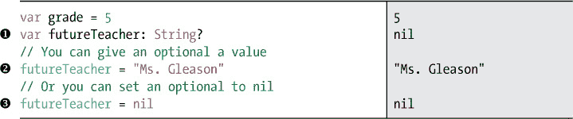
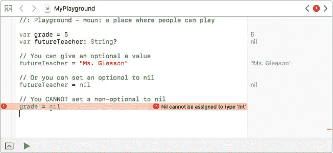
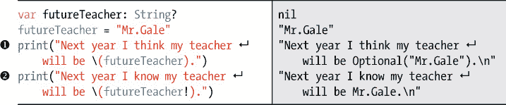
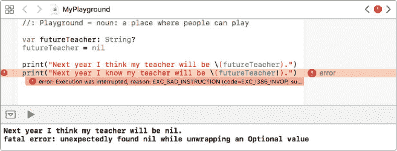
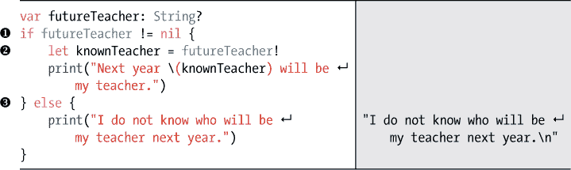
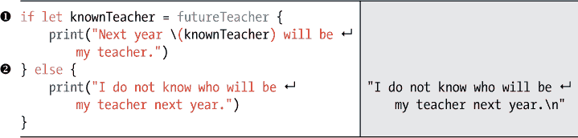
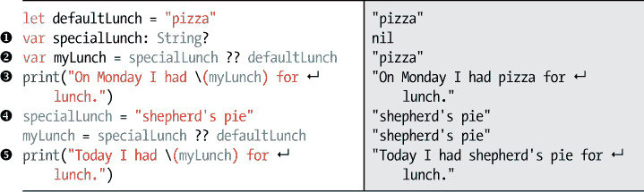

## 第五章：## 使用可选值保护你的程序安全


在本章中，我们将介绍 Swift 中一个非常酷的特性：可选值。*可选值* 是可以有值或没有值的变量。与许多编程语言不同，Swift 中的常量和变量*必须*有值。这使得 Swift 成为一种*安全*的语言，因为它可以防止代码在期望一个变量有值但实际上尚未设置时出错。

然而，有时你可能需要创建一个变量，但还没有给它赋值。在这种情况下，你可以使用可选值。

### 什么是可选值？

你可以将可选值想象成一个盒子，这个盒子要么包含某些东西，要么是空的。例如，一个可选的 `String` 就是一个要么包含 `String` 值，要么为空的盒子。当可选值为空时，它的特殊值是 `nil`。在 Swift 中，`nil` 表示没有值。

当你声明一个变量或常量时，Swift 期望它持有一个值。如果你不确定该变量或常量应该持有什么值，可以使用可选值来避免程序中的问题。让我们来看一下怎么做！

### 创建可选值

要创建一个可选值，你需要声明一个变量或常量，并在数据类型后添加一个 `?`。`?` 告诉 Swift 你希望将该变量或常量定义为可选值。和普通变量或常量一样，可选值可以包含任何数据类型。

让我们创建一个名为 `futureTeacher` 的可选值作为例子。假设你所在学校的所有老师还没有分配到明年的班级，所以你不知道新老师是谁。



在这个例子中，我们创建了一个名为 `futureTeacher` 的可选变量，它将存储一个 `String` 类型的值，方法是数据类型后添加一个 `?`。与之前使用的非可选变量不同，可选值不需要初始值。那部分——你猜对了——是*可选的*！在 ➊ 处，我们没有给 `futureTeacher` 分配初始值，所以它的默认值是特殊值 `nil`，这意味着它还没有值。

现在我们将 `futureTeacher` 声明为一个可选的 `String` 类型，它可以持有 `nil` 或一个 `String` 值。你可以像设置普通变量一样改变可选值的值，如 ➋ 所示。如果你改变主意，想将可选值再次设置为 `nil`，你也可以这么做 ➌。请注意，你不能将普通变量设置为 `nil`！这是可选值的一个特殊特点。在 图 5-1 中，你可以看到将 `futureTeacher` 设置为 `nil` 是允许的，但将 `grade` 设置为 `nil` 却不行。


你不能将 `grade` 设置为 `nil` 的原因是，`grade` 并没有被声明为可选值，它只是一个普通的 `Int` 数据类型。只有可选值才能持有声明类型的值或 `nil`。可选值就是这样特别。



*图 5-1：你不能将非可选值设置为 nil。*

#### 解包可选值

可选项使你的代码更安全，因为它们迫使你为其没有值的情况进行规划。但这也意味着它们需要更多的工作来使用。

例如，你不能像使用常规 String 那样使用可选的 String。首先，你需要检查可选项中是否确实存储了一个 String。如果有，你就可以像使用任何其他 String 一样使用它。

要检查你的可选项是否有可以使用的值，你需要*解包*它。解包一个可选项就像是把它从盒子里拿出来。你不会不打开盒子就玩生日礼物，对吧？嗯，你也不能在代码中使用一个可选项而不先解包它。有几种不同的方式可以解包可选项。让我们看看它们是如何工作的！


##### 强制解包

解包可选项的一种方法是通过*强制解包*。当你知道一个可选项有值，并且想让计算机直接访问该值时，使用强制解包。你通过在可选项名称后加一个 ! 来实现。将这段代码输入到你的 playground 中：



在这个例子中，我们将 futureTeacher 设置为 "Mr.Gale"。如果我们尝试将可选的 String 变量 futureTeacher 插入到一个 print 语句中 ➊，值会被打印为 Optional("Mr.Gale")。这并不理想！我们只想要字符串 "Mr.Gale"。为了得到这个，你需要解包可选项。在 ➋ 处，我们使用 futureTeacher! 强制解包 futureTeacher。现在打印出来的行 "Next year I know my teacher will be Mr.Gale.\n" 看起来如预期那样。

当你使用强制解包时，必须确保可选项有值。如果它是 nil，你将会遇到错误。为了亲自验证这一点，将 futureTeacher 设置为 nil，而不是 "Mr.Gale"，如 图 5-2 所示。如果你强制解包一个可选项，并且它的值为 nil，程序将会崩溃。



*图 5-2：强制解包一个没有值的可选项会导致错误。*

强制解包应该小心使用，只有在你可以回答“我是否知道此时代码中的可选项一定会有值？”这个问题时，才应该使用。你可以通过先检查它是否等于 nil 来确保可选项有值，然后再尝试解包。这是强制解包可选项的安全方法：



在 ➊ 处，我们首先检查 futureTeacher 是否有值，才强制解包它。如果 futureTeacher 不等于 nil，我们就强制解包它，并将其值存储在常量 knownTeacher 中 ➋。如果 futureTeacher 是 nil，我们使用 ➌ 处的 else 语句打印 "I do not know who will be my teacher next year."。

##### 可选绑定

另一种解包可选项的方法是使用*可选绑定*。可选绑定的原理是暂时将可选项绑定到一个常量或变量，然后提供一个代码块，该代码块只有在可选项确实有值时才会执行。我们通过使用 if-let 语句来实现这一点。

将以下代码添加到你的 playground 中，以查看 if-let 语句的实际效果：



if-let 语句检查 optional 类型的 futureTeacher 是否包含一个值。如果包含，该值将被赋给常量 knownTeacher ➊，然后执行紧随其后的代码块。在这种情况下，optional 类型的 futureTeacher 没有包含任何值，因此紧随 if-let 语句后的代码块不会被执行。

如果你希望在可选值为 nil 时执行某些操作，可以写一个 else 块，就像我们在➋处所做的那样。在这个例子中，我们告诉计算机查看 futureTeacher，如果它包含一个值，计算机应该将这个值称为 knownTeacher。如果 futureTeacher 中没有值，我们的程序将输出“我不知道明年谁将是我的老师。”

你是否注意到 if-let 语句中的这段代码与之前你写的那段代码很相似——它检查了 futureTeacher 是否为 nil，在强制解包并将其值赋给 knownTeacher 之前？例如，像这样：

```
if let
 knownTeacher = futureTeacher
 {

    print
 ("Next year
 \(
 knownTeacher) will be my teacher."
 )

}
```

这是更简洁且更好的写法：

```
if
 futureTeacher
 != nil
 {

    let knownTeacher = futureTeacher
 !

    print
 ("Next year
 \(
 knownTeacher) will be my teacher."
 )

}
```

尝试将 futureTeacher 更改为某个教师的名字，并重新运行这个 if-let 语句。你应该能看到“明年*teacher*将是我的老师。”这个句子被你输入的名字填充。

**注意**

*尽管这种类型的语句叫做 if-let 语句，但你也可以使用 if-var，并将可选值临时赋给一个变量，而不是常量。*

需要注意的是，我们只是暂时将 futureTeacher 中的值赋给常量 knownTeacher。常量 knownTeacher 只存在于 if-let 语句的大括号内。如果你想在程序后面访问 futureTeacher 的值，你必须再写一个 if-let 语句。这就是我们所说的，使用可选值会让你多做一些工作，因为每次想使用它时都得解包一次。

可选绑定是一种安全的解包方式，当你不确定可选值是否包含值时可以使用它。如果可选值是 nil，你不会收到错误，而是可以使用 else 语句控制发生的事情。

你可能会问自己，“怎么可能不知道某个东西是否有值呢？”在我们的例子中，很明显 futureTeacher 没有值，因为我们把它设置为 nil。但实际上，有很多时候你无法知道一个可选值是否有值。例如，假设我们要求用户输入 futureTeacher 的名字。用户可能输入了名字，也可能没有。用户是不可预测的。也许他们分心了，忘记输入名字。直到*运行时*——也就是程序实际运行时，才有办法知道用户做了什么。如果我们的程序需要用户为 futureTeacher 设置值，那么它必须准备好处理这两种可能性（用户输入了名字或忘记了），因为在运行时这两种情况都有可能发生。

##### 隐式解包可选类型

正如你到目前为止看到的，可选值需要在程序访问它们所持有的数据之前进行解包。通常，每次需要使用可选值时，你都会解包它。但是也有一些罕见的情况，你可能会遇到必须是可选值并且始终有一个值的变量。在这些情况下，与其每次使用时都解包该可选值，不如将其声明为*隐式解包可选值*。这告诉计算机该变量是一个可选值，但始终会有一个值。因此，隐式解包可选值不需要每次使用时都解包；它会自动为你解包。与常规可选值通过在数据类型后加一个 ? 创建不同，隐式解包可选值则通过在数据类型后加一个 ! 来创建。


你可能会想知道什么时候会使用这些隐式解包的可选值。一个常见的用法是在你编写带有故事板的应用时。当你想要将代码中的变量与故事板中的对象连接时，你会将它们声明为隐式解包可选值。在第十章中，你会在创建生日追踪器应用时看到这些变量。这些变量需要是可选值（因为故事板要求如此），但它们始终会有一个值（由于它们与故事板连接，故事板会在你使用它们之前始终给它们一个值）。

除了这种特殊情况外，你不应频繁使用隐式解包可选值。它们不像常规可选值那样安全，使用不当可能导致程序崩溃。最好尽可能使用常规的可选值。

#### 一种特殊的运算符：??

在解包可选值时，有一种非常有用的特殊运算符：*nil 合并运算符*。听起来很厉害吧？不过实际上它非常简单易用，而且可以节省时间。

nil 合并运算符写作一对问号，位于可选值和默认值之间，例如 optionalThing ?? defaultThing。当可选值有一个值时，会像往常一样使用该值；但是当可选值为 nil 时，nil 合并运算符将使用默认值。

让我们尝试一个使用此运算符的例子：



在 ➊，我们创建了一个名为 specialLunch 的可选字符串变量。接下来，我们设置一个名为 myLunch 的变量，如果 specialLunch 包含一个字符串值，就将其赋值给 myLunch；如果没有，则将默认值 defaultLunch 赋给 myLunch ➋。在 ➌，当我们打印 myLunch 的值时，可以看到它的默认值是 "pizza"，因为 specialLunch 为 nil。当我们将 specialLunch 设置为 "牧羊人派" ➍，然后再次使用 nil 合并运算符时，specialLunch 的值被解包并赋给 myLunch ➎。正如你所看到的，nil 合并运算符是一个快速的方式，可以在可选值存在时获取其值，或者在它为 nil 时使用其他值。


### 你学到了什么

在本章中，你学到了可选项这一特性，这是使 Swift 成为安全语言的一个重要功能。可选项强迫我们知道哪些变量可能没有值，这样我们就能在程序中避免潜在的问题。

在第六章中，你将学习到两种集合数据类型：数组和字典。它们都非常有用，可以存储和管理一组项目。数组中的项目按顺序存储，可以通过索引号访问。字典中的项目是无序的键/值对，可以通过键来访问。

## 使用可选项保证你的程序安全


在这一章中，我们将讨论 Swift 中的一个非常酷的特性：可选项。*可选项*是可以有值或没有值的变量。Swift 与许多编程语言不同，因为普通的常量和变量*必须*有一个值。这使得 Swift 成为一个*安全*的语言，因为它避免了当一个变量预期有值但还没有设置时，代码会失败的问题。

然而，有时你需要创建一个变量，但还没有为它设置值。在这种情况下，你可以使用可选项。

### 什么是可选项？

你可以将可选项看作是一个盒子，它要么包含某个值，要么是空的。例如，一个可选的 String 就只是一个盒子，它要么包含一个 String 值，要么是空的。当一个可选项为空时，它的特殊值是 nil。在 Swift 中，nil 仅仅表示没有值。

当你声明一个变量或常量时，Swift 期望它持有一个值。如果你不确定希望该变量或常量持有什么值，你可以使用可选项来避免程序中的问题。让我们看看是怎么回事！

### 创建可选项

要创建一个可选项，你需要声明一个变量或常量，并在数据类型后加上一个?。这个?告诉 Swift 你希望将该变量或常量定义为可选项。像普通变量或常量一样，可选项可以包含任何数据类型。

让我们以创建一个名为 futureTeacher 的可选项为例。假设你学校的所有老师还没有被分配到明年的班级，因此你还不知道你的新老师是谁。


在这个例子中，我们创建了一个可选变量 futureTeacher，它将存储一个 String 类型，通过在数据类型后添加?来实现。与我们之前使用的非可选变量不同，可选变量不需要初始化值。正如你猜到的那样——*是可选的*！在➊处，我们没有为 futureTeacher 分配初始值，因此它的默认值是特殊值 nil，表示它还没有值。

现在我们已经将 futureTeacher 声明为一个 optional String，它可以保存 null（nil）或 String。你可以像设置常规变量那样改变一个 optional 的值，如 ➋ 所示。如果你改变主意并希望再次将 optional 设置为 nil，你可以在 ➌ 处这么做。请注意，你不能将常规变量设置为 nil！这是 optionals 的一个特殊特性。在 图 5-1 中，你可以看到将 futureTeacher 设置为 nil 是允许的，但将 grade 设置为 nil 是不允许的。


你不能将 grade 设置为 nil 的原因是 grade 并没有被声明为 optional，它只是一个常规的 Int 数据类型。只有 optionals 可以存储声明类型的值或 nil。Optionals 就是这样特殊。


*图 5-1：你不能将非 optional 设置为 nil。*

#### 解包 Optionals

Optionals 使你的代码更安全，因为它们迫使你为没有值的情况进行预先规划。但这也意味着它们需要更多的工作来使用。

例如，你不能像使用常规的 String 一样使用 optional String 。首先，你需要检查你的 optional 中是否真的存储了一个 String。如果有，那么你就可以像使用其他 String 一样使用它。

要检查你的 optional 是否有可以使用的值，你需要*解包*它。解包 optional 就像把它从盒子里拿出来一样。你不会在不拆开盒子的情况下玩生日礼物，对吧？同样，你也不能在不解包 optional 的情况下在代码中使用它。有几种不同的解包方式，让我们看看它们是如何工作的！


##### 强制解包

解包 optional 的一种方式是通过 *强制解包*。当你知道一个 optional 有值，并且希望计算机直接访问该值时，可以使用强制解包。你可以在 optional 名称后加上一个 ! 来实现这一点。将这段代码输入到你的 Playground 中：


在这个例子中，我们将 futureTeacher 设置为 "Mr.Gale"。如果我们尝试将 optional String 变量 futureTeacher 插入到 print 语句中 ➊，打印的值是 Optional("Mr.Gale")。这不是我们想要的！我们只希望看到字符串 "Mr.Gale"。要获得这个，你需要解包该 optional。在 ➋ 处，我们通过 futureTeacher! 强制解包 futureTeacher。现在打印的行 "Next year I know my teacher will be Mr.Gale.\n" 看起来如预期。

当你使用强制解包时，必须确保该 optional 有值。如果它是 nil，你会得到一个错误。为了亲自验证这一点，将 futureTeacher 设置为 nil，而不是 "Mr.Gale"，如 图 5-2 所示。如果你强制解包一个 optional 且它的值是 nil，你的程序将崩溃。


*图 5-2：强制解包没有值的 optional 会导致错误。*

强制解包应谨慎使用，只有在你能回答“我是否知道这个可选值在此代码点上始终有值？”这个问题时，才应使用。你可以先检查可选值是否为 nil，再尝试解包，这是强制解包的一种安全方式：


在 ➊ 处，我们检查 futureTeacher 是否有值，然后再强制解包。如果 futureTeacher 不等于 nil，我们将强制解包并将其值存储在常量 knownTeacher ➋ 中。如果 futureTeacher 是 nil，我们会通过 ➌ 处的 else 语句输出 "I do not know who will be my teacher next year."。

##### 可选绑定

解包可选值的另一种方法是使用 *可选绑定*。可选绑定通过临时将可选值绑定到常量或变量，然后提供一个代码块，只有当可选值确实有值时，这个代码块才会执行。我们通过 if-let 语句来实现这一点。

将这段代码添加到你的 playground 中，看看 if-let 语句如何工作：


if-let 语句检查可选值 futureTeacher 是否包含值。如果它包含值，那个值将被赋给常量 knownTeacher ➊，然后执行大括号内的代码块。在这种情况下，可选值 futureTeacher 没有值，因此 if-let 语句后的代码块不会被执行。

如果你希望在可选值为 nil 时执行某些操作，你可以写一个 else 块，像我们在 ➋ 处那样。在这个例子中，我们告诉计算机检查 futureTeacher，如果它包含值，计算机应该将该值称为 knownTeacher。如果 futureTeacher 没有值，我们的程序将输出 "I do not know who will be my teacher next year."

你是否注意到 if-let 语句中的代码块与你之前写的检查 futureTeacher 是否为 nil 并强制解包赋值给 knownTeacher 的代码块之间的相似性？例如，这样：

```
if let
 knownTeacher = futureTeacher
 {

    print
 ("Next year
 \(
 knownTeacher) will be my teacher."
 )

}
```

这是一个更好且更简洁的写法：

```
if
 futureTeacher
 != nil
 {

    let knownTeacher = futureTeacher
 !

    print
 ("Next year
 \(
 knownTeacher) will be my teacher."
 )

}
```

尝试将 futureTeacher 改为某个教师的名字，然后再次运行这个 if-let 语句。你应该能看到 "Next year *teacher* will be my teacher." 这句话被你输入的名字所替代。

**注意**

*虽然这种语句被称为 if-let 语句，但你也可以使用 if-var，临时将可选值赋给变量，而不是常量。*

需要注意的是，我们只是暂时将 futureTeacher 的值赋给常量 knownTeacher。常量 knownTeacher 仅存在于 if-let 语句的大括号内。如果你想在程序的其他部分访问 futureTeacher 的值，你需要写另一个 if-let 语句。这就是我们所说的，使用可选值需要更多的工作，因为每次你想使用它时都需要解包。

可选绑定是一种安全的解包方式，当你不确定可选值是否包含值时使用。如果可选值为 nil，你不会遇到错误，反而可以通过 else 语句控制发生什么。

你可能会问自己：“怎么可能不知道某个值是否有值？”在我们的示例中，很明显`futureTeacher`没有值，因为我们将它设置为 nil。但有很多时候你无法知道一个可选值是否有值。例如，假设我们要求用户为`futureTeacher`输入一个名字。用户可能输入了名字，也可能没有。用户的行为是不可预测的。也许他们被分心了，忘记输入名字。直到*运行时*——也就是程序实际运行时——你才有办法知道用户在做什么。如果我们的程序需要用户为`futureTeacher`设置值，那么它必须准备好处理这两种可能性（无论用户是否输入了名字），因为在运行时这两种情况都有可能发生。

##### 隐式解包的可选值

正如你到目前为止看到的，使用可选值时需要解包才能访问它们所包含的数据。通常每次使用可选值时，你都会解包它。但是也有一些少见的情况，你需要一个变量，它必须是可选的，并且总会有一个值。在这些情况下，你可以声明它为*隐式解包的可选值*，而不是每次使用它时都解包。这告诉计算机，这个变量是可选的，但总会有一个值。因此，隐式解包的可选值*不*需要每次使用时解包；它会自动为你解包。与普通的可选值不同，隐式解包的可选值在数据类型后加上!。


你可能在想，什么时候会使用隐式解包的可选值。一个常见的用法是在你编写带有故事板的应用时。当你想要将代码中的变量与故事板中的对象连接时，你需要将它们设置为隐式解包的可选值。在你创建生日追踪器应用的第十章中，你会看到这些变量的用法。这些变量需要是可选的（因为故事板要求这样），但它们总会有一个值（因为它们连接到故事板，故事板会在你使用它们之前给它们赋值）。

除了这种特殊情况，通常不应该频繁使用隐式解包的可选值。它们不像普通的可选值那样安全，如果使用不当，可能导致程序崩溃。最好尽可能使用普通的可选值。

#### 一种特殊的操作符：??

有一种特殊的操作符，在你解包可选值时非常有用：*空合并操作符*。听起来很厉害，对吧？其实它很容易使用，且能节省时间。

空合并运算符写作一对问号，位于可选值和默认值之间，像这样：optionalThing ?? defaultThing。当可选值有值时，将按常规使用该值；但是当可选值为 nil 时，空合并运算符将使用默认值。

让我们通过这个运算符试个例子：


在➊，我们创建了一个名为 specialLunch 的可选 String 变量。接下来，我们将变量 myLunch 的值设置为 specialLunch 的值（如果它包含 String）或者 defaultLunch 的值（如果没有）➋。在➌，当我们打印 myLunch 的值时，可以看到它是默认值"pizza"，因为 specialLunch 是 nil。当我们将 specialLunch 设置为"牧羊人馅饼"➍，然后再次使用空合并运算符时，specialLunch 的值会被解包并放入 myLunch 中➎。正如你所看到的，空合并运算符是一种快速的方法，可以在可选值有值时获取该值，或者在其为 nil 时使用其他值。


### 你学到了什么

在这一章中，你学习了可选值，这是使 Swift 成为安全语言的一个重要特性。可选值强制我们了解哪些变量可能没有值，从而防止程序中潜在的问题。

在第六章，你将学习两种集合数据类型：数组和字典。它们都非常适合用于存储和管理物品集合。数组中的项目按顺序存储，可以通过索引访问；字典中的项目则按无序的键/值对存储，可以通过键来访问。


在本章中，我们将介绍 Swift 中的一个非常酷的特性：可选值。*可选值*是可以有值也可以没有值的变量。与许多编程语言不同，Swift 中的常量和变量*必须*有值。这使得 Swift 成为一种*安全*的语言，因为它可以防止你的代码在期望一个变量有值但该值尚未设置时失败。

然而，有时你需要创建一个变量，但还没有它的值。在这种情况下，你可以使用可选值。

### 什么是可选值？

你可以把可选值想象成一个盒子，它要么包含某物，要么为空。例如，一个可选 String 就是一个要么包含 String，要么为空的盒子。当一个可选值为空时，它的特殊值为 nil。在 Swift 中，nil 意味着没有值。

当你声明一个变量或常量时，Swift 期望它持有一个值。如果你不确定想要让这个变量或常量持有什么值，你可以使用可选值来避免程序中的问题。让我们看看如何操作！

### 创建可选值

要创建一个可选值，你需要声明一个变量或常量，并在数据类型后面加上一个?。这个?让 Swift 知道你想将该变量或常量定义为可选值。像变量或常量一样，可选值可以包含任何数据类型。

让我们创建一个名为 `futureTeacher` 的可选值作为示例。假设并非所有的老师都已经分配到下学年的班级，所以你不知道你的新老师会是谁。


在这个示例中，我们创建了一个可选变量 `futureTeacher`，它将存储一个字符串，通过在数据类型后添加 `?` 来实现。与我们之前使用的非可选变量不同，可选变量不需要初始值。没错，这部分是*可选*的！在 ➊ 处，我们没有给 `futureTeacher` 赋初值，所以它的默认值是特殊值 nil，这意味着它还没有值。

现在我们已经声明了 `futureTeacher` 是一个可选的字符串，它可以存储一个值，也可以是没有值（nil）。你可以像设置普通变量的值一样设置可选值的值，如 ➋ 所示。如果你改变主意并想将可选值重新设为 nil，你也可以这么做 ➌ 。注意，你不能将普通变量设为 nil！这是可选值的一个特殊特性。在 图 5-1 中，你可以看到将 `futureTeacher` 设置为 nil 是允许的，但将 `grade` 设置为 nil 是不允许的。


你不能将 `grade` 改为 nil 的原因是因为 `grade` 没有声明为可选值，它只是一个普通的 `Int` 数据类型。只有可选值可以存储声明类型的值或者 nil。可选值就是这么特别。


*图 5-1：你不能将非可选值设为 nil。*

#### 解包可选值

可选值使你的代码更安全，因为它们强制你考虑没有值的情况。但这也意味着它们需要更多的工作来使用。

例如，你不能像使用普通字符串那样使用可选字符串。首先，你需要检查你的可选值是否真的存储了一个字符串。如果有，那么你就可以像使用任何其他字符串一样使用它。

要检查你的可选值是否有一个可以使用的值，你需要*解包*它。解包一个可选值就像是把它从盒子里拿出来。你不会在不拆开生日礼物的情况下就玩它，对吧？同样，在代码中，你也不能在不解包的情况下使用一个可选值。有几种不同的方式可以解包可选值。让我们看看它们是如何工作的！


##### 强制解包

解包可选值的一种方式是通过*强制解包*。当你确定一个可选值有值时，使用强制解包来让计算机直接访问该值。你只需要在可选值的名称后面加上 `!`。在你的 playground 中输入这段代码：


在这个例子中，我们将 futureTeacher 设置为"Mr.Gale"。如果我们尝试将可选 String 变量 futureTeacher 放入打印语句中➊，其值会被打印为 Optional("Mr.Gale")。这不是理想的！我们只希望打印字符串"Mr.Gale"。为了实现这一点，你需要解包这个可选值。在➋处，我们使用 futureTeacher!强制解包 futureTeacher。现在打印的行"Next year I know my teacher will be Mr.Gale.\n"符合预期。

当你使用强制解包时，必须确保该可选值有值。如果它是 nil，程序会报错。为了验证这一点，将 futureTeacher 设置为 nil，而不是"Mr.Gale"，如图 5-2 所示。如果你强制解包一个可选值且它的值为 nil，程序会崩溃。


*图 5-2：强制解包一个没有值的可选值会导致错误。*

强制解包应该谨慎使用，并且仅在你能够回答“我是否知道这个可选值在代码中的这一点总是有值？”时才使用。你可以通过先检查它是否为 nil 来确保可选值有值，然后再尝试解包它。这是一种安全的强制解包方式：


在➊处，我们检查确保 futureTeacher 有值，然后才进行强制解包。如果 futureTeacher 不等于 nil，我们强制解包它并将其值存储在常量 knownTeacher 中➋。如果 futureTeacher 是 nil，我们使用 else 语句在➌处打印“我不知道谁会是我明年的老师”。

##### 可选绑定

另一种解包可选值的方法是使用*可选绑定*。可选绑定的工作方式是暂时将可选值绑定到常量或变量，然后提供一个代码块，仅当可选值确实有值时才会执行该代码块。我们使用 if-let 语句来做到这一点。

将此代码添加到你的 playground 中，看看 if-let 语句是如何工作的：


if-let 语句检查可选值 futureTeacher 是否包含值。如果包含值，则该值会被赋给常量 knownTeacher ➊，随后会执行花括号中的代码块。在这个例子中，可选值 futureTeacher 不包含值，因此 if-let 语句后的代码块没有被执行。

如果你希望在可选值为 nil 时执行某些操作，你可以写一个 else 语句块，正如我们在➋处所做的那样。在这个例子中，我们告诉计算机查看 futureTeacher，如果它包含值，计算机应将该值称为 knownTeacher。如果 futureTeacher 没有值，我们的程序将输出“我不知道谁会是我明年的老师。”

你注意到 if-let 语句中的代码块和你在强制解包之前检查 futureTeacher 是否为 nil 并将其值设置为 knownTeacher 时所写的代码块之间的相似性了吗？例如，下面这个：

```
if let
 knownTeacher = futureTeacher
 {

    print
 ("Next year
 \(
 knownTeacher) will be my teacher."
 )

}
```

是一种更好且更简洁的写法：

```
if
 futureTeacher
 != nil
 {

    let knownTeacher = futureTeacher
 !

    print
 ("Next year
 \(
 knownTeacher) will be my teacher."
 )

}
```

尝试将 futureTeacher 改成一个教师的名字，然后重新运行这个 if-let 语句。你应该会看到句子“明年*教师*将是我的老师。”并填入你输入的名字。

**注意**

*虽然这种语句被称为 if-let 语句，但你也可以使用 if-var，并将可选值临时赋给一个变量，而不是常量。*

需要注意的是，我们只是暂时将未来教师（futureTeacher）的值赋给常量已知教师（knownTeacher）。常量 knownTeacher 仅在 if-let 语句的大括号内存在。如果你想在程序的后续部分访问 futureTeacher 的值，你需要再写一个 if-let 语句。这就是我们所说的，使用可选类型（optionals）需要你付出更多的努力，因为每次使用它时，你都需要解包这个可选值。

可选绑定是一种安全的解包可选值的方式，特别是在你不确定它们是否包含有效值的情况下。如果可选值为 nil，程序不会报错，你可以使用 else 语句来控制发生的情况。

你可能会问自己：“怎么可能不知道某个东西是否有值？”在我们的例子中，很明显 futureTeacher 没有值，因为我们将其设置为 nil。但是有很多时候你并不知道一个可选值是否有值。例如，假设我们让用户输入一个 futureTeacher 的名字。用户可能输入了名字，也可能没有。用户的行为是不可预测的，也许他们分心了，忘记输入名字。在程序实际运行之前，你无法看到用户做了什么，也就是在*运行时*，程序正在运行时。如果我们的程序需要用户设置 futureTeacher 的值，那么它必须准备好处理这两种情况（用户输入了名字或忘记输入）。

##### 隐式解包可选值

正如你迄今为止所看到的，在程序访问可选值中的数据之前，通常需要解包可选值。通常，你每次需要使用它时都会解包。但是有一些罕见的情况，你可能会有一个必须是可选值且始终会有值的变量。在这些情况下，你可以将其声明为*隐式解包可选值*，而不必每次使用时都解包它。隐式解包可选值会告诉计算机该变量是可选的，但总是有一个值。因此，隐式解包可选值*不*需要每次使用时解包，它会自动为你解包。与常规可选值（使用数据类型后跟?）不同，隐式解包可选值是在数据类型后面加上!来创建的。


你可能会想，什么时候才会使用这些隐式解包的可选值呢？一个常见的用法是在你编写一个带有故事板的应用程序时。当你想将代码中的变量与故事板中的对象连接时，你会将它们定义为隐式解包的可选值。在第十章中，当你创建生日追踪器应用程序时，你会看到这些变量。这些变量需要是可选的（因为故事板要求这样），但它们总会有值（因为它们连接到故事板，故事板会在使用前给它们赋值）。

除了这种特殊情况外，你通常不应该经常使用隐式解包可选值。它们不如常规可选值安全，如果使用不当可能会导致程序崩溃。最好尽可能使用常规可选值。

#### 一种特殊的运算符：??

有一种特殊的运算符，在解包可选值时非常有用：*nil 合并运算符*。听起来很酷，是不是？不过它其实很容易使用，而且可以节省时间。

nil 合并运算符的写法是在可选值和默认值之间使用一对问号，如 optionalThing ?? defaultThing。当可选值有值时，会像往常一样使用该值；但当可选值为 nil 时，nil 合并运算符会使用默认值。

让我们通过这个运算符做个示例：


在➊，我们创建了一个名为 specialLunch 的可选 String 变量。接下来，我们将一个名为 myLunch 的变量设置为 specialLunch 的值（如果它包含一个 String）或者 defaultLunch 的值（如果它没有） ➋。在➌，当我们打印 myLunch 的值时，可以看到它是默认值"pizza"，因为 specialLunch 是 nil。当我们将 specialLunch 设置为"牧羊人派" ➍，然后再次使用 nil 合并运算符时，specialLunch 的值会被解包并放入 myLunch 中 ➎。如你所见，nil 合并运算符是一种快速方法，可以在可选值有值时取出它的值，或者在它为 nil 时使用其他默认值。


### 你学到了什么

在本章中，你了解了可选值，这是 Swift 语言中的一个很棒的特性。可选值迫使我们知道哪些变量可能没有值，这样我们就能在程序中避免潜在的问题。

在第六章中，你将学习到两种集合数据类型：数组和字典。它们都非常有用，用来存储和管理项的集合。数组中的项按顺序存储，可以通过索引号访问；而字典中的项是无序的键值对，可以通过键来访问。

在本章中，我们将介绍 Swift 中一个非常酷的特性：可选值。*可选值* 是可以有值或没有值的变量。Swift 与许多编程语言不同，因为普通的常量和变量 *必须* 有一个值。这使得 Swift 成为一种 *安全* 的语言，因为它可以防止你的代码在期望变量有值时却没有值的情况。

然而，有时候你需要创建一个变量，但还没有为它提供值。在这种情况下，你可以使用可选值。

### 什么是可选值？

你可以把可选值想象成一个盒子，这个盒子要么包含某物，要么是空的。例如，一个可选的 String 就是一个盒子，要么包含一个 String，要么是空的。当可选值为空时，它具有特殊的值 nil。在 Swift 中，nil 只是表示没有值。

当你声明一个变量或常量时，Swift 期望它持有一个值。如果你不确定这个变量或常量应该持有什么值，你可以使用可选值来避免程序出现问题。让我们看看如何做到这一点！

### 创建可选值

要创建一个可选值，你只需声明一个变量或常量，并在数据类型后添加一个 ?。问号让 Swift 知道你希望将该变量或常量声明为可选值。像变量或常量一样，可选值可以包含任何数据类型。

让我们以 futureTeacher 为例，创建一个可选值。想象一下，学校里的所有老师还没有被分配到下一学年的班级，所以你不知道新老师是谁。


在这个例子中，我们创建了一个可选变量 futureTeacher，它将存储一个 String 类型的值，通过在数据类型后添加一个 ?。与我们之前使用的非可选变量不同，可选值不需要初始化值。正如你猜到的那样——*这是可选的*！在 ➊ 处，我们没有给 futureTeacher 赋初始值，因此它的默认值是特殊值 nil，这意味着它还没有值。

现在我们已经声明 futureTeacher 为一个可选的 String 类型，它可以存储“没有值（nil）”或一个 String 类型的值。你可以像为普通变量设置值一样，更改可选值的值，如 ➋ 所示。如果你改变主意，想将可选值再次设置为 nil，你可以这样做 ➌。请注意，你不能将普通变量设置为 nil！这是可选值的一个特殊特性。在 图 5-1 中，你可以看到将 futureTeacher 设置为 nil 是允许的，但将 grade 设置为 nil 是不允许的。


你无法将 grade 设置为 nil 的原因是因为 grade 没有被声明为可选值，它只是一个普通的 Int 数据类型。只有可选值才能存储声明类型的值或 nil。可选值就是这么特别。


*图 5-1：你不能将非可选值设置为 nil。*

#### 解开可选值

可选项使你的代码更安全，因为它们强制你为没有值的情况做出计划。但这也意味着它们使用起来需要更多的工作。

例如，你不能像使用常规的 String 一样使用可选的 String。首先，你需要检查是否真的有一个 String 存储在可选项中。如果有，那么你可以像使用任何其他 String 一样使用它。

要检查你的可选项是否有可以使用的值，你需要*解包*它。解包可选项就像是将它从盒子里拿出来。你不会不拿出生日礼物就玩它，对吧？同样，你不能在代码中使用一个可选项而不先解包它。有几种不同的方法可以解包可选项。让我们看看它们是如何工作的！


##### 强制解包

解包可选项的一种方法是通过*强制解包*。当你知道可选项有一个值，并且希望计算机直接访问该值时，使用强制解包。你可以通过在可选项名称后输入一个 ! 来做到这一点。将以下代码输入到你的 Playground 中：


在这个例子中，我们将 futureTeacher 设置为 "Mr.Gale"。如果我们尝试将可选的 String 变量 futureTeacher 放入 print 语句 ➊ 中，输出的值是 Optional("Mr.Gale")。这不是理想的！我们只想要字符串 "Mr.Gale"。为了获得这个值，你需要解包该可选项。在 ➋ 处，我们使用 futureTeacher! 强制解包 futureTeacher。现在输出的 "Next year I know my teacher will be Mr.Gale.\n" 看起来符合预期。

当你使用强制解包时，必须确保可选项有一个值。如果它是 nil，你会得到一个错误。为了亲自验证这一点，可以将 futureTeacher 设置为 nil，而不是 "Mr.Gale"，如 图 5-2 所示。如果你强制解包一个可选项，而它的值是 nil，你的程序将崩溃。


*图 5-2：强制解包一个没有值的可选项将导致错误。*

强制解包应该谨慎使用，只有在你能回答“我知道这个可选项在此代码点上总是有值吗？”时，才应使用强制解包。你可以通过首先检查该可选项是否为 nil，来确保它有一个值。在尝试解包之前检查 nil 是一种安全的强制解包方法：


在 ➊ 处，我们检查确保 futureTeacher 有值之后再强制解包它。如果 futureTeacher 不等于 nil，我们就强制解包它，并将其值存储在常量 knownTeacher 中 ➋。如果 futureTeacher 是 nil，我们会通过 else 语句在 ➌ 处打印 "I do not know who will be my teacher next year."。

##### 可选绑定

解包可选项的另一种方法是使用*可选绑定*。可选绑定的工作原理是暂时将可选项绑定到一个常量或变量上，然后提供一个代码块，只有当可选项确实有值时，代码块才会执行。我们使用 if-let 语句来做到这一点。

将这段代码添加到你的 Playground 中，看看 if-let 语句如何运作：


if-let 语句检查 optional futureTeacher 是否包含值。如果包含，值将被赋给常量 knownTeacher ➊，并且接下来的花括号内的代码块将会执行。在这个例子中，optional futureTeacher 没有值，因此 if-let 语句后的代码块没有被执行。

如果你希望当可选项为 nil 时执行某些操作，那么你可以写一个 else 代码块，就像我们在 ➋ 处做的那样。在这个例子中，我们告诉计算机查看 futureTeacher，如果它包含一个值，那么计算机应该将该值称为 knownTeacher。如果 futureTeacher 中没有值，我们的程序将输出“我不知道明年谁会是我的老师。”

你注意到 if-let 语句中的代码块和你写的检查 futureTeacher 是否为 nil 之后强制解包并将其值赋给 knownTeacher 的代码块有相似之处吗？例如，这段代码：

```
if let
 knownTeacher = futureTeacher
 {

    print
 ("Next year
 \(
 knownTeacher) will be my teacher."
 )

}
```

这是更好且更简洁的写法：

```
if
 futureTeacher
 != nil
 {

    let knownTeacher = futureTeacher
 !

    print
 ("Next year
 \(
 knownTeacher) will be my teacher."
 )

}
```

尝试将 futureTeacher 改为一个老师的名字，然后再次运行这个 if-let 语句。你应该看到句子“明年 *teacher* 将是我的老师。”被你输入的名字替换。

**注意**

*虽然这种语句叫做 if-let 语句，但你也可以使用 if-var，并将可选值临时赋给变量，而不是常量。*

需要注意的是，我们只是暂时将 futureTeacher 的值赋给了常量 knownTeacher。常量 knownTeacher 仅在 if-let 语句的花括号内存在。如果你想在程序的其他部分访问 futureTeacher 的值，你需要再次使用 if-let 语句。这就是我们所说的，使用可选项需要更多的工作，因为每次使用它时你都必须解包它。

可选绑定是一种安全的解包方法，当你不确定它们是否包含值时。如果可选项为 nil，你不会遇到错误，而是可以使用 else 语句控制发生的事情。

你可能会问自己：“怎么会不知道某个值是否存在？”在我们的例子中，很明显 futureTeacher 没有值，因为我们把它设置为 nil。但是很多时候你并不知道一个可选项是否有值。例如，假设我们让用户输入一个名字给 futureTeacher。用户可能输入了名字，也可能没有。用户的行为是不可预测的，也许他们分心了，忘记输入名字。直到*运行时*——也就是程序实际运行时——我们才知道用户做了什么。如果我们的程序需要用户设置 futureTeacher 的值，那么它必须准备好处理这两种可能性（用户输入了名字或忘记了输入），因为在运行时，两者都可能发生。

##### 隐式解包可选项

如你所见，可选值在程序访问其包含的数据之前需要被解包。通常，每当你需要使用它时，都会解包一个可选值。但也有一些罕见的情况，你可能需要一个必须是可选值并且总是有值的变量。在这些情况下，与你每次使用它时都解包可选值相比，你可以将它声明为*隐式解包可选值*。这告诉计算机该变量是一个可选值，但总会有一个值。因此，隐式解包的可选值每次使用时*不需要*解包；它会自动为你解包。与常规的可选值在数据类型后加上 `?` 来创建不同，你通过在数据类型后加上 `!` 来创建隐式解包的可选值。


你可能会想，什么时候需要使用这些隐式解包的可选值呢？一个常见的用途是在编写一个包含故事板的应用程序时。当你希望将代码中的变量与故事板中的对象连接时，你会将这些变量声明为隐式解包的可选值。在你创建生日追踪器应用时，你会在第十章看到这些内容。这些变量需要是可选值（因为故事板要求这样做），但它们总是有值的（因为它们与故事板连接，故事板会在你使用它们之前总是给它们一个值）。

除了这种特殊情况外，你不应该经常使用隐式解包的可选值。它们不像常规的可选值那样安全，如果使用不当，可能会导致程序崩溃。最好尽量使用常规的可选值。

#### 一种特殊的运算符：??

有一种特别的运算符，当你解包可选值时非常有用：*nil 合并运算符*。听起来很厉害，对吧？其实它非常容易使用，而且可以节省时间。

nil 合并运算符是通过在可选值和默认值之间写上一对问号来表示的，例如 `optionalThing ?? defaultThing`。当可选值有值时，会像往常一样使用该值，但如果可选值为 nil，nil 合并运算符则会使用默认值。

让我们通过这个运算符来尝试一个例子：


在 ➊ 处，我们创建了一个名为 `specialLunch` 的可选字符串变量。接着，我们将一个名为 `myLunch` 的变量设置为：如果 `specialLunch` 包含字符串，则取 `specialLunch` 的值，否则取 `defaultLunch` 作为默认值 ➋。在 ➌ 处，当我们打印 `myLunch` 的值时，可以看到它是默认值“披萨”，因为 `specialLunch` 为 nil。当我们将 `specialLunch` 设置为“牧羊人派” ➍，并再次使用 nil 合并运算符时，`specialLunch` 的值会被解包并赋值给 `myLunch` ➎。正如你所看到的，nil 合并运算符是一种快速方法，可以在可选值有值时获取它的值，如果没有值，则使用其他默认值。


### 你学到的内容

在本章中，你学习了可选项，这是 Swift 的一大特性，使得 Swift 成为一种安全的语言。可选项迫使我们知道哪些变量可能没有值，从而帮助我们避免程序中的潜在问题。

在第六章中，你将学习两种集合数据类型：数组和字典。这两者在存储和管理项目集合时都非常有用。数组中的项目存储在有序的列表中，可以通过索引访问。而字典中的项目存储在无序的键/值对中，可以通过键来访问。

然而，有时你可能需要创建一个变量，但还没有为其赋值。在这种情况下，你可以使用可选项。

### 什么是可选项？

你可以把可选项看作一个盒子，它要么包含某物，要么是空的。例如，一个可选的 String 就像一个盒子，它要么包含一个 String，要么是空的。当一个可选项是空的时，它的特殊值是 nil。在 Swift 中，nil 表示没有值。

当你声明一个变量或常量时，Swift 期望它持有一个值。如果你不确定这个变量或常量应该持有什么值，你可以使用可选项来避免程序中的问题。让我们看看如何做到这一点！

### 创建可选项

要创建一个可选项，你需要声明一个变量或常量，并在数据类型后添加一个?。这个?让 Swift 知道你想将变量或常量设为可选项。像普通的变量或常量一样，可选项可以包含任何数据类型。

让我们以 futureTeacher 为例来创建一个可选项。假设你学校的所有老师并未全部分配到下一年的课程，因此你还不知道你的新老师是谁。


在这个例子中，我们通过在数据类型后添加?来创建一个可选变量 futureTeacher，它将存储一个 String。与我们之前使用的非可选变量不同，可选项不要求有初始值。没错，这部分是——*可选的*！在 ➊ ，我们没有为 futureTeacher 赋初始值，所以它的默认值是特殊值 nil，这意味着它还没有值。

现在我们已经将 futureTeacher 声明为可选的 String 类型，它可以存储 nil（表示什么都没有）或者一个 String。你可以像设置常规变量一样改变可选项的值，如 ➋ 所示。如果你改变主意，想把可选项的值设置回 nil，你也可以这么做 ➌ 。请注意，你不能将常规变量设置为 nil！这是可选项的一个特殊特性。在图 5-1 中，你可以看到将 futureTeacher 设置为 nil 是允许的，但将 grade 设置为 nil 则不允许。


你不能将 grade 改为 nil 的原因是，grade 并没有声明为可选项，它只是一个普通的 Int 数据类型。只有可选项可以持有声明的类型的值或 nil。可选项就是如此特别。


*图 5-1: 你不能将一个非可选值设置为 nil。*

#### 解包可选值

可选值使你的代码更安全，因为它们强制你考虑没有值的情况。但这也意味着它们的使用需要更多的工作。

例如，你不能像使用常规字符串一样使用一个可选字符串。首先，你需要检查是否真的有一个字符串存储在可选值中。如果有，你就可以像使用其他字符串一样使用它。

要检查你的可选值是否有可以使用的值，你需要对其进行*解包*。解包一个可选值就像把它从盒子里拿出来一样。你不会在没有拿出盒子的情况下玩生日礼物，对吧？那么，你也不能在代码中使用一个可选值而不先解包它。有几种不同的方式可以解包可选值。让我们看看它们是如何工作的！


##### 强制解包

解包可选值的一种方式是通过*强制解包*。当你知道一个可选值有值，并且你希望计算机直接访问这个值时，可以使用强制解包。你通过在可选值名称后加一个 `!` 来实现这一点。将此代码输入到你的 Playground 中：


在这个例子中，我们将 `futureTeacher` 设置为 "Mr.Gale"。如果我们尝试将可选的字符串变量 `futureTeacher` 放入打印语句中 ➊，则会打印为 Optional("Mr.Gale")。这不是理想的！我们只想要字符串 "Mr.Gale"。为了实现这一点，你需要解包可选值。在 ➋ 处，我们通过使用 `futureTeacher!` 强制解包 `futureTeacher`。现在，打印出的 "Next year I know my teacher will be Mr.Gale.\n" 看起来就像预期的那样。

使用强制解包时，你必须确保可选值有值。如果它是 nil，你会遇到错误。为了亲自验证这一点，将 `futureTeacher` 设置为 nil，而不是 "Mr.Gale"，如 图 5-2 所示。如果你强制解包一个可选值并且它是 nil，那么你的程序将崩溃。


*图 5-2: 强制解包一个没有值的可选值会导致错误。*

强制解包应该谨慎使用，仅在你能回答“我是否知道这个可选值在代码的这个位置一定会有值？”时使用。你可以通过先检查它是否等于 nil 来确保一个可选值有值，这是一种安全的强制解包方式：


在 ➊ 处，我们在强制解包之前，先检查 `futureTeacher` 是否有值。如果 `futureTeacher` 不等于 nil，我们就强制解包它并将其值存储在常量 `knownTeacher` 中 ➋。如果 `futureTeacher` 是 nil，我们会使用 else 语句在 ➌ 处打印 "I do not know who will be my teacher next year."。

##### 可选绑定

解包可选值的另一种方式是使用*可选绑定*。可选绑定通过将可选值临时绑定到常量或变量上，然后提供一个代码块，该代码块仅在可选值确实包含值时运行。我们通过`if-let`语句来实现这一点。

将此代码添加到你的 playground 中，以查看`if-let`语句的实际操作：


`if-let`语句检查可选值`futureTeacher`是否包含一个值。如果它有值，那个值将被赋给常量`knownTeacher` ➊，然后紧随其后的代码块将会执行。在这种情况下，可选值`futureTeacher`没有值，因此`if-let`语句后的代码块不会执行。

如果你希望在可选值为`nil`时执行某些操作，你可以像我们在➋处做的那样写一个`else`块。在这个例子中，我们告诉计算机查看`futureTeacher`，如果它包含一个值，计算机应该将该值称为`knownTeacher`。如果`futureTeacher`没有值，我们的程序将输出“我不知道明年谁会是我的老师。”

你有没有注意到`if-let`语句中的代码块与你编写的代码块之间的相似性？那段代码是检查`futureTeacher`是否为`nil`，然后强制解包并将其值赋给`knownTeacher`。例如，像这样：

```
if let
 knownTeacher = futureTeacher
 {

    print
 ("Next year
 \(
 knownTeacher) will be my teacher."
 )

}
```

这是更好且更简洁的写法：

```
if
 futureTeacher
 != nil
 {

    let knownTeacher = futureTeacher
 !

    print
 ("Next year
 \(
 knownTeacher) will be my teacher."
 )

}
```

尝试将`futureTeacher`改为某位教师的名字，再次运行此`if-let`语句。你应该会看到句子“Next year *teacher* will be my teacher.”被你输入的名字填充。

**注意**

*尽管这种语句被称为`if-let`语句，你也可以使用`if-var`并将可选值临时赋给一个变量，而不是常量。*

需要注意的是，我们只是将`futureTeacher`中的值临时赋给常量`knownTeacher`。常量`knownTeacher`只在`if-let`语句的代码块内部存在。如果你想在程序的后续部分访问`futureTeacher`的值，你必须再写一个`if-let`语句。这就是我们所说的使用可选值时需要更多工作的原因，因为每次你想使用它时，都必须解包可选值。

可选绑定是一种安全的解包可选值的方式，当你不确定可选值是否包含一个值时使用。如果可选值为`nil`，你不会遇到错误，而是可以使用`else`语句控制发生的事情。

你可能会问，“怎么可能不知道某个值是否有值？”在我们的例子中，很显然 futureTeacher 没有值，因为我们将其设置为 nil。但有很多时候，你无法知道一个可选类型是否有值。例如，假设我们让用户输入 futureTeacher 的名字。用户可能输入了名字，也可能没有。用户是不可预测的，或许他们因为分心而忘记输入名字。直到*运行时*——也就是程序实际运行时——你才知道用户的操作。如果我们的程序需要用户为 futureTeacher 设置值，那么它必须准备好处理两种可能性（用户输入了名字或忘记输入），因为在运行时，这两种情况都可能发生。

##### 隐式解包可选类型

如你所见，在访问存储的数据之前，可选类型需要解包。通常每次使用可选类型时，你都会解包它。但是也有一些特殊情况，你会遇到一个必须是可选类型并且始终有值的变量。在这些情况下，与你每次使用时解包可选类型不同，你可以将其声明为*隐式解包可选类型*。这告诉计算机，变量是可选类型，但始终有值。因此，隐式解包可选类型*不需要*每次使用时解包；它会自动为你解包。你创建隐式解包可选类型时，数据类型后面跟一个!，而不是像常规可选类型那样在数据类型后面跟一个?。


你可能会想，什么时候会使用这些隐式解包可选类型。一种常见的用法是在使用故事板（storyboard）编写应用程序时。当你想将代码中的变量与故事板中的对象连接时，你将这些变量声明为隐式解包可选类型。在你创建生日追踪器应用程序时，你会在第十章中看到这些变量。这些变量需要是可选类型（因为故事板要求这样），但它们始终会有一个值（因为它们与故事板连接，故事板会在你使用它们之前始终赋予它们一个值）。

除了这种特殊情况，你不应频繁使用隐式解包可选类型。它们不如常规可选类型安全，如果使用不当，可能会导致程序崩溃。最好尽可能使用常规可选类型。

#### 一种特殊的操作符：??

在解包可选类型时，有一种非常有用的操作符：*空合并操作符*。听起来很厉害吧？其实它非常简单，并且能够节省时间。

nil 合并运算符写作可选项和默认值之间的一对问号，如 `optionalThing ?? defaultThing`。当可选项有值时，会像平常一样使用该值；但当可选项为 nil 时，nil 合并运算符将使用默认值。

让我们尝试使用这个运算符的一个示例：


在 ➊ 处，我们创建了一个名为 `specialLunch` 的可选字符串变量。接下来，我们设置一个名为 `myLunch` 的变量，如果 `specialLunch` 包含一个字符串，则将其值赋给 `myLunch`，否则如果没有，则使用 `defaultLunch` ➋。在 ➌ 处，当我们打印 `myLunch` 的值时，可以看到它是默认值 "pizza"，因为 `specialLunch` 是 nil。当我们将 `specialLunch` 设置为 "牧羊人派" ➍，然后再次使用 nil 合并运算符时，`specialLunch` 的值会被展开并赋值给 `myLunch` ➎。正如你所看到的，nil 合并运算符是一种快速的方式，可以在可选项有值时获取该值，或者在它为 nil 时使用其他值。


### 你学到了什么

在这一章中，你了解了可选项，这是一个使 Swift 成为安全语言的伟大特性。可选项迫使我们知道哪些变量可能没有值，这样我们就能避免程序中的潜在问题。

在 第六章 中，你将学习两种集合数据类型：数组和字典。它们对于存储和管理项目集合非常有用。数组中的项目按顺序存储，可以通过索引访问。字典中的项目以无序的键值对形式存储，可以通过键来访问。

### 什么是可选项？

你可以把可选项看作一个盒子，它要么包含某个东西，要么是空的。例如，一个可选的字符串就是一个要么包含一个字符串，要么为空的盒子。当一个可选项为空时，它具有特殊的值 nil。在 Swift 中，nil 仅表示没有值。

当你声明一个变量或常量时，Swift 期望它持有一个值。如果你不确定该变量或常量应该持有什么值，你可以使用可选项来避免程序中的问题。让我们来看一下如何操作！

### 创建可选项

要创建一个可选项，你声明一个变量或常量，并在数据类型后加一个 `?`。这个 `?` 告诉 Swift 你希望将该变量或常量设置为可选项。像变量或常量一样，可选项可以包含任何数据类型。

让我们创建一个名为 `futureTeacher` 的可选项作为示例。假设你学校的所有教师还没有分配到下一年的课程，所以你不知道你的新教师会是谁。


在这个例子中，我们创建了一个可选变量 futureTeacher，它将存储一个 String 类型，通过在数据类型后加上?。与我们到目前为止使用的非可选变量不同，可选项不需要初始值。那部分是——你猜对了——*可选*的！在➊处，我们没有为 futureTeacher 赋初始值，所以它的默认值是特殊的值 nil，意味着它目前没有值。

现在我们已经声明 futureTeacher 为一个可选的 String，它可以存储空值(nil)或一个 String。你可以像设置常规变量一样更改可选项的值，如➋所示。如果你改变主意并希望再次将可选项设置为 nil，你也可以做到这一点➌。请注意，你不能将常规变量设置为 nil！这是可选项的一个特殊特点。在图 5-1 中，你可以看到将 futureTeacher 设置为 nil 是允许的，但将 grade 设置为 nil 则不行。


你不能将 grade 更改为 nil 的原因是，grade 并没有被声明为可选项，它只是一个常规的 Int 数据类型。只有可选项可以存储声明类型的值或 nil。可选项就是这么特别。


*图 5-1：你不能将非可选项设置为 nil。*

#### 解包可选项

可选项使你的代码更安全，因为它们迫使你为没有值的情况做出规划。但这也意味着它们在使用时需要更多的工作。

例如，你不能像使用常规 String 那样使用可选的 String。首先，你需要检查你的可选项中是否确实存储了一个 String。如果存储了，那么你可以像使用其他 String 一样使用它。

要检查你的可选项是否有一个你可以使用的值，你需要*解包*它。解包一个可选项就像是把它从盒子里拿出来一样。你不会在没有把生日礼物从盒子里拿出来的情况下玩它，对吧？嗯，你也不能在没有先解包它的情况下使用一个可选项。在解包可选项时有几种不同的方法，让我们看看它们是如何工作的！


##### 强制解包

解包一个可选项的一种方式是通过*强制解包*。当你知道一个可选项有值并且希望计算机直接访问这个值时，可以使用强制解包。你可以通过在可选项名称后加上!来实现。请在你的 Playground 中输入以下代码：


在这个例子中，我们将 futureTeacher 设置为"Mr.Gale"。如果我们尝试将可选的 String 变量 futureTeacher 放入打印语句中➊，打印出来的值是 Optional("Mr.Gale")。这并不理想！我们只想要字符串"Mr.Gale"。为了得到它，你需要解包这个可选项。在➋处，我们使用 futureTeacher!强制解包 futureTeacher。现在打印出来的行"Next year I know my teacher will be Mr.Gale.\n"看起来如预期般正常。

当你使用强制展开时，必须确保可选项有值。如果它是 nil ，你会遇到错误。你可以亲自验证这一点，将 futureTeacher 设置为 nil 而不是 "Mr.Gale" ，如 图 5-2 所示。如果你强制展开一个可选项并且它的值是 nil ，你的程序将崩溃。


*图 5-2：强制展开一个没有值的可选项将导致错误。*

强制展开应该谨慎使用，只有在你能回答“我知道这个可选项在这段代码中始终有值吗？”时，才能使用它。你可以通过首先检查它是否等于 nil 来确保一个可选项有值，这是一种安全的强制展开方式：


在 ➊ ，我们检查 futureTeacher 是否有值，确保在强制展开它之前不会出错。如果 futureTeacher 不等于 nil ，我们会强制展开它并将其值存储在常量 knownTeacher 中 ➋ 。如果 futureTeacher 是 nil ，我们会使用 ➌ 的 else 语句打印出 "I do not know who will be my teacher next year."。

##### 可选绑定

另一种展开可选项的方法是使用 *可选绑定* 。可选绑定通过临时将可选项绑定到一个常量或变量，然后提供一个仅在可选项确实有值时才会执行的代码块来工作。我们使用 if-let 语句来实现这一点。

将这段代码添加到你的 playground 中，查看 if-let 语句的实际效果：


if-let 语句检查可选项 futureTeacher 是否包含一个值。如果它包含值，该值将被赋给常量 knownTeacher ➊ ，接下来的代码块将被执行。在这种情况下，futureTeacher 不包含值，因此 if-let 语句后的代码块没有被执行。

如果你希望在可选项的值为 nil 时发生某些操作，你可以编写一个 else 块，像我们在 ➋ 中做的那样。在这个例子中，我们告诉计算机查看 futureTeacher ，如果它包含一个值，计算机应该将该值称为 knownTeacher。如果 futureTeacher 中没有值，我们的程序将输出 "I do not know who will be my teacher next year."。

你是否注意到 if-let 语句中的代码块和你之前编写的检查 futureTeacher 是否为 nil 并在强制展开后将其值赋给 knownTeacher 的代码块之间的相似之处？例如，这段代码：

```
if let
 knownTeacher = futureTeacher
 {

    print
 ("Next year
 \(
 knownTeacher) will be my teacher."
 )

}
```

这是更好、更简洁的写法：

```
if
 futureTeacher
 != nil
 {

    let knownTeacher = futureTeacher
 !

    print
 ("Next year
 \(
 knownTeacher) will be my teacher."
 )

}
```

尝试将 futureTeacher 更改为老师的名字，然后再次运行这个 if-let 语句。你应该能看到句子 "Next year *teacher* will be my teacher." 被你输入的名字填充。

**注意**

*尽管这种语句被称为 if-let 语句，你也可以使用 if-var，将可选项的值临时赋给一个变量，而不是常量。*

需要注意的是，我们只是暂时将 futureTeacher 中的值赋给常量 knownTeacher。常量 knownTeacher 仅在 if-let 语句的花括号内存在。如果你想在程序的后续部分访问 futureTeacher 的值，你必须再次使用 if-let 语句。这就是我们所说的，使用可选值需要多一些操作，因为每次想使用它时都需要解包。

可选绑定是一种安全的解包可选值的方法，当你不确定它们是否包含值时。如果可选值为 nil，程序不会报错，相反，你可以通过 else 语句来控制接下来的操作。

你可能会问，“怎么可能不知道某个值是否有值？”在我们的示例中，很明显 futureTeacher 没有值，因为我们将其设置为 nil。但是有很多时候，你并不知道一个可选值是否有值。例如，假设我们要求用户输入 futureTeacher 的名字。用户可能输入了名字，也可能没有。用户的行为是不可预测的。也许他们分心了，忘记输入名字。在程序*运行时*之前，我们无法看到用户的操作——也就是说，只有当程序实际运行时，才知道用户是否输入了名字。如果我们的程序需要用户为 futureTeacher 设置值，那么它必须能够处理这两种情况（用户输入了名字或忘记输入），因为在运行时，这两种情况都有可能发生。

##### 隐式解包可选值

正如你所看到的，可选值在程序访问其持有的数据之前必须解包。通常你会在每次需要使用时解包可选值。但是，也有一些特殊情况，某些变量必须是可选值并且总是会有一个值。在这些情况下，你可以将其声明为*隐式解包可选值*，而不需要每次使用时都解包。这样做告诉计算机，变量是一个可选值，但总会有一个值。因此，隐式解包可选值不需要每次使用时都解包；它会自动解包。与常规的可选值通过在数据类型后加?来创建不同，隐式解包可选值是通过在数据类型后加!来创建的。


你可能会想知道何时使用这些隐式解包可选值。一个常见的使用场景是你在编写带有故事板的应用程序时。当你想将代码中的变量与故事板中的对象连接时，你会将它们声明为隐式解包可选值。在第十章中，你将创建生日追踪器应用时看到这些。由于故事板要求这些变量必须是可选值，但它们总会有一个值（因为它们与故事板连接，故事板会在你使用它们之前总是给它们一个值），所以它们必须是可选值。

除了这个特殊情况外，你不应该经常使用隐式解包的可选项。它们不如常规的可选项安全，如果使用不当，可能会导致程序崩溃。最好尽可能使用常规的可选项。

#### 一种特殊类型的运算符：??

有一种非常有用的运算符，在解包可选项时特别有用：*nil 合并运算符*。听起来是不是很厉害？其实它很容易使用，而且可以节省时间。

nil 合并运算符写作一对问号，位于可选项和默认值之间，像这样：optionalThing ?? defaultThing。当可选项有值时，会按常规使用该值，但当可选项为 nil 时，nil 合并运算符会使用默认值。

让我们尝试一个使用这个运算符的例子：


在 ➊ 处，我们创建了一个名为 specialLunch 的可选字符串变量。接下来，我们将名为 myLunch 的变量设置为 specialLunch 的值（如果它包含字符串），或者如果它没有值，则设置为 defaultLunch ➋。在 ➌ 处，当我们打印 myLunch 的值时，可以看到它是默认值 "pizza"，因为 specialLunch 为 nil。当我们将 specialLunch 设置为 "shepherd's pie" ➍ 然后再次使用 nil 合并运算符时，specialLunch 的值被解包并放入 myLunch ➎。正如你所看到的，nil 合并运算符是一个快速的方法，既可以在可选项有值时获取其值，也可以在它为 nil 时使用其他值。


### 你学到了什么

在本章中，你学习了可选项，这是一个使 Swift 成为安全语言的伟大特性。可选项强制我们了解哪些变量可能没有值，从而可以在程序中防止任何潜在问题。

在第六章中，你将学习两种集合数据类型：数组和字典。它们对于存储和管理项目集合非常有用。数组中的项目存储在有序列表中，可以通过索引号访问；字典中的项目存储在无序的键/值对中，可以通过键访问。

你可以把可选项想象成一个盒子，盒子里面要么有东西，要么是空的。例如，一个可选的字符串就是一个盒子，要么包含一个字符串，要么是空的。当一个可选项为空时，它具有特殊值 nil。在 Swift 中，nil 只是意味着没有值。

当你声明一个变量或常量时，Swift 期望它保存一个值。如果你不确定该变量或常量应该保存什么值，可以使用可选项来避免程序中的问题。让我们来看一下如何操作！

### 创建可选项

要创建一个可选项，你声明一个变量或常量，并在数据类型后加上一个 ?。这个 ? 告诉 Swift 你希望将变量或常量设为可选项。像变量或常量一样，可选项可以包含任何数据类型。

让我们以 `futureTeacher` 为例创建一个可选值。假设你学校的所有老师还没有被分配到下一年的班级，所以你不知道谁将成为你的新老师。


在这个示例中，我们创建了一个可选变量 `futureTeacher`，它将存储一个字符串类型的值，通过在数据类型后面添加一个 ? 来表示。与我们之前使用的非可选变量不同，可选变量不要求初始化值。没错——这部分是*可选的*！在➊，我们没有给 `futureTeacher` 赋初始值，所以它的默认值是特殊值 nil，这意味着它还没有值。

现在我们已经将 `futureTeacher` 声明为可选的字符串类型，它可以存储 nil 或一个字符串。你可以像设置普通变量的值一样设置可选值的值，如➋所示。如果你改变主意并想将可选值设为 nil，你也可以这样做 ➌。请注意，你不能将普通变量设置为 nil！这是可选值的一个特殊特性。在图 5-1 中，你可以看到设置 `futureTeacher` 为 nil 是允许的，但将 `grade` 设置为 nil 是不允许的。


你不能将 `grade` 改为 nil 的原因是，`grade` 不是被声明为可选类型，它只是一个普通的 Int 数据类型。只有可选类型可以存储声明类型的值或 nil。可选值就是这么特别。


*图 5-1：你不能将非可选值设为 nil。*

#### 解包可选值

可选值让你的代码更加安全，因为它们强制你考虑没有值的情况。但这也意味着使用它们需要多一点工作。

例如，你不能像使用普通的字符串那样使用可选字符串。首先，你需要检查可选值中是否真的存储了一个字符串。如果有，那么你可以像使用其他字符串一样使用它。

要检查你的可选值是否有可用的值，你需要*解包*它。解包可选值就像是将它从盒子里拿出来。你不会在没有打开盒子的情况下玩生日礼物，对吧？同样，你也不能在没有解包的情况下使用代码中的可选值。解包可选值有几种不同的方法。我们来看看它们是如何工作的！


##### 强制解包

解包一个可选值的一个方法是通过*强制解包*。当你知道一个可选值有值，并且你想让计算机直接访问这个值时，可以使用强制解包。你通过在可选值的名字后面加一个 ! 来实现。将这段代码输入到你的 playground 中：


在这个示例中，我们将 futureTeacher 设置为"Mr.Gale"。如果我们试图将可选的字符串变量 futureTeacher 放入打印语句中 ➊，则打印出的值是 Optional("Mr.Gale")。这并不理想！我们只想要字符串"Mr.Gale"。为了得到这个值，你需要解包可选项。在 ➋ 处，我们使用 futureTeacher!强制解包了 futureTeacher。现在打印出的行"Next year I know my teacher will be Mr.Gale.\n"看起来符合预期。

当你使用强制解包时，必须确保该可选项有值。如果它是 nil，你将得到一个错误。要亲自验证这一点，请将 futureTeacher 设置为 nil 而不是"Mr.Gale"，如图 5-2 所示。如果你强制解包一个可选项并且它的值是 nil，那么你的程序将崩溃。


*图 5-2：强制解包一个没有值的可选项将导致错误。*

强制解包应谨慎使用，并且仅在你能回答"我是否知道这个可选项在代码的这一点上肯定会有值？"时才使用。你可以通过首先检查它是否等于 nil 来确保可选项有值，然后再尝试解包它。这是一种安全的强制解包方式：


在 ➊ 处，我们检查确保 futureTeacher 有值后再进行强制解包。如果 futureTeacher 不等于 nil，我们强制解包并将其值存储在常量 knownTeacher ➋中。如果 futureTeacher 是 nil，我们通过在 ➌ 处使用 else 语句打印"我不知道明年我的老师是谁。"。

##### 可选绑定

另一种解包可选项的方式是使用*可选绑定*。可选绑定通过将可选项暂时绑定到一个常量或变量，然后提供一个只有在可选项有值时才会执行的代码块来工作。我们使用 if-let 语句来实现这一点。

将这段代码添加到你的 playground 中，观察 if-let 语句的实际效果：


if-let 语句检查可选的 futureTeacher 是否包含一个值。如果包含，值将赋给常量 knownTeacher ➊，然后紧随其后的花括号中的代码块将被执行。在这个例子中，可选的 futureTeacher 没有包含值，因此 if-let 语句后的代码块没有被执行。

如果你希望当可选值为 nil 时执行某些操作，可以写一个 else 块，就像我们在 ➋ 处做的那样。在这个例子中，我们告诉计算机检查 futureTeacher，如果它包含一个值，计算机应该将该值称为 knownTeacher。如果 futureTeacher 没有值，我们的程序将输出"我不知道明年我的老师是谁。"

你注意到 if-let 语句中的代码块和你之前检查 futureTeacher 是否为 nil 的代码块有相似之处吗？例如，这段代码：

```
if let
 knownTeacher = futureTeacher
 {

    print
 ("Next year
 \(
 knownTeacher) will be my teacher."
 )

}
```

这是一个更好且更简洁的写法：

```
if
 futureTeacher
 != nil
 {

    let knownTeacher = futureTeacher
 !

    print
 ("Next year
 \(
 knownTeacher) will be my teacher."
 )

}
```

尝试将 futureTeacher 更改为一个教师的名字，并再次运行这个 if-let 语句。你应该看到句子“明年 *teacher* 将是我的老师。”填充了你输入的名字。

**注意**

*尽管这种语句称为 if-let 语句，你也可以使用 if-var，并临时将可选值赋给一个变量，而不是常量。*

需要注意的是，我们只是暂时将 futureTeacher 的值赋给常量 knownTeacher 。常量 knownTeacher 只存在于 if-let 语句的括号内。如果你希望在程序的其他地方访问 futureTeacher 的值，你必须再写一个 if-let 语句。这就是我们所说的，使用可选值需要你做更多工作的原因，因为每次想要使用可选值时，你都必须解包它。

可选绑定是解包可选值的一种安全方式，适用于你不确定其是否包含值的情况。如果可选值为 nil ，你不会遇到错误，反而可以通过 else 语句来控制发生的情况。

你可能会问自己：“怎么可能不知道某个东西是否有值？”在我们的示例中，很明显 futureTeacher 没有值，因为我们将其设置为 nil 。但是有很多情况下，你并不清楚一个可选值是否有值。例如，假设我们要求用户为 futureTeacher 输入一个名字。用户可能会输入名字，也可能不会。用户的行为是不可预测的，也许他们分心了，忘记输入名字。你无法知道用户的具体操作，直到 *运行时* ——也就是说，程序实际运行时。如果我们的程序需要用户为 futureTeacher 设置值，那么它必须能够处理两种可能性（用户输入了名字或者忘记了输入），因为在运行时，任一情况都有可能发生。

##### 隐式解包可选值

正如你到目前为止看到的那样，可选值需要被解包才能让程序访问其持有的数据。通常，你每次需要使用可选值时都会解包它。但也有一些特殊情况，你会遇到一个必须是可选值且始终有值的变量。在这种情况下，与其每次使用时都解包它，你可以将其声明为 *隐式解包可选值* 。这告诉计算机，变量是一个可选值，但始终会有值。因此，隐式解包可选值在每次使用时 *不需要* 解包；它会自动为你解包。你可以通过在数据类型后添加 ! 来创建隐式解包可选值，而不是像普通可选值那样在数据类型后添加 ?。


你可能会想，什么时候会使用这些隐式解包的可选类型呢？一个常见的用法是当你编写一个带有故事板的应用时。当你想将代码中的变量连接到故事板中的对象时，你会将它们声明为隐式解包的可选类型。在 第十章 中，你将在创建生日追踪应用时看到这些变量的使用。因为这些变量需要是可选的（因为故事板要求），但它们总是会有一个值（因为它们与故事板连接，故事板会在你使用它们之前为它们赋值）。

除了这种特殊情况，你不应该经常使用隐式解包的可选类型。它们不像常规可选类型那样安全，如果使用不当，可能会导致程序崩溃。最好尽量使用常规可选类型。

#### 一种特殊的运算符：??

有一种特殊的运算符在解包可选类型时非常有用：*空合并运算符*。听起来很厉害，是不是？不过它其实很容易使用，并且可以节省时间。

空合并运算符写作一对问号，位于一个可选值和默认值之间，例如 optionalThing ?? defaultThing。当可选值有值时，按常规使用该值，但当可选值为 nil 时，空合并运算符会使用默认值。

让我们通过这个运算符尝试一个例子：


在 ➊，我们创建了一个名为 specialLunch 的可选字符串变量。接下来，我们将名为 myLunch 的变量设置为 specialLunch 的值（如果它包含一个字符串），否则为 defaultLunch ➋。在 ➌，当我们打印 myLunch 的值时，我们可以看到它是默认值 "pizza"，因为 specialLunch 为 nil。当我们将 specialLunch 设置为 "牧羊人派" ➍，然后再次使用空合并运算符时，specialLunch 的值被解包并赋给 myLunch ➎。正如你所看到的，空合并运算符是一个快速的方法，可以在可选值有值时获取它，或者在可选值为 nil 时使用其他值。


### 你学到的内容

在本章中，你了解了可选类型，这是一个使 Swift 成为安全语言的伟大特性。可选类型强制我们知道哪些变量可能没有值，从而帮助我们防止程序中潜在的问题。

在 第六章 中，你将学习两种集合数据类型：数组和字典。它们都非常有用，用于存储和管理一组项。数组中的项按顺序存储，可以通过索引访问。字典中的项以无序的键/值对存储，可以通过键访问。

当你声明一个变量或常量时，Swift 期望它持有一个值。如果你不确定想让这个变量或常量持有什么值，可以使用可选类型来避免程序中的问题。让我们来看看如何做！

### 创建可选类型

要创建一个可选值，你声明一个变量或常量，并在数据类型后加一个 `?`。`?` 告诉 Swift 你希望将该变量或常量设为可选值。像变量或常量一样，可选值可以包含任何数据类型。

让我们以 `futureTeacher` 为例创建一个可选值。假设你所在学校的所有老师并没有完全分配到明年的课程中，因此你不知道你的新老师是谁。


在这个例子中，我们创建了一个可选变量 `futureTeacher`，它将存储一个 `String`，通过在数据类型后面加一个 `?` 来实现。与我们之前使用的非可选变量不同，可选变量不需要初始值。那部分是——你猜对了——*可选的*！在➊处，我们没有为 `futureTeacher` 指定初始值，所以它的默认值是特殊值 `nil`，这意味着它还没有值。

现在我们已经将 `futureTeacher` 声明为一个可选的 `String`，它可以存储 `nil` 或一个 `String`。你可以像为普通变量设置值一样更改可选值，如➋所示。如果你改变主意并希望将可选值再次设置为 `nil`，可以在➌处这样做。请注意，你不能将普通变量设置为 `nil`！这是可选值的一个特殊特性。在 图 5-1 中，你可以看到将 `futureTeacher` 设置为 `nil` 是允许的，但将 `grade` 设置为 `nil` 则不允许。


你不能将 `grade` 改为 `nil` 的原因是，因为 `grade` 不是声明为可选的，它只是一个普通的 `Int` 数据类型。只有可选值可以同时存储声明的数据类型的值或 `nil`。可选值就是这么特别。


*图 5-1：你不能将非可选值设置为 `nil`。*

#### 解包可选值

可选值使得你的代码更安全，因为它迫使你为没有值的情况做好规划。但这也意味着它们需要更多的工作来使用。

例如，你不能像使用普通的 `String` 那样使用一个可选的 `String`。首先，你需要检查可选值中是否真的存储了一个 `String`。如果有，那么你可以像使用任何其他 `String` 一样使用它。

要检查你的可选值是否有你可以使用的值，你需要 *解包* 它。解包可选值就像把它从盒子里拿出来。你不会在不拿出盒子的情况下玩生日礼物，对吧？同样，你也不能在代码中使用一个没有解包的可选值。解包可选值有几种不同的方法。让我们来看看它们是如何工作的！


##### 强制解包

解包可选值的一种方式是通过 *强制解包*。当你知道一个可选值有一个值，并希望计算机直接访问该值时，使用强制解包。你通过在可选值名称后加一个 `!` 来实现。将以下代码输入到你的 playground 中：


在这个例子中，我们将`futureTeacher`设置为 "Mr.Gale"。如果我们尝试将可选项字符串变量`futureTeacher`插入到`print`语句中 ➊，则打印出的值是`Optional("Mr.Gale")`。这并不是我们想要的！我们只想要字符串 "Mr.Gale"。为了达到这个目的，你需要解包可选项。在 ➋ 处，我们使用`futureTeacher!`强制解包了`futureTeacher`。现在，打印的行 "Next year I know my teacher will be Mr.Gale.\n" 看起来如我们所预期的。

当你使用强制解包时，必须确保该可选项确实有值。如果它是`nil`，你将遇到错误。为了亲自验证这一点，将`futureTeacher`设置为`nil`，而不是 "Mr.Gale"，如图 5-2 所示。如果你强制解包一个可选项并且它的值是`nil`，你的程序将崩溃。


*图 5-2: 强制解包一个没有值的可选项会导致错误。*

强制解包应谨慎使用，并且只有在你可以回答“我知道这个可选项在代码的这一点上总是有值吗？”时才使用。你可以通过首先检查它是否等于`nil`来确保可选项有值，然后再尝试解包它。这是一种安全的强制解包方法：


在 ➊ 处，我们检查确保`futureTeacher`具有值之后，才会进行强制解包。如果`futureTeacher`不等于`nil`，我们将强制解包并将其值存储到常量`knownTeacher` ➋ 中。如果`futureTeacher`是`nil`，我们将在 ➌ 处使用`else`语句打印出 "I do not know who will be my teacher next year."。

##### 可选绑定

解包可选项的另一种方式是使用*可选绑定*。可选绑定的工作原理是将可选项临时绑定到常量或变量，然后提供一个仅在可选项确实包含值时才会执行的代码块。我们通过使用`if-let`语句来实现这一点。

将这段代码添加到你的 Playground 中，查看`if-let`语句的执行过程：


`if-let`语句检查可选项`futureTeacher`是否包含值。如果包含，该值将被赋值给常量`knownTeacher` ➊，并且接下来的大括号内的代码块将会被执行。在这个例子中，可选项`futureTeacher`没有包含值，因此`if-let`语句后的代码块不会执行。

如果你希望在可选项为`nil`时执行某些操作，可以编写一个`else`块，正如我们在 ➋ 处所做的那样。在这个例子中，我们告诉计算机查看`futureTeacher`，如果它包含值，计算机应该将该值称为`knownTeacher`。如果`futureTeacher`中没有值，我们的程序将输出 "I do not know who will be my teacher next year."。

你有没有注意到`if-let`语句中的代码块与在强制解包前检查`futureTeacher`是否为`nil`并将其值设置为`knownTeacher`时你写的代码块之间的相似性？例如，这段代码：

```
if let
 knownTeacher = futureTeacher
 {

    print
 ("Next year
 \(
 knownTeacher) will be my teacher."
 )

}
```

这是更好且更简洁的写法：

```
if
 futureTeacher
 != nil
 {

    let knownTeacher = futureTeacher
 !

    print
 ("Next year
 \(
 knownTeacher) will be my teacher."
 )

}
```

尝试将 futureTeacher 改为教师的名字，再次运行这个 if-let 语句。你应该会看到句子“明年*教师*将是我的老师。”被你输入的名字填充。

**注意**

*尽管这种语句被称为 if-let 语句，但你也可以使用 if-var，并将可选值临时赋给一个变量，而不是常量。*

需要注意的是，我们只是暂时将 futureTeacher 中的值赋给了常量 knownTeacher。常量 knownTeacher 只存在于 if-let 语句的花括号内。如果你想在程序的其他地方访问 futureTeacher 的值，你必须创建另一个 if-let 语句。这就是我们所说的，使用可选值需要多一点工作，因为每次想使用它时，你都必须解包它。

可选绑定是一种安全的解包方式，当你不确定可选值是否包含值时。如果可选值是 nil，你不会遇到错误，相反，你可以使用 else 语句来控制发生的情况。

你可能会问自己，“怎么可能不知道某个东西是否有值？”在我们的示例中，很明显 futureTeacher 没有值，因为我们将其设置为 nil。但有许多时候你无法知道一个可选值是否有值。例如，假设我们要求用户输入 futureTeacher 的名字。用户可能输入了名字，也可能没有。用户的行为是不可预测的，也许他们分心了忘记输入名字。直到*运行时*——也就是程序实际运行时——我们才有办法看到用户在做什么。如果我们的程序需要用户为 futureTeacher 设置值，那么它必须准备好处理两种情况（无论用户是否输入了名字），因为在运行时，这两种情况都有可能发生。

##### 隐式解包可选值

正如你到目前为止所看到的，使用可选值时，需要解包才能访问它们所持有的数据。通常每当你需要使用可选值时，都要对其进行解包。但也有一些特殊情况，你可能会有一个必须是可选值的变量，并且它总会有一个值。在这些情况下，你可以声明它为*隐式解包可选值*，这样可以避免每次使用时都进行解包。隐式解包可选值告诉计算机，虽然这个变量是可选的，但它总是有值。因此，隐式解包可选值在每次使用时*不*需要解包，它会自动为你解包。你创建隐式解包可选值时，不像常规可选值在数据类型后面加上？，而是在数据类型后加上！。


你可能在想，什么时候会使用这些隐式解包的可选类型。一个常见的用法是当你编写一个带有故事板的应用时。当你想要将代码中的变量与故事板中的对象连接时，你需要将它们设为隐式解包的可选类型。你将在第十章中创建生日追踪器应用时看到这些变量的使用。这些变量需要是可选类型（因为故事板要求这样），但它们总会有值（由于它们已与故事板连接，故事板会在你使用它们之前给它们赋值）。

除了这种特殊情况外，你应该尽量避免频繁使用隐式解包的可选类型。它们不像普通的可选类型那样安全，错误使用时可能会导致程序崩溃。最好尽可能使用普通的可选类型。

#### 一种特别的操作符：??

有一种特别有用的操作符，在你解包可选类型时非常实用：*空合并操作符*。听起来很厉害吧？不过实际上它非常容易使用，而且可以节省时间。

空合并操作符由一对问号组成，位于可选类型和默认值之间，类似于 optionalThing ?? defaultThing。当可选类型有值时，通常会使用该值；而当可选类型为 nil 时，空合并操作符会使用默认值代替。

让我们通过这个操作符来做个例子：


在 ➊ 处，我们创建了一个可选的 String 类型变量 specialLunch。接下来，我们将一个变量 myLunch 设置为 specialLunch 的值（如果它包含 String 类型的值）或者是 defaultLunch（如果它没有值） ➋。在 ➌ 处，当我们打印 myLunch 的值时，可以看到它是默认值 "pizza"，因为 specialLunch 为 nil。当我们将 specialLunch 设置为 "shepherd's pie" ➍，然后再次使用空合并操作符时，specialLunch 的值被解包并赋值给 myLunch ➎。正如你所看到的，空合并操作符是一种快速的方式，可以在可选值存在时获取其值，或者在其为 nil 时使用其他值。


### 你学到了什么

在这一章，你学习了可选类型，这是一个使 Swift 成为安全语言的伟大特性。可选类型迫使我们了解哪些变量可能没有值，从而帮助我们防止程序中潜在的问题。

在第六章中，你将学习两种集合数据类型：数组和字典。它们都非常有用，用于存储和管理项目集合。数组中的项目按顺序存储，可以通过索引号访问；字典中的项目按无序的键/值对存储，可以通过键来访问。

### 创建可选类型

要创建一个可选值，你声明一个变量或常量，并在数据类型后面加上 ?。这个 ? 告诉 Swift 你想将这个变量或常量设置为可选值。就像普通的变量或常量一样，可选值可以包含任何数据类型。

让我们创建一个名为 futureTeacher 的可选值作为例子。假设你学校的所有老师还没有被分配到明年的班级，所以你不知道你的新老师是谁。


在这个例子中，我们通过在数据类型后面添加 ? 来创建一个可选的变量 futureTeacher，它将存储一个 String 类型。与我们之前使用的非可选变量不同，可选变量不要求有初始值。那部分——你猜对了——是*可选的*！在➊处，我们没有为 futureTeacher 赋初始值，因此它的默认值是特殊值 nil，这意味着它还没有值。

现在我们已经将 futureTeacher 声明为一个可选的 String 类型，它可以保存一个值，也可以是空值（nil）。你可以像设置普通变量的值一样设置可选变量的值，如➋所示。如果你改变主意，想把可选值设置为 nil，你也可以这样做，如➌所示。请注意，你不能将普通变量设置为 nil！这是可选值的一个特殊特性。在图 5-1 中，你可以看到将 futureTeacher 设置为 nil 是允许的，但将 grade 设置为 nil 是不允许的。


你不能将 grade 设置为 nil 的原因是，因为 grade 并没有声明为可选类型，它只是一个普通的 Int 数据类型。只有可选值才能同时保存声明的类型值或 nil。可选值就是这么特别。


*图 5-1：你不能将一个非可选值设置为 nil。*

#### 展开可选值

可选值使你的代码更安全，因为它迫使你考虑一个可能没有值的情况。但这也意味着它们在使用时需要更多的工作。

例如，你不能像使用普通的 String 一样使用一个可选的 String。首先，你需要检查可选值中是否真的有一个 String。如果有，那么你就可以像使用其他 String 一样使用它。

要检查你的可选值是否有可以使用的值，你需要*展开*它。展开一个可选值就像是把它从盒子里拿出来。你不会在没有拆开生日礼物的情况下就去玩它，对吧？同样地，在代码中，你也不能在没有先展开可选值的情况下使用它。展开可选值有几种不同的方法。我们来看看它们是如何工作的！


##### 强制展开

展开可选值的一种方式是通过*强制展开*。当你知道一个可选值有值，并且想让计算机直接访问该值时，可以使用强制展开。你可以在可选值的名称后加上一个 ! 来实现这一点。将以下代码输入到你的 Playground 中：


在这个示例中，我们将 `futureTeacher` 设置为 "Mr.Gale"。如果我们将可选的字符串变量 `futureTeacher` 放入打印语句 ➊ 中，打印出来的值将是 Optional("Mr.Gale")。这不是我们想要的！我们只想要字符串 "Mr.Gale"。为了得到这个结果，你需要解包这个可选项。在 ➋ 处，我们通过 `futureTeacher!` 强制解包了 `futureTeacher`。现在打印出来的 "Next year I know my teacher will be Mr.Gale.\n" 看起来符合预期。

使用强制解包时，必须确保可选项有值。如果它是 nil，你将遇到错误。为了亲自验证这一点，请将 `futureTeacher` 设置为 nil 而不是 "Mr.Gale"，如图 5-2 所示。如果你强制解包一个可选项而它的值为 nil，你的程序将崩溃。


*图 5-2：强制解包一个没有值的可选项会导致错误。*

强制解包应该谨慎使用，只有当你能回答“我是否知道这个可选项在此代码位置一定有值？”时才使用。你可以通过先检查它是否为 nil 来确保可选项有值，然后再尝试解包它。这是一种安全的强制解包方法：


在 ➊ 处，我们先检查 `futureTeacher` 是否有值，然后再强制解包。如果 `futureTeacher` 不等于 nil，我们就强制解包并将其值存储在常量 `knownTeacher` 中 ➋。如果 `futureTeacher` 为 nil，我们使用 ➌ 处的 else 语句打印 "I do not know who will be my teacher next year."。

##### 可选绑定

另一种解包可选项的方法是使用 *可选绑定*。可选绑定的原理是暂时将可选项绑定到常量或变量，然后提供一个只有当可选项有值时才会执行的代码块。我们通过 if-let 语句来实现这一点。

将此代码添加到你的 playground 中，查看 if-let 语句的实际效果：


if-let 语句检查可选项 `futureTeacher` 是否包含值。如果包含，它会将该值赋给常量 `knownTeacher` ➊，然后执行随后的代码块。在这个例子中，可选项 `futureTeacher` 不包含值，因此 if-let 语句后的代码块不会被执行。

如果你希望在可选项为 nil 时执行某些操作，你可以编写一个 else 块，正如我们在 ➋ 处所做的那样。在这个例子中，我们告诉计算机查看 `futureTeacher`，如果它包含值，计算机应该将该值称为 `knownTeacher`。如果 `futureTeacher` 中没有值，我们的程序将输出 "I do not know who will be my teacher next year."。

你是否注意到 if-let 语句中的代码块和你之前写的代码块之间的相似性？你当时检查 `futureTeacher` 是否为 nil，再强制解包并将其值赋给 `knownTeacher`。例如，像这样：

```
if let
 knownTeacher = futureTeacher
 {

    print
 ("Next year
 \(
 knownTeacher) will be my teacher."
 )

}
```

这是写得更好、更简洁的方式：

```
if
 futureTeacher
 != nil
 {

    let knownTeacher = futureTeacher
 !

    print
 ("Next year
 \(
 knownTeacher) will be my teacher."
 )

}
```

尝试将 futureTeacher 改为某个教师的名字，并再次运行这个 if-let 语句。你应该会看到句子 "Next year *teacher* will be my teacher." 被你输入的名字替换。

**注意**

*虽然这种语句被称为 if-let 语句，但你也可以使用 if-var，并将可选值暂时赋给一个变量，而不是常量。*

需要注意的是，我们只是将 futureTeacher 的值暂时赋给了常量 knownTeacher。常量 knownTeacher 仅在 if-let 语句的花括号内存在。如果你想在程序的后续部分访问 futureTeacher 的值，你将不得不再创建一个 if-let 语句。这就是我们所说的，使用可选值需要你付出更多的工作，因为每次你想使用它时，都需要解包这个可选值。

可选绑定是一种安全的方式，用来解包那些你不确定是否包含值的可选值。如果可选值为 nil，你不会得到错误，反而可以通过 else 语句控制程序的执行。

你可能会问自己，“你怎么可能不知道某个值是否有值呢？”在我们的例子中，很明显 futureTeacher 没有值，因为我们将它设置为了 nil。但有很多时候，你并不知道一个可选值是否有值。例如，假设我们要求用户输入 futureTeacher 的名字。用户可能输入了名字，也可能没有。用户是不可预测的。也许他们分心了，忘记输入名字。直到 *运行时*，即程序实际运行时，你才知道用户做了什么。如果我们的程序需要用户设置 futureTeacher 的值，那么它必须准备好处理这两种情况（用户输入了名字或忘记输入），因为在运行时，这两种情况都可能发生。

##### 隐式解包可选值

正如你到目前为止所看到的，可选值需要在程序访问它们所包含的数据之前解包。通常，每次你需要使用可选值时，都要解包它。但也有一些少见的情况，你可能会有一个必须是可选值的变量，并且它总是会有值。在这些情况下，你可以将它声明为 *隐式解包可选值*，而不是每次使用时解包它。这告诉计算机，这个变量是一个可选值，但总是有值。因此，隐式解包可选值每次使用时 *不需要* 被解包；它会自动为你解包。与常规可选值在数据类型后加 ? 不同，你可以通过在数据类型后加 ! 来创建隐式解包可选值。


你可能会想知道什么时候会使用这些隐式展开的可选值。一种常见的用法是在你编写带有故事板的应用程序时。当你想将代码中的变量连接到故事板中的对象时，你会将它们设为隐式展开的可选值。你将在第十章中看到这些，在你创建生日跟踪器应用时会用到。这些变量需要是可选的（因为故事板要求如此），但它们将始终有一个值（由于它们已连接到故事板，故事板会在使用它们之前为它们提供一个值）。

除了这种特殊情况外，你不应该经常使用隐式展开的可选值。它们不如常规的可选值安全，如果使用不当，可能会导致程序崩溃。最好尽可能使用常规的可选值。

#### 一种特殊的运算符： ??

有一种特殊的运算符，当你展开可选值时非常有用：*空合并运算符*。听起来很厉害，不是吗？不过，它其实非常容易使用，并且可以节省时间。

空合并运算符写作两个问号，位于可选值和默认值之间，像是 `optionalThing ?? defaultThing`。当可选值有值时，将按常规使用该值，但当可选值为 nil 时，空合并运算符将使用默认值代替。

让我们尝试一个包含此运算符的示例：


在➊处，我们创建了一个名为 `specialLunch` 的可选字符串变量。接下来，我们将一个名为 `myLunch` 的变量设置为 `specialLunch` 的值（如果它包含字符串）或 `defaultLunch`（如果没有值）➋。在➌处，当我们打印 `myLunch` 的值时，可以看到它是默认值 "pizza"，因为 `specialLunch` 是 nil。当我们将 `specialLunch` 设置为 "牧羊人派" ➍，然后再次使用空合并运算符时，`specialLunch` 的值会被展开并赋给 `myLunch` ➎。正如你所看到的，空合并运算符是一种快速的方式，它可以在可选值有值时获取该值，或者在它是 nil 时使用其他值。


### 你学到了什么

在本章中，你学习了可选值，这是一个使 Swift 成为安全语言的好功能。可选值强制我们知道哪些变量可能没有值，从而帮助我们在程序中防止潜在的问题。

在第六章中，你将学习两种集合数据类型：数组和字典。两者在存储和管理项目集合时都非常有用。数组中的项目按顺序存储，可以通过索引号访问。而字典中的项目按无序的键/值对存储，可以通过键来访问。

要创建一个可选值，你声明一个变量或常量，并在数据类型后加上一个 `?`。`?` 告诉 Swift 你希望将该变量或常量声明为可选值。像变量或常量一样，可选值可以包含任何数据类型。

让我们以创建一个名为`futureTeacher`的可选值为例。假设你学校的所有老师还没有被分配到明年的班级，所以你不知道你的新老师会是谁。


在这个例子中，我们创建了一个可选变量`futureTeacher`，它将存储一个`String`类型，通过在数据类型后加上?来实现。与我们直到目前为止使用的非可选变量不同，可选变量不需要初始值。正如你猜到的那样，这部分是——*可选的*！在➊处，我们没有给`futureTeacher`赋初值，因此它的默认值是特殊值`nil`，意味着它还没有值。

现在我们已经将`futureTeacher`声明为一个可选的`String`，它可以保存`nil`或一个`String`。你可以像设置常规变量的值一样更改可选变量的值，如➋所示。如果你改变主意并且想再次将可选值设置为`nil`，你可以在➌处这样做。请注意，你不能将普通变量设置为`nil`！这是可选值的一项特殊特性。在图 5-1 中，你可以看到将`futureTeacher`设置为`nil`是允许的，但将`grade`设置为`nil`则不行。


你不能将`grade`设置为`nil`的原因是，`grade`并没有声明为可选类型，它只是一个普通的`Int`数据类型。只有可选类型才能保存已声明类型的值或`nil`。可选类型就是这么特别。


*图 5-1：你不能将非可选值设置为 nil。*

#### 解包可选值

可选值使你的代码更安全，因为它们迫使你考虑没有值的情况。但这也意味着它们需要更多的工作来使用。

例如，你不能像使用普通的`String`一样使用可选的`String`。首先，你需要检查可选值中是否真的存储了一个`String`。如果有，那么你可以像使用其他任何`String`一样使用它。

要检查你的可选值是否有你可以使用的值，你需要*解包*它。解包可选值就像是把它从盒子里拿出来。你不会在不打开盒子的情况下玩生日礼物吧？同样，你也不能在代码中使用一个可选值而不先解包它。解包可选值有几种不同的方法。让我们看看它们是如何工作的！


##### 强制解包

解包一个可选值的一种方法是通过*强制解包*。当你确定一个可选值有值并且希望计算机直接访问该值时，使用强制解包。你可以通过在可选值名称后加上!来实现这一点。将以下代码输入到你的游乐场（playground）中：


在这个例子中，我们将 futureTeacher 设置为 "Mr.Gale" 。如果我们尝试将可选的 String 变量 futureTeacher 插入到 print 语句中 ➊ ，值会显示为 Optional("Mr.Gale") 。这不是理想的！我们只想要字符串 "Mr.Gale" 。为了得到它，你需要解包这个可选值。在 ➋ ，我们通过使用 futureTeacher! 强制解包 futureTeacher 。现在，打印出的行 "Next year I know my teacher will be Mr.Gale.\n" 看起来如预期。

当你使用强制解包时，必须确保可选值有值。如果它是 nil ，你将得到一个错误。为了亲自验证这一点，将 futureTeacher 设置为 nil 而不是 "Mr.Gale" ，如 图 5-2 所示。如果你强制解包一个可选值且它为 nil ，你的程序将崩溃。


*图 5-2：强制解包一个没有值的可选值将导致错误。*

强制解包应该谨慎使用，只有在你能够回答“我是否知道这个可选值在代码中的这个位置一定会有值？”时，才可以使用。你可以通过在尝试解包之前，先检查该可选值是否为 nil 来确保它有值。这是一种安全的强制解包方式：


在 ➊ ，我们先检查确保 futureTeacher 有值，然后再强制解包。如果 futureTeacher 不等于 nil ，我们就强制解包它，并将其值存储在常量 knownTeacher 中 ➋ 。如果 futureTeacher 为 nil ，我们通过在 ➌ 使用 else 语句输出 "I do not know who will be my teacher next year."。

##### 可选绑定

解包可选值的另一种方式是使用 *可选绑定* 。可选绑定的工作原理是将可选值临时绑定到常量或变量上，然后提供一个只在可选值有值时才会执行的代码块。我们通过使用 if-let 语句来实现这一点。

将这段代码添加到你的 Playground 中，看看 if-let 语句如何运作：


if-let 语句检查可选值 futureTeacher 是否包含值。如果它有值，这个值将被赋给常量 knownTeacher ➊ ，并执行其后的代码块。在这种情况下，可选值 futureTeacher 不包含值，因此 if-let 语句后的代码块不会被执行。

如果你希望在可选值为 nil 时执行某些操作，那么你可以像在 ➋ 中那样编写 else 块。在这个例子中，我们告诉计算机检查 futureTeacher，如果它包含值，计算机应该将该值赋给 knownTeacher 。如果 futureTeacher 中没有值，我们的程序将输出 "I do not know who will be my teacher next year."。

你注意到 if-let 语句中的代码块和你之前在强制解包前检查 futureTeacher 是否为 nil 并将其值设置为 knownTeacher 时的代码块相似吗？比如说，这段：

```
if let
 knownTeacher = futureTeacher
 {

    print
 ("Next year
 \(
 knownTeacher) will be my teacher."
 )

}
```

这是写这段代码的一种更好且简洁的方式：

```
if
 futureTeacher
 != nil
 {

    let knownTeacher = futureTeacher
 !

    print
 ("Next year
 \(
 knownTeacher) will be my teacher."
 )

}
```

尝试将 futureTeacher 更改为某位教师的名字，然后再次运行这个 if-let 语句。你应该看到句子“明年 *teacher* 将是我的老师。”被你输入的名字填充。

**注意**

*虽然这种语句被称为 if-let 语句，但你也可以使用 if-var，并将可选值暂时赋给一个变量，而不是常量。*

需要注意的是，我们只是暂时将 futureTeacher 的值赋给了常量 knownTeacher。常量 knownTeacher 仅在 if-let 语句的花括号内存在。如果你想在程序的其他部分访问 futureTeacher 的值，你将需要创建另一个 if-let 语句。这就是我们所说的，使用可选值需要你做更多工作的原因，因为每次使用时都需要展开可选值。

可选绑定是一种安全的方式来展开可选类型，当你不确定它们是否包含值时。如果该可选值为 nil，你不会遇到错误，相反，你可以使用 else 语句来控制发生什么。

你可能会问，“怎么可能不知道某个值是否存在？”在我们的示例中，很明显 futureTeacher 没有值，因为我们将其设置为 nil。但也有很多时候，你无法知道一个可选值是否有值。例如，假设我们要求用户输入 futureTeacher 的名字。用户可能输入了名字，也可能没有。用户是不可预测的，也许他们分心了忘记输入名字。在程序 *运行时*（即程序实际运行时），你才会知道用户做了什么。如果我们的程序需要用户为 futureTeacher 设置值，那么它必须准备好处理两种可能性（用户输入了名字或忘记了），因为在运行时这两种情况都有可能发生。

##### 隐式展开选项值

正如你到目前为止所看到的，必须展开可选值，程序才能访问它们所持有的数据。通常每次你需要使用时，都会展开一个可选值。但也有一些罕见的情况，你可能会有一个必须是可选类型且总是有值的变量。在这种情况下，你可以将其声明为 *隐式展开可选值*，而不是每次使用时展开可选值。隐式展开的可选值告诉计算机该变量是一个可选类型，但总是有值。因此，隐式展开的可选值 *不需要* 每次使用时展开；它会自动为你展开。你可以通过在数据类型后面加上 ! 来声明一个隐式展开的可选值，而不是像普通的可选值那样在数据类型后面加上 ?。


你可能会想，什么时候会用到这些隐式解包的可选项呢？一种常见的情况是当你用故事板写应用时。当你想要将代码中的变量与故事板中的对象连接起来时，你会将它们设为隐式解包的可选项。在第十章中，当你创建生日追踪应用时，你会看到这些变量的出现。这些变量需要是可选的（因为故事板要求这样），但它们总是会有一个值（因为它们已与故事板连接，故事板会在你使用它们之前赋予它们一个值）。

除了这种特殊情况之外，你不应该经常使用隐式解包的可选项。它们不像普通的可选项那样安全，如果使用不当，可能会导致程序崩溃。尽可能使用普通的可选项是最好的选择。

#### 一种特殊的操作符：??

有一种特殊的操作符，在解包可选项时非常有用：*空合并操作符*。听起来很厉害，对吧？其实它很容易使用，而且能节省时间。

空合并操作符写作一对问号，位于可选值和默认值之间，例如 `optionalThing ?? defaultThing`。当可选项有值时，会像平常一样使用该值；但是当可选项为 nil 时，空合并操作符会使用默认值。

让我们用这个操作符做个例子：


在➊，我们创建了一个可选的字符串变量 `specialLunch`。接着，我们将一个名为 `myLunch` 的变量设置为 `specialLunch` 的值（如果它包含字符串）或 `defaultLunch` 的值（如果它为空）➋。在➌，当我们打印 `myLunch` 的值时，可以看到它是默认值 "pizza"，因为 `specialLunch` 是 nil。当我们将 `specialLunch` 设置为 "牧羊人派" ➍，然后再次使用空合并操作符时，`specialLunch` 的值被解包并存入 `myLunch` ➎。正如你所看到的，空合并操作符是一种快速方法，可以在可选项有值时获取它的值，或者在它为 nil 时使用其他值。


### 你学到了什么

在这一章中，你学习了可选项，这是 Swift 中的一项很棒的功能。可选项迫使我们知道哪些变量可能没有值，从而避免在程序中发生潜在的问题。

在第六章中，你将学习两种集合数据类型：数组和字典。它们对于存储和管理项目集合非常有用。数组中的项目存储在有序列表中，可以通过索引号访问。字典中的项目存储在无序的键/值对中，可以通过键来访问。

让我们以创建一个名为 `futureTeacher` 的可选项作为例子。假设你学校的所有教师还没有被分配到明年的课程，所以你不知道新老师是谁。


在这个例子中，我们创建了一个可选变量 `futureTeacher`，它将存储一个字符串，通过在数据类型后面加上 `?`。与我们之前使用的非可选变量不同，可选变量不需要初始值。那部分是——你猜对了——*可选的*！在 ➊ 处，我们没有给 `futureTeacher` 分配初始值，所以它的默认值是特殊值 `nil`，这意味着它还没有值。

现在我们已经声明了 `futureTeacher` 为一个可选的字符串，它可以保存“无值”（`nil`）或一个字符串。你可以像设置常规变量的值一样更改可选值，如 ➋ 所示。如果你改变主意，想要再次将可选值设置为 `nil`，可以在 ➌ 处进行。请注意，你不能将常规变量设置为 `nil`！这是可选值的一个特殊特性。在 图 5-1 中，你可以看到将 `futureTeacher` 设置为 `nil` 是允许的，但将 `grade` 设置为 `nil` 是不允许的。


你不能将 `grade` 设置为 `nil` 的原因是 `grade` 没有声明为可选值，它只是一个常规的 `Int` 数据类型。只有可选值可以存储声明类型的值或 `nil`。可选值就是这么特别。


*图 5-1：你不能将非可选值设置为 `nil`。*

#### 解包可选值

可选值使你的代码更安全，因为它们强制你考虑没有值的情况。但这也意味着它们需要更多的工作来使用。

例如，你不能像使用常规字符串那样使用可选字符串。首先，你需要检查可选值中是否真的存储了一个字符串。如果有，那么你可以像使用任何其他字符串一样使用它。

要检查你的可选值是否有可以使用的值，你需要*解包*它。解包一个可选值就像是把它从盒子里拿出来一样。你不会在不打开盒子的情况下玩生日礼物吧？好吧，你也不能在不解包的情况下在代码中使用可选值。有几种不同的方式来解包可选值。让我们看看它们是如何工作的！


##### 强制解包

解包可选值的一种方法是通过 *强制解包*。当你知道可选值有值并希望计算机直接访问该值时，使用强制解包。你通过在可选值名称后加上 `!` 来实现这一点。将以下代码输入到你的 Playground 中：


在这个例子中，我们将 `futureTeacher` 设置为 "Mr.Gale"。如果我们尝试将可选的字符串变量 `futureTeacher` 插入到 `print` 语句中 ➊，打印出来的值是 `Optional("Mr.Gale")`。这不是我们想要的！我们只想要字符串 "Mr.Gale"。为了得到这个结果，你需要解包这个可选值。在 ➋ 处，我们通过 `futureTeacher!` 强制解包 `futureTeacher`。现在打印的行 "Next year I know my teacher will be Mr.Gale.\n" 看起来就如我们预期的那样。

当你使用强制解包时，必须确保可选值有值。如果它是 nil，程序会出错。为了验证这一点，可以将 `futureTeacher` 设置为 nil，而不是 "Mr.Gale"，如图 5-2 所示。如果你强制解包一个可选值，而它的值是 nil，程序就会崩溃。


*图 5-2：强制解包一个没有值的可选值会导致错误。*

强制解包应该谨慎使用，并且仅在你能肯定地回答“我知道这个可选值在代码的这一点一定有值吗？”时使用。你可以先检查它是否等于 nil，再尝试解包，这是一种安全的强制解包方式：


在 ➊ 处，我们检查确保 `futureTeacher` 有值之后才强制解包。如果 `futureTeacher` 不等于 nil，我们就强制解包并将其值存储在常量 `knownTeacher` 中 ➋。如果 `futureTeacher` 为 nil，我们将使用 ➌ 处的 `else` 语句输出 "我不知道明年谁会是我的老师"。

##### 可选绑定

解包可选类型的另一种方式是使用 *可选绑定*。可选绑定通过暂时将可选值绑定到常量或变量，并提供一个代码块，该代码块只会在可选值确实有值时执行。我们使用 `if-let` 语句来实现这一点。

将这段代码添加到你的 Playground 中，看看 `if-let` 语句的实际效果：


`if-let` 语句检查可选类型 `futureTeacher` 是否包含值。如果包含，值会被赋给常量 `knownTeacher` ➊，接下来的花括号中的代码块将会执行。在这种情况下，可选类型 `futureTeacher` 没有值，所以 `if-let` 语句后的代码块不会被执行。

如果你希望在可选值为 nil 时执行某些操作，你可以像我们在 ➋ 处那样编写 `else` 块。在这个例子中，我们告诉计算机检查 `futureTeacher`，如果它包含值，计算机就将该值称为 `knownTeacher`。如果 `futureTeacher` 中没有值，程序将输出 "我不知道明年谁会是我的老师"。

你有没有注意到 `if-let` 语句中的代码块与之前你写的代码块之间的相似性？你曾经检查 `futureTeacher` 是否为 nil，之后才强制解包并将其值赋给 `knownTeacher`。比如，像这样：

```
if let
 knownTeacher = futureTeacher
 {

    print
 ("Next year
 \(
 knownTeacher) will be my teacher."
 )

}
```

这是一种更好且更简洁的写法：

```
if
 futureTeacher
 != nil
 {

    let knownTeacher = futureTeacher
 !

    print
 ("Next year
 \(
 knownTeacher) will be my teacher."
 )

}
```

尝试将 `futureTeacher` 改为某个老师的名字，并再次运行这个 `if-let` 语句。你应该能看到句子 "Next year *teacher* will be my teacher." 被你输入的名字填充。

**注意**

*尽管这种类型的语句被称为 `if-let` 语句，但你也可以使用 `if-var` 并暂时将可选值赋给一个变量，而不是常量。*

需要注意的是，我们只是暂时将 futureTeacher 的值赋给常量 knownTeacher。常量 knownTeacher 只存在于 if-let 语句的大括号内。如果你希望在程序的后续部分访问 futureTeacher 的值，你需要再次使用 if-let 语句。这就是我们说使用可选项需要你更多工作的意思，因为每次使用它时你都需要解包可选项。

可选绑定是一种安全的方式，在你不确定可选项是否包含值时进行解包。如果可选项为 nil，你不会得到错误，而是可以使用 else 语句控制后续操作。

也许你会问自己：“怎么可能不知道某物是否有值？”在我们的示例中，很明显 futureTeacher 没有值，因为我们将其设置为 nil。但是有很多时候你不会知道可选项是否有值。例如，假设我们要求用户输入 futureTeacher 的姓名。用户可能输入了姓名，也可能没有。用户是不可预测的。也许他们分心忘记输入姓名了。在 *运行时* — 即程序实际运行时，我们无法看到用户在做什么。如果我们的程序需要用户设置 futureTeacher 的值，那么它必须准备好处理两种可能性（用户输入了姓名或忘记了），因为在运行时任一可能为真。

##### 隐式解包可选项

正如你迄今所见，可选项在程序访问其持有的数据之前需要进行解包。通常，每次需要使用可选项时都会对其进行解包。但也有一些罕见的情况，你会有一个必须是可选的变量，并且始终会有值。在这些情况下，你可以声明它为 *隐式解包可选项*。这告诉计算机该变量是一个可选项，但始终会有值。因此，隐式解包可选项在每次使用时不需要解包；它会自动为你解包。与使用 ? 在数据类型后创建常规可选项不同，你通过在数据类型后键入 ! 来创建隐式解包的可选项。


或许你会想知道何时会使用这些隐式解包的可选项。一个常见的用法是当你编写带有 storyboard 的应用程序时。当你想要将代码中的变量与 storyboard 中的对象连接时，你会将它们设置为隐式解包的可选项。你会在 第十章 中创建生日跟踪器应用程序时遇到这些情况。这些变量需要是可选的（因为 storyboard 要求如此），但它们始终会有值（因为它们与 storyboard 连接， storyboard 在你使用它们之前始终会给它们赋值）。

除非在这个特殊情况下，否则你不应该频繁使用隐式解包可选值。它们不如常规可选值安全，使用不当可能导致程序崩溃。最好尽量使用常规可选值。

#### 一种特殊的运算符：??

有一种非常有用的运算符，在解包可选值时非常有用：*nil 合并运算符*。听起来很厉害，不是吗？不过它其实非常容易使用，而且能节省时间。

`nil`合并运算符写作一对问号，置于一个可选值和一个默认值之间，例如`optionalThing ?? defaultThing`。当可选值有值时，正常使用该值；但当可选值为`nil`时，`nil`合并运算符会使用默认值。

让我们试试这个运算符的例子：


在 ➊ 处，我们创建了一个名为`specialLunch`的可选`String`变量。接下来，我们设置一个名为`myLunch`的变量，如果`specialLunch`包含一个`String`，则使用它的值，否则使用`defaultLunch` ➋。在 ➌ 处，当我们打印`myLunch`的值时，我们看到它是默认值“pizza”，因为`specialLunch`是`nil`。当我们将`specialLunch`设置为“牧羊人派” ➍ 并再次使用`nil`合并运算符时，`specialLunch`的值被解包并存入`myLunch` ➎。正如你所见，`nil`合并运算符是一个快速的方式，它可以在可选值有值时返回该值，或者在可选值为`nil`时使用其他值。


### 你学到了什么

在这一章中，你学习了可选值，这是一个使 Swift 成为安全语言的伟大特性。可选值强制我们知道哪些变量可能没有值，从而能够防止程序中潜在的问题。

在第六章中，你将学习两种集合数据类型：数组和字典。它们都非常适合存储和管理一组数据。数组中的项目以有序列表存储，可以通过索引访问；字典中的项目则以无序的键/值对存储，可以通过键来访问。


在这个例子中，我们创建了一个可选变量`futureTeacher`，它将存储一个`String`，方法是在数据类型后面添加`?`。与我们之前使用的非可选变量不同，可选值不需要初始值。那部分——你猜对了——是*可选*的！在 ➊ 处，我们没有为`futureTeacher`赋初始值，因此它的默认值是特殊值`nil`，表示它还没有值。

现在我们已经将 futureTeacher 声明为一个可选的 String，它可以保存“无值”（nil）或一个 String。你可以像设置常规变量一样更改可选值，如 ➋ 所示。如果你改变主意，想再次将可选值设置为 nil，你可以这么做 ➌。请注意，你不能将常规变量设置为 nil！这是可选类型的一个特殊特性。在图 5-1 中，你可以看到将 futureTeacher 设置为 nil 是允许的，但将 grade 设置为 nil 是不允许的。


你不能将 grade 设置为 nil 的原因是因为 grade 并没有被声明为可选类型，它只是一个常规的 Int 数据类型。只有可选类型可以保存声明的类型的值或 nil。可选类型就是有这样的特性。


*图 5-1：你不能将一个非可选值设置为 nil。*

#### 解包可选值

可选类型使你的代码更加安全，因为它强制你考虑一种情况，即它们没有值。但这也意味着使用它们需要稍微多一些工作。

例如，你不能像使用常规的 String 一样使用可选的 String。首先，你需要检查可选类型中是否真的存储了一个 String。如果有，你就可以像使用其他 String 一样使用它。

要检查你的可选值是否有可以使用的值，你需要 *解包* 它。解包可选值就像是把它从盒子里拿出来。你不会在不拆开盒子的情况下玩生日礼物，对吧？那么，你也不能在不解包的情况下在代码中使用可选值。解包可选值有几种不同的方法。让我们来看一下它们是如何工作的！


##### 强制解包

解包可选值的一种方法是通过 *强制解包*。当你知道一个可选值有值时，并且你想让计算机直接访问该值时，可以使用强制解包。你可以在可选值的名称后加一个 `!` 来实现。将以下代码输入到你的 Playground 中：


在这个例子中，我们将 futureTeacher 设置为 "Mr.Gale"。如果我们尝试将可选的 String 变量 futureTeacher 放入打印语句中 ➊，打印出来的值是 Optional("Mr.Gale")。这并不理想！我们只想要字符串 "Mr.Gale"。为了得到它，你需要解包这个可选值。在 ➋，我们通过使用 futureTeacher! 强制解包 futureTeacher。现在打印出来的行 "明年我知道我的老师将是 Mr.Gale。\n" 看起来正如预期的那样。

当你使用强制解包时，必须确保该可选值有一个有效的值。如果它是 nil，你将会遇到错误。为了验证这一点，将 futureTeacher 设置为 nil 而不是 "Mr.Gale"，如图 5-2 所示。如果你强制解包一个可选值，而它的值为 nil，你的程序将崩溃。


*图 5-2：强制解包一个没有值的可选值会导致错误。*

强制解包应谨慎使用，只有在你可以回答“我是否知道在这段代码中，这个可选值一定会有值？”时，才应使用。你可以通过先检查它是否等于 nil 来确保一个可选值有值，这是一种安全的强制解包方式：


在 ➊ 处，我们首先检查 futureTeacher 是否有值，才能强制解包它。如果 futureTeacher 不等于 nil ，我们会强制解包它，并将其值存储在常量 knownTeacher 中 ➋ 。如果 futureTeacher 是 nil ，我们会通过 ➌ 处的 else 语句输出“我不知道明年谁会是我的老师”。

##### 可选绑定

解包一个可选值的另一种方式是使用 *可选绑定*。可选绑定通过暂时将可选值绑定到一个常量或变量，并提供一个只有在可选值有值时才会执行的代码块来实现。我们通过使用 if-let 语句来做到这一点。

将这段代码添加到你的 playground 中，看看 if-let 语句是如何工作的：


if-let 语句检查可选值 futureTeacher 是否包含一个值。如果有值，它将赋值给常量 knownTeacher ➊ ，并执行后面的代码块。在这种情况下，可选值 futureTeacher 没有值，所以 if-let 语句后面的代码块不会执行。

如果你希望在可选值为 nil 时执行某些操作，你可以写一个 else 块，像我们在 ➋ 处所做的那样。在这个例子中，我们告诉计算机查看 futureTeacher ，如果它包含一个值，计算机应该将这个值称为 knownTeacher 。如果 futureTeacher 中没有值，我们的程序将输出“我不知道明年谁会是我的老师”。

你有没有注意到 if-let 语句中的代码块和你在强制解包前检查 futureTeacher 是否为 nil 并将其值赋给 knownTeacher 时所写的代码块之间的相似性？所以，举个例子，这样写：

```
if let
 knownTeacher = futureTeacher
 {

    print
 ("Next year
 \(
 knownTeacher) will be my teacher."
 )

}
```

是比这样写更好、更简洁的方式：

```
if
 futureTeacher
 != nil
 {

    let knownTeacher = futureTeacher
 !

    print
 ("Next year
 \(
 knownTeacher) will be my teacher."
 )

}
```

尝试将 futureTeacher 改为某个教师的名字，然后重新运行这个 if-let 语句。你应该看到句子“明年 *教师* 将是我的老师。”被你输入的名字所填充。

**注意**

*虽然这种语句叫做 if-let 语句，但你也可以使用 if-var，将可选值暂时赋给一个变量，而不是常量。*

需要注意的是，我们只是暂时将 futureTeacher 的值赋给常量 knownTeacher 。常量 knownTeacher 只存在于 if-let 语句的代码块内。如果你以后想在程序中访问 futureTeacher 的值，你需要再次使用 if-let 语句。这就是我们所说的使用可选值需要更多工作的原因，因为每次你想使用它时，都需要解包它。

可选绑定是一种安全的解包方式，适用于当你不确定可选值是否包含有效值时。如果可选值为 nil，程序不会报错，而是可以通过 else 语句控制发生的情况。

你可能会问，“怎么可能不知道某个东西是否有值？”在我们的例子中，很明显 futureTeacher 没有值，因为我们将它设为 nil。但有很多时候，你无法确定一个可选值是否有值。例如，假设我们让用户输入 futureTeacher 的名字。用户可能输入了名字，也可能没有。用户行为是不可预测的。也许他们分心了，忘记输入名字了。直到*运行时*——也就是程序实际运行时——我们才能知道用户做了什么。如果我们的程序需要用户为 futureTeacher 设置值，那么它必须准备好处理两种可能性（用户输入了名字，或者用户忘记输入），因为在运行时，任意一种情况都可能发生。

##### 隐式解包的可选值

如你所见，必须在程序访问可选值所包含的数据之前解包它们。通常每次需要使用可选值时，你都会解包它。但也有一些少数情况，你可能会有一个必须是可选类型且始终有值的变量。在这些情况下，与其每次使用时都解包该可选值，不如将其声明为*隐式解包的可选值*。这告诉计算机该变量是一个可选值，但它始终有一个值。因此，隐式解包的可选值在每次使用时**不需要**解包；它会自动为你解包。你可以通过在数据类型后面加上!，而不是像常规可选值那样加上?，来创建隐式解包的可选值。


你可能会想，什么时候会使用这些隐式解包的可选值。一个常见的场景是在你用故事板（storyboard）编写应用时。当你想把代码中的变量与故事板中的对象连接时，你需要将它们设置为隐式解包的可选值。你会在第十章中看到这些内容，当你创建生日追踪器应用时。这些变量需要是可选类型（因为故事板需要这样），但是它们总是有一个值（因为它们已经连接到故事板，故事板会在你使用它们之前始终为它们提供一个值）。

除了这种特殊情况，你不应该经常使用隐式解包的可选值。它们不如常规可选值安全，若使用不当可能导致程序崩溃。最好尽可能使用常规的可选值。

#### 一种特殊的操作符：??

有一种非常有用的操作符，专门用于解包可选值：*空合并操作符*。听起来很厉害吧？其实它非常易于使用，且可以节省时间。

nil 合并操作符写作一对问号，放在可选值和默认值之间，像这样：optionalThing ?? defaultThing。当可选值有值时，会像平常一样使用该值，但如果可选值为 nil，nil 合并操作符则会使用默认值。

让我们尝试一个使用此操作符的例子：


在➊处，我们创建了一个名为 specialLunch 的可选 String 变量。接着，我们将一个名为 myLunch 的变量设置为 specialLunch 的值（如果它包含一个 String），或者当 specialLunch 为 nil 时，设置为 defaultLunch ➋。在➌处，当我们打印 myLunch 的值时，我们可以看到它是默认值"pizza"，因为 specialLunch 是 nil。当我们将 specialLunch 设置为"shepherd's pie" ➍并再次使用 nil 合并操作符时，specialLunch 的值被解包并赋给 myLunch ➎。如你所见，nil 合并操作符是快速获取可选值的值（如果它有的话），或者在其为 nil 时使用其他值的方式。


### 你学到了什么

在本章中，你学习了可选类型，这是 Swift 语言中的一个很棒的特性。可选类型强制我们知道哪些变量可能没有值，从而防止程序中可能出现的问题。

在第六章中，你将学习到两种集合数据类型：数组和字典。两者在存储和管理集合项时都非常有用。数组中的项存储在有序列表中，可以通过索引号访问；字典中的项以无序的键/值对形式存储，可以通过键来访问。

在这个例子中，我们创建了一个可选变量 futureTeacher，它将存储一个 String，通过在数据类型后加一个?来实现。与之前使用的非可选变量不同，可选变量不需要初始值。你猜得对——*是可选的*！在➊处，我们没有为 futureTeacher 分配初始值，因此它的默认值是特殊值 nil，这意味着它还没有值。

现在我们已经声明了 futureTeacher 为一个可选的 String 类型，它可以存储一个 String 值或为 nil。你可以像设置常规变量一样设置可选变量的值，如➋所示。如果你改变主意，想要再次将可选值设置为 nil，你可以在➌处进行。注意，你不能将常规变量设置为 nil！这是可选变量的一个特殊特性。在图 5-1 中，你可以看到将 futureTeacher 设置为 nil 是允许的，但将 grade 设置为 nil 则不行。


你不能将 grade 设置为 nil 的原因是因为 grade 没有被声明为可选类型，而只是一个普通的 Int 数据类型。只有可选类型才能保存声明类型的值或 nil。可选类型就是这么特殊。


*图 5-1：你不能将非可选变量设置为 nil。*

#### 解包可选值

可选项使你的代码更安全，因为它们迫使你为没有值的情况做好规划。但这也意味着使用它们需要更多的工作。

例如，你不能像使用常规的 String 一样使用可选 String。首先，你需要检查你的可选项中是否真的存储了一个 String。如果有，那么你可以像使用其他 String 一样使用它。

要检查你的可选项是否有可以使用的值，你需要 *解包* 它。解包一个可选项就像把它从盒子里拿出来。你不会在没有把生日礼物拿出来的情况下就去玩它，对吧？那么，你也不能在不解包的情况下在代码中使用可选项。有几种不同的方法可以解包可选项。我们来看看它们是如何工作的！


##### 强制解包

解包一个可选项的一种方法是通过 *强制解包*。当你知道一个可选项有值，并且想要让计算机直接访问这个值时，使用强制解包。你通过在可选项名称后面加一个 ! 来实现。将以下代码输入到你的 Playground 中：


在这个例子中，我们将 futureTeacher 设置为 "Mr.Gale"。如果我们尝试将可选的 String 变量 futureTeacher 放入打印语句中 ➊ ，打印的值将是 Optional("Mr.Gale")。这并不理想！我们只想要字符串 "Mr.Gale"。为了得到这个值，你需要解包可选项。在 ➋ 处，我们通过使用 futureTeacher! 强制解包了 futureTeacher。现在打印出来的行 "明年我知道我的老师会是 Mr.Gale。\n" 看起来如预期一样。

当你使用强制解包时，必须确保可选项有值。如果它是 nil ，你会遇到错误。为了亲自验证这一点，将 futureTeacher 设置为 nil 而不是 "Mr.Gale"，如 图 5-2 所示。如果你强制解包一个可选项且它的值是 nil ，你的程序将崩溃。


*图 5-2：强制解包一个没有值的可选项会导致错误。*

强制解包应该谨慎使用，并且仅在你能回答“我知道这个可选项在代码的这个点上一定会有值吗？”时使用。你可以通过首先检查它是否等于 nil 来确保一个可选项有值，然后再尝试解包它。这是一个安全的强制解包方式：


在 ➊ 处，我们检查 futureTeacher 是否有值，确保它在强制解包之前确实有值。如果 futureTeacher 不等于 nil ，我们就强制解包它，并将其值存储在常量 knownTeacher 中 ➋ 。如果 futureTeacher 是 nil ，我们使用 ➌ 处的 else 语句打印出 "我不知道明年谁会是我的老师"。

##### 可选绑定

解包可选项的另一种方法是使用 *可选绑定*。可选绑定通过将可选项暂时绑定到一个常量或变量，然后提供一个只有在可选项有值时才会执行的代码块来工作。我们通过 if-let 语句来实现这一点。

将这段代码添加到你的 playground 中，查看 if-let 语句的实际效果：


if-let 语句会检查可选值 futureTeacher 是否包含值。如果包含，则该值将被赋给常量 knownTeacher ➊ ，并且紧随其后的大括号中的代码块将被执行。在这种情况下，可选值 futureTeacher 不包含值，因此 if-let 语句后面的代码块不会被执行。

如果你希望当可选值为 nil 时执行某些操作，可以编写一个 else 块，就像我们在 ➋ 中做的那样。在这个例子中，我们告诉计算机查看 futureTeacher，如果它包含一个值，则计算机应将该值赋给 knownTeacher 。如果 futureTeacher 中没有值，我们的程序将输出“我不知道明年谁将是我的老师。”

你是否注意到 if-let 语句中的代码块和你之前写的检查 futureTeacher 是否为 nil 的代码块之间的相似性？然后强制解包它并将其值赋给 knownTeacher？例如，像这样：

```
if let
 knownTeacher = futureTeacher
 {

    print
 ("Next year
 \(
 knownTeacher) will be my teacher."
 )

}
```

这是更好、更简洁的写法：

```
if
 futureTeacher
 != nil
 {

    let knownTeacher = futureTeacher
 !

    print
 ("Next year
 \(
 knownTeacher) will be my teacher."
 )

}
```

尝试将 futureTeacher 改为老师的名字，然后再次运行这个 if-let 语句。你应该看到句子“明年 *teacher* 将是我的老师。”被你输入的名字填充。

**注意**

*尽管这种语句称为 if-let 语句，你也可以使用 if-var 并将可选值临时赋给变量，而不是常量。*

需要注意的是，我们只是临时将 futureTeacher 的值赋给了常量 knownTeacher 。常量 knownTeacher 只存在于 if-let 语句的大括号内。如果你想在程序的其他部分访问 futureTeacher 的值，你需要再写一个 if-let 语句。这就是我们所说的，使用可选值需要更多工作，因为每次想要使用时，你都需要解包该可选值。

可选绑定是一种安全的解包方法，当你不确定可选值是否包含值时，可以使用此方法。如果可选值为 nil ，你不会遇到错误，而是可以通过 else 语句来控制发生的情况。

你可能会问自己，“怎么会不知道某个值是否有值呢？”在我们的例子中，很明显 futureTeacher 没有值，因为我们将它设置为 nil 。但有很多时候你无法知道可选值是否有值。例如，假设我们要求用户输入 futureTeacher 的名字。用户可能输入了一个名字，也可能没有。用户的行为很难预测。也许他们分心了，忘记输入名字。直到*运行时*，也就是程序实际运行时，我们才能看到用户做了什么。如果我们的程序需要用户为 futureTeacher 设置值，那么它必须准备好处理这两种情况（无论用户是否输入了名字），因为在运行时这两种情况都可能发生。

##### 隐式解包的可选值

正如你到目前为止所看到的，选项值需要在程序访问其包含的数据之前被解包。通常你每次需要使用选项值时都会解包它。但有一些特殊情况，你会遇到必须是选项值且始终有值的变量。在这些情况下，与你每次使用它时都解包选项值不同，你可以将其声明为*隐式解包选项值*。这告诉计算机，该变量是一个选项值，但始终会有一个值。因此，隐式解包选项值在每次使用时*不需要*解包；它会自动为你解包。你通过在数据类型后输入!，而不是像普通选项值那样在数据类型后加?，来创建一个隐式解包选项值。


你可能会想知道什么时候会使用这些隐式解包选项值。一个常见的使用场景是在你编写带有故事板的应用程序时。当你想将代码中的变量连接到故事板中的对象时，你会将它们声明为隐式解包选项值。你将在第十章中看到这些内容，那个时候你正创建生日追踪器应用程序。这些变量需要是选项值（因为故事板要求如此），但它们始终会有一个值（因为它们与故事板连接，故事板会在你使用它们之前始终为它们赋值）。

除了这个特殊的情况外，你不应频繁使用隐式解包选项值。它们不像常规选项值那样安全，如果使用不当，可能会导致程序崩溃。最好尽可能使用常规选项值。

#### 一种特殊类型的操作符：??

有一种特殊的操作符，当你解包选项值时非常有用：*nil 合并操作符*。它听起来很厉害，不是吗？其实它很容易使用，而且能节省时间。

nil 合并操作符写作在选项值和默认值之间加一对问号，像这样：optionalThing ?? defaultThing。当选项值有值时，正常使用该值，但当选项值为 nil 时，nil 合并操作符将使用默认值。

让我们尝试一个带有此操作符的示例：


在➊，我们创建了一个名为 specialLunch 的选项值字符串变量。接下来，我们设置了一个名为 myLunch 的变量，要么是 specialLunch 包含的字符串的值，要么是 defaultLunch 的值，后者在 specialLunch 为空时使用➋。在➌，我们打印 myLunch 的值时，可以看到它是默认值"pizza"，因为 specialLunch 是 nil。当我们将 specialLunch 设置为"牧羊人派"➍并再次使用 nil 合并操作符时，specialLunch 的值被解包并放入 myLunch 中➎。正如你所看到的，nil 合并操作符是一个快速的方式，可以获取选项值的值（如果它有值），或者在它为 nil 时使用其他值。


### 你学到了什么

在本章中，你了解了可选项，这是一个使 Swift 成为安全语言的强大特性。可选项迫使我们知道哪些变量可能没有值，这样我们就可以在程序中防止潜在问题的发生。

在第六章中，你将学习到两种集合数据类型：数组和字典。它们都非常适合用来存储和管理项目集合。数组中的项目按顺序存储，可以通过索引号访问；字典中的项目以无序的键/值对存储，可以通过键来访问。

现在我们已经将 futureTeacher 声明为可选的 String，它可以保存 nil 或者一个 String 。你可以像设置常规变量一样更改可选项的值，如➋所示。如果你改变主意，想要将可选项重新设置为 nil，你也可以这样做➌。请注意，你不能将常规变量设置为 nil！这是可选项的一个特殊特性。在图 5-1 中，你可以看到将 futureTeacher 设置为 nil 是允许的，但将 grade 设置为 nil 则不允许。


你不能将 grade 设置为 nil 的原因是因为 grade 没有声明为可选项，它只是一个常规的 Int 数据类型。只有可选项可以保存声明类型的值或 nil 。可选项就是这样特别。


*图 5-1：你不能将一个非可选项设置为 nil。*

#### 解包可选项

可选项使你的代码更加安全，因为它们迫使你考虑一种没有值的情况。但这也意味着它们使用起来需要稍微多一点工作。

例如，你不能像使用常规 String 那样使用可选 String 。首先，你需要检查可选项中是否真的存储了一个 String 。如果有，那么你可以像使用任何其他 String 一样使用它。

要检查你的可选项是否有可以使用的值，你需要*解包*它。解包可选项就像是把它从盒子里拿出来。你不会在没有拿出生日礼物的情况下就去玩它，对吧？同样，你不能在代码中使用一个可选项而不先解包它。有几种不同的方法可以解包可选项，让我们看看它们是如何工作的！


##### 强制解包

解包可选项的一种方式是通过*强制解包*。当你确定一个可选项有值，并且你希望计算机直接访问该值时，使用强制解包。你可以在可选项名称后加上一个 ! 来实现。将以下代码输入到你的 playground 中：


在这个示例中，我们将 `futureTeacher` 设置为 "Mr.Gale"。如果我们尝试将可选的字符串变量 `futureTeacher` 插入到 `print` 语句中 ➊，打印出的值将是 `Optional("Mr.Gale")`。这不是理想的！我们只想要字符串 "Mr.Gale"。为了实现这一点，你需要解包可选项。在 ➋，我们使用 `futureTeacher!` 强制解包 `futureTeacher`。现在，打印的行 "Next year I know my teacher will be Mr.Gale.\n" 按预期显示。

当你使用强制解包时，必须确保可选项有值。如果它为 `nil`，你会遇到错误。为了验证这一点，将 `futureTeacher` 设置为 `nil`，而不是 "Mr.Gale"，如 图 5-2 所示。如果你强制解包一个可选项并且它的值为 `nil`，你的程序将崩溃。


*图 5-2：强制解包一个没有值的可选项会导致错误。*

强制解包应谨慎使用，只有当你能够回答 "我知道这个可选项在代码中的这一点一定有值吗？" 时，才可以使用强制解包。你可以先检查可选项是否等于 `nil`，确保它有值，再尝试解包。这是一种安全的强制解包方式：


在 ➊，我们检查确保 `futureTeacher` 有值后再进行强制解包。如果 `futureTeacher` 不等于 `nil`，我们将其强制解包并将其值存储在常量 `knownTeacher` 中 ➋。如果 `futureTeacher` 为 `nil`，我们将在 ➌ 使用 `else` 语句打印 "I do not know who will be my teacher next year."

##### 可选绑定

解包一个可选项的另一种方式是使用 *可选绑定*。可选绑定通过暂时将可选项绑定到常量或变量，然后提供一个代码块，当可选项确实有值时，代码块才会执行。我们使用 `if-let` 语句来实现这一点。

将以下代码添加到你的 playground 中，观察 `if-let` 语句的实际效果：


`if-let` 语句检查可选项 `futureTeacher` 是否包含值。如果包含值，该值将被赋给常量 `knownTeacher` ➊，并且接下来的大括号中的代码块将被执行。在这种情况下，可选项 `futureTeacher` 不包含值，因此 `if-let` 语句后面的代码块不会被执行。

如果你希望在可选项为 `nil` 时执行某些操作，你可以像在 ➋ 中一样写一个 `else` 块。在这个例子中，我们告诉计算机检查 `futureTeacher`，如果它包含一个值，计算机应该将该值称为 `knownTeacher`。如果 `futureTeacher` 中没有值，我们的程序将输出 "I do not know who will be my teacher next year."

你是否注意到 `if-let` 语句中的代码块与在强制解包之前检查 `futureTeacher` 是否为 `nil` 并将其值赋给 `knownTeacher` 时编写的代码块的相似性？例如，这段代码：

```
if let
 knownTeacher = futureTeacher
 {

    print
 ("Next year
 \(
 knownTeacher) will be my teacher."
 )

}
```

是一种更简洁的写法：

```
if
 futureTeacher
 != nil
 {

    let knownTeacher = futureTeacher
 !

    print
 ("Next year
 \(
 knownTeacher) will be my teacher."
 )

}
```

尝试将 futureTeacher 改为一个教师的名字，然后再次运行这个 if-let 语句。你应该会看到句子“明年*教师*将是我的老师。”填入你输入的名字。

**注意**

*尽管这种语句被称为 if-let 语句，你也可以使用 if-var 并将可选值临时赋值给变量，而不是常量。*

需要注意的是，我们只是暂时将 futureTeacher 的值赋给常量 knownTeacher 。常量 knownTeacher 只存在于 if-let 语句的花括号内。如果你想在程序的其他地方访问 futureTeacher 的值，你将需要创建另一个 if-let 语句。这就是我们所说的，使用可选项需要你付出更多的工作，因为每次想使用它时，你都需要解包它。

可选绑定是一种安全的方式，用来解包可选项，当你不确定它们是否包含值时。如果可选项为 nil ，你不会遇到错误，相反，你可以使用 else 语句控制发生什么。

你可能会问自己，“怎么可能不知道某个东西是否有值？”在我们的示例中，很明显 futureTeacher 没有值，因为我们将其设置为 nil 。但有很多时候，你无法知道一个可选项是否有值。例如，假设我们让用户输入 futureTeacher 的名字。用户可能输入了一个名字，也可能没有。用户是不可预测的。也许他们分心了，忘记输入名字。直到*运行时*——也就是说，程序真正运行的时候——我们才有办法看到用户做了什么。如果我们的程序需要用户为 futureTeacher 设置值，那么它必须准备好处理这两种可能性（无论用户输入了名字还是忘记了输入），因为在运行时，这两种情况都有可能发生。

##### 隐式解包可选项

如你所见，可选项在程序访问其存储的数据之前需要被解包。通常，你每次需要使用可选项时都会解包它。但有一些少见的情况，你会有一个必须是可选项并且总是有值的变量。在这些情况下，你可以将其声明为*隐式解包可选项*，而不是每次使用时解包它，这样电脑就知道这个变量是一个可选项，但总是有值。因此，隐式解包的可选项不需要每次使用时解包，它会自动为你解包。你可以通过在数据类型后面添加 ! 来创建隐式解包可选项，而不是像普通可选项那样在数据类型后加上 ?。


你可能在想，什么时候你会使用这些隐式解包的可选值。一个常见的用法是在使用故事板编写应用时。当你想将代码中的变量与故事板中的对象连接时，你会将它们声明为隐式解包的可选值。你将在第十章中创建生日追踪器应用时看到这些变量。这些变量需要是可选的（因为故事板要求这样），但它们总会有值（因为它们与故事板连接，故事板会在你使用它们之前为它们赋值）。

除了这种特殊情况外，你不应频繁使用隐式解包的可选值。它们不像常规可选值那样安全，如果使用不当，可能会导致程序崩溃。最好尽量使用常规可选值。

#### 一种特殊的运算符：??

有一种特殊的运算符，在解包可选值时非常有用：*nil 合并运算符*。听起来是不是很厉害？不过它其实很容易使用，而且可以节省时间。

nil 合并运算符写作一对问号，位于可选值和默认值之间，如 optionalThing ?? defaultThing。当可选值有值时，将按常规使用该值；但当可选值为 nil 时，nil 合并运算符会使用默认值。

让我们通过这个运算符来做个示例：


在 ➊ 处，我们创建了一个可选的 String 变量，名为 specialLunch。接着，我们设置一个名为 myLunch 的变量，要么赋值为 specialLunch 的值（如果它包含一个 String），要么赋值为 defaultLunch（如果没有值）➋。在 ➌ 处，当我们打印 myLunch 的值时，我们看到它是默认值 "pizza"，因为 specialLunch 为 nil。当我们将 specialLunch 设置为 "牧羊人馅饼" ➍ ，然后再次使用 nil 合并运算符时，specialLunch 的值被解包并赋值给 myLunch ➎。正如你所看到的，nil 合并运算符是一种快速的方法，可以在可选值有值时获取它的值，或者在它为 nil 时使用其他值。


### 你学到了什么

在本章中，你学习了可选值，这个使 Swift 成为安全语言的伟大特性。可选值迫使我们知道哪些变量可能没有值，从而可以避免程序中的潜在问题。

在第六章中，你将学习两种集合数据类型：数组和字典。它们对于存储和管理项目集合非常有用。数组中的项目以有序列表存储，可以通过索引号访问；字典中的项目则以无序的键/值对存储，可以通过键访问。


你不能将 grade 设置为 nil 的原因是因为 grade 不是声明为可选值，而是普通的 Int 数据类型。只有可选值才可以保存声明的类型值或 nil。可选值就是这么特别。


*图 5-1：你不能将一个非可选值设置为 nil。*

#### 解包可选值

可选值使你的代码更安全，因为它们强制你考虑没有值的情况。但这也意味着它们需要更多的工作来使用。

例如，你不能像使用常规`String`一样使用可选`String`。首先，你需要检查你的可选值中是否真的存储了一个`String`。如果有，那么你就可以像使用任何其他`String`一样使用它。

要检查你的可选值是否有可以使用的值，你需要*解包*它。解包一个可选值就像是把它从盒子里拿出来。你不会不拿出盒子就玩生日礼物，对吧？那么，你也不能在代码中使用一个未经解包的可选值。解包可选值有几种方法，我们来看看它们是如何工作的！


##### 强制解包

解包可选值的一种方式是通过*强制解包*。当你知道一个可选值有值并希望计算机直接访问这个值时，可以使用强制解包。你通过在可选值名称后加上`!`来实现这一点。将以下代码输入到你的游乐场中：


在这个例子中，我们将`futureTeacher`设置为“Mr.Gale”。如果我们尝试将可选`String`变量`futureTeacher`放入`print`语句 ➊ 中，输出的值将是`Optional("Mr.Gale")`。这不是我们想要的！我们只想要字符串“Mr.Gale”。为了得到它，你需要解包这个可选值。在➋处，我们使用`futureTeacher!`强制解包`futureTeacher`。现在打印出来的行“明年我知道我的老师将是 Mr.Gale.\n”如我们所期望的那样。

当你使用强制解包时，必须确保可选值有值。如果它为 nil，你将会遇到错误。为了验证这一点，可以将`futureTeacher`设置为 nil 而不是“Mr.Gale”，如图 5-2 所示。如果你强制解包一个可选值并且它的值为 nil，你的程序将崩溃。


*图 5-2：没有值的可选解包会导致错误。*

强制解包应该谨慎使用，只有在你能回答“我是否知道这个可选值在代码的这一点总是有值？”时，才可以使用。你可以先检查它是否为 nil，然后再尝试解包，这是一种安全的强制解包方法：


在➊处，我们检查`futureTeacher`是否有值，确保在强制解包之前它是非空的。如果`futureTeacher`不为 nil，我们强制解包并将其值存储在常量`knownTeacher`中 ➋。如果`futureTeacher`为 nil，我们在➌处使用`else`语句打印“我不知道明年谁将是我的老师”。

##### 可选绑定

解包可选值的另一种方法是使用 *可选绑定*。可选绑定通过将可选值临时绑定到常量或变量，然后提供一个仅在可选值确实有值时才会执行的代码块来实现。我们通过 `if-let` 语句来做到这一点。

将这段代码添加到你的 playground 中，查看 `if-let` 语句的实际效果：


`if-let` 语句检查可选值 `futureTeacher` 是否包含一个值。如果包含，值将被赋给常量 `knownTeacher` ➊，并且随后的代码块将被执行。在这种情况下，可选值 `futureTeacher` 并不包含值，因此 `if-let` 语句后面的代码块不会被执行。

如果你希望在可选值为 `nil` 时执行某些操作，你可以像我们在 ➋ 中所做的那样写一个 `else` 语句块。在这个例子中，我们告诉计算机检查 `futureTeacher`，如果它包含值，计算机应该将该值称为 `knownTeacher`。如果 `futureTeacher` 中没有值，我们的程序将输出 "I do not know who will be my teacher next year."

你有没有注意到 `if-let` 语句中的代码块和你之前检查 `futureTeacher` 是否为 `nil` 然后强制解包并将其值赋给 `knownTeacher` 时写的代码块的相似性？例如，像这样：

```
if let
 knownTeacher = futureTeacher
 {

    print
 ("Next year
 \(
 knownTeacher) will be my teacher."
 )

}
```

这是一种更好且简洁的写法：

```
if
 futureTeacher
 != nil
 {

    let knownTeacher = futureTeacher
 !

    print
 ("Next year
 \(
 knownTeacher) will be my teacher."
 )

}
```

尝试将 `futureTeacher` 改成一个教师的名字，然后再次运行这个 `if-let` 语句。你应该会看到句子 "Next year *teacher* will be my teacher." 被你输入的名字填充。

**注意**

*虽然这种语句叫做 `if-let` 语句，但你也可以使用 `if-var`，并暂时将可选值赋给一个变量，而不是常量。*

需要注意的是，我们只是暂时将 `futureTeacher` 中的值赋给了常量 `knownTeacher`。常量 `knownTeacher` 仅存在于 `if-let` 语句的代码块中。如果你想在程序后面访问 `futureTeacher` 的值，你将需要再次写一个 `if-let` 语句。这就是我们所说的使用可选值需要多一点工作的原因，因为每次你想使用它时，都必须解包它。

可选绑定是一种安全的解包方法，当你不确定可选值是否包含值时，可以使用它。如果可选值为 `nil`，你不会得到错误，而是可以通过 `else` 语句控制后续操作。

你可能会问自己：“怎么会不知道某个东西是否有值呢？”在我们的例子中，很明显，`futureTeacher` 没有值，因为我们将它设置为 nil。但是，有很多时候你并不知道一个可选类型是否有值。例如，假设我们要求用户输入 `futureTeacher` 的名字。用户可能输入了名字，也可能没有。用户的行为是不可预测的，也许他们分心了，忘记输入名字。直到*运行时*——也就是程序实际运行时——我们才能看到用户的操作。如果我们的程序需要用户为 `futureTeacher` 设置值，那么它必须准备好处理两种情况（用户输入了名字或忘记输入），因为在运行时，任意一种情况都有可能发生。

##### 隐式解包的可选类型

如你所见，可选类型需要解包才能访问它们存储的数据。通常，你每次需要使用可选类型时都要解包它。但是有一些特殊的情况，你会有一个必须是可选类型且始终有值的变量。在这些情况下，你可以将其声明为*隐式解包的可选类型*，而不是每次使用时都解包它。这告诉计算机，这个变量是一个可选类型，但它总是有一个值。因此，隐式解包的可选类型*不*需要每次使用时解包；它会自动为你解包。与普通的可选类型不同，隐式解包的可选类型在数据类型后面加一个！来声明。


你可能在想，什么时候会使用这些隐式解包的可选类型。一种常见的使用场景是在你编写带有故事板的应用程序时。当你想将代码中的变量与故事板中的对象连接时，你会将它们声明为隐式解包的可选类型。你将在第十章中创建生日追踪器应用程序时看到这些变量。这些变量需要是可选的（因为故事板要求这样），但它们总是有一个值（因为它们与故事板连接，故事板会在你使用它们之前始终为它们提供一个值）。

除了这个特殊的情况外，你不应该经常使用隐式解包的可选类型。它们不像普通的可选类型那样安全，如果使用不当，可能会导致程序崩溃。最好尽可能使用普通的可选类型。

#### 一种特殊的操作符：??

有一种非常有用的操作符，可以在你解包可选类型时使用：*空合并操作符*。听起来是不是很厉害？其实它很容易使用，并且可以节省时间。

nil 合并操作符由一对问号组成，位于可选值和默认值之间，像这样：optionalThing ?? defaultThing。当可选值有值时，通常使用该值；但是当可选值为 nil 时，nil 合并操作符将使用默认值。

让我们尝试使用这个操作符来举个例子：


在 ➊ ，我们创建了一个名为 specialLunch 的可选 String 变量。接下来，我们将一个名为 myLunch 的变量设置为 specialLunch 的值（如果它包含一个 String），或者设置为 defaultLunch（如果它不包含 String） ➋ 。在 ➌ ，当我们打印 myLunch 的值时，我们可以看到它是默认值 "pizza"，因为 specialLunch 是 nil。当我们将 specialLunch 设置为 "牧羊人派" ➍ 并再次使用 nil 合并操作符时，specialLunch 的值被解包并放入 myLunch ➎ 。如你所见，nil 合并操作符是一种快速的方式，可以在可选值有值时获取它，或者在它为 nil 时使用其他值。


### 你学到了什么

在本章中，你了解了可选类型，这是 Swift 的一个很棒的特性。可选类型强制我们知道哪些变量可能没有值，从而帮助我们防止程序中的潜在问题。

在 第六章 中，你将学习两种集合数据类型：数组和字典。它们都非常有用，用于存储和管理一组项目。数组中的项目按顺序存储，可以通过索引号访问。而字典中的项目则以无序的键值对形式存储，可以通过键来访问。

你不能将 grade 设置为 nil 的原因是因为 grade 没有被声明为可选类型，它只是一个普通的 Int 数据类型。只有可选类型可以保存声明的类型值或 nil。可选类型就是这么特别。


*图 5-1：你不能将非可选类型设置为 nil。*

#### 解包可选值

可选类型让你的代码更安全，因为它们强制你考虑一种情况，即它们可能没有值。但这也意味着它们的使用需要多一点工作。

例如，你不能像使用普通的 String 一样使用可选的 String。首先，你需要检查你的可选类型中是否真的存储了一个 String。如果有，你就可以像使用任何其他 String 一样使用它。

要检查你的可选值是否有你可以使用的值，你需要*解包*它。解包一个可选值就像是把它从盒子里拿出来。你不会在不把生日礼物从盒子里拿出来的情况下玩它，对吧？那么，你在代码中也不能在不解包的情况下使用可选值。有几种不同的方式可以解包可选值。让我们来看看它们是如何工作的！


##### 强制解包

解包可选值的一种方法是通过*强制解包*。当你确定可选值有值，并且希望计算机直接访问该值时，使用强制解包。你可以在可选值名称后加一个!来实现这一点。将以下代码输入到你的 Playground 中：


在这个例子中，我们将 futureTeacher 设置为“Mr.Gale”。如果我们尝试将可选 String 变量 futureTeacher 放入 print 语句中 ➊ ，其值会被打印为 Optional("Mr.Gale")。这并不理想！我们只想要字符串"Mr.Gale"。要得到这个，你需要解包可选值。在➋处，我们通过使用 futureTeacher!强制解包了 futureTeacher。现在打印的行“明年我知道我的老师会是 Mr.Gale。\n”符合预期。

使用强制解包时，你必须确保可选值有值。如果它为 nil，程序会出错。为了亲自验证这一点，将 futureTeacher 设置为 nil 而不是"Mr.Gale" ，如图 5-2 所示。如果你强制解包一个可选值，并且它的值为 nil，程序将崩溃。


*图 5-2：强制解包没有值的可选值会导致错误。*

强制解包应谨慎使用，仅在你能回答“我知道这个可选值在代码的这个点一定有值吗？”时才使用。你可以通过首先检查它是否为 nil，来确保可选值有值再尝试解包。这是一种安全的强制解包方法：


在➊处，我们首先检查确保 futureTeacher 有值，再强制解包它。如果 futureTeacher 不为 nil，我们强制解包并将其值存入常量 knownTeacher ➋ 。如果 futureTeacher 为 nil，我们使用 else 语句在➌处输出“我不知道明年谁会是我的老师”。

##### 可选绑定

解包可选值的另一种方法是使用*可选绑定*。可选绑定通过暂时将可选值绑定到一个常量或变量，然后提供一个只有在可选值有值时才会执行的代码块来工作。我们通过使用 if-let 语句来实现这一点。

将以下代码输入到你的 Playground 中，看看 if-let 语句的实际效果：


if-let 语句检查可选值 futureTeacher 是否包含值。如果包含，值将被赋给常量 knownTeacher ➊ ，紧随其后的花括号代码块将被执行。在这个例子中，futureTeacher 并不包含值，因此 if-let 语句后的代码块不会被执行。

如果你希望在可选值为 nil 时执行某些操作，可以像我们在➋处做的那样编写一个 else 代码块。在这个例子中，我们告诉计算机查看 futureTeacher，如果它包含值，计算机应该将该值称为 knownTeacher。如果 futureTeacher 没有值，程序将输出“我不知道明年谁会是我的老师”。

你是否注意到 if-let 语句中的代码块和你之前编写的代码块之间的相似性？在该代码中，我们检查了 futureTeacher 是否为 nil，然后强制解包它，并将其值赋给了 knownTeacher。比如：

```
if let
 knownTeacher = futureTeacher
 {

    print
 ("Next year
 \(
 knownTeacher) will be my teacher."
 )

}
```

是一种比写成这样更简洁的方式：

```
if
 futureTeacher
 != nil
 {

    let knownTeacher = futureTeacher
 !

    print
 ("Next year
 \(
 knownTeacher) will be my teacher."
 )

}
```

尝试将 futureTeacher 更改为教师的名字，并再次运行这个 if-let 语句。你应该会看到句子“Next year *teacher* will be my teacher.”被你输入的名字替换。

**注意**

*虽然这种语句被称为 if-let 语句，但你也可以使用 if-var，并将可选值临时赋给一个变量，而不是常量。*

需要注意的是，我们只是暂时将 futureTeacher 的值赋给了常量 knownTeacher。常量 knownTeacher 仅存在于 if-let 语句的大括号内。如果你想在程序的其他地方访问 futureTeacher 的值，你需要再写一个 if-let 语句。这就是我们所说的，使用可选值需要更多工作的原因，因为每次你想使用它时都必须解包。

可选绑定是一种安全的解包方法，当你不确定可选值是否包含有效值时可以使用它。如果可选值是 nil，程序不会报错，取而代之的是你可以使用 else 语句控制接下来的操作。

你可能会问：“怎么会不知道某个东西是否有值？”在我们的例子中，很明显 futureTeacher 没有值，因为我们将它设置为 nil。但很多时候，你并不知道一个可选值是否有值。例如，假设我们要求用户输入 futureTeacher 的名字。用户可能输入了名字，也可能没有。用户的行为是不可预测的。也许他们分心了，忘记输入名字。直到*运行时*——也就是程序实际运行时——我们才会知道用户是否已经输入了名字。如果我们的程序需要用户设置 futureTeacher 的值，那么它必须准备好处理这两种可能性（用户是否输入了名字或者忘记了），因为在运行时，这两种情况都有可能发生。

##### 隐式解包的可选值

正如你迄今为止看到的那样，可选值需要解包，程序才能访问它们存储的数据。通常你会在每次需要使用它时解包可选值。但也有一些罕见的情况，你可能有一个必须是可选值的变量，并且它始终会有一个值。在这些情况下，你可以将其声明为*隐式解包的可选值*，而不需要每次使用时都解包它。这样，程序就会知道该变量是可选的，但始终会有一个值。因此，隐式解包的可选值每次使用时*不*需要解包；它会自动为你解包。与常规可选值通过在数据类型后加?来创建不同，隐式解包的可选值是在数据类型后加!来创建的。


你可能会想知道何时使用这些隐式解包的可选值。一种常见的用法是在编写带有故事板的应用程序时。当你想将代码中的变量与故事板中的对象连接时，你会将它们设置为隐式解包的可选值。在创建生日追踪应用时，你会在第十章中看到这些。由于故事板的要求，这些变量需要是可选类型，但它们总会有一个值（因为它们与故事板连接，故事板会在使用之前给它们一个值）。

除了这种特殊情况外，你不应频繁使用隐式解包的可选值。它们不像常规可选值那样安全，如果使用不当可能导致程序崩溃。最好尽量使用常规的可选值。

#### 一种特殊的运算符：??

有一种特殊的运算符，在解包可选值时非常有用：*nil 合并运算符*。听起来很厉害，对吧？其实它非常容易使用，并且可以节省时间。

nil 合并运算符写作一对问号，位于可选值和默认值之间，例如 optionalThing ?? defaultThing。当可选值有值时，将像平常一样使用该值；但是，当可选值为 nil 时，nil 合并运算符将使用默认值。

让我们通过一个例子来试试这个运算符：


在 ➊ 处，我们创建了一个名为 specialLunch 的可选 String 变量。接下来，我们设置一个名为 myLunch 的变量，如果 specialLunch 包含一个 String 值，则将其设置为 specialLunch 的值；如果没有，则将其设置为 defaultLunch ➋。在 ➌ 处，当我们打印 myLunch 的值时，可以看到它是默认值 "pizza"，因为 specialLunch 为 nil。当我们将 specialLunch 设置为 "牧羊人派" ➍，然后再次使用 nil 合并运算符时，specialLunch 的值会被解包并放入 myLunch ➎。正如你所看到的，nil 合并运算符是一个快速的方法，可以在可选值有值时获取它，或者在值为 nil 时使用其他默认值。


### 你学到了什么

在本章中，你了解了可选值，这是一个使 Swift 成为安全语言的重要特性。可选值强制我们了解哪些变量可能没有值，这样我们就能防止程序中的潜在问题。

在第六章中，你将学习两种集合数据类型：数组和字典。它们对于存储和管理一组项非常有用。数组中的项以有序列表的形式存储，可以通过索引号访问；字典中的项以无序的键/值对存储，可以通过键访问。


*图 5-1：你不能将非可选值设置为 nil。*

#### 解包可选值

可选值使你的代码更安全，因为它们迫使你考虑可选值没有值的情况。但这也意味着使用它们时需要做更多的工作。

例如，你不能像使用常规 String 那样使用一个可选的 String。首先，你需要检查你的可选值里是否真的存储了一个 String。如果有，那么你就可以像使用任何其他 String 一样使用它。

要检查你的可选值是否有可以使用的值，你需要*解包*它。解包可选值就像是把它从盒子里拿出来一样。你不会在不打开盒子的情况下玩生日礼物，对吧？好吧，你也不能在代码中使用一个没有解包的可选值。有几种不同的方式来解包可选值。让我们看看它们是如何工作的！


##### 强制解包

解包可选值的一种方法是通过*强制解包*。当你知道一个可选值有一个值，并且你希望计算机直接访问这个值时，可以使用强制解包。你通过在可选值名称后输入!来完成这一操作。将此代码输入你的 playground：


在这个例子中，我们将 futureTeacher 设置为"Mr.Gale"。如果我们试图将可选的 String 变量 futureTeacher 直接放入 print 语句 ➊，它会显示为 Optional("Mr.Gale")。这可不理想！我们只想要字符串"Mr.Gale"。为了得到这个，你需要解包这个可选值。在➋处，我们通过使用 futureTeacher!来强制解包 futureTeacher。现在打印的内容"Next year I know my teacher will be Mr.Gale.\n"看起来就符合预期了。

当你使用强制解包时，必须确保该可选值有值。如果它是 nil，你将得到一个错误。为了自己亲眼看看这一点，设置 futureTeacher 为 nil 而不是"Mr.Gale"，如图 5-2 所示。如果你强制解包一个可选值并且它的值是 nil，你的程序将崩溃。


*图 5-2：强制解包一个没有值的可选值将导致错误。*

强制解包应该小心使用，并且只有在你能回答“我知道这个可选值在代码的这一点一定有值吗？”时才使用。你可以通过首先检查它是否为 nil 来确保一个可选值有值，然后再尝试解包它。这是一种安全的强制解包方法：


在➊处，我们检查 futureTeacher 是否有值，然后才强制解包它。如果 futureTeacher 不等于 nil，我们就强制解包它并将其值存储在常量 knownTeacher 中 ➋。如果 futureTeacher 是 nil，我们使用 else 语句在➌处打印"I do not know who will be my teacher next year."。

##### 可选绑定

另一种解包可选值的方法是使用*可选绑定*。可选绑定通过暂时将可选值绑定到一个常量或变量，然后提供一个代码块，该代码块只有在可选值有值时才会执行。我们通过 if-let 语句来完成这一操作。

将此代码添加到您的 playground 中以查看 if-let 语句的实际效果：


if-let 语句检查可选值 futureTeacher 是否包含一个值。如果包含，它将该值赋给常量 knownTeacher ➊，并且接下来的代码块将被执行。在这种情况下，可选值 futureTeacher 不包含值，因此 if-let 语句后的代码块不会被执行。

如果你希望在可选值为 nil 时执行某些操作，那么可以像我们在 ➋ 中所做的那样写一个 else 代码块。在这个例子中，我们告诉计算机查看 futureTeacher，如果它包含值，计算机应该将该值称为 knownTeacher。如果 futureTeacher 中没有值，我们的程序将输出“我不知道明年谁会是我的老师。”

你注意到 if-let 语句中的代码块与之前检查 futureTeacher 是否为 nil 并强制解包赋值给 knownTeacher 的代码块相似吗？比如，像这样：

```
if let
 knownTeacher = futureTeacher
 {

    print
 ("Next year
 \(
 knownTeacher) will be my teacher."
 )

}
```

这是更简洁、更优雅的写法：

```
if
 futureTeacher
 != nil
 {

    let knownTeacher = futureTeacher
 !

    print
 ("Next year
 \(
 knownTeacher) will be my teacher."
 )

}
```

尝试将 futureTeacher 改为一个教师的名字，然后再次运行这个 if-let 语句。你应该会看到“明年 *teacher* 将是我的老师”这句话被你输入的名字填充。

**注意**

*尽管这种语句被称为 if-let 语句，但你也可以使用 if-var，并暂时将可选值赋给一个变量，而不是常量。*

需要注意的是，我们只是暂时将 futureTeacher 中的值赋给常量 knownTeacher。常量 knownTeacher 只在 if-let 语句的代码块内存在。如果你以后在程序中需要访问 futureTeacher 的值，你必须再写一个 if-let 语句。这就是我们所说的使用可选值需要更多工作，因为每次想要使用它时，都必须解包可选值。

可选绑定是一种安全地解包可选值的方法，当你不确定它是否包含值时。若可选值为 nil，你不会遇到错误，而是可以使用 else 语句控制发生的情况。

你可能会问自己：“怎么会不知道某个值是否有值呢？”在我们的示例中，显然 futureTeacher 没有值，因为我们将其设置为 nil。但是有很多时候你无法知道一个可选值是否有值。例如，假设我们要求用户输入 futureTeacher 的名字。用户可能输入了名字，也可能没有。用户是不可预测的。也许他们分心了，忘记输入名字。直到 *运行时* ——也就是程序实际运行时，才有办法看到用户的行为。如果我们的程序需要用户为 futureTeacher 设置值，那么它必须准备好处理两种可能性（无论用户输入了名字还是忘记了输入），因为在运行时，这两种情况都有可能发生。

##### 隐式解包可选值

如你所见，可选值在程序访问它们所持有的数据之前需要解包。通常，每次你需要使用可选值时都会解包它。但有一些少见的情况，你可能会有一个必须是可选值并且始终有值的变量。在这些情况下，与每次使用它时解包该可选值，不如将其声明为*隐式解包可选值*。这告诉计算机该变量是一个可选值，但始终有值。因此，隐式解包可选值*不需要*每次使用时解包；它会自动为你解包。你可以通过在数据类型后面加上!来创建隐式解包可选值，而不是像普通可选值那样在数据类型后加?。


你可能会想知道什么时候会使用这些隐式解包可选值。一个常见的用法是在你编写带有故事板的应用时。当你想将代码中的变量与故事板中的对象连接时，你会将它们声明为隐式解包可选值。你将在第十章创建生日追踪应用时看到这些变量。这些变量需要是可选值（因为故事板要求如此），但它们始终会有值（由于它们连接到故事板，故事板在你使用它们之前会始终为它们提供一个值）。

除了这个特殊的情况外，你不应该经常使用隐式解包可选值。它们不像普通可选值那样安全，如果使用不当，可能导致程序崩溃。最好尽可能坚持使用普通的可选值。

#### 一种特殊的运算符：??

有一种非常有用的运算符，在解包可选值时非常实用：*空合并运算符*。听起来很厉害，对吧？其实它非常容易使用，并且可以节省时间。

空合并运算符写作一对问号，位于可选值和默认值之间，例如`optionalThing ?? defaultThing`。当可选值有值时，将按常规使用该值，但当可选值为 nil 时，空合并运算符将使用默认值。

让我们试着使用这个运算符的一个示例：


在➊，我们创建了一个名为 specialLunch 的可选 String 变量。接下来，我们将一个名为 myLunch 的变量设置为 specialLunch 的值（如果它包含一个 String），否则设置为 defaultLunch ➋。在➌，当我们打印 myLunch 的值时，可以看到它是默认值"pizza"，因为 specialLunch 为 nil。当我们将 specialLunch 设置为"牧羊人派" ➍，并再次使用空合并运算符时，specialLunch 的值被解包并赋给 myLunch ➎。如你所见，空合并运算符是一个快速方法，它可以在可选值有值时返回该值，或者在它为 nil 时使用其他值。


### 你学到了什么

在本章中，您学习了可选项，这是一个使 Swift 成为安全语言的伟大特性。可选项迫使我们了解哪些变量可能没有值，从而在程序中避免潜在问题。

在第六章中，您将学习两种集合数据类型：数组和字典。它们都非常有用，用于存储和管理项目集合。数组中的项目按顺序存储，可以通过索引号访问；字典中的项目按无序的键/值对存储，可以通过键访问。

*图 5-1：您不能将非可选项设置为 nil。*

#### 解包可选项

可选项使您的代码更安全，因为它们强制您考虑一个可选项没有值的情况。但这也意味着它们需要更多的工作才能使用。

例如，您不能像使用普通的 String 一样使用可选的 String 。首先，您需要检查可选项中是否真的存储了一个 String。如果有，那么您可以像使用任何其他 String 一样使用它。

要检查您的可选项是否有可以使用的值，您需要*解包*它。解包一个可选项就像把它从盒子里拿出来一样。您不会在没有打开盒子的情况下玩生日礼物，对吧？那么，您也不能在代码中使用一个没有解包的可选项。有几种不同的方式可以解包可选项。让我们来看一下它们是如何工作的！


##### 强制解包

解包一个可选项的一种方式是通过*强制解包*。当您知道一个可选项有值，并且想要直接访问这个值时，可以使用强制解包。您通过在可选项名称后输入一个 ! 来实现这一点。将以下代码输入您的 Playground：


在这个示例中，我们将 futureTeacher 设置为 "Mr.Gale" 。如果我们尝试将可选的 String 变量 futureTeacher 插入到打印语句 ➊ 中，输出结果将显示为 Optional("Mr.Gale") 。这并不是我们想要的！我们只想要字符串 "Mr.Gale" 。要做到这一点，您需要解包这个可选项。在 ➋ 处，我们使用 futureTeacher! 强制解包 futureTeacher 。现在，打印的行 "Next year I know my teacher will be Mr.Gale.\n" 看起来正如预期。

当您使用强制解包时，必须确保该可选项有一个值。如果它是 nil ，您将会遇到错误。为了验证这一点，将 futureTeacher 设置为 nil 而不是 "Mr.Gale" ，如图 5-2 所示。如果您强制解包一个可选项且它的值是 nil，您的程序将会崩溃。


*图 5-2：强制解包一个没有值的可选项会导致错误。*

强制解包应该谨慎使用，并且只有在您可以回答“我知道这个可选项在代码的这个位置一定会有值吗？”时才使用。您可以通过首先检查它是否等于 nil 来确保一个可选项有值，然后再尝试解包它。这是一种安全的强制解包方式：


在 ➊ 处，我们检查 futureTeacher 是否有值，然后才强制解包它。如果 futureTeacher 不等于 nil，我们就强制解包并将其值存储在常量 knownTeacher 中 ➋。如果 futureTeacher 是 nil，我们将在 ➌ 处使用 else 语句输出“我不知道明年谁会是我的老师”。

##### 可选绑定

另一种解包可选值的方法是使用 *可选绑定*。可选绑定通过将可选值临时绑定到常量或变量上，然后提供一个代码块，只有当可选值确实有值时，这段代码才会执行。我们通过 if-let 语句来实现这一点。

将这段代码添加到你的 playground 中，看看 if-let 语句如何运行：


if-let 语句检查可选值 futureTeacher 是否包含值。如果包含，它将该值赋给常量 knownTeacher ➊，并执行后面的代码块。在这种情况下，futureTeacher 不包含值，因此 if-let 语句后的代码块不会执行。

如果你想在可选值为 nil 时执行某些操作，你可以写一个 else 代码块，就像我们在 ➋ 处做的那样。在这个例子中，我们告诉计算机检查 futureTeacher，如果它包含值，计算机应该将这个值赋给 knownTeacher。如果 futureTeacher 中没有值，程序将输出“我不知道明年谁会是我的老师”。

你注意到 if-let 语句中的代码块和你写的那段代码块之间的相似之处了吗？在那段代码中，你检查了 futureTeacher 是否为 nil，然后才强制解包并将其值设置为 knownTeacher？例如，这段代码：

```
if let
 knownTeacher = futureTeacher
 {

    print
 ("Next year
 \(
 knownTeacher) will be my teacher."
 )

}
```

这是更好、更简洁的写法：

```
if
 futureTeacher
 != nil
 {

    let knownTeacher = futureTeacher
 !

    print
 ("Next year
 \(
 knownTeacher) will be my teacher."
 )

}
```

尝试将 futureTeacher 改为一个老师的名字，然后再次运行这个 if-let 语句。你应该会看到句子“明年 *teacher* 将是我的老师。”，其中 *teacher* 会被你输入的名字替换。

**注意**

*尽管这种语句被称为 if-let 语句，你也可以使用 if-var，并将可选值临时赋值给变量，而不是常量。*

需要注意的是，我们只是将 futureTeacher 中的值暂时赋给常量 knownTeacher。常量 knownTeacher 仅在 if-let 语句的代码块中存在。如果你想在程序中后续访问 futureTeacher 的值，你需要再写一个 if-let 语句。这就是我们所说的使用可选值需要更多工作的原因，因为每次你想使用它时，都必须解包可选值。

可选绑定是一种安全的解包方式，特别是在你不确定可选值是否有值时。如果可选值是 nil，你不会遇到错误，反而可以使用 else 语句控制后续发生的事情。

你可能会问自己：“怎么可能不知道某个东西是否有值呢？”在我们的示例中，显然 `futureTeacher` 没有值，因为我们将它设置为了 `nil`。但是有很多时候你无法知道一个 `optional` 是否有值。例如，假设我们要求用户为 `futureTeacher` 输入一个名字。用户可能输入了名字，也可能没有。用户是不可预测的，也许他们分心了忘记输入名字。在程序*运行时*之前，无法知道用户的具体操作—即，程序实际运行时才会知道。如果我们的程序需要用户为 `futureTeacher` 设置一个值，那么它必须准备好处理两种可能性（无论用户是否输入了名字），因为在程序运行时，两种情况都有可能发生。

##### 隐式解包可选类型

正如你目前所看到的，`optional` 需要在程序访问其存储的数据之前进行解包。通常，当你需要使用一个 `optional` 时，每次都需要解包它。但也有一些少见的情况，变量必须是 `optional` 类型并且总是有值。在这些情况下，你可以将其声明为 *隐式解包可选类型*。这告诉计算机，变量是一个 `optional` 类型，但总是有值。因此，隐式解包可选类型每次使用时*不*需要解包；它会自动为你解包。与常规的 `optional` 类型在数据类型后面加 `?` 不同，隐式解包可选类型是在数据类型后加 `!` 来声明的。


你可能会想，什么时候会用到这些隐式解包的 `optional` 类型呢？一个常见的场景是，当你编写带有情节设计图（storyboard）的应用时。当你希望将代码中的变量与情节设计图中的对象连接时，你会将这些变量声明为隐式解包可选类型。在 第十章 创建生日追踪应用时，你会看到这些变量。它们需要是 `optional` 类型（因为情节设计图要求这样做），但它们总是有值（因为它们与情节设计图连接，情节设计图会在你使用它们之前总是给它们一个值）。

除了这种特殊情况，你不应该经常使用隐式解包可选类型。它们不像常规的 `optional` 类型那样安全，如果使用不当，可能会导致程序崩溃。最好尽量使用常规的 `optional` 类型。

#### 一种特殊的操作符：??

有一种非常有用的操作符，在你解包 `optional` 时很有帮助：*空合并操作符*。听起来很有意思吧？其实它很容易使用，且可以节省时间。

nil 合并操作符由一对问号组成，位于可选值和默认值之间，例如 optionalThing ?? defaultThing。当可选值有值时，将按常规使用该值，但当可选值为 nil 时，nil 合并操作符将使用默认值。

让我们尝试一个使用此操作符的示例：


在 ➊ 处，我们创建了一个名为 specialLunch 的可选 String 变量。接下来，我们将一个名为 myLunch 的变量设置为 specialLunch 的值（如果它包含 String）或 defaultLunch 的值（如果没有） ➋ 。在 ➌ 处，当我们打印 myLunch 的值时，我们看到它是默认值 "pizza"，因为 specialLunch 为 nil。当我们将 specialLunch 设置为 "shepherd's pie" ➍ 并再次使用 nil 合并操作符时，specialLunch 的值被解包并放入 myLunch ➎ 。如你所见，nil 合并操作符是一种快速的方法，可以在可选值有值时获取它，或者在它为 nil 时使用其他值。


### 你学到的知识

在本章中，你学习了可选值，这是 Swift 的一项伟大特性，使得 Swift 成为一种安全的语言。可选值强制我们了解哪些变量可能没有值，从而防止程序中可能出现的问题。

在 第六章 中，你将学习到两种集合数据类型：数组和字典。两者都非常有用，用于存储和管理项集合。数组中的项以有序列表的形式存储，可以通过索引访问；字典中的项以无序的键/值对形式存储，可以通过键来访问。

#### 解包可选值

可选值使你的代码更安全，因为它们强制你为没有值的情况进行规划。但这也意味着使用它们需要更多的工作。

例如，你不能像使用常规的 String 一样使用一个可选的 String。首先，你需要检查你的可选值中是否真的存储了一个 String。如果有，那么你就可以像使用任何其他 String 一样使用它。

要检查你的可选值是否有一个可以使用的值，你需要进行*解包*。解包可选值就像是把它从盒子里拿出来。你不会在不把生日礼物从盒子里拿出来的情况下就去玩它，对吧？同样，你也不能在不先解包的情况下使用代码中的可选值。解包可选值有几种不同的方法。让我们看看它们是如何工作的！


##### 强制解包

解包可选值的一种方法是通过*强制解包*。当你知道可选值中有值并且希望计算机直接访问该值时，可以使用强制解包。你可以在可选值名称后面加上一个 ! 来做到这一点。将以下代码输入到你的 playground 中：


在这个例子中，我们将 futureTeacher 设置为“Mr.Gale”。如果我们尝试将可选字符串变量 futureTeacher 放入 print 语句中 ➊ ，它的值将显示为 Optional("Mr.Gale")。这不理想！我们只想要字符串"Mr.Gale"。为了得到它，你需要解包这个可选值。在➋处，我们通过使用 futureTeacher!强制解包了 futureTeacher。现在打印出的“明年我知道我的老师将是 Mr.Gale。\n”看起来如预期那样。

当你使用强制解包时，必须确保可选值有值。如果它是 nil，你会得到一个错误。要亲自验证这一点，将 futureTeacher 设置为 nil 而不是“Mr.Gale”，如图 5-2 所示。如果你强制解包一个可选值且它的值为 nil，你的程序将崩溃。


*图 5-2：强制解包一个没有值的可选值会导致错误。*

强制解包应该谨慎使用，仅在你能够回答“我是否知道这个可选值在代码中的这一点一定有值？”时使用。你可以通过先检查它是否等于 nil 来确保一个可选值有值，然后再尝试解包它。这是一种安全的强制解包可选值的方式：


在➊处，我们先检查 futureTeacher 是否有值，然后才进行强制解包。如果 futureTeacher 不等于 nil，我们强制解包它，并将其值存储在常量 knownTeacher 中 ➋ 。如果 futureTeacher 是 nil，我们通过在➌处使用 else 语句打印“我不知道明年谁将是我的老师”。

##### 可选绑定

另一种解包可选值的方法是使用*可选绑定*。可选绑定通过暂时将可选值绑定到一个常量或变量上，然后提供一个只有在可选值确实有值时才会执行的代码块。我们通过 if-let 语句来做到这一点。

将这段代码添加到你的游乐场中，看看 if-let 语句如何工作：


if-let 语句检查可选值 futureTeacher 是否包含一个值。如果包含，值将被赋给常量 knownTeacher ➊ ，并执行大括号中的代码块。在这个例子中，可选值 futureTeacher 没有值，所以 if-let 语句后的代码块没有执行。

如果你想在可选值为 nil 时执行某些操作，可以写一个 else 代码块，就像我们在➋处所做的那样。在这个例子中，我们告诉计算机查看 futureTeacher，如果它包含一个值，计算机应该将该值称为 knownTeacher。如果 futureTeacher 中没有值，我们的程序将输出“我不知道明年谁将是我的老师。”

你注意到 if-let 语句中的代码块与在强制解包前检查 futureTeacher 是否为 nil 并将其值设置为 knownTeacher 的代码块之间的相似性了吗？例如，这个：

```
if let
 knownTeacher = futureTeacher
 {

    print
 ("Next year
 \(
 knownTeacher) will be my teacher."
 )

}
```

这是写成如下代码的更好、更简洁的方式：

```
if
 futureTeacher
 != nil
 {

    let knownTeacher = futureTeacher
 !

    print
 ("Next year
 \(
 knownTeacher) will be my teacher."
 )

}
```

尝试将 futureTeacher 更改为老师的名字，并再次运行这个 if-let 语句。你应该会看到句子“明年*老师*将是我的老师。”填充你输入的名字。

**注意**

*尽管这种类型的语句被称为 if-let 语句，你也可以使用 if-var，并将选项类型的值临时赋给一个变量，而不是常量。*

需要注意的是，我们只是将 futureTeacher 中的值临时赋给常量 knownTeacher。常量 knownTeacher 仅存在于 if-let 语句的花括号内。如果你想在程序的其他地方访问 futureTeacher 的值，你必须再次创建一个 if-let 语句。这就是我们所说的使用选项类型需要你付出更多工作，因为每次你想使用它时，都必须解包选项类型。

选项绑定是一种安全的解包选项类型的方法，当你不确定它们是否包含值时。如果选项类型是 nil，你不会得到错误，而是可以使用 else 语句控制发生的情况。

你可能会问自己，“怎么可能不知道某个东西是否有值？”在我们的示例中，很明显 futureTeacher 没有值，因为我们将其设置为 nil。但有很多时候你不知道选项类型是否有值。例如，假设我们要求用户输入 futureTeacher 的名字。用户可能输入了名字，也可能没有。用户是不可预测的。也许他们分心了，忘记输入名字。直到*运行时*——也就是程序实际运行时——你才能看到用户在做什么。如果我们的程序需要用户设置 futureTeacher 的值，那么它必须准备好处理两种情况（如果用户输入了名字或忘记了输入名字），因为在运行时这两种情况都有可能。

##### 隐式解包选项类型

正如你迄今为止所看到的，选项类型（optionals）在程序访问其所包含的数据之前需要解包。通常每次你需要使用选项类型时都会解包它。但也有一些罕见的情况，变量必须是选项类型并且总是有一个值。在这些情况下，你可以将其声明为*隐式解包选项类型*，而不是每次使用时都解包它。这告诉计算机，该变量是选项类型，但总会有一个值。因此，隐式解包选项类型在每次使用时*不需要*解包；它会自动为你解包。与常规选项类型不同，隐式解包选项类型在数据类型后面加上!来创建，而不是加上?。


你可能会想知道什么时候会使用这些隐式展开的可选值。一个常见的用法是在你编写带有故事板的应用程序时。当你想将代码中的变量与故事板中的对象连接时，你将它们设为隐式展开的可选值。在第十章中，当你创建生日追踪应用程序时，你将看到这些变量。它们需要是可选的（因为故事板要求如此），但它们总会有值（因为它们与故事板连接，故事板在你使用它们之前总会赋予它们一个值）。

除了在这种特殊情况下，你不应频繁使用隐式展开的可选值。它们不像普通可选值那样安全，如果使用不当，可能导致程序崩溃。最好尽可能使用普通可选值。

#### 一种特殊的操作符：??

有一种非常有用的操作符，当你展开可选值时会用到：*nil 合并操作符*。听起来很厉害吧？其实它非常容易使用，而且可以节省时间。

nil 合并操作符写作一对问号，位于可选值和默认值之间，例如 optionalThing ?? defaultThing。当可选值有值时，使用该值；但是当可选值为 nil 时，nil 合并操作符将使用默认值。

让我们尝试使用这个操作符的例子：


在➊处，我们创建了一个名为 specialLunch 的可选 String 变量。接着，我们将一个名为 myLunch 的变量设置为 specialLunch 的值（如果它包含一个 String）或 defaultLunch 的值（如果没有） ➋。在➌处，当我们打印 myLunch 的值时，我们可以看到它是默认值“pizza”，因为 specialLunch 为 nil。当我们将 specialLunch 设置为“牧羊人派” ➍，然后再次使用 nil 合并操作符时，specialLunch 的值会被展开并放入 myLunch ➎。如你所见，nil 合并操作符是一种快速方法，可以在可选值有值时获取它的值，或者在可选值为 nil 时使用其他值。


### 你学到了什么

在本章中，你学到了可选值，这是一个使 Swift 成为安全语言的伟大特性。可选值迫使我们知道哪些变量可能没有值，从而防止程序中潜在的问题。

在第六章中，你将学习两种集合数据类型：数组和字典。它们都非常有用，用于存储和管理项目集合。数组中的项目按顺序存储，可以通过索引号访问。字典中的项目以无序的键/值对存储，可以通过键访问。

可选值使你的代码更安全，因为它们强制你考虑没有值的情况。但这也意味着它们需要更多的工作来使用。

例如，你不能像使用常规字符串那样使用一个可选字符串。首先，你需要检查可选项中是否真的存储了一个字符串。如果存储了，你就可以像使用任何其他字符串一样使用它。

要检查你的可选项是否有一个可以使用的值，你需要*解包*它。解包一个可选项就像是从盒子里拿出东西一样。你不会不把生日礼物从盒子里拿出来就开始玩，对吧？同样的，你也不能在代码中不先解包就使用一个可选项。解包可选项有几种不同的方式。让我们来看一下它们是如何工作的！


##### 强制解包

解包一个可选项的一种方式是通过*强制解包*。当你确定一个可选项有值并且你希望计算机直接访问该值时，使用强制解包。你可以通过在可选项的名称后面输入一个!来实现。将以下代码输入到你的游乐场中：


在这个例子中，我们将 futureTeacher 设置为"Mr.Gale"。如果我们尝试将可选字符串变量 futureTeacher 放入一个打印语句中 ➊，打印出来的值是 Optional("Mr.Gale")。这不是理想的！我们只想要字符串"Mr.Gale"。为了得到这个值，你需要解包该可选项。在➋处，我们使用 futureTeacher!强制解包了 futureTeacher。现在打印出来的行“明年我知道我的老师会是 Mr.Gale。\n”就像预期的那样。

当你使用强制解包时，必须确保该可选项有值。如果它是 nil，你会得到一个错误。为了亲自验证这一点，将 futureTeacher 设置为 nil，而不是"Mr.Gale"，如图 5-2 所示。如果你强制解包一个可选项且它的值为 nil，你的程序将崩溃。


*图 5-2：强制解包没有值的可选项会导致错误。*

强制解包应该谨慎使用，只有在你能回答“我是否知道这个可选项在代码的这一点上始终有值？”这个问题时，才使用强制解包。你可以通过首先检查它是否等于 nil 来确保一个可选项有值，然后再尝试解包它。这是强制解包可选项的安全方式：


在➊处，我们首先检查 futureTeacher 是否有值，只有在确定它有值的情况下才会进行强制解包。如果 futureTeacher 不等于 nil，我们就强制解包它，并将其值存储在常量 knownTeacher 中 ➋。如果 futureTeacher 是 nil，我们使用 else 语句在➌处打印“我不知道明年谁会是我的老师”。

##### 可选绑定

解包一个可选项的另一种方式是使用*可选绑定*。可选绑定通过暂时将可选项绑定到常量或变量，然后提供一个仅在可选项有值时才会执行的代码块来实现。我们通过使用 if-let 语句来完成这个过程。

将这段代码添加到你的游乐场中，看看 if-let 语句是如何工作的：


`if-let`语句检查可选的`futureTeacher`是否包含值。如果包含，则该值将被赋给常量`knownTeacher` ➊，然后执行大括号内的代码块。在这个例子中，可选的`futureTeacher`没有值，因此`if-let`语句后面的代码块不会被执行。

如果你希望在可选值为 nil 时执行某个操作，那么你可以写一个`else`块，就像我们在➋处做的那样。在这个例子中，我们告诉计算机查看`futureTeacher`，如果它包含值，计算机应该将该值称为`knownTeacher`。如果`futureTeacher`中没有值，我们的程序将输出“我不知道明年谁会是我的老师。”

你有没有注意到`if-let`语句中的代码块和你之前写的检查`futureTeacher`是否为 nil，强制解包并将其值赋给`knownTeacher`的代码块之间的相似性？例如，这一段：

```
if let
 knownTeacher = futureTeacher
 {

    print
 ("Next year
 \(
 knownTeacher) will be my teacher."
 )

}
```

是一种更好且更简洁的写法：

```
if
 futureTeacher
 != nil
 {

    let knownTeacher = futureTeacher
 !

    print
 ("Next year
 \(
 knownTeacher) will be my teacher."
 )

}
```

尝试将`futureTeacher`改为一个教师的名字，然后再次运行这个`if-let`语句。你应该能看到“明年*教师*将是我的老师。”这句话中填入了你输入的名字。

**注意**

*尽管这种语句被称为 if-let 语句，你也可以使用 if-var 并将可选值临时赋给一个变量，而不是常量。*

需要注意的是，我们只是暂时将`futureTeacher`中的值赋给常量`knownTeacher`。常量`knownTeacher`只在`if-let`语句的大括号内存在。如果你想在程序的其他地方访问`futureTeacher`的值，你将不得不再写一个`if-let`语句。这就是我们所说的，使用可选值需要你多做一些工作，因为每次使用时，你都必须解包该可选值。

可选绑定是一种安全的解包可选值的方法，当你不确定它是否包含值时。如果该可选值是 nil，你不会遇到错误，反而可以通过`else`语句控制发生的事情。

你可能会问自己：“怎么会不知道某个东西是否有值呢？”在我们的示例中，很明显`futureTeacher`没有值，因为我们将其设置为 nil。但有很多时候，你无法知道一个可选值是否有值。例如，假设我们让用户为`futureTeacher`输入一个名字。用户可能输入了名字，也可能没有。用户的行为是不可预测的。也许他们分心了，忘记输入名字。我们无法知道用户在做什么，直到*运行时*——即程序实际运行时。如果我们的程序需要用户设置`futureTeacher`的值，那么它必须准备好处理两种可能性（无论用户是否输入了名字），因为在运行时，这两种情况都有可能发生。

##### 隐式解包可选值

如你所见，可选类型需要解包才能访问其包含的数据。通常，你会在每次需要使用可选值时解包它。但也有一些罕见的情况，你会遇到一个必须是可选类型并且总是有值的变量。在这些情况下，与你每次使用时解包可选类型不同，你可以将其声明为*隐式解包可选类型*。这告诉计算机，该变量是可选类型，但总是有值。因此，隐式解包的可选类型每次使用时*不需要*解包；它会自动为你解包。与创建常规可选类型（在数据类型后面加上 ?）不同，创建隐式解包的可选类型时，你需要在数据类型后面加上 !。


你可能在想，什么时候会使用这些隐式解包的可选类型。一个常见的使用场景是在你编写一个带有故事板的应用时。当你想将代码中的变量连接到故事板中的对象时，你会将它们声明为隐式解包的可选类型。在你创建生日追踪器应用时，你会看到这些变量的用法，第十章中会提到这些内容。这些变量需要是可选类型（因为故事板要求这样），但它们总是有值的（因为它们与故事板相连，故事板在你使用它们之前总会给它们赋值）。

除了在这个特殊的情况下，你不应该经常使用隐式解包的可选类型。它们不像常规可选类型那样安全，使用不当可能会导致程序崩溃。最好尽可能使用常规可选类型。

#### 一种特别的操作符：??

有一种特别有用的操作符，在解包可选类型时非常有用：*nil 合并操作符*。听起来很厉害吧？其实它很容易使用，能够节省时间。

nil 合并操作符写作一对问号，位于可选类型和默认值之间，例如 optionalThing ?? defaultThing。当可选类型有值时，会像平常一样使用该值；但当可选类型为 nil 时，nil 合并操作符会使用默认值代替。

让我们尝试一个带有这个操作符的例子：


在 ➊ ，我们创建了一个名为 specialLunch 的可选 String 变量。接着，我们将一个名为 myLunch 的变量设置为 specialLunch 的值（如果它包含一个 String）或者是 defaultLunch 的值（如果它没有值）➋ 。在 ➌ ，当我们打印 myLunch 的值时，可以看到它是默认值 "pizza"，因为 specialLunch 是 nil 。当我们将 specialLunch 设置为 "牧羊人馅饼" ➍ 并再次使用 nil 合并操作符时，specialLunch 的值被解包并放入 myLunch ➎ 。如你所见，nil 合并操作符是一种快速的方法，可以在可选值存在时获取其值，或者在其为 nil 时使用其他值。


### 你学到的内容

在本章中，你了解了可选项（optionals），这是 Swift 中一项非常棒的特性，使得 Swift 成为一种安全的编程语言。可选项强制我们明确哪些变量可能没有值，从而能够防止程序中的潜在问题。

在第六章中，你将学习两种集合数据类型：数组（array）和字典（dictionary）。这两者对于存储和管理物品集合非常有用。数组中的项目按顺序存储，可以通过索引号访问；字典中的项目按无序的键/值对存储，可以通过键访问。

例如，你不能像使用常规字符串那样使用可选字符串。首先，你需要检查你的可选项中是否真的存储了一个字符串。如果有值，那么你就可以像使用任何其他字符串一样使用它。

要检查你的可选项是否有可以使用的值，你需要*解包*它。解包可选项就像是把它从盒子里拿出来。你不会在没有拆开生日礼物的情况下玩耍吧？同样，你也不能在代码中使用一个未解包的可选项。有几种不同的方式可以解包可选项。让我们来看看它们是如何工作的！


##### 强制解包

解包可选项的一种方式是通过*强制解包*。当你知道一个可选项有值并且希望计算机直接访问该值时，使用强制解包。你可以在可选项名称后加上一个 ! 来做到这一点。将以下代码输入到你的 playground 中：


在这个例子中，我们将 futureTeacher 设置为 "Mr.Gale"。如果我们尝试将可选字符串变量 futureTeacher 放入打印语句 ➊ 中，打印出来的值是 Optional("Mr.Gale")。这不是我们想要的！我们只想要字符串 "Mr.Gale"。为了得到这个结果，你需要解包这个可选项。在 ➋ 中，我们使用 futureTeacher! 强制解包了 futureTeacher。现在打印出的行 "Next year I know my teacher will be Mr.Gale.\n" 就如我们所期望的那样。

当你使用强制解包时，必须确保可选项有值。如果它是 nil，你将得到一个错误。为了亲自验证这一点，将 futureTeacher 设置为 nil，而不是 "Mr.Gale"，如图 5-2 所示。如果你强制解包一个可选项，并且它的值为 nil，你的程序将崩溃。


*图 5-2：强制解包一个没有值的可选项会导致错误。*

强制解包应谨慎使用，仅在你能回答“我知道这个可选项在代码中的这一点一定有值吗？”时才使用。如果在尝试解包之前首先检查它是否为 nil，你可以确保可选项有值。这是一种安全的强制解包方式：


在 ➊ 处，我们先检查 futureTeacher 是否有值，然后再强制解包它。如果 futureTeacher 不等于 nil，我们就强制解包并将其值存储在常量 knownTeacher ➋ 中。如果 futureTeacher 为 nil，我们使用 ➌ 处的 else 语句输出“我不知道明年谁会是我的老师。”

##### 可选绑定

解包可选值的另一种方法是使用 *可选绑定*。可选绑定通过暂时将可选值绑定到常量或变量，然后提供一个仅在可选值有值时才会执行的代码块来工作。我们通过 if-let 语句来实现这一点。

将这段代码添加到你的 Playground 中，看看 if-let 语句的实际效果：


if-let 语句检查可选值 futureTeacher 是否包含一个值。如果包含值，则将该值赋给常量 knownTeacher ➊，并执行后续花括号中的代码块。在本例中，可选值 futureTeacher 不包含值，因此 if-let 语句后的代码块不会被执行。

如果你希望当可选值为 nil 时执行某些操作，可以像我们在 ➋ 中做的那样编写一个 else 块。在这个例子中，我们告诉计算机查看 futureTeacher，如果它包含一个值，则将该值命名为 knownTeacher。如果 futureTeacher 中没有值，我们的程序将输出“我不知道明年谁会是我的老师。”

你有没有注意到 if-let 语句中的代码块和你写的检查 futureTeacher 是否为 nil 然后强制解包并将其值赋给 knownTeacher 的代码块之间的相似性？例如，这段代码：

```
if let
 knownTeacher = futureTeacher
 {

    print
 ("Next year
 \(
 knownTeacher) will be my teacher."
 )

}
```

这是写得更好且更简洁的一种方式：

```
if
 futureTeacher
 != nil
 {

    let knownTeacher = futureTeacher
 !

    print
 ("Next year
 \(
 knownTeacher) will be my teacher."
 )

}
```

尝试将 futureTeacher 改为老师的名字，然后再次运行这个 if-let 语句。你应该能看到“明年 *teacher* 将是我的老师。”，其中 *teacher* 被你输入的名字替换。

**注意**

*虽然这种类型的语句叫做 if-let 语句，但你也可以使用 if-var 并将可选值暂时赋给变量，而不是常量。*

需要注意的是，我们只是暂时将 futureTeacher 中的值赋给常量 knownTeacher。常量 knownTeacher 只存在于 if-let 语句的花括号内。如果你想在程序的其他地方访问 futureTeacher 的值，你必须再写一个 if-let 语句。这就是我们所说的使用可选类型需要更多工作，因为每次想使用它时，你都必须解包该可选值。

可选绑定是一种安全地解包可选值的方法，当你不确定它是否包含值时。如果可选值为 nil，你不会遇到错误，而是可以使用 else 语句控制接下来发生什么。

你可能会问，“怎么可能不知道某个值是否有值呢？”在我们的例子中，futureTeacher 显然没有值，因为我们将它设置为 nil。但实际上有很多时候你不知道某个可选值是否有值。例如，假设我们要求用户输入 futureTeacher 的名字。用户可能输入了名字，也可能没有。用户的行为是不可预测的。也许他们分心了，忘记输入名字。在程序运行之前，我们无法知道用户的操作——即在*运行时*，也就是程序实际运行时。如果我们的程序需要用户为 futureTeacher 设置值，那么它必须准备好处理两种可能性（用户输入了名字或忘记输入），因为在运行时，任意一种情况都有可能发生。

##### 隐式解包可选值

如你所见，在程序访问可选值中保存的数据之前，需要解包可选值。通常你每次需要使用可选值时都会解包它。但有些少见的情况，你可能会遇到一个必须是可选的变量，并且总会有一个值。在这些情况下，与你每次使用它时都解包可选值不同，你可以将其声明为*隐式解包的可选值*。这告诉计算机，该变量是一个可选值，但总是有一个值。因此，隐式解包的可选值*不*需要每次使用时解包；它会自动为你解包。与常规可选值通过在数据类型后加?来创建不同，你可以通过在数据类型后加!来创建隐式解包的可选值。


你可能会想，什么时候会使用这些隐式解包的可选值呢？一个常见的用法是当你使用故事板编写应用时。当你想将代码中的变量与故事板中的对象连接时，你会将它们设置为隐式解包的可选值。在你创建生日追踪应用的第十章中，你会看到这些变量。这些变量需要是可选的（因为故事板要求这样），但它们将总是有值（因为它们已连接到故事板，故事板会在你使用它们之前始终为它们提供一个值）。

除了这个特殊情况外，你不应该经常使用隐式解包的可选值。它们不像常规的可选值那么安全，如果使用不当，可能会导致程序崩溃。最好尽量使用常规的可选值。

#### 一种特殊的操作符： ??

有一种特殊的操作符，在你解包可选值时非常有用：*nil 合并操作符*。听起来很厉害，对吧？不过实际上它很容易使用，而且能够节省时间。

nil 合并操作符写作两个问号，位于可选项和默认值之间，像这样：optionalThing ?? defaultThing。当可选项有值时，通常会使用该值，但当可选项为 nil 时，nil 合并操作符将使用默认值。

让我们用这个操作符做一个例子：


在 ➊ 处，我们创建了一个可选字符串变量 specialLunch。接下来，我们设置一个变量 myLunch，使其值要么是 specialLunch 的值（如果它包含一个字符串），要么是 defaultLunch 的值（如果 specialLunch 为空） ➋。在 ➌ 处，当我们打印 myLunch 的值时，我们看到它是默认值"pizza"，因为 specialLunch 为 nil。当我们将 specialLunch 设置为"牧羊人派" ➍ ，然后再次使用 nil 合并操作符时，specialLunch 的值被解包并放入 myLunch 中 ➎。正如你所看到的，nil 合并操作符是一种快速的方法，可以在可选项有值时获取该值，或者在可选项为 nil 时使用其他值。


### 你学到了什么

在本章中，你学习了可选项，这是一个使 Swift 成为安全语言的伟大特性。可选项强制我们了解哪些变量可能没有值，这样我们就能在程序中预防潜在的问题。

在第六章中，你将学习两种集合数据类型：数组和字典。它们都非常有用，用于存储和管理一组项目。数组中的项目按顺序存储，可以通过索引访问。字典中的项目以无序的键/值对形式存储，可以通过键访问。

要检查你的可选项是否有可以使用的值，你需要*解包*它。解包可选项就像是从盒子里拿出它。你不会在不打开盒子的情况下玩生日礼物，对吧？那么，你也不能在代码中不解包可选项就使用它。有几种不同的方式可以解包可选项。让我们来看一下它们是如何工作的！


##### 强制解包

解包可选项的一种方式是通过*强制解包*。当你知道一个可选项有值，并且想让计算机直接访问该值时，可以使用强制解包。你可以在可选项的名称后加上一个！来实现这一点。将以下代码输入到你的 playground 中：


在这个例子中，我们将 futureTeacher 设置为"Mr.Gale"。如果我们尝试将可选字符串变量 futureTeacher 放入打印语句 ➊中，它会打印出 Optional("Mr.Gale")。这并不理想！我们只想要字符串"Mr.Gale"。为了得到这个值，你需要解包可选项。在 ➋处，我们通过使用 futureTeacher! 强制解包 futureTeacher。现在打印出的行"Next year I know my teacher will be Mr.Gale.\n" 看起来正如预期。

当你使用强制解包时，必须确保该可选值有一个有效值。如果它是 nil，你将遇到错误。为了验证这一点，可以将 futureTeacher 设置为 nil，而不是"Mr.Gale"，如图 5-2 所示。如果你强制解包一个可选值且它是 nil，你的程序将崩溃。


*图 5-2：强制解包一个没有值的可选值会导致错误。*

强制解包应谨慎使用，并且只有在你能肯定“此时我知道这个可选值一定有一个值吗？”时才使用。你可以通过在尝试解包之前先检查它是否为 nil，来确保一个可选值有值。这是一个安全的强制解包方法：


在 ➊ 处，我们在强制解包之前检查 futureTeacher 是否有值。如果 futureTeacher 不等于 nil，我们就强制解包它，并将其值存储在常量 knownTeacher 中 ➋ 。如果 futureTeacher 是 nil，我们在 ➌ 处使用 else 语句打印出“我不知道明年谁会是我的老师”。

##### 可选绑定

解包一个可选值的另一种方式是使用*可选绑定*。可选绑定通过暂时将可选值绑定到一个常量或变量，并提供一个只有在该可选值有值时才会执行的代码块来工作。我们通过使用 if-let 语句来实现这一点。

将这段代码添加到你的 playground 中，看看 if-let 语句是如何执行的：


if-let 语句检查可选值 futureTeacher 是否包含一个值。如果它有值，该值将被赋给常量 knownTeacher ➊ ，然后会执行随后的代码块。在此情况下，可选值 futureTeacher 没有值，因此 if-let 语句后的代码块不会执行。

如果你希望在可选值为 nil 时执行某些操作，你可以写一个 else 块，就像我们在 ➋ 处所做的那样。在这个例子中，我们告诉计算机检查 futureTeacher，如果它包含一个值，计算机应该将该值命名为 knownTeacher。如果 futureTeacher 没有值，我们的程序将输出“我不知道明年谁会是我的老师。”

你有没有注意到 if-let 语句中的代码块与在强制解包之前检查 futureTeacher 是否为 nil，并将其值赋给 knownTeacher 的代码块之间的相似性？所以，举个例子，这段代码：

```
if let
 knownTeacher = futureTeacher
 {

    print
 ("Next year
 \(
 knownTeacher) will be my teacher."
 )

}
```

是更好且更简洁的写法：

```
if
 futureTeacher
 != nil
 {

    let knownTeacher = futureTeacher
 !

    print
 ("Next year
 \(
 knownTeacher) will be my teacher."
 )

}
```

尝试将 futureTeacher 更改为某位老师的名字，并再次运行这个 if-let 语句。你应该会看到“明年*老师*将是我的老师。”，其中*老师*的部分会被你输入的名字替代。

**注意**

*虽然这种语句被称为 if-let 语句，但你也可以使用 if-var，并暂时将可选值赋给一个变量，而不是常量。*

需要注意的是，我们只是暂时将 futureTeacher 的值赋给常量 knownTeacher。常量 knownTeacher 仅存在于 if-let 语句的括号内。如果你想在程序的其他部分访问 futureTeacher 的值，你需要再写一个 if-let 语句。这就是我们所说的使用可选项需要你做一些额外工作的原因，因为你每次想使用它时都需要解包可选项。

可选绑定是一种安全的解包可选项的方式，当你不确定它们是否包含值时使用。如果可选项为 nil，你不会得到错误，相反，你可以使用 else 语句来控制发生的事情。

你可能会问自己：“怎么可能不知道某个东西是否有值？”在我们的例子中，futureTeacher 没有值是显而易见的，因为我们将它设置为 nil。但在很多情况下，你不知道可选项是否有值。例如，假设我们要求用户输入 futureTeacher 的名字。用户可能输入了一个名字，也可能没有。用户是不可预测的，也许他们分心了忘记输入名字。直到*运行时*（即程序实际运行时），我们才有办法看到用户做了什么。如果我们的程序需要用户为 futureTeacher 设置值，那么它必须能够处理两种情况（无论用户输入了名字还是忘记了输入），因为在运行时，这两种情况都有可能发生。

##### 隐式解包可选项

如你所见，可选项需要解包后，程序才能访问它们所包含的数据。通常你每次需要使用可选项时都会解包它。但也有一些罕见的情况，你会有一个必须是可选项的变量，并且它总会有一个值。在这些情况下，你可以将其声明为*隐式解包可选项*，而不是每次使用时都解包它。这告诉计算机该变量是一个可选项，但总会有一个值。因此，隐式解包可选项*不*需要每次使用时解包；它会自动为你解包。你可以通过在数据类型后加一个 ! 来创建隐式解包可选项，而不是像常规可选项那样在数据类型后加 ?。


你可能会想知道何时使用这些隐式解包可选项。一种常见的用法是当你使用故事板编写应用程序时。当你想将代码中的变量与故事板中的对象连接时，你将它们声明为隐式解包可选项。在你创建生日追踪器应用时，你将在第十章中看到这些。由于故事板的要求，这些变量需要是可选项，但它们总会有一个值（因为它们与故事板相连接，故事板会在你使用它们之前为它们赋值）。

除了在这种特殊情况下，你不应该频繁使用隐式解包可选值。它们不像普通的可选值那么安全，如果使用不当，可能导致程序崩溃。最好尽可能使用普通的可选值。

#### 一种特殊的运算符：??

有一种非常有用的运算符，当你解包可选值时，它就是 *空合并运算符*。听起来很有意思，不是吗？不过，它其实很容易使用，并且能节省时间。

空合并运算符写作一对问号，位于可选值和默认值之间，格式是 optionalThing ?? defaultThing。当可选值有值时，值会正常使用；但当可选值为 nil 时，空合并运算符会使用默认值。

让我们尝试使用这个运算符的一个例子：


在 ➊ 处，我们创建了一个名为 specialLunch 的可选字符串变量。接下来，我们将变量 myLunch 设置为 specialLunch 的值（如果它包含字符串），否则为 defaultLunch ➋。在 ➌ 处，当我们打印 myLunch 的值时，可以看到它是默认值 "pizza"，因为 specialLunch 为 nil。当我们将 specialLunch 设置为 "shepherd's pie" ➍，然后再次使用空合并运算符时，specialLunch 的值被解包并赋值给 myLunch ➎。正如你所看到的，空合并运算符是一个快捷方式，可以在可选值有值时直接使用它的值，或者在它为 nil 时使用其他默认值。


### 你学到了什么

在本章中，你学习了可选类型，这是 Swift 语言的一大亮点，能够确保安全性。可选类型迫使我们明确哪些变量可能没有值，从而帮助我们避免程序中的潜在问题。

在第六章中，你将学习两种集合数据类型：数组和字典。它们在存储和管理集合数据时非常有用。数组中的项目以有序列表的形式存储，可以通过索引访问；字典中的项目则以无序的键/值对存储，可以通过键来访问。


##### 强制解包

解包可选值的一种方法是通过 *强制解包*。当你确定可选值有值，并且想让计算机直接访问该值时，可以使用强制解包。你通过在可选值后加上 ! 来实现这一点。请在 Playground 中输入以下代码：


在这个例子中，我们将 futureTeacher 设置为 "Mr.Gale"。如果我们尝试将可选字符串变量 futureTeacher 插入到 print 语句中 ➊，则打印出来的值是 Optional("Mr.Gale")。这不是我们想要的结果！我们只想要字符串 "Mr.Gale"。为了获得它，你需要解包该可选值。在 ➋ 处，我们使用 futureTeacher! 强制解包 futureTeacher。现在，打印的行 "Next year I know my teacher will be Mr.Gale.\n" 看起来就像我们预期的那样。

使用强制解包时，你必须确保可选值有一个值。如果是 nil，你将遇到错误。为了亲自验证这一点，将 futureTeacher 设置为 nil 而不是“Mr.Gale”，如图 5-2 所示。如果你强制解包一个可选值，而它的值为 nil，你的程序将崩溃。


*图 5-2：强制解包一个没有值的可选值将导致错误。*

强制解包应谨慎使用，仅在你能回答“我知道此时该可选值在代码中肯定会有一个值吗？”时才使用。你可以通过先检查它是否为 nil 来确保可选值有一个值，然后再尝试解包。这是一种安全的强制解包方式：


在➊处，我们首先检查 futureTeacher 是否有值，然后才强制解包它。如果 futureTeacher 不等于 nil，我们会强制解包它并将其值存储在常量 knownTeacher 中➋。如果 futureTeacher 为 nil，我们将在➌处使用 else 语句输出“我不知道明年谁会是我的老师”。

##### 可选绑定

另一种解包可选值的方法是使用*可选绑定*。可选绑定通过暂时将可选值绑定到常量或变量，然后提供一个仅在可选值确实有值时才会执行的代码块来工作。我们通过使用 if-let 语句来实现这一点。

将这段代码添加到你的 Playground 中，查看 if-let 语句的实际效果：


if-let 语句检查可选值 futureTeacher 是否包含一个值。如果有值，它将被分配给常量 knownTeacher ➊，然后紧随其后的代码块将被执行。在这种情况下，futureTeacher 没有值，因此 if-let 语句后的代码块没有被执行。

如果你希望在可选值为 nil 时发生某些事情，那么你可以像我们在➋处所做的那样写一个 else 代码块。在这个例子中，我们告诉计算机检查 futureTeacher，如果它包含一个值，计算机应该将该值称为 knownTeacher。如果 futureTeacher 中没有值，我们的程序将输出“我不知道明年谁会是我的老师”。

你注意到 if-let 语句中的这段代码块和你在强制解包之前检查 futureTeacher 是否为 nil 并将其值赋给 knownTeacher 时写的代码块之间的相似之处吗？所以，举个例子，这样写：

```
if let
 knownTeacher = futureTeacher
 {

    print
 ("Next year
 \(
 knownTeacher) will be my teacher."
 )

}
```

比写成这样要更简洁：

```
if
 futureTeacher
 != nil
 {

    let knownTeacher = futureTeacher
 !

    print
 ("Next year
 \(
 knownTeacher) will be my teacher."
 )

}
```

尝试将 futureTeacher 更改为一个教师的名字，然后再次运行这个 if-let 语句。你应该会看到“明年*教师*将是我的老师”这句话，里面填充了你输入的名字。

**注意**

*尽管这种语句称为 if-let 语句，但你也可以使用 if-var，并将可选值暂时分配给一个变量，而不是常量。*

需要注意的是，我们只是暂时将 `futureTeacher` 的值赋给常量 `knownTeacher`。常量 `knownTeacher` 仅在 `if-let` 语句的花括号内存在。如果你想在程序的其他部分访问 `futureTeacher` 的值，你需要再写一个 `if-let` 语句。这就是我们所说的，使用可选类型需要你额外付出一些努力，因为每次想使用它时，你都需要解包它。

可选绑定是一种安全的解包方式，当你不确定可选值是否包含有效值时，可以使用它。如果可选值是 `nil`，你不会得到错误，而是可以使用 `else` 语句来控制后续的行为。

你可能会问自己，“怎么可能不知道某个值是否有值？”在我们的示例中，很明显 `futureTeacher` 没有值，因为我们将它设置为了 `nil`。但是有很多时候，你无法知道一个可选值是否有值。例如，假设我们要求用户输入 `futureTeacher` 的名字。用户可能输入了名字，也可能没有。用户的行为是不可预测的，也许他们分心了，忘记输入名字。直到*运行时*——即程序实际运行时——我们才知道用户在做什么。如果我们的程序需要用户为 `futureTeacher` 设置值，那么它必须准备好处理两种情况（用户输入了名字或忘记输入了），因为在运行时两者都有可能发生。

##### 隐式解包可选类型

正如你到目前为止所见，可选值需要解包才能让程序访问它们所包含的数据。通常，你每次使用可选值时都会解包它。但也有一些罕见的情况，你会有一个变量，它必须是可选的并且总是有值。在这些情况下，你可以将它声明为*隐式解包可选类型*，而不是每次使用时都解包。这样，计算机就知道该变量是一个可选类型，但它总是有值。因此，隐式解包的可选类型每次使用时*不需要*解包；它会自动为你解包。与常规可选类型在数据类型后加 `?` 不同，你可以通过在数据类型后加 `!` 来创建一个隐式解包可选类型。


你可能会想，什么时候会用到这些隐式解包的可选类型。一个常见的用法是在你使用故事板（storyboard）编写应用时。当你想将代码中的变量与故事板中的对象连接时，你会将它们设置为隐式解包的可选类型。在你创建生日跟踪器应用时，这些会在第十章中出现。这些变量需要是可选的（因为故事板要求这样），但它们总是有值的（因为它们与故事板连接，故事板会在你使用它们之前总是给它们一个值）。

除了这种特殊情况外，你不应该经常使用隐式解包的可选类型。它们不像常规的可选类型那样安全，如果使用不当，可能会导致程序崩溃。最好尽量使用常规的可选类型。

#### 一种特殊的运算符：??

有一种非常有用的运算符，特别适用于解包可选值：*nil 合并运算符*。听起来很厉害，不是吗？实际上，它非常容易使用，而且可以节省时间。

nil 合并运算符是通过一对问号连接一个可选值和一个默认值，例如 optionalThing ?? defaultThing。当可选值有值时，正常使用该值；但当可选值为 nil 时，nil 合并运算符将使用默认值代替。

让我们尝试一个使用该运算符的示例：


在 ➊ 处，我们创建了一个名为 specialLunch 的可选 String 变量。接下来，我们将一个名为 myLunch 的变量设置为 specialLunch 的值（如果它包含一个 String），否则设置为 defaultLunch ➋。在 ➌ 处，当我们打印 myLunch 的值时，我们可以看到它是默认值 "pizza"，因为 specialLunch 是 nil。当我们将 specialLunch 设置为 "shepherd's pie" ➍，然后再次使用 nil 合并运算符时，specialLunch 的值被解包并放入 myLunch ➎。如你所见，nil 合并运算符是一种快速方式，它可以在可选值有值时获取该值，或者在可选值为 nil 时使用其他值。


### 你学到了什么

在本章中，你学习了可选类型，这是一项使 Swift 成为安全语言的伟大特性。可选类型迫使我们知道哪些变量可能没有值，从而可以防止程序中的潜在问题。

在 第六章 中，你将学习到两种集合数据类型：数组和字典。它们在存储和管理项目集合方面非常有用。数组中的项目按顺序存储，可以通过索引访问。字典中的项目按无序的键/值对存储，可以通过键访问。

##### 强制解包

解包一个可选值的一种方式是通过 *强制解包*。当你知道一个可选值有值，并且希望计算机直接访问该值时，使用强制解包。你可以在可选值名称后面加一个 ! 来实现。将此代码输入到 Playground 中：


在这个例子中，我们将 futureTeacher 设置为 "Mr.Gale"。如果我们试图将可选 String 变量 futureTeacher 放入一个打印语句中 ➊，值将打印为 Optional("Mr.Gale")。这并不理想！我们只想要字符串 "Mr.Gale"。为了得到这个值，你需要解包该可选值。在 ➋ 处，我们通过使用 futureTeacher! 来强制解包 futureTeacher。现在打印出的 "Next year I know my teacher will be Mr.Gale.\n" 看起来如预期一样。

当你使用强制解包时，必须确保可选值有值。如果它是 nil，你会遇到错误。为了亲自验证这一点，将 `futureTeacher` 设置为 nil，而不是 "Mr.Gale"，如图 5-2 所示。如果你强制解包一个可选值并且它的值为 nil，你的程序将崩溃。


*图 5-2：强制解包一个没有值的可选会导致错误。*

强制解包应该谨慎使用，并且只有当你能回答“我知道在这段代码中，这个可选值一定会有值吗？”时才使用。你可以先检查它是否为 nil，确保它有值，然后再尝试解包。这是强制解包一个可选值的安全方法：


在 ➊ 处，我们检查 `futureTeacher` 是否有值，确保它有值之后才强制解包。如果 `futureTeacher` 不等于 nil，我们就强制解包并将其值存储在常量 `knownTeacher` 中 ➋。如果 `futureTeacher` 是 nil，我们会通过 ➌ 处的 else 语句输出 "I do not know who will be my teacher next year."。

##### 可选绑定

解包可选值的另一种方法是使用 *可选绑定*。可选绑定通过将可选值临时绑定到一个常量或变量，并在可选值确实有值时提供一块代码执行。这是通过使用 if-let 语句来实现的。

将这段代码添加到你的 playground 中，看看 if-let 语句是如何工作的：


if-let 语句检查可选类型 `futureTeacher` 是否包含值。如果包含值，该值将被赋给常量 `knownTeacher` ➊，紧随其后的大括号内的代码块将会被执行。在这种情况下，`futureTeacher` 不包含值，因此 if-let 语句后面的代码块不会被执行。

如果你希望在可选值为 nil 时执行某些操作，可以像我们在 ➋ 处那样编写 else 块。在这个例子中，我们告诉计算机查看 `futureTeacher`，如果它包含一个值，那么计算机应该将这个值称为 `knownTeacher`。如果 `futureTeacher` 没有值，我们的程序将输出 "I do not know who will be my teacher next year."。

你是否注意到 if-let 语句中的代码块和你之前检查 `futureTeacher` 是否为 nil 的代码块之间的相似之处，然后再强制解包并将其值赋给 `knownTeacher`？例如，像这样：

```
if let
 knownTeacher = futureTeacher
 {

    print
 ("Next year
 \(
 knownTeacher) will be my teacher."
 )

}
```

这是更好、更简洁的写法：

```
if
 futureTeacher
 != nil
 {

    let knownTeacher = futureTeacher
 !

    print
 ("Next year
 \(
 knownTeacher) will be my teacher."
 )

}
```

尝试将 `futureTeacher` 改为教师的名字并再次运行这个 if-let 语句。你应该看到句子 "Next year *teacher* will be my teacher." 被你输入的名字替换。

**注意**

*虽然这种类型的语句叫做 if-let 语句，但你也可以使用 if-var 并将可选值临时赋给一个变量，而不是常量。*

需要注意的是，我们只是暂时将 futureTeacher 的值赋给了常量 knownTeacher。常量 knownTeacher 只在 if-let 语句的花括号内存在。如果你稍后在程序中想访问 futureTeacher 的值，你必须再次使用 if-let 语句。这就是我们所说的，使用选项值需要额外的工作，因为每次你想使用它时，都需要解包该选项值。

选项值绑定是一种安全的解包选项值的方法，当你不确定它们是否包含值时。如果选项值是 nil，你不会得到错误，相反，你可以使用 else 语句来控制接下来发生的事情。

你可能会问自己，“怎么会不知道某个东西是否有值呢？”在我们的例子中，很明显 futureTeacher 没有值，因为我们将它设置为 nil。但有很多时候你无法知道一个选项值是否有值。例如，假设我们要求用户输入 futureTeacher 的名字。用户可能输入了名字，也可能没有。用户的行为是不可预测的，也许他们分心了忘记输入名字。你无法在*运行时*之前看到用户的行为——即程序真正运行时。如果我们的程序需要用户为 futureTeacher 设置值，那么它必须准备好处理这两种情况（用户输入了名字或忘记输入），因为在运行时两种情况都可能发生。

##### 隐式解包选项值

正如你到目前为止看到的，选项值在你的程序能够访问其包含的数据之前需要解包。通常，每当你需要使用选项值时，你都会解包它。但也有一些特殊情况，某些变量必须是选项值并且总是会有一个值。在这些情况下，你可以将其声明为*隐式解包选项值*，而不是每次使用时都解包它。这告诉计算机该变量是一个选项值，但总是会有一个值。因此，隐式解包选项值在每次使用时*不*需要解包；它会自动为你解包。与普通选项值不同，普通选项值是在数据类型后面加一个？来创建的，而隐式解包选项值则是在数据类型后加一个!来创建。


你可能会想，什么时候需要使用这些隐式解包选项值呢？一个常见的用法是在你编写一个包含故事板的应用时。当你想将代码中的变量与故事板中的对象连接时，你将它们声明为隐式解包选项值。在你创建生日追踪器应用的第十章中，你会看到这些内容。这些变量需要是选项值（因为故事板要求如此），但它们总是会有一个值（因为它们连接到故事板，故事板会在你使用它们之前总是赋值给它们）。

除了在这种特殊情况下，你不应该经常使用隐式解包的可选值。它们不像普通的可选值那样安全，使用不当可能导致程序崩溃。最好尽量使用普通的可选值。

#### 一种特殊的操作符： ??

有一种特殊的操作符在解包可选值时非常有用：*空合并操作符*。听起来很厉害，对吧？其实它很容易使用，并且能够节省时间。

空合并操作符由两个问号组成，位于一个可选值和一个默认值之间，像这样：optionalThing ?? defaultThing。当可选值有值时，值会像平常一样使用；但当可选值为 nil 时，空合并操作符会使用默认值。

让我们用这个操作符来试个例子：


在 ➊ 处，我们创建了一个可选的 String 变量，名为 specialLunch。接下来，我们设置一个名为 myLunch 的变量，它的值要么是 specialLunch 的值（如果它包含一个 String），要么是 defaultLunch 的值（如果它没有值） ➋。在 ➌ 处，当我们打印 myLunch 的值时，我们看到它是默认值 "pizza"，因为 specialLunch 是 nil。当我们将 specialLunch 设置为 "牧羊人馅饼" ➍，然后再次使用空合并操作符时，specialLunch 的值被解包并赋值给 myLunch ➎。正如你所看到的，空合并操作符是一个快速的方法，既可以获取可选值的值（如果它有值），也可以在其为 nil 时使用其他值。


### 你学到了什么

在本章中，你学习了可选值，这是使 Swift 成为一种安全语言的一个重要特性。可选值迫使我们知道哪些变量可能没有值，从而可以防止程序中潜在的问题。

在 第六章 中，你将学习两种集合数据类型：数组和字典。两者都非常有用，适合用于存储和管理项目集合。数组中的项目按顺序存储，可以通过索引访问；字典中的项目按无序的键/值对存储，可以通过键访问。

解包可选值的一种方式是通过 *强制解包*。当你知道一个可选值有值，并且希望计算机直接访问这个值时，可以使用强制解包。你通过在可选值名称后面加上一个 ! 来实现这一点。在你的 Playground 中输入以下代码：


在这个例子中，我们将 futureTeacher 设置为 "Mr.Gale"。如果我们尝试将可选的 String 变量 futureTeacher 放入打印语句 ➊ 中，打印的值会显示为 Optional("Mr.Gale")。这并不是我们想要的！我们只想要字符串 "Mr.Gale"。为了得到这个值，你需要解包这个可选值。在 ➋ 处，我们通过 futureTeacher! 强制解包了 futureTeacher。现在打印的行 "Next year I know my teacher will be Mr.Gale.\n" 看起来符合预期。

当你使用强制解包时，必须确保可选值有值。如果它是 nil，你将会遇到错误。为了亲自验证这一点，可以将 futureTeacher 设置为 nil，而不是 "Mr.Gale"，如 图 5-2 所示。如果你强制解包一个可选值，并且它的值是 nil，那么你的程序将崩溃。


*图 5-2：强制解包一个没有值的可选值会导致错误。*

强制解包应谨慎使用，并且仅在你能回答“我知道这个可选值在代码中的这一点一定有值吗？”时才使用。你可以通过首先检查它是否等于 nil 来确保可选值有值，然后再尝试解包。这是一种安全的强制解包方法：


在 ➊，我们检查 futureTeacher 是否有值，如果有，我们才强制解包它，并将它的值存储在常量 knownTeacher 中 ➋。如果 futureTeacher 为 nil，我们通过在 ➌ 处使用 else 语句输出“我不知道明年谁会是我的老师。”

##### 可选绑定

解包可选值的另一种方法是使用 *可选绑定*。可选绑定的工作原理是暂时将可选值绑定到一个常量或变量，然后提供一个只有在可选值确实有值时才会执行的代码块。我们通过使用 if-let 语句来实现这一点。

将这段代码添加到你的 Playground 中，看看 if-let 语句的实际效果：


if-let 语句检查可选值 futureTeacher 是否包含值。如果包含，则该值会被赋给常量 knownTeacher ➊，并执行后面的代码块。在这种情况下，可选值 futureTeacher 不包含值，因此 if-let 语句后面的代码块不会被执行。

如果你希望在可选值为 nil 时执行某些操作，可以像我们在 ➋ 中做的那样编写 else 代码块。在这个例子中，我们告诉计算机查看 futureTeacher，如果它包含值，计算机应该将该值称为 knownTeacher。如果 futureTeacher 中没有值，我们的程序将输出“我不知道明年谁会是我的老师。”

你是否注意到 if-let 语句中的代码块与之前检查 futureTeacher 是否为 nil 再强制解包并将其值赋给 knownTeacher 的代码块之间的相似性？所以，例如，下面这个：

```
if let
 knownTeacher = futureTeacher
 {

    print
 ("Next year
 \(
 knownTeacher) will be my teacher."
 )

}
```

是一种更好且简洁的写法：

```
if
 futureTeacher
 != nil
 {

    let knownTeacher = futureTeacher
 !

    print
 ("Next year
 \(
 knownTeacher) will be my teacher."
 )

}
```

尝试将 futureTeacher 改成某个老师的名字，再次运行这个 if-let 语句。你应该能看到句子“明年 *teacher* 会是我的老师”被你输入的名字替换。

**注意**

*虽然这种语句叫做 if-let 语句，但你也可以使用 if-var，将可选值暂时赋给一个变量，而不是常量。*

需要注意的是，我们只是暂时将 futureTeacher 的值赋给常量 knownTeacher。常量 knownTeacher 只在 if-let 语句的花括号内存在。如果你想在程序的其他地方访问 futureTeacher 的值，你必须重新写一个 if-let 语句。这就是我们所说的，使用可选值需要你付出更多工作，因为每次想要使用它时都必须解包它。

可选绑定是一种安全的解包方式，当你不确定可选值是否包含值时，可以使用它。如果可选值是 nil，你不会收到错误，而是可以通过 else 语句来控制发生的情况。

你可能会问自己，“你怎么可能不知道某个东西是否有值？”在我们的示例中，很明显 futureTeacher 没有值，因为我们将它设置为 nil。但很多时候你不知道一个可选值是否有值。例如，假设我们要求用户输入 futureTeacher 的名字。用户可能输入了名字，也可能没有。用户是不可预测的，也许他们分心了，忘记输入名字。直到*运行时*——也就是程序实际运行时——我们才有办法看到用户在做什么。如果我们的程序需要用户为 futureTeacher 设置值，那么它必须准备好处理两种情况（用户输入了名字或者忘记输入），因为在运行时，任意一种情况都有可能发生。

##### 隐式解包的可选值

正如你到目前为止所看到的那样，在程序访问可选值所包含的数据之前，需要先解包它。通常，每次需要使用可选值时，你都会解包它。但也有一些特殊情况，你会遇到一个必须是可选类型并且始终有值的变量。在这些情况下，你可以将其声明为*隐式解包的可选值*，而不是每次使用时都解包它。这告诉计算机该变量是一个可选值，但总会有值。因此，隐式解包的可选值每次使用时*不需要*解包，它会自动为你解包。与普通的可选值（数据类型后面加？）不同，隐式解包的可选值是通过在数据类型后加！来声明的。


你可能会想，什么时候会使用这些隐式解包的可选值呢？一个常见的用法是当你编写一个带有故事板的应用程序时。当你想将代码中的变量与故事板中的对象连接时，你将它们声明为隐式解包的可选值。你将在第十章中看到这些变量，它们出现在你创建生日追踪器应用时。这些变量需要是可选值（因为故事板要求如此），但它们总会有值（因为它们连接到故事板，故事板会在你使用它们之前始终给它们赋值）。

除了在这个特殊情况下，你不应该经常使用隐式解包可选项。它们不像常规可选项那样安全，如果使用不当可能导致程序崩溃。最好尽可能使用常规可选项。

#### 一种特殊的操作符：??

有一种非常有用的操作符，在你解包可选项时尤其重要：*nil 合并运算符*。听起来是不是很厉害？其实它很容易使用，而且可以节省时间。

nil 合并运算符写作在可选项和默认值之间加上一对问号，例如 optionalThing ?? defaultThing。当可选项有值时，使用该值；当可选项为 nil 时，nil 合并运算符将使用默认值。

让我们尝试一个使用这个操作符的例子：


在 ➊ 处，我们创建了一个名为 specialLunch 的可选 String 变量。接下来，我们将一个名为 myLunch 的变量设置为 specialLunch 的值（如果它包含字符串）或 defaultLunch 的值（如果没有） ➋。在 ➌ 处，当我们打印 myLunch 的值时，可以看到它是默认值"pizza"，因为 specialLunch 为 nil。当我们将 specialLunch 设置为"牧羊人馅饼" ➍ 然后再次使用 nil 合并运算符时，specialLunch 的值被解包并存入 myLunch ➎。正如你所看到的，nil 合并运算符是一个快速方法，可以在可选项有值时获取其值，或者在其为 nil 时使用其他值。


### 你学到了什么

在本章中，你学习了可选项，这是一个让 Swift 成为安全语言的伟大特性。可选项强制我们知道哪些变量可能没有值，从而能够防止程序中的潜在问题。

在第六章中，你将学习到两种集合数据类型：数组和字典。它们都在存储和管理项的集合时非常有用。数组中的项按顺序存储，可以通过索引访问。字典中的项以无序的键/值对存储，可以通过键来访问。


在这个例子中，我们将 futureTeacher 设置为"Mr.Gale"。如果我们尝试将可选的 String 变量 futureTeacher 放入 print 语句中 ➊，打印出的值将是 Optional("Mr.Gale")。这并不理想！我们只想要字符串"Mr.Gale"。为了得到这个值，你需要解包这个可选项。在 ➋ 处，我们通过使用 futureTeacher! 强制解包了 futureTeacher。现在，打印出的行"Next year I know my teacher will be Mr.Gale.\n" 看起来就符合预期。

当你使用强制解包时，必须确保可选项有值。如果它为 nil，你会得到一个错误。为了亲自验证这一点，将 futureTeacher 设置为 nil，而不是"Mr.Gale"（如图 5-2 所示）。如果你强制解包一个可选项，而它的值是 nil，程序会崩溃。


*图 5-2：强制解包一个没有值的可选值会导致错误。*

强制解包应该谨慎使用，只有在你能回答“我是否知道这个可选值在代码的此处一定有值？”时才使用。你可以通过首先检查它是否为 nil 来确保可选值有值，再尝试解包。这是一种安全的强制解包方式：


在 ➊ 处，我们首先检查 futureTeacher 是否有值，然后再强制解包它。如果 futureTeacher 不等于 nil，我们会强制解包它并将其值存储在常量 knownTeacher 中 ➋ 。如果 futureTeacher 为 nil，我们将在 ➌ 使用 else 语句打印 "我不知道明年谁会是我的老师。" 

##### 可选绑定

解包可选值的另一种方法是使用 *可选绑定*。可选绑定通过将可选值临时绑定到常量或变量上，然后提供一个只有在可选值确实有值时才会运行的代码块。我们可以通过 if-let 语句来实现这一点。

将这段代码添加到你的 Playground 中，查看 if-let 语句的实际效果：


if-let 语句检查可选值 futureTeacher 是否包含值。如果包含，值将被赋给常量 knownTeacher ➊ ，然后执行后续的大括号中的代码块。在这个例子中，可选值 futureTeacher 不包含值，因此 if-let 语句后面的代码块不会被执行。

如果你希望当可选值为 nil 时发生某些操作，那么你可以写一个 else 代码块，像我们在 ➋ 所做的那样。在这个例子中，我们告诉计算机查看 futureTeacher，如果它包含值，计算机应将该值称为 knownTeacher。如果 futureTeacher 中没有值，我们的程序将输出 "我不知道明年谁会是我的老师。"

你有没有注意到 if-let 语句中的代码块与在强制解包前检查 futureTeacher 是否为 nil 并将其值赋给 knownTeacher 的代码块有相似之处？例如，像这样：

```
if let
 knownTeacher = futureTeacher
 {

    print
 ("Next year
 \(
 knownTeacher) will be my teacher."
 )

}
```

这是更简洁且更好的写法：

```
if
 futureTeacher
 != nil
 {

    let knownTeacher = futureTeacher
 !

    print
 ("Next year
 \(
 knownTeacher) will be my teacher."
 )

}
```

尝试将 futureTeacher 改成一个老师的名字，再次运行这个 if-let 语句。你应该会看到句子 "明年 *teacher* 会是我的老师。" 被你输入的名字填充。

**注意**

*尽管这种语句被称为 if-let 语句，你也可以使用 if-var 并将可选值临时赋给变量，而不是常量。*

需要注意的是，我们只是在暂时将 futureTeacher 的值赋给常量 knownTeacher。常量 knownTeacher 仅存在于 if-let 语句的花括号内。如果你想在程序的后续部分访问 futureTeacher 的值，你必须再写一个 if-let 语句。这就是我们所说的使用选项类型需要更多工作的原因，因为每次你想使用它时，都必须解包选项类型。

可选绑定（Optional binding）是当你不确定选项类型是否包含值时解包选项类型的安全方式。如果选项类型为 nil，你不会得到错误，而是可以使用 else 语句控制接下来的操作。

你可能会问，“怎么可能不知道某个东西是否有值？”在我们的示例中，很明显 futureTeacher 没有值，因为我们将它设置为 nil。但实际上有很多时候，你无法知道一个选项类型是否有值。例如，假设我们要求用户输入 futureTeacher 的名字。用户可能输入了名字，也可能没有。用户的行为是不可预测的，或许他们分心了，忘记输入名字。直到*运行时*，也就是程序实际运行时，才有办法知道用户在做什么。如果我们的程序需要用户设置 futureTeacher 的值，那么它必须准备好处理这两种可能性（用户输入了名字或忘记输入）。

##### 隐式解包选项类型

正如你迄今为止所看到的，选项类型（optionals）需要在程序访问它们存储的数据之前进行解包。通常，每次你需要使用选项类型时，都会解包它。但是，也有一些少见的情况，变量必须是选项类型，并且总是有一个值。在这些情况下，你可以将其声明为*隐式解包选项类型*，而不是每次使用时都解包它。这告诉计算机该变量是一个选项类型，但它总会有一个值。因此，隐式解包选项类型*不*需要每次使用时都解包；它会自动为你解包。你可以通过在数据类型后面加上!来创建隐式解包选项类型，而不是像常规选项类型那样在数据类型后加上?。


你可能会想，什么时候会使用这些隐式解包选项类型呢？一个常见的使用场景是在你编写带有故事板的应用时。当你想将代码中的变量连接到故事板中的对象时，你会将它们声明为隐式解包选项类型。你将在第十章中看到这些，在创建生日跟踪器应用时会遇到。那些变量需要是选项类型（因为故事板要求这样），但它们总会有一个值（因为它们与故事板连接，故事板会在你使用它们之前为它们赋值）。

除了这个特殊情况之外，你不应该经常使用隐式展开的可选项。它们不像常规可选项那样安全，如果使用不当，可能会导致程序崩溃。最好尽可能使用常规的可选项。

#### 一种特殊的操作符：??

有一种特别有用的操作符，在展开可选项时非常有用：*空合并操作符* 。听起来是不是很酷？其实它非常简单易用，而且可以节省时间。

空合并操作符的写法是在可选项和默认值之间写一对问号，例如 optionalThing ?? defaultThing 。当可选项有值时，将像往常一样使用该值，但当可选项为 nil 时，空合并操作符将使用默认值。

让我们试试这个操作符的例子：


在 ➊ 处，我们创建了一个可选字符串变量，名为 specialLunch 。接下来，我们将变量 myLunch 设置为 specialLunch 的值（如果它包含一个字符串）或 defaultLunch 的值（如果它没有值） ➋ 。在 ➌ 处，当我们打印 myLunch 的值时，可以看到它的默认值是 "pizza" ，因为 specialLunch 是 nil 。当我们将 specialLunch 设置为 "牧羊人馅饼" ➍ ，然后再次使用空合并操作符时，specialLunch 的值被展开并赋给 myLunch ➎ 。正如你所看到的，空合并操作符是一种快速的方法，可以在可选项有值时获取该值，或者在可选项为 nil 时使用其他默认值。


### 你学到的内容

在本章中，你了解了可选项，这是一个使 Swift 成为一种安全语言的伟大特性。可选项强制我们知道哪些变量可能没有值，这样我们就可以防止程序中出现潜在问题。

在第六章中，你将学习两种集合数据类型：数组和字典。它们都非常有用，用于存储和管理多个项。数组中的项按顺序存储，并可以通过索引访问。字典中的项以无序的键/值对存储，可以通过键来访问。

在这个例子中，我们将 futureTeacher 设置为 "Mr.Gale" 。如果我们尝试将可选类型的字符串变量 futureTeacher 放入一个打印语句 ➊ 中，打印的结果将是 Optional("Mr.Gale") 。这并不理想！我们只想要字符串 "Mr.Gale" 。为了得到这个值，你需要展开可选项。在 ➋ 处，我们使用 futureTeacher! 强制展开 futureTeacher 。现在打印的行 "Next year I know my teacher will be Mr.Gale.\n" 看起来正如预期的那样。

当你使用强制展开时，必须确保可选项有一个值。如果是 nil ，你将得到一个错误。为了亲自验证这一点，可以将 futureTeacher 设置为 nil，而不是 "Mr.Gale" ，如图 5-2 所示。如果你强制展开一个可选项，并且它的值是 nil ，你的程序将崩溃。


*图 5-2：强制展开一个没有值的可选项将导致错误。*

强制解包应该小心使用，只有当你能回答“我是否知道此时该可选值一定有值？”时才使用。你可以通过首先检查可选值是否为 nil 来确保它有值，然后再尝试解包它。这是强制解包可选值的一种安全方式：


在 ➊ ，我们检查确保 futureTeacher 有值后再强制解包。如果 futureTeacher 不等于 nil，我们就强制解包并将其值存储在常量 knownTeacher ➋ 中。如果 futureTeacher 是 nil，我们将使用 ➌ 的 else 语句打印 "I do not know who will be my teacher next year."。

##### 可选绑定

另一种解包可选值的方法是使用 *可选绑定*。可选绑定的原理是将可选值暂时绑定到一个常量或变量，然后提供一个代码块，仅在可选值有值时才会执行。我们通过使用 if-let 语句来实现这一点。

将这段代码添加到你的 playground 中，看看 if-let 语句如何运行：


if-let 语句检查可选值 futureTeacher 是否包含一个值。如果包含，该值将被赋给常量 knownTeacher ➊ ，然后大括号内的代码块将被执行。在这种情况下，可选值 futureTeacher 不包含值，因此 if-let 语句后面的代码块没有被执行。

如果你想在可选值为 nil 时执行某些操作，可以编写一个 else 代码块，就像我们在 ➋ 所做的那样。在这个例子中，我们告诉计算机检查 futureTeacher 是否包含值，如果包含，计算机应将该值称为 knownTeacher。如果 futureTeacher 没有值，我们的程序将输出 "I do not know who will be my teacher next year."

你有没有注意到 if-let 语句中的代码块和你在强制解包之前检查 futureTeacher 是否为 nil 并将其值赋给 knownTeacher 时所写的代码块的相似之处？比如说，下面这样：

```
if let
 knownTeacher = futureTeacher
 {

    print
 ("Next year
 \(
 knownTeacher) will be my teacher."
 )

}
```

是一种更简洁的写法：

```
if
 futureTeacher
 != nil
 {

    let knownTeacher = futureTeacher
 !

    print
 ("Next year
 \(
 knownTeacher) will be my teacher."
 )

}
```

尝试将 futureTeacher 改为一个教师的名字，然后再次运行这个 if-let 语句。你应该会看到句子 "Next year *teacher* will be my teacher." 被你输入的名字填充。

**注意**

*尽管这种语句叫做 if-let 语句，你也可以使用 if-var，并暂时将可选值赋给一个变量，而不是常量。*

需要注意的是，我们只是暂时将 futureTeacher 中的值赋给常量 knownTeacher。常量 knownTeacher 仅在 if-let 语句的代码块内部存在。如果你希望在程序的其他地方访问 futureTeacher 的值，你需要再写一个 if-let 语句。这就是我们所说的使用可选值需要更多工作，因为每次想要使用它时都必须解包。

可选绑定是一种安全的方式，用来解包那些你不确定是否包含值的可选值。如果可选值是 nil，你不会遇到错误，而是可以通过 `else` 语句控制发生的事情。

你可能会问自己，“怎么可能不知道某个值是否有值呢？”在我们的例子中，很明显 `futureTeacher` 没有值，因为我们把它设置为 nil。但有很多时候，你无法知道一个可选值是否有值。例如，假设我们要求用户输入一个名字给 `futureTeacher`。用户可能输入了名字，也可能没有。用户的行为难以预测。也许他们分心了，忘记输入名字。在程序 *运行时*，我们无法看到用户正在做什么——也就是，程序实际运行时。如果我们的程序需要用户设置 `futureTeacher` 的值，那么它必须准备好处理这两种情况（用户输入了名字或忘记输入），因为在运行时这两种情况都有可能发生。

##### 隐式解包可选值

正如你到目前为止所看到的，可选值需要被解包才能让程序访问它们包含的数据。通常，每次你需要使用一个可选值时，你都会解包它。但也有一些少见的情况，变量必须是可选值，并且总是有值。在这些情况下，你可以将其声明为 *隐式解包可选值*，而不是每次使用时解包。这样告诉计算机，变量是一个可选值，但总是有值。因此，隐式解包可选值在每次使用时 *不需要* 解包；它会自动为你解包。与常规可选值一样，隐式解包可选值的数据类型后面不加 `?`，而是加上 `!`。


你可能会想，什么时候会使用这些隐式解包可选值呢？一个常见的用途是在使用 storyboard 编写应用时。当你想将代码中的变量连接到 storyboard 中的对象时，你会将它们声明为隐式解包可选值。你将在 第十章中看到这些变量，当你创建生日追踪应用时。这些变量需要是可选值（因为 storyboard 需要它），但它们总是有值（因为它们已经连接到 storyboard，storyboard 会在你使用它们之前始终给它们一个值）。

除了这个特殊的情况外，你不应该经常使用隐式解包可选值。它们没有常规可选值那么安全，如果使用不当，可能会导致程序崩溃。最好尽可能使用常规可选值。

#### 一种特殊的操作符： ??

有一种非常有用的操作符，在解包可选值时非常实用：*nil 合并操作符*。听起来很厉害吧？实际上，它非常容易使用，而且可以节省时间。

nil 合并操作符写作可选项和默认值之间的一对问号，像是 optionalThing ?? defaultThing。当可选项有值时，通常会使用该值，但当可选项为 nil 时，nil 合并操作符将使用默认值。

让我们尝试使用这个操作符的示例：


在➊，我们创建了一个名为 specialLunch 的可选字符串变量。接着，我们将一个名为 myLunch 的变量设置为 specialLunch 的值（如果它包含一个字符串）或者是 defaultLunch（如果它没有值） ➋。在➌，我们打印 myLunch 的值，可以看到它是默认值"pizza"，因为 specialLunch 是 nil。当我们将 specialLunch 设置为"牧羊人馅饼" ➍，然后再次使用 nil 合并操作符时，specialLunch 的值被解包并存入 myLunch ➎。正如你所看到的，nil 合并操作符是一种快速的方法，既可以获取可选项的值（如果它有值），也可以在它为 nil 时使用其他默认值。


### 你学到的知识

在本章中，你学习了可选项，这是 Swift 语言的一项重要特性，使得 Swift 成为一种安全的编程语言。可选项迫使我们知道哪些变量可能没有值，从而可以防止程序中的潜在问题。

在第六章，你将学习两种集合数据类型：数组和字典。它们都非常有用，用于存储和管理一组项。数组中的项按顺序存储，可以通过索引号访问。而字典中的项则以无序的键/值对存储，可以通过键访问。

当你使用强制解包时，必须确保可选项有值。如果它是 nil，你将遇到错误。要亲自验证这一点，可以将 futureTeacher 设置为 nil，而不是"Mr.Gale"，如图 5-2 所示。如果你强制解包一个可选项且它是 nil，程序将崩溃。


*图 5-2：强制解包没有值的可选项将导致错误。*

强制解包应该谨慎使用，并且仅在你能够回答“我是否知道这个可选项在代码的这个点上一定会有值？”时使用。你可以通过先检查它是否等于 nil 来确保一个可选项有值，然后再尝试解包。这是强制解包可选项的安全方式：


在➊，我们首先检查 futureTeacher 是否有值，然后再进行强制解包。如果 futureTeacher 不等于 nil，我们将其强制解包并将其值存储在常量 knownTeacher 中 ➋。如果 futureTeacher 是 nil，我们通过在➌使用 else 语句打印"我不知道明年谁将是我的老师"。

##### 可选绑定

解包可选值的另一种方式是使用 *可选绑定* 。可选绑定通过暂时将可选值绑定到常量或变量，然后提供一个仅在可选值有值时才会执行的代码块来工作。我们通过 if-let 语句来实现这一点。

将这段代码添加到你的 playground 中，看看 if-let 语句的实际操作：


if-let 语句检查可选值 futureTeacher 是否包含值。如果包含，该值将被赋给常量 knownTeacher ➊ ，然后会执行大括号中的代码块。在这种情况下，可选值 futureTeacher 不包含值，因此 if-let 语句后面的代码块不会执行。

如果你希望在可选值为 nil 时执行某些操作，可以编写 else 块，就像我们在 ➋ 中做的那样。在这个例子中，我们告诉计算机检查 futureTeacher ，如果它包含值，计算机应该将该值称为 knownTeacher 。如果 futureTeacher 中没有值，我们的程序将输出 "I do not know who will be my teacher next year."（我不知道明年谁会是我的老师。）

你有没有注意到 if-let 语句中的代码块与你之前检查 futureTeacher 是否为 nil 的代码块之间的相似性？然后再强制解包并将其值赋给 knownTeacher ？比如说，下面的这个：

```
if let
 knownTeacher = futureTeacher
 {

    print
 ("Next year
 \(
 knownTeacher) will be my teacher."
 )

}
```

这是一个更好、更简洁的写法：

```
if
 futureTeacher
 != nil
 {

    let knownTeacher = futureTeacher
 !

    print
 ("Next year
 \(
 knownTeacher) will be my teacher."
 )

}
```

尝试将 futureTeacher 改为某个老师的名字，然后再次运行这个 if-let 语句。你应该会看到句子 "Next year *teacher* will be my teacher."（明年 *老师* 将是我的老师。）填充上你输入的名字。

**注意**

*尽管这种语句被称为 if-let 语句，你也可以使用 if-var 并将可选值暂时赋给一个变量，而不是常量。*

需要注意的是，我们只是暂时将 futureTeacher 的值赋给常量 knownTeacher 。常量 knownTeacher 只在 if-let 语句的大括号内存在。如果你想在程序的其他地方访问 futureTeacher 的值，你将需要再写一个 if-let 语句。这就是我们所说的使用可选值需要你多做一些工作的原因，因为每次你想使用它时都需要解包。

可选绑定是一种安全的解包方式，当你不确定可选值是否包含值时，可以使用它。如果可选值为 nil ，你不会遇到错误，相反，你可以使用 else 语句来控制接下来的操作。

你可能会问：“怎么可能不知道某个东西是否有值呢？”在我们的例子中，很明显 futureTeacher 没有值，因为我们将其设置为 nil。但很多时候你并不知道一个可选值是否有值。例如，假设我们让用户输入一个名字给 futureTeacher。用户可能输入了名字，也可能没有。用户是不可预测的。也许他们被分心了，忘记输入名字。你无法看到用户在做什么，直到*运行时*——也就是程序实际运行时。如果我们的程序需要用户为 futureTeacher 设置值，那么它必须准备好处理这两种可能性（无论用户是输入了名字还是忘记了），因为在运行时，任一情况都有可能发生。

##### 隐式解包可选值

如你所见，可选值需要解包才能让程序访问它们所持有的数据。通常，每次你需要使用它时都会解包可选值。但是，也有一些少见的情况，你会有一个必须是可选值并且总是有值的变量。在这些情况下，你可以将其声明为*隐式解包可选值*，而不是每次使用时都解包它。这告诉计算机该变量是一个可选值，但总会有一个值。因此，隐式解包可选值*不*需要每次使用时都解包，它会自动为你解包。与常规可选值通过在数据类型后加上?来创建不同，隐式解包可选值是在数据类型后加上!来创建的。


你可能在想，什么时候会使用这些隐式解包可选值呢？一个常见的用法是在你写一个带有故事板的应用时。当你想将代码中的变量连接到故事板中的对象时，你会将它们声明为隐式解包可选值。在第十章中，你将在创建生日追踪器应用时看到这些变量。这些变量需要是可选值（因为故事板要求这样），但它们总是有值的（因为它们连接到了故事板，故事板会在你使用它们之前总是给它们一个值）。

除了这种特殊情况，你不应该经常使用隐式解包可选值。它们不如常规可选值安全，若使用不当可能会导致程序崩溃。最好尽可能坚持使用常规可选值。

#### 一种特殊的运算符：??

有一种特殊的运算符，在解包可选值时非常有用：*nil 合并运算符*。听起来很有意思，对吧？其实它非常容易使用，而且能节省时间。

nil 合并运算符以一对问号的形式写在可选值和默认值之间，例如 optionalThing ?? defaultThing。当可选值有值时，使用该值，但当可选值为 nil 时，nil 合并运算符将使用默认值。

让我们尝试使用这个运算符的示例：


在 ➊，我们创建了一个名为 specialLunch 的可选 String 变量。接着，我们将名为 myLunch 的变量设置为 specialLunch 的值（如果它包含 String）或者是 defaultLunch（如果它没有值） ➋。在 ➌，当我们打印 myLunch 的值时，我们可以看到它的默认值是 "pizza"，因为 specialLunch 为 nil。当我们将 specialLunch 设置为 "shepherd's pie" ➍，然后再次使用 nil 合并运算符时，specialLunch 的值被解包并赋给 myLunch ➎。正如你所看到的，nil 合并运算符是一种快速的方式，可以在可选值有值时获取它的值，或者在可选值为 nil 时使用其他值。


### 你学到的内容

在本章中，你学习了可选类型，这是一项使 Swift 成为安全语言的绝佳功能。可选类型强制我们了解哪些变量可能没有值，这样我们就可以防止程序中潜在的问题。

在第六章，你将学习两种集合数据类型：数组和字典。两者在存储和管理项目集合时都非常有用。数组中的项目以有序列表的形式存储，可以通过索引号进行访问。字典中的项目以无序的键/值对存储，可以通过键来访问。


*图 5-2：强制解包没有值的可选类型会导致错误。*

强制解包应谨慎使用，并且仅在你能够回答“我知道这个可选值在代码的这一点上一定有值吗？”时使用。你可以通过首先检查它是否等于 nil 来确保可选值有值，然后再尝试解包它。这是强制解包可选值的安全方式：


在 ➊，我们先检查 futureTeacher 是否有值，然后再强制解包它。如果 futureTeacher 不等于 nil，我们就强制解包它，并将其值存储到名为 knownTeacher 的常量中 ➋。如果 futureTeacher 为 nil，我们则使用 else 语句在 ➌ 处打印 "I do not know who will be my teacher next year."。

##### 可选绑定

解包可选值的另一种方式是使用*可选绑定*。可选绑定的原理是将可选值临时绑定到常量或变量上，然后提供一个代码块，只有当可选值确实有值时，才会执行该代码块。我们使用 if-let 语句来实现这一点。

将这段代码添加到你的 Playground 中，看看 if-let 语句的实际运行：


if-let 语句检查可选值 futureTeacher 是否包含一个值。如果包含，该值将赋给常量 knownTeacher ➊，并且接下来的代码块会执行。在这种情况下，futureTeacher 没有值，因此 if-let 语句后的代码块不会执行。

如果你希望在可选值为 nil 时执行某些操作，你可以写一个 else 块，就像我们在➋处所做的那样。在这个例子中，我们告诉计算机查看 futureTeacher，如果它包含一个值，那么计算机应该把那个值称为 knownTeacher。如果 futureTeacher 中没有值，程序将输出“我不知道明年谁会是我的老师。”

你注意到 if-let 语句中的代码块和你写的检查 futureTeacher 是否为 nil 并强制解包后将值赋给 knownTeacher 的代码块有相似之处吗？例如，这样：

```
if let
 knownTeacher = futureTeacher
 {

    print
 ("Next year
 \(
 knownTeacher) will be my teacher."
 )

}
```

这是一种更简洁的写法：

```
if
 futureTeacher
 != nil
 {

    let knownTeacher = futureTeacher
 !

    print
 ("Next year
 \(
 knownTeacher) will be my teacher."
 )

}
```

尝试将 futureTeacher 更改为一个教师的名字，然后再次运行这个 if-let 语句。你应该会看到句子“Next year *teacher* will be my teacher.”填充上你输入的名字。

**注意**

*尽管这种语句叫做 if-let 语句，但你也可以使用 if-var，并将可选值临时赋值给变量，而不是常量。*

需要注意的是，我们只是暂时将 futureTeacher 中的值赋给常量 knownTeacher。常量 knownTeacher 仅在 if-let 语句的花括号内有效。如果你希望在程序的其他地方访问 futureTeacher 的值，你必须再写一个 if-let 语句。这就是我们所说的使用可选值需要多一些工作，因为每次想使用它时，你都必须解包它。

可选绑定是一种安全的方式，用来解包可选值，当你不确定它是否包含值时。如果可选值为 nil，你不会遇到错误，而是可以通过 else 语句控制发生的情况。

你可能会问自己，“怎么可能不知道某个东西是否有值？”在我们的例子中，很明显 futureTeacher 没有值，因为我们将其设置为 nil。但有很多时候，你无法知道一个可选值是否有值。例如，假设我们要求用户输入 futureTeacher 的名字。用户可能输入了一个名字，也可能没有。用户是不可预测的。也许他们分心了，忘记输入名字。直到*运行时*，也就是程序真正运行时，才有办法看到用户在做什么。如果我们的程序需要用户为 futureTeacher 设置值，那么它必须准备好处理两种可能性（用户输入了名字或忘记了），因为在运行时，这两种情况都有可能发生。

##### 隐式解包的可选值

正如你到目前为止看到的那样，可选项需要解包才能访问它们包含的数据。通常，你每次需要使用可选项时都会解包它。但也有一些特殊情况，你会遇到一个变量，它必须是可选的，并且总会有值。在这种情况下，你可以将其声明为*隐式解包的可选项*，这样就不需要每次使用时都解包它。隐式解包的可选项因此*不*需要每次使用时解包；它会自动为你解包。与常规可选项通过在数据类型后加问号来创建不同，你通过在数据类型后加感叹号来创建隐式解包的可选项。


你可能会想，什么时候会用到这些隐式解包的可选项？一个常见的用法是当你使用故事板编写应用时。当你想将代码中的变量与故事板中的对象连接时，你会将它们设置为隐式解包的可选项。在你创建生日追踪器应用时，你会在第十章看到这些变量。因为故事板要求它们必须是可选的，但它们总是有值（因为它们与故事板连接，故事板会在你使用它们之前总是给它们一个值）。

除了这种特殊情况，你不应该经常使用隐式解包的可选项。它们不如常规的可选项安全，如果使用不当，可能会导致程序崩溃。最好尽可能使用常规的可选项。

#### 一种特殊的运算符：??

有一种特殊的运算符，在解包可选项时非常有用：*nil 合并运算符*。听起来很厉害，对吧？其实它很容易使用，而且可以节省时间。

nil 合并运算符写作一个可选项和默认值之间的一对问号，像这样：optionalThing ?? defaultThing。当可选项有值时，值会像平常一样使用，但当可选项为 nil 时，nil 合并运算符将使用默认值。

让我们尝试一个带有该运算符的例子：


在➊处，我们创建了一个名为 specialLunch 的可选 String 变量。接下来，我们设置一个名为 myLunch 的变量，它要么取 specialLunch 的值（如果它包含 String），要么取 defaultLunch 的值（如果没有）。在➌处，当我们打印 myLunch 的值时，我们可以看到它的默认值是"pizza"，因为 specialLunch 为 nil。当我们将 specialLunch 设置为"牧羊人馅饼"➍，然后再次使用 nil 合并运算符时，specialLunch 的值被解包并存入 myLunch ➎。正如你所看到的，nil 合并运算符是一种快速方法，可以在可选项有值时获取该值，或者在其为 nil 时使用其他值。


### 你学到了什么

在这一章中，你了解了可选值，这是 Swift 中一个非常棒的特性。可选值迫使我们知道哪些变量可能没有值，从而避免程序中可能出现的潜在问题。

在第六章中，你将学习到两种集合数据类型：数组和字典。它们在存储和管理项目集合时非常有用。数组中的项目按顺序存储，并可以通过索引号访问。字典中的项目则以无序的键/值对形式存储，并可以通过键访问。

*图 5-2：强制解包没有值的可选值将导致错误。*

强制解包应该谨慎使用，只有在你能够回答“我知道这个可选值在代码中这一点总是有值吗？”时才可以使用。你可以通过首先检查它是否等于 nil 来确保可选值有值。这是一个安全的强制解包可选值的方式：


在 ➊ 中，我们首先检查 futureTeacher 是否有值，然后再强制解包它。如果 futureTeacher 不等于 nil，我们就强制解包它并将其值存储在常量 knownTeacher 中 ➋。如果 futureTeacher 是 nil，我们会使用 else 语句在 ➌ 中打印 "I do not know who will be my teacher next year."

##### 可选绑定

另一种解包可选值的方法是使用*可选绑定*。可选绑定通过暂时将可选值绑定到常量或变量，然后提供一个只有在可选值有值时才会执行的代码块来工作。我们通过 if-let 语句来实现这一点。

将这段代码添加到你的 playground 中，看看 if-let 语句的实际效果：


if-let 语句检查可选值 futureTeacher 是否包含值。如果包含，值将被分配给常量 knownTeacher ➊，并且后面的代码块将会执行。在这种情况下，可选值 futureTeacher 不包含值，因此 if-let 语句后面的代码块不会被执行。

如果你希望在可选值为 nil 时执行某些操作，你可以编写一个 else 代码块，就像我们在 ➋ 中做的那样。在这个例子中，我们告诉计算机检查 futureTeacher，如果它包含一个值，计算机应该将该值称为 knownTeacher。如果 futureTeacher 中没有值，我们的程序将输出 "I do not know who will be my teacher next year."

你注意到 if-let 语句中的代码块和你在强制解包 futureTeacher 并将其值设置为 knownTeacher 之前检查 futureTeacher 是否为 nil 的代码块有相似之处吗？例如，这个：

```
if let
 knownTeacher = futureTeacher
 {

    print
 ("Next year
 \(
 knownTeacher) will be my teacher."
 )

}
```

这是更简洁的写法：

```
if
 futureTeacher
 != nil
 {

    let knownTeacher = futureTeacher
 !

    print
 ("Next year
 \(
 knownTeacher) will be my teacher."
 )

}
```

尝试将 futureTeacher 改为老师的名字，并再次运行这个 if-let 语句。你应该看到句子 "Next year *teacher* will be my teacher." 被你输入的名字填充。

**注意**

*虽然这种语句被称为 if-let 语句，但你也可以使用 if-var 并将选项值临时分配给一个变量，而不是常量。*

需要注意的是，我们只是暂时将未来教师（futureTeacher）中的值分配给常量已知教师（knownTeacher）。常量 knownTeacher 仅在 if-let 语句的大括号内存在。如果你稍后想访问 futureTeacher 的值，你必须再次使用 if-let 语句。这就是我们所说的，使用选项值需要你做更多的工作，因为每次你想使用它时，都必须解包它。

选项值绑定是一种安全的解包选项值的方式，当你不确定选项值是否包含值时。如果选项值是 nil，你不会遇到错误，反而可以使用 else 语句来控制发生的情况。

你可能会问自己：“怎么可能不知道某个值是否有值？”在我们的例子中，很明显 futureTeacher 没有值，因为我们将它设置为 nil。但很多时候，你无法知道一个选项值是否有值。例如，假设我们要求用户输入 futureTeacher 的名字。用户可能输入了名字，也可能没有。用户是不可预测的。也许他们分心了，忘记输入名字。在*运行时*（即程序实际运行时）之前，你无法看到用户正在做什么。如果我们的程序需要用户设置 futureTeacher 的值，那么它必须准备好处理两种情况（用户是否输入了名字或忘记了输入），因为在运行时，两者都有可能发生。

##### 隐式解包选项值

如你所见，选项值在程序访问其所包含的数据之前需要进行解包。通常，每当你需要使用一个选项值时，你都会解包它。但也有一些少见的情况，你可能会有一个必须是选项值且始终会有值的变量。在这种情况下，与其每次使用时都解包选项值，不如将其声明为*隐式解包选项值*。这告诉计算机该变量是一个选项值，但它将始终有值。因此，隐式解包选项值不需要每次使用时都进行解包；它会自动为你解包。与常规选项值在数据类型后面加上 ? 创建不同，隐式解包选项值是在数据类型后面加上 ! 来创建的。


你可能会想知道什么时候会使用这些隐式解包的可选类型。一种常见的使用场景是当你使用故事板（storyboard）编写应用时。当你想将代码中的变量与故事板中的对象连接时，你需要将它们设置为隐式解包的可选类型。在你创建生日追踪器应用时，你会在第十章看到这些变量。由于故事板的要求，这些变量需要是可选类型（因为故事板要求它），但它们总是会有一个值（因为它们与故事板相连接，故事板会在你使用它们之前为它们提供一个值）。

除了这种特殊情况外，你不应该经常使用隐式解包的可选类型。它们没有普通可选类型安全，如果使用不当，可能会导致程序崩溃。最好尽可能使用普通的可选类型。

#### 一种特殊的操作符：??

有一种特殊的操作符在解包可选类型时非常有用：*空合并操作符*。听起来很厉害吧？不过其实它非常容易使用，且能够节省时间。

空合并操作符的写法是将一个可选值与默认值之间用一对问号表示，像是 optionalThing ?? defaultThing。当可选值有值时，按常规使用这个值，但当可选值为 nil 时，空合并操作符会使用默认值。

让我们尝试一个带有这个操作符的示例：


在 ➊ 处，我们创建了一个名为 specialLunch 的可选字符串变量。接着，我们将一个名为 myLunch 的变量设置为 specialLunch 的值（如果它包含字符串）或 defaultLunch 的值（如果没有值） ➋ 。在 ➌ 处，当我们打印 myLunch 的值时，我们可以看到它的默认值是“pizza”，因为 specialLunch 为 nil。当我们将 specialLunch 设置为“牧羊人馅饼” ➍ ，然后再次使用空合并操作符时，specialLunch 的值被解包并赋值给 myLunch ➎ 。正如你所看到的，空合并操作符是一个快速的方法，它可以在可选值有值时获取该值，或者在其为 nil 时使用其他值。


### 你学到了什么

在这一章中，你了解了可选类型，这是 Swift 语言中的一个重要特性，使得 Swift 成为一种安全的编程语言。可选类型强制我们识别哪些变量可能没有值，从而避免程序中出现潜在的问题。

在第六章中，你将学习两种集合数据类型：数组和字典。两者在存储和管理项目集合方面非常有用。数组中的项目按顺序存储，可以通过索引访问；字典中的项目以无序的键/值对存储，可以通过键访问。

强制解包应谨慎使用，仅当你能回答“在代码的这一点上，我是否知道这个可选值一定有值？”时才可以使用。你可以通过首先检查可选值是否等于 nil 来确保它有值，这是一个安全的强制解包方法：


在 ➊ 处，我们检查确保 `futureTeacher` 有值后再强制解包它。如果 `futureTeacher` 不等于 nil，我们会强制解包它，并将其值存储在常量 `knownTeacher` 中 ➋ 。如果 `futureTeacher` 是 nil，我们使用 else 语句在 ➌ 处打印 "我不知道谁将是我明年的老师"。

##### 可选绑定

解包可选值的另一种方法是使用 *可选绑定*。可选绑定通过暂时将可选值绑定到一个常量或变量，然后提供一个代码块，只有当该可选值有值时，代码块才会执行。我们通过使用 if-let 语句来实现这一点。

将这段代码添加到你的 Playground 中，看看 if-let 语句是如何工作的：


if-let 语句会检查可选值 `futureTeacher` 是否包含一个值。如果有值，它会将该值赋给常量 `knownTeacher` ➊ ，然后执行随后的花括号中的代码块。在这种情况下，`futureTeacher` 的可选值没有包含任何值，所以 if-let 语句后面的代码块不会执行。

如果你希望在可选值为 nil 时执行某些操作，那么你可以像我们在 ➋ 处那样写一个 else 代码块。在这个例子中，我们告诉计算机查看 `futureTeacher`，如果它包含一个值，计算机应该将这个值命名为 `knownTeacher`。如果 `futureTeacher` 中没有值，我们的程序将输出 "我不知道谁将是我明年的老师"。

你是否注意到 if-let 语句中的代码块与之前检查 `futureTeacher` 是否为 nil，然后强制解包并将其值赋给 `knownTeacher` 代码块之间的相似性？比如说，这一段：

```
if let
 knownTeacher = futureTeacher
 {

    print
 ("Next year
 \(
 knownTeacher) will be my teacher."
 )

}
```

是一种更简洁的写法：

```
if
 futureTeacher
 != nil
 {

    let knownTeacher = futureTeacher
 !

    print
 ("Next year
 \(
 knownTeacher) will be my teacher."
 )

}
```

尝试将 `futureTeacher` 改为一个老师的名字，再次运行这个 if-let 语句。你应该会看到句子 "明年*teacher*将是我的老师"，并且被你输入的名字填充。

**注意**

*虽然这种类型的语句叫做 if-let 语句，但你也可以使用 if-var，并将可选值暂时赋给一个变量而不是常量。*

需要注意的是，我们只是暂时将 `futureTeacher` 中的值赋给常量 `knownTeacher`。常量 `knownTeacher` 只在 if-let 语句的花括号内部存在。如果你想在程序后续中访问 `futureTeacher` 的值，你需要再写一个 if-let 语句。这就是我们所说的使用可选值时需要做更多工作的原因，因为每次想使用它时，你都必须解包它。

可选绑定是一种安全的解包可选项的方法，尤其在你不确定它们是否有值时。如果可选项是 nil，你不会得到错误，而是可以使用 else 语句控制接下来的操作。

你可能会问自己：“怎么可能不知道某个东西是否有值？”在我们的例子中，futureTeacher 显然没有值，因为我们将它设置为 nil。但有很多时候，你无法知道一个可选项是否有值。例如，假设我们要求用户输入 futureTeacher 的名字。用户可能输入了名字，也可能没有。用户的行为是不可预测的。也许他们分心了，忘记输入名字。直到*运行时*——也就是程序真正运行的时候——我们才有办法知道用户的行为。如果我们的程序需要用户为 futureTeacher 设置值，那么它必须准备好处理两种可能性（用户输入了名字或忘记了输入），因为在运行时，这两种情况都有可能发生。

##### 隐式解包可选项

如你所见，使用可选项时，需要先解包才能访问它们包含的数据。通常，每次你需要使用可选项时，都要解包它。但也有一些少见的情况，你可能会遇到一个必须是可选项并且总是有值的变量。在这些情况下，与其每次使用它时都解包这个可选项，不如将其声明为*隐式解包可选项*。这告诉计算机这个变量是一个可选项，但它总是有值。因此，隐式解包可选项每次使用时*不*需要解包；它会自动为你解包。你不需要像常规可选项那样在数据类型后加上？来创建可选项，而是通过在数据类型后加上！来创建隐式解包可选项。


你可能会好奇什么时候会使用这些隐式解包可选项。一个常见的使用场景是在你用故事板编写应用时。当你想将代码中的变量与故事板中的对象连接时，你会将它们设置为隐式解包可选项。你会在第十章中看到这些用法，当你创建生日追踪应用时。这些变量需要是可选项（因为故事板要求这样），但它们总是有值的（由于它们连接到故事板，故事板会在你使用之前为它们提供值）。

除了这种特殊情况外，你不应该经常使用隐式解包可选项。它们不像常规可选项那样安全，错误使用可能导致程序崩溃。最好尽量使用常规可选项。

#### 一种特殊的操作符：??

在解包可选项时，有一个非常有用的操作符：*nil 合并操作符*。听起来是不是很酷？其实它很容易使用，而且能节省时间。

nil 合并操作符写作可选项和默认值之间的一对问号，如 optionalThing ?? defaultThing。当可选项有值时，使用该值；但当可选项为 nil 时，nil 合并操作符会使用默认值。

让我们尝试一个使用该操作符的示例：


在 ➊ 处，我们创建了一个名为 specialLunch 的可选 String 变量。接下来，我们将一个名为 myLunch 的变量设置为 specialLunch 的值（如果它包含一个 String），或者如果 specialLunch 为 nil，则设置为 defaultLunch ➋。在 ➌ 处，当我们打印 myLunch 的值时，可以看到它是默认值 "pizza"，因为 specialLunch 为 nil。当我们将 specialLunch 设置为 "shepherd's pie" ➍ 并再次使用 nil 合并操作符时，specialLunch 的值被解包并赋值给 myLunch ➎。正如你所看到的，nil 合并操作符是快速获取可选值的一种方式，如果可选值存在，则使用其值，否则使用其他默认值。


### 你学到了什么

在本章中，你学到了可选项，这是一项使 Swift 成为安全语言的绝佳功能。可选项迫使我们了解哪些变量可能没有值，从而可以防止程序中出现潜在问题。

在第六章中，你将学习两种集合数据类型：数组和字典。它们对于存储和管理项目集合非常有用。数组中的项按顺序存储，可以通过索引访问；而字典中的项以无序的键值对形式存储，可以通过键访问。


在 ➊ 处，我们首先检查 futureTeacher 是否有值，然后才强制解包它。如果 futureTeacher 不等于 nil，我们将其强制解包，并将值存储在常量 knownTeacher 中 ➋。如果 futureTeacher 为 nil，我们使用 else 语句在 ➌ 处打印 "I do not know who will be my teacher next year."。

##### 可选绑定

解包可选项的另一种方式是使用 *可选绑定*。可选绑定通过暂时将可选项绑定到常量或变量，然后提供一个代码块，这个代码块只有在可选项有值时才会执行。我们可以使用 if-let 语句来实现这一点。

将这段代码添加到你的 playground 中，查看 if-let 语句的实际效果：


if-let 语句检查可选变量 futureTeacher 是否包含值。如果包含，它会将值赋给常量 knownTeacher ➊，并执行后续花括号中的代码块。在这种情况下，可选变量 futureTeacher 不包含值，因此 if-let 语句后面的代码块没有被执行。

如果你想在可选值为 nil 时执行某些操作，那么你可以像在 ➋ 所做的那样写一个 else 块。在这个例子中，我们告诉计算机检查 futureTeacher，如果它包含值，计算机应该将该值称为 knownTeacher。如果 futureTeacher 中没有值，我们的程序将输出“我不知道明年我的老师是谁。”

你有没有注意到 if-let 语句中的代码块和你在强制解包 futureTeacher 并将其值设置为 knownTeacher 时写的代码块之间的相似性？例如，这段代码：

```
if let
 knownTeacher = futureTeacher
 {

    print
 ("Next year
 \(
 knownTeacher) will be my teacher."
 )

}
```

这是一个更好、更简洁的写法：

```
if
 futureTeacher
 != nil
 {

    let knownTeacher = futureTeacher
 !

    print
 ("Next year
 \(
 knownTeacher) will be my teacher."
 )

}
```

尝试将 futureTeacher 更改为一个老师的名字，并再次运行这个 if-let 语句。你应该会看到句子“明年*老师*将是我的老师。”并且填入你输入的名字。

**注意**

*虽然这种语句叫做 if-let 语句，但你也可以使用 if-var，并临时将可选值分配给一个变量，而不是常量。*

需要注意的是，我们只是在临时将 futureTeacher 的值赋给常量 knownTeacher。常量 knownTeacher 仅在 if-let 语句的花括号内存在。如果你想在程序的其他地方访问 futureTeacher 的值，你必须写另一个 if-let 语句。这就是我们所说的，使用可选值需要你做更多工作的原因，因为每次想使用它时，你都需要解包它。

可选绑定是一种安全的解包方式，当你不确定可选值是否包含值时，如果可选值为 nil，你不会得到错误，而是可以使用 else 语句控制发生什么。

你可能会问自己：“怎么可能不知道某个东西是否有值？”在我们的例子中，很明显，futureTeacher 没有值，因为我们将它设置为 nil。但很多时候，你并不知道一个可选值是否有值。例如，假设我们要求用户输入 futureTeacher 的名字。用户可能输入了名字，也可能没有。用户的行为不可预测。也许他们分心了，忘记输入名字。在*运行时*，也就是程序真正运行时，才可以看到用户的操作。如果我们的程序需要用户为 futureTeacher 设置值，那么它必须准备好处理两种情况（用户输入了名字或者忘记了输入），因为在运行时，任何一种情况都可能发生。

##### 隐式解包可选值

如你所见，选项值（optionals）在程序访问它们持有的数据之前需要解包。通常，每次你需要使用选项值时，你都会解包它。但也有一些罕见的情况，你可能会有一个变量必须是选项值，并且总是会有一个值。在这些情况下，与你每次使用它时都解包选项值不同，你可以将其声明为*隐式解包的选项值*。这告诉计算机该变量是一个选项值，但它总是会有一个值。因此，隐式解包的选项值每次使用时*不需要*解包；它会自动为你解包。与常规选项值在数据类型后面加上`?`来创建不同，隐式解包的选项值是在数据类型后加上`!`来创建。


你可能会想，什么时候会用到这些隐式解包的选项值呢？一个常见的用途是当你编写带有故事板的应用程序时。当你想要将代码中的变量与故事板中的对象连接时，你将它们声明为隐式解包的选项值。在你创建生日追踪器应用程序时，你会在第十章看到这些变量。这些变量需要是选项值（因为故事板要求这样），但它们总是会有一个值（因为它们与故事板连接，故事板会在你使用它们之前为它们提供一个值）。

除了这个特殊的情况外，你不应该经常使用隐式解包的选项值。它们不像常规选项值那样安全，如果使用不当，可能会导致程序崩溃。最好尽可能使用常规选项值。

#### 一种特殊的操作符：??

有一种特殊的操作符在解包选项值时非常有用：*nil 合并操作符*。听起来很厉害吧？其实它非常容易使用，并且可以节省时间。

`nil`合并操作符写作两个问号，位于选项值和默认值之间，像这样：`optionalThing ?? defaultThing`。当选项值有一个值时，它会像往常一样被使用；但当选项值为`nil`时，`nil`合并操作符会使用默认值。

让我们通过这个操作符尝试一个示例：


在 ➊ 处，我们创建了一个名为`specialLunch`的选项值类型的`String`变量。接下来，我们设置一个名为`myLunch`的变量，如果`specialLunch`包含一个`String`，则其值被赋给`myLunch`，如果没有，则赋予`defaultLunch`的值 ➋。在 ➌ 处，当我们打印`myLunch`的值时，我们可以看到它是默认值"pizza"，因为`specialLunch`是`nil`。当我们将`specialLunch`设置为"牧羊人派" ➍，然后再次使用`nil`合并操作符时，`specialLunch`的值被解包并赋给`myLunch` ➎。正如你所看到的，`nil`合并操作符是一个快速的方式来获取选项值的值（如果它有值），或者在它是`nil`时使用其他值。


### 你学到的内容

在这一章中，你了解了可选值，这是一个使 Swift 成为安全语言的伟大特性。可选值迫使我们知道哪些变量可能没有值，从而帮助我们避免程序中的潜在问题。

在 第六章 中，你将学习两种集合数据类型：数组和字典。它们对于存储和管理项目集合非常有用。数组中的项目按顺序存储，可以通过索引号访问。字典中的项目按无序的键/值对存储，可以通过键访问。

在 ➊ 处，我们在强制解包之前检查 futureTeacher 是否有值。如果 futureTeacher 不等于 nil，我们将强制解包它，并将其值存储在常量 knownTeacher ➋ 中。如果 futureTeacher 为 nil，我们通过 ➌ 处的 else 语句打印 "I do not know who will be my teacher next year."。

##### 可选绑定

另一种解包可选值的方法是使用 *可选绑定*。可选绑定通过将可选值临时绑定到常量或变量，并提供一个仅在可选值存在时才会执行的代码块来工作。我们使用 if-let 语句来实现这一点。

将这段代码添加到你的 playground 中，看看 if-let 语句如何工作：


if-let 语句检查可选的 futureTeacher 是否包含一个值。如果包含值，这个值将被赋值给常量 knownTeacher ➊，然后将执行紧随其后的代码块。在这种情况下，可选的 futureTeacher 不包含值，因此 if-let 语句后的代码块不会执行。

如果你希望在可选值为 nil 时执行某些操作，你可以像在 ➋ 中那样写一个 else 语句块。在这个例子中，我们告诉计算机查看 futureTeacher，如果它包含一个值，计算机应该将该值称为 knownTeacher。如果 futureTeacher 中没有值，我们的程序将输出 "I do not know who will be my teacher next year."。

你是否注意到 if-let 语句中的代码块与你在强制解包之前检查 futureTeacher 是否为 nil 并将其值设置为 knownTeacher 时编写的代码块之间的相似性？例如，这样：

```
if let
 knownTeacher = futureTeacher
 {

    print
 ("Next year
 \(
 knownTeacher) will be my teacher."
 )

}
```

这是一个更简洁的写法：

```
if
 futureTeacher
 != nil
 {

    let knownTeacher = futureTeacher
 !

    print
 ("Next year
 \(
 knownTeacher) will be my teacher."
 )

}
```

尝试将 futureTeacher 改为一个老师的名字，并重新运行这个 if-let 语句。你应该会看到句子 "Next year *teacher* will be my teacher." 被你输入的名字填充。

**注意**

*尽管这种语句被称为 if-let 语句，但你也可以使用 if-var，将可选值临时赋给一个变量，而不是常量。*

需要注意的是，我们只是在暂时将 futureTeacher 的值赋给常量 knownTeacher。常量 knownTeacher 仅在 if-let 语句的花括号内部存在。如果你想在程序后续访问 futureTeacher 的值，你需要再创建一个 if-let 语句。这就是我们所说的，使用可选值需要更多工作的原因，因为每次你想使用它时都需要解包可选值。

可选绑定是当你不确定可选值是否包含值时解包可选值的一种安全方式。如果可选值是 nil，你不会遇到错误，反而可以通过 else 语句来控制发生的情况。

你可能会问：“怎么可能不知道某个东西是否有值呢？”在我们的例子中，很明显 futureTeacher 没有值，因为我们将其设为 nil。但很多时候，你并不知道可选值是否有值。例如，假设我们要求用户为 futureTeacher 输入一个名字。用户可能输入了名字，也可能没有。用户的行为是不可预测的。也许他们分心了，忘记输入名字。我们无法在*运行时*看到用户在做什么——也就是程序实际运行时。如果我们的程序需要用户为 futureTeacher 设置值，那么它必须准备好处理这两种情况（无论用户是否输入了名字），因为在运行时，这两种情况都可能成立。

##### 隐式解包可选值

如你所见，可选值需要在程序访问它们所持有的数据之前解包。通常你会在每次需要使用它时解包一个可选值。但也有一些特殊情况，你会有一个必须是可选值并且总会有一个值的变量。在这些情况下，你可以将其声明为*隐式解包可选值*，而不是每次使用时解包它。这告诉计算机该变量是可选值，但总会有一个值。因此，隐式解包的可选值每次使用时*不需要*解包；它会自动为你解包。你不需要像普通可选值那样在数据类型后加上?，而是通过在数据类型后加上!来创建一个隐式解包的可选值。


你可能会想，什么时候会使用这些隐式解包的可选值。一种常见的使用场景是当你使用故事板编写应用程序时。当你想将代码中的变量连接到故事板中的对象时，你会将它们设为隐式解包的可选值。在第十章中，你会看到这些内容，在创建生日跟踪器应用时会涉及到。这些变量需要是可选值（因为故事板要求这样），但它们会始终有一个值（因为它们已连接到故事板，故事板会在你使用它们之前给它们一个值）。

除了这种特殊情况外，你不应该经常使用隐式解包的可选值。它们不如常规的可选值安全，如果使用不当，可能会导致程序崩溃。尽可能使用常规的可选值会更好。

#### 一种特殊的运算符： ??

有一种特殊的运算符，当你解包可选值时非常有用：*空值合并运算符*。听起来很有意思，对吧？其实它非常易于使用，并且可以节省时间。

空值合并运算符的写法是在可选值和默认值之间使用一对问号，例如 optionalThing ?? defaultThing。当可选值有值时，默认使用该值；而当可选值为 nil 时，空值合并运算符将使用默认值。

让我们通过这个运算符来做一个例子：


在 ➊，我们创建了一个名为 specialLunch 的可选 String 变量。接着，我们将一个名为 myLunch 的变量设置为 specialLunch 的值（如果它包含一个字符串）或默认值 defaultLunch（如果没有） ➋。在 ➌，当我们打印 myLunch 的值时，可以看到它是默认值 "pizza"，因为 specialLunch 为 nil。当我们将 specialLunch 设置为 "牧羊人派" ➍ 然后再次使用空值合并运算符时，specialLunch 的值被解包并赋给了 myLunch ➎。正如你所看到的，空值合并运算符是一种快速的方法，用于在可选值有值时获取其值，或者在其值为 nil 时使用其他值。


### 你学到了什么

在本章中，你学习了可选值，这是 Swift 语言的一个重要特性，使其变得更加安全。可选值强迫我们知道哪些变量可能没有值，从而避免程序中的潜在问题。

在第六章，你将学习两种集合数据类型：数组和字典。它们都非常有用，用于存储和管理项目集合。数组中的项目按顺序存储，并可以通过索引号访问；而字典中的项目以无序的键/值对存储，并可以通过键访问。

##### 可选绑定

解包可选值的另一种方法是使用*可选绑定*。可选绑定的工作原理是暂时将可选值绑定到常量或变量上，然后提供一个只有在可选值有值时才会执行的代码块。我们通过 if-let 语句来实现这一点。

将以下代码添加到你的 playground 中，查看 if-let 语句的实际应用：


if-let 语句检查可选值 futureTeacher 是否包含一个值。如果包含，则该值将被赋给常量 knownTeacher ➊，并执行随后的代码块。在此案例中，可选值 futureTeacher 不包含任何值，因此 if-let 语句后的代码块不会被执行。

如果你希望在可选值为`nil`时执行某些操作，你可以写一个 else 块，就像我们在➋处做的那样。在这个示例中，我们告诉计算机检查`futureTeacher`，如果它包含值，计算机应该将这个值称为`knownTeacher`。如果`futureTeacher`中没有值，我们的程序会输出“我不知道明年谁将是我的老师。”

你有没有注意到`if-let`语句中的代码块和你之前写的代码块之间的相似性？你写的代码是检查`futureTeacher`是否为`nil`，然后强制解包并将其值赋给`knownTeacher`。例如，这段代码：

```
if let
 knownTeacher = futureTeacher
 {

    print
 ("Next year
 \(
 knownTeacher) will be my teacher."
 )

}
```

是一种更好、更简洁的写法：

```
if
 futureTeacher
 != nil
 {

    let knownTeacher = futureTeacher
 !

    print
 ("Next year
 \(
 knownTeacher) will be my teacher."
 )

}
```

尝试将`futureTeacher`改为一个老师的名字，然后再次运行这个`if-let`语句。你应该会看到句子“明年*teacher*将是我的老师”被你输入的名字填充。

**注意**

*虽然这种语句叫做 if-let 语句，但你也可以使用 if-var 并将可选值临时赋给一个变量，而不是常量。*

需要注意的是，我们只是暂时将`futureTeacher`中的值赋给常量`knownTeacher`。常量`knownTeacher`仅存在于`if-let`语句的花括号内。如果你想在程序的其他地方访问`futureTeacher`的值，你必须再写一个`if-let`语句。这就是我们所说的，使用可选值需要稍微多一些工作，因为每次想使用它时，都必须解包。

可选绑定是一种安全的方式来解包可选值，当你不确定它们是否包含值时。如果可选值为 nil，你不会得到错误，反而可以使用 else 语句来控制发生的事情。

你可能会问：“怎么可能不知道某个东西是否有值？”在我们的示例中，很明显`futureTeacher`没有值，因为我们将其设置为`nil`。但很多时候你并不知道一个可选值是否有值。例如，假设我们要求用户为`futureTeacher`输入一个名字。用户可能输入了一个名字，也可能没有。用户是不可预测的，或许他们分心了忘记输入名字。在程序运行之前，你无法看到用户的操作——也就是说，直到*运行时*，程序实际运行时。如果我们的程序需要用户设置`futureTeacher`的值，那么它必须准备好处理两种可能性（用户输入了名字或忘记了），因为在运行时，任意一种情况都有可能发生。

##### 隐式解包可选值

如你所见，使用可选值时需要先解包，才能访问其中存储的数据。通常你每次需要使用可选值时都会解包它。但也有一些罕见的情况，你会遇到一个必须是可选值且始终会有值的变量。在这些情况下，与其每次使用它时都解包这个可选值，不如将其声明为*隐式解包可选值*。这告诉计算机该变量是一个可选值，但始终会有一个值。因此，隐式解包的可选值不需要每次使用时都解包；它会自动为你解包。与其像常规可选值那样在数据类型后加上 ? 来创建可选值，你可以在数据类型后加上 ! 来创建一个隐式解包可选值。


你可能会想知道什么时候会使用这些隐式解包可选值。一个常见的使用场景是在你写一个带有故事板的应用程序时。当你想将代码中的变量与故事板中的对象连接起来时，你会将它们设置为隐式解包的可选值。你将在第十章中看到这些内容，在那里你将创建生日追踪器应用程序。这些变量需要是可选的（因为故事板需要这样），但是它们会始终有一个值（由于它们与故事板连接，故事板会在你使用它们之前始终为它们提供一个值）。

除了这种特殊情况外，你不应该经常使用隐式解包的可选值。它们不像常规可选值那样安全，如果使用不当，可能会导致程序崩溃。最好尽量使用常规的可选值。

#### 一种特殊的操作符: ??

有一种非常有用的操作符，当你解包可选值时，它会派上用场：*nil 合并操作符*。听起来很厉害，对吧？其实它非常容易使用，并且可以节省时间。

nil 合并操作符写作一对问号，放在可选值和默认值之间，如 `optionalThing ?? defaultThing`。当可选值有值时，默认会使用该值；如果可选值为 nil，nil 合并操作符会使用默认值。

让我们用这个操作符做个例子：


在 ➊ 处，我们创建了一个可选的 String 类型变量 `specialLunch`。接下来，我们将一个名为 `myLunch` 的变量设置为 `specialLunch` 的值（如果它包含一个 String 类型的值），或者是 `defaultLunch`（如果 `specialLunch` 为 nil） ➋。在 ➌ 处，当我们打印 `myLunch` 的值时，我们可以看到它的默认值是 "pizza"，因为 `specialLunch` 是 nil。当我们将 `specialLunch` 设置为 "shepherd's pie" 之后 ➍，再次使用 nil 合并操作符时，`specialLunch` 的值会被解包并赋值给 `myLunch` ➎。正如你所看到的，nil 合并操作符是一种快速的方式，可以在可选值有值时获取该值，或者在它为 nil 时使用其他默认值。


### 你学到了什么

在本章中，你学习了可选值，这是 Swift 的一项重要功能，使得它成为一种安全的编程语言。可选值迫使我们了解哪些变量可能没有值，从而避免程序中出现潜在的问题。

在第六章中，你将学习两种集合数据类型：数组和字典。这两者在存储和管理项目集合方面非常有用。数组中的项目按顺序存储，可以通过索引号访问。字典中的项目则以无序的键/值对存储，可以通过键来访问。

解包可选值的另一种方式是使用 *可选绑定*。可选绑定通过将可选值临时绑定到常量或变量，然后提供一个仅在可选值有值时执行的代码块来工作。我们通过 if-let 语句来实现这一点。

将此代码添加到你的游乐场中，查看 if-let 语句的执行效果：


if-let 语句检查可选值 futureTeacher 是否包含值。如果有，它将值赋给常量 knownTeacher ➊，然后执行后面的代码块。在这个例子中，可选值 futureTeacher 并没有值，因此 if-let 语句后面的代码块没有被执行。

如果你希望在可选值为 nil 时执行某些操作，你可以写一个 else 代码块，像我们在 ➋ 处做的那样。在这个例子中，我们告诉计算机查看 futureTeacher，如果它包含一个值，计算机应该将该值称为 knownTeacher。如果 futureTeacher 中没有值，我们的程序将输出 "I do not know who will be my teacher next year."

你有没有注意到 if-let 语句中的代码块和你在检查 futureTeacher 是否为 nil 后强制解包并将其值赋给 knownTeacher 时写的代码块之间的相似性？例如，像这样：

```
if let
 knownTeacher = futureTeacher
 {

    print
 ("Next year
 \(
 knownTeacher) will be my teacher."
 )

}
```

这是更好、更简洁的写法：

```
if
 futureTeacher
 != nil
 {

    let knownTeacher = futureTeacher
 !

    print
 ("Next year
 \(
 knownTeacher) will be my teacher."
 )

}
```

尝试将 futureTeacher 改为一个老师的名字，然后再次运行这个 if-let 语句。你应该会看到句子 "Next year *teacher* will be my teacher." 被你输入的名字替换。

**注意**

*虽然这种语句被称为 if-let 语句，但你也可以使用 if-var 并将可选值临时赋给一个变量，而不是常量。*

需要注意的是，我们只是暂时将 futureTeacher 中的值赋给常量 knownTeacher。常量 knownTeacher 只存在于 if-let 语句的括号内。如果你之后想访问 futureTeacher 的值，你必须再写一个 if-let 语句。这就是我们所说的，使用可选值需要更多操作，因为每次你想使用它时，都需要解包可选值。

可选绑定是一种安全的解包可选值的方法，当你不确定它们是否包含值时。如果可选值是 nil ，你不会遇到错误，而是可以使用 else 语句控制发生的事情。

你可能会问自己：“怎么可能不知道某个东西是否有值？”在我们的示例中，很明显 `futureTeacher` 没有值，因为我们将其设置为 nil 。但有很多情况下，你无法知道一个可选值是否有值。例如，假设我们要求用户输入 `futureTeacher` 的名字。用户可能输入了名字，也可能没有。用户的行为是不可预测的，也许他们在输入时分心，忘记输入名字。直到 *运行时* ——也就是程序真正运行的时候，你才能看到用户的行为。如果我们的程序需要用户设置 `futureTeacher` 的值，那么它必须准备好处理两种可能性（无论用户是否输入了名字），因为在运行时，任何一种情况都有可能发生。

##### 隐式解包选项类型

如你所见，可选类型在程序可以访问其存储的数据之前需要被解包。通常，你每次需要使用可选值时都会解包它。但也有一些少见的情况，变量必须是可选类型，并且总是有值。在这些情况下，你可以将其声明为 *隐式解包可选类型* 。这告诉计算机，变量是一个可选类型，但始终有值。因此，隐式解包可选类型在每次使用时 *不需要* 解包；它会自动为你解包。与普通的可选类型（数据类型后面加 `?`）不同，隐式解包可选类型是通过在数据类型后加 `!` 来创建的。


你可能会想知道何时会使用这些隐式解包可选类型。一个常见的使用场景是，当你编写一个带有故事板的应用程序时。当你想将代码中的变量与故事板中的对象连接时，你会将它们声明为隐式解包可选类型。你会在 第十章 中看到这些，当你创建生日跟踪应用时。这些变量需要是可选类型（因为故事板要求这样），但它们总是有值的（因为它们连接到故事板，故事板会在你使用它们之前始终为它们提供一个值）。

除了这种特殊情况，你不应该经常使用隐式解包可选类型。它们不像普通的可选类型那样安全，若使用不当，可能会导致程序崩溃。最好尽可能使用普通的可选类型。

#### 一种特殊的操作符： ??

有一种特殊的操作符，在你解包可选值时非常有用：*nil 合并操作符*。听起来很厉害，是不是？其实它很容易使用，并且可以节省不少时间。

nil 合并运算符是由两个问号组成，放在可选值和默认值之间，像这样：optionalThing ?? defaultThing。当可选值有值时，通常会使用该值，但当可选值为 nil 时，nil 合并运算符将使用默认值。

让我们尝试使用这个运算符的一个例子：


在 ➊ 处，我们创建了一个名为 specialLunch 的可选 String 变量。接下来，我们将名为 myLunch 的变量设置为 specialLunch 的值（如果它包含一个 String），否则设置为 defaultLunch ➋ 。在 ➌ 处，当我们打印 myLunch 的值时，我们可以看到它是默认值 "pizza"，因为 specialLunch 为 nil。当我们将 specialLunch 设置为 "shepherd's pie" ➍ 并再次使用 nil 合并运算符时，specialLunch 的值被解包并放入 myLunch ➎ 。如你所见，nil 合并运算符是一种快速的方式，用来获取可选值（如果它有的话），或者在其为 nil 时使用其他值。


### 你学到了什么

在本章中，你了解了可选类型，这是一项使 Swift 成为一种安全语言的优秀功能。可选类型迫使我们知道哪些变量可能没有值，从而可以在程序中避免潜在的问题。

在第六章中，你将学习两种集合数据类型：数组和字典。它们在存储和管理项目集合时非常有用。数组中的项目按顺序存储，可以通过索引号访问。字典中的项目以无序的键/值对存储，可以通过键来访问。

将这段代码添加到你的 playground 中，查看 if-let 语句的实际效果：


if-let 语句检查可选的 futureTeacher 是否包含一个值。如果包含，它将把该值赋给常量 knownTeacher ➊ ，并执行紧随其后的代码块。在这个例子中，futureTeacher 的可选值不包含值，所以 if-let 语句后面的代码块没有被执行。

如果你希望在可选值为 nil 时执行某些操作，可以像我们在 ➋ 处所做的那样，写一个 else 块。在这个例子中，我们告诉计算机查看 futureTeacher，如果它包含一个值，计算机应将该值命名为 knownTeacher。如果 futureTeacher 中没有值，我们的程序将输出 "I do not know who will be my teacher next year."。

你是否注意到 if-let 语句中的代码块与你之前编写的检查 futureTeacher 是否为 nil，并在强制解包后将其值设置为 knownTeacher 的代码块的相似之处？例如，这段代码：

```
if let
 knownTeacher = futureTeacher
 {

    print
 ("Next year
 \(
 knownTeacher) will be my teacher."
 )

}
```

是一种更简洁且更好的写法，如下所示：

```
if
 futureTeacher
 != nil
 {

    let knownTeacher = futureTeacher
 !

    print
 ("Next year
 \(
 knownTeacher) will be my teacher."
 )

}
```

尝试将 futureTeacher 改为某位教师的名字，然后再次运行此 if-let 语句。你应该能看到填入你输入的名字后的句子 "Next year *teacher* will be my teacher."。

**注意**

*尽管这种语句被称为 if-let 语句，但你也可以使用 if-var，并临时将可选值赋给变量，而不是常量。*

需要注意的是，我们只是将 futureTeacher 的值临时赋给常量 knownTeacher 。常量 knownTeacher 仅存在于 if-let 语句的括号内。如果你想在程序的后续部分访问 futureTeacher 的值，你必须再使用另一个 if-let 语句。这就是我们所说的使用可选值需要你付出更多努力的原因，因为每次想要使用时都需要解包可选值。

可选绑定是一种安全的解包可选值的方式，当你不确定可选值是否包含有效值时。如果可选值是 nil ，你不会遇到错误，而是可以使用 else 语句控制发生的情况。

你可能会问：“怎么可能不知道某个值是否有值呢？”在我们的示例中，很明显 futureTeacher 没有值，因为我们将它设置为 nil 。但是有很多时候你无法知道一个可选值是否有值。例如，假设我们让用户输入 futureTeacher 的名字。用户可能输入了名字，也可能没有。用户行为是不可预测的，也许他们分心了忘记输入名字。直到*运行时*——也就是程序实际运行时——我们才知道用户的输入是什么。如果我们的程序需要用户为 futureTeacher 设置值，那么它必须能够处理两种可能性（用户输入了名字或忘记了输入），因为在运行时，这两种情况都可能发生。

##### 隐式解包可选值

如你所见，可选值需要解包才能让程序访问其包含的数据。通常每次需要使用可选值时，你都会解包它。但也有一些特殊情况，你可能会遇到一个必须是可选值且始终有值的变量。在这种情况下，你可以将它声明为*隐式解包可选值*，而不是每次使用时解包它。这告诉计算机该变量是可选值，但会始终包含一个有效值。因此，隐式解包可选值在每次使用时*不需要*解包；它会自动为你解包。与常规的可选值在数据类型后加上 ? 不同，隐式解包可选值在数据类型后加上 ! 来创建。


你可能会想知道什么时候会用到这些隐式解包的可选项。一个常见的用法是，当你编写一个带有故事板的应用时。当你想将代码中的变量与故事板中的对象连接时，你会将它们设置为隐式解包的可选项。你将在第十章中创建生日追踪应用时看到这些。由于故事板的要求，这些变量必须是可选的，但它们总会有一个值（因为它们与故事板相连，故事板会在使用之前给它们一个值）。

除了这种特殊情况外，你不应该经常使用隐式解包的可选项。它们不像常规可选项那样安全，如果使用不当，可能会导致程序崩溃。最好尽可能使用常规可选项。

#### 一种特殊的操作符：??

有一种非常有用的操作符，在解包可选项时非常有用：*nil 合并操作符*。听起来很厉害吧？实际上，它非常易于使用，并且可以节省时间。

nil 合并操作符写作一对问号，位于可选项和默认值之间，如 optionalThing ?? defaultThing。当可选项有值时，会像往常一样使用该值，但如果可选项为 nil，nil 合并操作符则会使用默认值。

让我们试试这个操作符的示例：


在➊，我们创建了一个可选的 String 变量，名为 specialLunch。接下来，我们将一个名为 myLunch 的变量设置为 specialLunch 的值（如果它包含 String），或者设置为 defaultLunch（如果没有值） ➋。在 ➌，当我们打印 myLunch 的值时，我们可以看到它是默认值 "pizza"，因为 specialLunch 是 nil。当我们将 specialLunch 设置为 "牧羊人派" ➍，然后再次使用 nil 合并操作符时，specialLunch 的值被解包并赋值给 myLunch ➎。如你所见，nil 合并操作符是一个快捷方式，可以快速获取可选项的值（如果有的话），或者在可选项为 nil 时使用其他值。


### 你学到了什么

在这一章中，你学到了关于可选项的内容，这是一个让 Swift 成为安全语言的绝佳特性。可选项强迫我们知道哪些变量可能没有值，从而帮助我们防止程序中潜在的问题。

在第六章中，你将学习两种集合数据类型：数组和字典。它们在存储和管理项目集合时都非常有用。数组中的项目按顺序存储，并可以通过索引号访问。字典中的项目以无序的键/值对存储，可以通过键来访问。


if-let 语句检查可选值 futureTeacher 是否包含值。如果包含，该值将被赋给常量 knownTeacher ➊，然后执行大括号内的代码块。在这个例子中，可选值 futureTeacher 没有值，因此 if-let 语句后面的代码块不会执行。

如果你希望在可选值为 nil 时执行某些操作，你可以像在➋处那样编写一个 else 块。在这个例子中，我们告诉计算机检查 futureTeacher，如果它包含值，计算机应该将该值赋给 knownTeacher。如果 futureTeacher 没有值，我们的程序将输出“我不知道明年谁会是我的老师。”

你注意到 if-let 语句中的代码块和你之前检查 futureTeacher 是否为 nil 并强制解包设置其值给 knownTeacher 时写的代码块之间的相似性了吗？比如，下面这段：

```
if let
 knownTeacher = futureTeacher
 {

    print
 ("Next year
 \(
 knownTeacher) will be my teacher."
 )

}
```

这是一个更简洁的写法：

```
if
 futureTeacher
 != nil
 {

    let knownTeacher = futureTeacher
 !

    print
 ("Next year
 \(
 knownTeacher) will be my teacher."
 )

}
```

尝试将 futureTeacher 改为一个教师的名字，并再次运行这个 if-let 语句。你应该会看到“明年*老师*将是我的老师。”这个句子会被你输入的名字填充。

**注意**

*虽然这种语句叫做 if-let 语句，但你也可以使用 if-var，并将可选值临时赋给一个变量，而不是常量。*

需要注意的是，我们只是将 futureTeacher 的值临时赋给常量 knownTeacher。常量 knownTeacher 仅在 if-let 语句的大括号内存在。如果你想在程序的后续部分访问 futureTeacher 的值，你需要写另一个 if-let 语句。这就是我们所说的，使用可选值需要更多的工作，因为每次你想使用它时，都必须解包它。

可选绑定是一种安全地解包可选值的方式，当你不确定它是否包含值时使用。如果可选值为 nil，程序不会报错，相反，你可以使用 else 语句控制发生的事情。

你可能会问自己：“怎么会不知道某个值是否有值呢？”在我们的例子中，很显然 futureTeacher 没有值，因为我们把它设置为 nil。但有很多时候，你无法知道一个可选值是否有值。例如，假设我们让用户输入 futureTeacher 的名字。用户可能输入了一个名字，也可能没有。用户行为是不可预测的，也许他们在输入时分心，忘记了输入名字。在程序实际运行之前，*运行时*，你无法知道用户正在做什么。假如我们的程序需要用户为 futureTeacher 设置值，那么它必须做好处理两种情况的准备（用户输入了名字或忘记输入），因为在运行时，这两种情况都可能发生。

##### 隐式解包可选值

如你所见，通常在程序访问可选项中的数据之前，需要解包可选项。通常每次你需要使用它时都会解包可选项。但是，有一些特殊情况，你可能会有一个必须是可选项并且总会有值的变量。在这种情况下，与其每次使用它时解包可选项，不如将其声明为*隐式解包可选项*。这告诉计算机该变量是可选项，但总会有值。因此，隐式解包可选项在每次使用时*不需要*解包；它会自动为你解包。与常规可选项通过数据类型后加?来创建不同，隐式解包可选项是通过在数据类型后加!来创建的。


你可能会想，什么时候才会使用这些隐式解包的可选项呢？一种常见的用法是在你编写一个带有故事板的应用时。当你想将代码中的变量连接到故事板中的对象时，你会将它们设置为隐式解包可选项。你将在第十章中看到这些，当你创建生日追踪器应用时，这些变量需要是可选项（因为故事板要求如此），但它们总会有值（因为它们已连接到故事板，故事板在你使用之前总会为它们提供值）。

除了在这个特殊情况之外，你不应该经常使用隐式解包的可选项。它们不像常规可选项那样安全，若使用不当可能导致程序崩溃。最好尽可能使用常规可选项。

#### 一种特殊的运算符：??

有一种非常有用的运算符，尤其在解包可选项时使用：*nil 合并运算符*。听起来很有影响力，是不是？其实它使用起来相当简单，并且能够节省时间。

nil 合并运算符写作可选项与默认值之间的一对问号，例如 optionalThing ?? defaultThing。当可选项有值时，值会像往常一样使用；但是当可选项为 nil 时，nil 合并运算符会使用默认值。

让我们尝试使用这个运算符的一个例子：


在➊处，我们创建了一个名为 specialLunch 的可选 String 变量。接下来，我们将名为 myLunch 的变量设置为 specialLunch 的值（如果它包含 String 类型），或者如果 specialLunch 为空，则使用 defaultLunch ➋。在➌处，当我们打印 myLunch 的值时，我们可以看到它的默认值是“pizza”，因为 specialLunch 是 nil。当我们将 specialLunch 设置为“牧羊人派” ➍，然后再次使用 nil 合并运算符时，specialLunch 的值会被解包并赋值给 myLunch ➎。正如你所看到的，nil 合并运算符是一个快速的方法，可以在可选项有值时获取其值，或者在可选项为 nil 时使用其他值。


### 你学到了什么

在本章中，你学习了可选值，这是 Swift 的一项伟大功能，使得它成为一种安全的编程语言。可选值迫使我们知道哪些变量可能没有值，这样我们就能避免程序中的潜在问题。

在 第六章 中，你将学习两种集合数据类型：数组和字典。它们在存储和管理项目集合时非常有用。数组中的项目按顺序存储，并可以通过索引访问。字典中的项目以无序的键/值对形式存储，可以通过键来访问。

if-let 语句检查可选值 futureTeacher 是否包含一个值。如果包含值，该值将被赋给常量 knownTeacher ➊，然后会执行紧随其后的代码块。在此案例中，可选值 futureTeacher 并不包含值，因此 if-let 语句后的代码块不会被执行。

如果你希望在可选值为 nil 时执行某些操作，可以像在 ➋ 处那样写一个 else 块。在这个例子中，我们告诉计算机查看 futureTeacher，如果它包含值，计算机应将该值命名为 knownTeacher。如果 futureTeacher 中没有值，程序将输出 "I do not know who will be my teacher next year."

你是否注意到 if-let 语句中的代码块与之前检查 futureTeacher 是否为 nil 的代码块相似？然后通过强制解包将其值赋给 knownTeacher？比如，像这样：

```
if let
 knownTeacher = futureTeacher
 {

    print
 ("Next year
 \(
 knownTeacher) will be my teacher."
 )

}
```

这是更好且简洁的写法：

```
if
 futureTeacher
 != nil
 {

    let knownTeacher = futureTeacher
 !

    print
 ("Next year
 \(
 knownTeacher) will be my teacher."
 )

}
```

尝试将 futureTeacher 改为一个教师的名字，然后再次运行这个 if-let 语句。你应该能看到 "Next year *teacher* will be my teacher." 这句话被你输入的名字填充。

**注意**

*虽然这种语句被称为 if-let 语句，但你也可以使用 if-var，并将可选值临时赋给一个变量，而不是常量。*

需要注意的是，我们只是临时将 futureTeacher 中的值赋给常量 knownTeacher。常量 knownTeacher 仅存在于 if-let 语句的代码块内。如果你之后想在程序中访问 futureTeacher 的值，你必须再次使用 if-let 语句。这就是我们所说的，使用可选值需要更多工作，因为每次想要使用时都必须解包可选值。

可选绑定是解包可选值的安全方式，特别是在你不确定它是否包含值时。如果可选值为 nil，你不会遇到错误，相反，你可以使用 else 语句控制程序的执行流程。

你可能会问自己：“怎么可能不知道某个东西是否有值？”在我们的示例中，futureTeacher 显然没有值，因为我们将它设置为 nil。但有很多时候，你无法知道一个可选项是否有值。例如，假设我们要求用户为 futureTeacher 输入一个名字。用户可能输入了名字，也可能没有。用户是不可预测的。也许他们分心了，忘记输入名字。在程序运行之前，你无法看到用户的操作，直到*运行时*——也就是说，程序实际运行时。如果我们的程序需要用户为 futureTeacher 设置值，那么它必须准备好处理两种可能性（无论用户是输入了名字，还是忘记了输入），因为在运行时，这两种情况都有可能发生。

##### 隐式解包可选项

正如你到目前为止所见，必须先解包可选项，程序才能访问它们所持有的数据。通常，每次需要使用可选项时，你都会解包它。但也有一些罕见的情况，你会遇到一个必须是可选项并且总会有值的变量。在这些情况下，与其每次使用它时都解包可选项，不如将它声明为*隐式解包的可选项*。这告诉计算机该变量是一个可选项，但总会有值。因此，隐式解包的可选项*不*需要每次使用时解包；它会自动为你解包。你可以通过在数据类型后加上!来创建隐式解包的可选项，而不是像常规可选项那样在数据类型后加上?。


你可能会想，什么时候会使用这些隐式解包的可选项。一个常见的用法是在编写带有故事板的应用程序时。当你想要将代码中的变量与故事板中的对象连接时，你将它们声明为隐式解包的可选项。你将在第十章中看到这些用法，在你创建生日追踪器应用时。这些变量需要是可选的（因为故事板要求它们是可选的），但它们总会有一个值（因为它们已连接到故事板，故事板会在你使用它们之前总是给它们赋值）。

除了这种特殊情况外，你不应该经常使用隐式解包的可选项。它们不像常规可选项那样安全，如果使用不当，可能会导致程序崩溃。最好尽可能坚持使用常规可选项。

#### 一种特殊类型的操作符: ??

有一种非常有用的操作符，特别适用于解包可选项：*nil 合并操作符*。听起来很厉害，对吧？其实它非常易于使用，甚至能节省时间。

nil 合并运算符写作在可选值和默认值之间的一对问号，例如 optionalThing ?? defaultThing。当可选值有值时，通常使用该值；但当可选值为 nil 时，nil 合并运算符会使用默认值。

让我们通过这个运算符来尝试一个例子：


在➊，我们创建了一个可选的字符串变量，名为 specialLunch。接下来，我们将一个名为 myLunch 的变量设置为 specialLunch 的值（如果它包含字符串），或者是 defaultLunch（如果它没有值）➋。在➌，当我们打印 myLunch 的值时，我们可以看到它的默认值是“pizza”，因为 specialLunch 是 nil。当我们将 specialLunch 设置为“牧羊人馅饼” ➍ 并再次使用 nil 合并运算符时，specialLunch 的值被解包并赋值给 myLunch ➎。如你所见，nil 合并运算符是一种快速方法，可以在可选值存在时获取其值，或者在值为 nil 时使用其他默认值。


### 你学到了什么

在本章中，你学习了可选类型，这是 Swift 语言的一个重要特性，它使得 Swift 成为一种安全的语言。可选类型迫使我们意识到哪些变量可能没有值，从而能够在程序中防止潜在的问题。

在第六章中，你将学习到两种集合数据类型：数组和字典。它们在存储和管理项目集合方面都非常有用。数组中的项目以有序列表存储，可以通过索引号访问。字典中的项目以无序的键/值对存储，可以通过键来访问。

如果你希望在可选值为 nil 时发生某些事情，你可以写一个 else 块，就像我们在➋处所做的那样。在这个例子中，我们告诉计算机查看 futureTeacher，如果它包含值，计算机应将该值赋给 knownTeacher。如果 futureTeacher 中没有值，我们的程序将输出“我不知道明年谁会是我的老师。”

你是否注意到 if-let 语句中的代码块与之前在强制解包 futureTeacher 并将其值设置为 knownTeacher 之前检查 futureTeacher 是否为 nil 的代码块之间的相似性？例如，这样的代码：

```
if let
 knownTeacher = futureTeacher
 {

    print
 ("Next year
 \(
 knownTeacher) will be my teacher."
 )

}
```

是一种更好且更简洁的写法：

```
if
 futureTeacher
 != nil
 {

    let knownTeacher = futureTeacher
 !

    print
 ("Next year
 \(
 knownTeacher) will be my teacher."
 )

}
```

尝试将 futureTeacher 改为老师的名字，然后再次运行这个 if-let 语句。你应该看到填充了你输入的名字的句子：“明年*老师*将是我的老师。”

**注意**

*虽然这种语句被称为 if-let 语句，但你也可以使用 if-var，并将可选值临时赋给一个变量，而不是常量。*

需要注意的是，我们只是暂时将 futureTeacher 的值赋给了常量 knownTeacher。常量 knownTeacher 仅在 if-let 语句的花括号内存在。如果你以后想在程序中访问 futureTeacher 的值，你需要再次使用 if-let 语句。这就是我们所说的使用可选值需要多一些工作，因为每次使用它时你都需要解包该可选值。

可选绑定是一种安全的解包方式，适用于你不确定可选值是否包含值的情况。如果可选值为 nil，你不会遇到错误，而是可以使用 else 语句来控制发生的事情。

你可能会问自己：“怎么会不知道某个东西是否有值呢？”在我们的例子中，很明显 futureTeacher 没有值，因为我们将它设置为 nil。但也有很多时候，你无法知道一个可选值是否有值。例如，假设我们要求用户输入 futureTeacher 的名字。用户可能输入了名字，也可能没有。用户的行为是不可预测的，也许他们分心了，忘记输入名字。在*运行时*（即程序实际运行时）之前，是无法知道用户的操作的。如果我们的程序需要用户设置 futureTeacher 的值，那么它必须准备好处理两种可能性（无论用户是否输入了名字），因为在运行时两者都可能为真。

##### 隐式解包的可选值

如你所见，可选值需要在程序访问其包含的数据之前进行解包。通常，每次你需要使用可选值时，都要解包它。但也有一些特殊情况，你会有一个必须是可选值的变量，并且它总是有值。在这些情况下，你可以将它声明为*隐式解包的可选值*。这告诉计算机，变量是一个可选值，但总是有一个值。因此，隐式解包的可选值*不*需要每次使用时解包；它会自动为你解包。与常规的可选值在数据类型后面加上 ? 创建不同，隐式解包的可选值是在数据类型后面加上 ! 来创建的。


你可能在想，什么时候你会使用这些隐式解包的可选值。一个常见的用法是在你编写带有故事板的应用时。当你想将代码中的变量与故事板中的对象连接时，你会将它们声明为隐式解包的可选值。在第十章中，当你创建生日追踪应用时，你会看到这些变量。它们需要是可选值（因为故事板要求如此），但它们总是有值的（因为它们与故事板连接，故事板在你使用它们之前会为它们赋值）。

除了在这种特殊情况下，你不应该经常使用隐式解包的可选值。它们不如常规的可选值安全，如果使用不当，可能会导致程序崩溃。最好尽量使用常规可选值。

#### 一种特殊类型的运算符：??

有一种特殊的运算符，在解包可选值时非常有用：*空合并运算符*。听起来很有技术感，对吧？不过它实际上很容易使用，而且可以节省时间。

空合并运算符的写法是将一对问号写在一个可选值和默认值之间，像这样：optionalThing ?? defaultThing。当可选值有值时，通常会使用该值；但当可选值为 nil 时，空合并运算符会使用默认值。

让我们通过这个运算符尝试一个例子：


在 ➊ 处，我们创建了一个名为 specialLunch 的可选字符串变量。接下来，我们将一个名为 myLunch 的变量设置为 specialLunch 的值（如果它包含字符串），或者是 defaultLunch（如果它为空） ➋。在 ➌ 处，当我们打印 myLunch 的值时，我们看到它是默认值 "pizza"，因为 specialLunch 是 nil。当我们将 specialLunch 设置为 "shepherd's pie" ➍ 然后再次使用空合并运算符时，specialLunch 的值被解包并放入 myLunch 中 ➎。正如你所看到的，空合并运算符是一种快速的方法，可以在可选值有值时获取其值，或者当可选值为 nil 时使用其他值。


### 你学到了什么

在本章中，你学习了可选值，这是一项使 Swift 成为安全语言的伟大特性。可选值迫使我们知道哪些变量可能没有值，从而避免在程序中出现潜在的问题。

在第六章，你将学习到两种集合数据类型：数组和字典。它们都非常有用，用于存储和管理项目集合。数组中的项目按顺序存储，并可以通过索引号访问；字典中的项目以无序的键/值对存储，可以通过键来访问。

你注意到 if-let 语句中的这段代码与之前你编写的那段检查 futureTeacher 是否为 nil 的代码相似吗？在那段代码中，你强制解包 futureTeacher 并将其值设置为 knownTeacher。例如，这样：

```
if let
 knownTeacher = futureTeacher
 {

    print
 ("Next year
 \(
 knownTeacher) will be my teacher."
 )

}
```

这是更好且更简洁的写法：

```
if
 futureTeacher
 != nil
 {

    let knownTeacher = futureTeacher
 !

    print
 ("Next year
 \(
 knownTeacher) will be my teacher."
 )

}
```

尝试将 futureTeacher 改为一个教师的名字，并重新运行这个 if-let 语句。你应该会看到句子 "Next year *teacher* will be my teacher." 被你输入的名字替代。

**注意**

*虽然这种类型的语句叫做 if-let 语句，但你也可以使用 if-var，并将可选值临时赋给一个变量，而不是常量。*

需要注意的是，我们只是暂时将 futureTeacher 的值分配给常量 knownTeacher。常量 knownTeacher 仅在 if-let 语句的花括号内存在。如果你想在程序的后续部分访问 futureTeacher 的值，你必须再写一个 if-let 语句。这就是我们所说的使用可选值需要更多工作，因为每次想使用它时，你都需要解包这个可选值。

可选绑定是一种安全的解包可选值的方式，当你不确定它们是否包含值时。如果可选值为 nil，你不会遇到错误，而是可以通过 else 语句来控制发生的事情。

你可能会问自己，“怎么可能不知道某个值是否有值呢？”在我们的例子中，显然 futureTeacher 没有值，因为我们将它设置为了 nil。但有很多时候，你无法知道一个可选值是否有值。例如，假设我们让用户输入 futureTeacher 的名字。用户可能输入了名字，也可能没有。用户的行为是不可预测的，也许他们分心了，忘记输入名字。在 *运行时* ——也就是程序实际运行时——我们无法看到用户在做什么。如果我们的程序需要用户为 futureTeacher 设置值，那么它必须准备好处理两种情况（无论用户是否输入了名字），因为在运行时这两种情况都有可能发生。

##### 隐式解包可选值

如你所见，可选值需要在程序访问它们所包含的数据之前解包。通常，每次需要使用可选值时，你都会解包它。但是也有一些少见的情况，你会有一个必须是可选值且始终有值的变量。在这些情况下，你可以将其声明为 *隐式解包可选值*，而不是每次使用时解包它。这告诉计算机，变量是一个可选值，但始终会有值。因此，隐式解包的可选值在每次使用时 *不* 需要解包；它会自动为你解包。你不需要像声明普通可选值那样，在数据类型后加上 ?，而是通过在数据类型后加上 ! 来声明隐式解包的可选值。


你可能会想，什么时候会使用这些隐式解包的可选值呢？一个常见的用法是当你使用故事板写应用时。当你想将代码中的变量连接到故事板中的对象时，你会将它们设置为隐式解包的可选值。在你创建生日追踪器应用时，你会在第十章中看到这些。这些变量需要是可选的（因为故事板要求这样做），但它们会始终有值（由于它们已连接到故事板，故事板会在你使用它们之前始终为它们赋值）。

除了这种特殊情况外，你不应该经常使用隐式解包的可选值。它们不如常规的可选值安全，如果使用不当，可能会导致程序崩溃。最好尽可能坚持使用常规的可选值。

#### 一种特殊的运算符： ??

有一种特殊的运算符，在解包可选值时非常有用：*nil 合并运算符*。听起来很厉害，对吧？不过它其实相当简单易用，而且可以节省时间。

nil 合并运算符是由一对问号组成，用于在一个可选值和默认值之间进行操作，如 optionalThing ?? defaultThing。当可选值有值时，会像平常一样使用该值，但当可选值为 nil 时，nil 合并运算符将使用默认值。

让我们用这个运算符尝试一个例子：


在 ➊ ，我们创建了一个名为 specialLunch 的可选字符串变量。接下来，我们将一个名为 myLunch 的变量设置为 specialLunch 的值（如果它包含一个字符串），或者如果没有，则设置为 defaultLunch ➋ 。在 ➌ ，当我们打印 myLunch 的值时，我们可以看到它是默认值“pizza”，因为 specialLunch 为 nil。当我们将 specialLunch 设置为“牧羊人派” ➍ ，然后再次使用 nil 合并运算符时，specialLunch 的值被解包并赋给了 myLunch ➎ 。如你所见，nil 合并运算符是一个快速方法，可以在可选值有值时获取它，或者在可选值为 nil 时使用其他值。


### 你学到了什么

在本章中，你了解了可选值，这是一个使 Swift 成为安全语言的好特性。可选值迫使我们知道哪些变量可能没有值，从而避免程序中可能出现的问题。

在 第六章 中，你将学习两种集合数据类型：数组和字典。两者对于存储和管理项目集合都非常有用。数组中的项目以有序列表的形式存储，可以通过索引号访问。字典中的项目以无序的键/值对形式存储，可以通过键来访问。

```
if let
 knownTeacher = futureTeacher
 {

    print
 ("Next year
 \(
 knownTeacher) will be my teacher."
 )

}
```

这是一个更好且更简洁的写法：

```
if
 futureTeacher
 != nil
 {

    let knownTeacher = futureTeacher
 !

    print
 ("Next year
 \(
 knownTeacher) will be my teacher."
 )

}
```

尝试将 futureTeacher 改为老师的名字，然后再次运行这个 if-let 语句。你应该看到填充了你输入的名字的句子：“明年 *老师* 将是我的老师。”

**注意**

*虽然这种语句叫做 if-let 语句，但你也可以使用 if-var，并临时将可选值赋给一个变量，而不是常量。*

需要注意的是，我们只是暂时将 futureTeacher 中的值赋给常量 knownTeacher。常量 knownTeacher 只存在于 if-let 语句的花括号内。如果你想在程序后续访问 futureTeacher 的值，你需要另行编写 if-let 语句。这就是我们所说的，使用选项类型需要你做一些额外工作的原因，因为每次你想使用它时，都必须解包选项类型。

可选绑定是一种安全的解包选项类型的方法，当你不确定选项类型是否包含值时。如果选项类型为 nil，你不会遇到错误，而是可以使用 else 语句控制发生的情况。

你可能会问自己，“怎么可能不知道某个值是否有值？”在我们的示例中，很明显 futureTeacher 没有值，因为我们将它设置为 nil。但是，很多时候你并不清楚一个选项类型是否有值。例如，假设我们要求用户输入 futureTeacher 的名字。用户可能会输入名字，也可能不会。用户行为难以预测，也许他们分心了忘记输入名字。你无法在*运行时*之前看到用户的操作——即程序实际运行时。如果我们的程序需要用户为 futureTeacher 设置值，那么它必须准备好处理这两种可能性（用户输入了名字或忘记了输入），因为在运行时，任一情况都可能为真。

##### 隐式解包选项类型

正如你到目前为止所看到的，选项类型需要解包才能访问其包含的数据。通常，你每次需要使用它时都会解包选项类型。但是，也有一些少见的情况，你会遇到一个必须是选项类型且始终有值的变量。在这些情况下，与其每次使用时都解包选项类型，你可以将其声明为*隐式解包选项类型*。这告诉计算机该变量是一个选项类型，但始终会有值。因此，隐式解包选项类型每次使用时*不需要*解包；它会自动为你解包。与常规选项类型（在数据类型后加上?）不同，你通过在数据类型后输入!来创建隐式解包选项类型。


你可能会想，什么时候会用到这些隐式解包选项类型呢？一个常见的用法是当你编写一个带有故事板的应用程序时。当你想将代码中的变量与故事板中的对象连接时，你会将它们声明为隐式解包选项类型。你将在第十章中看到这些内容，在你创建生日追踪器应用时。这些变量需要是选项类型（因为故事板要求这样），但它们会始终有值（因为它们与故事板连接，故事板会在你使用它们之前始终为它们赋值）。

除了这种特殊情况外，你不应该经常使用隐式解包的可选值。它们不像普通的可选值那样安全，如果使用不当可能会导致程序崩溃。最好尽可能使用普通的可选值。

#### 一种特殊的操作符： ??

有一种特殊的操作符，在你解包可选值时非常有用：*空合并操作符*。听起来很厉害，对吧？不过其实它使用起来相当简单，而且能节省时间。

空合并操作符是通过一对问号写在可选值和默认值之间，格式为 optionalThing ?? defaultThing 。当可选值有值时，按常规使用该值；如果可选值为 nil，空合并操作符将使用默认值。

让我们用这个操作符尝试一个例子：


在 ➊ ，我们创建了一个名为 specialLunch 的可选 String 变量。接下来，我们将名为 myLunch 的变量设置为 specialLunch 的值（如果它包含 String），或者如果 specialLunch 为空，则设置为 defaultLunch ➋ 。在 ➌ ，当我们打印 myLunch 的值时，可以看到它是默认值 "pizza"，因为 specialLunch 是 nil 。当我们将 specialLunch 设置为 "牧羊人馅饼" ➍ ，然后再次使用空合并操作符时，specialLunch 的值会被解包并放入 myLunch ➎ 。如你所见，空合并操作符是快速获取可选值的一个方法，如果它有值就获取该值，如果为 nil 则使用其他值。


### 你学到的内容

在本章中，你了解了可选值，这是 Swift 中一个非常棒的特性。可选值迫使我们知道哪些变量可能没有值，从而避免程序中的潜在问题。

在第六章中，你将学习两种集合数据类型：数组和字典。它们都非常有用，用于存储和管理项的集合。数组中的项按顺序存储，并且可以通过索引号访问。字典中的项按无序的键/值对存储，可以通过键来访问。

这是更好且更简洁的写法：

```
if
 futureTeacher
 != nil
 {

    let knownTeacher = futureTeacher
 !

    print
 ("Next year
 \(
 knownTeacher) will be my teacher."
 )

}
```

尝试将 futureTeacher 改为老师的名字，然后重新运行这个 if-let 语句。你应该会看到 "明年 *老师* 将是我的老师。" 这句话被你输入的名字所填充。

**注意**

*尽管这种语句叫做 if-let 语句，你也可以使用 if-var，将可选值暂时赋给变量而不是常量。*

需要注意的是，我们只是在临时将 `futureTeacher` 的值赋给了常量 `knownTeacher`。常量 `knownTeacher` 只在 `if-let` 语句的花括号内存在。如果你想在程序的其他地方访问 `futureTeacher` 的值，你需要重新写一个 `if-let` 语句。这就是我们所说的，使用可选值需要你付出更多的工作，因为每次你想使用它时，都必须解包它。

可选绑定是解包可选值的一种安全方式，尤其是在你不确定它是否包含值时。如果可选值为 nil，你不会遇到错误，相反，你可以使用 `else` 语句来控制发生什么。

你可能会问自己：“怎么会不知道某个东西是否有值呢？”在我们的例子中，显然 `futureTeacher` 没有值，因为我们把它设置为 nil。但是有很多时候，你并不知道一个可选值是否有值。例如，假设我们让用户输入 `futureTeacher` 的名字。用户可能输入了一个名字，也可能没有。用户是不可预测的，也许他们分心了，忘记输入名字。直到 *运行时*，我们才能知道用户在做什么——也就是说，当程序实际运行时。如果我们的程序需要用户为 `futureTeacher` 设置值，那么它必须准备好处理这两种情况（无论是用户输入了名字还是忘记输入了），因为在运行时，两者都有可能发生。

##### 隐式解包可选值

正如你到目前为止所看到的，使用可选值时需要解包，才能访问它们包含的数据。通常，当你需要使用一个可选值时，每次都会解包它。但也有一些罕见的情况，你会有一个必须是可选值并且总会有值的变量。在这些情况下，你可以将其声明为 *隐式解包可选值*，这样你就不必每次使用时都解包它。这告诉计算机该变量是一个可选值，但它总会有一个值。因此，隐式解包的可选值 *不需要* 每次使用时都解包，它会自动为你解包。你不需要像普通可选值那样在数据类型后加 `?` 来创建可选值，而是通过在数据类型后加 `!` 来创建隐式解包可选值。


你可能在想什么时候会使用这些隐式解包可选值。一个常见的使用场景是当你写一个带有故事板的应用时。当你想把代码中的变量与故事板中的对象连接时，你将这些变量设置为隐式解包的可选值。你将在 第十章 中看到这些内容，当你创建生日追踪应用时。这些变量需要是可选的（因为故事板需要它），但它们总会有一个值（由于它们与故事板连接，故事板会在你使用它们之前为它们提供一个值）。

除了在这个特殊情况下，你不应该经常使用隐式解包的可选值。它们不像常规的可选值那样安全，如果使用不当，可能会导致程序崩溃。最好尽量使用常规的可选值。

#### 一种特殊的操作符：??

有一种特殊的操作符，当你解包可选值时非常有用：*空合并操作符*。听起来很厉害，对吧？其实它非常易于使用，能为你节省时间。

空合并操作符写作一对问号，位于可选值和默认值之间，例如 optionalThing ?? defaultThing。当可选值有值时，正常使用该值；但是当可选值为 nil 时，空合并操作符将使用默认值。

让我们试一个使用这个操作符的例子：


在➊处，我们创建了一个可选的 String 类型变量 specialLunch。接着，我们将变量 myLunch 设置为 specialLunch 的值（如果它包含一个 String），或者设置为 defaultLunch（如果没有值）➋。在➌处，当我们打印 myLunch 的值时，可以看到它是默认值“披萨”，因为 specialLunch 是 nil。当我们将 specialLunch 设置为“牧羊人派”➍并再次使用空合并操作符时，specialLunch 的值被解包并赋给 myLunch ➎。正如你所看到的，空合并操作符是一种快速的方式，可以在可选值有值时获取该值，或者在其为 nil 时使用其他值。


### 你学到了什么

在本章中，你了解了可选值，这是使 Swift 成为一种安全语言的一个重要特性。可选值强制我们知道哪些变量可能没有值，从而避免程序中的潜在问题。

在第六章中，你将学习到两种集合数据类型：数组和字典。它们对于存储和管理项目集合非常有用。数组中的项目存储在一个有序的列表中，可以通过索引号码访问。而字典中的项目以无序的键/值对存储，可以通过键来访问。

```
if
 futureTeacher
 != nil
 {

    let knownTeacher = futureTeacher
 !

    print
 ("Next year
 \(
 knownTeacher) will be my teacher."
 )

}
```

尝试将 futureTeacher 更改为一个教师的名字，并再次运行这个 if-let 语句。你应该会看到句子“明年*教师*将是我的老师。”，其中的“教师”会被你输入的名字替换。

**注意**

*尽管这种语句称为 if-let 语句，但你也可以使用 if-var，并将可选值暂时赋给一个变量，而不是常量。*

需要注意的是，我们只是暂时将 futureTeacher 中的值赋给了常量 knownTeacher。常量 knownTeacher 仅在 if-let 语句的花括号内存在。如果你想在程序中稍后访问 futureTeacher 的值，你将需要另写一个 if-let 语句。这就是我们所说的使用可选值时需要多做一些工作的原因，因为每次使用它时，你都需要解包这个可选值。

可选绑定是一种安全的方式来解包可选值，当你不确定它们是否包含值时。如果可选值是 nil，你不会遇到错误，而是可以通过 else 语句控制发生的事情。

你可能会问：“怎么会不知道某个东西是否有值呢？”在我们的例子中，很明显 futureTeacher 没有值，因为我们将其设置为 nil。但实际上，很多时候你并不知道某个可选值是否有值。例如，假设我们要求用户输入 futureTeacher 的名字。用户可能输入了名字，也可能没有。用户的行为是不可预测的。也许他们分心了，忘记输入名字。在程序实际运行之前（即运行时），你无法知道用户在做什么。如果我们的程序需要用户为 futureTeacher 设置值，那么它必须准备好处理两种可能性（用户输入了名字或忘记了输入），因为在运行时，这两种情况都有可能发生。

##### 隐式解包可选值

正如你到目前为止所看到的，使用可选值之前，必须先解包它。通常，你每次需要使用它时都会解包一个可选值。但也有一些少见的情况，你可能会遇到一个必须是可选值的变量，并且这个变量总是有一个值。在这种情况下，与其每次使用它时都解包这个可选值，不如将其声明为*隐式解包可选值*。这告诉计算机该变量是一个可选值，但总会有一个值。因此，隐式解包可选值不需要每次使用时解包；它会自动为你解包。与普通可选值不同，你不会在数据类型后加一个?，而是通过在数据类型后加一个!来创建隐式解包可选值。


你可能会问，什么时候需要使用隐式解包可选值呢？一个常见的用途是当你使用故事板编写应用时。当你想将代码中的变量与故事板中的对象连接时，你会将它们声明为隐式解包可选值。在第十章中，你会看到这些变量在创建生日跟踪器应用时的应用。这些变量需要是可选值（因为故事板要求这样），但它们总会有一个值（因为它们与故事板连接，故事板会在你使用它们之前始终为它们提供一个值）。

除了这种特殊情况外，你不应该频繁使用隐式解包可选值。它们不如普通的可选值安全，如果使用不当，可能导致程序崩溃。最好尽可能坚持使用普通的可选值。

#### 一种特殊类型的运算符: ??

有一种非常有用的运算符，当你解包可选值时，它就派上用场了：*nil 合并运算符*。听起来很厉害，不是吗？其实它使用起来很简单，且能节省时间。

空合并操作符写作一对问号，位于可选值和默认值之间，像是 `optionalThing ?? defaultThing`。当可选值有值时，通常会使用该值；但是当可选值为 nil 时，空合并操作符会使用默认值。

让我们尝试一个使用此操作符的例子：


在 ➊ 处，我们创建了一个名为 specialLunch 的可选字符串变量。接下来，我们将一个名为 myLunch 的变量设置为 specialLunch 的值（如果它包含一个字符串），或者如果它是 nil，则设置为 defaultLunch ➋。在 ➌ 处，当我们打印 myLunch 的值时，我们会看到它是默认值 "pizza"，因为 specialLunch 是 nil。当我们将 specialLunch 设置为 "shepherd's pie" ➍ 并再次使用空合并操作符时，specialLunch 的值被解包并赋值给 myLunch ➎。如你所见，空合并操作符是一种快速方法，可以在可选值有值时获取其值，或者在其为 nil 时使用其他值。


### 你学到了什么

在本章中，你学习了可选值，这是一个让 Swift 成为安全语言的伟大特性。可选值强制我们知道哪些变量可能没有值，从而能够避免程序中的潜在问题。

在 第六章 中，你将学习到两种集合数据类型：数组和字典。它们都非常有用，用于存储和管理一系列项。数组中的项按顺序存储，可以通过索引访问；字典中的项以无序的键值对存储，可以通过键来访问。

尝试将 futureTeacher 更改为一个教师的名字，并重新运行这个 if-let 语句。你应该能看到句子 "Next year *teacher* will be my teacher." 被你输入的名字替换。

**注意**

*尽管这种语句被称为 if-let 语句，但你也可以使用 if-var，并临时将可选值赋给一个变量，而不是常量。*

需要注意的是，我们只是临时将 futureTeacher 的值赋给常量 knownTeacher。常量 knownTeacher 只存在于 if-let 语句的括号内。如果你想在程序的其他地方访问 futureTeacher 的值，你必须再次写一个 if-let 语句。这就是我们所说的，使用可选值需要做一些额外的工作，因为每次你想使用它时，都必须解包可选值。

可选绑定是一种安全的方式来解包可选值，当你不确定它们是否包含值时。如果可选值为 nil，你不会遇到错误，而是可以使用 else 语句来控制接下来发生的事情。

你可能会问：“怎么可能不知道某个东西是否有值呢？”在我们的例子中，很明显 futureTeacher 没有值，因为我们将它设为 nil。但有很多时候，你无法知道一个选项类型是否有值。例如，假设我们要求用户输入一个 futureTeacher 的名字。用户可能输入了名字，也可能没有。用户行为难以预测，也许他们分心了忘记输入名字。在*运行时*——也就是程序实际运行时——我们无法看到用户在做什么。如果我们的程序需要用户为 futureTeacher 设置值，那么它必须准备好处理这两种可能性（无论用户是输入了名字还是忘记输入）。因为在运行时，任一情况都有可能发生。

##### 隐式解包选项类型

如你所见，选项类型（optionals）在程序访问其数据之前需要进行解包。通常，你每次需要使用它时都会解包选项类型。但也有一些特殊情况，你可能会遇到必须是选项类型并且总是有值的变量。在这种情况下，你可以声明它为*隐式解包选项类型*，这样就不需要每次使用时解包。它告诉计算机，虽然这个变量是一个选项类型，但它总是会有值。因此，隐式解包选项类型*不*需要每次使用时解包；它会自动为你解包。与常规选项类型通过在数据类型后加上 ? 来创建不同，隐式解包选项类型则是通过在数据类型后加上 ! 来创建。


你可能会想，什么时候需要使用这些隐式解包选项类型呢？一个常见的使用场景是，当你使用故事板（storyboard）编写应用程序时。如果你想将代码中的变量连接到故事板中的对象，你会将它们声明为隐式解包选项类型。在第十章创建生日追踪器应用时，你会看到这些变量。它们需要是选项类型（因为故事板要求这样），但它们总是会有值（因为它们已经与故事板连接，故事板会在你使用之前为它们提供值）。

除了这种特殊情况，你不应该经常使用隐式解包选项类型。它们不如常规选项类型安全，如果使用不当，可能会导致程序崩溃。最好尽量使用常规选项类型。

#### 一种特殊的运算符：??

有一个非常有用的运算符，当你解包选项类型时会派上用场：*空合并运算符*。它听起来是不是很厉害？其实它非常简单易用，而且能节省不少时间。

nil 合并操作符写作一对问号，位于可选值和默认值之间，像是 optionalThing ?? defaultThing。当可选值有值时，通常会使用该值，但当可选值为 nil 时，nil 合并操作符将使用默认值。

让我们用这个操作符做个示例：


在➊处，我们创建了一个可选的 String 变量，名为 specialLunch。接下来，我们将一个名为 myLunch 的变量设置为 specialLunch 的值（如果它包含一个 String），否则设置为 defaultLunch ➋。在➌处，当我们打印 myLunch 的值时，可以看到它是默认值“pizza”，因为 specialLunch 是 nil。当我们将 specialLunch 设置为“shepherd's pie” ➍，然后再次使用 nil 合并操作符时，specialLunch 的值被解包并赋给 myLunch ➎。如你所见，nil 合并操作符是一种快速的方法，能够在可选值有值时获取其值，或者在其为 nil 时使用其他值。


### 你学到的内容

在本章中，你学习了可选值，这是一项让 Swift 成为一种安全语言的绝佳特性。可选值强制我们了解哪些变量可能没有值，从而帮助我们避免程序中的潜在问题。

在第六章中，你将学习两种集合数据类型：数组和字典。它们都非常有用，可以用来存储和管理项目集合。数组中的项目按顺序存储，并且可以通过索引号访问。字典中的项目以无序的键/值对形式存储，并且可以通过键来访问。

**注意**

*虽然这种语句被称为 if-let 语句，但你也可以使用 if-var，并将可选值临时赋给一个变量，而不是常量。*

需要注意的是，我们只是暂时将 futureTeacher 中的值赋给常量 knownTeacher。常量 knownTeacher 仅在 if-let 语句的花括号内存在。如果你想在程序的后续部分访问 futureTeacher 的值，你将需要再写一个 if-let 语句。这就是我们所说的使用可选值需要多做一些工作的原因，因为每次想使用它时，你都必须解包这个可选值。

可选绑定是一种安全的解包方式，当你不确定可选值是否包含值时使用。如果可选值为 nil，你不会遇到错误，而是可以通过 else 语句来控制接下来的操作。

你可能会问自己：“怎么可能不知道某个东西是否有值？”在我们的例子中，很明显 futureTeacher 没有值，因为我们把它设置为 nil。但有很多时候你并不知道一个可选项是否有值。例如，假设我们让用户输入 futureTeacher 的名字。用户可能输入了名字，也可能没有。用户的行为很难预测，也许他们分心了，忘记输入名字。直到*运行时*——也就是说程序实际运行时——才会看到用户在做什么。如果我们的程序需要用户为 futureTeacher 设置值，那么它必须准备好处理这两种情况（用户输入了名字或忘记输入）。因为在运行时，这两种情况都有可能发生。

##### 隐式解包可选项

正如你到目前为止看到的，可选项需要解包才能让程序访问它们存储的数据。通常，当你需要使用可选项时，你会每次都解包它。但是也有一些特殊情况，你会有一个必须是可选项且总是有值的变量。在这种情况下，你可以将其声明为*隐式解包可选项*，而不是每次使用时都解包它。这告诉计算机该变量是可选的，但总是有值。因此，隐式解包可选项每次使用时*不需要*解包；它会自动为你解包。你不会像常规可选项那样在数据类型后面加上?来创建可选项，而是通过在数据类型后加上!来创建隐式解包可选项。


你可能会想，什么时候会使用这些隐式解包的可选项。一个常见的用法是在你使用故事板编写应用时。当你想将代码中的变量连接到故事板中的对象时，你会将它们设为隐式解包的可选项。在你创建生日跟踪器应用时，你会在第十章中看到这些变量的使用。这些变量需要是可选的（因为故事板要求这样做），但它们总是有值的（因为它们与故事板连接，故事板在你使用它们之前会总是给它们赋值）。

除了这种特殊情况外，你不应该过于频繁地使用隐式解包可选项。它们没有常规可选项那么安全，如果使用不当，可能会导致程序崩溃。最好尽可能使用常规可选项。

#### 一种特殊的操作符: ??

有一种非常有用的操作符，在解包可选项时特别实用：*空合并操作符*。听起来很酷，对吧？其实它非常简单易用，而且能节省时间。

空合并操作符写作一对问号，位于可选值和默认值之间，如`optionalThing ?? defaultThing`。当可选值有值时，将正常使用该值，但当可选值为 nil 时，空合并操作符将使用默认值。

让我们尝试一个使用该操作符的示例：


在➊，我们创建了一个名为 specialLunch 的可选 String 变量。接着，我们将一个名为 myLunch 的变量设置为 specialLunch 的值（如果它包含一个 String 类型的值），否则设置为 defaultLunch ➋。在➌，当我们打印 myLunch 的值时，可以看到它的默认值是"pizza"，因为 specialLunch 是 nil。当我们将 specialLunch 设置为"牧羊人派" ➍并再次使用空合并操作符时，specialLunch 的值被解包并存入 myLunch ➎。如你所见，空合并操作符是一种快速的方法，可以在可选值有值时获取该值，如果是 nil，则使用其他值。


### 你学到了什么

在本章中，你学习了可选值，这是 Swift 语言的一个伟大特性，使得 Swift 成为一种安全的语言。可选值强制我们了解哪些变量可能没有值，从而避免程序中的潜在问题。

在第六章中，你将学习到两种集合数据类型：数组和字典。两者在存储和管理项目集合时都非常有用。数组中的项目以有序列表存储，可以通过索引号访问。字典中的项目以无序的键/值对存储，可以通过键来访问。

需要注意的是，我们只是暂时将 futureTeacher 中的值赋给常量 knownTeacher。常量 knownTeacher 只存在于 if-let 语句的花括号内。如果你想在程序的其他地方访问 futureTeacher 的值，你需要再写一个 if-let 语句。这就是我们所说的，使用可选值需要你额外的工作，因为每次使用它时都需要解包可选值。

可选绑定是一种安全的方式，可以在你不确定可选值是否包含有效值时解包可选值。如果可选值为 nil，你不会遇到错误，而是可以使用 else 语句来控制后续的处理。

你可能会问：“怎么可能不知道某个东西是否有值呢？”在我们的示例中，显然 futureTeacher 没有值，因为我们将它设为 nil。但实际上，有很多时候你无法知道一个可选值是否有值。例如，假设我们让用户为 futureTeacher 输入一个名字。用户可能输入了一个名字，也可能没有。用户行为往往不可预测，或许他们分心了，忘记输入名字。在*运行时*——也就是程序实际运行时——你是无法看到用户在做什么的。如果我们的程序需要用户为 futureTeacher 设置值，那么它必须准备好应对两种可能性（用户输入了名字或者忘记了）。因为在运行时，这两种情况都有可能发生。

##### 隐式解包可选值

正如你到目前为止所看到的，可选值在程序访问它们所包含的数据之前需要解包。通常，每当你需要使用可选值时，你都会解包它。但也有一些少见的情况，你会遇到一个必须是可选值并且总是会有值的变量。在这种情况下，与其每次使用它时都解包它，不如将它声明为*隐式解包可选值*。这告诉计算机，变量是一个可选值，但总是会有一个值。因此，隐式解包的可选值在每次使用时*不需要*解包；它会自动为你解包。你创建隐式解包可选值时，不是像普通可选值那样在数据类型后加一个？，而是要在数据类型后加一个！。


你可能会想，什么时候会使用隐式解包可选值呢？一个常见的用法是在你编写带有故事板的应用时。当你想将代码中的变量与故事板中的对象连接时，你将它们设置为隐式解包可选值。在第十章中，当你创建生日追踪器应用时，你会看到这些变量。它们需要是可选值（因为故事板要求这样），但是它们总会有一个值（因为它们已经连接到故事板，故事板会在你使用它们之前为它们赋值）。

除了这种特殊情况外，你不应该经常使用隐式解包可选值。它们没有普通可选值安全，如果使用不当，可能导致程序崩溃。最好尽可能使用普通可选值。

#### 一种特殊的操作符：??

有一种特殊的操作符，在你解包可选值时非常有用：*空合并操作符*。听起来是不是很厉害？其实它使用起来相当简单，而且能够节省时间。

空合并运算符通过在可选值和默认值之间使用一对问号（??）来表示，如可选项??默认项。当可选值有值时，通常会使用该值，但如果可选值为 nil，则空合并运算符会使用默认值。

让我们通过一个例子来尝试这个运算符：


在➊处，我们创建了一个名为 specialLunch 的可选 String 变量。接下来，我们将一个名为 myLunch 的变量设置为 specialLunch 的值（如果它包含 String 类型的值）或 defaultLunch 的值（如果它不包含值）➋。在➌处，当我们打印 myLunch 的值时，可以看到它的默认值是“披萨”，因为 specialLunch 是 nil。当我们将 specialLunch 设置为“牧羊人派”➍，然后再次使用空合并运算符时，specialLunch 的值被解包并赋值给 myLunch ➎。正如你所看到的，空合并运算符是一种快速的方法，可以在可选项有值时获取它的值，或者在可选项为 nil 时使用其他值。


### 你学到了什么

在这一章中，你学习了可选类型，这是使 Swift 成为一种安全语言的一个重要特性。可选类型迫使我们知道哪些变量可能没有值，从而防止程序中可能出现的问题。

在第六章中，你将学习两种集合数据类型：数组和字典。两者在存储和管理项目集合方面都非常有用。数组中的项目按顺序存储，可以通过索引号访问。字典中的项目按无序的键/值对存储，可以通过键访问。

可选绑定是一种安全地解包可选类型的方法，当你不确定它们是否包含值时。如果可选值为 nil，你不会遇到错误，而是可以通过 else 语句控制发生的事情。

你可能会问自己：“怎么可能不知道某个东西是否有值？”在我们的例子中，很明显 futureTeacher 没有值，因为我们将它设置为 nil。但有很多时候你不知道一个可选值是否有值。例如，假设我们让用户为 futureTeacher 输入一个名字。用户可能输入了名字，也可能没有。用户是不可预测的。也许他们分心了，忘记输入名字。在*运行时*之前——即程序实际运行时——我们无法看到用户的操作。如果我们的程序需要用户为 futureTeacher 设置值，那么它必须准备好处理这两种情况（无论用户输入了名字还是忘记了输入），因为在运行时，这两种情况都有可能发生。

##### 隐式解包可选类型

正如你到目前为止所看到的，可选值需要在程序访问它们所包含的数据之前进行解包。通常你每次需要使用可选值时都会解包它。但也有一些少见的情况，你会有一个必须是可选值并且始终有值的变量。在这些情况下，你可以声明它为*隐式解包的可选值*，而不是每次使用它时都解包它。这告诉计算机该变量是一个可选值，但它始终会有一个值。因此，隐式解包的可选值*不*需要每次使用时解包；它会自动为你解包。与普通可选值在数据类型后加上?不同，隐式解包的可选值是在数据类型后加上!来创建的。


你可能会想，什么时候需要使用这些隐式解包的可选值。一个常见的使用场景是当你编写一个使用故事板的应用时。当你想将代码中的变量与故事板中的对象连接时，你会将它们设置为隐式解包的可选值。在你创建生日跟踪应用的过程中，你将在第十章中看到这些变量的使用。这些变量需要是可选的（因为故事板要求这样），但它们总会有一个值（因为它们与故事板连接，故事板在你使用它们之前会始终给它们赋值）。

除了这种特殊情况外，你不应该经常使用隐式解包的可选值。它们不像普通的可选值那样安全，如果使用不当，可能会导致程序崩溃。尽可能使用普通的可选值是最好的选择。

#### 一种特殊的操作符：??

有一种特殊的操作符，在你解包可选值时非常有用：*空合并操作符*。听起来很厉害，对吧？其实它很容易使用，并且可以节省时间。

空合并操作符是通过在可选值和默认值之间写一对问号（??）来表示的，例如：optionalThing ?? defaultThing。当可选值有值时，会像往常一样使用该值；但如果可选值为 nil，则空合并操作符会使用默认值代替。

让我们尝试使用这个操作符的例子：


在➊处，我们创建了一个名为 specialLunch 的可选字符串变量。接下来，我们将一个名为 myLunch 的变量设置为 specialLunch 的值（如果它包含一个字符串），或者是 defaultLunch（如果它不包含值） ➋。在➌处，当我们打印 myLunch 的值时，我们可以看到它是默认值"pizza"，因为 specialLunch 是 nil。当我们将 specialLunch 设置为"牧羊人派" ➍并再次使用空合并操作符时，specialLunch 的值被解包并赋值给 myLunch ➎。正如你所看到的，空合并操作符是一种快速的方式，可以在可选值有值时获取它的值，或者在它为 nil 时使用其他值。


### 你学到的内容

在本章中，你学习了可选项，这是一个使 Swift 成为安全语言的重要特性。可选项迫使我们知道哪些变量可能没有值，从而可以防止程序中出现潜在问题。

在第六章中，你将学习两种集合数据类型：数组和字典。它们都非常有用，用于存储和管理项目集合。数组中的项目按顺序存储，可以通过索引号访问。字典中的项目以无序的键/值对存储，可以通过键来访问。

你可能会问自己：“怎么可能不知道某个东西是否有值？”在我们的例子中，很明显 futureTeacher 没有值，因为我们将它设置为 nil。但有很多时候你无法知道一个可选项是否有值。例如，假设我们让用户输入 futureTeacher 的名字。用户可能输入了名字，也可能没有。用户的行为是不可预测的。也许他们分心了，忘记输入名字。直到*运行时*，也就是程序实际运行时，我们才知道用户做了什么。如果我们的程序需要用户为 futureTeacher 设置值，那么它必须准备好处理这两种情况（用户输入了名字或忘记输入了），因为在运行时，这两种情况都有可能发生。

##### 隐式解包可选项

正如你到目前为止所看到的，可选项需要解包，才能让你的程序访问它们所包含的数据。通常你会在每次需要使用可选项时解包它。但也有一些少见的情况，你会有一个必须是可选项并且总是有值的变量。在这些情况下，你可以声明它为*隐式解包可选项*，这样就可以避免每次使用它时都解包。这样就告诉计算机，这个变量是可选项，但总是有值。因此，隐式解包可选项每次使用时*不需要*解包，它会自动为你解包。与常规可选项通过在数据类型后加?来创建不同，隐式解包可选项通过在数据类型后加!来创建。


你可能会想，什么时候会使用这些隐式解包可选项呢？一个常见的用途是当你编写一个带有故事板的应用程序时。当你想将代码中的变量连接到故事板中的对象时，你会将它们声明为隐式解包可选项。你将在第十章中看到这些内容，当你创建生日追踪器应用时，这些变量需要是可选项（因为故事板要求如此），但它们总是会有值（因为它们连接到故事板，故事板会在你使用它们之前给它们赋值）。

除了这个特殊情况外，你不应该频繁使用隐式解包的可选值。它们不像常规的可选值那样安全，如果使用不当，可能会导致程序崩溃。最好尽可能使用常规的可选值。

#### 一种特殊的运算符：??

有一种特殊的运算符，在解包可选值时非常有用：*空合并运算符*。它听起来很厉害，对吧？其实它非常易于使用，而且能够节省时间。

空合并运算符写作两个问号，位于可选值和默认值之间，如可选值??默认值。当可选值有值时，通常会使用该值，但当可选值为 nil 时，空合并运算符将使用默认值。

让我们试着使用这个运算符做个例子：


在 ➊ 处，我们创建了一个名为 specialLunch 的可选 String 变量。接下来，我们将一个名为 myLunch 的变量设置为 specialLunch 的值（如果它包含一个 String）或者默认的 defaultLunch（如果它为空） ➋ 。在 ➌ 处，当我们打印 myLunch 的值时，可以看到它是默认值"pizza"，因为 specialLunch 是 nil。当我们将 specialLunch 设置为"牧羊人派" ➍ 并再次使用空合并运算符时，specialLunch 的值被解包并放入 myLunch 中 ➎ 。正如你所看到的，空合并运算符是一个快速方法，可以在可选值有值时获取该值，或者在其为 nil 时使用其他值。


### 你学到了什么

在本章中，你了解了可选值，这一伟大的特性使得 Swift 成为一种安全的语言。可选值强制我们知道哪些变量可能没有值，从而可以防止程序中潜在的问题。

在第六章中，你将学习两种集合数据类型：数组和字典。它们对于存储和管理项目集合非常有用。数组中的项目按顺序存储，可以通过索引号访问。字典中的项目按无序的键/值对存储，可以通过键来访问。

##### 隐式解包可选值

如你所见，可选值在程序可以访问它们所持有的数据之前需要解包。通常你每次需要使用可选值时都会解包它。但是在一些少见的情况下，你会有一个变量，它必须是可选的，并且总是会有一个值。在这些情况下，与其每次使用时都解包可选值，你可以将其声明为*隐式解包可选值*。这告诉计算机该变量是可选的，但总会有一个值。因此，隐式解包可选值每次使用时*不需要*解包；它会自动为你解包。与常规可选值通过数据类型后加一个？来创建不同，隐式解包可选值是通过在数据类型后加一个！来创建的。


你可能会想，什么时候会用到这些隐式解包的可选值？一个常见的用途是在你编写带有故事板的应用时。当你想将代码中的变量与故事板中的对象连接时，你会把它们设置为隐式解包的可选值。你将在第十章中看到这些内容，当你创建生日追踪应用时会用到它们。这些变量需要是可选的（因为故事板要求如此），但它们总会有一个值（因为它们与故事板相连，故事板会在你使用它们之前为它们赋值）。

除了这种特殊情况外，你不应该经常使用隐式解包的可选值。它们不像普通的可选值那么安全，如果使用不当，可能会导致程序崩溃。最好尽可能坚持使用普通的可选值。

#### 一种特殊的运算符: ??

有一种特殊的运算符，在你解包可选值时非常有用：*nil 合并运算符*。听起来很厉害吧？其实它使用起来非常简单，而且能够节省时间。

nil 合并运算符写作两个问号，位于一个可选值和一个默认值之间，形式为 optionalThing ?? defaultThing。当可选值有值时，将像平常一样使用该值，但当可选值为 nil 时，nil 合并运算符将使用默认值。

让我们用这个运算符来试个例子：


在➊处，我们创建了一个可选的字符串变量，名为 specialLunch。接下来，我们设置了一个名为 myLunch 的变量，如果 specialLunch 包含一个字符串，则将其值赋给 myLunch，否则将 defaultLunch 的值赋给 myLunch ➋。在➌处，当我们打印 myLunch 的值时，可以看到它是默认值"pizza"，因为 specialLunch 的值为 nil。当我们将 specialLunch 设置为"牧羊人馅饼" ➍并再次使用 nil 合并运算符时，specialLunch 的值被解包并赋给了 myLunch ➎。如你所见，nil 合并运算符是一种快速方式，它可以在可选值存在时获取该值，或者在其为 nil 时使用其他默认值。


### 你学到的内容

在这一章中，你了解了可选值，这是 Swift 语言中的一个重要特性。可选值强制我们知道哪些变量可能没有值，从而可以防止程序中出现潜在问题。

在第六章中，你将学习两种集合数据类型：数组和字典。它们在存储和管理项目集合时非常有用。数组中的项目按顺序存储，可以通过索引访问。字典中的项目按无序的键/值对存储，可以通过键访问。

正如你到目前为止所看到的，可选值需要在程序访问它们持有的数据之前解包。通常，当你需要使用一个可选值时，你每次都会解包它。但是有一些特殊情况，你会有一个必须是可选值并且总会有值的变量。在这些情况下，你可以将它声明为*隐式解包的可选值*，而不是每次使用时都解包。这样可以告诉计算机，该变量是一个可选值，但总会有一个值。因此，隐式解包的可选值每次使用时*不需要*解包；它会自动为你解包。与普通可选值不同，你创建隐式解包的可选值时，在数据类型后面输入一个！。


你可能会想，什么时候会使用这些隐式解包的可选值。一个常见的用法是在你编写带有故事板的应用时。当你想将代码中的变量与故事板中的对象连接时，你会将它们设置为隐式解包的可选值。你将在第十章中创建生日跟踪器应用时看到这些。这些变量需要是可选的（因为故事板要求这样），但它们总会有一个值（因为它们与故事板连接，故事板会在你使用它们之前始终赋予它们一个值）。

除了这种特殊情况，你不应该经常使用隐式解包的可选值。它们不如普通的可选值安全，如果使用不当，可能会导致程序崩溃。最好尽量使用普通的可选值。

#### 一种特殊的运算符：??

有一种特别的运算符，在你解包可选值时非常有用：*nil 合并运算符*。听起来很有印象吧？其实它非常易于使用，而且可以节省时间。

nil 合并运算符是通过一对问号写在可选值和默认值之间，例如 optionalThing ?? defaultThing。当可选值有值时，将照常使用该值，但如果可选值为 nil，nil 合并运算符将使用默认值。

让我们用这个运算符尝试一个例子：


在 ➊ 处，我们创建了一个名为 specialLunch 的可选字符串变量。接下来，我们将一个名为 myLunch 的变量设置为 specialLunch 的值（如果它包含一个字符串），或者在 specialLunch 为 nil 时设置为 defaultLunch ➋。在 ➌ 处，当我们打印 myLunch 的值时，可以看到它是默认值 "pizza"，因为 specialLunch 为 nil。当我们将 specialLunch 设置为 "牧羊人派" ➍ 并再次使用 nil 合并运算符时，specialLunch 的值会被解包并放入 myLunch 中 ➎。正如你所看到的，nil 合并运算符是一种快速方法，可以在可选值有值时获取其值，或者在可选值为 nil 时使用其他值。


### 你学到了什么

在本章中，你学习了可选类型，这是一个使 Swift 成为安全语言的伟大特性。可选类型强制我们知道哪些变量可能没有值，从而可以在程序中防止潜在的问题。

在第六章中，你将学习两种集合数据类型：数组和字典。两者都非常适合用来存储和管理项目集合。数组中的项目按顺序存储，可以通过索引号访问；字典中的项目按无序的键/值对存储，可以通过键访问。


你可能会想，什么时候会使用这些隐式解包的可选类型。一个常见的用法是在你使用 storyboard 编写应用时。当你想将代码中的变量与 storyboard 中的对象连接时，你会将它们定义为隐式解包的可选类型。在第十章中，你将看到这些变量在创建生日追踪器应用时的使用。这些变量需要是可选类型（因为 storyboard 要求这样），但它们总是有值的（因为它们已连接到 storyboard，storyboard 会在你使用它们之前提供一个值）。

除了在这个特殊情况下，你不应该经常使用隐式解包的可选类型。它们不像普通的可选类型那样安全，如果使用不当，可能会导致程序崩溃。最好尽可能使用普通的可选类型。

#### 一种特殊的操作符: ??

有一种特殊的操作符在解包可选类型时非常有用：*nil 合并操作符*。听起来是不是很厉害？其实它使用起来非常简单，而且能节省很多时间。

nil 合并操作符的写法是一个可选类型和默认值之间用一对问号连接，比如 optionalThing ?? defaultThing。当可选类型有值时，正常使用该值；但当可选类型为 nil 时，nil 合并操作符会使用默认值。

让我们试试这个操作符的例子：


在 ➊ 处，我们创建了一个名为 specialLunch 的可选字符串变量。接下来，我们将一个名为 myLunch 的变量设置为 specialLunch 的值（如果它包含一个字符串）或 defaultLunch 的值（如果它没有值） ➋ 。在 ➌ 处，当我们打印 myLunch 的值时，我们可以看到它是默认值 "pizza"，因为 specialLunch 为 nil。当我们将 specialLunch 设置为 "shepherd's pie" ➍ 然后再次使用 nil 合并操作符时，specialLunch 的值被解包并赋值给 myLunch ➎ 。正如你所看到的，nil 合并操作符是快速获取可选类型值的一个方法，如果它有值，直接使用该值，否则使用其他默认值。


### 你学到了什么

在本章中，你学习了可选类型，这是一个使 Swift 成为安全语言的伟大特性。可选类型强制我们知道哪些变量可能没有值，从而可以在程序中防止潜在的问题。

在第六章中，你将学习到两种集合数据类型：数组和字典。它们都非常有用，用于存储和管理项目集合。数组中的项目按顺序存储，并可以通过索引号码访问。字典中的项目按无序的键/值对存储，并可以通过键访问。

你可能会想，什么时候会用到这些隐式解包可选值。一个常见的使用场景是你在编写带有故事板的应用时。当你想将代码中的变量与故事板中的对象连接时，你需要将它们设置为隐式解包可选值。在第十章中，你将看到这些变量在创建生日追踪应用时出现。这些变量需要是可选的（因为故事板要求如此），但它们总是有一个值（因为它们已连接到故事板，故事板会在你使用它们之前为它们赋值）。

除了在这种特殊情况下，你不应该经常使用隐式解包可选值。它们不像普通可选值那么安全，如果使用不当，可能会导致程序崩溃。最好尽可能使用普通可选值。

#### 一种特殊的运算符：??

有一种在解包可选值时非常有用的特殊运算符：*nil 合并运算符*。听起来很有压迫感，不是吗？其实它使用起来相当简单，而且可以节省时间。

`nil`合并运算符由一对问号组成，位于可选值和默认值之间，如`optionalThing ?? defaultThing`。当可选值有值时，正常使用该值；但当可选值为 nil 时，nil 合并运算符将使用默认值代替。

让我们尝试一个使用这个运算符的例子：


在➊，我们创建了一个名为 specialLunch 的可选字符串变量。接下来，我们将一个名为 myLunch 的变量设置为 specialLunch 的值（如果它包含字符串）或 defaultLunch 的值（如果它为空） ➋。在➌，当我们打印 myLunch 的值时，我们可以看到它是默认值"pizza"，因为 specialLunch 是 nil。当我们将 specialLunch 设置为"牧羊人派" ➍并再次使用 nil 合并运算符时，specialLunch 的值被解包并放入 myLunch ➎。如你所见，nil 合并运算符是一种快速获取可选值（如果它有值）或使用其他值（如果它为 nil）的方法。


### 你学到的内容

在本章中，你学习了可选值，这是一项让 Swift 变得安全的绝佳特性。可选值迫使我们知道哪些变量可能没有值，从而帮助我们避免程序中潜在的问题。

在第六章，你将学习两种集合数据类型：数组和字典。它们都极其有用，用于存储和管理一组项目。数组中的项目按顺序存储，可以通过索引号访问。字典中的项目则按无序的键/值对存储，可以通过键来访问。

除了在这个特殊情况下，你不应频繁使用隐式解包可选类型。它们没有常规可选类型安全，如果使用不当，可能导致程序崩溃。最好尽量使用常规可选类型。

#### 一种特殊的运算符：??

有一种特殊的运算符，在解包可选类型时非常有用：*nil 合并运算符*。听起来很厉害，是不是？其实它非常容易使用，而且可以节省时间。

nil 合并运算符写作一对问号，位于一个可选值和默认值之间，比如 optionalThing ?? defaultThing。当可选值有值时，通常会使用该值，但当可选值为 nil 时，nil 合并运算符会使用默认值。

让我们用这个运算符尝试一个例子：


在➊，我们创建了一个名为 specialLunch 的可选 String 变量。接下来，我们将一个名为 myLunch 的变量设置为 specialLunch 的值（如果它包含一个 String）或者是 defaultLunch（如果它不包含）。➋ 在 ➌，当我们打印 myLunch 的值时，我们可以看到它的默认值是“pizza”，因为 specialLunch 是 nil。当我们将 specialLunch 设置为“牧羊人派” ➍，然后再次使用 nil 合并运算符时，specialLunch 的值被解包并存入 myLunch ➎。如你所见，nil 合并运算符是一种快速的方式，可以在可选值有值时获取其值，或者在其为 nil 时使用其他值。


### 你学到了什么

在本章中，你学习了可选类型，这是 Swift 中一个非常棒的特性，使得它成为一门安全的编程语言。可选类型迫使我们了解哪些变量可能没有值，从而防止程序中出现潜在的问题。

在第六章，你将学习两种集合数据类型：数组和字典。它们都极其有用，用于存储和管理一组项目。数组中的项目按顺序存储，可以通过索引号访问。字典中的项目则按无序的键/值对存储，可以通过键来访问。

#### 一种特殊的运算符：??

有一种特殊的运算符，在解包可选类型时非常有用：*nil 合并运算符*。听起来很厉害，是不是？其实它非常容易使用，而且可以节省时间。

nil 合并操作符的写法是将一对问号置于可选值和默认值之间，像这样：optionalThing ?? defaultThing。当可选值有值时，值会像往常一样使用，但当可选值为 nil 时，nil 合并操作符将使用默认值。

让我们用这个操作符尝试一个例子：


在 ➊ 处，我们创建一个名为 specialLunch 的可选 String 变量。接下来，我们将名为 myLunch 的变量设置为 specialLunch 的值（如果它包含一个 String）或者 defaultLunch 的值（如果它没有） ➋ 。在 ➌ 处，当我们打印 myLunch 的值时，可以看到它是默认值 "pizza"，因为 specialLunch 是 nil。当我们将 specialLunch 设置为 "牧羊人派" ➍ 然后再次使用 nil 合并操作符时，specialLunch 的值被解包并放入 myLunch ➎ 。正如你所看到的，nil 合并操作符是一种快速的方式，可以在可选值存在时获取它的值，或者在其为 nil 时使用其他值。


### 你学到了什么

在这一章中，你学习了 optionals，这是 Swift 中一个非常棒的特性，使得 Swift 成为一种安全的编程语言。Optionals 强迫我们明确哪些变量可能没有值，从而避免程序中潜在的问题。

在 第六章 中，你将学习两种集合数据类型：数组和字典。它们在存储和管理集合项时非常有用。数组中的项按顺序存储，并可以通过索引号访问；字典中的项则以无序的键/值对形式存储，并可以通过键来访问。

有一种特殊的操作符，在解包 optionals 时非常有用：*nil 合并操作符*。听起来很厉害吧？其实它非常容易使用，而且能节省很多时间。

nil 合并操作符的写法是将一对问号置于可选值和默认值之间，像这样：optionalThing ?? defaultThing。当可选值有值时，值会像往常一样使用，但当可选值为 nil 时，nil 合并操作符将使用默认值。

让我们用这个操作符尝试一个例子：


在 ➊ 处，我们创建一个名为 specialLunch 的可选 String 变量。接下来，我们将名为 myLunch 的变量设置为 specialLunch 的值（如果它包含一个 String）或者 defaultLunch 的值（如果它没有） ➋ 。在 ➌ 处，当我们打印 myLunch 的值时，可以看到它是默认值 "pizza"，因为 specialLunch 是 nil。当我们将 specialLunch 设置为 "牧羊人派" ➍ 然后再次使用 nil 合并操作符时，specialLunch 的值被解包并放入 myLunch ➎ 。正如你所看到的，nil 合并操作符是一种快速的方式，可以在可选值存在时获取它的值，或者在其为 nil 时使用其他值。


### 你学到了什么

在本章中，你学到了可选类型，这是 Swift 的一项出色功能，使得 Swift 成为一门安全的语言。可选类型迫使我们知道哪些变量可能没有值，从而防止在程序中出现潜在问题。

在 第六章 中，你将学习两种集合数据类型：数组和字典。它们在存储和管理项的集合方面非常有用。数组中的项按顺序存储，可以通过索引访问；字典中的项以无序的键/值对存储，可以通过键来访问。

空合并操作符用一对问号写在可选值和默认值之间，例如 optionalThing ?? defaultThing。当可选值有值时，将按常规使用该值，但如果可选值为 nil，空合并操作符将使用默认值。

让我们通过这个操作符尝试一个例子：


在 ➊ 处，我们创建了一个名为 specialLunch 的可选 String 变量。接着，我们将名为 myLunch 的变量设置为 specialLunch 的值（如果它包含 String），否则设置为 defaultLunch ➋。在 ➌ 处，当我们打印 myLunch 的值时，可以看到它是默认值 "pizza"，因为 specialLunch 为 nil。当我们将 specialLunch 设置为 "shepherd's pie" ➍ 并再次使用空合并操作符时，specialLunch 的值被解包并赋值给 myLunch ➎。如你所见，空合并操作符是一个快速的方法，可以在可选值有值时获取它的值，或者在值为 nil 时使用其他值。


### 你学到了什么

在本章中，你学到了可选类型，这是 Swift 的一项出色功能，使得 Swift 成为一门安全的语言。可选类型迫使我们知道哪些变量可能没有值，从而防止在程序中出现潜在问题。

在 第六章 中，你将学习两种集合数据类型：数组和字典。它们在存储和管理项的集合方面非常有用。数组中的项按顺序存储，可以通过索引访问；字典中的项以无序的键/值对存储，可以通过键来访问。

让我们通过这个操作符尝试一个例子：


在 ➊ 处，我们创建了一个名为 specialLunch 的可选 String 变量。接着，我们将名为 myLunch 的变量设置为 specialLunch 的值（如果它包含 String），否则设置为 defaultLunch ➋。在 ➌ 处，当我们打印 myLunch 的值时，可以看到它是默认值 "pizza"，因为 specialLunch 为 nil。当我们将 specialLunch 设置为 "shepherd's pie" ➍ 并再次使用空合并操作符时，specialLunch 的值被解包并赋值给 myLunch ➎。如你所见，空合并操作符是一个快速的方法，可以在可选值有值时获取它的值，或者在值为 nil 时使用其他值。


### 你学到了什么

在本章中，你学习了可选项，这是使 Swift 成为一种安全语言的一个重要特性。可选项强制我们知道哪些变量可能没有值，从而帮助我们在程序中防止潜在的问题。

在第六章，你将学习两种集合数据类型：数组和字典。它们在存储和管理项目集合时非常有用。数组中的项目按顺序存储，可以通过索引号访问；字典中的项目以无序的键/值对存储，可以通过键来访问。


在➊，我们创建了一个名为 specialLunch 的可选 String 变量。接下来，我们设置一个名为 myLunch 的变量，如果 specialLunch 包含一个 String 值，则将其赋值给 myLunch，如果没有，则赋值为 defaultLunch ➋。在➌，当我们打印 myLunch 的值时，可以看到它是默认值"pizza"，因为 specialLunch 是 nil。当我们将 specialLunch 设置为"牧羊人派" ➍并再次使用 nil 合并运算符时，specialLunch 的值被解包并赋值给 myLunch ➎。如你所见，nil 合并运算符是一种快速方法，它可以在可选值存在时获取其值，或者在值为 nil 时使用其他值。


### 你学到了什么

在本章中，你学习了可选项，这是使 Swift 成为一种安全语言的一个重要特性。可选项强制我们知道哪些变量可能没有值，从而帮助我们在程序中防止潜在的问题。

在第六章，你将学习两种集合数据类型：数组和字典。它们在存储和管理项目集合时非常有用。数组中的项目按顺序存储，可以通过索引号访问；字典中的项目以无序的键/值对存储，可以通过键来访问。

在➊，我们创建了一个名为 specialLunch 的可选 String 变量。接下来，我们设置一个名为 myLunch 的变量，如果 specialLunch 包含一个 String 值，则将其赋值给 myLunch，如果没有，则赋值为 defaultLunch ➋。在➌，当我们打印 myLunch 的值时，可以看到它是默认值"pizza"，因为 specialLunch 是 nil。当我们将 specialLunch 设置为"牧羊人派" ➍并再次使用 nil 合并运算符时，specialLunch 的值被解包并赋值给 myLunch ➎。如你所见，nil 合并运算符是一种快速方法，它可以在可选值存在时获取其值，或者在值为 nil 时使用其他值。


### 你学到了什么

在本章中，你学习了可选项，这是使 Swift 成为一种安全语言的一个重要特性。可选项强制我们知道哪些变量可能没有值，从而帮助我们在程序中防止潜在的问题。

在第六章中，你将学习两种集合数据类型：数组和字典。它们都非常有用，用于存储和管理项目集合。数组中的项目按顺序存储，可以通过索引号访问；字典中的项目以无序的键/值对存储，可以通过键访问。


### 你学到了什么

在本章中，你了解了可选项，这是使 Swift 成为一种安全语言的一个伟大特性。可选项迫使我们了解哪些变量可能没有值，以便在程序中预防任何潜在的问题。

在第六章中，你将学习两种集合数据类型：数组和字典。它们都非常有用，用于存储和管理项目集合。数组中的项目按顺序存储，可以通过索引号访问；字典中的项目以无序的键/值对存储，可以通过键访问。

### 你学到了什么

在本章中，你了解了可选项，这是使 Swift 成为一种安全语言的一个伟大特性。可选项迫使我们了解哪些变量可能没有值，以便在程序中预防任何潜在的问题。

在第六章中，你将学习两种集合数据类型：数组和字典。它们都非常有用，用于存储和管理项目集合。数组中的项目按顺序存储，可以通过索引号访问；字典中的项目以无序的键/值对存储，可以通过键访问。

在本章中，你了解了可选项，这是使 Swift 成为一种安全语言的一个伟大特性。可选项迫使我们了解哪些变量可能没有值，以便在程序中预防任何潜在的问题。

在第六章中，你将学习两种集合数据类型：数组和字典。它们都非常有用，用于存储和管理项目集合。数组中的项目按顺序存储，可以通过索引号访问；字典中的项目以无序的键/值对存储，可以通过键访问。

在第六章中，你将学习两种集合数据类型：数组和字典。它们都非常有用，用于存储和管理项目集合。数组中的项目按顺序存储，可以通过索引号访问；字典中的项目以无序的键/值对存储，可以通过键访问。
