## 第七章：## 函数就是一场派对，你被邀请了


在每种编程语言中，函数都是最有用的工具之一。*函数* 是一段可以反复使用的代码，用于执行特定任务。你可以编写自己的自定义函数，但 Swift 已经提供了许多内置函数。你已经使用过一些，比如`print(_:)`函数，它可以在控制台显示一个字符串。

### 输入进，输出出

函数可以接受*输入*并返回*输出*，尽管它们不一定总是如此。输入是你给函数的信息，用来执行其任务，而输出是函数在完成任务后返回的内容。

函数可以接受的输入类型由它的*输入参数*定义。你传递给这些参数的值叫做*参数*。例如，你放在`print(_:)`函数括号中的字符串就是一个参数。有时，一个参数会有一个*参数标签*来描述它。`print(_:)`函数没有参数标签，但我们会在本章稍后学习更多关于标签的内容。

**注意**

*在本书中，当我们提到具有一个未标记输入参数的函数时，我们会在函数名后加上(_:)。很快你就会看到这个冒号(:)的作用！*

让我们看一个在 Playground 中的例子：

```
print
 ("Swift is awesome!"
 )
```

在调试区域（按⌘ -SHIFT -Y），你会看到：

```
Swift is awesome!
```

`print(_:)`函数接受一个输入值，但没有返回值。在这个例子中，输入值是字符串"Swift is awesome!"。`print(_:)`函数会在调试控制台显示它接收到的字符串，然后结束，不返回任何东西。没有返回值的函数有时称为*void 函数*。我们将在《返回值》章节的第 91 页中看到一个有输入参数和返回值的函数示例。

通过编写处理输入并返回输出的函数，你可以创建各种各样的应用程序！

### 编写自定义函数

让我们写一个简单的函数，打印一个*haiku*，这是一种传统的日本诗歌，由三行组成，第一行和第三行各有五个音节，中间的行有七个音节。将以下内容输入到你的 Playground 中：

```
func
 ➊
 printAHaiku()➋
 {

    print
 ("Input and output,"
 )

    print
 ("This function needs neither one"
 )

    print
 ("To print a haiku"
 )

}
```

首先，你写下`func`关键字 ➊ ，然后是你函数的名称。当你创建一个函数时，必须为其命名，这样你才能在需要时调用它执行任务。

函数命名的规则与变量命名相同：你从小写字母开始，并使用驼峰命名法（camel case）对每个新单词进行大写。你还应该给函数起一个能描述其功能的名字。你不觉得`printAHaiku()`是一个非常合适的名字，适合用来打印一个简单的 Swift haiku 吗？

在函数名后面是一个括号对➋。如果你的函数有输入参数，应该将它们放在这些括号里。在这个例子中，你没有输入参数，所以括号保持为空。

函数的*主体*被大括号包围。在这里你将编写函数的代码。你应将左花括号（{）放在与函数名同一行，而右花括号（}）则放在函数末尾的独立一行。在这个例子中，函数的主体包含所有打印输出 haiku 的打印语句。

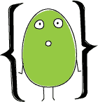

使用函数时，只需写上函数名，后跟括号并传入任何参数。这就是*函数调用*。在这个例子中，由于 printAHaiku()没有输入参数，你无需传入任何参数——只需将括号留空即可。

要调用 printAHaiku()，在函数的右花括号后，向你的游乐场添加以下代码：

```
printAHaiku
 ()
```

控制台输出为：

```
Input and output,

This function needs neither one

To print a haiku
```

现在你已经定义了这个函数，可以随时调用它，函数内部的代码会运行。确保你已打开调试区域（⌘ -SHIFT -Y），如图 7-1 所示，这样你就能看到结果。

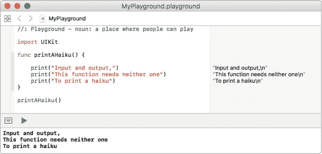

*图 7-1：函数的输出显示在调试控制台中。*

尝试多次调用 printAHaiku()函数吧！

### 函数通过输入参数做得更多

在我们第一个例子中，你看到了函数如何为你节省时间和精力。当你编写一个函数时，你可以在任何地方调用它，而无需在多个地方重复相同的代码。这当然很酷，但函数的真正强大之处在于，当你传入一个或多个输入值时，可以产生不同的结果。

#### 制作派对邀请函

让我们编写一个名为 invite(guest:)的函数，它接受一个人的名字作为输入，并生成一张生日派对的个性化邀请函。在你的游乐场（playground）中输入以下内容：

```
func
 invite(➊
 guest: String
 ) {

    print
 ("Dear
 \(
 ➋
 guest),"
 )

    print
 ("I'd love for you to come to my birthday party!"
 )

    print
 ("It's going to be this Saturday at my house."
 )

    print
 ("I hope that you can make it!"
 )

    print
 ("Love, Brenna\n"
 )

}
```

如果一个函数有输入参数，你需要将其放在函数名后的括号内➊。你应该按照以下格式编写输入参数：首先是参数名（在此例中为 guest），然后是一个冒号（:），最后是它的数据类型（在这个例子中为 String）。

默认情况下，参数名也作为参数标签使用，因此当你调用这个函数时，guest 将作为参数标签。（你将在“参数标签”章节的第 89 页中学习如何定义不同的参数名和参数标签。）

你在输入参数后面加上冒号，写上数据类型，就像声明变量一样。然而，与变量声明不同，在定义函数参数时，你*必须*始终声明函数预期的数据类型；这里没有类型推断。


要在函数内部使用输入参数，你只需使用它的参数名，就像使用任何其他常量一样➋。

当然，仅仅定义一个函数是不够的。既然函数已经定义了，让我们在 playground 中调用它，看看会发生什么。你可以通过输入函数名，后跟圆括号中的参数标签、冒号以及参数，来调用一个带有输入参数的函数，像这样：

```
invite
 (guest: "Cathy"
 )
```

当你通过输入函数名来调用一个函数时，Xcode 的自动补全会给你一个提示，告诉你应该传递什么参数给函数。在这种情况下，当你开始输入`invite`时，你会看到一个下拉菜单，像图 7-2 那样。

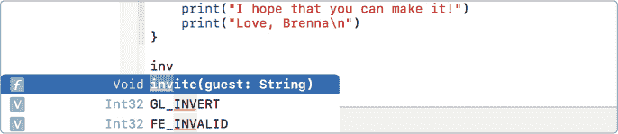

*图 7-2：Xcode 的自动补全会显示一个函数的输入参数。*

按下 ENTER 键来自动补全函数。光标会跳到函数的圆括号内（见图 7-3），此时 Xcode 已经自动添加了一些占位符文本，告诉你函数期望的输入类型。

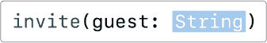

*图 7-3：Xcode 正在等待你填写`guest`参数。*

**注意**

*如果你传递的不是字符串给`invite(guest:)`，比如`invite(guest: 45)`，你会收到一个错误，因为这个函数期望的是字符串。*

只需将`String`替换为"Cathy"或其他朋友的名字，然后按 TAB 键完成函数调用的填写。它应该像图 7-4 那样。

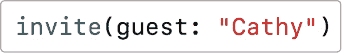

*图 7-4：一个`invite(guest:)`函数调用*

现在你知道如何填写函数调用了，调用`invite(guest:)`三次，使用你自己朋友的名字：

```
invite
 (guest: "Cathy"
 )

invite
 (guest: "Meghan"
 )

invite
 (guest: "Maddie"
 )
```

输出结果如下所示：

```
Dear Cathy,

I'd love for you to come to my birthday party!

It's going to be this Saturday at my house.

I hope that you can make it!

Love, Brenna

 Dear Meghan,

I'd love for you to come to my birthday party!

It's going to be this Saturday at my house.

I hope that you can make it!

Love, Brenna

Dear Maddie,

I'd love for you to come to my birthday party!

It's going to be this Saturday at my house.

I hope that you can make it!

Love, Brenna
```

使用你的`invite(guest:)`函数，你可以快速打印出三张派对邀请函，每张都发给不同的朋友！

#### 一次性邀请所有的朋友

你还可以编写一个函数，通过传递一个字符串数组作为参数，而不是单个字符串，一次性邀请所有的朋友。在你写了`invite(guest:)`的同一个 playground 中，编写以下的`invite(allGuests:)`函数来进行测试。注意，参数名称现在是复数形式，因为我们将一次性邀请多个客人。


```
func
 invite(allGuests: ➊
 [String
 ]) {

}
```

在这个例子中，当你声明函数的参数时，你会注意到`[String]`是用方括号括起来的➊。方括号表示数据类型是一个数组，而`String`则表示数组中值的类型是字符串。通过使用`[String]`，我们声明这个函数的输入是一个字符串数组。

在`invite(allGuests:)`函数内部，我们需要使用一个 for-in 循环遍历我们的`guests`数组，并为每个客人打印一张邀请函。记得我们之前创建了一个打印邀请函的函数吗？我们在这里也使用它！将以下代码添加到你的`invite(allGuests:)`函数中（灰色文本表示现有的代码行）：

```
func invite(allGuests: [String]) {

    for
 guest in
 allGuests {

        invite
 (guest: guest)

    }

}

```

在我们的 for-in 循环中，我们在 String 数组 `allGuests` 中的每个客人上调用单一的 `invite(guest:)` 函数，邀请每个人参加生日派对。您可能会想，`invite(guest:)` 和 `invite(allGuests:)` 是不是同一个函数。毕竟，它们的名字都是 `invite`。然而，尽管它们有相同的名称，但它们是两个不同的函数，因为它们接受不同的输入参数。这是您将在 Swift 中经常看到的模式。

要使用 `invite(allGuests:)` 函数，我们首先创建一个名为 `friends` 的数组，然后在函数调用中使用该数组。

```
➊
 let
 friends = ["Cathy"
 , "Meghan"
 , "Maddie"
 , "Julia"
 , "Sophie"
 , "Asher"
 ]

➋
 invite
 (allGuests: friends
 )
```

首先，我们创建一个包含六个朋友的数组 ➊ 。然后，我们将新的数组作为函数的输入来调用该函数 ➋ 。这是您将在调试控制台中看到的输出（-- snip -- 显示的是我们为了节省空间而省略的行）：

```
Dear Cathy,

I'd love for you to come to my birthday party!

It's going to be this Saturday at my house.

I hope that you can make it!

Love, Brenna

--*snip*
 --

Dear Asher,

I'd love for you to come to my birthday party!

It's going to be this Saturday at my house.

I hope that you can make it!

Love, Brenna
```

如果您不得不为每个朋友写邀请函，这将会非常繁琐。但是通过函数的强大功能，您可以用很少的代码行完成这一任务。尝试创建您自己的朋友数组，长度可以随您所愿！然后使用新的数组作为输入，调用 `invite(allGuests:)` 函数。真是小菜一碟！

#### 向您的客人发送消息

想象一下，您的派对日期即将到来，而一些客人还没有回复是否参加。您希望确认最终的出席人数，并让客人们知道要带泳衣，因为这将是一个水滑梯派对。您可以编写一个函数，根据客人的 RSVP 状态向每个客人发送定制的消息。


您的新函数将接受两个输入参数：一个 String 类型的 guest 参数，用于存储客人的名字；一个 Bool 类型的 rsvped 参数，用于存储 RSVP 状态，值为 true 或 false。请在您的 Playground 中输入以下代码：

```
func
 sendMessage(guest: String
 ,➊
 rsvped: Bool
 ) {

    print
 ("Dear
 \(
 guest),"
 )

  ➋
 if
 rsvped {

        print
 ("I'm so excited to see you this weekend!"
 )

    } else
 {

        print
 ("I hope that you can make it to my party."
 )

        print
 ("Can you let me know by tomorrow?"
 )

    }

         print
 ("We will have a huge slip and slide, so bring your bathing suit!"
 )

        print
 ("Love, Brenna\n"
 )

}
```

当一个函数需要多个输入参数时，您需要在每个参数之间添加逗号 ➊ 。每个参数都需要有一个参数名，后面跟着冒号和该参数的数据类型。您可以创建一个函数，接收任意数量的输入参数，而且这些参数类型可以不同。在 `sendMessage(guest:rsvped:)` 函数中，我们传递了一个 String 类型的 guest 参数和一个 Bool 类型的 rsvped 参数。

在函数体内，我们检查 rsvped 的值，看看它是否为 true ➋ ，然后使用 if-else 语句打印相应的消息。还要注意，函数定义中的最后打印语句无论 rsvped 的值是 true 还是 false 都会执行，因为它们在 if-else 语句的花括号之外。

如果您的客人已确认参加，他们将收到以下信息：

```
Dear *guest*
 ,

I'm so excited to see you this weekend!

We will have a huge slip and slide, so bring your bathing suit!

Love, Brenna
```

如果没有，他们将收到一条礼貌的提示，请他们回复：

```
Dear *guest*
 ,

I hope that you can make it to my party.

Can you let me know by tomorrow?

We will have a huge slip and slide, so bring your bathing suit!

Love, Brenna
```

让我们调用函数看看它是如何工作的。尝试将一位客人的 rsvped 值设置为 true，另一位客人的 rsvped 值设置为 false，这样您就可以看到两个消息的效果。

```
sendMessage
 (guest: "Julia"
 , rsvped: true
 )

sendMessage
 (guest: "Asher"
 , rsvped: false
 )
```

如您所见，调用一个具有多个输入参数的函数类似于调用一个只有一个输入参数的函数。

Xcode 的自动补全功能会帮助你填写输入值，并为你提供参数标签。你只需传入你想使用的值。填写完宾客名字后，按`TAB`，Xcode 会将光标移到你需要的下一个输入框中。（见图 7-5。）

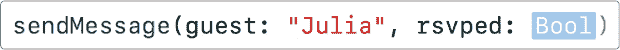

*图 7-5：在输入宾客姓名后按`TAB`将光标移到下一个输入字段。*

Xcode 还会告诉你`rsvped`的数据类型。将占位符文本`Bool`替换为`true`或`false`。如果你尝试传入其他内容，如姓名或数字，将会出现错误。

### 参数标签

你有没有注意到，当你调用`print(_:)`时，输入值前面没有参数标签？你写的是：

```
print
 ("Swift is awesome!"
 )
```

如果你尝试添加标签，你会得到一个错误：

```
print
 (inputString: "Swift is awesome!"
 )
```

一些参数在函数调用中有参数标签，而一些则没有。默认情况下，当你编写函数时，每个参数都会有一个参数标签，并且它将与参数名称相同。然而，如果你编写一个函数，觉得参数标签并不必要以使代码更清晰，那么你可以在函数定义中显式省略它。例如，在`print(_:)`函数中，很明显你传入的是一个将被打印的字符串。如果每次调用`print(_:)`时都必须包含一个像`inputString`这样的参数标签，那会很麻烦。

你还可以为每个参数创建一个与参数名称不同的参数标签。你可以通过输入参数标签、参数名称、冒号，然后是参数的数据类型来实现。在你第一次声明函数参数时，所有这些操作都在`func`关键字后的函数括号内完成。这通常在 Swift 函数中使用，使得函数调用看起来更像一句话。图 7-6 展示了参数标签和参数之间的区别。

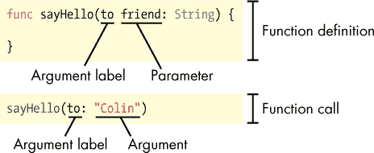

*图 7-6：`sayHello()`函数具有自定义参数标签。*

`sayHello(to:)`函数的输入参数是`friend`，参数标签是`to`，函数调用中传入的参数是"Colin"。如果没有单独的参数标签，调用该函数时会像`sayHello(friend:)`，这听起来就不那么像一句完整的句子了。

本节中，我们将了解如何编写具有自定义参数标签的函数。我们还将展示如何编写一个完全省略参数标签的函数。

#### 添加自定义参数标签

让我们来看一个例子，看看如何通过添加自定义参数标签来使代码更具可读性。生日派对后，你会想给所有的宾客写感谢信。在你的 Playground 中编写以下函数：

```
func
 sendThankYou(➊
 to guest: String
 , ➋
 for gift: String
 ) {

    print
 ("Dear
 \(
 ➌
 guest),"
 )

    print
 ("Thanks for coming to my party and for the
 \(
 ➍
 gift)."
 )

    print
 ("It was so great to see you!"
 )

    print
 ("Love, Brenna\n"
 )

}
```

在 ➊ 位置，我们为传递给函数的 `guest` 参数添加了自定义的参数标签 `to`。类似地，在 ➋ 位置，我们为 `gift` 参数添加了参数标签 `for`。参数名称 `guest` ➌ 和 `gift` ➍ 用来在函数内部引用这些参数。

参数标签 `to` 和 `for` 用来标记函数调用时的参数，像这样：

```
sendThankYou
 (to: "Meghan"
 , for: "puzzle books"
 )
```

在这里，你可以看到在函数调用中，第一个输入值前写了 `to:`，第二个输入值前写了 `for:`。如果一个参数有自定义的参数标签，你必须在函数调用中使用它。如果尝试使用参数名称，系统会报错：

```
// This will not work

sendThankYou
 (guest: "Meghan"
 , gift: "puzzle books"
 )
```

Xcode 的自动完成功能会始终为你填充参数标签，所以你不必担心错误地调用函数（参见 图 7-7）。

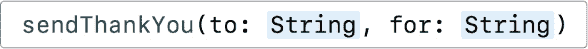

*图 7-7：Xcode 自动完成带有正确参数标签的函数。*

程序员常常使用像 *to*、*from* 或 *with* 这样的介词作为参数标签。在这个例子中，函数用于将感谢信 *发送给* 客人 *以感谢* 礼物。代码 `sendThankYou(to: "Meghan", for: "puzzle books")` 比 `sendThankYou(guest: "Meghan", gift: "puzzle books")` 更像一句完整的句子。


#### 去除参数标签

如果你不想在函数调用中使用任何参数标签，可以通过在参数名称前加上下划线和空格来去除它们。在下面的例子中，我们编写了一个计算体积的函数，它以盒子的三条边作为输入。因为函数名已经明确表示你需要传入三条边，所以你实际上不需要参数标签来提高代码的可读性。

```
func
 volumeOfBoxWithSides(➊
 _
 side1: Int
 , ➋
 _
 side2: Int
 , ➌
 _
 side3: Int
 ) {

    print
 ("The volume of this box is
 \(
 side1 * side2 * side3)."
 )

}
```

我们通过在 ➊ 位置将下划线放在 `side1` 前面，在 ➋ 位置将下划线放在 `side2` 前面，以及在 ➌ 位置将下划线放在 `side3` 前面，去除了边长的参数标签。

现在，当你调用函数时，只需输入参数值，无需任何标签。

```
volumeOfBoxWithSides
 (3
 , 4
 , 6
 )
```

这个函数将输出“这个盒子的体积是 72。”如果你不仅仅是打印出盒子的体积，而是希望将结果存储在变量或常量中以供后续使用，这不是更有用吗？让我们通过返回值来了解如何做到这一点！

### 返回值

让我们尝试重写 `volumeOfBoxWithSides(_:_:_:)` 函数，使其返回体积，而不是将其打印到控制台。

#### 哪个盒子更大？

假设你有两个形状不同的盒子，想知道哪个能装更多东西。首先，编写一个返回盒子体积的 `volumeOfBox(_:_:_:)` 函数，返回一个整数类型的值：

```
func
 volumeOfBox(_
 side1: Int
 , _
 side2: Int
 , _
 side3: Int
 ) ➊
 -> Int
 {

    let
 volume = side1 * side2 * side3

  ➋
 return
 volume

}
```

要为函数提供返回值，请在函数的输入参数后面使用一个破折号和一个大于号来形成箭头（->），然后输入返回值的数据类型 ➊。请注意，你不需要为返回值提供名称，只需提供数据类型。在函数体内，你使用`return`关键字返回你想要返回的值 ➋。如果你写一个返回值的函数，那么你*必须*在函数内返回该值，否则会出现错误。函数在返回值后结束。如果在`return`语句后写了任何代码，它将被忽略，因为`return`会退出函数。

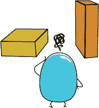

在两个不同的盒子上调用这个函数，看看它的效果：

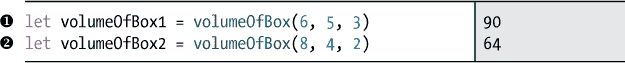

在 ➊ 处，`volumeOfBox(_:_:_:)`函数计算一个长宽高分别为 6、5 和 3 的盒子的体积，返回值 90 被存储在一个名为`volumeOfBox1`的常量中。在 ➋ 处，`volumeOfBox2`，长宽高分别为 8、4 和 2，返回值为 64。现在让我们打印出哪个盒子更大：

```
if
 volumeOfBox1
 > volumeOfBox2
 {

    print
 ("Box 1 is the bigger box."
 )

} else
 if
 volumeOfBox1
 < volumeOfBox2
 {

    print
 ("Box 2 is the bigger box."
 )

} else
 {

    print
 ("The boxes are the same size."
 )

}
```

你应该在调试控制台看到字符串“Box 1 is the bigger box.”输出。

#### 条件返回

你可能希望根据某个条件返回不同的值。让我们写一个函数，接收一个测试成绩数组并返回平均成绩。为了计算平均值，你需要将所有分数加在一起，然后除以总的分数数量。在你的游乐场中输入以下代码：

```
func
 averageOf(_
 scores:[Int
 ]) -> Int
 {

  ➊
 var
 sum = 0

  ➋
 for
 score in
 scores {

        sum += score

    }

  ➌
 if
 scores.count
 > 0
 {

     ➍
 return
 sum / scores.count

    } else
 {

     ➎
 return
 0

    }

}
```

首先，我们需要计算所有值的总和。在 ➊ 处，我们定义了一个名为`sum`的`Int`类型变量，并将其初始化为 0。 ➋ 处的`for-in`循环遍历`score`数组中的每个值，并将其加到`sum`变量中。循环完成后，变量`sum`保存了所有分数的总和。计算完总和后，剩下的就是将其除以分数的总数，分数总数就是`score.count`。

但是如果数组为空呢？你不能除以零——在数学课上也不行，在 Swift 中也是如此。尝试除以零会给你一个除零错误，并导致程序崩溃。因此，在进行除法时，始终确保你要除的数不为零，这就是我们通过检查`score.count > 0`来处理的 ➌。在 ➍ 处，我们通过将总分除以数组中的分数数量来返回平均值，使用`return sum / score.count`。没错！你可以返回任何计算结果为正确数据类型的表达式，这意味着我们可以跳过将计算出的平均值赋值给新变量的步骤，直接返回`sum / score.count`，因为它的计算结果是一个`Int`。

在这个函数中，我们还需要在`score.count`不大于零时返回某个值，否则我们会得到一个缺少返回值的错误。我们通过在`if`语句后添加`else`来处理这个问题，返回`0` ➎。你可以通过在一个分数数组和一个空数组上调用这个函数来测试代码：

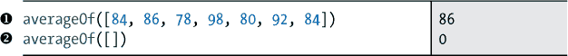

当你将一整个测试成绩数组传递给 averageOf() 函数时，如我们在 ➊ 中所做的，函数返回的是成绩的平均值，并显示在结果窗格中。如果你传递一个空数组，如我们在 ➋ 中所做的，那么返回值就是 0。

**注意**

*在这种情况下，return 0 周围的 else 语句其实并不必要。这是因为如果 scores.count > 0，那么函数已经会通过 return sum / scores.count 提前结束。所以，如果计算机已经跳过了那个 if 语句，我们就知道 scores.count > 0 一定不成立，那么我们可以直接写一个 return 0，而不需要放在 else 语句中。然而，如果我们保留 else 语句，代码会更加清晰，容易理解。有时候，为了让别人更容易理解，写一些额外的代码比用复杂的技巧更好。*

### 你学到了什么

你刚刚为你的 Swift 工具箱增加了一个重要工具——创建和调用你自己的函数！函数在编程中广泛使用，用来做各种令人惊奇的事情！

在第八章中，我们将展示如何通过编写类定义来创建自定义对象。这将使你能够创建除 Swift 已包含类型之外的常量和变量，这在创建应用程序时非常有用！

## 函数是一个派对，你被邀请了


每种编程语言中都有一个非常有用的工具——函数。*函数*是你可以一次又一次使用的代码块，来执行特定的任务。你可以编写自己的自定义函数，但 Swift 提供了许多内置函数。你已经使用过一些，比如 print(_:) 函数，它在控制台中显示字符串。

### 输入与输出

函数可以接收*输入*并返回*输出*，虽然它们并不总是需要这样做。输入是你提供给函数以完成任务的信息，而输出是函数完成任务后返回的内容。

函数可以接收的输入类型由它的*输入参数*定义。你传入这些参数的值被称为*实参*。例如，print(_:) 函数中圆括号里的字符串就是一个实参。有时，实参会有一个*参数标签*来描述它。print(_:) 函数没有参数标签，但我们会在本章稍后学习标签的相关内容。

**注意**

*在本书中，当我们提到一个具有一个未标记输入参数的函数时，我们会在函数名后加上 (_:)。你很快就会看到那个冒号（:）的作用！*

让我们来看一个在 Playground 中的例子：

```
print
 ("Swift is awesome!"
 )
```

在调试区域（按 ⌘ -SHIFT -Y），你会看到：

```
Swift is awesome!
```

print(_:) 函数接受一个输入值，但没有返回值。在这种情况下，输入值是字符串"Swift is awesome!"。print(_:) 函数将它所接收的字符串显示在调试控制台中，然后结束，不返回任何内容。没有返回值的函数有时被称为*void 函数*。我们将在“返回值”的第 91 页中看到一个既有输入参数又有返回值的函数示例。

通过编写接受输入并返回输出的函数，你可以创建各种各样的应用程序！

### 编写自定义函数

让我们写一个简单的函数，它打印一个*俳句*，这是一种传统的日本诗歌，由三行组成，第一行和最后一行有五个音节，中间一行有七个音节。将此输入到你的游乐场：

```
func
 ➊
 printAHaiku()➋
 {

    print
 ("Input and output,"
 )

    print
 ("This function needs neither one"
 )

    print
 ("To print a haiku"
 )

}
```

首先，写下 func 关键字 ➊，后跟函数的名称。当你创建一个函数时，你必须给它起个名字，这样你才可以在需要它执行任务时调用它。

命名函数的规则与命名变量相同：你从小写字母开始，并使用驼峰命名法将每个新单词的大写字母连接起来。你还应当为你的函数起一个能够描述其作用的名字。你不觉得 printAHaiku() 是一个非常适合打印简单 Swift 俳句的函数名吗？

在函数名称后面，有一对括号 ➋。如果你的函数有输入参数，你会将它们放在这些括号内。在这个例子中，你没有任何输入参数，所以只需将括号留空。

函数的*主体*被大括号括起来。这是你写函数代码的地方。你将开括号（{）放在与函数名相同的行上，闭括号（}）则放在函数末尾的独立一行上。在这个例子中，函数的主体包含了所有打印俳句的 print 语句。


要使用一个函数，你只需写下它的名称，后面跟上带有参数的括号。这是一个*函数调用*。在这个例子中，由于 printAHaiku() 没有输入参数，你无需传入任何参数——只需将括号留空即可。

要调用 printAHaiku()，在函数的闭括号后，在你的游乐场中添加以下一行：

```
printAHaiku
 ()
```

控制台输出是：

```
Input and output,

This function needs neither one

To print a haiku
```

现在你已经定义了这个函数，你可以随时调用它，函数内部的代码就会执行。确保你打开了调试区域（⌘ -SHIFT -Y），如图 7-1 所示，这样你就可以看到结果了。


*图 7-1：函数的输出显示在调试控制台中。*

尝试多次调用 printAHaiku() 函数吧！

### 函数通过输入参数做更多事情

在我们的第一个示例中，你看到了函数如何帮助你节省时间和精力。当你编写一个函数时，你可以在任何地方调用它，而不必在许多地方重复代码块。这当然很酷，但函数的真正威力在于，当你传入一个或多个输入值时，可以产生不同的结果。

#### 制作派对邀请函

让我们编写一个名为 invite(guest:) 的函数，它接受一个人的名字作为输入，并创建一张个性化的生日派对邀请函。请在你的 Playground 中输入以下内容：

```
func
 invite(➊
 guest: String
 ) {

    print
 ("Dear
 \(
 ➋
 guest),"
 )

    print
 ("I'd love for you to come to my birthday party!"
 )

    print
 ("It's going to be this Saturday at my house."
 )

    print
 ("I hope that you can make it!"
 )

    print
 ("Love, Brenna\n"
 )

}
```

如果一个函数有输入参数，你需要将其包含在函数名称后面的括号中 ➊。你将输入参数的格式化方式是：先写参数名（在此示例中为 guest），然后是冒号（:），最后是其数据类型（在这个例子中是 String）。

默认情况下，参数名也充当了参数标签，因此当你调用该函数时，guest 将是参数标签。（你将在“参数标签”章节中学习如何定义独立的参数名和参数标签，具体见 第 89 页）

你在冒号后面写输入参数的数据类型，就像声明一个变量时一样。但是，与变量声明不同，当定义函数参数时，你*必须*始终声明函数应期望的数据类型；这里没有类型推断。


要在函数内部使用输入参数，你只需使用其参数名，就像使用其他常量一样 ➋。

当然，仅仅定义函数还不够。现在函数已经定义了，让我们在 Playground 中调用它看看会发生什么。你可以通过输入函数名称，后跟括号内的参数标签、冒号和参数，来调用一个带有输入参数的函数，如下所示：

```
invite
 (guest: "Cathy"
 )
```

当你通过编写函数名称调用一个函数时，Xcode 的自动完成功能会给你一个提示，告诉你应该传递什么类型的参数。在这种情况下，当你开始编写 invite 时，你会看到一个下拉菜单，如 图 7-2 所示。


*图 7-2：Xcode 的自动完成将显示函数的输入参数。*

按下 ENTER 键以自动完成函数。你的光标将移动到函数的括号内（参见 图 7-3），此时 Xcode 已自动添加了一些占位符文本，告诉你函数期望什么类型的输入。


*图 7-3：Xcode 正在等待你填写 guest 参数。*

**注意**

*如果你传递了一个不是字符串的值给 invite(guest:)，例如 invite(guest: 45)，你会遇到错误，因为该函数期望的是一个字符串。*

只需在 String 位置输入 “Cathy” 或其他朋友的名字，然后按 TAB 键完成函数调用的填写。它应该看起来像 图 7-4。


*图 7-4：一个 invite(guest:) 函数调用*

现在你知道如何填写函数调用，尝试使用你自己朋友的名字，调用三次 invite(guest:)函数：

```
invite
 (guest: "Cathy"
 )

invite
 (guest: "Meghan"
 )

invite
 (guest: "Maddie"
 )
```

输出看起来是这样的：

```
Dear Cathy,

I'd love for you to come to my birthday party!

It's going to be this Saturday at my house.

I hope that you can make it!

Love, Brenna

 Dear Meghan,

I'd love for you to come to my birthday party!

It's going to be this Saturday at my house.

I hope that you can make it!

Love, Brenna

Dear Maddie,

I'd love for you to come to my birthday party!

It's going to be this Saturday at my house.

I hope that you can make it!

Love, Brenna
```

使用你的 invite(guest:)函数，你可以快速打印三份派对邀请函，每份邀请函都寄给不同的朋友！

#### 一次邀请所有朋友

你还可以写一个函数，通过传入一个字符串数组作为参数，而不是单个字符串，一次性邀请所有朋友。在你编写 invite(guest:)函数的同一个 Playground 中，写出以下 invite(allGuests:)函数来进行测试。注意，参数名称现在是复数形式，因为我们将一次性邀请多个客人。


```
func
 invite(allGuests: ➊
 [String
 ]) {

}
```

在这个示例中，当你声明函数的参数时，你会注意到[String]是用方括号括起来的 ➊ 。方括号声明数据类型为数组，String 表示数组中值的数据类型。通过使用[String]，我们声明这个函数的输入是一个字符串数组。

在 invite(allGuests:)函数内部，我们希望使用 for-in 循环遍历我们的 guest 数组，并为每个 guest 打印邀请函。记得我们刚才创建了一个打印邀请函的函数吗？我们将在这里使用它！将以下内容添加到你的 invite(allGuests:)函数中（灰色文本表示现有的行）：

```
func invite(allGuests: [String]) {

    for
 guest in
 allGuests {

        invite
 (guest: guest)

    }

}

```

在我们的 for-in 循环中，我们对 String 数组 allGuests 中的每个 guest 调用单个 invite(guest:)函数，邀请每个人参加生日派对。你可能会想知道 invite(guest:)和 invite(allGuests:)是否是相同的函数。毕竟，它们的名字都是 invite。尽管名字相同，但它们是两个不同的函数，因为它们接受不同的输入参数。这是你在 Swift 中经常会看到的模式。

要使用 invite(allGuests:)函数，我们首先创建一个名为 friends 的数组，然后在函数调用中使用它。

```
➊
 let
 friends = ["Cathy"
 , "Meghan"
 , "Maddie"
 , "Julia"
 , "Sophie"
 , "Asher"
 ]

➋
 invite
 (allGuests: friends
 )
```

首先，我们创建一个由六个朋友组成的数组 ➊ 。然后，我们用新数组作为函数的输入，调用该函数 ➋ 。这是你在调试控制台中看到的输出（-- snip --表示我们省略了部分行以节省空间）：

```
Dear Cathy,

I'd love for you to come to my birthday party!

It's going to be this Saturday at my house.

I hope that you can make it!

Love, Brenna

--*snip*
 --

Dear Asher,

I'd love for you to come to my birthday party!

It's going to be this Saturday at my house.

I hope that you can make it!

Love, Brenna
```

如果你必须为每个朋友写一份邀请函，那会花费很多时间。但是，借助函数的力量，你只用了很少的代码就完成了这项工作。试着创建你自己的朋友数组；可以长一点！然后用你的新数组作为输入，调用 invite(allGuests:)函数。简单极了！

#### 给你的客人发信息

想象一下，你的派对日期即将到来，而一些客人还没有回复。你想要确认最终的参加人数，并通知客人带上泳衣，因为这将是一个滑水派对。你可以写一个函数，根据客人的 RSVP 状态发送自定义信息。


你的新函数将接受两个输入参数：一个 `String` 类型的参数表示客人姓名，一个 `Bool` 类型的参数表示 RSVP 状态，其值为 `true` 或 `false`。在你的 Playground 中输入以下代码：

```
func
 sendMessage(guest: String
 ,➊
 rsvped: Bool
 ) {

    print
 ("Dear
 \(
 guest),"
 )

  ➋
 if
 rsvped {

        print
 ("I'm so excited to see you this weekend!"
 )

    } else
 {

        print
 ("I hope that you can make it to my party."
 )

        print
 ("Can you let me know by tomorrow?"
 )

    }

         print
 ("We will have a huge slip and slide, so bring your bathing suit!"
 )

        print
 ("Love, Brenna\n"
 )

}
```

当一个函数接受多个输入参数时，你需要在每个参数之间加上逗号 ➊。每个参数都需要有一个参数名，后面跟上冒号和参数的数据类型。你可以创建一个接受任意多个输入参数的函数，并且它们不必是相同类型。在 `sendMessage(guest:rsvped:)` 函数中，我们传入了一个 `String` 类型的 `guest` 和一个 `Bool` 类型的 `rsvped`。

在函数体内，我们检查 `rsvped` 值是否为 `true` ➋，然后使用 `if-else` 语句打印相应的消息。还要注意，函数定义中的最后 `print` 语句无论 `rsvped` 值是 `true` 还是 `false` 都会执行，因为它们在 `if-else` 语句的括号外面。

如果你的客人已经回复了，他们将收到以下消息：

```
Dear *guest*
 ,

I'm so excited to see you this weekend!

We will have a huge slip and slide, so bring your bathing suit!

Love, Brenna
```

如果没有，他们将收到一条礼貌的提示，要求他们做出回应：

```
Dear *guest*
 ,

I hope that you can make it to my party.

Can you let me know by tomorrow?

We will have a huge slip and slide, so bring your bathing suit!

Love, Brenna
```

让我们调用这个函数看看它是如何工作的。尝试将一个客人的 `rsvped` 值设置为 `true`，另一个客人的设置为 `false`，这样你就能看到两个消息的实际效果。

```
sendMessage
 (guest: "Julia"
 , rsvped: true
 )

sendMessage
 (guest: "Asher"
 , rsvped: false
 )
```

正如你所看到的，调用一个有多个输入参数的函数类似于调用一个只有一个输入参数的函数。

Xcode 的自动完成功能会通过为你提供参数标签来帮助你填写输入值。你所需要做的就是传入你想使用的值。输入完客人姓名后，按 TAB 键，Xcode 会将光标移动到你需要填写下一个输入值的位置。（见 图 7-5）


*图 7-5：在输入完客人姓名后按 TAB 键，将会将光标移到下一个输入字段。*

Xcode 还会告诉你 `rsvped` 的数据类型。将占位符文本 `Bool` 替换为 `true` 或 `false`。如果你尝试传入其他内容，比如名字或数字，你将会遇到错误。

### 参数标签

你是否注意到当你调用 `print(_:)` 时，并没有在输入值前加上参数标签？你只需要写：

```
print
 ("Swift is awesome!"
 )
```

如果你尝试包含标签，你将会遇到错误：

```
print
 (inputString: "Swift is awesome!"
 )
```

一些参数在函数调用中有参数标签，而有些没有。默认情况下，当你编写函数时，每个参数都会有一个参数标签，并且该标签与参数名相同。然而，如果你编写的函数中，你认为参数标签并不必要以使代码更清晰，那么你可以在函数定义中明确省略它。例如，在 `print(_:)` 函数中，很明显你传入的是一个字符串，它将被打印出来。如果每次调用 `print(_:)` 时都必须包括像 `inputString` 这样的参数标签，会显得很麻烦。

你还可以为每个参数创建一个与参数名称不同的参数标签。你通过输入参数标签、参数名称、冒号，最后是参数的数据类型来实现这一点。所有这些都在函数体内的 func 关键字后声明参数时进行。这在 Swift 函数中很常见，目的是让函数调用看起来更像一句话。图 7-6 展示了参数标签和参数之间的区别。


*图 7-6: sayHello()函数具有自定义的参数标签。*

sayHello(to:) 函数的输入参数是 friend，参数标签是 to，函数调用中传入的参数是"Colin"。如果没有单独的参数标签，调用函数时会像 sayHello(friend:) 这样，这听起来不像是完整的句子。

在本节中，我们将介绍如何编写带有自定义参数标签的函数。我们还将向你展示如何编写一个完全省略参数标签的函数。

#### 添加自定义参数标签

让我们看一个例子，看看如何通过添加自定义的参数标签使代码更具可读性。在你的生日派对结束后，你可能想要给所有的客人发送感谢卡。你可以在你的 playground 中写下以下函数：

```
func
 sendThankYou(➊
 to guest: String
 , ➋
 for gift: String
 ) {

    print
 ("Dear
 \(
 ➌
 guest),"
 )

    print
 ("Thanks for coming to my party and for the
 \(
 ➍
 gift)."
 )

    print
 ("It was so great to see you!"
 )

    print
 ("Love, Brenna\n"
 )

}
```

在➊处，我们为传入的 guest 参数添加了自定义的参数标签 to。同样，在➋处，我们为 gift 参数添加了参数标签 for。参数名称 guest ➌和 gift ➍用于在函数内部引用这些参数。

参数标签 to 和 for 用于在函数调用时标记参数，如下所示：

```
sendThankYou
 (to: "Meghan"
 , for: "puzzle books"
 )
```

在这里你可以看到，to: 被写在第一个输入值之前，而 for: 被写在第二个输入值之前。如果一个参数有自定义的参数标签，你必须在函数调用中使用它。尝试使用参数名称而不是标签会导致错误：

```
// This will not work

sendThankYou
 (guest: "Meghan"
 , gift: "puzzle books"
 )
```

Xcode 的自动补全功能会始终为你填充参数标签，所以你不必担心错误地调用函数（见图 7-7）。


*图 7-7: Xcode 自动完成带有正确参数标签的函数。*

程序员常常使用像*to*、*from*或*with*这样的介词作为参数标签。在这个例子中，函数用来向客人*发送*感谢卡*以感谢*礼物。代码 sendThankYou(to: "Meghan", for: "puzzle books") 比 sendThankYou(guest: "Meghan", gift: "puzzle books") 看起来更像一句话。


#### 移除参数标签

如果你不想在函数调用中使用任何参数标签，可以通过在参数名之前加下划线和空格来移除它们。在以下示例中，我们编写一个计算体积的函数，它接受盒子的三条边作为输入。由于函数名已经清楚地说明了需要传入三条边，你实际上并不需要参数标签来提高代码的可读性。

```
func
 volumeOfBoxWithSides(➊
 _
 side1: Int
 , ➋
 _
 side2: Int
 , ➌
 _
 side3: Int
 ) {

    print
 ("The volume of this box is
 \(
 side1 * side2 * side3)."
 )

}
```

我们通过在 ➊ 处在 side1 前面加下划线，在 ➋ 处在 side2 前面加下划线，在 ➌ 处在 side3 前面加下划线，移除了侧面参数标签。

现在，当你调用该函数时，只需要输入参数值，而不需要任何标签。

```
volumeOfBoxWithSides
 (3
 , 4
 , 6
 )
```

这个函数将输出 "这个盒子的体积是 72。"。如果你可以将结果存储在一个变量或常量中以便稍后使用，而不仅仅是打印出盒子的体积，岂不是更有用吗？让我们通过返回值来了解如何做到这一点！

### 返回值

让我们尝试重写 volumeOfBoxWithSides(_:_:_:) 函数，使其返回体积，而不是将其打印到控制台。

#### 哪个是更大的盒子？

假设你有两个形状不同的盒子，想知道哪个能装更多东西。首先，写一个 volumeOfBox(_:_:_:) 函数，它返回盒子的体积（Int 类型）：

```
func
 volumeOfBox(_
 side1: Int
 , _
 side2: Int
 , _
 side3: Int
 ) ➊
 -> Int
 {

    let
 volume = side1 * side2 * side3

  ➋
 return
 volume

}
```

要为函数提供返回值，在函数的输入参数后面使用一个破折号和一个大于号形成箭头（->），然后输入返回值的数据类型 ➊ 。请注意，你不需要为返回值提供名称，只需要数据类型即可。在函数体内，你可以通过使用 return 关键字并跟随你想返回的值来返回该值 ➋ 。如果你编写了一个返回值的函数，那么你*必须*在函数内部返回该值，否则会出现错误。函数在返回值之后结束。如果你在返回语句后编写了任何代码，它将被忽略，因为 return 会退出函数。


在两个不同的盒子上调用该函数，看看它是如何工作的：


在 ➊ ，volumeOfBox(_:_:_:) 函数计算一个边长为 6、5 和 3 的盒子的体积，返回值 90 被存储在一个名为 volumeOfBox1 的常量中。在 ➋ ，边长为 8、4 和 2 的 volumeOfBox2 被赋值为 64。现在，让我们打印出关于哪个盒子更大的消息：

```
if
 volumeOfBox1
 > volumeOfBox2
 {

    print
 ("Box 1 is the bigger box."
 )

} else
 if
 volumeOfBox1
 < volumeOfBox2
 {

    print
 ("Box 2 is the bigger box."
 )

} else
 {

    print
 ("The boxes are the same size."
 )

}
```

你应该能在调试控制台看到字符串 "Box 1 is the bigger box." 输出。

#### 条件返回

你可能希望根据某个条件返回不同的值。让我们编写一个函数，它接受一个测试分数数组，并返回平均分数。为了得到平均值，你将所有分数加起来，然后除以分数的总数。请在你的 Playground 中输入以下代码：

```
func
 averageOf(_
 scores:[Int
 ]) -> Int
 {

  ➊
 var
 sum = 0

  ➋
 for
 score in
 scores {

        sum += score

    }

  ➌
 if
 scores.count
 > 0
 {

     ➍
 return
 sum / scores.count

    } else
 {

     ➎
 return
 0

    }

}
```

首先，我们需要找出所有值的总和。在➊，我们定义了一个名为 sum 的 Int 类型变量，并将其初始化为 0。➋处的 for-in 循环遍历`scores`数组中的每个值，并将其累加到 sum 变量中。当循环完成时，sum 变量中保存了所有分数的总和。计算出总和后，剩下的就是用总和除以分数的数量，简单来说就是`scores.count`。

但是如果数组为空呢？你不能用零来除——无论是在数学课上还是在 Swift 中。在 Swift 中，尝试用零除会导致“除以零”错误，并使你的程序崩溃。因此，在进行除法运算时，一定要确保你要除的数不是零，这就是我们在➌处通过检查`scores.count > 0`来避免的情况。在➍处，我们通过将分数总和除以数组中的分数数量来返回平均值，使用的是`return sum / scores.count`。没错！你可以返回任何计算结果为正确数据类型的表达式，这意味着我们可以跳过将计算出的平均值赋值给新变量的步骤，直接返回`sum / scores.count`，因为它的结果是一个 Int 类型。

在这个函数中，当`scores.count`不大于零时，我们也需要返回一个值，否则会出现函数缺少返回值的错误。我们通过在 if 语句中添加一个 else 来处理这个问题，返回 0，见➎。你可以通过调用函数来测试代码，分别传入一个分数组和一个空数组：


当你将一整套测试分数传递给`averageOf()`函数时，正如我们在➊所做的那样，函数会返回分数的平均值，并显示在结果面板中。如果你传入一个空数组，正如我们在➋所做的那样，返回值将是 0。

**注意**

*在这种情况下，return 0 周围的 else 语句其实并不是必须的。这是因为如果`scores.count > 0`，那么函数已经通过`return sum / scores.count`结束了。所以如果程序已经通过了那个 if 语句，那么我们知道`scores.count > 0`一定不为真，这时我们可以直接使用`return 0`，而不需要将其包裹在 else 语句中。然而，如果我们保留 else 语句，代码会更清晰、更容易理解。有时候，写一些额外的代码让其他人更容易理解，比使用一些巧妙的快捷方式要更好。*

### 你学到了什么

你刚刚为你的 Swift 工具箱添加了一个重要的工具——创建并调用你自己的函数！函数在编程中被广泛使用，用来做各种各样的惊人事情！

在第八章中，我们将展示如何通过编写类定义来创建自定义对象。这将让你可以创建除 Swift 中已有类型以外的常量和变量，这对于你在开发应用时将非常有用！


在每种编程语言中，最有用的工具之一就是函数。*函数*是一个代码块，你可以反复使用它来执行特定任务。你可以编写自己的自定义函数，但 Swift 也提供了许多内置函数。你已经使用过一些，比如`print(_:)`函数，它在控制台显示一个字符串。

### 输入与输出

函数可以接受*输入*并返回*输出*，尽管它们并不总是必须有返回值。输入是你给函数的，用于执行任务的信息，而输出是函数在完成任务后返回的内容。

一个函数可以接受的输入类型在其*输入参数*中定义。你传递给这些参数的值被称为*参数*。例如，你在 print(_:)函数的括号中输入的字符串就是一个参数。有时，参数会有一个*参数标签*来描述它。print(_:)函数没有参数标签，但我们将在本章后面学习更多关于标签的内容。

**注意**

*在本书中，当我们提到一个只有一个未标记输入参数的函数时，我们会在函数名后加上(_:)。你很快就会看到冒号(:)的作用！*

让我们在 Playground 中看一个例子：

```
print
 ("Swift is awesome!"
 )
```

在调试区（按⌘-SHIFT-Y），你会看到：

```
Swift is awesome!
```

`print(_:)`函数接受一个输入值，但没有返回值。在这个例子中，输入值是字符串"Swift is awesome!"。`print(_:)`函数在调试控制台显示它收到的字符串，然后结束而不返回任何内容。没有返回值的函数有时被称为*无返回值函数*。我们将在“返回值”一节中，在第 91 页看到一个既有输入参数又有返回值的函数示例。

通过编写接受输入并返回输出的函数，你可以创建各种各样的应用程序！

### 编写自定义函数

让我们编写一个简单的函数，打印一个*俳句*，它是由三行组成的传统日本诗歌，第一行和第三行各有五个音节，中间一行有七个音节。将以下内容输入到你的 Playground 中：

```
func
 ➊
 printAHaiku()➋
 {

    print
 ("Input and output,"
 )

    print
 ("This function needs neither one"
 )

    print
 ("To print a haiku"
 )

}
```

首先，写下`func`关键字 ➊ ，后面跟上你的函数名称。当你创建一个函数时，必须给它命名，这样你才能在需要它执行任务时调用它。

命名函数的规则与命名变量相同：你从小写字母开始，每个新词的首字母大写，采用驼峰命名法。你还应该给你的函数起一个能描述它功能的名字。你不觉得`printAHaiku()`是一个非常适合打印简单 Swift 俳句的函数名吗？

在函数名后面，有一对括号 ➋ 。如果你的函数有输入参数，你应将它们放在括号内。在这个例子中，你没有任何输入参数，所以括号就保持空着。

函数的*主体*被大括号包围。你将在这里编写函数的代码。你将开括号（{）和函数名称放在同一行，闭括号（}）则放在函数末尾的单独一行。在这个例子中，函数的主体包含所有打印俳句的 print 语句。


要使用一个函数，你只需写出它的名称，后面跟着圆括号，括号内是任何参数。这就是一个*函数调用*。在这个例子中，因为 printAHaiku()没有输入参数，所以你无需传入任何参数——只需将圆括号留空。

要调用 printAHaiku()，请在函数的闭括号后，在你的 playground 中添加以下代码行：

```
printAHaiku
 ()
```

控制台输出为：

```
Input and output,

This function needs neither one

To print a haiku
```

现在你已经定义了这个函数，你可以随时调用它，函数内部的代码将会执行。确保调试区域是打开的（⌘ -SHIFT -Y），如图 7-1 所示，这样你才能看到结果。


*图 7-1：函数的输出显示在调试控制台中。*

尝试多次调用 printAHaiku()函数！

### 函数通过输入参数能做更多的事情

在我们的第一个例子中，你看到了函数如何节省时间和精力。当你编写一个函数时，你可以在任何地方调用它，而不必在多个地方重复代码块。这肯定很酷，但函数的真正强大之处在于当你传入一个或多个输入值时，可以产生不同的结果。

#### 制作派对邀请函

让我们编写一个名为 invite(guest:)的函数，它接受一个人的名字作为输入，并生成一个个性化的生日派对邀请函。在你的 playground 中输入以下内容：

```
func
 invite(➊
 guest: String
 ) {

    print
 ("Dear
 \(
 ➋
 guest),"
 )

    print
 ("I'd love for you to come to my birthday party!"
 )

    print
 ("It's going to be this Saturday at my house."
 )

    print
 ("I hope that you can make it!"
 )

    print
 ("Love, Brenna\n"
 )

}
```

如果函数有输入参数，你需要将其放入函数名称后面的圆括号中 ➊。你将输入参数的名称首先写出（在这个例子中是 guest），然后是冒号（:），最后是它的数据类型（在这个例子中是 String）。

默认情况下，参数名称也充当了参数标签，因此在调用此函数时，guest 将成为参数标签。（你将会在“参数标签”中学习如何定义单独的参数名称和参数标签，详见第 89 页。）

你在冒号后面写出输入参数的数据类型，就像声明变量时一样。然而，不同于变量声明，在定义函数参数时，你*必须*始终声明函数应期望的数据类型；这里没有类型推断。


要在函数内部使用输入参数，你只需像使用其他常量一样使用其参数名称 ➋。

当然，定义一个函数还不够。既然函数已经定义了，接下来我们可以在 playground 中调用它，看看会发生什么。你可以通过输入函数名称后跟括号中的参数标签、冒号和参数来调用带有输入参数的函数，如下所示：

```
invite
 (guest: "Cathy"
 )
```

当你通过编写函数名称来调用一个函数时，Xcode 的自动完成功能会给你一些提示，告诉你应该传递什么参数给函数。在这种情况下，当你开始编写 invite 时，你会看到一个下拉菜单，类似于图 7-2。


*图 7-2：Xcode 的自动完成功能会显示一个函数的输入参数。*

按 ENTER 键来自动完成函数。你的光标将会移动到函数的括号内（见图 7-3），Xcode 已自动添加了一些占位符文本，告诉你函数期望输入的类型。


*图 7-3：Xcode 正在等待你填写 guest 参数。*

**注意**

*如果你传入一个不是字符串的参数给 invite(guest:)，例如 invite(guest: 45)，你会得到一个错误，因为这个函数期望传入一个字符串。*

只需输入“Cathy”或其他朋友的名字代替 String，然后按 TAB 键完成函数调用的填写。它应该看起来像图 7-4。


*图 7-4：invite(guest:) 函数调用*

现在你知道如何填写函数调用了，调用 invite(guest:)三次，使用你自己朋友的名字：

```
invite
 (guest: "Cathy"
 )

invite
 (guest: "Meghan"
 )

invite
 (guest: "Maddie"
 )
```

输出结果如下：

```
Dear Cathy,

I'd love for you to come to my birthday party!

It's going to be this Saturday at my house.

I hope that you can make it!

Love, Brenna

 Dear Meghan,

I'd love for you to come to my birthday party!

It's going to be this Saturday at my house.

I hope that you can make it!

Love, Brenna

Dear Maddie,

I'd love for you to come to my birthday party!

It's going to be this Saturday at my house.

I hope that you can make it!

Love, Brenna
```

使用你的 invite(guest:)函数，你能够快速打印出三张派对邀请函，每张都寄给不同的朋友！

#### 一次性邀请所有朋友

你还可以写一个一次性邀请所有朋友的函数，通过传入一个字符串数组作为参数，而不是一个单独的字符串。在你编写 invite(guest:)函数的同一个 playground 中，编写下面的 invite(allGuests:)函数来测试这个功能。注意，参数名称现在是复数形式，因为我们将一次性邀请多个客人。


```
func
 invite(allGuests: ➊
 [String
 ]) {

}
```

在这个例子中，当你声明函数的参数时，你会注意到[String]被放在方括号中 ➊。方括号声明数据类型为数组，String 表示数组中值的数据类型。通过使用[String]，我们声明这个函数的输入是一个字符串数组。

在 invite(allGuests:)函数内部，我们需要使用一个 for-in 循环来遍历我们的 guests 数组，并为每个客人打印邀请函。还记得我们刚才创建的那个打印邀请函的函数吗？我们可以在这里使用它！将以下代码添加到你的 invite(allGuests:)函数中（灰色文本表示现有行）：

```
func invite(allGuests: [String]) {

    for
 guest in
 allGuests {

        invite
 (guest: guest)

    }

}

```

在我们的 for-in 循环中，我们在`String`数组`allGuests`中的每个来宾上调用单一的`invite(guest:)`函数，邀请每个人参加生日派对。你可能会想，`invite(guest:)`和`invite(allGuests:)`是同一个函数吗？毕竟，它们的名字都是`invite`。然而，尽管名字相同，它们是两个不同的函数，因为它们接受的输入参数不同。这是 Swift 中常见的一种模式。

要使用`invite(allGuests:)`函数，我们首先创建一个名为`friends`的数组，然后在函数调用中使用这个数组。

```
➊
 let
 friends = ["Cathy"
 , "Meghan"
 , "Maddie"
 , "Julia"
 , "Sophie"
 , "Asher"
 ]

➋
 invite
 (allGuests: friends
 )
```

首先，我们创建了一个包含六个朋友的数组➊。然后，我们用这个新数组作为函数的输入调用函数➋。这是你在调试控制台中看到的输出（-- snip --表示我们为了节省空间省略的行）：

```
Dear Cathy,

I'd love for you to come to my birthday party!

It's going to be this Saturday at my house.

I hope that you can make it!

Love, Brenna

--*snip*
 --

Dear Asher,

I'd love for you to come to my birthday party!

It's going to be this Saturday at my house.

I hope that you can make it!

Love, Brenna
```

如果你必须为每一个朋友写邀请函，那将需要很多工作。但借助函数的强大功能，你只用了很少的代码行就完成了。试着创建你自己的朋友数组，长度可以任意！然后用你的新数组作为输入调用`invite(allGuests:)`函数，真是轻松愉快！

#### 向你的来宾发送消息

想象一下，派对日期临近，而一些来宾还没有 RSVP。你想要确认最终的人数，并告知来宾带上泳衣，因为这是一个滑水派对。你可以编写一个函数，根据 RSVP 状态向每个来宾发送定制的信息。


你的新函数将接受两个输入参数：一个`String`类型的参数表示来宾的名字，另一个`Bool`类型的参数表示 RSVP 状态，可以是 true 或 false。请在你的 playground 中输入以下代码：

```
func
 sendMessage(guest: String
 ,➊
 rsvped: Bool
 ) {

    print
 ("Dear
 \(
 guest),"
 )

  ➋
 if
 rsvped {

        print
 ("I'm so excited to see you this weekend!"
 )

    } else
 {

        print
 ("I hope that you can make it to my party."
 )

        print
 ("Can you let me know by tomorrow?"
 )

    }

         print
 ("We will have a huge slip and slide, so bring your bathing suit!"
 )

        print
 ("Love, Brenna\n"
 )

}
```

当一个函数接受多个输入参数时，你需要在每个参数之间添加逗号➊。每个参数都需要有一个参数名，后面跟上冒号和参数的数据类型。你可以创建一个接受任意数量输入参数的函数，这些参数可以是不同类型的。在`sendMessage(guest:rsvped:)`函数中，我们传入了一个`String`类型的 guest 和一个`Bool`类型的 rsvped。

在函数体内，我们检查 rsvped 值是否为 true➋，然后使用 if-else 语句打印出相应的信息。还要注意，函数定义中的最终 print 语句无论 rsvped 值是 true 还是 false 都会执行，因为它们在 if-else 语句的括号外。

如果你的来宾已经 RSVP，他们将收到这条信息：

```
Dear *guest*
 ,

I'm so excited to see you this weekend!

We will have a huge slip and slide, so bring your bathing suit!

Love, Brenna
```

如果没有 RSVP，他们将收到一条礼貌的提醒，要求他们做出回应：

```
Dear *guest*
 ,

I hope that you can make it to my party.

Can you let me know by tomorrow?

We will have a huge slip and slide, so bring your bathing suit!

Love, Brenna
```

让我们调用函数看看它是如何工作的。试着将一个来宾的 rsvped 值设置为 true，另一个设置为 false，这样你就可以看到两条信息的实际效果。

```
sendMessage
 (guest: "Julia"
 , rsvped: true
 )

sendMessage
 (guest: "Asher"
 , rsvped: false
 )
```

正如你所看到的，调用一个有多个输入参数的函数与调用一个只有一个输入参数的函数类似。

Xcode 的自动补全功能将通过为你提供参数标签来帮助你填写输入值。你只需要传入你想使用的值。在填写完客人姓名后，按 TAB 键，Xcode 会将光标自动移动到下一个输入值的位置。（见 图 7-5）


*图 7-5：输入客人姓名后按 TAB 键将光标移动到下一个输入字段。*

Xcode 还会告诉你 rsvped 的数据类型。将占位符文本 Bool 替换为 true 或 false。如果你尝试传入其他内容，如名字或数字，系统会报错。

### 参数标签

你有没有注意到，当你调用 print(_:) 时，输入值前面没有参数标签？你只需写：

```
print
 ("Swift is awesome!"
 )
```

如果你试图添加标签，你会遇到错误：

```
print
 (inputString: "Swift is awesome!"
 )
```

有些参数在函数调用中有参数标签，而有些则没有。默认情况下，当你编写一个函数时，每个参数都会有一个参数标签，且该标签与参数名相同。然而，如果你编写一个函数，觉得参数标签并非必须要有，以使代码更清晰，那么你可以在函数定义中显式地省略它。例如，在 print(_:) 函数中，很明显你传入的输入是一个将被打印的字符串。如果每次调用 print(_:) 都必须包含像 inputString 这样的参数标签，那会很麻烦。

你也可以为每个参数创建一个与参数名不同的参数标签。你通过在函数括号内声明参数时输入参数标签、参数名、冒号，最后是参数的数据类型来做到这一点。这通常在 Swift 函数中使用，以使函数调用更像一个句子。图 7-6 演示了参数标签和参数之间的区别。


*图 7-6：sayHello() 函数有一个自定义参数标签。*

sayHello(to:) 函数的输入参数是 friend，参数标签是 to，而在函数调用中传入的参数是 "Colin"。如果没有单独的参数标签，当你调用该函数时，它会显示为 sayHello(friend:)，这听起来不像是一个完整的句子。

在本节中，我们将研究如何编写带有自定义参数标签的函数。我们还将向你展示如何编写一个完全省略参数标签的函数。

#### 添加自定义参数标签

让我们来看一个例子，了解如何通过添加自定义参数标签来使代码更具可读性。生日派对结束后，你会想给所有客人写感谢信。在你的 Playground 中写下以下函数：

```
func
 sendThankYou(➊
 to guest: String
 , ➋
 for gift: String
 ) {

    print
 ("Dear
 \(
 ➌
 guest),"
 )

    print
 ("Thanks for coming to my party and for the
 \(
 ➍
 gift)."
 )

    print
 ("It was so great to see you!"
 )

    print
 ("Love, Brenna\n"
 )

}
```

在➊处，我们为传入函数的 guest 参数添加了自定义参数标签 to。同样，在➋处，我们为 gift 参数添加了参数标签 for。参数名称 guest ➌和 gift ➍用于在函数内部引用这些参数。

参数标签 to 和 for 用于在函数调用时标记参数，像这样：

```
sendThankYou
 (to: "Meghan"
 , for: "puzzle books"
 )
```

在这里，你可以看到 to:写在函数调用的第一个输入值之前，for:写在第二个输入值之前。如果参数有自定义的参数标签，你必须在函数调用中使用它。尝试使用参数名称代替会导致错误：

```
// This will not work

sendThankYou
 (guest: "Meghan"
 , gift: "puzzle books"
 )
```

Xcode 的自动补全功能会始终为你填充参数标签，所以你不必担心错误地调用函数（参见图 7-7）。


*图 7-7：Xcode 自动补全了具有正确参数标签的函数。*

程序员通常使用介词*to*、*from*或*with*作为参数标签。在这个例子中，函数用于向客人*发送*感谢信*以感谢*礼物。代码 sendThankYou(to: "Meghan", for: "puzzle books")更像是一个句子，而不是 sendThankYou(guest: "Meghan", gift: "puzzle books")。


#### 移除参数标签

如果你不想在函数调用中使用任何参数标签，可以通过在参数名称前添加下划线和空格来移除它们。在以下示例中，我们编写了一个计算体积的函数，它接受盒子的三个边长作为输入。因为函数名称已经清楚地说明了你需要传入三个边长，你实际上不需要参数标签来提高代码的可读性。

```
func
 volumeOfBoxWithSides(➊
 _
 side1: Int
 , ➋
 _
 side2: Int
 , ➌
 _
 side3: Int
 ) {

    print
 ("The volume of this box is
 \(
 side1 * side2 * side3)."
 )

}
```

我们通过在➊处将下划线放置在 side1 前面，在➋处放置在 side2 前面，以及在➌处放置在 side3 前面，来移除参数标签。

现在，当你调用这个函数时，只需输入参数值，而不需要任何标签。

```
volumeOfBoxWithSides
 (3
 , 4
 , 6
 )
```

这个函数将输出“The volume of this box is 72.”。如果你可以将结果存储在变量或常量中以便稍后使用，而不仅仅是打印出盒子的体积，岂不是很有用吗？让我们看看如何通过返回值来实现这一点！

### 返回值

让我们尝试重写 volumeOfBoxWithSides(_:_:_:)函数，使其返回体积，而不是将其打印到控制台。

#### 哪个是更大的盒子？

假设你有两个形状不同的盒子，想知道哪个可以装更多东西。首先，编写一个 volumeOfBox(_:_:_:)函数，该函数返回一个 Int 作为盒子的体积：

```
func
 volumeOfBox(_
 side1: Int
 , _
 side2: Int
 , _
 side3: Int
 ) ➊
 -> Int
 {

    let
 volume = side1 * side2 * side3

  ➋
 return
 volume

}
```

要为一个函数指定返回值，在函数的输入参数后面➊使用破折号和大于符号形成一个箭头（->），然后输入返回值的数据类型。请注意，返回值不需要命名，只需指定数据类型。在函数体内，通过使用`return`关键字后跟要返回的值来返回结果➋。如果你写了一个返回值的函数，那么你*必须*在函数内部返回这个值，否则会报错。函数在返回值后结束。如果在`return`语句后面写了其他代码，它会被忽略，因为`return`会退出函数。


调用该函数，测试两个不同的盒子，看看它是如何工作的：


在➊处，`volumeOfBox(_:_:_:)`函数计算一个长宽高分别为 6、5 和 3 的盒子的体积，返回值 90 被存储在一个名为`volumeOfBox1`的常量中。在➋处，长宽高分别为 8、4 和 2 的`volumeOfBox2`被赋值为 64。现在让我们打印出哪一个盒子更大：

```
if
 volumeOfBox1
 > volumeOfBox2
 {

    print
 ("Box 1 is the bigger box."
 )

} else
 if
 volumeOfBox1
 < volumeOfBox2
 {

    print
 ("Box 2 is the bigger box."
 )

} else
 {

    print
 ("The boxes are the same size."
 )

}
```

你应该能在调试控制台看到字符串“Box 1 is the bigger box.”的输出。

#### 条件返回

你可能希望根据某个条件返回不同的值。让我们写一个函数，它接受一个测试分数的数组并返回平均分数。为了计算平均值，你需要将所有分数加在一起，然后除以总的分数个数。请在你的 Playground 中输入以下代码：

```
func
 averageOf(_
 scores:[Int
 ]) -> Int
 {

  ➊
 var
 sum = 0

  ➋
 for
 score in
 scores {

        sum += score

    }

  ➌
 if
 scores.count
 > 0
 {

     ➍
 return
 sum / scores.count

    } else
 {

     ➎
 return
 0

    }

}
```

首先，我们需要找出所有值的总和。在➊处，我们定义了一个`Int`类型的变量`sum`并将其初始化为 0。在➋处的`for-in`循环会遍历`score`数组中的每一个值并将其加到`sum`变量中。当循环完成时，变量`sum`就保存了所有分数的总和。计算出总和后，剩下的就是将其除以分数的总个数，也就是`score.count`。

但如果数组为空怎么办？你不能除以零——无论是在数学课上，还是在 Swift 中。在 Swift 中，尝试除以零会导致除零错误并崩溃你的程序。因此，在做除法时，一定要确保你将要除的数不为零，这就是我们在➌处通过检查`scores.count > 0`来避免的错误。在➍处，我们通过`return sum / scores.count`来返回平均值，它是通过将分数的总和除以数组中的分数数量得出的。没错！你可以返回任何计算结果为正确数据类型的表达式，这意味着我们可以跳过将计算得到的平均值赋给一个新变量的步骤，直接返回`sum / scores.count`，因为它的结果是一个`Int`。

在这个函数中，我们还需要在`scores.count`不大于零时返回一些内容，否则会报错提示缺少返回值。我们通过在`if`语句中添加`else`来处理这个问题，返回 0➎。你可以通过调用该函数来测试传入一个分数数组和一个空数组的情况：


当你把一个完整的测试分数数组传递给`averageOf()`函数时，就像我们在➊处做的那样，返回的是分数的平均值，并显示在结果面板中。如果你传递一个空数组，就像我们在➋处做的那样，返回值是 0。

**注意**

*在这个例子中，包围`return 0`的 else 语句实际上并不是必要的。这是因为如果`scores.count > 0`，那么函数会在`return sum / scores.count`处结束。所以，如果程序已经跳过了那个 if 语句，我们就知道`scores.count > 0`一定不成立，此时可以直接使用`return 0`而不需要包裹在 else 中。然而，如果我们保留 else 语句，代码会更加清晰，易于理解。有时候，为了让别人更容易理解，写一些额外的代码比使用复杂的快捷方式要好。*

### 你学到了什么

你刚刚向你的 Swift 工具库中添加了一个重要工具——创建和调用你自己的函数！函数在编程中被广泛使用，能完成各种令人惊叹的任务！

在第八章，我们将向你展示如何通过编写类定义来创建自定义对象。这将让你能够创建具有不同于 Swift 内建类型的常量和变量，当你开发应用时，这会非常有用！

每种编程语言中最有用的工具之一就是函数。*函数*是一个代码块，你可以反复使用它来执行特定的任务。你可以编写自己的自定义函数，但 Swift 也提供了许多内建函数。你已经使用过一些，比如`print(_:)`函数，它会在控制台中显示一个字符串。

### 输入与输出

函数可以接受*输入*并返回*输出*，尽管它们不一定总是这样。输入是你提供给函数执行任务的信息，而输出是函数在完成任务后返回的结果。

函数可以接受的输入类型定义在其*输入参数*中。你传入这些参数的值称为*参数*。例如，你在`print(_:)`函数的括号内放入的字符串就是一个参数。有时候，参数会有一个*参数标签*来描述它。`print(_:)`函数没有参数标签，但我们将在本章稍后学习标签的相关内容。

**注意**

*在本书中，当我们提到一个没有标签的输入参数的函数时，我们会在函数名后加上(_:)。你很快就会明白这个冒号（:）的作用！*

让我们看一个在 Playground 中的例子：

```
print
 ("Swift is awesome!"
 )
```

在调试区域（按⌘-SHIFT-Y），你将看到：

```
Swift is awesome!
```

print(_:)函数接受一个输入值，但没有返回值。在这个例子中，输入值是字符串"Swift is awesome!"。print(_:)函数将在调试控制台中显示它接收到的字符串，然后结束，而不返回任何内容。没有返回值的函数有时被称为*无返回值函数*。我们将在“返回值”中看到一个同时具有输入参数和返回值的函数示例，详见第 91 页。

通过编写与输入和输出相关的函数，你可以创建各种各样的应用程序！

### 编写自定义函数

让我们编写一个简单的函数，打印一个*俳句*，它是由三行组成的传统日本诗歌，第一行和最后一行有五个音节，中间一行有七个音节。将以下内容输入到你的游乐场：

```
func
 ➊
 printAHaiku()➋
 {

    print
 ("Input and output,"
 )

    print
 ("This function needs neither one"
 )

    print
 ("To print a haiku"
 )

}
```

首先，编写关键字 func ➊ ，然后是你的函数名。当你创建一个函数时，必须给它一个名字，这样你才能在需要时调用它执行任务。

命名函数的规则与命名变量相同：你从小写字母开始，并使用驼峰式命名法将每个新单词的首字母大写。你还应该给函数起一个能够描述其功能的名字。你不觉得 printAHaiku()是一个非常合适的名字吗，它能清晰地表示一个打印简单 Swift 俳句的函数？

函数名后面有一对圆括号 ➋ 。如果你的函数有输入参数，你会将它们放在这对括号内。在这个例子中，你没有输入参数，所以括号保持为空。

函数的*主体*被大括号括起来。这是你编写函数代码的地方。你将左大括号（{）放在与函数名同一行，右大括号（}）则单独占一行，位于函数的末尾。在这个例子中，函数的主体包含了所有打印俳句的打印语句。


要使用一个函数，你只需写下它的名字，后面跟着括号和其中的参数。这就是一个*函数调用*。在这个例子中，由于 printAHaiku()没有输入参数，你不需要传递任何参数——只需将括号保持为空即可。

要调用 printAHaiku()，在函数的右大括号后，向游乐场添加以下一行：

```
printAHaiku
 ()
```

控制台输出为：

```
Input and output,

This function needs neither one

To print a haiku
```

现在你已经定义了这个函数，你可以随时调用它，函数内部的代码会运行。确保你打开了调试区域（⌘ -SHIFT -Y），如图 7-1 所示，这样你可以看到结果。


*图 7-1：函数的输出显示在调试控制台中。*

尝试多次调用 printAHaiku()函数！

### 函数在处理输入参数时能做更多事情

在我们的第一个示例中，你看到了如何使用函数来节省时间和精力。当你编写一个函数时，可以在任何需要的地方调用它，而不必在多个地方重复编写相同的代码块。这当然很酷，但函数的真正强大之处在于，当你传入一个或多个输入值时，它可以产生不同的结果。

#### 制作派对邀请函

让我们编写一个名为 invite(guest:) 的函数，它接受一个人的名字作为输入，并生成一张个性化的生日派对邀请函。在你的 playground 中输入以下内容：

```
func
 invite(➊
 guest: String
 ) {

    print
 ("Dear
 \(
 ➋
 guest),"
 )

    print
 ("I'd love for you to come to my birthday party!"
 )

    print
 ("It's going to be this Saturday at my house."
 )

    print
 ("I hope that you can make it!"
 )

    print
 ("Love, Brenna\n"
 )

}
```

如果一个函数有输入参数，你需要将其包含在函数名称后的括号内 ➊。你按照参数名、冒号（:）和数据类型（在本例中为 String）来格式化输入参数。

默认情况下，参数名也充当参数标签，所以当你调用这个函数时，guest 就是参数标签。（你将在 “参数标签”一节中学习如何定义单独的参数名和参数标签，详见 第 89 页。）

你在输入参数类型后面加上冒号，就像声明变量一样。然而，与声明变量不同的是，在定义函数参数时，你必须*始终*声明函数应该期望的数据类型；这里没有类型推断。


要在函数内使用输入参数，只需像使用其他常量一样使用其参数名 ➋。

当然，定义一个函数是不够的。现在函数已经定义，让我们在 playground 中调用它看看会发生什么。你可以通过输入函数名称后跟一对括号，括号内是参数标签、冒号和参数来调用带有输入参数的函数，像这样：

```
invite
 (guest: "Cathy"
 )
```

当你通过输入函数的名称来调用函数时，Xcode 的自动完成功能会给你提示，告诉你应该传入什么类型的值。在这种情况下，当你开始输入 invite 时，你会看到一个下拉菜单，像 图 7-2 中那样。


*图 7-2：Xcode 的自动完成功能会显示函数的输入参数。*

按 ENTER 键自动完成函数。你的光标会移动到函数的括号内（见 图 7-3），此时 Xcode 会自动添加一些占位符文本，告诉你该函数期望的输入类型。


*图 7-3：Xcode 正在等待你填写 guest 参数。*

**注意**

*如果你传入的不是字符串，例如调用 invite(guest: 45)，你会收到错误，因为该函数期望的是一个字符串。*

只需在 String 位置输入“Cathy”或另一个朋友的名字，然后按 TAB 键完成函数调用。它应该看起来像 图 7-4。


*图 7-4：一个 invite(guest:) 函数调用*

现在你知道如何填写函数调用了，试着调用 invite(guest:) 三次，使用你自己朋友的名字：

```
invite
 (guest: "Cathy"
 )

invite
 (guest: "Meghan"
 )

invite
 (guest: "Maddie"
 )
```

输出如下所示：

```
Dear Cathy,

I'd love for you to come to my birthday party!

It's going to be this Saturday at my house.

I hope that you can make it!

Love, Brenna

 Dear Meghan,

I'd love for you to come to my birthday party!

It's going to be this Saturday at my house.

I hope that you can make it!

Love, Brenna

Dear Maddie,

I'd love for you to come to my birthday party!

It's going to be this Saturday at my house.

I hope that you can make it!

Love, Brenna
```

使用你的 invite(guest:) 函数，你可以快速打印出三张派对邀请函，每张都送给不同的朋友！

#### 一次性邀请所有朋友

你还可以编写一个函数，通过传入一个字符串数组而不是单个字符串，来一次性邀请所有的朋友。在你编写 invite(guest:) 的同一个 Playground 中，写出以下的 invite(allGuests:) 函数来进行测试。注意，参数名称现在是复数形式，因为我们将一次性邀请多个客人。


```
func
 invite(allGuests: ➊
 [String
 ]) {

}
```

在这个示例中，当你声明函数的参数时，你会注意到 [String] 被放在方括号中 ➊。方括号声明数据类型为数组，而 String 表示数组中值的数据类型。通过使用 [String]，我们声明了该函数的输入为一个字符串数组。

在 invite(allGuests:) 函数内部，我们希望使用一个 for-in 循环遍历我们的客人数组，并为每个客人打印一张邀请函。记得我们刚才创建了一个打印邀请函的函数吗？我们在这里也可以使用它！将以下内容添加到你的 invite(allGuests:) 函数中（灰色文本表示现有行）：

```
func invite(allGuests: [String]) {

    for
 guest in
 allGuests {

        invite
 (guest: guest)

    }

}

```

在我们的 for-in 循环中，我们在 String 数组 allGuests 中的每个 guest 上调用单个 invite(guest:) 函数，以邀请每个人参加生日派对。你可能会想知道 invite(guest:) 和 invite(allGuests:) 是否是相同的函数。毕竟，它们的名称都叫做 invite。尽管它们共享一个名称，但它们是两个不同的函数，因为它们接受不同的输入参数。这是 Swift 中经常出现的一种模式。

要使用 invite(allGuests:) 函数，我们首先创建一个名为 friends 的数组，然后在函数调用中使用它。

```
➊
 let
 friends = ["Cathy"
 , "Meghan"
 , "Maddie"
 , "Julia"
 , "Sophie"
 , "Asher"
 ]

➋
 invite
 (allGuests: friends
 )
```

首先，我们创建一个包含六个朋友的数组 ➊。然后，我们使用这个新数组作为函数的输入来调用函数 ➋。这是你在调试控制台中看到的输出（-- snip -- 表示我们为了节省空间而省略了某些行）：

```
Dear Cathy,

I'd love for you to come to my birthday party!

It's going to be this Saturday at my house.

I hope that you can make it!

Love, Brenna

--*snip*
 --

Dear Asher,

I'd love for you to come to my birthday party!

It's going to be this Saturday at my house.

I hope that you can make it!

Love, Brenna
```

如果你必须为每个朋友单独写出邀请函，这将是非常繁琐的工作。但是，借助函数的力量，你用非常少的代码行就完成了这个任务。尝试创建你自己的朋友数组；可以做得很长！然后，使用新的数组作为输入调用 invite(allGuests:) 函数。轻松搞定！

#### 给你的客人发消息

假设你的派对日期临近，而一些客人还没有回复是否参加。你想要获取最终的到场人数，并通知客人们带上泳衣，因为这将是一个滑水派对。你可以编写一个函数，根据客人的 RSVP 状态向每个客人发送定制的消息。


你的新函数将接受两个输入参数：一个 `String` 类型的参数用于客人姓名，和一个 `Bool` 类型的参数表示 RSVP 状态，值为 true 或 false。请在你的 playground 中输入以下代码：

```
func
 sendMessage(guest: String
 ,➊
 rsvped: Bool
 ) {

    print
 ("Dear
 \(
 guest),"
 )

  ➋
 if
 rsvped {

        print
 ("I'm so excited to see you this weekend!"
 )

    } else
 {

        print
 ("I hope that you can make it to my party."
 )

        print
 ("Can you let me know by tomorrow?"
 )

    }

         print
 ("We will have a huge slip and slide, so bring your bathing suit!"
 )

        print
 ("Love, Brenna\n"
 )

}
```

当一个函数接受多个输入参数时，你需要在每个参数之间加上逗号 ➊。每个参数都需要有一个参数名，后面跟着冒号和数据类型。你可以创建一个接受任意数量输入参数的函数，这些参数类型不必相同。在 `sendMessage(guest:rsvped:)` 函数中，我们传入一个 `String` 类型的 `guest` 和一个 `Bool` 类型的 `rsvped`。

在函数体内，我们检查 `rsvped` 的值，看看它是否为 true ➋，然后使用 if-else 语句打印相应的消息。还要注意的是，函数定义中的最终 `print` 语句无论 `rsvped` 的值是 true 还是 false 都会执行，因为它们位于 if-else 语句的外面。

如果你的客人已 RSVP，他们将收到这个消息：

```
Dear *guest*
 ,

I'm so excited to see you this weekend!

We will have a huge slip and slide, so bring your bathing suit!

Love, Brenna
```

如果没有，他们会收到一条礼貌的通知，要求他们回复：

```
Dear *guest*
 ,

I hope that you can make it to my party.

Can you let me know by tomorrow?

We will have a huge slip and slide, so bring your bathing suit!

Love, Brenna
```

让我们调用这个函数看看它是如何工作的。试着将一个客人的 `rsvped` 值设置为 true，将另一个客人的设置为 false，这样你就能看到两个消息的实际效果。

```
sendMessage
 (guest: "Julia"
 , rsvped: true
 )

sendMessage
 (guest: "Asher"
 , rsvped: false
 )
```

正如你所看到的，调用一个有多个输入参数的函数与调用一个只有一个输入参数的函数类似。

Xcode 的自动补全功能会帮助你填充输入值，它会为你提供参数标签。你所需要做的就是传入你想要使用的值。填写完客人姓名后，按 TAB 键，Xcode 会把光标放到你需要填写下一个输入值的位置。（参见 图 7-5）。


*图 7-5：在输入客人名字后按 TAB 键，光标会自动跳到下一个输入框。*

Xcode 还会告诉你 `rsvped` 的数据类型。将占位符文本 `Bool` 替换为 true 或 false。如果你尝试传入其他类型的数据，如名字或数字，程序会报错。

### 参数标签

你有没有注意到，当你调用 `print(_:)` 时，你并没有在输入值前加上参数标签？你只需要写：

```
print
 ("Swift is awesome!"
 )
```

如果你尝试加入一个标签，你将会遇到错误：

```
print
 (inputString: "Swift is awesome!"
 )
```

有些参数在函数调用中有参数标签，而有些则没有。默认情况下，当你编写一个函数时，每个参数都会有一个参数标签，且标签与参数名称相同。然而，如果你编写的函数中，认为参数标签对于代码的清晰度不是必要的，你可以在函数定义中显式省略它。例如，在 `print(_:)` 函数中，很明显你传入的输入是一个会被打印出来的字符串。如果每次调用 `print(_:)` 都需要加上像 `inputString` 这样的参数标签，那会很麻烦。

你还可以为每个参数创建一个不同于参数名的自定义参数标签。你可以通过输入参数标签、参数名、冒号，最后是参数的数据类型来完成这一操作。所有这些操作都在你第一次声明函数括号中的参数时进行。这通常在 Swift 函数中使用，以使函数调用更像一个句子。图 7-6 展示了参数标签和参数之间的区别。


*图 7-6：sayHello() 函数有一个自定义的参数标签。*

sayHello(to:) 函数的输入参数是 friend，参数标签是 to，函数调用中传入的参数是 "Colin"。如果没有单独的参数标签，当你调用这个函数时，它会看起来像 sayHello(friend:)，这听起来就不像一个完整的句子。

在这一节中，我们将探讨如何编写带有自定义参数标签的函数。我们还将展示如何编写一个完全省略参数标签的函数。

#### 添加自定义参数标签

让我们来看一个例子，了解如何通过添加自定义参数标签来使你的代码更具可读性。在你的生日派对结束后，你会想给所有客人发送感谢信。在你的 playground 中写下以下函数：

```
func
 sendThankYou(➊
 to guest: String
 , ➋
 for gift: String
 ) {

    print
 ("Dear
 \(
 ➌
 guest),"
 )

    print
 ("Thanks for coming to my party and for the
 \(
 ➍
 gift)."
 )

    print
 ("It was so great to see you!"
 )

    print
 ("Love, Brenna\n"
 )

}
```

在 ➊ 处，我们为传入函数的 guest 参数添加了自定义参数标签 to。类似地，在 ➋ 处，我们为 gift 参数添加了参数标签 for。参数名 guest ➌ 和 gift ➍ 用于函数内部引用参数。

参数标签 to 和 for 在函数调用时用于标记参数，如下所示：

```
sendThankYou
 (to: "Meghan"
 , for: "puzzle books"
 )
```

在这里，你可以看到 to: 在函数调用中位于第一个输入值之前，for: 位于第二个输入值之前。如果参数有自定义的参数标签，你必须在函数调用中使用它。否则，使用参数名会导致错误：

```
// This will not work

sendThankYou
 (guest: "Meghan"
 , gift: "puzzle books"
 )
```

Xcode 的自动完成会始终为你填充参数标签，因此你不必担心错误地调用函数（见 图 7-7）。


*图 7-7：Xcode 自动完成具有正确参数标签的函数。*

程序员常常使用像 *to*、*from* 或 *with* 这样的介词作为参数标签。在这个例子中，函数用来给客人发送感谢信 *to* 表示目标，*for* 表示目的。代码 sendThankYou(to: "Meghan", for: "puzzle books") 比 sendThankYou(guest: "Meghan", gift: "puzzle books") 更像一个完整的句子。


#### 移除参数标签

如果你不想在函数调用中使用任何参数标签，可以通过在参数名之前加上下划线和一个空格来去除它们。在以下示例中，我们编写了一个计算体积的函数，输入为盒子的三条边。由于函数名已经明确表示需要传入三条边，因此你不需要参数标签来提高代码的可读性。

```
func
 volumeOfBoxWithSides(➊
 _
 side1: Int
 , ➋
 _
 side2: Int
 , ➌
 _
 side3: Int
 ) {

    print
 ("The volume of this box is
 \(
 side1 * side2 * side3)."
 )

}
```

我们通过在 ➊ 处为 side1、在 ➋ 处为 side2 和在 ➌ 处为 side3 前面加上下划线，来去除这些参数标签。

现在，当你调用该函数时，只需输入参数值，而不需要任何标签。

```
volumeOfBoxWithSides
 (3
 , 4
 , 6
 )
```

这个函数将输出 "这个盒子的体积是 72。"。如果你能够将结果存储到一个变量或常量中，而不是仅仅打印出盒子的体积，岂不是更有用吗？让我们来看看如何使用返回值实现这一点！

### 返回值

让我们尝试重写 volumeOfBoxWithSides(_:_:_:) 函数，使其返回体积，而不是将其打印到控制台。

#### 哪个盒子更大？

假设你有两个形状不同的盒子，并且想知道哪个盒子能装更多的东西。首先，编写一个 volumeOfBox(_:_:_:) 函数，该函数返回一个整数表示盒子的体积：

```
func
 volumeOfBox(_
 side1: Int
 , _
 side2: Int
 , _
 side3: Int
 ) ➊
 -> Int
 {

    let
 volume = side1 * side2 * side3

  ➋
 return
 volume

}
```

要为函数提供返回值，请在函数的输入参数后面使用一个破折号和一个大于号组成箭头 (->)，然后输入返回值的数据类型 ➊。请注意，你不需要为返回值提供名称，只需要数据类型。在函数体内，通过使用 return 关键字后跟你想要返回的值来返回值 ➋。如果你编写一个返回值的函数，那么你*必须*在函数内部返回该值，否则会出现错误。函数在你返回值后结束。如果在 return 语句后写任何代码，它将被忽略，因为 return 会退出函数。


在两个不同的盒子上调用函数，看看它是如何运行的：


在 ➊ 处，volumeOfBox(_:_:_:) 函数计算了一个边长分别为 6、5 和 3 的盒子的体积，返回值 90 被存储在名为 volumeOfBox1 的常量中。在 ➋ 处，边长分别为 8、4 和 2 的 volumeOfBox2 被赋值为 64。现在让我们打印一条消息，告诉我们哪个盒子更大：

```
if
 volumeOfBox1
 > volumeOfBox2
 {

    print
 ("Box 1 is the bigger box."
 )

} else
 if
 volumeOfBox1
 < volumeOfBox2
 {

    print
 ("Box 2 is the bigger box."
 )

} else
 {

    print
 ("The boxes are the same size."
 )

}
```

你应该会在调试控制台看到字符串 "Box 1 is the bigger box." 输出。

#### 条件返回值

你可能希望根据条件返回不同的值。让我们编写一个函数，该函数接受一个测试分数的数组，并返回平均分数。为了计算平均分，你需要将所有分数加在一起，然后除以总的分数数目。请在你的 playground 中输入以下代码：

```
func
 averageOf(_
 scores:[Int
 ]) -> Int
 {

  ➊
 var
 sum = 0

  ➋
 for
 score in
 scores {

        sum += score

    }

  ➌
 if
 scores.count
 > 0
 {

     ➍
 return
 sum / scores.count

    } else
 {

     ➎
 return
 0

    }

}
```

首先，我们需要计算所有值的总和。在 ➊ 处，我们定义了一个名为 sum 的 Int 类型变量，并将其初始化为 0。➋ 处的 for-in 循环遍历 scores 数组中的每个值，并将其添加到 sum 变量中。当循环完成时，sum 变量保存了所有分数的总和。在计算完总和后，剩下的就是将其除以分数的总数，这就是 scores.count。

那如果数组为空呢？你不能把什么东西除以零——无论是在数学课上还是在 Swift 中。在 Swift 中，尝试除以零会导致除零错误，并使程序崩溃。因此，在进行除法操作时，始终确保你要除的数不是零，这就是我们在 ➌ 处通过检查 scores.count > 0 所做的事情。在 ➍ 处，我们通过将分数总和除以数组中分数的数量来返回平均值，使用 return sum / scores.count。没错！你可以返回任何能计算出正确数据类型的表达式，这意味着我们可以跳过将计算出的平均值赋值给新变量的步骤，直接返回 sum / scores.count，因为它会计算出一个 Int 类型的值。

在这个函数中，当 scores.count 不大于零时，我们也需要返回一个值，否则会出现函数缺少返回值的错误。我们通过在 if 语句中添加 else 来处理这个问题，返回 0 ➎。你可以通过传递一个包含分数的数组和一个空数组来测试代码：


当你将一个完整的测试分数数组传递给 averageOf() 函数时，如我们在 ➊ 处所做，分数的平均值会被返回并显示在结果面板中。如果你传递的是一个空数组，如我们在 ➋ 处所做，返回值则是 0。

**注意**

*在这种情况下，return 0 周围的 else 语句实际上并不是必需的。这是因为如果 scores.count > 0，那么函数已经通过 return sum / scores.count 结束了。所以如果程序已经通过了那个 if 语句，我们就知道 scores.count > 0 可能不成立，我们可以直接返回 0，而不需要将其包含在 else 语句中。然而，如果我们保留 else 语句，代码会更清晰，别人也更容易理解。有时候，写一些额外的代码来让其他人更容易理解，比使用一些巧妙的快捷方式更好。*

### 你学到了什么

你刚刚为你的 Swift 工具包添加了一个重要的工具——创建和调用你自己的函数！函数在编程中被广泛使用，用来做各种神奇的事情！

在 第八章 中，我们将展示如何通过编写类定义来创建自定义对象。这将使你能够创建具有不同于 Swift 中已包含类型的常量和变量，这在你创建应用时会非常有用！

### 输入进，输出出

函数可以接受*输入*并返回*输出*，尽管它们不总是需要。输入是你提供给函数的信息，以便函数执行其任务，而输出是函数在完成任务后返回的内容。

函数可以接受的输入类型在其*输入参数*中定义。你传递给这些参数的值被称为*参数*。例如，你放在 print(_:) 函数的括号中的字符串就是一个参数。有时，一个参数会有一个*参数标签*来描述它。print(_:) 函数没有参数标签，但我们稍后会在本章中学习更多关于标签的内容。

**注意**

*在本书中，当我们提到一个没有标签的输入参数的函数时，我们会在函数名后面加上 (_:)。你很快就会看到这个冒号（:）的作用！*

让我们在游乐场中看一个示例：

```
print
 ("Swift is awesome!"
 )
```

在调试区域（按 ⌘ -SHIFT -Y），你会看到：

```
Swift is awesome!
```

print(_:) 函数接受一个输入值，但没有返回值。在这个例子中，输入值是字符串 "Swift is awesome!"。print(_:) 函数将它显示在调试控制台中，然后结束而不返回任何内容。没有返回值的函数有时称为*空函数*。我们将在 “返回值” 中，页面 91 看到一个既有输入参数又有返回值的函数示例。

通过编写与输入一起工作的函数并返回输出，你可以创建各种应用程序！

### 编写自定义函数

让我们编写一个简单的函数，打印一个*俳句*，这是一种传统的日本诗歌，由三行组成，第一行和最后一行各有五个音节，中间一行有七个音节。将以下内容输入到你的游乐场中：

```
func
 ➊
 printAHaiku()➋
 {

    print
 ("Input and output,"
 )

    print
 ("This function needs neither one"
 )

    print
 ("To print a haiku"
 )

}
```

首先，你编写关键字 func ➊，然后是函数的名称。当你创建一个函数时，必须给它起个名字，以便在需要时调用它来执行任务。

函数命名的规则与变量命名相同：你以小写字母开头，并使用驼峰式命名法将每个新单词的首字母大写。你还应该给你的函数起一个描述其功能的名字。你不觉得 printAHaiku() 是一个打印简单 Swift 俳句的好函数名吗？

在函数名后面，有一对圆括号 ➋。如果你的函数有输入参数，你会将它们包含在这些括号内。在这个例子中，你没有输入参数，因此你可以将括号留空。

函数的*主体*用大括号括起来。这是你编写函数代码的地方。你把左大括号（{）放在与函数名同一行，右大括号（}）放在函数末尾的单独一行。在这个例子中，函数的主体包含所有打印俳句的 print 语句。


要使用函数，你只需写出它的名字，后面跟着括号和其中的任何参数。这就是*函数调用*。在这个例子中，由于 printAHaiku()没有输入参数，你不需要传递任何参数——只需保持括号为空。

要调用 printAHaiku()，在函数的闭括号后，向 playground 中添加以下行：

```
printAHaiku
 ()
```

控制台输出为：

```
Input and output,

This function needs neither one

To print a haiku
```

现在你已经定义了这个函数，你可以随时调用它，函数内部的代码将会运行。确保你已经打开调试区域（⌘ -SHIFT -Y），就像在图 7-1 中所示，这样你就能看到结果。


*图 7-1：函数的输出显示在调试控制台中。*

尝试多次调用 printAHaiku()函数！

### 函数通过输入参数可以做更多事情

在我们的第一个例子中，你看到函数如何节省时间和精力。当你编写一个函数时，你可以在任何地方调用它，而不是在多个地方重复代码块。这无疑很酷，但函数的真正威力在于，当你传入一个或多个输入值时，可以产生不同的结果。

#### 制作派对邀请函

让我们编写一个名为 invite(guest:)的函数，它接受一个人的名字作为输入，并为生日派对创建一个个性化的邀请函。将以下内容输入到你的 playground 中：

```
func
 invite(➊
 guest: String
 ) {

    print
 ("Dear
 \(
 ➋
 guest),"
 )

    print
 ("I'd love for you to come to my birthday party!"
 )

    print
 ("It's going to be this Saturday at my house."
 )

    print
 ("I hope that you can make it!"
 )

    print
 ("Love, Brenna\n"
 )

}
```

如果一个函数有输入参数，你需要将它放在函数名后面的括号中 ➊。你格式化输入参数时，首先写出它的名字（在这个例子中是 guest），然后是冒号（:），最后是它的数据类型（在这个例子中是 String）。

默认情况下，参数名也充当了参数标签，所以当你调用这个函数时，guest 将作为参数标签。（你将在 “参数标签”一节中学习如何定义单独的参数名和参数标签，参考第 89 页）。

你在输入参数后面写上数据类型，就像声明变量一样。然而，与变量声明不同，在定义函数参数时，你*必须*始终声明函数应该期望的数据类型；这里不会进行类型推断。


要在函数中使用输入参数，你只需像使用其他常量一样使用它的参数名➋。

当然，定义一个函数并不够。现在函数已经定义，让我们在 playground 中调用它，看看会发生什么。你可以通过输入函数名，后跟括号，括号内是参数标签、冒号和参数，来调用带有输入参数的函数，像这样：

```
invite
 (guest: "Cathy"
 )
```

当你通过写出函数名来调用函数时，Xcode 的自动补全功能会给你提示，告诉你应该传递什么参数到函数中。在这种情况下，当你开始输入 invite 时，你将看到一个下拉菜单，像图 7-2 中所示。


*图 7-2：Xcode 的自动完成功能会显示函数的输入参数。*

按 ENTER 键以自动完成函数。你的光标将移动到函数的括号内（见图 7-3），在这里 Xcode 已经自动添加了一些占位文本，告诉你函数期望的输入类型。


*图 7-3：Xcode 等待你填写 guest 参数。*

**注意**

*如果你传递一个非字符串的参数给 invite(guest:)，比如 invite(guest: 45)，你会得到一个错误，因为该函数期望接收一个字符串。*

只需在 String 的位置输入"Cathy"或其他朋友的名字，然后按 TAB 键完成函数调用的填写。它应该像图 7-4 那样显示。


*图 7-4：invite(guest:)函数调用*

现在你知道如何填写函数调用了，请调用 invite(guest:)函数三次，使用你朋友的名字：

```
invite
 (guest: "Cathy"
 )

invite
 (guest: "Meghan"
 )

invite
 (guest: "Maddie"
 )
```

输出看起来像这样：

```
Dear Cathy,

I'd love for you to come to my birthday party!

It's going to be this Saturday at my house.

I hope that you can make it!

Love, Brenna

 Dear Meghan,

I'd love for you to come to my birthday party!

It's going to be this Saturday at my house.

I hope that you can make it!

Love, Brenna

Dear Maddie,

I'd love for you to come to my birthday party!

It's going to be this Saturday at my house.

I hope that you can make it!

Love, Brenna
```

使用你的 invite(guest:)函数，你可以快速打印出三张派对邀请函，每张都邀请不同的朋友！

#### 一次性邀请所有朋友

你还可以编写一个一次性邀请所有朋友的函数，通过传递一个字符串数组作为参数，而不是传递单个字符串。在你编写了 invite(guest:)函数的同一个 playground 中，编写以下 invite(allGuests:)函数来进行测试。注意，现在参数名是复数形式的，因为我们将一次性邀请多个客人。


```
func
 invite(allGuests: ➊
 [String
 ]) {

}
```

在这个例子中，当你声明函数的参数时，你会注意到[String]用方括号括起来了➊。方括号声明数据类型为数组，String 表示数组中值的数据类型。通过使用[String]，我们声明这个函数的输入为一个字符串数组。

在 invite(allGuests:)函数内部，我们需要使用一个 for-in 循环遍历我们的 guest 数组，并为每个客人打印一张邀请函。还记得我们刚才创建的打印邀请函的函数吗？让我们在这里使用它！将以下内容添加到你的 invite(allGuests:)函数中（灰色文本表示现有的行）：

```
func invite(allGuests: [String]) {

    for
 guest in
 allGuests {

        invite
 (guest: guest)

    }

}

```

在我们的 for-in 循环中，我们对 String 数组 allGuests 中的每个 guest 调用单数形式的 invite(guest:)函数，邀请每个参与者参加生日派对。你可能会问，invite(guest:)和 invite(allGuests:)是否是相同的函数。毕竟，它们的名称都是 invite。然而，尽管它们的名称相同，它们实际上是两个不同的函数，因为它们接收不同的输入参数。这是你在 Swift 中经常会看到的模式。

要使用 invite(allGuests:)函数，我们首先创建一个名为 friends 的数组，然后在函数调用中使用它。

```
➊
 let
 friends = ["Cathy"
 , "Meghan"
 , "Maddie"
 , "Julia"
 , "Sophie"
 , "Asher"
 ]

➋
 invite
 (allGuests: friends
 )
```

首先，我们创建一个包含六个朋友的数组➊。然后我们使用这个新数组作为函数的输入来调用该函数➋。这是你在调试控制台中看到的输出（-- snip --表示我们为节省空间而省略的部分）：

```
Dear Cathy,

I'd love for you to come to my birthday party!

It's going to be this Saturday at my house.

I hope that you can make it!

Love, Brenna

--*snip*
 --

Dear Asher,

I'd love for you to come to my birthday party!

It's going to be this Saturday at my house.

I hope that you can make it!

Love, Brenna
```

如果您必须为每个朋友写邀请函，那将是一项繁重的工作。但借助函数的强大功能，您只需要几行代码就完成了这项工作。尝试创建您自己的朋友数组；可以根据需要设定数组的长度！然后，使用您的新数组作为输入，调用 invite(allGuests:) 函数。简直轻松如意！

#### 给您的嘉宾发送信息

想象一下，您的派对日期临近，但有些嘉宾尚未 RSVP。您想要最终确定人数，并让嘉宾们知道带上泳衣，因为这将是一个滑水派对。您可以编写一个函数，根据每个嘉宾的 RSVP 状态发送定制信息。


您的新函数将接受两个输入参数：一个用于嘉宾姓名的 String 类型参数，以及一个表示 RSVP 状态的 Bool 类型参数，它的值可以是 true 或 false。在您的 Playground 中输入以下代码：

```
func
 sendMessage(guest: String
 ,➊
 rsvped: Bool
 ) {

    print
 ("Dear
 \(
 guest),"
 )

  ➋
 if
 rsvped {

        print
 ("I'm so excited to see you this weekend!"
 )

    } else
 {

        print
 ("I hope that you can make it to my party."
 )

        print
 ("Can you let me know by tomorrow?"
 )

    }

         print
 ("We will have a huge slip and slide, so bring your bathing suit!"
 )

        print
 ("Love, Brenna\n"
 )

}
```

当一个函数有多个输入参数时，您需要在每个参数之间加上逗号 ➊。每个参数都需要有一个参数名，后跟冒号和数据类型。您可以创建一个接受任意数量输入参数的函数，且这些参数不必是相同类型。在 sendMessage(guest:rsvped:) 函数中，我们传入了一个 String 类型的 guest 和一个 Bool 类型的 rsvped。

在函数体内，我们检查 rsvped 值是否为 true ➋，然后使用 if-else 语句打印相应的消息。请注意，函数定义中的最后一条打印语句无论 rsvped 值是 true 还是 false 都会运行，因为它们位于 if-else 语句的外面。

如果您的嘉宾已 RSVP，他们将收到以下信息：

```
Dear *guest*
 ,

I'm so excited to see you this weekend!

We will have a huge slip and slide, so bring your bathing suit!

Love, Brenna
```

如果没有，他们将收到一条礼貌的通知，要求他们做出回应：

```
Dear *guest*
 ,

I hope that you can make it to my party.

Can you let me know by tomorrow?

We will have a huge slip and slide, so bring your bathing suit!

Love, Brenna
```

让我们调用这个函数看看它是如何工作的。试着将一位嘉宾的 RSVPed 值设置为 true，另一位嘉宾的设置为 false，这样您就能看到两种信息的实际效果。

```
sendMessage
 (guest: "Julia"
 , rsvped: true
 )

sendMessage
 (guest: "Asher"
 , rsvped: false
 )
```

如您所见，调用一个具有多个输入参数的函数与调用一个只有一个输入参数的函数类似。

Xcode 的自动补全将帮助您填写输入值，提供参数标签。您只需要传入您想使用的值。输入完嘉宾名字后，按下 TAB 键，Xcode 会将光标移到下一个输入字段，方便您填写下一个输入值。（参见图 7-5。）


*图 7-5：输入完嘉宾名字后按 TAB 键会将光标移动到下一个输入字段。*

Xcode 还会告诉您 rsvped 的数据类型。将占位符文本 Bool 替换为 true 或 false。如果您尝试传入其他任何内容，例如名字或数字，您将会遇到错误。

### 参数标签

您是否注意到，当调用 print(_:) 时，您没有在输入值前加上参数标签？您应该写成：

```
print
 ("Swift is awesome!"
 )
```

如果您尝试包含一个标签，您将会遇到错误：

```
print
 (inputString: "Swift is awesome!"
 )
```

有些参数在函数调用中有参数标签，有些则没有。默认情况下，当你编写一个函数时，每个参数都会有一个参数标签，并且该标签与参数名称相同。然而，如果你编写一个函数，并且觉得参数标签对代码的清晰度没有帮助，那么你可以在函数定义中明确省略它。例如，在 print(_:) 函数中，传入的显然是一个将被打印的字符串。如果每次调用 print(_:) 都需要添加像 inputString 这样的参数标签，那会非常麻烦。

你还可以为每个参数创建一个与参数名称不同的参数标签。你可以通过输入参数标签、参数名称、冒号以及最后的参数数据类型来做到这一点。所有这些操作都在你第一次声明函数括号中的参数时进行。这在 Swift 函数中经常使用，使得函数调用更像一个完整的句子。图 7-6 展示了参数标签和参数之间的区别。


*图 7-6：sayHello() 函数具有自定义参数标签。*

sayHello(to:) 函数的输入参数是 friend，参数标签是 to，函数调用时传入的参数是 "Colin"。如果没有单独的参数标签，调用该函数时将变成 sayHello(friend:)，这听起来不像一个完整的句子。

在这一节中，我们将学习如何编写带有自定义参数标签的函数。我们还将展示如何编写一个完全省略参数标签的函数。

#### 添加自定义参数标签

让我们看一个例子，展示如何通过添加自定义参数标签使代码更易读。生日派对后，你会想给所有客人写感谢信。在你的 Playground 中编写以下函数：

```
func
 sendThankYou(➊
 to guest: String
 , ➋
 for gift: String
 ) {

    print
 ("Dear
 \(
 ➌
 guest),"
 )

    print
 ("Thanks for coming to my party and for the
 \(
 ➍
 gift)."
 )

    print
 ("It was so great to see you!"
 )

    print
 ("Love, Brenna\n"
 )

}
```

在 ➊ 处，我们给传入函数的 guest 参数添加了自定义参数标签 to。同样，在 ➋ 处，我们给 gift 参数添加了参数标签 for。参数名称 guest ➌ 和 gift ➍ 用于在函数内部引用这些参数。

参数标签 to 和 for 用于在调用函数时标记参数，像这样：

```
sendThankYou
 (to: "Meghan"
 , for: "puzzle books"
 )
```

在这里，你可以看到 to: 被写在第一个输入值前，而 for: 被写在第二个输入值前。如果一个参数有自定义的参数标签，那么在函数调用时必须使用它。试图使用参数名称而不是标签将导致错误：

```
// This will not work

sendThankYou
 (guest: "Meghan"
 , gift: "puzzle books"
 )
```

Xcode 的自动补全功能会为你填充参数标签，所以你无需担心错误地调用函数（参见 图 7-7）。


*图 7-7：Xcode 自动补全了带有正确参数标签的函数。*

程序员常常使用像 *to*、*from* 或 *with* 这样的介词作为参数标签。在这个例子中，函数用于发送感谢信 *to* 客人 *for* 礼物。代码 sendThankYou(to: "Meghan", for: "puzzle books") 读起来更像一句话，而不是 sendThankYou(guest: "Meghan", gift: "puzzle books")。


#### 移除参数标签

如果你不想在函数调用中使用任何参数标签，可以通过在参数名之前添加一个下划线和空格来移除它们。在以下示例中，我们编写了一个用于计算体积的函数，该函数接受一个箱子的三个边长作为输入。由于函数名已经清晰地表明你需要传入三个边长，因此你实际上不需要参数标签来提高代码的可读性。

```
func
 volumeOfBoxWithSides(➊
 _
 side1: Int
 , ➋
 _
 side2: Int
 , ➌
 _
 side3: Int
 ) {

    print
 ("The volume of this box is
 \(
 side1 * side2 * side3)."
 )

}
```

我们通过在 ➊ 处在 side1 前加下划线，在 ➋ 处在 side2 前加下划线，在 ➌ 处在 side3 前加下划线来移除边的参数标签。

现在，当你调用这个函数时，你只需要输入参数值，而不需要任何标签。

```
volumeOfBoxWithSides
 (3
 , 4
 , 6
 )
```

这个函数将输出 "The volume of this box is 72."。如果你能够把结果存储到一个变量或常量中，以便稍后使用，而不仅仅是打印箱子的体积，这不是更有用吗？让我们来看看如何通过返回值实现这一点！

### 返回值

让我们尝试重写 volumeOfBoxWithSides(_:_:_:) 函数，改为返回体积，而不是打印到控制台。

#### 哪个是更大的箱子？

假设你有两个形状不同的箱子，想知道哪个能装更多的东西。首先，编写一个 volumeOfBox(_:_:_:) 函数，返回一个表示箱子体积的 Int：

```
func
 volumeOfBox(_
 side1: Int
 , _
 side2: Int
 , _
 side3: Int
 ) ➊
 -> Int
 {

    let
 volume = side1 * side2 * side3

  ➋
 return
 volume

}
```

要给一个函数添加返回值，可以在函数的输入参数之后使用破折号和大于号组合成箭头 (->)，然后输入返回值的数据类型。注意，你不需要为返回值提供名称，只需要提供数据类型。在函数体内，使用 return 关键字后跟你想要返回的值来返回该值 ➋。如果你编写一个返回值的函数，那么你*必须*在函数内返回该值，否则会发生错误。函数在返回值后结束。如果你在 return 语句之后在函数内编写任何代码，它将被忽略，因为 return 会退出函数。


在两个不同的箱子上调用这个函数，看看它是如何工作的：


在 ➊ 处，volumeOfBox(_:_:_:) 函数计算了边长为 6、5 和 3 的箱子的体积，返回值 90 被存储在名为 volumeOfBox1 的常量中。在 ➋ 处，边长为 8、4 和 2 的 volumeOfBox2 被赋值为 64。现在让我们打印一条关于哪个箱子更大的消息：

```
if
 volumeOfBox1
 > volumeOfBox2
 {

    print
 ("Box 1 is the bigger box."
 )

} else
 if
 volumeOfBox1
 < volumeOfBox2
 {

    print
 ("Box 2 is the bigger box."
 )

} else
 {

    print
 ("The boxes are the same size."
 )

}
```

你应该会在调试控制台中看到字符串 "Box 1 is the bigger box." 的输出。

#### 条件返回

你可能希望根据条件返回不同的值。让我们写一个函数，接受一个测试分数数组，并返回平均分。为了得到平均分，你需要将分数加起来，然后除以总的分数数量。在你的 Playground 中输入以下代码：

```
func
 averageOf(_
 scores:[Int
 ]) -> Int
 {

  ➊
 var
 sum = 0

  ➋
 for
 score in
 scores {

        sum += score

    }

  ➌
 if
 scores.count
 > 0
 {

     ➍
 return
 sum / scores.count

    } else
 {

     ➎
 return
 0

    }

}
```

首先，我们需要计算所有值的总和。在 ➊ 处，我们定义了一个名为 `sum` 的 `Int` 变量，并将其初始化为 0。位于 ➋ 处的 `for-in` 循环遍历 `scores` 数组中的每个值，并将其加到 `sum` 变量中。当循环完成后，`sum` 变量保存了所有分数的总和。计算完总和后，剩下的就是将其除以分数的总数量，这就是简单的 `scores.count`。

但如果数组为空怎么办？你不能将数字除以零——无论是在数学课上，还是在 Swift 中。在 Swift 中，尝试除以零会导致除零错误并使程序崩溃。因此，在进行除法运算时，始终确保你要除的数字不为零，这就是我们在 ➌ 处通过检查 `scores.count > 0` 来实现的。在 ➍ 处，我们通过将总分除以数组中分数的个数来返回平均值，使用 `return sum / scores.count`。没错！你可以返回任何评估为正确数据类型的表达式，这意味着我们可以跳过将计算出的平均值赋值给新变量的步骤，直接返回 `sum / scores.count`，因为它评估为 `Int`。

在这个函数中，当 `scores.count` 不大于零时，我们还需要返回某个值，否则会报错提示函数缺少返回值。我们通过在 `if` 语句中添加 `else` 来处理这个问题，在 `else` 中返回 0 ➎。你可以通过调用这个函数，分别传入一个分数数组和一个空数组来测试代码：


当你将一个完整的测试分数数组传入 `averageOf()` 函数时，正如我们在 ➊ 所做的那样，函数会返回并显示分数的平均值。如果你传入一个空数组，正如我们在 ➋ 所做的那样，返回值将是 0。

**注意**

*在这种情况下，`return 0` 周围的 `else` 语句实际上并不是必需的。这是因为如果 `scores.count > 0`，那么函数已经通过 `return sum / scores.count` 结束了。所以如果计算机已经跳过了那个 `if` 语句，我们就知道 `scores.count > 0` 肯定不成立，我们可以直接写 `return 0`，而不需要将它放在 `else` 语句中。不过，如果我们保留 `else` 语句，代码会更清晰、更容易理解。有时候，为了让别人更容易理解代码，写一些多余的代码比使用复杂的快捷方式更好。*

### 你学到了什么

你刚刚为你的 Swift 工具包添加了一个重要工具——创建和调用你自己的函数！函数在编程中被广泛使用，用来做各种令人惊叹的事情！

在第八章中，我们将展示如何通过编写类定义来创建自定义对象。这将让您创建除 Swift 中已包含的类型之外的常量和变量，这在创建应用时非常有用！

函数可以接受*输入*并返回*输出*，尽管它们不一定总是如此。输入是您提供给函数以执行任务的信息，输出是函数完成任务后返回的内容。

函数可以接受的输入类型由其*输入参数*定义。您传递给这些参数的值称为*实参*。例如，您在 `print(_:)` 函数的圆括号中放入的字符串就是一个实参。有时，实参会有一个*实参标签*来描述它。`print(_:)` 函数没有实参标签，但我们将在本章稍后了解更多有关标签的内容。

**注意**

*在本书中，当我们提到一个带有一个无标签输入参数的函数时，我们会在函数名称后加上 (_:)，您将很快看到这个冒号(:)的作用！*

让我们在 Playground 中看一个示例：

```
print
 ("Swift is awesome!"
 )
```

在调试区域（按⌘ -SHIFT -Y）中，您会看到：

```
Swift is awesome!
```

`print(_:)` 函数接受一个输入值，但没有返回值。在这个例子中，输入值是字符串 "Swift is awesome!"。`print(_:)` 函数将它接收到的字符串显示在调试控制台中，然后结束，不返回任何内容。没有返回值的函数有时称为*无返回值函数*。我们将在《返回值》一节中看到一个既有输入参数又有返回值的函数示例，见第 91 页。

通过编写可以处理输入并返回输出的函数，您可以创建各种应用程序！

### 编写自定义函数

让我们写一个简单的函数，打印一个*俳句*，它是一种传统的日本诗歌，由三行组成，第一行和最后一行各有五个音节，中间一行有七个音节。请将其输入到您的 Playground 中：

```
func
 ➊
 printAHaiku()➋
 {

    print
 ("Input and output,"
 )

    print
 ("This function needs neither one"
 )

    print
 ("To print a haiku"
 )

}
```

首先，您写下 `func` 关键字 ➊，然后是您函数的名称。创建函数时，必须为它指定一个名称，以便在需要它执行任务时调用它。

命名函数的规则与命名变量的规则相同：以小写字母开头，并使用驼峰命名法将名称中的每个新单词首字母大写。您还应该为您的函数命名，以便描述它的功能。您不觉得 `printAHaiku()` 是一个很好的函数名称吗，它表示一个打印简单 Swift 俳句的函数？

在函数名称后面，有一对圆括号 ➋。如果您的函数有输入参数，您应将它们包含在这些圆括号内。在此示例中，您没有任何输入参数，所以只需将圆括号留空。

函数的*主体*被括号包围。这是你编写函数代码的地方。你将左括号({)与函数名写在同一行，右括号（}）则独立写在函数结尾的下一行。在此示例中，函数主体包含了所有打印 haiku 的 print 语句。


要使用一个函数，你只需写出它的名称，后面跟上括号并传入任何参数。这就是*函数调用*。在这种情况下，由于 printAHaiku()没有输入参数，你不需要传递任何参数——只需保持括号为空即可。

要调用 printAHaiku()，在函数的右括号后添加以下一行代码：

```
printAHaiku
 ()
```

控制台输出为：

```
Input and output,

This function needs neither one

To print a haiku
```

现在你已经定义了这个函数，你可以随时调用它，函数内部的代码将会执行。确保打开调试区域（⌘ -SHIFT -Y），如图 7-1 所示，这样你就可以看到结果。


*图 7-1：函数的输出显示在调试控制台中。*

尝试多次调用 printAHaiku()函数！

### 函数对输入参数的使用更加丰富

在我们的第一个示例中，你看到了函数如何帮助你节省时间和精力。当你编写一个函数时，你可以在任何需要的地方调用它，而不必在多个地方重复写相同的代码块。这当然很酷，但函数的真正威力体现在你传入一个或多个输入值时，能够产生不同的结果。

#### 制作派对邀请

让我们写一个名为 invite(guest:)的函数，它接收一个人的名字作为输入，并创建一个个性化的生日派对邀请。请在你的游乐场中输入以下内容：

```
func
 invite(➊
 guest: String
 ) {

    print
 ("Dear
 \(
 ➋
 guest),"
 )

    print
 ("I'd love for you to come to my birthday party!"
 )

    print
 ("It's going to be this Saturday at my house."
 )

    print
 ("I hope that you can make it!"
 )

    print
 ("Love, Brenna\n"
 )

}
```

如果一个函数有输入参数，你需要将它包含在函数名称后的括号中 ➊。你格式化输入参数时，首先写出它的名称（在此示例中为 guest），然后是冒号（:），最后是它的数据类型（此处为 String）。

默认情况下，参数名称还充当参数标签，因此当你调用这个函数时，guest 将作为参数标签。（你将在“参数标签”中了解如何定义单独的参数名称和参数标签，参见第 89 页。）

你在输入参数后的冒号后写出其数据类型，就像声明一个变量时一样。但是，与变量声明不同，在定义函数参数时，你*必须*始终声明函数应该期待的数据类型；这里没有类型推断。


要在函数内部使用输入参数，你只需使用它的参数名称，就像使用任何常量一样 ➋。

当然，定义一个函数是不够的。既然函数已经定义好了，让我们在 playground 中调用它，看看会发生什么。你可以通过输入函数名，后跟括号内的参数标签、冒号和参数，来调用一个带有输入参数的函数，像这样：

```
invite
 (guest: "Cathy"
 )
```

当你通过写出函数名来调用一个函数时，Xcode 的自动补全会给出提示，告诉你应该传递什么内容给函数。在这个例子中，当你开始写 invite 时，你会看到像图 7-2 中那样的下拉菜单。


*图 7-2：Xcode 的自动补全会显示函数的输入参数。*

按下 ENTER 键自动完成函数。光标将移动到函数的括号内（见图 7-3），此时 Xcode 已自动添加了一些占位文本，告诉你该函数期待的输入类型。


*图 7-3：Xcode 正在等待你填写来宾参数。*

**注意**

*如果你传递给 invite(guest:)的参数不是字符串，比如 invite(guest: 45)，你会得到一个错误，因为该函数期待的是一个字符串。*

只需输入“Cathy”或其他朋友的名字来替换 String，然后按 TAB 键完成函数调用的填写。它应该像图 7-4 那样显示。


*图 7-4：一个 invite(guest:)函数调用*

现在你知道如何填写函数调用了，调用 invite(guest:)三次，使用你自己朋友的名字：

```
invite
 (guest: "Cathy"
 )

invite
 (guest: "Meghan"
 )

invite
 (guest: "Maddie"
 )
```

输出如下所示：

```
Dear Cathy,

I'd love for you to come to my birthday party!

It's going to be this Saturday at my house.

I hope that you can make it!

Love, Brenna

 Dear Meghan,

I'd love for you to come to my birthday party!

It's going to be this Saturday at my house.

I hope that you can make it!

Love, Brenna

Dear Maddie,

I'd love for you to come to my birthday party!

It's going to be this Saturday at my house.

I hope that you can make it!

Love, Brenna
```

使用你的 invite(guest:)函数，你可以快速打印三张聚会邀请函，每张邀请函都发送给不同的朋友！

#### 一次邀请所有你的朋友

你也可以编写一个一次性邀请所有朋友的函数，通过传递一个字符串数组作为参数，而不是单个字符串。在你编写 invite(guest:)函数的同一个 playground 中，编写以下 invite(allGuests:)函数来进行测试。注意，参数名现在是复数形式，因为我们将一次邀请多个来宾。


```
func
 invite(allGuests: ➊
 [String
 ]) {

}
```

在这个例子中，当你声明函数的参数时，你会注意到[String]是用方括号括起来的➊。方括号声明数据类型为数组，而 String 表示数组中元素的类型。通过使用[String]，我们声明这个函数的输入是一个字符串数组。

在 invite(allGuests:)函数内，我们希望使用 for-in 循环遍历我们的来宾数组，并为每个来宾打印邀请函。记得我们刚刚创建了一个打印邀请函的函数吗？我们可以在这里使用它！将以下内容添加到你的 invite(allGuests:)函数中（灰色文本显示的是已有行）：

```
func invite(allGuests: [String]) {

    for
 guest in
 allGuests {

        invite
 (guest: guest)

    }

}

```

在我们的 for-in 循环中，我们对 String 数组 allGuests 中的每个客人调用单一的 invite(guest:)函数，邀请每个客人参加生日派对。你可能会想知道 invite(guest:)和 invite(allGuests:)是不是同一个函数。毕竟它们的名称都叫 invite。尽管名字相同，它们实际上是两个不同的函数，因为它们接受不同的输入参数。这是你在 Swift 中经常会看到的一种模式。

要使用 invite(allGuests:)函数，我们首先创建一个名为 friends 的数组，然后在函数调用中使用这个数组。

```
➊
 let
 friends = ["Cathy"
 , "Meghan"
 , "Maddie"
 , "Julia"
 , "Sophie"
 , "Asher"
 ]

➋
 invite
 (allGuests: friends
 )
```

首先，我们创建一个包含六个朋友的数组 ➊。然后我们用这个新数组作为函数的输入，调用该函数 ➋。这是你在调试控制台中看到的输出（-- snip --表示我们为节省空间省略的行）：

```
Dear Cathy,

I'd love for you to come to my birthday party!

It's going to be this Saturday at my house.

I hope that you can make it!

Love, Brenna

--*snip*
 --

Dear Asher,

I'd love for you to come to my birthday party!

It's going to be this Saturday at my house.

I hope that you can make it!

Love, Brenna
```

如果你需要为每个朋友单独写邀请函，那会花费很多工作量。但借助函数的强大功能，你只需要写很少几行代码就能完成这个任务。尝试创建你自己的朋友数组，长度随你所愿！然后使用新的数组作为输入调用 invite(allGuests:)函数。简直轻松！

#### 给你的客人发送消息

假设你派对的日期临近，一些客人还没有回复是否参加。你想要得到最终的参加人数，并告诉客人们带上泳衣，因为这将是一个滑水派对。你可以编写一个函数，根据每个客人的 RSVP 状态，向他们发送定制的消息。


你的新函数将需要两个输入参数：一个 String 类型的参数代表客人的名字，一个 Bool 类型的参数代表 RSVP 状态，值为 true 或 false。请在你的 playground 中输入以下代码：

```
func
 sendMessage(guest: String
 ,➊
 rsvped: Bool
 ) {

    print
 ("Dear
 \(
 guest),"
 )

  ➋
 if
 rsvped {

        print
 ("I'm so excited to see you this weekend!"
 )

    } else
 {

        print
 ("I hope that you can make it to my party."
 )

        print
 ("Can you let me know by tomorrow?"
 )

    }

         print
 ("We will have a huge slip and slide, so bring your bathing suit!"
 )

        print
 ("Love, Brenna\n"
 )

}
```

当一个函数需要多个输入参数时，你需要在每个参数之间加上逗号 ➊。每个参数需要有一个参数名，后面跟着冒号和参数的数据类型。你可以创建一个包含任意多个输入参数的函数，它们不需要是相同类型的。在 sendMessage(guest:rsvped:)函数中，我们传递了一个 String 类型的 guest 和一个 Bool 类型的 rsvped。

在函数体内，我们检查 rsvped 值是否为 true ➋，然后使用 if-else 语句打印相应的消息。还要注意，函数定义中的最后打印语句无论 rsvped 值是 true 还是 false 都会执行，因为它们位于 if-else 语句的花括号外面。

如果客人已经 RSVP，他们将收到以下消息：

```
Dear *guest*
 ,

I'm so excited to see you this weekend!

We will have a huge slip and slide, so bring your bathing suit!

Love, Brenna
```

如果没有，他们会收到一条礼貌的通知，要求他们回复：

```
Dear *guest*
 ,

I hope that you can make it to my party.

Can you let me know by tomorrow?

We will have a huge slip and slide, so bring your bathing suit!

Love, Brenna
```

让我们调用这个函数看看它是如何工作的。尝试将一位客人的 rsvped 值设置为 true，另一位客人的 rsvped 值设置为 false，这样你就能看到两条消息的实际效果。

```
sendMessage
 (guest: "Julia"
 , rsvped: true
 )

sendMessage
 (guest: "Asher"
 , rsvped: false
 )
```

如你所见，调用一个有多个输入参数的函数与调用一个只有一个输入参数的函数是类似的。

Xcode 的自动完成功能将通过提供参数标签来帮助你填写输入值。你只需要传入你想使用的值。填写完宾客姓名后，按下 TAB 键，Xcode 会将光标定位到你需要的地方，以便填写下一个输入值。（参见图 7-5）


*图 7-5：在输入宾客姓名后按 TAB 键会将光标移到下一个输入框。*

Xcode 还会告诉你 `rsvped` 的数据类型。将占位符文本 Bool 替换为 true 或 false。如果你试图传入其他内容，比如名字或数字，你将得到一个错误。

### 参数标签

你注意到在调用 `print(_:)` 时，输入值前面没有参数标签吗？你只需要写：

```
print
 ("Swift is awesome!"
 )
```

如果你尝试包含一个标签，你将得到一个错误：

```
print
 (inputString: "Swift is awesome!"
 )
```

有些函数调用中有参数标签，有些则没有。默认情况下，当你编写一个函数时，每个参数都会有一个参数标签，且其值与参数名称相同。然而，如果你编写的函数中，认为不需要参数标签来清晰地表达代码，那么你可以在函数定义中显式省略它。例如，在 `print(_:)` 函数中，很明显你传入的输入值是一个要打印的字符串。如果每次调用 `print(_:)` 都必须包括类似 `inputString` 这样的参数标签，那会非常麻烦。

你还可以为每个参数创建一个与参数名称不同的参数标签。你可以通过输入参数标签、参数名称、冒号，最后是参数的数据类型来实现。在你第一次声明函数内的参数时，在 `func` 关键字后面的圆括号内完成这一切。Swift 函数中经常这样做，以使函数调用更像一个完整的句子。图 7-6 展示了参数标签与参数之间的区别。


*图 7-6：sayHello() 函数具有自定义参数标签。*

`sayHello(to:)` 函数的输入参数是 `friend`，参数标签是 `to`，函数调用中传入的参数是 "Colin"。如果没有单独的参数标签，在调用该函数时看起来会像是 `sayHello(friend:)`，这就不像一个完整的句子了。

在这一节中，我们将介绍如何编写带有自定义参数标签的函数。我们还将向你展示如何编写一个完全省略参数标签的函数。

#### 添加自定义参数标签

让我们看一个示例，看看如何通过添加自定义参数标签使代码更加易读。生日派对结束后，你会想给所有宾客寄送感谢卡片。你可以在 Playground 中编写以下函数：

```
func
 sendThankYou(➊
 to guest: String
 , ➋
 for gift: String
 ) {

    print
 ("Dear
 \(
 ➌
 guest),"
 )

    print
 ("Thanks for coming to my party and for the
 \(
 ➍
 gift)."
 )

    print
 ("It was so great to see you!"
 )

    print
 ("Love, Brenna\n"
 )

}
```

在 ➊ 处，我们将自定义参数标签 `to` 添加到传递给函数的 guest 参数中。类似地，在 ➋ 处，我们将参数标签 `for` 添加到 gift 参数中。参数名称 `guest` ➌ 和 `gift` ➍ 用于函数内部引用参数。

参数标签 `to` 和 `for` 用于在函数调用时标记参数，如下所示：

```
sendThankYou
 (to: "Meghan"
 , for: "puzzle books"
 )
```

在这里你可以看到，`to:` 在函数调用时写在第一个输入值之前，`for:` 写在第二个输入值之前。如果一个参数有自定义的参数标签，你必须在函数调用中使用它。否则，尝试使用参数名称会导致错误：

```
// This will not work

sendThankYou
 (guest: "Meghan"
 , gift: "puzzle books"
 )
```

Xcode 的自动补全功能会始终为你填充正确的参数标签，因此你不必担心函数调用不正确（见 图 7-7）。


*图 7-7：Xcode 自动补全了带有正确参数标签的函数。*

程序员常常使用像 *to*、*from* 或 *with* 这样的介词作为参数标签。在这个例子中，函数用于向客人发送感谢信，*to* 表示“给”，*for* 表示“为”。代码 `sendThankYou(to: "Meghan", for: "puzzle books")` 读起来更像是一个句子，而不是 `sendThankYou(guest: "Meghan", gift: "puzzle books")`。


#### 移除参数标签

如果你不想在函数调用中使用任何参数标签，可以通过在参数名称前添加一个下划线和一个空格来移除它们。在下面的示例中，我们编写了一个计算体积的函数，它接受三个盒子的边长作为输入。因为函数名已经明确说明需要传入三个边长，因此实际上不需要参数标签来提高代码的可读性。

```
func
 volumeOfBoxWithSides(➊
 _
 side1: Int
 , ➋
 _
 side2: Int
 , ➌
 _
 side3: Int
 ) {

    print
 ("The volume of this box is
 \(
 side1 * side2 * side3)."
 )

}
```

我们通过在 ➊ 处将下划线添加到 `side1`，在 ➋ 处添加到 `side2`，在 ➌ 处添加到 `side3`，来移除这些参数的标签。

现在，当你调用函数时，只需输入参数值，而无需任何标签。

```
volumeOfBoxWithSides
 (3
 , 4
 , 6
 )
```

这个函数将输出 "这个盒子的体积是 72。" 如果你可以将结果存储到一个变量或常量中以便稍后使用，而不仅仅是打印盒子的体积，那不是很有用吗？让我们来看看如何通过返回值来实现这一点！

### 返回值

让我们尝试重写 `volumeOfBoxWithSides(_:_:_:)` 函数，使其返回体积，而不是打印到控制台。

#### 哪个是更大的盒子？

假设你有两个形状不同的盒子，并想知道哪个能装更多的东西。首先，编写一个 `volumeOfBox(_:_:_:)` 函数，返回盒子的体积（类型为 Int）：

```
func
 volumeOfBox(_
 side1: Int
 , _
 side2: Int
 , _
 side3: Int
 ) ➊
 -> Int
 {

    let
 volume = side1 * side2 * side3

  ➋
 return
 volume

}
```

要给函数返回一个值，可以在函数的输入参数后使用一个破折号和一个大于号（->）来表示箭头（➊），然后输入返回值的数据类型。请注意，返回值不需要提供名称，只需要提供数据类型。在函数体内，使用 return 关键字后跟要返回的值来返回结果（➋）。如果你编写的函数需要返回一个值，那么你*必须*在函数内返回该值，否则会报错。函数在返回值后结束。如果在 return 语句后再写任何代码，它将被忽略，因为 return 会退出函数。


在两个不同的盒子上调用该函数，看看它是如何工作的：


在➊处，volumeOfBox(_:_:_:)函数计算了一个边长分别为 6、5 和 3 的盒子的体积，返回值 90 被存储在一个名为 volumeOfBox1 的常量中。在➋处，边长分别为 8、4 和 2 的盒子被赋值为 64。现在让我们打印一条关于哪个盒子更大的消息：

```
if
 volumeOfBox1
 > volumeOfBox2
 {

    print
 ("Box 1 is the bigger box."
 )

} else
 if
 volumeOfBox1
 < volumeOfBox2
 {

    print
 ("Box 2 is the bigger box."
 )

} else
 {

    print
 ("The boxes are the same size."
 )

}
```

你应该能在调试控制台中看到字符串"Box 1 is the bigger box."的输出。

#### 条件返回

你可能希望根据条件返回不同的值。让我们编写一个函数，接受一个测试分数的数组并返回平均分。为了得到平均分，你需要将所有分数相加，然后除以总的分数数目。在你的 Playground 中输入以下代码：

```
func
 averageOf(_
 scores:[Int
 ]) -> Int
 {

  ➊
 var
 sum = 0

  ➋
 for
 score in
 scores {

        sum += score

    }

  ➌
 if
 scores.count
 > 0
 {

     ➍
 return
 sum / scores.count

    } else
 {

     ➎
 return
 0

    }

}
```

首先，我们需要求出所有值的总和。在➊处，我们定义了一个名为 sum 的 Int 变量，并将其初始值设为 0。➋处的 for-in 循环遍历 scores 数组中的每个值，并将其加到 sum 变量中。当循环完成时，sum 变量就保存了所有分数的总和。计算完总和后，剩下的就是将其除以分数的总数，简单来说就是 scores.count。

可是如果数组为空呢？你不能用零去除任何东西——无论是在数学课上还是在 Swift 中。在 Swift 中，尝试除以零会导致除零错误，并使程序崩溃。因此，在进行除法时，始终确保你将要除的数字不是零，这就是我们在➌处通过检查 scores.count > 0 来确保的。在➍处，我们通过将分数总和除以数组中的分数数量来返回平均值，代码是 return sum / scores.count。没错！你可以返回任何计算结果为正确数据类型的表达式，这意味着我们可以跳过将计算出的平均值赋值给新变量的步骤，直接返回 sum / scores.count，因为它计算出的结果是一个 Int 类型。

在这个函数中，当 scores.count 不大于零时，我们也需要返回一个值，否则会出现函数缺少返回值的错误。我们通过在 if 语句中添加 else 来处理这个问题，返回 0（➎）。你可以通过在一个分数数组和一个空数组上调用该函数来测试代码：


当你将一个完整的测试分数数组传入 averageOf() 函数时，就像我们在 ➊ 处所做的，函数将返回并显示分数的平均值。如果传入一个空数组，如我们在 ➋ 处所做的，返回值将是 0。

**注意**

*在这种情况下，return 0 周围的 else 语句其实并不是必须的。这是因为如果 scores.count > 0，那么函数已经通过 return sum / scores.count 结束了。所以，如果计算机已经执行到那条 if 语句之后，我们可以知道 scores.count > 0 一定不为真，这时我们只需返回 0，而无需将其放在 else 语句中。然而，如果我们保留 else 语句，代码会更清晰，更容易理解。有时候，为了让代码更易懂，写一些额外的代码比使用一些巧妙的快捷方式更好。*

### 你学到了什么

你刚刚为你的 Swift 工具包添加了一个重要工具——创建和调用你自己的函数！函数在编程中广泛使用，可以做各种各样的精彩事情！

在第八章中，我们将展示如何通过编写类定义来创建自定义对象。这将使你能够创建除 Swift 内建类型之外的常量和变量，这对开发应用程序时非常有用！

函数可以接受的输入类型在其*输入参数*中定义。你为这些参数传入的值称为*参数*。例如，你放在 print(_:) 函数括号中的字符串就是一个参数。有时，参数会有一个*参数标签*来描述它。print(_:) 函数没有参数标签，但我们将在本章稍后学习更多关于标签的内容。

**注意**

*在本书中，当我们提到一个只有一个未标记输入参数的函数时，我们会在函数名后加上 (_:)。你很快就会看到这个冒号 (:) 的作用！*

让我们看一个在 Playground 中的例子：

```
print
 ("Swift is awesome!"
 )
```

在调试区域（按 ⌘ -SHIFT -Y）中，你将看到：

```
Swift is awesome!
```

print(_:) 函数接受一个输入值，但没有返回值。在这个例子中，输入值是字符串 "Swift is awesome!"。print(_:) 函数将在调试控制台中显示这个字符串，然后结束并不返回任何值。没有返回值的函数有时被称为*空函数*。我们将在“返回值”中看到一个既有输入参数又有返回值的函数实例，参见第 91 页。

通过编写处理输入并返回输出的函数，你可以创建各种各样的应用程序！

### 编写自定义函数

让我们写一个简单的函数，打印一个*俳句*，它是一个传统的日本诗歌，通常由三行组成，第一行和第三行有五个音节，中间一行有七个音节。将以下代码输入到 Playground 中：

```
func
 ➊
 printAHaiku()➋
 {

    print
 ("Input and output,"
 )

    print
 ("This function needs neither one"
 )

    print
 ("To print a haiku"
 )

}
```

首先，写出 func 关键字 ➊，然后是你的函数名称。当你创建一个函数时，你必须给它取个名字，这样你才可以在需要它执行任务时调用它。

命名函数的规则与命名变量相同：函数名以小写字母开头，后续每个新单词的首字母大写，采用驼峰命名法。你还应当为你的函数取一个描述其功能的名字。你不觉得 printAHaiku()是一个很适合用来打印简单 Swift 俳句的函数名吗？

在函数名称后面，会有一对括号 ➋。如果你的函数有输入参数，你需要将它们放在这些括号内。在这个例子中，你没有输入参数，所以只需将括号留空。

函数的*主体*被括号包围。这是你编写函数代码的地方。你将左括号（{）放在与函数名同一行，右括号（}）则放在函数末尾的单独一行。在这个例子中，函数主体包含了所有打印俳句的 print 语句。


要使用一个函数，你只需写出它的名称，后面跟上括号，并在括号内传入任何参数。这是一个*函数调用*。在这个例子中，因为 printAHaiku()没有输入参数，你不需要传入任何参数——只需将括号留空即可。

要调用 printAHaiku()，请在函数的右括号后，在 Playground 中添加以下代码：

```
printAHaiku
 ()
```

控制台输出为：

```
Input and output,

This function needs neither one

To print a haiku
```

现在你已经定义了这个函数，你可以在任何时候调用它，函数中的代码就会执行。确保你已经打开了调试区域（⌘ -SHIFT -Y），如图 7-1 所示，这样你就可以看到结果了。


*图 7-1：函数的输出显示在调试控制台中。*

尝试多次调用 printAHaiku()函数吧！

### 函数通过输入参数能做更多事情

在我们的第一个例子中，你看到了函数如何为你节省时间和精力。当你写一个函数时，你可以在任何地方调用它，而不需要在多个地方重复代码块。这当然很酷，但函数的真正威力在于你传入一个或多个输入值来生成不同的结果。

#### 制作派对邀请函

让我们写一个名为 invite(guest:)的函数，它接受一个人的名字作为输入，并生成一个个性化的生日派对邀请函。请将以下内容输入到你的 Playground 中：

```
func
 invite(➊
 guest: String
 ) {

    print
 ("Dear
 \(
 ➋
 guest),"
 )

    print
 ("I'd love for you to come to my birthday party!"
 )

    print
 ("It's going to be this Saturday at my house."
 )

    print
 ("I hope that you can make it!"
 )

    print
 ("Love, Brenna\n"
 )

}
```

如果一个函数有输入参数，你需要将其包含在函数名后面的括号内 ➊。你需要先写出输入参数的名称（在这个例子中是 guest），然后是冒号（:），最后是它的数据类型（在这个例子中是 String）。

默认情况下，参数名称也充当了参数标签，因此当你调用这个函数时，`guest`将作为参数标签。（你将在“参数标签”一节的第 89 页学习如何定义单独的参数名称和参数标签。）

你在冒号后面写出输入参数的数据类型，就像声明变量时一样。然而，与变量声明不同，在定义函数参数时，你必须*始终*声明函数应该期望的数据类型；这里没有类型推断。


要在函数中使用输入参数，你只需要使用其参数名称，就像使用任何其他常量一样 ➋ 。

当然，定义一个函数还不够。现在函数已经定义好，让我们在 playground 中调用它，看看会发生什么。你可以通过输入函数名，后跟括号中的参数标签、冒号以及参数值，来调用带有输入参数的函数，像这样：

```
invite
 (guest: "Cathy"
 )
```

当你通过写函数名来调用函数时，Xcode 的自动补全会给你提供提示，告诉你应该传入什么类型的参数。在这种情况下，当你开始输入`invite`时，你会看到一个下拉菜单，像图 7-2 那样。


*图 7-2：Xcode 的自动补全会显示函数的输入参数。*

按下 ENTER 键来自动补全函数。你的光标将进入函数的括号中（参见图 7-3），在这里，Xcode 已经自动添加了一些占位符文本，告诉你函数期望什么类型的输入。


*图 7-3：Xcode 正在等待你填写 guest 参数。*

**注意**

*如果你传递了一个非字符串类型给`invite(guest:)`，比如`invite(guest: 45)`，你将得到一个错误，因为该函数期望的是一个字符串。*

只需在 String 位置输入 "Cathy" 或其他朋友的名字，然后按 TAB 键完成函数调用的填写。它应该看起来像图 7-4。


*图 7-4：一个`invite(guest:)`函数调用*

现在你知道如何填写函数调用了，尝试三次调用`invite(guest:)`，并使用你自己朋友的名字：

```
invite
 (guest: "Cathy"
 )

invite
 (guest: "Meghan"
 )

invite
 (guest: "Maddie"
 )
```

输出看起来是这样的：

```
Dear Cathy,

I'd love for you to come to my birthday party!

It's going to be this Saturday at my house.

I hope that you can make it!

Love, Brenna

 Dear Meghan,

I'd love for you to come to my birthday party!

It's going to be this Saturday at my house.

I hope that you can make it!

Love, Brenna

Dear Maddie,

I'd love for you to come to my birthday party!

It's going to be this Saturday at my house.

I hope that you can make it!

Love, Brenna
```

使用你的`invite(guest:)`函数，你能够快速打印出三张派对邀请函，每一张都发给不同的朋友！

#### 一次性邀请所有朋友

你还可以通过传入一个包含多个字符串的数组作为参数，而不是单个字符串，来编写一个可以一次邀请所有朋友的函数。在你编写了`invite(guest:)`的同一个 playground 中，编写以下的`invite(allGuests:)`函数来进行测试。注意，现在参数名称是复数形式，因为我们将一次邀请多个客人。


```
func
 invite(allGuests: ➊
 [String
 ]) {

}
```

在这个例子中，当你声明函数的参数时，你会注意到 [String] 被放在方括号中➊。方括号声明了数据类型是一个数组，String 表示数组中每个元素的数据类型。通过使用 [String]，我们声明这个函数的输入是一个字符串数组。

在 invite(allGuests:) 函数内部，我们希望使用 for-in 循环来遍历我们的客人数组，并为每个客人打印邀请函。记得我们刚刚创建了一个打印邀请函的函数吗？我们就在这里使用它！将以下内容添加到 invite(allGuests:) 函数中（灰色文本显示的是现有的行）：

```
func invite(allGuests: [String]) {

    for
 guest in
 allGuests {

        invite
 (guest: guest)

    }

}

```

在我们的 for-in 循环中，我们对字符串数组 allGuests 中的每个 guest 调用单一的 invite(guest:) 函数，邀请每个人参加生日派对。你可能会想，invite(guest:) 和 invite(allGuests:) 是不是同一个函数。毕竟，它们的名字都是 invite。然而，尽管名字相同，它们是两个不同的函数，因为它们接受不同的输入参数。这是你在 Swift 中经常会看到的模式。

要使用 invite(allGuests:) 函数，我们首先创建一个名为 friends 的数组，然后将其用作函数调用中的输入。

```
➊
 let
 friends = ["Cathy"
 , "Meghan"
 , "Maddie"
 , "Julia"
 , "Sophie"
 , "Asher"
 ]

➋
 invite
 (allGuests: friends
 )
```

首先，我们创建了一个包含六个朋友的数组➊。然后我们用新的数组作为函数的输入来调用这个函数➋。这是你在调试控制台中看到的输出（-- snip -- 显示了我们为节省空间而省略的行）：

```
Dear Cathy,

I'd love for you to come to my birthday party!

It's going to be this Saturday at my house.

I hope that you can make it!

Love, Brenna

--*snip*
 --

Dear Asher,

I'd love for you to come to my birthday party!

It's going to be this Saturday at my house.

I hope that you can make it!

Love, Brenna
```

如果你必须为每个朋友写出邀请函，那会非常麻烦。但凭借函数的强大功能，你可以用非常少的代码行完成这一切。试着创建你自己的朋友数组，长度可以随便定！然后用你的新数组作为输入调用 invite(allGuests:) 函数。简直轻松愉快！

#### 给你的客人发送消息

想象一下，派对的日期快到了，而一些客人还没有回复是否参加。你希望得到最终的客人名单，并告诉客人们带上泳衣，因为这将是一个滑水派对。你可以编写一个函数，根据每个客人的 RSVP 状态发送个性化的消息给他们。


你的新函数将接受两个输入参数：一个字符串类型的参数，用于表示客人的名字，另一个布尔类型的参数，用于表示 RSVP 状态，它的值可以是 true 或 false。请在你的 playground 中输入以下代码：

```
func
 sendMessage(guest: String
 ,➊
 rsvped: Bool
 ) {

    print
 ("Dear
 \(
 guest),"
 )

  ➋
 if
 rsvped {

        print
 ("I'm so excited to see you this weekend!"
 )

    } else
 {

        print
 ("I hope that you can make it to my party."
 )

        print
 ("Can you let me know by tomorrow?"
 )

    }

         print
 ("We will have a huge slip and slide, so bring your bathing suit!"
 )

        print
 ("Love, Brenna\n"
 )

}
```

当一个函数接受多个输入参数时，你需要在每个参数之间加上逗号➊。每个参数都需要有一个参数名，后跟冒号和该参数的数据类型。你可以创建一个接受任意数量输入参数的函数，并且这些参数的类型不必相同。在 sendMessage(guest:rsvped:) 函数中，我们传入一个字符串作为 guest 和一个布尔值作为 rsvped。

在函数体内，我们检查 rsvped 的值，看它是否为 true ➋，然后使用 if-else 语句打印相应的消息。还要注意，函数定义中的最后一条打印语句无论 rsvped 的值是 true 还是 false 都会执行，因为它们在 if-else 语句的括号外部。

如果你的客人已经回复了邀请，他们将收到以下信息：

```
Dear *guest*
 ,

I'm so excited to see you this weekend!

We will have a huge slip and slide, so bring your bathing suit!

Love, Brenna
```

如果没有，他们将收到一条礼貌的提示，要求他们回复：

```
Dear *guest*
 ,

I hope that you can make it to my party.

Can you let me know by tomorrow?

We will have a huge slip and slide, so bring your bathing suit!

Love, Brenna
```

让我们调用这个函数看看它是如何工作的。尝试将一个客人的 rsvped 值设置为 true，另一个客人的设置为 false，这样你就能看到两条消息的实际效果。

```
sendMessage
 (guest: "Julia"
 , rsvped: true
 )

sendMessage
 (guest: "Asher"
 , rsvped: false
 )
```

正如你所看到的，调用一个有多个输入参数的函数和调用一个只有一个输入参数的函数是类似的。

Xcode 的自动完成功能会帮助你通过提供参数标签来填充输入值。你所需要做的就是传入你想使用的值。在填写完客人姓名后，按下 TAB 键，Xcode 会将光标移动到你需要填充下一个输入值的位置。（见图 7-5）


*图 7-5：在输入完客人姓名后按 TAB 键将光标移动到下一个输入框。*

Xcode 还会告诉你 rsvped 的数据类型。将占位文本 Bool 替换为 true 或 false。如果你尝试传入其他内容，如姓名或数字，你将得到一个错误。

### 参数标签

你注意到当你调用 print(_:) 时，前面没有加参数标签吗？你只需要写：

```
print
 ("Swift is awesome!"
 )
```

如果你尝试包含一个标签，你将会得到一个错误：

```
print
 (inputString: "Swift is awesome!"
 )
```

有些参数在函数调用时有参数标签，而有些则没有。默认情况下，当你编写一个函数时，每个参数都会有一个参数标签，并且它将与参数名相同。然而，如果你编写的函数中，参数标签对代码的清晰度没有太大帮助，那么你可以在函数定义时显式地省略它。例如，在 print(_:) 函数中，很明显你传入的输入是一个将要打印的字符串。每次调用 print(_:) 时都必须包括像 inputString 这样的参数标签会显得很烦人。

你也可以为每个参数创建一个与参数名称不同的参数标签。你可以通过在参数名后面输入参数标签、冒号和参数数据类型来做到这一点。你在函数定义时，第一次声明参数时就在函数括号内完成这些操作。这通常在 Swift 函数中使用，以使函数调用看起来更像一句完整的句子。图 7-6 展示了参数标签和参数之间的区别。


*图 7-6：sayHello() 函数有一个自定义参数标签。*

sayHello(to:)函数的输入参数是 friend，参数标签是 to，而在函数调用中传入的参数是“Colin”。如果没有单独的参数标签，当你调用函数时，它将是 sayHello(friend:)，这听起来不太像完整的句子。

在本节中，我们将学习如何编写带有自定义参数标签的函数。我们还将展示如何编写一个完全省略参数标签的函数。

#### 添加自定义参数标签

让我们看一个示例，展示如何通过添加自定义参数标签使代码更加可读。在你的生日派对之后，你会想给所有的宾客写感谢信。请在你的游乐场中编写以下函数：

```
func
 sendThankYou(➊
 to guest: String
 , ➋
 for gift: String
 ) {

    print
 ("Dear
 \(
 ➌
 guest),"
 )

    print
 ("Thanks for coming to my party and for the
 \(
 ➍
 gift)."
 )

    print
 ("It was so great to see you!"
 )

    print
 ("Love, Brenna\n"
 )

}
```

在➊处，我们为传入函数的 guest 参数添加了一个自定义参数标签 to。同样，在➋处，我们为 gift 参数添加了一个参数标签 for。参数名 guest ➌和 gift ➍用于在函数内部引用这些参数。

参数标签 to 和 for 用于在函数调用时标记参数，像这样：

```
sendThankYou
 (to: "Meghan"
 , for: "puzzle books"
 )
```

这里你可以看到，to:写在第一个输入值之前，for:写在第二个输入值之前。如果参数有自定义的参数标签，你必须在函数调用中使用它。如果试图使用参数名代替，会导致错误：

```
// This will not work

sendThankYou
 (guest: "Meghan"
 , gift: "puzzle books"
 )
```

Xcode 的自动补全功能会始终为你填充参数标签，因此你不必担心错误地调用函数（见图 7-7）。


*图 7-7：Xcode 自动完成带有正确参数标签的函数。*

程序员通常会使用像*to*、*from*或*with*这样的介词作为参数标签。在这个示例中，函数用于向宾客发送感谢信*to*某个宾客*for*某个礼物。代码 sendThankYou(to: "Meghan", for: "puzzle books")比 sendThankYou(guest: "Meghan", gift: "puzzle books")更像一句完整的句子。


#### 移除参数标签

如果你不想在函数调用中使用任何参数标签，你可以通过在参数名之前添加下划线和空格来去除它们。在以下示例中，我们编写了一个计算体积的函数，该函数接受一个盒子的三个边长作为输入。由于函数名已经清楚地说明了需要传入三个边长，因此你并不需要参数标签来使代码更具可读性。

```
func
 volumeOfBoxWithSides(➊
 _
 side1: Int
 , ➋
 _
 side2: Int
 , ➌
 _
 side3: Int
 ) {

    print
 ("The volume of this box is
 \(
 side1 * side2 * side3)."
 )

}
```

我们通过在 side1 前加下划线（➊），side2 前加下划线（➋），side3 前加下划线（➌）来移除这些边的参数标签。

现在，当你调用该函数时，你只需输入参数值而不需要任何标签。

```
volumeOfBoxWithSides
 (3
 , 4
 , 6
 )
```

这个函数会输出“这个盒子的体积是 72。”。如果你不仅仅是打印盒子的体积，而是能够将结果存储到变量或常量中以便稍后使用，这不是更有用吗？让我们来看看如何使用返回值做到这一点！

### 返回值

让我们尝试重写`volumeOfBoxWithSides(_:_:_:)`函数，使其返回体积，而不是将其打印到控制台。

#### 哪个箱子更大？

假设你有两个形状不同的箱子，想知道哪个能装下更多东西。首先，写一个`volumeOfBox(_:_:_:)`函数，返回一个表示箱子体积的`Int`：

```
func
 volumeOfBox(_
 side1: Int
 , _
 side2: Int
 , _
 side3: Int
 ) ➊
 -> Int
 {

    let
 volume = side1 * side2 * side3

  ➋
 return
 volume

}
```

要给一个函数添加返回值，在函数的输入参数➊后使用一个破折号和大于号形成箭头（->），然后输入返回值的数据类型。注意，你不需要为返回值提供名称，只需给出数据类型。在函数体内，你通过使用`return`关键字后跟要返回的值➋来返回该值。如果你写了一个返回值的函数，那么你*必须*在函数内部返回该值，否则会出现错误。函数在返回值后结束。如果在`return`语句后写了任何代码，它将被忽略，因为`return`会退出函数。


调用该函数，传入两个不同的箱子，查看其效果：


在➊，`volumeOfBox(_:_:_:)`函数计算了一个长为 6，宽为 5，高为 3 的箱子的体积，返回值 90 被存储在一个名为`volumeOfBox1`的常量中。在➋，边长分别为 8、4 和 2 的`volumeOfBox2`被赋值为 64。现在让我们打印一个关于哪个箱子更大的信息：

```
if
 volumeOfBox1
 > volumeOfBox2
 {

    print
 ("Box 1 is the bigger box."
 )

} else
 if
 volumeOfBox1
 < volumeOfBox2
 {

    print
 ("Box 2 is the bigger box."
 )

} else
 {

    print
 ("The boxes are the same size."
 )

}
```

你应该能在调试控制台看到字符串"Box 1 is the bigger box."（箱子 1 是更大的箱子）输出。

#### 条件返回

你可能想根据条件返回不同的值。让我们写一个函数，它接受一个测试分数数组，并返回平均分。为了得到平均分，你需要将分数加在一起，然后除以分数的总数。请输入以下代码到你的游乐场：

```
func
 averageOf(_
 scores:[Int
 ]) -> Int
 {

  ➊
 var
 sum = 0

  ➋
 for
 score in
 scores {

        sum += score

    }

  ➌
 if
 scores.count
 > 0
 {

     ➍
 return
 sum / scores.count

    } else
 {

     ➎
 return
 0

    }

}
```

首先，我们需要找到所有数值的总和。在➊，我们定义了一个名为`sum`的`Int`类型变量，并将其初始值设置为 0。在➋的`for-in`循环中，遍历`score`数组中的每个值，并将其加到`sum`变量中。当循环完成后，变量`sum`存储了所有分数的总和。计算出总和后，剩下的就是将其除以分数的总数，简单来说，就是`score.count`。

但是如果数组为空呢？你不能用零去除任何东西——无论是在数学课上还是在 Swift 中。在 Swift 中，尝试除以零会导致除以零错误，并使程序崩溃。因此，在做除法时，务必确保你要除的数不为零，这就是我们通过在 ➌ 中检查 scores.count > 0 来实现的。在 ➍ 中，我们通过将分数的总和除以数组中分数的数量来返回平均值，使用 return sum / scores.count。没错！你可以返回任何计算结果等于正确数据类型的表达式，这意味着我们可以跳过将计算出的平均值赋值给新变量的步骤，直接返回 sum / scores.count，因为它会计算出一个 Int 类型的值。

在这个函数中，我们还需要在 scores.count 不大于零时返回一个值，否则我们会收到一个错误，提示函数缺少返回值。我们通过在 if 语句中添加一个 else 来处理这个问题，返回 0 ➎。你可以通过调用函数，传入一个包含分数的数组和一个空数组来测试这段代码：


当你将一整套测试分数传入 averageOf() 函数时，就像我们在 ➊ 中做的那样，返回的结果是分数的平均值，并显示在结果窗格中。如果你传入一个空数组，就像我们在 ➋ 中做的那样，返回值是 0。

**注意**

*在这种情况下，围绕 return 0 的 else 语句其实并不是必需的。因为如果 scores.count > 0，那么函数会在 return sum / scores.count 时已经结束。所以如果程序已经通过了那个 if 语句，那么我们可以确定 scores.count > 0 之前肯定是假的，这时我们可以直接返回 0，而不需要将其放在 else 语句中。然而，如果我们保留 else 语句，代码会更加清晰，容易理解。有时候，写一点额外的代码让别人更容易理解，比使用一个复杂的快捷方式要好。*

### 你学到了什么

你刚刚为你的 Swift 工具包添加了一个重要的工具——创建和调用你自己的函数！函数在编程中被广泛使用，用来完成各种神奇的任务！

在第八章中，我们将向你展示如何通过编写类定义来创建自定义对象。这将使你能够创建具有不同于 Swift 中现有类型的常量和变量，在你开发应用时非常有用！

**注意**

*在本书中，当我们提到一个没有标签输入参数的函数时，我们会在函数名后加上 (_:)。很快你就会明白那个冒号 (:) 的用法！*

让我们在 Playground 中看一个例子：

```
print
 ("Swift is awesome!"
 )
```

在调试区域（按 ⌘ -SHIFT -Y），你将看到：

```
Swift is awesome!
```

print(_:)函数接受一个输入值，但没有返回值。在这个例子中，输入值是字符串"Swift is awesome!"。print(_:)函数会在调试控制台显示它收到的字符串，然后结束并不返回任何内容。没有返回值的函数有时被称为*空函数*。我们将在《返回值》一节中看到一个既有输入参数又有返回值的函数，见第 91 页。

通过编写处理输入并返回输出的函数，你可以创建各种各样的应用程序！

### 编写自定义函数

让我们编写一个简单的函数，打印一个*俳句*，俳句是一种传统的日本诗歌，通常由三行组成，第一行和第三行各有五个音节，中间一行有七个音节。在你的游乐场中输入这个：

```
func
 ➊
 printAHaiku()➋
 {

    print
 ("Input and output,"
 )

    print
 ("This function needs neither one"
 )

    print
 ("To print a haiku"
 )

}
```

首先，你编写关键字 func ➊ ，后面跟上函数的名称。当你创建一个函数时，必须给它一个名称，这样你才能在需要时调用它执行任务。

命名函数的规则与命名变量相同：你从小写字母开始，每个新单词都使用驼峰命名法大写。你还应该为函数起一个描述其功能的名字。你不觉得 printAHaiku()是一个很适合打印简单 Swift 俳句的函数名吗？

在函数名后面是成对的圆括号 ➋ 。如果你的函数有输入参数，你应将它们放在这些括号内。在这个例子中，你没有输入参数，所以你只需要保持括号为空。

函数的*主体*被括号包围。这是你编写函数代码的地方。你将左括号（{）与函数名放在同一行，并将右括号（}）放在函数末尾的单独一行。在这个例子中，函数的主体包含了所有打印俳句的打印语句。


要使用一个函数，你只需写出它的名称，后跟圆括号，并将任何参数放入其中。这就是*函数调用*。在这个例子中，因为 printAHaiku()没有输入参数，所以你不需要传入任何参数——只需将括号留空。

要调用 printAHaiku()，在函数的右括号后添加以下代码行到你的游乐场中：

```
printAHaiku
 ()
```

控制台输出为：

```
Input and output,

This function needs neither one

To print a haiku
```

现在你已经定义了这个函数，你可以随时调用它，函数中的代码就会运行。确保你打开了调试区域（⌘ -SHIFT -Y），就像在图 7-1 中那样，这样你就能看到结果。


*图 7-1：函数的输出显示在调试控制台中。*

尝试多次调用 printAHaiku()函数！

### 函数通过输入参数做得更多

在我们的第一个例子中，你看到函数可以为你节省时间和精力。当你编写一个函数时，你可以在任何需要的地方调用它，而不必在多个地方重复相同的代码块。这当然很酷，但函数的真正威力在于当你传入一个或多个输入值时，它能产生不同的结果。

#### 制作派对邀请函

让我们编写一个名为 invite(guest:) 的函数，它接受一个人的名字作为输入，并生成一个个性化的生日派对邀请。请在你的 Playground 中输入以下内容：

```
func
 invite(➊
 guest: String
 ) {

    print
 ("Dear
 \(
 ➋
 guest),"
 )

    print
 ("I'd love for you to come to my birthday party!"
 )

    print
 ("It's going to be this Saturday at my house."
 )

    print
 ("I hope that you can make it!"
 )

    print
 ("Love, Brenna\n"
 )

}
```

如果一个函数有输入参数，你需要在函数名后面的括号中包含它 ➊。你格式化输入参数时，首先写出它的参数名（在此例中为 guest），然后是一个冒号（:），最后是它的数据类型（此处为 String）。

默认情况下，参数名也充当了参数标签，因此当你调用这个函数时，guest 将作为参数标签。（你将在 “参数标签”一节中学到如何定义单独的参数名和参数标签，详见第 89 页）。

你在冒号后写出输入参数的数据类型，就像声明变量时一样。然而，与变量声明不同，在定义函数参数时，你必须*始终*声明函数应该期望的数据类型；在这里没有类型推断。


要在函数内部使用输入参数，你只需使用它的参数名，就像使用任何其他常量一样 ➋。

当然，定义函数并不够。现在函数已定义，我们在 Playground 中调用它，看看会发生什么。你可以通过输入函数名，然后在括号中输入参数标签、冒号和参数来调用一个带有输入参数的函数，格式如下：

```
invite
 (guest: "Cathy"
 )
```

当你通过写出函数名来调用一个函数时，Xcode 的自动完成功能会为你提供提示，告诉你应该传递什么参数给这个函数。在这种情况下，当你开始输入 invite 时，你会看到一个下拉菜单，如图 7-2 所示。


*图 7-2：Xcode 的自动完成功能将显示函数的输入参数。*

按下 ENTER 键自动完成函数。光标将移动到函数的括号内（见图 7-3），此时 Xcode 会自动添加一些占位文本，告诉你该函数期望什么类型的输入。


*图 7-3：Xcode 正在等待你填写 guest 参数。*

**注意**

*如果你传递一个不是字符串的东西给 invite(guest:)，比如 invite(guest: 45)，你会得到一个错误，因为该函数期望一个字符串。*

只需输入 "Cathy" 或其他朋友的名字替代 String，然后按下 TAB 键完成函数调用的填写。它应该如下所示：图 7-4。


*图 7-4：一个 invite(guest:) 函数调用*

现在你已经知道如何填写函数调用，调用 invite(guest:)三次，并使用你自己朋友的名字：

```
invite
 (guest: "Cathy"
 )

invite
 (guest: "Meghan"
 )

invite
 (guest: "Maddie"
 )
```

输出结果如下所示：

```
Dear Cathy,

I'd love for you to come to my birthday party!

It's going to be this Saturday at my house.

I hope that you can make it!

Love, Brenna

 Dear Meghan,

I'd love for you to come to my birthday party!

It's going to be this Saturday at my house.

I hope that you can make it!

Love, Brenna

Dear Maddie,

I'd love for you to come to my birthday party!

It's going to be this Saturday at my house.

I hope that you can make it!

Love, Brenna
```

使用你的 invite(guest:)函数，你可以快速打印出三张派对邀请函，每一张都送给不同的朋友！

#### 一次性邀请所有朋友

你也可以写一个函数，通过传入一个字符串数组作为参数，而不是单个字符串，来一次性邀请所有的朋友。在你编写 invite(guest:)函数的同一个 playground 中，编写以下 invite(allGuests:)函数来进行测试。注意，参数名称现在是复数形式，因为我们将一次性邀请多个客人。


```
func
 invite(allGuests: ➊
 [String
 ]) {

}
```

在这个示例中，当你声明函数的参数时，你会注意到[String]被括在方括号中 ➊。方括号声明数据类型为数组，而 String 表示数组中值的数据类型。通过使用[String]，我们声明这个函数的输入是一个字符串数组。

在 invite(allGuests:)函数内部，我们将使用 for-in 循环遍历我们的 guest 数组，并为每个客人打印一张邀请函。还记得我们刚才创建的打印邀请函的函数吗？我们将在这里用到它！将以下内容添加到你的 invite(allGuests:)函数中（灰色文本表示现有代码行）：

```
func invite(allGuests: [String]) {

    for
 guest in
 allGuests {

        invite
 (guest: guest)

    }

}

```

在我们的 for-in 循环中，我们对字符串数组 allGuests 中的每个客人调用单一的 invite(guest:)函数，以邀请每个人参加生日派对。你可能会想，invite(guest:)和 invite(allGuests:)是不是同一个函数。毕竟，它们的名字都叫 invite。尽管它们共享一个名称，但它们是两个不同的函数，因为它们接受不同的输入参数。这是 Swift 中常见的一种模式。

为了使用 invite(allGuests:)函数，我们首先创建一个名为 friends 的数组，然后在函数调用中使用它。

```
➊
 let
 friends = ["Cathy"
 , "Meghan"
 , "Maddie"
 , "Julia"
 , "Sophie"
 , "Asher"
 ]

➋
 invite
 (allGuests: friends
 )
```

首先，我们创建一个包含六个朋友的数组 ➊。然后，我们用这个新数组作为函数的输入，调用该函数 ➋。这是你将在调试控制台中看到的输出（-- snip --表示我们为了节省空间省略的部分行）：

```
Dear Cathy,

I'd love for you to come to my birthday party!

It's going to be this Saturday at my house.

I hope that you can make it!

Love, Brenna

--*snip*
 --

Dear Asher,

I'd love for you to come to my birthday party!

It's going to be this Saturday at my house.

I hope that you can make it!

Love, Brenna
```

如果你必须为每个朋友写邀请函，那将是一项巨大的工作。但凭借函数的强大功能，你已经用非常少的代码行完成了这一任务。试着创建你自己的朋友数组；可以随意设定它的长度！然后使用新的数组作为输入，调用 invite(allGuests:)函数。简直是小菜一碟！

#### 给客人发送消息

想象一下，你的派对日期临近，部分客人还没有回复。你想要确认最终的出席人数，并通知客人带上泳衣，因为这将是一个滑水道派对。你可以编写一个函数，根据客人的 RSVP 状态给每位客人发送个性化消息。


你的新函数将接受两个输入参数：一个 String 类型的参数表示来宾的名字，一个 Bool 类型的参数表示 RSVP 状态，值为 true 或 false。请在你的 Playground 中输入以下代码：

```
func
 sendMessage(guest: String
 ,➊
 rsvped: Bool
 ) {

    print
 ("Dear
 \(
 guest),"
 )

  ➋
 if
 rsvped {

        print
 ("I'm so excited to see you this weekend!"
 )

    } else
 {

        print
 ("I hope that you can make it to my party."
 )

        print
 ("Can you let me know by tomorrow?"
 )

    }

         print
 ("We will have a huge slip and slide, so bring your bathing suit!"
 )

        print
 ("Love, Brenna\n"
 )

}
```

当一个函数接受多个输入参数时，你需要在每个参数之间添加逗号 ➊。每个参数都需要有一个参数名，后面跟着冒号和参数的数据类型。你可以创建一个接受任意多个输入参数的函数，它们不需要是相同类型的。在 sendMessage(guest:rsvped:) 函数中，我们传入的是一个 String 类型的 guest 和一个 Bool 类型的 rsvped。

在函数体内，我们检查 rsvped 值是否为 true ➋，然后使用 if-else 语句打印相应的消息。请注意，函数定义中的最后打印语句会在 rsvped 值为 true 或 false 时都执行，因为它们在 if-else 语句的外面。

如果你的来宾已经回复了，他们将收到这条消息：

```
Dear *guest*
 ,

I'm so excited to see you this weekend!

We will have a huge slip and slide, so bring your bathing suit!

Love, Brenna
```

如果没有回复，他们将收到一条礼貌的提醒，请他们回复：

```
Dear *guest*
 ,

I hope that you can make it to my party.

Can you let me know by tomorrow?

We will have a huge slip and slide, so bring your bathing suit!

Love, Brenna
```

让我们调用这个函数来看看它是如何工作的。试着将一个来宾的 rsvped 值设置为 true，另一个来宾的设置为 false，这样你就可以看到两个消息的实际效果。

```
sendMessage
 (guest: "Julia"
 , rsvped: true
 )

sendMessage
 (guest: "Asher"
 , rsvped: false
 )
```

如你所见，调用一个带有多个输入参数的函数与调用一个只有一个输入参数的函数类似。

Xcode 的自动完成功能会帮助你填写输入值，并为你提供参数标签。你只需传入你想使用的值。输入完来宾的名字后，按 TAB 键，Xcode 会将光标移到你需要填写下一个输入值的地方。（参见 图 7-5）


*图 7-5：在输入来宾名字后按 TAB 键，会将光标移动到下一个输入框。*

Xcode 还会告诉你 rsvped 的数据类型。将占位符文本 Bool 替换为 true 或 false。如果你尝试传入其他内容，如名字或数字，你会得到一个错误。

### 参数标签

你有没有注意到，当你调用 print(_:) 时，输入值前面没有参数标签？你写的是：

```
print
 ("Swift is awesome!"
 )
```

如果你尝试包含标签，你会得到一个错误：

```
print
 (inputString: "Swift is awesome!"
 )
```

有些参数在函数调用时有参数标签，而有些没有。默认情况下，当你编写一个函数时，每个参数都会有一个参数标签，而且标签名与参数名相同。然而，如果你编写函数时认为参数标签对于代码的清晰度并不必要，那么你可以在函数定义中明确省略它。例如，在 print(_:) 函数中，很明显你传入的输入是一个将被打印的字符串。每次调用 print(_:) 都必须包含像 inputString 这样的参数标签是令人烦恼的。

你也可以为每个参数创建一个与参数名称不同的参数标签。你可以通过输入参数标签、参数名称、冒号和最后的参数数据类型来实现。所有这些操作都在你首次声明函数括号内的参数时进行，在 func 关键字之后。Swift 函数中通常会这样做，使得函数调用看起来更像一句句子。图 7-6 说明了参数标签与参数之间的区别。


*图 7-6：sayHello() 函数有一个自定义参数标签。*

sayHello(to:) 函数的输入参数是 friend，参数标签是 to，函数调用中传入的参数是 "Colin"。如果没有单独的参数标签，调用该函数时会是 sayHello(friend:)，这听起来不像一个完整的句子。

在本节中，我们将探讨如何编写具有自定义参数标签的函数。我们还将向你展示如何编写一个完全省略参数标签的函数。

#### 添加自定义参数标签

让我们来看一个例子，看看如何通过添加自定义参数标签使代码更具可读性。生日派对后，你会想给所有来宾发送感谢信。你可以在 Playground 中编写以下函数：

```
func
 sendThankYou(➊
 to guest: String
 , ➋
 for gift: String
 ) {

    print
 ("Dear
 \(
 ➌
 guest),"
 )

    print
 ("Thanks for coming to my party and for the
 \(
 ➍
 gift)."
 )

    print
 ("It was so great to see you!"
 )

    print
 ("Love, Brenna\n"
 )

}
```

在 ➊ 处，我们为传入函数的 guest 参数添加了一个自定义的参数标签，命名为 to。类似地，在 ➋ 处，我们为 gift 参数添加了一个参数标签，命名为 for。参数名称 guest ➌ 和 gift ➍ 用于在函数内部引用这些参数。

参数标签 to 和 for 用于在调用函数时标记参数，像这样：

```
sendThankYou
 (to: "Meghan"
 , for: "puzzle books"
 )
```

在这里，你可以看到 to: 在函数调用中写在第一个输入值之前，for: 写在第二个输入值之前。如果一个参数有自定义参数标签，你在函数调用中必须使用它。尝试使用参数名称代替将会导致错误：

```
// This will not work

sendThankYou
 (guest: "Meghan"
 , gift: "puzzle books"
 )
```

Xcode 的自动完成会始终为你填写参数标签，所以你不必担心调用函数时出错（见图 7-7）。


*图 7-7：Xcode 自动完成带有正确参数标签的函数。*

程序员通常会使用介词，如 *to*、*from* 或 *with* 作为参数标签。在这个例子中，函数用于向某个来宾 *发送* 感谢信 *以表彰* 他们赠送的礼物。代码 sendThankYou(to: "Meghan", for: "puzzle books") 更像一句完整的句子，而 sendThankYou(guest: "Meghan", gift: "puzzle books") 听起来则不那么像。


#### 移除参数标签

如果你不想在函数调用中使用任何参数标签，可以通过在参数名称前添加一个下划线和一个空格来移除它们。在下面的示例中，我们写了一个计算体积的函数，它接受一个盒子的三条边作为输入。因为函数名已经清楚地表明你需要传入三条边，所以你实际上不需要参数标签来提高代码的可读性。

```
func
 volumeOfBoxWithSides(➊
 _
 side1: Int
 , ➋
 _
 side2: Int
 , ➌
 _
 side3: Int
 ) {

    print
 ("The volume of this box is
 \(
 side1 * side2 * side3)."
 )

}
```

我们通过在 ➊ 处的 side1、➋ 处的 side2 和 ➌ 处的 side3 前面加上下划线来移除这些边的参数标签。

现在当你调用这个函数时，你只需输入参数值，而不需要任何标签。

```
volumeOfBoxWithSides
 (3
 , 4
 , 6
 )
```

这个函数将输出 "The volume of this box is 72."。如果你能将体积的结果存储在一个变量或常量中，而不是仅仅打印出来，岂不是很有用？让我们看看如何使用返回值来实现这一点！

### 返回值

让我们尝试重写 volumeOfBoxWithSides(_:_:_:) 函数，使它返回体积，而不是打印到控制台。

#### 哪个盒子更大？

假设你有两个形状不同的盒子，想知道哪个能装更多的东西。首先，写一个 volumeOfBox(_:_:_:) 函数，它返回一个 Int 类型的盒子体积：

```
func
 volumeOfBox(_
 side1: Int
 , _
 side2: Int
 , _
 side3: Int
 ) ➊
 -> Int
 {

    let
 volume = side1 * side2 * side3

  ➋
 return
 volume

}
```

要给函数一个返回值，在函数的输入参数后使用一个短横线和一个大于号组成箭头（->），然后输入返回值的数据类型。注意，你不需要为返回值提供名称，只需要数据类型。在函数体内，你通过使用 return 关键字加上你想要返回的值来返回该值 ➋。如果你写一个返回值的函数，那么你*必须*在函数内返回该值，否则会出现错误。函数在返回值后结束。如果你在 return 语句后面写任何代码，它将被忽略，因为 return 会退出函数。


在两个不同的盒子上调用这个函数，看看它是如何工作的：


在 ➊ 处，volumeOfBox(_:_:_:) 函数计算了一个边长为 6、5 和 3 的盒子的体积，返回值 90 被存储在一个名为 volumeOfBox1 的常量中。在 ➋ 处，边长为 8、4 和 2 的 volumeOfBox2 被赋值为 64。现在让我们打印一条关于哪个盒子更大的消息：

```
if
 volumeOfBox1
 > volumeOfBox2
 {

    print
 ("Box 1 is the bigger box."
 )

} else
 if
 volumeOfBox1
 < volumeOfBox2
 {

    print
 ("Box 2 is the bigger box."
 )

} else
 {

    print
 ("The boxes are the same size."
 )

}
```

你应该会在调试控制台中看到字符串 "Box 1 is the bigger box." 输出。

#### 条件返回值

你可能希望根据条件返回不同的值。我们来写一个函数，它接受一个测试分数的数组并返回平均分。为了计算平均分，你需要将所有分数相加，然后除以总的分数数量。在你的游乐场中输入以下代码：

```
func
 averageOf(_
 scores:[Int
 ]) -> Int
 {

  ➊
 var
 sum = 0

  ➋
 for
 score in
 scores {

        sum += score

    }

  ➌
 if
 scores.count
 > 0
 {

     ➍
 return
 sum / scores.count

    } else
 {

     ➎
 return
 0

    }

}
```

首先，我们需要找到所有值的总和。在 ➊ 处，我们定义了一个名为 `sum` 的 `Int` 变量，并将其初始化为 0。位于 ➋ 处的 `for-in` 循环遍历 `scores` 数组中的每个值并将其加到 `sum` 变量中。当循环完成时，`sum` 变量保存了所有分数的总和。计算总和之后，剩下的就是将其除以分数的总数，这就是 `scores.count`。

但是如果数组为空呢？你不能除以零——无论是在数学课上还是在 Swift 中。在 Swift 中，尝试除以零会给你一个除零错误并崩溃你的程序。因此，在进行除法运算时，始终确保你要除的数不是零，这就是我们在 ➌ 处通过检查 `scores.count > 0` 来做到的。在 ➍ 处，我们通过将分数的总和除以数组中分数的数量来返回平均值，使用 `return sum / scores.count`。没错！你可以返回任何求值为正确数据类型的表达式，这意味着我们可以跳过将计算出的平均值分配给新变量的步骤，直接返回 `sum / scores.count`，因为它会被求值为一个 `Int`。

在这个函数中，当 `scores.count` 不大于零时，我们还需要返回一些内容，否则我们会得到一个函数缺少返回值的错误。我们通过在 `if` 语句中添加一个 `else` 来处理这个问题，返回 0 ➎。你可以通过在一个分数数组和一个空数组上调用该函数来测试代码：


当你将一个完整的测试分数数组传递给 `averageOf()` 函数时，就像我们在 ➊ 处所做的那样，分数的平均值将被返回并显示在结果面板中。如果你传入一个空数组，就像我们在 ➋ 处所做的那样，返回值是 0。

**注意**

*在这种情况下，围绕 `return 0` 的 `else` 语句其实并不是必要的。这是因为如果 `scores.count > 0`，函数会在 `return sum / scores.count` 处结束。所以如果计算机已经通过了那条 `if` 语句，我们就知道 `scores.count > 0` 一定不成立，实际上可以直接写一个 `return 0`，而不需要将它包裹在 `else` 语句中。然而，如果我们保留 `else` 语句，代码会更清晰，更容易理解。有时写一些额外的代码，让其他人更容易理解，比使用一个巧妙的快捷方式更好。*

### 你学到的内容

你刚刚为你的 Swift 工具箱添加了一个重要工具——创建和调用你自己的函数！函数在编程中被广泛使用，能够做各种惊人的事情！

在 第八章 中，我们将向你展示如何通过编写类定义来创建自定义对象。这将使你能够创建具有除 Swift 中已包含类型之外的类型的常量和变量，这在你创建应用程序时会非常有用！

让我们来看一个在游乐场中的例子：

```
print
 ("Swift is awesome!"
 )
```

在调试区域（按 ⌘ -SHIFT -Y）中，你会看到：

```
Swift is awesome!
```

print(_:)函数接受一个输入值，但没有返回值。在这个例子中，输入值是字符串"Swift is awesome!"。print(_:)函数将传入的字符串显示在调试控制台中，然后结束而不返回任何内容。没有返回值的函数有时被称为*void 函数*。我们将在“返回值”一节中看到一个既有输入参数又有返回值的函数，参见第 91 页。

通过编写处理输入并返回输出的函数，你可以创建各种各样的应用程序！

### 编写自定义函数

让我们编写一个简单的函数，打印一个*俳句*，俳句是一种传统的日本诗歌，由三行组成，第一行和最后一行各有五个音节，中间一行有七个音节。将以下代码输入到你的游乐场中：

```
func
 ➊
 printAHaiku()➋
 {

    print
 ("Input and output,"
 )

    print
 ("This function needs neither one"
 )

    print
 ("To print a haiku"
 )

}
```

首先，你写出 func 关键字 ➊ ，然后是函数的名称。创建函数时，你必须给它起个名字，这样你才能在需要时调用它来执行任务。

函数命名的规则与变量命名相同：你以小写字母开始，并使用驼峰命名法（camel case）将每个新单词的首字母大写。你还应该给函数起一个能够描述它功能的名字。你不觉得 printAHaiku()是一个非常合适的名字吗？它正好描述了一个打印简单 Swift 俳句的函数。

在函数名后面，有一对括号 ➋ 。如果你的函数有输入参数，你应该把它们放在括号里面。在这个例子中，你没有任何输入参数，所以括号就留空。

函数的*主体*被大括号括起来。这里是你编写函数代码的地方。你将左大括号（{）与函数名写在同一行，右大括号（}）则单独写在函数的最后一行。在这个例子中，函数的主体包含了所有打印俳句的 print 语句。


要使用一个函数，你只需写出它的名字，后面跟上括号，并在括号中传入任何参数。这就是*函数调用*。在这个例子中，由于 printAHaiku()没有输入参数，你不需要传入任何参数——只需要将括号留空。

要调用 printAHaiku()，在函数的右大括号后，向游乐场添加以下一行：

```
printAHaiku
 ()
```

控制台输出为：

```
Input and output,

This function needs neither one

To print a haiku
```

既然你已经定义了这个函数，你可以随时调用它，函数内部的代码就会运行。确保你打开了调试区域（⌘ -SHIFT -Y），如同在图 7-1 中所示，这样你就可以看到结果。


*图 7-1：函数的输出显示在调试控制台中。*

试着多次调用 printAHaiku()函数！

### 函数通过输入参数做更多的事情

在我们的第一个示例中，你看到函数如何节省你的时间和精力。当你编写一个函数时，你可以在任何地方调用它，而无需在多个地方重复代码块。这当然很酷，但函数的真正强大之处在于你传入一个或多个输入值来生成不同的结果。

#### 制作派对邀请函

让我们编写一个名为 `invite(guest:)` 的函数，它接受一个人的名字作为输入，并生成一个个性化的生日派对邀请函。在你的 playground 中输入以下内容：

```
func
 invite(➊
 guest: String
 ) {

    print
 ("Dear
 \(
 ➋
 guest),"
 )

    print
 ("I'd love for you to come to my birthday party!"
 )

    print
 ("It's going to be this Saturday at my house."
 )

    print
 ("I hope that you can make it!"
 )

    print
 ("Love, Brenna\n"
 )

}
```

如果一个函数有输入参数，你需要将其放在函数名后的括号内 ➊。你按照先写参数名（在这个例子中是 `guest`），然后是冒号（:），最后是数据类型（在此例中是 `String`）的格式来定义输入参数。

默认情况下，参数名也充当参数标签，因此当你调用此函数时，`guest` 将作为参数标签。（你将在“参数标签”中学习如何定义单独的参数名和参数标签，第 89 页会有详细介绍。）

你在冒号后面写输入参数的数据类型，就像声明一个变量一样。然而，与变量声明不同，在定义函数参数时，你必须*始终*声明函数应期望的数据类型；这里没有类型推断。


要在函数内使用输入参数，只需像使用其他常量一样使用它的参数名 ➋。

当然，定义一个函数还不够。现在函数已经定义，让我们在 playground 中调用它，看看会发生什么。你可以通过输入函数名，后跟括号内的参数标签、冒号和参数来调用一个带有输入参数的函数，像这样：

```
invite
 (guest: "Cathy"
 )
```

当你通过写函数名来调用函数时，Xcode 的自动完成功能会提示你应该传入什么参数。在这种情况下，当你开始写 `invite` 时，你会看到一个下拉菜单，如图 7-2 所示。


*图 7-2：Xcode 的自动完成功能将显示一个函数的输入参数。*

按 ENTER 键以自动完成函数。光标会移动到函数的括号内（见图 7-3），在这里，Xcode 自动添加了一些占位符文本，告诉你函数期望什么类型的输入。


*图 7-3：Xcode 正在等待你填写 guest 参数。*

**注意**

*如果你传递一个非字符串类型的参数给 `invite(guest:)`，例如 `invite(guest: 45)`，你将收到错误，因为该函数期望的是字符串。*

只需将 "Cathy" 或其他朋友的名字替换为 `String`，然后按 TAB 键完成函数调用的填写。它应该像图 7-4 所示。


*图 7-4：一个 invite(guest:) 函数调用*

现在你知道如何填写函数调用了，试着用你朋友的名字调用 invite(guest:) 函数三次：

```
invite
 (guest: "Cathy"
 )

invite
 (guest: "Meghan"
 )

invite
 (guest: "Maddie"
 )
```

输出如下所示：

```
Dear Cathy,

I'd love for you to come to my birthday party!

It's going to be this Saturday at my house.

I hope that you can make it!

Love, Brenna

 Dear Meghan,

I'd love for you to come to my birthday party!

It's going to be this Saturday at my house.

I hope that you can make it!

Love, Brenna

Dear Maddie,

I'd love for you to come to my birthday party!

It's going to be this Saturday at my house.

I hope that you can make it!

Love, Brenna
```

使用你的 invite(guest:) 函数，你可以快速打印三份派对邀请函，每一份都发给不同的朋友！

#### 一次性邀请所有朋友

你还可以通过传入一个字符串数组作为参数，而不是单个字符串，来编写一个一次性邀请所有朋友的函数。在你编写 invite(guest:) 的同一个 playground 中，编写以下 invite(allGuests:) 函数来进行测试。注意，参数名称现在是复数形式，因为我们将一次邀请多个宾客。


```
func
 invite(allGuests: ➊
 [String
 ]) {

}
```

在这个例子中，当你声明函数的参数时，你会注意到 [String] 被方括号包围 ➊ 。方括号声明数据类型为数组，而 String 表示数组中值的数据类型。通过使用 [String] ，我们将这个函数的输入声明为一个字符串数组。

在 invite(allGuests:) 函数内部，我们需要使用一个 for-in 循环来遍历宾客数组，为每个宾客打印邀请函。还记得我们刚刚创建了一个打印邀请函的函数吗？我们可以在这里使用它！将以下内容添加到你的 invite(allGuests:) 函数中（灰色文本显示的是现有的代码行）：

```
func invite(allGuests: [String]) {

    for
 guest in
 allGuests {

        invite
 (guest: guest)

    }

}

```

在我们的 for-in 循环中，我们对 String 数组 allGuests 中的每个宾客调用单一的 invite(guest:) 函数，邀请每个人参加生日派对。你可能会想，invite(guest:) 和 invite(allGuests:) 是不是同一个函数。毕竟，它们的名字都是 invite 。然而，尽管名字相同，它们实际上是两个不同的函数，因为它们接受的输入参数不同。这是你在 Swift 中经常会见到的一个模式。

要使用 invite(allGuests:) 函数，我们首先创建一个名为 friends 的数组，然后将其用作函数调用的输入。

```
➊
 let
 friends = ["Cathy"
 , "Meghan"
 , "Maddie"
 , "Julia"
 , "Sophie"
 , "Asher"
 ]

➋
 invite
 (allGuests: friends
 )
```

首先，我们创建一个包含六个朋友的数组 ➊ 。然后，我们使用新数组作为函数的输入，调用函数 ➋ 。这是你在调试控制台看到的输出（-- snip -- 显示了我们为节省空间省略的行）：

```
Dear Cathy,

I'd love for you to come to my birthday party!

It's going to be this Saturday at my house.

I hope that you can make it!

Love, Brenna

--*snip*
 --

Dear Asher,

I'd love for you to come to my birthday party!

It's going to be this Saturday at my house.

I hope that you can make it!

Love, Brenna
```

如果你需要为这些朋友写出邀请函，那会非常麻烦。但借助函数的力量，你只需几行代码就能完成。试着创建你自己的朋友数组，长度可以任意！然后使用你的新数组作为输入，调用 invite(allGuests:) 函数。简直是小菜一碟！

#### 向您的宾客发送消息

假设你的派对日期临近，而一些宾客还没有回复邀请。你想要确认最终的宾客人数，并告知宾客们带上泳衣，因为这将是一个滑水派对。你可以编写一个函数，根据宾客的回复状态向每个宾客发送定制的消息。


你的新函数将接受两个输入参数：一个用于客人名字的 String 参数和一个用于 RSVP 状态的 Bool 参数，该状态为 true 或 false。将以下代码输入到你的 playground 中：

```
func
 sendMessage(guest: String
 ,➊
 rsvped: Bool
 ) {

    print
 ("Dear
 \(
 guest),"
 )

  ➋
 if
 rsvped {

        print
 ("I'm so excited to see you this weekend!"
 )

    } else
 {

        print
 ("I hope that you can make it to my party."
 )

        print
 ("Can you let me know by tomorrow?"
 )

    }

         print
 ("We will have a huge slip and slide, so bring your bathing suit!"
 )

        print
 ("Love, Brenna\n"
 )

}
```

当一个函数接受多个输入参数时，你需要在每个参数之间添加一个逗号 ➊。每个参数都需要有一个参数名称，后面跟着冒号和数据类型。你可以创建一个接受任意数量输入参数的函数，而且这些参数不必是相同类型的。在 sendMessage(guest:rsvped:) 函数中，我们传入了一个 String 类型的 guest 和一个 Bool 类型的 rsvped。

在函数体内，我们检查 rsvped 值是否为 true ➋，然后使用 if-else 语句打印相应的消息。还要注意的是，无论 rsvped 值是 true 还是 false，函数定义中的最后几行打印语句都会运行，因为它们在 if-else 语句的括号外。

如果你的客人已经 RSVP，他们会收到这条消息：

```
Dear *guest*
 ,

I'm so excited to see you this weekend!

We will have a huge slip and slide, so bring your bathing suit!

Love, Brenna
```

如果没有，他们会收到一条礼貌的通知，要求他们回复：

```
Dear *guest*
 ,

I hope that you can make it to my party.

Can you let me know by tomorrow?

We will have a huge slip and slide, so bring your bathing suit!

Love, Brenna
```

让我们调用这个函数，看看它是如何工作的。尝试将一个客人的 rsvped 值设置为 true，将另一个客人的设置为 false，这样你就能看到两个消息的实际效果。

```
sendMessage
 (guest: "Julia"
 , rsvped: true
 )

sendMessage
 (guest: "Asher"
 , rsvped: false
 )
```

如你所见，调用一个具有多个输入参数的函数与调用一个只有一个输入参数的函数是类似的。

Xcode 的自动完成功能将帮助你填写输入值，提供参数标签。你所要做的就是传入你想要使用的值。填写完客人名字后，按下 TAB 键，Xcode 会将光标定位到下一个输入值的位置。（见图 7-5）


*图 7-5：在输入客人名字后按 TAB 键会将光标移到下一个输入框。*

Xcode 还会告诉你 rsvped 的数据类型。将占位符文本 Bool 替换为 true 或 false。如果你尝试传入其他内容，比如名字或数字，你会收到错误提示。

### 参数标签

你注意到当你调用 print(_:) 时，你并没有在输入值前加上参数标签吗？你只需写：

```
print
 ("Swift is awesome!"
 )
```

如果你尝试加入一个标签，你会遇到错误：

```
print
 (inputString: "Swift is awesome!"
 )
```

有些参数在函数调用中有参数标签，有些则没有。默认情况下，当你编写一个函数时，每个参数都会有一个参数标签，并且这个标签与参数名称相同。然而，如果你编写的函数中，认为参数标签对于代码的清晰度并不是必须的，那么你可以在函数定义中明确省略它。例如，在 print(_:) 函数中，显然你传入的是一个将要打印的字符串。如果每次调用 print(_:) 时都必须包括像 inputString 这样的参数标签，那会很麻烦。

你还可以为每个参数创建一个与参数名不同的参数标签。你可以通过输入参数标签、参数名、冒号，最后是参数的数据类型来做到这一点。所有这些操作都是在你第一次声明函数括号内的参数时进行的，紧跟在 func 关键字之后。这通常在 Swift 函数中使用，以使函数调用看起来更像一个句子。图 7-6 说明了参数标签和参数之间的区别。


*图 7-6：sayHello() 函数有自定义的参数标签。*

sayHello(to:) 函数的输入参数是 friend，参数标签是 to，函数调用中传入的参数是 "Colin"。如果没有单独的参数标签，那么调用该函数时看起来会像 sayHello(friend:)，这样听起来就不像完整的句子。

在本节中，我们将介绍如何编写具有自定义参数标签的函数。我们还将展示如何编写一个函数，在其中完全省略参数标签。

#### 添加自定义参数标签

让我们来看一个例子，看看如何通过添加自定义参数标签使你的代码更具可读性。在你举办生日派对后，你可能想要给所有宾客发送感谢信。请在你的 Playground 中编写以下函数：

```
func
 sendThankYou(➊
 to guest: String
 , ➋
 for gift: String
 ) {

    print
 ("Dear
 \(
 ➌
 guest),"
 )

    print
 ("Thanks for coming to my party and for the
 \(
 ➍
 gift)."
 )

    print
 ("It was so great to see you!"
 )

    print
 ("Love, Brenna\n"
 )

}
```

在 ➊ 处，我们为传递到函数中的 guest 参数添加了自定义参数标签 to。同样，在 ➋ 处，我们为 gift 参数添加了参数标签 for。参数名 guest ➌ 和 gift ➍ 用于函数内部引用这些参数。

参数标签 to 和 for 用于在调用函数时标记参数，像这样：

```
sendThankYou
 (to: "Meghan"
 , for: "puzzle books"
 )
```

这里你可以看到，to: 写在函数调用的第一个输入值之前，for: 写在第二个输入值之前。如果参数有自定义参数标签，你必须在函数调用中使用它。试图使用参数名而不是参数标签会导致错误：

```
// This will not work

sendThankYou
 (guest: "Meghan"
 , gift: "puzzle books"
 )
```

Xcode 的自动完成功能会始终为你填写正确的参数标签，因此你不必担心错误地调用函数（参见 图 7-7）。


*图 7-7：Xcode 自动补全了带有正确参数标签的函数。*

程序员常常使用介词如 *to*、*from* 或 *with* 作为参数标签。在这个例子中，函数用于向宾客发送感谢信 *to* 表达感谢 *for* 礼物。代码 sendThankYou(to: "Meghan", for: "puzzle books") 读起来更像一个句子，而不是 sendThankYou(guest: "Meghan", gift: "puzzle books")。


#### 移除参数标签

如果你不想在函数调用中使用任何参数标签，你可以通过在参数名之前加上下划线和一个空格来移除它们。在下面的示例中，我们编写了一个计算体积的函数，该函数以箱子的三个边长作为输入。因为函数名已经明确表示需要传入三个边长，所以你实际上不需要参数标签来使代码更具可读性。

```
func
 volumeOfBoxWithSides(➊
 _
 side1: Int
 , ➋
 _
 side2: Int
 , ➌
 _
 side3: Int
 ) {

    print
 ("The volume of this box is
 \(
 side1 * side2 * side3)."
 )

}
```

我们通过在 ➊ 处的 side1、➋ 处的 side2 和 ➌ 处的 side3 前面加上下划线，来移除边长的参数标签。

现在，当你调用这个函数时，只需输入参数值，而无需任何标签。

```
volumeOfBoxWithSides
 (3
 , 4
 , 6
 )
```

这个函数将输出 "The volume of this box is 72."。如果你不仅仅打印箱子的体积，而是能够将结果存储在一个变量或常量中以便后续使用，这不是更有用吗？让我们来看看如何通过返回值来实现这一点！

### 返回值

让我们尝试重写 volumeOfBoxWithSides(_:_:_:) 函数，使其返回体积，而不是将其打印到控制台。

#### 哪个箱子更大？

假设你有两个形状不同的箱子，想知道哪个箱子能容纳更多的东西。首先，编写一个 volumeOfBox(_:_:_:) 函数，返回一个整数类型的箱子体积：

```
func
 volumeOfBox(_
 side1: Int
 , _
 side2: Int
 , _
 side3: Int
 ) ➊
 -> Int
 {

    let
 volume = side1 * side2 * side3

  ➋
 return
 volume

}
```

要给函数一个返回值，在函数的输入参数后面使用一个短横线和大于号（->）来表示箭头 ➊，然后输入返回值的数据类型。注意，你不需要为返回值提供名称，只需要提供数据类型。在函数体内，你通过使用 return 关键字后跟你想返回的值来返回该值 ➋。如果你编写一个返回值的函数，那么你*必须*在函数内返回该值，否则会出现错误。函数在返回值后结束。如果你在 return 语句之后写了任何代码，它将被忽略，因为 return 会退出函数。


在两个不同的箱子上调用该函数，看看它是如何工作的：


在 ➊ 处，volumeOfBox(_:_:_:) 函数计算了一个边长为 6、5 和 3 的箱子的体积，返回值 90 被存储在名为 volumeOfBox1 的常量中。在 ➋ 处，边长为 8、4 和 2 的 volumeOfBox2 被赋值为 64。现在我们来打印一条关于哪个箱子更大的信息：

```
if
 volumeOfBox1
 > volumeOfBox2
 {

    print
 ("Box 1 is the bigger box."
 )

} else
 if
 volumeOfBox1
 < volumeOfBox2
 {

    print
 ("Box 2 is the bigger box."
 )

} else
 {

    print
 ("The boxes are the same size."
 )

}
```

你应该能在调试控制台中看到字符串 "Box 1 is the bigger box." 输出。

#### 条件返回值

你可能希望根据某个条件返回不同的值。我们来编写一个函数，它接受一个测试成绩的数组并返回平均分。为了计算平均分，你将成绩加起来，然后除以成绩的总数。在你的 Playground 中输入以下代码：

```
func
 averageOf(_
 scores:[Int
 ]) -> Int
 {

  ➊
 var
 sum = 0

  ➋
 for
 score in
 scores {

        sum += score

    }

  ➌
 if
 scores.count
 > 0
 {

     ➍
 return
 sum / scores.count

    } else
 {

     ➎
 return
 0

    }

}
```

首先，我们需要找出所有值的总和。在 ➊ 处，我们定义了一个名为 sum 的 Int 变量，并将其初始值设为 0。➋ 处的 for-in 循环会遍历 scores 数组中的每个值，并将其加到 sum 变量中。当循环完成后，变量 sum 保存了所有成绩的总和。计算出总和后，剩下的就是将它除以总成绩的数量，这个数量就是 scores.count。

那如果数组为空呢？你不能把一个数除以零——无论是在数学课上，还是在 Swift 中。在 Swift 中，试图除以零会导致除零错误，并崩溃程序。因此，在进行除法运算时，始终确保除数不为零，这就是我们在 ➌ 处通过检查 scores.count > 0 来保证的。在 ➍ 处，我们通过将成绩总和除以数组中成绩的数量来返回平均值，使用 return sum / scores.count。没错！你可以返回任何计算出正确数据类型的表达式，这意味着我们可以跳过将计算出的平均值赋值给新变量的步骤，直接返回 sum / scores.count，因为它的计算结果是一个 Int。

在这个函数中，当 scores.count 小于等于零时，我们也需要返回一个值，否则会出现缺少 return 的错误。我们通过在 if 语句后面添加 else 来处理这个问题，它会返回 0 ➎。你可以通过传入一个包含成绩的数组和一个空数组来测试这段代码：


当你将一个完整的测试成绩数组传入 averageOf() 函数时，就像我们在 ➊ 处做的那样，成绩的平均值会被返回并显示在结果面板中。如果传入的是空数组，正如我们在 ➋ 处所做的那样，返回值将是 0。

**注意**

*在这种情况下，围绕 return 0 的 else 语句实际上并不是必需的。这是因为如果 scores.count > 0 ，那么函数已经通过 return sum / scores.count 提前结束了。所以，如果计算机执行到了那个 if 语句之后，我们知道 scores.count > 0 一定不成立，那我们完全可以直接返回 0，而不必放在 else 语句中。然而，如果我们保留 else 语句，代码会更加清晰易懂。有时候，为了让代码对他人更直观，写一些额外的代码比使用复杂的快捷方式要好。*

### 你学到了什么

你刚刚为你的 Swift 工具箱添加了一个重要的工具——创建和调用你自己的函数！函数在编程中被广泛使用，能够做各种各样令人惊叹的事情！

在第八章中，我们将向你展示如何通过编写类定义来创建自定义对象。这将允许你创建除 Swift 已包含类型之外的常量和变量，在你创建应用时非常有用！

```
print
 ("Swift is awesome!"
 )
```

在调试区域（按 ⌘ -SHIFT -Y），你将看到：

```
Swift is awesome!
```

`print(_:)`函数接受一个输入值，但没有返回值。在这个例子中，输入值是字符串"Swift is awesome!"。`print(_:)`函数会在调试控制台中显示它所接收到的字符串，然后结束而不返回任何值。没有返回值的函数有时被称为*无返回值函数*。我们将在“返回值”中看到一个包含输入参数和返回值的函数示例，参见第 91 页。

通过编写处理输入并返回输出的函数，你可以创建各种各样的应用！

### 编写自定义函数

让我们写一个简单的函数，打印一个*俳句*，这是一种传统的日本诗歌，由三行组成，第一行和最后一行有五个音节，中间一行有七个音节。在你的 playground 中输入以下内容：

```
func
 ➊
 printAHaiku()➋
 {

    print
 ("Input and output,"
 )

    print
 ("This function needs neither one"
 )

    print
 ("To print a haiku"
 )

}
```

首先，你写下`func`关键字➊，然后是函数的名字。创建函数时，必须为它命名，以便在需要时调用它执行任务。

命名函数的规则与命名变量相同：从小写字母开始，并使用驼峰命名法大写每个新单词。你还应该为你的函数命名，确保它能描述函数的作用。你不觉得`printAHaiku()`是一个很适合打印简单 Swift 俳句的函数名吗？

在函数名后面有一对括号➋。如果你的函数有输入参数，你会将它们放在这些括号内。在这个例子中，函数没有输入参数，所以你只需将括号留空。

函数的*主体*被花括号括起来。这是你编写函数代码的地方。你需要将开括号（{）放在与函数名相同的一行，并且将闭括号（}）放在函数最后一行的单独一行。在这个示例中，函数的主体包含了所有打印俳句的打印语句。


使用函数时，你只需要写下函数名，后跟括号，并在括号中传入任何参数。这就是*函数调用*。在这个例子中，由于`printAHaiku()`没有输入参数，你无需传入任何参数——只需将括号留空。

要调用`printAHaiku()`，在函数的闭括号之后，将以下代码行添加到你的 playground 中：

```
printAHaiku
 ()
```

控制台输出为：

```
Input and output,

This function needs neither one

To print a haiku
```

现在你已经定义了这个函数，你可以随时调用它，函数内部的代码就会执行。确保打开调试区域（⌘ -SHIFT -Y），如图 7-1 所示，这样你就能看到结果。


*图 7-1：函数的输出显示在调试控制台中。*

尝试多次调用`printAHaiku()`函数！

### 函数与输入参数的更多应用

在我们的第一个例子中，你看到函数如何节省你的时间和精力。当你编写一个函数时，你可以在任何地方调用它，而不必在许多地方重复代码块。这当然很酷，但函数的真正强大之处在于，当你传入一个或多个输入值时，它能产生不同的结果。

#### 制作派对邀请函

让我们编写一个名为 invite(guest:) 的函数，它接受一个人的名字作为输入，并创建一个个性化的生日派对邀请函。在你的 Playground 中输入以下内容：

```
func
 invite(➊
 guest: String
 ) {

    print
 ("Dear
 \(
 ➋
 guest),"
 )

    print
 ("I'd love for you to come to my birthday party!"
 )

    print
 ("It's going to be this Saturday at my house."
 )

    print
 ("I hope that you can make it!"
 )

    print
 ("Love, Brenna\n"
 )

}
```

如果函数有输入参数，你需要在函数名后面的括号中包含它 ➊。你按照首先写参数名（在这个例子中是 guest），然后是冒号（:），最后是它的数据类型（在本例中是 String）。

默认情况下，参数名也充当参数标签，因此 guest 将是调用此函数时的参数标签。（你将在“参数标签”章节了解如何定义独立的参数名和参数标签，详见第 89 页。）

你在冒号后写输入参数的数据类型，就像声明变量时一样。但是，不同于变量声明，在定义函数参数时，你必须*始终*声明函数应该期待的数据类型；这里没有类型推断。


要在函数内部使用输入参数，你只需使用它的参数名，就像使用任何其他常量一样 ➋。

当然，定义一个函数还不够。既然函数已经定义好了，现在让我们在 Playground 中调用它看看会发生什么。你可以通过输入函数名后跟括号内的参数标签、冒号和参数来调用一个具有输入参数的函数，像这样：

```
invite
 (guest: "Cathy"
 )
```

当你通过写出函数名来调用一个函数时，Xcode 的自动补全会给你一个提示，告诉你应该传递什么给函数。在这个例子中，当你开始写 invite 时，你会看到像图 7-2 一样的下拉菜单。


*图 7-2：Xcode 的自动补全将显示函数的输入参数。*

按下 ENTER 键来自动完成函数。你的光标将移动到函数的括号内（见图 7-3），此时 Xcode 会自动添加一些占位符文本，告诉你该函数期望什么类型的输入。


*图 7-3：Xcode 正在等待你填写 guest 参数。*

**注意**

*如果你传递给 invite(guest:) 的不是字符串，比如 invite(guest: 45)，你会收到一个错误，因为该函数期望一个字符串。*

只需在 String 位置输入 "Cathy" 或其他朋友的名字，然后按 TAB 键完成函数调用的填写。它应该看起来像图 7-4 那样。


*图 7-4：一个 invite(guest:) 函数调用*

现在你知道如何填写函数调用了，调用 invite(guest:)三次，使用你自己朋友的名字：

```
invite
 (guest: "Cathy"
 )

invite
 (guest: "Meghan"
 )

invite
 (guest: "Maddie"
 )
```

输出如下所示：

```
Dear Cathy,

I'd love for you to come to my birthday party!

It's going to be this Saturday at my house.

I hope that you can make it!

Love, Brenna

 Dear Meghan,

I'd love for you to come to my birthday party!

It's going to be this Saturday at my house.

I hope that you can make it!

Love, Brenna

Dear Maddie,

I'd love for you to come to my birthday party!

It's going to be this Saturday at my house.

I hope that you can make it!

Love, Brenna
```

使用你的 invite(guest:)函数，你能够快速打印出三张派对邀请函，每张都寄给不同的朋友！

#### 一次性邀请所有朋友

你还可以编写一个一次性邀请所有朋友的函数，通过传入一个字符串数组作为参数，而不是单个字符串。在你写了 invite(guest:)的同一个 playground 中，编写以下 invite(allGuests:)函数进行测试。注意，参数名现在是复数形式，因为我们将一次性邀请多个客人。


```
func
 invite(allGuests: ➊
 [String
 ]) {

}
```

在这个例子中，当你声明函数的参数时，你会注意到[String]被放在方括号中 ➊。方括号声明数据类型为数组，而 String 表示数组中值的数据类型。通过使用[String]，我们将该函数的输入声明为一个字符串数组。

在 invite(allGuests:)函数内部，我们希望使用 for-in 循环遍历我们的客人数组，并为每个客人打印一张邀请函。记得我们刚才创建了一个打印邀请函的函数吗？让我们在这里使用它！将以下内容添加到你的 invite(allGuests:)函数中（灰色文本显示的是现有代码行）：

```
func invite(allGuests: [String]) {

    for
 guest in
 allGuests {

        invite
 (guest: guest)

    }

}

```

在我们的 for-in 循环中，我们对 String 数组 allGuests 中的每个客人调用单独的 invite(guest:)函数，邀请每个客人参加生日派对。你可能会想，invite(guest:)和 invite(allGuests:)是同一个函数吗？毕竟，它们的名字都是 invite。然而，尽管它们共享相同的名字，但它们是两个不同的函数，因为它们接受不同的输入参数。这是你在 Swift 中经常会遇到的一个模式。

要使用 invite(allGuests:)函数，我们首先创建一个名为 friends 的数组，然后在函数调用中使用它。

```
➊
 let
 friends = ["Cathy"
 , "Meghan"
 , "Maddie"
 , "Julia"
 , "Sophie"
 , "Asher"
 ]

➋
 invite
 (allGuests: friends
 )
```

首先，我们创建一个包含六个朋友的数组 ➊。然后，我们使用这个新数组作为函数的输入来调用函数 ➋。这是你在调试控制台中看到的输出（-- snip --表示我们为节省空间省略的行）：

```
Dear Cathy,

I'd love for you to come to my birthday party!

It's going to be this Saturday at my house.

I hope that you can make it!

Love, Brenna

--*snip*
 --

Dear Asher,

I'd love for you to come to my birthday party!

It's going to be this Saturday at my house.

I hope that you can make it!

Love, Brenna
```

如果你必须为每个朋友写邀请函，那将需要很多工作。但是通过函数的力量，你只用了非常少的代码行就完成了这一任务。试着创建你自己的朋友数组；让它尽可能长！然后使用你的新数组作为输入调用 invite(allGuests:)函数。轻松搞定！

#### 向你的客人发送消息

想象一下，你的派对日期即将来临，而一些客人还没有回复是否参加。你希望获取最终的参与人数，并告诉客人们带上泳衣，因为这将是一个滑水派对。你可以编写一个函数，根据客人的 RSVP 状态向每个客人发送自定义消息。


你的新函数将接受两个输入参数：一个 String 类型的参数用于客人的姓名，一个 Bool 类型的参数用于 RSVP 状态，即 true 或 false。在你的 playground 中输入以下代码：

```
func
 sendMessage(guest: String
 ,➊
 rsvped: Bool
 ) {

    print
 ("Dear
 \(
 guest),"
 )

  ➋
 if
 rsvped {

        print
 ("I'm so excited to see you this weekend!"
 )

    } else
 {

        print
 ("I hope that you can make it to my party."
 )

        print
 ("Can you let me know by tomorrow?"
 )

    }

         print
 ("We will have a huge slip and slide, so bring your bathing suit!"
 )

        print
 ("Love, Brenna\n"
 )

}
```

当一个函数有多个输入参数时，在每个参数之间加上逗号 ➊ 。每个参数都需要一个参数名，后跟一个冒号和参数的数据类型。你可以创建一个接受任意数量输入参数的函数，它们不必是相同类型。在 sendMessage(guest:rsvped:) 函数中，我们传递一个 String 类型的 guest 参数和一个 Bool 类型的 rsvped 参数。

在函数体中，我们检查 rsvped 的值是否为 true ➋ ，然后使用 if-else 语句打印相应的消息。注意，函数定义中最后的打印语句将始终运行，无论 rsvped 的值是 true 还是 false，因为它们位于 if-else 语句的大括号外部。

如果你的客人已经确认参加，他们会收到这条消息：

```
Dear *guest*
 ,

I'm so excited to see you this weekend!

We will have a huge slip and slide, so bring your bathing suit!

Love, Brenna
```

如果没有确认，他们会收到一封礼貌的通知，请他们回复：

```
Dear *guest*
 ,

I hope that you can make it to my party.

Can you let me know by tomorrow?

We will have a huge slip and slide, so bring your bathing suit!

Love, Brenna
```

让我们调用这个函数看看它的运行方式。尝试将一个客人的 rsvped 值设置为 true，另一个客人的值设置为 false，这样你就可以看到两条消息的效果。

```
sendMessage
 (guest: "Julia"
 , rsvped: true
 )

sendMessage
 (guest: "Asher"
 , rsvped: false
 )
```

正如你所见，调用具有多个输入参数的函数类似于调用只有一个输入参数的函数。

Xcode 的自动补全功能将帮助你填写输入值，提供参数标签。你只需传递你想使用的值。在填写完客人姓名后，按 TAB 键，Xcode 将把光标放在你需要填写下一个输入值的位置。（参见 图 7-5 。）


*图 7-5：在输入客人姓名后按 TAB 键将光标移到下一个输入字段。*

Xcode 还会告诉你 rsvped 的数据类型。用 true 或 false 替换占位符文本 Bool。如果你尝试传递其他任何内容，如名称或数字，你会得到一个错误。

### 参数标签

你是否注意到在调用 print(_:) 时，你不需要在输入值前面放置一个参数标签？你只需写：

```
print
 ("Swift is awesome!"
 )
```

如果你试图包含一个标签，你会得到一个错误：

```
print
 (inputString: "Swift is awesome!"
 )
```

在函数调用中，有些参数具有参数标签，而有些则没有。默认情况下，当你编写一个函数时，每个参数都将有一个参数标签，并且它将与参数名相同。然而，如果你编写一个函数，觉得参数标签不必要以使代码清晰，那么你可以在函数定义中显式省略它。例如，在 print(_:) 函数中，显然传入的是一个将被打印的字符串。每次调用 print(_:) 时都必须包含像 inputString 这样的参数标签会很麻烦。

你还可以为每个参数创建一个与参数名称不同的参数标签。你可以通过输入参数标签、参数名称、冒号，然后是参数的数据类型来做到这一点。所有这些操作都在函数关键字后面的函数括号内声明参数时进行。Swift 函数中经常这样做，以使函数调用看起来更像一句话。图 7-6 展示了参数标签和参数之间的区别。


*图 7-6：sayHello() 函数具有自定义参数标签。*

sayHello(to:) 函数的输入参数是 friend，参数标签是 to，传递给函数调用的参数是 "Colin"。如果没有单独的参数标签，当你调用该函数时，它看起来会像 sayHello(friend:)，这听起来不如一个完整的句子。

在本节中，我们将探讨如何编写具有自定义参数标签的函数。我们还将展示如何编写一个完全省略参数标签的函数。

#### 添加自定义参数标签

让我们来看一个例子，看看如何添加自定义参数标签可以使你的代码更易读。在你举办完生日派对后，你会想要给所有的客人发送感谢卡。请在你的 playground 中编写以下函数：

```
func
 sendThankYou(➊
 to guest: String
 , ➋
 for gift: String
 ) {

    print
 ("Dear
 \(
 ➌
 guest),"
 )

    print
 ("Thanks for coming to my party and for the
 \(
 ➍
 gift)."
 )

    print
 ("It was so great to see you!"
 )

    print
 ("Love, Brenna\n"
 )

}
```

在 ➊ 处，我们为传递给函数的 guest 参数添加了自定义参数标签 to。同样，在 ➋ 处，我们为 gift 参数添加了参数标签 for。参数名称 guest ➌ 和 gift ➍ 用于在函数内部引用这些参数。

参数标签 to 和 for 用来在函数调用时标记参数，如下所示：

```
sendThankYou
 (to: "Meghan"
 , for: "puzzle books"
 )
```

在这里你可以看到，to: 在第一个输入值之前书写，for: 在第二个输入值之前书写。如果一个参数有自定义参数标签，你必须在函数调用中使用它。尝试使用参数名称代替将会导致错误：

```
// This will not work

sendThankYou
 (guest: "Meghan"
 , gift: "puzzle books"
 )
```

Xcode 的自动补全功能会始终为你填充参数标签，因此你不必担心错误地调用函数（请参见图 7-7）。


*图 7-7：Xcode 自动补全函数并使用正确的参数标签。*

程序员常常使用像 *to*、*from* 或 *with* 这样的介词作为参数标签。在这个例子中，函数用来向客人发送感谢卡，*to* 一位客人 *for* 一份礼物。代码 sendThankYou(to: "Meghan", for: "puzzle books") 读起来更像一句话，而不是 sendThankYou(guest: "Meghan", gift: "puzzle books")。


#### 移除参数标签

如果你不想在函数调用中使用任何参数标签，可以通过在参数名前添加下划线和一个空格来去掉它们。在下面的例子中，我们写了一个计算体积的函数，它接受盒子的三条边作为输入。因为函数名已经清楚地表明你需要传入三条边，所以实际上不需要参数标签来提高代码的可读性。

```
func
 volumeOfBoxWithSides(➊
 _
 side1: Int
 , ➋
 _
 side2: Int
 , ➌
 _
 side3: Int
 ) {

    print
 ("The volume of this box is
 \(
 side1 * side2 * side3)."
 )

}
```

我们通过在➊位置在 side1 前面加上下划线，➋位置在 side2 前面加上下划线，➌位置在 side3 前面加上下划线，去掉了边长的参数标签。

现在，当你调用这个函数时，只需要输入参数值，而不需要任何标签。

```
volumeOfBoxWithSides
 (3
 , 4
 , 6
 )
```

这个函数将输出“The volume of this box is 72.”。如果你不仅仅是打印出盒子的体积，而是可以将结果存储在一个变量或常量中，以便稍后使用，那岂不是更有用吗？让我们来看看如何使用返回值来实现这一点！

### 返回值

让我们尝试重写 volumeOfBoxWithSides(_:_:_:)函数，将体积作为返回值而不是打印到控制台。

#### 哪个盒子更大？

假设你有两个形状不同的盒子，想知道哪个盒子能容纳更多的物品。首先，写一个返回盒子体积的 volumeOfBox(_:_:_:)函数：

```
func
 volumeOfBox(_
 side1: Int
 , _
 side2: Int
 , _
 side3: Int
 ) ➊
 -> Int
 {

    let
 volume = side1 * side2 * side3

  ➋
 return
 volume

}
```

要给一个函数添加返回值，可以在函数输入参数后面使用一个破折号和大于号（->）来表示箭头➊，然后输入返回值的数据类型。注意，你不需要为返回值提供名称，只需要提供数据类型。在函数体内，你通过使用 return 关键字并跟上你想返回的值来返回值➋。如果你写了一个返回值的函数，那么你*必须*在函数内部返回这个值，否则会报错。函数在返回值之后结束。如果你在返回语句之后写任何代码，它将被忽略，因为 return 会退出函数。


调用这个函数对两个不同的盒子进行操作，看看它是如何工作的：


在➊位置，volumeOfBox(_:_:_:)函数计算一个边长为 6、5 和 3 的盒子的体积，返回值 90 被存储在一个名为 volumeOfBox1 的常量中。在➋位置，边长为 8、4 和 2 的 volumeOfBox2 被赋值为 64。现在，让我们打印出哪个盒子更大：

```
if
 volumeOfBox1
 > volumeOfBox2
 {

    print
 ("Box 1 is the bigger box."
 )

} else
 if
 volumeOfBox1
 < volumeOfBox2
 {

    print
 ("Box 2 is the bigger box."
 )

} else
 {

    print
 ("The boxes are the same size."
 )

}
```

你应该在调试控制台中看到字符串“Box 1 is the bigger box.”的输出。

#### 条件返回

你可能希望根据条件返回不同的值。让我们写一个函数，接收一个测试分数的数组并返回平均分。为了计算平均值，你需要将所有分数加起来，然后除以分数的总数。在你的 playground 中输入以下代码：

```
func
 averageOf(_
 scores:[Int
 ]) -> Int
 {

  ➊
 var
 sum = 0

  ➋
 for
 score in
 scores {

        sum += score

    }

  ➌
 if
 scores.count
 > 0
 {

     ➍
 return
 sum / scores.count

    } else
 {

     ➎
 return
 0

    }

}
```

首先，我们需要找到所有值的总和。在➊处，我们定义了一个名为`sum`的`Int`变量，并将其初始值设置为 0。在➋处的`for-in`循环遍历`score`数组中的每个值，并将其加到`sum`变量中。当循环完成时，`sum`变量中保存了所有成绩的总和。计算总和后，剩下的就是将总和除以成绩的总数，这就是简单的`score.count`。

那么，如果数组为空呢？你不能用零来做除法——无论是在数学课上还是在 Swift 中。在 Swift 中，尝试除以零会导致除零错误并使程序崩溃。因此，在进行除法运算时，务必确保除数不为零，这就是我们在➌处通过检查`scores.count > 0`来做到的。在➍处，我们通过将成绩总和除以数组中成绩的数量来返回平均值，使用`return sum / scores.count`。没错！你可以返回任何计算结果为正确数据类型的表达式，这意味着我们可以跳过将计算得到的平均值赋值给新变量的步骤，直接返回`sum / scores.count`，因为它的结果是`Int`类型。

在这个函数中，当`scores.count`不大于零时，我们还需要返回一个值，否则会出现函数缺少返回值的错误。我们通过在`if`语句中添加一个`else`来处理这一点，返回 0 ➎。你可以通过在一个成绩数组和一个空数组上调用函数来测试代码：


当你将一组完整的测试成绩数组传入`averageOf()`函数时，如在➊所示，函数会返回成绩的平均值，并显示在结果面板中。如果你传入一个空数组，如在➋所示，返回值为 0。

**注意**

*在这种情况下，围绕`return 0`的`else`语句实际上并非必要。这是因为如果`scores.count > 0`，那么函数已经在`return sum / scores.count`处结束。所以如果程序已经越过了那个`if`语句，我们就知道`scores.count > 0`一定为假，我们完全可以直接使用`return 0`，而不需要将其放在`else`中。然而，如果我们保留`else`语句，代码会更清晰，更易于理解。有时候，为了让其他人更容易理解代码，写一点额外的代码比使用巧妙的捷径更好。*

### 你学到了什么

你刚刚为你的 Swift 工具包增加了一个重要的工具——创建和调用自己的函数！函数在编程中广泛使用，可以完成各种各样令人惊叹的任务！

在第八章中，我们将向你展示如何通过编写类定义来创建自定义对象。这将让你创建类型不同于 Swift 内置类型的常量和变量，这在你开发应用程序时会非常有用！

在调试区域（按`⌘ -SHIFT -Y`）中，你将看到：

```
Swift is awesome!
```

print(_:)函数接受一个输入值，但没有返回值。在这个例子中，输入值是字符串"Swift is awesome!"。print(_:)函数将该字符串显示在调试控制台中，然后结束，不返回任何内容。没有返回值的函数有时被称为*void 函数*。我们将在“返回值”一节中看到一个具有输入参数和返回值的函数示例，详见第 91 页。

通过编写能够处理输入并返回输出的函数，你可以创建各种应用程序！

### 编写自定义函数

让我们写一个简单的函数，打印一个*俳句*，这是一种传统的日本诗歌，由三行组成，第一行和最后一行有五个音节，中间一行有七个音节。将以下代码输入到你的 playground 中：

```
func
 ➊
 printAHaiku()➋
 {

    print
 ("Input and output,"
 )

    print
 ("This function needs neither one"
 )

    print
 ("To print a haiku"
 )

}
```

首先，你写上 func 关键字➊，后跟你的函数名。当你创建一个函数时，必须为它命名，以便你可以在需要时调用它来执行任务。

命名函数的规则与命名变量的规则相同：你应该从小写字母开始，并且使用驼峰式命名法将每个新词的首字母大写。你还应该为你的函数命名，确保它能描述函数的作用。你不觉得 printAHaiku()是一个很好的名字，适合打印一个简单的 Swift 俳句吗？

在函数名后面，有一对圆括号➋。如果你的函数有输入参数，你需要将它们放在圆括号内。在这个例子中，你没有输入参数，所以括号是空的。

函数的*主体*被花括号括起来。这是你写函数代码的地方。你需要将左花括号（{）与函数名写在同一行，并将右花括号（}）放在函数末尾的单独一行。在这个例子中，函数的主体包含了所有打印俳句的 print 语句。


要使用一个函数，你只需写出它的名字，后面跟上圆括号和任何传入的参数。这就是*函数调用*。在这个例子中，因为 printAHaiku()没有输入参数，所以你不需要传入任何参数——只需保持括号为空即可。

要调用 printAHaiku()，在函数的闭括号后面添加以下代码行：

```
printAHaiku
 ()
```

控制台输出为：

```
Input and output,

This function needs neither one

To print a haiku
```

现在你已经定义了这个函数，你可以随时调用它，函数中的代码将会执行。确保你已经打开了调试区域（⌘ -SHIFT -Y），如图 7-1 所示，这样你就能看到结果。


*图 7-1：函数的输出会显示在调试控制台中。*

尝试多次调用 printAHaiku()函数！

### 函数通过输入参数做得更多

在我们的第一个例子中，你看到函数如何节省时间和精力。当你编写一个函数时，你可以在任何地方调用它，而无需在多个地方重复代码块。这当然很酷，但函数的真正强大之处在于你可以传入一个或多个输入值，产生不同的结果。

#### 制作派对邀请函

让我们写一个名为 invite(guest:) 的函数，它接受一个人的名字作为输入，并生成一份个性化的生日派对邀请函。请输入以下内容到你的 playground 中：

```
func
 invite(➊
 guest: String
 ) {

    print
 ("Dear
 \(
 ➋
 guest),"
 )

    print
 ("I'd love for you to come to my birthday party!"
 )

    print
 ("It's going to be this Saturday at my house."
 )

    print
 ("I hope that you can make it!"
 )

    print
 ("Love, Brenna\n"
 )

}
```

如果一个函数有输入参数，你需要将其放在函数名称后的括号内 ➊。你可以按顺序格式化输入参数，先是参数名（在本例中为 guest），然后是冒号（:），最后是数据类型（在本例中是 String）。

默认情况下，参数名也充当参数标签，因此当你调用这个函数时，guest 就是参数标签。（你将会在“参数标签”中了解如何定义单独的参数名和参数标签，详见第 89 页。）

你在输入参数后面用冒号来写数据类型，就像声明变量时一样。然而，与变量声明不同，在定义函数参数时，你必须*始终*声明该函数期望的数据类型；这里没有类型推断。


要在函数内部使用输入参数，你只需使用它的参数名，就像使用任何其他常量一样 ➋。

当然，定义一个函数是不够的。现在函数已经定义好了，让我们在 playground 中调用它，看看会发生什么。你可以通过输入函数名称后加上括号中的参数标签、冒号和参数来调用带有输入参数的函数，如下所示：

```
invite
 (guest: "Cathy"
 )
```

当你通过写函数名称来调用函数时，Xcode 的自动补全会提示你应该传递什么内容给函数。在这种情况下，当你开始写 invite 时，你会看到一个下拉菜单，如图 7-2 所示。


*图 7-2：Xcode 的自动补全会显示函数的输入参数。*

按下 ENTER 键自动完成函数。光标会移动到函数的括号内（参见图 7-3），此时 Xcode 已自动添加了一些占位符文本，告诉你该函数期望的输入类型。


*图 7-3：Xcode 正在等待你填写 guest 参数。*

**注意**

*如果你传递给 invite(guest:) 的不是字符串，例如 invite(guest: 45)，你会遇到错误，因为该函数期望的是字符串。*

只需将 "Cathy" 或另一个朋友的名字替换为 String，然后按 TAB 键完成函数调用。它应该看起来像图 7-4。


*图 7-4：一个 invite(guest:) 函数调用*

现在你知道如何填写函数调用了，调用 invite(guest:) 函数三次，使用你自己朋友的名字：

```
invite
 (guest: "Cathy"
 )

invite
 (guest: "Meghan"
 )

invite
 (guest: "Maddie"
 )
```

输出看起来是这样的：

```
Dear Cathy,

I'd love for you to come to my birthday party!

It's going to be this Saturday at my house.

I hope that you can make it!

Love, Brenna

 Dear Meghan,

I'd love for you to come to my birthday party!

It's going to be this Saturday at my house.

I hope that you can make it!

Love, Brenna

Dear Maddie,

I'd love for you to come to my birthday party!

It's going to be this Saturday at my house.

I hope that you can make it!

Love, Brenna
```

使用你的 invite(guest:) 函数，你能够快速打印三张派对邀请函，每张都发给不同的朋友！

#### 一次性邀请所有朋友

你也可以编写一个函数，通过传递一个字符串数组作为参数，而不是单一字符串，一次性邀请所有朋友。在你写 invite(guest:) 函数的同一个 playground 中，编写以下 invite(allGuests:) 函数来进行测试。注意，现在参数名是复数形式，因为我们将一次性邀请多个客人。


```
func
 invite(allGuests: ➊
 [String
 ]) {

}
```

在这个例子中，当你声明函数的参数时，你会注意到 [String] 被放在方括号中 ➊ 。方括号声明了数据类型为数组，而 String 则表示数组中值的数据类型。通过使用 [String]，我们将此函数的输入声明为字符串数组。

在 invite(allGuests:) 函数内部，我们将使用一个 for-in 循环遍历我们的客人数组，并为每位客人打印邀请函。还记得我们刚刚创建了一个打印邀请函的函数吗？让我们在这里也用上它！将以下内容添加到你的 invite(allGuests:) 函数中（灰色文本表示现有的代码行）：

```
func invite(allGuests: [String]) {

    for
 guest in
 allGuests {

        invite
 (guest: guest)

    }

}

```

在我们的 for-in 循环中，我们对字符串数组 allGuests 中的每个 guest 调用单独的 invite(guest:) 函数，以邀请每个人参加生日派对。你可能会想，invite(guest:) 和 invite(allGuests:) 是不是同一个函数。毕竟，它们都叫做 invite。尽管它们的名字相同，然而它们是两个不同的函数，因为它们接受的输入参数不同。这是 Swift 中经常出现的一种模式。

为了使用 invite(allGuests:) 函数，我们首先创建一个名为 friends 的数组，然后将其用作函数调用中的输入。

```
➊
 let
 friends = ["Cathy"
 , "Meghan"
 , "Maddie"
 , "Julia"
 , "Sophie"
 , "Asher"
 ]

➋
 invite
 (allGuests: friends
 )
```

首先，我们创建一个包含六个朋友的数组 ➊ 。然后，我们用这个新数组作为函数的输入来调用该函数 ➋ 。这是你将在调试控制台看到的输出（-- snip -- 显示了我们为节省空间省略的行）：

```
Dear Cathy,

I'd love for you to come to my birthday party!

It's going to be this Saturday at my house.

I hope that you can make it!

Love, Brenna

--*snip*
 --

Dear Asher,

I'd love for you to come to my birthday party!

It's going to be this Saturday at my house.

I hope that you can make it!

Love, Brenna
```

如果你必须为每个朋友写出邀请函，那将会非常麻烦。但凭借函数的强大功能，你只用极少的代码行就完成了这件事。试着创建你自己的朋友数组；你可以根据需要扩展数组的长度！然后用这个新数组作为输入调用 invite(allGuests:) 函数。简直轻松搞定！

#### 向你的客人发送信息

想象一下，你的派对日期即将临近，一些客人还没有回复确认。你想要确认最终的参与人数，并告诉客人们带上泳衣，因为这将是一个滑水派对。你可以编写一个函数，根据每个客人的 RSVP 状态，发送自定义信息。


你的新函数将接受两个输入参数：一个 String 类型的参数表示宾客的姓名，另一个 Bool 类型的参数表示 RSVP 状态，它的值可以是 true 或 false。请输入以下代码到你的 playground 中：

```
func
 sendMessage(guest: String
 ,➊
 rsvped: Bool
 ) {

    print
 ("Dear
 \(
 guest),"
 )

  ➋
 if
 rsvped {

        print
 ("I'm so excited to see you this weekend!"
 )

    } else
 {

        print
 ("I hope that you can make it to my party."
 )

        print
 ("Can you let me know by tomorrow?"
 )

    }

         print
 ("We will have a huge slip and slide, so bring your bathing suit!"
 )

        print
 ("Love, Brenna\n"
 )

}
```

当一个函数接受多个输入参数时，你需要在每个参数之间添加逗号➊。每个参数都需要有一个参数名，后跟冒号和数据类型。你可以创建一个接受任意数量输入参数的函数，它们不必是相同类型的。在`sendMessage(guest:rsvped:)`函数中，我们传入一个 String 类型的 guest 和一个 Bool 类型的 rsvped。

在函数体内，我们检查 rsvped 的值，看看它是否为 true➋，然后使用 if-else 语句打印相应的消息。另请注意，函数定义中的最后几个打印语句无论 rsvped 的值是 true 还是 false 都会执行，因为它们位于 if-else 语句的大括号外面。

如果你的宾客已 RSVP，他们将收到以下消息：

```
Dear *guest*
 ,

I'm so excited to see you this weekend!

We will have a huge slip and slide, so bring your bathing suit!

Love, Brenna
```

如果没有，他们将收到一条礼貌的提示，要求他们回复：

```
Dear *guest*
 ,

I hope that you can make it to my party.

Can you let me know by tomorrow?

We will have a huge slip and slide, so bring your bathing suit!

Love, Brenna
```

让我们调用这个函数，看看它是如何工作的。尝试将一位宾客的 rsvped 值设置为 true，将另一位宾客的 rsvped 值设置为 false，这样你就能看到两个消息的实际效果。

```
sendMessage
 (guest: "Julia"
 , rsvped: true
 )

sendMessage
 (guest: "Asher"
 , rsvped: false
 )
```

如你所见，调用一个包含多个输入参数的函数，类似于调用一个只有一个输入参数的函数。

Xcode 的自动补全功能将帮助你填写输入值，为你提供参数标签。你只需要传入你想要使用的值。填写完宾客姓名后，按下 TAB 键，Xcode 会把光标放到你需要的位置，以便你填写下一个输入值。（参见图 7-5。）


*图 7-5：输入宾客姓名后按 TAB 键将光标移动到下一个输入框。*

Xcode 还会告诉你 rsvped 的数据类型。将占位符文本 Bool 替换为 true 或 false。如果你尝试传入其他内容，比如名字或数字，你将会遇到错误。

### 参数标签

你有没有注意到，当你调用`print(_:)`时，你没有在输入值前面添加参数标签？你只需要写：

```
print
 ("Swift is awesome!"
 )
```

如果你尝试添加一个标签，你将会遇到错误：

```
print
 (inputString: "Swift is awesome!"
 )
```

有些参数在函数调用中有参数标签，而有些则没有。默认情况下，当你编写一个函数时，每个参数都会有一个参数标签，而且这个标签与参数名相同。然而，如果你编写一个函数，并且觉得在函数定义中省略参数标签不会影响代码的清晰度，那么你可以明确地省略它。例如，在`print(_:)`函数中，很明显你传入的输入是一个将被打印的字符串。如果每次调用`print(_:)`时都必须包括像`inputString`这样的参数标签，那会让人感到很烦恼。

你还可以为每个参数创建与参数名不同的参数标签。你可以通过输入参数标签、参数名、冒号以及最后的参数数据类型来实现。所有这些操作都在你首次声明函数括号中的参数时进行，这通常是在 func 关键字之后。在 Swift 函数中，这样做可以使函数调用看起来更像一个句子。图 7-6 展示了参数标签和参数之间的区别。


*图 7-6: sayHello() 函数具有自定义参数标签。*

`sayHello(to:)` 函数的输入参数是 friend，参数标签是 to，而在函数调用中传入的参数是 "Colin"。如果没有单独的参数标签，调用该函数时看起来会像 `sayHello(friend:)`，这听起来不太像一个完整的句子。

在本节中，我们将看看如何编写带有自定义参数标签的函数。我们还会向你展示如何编写一个完全省略参数标签的函数。

#### 添加自定义参数标签

让我们来看一个例子，看看添加自定义参数标签如何使代码更具可读性。在你的生日派对结束后，你会想给所有客人发送感谢信。请在你的 playground 中编写以下函数：

```
func
 sendThankYou(➊
 to guest: String
 , ➋
 for gift: String
 ) {

    print
 ("Dear
 \(
 ➌
 guest),"
 )

    print
 ("Thanks for coming to my party and for the
 \(
 ➍
 gift)."
 )

    print
 ("It was so great to see you!"
 )

    print
 ("Love, Brenna\n"
 )

}
```

在 ➊ 处，我们为传递给函数的 guest 参数添加了自定义参数标签 to。类似地，在 ➋ 处，我们为 gift 参数添加了参数标签 for。参数名 guest ➌ 和 gift ➍ 用于在函数内部引用这些参数。

参数标签 to 和 for 用于在调用函数时标记参数，如下所示：

```
sendThankYou
 (to: "Meghan"
 , for: "puzzle books"
 )
```

在这里，你可以看到 to: 被写在函数调用中的第一个输入值之前，for: 被写在第二个输入值之前。如果一个参数有自定义的参数标签，那么在函数调用中必须使用该标签。试图使用参数名代替将会导致错误：

```
// This will not work

sendThankYou
 (guest: "Meghan"
 , gift: "puzzle books"
 )
```

Xcode 的自动完成功能会始终为你填写参数标签，因此你不必担心函数调用不正确（参见 图 7-7）。


*图 7-7: Xcode 自动完成带有正确参数标签的函数。*

程序员常常使用像 *to*、*from* 或 *with* 这样的介词作为参数标签。在这个例子中，函数用来向客人发送感谢信 *to* 一份礼物。代码 `sendThankYou(to: "Meghan", for: "puzzle books")` 看起来更像一个句子，而不像 `sendThankYou(guest: "Meghan", gift: "puzzle books")`。


#### 移除参数标签

如果你不想在函数调用中使用任何参数标签，可以通过在参数名之前添加一个下划线和空格来去除它们。在下面的示例中，我们编写了一个用于计算体积的函数，它接受一个盒子的三条边作为输入。因为函数名已经明确指出需要传入三条边，所以实际上你并不需要参数标签来使代码更易读。

```
func
 volumeOfBoxWithSides(➊
 _
 side1: Int
 , ➋
 _
 side2: Int
 , ➌
 _
 side3: Int
 ) {

    print
 ("The volume of this box is
 \(
 side1 * side2 * side3)."
 )

}
```

我们通过在 ➊ 处的 side1、➋ 处的 side2 和 ➌ 处的 side3 前面放置下划线来去除边长的参数标签。

现在当你调用这个函数时，只需输入参数值而不需要任何标签。

```
volumeOfBoxWithSides
 (3
 , 4
 , 6
 )
```

这个函数将输出 "这个盒子的体积是 72。" 如果你能将结果存储在一个变量或常量中，以便稍后使用，而不是仅仅打印出盒子的体积，岂不是很有用吗？让我们来看看如何使用返回值来实现这一点！

### 返回值

让我们尝试重写 volumeOfBoxWithSides(_:_:_:) 函数，使其返回体积，而不是将其打印到控制台。

#### 哪个盒子更大？

假设你有两个形状不同的盒子，想知道哪个盒子能装更多的东西。首先，编写一个 volumeOfBox(_:_:_:) 函数，它返回一个盒子体积的 Int 值：

```
func
 volumeOfBox(_
 side1: Int
 , _
 side2: Int
 , _
 side3: Int
 ) ➊
 -> Int
 {

    let
 volume = side1 * side2 * side3

  ➋
 return
 volume

}
```

要为函数设置返回值，在函数的输入参数之后 ➊ 使用一个破折号和一个大于号形成一个箭头 (->)，然后输入返回值的数据类型。请注意，你不需要为返回值提供名称，只需要提供数据类型。在函数体内，你可以使用 return 关键字返回你希望返回的值 ➋。如果你编写一个返回值的函数，那么你*必须*在函数内部返回该值，否则会出现错误。函数在返回值之后结束。如果你在返回语句后再写任何代码，它将被忽略，因为 return 会退出函数。


在两个不同的盒子上调用该函数，看它是如何工作的：


在 ➊ 处，volumeOfBox(_:_:_:) 函数计算了一个边长为 6、5 和 3 的盒子的体积，返回值 90 被存储在名为 volumeOfBox1 的常量中。在 ➋ 处，边长为 8、4 和 2 的 volumeOfBox2 被赋值为 64。现在让我们打印一条消息，说明哪个盒子更大：

```
if
 volumeOfBox1
 > volumeOfBox2
 {

    print
 ("Box 1 is the bigger box."
 )

} else
 if
 volumeOfBox1
 < volumeOfBox2
 {

    print
 ("Box 2 is the bigger box."
 )

} else
 {

    print
 ("The boxes are the same size."
 )

}
```

你应该会在调试控制台看到 "盒子 1 是更大的盒子。" 的字符串输出。

#### 条件返回

你可能希望根据条件返回不同的值。让我们编写一个函数，它接受一个测试分数数组并返回平均分数。为了计算平均分，你需要将所有分数加起来，然后除以分数的总数。在你的 playground 中输入以下代码：

```
func
 averageOf(_
 scores:[Int
 ]) -> Int
 {

  ➊
 var
 sum = 0

  ➋
 for
 score in
 scores {

        sum += score

    }

  ➌
 if
 scores.count
 > 0
 {

     ➍
 return
 sum / scores.count

    } else
 {

     ➎
 return
 0

    }

}
```

首先，我们需要找到所有值的总和。在 ➊ 处，我们定义了一个名为 `sum` 的 `Int` 变量，并将其初始值设为 0。➋ 处的 `for-in` 循环遍历 `scores` 数组中的每个值，并将其加到 `sum` 变量中。当循环完成时，`sum` 变量就保存了所有分数的总和。在我们计算出总和后，剩下的就是将其除以分数的总数量，简单地就是 `scores.count`。

那么如果数组为空怎么办？你不能将某个数除以零——无论是在数学课上，还是在 Swift 中。在 Swift 中，尝试除以零会导致“除零错误”，并使程序崩溃。因此，在进行除法操作时，务必确保你要除的数不是零，这就是我们通过检查 `scores.count > 0` 来做到的。然后在 ➍ 处，我们通过 `return sum / scores.count` 将分数总和除以分数的数量，返回平均值。没错！你可以返回任何求值为正确数据类型的表达式，这意味着我们可以跳过将计算的平均值赋给新变量的步骤，直接返回 `sum / scores.count`，因为它会求值为 `Int`。

在这个函数中，我们还需要在 `scores.count` 不大于零时返回某些内容，否则会出现函数缺少返回值的错误。我们通过在 `if` 语句中添加 `else` 来处理这个问题，返回 0 ➎ 。你可以通过在一个包含分数的数组和一个空数组上调用该函数来测试代码：


当你将一个完整的测试分数数组传递给 `averageOf()` 函数时，就像我们在 ➊ 处所做的那样，分数的平均值将会被返回并显示在结果面板中。如果你传递的是一个空数组，就像我们在 ➋ 处所做的那样，返回值是 0。

**注意**

*在这种情况下，围绕 `return 0` 的 `else` 语句其实并不是必需的。这是因为如果 `scores.count > 0`，那么函数已经通过 `return sum / scores.count` 提前结束了。所以如果计算机已经跳过了那个 `if` 语句，我们就知道 `scores.count > 0` 肯定不成立，我们可以直接返回 0，而不需要将它包含在 `else` 中。然而，如果我们保留 `else` 语句，代码会更加清晰易懂。有时候，写一些额外的代码来让别人更容易理解，比起使用巧妙的快捷方式要好。*

### 你学到了什么

你刚刚为你的 Swift 工具箱添加了一个重要的工具——创建和调用你自己的函数！函数在编程中被广泛使用，可以完成各种神奇的事情！

在第八章，我们将向你展示如何通过编写类定义来创建自定义对象。这将使你能够创建具有其他类型的常量和变量，而不是仅限于 Swift 中已包含的那些类型，这在你创建应用时会非常有用！

```
Swift is awesome!
```

print(_:) 函数接受一个输入值，但没有返回值。在这个例子中，输入值是字符串 "Swift is awesome!"。print(_:) 函数将在调试控制台中显示它所接收到的字符串，然后结束而不返回任何东西。没有返回值的函数有时被称为 *void 函数*。我们将在 “返回值” 中，位于 第 91 页，看到一个有输入参数和返回值的函数示例。

通过编写可以处理输入并返回输出的函数，你可以创建各种各样的应用程序！

### 编写自定义函数

让我们写一个简单的函数来打印一个 *haiku*，它是一种传统的日本诗歌，包含三行，其中第一行和第三行有五个音节，中间一行有七个音节。将以下代码输入到你的 playground 中：

```
func
 ➊
 printAHaiku()➋
 {

    print
 ("Input and output,"
 )

    print
 ("This function needs neither one"
 )

    print
 ("To print a haiku"
 )

}
```

首先，写下 func 关键字 ➊，然后是函数的名称。当你创建一个函数时，必须为它命名，这样你就可以在需要时调用它来执行任务。

命名函数的规则与命名变量相同：从小写字母开始，并使用驼峰命名法将每个新词的首字母大写。你还应该给函数起一个能够描述其功能的名字。你不觉得 printAHaiku() 是一个很好的名字吗？它能够准确地描述一个打印简单 Swift haiku 的函数。

在函数名后面有一对圆括号 ➋。如果你的函数有输入参数，你应该把它们放在这对圆括号内。在这个例子中，你没有任何输入参数，所以可以把圆括号留空。

函数的 *主体* 被大括号包围。这里是你编写函数代码的地方。你应该在与函数名称同一行放置左大括号（{），然后在函数的末尾单独一行放置右大括号（}）。在这个例子中，函数主体包含了所有打印 haiku 的 print 语句。


使用函数时，只需写下它的名称，后跟圆括号并在其中传入任何参数。这就是 *函数调用*。在这个例子中，因为 printAHaiku() 没有输入参数，所以你不需要传入任何参数——只需保持圆括号为空。

要调用 printAHaiku()，在函数的闭括号后面添加以下代码行：

```
printAHaiku
 ()
```

控制台输出为：

```
Input and output,

This function needs neither one

To print a haiku
```

现在你已经定义了这个函数，可以随时调用它，函数内部的代码就会执行。确保你打开了调试区域（⌘ -SHIFT -Y），就像在图 7-1 中那样，这样你就能看到结果。


*图 7-1：函数的输出显示在调试控制台中。*

尝试多次调用 printAHaiku() 函数！

### 函数使用输入参数能做更多的事情

在我们的第一个示例中，你看到函数如何帮助你节省时间和精力。当你编写一个函数时，你可以在任何地方调用它，而不是在多个地方重复一段代码。这当然很酷，但函数的真正威力是在你传入一个或多个输入值以生成不同的结果时展现出来的。

#### 制作派对邀请函

让我们编写一个名为 invite(guest:) 的函数，它接受一个人的名字作为输入，并生成一个个性化的生日派对邀请函。在 Playground 中输入以下内容：

```
func
 invite(➊
 guest: String
 ) {

    print
 ("Dear
 \(
 ➋
 guest),"
 )

    print
 ("I'd love for you to come to my birthday party!"
 )

    print
 ("It's going to be this Saturday at my house."
 )

    print
 ("I hope that you can make it!"
 )

    print
 ("Love, Brenna\n"
 )

}
```

如果一个函数有输入参数，你需要将其包含在函数名后的括号内 ➊。你需要首先写入输入参数的名称（在这个例子中是 guest），然后是冒号（:），最后是数据类型（在本例中是 String）。

默认情况下，参数名也充当参数标签，所以当你调用这个函数时，guest 将作为参数标签。（你将在 “参数标签” 章节的 第 89 页 学到如何定义独立的参数名和参数标签。）

你在冒号后写入输入参数的数据类型，就像声明变量时一样。然而，与变量声明不同的是，在定义函数参数时，你*必须*始终声明函数应该期待的数据类型；这里没有类型推断。


要在函数内部使用输入参数，你只需像使用其他常量一样使用其参数名 ➋。

当然，仅仅定义一个函数还不够。现在函数已经定义好了，我们来在 Playground 中调用它看看会发生什么。你可以通过输入函数名，后跟括号内的参数标签、冒号和参数来调用一个有输入参数的函数，像这样：

```
invite
 (guest: "Cathy"
 )
```

当你通过写出函数名来调用一个函数时，Xcode 的自动完成功能会给你提示，告诉你应该传入什么值。在这种情况下，当你开始写 invite 时，你会看到一个下拉菜单，如 图 7-2 所示。


*图 7-2：Xcode 的自动完成将展示函数的输入参数。*

按 ENTER 键自动完成函数。你的光标将跳入函数的括号内（见 图 7-3），Xcode 会自动添加一些占位符文本，告诉你该函数预期的输入类型。


*图 7-3：Xcode 正在等待你填写 guest 参数。*

**注意**

*如果你传递一个不是字符串的值给 invite(guest:)，比如 invite(guest: 45)，你将得到一个错误，因为该函数期待的是字符串。*

只需在 String 位置输入 "Cathy" 或其他朋友的名字，然后按 TAB 键完成函数调用的填写。它应该像 图 7-4 一样。


*图 7-4：一个 invite(guest:) 函数调用*

现在你知道如何填写函数调用了，接下来用你自己的朋友的名字调用三次`invite(guest:)`函数：

```
invite
 (guest: "Cathy"
 )

invite
 (guest: "Meghan"
 )

invite
 (guest: "Maddie"
 )
```

输出看起来是这样的：

```
Dear Cathy,

I'd love for you to come to my birthday party!

It's going to be this Saturday at my house.

I hope that you can make it!

Love, Brenna

 Dear Meghan,

I'd love for you to come to my birthday party!

It's going to be this Saturday at my house.

I hope that you can make it!

Love, Brenna

Dear Maddie,

I'd love for you to come to my birthday party!

It's going to be this Saturday at my house.

I hope that you can make it!

Love, Brenna
```

使用你的`invite(guest:)`函数，你可以快速打印出三张派对邀请函，每一张都发给不同的朋友！

#### 一次性邀请所有朋友

你还可以写一个函数，通过传入一个字符串数组作为参数，而不是单一的字符串，一次性邀请所有朋友。在你写了`invite(guest:)`函数的同一个 playground 中，写下以下`invite(allGuests:)`函数进行测试。注意，参数名现在是复数形式，因为我们将一次性邀请多个客人。


```
func
 invite(allGuests: ➊
 [String
 ]) {

}
```

在这个示例中，当你声明函数的参数时，你会注意到[String]被放在方括号中➊。方括号声明数据类型为数组，String 表示数组中值的数据类型。通过使用[String]，我们声明这个函数的输入是一个字符串数组。

在`invite(allGuests:)`函数内部，我们需要使用一个 for-in 循环遍历我们的客人数组，并为每个客人打印一张邀请函。还记得我们刚才创建了一个打印邀请函的函数吗？我们可以在这里使用它！将以下内容添加到你的`invite(allGuests:)`函数中（灰色文本显示的是现有的代码行）：

```
func invite(allGuests: [String]) {

    for
 guest in
 allGuests {

        invite
 (guest: guest)

    }

}

```

在我们的 for-in 循环中，我们对字符串数组 allGuests 中的每个 guest 调用`invite(guest:)`函数，邀请每个人参加生日派对。你可能会想，`invite(guest:)`和`invite(allGuests:)`是同一个函数吗？毕竟，它们都叫做 invite。不过，尽管它们名字相同，它们是两个不同的函数，因为它们接受不同的输入参数。这是你在 Swift 中经常会看到的模式。

要使用`invite(allGuests:)`函数，我们首先创建一个名为 friends 的数组，然后将在函数调用中使用该数组。

```
➊
 let
 friends = ["Cathy"
 , "Meghan"
 , "Maddie"
 , "Julia"
 , "Sophie"
 , "Asher"
 ]

➋
 invite
 (allGuests: friends
 )
```

首先，我们创建一个包含六个朋友的数组➊。然后我们用这个新数组作为函数的输入来调用函数➋。这是你在调试控制台中看到的输出（`-- snip --`表示我们为了节省空间而省略的部分行）：

```
Dear Cathy,

I'd love for you to come to my birthday party!

It's going to be this Saturday at my house.

I hope that you can make it!

Love, Brenna

--*snip*
 --

Dear Asher,

I'd love for you to come to my birthday party!

It's going to be this Saturday at my house.

I hope that you can make it!

Love, Brenna
```

如果你必须为每个朋友单独写邀请函，那会花费很多时间。但通过函数的强大功能，你用极少的代码行就完成了这项工作。试着创建你自己的朋友数组，长度可以任意！然后用你的新数组作为输入调用`invite(allGuests:)`函数。简直轻而易举！

#### 给你的客人发送消息

想象一下，你的派对日期临近，一些客人还没有回复。你想要最终确认人数，并告诉客人们带上泳衣，因为这将是一个滑水派对。你可以写一个函数，根据他们的 RSVP 状态向每个客人发送定制的消息。


你新的函数将接受两个输入参数：一个 String 类型的参数，用来表示客人的名字；一个 Bool 类型的参数，用来表示 RSVP 状态，值可以是 true 或 false。在你的 playground 中输入以下代码：

```
func
 sendMessage(guest: String
 ,➊
 rsvped: Bool
 ) {

    print
 ("Dear
 \(
 guest),"
 )

  ➋
 if
 rsvped {

        print
 ("I'm so excited to see you this weekend!"
 )

    } else
 {

        print
 ("I hope that you can make it to my party."
 )

        print
 ("Can you let me know by tomorrow?"
 )

    }

         print
 ("We will have a huge slip and slide, so bring your bathing suit!"
 )

        print
 ("Love, Brenna\n"
 )

}
```

当一个函数接受多个输入参数时，你需要在每个参数之间加一个逗号 ➊。每个参数都需要有一个参数名称，后面跟着冒号和参数的数据类型。你可以创建一个接受任意数量输入参数的函数，这些参数可以是不同类型的。在 sendMessage(guest:rsvped:)函数中，我们传入了一个 String 类型的 guest 参数和一个 Bool 类型的 rsvped 参数。

在函数体内，我们检查 rsvped 的值，看看它是否为真 ➋，然后使用 if-else 语句打印相应的消息。还要注意，函数定义中的最后打印语句无论 rsvped 的值为真还是假都会执行，因为它们在 if-else 语句的花括号外面。

如果你的客人已经 RSVP（确认出席），他们会看到以下消息：

```
Dear *guest*
 ,

I'm so excited to see you this weekend!

We will have a huge slip and slide, so bring your bathing suit!

Love, Brenna
```

如果没有，他们会收到一条礼貌的提醒，要求他们回复：

```
Dear *guest*
 ,

I hope that you can make it to my party.

Can you let me know by tomorrow?

We will have a huge slip and slide, so bring your bathing suit!

Love, Brenna
```

让我们调用这个函数来看看它是如何工作的。尝试将一个客人的 rsvped 值设置为真，另一个客人的 rsvped 值设置为假，这样你就可以看到两个消息的实际效果。

```
sendMessage
 (guest: "Julia"
 , rsvped: true
 )

sendMessage
 (guest: "Asher"
 , rsvped: false
 )
```

如你所见，调用一个有多个输入参数的函数与调用只有一个输入参数的函数类似。

Xcode 的自动完成功能会帮助你填写输入值，并为你提供参数标签。你只需传入你想使用的值。填写完客人名字后，按 TAB 键，Xcode 会将光标放到你需要填写下一个输入值的位置。（参见图 7-5。）


*图 7-5：在输入客人的名字后按 TAB 键，光标会自动跳到下一个输入框。*

Xcode 还会告诉你 rsvped 的数据类型。将占位符文本 Bool 替换为 true 或 false。如果你尝试传入其他类型的值，比如名字或数字，你会得到一个错误。

### 参数标签

你是否注意到，在调用 print(_:)时，你并没有在输入值前面加上参数标签？你写的是：

```
print
 ("Swift is awesome!"
 )
```

如果你尝试包含标签，你会得到一个错误：

```
print
 (inputString: "Swift is awesome!"
 )
```

一些参数在函数调用中有参数标签，而有些则没有。默认情况下，当你编写函数时，每个参数都会有一个参数标签，并且该标签与参数名相同。然而，如果你编写一个函数，觉得参数标签并不必要来使代码更加清晰，那么你可以在函数定义中显式省略它。例如，在 print(_:)函数中，很明显你传入的输入是一个将被打印的字符串。每次调用 print(_:)时都必须包含像 inputString 这样的参数标签会很烦人。

你还可以为每个参数创建一个与参数名不同的参数标签。你可以通过输入参数标签、参数名、冒号，最后是参数的数据类型来实现。在你第一次声明函数括号中的参数时就可以完成这一操作，这通常用于 Swift 函数，以使函数调用看起来更像一个句子。图 7-6 演示了参数标签与参数之间的区别。


*图 7-6：sayHello() 函数具有自定义参数标签。*

sayHello(to:) 函数的输入参数是 friend ，参数标签是 to ，函数调用中的传入参数是 "Colin" 。如果没有单独的参数标签，当你调用函数时，它可能会变成 sayHello(friend:) ，这听起来不像是一个完整的句子。

在本节中，我们将学习如何编写带有自定义参数标签的函数。我们还将向你展示如何编写一个完全省略参数标签的函数。

#### 添加自定义参数标签

让我们来看一个示例，看看如何通过添加自定义参数标签使你的代码更具可读性。在你庆祝完生日派对后，你可能想要给所有的客人发送感谢卡片。在你的 playground 中写下以下函数：

```
func
 sendThankYou(➊
 to guest: String
 , ➋
 for gift: String
 ) {

    print
 ("Dear
 \(
 ➌
 guest),"
 )

    print
 ("Thanks for coming to my party and for the
 \(
 ➍
 gift)."
 )

    print
 ("It was so great to see you!"
 )

    print
 ("Love, Brenna\n"
 )

}
```

在 ➊ 处，我们为传递给函数的 guest 参数添加了一个自定义参数标签 to 。同样，在 ➋ 处，我们为 gift 参数添加了一个参数标签 for 。参数名 guest ➌ 和 gift ➍ 用来在函数内部引用这些参数。

参数标签 to 和 for 用于标记函数调用时的参数，如下所示：

```
sendThankYou
 (to: "Meghan"
 , for: "puzzle books"
 )
```

在这里，你可以看到 to: 被写在第一个输入值之前，for: 被写在第二个输入值之前。如果参数有自定义的参数标签，你必须在函数调用中使用它。如果你尝试使用参数名，编译器会报错：

```
// This will not work

sendThankYou
 (guest: "Meghan"
 , gift: "puzzle books"
 )
```

Xcode 的自动完成功能会始终为你填充参数标签，因此你不必担心错误地调用函数（参见 图 7-7）。


*图 7-7：Xcode 自动完成具有正确参数标签的函数。*

程序员常常使用像 *to*、*from* 或 *with* 这样的介词作为参数标签。在这个例子中，函数用于给客人发送感谢卡片 *to* （给）某位客人 *for* （感谢）某个礼物。代码 sendThankYou(to: "Meghan", for: "puzzle books") 比 sendThankYou(guest: "Meghan", gift: "puzzle books") 更像一句完整的句子。


#### 移除参数标签

如果你不想在函数调用中使用任何参数标签，可以通过在参数名前加下划线和空格来去掉它们。在以下示例中，我们编写了一个计算体积的函数，该函数接受盒子的三个边作为输入。因为函数名已经明确表示需要传入三个边，所以实际上不需要参数标签来增加代码的可读性。

```
func
 volumeOfBoxWithSides(➊
 _
 side1: Int
 , ➋
 _
 side2: Int
 , ➌
 _
 side3: Int
 ) {

    print
 ("The volume of this box is
 \(
 side1 * side2 * side3)."
 )

}
```

我们通过在➊处为 side1、➋处为 side2、➌处为 side3 前加下划线来移除参数标签。

现在，当你调用函数时，只需要输入参数值，不需要任何标签。

```
volumeOfBoxWithSides
 (3
 , 4
 , 6
 )
```

这个函数将输出“该盒子的体积是 72。”如果你可以将体积存储在变量或常量中，以便稍后使用，而不是仅仅打印出来，那是不是会更有用呢？让我们看看如何使用返回值来实现这一点！

### 返回值

让我们尝试重写 volumeOfBoxWithSides(_:_:_:)函数，使其返回体积，而不是打印到控制台。

#### 哪个盒子更大？

假设你有两个形状不同的盒子，并且想知道哪个能装更多东西。首先，编写一个名为 volumeOfBox(_:_:_:)的函数，返回盒子的体积（Int）：

```
func
 volumeOfBox(_
 side1: Int
 , _
 side2: Int
 , _
 side3: Int
 ) ➊
 -> Int
 {

    let
 volume = side1 * side2 * side3

  ➋
 return
 volume

}
```

要为函数提供返回值，使用短横线和大于号（->）在函数输入参数后面形成一个箭头 ➊ ，然后输入返回值的数据类型。注意，返回值不需要提供名称，只需提供数据类型。在函数体内，使用 return 关键字后跟你想返回的值来返回该值 ➋ 。如果你编写的函数有返回值，那么你*必须*在函数内返回该值，否则会报错。函数在返回值后结束。如果你在 return 语句后面写了任何代码，它将被忽略，因为 return 会退出函数。


对两个不同的盒子调用该函数，看看它的效果：


在➊处，volumeOfBox(_:_:_:)函数计算一个边长为 6、5、3 的盒子的体积，返回值 90 被存储在一个名为 volumeOfBox1 的常量中。在➋处，边长为 8、4、2 的 volumeOfBox2 被赋值为 64。现在让我们打印一条关于哪个盒子更大的消息：

```
if
 volumeOfBox1
 > volumeOfBox2
 {

    print
 ("Box 1 is the bigger box."
 )

} else
 if
 volumeOfBox1
 < volumeOfBox2
 {

    print
 ("Box 2 is the bigger box."
 )

} else
 {

    print
 ("The boxes are the same size."
 )

}
```

你应该能在调试控制台看到输出字符串“Box 1 is the bigger box.”。

#### 条件返回

你可能希望根据某个条件返回不同的值。让我们编写一个函数，它接受一个测试成绩的数组并返回平均分数。为了计算平均值，你将所有成绩相加，然后除以成绩的总数。在你的 playground 中输入以下代码：

```
func
 averageOf(_
 scores:[Int
 ]) -> Int
 {

  ➊
 var
 sum = 0

  ➋
 for
 score in
 scores {

        sum += score

    }

  ➌
 if
 scores.count
 > 0
 {

     ➍
 return
 sum / scores.count

    } else
 {

     ➎
 return
 0

    }

}
```

首先，我们需要找到所有值的总和。在➊处，我们定义了一个名为`sum`的 Int 类型变量，并将其初始值设为 0。➋处的`for-in`循环遍历`score`数组中的每个值，并将其加到`sum`变量中。当循环完成后，`sum`变量将保存所有成绩的总和。计算完总和后，剩下的就是将它除以总的成绩数，即`score.count`。

但是如果数组为空怎么办？你不能用零去做除法——无论是在数学课上还是在 Swift 中。在 Swift 中，尝试进行零除法会导致“除零错误”，并使程序崩溃。因此，在进行除法时，务必确保你要除的数字不是零，这就是我们通过在➌处检查`scores.count > 0`来做到的。在➍处，我们通过将成绩总和除以数组中成绩的数量来返回平均值，使用的是`return sum / scores.count`。没错！你可以返回任何计算出正确数据类型的表达式，这意味着我们可以跳过将计算出的平均值赋值给新变量的步骤，直接返回`sum / scores.count`，因为它计算出的结果是一个 Int 类型。

在这个函数中，当`score.count`不大于零时，我们还需要返回一个值，否则会出现“函数缺少返回值”的错误。我们通过在`if`语句中添加`else`来处理这个问题，返回 0，位置在➎。你可以通过在一个成绩数组和一个空数组上调用这个函数来测试代码：


当你将一个完整的测试成绩数组传递给`averageOf()`函数时，就像我们在➊处所做的那样，函数返回的平均值将会显示在结果窗格中。如果你传入一个空数组，就像我们在➋处所做的那样，返回值为 0。

**注意**

*在这种情况下，`else`语句包裹`return 0`其实并不是必要的。这是因为如果`scores.count > 0`，那么函数已经会通过`return sum / scores.count`提前结束了。所以如果计算机执行到`if`语句之后，就说明`scores.count > 0`并不为真，我们可以直接使用`return 0`，而不需要将它放在`else`语句里。然而，如果我们保留`else`语句，代码会更加清晰，更易于理解。有时，写一些额外的代码来让别人更容易理解，比起使用一个巧妙的快捷方式会更好。*

### 你学到了什么

你刚刚为你的 Swift 工具箱添加了一个重要工具——创建并调用你自己的函数！函数在编程中被广泛使用，用来做各种惊人的事情！

在第八章中，我们将展示如何通过编写类定义来创建自定义对象。这将让你可以创建除了 Swift 中已包含的类型之外的常量和变量，这在你开发应用时会非常有用！

`print(_:)`函数接受一个输入值，但没有返回值。在这种情况下，输入值是字符串"Swift is awesome!"。`print(_:)`函数会在调试控制台显示它收到的字符串，然后结束而不返回任何内容。没有返回值的函数有时称为*空函数*。我们将在第 91 页的“返回值”部分看到一个包含输入参数和返回值的函数示例。

通过编写能够处理输入并返回输出的函数，您可以创建各种应用程序！

### 编写自定义函数

让我们编写一个简单的函数来打印*俳句*，这是一种传统的日本诗歌，包含三行，其中第一行和第三行有五个音节，第二行有七个音节。在您的 Playground 中输入以下内容：

```
func
 ➊
 printAHaiku()➋
 {

    print
 ("Input and output,"
 )

    print
 ("This function needs neither one"
 )

    print
 ("To print a haiku"
 )

}
```

首先，您需要写出`func`关键字 ➊，然后是函数的名称。当您创建一个函数时，必须给它起个名字，以便在需要执行任务时可以调用它。

命名函数的规则与命名变量的规则相同：您从小写字母开始，并使用驼峰命名法将每个新词的首字母大写。您还应该给函数起一个描述其功能的名字。您不觉得`printAHaiku()`是一个很适合打印简单 Swift 俳句的函数名吗？

在函数名称后面有一对圆括号 ➋。如果您的函数有输入参数，您将把它们包含在这些圆括号内。在这个示例中，您没有任何输入参数，因此只需将圆括号留空。

函数的*主体*被大括号包围。这里是您编写函数代码的地方。您将开括号（{）放在函数名称的同一行，并将闭括号（}）放在函数末尾的单独一行。在这个示例中，函数的主体包含了所有打印俳句的`print`语句。


要使用一个函数，您只需写出它的名称，后跟圆括号，括号中可以包含任何参数。这是一个*函数调用*。在这种情况下，由于`printAHaiku()`没有输入参数，您无需传入任何参数——只需保持括号为空即可。

要调用`printAHaiku()`，在函数的闭括号之后向您的 Playground 中添加以下行：

```
printAHaiku
 ()
```

控制台输出为：

```
Input and output,

This function needs neither one

To print a haiku
```

现在您已经定义了这个函数，您可以随时调用它，函数中的代码将会运行。确保您已打开调试区域（⌘ -SHIFT -Y），如图 7-1 所示，这样您就能看到结果。


*图 7-1：函数的输出显示在调试控制台中。*

尝试多次调用`printAHaiku()`函数！

### 函数在输入参数方面还能做更多事情

在我们第一个例子中，你看到了函数如何帮助节省时间和精力。当你编写一个函数时，可以在任何地方调用它，而无需在多个地方重复代码块。这当然很酷，但函数的真正强大之处在于当你传入一个或多个输入值时，它可以产生不同的结果。

#### 创建聚会邀请函

让我们编写一个名为 invite(guest:) 的函数，它接受一个人的名字作为输入，并创建一份个性化的生日派对邀请函。在你的 playground 中输入以下内容：

```
func
 invite(➊
 guest: String
 ) {

    print
 ("Dear
 \(
 ➋
 guest),"
 )

    print
 ("I'd love for you to come to my birthday party!"
 )

    print
 ("It's going to be this Saturday at my house."
 )

    print
 ("I hope that you can make it!"
 )

    print
 ("Love, Brenna\n"
 )

}
```

如果一个函数有输入参数，你需要将其包含在函数名后的圆括号中 ➊。你按照先写参数名（在这个例子中是 guest），然后是冒号（:），最后是数据类型（在本例中是 String）来格式化输入参数。

默认情况下，参数名也充当参数标签，因此 guest 在你调用该函数时将成为参数标签。（你将在“参数标签”一节中学习如何定义单独的参数名和参数标签，详见第 89 页。）

你在输入参数后面用冒号来指定数据类型，就像声明变量时一样。然而，与变量声明不同，在定义函数参数时，你*总是*必须声明函数期望的输入数据类型；这里不会进行类型推断。


要在函数内使用输入参数，你只需使用其参数名，就像使用任何其他常量一样 ➋。

当然，定义一个函数还不够。现在函数已经定义好，让我们在 playground 中调用它看看会发生什么。你可以通过输入函数名，后面加上圆括号、参数标签、冒号和参数值来调用一个带有输入参数的函数，格式如下：

```
invite
 (guest: "Cathy"
 )
```

当你通过写出函数名来调用一个函数时，Xcode 的自动补全会提示你应该传递什么参数给函数。在这种情况下，当你开始写 invite 时，你会看到一个下拉菜单，如图 7-2 所示。


*图 7-2：Xcode 的自动补全会显示函数的输入参数。*

按下 ENTER 键来自动补全函数。你的光标会跳到函数的圆括号中（参见图 7-3），此时 Xcode 已自动添加了一些占位文本，告诉你函数期望什么类型的输入。


*图 7-3：Xcode 正在等待你填写 guest 参数。*

**注意**

*如果你传递给 invite(guest:)的不是字符串类型的参数，比如 invite(guest: 45)，你会得到一个错误，因为该函数期望的是一个字符串。*

只需在 String 位置输入“Cathy”或其他朋友的名字，然后按下 TAB 键完成函数调用的填写。它应该看起来像图 7-4。


*图 7-4：一个 invite(guest:) 函数调用。*

现在你知道如何填写函数调用了，调用 invite(guest:)三次，使用你自己朋友的名字：

```
invite
 (guest: "Cathy"
 )

invite
 (guest: "Meghan"
 )

invite
 (guest: "Maddie"
 )
```

输出如下所示：

```
Dear Cathy,

I'd love for you to come to my birthday party!

It's going to be this Saturday at my house.

I hope that you can make it!

Love, Brenna

 Dear Meghan,

I'd love for you to come to my birthday party!

It's going to be this Saturday at my house.

I hope that you can make it!

Love, Brenna

Dear Maddie,

I'd love for you to come to my birthday party!

It's going to be this Saturday at my house.

I hope that you can make it!

Love, Brenna
```

使用你的 invite(guest:)函数，你可以快速打印出三张聚会邀请函，每张邀请函都发送给不同的朋友！

#### 一次性邀请所有朋友

你还可以编写一个函数，通过传入一个字符串数组作为参数，而不是单个字符串，一次性邀请所有朋友。在你编写 invite(guest:)的同一个 playground 中，编写以下 invite(allGuests:)函数来进行测试。请注意，参数名现在是复数形式，因为我们要一次性邀请多个客人。


```
func
 invite(allGuests: ➊
 [String
 ]) {

}
```

在这个例子中，当你声明函数的参数时，你会注意到[String]被方括号括起来 ➊ 。方括号声明数据类型为数组，而 String 表示数组中值的数据类型。通过使用[String]，我们声明这个函数的输入是一个字符串数组。

在 invite(allGuests:)函数内部，我们需要使用 for-in 循环遍历我们的客人数组，并为每个客人打印一张邀请函。还记得我们刚才创建的打印邀请函的函数吗？我们可以在这里使用它！将以下内容添加到你的 invite(allGuests:)函数中（灰色文本显示的是现有的代码行）：

```
func invite(allGuests: [String]) {

    for
 guest in
 allGuests {

        invite
 (guest: guest)

    }

}

```

在我们的 for-in 循环中，我们对字符串数组 allGuests 中的每个 guest 调用单一的 invite(guest:)函数，邀请每个人参加生日派对。你可能会想，invite(guest:)和 invite(allGuests:)是同一个函数吗？毕竟，它们的名字都叫 invite。然而，尽管名字相同，它们是两个不同的函数，因为它们接受的输入参数不同。这是你在 Swift 中经常会看到的模式。

要使用 invite(allGuests:)函数，我们首先创建一个名为 friends 的数组，然后将其用作函数调用的参数。

```
➊
 let
 friends = ["Cathy"
 , "Meghan"
 , "Maddie"
 , "Julia"
 , "Sophie"
 , "Asher"
 ]

➋
 invite
 (allGuests: friends
 )
```

首先，我们创建一个包含六个朋友的数组 ➊ 。然后我们使用新数组作为函数输入调用该函数 ➋ 。这是你在调试控制台中看到的输出（-- snip --表示我们为节省空间而省略的代码行）：

```
Dear Cathy,

I'd love for you to come to my birthday party!

It's going to be this Saturday at my house.

I hope that you can make it!

Love, Brenna

--*snip*
 --

Dear Asher,

I'd love for you to come to my birthday party!

It's going to be this Saturday at my house.

I hope that you can make it!

Love, Brenna
```

如果你必须为每个朋友单独写邀请函，那会非常繁琐。但通过函数的强大功能，你只用了很少的代码行就完成了这一任务。试着创建你自己的朋友数组，长度随你想！然后，使用你新创建的数组作为输入，调用 invite(allGuests:)函数。轻松搞定！

#### 给你的客人发消息

假设你的派对日期临近，有些客人还没有回复是否参加。你想要最终确认人数，并告诉客人带上泳衣，因为这将是一个滑水派对。你可以编写一个函数，根据每位客人的 RSVP 状态发送自定义消息。


您的新函数将接受两个输入参数：一个 String 类型的客人姓名参数和一个 Bool 类型的 RSVP 状态参数，其值为 true 或 false。请在您的 playground 中输入以下代码：

```
func
 sendMessage(guest: String
 ,➊
 rsvped: Bool
 ) {

    print
 ("Dear
 \(
 guest),"
 )

  ➋
 if
 rsvped {

        print
 ("I'm so excited to see you this weekend!"
 )

    } else
 {

        print
 ("I hope that you can make it to my party."
 )

        print
 ("Can you let me know by tomorrow?"
 )

    }

         print
 ("We will have a huge slip and slide, so bring your bathing suit!"
 )

        print
 ("Love, Brenna\n"
 )

}
```

当一个函数需要多个输入参数时，您需要在每个参数之间添加逗号 ➊。每个参数都需要有一个参数名，后面跟一个冒号和参数的数据类型。您可以创建一个接受任意数量输入参数的函数，这些参数不必是相同类型的。在 `sendMessage(guest:rsvped:)` 函数中，我们传入了一个 String 类型的 guest 和一个 Bool 类型的 rsvped。

在函数体内，我们检查 `rsvped` 的值是否为 true ➋，然后使用 if-else 语句打印相应的消息。还要注意，函数定义中的最后一条 `print` 语句会在 `rsvped` 的值为 true 或 false 时都运行，因为它们位于 if-else 语句的外部。

如果您的客人已经回复，将收到以下消息：

```
Dear *guest*
 ,

I'm so excited to see you this weekend!

We will have a huge slip and slide, so bring your bathing suit!

Love, Brenna
```

如果没有，他们会收到一条礼貌的提醒，要求他们做出回复：

```
Dear *guest*
 ,

I hope that you can make it to my party.

Can you let me know by tomorrow?

We will have a huge slip and slide, so bring your bathing suit!

Love, Brenna
```

让我们调用这个函数看看它是如何工作的。尝试将一个客人的 `rsvped` 值设置为 true，另一个设置为 false，这样您就可以看到两条消息的实际效果。

```
sendMessage
 (guest: "Julia"
 , rsvped: true
 )

sendMessage
 (guest: "Asher"
 , rsvped: false
 )
```

如您所见，调用一个有多个输入参数的函数与调用一个只有一个输入参数的函数类似。

Xcode 的自动补全功能将帮助您填写输入值，并为您提供参数标签。您只需传入您想使用的值即可。填写完客人姓名后，按 TAB 键，Xcode 会将光标放置到您需要填写下一个输入值的位置。（请参见图 7-5）。


*图 7-5：在输入客人姓名后按 TAB 键，光标会跳到下一个输入框。*

Xcode 还会告诉您 `rsvped` 的数据类型。将占位符文本 Bool 替换为 true 或 false。如果您尝试传入其他内容，比如名字或数字，您将收到一个错误。

### 参数标签

您有没有注意到，当您调用 `print(_:)` 时，您没有在输入值前加上参数标签？您写的是：

```
print
 ("Swift is awesome!"
 )
```

如果您尝试包含标签，您会收到一个错误：

```
print
 (inputString: "Swift is awesome!"
 )
```

一些参数在函数调用中有参数标签，而另一些没有。默认情况下，当您编写函数时，每个参数都会有一个参数标签，且参数标签与参数名相同。然而，如果您编写一个函数时认为参数标签并不必要以使代码更清晰，那么您可以在函数定义中显式省略它。例如，在 `print(_:)` 函数中，很明显您传入的是一个字符串，将会被打印。如果每次调用 `print(_:)` 都必须包含 `inputString` 这样的参数标签，肯定会很麻烦。

你还可以为每个参数创建一个与参数名称不同的参数标签。你可以通过输入参数标签、参数名称、冒号，最后是参数的数据类型来实现这一点。这一切都在你第一次声明函数括号内的参数时完成，在 `func` 关键字之后。Swift 函数中通常这样做，使得函数调用看起来更像一句完整的句子。图 7-6 说明了参数标签和参数之间的区别。


*图 7-6：sayHello() 函数具有自定义参数标签。*

`sayHello(to:)` 函数的输入参数是 `friend`，参数标签是 `to`，而函数调用中传递的参数是 "Colin"。如果没有单独的参数标签，调用该函数时看起来会像 `sayHello(friend:)`，这听起来不太像一句完整的句子。

在本节中，我们将研究如何编写具有自定义参数标签的函数。我们还将展示如何编写一个完全省略参数标签的函数。

#### 添加自定义参数标签

让我们看一个例子，展示如何通过添加自定义参数标签使代码更易读。在你的生日派对后，你会想要给所有的宾客发送感谢信。请在你的 Playground 中编写以下函数：

```
func
 sendThankYou(➊
 to guest: String
 , ➋
 for gift: String
 ) {

    print
 ("Dear
 \(
 ➌
 guest),"
 )

    print
 ("Thanks for coming to my party and for the
 \(
 ➍
 gift)."
 )

    print
 ("It was so great to see you!"
 )

    print
 ("Love, Brenna\n"
 )

}
```

在 ➊ 处，我们为传入函数的 `guest` 参数添加了自定义参数标签 `to`。同样，在 ➋ 处，我们为 `gift` 参数添加了参数标签 `for`。参数名称 `guest` ➌ 和 `gift` ➍ 用于函数内部引用参数。

当调用函数时，参数标签 `to` 和 `for` 用于标识参数，如下所示：

```
sendThankYou
 (to: "Meghan"
 , for: "puzzle books"
 )
```

在这里，你可以看到 `to:` 被写在函数调用中第一个输入值之前，而 `for:` 被写在第二个输入值之前。如果参数有自定义参数标签，你必须在函数调用中使用它。试图使用参数名称会导致错误：

```
// This will not work

sendThankYou
 (guest: "Meghan"
 , gift: "puzzle books"
 )
```

Xcode 的自动完成功能会始终为你填充参数标签，因此你不需要担心错误地调用函数（参见图 7-7）。


*图 7-7：Xcode 自动为函数填写正确的参数标签。*

程序员常用像 *to*、*from* 或 *with* 这样的介词作为参数标签。在这个例子中，函数用于给宾客发送感谢信 *to* 一个宾客 *for* 一份礼物。代码 `sendThankYou(to: "Meghan", for: "puzzle books")` 读起来更像一句句子，而不是 `sendThankYou(guest: "Meghan", gift: "puzzle books")`。


#### 移除参数标签

如果你不想在函数调用中使用任何参数标签，可以通过在参数名称前加上一个下划线和一个空格来去除它们。在下面的示例中，我们写了一个计算体积的函数，它以盒子的三个边长为输入。由于函数名称已经清楚地表明需要传入三个边长，因此你不需要参数标签来让代码更具可读性。

```
func
 volumeOfBoxWithSides(➊
 _
 side1: Int
 , ➋
 _
 side2: Int
 , ➌
 _
 side3: Int
 ) {

    print
 ("The volume of this box is
 \(
 side1 * side2 * side3)."
 )

}
```

我们通过在 ➊ 处将下划线放在 side1 前，➋ 处将下划线放在 side2 前，➌ 处将下划线放在 side3 前，移除了边长的参数标签。

现在，当你调用函数时，只需输入参数值而不带任何标签。

```
volumeOfBoxWithSides
 (3
 , 4
 , 6
 )
```

该函数将输出 "The volume of this box is 72."。如果你可以将结果存储在变量或常量中，以便以后使用，而不仅仅是简单地打印盒子的体积，难道不是很有用吗？让我们来看看如何通过返回值来实现这一点！

### 返回值

让我们尝试重写 volumeOfBoxWithSides(_:_:_:) 函数，让它返回体积，而不是将其打印到控制台。

#### 哪个盒子更大？

假设你有两个形状不同的盒子，并且想知道哪个能装更多东西。首先，编写一个 volumeOfBox(_:_:_:) 函数，用于返回盒子的体积（Int 类型）：

```
func
 volumeOfBox(_
 side1: Int
 , _
 side2: Int
 , _
 side3: Int
 ) ➊
 -> Int
 {

    let
 volume = side1 * side2 * side3

  ➋
 return
 volume

}
```

要给函数返回值，在输入参数之后使用破折号和大于符号（->）组成箭头，然后输入返回值的数据类型 ➊。请注意，你不需要为返回值提供名称，只需提供数据类型。在函数体内，通过使用 return 关键字后跟你想要返回的值来返回该值 ➋。如果你编写一个返回值的函数，那么你*必须*在函数内部返回该值，否则会报错。函数在你返回值后结束。如果你在 return 语句后再写任何代码，它将被忽略，因为 return 会使函数退出。


在两个不同的盒子上调用该函数，观察其运行效果：


在 ➊ 处，volumeOfBox(_:_:_:) 函数计算边长为 6、5 和 3 的盒子的体积，返回值 90 被存储在一个名为 volumeOfBox1 的常量中。在 ➋ 处，边长为 8、4 和 2 的 volumeOfBox2 被赋值为 64。现在让我们打印一条关于哪个盒子更大的消息：

```
if
 volumeOfBox1
 > volumeOfBox2
 {

    print
 ("Box 1 is the bigger box."
 )

} else
 if
 volumeOfBox1
 < volumeOfBox2
 {

    print
 ("Box 2 is the bigger box."
 )

} else
 {

    print
 ("The boxes are the same size."
 )

}
```

你应该能在调试控制台看到字符串 "Box 1 is the bigger box." 输出。

#### 条件返回

你可能希望根据条件返回不同的值。让我们编写一个函数，它接受一个测试成绩数组，并返回平均分。为了得到平均分，你需要将所有成绩加起来，然后除以成绩的总数。在你的 Playground 中输入以下代码：

```
func
 averageOf(_
 scores:[Int
 ]) -> Int
 {

  ➊
 var
 sum = 0

  ➋
 for
 score in
 scores {

        sum += score

    }

  ➌
 if
 scores.count
 > 0
 {

     ➍
 return
 sum / scores.count

    } else
 {

     ➎
 return
 0

    }

}
```

首先，我们需要计算所有值的总和。在 ➊ 处，我们定义了一个名为 sum 的 Int 类型变量，并将其初始值设置为 0。➋ 处的 for-in 循环会遍历 scores 数组中的每个值，并将其加到 sum 变量中。当循环完成时，sum 变量将保存所有分数的总和。计算完总和后，剩下的就是将其除以分数的总数，这个值就是 scores.count。

但是，如果数组为空怎么办？你不能将一个数除以零——无论是在数学课上还是在 Swift 中。在 Swift 中，尝试除以零会导致除零错误，并使程序崩溃。因此，在进行除法时，始终确保你要除的数不是零，这就是我们在 ➌ 处通过检查 scores.count > 0 所做的。到 ➍ 处，我们通过将分数的总和除以数组中分数的数量来返回平均值，代码是 return sum / scores.count。没错！你可以返回任何求值后得到正确数据类型的表达式，这意味着我们可以跳过将计算出的平均值赋给新变量的步骤，直接返回 sum / scores.count，因为它求值后是一个 Int 类型。

在这个函数中，我们还需要在 scores.count 不大于零时返回一些内容，否则我们会收到函数缺少返回值的错误。我们通过在 if 语句中添加 else 来处理这个问题，返回 0 ➎。你可以通过调用函数来测试这段代码，传入一个分数数组和一个空数组：


当你将一个完整的测试分数数组传入 averageOf() 函数时，如我们在 ➊ 处所做的那样，返回的就是分数的平均值，并显示在结果窗格中。如果你传入一个空数组，如我们在 ➋ 处所做的那样，返回值则是 0。

**注意**

*在这种情况下，围绕 return 0 的 else 语句其实并不是必要的。因为如果 scores.count > 0，那么函数已经通过 return sum / scores.count 结束了。所以，如果程序已经通过了那个 if 语句，我们知道 scores.count > 0 一定不成立，我们完全可以直接写 return 0，而不需要将其放在 else 中。然而，如果保留 else 语句，代码会更加清晰，易于理解。有时候，写一些额外的代码比用复杂的捷径更能让别人理解。*

### 你学到了什么

你刚刚为你的 Swift 工具箱添加了一个重要的工具——创建和调用你自己的函数！函数在编程中被广泛应用，可以做各种了不起的事情！

在第八章中，我们将向你展示如何通过编写类定义来创建自定义对象。这将使你能够创建类型与 Swift 中已包含的类型不同的常量和变量，这在你创建应用时非常有用！

通过编写处理输入并返回输出的函数，你可以创建各种各样的应用程序！

### 编写自定义函数

让我们写一个简单的函数，打印一个*俳句*，它是由三行组成的传统日本诗歌，第一行和第三行有五个音节，第二行有七个音节。将这个代码输入到你的 Playground 中：

```
func
 ➊
 printAHaiku()➋
 {

    print
 ("Input and output,"
 )

    print
 ("This function needs neither one"
 )

    print
 ("To print a haiku"
 )

}
```

首先，你写出 func 关键字 ➊，然后是你的函数名。当你创建一个函数时，必须给它一个名字，以便你想调用它时能够执行其任务。

函数命名规则与变量命名规则相同：以小写字母开头，之后使用驼峰命名法将每个新词的首字母大写。你还应该给函数起一个能描述其功能的名字。你不觉得 printAHaiku()是一个很棒的名字吗？它正好描述了一个打印简单 Swift 俳句的函数。

在函数名后面是成对的括号 ➋。如果你的函数有输入参数，应该将它们放在这些括号中。在这个例子中，函数没有输入参数，所以括号是空的。

函数的*主体*被花括号包围。这是你编写函数代码的地方。你应该将起始花括号（{）放在与函数名同一行，结束花括号（}）则单独放在函数的最后一行。在这个例子中，函数的主体包含了所有打印俳句的打印语句。


要使用一个函数，你只需要写出它的名字，后面跟上括号，并在括号内传入任何参数。这就是一个*函数调用*。在这个例子中，由于 printAHaiku()没有输入参数，你不需要传递任何参数——只需将括号留空即可。

要调用 printAHaiku()，在函数的闭合花括号后添加以下一行到你的 Playground 中：

```
printAHaiku
 ()
```

控制台输出是：

```
Input and output,

This function needs neither one

To print a haiku
```

现在你已经定义了这个函数，你可以随时调用它，函数内的代码将会执行。确保调试区域已打开（⌘ -SHIFT -Y），如图 7-1 所示，这样你就能看到结果。


*图 7-1：函数的输出显示在调试控制台中。*

尝试多次调用 printAHaiku()函数！

### 函数通过输入参数实现更多功能

在我们第一个例子中，你看到了函数如何节省时间和精力。当你编写一个函数时，可以在任何地方调用它，而不必在多个地方重复写相同的代码。这确实很酷，但函数的真正威力体现在当你传入一个或多个输入值来产生不同结果时。

#### 制作派对邀请函

让我们写一个名为 invite(guest:)的函数，它接收一个人的名字作为输入，并创建一份个性化的生日派对邀请函。将以下代码输入到你的 Playground 中：

```
func
 invite(➊
 guest: String
 ) {

    print
 ("Dear
 \(
 ➋
 guest),"
 )

    print
 ("I'd love for you to come to my birthday party!"
 )

    print
 ("It's going to be this Saturday at my house."
 )

    print
 ("I hope that you can make it!"
 )

    print
 ("Love, Brenna\n"
 )

}
```

如果函数有输入参数，你需要在函数名后面的括号内包含它 ➊。你需要首先写出输入参数的名字（在这个例子中是 guest），然后是冒号（:），最后是它的数据类型（在本例中是 String）。

默认情况下，参数名也充当参数标签，因此当你调用这个函数时，guest 将是参数标签。（你将在 “参数标签” 一节的第 89 页 学到如何定义单独的参数名和参数标签。）

你在冒号后面写输入参数的数据类型，就像声明一个变量时一样。然而，不同于变量声明的是，在定义函数参数时，你必须*始终*声明函数应期待的数据类型；这里没有类型推断。


要在函数内部使用输入参数，你只需像使用任何其他常量一样使用它的参数名 ➋。

当然，定义一个函数还不够。现在函数已经定义，我们在 playground 中调用它，看看会发生什么。你可以通过输入函数名，后面跟上括号内的参数标签、冒号和参数来调用带有输入参数的函数，像这样：

```
invite
 (guest: "Cathy"
 )
```

当你通过输入函数名来调用函数时，Xcode 的自动完成功能会给出你应该传递给函数的提示。在这种情况下，当你开始输入 `invite` 时，你会看到一个下拉菜单，如图 7-2 所示。


*图 7-2：Xcode 的自动完成功能将展示一个函数的输入参数。*

按 ENTER 键自动完成函数。你的光标将移动到函数的括号内（见图 7-3），Xcode 会自动添加一些占位符文本，告诉你函数期望什么类型的输入。


*图 7-3：Xcode 正在等待你填写 guest 参数。*

**注意**

*如果你传递的不是字符串给 invite(guest:)，例如 invite(guest: 45)，你会遇到错误，因为这个函数期待一个字符串。*

只需在 String 的位置输入 "Cathy" 或其他朋友的名字，然后按 TAB 键完成函数调用。它应该像图 7-4 所示。


*图 7-4：一个 invite(guest:) 函数调用*

现在你已经知道如何填写函数调用，调用 invite(guest:) 三次，使用你自己朋友的名字：

```
invite
 (guest: "Cathy"
 )

invite
 (guest: "Meghan"
 )

invite
 (guest: "Maddie"
 )
```

输出结果如下：

```
Dear Cathy,

I'd love for you to come to my birthday party!

It's going to be this Saturday at my house.

I hope that you can make it!

Love, Brenna

 Dear Meghan,

I'd love for you to come to my birthday party!

It's going to be this Saturday at my house.

I hope that you can make it!

Love, Brenna

Dear Maddie,

I'd love for you to come to my birthday party!

It's going to be this Saturday at my house.

I hope that you can make it!

Love, Brenna
```

使用你的 invite(guest:) 函数，你可以快速打印三份派对邀请函，每一份都寄给不同的朋友！

#### 一次性邀请所有的朋友

你还可以编写一个函数，一次性邀请所有的朋友，通过传递一个字符串数组作为参数，而不是单个字符串。在你编写了 invite(guest:) 的同一个 playground 中，编写以下 invite(allGuests:) 函数来进行测试。请注意，参数名称现在是复数形式，因为我们将一次性邀请多个客人。


```
func
 invite(allGuests: ➊
 [String
 ]) {

}
```

在这个例子中，当你声明函数的参数时，你会注意到[String]是用方括号括起来的 ➊ 。方括号表示数据类型是一个数组，而 String 表示数组中元素的数据类型。通过使用[String]，我们声明该函数的输入是一个字符串数组。

在 invite(allGuests:)函数中，我们需要使用一个 for-in 循环遍历我们的客人数组，并为每个客人打印邀请函。记得我们之前创建过一个打印邀请函的函数吗？现在就用它！在你的 invite(allGuests:)函数中添加以下内容（灰色文本是现有的代码行）：

```
func invite(allGuests: [String]) {

    for
 guest in
 allGuests {

        invite
 (guest: guest)

    }

}

```

在我们的 for-in 循环中，我们对字符串数组 allGuests 中的每个客人调用 invite(guest:)函数，邀请他们参加生日派对。你可能会想，invite(guest:)和 invite(allGuests:)是同一个函数吗？毕竟，它们都叫 invite。尽管它们有相同的名称，但它们是两个不同的函数，因为它们接受不同的输入参数。这是你在 Swift 中经常会看到的一种模式。

为了使用 invite(allGuests:)函数，我们首先创建一个名为 friends 的数组，然后将其作为输入传递给函数。

```
➊
 let
 friends = ["Cathy"
 , "Meghan"
 , "Maddie"
 , "Julia"
 , "Sophie"
 , "Asher"
 ]

➋
 invite
 (allGuests: friends
 )
```

首先，我们创建一个包含六个朋友的数组 ➊ 。然后，我们使用新的数组作为函数的输入调用函数 ➋ 。这是你将在调试控制台看到的输出（-- snip -- 表示我们为节省空间省略的部分）：

```
Dear Cathy,

I'd love for you to come to my birthday party!

It's going to be this Saturday at my house.

I hope that you can make it!

Love, Brenna

--*snip*
 --

Dear Asher,

I'd love for you to come to my birthday party!

It's going to be this Saturday at my house.

I hope that you can make it!

Love, Brenna
```

如果你需要为每一个朋友写邀请函，那将会是一项非常繁重的工作。但借助函数的强大功能，你只需要很少的代码行数就能完成这项任务。试着创建你自己的朋友数组；想让它有多长就多长！然后使用新的数组作为输入，调用 invite(allGuests:)函数。简直轻而易举！

#### 给你的客人发消息

假设你派对的日期临近，一些客人还没有回复是否参加。你想要确认最终的到场人数，并提醒客人带上泳衣，因为这将是一个滑水派对。你可以写一个函数，根据每个客人的 RSVP 状态发送个性化的消息。


你的新函数将接受两个输入参数：一个字符串类型的参数表示客人的名字，一个布尔值类型的参数表示 RSVP 状态，值可以是 true 或 false。请输入以下代码到你的 playground 中：

```
func
 sendMessage(guest: String
 ,➊
 rsvped: Bool
 ) {

    print
 ("Dear
 \(
 guest),"
 )

  ➋
 if
 rsvped {

        print
 ("I'm so excited to see you this weekend!"
 )

    } else
 {

        print
 ("I hope that you can make it to my party."
 )

        print
 ("Can you let me know by tomorrow?"
 )

    }

         print
 ("We will have a huge slip and slide, so bring your bathing suit!"
 )

        print
 ("Love, Brenna\n"
 )

}
```

当一个函数接受多个输入参数时，参数之间需要用逗号隔开 ➊ 。每个参数都需要有一个参数名，后面跟上冒号和该参数的数据类型。你可以创建一个接受任意数量输入参数的函数，这些参数的数据类型不必相同。在 sendMessage(guest:rsvped:)函数中，我们传入了一个字符串类型的 guest 和一个布尔类型的 rsvped。

在函数体内，我们检查 rsvped 的值是否为 true ➋，然后使用 if-else 语句打印相应的消息。注意，函数定义中的最后一条 print 语句会在 rsvped 的值为 true 或 false 时执行，因为它们位于 if-else 语句的外面。

如果你的来宾已经回复，他们将看到这个消息：

```
Dear *guest*
 ,

I'm so excited to see you this weekend!

We will have a huge slip and slide, so bring your bathing suit!

Love, Brenna
```

如果没有，他们将看到一条礼貌的提示，请他们回复：

```
Dear *guest*
 ,

I hope that you can make it to my party.

Can you let me know by tomorrow?

We will have a huge slip and slide, so bring your bathing suit!

Love, Brenna
```

让我们调用函数看看它是如何工作的。试着将一位来宾的 rsvped 值设置为 true，另一位设置为 false，这样你就能看到两条消息的效果。

```
sendMessage
 (guest: "Julia"
 , rsvped: true
 )

sendMessage
 (guest: "Asher"
 , rsvped: false
 )
```

如你所见，调用具有多个输入参数的函数与调用只有一个输入参数的函数类似。

Xcode 的自动补全会通过为你提供参数标签来帮助你填写输入值。你只需要传入你想使用的值。在填写来宾姓名后，按 TAB 键，Xcode 会将光标放到你需要的位置，以便填写下一个输入值。（见 图 7-5）


*图 7-5：在输入来宾姓名后按 TAB 键，光标将移至下一个输入字段。*

Xcode 还会告诉你 rsvped 的数据类型。将占位符文本 Bool 替换为 true 或 false。如果你尝试传入其他内容，如姓名或数字，将会出现错误。

### 参数标签

你注意到当你调用 print(_:) 时，输入值前没有参数标签吗？你只需要写：

```
print
 ("Swift is awesome!"
 )
```

如果你尝试添加标签，将会出现错误：

```
print
 (inputString: "Swift is awesome!"
 )
```

某些参数在函数调用中有参数标签，而有些则没有。默认情况下，当你编写函数时，每个参数都会有一个参数标签，并且该标签与参数名相同。然而，如果你编写函数时觉得参数标签对于代码的清晰性没有必要，你可以在函数定义中显式省略它。例如，在 print(_:) 函数中，显而易见你传入的输入是一个将被打印的字符串。每次调用 print(_:) 时都必须包括像 inputString 这样的参数标签会很烦人。

你还可以为每个参数创建一个与参数名不同的参数标签。你可以通过输入参数标签、参数名、冒号，最后是参数的数据类型来完成此操作。所有这些都在你首次声明函数中的参数时，在 func 关键字后的括号内完成。这通常在 Swift 函数中使用，使函数调用看起来更像一句话。图 7-6 展示了参数标签与参数之间的区别。


*图 7-6：sayHello() 函数具有自定义参数标签。*

`sayHello(to:)` 函数的输入参数是 *friend*，参数标签是 *to*，在函数调用中传入的参数是 “Colin”。如果没有单独的参数标签，当你调用函数时，它看起来就像 `sayHello(friend:)`，这听起来不太像完整的句子。

在本节中，我们将看看如何编写带有自定义参数标签的函数。我们还将展示如何编写一个完全省略参数标签的函数。

#### 添加自定义参数标签

让我们来看一个例子，看看添加自定义参数标签如何让你的代码更具可读性。生日派对结束后，你会想给所有客人发送感谢信。在你的 Playground 中编写以下函数：

```
func
 sendThankYou(➊
 to guest: String
 , ➋
 for gift: String
 ) {

    print
 ("Dear
 \(
 ➌
 guest),"
 )

    print
 ("Thanks for coming to my party and for the
 \(
 ➍
 gift)."
 )

    print
 ("It was so great to see you!"
 )

    print
 ("Love, Brenna\n"
 )

}
```

在 ➊ 处，我们为传入函数的 guest 参数添加了自定义参数标签 *to*。类似地，在 ➋ 处，我们为 gift 参数添加了参数标签 *for*。参数名 guest ➌ 和 gift ➍ 用于在函数内部引用参数。

参数标签 *to* 和 *for* 用于在调用函数时标记参数，像这样：

```
sendThankYou
 (to: "Meghan"
 , for: "puzzle books"
 )
```

这里你可以看到，*to:* 在函数调用中出现在第一个输入值之前，*for:* 出现在第二个输入值之前。如果一个参数有自定义的参数标签，你必须在函数调用中使用它。尝试使用参数名代替会导致错误：

```
// This will not work

sendThankYou
 (guest: "Meghan"
 , gift: "puzzle books"
 )
```

Xcode 的自动完成功能会自动为你填充参数标签，因此你无需担心错误地调用函数（参见 图 7-7）。


*图 7-7：Xcode 自动完成具有正确参数标签的函数。*

程序员常常使用像 *to*、*from* 或 *with* 这样的介词作为参数标签。在这个例子中，函数用于将感谢信 *to* 客人 *for* 礼物发送给对方。代码 `sendThankYou(to: "Meghan", for: "puzzle books")` 读起来更像一个句子，而不是 `sendThankYou(guest: "Meghan", gift: "puzzle books")`。


#### 移除参数标签

如果你不想在函数调用中使用任何参数标签，可以通过在参数名之前添加一个下划线和一个空格来移除它们。在以下示例中，我们写了一个计算体积的函数，它以盒子的三条边作为输入。因为函数名已经明确指出你需要传入三条边，所以你实际上不需要参数标签来提高代码的可读性。

```
func
 volumeOfBoxWithSides(➊
 _
 side1: Int
 , ➋
 _
 side2: Int
 , ➌
 _
 side3: Int
 ) {

    print
 ("The volume of this box is
 \(
 side1 * side2 * side3)."
 )

}
```

我们通过在 ➊ 处将下划线放在 side1 前面，在 ➋ 处将下划线放在 side2 前面，在 ➌ 处将下划线放在 side3 前面，移除了边的参数标签。

现在，当你调用这个函数时，只需输入参数值而不带任何标签。

```
volumeOfBoxWithSides
 (3
 , 4
 , 6
 )
```

这个函数将输出 “这个盒子的体积是 72。” 如果你能将结果存储到一个变量或常量中，以便以后使用，而不是仅仅打印盒子的体积，这不是更有用吗？让我们来看看如何使用返回值来实现这一点！

### 返回值

让我们尝试重写 volumeOfBoxWithSides(_:_:_:)函数，使其返回体积，而不是打印到控制台。

#### 哪个盒子更大？

假设你有两个形状不同的盒子，并想知道哪个能装更多的东西。首先，编写一个名为 volumeOfBox(_:_:_:)的函数，它返回一个 Int 值，表示盒子的体积：

```
func
 volumeOfBox(_
 side1: Int
 , _
 side2: Int
 , _
 side3: Int
 ) ➊
 -> Int
 {

    let
 volume = side1 * side2 * side3

  ➋
 return
 volume

}
```

要给函数一个返回值，在函数的输入参数后➊使用一个破折号和一个大于号来形成箭头(->)，然后输入返回值的数据类型。注意，你不需要为返回值提供名字，只需要提供数据类型。在函数体内，你通过使用 return 关键字后跟你想要返回的值➋来返回该值。如果你写了一个返回值的函数，那么你*必须*在函数内部返回这个值，否则会报错。函数在返回值后结束。如果你在 return 语句之后在函数内写任何代码，它将被忽略，因为 return 会退出函数。


调用函数来测试两个不同的盒子，看看它是如何工作的：


在➊处，volumeOfBox(_:_:_:)函数计算了一个边长为 6、5 和 3 的盒子的体积，返回值 90 被存储在一个名为 volumeOfBox1 的常量中。在➋处，边长为 8、4 和 2 的 volumeOfBox2 被赋值为 64。现在让我们打印一条消息，说明哪个盒子更大：

```
if
 volumeOfBox1
 > volumeOfBox2
 {

    print
 ("Box 1 is the bigger box."
 )

} else
 if
 volumeOfBox1
 < volumeOfBox2
 {

    print
 ("Box 2 is the bigger box."
 )

} else
 {

    print
 ("The boxes are the same size."
 )

}
```

你应该会在调试控制台中看到字符串"Box 1 is the bigger box."的输出。

#### 条件返回

你可能想根据某个条件返回不同的值。我们来写一个函数，它接收一个测试分数的数组，并返回平均分数。为了计算平均分，你将分数加起来，然后除以分数的总数。请在你的 playground 中输入以下代码：

```
func
 averageOf(_
 scores:[Int
 ]) -> Int
 {

  ➊
 var
 sum = 0

  ➋
 for
 score in
 scores {

        sum += score

    }

  ➌
 if
 scores.count
 > 0
 {

     ➍
 return
 sum / scores.count

    } else
 {

     ➎
 return
 0

    }

}
```

首先，我们需要计算所有值的总和。在➊处，我们定义了一个名为 sum 的 Int 变量，并将其初始值设为 0。➋处的 for-in 循环遍历 scores 数组中的每个值，并将其加到 sum 变量中。当循环完成时，sum 变量保存了所有分数的总和。计算出总和后，剩下的就是将其除以分数的总数，即 scores.count。

那如果数组是空的呢？你不能用零去除某个数——无论是在数学课上还是在 Swift 中。在 Swift 中，尝试除以零会导致除零错误并崩溃程序。因此，在进行除法操作时，始终确保你要除的数不是零，这就是我们在 ➌ 通过检查 scores.count > 0 所做的。然后在 ➍ 处，我们通过将分数总和除以数组中分数的数量来返回平均值，使用 return sum / scores.count。没错！你可以返回任何计算结果为正确数据类型的表达式，这意味着我们可以跳过将计算出来的平均值赋给新变量的步骤，直接返回 sum / scores.count，因为它的计算结果是一个 Int 类型。

在这个函数中，当 scores.count 不大于零时，我们还需要返回某个值，否则会出现函数缺少返回值的错误。我们通过在 if 语句中添加 else 来处理这个问题，从而返回 0 ➎ 。你可以通过在一个分数数组和一个空数组上调用这个函数来测试代码：


当你将一个完整的测试分数数组传递给 averageOf() 函数时，就像我们在 ➊ 所做的那样，函数会返回分数的平均值，并显示在结果面板中。如果你传递一个空数组，就像我们在 ➋ 所做的那样，返回值将是 0。

**注意**

*在这种情况下，围绕 return 0 的 else 语句其实并不必要。这是因为如果 scores.count > 0 ，那么函数已经会通过 return sum / scores.count 提前结束。所以如果计算机已经跳过了那个 if 语句，我们就知道 scores.count > 0 一定不成立，这时候我们只需要写 return 0，而不需要将它放在 else 语句中。不过，如果我们保留 else 语句，代码会更加清晰易懂。有时候，为了让其他人更容易理解，写一点多余的代码比使用一个复杂的快捷方式要好。*

### 你学到了什么

你刚刚为你的 Swift 工具包添加了一个重要的工具——创建和调用你自己的函数！函数在编程中被广泛使用，用来做各种各样令人惊叹的事情！

在 第八章 中，我们将向你展示如何通过编写类定义来创建自定义对象。这将让你可以创建具有不同类型的常量和变量，而不是只使用 Swift 中已有的类型，这在你开发应用时会派上用场！

### 编写自定义函数

让我们写一个简单的函数，打印一个 *俳句*，它是一个由三行组成的传统日本诗歌，第一行和最后一行各有五个音节，中间一行有七个音节。将以下内容输入到你的 Playground 中：

```
func
 ➊
 printAHaiku()➋
 {

    print
 ("Input and output,"
 )

    print
 ("This function needs neither one"
 )

    print
 ("To print a haiku"
 )

}
```

首先，你写上 func 关键字 ➊ ，然后是你函数的名称。当你创建一个函数时，必须给它起个名字，以便在需要时调用它来执行任务。

命名函数的规则与命名变量的规则相同：你从小写字母开始，使用驼峰命名法（camel case）将每个新单词的首字母大写。你还应该给你的函数起一个能描述其功能的名字。你不觉得 `printAHaiku()` 是一个非常适合打印简单 Swift 俳句的函数名吗？

在函数名后面有一对圆括号 ➋ 。如果你的函数有输入参数，你需要将它们放在这对括号内。在这个例子中，你没有任何输入参数，所以你只需将括号留空。

函数的 *主体* 被大括号包围。这就是你编写函数代码的地方。你把开括号（{）放在与函数名同一行，闭括号（}）放在函数末尾的单独一行。在这个例子中，函数主体包含所有打印俳句的 `print` 语句。


要使用一个函数，你只需要写出函数名，后面跟着圆括号，并在其中传入任何参数。这就是 *函数调用*。在这个例子中，由于 `printAHaiku()` 没有输入参数，你不需要传入任何参数——只需将括号留空。

要调用 `printAHaiku()`，请在函数的闭括号后将以下代码添加到你的 playground 中：

```
printAHaiku
 ()
```

控制台输出是：

```
Input and output,

This function needs neither one

To print a haiku
```

现在你已经定义了这个函数，你可以随时调用它，函数中的代码就会执行。确保调试区域已打开（⌘ -SHIFT -Y），如 图 7-1 所示，这样你就可以看到结果。


*图 7-1：函数的输出显示在调试控制台中。*

尝试多次调用 `printAHaiku()` 函数！

### 函数通过输入参数能做更多的事情

在我们的第一个示例中，你看到了函数如何节省时间和精力。当你编写一个函数时，你可以在任何地方调用它，而不需要在多个地方重复代码块。这无疑很酷，但函数的真正力量在于当你传入一个或多个输入值时，能够产生不同的结果。

#### 制作派对邀请函

让我们写一个名为 `invite(guest:)` 的函数，它接受一个人的名字作为输入，并创建一个个性化的生日派对邀请函。将以下内容输入到你的 playground 中：

```
func
 invite(➊
 guest: String
 ) {

    print
 ("Dear
 \(
 ➋
 guest),"
 )

    print
 ("I'd love for you to come to my birthday party!"
 )

    print
 ("It's going to be this Saturday at my house."
 )

    print
 ("I hope that you can make it!"
 )

    print
 ("Love, Brenna\n"
 )

}
```

如果一个函数有输入参数，你需要将其包含在函数名后的圆括号内 ➊ 。你先写上输入参数的名称（在本例中是 guest ），然后是一个冒号（:），最后是数据类型（在本例中是 String）。

默认情况下，参数名称也充当参数标签，所以 guest 将是你调用该函数时的参数标签。（你将在“参数标签”中学习如何定义单独的参数名称和参数标签，详见 第 89 页。）

你在输入参数后写数据类型，就像声明变量时一样。然而，与变量声明不同，在定义函数参数时，你*必须*始终声明函数期望的数据类型；这里没有类型推断。


要在函数内部使用输入参数，你只需要使用它的参数名，就像使用任何其他常量一样 ➋。

当然，仅仅定义一个函数是不够的。现在函数已经定义好，让我们在 playground 中调用它，看看会发生什么。你可以通过输入函数名，后跟括号内的参数标签、冒号和参数来调用具有输入参数的函数，像这样：

```
invite
 (guest: "Cathy"
 )
```

当你通过输入函数名调用函数时，Xcode 的自动补全会提示你应该传递什么内容给函数。在这种情况下，当你开始输入 invite 时，你会看到类似于图 7-2 中的下拉菜单。


*图 7-2：Xcode 的自动补全会显示函数的输入参数。*

按下 ENTER 键以自动完成函数。光标将移动到函数的括号内（参见图 7-3），Xcode 会自动添加一些占位符文本，告诉你函数期望的输入类型。


*图 7-3：Xcode 正在等待你填写 guest 参数。*

**注意**

*如果你传递的不是字符串给 invite(guest:)，例如 invite(guest: 45)，你会得到一个错误，因为函数期望的是一个字符串。*

只需在 String 位置输入 "Cathy" 或其他朋友的名字，然后按 TAB 键完成填写函数调用。它应该像图 7-4 那样。


*图 7-4：一个 invite(guest:) 函数调用*

现在你知道如何填写函数调用了，尝试调用 invite(guest:) 三次，使用你自己朋友的名字：

```
invite
 (guest: "Cathy"
 )

invite
 (guest: "Meghan"
 )

invite
 (guest: "Maddie"
 )
```

输出如下：

```
Dear Cathy,

I'd love for you to come to my birthday party!

It's going to be this Saturday at my house.

I hope that you can make it!

Love, Brenna

 Dear Meghan,

I'd love for you to come to my birthday party!

It's going to be this Saturday at my house.

I hope that you can make it!

Love, Brenna

Dear Maddie,

I'd love for you to come to my birthday party!

It's going to be this Saturday at my house.

I hope that you can make it!

Love, Brenna
```

使用你的 invite(guest:) 函数，你可以快速打印三张派对邀请函，每张邀请函都发给不同的朋友！

#### 一次性邀请所有朋友

你还可以编写一个一次性邀请所有朋友的函数，通过传递一个字符串数组作为参数，而不是单个字符串。在你编写 invite(guest:) 的同一个 playground 中，编写以下 invite(allGuests:) 函数进行测试。请注意，参数名现在是复数形式，因为我们将一次邀请多个客人。


```
func
 invite(allGuests: ➊
 [String
 ]) {

}
```

在这个例子中，当你声明函数的参数时，你会注意到 [String] 是用方括号括起来的 ➊。方括号声明数据类型为数组，而 String 表示数组中值的数据类型。通过使用 [String]，我们声明这个函数的输入是一个字符串数组。

在`invite(allGuests:)`函数内部，我们将使用一个 for-in 循环遍历我们的宾客数组，并为每位宾客打印邀请函。记得我们刚才创建了一个打印邀请函的函数吗？我们就在这里使用它！将以下内容添加到你的`invite(allGuests:)`函数中（灰色文字显示的是现有代码行）：

```
func invite(allGuests: [String]) {

    for
 guest in
 allGuests {

        invite
 (guest: guest)

    }

}

```

在我们的 for-in 循环中，我们调用`invite(guest:)`函数，邀请数组`allGuests`中的每位宾客参加生日派对。你可能会问，`invite(guest:)`和`invite(allGuests:)`是同一个函数吗？毕竟，它们的名字都是`invite`。然而，尽管它们有相同的名字，它们实际上是两个不同的函数，因为它们的输入参数不同。这是你在 Swift 中经常会见到的一种模式。

要使用`invite(allGuests:)`函数，我们首先创建一个名为`friends`的数组，然后将该数组用于函数调用。

```
➊
 let
 friends = ["Cathy"
 , "Meghan"
 , "Maddie"
 , "Julia"
 , "Sophie"
 , "Asher"
 ]

➋
 invite
 (allGuests: friends
 )
```

首先，我们创建一个包含六个朋友的数组 ➊ 。然后我们使用新的数组作为函数的输入，调用该函数 ➋ 。这是你在调试控制台中看到的输出（-- snip --表示我们省略了某些行以节省空间）：

```
Dear Cathy,

I'd love for you to come to my birthday party!

It's going to be this Saturday at my house.

I hope that you can make it!

Love, Brenna

--*snip*
 --

Dear Asher,

I'd love for you to come to my birthday party!

It's going to be this Saturday at my house.

I hope that you can make it!

Love, Brenna
```

如果你需要为每位朋友单独写出邀请函，那会很麻烦。但是借助函数的力量，你仅用很少的代码就完成了这个工作。试着创建你自己的朋友数组，长度可以随意！然后使用你新创建的数组作为输入，调用`invite(allGuests:)`函数。多么简单！

#### 向宾客发送信息

想象一下，你的派对日期临近了，而一些宾客还没有回复是否参加。你需要确认最终人数，并提醒宾客带上泳衣，因为这将是一个滑水派对。你可以编写一个函数，根据宾客的 RSVP 状态，向每位宾客发送定制的消息。


你的新函数将接受两个输入参数：一个 String 类型的宾客姓名参数和一个 Bool 类型的 RSVP 状态参数，值为 true 或 false。在你的 playground 中输入以下代码：

```
func
 sendMessage(guest: String
 ,➊
 rsvped: Bool
 ) {

    print
 ("Dear
 \(
 guest),"
 )

  ➋
 if
 rsvped {

        print
 ("I'm so excited to see you this weekend!"
 )

    } else
 {

        print
 ("I hope that you can make it to my party."
 )

        print
 ("Can you let me know by tomorrow?"
 )

    }

         print
 ("We will have a huge slip and slide, so bring your bathing suit!"
 )

        print
 ("Love, Brenna\n"
 )

}
```

当一个函数接受多个输入参数时，你需要在每个参数之间加上逗号 ➊ 。每个参数需要有一个参数名，后面跟上冒号和参数的数据类型。你可以创建一个接受任意数量输入参数的函数，这些参数不必是相同类型的。在`sendMessage(guest:rsvped:)`函数中，我们传入了一个 String 类型的`guest`和一个 Bool 类型的`rsvped`。

在函数体内，我们检查`rsvped`的值，看它是否为 true ➋ ，然后使用 if-else 语句打印相应的信息。请注意，函数定义中的最后几条打印语句无论`rsvped`值为 true 还是 false 都会执行，因为它们位于 if-else 语句的外部。

如果你的宾客已经回复了 RSVP，他们将收到如下信息：

```
Dear *guest*
 ,

I'm so excited to see you this weekend!

We will have a huge slip and slide, so bring your bathing suit!

Love, Brenna
```

如果没有回复，他们将收到一条礼貌的提醒，要求他们回复：

```
Dear *guest*
 ,

I hope that you can make it to my party.

Can you let me know by tomorrow?

We will have a huge slip and slide, so bring your bathing suit!

Love, Brenna
```

让我们调用这个函数看看它是如何工作的。试着将一个来宾的 rsvped 值设置为 true，另一个设置为 false，这样你就能看到两个消息的效果。

```
sendMessage
 (guest: "Julia"
 , rsvped: true
 )

sendMessage
 (guest: "Asher"
 , rsvped: false
 )
```

如你所见，调用一个具有多个输入参数的函数与调用一个只有一个输入参数的函数是类似的。

Xcode 的自动补全功能会帮助你填写输入值，自动提供参数标签。你需要做的只是传入你想要使用的值。填写完来宾姓名后，按 TAB 键，Xcode 会将光标放置到你需要填写下一个输入值的位置。（参见 图 7-5）。


*图 7-5：输入来宾姓名后按 TAB 键，将光标移到下一个输入字段。*

Xcode 还会告诉你 rsvped 的数据类型。将占位符文本 Bool 替换为 true 或 false。如果你尝试传入其他内容，如姓名或数字，将会出现错误。

### 参数标签

你是否注意到，在调用 print(_:) 时，你没有在输入值前添加参数标签？你是这样写的：

```
print
 ("Swift is awesome!"
 )
```

如果你尝试包含标签，你将会遇到一个错误：

```
print
 (inputString: "Swift is awesome!"
 )
```

某些参数在函数调用中有参数标签，而有些则没有。默认情况下，当你编写一个函数时，每个参数都会有一个参数标签，并且它与参数名相同。然而，如果你编写一个函数，觉得参数标签对于代码的清晰度不是必须的，那么你可以在函数定义中显式省略它。例如，在 print(_:) 函数中，显然你传入的输入是一个将被打印的字符串。每次调用 print(_:) 时都必须包含像 inputString 这样的参数标签会很麻烦。

你还可以为每个参数创建一个与参数名不同的参数标签。你可以通过输入参数标签、参数名、冒号，最后是参数的数据类型来实现。在你第一次声明函数参数时，这一切都会发生，在 func 关键字后的函数括号内完成。Swift 函数中经常这样做，以使函数调用看起来更像一个完整的句子。图 7-6 展示了参数标签和参数之间的区别。


*图 7-6：sayHello() 函数有一个自定义的参数标签。*

sayHello(to:) 函数的输入参数是 friend，参数标签是 to，函数调用中传入的参数是 "Colin"。如果没有单独的参数标签，当你调用这个函数时，它将看起来像 sayHello(friend:)，这听起来不像一个完整的句子。

在本节中，我们将讨论如何编写带有自定义参数标签的函数。我们还将展示如何编写一个函数，在其中完全省略参数标签。

#### 添加自定义参数标签

让我们来看一个例子，展示如何添加自定义参数标签可以使你的代码更具可读性。生日派对后，你可能会想给所有客人发送感谢信。在你的 playground 中编写以下函数：

```
func
 sendThankYou(➊
 to guest: String
 , ➋
 for gift: String
 ) {

    print
 ("Dear
 \(
 ➌
 guest),"
 )

    print
 ("Thanks for coming to my party and for the
 \(
 ➍
 gift)."
 )

    print
 ("It was so great to see you!"
 )

    print
 ("Love, Brenna\n"
 )

}
```

在➊处，我们为传入函数的 guest 参数添加了一个自定义参数标签 *to*。类似地，在➋处，我们为 gift 参数添加了参数标签 *for*。函数内部使用参数名称 guest ➌ 和 gift ➍ 来引用这些参数。

在函数调用时，参数标签“to”和“for”用于标记参数，像这样：

```
sendThankYou
 (to: "Meghan"
 , for: "puzzle books"
 )
```

在这里，你可以看到“to:”被写在第一个输入值前，而“for:”被写在第二个输入值前。如果参数有自定义的参数标签，你必须在函数调用中使用它。否则，使用参数名称会导致错误：

```
// This will not work

sendThankYou
 (guest: "Meghan"
 , gift: "puzzle books"
 )
```

Xcode 的自动完成功能会始终为你填写参数标签，因此你不必担心错误地调用函数（参见图 7-7）。


*图 7-7：Xcode 自动完成函数并添加正确的参数标签。*

程序员通常会使用像 *to*、*from* 或 *with* 这样的介词作为参数标签。在这个例子中，函数用于给客人发送感谢信，*to* 表示发送对象，*for* 表示礼物。代码 `sendThankYou(to: "Meghan", for: "puzzle books")` 比 `sendThankYou(guest: "Meghan", gift: "puzzle books")` 更像一句完整的句子。


#### 移除参数标签

如果你不想在函数调用中使用任何参数标签，可以通过在参数名称前加上下划线和空格来移除它们。在下面的示例中，我们编写了一个计算体积的函数，该函数接受一个盒子的三个边作为输入。由于函数名已经明确指出你需要传入三个边，因此实际上并不需要参数标签来提高代码的可读性。

```
func
 volumeOfBoxWithSides(➊
 _
 side1: Int
 , ➋
 _
 side2: Int
 , ➌
 _
 side3: Int
 ) {

    print
 ("The volume of this box is
 \(
 side1 * side2 * side3)."
 )

}
```

我们通过在➊处给 side1 前加上下划线，在➋处给 side2 前加上下划线，在➌处给 side3 前加上下划线，来移除边的参数标签。

现在，当你调用函数时，只需输入参数值，而无需添加标签。

```
volumeOfBoxWithSides
 (3
 , 4
 , 6
 )
```

这个函数将输出 "The volume of this box is 72."。如果你不仅仅打印出盒子的体积，而是将结果存储在一个变量或常量中，以便后续使用，这不是更有用吗？让我们看看如何使用返回值来实现这一点！

### 返回值

让我们尝试重写 `volumeOfBoxWithSides(_:_:_:)` 函数，使其返回体积，而不是将其打印到控制台。

#### 哪个盒子更大？

假设你有两个形状不同的盒子，想知道哪个盒子能装更多的东西。首先，编写一个返回盒子体积的 `volumeOfBox(_:_:_:)` 函数：

```
func
 volumeOfBox(_
 side1: Int
 , _
 side2: Int
 , _
 side3: Int
 ) ➊
 -> Int
 {

    let
 volume = side1 * side2 * side3

  ➋
 return
 volume

}
```

要给函数返回值，在函数的输入参数后面使用短横线和大于号形成一个箭头 (->)，然后输入返回值的数据类型 ➊。注意，你不需要为返回值提供名称，只需要数据类型即可。在函数体内，你通过使用 `return` 关键字后跟要返回的值来返回该值 ➋ 。如果你写了一个返回值的函数，那么你*必须*在函数内返回该值，否则会出现错误。函数在返回值后结束。如果在 `return` 语句之后写入任何代码，它将被忽略，因为 `return` 会退出函数。


在两个不同的盒子上调用该函数，看看它的实际效果：


在 ➊ 处，`volumeOfBox(_:_:_:)` 函数计算一个边长为 6、5 和 3 的盒子的体积，返回值 90 被存储在名为 `volumeOfBox1` 的常量中。在 ➋ 处，边长为 8、4 和 2 的 `volumeOfBox2` 被赋值为 64。现在，让我们打印出一条消息，说明哪个盒子更大：

```
if
 volumeOfBox1
 > volumeOfBox2
 {

    print
 ("Box 1 is the bigger box."
 )

} else
 if
 volumeOfBox1
 < volumeOfBox2
 {

    print
 ("Box 2 is the bigger box."
 )

} else
 {

    print
 ("The boxes are the same size."
 )

}
```

你应该会在调试控制台中看到字符串 "Box 1 is the bigger box."。

#### 条件返回值

你可能希望根据某个条件返回不同的值。让我们编写一个函数，它接受一个测试成绩的数组并返回平均成绩。为了得到平均成绩，你将所有分数加起来，然后除以总分数。请在你的 Playground 中输入以下代码：

```
func
 averageOf(_
 scores:[Int
 ]) -> Int
 {

  ➊
 var
 sum = 0

  ➋
 for
 score in
 scores {

        sum += score

    }

  ➌
 if
 scores.count
 > 0
 {

     ➍
 return
 sum / scores.count

    } else
 {

     ➎
 return
 0

    }

}
```

首先，我们需要计算所有值的总和。在 ➊ 处，我们定义了一个名为 `sum` 的整数变量，并将其初始化为 0。位于 ➋ 的 `for-in` 循环遍历 `scores` 数组中的每个值，并将其加到 `sum` 变量中。循环完成后，`sum` 变量存储了所有分数的总和。在我们计算出总和后，剩下的就是用总和除以分数的总数，这个总数就是 `scores.count`。

那么，如果数组为空怎么办？你不能把一个数除以零——无论是在数学课上，还是在 Swift 中。在 Swift 中，尝试除以零会给你一个除零错误，并使程序崩溃。因此，在进行除法时，务必确保除数不为零，这就是我们在 ➌ 处通过检查 `scores.count > 0` 来做的事情。在 ➍ 处，我们通过 `return sum / scores.count` 返回平均值。没错！你可以返回任何计算出正确数据类型的表达式，这意味着我们可以跳过将计算的平均值赋给新变量的步骤，直接返回 `sum / scores.count`，因为它的计算结果是一个整数。

在这个函数中，当 `scores.count` 不大于零时，我们也需要返回一些内容，否则会出现函数缺少返回值的错误。我们通过在 `if` 语句中添加 `else` 来处理这个问题，返回 0 ➎ 。你可以通过在一个分数数组和一个空数组上调用该函数来测试代码：


当你将一个完整的测试成绩数组传递给 averageOf()函数时，正如我们在➊处所做的，成绩的平均值会被返回并显示在结果面板中。如果你传入一个空数组，正如我们在➋处所做的，返回值将是 0。

**注意**

*在这种情况下，围绕 return 0 的 else 语句其实并不是必须的。这是因为如果 scores.count > 0，函数将已经通过 return sum / scores.count 结束。所以如果计算机已经越过了那个 if 语句，那么我们知道 scores.count > 0 肯定不成立，我们本来可以直接用 return 0 而不需要把它放在 else 语句中。然而，如果我们保留 else 语句，代码会更加清晰易懂。 有时候写一点额外的代码使其他人更容易理解，比使用一个巧妙的捷径更好。*

### 你学到了什么

你刚刚为你的 Swift 工具包添加了一个重要的工具——创建和调用你自己的函数！函数在编程中被广泛使用，用来做各种各样的惊人事情！

在第八章中，我们将向你展示如何通过编写类定义来创建自定义对象。这将使你能够创建具有除 Swift 内置类型之外的常量和变量，在你创建应用程序时非常实用！

让我们写一个简单的函数，打印一个*俳句*，这是一种传统的日本诗歌，由三行组成，第一行和最后一行有五个音节，中间一行有七个音节。将这个代码输入到你的 playground 中：

```
func
 ➊
 printAHaiku()➋
 {

    print
 ("Input and output,"
 )

    print
 ("This function needs neither one"
 )

    print
 ("To print a haiku"
 )

}
```

首先，你写出 func 关键字 ➊，然后是函数的名称。当你创建一个函数时，必须为它起个名字，这样你才可以在需要它执行任务时调用它。

命名函数的规则与命名变量的规则相同：你从小写字母开始，每个新单词首字母大写，采用驼峰命名法。你还应该给函数起一个描述其功能的名字。你不觉得 printAHaiku()是一个很好的函数名称，用来打印一个简单的 Swift 俳句吗？

在函数名称后面是成对的括号 ➋。如果你的函数有输入参数，你应该将它们放入这些括号内。在这个例子中，你没有输入参数，所以只需将括号留空。

函数的*主体*被大括号包围。这是你将编写函数代码的地方。你将开括号({)放在与函数名同一行，闭括号(})放在函数的最后一行。在这个例子中，函数主体包含了所有打印俳句的 print 语句。


使用函数时，只需写出其名称，后跟括号并将任何参数放在括号内。这就是*函数调用*。在这种情况下，由于 printAHaiku()没有输入参数，你无需传入任何参数——只需将括号留空。

要调用 printAHaiku()，在函数的闭合括号后面向 Playground 添加以下行：

```
printAHaiku
 ()
```

控制台输出是：

```
Input and output,

This function needs neither one

To print a haiku
```

现在你已经定义了这个函数，可以随时调用它，函数内部的代码会执行。确保你打开了调试区域（⌘ -SHIFT -Y），就像在图 7-1 中那样，这样你就能看到结果。


*图 7-1：函数的输出显示在调试控制台中。*

尝试多次调用 printAHaiku() 函数！

### 函数对输入参数做得更多

在我们的第一个示例中，你看到函数如何帮助你节省时间和精力。当你编写函数时，你可以在任何你想要的地方调用它，而无需在多个地方重复相同的代码块。这当然很酷，但函数的真正威力在于你传入一个或多个输入值来生成不同的结果。

#### 制作聚会邀请函

让我们编写一个名为 invite(guest:) 的函数，它接受一个人的名字作为输入，并创建一个个性化的生日派对邀请函。将以下内容输入到你的 Playground 中：

```
func
 invite(➊
 guest: String
 ) {

    print
 ("Dear
 \(
 ➋
 guest),"
 )

    print
 ("I'd love for you to come to my birthday party!"
 )

    print
 ("It's going to be this Saturday at my house."
 )

    print
 ("I hope that you can make it!"
 )

    print
 ("Love, Brenna\n"
 )

}
```

如果一个函数有输入参数，你将它包含在函数名后面的括号中 ➊。你首先写上输入参数的名称（在此示例中为 guest），然后是冒号（:），最后是它的数据类型（此例为 String）。

默认情况下，参数名称也充当参数标签，因此在调用该函数时，guest 将作为参数标签。（你将在 “Argument Labels”（第 89 页）中学到如何定义单独的参数名称和参数标签。）

在输入参数后面写上数据类型，就像声明变量时一样。然而，与变量声明不同，在定义函数参数时，你*必须*始终声明函数期望的数据类型；这里没有类型推断。


在函数内部使用输入参数时，你只需使用其参数名称，就像使用任何其他常量一样 ➋。

当然，定义一个函数还不够。现在函数已经定义，我们来在 Playground 中调用它，看看会发生什么。你可以通过输入函数名，后跟括号中的参数标签、冒号和参数来调用带有输入参数的函数，像这样：

```
invite
 (guest: "Cathy"
 )
```

当你通过写函数名来调用一个函数时，Xcode 的自动完成功能会给你一个提示，告诉你应该传入什么。在这种情况下，当你开始输入 invite 时，你会看到一个下拉菜单，如图 7-2 所示。


*图 7-2：Xcode 的自动完成功能会显示函数的输入参数。*

按 ENTER 键自动完成函数。您的光标将移动到函数的括号内（见 图 7-3），此时 Xcode 已自动添加了一些占位符文本，告诉您该函数期望什么类型的输入。


*图 7-3：Xcode 正在等待您填写 guest 参数。*

**注意**

*如果您传递给 invite(guest:) 的不是字符串，例如 invite(guest: 45)，您会遇到错误，因为该函数期望的是一个字符串。*

只需键入 "Cathy" 或其他朋友的名字，替换 String 后按 TAB 键完成函数调用。它应该看起来像 图 7-4。


*图 7-4：invite(guest:) 函数调用*

现在，您知道如何填写函数调用，使用您朋友的名字三次调用 invite(guest:)：

```
invite
 (guest: "Cathy"
 )

invite
 (guest: "Meghan"
 )

invite
 (guest: "Maddie"
 )
```

输出结果如下：

```
Dear Cathy,

I'd love for you to come to my birthday party!

It's going to be this Saturday at my house.

I hope that you can make it!

Love, Brenna

 Dear Meghan,

I'd love for you to come to my birthday party!

It's going to be this Saturday at my house.

I hope that you can make it!

Love, Brenna

Dear Maddie,

I'd love for you to come to my birthday party!

It's going to be this Saturday at my house.

I hope that you can make it!

Love, Brenna
```

使用您的 invite(guest:) 函数，您可以快速打印三张派对邀请函，每张都寄给不同的朋友！

#### 一次性邀请所有朋友

您还可以编写一个函数，通过传入一个字符串数组作为参数，而不是单个字符串，一次性邀请所有朋友。在您编写 invite(guest:) 函数的同一个 playground 中，编写以下 invite(allGuests:) 函数进行测试。注意，参数名称现在是复数形式，因为我们要一次性邀请多个客人。


```
func
 invite(allGuests: ➊
 [String
 ]) {

}
```

在这个例子中，当您声明函数的参数时，您会注意到 [String] 被放在方括号中 ➊。方括号声明数据类型为数组，String 表示数组中值的数据类型。通过使用 [String]，我们声明这个函数的输入是一个字符串数组。

在 invite(allGuests:) 函数内部，我们希望使用 for-in 循环遍历我们的 guests 数组，并为每个客人打印邀请函。记得我们刚刚创建了一个打印邀请函的函数吗？我们在这里也可以使用它！将以下内容添加到您的 invite(allGuests:) 函数中（灰色文本显示的是现有行）：

```
func invite(allGuests: [String]) {

    for
 guest in
 allGuests {

        invite
 (guest: guest)

    }

}

```

在我们的 for-in 循环中，我们对 String 数组 allGuests 中的每个客人调用单一的 invite(guest:) 函数，邀请每个人参加生日派对。你可能会想，invite(guest:) 和 invite(allGuests:) 是不是同一个函数？毕竟它们的名字都叫 invite。尽管它们共享同一个名字，但它们是两个不同的函数，因为它们接受不同的输入参数。这是您在 Swift 中常见的一个模式。

要使用 invite(allGuests:) 函数，我们首先创建一个名为 friends 的数组，然后在函数调用中使用它。

```
➊
 let
 friends = ["Cathy"
 , "Meghan"
 , "Maddie"
 , "Julia"
 , "Sophie"
 , "Asher"
 ]

➋
 invite
 (allGuests: friends
 )
```

首先，我们创建一个包含六个朋友的数组 ➊。然后我们用新的数组作为函数的输入调用函数 ➋。这是在调试控制台中您会看到的输出（-- snip -- 表示我们为节省空间省略了某些行）：

```
Dear Cathy,

I'd love for you to come to my birthday party!

It's going to be this Saturday at my house.

I hope that you can make it!

Love, Brenna

--*snip*
 --

Dear Asher,

I'd love for you to come to my birthday party!

It's going to be this Saturday at my house.

I hope that you can make it!

Love, Brenna
```

如果您需要为每个朋友写出邀请函，那会需要花费很多工作。但借助函数的强大功能，您只用了很少的代码就完成了。试着创建自己的朋友数组，尽量做得长一些！然后用新的数组作为输入，调用 invite(allGuests:) 函数。真是轻松搞定！

#### 向您的客人发送信息

假设您的派对日期临近，有些客人还没有回复 RSVP。您想要确认最终的参加人数，并通知客人们带上泳衣，因为这是一个滑水派对。您可以编写一个函数，根据客人的 RSVP 状态向每个客人发送定制的信息。


您的新函数将接受两个输入参数：一个 String 类型的参数用于客人姓名，一个 Bool 类型的参数用于 RSVP 状态，值为 true 或 false。在您的 playground 中输入以下代码：

```
func
 sendMessage(guest: String
 ,➊
 rsvped: Bool
 ) {

    print
 ("Dear
 \(
 guest),"
 )

  ➋
 if
 rsvped {

        print
 ("I'm so excited to see you this weekend!"
 )

    } else
 {

        print
 ("I hope that you can make it to my party."
 )

        print
 ("Can you let me know by tomorrow?"
 )

    }

         print
 ("We will have a huge slip and slide, so bring your bathing suit!"
 )

        print
 ("Love, Brenna\n"
 )

}
```

当一个函数接受多个输入参数时，您需要在每个参数之间添加逗号 ➊ 。每个参数需要有参数名，后面跟着冒号和参数的数据类型。您可以创建一个接受任意数量输入参数的函数，而且这些参数不必是相同的类型。在 sendMessage(guest:rsvped:) 函数中，我们传入了一个 String 类型的 guest 和一个 Bool 类型的 rsvped。

在函数体内，我们检查 rsvped 的值是否为 true ➋ ，然后使用 if-else 语句打印相应的信息。请注意，函数定义中的最终打印语句无论 rsvped 值是 true 还是 false 都会执行，因为它们位于 if-else 语句的外部。

如果您的客人已经回复 RSVP，他们会收到这条信息：

```
Dear *guest*
 ,

I'm so excited to see you this weekend!

We will have a huge slip and slide, so bring your bathing suit!

Love, Brenna
```

如果没有，他们会收到一条礼貌的提示，要求他们回复：

```
Dear *guest*
 ,

I hope that you can make it to my party.

Can you let me know by tomorrow?

We will have a huge slip and slide, so bring your bathing suit!

Love, Brenna
```

让我们调用这个函数，看看它是如何工作的。尝试将一个客人的 rsvped 值设置为 true，另一个客人的设置为 false，这样您就能看到两个信息的实际效果。

```
sendMessage
 (guest: "Julia"
 , rsvped: true
 )

sendMessage
 (guest: "Asher"
 , rsvped: false
 )
```

如您所见，调用具有多个输入参数的函数与调用仅有一个输入参数的函数类似。

Xcode 的自动补全功能将帮助您填写输入值，提供参数标签。您只需传入您想要使用的值即可。填写完客人姓名后，按 TAB 键，Xcode 会将光标移到下一个需要填写输入值的位置。（参见图 7-5）


*图 7-5：在输入完客人姓名后按 TAB 键会将光标移到下一个输入字段。*

Xcode 还会告诉您 rsvped 的数据类型。将占位符文本 Bool 替换为 true 或 false。如果您尝试传入其他内容，比如名字或数字，您将收到错误提示。

### 参数标签

您是否注意到，在调用 print(_:) 时，您没有在输入值前添加参数标签？您应该这样写：

```
print
 ("Swift is awesome!"
 )
```

如果您尝试包含一个标签，您将收到错误提示：

```
print
 (inputString: "Swift is awesome!"
 )
```

有些参数在函数调用中有参数标签，有些则没有。默认情况下，当你编写一个函数时，每个参数都会有一个参数标签，并且它将与参数名称相同。然而，如果你编写一个函数并且觉得不需要参数标签来使代码更清晰，你可以在函数定义中明确省略它。例如，在 print(_:) 函数中，传入的参数显然是一个将要打印的字符串。每次调用 print(_:) 时都包含像 inputString 这样的参数标签会让人觉得很麻烦。

你还可以为每个参数创建与参数名称不同的参数标签。你可以通过输入参数标签、参数名称、冒号，最后是参数的数据类型来实现。在函数的括号内声明参数时，这一切都会在函数的定义阶段完成。这通常在 Swift 函数中使用，以使函数调用看起来更像一句话。图 7-6 说明了参数标签与参数之间的区别。


*图 7-6：sayHello() 函数具有自定义参数标签。*

sayHello(to:) 函数的输入参数是 friend，参数标签是 to，函数调用中传入的参数是 "Colin"。如果没有单独的参数标签，调用函数时看起来会像 sayHello(friend:)，这听起来不像完整的句子。

在本节中，我们将学习如何编写具有自定义参数标签的函数。我们还会展示如何编写一个完全省略参数标签的函数。

#### 添加自定义参数标签

让我们来看一个例子，展示如何通过添加自定义参数标签使代码更具可读性。在你举办完生日派对后，你可能会想给所有客人写感谢信。在你的 playground 中编写以下函数：

```
func
 sendThankYou(➊
 to guest: String
 , ➋
 for gift: String
 ) {

    print
 ("Dear
 \(
 ➌
 guest),"
 )

    print
 ("Thanks for coming to my party and for the
 \(
 ➍
 gift)."
 )

    print
 ("It was so great to see you!"
 )

    print
 ("Love, Brenna\n"
 )

}
```

在 ➊ 处，我们为传入函数的 guest 参数添加了一个自定义参数标签 to。同样，在 ➋ 处，我们为 gift 参数添加了一个参数标签 for。参数名称 guest ➌ 和 gift ➍ 用于函数内部引用这些参数。

参数标签 to 和 for 用于在调用函数时标记参数，如下所示：

```
sendThankYou
 (to: "Meghan"
 , for: "puzzle books"
 )
```

这里你可以看到，to: 写在第一个输入值之前，for: 写在第二个输入值之前。如果某个参数有自定义的参数标签，你必须在函数调用中使用它。否则，尝试使用参数名称会导致错误：

```
// This will not work

sendThankYou
 (guest: "Meghan"
 , gift: "puzzle books"
 )
```

Xcode 的自动补全功能会自动填充参数标签，因此你无需担心调用函数时出现错误（参见图 7-7）。


*图 7-7：Xcode 自动补全函数并添加正确的参数标签。*

程序员通常使用像*to*、*from* 或 *with*这样的介词作为参数标签。在这个例子中，函数用于向客人发送感谢信*to*表示送给客人*for*表示赠送礼物。代码 sendThankYou(to: "Meghan", for: "puzzle books")读起来更像一个句子，而不是 sendThankYou(guest: "Meghan", gift: "puzzle books")。


#### 移除参数标签

如果你不想在函数调用中使用任何参数标签，可以通过在参数名之前添加一个下划线和一个空格来移除它们。在以下示例中，我们编写了一个用于计算体积的函数，该函数接受盒子的三条边作为输入。因为函数名已经明确说明你需要传入三条边，所以实际上并不需要参数标签来使代码更具可读性。

```
func
 volumeOfBoxWithSides(➊
 _
 side1: Int
 , ➋
 _
 side2: Int
 , ➌
 _
 side3: Int
 ) {

    print
 ("The volume of this box is
 \(
 side1 * side2 * side3)."
 )

}
```

我们通过在➊、➋和➌的位置，在 side1、side2 和 side3 前添加下划线来移除这些边的参数标签。

现在，当你调用这个函数时，只需输入参数值，而无需任何标签。

```
volumeOfBoxWithSides
 (3
 , 4
 , 6
 )
```

这个函数将输出“这个盒子的体积是 72。”如果你希望，不仅仅是打印出盒子的体积，而是可以将结果存储在一个变量或常量中以供以后使用，那该有多好呢？让我们看看如何通过返回值来实现这一点！

### 返回值

让我们尝试重写 volumeOfBoxWithSides(_:_:_:)函数，使其返回体积，而不是打印到控制台。

#### 哪个盒子更大？

假设你有两个不同形状的盒子，并且想知道哪个盒子能装更多的东西。首先，编写一个返回盒子体积的 Int 类型的 volumeOfBox(_:_:_:)函数：

```
func
 volumeOfBox(_
 side1: Int
 , _
 side2: Int
 , _
 side3: Int
 ) ➊
 -> Int
 {

    let
 volume = side1 * side2 * side3

  ➋
 return
 volume

}
```

要给一个函数添加返回值，可以在函数的输入参数之后使用短横线和大于号组成箭头(->)，然后输入返回值的数据类型。请注意，你不需要为返回值提供名称，只需提供数据类型。在函数体内，你通过使用 return 关键字加上要返回的值来返回该值。如果你编写了一个返回值的函数，那么你*必须*在函数内部返回该值，否则会出现错误。函数在返回值后结束。如果你在 return 语句之后在函数内部写任何代码，它将被忽略，因为 return 会退出函数。


在两个不同的盒子上调用这个函数，看看它是如何工作的：


在➊，volumeOfBox(_:_:_:)函数计算了一个边长为 6、5 和 3 的盒子的体积，返回值 90 被存储在一个名为 volumeOfBox1 的常量中。在➋，边长为 8、4 和 2 的 volumeOfBox2 被赋值为 64。现在让我们打印一条消息，看看哪个盒子更大：

```
if
 volumeOfBox1
 > volumeOfBox2
 {

    print
 ("Box 1 is the bigger box."
 )

} else
 if
 volumeOfBox1
 < volumeOfBox2
 {

    print
 ("Box 2 is the bigger box."
 )

} else
 {

    print
 ("The boxes are the same size."
 )

}
```

你应该在调试控制台看到字符串“Box 1 is the bigger box.”

#### 条件返回值

你可能希望根据条件返回不同的值。让我们写一个函数，接受一个测试成绩数组，并返回平均分。为了得到平均分，你需要将分数加起来，然后除以分数的总数。在你的 Playground 中输入以下代码：

```
func
 averageOf(_
 scores:[Int
 ]) -> Int
 {

  ➊
 var
 sum = 0

  ➋
 for
 score in
 scores {

        sum += score

    }

  ➌
 if
 scores.count
 > 0
 {

     ➍
 return
 sum / scores.count

    } else
 {

     ➎
 return
 0

    }

}
```

首先，我们需要找到所有值的总和。在 ➊ ，我们定义了一个名为 `sum` 的 Int 变量，并将其初始化为 0 。在 ➋ 处的 for-in 循环会遍历 `scores` 数组中的每个值，并将其加到 `sum` 变量中。当循环完成时，`sum` 变量将保存所有分数的总和。计算完总和后，剩下的就是将其除以分数的总数，即 `scores.count` 。

那如果数组为空怎么办？你不能把数字除以零——无论是在数学课上，还是在 Swift 中。在 Swift 中，尝试除以零会导致除以零的错误，并使程序崩溃。因此，在做除法时，一定要确保你要除的数不是零，这也是我们在 ➌ 处通过检查 `scores.count > 0` 来做到的。在 ➍ 处，我们通过将分数总和除以数组中的分数数量来返回平均值，使用 `return sum / scores.count` 。没错！你可以返回任何一个评估为正确数据类型的表达式，这意味着我们可以跳过将计算出的平均值赋给新变量的步骤，直接返回 `sum / scores.count` ，因为它的结果是一个 Int 类型。

在这个函数中，当 `scores.count` 不大于零时，我们也需要返回一个值，否则会报错提示函数缺少返回值。我们通过在 if 语句中添加 else 来处理这个问题，返回 0 ➎ 。你可以通过在一个分数数组和一个空数组上调用这个函数来测试代码：


当你将一个完整的测试成绩数组传递给 `averageOf()` 函数时，如我们在 ➊ 所做的那样，函数会返回分数的平均值，并在结果面板中显示。如果你传入一个空数组，如我们在 ➋ 所做的那样，返回值将是 0 。

**注意**

*在这种情况下，包围 `return 0` 的 else 语句其实并不必要。这是因为如果 `scores.count > 0` ，那么函数已经通过 `return sum / scores.count` 提前结束了。所以如果计算机已经执行到那个 if 语句之外，我们就知道 `scores.count > 0` 肯定不成立，直接返回 0 就行，而无需放在 else 中。然而，如果我们保留 else 语句，代码会更加清晰易懂。有时候，为了让别人更容易理解，写一些额外的代码比使用复杂的捷径要好。*

### 你学到的内容

你刚刚为你的 Swift 工具包添加了一个重要工具——创建和调用你自己的函数！函数在编程中被广泛使用，能做各种令人惊叹的事情！

在第八章中，我们将向你展示如何通过编写类定义来创建自定义对象。这将使你能够创建具有其他类型的常量和变量，而不仅仅是 Swift 中已有的类型，在你创建应用程序时非常有用！

```
func
 ➊
 printAHaiku()➋
 {

    print
 ("Input and output,"
 )

    print
 ("This function needs neither one"
 )

    print
 ("To print a haiku"
 )

}
```

首先，你写出关键字 func➊，然后是函数名。创建函数时，必须给它起个名字，这样你才可以在需要时调用它来执行任务。

命名函数的规则与命名变量的规则相同：以小写字母开头，使用驼峰命名法将每个新词的首字母大写。你还应该给函数起一个能够描述其功能的名字。你不觉得 printAHaiku() 是一个很适合打印简单 Swift haiku 的函数名吗？

函数名后面跟着一对括号➋。如果你的函数有输入参数，应该将它们放在括号内。在这个例子中，你没有任何输入参数，所以你可以把括号留空。

函数的*主体*被括号括起来。这是你编写函数代码的地方。你应该将开括号（{）写在函数名所在行，闭括号（}）单独写在函数的最后一行。在这个例子中，函数的主体包含了所有打印 haiku 的 print 语句。


要使用一个函数，你只需写出函数名，后跟括号，并在括号内传入参数。这就是*函数调用*。在这个例子中，因为 printAHaiku() 没有输入参数，所以你不需要传入任何参数——只需将括号留空即可。

要调用 printAHaiku()，在函数的闭括号后，向你的代码 playground 中添加以下一行：

```
printAHaiku
 ()
```

控制台输出为：

```
Input and output,

This function needs neither one

To print a haiku
```

现在你已经定义了这个函数，你可以随时调用它，函数内部的代码将会执行。确保你已经打开了调试区域（⌘ -SHIFT -Y），如图 7-1 所示，这样你就可以看到结果。


*图 7-1：函数的输出显示在调试控制台中。*

尝试多次调用 printAHaiku()函数！

### 函数通过输入参数做得更多

在我们的第一个例子中，你已经看到函数如何帮助你节省时间和精力。当你写一个函数时，你可以在任何地方调用它，而不用在多个地方重复代码块。这无疑很酷，但函数的真正强大之处在于当你传入一个或多个输入值时，它能够产生不同的结果。

#### 创建派对邀请函

让我们编写一个名为 invite(guest:) 的函数，它接收一个人的名字作为输入，并创建一张个性化的生日派对邀请函。将以下内容输入到你的 playground 中：

```
func
 invite(➊
 guest: String
 ) {

    print
 ("Dear
 \(
 ➋
 guest),"
 )

    print
 ("I'd love for you to come to my birthday party!"
 )

    print
 ("It's going to be this Saturday at my house."
 )

    print
 ("I hope that you can make it!"
 )

    print
 ("Love, Brenna\n"
 )

}
```

如果一个函数有输入参数，你需要将其放在函数名后面的括号中 ➊ 。你首先写输入参数的名字（本例中为 guest ），然后是冒号（: ），最后是数据类型（此例中为 String）。

默认情况下，参数名也作为参数标签使用，因此 guest 会作为你调用此函数时的参数标签。（你将在 “Argument Labels” 中了解如何定义单独的参数名和参数标签，参见第 89 页。）

你在冒号后写输入参数的数据类型，就像声明变量时一样。但是，与变量声明不同，当定义函数参数时，你必须*始终*声明函数应该期待的数据类型；这里没有类型推断。


要在函数内部使用输入参数，你只需像使用其他常量一样使用它的参数名 ➋ 。

当然，仅仅定义函数是不够的。现在函数已经定义，让我们在 playground 中调用它看看会发生什么。你可以通过输入函数名，后面加上括号中的参数标签、冒号和参数，来调用带有输入参数的函数，像这样：

```
invite
 (guest: "Cathy"
 )
```

当你通过写出函数名来调用一个函数时，Xcode 的自动补全会给你一个提示，告诉你该传递什么给这个函数。在这种情况下，当你开始写 invite 时，你会看到一个下拉菜单，像图 7-2 一样。


*图 7-2：Xcode 的自动补全会显示函数的输入参数。*

按 ENTER 键来自动补全函数。光标会移到函数的括号内（见图 7-3），此时 Xcode 会自动添加一些占位符文本，告诉你函数期望输入什么类型的参数。


*图 7-3：Xcode 等待你填写 guest 参数。*

**注意**

*如果你传递的不是字符串给 invite(guest:) ，比如 invite(guest: 45) ，你会收到错误，因为该函数期望的是一个字符串。*

只需将“Cathy”或其他朋友的名字替换掉 String，然后按 TAB 完成函数调用的填写。它应该像图 7-4 一样。


*图 7-4：一个邀请（guest:）函数调用*

现在你知道如何填写函数调用了，调用 invite(guest:) 三次，使用你朋友的名字：

```
invite
 (guest: "Cathy"
 )

invite
 (guest: "Meghan"
 )

invite
 (guest: "Maddie"
 )
```

输出如下所示：

```
Dear Cathy,

I'd love for you to come to my birthday party!

It's going to be this Saturday at my house.

I hope that you can make it!

Love, Brenna

 Dear Meghan,

I'd love for you to come to my birthday party!

It's going to be this Saturday at my house.

I hope that you can make it!

Love, Brenna

Dear Maddie,

I'd love for you to come to my birthday party!

It's going to be this Saturday at my house.

I hope that you can make it!

Love, Brenna
```

使用你的 invite(guest:) 函数，你能够快速打印三份派对邀请函，每份都寄给不同的朋友！

#### 一次性邀请所有朋友

你也可以编写一个函数，通过传入一个字符串数组作为参数，而不是单个字符串，来一次性邀请所有的朋友。在你编写 invite(guest:) 函数的同一个 playground 中，写下以下 invite(allGuests:) 函数来进行测试。请注意，参数名现在是复数形式，因为我们将一次性邀请多个客人。


```
func
 invite(allGuests: ➊
 [String
 ]) {

}
```

在这个例子中，当你声明函数的参数时，你会注意到 [String] 被放在方括号中 ➊。方括号声明数据类型为数组，而 String 表示数组中值的数据类型。通过使用 [String]，我们将此函数的输入声明为一个字符串数组。

在 invite(allGuests:) 函数内部，我们希望使用 for-in 循环来遍历我们的客人数组，并为每个客人打印邀请函。还记得我们之前创建了一个打印邀请函的函数吗？我们可以在这里使用它！将以下内容添加到 invite(allGuests:) 函数中（灰色文本表示现有的代码行）：

```
func invite(allGuests: [String]) {

    for
 guest in
 allGuests {

        invite
 (guest: guest)

    }

}

```

在我们的 for-in 循环中，我们对字符串数组 allGuests 中的每个客人调用单独的 invite(guest:) 函数，邀请每个人参加生日派对。你可能会想，invite(guest:) 和 invite(allGuests:) 是不是同一个函数。毕竟，它们的名字都叫 invite。尽管它们名字相同，但它们是两个不同的函数，因为它们接受不同的输入参数。这是你在 Swift 中经常会看到的一个模式。

为了使用 invite(allGuests:) 函数，我们首先创建一个名为 friends 的数组，然后在函数调用中使用它。

```
➊
 let
 friends = ["Cathy"
 , "Meghan"
 , "Maddie"
 , "Julia"
 , "Sophie"
 , "Asher"
 ]

➋
 invite
 (allGuests: friends
 )
```

首先，我们创建一个包含六个朋友的数组 ➊。然后我们用新的数组作为函数的输入来调用该函数 ➋。这是你在调试控制台中看到的输出（-- snip -- 表示我们省略的部分代码行）：

```
Dear Cathy,

I'd love for you to come to my birthday party!

It's going to be this Saturday at my house.

I hope that you can make it!

Love, Brenna

--*snip*
 --

Dear Asher,

I'd love for you to come to my birthday party!

It's going to be this Saturday at my house.

I hope that you can make it!

Love, Brenna
```

如果你必须为这些朋友写出每一份邀请函，那将会非常繁琐。但借助函数的强大功能，你仅用几行代码就完成了这项任务。试着创建你自己的朋友数组；长度可以随你喜好！然后用你的新数组作为输入调用 invite(allGuests:) 函数。简直是小菜一碟！

#### 向你的客人发送消息

想象一下，你的派对日期临近，但一些客人还没有 RSVP。你希望获得最终的参与人数，并让客人知道带上泳衣，因为这将是一个滑水派对。你可以编写一个函数，根据 RSVP 状态向每个客人发送定制消息。


你的新函数将接受两个输入参数：一个字符串参数，用于表示客人的姓名，以及一个布尔参数，用于表示 RSVP 状态，值可以是 true 或 false。请在你的 playground 中输入以下代码：

```
func
 sendMessage(guest: String
 ,➊
 rsvped: Bool
 ) {

    print
 ("Dear
 \(
 guest),"
 )

  ➋
 if
 rsvped {

        print
 ("I'm so excited to see you this weekend!"
 )

    } else
 {

        print
 ("I hope that you can make it to my party."
 )

        print
 ("Can you let me know by tomorrow?"
 )

    }

         print
 ("We will have a huge slip and slide, so bring your bathing suit!"
 )

        print
 ("Love, Brenna\n"
 )

}
```

当一个函数接受多个输入参数时，你需要在每个参数之间加上逗号 ➊ 。每个参数需要有一个参数名称，后面跟一个冒号和该参数的数据类型。你可以创建一个接受任意数量输入参数的函数，这些参数不必是相同类型的。在 sendMessage(guest:rsvped:)函数中，我们传入一个 String 类型的 guest 和一个 Bool 类型的 rsvped。

在函数体内，我们检查 rsvped 值是否为 true ➋，然后使用 if-else 语句打印相应的消息。还要注意，函数定义中的最后几条 print 语句无论 rsvped 值为 true 还是 false 都会执行，因为它们在 if-else 语句的括号外面。

如果你的客人已经回复了 RSVP，他们将收到这条信息：

```
Dear *guest*
 ,

I'm so excited to see you this weekend!

We will have a huge slip and slide, so bring your bathing suit!

Love, Brenna
```

如果没有，他们会收到一条礼貌的提醒，要求他们回应：

```
Dear *guest*
 ,

I hope that you can make it to my party.

Can you let me know by tomorrow?

We will have a huge slip and slide, so bring your bathing suit!

Love, Brenna
```

让我们调用这个函数来看看它是如何工作的。试着将一个客人的 rsvped 值设为 true，另一个设为 false，这样你就能看到两条信息的实际效果。

```
sendMessage
 (guest: "Julia"
 , rsvped: true
 )

sendMessage
 (guest: "Asher"
 , rsvped: false
 )
```

如你所见，调用一个有多个输入参数的函数类似于调用一个只有一个输入参数的函数。

Xcode 的自动完成功能将帮助你填写输入值，提供所需的参数标签。你只需要传入你想要使用的值。在填写完客人姓名后，按下 TAB 键，Xcode 会将光标定位到你需要填写下一个输入值的地方。（参见图 7-5）


*图 7-5：在输入客人姓名后按下 TAB 键将光标移动到下一个输入字段。*

Xcode 还会告诉你 rsvped 的数据类型。将占位符文本 Bool 替换为 true 或 false。如果你尝试传入其他内容，比如名字或数字，你会遇到错误。

### 参数标签

你注意到在调用 print(_:)时，你没有在输入值前加上参数标签吗？你写的是：

```
print
 ("Swift is awesome!"
 )
```

如果你尝试包含标签，你会遇到一个错误：

```
print
 (inputString: "Swift is awesome!"
 )
```

有些参数在函数调用中有参数标签，有些则没有。默认情况下，当你编写一个函数时，每个参数都会有一个参数标签，而且它将与参数名称相同。然而，如果你编写了一个函数，觉得参数标签在使代码清晰方面不是必要的，那么你可以在函数定义中明确省略它。例如，在 print(_:)函数中，很明显你传入的输入是一个将被打印的字符串。如果每次调用 print(_:)都需要包括像 inputString 这样的参数标签，那会让人感到烦恼。

你还可以为每个参数创建一个不同于参数名称的参数标签。你可以通过输入参数标签、参数名称、冒号，最后是参数的数据类型来实现。所有这些操作都在你首次声明函数参数时，在 func 关键字后的括号内进行。这通常在 Swift 函数中使用，以使函数调用看起来更像一句话。图 7-6 说明了参数标签和参数之间的区别。


*图 7-6：sayHello() 函数具有自定义参数标签。*

sayHello(to:) 函数的输入参数是 friend，参数标签是 to，函数调用中传入的参数是 "Colin"。如果没有单独的参数标签，调用函数时将会是 sayHello(friend:)，这样听起来不太像一个完整的句子。

在本节中，我们将探讨如何编写具有自定义参数标签的函数。我们还将向你展示如何编写一个完全省略参数标签的函数。

#### 添加自定义参数标签

让我们看一个例子，看看添加自定义参数标签如何使代码更具可读性。在你的生日派对之后，你会想给所有的客人写感谢信。在你的 Playground 中写下以下函数：

```
func
 sendThankYou(➊
 to guest: String
 , ➋
 for gift: String
 ) {

    print
 ("Dear
 \(
 ➌
 guest),"
 )

    print
 ("Thanks for coming to my party and for the
 \(
 ➍
 gift)."
 )

    print
 ("It was so great to see you!"
 )

    print
 ("Love, Brenna\n"
 )

}
```

在 ➊ 处，我们为传递给函数的 guest 参数添加了一个自定义的参数标签 to。同样，在 ➋ 处，我们为 gift 参数添加了一个参数标签 for。参数名称 guest ➌ 和 gift ➍ 用来引用函数内部的参数。

参数标签 to 和 for 用来在调用函数时标记参数，像这样：

```
sendThankYou
 (to: "Meghan"
 , for: "puzzle books"
 )
```

在这里，你可以看到 to: 在函数调用中写在第一个输入值之前，for: 则写在第二个输入值之前。如果一个参数有自定义参数标签，你必须在函数调用中使用它。试图使用参数名称而不是标签会导致错误：

```
// This will not work

sendThankYou
 (guest: "Meghan"
 , gift: "puzzle books"
 )
```

Xcode 的自动完成功能会始终为你填写参数标签，因此你不必担心函数调用时的错误（参见 图 7-7）。


*图 7-7：Xcode 自动完成带有正确参数标签的函数。*

程序员通常会使用像 *to*、*from* 或 *with* 这样的介词作为参数标签。在这个例子中，函数用于向客人发送感谢信 *to* 向客人 *for* 礼物。代码 sendThankYou(to: "Meghan", for: "puzzle books") 比 sendThankYou(guest: "Meghan", gift: "puzzle books") 更像一句话。


#### 移除参数标签

如果你不想在函数调用中使用任何参数标签，可以通过在参数名前加上一个下划线并在后面加上一个空格来移除它们。在以下示例中，我们编写了一个计算体积的函数，该函数接收一个盒子的三条边作为输入。由于函数名已经明确表明你需要传入三条边，因此你实际上不需要参数标签来使代码更具可读性。

```
func
 volumeOfBoxWithSides(➊
 _
 side1: Int
 , ➋
 _
 side2: Int
 , ➌
 _
 side3: Int
 ) {

    print
 ("The volume of this box is
 \(
 side1 * side2 * side3)."
 )

}
```

我们通过在 ➊ 处将 side1、在 ➋ 处将 side2 和在 ➌ 处将 side3 前加上下划线，来移除边的参数标签。

现在，当你调用这个函数时，你只需要输入参数值，而不需要任何标签。

```
volumeOfBoxWithSides
 (3
 , 4
 , 6
 )
```

这个函数将输出 "The volume of this box is 72."。如果你可以将盒子的体积结果存储到变量或常量中，以便稍后使用，而不仅仅是打印体积，这不是会更有用吗？让我们来看看如何使用返回值实现这一点！

### 返回值

让我们尝试重写 volumeOfBoxWithSides(_:_:_:) 函数，使其返回体积，而不是打印到控制台。

#### 哪个盒子更大？

假设你有两个形状不同的盒子，并想知道哪个能装更多的东西。首先，编写一个 volumeOfBox(_:_:_:) 函数，它返回一个 Int 类型的盒子体积：

```
func
 volumeOfBox(_
 side1: Int
 , _
 side2: Int
 , _
 side3: Int
 ) ➊
 -> Int
 {

    let
 volume = side1 * side2 * side3

  ➋
 return
 volume

}
```

要给函数一个返回值，在函数的输入参数后面添加一个短横线和一个大于号，形成一个箭头（->），然后输入返回值的数据类型。注意，你不需要为返回值提供名称，只需要提供数据类型。在函数体内，通过使用 return 关键字后跟你想要返回的值来返回该值。如果你编写一个返回值的函数，那么你*必须*在函数内部返回该值，否则会出现错误。函数在你返回值后结束。如果你在 return 语句之后编写任何代码，它将被忽略，因为 return 会退出函数。


对两个不同的盒子调用该函数，看看它的运行效果：


在 ➊ 处，volumeOfBox(_:_:_:) 函数计算了一个边长为 6、5 和 3 的盒子的体积，返回值 90 被存储在名为 volumeOfBox1 的常量中。在 ➋ 处，边长为 8、4 和 2 的 volumeOfBox2 被赋值为 64。现在，让我们打印出哪个盒子更大的信息：

```
if
 volumeOfBox1
 > volumeOfBox2
 {

    print
 ("Box 1 is the bigger box."
 )

} else
 if
 volumeOfBox1
 < volumeOfBox2
 {

    print
 ("Box 2 is the bigger box."
 )

} else
 {

    print
 ("The boxes are the same size."
 )

}
```

你应该会看到字符串 "Box 1 is the bigger box." 输出到调试控制台。

#### 条件返回

你可能想根据条件返回不同的值。让我们编写一个函数，它接受一个成绩数组，并返回平均成绩。为了计算平均成绩，你需要将所有分数相加，然后除以总分数的数量。请在你的 Playground 中输入以下代码：

```
func
 averageOf(_
 scores:[Int
 ]) -> Int
 {

  ➊
 var
 sum = 0

  ➋
 for
 score in
 scores {

        sum += score

    }

  ➌
 if
 scores.count
 > 0
 {

     ➍
 return
 sum / scores.count

    } else
 {

     ➎
 return
 0

    }

}
```

首先，我们需要计算所有值的总和。在 ➊ 处，我们定义了一个名为`sum`的`Int`类型变量，并将其初始化为 0。位于 ➋ 的`for-in`循环遍历`score`数组中的每个值，并将其加到`sum`变量中。当循环完成后，变量`sum`存储了所有成绩的总和。计算出总和后，剩下的就是将它除以成绩的总数，简单来说就是`score.count`。

但如果数组为空怎么办？你不能将数字除以零——无论是在数学课上还是在 Swift 中。在 Swift 中，尝试除以零会导致除零错误，并崩溃程序。因此，在做除法时，务必确保你将要除的数字不是零，这就是我们在 ➌ 处检查`score.count > 0`的原因。在 ➍ 处，我们通过将`score`的总和除以数组中成绩的数量来返回平均值，使用`return sum / score.count`。没错！你可以返回任何计算结果为正确数据类型的表达式，这意味着我们可以跳过将计算出的平均值赋值给新变量的步骤，直接返回`sum / score.count`，因为它计算出的结果是`Int`类型。

在这个函数中，当`score.count`不大于零时，我们还需要返回一些内容，否则会报错提示函数缺少返回值。我们通过在`if`语句中添加`else`来处理这个问题，返回 0 ➎。你可以通过在一组成绩数组和一个空数组上调用该函数来测试代码：


当你将一整组测试成绩数组传入`averageOf()`函数时，就像我们在 ➊ 处所做的那样，函数将返回成绩的平均值，并在结果面板中显示。如果传入一个空数组，就像我们在 ➋ 处所做的那样，返回值为 0。

**注意**

*在这种情况下，围绕`return 0`的`else`语句其实并非绝对必要。因为如果`score.count > 0`，那么函数会在`return sum / score.count`时已经结束。所以如果计算机已经跳过了`if`语句，那么我们知道`score.count > 0`一定不成立，此时我们可以直接返回 0，而不需要包裹在`else`中。然而，如果我们保留`else`语句，代码会更清晰，更易于理解。有时候，为了让其他人更清楚地理解代码，写多一点代码比使用复杂的快捷方式要好。*

### 你学到了什么

你刚刚为你的 Swift 工具包添加了一个重要的工具——创建和调用你自己的函数！函数在编程中被广泛使用，可以做各种惊人的事情！

在第八章中，我们将展示如何通过编写类定义来创建自定义对象。这将使你能够创建其他类型的常量和变量，而不仅仅是 Swift 中已有的类型，这在你开发应用时会非常有用！

首先，你写下`func`关键字 ➊，后面是函数的名称。在创建函数时，必须给它一个名称，这样你才能在需要它执行任务时调用它。

命名函数的规则与命名变量的规则相同：你从小写字母开始，使用驼峰命名法大写每个新单词。你还应该给你的函数起一个描述它所做工作的名字。你不认为 printAHaiku()是一个非常适合打印简单 Swift 俳句的函数名吗？

在函数名后面，有一对括号 ➋ 。如果你的函数有输入参数，你会把它们放在这些括号中。在这个例子中，你没有输入参数，所以你只需将括号留空。

函数的*主体*被括号包围。这是你编写函数代码的地方。你将左括号（{）放在与函数名相同的一行，右括号（}）放在函数末尾的单独一行。在这个例子中，函数的主体包含所有打印俳句的 print 语句。


要使用一个函数，你只需写出它的名字，后跟括号，其中包含任何参数。这就是*函数调用*。在这个例子中，由于 printAHaiku()没有输入参数，你无需传递任何参数——只需将括号留空即可。

要调用 printAHaiku()，在函数的闭括号后，向你的工作区添加以下一行：

```
printAHaiku
 ()
```

控制台输出是：

```
Input and output,

This function needs neither one

To print a haiku
```

现在你已经定义了这个函数，你可以随时调用它，函数中的代码将会执行。确保你已打开调试区域（⌘ -SHIFT -Y），如图 7-1 所示，这样你就能看到结果。


*图 7-1：函数的输出显示在调试控制台中。*

尝试多次调用 printAHaiku()函数！

### 函数在处理输入参数时还能做更多事情

在我们的第一个例子中，你看到了函数如何节省时间和精力。当你编写一个函数时，你可以在任何地方调用它，而不需要在许多地方重复代码块。这确实很酷，但函数的真正力量在于你传递一个或多个输入值来产生不同的结果。

#### 制作派对邀请函

让我们编写一个名为 invite(guest:)的函数，它接受一个人的名字作为输入，并创建一个个性化的生日派对邀请函。请输入以下内容到你的工作区：

```
func
 invite(➊
 guest: String
 ) {

    print
 ("Dear
 \(
 ➋
 guest),"
 )

    print
 ("I'd love for you to come to my birthday party!"
 )

    print
 ("It's going to be this Saturday at my house."
 )

    print
 ("I hope that you can make it!"
 )

    print
 ("Love, Brenna\n"
 )

}
```

如果一个函数有输入参数，你会将其包含在函数名后的括号中 ➊ 。你按顺序格式化输入参数，首先是它的名字（在这个例子中是 guest），然后是冒号（:），最后是它的数据类型（在这个例子中是 String）。

默认情况下，参数名也充当参数标签，所以 guest 在你调用这个函数时会作为参数标签。（你将会在《Argument Labels》中学习如何定义单独的参数名和参数标签，参见第 89 页 。）

你在冒号后声明输入参数的数据类型，就像声明变量时一样。然而，与变量声明不同，在定义函数参数时，你必须*始终*声明函数应该期望的数据类型；这里没有类型推断。


要在函数内部使用输入参数，只需使用其参数名，就像使用其他常量➋一样。

当然，定义一个函数并不够。现在函数已经定义好，让我们在 playground 中调用它，看看会发生什么。你可以通过输入函数名，后跟括号内的参数标签、冒号和参数，来调用一个有输入参数的函数，像这样：

```
invite
 (guest: "Cathy"
 )
```

当你通过写函数名来调用函数时，Xcode 的自动完成功能会提供有关你应该传递给函数什么内容的提示。在这种情况下，当你开始写 invite 时，你会看到一个下拉菜单，像图 7-2 中那样。


*图 7-2：Xcode 的自动完成功能会显示函数的输入参数。*

按下 ENTER 键自动完成函数的输入。光标将移动到函数的括号内（参见图 7-3），此时 Xcode 已经自动添加了一些占位符文本，告诉你函数期望的输入类型。


*图 7-3：Xcode 正在等待你填写 guest 参数。*

**注意**

*如果你传递给 invite(guest:)的不是字符串，例如 invite(guest: 45)，会出现错误，因为函数期望的是一个字符串。*

只需在 String 的位置输入"Cathy"或另一个朋友的名字，然后按下 TAB 键完成函数调用。它应该像图 7-4 一样。


*图 7-4：一个 invite(guest:)函数调用*

现在你知道如何填写函数调用了，尝试三次调用 invite(guest:)，并使用你自己朋友的名字：

```
invite
 (guest: "Cathy"
 )

invite
 (guest: "Meghan"
 )

invite
 (guest: "Maddie"
 )
```

输出结果如下所示：

```
Dear Cathy,

I'd love for you to come to my birthday party!

It's going to be this Saturday at my house.

I hope that you can make it!

Love, Brenna

 Dear Meghan,

I'd love for you to come to my birthday party!

It's going to be this Saturday at my house.

I hope that you can make it!

Love, Brenna

Dear Maddie,

I'd love for you to come to my birthday party!

It's going to be this Saturday at my house.

I hope that you can make it!

Love, Brenna
```

使用你的 invite(guest:)函数，你可以快速打印三张派对邀请函，每一张都发给不同的朋友！

#### 一次邀请所有朋友

你还可以通过传递一个字符串数组作为参数，而不是单个字符串，编写一个一次邀请所有朋友的函数。在你写了 invite(guest:)的同一个 playground 中，写下以下 invite(allGuests:)函数来进行测试。注意，参数名现在是复数形式，因为我们要一次邀请多个客人。


```
func
 invite(allGuests: ➊
 [String
 ]) {

}
```

在这个例子中，当你声明函数的参数时，你会注意到[String]被括在方括号中➊。方括号声明数据类型为数组，而 String 表示数组中值的数据类型。通过使用[String]，我们将这个函数的输入声明为一个字符串数组。

在 `invite(allGuests:)` 函数内部，我们希望使用 `for-in` 循环遍历我们的客人数组，并为每个客人打印邀请函。还记得我们刚才创建的打印邀请函的函数吗？我们可以在这里使用它！将以下内容添加到你的 `invite(allGuests:)` 函数中（灰色文本显示了现有的行）：

```
func invite(allGuests: [String]) {

    for
 guest in
 allGuests {

        invite
 (guest: guest)

    }

}

```

在我们的 `for-in` 循环中，我们对 `String` 数组 `allGuests` 中的每个客人调用单独的 `invite(guest:)` 函数，邀请每个人参加生日派对。你可能会想知道 `invite(guest:)` 和 `invite(allGuests:)` 是不是同一个函数。毕竟，它们的名字都是 `invite`。然而，尽管名字相同，它们是两个不同的函数，因为它们接受不同的输入参数。这是你在 Swift 中经常会看到的模式。

要使用 `invite(allGuests:)` 函数，我们首先创建一个名为 `friends` 的数组，然后将这个数组作为函数的输入来调用。

```
➊
 let
 friends = ["Cathy"
 , "Meghan"
 , "Maddie"
 , "Julia"
 , "Sophie"
 , "Asher"
 ]

➋
 invite
 (allGuests: friends
 )
```

首先，我们创建一个包含六个朋友的数组 ➊。然后我们将我们的新数组作为函数的输入来调用函数 ➋。这是你将在调试控制台看到的输出（`-- snip --` 表示我们省略了一些行以节省空间）：

```
Dear Cathy,

I'd love for you to come to my birthday party!

It's going to be this Saturday at my house.

I hope that you can make it!

Love, Brenna

--*snip*
 --

Dear Asher,

I'd love for you to come to my birthday party!

It's going to be this Saturday at my house.

I hope that you can make it!

Love, Brenna
```

如果你必须为每个朋友单独写邀请函，那会非常麻烦。但有了函数的强大功能，你只需要极少的代码行就能完成这项工作。试着创建你自己的朋友数组，长度可以随你喜欢！然后用你新的数组作为输入，调用 `invite(allGuests:)` 函数。简直轻而易举！

#### 给你的客人发消息

想象一下，你的派对日期快到了，但一些客人还没有回复是否参加。你想要获取最终的参与人数，并提醒客人们带上泳衣，因为这将是一个滑水派对。你可以编写一个函数，根据客人的回复状态发送自定义消息给每个客人。


你的新函数将接受两个输入参数：一个 `String` 类型的参数用于表示客人的名字，另一个 `Bool` 类型的参数用于表示 RSVP 状态，它的值可以是 true 或 false。将以下代码输入到你的 playground 中：

```
func
 sendMessage(guest: String
 ,➊
 rsvped: Bool
 ) {

    print
 ("Dear
 \(
 guest),"
 )

  ➋
 if
 rsvped {

        print
 ("I'm so excited to see you this weekend!"
 )

    } else
 {

        print
 ("I hope that you can make it to my party."
 )

        print
 ("Can you let me know by tomorrow?"
 )

    }

         print
 ("We will have a huge slip and slide, so bring your bathing suit!"
 )

        print
 ("Love, Brenna\n"
 )

}
```

当一个函数接受多个输入参数时，你需要在每个参数之间加上逗号 ➊。每个参数需要有一个参数名，后跟冒号和该参数的数据类型。你可以创建一个接受任意数量输入参数的函数，而且它们不需要是相同的类型。在 `sendMessage(guest:rsvped:)` 函数中，我们传入了一个 `String` 类型的 `guest` 和一个 `Bool` 类型的 `rsvped`。

在函数体内，我们检查`rsvped`值是否为真 ➋，然后使用 if-else 语句打印相应的消息。请注意，函数定义中的最终 print 语句无论 `rsvped` 值为真还是假都会执行，因为它们在 if-else 语句的大括号外面。

如果你的客人已经回复了，他们会收到以下消息：

```
Dear *guest*
 ,

I'm so excited to see you this weekend!

We will have a huge slip and slide, so bring your bathing suit!

Love, Brenna
```

如果没有回复，他们会收到一封礼貌的提示，要求他们回应：

```
Dear *guest*
 ,

I hope that you can make it to my party.

Can you let me know by tomorrow?

We will have a huge slip and slide, so bring your bathing suit!

Love, Brenna
```

让我们调用这个函数看看它是如何工作的。试着将一位客人的 rsvped 值设置为 true，另一位客人的设置为 false，这样你就可以看到两个消息的效果。

```
sendMessage
 (guest: "Julia"
 , rsvped: true
 )

sendMessage
 (guest: "Asher"
 , rsvped: false
 )
```

如你所见，调用一个有多个输入参数的函数与调用一个只有一个输入参数的函数是类似的。

Xcode 的自动完成功能会通过为你提供参数标签来帮助你填写输入值。你只需要传入你想要使用的值即可。在填写完客人姓名后，按下 TAB 键，Xcode 会将光标移到下一个需要填写输入值的位置。（参见 图 7-5。）


*图 7-5：在输入客人姓名后按 TAB 键将把光标移到下一个输入字段。*

Xcode 还会告诉你 `rsvped` 的数据类型。将占位符文本 Bool 替换为 true 或 false。如果你尝试传入其他任何东西，比如姓名或数字，你将得到一个错误。

### 参数标签

你是否注意到，当你调用 `print(_:)` 时，你没有在输入值前面加上参数标签？你写的是：

```
print
 ("Swift is awesome!"
 )
```

如果你尝试包含一个标签，你将得到一个错误：

```
print
 (inputString: "Swift is awesome!"
 )
```

有些参数在函数调用中有参数标签，而有些则没有。默认情况下，当你编写函数时，每个参数都会有一个参数标签，且标签与参数名称相同。然而，如果你编写了一个函数，觉得参数标签对代码的清晰度没有必要，那么你可以在函数定义中明确地省略它。例如，在 `print(_:)` 函数中，显然你传入的是一个将被打印的字符串。如果每次调用 `print(_:)` 时都要加上像 `inputString` 这样的参数标签，那会很麻烦。

你还可以为每个参数创建与参数名称不同的参数标签。你可以通过输入参数标签、参数名称、冒号，最后是参数的数据类型来实现这一点。这一切都在你第一次声明函数参数时完成，位于 `func` 关键字后面的函数括号内。这在 Swift 函数中经常使用，目的是让函数调用看起来更像一个句子。图 7-6 说明了参数标签和参数之间的区别。


*图 7-6：`sayHello()` 函数有一个自定义参数标签。*

`sayHello(to:)` 函数的输入参数是 `friend`，参数标签是 `to`，并且函数调用中传入的参数是 "Colin"。如果你没有单独的参数标签，那么调用该函数时，它将看起来像 `sayHello(friend:)`，这听起来不像一个完整的句子。

在本节中，我们将介绍如何编写带有自定义参数标签的函数。我们还会展示如何编写一个完全省略参数标签的函数。

#### 添加自定义参数标签

让我们来看一个例子，说明添加自定义参数标签如何使你的代码更具可读性。你的生日派对后，你可能会想给所有客人发送感谢信。在你的 playground 中写下以下函数：

```
func
 sendThankYou(➊
 to guest: String
 , ➋
 for gift: String
 ) {

    print
 ("Dear
 \(
 ➌
 guest),"
 )

    print
 ("Thanks for coming to my party and for the
 \(
 ➍
 gift)."
 )

    print
 ("It was so great to see you!"
 )

    print
 ("Love, Brenna\n"
 )

}
```

在 ➊ 处，我们为传入函数的 guest 参数添加了一个自定义参数标签 *to*。类似地，在 ➋ 处，我们为 gift 参数添加了一个参数标签 *for*。参数名称 guest ➌ 和 gift ➍ 用于引用函数内部的参数。

参数标签 *to* 和 *for* 被用来标注函数调用时的参数，如下所示：

```
sendThankYou
 (to: "Meghan"
 , for: "puzzle books"
 )
```

在这里，你可以看到 to: 被写在函数调用的第一个输入值之前，for: 被写在第二个输入值之前。如果一个参数有自定义的参数标签，你必须在函数调用中使用它。如果尝试使用参数名称代替它，会引发错误：

```
// This will not work

sendThankYou
 (guest: "Meghan"
 , gift: "puzzle books"
 )
```

Xcode 的自动补全功能会自动为你填写参数标签，所以你不必担心错误地调用函数（见 图 7-7）。


*图 7-7：Xcode 自动完成函数并正确填写参数标签。*

程序员常常使用像 *to*、*from* 或 *with* 这样的介词作为参数标签。在这个例子中，函数用来向客人发送感谢信 *to* 表示给谁 *for* 表示因为什么礼物。代码 sendThankYou(to: "Meghan", for: "puzzle books") 读起来更像一句话，而不是 sendThankYou(guest: "Meghan", gift: "puzzle books")。


#### 移除参数标签

如果你不想在函数调用中使用任何参数标签，可以通过在参数名称前添加一个下划线和一个空格来移除它们。在以下示例中，我们编写了一个计算体积的函数，该函数接受一个盒子的三条边作为输入。因为函数名已经清楚地表明你需要传入三条边，所以你实际上不需要参数标签来增加代码的可读性。

```
func
 volumeOfBoxWithSides(➊
 _
 side1: Int
 , ➋
 _
 side2: Int
 , ➌
 _
 side3: Int
 ) {

    print
 ("The volume of this box is
 \(
 side1 * side2 * side3)."
 )

}
```

我们通过在 ➊ 处的 side1 前加下划线，在 ➋ 处的 side2 前加下划线，以及在 ➌ 处的 side3 前加下划线，来移除 sides 的参数标签。

现在，当你调用函数时，只需要输入参数值而无需任何标签。

```
volumeOfBoxWithSides
 (3
 , 4
 , 6
 )
```

这个函数将输出“这个盒子的体积是 72。”如果你能把体积存储到变量或常量中，而不是简单地打印出来，而后可以在其他地方使用，这不是更有用吗？让我们来看看如何通过返回值来实现！

### 返回值

让我们试着重写 volumeOfBoxWithSides(_:_:_:) 函数，使其返回体积而不是将其打印到控制台。

#### 哪个盒子更大？

假设你有两个形状不同的盒子，想知道哪个可以装更多的东西。首先，编写一个 volumeOfBox(_:_:_:) 函数，返回一个 Int 类型的盒子体积：

```
func
 volumeOfBox(_
 side1: Int
 , _
 side2: Int
 , _
 side3: Int
 ) ➊
 -> Int
 {

    let
 volume = side1 * side2 * side3

  ➋
 return
 volume

}
```

要给一个函数返回值，在函数输入参数后使用一个短横线和大于号（->）来形成箭头 ➊，然后输入返回值的数据类型。注意，你不需要为返回值提供名称，只需要提供数据类型。在函数体内，使用 return 关键字后跟要返回的值来返回该值 ➋。如果你编写了一个返回值的函数，那么你*必须*在函数内返回该值，否则会出现错误。函数在你返回值后结束。如果在 return 语句后再写任何代码，它将被忽略，因为 return 会退出函数。


在两个不同的盒子上调用函数，看看它是如何工作的：


在 ➊ 处，volumeOfBox(_:_:_:) 函数计算了一个边长分别为 6、5 和 3 的盒子的体积，返回值 90 被存储在一个名为 volumeOfBox1 的常量中。在 ➋ 处，边长为 8、4 和 2 的 volumeOfBox2 被赋值为 64。现在让我们打印一条消息，说明哪个盒子更大：

```
if
 volumeOfBox1
 > volumeOfBox2
 {

    print
 ("Box 1 is the bigger box."
 )

} else
 if
 volumeOfBox1
 < volumeOfBox2
 {

    print
 ("Box 2 is the bigger box."
 )

} else
 {

    print
 ("The boxes are the same size."
 )

}
```

你应该能在调试控制台看到字符串 "Box 1 is the bigger box." 的输出。

#### 条件返回值

你可能希望根据某个条件返回不同的值。让我们写一个函数，它接收一个测试成绩数组并返回平均分。为了得到平均分，你需要将所有成绩加在一起，然后除以成绩的总数。请输入以下代码到你的 playground 中：

```
func
 averageOf(_
 scores:[Int
 ]) -> Int
 {

  ➊
 var
 sum = 0

  ➋
 for
 score in
 scores {

        sum += score

    }

  ➌
 if
 scores.count
 > 0
 {

     ➍
 return
 sum / scores.count

    } else
 {

     ➎
 return
 0

    }

}
```

首先，我们需要找出所有值的总和。在 ➊ 处，我们定义了一个名为 sum 的 Int 类型变量，并将其初始化为 0。位于 ➋ 的 for-in 循环会遍历成绩数组中的每个值，并将其添加到 sum 变量中。当循环完成时，变量 sum 保存了所有成绩的总和。在我们计算出总和后，剩下的就是将其除以成绩的总数，这个数量就是 scores.count。

可是如果数组为空呢？你不能将某个数除以零——无论是在数学课上还是在 Swift 中。在 Swift 中，尝试除以零会导致除零错误并使程序崩溃。因此，在做除法时，一定要确保你要除的数不是零，这就是我们通过检查 scores.count > 0 在 ➌ 做的事情。在 ➍ 处，我们通过将成绩的总和除以数组中成绩的数量来返回平均值，使用 return sum / scores.count。没错！你可以返回任何计算结果为正确数据类型的表达式，这意味着我们可以跳过将计算出的平均值赋值给新变量的步骤，直接返回 sum / scores.count 因为它会被计算为一个 Int 类型。

在这个函数中，当 scores.count 不大于零时，我们也需要返回某个值，否则会出现函数缺少返回值的错误。我们通过在 if 语句后添加 else 来处理这个问题，返回 0 ➎。你可以通过对一个成绩数组和一个空数组调用这个函数来测试代码：


当你像在➊处那样，将一个完整的测试成绩数组传递给 averageOf()函数时，返回的将是成绩的平均值，并显示在结果面板中。如果你传入一个空数组，如➋所示，返回值就是 0。

**注意**

*在这个例子中，围绕 return 0 的 else 语句其实并不是必需的。因为如果 scores.count > 0，那么函数会已经通过 return sum / scores.count 结束了。所以如果计算机已经跳过了那个 if 语句，那么我们可以知道 scores.count > 0 一定不为真，我们可以直接使用 return 0，而不需要把它包裹在 else 语句中。然而，如果我们保留 else 语句，代码会更加清晰，易于理解。有时候，写一点额外的代码比使用一个复杂的快捷方式更能让别人理解代码。*

### 你学到了什么

你刚刚给你的 Swift 工具包添加了一个重要工具——创建并调用你自己的函数！函数在编程中被广泛使用，用来做各种令人惊叹的事情！

在第八章中，我们将向你展示如何通过编写类定义来创建自定义对象。这将允许你创建具有除 Swift 中已有类型之外的其他类型的常量和变量，这在你创建应用时会非常有用！

命名函数的规则与命名变量相同：以小写字母开头，每个新单词使用驼峰命名法进行大写。你还应该给函数起一个描述其功能的名字。你不觉得 printAHaiku()是一个非常适合打印简单 Swift 俳句的函数名吗？

函数名后面有一对括号➋。如果你的函数有输入参数，你需要将它们放在这些括号内。在这个例子中，你没有输入参数，所以只需保持括号为空。

函数的*主体*被括号包围。这是你编写函数代码的地方。你将开括号（{）和函数名放在同一行，闭括号（}）放在函数的最后一行。在这个例子中，函数的主体包含了所有打印俳句的 print 语句。


要使用一个函数，你只需要写出它的名称，后跟括号，括号内包含任何参数。这就是*函数调用*。在这个例子中，因为 printAHaiku()没有输入参数，所以你不需要传入任何参数——只需保持括号为空即可。

要调用 printAHaiku()，在函数的闭括号后面，在你的 playground 中添加以下这一行代码：

```
printAHaiku
 ()
```

控制台输出是：

```
Input and output,

This function needs neither one

To print a haiku
```

现在你已经定义了这个函数，你可以随时调用它，函数内部的代码将会运行。确保你打开了调试区域（⌘ -SHIFT -Y），就像在图 7-1 中一样，这样你就能看到结果。


*图 7-1：函数的输出显示在调试控制台中。*

尝试多次调用 printAHaiku()函数！

### 函数通过输入参数做更多的事

在我们的第一个示例中，你看到了函数如何为你节省时间和精力。当你编写一个函数时，你可以在任何你想要的地方调用它，而不必在许多地方重复代码块。这肯定很酷，但函数的真正威力在于你传入一个或多个输入值，以产生不同的结果。

#### 制作派对邀请函

让我们编写一个名为 invite(guest:)的函数，该函数接受一个人的名字作为输入，并创建一个个性化的生日派对邀请函。将以下内容输入到你的游乐场中：

```
func
 invite(➊
 guest: String
 ) {

    print
 ("Dear
 \(
 ➋
 guest),"
 )

    print
 ("I'd love for you to come to my birthday party!"
 )

    print
 ("It's going to be this Saturday at my house."
 )

    print
 ("I hope that you can make it!"
 )

    print
 ("Love, Brenna\n"
 )

}
```

如果一个函数有输入参数，你需要将其包含在函数名后的括号内 ➊。你格式化一个输入参数时，首先写它的名字（在这个例子中是 guest），然后是冒号（:），最后是它的数据类型（此例为 String）。

默认情况下，参数名也充当参数标签，因此在调用此函数时，guest 将作为参数标签。（你将在“参数标签”中学习如何定义单独的参数名和参数标签，见第 89 页。）

你在冒号后写输入参数的数据类型，就像声明变量时一样。不过，与变量声明不同，在定义函数参数时，你必须*始终*声明函数期望的数据类型；这里没有类型推断。


要在函数内部使用输入参数，你只需像使用任何其他常量一样使用它的参数名 ➋。

当然，定义一个函数并不够。现在函数已经定义好，让我们在游乐场中调用它，看看会发生什么。你可以通过输入函数名，后跟括号中的参数标签、冒号和参数，来调用带有输入参数的函数，像这样：

```
invite
 (guest: "Cathy"
 )
```

当你通过编写函数名来调用一个函数时，Xcode 的自动完成会给你一些提示，告诉你应该传递什么类型的输入给函数。在这种情况下，当你开始写 invite 时，你会看到一个下拉菜单，如图 7-2 所示。


*图 7-2：Xcode 的自动完成将显示函数的输入参数。*

按 ENTER 键自动完成函数。你的光标将移到函数的括号内（见图 7-3），此时 Xcode 已经自动添加了一些占位符文本，告诉你函数期望的输入类型。


*图 7-3：Xcode 等待你填写 guest 参数。*

**注意**

*如果你传递一个不是字符串的东西给 invite(guest:)，例如 invite(guest: 45)，你会得到一个错误，因为该函数期望的是一个字符串。*

只需将"Cathy"或另一个朋友的名字替换掉 String，然后按 TAB 键完成函数调用。它应该像图 7-4 那样显示。


*图 7-4: 一个`invite(guest:)`函数调用*

现在你知道如何填写函数调用了，调用`invite(guest:)`函数三次，使用你自己朋友的名字：

```
invite
 (guest: "Cathy"
 )

invite
 (guest: "Meghan"
 )

invite
 (guest: "Maddie"
 )
```

输出看起来像这样：

```
Dear Cathy,

I'd love for you to come to my birthday party!

It's going to be this Saturday at my house.

I hope that you can make it!

Love, Brenna

 Dear Meghan,

I'd love for you to come to my birthday party!

It's going to be this Saturday at my house.

I hope that you can make it!

Love, Brenna

Dear Maddie,

I'd love for you to come to my birthday party!

It's going to be this Saturday at my house.

I hope that you can make it!

Love, Brenna
```

使用`invite(guest:)`函数，你可以快速打印出三份不同的派对邀请函，每一份都写给不同的朋友！

#### 一次性邀请所有朋友

你也可以写一个一次性邀请所有朋友的函数，方法是传入一个字符串数组作为参数，而不是单个字符串。在你写了`invite(guest:)`函数的同一个 playground 中，写下以下`invite(allGuests:)`函数进行测试。注意，参数名称现在是复数形式，因为我们将一次邀请多个客人。


```
func
 invite(allGuests: ➊
 [String
 ]) {

}
```

在这个例子中，当你声明函数的参数时，你会注意到`[String]`在方括号中 ➊ 。方括号表示数据类型是一个数组，而`String`则表示数组中值的数据类型。通过使用`[String]`，我们声明了这个函数的输入是一个字符串数组。

在`invite(allGuests:)`函数内部，我们需要使用`for-in`循环遍历我们的客人数组，并为每个客人打印一份邀请函。还记得我们刚刚创建了一个打印邀请函的函数吗？我们可以在这里使用它！将以下内容添加到你的`invite(allGuests:)`函数中（灰色文本显示的是现有的代码行）：

```
func invite(allGuests: [String]) {

    for
 guest in
 allGuests {

        invite
 (guest: guest)

    }

}

```

在我们的`for-in`循环中，我们对`String`数组`allGuests`中的每个客人调用单一的`invite(guest:)`函数，邀请每个人参加生日派对。你可能会想，`invite(guest:)`和`invite(allGuests:)`是同一个函数吗？毕竟，它们的名称都是`invite`。然而，尽管名字相同，它们是两个不同的函数，因为它们接受不同的输入参数。这是你在 Swift 中常见的模式。

要使用`invite(allGuests:)`函数，我们首先创建一个名为`friends`的数组，然后在函数调用中使用它。

```
➊
 let
 friends = ["Cathy"
 , "Meghan"
 , "Maddie"
 , "Julia"
 , "Sophie"
 , "Asher"
 ]

➋
 invite
 (allGuests: friends
 )
```

首先，我们创建了一个包含六个朋友的数组 ➊ 。然后，我们用新的数组作为函数的输入来调用函数 ➋ 。这是你将在调试控制台中看到的输出（`-- snip --`表示我们为了节省空间省略的代码行）：

```
Dear Cathy,

I'd love for you to come to my birthday party!

It's going to be this Saturday at my house.

I hope that you can make it!

Love, Brenna

--*snip*
 --

Dear Asher,

I'd love for you to come to my birthday party!

It's going to be this Saturday at my house.

I hope that you can make it!

Love, Brenna
```

如果你不得不为每个朋友写出邀请函，那将会非常麻烦。但借助函数的力量，你仅用少量的代码行就完成了这一任务。尝试创建你自己的朋友数组，长度随你意！然后用新的数组作为输入调用`invite(allGuests:)`函数，简直是小菜一碟！

#### 给你的客人发信息

想象一下，你的派对日期即将到来，但有些客人还没有回复是否参加。你想要确定最终的人数，并告诉客人们带上泳衣，因为这将是一个滑水道派对。你可以写一个函数，根据客人的 RSVP 状态给每位客人发送自定义信息。


你的新函数将接受两个输入参数：一个 String 类型的参数表示客人的名字和一个 Bool 类型的参数表示 RSVP 状态，其值为 true 或 false。在你的 playground 中输入以下代码：

```
func
 sendMessage(guest: String
 ,➊
 rsvped: Bool
 ) {

    print
 ("Dear
 \(
 guest),"
 )

  ➋
 if
 rsvped {

        print
 ("I'm so excited to see you this weekend!"
 )

    } else
 {

        print
 ("I hope that you can make it to my party."
 )

        print
 ("Can you let me know by tomorrow?"
 )

    }

         print
 ("We will have a huge slip and slide, so bring your bathing suit!"
 )

        print
 ("Love, Brenna\n"
 )

}
```

当一个函数接受多个输入参数时，在每个参数之间加上逗号 ➊。每个参数需要有一个参数名称，后跟冒号和参数的数据类型。你可以创建一个接受任意数量输入参数的函数，且这些参数不必是相同类型的。在 sendMessage(guest:rsvped:)函数中，我们传入一个 String 类型的 guest 和一个 Bool 类型的 rsvped。

在函数体内，我们检查 rsvped 值是否为真 ➋，然后使用 if-else 语句打印相应的消息。还要注意，函数定义中的最终打印语句无论 rsvped 值为真或为假都会执行，因为它们在 if-else 语句的括号外面。

如果你的客人已经 RSVP，他们将收到此消息：

```
Dear *guest*
 ,

I'm so excited to see you this weekend!

We will have a huge slip and slide, so bring your bathing suit!

Love, Brenna
```

如果没有，他们会收到一条礼貌的提示，要求他们进行回应：

```
Dear *guest*
 ,

I hope that you can make it to my party.

Can you let me know by tomorrow?

We will have a huge slip and slide, so bring your bathing suit!

Love, Brenna
```

让我们调用这个函数看看它是如何工作的。尝试将一个客人的 rsvped 值设置为 true，另一个设置为 false，这样你就可以看到两个消息的效果。

```
sendMessage
 (guest: "Julia"
 , rsvped: true
 )

sendMessage
 (guest: "Asher"
 , rsvped: false
 )
```

如你所见，调用一个有多个输入参数的函数与调用一个只有一个输入参数的函数类似。

Xcode 的自动补全功能将帮助你填写输入值，并为你提供参数标签。你所需要做的就是传入你想使用的值。填写完客人姓名后，按 TAB 键，Xcode 会将光标定位到你需要填写下一个输入值的位置。（参见图 7-5。）


*图 7-5：在输入客人姓名后按 TAB 键会将光标移动到下一个输入字段。*

Xcode 还会告诉你 rsvped 的数据类型。将占位符文本 Bool 替换为 true 或 false。如果你试图传入其他任何内容，如名字或数字，你将收到错误。

### 参数标签

你是否注意到，当你调用 print(_:)时，输入值前面没有参数标签？你写的是：

```
print
 ("Swift is awesome!"
 )
```

如果你试图包括一个标签，你将收到错误：

```
print
 (inputString: "Swift is awesome!"
 )
```

一些参数在函数调用中有参数标签，而一些则没有。默认情况下，当你编写一个函数时，每个参数都会有一个参数标签，且标签名与参数名相同。然而，如果你编写函数时，觉得参数标签对于使代码更清晰并非必要，你可以在函数定义中明确省略它。例如，在 print(_:)函数中，很明显你传入的输入是一个将被打印的字符串。每次调用 print(_:)时都必须包括像 inputString 这样的参数标签会很麻烦。

你还可以为每个参数创建一个与参数名称不同的参数标签。你可以通过输入参数标签、参数名称、冒号，然后是参数的数据类型来做到这一点。这一切都会在你第一次声明函数括号内的参数时完成，这通常是在 func 关键字后面。在 Swift 函数中，这样做是为了让函数调用看起来更像一个句子。图 7-6 展示了参数标签和参数之间的区别。


*图 7-6：sayHello() 函数具有自定义参数标签。*

sayHello(to:) 函数的输入参数是 friend，参数标签是 to，函数调用中传入的参数是 "Colin"。如果没有单独的参数标签，当你调用函数时，它将看起来像 sayHello(friend:)，这听起来不像一个完整的句子。

在本节中，我们将展示如何编写具有自定义参数标签的函数。我们还将向你展示如何编写一个完全省略参数标签的函数。

#### 添加自定义参数标签

让我们来看一个例子，展示如何通过添加自定义参数标签来使你的代码更具可读性。在你的生日派对后，你可能想要给所有的客人发送感谢信。请在你的 playground 中编写以下函数：

```
func
 sendThankYou(➊
 to guest: String
 , ➋
 for gift: String
 ) {

    print
 ("Dear
 \(
 ➌
 guest),"
 )

    print
 ("Thanks for coming to my party and for the
 \(
 ➍
 gift)."
 )

    print
 ("It was so great to see you!"
 )

    print
 ("Love, Brenna\n"
 )

}
```

在 ➊ 处，我们给传入函数的 guest 参数添加了一个自定义的参数标签 to。同样，在 ➋ 处，我们给 gift 参数添加了一个参数标签 for。参数名称 guest ➌ 和 gift ➍ 用来引用函数内部的参数。

参数标签 to 和 for 用于在调用函数时标记参数，像这样：

```
sendThankYou
 (to: "Meghan"
 , for: "puzzle books"
 )
```

在这里，你可以看到 to: 被写在第一个输入值之前，for: 被写在第二个输入值之前。如果一个参数有自定义的参数标签，那么在函数调用时你必须使用它。尝试使用参数名称代替会导致错误：

```
// This will not work

sendThankYou
 (guest: "Meghan"
 , gift: "puzzle books"
 )
```

Xcode 的自动完成功能会为你自动填充参数标签，所以你无需担心函数调用出错（参见 图 7-7）。


*图 7-7：Xcode 自动完成一个带有正确参数标签的函数。*

程序员常常使用像 *to*、*from* 或 *with* 这样的介词作为参数标签。在这个例子中，函数用于发送感谢信 *给* 客人 *因* 收到礼物。代码 sendThankYou(to: "Meghan", for: "puzzle books") 比 sendThankYou(guest: "Meghan", gift: "puzzle books") 更像一个句子。


#### 移除参数标签

如果你不想在函数调用中使用任何参数标签，可以通过在参数名称前添加下划线和空格来移除它们。在以下示例中，我们编写了一个计算体积的函数，接受盒子的三条边作为输入。因为函数名称已经明确表示需要传入三条边，因此实际上不需要参数标签来提高代码的可读性。

```
func
 volumeOfBoxWithSides(➊
 _
 side1: Int
 , ➋
 _
 side2: Int
 , ➌
 _
 side3: Int
 ) {

    print
 ("The volume of this box is
 \(
 side1 * side2 * side3)."
 )

}
```

我们通过在第➊位将`side1`前加下划线，在第➋位将`side2`前加下划线，在第➌位将`side3`前加下划线，从而移除了这些边长的参数标签。

现在，当你调用这个函数时，只需输入参数值，而无需标签。

```
volumeOfBoxWithSides
 (3
 , 4
 , 6
 )
```

这个函数会输出 "这个盒子的体积是 72。" 如果你能将结果存储到变量或常量中，以便稍后使用，而不仅仅是打印体积，这不是更有用吗？让我们来看看如何通过返回值实现这一点！

### 返回值

让我们试着改写`volumeOfBoxWithSides(_:_:_:)`函数，使其返回体积，而不是打印到控制台。

#### 哪个盒子更大？

假设你有两个形状不同的盒子，想要知道哪个能装更多的东西。首先，编写一个返回盒子体积的`volumeOfBox(_:_:_:)`函数，返回值为整数（Int）：

```
func
 volumeOfBox(_
 side1: Int
 , _
 side2: Int
 , _
 side3: Int
 ) ➊
 -> Int
 {

    let
 volume = side1 * side2 * side3

  ➋
 return
 volume

}
```

要为一个函数添加返回值，请在函数的输入参数后面使用破折号和大于号（->）形成箭头，然后输入返回值的数据类型。注意，你不需要为返回值提供名称，只需要提供数据类型。在函数体内，使用`return`关键字后跟要返回的值来返回结果。请注意，如果你编写一个返回值的函数，那么你*必须*在函数内返回该值，否则会报错。函数在你返回值后结束。如果在`return`语句后写入任何代码，它将被忽略，因为`return`会使函数退出。


在两个不同的盒子上调用该函数，看看它如何工作：


在第➊位，`volumeOfBox(_:_:_:)`函数计算一个边长分别为 6、5 和 3 的盒子的体积，返回值 90 被存储在一个名为`volumeOfBox1`的常量中。在第➋位，边长为 8、4 和 2 的`volumeOfBox2`被赋值为 64。现在，让我们打印一条关于哪个盒子更大的消息：

```
if
 volumeOfBox1
 > volumeOfBox2
 {

    print
 ("Box 1 is the bigger box."
 )

} else
 if
 volumeOfBox1
 < volumeOfBox2
 {

    print
 ("Box 2 is the bigger box."
 )

} else
 {

    print
 ("The boxes are the same size."
 )

}
```

你应该在调试控制台看到字符串 "Box 1 is the bigger box." 输出。

#### 条件返回值

你可能想根据条件返回不同的值。让我们编写一个函数，接受一个测试分数的数组并返回平均分。为了计算平均分，你需要将分数相加，然后除以分数的总数。请在你的 playground 中输入以下代码：

```
func
 averageOf(_
 scores:[Int
 ]) -> Int
 {

  ➊
 var
 sum = 0

  ➋
 for
 score in
 scores {

        sum += score

    }

  ➌
 if
 scores.count
 > 0
 {

     ➍
 return
 sum / scores.count

    } else
 {

     ➎
 return
 0

    }

}
```

首先，我们需要计算所有值的总和。在 ➊ 处，我们定义了一个名为 `sum` 的 `Int` 变量，并将其初始化为 0。➋ 处的 `for-in` 循环遍历成绩数组中的每个值，并将其加到 `sum` 变量中。当循环完成时，`sum` 变量就包含了所有成绩的总和。计算出总和后，剩下的就是将它除以成绩的总数，即 `scores.count`。

但是如果数组为空呢？你不能把东西除以零——无论是在数学课上还是在 Swift 中。在 Swift 中，尝试除以零会导致除零错误，并且崩溃你的程序。因此，在进行除法运算时，一定要确保你要除的数字不是零，这就是我们在 ➌ 处通过检查 `scores.count > 0` 来做的。然后，在 ➍ 处，我们通过用 `return sum / scores.count` 将总成绩除以数组中的成绩数量来返回平均值。没错！你可以返回任何能计算出正确数据类型的表达式，这意味着我们可以跳过将计算出的平均值赋值给新变量的步骤，直接返回 `sum / scores.count`，因为它会计算出一个 `Int` 类型的值。

在这个函数中，当 `scores.count` 不大于零时，我们也需要返回某个值，否则会出现函数缺少返回值的错误。我们通过在 if 语句中添加一个 else 来处理这一点，它返回 0 ➎。你可以通过对一个成绩数组和一个空数组调用该函数来测试代码：


当你像在 ➊ 处那样将一个完整的测试成绩数组传递给 `averageOf()` 函数时，返回的是成绩的平均值，并显示在结果面板中。如果你传入一个空数组，如 ➋ 处所示，返回值将是 0。

**注意**

*在这种情况下，围绕返回 0 的 else 语句实际上不是必需的。这是因为如果 `scores.count > 0`，函数已经通过 `return sum / scores.count` 结束了。所以如果程序已经通过了那个 if 语句，我们知道 `scores.count > 0` 必定不为真，我们可以直接写一个 `return 0`，而不需要将它包含在 else 中。然而，如果我们保留 else 语句，代码会更清晰、更容易理解。有时候，为了让别人更容易理解，写一些额外的代码比使用复杂的捷径更好。*

### 你学到了什么

你刚刚为你的 Swift 工具包添加了一个重要工具——创建和调用你自己的函数！函数在编程中被广泛使用，可以完成各种惊人的任务！

在第八章中，我们将向你展示如何通过编写类定义来创建自定义对象。这将使你能够创建类型不同于 Swift 中已有类型的常量和变量，这在你创建应用时非常有用！

在函数名称后面，有一对括号 ➋。如果你的函数有输入参数，你应该将它们放在这些括号内。在这个例子中，你没有输入参数，因此只需将括号留空。

函数的*主体*被大括号括起来。这是你编写函数代码的地方。你将左大括号（{）放在与函数名称同一行，右大括号（}）则放在函数结束时的单独一行。在这个例子中，函数的主体包含所有打印出俳句的 print 语句。


要使用一个函数，你只需要写下它的名称，后面跟上括号，括号内可以传入任何参数。这就是一个*函数调用*。在这个例子中，由于 printAHaiku() 没有输入参数，你不需要传入任何参数——只需要将括号留空。

要调用 printAHaiku()，请在函数的右大括号后面添加以下行：

```
printAHaiku
 ()
```

控制台输出是：

```
Input and output,

This function needs neither one

To print a haiku
```

现在你已经定义了这个函数，你可以随时调用它，函数内的代码将运行。确保你打开了调试区域（⌘ -SHIFT -Y），如 图 7-1 所示，这样你就能看到结果。


*图 7-1：函数的输出显示在调试控制台中。*

试着多次调用 printAHaiku() 函数！

### 函数通过输入参数做得更多

在我们的第一个例子中，你看到了函数如何节省时间和精力。当你编写一个函数时，你可以在任何地方调用它，而不必在多个地方重复一段代码。这当然很酷，但函数的真正强大之处在于你可以传入一个或多个输入值，从而产生不同的结果。

#### 制作派对邀请函

让我们编写一个名为 invite(guest:) 的函数，它接受一个人的名字作为输入，并创建一张个性化的生日派对邀请函。请在你的 playground 中输入以下内容：

```
func
 invite(➊
 guest: String
 ) {

    print
 ("Dear
 \(
 ➋
 guest),"
 )

    print
 ("I'd love for you to come to my birthday party!"
 )

    print
 ("It's going to be this Saturday at my house."
 )

    print
 ("I hope that you can make it!"
 )

    print
 ("Love, Brenna\n"
 )

}
```

如果一个函数有输入参数，你需要将它放在函数名后面的括号中 ➊。你格式化输入参数时，先写上它的名称（在这个例子中是 guest），然后是一个冒号（:），最后是它的数据类型（在本例中是 String）。

默认情况下，参数名称也充当参数标签，因此在调用此函数时，guest 将是参数标签。（你将在 “参数标签” 的 第 89 页 学到如何定义独立的参数名称和参数标签。）

你在冒号后面写下输入参数的数据类型，就像声明变量时一样。然而，与变量声明不同，定义函数参数时，你必须*始终*声明该函数应该预期的数据类型；这里没有类型推断。


要在函数内部使用输入参数，你只需要像使用其他常量一样使用它的参数名称 ➋。

当然，仅仅定义一个函数是不够的。现在函数已经定义好了，让我们在 playground 中调用它，看看会发生什么。你可以通过输入函数名，后面跟上括号中的参数标签、冒号和参数来调用一个带有输入参数的函数，像这样：

```
invite
 (guest: "Cathy"
 )
```

当你通过输入函数名来调用函数时，Xcode 的自动补全会给你提示，告诉你应该传递什么参数给函数。在这种情况下，当你开始输入`invite`时，你会看到一个下拉菜单，如图 7-2 所示。


*图 7-2：Xcode 的自动补全会显示函数的输入参数。*

按 ENTER 键自动补全函数。你的光标将移动到函数的括号内（参见图 7-3），此时 Xcode 已经自动添加了一些占位符文本，告诉你函数期望的输入类型。


*图 7-3：Xcode 正在等待你填写 guest 参数。*

**注意**

*如果你传递了一个非字符串的参数给`invite(guest:)`函数，例如`invite(guest: 45)`，你会收到一个错误，因为该函数期望的是一个字符串。*

只需输入“Cathy”或其他朋友的名字来替换`String`，然后按 TAB 键完成函数调用的填写。它应该像图 7-4 所示。


*图 7-4：`invite(guest:)`函数调用*

现在你知道如何填写函数调用了，调用`invite(guest:)`三次，使用你自己朋友的名字：

```
invite
 (guest: "Cathy"
 )

invite
 (guest: "Meghan"
 )

invite
 (guest: "Maddie"
 )
```

输出结果如下所示：

```
Dear Cathy,

I'd love for you to come to my birthday party!

It's going to be this Saturday at my house.

I hope that you can make it!

Love, Brenna

 Dear Meghan,

I'd love for you to come to my birthday party!

It's going to be this Saturday at my house.

I hope that you can make it!

Love, Brenna

Dear Maddie,

I'd love for you to come to my birthday party!

It's going to be this Saturday at my house.

I hope that you can make it!

Love, Brenna
```

使用你的`invite(guest:)`函数，你可以快速打印出三张派对邀请函，每一张邀请函都发给不同的朋友！

#### 一次性邀请所有朋友

你也可以编写一个函数，通过传入一个字符串数组作为参数，而不是单一字符串，来一次性邀请所有朋友。在你编写了`invite(guest:)`函数的同一个 playground 中，编写以下的`invite(allGuests:)`函数来进行测试。注意，参数名现在是复数形式，因为我们将一次性邀请多个客人。


```
func
 invite(allGuests: ➊
 [String
 ]) {

}
```

在这个例子中，当你声明函数的参数时，你会注意到`[String]`被放在方括号中 ➊。方括号声明了数据类型是一个数组，而`String`表示数组中值的数据类型。通过使用`[String]`，我们声明这个函数的输入是一个字符串数组。

在`invite(allGuests:)`函数内部，我们需要使用一个`for-in`循环来遍历我们的客人数组，并为每个客人打印一张邀请函。还记得我们刚才创建的那个打印邀请函的函数吗？我们可以在这里使用它！在你的`invite(allGuests:)`函数中添加以下内容（灰色文本表示已有的代码）：

```
func invite(allGuests: [String]) {

    for
 guest in
 allGuests {

        invite
 (guest: guest)

    }

}

```

在我们的 for-in 循环中，我们对 String 数组 allGuests 中的每个 guest 调用单一的 invite(guest:)函数，邀请每个朋友参加生日派对。你可能会想，invite(guest:)和 invite(allGuests:)是不是同一个函数。毕竟，它们都叫做 invite。不过，尽管它们有相同的名字，但它们是两个不同的函数，因为它们接受不同的输入参数。这是你在 Swift 中会经常看到的模式。

要使用 invite(allGuests:)函数，我们首先创建一个名为 friends 的数组，然后在函数调用中使用它。

```
➊
 let
 friends = ["Cathy"
 , "Meghan"
 , "Maddie"
 , "Julia"
 , "Sophie"
 , "Asher"
 ]

➋
 invite
 (allGuests: friends
 )
```

首先，我们创建一个包含六个朋友的数组 ➊ 。然后，我们用新的数组作为函数的输入调用函数 ➋ 。这是你在调试控制台中看到的输出（-- snip --表示我们省略的部分，以节省空间）：

```
Dear Cathy,

I'd love for you to come to my birthday party!

It's going to be this Saturday at my house.

I hope that you can make it!

Love, Brenna

--*snip*
 --

Dear Asher,

I'd love for you to come to my birthday party!

It's going to be this Saturday at my house.

I hope that you can make it!

Love, Brenna
```

如果你需要为每位朋友写邀请函，那将是非常繁琐的工作。但通过函数的强大功能，你只用了很少几行代码就完成了。试着创建你自己的朋友数组；可以根据需要扩展它的长度！然后，使用新的数组作为输入调用 invite(allGuests:)函数。简直轻松至极！

#### 给客人发送消息

想象一下，你的派对日期越来越近，而一些客人还没有 RSVP。你想要最终确认人数，并通知客人们带上泳衣，因为这将是一个滑水派对。你可以写一个函数，根据每个客人的 RSVP 状态发送定制的消息。


你的新函数将接受两个输入参数：一个 String 类型的参数表示客人的名字，另一个 Bool 类型的参数表示 RSVP 状态，它的值可以是 true 或者 false。请输入以下代码到你的 Playground 中：

```
func
 sendMessage(guest: String
 ,➊
 rsvped: Bool
 ) {

    print
 ("Dear
 \(
 guest),"
 )

  ➋
 if
 rsvped {

        print
 ("I'm so excited to see you this weekend!"
 )

    } else
 {

        print
 ("I hope that you can make it to my party."
 )

        print
 ("Can you let me know by tomorrow?"
 )

    }

         print
 ("We will have a huge slip and slide, so bring your bathing suit!"
 )

        print
 ("Love, Brenna\n"
 )

}
```

当一个函数接受多个输入参数时，你需要在每个参数之间加一个逗号 ➊ 。每个参数都需要有一个参数名，后面跟上冒号和该参数的数据类型。你可以创建一个接受任意数量输入参数的函数，且这些参数类型可以不同。在 sendMessage(guest:rsvped:)函数中，我们传入了一个 String 类型的 guest 和一个 Bool 类型的 rsvped。

在函数体内，我们检查 rsvped 值是否为真 ➋ ，然后使用 if-else 语句打印相应的消息。还要注意，函数定义中的最后打印语句无论 rsvped 值是 true 还是 false 都会执行，因为它们位于 if-else 语句的大括号外。

如果你的客人已经 RSVP，他们会收到以下消息：

```
Dear *guest*
 ,

I'm so excited to see you this weekend!

We will have a huge slip and slide, so bring your bathing suit!

Love, Brenna
```

如果没有，他们将收到一张礼貌的便条，提醒他们需要回应：

```
Dear *guest*
 ,

I hope that you can make it to my party.

Can you let me know by tomorrow?

We will have a huge slip and slide, so bring your bathing suit!

Love, Brenna
```

让我们调用这个函数，看看它是如何工作的。尝试将一个客人的 rsvped 值设置为 true，另一个客人的 rsvped 值设置为 false，这样你就能看到两个消息的实际效果。

```
sendMessage
 (guest: "Julia"
 , rsvped: true
 )

sendMessage
 (guest: "Asher"
 , rsvped: false
 )
```

正如你所看到的，调用一个有多个输入参数的函数，和调用一个只有一个输入参数的函数非常相似。

Xcode 的自动完成功能会通过为你提供参数标签来帮助你填写输入值。你只需传入你想使用的值即可。填写完宾客姓名后，按 TAB 键，Xcode 会将光标移到下一个输入值的填写位置。（见图 7-5）


*图 7-5：输入完宾客姓名后按 TAB 键将光标移到下一个输入字段。*

Xcode 还会告诉你 rsvped 的数据类型。将占位符文本 Bool 替换为 true 或 false。如果你尝试传入其他类型的值，比如姓名或数字，会出现错误。

### 参数标签

你有没有注意到，在调用 print(_:) 时，你没有在输入值前面加上参数标签？你只需要写：

```
print
 ("Swift is awesome!"
 )
```

如果你尝试添加标签，会遇到错误：

```
print
 (inputString: "Swift is awesome!"
 )
```

有些参数在函数调用中需要参数标签，而有些则不需要。默认情况下，当你编写函数时，每个参数都会有一个参数标签，且该标签与参数名称相同。然而，如果你编写的函数觉得参数标签并不是必需的来使代码更清晰，那么你可以在函数定义中明确省略它。例如，在 print(_:) 函数中，传入的输入值显然是一个将被打印的字符串。如果每次调用 print(_:) 时都必须包含像 inputString 这样的参数标签，那会非常烦人。

你还可以为每个参数创建一个与参数名称不同的参数标签。你可以通过输入参数标签、参数名称、冒号以及参数的数据类型来实现。所有这些操作都在你首次声明函数参数时完成，位于 func 关键字后面的函数圆括号内。这在 Swift 函数中很常见，目的是让函数调用看起来更像一个完整的句子。图 7-6 展示了参数标签和参数之间的区别。


*图 7-6：sayHello() 函数具有自定义的参数标签。*

sayHello(to:) 函数的输入参数是 friend，参数标签是 to，函数调用中传入的参数是 "Colin"。如果没有单独的参数标签，调用该函数时看起来会像 sayHello(friend:)，听起来不像一个完整的句子。

在本节中，我们将介绍如何编写带有自定义参数标签的函数。我们还将展示如何编写一个省略所有参数标签的函数。

#### 添加自定义参数标签

让我们看一个例子，展示如何通过添加自定义参数标签使你的代码更具可读性。生日派对结束后，你会想给所有宾客发送感谢信。在你的 Playground 中编写以下函数：

```
func
 sendThankYou(➊
 to guest: String
 , ➋
 for gift: String
 ) {

    print
 ("Dear
 \(
 ➌
 guest),"
 )

    print
 ("Thanks for coming to my party and for the
 \(
 ➍
 gift)."
 )

    print
 ("It was so great to see you!"
 )

    print
 ("Love, Brenna\n"
 )

}
```

在 ➊ 处，我们为传递给函数的 guest 参数添加了一个自定义参数标签 `to`。类似地，在 ➋ 处，我们为 gift 参数添加了一个参数标签 `for`。参数名 guest ➌ 和 gift ➍ 用于在函数内部引用这些参数。

参数标签 `to` 和 `for` 用于在调用函数时标记这些参数，像这样：

```
sendThankYou
 (to: "Meghan"
 , for: "puzzle books"
 )
```

在这里，你可以看到 `to:` 写在函数调用中的第一个输入值前，`for:` 写在第二个输入值前。如果某个参数有自定义的参数标签，你在调用函数时必须使用它。如果你尝试使用参数名而不是标签，会导致错误：

```
// This will not work

sendThankYou
 (guest: "Meghan"
 , gift: "puzzle books"
 )
```

Xcode 的自动补全功能会始终为你填写参数标签，因此你无需担心错误地调用函数（参见 图 7-7）。


*图 7-7: Xcode 自动完成函数并带有正确的参数标签。*

程序员常常使用像 *to*、*from* 或 *with* 这样的介词作为参数标签。在这个例子中，函数用于向来宾发送感谢信 *to* 来宾 *for* 礼物。代码 sendThankYou(to: "Meghan", for: "puzzle books") 读起来更像一个句子，而不是 sendThankYou(guest: "Meghan", gift: "puzzle books")。


#### 移除参数标签

如果你不想在函数调用中使用任何参数标签，可以通过在参数名之前加上下划线和空格来移除它们。在下面的示例中，我们编写了一个计算体积的函数，接收箱子的三个边作为输入。因为函数名已经明确表示你需要传入三个边，所以实际上并不需要参数标签来增加代码的可读性。

```
func
 volumeOfBoxWithSides(➊
 _
 side1: Int
 , ➋
 _
 side2: Int
 , ➌
 _
 side3: Int
 ) {

    print
 ("The volume of this box is
 \(
 side1 * side2 * side3)."
 )

}
```

我们通过在 ➊ 处为 side1、在 ➋ 处为 side2、在 ➌ 处为 side3 前面加上下划线，来移除这些边的参数标签。

现在，当你调用这个函数时，只需要输入参数值，而不需要任何标签。

```
volumeOfBoxWithSides
 (3
 , 4
 , 6
 )
```

该函数将输出 "The volume of this box is 72."。如果你不仅仅是打印箱子的体积，而是将结果存储在变量或常量中以后使用，这不是更有用吗？让我们看看如何通过返回值来实现这一点！

### 返回值

让我们尝试重写 volumeOfBoxWithSides(_:_:_:) 函数，将其改为返回体积，而不是打印到控制台。

#### 哪个是更大的箱子？

假设你有两个形状不同的箱子，想知道哪个能装更多的东西。首先，写一个 volumeOfBox(_:_:_:) 函数，该函数返回一个 Int 类型的箱子体积：

```
func
 volumeOfBox(_
 side1: Int
 , _
 side2: Int
 , _
 side3: Int
 ) ➊
 -> Int
 {

    let
 volume = side1 * side2 * side3

  ➋
 return
 volume

}
```

要给函数一个返回值，在函数的输入参数后使用一个破折号和一个大于号来形成箭头（->），然后输入返回值的数据类型。注意，你不需要为返回值提供名字，只需要数据类型即可。在函数体内，使用 return 关键字返回你想返回的值➋。如果你编写了一个返回值的函数，那么你*必须*在函数内部返回该值，否则会报错。函数在返回值后结束。如果你在 return 语句后写了任何代码，它将被忽略，因为 return 会退出函数。


在两个不同的盒子上调用该函数，看看它如何工作：


在➊处，volumeOfBox(_:_:_:)函数计算一个长宽高分别为 6、5 和 3 的盒子的体积，返回值 90 被存储在一个名为 volumeOfBox1 的常量中。在➋处，边长分别为 8、4 和 2 的 volumeOfBox2 被赋值为 64。现在让我们打印一条关于哪个盒子更大的消息：

```
if
 volumeOfBox1
 > volumeOfBox2
 {

    print
 ("Box 1 is the bigger box."
 )

} else
 if
 volumeOfBox1
 < volumeOfBox2
 {

    print
 ("Box 2 is the bigger box."
 )

} else
 {

    print
 ("The boxes are the same size."
 )

}
```

你应该在调试控制台中看到字符串“Box 1 is the bigger box.”。

#### 条件返回

你可能希望根据条件返回不同的值。让我们编写一个函数，接受一个测试分数数组，并返回平均分数。为了获得平均分，你将分数相加，然后除以分数的总数。请在你的 Playground 中输入以下代码：

```
func
 averageOf(_
 scores:[Int
 ]) -> Int
 {

  ➊
 var
 sum = 0

  ➋
 for
 score in
 scores {

        sum += score

    }

  ➌
 if
 scores.count
 > 0
 {

     ➍
 return
 sum / scores.count

    } else
 {

     ➎
 return
 0

    }

}
```

首先，我们需要找到所有值的总和。在➊处，我们定义了一个名为 sum 的 Int 类型变量，并将其初始值设为 0。➋处的 for-in 循环遍历 scores 数组中的每个值，并将其加到 sum 变量中。当循环完成时，变量 sum 保存了所有分数的总和。计算完总和后，剩下的就是将其除以分数的总数量，简单来说就是 scores.count。

但如果数组为空呢？你不能除以零——在数学课上或是在 Swift 中都不行。在 Swift 中，试图除以零会导致除以零的错误，并且会崩溃程序。因此，在进行除法运算时，务必确保除数不为零，这正是我们在➌处通过检查 scores.count > 0 来实现的。到达➍时，我们通过将所有分数的总和除以数组中分数的数量来返回平均值，使用的是 return sum / scores.count。没错！你可以返回任何能计算出正确数据类型的表达式，这意味着我们可以跳过将计算出的平均值赋值给新变量的步骤，直接返回 sum / scores.count，因为它的结果是 Int 类型。

在这个函数中，当 scores.count 不大于零时，我们也需要返回一个值，否则会报错提示函数缺少返回值。我们通过在 if 语句后添加一个 else 来处理这个问题，返回值为 0➎。你可以通过在一个包含分数的数组和一个空数组上调用该函数来测试这段代码：


当你将一个完整的测试成绩数组传递给 averageOf() 函数时，正如我们在 ➊ 处所做的，返回的是成绩的平均值，并显示在结果面板中。如果你传递一个空数组，如我们在 ➋ 处所做的，那么返回值就是 0。

**注意**

*在这种情况下，围绕 return 0 的 else 语句其实并不必要。因为如果 scores.count > 0 ，那么函数已经通过 return sum / scores.count 结束了。所以，如果计算机已经跳过了那个 if 语句，我们就知道 scores.count > 0 一定不为真，我们完全可以直接写一个 return 0，而不需要放在 else 里。然而，如果我们保留 else 语句，代码会更加清晰和易于理解。有时候，写一些额外的代码让其他人更容易理解，比起使用巧妙的捷径要更好。*

### 你学到了什么

你刚刚为你的 Swift 工具箱添加了一个重要工具——创建和调用你自己的函数！函数在编程中被广泛使用，可以做各种惊人的事情！

在第八章中，我们将向你展示如何通过编写类定义来创建自定义对象。这将使你能够创建除 Swift 已包含类型之外的常量和变量，这在你开发应用时会派上用场！

函数的*主体*被大括号包围。这是你编写函数代码的地方。你将左大括号 ({ ) 与函数名放在同一行，右大括号 (} ) 放在函数的最后一行。这个例子中，函数的主体包含了所有打印 haiku 的 print 语句。


使用函数时，只需写出函数的名称，后跟括号，括号内可以包含任何参数。这就是*函数调用*。在这种情况下，由于 printAHaiku() 没有输入参数，所以你不需要传入任何参数——只需留空括号。

要调用 printAHaiku()，在函数的右大括号后，在你的 playground 中添加以下一行：

```
printAHaiku
 ()
```

控制台输出是：

```
Input and output,

This function needs neither one

To print a haiku
```

现在你已经定义了这个函数，你可以随时调用它，函数中的代码就会执行。确保你打开了调试区域（⌘ -SHIFT -Y），就像在图 7-1 中一样，这样你就能看到结果。


*图 7-1：函数的输出显示在调试控制台中。*

尝试多次调用 printAHaiku() 函数！

### 函数通过输入参数做得更多

在我们的第一个例子中，你看到了函数如何帮助你节省时间和精力。当你编写一个函数时，你可以在任何地方调用它，而无需在多个地方重复代码块。这肯定很酷，但函数的真正威力在于你传入一个或多个输入值以产生不同的结果时。

#### 制作派对邀请函

编写一个名为 invite(guest:)的函数，它接受一个人的名字作为输入，并生成一个个性化的生日派对邀请函。在你的 Playground 中输入以下内容：

```
func
 invite(➊
 guest: String
 ) {

    print
 ("Dear
 \(
 ➋
 guest),"
 )

    print
 ("I'd love for you to come to my birthday party!"
 )

    print
 ("It's going to be this Saturday at my house."
 )

    print
 ("I hope that you can make it!"
 )

    print
 ("Love, Brenna\n"
 )

}
```

如果一个函数有输入参数，你需要在函数名称后面的括号内包含它➊。你按格式写输入参数，首先是它的名称（在这个例子中是 guest），然后是冒号(:)，最后是它的数据类型（在这个例子中是 String）。

默认情况下，参数名称也充当参数标签，因此在调用此函数时，guest 将作为参数标签。（你将在“参数标签”的第 89 页学习如何定义独立的参数名称和参数标签。）

你在冒号后面写输入参数的数据类型，就像声明变量时一样。然而，与变量声明不同，在定义函数参数时，你*必须*始终声明函数期望的数据类型；这里没有类型推断。


要在函数内部使用输入参数，只需像使用其他常量一样使用它的参数名称➋。

当然，定义函数还不够。现在函数已定义，让我们在 Playground 中调用它，看看会发生什么。你可以通过输入函数名称，后跟括号内的参数标签、冒号和参数来调用带有输入参数的函数，如下所示：

```
invite
 (guest: "Cathy"
 )
```

当你通过编写函数名称来调用一个函数时，Xcode 的自动完成功能会提示你应该传递什么给函数。在这种情况下，当你开始写 invite 时，你会看到一个像图 7-2 中的下拉菜单。


*图 7-2：Xcode 的自动完成功能将向你展示函数的输入参数。*

按 ENTER 键自动完成函数。你的光标将移动到函数的括号内（参见图 7-3），Xcode 会自动添加一些占位符文本，告诉你函数期望什么类型的输入。


*图 7-3：Xcode 正在等待你填写 guest 参数。*

**注意**

*如果你传递了一个不是字符串的东西给 invite(guest:)，例如 invite(guest: 45)，你将会得到一个错误，因为函数期望的是一个字符串。*

只需输入"Cathy"或其他朋友的名字替代 String，然后按 TAB 键完成函数调用。它应该如下所示：图 7-4。


*图 7-4：一个 invite(guest:)函数调用*

现在你知道如何填写函数调用了，调用 invite(guest:)三次，使用你自己朋友的名字：

```
invite
 (guest: "Cathy"
 )

invite
 (guest: "Meghan"
 )

invite
 (guest: "Maddie"
 )
```

输出看起来像这样：

```
Dear Cathy,

I'd love for you to come to my birthday party!

It's going to be this Saturday at my house.

I hope that you can make it!

Love, Brenna

 Dear Meghan,

I'd love for you to come to my birthday party!

It's going to be this Saturday at my house.

I hope that you can make it!

Love, Brenna

Dear Maddie,

I'd love for you to come to my birthday party!

It's going to be this Saturday at my house.

I hope that you can make it!

Love, Brenna
```

使用你的 invite(guest:)函数，你可以快速打印出三份派对邀请函，每份邀请函都寄给不同的朋友！

#### 一次邀请所有朋友

你也可以编写一个函数，通过传递一个字符串数组作为参数，一次性邀请所有朋友，而不是传递单个字符串。在你写了 invite(guest:) 的同一个 playground 中，编写以下 invite(allGuests:) 函数进行测试。注意，参数名称现在是复数形式，因为我们将一次性邀请多个客人。


```
func
 invite(allGuests: ➊
 [String
 ]) {

}
```

在这个示例中，当你声明函数的参数时，你会注意到 [String] 被放在方括号中 ➊。方括号声明数据类型为数组，而 String 表示数组中值的数据类型。通过使用 [String]，我们声明该函数的输入为字符串数组。

在 invite(allGuests:) 函数内部，我们需要使用一个 for-in 循环遍历我们的 guests 数组，并为每位客人打印邀请函。记得我们刚刚创建了一个打印邀请函的函数吗？让我们在这里使用它！将以下内容添加到你的 invite(allGuests:) 函数中（灰色文本显示了现有的代码）：

```
func invite(allGuests: [String]) {

    for
 guest in
 allGuests {

        invite
 (guest: guest)

    }

}

```

在我们的 for-in 循环中，我们会对每个 guests 数组中的客人调用 invite(guest:) 函数，邀请每个人参加生日派对。你可能会想，invite(guest:) 和 invite(allGuests:) 是不是同一个函数。毕竟，它们的名字都叫做 invite。尽管它们共享一个名字，但它们是两个不同的函数，因为它们接受不同的输入参数。这种模式在 Swift 中非常常见。

为了使用 invite(allGuests:) 函数，我们首先创建一个名为 friends 的数组，然后在函数调用中使用它。

```
➊
 let
 friends = ["Cathy"
 , "Meghan"
 , "Maddie"
 , "Julia"
 , "Sophie"
 , "Asher"
 ]

➋
 invite
 (allGuests: friends
 )
```

首先，我们创建一个包含六个朋友的数组 ➊。然后我们使用新的数组作为函数输入，调用该函数 ➋。这是你将在调试控制台中看到的输出（-- snip -- 显示了我们为节省空间省略的行）：

```
Dear Cathy,

I'd love for you to come to my birthday party!

It's going to be this Saturday at my house.

I hope that you can make it!

Love, Brenna

--*snip*
 --

Dear Asher,

I'd love for you to come to my birthday party!

It's going to be this Saturday at my house.

I hope that you can make it!

Love, Brenna
```

如果你必须为每个朋友写邀请函，那将是一项繁重的工作。但借助函数的强大功能，你仅用了很少的代码行就完成了这一任务。尝试创建你自己的朋友数组，随意设置它的长度！然后使用你的新数组作为输入，调用 invite(allGuests:) 函数。简直是小菜一碟！

#### 给您的客人发送消息

假设你派对的日期即将到来，但有些客人还没有回复是否参加。你想要确认最终的到场人数，并告诉客人们带上泳衣，因为这是一个滑水派对。你可以写一个函数，根据客人是否回复，向每个客人发送定制的信息。


你新创建的函数将有两个输入参数：一个 String 类型的参数表示客人的名字，另一个 Bool 类型的参数表示是否回复（true 或 false）。在你的 playground 中输入以下代码：

```
func
 sendMessage(guest: String
 ,➊
 rsvped: Bool
 ) {

    print
 ("Dear
 \(
 guest),"
 )

  ➋
 if
 rsvped {

        print
 ("I'm so excited to see you this weekend!"
 )

    } else
 {

        print
 ("I hope that you can make it to my party."
 )

        print
 ("Can you let me know by tomorrow?"
 )

    }

         print
 ("We will have a huge slip and slide, so bring your bathing suit!"
 )

        print
 ("Love, Brenna\n"
 )

}
```

当一个函数有多个输入参数时，你需要在每个参数之间加一个逗号 ➊。每个参数需要有一个参数名，后面跟一个冒号和该参数的数据类型。你可以创建一个接受任意多个输入参数的函数，它们不必是相同类型的。在 sendMessage(guest:rsvped:)函数中，我们传入了一个 String 类型的 guest 和一个 Bool 类型的 rsvped。

在函数体内，我们检查 rsvped 值是否为 true ➋，然后使用 if-else 语句打印相应的消息。请注意，函数定义中的最终 print 语句无论 rsvped 值是 true 还是 false 都会执行，因为它们位于 if-else 语句的括号外。

如果你的客人已经 RSVP，他们将看到这个消息：

```
Dear *guest*
 ,

I'm so excited to see you this weekend!

We will have a huge slip and slide, so bring your bathing suit!

Love, Brenna
```

如果没有，他们将收到一条礼貌的提示，要求他们回复：

```
Dear *guest*
 ,

I hope that you can make it to my party.

Can you let me know by tomorrow?

We will have a huge slip and slide, so bring your bathing suit!

Love, Brenna
```

我们来调用这个函数，看看它是如何工作的。试着将一位客人的 rsvped 值设置为 true，将另一位客人的 rsvped 值设置为 false，这样你就能看到两个消息的效果。

```
sendMessage
 (guest: "Julia"
 , rsvped: true
 )

sendMessage
 (guest: "Asher"
 , rsvped: false
 )
```

如你所见，调用一个有多个输入参数的函数与调用一个只有一个输入参数的函数类似。

Xcode 的自动补全功能将帮助你填写输入值，并为你提供参数标签。你只需传入你想要使用的值。填写完客人姓名后，按 TAB 键，Xcode 会将光标移到你需要的位置，以便填写下一个输入值。（请参见图 7-5）


*图 7-5：在输入完客人姓名后按 TAB 键，光标会自动跳到下一个输入框。*

Xcode 还会告诉你 rsvped 的数据类型。将占位符文本 Bool 替换为 true 或 false。如果你尝试传入其他内容，比如名字或数字，你将得到一个错误。

### 参数标签

你有没有注意到，当你调用 print(_:)时，输入值前面没有参数标签？你只需要写：

```
print
 ("Swift is awesome!"
 )
```

如果你尝试包含标签，你会得到一个错误：

```
print
 (inputString: "Swift is awesome!"
 )
```

有些参数在函数调用中有参数标签，而有些则没有。默认情况下，当你编写一个函数时，每个参数都会有一个参数标签，并且这个标签与参数名相同。然而，如果你写的函数认为参数标签对于代码清晰度并不是必要的，你可以在函数定义中明确省略它。例如，在 print(_:)函数中，传入的值显然是一个将要打印的字符串。每次调用 print(_:)时都包含一个像 inputString 这样的参数标签会显得很麻烦。

你还可以为每个参数创建一个与参数名不同的参数标签。你通过在函数声明的括号内，首先输入参数标签、参数名、冒号，然后是参数的数据类型来实现这一点。这通常是在 Swift 函数中进行的，目的是让函数调用看起来更像一句完整的句子。图 7-6 说明了参数标签和参数之间的区别。


*图 7-6：sayHello() 函数有一个自定义的参数标签。*

sayHello(to:) 函数的输入参数是 friend，参数标签是 to，函数调用中传入的参数是 "Colin"。如果没有单独的参数标签，调用函数时会像 sayHello(friend:)，这听起来不像一个完整的句子。

在这一节中，我们将讨论如何编写带有自定义参数标签的函数。我们还将展示如何编写一个完全省略参数标签的函数。

#### 添加自定义参数标签

让我们来看一个例子，展示如何添加自定义参数标签能使代码更具可读性。在你的生日派对之后，你可能想给所有的客人发送感谢卡。在你的 Playground 中写下以下函数：

```
func
 sendThankYou(➊
 to guest: String
 , ➋
 for gift: String
 ) {

    print
 ("Dear
 \(
 ➌
 guest),"
 )

    print
 ("Thanks for coming to my party and for the
 \(
 ➍
 gift)."
 )

    print
 ("It was so great to see you!"
 )

    print
 ("Love, Brenna\n"
 )

}
```

在 ➊ 处，我们为传入函数的 guest 参数添加了自定义参数标签 to。类似地，在 ➋ 处，我们为 gift 参数添加了参数标签 for。参数名 guest ➌ 和 gift ➍ 用于引用函数内部的参数。

参数标签 to 和 for 用于标记函数调用时的参数，像这样：

```
sendThankYou
 (to: "Meghan"
 , for: "puzzle books"
 )
```

这里你可以看到，to: 在第一个输入值之前写入，for: 在第二个输入值之前写入。如果参数有自定义的参数标签，你必须在函数调用中使用它。如果尝试使用参数名代替，程序会报错：

```
// This will not work

sendThankYou
 (guest: "Meghan"
 , gift: "puzzle books"
 )
```

Xcode 的自动补全功能会自动为你填充参数标签，因此你不必担心错误地调用函数（参见 图 7-7）。


*图 7-7：Xcode 自动补全函数并添加正确的参数标签。*

程序员常常使用像 *to*、*from* 或 *with* 这样的介词作为参数标签。在这个例子中，函数用于向客人 *发送* 感谢卡，*感谢* 礼物。代码 sendThankYou(to: "Meghan", for: "puzzle books") 比 sendThankYou(guest: "Meghan", gift: "puzzle books") 更像一句完整的句子。


#### 移除参数标签

如果你不想在函数调用中使用任何参数标签，可以通过在参数名前加一个下划线和一个空格来去除它们。在下面的例子中，我们编写了一个计算体积的函数，它接受盒子的三条边作为输入。因为函数名已经清楚地表明需要传入三条边，所以你实际上不需要参数标签来提高代码的可读性。

```
func
 volumeOfBoxWithSides(➊
 _
 side1: Int
 , ➋
 _
 side2: Int
 , ➌
 _
 side3: Int
 ) {

    print
 ("The volume of this box is
 \(
 side1 * side2 * side3)."
 )

}
```

我们通过在➊处、➋处和➌处的`side1`、`side2`和`side3`前面加下划线来去除边长的参数标签。

现在，当你调用函数时，只需要输入参数值，而无需任何标签。

```
volumeOfBoxWithSides
 (3
 , 4
 , 6
 )
```

这个函数将输出“这个盒子的体积是 72。”如果你不仅仅是打印盒子的体积，而是将结果存储到一个变量或常量中以便稍后使用，这岂不是更有用吗？让我们来看看如何使用返回值来实现这一点！

### 返回值

让我们尝试重写`volumeOfBoxWithSides(_:_:_:)`函数，使其返回体积，而不是将其打印到控制台。

#### 哪个盒子更大？

假设你有两个形状不同的盒子，想知道哪个能装更多的东西。首先，编写一个返回盒子体积的`volumeOfBox(_:_:_:)`函数，它返回一个`Int`类型的体积：

```
func
 volumeOfBox(_
 side1: Int
 , _
 side2: Int
 , _
 side3: Int
 ) ➊
 -> Int
 {

    let
 volume = side1 * side2 * side3

  ➋
 return
 volume

}
```

为了给函数一个返回值，在函数的输入参数之后用一个破折号和大于号组成一个箭头（->）➊，然后输入返回值的数据类型。注意，你不需要为返回值提供名称，只需要提供数据类型。在函数体内，你使用`return`关键字返回你想返回的值➋。如果你编写一个返回值的函数，那么你*必须*在函数内返回该值，否则会出现错误。函数在返回值后结束。如果你在返回语句后写任何代码，它将被忽略，因为`return`会退出函数。


在两个不同的盒子上调用该函数以查看其效果：


在➊处，`volumeOfBox(_:_:_:)`函数计算了一个边长为 6、5 和 3 的盒子的体积，返回值 90 被存储在一个名为`volumeOfBox1`的常量中。在➋处，边长为 8、4 和 2 的`volumeOfBox2`被赋值为 64。现在，让我们打印一条消息，说明哪个盒子更大：

```
if
 volumeOfBox1
 > volumeOfBox2
 {

    print
 ("Box 1 is the bigger box."
 )

} else
 if
 volumeOfBox1
 < volumeOfBox2
 {

    print
 ("Box 2 is the bigger box."
 )

} else
 {

    print
 ("The boxes are the same size."
 )

}
```

你应该在调试控制台看到字符串“Box 1 is the bigger box.”（盒子 1 更大）的输出。

#### 条件返回值

你可能希望根据某个条件返回不同的值。让我们编写一个函数，它接受一个成绩数组并返回平均成绩。为了获得平均值，你需要将所有成绩加起来，然后除以成绩的总数。在你的 playground 中输入以下代码：

```
func
 averageOf(_
 scores:[Int
 ]) -> Int
 {

  ➊
 var
 sum = 0

  ➋
 for
 score in
 scores {

        sum += score

    }

  ➌
 if
 scores.count
 > 0
 {

     ➍
 return
 sum / scores.count

    } else
 {

     ➎
 return
 0

    }

}
```

首先，我们需要找到所有值的总和。在 ➊ 处，我们定义了一个名为`sum`的`Int`类型变量，并将其初始化为`0`。在 ➋ 处，`for-in`循环遍历`scores`数组中的每个值，并将其加到`sum`变量中。当循环完成后，`sum`变量就保存了所有分数的总和。在计算出总和之后，剩下的工作就是将总和除以分数的总数量，这个数量就是`scores.count`。

那如果数组为空呢？你不能把某个值除以零——无论是在数学课上还是在 Swift 中。在 Swift 中，尝试除以零会导致除零错误并崩溃程序。因此，在进行除法运算时，始终确保除数不是零，这就是我们通过检查`scores.count > 0`来实现的 ➌。在 ➍ 处，我们通过将分数总和除以分数数量来返回平均值，使用`return sum / scores.count`。没错！你可以返回任何计算结果符合正确数据类型的表达式，这意味着我们可以跳过将计算出的平均值赋值给新变量的步骤，直接返回`sum / scores.count`，因为它的结果是`Int`类型。

在这个函数中，当`scores.count`不大于零时，我们也需要返回某些内容，否则会出现错误，提示函数缺少返回值。我们通过在`if`语句中添加`else`来处理这个问题，返回`0` ➎。你可以通过在包含分数的数组和一个空数组上调用该函数来测试代码：


当你像 ➊ 处一样将一个完整的测试分数数组传递给`averageOf()`函数时，它会返回并显示分数的平均值。如果你传入一个空数组，像 ➋ 处那样，返回值则是`0`。

**注意**

*在这种情况下，围绕`return 0`的`else`语句实际上并不是必须的。这是因为如果`scores.count > 0`，那么函数已经通过`return sum / scores.count`结束了。因此，如果程序已经执行到`if`语句之后，我们就知道`scores.count > 0`一定不成立，这时我们完全可以直接使用`return 0`，而不必把它放在`else`语句中。然而，如果我们保留`else`语句，代码会更加清晰，易于理解。有时候，写一些额外的代码使他人更容易理解比使用复杂的捷径要好。*

### 你学到了什么

你刚刚为自己的 Swift 工具包添加了一个重要工具——创建和调用你自己的函数！函数在编程中被广泛使用，可以完成各种令人惊叹的事情！

在第八章中，我们将向你展示如何通过编写类定义来创建自定义对象。这将允许你创建类型不同于 Swift 中已包含的类型的常量和变量，在你创建应用时会派上用场！


使用函数时，你只需要写出它的名称，后跟括号和其中的任何参数。这就是*函数调用*。在这个例子中，因为 printAHaiku() 没有输入参数，你不需要传递任何参数——只需保持括号为空。

要调用 printAHaiku()，在函数的右大括号后面添加以下代码：

```
printAHaiku
 ()
```

控制台输出为：

```
Input and output,

This function needs neither one

To print a haiku
```

现在你已经定义了这个函数，你可以随时调用它，函数内部的代码将会执行。确保你已经打开了调试区域（⌘ -SHIFT -Y），就像在图 7-1 中那样，这样你就可以看到结果。


*图 7-1：函数的输出显示在调试控制台中。*

尝试多次调用 printAHaiku() 函数！

### 函数还能通过输入参数做更多的事情

在我们的第一个例子中，你看到函数如何节省时间和精力。当你编写一个函数时，你可以在任何地方调用它，而无需在许多地方重复代码块。这当然很酷，但函数的真正威力在于你传入一个或多个输入值以生成不同的结果。

#### 制作派对邀请函

让我们写一个名为 invite(guest:) 的函数，它接受一个人的名字作为输入，并生成一个个性化的生日派对邀请函。将以下内容输入到你的 playground 中：

```
func
 invite(➊
 guest: String
 ) {

    print
 ("Dear
 \(
 ➋
 guest),"
 )

    print
 ("I'd love for you to come to my birthday party!"
 )

    print
 ("It's going to be this Saturday at my house."
 )

    print
 ("I hope that you can make it!"
 )

    print
 ("Love, Brenna\n"
 )

}
```

如果一个函数有输入参数，你需要在函数名后面的括号中包含它➊。你格式化输入参数时，首先写上它的名称（在这个例子中是 guest ），然后是冒号（:），最后是它的数据类型（这里是 String）。

默认情况下，参数名称也充当参数标签，所以当你调用这个函数时，guest 将是参数标签。（你将在“参数标签”一节中学习如何定义单独的参数名称和参数标签，见第 89 页。）

你在冒号后写上输入参数的数据类型，就像声明变量时一样。然而，与变量声明不同的是，在定义函数参数时，你必须*始终*声明函数应当接受的数据类型；这里没有类型推断。


要在函数内部使用输入参数，你只需要像使用任何其他常量一样使用它的参数名称➋。

当然，定义函数并不够。现在函数已经定义好了，让我们在 playground 中调用它，看看会发生什么。你可以通过输入函数名称后跟括号，括号内是参数标签、冒号和参数，来调用带有输入参数的函数，像这样：

```
invite
 (guest: "Cathy"
 )
```

当你通过写函数名称调用一个函数时，Xcode 的自动完成功能会给你一个提示，告诉你应该传入什么参数。在这种情况下，当你开始写 invite 时，你会看到一个下拉菜单，就像在图 7-2 中那样。


*图 7-2：Xcode 的自动完成功能会显示函数的输入参数。*

按下 ENTER 键自动完成函数。光标将移动到函数的括号内（见图 7-3），此时 Xcode 会自动添加一些占位符文本，告诉你函数期望的输入类型。


*图 7-3：Xcode 等待你填写 guest 参数。*

**注意**

*如果你传递给 invite(guest:) 的参数不是字符串，比如 invite(guest: 45)，你会得到一个错误，因为该函数期望的是字符串。*

只需输入 "Cathy" 或其他朋友的名字，替换掉 String，然后按 TAB 键完成函数调用的填写。它应该像图 7-4 那样。


*图 7-4：一个邀请（guest:）函数调用*

现在你知道如何填写函数调用，使用你自己朋友的名字调用三次 invite(guest:)：

```
invite
 (guest: "Cathy"
 )

invite
 (guest: "Meghan"
 )

invite
 (guest: "Maddie"
 )
```

输出如下所示：

```
Dear Cathy,

I'd love for you to come to my birthday party!

It's going to be this Saturday at my house.

I hope that you can make it!

Love, Brenna

 Dear Meghan,

I'd love for you to come to my birthday party!

It's going to be this Saturday at my house.

I hope that you can make it!

Love, Brenna

Dear Maddie,

I'd love for you to come to my birthday party!

It's going to be this Saturday at my house.

I hope that you can make it!

Love, Brenna
```

使用你的 invite(guest:) 函数，你能够快速打印三张派对邀请函，每张都写给不同的朋友！

#### 一次性邀请所有朋友

你还可以编写一个函数，通过传入一个字符串数组作为参数，而不是单个字符串，来一次性邀请所有朋友。在你写了 invite(guest:) 的同一个 playground 中，编写以下 invite(allGuests:) 函数来进行测试。请注意，参数名称现在是复数形式，因为我们将一次性邀请多个客人。


```
func
 invite(allGuests: ➊
 [String
 ]) {

}
```

在这个例子中，当你声明函数的参数时，你会注意到 [String] 被括在方括号中 ➊。方括号声明了数据类型为数组，而 String 则表示数组中元素的数据类型。通过使用 [String]，我们声明了这个函数的输入是一个字符串数组。

在 invite(allGuests:) 函数内部，我们将使用一个 for-in 循环来遍历我们的 guests 数组，并为每位客人打印一张邀请函。记得我们刚刚创建了一个打印邀请函的函数吗？我们可以在这里使用它！在你的 invite(allGuests:) 函数中添加以下内容（灰色文本表示现有的代码行）：

```
func invite(allGuests: [String]) {

    for
 guest in
 allGuests {

        invite
 (guest: guest)

    }

}

```

在我们的 for-in 循环中，我们在 String 数组 allGuests 的每位客人上调用单一的 invite(guest:) 函数，以邀请每个人参加生日派对。你可能会问，invite(guest:) 和 invite(allGuests:) 是不是同一个函数。毕竟，它们的名称都是 invite。尽管它们名字相同，但它们是两个不同的函数，因为它们接受不同的输入参数。这是 Swift 中常见的一种模式。

要使用 invite(allGuests:) 函数，首先我们创建一个名为 friends 的数组，随后我们将在函数调用中使用它。

```
➊
 let
 friends = ["Cathy"
 , "Meghan"
 , "Maddie"
 , "Julia"
 , "Sophie"
 , "Asher"
 ]

➋
 invite
 (allGuests: friends
 )
```

首先，我们创建一个包含六个朋友的数组 ➊。然后，我们用这个新数组作为函数的输入来调用函数 ➋。这是你在调试控制台中看到的输出（-- snip -- 表示我们为节省空间而省略的部分）：

```
Dear Cathy,

I'd love for you to come to my birthday party!

It's going to be this Saturday at my house.

I hope that you can make it!

Love, Brenna

--*snip*
 --

Dear Asher,

I'd love for you to come to my birthday party!

It's going to be this Saturday at my house.

I hope that you can make it!

Love, Brenna
```

如果你需要为每一个朋友写邀请函，那将会是件非常繁琐的事情。但凭借函数的强大功能，你用非常少的代码就完成了这项任务。试着创建你自己的朋友数组吧；可以尽情扩展它的长度！然后使用新的数组作为输入，调用`invite(allGuests:)`函数。简直轻而易举！

#### 给你的客人发消息

想象一下，你的派对日期临近，而一些客人还没有回复 RSVP。你希望确认最终的参与人数，并告诉客人们带上泳衣，因为这将是一个滑水派对。你可以编写一个函数，根据每个客人的 RSVP 状态发送定制的消息。


你新的函数将需要两个输入参数：一个`String`类型的参数用于存放客人姓名，一个`Bool`类型的参数用于存放 RSVP 状态，它的值可以是`true`或`false`。在你的 playground 中输入以下代码：

```
func
 sendMessage(guest: String
 ,➊
 rsvped: Bool
 ) {

    print
 ("Dear
 \(
 guest),"
 )

  ➋
 if
 rsvped {

        print
 ("I'm so excited to see you this weekend!"
 )

    } else
 {

        print
 ("I hope that you can make it to my party."
 )

        print
 ("Can you let me know by tomorrow?"
 )

    }

         print
 ("We will have a huge slip and slide, so bring your bathing suit!"
 )

        print
 ("Love, Brenna\n"
 )

}
```

当一个函数需要多个输入参数时，你需要在每个参数之间加上逗号 ➊ 。每个参数都需要有一个参数名称，后面跟上冒号和参数的数据类型。你可以创建一个接受任意多个输入参数的函数，且这些参数不必是相同类型。在`sendMessage(guest:rsvped:)`函数中，我们传入了一个`String`类型的 guest 和一个`Bool`类型的 rsvped。

在函数体内，我们检查 rsvped 的值，看看它是否为`true` ➋ ，然后通过`if-else`语句打印出相应的消息。也注意到，函数定义中的最后几行`print`语句无论 rsvped 值是`true`还是`false`都会执行，因为它们在`if-else`语句的括号外面。

如果你的客人已经回复了 RSVP，他们将收到以下消息：

```
Dear *guest*
 ,

I'm so excited to see you this weekend!

We will have a huge slip and slide, so bring your bathing suit!

Love, Brenna
```

如果没有，他们将收到一条礼貌的提醒，请他们回复：

```
Dear *guest*
 ,

I hope that you can make it to my party.

Can you let me know by tomorrow?

We will have a huge slip and slide, so bring your bathing suit!

Love, Brenna
```

让我们调用这个函数来看看它是如何工作的。试着将一个客人的 rsvped 值设置为`true`，另一个客人的 rsvped 值设置为`false`，这样你就能看到两个不同消息的实际效果。

```
sendMessage
 (guest: "Julia"
 , rsvped: true
 )

sendMessage
 (guest: "Asher"
 , rsvped: false
 )
```

如你所见，调用一个有多个输入参数的函数和调用一个只有单个输入参数的函数类似。

Xcode 的自动完成功能会帮助你填写输入值，并为你提供参数标签。你只需传入你想使用的值。填写完客人姓名后，按`TAB`键，Xcode 会将光标移到下一个输入字段的位置，方便你填写下一个输入值。（见图 7-5）


*图 7-5：输入完客人姓名后按 TAB 键，光标会自动跳到下一个输入字段。*

Xcode 还会告诉你 rsvped 的类型。将占位符文本`Bool`替换为`true`或`false`。如果你尝试传入其他内容，如姓名或数字，将会报错。

### 参数标签

你注意到当你调用`print(_:)`时，并没有在输入值前面加上参数标签吗？你只需要写：

```
print
 ("Swift is awesome!"
 )
```

如果你尝试加上一个标签，你将会遇到错误：

```
print
 (inputString: "Swift is awesome!"
 )
```

一些参数在函数调用中有参数标签，而有些则没有。默认情况下，当你编写函数时，每个参数都会有一个参数标签，并且它将与参数名相同。然而，如果你编写函数时认为参数标签对代码的清晰性没有必要，你可以在函数定义中显式地省略它。例如，在 `print(_:)` 函数中，传入的输入显然是一个将被打印的字符串。如果每次调用 `print(_:)` 都必须包含像 inputString 这样的参数标签，那会很烦人。

你还可以为每个参数创建一个与参数名不同的参数标签。你可以通过输入参数标签、参数名、冒号，最后是参数的数据类型来实现这一点。当你在`func`关键字后第一次声明函数参数时，你就会这么做。Swift 函数中常常使用这种方式，使函数调用看起来更像一句话。图 7-6 展示了参数标签和参数之间的区别。


*图 7-6：sayHello() 函数有一个自定义参数标签。*

`sayHello(to:)` 函数的输入参数是 friend，参数标签是 to，函数调用中传递的参数是 "Colin"。如果没有单独的参数标签，当你调用这个函数时，它会像这样写：`sayHello(friend:)`，这听起来不像一句完整的句子。

在本节中，我们将学习如何编写带有自定义参数标签的函数。我们还将向你展示如何编写一个完全省略参数标签的函数。

#### 添加自定义参数标签

让我们来看一个示例，展示添加自定义参数标签如何使你的代码更具可读性。在你的生日派对后，你可能会想给所有的客人发送感谢信。你可以在 Playground 中编写以下函数：

```
func
 sendThankYou(➊
 to guest: String
 , ➋
 for gift: String
 ) {

    print
 ("Dear
 \(
 ➌
 guest),"
 )

    print
 ("Thanks for coming to my party and for the
 \(
 ➍
 gift)."
 )

    print
 ("It was so great to see you!"
 )

    print
 ("Love, Brenna\n"
 )

}
```

在 ➊ 处，我们为传递到函数中的 guest 参数添加了一个自定义参数标签 to。类似地，在 ➋ 处，我们为 gift 参数添加了一个参数标签 for。参数名 guest ➌ 和 gift ➍ 用来在函数内部引用这些参数。

当函数被调用时，参数标签 to 和 for 被用来标记参数，如下所示：

```
sendThankYou
 (to: "Meghan"
 , for: "puzzle books"
 )
```

在这里，你可以看到 `to:` 被写在函数调用中的第一个输入值之前，`for:` 被写在第二个输入值之前。如果一个参数有自定义的参数标签，你必须在函数调用中使用它。尝试使用参数名代替它会导致错误：

```
// This will not work

sendThankYou
 (guest: "Meghan"
 , gift: "puzzle books"
 )
```

Xcode 的自动完成功能会始终为你填充参数标签，因此你不必担心错误地调用函数（参见图 7-7）。


*图 7-7：Xcode 自动完成了带有正确参数标签的函数。*

程序员通常会使用像*to*、*from*或*with*这样的介词作为参数标签。在这个例子中，函数用于将感谢信发送*给*客人*以*表示对礼物的感谢。代码 sendThankYou(to: "Meghan", for: "puzzle books")读起来更像一句话，而不是 sendThankYou(guest: "Meghan", gift: "puzzle books")。


#### 移除参数标签

如果你不想在函数调用中使用任何参数标签，可以通过在参数名前添加下划线和一个空格来去除它们。在下面的例子中，我们写了一个计算体积的函数，该函数以盒子的三个边长作为输入。因为函数名已经明确表示你需要传入三个边长，所以你实际上不需要参数标签来提高代码的可读性。

```
func
 volumeOfBoxWithSides(➊
 _
 side1: Int
 , ➋
 _
 side2: Int
 , ➌
 _
 side3: Int
 ) {

    print
 ("The volume of this box is
 \(
 side1 * side2 * side3)."
 )

}
```

我们通过在➊处的 side1、➋处的 side2 和➌处的 side3 前面加上下划线来移除边长的参数标签。

现在，当你调用该函数时，只需输入参数值，而不需要任何标签。

```
volumeOfBoxWithSides
 (3
 , 4
 , 6
 )
```

这个函数将输出"这个盒子的体积是 72。"如果你能将盒子的体积存储在一个变量或常量中，稍后再使用，而不是仅仅打印它，岂不是更有用吗？让我们了解如何使用返回值来实现这一点！

### 返回值

让我们尝试重写 volumeOfBoxWithSides(_:_:_:)函数，使其返回体积，而不是打印到控制台。

#### 哪个盒子更大？

假设你有两个形状不同的盒子，想知道哪个能装更多的东西。首先，编写一个 volumeOfBox(_:_:_:)函数，该函数返回一个 Int 类型的盒子体积：

```
func
 volumeOfBox(_
 side1: Int
 , _
 side2: Int
 , _
 side3: Int
 ) ➊
 -> Int
 {

    let
 volume = side1 * side2 * side3

  ➋
 return
 volume

}
```

要为函数提供返回值，在函数的输入参数后➊，使用一个破折号和一个大于号来组成一个箭头（->），然后输入返回值的数据类型。注意，你不需要为返回值提供名称，只需提供数据类型。在函数体内，你通过使用 return 关键字后跟要返回的值来返回该值➋。如果你写一个返回值的函数，那么你*必须*在函数内部返回该值，否则会出现错误。函数在返回值后结束。如果你在 return 语句之后在函数内写任何代码，它将被忽略，因为 return 会退出函数。


在两个不同的盒子上调用该函数，看看它是如何工作的：


在➊处，volumeOfBox(_:_:_:)函数计算了边长分别为 6、5 和 3 的盒子的体积，返回值 90 被存储在一个名为 volumeOfBox1 的常量中。在➋处，边长为 8、4 和 2 的 volumeOfBox2 被赋值为 64。现在让我们打印一条关于哪个盒子更大的消息：

```
if
 volumeOfBox1
 > volumeOfBox2
 {

    print
 ("Box 1 is the bigger box."
 )

} else
 if
 volumeOfBox1
 < volumeOfBox2
 {

    print
 ("Box 2 is the bigger box."
 )

} else
 {

    print
 ("The boxes are the same size."
 )

}
```

你应该会在调试控制台中看到字符串"Box 1 is the bigger box."

#### 条件返回

你可能会希望根据某个条件返回不同的值。让我们写一个函数，它接收一个测试分数数组并返回平均分。为了获得平均分，你需要将分数加在一起，然后除以分数的总数。将以下代码输入到你的 playground 中：

```
func
 averageOf(_
 scores:[Int
 ]) -> Int
 {

  ➊
 var
 sum = 0

  ➋
 for
 score in
 scores {

        sum += score

    }

  ➌
 if
 scores.count
 > 0
 {

     ➍
 return
 sum / scores.count

    } else
 {

     ➎
 return
 0

    }

}
```

首先，我们需要找出所有值的总和。在 ➊ 处，我们定义了一个名为 `sum` 的 `Int` 类型变量，并将其初始值设为 0。位于 ➋ 处的 `for-in` 循环遍历 `scores` 数组中的每个值，并将其加到 `sum` 变量上。当循环完成时，`sum` 变量保存了所有分数的总和。在计算出总和之后，剩下的就是将其除以分数的总数，这个值就是 `scores.count`。

但是如果数组为空怎么办呢？你不能将任何东西除以零——无论是在数学课上，还是在 Swift 中。在 Swift 中，尝试除以零会导致除零错误并崩溃程序。因此，在进行除法时，始终确保你要除的数不是零，这就是我们在 ➌ 处通过检查 `scores.count > 0` 来做到的。在 ➍ 处，我们通过将分数总和除以数组中分数的数量来返回平均值，使用的是 `return sum / scores.count`。没错！你可以返回任何计算出正确数据类型的表达式，这意味着我们可以跳过将计算出的平均值赋给新变量的步骤，直接返回 `sum / scores.count`，因为它的计算结果是一个 `Int`。

在这个函数中，当 `scores.count` 不大于零时，我们还需要返回一个值，否则会报错提示函数缺少返回值。我们通过在 if 语句中添加一个 else 来处理这一情况，返回 0 ➎ 。你可以通过在一个分数数组和一个空数组上调用这个函数来测试代码：


当你将一个完整的测试分数数组传入 `averageOf()` 函数时，如我们在 ➊ 处所做的，分数的平均值将被返回并显示在结果窗格中。如果你传入一个空数组，如我们在 ➋ 处所做的，返回值则为 0。

**注意**

*在这种情况下，围绕 `return 0` 的 else 语句其实不是非常必要的。因为如果 `scores.count > 0`，那么函数已经通过 `return sum / scores.count` 提前结束了。所以如果程序已经越过了那个 if 语句，我们就知道 `scores.count > 0` 一定是不成立的，我们可以直接写 `return 0`，而不必把它放在 else 语句中。然而，如果我们保留 else 语句，代码会更清晰，也更容易理解。有时候，为了让别人更容易理解，写多一点代码比使用复杂的简写要好。*

### 你学到了什么

你刚刚为你的 Swift 工具箱添加了一个重要的工具——创建并调用你自己的函数！函数在编程中被广泛使用，用于做各种令人惊奇的事情！

在第八章，我们将展示如何通过编写类定义来创建自定义对象。这样你可以创建除 Swift 已经包含的类型之外的常量和变量，这在你创建应用程序时会很有用！

要使用一个函数，你只需写出它的名称，然后是圆括号，里面放置任何参数。这就是 *函数调用*。在这种情况下，由于 `printAHaiku()` 没有输入参数，你不需要传递任何参数——只需保持圆括号为空。

要调用 `printAHaiku()`，请在函数的右大括号后将以下代码行添加到你的 playground 中：

```
printAHaiku
 ()
```

控制台输出是：

```
Input and output,

This function needs neither one

To print a haiku
```

现在你已经定义了这个函数，你可以随时调用它，函数内部的代码将会执行。确保打开调试区域（⌘ -SHIFT -Y），如图 7-1 所示，以便查看结果。


*图 7-1：函数的输出显示在调试控制台中。*

尝试多次调用 `printAHaiku()` 函数吧！

### 函数通过输入参数实现更多功能

在我们的第一个例子中，你看到了函数如何为你节省时间和精力。当你编写一个函数时，你可以在任何地方调用它，而不必在多个地方重复代码块。这确实很酷，但函数的真正强大之处在于你传入一个或多个输入值，以产生不同的结果。

#### 制作派对邀请函

让我们编写一个名为 `invite(guest:)` 的函数，它接受一个人的名字作为输入，并创建一个个性化的生日派对邀请函。将以下代码输入到你的 playground 中：

```
func
 invite(➊
 guest: String
 ) {

    print
 ("Dear
 \(
 ➋
 guest),"
 )

    print
 ("I'd love for you to come to my birthday party!"
 )

    print
 ("It's going to be this Saturday at my house."
 )

    print
 ("I hope that you can make it!"
 )

    print
 ("Love, Brenna\n"
 )

}
```

如果一个函数有输入参数，你需要将它包含在函数名称后面的圆括号中 ➊。你首先写出输入参数的名称（在这个例子中是 guest），然后是冒号（:），最后是数据类型（在这个例子中是 String）。

默认情况下，参数名称也作为参数标签，因此当你调用此函数时，guest 将是参数标签。（你将在 “Argument Labels” 第 89 页了解如何定义单独的参数名称和参数标签。）

你在冒号后写出输入参数的数据类型，就像声明变量时一样。然而，与变量声明不同，当定义函数参数时，你必须 *始终* 声明函数应该期望的数据类型；这里没有类型推断。


要在函数内部使用输入参数，你只需使用它的参数名称，就像使用其他常量一样 ➋。

当然，定义一个函数并不够。既然函数已经定义，我们就来 playground 中调用它看看会发生什么。你可以通过输入函数名称，后面跟着圆括号、参数标签、冒号和参数来调用一个有输入参数的函数，像这样：

```
invite
 (guest: "Cathy"
 )
```

当你通过写出函数名来调用一个函数时，Xcode 的自动完成功能会给你提示，告诉你应该传入什么参数。在这种情况下，当你开始输入 invite 时，你会看到一个下拉菜单，像 图 7-2 中的那样。


*图 7-2：Xcode 的自动完成功能会显示函数的输入参数。*

按下 ENTER 键自动完成函数。你的光标会进入函数的括号内（见 图 7-3），此时 Xcode 自动添加了一些占位文本，告诉你该函数期望什么类型的输入。


*图 7-3：Xcode 正在等待你填写 guest 参数。*

**注意**

*如果你传递一个非字符串类型的值给 invite(guest:)，比如 invite(guest: 45)，你会得到一个错误，因为该函数期望的是一个字符串。*

只需在 String 位置输入 "Cathy" 或其他朋友的名字，然后按 TAB 键完成函数调用。它应该看起来像 图 7-4。


*图 7-4：一个 invite(guest:) 函数调用*

现在你知道如何填写函数调用了，使用你自己朋友的名字调用 invite(guest:) 函数三次：

```
invite
 (guest: "Cathy"
 )

invite
 (guest: "Meghan"
 )

invite
 (guest: "Maddie"
 )
```

输出结果如下所示：

```
Dear Cathy,

I'd love for you to come to my birthday party!

It's going to be this Saturday at my house.

I hope that you can make it!

Love, Brenna

 Dear Meghan,

I'd love for you to come to my birthday party!

It's going to be this Saturday at my house.

I hope that you can make it!

Love, Brenna

Dear Maddie,

I'd love for you to come to my birthday party!

It's going to be this Saturday at my house.

I hope that you can make it!

Love, Brenna
```

使用你的 invite(guest:) 函数，你可以快速打印出三张派对邀请函，每一张都发给不同的朋友！

#### 一次性邀请所有你的朋友

你也可以写一个一次性邀请所有朋友的函数，通过传递一个字符串数组作为参数，而不是单个字符串。在你编写 invite(guest:) 函数的同一个 playground 中，编写以下 invite(allGuests:) 函数进行测试。注意，参数名称现在是复数形式，因为我们将一次性邀请多个客人。


```
func
 invite(allGuests: ➊
 [String
 ]) {

}
```

在这个例子中，当你声明函数的参数时，你会注意到 [String] 被放在方括号中 ➊。方括号声明数据类型为数组，String 表示数组中值的数据类型。通过使用 [String]，我们声明这个函数的输入为一个字符串数组。

在 invite(allGuests:) 函数内部，我们需要使用一个 for-in 循环来遍历我们的 guests 数组，并为每个客人打印一张邀请函。记得我们刚才创建了一个打印邀请函的函数吗？让我们在这里使用它！将以下内容添加到你的 invite(allGuests:) 函数中（灰色文本表示现有行）：

```
func invite(allGuests: [String]) {

    for
 guest in
 allGuests {

        invite
 (guest: guest)

    }

}

```

在我们的 for-in 循环中，我们对 String 数组 allGuests 中的每个客人调用单数形式的 invite(guest:) 函数，以邀请每个人参加生日派对。你可能会想，invite(guest:) 和 invite(allGuests:) 是不是同一个函数。毕竟，它们的名字都叫 invite。然而，尽管它们共享相同的名字，但它们是两个不同的函数，因为它们接受不同的输入参数。这是 Swift 中常见的模式。

要使用 invite(allGuests:) 函数，首先我们创建一个名为 friends 的数组，然后在函数调用中使用它。

```
➊
 let
 friends = ["Cathy"
 , "Meghan"
 , "Maddie"
 , "Julia"
 , "Sophie"
 , "Asher"
 ]

➋
 invite
 (allGuests: friends
 )
```

首先，我们创建一个包含六个朋友的数组 ➊ 。然后，我们用这个新数组作为函数的输入调用函数 ➋ 。这是你将在调试控制台看到的输出（-- snip -- 显示了我们为了节省空间省略的部分）：

```
Dear Cathy,

I'd love for you to come to my birthday party!

It's going to be this Saturday at my house.

I hope that you can make it!

Love, Brenna

--*snip*
 --

Dear Asher,

I'd love for you to come to my birthday party!

It's going to be this Saturday at my house.

I hope that you can make it!

Love, Brenna
```

如果你必须为这些朋友写出邀请函，那将是一项繁重的工作。但借助函数的强大功能，你只需几行代码就能完成。试着创建你自己的朋友数组；可以根据需要任意长！然后用你新创建的数组作为输入调用 invite(allGuests:) 函数。简直轻松极了！

#### 向你的客人发送消息

想象一下，你的派对日期临近，而一些客人还没有回复是否参加。你想得到最终的确认人数，并提醒客人带上泳衣，因为这将是一个滑水派对。你可以编写一个函数，根据客人的 RSVP 状态向每位客人发送个性化消息。


你的新函数将接受两个输入参数：一个用于客人姓名的 String 参数和一个用于 RSVP 状态的 Bool 参数，值为 true 或 false。请在你的 playground 中输入以下代码：

```
func
 sendMessage(guest: String
 ,➊
 rsvped: Bool
 ) {

    print
 ("Dear
 \(
 guest),"
 )

  ➋
 if
 rsvped {

        print
 ("I'm so excited to see you this weekend!"
 )

    } else
 {

        print
 ("I hope that you can make it to my party."
 )

        print
 ("Can you let me know by tomorrow?"
 )

    }

         print
 ("We will have a huge slip and slide, so bring your bathing suit!"
 )

        print
 ("Love, Brenna\n"
 )

}
```

当一个函数接受多个输入参数时，你需要在每个参数之间添加逗号 ➊ 。每个参数都需要有一个参数名，后跟冒号和参数的数据类型。你可以创建一个函数，接受任意数量的输入参数，它们不必是相同类型的。在 sendMessage(guest:rsvped:) 函数中，我们传入的是一个 String 类型的 guest 和一个 Bool 类型的 rsvped。

在函数体内，我们检查 rsvped 值是否为 true ➋ ，然后使用 if-else 语句打印相应的消息。还要注意，函数定义中的最终 print 语句无论 rsvped 值为 true 还是 false 都会执行，因为它们在 if-else 语句的括号外。

如果你的客人已确认出席，他们将收到此消息：

```
Dear *guest*
 ,

I'm so excited to see you this weekend!

We will have a huge slip and slide, so bring your bathing suit!

Love, Brenna
```

如果没有，他们将收到一条礼貌的通知，要求他们回复：

```
Dear *guest*
 ,

I hope that you can make it to my party.

Can you let me know by tomorrow?

We will have a huge slip and slide, so bring your bathing suit!

Love, Brenna
```

让我们调用这个函数看看它是如何工作的。试着将一个客人的 rsvped 值设置为 true，另一个设置为 false，这样你就能看到两种消息的实际效果。

```
sendMessage
 (guest: "Julia"
 , rsvped: true
 )

sendMessage
 (guest: "Asher"
 , rsvped: false
 )
```

如你所见，调用一个有多个输入参数的函数类似于调用一个只有一个输入参数的函数。

Xcode 的自动补全功能将帮助你填写输入值，通过提供参数标签。你只需要传入你想使用的值即可。填写完客人名字后，按 TAB 键，Xcode 会将光标定位到你需要填写下一个输入值的位置。（见 图 7-5）


*图 7-5：在输入客人姓名后按 TAB 键，会将光标移到下一个输入框。*

Xcode 还会告诉你 rsvped 的数据类型。将占位符文本 Bool 替换为 true 或 false。如果你尝试传入其他东西，比如名字或数字，你会得到一个错误。

### 参数标签

你注意到当你调用 print(_:) 时，输入值前面没有参数标签吗？你写的是：

```
print
 ("Swift is awesome!"
 )
```

如果你尝试包含一个标签，你会得到一个错误：

```
print
 (inputString: "Swift is awesome!"
 )
```

有些参数在函数调用中有参数标签，有些则没有。默认情况下，当你编写一个函数时，每个参数都会有一个参数标签，而且它将与参数名相同。然而，如果你编写函数时觉得参数标签对代码的清晰度没有帮助，你可以在函数定义中明确省略它。例如，在 print(_:) 函数中，输入的内容显然是一个将被打印的字符串。如果每次调用 print(_:) 都必须包含像 inputString 这样的参数标签，那将会很麻烦。

你还可以为每个参数创建一个不同于参数名的参数标签。你通过输入参数标签、参数名、冒号，最后是参数的数据类型来做到这一点。这一切都在你首次声明函数括号内的参数时完成，位于 func 关键字后面。这种做法在 Swift 函数中常见，目的是让函数调用看起来更像一个句子。图 7-6 展示了参数标签和参数之间的区别。


*图 7-6：sayHello() 函数具有自定义的参数标签。*

sayHello(to:) 函数的输入参数是 friend，参数标签是 to，函数调用中传入的参数是 "Colin"。如果没有单独的参数标签，当你调用函数时，它会像 sayHello(friend:) 这样，这听起来不像是一个完整的句子。

在本节中，我们将介绍如何编写带有自定义参数标签的函数。我们还将展示如何编写一个完全省略参数标签的函数。

#### 添加自定义参数标签

让我们来看一个例子，看看添加自定义参数标签如何使代码更具可读性。假设在你的生日派对后，你想给所有来宾发送感谢信。请在你的 Playground 中编写以下函数：

```
func
 sendThankYou(➊
 to guest: String
 , ➋
 for gift: String
 ) {

    print
 ("Dear
 \(
 ➌
 guest),"
 )

    print
 ("Thanks for coming to my party and for the
 \(
 ➍
 gift)."
 )

    print
 ("It was so great to see you!"
 )

    print
 ("Love, Brenna\n"
 )

}
```

在 ➊，我们为传递给函数的 guest 参数添加了一个自定义参数标签 *to*。类似地，在 ➋，我们为 gift 参数添加了一个参数标签 *for*。参数名 guest ➌ 和 gift ➍ 用于在函数内部引用这些参数。

参数标签 *to* 和 *for* 用于在调用函数时标记参数，像这样：

```
sendThankYou
 (to: "Meghan"
 , for: "puzzle books"
 )
```

在这里你可以看到，在第一个输入值前面写了 to:，在第二个输入值前面写了 for:。如果一个参数有自定义的参数标签，那么你必须在函数调用中使用它。如果你尝试使用参数名称而不是标签，则会出现错误：

```
// This will not work

sendThankYou
 (guest: "Meghan"
 , gift: "puzzle books"
 )
```

Xcode 的自动完成功能会始终为你填写参数标签，所以你不必担心错误地调用函数（参见图 7-7）。


*图 7-7：Xcode 自动完成了具有正确参数标签的函数。*

程序员常常使用像*to*、*from*或*with*这样的介词作为参数标签。在这个例子中，函数用于向客人*发送*感谢信，以感谢他们送的礼物。代码 sendThankYou(to: "Meghan", for: "puzzle books")读起来更像一句话，而不是 sendThankYou(guest: "Meghan", gift: "puzzle books")。


#### 移除参数标签

如果你不想在函数调用中使用任何参数标签，可以通过在参数名称前添加一个下划线和空格来去除它们。在下面的示例中，我们编写了一个用于计算体积的函数，该函数以盒子的三条边长作为输入。因为函数名称已经清楚表明你需要传入三条边，所以实际上你并不需要参数标签来提高代码的可读性。

```
func
 volumeOfBoxWithSides(➊
 _
 side1: Int
 , ➋
 _
 side2: Int
 , ➌
 _
 side3: Int
 ) {

    print
 ("The volume of this box is
 \(
 side1 * side2 * side3)."
 )

}
```

我们通过在 side1 的前面放置一个下划线➊，在 side2 的前面放置一个下划线➋，以及在 side3 的前面放置一个下划线➌，来移除参数标签。

现在，当你调用该函数时，只需输入参数值，不需要任何标签。

```
volumeOfBoxWithSides
 (3
 , 4
 , 6
 )
```

该函数将输出“The volume of this box is 72.”。如果你可以将结果存储到变量或常量中，以便稍后使用，而不仅仅是打印出盒子的体积，那是不是更有用呢？让我们来看看如何通过返回值来实现这一点！

### 返回值

让我们尝试重写 volumeOfBoxWithSides(_:_:_:)函数，使其返回体积，而不是打印到控制台。

#### 哪个盒子更大？

假设你有两个形状不同的盒子，想要知道哪个可以装更多的东西。首先，编写一个返回盒子体积的 Int 类型的 volumeOfBox(_:_:_:)函数：

```
func
 volumeOfBox(_
 side1: Int
 , _
 side2: Int
 , _
 side3: Int
 ) ➊
 -> Int
 {

    let
 volume = side1 * side2 * side3

  ➋
 return
 volume

}
```

要给函数返回一个值，使用一个连字符和大于号组成的箭头(-> )，紧接着输入参数后面➊，然后输入返回值的数据类型。请注意，你不需要为返回值提供名称，只需提供数据类型。在函数体内，通过使用 return 关键字后跟你想返回的值来返回该值➋。如果你编写了一个返回值的函数，那么你*必须*在函数内返回该值，否则会出现错误。函数在你返回值后结束。如果你在 return 语句后写任何代码，它将被忽略，因为 return 会退出函数。


在两个不同的盒子上调用该函数，看看它如何工作：


在 ➊ 处，volumeOfBox(_:_:_:) 函数计算了一个边长为 6、5 和 3 的盒子的体积，返回值 90 被存储在一个名为 volumeOfBox1 的常量中。在 ➋ 处，边长为 8、4 和 2 的 volumeOfBox2 被赋值为 64。现在让我们打印一条关于哪个盒子更大的消息：

```
if
 volumeOfBox1
 > volumeOfBox2
 {

    print
 ("Box 1 is the bigger box."
 )

} else
 if
 volumeOfBox1
 < volumeOfBox2
 {

    print
 ("Box 2 is the bigger box."
 )

} else
 {

    print
 ("The boxes are the same size."
 )

}
```

你应该在调试控制台中看到字符串 "Box 1 is the bigger box." 的输出。

#### 条件返回

你可能希望根据条件返回不同的值。让我们写一个函数，它接受一个测试成绩数组并返回平均分数。要获得平均值，你需要将所有分数加在一起，然后除以分数的总数。将以下代码输入到你的 playground 中：

```
func
 averageOf(_
 scores:[Int
 ]) -> Int
 {

  ➊
 var
 sum = 0

  ➋
 for
 score in
 scores {

        sum += score

    }

  ➌
 if
 scores.count
 > 0
 {

     ➍
 return
 sum / scores.count

    } else
 {

     ➎
 return
 0

    }

}
```

首先，我们需要找到所有数值的总和。在 ➊ 处，我们定义了一个名为 sum 的 Int 变量，并将其初始化为 0。➋ 处的 for-in 循环遍历 scores 数组中的每个值，并将其加到 sum 变量中。当循环完成时，变量 sum 保存了所有分数的总和。计算完总和后，剩下的就是将其除以分数的总数，分数的总数就是 scores.count。

但如果数组为空呢？你不能把一个数除以零——无论是在数学课上还是在 Swift 中。在 Swift 中，尝试除以零会导致除零错误并使程序崩溃。因此，在进行除法时，务必确保你将要除的数不是零，这就是我们在 ➌ 处通过检查 scores.count > 0 来做到的。在 ➍ 处，我们通过将总分除以数组中分数的数量来返回平均值，使用 return sum / scores.count。没错！你可以返回任何计算后得到正确数据类型的表达式，这意味着我们可以跳过将计算的平均值赋给新变量的步骤，直接返回 sum / scores.count，因为它会被计算为一个 Int。

在这个函数中，当 scores.count 不大于零时，我们也需要返回一些内容，否则会出现函数缺少返回值的错误。我们通过在 if 语句中添加 else 来处理这个问题，返回 0 ➎。你可以通过调用该函数来测试代码，分别传入一个有分数的数组和一个空数组：


当你将一个完整的测试成绩数组传递给 averageOf() 函数时，正如我们在 ➊ 处所做的，返回值将是分数的平均值，并显示在结果窗格中。如果你传入一个空数组，正如我们在 ➋ 处所做的，返回值将是 0。

**注意**

*在这个例子中，包围 return 0 的 else 语句其实并不是必需的。因为如果 scores.count > 0，函数已经会通过 return sum / scores.count 结束。所以如果程序执行到那个 if 语句之后，我们就知道 scores.count > 0 一定不成立，实际上我们可以直接写 return 0，而不需要放在 else 语句中。然而，如果保留 else 语句，代码会更清晰，容易理解。有时，写一点额外的代码，比使用巧妙的捷径让别人更容易理解要好。*

### 你学到了什么

你刚刚为你的 Swift 工具箱添加了一个重要工具——创建并调用你自己的函数！函数在编程中被广泛使用，用来完成各种令人惊叹的任务！

在第八章中，我们将向你展示如何通过编写类定义来创建自定义对象。这样，你可以创建除 Swift 中已有类型之外的常量和变量，这在创建应用程序时非常有用！

要调用 printAHaiku()，在函数的右括号后将以下代码添加到你的 playground 中：

```
printAHaiku
 ()
```

控制台输出为：

```
Input and output,

This function needs neither one

To print a haiku
```

现在你已经定义了这个函数，你可以随时调用它，函数中的代码将会执行。确保打开调试区域（⌘ -SHIFT -Y），就像在图 7-1 中一样，这样你就可以看到结果。


*图 7-1：函数的输出显示在调试控制台中。*

尝试多次调用 printAHaiku() 函数！

### 函数与输入参数的更多应用

在我们的第一个例子中，你看到了函数如何帮你节省时间和精力。当你编写一个函数时，你可以随时调用它，而无需在多个地方重复代码块。这确实很酷，但函数的真正威力在于你可以传递一个或多个输入值，从而产生不同的结果。

#### 制作派对邀请函

让我们编写一个名为 invite(guest:)的函数，它接受一个人的名字作为输入，生成一张个性化的生日派对邀请函。在你的 playground 中输入以下内容：

```
func
 invite(➊
 guest: String
 ) {

    print
 ("Dear
 \(
 ➋
 guest),"
 )

    print
 ("I'd love for you to come to my birthday party!"
 )

    print
 ("It's going to be this Saturday at my house."
 )

    print
 ("I hope that you can make it!"
 )

    print
 ("Love, Brenna\n"
 )

}
```

如果一个函数有输入参数，你需要将它包含在函数名后的圆括号中 ➊ 。你先写下参数名（例如 guest），然后是一个冒号（:），最后是数据类型（在这个例子中是 String）。

默认情况下，参数名也充当参数标签，因此在调用此函数时，guest 将作为参数标签。（你将会在“参数标签”中学习如何定义单独的参数名和参数标签，见 第 89 页 。）

你写下输入参数的数据类型时，它的位置就在冒号后面，就像声明变量时一样。不过，不同于声明变量，当定义函数参数时，你*必须*始终声明该函数应期待的数据类型；这里没有类型推断。


要在函数内部使用输入参数，你只需使用其参数名，就像使用其他常量一样➋。

当然，定义一个函数是不够的。现在函数已经定义好了，让我们在 playground 中调用它，看看会发生什么。你可以通过输入函数名称，后面跟着括号中的参数标签、冒号和参数值来调用带有输入参数的函数，如下所示：

```
invite
 (guest: "Cathy"
 )
```

当你通过写函数名来调用一个函数时，Xcode 的自动完成功能会为你提供一个提示，告诉你应该传入什么类型的参数。在这个例子中，当你开始写 invite 时，你会看到一个下拉菜单，就像在图 7-2 中看到的那样。


*图 7-2：Xcode 的自动完成功能会显示函数的输入参数。*

按下 ENTER 键来自动完成函数。光标将移动到函数的括号内（见图 7-3），此时 Xcode 已经自动添加了一些占位符文本，告诉你函数期望的输入类型。


*图 7-3：Xcode 正在等待你填写 guest 参数。*

**注意**

*如果你传递的不是字符串，例如 invite(guest: 45)，你会遇到错误，因为该函数期望一个字符串。*

只需在 String 处输入 "Cathy" 或其他朋友的名字，然后按 TAB 键完成函数调用的填写。它应该像图 7-4 那样。


*图 7-4：一个 invite(guest:) 函数调用*

现在你知道如何填写函数调用了，调用 invite(guest:) 三次，使用你自己朋友的名字：

```
invite
 (guest: "Cathy"
 )

invite
 (guest: "Meghan"
 )

invite
 (guest: "Maddie"
 )
```

输出结果如下：

```
Dear Cathy,

I'd love for you to come to my birthday party!

It's going to be this Saturday at my house.

I hope that you can make it!

Love, Brenna

 Dear Meghan,

I'd love for you to come to my birthday party!

It's going to be this Saturday at my house.

I hope that you can make it!

Love, Brenna

Dear Maddie,

I'd love for you to come to my birthday party!

It's going to be this Saturday at my house.

I hope that you can make it!

Love, Brenna
```

使用你的 invite(guest:)函数，你可以快速打印出三张派对邀请函，每张都寄给不同的朋友！

#### 一次邀请所有朋友

你还可以编写一个函数，一次邀请所有朋友，通过传递一个字符串数组作为参数，而不是单个字符串。在你编写 invite(guest:) 的同一个 playground 中，编写以下 invite(allGuests:) 函数来进行测试。注意，现在参数名称是复数的，因为我们将一次邀请多个客人。


```
func
 invite(allGuests: ➊
 [String
 ]) {

}
```

在这个例子中，当你声明函数的参数时，你会注意到[String]被放在方括号中➊。方括号声明数据类型为数组，而 String 表示数组中值的数据类型。通过使用[String]，我们声明这个函数的输入是一个字符串数组。

在 invite(allGuests:) 函数内部，我们需要使用一个 for-in 循环来遍历我们的 guest 数组，并为每个客人打印一张邀请函。记得我们刚才创建了一个打印邀请函的函数吗？我们在这里也用这个！将以下代码添加到你的 invite(allGuests:) 函数中（灰色文本显示的是现有的代码行）：

```
func invite(allGuests: [String]) {

    for
 guest in
 allGuests {

        invite
 (guest: guest)

    }

}

```

在我们的 for-in 循环中，我们对 String 数组 allGuests 中的每个 guest 调用单一的 invite(guest:)函数，邀请每个人参加生日派对。你可能会想，invite(guest:)和 invite(allGuests:)是同一个函数吗？毕竟，它们的名字都是 invite。然而，尽管它们共享同一个名字，它们是两个不同的函数，因为它们接受不同的输入参数。这是你在 Swift 中经常会看到的一个模式。

要使用 invite(allGuests:)函数，首先我们创建一个名为 friends 的数组，然后在函数调用中使用这个数组。

```
➊
 let
 friends = ["Cathy"
 , "Meghan"
 , "Maddie"
 , "Julia"
 , "Sophie"
 , "Asher"
 ]

➋
 invite
 (allGuests: friends
 )
```

首先，我们创建一个包含六个朋友的数组➊。然后，我们使用这个新数组作为函数的输入来调用函数➋。这是你在调试控制台中看到的输出（-- snip --表示我们为了节省空间省略的行）：

```
Dear Cathy,

I'd love for you to come to my birthday party!

It's going to be this Saturday at my house.

I hope that you can make it!

Love, Brenna

--*snip*
 --

Dear Asher,

I'd love for you to come to my birthday party!

It's going to be this Saturday at my house.

I hope that you can make it!

Love, Brenna
```

如果你必须为每个朋友单独写邀请函，那将非常繁琐。但凭借函数的强大功能，你可以通过非常少的代码行完成这一任务。试着创建你自己的朋友数组，尽情增加它的长度！然后使用你新创建的数组作为输入，调用 invite(allGuests:)函数。简直轻松愉快！

#### 给你的客人发消息

假设你的派对日期临近，一些客人还没有 RSVP。你想要确认最终的来宾人数，并提醒客人带上泳衣，因为这将是一个滑水派对。你可以编写一个函数，根据客人的 RSVP 状态向每位客人发送定制的信息。


你新的函数将接受两个输入参数：一个 String 类型的参数用于客人的名字，一个 Bool 类型的参数用于 RSVP 状态，值为 true 或 false。在你的 playground 中输入以下代码：

```
func
 sendMessage(guest: String
 ,➊
 rsvped: Bool
 ) {

    print
 ("Dear
 \(
 guest),"
 )

  ➋
 if
 rsvped {

        print
 ("I'm so excited to see you this weekend!"
 )

    } else
 {

        print
 ("I hope that you can make it to my party."
 )

        print
 ("Can you let me know by tomorrow?"
 )

    }

         print
 ("We will have a huge slip and slide, so bring your bathing suit!"
 )

        print
 ("Love, Brenna\n"
 )

}
```

当一个函数接受多个输入参数时，你需要在每个参数之间加一个逗号➊。每个参数都需要有一个参数名，后面跟着冒号和该参数的数据类型。你可以创建一个接受任意数量输入参数的函数，并且这些参数的类型不必相同。在 sendMessage(guest:rsvped:)函数中，我们传入一个字符串类型的 guest 和一个布尔类型的 rsvped。

在函数体内，我们检查 rsvped 值是否为 true➋，然后使用 if-else 语句打印相应的信息。还要注意，函数定义中的最后几条 print 语句会在 rsvped 值为 true 或 false 时都执行，因为它们位于 if-else 语句的外面。

如果你的客人已经 RSVP，他们将收到以下信息：

```
Dear *guest*
 ,

I'm so excited to see you this weekend!

We will have a huge slip and slide, so bring your bathing suit!

Love, Brenna
```

如果没有回复，他们会收到一封礼貌的提醒，要求他们做出回应：

```
Dear *guest*
 ,

I hope that you can make it to my party.

Can you let me know by tomorrow?

We will have a huge slip and slide, so bring your bathing suit!

Love, Brenna
```

让我们调用这个函数看看它是如何工作的。尝试将一个客人的 rsvped 值设置为 true，将另一个客人的 rsvped 值设置为 false，这样你就能看到两条信息的效果。

```
sendMessage
 (guest: "Julia"
 , rsvped: true
 )

sendMessage
 (guest: "Asher"
 , rsvped: false
 )
```

如你所见，调用一个有多个输入参数的函数类似于调用一个只有一个输入参数的函数。

Xcode 的自动补全功能会帮助你填写输入值，为你提供参数标签。你只需传入你想要使用的值。填写完客人名字后，按下 TAB 键，Xcode 会把光标放到你需要填写下一个输入值的位置。（见 图 7-5）


*图 7-5：在输入完客人姓名后按 TAB 键，会将光标移到下一个输入字段。*

Xcode 还会告诉你 `rsvped` 的数据类型。将占位符文本 `Bool` 替换为 `true` 或 `false`。如果你尝试传入其他内容，比如名字或数字，你将会得到一个错误。

### 参数标签

你有没有注意到，在调用 `print(_:)` 时，你并没有在输入值前加上参数标签？你写的是：

```
print
 ("Swift is awesome!"
 )
```

如果你尝试加上标签，你会得到一个错误：

```
print
 (inputString: "Swift is awesome!"
 )
```

有些参数在函数调用中有参数标签，有些没有。默认情况下，当你编写一个函数时，每个参数都会有一个参数标签，并且它会与参数名相同。然而，如果你编写一个函数时觉得参数标签对于代码的清晰性并非必要，你可以在函数定义中明确省略它。例如，在 `print(_:)` 函数中，很明显你传入的输入是一个要打印的字符串。如果每次调用 `print(_:)` 都要包含像 `inputString` 这样的参数标签会很烦人。

你还可以为每个参数创建一个与参数名不同的参数标签。你可以通过输入参数标签、参数名、冒号，最后是参数的数据类型来实现。当你第一次在函数的圆括号内声明参数时，所有这些操作都会在`func`关键字后进行。在 Swift 函数中，通常会这么做，以使函数调用看起来更像一句话。图 7-6 说明了参数标签和参数之间的区别。


*图 7-6：sayHello() 函数有一个自定义参数标签。*

`sayHello(to:)` 函数的输入参数是 `friend`，参数标签是 `to`，在函数调用中传入的参数是 "Colin"。如果没有单独的参数标签，当你调用该函数时，它看起来会像 `sayHello(friend:)`，这听起来不像一句完整的句子。

在本节中，我们将介绍如何编写具有自定义参数标签的函数。我们还会展示如何编写一个完全省略参数标签的函数。

#### 添加自定义参数标签

让我们看看一个例子，看看添加自定义参数标签如何使你的代码更具可读性。在你的生日派对之后，你会想给所有的客人送感谢信。请在你的 Playground 中编写以下函数：

```
func
 sendThankYou(➊
 to guest: String
 , ➋
 for gift: String
 ) {

    print
 ("Dear
 \(
 ➌
 guest),"
 )

    print
 ("Thanks for coming to my party and for the
 \(
 ➍
 gift)."
 )

    print
 ("It was so great to see you!"
 )

    print
 ("Love, Brenna\n"
 )

}
```

在➊位置，我们为传递给函数的 guest 参数添加了自定义参数标签 to。类似地，在➋位置，我们为 gift 参数添加了参数标签 for。参数名 guest ➌和 gift ➍在函数内部用于引用这些参数。

参数标签 to 和 for 用于在调用函数时标识参数，像这样：

```
sendThankYou
 (to: "Meghan"
 , for: "puzzle books"
 )
```

在这里，你可以看到 to:写在函数调用的第一个输入值之前，for:写在第二个输入值之前。如果参数有自定义的参数标签，你必须在函数调用中使用它。如果尝试使用参数名而不是标签，代码将报错：

```
// This will not work

sendThankYou
 (guest: "Meghan"
 , gift: "puzzle books"
 )
```

Xcode 的自动完成功能会始终为你填充参数标签，因此你不必担心错误地调用函数（参见图 7-7）。


*图 7-7: Xcode 自动完成了带有正确参数标签的函数。*

程序员常常使用像*to*、*from*或*with*这样的介词作为参数标签。在这个例子中，函数用于将感谢信*发送给*客人*以感谢*礼物。代码 sendThankYou(to: "Meghan", for: "puzzle books")更像是一个句子，而不是 sendThankYou(guest: "Meghan", gift: "puzzle books")。


#### 移除参数标签

如果你不想在函数调用中使用任何参数标签，可以通过在参数名前添加一个下划线和空格来移除它们。在以下例子中，我们编写了一个计算体积的函数，该函数以一个盒子的三面为输入。因为函数名已经清楚地表明你需要传入三面，所以你不需要使用参数标签来提高代码的可读性。

```
func
 volumeOfBoxWithSides(➊
 _
 side1: Int
 , ➋
 _
 side2: Int
 , ➌
 _
 side3: Int
 ) {

    print
 ("The volume of this box is
 \(
 side1 * side2 * side3)."
 )

}
```

我们通过在➊位置为 side1 添加下划线，在➋位置为 side2 添加下划线，在➌位置为 side3 添加下划线，去除了这些侧面的参数标签。

现在，当你调用函数时，只需输入参数值，而不需要任何标签。

```
volumeOfBoxWithSides
 (3
 , 4
 , 6
 )
```

这个函数会输出"The volume of this box is 72."。如果你不仅仅是打印出盒子的体积，而是将结果存储到一个变量或常量中以便以后使用，那不是很有用吗？让我们来看看如何通过返回值来实现这一点！

### 返回值

让我们尝试重写 volumeOfBoxWithSides(_:_:_:)函数，使其返回体积，而不是打印到控制台。

#### 哪个盒子更大？

假设你有两个形状不同的盒子，想知道哪个可以装更多的东西。首先，编写一个 volumeOfBox(_:_:_:)函数，该函数返回一个 Int 值，表示盒子的体积：

```
func
 volumeOfBox(_
 side1: Int
 , _
 side2: Int
 , _
 side3: Int
 ) ➊
 -> Int
 {

    let
 volume = side1 * side2 * side3

  ➋
 return
 volume

}
```

要给函数返回值，使用一个破折号和一个大于号来组成箭头(->)，紧接在函数输入参数后面 ➊，然后输入返回值的数据类型。注意，你不需要为返回值提供名称，只需提供数据类型。在函数体内，你通过使用 return 关键字并跟随你想返回的值来返回该值 ➋。如果你编写了一个返回值的函数，那么你*必须*在函数内部返回该值，否则会出现错误。函数在返回值之后结束。如果你在 return 语句后编写任何代码，它将被忽略，因为 return 会使函数退出。


在两个不同的盒子上调用这个函数，看看它是如何工作的：


在➊处，volumeOfBox(_:_:_:)函数计算了一个边长分别为 6、5 和 3 的盒子的体积，返回值 90 被存储在名为 volumeOfBox1 的常量中。在➋处，边长分别为 8、4 和 2 的 volumeOfBox2 被赋值为 64。现在让我们打印一条关于哪个盒子更大的消息：

```
if
 volumeOfBox1
 > volumeOfBox2
 {

    print
 ("Box 1 is the bigger box."
 )

} else
 if
 volumeOfBox1
 < volumeOfBox2
 {

    print
 ("Box 2 is the bigger box."
 )

} else
 {

    print
 ("The boxes are the same size."
 )

}
```

你应该在调试控制台中看到字符串 "Box 1 is the bigger box." 输出。

#### 条件返回值

你可能希望根据某个条件返回不同的值。让我们编写一个函数，它接受一个测试分数的数组并返回平均分数。为了计算平均分，你需要将所有分数加起来，然后除以分数的总数。在你的 playground 中输入以下代码：

```
func
 averageOf(_
 scores:[Int
 ]) -> Int
 {

  ➊
 var
 sum = 0

  ➋
 for
 score in
 scores {

        sum += score

    }

  ➌
 if
 scores.count
 > 0
 {

     ➍
 return
 sum / scores.count

    } else
 {

     ➎
 return
 0

    }

}
```

首先，我们需要找到所有值的总和。在➊处，我们定义了一个名为 sum 的 Int 类型变量，并将其初始值设置为 0。➋处的 for-in 循环遍历 scores 数组中的每个值，并将其加到 sum 变量中。循环结束后，变量 sum 保存了所有分数的总和。计算完总和后，剩下的就是将其除以分数的总数，也就是 scores.count。

但是，如果数组为空怎么办？你不能把某个东西除以零——无论是在数学课上还是在 Swift 中。在 Swift 中，尝试除以零会导致除零错误并崩溃程序。因此，在进行除法时，始终确保你将要除以的数字不为零，这就是我们在➌处通过检查 scores.count > 0 来做到的。在➍处，我们通过使用 return sum / scores.count 来返回平均值，即将所有分数的总和除以数组中分数的数量。没错！你可以返回任何评估为正确数据类型的表达式，这意味着我们可以跳过将计算出的平均值赋给新变量的步骤，直接返回 sum / scores.count，因为它会评估为一个 Int 类型。

在这个函数中，当 scores.count 不大于零时，我们还需要返回某个值，否则会出现缺少返回值的错误。我们通过在 if 语句中添加一个 else 来处理这个问题，返回值为 0 ➎。你可以通过传入一个分数组和一个空数组来测试这个代码：


当你将一个完整的测试分数数组传递给 `averageOf()` 函数时，就像我们在 ➊ 中所做的那样，返回的是分数的平均值，并显示在结果面板中。如果你传递一个空数组，就像我们在 ➋ 中所做的那样，返回值是 0。

**注意**

*在这种情况下，围绕 `return 0` 的 `else` 语句其实不是必须的。这是因为如果 `scores.count > 0`，那么函数已经通过 `return sum / scores.count` 结束了。所以如果程序已经执行到 `if` 语句之外，我们就知道 `scores.count > 0` 这个条件没有成立，我们可以直接使用 `return 0`，而不需要把它包含在 `else` 语句中。不过，如果我们保留 `else` 语句，代码会更清晰、更易于理解。有时候，为了让别人更容易理解，写一点额外的代码比使用巧妙的简写更好。*

### 你学到了什么

你刚刚为你的 Swift 工具包增加了一个重要工具——创建并调用你自己的函数！函数在编程中被广泛使用，可以做各种令人惊叹的事情！

在第八章中，我们将向你展示如何通过编写类定义来创建自定义对象。这将允许你创建除了 Swift 内置类型之外的常量和变量，当你创建应用时，这将非常有用！

```
printAHaiku
 ()
```

控制台输出是：

```
Input and output,

This function needs neither one

To print a haiku
```

现在你已经定义了这个函数，可以随时调用它，函数内部的代码就会执行。确保打开调试区域（⌘ -SHIFT -Y），如图 7-1 所示，这样你就能看到结果。


*图 7-1：函数的输出显示在调试控制台中。*

尝试多次调用 `printAHaiku()` 函数！

### 函数通过输入参数可以做更多事情

在我们的第一个示例中，你看到了函数如何节省时间和精力。当你编写一个函数时，可以在任何你想要的地方调用它，而无需在多个地方重复代码块。这肯定很酷，但函数的真正威力在于你传入一个或多个输入值来产生不同的结果。

#### 制作派对邀请函

让我们编写一个名为 `invite(guest:)` 的函数，它接受一个人的名字作为输入，并生成一个个性化的生日派对邀请函。将以下内容输入到你的 playground 中：

```
func
 invite(➊
 guest: String
 ) {

    print
 ("Dear
 \(
 ➋
 guest),"
 )

    print
 ("I'd love for you to come to my birthday party!"
 )

    print
 ("It's going to be this Saturday at my house."
 )

    print
 ("I hope that you can make it!"
 )

    print
 ("Love, Brenna\n"
 )

}
```

如果函数有输入参数，你需要将它包含在函数名后的括号中 ➊。你首先列出输入参数的名称（在本例中为 `guest`），然后是一个冒号（`:`），最后是它的数据类型（此处为 `String`）。

默认情况下，参数名也充当参数标签，因此当你调用此函数时，`guest` 将作为参数标签。（你将在“参数标签”一节中学习如何定义单独的参数名和参数标签，第 89 页）

在冒号后面写下输入参数的数据类型，就像声明变量时一样。然而，与变量声明不同，在定义函数参数时，你必须*始终*声明函数应该期望的数据类型；这里没有类型推断。


要在函数内部使用输入参数，你只需像使用其他常量一样使用它的参数名 ➋。

当然，定义函数并不够。现在函数已经定义好了，让我们在 playground 中调用它，看看会发生什么。你可以通过输入函数名，后跟括号内的参数标签、冒号和参数来调用一个带有输入参数的函数，如下所示：

```
invite
 (guest: "Cathy"
 )
```

当你通过写函数名来调用一个函数时，Xcode 的自动补全会提示你应该传递给函数的参数。在这个例子中，当你开始写 invite 时，你会看到一个下拉菜单，如图 7-2 所示。


*图 7-2：Xcode 的自动补全会显示函数的输入参数。*

按 ENTER 键自动完成函数。光标将移动到函数的括号内（见图 7-3），此时 Xcode 已自动添加了一些占位符文本，告诉你函数期望什么类型的输入。


*图 7-3：Xcode 等待你填写 guest 参数。*

**注意**

*如果你传递给 invite(guest:) 的参数不是字符串类型，比如 invite(guest: 45)，你会遇到错误，因为这个函数期望的是一个字符串。*

只需将 "Cathy" 或其他朋友的名字替换字符串部分，然后按 TAB 键完成函数调用的填写。它应该如下所示：图 7-4。


*图 7-4：一个 invite(guest:) 函数调用*

现在你知道如何填写函数调用了，就调用 invite(guest:) 三次，使用你自己朋友的名字：

```
invite
 (guest: "Cathy"
 )

invite
 (guest: "Meghan"
 )

invite
 (guest: "Maddie"
 )
```

输出结果如下：

```
Dear Cathy,

I'd love for you to come to my birthday party!

It's going to be this Saturday at my house.

I hope that you can make it!

Love, Brenna

 Dear Meghan,

I'd love for you to come to my birthday party!

It's going to be this Saturday at my house.

I hope that you can make it!

Love, Brenna

Dear Maddie,

I'd love for you to come to my birthday party!

It's going to be this Saturday at my house.

I hope that you can make it!

Love, Brenna
```

使用你的 invite(guest:) 函数，你可以迅速打印三张派对邀请函，每张都发送给不同的朋友！

#### 一次性邀请所有你的朋友

你还可以编写一个一次性邀请所有朋友的函数，通过传入一个字符串数组作为参数，而不是单个字符串。在你编写了 invite(guest:) 的同一个 playground 中，写下以下 invite(allGuests:) 函数来进行测试。请注意，参数名现在是复数形式，因为我们将一次性邀请多个客人。


```
func
 invite(allGuests: ➊
 [String
 ]) {

}
```

在这个例子中，当你声明函数的参数时，你会注意到[String]位于方括号中 ➊。方括号声明数据类型为数组，而 String 则表示数组中元素的数据类型。通过使用[String]，我们声明这个函数的输入是一个字符串数组。

在 invite(allGuests:)函数内部，我们需要使用 for-in 循环遍历我们的客人数组，并为每个客人打印邀请函。记得我们刚才创建的那个打印邀请函的函数吗？我们在这里也可以使用它！将以下内容添加到你的 invite(allGuests:)函数中（灰色文本表示现有的行）：

```
func invite(allGuests: [String]) {

    for
 guest in
 allGuests {

        invite
 (guest: guest)

    }

}

```

在我们的 for-in 循环中，我们对字符串数组 allGuests 中的每个 guest 调用单数形式的 invite(guest:)函数，邀请每个人参加生日派对。你可能会想，invite(guest:)和 invite(allGuests:)是同一个函数吗？毕竟，它们的名字都是 invite。然而，尽管名字相同，它们实际上是两个不同的函数，因为它们接受不同的输入参数。这是 Swift 中你将经常看到的一种模式。

为了使用 invite(allGuests:)函数，我们首先创建一个名为 friends 的数组，然后我们将在函数调用中使用这个数组。

```
➊
 let
 friends = ["Cathy"
 , "Meghan"
 , "Maddie"
 , "Julia"
 , "Sophie"
 , "Asher"
 ]

➋
 invite
 (allGuests: friends
 )
```

首先，我们创建一个包含六个朋友的数组➊。然后我们用这个新数组作为函数的输入调用函数➋。这是你在调试控制台中看到的输出（-- snip --表示我们为了节省空间省略的行）：

```
Dear Cathy,

I'd love for you to come to my birthday party!

It's going to be this Saturday at my house.

I hope that you can make it!

Love, Brenna

--*snip*
 --

Dear Asher,

I'd love for you to come to my birthday party!

It's going to be this Saturday at my house.

I hope that you can make it!

Love, Brenna
```

如果你必须为每个朋友写出邀请函，那将是非常费力的。但借助函数的强大功能，你只需几行代码就完成了这一任务。试着创建你自己的朋友数组，长度可以任意！然后使用你的新数组作为输入，调用 invite(allGuests:)函数。简直是小菜一碟！

#### 给你的客人发消息

想象一下，你的派对日期快到了，但有些客人还没有回复 RSVP。你希望得到最终的到场人数，并让客人们知道带上泳衣，因为这是一个滑水派对。你可以写一个函数，根据客人的 RSVP 状态给每个客人发送定制的消息。


你的新函数将接受两个输入参数：一个字符串类型的参数表示客人的名字，另一个布尔类型的参数表示 RSVP 状态，值为 true 或 false。请在你的 playground 中输入以下代码：

```
func
 sendMessage(guest: String
 ,➊
 rsvped: Bool
 ) {

    print
 ("Dear
 \(
 guest),"
 )

  ➋
 if
 rsvped {

        print
 ("I'm so excited to see you this weekend!"
 )

    } else
 {

        print
 ("I hope that you can make it to my party."
 )

        print
 ("Can you let me know by tomorrow?"
 )

    }

         print
 ("We will have a huge slip and slide, so bring your bathing suit!"
 )

        print
 ("Love, Brenna\n"
 )

}
```

当一个函数接受多个输入参数时，你需要在每个参数之间加上逗号➊。每个参数都需要有一个参数名，后跟冒号和参数的数据类型。你可以创建一个接受任意多个输入参数的函数，且它们不必是相同的类型。在 sendMessage(guest:rsvped:)函数中，我们传入一个字符串类型的 guest 和一个布尔类型的 rsvped。

在函数体内，我们检查 rsvped 值，看看它是否为 true➋，然后使用 if-else 语句打印相应的消息。请注意，函数定义中的最后打印语句无论 rsvped 值是 true 还是 false 都会执行，因为它们在 if-else 语句的外面。

如果你的客人已经回复了 RSVP，他们将收到这条消息：

```
Dear *guest*
 ,

I'm so excited to see you this weekend!

We will have a huge slip and slide, so bring your bathing suit!

Love, Brenna
```

如果没有，他们将收到一条礼貌的通知，要求他们回复：

```
Dear *guest*
 ,

I hope that you can make it to my party.

Can you let me know by tomorrow?

We will have a huge slip and slide, so bring your bathing suit!

Love, Brenna
```

让我们调用该函数看看它是如何工作的。试着将一位客人的 rsvped 值设置为 true，另一位客人的设置为 false，这样你就能看到两个消息的实际效果。

```
sendMessage
 (guest: "Julia"
 , rsvped: true
 )

sendMessage
 (guest: "Asher"
 , rsvped: false
 )
```

如你所见，调用具有多个输入参数的函数与调用只有一个输入参数的函数类似。

Xcode 的自动补全功能会通过为你提供参数标签来帮助你填写输入值。你只需传入想要使用的值。填写完客人姓名后，按 TAB 键，Xcode 会将光标移到你需要填写下一个输入值的位置。（参见图 7-5）


*图 7-5：输入完客人姓名后按 TAB 键，光标会跳到下一个输入字段。*

Xcode 还会告诉你 rsvped 的数据类型。将占位符文本 Bool 替换为 true 或 false。如果你尝试传入其他内容，如名称或数字，会出现错误。

### 参数标签

你有没有注意到，当你调用 print(_:)时，你并没有在输入值前加上参数标签？你写的是：

```
print
 ("Swift is awesome!"
 )
```

如果你尝试添加一个标签，你会遇到错误：

```
print
 (inputString: "Swift is awesome!"
 )
```

一些参数在函数调用中有参数标签，而一些没有。默认情况下，当你编写函数时，每个参数都会有一个参数标签，并且这个标签与参数名相同。然而，如果你编写函数时觉得参数标签对清晰代码没有帮助，那么你可以在函数定义中明确省略它。例如，在 print(_:)函数中，很明显你传入的是一个将被打印的字符串。如果每次调用 print(_:)时都需要加上像 inputString 这样的参数标签，显然会很麻烦。

你还可以为每个参数创建一个与参数名不同的参数标签。你可以通过在参数名称前输入参数标签、加上冒号、最后再写上参数的数据类型来实现。当你第一次在函数的括号内声明参数时，就可以进行这些操作。这样做通常在 Swift 函数中出现，使函数调用看起来更像一个完整的句子。图 7-6 展示了参数标签和参数之间的区别。


*图 7-6：sayHello()函数具有自定义参数标签。*

sayHello(to:)函数的输入参数是 friend，参数标签是 to，函数调用中传入的参数是"Colin"。如果没有单独的参数标签，调用该函数时就会像 sayHello(friend:)，听起来就不太像一个完整的句子了。

在本节中，我们将探讨如何编写带有自定义参数标签的函数。我们还将展示如何编写一个完全省略参数标签的函数。

#### 添加自定义参数标签

让我们看一个例子，展示如何通过添加自定义的参数标签来使代码更易读。生日派对后，你会想向所有客人发送感谢信。在你的 playground 中编写以下函数：

```
func
 sendThankYou(➊
 to guest: String
 , ➋
 for gift: String
 ) {

    print
 ("Dear
 \(
 ➌
 guest),"
 )

    print
 ("Thanks for coming to my party and for the
 \(
 ➍
 gift)."
 )

    print
 ("It was so great to see you!"
 )

    print
 ("Love, Brenna\n"
 )

}
```

在➊，我们为传入函数的 guest 参数添加了自定义的参数标签 to。同样，在➋，我们为 gift 参数添加了参数标签 for。参数名称 guest ➌ 和 gift ➍ 用于在函数内部引用这些参数。

参数标签 to 和 for 在函数调用时用来标记参数，像这样：

```
sendThankYou
 (to: "Meghan"
 , for: "puzzle books"
 )
```

你可以看到，to:写在函数调用中的第一个输入值之前，for:写在第二个输入值之前。如果参数有自定义的参数标签，你必须在函数调用中使用它。否则，尝试使用参数名称会导致错误：

```
// This will not work

sendThankYou
 (guest: "Meghan"
 , gift: "puzzle books"
 )
```

Xcode 的自动补全会为你填充参数标签，因此你不必担心错误地调用函数（参见图 7-7）。


*图 7-7：Xcode 自动完成函数并正确添加参数标签。*

程序员常常使用像*to*、*from*或*with*这样的介词作为参数标签。在这个例子中，函数用于向客人*发送*感谢信*以表谢意*。代码 sendThankYou(to: "Meghan", for: "puzzle books")更像一个句子，而不是 sendThankYou(guest: "Meghan", gift: "puzzle books")。


#### 移除参数标签

如果你不想在函数调用中使用任何参数标签，可以通过在参数名称前添加一个下划线和一个空格来移除它们。在下面的例子中，我们编写了一个计算体积的函数，它以盒子的三个边长为输入。由于函数名称已经清楚地说明了需要传入三个边长，因此你实际上不需要参数标签来使代码更易读。

```
func
 volumeOfBoxWithSides(➊
 _
 side1: Int
 , ➋
 _
 side2: Int
 , ➌
 _
 side3: Int
 ) {

    print
 ("The volume of this box is
 \(
 side1 * side2 * side3)."
 )

}
```

我们通过在 side1 前面加上下划线（➊），在 side2 前面加上下划线（➋），以及在 side3 前面加上下划线（➌）来移除侧面的参数标签。

现在，当你调用这个函数时，只需要输入参数值，而不需要任何标签。

```
volumeOfBoxWithSides
 (3
 , 4
 , 6
 )
```

这个函数将输出“这个盒子的体积是 72。” 如果你能够将结果存储到一个变量或常量中，稍后再使用，而不仅仅是将盒子体积打印出来，那岂不是很有用？让我们来看看如何使用返回值来实现这一点！

### 返回值

让我们尝试重写 volumeOfBoxWithSides(_:_:_:)函数，使其返回体积，而不是将其打印到控制台。

#### 哪个盒子更大？

假设你有两个形状不同的盒子，想知道哪个盒子能装更多的东西。首先，编写一个 volumeOfBox(_:_:_:)函数，返回一个整数，表示盒子的体积：

```
func
 volumeOfBox(_
 side1: Int
 , _
 side2: Int
 , _
 side3: Int
 ) ➊
 -> Int
 {

    let
 volume = side1 * side2 * side3

  ➋
 return
 volume

}
```

要给函数返回一个值，使用一个破折号和一个大于符号来形成箭头 (`->`) ，并紧接着输入返回值的数据类型，位于输入参数之后 ➊。请注意，你不需要为返回值提供名称，只需要指定数据类型。在函数体内，你通过使用 `return` 关键字并紧跟着你要返回的值来返回该值 ➋。如果你写了一个返回值的函数，那么你*必须*在函数内部返回该值，否则会报错。函数在返回值后结束。如果你在 `return` 语句后写了任何代码，它将被忽略，因为 `return` 会退出函数。


调用这个函数并用两个不同的盒子来查看它的效果：


在 ➊ 处，`volumeOfBox(_:_:_:)` 函数计算一个长宽高分别为 6、5 和 3 的盒子的体积，返回值 90 被存储在一个名为 `volumeOfBox1` 的常量中。在 ➋ 处，长宽高为 8、4 和 2 的 `volumeOfBox2` 被赋值为 64。现在，让我们打印一条消息，说明哪个盒子更大：

```
if
 volumeOfBox1
 > volumeOfBox2
 {

    print
 ("Box 1 is the bigger box."
 )

} else
 if
 volumeOfBox1
 < volumeOfBox2
 {

    print
 ("Box 2 is the bigger box."
 )

} else
 {

    print
 ("The boxes are the same size."
 )

}
```

你应该在调试控制台中看到字符串 "Box 1 is the bigger box."。

#### 条件返回

你可能希望根据某个条件返回不同的值。我们来写一个函数，它接受一个成绩数组并返回平均成绩。为了获得平均值，你将所有成绩加起来，然后除以成绩的总数。将以下代码输入到你的 playground 中：

```
func
 averageOf(_
 scores:[Int
 ]) -> Int
 {

  ➊
 var
 sum = 0

  ➋
 for
 score in
 scores {

        sum += score

    }

  ➌
 if
 scores.count
 > 0
 {

     ➍
 return
 sum / scores.count

    } else
 {

     ➎
 return
 0

    }

}
```

首先，我们需要找到所有数值的总和。在 ➊ 处，我们定义了一个名为 `sum` 的 `Int` 类型变量，并将其初始值设为 0。位于 ➋ 处的 for-in 循环遍历 `scores` 数组中的每个值，并将其加到 `sum` 变量中。当循环完成时，`sum` 变量保存了所有成绩的总和。在计算完总和后，剩下的就是将其除以成绩的总数，简单来说就是 `scores.count`。

但如果数组为空呢？你不能用零来除——无论是在数学课上还是在 Swift 中。在 Swift 中，尝试除以零会导致除零错误并使程序崩溃。因此，在进行除法运算时，始终确保你要除的数不为零，这就是我们通过检查 `scores.count > 0` 在 ➌ 处所做的。当在 ➍ 处，我们通过将成绩总和除以数组中成绩的数量来返回平均值，使用 `return sum / scores.count`。没错！你可以返回任何计算出正确数据类型的表达式，这意味着我们可以跳过将计算出的平均值赋值给新变量的步骤，直接返回 `sum / scores.count`，因为它会计算出一个 `Int` 类型的值。

在这个函数中，当 `scores.count` 不大于零时，我们也需要返回一些东西，否则会出现函数缺少返回值的错误。我们通过在 if 语句中添加一个 else 来处理这一点，返回值为 0 ➎。你可以通过在一个包含成绩的数组和一个空数组上调用这个函数来测试代码：


当你将一个完整的测试成绩数组传递给 averageOf()函数时，如➊所示，成绩的平均值会被返回并显示在结果面板中。如果你传递一个空数组，如➋所示，返回值为 0。

**注意**

*在这种情况下，return 0 周围的 else 语句其实并不必要。这是因为如果 scores.count > 0，那么函数已经通过 return sum / scores.count 提前结束了。所以如果计算机已经跳过了那个 if 语句，那么我们就知道 scores.count > 0 一定不成立，我们可以直接写 return 0 而不需要把它放在 else 语句中。然而，如果我们保留 else 语句，代码会更清晰，更容易理解。有时候，为了让别人更容易理解，写一些额外的代码比使用巧妙的快捷方式更好。*

### 你学到了什么

你刚刚为你的 Swift 工具箱添加了一个重要工具——创建和调用你自己的函数！函数在编程中被广泛使用，用来做各种了不起的事情！

在第八章中，我们将展示如何通过编写类定义来创建自定义对象。这将让你使用除了 Swift 中已包含的类型之外的常量和变量类型，这在你创建应用程序时会非常有用！

控制台输出为：

```
Input and output,

This function needs neither one

To print a haiku
```

现在你已经定义了这个函数，你可以随时调用它，函数中的代码将会执行。确保你已经打开调试区域（⌘ -SHIFT -Y），如图 7-1 所示，这样你就能看到结果。


*图 7-1：函数的输出显示在调试控制台中。*

尝试多次调用 printAHaiku()函数！

### 函数通过输入参数实现更多功能

在我们的第一个示例中，你看到了函数如何为你节省时间和精力。当你编写一个函数时，你可以在任何地方调用它，而不必在多个地方重复代码块。这当然很酷，但函数的真正强大之处在于，当你传递一个或多个输入值时，能够产生不同的结果。

#### 制作派对邀请函

让我们编写一个名为 invite(guest:)的函数，它接受一个人的名字作为输入，并创建一个个性化的生日派对邀请函。请在你的 playground 中输入以下内容：

```
func
 invite(➊
 guest: String
 ) {

    print
 ("Dear
 \(
 ➋
 guest),"
 )

    print
 ("I'd love for you to come to my birthday party!"
 )

    print
 ("It's going to be this Saturday at my house."
 )

    print
 ("I hope that you can make it!"
 )

    print
 ("Love, Brenna\n"
 )

}
```

如果一个函数有输入参数，你需要将其包含在函数名后面的括号内➊。你首先写上输入参数的名称（在这个例子中是 guest），然后是冒号（:），最后是它的数据类型（在此例中是 String）。

默认情况下，参数名也充当参数标签，因此当你调用这个函数时，guest 将是参数标签。（你将学习如何在“参数标签”中定义单独的参数名和参数标签，见第 89 页 。）

你在输入参数后面使用冒号写下数据类型，就像声明变量一样。然而，与变量声明不同，在定义函数参数时，你必须*始终*声明函数应该期望的数据类型；这里没有类型推断。


要在函数内使用输入参数，你只需要使用它的参数名，就像使用任何其他常量一样 ➋。

当然，定义一个函数还不够。现在函数已经定义了，我们来调用它，看看会发生什么。你可以通过输入函数名称，后面跟上括号中的参数标签、冒号和参数来调用一个有输入参数的函数，像这样：

```
invite
 (guest: "Cathy"
 )
```

当你通过写函数名称来调用函数时，Xcode 的自动完成会给你提示，告诉你应该传递什么内容给函数。在这个例子中，当你开始写`invite`时，你会看到像图 7-2 中的下拉菜单。


*图 7-2：Xcode 的自动完成会显示函数的输入参数。*

按下 ENTER 键以自动完成函数。你的光标将移到函数的括号内（见图 7-3），此时 Xcode 已经自动添加了一些占位符文本，告诉你函数期望输入什么类型的内容。


*图 7-3：Xcode 正在等待你填写 guest 参数。*

**注意**

*如果你传递一个不是字符串的东西给`invite(guest:)`，比如`invite(guest: 45)`，你会得到一个错误，因为这个函数期望的是一个字符串。*

只需在 String 的位置输入“Cathy”或另一个朋友的名字，然后按 TAB 键完成函数调用。它应该像图 7-4 那样。


*图 7-4：一个`invite(guest:)`函数调用*

现在你知道如何填写函数调用，接下来使用你自己朋友的名字，调用`invite(guest:)`三次：

```
invite
 (guest: "Cathy"
 )

invite
 (guest: "Meghan"
 )

invite
 (guest: "Maddie"
 )
```

输出看起来像这样：

```
Dear Cathy,

I'd love for you to come to my birthday party!

It's going to be this Saturday at my house.

I hope that you can make it!

Love, Brenna

 Dear Meghan,

I'd love for you to come to my birthday party!

It's going to be this Saturday at my house.

I hope that you can make it!

Love, Brenna

Dear Maddie,

I'd love for you to come to my birthday party!

It's going to be this Saturday at my house.

I hope that you can make it!

Love, Brenna
```

使用你的`invite(guest:)`函数，你能够快速打印三张派对邀请函，每一张都寄给不同的朋友！

#### 一次邀请所有朋友

你还可以通过传递一个字符串数组作为参数来一次性邀请所有朋友，而不是传递单个字符串。在你写了`invite(guest:)`的同一个 playground 中，写下以下`invite(allGuests:)`函数来进行测试。注意，参数名称现在是复数形式，因为我们将一次邀请多个客人。


```
func
 invite(allGuests: ➊
 [String
 ]) {

}
```

在这个例子中，当你声明函数的参数时，你会注意到`[String]`在方括号中 ➊。方括号声明数据类型为数组，而`String`表示数组中值的数据类型。通过使用`[String]`，我们声明该函数的输入是一个字符串数组。

在 `invite(allGuests:)` 函数内部，我们需要使用一个 for-in 循环遍历我们的 guest 数组，并为每个客人打印一份邀请函。还记得我们刚刚创建了一个打印邀请函的函数吗？我们在这里就可以使用它！将以下代码添加到你的 `invite(allGuests:)` 函数中（灰色文本表示已有的代码）：

```
func invite(allGuests: [String]) {

    for
 guest in
 allGuests {

        invite
 (guest: guest)

    }

}

```

在我们的 for-in 循环中，我们对 `String` 数组 `allGuests` 中的每个 guest 调用单一的 `invite(guest:)` 函数，以邀请每位客人参加生日派对。你可能会想，`invite(guest:)` 和 `invite(allGuests:)` 是不是同一个函数。毕竟，它们的名字都是 `invite`。然而，尽管名字相同，它们是两个不同的函数，因为它们接受不同的输入参数。这是 Swift 中常见的一种模式。

要使用 `invite(allGuests:)` 函数，我们首先创建一个名为 `friends` 的数组，然后在函数调用中使用这个数组。

```
➊
 let
 friends = ["Cathy"
 , "Meghan"
 , "Maddie"
 , "Julia"
 , "Sophie"
 , "Asher"
 ]

➋
 invite
 (allGuests: friends
 )
```

首先，我们创建了一个包含六个朋友的数组 ➊。然后我们使用这个新数组作为输入，调用函数 ➋。这是你在调试控制台中看到的输出（-- snip -- 表示我们为了节省空间省略的代码行）：

```
Dear Cathy,

I'd love for you to come to my birthday party!

It's going to be this Saturday at my house.

I hope that you can make it!

Love, Brenna

--*snip*
 --

Dear Asher,

I'd love for you to come to my birthday party!

It's going to be this Saturday at my house.

I hope that you can make it!

Love, Brenna
```

如果你必须为每个朋友单独写邀请函，那将是一个庞大的工作量。但借助函数的强大功能，你只需要写几行代码就能完成。试着创建你自己的朋友数组；让它尽可能长！然后用你的新数组作为输入，调用 `invite(allGuests:)` 函数。简直轻而易举！

#### 向客人发送消息

想象一下，派对的日期越来越近，而一些客人还没有 RSVP。你希望得到最终的出席人数，并提醒客人们带上泳衣，因为这是一个滑水派对。你可以编写一个函数，根据他们的 RSVP 状态向每个客人发送个性化的消息。


你新创建的函数将接受两个输入参数：一个 `String` 类型的参数表示客人的名字，另一个 `Bool` 类型的参数表示 RSVP 状态，它的值可以是 true 或 false。在你的 Playground 中输入以下代码：

```
func
 sendMessage(guest: String
 ,➊
 rsvped: Bool
 ) {

    print
 ("Dear
 \(
 guest),"
 )

  ➋
 if
 rsvped {

        print
 ("I'm so excited to see you this weekend!"
 )

    } else
 {

        print
 ("I hope that you can make it to my party."
 )

        print
 ("Can you let me know by tomorrow?"
 )

    }

         print
 ("We will have a huge slip and slide, so bring your bathing suit!"
 )

        print
 ("Love, Brenna\n"
 )

}
```

当一个函数接受多个输入参数时，你需要在每个参数之间加上逗号 ➊。每个参数都需要有一个参数名，后面跟上冒号和参数的数据类型。你可以创建一个接受任意数量输入参数的函数，且这些参数不必是相同类型的。在 `sendMessage(guest:rsvped:)` 函数中，我们传入一个 `String` 类型的 guest 和一个 `Bool` 类型的 rsvped。

在函数体内，我们检查 `rsvped` 的值是否为 true ➋，然后使用 if-else 语句打印相应的消息。还要注意，函数定义中的最终 `print` 语句无论 `rsvped` 值是 true 还是 false 都会执行，因为它们在 if-else 语句的括号外面。

如果你的客人已经 RSVP，他们会收到这个消息：

```
Dear *guest*
 ,

I'm so excited to see you this weekend!

We will have a huge slip and slide, so bring your bathing suit!

Love, Brenna
```

如果没有，他们会收到一封礼貌的提醒，请他们回复：

```
Dear *guest*
 ,

I hope that you can make it to my party.

Can you let me know by tomorrow?

We will have a huge slip and slide, so bring your bathing suit!

Love, Brenna
```

让我们调用这个函数，看看它是如何工作的。尝试将一位客人的 RSVPed 值设置为 true，另一位客人的设置为 false，这样你就能看到两个消息的效果。

```
sendMessage
 (guest: "Julia"
 , rsvped: true
 )

sendMessage
 (guest: "Asher"
 , rsvped: false
 )
```

如你所见，调用一个具有多个输入参数的函数，与调用一个只有一个输入参数的函数非常相似。

Xcode 的自动补全功能会帮助你填写输入值，并为你提供参数标签。你需要做的就是传入你想要使用的值。填写完客人姓名后，按 TAB 键，Xcode 会将光标移到下一个输入值的位置。（见图 7-5）


*图 7-5：在输入客人姓名后按 TAB 键，光标会跳到下一个输入字段。*

Xcode 还会告诉你 rsvped 的数据类型。将占位符文本 Bool 替换为 true 或 false。如果你尝试传入其他任何东西，比如名字或数字，你会遇到错误。

### 参数标签

你注意到没有，当你调用 print(_:) 时，你没有在输入值前加上参数标签吗？你只是写：

```
print
 ("Swift is awesome!"
 )
```

如果你尝试包含一个标签，你会遇到错误：

```
print
 (inputString: "Swift is awesome!"
 )
```

有些参数在函数调用中会有参数标签，而有些则没有。默认情况下，当你编写一个函数时，每个参数都会有一个参数标签，而且该标签与参数名相同。然而，如果你编写一个函数，并且觉得参数标签对于代码的清晰性不是必需的，那么你可以在函数定义中明确省略它。例如，在 print(_:) 函数中，传入的内容显然是一个字符串，并且该字符串会被打印。如果每次调用 print(_:) 时都必须包含像 inputString 这样的参数标签，那将会很烦人。

你还可以为每个参数创建一个不同于参数名的参数标签。你可以通过输入参数标签、参数名、冒号，然后是参数的数据类型来实现。所有这些操作都在你首次声明函数括号中的参数时完成，这时会跟随在`func`关键字之后。这通常在 Swift 函数中进行，以使函数调用看起来更像一句完整的句子。图 7-6 展示了参数标签和参数之间的区别。


*图 7-6：sayHello()函数有一个自定义的参数标签。*

sayHello(to:) 函数的输入参数是 friend，参数标签是 to，函数调用中传入的参数是 "Colin"。如果你没有单独的参数标签，那么函数调用看起来会是 sayHello(friend:)，这听起来不像一句完整的句子。

在这一节中，我们将探讨如何使用自定义参数标签来编写函数。我们还将展示如何编写一个完全省略参数标签的函数。

#### 添加自定义参数标签

让我们来看一个例子，说明如何通过添加自定义参数标签让你的代码更具可读性。比如，在你举办完生日派对后，你会想给所有的客人发送感谢信。请在你的 Playground 中编写以下函数：

```
func
 sendThankYou(➊
 to guest: String
 , ➋
 for gift: String
 ) {

    print
 ("Dear
 \(
 ➌
 guest),"
 )

    print
 ("Thanks for coming to my party and for the
 \(
 ➍
 gift)."
 )

    print
 ("It was so great to see you!"
 )

    print
 ("Love, Brenna\n"
 )

}
```

在 ➊ 处，我们为传递给函数的 guest 参数添加了自定义参数标签“to”。类似地，在 ➋ 处，我们为 gift 参数添加了“for”标签。参数名称 guest ➌ 和 gift ➍ 用于函数内部引用这些参数。

参数标签“to”和“for”用于在调用函数时标记参数，像这样：

```
sendThankYou
 (to: "Meghan"
 , for: "puzzle books"
 )
```

在这里，你可以看到“to:”出现在第一个输入值之前，而“for:”则出现在第二个输入值之前。如果参数有自定义的标签，你必须在函数调用时使用它。尝试使用参数名称代替会导致错误：

```
// This will not work

sendThankYou
 (guest: "Meghan"
 , gift: "puzzle books"
 )
```

Xcode 的自动完成功能会始终为你填充参数标签，所以你无需担心错误地调用函数（参见 图 7-7）。


*图 7-7：Xcode 自动完成函数并使用正确的参数标签。*

程序员常用像 *to*、*from* 或 *with* 这样的介词作为参数标签。在这个例子中，函数用于向客人发送感谢信 *to* 一个客人 *for* 一份礼物。代码 `sendThankYou(to: "Meghan", for: "puzzle books")` 看起来更像一句话，而不是 `sendThankYou(guest: "Meghan", gift: "puzzle books")`。


#### 移除参数标签

如果你不想在函数调用中使用任何参数标签，可以通过在参数名称前加上下划线和一个空格来移除它们。在以下示例中，我们编写了一个计算体积的函数，该函数接受一个盒子的三个边长作为输入。由于函数名称已经明确表示需要传入三个边长，所以你实际上不需要参数标签来提高代码的可读性。

```
func
 volumeOfBoxWithSides(➊
 _
 side1: Int
 , ➋
 _
 side2: Int
 , ➌
 _
 side3: Int
 ) {

    print
 ("The volume of this box is
 \(
 side1 * side2 * side3)."
 )

}
```

我们通过在 ➊ 处的 side1、➋ 处的 side2 和 ➌ 处的 side3 前面加上下划线来移除这些参数的标签。

现在，当你调用这个函数时，只需输入参数值而无需标签。

```
volumeOfBoxWithSides
 (3
 , 4
 , 6
 )
```

这个函数将输出“这个盒子的体积是 72。” 但如果你能够将结果存储在变量或常量中，供以后使用，而不是仅仅打印盒子的体积，那该多好？让我们来看看如何使用返回值来实现这一点！

### 返回值

让我们试着重写 `volumeOfBoxWithSides(_:_:_:)` 函数，使它返回体积，而不是将其打印到控制台。

#### 哪个盒子更大？

假设你有两个形状不同的盒子，想知道哪个能装更多东西。首先，编写一个返回盒子体积的 `volumeOfBox(_:_:_:)` 函数：

```
func
 volumeOfBox(_
 side1: Int
 , _
 side2: Int
 , _
 side3: Int
 ) ➊
 -> Int
 {

    let
 volume = side1 * side2 * side3

  ➋
 return
 volume

}
```

要给一个函数指定返回值，在函数的输入参数后使用一个箭头符号（-> ）并指定返回值的数据类型。注意，你不需要为返回值指定名称，只需给出数据类型即可。在函数体内，你通过使用 `return` 关键字并跟上你要返回的值来返回结果 ➋ 。如果你编写了一个返回值的函数，那么你*必须*在函数内部返回该值，否则会出现错误。函数在你返回值后结束。如果在返回语句之后写任何代码，它将会被忽略，因为 `return` 会使函数退出。


调用这个函数在两个不同的盒子上查看其效果：


在 ➊ 处，`volumeOfBox(_:_:_:)` 函数计算了一个边长为 6 、 5 和 3 的盒子的体积，并将返回值 90 存储在常量 `volumeOfBox1` 中。在 ➋ 处，边长为 8 、 4 和 2 的 `volumeOfBox2` 被赋值为 64 。现在，让我们打印一条关于哪个盒子更大的消息：

```
if
 volumeOfBox1
 > volumeOfBox2
 {

    print
 ("Box 1 is the bigger box."
 )

} else
 if
 volumeOfBox1
 < volumeOfBox2
 {

    print
 ("Box 2 is the bigger box."
 )

} else
 {

    print
 ("The boxes are the same size."
 )

}
```

你应该在调试控制台中看到字符串 "Box 1 is the bigger box." 的输出。

#### 条件返回

你可能希望根据某个条件返回不同的值。让我们编写一个函数，该函数接受一个成绩数组并返回平均成绩。为了计算平均值，你需要将所有成绩相加，然后除以总的成绩数。请在你的代码实验区中输入以下代码：

```
func
 averageOf(_
 scores:[Int
 ]) -> Int
 {

  ➊
 var
 sum = 0

  ➋
 for
 score in
 scores {

        sum += score

    }

  ➌
 if
 scores.count
 > 0
 {

     ➍
 return
 sum / scores.count

    } else
 {

     ➎
 return
 0

    }

}
```

首先，我们需要找到所有值的总和。在 ➊ 处，我们定义了一个名为 `sum` 的整数变量，并将其初始化为 0 。在 ➋ 处的 `for-in` 循环遍历 `scores` 数组中的每个值，并将其添加到 `sum` 变量中。当循环完成时，`sum` 变量保存了所有成绩的总和。计算出总和后，剩下的就是将其除以总成绩数，即 `scores.count` 。

可是，如果数组为空呢？你不能用零去除以任何数字——无论是在数学课上还是在 Swift 中。在 Swift 中，尝试除以零会导致一个除零错误并崩溃你的程序。因此，在进行除法时，务必确保你要除的数字不是零，这也是我们通过在 ➌ 处检查 `scores.count > 0` 来做到的。然后，在 ➍ 处，我们通过将成绩的总和除以数组中成绩的数量来返回平均值，使用 `return sum / scores.count` 。没错！你可以返回任何计算结果为正确数据类型的表达式，这意味着我们可以跳过将计算出的平均值赋给新变量的步骤，直接返回 `sum / scores.count` ，因为它的计算结果是一个整数（Int）。

在这个函数中，我们还需要在 `scores.count` 不大于零时返回某个值，否则我们会遇到函数缺少返回值的错误。我们通过在 `if` 语句后添加 `else` 来处理这个问题，使其返回 0 ➎ 。你可以通过将函数应用于一个包含成绩的数组和一个空数组来测试代码：


当你将完整的测试成绩数组传递给 averageOf()函数时，如我们在➊所做的，函数会返回并显示这些成绩的平均值。如果你传递一个空数组，如我们在➋所做的，返回值是 0。

**备注**

*在这种情况下，return 0 周围的 else 语句其实并不是必须的。因为如果 scores.count > 0，那么函数已经通过 return sum / scores.count 结束了。所以如果计算机已经通过了那个 if 语句，我们就知道 scores.count > 0 肯定不成立，我们可以直接写 return 0，而不需要放在 else 语句中。然而，如果我们保留 else 语句，代码会更清晰，更容易理解。有时候写一些多余的代码，能让别人更容易理解，而不是用一个复杂的捷径。*

### 你学到了什么

你刚刚为你的 Swift 工具包添加了一个重要的工具——创建并调用你自己的函数！函数在编程中被广泛使用，能做各种惊人的事情！

在第八章中，我们将展示如何通过编写类定义来创建自定义对象。这将使你能够创建具有 Swift 中未包含的类型的常量和变量，在你创建应用程序时将非常有用！

```
Input and output,

This function needs neither one

To print a haiku
```

现在你已经定义了这个函数，你可以随时调用它，函数中的代码就会运行。确保调试区域是打开的（⌘ -SHIFT -Y），如图 7-1 所示，这样你才能看到结果。


*图 7-1：函数的输出显示在调试控制台中。*

尝试多次调用 printAHaiku()函数！

### 函数通过输入参数做更多事情

在我们的第一个示例中，你看到函数如何节省你的时间和精力。当你编写一个函数时，你可以在任何地方调用它，而不需要在多个地方重复代码块。这当然很酷，但函数的真正强大之处在于你传递一个或多个输入值，以产生不同的结果。

#### 制作派对邀请函

让我们编写一个名为 invite(guest:)的函数，它接受一个人的名字作为输入，并创建一个个性化的生日派对邀请函。在你的游乐场中输入以下内容：

```
func
 invite(➊
 guest: String
 ) {

    print
 ("Dear
 \(
 ➋
 guest),"
 )

    print
 ("I'd love for you to come to my birthday party!"
 )

    print
 ("It's going to be this Saturday at my house."
 )

    print
 ("I hope that you can make it!"
 )

    print
 ("Love, Brenna\n"
 )

}
```

如果一个函数有输入参数，你需要把它放在函数名后的括号中 ➊ 。你先写输入参数的名称（在这个例子中是 guest），然后是冒号（:），最后是数据类型（在这个例子中是 String）。

默认情况下，参数名也充当参数标签，因此 guest 将在你调用此函数时作为参数标签。（你将在“参数标签”中学习如何定义单独的参数名和参数标签，详见第 89 页。）

你在冒号后面写输入参数的数据类型，就像声明一个变量时一样。然而，与变量声明不同的是，在定义函数参数时，你必须*始终*声明函数应该接受的数据类型；这里没有类型推断。


要在函数内部使用输入参数，你只需使用其参数名称，就像使用任何其他常量一样 ➋。

当然，仅仅定义一个函数是不够的。现在函数已经定义好，让我们在 playground 中调用它，看看会发生什么。你可以通过输入函数名，后跟括号内的参数标签、冒号和参数，来调用带有输入参数的函数，像这样：

```
invite
 (guest: "Cathy"
 )
```

当你通过写函数名来调用一个函数时，Xcode 的自动补全会给你提示，告诉你应该传入什么参数。在这种情况下，当你开始写 invite 时，你会看到一个下拉菜单，就像 图 7-2 中的那样。


*图 7-2：Xcode 的自动补全会显示函数的输入参数。*

按 ENTER 键自动完成函数。你的光标将移动到函数的括号内（参见 图 7-3），此时 Xcode 已自动添加了一些占位符文本，告诉你函数期待的输入类型。


*图 7-3：Xcode 正在等待你填写 guest 参数。*

**注意**

*如果你传入不是字符串的东西，比如 invite(guest: 45)，你会得到一个错误，因为函数期待一个字符串。*

只需在 String 位置输入 "Cathy" 或其他朋友的名字，然后按 TAB 键完成函数调用的填写。它应该看起来像 图 7-4。


*图 7-4：一个 invite(guest:) 函数调用*

现在你知道了如何填写函数调用，调用 invite(guest:) 三次，使用你自己朋友的名字：

```
invite
 (guest: "Cathy"
 )

invite
 (guest: "Meghan"
 )

invite
 (guest: "Maddie"
 )
```

输出看起来是这样的：

```
Dear Cathy,

I'd love for you to come to my birthday party!

It's going to be this Saturday at my house.

I hope that you can make it!

Love, Brenna

 Dear Meghan,

I'd love for you to come to my birthday party!

It's going to be this Saturday at my house.

I hope that you can make it!

Love, Brenna

Dear Maddie,

I'd love for you to come to my birthday party!

It's going to be this Saturday at my house.

I hope that you can make it!

Love, Brenna
```

使用你的 invite(guest:) 函数，你能够快速打印出三份聚会邀请函，每份都寄给不同的朋友！

#### 一次邀请所有你的朋友

你还可以通过传入一个字符串数组作为参数，而不是单个字符串，来写一个一次邀请所有朋友的函数。在你写 invite(guest:) 的同一个 playground 中，写下以下 invite(allGuests:) 函数来进行测试。注意，现在参数名称是复数形式，因为我们将一次性邀请多个客人。


```
func
 invite(allGuests: ➊
 [String
 ]) {

}
```

在这个例子中，当你声明函数的参数时，你会注意到 [String] 被放在方括号中 ➊。方括号声明数据类型为数组，而 String 表示数组中值的数据类型。通过使用 [String]，我们声明这个函数的输入是一个字符串数组。

在 invite(allGuests:)函数内部，我们将使用 for-in 循环遍历我们的 guest 数组，并为每个客人打印一张邀请函。记得我们刚刚创建了一个打印邀请函的函数吗？让我们在这里使用它！将以下代码添加到你的 invite(allGuests:)函数中（灰色文本显示现有的行）：

```
func invite(allGuests: [String]) {

    for
 guest in
 allGuests {

        invite
 (guest: guest)

    }

}

```

在我们的 for-in 循环中，我们对 String 数组 allGuests 中的每个 guest 调用单独的 invite(guest:)函数，邀请每个人参加生日派对。你可能会想，invite(guest:)和 invite(allGuests:)是同一个函数吗？毕竟，它们的名字都是 invite。尽管名字相同，但它们是两个不同的函数，因为它们接受不同的输入参数。这是你在 Swift 中常见的一个模式。

要使用 invite(allGuests:)函数，我们首先创建一个名为 friends 的数组，然后在函数调用中使用它。

```
➊
 let
 friends = ["Cathy"
 , "Meghan"
 , "Maddie"
 , "Julia"
 , "Sophie"
 , "Asher"
 ]

➋
 invite
 (allGuests: friends
 )
```

首先，我们创建一个包含六个朋友的数组 ➊ 。然后，我们使用这个新数组作为函数的输入调用函数 ➋ 。这是你在调试控制台中看到的输出（-- snip --表示我们为了节省空间省略的行）：

```
Dear Cathy,

I'd love for you to come to my birthday party!

It's going to be this Saturday at my house.

I hope that you can make it!

Love, Brenna

--*snip*
 --

Dear Asher,

I'd love for you to come to my birthday party!

It's going to be this Saturday at my house.

I hope that you can make it!

Love, Brenna
```

如果你必须为每一个朋友写邀请函，那将需要大量工作。但凭借函数的强大功能，你只需用很少的代码行就完成了这项任务。试着创建你自己的朋友数组；你可以让它尽可能长！然后使用你的新数组作为输入，调用 invite(allGuests:)函数。简直不费吹灰之力！

#### 给你的客人发送信息

想象一下，派对的日期临近，但有些客人还没有回复 RSVP。你想要得到最终的客人数量，并提醒客人带上泳衣，因为这将是一个滑水派对。你可以编写一个函数，根据每个客人的 RSVP 状态向他们发送定制消息。


你的新函数将接受两个输入参数：一个 String 类型的参数用于表示客人的名字，一个 Bool 类型的参数表示 RSVP 状态，值为 true 或 false。请在你的 playground 中输入以下代码：

```
func
 sendMessage(guest: String
 ,➊
 rsvped: Bool
 ) {

    print
 ("Dear
 \(
 guest),"
 )

  ➋
 if
 rsvped {

        print
 ("I'm so excited to see you this weekend!"
 )

    } else
 {

        print
 ("I hope that you can make it to my party."
 )

        print
 ("Can you let me know by tomorrow?"
 )

    }

         print
 ("We will have a huge slip and slide, so bring your bathing suit!"
 )

        print
 ("Love, Brenna\n"
 )

}
```

当一个函数接受多个输入参数时，你需要在每个参数之间加上逗号 ➊ 。每个参数都需要有一个参数名，后跟冒号和参数的数据类型。你可以创建一个接受任意数量输入参数的函数，它们不必是相同类型的。在 sendMessage(guest:rsvped:)函数中，我们传入了一个 String 类型的 guest 参数和一个 Bool 类型的 rsvped 参数。

在函数体内，我们检查 rsvped 的值，看看它是否为 true ➋，然后使用 if-else 语句打印相应的消息。还要注意，函数定义中的最终打印语句无论 rsvped 值为 true 还是 false 都会执行，因为它们在 if-else 语句的外面。

如果你的客人已经回复 RSVP，他们将收到此信息：

```
Dear *guest*
 ,

I'm so excited to see you this weekend!

We will have a huge slip and slide, so bring your bathing suit!

Love, Brenna
```

如果没有回复，他们会收到一封礼貌的通知，要求他们做出回应：

```
Dear *guest*
 ,

I hope that you can make it to my party.

Can you let me know by tomorrow?

We will have a huge slip and slide, so bring your bathing suit!

Love, Brenna
```

让我们调用这个函数，看看它是如何工作的。尝试将一个来宾的 rsvped 值设置为 true，另一个来宾的设置为 false，这样你就可以看到两条消息的实际效果。

```
sendMessage
 (guest: "Julia"
 , rsvped: true
 )

sendMessage
 (guest: "Asher"
 , rsvped: false
 )
```

如你所见，调用一个具有多个输入参数的函数与调用一个只有一个输入参数的函数类似。

Xcode 的自动完成功能会帮助你填写输入值，并为你提供参数标签。你只需传入你想使用的值。填写完来宾姓名后，按 TAB 键，Xcode 会将光标放到你需要填写下一个输入值的位置。（见图 7-5。）


*图 7-5：在输入来宾姓名后按 TAB 键会将光标移动到下一个输入框。*

Xcode 还会告诉你 rsvped 的数据类型。将占位符文本 Bool 替换为 true 或 false。如果你尝试传入其他内容，比如名字或数字，你将会遇到错误。

### 参数标签

你有没有注意到，当你调用 print(_:) 时，你并不会在输入值前加上参数标签？你写的是：

```
print
 ("Swift is awesome!"
 )
```

如果你尝试包含一个标签，你将会遇到错误：

```
print
 (inputString: "Swift is awesome!"
 )
```

有些参数在函数调用中有参数标签，而有些则没有。默认情况下，当你编写一个函数时，每个参数都会有一个参数标签，并且它与参数名称相同。然而，如果你编写一个函数时，认为参数标签对于使代码更加清晰不是必须的，那么你可以在函数定义中显式省略它。例如，在 print(_:) 函数中，显而易见你传入的输入是一个要打印的字符串。如果每次调用 print(_:) 都要包括像 inputString 这样的参数标签，那将会很麻烦。

你还可以为每个参数创建一个与参数名称不同的参数标签。你通过输入参数标签、参数名称、冒号以及最后的参数数据类型来实现这一点。你在声明函数参数时就要做这些操作，即在 func 关键字后面的函数括号内首次声明参数时。这通常在 Swift 函数中完成，使得函数调用看起来更像一个句子。图 7-6 展示了参数标签和参数之间的区别。


*图 7-6：sayHello() 函数具有自定义参数标签。*

sayHello(to:) 函数的输入参数是 friend，参数标签是 to，函数调用中传入的参数是 "Colin"。如果没有单独的参数标签，那么你调用函数时会是 sayHello(friend:)，这听起来就不太像一个完整的句子。

在本节中，我们将看看如何编写带有自定义参数标签的函数。我们还会向你展示如何编写一个完全省略参数标签的函数。

#### 添加自定义参数标签

让我们看一个例子，说明添加自定义参数标签如何使代码更具可读性。在你的生日派对之后，你会想给所有的客人发送感谢信。在你的 playground 中编写以下函数：

```
func
 sendThankYou(➊
 to guest: String
 , ➋
 for gift: String
 ) {

    print
 ("Dear
 \(
 ➌
 guest),"
 )

    print
 ("Thanks for coming to my party and for the
 \(
 ➍
 gift)."
 )

    print
 ("It was so great to see you!"
 )

    print
 ("Love, Brenna\n"
 )

}
```

在 ➊ 处，我们为传递给函数的 guest 参数添加了一个自定义的参数标签 `to`。类似地，在 ➋ 处，我们为 gift 参数添加了一个参数标签 `for`。参数名称 guest ➌ 和 gift ➍ 用来在函数内部引用这些参数。

参数标签 `to` 和 `for` 用于标记函数调用时的参数，如下所示：

```
sendThankYou
 (to: "Meghan"
 , for: "puzzle books"
 )
```

在这里，你可以看到 `to:` 在函数调用中位于第一个输入值之前，而 `for:` 则位于第二个输入值之前。如果参数有自定义的参数标签，你必须在函数调用中使用它。尝试使用参数名称代替会导致错误：

```
// This will not work

sendThankYou
 (guest: "Meghan"
 , gift: "puzzle books"
 )
```

Xcode 的自动补全功能会自动为你填写参数标签，因此你无需担心错误地调用函数（见 图 7-7）。


*图 7-7：Xcode 自动补全函数并为其添加正确的参数标签。*

程序员通常会使用像 *to*、*from* 或 *with* 这样的介词作为参数标签。在这个例子中，函数用于将感谢信 *送给* 客人 *以感谢* 礼物。代码 `sendThankYou(to: "Meghan", for: "puzzle books")` 更像一句话，而不是 `sendThankYou(guest: "Meghan", gift: "puzzle books")`。


#### 移除参数标签

如果你不想在函数调用中使用任何参数标签，可以通过在参数名称前添加一个下划线并跟一个空格来移除它们。在下面的例子中，我们编写了一个计算体积的函数，接受盒子的三个边长作为输入。由于函数名称已经清楚表明需要传入三个边长，因此不需要参数标签来提高代码可读性。

```
func
 volumeOfBoxWithSides(➊
 _
 side1: Int
 , ➋
 _
 side2: Int
 , ➌
 _
 side3: Int
 ) {

    print
 ("The volume of this box is
 \(
 side1 * side2 * side3)."
 )

}
```

我们通过在 ➊ 处在 `side1` 前添加下划线，在 ➋ 处在 `side2` 前添加下划线，在 ➌ 处在 `side3` 前添加下划线来移除这些边长的参数标签。

现在当你调用函数时，你只需输入参数值，而无需任何标签。

```
volumeOfBoxWithSides
 (3
 , 4
 , 6
 )
```

这个函数会输出 “这个盒子的体积是 72。” 如果你不仅仅是想打印盒子的体积，而是想将结果存储在变量或常量中以供以后使用，岂不是更有用吗？让我们来看看如何通过返回值来实现这一点！

### 返回值

我们尝试重写 `volumeOfBoxWithSides(_:_:_:)` 函数，使其返回体积，而不是将其打印到控制台。

#### 哪个盒子更大？

假设你有两个形状不同的盒子，并且想知道哪个能装下更多的东西。首先，编写一个 `volumeOfBox(_:_:_:)` 函数，返回一个整数表示盒子的体积：

```
func
 volumeOfBox(_
 side1: Int
 , _
 side2: Int
 , _
 side3: Int
 ) ➊
 -> Int
 {

    let
 volume = side1 * side2 * side3

  ➋
 return
 volume

}
```

要给函数一个返回值，使用一个短横线和一个大于号组成箭头 (->)，紧跟在函数的输入参数后面 ➊，然后输入返回值的数据类型。请注意，你不需要为返回值提供一个名称，只需要一个数据类型。在函数体内，你通过使用 `return` 关键字后跟要返回的值来返回结果 ➋。如果你写了一个返回值的函数，那么你*必须*在函数内部返回该值，否则会出现错误。函数在你返回值后结束。如果你在 `return` 语句后面写任何代码，它将被忽略，因为 `return` 会退出函数。


在两个不同的箱子上调用函数，查看它的实际效果：


在 ➊ 处，`volumeOfBox(_:_:_:)` 函数计算了一个边长分别为 6、5 和 3 的箱子的体积，返回值 90 被存储在一个常量 `volumeOfBox1` 中。在 ➋ 处，边长为 8、4 和 2 的 `volumeOfBox2` 被赋值为 64。现在，让我们打印一条消息，说明哪个箱子更大：

```
if
 volumeOfBox1
 > volumeOfBox2
 {

    print
 ("Box 1 is the bigger box."
 )

} else
 if
 volumeOfBox1
 < volumeOfBox2
 {

    print
 ("Box 2 is the bigger box."
 )

} else
 {

    print
 ("The boxes are the same size."
 )

}
```

你应该在调试控制台看到字符串 "Box 1 is the bigger box." 的输出。

#### 条件返回值

你可能想根据条件返回不同的值。让我们写一个函数，接受一个考试成绩数组并返回平均分数。要获得平均分，首先将所有分数相加，再除以总的分数数目。在你的 Playground 中输入以下代码：

```
func
 averageOf(_
 scores:[Int
 ]) -> Int
 {

  ➊
 var
 sum = 0

  ➋
 for
 score in
 scores {

        sum += score

    }

  ➌
 if
 scores.count
 > 0
 {

     ➍
 return
 sum / scores.count

    } else
 {

     ➎
 return
 0

    }

}
```

首先，我们需要找出所有值的总和。在 ➊ 处，我们定义了一个名为 `sum` 的 `Int` 变量，并将其初始值设置为 0。第 ➋ 处的 for-in 循环遍历 `scores` 数组中的每个值，并将其加到 `sum` 变量中。循环完成后，`sum` 变量就保存了所有分数的总和。计算完总和后，剩下的就是将其除以分数的总个数，简单地就是 `scores.count`。

那如果数组为空呢？你不能用零去除以什么——无论是在数学课上还是在 Swift 中。在 Swift 中，尝试用零除数会给你一个“除以零”错误，并导致程序崩溃。因此，在进行除法时，一定要确保你要除的数字不是零，这就是我们在 ➌ 处通过检查 `scores.count > 0` 来做的。在 ➍ 处，我们通过用 `return sum / scores.count` 将分数总和除以数组中的分数个数来返回平均值。没错！你可以返回任何计算结果为正确数据类型的表达式，这意味着我们可以跳过将计算得到的平均值赋给新变量的步骤，直接返回 `sum / scores.count`，因为它会计算出一个 `Int` 类型的结果。

在这个函数中，当 `scores.count` 不大于零时，我们也需要返回一些内容，否则会出现函数缺少返回值的错误。我们通过在 if 语句中添加一个 else 来处理这个问题，返回 0 ➎。你可以通过在一个分数数组和一个空数组上调用函数来测试代码：


当你将一个完整的测试分数数组传递给 averageOf() 函数时，正如我们在 ➊ 处所做的，返回的是分数的平均值，并显示在结果面板中。如果你传递一个空数组，如我们在 ➋ 处所做的，返回值将是 0。

**注意**

*在这种情况下，围绕 return 0 的 else 语句实际上并不是必须的。因为如果 scores.count > 0，那么函数会已经通过 return sum / scores.count 结束。如果计算机已经通过了那个 if 语句，那么我们就知道 scores.count > 0 肯定不成立，我们完全可以直接返回 0，而无需将其放在 else 中。然而，如果我们保留 else 语句，代码会更清晰，也更容易理解。有时候，写一点额外的代码使其对其他人更清晰，比使用一个巧妙的捷径要好。*

### 你学到了什么

你刚刚为自己的 Swift 工具箱添加了一个重要的工具——创建和调用你自己的函数！函数在编程中被广泛使用，用来做各种各样神奇的事情！

在第八章中，我们将展示如何通过编写类定义来创建自定义对象。这将让你使用除 Swift 已有类型外的其他类型来创建常量和变量，这在你创建应用程序时会非常有用！

现在你已经定义了这个函数，你可以在任何时候调用它，函数内部的代码将会执行。确保你打开了调试区域（⌘ -SHIFT -Y），如图 7-1 所示，这样你就能看到结果。


*图 7-1：函数的输出显示在调试控制台中。*

尝试多次调用 printAHaiku() 函数！

### 函数在处理输入参数时还能做更多的事情

在我们的第一个例子中，你看到了函数如何节省你的时间和精力。当你编写一个函数时，你可以在任何地方调用它，而不必在多个地方重复代码块。这无疑很酷，但函数的真正威力在于你可以传入一个或多个输入值，生成不同的结果。

#### 制作派对邀请函

让我们写一个名为 invite(guest:) 的函数，该函数以一个人的名字作为输入，并创建一个个性化的生日派对邀请函。将以下代码输入到你的 Playground 中：

```
func
 invite(➊
 guest: String
 ) {

    print
 ("Dear
 \(
 ➋
 guest),"
 )

    print
 ("I'd love for you to come to my birthday party!"
 )

    print
 ("It's going to be this Saturday at my house."
 )

    print
 ("I hope that you can make it!"
 )

    print
 ("Love, Brenna\n"
 )

}
```

如果一个函数有输入参数，你会将其放在函数名后的括号内 ➊。你在括号内格式化输入参数，首先是它的名称（在这个例子中是 guest），然后是一个冒号（:），最后是它的数据类型（在此例中是 String）。

默认情况下，参数名称也充当参数标签，因此在调用此函数时，guest 将作为参数标签。（你将在《参数标签》一章的第 89 页中学到如何定义独立的参数名称和参数标签。）

你在输入参数后面写数据类型，就像声明变量时一样。然而，与变量声明不同，定义函数参数时，必须*始终*声明函数应该接收的数据类型；这里没有类型推断。


要在函数内部使用输入参数，只需像使用任何其他常量一样使用它的参数名称 ➋。

当然，定义一个函数并不足够。现在函数已经定义好了，我们来在 playground 中调用它，看看会发生什么。你可以通过输入函数名，然后在括号中输入参数标签、冒号和参数来调用一个带有输入参数的函数，就像这样：

```
invite
 (guest: "Cathy"
 )
```

当你通过写出函数名来调用函数时，Xcode 的自动完成功能会给你一个提示，告诉你应该传入什么内容。在这种情况下，当你开始写 invite 时，你会看到一个下拉菜单，就像在图 7-2 中那样。


*图 7-2：Xcode 的自动完成功能将展示函数的输入参数。*

按下 ENTER 键以自动完成函数。光标会移动到函数的括号内（见图 7-3），此时 Xcode 会自动添加一些占位符文本，告诉你函数期望的输入类型。


*图 7-3：Xcode 正在等待你填写 guest 参数。*

**注意**

*如果你传入的不是字符串，比如传入 invite(guest: 45)，你会收到错误提示，因为这个函数期望的是一个字符串。*

只需在 String 的位置输入“Cathy”或另一个朋友的名字，然后按 TAB 键完成函数调用。它应该看起来像图 7-4 那样。


*图 7-4：一次性邀请所有客人（guest:）的函数调用*

现在你知道如何填写函数调用了，就使用你自己朋友的名字调用 invite(guest:)三次：

```
invite
 (guest: "Cathy"
 )

invite
 (guest: "Meghan"
 )

invite
 (guest: "Maddie"
 )
```

输出结果如下所示：

```
Dear Cathy,

I'd love for you to come to my birthday party!

It's going to be this Saturday at my house.

I hope that you can make it!

Love, Brenna

 Dear Meghan,

I'd love for you to come to my birthday party!

It's going to be this Saturday at my house.

I hope that you can make it!

Love, Brenna

Dear Maddie,

I'd love for you to come to my birthday party!

It's going to be this Saturday at my house.

I hope that you can make it!

Love, Brenna
```

使用你的 invite(guest:)函数，你能够快速打印出三张派对邀请函，每张都发给不同的朋友！

#### 一次性邀请所有朋友

你也可以通过传入一个字符串数组作为参数，而不是单个字符串，来编写一个一次性邀请所有朋友的函数。在你编写了 invite(guest:)函数的同一个 playground 中，编写以下 invite(allGuests:)函数进行测试。请注意，参数名称现在是复数形式，因为我们将一次性邀请多个客人。


```
func
 invite(allGuests: ➊
 [String
 ]) {

}
```

在这个示例中，当你声明函数的参数时，你会注意到[String]被放在方括号中 ➊。方括号声明数据类型为数组，而 String 表示数组中值的数据类型。通过使用[String]，我们声明这个函数的输入是一个字符串数组。

在`invite(allGuests:)`函数内部，我们将使用一个 for-in 循环遍历我们的客人数组，并为每位客人打印邀请函。还记得我们刚刚创建的打印邀请函的函数吗？我们可以在这里使用它！将以下内容添加到`invite(allGuests:)`函数中（灰色文本显示了现有行）：

```
func invite(allGuests: [String]) {

    for
 guest in
 allGuests {

        invite
 (guest: guest)

    }

}

```

在我们的 for-in 循环中，我们对`String`数组`allGuests`中的每个客人调用单一的`invite(guest:)`函数，以邀请每个人参加生日派对。你可能会想知道`invite(guest:)`和`invite(allGuests:)`是不是同一个函数。毕竟，它们的名称都是`invite`。然而，尽管它们共享一个名字，它们实际上是两个不同的函数，因为它们接收不同的输入参数。这是你在 Swift 中经常会看到的一种模式。

要使用`invite(allGuests:)`函数，我们首先创建一个名为`friends`的数组，然后在函数调用中使用它。

```
➊
 let
 friends = ["Cathy"
 , "Meghan"
 , "Maddie"
 , "Julia"
 , "Sophie"
 , "Asher"
 ]

➋
 invite
 (allGuests: friends
 )
```

首先，我们创建一个包含六个朋友的数组➊。然后我们将新数组作为函数的输入调用该函数➋。这是你将在调试控制台中看到的输出（-- snip --显示了我们为节省空间而省略的行）：

```
Dear Cathy,

I'd love for you to come to my birthday party!

It's going to be this Saturday at my house.

I hope that you can make it!

Love, Brenna

--*snip*
 --

Dear Asher,

I'd love for you to come to my birthday party!

It's going to be this Saturday at my house.

I hope that you can make it!

Love, Brenna
```

如果你需要为每个朋友写出邀请函，那将需要花费大量的工作。但通过函数的强大功能，你只需少量的代码就能完成这一切。试着创建你自己的朋友数组；长度随你所愿！然后调用`invite(allGuests:)`函数，输入你新创建的数组。真是轻而易举！

#### 给你的客人发消息

想象一下，你的派对日期即将来临，而一些客人还没有 RSVP。你需要最终确认人数，并提醒客人带上泳衣，因为派对将会有滑水道活动。你可以编写一个函数，根据客人的 RSVP 状态向每个客人发送自定义消息。


你的新函数将接受两个输入参数：一个`String`类型的参数表示客人的名字，另一个是`Bool`类型的参数表示 RSVP 状态，值为`true`或`false`。在你的 playground 中输入以下代码：

```
func
 sendMessage(guest: String
 ,➊
 rsvped: Bool
 ) {

    print
 ("Dear
 \(
 guest),"
 )

  ➋
 if
 rsvped {

        print
 ("I'm so excited to see you this weekend!"
 )

    } else
 {

        print
 ("I hope that you can make it to my party."
 )

        print
 ("Can you let me know by tomorrow?"
 )

    }

         print
 ("We will have a huge slip and slide, so bring your bathing suit!"
 )

        print
 ("Love, Brenna\n"
 )

}
```

当一个函数接受多个输入参数时，你需要在每个参数之间加上逗号➊。每个参数需要有一个参数名，后跟冒号和参数的数据类型。你可以创建一个接受任意数量输入参数的函数，这些参数类型可以不相同。在`sendMessage(guest:rsvped:)`函数中，我们传递了一个`String`类型的`guest`和一个`Bool`类型的`rsvped`。

在函数体内，我们检查`rsvped`值是否为真➋，然后使用 if-else 语句打印相应的消息。请注意，函数定义中的最后几行打印语句会在`rsvped`值为真或假的情况下都执行，因为它们位于 if-else 语句的外面。

如果你的客人已确认参加，他们将收到这个消息：

```
Dear *guest*
 ,

I'm so excited to see you this weekend!

We will have a huge slip and slide, so bring your bathing suit!

Love, Brenna
```

如果没有，他们将收到一条礼貌的提示，要求他们做出回应：

```
Dear *guest*
 ,

I hope that you can make it to my party.

Can you let me know by tomorrow?

We will have a huge slip and slide, so bring your bathing suit!

Love, Brenna
```

让我们调用这个函数，看看它是如何工作的。尝试将一个客人的 rsvped 值设为 true，另一个客人的设为 false，这样你就可以看到两个消息的实际效果。

```
sendMessage
 (guest: "Julia"
 , rsvped: true
 )

sendMessage
 (guest: "Asher"
 , rsvped: false
 )
```

如你所见，调用一个有多个输入参数的函数，类似于调用一个只有一个输入参数的函数。

Xcode 的自动完成功能将帮助你填写输入值，并为你提供参数标签。你只需要传入你想要的值即可。在填写完客人姓名后，按 TAB 键，Xcode 会将光标移到你需要填写下一个输入值的位置。（参见图 7-5）


*图 7-5：输入客人姓名后按 TAB 键，光标将跳到下一个输入字段。*

Xcode 还会告诉你 rsvped 的数据类型。将占位符文本 Bool 替换为 true 或 false。如果你尝试传入其他内容，比如名字或数字，将会出现错误。

### 参数标签

你注意到当你调用 print(_:)时，输入值前面没有参数标签吗？你是这样写的：

```
print
 ("Swift is awesome!"
 )
```

如果你尝试包含一个标签，将会出现错误：

```
print
 (inputString: "Swift is awesome!"
 )
```

有些参数在函数调用中有参数标签，有些则没有。默认情况下，当你编写函数时，每个参数都会有一个参数标签，且该标签与参数名称相同。然而，如果你编写函数时觉得参数标签不必要，无法使代码更清晰，你可以在函数定义中显式省略它。例如，在 print(_:)函数中，很明显你传入的是一个将要打印的字符串。如果每次调用 print(_:)都要包含像 inputString 这样的参数标签，那就显得很麻烦了。

你也可以为每个参数创建一个与参数名称不同的参数标签。你可以通过输入参数标签、参数名称、冒号，最后是参数的数据类型来实现。所有这些操作都在你第一次声明函数参数时，位于 func 关键字后面的函数括号内完成。这通常在 Swift 函数中使用，以使函数调用看起来更像一句话。图 7-6 展示了参数标签和参数之间的区别。


*图 7-6：sayHello()函数具有自定义参数标签。*

sayHello(to:)函数的输入参数是 friend，参数标签是 to，函数调用中传入的参数是“Colin”。如果没有单独的参数标签，调用函数时会像 sayHello(friend:)那样，这样听起来就不像是一个完整的句子了。

在本节中，我们将学习如何编写带有自定义参数标签的函数。我们还会向你展示如何编写一个完全省略参数标签的函数。

#### 添加自定义参数标签

让我们看看一个示例，看看如何通过添加自定义参数标签让你的代码更具可读性。在你的生日派对之后，你会想向所有的客人发送感谢信。在你的 playground 中编写以下函数：

```
func
 sendThankYou(➊
 to guest: String
 , ➋
 for gift: String
 ) {

    print
 ("Dear
 \(
 ➌
 guest),"
 )

    print
 ("Thanks for coming to my party and for the
 \(
 ➍
 gift)."
 )

    print
 ("It was so great to see you!"
 )

    print
 ("Love, Brenna\n"
 )

}
```

在➊处，我们为传入函数的 guest 参数添加了自定义参数标签 to。同样，在➋处，我们为 gift 参数添加了参数标签 for。参数名称 guest ➌和 gift ➍用于引用函数内部的参数。

参数标签 to 和 for 用于在函数调用时标记参数，像这样：

```
sendThankYou
 (to: "Meghan"
 , for: "puzzle books"
 )
```

这里你可以看到 to:被写在第一个输入值前，for:被写在第二个输入值前。如果某个参数有自定义的参数标签，你必须在函数调用中使用它。试图使用参数名称代替将会导致错误：

```
// This will not work

sendThankYou
 (guest: "Meghan"
 , gift: "puzzle books"
 )
```

Xcode 的自动补全功能会始终为你填写参数标签，因此你不必担心错误地调用函数（见图 7-7）。


*图 7-7：Xcode 自动补全函数并填入正确的参数标签。*

程序员通常使用像*to*、*from*或*with*这样的介词作为参数标签。在这个示例中，函数用于向客人发送感谢信，*to*是发送对象，*for*是感谢的原因。代码 sendThankYou(to: "Meghan", for: "puzzle books")读起来更像一句话，而不是 sendThankYou(guest: "Meghan", gift: "puzzle books")。


#### 移除参数标签

如果你不想在函数调用中使用任何参数标签，可以通过在参数名称前添加一个下划线和空格来移除它们。在以下示例中，我们编写了一个用于计算体积的函数，该函数接受盒子的三个边长作为输入。由于函数名称已经清楚地表明你需要传入三个边长，因此你不需要参数标签来提高代码的可读性。

```
func
 volumeOfBoxWithSides(➊
 _
 side1: Int
 , ➋
 _
 side2: Int
 , ➌
 _
 side3: Int
 ) {

    print
 ("The volume of this box is
 \(
 side1 * side2 * side3)."
 )

}
```

我们通过在➊处为 side1、➋处为 side2、➌处为 side3 前面加下划线来去除这些边的参数标签。

现在，当你调用函数时，只需输入参数值，不需要任何标签。

```
volumeOfBoxWithSides
 (3
 , 4
 , 6
 )
```

这个函数会输出"这个盒子的体积是 72。" 如果你希望不仅仅是打印盒子的体积，而是能将结果存储在变量或常量中以便稍后使用，难道不是很有用吗？让我们来看看如何通过返回值实现这一点！

### 返回值

让我们尝试重写 volumeOfBoxWithSides(_:_:_:)函数，使其返回体积，而不是将其打印到控制台。

#### 哪个是更大的盒子？

假设你有两个形状不同的盒子，并想知道哪个可以装更多的东西。首先，编写一个返回盒子体积的 volumeOfBox(_:_:_:)函数，该函数返回一个 Int 类型的盒子体积：

```
func
 volumeOfBox(_
 side1: Int
 , _
 side2: Int
 , _
 side3: Int
 ) ➊
 -> Int
 {

    let
 volume = side1 * side2 * side3

  ➋
 return
 volume

}
```

要给一个函数指定返回值，使用一个破折号和一个大于符号组成箭头（->），紧跟着函数的输入参数➊，然后输入返回值的数据类型。注意，您不需要为返回值提供名称，只需要数据类型。在函数体内，您使用 `return` 关键字返回值，后面跟着您想要返回的值➋。如果您编写一个返回值的函数，那么您*必须*在函数内部返回该值，否则会出现错误。函数在返回值后结束。如果您在返回语句之后再写任何代码，它会被忽略，因为 `return` 会退出函数。


调用该函数，分别传入两个不同的盒子，以查看其效果：


在➊处，`volumeOfBox(_:_:_:)` 函数计算一个边长为 6、5 和 3 的盒子的体积，返回值 90 被存储在名为 `volumeOfBox1` 的常量中。在➋处，边长为 8、4 和 2 的 `volumeOfBox2` 被赋值为 64。现在让我们打印一条关于哪个盒子更大的消息：

```
if
 volumeOfBox1
 > volumeOfBox2
 {

    print
 ("Box 1 is the bigger box."
 )

} else
 if
 volumeOfBox1
 < volumeOfBox2
 {

    print
 ("Box 2 is the bigger box."
 )

} else
 {

    print
 ("The boxes are the same size."
 )

}
```

您应该在调试控制台中看到字符串 "Box 1 is the bigger box." 的输出。

#### 条件返回

您可能希望根据条件返回不同的值。让我们编写一个函数，它接受一个测试分数的数组并返回平均分数。为了得到平均分，您将所有分数相加，然后除以分数的总数。请在您的 playground 中输入以下代码：

```
func
 averageOf(_
 scores:[Int
 ]) -> Int
 {

  ➊
 var
 sum = 0

  ➋
 for
 score in
 scores {

        sum += score

    }

  ➌
 if
 scores.count
 > 0
 {

     ➍
 return
 sum / scores.count

    } else
 {

     ➎
 return
 0

    }

}
```

首先，我们需要找到所有值的总和。在➊处，我们定义了一个名为 `sum` 的 `Int` 变量，并将其初始值设置为 0。➋处的 `for-in` 循环遍历 `scores` 数组中的每个值，并将其加到 `sum` 变量中。当循环完成时，`sum` 变量保存了所有分数的总和。在我们计算总和之后，剩下的就是将其除以分数的总数，这个总数就是 `scores.count`。

那如果数组为空呢？您不能用零来除——无论是在数学课上还是在 Swift 中。在 Swift 中，尝试除以零会导致除以零的错误，并崩溃您的程序。因此，在进行除法时，始终确保您要除的数不是零，这正是我们在➌处通过检查 `scores.count > 0` 来实现的。在➍处，我们通过将分数总和除以数组中的分数数量来返回平均值，代码是 `return sum / scores.count`。没错！您可以返回任何计算结果为正确数据类型的表达式，这意味着我们可以跳过将计算出的平均值赋值给新变量的步骤，直接返回 `sum / scores.count`，因为它会计算出一个 `Int` 类型的值。

在这个函数中，当 `scores.count` 不大于零时，我们也需要返回一些内容，否则会出现函数缺少返回值的错误。我们通过在 `if` 语句中添加 `else` 来处理这个问题，在 `else` 中返回 0➎。您可以通过在一个分数数组和一个空数组上调用该函数来测试代码：


当你将一个完整的测试成绩数组传递给 averageOf() 函数时，如我们在 ➊ 中所做的，函数将返回这些成绩的平均值，并显示在结果窗格中。如果你传递一个空数组，如我们在 ➋ 中所做的，返回值将是 0 。

**注意**

*在这种情况下，return 0 周围的 else 语句其实并不必要。这是因为如果 scores.count > 0 ，函数会在 return sum / scores.count 时已经结束。如果程序已经跳过了那个 if 语句，我们知道 scores.count > 0 一定不成立，这时我们可以直接使用 return 0，而无需用 else 将其包裹。不过，如果我们保留 else 语句，代码会更清晰，也更容易理解。有时候，写多一点代码让别人更容易理解，比使用一些巧妙的捷径更好。*

### 你学到了什么

你刚刚为你的 Swift 工具箱添加了一个重要工具——创建并调用你自己的函数！函数在编程中被广泛应用，用来执行各种神奇的操作！

在 第八章 中，我们将向你展示如何通过编写类定义来创建自定义对象。这将让你能够创建具有除 Swift 内建类型以外的其他类型的常量和变量，这在你创建应用程序时非常有用！


*图 7-1：函数的输出显示在调试控制台中。*

尝试多次调用 printAHaiku() 函数！

### 函数如何利用输入参数做更多事情

在我们的第一个示例中，你看到了函数如何节省时间和精力。当你编写一个函数时，你可以在任何需要的地方调用它，而不必在许多地方重复相同的代码块。这当然很酷，但函数的真正威力在于，当你传递一个或多个输入值时，函数能够产生不同的结果。

#### 制作派对邀请函

让我们编写一个名为 invite(guest:) 的函数，它接受一个人的名字作为输入，并创建一份个性化的生日派对邀请函。将以下代码输入到你的 Playground 中：

```
func
 invite(➊
 guest: String
 ) {

    print
 ("Dear
 \(
 ➋
 guest),"
 )

    print
 ("I'd love for you to come to my birthday party!"
 )

    print
 ("It's going to be this Saturday at my house."
 )

    print
 ("I hope that you can make it!"
 )

    print
 ("Love, Brenna\n"
 )

}
```

如果一个函数有输入参数，你需要将其放入函数名后的括号中 ➊ 。你应该按顺序格式化输入参数，先是参数名（例如这里的 guest ），然后是冒号（: ），最后是数据类型（这里是 String）。

默认情况下，参数名也充当参数标签，因此当你调用这个函数时，guest 将作为参数标签。（你将在 “参数标签” 第 89 页 中学习如何定义不同的参数名和参数标签。）

你在冒号后写输入参数的数据类型，跟声明变量时一样。不过，与变量声明不同的是，在定义函数参数时，你必须*始终*声明函数应期望的数据类型；这里没有类型推断。


要在函数中使用输入参数，只需像使用其他常量一样，使用其参数名称 ➋。

当然，定义函数并不够。既然函数已经定义，让我们在 playground 中调用它，看看会发生什么。你可以通过输入函数名称，后跟括号中的参数标签、冒号和参数，来调用一个有输入参数的函数，如下所示：

```
invite
 (guest: "Cathy"
 )
```

当你通过写函数名称调用函数时，Xcode 的自动完成功能会给你一些提示，告诉你应该传递什么给函数。在这种情况下，当你开始写 invite 时，会看到一个下拉菜单，如 图 7-2 所示。


*图 7-2：Xcode 的自动完成功能将显示函数的输入参数。*

按下 ENTER 键以自动完成函数。光标会移动到函数的括号内（见 图 7-3），此时 Xcode 已自动添加一些占位符文本，告诉你该函数期望的输入类型。


*图 7-3：Xcode 等待你填写来宾参数。*

**注意**

*如果你传递给 invite(guest:) 的不是字符串，比如 invite(guest: 45)，你会收到一个错误，因为函数期望的是一个字符串。*

只需在 String 位置输入 "Cathy" 或其他朋友的名字，然后按 TAB 完成函数调用的填写。它应该看起来像 图 7-4。


*图 7-4：一个 invite(guest:) 函数调用*

现在你知道如何填写函数调用了，调用 invite(guest:) 三次，使用你朋友们的名字：

```
invite
 (guest: "Cathy"
 )

invite
 (guest: "Meghan"
 )

invite
 (guest: "Maddie"
 )
```

输出如下所示：

```
Dear Cathy,

I'd love for you to come to my birthday party!

It's going to be this Saturday at my house.

I hope that you can make it!

Love, Brenna

 Dear Meghan,

I'd love for you to come to my birthday party!

It's going to be this Saturday at my house.

I hope that you can make it!

Love, Brenna

Dear Maddie,

I'd love for you to come to my birthday party!

It's going to be this Saturday at my house.

I hope that you can make it!

Love, Brenna
```

使用你的 invite(guest:) 函数，你可以快速打印出三份派对邀请函，每一份都发给不同的朋友！

#### 一次邀请所有朋友

你还可以通过传入一个字符串数组作为参数，而不是单个字符串，来编写一个一次邀请所有朋友的函数。在你编写了 invite(guest:) 的同一个 playground 中，编写以下 invite(allGuests:) 函数来进行测试。注意，参数名称现在是复数形式，因为我们将一次邀请多个来宾。


```
func
 invite(allGuests: ➊
 [String
 ]) {

}
```

在这个示例中，当你声明函数的参数时，你会注意到 [String] 被方括号包围 ➊。方括号声明数据类型为数组，String 表示数组中值的数据类型。通过使用 [String]，我们声明这个函数的输入为一个字符串数组。

在 invite(allGuests:) 函数内，我们将使用一个 for-in 循环遍历来宾数组，并为每位来宾打印邀请函。还记得我们刚刚创建了一个打印邀请函的函数吗？我们在这里也用它！将以下代码添加到 invite(allGuests:) 函数中（灰色文本表示现有行）：

```
func invite(allGuests: [String]) {

    for
 guest in
 allGuests {

        invite
 (guest: guest)

    }

}

```

在我们的 for-in 循环中，我们对 String 数组 allGuests 中的每个客人调用单一的 invite(guest:)函数，邀请每个人参加生日派对。你可能会想，invite(guest:)和 invite(allGuests:)是不是同一个函数。毕竟，它们都叫做 invite。然而，尽管它们共享一个名字，但它们是两个不同的函数，因为它们接受不同的输入参数。这是你在 Swift 中经常会看到的模式。

要使用 invite(allGuests:)函数，首先我们创建一个名为 friends 的数组，然后在函数调用中使用它。

```
➊
 let
 friends = ["Cathy"
 , "Meghan"
 , "Maddie"
 , "Julia"
 , "Sophie"
 , "Asher"
 ]

➋
 invite
 (allGuests: friends
 )
```

首先，我们创建了一个包含六个朋友的数组➊。然后，我们将新数组作为函数的输入来调用该函数➋。这是你在调试控制台中看到的输出（-- snip --表示我们为了节省空间省略的部分行）：

```
Dear Cathy,

I'd love for you to come to my birthday party!

It's going to be this Saturday at my house.

I hope that you can make it!

Love, Brenna

--*snip*
 --

Dear Asher,

I'd love for you to come to my birthday party!

It's going to be this Saturday at my house.

I hope that you can make it!

Love, Brenna
```

如果你必须为每个朋友写邀请函，那将是一个繁琐的工作。但凭借函数的强大功能，你仅用几行代码就完成了这个任务。试着创建你自己的朋友数组，尽情扩展它的长度！然后，使用你的新数组作为输入，调用 invite(allGuests:)函数。简直轻松无比！

#### 给你的客人发送消息

想象一下，你的派对日期临近了，而有些客人还没有回复。你想要最终确认一下参加人数，并通知客人们带上泳衣，因为这将是一个滑水派对。你可以编写一个函数，根据客人的 RSVP 状态，向他们发送定制的消息。


你的新函数将接受两个输入参数：一个 String 类型的参数表示客人的名字，以及一个 Bool 类型的参数表示 RSVP 状态，它的值可以是 true 或 false。将以下代码输入到你的游乐场中：

```
func
 sendMessage(guest: String
 ,➊
 rsvped: Bool
 ) {

    print
 ("Dear
 \(
 guest),"
 )

  ➋
 if
 rsvped {

        print
 ("I'm so excited to see you this weekend!"
 )

    } else
 {

        print
 ("I hope that you can make it to my party."
 )

        print
 ("Can you let me know by tomorrow?"
 )

    }

         print
 ("We will have a huge slip and slide, so bring your bathing suit!"
 )

        print
 ("Love, Brenna\n"
 )

}
```

当一个函数接受多个输入参数时，你需要在每个参数之间加上逗号➊。每个参数都需要有一个参数名，后面跟一个冒号和参数的数据类型。你可以创建一个接受任意数量输入参数的函数，并且这些参数不必是相同类型的。在 sendMessage(guest:rsvped:)函数中，我们传入了一个 String 类型的 guest 和一个 Bool 类型的 rsvped。

在函数体内，我们检查 rsvped 值是否为 true➋，然后使用 if-else 语句打印相应的消息。还要注意，函数定义中的最终 print 语句无论 rsvped 值是 true 还是 false 都会执行，因为它们在 if-else 语句的花括号外面。

如果你的客人已经回复了，他们将收到此消息：

```
Dear *guest*
 ,

I'm so excited to see you this weekend!

We will have a huge slip and slide, so bring your bathing suit!

Love, Brenna
```

如果没有回复，他们将收到一条礼貌的提醒，要求他们回应：

```
Dear *guest*
 ,

I hope that you can make it to my party.

Can you let me know by tomorrow?

We will have a huge slip and slide, so bring your bathing suit!

Love, Brenna
```

让我们调用这个函数，看看它是如何工作的。尝试将一个客人的 rsvped 值设置为 true，另一个客人的设置为 false，这样你就能看到两个消息的实际效果。

```
sendMessage
 (guest: "Julia"
 , rsvped: true
 )

sendMessage
 (guest: "Asher"
 , rsvped: false
 )
```

如你所见，调用一个有多个输入参数的函数类似于调用一个只有一个输入参数的函数。

Xcode 的自动完成功能将帮助你填写输入值，并为你提供参数标签。你所需要做的就是传入你想要使用的值。填写完来宾姓名后，按 TAB 键，Xcode 将光标定位到下一个输入值的位置。（请参见图 7-5）


*图 7-5：输入来宾姓名后按下 TAB 键，将光标移动到下一个输入字段。*

Xcode 还会告诉你 rsvped 的数据类型。将占位符文本 Bool 替换为 true 或 false。如果你尝试传入其他内容，如名字或数字，你将得到一个错误。

### 参数标签

你注意到当你调用 print(_:) 时，并没有在输入值前面添加参数标签吗？你写的是：

```
print
 ("Swift is awesome!"
 )
```

如果你尝试添加标签，你将遇到错误：

```
print
 (inputString: "Swift is awesome!"
 )
```

有些参数在函数调用中有参数标签，而有些则没有。默认情况下，当你写一个函数时，每个参数都会有一个参数标签，且标签与参数名相同。然而，如果你写一个函数时觉得不需要参数标签来让代码更清晰，那么你可以在函数定义中明确省略它。例如，在 print(_:) 函数中，很明显你传入的输入是一个字符串，它将被打印出来。如果每次调用 print(_:) 都需要包含类似 inputString 的参数标签，肯定会很烦人。

你还可以为每个参数创建一个与参数名不同的参数标签。你可以通过输入参数标签、参数名、冒号以及参数的数据类型来实现这一点。你在函数声明的括号内首次声明参数时就会做这些。这个做法在 Swift 函数中很常见，可以让函数调用看起来更像一个句子。图 7-6 展示了参数标签和参数之间的区别。


*图 7-6：sayHello() 函数有一个自定义的参数标签。*

sayHello(to:) 函数的输入参数是 friend，参数标签是 to，函数调用中传入的参数是 "Colin"。如果没有单独的参数标签，调用函数时会是 sayHello(friend:)，这听起来不像一个完整的句子。

在这一部分，我们将了解如何编写具有自定义参数标签的函数。我们还将向你展示如何编写一个完全省略参数标签的函数。

#### 添加自定义参数标签

让我们来看一个例子，展示如何通过添加自定义参数标签让你的代码更具可读性。在你的生日派对之后，你会想要向所有来宾发送感谢信。请在你的 playground 中写下以下函数：

```
func
 sendThankYou(➊
 to guest: String
 , ➋
 for gift: String
 ) {

    print
 ("Dear
 \(
 ➌
 guest),"
 )

    print
 ("Thanks for coming to my party and for the
 \(
 ➍
 gift)."
 )

    print
 ("It was so great to see you!"
 )

    print
 ("Love, Brenna\n"
 )

}
```

在 ➊ 处，我们为传入函数的 guest 参数添加了自定义的参数标签 to 。类似地，在 ➋ 处，我们为 gift 参数添加了参数标签 for 。参数名称 guest ➌ 和 gift ➍ 用来在函数内部引用这些参数。

在调用函数时，to 和 for 作为参数标签来标记参数，像这样：

```
sendThankYou
 (to: "Meghan"
 , for: "puzzle books"
 )
```

在这里你可以看到，to: 写在函数调用的第一个输入值之前，而 for: 写在第二个输入值之前。如果一个参数有自定义的标签，你必须在函数调用中使用它。否则，使用参数名称会导致错误：

```
// This will not work

sendThankYou
 (guest: "Meghan"
 , gift: "puzzle books"
 )
```

Xcode 的自动完成功能会自动为你填写参数标签，所以你不必担心错误地调用函数（见 图 7-7）。


*图 7-7：Xcode 自动补全了带有正确参数标签的函数。*

程序员通常使用像 *to*、*from* 或 *with* 这样的介词作为参数标签。在这个例子中，函数用来向客人发送感谢信 *to* 一个客人 *for* 一个礼物。代码 sendThankYou(to: "Meghan", for: "puzzle books") 读起来更像一句话，而不是 sendThankYou(guest: "Meghan", gift: "puzzle books")。


#### 移除参数标签

如果你不想在函数调用中使用任何参数标签，可以通过在参数名称前添加一个下划线和一个空格来移除它们。在下面的例子中，我们编写了一个用于计算体积的函数，它接受一个盒子的三个边长作为输入。因为函数名称已经清楚地表明你需要传入三个边长，所以你不需要参数标签来提高代码的可读性。

```
func
 volumeOfBoxWithSides(➊
 _
 side1: Int
 , ➋
 _
 side2: Int
 , ➌
 _
 side3: Int
 ) {

    print
 ("The volume of this box is
 \(
 side1 * side2 * side3)."
 )

}
```

我们通过在 ➊ 处的 side1、➋ 处的 side2 和 ➌ 处的 side3 前面添加下划线，来移除这些参数的标签。

现在，当你调用这个函数时，只需输入参数值，而无需任何标签。

```
volumeOfBoxWithSides
 (3
 , 4
 , 6
 )
```

这个函数将输出 "这个盒子的体积是 72"。如果你可以将结果存储在一个变量或常量中，以便以后使用，而不仅仅是将体积打印出来，这样不是更有用吗？让我们来看看如何使用返回值做到这一点！

### 返回值

让我们尝试重写 volumeOfBoxWithSides(_:_:_:) 函数，让它返回体积，而不是将其打印到控制台。

#### 哪个盒子更大？

假设你有两个形状不同的盒子，想知道哪个盒子可以装更多的东西。首先，编写一个返回盒子体积的 volumeOfBox(_:_:_:) 函数，它返回一个 Int 类型的值：

```
func
 volumeOfBox(_
 side1: Int
 , _
 side2: Int
 , _
 side3: Int
 ) ➊
 -> Int
 {

    let
 volume = side1 * side2 * side3

  ➋
 return
 volume

}
```

为了给一个函数返回值，在函数的输入参数之后使用短横线和大于号（`->`）形成箭头 ➊ ，然后输入返回值的数据类型。请注意，你不需要为返回值提供名称，只需要一个数据类型。在函数体内，你通过使用`return`关键字后跟你想返回的值来返回该值 ➋。如果你写一个返回值的函数，那么你*必须*在函数内部返回该值，否则会出现错误。函数在返回值之后结束。如果在`return`语句之后写任何代码，它将被忽略，因为`return`会退出函数。


在两个不同的盒子上调用该函数，看看它的实际效果：


在 ➊ 处，`volumeOfBox(_:_:_:)`函数计算一个边长为 6、5 和 3 的盒子的体积，返回值 90 被存储在名为`volumeOfBox1`的常量中。在 ➋ 处，边长为 8、4 和 2 的`volumeOfBox2`被赋值为 64。现在，让我们打印一个关于哪个盒子更大的消息：

```
if
 volumeOfBox1
 > volumeOfBox2
 {

    print
 ("Box 1 is the bigger box."
 )

} else
 if
 volumeOfBox1
 < volumeOfBox2
 {

    print
 ("Box 2 is the bigger box."
 )

} else
 {

    print
 ("The boxes are the same size."
 )

}
```

你应该能在调试控制台看到字符串“Box 1 is the bigger box.”

#### 条件返回值

你可能想根据某个条件返回不同的值。让我们写一个函数，它接受一个考试成绩数组，并返回平均成绩。为了得到平均值，你将所有分数加起来，然后除以分数的总数。在你的 playground 中输入以下代码：

```
func
 averageOf(_
 scores:[Int
 ]) -> Int
 {

  ➊
 var
 sum = 0

  ➋
 for
 score in
 scores {

        sum += score

    }

  ➌
 if
 scores.count
 > 0
 {

     ➍
 return
 sum / scores.count

    } else
 {

     ➎
 return
 0

    }

}
```

首先，我们需要找到所有值的总和。在 ➊ 处，我们定义了一个名为`sum`的`Int`变量，并将其初始化为 0。位于 ➋ 的`for-in`循环遍历`score`数组中的每个值并将其加到`sum`变量中。当循环完成时，`sum`变量保存了所有分数的总和。在计算出总和后，剩下的就是将其除以分数的总数，这就是简单的`score.count`。

那么，如果数组为空怎么办呢？你不能把一个数除以零——无论是在数学课上，还是在 Swift 中。在 Swift 中，尝试除以零会导致除零错误并崩溃程序。因此，在进行除法时，务必确保你要除的数不是零，这就是我们在 ➌ 处通过检查`score.count > 0`来做到的。在 ➍ 处，我们通过将分数之和除以数组中的分数个数来返回平均值，使用`return sum / score.count`。没错！你可以返回任何计算结果符合正确数据类型的表达式，这意味着我们可以跳过将计算的平均值赋给新变量的步骤，直接返回`sum / score.count`，因为它会评估为`Int`类型。

在这个函数中，当`score.count`不大于零时，我们也需要返回一个值，否则会出现函数缺少返回值的错误。我们通过在`if`语句中添加一个`else`分支来处理这个问题，返回 0 ➎。你可以通过在一个分数数组和一个空数组上调用该函数来测试代码：


当你将一个完整的测试分数数组传递给 averageOf() 函数时，如我们在 ➊ 中所做，返回的是分数的平均值，并显示在结果面板中。如果你传递一个空数组，如我们在 ➋ 中所做，返回值为 0。

**注意**

*在这种情况下，包围 return 0 的 else 语句其实并不必要。这是因为如果 scores.count > 0 ，函数已经通过 return sum / scores.count 结束了。所以，如果计算机已经越过了 if 语句，那么我们知道 scores.count > 0 一定不成立，我们本可以直接使用 return 0，而不需要把它包裹在 else 语句中。然而，如果我们保留 else 语句，代码会更清晰、更容易理解。有时候，写多一点代码来让别人更容易理解，比使用技巧性的捷径要好。*

### 你学到的知识

你刚刚向你的 Swift 工具包中添加了一个重要的工具——创建和调用你自己的函数！函数在编程中被广泛使用，用来做各种各样了不起的事情！

在第八章中，我们将向你展示如何通过编写类定义来创建自定义对象。这将使你能够创建除了 Swift 中已包含的类型之外的常量和变量，这在你开发应用时会非常有用！

*图 7-1：函数的输出显示在调试控制台中。*

尝试多次调用 printAHaiku() 函数！

### 函数在处理输入参数时能做更多事情

在我们第一个例子中，你看到函数如何节省时间和精力。当你写一个函数时，你可以在任何需要的地方调用它，而无需在多个地方重复代码块。这本身就很酷，但函数的真正威力在于当你传递一个或多个输入值以产生不同的结果时。

#### 制作派对邀请函

让我们写一个名为 invite(guest:) 的函数，它接受一个人的名字作为输入，并创建一个个性化的生日派对邀请。请输入以下内容到你的 playground 中：

```
func
 invite(➊
 guest: String
 ) {

    print
 ("Dear
 \(
 ➋
 guest),"
 )

    print
 ("I'd love for you to come to my birthday party!"
 )

    print
 ("It's going to be this Saturday at my house."
 )

    print
 ("I hope that you can make it!"
 )

    print
 ("Love, Brenna\n"
 )

}
```

如果一个函数有输入参数，你需要将它包含在函数名后的圆括号中 ➊ 。你将输入参数按名称顺序写出（在本例中是 guest），接着是冒号（:），最后是它的数据类型（在此为 String）。

默认情况下，参数名也作为参数标签使用，因此当你调用这个函数时，guest 将是参数标签。（你将在“参数标签”中学习如何定义独立的参数名和参数标签，见第 89 页）

你在输入参数后面写出数据类型，就像声明变量时那样。不过，与变量声明不同，在定义函数参数时，你必须*始终*声明函数应该期望的数据类型；这里没有类型推断。


要在函数中使用输入参数，你只需像使用其他常量一样使用它的参数名 ➋。

当然，定义一个函数并不够。现在函数已经定义好了，让我们在 playground 中调用它，看看会发生什么。你可以通过输入函数名，后面跟上括号内的参数标签、冒号和参数来调用一个具有输入参数的函数，格式如下：

```
invite
 (guest: "Cathy"
 )
```

当你通过输入函数名调用一个函数时，Xcode 的自动完成功能会提示你应该传入函数的参数。在这种情况下，当你开始输入 `invite` 时，你会看到一个下拉菜单，如图 7-2 所示。


*图 7-2：Xcode 的自动完成功能会显示函数的输入参数。*

按下 ENTER 键来自动完成函数。光标将移动到函数的括号内（见图 7-3），此时 Xcode 已经自动添加了占位符文本，告诉你该函数期望的输入类型。


*图 7-3：Xcode 正在等待你填写 guest 参数。*

**注意**

*如果你传入一个非字符串的参数给 invite(guest:)，例如 invite(guest: 45)，你将会遇到错误，因为该函数期望的是字符串。*

只需将 `"Cathy"` 或其他朋友的名字输入到 String 的位置，然后按 TAB 键完成函数调用的填写。它应该如图 7-4 所示。


*图 7-4：一个 invite(guest:) 函数调用*

现在你已经知道如何填写函数调用，尝试三次调用 invite(guest:)，并使用你自己朋友的名字：

```
invite
 (guest: "Cathy"
 )

invite
 (guest: "Meghan"
 )

invite
 (guest: "Maddie"
 )
```

输出结果如下：

```
Dear Cathy,

I'd love for you to come to my birthday party!

It's going to be this Saturday at my house.

I hope that you can make it!

Love, Brenna

 Dear Meghan,

I'd love for you to come to my birthday party!

It's going to be this Saturday at my house.

I hope that you can make it!

Love, Brenna

Dear Maddie,

I'd love for you to come to my birthday party!

It's going to be this Saturday at my house.

I hope that you can make it!

Love, Brenna
```

使用你的 invite(guest:) 函数，你能够快速打印出三张派对邀请函，每一张都写给不同的朋友！

#### 一次性邀请所有朋友

你还可以编写一个函数，通过传入一个字符串数组作为参数，而不是一个单独的字符串，从而一次性邀请所有朋友。在你编写了 invite(guest:) 函数的同一个 playground 中，编写以下 invite(allGuests:) 函数来进行测试。请注意，参数名现在是复数形式，因为我们将一次性邀请多个客人。


```
func
 invite(allGuests: ➊
 [String
 ]) {

}
```

在这个示例中，当你声明函数的参数时，你会注意到 [String] 被方括号包围 ➊。方括号声明数据类型为数组，而 String 表示数组中元素的数据类型。通过使用 [String]，我们声明该函数的输入是一个字符串数组。

在 invite(allGuests:) 函数内部，我们需要使用一个 for-in 循环遍历我们的 guests 数组，为每个客人打印一张邀请函。还记得我们刚刚创建的打印邀请函的函数吗？我们可以在这里使用它！将以下代码添加到你的 invite(allGuests:) 函数中（灰色文本表示现有的代码行）：

```
func invite(allGuests: [String]) {

    for
 guest in
 allGuests {

        invite
 (guest: guest)

    }

}

```

在我们的 for-in 循环中，我们对字符串数组 allGuests 中的每个 guest 调用单一的 invite(guest:)函数，邀请每个人参加生日派对。你可能会想，invite(guest:)和 invite(allGuests:)是不是同一个函数。毕竟，它们都有一个相同的名字 invite。然而，尽管它们的名字相同，它们是两个不同的函数，因为它们接受不同的输入参数。这是你在 Swift 中经常会看到的模式。

要使用 invite(allGuests:)函数，我们首先创建一个名为 friends 的数组，然后在函数调用中使用这个数组。

```
➊
 let
 friends = ["Cathy"
 , "Meghan"
 , "Maddie"
 , "Julia"
 , "Sophie"
 , "Asher"
 ]

➋
 invite
 (allGuests: friends
 )
```

首先，我们创建一个包含六个朋友的数组 ➊。然后我们使用这个新的数组作为函数的输入来调用函数 ➋。这是你在调试控制台中看到的输出（-- snip --显示了我们省略的行，以节省空间）：

```
Dear Cathy,

I'd love for you to come to my birthday party!

It's going to be this Saturday at my house.

I hope that you can make it!

Love, Brenna

--*snip*
 --

Dear Asher,

I'd love for you to come to my birthday party!

It's going to be this Saturday at my house.

I hope that you can make it!

Love, Brenna
```

如果你必须为这些朋友逐一写邀请函，那将会很麻烦。但借助函数的强大功能，你已经用极少的代码行完成了这项工作。试着创建你自己的朋友数组，长度随你意！然后用你新的数组作为输入调用 invite(allGuests:)函数。简直轻松！

#### 给你的客人发送消息

想象一下，你的派对日期快到了，但一些客人还没有回复 RSVP。你想要获得最终的到场人数，并让客人们知道带上泳衣，因为这将是一个滑水派对。你可以写一个函数，根据每个客人的 RSVP 状态，给他们发送定制的消息。


你的新函数将接受两个输入参数：一个用于客人姓名的字符串参数和一个用于 RSVP 状态的布尔参数，RSVP 状态的值可以是 true 或 false。请输入以下代码到你的 playground 中：

```
func
 sendMessage(guest: String
 ,➊
 rsvped: Bool
 ) {

    print
 ("Dear
 \(
 guest),"
 )

  ➋
 if
 rsvped {

        print
 ("I'm so excited to see you this weekend!"
 )

    } else
 {

        print
 ("I hope that you can make it to my party."
 )

        print
 ("Can you let me know by tomorrow?"
 )

    }

         print
 ("We will have a huge slip and slide, so bring your bathing suit!"
 )

        print
 ("Love, Brenna\n"
 )

}
```

当一个函数接受多个输入参数时，你需要在每个参数之间加一个逗号 ➊。每个参数都需要有一个参数名，后面跟着冒号和参数的数据类型。你可以创建一个接受任意数量输入参数的函数，并且这些参数不必是相同类型的。在 sendMessage(guest:rsvped:)函数中，我们传入了一个字符串类型的 guest 和一个布尔类型的 rsvped。

在函数体内，我们检查 rsvped 的值，看它是否为 true ➋，然后使用 if-else 语句打印相应的消息。请注意，函数定义中的最终打印语句无论 rsvped 值是 true 还是 false 都会执行，因为它们在 if-else 语句的大括号之外。

如果你的客人已经回复 RSVP，他们将收到这条消息：

```
Dear *guest*
 ,

I'm so excited to see you this weekend!

We will have a huge slip and slide, so bring your bathing suit!

Love, Brenna
```

如果没有，他们将收到一条礼貌的通知，要求他们做出回应：

```
Dear *guest*
 ,

I hope that you can make it to my party.

Can you let me know by tomorrow?

We will have a huge slip and slide, so bring your bathing suit!

Love, Brenna
```

让我们调用这个函数，看看它是如何工作的。尝试将一个客人的 rsvped 值设置为 true，将另一个客人的值设置为 false，这样你就能看到两个消息的实际效果。

```
sendMessage
 (guest: "Julia"
 , rsvped: true
 )

sendMessage
 (guest: "Asher"
 , rsvped: false
 )
```

如你所见，调用一个有多个输入参数的函数与调用一个只有一个输入参数的函数类似。

Xcode 的自动完成功能会通过提供参数标签帮助你填写输入值。你只需传入你想使用的值即可。输入完嘉宾姓名后，按 TAB 键，Xcode 会将光标定位到需要的地方，以便填写下一个输入值。（参见 图 7-5）


*图 7-5：输入嘉宾姓名后按 TAB 键会将光标移到下一个输入框。*

Xcode 还会告诉你 rsvped 的数据类型。将占位符文本 Bool 替换为 true 或 false。如果你尝试传入其他内容，比如名称或数字，就会出现错误。

### 参数标签

你注意到当你调用 print(_:) 时，输入值前没有参数标签吗？你只需写：

```
print
 ("Swift is awesome!"
 )
```

如果你尝试包含一个标签，也会报错：

```
print
 (inputString: "Swift is awesome!"
 )
```

有些参数在函数调用中有参数标签，有些则没有。默认情况下，当你编写函数时，每个参数都会有一个参数标签，且它与参数名称相同。然而，如果你编写一个函数，觉得参数标签不必要来使代码更清晰，那么你可以在函数定义中显式省略它。例如，在 print(_:) 函数中，很明显你传入的是一个字符串，且会被打印出来。如果每次调用 print(_:) 时都必须包含类似 inputString 的参数标签，那会很烦人。

你也可以为每个参数创建一个与参数名称不同的参数标签。你可以通过输入参数标签、参数名称、冒号，最后是参数的数据类型来实现。在函数体内的 func 关键字后声明参数时，通常会这样做。这样做的目的是让函数调用看起来更像一个完整的句子。图 7-6 展示了参数标签和参数之间的区别。


*图 7-6：sayHello() 函数有一个自定义的参数标签。*

sayHello(to:) 函数的输入参数是 friend，参数标签是 to，而在函数调用中传入的参数是 "Colin"。如果没有单独的参数标签，调用该函数时会像 sayHello(friend:) 这样，看起来不像是一个完整的句子。

在本节中，我们将介绍如何编写带有自定义参数标签的函数。我们还将展示如何编写一个完全省略参数标签的函数。

#### 添加自定义参数标签

让我们看一个例子，看看添加自定义参数标签如何使你的代码更具可读性。生日派对后，你可能想给所有嘉宾写感谢信。请在你的 Playground 中写下以下函数：

```
func
 sendThankYou(➊
 to guest: String
 , ➋
 for gift: String
 ) {

    print
 ("Dear
 \(
 ➌
 guest),"
 )

    print
 ("Thanks for coming to my party and for the
 \(
 ➍
 gift)."
 )

    print
 ("It was so great to see you!"
 )

    print
 ("Love, Brenna\n"
 )

}
```

在 ➊ 处，我们为传递到函数中的 guest 参数添加了一个自定义的参数标签 `to`。类似地，在 ➋ 处，我们为 gift 参数添加了一个参数标签 `for`。参数名称 `guest` ➌ 和 `gift` ➍ 用于在函数内部引用这些参数。

参数标签 `to` 和 `for` 用于在函数调用时标记参数，就像这样：

```
sendThankYou
 (to: "Meghan"
 , for: "puzzle books"
 )
```

在这里你可以看到，`to:` 被写在函数调用中的第一个输入值之前，而 `for:` 被写在第二个输入值之前。如果一个参数有自定义的参数标签，你必须在函数调用时使用它。否则，使用参数名称会导致错误：

```
// This will not work

sendThankYou
 (guest: "Meghan"
 , gift: "puzzle books"
 )
```

Xcode 的自动完成功能会自动填写参数标签，因此你不必担心错误地调用函数（参见 图 7-7）。


*图 7-7：Xcode 自动补全函数并正确添加参数标签。*

程序员通常会使用介词如 *to*、*from* 或 *with* 作为参数标签。在这个例子中，函数用于向客人发送感谢信 *to* （给）一个客人 *for* （因）某个礼物。代码 `sendThankYou(to: "Meghan", for: "puzzle books")` 读起来更像一句句子，而不像 `sendThankYou(guest: "Meghan", gift: "puzzle books")`。


#### 移除参数标签

如果你不想在函数调用中使用任何参数标签，可以通过在参数名称前加上下划线和空格来移除它们。在下面的例子中，我们写了一个计算体积的函数，输入的是盒子的三个边长。因为函数名称已经清楚地表明你需要传入三个边长，所以实际上不需要参数标签来提高代码的可读性。

```
func
 volumeOfBoxWithSides(➊
 _
 side1: Int
 , ➋
 _
 side2: Int
 , ➌
 _
 side3: Int
 ) {

    print
 ("The volume of this box is
 \(
 side1 * side2 * side3)."
 )

}
```

我们通过在 ➊ 处为 `side1`、在 ➋ 处为 `side2`、在 ➌ 处为 `side3` 前加上下划线来移除这些边的参数标签。

现在，当你调用函数时，只需输入参数值而不需要任何标签。

```
volumeOfBoxWithSides
 (3
 , 4
 , 6
 )
```

这个函数会输出“这个盒子的体积是 72。” 如果你希望不仅仅是打印盒子的体积，而是将结果存储在变量或常量中以供后续使用，那该怎么办呢？让我们来看看如何通过返回值实现这一点！

### 返回值

让我们尝试重写 `volumeOfBoxWithSides(_:_:_:)` 函数，使其返回体积，而不是将其打印到控制台。

#### 哪个盒子更大？

假设你有两个形状不同的盒子，并且想知道哪个能装更多的东西。首先，写一个 `volumeOfBox(_:_:_:)` 函数，返回一个 `Int` 类型的盒子体积：

```
func
 volumeOfBox(_
 side1: Int
 , _
 side2: Int
 , _
 side3: Int
 ) ➊
 -> Int
 {

    let
 volume = side1 * side2 * side3

  ➋
 return
 volume

}
```

要给一个函数一个返回值，在函数的输入参数后面使用一个短横线和大于号（->）来形成一个箭头 ➊ ，然后输入返回值的数据类型。注意，你不需要为返回值提供名称，只需要提供数据类型。在函数体内，你通过使用 `return` 关键字并跟上你想返回的值 ➋ 来返回值。如果你写了一个返回值的函数，那么你*必须*在函数内部返回该值，否则会报错。函数在你返回值后结束。如果你在 `return` 语句之后写了任何代码，它将被忽略，因为 `return` 会使函数退出。


在两个不同的盒子上调用这个函数来观察它的实际效果：


在 ➊ 处，`volumeOfBox(_:_:_:)` 函数计算了一个边长分别为 6、5 和 3 的盒子的体积，返回值 90 被存储在名为 `volumeOfBox1` 的常量中。在 ➋ 处，边长为 8、4 和 2 的 `volumeOfBox2` 的值为 64。现在让我们打印一条关于哪个盒子更大的信息：

```
if
 volumeOfBox1
 > volumeOfBox2
 {

    print
 ("Box 1 is the bigger box."
 )

} else
 if
 volumeOfBox1
 < volumeOfBox2
 {

    print
 ("Box 2 is the bigger box."
 )

} else
 {

    print
 ("The boxes are the same size."
 )

}
```

你应该能在调试控制台看到输出字符串 "Box 1 is the bigger box."。

#### 条件返回值

你可能想根据某个条件返回不同的值。让我们写一个函数，它接收一个测试分数的数组并返回平均分。要获得平均分，你需要将所有分数相加，然后除以总的分数个数。在你的 playground 中输入以下代码：

```
func
 averageOf(_
 scores:[Int
 ]) -> Int
 {

  ➊
 var
 sum = 0

  ➋
 for
 score in
 scores {

        sum += score

    }

  ➌
 if
 scores.count
 > 0
 {

     ➍
 return
 sum / scores.count

    } else
 {

     ➎
 return
 0

    }

}
```

首先，我们需要找到所有值的总和。在 ➊ 处，我们定义了一个名为 sum 的 Int 类型变量，并将其初始值设为 0。在 ➋ 处，for-in 循环遍历 scores 数组中的每个值，并将其添加到 sum 变量中。当循环完成时，变量 sum 保存了所有分数的总和。计算完总和后，剩下的就是将其除以分数的总数，这就是 `scores.count`。

但是，如果数组为空呢？你不能将一个数除以零——无论是在数学课上还是在 Swift 中。在 Swift 中，尝试除以零会导致除零错误并崩溃你的程序。因此，在进行除法时，始终确保你要除的数字不是零，这就是我们在 ➌ 处通过检查 scores.count > 0 所做的。在 ➍ 处，我们通过将分数的总和除以数组中分数的数量来返回平均值，使用 `return sum / scores.count`。没错！你可以返回任何评估为正确数据类型的表达式，这意味着我们可以跳过将计算出的平均值赋值给新变量的步骤，直接返回 `sum / scores.count`，因为它会评估为 Int 类型。

在这个函数中，我们还需要在 `scores.count` 不大于零时返回某个值，否则我们会得到一个函数缺少返回值的错误。我们通过在 `if` 语句中添加一个 `else` 来处理这个问题，返回 0 ➎。你可以通过在一个分数数组和一个空数组上调用该函数来测试代码：


当你将完整的测试分数数组传递给 `averageOf()` 函数时，就像我们在 ➊ 所做的那样，函数返回并显示分数的平均值。如果你传入一个空数组，就像我们在 ➋ 所做的那样，返回值为 0。

**注意**

*在这种情况下，围绕 `return 0` 的 else 语句其实并不必要。这是因为如果 `scores.count > 0`，函数会在 `return sum / scores.count` 时已经结束。因此，如果计算机已经通过了那个 if 语句，那么我们知道 `scores.count > 0` 一定不成立，我们可以直接使用 `return 0`，而不需要将其包含在 else 语句中。然而，如果我们保留 else 语句，代码会更清晰、更易于理解。有时，写一些额外的代码来使别人更容易理解，比使用复杂的捷径要好。*

### 你学到了什么

你刚刚为你的 Swift 工具箱增加了一个重要的工具——创建和调用你自己的函数！函数在编程中被广泛使用，用来做各种令人惊叹的事情！

在 第八章 中，我们将向你展示如何通过编写类定义来创建自定义对象。这将使你能够创建具有不同于 Swift 中已包含类型的常量和变量，这在你创建应用程序时会非常有用！

尝试多次调用 `printAHaiku()` 函数！

### 函数与输入参数的更多用途

在我们第一个示例中，你看到函数如何节省时间和精力。当你编写一个函数时，你可以在任何地方调用它，而不必在许多地方重复代码块。这当然很酷，但函数的真正威力在于你传入一个或多个输入值来产生不同的结果。

#### 制作派对邀请函

让我们编写一个名为 `invite(guest:)` 的函数，它接受一个人的名字作为输入，并创建一个个性化的生日派对邀请函。请输入以下内容到你的 Playground 中：

```
func
 invite(➊
 guest: String
 ) {

    print
 ("Dear
 \(
 ➋
 guest),"
 )

    print
 ("I'd love for you to come to my birthday party!"
 )

    print
 ("It's going to be this Saturday at my house."
 )

    print
 ("I hope that you can make it!"
 )

    print
 ("Love, Brenna\n"
 )

}
```

如果一个函数有输入参数，你需要在函数名后面的括号中包含它➊。你以参数名为首（在这个例子中是 guest），然后是一个冒号（:），最后是它的数据类型（在此例中为 String）。

默认情况下，参数名也充当参数标签，所以在调用此函数时，guest 将作为参数标签。（你将在 “参数标签” 第 89 页学到如何定义独立的参数名和参数标签。）

你在输入参数后面写上数据类型，就像声明变量时一样。然而，与变量声明不同的是，在定义函数参数时，你必须*始终*声明函数应该预期的数据类型；这里没有类型推断。


要在函数内使用输入参数，你只需像使用其他常量一样使用它的参数名➋。

当然，定义一个函数还不够。现在函数已经定义好了，让我们在 playground 中调用它看看会发生什么。你可以通过输入函数名后跟括号中的参数标签、冒号和参数来调用一个带有输入参数的函数，像这样：

```
invite
 (guest: "Cathy"
 )
```

当你通过编写函数名来调用函数时，Xcode 的自动补全会给你一个提示，告诉你应该传递什么内容到函数中。在这种情况下，当你开始写 invite 时，你会看到像图 7-2 中那样的下拉菜单。


*图 7-2: Xcode 的自动补全会显示函数的输入参数。*

按 ENTER 键自动完成函数。你的光标会移到函数的括号内（参见图 7-3），此时 Xcode 会自动添加一些占位符文本，告诉你函数期望的输入类型。


*图 7-3: Xcode 正在等待你填写 guest 参数。*

**注意**

*如果你传入不是字符串的内容到 invite(guest:)函数，例如 invite(guest: 45)，你会遇到错误，因为这个函数期望的是一个字符串。*

只需在 String 的位置输入“Cathy”或其他朋友的名字，然后按 TAB 键即可完成函数调用的填写。它应该像图 7-4 一样。


*图 7-4: 一个 invite(guest:)函数调用*

现在你知道如何填写函数调用了，调用 invite(guest:)三次，使用你自己朋友的名字：

```
invite
 (guest: "Cathy"
 )

invite
 (guest: "Meghan"
 )

invite
 (guest: "Maddie"
 )
```

输出看起来是这样的：

```
Dear Cathy,

I'd love for you to come to my birthday party!

It's going to be this Saturday at my house.

I hope that you can make it!

Love, Brenna

 Dear Meghan,

I'd love for you to come to my birthday party!

It's going to be this Saturday at my house.

I hope that you can make it!

Love, Brenna

Dear Maddie,

I'd love for you to come to my birthday party!

It's going to be this Saturday at my house.

I hope that you can make it!

Love, Brenna
```

使用你的 invite(guest:)函数，你能够快速打印三张派对邀请函，每张都写给不同的朋友！

#### 一次性邀请所有朋友

你还可以编写一个函数，通过传递一个字符串数组作为参数来一次性邀请所有朋友，而不是单个字符串。在你编写 invite(guest:)函数的同一个 playground 中，编写以下 invite(allGuests:)函数来进行测试。请注意，参数名现在是复数形式，因为我们将一次性邀请多个客人。


```
func
 invite(allGuests: ➊
 [String
 ]) {

}
```

在这个例子中，当你声明函数的参数时，你会注意到[String]被方括号包围➊。方括号表示数据类型为数组，而 String 表示数组中值的数据类型。通过使用[String]，我们声明这个函数的输入是一个字符串数组。

在 invite(allGuests:)函数内部，我们需要使用 for-in 循环来遍历我们的客人数组，并为每个客人打印一张邀请函。记得我们刚才创建了一个打印邀请函的函数吗？我们在这里也可以使用它！将以下内容添加到你的 invite(allGuests:)函数中（灰色文本显示的是现有的行）：

```
func invite(allGuests: [String]) {

    for
 guest in
 allGuests {

        invite
 (guest: guest)

    }

}

```

在我们的 for-in 循环中，我们在字符串数组 allGuests 中的每个客人上调用了单数形式的 invite(guest:)函数，以邀请每个人参加生日派对。您可能会想知道，invite(guest:)和 invite(allGuests:)是不是同一个函数。毕竟，它们都叫做 invite。尽管它们名字相同，但它们是两个不同的函数，因为它们接受不同的输入参数。这是您在 Swift 中经常会看到的一个模式。

要使用 invite(allGuests:)函数，我们首先创建一个名为 friends 的数组，然后在函数调用中使用它。

```
➊
 let
 friends = ["Cathy"
 , "Meghan"
 , "Maddie"
 , "Julia"
 , "Sophie"
 , "Asher"
 ]

➋
 invite
 (allGuests: friends
 )
```

首先，我们创建了一个包含六个朋友的数组 ➊。然后，我们调用函数，并将新数组作为函数的输入 ➋。这是您在调试控制台中看到的输出（-- snip --表示我们为节省空间省略的部分行）：

```
Dear Cathy,

I'd love for you to come to my birthday party!

It's going to be this Saturday at my house.

I hope that you can make it!

Love, Brenna

--*snip*
 --

Dear Asher,

I'd love for you to come to my birthday party!

It's going to be this Saturday at my house.

I hope that you can make it!

Love, Brenna
```

如果您需要为这些朋友逐一写邀请函，那将是一项繁重的工作。但是凭借函数的力量，您仅用几行代码就完成了这一任务。尝试创建您自己的朋友数组，长度随意！然后使用您的新数组作为输入，调用 invite(allGuests:)函数。真是轻松愉快！

#### 给您的客人发送消息

想象一下，您的派对日期临近，但一些客人还没有 RSVP。您想要确认最终的人数，并让客人们知道带上泳衣，因为这将是一个滑水派对。您可以编写一个函数，根据客人的 RSVP 状态发送定制的信息给每个客人。


您的新函数将接受两个输入参数：一个字符串参数表示客人的姓名，另一个布尔参数表示 RSVP 状态，值为 true 或 false。请输入以下代码到您的 Playground 中：

```
func
 sendMessage(guest: String
 ,➊
 rsvped: Bool
 ) {

    print
 ("Dear
 \(
 guest),"
 )

  ➋
 if
 rsvped {

        print
 ("I'm so excited to see you this weekend!"
 )

    } else
 {

        print
 ("I hope that you can make it to my party."
 )

        print
 ("Can you let me know by tomorrow?"
 )

    }

         print
 ("We will have a huge slip and slide, so bring your bathing suit!"
 )

        print
 ("Love, Brenna\n"
 )

}
```

当一个函数接受多个输入参数时，您需要在每个参数之间加上逗号 ➊。每个参数需要有一个参数名，后面跟着冒号和参数的数据类型。您可以创建一个接受任意数量输入参数的函数，这些参数不必是相同类型的。在 sendMessage(guest:rsvped:)函数中，我们传入的是一个表示客人姓名的字符串和一个表示 RSVP 状态的布尔值。

在函数体内，我们检查 rsvped 值是否为 true ➋，然后使用 if-else 语句打印相应的信息。还要注意，函数定义中的最终打印语句无论 rsvped 值是 true 还是 false 都会执行，因为它们位于 if-else 语句的括号外。

如果您的客人已经回复了邀请，他们将收到以下信息：

```
Dear *guest*
 ,

I'm so excited to see you this weekend!

We will have a huge slip and slide, so bring your bathing suit!

Love, Brenna
```

如果没有，他们将收到一条礼貌的提示，要求他们尽快回复：

```
Dear *guest*
 ,

I hope that you can make it to my party.

Can you let me know by tomorrow?

We will have a huge slip and slide, so bring your bathing suit!

Love, Brenna
```

让我们调用这个函数看看它是如何工作的。尝试将一位客人的 rsvped 值设置为 true，另一位客人的 rsvped 值设置为 false，这样您就能看到两条信息的实际效果。

```
sendMessage
 (guest: "Julia"
 , rsvped: true
 )

sendMessage
 (guest: "Asher"
 , rsvped: false
 )
```

如您所见，调用一个有多个输入参数的函数与调用一个只有一个输入参数的函数类似。

Xcode 的自动补全功能会帮助你填写输入值，通过为你提供参数标签。你只需要传入你想使用的值。填写完访客姓名后，按下 TAB 键，Xcode 会将光标放置到下一个需要填写输入值的位置。（参见图 7-5）


*图 7-5：输入访客姓名后按 TAB 键会将光标移到下一个输入框。*

Xcode 还会告诉你 `rsvped` 的数据类型。将占位符文本 `Bool` 替换为 `true` 或 `false`。如果你尝试传入其他内容，比如姓名或数字，就会出现错误。

### 参数标签

你是否注意到当你调用 `print(_:)` 时，并没有在输入值前加上参数标签？你只需要写：

```
print
 ("Swift is awesome!"
 )
```

如果你尝试包含标签，会出现错误：

```
print
 (inputString: "Swift is awesome!"
 )
```

有些参数在函数调用中有参数标签，有些则没有。默认情况下，当你编写一个函数时，每个参数都会有一个参数标签，并且它将与参数名称相同。然而，如果你编写一个函数，并且认为参数标签在让代码更清晰方面没有必要，那么你可以在函数定义中显式省略它。例如，在 `print(_:)` 函数中，很明显你传入的是一个将被打印的字符串。如果每次调用 `print(_:)` 都必须包含像 `inputString` 这样的参数标签，那会很烦人。

你还可以为每个参数创建一个与参数名称不同的参数标签。你可以通过输入参数标签、参数名称、冒号，最后是参数的数据类型来完成这项操作。这一切都在你首次声明函数括号内的参数时进行，位于 `func` 关键字之后。Swift 中通常会这么做，以使函数调用看起来更像一个句子。图 7-6 说明了参数标签和参数之间的区别。


*图 7-6：`sayHello()` 函数有一个自定义参数标签。*

`sayHello(to:)` 函数的输入参数是 `friend`，参数标签是 `to`，函数调用中传入的参数是 "Colin"。如果没有单独的参数标签，调用该函数时会像 `sayHello(friend:)`，这听起来就不像一个完整的句子。

在本节中，我们将展示如何编写带有自定义参数标签的函数。我们还将向你展示如何编写一个完全省略参数标签的函数。

#### 添加自定义参数标签

让我们来看一个例子，展示如何通过添加自定义参数标签使代码更具可读性。生日派对结束后，你可能想要向所有来宾发送感谢信。在你的 playground 中写下以下函数：

```
func
 sendThankYou(➊
 to guest: String
 , ➋
 for gift: String
 ) {

    print
 ("Dear
 \(
 ➌
 guest),"
 )

    print
 ("Thanks for coming to my party and for the
 \(
 ➍
 gift)."
 )

    print
 ("It was so great to see you!"
 )

    print
 ("Love, Brenna\n"
 )

}
```

在 ➊ 处，我们为传入函数的 guest 参数添加了一个自定义参数标签 to。同样，在 ➋ 处，我们为 gift 参数添加了一个参数标签 for。参数名 guest ➌ 和 gift ➍ 用来在函数内部引用这些参数。

参数标签，to 和 for，用于在调用函数时标记参数，如下所示：

```
sendThankYou
 (to: "Meghan"
 , for: "puzzle books"
 )
```

在这里，你可以看到 to: 被写在第一个输入值之前，而 for: 被写在第二个输入值之前。如果参数有自定义的标签，你必须在函数调用中使用它。如果试图使用参数名而不是标签，会导致错误：

```
// This will not work

sendThankYou
 (guest: "Meghan"
 , gift: "puzzle books"
 )
```

Xcode 的自动完成总是会为你填充参数标签，因此你不必担心错误地调用函数（参见 图 7-7）。


*图 7-7：Xcode 自动完成了带有正确参数标签的函数。*

程序员常常使用像 *to*、*from* 或 *with* 这样的介词作为参数标签。在这个例子中，函数用于向客人发送感谢信 *to* ，感谢 *for* 礼物。代码 sendThankYou(to: "Meghan", for: "puzzle books") 看起来更像一句句子，而不是 sendThankYou(guest: "Meghan", gift: "puzzle books")。


#### 移除参数标签

如果你不想在函数调用中使用任何参数标签，可以通过在参数名前添加下划线和空格来移除它们。在下面的例子中，我们编写了一个计算体积的函数，输入盒子的三个边长。因为函数名已经明确表示需要传入三个边长，所以你实际上不需要参数标签来提高代码的可读性。

```
func
 volumeOfBoxWithSides(➊
 _
 side1: Int
 , ➋
 _
 side2: Int
 , ➌
 _
 side3: Int
 ) {

    print
 ("The volume of this box is
 \(
 side1 * side2 * side3)."
 )

}
```

我们通过在 ➊ 处的 side1、➋ 处的 side2 和 ➌ 处的 side3 前添加下划线，来移除这些参数的标签。

现在，当你调用函数时，只需要输入参数值而不需要任何标签。

```
volumeOfBoxWithSides
 (3
 , 4
 , 6
 )
```

这个函数将输出 "这个盒子的体积是 72。" 如果你不仅仅是打印盒子的体积，而是将结果存储到变量或常量中以后使用，难道不是很有用吗？让我们了解如何使用返回值来实现这一点！

### 返回值

让我们尝试重写 volumeOfBoxWithSides(_:_:_:) 函数，使其返回体积，而不是将结果打印到控制台。

#### 哪个是更大的盒子？

假设你有两个形状不同的盒子，想知道哪个能装更多的东西。首先，编写一个返回盒子体积的 volumeOfBox(_:_:_:) 函数，返回一个 Int 值：

```
func
 volumeOfBox(_
 side1: Int
 , _
 side2: Int
 , _
 side3: Int
 ) ➊
 -> Int
 {

    let
 volume = side1 * side2 * side3

  ➋
 return
 volume

}
```

为了给一个函数设置返回值，在函数的输入参数后使用箭头（->）符号 ➊，然后输入返回值的数据类型。请注意，你不需要为返回值提供名称，只需指定数据类型。在函数体内，你通过使用 `return` 关键字后跟你想要返回的值来返回该值 ➋。如果你写了一个返回值的函数，那么你*必须*在函数内部返回该值，否则会报错。函数在返回值后结束。如果在 `return` 语句后再写任何代码，它将被忽略，因为 `return` 会导致函数结束。


在两个不同的箱子上调用这个函数，看看它是如何工作的：


在 ➊ 处，`volumeOfBox(_:_:_:)` 函数计算了一个边长为 6、5 和 3 的箱子的体积，返回值 90 被存储在一个名为 `volumeOfBox1` 的常量中。在 ➋ 处，边长为 8、4 和 2 的 `volumeOfBox2` 的值被设置为 64。现在，让我们打印出关于哪个箱子更大的消息：

```
if
 volumeOfBox1
 > volumeOfBox2
 {

    print
 ("Box 1 is the bigger box."
 )

} else
 if
 volumeOfBox1
 < volumeOfBox2
 {

    print
 ("Box 2 is the bigger box."
 )

} else
 {

    print
 ("The boxes are the same size."
 )

}
```

你应该在调试控制台中看到字符串 "Box 1 is the bigger box."。

#### 条件返回

你可能希望根据某个条件返回不同的值。让我们写一个函数，它接收一个测试成绩的数组并返回平均成绩。为了得到平均值，你需要将所有成绩加起来，然后除以成绩的总数。在你的 Playground 中输入以下代码：

```
func
 averageOf(_
 scores:[Int
 ]) -> Int
 {

  ➊
 var
 sum = 0

  ➋
 for
 score in
 scores {

        sum += score

    }

  ➌
 if
 scores.count
 > 0
 {

     ➍
 return
 sum / scores.count

    } else
 {

     ➎
 return
 0

    }

}
```

首先，我们需要计算所有值的总和。在 ➊ 处，我们定义了一个名为 `sum` 的 Int 变量，并将其初始值设为 0。在 ➋ 处的 for-in 循环会遍历成绩数组中的每个值，并将其加到 `sum` 变量中。当循环完成后，`sum` 变量将保存所有成绩的总和。计算完总和后，剩下的工作就是将总和除以成绩的总数，即 `scores.count`。

但如果数组为空呢？你不能将一个数除以零——在数学课上或者在 Swift 中都是如此。在 Swift 中，尝试除以零会导致除以零错误并崩溃程序。因此，在进行除法运算时，始终确保除数不为零，这也是我们在 ➌ 处通过检查 `scores.count > 0` 来做的。在 ➍ 处，我们通过将成绩总和除以数组中成绩的数量来返回平均值，使用 `return sum / scores.count`。没错！你可以返回任何求值为正确数据类型的表达式，这意味着我们可以跳过将计算出的平均值赋值给新变量的步骤，直接返回 `sum / scores.count`，因为它的值会被求解为一个 Int 类型。

在这个函数中，当 `scores.count` 不大于零时，我们也需要返回一个值，否则会报错，提示函数缺少返回值。我们通过在 if 语句中添加一个 else 分支来处理这个问题，返回 0 ➎。你可以通过在一个成绩数组和一个空数组上调用这个函数来测试代码：


当你将一个完整的测试成绩数组传递给 averageOf() 函数时，如我们在 ➊ 所示，函数会返回成绩的平均值并显示在结果面板中。如果传入一个空数组，如我们在 ➋ 所示，返回值将是 0。

**注意**

*在这种情况下，围绕 return 0 的 else 语句其实并不必要。这是因为如果 scores.count > 0，那么函数已经通过 return sum / scores.count 结束了。所以，如果计算机已经越过了那个 if 语句，我们知道 scores.count > 0 一定不为真，我们可以直接写 return 0，而不需要将其包裹在 else 语句中。然而，如果我们保留 else 语句，代码会更清晰、更容易理解。有时候，写多一点代码使其他人更容易理解，比用一个巧妙的捷径更好。*

### 你学到了什么

你刚刚为你的 Swift 工具包添加了一个重要工具——创建和调用你自己的函数！函数在编程中广泛使用，可以做各种令人惊叹的事情！

在第八章，我们将向你展示如何通过编写类定义来创建自定义对象。这将让你创建具有不同于 Swift 内置类型的常量和变量，这在你创建应用程序时会非常有用！

### 函数通过输入参数做更多的事情

在我们的第一个示例中，你看到了函数如何节省你的时间和精力。当你编写一个函数时，可以在任何需要的地方调用它，而无需在多个地方重复相同的代码块。这当然很酷，但函数真正的威力在于当你传入一个或多个输入值来产生不同的结果时。

#### 制作派对邀请函

让我们编写一个名为 invite(guest:) 的函数，它接受一个人的名字作为输入，并生成一个个性化的生日派对邀请函。请输入以下内容到你的 playground 中：

```
func
 invite(➊
 guest: String
 ) {

    print
 ("Dear
 \(
 ➋
 guest),"
 )

    print
 ("I'd love for you to come to my birthday party!"
 )

    print
 ("It's going to be this Saturday at my house."
 )

    print
 ("I hope that you can make it!"
 )

    print
 ("Love, Brenna\n"
 )

}
```

如果一个函数有输入参数，你需要将它包含在函数名后面的括号内 ➊。你将输入参数格式化为先写名称（在此示例中为 guest），然后是冒号（:），最后是数据类型（此处为 String）。

默认情况下，参数名称也充当参数标签，因此在调用此函数时，guest 将作为参数标签。（你将在第 89 页的“参数标签”中学习如何定义单独的参数名称和参数标签。）

你在冒号后写输入参数的数据类型，就像声明一个变量时一样。然而，与变量声明不同，当定义函数参数时，你*必须*始终声明函数期望的类型；这里没有类型推断。


要在函数内部使用输入参数，你只需使用其参数名称，就像使用任何其他常量一样 ➋。

当然，定义一个函数是不够的。现在函数已定义，让我们在 playground 中调用它，看看会发生什么。你可以通过输入函数名，后面加上括号中的参数标签、冒号和参数来调用带有输入参数的函数，像这样：

```
invite
 (guest: "Cathy"
 )
```

当你通过写函数名来调用一个函数时，Xcode 的自动补全会提示你应该传入什么内容。在这种情况下，当你开始写`invite`时，你会看到一个下拉菜单，如图 7-2 所示。


*图 7-2：Xcode 的自动补全会向你显示函数的输入参数。*

按下 ENTER 键以自动完成函数。光标将移动到函数的括号内（参见图 7-3），此时 Xcode 已自动添加了一些占位符文本，告诉你该函数期望输入的类型。


*图 7-3：Xcode 正在等待你填写 guest 参数。*

**注意**

*如果你传递一个不是字符串的内容给`invite(guest:)`，比如`invite(guest: 45)`，你会得到一个错误，因为该函数期望的是一个字符串。*

只需将" Cathy"或另一个朋友的名字替换掉 String，然后按 TAB 键完成函数调用的填写。它应该看起来像图 7-4。


*图 7-4：一个`invite(guest:)`函数调用*

现在你知道如何填写函数调用了，调用`invite(guest:)`三次，使用你自己朋友的名字：

```
invite
 (guest: "Cathy"
 )

invite
 (guest: "Meghan"
 )

invite
 (guest: "Maddie"
 )
```

输出结果如下所示：

```
Dear Cathy,

I'd love for you to come to my birthday party!

It's going to be this Saturday at my house.

I hope that you can make it!

Love, Brenna

 Dear Meghan,

I'd love for you to come to my birthday party!

It's going to be this Saturday at my house.

I hope that you can make it!

Love, Brenna

Dear Maddie,

I'd love for you to come to my birthday party!

It's going to be this Saturday at my house.

I hope that you can make it!

Love, Brenna
```

使用`invite(guest:)`函数，你可以迅速打印出三份派对邀请函，每一份都发送给不同的朋友！

#### 一次性邀请所有朋友

你还可以通过传递一个字符串数组作为参数来编写一个一次性邀请所有朋友的函数，而不是传递一个单独的字符串。在你编写了`invite(guest:)`函数的同一个 playground 中，编写以下`invite(allGuests:)`函数来进行测试。请注意，参数名现在是复数形式，因为我们将一次性邀请多个来宾。


```
func
 invite(allGuests: ➊
 [String
 ]) {

}
```

在这个例子中，当你声明函数的参数时，你会注意到[String]被放在了方括号内 ➊。方括号声明数据类型为数组，而 String 表示数组中值的数据类型。通过使用[String]，我们声明了这个函数的输入为一个字符串数组。

在`invite(allGuests:)`函数内部，我们需要使用一个 for-in 循环遍历我们的来宾数组，并为每位来宾打印邀请函。还记得我们刚刚创建的打印邀请函的函数吗？让我们在这里使用它！将以下代码添加到`invite(allGuests:)`函数中（灰色文本显示的是现有的代码行）：

```
func invite(allGuests: [String]) {

    for
 guest in
 allGuests {

        invite
 (guest: guest)

    }

}

```

在我们的 for-in 循环中，我们对字符串数组 allGuests 中的每个 guest 调用单一的 invite(guest:) 函数，邀请每个客人参加生日派对。你可能会疑惑 invite(guest:) 和 invite(allGuests:) 是不是同一个函数。毕竟，它们的名称都是 invite。然而，尽管名字相同，它们是两个不同的函数，因为它们接受不同的输入参数。这是 Swift 中常见的一种模式。

要使用 invite(allGuests:) 函数，我们首先创建一个名为 friends 的数组，然后在函数调用中使用它。

```
➊
 let
 friends = ["Cathy"
 , "Meghan"
 , "Maddie"
 , "Julia"
 , "Sophie"
 , "Asher"
 ]

➋
 invite
 (allGuests: friends
 )
```

首先，我们创建一个包含六个朋友的数组 ➊。然后我们将新的数组作为函数的输入调用该函数 ➋。这是你将在调试控制台中看到的输出（-- snip -- 显示的是我们为了节省空间省略的行）：

```
Dear Cathy,

I'd love for you to come to my birthday party!

It's going to be this Saturday at my house.

I hope that you can make it!

Love, Brenna

--*snip*
 --

Dear Asher,

I'd love for you to come to my birthday party!

It's going to be this Saturday at my house.

I hope that you can make it!

Love, Brenna
```

如果你必须为每一位朋友写出邀请函，那将是很繁琐的工作。但借助函数的力量，你只需少量代码就完成了这项任务。试着创建你自己的朋友数组，想让它有多长都可以！然后将新的数组作为输入调用 invite(allGuests:) 函数。简直不费吹灰之力！

#### 给你的客人发送消息

想象一下，你的派对日期临近，但一些客人还没有回复 RSVP。你想要得到最终的出席人数，并通知客人们带上泳衣，因为这是一个滑水派对。你可以写一个函数，根据每个客人的 RSVP 状态，向他们发送定制的消息。


你新建的函数将接受两个输入参数：一个字符串类型的参数表示客人的名字，另一个布尔类型的参数表示 RSVP 状态，值为 true 或 false。请输入以下代码到你的 Playground 中：

```
func
 sendMessage(guest: String
 ,➊
 rsvped: Bool
 ) {

    print
 ("Dear
 \(
 guest),"
 )

  ➋
 if
 rsvped {

        print
 ("I'm so excited to see you this weekend!"
 )

    } else
 {

        print
 ("I hope that you can make it to my party."
 )

        print
 ("Can you let me know by tomorrow?"
 )

    }

         print
 ("We will have a huge slip and slide, so bring your bathing suit!"
 )

        print
 ("Love, Brenna\n"
 )

}
```

当一个函数接受多个输入参数时，你需要在每个参数之间加上逗号 ➊。每个参数都需要有一个参数名，后面跟上冒号和参数的数据类型。你可以创建一个接受任意多个输入参数的函数，而且这些参数不一定要是相同类型。在 sendMessage(guest:rsvped:) 函数中，我们传入一个字符串类型的 guest 和一个布尔类型的 rsvped。

在函数体内，我们检查 rsvped 的值，看看它是否为 true ➋，然后使用 if-else 语句打印相应的消息。还要注意，函数定义中的最后一条 print 语句会无论 rsvped 值是 true 还是 false 都会执行，因为它们位于 if-else 语句的外部。

如果你的客人已经 RSVP，他们会收到这条消息：

```
Dear *guest*
 ,

I'm so excited to see you this weekend!

We will have a huge slip and slide, so bring your bathing suit!

Love, Brenna
```

如果没有，他们会收到一条礼貌的提醒，要求他们回复：

```
Dear *guest*
 ,

I hope that you can make it to my party.

Can you let me know by tomorrow?

We will have a huge slip and slide, so bring your bathing suit!

Love, Brenna
```

让我们调用这个函数来看看它是如何工作的。尝试将一位客人的 rsvped 值设置为 true，另一位客人的设置为 false，这样你就能看到两个消息的实际效果。

```
sendMessage
 (guest: "Julia"
 , rsvped: true
 )

sendMessage
 (guest: "Asher"
 , rsvped: false
 )
```

如你所见，调用一个有多个输入参数的函数与调用一个只有一个输入参数的函数类似。

Xcode 的自动补全功能将帮助你填写输入值，通过为你提供参数标签。你只需传入你想使用的值。填写完客人名字后，按下 TAB 键，Xcode 会将光标定位到下一个需要填写输入值的位置。（参见 图 7-5）


*图 7-5：输入完客人名字后按 TAB 键，光标会跳到下一个输入字段。*

Xcode 还会告诉你 `rsvped` 的数据类型。将占位符文本 `Bool` 替换为 `true` 或 `false`。如果你尝试传入其他内容，比如名字或数字，你会收到一个错误。

### 参数标签

你注意到当你调用 `print(_:)` 时，输入值前没有参数标签吗？你只需写：

```
print
 ("Swift is awesome!"
 )
```

如果你尝试包含一个标签，你会收到一个错误：

```
print
 (inputString: "Swift is awesome!"
 )
```

一些参数在函数调用中有参数标签，而有些没有。默认情况下，当你编写一个函数时，每个参数都会有一个参数标签，而且它将与参数名相同。然而，如果你编写函数时，觉得参数标签对代码的清晰性没有帮助，那么你可以在函数定义中明确省略它。例如，在 `print(_:)` 函数中，很明显你传入的输入是一个将被打印的字符串。如果每次调用 `print(_:)` 都必须包含类似 `inputString` 的参数标签，那会非常烦人。

你还可以为每个参数创建一个与参数名不同的参数标签。你可以通过输入参数标签、参数名、冒号，最后是参数的数据类型来实现这一点。你在第一次声明函数内的参数时，就需要这样做，位置是在 `func` 关键字后面的小括号内。这种做法在 Swift 函数中常常使用，以使函数调用看起来更像一句完整的句子。图 7-6 展示了参数标签与参数之间的区别。


*图 7-6：`sayHello()` 函数具有自定义参数标签。*

`sayHello(to:)` 函数的输入参数是 `friend`，参数标签是 `to`，而在函数调用中传递的参数是 `"Colin"`。如果没有单独的参数标签，那么当你调用该函数时，它的写法将是 `sayHello(friend:)`，这听起来不像是一个完整的句子。

在本节中，我们将介绍如何编写具有自定义参数标签的函数。我们还将展示如何编写一个完全省略参数标签的函数。

#### 添加自定义参数标签

让我们看一个例子，说明添加自定义参数标签如何让你的代码更具可读性。假设你的生日派对结束后，你会想给所有的客人寄送感谢卡。请在你的 Playground 中写出以下函数：

```
func
 sendThankYou(➊
 to guest: String
 , ➋
 for gift: String
 ) {

    print
 ("Dear
 \(
 ➌
 guest),"
 )

    print
 ("Thanks for coming to my party and for the
 \(
 ➍
 gift)."
 )

    print
 ("It was so great to see you!"
 )

    print
 ("Love, Brenna\n"
 )

}
```

在 ➊ 处，我们为传递给函数的 guest 参数添加了自定义参数标签 `to`。类似地，在 ➋ 处，我们为 gift 参数添加了参数标签 `for`。参数名 guest ➌ 和 gift ➍ 用于引用函数内部的参数。

参数标签 `to` 和 `for` 用于在函数调用时标记参数，像这样：

```
sendThankYou
 (to: "Meghan"
 , for: "puzzle books"
 )
```

这里你可以看到，`to:` 被写在第一个输入值前面，`for:` 被写在第二个输入值前面。如果一个参数有自定义的参数标签，你必须在函数调用中使用它。尝试使用参数名代替会导致错误：

```
// This will not work

sendThankYou
 (guest: "Meghan"
 , gift: "puzzle books"
 )
```

Xcode 的自动完成功能会始终为你填写正确的参数标签，因此你不必担心错误地调用函数（参见 图 7-7）。


*图 7-7：Xcode 自动完成函数，并附上正确的参数标签。*

程序员通常会使用像 *to*、*from* 或 *with* 这样的介词作为参数标签。在这个例子中，函数用于向客人发送感谢信 *to*，感谢其 *for* 礼物。代码 `sendThankYou(to: "Meghan", for: "puzzle books")` 读起来更像一句句子，而不是 `sendThankYou(guest: "Meghan", gift: "puzzle books")`。


#### 移除参数标签

如果你不想在函数调用中使用任何参数标签，可以通过在参数名之前添加一个下划线和一个空格来移除它们。在下面的例子中，我们编写了一个用于计算体积的函数，它以盒子的三条边为输入。由于函数名已经清楚表明你需要传入三条边，因此你其实不需要额外的参数标签来使代码更易读。

```
func
 volumeOfBoxWithSides(➊
 _
 side1: Int
 , ➋
 _
 side2: Int
 , ➌
 _
 side3: Int
 ) {

    print
 ("The volume of this box is
 \(
 side1 * side2 * side3)."
 )

}
```

我们通过在 ➊ 处的 side1、➋ 处的 side2 和 ➌ 处的 side3 前面加上下划线来移除这些参数的标签。

现在，当你调用这个函数时，只需要输入参数值，而无需任何标签。

```
volumeOfBoxWithSides
 (3
 , 4
 , 6
 )
```

这个函数会输出 "这个盒子的体积是 72。"。如果你不仅仅是打印盒子的体积，而是将结果存储在变量或常量中以后再使用，这会不会更有用呢？让我们来看看如何通过返回值来做到这一点！

### 返回值

让我们尝试重写 `volumeOfBoxWithSides(_:_:_:)` 函数，使其返回体积，而不是打印到控制台。

#### 哪个盒子更大？

假设你有两个形状不同的盒子，想要知道哪个可以装更多的东西。首先，编写一个 `volumeOfBox(_:_:_:)` 函数，返回盒子的体积（Int）：

```
func
 volumeOfBox(_
 side1: Int
 , _
 side2: Int
 , _
 side3: Int
 ) ➊
 -> Int
 {

    let
 volume = side1 * side2 * side3

  ➋
 return
 volume

}
```

要给一个函数返回值，可以在函数的输入参数后面使用一个箭头（->）和大于符号，然后输入返回值的数据类型 ➊。注意，你不需要为返回值提供名称，只需要数据类型。在函数体内，使用 return 关键字并跟上你要返回的值 ➋ 来返回该值。如果你编写了一个返回值的函数，那么你*必须*在函数内部返回该值，否则会发生错误。函数在返回值后结束。如果在 return 语句后还写任何代码，它将被忽略，因为 return 会退出函数。


在两个不同的盒子上调用这个函数，看看它是如何工作的：


在 ➊ 处，volumeOfBox(_:_:_:) 函数计算了一个边长为 6、5 和 3 的盒子的体积，返回值 90 被存储在一个名为 volumeOfBox1 的常量中。在 ➋ 处，边长为 8、4 和 2 的 volumeOfBox2 被赋值为 64。现在让我们打印一条消息，说明哪个盒子更大：

```
if
 volumeOfBox1
 > volumeOfBox2
 {

    print
 ("Box 1 is the bigger box."
 )

} else
 if
 volumeOfBox1
 < volumeOfBox2
 {

    print
 ("Box 2 is the bigger box."
 )

} else
 {

    print
 ("The boxes are the same size."
 )

}
```

你应该在调试控制台中看到字符串 "Box 1 is the bigger box." 输出。

#### 条件返回

你可能希望根据条件返回不同的值。让我们编写一个函数，该函数接收一个测试分数的数组，并返回平均分数。要得到平均值，你需要将所有分数相加，然后除以总的分数数量。在你的 Playground 中输入以下代码：

```
func
 averageOf(_
 scores:[Int
 ]) -> Int
 {

  ➊
 var
 sum = 0

  ➋
 for
 score in
 scores {

        sum += score

    }

  ➌
 if
 scores.count
 > 0
 {

     ➍
 return
 sum / scores.count

    } else
 {

     ➎
 return
 0

    }

}
```

首先，我们需要找到所有值的总和。在 ➊ 处，我们定义了一个名为 sum 的 Int 类型变量，并将其初始值设为 0。➋ 处的 for-in 循环遍历 scores 数组中的每个值，并将其加到 sum 变量中。循环完成后，sum 变量保存了所有分数的总和。在计算总和后，剩下的就是将其除以分数的总数量，这就是 scores.count。

但是，如果数组为空怎么办？你不能除以零——无论是在数学课上，还是在 Swift 中。在 Swift 中，尝试除以零会导致“除零错误”，并使程序崩溃。因此，在进行除法运算时，始终确保你要除的数字不为零，这就是我们在 ➌ 处通过检查 scores.count > 0 来避免的。在 ➍ 处，我们通过将分数总和除以数组中分数的数量来返回平均值，使用 return sum / scores.count。没错！你可以返回任何计算结果符合正确数据类型的表达式，这意味着我们可以跳过将计算的平均值赋值给新变量的步骤，直接返回 sum / scores.count，因为它会评估为一个 Int 类型。

在这个函数中，我们还需要在 scores.count 不大于零时返回某些值，否则会出现函数缺少返回值的错误。我们通过在 if 语句中添加 else 来处理这一问题，返回 0 ➎。你可以通过在一个分数数组和一个空数组上调用该函数来测试代码：


当你像在 ➊ 中一样将一个完整的测试分数数组传入 averageOf() 函数时，返回的结果是分数的平均值，并显示在结果面板中。如果你传入一个空数组，如在 ➋ 中所示，返回值将是 0 。

**注意**

*在这种情况下，return 0 周围的 else 语句并不是必需的。这是因为如果 scores.count > 0 ，那么函数已经在 return sum / scores.count 时结束了。所以，如果程序已经越过了那个 if 语句，我们就知道 scores.count > 0 肯定不为真，那我们只需要写 return 0，而不必放在 else 语句中。然而，如果我们保留 else 语句，代码会更加清晰且易于理解。有时候，写一点额外的代码让别人更容易理解，比使用巧妙的捷径要好。*

### 你学到的

你刚刚为你的 Swift 工具箱增加了一个重要工具——创建并调用你自己的函数！函数在编程中被广泛应用，用来做各种各样令人惊叹的事情！

在 第八章 中，我们将展示如何通过编写类定义来创建自定义对象。这将让你创建具有不同于 Swift 内置类型的常量和变量，这在你创建应用时会非常有用！

在我们的第一个示例中，你看到了函数如何帮助你节省时间和精力。当你编写一个函数时，可以在任何需要的地方调用它，而不必在多个地方重复代码块。这当然很酷，但函数的真正强大之处在于当你传入一个或多个输入值时，可以产生不同的结果。

#### 制作聚会邀请函

让我们编写一个名为 invite(guest:) 的函数，它接受一个人的名字作为输入，并创建一个个性化的生日派对邀请函。请输入以下内容到你的 Playground 中：

```
func
 invite(➊
 guest: String
 ) {

    print
 ("Dear
 \(
 ➋
 guest),"
 )

    print
 ("I'd love for you to come to my birthday party!"
 )

    print
 ("It's going to be this Saturday at my house."
 )

    print
 ("I hope that you can make it!"
 )

    print
 ("Love, Brenna\n"
 )

}
```

如果一个函数有输入参数，你需要在函数名后面的括号中包含它 ➊ 。你首先写输入参数的名称（在这个例子中是 guest ），然后是冒号（: ），最后是它的数据类型（在此为 String）。

默认情况下，参数名称也充当了参数标签，因此 guest 会成为调用该函数时的参数标签。（你将在 “参数标签” 中学习如何定义独立的参数名称和参数标签，在 第 89 页 中会详细讲解。）

你在冒号后面写输入参数的数据类型，就像声明变量时一样。然而，与变量声明不同，在定义函数参数时，你*必须*始终声明函数应当接收的数据类型；这里没有类型推断。


为了在函数内部使用输入参数，你只需要使用它的参数名称，就像使用任何其他常量一样 ➋ 。

当然，定义一个函数并不够。现在函数已定义，让我们在 playground 中调用它，看看会发生什么。你可以通过输入函数名称，后跟括号内的参数标签、冒号和参数来调用一个有输入参数的函数，如下所示：

```
invite
 (guest: "Cathy"
 )
```

当你通过写函数名来调用一个函数时，Xcode 的自动完成功能会给你一个提示，告诉你应该传递什么类型的输入。在这种情况下，当你开始写 invite 时，你会看到一个下拉菜单，像图 7-2 一样。


*图 7-2：Xcode 的自动完成将显示函数的输入参数。*

按 ENTER 键完成函数的自动补全。光标将移到函数的括号内（参见图 7-3），此时 Xcode 已自动添加了一些占位符文本，告诉你函数期望的输入类型。


*图 7-3：Xcode 正在等待你填写 guest 参数。*

**注意**

*如果你传递的不是字符串给 invite(guest:)，例如 invite(guest: 45)，你会得到一个错误，因为该函数期望一个字符串。*

只需将“Cathy”或其他朋友的名字替换为 String，然后按 TAB 键完成函数调用。它应该看起来像图 7-4。


*图 7-4：一个邀请（guest:）函数调用*

现在你知道如何填写函数调用，调用 invite(guest:) 三次，使用你自己朋友的名字：

```
invite
 (guest: "Cathy"
 )

invite
 (guest: "Meghan"
 )

invite
 (guest: "Maddie"
 )
```

输出如下所示：

```
Dear Cathy,

I'd love for you to come to my birthday party!

It's going to be this Saturday at my house.

I hope that you can make it!

Love, Brenna

 Dear Meghan,

I'd love for you to come to my birthday party!

It's going to be this Saturday at my house.

I hope that you can make it!

Love, Brenna

Dear Maddie,

I'd love for you to come to my birthday party!

It's going to be this Saturday at my house.

I hope that you can make it!

Love, Brenna
```

使用你的 invite(guest:) 函数，你可以快速打印三张派对邀请函，每张都寄给不同的朋友！

#### 一次性邀请所有朋友

你还可以编写一个函数，通过传入一个字符串数组作为参数，而不是单个字符串，一次性邀请所有朋友。在你编写了 invite(guest:) 函数的同一个 playground 中，编写以下 invite(allGuests:) 函数来进行测试。注意，参数名称现在是复数形式，因为我们将一次性邀请多个客人。


```
func
 invite(allGuests: ➊
 [String
 ]) {

}
```

在这个例子中，当你声明函数的参数时，你会注意到[String]被放在方括号中 ➊。方括号声明数据类型为数组，而 String 表示数组中值的数据类型。通过使用[String]，我们声明这个函数的输入是一个字符串数组。

在 invite(allGuests:) 函数内部，我们需要使用 for-in 循环遍历我们的 guests 数组，并为每个客人打印一张邀请函。记得我们刚刚创建了一个打印邀请函的函数吗？我们可以在这里使用它！将以下内容添加到你的 invite(allGuests:) 函数中（灰色文本显示的是现有代码行）：

```
func invite(allGuests: [String]) {

    for
 guest in
 allGuests {

        invite
 (guest: guest)

    }

}

```

在我们的 for-in 循环中，我们对`allGuests`字符串数组中的每个宾客调用单一的`invite(guest:)`函数，以邀请每个人参加生日派对。你可能会想知道`invite(guest:)`和`invite(allGuests:)`是不是同一个函数。毕竟，它们的名字都是`invite`。然而，尽管名字相同，它们实际上是两个不同的函数，因为它们接受不同的输入参数。这是 Swift 中常见的一种模式。

要使用`invite(allGuests:)`函数，我们首先创建一个名为`friends`的数组，然后将其作为函数调用的输入。

```
➊
 let
 friends = ["Cathy"
 , "Meghan"
 , "Maddie"
 , "Julia"
 , "Sophie"
 , "Asher"
 ]

➋
 invite
 (allGuests: friends
 )
```

首先，我们创建一个包含六个朋友的数组 ➊ 。然后，我们将新数组作为函数的输入，调用该函数 ➋ 。这是你在调试控制台中看到的输出（`-- snip --`表示我们省略了部分行以节省空间）：

```
Dear Cathy,

I'd love for you to come to my birthday party!

It's going to be this Saturday at my house.

I hope that you can make it!

Love, Brenna

--*snip*
 --

Dear Asher,

I'd love for you to come to my birthday party!

It's going to be this Saturday at my house.

I hope that you can make it!

Love, Brenna
```

如果你必须为每个朋友写出邀请函，那将需要大量的工作。但是，借助函数的力量，你只用了很少的代码行就完成了这个任务。试着创建你自己的朋友数组，长度随意！然后，使用你新创建的数组作为输入调用`invite(allGuests:)`函数。简直轻松至极！

#### 给你的宾客发消息

假设你的派对日期即将来临，但有些宾客还没有 RSVP。你想要确认最终的出席人数，并告知宾客们带上泳衣，因为将会有滑水派对。你可以编写一个函数，根据宾客的 RSVP 状态向每个宾客发送自定义消息。


你新的函数将接受两个输入参数：一个字符串类型的宾客姓名和一个布尔类型的 RSVP 状态（可以是`true`或`false`）。在你的 Playground 中输入以下代码：

```
func
 sendMessage(guest: String
 ,➊
 rsvped: Bool
 ) {

    print
 ("Dear
 \(
 guest),"
 )

  ➋
 if
 rsvped {

        print
 ("I'm so excited to see you this weekend!"
 )

    } else
 {

        print
 ("I hope that you can make it to my party."
 )

        print
 ("Can you let me know by tomorrow?"
 )

    }

         print
 ("We will have a huge slip and slide, so bring your bathing suit!"
 )

        print
 ("Love, Brenna\n"
 )

}
```

当一个函数接受多个输入参数时，你需要在每个参数之间加上逗号 ➊ 。每个参数需要有一个参数名，后跟冒号和参数的数据类型。你可以创建一个接受任意数量输入参数的函数，这些参数类型也不必相同。在`sendMessage(guest:rsvped:)`函数中，我们传入了一个字符串类型的`guest`和一个布尔类型的`rsvped`。

在函数体内，我们检查`rsvped`值是否为真 ➋，然后使用 if-else 语句打印相应的消息。请注意，函数定义中的最终打印语句无论`rsvped`值是`true`还是`false`都会执行，因为它们在 if-else 语句的大括号之外。

如果你的宾客已经 RSVP，他们将收到以下消息：

```
Dear *guest*
 ,

I'm so excited to see you this weekend!

We will have a huge slip and slide, so bring your bathing suit!

Love, Brenna
```

如果没有回应，他们将收到一条礼貌的提醒，要求他们做出回应：

```
Dear *guest*
 ,

I hope that you can make it to my party.

Can you let me know by tomorrow?

We will have a huge slip and slide, so bring your bathing suit!

Love, Brenna
```

让我们调用这个函数，看看它是如何工作的。尝试将一位宾客的`rsvped`值设置为`true`，而另一位宾客的设置为`false`，以便你可以看到两条消息的效果。

```
sendMessage
 (guest: "Julia"
 , rsvped: true
 )

sendMessage
 (guest: "Asher"
 , rsvped: false
 )
```

如你所见，调用一个有多个输入参数的函数与调用一个只有一个输入参数的函数是相似的。

Xcode 的自动完成功能会帮助你填写输入值，自动为你提供参数标签。你只需传入你想要使用的值。填写完客人名字后，按 TAB 键，Xcode 会将光标移到你需要的位置，以便填写下一个输入值。（参见 图 7-5。）


*图 7-5：在输入完客人名字后按 TAB 键会将光标移到下一个输入字段。*

Xcode 还会告诉你 rsvped 的数据类型。将占位符文本 Bool 替换为 true 或 false 。如果你尝试传入其他内容，比如名字或数字，你会遇到错误。

### 参数标签

你注意到当你调用 print(_:) 时，并没有在输入值前加上参数标签吗？你只需要写：

```
print
 ("Swift is awesome!"
 )
```

如果你尝试包含一个标签，你会遇到错误：

```
print
 (inputString: "Swift is awesome!"
 )
```

一些参数在函数调用中有参数标签，而有些则没有。默认情况下，当你编写一个函数时，每个参数都会有一个参数标签，且它与参数名称相同。然而，如果你编写的函数觉得参数标签在代码中不必要，你可以在函数定义中明确省略它。例如，在 print(_:) 函数中，很明显你传入的是一个将被打印的字符串。每次调用 print(_:) 都需要包括类似 inputString 的参数标签会很麻烦。

你还可以为每个参数创建一个与参数名称不同的参数标签。你可以通过输入参数标签、参数名称、冒号，最后是参数的数据类型来实现。你在函数声明中首先声明参数时，所有这些都需要做。这通常在 Swift 函数中完成，使得函数调用看起来更像一个句子。图 7-6 展示了参数标签和参数之间的区别。


*图 7-6：sayHello() 函数有一个自定义的参数标签。*

sayHello(to:) 函数的输入参数是 friend ，参数标签是 to ，而在函数调用中传递的参数是 "Colin" 。如果没有单独的参数标签，调用函数时会像 sayHello(friend:) ，这听起来就不像一个完整的句子。

在本节中，我们将探讨如何编写具有自定义参数标签的函数。我们还将展示如何编写一个完全省略参数标签的函数。

#### 添加自定义参数标签

让我们来看一个例子，展示添加自定义参数标签如何使你的代码更具可读性。在生日派对结束后，你可能需要给所有的客人发送感谢信。在你的 Playground 中编写以下函数：

```
func
 sendThankYou(➊
 to guest: String
 , ➋
 for gift: String
 ) {

    print
 ("Dear
 \(
 ➌
 guest),"
 )

    print
 ("Thanks for coming to my party and for the
 \(
 ➍
 gift)."
 )

    print
 ("It was so great to see you!"
 )

    print
 ("Love, Brenna\n"
 )

}
```

在➊处，我们为传递给函数的 guest 参数添加了自定义的参数标签 to。类似地，在➋处，我们为 gift 参数添加了参数标签 for。参数名称 guest➌和 gift➍用于在函数内部引用这些参数。

参数标签 to 和 for 用于标记函数调用时的参数，就像这样：

```
sendThankYou
 (to: "Meghan"
 , for: "puzzle books"
 )
```

在这里，你可以看到 to:在第一个输入值前写入，而 for:在第二个输入值前写入。如果一个参数有自定义的参数标签，你必须在函数调用中使用它。试图使用参数名称代替会导致错误：

```
// This will not work

sendThankYou
 (guest: "Meghan"
 , gift: "puzzle books"
 )
```

Xcode 的自动完成功能会始终为你填写参数标签，所以你不必担心函数调用是否正确（见图 7-7）。


*图 7-7：Xcode 自动完成函数并使用正确的参数标签。*

程序员常常使用像*to*、*from*或*with*这样的介词作为参数标签。在这个例子中，函数用于发送感谢信*to*一个客人*for*一份礼物。代码 sendThankYou(to: "Meghan", for: "puzzle books")看起来更像是一个句子，而不是 sendThankYou(guest: "Meghan", gift: "puzzle books")。


#### 移除参数标签

如果你不想在函数调用中使用任何参数标签，可以通过在参数名称前加上下划线和一个空格来去除它们。在下面的例子中，我们编写了一个计算体积的函数，它接受一个盒子的三个边作为输入。由于函数名已经明确表明你需要传入三个边，因此你实际上并不需要参数标签来使代码更具可读性。

```
func
 volumeOfBoxWithSides(➊
 _
 side1: Int
 , ➋
 _
 side2: Int
 , ➌
 _
 side3: Int
 ) {

    print
 ("The volume of this box is
 \(
 side1 * side2 * side3)."
 )

}
```

我们通过在 side1 前加上下划线➊，在 side2 前加上下划线➋，在 side3 前加上下划线➌来移除这三个边的参数标签。

现在，当你调用这个函数时，只需输入参数值而不需要任何标签。

```
volumeOfBoxWithSides
 (3
 , 4
 , 6
 )
```

这个函数将输出"The volume of this box is 72."。如果，除了简单地打印出盒子的体积外，你还可以将结果存储到一个变量或常量中以便稍后使用，岂不是很有用吗？让我们来看看如何通过返回值来实现这一点！

### 返回值

让我们尝试重新编写 volumeOfBoxWithSides(_:_:_:)函数，使其返回体积，而不是将其打印到控制台。

#### 哪个盒子更大？

假设你有两个形状不同的盒子，并且想知道哪个能装更多的东西。首先，编写一个 volumeOfBox(_:_:_:)函数，返回一个整数表示盒子的体积：

```
func
 volumeOfBox(_
 side1: Int
 , _
 side2: Int
 , _
 side3: Int
 ) ➊
 -> Int
 {

    let
 volume = side1 * side2 * side3

  ➋
 return
 volume

}
```

要让函数有返回值，在函数的输入参数后面使用一个箭头（->）符号 ➊，然后输入返回值的数据类型。注意，你不需要为返回值提供名称，只需要数据类型。在函数体内，你使用 return 关键字后跟你想返回的值来返回该值 ➋。如果你编写一个返回值的函数，那么你*必须*在函数内部返回该值，否则会出现错误。函数在你返回值之后结束。如果你在 return 语句后编写任何代码，它将被忽略，因为 return 语句会退出函数。


在两个不同的盒子上调用该函数，看看它是如何工作的：


在➊处，volumeOfBox(_:_:_:)函数计算一个边长为 6、5、3 的盒子的体积，返回值 90 被存储在一个名为 volumeOfBox1 的常量中。在➋处，边长为 8、4、2 的 volumeOfBox2 被赋值为 64。现在让我们打印一条关于哪个盒子更大的消息：

```
if
 volumeOfBox1
 > volumeOfBox2
 {

    print
 ("Box 1 is the bigger box."
 )

} else
 if
 volumeOfBox1
 < volumeOfBox2
 {

    print
 ("Box 2 is the bigger box."
 )

} else
 {

    print
 ("The boxes are the same size."
 )

}
```

你应该在调试控制台看到字符串“Box 1 is the bigger box.”的输出。

#### 条件返回

你可能希望根据某个条件返回不同的值。让我们编写一个函数，接受一个测试成绩的数组并返回平均分。为了得到平均分，你需要将所有分数加在一起，然后除以总的分数个数。在你的 Playground 中输入以下代码：

```
func
 averageOf(_
 scores:[Int
 ]) -> Int
 {

  ➊
 var
 sum = 0

  ➋
 for
 score in
 scores {

        sum += score

    }

  ➌
 if
 scores.count
 > 0
 {

     ➍
 return
 sum / scores.count

    } else
 {

     ➎
 return
 0

    }

}
```

首先，我们需要找到所有数值的总和。在➊处，我们定义了一个名为 sum 的 Int 类型变量，并将其初始化为 0。在➋处的 for-in 循环遍历 scores 数组中的每个值，并将其加到 sum 变量中。当循环完成后，变量 sum 保存了所有分数的总和。在计算完总和后，剩下的就是将其除以分数的总数，这个总数就是 scores.count。

但是，如果数组为空怎么办呢？你不能把一个数除以零——在数学课上或者在 Swift 中都不行。在 Swift 中，尝试除以零会导致除以零的错误，并使程序崩溃。因此，在做除法时，一定要确保除数不为零，这就是我们在➌处通过检查 scores.count > 0 来避免的。在➍处，我们通过将所有分数的总和除以数组中的分数个数来返回平均值，使用 return sum / scores.count。没错！你可以返回任何计算出正确数据类型的表达式，这意味着我们可以跳过将计算出的平均值赋给新变量的步骤，直接返回 sum / scores.count，因为它的计算结果是 Int 类型。

在这个函数中，当 scores.count 不大于零时，我们也需要返回某个值，否则会出现函数缺少返回值的错误。我们通过在 if 语句后添加 else 来处理这个问题，返回 0 ➎。你可以通过在一个包含分数的数组和一个空数组上调用该函数来测试代码：


当你将完整的成绩数组传递给 averageOf() 函数时，正如我们在 ➊ 处所做的那样，返回的将是成绩的平均值，并显示在结果窗格中。如果你传入一个空数组，就像我们在 ➋ 处所做的那样，返回值将是 0。

**注意**

*在这种情况下，return 0 周围的 else 语句实际上不是必须的。这是因为如果 scores.count > 0 ，那么函数已经通过 return sum / scores.count 结束了。所以，如果计算机已经执行了那个 if 语句，那么我们知道 scores.count > 0 一定不成立，我们完全可以直接写 return 0 而不需要将其放在 else 中。不过，如果我们保留 else 语句，代码会更加清晰易懂。 有时候，写一些额外的代码让别人更容易理解，比使用复杂的快捷方式要好。*

### 你学到了什么

你刚刚为你的 Swift 工具包添加了一个重要工具——创建和调用你自己的函数！函数在编程中被广泛使用，可以做各种神奇的事情！

在 第八章 中，我们将向你展示如何通过编写类定义来创建自定义对象。这将使你能够创建其他类型的常量和变量，这在你开发应用时会非常有用！

#### 制作派对邀请函

让我们写一个名为 invite(guest:) 的函数，它接受一个人的名字作为输入，并创建一个个性化的生日派对邀请函。请在你的 playground 中输入以下内容：

```
func
 invite(➊
 guest: String
 ) {

    print
 ("Dear
 \(
 ➋
 guest),"
 )

    print
 ("I'd love for you to come to my birthday party!"
 )

    print
 ("It's going to be this Saturday at my house."
 )

    print
 ("I hope that you can make it!"
 )

    print
 ("Love, Brenna\n"
 )

}
```

如果一个函数有输入参数，你需要将它放在函数名后面的括号中 ➊ 。你将输入参数的格式化方式是先写它的名字（在这个例子中是 guest ），然后是冒号（: ），最后是它的数据类型（在此例中是 String）。

默认情况下，参数名也充当参数标签，因此当你调用这个函数时，guest 将作为参数标签。（你将在 “参数标签” 中学到如何定义单独的参数名和参数标签，见 第 89 页）。

你写输入参数的数据类型时，要放在冒号后面，就像声明变量时一样。然而，与变量声明不同的是，在定义函数参数时，你必须*始终*声明函数应当接受的数据类型；这里没有类型推断。


要在函数内使用输入参数，你只需使用它的参数名，就像使用其他常量一样 ➋ 。

当然，定义一个函数还不够。现在函数已经定义好了，让我们在 playground 中调用它，看看会发生什么。你可以通过输入函数名，后面跟着括号内的参数标签、冒号以及参数来调用一个有输入参数的函数，如下所示：

```
invite
 (guest: "Cathy"
 )
```

当你通过写函数名来调用一个函数时，Xcode 的自动完成功能会给你一个提示，告诉你应该传递什么参数。在这种情况下，当你开始写 invite 时，你会看到一个下拉菜单，类似于图 7-2。


*图 7-2: Xcode 的自动完成功能会显示函数的输入参数。*

按 ENTER 键自动完成函数。你的光标将移动到函数的括号内（见图 7-3），此时 Xcode 已经自动添加了一些占位符文本，告诉你该函数期望什么类型的输入。


*图 7-3: Xcode 等待你填写 guest 参数。*

**注意**

*如果你传递了一个不是字符串的东西给 invite(guest:)函数，比如 invite(guest: 45)，你会得到一个错误，因为该函数期望的是一个字符串。*

只需在 String 的位置输入“Cathy”或其他朋友的名字，然后按 TAB 键即可完成函数调用的填写。它应该看起来像图 7-4。


*图 7-4: 一个 invite(guest:)函数调用*

现在你知道如何填写函数调用了，调用 invite(guest:)三次，使用你朋友们的名字：

```
invite
 (guest: "Cathy"
 )

invite
 (guest: "Meghan"
 )

invite
 (guest: "Maddie"
 )
```

输出看起来像这样：

```
Dear Cathy,

I'd love for you to come to my birthday party!

It's going to be this Saturday at my house.

I hope that you can make it!

Love, Brenna

 Dear Meghan,

I'd love for you to come to my birthday party!

It's going to be this Saturday at my house.

I hope that you can make it!

Love, Brenna

Dear Maddie,

I'd love for you to come to my birthday party!

It's going to be this Saturday at my house.

I hope that you can make it!

Love, Brenna
```

使用你的 invite(guest:)函数，你可以快速打印出三张派对邀请函，每张都送给不同的朋友！

#### 一次性邀请所有朋友

你还可以编写一个函数，通过传入一个字符串数组作为参数来一次性邀请所有朋友，而不是传入单个字符串。在你编写了 invite(guest:)的同一个 playground 中，编写以下 invite(allGuests:)函数来进行测试。注意，参数名现在是复数形式，因为我们将一次性邀请多个客人。


```
func
 invite(allGuests: ➊
 [String
 ]) {

}
```

在这个例子中，当你声明函数的参数时，你会注意到[String]被放在方括号中 ➊。方括号声明数据类型为数组，而 String 表示数组中元素的数据类型。通过使用[String]，我们声明该函数的输入是一个字符串数组。

在 invite(allGuests:)函数内部，我们将使用一个 for-in 循环来遍历我们的 guest 数组，并为每个客人打印邀请函。记得我们之前创建了一个打印邀请函的函数吗？让我们在这里使用它！将以下内容添加到你的 invite(allGuests:)函数中（灰色文本显示的是现有的行）：

```
func invite(allGuests: [String]) {

    for
 guest in
 allGuests {

        invite
 (guest: guest)

    }

}

```

在我们的 for-in 循环中，我们在 String 数组 allGuests 中的每个 guest 上调用单一的 invite(guest:)函数，以邀请每个人参加生日派对。你可能会想知道 invite(guest:)和 invite(allGuests:)是否是相同的函数。毕竟，它们都叫做 invite。然而，尽管它们共享相同的名称，但它们是两个不同的函数，因为它们接受不同的输入参数。这种模式在 Swift 中很常见。

要使用`invite(allGuests:)`函数，我们首先创建一个名为`friends`的数组，然后在函数调用中使用它。

```
➊
 let
 friends = ["Cathy"
 , "Meghan"
 , "Maddie"
 , "Julia"
 , "Sophie"
 , "Asher"
 ]

➋
 invite
 (allGuests: friends
 )
```

首先，我们创建一个包含六个朋友的数组 ➊。然后，我们用这个新的数组作为函数的输入调用该函数 ➋。这是你在调试控制台中看到的输出（-- snip --表示我们为了节省空间省略的部分）：

```
Dear Cathy,

I'd love for you to come to my birthday party!

It's going to be this Saturday at my house.

I hope that you can make it!

Love, Brenna

--*snip*
 --

Dear Asher,

I'd love for you to come to my birthday party!

It's going to be this Saturday at my house.

I hope that you can make it!

Love, Brenna
```

如果你不得不为每个朋友分别写邀请函，那将是非常繁琐的。但利用函数的力量，你可以用非常少的代码行完成这一工作。试着创建你自己的朋友数组；数组的长度随你而定！然后用你新的数组作为输入，调用`invite(allGuests:)`函数。真是轻而易举！

#### 给你的客人发消息

假设你的派对日期临近，有些客人还没有 RSVP。你想要最终确认人数，并提醒客人们带上泳衣，因为这将是一个滑水派对。你可以编写一个函数，根据客人的 RSVP 状态发送定制的消息给每位客人。


你的新函数将接受两个输入参数：一个`String`类型的客人姓名参数和一个`Bool`类型的 RSVP 状态参数，后者的值可以是 true 或 false。将以下代码输入到你的 playground 中：

```
func
 sendMessage(guest: String
 ,➊
 rsvped: Bool
 ) {

    print
 ("Dear
 \(
 guest),"
 )

  ➋
 if
 rsvped {

        print
 ("I'm so excited to see you this weekend!"
 )

    } else
 {

        print
 ("I hope that you can make it to my party."
 )

        print
 ("Can you let me know by tomorrow?"
 )

    }

         print
 ("We will have a huge slip and slide, so bring your bathing suit!"
 )

        print
 ("Love, Brenna\n"
 )

}
```

当一个函数接受多个输入参数时，你需要在每个参数之间添加逗号 ➊。每个参数都需要有一个参数名，后跟冒号和参数的数据类型。你可以创建一个接受任意数量输入参数的函数，且这些参数不必是相同的类型。在`sendMessage(guest:rsvped:)`函数中，我们传入一个`String`类型的 guest 和一个`Bool`类型的 rsvped。

在函数体内，我们检查 rsvped 的值，看看它是否为 true ➋，然后使用 if-else 语句打印相应的消息。需要注意的是，函数定义中的最后一条打印语句无论 rsvped 值为 true 还是 false 都会执行，因为它们在 if-else 语句的括号外部。

如果你的客人已经 RSVP，他们将收到这样的消息：

```
Dear *guest*
 ,

I'm so excited to see you this weekend!

We will have a huge slip and slide, so bring your bathing suit!

Love, Brenna
```

如果没有 RSVP，他们将收到一条礼貌的提示，要求他们回复：

```
Dear *guest*
 ,

I hope that you can make it to my party.

Can you let me know by tomorrow?

We will have a huge slip and slide, so bring your bathing suit!

Love, Brenna
```

让我们调用这个函数看看它是如何工作的。尝试将一个客人的 rsvped 值设置为 true，另一个设置为 false，这样你就能看到两个消息的效果。

```
sendMessage
 (guest: "Julia"
 , rsvped: true
 )

sendMessage
 (guest: "Asher"
 , rsvped: false
 )
```

如你所见，调用一个有多个输入参数的函数与调用一个只有一个输入参数的函数类似。

Xcode 的自动完成功能会帮助你填写输入值，提供所需的参数标签。你只需要传入你想使用的值。在填写完客人姓名后，按 TAB 键，Xcode 会将光标移到正确的位置，以便你填写下一个输入值。（参见图 7-5）


*图 7-5：在输入完客人姓名后按 TAB 键，会将光标移动到下一个输入字段。*

Xcode 还会告诉你 rsvped 的数据类型。将占位符文本 Bool 替换为 true 或 false。如果你尝试传入其他内容，如名称或数字，你会得到一个错误。

### 参数标签

你有没有注意到，当你调用 print(_:) 时，你没有在输入值前加上参数标签？你直接写：

```
print
 ("Swift is awesome!"
 )
```

如果你试图包含一个标签，会出现错误：

```
print
 (inputString: "Swift is awesome!"
 )
```

一些参数在函数调用中有参数标签，而有些没有。默认情况下，当你编写一个函数时，每个参数都会有一个参数标签，并且它与参数名称相同。然而，如果你编写的函数认为参数标签并不是使代码更加清晰所必需的，那么你可以在函数定义中显式省略它。例如，在 print(_:) 函数中，很明显你传入的输入是一个字符串，并将其打印出来。如果每次调用 print(_:) 都必须包括一个像 inputString 这样的参数标签，实在是太麻烦了。

你还可以为每个参数创建与参数名称不同的参数标签。你可以通过输入参数标签、参数名称、冒号，最后是参数的数据类型来实现这一点。这些操作都在你首次声明函数内的参数时完成，也就是在 func 关键字后的函数括号内。这通常在 Swift 函数中使用，以使函数调用看起来更像一个句子。图 7-6 展示了参数标签和参数之间的区别。


*图 7-6：sayHello() 函数具有自定义参数标签。*

sayHello(to:) 函数的输入参数是 friend，参数标签是 to，而在函数调用中传入的参数是 "Colin"。如果没有单独的参数标签，那么在调用函数时，它会看起来像是 sayHello(friend:)，这就不像一个完整的句子。

在本节中，我们将讨论如何编写带有自定义参数标签的函数。我们还将向你展示如何编写一个完全省略参数标签的函数。

#### 添加自定义参数标签

让我们看一个例子，了解添加自定义参数标签如何使你的代码更具可读性。在你的生日派对之后，你会想给所有来宾发送感谢卡。在你的 playground 中编写以下函数：

```
func
 sendThankYou(➊
 to guest: String
 , ➋
 for gift: String
 ) {

    print
 ("Dear
 \(
 ➌
 guest),"
 )

    print
 ("Thanks for coming to my party and for the
 \(
 ➍
 gift)."
 )

    print
 ("It was so great to see you!"
 )

    print
 ("Love, Brenna\n"
 )

}
```

在 ➊ 处，我们为传递给函数的 guest 参数添加了自定义参数标签 to。类似地，在 ➋ 处，我们为 gift 参数添加了参数标签 for。参数名称 guest ➌ 和 gift ➍ 用于在函数内部引用这些参数。

参数标签 to 和 for 用于在调用函数时标记这些参数，如下所示：

```
sendThankYou
 (to: "Meghan"
 , for: "puzzle books"
 )
```

在这里，你可以看到：在第一个输入值前写了 to:，在第二个输入值前写了 for:。如果一个参数有自定义的参数标签，你必须在函数调用中使用它。试图使用参数名称代替将会导致错误：

```
// This will not work

sendThankYou
 (guest: "Meghan"
 , gift: "puzzle books"
 )
```

Xcode 的自动补全功能会自动为你填充参数标签，因此你不需要担心函数调用不正确（参见图 7-7）。


*图 7-7：Xcode 自动补全函数并填入正确的参数标签。*

程序员常常使用像*to*、*from*或*with*这样的介词作为参数标签。在这个例子中，函数用于向客人发送感谢信*to*感谢他们的礼物*for*。代码 sendThankYou(to: "Meghan", for: "puzzle books")读起来更像一句话，而不是 sendThankYou(guest: "Meghan", gift: "puzzle books")。


#### 移除参数标签

如果你不想在函数调用中使用任何参数标签，你可以通过在参数名称前加上一个下划线和一个空格来去除它们。在下面的示例中，我们编写了一个计算体积的函数，该函数将盒子的三条边作为输入。由于函数名称已经清楚地表明你需要传入三条边，因此实际上你不需要参数标签来使代码更具可读性。

```
func
 volumeOfBoxWithSides(➊
 _
 side1: Int
 , ➋
 _
 side2: Int
 , ➌
 _
 side3: Int
 ) {

    print
 ("The volume of this box is
 \(
 side1 * side2 * side3)."
 )

}
```

我们通过在 side1 前面放置一个下划线（➊），side2 前放置一个下划线（➋），side3 前放置一个下划线（➌）来移除这些边的参数标签。

现在，当你调用该函数时，只需输入参数值，而无需任何标签。

```
volumeOfBoxWithSides
 (3
 , 4
 , 6
 )
```

这个函数将输出“这个盒子的体积是 72。”。如果你可以将结果存储在变量或常量中，以便以后使用，而不仅仅是打印出盒子的体积，岂不是很有用吗？让我们看看如何通过返回值来做到这一点！

### 返回值

让我们尝试重写 volumeOfBoxWithSides(_:_:_:)函数，使其返回体积，而不是将其打印到控制台。

#### 哪个是更大的盒子？

假设你有两个形状不同的盒子，想知道哪个能装更多的东西。首先，编写一个返回盒子体积的 volumeOfBox(_:_:_:)函数，该函数返回一个 Int 类型的体积：

```
func
 volumeOfBox(_
 side1: Int
 , _
 side2: Int
 , _
 side3: Int
 ) ➊
 -> Int
 {

    let
 volume = side1 * side2 * side3

  ➋
 return
 volume

}
```

要为函数提供返回值，在函数的输入参数后面使用破折号和大于符号形成箭头（->），然后输入返回值的数据类型。注意，你不需要为返回值提供名称，只需要提供数据类型。在函数体内，你通过使用 return 关键字后跟你想要返回的值来返回该值。如果你编写了一个返回值的函数，那么你*必须*在函数内部返回该值，否则会报错。函数在你返回值后结束。如果你在 return 语句后再写任何代码，它将被忽略，因为 return 会退出函数。


在两个不同的盒子上调用该函数，看看它是如何工作的：


在 ➊ 处，volumeOfBox(_:_:_:) 函数计算一个边长为 6、5 和 3 的盒子的体积，返回值 90 被存储在一个名为 volumeOfBox1 的常量中。在 ➋ 处，边长为 8、4 和 2 的 volumeOfBox2 被赋值为 64。现在，让我们打印一条关于哪个盒子更大的消息：

```
if
 volumeOfBox1
 > volumeOfBox2
 {

    print
 ("Box 1 is the bigger box."
 )

} else
 if
 volumeOfBox1
 < volumeOfBox2
 {

    print
 ("Box 2 is the bigger box."
 )

} else
 {

    print
 ("The boxes are the same size."
 )

}
```

你应该在调试控制台中看到字符串 "Box 1 is the bigger box."。

#### 条件返回

你可能希望根据某个条件返回不同的值。让我们编写一个函数，接收一个测试分数数组并返回平均分数。为了得到平均分，你需要将分数加在一起，然后除以总的分数数量。请在你的 playground 中输入以下代码：

```
func
 averageOf(_
 scores:[Int
 ]) -> Int
 {

  ➊
 var
 sum = 0

  ➋
 for
 score in
 scores {

        sum += score

    }

  ➌
 if
 scores.count
 > 0
 {

     ➍
 return
 sum / scores.count

    } else
 {

     ➎
 return
 0

    }

}
```

首先，我们需要找到所有值的总和。在 ➊ 处，我们定义了一个名为 sum 的 Int 变量，并将其初始化为 0。➋ 处的 for-in 循环遍历 scores 数组中的每个值，并将其加到 sum 变量中。当循环完成后，变量 sum 将保存所有分数的总和。计算完总和后，剩下的就是将它除以分数的总数，即 scores.count。

但是，如果数组为空呢？你不能把一个数除以零——无论是在数学课上还是在 Swift 中。在 Swift 中，尝试除以零会导致除以零的错误并使程序崩溃。因此，在进行除法时，务必确保你要除的数不为零，这也是我们在 ➌ 处通过检查 scores.count > 0 来做的。在 ➍ 处，我们通过将总分除以数组中分数的数量来返回平均值，使用的是 return sum / scores.count。没错！你可以返回任何计算结果为正确数据类型的表达式，这意味着我们可以跳过将计算出的平均值赋给新变量的步骤，直接返回 sum / scores.count，因为它会计算出一个 Int 类型。

在这个函数中，我们还需要在 scores.count 不大于零时返回某个值，否则我们会得到一个函数缺少返回值的错误。我们通过在 if 语句中添加 else 来处理这个问题，返回 0 ➎。你可以通过在一个分数数组和一个空数组上调用这个函数来测试代码：


当你像在 ➊ 处那样将一个完整的测试分数数组传递给 averageOf() 函数时，分数的平均值将被返回并显示在结果窗格中。如果你传递一个空数组，像在 ➋ 处那样，返回值将是 0。

**注意**

*在这种情况下，return 0 周围的 else 语句其实并不必要。这是因为如果 scores.count > 0 ，那么函数已经通过 return sum / scores.count 结束了。所以如果程序已经越过了那个 if 语句，我们就知道 scores.count > 0 肯定不为真，这时我们可以直接返回 0，而不需要将其包裹在 else 语句中。然而，如果我们保留 else 语句，代码会更加清晰，易于理解。有时候，为了让别人更容易理解，我们写多一点代码比使用一个巧妙的快捷方式要好。*

### 你学到了什么

你刚刚为你的 Swift 工具箱添加了一个重要的工具——创建和调用你自己的函数！函数在编程中被广泛使用，用来做各种令人惊叹的事情！

在第八章，我们将展示如何通过编写类定义来创建自定义对象。这将让你可以创建除 Swift 中已包含的类型之外的常量和变量，这对你开发应用程序非常有用！

让我们写一个名为 invite(guest:) 的函数，它接收一个人的名字作为输入，并创建一个个性化的生日派对邀请函。将以下内容输入到你的 playground 中：

```
func
 invite(➊
 guest: String
 ) {

    print
 ("Dear
 \(
 ➋
 guest),"
 )

    print
 ("I'd love for you to come to my birthday party!"
 )

    print
 ("It's going to be this Saturday at my house."
 )

    print
 ("I hope that you can make it!"
 )

    print
 ("Love, Brenna\n"
 )

}
```

如果一个函数有输入参数，你需要将它放在函数名后的括号内 ➊ 。你先写输入参数的名称（在这个例子中是 guest ），然后是冒号（: ），最后是它的数据类型（在这里是 String）。

默认情况下，参数名也作为参数标签，因此 guest 会成为你调用该函数时的参数标签。（你将在 “参数标签” 中学习如何定义单独的参数名和参数标签，详见第 89 页。）

你在冒号后写输入参数的数据类型，就像声明一个变量时一样。然而，与变量声明不同的是，当定义函数参数时，你*总是*需要声明函数应该期望的数据类型；这里没有类型推断。


要在函数内部使用输入参数，你只需像使用其他常量一样使用它的参数名 ➋。

当然，定义函数本身还不够。现在函数已经定义了，让我们在 playground 中调用它，看看会发生什么。你可以通过输入函数名后跟括号、参数标签、冒号和参数值来调用一个带有输入参数的函数，像这样：

```
invite
 (guest: "Cathy"
 )
```

当你通过写出函数名来调用一个函数时，Xcode 的自动完成功能会给你一个关于应该传入什么参数的提示。在这种情况下，当你开始输入 invite 时，你会看到一个下拉菜单，如图 7-2 所示。


*图 7-2：Xcode 的自动完成功能会显示函数的输入参数。*

按 ENTER 键自动完成函数。光标会移动到函数的括号内（参见图 7-3），Xcode 已经自动添加了一些占位符文本，告诉你该函数期望的输入类型。


*图 7-3：Xcode 正在等待你填写 guest 参数。*

**注意**

*如果你传递给 invite(guest:)的不是字符串，比如 invite(guest: 45)，你会得到一个错误，因为函数期望的是一个字符串。*

只需输入"Cathy"或其他朋友的名字来代替 String，然后按 TAB 键完成函数调用的填写。它应该看起来像图 7-4。


*图 7-4：邀请（guest:）函数调用*

现在你知道如何填写函数调用了，调用 invite(guest:)三次，使用你自己朋友的名字：

```
invite
 (guest: "Cathy"
 )

invite
 (guest: "Meghan"
 )

invite
 (guest: "Maddie"
 )
```

输出如下所示：

```
Dear Cathy,

I'd love for you to come to my birthday party!

It's going to be this Saturday at my house.

I hope that you can make it!

Love, Brenna

 Dear Meghan,

I'd love for you to come to my birthday party!

It's going to be this Saturday at my house.

I hope that you can make it!

Love, Brenna

Dear Maddie,

I'd love for you to come to my birthday party!

It's going to be this Saturday at my house.

I hope that you can make it!

Love, Brenna
```

使用你的 invite(guest:)函数，你可以快速打印三份派对邀请函，每份都寄给不同的朋友！

#### 一次性邀请所有朋友

你还可以编写一个一次性邀请所有朋友的函数，通过传递一个包含多个字符串的数组作为参数，而不是单个字符串。在你编写 invite(guest:)函数的同一个 playground 中，编写以下 invite(allGuests:)函数来进行测试。请注意，参数名称现在是复数形式，因为我们一次会邀请多个嘉宾。


```
func
 invite(allGuests: ➊
 [String
 ]) {

}
```

在这个例子中，当你声明函数的参数时，你会注意到[String]被放在方括号中➊。方括号声明数据类型为数组，而 String 表示数组中值的数据类型。通过使用[String]，我们声明这个函数的输入是一个字符串数组。

在 invite(allGuests:)函数中，我们希望使用 for-in 循环遍历我们的 guest 数组，并为每个嘉宾打印一份邀请函。记得我们之前创建了一个打印邀请函的函数吗？我们可以在这里使用它！将以下内容添加到你的 invite(allGuests:)函数中（灰色文本显示的是现有的代码行）：

```
func invite(allGuests: [String]) {

    for
 guest in
 allGuests {

        invite
 (guest: guest)

    }

}

```

在我们的 for-in 循环中，我们对 String 数组 allGuests 中的每个嘉宾调用单数形式的 invite(guest:)函数，邀请每个人参加生日派对。你可能会想，invite(guest:)和 invite(allGuests:)是同一个函数吗？毕竟，它们都叫 invite。尽管它们有相同的名字，但它们是两个不同的函数，因为它们接受的输入参数不同。这是你在 Swift 中经常会遇到的一种模式。

要使用 invite(allGuests:)函数，我们首先创建一个名为 friends 的数组，然后在函数调用中使用它。

```
➊
 let
 friends = ["Cathy"
 , "Meghan"
 , "Maddie"
 , "Julia"
 , "Sophie"
 , "Asher"
 ]

➋
 invite
 (allGuests: friends
 )
```

首先，我们创建一个包含六个朋友的数组➊。然后，我们使用新数组作为函数的输入来调用该函数➋。这是你将在调试控制台中看到的输出（-- snip --表示我们为了节省空间省略的部分行）：

```
Dear Cathy,

I'd love for you to come to my birthday party!

It's going to be this Saturday at my house.

I hope that you can make it!

Love, Brenna

--*snip*
 --

Dear Asher,

I'd love for you to come to my birthday party!

It's going to be this Saturday at my house.

I hope that you can make it!

Love, Brenna
```

如果你需要为每个朋友写邀请函，那将是非常繁琐的工作。但凭借函数的强大功能，你只需要几行代码就完成了。试着创建自己的朋友数组，随便多加几个！然后用你新创建的数组作为输入调用 invite(allGuests:)函数。真是轻而易举！

#### 向你的客人发送消息

假设你的派对日期临近，有些客人还没有回复 RSVP。你想要最终确认人数，并告知客人们带上泳衣，因为这将是一个滑水派对。你可以编写一个函数，根据每个客人的 RSVP 状态，向他们发送定制消息。


你新创建的函数将接受两个输入参数：一个用于客人姓名的 String 参数和一个用于 RSVP 状态的 Bool 参数，RSVP 状态可以是 true 或 false。在你的 playground 中输入以下代码：

```
func
 sendMessage(guest: String
 ,➊
 rsvped: Bool
 ) {

    print
 ("Dear
 \(
 guest),"
 )

  ➋
 if
 rsvped {

        print
 ("I'm so excited to see you this weekend!"
 )

    } else
 {

        print
 ("I hope that you can make it to my party."
 )

        print
 ("Can you let me know by tomorrow?"
 )

    }

         print
 ("We will have a huge slip and slide, so bring your bathing suit!"
 )

        print
 ("Love, Brenna\n"
 )

}
```

当一个函数接受多个输入参数时，你需要在每个参数之间加逗号➊。每个参数都需要有一个参数名，后面跟着冒号和该参数的数据类型。你可以创建一个接受任意数量输入参数的函数，而且这些参数不一定需要是相同类型的。在 sendMessage(guest:rsvped:)函数中，我们传入一个 String 类型的 guest 和一个 Bool 类型的 rsvped。

在函数体内，我们检查 rsvped 的值，看看它是否为 true ➋，然后通过 if-else 语句打印出相应的消息。注意，函数定义中的最后一条 print 语句会在 rsvped 值为 true 或 false 时都执行，因为它们位于 if-else 语句的外面。

如果你的客人已经回复 RSVP，他们将收到以下消息：

```
Dear *guest*
 ,

I'm so excited to see you this weekend!

We will have a huge slip and slide, so bring your bathing suit!

Love, Brenna
```

如果没有回复，他们将收到一封礼貌的通知，请求他们尽快回复：

```
Dear *guest*
 ,

I hope that you can make it to my party.

Can you let me know by tomorrow?

We will have a huge slip and slide, so bring your bathing suit!

Love, Brenna
```

让我们调用这个函数，看看它是如何工作的。试着将一个客人的 rsvped 值设置为 true，另一个设置为 false，这样你就可以看到两种消息的效果了。

```
sendMessage
 (guest: "Julia"
 , rsvped: true
 )

sendMessage
 (guest: "Asher"
 , rsvped: false
 )
```

正如你所看到的，调用一个有多个输入参数的函数与调用一个只有一个输入参数的函数是类似的。

Xcode 的自动补全会帮助你填写输入值，为你提供参数标签。你只需要传入你想使用的值。填写完客人姓名后，按 TAB 键，Xcode 会自动将光标移到下一个输入值的位置。（参见图 7-5）


*图 7-5：输入客人姓名后按 TAB 键，光标将跳转到下一个输入字段。*

Xcode 还会告诉你 rsvped 的数据类型。将占位符文本 Bool 替换为 true 或 false。如果你试图传入其他内容，如名字或数字，系统会报错。

### 参数标签

你注意到调用 print(_:)时，输入值前没有参数标签吗？你应该写成：

```
print
 ("Swift is awesome!"
 )
```

如果你尝试添加标签，也会报错：

```
print
 (inputString: "Swift is awesome!"
 )
```

有些参数在函数调用中有参数标签，而有些没有。默认情况下，当你编写一个函数时，每个参数都会有一个参数标签，并且它将与参数名称相同。然而，如果你写一个函数，并且认为参数标签对于使代码更清晰不是必需的，那么你可以在函数定义中显式省略它。例如，在`print(_:)`函数中，显然你传入的输入是一个将要打印的字符串。如果每次调用`print(_:)`都必须包含像`inputString`这样的参数标签，那将非常麻烦。

你也可以为每个参数创建一个与参数名称不同的参数标签。你通过输入参数标签、参数名称、冒号，最后是参数的数据类型来实现这一点。所有这些操作都在你首次声明函数括号内的参数时进行，这些参数位于`func`关键字后面。在 Swift 函数中，通常这样做是为了让函数调用看起来更像一句完整的句子。图 7-6 展示了参数标签和参数之间的区别。


*图 7-6：`sayHello()`函数有一个自定义的参数标签。*

`sayHello(to:)`函数的输入参数是`friend`，参数标签是`to`，在函数调用中传入的参数是"Colin"。如果没有单独的参数标签，当你调用函数时，它看起来会像`sayHello(friend:)`，这听起来不像完整的句子。

在这一部分中，我们将看看如何编写带有自定义参数标签的函数。我们还会向你展示如何编写一个完全省略参数标签的函数。

#### 添加自定义参数标签

让我们看一个示例，看看如何添加自定义参数标签可以使你的代码更具可读性。生日派对结束后，你会想要给所有的客人写感谢信。在你的 Playground 中写下以下函数：

```
func
 sendThankYou(➊
 to guest: String
 , ➋
 for gift: String
 ) {

    print
 ("Dear
 \(
 ➌
 guest),"
 )

    print
 ("Thanks for coming to my party and for the
 \(
 ➍
 gift)."
 )

    print
 ("It was so great to see you!"
 )

    print
 ("Love, Brenna\n"
 )

}
```

在 ➊ 处，我们为传入函数的`guest`参数添加了自定义参数标签`to`。同样，在 ➋ 处，我们为`gift`参数添加了参数标签`for`。函数内部用`guest` ➌ 和`gift` ➍ 来引用这些参数。

在函数调用时，参数标签`to`和`for`用于标记参数，像这样：

```
sendThankYou
 (to: "Meghan"
 , for: "puzzle books"
 )
```

这里你可以看到，to: 被写在函数调用中第一个输入值之前，而 for: 被写在第二个输入值之前。如果一个参数有自定义的参数标签，那么在函数调用中必须使用它。试图使用参数名称代替会导致错误：

```
// This will not work

sendThankYou
 (guest: "Meghan"
 , gift: "puzzle books"
 )
```

Xcode 的自动完成功能会始终为你填充参数标签，所以你不需要担心错误地调用函数（见图 7-7）。


*图 7-7：Xcode 自动完成功能填充了正确的参数标签。*

程序员常常使用像*to*、*from*或*with*这样的介词作为参数标签。在这个示例中，函数用于向客人发送感谢信，感谢礼物。代码`sendThankYou(to: "Meghan", for: "puzzle books")`看起来更像一句话，而不是`sendThankYou(guest: "Meghan", gift: "puzzle books")`。


#### 移除参数标签

如果你不想在函数调用中使用任何参数标签，可以通过在参数名称前添加下划线和空格来移除它们。在以下示例中，我们编写了一个计算体积的函数，该函数以盒子的三条边作为输入。因为函数名称已经清楚地表明需要传入三条边，所以实际上不需要参数标签来提高代码的可读性。

```
func
 volumeOfBoxWithSides(➊
 _
 side1: Int
 , ➋
 _
 side2: Int
 , ➌
 _
 side3: Int
 ) {

    print
 ("The volume of this box is
 \(
 side1 * side2 * side3)."
 )

}
```

我们通过在 ➊ 处将`side1`、在 ➋ 处将`side2`、在 ➌ 处将`side3`前面添加下划线，来移除这些参数的标签。

现在，当你调用这个函数时，只需输入参数值，而不需要任何标签。

```
volumeOfBoxWithSides
 (3
 , 4
 , 6
 )
```

这个函数将输出“这个盒子的体积是 72。”如果你能够将盒子的体积结果存储在变量或常量中，以便后续使用，而不仅仅是打印它，这不是更有用吗？让我们了解如何使用返回值来做到这一点！

### 返回值

让我们尝试重写`volumeOfBoxWithSides(_:_:_:)`函数，使其返回体积，而不是打印到控制台。

#### 哪个盒子更大？

假设你有两个形状不同的盒子，并且想知道哪个盒子能装更多的东西。首先，编写一个`volumeOfBox(_:_:_:)`函数，返回盒子体积的整数（Int）：

```
func
 volumeOfBox(_
 side1: Int
 , _
 side2: Int
 , _
 side3: Int
 ) ➊
 -> Int
 {

    let
 volume = side1 * side2 * side3

  ➋
 return
 volume

}
```

要为函数提供返回值，可以在函数的输入参数之后使用破折号和大于号来形成一个箭头（->），然后输入返回值的数据类型 ➊。注意，返回值不需要提供名称，只需提供数据类型即可。在函数体内，通过使用`return`关键字后跟要返回的值来返回该值 ➋。如果编写的函数有返回值，那么你*必须*在函数内部返回该值，否则会出现错误。函数在返回值后结束。如果在`return`语句之后再写任何代码，它将被忽略，因为`return`会退出函数。


对两个不同的盒子调用函数以查看其效果：


在 ➊ 处，`volumeOfBox(_:_:_:)`函数计算了边长为 6、5 和 3 的盒子的体积，返回值 90 被存储在一个名为`volumeOfBox1`的常量中。在 ➋ 处，边长为 8、4 和 2 的`volumeOfBox2`被赋值为 64。现在让我们打印一条关于哪个盒子更大的消息：

```
if
 volumeOfBox1
 > volumeOfBox2
 {

    print
 ("Box 1 is the bigger box."
 )

} else
 if
 volumeOfBox1
 < volumeOfBox2
 {

    print
 ("Box 2 is the bigger box."
 )

} else
 {

    print
 ("The boxes are the same size."
 )

}
```

你应该在调试控制台中看到字符串“Box 1 is the bigger box.”。

#### 条件返回

你可能想根据某个条件返回不同的值。让我们写一个函数，它接受一个测试成绩数组并返回平均分。为了得到平均值，你需要将所有分数加起来，然后除以总的分数数目。在你的 Playground 中输入以下代码：

```
func
 averageOf(_
 scores:[Int
 ]) -> Int
 {

  ➊
 var
 sum = 0

  ➋
 for
 score in
 scores {

        sum += score

    }

  ➌
 if
 scores.count
 > 0
 {

     ➍
 return
 sum / scores.count

    } else
 {

     ➎
 return
 0

    }

}
```

首先，我们需要找到所有值的总和。在 ➊ 处，我们定义了一个名为 `sum` 的 Int 变量，并将其初始值设为 0。在 ➋ 处的 `for-in` 循环会遍历 `scores` 数组中的每一个值，并将其加到 `sum` 变量中。当循环完成时，`sum` 变量将包含所有分数的总和。计算完总和后，剩下的就是将其除以分数的总数量，这只是 `scores.count`。

但是，如果数组为空呢？你不能将一个数除以零——无论是在数学课上还是在 Swift 中。在 Swift 中，尝试除以零会导致除零错误并使程序崩溃。因此，在进行除法时，一定要确保除数不为零，这就是我们在 ➌ 处通过检查 `scores.count > 0` 来做到的。在 ➍ 处，我们通过将总分除以数组中分数的数量来返回平均值，使用 `return sum / scores.count`。没错！你可以返回任何会评估为正确数据类型的表达式，这意味着我们可以跳过将计算出的平均值赋给新变量的步骤，直接返回 `sum / scores.count`，因为它会评估为一个 Int。

在这个函数中，当 `scores.count` 不大于零时，我们还需要返回一个值，否则会出现缺少返回值的错误。我们通过在 `if` 语句中添加 `else` 来处理这个问题，返回 0 ➎。你可以通过在一个分数数组和一个空数组上调用这个函数来测试代码：


当你传入一个完整的测试成绩数组时，正如我们在 ➊ 处所做的，函数会返回成绩的平均值并显示在结果面板中。如果你传入一个空数组，正如我们在 ➋ 处所做的，返回值将是 0。

**注意**

*在这种情况下，`else` 语句包裹 `return 0` 并不是必须的。因为如果 `scores.count > 0`，函数已经通过 `return sum / scores.count` 结束了。所以如果程序已经通过了那个 `if` 语句，我们就知道 `scores.count > 0` 一定不成立，我们可以直接写 `return 0`，而不需要将其包裹在 `else` 语句中。然而，如果我们保留 `else` 语句，代码会更加清晰易懂。有时候，写一些额外的代码以便让其他人更容易理解，比使用复杂的快捷方式要更好。*

### 你学到了什么

你刚刚为你的 Swift 工具箱添加了一个重要的工具——创建并调用你自己的函数！函数在编程中被广泛使用，用来做各种神奇的事情！

在 第八章，我们将展示如何通过编写类定义来创建自定义对象。这将让你创建具有 Swift 中未包含类型的常量和变量，这在你创建应用时会非常有用！

```
func
 invite(➊
 guest: String
 ) {

    print
 ("Dear
 \(
 ➋
 guest),"
 )

    print
 ("I'd love for you to come to my birthday party!"
 )

    print
 ("It's going to be this Saturday at my house."
 )

    print
 ("I hope that you can make it!"
 )

    print
 ("Love, Brenna\n"
 )

}
```

如果一个函数有输入参数，你需要在函数名后的括号中包含它 ➊。你格式化输入参数时，首先写出它的名字（在这个例子中是 guest），然后是一个冒号（:），最后是它的数据类型（在这个例子中是 String）。

默认情况下，参数名也作为参数标签，因此 guest 会在你调用这个函数时作为参数标签。（你将在 “参数标签” 中学习如何定义不同的参数名和参数标签，见 第 89 页。）

你在冒号后面写出输入参数的数据类型，就像声明变量时一样。然而，不同于变量声明，定义函数参数时，你必须*始终*声明函数应该期望的数据类型；这里没有类型推断。


要在函数内部使用输入参数，你只需像使用其他常量一样使用它的参数名 ➋。

当然，定义一个函数仅仅是不够的。既然函数已经定义好了，让我们在 playground 中调用它，看看会发生什么。你可以通过输入函数名，后跟括号中的参数标签、冒号和参数，来调用一个带有输入参数的函数，像这样：

```
invite
 (guest: "Cathy"
 )
```

当你通过写出函数名来调用一个函数时，Xcode 的自动完成功能会给你一些关于应该传递什么参数的提示。在这种情况下，当你开始写 invite 时，你会看到一个下拉菜单，像 图 7-2 中那样。


*图 7-2：Xcode 的自动完成会展示函数的输入参数。*

按下 ENTER 键来自动完成函数。光标会移到函数的括号中（见 图 7-3），在这里 Xcode 会自动添加一些占位文本，告诉你函数期望什么类型的输入。


*图 7-3：Xcode 正在等待你填写 guest 参数。*

**注意**

*如果你传递一个不是字符串的参数给 invite(guest:)，比如 invite(guest: 45)，你会得到一个错误，因为这个函数期望的是一个字符串。*

只需在 String 位置输入 "Cathy" 或其他朋友的名字，然后按 TAB 键完成函数调用。它应该像 图 7-4 那样。


*图 7-4：一个邀请（guest:）函数调用*

现在你已经知道如何填写函数调用，调用 invite(guest:) 三次，使用你自己朋友的名字：

```
invite
 (guest: "Cathy"
 )

invite
 (guest: "Meghan"
 )

invite
 (guest: "Maddie"
 )
```

输出结果看起来像这样：

```
Dear Cathy,

I'd love for you to come to my birthday party!

It's going to be this Saturday at my house.

I hope that you can make it!

Love, Brenna

 Dear Meghan,

I'd love for you to come to my birthday party!

It's going to be this Saturday at my house.

I hope that you can make it!

Love, Brenna

Dear Maddie,

I'd love for you to come to my birthday party!

It's going to be this Saturday at my house.

I hope that you can make it!

Love, Brenna
```

使用你的 invite(guest:) 函数，你可以快速打印出三张派对邀请函，每张都送给不同的朋友！

#### 一次邀请所有的朋友

你也可以编写一个一次性邀请所有朋友的函数，方法是传入一个字符串数组作为参数，而不是一个单独的字符串。在你编写 invite(guest:)函数的同一个 playground 中，编写以下 invite(allGuests:)函数来进行测试。注意，参数名现在是复数形式，因为我们将一次邀请多个客人。


```
func
 invite(allGuests: ➊
 [String
 ]) {

}
```

在这个例子中，当你声明函数的参数时，你会注意到[String]被方括号括起来 ➊。方括号声明数据类型为数组，而 String 表示数组中值的数据类型。通过使用[String]，我们声明这个函数的输入为一个字符串数组。

在 invite(allGuests:)函数中，我们需要使用 for-in 循环遍历我们的客人数组，并为每个客人打印一份邀请函。记得我们刚刚创建了一个打印邀请函的函数吗？我们在这里就可以使用它！将以下内容添加到你的 invite(allGuests:)函数中（灰色文本表示现有的行）：

```
func invite(allGuests: [String]) {

    for
 guest in
 allGuests {

        invite
 (guest: guest)

    }

}

```

在我们的 for-in 循环中，我们对字符串数组 allGuests 中的每个客人调用单个 invite(guest:)函数，邀请每个人参加生日派对。你可能会想，invite(guest:)和 invite(allGuests:)是同一个函数吗？毕竟，它们的名字都叫 invite。然而，尽管它们的名字相同，但它们是两个不同的函数，因为它们接受不同的输入参数。这是你在 Swift 中经常看到的模式。

要使用 invite(allGuests:)函数，我们首先创建一个名为 friends 的数组，然后我们将在函数调用中使用它。

```
➊
 let
 friends = ["Cathy"
 , "Meghan"
 , "Maddie"
 , "Julia"
 , "Sophie"
 , "Asher"
 ]

➋
 invite
 (allGuests: friends
 )
```

首先，我们创建一个由六个朋友组成的数组 ➊。然后，我们用这个新的数组作为函数的输入调用函数 ➋。这是你在调试控制台中看到的输出（-- snip -- 显示了我们为了节省空间省略的行）：

```
Dear Cathy,

I'd love for you to come to my birthday party!

It's going to be this Saturday at my house.

I hope that you can make it!

Love, Brenna

--*snip*
 --

Dear Asher,

I'd love for you to come to my birthday party!

It's going to be this Saturday at my house.

I hope that you can make it!

Love, Brenna
```

如果你必须为这些朋友逐个写邀请函，那会非常麻烦。但是借助函数的力量，你已经用很少的代码行完成了这项工作。试着创建你自己的朋友数组，尽量让它长一点！然后用你的新数组作为输入调用 invite(allGuests:)函数。真是轻松简单！

#### 给你的客人发信息

想象一下，你的派对日期临近，而一些客人还没有回复是否参加。你想要确定最终的出席人数，并让客人们知道带上泳衣，因为这将是一个滑水派对。你可以编写一个函数，根据客人的 RSVP 状态向每位客人发送定制信息。


你的新函数将接受两个输入参数：一个字符串类型的参数，用于客人的名字，以及一个布尔值类型的参数，用于 RSVP 状态，可以是 true 或 false。在你的 playground 中输入以下代码：

```
func
 sendMessage(guest: String
 ,➊
 rsvped: Bool
 ) {

    print
 ("Dear
 \(
 guest),"
 )

  ➋
 if
 rsvped {

        print
 ("I'm so excited to see you this weekend!"
 )

    } else
 {

        print
 ("I hope that you can make it to my party."
 )

        print
 ("Can you let me know by tomorrow?"
 )

    }

         print
 ("We will have a huge slip and slide, so bring your bathing suit!"
 )

        print
 ("Love, Brenna\n"
 )

}
```

当一个函数需要多个输入参数时，你需要在每个参数之间加上逗号 ➊ 。每个参数都需要有一个参数名称，后跟冒号和数据类型。你可以创建一个包含任意数量输入参数的函数，且这些参数不必是相同类型的。在 sendMessage(guest:rsvped:) 函数中，我们传递了一个 String 类型的 guest 和一个 Bool 类型的 rsvped。

在函数体内，我们检查 rsvped 的值，看它是否为 true ➋ ，然后使用 if-else 语句打印相应的信息。请注意，函数定义中的最终打印语句会在 rsvped 值为 true 或 false 时都执行，因为它们位于 if-else 语句的外部。

如果你的宾客已经回复，他们会收到这条消息：

```
Dear *guest*
 ,

I'm so excited to see you this weekend!

We will have a huge slip and slide, so bring your bathing suit!

Love, Brenna
```

如果没有，他们会收到一条礼貌的提示，要求他们回复：

```
Dear *guest*
 ,

I hope that you can make it to my party.

Can you let me know by tomorrow?

We will have a huge slip and slide, so bring your bathing suit!

Love, Brenna
```

让我们调用这个函数看看它是如何工作的。试着将一个宾客的 rsvped 值设为 true，另一个宾客的设为 false，这样你就可以看到两个消息的效果。

```
sendMessage
 (guest: "Julia"
 , rsvped: true
 )

sendMessage
 (guest: "Asher"
 , rsvped: false
 )
```

正如你所看到的，调用一个有多个输入参数的函数和调用一个只有一个输入参数的函数类似。

Xcode 的自动补全功能将帮助你填写输入值，提供相应的参数标签。你只需传入你想使用的值。填写完宾客姓名后，按下 TAB 键，Xcode 会将光标移动到你需要填写下一个输入值的位置。（见图 7-5）


*图 7-5：在输入完宾客姓名后按下 TAB 键，将把光标移到下一个输入框。*

Xcode 还会告诉你 rsvped 的数据类型。将占位符文本 Bool 替换为 true 或 false。如果你尝试传入其他类型的内容，比如姓名或数字，将会出现错误。

### 参数标签

你是否注意到在调用 print(_:) 时，没有在输入值前面加上参数标签？你写的是：

```
print
 ("Swift is awesome!"
 )
```

如果你尝试包括一个标签，也会出现错误：

```
print
 (inputString: "Swift is awesome!"
 )
```

有些参数在函数调用中有参数标签，而有些则没有。默认情况下，当你编写一个函数时，每个参数都会有一个参数标签，且该标签与参数名称相同。然而，如果你编写函数时觉得参数标签对于代码清晰性并不必要，那么你可以在函数定义中明确省略它。例如，在 print(_:) 函数中，传入的输入显然是一个将要被打印的字符串。如果每次调用 print(_:) 都必须包含类似 inputString 这样的参数标签，岂不是很麻烦。

你还可以为每个参数创建一个与参数名不同的参数标签。你可以通过输入参数标签、参数名、冒号，最后是参数的数据类型来实现。在你首次声明函数参数时，所有这些操作都会在 func 关键字后的函数括号内完成。在 Swift 函数中，这种做法通常会使函数调用看起来更像一句完整的句子。图 7-6 展示了参数标签和参数之间的区别。


*图 7-6：sayHello() 函数有一个自定义参数标签。*

sayHello(to:) 函数的输入参数是 friend，参数标签是 to，而函数调用时传入的参数是 "Colin"。如果没有单独的参数标签，当你调用函数时，它会像 sayHello(friend:) 那样，这听起来不像完整的句子。

在这一节中，我们将介绍如何编写带有自定义参数标签的函数。我们还将展示如何编写一个函数，其中完全省略参数标签。

#### 添加自定义参数标签

让我们来看一个示例，看看添加自定义参数标签如何使你的代码更具可读性。生日派对后，你会想给所有的客人发送感谢信。在你的 playground 中编写以下函数：

```
func
 sendThankYou(➊
 to guest: String
 , ➋
 for gift: String
 ) {

    print
 ("Dear
 \(
 ➌
 guest),"
 )

    print
 ("Thanks for coming to my party and for the
 \(
 ➍
 gift)."
 )

    print
 ("It was so great to see you!"
 )

    print
 ("Love, Brenna\n"
 )

}
```

在 ➊ 处，我们为传递给函数的 guest 参数添加了一个自定义参数标签 to。同样，在 ➋ 处，我们为 gift 参数添加了一个参数标签 for。参数名 guest ➌ 和 gift ➍ 用于函数内部引用参数。

参数标签 to 和 for 用于标记函数调用时的参数，像这样：

```
sendThankYou
 (to: "Meghan"
 , for: "puzzle books"
 )
```

在这里，你可以看到 to: 写在函数调用的第一个输入值之前，for: 写在第二个输入值之前。如果一个参数有自定义参数标签，你必须在函数调用时使用它。尝试使用参数名代替会导致错误：

```
// This will not work

sendThankYou
 (guest: "Meghan"
 , gift: "puzzle books"
 )
```

Xcode 的自动完成会始终为你填充参数标签，因此你不必担心函数调用错误（参见 图 7-7）。


*图 7-7：Xcode 自动完成函数并提供正确的参数标签。*

程序员常常使用像 *to*、*from* 或 *with* 这样的介词作为参数标签。在这个例子中，函数用于向客人发送感谢信 *to*，以感谢他们的礼物 *for*。代码 sendThankYou(to: "Meghan", for: "puzzle books") 比起 sendThankYou(guest: "Meghan", gift: "puzzle books") 更像一句完整的句子。


#### 移除参数标签

如果你不想在函数调用中使用任何参数标签，可以通过在参数名称前加上下划线和一个空格来去除它们。在下面的示例中，我们编写了一个计算体积的函数，接收盒子的三个边长作为输入。因为函数名称已经明确表明你需要传入三个边长，所以其实不需要参数标签来提高代码可读性。

```
func
 volumeOfBoxWithSides(➊
 _
 side1: Int
 , ➋
 _
 side2: Int
 , ➌
 _
 side3: Int
 ) {

    print
 ("The volume of this box is
 \(
 side1 * side2 * side3)."
 )

}
```

我们通过在➊处给`side1`、➋处给`side2`、➌处给`side3`加上下划线，去除了这些参数的标签。

现在，当你调用该函数时，只需输入参数值而不需要标签。

```
volumeOfBoxWithSides
 (3
 , 4
 , 6
 )
```

这个函数将输出"这个盒子的体积是 72。"。如果你能将体积值存储到一个变量或常量中，以便稍后使用，而不仅仅是打印出来，那该多好呢？让我们来看看如何通过返回值来实现这一点！

### 返回值

让我们尝试重写`volumeOfBoxWithSides(_:_:_:)`函数，使其返回体积，而不是打印到控制台。

#### 哪个盒子更大？

假设你有两个形状不同的盒子，想要知道哪个盒子能装更多的东西。首先，编写一个`volumeOfBox(_:_:_:)`函数，返回盒子的体积（Int 类型）：

```
func
 volumeOfBox(_
 side1: Int
 , _
 side2: Int
 , _
 side3: Int
 ) ➊
 -> Int
 {

    let
 volume = side1 * side2 * side3

  ➋
 return
 volume

}
```

要给函数添加返回值，在函数的输入参数后➊使用破折号和大于符号（->）表示箭头，然后输入返回值的数据类型。注意，你不需要为返回值提供名称，只需要提供数据类型。在函数体内，使用`return`关键字后跟你想返回的值➋来返回该值。如果你编写了一个返回值的函数，那么你*必须*在函数内返回该值，否则会报错。函数在返回值后结束。如果你在`return`语句之后再写任何代码，它将被忽略，因为`return`会退出函数。


调用该函数并传入两个不同的盒子，看看它是如何工作的：


在➊处，`volumeOfBox(_:_:_:)`函数计算了一个长宽高分别为 6、5 和 3 的盒子的体积，返回值 90 被存储在一个名为`volumeOfBox1`的常量中。在➋处，长宽高分别为 8、4 和 2 的`volumeOfBox2`的值被赋为 64。现在让我们打印一条关于哪个盒子更大的消息：

```
if
 volumeOfBox1
 > volumeOfBox2
 {

    print
 ("Box 1 is the bigger box."
 )

} else
 if
 volumeOfBox1
 < volumeOfBox2
 {

    print
 ("Box 2 is the bigger box."
 )

} else
 {

    print
 ("The boxes are the same size."
 )

}
```

你应该能在调试控制台中看到字符串"Box 1 is the bigger box."。

#### 条件返回值

你可能想根据某些条件返回不同的值。让我们编写一个函数，接受一个测试分数的数组并返回平均分。要计算平均分，首先将所有分数加起来，然后除以分数的总数。请在你的 Playground 中输入以下代码：

```
func
 averageOf(_
 scores:[Int
 ]) -> Int
 {

  ➊
 var
 sum = 0

  ➋
 for
 score in
 scores {

        sum += score

    }

  ➌
 if
 scores.count
 > 0
 {

     ➍
 return
 sum / scores.count

    } else
 {

     ➎
 return
 0

    }

}
```

首先，我们需要找到所有值的总和。在 ➊ 处，我们定义了一个名为 sum 的 Int 类型变量，并将其初始值设置为 0。在 ➋ 处的 for-in 循环会遍历 scores 数组中的每个值，并将其加到 sum 变量中。当循环完成时，sum 变量保存了所有分数的总和。在计算出总和后，剩下的工作就是将其除以分数的总数，这就是 scores.count。

但是，如果数组为空怎么办？你不能把东西除以零——无论是在数学课上还是在 Swift 中。在 Swift 中，试图除以零会导致除零错误并使程序崩溃。因此，在进行除法运算时，始终确保你要除的数不是零，这就是我们在 ➌ 处通过检查 scores.count > 0 来做到的。在 ➍ 处，我们通过将分数总和除以数组中分数的数量来返回平均值，使用 return sum / scores.count 。没错！你可以返回任何计算结果为正确数据类型的表达式，这意味着我们可以跳过将计算出的平均值赋给新变量的步骤，直接返回 sum / scores.count ，因为它计算出的结果是 Int 类型。

在这个函数中，当 scores.count 不大于零时，我们也需要返回一个值，否则会出现函数缺少 return 的错误。我们通过在 if 语句中添加 else 来处理这个问题，返回 0 ➎ 。你可以通过在一个分数数组和一个空数组上调用这个函数来测试代码：


当你将一个完整的测试分数数组传递给 averageOf() 函数时，正如我们在 ➊ 处所做的，函数会返回分数的平均值，并显示在结果面板中。如果你传递的是一个空数组，就像我们在 ➋ 处所做的，返回值就是 0。

**注意**

*在这种情况下，return 0 周围的 else 语句其实并不是必须的。这是因为如果 scores.count > 0 ，那么函数已经会通过 return sum / scores.count 结束。因此，如果计算机已经通过了那个 if 语句，我们就知道 scores.count > 0 一定不为真，我们可以直接写一个 return 0，而不需要将其包含在 else 中。然而，如果我们保留 else 语句，代码会更清晰、更容易理解。有时候，写一点额外的代码，让别人更容易理解，比使用巧妙的捷径更好。*

### 你学到了什么

你刚刚给你的 Swift 工具包增加了一个重要工具——创建并调用你自己的函数！函数在编程中被广泛使用，可以做各种令人惊叹的事情！

在第八章中，我们将展示如何通过编写类定义来创建自定义对象。这将允许你创建类型不同于 Swift 中已有类型的常量和变量，这对于创建应用程序非常有用！

如果一个函数有输入参数，你需要将它包含在函数名后的括号中 ➊。你需要先写输入参数的名称（在这个例子中是 `guest`），然后是冒号（`:`），最后是它的数据类型（在这个例子中是 `String`）。

默认情况下，参数名也作为参数标签，所以当你调用这个函数时，`guest` 将作为参数标签。（你将在“参数标签”中学习如何定义独立的参数名和参数标签，见第 89 页。）

你在冒号后写输入参数的数据类型，就像声明变量时一样。然而，与变量声明不同的是，在定义函数参数时，你*必须*始终声明函数应期望的数据类型；这里没有类型推断。


要在函数内部使用输入参数，你只需使用它的参数名，就像使用任何其他常量一样 ➋。

当然，定义一个函数仅仅是不够的。现在函数已经定义，我们来在 Playground 中调用它看看会发生什么。你可以通过输入函数名后跟括号内的参数标签、冒号以及参数，来调用一个有输入参数的函数，像这样：

```
invite
 (guest: "Cathy"
 )
```

当你通过写函数名来调用一个函数时，Xcode 的自动补全会给你提供关于你应该传入函数的提示。在这个例子中，当你开始写 `invite` 时，你会看到一个下拉菜单，如同在图 7-2 中所示。


*图 7-2：Xcode 的自动补全会显示函数的输入参数。*

按下 ENTER 键来自动补全函数。你的光标将移到函数的括号内（参见图 7-3），Xcode 会自动添加一些占位符文本，告诉你该函数期望的输入类型。


*图 7-3：Xcode 正在等待你填写 `guest` 参数。*

**注意**

*如果你传入的不是字符串类型的参数给 `invite(guest:)`，例如 `invite(guest: 45)`，你会得到一个错误，因为这个函数期望一个字符串类型的参数。*

只需在 `String` 位置输入 "Cathy" 或其他朋友的名字，然后按下 TAB 键完成函数调用的填写。它应该像图 7-4 所示。


*图 7-4：一个 `invite(guest:)` 函数调用*

现在你知道如何填写函数调用，调用 `invite(guest:)` 三次，使用你自己朋友的名字：

```
invite
 (guest: "Cathy"
 )

invite
 (guest: "Meghan"
 )

invite
 (guest: "Maddie"
 )
```

输出如下所示：

```
Dear Cathy,

I'd love for you to come to my birthday party!

It's going to be this Saturday at my house.

I hope that you can make it!

Love, Brenna

 Dear Meghan,

I'd love for you to come to my birthday party!

It's going to be this Saturday at my house.

I hope that you can make it!

Love, Brenna

Dear Maddie,

I'd love for you to come to my birthday party!

It's going to be this Saturday at my house.

I hope that you can make it!

Love, Brenna
```

使用你的 `invite(guest:)` 函数，你能够快速打印三张派对邀请函，每张都寄给不同的朋友！

#### 一次性邀请所有朋友

你还可以编写一个函数，通过传入一个字符串数组作为参数一次性邀请所有朋友，而不是传递一个单独的字符串。在你写了 invite(guest:)函数的同一个游乐场中，编写以下 invite(allGuests:)函数来测试它。注意，现在参数名是复数形式，因为我们将一次性邀请多个客人。


```
func
 invite(allGuests: ➊
 [String
 ]) {

}
```

在这个例子中，当你声明函数的参数时，你会注意到[String]被方括号包围➊。方括号表示数据类型是数组，而 String 表示数组中元素的数据类型是字符串。通过使用[String]，我们声明这个函数的输入是一个字符串数组。

在 invite(allGuests:)函数内部，我们希望使用 for-in 循环遍历我们的客人数组，并为每个客人打印邀请函。还记得我们刚才创建的打印邀请函的函数吗？我们在这里也可以使用它！将以下内容添加到你的 invite(allGuests:)函数中（灰色文本表示现有的代码行）：

```
func invite(allGuests: [String]) {

    for
 guest in
 allGuests {

        invite
 (guest: guest)

    }

}

```

在我们的 for-in 循环中，我们对字符串数组 allGuests 中的每个客人调用单数形式的 invite(guest:)函数，以邀请每个人参加生日派对。你可能会问，invite(guest:)和 invite(allGuests:)是不是同一个函数。毕竟它们都有“invite”这个名字。然而，尽管它们有相同的名字，它们是两个不同的函数，因为它们接受不同的输入参数。这是你在 Swift 中经常会看到的一种模式。

要使用 invite(allGuests:)函数，我们首先创建一个名为 friends 的数组，然后将其作为输入传递给函数调用。

```
➊
 let
 friends = ["Cathy"
 , "Meghan"
 , "Maddie"
 , "Julia"
 , "Sophie"
 , "Asher"
 ]

➋
 invite
 (allGuests: friends
 )
```

首先，我们创建一个包含六个朋友的数组➊。然后我们用新的数组作为函数的输入来调用这个函数➋。这是你在调试控制台中看到的输出（-- snip -- 表示我们为节省空间而省略的行）：

```
Dear Cathy,

I'd love for you to come to my birthday party!

It's going to be this Saturday at my house.

I hope that you can make it!

Love, Brenna

--*snip*
 --

Dear Asher,

I'd love for you to come to my birthday party!

It's going to be this Saturday at my house.

I hope that you can make it!

Love, Brenna
```

如果你不得不为每个朋友写邀请函，那将会花费很多时间。但借助函数的力量，你可以用非常少的代码行完成这一任务。试着创建你自己的朋友数组，想做多长就做多长！然后使用新的数组作为输入，调用 invite(allGuests:)函数。真是轻松愉快！

#### 给你的客人发送消息

想象一下你的聚会日期临近，但有些客人还没有回复邀请。你想要获得最终的参加人数，并通知客人们带上泳衣，因为这将是一个滑水派对。你可以编写一个函数，根据每个客人的 RSVP 状态向他们发送自定义消息。


你的新函数将接受两个输入参数：一个字符串类型的参数表示客人的名字，另一个布尔类型的参数表示是否回复邀请（RSVP），值为 true 或 false。请在你的游乐场中输入以下代码：

```
func
 sendMessage(guest: String
 ,➊
 rsvped: Bool
 ) {

    print
 ("Dear
 \(
 guest),"
 )

  ➋
 if
 rsvped {

        print
 ("I'm so excited to see you this weekend!"
 )

    } else
 {

        print
 ("I hope that you can make it to my party."
 )

        print
 ("Can you let me know by tomorrow?"
 )

    }

         print
 ("We will have a huge slip and slide, so bring your bathing suit!"
 )

        print
 ("Love, Brenna\n"
 )

}
```

当一个函数有多个输入参数时，你需要在每个参数之间加上逗号➊。每个参数都需要有一个参数名，后面跟着冒号和参数的数据类型。你可以创建一个接受任意数量输入参数的函数，而且这些参数不一定是相同类型的。在 sendMessage(guest:rsvped:)函数中，我们传入了一个 String 类型的 guest 和一个 Bool 类型的 rsvped。

在函数体内，我们检查 rsvped 的值，看它是否为 true ➋，然后使用 if-else 语句打印相应的消息。还要注意，函数定义中的最后打印语句无论 rsvped 的值是 true 还是 false 都会执行，因为它们位于 if-else 语句的外面。

如果你的客人已经回复 RSVP，他们会收到这条消息：

```
Dear *guest*
 ,

I'm so excited to see you this weekend!

We will have a huge slip and slide, so bring your bathing suit!

Love, Brenna
```

如果没有，他们会收到一条礼貌的提示，要求他们回应：

```
Dear *guest*
 ,

I hope that you can make it to my party.

Can you let me know by tomorrow?

We will have a huge slip and slide, so bring your bathing suit!

Love, Brenna
```

让我们调用这个函数，看看它是如何工作的。尝试将一个客人的 rsvped 值设置为 true，另一个客人的设置为 false，这样你就能看到两个消息的实际效果。

```
sendMessage
 (guest: "Julia"
 , rsvped: true
 )

sendMessage
 (guest: "Asher"
 , rsvped: false
 )
```

如你所见，调用一个具有多个输入参数的函数与调用一个只有一个输入参数的函数类似。

Xcode 的自动完成功能会帮助你填写输入值，为你提供参数标签。你只需要传入你想要使用的值。填写完客人姓名后，按 TAB 键，Xcode 会将光标移动到你需要填写下一个输入值的位置。（参见图 7-5）


*图 7-5：输入完客人姓名后按 TAB 键，光标会自动跳到下一个输入字段。*

Xcode 还会告诉你 rsvped 的数据类型。将占位符文本 Bool 替换为 true 或 false。如果你尝试传入其他值，比如名字或数字，系统会报错。

### 参数标签

你是否注意到，当你调用 print(_:)时，你没有在输入值前加上参数标签？你写的是：

```
print
 ("Swift is awesome!"
 )
```

如果你尝试包含标签，系统会报错：

```
print
 (inputString: "Swift is awesome!"
 )
```

有些参数在函数调用时有参数标签，有些没有。默认情况下，当你编写一个函数时，每个参数都会有一个参数标签，并且标签名称与参数名相同。然而，如果你编写的函数中，参数标签不影响代码的清晰度，那么你可以在函数定义中显式省略它。例如，在 print(_:)函数中，很明显你传入的是一个将被打印的字符串。如果每次调用 print(_:)都要包括像 inputString 这样的参数标签，那会很烦人。

你还可以为每个参数创建一个与参数名称不同的参数标签。你可以通过输入参数标签、参数名称、冒号，最后是参数的数据类型来实现这一点。你在第一次声明函数括号内的参数时就需要完成这一过程。这通常在 Swift 函数中使用，以使函数调用看起来更像一个句子。图 7-6 展示了参数标签和参数之间的区别。


*图 7-6：sayHello()函数有一个自定义参数标签。*

sayHello(to:)函数的输入参数是 friend，参数标签是*to*，函数调用中传入的参数是"Colin"。如果没有单独的参数标签，当你调用函数时，它看起来像 sayHello(friend:)，这听起来就不那么像一个完整的句子了。

在本节中，我们将展示如何编写带有自定义参数标签的函数。我们还会向你展示如何编写一个完全省略参数标签的函数。

#### 添加自定义参数标签

让我们看一个例子，展示如何通过添加自定义参数标签让你的代码更具可读性。在你的生日派对后，你可能想向所有客人发送感谢信。在你的 playground 中写下以下函数：

```
func
 sendThankYou(➊
 to guest: String
 , ➋
 for gift: String
 ) {

    print
 ("Dear
 \(
 ➌
 guest),"
 )

    print
 ("Thanks for coming to my party and for the
 \(
 ➍
 gift)."
 )

    print
 ("It was so great to see you!"
 )

    print
 ("Love, Brenna\n"
 )

}
```

在➊位置，我们为传递给函数的 guest 参数添加了一个自定义参数标签*to*。类似地，在➋位置，我们为 gift 参数添加了一个参数标签*for*。参数名称 guest ➌ 和 gift ➍用于在函数内部引用这些参数。

参数标签 *to* 和 *for* 用于在调用函数时标记参数，像这样：

```
sendThankYou
 (to: "Meghan"
 , for: "puzzle books"
 )
```

在这里你可以看到，*to:*写在第一个输入值前面，*for:*写在第二个输入值前面。如果一个参数有自定义的参数标签，你在调用函数时必须使用它。试图用参数名称代替它会导致错误：

```
// This will not work

sendThankYou
 (guest: "Meghan"
 , gift: "puzzle books"
 )
```

Xcode 的自动补全功能会自动为你填充参数标签，所以你不必担心函数调用是否正确（请参见图 7-7）。


*图 7-7：Xcode 自动补全了带有正确参数标签的函数。*

程序员常常使用像*to*、*from*或*with*这样的介词作为参数标签。在这个例子中，函数用于向客人发送感谢信*to*（感谢）一份礼物*for*（送出）礼物。代码 sendThankYou(to: "Meghan", for: "puzzle books")看起来更像一个完整的句子，而不像 sendThankYou(guest: "Meghan", gift: "puzzle books")。


#### 移除参数标签

如果你不想在函数调用中使用任何参数标签，可以通过在参数名之前添加一个下划线和一个空格来去除它们。在以下示例中，我们编写了一个用于计算体积的函数，该函数接收盒子的三条边作为输入。因为函数名已经很明确地表明了你需要传入三条边，所以实际上你并不需要参数标签来提高代码的可读性。

```
func
 volumeOfBoxWithSides(➊
 _
 side1: Int
 , ➋
 _
 side2: Int
 , ➌
 _
 side3: Int
 ) {

    print
 ("The volume of this box is
 \(
 side1 * side2 * side3)."
 )

}
```

我们通过在 side1 前面加上下划线（_）来去掉侧面参数的标签，side2 在 ➋，side3 在 ➌ 也同样如此。

现在，当你调用函数时，只需要输入参数值，而无需任何标签。

```
volumeOfBoxWithSides
 (3
 , 4
 , 6
 )
```

这个函数将输出“这个盒子的体积是 72。”如果你不仅仅打印出盒子的体积，而是将结果存储到一个变量或常量中以便稍后使用，那岂不是很有用吗？让我们来看看如何通过返回值实现这一点！

### 返回值

让我们尝试重写 volumeOfBoxWithSides(_:_:_:) 函数，使其返回体积，而不是打印到控制台。

#### 哪个是更大的盒子？

假设你有两个形状不同的盒子，想知道哪个能装更多东西。首先，编写一个 volumeOfBox(_:_:_:) 函数，该函数返回一个表示盒子体积的整数：

```
func
 volumeOfBox(_
 side1: Int
 , _
 side2: Int
 , _
 side3: Int
 ) ➊
 -> Int
 {

    let
 volume = side1 * side2 * side3

  ➋
 return
 volume

}
```

要给函数一个返回值，使用一个破折号和大于号组成箭头（->），紧跟在函数输入参数后面 ➊，然后输入返回值的数据类型。请注意，你不需要为返回值提供名称，只需要数据类型。在函数体内，通过使用 return 关键字后跟你希望返回的值来返回这个值 ➋。如果你写了一个返回值的函数，那么你*必须*在函数内部返回这个值，否则会报错。函数在返回值后结束。如果在 return 语句后写了任何代码，它将被忽略，因为 return 会退出函数。


调用该函数，使用两个不同的盒子来查看它的实际效果：


在 ➊，volumeOfBox(_:_:_:) 函数计算了一个盒子的体积，边长分别为 6、5 和 3，返回值 90 被存储在一个名为 volumeOfBox1 的常量中。在 ➋，边长为 8、4 和 2 的 volumeOfBox2 被赋值为 64。现在，让我们打印出哪个盒子更大的信息：

```
if
 volumeOfBox1
 > volumeOfBox2
 {

    print
 ("Box 1 is the bigger box."
 )

} else
 if
 volumeOfBox1
 < volumeOfBox2
 {

    print
 ("Box 2 is the bigger box."
 )

} else
 {

    print
 ("The boxes are the same size."
 )

}
```

你应该能在调试控制台看到字符串“Box 1 是更大的盒子”输出。

#### 条件返回

你可能希望根据条件返回不同的值。让我们编写一个函数，接收一个测试分数的数组并返回平均分数。为了计算平均值，你需要将分数相加，然后除以总的分数数量。在你的 playground 中输入以下代码：

```
func
 averageOf(_
 scores:[Int
 ]) -> Int
 {

  ➊
 var
 sum = 0

  ➋
 for
 score in
 scores {

        sum += score

    }

  ➌
 if
 scores.count
 > 0
 {

     ➍
 return
 sum / scores.count

    } else
 {

     ➎
 return
 0

    }

}
```

首先，我们需要找到所有值的总和。在➊，我们定义了一个名为 sum 的 Int 类型变量，并将其初始化为 0。在➋的 for-in 循环中，遍历 scores 数组中的每个值，并将其添加到 sum 变量中。当循环完成时，sum 变量保存了所有成绩的总和。在我们计算总和之后，剩下的就是将其除以成绩的总数，即 scores.count。

但是如果数组是空的呢？你不能将数字除以零——无论是在数学课上还是在 Swift 中。在 Swift 中，尝试除以零会引发除以零的错误并使程序崩溃。因此，在进行除法时，始终确保你要除的数不是零，这就是我们在 ➌ 处通过检查 scores.count > 0 来做的。在 ➍ 处，我们通过将总和除以成绩数组中的成绩数量来返回平均值，即 return sum / scores.count。没错！你可以返回任何计算出正确数据类型的表达式，这意味着我们可以跳过将计算出的平均值赋给新变量的步骤，直接返回 sum / scores.count，因为它的结果是一个 Int。

在这个函数中，我们还需要在 scores.count 不大于零时返回一个值，否则会出现函数缺少返回值的错误。我们通过在 if 语句中添加一个 else 来处理这个问题，返回 0 ➎。你可以通过调用函数来测试代码，传入一个包含成绩的数组和一个空数组：


当你将一个完整的成绩数组传递给 averageOf() 函数时，正如我们在➊所做的，函数会返回成绩的平均值并显示在结果面板中。如果你传入一个空数组，正如我们在➋所做的，返回值是 0。

**注意**

*在这种情况下，围绕 return 0 的 else 语句其实并不是必要的。这是因为如果 scores.count > 0，那么函数会在 return sum / scores.count 时提前结束。所以如果计算机已经通过了那个 if 语句，我们就知道 scores.count > 0 一定不成立，我们可以直接用 return 0，而不需要放在 else 中。然而，如果我们保留 else 语句，代码会更加清晰易懂。有时候，写一点额外的代码让其他人更容易理解，比使用巧妙的快捷方式更好。*

### 你学到了什么

你刚刚为你的 Swift 工具包添加了一个重要的工具——创建和调用你自己的函数！函数在编程中被广泛使用，用来做各种了不起的事情！

在第八章中，我们将向你展示如何通过编写类定义来创建自定义对象。这样，你就可以创建除 Swift 中已包含的类型之外的常量和变量，这在创建应用程序时会非常有用！

默认情况下，参数名也充当参数标签，因此在调用该函数时，guest 将是参数标签。（你将在 “参数标签” 章节学习如何定义不同的参数名和参数标签，见 第 89 页。）

你在输入参数后面加上冒号声明数据类型，就像声明变量时一样。然而，与变量声明不同的是，在定义函数参数时，你必须*始终*声明函数应当接受的数据类型；这里没有类型推断。


要在函数内部使用输入参数，你只需像使用其他常量一样使用它的参数名 ➋。

当然，定义函数还不够。现在函数已定义，让我们在 playground 中调用它看看会发生什么。你可以通过输入函数名，后跟括号中的参数标签、冒号和参数来调用一个具有输入参数的函数，像这样：

```
invite
 (guest: "Cathy"
 )
```

当你通过编写函数名来调用函数时，Xcode 的自动补全会给你一个关于应该传递什么给函数的提示。在这种情况下，当你开始写 invite 时，你会看到像 图 7-2 中那样的下拉菜单。


*图 7-2：Xcode 的自动补全将向你展示函数的输入参数。*

按下 ENTER 键来自动完成函数的编写。你的光标将移动到函数的括号内（见 图 7-3），此时 Xcode 已自动添加了一些占位符文本，告诉你该函数期望的输入类型。


*图 7-3：Xcode 正在等待你填写 guest 参数。*

**注意**

*如果你传入不是字符串的东西给 invite(guest:)（例如 invite(guest: 45)），你将得到一个错误，因为该函数期望一个字符串。*

只需在 String 位置输入 “Cathy” 或其他朋友的名字，然后按 TAB 键完成函数调用的填写。它应该看起来像 图 7-4。


*图 7-4：一个 invite(guest:) 函数调用*

现在你知道如何填写函数调用了，使用你自己的朋友的名字调用 invite(guest:) 三次：

```
invite
 (guest: "Cathy"
 )

invite
 (guest: "Meghan"
 )

invite
 (guest: "Maddie"
 )
```

输出结果如下：

```
Dear Cathy,

I'd love for you to come to my birthday party!

It's going to be this Saturday at my house.

I hope that you can make it!

Love, Brenna

 Dear Meghan,

I'd love for you to come to my birthday party!

It's going to be this Saturday at my house.

I hope that you can make it!

Love, Brenna

Dear Maddie,

I'd love for you to come to my birthday party!

It's going to be this Saturday at my house.

I hope that you can make it!

Love, Brenna
```

使用你的 invite(guest:) 函数，你能够快速打印三张派对邀请函，每张都发送给不同的朋友！

#### 一次性邀请所有朋友

你还可以通过传入一个字符串数组作为参数，而不是单个字符串，来编写一个一次性邀请所有朋友的函数。在你编写了 invite(guest:) 的同一个 playground 中，编写以下 invite(allGuests:) 函数来进行测试。请注意，参数名称现在是复数形式，因为我们将一次性邀请多个客人。


```
func
 invite(allGuests: ➊
 [String
 ]) {

}
```

在这个例子中，当你声明函数的参数时，你会注意到`[String]`被放在方括号中 ➊ 。方括号声明数据类型为数组，而`String`表示数组中值的类型。通过使用`[String]`，我们声明这个函数的输入是一个字符串数组。

在`invite(allGuests:)`函数内部，我们需要使用`for-in`循环遍历我们的宾客数组，并为每个宾客打印一份邀请函。还记得我们刚才创建了一个打印邀请函的函数吗？我们可以在这里使用它！将以下内容添加到`invite(allGuests:)`函数中（灰色文本表示现有的代码行）：

```
func invite(allGuests: [String]) {

    for
 guest in
 allGuests {

        invite
 (guest: guest)

    }

}

```

在我们的`for-in`循环中，我们会对`String`数组`allGuests`中的每个宾客调用单独的`invite(guest:)`函数，邀请每个人参加生日派对。你可能会想，`invite(guest:)`和`invite(allGuests:)`是同一个函数吗？毕竟，它们都是叫做`invite`。然而，尽管名称相同，它们是两个不同的函数，因为它们接受不同的输入参数。这是你在 Swift 中经常看到的模式。

为了使用`invite(allGuests:)`函数，我们首先创建一个名为`friends`的数组，然后在函数调用中使用它。

```
➊
 let
 friends = ["Cathy"
 , "Meghan"
 , "Maddie"
 , "Julia"
 , "Sophie"
 , "Asher"
 ]

➋
 invite
 (allGuests: friends
 )
```

首先，我们创建一个包含六个朋友的数组 ➊ 。然后，我们将这个新数组作为函数的输入调用函数 ➋ 。这是你将在调试控制台中看到的输出（-- snip -- 显示了我们为节省空间省略的行）：

```
Dear Cathy,

I'd love for you to come to my birthday party!

It's going to be this Saturday at my house.

I hope that you can make it!

Love, Brenna

--*snip*
 --

Dear Asher,

I'd love for you to come to my birthday party!

It's going to be this Saturday at my house.

I hope that you can make it!

Love, Brenna
```

如果你必须为这些朋友逐个写邀请函，那将会非常繁琐。但通过函数的力量，你可以用非常少的代码行完成这项任务。试着创建你自己的朋友数组，尽量多加一些朋友！然后将你的新数组作为输入调用`invite(allGuests:)`函数。简直轻而易举！

#### 向你的宾客发送消息

想象一下，你的派对日期越来越近，而一些宾客还没有回复。你想要最终确认人数，并让宾客们知道要带上泳衣，因为这将是一个滑水道派对。你可以编写一个函数，根据每个宾客的 RSVP 状态发送定制的信息。


你新的函数将接受两个输入参数：一个`String`类型的参数表示宾客的名字，一个`Bool`类型的参数表示 RSVP 状态，值为`true`或`false`。在你的 playground 中输入以下代码：

```
func
 sendMessage(guest: String
 ,➊
 rsvped: Bool
 ) {

    print
 ("Dear
 \(
 guest),"
 )

  ➋
 if
 rsvped {

        print
 ("I'm so excited to see you this weekend!"
 )

    } else
 {

        print
 ("I hope that you can make it to my party."
 )

        print
 ("Can you let me know by tomorrow?"
 )

    }

         print
 ("We will have a huge slip and slide, so bring your bathing suit!"
 )

        print
 ("Love, Brenna\n"
 )

}
```

当一个函数接受多个输入参数时，你需要在每个参数之间加一个逗号 ➊ 。每个参数都需要有一个参数名，后面跟一个冒号和参数的数据类型。你可以创建一个接受任意数量输入参数的函数，而且这些参数不必是相同类型。在`sendMessage(guest:rsvped:)`函数中，我们传入了一个`String`类型的`guest`和一个`Bool`类型的`rsvped`。

在函数体内，我们检查 `rsvped` 的值是否为 `true` ➋，然后使用 if-else 语句打印相应的消息。还要注意，函数定义中的最后几行 `print` 语句无论 `rsvped` 值是 `true` 还是 `false` 都会执行，因为它们位于 if-else 语句的外面。

如果你的嘉宾已确认出席，他们会收到以下消息：

```
Dear *guest*
 ,

I'm so excited to see you this weekend!

We will have a huge slip and slide, so bring your bathing suit!

Love, Brenna
```

如果没有确认出席，他们会收到一条礼貌的提示，要求他们回复：

```
Dear *guest*
 ,

I hope that you can make it to my party.

Can you let me know by tomorrow?

We will have a huge slip and slide, so bring your bathing suit!

Love, Brenna
```

让我们调用这个函数，看看它是如何工作的。试着将一个嘉宾的 `rsvped` 值设置为 `true`，另一个嘉宾的设置为 `false`，这样你就可以看到两个消息的实际效果。

```
sendMessage
 (guest: "Julia"
 , rsvped: true
 )

sendMessage
 (guest: "Asher"
 , rsvped: false
 )
```

如你所见，调用一个具有多个输入参数的函数，与调用只有一个输入参数的函数是类似的。

Xcode 的自动完成功能将帮助你填写输入值，并为你提供参数标签。你所需要做的就是传入你想要使用的值。在填写嘉宾名字后，按 TAB 键，Xcode 会将光标移到下一个输入框，方便你继续填写下一个输入值。（参见图 7-5）


*图 7-5：输入嘉宾名字后按 TAB 键，会将光标移到下一个输入框。*

Xcode 还会告诉你 `rsvped` 的数据类型。将占位符文本 `Bool` 替换为 `true` 或 `false`。如果你尝试传入其他内容，如名字或数字，你会得到一个错误。

### 参数标签

你是否注意到，当你调用 `print(_:)` 时，并没有在输入值前加上参数标签？你写的是：

```
print
 ("Swift is awesome!"
 )
```

如果你尝试包含一个标签，你会得到一个错误：

```
print
 (inputString: "Swift is awesome!"
 )
```

一些参数在函数调用时会有参数标签，而一些则没有。默认情况下，当你编写一个函数时，每个参数都会有一个参数标签，且标签与参数名相同。然而，如果你编写函数时觉得某个参数标签不必要来使代码更清晰，那么你可以在函数定义中显式省略它。例如，在 `print(_:)` 函数中，很明显你传入的是一个字符串，将会被打印出来。如果每次调用 `print(_:)` 都需要包括像 `inputString` 这样的参数标签，那就很烦人了。

你还可以为每个参数创建一个与参数名不同的参数标签。你可以通过输入参数标签、参数名、冒号，然后是参数的数据类型来实现。在你首次声明函数参数时，这些都要写在 `func` 关键字后面的小括号内。在 Swift 函数中，通常会这么做，以使函数调用看起来更像一句话。图 7-6 说明了参数标签和参数之间的区别。


*图 7-6：`sayHello()` 函数有一个自定义参数标签。*

sayHello(to:) 函数的输入参数是 friend，参数标签是 to，函数调用中传入的参数是 "Colin"。如果没有单独的参数标签，函数调用时会显示为 sayHello(friend:)，听起来就不像一个完整的句子。

在本节中，我们将介绍如何编写具有自定义参数标签的函数。我们还将展示如何编写一个完全省略参数标签的函数。

#### 添加自定义参数标签

让我们来看一个例子，展示添加自定义参数标签如何使你的代码更具可读性。在你的生日派对之后，你会想给所有客人发送感谢信。在你的 Playground 中编写以下函数：

```
func
 sendThankYou(➊
 to guest: String
 , ➋
 for gift: String
 ) {

    print
 ("Dear
 \(
 ➌
 guest),"
 )

    print
 ("Thanks for coming to my party and for the
 \(
 ➍
 gift)."
 )

    print
 ("It was so great to see you!"
 )

    print
 ("Love, Brenna\n"
 )

}
```

在 ➊ 处，我们为传递给函数的 guest 参数添加了一个自定义的参数标签 to。同样，在 ➋ 处，我们为 gift 参数添加了一个参数标签 for。参数名称 guest ➌ 和 gift ➍ 用来引用函数内部的参数。

参数标签 to 和 for 被用来标记函数调用时的参数，如下所示：

```
sendThankYou
 (to: "Meghan"
 , for: "puzzle books"
 )
```

在这里，你可以看到 to: 写在函数调用中的第一个输入值前面，for: 写在第二个输入值前面。如果一个参数有自定义的参数标签，在函数调用时必须使用它。如果试图使用参数名称代替，会导致错误：

```
// This will not work

sendThankYou
 (guest: "Meghan"
 , gift: "puzzle books"
 )
```

Xcode 的自动完成功能会自动为你填写参数标签，所以你不必担心错误地调用函数（请参见 图 7-7）。


*图 7-7：Xcode 自动完成函数并填写正确的参数标签。*

程序员常常使用介词，如 *to*、*from* 或 *with*，作为参数标签。在这个例子中，函数用于向客人发送感谢信 *to* 一位客人 *for* 一份礼物。代码 sendThankYou(to: "Meghan", for: "puzzle books") 读起来比 sendThankYou(guest: "Meghan", gift: "puzzle books") 更像一个完整的句子。


#### 移除参数标签

如果你不想在函数调用中使用任何参数标签，可以通过在参数名称前加下划线和空格来移除它们。在以下示例中，我们编写了一个计算体积的函数，它接受一个盒子的三个边长作为输入。因为函数名已经清楚地表明你需要传入三个边长，所以不需要额外的参数标签来使代码更具可读性。

```
func
 volumeOfBoxWithSides(➊
 _
 side1: Int
 , ➋
 _
 side2: Int
 , ➌
 _
 side3: Int
 ) {

    print
 ("The volume of this box is
 \(
 side1 * side2 * side3)."
 )

}
```

我们通过在 side1 前面加下划线 ➊、side2 前面加下划线 ➋、side3 前面加下划线 ➌ 来移除边的参数标签。

现在，当你调用这个函数时，只需输入参数值，而无需任何标签。

```
volumeOfBoxWithSides
 (3
 , 4
 , 6
 )
```

这个函数会输出 "这个盒子的体积是 72。"。如果你能将结果存储在变量或常量中，以便后续使用，而不仅仅是打印盒子的体积，这不是更有用吗？让我们看看如何使用返回值来实现这一点！

### 返回值

让我们试着重写 volumeOfBoxWithSides(_:_:_:) 函数，使其返回体积，而不是将其打印到控制台。

#### 哪个盒子更大？

假设你有两个形状不同的盒子，并想知道哪个可以装更多的东西。首先，编写一个 volumeOfBox(_:_:_:) 函数，它返回一个表示盒子体积的 Int：

```
func
 volumeOfBox(_
 side1: Int
 , _
 side2: Int
 , _
 side3: Int
 ) ➊
 -> Int
 {

    let
 volume = side1 * side2 * side3

  ➋
 return
 volume

}
```

为了给一个函数提供返回值，在函数的输入参数后面使用一个短横线和大于号来组成一个箭头 (->)，然后输入返回值的数据类型。注意，你不需要为返回值提供名字，只需要提供数据类型。在函数体内，使用 return 关键字并跟上你要返回的值来返回结果 ➋。如果你写了一个返回值的函数，那么你*必须*在函数内返回该值，否则会报错。函数在返回值后结束。如果在 return 语句之后写任何代码，它将被忽略，因为 return 会退出函数。


对两个不同的盒子调用该函数，查看其效果：


在 ➊ 处，volumeOfBox(_:_:_:) 函数计算了边长分别为 6、5 和 3 的盒子的体积，返回值 90 被存储在名为 volumeOfBox1 的常量中。在 ➋ 处，边长分别为 8、4 和 2 的 volumeOfBox2 被赋值为 64。现在让我们打印一条消息，说明哪个盒子更大：

```
if
 volumeOfBox1
 > volumeOfBox2
 {

    print
 ("Box 1 is the bigger box."
 )

} else
 if
 volumeOfBox1
 < volumeOfBox2
 {

    print
 ("Box 2 is the bigger box."
 )

} else
 {

    print
 ("The boxes are the same size."
 )

}
```

你应该能在调试控制台中看到字符串 "Box 1 is the bigger box." 输出。

#### 条件返回

你可能希望根据某个条件返回不同的值。让我们编写一个函数，接受一个成绩数组并返回平均成绩。为了得到平均值，你将所有成绩加起来，然后除以成绩的总数。请输入以下代码到你的 Playground：

```
func
 averageOf(_
 scores:[Int
 ]) -> Int
 {

  ➊
 var
 sum = 0

  ➋
 for
 score in
 scores {

        sum += score

    }

  ➌
 if
 scores.count
 > 0
 {

     ➍
 return
 sum / scores.count

    } else
 {

     ➎
 return
 0

    }

}
```

首先，我们需要计算所有值的总和。在 ➊ 处，我们定义了一个名为 sum 的 Int 变量，并将其初始化为 0。在 ➋ 处，for-in 循环遍历了 scores 数组中的每个值，并将其加到 sum 变量中。当循环完成时，变量 sum 存储了所有成绩的总和。计算出总和后，剩下的就是将总和除以成绩的数量，这个数量就是 scores.count。

那如果数组为空呢？你不能将某个数除以零——无论是在数学课上，还是在 Swift 中。在 Swift 中，试图除以零会导致除零错误，并使程序崩溃。因此，在进行除法操作时，务必确保你要除的数不是零，这就是我们在➌处通过检查`score.count > 0`来避免的情况。在➍处，我们通过将成绩总和除以数组中的成绩数量来返回平均值，使用`return sum / score.count`。没错！你可以返回任何计算结果为正确数据类型的表达式，这意味着我们可以跳过将计算出的平均值赋给一个新变量的步骤，直接返回`sum / score.count`，因为它会计算为`Int`类型。

在这个函数中，当`score.count`不大于零时，我们还需要返回某个值，否则会出现缺少返回值的错误。我们通过在`if`语句中添加`else`来处理这一点，返回 0 ➎。你可以通过调用这个函数，传入一个包含成绩的数组和一个空数组来测试代码：


当你将一个完整的测试成绩数组传入`averageOf()`函数时，就像我们在➊所做的那样，返回值是成绩的平均值，并显示在结果面板中。如果你传入一个空数组，就像我们在➋所做的那样，返回值将是 0。

**注意**

*在这种情况下，围绕`return 0`的`else`语句其实并非必要。这是因为，如果`score.count > 0`，那么函数已经通过`return sum / score.count`结束了。所以，如果计算机已经执行过`if`语句，那么我们知道`score.count > 0`一定不为真，我们可以直接使用`return 0`，而不需要将其放在`else`语句中。然而，如果我们保留`else`语句，代码会更清晰易懂。有时候，为了让别人更容易理解，写一些额外的代码比使用一个巧妙的快捷方式更好。*

### 你学到了什么

你刚刚为你的 Swift 工具包添加了一个重要的工具——创建和调用你自己的函数！函数在编程中被广泛使用，可以完成各种令人惊奇的任务！

在第八章中，我们将展示如何通过编写类定义来创建自定义对象。这将让你创建常量和变量，使用除 Swift 中已有类型以外的类型，在你开发应用时非常有用！

你在冒号后面写输入参数的数据类型，就像声明变量时一样。然而，与变量声明不同，定义函数参数时，你必须*始终*声明函数应当期望的数据类型；在这里没有类型推断。


要在函数内部使用输入参数，只需像使用其他常量一样使用它的参数名 ➋。

当然，定义一个函数是不够的。现在函数已经定义好了，让我们在 playground 里调用它，看看会发生什么。你可以通过输入函数名，后面跟上括号内的参数标签、冒号和参数来调用带有输入参数的函数，如下所示：

```
invite
 (guest: "Cathy"
 )
```

当你通过写出函数名来调用一个函数时，Xcode 的自动补全会提示你应该传递给函数什么内容。在这个例子中，当你开始写`invite`时，你会看到一个下拉菜单，如图 7-2 所示。


*图 7-2：Xcode 的自动补全将向你展示一个函数的输入参数。*

按下 ENTER 键来自动完成函数。你的光标将移动到函数的括号中（见图 7-3），此时 Xcode 会自动添加一些占位符文本，告诉你该函数期望的输入类型。


*图 7-3：Xcode 在等待你填写 guest 参数。*

**注意**

*如果你传入不是字符串的东西到`invite(guest:)`，比如`invite(guest: 45)`，你将得到一个错误，因为该函数期望传入的是一个字符串。*

只需在`String`的位置输入"Cathy"或另一个朋友的名字，然后按 TAB 键完成函数调用的填写。它应该像图 7-4 一样。


*图 7-4：一个`invite(guest:)`函数调用*

现在你知道如何填写函数调用了，调用`invite(guest:)`三次，使用你自己朋友的名字：

```
invite
 (guest: "Cathy"
 )

invite
 (guest: "Meghan"
 )

invite
 (guest: "Maddie"
 )
```

输出如下所示：

```
Dear Cathy,

I'd love for you to come to my birthday party!

It's going to be this Saturday at my house.

I hope that you can make it!

Love, Brenna

 Dear Meghan,

I'd love for you to come to my birthday party!

It's going to be this Saturday at my house.

I hope that you can make it!

Love, Brenna

Dear Maddie,

I'd love for you to come to my birthday party!

It's going to be this Saturday at my house.

I hope that you can make it!

Love, Brenna
```

使用你的`invite(guest:)`函数，你能够快速打印出三份派对邀请函，每一份都寄给不同的朋友！

#### 一次性邀请所有朋友

你也可以通过传入一个字符串数组作为参数，而不是单个字符串，来编写一个一次性邀请所有朋友的函数。在你编写了`invite(guest:)`的同一个 playground 里，编写以下的`invite(allGuests:)`函数来进行测试。注意，参数名现在是复数形式，因为我们将一次性邀请多个客人。


```
func
 invite(allGuests: ➊
 [String
 ]) {

}
```

在这个例子中，当你声明函数的参数时，你会注意到`[String]`在方括号中 ➊。方括号声明数据类型为数组，而`String`表示数组中值的数据类型。通过使用`[String]`，我们声明这个函数的输入是一个字符串数组。

在`invite(allGuests:)`函数内部，我们将使用`for-in`循环来遍历我们的客人数组，并为每个客人打印一份邀请函。还记得我们刚刚创建的那个打印邀请函的函数吗？让我们在这里使用它！将以下内容添加到你的`invite(allGuests:)`函数中（灰色文本显示的是现有的行）：

```
func invite(allGuests: [String]) {

    for
 guest in
 allGuests {

        invite
 (guest: guest)

    }

}

```

在我们的 for-in 循环中，我们对每个`allGuests`字符串数组中的客人调用单一的`invite(guest:)`函数，邀请每位客人参加生日派对。你可能会想，`invite(guest:)`和`invite(allGuests:)`是相同的函数吗？毕竟它们都叫`invite`。然而，尽管它们共享同一个名称，但它们是两个不同的函数，因为它们接受不同的输入参数。这是你在 Swift 中经常会看到的一种模式。

要使用`invite(allGuests:)`函数，我们首先创建一个名为`friends`的数组，然后将其作为函数调用的输入。

```
➊
 let
 friends = ["Cathy"
 , "Meghan"
 , "Maddie"
 , "Julia"
 , "Sophie"
 , "Asher"
 ]

➋
 invite
 (allGuests: friends
 )
```

首先，我们创建一个包含六个朋友的数组➊。然后我们用这个新数组作为函数的输入来调用函数➋。这是你将在调试控制台中看到的输出（-- snip --表示我们为了节省空间而省略的行）：

```
Dear Cathy,

I'd love for you to come to my birthday party!

It's going to be this Saturday at my house.

I hope that you can make it!

Love, Brenna

--*snip*
 --

Dear Asher,

I'd love for you to come to my birthday party!

It's going to be this Saturday at my house.

I hope that you can make it!

Love, Brenna
```

如果你必须为每位朋友写出邀请函，那将需要很多工作。但借助函数的力量，你只用了很少的代码行就完成了这个任务。试着创建你自己的朋友数组，长度随你喜欢！然后用你的新数组作为输入调用`invite(allGuests:)`函数。简直是小菜一碟！

#### 向你的客人发送信息

假设你派对的日期即将临近，而一些客人还没有回复 RSVP。你想要得到最终的客人数量，并告诉他们带上泳衣，因为这将是一个滑水派对。你可以编写一个函数，根据客人的 RSVP 状态向每个客人发送自定义消息。


你的新函数将接受两个输入参数：一个用于客人姓名的字符串参数和一个用于 RSVP 状态的布尔值参数，RSVP 状态可以是 true 或 false。请输入以下代码到你的 Playground 中：

```
func
 sendMessage(guest: String
 ,➊
 rsvped: Bool
 ) {

    print
 ("Dear
 \(
 guest),"
 )

  ➋
 if
 rsvped {

        print
 ("I'm so excited to see you this weekend!"
 )

    } else
 {

        print
 ("I hope that you can make it to my party."
 )

        print
 ("Can you let me know by tomorrow?"
 )

    }

         print
 ("We will have a huge slip and slide, so bring your bathing suit!"
 )

        print
 ("Love, Brenna\n"
 )

}
```

当一个函数接受多个输入参数时，你需要在每个参数之间加上逗号➊。每个参数需要有一个参数名称，后跟冒号和参数的数据类型。你可以创建一个接受任意数量输入参数的函数，而且这些参数不需要是相同类型的。在`sendMessage(guest:rsvped:)`函数中，我们传入了一个字符串作为`guest`参数，一个布尔值作为`rsvped`参数。

在函数体内，我们检查`rsvped`值是否为 true➋，然后使用 if-else 语句打印相应的消息。请注意，函数定义中的最终`print`语句无论`rsvped`值为 true 还是 false 都会执行，因为它们位于 if-else 语句的外部。

如果你的客人已回复 RSVP，他们会收到以下消息：

```
Dear *guest*
 ,

I'm so excited to see you this weekend!

We will have a huge slip and slide, so bring your bathing suit!

Love, Brenna
```

如果没有，他们将收到一封礼貌的提示，要求他们回复：

```
Dear *guest*
 ,

I hope that you can make it to my party.

Can you let me know by tomorrow?

We will have a huge slip and slide, so bring your bathing suit!

Love, Brenna
```

让我们调用这个函数看看它是如何工作的。尝试将一位客人的 RSVP 状态设置为 true，另一位客人的 RSVP 状态设置为 false，这样你就能看到两个消息的实际效果。

```
sendMessage
 (guest: "Julia"
 , rsvped: true
 )

sendMessage
 (guest: "Asher"
 , rsvped: false
 )
```

如你所见，调用一个具有多个输入参数的函数与调用只有一个输入参数的函数类似。

Xcode 的自动补全会通过为你提供参数标签来帮助你填写输入值。你只需要传入你想要使用的值。填写完客人姓名后，按下 TAB 键，Xcode 会将光标放在你需要的位置，以便填写下一个输入值。（参见图 7-5。）


*图 7-5：在输入客人姓名后按下 TAB 键会将光标移到下一个输入框。*

Xcode 还会告诉你 rsvped 的数据类型。将占位符文本 Bool 替换为 true 或 false。如果你尝试传入其他内容，如名字或数字，会出现错误。

### 参数标签

你是否注意到，当你调用 print(_:)时，输入值前面没有参数标签？你写的是：

```
print
 ("Swift is awesome!"
 )
```

如果你尝试添加标签，你会遇到错误：

```
print
 (inputString: "Swift is awesome!"
 )
```

有些参数在函数调用中有参数标签，而有些则没有。默认情况下，当你编写一个函数时，每个参数都会有一个参数标签，并且它将与参数名称相同。然而，如果你编写一个函数并且觉得参数标签并不必要以使代码更清晰，那么你可以在函数定义中明确省略它。例如，在 print(_:)函数中，很明显你传入的输入是一个将被打印的字符串。每次调用 print(_:)时都需要包含像 inputString 这样的参数标签会很麻烦。

你还可以为每个参数创建一个与参数名称不同的参数标签。你可以通过输入参数标签、参数名称、冒号，最后是参数的数据类型来实现。所有这些都在你第一次声明函数括号内的参数时完成，这通常是在 func 关键字后。Swift 函数中经常这样做，以使函数调用看起来更像一句完整的句子。图 7-6 展示了参数标签和参数之间的区别。


*图 7-6：sayHello()函数具有自定义的参数标签。*

sayHello(to:)函数的输入参数是 friend，参数标签是 to，函数调用时传入的参数是"Colin"。如果没有单独的参数标签，调用该函数时看起来会像 sayHello(friend:)，听起来就不太像一句完整的句子了。

在本节中，我们将介绍如何编写具有自定义参数标签的函数。我们还将展示如何编写一个完全省略参数标签的函数。

#### 添加自定义参数标签

让我们看看添加自定义参数标签如何使你的代码更具可读性。生日派对后，你可能想给所有客人发送感谢信。在你的 playground 中编写以下函数：

```
func
 sendThankYou(➊
 to guest: String
 , ➋
 for gift: String
 ) {

    print
 ("Dear
 \(
 ➌
 guest),"
 )

    print
 ("Thanks for coming to my party and for the
 \(
 ➍
 gift)."
 )

    print
 ("It was so great to see you!"
 )

    print
 ("Love, Brenna\n"
 )

}
```

在 ➊ 处，我们为传入函数的 guest 参数添加了一个自定义的参数标签 to。类似地，在 ➋ 处，我们为 gift 参数添加了一个参数标签 for。参数名称 guest ➌ 和 gift ➍ 用于函数内部引用这些参数。

参数标签 to 和 for 用于在调用函数时标记参数，像这样：

```
sendThankYou
 (to: "Meghan"
 , for: "puzzle books"
 )
```

在这里，你可以看到 to: 在第一个输入值前写出，for: 在第二个输入值前写出。如果一个参数有自定义的参数标签，你必须在函数调用中使用它。试图使用参数名称会导致错误：

```
// This will not work

sendThankYou
 (guest: "Meghan"
 , gift: "puzzle books"
 )
```

Xcode 的自动完成功能会始终为你填写参数标签，因此你不必担心错误地调用函数（请参见图 7-7）。


*图 7-7：Xcode 自动完成了带有正确参数标签的函数。*

程序员通常会使用介词如 *to*、*from* 或 *with* 作为参数标签。在这个例子中，函数用于将感谢信 *to* 一位客人 *for* 一份礼物。代码 sendThankYou(to: "Meghan", for: "puzzle books") 更像一句句子，而不像 sendThankYou(guest: "Meghan", gift: "puzzle books")。


#### 移除参数标签

如果你不想在函数调用中使用任何参数标签，可以通过在参数名称前添加一个下划线和空格来移除它们。在下面的示例中，我们编写了一个用于计算体积的函数，该函数以盒子的三个边长为输入。因为函数名已经明确表示需要传入三个边长，所以实际上你并不需要参数标签来使代码更具可读性。

```
func
 volumeOfBoxWithSides(➊
 _
 side1: Int
 , ➋
 _
 side2: Int
 , ➌
 _
 side3: Int
 ) {

    print
 ("The volume of this box is
 \(
 side1 * side2 * side3)."
 )

}
```

我们通过在 side1 前面加上下划线 ➊、在 side2 前面加上下划线 ➋、在 side3 前面加上下划线 ➌，去除了边长的参数标签。

现在，当你调用函数时，只需输入参数值，不需要任何标签。

```
volumeOfBoxWithSides
 (3
 , 4
 , 6
 )
```

这个函数将输出 "这个盒子的体积是 72。" 如果你不仅仅是打印盒子的体积，而是希望将结果存储在一个变量或常量中以供以后使用，这不是更有用吗？让我们了解如何通过返回值来实现这一点！

### 返回值

让我们尝试重写 volumeOfBoxWithSides(_:_:_:) 函数，使其返回体积，而不是将其打印到控制台。

#### 哪个盒子更大？

假设你有两个形状不同的盒子，并且想知道哪个盒子能装更多的东西。首先，编写一个 volumeOfBox(_:_:_:) 函数，该函数返回盒子的体积（Int）：

```
func
 volumeOfBox(_
 side1: Int
 , _
 side2: Int
 , _
 side3: Int
 ) ➊
 -> Int
 {

    let
 volume = side1 * side2 * side3

  ➋
 return
 volume

}
```

要给一个函数设置返回值，可以在函数输入参数➊之后，使用短横线和大于号形成箭头（->），然后输入返回值的数据类型。注意，你不需要为返回值命名，只需指定数据类型。在函数体内，你通过使用 `return` 关键字后跟你想要返回的值来返回该值➋。如果你编写了一个返回值的函数，那么你*必须*在函数内返回该值，否则会出现错误。函数在你返回值之后结束。如果你在 `return` 语句之后编写任何代码，它会被忽略，因为 `return` 会退出函数。


在两个不同的盒子上调用该函数，以查看它的运行效果：


在➊，`volumeOfBox(_:_:_:)` 函数计算一个边长为 6、5 和 3 的盒子的体积，返回值 90 被存储在名为 `volumeOfBox1` 的常量中。在➋，边长为 8、4 和 2 的 `volumeOfBox2` 被赋值为 64。现在让我们打印一条关于哪个盒子更大的消息：

```
if
 volumeOfBox1
 > volumeOfBox2
 {

    print
 ("Box 1 is the bigger box."
 )

} else
 if
 volumeOfBox1
 < volumeOfBox2
 {

    print
 ("Box 2 is the bigger box."
 )

} else
 {

    print
 ("The boxes are the same size."
 )

}
```

你应该会在调试控制台看到字符串 "Box 1 is the bigger box." 的输出。

#### 条件返回值

你可能希望根据某个条件返回不同的值。让我们编写一个函数，该函数接受一个测试分数数组并返回平均分。为了得到平均分，你将所有分数加起来，然后除以总分数。请在你的 Playground 中输入以下代码：

```
func
 averageOf(_
 scores:[Int
 ]) -> Int
 {

  ➊
 var
 sum = 0

  ➋
 for
 score in
 scores {

        sum += score

    }

  ➌
 if
 scores.count
 > 0
 {

     ➍
 return
 sum / scores.count

    } else
 {

     ➎
 return
 0

    }

}
```

首先，我们需要找出所有值的总和。在➊，我们定义了一个名为 `sum` 的 `Int` 变量，并将其初始值设置为 0。➋处的 `for-in` 循环遍历 `scores` 数组中的每个值，并将其添加到 `sum` 变量中。循环完成后，`sum` 变量将保存所有分数的总和。计算出总和后，剩下的就是将其除以总分数，即 `scores.count`。

但是，如果数组为空怎么办？你不能除以零——在数学课上或者在 Swift 中也是如此。在 Swift 中，尝试除以零将会引发除以零的错误并崩溃你的程序。因此，在进行除法时，一定要确保你要除的数不为零，这就是我们在 ➌ 处检查 `scores.count > 0` 的原因。在 ➍ 处，我们通过将所有分数的总和除以数组中分数的个数来返回平均分，使用 `return sum / scores.count`。没错！你可以返回任何评估为正确数据类型的表达式，这意味着我们可以跳过将计算出的平均值赋值给新变量的步骤，直接返回 `sum / scores.count`，因为它评估为 `Int`。

在这个函数中，当 `scores.count` 不大于零时，我们也需要返回一个值，否则会出现缺少返回值的错误。我们通过在 `if` 语句中添加一个 `else` 来处理这一点，该 `else` 返回 0➎。你可以通过对一个分数数组和一个空数组调用该函数来测试代码：


当你将一个完整的测试分数数组传递给 averageOf() 函数时，就像我们在 ➊ 中所做的那样，函数会返回分数的平均值，并显示在结果面板中。如果你传递一个空数组，就像我们在 ➋ 中所做的那样，返回值会是 0 。

**注意**

*在这种情况下，围绕 return 0 的 else 语句其实并不是必需的。因为如果 scores.count > 0 ，那么函数已经通过 return sum / scores.count 结束了。所以，如果程序已经跳过了那个 if 语句，那么我们知道 scores.count > 0 肯定不成立，这时我们可以直接使用 return 0，而无需将其放在 else 语句中。然而，如果我们保留 else 语句，代码会更加清晰，更容易理解。有时候，写多一点代码来让别人更清楚地理解比使用巧妙的快捷方式要好。*

### 你学到了什么

你刚刚为你的 Swift 工具箱添加了一个重要的工具——创建和调用你自己的函数！函数在编程中被广泛使用，用来做各种令人惊叹的事情！

在 第八章 中，我们将展示如何通过编写类定义来创建自定义对象。这将使你能够创建其他类型的常量和变量，而不仅仅是 Swift 中已经包含的类型，这在你创建应用时会非常有用！


要在函数内部使用输入参数，你只需像使用其他常量一样使用它的参数名 ➋ 。

当然，定义函数还不够。现在函数已经定义，我们来在 Playground 中调用它，看看会发生什么。你可以通过输入函数名称，后跟括号内的参数标签、冒号和参数，来调用带有输入参数的函数，如下所示：

```
invite
 (guest: "Cathy"
 )
```

当你通过输入函数名称来调用函数时，Xcode 的自动补全会给你一个提示，告诉你应该传递什么参数给函数。在这种情况下，当你开始输入 invite 时，你会看到一个下拉菜单，像 图 7-2 中显示的那样。


*图 7-2：Xcode 的自动补全会显示函数的输入参数。*

按 ENTER 键来自动完成函数。光标会移动到函数的括号内（参见 图 7-3），此时 Xcode 已自动添加了一些占位符文本，告诉你函数期望的输入类型。


*图 7-3：Xcode 等待你填写 guest 参数。*

**注意**

*如果你传递一个不是字符串的参数给 invite(guest:) 函数，例如 invite(guest: 45)，你会遇到错误，因为该函数期望的是一个字符串。*

只需在 String 位置输入 "Cathy" 或其他朋友的名字，然后按 TAB 键完成函数调用。它应该看起来像 图 7-4 中那样。


*图 7-4：一个 invite(guest:) 函数调用*

现在你知道如何填写函数调用了，接下来调用`invite(guest:)`三次，使用你朋友们的名字：

```
invite
 (guest: "Cathy"
 )

invite
 (guest: "Meghan"
 )

invite
 (guest: "Maddie"
 )
```

输出结果如下：

```
Dear Cathy,

I'd love for you to come to my birthday party!

It's going to be this Saturday at my house.

I hope that you can make it!

Love, Brenna

 Dear Meghan,

I'd love for you to come to my birthday party!

It's going to be this Saturday at my house.

I hope that you can make it!

Love, Brenna

Dear Maddie,

I'd love for you to come to my birthday party!

It's going to be this Saturday at my house.

I hope that you can make it!

Love, Brenna
```

使用你的`invite(guest:)`函数，你能够快速打印三张派对邀请函，每张都寄给不同的朋友！

#### 一次性邀请所有朋友

你还可以编写一个函数，通过传入一个字符串数组作为参数，而不是单个字符串，一次性邀请所有的朋友。在你编写了`invite(guest:)`的同一个游乐场中，编写以下`invite(allGuests:)`函数进行测试。注意，参数名称现在是复数形式，因为我们将一次性邀请多个客人。


```
func
 invite(allGuests: ➊
 [String
 ]) {

}
```

在这个例子中，当你声明函数的参数时，你会注意到`[String]`被放在方括号中 ➊。方括号声明了数据类型为数组，而`String`表示数组中值的数据类型。通过使用`[String]`，我们声明了这个函数的输入是一个字符串数组。

在`invite(allGuests:)`函数内部，我们需要使用一个`for-in`循环来遍历我们的客人数组，并为每个客人打印一张邀请函。记得我们刚才创建了一个打印邀请函的函数吗？我们可以在这里使用它！将以下代码添加到你的`invite(allGuests:)`函数中（灰色文本表示现有的代码）：

```
func invite(allGuests: [String]) {

    for
 guest in
 allGuests {

        invite
 (guest: guest)

    }

}

```

在我们的`for-in`循环中，我们对`String`数组`allGuests`中的每个客人调用单一的`invite(guest:)`函数，邀请每个人参加生日派对。你可能会想，`invite(guest:)`和`invite(allGuests:)`是不是同一个函数？毕竟，它们的名字都是`invite`。然而，尽管它们有相同的名字，但它们是两个不同的函数，因为它们接受不同的输入参数。这是你在 Swift 中经常会看到的一种模式。

为了使用`invite(allGuests:)`函数，我们首先创建一个名为`friends`的数组，然后在函数调用中使用它。

```
➊
 let
 friends = ["Cathy"
 , "Meghan"
 , "Maddie"
 , "Julia"
 , "Sophie"
 , "Asher"
 ]

➋
 invite
 (allGuests: friends
 )
```

首先，我们创建了一个包含六个朋友的数组 ➊。然后，我们将这个新数组作为函数的输入，调用该函数 ➋。你在调试控制台中看到的输出是这样的（`-- snip --`表示我们为了节省空间省略的部分）：

```
Dear Cathy,

I'd love for you to come to my birthday party!

It's going to be this Saturday at my house.

I hope that you can make it!

Love, Brenna

--*snip*
 --

Dear Asher,

I'd love for you to come to my birthday party!

It's going to be this Saturday at my house.

I hope that you can make it!

Love, Brenna
```

如果你必须为每个朋友写一封邀请函，那将是非常繁琐的工作。但借助函数的力量，你只用了很少的代码行就完成了这个任务。试着创建你自己的朋友数组，长度随你决定！然后用这个新的数组作为输入，调用`invite(allGuests:)`函数。简直轻松得很！

#### 给你的客人发消息

想象一下，你的派对日期临近，而一些客人还没有回复是否参加。你想确认最终的客人名单，并告诉他们带上泳衣，因为这是一个滑水派对。你可以编写一个函数，根据他们的 RSVP 状态给每个客人发送自定义消息。


你的新函数将接受两个输入参数：一个 String 类型的参数用于客人姓名，另一个 Bool 类型的参数用于 RSVP 状态，可以是 true 或 false。请在你的 Playground 中输入以下代码：

```
func
 sendMessage(guest: String
 ,➊
 rsvped: Bool
 ) {

    print
 ("Dear
 \(
 guest),"
 )

  ➋
 if
 rsvped {

        print
 ("I'm so excited to see you this weekend!"
 )

    } else
 {

        print
 ("I hope that you can make it to my party."
 )

        print
 ("Can you let me know by tomorrow?"
 )

    }

         print
 ("We will have a huge slip and slide, so bring your bathing suit!"
 )

        print
 ("Love, Brenna\n"
 )

}
```

当函数接受多个输入参数时，参数之间用逗号分隔 ➊。每个参数需要有一个参数名，后面跟一个冒号和参数的数据类型。你可以创建一个接受任意数量输入参数的函数，并且这些参数的类型可以不同。在 sendMessage(guest:rsvped:) 函数中，我们传入一个 String 类型的 guest 和一个 Bool 类型的 rsvped。

在函数体内，我们检查 rsvped 的值是否为 true ➋，然后使用 if-else 语句打印相应的消息。还要注意，函数定义中的最后一条 print 语句无论 rsvped 值是 true 还是 false 都会执行，因为它们在 if-else 语句的花括号之外。

如果你的客人已经回复 RSVP，他们将收到这条消息：

```
Dear *guest*
 ,

I'm so excited to see you this weekend!

We will have a huge slip and slide, so bring your bathing suit!

Love, Brenna
```

如果没有，他们将收到一条礼貌的提示，请他们回复：

```
Dear *guest*
 ,

I hope that you can make it to my party.

Can you let me know by tomorrow?

We will have a huge slip and slide, so bring your bathing suit!

Love, Brenna
```

让我们调用这个函数看看它是如何工作的。尝试将一位客人的 rsvped 值设置为 true，另一位客人的设置为 false，这样你就可以看到两个消息的实际效果。

```
sendMessage
 (guest: "Julia"
 , rsvped: true
 )

sendMessage
 (guest: "Asher"
 , rsvped: false
 )
```

如你所见，调用带有多个输入参数的函数与调用只有一个输入参数的函数是类似的。

Xcode 的自动完成功能会帮助你填写输入值，为你提供参数标签。你需要做的只是传入你想使用的值。在填写完客人姓名后，按 TAB 键，Xcode 会把光标放到你需要的位置，以便填写下一个输入值。（参见图 7-5）


*图 7-5：输入完客人姓名后按 TAB 键将光标移至下一个输入框。*

Xcode 还会告诉你 rsvped 的数据类型。将占位符文本 Bool 替换为 true 或 false。如果你尝试传入其他类型的值，比如姓名或数字，你会遇到错误。

### 参数标签

你有没有注意到，当你调用 print(_:) 时，你并没有在输入值前面加上参数标签？你写的是：

```
print
 ("Swift is awesome!"
 )
```

如果你尝试添加标签，你会遇到错误：

```
print
 (inputString: "Swift is awesome!"
 )
```

有些参数在函数调用中带有参数标签，有些则没有。默认情况下，当你编写函数时，每个参数都会有一个参数标签，且该标签与参数名相同。然而，如果你编写的函数认为不需要参数标签来让代码更加清晰，你可以在函数定义中明确省略它。例如，在 print(_:) 函数中，很明显你传入的是一个字符串，将被打印出来。如果每次调用 print(_:) 都必须包含像 inputString 这样的参数标签，那会让人觉得很烦人。

你还可以为每个参数创建一个与参数名称不同的参数标签。你可以通过输入参数标签、参数名称、冒号，最后是参数的数据类型来实现这一点。你在第一次声明函数括号内的参数时就完成这一切。Swift 函数中经常这样做，以使函数调用看起来更像一个句子。图 7-6 展示了参数标签与参数之间的区别。


*图 7-6：sayHello() 函数有自定义参数标签。*

sayHello(to:) 函数的输入参数是 friend，参数标签是 to，而在函数调用中传入的参数是 "Colin"。如果没有单独的参数标签，当你调用函数时，它会像 sayHello(friend:) 这样，这样听起来不太像完整的句子。

在这一节中，我们将看看如何编写具有自定义参数标签的函数。我们还将向你展示如何编写一个完全省略参数标签的函数。

#### 添加自定义参数标签

让我们来看一个例子，看看如何添加自定义参数标签可以使你的代码更具可读性。生日派对结束后，你会想要给所有的客人发送感谢信。在你的 Playground 中写下以下函数：

```
func
 sendThankYou(➊
 to guest: String
 , ➋
 for gift: String
 ) {

    print
 ("Dear
 \(
 ➌
 guest),"
 )

    print
 ("Thanks for coming to my party and for the
 \(
 ➍
 gift)."
 )

    print
 ("It was so great to see you!"
 )

    print
 ("Love, Brenna\n"
 )

}
```

在 ➊ 处，我们为传入函数的 guest 参数添加了自定义参数标签 to。同样，在 ➋ 处，我们为 gift 参数添加了参数标签 for。参数名称 guest ➌ 和 gift ➍ 用于引用函数内部的参数。

参数标签 to 和 for 用于在调用函数时标记参数，像这样：

```
sendThankYou
 (to: "Meghan"
 , for: "puzzle books"
 )
```

在这里你可以看到，to: 被写在函数调用中的第一个输入值之前，而 for: 被写在第二个输入值之前。如果一个参数有自定义的参数标签，你必须在函数调用中使用它。试图使用参数名称代替会导致错误：

```
// This will not work

sendThankYou
 (guest: "Meghan"
 , gift: "puzzle books"
 )
```

Xcode 的自动补全会始终为你填充参数标签，因此你不必担心错误地调用函数（见 图 7-7）。


*图 7-7：Xcode 自动完成函数并使用正确的参数标签。*

程序员常常使用像 *to*、*from* 或 *with* 这样的介词作为参数标签。在这个例子中，函数用于向客人 *发送* 感谢信 *因为* 礼物。代码 sendThankYou(to: "Meghan", for: "puzzle books") 看起来更像一句话，而不是 sendThankYou(guest: "Meghan", gift: "puzzle books")。


#### 移除参数标签

如果你不想在函数调用中使用任何参数标签，可以通过在参数名称前添加一个下划线和空格来去掉它们。在下面的示例中，我们编写了一个用于计算体积的函数，该函数接收盒子的三个边作为输入。因为函数名称已经明确说明需要传入三个边，所以你其实不需要参数标签来提高代码的可读性。

```
func
 volumeOfBoxWithSides(➊
 _
 side1: Int
 , ➋
 _
 side2: Int
 , ➌
 _
 side3: Int
 ) {

    print
 ("The volume of this box is
 \(
 side1 * side2 * side3)."
 )

}
```

我们通过在 ➊ 的 side1、➋ 的 side2 和 ➌ 的 side3 前面加下划线来去除这些边的参数标签。

现在，当你调用函数时，只需输入参数值，不需要任何标签。

```
volumeOfBoxWithSides
 (3
 , 4
 , 6
 )
```

这个函数将输出 "The volume of this box is 72."。如果你不仅仅是打印盒子的体积，而是能够将结果存储在一个变量或常量中以便以后使用，这是不是很有用呢？让我们来了解一下如何使用返回值来实现这一点！

### 返回值

让我们试着重写 volumeOfBoxWithSides(_:_:_:) 函数，使其返回体积，而不是将其打印到控制台。

#### 哪个盒子更大？

假设你有两个形状不同的盒子，并且想知道哪个盒子能装更多的东西。首先，编写一个 volumeOfBox(_:_:_:) 函数，该函数返回一个整数类型的盒子体积：

```
func
 volumeOfBox(_
 side1: Int
 , _
 side2: Int
 , _
 side3: Int
 ) ➊
 -> Int
 {

    let
 volume = side1 * side2 * side3

  ➋
 return
 volume

}
```

要给函数返回值，使用一个破折号和大于号组成箭头（->）紧接在函数的输入参数之后 ➊，然后输入返回值的数据类型。注意，你不需要为返回值提供名称，只需要提供数据类型。在函数体内，你通过使用 return 关键字后跟你想要返回的值来返回该值 ➋。如果你编写一个返回值的函数，那么你*必须*在函数内返回该值，否则会出现错误。函数在返回值后结束。如果你在 return 语句后在函数内写任何代码，它将被忽略，因为 return 会使函数退出。


对两个不同的盒子调用该函数，看看它是如何工作的：


在 ➊，volumeOfBox(_:_:_:) 函数计算一个边长分别为 6、5 和 3 的盒子的体积，返回值 90 被存储在一个名为 volumeOfBox1 的常量中。在 ➋，边长分别为 8、4 和 2 的 volumeOfBox2 被赋值为 64。现在让我们打印一条关于哪个盒子更大的消息：

```
if
 volumeOfBox1
 > volumeOfBox2
 {

    print
 ("Box 1 is the bigger box."
 )

} else
 if
 volumeOfBox1
 < volumeOfBox2
 {

    print
 ("Box 2 is the bigger box."
 )

} else
 {

    print
 ("The boxes are the same size."
 )

}
```

你应该能在调试控制台看到字符串 "Box 1 is the bigger box." 输出。

#### 条件返回

你可能希望根据条件返回不同的值。让我们编写一个函数，接受一个测试成绩数组，并返回平均成绩。为了计算平均值，你需要将所有成绩加起来，然后除以成绩的总数。请输入以下代码到你的 playground 中：

```
func
 averageOf(_
 scores:[Int
 ]) -> Int
 {

  ➊
 var
 sum = 0

  ➋
 for
 score in
 scores {

        sum += score

    }

  ➌
 if
 scores.count
 > 0
 {

     ➍
 return
 sum / scores.count

    } else
 {

     ➎
 return
 0

    }

}
```

首先，我们需要找到所有值的总和。在 ➊ 处，我们定义了一个 Int 类型的变量 sum，并将其初始化为 0。➋ 处的 for-in 循环遍历 scores 数组中的每个值，并将其加到 sum 变量中。当循环完成时，变量 sum 就存储了所有分数的总和。计算出总和后，剩下的就是将它除以分数的总数，这就是 scores.count。

那如果数组是空的呢？你不能除以零——在数学课上不行，在 Swift 中也不行。在 Swift 中，尝试除以零会导致除零错误并崩溃你的程序。因此，在进行除法运算时，始终确保你要除的数不是零，这就是我们在 ➌ 处通过检查 scores.count > 0 来做的。然后在 ➍ 处，我们通过将总分除以数组中的分数数量，使用 return sum / scores.count 返回平均值。没错！你可以返回任何求值为正确数据类型的表达式，这意味着我们可以跳过将计算出的平均值赋值给新变量的步骤，直接返回 sum / scores.count，因为它求值为 Int 类型。

在这个函数中，当 scores.count 不大于零时，我们也需要返回一些值，否则会出现缺少返回值的错误。我们通过在 if 语句中添加 else 来处理这个问题，返回 0 ➎ 。你可以通过在一个分数数组和一个空数组上调用该函数来测试代码：


当你传入一个完整的测试成绩数组到 averageOf() 函数中，正如我们在 ➊ 处所做的，返回的将是成绩的平均值，并显示在结果窗格中。如果你传入一个空数组，如我们在 ➋ 处所做的，返回值将是 0。

**注意**

*在这种情况下，围绕 return 0 的 else 语句其实不是必须的。因为如果 scores.count > 0 ，那么函数已经通过 return sum / scores.count 结束了。所以如果程序已经越过了那个 if 语句，我们知道 scores.count > 0 可能不成立，我们完全可以直接 return 0，而不需要把它放在 else 里。然而，如果我们保留 else 语句，代码会更清晰、更易于理解。有时候，写一些额外的代码，比使用一个巧妙的捷径更能让其他人明白。*

### 你学到了什么

你刚刚为你的 Swift 工具包添加了一个重要的工具——创建和调用你自己的函数！函数在编程中被广泛使用，用来做各种惊人的事情！

在第八章，我们将向你展示如何通过编写类定义来创建自定义对象。这将让你创建除 Swift 已经包含的类型以外的常量和变量，当你创建应用程序时，这将非常有用！

要在函数内部使用输入参数，你只需使用它的参数名称，就像使用其他常量一样 ➋ 。

当然，定义一个函数还不够。现在函数已经定义，让我们在 Playground 中调用它，看看会发生什么。你可以通过输入函数名，后跟括号中的参数标签、冒号和参数，来调用带有输入参数的函数，如下所示：

```
invite
 (guest: "Cathy"
 )
```

当你通过写函数名来调用一个函数时，Xcode 的自动补全功能会给出关于你应该传递给函数的提示。在这种情况下，当你开始写 invite 时，你会看到一个下拉菜单，如 图 7-2 所示。


*图 7-2: Xcode 的自动补全会显示函数的输入参数。*

按下 ENTER 键以自动完成函数调用。光标会移到函数的括号内（见 图 7-3），此时 Xcode 已自动添加了一些占位符文本，告诉你该函数期望的输入类型。


*图 7-3: Xcode 等待你填写 guest 参数。*

**注意**

*如果你传递给 invite(guest:) 的参数不是字符串，例如 invite(guest: 45)，你会得到一个错误，因为该函数期望传递的是一个字符串。*

只需将 "Cathy" 或另一个朋友的名字输入到 String 的位置，然后按 TAB 键完成函数调用。它应该看起来像 图 7-4。


*图 7-4: 一个 invite(guest:) 函数调用*

现在你知道如何填写函数调用，调用 invite(guest:) 三次，使用你自己朋友的名字：

```
invite
 (guest: "Cathy"
 )

invite
 (guest: "Meghan"
 )

invite
 (guest: "Maddie"
 )
```

输出结果如下所示：

```
Dear Cathy,

I'd love for you to come to my birthday party!

It's going to be this Saturday at my house.

I hope that you can make it!

Love, Brenna

 Dear Meghan,

I'd love for you to come to my birthday party!

It's going to be this Saturday at my house.

I hope that you can make it!

Love, Brenna

Dear Maddie,

I'd love for you to come to my birthday party!

It's going to be this Saturday at my house.

I hope that you can make it!

Love, Brenna
```

使用你的 invite(guest:) 函数，你可以快速打印三张派对邀请函，每张邀请函都发送给不同的朋友！

#### 一次性邀请所有朋友

你还可以写一个一次性邀请所有朋友的函数，通过传递一个字符串数组作为参数，而不是一个单一的字符串。在你写了 invite(guest:) 的同一个 Playground 中，写下以下 invite(allGuests:) 函数来进行测试。注意，参数名现在是复数形式，因为我们将一次邀请多个客人。


```
func
 invite(allGuests: ➊
 [String
 ]) {

}
```

在这个例子中，当你声明函数的参数时，你会注意到 [String] 被方括号括起来 ➊。方括号声明数据类型为数组，而 String 表示数组中值的数据类型。通过使用 [String]，我们声明这个函数的输入是一个字符串数组。

在 invite(allGuests:) 函数内部，我们需要使用 for-in 循环遍历我们的 guest 数组，并为每个客人打印一张邀请函。记得我们刚刚创建了一个打印邀请函的函数吗？让我们在这里使用它！将以下内容添加到你的 invite(allGuests:) 函数中（灰色文本显示的是现有的代码行）：

```
func invite(allGuests: [String]) {

    for
 guest in
 allGuests {

        invite
 (guest: guest)

    }

}

```

在我们的 for-in 循环中，我们对 String 数组 allGuests 中的每个 guest 调用单一的 invite(guest:)函数，邀请每个人参加生日派对。你可能会想，invite(guest:)和 invite(allGuests:)是同一个函数吗？毕竟它们的名字都是 invite。尽管它们共享同一个名字，但它们是两个不同的函数，因为它们接受不同的输入参数。这是 Swift 中常见的一种模式。

为了使用 invite(allGuests:)函数，我们首先创建一个名为 friends 的数组，然后在函数调用中使用它。

```
➊
 let
 friends = ["Cathy"
 , "Meghan"
 , "Maddie"
 , "Julia"
 , "Sophie"
 , "Asher"
 ]

➋
 invite
 (allGuests: friends
 )
```

首先，我们创建一个包含六个朋友的数组 ➊ 。然后，我们将这个新数组作为函数的输入，调用该函数 ➋ 。这是你在调试控制台中看到的输出（-- snip -- 表示我们为了节省空间而省略的行）：

```
Dear Cathy,

I'd love for you to come to my birthday party!

It's going to be this Saturday at my house.

I hope that you can make it!

Love, Brenna

--*snip*
 --

Dear Asher,

I'd love for you to come to my birthday party!

It's going to be this Saturday at my house.

I hope that you can make it!

Love, Brenna
```

如果你不得不为每一个朋友写出邀请函，那会很麻烦。但是凭借函数的强大功能，你只需几行代码就完成了这个任务。试着创建你自己的朋友数组，长度随你所愿！然后用你新创建的数组作为输入，调用 invite(allGuests:)函数。轻松搞定！

#### 给你的客人发信息

想象一下，你的派对日期临近，但有些客人还没有 RSVP。你希望统计最终的参与人数，并通知客人带上泳衣，因为这将是一个滑水派对。你可以写一个函数，根据每个客人的 RSVP 状态发送定制的消息。


你的新函数将接受两个输入参数：一个 String 类型的参数用于表示客人姓名，另一个 Bool 类型的参数用于表示 RSVP 状态，值为 true 或 false。将以下代码输入到你的 playground 中：

```
func
 sendMessage(guest: String
 ,➊
 rsvped: Bool
 ) {

    print
 ("Dear
 \(
 guest),"
 )

  ➋
 if
 rsvped {

        print
 ("I'm so excited to see you this weekend!"
 )

    } else
 {

        print
 ("I hope that you can make it to my party."
 )

        print
 ("Can you let me know by tomorrow?"
 )

    }

         print
 ("We will have a huge slip and slide, so bring your bathing suit!"
 )

        print
 ("Love, Brenna\n"
 )

}
```

当一个函数接受多个输入参数时，你需要在每个参数之间加上逗号 ➊ 。每个参数需要有一个参数名称，后跟冒号和参数的数据类型。你可以创建一个接受任意多个输入参数的函数，而且它们不必是相同的类型。在 sendMessage(guest:rsvped:)函数中，我们传递了一个 String 类型的 guest 参数和一个 Bool 类型的 rsvped 参数。

在函数体内，我们检查 rsvped 值以判断它是否为 true ➋ ，然后使用 if-else 语句打印相应的消息。请注意，函数定义中的最后打印语句无论 rsvped 值是 true 还是 false 都会执行，因为它们在 if-else 语句的外部。

如果你的客人已经 RSVP，他们会收到以下消息：

```
Dear *guest*
 ,

I'm so excited to see you this weekend!

We will have a huge slip and slide, so bring your bathing suit!

Love, Brenna
```

如果没有，他们会收到一条礼貌的通知，要求他们回复：

```
Dear *guest*
 ,

I hope that you can make it to my party.

Can you let me know by tomorrow?

We will have a huge slip and slide, so bring your bathing suit!

Love, Brenna
```

让我们调用函数，看看它是如何工作的。尝试将一个客人的 rsvped 值设置为 true，将另一个客人的 rsvped 值设置为 false，这样你就可以看到两个消息的实际效果。

```
sendMessage
 (guest: "Julia"
 , rsvped: true
 )

sendMessage
 (guest: "Asher"
 , rsvped: false
 )
```

如你所见，调用一个接受多个输入参数的函数和调用一个只接受一个输入参数的函数类似。

Xcode 的自动完成功能会帮助你填写输入值，并为你提供参数标签。你只需要传入你想使用的值。填写完客人姓名后，按 TAB 键，Xcode 会将光标放到你需要的地方，帮助你填写下一个输入值。（参见 图 7-5）


*图 7-5：输入客人姓名后按 TAB 键会将光标移动到下一个输入字段。*

Xcode 还会告诉你 `rsvped` 的数据类型。将占位符文本 Bool 替换为 true 或 false。如果你尝试传入其他内容，如姓名或数字，你将会收到错误。

### 参数标签

你是否注意到，当你调用 `print(_:)` 时，你并没有在输入值前面加上参数标签？你写的是：

```
print
 ("Swift is awesome!"
 )
```

如果你尝试包含标签，你将会收到错误：

```
print
 (inputString: "Swift is awesome!"
 )
```

一些参数在函数调用中有参数标签，而一些没有。默认情况下，当你编写一个函数时，每个参数都会有一个参数标签，并且它与参数名称相同。然而，如果你编写函数时觉得参数标签并不必要以使代码更清晰，那么你可以在函数定义中显式省略它。例如，在 `print(_:)` 函数中，很明显你传入的是一个字符串并且会被打印。每次调用 `print(_:)` 时都要包含像 `inputString` 这样的参数标签会显得很麻烦。

你还可以为每个参数创建一个与参数名称不同的参数标签。你可以通过输入参数标签、参数名称、冒号以及参数的数据类型来做到这一点。所有这些操作都在你第一次声明函数括号内的参数时完成，这通常发生在 `func` 关键字后面。在 Swift 函数中，这通常是为了让函数调用看起来更像一句完整的句子。图 7-6 展示了参数标签和参数之间的区别。


*图 7-6：sayHello() 函数具有自定义的参数标签。*

`sayHello(to:)` 函数的输入参数是 `friend`，参数标签是 `to`，函数调用中传入的参数是 "Colin"。如果没有单独的参数标签，当你调用这个函数时，它会像 `sayHello(friend:)`，这听起来就不像一句完整的句子了。

在本节中，我们将探讨如何编写带有自定义参数标签的函数。我们还将展示如何编写一个省略参数标签的函数。

#### 添加自定义参数标签

让我们来看一个例子，展示如何添加自定义参数标签能使代码更具可读性。在你的生日派对结束后，你会想要给所有的客人写感谢信。在你的 playground 中编写以下函数：

```
func
 sendThankYou(➊
 to guest: String
 , ➋
 for gift: String
 ) {

    print
 ("Dear
 \(
 ➌
 guest),"
 )

    print
 ("Thanks for coming to my party and for the
 \(
 ➍
 gift)."
 )

    print
 ("It was so great to see you!"
 )

    print
 ("Love, Brenna\n"
 )

}
```

在 ➊ 处，我们为传入函数的 `guest` 参数添加了一个自定义的参数标签 `to`。类似地，在 ➋ 处，我们为 `gift` 参数添加了一个参数标签 `for`。参数名称 `guest` ➌ 和 `gift` ➍ 用来在函数内部引用这些参数。

参数标签 `to` 和 `for` 用来标记函数调用时的参数，如下所示：

```
sendThankYou
 (to: "Meghan"
 , for: "puzzle books"
 )
```

在这里，你可以看到 `to:` 被写在函数调用的第一个输入值前面，`for:` 被写在第二个输入值前面。如果一个参数有自定义的参数标签，你必须在函数调用中使用它。如果试图使用参数名称而不是标签，就会报错：

```
// This will not work

sendThankYou
 (guest: "Meghan"
 , gift: "puzzle books"
 )
```

Xcode 的自动补全功能会始终为你填充参数标签，因此你无需担心错误地调用函数（见 图 7-7）。


*图 7-7：Xcode 自动完成了带有正确参数标签的函数。*

程序员常常使用像 *to*、*from* 或 *with* 这样的介词作为参数标签。在这个例子中，函数用于向客人发送感谢信 *to* ，感谢他送的礼物 *for* 。代码 `sendThankYou(to: "Meghan", for: "puzzle books")` 看起来更像一句话，而不是 `sendThankYou(guest: "Meghan", gift: "puzzle books")`。


#### 移除参数标签

如果你不想在函数调用中使用任何参数标签，可以通过在参数名称前添加一个下划线并跟一个空格来移除它们。在下面的例子中，我们编写了一个计算体积的函数，接受盒子的三条边作为输入。由于函数名已经清楚地表明需要传入三条边，因此你实际上不需要参数标签来增加代码的可读性。

```
func
 volumeOfBoxWithSides(➊
 _
 side1: Int
 , ➋
 _
 side2: Int
 , ➌
 _
 side3: Int
 ) {

    print
 ("The volume of this box is
 \(
 side1 * side2 * side3)."
 )

}
```

我们通过在 ➊ 处为 `side1`、在 ➋ 处为 `side2`、在 ➌ 处为 `side3` 添加下划线来移除这些参数的标签。

现在，当你调用这个函数时，你只需输入参数值，而无需任何标签。

```
volumeOfBoxWithSides
 (3
 , 4
 , 6
 )
```

这个函数会输出“The volume of this box is 72.”。如果你能够将结果存储到一个变量或常量中，而不仅仅是打印盒子的体积，岂不是更有用吗？让我们来看看如何通过返回值来实现这一点！

### 返回值

让我们尝试重写 `volumeOfBoxWithSides(_:_:_:)` 函数，使其返回体积，而不是将其打印到控制台。

#### 哪个盒子更大？

假设你有两个形状不同的盒子，想知道哪个能装更多东西。首先，编写一个返回盒子体积的 `volumeOfBox(_:_:_:)` 函数，该函数返回一个 Int 类型的值：

```
func
 volumeOfBox(_
 side1: Int
 , _
 side2: Int
 , _
 side3: Int
 ) ➊
 -> Int
 {

    let
 volume = side1 * side2 * side3

  ➋
 return
 volume

}
```

要为一个函数提供返回值，使用一个箭头符号 `->` 紧跟在函数的输入参数后面 ➊，然后输入返回值的数据类型。注意，你不需要为返回值提供名称，只需要提供数据类型。在函数体内，你通过使用 `return` 关键字后跟要返回的值来返回该值 ➋。如果你编写一个返回值的函数，那么你*必须*在函数内返回该值，否则会出错。函数在返回值之后结束。如果你在 `return` 语句后面编写任何代码，它将被忽略，因为 `return` 会退出函数。


在两个不同的箱子上调用该函数，看看它是如何工作的：


在 ➊ 处，`volumeOfBox(_:_:_:)` 函数计算一个边长为 6、5 和 3 的箱子的体积，返回值 90 被存储在名为 `volumeOfBox1` 的常量中。在 ➋ 处，边长为 8、4 和 2 的 `volumeOfBox2` 被赋值为 64。现在让我们打印一条信息，说明哪个箱子更大：

```
if
 volumeOfBox1
 > volumeOfBox2
 {

    print
 ("Box 1 is the bigger box."
 )

} else
 if
 volumeOfBox1
 < volumeOfBox2
 {

    print
 ("Box 2 is the bigger box."
 )

} else
 {

    print
 ("The boxes are the same size."
 )

}
```

你应该能在调试控制台看到输出的字符串 "Box 1 is the bigger box."。

#### 条件返回

你可能想根据条件返回不同的值。让我们写一个函数，它接受一个测试成绩的数组并返回平均成绩。要计算平均值，你需要将所有成绩相加，然后除以成绩的总数。在你的 Playground 中输入以下代码：

```
func
 averageOf(_
 scores:[Int
 ]) -> Int
 {

  ➊
 var
 sum = 0

  ➋
 for
 score in
 scores {

        sum += score

    }

  ➌
 if
 scores.count
 > 0
 {

     ➍
 return
 sum / scores.count

    } else
 {

     ➎
 return
 0

    }

}
```

首先，我们需要找到所有值的总和。在 ➊ 处，我们定义一个名为 `sum` 的 `Int` 类型变量，并将其初始值设为 0。在 ➋ 处的 `for-in` 循环遍历 `scores` 数组中的每个值，并将其加到 `sum` 变量中。当循环完成时，`sum` 变量保存了所有成绩的总和。计算总和后，剩下的就是将总和除以成绩的总数，即 `scores.count`。

那如果数组是空的呢？你不能将数字除以零——无论是在数学课上还是在 Swift 中。在 Swift 中，尝试除以零会导致“除零错误”，并且程序会崩溃。因此，在进行除法运算时，始终确保你要除的数不是零，这就是我们在 ➌ 处通过检查 `scores.count > 0` 来避免的情况。在 ➍ 处，我们通过用 `return sum / scores.count` 将所有成绩的总和除以数组中成绩的数量来返回平均值。没错！你可以返回任何计算结果是正确数据类型的表达式，这意味着我们可以跳过将计算得到的平均值赋值给新变量的步骤，直接返回 `sum / scores.count`，因为它的结果是一个 `Int` 类型。

在这个函数中，当 `scores.count` 不大于零时，我们也需要返回一些值，否则会出现一个错误，提示函数缺少返回值。我们通过在 `if` 语句中添加 `else` 来处理这个问题，返回 0 ➎。你可以通过在一个成绩数组和一个空数组上调用这个函数来测试代码：


当你将一个完整的测试分数数组传递给 averageOf()函数时，就像我们在➊所做的那样，返回的是这些分数的平均值，并显示在结果面板中。如果你传入一个空数组，就像我们在➋所做的那样，返回值是 0。

**注意**

*在这种情况下，围绕 return 0 的 else 语句实际上并不是必需的。因为如果 scores.count > 0，那么函数已经会在 return sum / scores.count 处结束。所以如果程序已经跳过了那个 if 语句，我们就知道 scores.count > 0 一定不成立，这时我们可以直接写 return 0，而不需要放在 else 语句中。然而，如果我们保留 else 语句，代码会更加清晰，更容易理解。有时候，为了让别人更容易理解，写一点额外的代码比使用复杂的快捷方式要好。*

### 你学到的内容

你刚刚为你的 Swift 工具箱添加了一个重要的工具——创建和调用你自己的函数！函数在编程中被广泛使用，能够做各种神奇的事情！

在第八章中，我们将向你展示如何通过编写类定义来创建自定义对象。这将让你创建除了 Swift 内置类型之外的常量和变量，这在你创建应用时会非常有用！

当然，定义一个函数还不够。现在函数已经定义了，让我们在 playground 中调用它，看看会发生什么。你可以通过输入函数名称，后跟括号内的参数标签、冒号和参数，来调用带有输入参数的函数，像这样：

```
invite
 (guest: "Cathy"
 )
```

当你通过输入函数名称来调用一个函数时，Xcode 的自动完成功能会给你一个提示，告诉你应该传入什么样的参数。在这种情况下，当你开始写 invite 时，你会看到一个下拉菜单，就像在图 7-2 中看到的那样。


*图 7-2：Xcode 的自动完成功能会显示函数的输入参数。*

按下 ENTER 键来自动完成函数调用。光标会移动到函数的括号内（参见图 7-3），在这里 Xcode 已经自动添加了一些占位文本，告诉你该函数期望的输入类型。


*图 7-3：Xcode 正在等待你填写 guest 参数。*

**注意**

*如果你传递给 invite(guest:)的参数不是字符串，例如 invite(guest: 45)，你会遇到错误，因为这个函数期待的是一个字符串。*

只需输入"Cathy"或另一个朋友的名字替代 String，然后按 TAB 键完成函数调用。它应该像图 7-4 那样。


*图 7-4：一个 invite(guest:)函数调用*

现在你知道如何填写函数调用了，试着调用 invite(guest:)三次，使用你自己朋友的名字：

```
invite
 (guest: "Cathy"
 )

invite
 (guest: "Meghan"
 )

invite
 (guest: "Maddie"
 )
```

输出看起来是这样的：

```
Dear Cathy,

I'd love for you to come to my birthday party!

It's going to be this Saturday at my house.

I hope that you can make it!

Love, Brenna

 Dear Meghan,

I'd love for you to come to my birthday party!

It's going to be this Saturday at my house.

I hope that you can make it!

Love, Brenna

Dear Maddie,

I'd love for you to come to my birthday party!

It's going to be this Saturday at my house.

I hope that you can make it!

Love, Brenna
```

使用你的 invite(guest:)函数，你能够快速打印出三张派对邀请函，每张邀请函都写给不同的朋友！

#### 一次性邀请所有朋友

你还可以写一个函数，通过传入一个字符串数组作为参数，一次性邀请所有朋友，而不是传入单个字符串。在你编写了 invite(guest:)函数的同一个 playground 中，编写以下 invite(allGuests:)函数进行测试。请注意，参数名现在是复数形式，因为我们将一次性邀请多个客人。


```
func
 invite(allGuests: ➊
 [String
 ]) {

}
```

在这个示例中，当你声明函数的参数时，你会注意到[String]被括在方括号中➊。方括号表示数据类型是一个数组，而 String 表示数组中值的数据类型。通过使用[String]，我们将这个函数的输入声明为一个字符串数组。

在 invite(allGuests:)函数内部，我们需要使用一个 for-in 循环遍历我们的宾客数组，并为每位客人打印一张邀请函。还记得我们刚才创建的打印邀请函的函数吗？我们可以在这里使用它！将以下代码添加到你的 invite(allGuests:)函数中（灰色文本表示现有代码行）：

```
func invite(allGuests: [String]) {

    for
 guest in
 allGuests {

        invite
 (guest: guest)

    }

}

```

在我们的 for-in 循环中，我们对 String 数组 allGuests 中的每个客人调用单一的 invite(guest:)函数，邀请每个人参加生日派对。你可能会想，invite(guest:)和 invite(allGuests:)是同一个函数吗？毕竟，它们的名字都是 invite。然而，尽管名字相同，它们是两个不同的函数，因为它们接受不同的输入参数。这是 Swift 中常见的一种模式。

为了使用 invite(allGuests:)函数，我们首先创建一个名为 friends 的数组，然后在函数调用中使用它。

```
➊
 let
 friends = ["Cathy"
 , "Meghan"
 , "Maddie"
 , "Julia"
 , "Sophie"
 , "Asher"
 ]

➋
 invite
 (allGuests: friends
 )
```

首先，我们创建一个包含六个朋友的数组➊。然后，我们将新数组作为函数的输入来调用该函数➋。这是你在调试控制台中看到的输出（-- snip --表示我们省略了一些行以节省空间）：

```
Dear Cathy,

I'd love for you to come to my birthday party!

It's going to be this Saturday at my house.

I hope that you can make it!

Love, Brenna

--*snip*
 --

Dear Asher,

I'd love for you to come to my birthday party!

It's going to be this Saturday at my house.

I hope that you can make it!

Love, Brenna
```

如果你需要为每个朋友写邀请函，那会非常费力。但借助函数的强大功能，你只需要用几行代码就完成了这项任务。试着创建你自己的朋友数组，长度可以随意！然后用你新的数组作为输入，调用 invite(allGuests:)函数。简直是小菜一碟！

#### 给你的客人发信息

想象一下，派对的日期临近了，而有些客人还没有回复是否参加。你想得到一个最终的宾客人数，并通知客人们带上泳衣，因为这将是一个滑水派对。你可以写一个函数，根据客人的 RSVP 状态发送个性化的信息给每位客人。


你的新函数将接受两个输入参数：一个字符串类型的参数用于表示客人的名字，一个布尔类型的参数用于表示 RSVP 状态，它的值可以是 true 或 false。将以下代码输入到你的 playground 中：

```
func
 sendMessage(guest: String
 ,➊
 rsvped: Bool
 ) {

    print
 ("Dear
 \(
 guest),"
 )

  ➋
 if
 rsvped {

        print
 ("I'm so excited to see you this weekend!"
 )

    } else
 {

        print
 ("I hope that you can make it to my party."
 )

        print
 ("Can you let me know by tomorrow?"
 )

    }

         print
 ("We will have a huge slip and slide, so bring your bathing suit!"
 )

        print
 ("Love, Brenna\n"
 )

}
```

当一个函数有多个输入参数时，你需要在每个参数之间添加逗号 ➊。每个参数需要有一个参数名称，后面跟着冒号和数据类型。在 sendMessage(guest:rsvped:) 函数中，我们传入一个 String 类型的 guest 和一个 Bool 类型的 rsvped。

在函数体内，我们检查 rsvped 值是否为 true ➋，然后使用 if-else 语句打印相应的消息。注意，函数定义中的最后几条 print 语句无论 rsvped 值是 true 还是 false 都会执行，因为它们在 if-else 语句的大括号之外。

如果你的客人已确认参加，他们会收到以下消息：

```
Dear *guest*
 ,

I'm so excited to see you this weekend!

We will have a huge slip and slide, so bring your bathing suit!

Love, Brenna
```

如果没有确认，他们会收到一条礼貌的提醒，要求他们做出回应：

```
Dear *guest*
 ,

I hope that you can make it to my party.

Can you let me know by tomorrow?

We will have a huge slip and slide, so bring your bathing suit!

Love, Brenna
```

让我们调用这个函数看看它是如何工作的。尝试将一位客人的 rsvped 值设置为 true，另一位客人的设置为 false，这样你就可以看到两个消息的实际效果。

```
sendMessage
 (guest: "Julia"
 , rsvped: true
 )

sendMessage
 (guest: "Asher"
 , rsvped: false
 )
```

如你所见，调用一个有多个输入参数的函数类似于调用一个只有一个输入参数的函数。

Xcode 的自动完成功能将帮助你填写输入值，提供参数标签。你需要做的就是传入你想使用的值。填写完客人姓名后，按下 TAB 键，Xcode 会将光标移动到你需要填写下一个输入值的地方。（参见 图 7-5）


*图 7-5：在输入完客人姓名后按 TAB 键将光标移动到下一个输入字段。*

Xcode 还会告诉你 rsvped 的数据类型。将占位符文本 Bool 替换为 true 或 false。如果你尝试传入其他内容，比如名字或数字，你会收到一个错误提示。

### 参数标签

你注意到当你调用 print(_:) 时，输入值前面没有参数标签吗？你写的是：

```
print
 ("Swift is awesome!"
 )
```

如果你尝试包含标签，你会得到一个错误：

```
print
 (inputString: "Swift is awesome!"
 )
```

有些参数在函数调用时有参数标签，而有些则没有。默认情况下，当你编写一个函数时，每个参数都会有一个参数标签，而且它会和参数名称相同。然而，如果你编写一个函数，觉得参数标签对于代码的清晰性并不是必需的，那么你可以在函数定义中明确省略它。例如，在 print(_:) 函数中，很明显你传入的是一个字符串并将其打印。如果每次调用 print(_:) 时都必须包括类似 inputString 的参数标签，那会很麻烦。

你还可以为每个参数创建一个与参数名不同的参数标签。你可以通过输入参数标签、参数名、冒号和最后的参数数据类型来做到这一点。所有这些操作都在你首次声明函数括号内的参数时完成，这通常在 Swift 函数中进行，以使函数调用看起来更像一句句子。图 7-6 展示了参数标签与参数之间的区别。


*图 7-6：sayHello() 函数具有自定义参数标签。*

sayHello(to:) 函数的输入参数是 friend，参数标签是 to，函数调用中传入的参数是 "Colin"。如果没有单独的参数标签，在调用函数时它将显示为 sayHello(friend:)，这听起来不像一句完整的句子。

在本节中，我们将探讨如何编写具有自定义参数标签的函数。我们还将向你展示如何编写一个完全省略参数标签的函数。

#### 添加自定义参数标签

让我们来看一个示例，了解添加自定义参数标签如何使代码更具可读性。在你的生日派对后，你会想给所有客人发送感谢信。请在你的 playground 中编写以下函数：

```
func
 sendThankYou(➊
 to guest: String
 , ➋
 for gift: String
 ) {

    print
 ("Dear
 \(
 ➌
 guest),"
 )

    print
 ("Thanks for coming to my party and for the
 \(
 ➍
 gift)."
 )

    print
 ("It was so great to see you!"
 )

    print
 ("Love, Brenna\n"
 )

}
```

在 ➊ 处，我们向传递给函数的 guest 参数添加了一个自定义参数标签“to”。类似地，在 ➋ 处，我们向 gift 参数添加了一个参数标签“for”。参数名 guest ➌ 和 gift ➍ 用于在函数内部引用这些参数。

参数标签“to”和“for”用于在调用函数时标记参数，像这样：

```
sendThankYou
 (to: "Meghan"
 , for: "puzzle books"
 )
```

在这里你可以看到，to: 被写在函数调用中的第一个输入值前面，而 for: 被写在第二个输入值前面。如果一个参数有自定义的参数标签，你必须在函数调用中使用它。尝试使用参数名代替会导致错误：

```
// This will not work

sendThankYou
 (guest: "Meghan"
 , gift: "puzzle books"
 )
```

Xcode 的自动完成功能会始终为你填写参数标签，因此你无需担心错误地调用函数（参见图 7-7）。


*图 7-7：Xcode 自动完成函数，并添加了正确的参数标签。*

程序员常常使用像 *to*、*from* 或 *with* 这样的介词作为参数标签。在这个例子中，函数用于向某位客人发送感谢信，感谢他们赠送的礼物。代码 sendThankYou(to: "Meghan", for: "puzzle books") 读起来更像一句完整的句子，而不是 sendThankYou(guest: "Meghan", gift: "puzzle books")。


#### 移除参数标签

如果你不想在函数调用中使用任何参数标签，可以通过在参数名前添加一个下划线和一个空格来移除它们。在下面的例子中，我们编写了一个计算体积的函数，接收盒子的三个边作为输入。因为函数名称已经清楚地表明了你需要传入三个边，所以你实际上不需要参数标签来使代码更具可读性。

```
func
 volumeOfBoxWithSides(➊
 _
 side1: Int
 , ➋
 _
 side2: Int
 , ➌
 _
 side3: Int
 ) {

    print
 ("The volume of this box is
 \(
 side1 * side2 * side3)."
 )

}
```

我们通过在➊处的`side1`、➋处的`side2`和➌处的`side3`前面加上下划线，来移除这些边的参数标签。

现在，当你调用函数时，只需输入参数值，而无需任何标签。

```
volumeOfBoxWithSides
 (3
 , 4
 , 6
 )
```

这个函数将输出"这个盒子的体积是 72。" 如果你不只是打印盒子的体积，而是将结果存储在一个变量或常量中以供以后使用，这样不是更有用吗？让我们看看如何通过返回值来实现这一点！

### 返回值

让我们尝试重写`volumeOfBoxWithSides(_:_:_:)`函数，以返回体积，而不是将其打印到控制台。

#### 哪个盒子更大？

假设你有两个形状不同的盒子，想知道哪个能装更多东西。首先，编写一个`volumeOfBox(_:_:_:)`函数，该函数返回一个表示盒子体积的`Int`：

```
func
 volumeOfBox(_
 side1: Int
 , _
 side2: Int
 , _
 side3: Int
 ) ➊
 -> Int
 {

    let
 volume = side1 * side2 * side3

  ➋
 return
 volume

}
```

要给一个函数添加返回值，在函数的输入参数后➊使用一个短横线和大于号（->）组成箭头，然后输入返回值的数据类型。注意，你不需要为返回值提供名称，只需要提供数据类型。在函数体内，你通过使用`return`关键字后跟你想返回的值➋来返回该值。如果你编写一个返回值的函数，那么你*必须*在函数内返回该值，否则会出现错误。函数在返回值后结束。如果你在`return`语句后面写了任何代码，它将被忽略，因为`return`会退出函数。


对两个不同的盒子调用该函数，看看它是如何工作的：


在➊处，`volumeOfBox(_:_:_:)`函数计算了一个边长分别为 6、5 和 3 的盒子的体积，返回值 90 被存储在名为`volumeOfBox1`的常量中。在➋处，边长为 8、4 和 2 的`volumeOfBox2`的值为 64。现在，让我们打印一条关于哪个盒子更大的消息：

```
if
 volumeOfBox1
 > volumeOfBox2
 {

    print
 ("Box 1 is the bigger box."
 )

} else
 if
 volumeOfBox1
 < volumeOfBox2
 {

    print
 ("Box 2 is the bigger box."
 )

} else
 {

    print
 ("The boxes are the same size."
 )

}
```

你应该会在调试控制台中看到字符串"盒子 1 更大"的输出。

#### 条件返回

你可能希望根据条件返回不同的值。让我们编写一个函数，接受一个测试分数的数组并返回平均分数。为了得到平均分数，你将分数加在一起，然后除以总的分数数目。请在你的游乐场中输入以下代码：

```
func
 averageOf(_
 scores:[Int
 ]) -> Int
 {

  ➊
 var
 sum = 0

  ➋
 for
 score in
 scores {

        sum += score

    }

  ➌
 if
 scores.count
 > 0
 {

     ➍
 return
 sum / scores.count

    } else
 {

     ➎
 return
 0

    }

}
```

首先，我们需要计算所有数值的总和。在➊处，我们定义了一个名为 sum 的 Int 类型变量，并将其初始化为 0。➋处的 for-in 循环遍历成绩数组中的每个值，并将其加到 sum 变量中。当循环完成后，变量 sum 将保存所有成绩的总和。计算出总和后，剩下的就是将其除以成绩的总数，这就是 scores.count。

那如果数组为空呢？你不能用零去除任何东西——无论是在数学课上还是在 Swift 中。在 Swift 中，尝试除以零会导致除零错误，并使程序崩溃。因此，在进行除法操作时，务必确保你要除的数不是零，这也是我们通过检查 scores.count > 0 在➌处完成的操作。在➍处，我们通过返回总成绩除以成绩数组中的数量来返回平均值，使用 return sum / scores.count。没错！你可以返回任何计算出正确数据类型的表达式，这意味着我们可以跳过将计算出的平均值赋值给新变量的步骤，直接返回 sum / scores.count，因为它会计算出一个 Int 类型的值。

在这个函数中，我们还需要在 scores.count 不大于零时返回某个值，否则会出现函数缺少返回值的错误。我们通过在 if 语句中添加 else 来处理这个问题，返回 0 ➎。你可以通过在一个成绩数组和一个空数组上调用该函数来测试代码：


当你将完整的测试成绩数组传递给 averageOf()函数时，如我们在➊处所做的，函数将返回并显示成绩的平均值。如果你传递一个空数组，如我们在➋处所做的，返回值将是 0。

**注意**

*在这种情况下，围绕返回 0 的 else 语句其实并不是必须的。这是因为如果 scores.count > 0，那么函数将已经通过 return sum / scores.count 结束。所以，如果计算机已经跳过了那个 if 语句，那么我们就知道 scores.count > 0 一定不成立，我们完全可以直接写 return 0，而不需要放在 else 中。然而，如果我们保留 else 语句，代码会更清晰、更容易理解。有时候，写一点额外的代码让其他人更容易理解，比使用一些巧妙的快捷方式更好。*

### 你学到了什么

你刚刚为你的 Swift 工具箱添加了一个重要的工具——创建并调用你自己的函数！函数在编程中广泛使用，用于做各种惊人的事情！

在第八章，我们将向你展示如何通过编写类定义来创建自定义对象。这将使你能够创建除 Swift 中已包含的类型之外的常量和变量，在创建应用程序时非常有用！

```
invite
 (guest: "Cathy"
 )
```

当你通过写函数名来调用函数时，Xcode 的自动完成功能会提示你应该传递什么内容给该函数。在这种情况下，当你开始输入 invite 时，你会看到一个下拉菜单，如图 7-2 所示。


*图 7-2：Xcode 的自动完成功能会展示函数的输入参数。*

按下 ENTER 键以自动完成函数。光标将移动到函数的括号内（参见图 7-3），Xcode 会自动添加一些占位符文本，告诉你函数期望的输入类型。


*图 7-3：Xcode 正在等待你填写 guest 参数。*

**注意**

*如果你传递一个不是字符串的参数给 invite(guest:) 函数，比如 invite(guest: 45)，你会遇到错误，因为该函数期望的是字符串。*

只需将“Cathy”或其他朋友的名字替换掉 String，然后按 TAB 键完成函数调用。它应该看起来像图 7-4 所示。


*图 7-4：一个 invite(guest:) 函数调用*

现在你知道如何填写函数调用了，调用 invite(guest:) 三次，使用你自己朋友的名字：

```
invite
 (guest: "Cathy"
 )

invite
 (guest: "Meghan"
 )

invite
 (guest: "Maddie"
 )
```

输出如下所示：

```
Dear Cathy,

I'd love for you to come to my birthday party!

It's going to be this Saturday at my house.

I hope that you can make it!

Love, Brenna

 Dear Meghan,

I'd love for you to come to my birthday party!

It's going to be this Saturday at my house.

I hope that you can make it!

Love, Brenna

Dear Maddie,

I'd love for you to come to my birthday party!

It's going to be this Saturday at my house.

I hope that you can make it!

Love, Brenna
```

使用你的 invite(guest:) 函数，你可以快速打印出三张派对邀请函，每一张都写给不同的朋友！

#### 一次性邀请所有朋友

你还可以编写一个函数，通过传入一个字符串数组作为参数，而不是单个字符串，来一次性邀请所有的朋友。在你编写了 invite(guest:) 函数的同一个 playground 中，编写以下 invite(allGuests:) 函数来进行测试。注意，参数名称现在是复数形式，因为我们将一次性邀请多个朋友。


```
func
 invite(allGuests: ➊
 [String
 ]) {

}
```

在这个例子中，当你声明函数的参数时，你会注意到 [String] 这个类型放在方括号内 ➊。方括号表示数据类型为数组，而 String 则表示数组中元素的数据类型。通过使用 [String]，我们声明这个函数的输入为字符串数组。

在 invite(allGuests:) 函数内部，我们希望使用一个 for-in 循环遍历我们的 guest 数组，并为每个客人打印一张邀请函。记得我们刚刚创建的那个打印邀请函的函数吗？我们在这里也可以用它！将以下代码添加到 invite(allGuests:) 函数中（灰色文本表示现有行）：

```
func invite(allGuests: [String]) {

    for
 guest in
 allGuests {

        invite
 (guest: guest)

    }

}

```

在我们的 for-in 循环中，我们对字符串数组 allGuests 中的每个 guest 调用了单一的 invite(guest:) 函数，以邀请每个人参加生日派对。你可能会想，invite(guest:) 和 invite(allGuests:) 是同一个函数吗？毕竟，它们的名称都是 invite。不过，尽管它们有相同的名字，它们是两个不同的函数，因为它们接受不同的输入参数。这种模式在 Swift 中非常常见。

要使用 invite(allGuests:)函数，我们首先创建一个名为 friends 的数组，然后在函数调用中使用该数组。

```
➊
 let
 friends = ["Cathy"
 , "Meghan"
 , "Maddie"
 , "Julia"
 , "Sophie"
 , "Asher"
 ]

➋
 invite
 (allGuests: friends
 )
```

首先，我们创建一个包含六个朋友的数组➊。然后，我们使用这个新的数组作为函数的输入来调用该函数➋。这是您将在调试控制台中看到的输出（-- snip -- 表示我们为节省空间省略的部分）：

```
Dear Cathy,

I'd love for you to come to my birthday party!

It's going to be this Saturday at my house.

I hope that you can make it!

Love, Brenna

--*snip*
 --

Dear Asher,

I'd love for you to come to my birthday party!

It's going to be this Saturday at my house.

I hope that you can make it!

Love, Brenna
```

如果您必须为每位朋友单独编写邀请函，那会非常繁琐。但借助函数的强大功能，您可以用非常少的代码行完成这项任务。试着创建您自己的朋友数组，想要多少就创建多少！然后用新的数组作为输入，调用 invite(allGuests:)函数。简直轻松搞定！

#### 向您的来宾发送消息

假设您的派对日期临近，一些来宾还没有 RSVP。您想要获取最终的来宾人数，并让他们知道需要带上泳衣，因为这将是一个滑水派对。您可以编写一个函数，根据来宾的 RSVP 状态向每位来宾发送自定义消息。


您的新函数将接受两个输入参数：一个用于来宾姓名的字符串参数和一个用于 RSVP 状态的布尔参数，RSVP 状态可以是 true 或 false。请输入以下代码到您的 Playground 中：

```
func
 sendMessage(guest: String
 ,➊
 rsvped: Bool
 ) {

    print
 ("Dear
 \(
 guest),"
 )

  ➋
 if
 rsvped {

        print
 ("I'm so excited to see you this weekend!"
 )

    } else
 {

        print
 ("I hope that you can make it to my party."
 )

        print
 ("Can you let me know by tomorrow?"
 )

    }

         print
 ("We will have a huge slip and slide, so bring your bathing suit!"
 )

        print
 ("Love, Brenna\n"
 )

}
```

当一个函数接受多个输入参数时，您需要在每个参数之间加上逗号➊。每个参数都需要有一个参数名称，后面跟着冒号和参数的数据类型。您可以创建一个接受任意数量输入参数的函数，这些参数类型不必相同。在 sendMessage(guest:rsvped:)函数中，我们传入了一个字符串作为 guest，传入了一个布尔值作为 rsvped。

在函数体内，我们检查 rsvped 值是否为 true➋，然后使用 if-else 语句打印相应的消息。还要注意，函数定义中的最后一条打印语句无论 rsvped 值是 true 还是 false 都会执行，因为它们位于 if-else 语句的外部。

如果您的来宾已经 RSVP，他们将收到这条消息：

```
Dear *guest*
 ,

I'm so excited to see you this weekend!

We will have a huge slip and slide, so bring your bathing suit!

Love, Brenna
```

如果没有，他们将收到一条礼貌的提示，要求他们回复：

```
Dear *guest*
 ,

I hope that you can make it to my party.

Can you let me know by tomorrow?

We will have a huge slip and slide, so bring your bathing suit!

Love, Brenna
```

让我们调用这个函数，看看它是如何工作的。尝试将一位来宾的 rsvped 值设置为 true，将另一位来宾的 rsvped 值设置为 false，这样您就可以看到两条消息的效果。

```
sendMessage
 (guest: "Julia"
 , rsvped: true
 )

sendMessage
 (guest: "Asher"
 , rsvped: false
 )
```

如您所见，调用一个具有多个输入参数的函数与调用一个只有一个输入参数的函数是类似的。

Xcode 的自动补全功能将帮助您填写输入值，通过为您提供参数标签。您只需传入想要使用的值即可。填写完来宾姓名后，按 TAB 键，Xcode 会自动将光标放置在正确的位置，以便您填写下一个输入值。（参见图 7-5）


*图 7-5：在输入来宾姓名后按 TAB 键，将光标移至下一个输入字段。*

Xcode 还会告诉你 rsvped 的数据类型。将占位符文本 Bool 替换为 true 或 false。如果你尝试传入其他东西，比如名字或数字，系统会报错。

### 参数标签

你有没有注意到，当你调用 print(_:) 时，并没有在输入值前面加上参数标签？你写的是：

```
print
 ("Swift is awesome!"
 )
```

如果你尝试包含标签，系统也会报错：

```
print
 (inputString: "Swift is awesome!"
 )
```

有些参数在函数调用中有参数标签，而有些则没有。默认情况下，当你编写函数时，每个参数都会有一个参数标签，并且它与参数名相同。然而，如果你编写的函数觉得不需要参数标签来使代码更清晰，你可以在函数定义中明确省略它。例如，在 print(_:) 函数中，很明显你传入的是一个字符串，并将其打印出来。如果每次调用 print(_:) 都必须包括像 inputString 这样的参数标签，实在是太麻烦了。

你还可以为每个参数创建与参数名不同的参数标签。你可以通过输入参数标签、参数名、冒号，最后是参数的数据类型来实现。所有这些操作都是在 func 关键字后首次声明函数参数时进行的。这通常在 Swift 函数中完成，以使函数调用看起来更像一个完整的句子。图 7-6 展示了参数标签与参数之间的区别。


*图 7-6：sayHello() 函数有一个自定义的参数标签。*

sayHello(to:) 函数的输入参数是 friend，参数标签是 to，而在函数调用中传递的参数是 "Colin"。如果没有单独的参数标签，调用函数时将看起来像 sayHello(friend:)，这听起来不像完整的句子。

在本节中，我们将看看如何编写具有自定义参数标签的函数。我们还将展示如何编写一个完全省略参数标签的函数。

#### 添加自定义参数标签

让我们看一个例子，了解如何通过添加自定义参数标签使代码更具可读性。在你的生日派对后，你会想给所有客人发送感谢信。在你的 playground 中编写以下函数：

```
func
 sendThankYou(➊
 to guest: String
 , ➋
 for gift: String
 ) {

    print
 ("Dear
 \(
 ➌
 guest),"
 )

    print
 ("Thanks for coming to my party and for the
 \(
 ➍
 gift)."
 )

    print
 ("It was so great to see you!"
 )

    print
 ("Love, Brenna\n"
 )

}
```

在 ➊ 处，我们为传入函数的 guest 参数添加了一个自定义参数标签 to。同样，在 ➋ 处，我们为 gift 参数添加了一个参数标签 for。参数名 guest ➌ 和 gift ➍ 用来引用函数内部的参数。

`to` 和 `for` 这两个参数标签用于标记调用函数时的参数，像这样：

```
sendThankYou
 (to: "Meghan"
 , for: "puzzle books"
 )
```

在这里，你可以看到 to:在第一个输入值前被写出，for:在第二个输入值前被写出。如果一个参数有自定义的参数标签，你在调用函数时必须使用它。如果你尝试使用参数名而不是标签，程序会报错：

```
// This will not work

sendThankYou
 (guest: "Meghan"
 , gift: "puzzle books"
 )
```

Xcode 的自动补全会自动填充参数标签，因此你不必担心错误地调用函数（参见图 7-7）。


*图 7-7：Xcode 自动补全了带有正确参数标签的函数。*

程序员常常使用像*to*、*from*或*with*这样的介词作为参数标签。在这个例子中，函数用于发送一封感谢信给某位客人，以感谢她的礼物。代码 sendThankYou(to: "Meghan", for: "puzzle books")看起来更像一句句子，而不是 sendThankYou(guest: "Meghan", gift: "puzzle books")。


#### 移除参数标签

如果你不想在函数调用中使用任何参数标签，你可以通过在参数名前添加下划线和空格来移除它们。在下面的示例中，我们编写了一个用于计算体积的函数，该函数接受一个盒子的三个边长作为输入。由于函数名已经明确表示需要传入三个边长，因此你不需要额外的参数标签来提高代码的可读性。

```
func
 volumeOfBoxWithSides(➊
 _
 side1: Int
 , ➋
 _
 side2: Int
 , ➌
 _
 side3: Int
 ) {

    print
 ("The volume of this box is
 \(
 side1 * side2 * side3)."
 )

}
```

我们通过在 side1 前面加上下划线（➊），在 side2 前面加上下划线（➋），以及在 side3 前面加上下划线（➌）来移除这些边长的参数标签。

现在调用这个函数时，你只需要输入参数值，而无需使用任何标签。

```
volumeOfBoxWithSides
 (3
 , 4
 , 6
 )
```

这个函数会输出"The volume of this box is 72."。如果你不仅仅打印出盒子的体积，而是将结果存储到变量或常量中以供后续使用，这样不是更有用吗？让我们看看如何使用返回值来实现这一点！

### 返回值

现在让我们尝试重写 volumeOfBoxWithSides(_:_:_:)函数，使其返回体积，而不是将结果打印到控制台。

#### 哪个盒子更大？

假设你有两个形状不同的盒子，并且想知道哪个能装更多的东西。首先，编写一个 volumeOfBox(_:_:_:)函数，返回盒子的体积（Int 类型）：

```
func
 volumeOfBox(_
 side1: Int
 , _
 side2: Int
 , _
 side3: Int
 ) ➊
 -> Int
 {

    let
 volume = side1 * side2 * side3

  ➋
 return
 volume

}
```

要为一个函数提供返回值，在函数输入参数之后使用破折号和大于符号（->）来形成箭头，并输入返回值的数据类型。注意，你不需要为返回值提供名称，只需提供数据类型。在函数体内，你可以通过使用 return 关键字来返回你想要的值（➋）。如果你编写的函数需要返回一个值，那么你*必须*在函数内返回该值，否则会出现错误。函数在返回值后结束。如果你在 return 语句之后编写任何代码，它将被忽略，因为 return 语句会让函数退出。


调用该函数处理两个不同的盒子，看看它的实际效果：


在➊处，volumeOfBox(_:_:_:)函数计算了一个边长为 6、5 和 3 的箱子的体积，返回值 90 被存储在一个名为 volumeOfBox1 的常量中。在➋处，边长为 8、4 和 2 的 volumeOfBox2 被赋值为 64。现在，让我们打印一条关于哪个箱子更大的消息：

```
if
 volumeOfBox1
 > volumeOfBox2
 {

    print
 ("Box 1 is the bigger box."
 )

} else
 if
 volumeOfBox1
 < volumeOfBox2
 {

    print
 ("Box 2 is the bigger box."
 )

} else
 {

    print
 ("The boxes are the same size."
 )

}
```

你应该在调试控制台中看到字符串“Box 1 is the bigger box.”的输出。

#### 条件返回

你可能希望根据某个条件返回不同的值。让我们编写一个函数，该函数接受一个测试分数的数组并返回平均分。要计算平均分，你需要将所有分数加起来，然后除以总的分数数量。在你的 playground 中输入以下代码：

```
func
 averageOf(_
 scores:[Int
 ]) -> Int
 {

  ➊
 var
 sum = 0

  ➋
 for
 score in
 scores {

        sum += score

    }

  ➌
 if
 scores.count
 > 0
 {

     ➍
 return
 sum / scores.count

    } else
 {

     ➎
 return
 0

    }

}
```

首先，我们需要找出所有数值的总和。在➊处，我们定义了一个名为 sum 的 Int 类型变量，并将其初始值设为 0。在➋处的 for-in 循环遍历 scores 数组中的每个值，并将其加到 sum 变量中。当循环完成时，变量 sum 保存了所有分数的总和。计算出总和后，剩下的就是将其除以总分数，即 scores.count。

那如果数组为空呢？你不能将一个数除以零——无论是在数学课上还是在 Swift 中。在 Swift 中，尝试除以零会导致除零错误，并使程序崩溃。因此，在进行除法操作时，始终确保除数不是零，这就是我们在➌处通过检查 scores.count > 0 来确保的。在➍处，我们通过将分数总和除以数组中的分数数量来返回平均分，使用 return sum / scores.count。没错！你可以返回任何计算结果为正确数据类型的表达式，这意味着我们可以跳过将计算出的平均值赋给新变量的步骤，直接返回 sum / scores.count，因为它计算出来的值是一个 Int。

在这个函数中，当 scores.count 不大于零时，我们也需要返回某些内容，否则会出现函数缺少返回值的错误。我们通过在 if 语句中添加一个 else 来处理这一点，在 else 中返回 0，见➎。你可以通过调用该函数，分别传入一个分数数组和一个空数组来测试代码：


当你将完整的测试分数数组传递给 averageOf()函数时，就像在➊处那样，返回的是分数的平均值，并显示在结果面板中。如果你传入一个空数组，就像在➋处那样，返回值是 0。

**注意**

*在这个例子中，return 0 周围的 else 语句实际上并不是必须的。这是因为，如果 scores.count > 0，那么函数会在 return sum / scores.count 之前结束。因此，如果程序已经通过了那个 if 语句，我们知道 scores.count > 0 肯定不为真，我们完全可以直接使用 return 0，而不需要把它放在 else 语句中。不过，如果我们保留 else 语句，代码会更清晰，也更容易理解。有时候，写一些额外的代码来让别人更容易理解，比使用复杂的快捷方式更好。*

### 你学到了什么

你刚刚给你的 Swift 工具包添加了一个重要的工具——创建和调用你自己的函数！函数在编程中被广泛使用，用来做各种了不起的事情！

在 第八章 中，我们将向你展示如何通过编写类定义来创建自定义对象。这样，你就可以创建类型不同于 Swift 中已包含的类型的常量和变量，这在你创建应用程序时非常有用！

当你通过写出函数名来调用一个函数时，Xcode 的自动完成功能会给你提示，告诉你应该传入什么参数。在这个例子中，当你开始写 invite 时，你会看到一个下拉菜单，像 图 7-2 中所示的那样。


*图 7-2：Xcode 的自动完成功能会显示函数的输入参数。*

按下 ENTER 键以自动完成函数。你的光标会跳到函数的括号内（见 图 7-3），Xcode 已经自动添加了一些占位符文本，告诉你函数期望的输入类型。


*图 7-3：Xcode 正在等待你填写 guest 参数。*

**注意**

*如果你传入一个不是字符串的东西给 invite(guest:)，例如 invite(guest: 45)，你会得到一个错误，因为函数期望的是一个字符串。*

只需输入 "Cathy" 或另一个朋友的名字代替 String，然后按 TAB 键完成函数调用的填写。它应该看起来像 图 7-4。


*图 7-4：一个 invite(guest:) 函数调用*

现在你知道如何填写函数调用了，尝试调用 invite(guest:) 三次，使用你朋友的名字：

```
invite
 (guest: "Cathy"
 )

invite
 (guest: "Meghan"
 )

invite
 (guest: "Maddie"
 )
```

输出如下所示：

```
Dear Cathy,

I'd love for you to come to my birthday party!

It's going to be this Saturday at my house.

I hope that you can make it!

Love, Brenna

 Dear Meghan,

I'd love for you to come to my birthday party!

It's going to be this Saturday at my house.

I hope that you can make it!

Love, Brenna

Dear Maddie,

I'd love for you to come to my birthday party!

It's going to be this Saturday at my house.

I hope that you can make it!

Love, Brenna
```

使用你的 invite(guest:) 函数，你可以快速打印三份聚会邀请，每一份都寄给不同的朋友！

#### 一次性邀请所有朋友

你还可以编写一个函数，通过传入一个字符串数组作为参数来一次性邀请所有朋友，而不是传入一个单独的字符串。在你写 invite(guest:) 的同一个 playground 中，编写以下 invite(allGuests:) 函数来测试这个功能。注意，参数名现在是复数形式，因为我们将一次性邀请多个客人。


```
func
 invite(allGuests: ➊
 [String
 ]) {

}
```

在这个例子中，当你声明函数的参数时，你会注意到[String]被放在方括号中 ➊ 。方括号声明了数据类型为数组，而 String 表示数组中元素的数据类型。通过使用[String]，我们将这个函数的输入声明为一个字符串数组。

在 invite(allGuests:)函数内部，我们需要使用 for-in 循环遍历我们的客人数组，并为每个客人打印邀请函。记得我们刚才创建了一个打印邀请函的函数吗？我们可以在这里使用它！将以下内容添加到你的 invite(allGuests:)函数中（灰色文本显示的是现有代码）：

```
func invite(allGuests: [String]) {

    for
 guest in
 allGuests {

        invite
 (guest: guest)

    }

}

```

在我们的 for-in 循环中，我们对 String 数组 allGuests 中的每个客人调用单独的 invite(guest:)函数，以邀请每个人参加生日派对。你可能会想，invite(guest:)和 invite(allGuests:)是不是同一个函数？毕竟，它们的名字都叫 invite。尽管它们有相同的名字，但它们是两个不同的函数，因为它们接受不同的输入参数。这是你在 Swift 中常见的一个模式。

要使用 invite(allGuests:)函数，首先我们创建一个名为 friends 的数组，然后将其作为输入传递给函数调用。

```
➊
 let
 friends = ["Cathy"
 , "Meghan"
 , "Maddie"
 , "Julia"
 , "Sophie"
 , "Asher"
 ]

➋
 invite
 (allGuests: friends
 )
```

首先，我们创建一个包含六个朋友的数组 ➊ 。然后，我们使用这个新数组作为函数的输入来调用该函数 ➋ 。这是你在调试控制台中看到的输出（-- snip --表示我们省略了部分行以节省空间）：

```
Dear Cathy,

I'd love for you to come to my birthday party!

It's going to be this Saturday at my house.

I hope that you can make it!

Love, Brenna

--*snip*
 --

Dear Asher,

I'd love for you to come to my birthday party!

It's going to be this Saturday at my house.

I hope that you can make it!

Love, Brenna
```

如果你必须为每个朋友手动写邀请函，那将非常麻烦。但得益于函数的强大，你只需几行代码就完成了这项任务。尝试创建你自己的朋友数组；你可以根据需要让它变得更长！然后，使用你的新数组作为输入，调用 invite(allGuests:)函数。真是轻松简单！

#### 向你的客人发送消息

想象一下，你的派对日期即将到来，但有些客人还没有回复邀请。你希望获取最终的参加人数，并通知客人们带上泳衣，因为这将是一个滑水派对。你可以编写一个函数，根据每个客人的回复状态发送定制消息给他们。


你的新函数将接受两个输入参数：一个 String 类型的参数表示客人的名字，一个 Bool 类型的参数表示 RSVP 状态，值为 true 或 false。将以下代码输入到你的 playground 中：

```
func
 sendMessage(guest: String
 ,➊
 rsvped: Bool
 ) {

    print
 ("Dear
 \(
 guest),"
 )

  ➋
 if
 rsvped {

        print
 ("I'm so excited to see you this weekend!"
 )

    } else
 {

        print
 ("I hope that you can make it to my party."
 )

        print
 ("Can you let me know by tomorrow?"
 )

    }

         print
 ("We will have a huge slip and slide, so bring your bathing suit!"
 )

        print
 ("Love, Brenna\n"
 )

}
```

当一个函数接受多个输入参数时，你需要在每个参数之间加上逗号 ➊ 。每个参数都需要有一个参数名，后面跟上冒号和参数的数据类型。你可以创建一个函数，接受任意数量的输入参数，并且这些参数可以是不同的数据类型。在 sendMessage(guest:rsvped:)函数中，我们传入了一个 String 类型的 guest 和一个 Bool 类型的 rsvped。

在函数体内，我们检查`rsvped`值，看看它是否为`true`➋，然后使用`if-else`语句打印相应的消息。还要注意，函数定义中的最后几条`print`语句无论`rsvped`值是`true`还是`false`都会执行，因为它们位于`if-else`语句的大括号外面。

如果你的客人已 RSVP，他们将收到此消息：

```
Dear *guest*
 ,

I'm so excited to see you this weekend!

We will have a huge slip and slide, so bring your bathing suit!

Love, Brenna
```

如果没有，他们会收到一条礼貌的提示，要求他们做出回应：

```
Dear *guest*
 ,

I hope that you can make it to my party.

Can you let me know by tomorrow?

We will have a huge slip and slide, so bring your bathing suit!

Love, Brenna
```

让我们调用函数，看看它是如何工作的。尝试将一个客人的`rsvped`值设置为`true`，另一个客人的值设置为`false`，这样你就能看到两个消息的实际效果。

```
sendMessage
 (guest: "Julia"
 , rsvped: true
 )

sendMessage
 (guest: "Asher"
 , rsvped: false
 )
```

如你所见，调用具有多个输入参数的函数与调用只有一个输入参数的函数类似。

Xcode 的自动补全将帮助你填写输入值，为你提供参数标签。你需要做的就是传入你想使用的值。在填写完客人姓名后，按 TAB 键，Xcode 会把光标放到你需要填写下一个输入值的位置。（见图 7-5。）


*图 7-5：输入客人姓名后按 TAB 键将光标移到下一个输入字段。*

Xcode 还会告诉你`rsvped`的数据类型。将占位符文本`Bool`替换为`true`或`false`。如果你尝试传入其他任何东西，比如名字或数字，你将会遇到错误。

### 参数标签

你有没有注意到，在调用`print(_:)`时，你没有在输入值前加上参数标签？你写的是：

```
print
 ("Swift is awesome!"
 )
```

如果你尝试包含标签，你会遇到错误：

```
print
 (inputString: "Swift is awesome!"
 )
```

有些参数在函数调用中有参数标签，而有些则没有。默认情况下，当你编写函数时，每个参数都会有一个参数标签，并且该标签与参数名称相同。然而，如果你编写的函数认为参数标签对于代码清晰度不是必需的，那么你可以在函数定义中明确省略它。例如，在`print(_:)`函数中，很明显你传入的输入是一个字符串，它会被打印出来。如果每次调用`print(_:)`都必须包括像`inputString`这样的参数标签，那将会非常麻烦。

你还可以为每个参数创建一个与参数名称不同的参数标签。你可以通过输入参数标签、参数名称、冒号，最后是参数的数据类型来做到这一点。这一切都是在你首次声明函数括号内的参数时完成的。这种做法在 Swift 函数中很常见，可以使函数调用看起来更像一句话。图 7-6 展示了参数标签和参数之间的区别。


*图 7-6：sayHello()函数有一个自定义的参数标签。*

sayHello(to:) 函数的输入参数是 friend，参数标签是 to，函数调用中的传入参数是 "Colin"。如果没有单独的参数标签，当你调用函数时，它会像 sayHello(friend:) 那样，看起来不太像一个完整的句子。

在这一节中，我们将了解如何编写带有自定义参数标签的函数。我们还将展示如何编写一个函数，在该函数中完全省略参数标签。

#### 添加自定义参数标签

让我们看一个示例，看看添加自定义参数标签如何使你的代码更具可读性。生日派对后，你会想给所有的客人发送感谢信。请在你的 Playground 中编写以下函数：

```
func
 sendThankYou(➊
 to guest: String
 , ➋
 for gift: String
 ) {

    print
 ("Dear
 \(
 ➌
 guest),"
 )

    print
 ("Thanks for coming to my party and for the
 \(
 ➍
 gift)."
 )

    print
 ("It was so great to see you!"
 )

    print
 ("Love, Brenna\n"
 )

}
```

在 ➊ 处，我们为传递给函数的 guest 参数添加了自定义参数标签 to。同样，在 ➋ 处，我们为 gift 参数添加了参数标签 for。参数名称 guest ➌ 和 gift ➍ 用于函数内部引用这些参数。

参数标签 to 和 for 用于在调用函数时标记参数，如下所示：

```
sendThankYou
 (to: "Meghan"
 , for: "puzzle books"
 )
```

在这里你可以看到，to: 在第一个输入值之前书写，for: 则在第二个输入值之前书写。如果参数有自定义的参数标签，那么你必须在函数调用中使用它。试图使用参数名称会导致错误：

```
// This will not work

sendThankYou
 (guest: "Meghan"
 , gift: "puzzle books"
 )
```

Xcode 的自动完成功能会自动为你填写参数标签，因此你无需担心错误地调用函数（参见图 7-7）。


*图 7-7：Xcode 自动完成带有正确参数标签的函数。*

程序员常常使用像 *to*、*from* 或 *with* 这样的介词作为参数标签。在这个例子中，函数用于向客人发送感谢信 *to* 表示接收者，*for* 表示礼物。代码 sendThankYou(to: "Meghan", for: "puzzle books") 读起来更像一个句子，而不是 sendThankYou(guest: "Meghan", gift: "puzzle books")。


#### 移除参数标签

如果你不想在函数调用中使用任何参数标签，可以通过在参数名称前添加下划线和空格来移除它们。在下面的例子中，我们编写了一个用于计算体积的函数，该函数接受盒子的三条边作为输入。因为函数名称已明确表示你需要传入三条边，所以实际上不需要参数标签来提高代码的可读性。

```
func
 volumeOfBoxWithSides(➊
 _
 side1: Int
 , ➋
 _
 side2: Int
 , ➌
 _
 side3: Int
 ) {

    print
 ("The volume of this box is
 \(
 side1 * side2 * side3)."
 )

}
```

我们通过在 ➊ 处将下划线放在 side1 前，➋ 处将下划线放在 side2 前，➌ 处将下划线放在 side3 前来移除三条边的参数标签。

现在，当你调用函数时，只需输入参数值，而无需任何标签。

```
volumeOfBoxWithSides
 (3
 , 4
 , 6
 )
```

这个函数会输出 "这个盒子的体积是 72。" 如果你不仅仅是打印盒子的体积，而是将结果存储到一个变量或常量中以便以后使用，难道不会很有用吗？让我们了解如何通过返回值来实现这一点！

### 返回值

让我们尝试重新编写 `volumeOfBoxWithSides(_:_:_:)` 函数，使其返回体积，而不是打印到控制台。

#### 哪个盒子更大？

假设你有两个形状不同的盒子，想知道哪个能装更多的东西。首先，编写一个 `volumeOfBox(_:_:_:)` 函数，返回一个表示盒子体积的 `Int`：

```
func
 volumeOfBox(_
 side1: Int
 , _
 side2: Int
 , _
 side3: Int
 ) ➊
 -> Int
 {

    let
 volume = side1 * side2 * side3

  ➋
 return
 volume

}
```

要为函数指定返回值，使用破折号和大于符号（->）在函数的输入参数之后 ➊，然后输入返回值的数据类型。注意，你不需要为返回值提供名称，只需要指定数据类型。在函数体内，你可以使用 `return` 关键字返回你想返回的值 ➋。如果你编写了一个返回值的函数，那么你*必须*在函数内部返回该值，否则会报错。函数在返回值后结束。如果在 `return` 语句后再写任何代码，它会被忽略，因为 `return` 会退出函数。


在两个不同的盒子上调用这个函数，看看它是如何工作的：


在 ➊ 处，`volumeOfBox(_:_:_:)` 函数计算了边长为 6、5 和 3 的盒子的体积，返回值 90 被存储在名为 `volumeOfBox1` 的常量中。接着，在 ➋ 处，边长为 8、4 和 2 的 `volumeOfBox2` 被赋值为 64。现在让我们打印一条关于哪个盒子更大的消息：

```
if
 volumeOfBox1
 > volumeOfBox2
 {

    print
 ("Box 1 is the bigger box."
 )

} else
 if
 volumeOfBox1
 < volumeOfBox2
 {

    print
 ("Box 2 is the bigger box."
 )

} else
 {

    print
 ("The boxes are the same size."
 )

}
```

你应该在调试控制台中看到字符串 "Box 1 is the bigger box." 输出。

#### 条件返回

你可能希望根据条件返回不同的值。让我们编写一个函数，接受一个测试分数数组，并返回平均分。为了计算平均分，你将所有分数加在一起，然后除以总分数的数量。在你的游乐场中输入以下代码：

```
func
 averageOf(_
 scores:[Int
 ]) -> Int
 {

  ➊
 var
 sum = 0

  ➋
 for
 score in
 scores {

        sum += score

    }

  ➌
 if
 scores.count
 > 0
 {

     ➍
 return
 sum / scores.count

    } else
 {

     ➎
 return
 0

    }

}
```

首先，我们需要找出所有值的总和。在 ➊ 处，我们定义了一个名为 `sum` 的 `Int` 变量，并将其初始值设为 0。接着，➋ 处的 `for-in` 循环会遍历 `scores` 数组中的每个值，并将其加到 `sum` 变量中。循环结束后，`sum` 变量保存了所有分数的总和。计算出总和后，我们只需要将它除以分数的总数，即 `scores.count`。

但是如果数组为空怎么办呢？你不能用零除以任何东西——无论是在数学课上，还是在 Swift 中。在 Swift 中，尝试除以零会给你一个除以零错误，并且程序会崩溃。因此，在进行除法运算时，一定要确保除数不为零，这就是我们在➌处通过检查`scores.count > 0`来做到的。在➍处，我们通过将分数的总和除以数组中分数的数量来返回平均值，使用`return sum / scores.count`。没错！你可以返回任何会计算出正确数据类型的表达式，这意味着我们可以跳过将计算出的平均值赋值给新变量的步骤，直接返回`sum / scores.count`，因为它会计算出一个`Int`类型的值。

在这个函数中，当`scores.count`不大于零时，我们也需要返回某个值，否则会出现函数缺少返回值的错误。我们通过在`if`语句中添加`else`来处理这个问题，返回`0`➎。你可以通过对一个分数数组和一个空数组调用这个函数来测试代码：


当你将一个完整的测试分数数组传递给`averageOf()`函数时，正如我们在➊处所做的，分数的平均值会被返回并显示在结果面板中。如果你传递一个空数组，如我们在➋处所做的，返回值将是 0。

**注意**

*在这种情况下，`else`语句包裹`return 0`实际上并不是必需的。这是因为如果`scores.count > 0`，函数已经通过`return sum / scores.count`结束了。所以如果计算机已经通过了那个`if`语句，那么我们知道`scores.count > 0`肯定不成立，我们本来可以直接写`return 0`，而不需要包裹在`else`中。然而，如果我们保留`else`语句，代码会更清晰，更容易理解。有时候，为了让别人更容易理解，写一些额外的代码比用巧妙的快捷方式要好。*

### 你学到了什么

你刚刚为你的 Swift 工具箱添加了一个重要的工具——创建和调用你自己的函数！函数在编程中被广泛使用，可以做各种各样了不起的事情！

在第八章，我们将展示如何通过编写类定义来创建自定义对象。这将使你能够创建类型与 Swift 中已有类型不同的常量和变量，这在你开发应用时非常有用！


*图 7-2：Xcode 的自动完成功能会显示函数的输入参数。*

按下 ENTER 键以自动完成函数。光标会移入函数的圆括号中（参见图 7-3），Xcode 已经自动添加了一些占位符文本，告诉你该函数期望的输入类型是什么。


*图 7-3：Xcode 正在等待你填写 guest 参数。*

**注意**

*如果你传递一个不是字符串的东西给`invite(guest:)`，比如`invite(guest: 45)`，你会得到一个错误，因为该函数期望的是一个字符串。*

只需在 String 的位置输入 "Cathy" 或其他朋友的名字，然后按 TAB 键完成函数调用的填写。它应该像 图 7-4 一样。


*图 7-4：一个 invite(guest:) 函数调用*

现在你知道如何填写函数调用了，调用 invite(guest:) 函数三次，使用你自己朋友的名字：

```
invite
 (guest: "Cathy"
 )

invite
 (guest: "Meghan"
 )

invite
 (guest: "Maddie"
 )
```

输出看起来是这样的：

```
Dear Cathy,

I'd love for you to come to my birthday party!

It's going to be this Saturday at my house.

I hope that you can make it!

Love, Brenna

 Dear Meghan,

I'd love for you to come to my birthday party!

It's going to be this Saturday at my house.

I hope that you can make it!

Love, Brenna

Dear Maddie,

I'd love for you to come to my birthday party!

It's going to be this Saturday at my house.

I hope that you can make it!

Love, Brenna
```

使用你的 invite(guest:) 函数，你可以快速打印出三份派对邀请函，每份邀请函都寄给不同的朋友！

#### 一次性邀请所有朋友

你也可以编写一个一次性邀请所有朋友的函数，通过传入一个字符串数组作为参数，而不是单个字符串。在你编写 invite(guest:) 的同一个 playground 中，编写以下 invite(allGuests:) 函数来进行测试。注意，参数名现在是复数形式，因为我们将一次性邀请多个客人。


```
func
 invite(allGuests: ➊
 [String
 ]) {

}
```

在这个例子中，当你声明函数的参数时，你会注意到 [String] 是放在方括号中的 ➊ 。方括号表示数据类型是数组，而 String 表示数组中值的类型。通过使用 [String]，我们声明了该函数的输入是一个字符串数组。

在 invite(allGuests:) 函数内部，我们将使用一个 for-in 循环遍历我们的客人数组，并为每个客人打印一份邀请函。还记得我们刚才创建了一个打印邀请函的函数吗？我们就用这个！将以下代码添加到你的 invite(allGuests:) 函数中（灰色文本表示已有的行）：

```
func invite(allGuests: [String]) {

    for
 guest in
 allGuests {

        invite
 (guest: guest)

    }

}

```

在我们的 for-in 循环中，我们对 String 数组 allGuests 中的每个客人调用单一的 invite(guest:) 函数，邀请每个人参加生日派对。你可能会想知道 invite(guest:) 和 invite(allGuests:) 是不是同一个函数。毕竟，它们的名字都是 invite。尽管它们名字相同，但它们是两个不同的函数，因为它们接受的输入参数不同。这是你在 Swift 中经常会见到的模式。

要使用 invite(allGuests:) 函数，我们首先创建一个名为 friends 的数组，然后在函数调用中使用它。

```
➊
 let
 friends = ["Cathy"
 , "Meghan"
 , "Maddie"
 , "Julia"
 , "Sophie"
 , "Asher"
 ]

➋
 invite
 (allGuests: friends
 )
```

首先，我们创建一个包含六个朋友的数组 ➊ 。然后，我们将新数组作为函数的输入调用该函数 ➋ 。这是你将在调试控制台看到的输出（-- snip -- 表示我们为了节省空间省略的部分）：

```
Dear Cathy,

I'd love for you to come to my birthday party!

It's going to be this Saturday at my house.

I hope that you can make it!

Love, Brenna

--*snip*
 --

Dear Asher,

I'd love for you to come to my birthday party!

It's going to be this Saturday at my house.

I hope that you can make it!

Love, Brenna
```

如果你需要为这些朋友写出每一份邀请函，那会非常繁琐。但凭借函数的强大功能，你已经用极少的代码行实现了这一点。试着创建你自己的朋友数组；你可以根据需要让它变长！然后将你的新数组作为输入调用 invite(allGuests:) 函数。真是小菜一碟！

#### 给你的客人发送消息

假设你的派对日期即将到来，而一些客人还没有回复是否参加。你希望确定最终人数，并让客人们知道要带上泳衣，因为这将是一个滑水派对。你可以编写一个函数，根据客人的 RSVP 状态发送定制消息。


你新的函数将接受两个输入参数：一个 String 类型的参数用于客人的名字，另一个是 Bool 类型的参数用于 RSVP 状态，它的值为 true 或 false。请在你的 playground 中输入以下代码：

```
func
 sendMessage(guest: String
 ,➊
 rsvped: Bool
 ) {

    print
 ("Dear
 \(
 guest),"
 )

  ➋
 if
 rsvped {

        print
 ("I'm so excited to see you this weekend!"
 )

    } else
 {

        print
 ("I hope that you can make it to my party."
 )

        print
 ("Can you let me know by tomorrow?"
 )

    }

         print
 ("We will have a huge slip and slide, so bring your bathing suit!"
 )

        print
 ("Love, Brenna\n"
 )

}
```

当一个函数接受多个输入参数时，你需要在每个参数之间加上逗号➊。每个参数需要有一个参数名称，后面跟着一个冒号和该参数的数据类型。你可以创建一个接受任意多个输入参数的函数，这些参数不必是相同类型的。在 sendMessage(guest:rsvped:)函数中，我们传入的是 String 类型的 guest 和 Bool 类型的 rsvped。

在函数体内，我们检查 rsvped 的值，看它是否为 true➋，然后使用 if-else 语句打印相应的消息。请注意，函数定义中的最后打印语句无论 rsvped 的值是 true 还是 false 都会执行，因为它们位于 if-else 语句的外面。

如果你的客人已经 RSVP，他们将收到这条消息：

```
Dear *guest*
 ,

I'm so excited to see you this weekend!

We will have a huge slip and slide, so bring your bathing suit!

Love, Brenna
```

如果没有回应，他们将收到一封礼貌的提醒信，要求他们回复：

```
Dear *guest*
 ,

I hope that you can make it to my party.

Can you let me know by tomorrow?

We will have a huge slip and slide, so bring your bathing suit!

Love, Brenna
```

让我们调用这个函数，看看它是如何工作的。尝试将一个客人的 rsvped 值设置为 true，另一个客人的值设置为 false，这样你可以看到两条消息的效果。

```
sendMessage
 (guest: "Julia"
 , rsvped: true
 )

sendMessage
 (guest: "Asher"
 , rsvped: false
 )
```

如你所见，调用一个有多个输入参数的函数类似于调用一个只有一个输入参数的函数。

Xcode 的自动补全功能将帮助你填写输入值，并为你提供参数标签。你只需要传入你想使用的值。填写完客人名字后，按 TAB 键，Xcode 会将光标自动定位到你需要的地方，方便你填写下一个输入值。（见图 7-5）


*图 7-5：在输入客人名字后按 TAB 键，将会把光标移到下一个输入框。*

Xcode 还会告诉你 rsvped 的数据类型。将占位符文本 Bool 替换为 true 或 false。如果你尝试传入其他内容，如名字或数字，你将会遇到错误。

### 参数标签

你是否注意到，当你调用 print(_:)时，并没有在输入值前加上参数标签？你写的是：

```
print
 ("Swift is awesome!"
 )
```

如果你试图包含标签，你会遇到错误：

```
print
 (inputString: "Swift is awesome!"
 )
```

有些参数在函数调用中有参数标签，而有些则没有。默认情况下，当你编写函数时，每个参数都会有一个参数标签，并且它与参数名称相同。然而，如果你编写了一个函数，并且觉得参数标签对代码的清晰性没有必要，那么你可以在函数定义中显式地省略它。例如，在 print(_:) 函数中，很明显你传入的是一个字符串，将被打印出来。如果每次调用 print(_:) 都必须包含像 inputString 这样的参数标签，显然会让人感到烦恼。

你还可以为每个参数创建一个与参数名称不同的参数标签。你可以通过输入参数标签、参数名称、冒号，最后是参数的数据类型来实现。在你首次声明函数括号内的参数时（在 func 关键字之后），就可以完成这一步。Swift 函数中常常这样做，以使函数调用看起来更像一句完整的句子。图 7-6 展示了参数标签与参数之间的区别。


*图 7-6：sayHello() 函数具有自定义参数标签。*

sayHello(to:) 函数的输入参数是 friend，参数标签是 to，函数调用中传入的参数是 "Colin"。如果没有单独的参数标签，调用该函数时会像 sayHello(friend:) 这样，听起来就不像一句完整的句子。

在本节中，我们将介绍如何编写带有自定义参数标签的函数。我们还会向你展示如何编写一个函数，完全省略参数标签。

#### 添加自定义参数标签

让我们看一个例子，了解添加自定义参数标签如何使你的代码更具可读性。在你举办完生日派对后，你可能想给所有的客人写感谢信。在你的 Playground 中编写以下函数：

```
func
 sendThankYou(➊
 to guest: String
 , ➋
 for gift: String
 ) {

    print
 ("Dear
 \(
 ➌
 guest),"
 )

    print
 ("Thanks for coming to my party and for the
 \(
 ➍
 gift)."
 )

    print
 ("It was so great to see you!"
 )

    print
 ("Love, Brenna\n"
 )

}
```

在 ➊ 处，我们为传递给函数的 guest 参数添加了自定义参数标签 to。同样，在 ➋ 处，我们为 gift 参数添加了参数标签 for。参数名称 guest ➌ 和 gift ➍ 用于函数内部引用参数。

参数标签 to 和 for 用于函数调用时标记参数，像这样：

```
sendThankYou
 (to: "Meghan"
 , for: "puzzle books"
 )
```

在这里你可以看到，to: 被写在函数调用中的第一个输入值前，for: 被写在第二个输入值前。如果一个参数有自定义的参数标签，你必须在函数调用中使用它。如果你试图使用参数名称代替，会导致错误：

```
// This will not work

sendThankYou
 (guest: "Meghan"
 , gift: "puzzle books"
 )
```

Xcode 的自动完成功能会自动填充函数的参数标签，因此你无需担心错误地调用函数（参见 图 7-7）。


*图 7-7：Xcode 自动完成带有正确参数标签的函数。*

程序员通常会使用像 *to*、*from* 或 *with* 这样的介词作为参数标签。在这个例子中，函数用来向客人发送感谢信 *to* 表示给谁 *for* 表示什么原因。代码 sendThankYou(to: "Meghan", for: "puzzle books") 读起来更像一句句子，而不是 sendThankYou(guest: "Meghan", gift: "puzzle books")。


#### 去除参数标签

如果你不想在函数调用中使用任何参数标签，可以通过在参数名前加上一个下划线和一个空格来去掉它们。在以下示例中，我们编写了一个计算体积的函数，它接受盒子的三个边作为输入。因为函数名已经明确说明需要传入三个边，所以其实不需要参数标签来提高代码的可读性。

```
func
 volumeOfBoxWithSides(➊
 _
 side1: Int
 , ➋
 _
 side2: Int
 , ➌
 _
 side3: Int
 ) {

    print
 ("The volume of this box is
 \(
 side1 * side2 * side3)."
 )

}
```

我们通过在➊ 的 side1 前、➋ 的 side2 前和➌ 的 side3 前加上下划线，来去除这些边的参数标签。

现在，当你调用函数时，只需输入参数值，而不需要任何标签。

```
volumeOfBoxWithSides
 (3
 , 4
 , 6
 )
```

这个函数将输出 "The volume of this box is 72."。如果你能够将结果存储到一个变量或常量中，而不是仅仅打印盒子的体积，那不是更有用吗？让我们来看看如何通过返回值实现这一点！

### 返回值

让我们尝试重写 volumeOfBoxWithSides(_:_:_:) 函数，使其返回体积，而不是将其打印到控制台。

#### 哪个盒子更大？

假设你有两个形状不同的盒子，并想知道哪个盒子能装更多的东西。首先，编写一个 volumeOfBox(_:_:_:) 函数，它返回一个 Int 类型的盒子体积：

```
func
 volumeOfBox(_
 side1: Int
 , _
 side2: Int
 , _
 side3: Int
 ) ➊
 -> Int
 {

    let
 volume = side1 * side2 * side3

  ➋
 return
 volume

}
```

要为一个函数设置返回值，可以在函数的输入参数后面使用一个破折号和大于符号来形成箭头 (->)，然后输入返回值的数据类型。请注意，你不需要为返回值提供名称，只需指定数据类型。在函数体内，通过使用 return 关键字后跟你要返回的值来返回该值➋。如果你编写了一个返回值的函数，那么你*必须*在函数内部返回该值，否则会报错。函数在返回值后结束。如果你在返回语句之后编写任何代码，它将被忽略，因为 return 会使函数退出。


在两个不同的盒子上调用该函数，看看它是如何工作的：


在➊，volumeOfBox(_:_:_:) 函数计算了边长为 6、5 和 3 的盒子的体积，返回值 90 被存储在名为 volumeOfBox1 的常量中。在➋，边长为 8、4 和 2 的 volumeOfBox2 被赋值为 64。现在让我们打印一条关于哪个盒子更大的消息：

```
if
 volumeOfBox1
 > volumeOfBox2
 {

    print
 ("Box 1 is the bigger box."
 )

} else
 if
 volumeOfBox1
 < volumeOfBox2
 {

    print
 ("Box 2 is the bigger box."
 )

} else
 {

    print
 ("The boxes are the same size."
 )

}
```

你应该会在调试控制台看到字符串 "Box 1 is the bigger box." 的输出。

#### 条件返回

你可能希望根据条件返回不同的值。让我们编写一个函数，该函数接受一个测试分数的数组并返回平均分。为了得到平均分，你需要将所有分数加在一起，然后除以分数的总数。在你的 playground 中输入以下代码：

```
func
 averageOf(_
 scores:[Int
 ]) -> Int
 {

  ➊
 var
 sum = 0

  ➋
 for
 score in
 scores {

        sum += score

    }

  ➌
 if
 scores.count
 > 0
 {

     ➍
 return
 sum / scores.count

    } else
 {

     ➎
 return
 0

    }

}
```

首先，我们需要求出所有数值的总和。在➊处，我们定义了一个名为 sum 的 Int 类型变量，并将其初始化为 0。➋处的 for-in 循环会遍历 scores 数组中的每个值，并将其加到 sum 变量中。当循环完成时，变量 sum 保存了所有分数的总和。计算完总和后，剩下的就是将其除以分数的总数，这就是 scores.count。

那么，如果数组为空呢？你不能将某个数除以零——无论是在数学课上还是在 Swift 中。在 Swift 中，尝试除以零会导致“除以零”错误并使程序崩溃。因此，在进行除法时，务必确保你要除的数不是零，这正是我们在➌处通过检查 scores.count > 0 来确保的。在➍处，我们通过将分数的总和除以数组中分数的个数来返回平均值，使用 return sum / scores.count。没错！你可以返回任何计算结果为正确数据类型的表达式，这意味着我们可以跳过将计算的平均值赋给新变量的步骤，直接返回 sum / scores.count，因为它的结果是 Int 类型。

在这个函数中，我们还需要在 scores.count 不大于零时返回一个值，否则会报错提示函数缺少返回值。我们通过在 if 语句中添加 else 来处理这个问题，返回 0 ➎。你可以通过在一个分数数组和一个空数组上调用该函数来测试代码：


当你将一个完整的测试分数数组传递给 averageOf()函数时，就像在➊处那样，返回值是分数的平均值，并显示在结果面板中。如果你传入一个空数组，就像在➋处那样，返回值是 0。

**注意**

*在这种情况下，围绕 return 0 的 else 语句实际上并不是必须的。因为如果 scores.count > 0，那么函数会在 return sum / scores.count 时提前结束。所以如果程序已经通过了那个 if 语句，就说明 scores.count > 0 不成立，我们完全可以直接用 return 0，而不需要将其放在 else 语句中。然而，如果我们保留 else 语句，代码会更加清晰易懂。有时候，写一些额外的代码来让其他人更容易理解，比起使用一些巧妙的简写要更好。*

### 你学到的知识

你刚刚为自己的 Swift 工具箱添加了一个重要的工具——创建和调用你自己的函数！函数在编程中被广泛使用，可以做各种各样的惊人事情！

在第八章中，我们将向你展示如何通过编写类定义来创建自定义对象。这将允许你创建类型不同于 Swift 默认类型的常量和变量，这在你创建应用时非常有用！

*图 7-2：Xcode 的自动补全功能会显示函数的输入参数。*

按 ENTER 键自动完成函数。光标会移动到函数的括号内（参见图 7-3），此时 Xcode 已自动添加了占位符文本，告诉你函数期望的输入类型。


*图 7-3：Xcode 等待你填写 guest 参数。*

**注意**

*如果你传递一个不是字符串的内容给 invite(guest:)函数，例如 invite(guest: 45)，你会得到一个错误，因为这个函数期望一个字符串。*

只需输入"Cathy"或其他朋友的名字代替 String，然后按 TAB 键完成函数调用。它应该像图 7-4 所示。


*图 7-4：一个 invite(guest:)函数调用*

现在你知道如何填写函数调用了，使用你朋友的名字调用三次 invite(guest:)函数：

```
invite
 (guest: "Cathy"
 )

invite
 (guest: "Meghan"
 )

invite
 (guest: "Maddie"
 )
```

输出看起来是这样的：

```
Dear Cathy,

I'd love for you to come to my birthday party!

It's going to be this Saturday at my house.

I hope that you can make it!

Love, Brenna

 Dear Meghan,

I'd love for you to come to my birthday party!

It's going to be this Saturday at my house.

I hope that you can make it!

Love, Brenna

Dear Maddie,

I'd love for you to come to my birthday party!

It's going to be this Saturday at my house.

I hope that you can make it!

Love, Brenna
```

使用你的 invite(guest:)函数，你可以快速打印三份派对邀请函，每一份都发给不同的朋友！

#### 一次性邀请所有朋友

你还可以通过传入一个字符串数组作为参数，而不是单个字符串，编写一个函数一次性邀请所有朋友。在你编写了 invite(guest:)函数的同一个游乐场中，编写以下 invite(allGuests:)函数来测试此功能。注意，参数名现在是复数形式，因为我们将一次邀请多个客人。


```
func
 invite(allGuests: ➊
 [String
 ]) {

}
```

在这个例子中，当你声明函数的参数时，你会注意到[String]是用方括号表示的➊。方括号声明了数据类型为数组，String 表示数组中元素的类型是字符串。通过使用[String]，我们声明了这个函数的输入是一个字符串数组。

在 invite(allGuests:)函数内部，我们希望使用一个 for-in 循环遍历我们的客人数组，并为每个客人打印邀请函。还记得我们刚才创建的打印邀请函的函数吗？让我们在这里使用它！将以下内容添加到你的 invite(allGuests:)函数中（灰色文本显示的是现有的行）：

```
func invite(allGuests: [String]) {

    for
 guest in
 allGuests {

        invite
 (guest: guest)

    }

}

```

在我们的 for-in 循环中，我们对字符串数组 allGuests 中的每个客人调用单数的 invite(guest:)函数，以邀请每个朋友参加生日派对。你可能会想知道 invite(guest:)和 invite(allGuests:)是否是相同的函数。毕竟，它们的名称都叫 invite。尽管名字相同，它们实际上是两个不同的函数，因为它们接受不同的输入参数。这是你在 Swift 中经常会看到的一种模式。

要使用 invite(allGuests:)函数，我们首先创建一个名为 friends 的数组，然后在函数调用中使用这个数组。

```
➊
 let
 friends = ["Cathy"
 , "Meghan"
 , "Maddie"
 , "Julia"
 , "Sophie"
 , "Asher"
 ]

➋
 invite
 (allGuests: friends
 )
```

首先，我们创建一个包含六个朋友的数组 ➊。然后，我们用这个新的数组作为函数输入，调用函数 ➋。这是你将在调试控制台中看到的输出（-- snip --表示我们为节省空间省略的部分）：

```
Dear Cathy,

I'd love for you to come to my birthday party!

It's going to be this Saturday at my house.

I hope that you can make it!

Love, Brenna

--*snip*
 --

Dear Asher,

I'd love for you to come to my birthday party!

It's going to be this Saturday at my house.

I hope that you can make it!

Love, Brenna
```

如果你必须为每位朋友写出邀请函，那将是非常繁琐的工作。但凭借函数的强大功能，你只用了几行代码就完成了这一任务。试着创建你自己的朋友数组，想多长就多长！然后使用你新的数组作为输入调用 invite(allGuests:)函数。真是轻松搞定！

#### 向宾客发送消息

假设你的派对日期临近，而一些宾客尚未回复是否出席。你想要最终确认宾客人数，并告诉他们带上泳衣，因为这将是一个滑水派对。你可以编写一个函数，根据宾客的 RSVP 状态向每个宾客发送定制消息。


你的新函数将接受两个输入参数：一个字符串参数用于表示宾客的姓名，另一个布尔值参数用于表示是否回复出席（RSVP）状态，值可以是 true 或 false。请输入以下代码到你的 playground 中：

```
func
 sendMessage(guest: String
 ,➊
 rsvped: Bool
 ) {

    print
 ("Dear
 \(
 guest),"
 )

  ➋
 if
 rsvped {

        print
 ("I'm so excited to see you this weekend!"
 )

    } else
 {

        print
 ("I hope that you can make it to my party."
 )

        print
 ("Can you let me know by tomorrow?"
 )

    }

         print
 ("We will have a huge slip and slide, so bring your bathing suit!"
 )

        print
 ("Love, Brenna\n"
 )

}
```

当一个函数接受多个输入参数时，你需要在每个参数之间添加逗号 ➊。每个参数都需要有一个参数名，后面跟上冒号和参数的数据类型。你可以创建一个接受任意数量输入参数的函数，这些参数的类型可以不同。在 sendMessage(guest:rsvped:)函数中，我们传入一个字符串类型的 guest 和一个布尔类型的 rsvped。

在函数体内，我们检查 rsvped 值是否为 true ➋，然后使用 if-else 语句打印相应的消息。还要注意，函数定义中的最终 print 语句无论 rsvped 值是 true 还是 false 都会执行，因为它们位于 if-else 语句的外部。

如果你的宾客已经回复出席，他们将收到以下消息：

```
Dear *guest*
 ,

I'm so excited to see you this weekend!

We will have a huge slip and slide, so bring your bathing suit!

Love, Brenna
```

如果没有回复，他们将收到一条礼貌的通知，请求他们做出回应：

```
Dear *guest*
 ,

I hope that you can make it to my party.

Can you let me know by tomorrow?

We will have a huge slip and slide, so bring your bathing suit!

Love, Brenna
```

让我们调用这个函数，看看它是如何工作的。尝试将一位宾客的 rsvped 值设置为 true，另一位设置为 false，这样你就能看到两种消息的效果。

```
sendMessage
 (guest: "Julia"
 , rsvped: true
 )

sendMessage
 (guest: "Asher"
 , rsvped: false
 )
```

如你所见，调用一个具有多个输入参数的函数与调用一个仅有一个输入参数的函数类似。

Xcode 的自动补全功能将帮助你填写输入值，通过为你提供参数标签。你只需要传入你想要使用的值。填写宾客姓名后，按下 TAB 键，Xcode 会将光标自动定位到下一个输入框。（参见图 7-5。）


*图 7-5：输入宾客姓名后按 TAB 键将光标移动到下一个输入框。*

Xcode 还会告诉你 rsvped 的数据类型。将占位符文本 Bool 替换为 true 或 false。如果你尝试传入其他内容，如姓名或数字，你将会得到一个错误。

### 参数标签

你是否注意到，当你调用 print(_:) 时，并没有在输入值前添加参数标签？你只需写：

```
print
 ("Swift is awesome!"
 )
```

如果你尝试包括一个标签，你将会得到一个错误：

```
print
 (inputString: "Swift is awesome!"
 )
```

有些参数在函数调用中有参数标签，有些则没有。默认情况下，当你编写函数时，每个参数都会有一个参数标签，并且它将与参数名称相同。然而，如果你编写的函数中不认为需要参数标签来让代码更加清晰，你可以在函数定义中显式地省略它。例如，在 print(_:) 函数中，很明显你传入的是一个字符串，它将被打印出来。如果每次调用 print(_:) 都必须包括一个类似 inputString 的参数标签，那会很麻烦。

你还可以为每个参数创建一个与参数名称不同的参数标签。你可以通过输入参数标签、参数名称、冒号和最后的参数数据类型来实现这一点。在函数声明时，也就是在 func 关键字后面的函数括号内声明参数时，你需要完成所有这些操作。这通常在 Swift 函数中使用，目的是使函数调用看起来更像一个完整的句子。图 7-6 展示了参数标签和参数之间的区别。


*图 7-6：sayHello() 函数具有自定义参数标签。*

sayHello(to:) 函数的输入参数是 friend，参数标签是 to，函数调用时传入的参数是 "Colin"。如果没有单独的参数标签，当你调用该函数时，它将是 sayHello(friend:)，这听起来不像一个完整的句子。

在本节中，我们将了解如何编写具有自定义参数标签的函数。我们还将展示如何编写一个完全省略参数标签的函数。

#### 添加自定义参数标签

让我们来看一个例子，看看如何添加自定义参数标签使你的代码更加可读。在生日聚会之后，你可能想给所有来宾发送感谢卡。请在你的 Playground 中编写以下函数：

```
func
 sendThankYou(➊
 to guest: String
 , ➋
 for gift: String
 ) {

    print
 ("Dear
 \(
 ➌
 guest),"
 )

    print
 ("Thanks for coming to my party and for the
 \(
 ➍
 gift)."
 )

    print
 ("It was so great to see you!"
 )

    print
 ("Love, Brenna\n"
 )

}
```

在 ➊ 处，我们为传入函数的 guest 参数添加了一个自定义参数标签 to。类似地，在 ➋ 处，我们为 gift 参数添加了一个参数标签 for。参数名称 guest ➌ 和 gift ➍ 用来在函数内部引用这些参数。

参数标签 to 和 for 用于在调用函数时标记参数，如下所示：

```
sendThankYou
 (to: "Meghan"
 , for: "puzzle books"
 )
```

在这里，你可以看到 to:在第一个输入值之前写在函数调用中，而 for:则写在第二个输入值之前。如果参数有自定义的参数标签，你必须在函数调用中使用它。如果尝试使用参数名称，系统会报错：

```
// This will not work

sendThankYou
 (guest: "Meghan"
 , gift: "puzzle books"
 )
```

Xcode 的自动补全功能会始终为你填充参数标签，所以你无需担心函数调用不正确（见图 7-7）。


*图 7-7：Xcode 自动补全了带有正确参数标签的函数。*

程序员常常使用像*to*、*from*或*with*这样的介词作为参数标签。在这个例子中，函数用于向一位宾客发送感谢信，*to*表示收信人，*for*表示礼物。代码 sendThankYou(to: "Meghan", for: "puzzle books")读起来更像一句完整的句子，而不是 sendThankYou(guest: "Meghan", gift: "puzzle books")。


#### 移除参数标签

如果你不想在函数调用中使用任何参数标签，可以通过在参数名称前加上下划线和空格来去除它们。在下面的例子中，我们编写了一个计算体积的函数，输入的是盒子的三个边。因为函数名称已经很清楚地表明你需要传入三个边，所以你不需要参数标签来使代码更具可读性。

```
func
 volumeOfBoxWithSides(➊
 _
 side1: Int
 , ➋
 _
 side2: Int
 , ➌
 _
 side3: Int
 ) {

    print
 ("The volume of this box is
 \(
 side1 * side2 * side3)."
 )

}
```

我们通过在 side1 前面加上下划线➊，在 side2 前面加上下划线➋，以及在 side3 前面加上下划线➌来去除这些边的参数标签。

现在，当你调用这个函数时，只需输入参数值，而无需任何标签。

```
volumeOfBoxWithSides
 (3
 , 4
 , 6
 )
```

这个函数将输出"The volume of this box is 72."。如果你不仅仅是打印盒子的体积，而是将结果存储在一个变量或常量中以便后续使用，这不是更有用吗？让我们看看如何使用返回值来实现这一点！

### 返回值

让我们试着重写 volumeOfBoxWithSides(_:_:_:)函数，将体积返回，而不是打印到控制台。

#### 哪个盒子更大？

假设你有两个形状不同的盒子，想知道哪个可以装更多东西。首先，写一个 volumeOfBox(_:_:_:)函数，它返回一个 Int 类型的盒子体积：

```
func
 volumeOfBox(_
 side1: Int
 , _
 side2: Int
 , _
 side3: Int
 ) ➊
 -> Int
 {

    let
 volume = side1 * side2 * side3

  ➋
 return
 volume

}
```

要让一个函数有返回值，可以在输入参数后面加上一个破折号和一个大于号（->），然后输入返回值的数据类型。请注意，你不需要为返回值提供名称，只需要提供数据类型。在函数体内，你通过使用 return 关键字后跟想要返回的值来返回该值➋。如果你编写了一个返回值的函数，那么你*必须*在函数内部返回该值，否则会报错。函数在返回值后结束。如果在 return 语句之后再写任何代码，它将被忽略，因为 return 语句会退出函数。


在两个不同的盒子上调用这个函数，看看它是如何工作的：


在➊处，volumeOfBox(_:_:_:) 函数计算一个边长为 6、5 和 3 的盒子的体积，返回值 90 被存储在一个名为 volumeOfBox1 的常量中。在➋处，边长为 8、4 和 2 的 volumeOfBox2 被赋值为 64。现在让我们打印一条关于哪个盒子更大的消息：

```
if
 volumeOfBox1
 > volumeOfBox2
 {

    print
 ("Box 1 is the bigger box."
 )

} else
 if
 volumeOfBox1
 < volumeOfBox2
 {

    print
 ("Box 2 is the bigger box."
 )

} else
 {

    print
 ("The boxes are the same size."
 )

}
```

你应该在调试控制台中看到字符串 "Box 1 is the bigger box." 的输出。

#### 条件返回值

你可能希望根据条件返回不同的值。让我们编写一个函数，它接受一个测试分数数组并返回平均分。为了获得平均分，你需要将分数相加，然后除以总分数。将以下代码输入到你的 playground 中：

```
func
 averageOf(_
 scores:[Int
 ]) -> Int
 {

  ➊
 var
 sum = 0

  ➋
 for
 score in
 scores {

        sum += score

    }

  ➌
 if
 scores.count
 > 0
 {

     ➍
 return
 sum / scores.count

    } else
 {

     ➎
 return
 0

    }

}
```

首先，我们需要找到所有值的总和。在➊处，我们定义了一个名为 sum 的整数变量，并将其初始值设置为 0。➋处的 for-in 循环遍历 scores 数组中的每个值，并将其加到 sum 变量中。当循环完成时，sum 变量保存了所有分数的总和。计算完总和后，剩下的就是将其除以总分数，即 scores.count。

但是，如果数组为空呢？你不能将任何东西除以零——在数学课上，或者在 Swift 中也是如此。在 Swift 中，尝试除以零会导致除零错误，并且程序会崩溃。因此，在进行除法时，始终确保你要除的数不是零，这就是我们通过在➌处检查 scores.count > 0 来确保的。在➍处，我们通过将分数总和除以数组中的分数数量来返回平均值，使用 return sum / scores.count。没错！你可以返回任何计算结果为正确数据类型的表达式，这意味着我们可以跳过将计算得出的平均值赋值给新变量的步骤，直接返回 sum / scores.count，因为它的结果是一个 Int。

在这个函数中，当 scores.count 不大于零时，我们还需要返回某些内容，否则会出现函数缺少返回值的错误。我们通过在 if 语句中添加一个 else 来处理这个问题，返回 0 ➎。你可以通过在一个分数数组和一个空数组上调用这个函数来测试代码：


当你将一个完整的测试分数数组传递给 averageOf() 函数时，如我们在➊处所做的那样，分数的平均值将被返回并显示在结果面板中。如果你传入一个空数组，如我们在➋处所做的那样，返回值为 0。

**注意**

*在这种情况下，return 0 的 else 语句实际上并不是必需的。这是因为如果 scores.count > 0，那么函数已经通过 return sum / scores.count 结束了。所以如果程序已经跳过了 if 语句，那么我们知道 scores.count > 0 一定不成立，我们可以直接写一个 return 0，而不需要放在 else 语句中。然而，如果我们保留 else 语句，代码会更清晰，更容易理解。有时候，写一些额外的代码让别人更容易理解，比使用一个复杂的快捷方式要好。*

### 你学到了什么

你刚刚为你的 Swift 工具箱添加了一个重要的工具——创建并调用你自己的函数！函数在编程中被广泛使用，用来做各种各样的神奇事情！

在第八章，我们将向你展示如何通过编写类定义来创建自定义对象。这将让你创建除 Swift 中已有类型以外的常量和变量，这在你创建应用程序时非常有用！

按下 ENTER 键自动完成函数。光标将移动到函数的括号中（见图 7-3），Xcode 已自动添加了一些占位符文本，告诉你函数期望的输入类型。


*图 7-3：Xcode 正在等待你填写 guest 参数。*

**注意**

*如果你传递了一个不是字符串的参数给 invite(guest:)函数，比如 invite(guest: 45)，你会收到错误，因为这个函数期望的是一个字符串。*

只需在 String 的位置输入"Cathy"或另一个朋友的名字，然后按 TAB 键完成函数调用。它应该看起来像图 7-4。


*图 7-4：一个 invite(guest:)函数调用示例*

现在你知道如何填写函数调用，调用 invite(guest:)函数三次，使用你自己朋友的名字：

```
invite
 (guest: "Cathy"
 )

invite
 (guest: "Meghan"
 )

invite
 (guest: "Maddie"
 )
```

输出看起来是这样的：

```
Dear Cathy,

I'd love for you to come to my birthday party!

It's going to be this Saturday at my house.

I hope that you can make it!

Love, Brenna

 Dear Meghan,

I'd love for you to come to my birthday party!

It's going to be this Saturday at my house.

I hope that you can make it!

Love, Brenna

Dear Maddie,

I'd love for you to come to my birthday party!

It's going to be this Saturday at my house.

I hope that you can make it!

Love, Brenna
```

使用你的 invite(guest:)函数，你能够快速打印三张派对邀请函，每张邀请函都写给不同的朋友！

#### 一次性邀请所有朋友

你还可以编写一个函数，通过传递一个字符串数组作为参数一次性邀请所有朋友，而不是只传递一个字符串。在你写了 invite(guest:)函数的同一个 playground 中，编写以下 invite(allGuests:)函数来测试这个功能。请注意，参数名现在是复数形式，因为我们要一次性邀请多个朋友。


```
func
 invite(allGuests: ➊
 [String
 ]) {

}
```

在这个例子中，当你声明函数的参数时，你会注意到[String]位于方括号中 ➊。方括号声明数据类型为数组，String 表示数组中值的数据类型。通过使用[String]，我们声明这个函数的输入为一个字符串数组。

在 invite(allGuests:)函数内部，我们需要使用 for-in 循环遍历我们的客人数组，并为每个客人打印邀请函。记得我们刚才创建的那个打印邀请函的函数吗？我们可以在这里使用它！将以下代码添加到你的 invite(allGuests:)函数中（灰色文本表示现有代码行）：

```
func invite(allGuests: [String]) {

    for
 guest in
 allGuests {

        invite
 (guest: guest)

    }

}

```

在我们的 for-in 循环中，我们对 String 数组 allGuests 中的每个客人调用单独的 invite(guest:)函数，邀请每个人参加生日派对。你可能会想，invite(guest:)和 invite(allGuests:)是同一个函数吗？毕竟，它们的名字都是 invite。不过，尽管名字相同，它们是两个不同的函数，因为它们接受不同的输入参数。这是 Swift 中你将经常看到的一种模式。

为了使用 invite(allGuests:)函数，我们首先创建一个名为 friends 的数组，随后将在函数调用中使用这个数组。

```
➊
 let
 friends = ["Cathy"
 , "Meghan"
 , "Maddie"
 , "Julia"
 , "Sophie"
 , "Asher"
 ]

➋
 invite
 (allGuests: friends
 )
```

首先，我们创建一个包含六个朋友的数组 ➊。然后，我们用新的数组作为函数的输入来调用该函数 ➋。这是你将在调试控制台中看到的输出（-- snip --表示我们为节省空间省略的行）：

```
Dear Cathy,

I'd love for you to come to my birthday party!

It's going to be this Saturday at my house.

I hope that you can make it!

Love, Brenna

--*snip*
 --

Dear Asher,

I'd love for you to come to my birthday party!

It's going to be this Saturday at my house.

I hope that you can make it!

Love, Brenna
```

如果你不得不为每个朋友写出邀请函，那将是很大的工作量。但通过函数的强大功能，你只用了非常少的代码行就完成了。试着创建你自己的朋友数组；让它尽可能长！然后用你的新数组作为输入调用 invite(allGuests:)函数。真是轻松愉快！

#### 发送消息给你的客人

想象一下你的聚会日期即将到来，而一些客人还没有 RSVP。你希望最终确认人数，并让客人知道带泳衣，因为这是一个滑水派对。你可以编写一个函数，根据每个客人的 RSVP 状态，向他们发送定制的消息。


你的新函数将接受两个输入参数：一个用于客人姓名的字符串参数和一个用于 RSVP 状态的布尔参数，RSVP 状态的值为 true 或 false。请在你的 Playground 中输入以下代码：

```
func
 sendMessage(guest: String
 ,➊
 rsvped: Bool
 ) {

    print
 ("Dear
 \(
 guest),"
 )

  ➋
 if
 rsvped {

        print
 ("I'm so excited to see you this weekend!"
 )

    } else
 {

        print
 ("I hope that you can make it to my party."
 )

        print
 ("Can you let me know by tomorrow?"
 )

    }

         print
 ("We will have a huge slip and slide, so bring your bathing suit!"
 )

        print
 ("Love, Brenna\n"
 )

}
```

当一个函数接受多个输入参数时，你需要在每个参数之间添加逗号 ➊。每个参数都需要有一个参数名称，后面跟着冒号和该参数的数据类型。你可以创建一个接受任意多个输入参数的函数，这些参数不必是相同类型的。在 sendMessage(guest:rsvped:)函数中，我们传入的是一个字符串类型的 guest 和一个布尔类型的 rsvped。

在函数体内，我们检查 rsvped 值是否为 true ➋，然后使用 if-else 语句打印相应的消息。请注意，函数定义中的最终 print 语句无论 rsvped 值为 true 还是 false 都会执行，因为它们在 if-else 语句的括号外。

如果你的客人已 RSVP，他们将收到此消息：

```
Dear *guest*
 ,

I'm so excited to see you this weekend!

We will have a huge slip and slide, so bring your bathing suit!

Love, Brenna
```

如果没有 RSVP，他们将收到一条礼貌的提示，要求他们回复：

```
Dear *guest*
 ,

I hope that you can make it to my party.

Can you let me know by tomorrow?

We will have a huge slip and slide, so bring your bathing suit!

Love, Brenna
```

让我们调用这个函数，看看它是如何工作的。尝试将一位客人的 `rsvped` 值设为 `true`，另一位设为 `false`，这样你就能看到两条消息的实际效果。

```
sendMessage
 (guest: "Julia"
 , rsvped: true
 )

sendMessage
 (guest: "Asher"
 , rsvped: false
 )
```

如你所见，调用一个有多个输入参数的函数与调用一个只有一个输入参数的函数类似。

Xcode 的自动补全功能会帮助你填写输入值，提供参数标签。你只需传入你想要使用的值。填写完客人姓名后，按 TAB 键，Xcode 会将光标移到你需要的位置，以便填写下一个输入值。（参见图 7-5）


*图 7-5：在输入完客人姓名后，按 TAB 键会将光标移动到下一个输入字段。*

Xcode 还会告诉你 `rsvped` 的数据类型。将占位符文本 Bool 替换为 `true` 或 `false`。如果你尝试传入其他内容，如姓名或数字，将会出现错误。

### 参数标签

你是否注意到，当你调用 `print(_:)` 时，输入值前没有参数标签？你只需写：

```
print
 ("Swift is awesome!"
 )
```

如果你尝试包含标签，将会出现错误：

```
print
 (inputString: "Swift is awesome!"
 )
```

一些参数在函数调用中有参数标签，而一些则没有。默认情况下，当你编写函数时，每个参数都会有一个参数标签，并且它与参数名相同。然而，如果你编写一个函数，觉得参数标签并不是必须的，可以在函数定义中显式地省略它。例如，在 `print(_:)` 函数中，传入的输入显然是一个将要打印的字符串。如果每次调用 `print(_:)` 都要包含一个像 `inputString` 这样的参数标签，那就很麻烦了。

你还可以为每个参数创建一个与参数名不同的参数标签。你可以通过输入参数标签、参数名、冒号，最后是参数的数据类型来实现。当你在函数声明中首次声明参数时，这些操作会在`func`关键字后的函数括号内进行。Swift 中经常会这样做，以便让函数调用看起来更像一句话。图 7-6 展示了参数标签和参数之间的区别。


*图 7-6：sayHello() 函数具有自定义参数标签。*

`sayHello(to:)` 函数的输入参数是 `friend`，参数标签是 `to`，函数调用时传入的参数是 `"Colin"`。如果没有单独的参数标签，调用该函数时将看起来像 `sayHello(friend:)`，这就不像一句完整的句子了。

在本节中，我们将看看如何编写具有自定义参数标签的函数。我们还将展示如何编写一个完全省略参数标签的函数。

#### 添加自定义参数标签

让我们看一个例子，展示添加自定义参数标签如何使代码更具可读性。在你的生日派对后，你会想给所有的客人发送感谢信。请在 Playground 中编写以下函数：

```
func
 sendThankYou(➊
 to guest: String
 , ➋
 for gift: String
 ) {

    print
 ("Dear
 \(
 ➌
 guest),"
 )

    print
 ("Thanks for coming to my party and for the
 \(
 ➍
 gift)."
 )

    print
 ("It was so great to see you!"
 )

    print
 ("Love, Brenna\n"
 )

}
```

在 ➊ 处，我们为传递给函数的 `guest` 参数添加了自定义的参数标签 `to`。类似地，在 ➋ 处，我们为 `gift` 参数添加了参数标签 `for`。参数名称 `guest` ➌ 和 `gift` ➍ 用来在函数内部引用这些参数。

参数标签，`to` 和 `for`，用于标记函数调用时的参数，像这样：

```
sendThankYou
 (to: "Meghan"
 , for: "puzzle books"
 )
```

在这里，你可以看到 `to:` 被写在函数调用的第一个输入值前，`for:` 被写在第二个输入值前。如果一个参数有自定义的参数标签，你必须在函数调用中使用它。试图使用参数名称来代替将会导致错误：

```
// This will not work

sendThankYou
 (guest: "Meghan"
 , gift: "puzzle books"
 )
```

Xcode 的自动补全功能会始终为你填写正确的参数标签，因此你不必担心错误地调用函数（见 图 7-7）。


*图 7-7：Xcode 自动完成了带有正确参数标签的函数。*

程序员常常使用像 *to*、*from* 或 *with* 这样的介词作为参数标签。在这个例子中，函数用来向客人发送感谢信，*to* 表示向谁，*for* 表示感谢的原因。代码 `sendThankYou(to: "Meghan", for: "puzzle books")` 读起来更像一句话，而不是 `sendThankYou(guest: "Meghan", gift: "puzzle books")`。


#### 移除参数标签

如果你不想在函数调用中使用任何参数标签，可以通过在参数名前添加一个下划线和空格来去掉它们。在以下示例中，我们编写了一个用于计算体积的函数，它接受一个盒子的三个边长作为输入。因为函数名已经清楚地表明需要传入三个边长，所以实际上并不需要参数标签来提高代码的可读性。

```
func
 volumeOfBoxWithSides(➊
 _
 side1: Int
 , ➋
 _
 side2: Int
 , ➌
 _
 side3: Int
 ) {

    print
 ("The volume of this box is
 \(
 side1 * side2 * side3)."
 )

}
```

我们通过在侧边 1（➊）、侧边 2（➋）和侧边 3（➌）前面放置下划线，来移除这些边的参数标签。

现在，当你调用这个函数时，只需要输入参数值，而无需任何标签。

```
volumeOfBoxWithSides
 (3
 , 4
 , 6
 )
```

这个函数将输出 "这个盒子的体积是 72"。如果你不仅仅是打印出盒子的体积，而是将结果存储在变量或常量中以便后续使用，这不是更有用吗？让我们看看如何使用返回值来实现这一点！

### 返回值

让我们尝试重写 `volumeOfBoxWithSides(_:_:_:)` 函数，使它返回体积，而不是直接打印到控制台。

#### 哪个盒子更大？

假设你有两个形状不同的盒子，并且想知道哪个盒子的容积更大。首先，编写一个 `volumeOfBox(_:_:_:)` 函数，返回盒子的体积（类型为 Int）：

```
func
 volumeOfBox(_
 side1: Int
 , _
 side2: Int
 , _
 side3: Int
 ) ➊
 -> Int
 {

    let
 volume = side1 * side2 * side3

  ➋
 return
 volume

}
```

要给一个函数返回值，在函数的输入参数之后使用一个破折号和一个大于号组成箭头 (`->`) ➊ ，然后输入返回值的数据类型。注意，你不需要为返回值提供名称，只需要提供数据类型。在函数体内，你通过使用 `return` 关键字后跟你想返回的值来返回该值 ➋ 。如果你写了一个返回值的函数，那么你*必须*在函数内部返回该值，否则会报错。函数在返回值之后结束。如果你在返回语句后写任何代码，它将被忽略，因为 `return` 会退出函数。


在两个不同的箱子上调用这个函数，看看它的实际效果：


在 ➊ 处，`volumeOfBox(_:_:_:)` 函数计算了一个边长为 6、5 和 3 的箱子的体积，返回值 90 被存储在一个名为 `volumeOfBox1` 的常量中。在 ➋ 处，边长为 8、4 和 2 的 `volumeOfBox2` 被赋值为 64。现在，让我们打印一条关于哪个箱子更大的消息：

```
if
 volumeOfBox1
 > volumeOfBox2
 {

    print
 ("Box 1 is the bigger box."
 )

} else
 if
 volumeOfBox1
 < volumeOfBox2
 {

    print
 ("Box 2 is the bigger box."
 )

} else
 {

    print
 ("The boxes are the same size."
 )

}
```

你应该能在调试控制台中看到字符串 "Box 1 is the bigger box." 输出。

#### 条件返回

你可能希望根据条件返回不同的值。我们来写一个函数，它接受一个测试分数数组并返回平均分数。为了得到平均值，你需要将所有分数加起来，然后除以分数的总数。在你的 playground 中输入以下代码：

```
func
 averageOf(_
 scores:[Int
 ]) -> Int
 {

  ➊
 var
 sum = 0

  ➋
 for
 score in
 scores {

        sum += score

    }

  ➌
 if
 scores.count
 > 0
 {

     ➍
 return
 sum / scores.count

    } else
 {

     ➎
 return
 0

    }

}
```

首先，我们需要计算所有值的总和。在 ➊ 处，我们定义了一个名为 `sum` 的 `Int` 变量，并将其初始值设为 0。位于 ➋ 处的 `for-in` 循环遍历 `scores` 数组中的每个值，并将其加到 `sum` 变量中。当循环完成时，`sum` 变量保存了所有分数的总和。在我们计算完总和之后，剩下的就是将其除以分数的总数量，即 `scores.count`。

可是如果数组为空呢？你不能把任何东西除以零——无论是在数学课上，还是在 Swift 中。在 Swift 中，尝试除以零会导致“除以零”错误，并崩溃你的程序。因此，在进行除法运算时，始终确保你将要除的数不是零，这就是我们在 ➌ 处通过检查 `scores.count > 0` 来做的。在 ➍ 处，我们通过将分数的总和除以数组中的分数数量来返回平均值，使用 `return sum / scores.count`。没错！你可以返回任何计算结果为正确数据类型的表达式，这意味着我们可以跳过将计算的平均值赋值给新变量的步骤，直接返回 `sum / scores.count`，因为它计算结果为 `Int`。

在这个函数中，当 `scores.count` 不大于零时，我们也需要返回一个值，否则会报错提示函数缺少返回值。我们通过在 if 语句中添加 else 来处理这个问题，返回 0 ➎。你可以通过在一个分数数组和一个空数组上调用这个函数来测试代码：


当你将完整的测试成绩数组传递给 averageOf()函数时，就像我们在➊所做的那样，函数会返回成绩的平均值并显示在结果窗格中。如果你传入一个空数组，就像我们在➋所做的那样，返回值将是 0。

**注意**

*在这种情况下，围绕 return 0 的 else 语句其实并不是必须的。这是因为如果 scores.count > 0，那么函数会在执行 return sum / scores.count 时已经结束。所以如果程序已经通过了 if 语句，那么我们知道 scores.count > 0 一定不成立，因此我们可以直接写 return 0，而不需要将其包裹在 else 语句中。然而，如果我们保留 else 语句，代码会更清晰、更容易理解。有时候，写一些额外的代码来让别人更容易理解，比使用一些巧妙的快捷方式要更好。*

### 你学到了什么

你刚刚为你的 Swift 工具包添加了一个重要的工具——创建和调用你自己的函数！函数在编程中被广泛使用，可以做各种神奇的事情！

在第八章中，我们将展示如何通过编写类定义来创建自定义对象。这样，你就可以创建具有不同于 Swift 中内置类型的常量和变量，这在你开发应用程序时会非常有用！


*图 7-3：Xcode 正在等待你填写 guest 参数。*

**注意**

*如果你传递给 invite(guest:)的不是一个字符串，比如 invite(guest: 45)，你会得到一个错误，因为该函数期望的是一个字符串。*

只需在 String 位置输入"Cathy"或其他朋友的名字，然后按 TAB 键完成函数调用的填写。它应该看起来像图 7-4。


*图 7-4：一次 invite(guest:)函数调用*

现在你已经知道如何填写函数调用，三次调用 invite(guest:)，使用你自己朋友的名字：

```
invite
 (guest: "Cathy"
 )

invite
 (guest: "Meghan"
 )

invite
 (guest: "Maddie"
 )
```

输出如下：

```
Dear Cathy,

I'd love for you to come to my birthday party!

It's going to be this Saturday at my house.

I hope that you can make it!

Love, Brenna

 Dear Meghan,

I'd love for you to come to my birthday party!

It's going to be this Saturday at my house.

I hope that you can make it!

Love, Brenna

Dear Maddie,

I'd love for you to come to my birthday party!

It's going to be this Saturday at my house.

I hope that you can make it!

Love, Brenna
```

使用你的 invite(guest:)函数，你可以快速打印出三张派对邀请函，每张邀请函都送给不同的朋友！

#### 一次性邀请所有朋友

你也可以编写一个函数，通过传入一个字符串数组作为参数，而不是单个字符串，来一次性邀请所有朋友。在你编写 invite(guest:)函数的同一个 playground 中，编写如下 invite(allGuests:)函数来进行测试。注意，参数名现在是复数形式，因为我们将一次性邀请多个客人。


```
func
 invite(allGuests: ➊
 [String
 ]) {

}
```

在这个例子中，当你声明函数的参数时，你会注意到[String]被放在方括号中➊。方括号声明数据类型为数组，而 String 表示数组中值的类型。通过使用[String]，我们声明了该函数的输入是一个字符串数组。

在 `invite(allGuests:)` 函数内部，我们希望使用 `for-in` 循环遍历我们的 `guests` 数组，为每个客人打印邀请函。还记得我们刚才创建的打印邀请函的函数吗？我们可以在这里使用它！将以下内容添加到你的 `invite(allGuests:)` 函数中（灰色文本表示已有的行）：

```
func invite(allGuests: [String]) {

    for
 guest in
 allGuests {

        invite
 (guest: guest)

    }

}

```

在我们的 `for-in` 循环中，我们对 `String` 数组 `allGuests` 中的每个 guest 调用单一的 `invite(guest:)` 函数，邀请每个客人参加生日派对。你可能会想，`invite(guest:)` 和 `invite(allGuests:)` 是不是同一个函数。毕竟，它们的名称都是 `invite`。然而，尽管它们共享一个名称，它们是两个不同的函数，因为它们接受不同的输入参数。这是你在 Swift 中经常会遇到的一个模式。

要使用 `invite(allGuests:)` 函数，我们首先创建一个名为 friends 的数组，然后在函数调用中使用它。

```
➊
 let
 friends = ["Cathy"
 , "Meghan"
 , "Maddie"
 , "Julia"
 , "Sophie"
 , "Asher"
 ]

➋
 invite
 (allGuests: friends
 )
```

首先，我们创建一个包含六个朋友的数组➊。然后我们用这个新数组作为函数的输入，调用该函数➋。这是你在调试控制台中看到的输出（-- snip -- 显示了我们为节省空间而省略的部分）：

```
Dear Cathy,

I'd love for you to come to my birthday party!

It's going to be this Saturday at my house.

I hope that you can make it!

Love, Brenna

--*snip*
 --

Dear Asher,

I'd love for you to come to my birthday party!

It's going to be this Saturday at my house.

I hope that you can make it!

Love, Brenna
```

如果你不得不为每个朋友写出邀请函，那将需要很多工作。但借助函数的强大功能，你可以用非常少的代码行来完成这个任务。试着创建你自己的朋友数组，长度可以根据需要调整！然后使用你的新数组作为输入，调用 `invite(allGuests:)` 函数。真是轻松简单！

#### 给你的客人发送消息

想象一下，你的聚会日期临近，但有些客人还没有回复 RSVP。你想要统计最终人数，并告知客人们带上泳衣，因为这将是一个滑水派对。你可以编写一个函数，根据他们的 RSVP 状态向每个客人发送自定义消息。


你的新函数将接受两个输入参数：一个 `String` 类型的参数用于客人的名字，一个 `Bool` 类型的参数用于 RSVP 状态，值为 `true` 或 `false`。在你的 Playground 中输入以下代码：

```
func
 sendMessage(guest: String
 ,➊
 rsvped: Bool
 ) {

    print
 ("Dear
 \(
 guest),"
 )

  ➋
 if
 rsvped {

        print
 ("I'm so excited to see you this weekend!"
 )

    } else
 {

        print
 ("I hope that you can make it to my party."
 )

        print
 ("Can you let me know by tomorrow?"
 )

    }

         print
 ("We will have a huge slip and slide, so bring your bathing suit!"
 )

        print
 ("Love, Brenna\n"
 )

}
```

当一个函数需要多个输入参数时，你需要在每个参数之间添加一个逗号➊。每个参数需要有一个参数名称，后面跟着冒号和该参数的数据类型。你可以创建一个接受任意数量输入参数的函数，而且这些参数的类型不必相同。在 `sendMessage(guest:rsvped:)` 函数中，我们传递了一个 `String` 类型的 guest 和一个 `Bool` 类型的 rsvped。

在函数体内，我们检查 `rsvped` 值是否为 `true` ➋，然后使用 if-else 语句打印相应的消息。还要注意，函数定义中的最后 print 语句无论 `rsvped` 的值是 `true` 还是 `false` 都会执行，因为它们在 if-else 语句的括号外面。

如果你的客人已经回复了 RSVP，他们会收到这个消息：

```
Dear *guest*
 ,

I'm so excited to see you this weekend!

We will have a huge slip and slide, so bring your bathing suit!

Love, Brenna
```

否则，他们会收到一封礼貌的通知，请求他们做出回应：

```
Dear *guest*
 ,

I hope that you can make it to my party.

Can you let me know by tomorrow?

We will have a huge slip and slide, so bring your bathing suit!

Love, Brenna
```

让我们调用这个函数来看看它是如何工作的。尝试将一个客人的 rsvped 值设置为 true，另一个客人的设置为 false，这样你就能看到两个消息的效果。

```
sendMessage
 (guest: "Julia"
 , rsvped: true
 )

sendMessage
 (guest: "Asher"
 , rsvped: false
 )
```

正如你所看到的，调用一个有多个输入参数的函数，和调用一个只有一个输入参数的函数是类似的。

Xcode 的自动补全功能会帮助你填写输入值，并为你提供参数标签。你所需要做的就是传入你想使用的值。在填写完客人姓名后，按下 TAB 键，Xcode 会将光标放到你需要的位置，以便填写下一个输入值。（参见图 7-5）


*图 7-5：输入完客人姓名后按 TAB 键，光标会跳到下一个输入框。*

Xcode 还会告诉你 rsvped 的数据类型。将占位符文本 Bool 替换为 true 或 false。如果你尝试传入其他内容，比如名字或数字，系统会报错。

### 参数标签

你有没有注意到，当你调用 print(_:) 时，并没有在输入值前加上参数标签？你只是写：

```
print
 ("Swift is awesome!"
 )
```

如果你试图包含一个标签，你将会遇到错误：

```
print
 (inputString: "Swift is awesome!"
 )
```

一些参数在函数调用中有参数标签，而一些则没有。默认情况下，当你编写一个函数时，每个参数都会有一个参数标签，并且这个标签与参数名称相同。然而，如果你编写的函数中你认为参数标签并不必要，且可以使代码更加简洁清晰，那么你可以在函数定义中明确省略它。例如，在 print(_:) 函数中，传入的参数显然是一个会被打印的字符串。如果每次调用 print(_:) 时都必须包含像 inputString 这样的参数标签，那会显得很麻烦。

你还可以为每个参数创建一个与参数名称不同的参数标签。你可以通过输入参数标签、参数名称、冒号，然后是参数的数据类型来实现这一点。所有这些操作都是在你第一次声明函数括号内的参数时完成的，这通常是在 func 关键字之后。这种做法在 Swift 函数中很常见，它使得函数调用看起来更像一个完整的句子。图 7-6 展示了参数标签和参数之间的区别。


*图 7-6：sayHello() 函数有一个自定义的参数标签。*

sayHello(to:) 函数的输入参数是 friend，参数标签是 to，函数调用时传入的参数是 "Colin"。如果没有单独的参数标签，当你调用这个函数时，它会像 sayHello(friend:) 这样，看起来不太像一个完整的句子。

在本节中，我们将学习如何编写具有自定义参数标签的函数。我们还将展示如何编写一个完全省略参数标签的函数。

#### 添加自定义参数标签

让我们看一个例子，看看如何通过添加自定义参数标签使代码更具可读性。生日派对后，你会想给所有客人发送感谢信。请在你的 Playground 中编写以下函数：

```
func
 sendThankYou(➊
 to guest: String
 , ➋
 for gift: String
 ) {

    print
 ("Dear
 \(
 ➌
 guest),"
 )

    print
 ("Thanks for coming to my party and for the
 \(
 ➍
 gift)."
 )

    print
 ("It was so great to see you!"
 )

    print
 ("Love, Brenna\n"
 )

}
```

在➊处，我们为传入函数的`guest`参数添加了一个自定义的参数标签`to`。同样，在➋处，我们为`gift`参数添加了一个参数标签`for`。参数名称`guest` ➌ 和 `gift` ➍ 用于表示函数内部的参数。

参数标签`to`和`for`用于标记函数调用时的参数，如下所示：

```
sendThankYou
 (to: "Meghan"
 , for: "puzzle books"
 )
```

在这里，你可以看到`to:`出现在第一个输入值之前，而`for:`则出现在第二个输入值之前。如果一个参数有自定义的参数标签，你必须在函数调用时使用它。否则，使用参数名称会导致错误：

```
// This will not work

sendThankYou
 (guest: "Meghan"
 , gift: "puzzle books"
 )
```

Xcode 的自动补全功能会为你填充参数标签，因此你不必担心错误地调用函数（请参见图 7-7）。


*图 7-7：Xcode 自动补全函数，带有正确的参数标签。*

程序员常常使用像*to*、*from*或*with*这样的介词作为参数标签。在这个例子中，函数用于向客人发送感谢信*to*，感谢他们的礼物*for*。代码`sendThankYou(to: "Meghan", for: "puzzle books")`比`sendThankYou(guest: "Meghan", gift: "puzzle books")`更像一句完整的句子。


#### 移除参数标签

如果你不想在函数调用中使用任何参数标签，可以通过在参数名前添加下划线后跟一个空格来移除它们。在以下示例中，我们编写一个用于计算体积的函数，该函数接收盒子的三个边长作为输入。由于函数名已经明确表示需要传入三个边长，因此代码的可读性不需要额外的参数标签。

```
func
 volumeOfBoxWithSides(➊
 _
 side1: Int
 , ➋
 _
 side2: Int
 , ➌
 _
 side3: Int
 ) {

    print
 ("The volume of this box is
 \(
 side1 * side2 * side3)."
 )

}
```

我们通过在➊处为 side1 前添加下划线、在➋处为 side2 前添加下划线，以及在➌处为 side3 前添加下划线，移除了边的参数标签。

现在，当你调用这个函数时，只需输入参数值，而无需任何标签。

```
volumeOfBoxWithSides
 (3
 , 4
 , 6
 )
```

这个函数将输出"The volume of this box is 72."。如果你不仅仅是打印盒子的体积，而是能将结果存储在一个变量或常量中，以便稍后使用，这不是更方便吗？让我们来看看如何通过返回值来实现这一点！

### 返回值

让我们尝试重写`volumeOfBoxWithSides(_:_:_:)`函数，使其返回体积，而不是打印到控制台。

#### 哪个盒子更大？

假设你有两个形状不同的盒子，想知道哪个盒子能装更多的东西。首先，编写一个`volumeOfBox(_:_:_:)`函数，返回盒子的体积（单位：Int）：

```
func
 volumeOfBox(_
 side1: Int
 , _
 side2: Int
 , _
 side3: Int
 ) ➊
 -> Int
 {

    let
 volume = side1 * side2 * side3

  ➋
 return
 volume

}
```

要给函数指定返回值，使用一个短横线和大于号（`->`）在函数的输入参数后面，并输入返回值的数据类型。请注意，你不需要为返回值指定名称，只需要指定数据类型。在函数体内，使用 `return` 关键字跟上你要返回的值 ➋。如果你写了一个返回值的函数，那么你*必须*在函数内部返回该值，否则会出现错误。函数会在你返回值后结束。如果你在返回语句后再写任何代码，它将被忽略，因为 `return` 会退出函数。


在两个不同的箱子上调用函数，观察其效果：


在 ➊ 处，`volumeOfBox(_:_:_:)` 函数计算了一个边长为 6、5 和 3 的箱子的体积，返回值 90 被存储在名为 `volumeOfBox1` 的常量中。在 ➋ 处，边长为 8、4 和 2 的箱子的体积计算值为 64。现在我们来打印一条关于哪个箱子更大的消息：

```
if
 volumeOfBox1
 > volumeOfBox2
 {

    print
 ("Box 1 is the bigger box."
 )

} else
 if
 volumeOfBox1
 < volumeOfBox2
 {

    print
 ("Box 2 is the bigger box."
 )

} else
 {

    print
 ("The boxes are the same size."
 )

}
```

你应该能在调试控制台看到字符串 "Box 1 is the bigger box."。

#### 条件返回

你可能希望根据某个条件返回不同的值。我们来写一个函数，它接受一个测试分数的数组并返回平均分。要计算平均分，你需要将所有分数加在一起，然后除以总分数的个数。在你的 Playground 中输入以下代码：

```
func
 averageOf(_
 scores:[Int
 ]) -> Int
 {

  ➊
 var
 sum = 0

  ➋
 for
 score in
 scores {

        sum += score

    }

  ➌
 if
 scores.count
 > 0
 {

     ➍
 return
 sum / scores.count

    } else
 {

     ➎
 return
 0

    }

}
```

首先，我们需要计算所有数值的总和。在 ➊ 处，我们定义一个 `Int` 类型的变量 `sum`，并将其初始值设置为 0。位于 ➋ 的 `for-in` 循环遍历 `scores` 数组中的每一个值，并将它加到 `sum` 变量中。当循环结束时，变量 `sum` 就包含了所有分数的总和。计算完总和后，剩下的就是将其除以分数的总数，直接使用 `scores.count` 就可以了。

但是如果数组为空呢？你不能用零来除——无论是在数学课上，还是在 Swift 中。在 Swift 中，尝试除以零会给你一个除零错误，并导致程序崩溃。因此，在进行除法运算时，一定要确保除数不为零，这也是我们在 ➌ 处检查 `scores.count > 0` 的原因。接下来在 ➍ 处，我们通过将所有分数的总和除以数组中分数的个数来返回平均值，使用 `return sum / scores.count`。没错！你可以返回任何求值后得到正确数据类型的表达式，这意味着我们可以跳过将计算得到的平均值赋值给新变量的步骤，直接返回 `sum / scores.count`，因为它会求值为一个 `Int` 类型。

在这个函数中，我们还需要在 `scores.count` 不大于零时返回某个值，否则会出现“函数缺少返回值”的错误。我们通过在 `if` 语句中添加 `else` 来处理这个问题，返回 0 ➎。你可以通过在一个分数数组和一个空数组上调用这个函数来测试代码：


当你将一个完整的测试成绩数组传入 averageOf()函数时，正如我们在➊所做的，函数会返回成绩的平均值并显示在结果面板中。如果你传入一个空数组，正如我们在➋所做的，返回值将是 0。

**注意**

*在这种情况下，return 0 周围的 else 语句其实并不必要。这是因为如果 scores.count > 0，函数已经通过 return sum / scores.count 结束了。所以如果计算机已经通过了那个 if 语句，我们就知道 scores.count > 0 一定不成立，我们本可以直接写一个 return 0，而不需要放在 else 语句中。然而，如果我们保留 else 语句，代码会更清晰、更容易理解。有时候，写一些额外的代码来让别人更容易理解，比使用一些巧妙的捷径要好。*

### 你学到了什么

你刚刚为你的 Swift 工具包添加了一个重要工具——创建和调用你自己的函数！函数在编程中被广泛使用，可以做各种各样的精彩事情！

在第八章中，我们将展示如何通过编写类定义来创建自定义对象。这将使你能够创建除了 Swift 中已有类型之外的常量和变量，这在你创建应用时会派上大用场！

*图 7-3：Xcode 正在等待你填写 guest 参数。*

**注意**

*如果你传递给 invite(guest:)的不是字符串类型的参数，比如 invite(guest: 45)，你会得到一个错误，因为这个函数期望的是一个字符串。*

只需将"Cathy"或其他朋友的名字输入到 String 的位置，然后按 TAB 键完成函数调用。它应该看起来像图 7-4。


*图 7-4：一个 invite(guest:)函数调用*

现在你知道如何填写函数调用，使用你自己朋友的名字调用 invite(guest:)三次：

```
invite
 (guest: "Cathy"
 )

invite
 (guest: "Meghan"
 )

invite
 (guest: "Maddie"
 )
```

输出看起来像这样：

```
Dear Cathy,

I'd love for you to come to my birthday party!

It's going to be this Saturday at my house.

I hope that you can make it!

Love, Brenna

 Dear Meghan,

I'd love for you to come to my birthday party!

It's going to be this Saturday at my house.

I hope that you can make it!

Love, Brenna

Dear Maddie,

I'd love for you to come to my birthday party!

It's going to be this Saturday at my house.

I hope that you can make it!

Love, Brenna
```

使用你的 invite(guest:)函数，你可以快速打印三份派对邀请函，每份邀请函都寄给不同的朋友！

#### 一次性邀请所有朋友

你还可以编写一个函数，通过传递一个字符串数组作为参数，而不是单个字符串，来一次性邀请所有朋友。在你写了 invite(guest:)函数的同一个游乐场中，编写以下 invite(allGuests:)函数来进行测试。注意，现在参数名是复数形式，因为我们将一次性邀请多个客人。


```
func
 invite(allGuests: ➊
 [String
 ]) {

}
```

在这个例子中，当你声明函数的参数时，你会注意到[String]是用方括号括起来的➊。方括号声明了数据类型是一个数组，而 String 表示数组中值的数据类型。通过使用[String]，我们声明这个函数的输入是一个字符串数组。

在`invite(allGuests:)`函数中，我们将使用一个`for-in`循环遍历我们的`guests`数组，并为每位客人打印邀请函。还记得我们刚才创建了一个打印邀请函的函数吗？我们将在这里使用它！将以下内容添加到`invite(allGuests:)`函数中（灰色文本显示现有的代码行）：

```
func invite(allGuests: [String]) {

    for
 guest in
 allGuests {

        invite
 (guest: guest)

    }

}

```

在我们的`for-in`循环中，我们对`String`数组`allGuests`中的每个客人调用单一的`invite(guest:)`函数，邀请每个人参加生日派对。你可能会想，`invite(guest:)`和`invite(allGuests:)`是同一个函数吗？毕竟，它们的名字都是`invite`。然而，尽管名字相同，它们是两个不同的函数，因为它们接受不同的输入参数。这是你在 Swift 中经常会看到的一种模式。

要使用`invite(allGuests:)`函数，我们首先创建一个名为`friends`的数组，然后在函数调用中使用它。

```
➊
 let
 friends = ["Cathy"
 , "Meghan"
 , "Maddie"
 , "Julia"
 , "Sophie"
 , "Asher"
 ]

➋
 invite
 (allGuests: friends
 )
```

首先，我们创建一个包含六个朋友的数组 ➊ 。然后，我们将这个新数组作为函数的输入，调用该函数 ➋ 。这是你在调试控制台中看到的输出（-- snip -- 显示了我们为节省空间省略的代码行）：

```
Dear Cathy,

I'd love for you to come to my birthday party!

It's going to be this Saturday at my house.

I hope that you can make it!

Love, Brenna

--*snip*
 --

Dear Asher,

I'd love for you to come to my birthday party!

It's going to be this Saturday at my house.

I hope that you can make it!

Love, Brenna
```

如果你不得不为每个朋友写出邀请函，那将是一项艰巨的工作。但借助函数的强大功能，你只需很少的代码行就能完成这项工作。尝试创建你自己的朋友数组；让它尽可能长！然后用这个新数组作为输入调用`invite(allGuests:)`函数。真是轻而易举！

#### 给你的客人发送信息

想象一下，你的派对日期临近，而一些客人还没有回复 RSVP。你想要确认最终的客人名单，并让客人们知道带上泳衣，因为这将是一个滑水派对。你可以编写一个函数，根据客人的 RSVP 状态向每位客人发送定制的消息。


你的新函数将接受两个输入参数：一个`String`类型的参数用于表示客人姓名，另一个`Bool`类型的参数用于表示 RSVP 状态，它的值可以是`true`或`false`。在你的 playground 中输入以下代码：

```
func
 sendMessage(guest: String
 ,➊
 rsvped: Bool
 ) {

    print
 ("Dear
 \(
 guest),"
 )

  ➋
 if
 rsvped {

        print
 ("I'm so excited to see you this weekend!"
 )

    } else
 {

        print
 ("I hope that you can make it to my party."
 )

        print
 ("Can you let me know by tomorrow?"
 )

    }

         print
 ("We will have a huge slip and slide, so bring your bathing suit!"
 )

        print
 ("Love, Brenna\n"
 )

}
```

当一个函数需要多个输入参数时，你在每个参数之间添加逗号 ➊ 。每个参数需要有一个参数名，后跟一个冒号和参数的数据类型。你可以创建一个接受任意数量输入参数的函数，这些参数不必是相同类型的。在`sendMessage(guest:rsvped:)`函数中，我们传入一个`String`类型的`guest`和一个`Bool`类型的`rsvped`。

在函数体内，我们检查`rsvped`的值，看它是否为`true` ➋ ，然后使用`if-else`语句打印相应的消息。注意，函数定义中的最终`print`语句无论`rsvped`的值是`true`还是`false`，都会执行，因为它们在`if-else`语句的花括号外部。

如果你的客人已经回复了 RSVP，他们将收到以下消息：

```
Dear *guest*
 ,

I'm so excited to see you this weekend!

We will have a huge slip and slide, so bring your bathing suit!

Love, Brenna
```

如果没有，他们将收到一条礼貌的提醒，要求他们回复：

```
Dear *guest*
 ,

I hope that you can make it to my party.

Can you let me know by tomorrow?

We will have a huge slip and slide, so bring your bathing suit!

Love, Brenna
```

让我们调用函数，看看它是如何工作的。尝试将一个客人的 rsvped 值设置为 true，另一个客人的设置为 false，这样你就可以看到两个消息的实际效果。

```
sendMessage
 (guest: "Julia"
 , rsvped: true
 )

sendMessage
 (guest: "Asher"
 , rsvped: false
 )
```

如你所见，调用一个具有多个输入参数的函数类似于调用一个只有一个输入参数的函数。

Xcode 的自动补全将帮助你填写输入值，自动为你提供参数标签。你只需传入你想要使用的值。填写完客人姓名后，按 TAB 键，Xcode 会将光标移到你需要的位置，以便填写下一个输入值。（参见图 7-5。）


*图 7-5：在输入客人姓名后按 TAB 键将光标移动到下一个输入字段。*

Xcode 还会告诉你 rsvped 的数据类型。将占位符文本 Bool 替换为 true 或 false。如果你尝试传入其他内容，比如姓名或数字，将会出现错误。

### 参数标签

你是否注意到，在调用 print(_:) 时，你没有在输入值前面加上参数标签？你写的是：

```
print
 ("Swift is awesome!"
 )
```

如果你尝试包含一个标签，会出现错误：

```
print
 (inputString: "Swift is awesome!"
 )
```

有些参数在函数调用中有参数标签，而有些则没有。默认情况下，当你编写函数时，每个参数都会有一个参数标签，并且它与参数名称相同。然而，如果你编写一个函数，认为参数标签对代码的清晰度没有帮助，你可以在函数定义中显式省略它。例如，在 print(_:) 函数中，传入的输入显然是一个将要打印的字符串。每次调用 print(_:) 时都必须包括像 inputString 这样的参数标签会非常麻烦。

你还可以为每个参数创建一个与参数名称不同的参数标签。你可以通过输入参数标签、参数名称、冒号，最后是参数的数据类型来做到这一点。这一切都在你第一次在`func`关键字后的函数括号内声明参数时完成。在 Swift 函数中，这种做法通常是为了让函数调用看起来更像一句完整的句子。图 7-6 展示了参数标签和参数之间的区别。


*图 7-6：sayHello() 函数具有自定义参数标签。*

sayHello(to:) 函数的输入参数是 friend，参数标签是 to，而函数调用中传入的参数是 "Colin"。如果没有单独的参数标签，当你调用该函数时，它会像 sayHello(friend:) 那样，这听起来不像一句完整的句子。

在本节中，我们将看看如何编写带有自定义参数标签的函数。我们还将展示如何编写一个完全省略参数标签的函数。

#### 添加自定义参数标签

让我们看一个例子，说明如何通过添加自定义参数标签来使你的代码更具可读性。在你生日聚会后，你想向所有的客人发送感谢信。请在你的 playground 中写下以下函数：

```
func
 sendThankYou(➊
 to guest: String
 , ➋
 for gift: String
 ) {

    print
 ("Dear
 \(
 ➌
 guest),"
 )

    print
 ("Thanks for coming to my party and for the
 \(
 ➍
 gift)."
 )

    print
 ("It was so great to see you!"
 )

    print
 ("Love, Brenna\n"
 )

}
```

在 ➊ 处，我们给传入函数的 `guest` 参数添加了一个自定义参数标签 `to`。同样地，在 ➋ 处，我们给 `gift` 参数添加了一个参数标签 `for`。参数名称 `guest` ➌ 和 `gift` ➍ 用来引用函数内部的参数。

`to` 和 `for` 这些参数标签用于在调用函数时标记参数，如下所示：

```
sendThankYou
 (to: "Meghan"
 , for: "puzzle books"
 )
```

在这里你可以看到，`to:` 被写在第一个输入值之前，`for:` 被写在第二个输入值之前。如果一个参数有自定义的参数标签，你必须在函数调用中使用它。否则，使用参数名称会导致错误：

```
// This will not work

sendThankYou
 (guest: "Meghan"
 , gift: "puzzle books"
 )
```

Xcode 的自动完成功能会始终为你填写正确的参数标签，因此你不必担心函数调用错误（参见 图 7-7）。


*图 7-7：Xcode 自动完成了带有正确参数标签的函数。*

程序员通常会使用像 *to*、*from* 或 *with* 这样的介词作为参数标签。在这个例子中，函数用来向客人发送感谢信，*感谢* 礼物。代码 `sendThankYou(to: "Meghan", for: "puzzle books")` 比 `sendThankYou(guest: "Meghan", gift: "puzzle books")` 更像一句完整的句子。


#### 移除参数标签

如果你不想在函数调用中使用任何参数标签，可以通过在参数名称前加上一个下划线和空格来移除它们。在以下示例中，我们写了一个计算体积的函数，输入为盒子的三个边长。由于函数名称已经清楚地表明需要传入三个边长，因此代码中其实不需要参数标签来提高可读性。

```
func
 volumeOfBoxWithSides(➊
 _
 side1: Int
 , ➋
 _
 side2: Int
 , ➌
 _
 side3: Int
 ) {

    print
 ("The volume of this box is
 \(
 side1 * side2 * side3)."
 )

}
```

我们通过在 ➊ 处的 `side1`，➋ 处的 `side2` 和 ➌ 处的 `side3` 前面加下划线来移除它们的参数标签。

现在，当你调用这个函数时，只需输入参数值，而不需要任何标签。

```
volumeOfBoxWithSides
 (3
 , 4
 , 6
 )
```

这个函数将输出 "这个盒子的体积是 72。" 如果你希望不只是打印盒子的体积，而是将结果存储在变量或常量中以便后续使用，这样做会不会更有用呢？让我们看看如何通过返回值来实现这一点！

### 返回值

让我们尝试重写 `volumeOfBoxWithSides(_:_:_:)` 函数，将其修改为返回体积，而不是打印到控制台。

#### 哪个盒子更大？

假设你有两个形状不同的盒子，想知道哪个盒子能装更多的东西。首先，写一个 `volumeOfBox(_:_:_:)` 函数，返回盒子的体积（Int）：

```
func
 volumeOfBox(_
 side1: Int
 , _
 side2: Int
 , _
 side3: Int
 ) ➊
 -> Int
 {

    let
 volume = side1 * side2 * side3

  ➋
 return
 volume

}
```

要为一个函数设置返回值，在函数的输入参数➊后面使用破折号和大于号形成箭头（->），然后输入返回值的数据类型。请注意，你不需要为返回值提供名字，只需提供数据类型。在函数体内，使用 return 关键字加上你要返回的值 ➋ 来返回该值。如果你编写一个返回值的函数，那么你*必须*在函数内部返回该值，否则会出现错误。函数在返回值之后结束。如果你在 return 语句之后编写任何代码，它将被忽略，因为 return 会退出函数。


调用该函数，分别在两个不同的盒子上测试，看看它是如何工作的：


在 ➊ 处，volumeOfBox(_:_:_:) 函数计算一个边长为 6、5 和 3 的盒子的体积，返回值 90 被存储在名为 volumeOfBox1 的常量中。在 ➋ 处，边长为 8、4 和 2 的 volumeOfBox2 被赋值为 64。现在让我们打印一条消息，告诉我们哪个盒子更大：

```
if
 volumeOfBox1
 > volumeOfBox2
 {

    print
 ("Box 1 is the bigger box."
 )

} else
 if
 volumeOfBox1
 < volumeOfBox2
 {

    print
 ("Box 2 is the bigger box."
 )

} else
 {

    print
 ("The boxes are the same size."
 )

}
```

你应该会在调试控制台中看到字符串 "Box 1 is the bigger box." 的输出。

#### 条件返回

你可能希望根据某个条件返回不同的值。让我们编写一个函数，接受一个测试成绩数组并返回平均成绩。为了得到平均值，你需要将所有成绩相加，然后除以成绩的总数。在你的 playground 中输入以下代码：

```
func
 averageOf(_
 scores:[Int
 ]) -> Int
 {

  ➊
 var
 sum = 0

  ➋
 for
 score in
 scores {

        sum += score

    }

  ➌
 if
 scores.count
 > 0
 {

     ➍
 return
 sum / scores.count

    } else
 {

     ➎
 return
 0

    }

}
```

首先，我们需要找到所有值的总和。在 ➊ 处，我们定义了一个名为 sum 的 Int 变量，并将其初始值设为 0。在 ➋ 处的 for-in 循环遍历 scores 数组中的每个值，并将它加到 sum 变量中。当循环完成时，sum 变量保存了所有成绩的总和。计算总和之后，剩下的就是将其除以成绩的总数，这就是 scores.count。

但是如果数组为空呢？你不能用零去除数——无论是在数学课上，还是在 Swift 中。在 Swift 中，尝试用零去除会导致除零错误，并使程序崩溃。因此，在进行除法时，务必确保你要除的数不是零，这就是我们在 ➌ 处通过检查 scores.count > 0 来实现的。在 ➍ 处，我们通过将分数总和除以数组中分数的数量来返回平均值，使用 return sum / scores.count。没错！你可以返回任何计算出正确数据类型的表达式，这意味着我们可以跳过将计算出的平均值分配给新变量的步骤，直接返回 sum / scores.count，因为它会计算出一个 Int 类型的值。

在这个函数中，当 scores.count 不大于零时，我们也需要返回一个值，否则会出现函数缺少返回值的错误。我们通过在 if 语句中添加一个 else 来处理这一点，它会返回 0 ➎。你可以通过在一个包含分数的数组和一个空数组上调用该函数来测试代码：


当你将一个完整的测试分数数组传递给 averageOf()函数时，如我们在➊所做的，函数会返回分数的平均值，并显示在结果面板中。如果你传递一个空数组，如我们在➋所做的，返回值将是 0。

**注意**

*在这种情况下，围绕 return 0 的 else 语句其实并不必要。这是因为如果 scores.count > 0，那么函数已经通过 return sum / scores.count 结束了。所以如果计算机已经越过了那个 if 语句，那么我们知道 scores.count > 0 一定不为真，这时我们可以直接用 return 0，而不需要放在 else 语句里。然而，如果我们保留 else 语句，代码会更加清晰易懂。有时候，写多一点代码以便让其他人更容易理解，比使用巧妙的快捷方式要好。*

### 你学到了什么

你刚刚为你的 Swift 工具包添加了一个重要的工具——创建和调用你自己的函数！函数在编程中被广泛使用，能完成各种令人惊叹的事情！

在第八章，我们将展示如何通过编写类定义来创建自定义对象。这将使你能够创建不同于 Swift 中已有类型的常量和变量，这在创建应用程序时非常有用！

**注意**

*如果你传递一个不是字符串的东西给 invite(guest:)，例如 invite(guest: 45)，你会得到一个错误，因为函数期望的是一个字符串。*

只需在"String"的位置输入"Cathy"或其他朋友的名字，然后按 TAB 键完成函数调用。它应该像图 7-4 一样。


*图 7-4：一个 invite(guest:)函数调用*

现在你知道如何填写函数调用了，调用 invite(guest:)三次，使用你自己朋友的名字：

```
invite
 (guest: "Cathy"
 )

invite
 (guest: "Meghan"
 )

invite
 (guest: "Maddie"
 )
```

输出看起来是这样的：

```
Dear Cathy,

I'd love for you to come to my birthday party!

It's going to be this Saturday at my house.

I hope that you can make it!

Love, Brenna

 Dear Meghan,

I'd love for you to come to my birthday party!

It's going to be this Saturday at my house.

I hope that you can make it!

Love, Brenna

Dear Maddie,

I'd love for you to come to my birthday party!

It's going to be this Saturday at my house.

I hope that you can make it!

Love, Brenna
```

使用你的 invite(guest:)函数，你能够快速打印出三张派对邀请函，每张都写给不同的朋友！

#### 一次性邀请所有朋友

你还可以编写一个函数，通过传递一个字符串数组作为参数来一次性邀请所有的朋友，而不是传递单个字符串。在你编写 invite(guest:)的同一个 Playground 中，编写以下 invite(allGuests:)函数来进行测试。注意，参数名称现在是复数形式，因为我们将一次性邀请多个客人。


```
func
 invite(allGuests: ➊
 [String
 ]) {

}
```

在这个例子中，当你声明函数的参数时，你会注意到[String]是放在方括号里的➊。方括号声明数据类型为数组，而 String 表示数组中值的数据类型。通过使用[String]，我们声明了这个函数的输入是一个字符串数组。

在 invite(allGuests:)函数内部，我们需要使用 for-in 循环遍历我们的客人数组，并为每位客人打印一份邀请函。还记得我们刚才创建的打印邀请函的函数吗？我们可以在这里使用它！将以下代码添加到你的 invite(allGuests:)函数中（灰色文本显示的是现有代码行）：

```
func invite(allGuests: [String]) {

    for
 guest in
 allGuests {

        invite
 (guest: guest)

    }

}

```

在我们的 for-in 循环中，我们对字符串数组 allGuests 中的每个 guest 调用单一的 invite(guest:)函数，邀请每个人参加生日派对。你可能会想知道 invite(guest:)和 invite(allGuests:)是不是同一个函数。毕竟，它们都是叫做 invite 的函数。然而，尽管名字相同，它们实际上是两个不同的函数，因为它们接受不同的输入参数。这是 Swift 中常见的一种模式。

要使用 invite(allGuests:)函数，我们首先创建一个名为 friends 的数组，然后在函数调用中使用这个数组。

```
➊
 let
 friends = ["Cathy"
 , "Meghan"
 , "Maddie"
 , "Julia"
 , "Sophie"
 , "Asher"
 ]

➋
 invite
 (allGuests: friends
 )
```

首先，我们创建一个包含六个朋友的数组➊。然后，我们将新数组作为函数的输入，调用该函数➋。这是你在调试控制台中看到的输出（-- snip --显示了为了节省空间我们省略的行）：

```
Dear Cathy,

I'd love for you to come to my birthday party!

It's going to be this Saturday at my house.

I hope that you can make it!

Love, Brenna

--*snip*
 --

Dear Asher,

I'd love for you to come to my birthday party!

It's going to be this Saturday at my house.

I hope that you can make it!

Love, Brenna
```

如果你需要为每位朋友写出邀请函，那将是非常繁琐的。但借助函数的强大功能，你只用了很少的代码行就完成了。试着创建你自己的朋友数组；你可以根据需要让它变得更长！然后，使用新的数组作为输入，调用 invite(allGuests:)函数。真是轻松搞定！

#### 给你的客人发送消息

假设你的派对日期临近，而一些客人还没有 RSVP。你想要得到最终的到场人数，并告诉客人带上泳衣，因为这将是一个滑水派对。你可以写一个函数，根据 RSVP 状态向每个客人发送定制消息。


你的新函数将接受两个输入参数：一个用于客人姓名的字符串参数和一个用于 RSVP 状态的布尔参数，状态值可以是 true 或 false。在你的 playground 中输入以下代码：

```
func
 sendMessage(guest: String
 ,➊
 rsvped: Bool
 ) {

    print
 ("Dear
 \(
 guest),"
 )

  ➋
 if
 rsvped {

        print
 ("I'm so excited to see you this weekend!"
 )

    } else
 {

        print
 ("I hope that you can make it to my party."
 )

        print
 ("Can you let me know by tomorrow?"
 )

    }

         print
 ("We will have a huge slip and slide, so bring your bathing suit!"
 )

        print
 ("Love, Brenna\n"
 )

}
```

当一个函数接受多个输入参数时，你需要在每个参数之间加一个逗号➊。每个参数都需要有一个参数名，后跟冒号和参数的数据类型。你可以创建一个接受任意数量输入参数的函数，并且这些参数不必是相同类型的。在 sendMessage(guest:rsvped:)函数中，我们传递了一个字符串类型的 guest 参数和一个布尔类型的 rsvped 参数。

在函数体内，我们检查 rsvped 值是否为 true➋，然后使用 if-else 语句打印相应的消息。还要注意，函数定义中的最终 print 语句无论 rsvped 值为 true 还是 false 都会执行，因为它们在 if-else 语句的外部。

如果你的客人已经 RSVP，他们将收到以下消息：

```
Dear *guest*
 ,

I'm so excited to see you this weekend!

We will have a huge slip and slide, so bring your bathing suit!

Love, Brenna
```

如果没有，他们将收到一条礼貌的提示，要求他们回复：

```
Dear *guest*
 ,

I hope that you can make it to my party.

Can you let me know by tomorrow?

We will have a huge slip and slide, so bring your bathing suit!

Love, Brenna
```

让我们调用这个函数看看它是如何工作的。尝试将一位客人的 rsvped 值设置为 true，另一位客人的设置为 false，这样你就能看到两条消息的实际效果。

```
sendMessage
 (guest: "Julia"
 , rsvped: true
 )

sendMessage
 (guest: "Asher"
 , rsvped: false
 )
```

如你所见，调用一个有多个输入参数的函数和调用一个只有一个输入参数的函数是相似的。

Xcode 的自动完成功能会帮助你填写输入值，通过为你提供参数标签。你只需要传入你想要使用的值。填写完客人姓名后，按 TAB 键，Xcode 会将光标放在你需要的位置，以便你填写下一个输入值。（见 图 7-5）


*图 7-5：输入客人姓名后，按 TAB 键会将光标移到下一个输入框。*

Xcode 还会告诉你 rsvped 的数据类型。将占位符文本 Bool 替换为 true 或 false。如果你尝试传入其他内容，比如姓名或数字，你将得到一个错误。

### 参数标签

你注意到当你调用 print(_:) 时，你没有在输入值前加上参数标签吗？你应该写：

```
print
 ("Swift is awesome!"
 )
```

如果你尝试加上标签，你会得到一个错误：

```
print
 (inputString: "Swift is awesome!"
 )
```

有些函数调用中的参数有参数标签，而有些则没有。默认情况下，当你编写一个函数时，每个参数都会有一个参数标签，并且它与参数名称相同。然而，如果你编写的函数中，认为参数标签对于清晰表达代码并非必要，你可以在函数定义中显式地省略它。例如，在 print(_:) 函数中，很明显你传入的是一个字符串，这个字符串会被打印出来。如果每次调用 print(_:) 时都要包含类似 inputString 的参数标签，那会很麻烦。

你还可以为每个参数创建一个与参数名称不同的参数标签。你通过输入参数标签、参数名称、冒号，最后是参数的数据类型来实现。当你在 func 关键字后第一次声明参数时，你就完成了这些操作。在 Swift 函数中，通常会这么做，以使函数调用看起来更像一句完整的句子。图 7-6 展示了参数标签与参数之间的区别。


*图 7-6：sayHello() 函数有一个自定义的参数标签。*

sayHello(to:) 函数的输入参数是 friend，参数标签是 to，函数调用中传入的参数是 "Colin"。如果没有单独的参数标签，当你调用函数时，它看起来像是 sayHello(friend:)，这就不太像一句完整的句子了。

在这一部分，我们将了解如何编写带有自定义参数标签的函数。我们还会向你展示如何编写一个完全省略参数标签的函数。

#### 添加自定义参数标签

让我们看一个例子，展示添加自定义参数标签如何让你的代码更加易读。在生日派对之后，你可能会想给所有的客人写感谢信。请在你的 playground 中写下如下函数：

```
func
 sendThankYou(➊
 to guest: String
 , ➋
 for gift: String
 ) {

    print
 ("Dear
 \(
 ➌
 guest),"
 )

    print
 ("Thanks for coming to my party and for the
 \(
 ➍
 gift)."
 )

    print
 ("It was so great to see you!"
 )

    print
 ("Love, Brenna\n"
 )

}
```

在➊处，我们给传入函数的 guest 参数添加了一个自定义的参数标签 to。同样，在➋处，我们给 gift 参数添加了一个参数标签 for。参数名称 guest ➌ 和 gift ➍ 用于在函数内部引用这些参数。

参数标签 to 和 for 用于标记函数调用时的参数，如下所示：

```
sendThankYou
 (to: "Meghan"
 , for: "puzzle books"
 )
```

这里你可以看到，to:被写在函数调用中的第一个输入值之前，for:则写在第二个输入值之前。如果一个参数有自定义的参数标签，你必须在函数调用中使用它。尝试使用参数名称代替会导致错误：

```
// This will not work

sendThankYou
 (guest: "Meghan"
 , gift: "puzzle books"
 )
```

Xcode 的自动完成功能会始终为你填写参数标签，因此你不需要担心调用函数时出错（见图 7-7）。


*图 7-7: Xcode 自动完成了带有正确参数标签的函数。*

程序员通常使用像*to*、*from*或*with*这样的介词作为参数标签。在这个例子中，函数用于向客人*发送*感谢信，*感谢*他们的礼物。代码 sendThankYou(to: "Meghan", for: "puzzle books")读起来更像一句话，而不是 sendThankYou(guest: "Meghan", gift: "puzzle books")。


#### 移除参数标签

如果你不想在函数调用中使用任何参数标签，你可以通过在参数名称前加上下划线和空格来移除它们。在下面的例子中，我们写了一个计算体积的函数，输入是盒子的三条边。因为函数名已经很清楚地表明你需要传入三条边，所以你不需要参数标签来提高代码的可读性。

```
func
 volumeOfBoxWithSides(➊
 _
 side1: Int
 , ➋
 _
 side2: Int
 , ➌
 _
 side3: Int
 ) {

    print
 ("The volume of this box is
 \(
 side1 * side2 * side3)."
 )

}
```

我们通过在➊处的 side1、➋处的 side2 和➌处的 side3 前面加上下划线，移除了边长的参数标签。

现在，当你调用函数时，只需要输入参数值，而不需要任何标签。

```
volumeOfBoxWithSides
 (3
 , 4
 , 6
 )
```

这个函数将输出“这个盒子的体积是 72。”如果你能将结果存储到一个变量或常量中，以便后续使用，而不仅仅是打印盒子的体积，岂不是更有用吗？让我们来看看如何通过返回值实现这一点！

### 返回值

让我们尝试重写 volumeOfBoxWithSides(_:_:_:)函数，使其返回体积，而不是将其打印到控制台。

#### 哪个盒子更大？

假设你有两个形状不同的盒子，想知道哪一个可以装更多的东西。首先，写一个 volumeOfBox(_:_:_:)函数，它返回一个 Int 类型的盒子体积：

```
func
 volumeOfBox(_
 side1: Int
 , _
 side2: Int
 , _
 side3: Int
 ) ➊
 -> Int
 {

    let
 volume = side1 * side2 * side3

  ➋
 return
 volume

}
```

要为函数提供返回值，使用一个短横线和一个大于符号形成箭头（`->`），紧跟在函数的输入参数后面，然后输入返回值的数据类型。请注意，你不需要为返回值提供名称，只需要数据类型。在函数体内，你通过使用 `return` 关键字和你要返回的值来返回该值 ➋。如果你编写了一个返回值的函数，那么你*必须*在函数内返回该值，否则你会遇到错误。函数在返回值后结束。如果你在返回语句之后写任何代码，它将被忽略，因为 `return` 会退出函数。


在两个不同的盒子上调用这个函数，看看它是如何工作的：


在 ➊ 处，`volumeOfBox(_:_:_:)` 函数计算一个边长为 6、5 和 3 的盒子的体积，返回值 90 存储在名为 `volumeOfBox1` 的常量中。在 ➋ 处，边长为 8、4 和 2 的 `volumeOfBox2` 被赋值为 64。现在让我们打印一条关于哪个盒子更大的消息：

```
if
 volumeOfBox1
 > volumeOfBox2
 {

    print
 ("Box 1 is the bigger box."
 )

} else
 if
 volumeOfBox1
 < volumeOfBox2
 {

    print
 ("Box 2 is the bigger box."
 )

} else
 {

    print
 ("The boxes are the same size."
 )

}
```

你应该在调试控制台中看到字符串 "Box 1 is the bigger box." 输出。

#### 条件返回值

你可能希望根据条件返回不同的值。让我们编写一个函数，接收一个测试成绩的数组并返回平均成绩。为了得到平均值，你需要将分数加在一起，然后除以总分数的数量。在你的 playground 中输入以下代码：

```
func
 averageOf(_
 scores:[Int
 ]) -> Int
 {

  ➊
 var
 sum = 0

  ➋
 for
 score in
 scores {

        sum += score

    }

  ➌
 if
 scores.count
 > 0
 {

     ➍
 return
 sum / scores.count

    } else
 {

     ➎
 return
 0

    }

}
```

首先，我们需要找出所有值的总和。在 ➊ 处，我们定义了一个名为 `sum` 的 `Int` 变量，并将其初始值设置为 0。在 ➋ 处的 `for-in` 循环遍历 `scores` 数组中的每个值，并将其加到 `sum` 变量中。循环结束后，`sum` 变量保存了所有分数的总和。计算完总和后，剩下的就是将它除以总分数，即 `scores.count`。

但是如果数组为空呢？你不能把一个数除以零——无论是在数学课上还是在 Swift 中。在 Swift 中，尝试除以零会导致除零错误，并且程序崩溃。因此，在进行除法时，始终确保你将要除的数字不是零，这就是我们在 ➌ 处通过检查 `scores.count > 0` 来做到的。在 ➍ 处，我们通过将总分除以数组中的元素数量来返回平均值，使用 `return sum / scores.count`。没错！你可以返回任何求值为正确数据类型的表达式，这意味着我们可以跳过将计算的平均值赋给新变量的步骤，直接返回 `sum / scores.count`，因为它会求值为一个 Int 类型。

在这个函数中，当 `scores.count` 不大于零时，我们也需要返回一些东西，否则会出现函数缺少返回值的错误。我们通过在 if 语句中添加一个 `else`，并返回 0 来处理这个问题 ➎。你可以通过在一个分数数组和一个空数组上调用函数来测试代码：


当你将一个完整的测试成绩数组传入 averageOf() 函数时，如 ➊ 所示，成绩的平均值会被返回并显示在结果面板中。如果你传入一个空数组，如 ➋ 所示，返回值将是 0。

**注意**

*在这种情况下，return 0 周围的 else 语句其实并不必要。因为如果 scores.count > 0 ，那么函数已经会通过 return sum / scores.count 结束。所以如果计算机已经执行了那个 if 语句，我们就知道 scores.count > 0 一定不成立，这时候我们完全可以直接写 return 0，而不需要把它放在 else 语句中。然而，如果我们保留 else 语句，代码会更加清晰、易懂。有时候，写一点额外的代码来让别人更容易理解，比起使用复杂的捷径要更好。*

### 你学到了什么

你刚刚为你的 Swift 工具包添加了一个重要的工具——创建和调用你自己的函数！函数在编程中被广泛使用，用来完成各种了不起的事情！

在 第八章 中，我们将展示如何通过编写类定义来创建自定义对象。这将使你能够创建除 Swift 中已包含的类型之外的常量和变量，这在你创建应用程序时会非常有用！

只需在 String 位置输入 "Cathy" 或其他朋友的名字，然后按 TAB 键完成函数调用。它应该看起来像 图 7-4。


*图 7-4：一个 invite(guest:) 函数调用*

现在你知道如何填写函数调用了，调用 invite(guest:) 三次，使用你自己朋友的名字：

```
invite
 (guest: "Cathy"
 )

invite
 (guest: "Meghan"
 )

invite
 (guest: "Maddie"
 )
```

输出结果如下所示：

```
Dear Cathy,

I'd love for you to come to my birthday party!

It's going to be this Saturday at my house.

I hope that you can make it!

Love, Brenna

 Dear Meghan,

I'd love for you to come to my birthday party!

It's going to be this Saturday at my house.

I hope that you can make it!

Love, Brenna

Dear Maddie,

I'd love for you to come to my birthday party!

It's going to be this Saturday at my house.

I hope that you can make it!

Love, Brenna
```

使用你的 invite(guest:) 函数，你可以迅速打印出三张派对邀请函，每张都寄给不同的朋友！

#### 一次性邀请所有朋友

你还可以编写一个一次性邀请所有朋友的函数，方法是传入一个字符串数组作为参数，而不是单个字符串。在你编写了 invite(guest:) 函数的同一个 playground 中，编写以下 invite(allGuests:) 函数来进行测试。注意，参数名现在是复数形式，因为我们将一次性邀请多个客人。


```
func
 invite(allGuests: ➊
 [String
 ]) {

}
```

在这个例子中，当你声明函数的参数时，你会注意到 [String] 被放在方括号中 ➊ 。方括号声明了数据类型是一个数组，而 String 则表示数组中值的数据类型。通过使用 [String] ，我们声明了这个函数的输入是一个字符串数组。

在 invite(allGuests:) 函数内部，我们希望使用一个 for-in 循环遍历我们的 guests 数组，并为每个客人打印一张邀请函。记得我们刚刚创建了一个打印邀请函的函数吗？我们可以在这里使用它！在你的 invite(allGuests:) 函数中添加以下内容（灰色文本表示现有行）：

```
func invite(allGuests: [String]) {

    for
 guest in
 allGuests {

        invite
 (guest: guest)

    }

}

```

在我们的 for-in 循环中，我们调用了单一的 invite(guest:)函数，对每个字符串数组 allGuests 中的客人进行邀请。你可能会想，invite(guest:)和 invite(allGuests:)是同一个函数吗？毕竟它们的名称都是 invite。尽管它们名字相同，但实际上是两个不同的函数，因为它们接受不同的输入参数。这是 Swift 中常见的一个模式。

要使用 invite(allGuests:)函数，我们首先创建一个名为 friends 的数组，然后在函数调用中使用这个数组。

```
➊
 let
 friends = ["Cathy"
 , "Meghan"
 , "Maddie"
 , "Julia"
 , "Sophie"
 , "Asher"
 ]

➋
 invite
 (allGuests: friends
 )
```

首先，我们创建了一个包含六个朋友的数组➊。然后，我们使用这个新的数组作为函数的输入调用函数➋。在调试控制台中，你将看到如下输出（-- snip -- 表示我们为节省空间省略了部分行）：

```
Dear Cathy,

I'd love for you to come to my birthday party!

It's going to be this Saturday at my house.

I hope that you can make it!

Love, Brenna

--*snip*
 --

Dear Asher,

I'd love for you to come to my birthday party!

It's going to be this Saturday at my house.

I hope that you can make it!

Love, Brenna
```

如果你必须为每位朋友写出邀请函，那将会是一项繁重的工作。但借助函数的力量，你可以用极少的代码行数完成这一任务。试着创建你自己的朋友数组，随便多长都行！然后用你的新数组作为输入调用 invite(allGuests:)函数。简直轻松得不行！

#### 给你的客人发消息

假设你的派对日期临近，而一些客人还没有回复是否参加。你想要确认最终的到场人数，并通知客人们带上泳衣，因为这将是一个滑水派对。你可以编写一个函数，根据客人的 RSVP 状态发送定制消息给每一位客人。


你的新函数将接受两个输入参数：一个字符串参数表示客人的姓名，一个布尔型参数表示 RSVP 状态，值为 true 或 false。请在你的 Playground 中输入以下代码：

```
func
 sendMessage(guest: String
 ,➊
 rsvped: Bool
 ) {

    print
 ("Dear
 \(
 guest),"
 )

  ➋
 if
 rsvped {

        print
 ("I'm so excited to see you this weekend!"
 )

    } else
 {

        print
 ("I hope that you can make it to my party."
 )

        print
 ("Can you let me know by tomorrow?"
 )

    }

         print
 ("We will have a huge slip and slide, so bring your bathing suit!"
 )

        print
 ("Love, Brenna\n"
 )

}
```

当一个函数接受多个输入参数时，你需要在每个参数之间加上逗号➊。每个参数需要有一个参数名，后跟冒号和该参数的数据类型。你可以创建一个接受任意数量输入参数的函数，这些参数可以是不同类型的。在 sendMessage(guest:rsvped:)函数中，我们传递了一个字符串类型的 guest 和一个布尔类型的 rsvped。

在函数体内，我们检查 rsvped 的值是否为 true➋，然后使用 if-else 语句打印相应的消息。还要注意，函数定义中的最后一条 print 语句无论 rsvped 值是 true 还是 false 都会执行，因为它们在 if-else 语句的括号外部。

如果你的客人已回复，他们将收到以下消息：

```
Dear *guest*
 ,

I'm so excited to see you this weekend!

We will have a huge slip and slide, so bring your bathing suit!

Love, Brenna
```

如果没有回复，他们将收到一条礼貌的通知，要求他们回复：

```
Dear *guest*
 ,

I hope that you can make it to my party.

Can you let me know by tomorrow?

We will have a huge slip and slide, so bring your bathing suit!

Love, Brenna
```

让我们调用该函数看看它是如何工作的。尝试将一个客人的 rsvped 值设置为 true，另一个客人的 rsvped 值设置为 false，这样你就能看到两个不同的消息。

```
sendMessage
 (guest: "Julia"
 , rsvped: true
 )

sendMessage
 (guest: "Asher"
 , rsvped: false
 )
```

如你所见，调用一个接受多个输入参数的函数，和调用一个只有一个输入参数的函数非常相似。

Xcode 的自动完成功能会通过为你提供参数标签来帮助你填写输入值。你只需传入你想使用的值。填写完宾客名字后，按 TAB 键，Xcode 会将光标移动到下一个输入框。（参见图 7-5。）


*图 7-5：输入完宾客名字后，按 TAB 键会将光标移到下一个输入字段。*

Xcode 还会告诉你 `rsvped` 的数据类型。将占位符文本 Bool 替换为 true 或 false。如果你尝试传入其他内容，比如名字或数字，你将会得到一个错误。

### 参数标签

你是否注意到，当你调用 `print(_:)` 时，并没有在输入值前添加参数标签？你只需写：

```
print
 ("Swift is awesome!"
 )
```

如果你尝试添加一个标签，你会得到一个错误：

```
print
 (inputString: "Swift is awesome!"
 )
```

一些参数在函数调用中有参数标签，而有些没有。默认情况下，当你编写一个函数时，每个参数都会有一个参数标签，并且它将与参数名称相同。然而，如果你编写一个函数，并且觉得参数标签并不是必须的以使代码更清晰，那么你可以在函数定义中显式地省略它。例如，在 `print(_:)` 函数中，很明显你传入的输入是一个将要被打印的字符串。如果每次调用 `print(_:)` 都要加上像 `inputString` 这样的参数标签，那会很烦人。

你还可以为每个参数创建一个与参数名称不同的参数标签。你可以通过输入参数标签、参数名称、冒号，最后是参数的数据类型来实现。在你第一次声明函数括号中的参数时，就可以做到这一点。这通常在 Swift 函数中使用，使得函数调用看起来更像一个完整的句子。图 7-6 展示了参数标签和参数之间的区别。


*图 7-6：sayHello() 函数有一个自定义的参数标签。*

`sayHello(to:)` 函数的输入参数是 `friend`，参数标签是 `to`，在函数调用中传入的参数是 "Colin"。如果没有单独的参数标签，当你调用该函数时，它会像 `sayHello(friend:)` 那样，看起来不像一个完整的句子。

在这一节中，我们将介绍如何编写带有自定义参数标签的函数。我们还会展示如何编写一个完全省略参数标签的函数。

#### 添加自定义参数标签

让我们看一个例子，说明如何通过添加自定义参数标签来使你的代码更具可读性。生日派对后，你会想要给所有的宾客写感谢信。在你的 Playground 中写下以下函数：

```
func
 sendThankYou(➊
 to guest: String
 , ➋
 for gift: String
 ) {

    print
 ("Dear
 \(
 ➌
 guest),"
 )

    print
 ("Thanks for coming to my party and for the
 \(
 ➍
 gift)."
 )

    print
 ("It was so great to see you!"
 )

    print
 ("Love, Brenna\n"
 )

}
```

在➊处，我们为传递给函数的 guest 参数添加了自定义的参数标签 to。类似地，在➋处，我们为 gift 参数添加了参数标签 for。参数名称 guest ➌ 和 gift ➍用于在函数内部引用这些参数。

参数标签 to 和 for 在函数调用时用于标记参数，如下所示：

```
sendThankYou
 (to: "Meghan"
 , for: "puzzle books"
 )
```

在这里，你可以看到 to:写在第一个输入值之前，而 for:写在第二个输入值之前。如果一个参数有自定义的参数标签，你必须在函数调用中使用它。如果尝试使用参数名称而不是标签，将会产生错误：

```
// This will not work

sendThankYou
 (guest: "Meghan"
 , gift: "puzzle books"
 )
```

Xcode 的自动补全功能会始终为你填充参数标签，所以你不必担心错误地调用函数（参见图 7-7）。


*图 7-7：Xcode 自动补全函数并使用正确的参数标签。*

程序员通常会使用像*to*、*from*或*with*这样的介词作为参数标签。在这个例子中，函数用于向某个客人*发送*感谢信*为*一个礼物。代码 sendThankYou(to: "Meghan", for: "puzzle books")读起来更像一句话，而不是 sendThankYou(guest: "Meghan", gift: "puzzle books")。


#### 移除参数标签

如果你不想在函数调用中使用任何参数标签，可以通过在参数名称前加下划线并加一个空格来移除它们。在以下示例中，我们编写了一个计算体积的函数，该函数接受盒子的三个边作为输入。因为函数名称已经明确表示需要传入三个边，所以你实际上不需要参数标签来提高代码的可读性。

```
func
 volumeOfBoxWithSides(➊
 _
 side1: Int
 , ➋
 _
 side2: Int
 , ➌
 _
 side3: Int
 ) {

    print
 ("The volume of this box is
 \(
 side1 * side2 * side3)."
 )

}
```

我们通过在➊处的 side1、➋处的 side2 和➌处的 side3 前加下划线来移除这些边的参数标签。

现在，当你调用函数时，你只需输入参数值，而不需要任何标签。

```
volumeOfBoxWithSides
 (3
 , 4
 , 6
 )
```

这个函数将输出 "The volume of this box is 72."（这个盒子的体积是 72）。如果你不仅仅是将盒子的体积打印出来，而是能够将结果存储到变量或常量中以供以后使用，这不是会更有用吗？让我们看看如何通过返回值来做到这一点！

### 返回值

让我们尝试重写 volumeOfBoxWithSides(_:_:_:)函数，让它返回体积，而不是将其打印到控制台。

#### 哪个盒子更大？

假设你有两个形状不同的盒子，并且想知道哪个可以装更多的东西。首先，编写一个 volumeOfBox(_:_:_:)函数，该函数返回一个 Int 类型的盒子体积：

```
func
 volumeOfBox(_
 side1: Int
 , _
 side2: Int
 , _
 side3: Int
 ) ➊
 -> Int
 {

    let
 volume = side1 * side2 * side3

  ➋
 return
 volume

}
```

为了给一个函数提供返回值，你需要在函数的输入参数后面使用一个破折号和一个大于号（->），然后输入返回值的数据类型 ➊。注意，你不需要为返回值提供名称，只需要提供数据类型。在函数体内，你使用 return 关键字加上你想返回的值 ➋ 来返回该值。如果你编写的函数返回一个值，那么你*必须*在函数内部返回该值，否则会出现错误。函数在返回值后结束。如果你在 return 语句后写任何代码，它会被忽略，因为 return 会退出函数。


调用该函数对两个不同的盒子进行测试，看看它是如何工作的：


在 ➊ 处，volumeOfBox(_:_:_:) 函数计算了一个边长分别为 6、5 和 3 的盒子的体积，返回值 90 被存储在一个名为 volumeOfBox1 的常量中。在 ➋ 处，边长分别为 8、4 和 2 的 volumeOfBox2 被赋值为 64。现在让我们打印一条关于哪个盒子更大的消息：

```
if
 volumeOfBox1
 > volumeOfBox2
 {

    print
 ("Box 1 is the bigger box."
 )

} else
 if
 volumeOfBox1
 < volumeOfBox2
 {

    print
 ("Box 2 is the bigger box."
 )

} else
 {

    print
 ("The boxes are the same size."
 )

}
```

你应该在调试控制台中看到字符串“Box 1 is the bigger box.”的输出。

#### 条件返回

你可能希望根据某个条件返回不同的值。让我们写一个函数，接受一个测试成绩数组，并返回平均分。为了计算平均分，你需要将成绩加起来，然后除以总的成绩数量。在你的 Playground 中输入以下代码：

```
func
 averageOf(_
 scores:[Int
 ]) -> Int
 {

  ➊
 var
 sum = 0

  ➋
 for
 score in
 scores {

        sum += score

    }

  ➌
 if
 scores.count
 > 0
 {

     ➍
 return
 sum / scores.count

    } else
 {

     ➎
 return
 0

    }

}
```

首先，我们需要找到所有值的总和。在 ➊ 处，我们定义了一个名为 sum 的 Int 类型变量，并将其初始值设为 0。➋ 处的 for-in 循环遍历 scores 数组中的每个值并将其加到 sum 变量中。当循环完成时，sum 变量将保存所有分数的总和。计算总和后，剩下的就是将其除以总分数的数量，这个数量就是 scores.count。

但是，如果数组为空怎么办？你不能将任何东西除以零——在数学课上，或者在 Swift 中都不行。在 Swift 中，尝试除以零会导致除零错误并使程序崩溃。因此，在进行除法时，始终确保你要除的数字不是零，这就是我们在 ➌ 处通过检查 scores.count > 0 来做到的。在 ➍ 处，我们通过将所有分数的总和除以数组中的分数数量来返回平均分，使用 return sum / scores.count。没错！你可以返回任何计算结果为正确数据类型的表达式，这意味着我们可以跳过将计算的平均值赋值给新变量的步骤，直接返回 sum / scores.count，因为它计算出的结果是 Int 类型。

在这个函数中，当 scores.count 不大于零时，我们还需要返回某些内容，否则会出现缺少返回值的错误。我们通过在 if 语句后添加 else 来处理这个问题，返回 0 ➎。你可以通过调用该函数，传入一个成绩数组和一个空数组来测试代码：


当你将一整数组的测试分数传递给`averageOf()`函数时，如我们在➊所做的，分数的平均值会被返回并显示在结果窗格中。如果你传入一个空数组，如我们在➋所做的，返回值为 0。

**注意**

*在这种情况下，围绕`return 0`的 else 语句实际上并不是必要的。因为如果`scores.count > 0`，那么函数已经通过`return sum / scores.count`结束了。所以，如果计算机已经通过了那个 if 语句，我们就知道`scores.count > 0`肯定不为真，我们本可以直接写一个`return 0`，而不需要将其包裹在 else 语句中。然而，如果我们保留 else 语句，代码会更清晰，也更容易理解。有时候，写一点额外的代码让别人更容易理解，比使用复杂的快捷方式要好。*

### 你学到了什么

你刚刚为你的 Swift 工具包添加了一个重要的工具——创建和调用你自己的函数！函数在编程中被广泛使用，可以做各种各样的精彩事情！

在第八章，我们将向你展示如何通过编写类定义来创建自定义对象。这将允许你创建与 Swift 中已有类型不同的常量和变量，在你创建应用程序时，这会非常有用！


*图 7-4：`invite(guest:)`函数调用*

现在你知道如何填写函数调用了，调用`invite(guest:)`三次，使用你自己朋友的名字：

```
invite
 (guest: "Cathy"
 )

invite
 (guest: "Meghan"
 )

invite
 (guest: "Maddie"
 )
```

输出结果如下所示：

```
Dear Cathy,

I'd love for you to come to my birthday party!

It's going to be this Saturday at my house.

I hope that you can make it!

Love, Brenna

 Dear Meghan,

I'd love for you to come to my birthday party!

It's going to be this Saturday at my house.

I hope that you can make it!

Love, Brenna

Dear Maddie,

I'd love for you to come to my birthday party!

It's going to be this Saturday at my house.

I hope that you can make it!

Love, Brenna
```

使用你的`invite(guest:)`函数，你可以快速打印出三张派对邀请函，每张都发给不同的朋友！

#### 一次邀请所有朋友

你也可以编写一个函数，通过传入一个字符串数组作为参数，而不是单个字符串，来一次性邀请所有的朋友。在你写了`invite(guest:)`的同一个 playground 中，编写以下`invite(allGuests:)`函数来进行测试。注意，参数名称现在是复数形式，因为我们将一次邀请多个来宾。


```
func
 invite(allGuests: ➊
 [String
 ]) {

}
```

在这个例子中，当你声明函数的参数时，你会注意到[String]是方括号包裹的➊。方括号声明了数据类型为数组，而 String 表示数组中元素的数据类型。通过使用[String]，我们声明了该函数的输入是一个字符串数组。

在`invite(allGuests:)`函数中，我们需要使用一个 for-in 循环遍历我们的来宾数组，并为每位来宾打印邀请函。记得我们刚才创建了一个打印邀请函的函数吗？我们在这里就可以使用它！将以下内容添加到你的`invite(allGuests:)`函数中（灰色文本显示现有的行）：

```
func invite(allGuests: [String]) {

    for
 guest in
 allGuests {

        invite
 (guest: guest)

    }

}

```

在我们的 for-in 循环中，我们对 String 数组 allGuests 中的每个 guest 调用单一的 invite(guest:)函数，以邀请每个人参加生日派对。你可能会想知道 invite(guest:)和 invite(allGuests:)是不是同一个函数。毕竟，它们的名称都叫 invite。然而，尽管名称相同，它们是两个不同的函数，因为它们接受不同的输入参数。这是你在 Swift 中经常会看到的一种模式。

要使用 invite(allGuests:)函数，我们首先创建一个名为 friends 的数组，然后在函数调用中使用它。

```
➊
 let
 friends = ["Cathy"
 , "Meghan"
 , "Maddie"
 , "Julia"
 , "Sophie"
 , "Asher"
 ]

➋
 invite
 (allGuests: friends
 )
```

首先，我们创建一个包含六个朋友的数组 ➊。然后我们用新数组作为函数的输入调用该函数 ➋。这是你将在调试控制台中看到的输出（-- snip --表示我们为节省空间省略的代码行）：

```
Dear Cathy,

I'd love for you to come to my birthday party!

It's going to be this Saturday at my house.

I hope that you can make it!

Love, Brenna

--*snip*
 --

Dear Asher,

I'd love for you to come to my birthday party!

It's going to be this Saturday at my house.

I hope that you can make it!

Love, Brenna
```

如果你必须为这些朋友中的每一个人写出邀请函，那将会花费很多时间。但凭借函数的力量，你可以用非常少的代码行来完成这项工作。试着创建你自己的朋友数组，想让它多长就多长！然后用这个新数组作为输入调用 invite(allGuests:)函数。简直轻松搞定！

#### 给你的客人发消息

想象一下，你的派对日期临近了，而一些客人还没有 RSVP。你想最终确认人数，并告知客人们带上泳衣，因为这将是一个滑水派对。你可以编写一个根据客人的 RSVP 状态向他们发送自定义消息的函数。


你的新函数将接受两个输入参数：一个 String 类型的参数表示客人的名字，和一个 Bool 类型的参数表示 RSVP 状态，它的值可以是 true 或 false。请在你的游乐场中输入以下代码：

```
func
 sendMessage(guest: String
 ,➊
 rsvped: Bool
 ) {

    print
 ("Dear
 \(
 guest),"
 )

  ➋
 if
 rsvped {

        print
 ("I'm so excited to see you this weekend!"
 )

    } else
 {

        print
 ("I hope that you can make it to my party."
 )

        print
 ("Can you let me know by tomorrow?"
 )

    }

         print
 ("We will have a huge slip and slide, so bring your bathing suit!"
 )

        print
 ("Love, Brenna\n"
 )

}
```

当一个函数需要多个输入参数时，参数之间需要用逗号分隔 ➊。每个参数需要有一个参数名称，后跟冒号和参数的数据类型。你可以创建一个接受任意数量输入参数的函数，并且这些参数不必是相同的类型。在 sendMessage(guest:rsvped:)函数中，我们传递了一个 String 类型的 guest 和一个 Bool 类型的 rsvped。

在函数体内，我们检查 rsvped 值，看看它是否为 true ➋，然后使用 if-else 语句打印相应的消息。请注意，函数定义中的最终打印语句无论 rsvped 值是 true 还是 false 都会执行，因为它们位于 if-else 语句的大括号外。

如果你的客人已回复 RSVP，他们将收到以下消息：

```
Dear *guest*
 ,

I'm so excited to see you this weekend!

We will have a huge slip and slide, so bring your bathing suit!

Love, Brenna
```

如果没有，他们将收到一封礼貌的通知，要求他们做出回应：

```
Dear *guest*
 ,

I hope that you can make it to my party.

Can you let me know by tomorrow?

We will have a huge slip and slide, so bring your bathing suit!

Love, Brenna
```

让我们调用这个函数看看它是如何工作的。尝试将一个客人的 rsvped 值设置为 true，另一个客人的设置为 false，这样你就可以看到两个消息的实际效果。

```
sendMessage
 (guest: "Julia"
 , rsvped: true
 )

sendMessage
 (guest: "Asher"
 , rsvped: false
 )
```

如你所见，调用一个具有多个输入参数的函数与调用一个只有一个输入参数的函数类似。

Xcode 的自动完成功能会帮助你填写输入值，自动为你提供参数标签。你只需传入你想要使用的值。填写完来宾姓名后，按 TAB 键，Xcode 会将光标放到你需要的位置，以填写下一个输入值。（见 图 7-5）


*图 7-5：输入来宾姓名后按 TAB 键，会将光标移动到下一个输入字段。*

Xcode 还会告诉你 rsvped 的数据类型。将占位符文本 Bool 替换为 true 或 false。如果你尝试传入其他内容，比如姓名或数字，你会遇到错误。

### 参数标签

你注意到调用 `print(_:)` 时，输入值前面没有参数标签吗？你只需写：

```
print
 ("Swift is awesome!"
 )
```

如果你尝试包括标签，你会得到一个错误：

```
print
 (inputString: "Swift is awesome!"
 )
```

一些参数在函数调用中有参数标签，而一些没有。默认情况下，当你编写函数时，每个参数都会有一个参数标签，而且它将与参数名称相同。然而，如果你编写函数时觉得参数标签对清晰代码没有帮助，那么你可以在函数定义中显式省略它。例如，在`print(_:)`函数中，传入的输入显然是一个将被打印的字符串。每次调用`print(_:)`时都包含像`inputString`这样的参数标签会很烦人。

你还可以为每个参数创建不同于参数名称的参数标签。你可以通过输入参数标签、参数名称、冒号，最后是参数的数据类型来实现这一点。你在声明函数括号内的参数时就可以完成这一切。这通常在 Swift 函数中使用，以使函数调用看起来更像一个句子。图 7-6 展示了参数标签和参数之间的区别。


*图 7-6：sayHello() 函数具有自定义参数标签。*

`sayHello(to:)` 函数的输入参数是 `friend`，参数标签是 `to`，在函数调用中传入的参数是 `"Colin"`。如果没有单独的参数标签，当你调用函数时，它看起来会像 `sayHello(friend:)`，这听起来不像一个完整的句子。

在本节中，我们将探讨如何编写带有自定义参数标签的函数。我们还将向你展示如何编写一个函数，在其中完全省略参数标签。

#### 添加自定义参数标签

让我们看一个例子，说明添加自定义参数标签如何使代码更具可读性。在你的生日派对之后，你会想给所有来宾发送感谢信。请在 Playground 中编写以下函数：

```
func
 sendThankYou(➊
 to guest: String
 , ➋
 for gift: String
 ) {

    print
 ("Dear
 \(
 ➌
 guest),"
 )

    print
 ("Thanks for coming to my party and for the
 \(
 ➍
 gift)."
 )

    print
 ("It was so great to see you!"
 )

    print
 ("Love, Brenna\n"
 )

}
```

在 ➊ 处，我们为传入函数的 `guest` 参数添加了自定义参数标签 `to`。同样，在 ➋ 处，我们为 `gift` 参数添加了标签 `for`。参数名 `guest` ➌ 和 `gift` ➍ 用于引用函数内部的参数。

参数标签 `to` 和 `for` 用于在调用函数时标记参数，如下所示：

```
sendThankYou
 (to: "Meghan"
 , for: "puzzle books"
 )
```

在这里，你可以看到 `to:` 被写在函数调用的第一个输入值前，而 `for:` 被写在第二个输入值前。如果一个参数有自定义的参数标签，你必须在函数调用中使用它。如果试图使用参数名而不是标签，将会报错：

```
// This will not work

sendThankYou
 (guest: "Meghan"
 , gift: "puzzle books"
 )
```

Xcode 的自动补全功能会始终为你填充参数标签，所以你不需要担心错误地调用函数（见 图 7-7）。


*图 7-7：Xcode 自动完成了带有正确参数标签的函数。*

程序员常常使用像 *to*、*from* 或 *with* 这样的介词作为参数标签。在这个例子中，函数用于向客人发送感谢信，*to* 用于表示送给谁，*for* 用于表示原因。代码 `sendThankYou(to: "Meghan", for: "puzzle books")` 看起来更像一句完整的句子，而不是 `sendThankYou(guest: "Meghan", gift: "puzzle books")`。


#### 移除参数标签

如果你不想在函数调用中使用任何参数标签，可以通过在参数名之前添加一个下划线并加上空格来移除它们。在以下示例中，我们编写了一个用于计算体积的函数，它接受三个盒子的边长作为输入。由于函数名称已经清楚地说明你需要传入三个边长，因此实际上你不需要参数标签来提高代码的可读性。

```
func
 volumeOfBoxWithSides(➊
 _
 side1: Int
 , ➋
 _
 side2: Int
 , ➌
 _
 side3: Int
 ) {

    print
 ("The volume of this box is
 \(
 side1 * side2 * side3)."
 )

}
```

我们通过在 `side1` 前添加下划线（➊），在 `side2` 前添加下划线（➋），以及在 `side3` 前添加下划线（➌），来移除这些边长的参数标签。

现在当你调用这个函数时，只需要输入参数值，而无需任何标签。

```
volumeOfBoxWithSides
 (3
 , 4
 , 6
 )
```

这个函数将输出 "这个盒子的体积是 72。"。如果你不仅仅是打印盒子的体积，而是将结果存储到一个变量或常量中以便以后使用，那岂不是更有用吗？让我们来看看如何通过返回值实现这一点！

### 返回值

让我们尝试重写 `volumeOfBoxWithSides(_:_:_:)` 函数，使其返回体积，而不是将其打印到控制台。

#### 哪个盒子更大？

假设你有两个形状不同的盒子，想知道哪个盒子能装更多东西。首先，编写一个 `volumeOfBox(_:_:_:)` 函数，返回盒子的体积（`Int` 类型）：

```
func
 volumeOfBox(_
 side1: Int
 , _
 side2: Int
 , _
 side3: Int
 ) ➊
 -> Int
 {

    let
 volume = side1 * side2 * side3

  ➋
 return
 volume

}
```

为了给函数一个返回值，在函数的输入参数后面使用一个破折号和大于号组成一个箭头（-> ），然后输入返回值的数据类型。注意，你不需要为返回值提供名称，只需提供数据类型。在函数体内，使用 `return` 关键字后跟你要返回的值来返回该值 ➋ 。如果你编写一个返回值的函数，那么你*必须*在函数内部返回该值，否则会出现错误。函数在返回值后结束。如果你在 `return` 语句后写任何代码，它将被忽略，因为 `return` 会退出函数。


在两个不同的盒子上调用该函数，看看它是如何工作的：


在 ➊ ，volumeOfBox(_:_:_:) 函数计算一个边长分别为 6、5 和 3 的盒子的体积，返回值 90 被存储在一个名为 volumeOfBox1 的常量中。在 ➋ ，边长分别为 8、4 和 2 的 volumeOfBox2 被赋值为 64。现在让我们打印一条关于哪个盒子更大的信息：

```
if
 volumeOfBox1
 > volumeOfBox2
 {

    print
 ("Box 1 is the bigger box."
 )

} else
 if
 volumeOfBox1
 < volumeOfBox2
 {

    print
 ("Box 2 is the bigger box."
 )

} else
 {

    print
 ("The boxes are the same size."
 )

}
```

你应该在调试控制台看到字符串 "Box 1 is the bigger box." 输出。

#### 条件返回值

你可能想根据某个条件返回不同的值。让我们编写一个函数，它接受一个测试分数数组，并返回平均分。要计算平均分，你将分数加在一起，然后除以分数的总数。在你的 playground 中输入以下代码：

```
func
 averageOf(_
 scores:[Int
 ]) -> Int
 {

  ➊
 var
 sum = 0

  ➋
 for
 score in
 scores {

        sum += score

    }

  ➌
 if
 scores.count
 > 0
 {

     ➍
 return
 sum / scores.count

    } else
 {

     ➎
 return
 0

    }

}
```

首先，我们需要找到所有值的总和。在 ➊ ，我们定义一个名为 sum 的 Int 变量，并将其初始值设置为 0。位于 ➋ 的 for-in 循环遍历 `scores` 数组中的每个值，并将其加到 `sum` 变量中。当循环完成时，`sum` 变量保存了所有分数的总和。在我们计算出总和后，剩下的就是将其除以总分数，即 `scores.count`。

但是，如果数组为空呢？你不能用零去做除法——无论是在数学课上还是在 Swift 中。在 Swift 中，尝试除以零会导致除零错误并崩溃程序。因此，在进行除法时，始终确保你要除的数不是零，这就是我们在 ➌ 通过检查 `scores.count > 0` 来实现的。在 ➍ ，我们通过用 `return sum / scores.count` 来返回平均值。没错！你可以返回任何评估为正确数据类型的表达式，这意味着我们可以跳过将计算的平均值赋给新变量的步骤，直接返回 `sum / scores.count`，因为它会评估为一个 Int。

在这个函数中，我们还需要在 `scores.count` 不大于零时返回一些东西，否则会出现函数缺少返回值的错误。我们通过在 if 语句后添加一个 else 来处理这个问题，返回 0 ➎ 。你可以通过在一个包含分数的数组和一个空数组上调用该函数来测试代码：


当你将一个完整的测试成绩数组传递给`averageOf()`函数时，正如我们在➊处所做的，函数会返回成绩的平均值，并显示在结果面板中。如果你传入一个空数组，如➋所示，返回值将是 0。

**注意**

*在这个例子中，`return 0`周围的`else`语句其实不是必须的。这是因为如果`scores.count > 0`，那么函数已经会以`return sum / scores.count`结束。所以，如果程序已经通过了那个`if`语句，我们知道`scores.count > 0`一定不成立，我们本可以直接使用`return 0`而不需要加上`else`。然而，如果我们保留`else`语句，代码会更清晰易懂。有时候，写一些多余的代码让别人更容易理解，比使用复杂的快捷方式要好。*

### 你学到了什么

你刚刚为你的 Swift 工具包添加了一个重要工具——创建和调用你自己的函数！函数在编程中被广泛使用，可以完成各种令人惊叹的任务！

在第八章中，我们将展示如何通过编写类定义来创建自定义对象。这将使你能够创建除了 Swift 中已有类型之外的常量和变量，这在创建应用程序时非常有用！

*图 7-4：一个`invite(guest:)`函数调用*

现在你知道如何填写函数调用了，调用`invite(guest:)`三次，使用你自己朋友的名字：

```
invite
 (guest: "Cathy"
 )

invite
 (guest: "Meghan"
 )

invite
 (guest: "Maddie"
 )
```

输出结果如下：

```
Dear Cathy,

I'd love for you to come to my birthday party!

It's going to be this Saturday at my house.

I hope that you can make it!

Love, Brenna

 Dear Meghan,

I'd love for you to come to my birthday party!

It's going to be this Saturday at my house.

I hope that you can make it!

Love, Brenna

Dear Maddie,

I'd love for you to come to my birthday party!

It's going to be this Saturday at my house.

I hope that you can make it!

Love, Brenna
```

使用你的`invite(guest:)`函数，你可以迅速打印三张派对邀请函，每张都寄给不同的朋友！

#### 一次邀请所有朋友

你还可以通过传入一个字符串数组作为参数，而不是单个字符串，编写一个函数一次邀请所有朋友。在你编写了`invite(guest:)`的同一个游乐场中，编写以下`invite(allGuests:)`函数来进行测试。请注意，参数名称现在是复数形式，因为我们将一次邀请多个宾客。


```
func
 invite(allGuests: ➊
 [String
 ]) {

}
```

在这个例子中，当你声明函数的参数时，你会注意到`[String]`被方括号包围 ➊。方括号声明数据类型为数组，而`String`表示数组中值的数据类型。通过使用`[String]`，我们声明这个函数的输入是一个字符串数组。

在`invite(allGuests:)`函数中，我们将使用`for-in`循环遍历我们的宾客数组，并为每个宾客打印一张邀请函。记得我们之前创建了一个打印邀请函的函数吗？我们可以在这里使用它！在`invite(allGuests:)`函数中添加以下内容（灰色文本表示现有代码行）：

```
func invite(allGuests: [String]) {

    for
 guest in
 allGuests {

        invite
 (guest: guest)

    }

}

```

在我们的 `for-in` 循环中，我们对 `allGuests` 字符串数组中的每个客人调用单个的 `invite(guest:)` 函数，邀请每个人参加生日派对。你可能会想，`invite(guest:)` 和 `invite(allGuests:)` 是不是同一个函数。毕竟，它们的名字都叫 `invite`。然而，尽管名字相同，它们是两个不同的函数，因为它们接受不同的输入参数。这种模式在 Swift 中经常出现。

要使用 `invite(allGuests:)` 函数，我们首先创建一个名为 `friends` 的数组，接着在函数调用中使用它。

```
➊
 let
 friends = ["Cathy"
 , "Meghan"
 , "Maddie"
 , "Julia"
 , "Sophie"
 , "Asher"
 ]

➋
 invite
 (allGuests: friends
 )
```

首先，我们创建了一个包含六个朋友的数组➊。然后我们用这个新数组作为函数的输入，调用函数➋。这是你将在调试控制台中看到的输出（-- snip -- 表示我们为了节省空间省略的部分行）：

```
Dear Cathy,

I'd love for you to come to my birthday party!

It's going to be this Saturday at my house.

I hope that you can make it!

Love, Brenna

--*snip*
 --

Dear Asher,

I'd love for you to come to my birthday party!

It's going to be this Saturday at my house.

I hope that you can make it!

Love, Brenna
```

如果你需要为每个朋友写邀请函，那将会非常繁琐。但是借助函数的力量，你只用了很少的代码行就完成了这一任务。试着创建一个自己的朋友数组，长度可以任意！然后用你的新数组作为输入，调用 `invite(allGuests:)` 函数。简直轻松愉快！

#### 给客人发送信息

假设你的派对日期临近，而有些客人还没有 RSVP。你希望确认最终的人数，并告诉客人们带上泳衣，因为派对将会是一个滑水活动。你可以编写一个函数，根据客人的 RSVP 状态，向每个客人发送定制的消息。


你的新函数将接受两个输入参数：一个 String 类型的参数表示客人的名字，另一个 Bool 类型的参数表示 RSVP 状态，值为 true 或 false。请在你的 Playground 中输入以下代码：

```
func
 sendMessage(guest: String
 ,➊
 rsvped: Bool
 ) {

    print
 ("Dear
 \(
 guest),"
 )

  ➋
 if
 rsvped {

        print
 ("I'm so excited to see you this weekend!"
 )

    } else
 {

        print
 ("I hope that you can make it to my party."
 )

        print
 ("Can you let me know by tomorrow?"
 )

    }

         print
 ("We will have a huge slip and slide, so bring your bathing suit!"
 )

        print
 ("Love, Brenna\n"
 )

}
```

当一个函数接受多个输入参数时，你需要在每个参数之间加上逗号➊。每个参数都需要有一个参数名称，后面跟着冒号和参数的数据类型。你可以创建一个接受任意多个输入参数的函数，而且这些参数不必是相同类型。在 `sendMessage(guest:rsvped:)` 函数中，我们传入一个 String 类型的 guest 和一个 Bool 类型的 rsvped。

在函数体内，我们检查 `rsvped` 的值是否为 true➋，然后使用 if-else 语句打印出相应的信息。注意，函数定义中的最后几个 `print` 语句无论 `rsvped` 的值是 true 还是 false 都会运行，因为它们在 if-else 语句的外面。

如果你的客人已经 RSVP，他们将收到这条消息：

```
Dear *guest*
 ,

I'm so excited to see you this weekend!

We will have a huge slip and slide, so bring your bathing suit!

Love, Brenna
```

如果没有，他们会收到一张礼貌的提示，要求他们做出回应：

```
Dear *guest*
 ,

I hope that you can make it to my party.

Can you let me know by tomorrow?

We will have a huge slip and slide, so bring your bathing suit!

Love, Brenna
```

让我们调用这个函数看看它是如何工作的。尝试将一个客人的 `rsvped` 值设置为 true，另一个客人的值设置为 false，这样你就可以看到两个不同的信息效果。

```
sendMessage
 (guest: "Julia"
 , rsvped: true
 )

sendMessage
 (guest: "Asher"
 , rsvped: false
 )
```

如你所见，调用一个接受多个输入参数的函数，与调用一个只接受一个输入参数的函数类似。

Xcode 的自动完成功能将帮助你通过提供参数标签来填写输入值。你只需传入你想使用的值。填写完客人姓名后，按 TAB 键，Xcode 会将光标定位到你需要的位置，方便你填写下一个输入值。（见图 7-5）。


*图 7-5：在输入客人姓名后按 TAB 键将光标移到下一个输入字段。*

Xcode 还会告诉你`rsvped`的类型。将占位符文本`Bool`替换为`true`或`false`。如果你尝试传入其他内容，比如名字或数字，就会出现错误。

### 参数标签

你是否注意到，当你调用`print(_:)`时，你并没有在输入值前加上参数标签？你是这样写的：

```
print
 ("Swift is awesome!"
 )
```

如果你尝试加上标签，你会得到一个错误：

```
print
 (inputString: "Swift is awesome!"
 )
```

在函数调用中，一些参数有参数标签，而一些没有。默认情况下，当你写一个函数时，每个参数都会有一个参数标签，并且它将与参数名称相同。然而，如果你写一个函数，觉得参数标签在使代码更清晰方面并非必要，那么你可以在函数定义中显式省略它。例如，在`print(_:)`函数中，传入的输入显然是一个将被打印的字符串。每次调用`print(_:)`时都必须包含像`inputString`这样的参数标签会让人觉得很麻烦。

你还可以为每个参数创建一个不同于参数名称的参数标签。你可以通过输入参数标签、参数名称、冒号，最后是参数的数据类型来实现。当你第一次在`func`关键字后声明函数中的参数时，就会做这些事情。这通常在 Swift 函数中使用，以使函数调用看起来更像一句完整的句子。图 7-6 展示了参数标签和参数之间的区别。


*图 7-6：sayHello()函数具有自定义参数标签。*

`sayHello(to:)`函数的输入参数是`friend`，参数标签是`to`，而函数调用中传入的参数是"Colin"。如果没有单独的参数标签，当你调用该函数时，它看起来会像`sayHello(friend:)`，这听起来就不像一句完整的句子。

在本节中，我们将看看如何编写具有自定义参数标签的函数。我们还将展示如何编写一个完全省略参数标签的函数。

#### 添加自定义参数标签

让我们来看一个例子，看看添加自定义参数标签如何使代码更具可读性。在你的生日派对之后，你会想给所有客人写感谢信。在你的 Playground 中编写以下函数：

```
func
 sendThankYou(➊
 to guest: String
 , ➋
 for gift: String
 ) {

    print
 ("Dear
 \(
 ➌
 guest),"
 )

    print
 ("Thanks for coming to my party and for the
 \(
 ➍
 gift)."
 )

    print
 ("It was so great to see you!"
 )

    print
 ("Love, Brenna\n"
 )

}
```

在 ➊ 处，我们为传递到函数中的 guest 参数添加了一个自定义的参数标签 to。同样，在 ➋ 处，我们为 gift 参数添加了一个参数标签 for。参数名 guest ➌ 和 gift ➍ 用于函数内部引用这些参数。

参数标签 to 和 for 在调用函数时用于标注参数，如下所示：

```
sendThankYou
 (to: "Meghan"
 , for: "puzzle books"
 )
```

在这里，你可以看到在函数调用中，to: 写在第一个输入值前，for: 写在第二个输入值前。如果参数有自定义的参数标签，你必须在函数调用中使用它。如果尝试使用参数名而不是标签，会导致错误：

```
// This will not work

sendThankYou
 (guest: "Meghan"
 , gift: "puzzle books"
 )
```

Xcode 的自动完成功能会始终为你填充参数标签，因此你无需担心函数调用不正确（参见 图 7-7）。


*图 7-7：Xcode 自动补全了具有正确参数标签的函数。*

程序员通常会使用像 *to*、*from* 或 *with* 这样的介词作为参数标签。在这个例子中，函数用于向客人发送感谢信，*to* 表示发送对象，*for* 表示感谢的原因。代码 sendThankYou(to: "Meghan", for: "puzzle books") 读起来更像一句话，而不是 sendThankYou(guest: "Meghan", gift: "puzzle books")。


#### 移除参数标签

如果你不想在函数调用中使用任何参数标签，可以通过在参数名之前添加下划线并加一个空格来移除它们。在下面的例子中，我们编写了一个计算体积的函数，接受盒子的三个边长作为输入。因为函数名已经清楚地说明了需要传入三个边长，所以你实际上不需要参数标签来提高代码的可读性。

```
func
 volumeOfBoxWithSides(➊
 _
 side1: Int
 , ➋
 _
 side2: Int
 , ➌
 _
 side3: Int
 ) {

    print
 ("The volume of this box is
 \(
 side1 * side2 * side3)."
 )

}
```

我们通过在 side1 ➊、side2 ➋ 和 side3 ➌ 前面加下划线，来移除这些边长的参数标签。

现在，当你调用这个函数时，只需要输入参数值，而无需标签。

```
volumeOfBoxWithSides
 (3
 , 4
 , 6
 )
```

这个函数会输出 "The volume of this box is 72."。如果不仅仅是打印出盒子的体积，而是能够将结果存储到一个变量或常量中，方便以后使用，那是不是更有用呢？让我们看看如何通过返回值来实现这一点！

### 返回值

让我们尝试重写 volumeOfBoxWithSides(_:_:_:) 函数，让它返回体积，而不是打印到控制台。

#### 哪个盒子更大？

假设你有两个形状不同的盒子，并且想知道哪一个可以装更多的东西。首先，编写一个 volumeOfBox(_:_:_:) 函数，返回盒子的体积（Int 类型）：

```
func
 volumeOfBox(_
 side1: Int
 , _
 side2: Int
 , _
 side3: Int
 ) ➊
 -> Int
 {

    let
 volume = side1 * side2 * side3

  ➋
 return
 volume

}
```

要给函数添加返回值，在函数的输入参数后面使用破折号和大于号来构成箭头（-> ），然后输入返回值的数据类型。请注意，你不需要为返回值提供名称，只需要提供数据类型。在函数体内，你通过使用`return`关键字并跟上你想返回的值来返回该值 ➋。如果你编写一个返回值的函数，那么你*必须*在函数内部返回该值，否则会出错。函数在返回值之后结束。如果你在`return`语句后编写任何代码，它将被忽略，因为`return`会退出函数。


在两个不同的盒子上调用该函数以查看其执行效果：


在 ➊ 处，`volumeOfBox(_:_:_:)`函数计算了一个边长为 6、5 和 3 的盒子的体积，返回值 90 被存储在一个名为`volumeOfBox1`的常量中。在 ➋ 处，边长为 8、4 和 2 的`volumeOfBox2`被赋值为 64。现在，让我们打印一条关于哪个盒子更大的消息：

```
if
 volumeOfBox1
 > volumeOfBox2
 {

    print
 ("Box 1 is the bigger box."
 )

} else
 if
 volumeOfBox1
 < volumeOfBox2
 {

    print
 ("Box 2 is the bigger box."
 )

} else
 {

    print
 ("The boxes are the same size."
 )

}
```

你应该能在调试控制台看到字符串“Box 1 is the bigger box.”。

#### 条件返回

你可能希望根据条件返回不同的值。让我们写一个函数，接受一个测试分数的数组并返回平均分数。为了获得平均值，你需要将所有分数加起来，然后除以总的分数数目。在你的 Playground 中输入以下代码：

```
func
 averageOf(_
 scores:[Int
 ]) -> Int
 {

  ➊
 var
 sum = 0

  ➋
 for
 score in
 scores {

        sum += score

    }

  ➌
 if
 scores.count
 > 0
 {

     ➍
 return
 sum / scores.count

    } else
 {

     ➎
 return
 0

    }

}
```

首先，我们需要找出所有值的总和。在 ➊ 处，我们定义了一个名为`sum`的`Int`变量，并将其初始值设为 0。 ➋ 处的`for-in`循环遍历`score`数组中的每个值，并将其加到`sum`变量中。当循环完成时，`sum`变量保存了所有分数的总和。计算完总和后，我们剩下的工作就是将其除以分数的总数，这就是简单的`score.count`。

但是，如果数组为空呢？你不能除以零——无论是在数学课上还是在 Swift 中。在 Swift 中，试图除以零会引发除以零错误并导致程序崩溃。因此，在进行除法运算时，始终确保你要除的数字不为零，这也是我们在 ➌ 处通过检查`score.count > 0`来做到的。在 ➍ 处，我们通过`return sum / scores.count`返回平均值。没错！你可以返回任何评估为正确数据类型的表达式，这意味着我们可以跳过将计算得出的平均值赋给新变量的步骤，直接返回`sum / scores.count`，因为它会评估为`Int`。

在这个函数中，当`scores.count`不大于零时，我们也需要返回某些内容，否则会报错提示函数缺少返回值。我们通过在`if`语句后添加`else`来处理这个问题，返回值为 0 ➎。你可以通过在包含分数的数组和空数组上调用这个函数来测试代码：


当你将一个完整的测试成绩数组传递给 averageOf()函数时，正如我们在➊所做的，函数会返回平均成绩并在结果面板中显示。如果你传递一个空数组，正如我们在➋所做的，返回值将是 0。

**注意**

*在这种情况下，围绕 return 0 的 else 语句实际上并不是必需的。这是因为如果 scores.count > 0，函数将已经通过 return sum / scores.count 结束。因此，如果计算机已经通过了 if 语句，那么我们知道 scores.count > 0 一定不成立，我们完全可以直接返回 0 而不需要将其包裹在 else 语句中。然而，如果我们保留 else 语句，代码会更加清晰易懂。有时候，写一些额外的代码来让别人更容易理解，比使用一个巧妙的捷径要好。*

### 你学到了什么

你刚刚为你的 Swift 工具包添加了一个重要工具——创建和调用你自己的函数！函数在编程中被广泛使用，可以完成各种令人惊叹的工作！

在第八章中，我们将向你展示如何通过编写类定义来创建自定义对象。这将让你创建除 Swift 中已有类型之外的常量和变量，在创建应用程序时会非常有用！

现在你知道如何填写函数调用了，尝试用你朋友的名字三次调用 invite(guest:)：

```
invite
 (guest: "Cathy"
 )

invite
 (guest: "Meghan"
 )

invite
 (guest: "Maddie"
 )
```

输出看起来是这样的：

```
Dear Cathy,

I'd love for you to come to my birthday party!

It's going to be this Saturday at my house.

I hope that you can make it!

Love, Brenna

 Dear Meghan,

I'd love for you to come to my birthday party!

It's going to be this Saturday at my house.

I hope that you can make it!

Love, Brenna

Dear Maddie,

I'd love for you to come to my birthday party!

It's going to be this Saturday at my house.

I hope that you can make it!

Love, Brenna
```

使用你的 invite(guest:)函数，你可以快速打印出三份邀请函，每份都写给不同的朋友！

#### 一次邀请所有朋友

你还可以通过将字符串数组作为参数传递，而不是单个字符串，来编写一个一次性邀请所有朋友的函数。在你编写 invite(guest:)的同一个 Playground 中，编写以下 invite(allGuests:)函数进行测试。注意，参数名称现在是复数形式，因为我们将一次邀请多个宾客。


```
func
 invite(allGuests: ➊
 [String
 ]) {

}
```

在这个例子中，当你声明函数的参数时，你会注意到[String]被括在方括号中➊。方括号声明数据类型为数组，String 表示数组中值的数据类型。通过使用[String]，我们将这个函数的输入声明为字符串数组。

在 invite(allGuests:)函数内部，我们需要使用 for-in 循环来遍历我们的宾客数组，并为每个宾客打印邀请函。还记得我们刚刚创建了一个打印邀请函的函数吗？我们可以在这里使用它！将以下内容添加到你的 invite(allGuests:)函数中（灰色文本显示现有的行）：

```
func invite(allGuests: [String]) {

    for
 guest in
 allGuests {

        invite
 (guest: guest)

    }

}

```

在我们的`for-in`循环中，我们对`String`数组`allGuests`中的每个宾客调用单独的`invite(guest:)`函数，邀请每个人参加生日派对。你可能会想知道`invite(guest:)`和`invite(allGuests:)`是不是同一个函数。毕竟，它们的名字都是`invite`。然而，尽管它们共享相同的名字，但它们是两个不同的函数，因为它们接受不同的输入参数。这是你在 Swift 中经常会遇到的模式。

为了使用`invite(allGuests:)`函数，我们首先创建一个名为`friends`的数组，然后在函数调用中使用它。

```
➊
 let
 friends = ["Cathy"
 , "Meghan"
 , "Maddie"
 , "Julia"
 , "Sophie"
 , "Asher"
 ]

➋
 invite
 (allGuests: friends
 )
```

首先，我们创建一个包含六个朋友的数组➊。然后我们用新数组作为函数的输入来调用该函数➋。这是你将在调试控制台中看到的输出（`-- snip --`表示我们省略了某些行以节省空间）：

```
Dear Cathy,

I'd love for you to come to my birthday party!

It's going to be this Saturday at my house.

I hope that you can make it!

Love, Brenna

--*snip*
 --

Dear Asher,

I'd love for you to come to my birthday party!

It's going to be this Saturday at my house.

I hope that you can make it!

Love, Brenna
```

如果你必须为每个朋友写出邀请函，那将需要很多工作。但凭借函数的强大功能，你只需用几行代码就完成了这项任务。试着创建你自己的朋友数组；你可以让它变得足够长！然后使用你的新数组作为输入来调用`invite(allGuests:)`函数。这简直是轻而易举的事！

#### 给你的宾客发送消息

想象一下，你的派对日期即将到来，而一些宾客还没有确认是否出席。你想要确认最终的宾客人数，并告诉他们带上泳衣，因为这将是一个滑水派对。你可以编写一个函数，根据每个宾客的 RSVP 状态向他们发送定制消息。


你的新函数将接受两个输入参数：一个用于宾客姓名的字符串参数和一个用于 RSVP 状态的布尔值参数，RSVP 状态可以是 true 或 false。请在你的游乐场中输入以下代码：

```
func
 sendMessage(guest: String
 ,➊
 rsvped: Bool
 ) {

    print
 ("Dear
 \(
 guest),"
 )

  ➋
 if
 rsvped {

        print
 ("I'm so excited to see you this weekend!"
 )

    } else
 {

        print
 ("I hope that you can make it to my party."
 )

        print
 ("Can you let me know by tomorrow?"
 )

    }

         print
 ("We will have a huge slip and slide, so bring your bathing suit!"
 )

        print
 ("Love, Brenna\n"
 )

}
```

当一个函数接受多个输入参数时，您需要在每个参数之间添加逗号➊。每个参数需要有一个参数名，后面跟着冒号和参数的数据类型。你可以创建一个接受任意数量输入参数的函数，而且这些参数不必是相同类型的。在`sendMessage(guest:rsvped:)`函数中，我们传入一个字符串作为宾客的姓名，并传入一个布尔值作为 RSVP 状态。

在函数体内，我们检查`rsvped`值是否为 true➋，然后使用 if-else 语句打印相应的消息。请注意，函数定义中的最后一条`print`语句无论`rsvped`值是 true 还是 false 都会运行，因为它们位于 if-else 语句的外部。

如果你的宾客已确认出席，他们将收到以下消息：

```
Dear *guest*
 ,

I'm so excited to see you this weekend!

We will have a huge slip and slide, so bring your bathing suit!

Love, Brenna
```

如果没有，他们将收到一封礼貌的通知，要求他们回复：

```
Dear *guest*
 ,

I hope that you can make it to my party.

Can you let me know by tomorrow?

We will have a huge slip and slide, so bring your bathing suit!

Love, Brenna
```

让我们调用这个函数来看看它是如何工作的。尝试将一位宾客的`rsvped`值设置为 true，将另一位宾客的值设置为 false，这样你就可以看到两条消息的实际效果。

```
sendMessage
 (guest: "Julia"
 , rsvped: true
 )

sendMessage
 (guest: "Asher"
 , rsvped: false
 )
```

如你所见，调用一个有多个输入参数的函数和调用一个只有一个输入参数的函数是类似的。

Xcode 的自动补全功能会帮助你填写输入值，自动为你提供参数标签。你只需要传入你想要使用的值。填写完客人名字后，按 TAB 键，Xcode 会把光标放在需要填写下一个输入值的位置。（见 图 7-5）


*图 7-5：输入客人名字后按 TAB 键，会将光标移动到下一个输入框。*

Xcode 还会告诉你 rsvped 的数据类型。把占位符文本 Bool 替换为 true 或 false。如果你尝试传入其他东西，比如名字或数字，会报错。

### 参数标签

你有没有注意到，当你调用 print(_:) 时，你没有在输入值前加上参数标签？你直接写：

```
print
 ("Swift is awesome!"
 )
```

如果你试图包含一个标签，你会得到一个错误：

```
print
 (inputString: "Swift is awesome!"
 )
```

有些参数在函数调用时有参数标签，有些则没有。默认情况下，当你写一个函数时，每个参数都会有一个参数标签，并且标签会与参数名相同。但是，如果你写了一个函数，觉得参数标签对于代码的清晰度并不必要，那么你可以在函数定义中明确省略它。例如，在 print(_:) 函数中，很明显你传入的是一个要打印的字符串。如果每次调用 print(_:) 时都必须包含像 inputString 这样的参数标签，那会很麻烦。

你也可以为每个参数创建一个不同于参数名的参数标签。你通过输入参数标签、参数名、冒号，最后是参数的数据类型来实现。你在函数体内第一次声明参数时，在 func 关键字后面的括号中做这件事。这通常在 Swift 函数中完成，以使函数调用看起来更像一句完整的句子。图 7-6 展示了参数标签和参数之间的区别。


*图 7-6：sayHello() 函数有一个自定义的参数标签。*

sayHello(to:) 函数的输入参数是 friend，参数标签是 to，而在函数调用中传递的参数是 "Colin"。如果没有单独的参数标签，调用函数时看起来会像是 sayHello(friend:)，这样听起来不像完整的句子。

在本节中，我们将学习如何编写带有自定义参数标签的函数。我们还会向你展示如何编写一个省略参数标签的函数。

#### 添加自定义参数标签

让我们看一个示例，展示如何添加自定义参数标签来使你的代码更具可读性。在你的生日派对后，你会想给所有的客人写感谢信。在你的 Playground 中编写以下函数：

```
func
 sendThankYou(➊
 to guest: String
 , ➋
 for gift: String
 ) {

    print
 ("Dear
 \(
 ➌
 guest),"
 )

    print
 ("Thanks for coming to my party and for the
 \(
 ➍
 gift)."
 )

    print
 ("It was so great to see you!"
 )

    print
 ("Love, Brenna\n"
 )

}
```

在➊处，我们为传递给函数的 guest 参数添加了自定义参数标签 to。类似地，在➋处，我们为 gift 参数添加了参数标签 for。参数名 guest ➌和 gift ➍用来在函数内部引用这些参数。

参数标签 to 和 for 在函数调用时用于标记参数，像这样：

```
sendThankYou
 (to: "Meghan"
 , for: "puzzle books"
 )
```

在这里，你可以看到 to:在第一个输入值之前写入，而 for:在第二个输入值之前写入。如果一个参数有自定义的参数标签，你必须在函数调用中使用它。尝试使用参数名将会导致错误：

```
// This will not work

sendThankYou
 (guest: "Meghan"
 , gift: "puzzle books"
 )
```

Xcode 的自动完成功能会为你自动填充参数标签，因此你无需担心错误地调用函数（参见图 7-7）。


*图 7-7：Xcode 自动完成带有正确参数标签的函数。*

程序员通常使用介词如*to*、*from*或*with*作为参数标签。在这个示例中，函数用于将感谢信发送*给*客人*感谢*礼物。代码 sendThankYou(to: "Meghan", for: "puzzle books")看起来更像一句话，而不是 sendThankYou(guest: "Meghan", gift: "puzzle books")。


#### 移除参数标签

如果你不想在函数调用中使用任何参数标签，可以通过在参数名之前添加一个下划线和一个空格来移除它们。在下面的示例中，我们编写了一个计算体积的函数，它接受盒子的三个边长作为输入。由于函数名已经清楚地表明了需要传入三个边长，因此你不再需要参数标签来使代码更具可读性。

```
func
 volumeOfBoxWithSides(➊
 _
 side1: Int
 , ➋
 _
 side2: Int
 , ➌
 _
 side3: Int
 ) {

    print
 ("The volume of this box is
 \(
 side1 * side2 * side3)."
 )

}
```

我们通过在➊处将下划线添加到 side1 前，➋处将下划线添加到 side2 前，和➌处将下划线添加到 side3 前来移除两边的参数标签。

现在，当你调用函数时，只需输入参数值，不再需要任何标签。

```
volumeOfBoxWithSides
 (3
 , 4
 , 6
 )
```

这个函数将输出“这个盒子的体积是 72。”如果你希望能够将结果存储在一个变量或常量中，以便以后使用，而不仅仅是打印盒子的体积，那将会非常有用。让我们看看如何使用返回值来实现这一点！

### 返回值

让我们尝试重写 volumeOfBoxWithSides(_:_:_:)函数，让它返回体积而不是将其打印到控制台。

#### 哪个盒子更大？

假设你有两个形状不同的盒子，想知道哪个盒子能装更多东西。首先，编写一个 volumeOfBox(_:_:_:)函数，它返回盒子的体积（Int 类型）：

```
func
 volumeOfBox(_
 side1: Int
 , _
 side2: Int
 , _
 side3: Int
 ) ➊
 -> Int
 {

    let
 volume = side1 * side2 * side3

  ➋
 return
 volume

}
```

要给一个函数返回值，使用破折号和大于号组合成箭头 (-> )，紧跟在函数的输入参数 ➊ 之后，然后输入返回值的数据类型。注意，返回值不需要提供名称，只需要提供数据类型。在函数体内，使用 return 关键字后跟上你要返回的值 ➋ 来返回该值。如果你编写了一个返回值的函数，那么你*必须*在函数内部返回该值，否则会出现错误。函数在返回值后结束。如果在 return 语句之后编写任何代码，它将被忽略，因为 return 会退出函数。


在两个不同的盒子上调用该函数，看看它是如何工作的：


在 ➊ 处，volumeOfBox(_:_:_:) 函数计算边长为 6、5 和 3 的盒子的体积，并将返回值 90 存储在一个名为 volumeOfBox1 的常量中。在 ➋ 处，边长为 8、4 和 2 的 volumeOfBox2 被赋值为 64。现在，让我们打印出哪个盒子更大：

```
if
 volumeOfBox1
 > volumeOfBox2
 {

    print
 ("Box 1 is the bigger box."
 )

} else
 if
 volumeOfBox1
 < volumeOfBox2
 {

    print
 ("Box 2 is the bigger box."
 )

} else
 {

    print
 ("The boxes are the same size."
 )

}
```

你应该在调试控制台看到字符串 "Box 1 is the bigger box." 输出。

#### 条件返回

你可能希望根据条件返回不同的值。让我们编写一个函数，它接受一个测试分数数组并返回平均分数。要得到平均分数，你将分数加在一起，然后除以总的分数数量。在你的 playground 中输入以下代码：

```
func
 averageOf(_
 scores:[Int
 ]) -> Int
 {

  ➊
 var
 sum = 0

  ➋
 for
 score in
 scores {

        sum += score

    }

  ➌
 if
 scores.count
 > 0
 {

     ➍
 return
 sum / scores.count

    } else
 {

     ➎
 return
 0

    }

}
```

首先，我们需要找出所有值的总和。在 ➊ 处，我们定义一个名为 sum 的 Int 变量，并将其初始化为 0。位于 ➋ 处的 for-in 循环遍历 scores 数组中的每个值，并将其添加到 sum 变量中。当循环完成时，sum 变量将包含所有分数的总和。计算出总和后，剩下的就是将其除以分数的总数，即 scores.count。

但是如果数组为空怎么办？你不能用零除——无论是在数学课上，还是在 Swift 中。在 Swift 中，尝试除以零会导致除零错误并使程序崩溃。因此，在进行除法时，始终确保你将要除的数字不为零，这就是我们在 ➌ 处通过检查 scores.count > 0 来做的。接着在 ➍ 处，我们通过用 return sum / scores.count 来返回平均值。没错！你可以返回任何计算结果为正确数据类型的表达式，这意味着我们可以跳过将计算出的平均值赋值给新变量的步骤，直接返回 sum / scores.count，因为它的结果是一个 Int。

在这个函数中，当 scores.count 不大于零时，我们也需要返回某个值，否则会出现函数缺少返回值的错误。我们通过在 if 语句中添加 else 来处理这个问题，返回值为 0 ➎ 。你可以通过调用该函数来测试一个分数数组和一个空数组：


当你将一个完整的测试成绩数组传递给 averageOf()函数时，如➊所示，函数会返回并显示成绩的平均值。如果你传递一个空数组，如➋所示，返回值将是 0。

**备注**

*在这种情况下，围绕 return 0 的 else 语句实际上并不是必要的。这是因为如果 scores.count > 0，函数已经通过 return sum / scores.count 结束了。所以如果程序已经执行到了 if 语句之后，我们就知道 scores.count > 0 一定不为真，我们可以直接使用 return 0，而不需要将其包裹在 else 语句中。然而，如果我们保留 else 语句，代码会更加清晰和易于理解。有时候，写一些额外的代码使他人更容易理解，比使用复杂的快捷方式要好。*

### 你学到了什么

你刚刚为你的 Swift 工具包添加了一个重要工具——创建和调用你自己的函数！函数在编程中被广泛使用，能够完成各种令人惊叹的事情！

在第八章中，我们将向你展示如何通过编写类定义来创建自定义对象。这将使你能够创建具有不同于 Swift 中已有类型的常量和变量，这在你创建应用程序时会非常有用！

```
invite
 (guest: "Cathy"
 )

invite
 (guest: "Meghan"
 )

invite
 (guest: "Maddie"
 )
```

输出看起来是这样的：

```
Dear Cathy,

I'd love for you to come to my birthday party!

It's going to be this Saturday at my house.

I hope that you can make it!

Love, Brenna

 Dear Meghan,

I'd love for you to come to my birthday party!

It's going to be this Saturday at my house.

I hope that you can make it!

Love, Brenna

Dear Maddie,

I'd love for you to come to my birthday party!

It's going to be this Saturday at my house.

I hope that you can make it!

Love, Brenna
```

使用你的 invite(guest:)函数，你能够快速打印三张派对邀请函，每一张都寄给不同的朋友！

#### 一次性邀请所有的朋友

你也可以编写一个函数，通过传递一个字符串数组作为参数，而不是单个字符串，来一次性邀请所有的朋友。在你编写 invite(guest:)函数的同一个 playground 中，写下以下 invite(allGuests:)函数来进行测试。注意，参数名称现在是复数形式，因为我们将一次性邀请多个客人。


```
func
 invite(allGuests: ➊
 [String
 ]) {

}
```

在这个例子中，当你声明函数的参数时，你会注意到[String]位于方括号中➊。方括号声明了数据类型为数组，而 String 表示数组中值的数据类型。通过使用[String]，我们将这个函数的输入声明为一个字符串数组。

在 invite(allGuests:)函数内部，我们将需要使用 for-in 循环遍历我们的 guest 数组，并为每个客人打印一个邀请函。还记得我们刚才创建的打印邀请函的函数吗？让我们在这里使用它！将以下内容添加到你的 invite(allGuests:)函数中（灰色文本表示现有的代码行）：

```
func invite(allGuests: [String]) {

    for
 guest in
 allGuests {

        invite
 (guest: guest)

    }

}

```

在我们的 for-in 循环中，我们对 String 数组 allGuests 中的每个客人调用单一的 invite(guest:)函数，邀请每个人参加生日派对。你可能会想，invite(guest:)和 invite(allGuests:)是同一个函数吗？毕竟，它们的名字都是 invite。尽管它们共享相同的名称，但它们是两个不同的函数，因为它们接受不同的输入参数。这是你在 Swift 中常常会看到的模式。

要使用 invite(allGuests:)函数，我们首先创建一个名为 friends 的数组，然后将在函数调用中使用它。

```
➊
 let
 friends = ["Cathy"
 , "Meghan"
 , "Maddie"
 , "Julia"
 , "Sophie"
 , "Asher"
 ]

➋
 invite
 (allGuests: friends
 )
```

首先，我们创建一个包含六个朋友的数组➊。然后，我们使用这个新的数组作为函数的输入来调用函数➋。这是你在调试控制台中看到的输出（-- snip --表示我们省略的行，以节省空间）：

```
Dear Cathy,

I'd love for you to come to my birthday party!

It's going to be this Saturday at my house.

I hope that you can make it!

Love, Brenna

--*snip*
 --

Dear Asher,

I'd love for you to come to my birthday party!

It's going to be this Saturday at my house.

I hope that you can make it!

Love, Brenna
```

如果你不得不为每个朋友写出邀请函，这将是件繁琐的事情。但借助函数的强大功能，你已经通过非常少的代码行完成了这一工作。试着创建你自己的朋友数组，长度随你心意！然后使用新的数组作为输入调用 invite(allGuests:)函数。这简直太轻松了！

#### 向你的客人发送信息

想象一下，你的派对日期临近，一些客人还没有 RSVP。你想获得最终的客人数量，并通知客人们带上泳衣，因为这将是一个滑水派对。你可以编写一个函数，根据每个客人的 RSVP 状态向他们发送个性化信息。


你的新函数将接受两个输入参数：一个字符串参数表示客人的姓名，另一个布尔值参数表示 RSVP 状态，其值为 true 或 false。请在你的游乐场中输入以下代码：

```
func
 sendMessage(guest: String
 ,➊
 rsvped: Bool
 ) {

    print
 ("Dear
 \(
 guest),"
 )

  ➋
 if
 rsvped {

        print
 ("I'm so excited to see you this weekend!"
 )

    } else
 {

        print
 ("I hope that you can make it to my party."
 )

        print
 ("Can you let me know by tomorrow?"
 )

    }

         print
 ("We will have a huge slip and slide, so bring your bathing suit!"
 )

        print
 ("Love, Brenna\n"
 )

}
```

当一个函数接受多个输入参数时，你需要在每个参数之间加上逗号➊。每个参数都需要有一个参数名称，后面跟着一个冒号和该参数的数据类型。你可以创建一个接受任意数量输入参数的函数，并且它们不必是相同类型的。在 sendMessage(guest:rsvped:)函数中，我们传入了一个 String 类型的 guest 和一个 Bool 类型的 rsvped。

在函数体内，我们检查 rsvped 值是否为 true➋，然后使用 if-else 语句打印相应的信息。还要注意，函数定义中的最后打印语句无论 rsvped 值是 true 还是 false 都会执行，因为它们在 if-else 语句的括号外面。

如果你的客人已经 RSVP，他们将收到以下信息：

```
Dear *guest*
 ,

I'm so excited to see you this weekend!

We will have a huge slip and slide, so bring your bathing suit!

Love, Brenna
```

如果没有，他们将收到一条礼貌的提醒，要求他们回复：

```
Dear *guest*
 ,

I hope that you can make it to my party.

Can you let me know by tomorrow?

We will have a huge slip and slide, so bring your bathing suit!

Love, Brenna
```

让我们调用这个函数，看看它是如何工作的。尝试将一个客人的 rsvped 值设置为 true，将另一个客人的设置为 false，这样你就可以看到两种信息的实际效果。

```
sendMessage
 (guest: "Julia"
 , rsvped: true
 )

sendMessage
 (guest: "Asher"
 , rsvped: false
 )
```

如你所见，调用一个有多个输入参数的函数与调用一个只有一个输入参数的函数类似。

Xcode 的自动完成功能将帮助你填写输入值，为你提供参数标签。你只需要传入你想要使用的值。填写完客人姓名后，按 TAB 键，Xcode 将把光标移到下一个需要填写输入值的位置。（参见图 7-5）


*图 7-5：在输入客人姓名后按 TAB 键，将光标移到下一个输入字段。*

Xcode 还告诉你 `rsvped` 的数据类型。将占位符文本 `Bool` 替换为 `true` 或 `false`。如果你尝试传入其他内容，比如名字或数字，系统会报错。

### 参数标签

你有没有注意到，当你调用 `print(_:)` 时，你并没有在输入值前加上参数标签？你写的是：

```
print
 ("Swift is awesome!"
 )
```

如果你尝试包含一个标签，将会报错：

```
print
 (inputString: "Swift is awesome!"
 )
```

在函数调用中，有些参数带有参数标签，有些则没有。默认情况下，当你编写函数时，每个参数都会有一个参数标签，并且标签的名称与参数名相同。然而，如果你编写一个函数，并且觉得参数标签并不必要以使代码更清晰，那么你可以在函数定义中明确省略它。例如，在 `print(_:)` 函数中，很明显你传入的输入是一个字符串，将被打印出来。每次调用 `print(_:)` 时都必须包含类似 `inputString` 这样的参数标签会让人觉得烦人。

你还可以为每个参数创建一个与参数名不同的参数标签。你可以通过输入参数标签、参数名、冒号，然后是参数的数据类型来实现。在你第一次声明函数内的参数时，这些操作会在 `func` 关键字后面的括号内进行。这样做通常是为了让函数调用看起来更像一句完整的句子。图 7-6 展示了参数标签和参数之间的区别。


*图 7-6：`sayHello()` 函数有一个自定义的参数标签。*

`sayHello(to:)` 函数的输入参数是 `friend`，参数标签是 `to`，在函数调用中传入的参数是 `"Colin"`。如果没有单独的参数标签，当你调用该函数时，它会像 `sayHello(friend:)` 这样，看起来就不像一句完整的句子。

在这一节中，我们将学习如何编写带有自定义参数标签的函数。我们还将展示如何编写一个完全省略参数标签的函数。

#### 添加自定义参数标签

让我们来看一个例子，展示添加自定义参数标签如何使代码更加易读。在你的生日派对之后，你可能想要给所有的宾客发送感谢信。请在你的 playground 中编写以下函数：

```
func
 sendThankYou(➊
 to guest: String
 , ➋
 for gift: String
 ) {

    print
 ("Dear
 \(
 ➌
 guest),"
 )

    print
 ("Thanks for coming to my party and for the
 \(
 ➍
 gift)."
 )

    print
 ("It was so great to see you!"
 )

    print
 ("Love, Brenna\n"
 )

}
```

在 ➊ 处，我们为传入函数的 `guest` 参数添加了一个自定义的参数标签 `to`。类似地，在 ➋ 处，我们为 `gift` 参数添加了一个参数标签 `for`。函数内部的参数名 `guest` ➌ 和 `gift` ➍ 用来引用这些参数。

参数标签 `to` 和 `for` 用于在函数调用时标记参数，像这样：

```
sendThankYou
 (to: "Meghan"
 , for: "puzzle books"
 )
```

在这里你可以看到，`to:`写在函数调用的第一个输入值前，而`for:`写在第二个输入值前。如果一个参数有自定义的参数标签，你必须在函数调用中使用它。试图使用参数名称而不是参数标签会导致错误：

```
// This will not work

sendThankYou
 (guest: "Meghan"
 , gift: "puzzle books"
 )
```

Xcode 的自动完成功能会始终为你填充参数标签，因此你无需担心调用函数时出错（见图 7-7）。


*图 7-7：Xcode 自动补全函数并添加正确的参数标签。*

程序员通常使用像*to*、*from* 或 *with* 这样的介词作为参数标签。在这个例子中，函数用于向客人发送感谢信*to*（给）客人*for*（感谢）礼物。`sendThankYou(to: "Meghan", for: "puzzle books")`的代码更像一句话，而不是`sendThankYou(guest: "Meghan", gift: "puzzle books")`。


#### 移除参数标签

如果你不想在函数调用中使用任何参数标签，你可以通过在参数名称前添加下划线并留一个空格来去除它们。在下面的例子中，我们编写了一个计算体积的函数，该函数接收盒子的三条边作为输入。由于函数名称已经明确表示你需要传入三条边，因此你实际上不需要参数标签来让代码更具可读性。

```
func
 volumeOfBoxWithSides(➊
 _
 side1: Int
 , ➋
 _
 side2: Int
 , ➌
 _
 side3: Int
 ) {

    print
 ("The volume of this box is
 \(
 side1 * side2 * side3)."
 )

}
```

我们通过在`side1`前添加下划线（➊），在`side2`前添加下划线（➋），在`side3`前添加下划线（➌）来移除这些边长的参数标签。

现在，当你调用该函数时，你只需输入参数值，而无需任何标签。

```
volumeOfBoxWithSides
 (3
 , 4
 , 6
 )
```

这个函数将输出"这个盒子的体积是 72。" 如果你不只是简单地打印盒子的体积，而是希望将结果存储在一个变量或常量中以便稍后使用，那该多好呢？让我们来看看如何使用返回值做到这一点！

### 返回值

让我们试着重写`volumeOfBoxWithSides(_:_:_:)`函数，使它返回体积，而不是将体积打印到控制台。

#### 哪个盒子更大？

假设你有两个形状不同的盒子，想要知道哪个能装更多的东西。首先，编写一个名为`volumeOfBox(_:_:_:)`的函数，它返回盒子的体积（Int 类型）：

```
func
 volumeOfBox(_
 side1: Int
 , _
 side2: Int
 , _
 side3: Int
 ) ➊
 -> Int
 {

    let
 volume = side1 * side2 * side3

  ➋
 return
 volume

}
```

要为函数提供返回值，在函数输入参数后面使用破折号和大于符号（->）构成箭头➊，然后输入返回值的数据类型。注意，你不需要为返回值提供名称，只需提供数据类型。在函数体内，使用`return`关键字返回你想要返回的值➋。如果你编写的函数需要返回一个值，那么你*必须*在函数内部返回该值，否则会出现错误。函数在返回值后结束。如果在`return`语句之后写任何代码，它将被忽略，因为`return`会退出函数。


调用该函数来比较两个不同的盒子，看看它是如何工作的：


在 ➊ 处，`volumeOfBox(_:_:_:)`函数计算了一个边长为 6、5 和 3 的盒子的体积，返回值 90 存储在一个名为`volumeOfBox1`的常量中。在 ➋ 处，边长为 8、4 和 2 的`volumeOfBox2`被赋值为 64。现在让我们打印一条消息，说明哪个盒子更大：

```
if
 volumeOfBox1
 > volumeOfBox2
 {

    print
 ("Box 1 is the bigger box."
 )

} else
 if
 volumeOfBox1
 < volumeOfBox2
 {

    print
 ("Box 2 is the bigger box."
 )

} else
 {

    print
 ("The boxes are the same size."
 )

}
```

你应该在调试控制台中看到字符串“Box 1 is the bigger box.”的输出。

#### 条件返回值

你可能希望根据条件返回不同的值。让我们写一个函数，它接受一个测试成绩的数组并返回平均分。为了计算平均分，你需要将分数加在一起，然后除以分数的总数。在你的游乐场中输入以下代码：

```
func
 averageOf(_
 scores:[Int
 ]) -> Int
 {

  ➊
 var
 sum = 0

  ➋
 for
 score in
 scores {

        sum += score

    }

  ➌
 if
 scores.count
 > 0
 {

     ➍
 return
 sum / scores.count

    } else
 {

     ➎
 return
 0

    }

}
```

首先，我们需要找到所有值的总和。在 ➊ 处，我们定义了一个名为`sum`的`Int`变量，并将其初始值设为 0。在 ➋ 处的`for-in`循环遍历`score`数组中的每个值，并将它们加到`sum`变量中。当循环完成时，`sum`变量保存了所有分数的总和。计算完总和后，剩下的就是将其除以分数的总数，简单来说就是`score.count`。

但是如果数组为空呢？你不能把某个数除以零——在数学课上或者在 Swift 中都是如此。在 Swift 中，试图除以零会导致除零错误并使程序崩溃。因此，在进行除法时，始终确保你将要除的数不是零，这就是我们通过检查`score.count > 0`在 ➌ 时做的。然后在 ➍ 时，我们通过将分数总和除以数组中的分数数量来返回平均值，使用`return sum / scores.count`。没错！你可以返回任何计算后得到正确数据类型的表达式，这意味着我们可以跳过将计算出的平均值赋给新变量的步骤，直接返回`sum / scores.count`，因为它会被计算为一个`Int`。

在这个函数中，当`score.count`不大于零时，我们也需要返回一些值，否则会出现函数缺少返回值的错误。我们通过在`if`语句后添加`else`来处理这一点，返回 0 ➎。你可以通过在一个分数数组和一个空数组上调用函数来测试代码：


当你将一个完整的测试成绩数组传递给`averageOf()`函数时，就像我们在 ➊ 处做的那样，分数的平均值将被返回并显示在结果面板中。如果你传入一个空数组，就像我们在 ➋ 处做的那样，返回值是 0。

**注意**

*在这种情况下，return 0 周围的 else 语句其实不是很必要。因为如果 scores.count > 0，那么函数已经会在 return sum / scores.count 处结束了。所以如果计算机已经通过了那个 if 语句，那我们知道 scores.count > 0 一定不成立，因此我们可以直接写 return 0，而不需要把它放在 else 中。然而，如果我们保留 else 语句，代码会更清晰，便于理解。有时候，写一些多余的代码使它对别人更清楚，比用一些巧妙的快捷方式要好。*

### 你学到的知识

你刚刚为你的 Swift 工具箱添加了一个重要工具——创建并调用你自己的函数！函数在编程中被广泛使用，用来做各种神奇的事情！

在第八章中，我们将向你展示如何通过编写类定义来创建自定义对象。这将允许你创建类型不同于 Swift 中已包含类型的常量和变量，这在你创建应用时非常有用！

输出结果如下所示：

```
Dear Cathy,

I'd love for you to come to my birthday party!

It's going to be this Saturday at my house.

I hope that you can make it!

Love, Brenna

 Dear Meghan,

I'd love for you to come to my birthday party!

It's going to be this Saturday at my house.

I hope that you can make it!

Love, Brenna

Dear Maddie,

I'd love for you to come to my birthday party!

It's going to be this Saturday at my house.

I hope that you can make it!

Love, Brenna
```

使用你的 invite(guest:) 函数，你可以快速打印出三份派对邀请函，每份都发给不同的朋友！

#### 一次性邀请所有朋友

你也可以编写一个一次性邀请所有朋友的函数，通过传入一个字符串数组作为参数，而不是单个字符串。在你编写 invite(guest:) 函数的同一个 Playground 中，编写以下 invite(allGuests:) 函数进行测试。注意，参数名称现在是复数形式，因为我们将一次性邀请多个客人。


```
func
 invite(allGuests: ➊
 [String
 ]) {

}
```

在这个例子中，当你声明函数的参数时，你会注意到 [String] 被放在方括号中 ➊。方括号声明数据类型为数组，String 表示数组中值的数据类型。通过使用 [String]，我们将这个函数的输入声明为一个字符串数组。

在 invite(allGuests:) 函数内部，我们将使用一个 for-in 循环遍历我们的 guests 数组，并为每个客人打印一份邀请函。还记得我们刚才创建的打印邀请函的函数吗？我们可以在这里使用它！将以下内容添加到 invite(allGuests:) 函数中（灰色文本显示的是已有的代码）：

```
func invite(allGuests: [String]) {

    for
 guest in
 allGuests {

        invite
 (guest: guest)

    }

}

```

在我们的 for-in 循环中，我们对字符串数组 allGuests 中的每个 guest 调用单独的 invite(guest:) 函数，将每个人邀请到生日派对上。你可能会想，invite(guest:) 和 invite(allGuests:) 是不是同一个函数。毕竟，它们的名字都是 invite。尽管它们共享一个名字，但它们是两个不同的函数，因为它们接收不同的输入参数。这是你在 Swift 中经常会看到的一个模式。

为了使用 invite(allGuests:) 函数，我们首先创建一个名为 friends 的数组，然后在函数调用中使用它。

```
➊
 let
 friends = ["Cathy"
 , "Meghan"
 , "Maddie"
 , "Julia"
 , "Sophie"
 , "Asher"
 ]

➋
 invite
 (allGuests: friends
 )
```

首先，我们创建一个包含六个朋友的数组 ➊。然后，我们用这个新数组作为函数的输入来调用该函数 ➋。这是你将在调试控制台看到的输出（-- snip -- 表示我们为了节省空间省略的部分）：

```
Dear Cathy,

I'd love for you to come to my birthday party!

It's going to be this Saturday at my house.

I hope that you can make it!

Love, Brenna

--*snip*
 --

Dear Asher,

I'd love for you to come to my birthday party!

It's going to be this Saturday at my house.

I hope that you can make it!

Love, Brenna
```

如果你必须为每个朋友写出邀请函，那将是一个非常繁琐的工作。但借助函数的强大功能，你只用了极少的代码就完成了这一任务。试着创建一个你自己的朋友数组；长度可以根据你需要自定义！然后用你新的数组作为输入，调用 `invite(allGuests:)` 函数。简直轻松极了！

#### 给客人发送消息

假设你的派对日期即将临近，有些客人还没有 RSVP。你希望得到一个最终的名单，并让客人知道需要带上泳衣，因为派对将会有滑水道。你可以写一个函数，根据客人的 RSVP 状态，向他们发送定制的消息。


你的新函数将接受两个输入参数：一个 `String` 类型的参数表示客人名字，一个 `Bool` 类型的参数表示是否 RSVP，值为 `true` 或 `false`。在你的 playground 中输入以下代码：

```
func
 sendMessage(guest: String
 ,➊
 rsvped: Bool
 ) {

    print
 ("Dear
 \(
 guest),"
 )

  ➋
 if
 rsvped {

        print
 ("I'm so excited to see you this weekend!"
 )

    } else
 {

        print
 ("I hope that you can make it to my party."
 )

        print
 ("Can you let me know by tomorrow?"
 )

    }

         print
 ("We will have a huge slip and slide, so bring your bathing suit!"
 )

        print
 ("Love, Brenna\n"
 )

}
```

当一个函数需要多个输入参数时，你需要在每个参数之间加一个逗号 ➊。每个参数都需要有一个参数名，后面跟着冒号和该参数的数据类型。你可以创建一个接受任意多个输入参数的函数，这些参数不必是相同类型的。在 `sendMessage(guest:rsvped:)` 函数中，我们传入了一个 `String` 类型的 guest 和一个 `Bool` 类型的 rsvped。

在函数体内，我们检查 `rsvped` 的值，看它是否为 `true` ➋，然后使用 if-else 语句打印出相应的消息。请注意，函数定义中的最后几行 print 语句无论 `rsvped` 的值是 `true` 还是 `false` 都会执行，因为它们位于 if-else 语句的括号外面。

如果你的客人已经 RSVP，他们会收到如下消息：

```
Dear *guest*
 ,

I'm so excited to see you this weekend!

We will have a huge slip and slide, so bring your bathing suit!

Love, Brenna
```

如果没有 RSVP，他们将收到一条礼貌的通知，要求他们回复：

```
Dear *guest*
 ,

I hope that you can make it to my party.

Can you let me know by tomorrow?

We will have a huge slip and slide, so bring your bathing suit!

Love, Brenna
```

让我们调用这个函数看看它是如何工作的。尝试将一个客人的 `rsvped` 值设置为 `true`，另一个设置为 `false`，这样你就能看到两个消息的实际效果。

```
sendMessage
 (guest: "Julia"
 , rsvped: true
 )

sendMessage
 (guest: "Asher"
 , rsvped: false
 )
```

如你所见，调用一个有多个输入参数的函数与调用一个只有一个输入参数的函数类似。

Xcode 的自动补全功能会帮助你填写输入值，为你提供参数标签。你只需要传入你想使用的值。在填写完 guest 名字后，按下 TAB 键，Xcode 会自动把光标移动到下一个输入值的位置。（见 图 7-5）


*图 7-5：输入客人名字后按 TAB 键会将光标移到下一个输入框。*

Xcode 还会告诉你 `rsvped` 的数据类型。将占位符文本 `Bool` 替换为 `true` 或 `false`。如果你尝试传入其他值，比如名字或数字，你会遇到错误。

### 参数标签

你是否注意到，在调用 `print(_:)` 时，你没有在输入值前放置参数标签？你是这样写的：

```
print
 ("Swift is awesome!"
 )
```

如果你尝试包含一个标签，系统会报错：

```
print
 (inputString: "Swift is awesome!"
 )
```

有些参数在函数调用中有参数标签，有些则没有。默认情况下，当你编写一个函数时，每个参数都会有一个参数标签，并且它将与参数名相同。然而，如果你编写了一个函数并认为参数标签不必要，且代码依然清晰，那么你可以在函数定义中明确省略它。例如，在 `print(_:)` 函数中，输入的内容显然是一个将被打印的字符串。如果每次调用 `print(_:)` 都需要包含像 `inputString` 这样的参数标签，那会很烦人。

你还可以为每个参数创建一个与参数名不同的自定义参数标签。你通过输入参数标签、参数名、冒号，最后是参数的数据类型来实现这一点。这一切都在你首次声明函数括号中的参数时完成，紧跟着 `func` 关键字。这在 Swift 函数中很常见，目的是让函数调用看起来更像一句完整的句子。图 7-6 展示了参数标签和参数之间的区别。


*图 7-6: `sayHello()` 函数有一个自定义的参数标签。*

`sayHello(to:)` 函数的输入参数是 `friend`，参数标签是 `to`，函数调用中传入的参数是 "Colin"。如果没有单独的参数标签，调用函数时会变成 `sayHello(friend:)`，这听起来就不太像一句完整的句子了。

在这一部分，我们将探讨如何编写带有自定义参数标签的函数。我们还将展示如何编写一个省略参数标签的函数。

#### 添加自定义参数标签

让我们看一个例子，展示添加自定义参数标签如何让你的代码更具可读性。生日派对后，你会想给所有的客人写感谢信。在你的 Playground 中写下以下函数：

```
func
 sendThankYou(➊
 to guest: String
 , ➋
 for gift: String
 ) {

    print
 ("Dear
 \(
 ➌
 guest),"
 )

    print
 ("Thanks for coming to my party and for the
 \(
 ➍
 gift)."
 )

    print
 ("It was so great to see you!"
 )

    print
 ("Love, Brenna\n"
 )

}
```

在 ➊ 处，我们为传入的 `guest` 参数添加了一个自定义的参数标签 `to`。类似地，在 ➋ 处，我们为 `gift` 参数添加了一个参数标签 `for`。参数名 `guest` ➌ 和 `gift` ➍ 用来在函数内部引用这些参数。

参数标签 `to` 和 `for` 用于在调用函数时标记参数，像这样：

```
sendThankYou
 (to: "Meghan"
 , for: "puzzle books"
 )
```

在这里你可以看到，`to:` 被写在第一个输入值前，而 `for:` 被写在第二个输入值前。如果一个参数有自定义的参数标签，你必须在函数调用中使用它。尝试使用参数名代替会导致错误：

```
// This will not work

sendThankYou
 (guest: "Meghan"
 , gift: "puzzle books"
 )
```

Xcode 的自动补全功能会始终为你填充参数标签，因此你不必担心函数调用不正确（参见 图 7-7）。


*图 7-7：Xcode 自动补全函数并给出正确的参数标签。*

程序员常常使用像 *to*、*from* 或 *with* 这样的介词作为参数标签。在这个例子中，函数用来向一个客人发送感谢信，*to* 是表示收件人的，*for* 是表示礼物的。在代码中，sendThankYou(to: "Meghan", for: "puzzle books") 看起来更像一个句子，而不是 sendThankYou(guest: "Meghan", gift: "puzzle books")。


#### 移除参数标签

如果你不想在函数调用中使用任何参数标签，可以通过在参数名前添加下划线和空格来移除它们。在下面的例子中，我们编写一个计算体积的函数，接受三个盒子的边长作为输入。由于函数名已经明确指出需要传入三个边长，因此你不需要参数标签来提高代码的可读性。

```
func
 volumeOfBoxWithSides(➊
 _
 side1: Int
 , ➋
 _
 side2: Int
 , ➌
 _
 side3: Int
 ) {

    print
 ("The volume of this box is
 \(
 side1 * side2 * side3)."
 )

}
```

我们通过在 side1 前面加下划线 ➊、side2 前面加下划线 ➋ 和 side3 前面加下划线 ➌ 来移除这些边长的参数标签。

现在，当你调用函数时，只需输入参数值而无需任何标签。

```
volumeOfBoxWithSides
 (3
 , 4
 , 6
 )
```

这个函数会输出 "The volume of this box is 72."。如果你不仅仅是打印盒子的体积，而是能将结果存储在变量或常量中，以便稍后使用，那不是更有用吗？让我们来看看如何通过返回值来做到这一点！

### 返回值

让我们尝试重写 volumeOfBoxWithSides(_:_:_:) 函数，使其返回体积，而不是将其打印到控制台。

#### 哪个盒子更大？

假设你有两个形状不同的盒子，想知道哪个能装更多东西。首先，编写一个 volumeOfBox(_:_:_:) 函数，返回盒子的体积（以 Int 形式）：

```
func
 volumeOfBox(_
 side1: Int
 , _
 side2: Int
 , _
 side3: Int
 ) ➊
 -> Int
 {

    let
 volume = side1 * side2 * side3

  ➋
 return
 volume

}
```

要给函数设置返回值，在函数的输入参数后面使用破折号和大于符号形成箭头 (->)，然后输入返回值的数据类型 ➊。请注意，你不需要为返回值提供名称，只需要数据类型。在函数体内，通过使用 return 关键字后跟你想要返回的值 ➋ 来返回该值。如果你编写一个返回值的函数，那么你 *必须* 在函数内返回该值，否则会出现错误。函数在返回值后结束。如果你在 return 语句后写任何代码，它将被忽略，因为 return 会退出函数。


在两个不同的盒子上调用这个函数，看看它是如何工作的：


在 ➊，volumeOfBox(_:_:_:) 函数计算一个边长为 6、5 和 3 的盒子的体积，返回值 90 被存储在名为 volumeOfBox1 的常量中。在 ➋，边长为 8、4 和 2 的 volumeOfBox2 被赋值为 64。现在让我们打印一条消息，表示哪个盒子更大：

```
if
 volumeOfBox1
 > volumeOfBox2
 {

    print
 ("Box 1 is the bigger box."
 )

} else
 if
 volumeOfBox1
 < volumeOfBox2
 {

    print
 ("Box 2 is the bigger box."
 )

} else
 {

    print
 ("The boxes are the same size."
 )

}
```

你应该在调试控制台中看到字符串 "Box 1 is the bigger box."。

#### 条件返回

你可能希望根据条件返回不同的值。让我们写一个函数，它接受一个测试分数的数组并返回平均分数。为了计算平均值，你需要将分数相加，然后除以总的分数数量。在你的 playground 中输入以下代码：

```
func
 averageOf(_
 scores:[Int
 ]) -> Int
 {

  ➊
 var
 sum = 0

  ➋
 for
 score in
 scores {

        sum += score

    }

  ➌
 if
 scores.count
 > 0
 {

     ➍
 return
 sum / scores.count

    } else
 {

     ➎
 return
 0

    }

}
```

首先，我们需要找到所有值的总和。在 ➊ 处，我们定义了一个名为 `sum` 的 Int 类型变量，并将其初始值设置为 0。➋ 处的 `for-in` 循环遍历 `scores` 数组中的每个值，并将其加到 `sum` 变量中。当循环结束时，`sum` 变量保存了所有分数的总和。计算出总和后，剩下的就是将其除以分数的总数，这就是简单的 `scores.count`。

但是，如果数组为空怎么办？你不能用零去除——无论是在数学课上还是在 Swift 中。在 Swift 中，尝试除以零会导致除零错误，并使程序崩溃。因此，在进行除法运算时，务必确保你要除的数字不为零，这就是我们在 ➌ 处通过检查 `scores.count > 0` 来做的。在 ➍ 处，我们通过将分数的总和除以数组中分数的数量来返回平均值，使用的是 `return sum / scores.count`。没错！你可以返回任何计算结果为正确数据类型的表达式，这意味着我们可以跳过将计算得出的平均值赋给新变量的步骤，直接返回 `sum / scores.count`，因为它会计算出一个 Int 类型的结果。

在这个函数中，我们还需要在 `scores.count` 不大于零时返回某个值，否则会出现缺少返回值的错误。我们通过在 `if` 语句中添加 `else` 来处理这个问题，返回 0 ➎。你可以通过在一个分数数组和一个空数组上调用这个函数来测试代码：


当你将一个完整的测试分数数组传递给 `averageOf()` 函数时，就像我们在 ➊ 处做的那样，返回的将是分数的平均值，并显示在结果面板中。如果你传递一个空数组，就像我们在 ➋ 处做的那样，返回值就是 0。

**注意**

*在这种情况下，围绕 `return 0` 的 `else` 语句其实并不必要。这是因为如果 `scores.count > 0`，那么函数已经通过 `return sum / scores.count` 提前结束了。因此，如果计算机已经通过了那个 `if` 语句，那么我们知道 `scores.count > 0` 一定是不成立的，我们可以直接使用 `return 0`，而不需要把它包裹在 `else` 语句中。然而，如果我们保留 `else` 语句，代码会更加清晰易懂。有时候，写一点额外的代码，让别人更容易理解，比起使用复杂的快捷方式要更好。*

### 你学到了什么

你刚刚为你的 Swift 工具包添加了一个重要工具——创建并调用你自己的函数！函数在编程中被广泛使用，用来完成各种令人惊叹的任务！

在第八章中，我们将展示如何通过编写类定义来创建自定义对象。这将使你能够创建除 Swift 中已有类型外的常量和变量，这在你开发应用时将大有帮助！

```
Dear Cathy,

I'd love for you to come to my birthday party!

It's going to be this Saturday at my house.

I hope that you can make it!

Love, Brenna

 Dear Meghan,

I'd love for you to come to my birthday party!

It's going to be this Saturday at my house.

I hope that you can make it!

Love, Brenna

Dear Maddie,

I'd love for you to come to my birthday party!

It's going to be this Saturday at my house.

I hope that you can make it!

Love, Brenna
```

使用你的 invite(guest:)函数，你能够迅速打印出三张派对邀请函，每一张都发给不同的朋友！

#### 一次性邀请所有朋友

你也可以通过传入一个字符串数组作为参数来编写一个一次性邀请所有朋友的函数，而不是传入单个字符串。在你编写 invite(guest:)函数的同一个 playground 中，编写以下 invite(allGuests:)函数来进行测试。注意，参数名现在是复数形式，因为我们将一次性邀请多个客人。


```
func
 invite(allGuests: ➊
 [String
 ]) {

}
```

在这个例子中，当你声明函数的参数时，你会注意到[String]被放在方括号中➊。方括号声明数据类型为数组，而 String 表示数组中值的类型。通过使用[String]，我们声明这个函数的输入是一个字符串数组。

在 invite(allGuests:)函数内部，我们需要使用 for-in 循环遍历我们的 guest 数组，并为每个客人打印一张邀请函。还记得我们刚才创建的那个打印邀请函的函数吗？让我们在这里用上它！在你的 invite(allGuests:)函数中添加以下内容（灰色文字表示现有的行）：

```
func invite(allGuests: [String]) {

    for
 guest in
 allGuests {

        invite
 (guest: guest)

    }

}

```

在我们的 for-in 循环中，我们对 String 数组 allGuests 中的每个客人调用单个的 invite(guest:)函数，邀请每个人参加生日派对。你可能会想，invite(guest:)和 invite(allGuests:)是相同的函数吗？毕竟，它们的名字都是 invite。尽管它们名字相同，但它们是两个不同的函数，因为它们接受不同的输入参数。这是 Swift 中常见的一种模式。

要使用 invite(allGuests:)函数，我们首先创建一个名为 friends 的数组，然后在函数调用中使用它。

```
➊
 let
 friends = ["Cathy"
 , "Meghan"
 , "Maddie"
 , "Julia"
 , "Sophie"
 , "Asher"
 ]

➋
 invite
 (allGuests: friends
 )
```

首先，我们创建一个包含六个朋友的数组➊。然后，我们将新数组作为函数的输入调用该函数➋。这是你在调试控制台中看到的输出（-- snip -- 表示我们省略了一些行以节省空间）：

```
Dear Cathy,

I'd love for you to come to my birthday party!

It's going to be this Saturday at my house.

I hope that you can make it!

Love, Brenna

--*snip*
 --

Dear Asher,

I'd love for you to come to my birthday party!

It's going to be this Saturday at my house.

I hope that you can make it!

Love, Brenna
```

如果你必须为每个朋友单独编写邀请函，那将是一项繁重的工作。但借助函数的强大功能，你用非常少的代码行就完成了这个任务。试着创建你自己的朋友数组，长度可以随意！然后，使用你的新数组作为输入调用 invite(allGuests:)函数。简直是小菜一碟！

#### 给客人发送消息

想象一下，你的派对日期临近，而一些客人还没有回复邀请。你想要确认最终的到场人数，并让客人知道要带泳衣，因为这将是一个滑水派对。你可以编写一个函数，根据每个客人的 RSVP 状态向他们发送定制的信息。


你的新函数将接受两个输入参数：一个 `String` 类型的宾客姓名参数和一个 `Bool` 类型的 RSVP 状态参数，值为 true 或 false。请在你的 Playground 中输入以下代码：

```
func
 sendMessage(guest: String
 ,➊
 rsvped: Bool
 ) {

    print
 ("Dear
 \(
 guest),"
 )

  ➋
 if
 rsvped {

        print
 ("I'm so excited to see you this weekend!"
 )

    } else
 {

        print
 ("I hope that you can make it to my party."
 )

        print
 ("Can you let me know by tomorrow?"
 )

    }

         print
 ("We will have a huge slip and slide, so bring your bathing suit!"
 )

        print
 ("Love, Brenna\n"
 )

}
```

当一个函数需要多个输入参数时，你在每个参数之间加上逗号 ➊。每个参数都需要有参数名，后跟冒号和该参数的数据类型。你可以创建一个包含任意数量输入参数的函数，而且这些参数不必是相同类型。在 `sendMessage(guest:rsvped:)` 函数中，我们传入的是一个 `String` 类型的宾客名称和一个 `Bool` 类型的 RSVP 状态。

在函数体内，我们检查 `rsvped` 值是否为 true ➋，然后使用 if-else 语句打印相应的消息。请注意，函数定义中的最后几个 `print` 语句无论 `rsvped` 值是 true 还是 false 都会执行，因为它们位于 if-else 语句的外部。

如果你的宾客已经确认出席，他们会收到以下消息：

```
Dear *guest*
 ,

I'm so excited to see you this weekend!

We will have a huge slip and slide, so bring your bathing suit!

Love, Brenna
```

如果没有，他们会收到一条礼貌的提醒，请他们做出回应：

```
Dear *guest*
 ,

I hope that you can make it to my party.

Can you let me know by tomorrow?

We will have a huge slip and slide, so bring your bathing suit!

Love, Brenna
```

让我们调用这个函数看看它是如何工作的。尝试将一位宾客的 `rsvped` 值设置为 true，另一位宾客设置为 false，这样你就能看到两个消息的效果了。

```
sendMessage
 (guest: "Julia"
 , rsvped: true
 )

sendMessage
 (guest: "Asher"
 , rsvped: false
 )
```

如你所见，调用一个有多个输入参数的函数与调用一个只有一个输入参数的函数类似。

Xcode 的自动完成功能会通过提供参数标签帮助你填写输入值。你只需要传入你想使用的值。在填写完宾客名字后，按 TAB 键，Xcode 会将光标移到下一个输入位置，方便你填写下一个输入值。（见 图 7-5）


*图 7-5：在输入宾客姓名后按 TAB 键会将光标移到下一个输入字段。*

Xcode 还会告诉你 `rsvped` 的数据类型。将占位符文本 Bool 替换为 true 或 false。如果你尝试传入其他内容，比如名字或数字，系统会报错。

### 参数标签

你有没有注意到，当你调用 `print(_:)` 时，你并没有在输入值前加上参数标签？你写的是：

```
print
 ("Swift is awesome!"
 )
```

如果你尝试包含一个标签，系统会报错：

```
print
 (inputString: "Swift is awesome!"
 )
```

一些函数参数有参数标签，而有些则没有。默认情况下，当你编写一个函数时，每个参数都会有一个参数标签，且该标签与参数名相同。然而，如果你编写一个函数，觉得参数标签对使代码更清晰并非必要，那么你可以在函数定义中显式省略它。例如，在 `print(_:)` 函数中，输入的内容显然是一个将被打印的字符串。每次调用 `print(_:)` 时都加上像 `inputString` 这样的参数标签会很烦人。

你还可以为每个参数创建与参数名称不同的参数标签。你可以通过输入参数标签、参数名称、冒号，最后是参数的数据类型来实现这一点。你在第一次声明函数括号中的参数时，就可以做到这一点。Swift 函数中经常使用这种方式，以使函数调用看起来更像一个句子。图 7-6 展示了参数标签和参数之间的区别。


*图 7-6：sayHello() 函数具有自定义参数标签。*

sayHello(to:) 函数的输入参数是 friend，参数标签是 to，传入的参数值是 "Colin"。如果没有单独的参数标签，当你调用函数时，应该写作 sayHello(friend:)，这听起来不像是一个完整的句子。

在本节中，我们将探讨如何编写具有自定义参数标签的函数。我们还将展示如何编写一个省略参数标签的函数。

#### 添加自定义参数标签

让我们看看如何通过添加自定义参数标签使代码更具可读性。在你的生日派对之后，你会想要给所有客人发送感谢信。请在你的 Playground 中写下以下函数：

```
func
 sendThankYou(➊
 to guest: String
 , ➋
 for gift: String
 ) {

    print
 ("Dear
 \(
 ➌
 guest),"
 )

    print
 ("Thanks for coming to my party and for the
 \(
 ➍
 gift)."
 )

    print
 ("It was so great to see you!"
 )

    print
 ("Love, Brenna\n"
 )

}
```

在 ➊ 处，我们为传入函数的 guest 参数添加了一个自定义参数标签 to。同样，在 ➋ 处，我们为 gift 参数添加了一个参数标签 for。参数名称 guest ➌ 和 gift ➍ 用于函数内部引用这些参数。

参数标签 to 和 for 用于标记函数调用时的参数，如下所示：

```
sendThankYou
 (to: "Meghan"
 , for: "puzzle books"
 )
```

在这里，你可以看到 to: 写在函数调用中第一个输入值之前，而 for: 写在第二个输入值之前。如果一个参数有自定义的参数标签，你必须在函数调用中使用它。尝试使用参数名称会导致错误：

```
// This will not work

sendThankYou
 (guest: "Meghan"
 , gift: "puzzle books"
 )
```

Xcode 的自动补全功能会始终为你填充参数标签，因此你不需要担心错误地调用函数（参见图 7-7）。


*图 7-7：Xcode 自动完成函数并正确填充参数标签。*

程序员常常使用像 *to*、*from* 或 *with* 这样的介词作为参数标签。在这个例子中，函数用于发送感谢信 *给* 客人 *以感谢* 礼物。代码 sendThankYou(to: "Meghan", for: "puzzle books") 比 sendThankYou(guest: "Meghan", gift: "puzzle books") 更像一个句子。


#### 移除参数标签

如果你不想在函数调用中使用任何参数标签，可以通过在参数名称前添加下划线和空格来移除它们。在下面的例子中，我们编写了一个计算体积的函数，接受盒子的三条边作为输入。因为函数名已经清楚地表明你需要传入三条边，所以你实际上不需要参数标签来提高代码的可读性。

```
func
 volumeOfBoxWithSides(➊
 _
 side1: Int
 , ➋
 _
 side2: Int
 , ➌
 _
 side3: Int
 ) {

    print
 ("The volume of this box is
 \(
 side1 * side2 * side3)."
 )

}
```

我们通过在 ➊ 处将`side1`、在 ➋ 处将`side2`、在 ➌ 处将`side3`前面加上下划线来移除边长的参数标签。

现在，当你调用这个函数时，你只需要输入参数值，而不需要任何标签。

```
volumeOfBoxWithSides
 (3
 , 4
 , 6
 )
```

这个函数将输出“The volume of this box is 72.”。如果你能将盒子的体积结果存储到变量或常量中，以便以后使用，而不仅仅是打印它，岂不是很有用？让我们来看看如何通过返回值来实现这一点！

### 返回值

让我们尝试重写`volumeOfBoxWithSides(_:_:_:)`函数，使其返回体积，而不是打印到控制台。

#### 哪个盒子更大？

假设你有两个形状不同的盒子，想知道哪个盒子能装更多的东西。首先，编写一个`volumeOfBox(_:_:_:)`函数，该函数返回一个整数作为盒子的体积：

```
func
 volumeOfBox(_
 side1: Int
 , _
 side2: Int
 , _
 side3: Int
 ) ➊
 -> Int
 {

    let
 volume = side1 * side2 * side3

  ➋
 return
 volume

}
```

要给函数添加返回值，可以在函数的输入参数后面使用一个短横线和大于符号来形成一个箭头（->），然后输入返回值的数据类型。注意，你不需要为返回值提供名称，只需提供数据类型。在函数体内，你通过使用`return`关键字后跟你想返回的值来返回该值 ➋ 。如果你编写一个返回值的函数，那么你*必须*在函数内部返回该值，否则会出现错误。函数在你返回值后结束。如果在`return`语句后再写任何代码，它将被忽略，因为`return`会退出函数。


在两个不同的盒子上调用这个函数，看看它是如何工作的：


在 ➊ ，`volumeOfBox(_:_:_:)`函数计算了一个边长分别为 6、5 和 3 的盒子的体积，返回值 90 被存储在一个名为`volumeOfBox1`的常量中。在 ➋ ，具有边长 8、4 和 2 的`volumeOfBox2`被赋值为 64。现在，让我们打印一条关于哪个盒子更大的消息：

```
if
 volumeOfBox1
 > volumeOfBox2
 {

    print
 ("Box 1 is the bigger box."
 )

} else
 if
 volumeOfBox1
 < volumeOfBox2
 {

    print
 ("Box 2 is the bigger box."
 )

} else
 {

    print
 ("The boxes are the same size."
 )

}
```

你应该会看到字符串“Box 1 is the bigger box.”输出到你的调试控制台。

#### 条件返回值

你可能希望根据某个条件返回不同的值。让我们编写一个接受测试分数数组并返回平均分数的函数。为了得到平均分数，你需要将所有分数加在一起，然后除以总分数的数量。在你的游乐场中输入以下代码：

```
func
 averageOf(_
 scores:[Int
 ]) -> Int
 {

  ➊
 var
 sum = 0

  ➋
 for
 score in
 scores {

        sum += score

    }

  ➌
 if
 scores.count
 > 0
 {

     ➍
 return
 sum / scores.count

    } else
 {

     ➎
 return
 0

    }

}
```

首先，我们需要找到所有值的总和。在 ➊ 处，我们定义了一个名为 `sum` 的 Int 类型变量，并将它初始化为 0。位于 ➋ 处的 for-in 循环遍历 `scores` 数组中的每个值，并将其加到 `sum` 变量上。当循环完成时，变量 `sum` 保存了所有分数的总和。计算完总和后，剩下的就是将它除以分数的总个数，也就是 `scores.count`。

但如果数组为空呢？你不能用零去除以某个数——无论是在数学课上还是在 Swift 中。在 Swift 中，尝试除以零会引发除零错误并导致程序崩溃。因此，在进行除法时，始终确保你将要除以的数字不为零，这就是我们在➌ 处通过检查 `scores.count > 0` 来实现的。在 ➍ 处，我们通过将分数的总和除以数组中分数的个数来返回平均值，使用的是 `return sum / scores.count`。没错！你可以返回任何计算结果为正确数据类型的表达式，这意味着我们可以跳过将计算得出的平均值赋值给新变量的步骤，直接返回 `sum / scores.count`，因为它计算结果是一个 Int 类型。

在这个函数中，我们还需要在 `scores.count` 不大于零时返回某个值，否则我们会得到函数缺少返回值的错误。我们通过在 if 语句中添加一个 else 来处理这个问题，返回 0 ➎。你可以通过在一个分数数组和一个空数组上调用函数来测试代码：


当你像 ➊ 处那样将一整个测试成绩数组传递给 `averageOf()` 函数时，函数将返回分数的平均值，并在结果面板中显示。如果你传递一个空数组，如 ➋ 处那样，返回值将是 0。

**注意**

*在这种情况下，围绕 `return 0` 的 else 语句其实不是必须的。这是因为如果 `scores.count > 0`，那么函数已经通过 `return sum / scores.count` 提前结束了。因此，如果计算机已经通过了那个 if 语句，我们就知道 `scores.count > 0` 一定不成立，这时我们可以直接使用 `return 0`，而不需要将它包裹在 else 语句中。然而，如果我们保留 else 语句，代码会更清晰，更容易理解。有时，多写一点额外的代码来让别人更清楚地理解，比使用一个巧妙的快捷方式要好。*

### 你学到了什么

你刚刚为你的 Swift 工具箱添加了一个重要的工具——创建和调用你自己的函数！函数在编程中被广泛使用，用来完成各种令人惊叹的事情！

在 第八章 中，我们将向你展示如何通过编写类定义来创建自定义对象。这样你就可以创建不同于 Swift 中已包含类型的常量和变量，这在你开发应用程序时会非常有用！

使用你的 `invite(guest:)` 函数，你可以迅速打印出三张派对邀请函，每张都发送给不同的朋友！

#### 一次性邀请所有朋友

你也可以编写一个函数，通过传入一个字符串数组作为参数，而不是传入单个字符串，来一次性邀请所有的朋友。在你编写了 invite(guest:)函数的同一个游乐场中，编写以下 invite(allGuests:)函数来测试这个。注意，参数名现在是复数形式，因为我们将一次性邀请多个客人。


```
func
 invite(allGuests: ➊
 [String
 ]) {

}
```

在这个例子中，当你声明函数的参数时，你会注意到[String]是用方括号括起来的 ➊。方括号声明数据类型为数组，而 String 表示数组中值的数据类型。通过使用[String]，我们将此函数的输入声明为一个字符串数组。

在 invite(allGuests:)函数内部，我们希望使用 for-in 循环遍历我们的客人数组，并为每个客人打印邀请函。记得我们刚刚创建了一个打印邀请函的函数吗？让我们在这里使用它！将以下代码添加到你的 invite(allGuests:)函数中（灰色文字显示的是已有的代码行）：

```
func invite(allGuests: [String]) {

    for
 guest in
 allGuests {

        invite
 (guest: guest)

    }

}

```

在我们的 for-in 循环中，我们对字符串数组 allGuests 中的每个客人调用单数形式的 invite(guest:)函数，以邀请每个人参加生日派对。你可能会想知道 invite(guest:)和 invite(allGuests:)是不是同一个函数。毕竟，它们都叫做 invite。然而，尽管名字相同，它们实际上是两个不同的函数，因为它们接受不同的输入参数。这种模式在 Swift 中非常常见。

要使用 invite(allGuests:)函数，我们首先创建一个名为 friends 的数组，然后在函数调用中使用它。

```
➊
 let
 friends = ["Cathy"
 , "Meghan"
 , "Maddie"
 , "Julia"
 , "Sophie"
 , "Asher"
 ]

➋
 invite
 (allGuests: friends
 )
```

首先，我们创建一个包含六个朋友的数组 ➊。然后，我们使用新的数组作为函数的输入，调用这个函数 ➋。这是你在调试控制台中看到的输出（-- snip --表示我们为节省空间省略的部分）：

```
Dear Cathy,

I'd love for you to come to my birthday party!

It's going to be this Saturday at my house.

I hope that you can make it!

Love, Brenna

--*snip*
 --

Dear Asher,

I'd love for you to come to my birthday party!

It's going to be this Saturday at my house.

I hope that you can make it!

Love, Brenna
```

如果你必须为每个朋友写邀请函，那将是一项艰巨的工作。但凭借函数的强大功能，你只用了很少的代码行就完成了这一任务。试着创建你自己的朋友数组；可以随便加长它！然后使用你新的数组作为输入，调用 invite(allGuests:)函数。多么轻松！

#### 给你的客人发消息

假设你的派对日期临近，部分客人还没有回复是否参加。你想要最终统计人数，并通知客人们带上泳衣，因为这将是一个滑水派对。你可以编写一个函数，根据客人的 RSVP 状态，向每位客人发送定制的消息。


你的新函数将有两个输入参数：一个字符串类型的参数表示客人的名字，另一个布尔类型的参数表示 RSVP 状态，值为 true 或 false。在你的游乐场中输入以下代码：

```
func
 sendMessage(guest: String
 ,➊
 rsvped: Bool
 ) {

    print
 ("Dear
 \(
 guest),"
 )

  ➋
 if
 rsvped {

        print
 ("I'm so excited to see you this weekend!"
 )

    } else
 {

        print
 ("I hope that you can make it to my party."
 )

        print
 ("Can you let me know by tomorrow?"
 )

    }

         print
 ("We will have a huge slip and slide, so bring your bathing suit!"
 )

        print
 ("Love, Brenna\n"
 )

}
```

当一个函数需要多个输入参数时，你需要在每个参数之间加上逗号 ➊。每个参数都需要有一个参数名，后面跟上冒号和参数的数据类型。你可以创建一个接受任意数量输入参数的函数，而且这些参数不需要是相同的类型。在 `sendMessage(guest:rsvped:)` 函数中，我们传入了一个 String 类型的 guest 和一个 Bool 类型的 rsvped。

在函数体内，我们检查 `rsvped` 的值是否为 true ➋，然后使用 if-else 语句打印相应的消息。注意，函数定义中的最后一条 print 语句无论 `rsvped` 值为 true 还是 false 都会执行，因为它们位于 if-else 语句的外面。

如果你的客人已经 RSVPed，他们会收到以下消息：

```
Dear *guest*
 ,

I'm so excited to see you this weekend!

We will have a huge slip and slide, so bring your bathing suit!

Love, Brenna
```

如果没有，他们会收到一条礼貌的提醒，请他们回应：

```
Dear *guest*
 ,

I hope that you can make it to my party.

Can you let me know by tomorrow?

We will have a huge slip and slide, so bring your bathing suit!

Love, Brenna
```

让我们调用这个函数来看看它是如何工作的。尝试将一个客人的 `rsvped` 值设为 true，另一个客人的设为 false，这样你就可以看到两条消息的效果了。

```
sendMessage
 (guest: "Julia"
 , rsvped: true
 )

sendMessage
 (guest: "Asher"
 , rsvped: false
 )
```

正如你所看到的，调用一个有多个输入参数的函数与调用一个只有单个输入参数的函数是类似的。

Xcode 的自动补全会帮助你填充输入值，并为你提供参数标签。你需要做的就是传入你想要的值。在填写完客人姓名后，按 TAB 键，Xcode 会将光标自动移动到你需要填写下一个输入值的位置。（参见 图 7-5。）


*图 7-5：在输入客人姓名后按 TAB 键，会将光标移到下一个输入字段。*

Xcode 还会告诉你 `rsvped` 的数据类型。将占位符文本 Bool 替换为 true 或 false。如果你尝试传入其他值，比如姓名或数字，你会收到错误提示。

### 参数标签

你是否注意到，当你调用 `print(_:)` 时，你没有在输入值前加上参数标签？你只需写：

```
print
 ("Swift is awesome!"
 )
```

如果你尝试加入标签，你会收到错误提示：

```
print
 (inputString: "Swift is awesome!"
 )
```

有些参数在函数调用中带有参数标签，而有些则没有。默认情况下，当你编写函数时，每个参数都会有一个参数标签，并且它会与参数名相同。然而，如果你编写一个函数，并且觉得某个参数标签对于清晰代码并非必需，你可以在函数定义中显式地省略它。例如，在 `print(_:)` 函数中，显然你传入的输入是一个将被打印的字符串。如果每次调用 `print(_:)` 都要加上像 `inputString` 这样的参数标签，那会很烦人。

你还可以为每个参数创建不同于参数名称的参数标签。你可以通过输入参数标签、参数名称、冒号，最后是参数的数据类型来实现。所有这些操作都在你首次声明函数括号内的参数时完成。Swift 函数中通常会这样做，以使函数调用看起来更像一个完整的句子。图 7-6 说明了参数标签和参数之间的区别。


*图 7-6：sayHello() 函数具有自定义参数标签。*

sayHello(to:) 函数的输入参数是 friend，参数标签是 to，函数调用中传递的参数是 "Colin"。如果没有单独的参数标签，调用函数时会像这样 sayHello(friend:)，这听起来不像是一个完整的句子。

在本节中，我们将介绍如何编写带有自定义参数标签的函数。我们还将展示如何编写一个完全省略参数标签的函数。

#### 添加自定义参数标签

让我们看一个例子，了解如何通过添加自定义参数标签使代码更具可读性。生日聚会后，你可能想给所有的客人发送感谢信。在你的 Playground 中写出以下函数：

```
func
 sendThankYou(➊
 to guest: String
 , ➋
 for gift: String
 ) {

    print
 ("Dear
 \(
 ➌
 guest),"
 )

    print
 ("Thanks for coming to my party and for the
 \(
 ➍
 gift)."
 )

    print
 ("It was so great to see you!"
 )

    print
 ("Love, Brenna\n"
 )

}
```

在 ➊ 处，我们为传递给函数的 guest 参数添加了自定义参数标签 to。同样，在 ➋ 处，我们为 gift 参数添加了参数标签 for。参数名称 guest ➌ 和 gift ➍ 用于引用函数内的参数。

参数标签 to 和 for 用来标记函数调用时的参数，像这样：

```
sendThankYou
 (to: "Meghan"
 , for: "puzzle books"
 )
```

在这里，你可以看到 to: 在第一个输入值之前写出，for: 在第二个输入值之前写出。如果某个参数有自定义的参数标签，那么你必须在函数调用中使用它。尝试使用参数名称而不是标签会导致错误：

```
// This will not work

sendThankYou
 (guest: "Meghan"
 , gift: "puzzle books"
 )
```

Xcode 的自动补全功能会自动为你填充参数标签，因此你不需要担心错误地调用函数（请参见 图 7-7）。


*图 7-7：Xcode 自动补全函数时使用了正确的参数标签。*

程序员常常使用像 *to*、*from* 或 *with* 这样的介词作为参数标签。在这个例子中，函数用于向一位客人发送感谢信 *to* 表示发送对象，*for* 表示感谢的原因。代码 sendThankYou(to: "Meghan", for: "puzzle books") 看起来更像一句完整的句子，而 sendThankYou(guest: "Meghan", gift: "puzzle books") 则不像。


#### 删除参数标签

如果你不想在函数调用中使用任何参数标签，可以通过在参数名称前添加一个下划线和空格来去除它们。在下面的示例中，我们编写了一个计算体积的函数，它接受一个盒子的三条边作为输入。因为函数名称已经明确指出需要传入三条边，所以你实际上不需要参数标签来提高代码的可读性。

```
func
 volumeOfBoxWithSides(➊
 _
 side1: Int
 , ➋
 _
 side2: Int
 , ➌
 _
 side3: Int
 ) {

    print
 ("The volume of this box is
 \(
 side1 * side2 * side3)."
 )

}
```

我们通过在 ➊ 处为 `side1`、在 ➋ 处为 `side2` 和在 ➌ 处为 `side3` 前添加下划线，去除了边长的参数标签。

现在，当你调用这个函数时，只需输入参数值，而无需任何标签。

```
volumeOfBoxWithSides
 (3
 , 4
 , 6
 )
```

这个函数将输出 "The volume of this box is 72."。如果你不仅仅是打印盒子的体积，而是能将结果存储在变量或常量中以后再使用，那不是更有用吗？让我们了解一下如何通过返回值实现这一点！

### 返回值

让我们尝试重写 `volumeOfBoxWithSides(_:_:_:)` 函数，使其返回体积，而不是将其打印到控制台。

#### 哪个盒子更大？

假设你有两个形状不同的盒子，想要知道哪个盒子能装更多的东西。首先，编写一个 `volumeOfBox(_:_:_:)` 函数，返回盒子的体积（Int 类型）：

```
func
 volumeOfBox(_
 side1: Int
 , _
 side2: Int
 , _
 side3: Int
 ) ➊
 -> Int
 {

    let
 volume = side1 * side2 * side3

  ➋
 return
 volume

}
```

要为函数提供返回值，在函数的输入参数后面使用一个破折号和大于号组成一个箭头（->），然后输入返回值的数据类型。请注意，你不需要为返回值提供名称，只需提供数据类型。在函数体内，你可以使用 `return` 关键字后跟要返回的值来返回该值。如果你编写了一个返回值的函数，那么你*必须*在函数内返回该值，否则会出现错误。函数在返回值之后结束。如果在返回语句之后编写任何代码，它将被忽略，因为 `return` 会退出函数。


对两个不同的盒子调用函数，看看它是如何工作的：


在 ➊ 处，`volumeOfBox(_:_:_:)` 函数计算一个边长为 6、5 和 3 的盒子的体积，返回值 90 被存储在一个名为 `volumeOfBox1` 的常量中。在 ➋ 处，边长为 8、4 和 2 的 `volumeOfBox2` 被赋值为 64。现在让我们打印出关于哪个盒子更大的信息：

```
if
 volumeOfBox1
 > volumeOfBox2
 {

    print
 ("Box 1 is the bigger box."
 )

} else
 if
 volumeOfBox1
 < volumeOfBox2
 {

    print
 ("Box 2 is the bigger box."
 )

} else
 {

    print
 ("The boxes are the same size."
 )

}
```

你应该在调试控制台看到字符串 "Box 1 is the bigger box." 的输出。

#### 条件返回

你可能希望根据条件返回不同的值。让我们写一个函数，接受一个测试分数的数组并返回平均分数。为了得到平均分数，你需要将所有分数加在一起，然后除以分数的总数。请在你的 playground 中输入以下代码：

```
func
 averageOf(_
 scores:[Int
 ]) -> Int
 {

  ➊
 var
 sum = 0

  ➋
 for
 score in
 scores {

        sum += score

    }

  ➌
 if
 scores.count
 > 0
 {

     ➍
 return
 sum / scores.count

    } else
 {

     ➎
 return
 0

    }

}
```

首先，我们需要找到所有值的总和。在 ➊ 处，我们定义了一个名为 sum 的 Int 变量，并将其初始化为 0。➋ 处的 for-in 循环会遍历 scores 数组中的每个值，并将其加到 sum 变量中。当循环完成时，sum 变量保存了所有分数的总和。在计算总和之后，剩下的就是将其除以总分数，即 scores.count。

但是，如果数组为空怎么办？你不能用零来除——无论是在数学课上还是在 Swift 中。在 Swift 中，尝试除以零会引发除零错误并导致程序崩溃。因此，在进行除法运算时，一定要确保你要除的数字不是零，这就是我们在 ➌ 处检查 scores.count > 0 所做的。然后在 ➍ 处，我们通过将分数总和除以数组中分数的数量来返回平均值，使用 return sum / scores.count。没错！你可以返回任何计算结果为正确数据类型的表达式，这意味着我们可以跳过将计算出的平均值赋给新变量的步骤，直接返回 sum / scores.count，因为它的结果是一个 Int 类型。

在这个函数中，当 scores.count 不大于零时，我们还需要返回某个值，否则我们会收到一个函数缺少返回值的错误。我们通过在 if 语句中添加 else 来处理这个问题，返回 0 ➎。你可以通过传入一个分数数组和一个空数组来测试代码：


当你将一个完整的测试分数数组传递给 averageOf() 函数时，如我们在 ➊ 处所做的，返回的平均值会显示在结果窗格中。如果你传入一个空数组，如我们在 ➋ 处所做的，返回值是 0。

**注意**

*在这种情况下，围绕 return 0 的 else 语句实际上不是必须的。因为如果 scores.count > 0，那么函数已经会通过 return sum / scores.count 提前结束。所以如果计算机已经跳过了那条 if 语句，那么我们就知道 scores.count > 0 一定不成立，我们可以直接返回 0，而无需将它包含在 else 中。然而，如果我们保留 else 语句，代码会更加清晰，便于理解。有时候，写一些额外的代码来让其他人更容易理解，比使用一些难懂的捷径要好。*

### 你学到了什么

你刚刚为你的 Swift 工具箱添加了一个重要的工具——创建和调用你自己的函数！函数在编程中被广泛应用，可以做很多令人惊叹的事情！

在 第八章 中，我们将展示如何通过编写类定义来创建自定义对象。这将让你创建除了 Swift 中已有类型之外的常量和变量，这在你创建应用程序时会非常有用！

#### 一次邀请所有朋友

你也可以编写一个函数，通过传入一个字符串数组作为参数，而不是单个字符串，一次性邀请所有朋友。在你编写 invite(guest:)函数的同一个游乐场中，编写以下 invite(allGuests:)函数进行测试。注意，参数名现在是复数形式，因为我们将一次性邀请多个客人。


```
func
 invite(allGuests: ➊
 [String
 ]) {

}
```

在这个示例中，当你声明函数的参数时，你会注意到[String]被放在方括号中 ➊ 。方括号声明了数据类型为数组，而 String 则表示数组中值的数据类型。通过使用[String]，我们声明该函数的输入是一个字符串数组。

在 invite(allGuests:)函数内部，我们将使用 for-in 循环来遍历我们的客人数组，并为每位客人打印一张邀请函。记得我们刚刚创建了一个打印邀请函的函数吗？让我们在这里使用它！将以下内容添加到你的 invite(allGuests:)函数中（灰色文本表示现有的行）：

```
func invite(allGuests: [String]) {

    for
 guest in
 allGuests {

        invite
 (guest: guest)

    }

}

```

在我们的 for-in 循环中，我们对字符串数组 allGuests 中的每一位客人调用单一的 invite(guest:)函数，邀请每个人参加生日派对。你可能会想，invite(guest:)和 invite(allGuests:)是同一个函数吗？毕竟，它们都叫 invite。然而，尽管名字相同，它们是两个不同的函数，因为它们接受不同的输入参数。这是 Swift 中你将经常看到的一个模式。

要使用 invite(allGuests:)函数，首先我们创建一个名为 friends 的数组，然后在函数调用中使用它。

```
➊
 let
 friends = ["Cathy"
 , "Meghan"
 , "Maddie"
 , "Julia"
 , "Sophie"
 , "Asher"
 ]

➋
 invite
 (allGuests: friends
 )
```

首先，我们创建一个包含六个朋友的数组 ➊ 。然后，我们调用该函数，并将新创建的数组作为函数的输入 ➋ 。这是你将在调试控制台看到的输出（-- snip -- 表示我们为了节省空间省略了某些行）：

```
Dear Cathy,

I'd love for you to come to my birthday party!

It's going to be this Saturday at my house.

I hope that you can make it!

Love, Brenna

--*snip*
 --

Dear Asher,

I'd love for you to come to my birthday party!

It's going to be this Saturday at my house.

I hope that you can make it!

Love, Brenna
```

如果你必须为每个朋友写出邀请函，那将会非常费力。但借助函数的力量，你可以用极少的代码行完成这个任务。试着创建你自己的朋友数组；让它长一些吧！然后将你的新数组作为输入，调用 invite(allGuests:)函数。真是轻松愉快！

#### 给你的客人发消息

想象一下，你的聚会日期临近，而一些客人还没有 RSVP。你想要最终确认人数，并提醒客人带泳衣，因为这是一个滑水派对。你可以编写一个函数，根据客人的 RSVP 状态发送定制的消息给每一位客人。


你的新函数将接受两个输入参数：一个用于客人姓名的字符串参数和一个用于 RSVP 状态的布尔值参数，状态为真或假。请在你的游乐场中输入以下代码：

```
func
 sendMessage(guest: String
 ,➊
 rsvped: Bool
 ) {

    print
 ("Dear
 \(
 guest),"
 )

  ➋
 if
 rsvped {

        print
 ("I'm so excited to see you this weekend!"
 )

    } else
 {

        print
 ("I hope that you can make it to my party."
 )

        print
 ("Can you let me know by tomorrow?"
 )

    }

         print
 ("We will have a huge slip and slide, so bring your bathing suit!"
 )

        print
 ("Love, Brenna\n"
 )

}
```

当一个函数需要多个输入参数时，你需要在每个参数之间加上逗号 ➊。每个参数需要有一个参数名，后面跟着冒号和参数的数据类型。你可以创建一个接受任意数量输入参数的函数，这些参数不必是相同类型的。在 sendMessage(guest:rsvped:) 函数中，我们传入了一个 String 类型的 guest 和一个 Bool 类型的 rsvped。

在函数体内，我们检查 rsvped 的值是否为 true ➋，然后使用 if-else 语句打印相应的消息。还要注意，函数定义中的最后几个 print 语句会在 rsvped 值为 true 或 false 时都执行，因为它们在 if-else 语句的括号外面。

如果你的客人已 RSVP，他们将收到以下信息：

```
Dear *guest*
 ,

I'm so excited to see you this weekend!

We will have a huge slip and slide, so bring your bathing suit!

Love, Brenna
```

如果没有，他们将收到一条礼貌的提示，请他们回复：

```
Dear *guest*
 ,

I hope that you can make it to my party.

Can you let me know by tomorrow?

We will have a huge slip and slide, so bring your bathing suit!

Love, Brenna
```

让我们调用这个函数来看看它是如何工作的。试着将一个客人的 rsvped 值设置为 true，另一个客人的设置为 false，这样你就可以看到两个消息的实际效果。

```
sendMessage
 (guest: "Julia"
 , rsvped: true
 )

sendMessage
 (guest: "Asher"
 , rsvped: false
 )
```

如你所见，调用一个有多个输入参数的函数与调用一个只有一个输入参数的函数是类似的。

Xcode 的自动补全功能将帮助你填充输入值，并为你提供参数标签。你只需要传入你想要使用的值。填写完客人姓名后，按下 TAB 键，Xcode 会自动将光标移到下一个输入字段。（参见 图 7-5。）


*图 7-5：输入完客人姓名后按 TAB 键，将光标移动到下一个输入字段。*

Xcode 还会告诉你 rsvped 的数据类型。将占位符文本 Bool 替换为 true 或 false。如果你尝试传入其他的值，比如名字或数字，你将会遇到错误。

### 参数标签

你有没有注意到，当你调用 print(_:) 时，你并没有在输入值前加上参数标签？你写的是：

```
print
 ("Swift is awesome!"
 )
```

如果你尝试包含一个标签，你将会遇到错误：

```
print
 (inputString: "Swift is awesome!"
 )
```

一些参数在函数调用中有参数标签，而有些则没有。默认情况下，当你编写函数时，每个参数都会有一个参数标签，且标签名称与参数名相同。然而，如果你编写一个函数，并且觉得参数标签并不必要来使代码更加清晰，那么你可以在函数定义中显式省略它。例如，在 print(_:) 函数中，很明显你传入的输入是一个将被打印的字符串。如果每次调用 print(_:) 都必须包括一个像 inputString 这样的参数标签，那会很麻烦。

你还可以为每个参数创建一个与参数名称不同的参数标签。你通过在函数声明时输入参数标签、参数名称、冒号，最后是参数的数据类型来实现这一点。所有这些操作都在函数体内的参数声明时完成，即在 func 关键字后的圆括号内。这在 Swift 函数中很常见，目的是让函数调用看起来更像一句句子。图 7-6 展示了参数标签与参数之间的区别。


*图 7-6：sayHello() 函数有一个自定义参数标签。*

sayHello(to:) 函数的输入参数是 friend，参数标签是 to，函数调用中传入的参数是 "Colin"。如果没有单独的参数标签，调用函数时会像 sayHello(friend:)，这听起来不太像完整的句子。

在这一部分，我们将看看如何编写带有自定义参数标签的函数。我们还会展示如何编写一个完全省略参数标签的函数。

#### 添加自定义参数标签

让我们看看一个示例，看看添加自定义参数标签如何使你的代码更具可读性。你的生日派对结束后，你会想给所有的客人写感谢信。在你的 playground 中编写以下函数：

```
func
 sendThankYou(➊
 to guest: String
 , ➋
 for gift: String
 ) {

    print
 ("Dear
 \(
 ➌
 guest),"
 )

    print
 ("Thanks for coming to my party and for the
 \(
 ➍
 gift)."
 )

    print
 ("It was so great to see you!"
 )

    print
 ("Love, Brenna\n"
 )

}
```

在 ➊ 处，我们为传入函数的 guest 参数添加了自定义参数标签 to。同样，在 ➋ 处，我们为 gift 参数添加了参数标签 for。参数名称 guest ➌ 和 gift ➍ 用于在函数内部引用这些参数。

参数标签 *to* 和 *for* 用于在调用函数时标记参数，像这样：

```
sendThankYou
 (to: "Meghan"
 , for: "puzzle books"
 )
```

你可以看到，to: 被写在第一个输入值前面，for: 被写在第二个输入值前面。如果一个参数有自定义参数标签，你必须在函数调用中使用它。尝试使用参数名称会导致错误：

```
// This will not work

sendThankYou
 (guest: "Meghan"
 , gift: "puzzle books"
 )
```

Xcode 的自动补全功能会自动为你填写参数标签，因此你不必担心调用函数时出错（参见 图 7-7）。


*图 7-7：Xcode 自动补全了带有正确参数标签的函数。*

程序员常常使用像 *to* 、*from* 或 *with* 这样的介词作为参数标签。在这个例子中，函数用于向一位客人发送感谢信 *to* 表示“给”，*for* 表示“为”。代码 sendThankYou(to: "Meghan", for: "puzzle books") 比 sendThankYou(guest: "Meghan", gift: "puzzle books") 更像一句完整的句子。


#### 移除参数标签

如果你不想在函数调用中使用任何参数标签，可以通过在参数名前添加一个下划线和一个空格来移除它们。在下面的示例中，我们编写了一个用于计算体积的函数，该函数以盒子的三个边作为输入。因为函数名已经清楚地表明你需要传入三个边，所以实际上不需要参数标签来使代码更具可读性。

```
func
 volumeOfBoxWithSides(➊
 _
 side1: Int
 , ➋
 _
 side2: Int
 , ➌
 _
 side3: Int
 ) {

    print
 ("The volume of this box is
 \(
 side1 * side2 * side3)."
 )

}
```

我们通过在 ➊ 处的 side1、➋ 处的 side2 和 ➌ 处的 side3 前面放置下划线，来移除这些边的参数标签。

现在，当你调用该函数时，只需要输入参数值，而无需任何标签。

```
volumeOfBoxWithSides
 (3
 , 4
 , 6
 )
```

这个函数将输出 "The volume of this box is 72."。如果你不仅仅是打印盒子的体积，而是能够将结果存储到一个变量或常量中，以便稍后使用，那不是会很有用吗？让我们来看看如何通过返回值做到这一点！

### 返回值

让我们尝试重写 volumeOfBoxWithSides(_:_:_:) 函数，使其返回体积，而不是打印到控制台。

#### 哪个盒子更大？

假设你有两个形状不同的盒子，想知道哪个可以装更多的东西。首先，编写一个 volumeOfBox(_:_:_:) 函数，返回一个整数类型的盒子体积：

```
func
 volumeOfBox(_
 side1: Int
 , _
 side2: Int
 , _
 side3: Int
 ) ➊
 -> Int
 {

    let
 volume = side1 * side2 * side3

  ➋
 return
 volume

}
```

要为一个函数提供返回值，使用一个破折号和一个大于符号来形成箭头（->），紧跟在函数的输入参数之后 ➊ ，然后输入返回值的数据类型。注意，你不需要为返回值提供名称，只需要数据类型。在函数体内，你通过使用 return 关键字并跟上你想返回的值来返回该值 ➋ 。如果你编写了一个返回值的函数，那么你*必须*在函数内部返回该值，否则你将遇到错误。函数在返回值后结束。如果你在返回语句后编写任何代码，它将被忽略，因为 return 会退出函数。


对两个不同的盒子调用该函数，查看其效果：


在 ➊ 处，volumeOfBox(_:_:_:) 函数计算了一个边长为 6、5 和 3 的盒子的体积，返回值 90 被存储在名为 volumeOfBox1 的常量中。在 ➋ 处，边长为 8、4 和 2 的 volumeOfBox2 被赋值为 64。现在让我们打印一条关于哪个盒子更大的消息：

```
if
 volumeOfBox1
 > volumeOfBox2
 {

    print
 ("Box 1 is the bigger box."
 )

} else
 if
 volumeOfBox1
 < volumeOfBox2
 {

    print
 ("Box 2 is the bigger box."
 )

} else
 {

    print
 ("The boxes are the same size."
 )

}
```

你应该在调试控制台中看到字符串 "Box 1 is the bigger box." 输出。

#### 条件返回

你可能希望根据条件返回不同的值。让我们编写一个函数，接受一个测试成绩数组并返回平均成绩。为了计算平均值，你将所有成绩加起来，然后除以成绩的总数。在你的 Playground 中输入以下代码：

```
func
 averageOf(_
 scores:[Int
 ]) -> Int
 {

  ➊
 var
 sum = 0

  ➋
 for
 score in
 scores {

        sum += score

    }

  ➌
 if
 scores.count
 > 0
 {

     ➍
 return
 sum / scores.count

    } else
 {

     ➎
 return
 0

    }

}
```

首先，我们需要找到所有数值的总和。在 ➊ 处，我们定义了一个名为 sum 的 Int 类型变量，并将其初始化为 0 。在 ➋ 处的 for-in 循环会遍历 scores 数组中的每个值，并将其加到 sum 变量中。当循环完成时，变量 sum 就保存了所有分数的总和。计算出总和后，剩下的就是将其除以分数的总数，简单来说，就是 scores.count 。

那如果数组为空怎么办？你不能对零进行除法——无论是在数学课上还是在 Swift 中。在 Swift 中，试图除以零会导致除以零错误，并崩溃你的程序。因此，在进行除法时，务必确保除数不为零，这就是我们在 ➌ 处通过检查 scores.count > 0 来做到的。在 ➍ 处，我们通过将总分除以数组中分数的个数来返回平均值，使用 return sum / scores.count 。没错！你可以返回任何评估为正确数据类型的表达式，这意味着我们可以跳过将计算出的平均值赋值给新变量的步骤，直接返回 sum / scores.count ，因为它的结果是一个 Int 类型。

在这个函数中，我们还需要在 scores.count 不大于零时返回某些东西，否则我们会得到一个函数缺少返回值的错误。我们通过在 if 语句中添加 else 来处理这个问题，从而返回 0 ➎ 。你可以通过在分数数组和空数组上调用函数来测试代码：


当你将完整的测试分数数组传递给 averageOf() 函数时，正如我们在 ➊ 处所做的，分数的平均值会被返回并显示在结果面板中。如果你传入一个空数组，正如我们在 ➋ 处所做的，返回值将是 0 。

**注意**

*在这种情况下，return 0 周围的 else 语句其实并不是必需的。这是因为如果 scores.count > 0 ，那么函数已经通过 return sum / scores.count 结束了。所以，如果程序已经跳过了那个 if 语句，那么我们知道 scores.count > 0 一定不成立，我们只需使用 return 0 而不需要将其包含在 else 中。然而，如果保留 else 语句，代码会更清晰，也更容易理解。有时候，写一些额外的代码让其他人更容易理解，比使用一个复杂的快捷方式要好。*

### 你学到的

你刚刚为你的 Swift 工具箱添加了一个重要工具——创建并调用你自己的函数！函数在编程中广泛应用，用于执行各种令人惊叹的任务！

在第八章中，我们将向你展示如何通过编写类定义来创建自定义对象。这将允许你创建除了 Swift 内置类型以外的常量和变量，这在你创建应用程序时会非常有用！

你还可以写一个一次性邀请所有朋友的函数，通过传入一个字符串数组作为参数，而不是单个字符串。在你写了 invite(guest:)函数的同一个 playground 中，写下下面的 invite(allGuests:)函数来进行测试。注意，参数名称现在是复数形式，因为我们要一次性邀请多个客人。


```
func
 invite(allGuests: ➊
 [String
 ]) {

}
```

在这个例子中，当你声明函数的参数时，你会注意到[String]被包含在方括号中➊。方括号声明了数据类型为数组，而 String 表示数组中元素的数据类型。通过使用[String]，我们声明该函数的输入为一个字符串数组。

在 invite(allGuests:)函数内部，我们需要使用 for-in 循环来遍历我们的 guest 数组，并为每个 guest 打印一个邀请函。记得我们刚才创建了一个打印邀请函的函数吗？我们可以在这里使用它！将以下内容添加到你的 invite(allGuests:)函数中（灰色文本显示了现有的代码行）：

```
func invite(allGuests: [String]) {

    for
 guest in
 allGuests {

        invite
 (guest: guest)

    }

}

```

在我们的 for-in 循环中，我们对 String 数组 allGuests 中的每个 guest 调用 invite(guest:)函数，以邀请每个朋友参加生日派对。你可能会想，invite(guest:)和 invite(allGuests:)是同一个函数吗？毕竟，它们的名字都是 invite。然而，尽管名字相同，它们其实是两个不同的函数，因为它们接受不同的输入参数。这种模式在 Swift 中经常出现。

要使用 invite(allGuests:)函数，我们首先创建一个名为 friends 的数组，然后在函数调用中使用它。

```
➊
 let
 friends = ["Cathy"
 , "Meghan"
 , "Maddie"
 , "Julia"
 , "Sophie"
 , "Asher"
 ]

➋
 invite
 (allGuests: friends
 )
```

首先，我们创建了一个包含六个朋友的数组➊。然后，我们将新数组作为函数的输入，调用这个函数➋。这是你在调试控制台中看到的输出（-- snip --表示我们为了节省空间而省略的代码行）：

```
Dear Cathy,

I'd love for you to come to my birthday party!

It's going to be this Saturday at my house.

I hope that you can make it!

Love, Brenna

--*snip*
 --

Dear Asher,

I'd love for you to come to my birthday party!

It's going to be this Saturday at my house.

I hope that you can make it!

Love, Brenna
```

如果你需要为每一个朋友写邀请函，那将会花费大量的时间。但凭借函数的强大功能，你可以用非常少的代码行就完成这项工作。试着创建你自己的朋友数组，随意设置它的长度！然后用你的新数组作为输入，调用 invite(allGuests:)函数。简直是轻而易举！

#### 给你的客人发消息

想象一下，当你的派对日期即将临近时，某些客人还没有回复确认。你希望得到一个最终的客人名单，并通知他们带上泳衣，因为这将是一个滑水派对。你可以编写一个函数，根据客人的 RSVP 状态发送自定义消息给每个客人。


你的新函数将有两个输入参数：一个 String 类型的参数，用于表示客人的名字；一个 Bool 类型的参数，用于表示 RSVP 状态，它的值可以是 true 或 false。将以下代码输入到你的 playground 中：

```
func
 sendMessage(guest: String
 ,➊
 rsvped: Bool
 ) {

    print
 ("Dear
 \(
 guest),"
 )

  ➋
 if
 rsvped {

        print
 ("I'm so excited to see you this weekend!"
 )

    } else
 {

        print
 ("I hope that you can make it to my party."
 )

        print
 ("Can you let me know by tomorrow?"
 )

    }

         print
 ("We will have a huge slip and slide, so bring your bathing suit!"
 )

        print
 ("Love, Brenna\n"
 )

}
```

当一个函数接受多个输入参数时，你需要在每个参数之间加上逗号 ➊。每个参数都需要有一个参数名，后面跟着冒号和数据类型。你可以创建一个函数，接受任意数量的输入参数，并且它们不必是相同类型的。在 `sendMessage(guest:rsvped:)` 函数中，我们传递了一个 `String` 类型的 guest 和一个 `Bool` 类型的 rsvped。

在函数体内，我们检查 rsvped 值是否为 `true` ➋，然后使用 if-else 语句打印相应的消息。还要注意，函数定义中的最终 `print` 语句会在 rsvped 值为 `true` 或 `false` 时都执行，因为它们在 if-else 语句的外部。

如果你的客人已经回复了，他们会收到以下消息：

```
Dear *guest*
 ,

I'm so excited to see you this weekend!

We will have a huge slip and slide, so bring your bathing suit!

Love, Brenna
```

如果没有参数标签，系统会给出一个礼貌的提示，要求你回复：

```
Dear *guest*
 ,

I hope that you can make it to my party.

Can you let me know by tomorrow?

We will have a huge slip and slide, so bring your bathing suit!

Love, Brenna
```

让我们调用这个函数，看看它是如何工作的。尝试将一个客人的 rsvped 值设置为 `true`，另一个客人的设置为 `false`，这样你就能看到两个消息的效果。

```
sendMessage
 (guest: "Julia"
 , rsvped: true
 )

sendMessage
 (guest: "Asher"
 , rsvped: false
 )
```

正如你所看到的，调用一个包含多个输入参数的函数类似于调用一个只有一个输入参数的函数。

Xcode 的自动补全功能将帮助你填写输入值，自动提供参数标签。你只需要传入你想使用的值。填写完客人名字后，按 TAB 键，Xcode 会将光标定位到下一个输入框，方便你填写下一个输入值。（见图 7-5。)


*图 7-5：在输入完客人名字后按下 TAB 键，会将光标移至下一个输入框。*

Xcode 还会告诉你 rsvped 的数据类型。将占位符文本 `Bool` 替换为 `true` 或 `false`。如果你尝试传递其他内容，比如名字或数字，你将收到一个错误。

### 参数标签

你是否注意到，当你调用 `print(_:)` 时，输入值前面没有参数标签？你应该写：

```
print
 ("Swift is awesome!"
 )
```

如果你尝试包括标签，你会收到一个错误：

```
print
 (inputString: "Swift is awesome!"
 )
```

一些参数在函数调用时有参数标签，而有些则没有。默认情况下，当你编写函数时，每个参数都会有一个参数标签，且它与参数名相同。然而，如果你编写一个函数，觉得参数标签不必要，能够使代码更清晰，那么你可以在函数定义中显式省略它。例如，在 `print(_:)` 函数中，传入的输入显然是一个将被打印的字符串。如果每次调用 `print(_:)` 都必须包括像 `inputString` 这样的参数标签，那会很烦人。

你也可以为每个参数创建一个不同于参数名称的参数标签。你可以通过输入参数标签、参数名称、冒号和参数的数据类型来实现这一点。所有这些操作都在你第一次声明函数括号内的参数时完成，位于 `func` 关键字之后。这种方式在 Swift 函数中很常见，可以使函数调用更像一条完整的句子。图 7-6 说明了参数标签与参数之间的区别。


*图 7-6：sayHello() 函数具有自定义的参数标签。*

sayHello(to:) 函数的输入参数是 `friend`，参数标签是 `to`，而函数调用时传入的参数是 "Colin"。如果没有单独的参数标签，调用函数时会写成 sayHello(friend:)，这样听起来不像完整的句子。

在本节中，我们将讨论如何编写具有自定义参数标签的函数。我们还将展示如何编写一个完全省略参数标签的函数。

#### 添加自定义参数标签

让我们看看一个示例，展示如何通过添加自定义参数标签来提高代码的可读性。在你举办完生日派对后，你会想给所有客人发送感谢信。在你的 playground 中编写如下函数：

```
func
 sendThankYou(➊
 to guest: String
 , ➋
 for gift: String
 ) {

    print
 ("Dear
 \(
 ➌
 guest),"
 )

    print
 ("Thanks for coming to my party and for the
 \(
 ➍
 gift)."
 )

    print
 ("It was so great to see you!"
 )

    print
 ("Love, Brenna\n"
 )

}
```

在 ➊ 处，我们为传入函数的 `guest` 参数添加了自定义的参数标签 `to`。类似地，在 ➋ 处，我们为 `gift` 参数添加了参数标签 `for`。参数名称 `guest` ➌ 和 `gift` ➍ 用于函数内部引用这些参数。

函数调用时使用的参数标签 `to` 和 `for` 用于标记参数，像这样：

```
sendThankYou
 (to: "Meghan"
 , for: "puzzle books"
 )
```

这里可以看到，在函数调用中，`to:` 写在第一个输入值之前，`for:` 写在第二个输入值之前。如果参数有自定义的参数标签，你必须在函数调用中使用它。如果尝试使用参数名称代替，会导致错误：

```
// This will not work

sendThankYou
 (guest: "Meghan"
 , gift: "puzzle books"
 )
```

Xcode 的自动补全会自动为你填写参数标签，因此你不必担心调用函数时出错（见 图 7-7）。


*图 7-7：Xcode 自动完成函数并填入正确的参数标签。*

程序员常常使用介词如 *to*、*from* 或 *with* 作为参数标签。在这个例子中，函数用于向客人发送感谢信，*to* 表示向谁，*for* 表示感谢的内容。代码 sendThankYou(to: "Meghan", for: "puzzle books") 比 sendThankYou(guest: "Meghan", gift: "puzzle books") 更像一句完整的句子。


#### 移除参数标签

如果你不想在函数调用中使用任何参数标签，可以通过在参数名之前添加一个下划线和一个空格来去除它们。在以下示例中，我们编写了一个计算体积的函数，它接受盒子的三个边作为输入。由于函数名已经明确表明需要传入三个边，因此其实并不需要参数标签来提高代码的可读性。

```
func
 volumeOfBoxWithSides(➊
 _
 side1: Int
 , ➋
 _
 side2: Int
 , ➌
 _
 side3: Int
 ) {

    print
 ("The volume of this box is
 \(
 side1 * side2 * side3)."
 )

}
```

我们通过在 side1 前加上下划线（➊），在 side2 前加上下划线（➋），在 side3 前加上下划线（➌）来去除参数标签。

现在，当你调用函数时，只需输入参数值，而无需任何标签。

```
volumeOfBoxWithSides
 (3
 , 4
 , 6
 )
```

这个函数将输出“The volume of this box is 72.”。如果你能将体积的结果存储起来，稍后在变量或常量中使用，而不仅仅是打印出来，那不是更有用吗？让我们看看如何通过返回值来实现这一点！

### 返回值

让我们尝试重写 volumeOfBoxWithSides(_:_:_:)函数，使其返回体积，而不是打印到控制台。

#### 哪个盒子更大？

假设你有两个形状不同的盒子，并想知道哪个可以装更多的东西。首先，编写一个 volumeOfBox(_:_:_:)函数，返回盒子的体积（Int 类型）：

```
func
 volumeOfBox(_
 side1: Int
 , _
 side2: Int
 , _
 side3: Int
 ) ➊
 -> Int
 {

    let
 volume = side1 * side2 * side3

  ➋
 return
 volume

}
```

要为函数提供返回值，在函数的输入参数之后，使用一个破折号和大于符号（->）来表示箭头 ➊，然后输入返回值的数据类型。请注意，你不需要为返回值提供名称，只需要数据类型。在函数体内，通过使用 return 关键字，后面跟上你想要返回的值，来返回该值 ➋。如果你编写了一个返回值的函数，那么你*必须*在函数内部返回该值，否则会出现错误。函数在返回值后结束。如果在返回语句之后编写任何代码，它将被忽略，因为 return 语句会退出函数。


调用函数，查看两个不同盒子的实际效果：


在➊，volumeOfBox(_:_:_:)函数计算了一个边长为 6、5 和 3 的盒子的体积，返回值 90 被存储在名为 volumeOfBox1 的常量中。在➋，边长为 8、4 和 2 的 volumeOfBox2 被赋值为 64。现在，让我们打印出哪个盒子更大：

```
if
 volumeOfBox1
 > volumeOfBox2
 {

    print
 ("Box 1 is the bigger box."
 )

} else
 if
 volumeOfBox1
 < volumeOfBox2
 {

    print
 ("Box 2 is the bigger box."
 )

} else
 {

    print
 ("The boxes are the same size."
 )

}
```

你应该会在调试控制台中看到字符串“Box 1 is the bigger box.”的输出。

#### 条件返回

你可能希望根据条件返回不同的值。让我们编写一个函数，接受一个测试分数数组，并返回平均分数。要获得平均值，你需要将分数相加，然后除以分数的总数。在你的 playground 中输入以下代码：

```
func
 averageOf(_
 scores:[Int
 ]) -> Int
 {

  ➊
 var
 sum = 0

  ➋
 for
 score in
 scores {

        sum += score

    }

  ➌
 if
 scores.count
 > 0
 {

     ➍
 return
 sum / scores.count

    } else
 {

     ➎
 return
 0

    }

}
```

首先，我们需要计算所有值的总和。在 ➊ 处，我们定义了一个名为 `sum` 的 `Int` 变量，并将其初始化为 0。 ➋ 处的 `for-in` 循环会遍历 `scores` 数组中的每个值，并将其加到 `sum` 变量中。当循环完成后，`sum` 变量保存了所有分数的总和。在计算出总和后，剩下的就是将其除以分数的总数，即 `scores.count`。

但如果数组为空呢？你不能用零去做除法——无论是在数学课上，还是在 Swift 中。在 Swift 中，尝试用零进行除法会导致除以零的错误，并使程序崩溃。因此，在进行除法时，务必确保你要除的数不是零，这就是我们在 ➌ 处通过检查 `scores.count > 0` 所做的事情。在 ➍ 处，我们通过将分数的总和除以数组中分数的数量来返回平均值，使用 `return sum / scores.count`。没错！你可以返回任何能计算出正确数据类型的表达式，这意味着我们可以跳过将计算出的平均值赋值给新变量的步骤，直接返回 `sum / scores.count`，因为它的结果是一个 `Int`。

在这个函数中，当 `scores.count` 不大于零时，我们还需要返回一个值，否则会出现函数缺少返回值的错误。我们通过在 `if` 语句中添加 `else` 来处理这个问题，它返回 0 ➎。你可以通过在一个分数数组和一个空数组上调用函数来测试代码：


当你将一个完整的测试分数数组传递给 `averageOf()` 函数时，如我们在 ➊ 处所做的，函数会返回分数的平均值并在结果面板中显示。如果你传入一个空数组，如我们在 ➋ 处所做的，返回值将是 0。

**注意**

*在这种情况下，围绕 `return 0` 的 `else` 语句其实并不是必需的。这是因为如果 `scores.count > 0`，那么函数已经通过 `return sum / scores.count` 结束了。所以如果计算机已经跳过了那个 `if` 语句，那么我们知道 `scores.count > 0` 一定不成立，我们完全可以直接写一个 `return 0`，而不需要把它放在 `else` 语句里。然而，如果我们保留 `else` 语句，代码会更清晰、更容易理解。有时候，为了让代码对别人更直观清晰，写一点额外的代码比使用巧妙的捷径要好。*

### 你学到的内容

你刚刚为你的 Swift 工具箱添加了一个重要工具——创建和调用你自己的函数！函数在编程中被广泛使用，可以做各种令人惊奇的事情！

在 第八章，我们将向你展示如何通过编写类定义来创建自定义对象。这将让你能够创建除 Swift 中已经包含的类型之外的常量和变量，这在你开发应用时会非常有用！


```
func
 invite(allGuests: ➊
 [String
 ]) {

}
```

在这个示例中，当你声明函数的参数时，你会注意到 `[String]` 被放在方括号中 ➊ 。方括号声明数据类型为数组，而 `String` 表示数组中值的数据类型。通过使用 `[String]`，我们声明这个函数的输入是一个字符串数组。

在 `invite(allGuests:)` 函数内部，我们希望使用 `for-in` 循环遍历我们的 guest 数组，并为每个 guest 打印邀请函。记得我们之前创建了一个打印邀请函的函数吗？我们就在这里用它！将以下代码添加到你的 `invite(allGuests:)` 函数中（灰色文本显示的是已有的代码行）：

```
func invite(allGuests: [String]) {

    for
 guest in
 allGuests {

        invite
 (guest: guest)

    }

}

```

在我们的 `for-in` 循环中，我们会对 `String` 数组 `allGuests` 中的每个 guest 调用单一的 `invite(guest:)` 函数，邀请每个人参加生日派对。你可能会想知道 `invite(guest:)` 和 `invite(allGuests:)` 是不是同一个函数。毕竟，它们的名字都叫 `invite`。然而，尽管名称相同，它们是两个不同的函数，因为它们接受不同的输入参数。这是你在 Swift 中经常会遇到的模式。

要使用 `invite(allGuests:)` 函数，首先我们创建一个名为 `friends` 的数组，然后在函数调用中使用它。

```
➊
 let
 friends = ["Cathy"
 , "Meghan"
 , "Maddie"
 , "Julia"
 , "Sophie"
 , "Asher"
 ]

➋
 invite
 (allGuests: friends
 )
```

首先，我们创建一个包含六个朋友的数组 ➊ 。然后我们用这个新的数组作为函数的输入来调用该函数 ➋ 。这是你在调试控制台中看到的输出（`-- snip --` 显示我们为节省空间省略的部分行）：

```
Dear Cathy,

I'd love for you to come to my birthday party!

It's going to be this Saturday at my house.

I hope that you can make it!

Love, Brenna

--*snip*
 --

Dear Asher,

I'd love for you to come to my birthday party!

It's going to be this Saturday at my house.

I hope that you can make it!

Love, Brenna
```

如果你不得不为每个朋友写出邀请函，那会非常繁琐。但借助函数的强大功能，你只需要很少的代码就完成了。试着创建你自己的朋友数组，随便长一点也没关系！然后用这个新的数组作为输入，调用 `invite(allGuests:)` 函数。简直是小菜一碟！

#### 给你的客人发送消息

想象一下，你的派对日期快到了，而一些客人还没有 RSVP。你想得到一个最终的客人名单，并告诉大家带上泳衣，因为这是一个滑水派对。你可以写一个函数，根据客人的 RSVP 状态发送个性化的消息给每个客人。


你的新函数将接受两个输入参数：一个 `String` 类型的参数表示 guest 的名字，以及一个 `Bool` 类型的参数表示 RSVP 状态，它的值可以是 `true` 或 `false`。在你的 playground 中输入以下代码：

```
func
 sendMessage(guest: String
 ,➊
 rsvped: Bool
 ) {

    print
 ("Dear
 \(
 guest),"
 )

  ➋
 if
 rsvped {

        print
 ("I'm so excited to see you this weekend!"
 )

    } else
 {

        print
 ("I hope that you can make it to my party."
 )

        print
 ("Can you let me know by tomorrow?"
 )

    }

         print
 ("We will have a huge slip and slide, so bring your bathing suit!"
 )

        print
 ("Love, Brenna\n"
 )

}
```

当一个函数接受多个输入参数时，你需要在每个参数之间加上逗号 ➊ 。每个参数需要有一个参数名称，后面跟着冒号和该参数的数据类型。你可以创建一个接受任意数量输入参数的函数，而且它们不一定需要是相同类型。在 `sendMessage(guest:rsvped:)` 函数中，我们传入了一个 `String` 类型的 guest 和一个 `Bool` 类型的 rsvped。

在函数体内，我们检查 rsvped 值是否为 true ➋，然后使用 if-else 语句打印相应的消息。请注意，函数定义中的最终 print 语句会在 rsvped 值为 true 或 false 时都运行，因为它们位于 if-else 语句的括号外面。

如果你的宾客已经回复了，他们会收到以下消息：

```
Dear *guest*
 ,

I'm so excited to see you this weekend!

We will have a huge slip and slide, so bring your bathing suit!

Love, Brenna
```

如果没有，他们会收到一条礼貌的提示，要求他们回复：

```
Dear *guest*
 ,

I hope that you can make it to my party.

Can you let me know by tomorrow?

We will have a huge slip and slide, so bring your bathing suit!

Love, Brenna
```

让我们调用函数看看它是如何工作的。尝试将一位宾客的 rsvped 值设置为 true，将另一位宾客的值设置为 false，这样你就可以看到两个消息的效果。

```
sendMessage
 (guest: "Julia"
 , rsvped: true
 )

sendMessage
 (guest: "Asher"
 , rsvped: false
 )
```

如你所见，调用具有多个输入参数的函数类似于调用仅具有一个输入参数的函数。

Xcode 的自动补全功能将帮助你通过提供参数标签来填写输入值。你只需要传入你想使用的值即可。在填写完宾客姓名后，按下 TAB 键，Xcode 会将光标自动移动到你需要填写下一个输入值的位置。（请参见图 7-5。）


*图 7-5：在输入宾客姓名后按 TAB 键，将光标移动到下一个输入字段。*

Xcode 还会告诉你 rsvped 的数据类型。将占位符文本 Bool 替换为 true 或 false。如果你尝试传入其他任何内容，比如名字或数字，你将会得到一个错误。

### 参数标签

你有没有注意到，当你调用 print(_:) 时，输入值前没有参数标签？你只需要写：

```
print
 ("Swift is awesome!"
 )
```

如果你尝试包含标签，你将会得到一个错误：

```
print
 (inputString: "Swift is awesome!"
 )
```

有些参数在函数调用中有参数标签，而有些则没有。默认情况下，当你编写一个函数时，每个参数都会有一个参数标签，并且它将与参数名称相同。然而，如果你编写一个函数并且觉得参数标签对于代码的清晰度不是必要的，那么你可以在函数定义中明确省略它。例如，在 print(_:) 函数中，很明显你传入的是一个将被打印的字符串。如果每次调用 print(_:) 时都必须包含像 inputString 这样的参数标签，那会很麻烦。

你还可以为每个参数创建一个与参数名称不同的参数标签。你可以通过输入参数标签、参数名称、冒号以及参数的数据类型来实现。所有这些操作都在你首次声明函数括号内的参数时完成。Swift 函数中经常这样做，以使函数调用看起来更像一个句子。图 7-6 说明了参数标签和参数之间的区别。


*图 7-6：sayHello() 函数具有自定义的参数标签。*

sayHello(to:) 函数的输入参数是 friend，参数标签是 to，而在函数调用中传入的参数是 "Colin"。如果没有单独的参数标签，调用函数时看起来会像 sayHello(friend:)，这就不像一个完整的句子了。

在本节中，我们将学习如何编写带有自定义参数标签的函数。我们还会展示如何编写一个完全省略参数标签的函数。

#### 添加自定义参数标签

让我们来看一个例子，如何通过添加自定义的参数标签来提高代码的可读性。假设你举办了一个生日派对，之后你想给所有的客人写感谢信。在你的 playground 中写下以下函数：

```
func
 sendThankYou(➊
 to guest: String
 , ➋
 for gift: String
 ) {

    print
 ("Dear
 \(
 ➌
 guest),"
 )

    print
 ("Thanks for coming to my party and for the
 \(
 ➍
 gift)."
 )

    print
 ("It was so great to see you!"
 )

    print
 ("Love, Brenna\n"
 )

}
```

在 ➊ 处，我们为传入函数的 guest 参数添加了一个自定义的参数标签 to。同样，在 ➋ 处，我们为 gift 参数添加了一个参数标签 for。参数名称 guest ➌ 和 gift ➍ 用于在函数内部引用这些参数。

参数标签 to 和 for 用于标记函数调用时的参数，如下所示：

```
sendThankYou
 (to: "Meghan"
 , for: "puzzle books"
 )
```

在这里，你可以看到 to: 在第一个输入值之前，for: 在第二个输入值之前。如果参数有自定义的参数标签，你必须在函数调用中使用它。如果你尝试使用参数名称代替，就会出现错误：

```
// This will not work

sendThankYou
 (guest: "Meghan"
 , gift: "puzzle books"
 )
```

Xcode 的自动补全功能会始终为你填充参数标签，因此你不必担心错误地调用函数（参见 图 7-7）。


*图 7-7：Xcode 自动补全了带有正确参数标签的函数。*

程序员通常会使用像 *to*、*from* 或 *with* 这样的介词作为参数标签。在这个例子中，函数用于给客人发送感谢信，感谢他们的礼物。代码 sendThankYou(to: "Meghan", for: "puzzle books") 更像一个完整的句子，而不像 sendThankYou(guest: "Meghan", gift: "puzzle books")。


#### 去除参数标签

如果你不想在函数调用中使用任何参数标签，可以通过在参数名称前添加下划线和空格来移除它们。在下面的例子中，我们编写了一个计算体积的函数，它接受盒子的三个边长作为输入。由于函数名已经明确表示你需要传入三个边长，因此你实际上不需要参数标签来提高代码的可读性。

```
func
 volumeOfBoxWithSides(➊
 _
 side1: Int
 , ➋
 _
 side2: Int
 , ➌
 _
 side3: Int
 ) {

    print
 ("The volume of this box is
 \(
 side1 * side2 * side3)."
 )

}
```

我们通过在 ➊ 处、➋ 处和 ➌ 处，在 side1、side2 和 side3 前面加上下划线，来去除这些参数的标签。

现在，当你调用这个函数时，只需输入参数值，而无需任何标签。

```
volumeOfBoxWithSides
 (3
 , 4
 , 6
 )
```

这个函数将输出 "这个盒子的体积是 72。" 如果你可以将结果存储到一个变量或常量中，以便稍后使用，而不仅仅是打印盒子的体积，那该多好呢？让我们来看看如何使用返回值来实现这一点！

### 返回值

让我们尝试重写`volumeOfBoxWithSides(_:_:_:)`函数，使其返回体积，而不是打印到控制台。

#### 哪个箱子更大？

假设你有两个形状不同的箱子，并想知道哪个可以装更多的东西。首先，编写一个`volumeOfBox(_:_:_:)`函数，该函数返回一个整数表示箱子的体积：

```
func
 volumeOfBox(_
 side1: Int
 , _
 side2: Int
 , _
 side3: Int
 ) ➊
 -> Int
 {

    let
 volume = side1 * side2 * side3

  ➋
 return
 volume

}
```

要为函数指定返回值，在函数的输入参数后面使用一个破折号和大于号（->），然后输入返回值的数据类型。请注意，你不需要为返回值指定名称，只需要指定数据类型。在函数体内，你使用`return`关键字后跟你要返回的值来返回该值➋。如果你编写一个返回值的函数，那么你*必须*在函数内部返回该值，否则会出现错误。函数在返回值之后结束。如果你在`return`语句之后再写任何代码，它将被忽略，因为`return`会退出函数。


在两个不同的箱子上调用该函数，看看它是如何工作的：


在➊处，`volumeOfBox(_:_:_:)`函数计算了边长为 6、5 和 3 的箱子的体积，返回值 90 被存储在一个名为 volumeOfBox1 的常量中。在➋处，边长为 8、4 和 2 的`volumeOfBox2`被赋值为 64。现在让我们打印一条关于哪个箱子更大的消息：

```
if
 volumeOfBox1
 > volumeOfBox2
 {

    print
 ("Box 1 is the bigger box."
 )

} else
 if
 volumeOfBox1
 < volumeOfBox2
 {

    print
 ("Box 2 is the bigger box."
 )

} else
 {

    print
 ("The boxes are the same size."
 )

}
```

你应该在调试控制台中看到字符串 "Box 1 is the bigger box."。

#### 条件返回

你可能希望根据条件返回不同的值。我们来写一个函数，它接受一个测试分数的数组并返回平均分数。为了得到平均分数，你需要将所有分数加在一起，然后除以分数的总数。请在你的 Playground 中输入以下代码：

```
func
 averageOf(_
 scores:[Int
 ]) -> Int
 {

  ➊
 var
 sum = 0

  ➋
 for
 score in
 scores {

        sum += score

    }

  ➌
 if
 scores.count
 > 0
 {

     ➍
 return
 sum / scores.count

    } else
 {

     ➎
 return
 0

    }

}
```

首先，我们需要计算所有值的总和。在➊，我们定义了一个名为 sum 的整数变量，并将其初始值设为 0。➋处的 for-in 循环遍历 scores 数组中的每个值，并将其加到 sum 变量中。当循环完成后，sum 变量存储了所有分数的总和。计算总和后，剩下的就是将它除以分数的总数，也就是`scores.count`。

那如果数组为空怎么办呢？你不能将一个数除以零——无论是在数学课上，还是在 Swift 中。在 Swift 中，尝试除以零会导致“除零错误”，并使程序崩溃。因此，在进行除法运算时，始终确保你要除的数不为零，这就是我们在➌处通过检查`scores.count > 0`来做到的。然后在➍处，我们通过将分数的总和除以数组中分数的个数来返回平均值，使用`return sum / scores.count`。没错！你可以返回任何计算后得到正确数据类型的表达式，这意味着我们可以跳过将计算出的平均值赋值给新变量的步骤，直接返回`sum / scores.count`，因为它的结果是一个 Int。

在这个函数中，当`scores.count`不大于零时，我们还需要返回一个值，否则会出现缺少返回值的错误。我们通过在`if`语句后添加一个`else`来处理这个问题，这样就返回了 0 ➎。你可以通过在一个分数数组和一个空数组上调用这个函数来测试代码：


当你将一个完整的测试分数数组传递给`averageOf()`函数时，如我们在➊处所做的，分数的平均值会被返回并显示在结果面板中。如果你传入一个空数组，如我们在➋处所做的，返回值就是 0。

**注意**

*在这种情况下，围绕`return 0`的`else`语句其实并不是特别必要。这是因为如果`scores.count > 0`，函数就已经通过`return sum / scores.count`结束了。所以如果计算机已经跳过了那条`if`语句，那么我们知道`scores.count > 0`一定不成立，这时我们可以直接写一个`return 0`而不需要放在`else`里。然而，如果我们保留`else`语句，代码会更加清晰易懂。有时候，写一些额外的代码来让别人更容易理解，比使用一个复杂的快捷方式更好。*

### 你学到了什么

你刚刚为你的 Swift 工具箱增加了一个重要的工具——创建并调用你自己的函数！函数在编程中被广泛使用，可以实现各种令人惊叹的功能！

在第八章中，我们将展示如何通过编写类定义来创建自定义对象。这将允许你创建类型不同于 Swift 内置类型的常量和变量，这对于开发应用程序时非常有用！

```
func
 invite(allGuests: ➊
 [String
 ]) {

}
```

在这个例子中，当你声明函数的参数时，你会注意到`[String]`被括在方括号中 ➊。方括号声明数据类型为数组，而`String`表示数组中值的数据类型。通过使用`[String]`，我们声明了这个函数的输入是一个字符串数组。

在`invite(allGuests:)`函数内部，我们需要使用`for-in`循环遍历我们的宾客数组，并为每位宾客打印邀请函。还记得我们刚才创建了一个打印邀请函的函数吗？让我们在这里使用它！将以下内容添加到你的`invite(allGuests:)`函数中（灰色文本表示现有的代码行）：

```
func invite(allGuests: [String]) {

    for
 guest in
 allGuests {

        invite
 (guest: guest)

    }

}

```

在我们的 for-in 循环中，我们对 String 数组 allGuests 中的每位客人调用单个 invite(guest:)函数，邀请每个人参加生日派对。你可能会好奇，invite(guest:)和 invite(allGuests:)是同一个函数吗？毕竟，它们的名字都叫 invite。尽管它们共享一个名字，但它们是两个不同的函数，因为它们接受不同的输入参数。这是你在 Swift 中经常会遇到的模式。

为了使用 invite(allGuests:)函数，我们首先创建一个名为 friends 的数组，之后将在函数调用中使用这个数组。

```
➊
 let
 friends = ["Cathy"
 , "Meghan"
 , "Maddie"
 , "Julia"
 , "Sophie"
 , "Asher"
 ]

➋
 invite
 (allGuests: friends
 )
```

首先，我们创建一个包含六个朋友的数组 ➊。然后，我们使用这个新数组作为函数的输入 ➋，调用函数。这是你在调试控制台中看到的输出（-- snip --表示我们为节省空间省略了某些行）：

```
Dear Cathy,

I'd love for you to come to my birthday party!

It's going to be this Saturday at my house.

I hope that you can make it!

Love, Brenna

--*snip*
 --

Dear Asher,

I'd love for you to come to my birthday party!

It's going to be this Saturday at my house.

I hope that you can make it!

Love, Brenna
```

如果你必须为这些朋友分别写出邀请函，那将是非常繁琐的工作。但借助函数的力量，你只用了极少的代码就完成了这项任务。试着创建你自己的朋友数组；可以随意设置长度！然后用你新创建的数组作为输入，调用 invite(allGuests:)函数。真是轻而易举！

#### 向你的客人发送消息

想象一下，你的聚会日期即将到来，但有些客人还没有回复 RSVP。你希望得到最终的客人数量，并告诉他们带上泳衣，因为这是一个滑水派对。你可以编写一个函数，根据每个客人的 RSVP 状态发送个性化消息。


你的新函数将接受两个输入参数：一个 String 类型的参数用于客人的名字，另一个 Bool 类型的参数用于 RSVP 状态，值可以是 true 或 false。将以下代码输入到你的 playground 中：

```
func
 sendMessage(guest: String
 ,➊
 rsvped: Bool
 ) {

    print
 ("Dear
 \(
 guest),"
 )

  ➋
 if
 rsvped {

        print
 ("I'm so excited to see you this weekend!"
 )

    } else
 {

        print
 ("I hope that you can make it to my party."
 )

        print
 ("Can you let me know by tomorrow?"
 )

    }

         print
 ("We will have a huge slip and slide, so bring your bathing suit!"
 )

        print
 ("Love, Brenna\n"
 )

}
```

当一个函数接受多个输入参数时，你需要在每个参数之间加上逗号 ➊。每个参数都需要有一个参数名，后面跟着冒号和参数的数据类型。你可以创建一个接受任意数量输入参数的函数，这些参数不必都是相同类型的。在 sendMessage(guest:rsvped:)函数中，我们传入一个 String 类型的 guest 和一个 Bool 类型的 rsvped。

在函数体内，我们检查 rsvped 值是否为 true ➋，然后使用 if-else 语句打印相应的消息。还要注意，函数定义中的最后几个打印语句无论 rsvped 值是 true 还是 false 都会执行，因为它们在 if-else 语句的大括号外面。

如果你的客人已经 RSVP，他们会收到这样的消息：

```
Dear *guest*
 ,

I'm so excited to see you this weekend!

We will have a huge slip and slide, so bring your bathing suit!

Love, Brenna
```

如果没有，他们会收到一条礼貌的提醒，请他们回复：

```
Dear *guest*
 ,

I hope that you can make it to my party.

Can you let me know by tomorrow?

We will have a huge slip and slide, so bring your bathing suit!

Love, Brenna
```

让我们调用这个函数，看看它是如何工作的。尝试将一位客人的 rsvped 值设置为 true，另一位客人的 rsvped 值设置为 false，这样你就可以看到两条消息的效果。

```
sendMessage
 (guest: "Julia"
 , rsvped: true
 )

sendMessage
 (guest: "Asher"
 , rsvped: false
 )
```

如你所见，调用一个有多个输入参数的函数与调用一个只有一个输入参数的函数类似。

Xcode 的自动完成功能将帮助你填写输入值，自动为你提供参数标签。你只需传入你想要使用的值。填写完客人名字后，按 TAB 键，Xcode 会将光标放置在需要填写下一个输入值的位置。（参见图 7-5。）


*图 7-5：输入客人名字后按 TAB 键将光标移到下一个输入字段。*

Xcode 还会告诉你 rsvped 的数据类型。将占位符文本 Bool 替换为 true 或 false。如果你尝试传入其他内容，如名字或数字，你将遇到错误。

### 参数标签

你有没有注意到，当你调用 print(_:)时，你并没有在输入值前面加上参数标签？你写的是：

```
print
 ("Swift is awesome!"
 )
```

如果你尝试包含标签，你会遇到错误：

```
print
 (inputString: "Swift is awesome!"
 )
```

有些参数在函数调用中有参数标签，而有些没有。默认情况下，当你编写一个函数时，每个参数都会有一个参数标签，且标签与参数名称相同。然而，如果你编写一个函数并且觉得参数标签对于代码的清晰性并不是必要的，那么你可以在函数定义中显式地省略它。例如，在 print(_:)函数中，很明显你传入的是一个将被打印的字符串。如果每次调用 print(_:)时都必须包括像 inputString 这样的参数标签，那会很麻烦。

你还可以为每个参数创建一个与参数名称不同的参数标签。你通过输入参数标签、参数名称、冒号，最后是参数的数据类型来实现这一点。这一切都在你第一次声明函数括号内的参数时完成，通常是在 func 关键字之后。这样做可以使函数调用看起来更像一个完整的句子。图 7-6 展示了参数标签和参数之间的区别。


*图 7-6：sayHello()函数具有自定义参数标签。*

sayHello(to:)函数的输入参数是 friend，参数标签是 to，函数调用中传入的参数是"Colin"。如果没有单独的参数标签，当你调用这个函数时，它看起来会像 sayHello(friend:)，这听起来不像是一个完整的句子。

在本节中，我们将介绍如何编写具有自定义参数标签的函数。我们还将向您展示如何编写一个函数，其中完全省略参数标签。

#### 添加自定义参数标签

让我们来看一个示例，说明添加自定义参数标签如何使你的代码更具可读性。生日派对后，你会想给所有客人寄送感谢卡。请在你的 playground 中编写以下函数：

```
func
 sendThankYou(➊
 to guest: String
 , ➋
 for gift: String
 ) {

    print
 ("Dear
 \(
 ➌
 guest),"
 )

    print
 ("Thanks for coming to my party and for the
 \(
 ➍
 gift)."
 )

    print
 ("It was so great to see you!"
 )

    print
 ("Love, Brenna\n"
 )

}
```

在 ➊ 处，我们为传递给函数的 `guest` 参数添加了一个自定义参数标签 `to`。类似地，在 ➋ 处，我们为 `gift` 参数添加了一个参数标签 `for`。参数名 `guest` ➌ 和 `gift` ➍ 用来引用函数内部的参数。

`to` 和 `for` 作为参数标签，用于标记函数调用时的参数，像这样：

```
sendThankYou
 (to: "Meghan"
 , for: "puzzle books"
 )
```

在这里，你可以看到 `to:` 在第一个输入值之前被写入函数调用中，而 `for:` 在第二个输入值之前被写入。如果一个参数有自定义的参数标签，你必须在函数调用中使用它。尝试使用参数名代替会导致错误：

```
// This will not work

sendThankYou
 (guest: "Meghan"
 , gift: "puzzle books"
 )
```

Xcode 的自动补全功能会始终为你填写参数标签，所以你不必担心错误地调用函数（见 图 7-7）。


*图 7-7：Xcode 自动补全了带有正确参数标签的函数。*

程序员常常使用像*to*、*from* 或 *with* 这样的介词作为参数标签。在这个例子中，函数用于向客人发送感谢信，*to* 表示向谁发送，*for* 表示感谢的原因（赠送的礼物）。代码 `sendThankYou(to: "Meghan", for: "puzzle books")` 读起来更像一句话，而不是 `sendThankYou(guest: "Meghan", gift: "puzzle books")`。


#### 移除参数标签

如果你不想在函数调用中使用任何参数标签，可以通过在参数名之前加上下划线和空格来移除它们。在下面的例子中，我们编写了一个计算体积的函数，它接受盒子的三个边作为输入。因为函数名已经明确说明你需要传入三个边，所以实际上不需要参数标签来提高代码的可读性。

```
func
 volumeOfBoxWithSides(➊
 _
 side1: Int
 , ➋
 _
 side2: Int
 , ➌
 _
 side3: Int
 ) {

    print
 ("The volume of this box is
 \(
 side1 * side2 * side3)."
 )

}
```

我们通过在 ➊ 处、➋ 处和 ➌ 处分别在 `side1`、`side2` 和 `side3` 前添加下划线，移除了侧面的参数标签。

现在，当你调用函数时，只需输入参数值，而无需任何标签。

```
volumeOfBoxWithSides
 (3
 , 4
 , 6
 )
```

这个函数将输出 "这个盒子的体积是 72。"。如果你能够将结果存储在变量或常量中，以便稍后使用，而不仅仅是打印体积，岂不是更有用吗？让我们来看看如何通过返回值实现这一点！

### 返回值

让我们尝试重写 `volumeOfBoxWithSides(_:_:_:)` 函数，让它返回体积，而不是打印到控制台。

#### 哪个盒子更大？

假设你有两个形状不同的盒子，想知道哪个能装更多东西。首先，写一个 `volumeOfBox(_:_:_:)` 函数来返回盒子的体积（Int 类型）：

```
func
 volumeOfBox(_
 side1: Int
 , _
 side2: Int
 , _
 side3: Int
 ) ➊
 -> Int
 {

    let
 volume = side1 * side2 * side3

  ➋
 return
 volume

}
```

要为一个函数提供返回值，请在函数的输入参数后面使用一个破折号和一个大于号来形成箭头（->），然后输入返回值的数据类型➊。请注意，返回值不需要命名，只需指定数据类型。在函数体内，使用 return 关键字并跟随要返回的值➋来返回该值。如果你编写一个返回值的函数，那么你*必须*在函数内部返回该值，否则会发生错误。函数在返回值之后结束。如果你在 return 语句之后编写任何代码，它将被忽略，因为 return 会退出函数。


在两个不同的盒子上调用该函数，以查看其效果：


在➊，volumeOfBox(_:_:_:)函数计算一个边长为 6、5 和 3 的盒子的体积，返回值 90 被存储在一个名为 volumeOfBox1 的常量中。在➋，边长为 8、4 和 2 的 volumeOfBox2 被赋值为 64。现在，让我们打印一条关于哪个盒子更大的消息：

```
if
 volumeOfBox1
 > volumeOfBox2
 {

    print
 ("Box 1 is the bigger box."
 )

} else
 if
 volumeOfBox1
 < volumeOfBox2
 {

    print
 ("Box 2 is the bigger box."
 )

} else
 {

    print
 ("The boxes are the same size."
 )

}
```

你应该在调试控制台中看到字符串“Box 1 is the bigger box.”输出。

#### 条件返回

你可能希望根据某个条件返回不同的值。让我们编写一个函数，它接受一个测试分数的数组并返回平均分。为了计算平均值，你需要将分数相加，然后除以总的分数数目。将以下代码输入到你的 Playground 中：

```
func
 averageOf(_
 scores:[Int
 ]) -> Int
 {

  ➊
 var
 sum = 0

  ➋
 for
 score in
 scores {

        sum += score

    }

  ➌
 if
 scores.count
 > 0
 {

     ➍
 return
 sum / scores.count

    } else
 {

     ➎
 return
 0

    }

}
```

首先，我们需要找出所有值的总和。在➊，我们定义了一个名为 sum 的 Int 类型变量，并将其初始化为 0。在➋的 for-in 循环中，我们遍历 scores 数组中的每个值并将其加到 sum 变量中。当循环完成时，sum 变量存储了所有分数的总和。计算完总和后，剩下的就是将其除以分数的总数，也就是 scores.count。

但如果数组为空怎么办？你不能将某个数除以零——在数学课上或在 Swift 中都是不行的。在 Swift 中，尝试除以零会导致除零错误并使程序崩溃。因此，在进行除法时，始终确保你要除的数不是零，这就是我们在➌检查 scores.count > 0 时所做的。在➍，我们通过将分数的总和除以数组中分数的数量来返回平均值，代码为 return sum / scores.count。没错！你可以返回任何计算结果为正确数据类型的表达式，这意味着我们可以跳过将计算出的平均值赋给新变量的步骤，直接返回 sum / scores.count，因为它的计算结果是 Int 类型。

在这个函数中，当 scores.count 不大于零时，我们也需要返回某个值，否则会出现函数缺少返回值的错误。我们通过在 if 语句中添加 else 来处理这个问题，在 else 中返回 0➎。你可以通过在一个分数数组和一个空数组上调用函数来测试代码：


当你将完整的测试分数数组传递给 averageOf()函数时，如在➊所示，分数的平均值会被返回并显示在结果面板中。如果你传递一个空数组，如在➋所示，返回值将是 0。

**注意**

*在这种情况下，return 0 周围的 else 语句其实并不是必需的。这是因为如果 scores.count > 0，那么函数已经通过 return sum / scores.count 结束了。所以如果程序已经越过了那个 if 语句，那么我们知道 scores.count > 0 一定不成立，我们可以直接用 return 0 而不需要把它包裹在 else 语句中。然而，如果我们保留 else 语句，代码会更清晰，更容易理解。有时候，写一些额外的代码来让别人更容易理解比使用复杂的快捷方式更好。*

### 你学到了什么

你刚刚为你的 Swift 工具箱增加了一个重要的工具——创建和调用你自己的函数！函数在编程中被广泛使用，能做各种令人惊叹的事情！

在第八章中，我们将展示如何通过编写类定义来创建自定义对象。这将使你能够创建具有不同于 Swift 内置类型的常量和变量，这在你创建应用程序时会非常有用！

在这个例子中，当你声明函数的参数时，你会注意到[String]在方括号中➊。方括号声明数据类型为数组，String 表示数组中元素的数据类型。通过使用[String]，我们声明这个函数的输入是一个字符串数组。

在 invite(allGuests:)函数内部，我们将使用 for-in 循环遍历我们的 guest 数组，并为每个客人打印一份邀请函。还记得我们刚刚创建的打印邀请函的函数吗？我们在这里可以用到它！将以下内容添加到你的 invite(allGuests:)函数中（灰色文本显示的是现有的行）：

```
func invite(allGuests: [String]) {

    for
 guest in
 allGuests {

        invite
 (guest: guest)

    }

}

```

在我们的 for-in 循环中，我们对[String]数组 allGuests 中的每个 guest 调用单数形式的 invite(guest:)函数，邀请每个人参加生日派对。你可能会想，invite(guest:)和 invite(allGuests:)是不是同一个函数。毕竟，它们的名字都是 invite。然而，尽管它们有相同的名称，但它们是两个不同的函数，因为它们接受不同的输入参数。这是 Swift 中常见的一个模式。

要使用 invite(allGuests:)函数，我们首先创建一个名为 friends 的数组，然后在函数调用中使用它。

```
➊
 let
 friends = ["Cathy"
 , "Meghan"
 , "Maddie"
 , "Julia"
 , "Sophie"
 , "Asher"
 ]

➋
 invite
 (allGuests: friends
 )
```

首先，我们创建了一个包含六个朋友的数组➊。然后我们将新数组作为函数的输入来调用函数➋。这是你将在调试控制台中看到的输出（-- snip --表示我们省略了部分行以节省空间）：

```
Dear Cathy,

I'd love for you to come to my birthday party!

It's going to be this Saturday at my house.

I hope that you can make it!

Love, Brenna

--*snip*
 --

Dear Asher,

I'd love for you to come to my birthday party!

It's going to be this Saturday at my house.

I hope that you can make it!

Love, Brenna
```

如果你必须为每一个朋友写邀请函，那将需要大量工作。但通过函数的强大功能，你可以用非常少的代码行数完成这项工作。试着创建你自己的朋友数组，长度可以随意！然后用你新创建的数组作为输入，调用 `invite(allGuests:)` 函数。简直轻松愉快！

#### 向客人发送消息

想象一下，派对的日期临近，一些客人还没有回复是否参加。你想要得到最终的到场人数，并且告诉客人们带上泳衣，因为将举办一场滑水派对。你可以写一个函数，根据每个客人的 RSVP 状态向他们发送定制的信息。


你的新函数将接受两个输入参数：一个 String 类型的参数用于表示客人的名字，一个 Bool 类型的参数表示 RSVP 状态，值可以是 true 或 false。在你的 playground 中输入以下代码：

```
func
 sendMessage(guest: String
 ,➊
 rsvped: Bool
 ) {

    print
 ("Dear
 \(
 guest),"
 )

  ➋
 if
 rsvped {

        print
 ("I'm so excited to see you this weekend!"
 )

    } else
 {

        print
 ("I hope that you can make it to my party."
 )

        print
 ("Can you let me know by tomorrow?"
 )

    }

         print
 ("We will have a huge slip and slide, so bring your bathing suit!"
 )

        print
 ("Love, Brenna\n"
 )

}
```

当一个函数有多个输入参数时，你需要在每个参数之间添加逗号 ➊。每个参数都需要有一个参数名称，后面跟着冒号和该参数的数据类型。你可以创建一个接受任意数量输入参数的函数，而且这些参数不必是相同类型的。在 `sendMessage(guest:rsvped:)` 函数中，我们传入了一个 String 类型的 `guest` 和一个 Bool 类型的 `rsvped`。

在函数体内，我们检查 `rsvped` 的值是否为 `true` ➋，然后使用 if-else 语句打印出相应的信息。请注意，函数定义中的最后一条打印语句无论 `rsvped` 值为 true 还是 false 都会执行，因为它们位于 if-else 语句的括号之外。

如果你的客人已经回复了，他们将收到这条信息：

```
Dear *guest*
 ,

I'm so excited to see you this weekend!

We will have a huge slip and slide, so bring your bathing suit!

Love, Brenna
```

如果没有回复，他们将收到一条礼貌的提示信息，要求他们回复：

```
Dear *guest*
 ,

I hope that you can make it to my party.

Can you let me know by tomorrow?

We will have a huge slip and slide, so bring your bathing suit!

Love, Brenna
```

让我们调用这个函数来看看它是如何工作的。尝试将一个客人的 `rsvped` 值设置为 true，另一个客人的值设置为 false，这样你就可以看到两条信息的实际效果。

```
sendMessage
 (guest: "Julia"
 , rsvped: true
 )

sendMessage
 (guest: "Asher"
 , rsvped: false
 )
```

正如你所看到的，调用一个有多个输入参数的函数与调用一个只有一个输入参数的函数是类似的。

Xcode 的自动完成功能会帮你填充输入值，提供参数标签。你只需要传入你想使用的值。填写完客人名字后，按 TAB 键，Xcode 会把光标移到你需要的地方，方便你填写下一个输入值。（参见 图 7-5）。


*图 7-5：在输入客人名字后按 TAB 键，光标将跳到下一个输入框。*

Xcode 还会告诉你 `rsvped` 的数据类型。将占位符文本 Bool 替换为 true 或 false。如果你尝试传入其他内容，比如名字或数字，你将得到一个错误。

### 参数标签

你有没有注意到，当你调用 `print(_:)` 时，输入值前面没有参数标签？你只需要写：

```
print
 ("Swift is awesome!"
 )
```

如果你尝试添加标签，你将得到一个错误：

```
print
 (inputString: "Swift is awesome!"
 )
```

一些参数在函数调用中有参数标签，而有些则没有。默认情况下，当你编写函数时，每个参数都会有一个参数标签，且它与参数名相同。然而，如果你编写一个函数并且觉得参数标签在代码中没有必要以使代码更清晰，那么你可以在函数定义中明确省略它。例如，在 print(_:) 函数中，传入的输入显然是一个将要打印的字符串。如果每次调用 print(_:) 都必须包含像 inputString 这样的参数标签，那就会很麻烦。

你还可以为每个参数创建一个不同于参数名的参数标签。你通过输入参数标签、参数名、冒号，最后是参数的数据类型来做到这一点。你在首次声明函数内的参数时，就完成了这一操作，这通常是在 func 关键字后面的括号内完成的。这在 Swift 函数中常常被使用，以便函数调用看起来更像一个完整的句子。图 7-6 展示了参数标签与参数之间的区别。


*图 7-6：sayHello() 函数有一个自定义的参数标签。*

sayHello(to:) 函数的输入参数是 friend，参数标签是 to，函数调用中传入的参数是 "Colin"。如果没有单独的参数标签，当你调用这个函数时，它看起来会像 sayHello(friend:)，这听起来就不像一个完整的句子。

在这一节中，我们将介绍如何编写带有自定义参数标签的函数。我们还将向你展示如何编写一个完全省略参数标签的函数。

#### 添加自定义参数标签

让我们看一个例子，展示如何通过添加自定义参数标签来使代码更具可读性。在你生日聚会后，你会想给所有的客人发送感谢信。请在你的 Playground 中编写以下函数：

```
func
 sendThankYou(➊
 to guest: String
 , ➋
 for gift: String
 ) {

    print
 ("Dear
 \(
 ➌
 guest),"
 )

    print
 ("Thanks for coming to my party and for the
 \(
 ➍
 gift)."
 )

    print
 ("It was so great to see you!"
 )

    print
 ("Love, Brenna\n"
 )

}
```

在 ➊ 处，我们向传递给函数的 guest 参数添加了一个自定义的参数标签 to。同样，在 ➋ 处，我们向 gift 参数添加了一个参数标签 for。参数名 guest ➌ 和 gift ➍ 用来在函数内部引用这些参数。

参数标签 to 和 for 用来在函数调用时标记参数，就像这样：

```
sendThankYou
 (to: "Meghan"
 , for: "puzzle books"
 )
```

在这里，你可以看到 to: 被写在第一个输入值之前，而 for: 被写在第二个输入值之前。如果参数有一个自定义的参数标签，你必须在函数调用中使用它。试图使用参数名代替它会导致错误：

```
// This will not work

sendThankYou
 (guest: "Meghan"
 , gift: "puzzle books"
 )
```

Xcode 的自动补全功能会始终为你填写参数标签，因此你不必担心错误地调用函数（参见 图 7-7）。


*图 7-7：Xcode 自动补全了带有正确参数标签的函数。*

程序员通常会使用像*to*、*from* 或 *with* 这样的介词作为参数标签。在这个例子中，函数用于将感谢信送给客人*to* 感谢他们的礼物 *for*。代码 sendThankYou(to: "Meghan", for: "puzzle books") 更像一句话，而不是 sendThankYou(guest: "Meghan", gift: "puzzle books")。


#### 移除参数标签

如果你不想在函数调用中使用任何参数标签，你可以通过在参数名称前添加一个下划线和一个空格来移除它们。在以下示例中，我们编写了一个计算体积的函数，该函数以盒子的三个边长作为输入。因为函数名已经明确表示需要传入三个边长，所以实际上不需要参数标签来提高代码的可读性。

```
func
 volumeOfBoxWithSides(➊
 _
 side1: Int
 , ➋
 _
 side2: Int
 , ➌
 _
 side3: Int
 ) {

    print
 ("The volume of this box is
 \(
 side1 * side2 * side3)."
 )

}
```

我们通过在侧面 1 前加上下划线（➊）、侧面 2 前加上下划线（➋）、侧面 3 前加上下划线（➌）来移除参数标签。

现在，当你调用该函数时，只需输入参数值而不需要任何标签。

```
volumeOfBoxWithSides
 (3
 , 4
 , 6
 )
```

这个函数将输出 "这个盒子的体积是 72。"。如果你不仅仅是打印盒子的体积，而是将结果存储在变量或常量中以便稍后使用，这不是会更有用吗？让我们来看看如何使用返回值实现这一点！

### 返回值

让我们尝试重写 volumeOfBoxWithSides(_:_:_:) 函数，使其返回体积，而不是打印到控制台。

#### 哪个盒子更大？

假设你有两个形状不同的盒子，并且想知道哪个能装更多的东西。首先，编写一个 volumeOfBox(_:_:_:) 函数，该函数返回一个整数值表示盒子的体积：

```
func
 volumeOfBox(_
 side1: Int
 , _
 side2: Int
 , _
 side3: Int
 ) ➊
 -> Int
 {

    let
 volume = side1 * side2 * side3

  ➋
 return
 volume

}
```

要给一个函数添加返回值，使用一个连字符和大于号形成一个箭头（->），紧跟在函数的输入参数后面➊，然后输入返回值的数据类型。注意，你不需要为返回值提供名称，只需要指定数据类型。在函数体内，你通过使用 return 关键字并跟随你想返回的值来返回该值➋。如果你编写一个返回值的函数，你*必须*在函数内返回该值，否则会报错。函数在你返回值后结束。如果你在 return 语句之后编写任何代码，它会被忽略，因为 return 会退出函数。


在两个不同的盒子上调用该函数，看看它是如何工作的：


在➊处，volumeOfBox(_:_:_:) 函数计算一个边长分别为 6、5 和 3 的盒子的体积，并将返回值 90 存储在名为 volumeOfBox1 的常量中。在➋处，边长为 8、4、2 的 volumeOfBox2 被赋值为 64。现在，让我们打印一条关于哪个盒子更大的消息：

```
if
 volumeOfBox1
 > volumeOfBox2
 {

    print
 ("Box 1 is the bigger box."
 )

} else
 if
 volumeOfBox1
 < volumeOfBox2
 {

    print
 ("Box 2 is the bigger box."
 )

} else
 {

    print
 ("The boxes are the same size."
 )

}
```

你应该会看到字符串 "Box 1 is the bigger box." 输出到调试控制台。

#### 条件返回

你可能希望根据某个条件返回不同的值。让我们写一个函数，接受一个测试分数数组并返回平均分数。要计算平均值，你需要将分数相加，然后除以总的分数数量。请在你的 Playground 中输入以下代码：

```
func
 averageOf(_
 scores:[Int
 ]) -> Int
 {

  ➊
 var
 sum = 0

  ➋
 for
 score in
 scores {

        sum += score

    }

  ➌
 if
 scores.count
 > 0
 {

     ➍
 return
 sum / scores.count

    } else
 {

     ➎
 return
 0

    }

}
```

首先，我们需要计算所有值的总和。在 ➊ 处，我们定义了一个名为 `sum` 的 `Int` 类型变量，并将其初始化为 0。位于 ➋ 处的 `for-in` 循环遍历 `scores` 数组中的每个值，并将其加到 `sum` 变量中。当循环完成时，`sum` 变量保存了所有分数的总和。计算完总和后，剩下的就是将它除以分数的总数，这就是简单的 `scores.count`。

那么，如果数组为空怎么办呢？你不能用零去除某个数——无论是在数学课上还是在 Swift 中。在 Swift 中，尝试用零除数会导致除零错误并使程序崩溃。因此，在进行除法运算时，一定要确保你要除的数不是零，这就是我们通过在 ➌ 处检查 `scores.count > 0` 来确保的。在 ➍ 处，我们通过使用 `return sum / scores.count` 将分数的总和除以数组中分数的数量来返回平均值。没错！你可以返回任何能计算出正确数据类型的表达式，这意味着我们可以跳过将计算出来的平均值赋给新变量的步骤，直接返回 `sum / scores.count`，因为它会计算出一个 `Int` 类型。

在这个函数中，当 `scores.count` 不大于零时，我们也需要返回一个值，否则会出现函数缺少返回值的错误。我们通过在 `if` 语句中添加一个 `else` 来处理这一点，返回 `0` ➎。你可以通过在一个分数数组和一个空数组上调用这个函数来测试代码：


当你将一整组测试分数传递给 `averageOf()` 函数时，就像我们在 ➊ 所做的那样，函数会返回分数的平均值并在结果面板中显示。如果你传入一个空数组，就像我们在 ➋ 所做的那样，返回值将是 0。

**注意**

*在这种情况下，围绕 `return 0` 的 `else` 语句其实并不必要。这是因为如果 `scores.count > 0`，那么函数会在 `return sum / scores.count` 处已经结束。所以，如果计算机已经执行到了那个 `if` 语句之后，我们知道 `scores.count > 0` 肯定不成立，我们完全可以省略 `else`，直接返回 `0`。不过，如果我们保留 `else` 语句，代码会更加清晰易懂。有时候，写一些额外的代码使他人更容易理解比使用复杂的快捷方式更好。*

### 你学到了什么

你刚刚为你的 Swift 工具包增加了一个重要的工具——创建并调用你自己的函数！函数在编程中被广泛使用，可以做各种惊人的事情！

在 第八章 中，我们将展示如何通过编写类定义来创建自定义对象。这将让你创建具有不同类型的常量和变量，而不仅限于 Swift 中已经包含的类型，这在你创建应用程序时会非常有用！

在 invite(allGuests:) 函数内部，我们需要使用一个 for-in 循环遍历我们的 guests 数组，并为每个客人打印一张邀请函。记得我们刚刚创建的那个打印邀请函的函数吗？我们可以在这里使用它！将以下内容添加到你的 invite(allGuests:) 函数中（灰色文本表示现有的行）：

```
func invite(allGuests: [String]) {

    for
 guest in
 allGuests {

        invite
 (guest: guest)

    }

}

```

在我们的 for-in 循环中，我们对字符串数组 allGuests 中的每个客人调用单一的 invite(guest:) 函数，邀请每个人参加生日派对。你可能会想，invite(guest:) 和 invite(allGuests:) 是不是同一个函数。毕竟，它们的名字都是 invite。然而，尽管名字相同，它们实际上是两个不同的函数，因为它们接受不同的输入参数。这是你在 Swift 中经常会看到的模式。

要使用 invite(allGuests:) 函数，首先我们创建一个名为 friends 的数组，然后在函数调用中使用它。

```
➊
 let
 friends = ["Cathy"
 , "Meghan"
 , "Maddie"
 , "Julia"
 , "Sophie"
 , "Asher"
 ]

➋
 invite
 (allGuests: friends
 )
```

首先，我们创建一个包含六个朋友的数组 ➊ 。然后，我们将新数组作为函数的输入，调用该函数 ➋ 。这是你在调试控制台中看到的输出（-- snip -- 表示我们为节省空间省略的行）：

```
Dear Cathy,

I'd love for you to come to my birthday party!

It's going to be this Saturday at my house.

I hope that you can make it!

Love, Brenna

--*snip*
 --

Dear Asher,

I'd love for you to come to my birthday party!

It's going to be this Saturday at my house.

I hope that you can make it!

Love, Brenna
```

如果你需要为每个朋友写出邀请函，那将是非常繁琐的工作。但借助函数的强大功能，你已经用非常少的代码行完成了这项任务。试着自己创建一个朋友数组；你可以让它的长度任意！然后将新的数组作为输入，调用 invite(allGuests:) 函数。简直轻而易举！

#### 给你的客人发信息

想象一下，你的派对日期即将临近，而一些客人还没有回复是否参加。你想要确认最终的人数，并让客人们知道要带上泳衣，因为这将是一个滑水道派对。你可以编写一个函数，根据客人的 RSVP 状态向每个客人发送定制的消息。


你的新函数将接受两个输入参数：一个字符串类型的参数表示客人的名字，一个布尔类型的参数表示 RSVP 状态，值为 true 或 false 。在你的 playground 中输入以下代码：

```
func
 sendMessage(guest: String
 ,➊
 rsvped: Bool
 ) {

    print
 ("Dear
 \(
 guest),"
 )

  ➋
 if
 rsvped {

        print
 ("I'm so excited to see you this weekend!"
 )

    } else
 {

        print
 ("I hope that you can make it to my party."
 )

        print
 ("Can you let me know by tomorrow?"
 )

    }

         print
 ("We will have a huge slip and slide, so bring your bathing suit!"
 )

        print
 ("Love, Brenna\n"
 )

}
```

当一个函数需要多个输入参数时，你在每个参数之间加上逗号 ➊ 。每个参数需要有一个参数名，后面跟上冒号和该参数的数据类型。你可以创建一个函数，接受任意数量的输入参数，而且这些参数不需要是相同的类型。在 sendMessage(guest:rsvped:) 函数中，我们传入的是一个字符串类型的 guest 和一个布尔类型的 rsvped 。

在函数体内，我们检查 rsvped 值是否为 true ➋，然后使用 if-else 语句打印相应的消息。还要注意，函数定义中的最后一条 print 语句无论 rsvped 值是 true 还是 false 都会执行，因为它们位于 if-else 语句的大括号之外。

如果你的客人已经回复了，他们会收到这条信息：

```
Dear *guest*
 ,

I'm so excited to see you this weekend!

We will have a huge slip and slide, so bring your bathing suit!

Love, Brenna
```

如果没有，他们会收到一条礼貌的提示，要求他们进行回复：

```
Dear *guest*
 ,

I hope that you can make it to my party.

Can you let me know by tomorrow?

We will have a huge slip and slide, so bring your bathing suit!

Love, Brenna
```

让我们调用这个函数，看看它是如何工作的。尝试将一个客人的 rsvped 值设置为 true，另一个设置为 false，这样你就能看到两条消息的效果。

```
sendMessage
 (guest: "Julia"
 , rsvped: true
 )

sendMessage
 (guest: "Asher"
 , rsvped: false
 )
```

如你所见，调用一个有多个输入参数的函数与调用一个只有一个输入参数的函数类似。

Xcode 的自动补全功能会通过为你提供参数标签来帮助你填写输入值。你只需传入你想使用的值。填写完客人姓名后，按 TAB 键，Xcode 会将光标定位到你需要填写下一个输入值的地方。（参见 图 7-5。）


*图 7-5：在输入客人姓名后按 TAB 键，将光标移到下一个输入字段。*

Xcode 还会告诉你 rsvped 的数据类型。将占位符文本 Bool 替换为 true 或 false。如果你尝试传入其他内容，比如名字或数字，系统会报错。

### 参数标签

你注意到当你调用 print(_:) 时，你没有在输入值前加上参数标签吗？你写的是：

```
print
 ("Swift is awesome!"
 )
```

如果你尝试包含标签，你将会遇到错误：

```
print
 (inputString: "Swift is awesome!"
 )
```

有些参数在函数调用中有参数标签，有些则没有。默认情况下，当你编写一个函数时，每个参数都会有一个参数标签，而且它将与参数名相同。然而，如果你编写函数时觉得参数标签对代码的清晰度没有帮助，那么你可以在函数定义中显式地省略它。例如，在 print(_:) 函数中，显然你传入的输入是一个将被打印的字符串。每次调用 print(_:) 都需要包含像 inputString 这样的参数标签会很麻烦。

你还可以为每个参数创建一个与参数名不同的参数标签。你可以通过输入参数标签、参数名、冒号，最后是参数的数据类型来实现这一点。你在首次声明函数括号内的参数时就可以这样做，这通常出现在 Swift 函数中，使得函数调用看起来更像一句话。图 7-6 演示了参数标签和参数之间的区别。


*图 7-6：sayHello() 函数有一个自定义的参数标签。*

sayHello(to:) 函数的输入参数是 friend，参数标签是 to，函数调用中传入的参数是 "Colin"。如果没有单独的参数标签，当你调用函数时，它看起来会像 sayHello(friend:)，这听起来不像一个完整的句子。

本节中，我们将介绍如何编写带有自定义参数标签的函数。我们还将展示如何编写一个完全省略参数标签的函数。

#### 添加自定义参数标签

让我们来看一个例子，展示如何通过添加自定义参数标签来提高代码的可读性。在你的生日派对后，你会想给所有的宾客发送感谢信。你可以在 playground 中编写以下函数：

```
func
 sendThankYou(➊
 to guest: String
 , ➋
 for gift: String
 ) {

    print
 ("Dear
 \(
 ➌
 guest),"
 )

    print
 ("Thanks for coming to my party and for the
 \(
 ➍
 gift)."
 )

    print
 ("It was so great to see you!"
 )

    print
 ("Love, Brenna\n"
 )

}
```

在 ➊ 处，我们为传入函数的 guest 参数添加了一个自定义参数标签 to。类似地，在 ➋ 处，我们为 gift 参数添加了一个参数标签 for。参数名 guest ➌ 和 gift ➍ 用于指代函数内部的参数。

参数标签 to 和 for 用于在函数调用时标记参数，如下所示：

```
sendThankYou
 (to: "Meghan"
 , for: "puzzle books"
 )
```

在这里你可以看到，to: 在函数调用中写在第一个输入值前面，for: 写在第二个输入值前面。如果一个参数有自定义的参数标签，你必须在函数调用中使用它。尝试使用参数名代替会导致错误：

```
// This will not work

sendThankYou
 (guest: "Meghan"
 , gift: "puzzle books"
 )
```

Xcode 的自动补全功能会始终为你填写正确的参数标签，因此你不需要担心错误地调用函数（请参见图 7-7）。


*图 7-7：Xcode 自动完成了带有正确参数标签的函数。*

程序员常常使用像 *to*、*from* 或 *with* 这样的介词作为参数标签。在这个例子中，函数用于向宾客 *发送* 感谢信 *为* 礼物。代码 sendThankYou(to: "Meghan", for: "puzzle books") 读起来更像一句话，而不像 sendThankYou(guest: "Meghan", gift: "puzzle books")。


#### 移除参数标签

如果你不想在函数调用中使用任何参数标签，可以通过在参数名之前添加下划线和空格来移除它们。在以下示例中，我们编写了一个用于计算体积的函数，该函数以一个盒子的三个边作为输入。因为函数名已经清楚地表明需要传入三个边，所以实际上不需要参数标签来提高代码的可读性。

```
func
 volumeOfBoxWithSides(➊
 _
 side1: Int
 , ➋
 _
 side2: Int
 , ➌
 _
 side3: Int
 ) {

    print
 ("The volume of this box is
 \(
 side1 * side2 * side3)."
 )

}
```

我们通过在 ➊ 处给 side1 前面加上下划线，在 ➋ 处给 side2 前面加上下划线，在 ➌ 处给 side3 前面加上下划线，移除了边的参数标签。

现在，当你调用函数时，只需输入参数值，不需要任何标签。

```
volumeOfBoxWithSides
 (3
 , 4
 , 6
 )
```

这个函数将输出 "这个盒子的体积是 72。"。如果你不仅仅打印盒子的体积，而是能把结果存储到变量或常量中以便稍后使用，那不是很有用吗？让我们看看如何使用返回值来实现这一点！

### 返回值

让我们尝试重写 volumeOfBoxWithSides(_:_:_:) 函数，使其返回体积，而不是将其打印到控制台。

#### 哪个是更大的盒子？

假设你有两个形状不同的盒子，并且想知道哪个可以装更多东西。首先，编写一个 volumeOfBox(_:_:_:) 函数，返回一个盒子的体积（Int 类型）：

```
func
 volumeOfBox(_
 side1: Int
 , _
 side2: Int
 , _
 side3: Int
 ) ➊
 -> Int
 {

    let
 volume = side1 * side2 * side3

  ➋
 return
 volume

}
```

要让一个函数有返回值，在函数的输入参数之后 ➊ 使用一个短横线和大于符号（->）来表示箭头，然后输入返回值的数据类型。注意，你不需要为返回值提供名字，只需要指定数据类型。在函数体内，使用 return 关键字后跟你想要返回的值来返回该值 ➋。如果你写了一个返回值的函数，那么你*必须*在函数内部返回该值，否则会报错。函数在返回值后结束。如果你在返回语句后再写任何代码，它将被忽略，因为 return 会退出函数。


调用该函数来测试两个不同的盒子，看看它是如何工作的：


在 ➊ 处，volumeOfBox(_:_:_:) 函数计算了边长为 6、5 和 3 的盒子的体积，返回值 90 被存储在名为 volumeOfBox1 的常量中。在 ➋ 处，边长为 8、4 和 2 的 volumeOfBox2 被赋值为 64。现在让我们打印一条消息，说明哪个盒子更大：

```
if
 volumeOfBox1
 > volumeOfBox2
 {

    print
 ("Box 1 is the bigger box."
 )

} else
 if
 volumeOfBox1
 < volumeOfBox2
 {

    print
 ("Box 2 is the bigger box."
 )

} else
 {

    print
 ("The boxes are the same size."
 )

}
```

你应该在调试控制台中看到字符串“Box 1 is the bigger box.”的输出。

#### 条件返回值

你可能希望根据条件返回不同的值。让我们编写一个函数，接受一个测试分数的数组并返回平均分数。为了计算平均分数，你需要将所有分数加在一起，然后除以总分数的数量。在你的 Playground 中输入以下代码：

```
func
 averageOf(_
 scores:[Int
 ]) -> Int
 {

  ➊
 var
 sum = 0

  ➋
 for
 score in
 scores {

        sum += score

    }

  ➌
 if
 scores.count
 > 0
 {

     ➍
 return
 sum / scores.count

    } else
 {

     ➎
 return
 0

    }

}
```

首先，我们需要计算所有值的总和。在 ➊ 处，我们定义了一个名为 sum 的 Int 类型变量，并将其初始值设置为 0。➋ 处的 for-in 循环遍历 scores 数组中的每个值，并将其加到 sum 变量中。当循环完成时，变量 sum 保存了所有分数的总和。计算出总和后，剩下的就是将其除以分数的总数，后者就是 scores.count。

那么如果数组为空呢？你不能除以零——无论是在数学课上还是在 Swift 中。在 Swift 中，尝试除以零会导致除零错误，并使程序崩溃。因此，在进行除法运算时，一定要确保你要除的数不是零，这就是我们通过检查 scores.count > 0 来避免的情况，如 ➌ 所示。在 ➍ 处，我们通过将成绩的总和除以数组中成绩的数量来返回平均值，使用 return sum / scores.count。没错！你可以返回任何计算出正确数据类型的表达式，这意味着我们可以跳过将计算出的平均值赋值给一个新变量的步骤，直接返回 sum / scores.count，因为它的结果是一个 Int。

在这个函数中，当 scores.count 不大于零时，我们也需要返回一个值，否则会报错，提示函数缺少返回值。我们通过在 if 语句中添加 else 来处理这个问题，返回 0 ➎。你可以通过在一个包含成绩的数组和一个空数组上调用该函数来测试代码：


当你将一个完整的测试成绩数组传递给 averageOf() 函数时，如我们在 ➊ 所做的那样，函数会返回成绩的平均值并显示在结果面板中。如果你传入一个空数组，如我们在 ➋ 所做的那样，返回值将是 0。

**注意**

*在这种情况下，return 0 周围的 else 语句其实并不必要。这是因为如果 scores.count > 0 ，那么函数会在 return sum / scores.count 处结束。所以如果程序已经通过了那个 if 语句，我们就知道 scores.count > 0 一定不成立，那么我们可以直接写一个 return 0 而不需要将其放入 else 语句中。然而，如果我们保留 else 语句，代码会更清晰，也更容易理解。有时候，为了让别人更容易理解，写一些额外的代码总比使用一些难懂的简写方式要好。*

### 你学到了什么

你刚刚向你的 Swift 工具包中添加了一个重要工具——创建和调用你自己的函数！函数在编程中被广泛使用，能做很多令人惊叹的事情！

在第八章中，我们将展示如何通过编写类定义来创建自定义对象。这将让你创建其他类型的常量和变量，而不仅限于 Swift 中已包含的类型，这在你开发应用时会非常有用！

```
func invite(allGuests: [String]) {

    for
 guest in
 allGuests {

        invite
 (guest: guest)

    }

}

```

在我们的 for-in 循环中，我们对 String 数组 allGuests 中的每个 guest 调用单一的 invite(guest:) 函数，邀请每个人参加生日派对。你可能会想，invite(guest:) 和 invite(allGuests:) 是不是同一个函数。毕竟，它们的名字都叫 invite。然而，尽管名字相同，它们是两个不同的函数，因为它们接受不同的输入参数。这是你在 Swift 中经常会看到的模式。

要使用 invite(allGuests:) 函数，我们首先创建一个名为 friends 的数组，然后在函数调用中使用这个数组。

```
➊
 let
 friends = ["Cathy"
 , "Meghan"
 , "Maddie"
 , "Julia"
 , "Sophie"
 , "Asher"
 ]

➋
 invite
 (allGuests: friends
 )
```

首先，我们创建一个包含六个朋友的数组 ➊。然后，我们将这个新的数组作为函数的输入调用函数 ➋。这是你将在调试控制台看到的输出（-- snip -- 表示我们为了节省空间省略的行）：

```
Dear Cathy,

I'd love for you to come to my birthday party!

It's going to be this Saturday at my house.

I hope that you can make it!

Love, Brenna

--*snip*
 --

Dear Asher,

I'd love for you to come to my birthday party!

It's going to be this Saturday at my house.

I hope that you can make it!

Love, Brenna
```

如果你不得不为每个朋友写邀请函，那将会非常繁琐。但借助函数的力量，你用非常少的代码行就完成了这一任务。试着创建你自己的朋友数组，长度随你决定！然后将这个新数组作为输入调用 invite(allGuests:)函数。真是轻而易举！

#### 向宾客发送消息

假设你的派对日期临近，而一些宾客还没有回复 RSVP。你希望得到最终的宾客人数，并告知宾客们带上泳衣，因为这将是一个滑水派对。你可以编写一个函数，根据每个宾客的 RSVP 状态发送定制的消息。


你的新函数将接受两个输入参数：一个用于宾客姓名的 String 类型参数和一个用于 RSVP 状态的 Bool 类型参数，其值为 true 或 false。请在你的 playground 中输入以下代码：

```
func
 sendMessage(guest: String
 ,➊
 rsvped: Bool
 ) {

    print
 ("Dear
 \(
 guest),"
 )

  ➋
 if
 rsvped {

        print
 ("I'm so excited to see you this weekend!"
 )

    } else
 {

        print
 ("I hope that you can make it to my party."
 )

        print
 ("Can you let me know by tomorrow?"
 )

    }

         print
 ("We will have a huge slip and slide, so bring your bathing suit!"
 )

        print
 ("Love, Brenna\n"
 )

}
```

当一个函数有多个输入参数时，你需要在每个参数之间加上逗号 ➊。每个参数都需要有一个参数名，后跟冒号和参数的数据类型。你可以创建一个接受任意数量输入参数的函数，它们不必是相同类型。在 sendMessage(guest:rsvped:)函数中，我们传入的是 String 类型的 guest 和 Bool 类型的 rsvped。

在函数体内，我们检查 rsvped 的值是否为 true ➋，然后使用 if-else 语句打印相应的消息。注意，函数定义中的最终打印语句无论 rsvped 值是 true 还是 false 都会运行，因为它们在 if-else 语句的括号外。

如果你的宾客已 RSVP，他们将收到如下消息：

```
Dear *guest*
 ,

I'm so excited to see you this weekend!

We will have a huge slip and slide, so bring your bathing suit!

Love, Brenna
```

如果没有，他们会收到一条礼貌的提醒，要求他们回应：

```
Dear *guest*
 ,

I hope that you can make it to my party.

Can you let me know by tomorrow?

We will have a huge slip and slide, so bring your bathing suit!

Love, Brenna
```

让我们调用这个函数来看看它是如何工作的。尝试将一个宾客的 rsvped 值设置为 true，另一个宾客的设置为 false，这样你就能看到两个消息的实际效果。

```
sendMessage
 (guest: "Julia"
 , rsvped: true
 )

sendMessage
 (guest: "Asher"
 , rsvped: false
 )
```

如你所见，调用一个有多个输入参数的函数类似于调用一个只有一个输入参数的函数。

Xcode 的自动完成功能会帮助你填写输入值，为你提供参数标签。你只需要传入你想要使用的值。填写完宾客名字后，按 TAB 键，Xcode 会将光标移到你需要填写下一个输入值的位置。（参见图 7-5）


*图 7-5：在输入宾客名字后按 TAB 键将光标移动到下一个输入框。*

Xcode 还会告诉你 rsvped 的数据类型。将占位符文本 Bool 替换为 true 或 false。如果你尝试传入其他内容，比如名字或数字，系统会报错。

### 参数标签

你有没有注意到，当你调用 print(_:)时，输入值前面没有参数标签？你只是写：

```
print
 ("Swift is awesome!"
 )
```

如果你尝试包含标签，将会出现错误：

```
print
 (inputString: "Swift is awesome!"
 )
```

一些参数在函数调用中有参数标签，而一些则没有。默认情况下，当你编写函数时，每个参数都会有一个参数标签，并且它将与参数名相同。然而，如果你编写的函数中觉得参数标签并不是必需的，且不会影响代码清晰度，你可以在函数定义中显式省略它。例如，在 print(_:)函数中，传入的值显然是一个将被打印的字符串。如果每次调用 print(_:)时都必须包括像 inputString 这样的参数标签，那会非常麻烦。

你还可以为每个参数创建一个不同于参数名的参数标签。你通过在参数名之前输入参数标签、参数名、冒号，然后是参数的数据类型来做到这一点。你在函数声明的括号内，func 关键字之后第一次声明参数时就可以这样做。在 Swift 函数中，通常使用这种方式来使函数调用更像一个完整的句子。图 7-6 说明了参数标签和参数之间的区别。


*图 7-6：sayHello()函数有一个自定义参数标签。*

sayHello(to:)函数的输入参数是 friend，参数标签是 to，函数调用中传入的参数是"Colin"。如果没有单独的参数标签，调用该函数时将看起来像 sayHello(friend:)，这就不像是完整的句子了。

在本节中，我们将介绍如何编写带有自定义参数标签的函数。我们还将展示如何编写一个函数，其中完全省略参数标签。

#### 添加自定义参数标签

让我们看一个例子，展示如何通过添加自定义参数标签使你的代码更加易读。生日派对之后，你可能想要给所有的客人发送感谢信。你可以在你的游乐场中编写以下函数：

```
func
 sendThankYou(➊
 to guest: String
 , ➋
 for gift: String
 ) {

    print
 ("Dear
 \(
 ➌
 guest),"
 )

    print
 ("Thanks for coming to my party and for the
 \(
 ➍
 gift)."
 )

    print
 ("It was so great to see you!"
 )

    print
 ("Love, Brenna\n"
 )

}
```

在➊处，我们为传递给函数的 guest 参数添加了自定义参数标签 to。同样，在➋处，我们为 gift 参数添加了参数标签 for。参数名 guest ➌和 gift ➍用于在函数内部引用这些参数。

参数标签 to 和 for 用于在函数调用时标记参数，像这样：

```
sendThankYou
 (to: "Meghan"
 , for: "puzzle books"
 )
```

在这里你可以看到，在函数调用中，to:写在第一个输入值之前，for:写在第二个输入值之前。如果一个参数有自定义参数标签，你必须在函数调用中使用它。试图使用参数名代替将会导致错误：

```
// This will not work

sendThankYou
 (guest: "Meghan"
 , gift: "puzzle books"
 )
```

Xcode 的自动完成功能会自动为你填写参数标签，因此你不必担心错误地调用函数（请参见图 7-7）。


*图 7-7：Xcode 自动补全函数，添加正确的参数标签。*

程序员常常使用像 *to*、*from* 或 *with* 这样的介词作为参数标签。在这个例子中，函数用于向客人发送感谢信 *to*，感谢 *for* 送来的礼物。代码 `sendThankYou(to: "Meghan", for: "puzzle books")` 比 `sendThankYou(guest: "Meghan", gift: "puzzle books")` 更像一句完整的句子。


#### 移除参数标签

如果你不想在函数调用中使用任何参数标签，可以通过在参数名称前加下划线和一个空格来移除它们。在下面的例子中，我们编写了一个计算体积的函数，它接受一个盒子的三个边长作为输入。由于函数名称已经明确说明需要传入三个边长，因此你实际上不需要参数标签来提高代码的可读性。

```
func
 volumeOfBoxWithSides(➊
 _
 side1: Int
 , ➋
 _
 side2: Int
 , ➌
 _
 side3: Int
 ) {

    print
 ("The volume of this box is
 \(
 side1 * side2 * side3)."
 )

}
```

我们通过在 `side1` 前加下划线（➊），在 `side2` 前加下划线（➋），以及在 `side3` 前加下划线（➌）来移除边长的参数标签。

现在，当你调用函数时，只需输入参数值，不需要任何标签。

```
volumeOfBoxWithSides
 (3
 , 4
 , 6
 )
```

这个函数将输出 "The volume of this box is 72."。如果你希望不仅仅打印盒子的体积，而是能够将结果存储在变量或常量中以供以后使用，那岂不是很有用？让我们来看看如何通过返回值来实现这一点！

### 返回值

让我们尝试重写 `volumeOfBoxWithSides(_:_:_:)` 函数，使其返回体积，而不是将其打印到控制台。

#### 哪个盒子更大？

假设你有两个形状不同的盒子，想要知道哪个可以装更多的东西。首先，编写一个 `volumeOfBox(_:_:_:)` 函数，它返回一个整数值作为盒子的体积：

```
func
 volumeOfBox(_
 side1: Int
 , _
 side2: Int
 , _
 side3: Int
 ) ➊
 -> Int
 {

    let
 volume = side1 * side2 * side3

  ➋
 return
 volume

}
```

要给函数添加返回值，使用破折号和大于号组成箭头（->），并紧接在函数的输入参数后面 ➊，然后输入返回值的数据类型。请注意，返回值不需要命名，只需指定数据类型。在函数体内，使用 `return` 关键字后跟要返回的值来返回该值 ➋。如果你编写一个返回值的函数，则*必须*在函数内部返回该值，否则会出现错误。函数在返回值后结束。如果你在 `return` 语句后写了任何代码，它将被忽略，因为 `return` 会退出函数。


调用该函数，分别对两个不同的盒子进行测试，看看它的效果：


在 ➊，`volumeOfBox(_:_:_:)` 函数计算了一个边长为 6、5 和 3 的盒子的体积，返回值 90 被存储在一个名为 `volumeOfBox1` 的常量中。在 ➋，边长为 8、4 和 2 的 `volumeOfBox2` 被赋值为 64。现在，让我们打印一条关于哪个盒子更大的信息：

```
if
 volumeOfBox1
 > volumeOfBox2
 {

    print
 ("Box 1 is the bigger box."
 )

} else
 if
 volumeOfBox1
 < volumeOfBox2
 {

    print
 ("Box 2 is the bigger box."
 )

} else
 {

    print
 ("The boxes are the same size."
 )

}
```

你应该能在调试控制台看到字符串 "Box 1 is the bigger box." 的输出。

#### 条件返回

你可能希望根据某个条件返回不同的值。让我们编写一个函数，它接受一个测试分数数组并返回平均分数。为了得到平均值，你需要将所有分数加起来，然后除以总的分数数量。在你的 playground 中输入以下代码：

```
func
 averageOf(_
 scores:[Int
 ]) -> Int
 {

  ➊
 var
 sum = 0

  ➋
 for
 score in
 scores {

        sum += score

    }

  ➌
 if
 scores.count
 > 0
 {

     ➍
 return
 sum / scores.count

    } else
 {

     ➎
 return
 0

    }

}
```

首先，我们需要找到所有值的总和。在 ➊ 处，我们定义了一个名为 `sum` 的 `Int` 变量，并将其初始值设为 0。在 ➋ 处的 for-in 循环会遍历 `scores` 数组中的每个值，并将其加到 `sum` 变量中。当循环完成后，`sum` 变量保存了所有分数的总和。计算出总和后，剩下的就是将其除以分数的总数，这就是简单的 `scores.count`。

但如果数组为空怎么办？你不能把一个数除以零——无论是在数学课上还是在 Swift 中。在 Swift 中，尝试除以零会导致除以零错误并崩溃你的程序。因此，在进行除法运算时，始终确保除数不是零，这就是我们在 ➌ 处通过检查 `scores.count > 0` 来做到的。在 ➍ 处，我们通过将分数的总和除以数组中分数的个数来返回平均值，使用 `return sum / scores.count`。没错！你可以返回任何计算结果为正确数据类型的表达式，这意味着我们可以跳过将计算出的平均值赋给新变量的步骤，直接返回 `sum / scores.count`，因为它的结果是 `Int` 类型。

在这个函数中，我们还需要在 `scores.count` 不大于零时返回某个值，否则会出现函数缺少返回值的错误。我们通过在 if 语句中添加一个 else 来处理这一点，返回 `0` ➎。你可以通过在一个分数数组和一个空数组上调用函数来测试代码：


当你将一个完整的测试分数数组传递给 `averageOf()` 函数时，如 ➊ 所示，分数的平均值会被返回并显示在结果面板中。如果你传递的是一个空数组，如 ➋ 所示，返回值将是 0。

**注意**

*在这种情况下，包围 `return 0` 的 else 语句其实并不必要。这是因为，如果 `scores.count > 0`，函数会在 `return sum / scores.count` 处提前结束。所以，如果程序已经通过了那个 if 语句，那么我们知道 `scores.count > 0` 必然不成立，我们可以直接使用 `return 0`，而不需要把它放在 else 语句中。然而，如果我们保留 else 语句，代码会更加清晰，易于理解。有时候，为了让代码对别人更清晰，写多一点代码总比使用复杂的技巧更好。*

### 你学到了什么

你刚刚为你的 Swift 工具箱添加了一个重要工具——创建和调用你自己的函数！函数在编程中被广泛使用，用来做各种惊人的事情！

在第八章中，我们将向你展示如何通过编写类定义来创建自定义对象。这将使你能够创建其他类型的常量和变量，而不仅仅是 Swift 中已有的类型，这在你创建应用时会非常有用！

在我们的 for-in 循环中，我们对 String 数组 allGuests 中的每个 guest 调用单独的 invite(guest:)函数，邀请每个人参加生日派对。你可能会想，invite(guest:)和 invite(allGuests:)是同一个函数吗？毕竟，它们的名字都是 invite。然而，尽管它们有相同的名字，它们是两个不同的函数，因为它们接受不同的输入参数。这种模式在 Swift 中非常常见。

要使用 invite(allGuests:)函数，我们首先创建一个名为 friends 的数组，然后将其用作函数调用中的输入。

```
➊
 let
 friends = ["Cathy"
 , "Meghan"
 , "Maddie"
 , "Julia"
 , "Sophie"
 , "Asher"
 ]

➋
 invite
 (allGuests: friends
 )
```

首先，我们创建一个包含六个朋友的数组 ➊ 。然后，我们使用新的数组作为输入，调用函数 ➋ 。这是你在调试控制台中看到的输出（-- snip -- 表示我们为了节省空间而省略的行）：

```
Dear Cathy,

I'd love for you to come to my birthday party!

It's going to be this Saturday at my house.

I hope that you can make it!

Love, Brenna

--*snip*
 --

Dear Asher,

I'd love for you to come to my birthday party!

It's going to be this Saturday at my house.

I hope that you can make it!

Love, Brenna
```

如果你需要为每个朋友写邀请函，那将会非常耗费时间。但是，通过函数的强大功能，你只需要非常少的代码行就能完成这项工作。试着创建你自己的朋友数组；让它尽可能长！然后用你的新数组作为输入，调用 invite(allGuests:)函数。真是轻而易举！

#### 给你的客人发送信息

想象一下，你的派对日期临近，但有些客人还没有回复 RSVP。你想做一次最终的统计，并提醒客人带上泳衣，因为这是一个滑水派对。你可以编写一个函数，根据每个客人的 RSVP 状态发送定制的信息。


你的新函数将接受两个输入参数：一个字符串类型的参数表示客人的名字，另一个布尔类型的参数表示 RSVP 状态，值为 true 或 false。在你的 playground 中输入以下代码：

```
func
 sendMessage(guest: String
 ,➊
 rsvped: Bool
 ) {

    print
 ("Dear
 \(
 guest),"
 )

  ➋
 if
 rsvped {

        print
 ("I'm so excited to see you this weekend!"
 )

    } else
 {

        print
 ("I hope that you can make it to my party."
 )

        print
 ("Can you let me know by tomorrow?"
 )

    }

         print
 ("We will have a huge slip and slide, so bring your bathing suit!"
 )

        print
 ("Love, Brenna\n"
 )

}
```

当一个函数接受多个输入参数时，你需要在每个参数之间加一个逗号 ➊ 。每个参数都需要有一个参数名，后面跟着冒号和参数的数据类型。你可以创建一个接受任意数量输入参数的函数，这些参数的类型不必相同。在 sendMessage(guest:rsvped:)函数中，我们传递了一个字符串类型的 guest 和一个布尔类型的 rsvped。

在函数体内，我们检查 rsvped 值是否为真 ➋ ，然后使用 if-else 语句打印相应的消息。还要注意，函数定义中的最后几行打印语句无论 rsvped 值为真或假都会执行，因为它们位于 if-else 语句的外面。

如果你的客人已经回复 RSVP，他们将收到以下信息：

```
Dear *guest*
 ,

I'm so excited to see you this weekend!

We will have a huge slip and slide, so bring your bathing suit!

Love, Brenna
```

如果没有回复，客人会收到一封礼貌的提醒，要求他们回应：

```
Dear *guest*
 ,

I hope that you can make it to my party.

Can you let me know by tomorrow?

We will have a huge slip and slide, so bring your bathing suit!

Love, Brenna
```

让我们调用这个函数，看看它是如何工作的。试着将一个客人的 rsvped 值设置为 true，另一个客人的 rsvped 值设置为 false，这样你就能看到两条信息的实际效果。

```
sendMessage
 (guest: "Julia"
 , rsvped: true
 )

sendMessage
 (guest: "Asher"
 , rsvped: false
 )
```

如你所见，调用具有多个输入参数的函数与调用只有一个输入参数的函数是类似的。

Xcode 的自动补全功能将帮助你填写输入值，并为你提供参数标签。你只需要传递你想使用的值即可。填写完客人姓名后，按下 TAB 键，Xcode 会将光标移动到下一个输入位置，方便你填写下一个输入值。（见 图 7-5。）


*图 7-5：输入完客人姓名后按 TAB 键，会将光标移动到下一个输入字段。*

Xcode 还会告诉你 `rsvped` 的数据类型。将占位符文本 Bool 替换为 true 或 false 。如果你尝试传递其他内容，如姓名或数字，将会出现错误。

### 参数标签

你有没有注意到，在调用 `print(_:)` 时，前面并没有参数标签？你写的是：

```
print
 ("Swift is awesome!"
 )
```

如果你尝试添加标签，将会出现错误：

```
print
 (inputString: "Swift is awesome!"
 )
```

有些参数在函数调用中带有参数标签，有些则没有。默认情况下，当你编写一个函数时，每个参数都会有一个参数标签，且标签名称与参数名称相同。然而，如果你编写的函数不需要参数标签来让代码更加清晰，那么你可以在函数定义中显式地省略它。例如，在 `print(_:)` 函数中，传入的内容显然是一个字符串，将被打印出来。如果每次调用 `print(_:)` 都必须包含像 `inputString` 这样的参数标签，那会让人觉得很麻烦。

你还可以为每个参数创建一个与参数名称不同的参数标签。你可以通过在函数声明时输入参数标签、参数名称、冒号和参数的数据类型来实现。所有这些操作都在 `func` 关键字后面的函数括号内声明参数时完成。在 Swift 函数中，通常使用这种方式，使得函数调用看起来更像一句完整的句子。图 7-6 说明了参数标签和参数之间的区别。


*图 7-6：sayHello() 函数具有自定义参数标签。*

`sayHello(to:)` 函数的输入参数是 friend ，参数标签是 to ，而在函数调用中传递的实参是 "Colin" 。如果没有单独的参数标签，调用该函数时会像 `sayHello(friend:)` 这样，听起来不像一个完整的句子。

在这一节中，我们将讨论如何编写具有自定义参数标签的函数。我们还将向你展示如何编写一个完全省略参数标签的函数。

#### 添加自定义参数标签

让我们看一个例子，看看如何通过添加自定义参数标签使你的代码更具可读性。生日派对结束后，你可能会想给所有客人发送感谢信。在你的 Playground 中编写以下函数：

```
func
 sendThankYou(➊
 to guest: String
 , ➋
 for gift: String
 ) {

    print
 ("Dear
 \(
 ➌
 guest),"
 )

    print
 ("Thanks for coming to my party and for the
 \(
 ➍
 gift)."
 )

    print
 ("It was so great to see you!"
 )

    print
 ("Love, Brenna\n"
 )

}
```

在 ➊ 处，我们为传入函数的来宾参数添加了一个自定义参数标签`to`。同样，在 ➋ 处，我们为礼物参数添加了一个参数标签`for`。参数名称`guest` ➌ 和`gift` ➍ 用于在函数内部引用这些参数。

参数标签`to`和`for`用于在调用函数时标记参数，像这样：

```
sendThankYou
 (to: "Meghan"
 , for: "puzzle books"
 )
```

在这里，你可以看到`to:`写在函数调用的第一个输入值前，`for:`写在第二个输入值前。如果一个参数有自定义的参数标签，你必须在函数调用中使用它。如果尝试使用参数名称而不是标签，会导致错误：

```
// This will not work

sendThankYou
 (guest: "Meghan"
 , gift: "puzzle books"
 )
```

Xcode 的自动补全会始终为你填充参数标签，因此你不必担心错误地调用函数（见图 7-7）。


*图 7-7: Xcode 自动补全函数并使用正确的参数标签。*

对于程序员来说，使用像*to*、*from* 或 *with* 这样的介词作为参数标签是很常见的。在这个例子中，函数用于向来宾发送感谢信*to*（收件人）*for*（感谢的事情）。代码`sendThankYou(to: "Meghan", for: "puzzle books")`比`sendThankYou(guest: "Meghan", gift: "puzzle books")`更像一句话。


#### 移除参数标签

如果你不想在函数调用中使用任何参数标签，你可以通过在参数名前添加一个下划线和空格来移除它们。在以下示例中，我们编写一个计算体积的函数，接受盒子的三条边作为输入。因为函数名称已经清楚地说明需要传入三条边，所以你不需要参数标签来使代码更具可读性。

```
func
 volumeOfBoxWithSides(➊
 _
 side1: Int
 , ➋
 _
 side2: Int
 , ➌
 _
 side3: Int
 ) {

    print
 ("The volume of this box is
 \(
 side1 * side2 * side3)."
 )

}
```

我们通过在➊处将下划线放在`side1`前，在➋处将下划线放在`side2`前，在➌处将下划线放在`side3`前，来移除边的参数标签。

现在，当你调用这个函数时，只需输入参数值，无需标签。

```
volumeOfBoxWithSides
 (3
 , 4
 , 6
 )
```

这个函数将输出"The volume of this box is 72."。如果你能将体积存储到变量或常量中，而不是简单地打印出来，以便后续使用，这不是更有用吗？让我们看看如何通过返回值实现这一点！

### 返回值

让我们尝试重写`volumeOfBoxWithSides(_:_:_:)`函数，使其返回体积，而不是将其打印到控制台。

#### 哪个盒子更大？

假设你有两个形状不同的盒子，并且想知道哪个可以装更多的东西。首先，编写一个`volumeOfBox(_:_:_:)`函数，返回盒子的体积（Int 类型）：

```
func
 volumeOfBox(_
 side1: Int
 , _
 side2: Int
 , _
 side3: Int
 ) ➊
 -> Int
 {

    let
 volume = side1 * side2 * side3

  ➋
 return
 volume

}
```

要给函数添加返回值，在函数的输入参数后面使用短横线和大于号组成箭头`->` ➊，然后输入返回值的数据类型。注意，你不需要为返回值提供名称，只需要提供数据类型。在函数体内，你通过使用`return`关键字并跟随要返回的值来返回值 ➋ 。如果你编写一个返回值的函数，那么你*必须*在函数内部返回该值，否则会报错。函数在返回值后结束。如果你在`return`语句之后再写任何代码，它会被忽略，因为`return`会退出函数。


在两个不同的箱子上调用该函数，看看它的实际效果：


在➊处，`volumeOfBox(_:_:_:)`函数计算了一个边长分别为 6、5 和 3 的盒子的体积，返回值 90 存储在一个名为`volumeOfBox1`的常量中。在➋处，边长为 8、4 和 2 的`volumeOfBox2`被赋值为 64。现在，让我们打印一条关于哪个盒子更大的消息：

```
if
 volumeOfBox1
 > volumeOfBox2
 {

    print
 ("Box 1 is the bigger box."
 )

} else
 if
 volumeOfBox1
 < volumeOfBox2
 {

    print
 ("Box 2 is the bigger box."
 )

} else
 {

    print
 ("The boxes are the same size."
 )

}
```

你应该能在调试控制台看到字符串“Box 1 is the bigger box.”的输出。

#### 条件返回

你可能希望根据条件返回不同的值。让我们编写一个函数，它接受一个测试分数的数组，并返回平均分。为了得到平均分，你需要将分数相加，然后除以分数的总数。在你的游乐场中输入以下代码：

```
func
 averageOf(_
 scores:[Int
 ]) -> Int
 {

  ➊
 var
 sum = 0

  ➋
 for
 score in
 scores {

        sum += score

    }

  ➌
 if
 scores.count
 > 0
 {

     ➍
 return
 sum / scores.count

    } else
 {

     ➎
 return
 0

    }

}
```

首先，我们需要找到所有数值的总和。在➊处，我们定义了一个名为`sum`的`Int`类型变量，并将其初始值设为 0。在➋处的`for-in`循环遍历`score`数组中的每个值，并将其加到`sum`变量中。循环完成后，`sum`变量保存了所有分数的总和。计算出总和后，剩下的就是将其除以分数的总数，即`score.count`。

可是如果数组为空怎么办？你不能将任何东西除以零——无论是在数学课上还是在 Swift 中。在 Swift 中，尝试除以零会导致除以零的错误并崩溃程序。因此，在进行除法时，一定要确保除数不为零，这也是我们在➌处通过检查`score.count > 0`来确保的。在➍处，我们通过将分数的总和除以数组中的分数数量来返回平均值，使用`return sum / scores.count`。没错！你可以返回任何计算出正确数据类型的表达式，这意味着我们可以跳过将计算得出的平均值赋值给新变量的步骤，直接返回`sum / scores.count`，因为它会计算出一个`Int`类型。

在这个函数中，当`score.count`不大于零时，我们还需要返回一些东西，否则会报错提示函数缺少返回值。我们通过在`if`语句中添加一个`else`来处理这个问题，它会返回`0` ➎ 。你可以通过调用这个函数，传入一个分数数组和一个空数组来测试代码：


当你将一个完整的测试分数数组传递给 averageOf() 函数时，就像我们在➊处做的那样，返回并显示的是分数的平均值。如果你传递一个空数组，就像我们在➋处做的那样，返回值将是 0。

**注意**

*在这种情况下，围绕 return 0 的 else 语句其实并不必要。这是因为如果 scores.count > 0，那么函数已经通过 return sum / scores.count 结束了。所以，如果计算机已经通过了那个 if 语句，我们知道 scores.count > 0 必定不为真，完全可以只写 return 0，而不需要包裹在 else 语句中。不过，如果我们保留 else 语句，代码会更清晰，易于理解。有时候，为了让代码更清楚易懂，写一些额外的代码比用技巧性的快捷方式更好。*

### 你学到了什么

你刚刚为你的 Swift 工具箱添加了一个重要的工具——创建和调用你自己的函数！函数在编程中被广泛使用，可以做各种令人惊叹的事情！

在第八章中，我们将向你展示如何通过编写类定义来创建自定义对象。这将让你创建其他类型的常量和变量，而不仅仅是 Swift 中已有的类型，这在你创建应用时将非常有用！

要使用 invite(allGuests:) 函数，我们首先创建一个名为 friends 的数组，然后在函数调用中使用它。

```
➊
 let
 friends = ["Cathy"
 , "Meghan"
 , "Maddie"
 , "Julia"
 , "Sophie"
 , "Asher"
 ]

➋
 invite
 (allGuests: friends
 )
```

首先，我们创建一个包含六个朋友的数组➊。然后，我们使用这个新数组作为函数的输入来调用函数➋。你将在调试控制台看到这个输出（-- snip --表示我们省略了一些行以节省空间）：

```
Dear Cathy,

I'd love for you to come to my birthday party!

It's going to be this Saturday at my house.

I hope that you can make it!

Love, Brenna

--*snip*
 --

Dear Asher,

I'd love for you to come to my birthday party!

It's going to be this Saturday at my house.

I hope that you can make it!

Love, Brenna
```

如果你必须为每个朋友写出邀请函，那将会非常费劲。但有了函数的强大功能，你只需几行代码就能完成它。试着创建你自己的朋友数组，长度随你想！然后用这个新数组作为输入来调用 invite(allGuests:) 函数。简直轻松极了！

#### 给你的客人发消息

假设你的派对日期临近，而一些客人还没有回复是否参加。你想要确认最终的参与人数，并通知客人带上泳衣，因为这将是一个滑水派对。你可以编写一个函数，根据每个客人的 RSVP 状态，向他们发送定制的消息。


你的新函数将有两个输入参数：一个 String 类型的参数表示客人的名字，另一个 Bool 类型的参数表示 RSVP 状态，值为 true 或 false。请输入以下代码到你的 playground 中：

```
func
 sendMessage(guest: String
 ,➊
 rsvped: Bool
 ) {

    print
 ("Dear
 \(
 guest),"
 )

  ➋
 if
 rsvped {

        print
 ("I'm so excited to see you this weekend!"
 )

    } else
 {

        print
 ("I hope that you can make it to my party."
 )

        print
 ("Can you let me know by tomorrow?"
 )

    }

         print
 ("We will have a huge slip and slide, so bring your bathing suit!"
 )

        print
 ("Love, Brenna\n"
 )

}
```

当一个函数接受多个输入参数时，你需要在每个参数之间加上逗号 ➊。每个参数都需要有一个参数名称，后面跟着冒号和该参数的数据类型。你可以创建一个接受任意数量输入参数的函数，而且这些参数不一定是相同类型的。在 `sendMessage(guest:rsvped:)` 函数中，我们传入的是一个 `String` 类型的 `guest` 和一个 `Bool` 类型的 `rsvped`。

在函数体内，我们检查 `rsvped` 的值是否为 `true` ➋，然后使用 if-else 语句打印相应的消息。还要注意，函数定义中的最终 `print` 语句会在 `rsvped` 的值为 `true` 或 `false` 时都执行，因为它们在 if-else 语句的花括号外部。

如果你的客人已确认出席，他们将收到这条消息：

```
Dear *guest*
 ,

I'm so excited to see you this weekend!

We will have a huge slip and slide, so bring your bathing suit!

Love, Brenna
```

如果没有，他们会收到一条礼貌的提醒，要求他们回复：

```
Dear *guest*
 ,

I hope that you can make it to my party.

Can you let me know by tomorrow?

We will have a huge slip and slide, so bring your bathing suit!

Love, Brenna
```

让我们调用这个函数看看它是如何工作的。尝试将一位客人的 `rsvped` 值设置为 `true`，另一位客人的 `rsvped` 值设置为 `false`，这样你就可以看到两个消息的实际效果。

```
sendMessage
 (guest: "Julia"
 , rsvped: true
 )

sendMessage
 (guest: "Asher"
 , rsvped: false
 )
```

如你所见，调用一个包含多个输入参数的函数与调用一个只有一个输入参数的函数类似。

Xcode 的自动完成功能将帮助你通过提供参数标签来填写输入值。你需要做的只是传入你想要使用的值。在填写完客人姓名后，按下 TAB 键，Xcode 会将光标移到下一个输入值的位置。（见 图 7-5）


*图 7-5：在输入客人姓名后按 TAB 键将把光标移到下一个输入字段。*

Xcode 还会告诉你 `rsvped` 的数据类型。将占位符文本 `Bool` 替换为 `true` 或 `false`。如果你尝试传入其他类型的值，比如名字或数字，会出现错误。

### 参数标签

你有没有注意到，当你调用 `print(_:)` 时，你并没有在输入值前加上参数标签？你只需写：

```
print
 ("Swift is awesome!"
 )
```

如果你尝试添加标签，将会收到一个错误：

```
print
 (inputString: "Swift is awesome!"
 )
```

有些函数调用中的参数需要参数标签，而有些则不需要。默认情况下，当你编写函数时，每个参数都会有一个参数标签，并且它会与参数名称相同。然而，如果你编写一个函数时，觉得参数标签对代码的清晰度没有帮助，那么你可以在函数定义中显式省略它。例如，在 `print(_:)` 函数中，传入的输入显然是一个字符串，它将被打印出来。每次调用 `print(_:)` 时都需要包含像 `inputString` 这样的参数标签会很麻烦。

你也可以为每个参数创建一个不同于参数名称的参数标签。你通过输入参数标签、参数名称、冒号，最后是参数的数据类型来完成这一操作。所有这些都是在函数的 func 关键字后面的圆括号内首次声明参数时完成的。这种做法在 Swift 函数中很常见，它使函数调用看起来更像一句完整的句子。图 7-6 展示了参数标签和参数之间的区别。


*图 7-6：sayHello() 函数具有自定义参数标签。*

sayHello(to:) 函数的输入参数是 friend，参数标签是 to，而函数调用时传递的参数是 "Colin"。如果没有单独的参数标签，调用函数时将像 sayHello(friend:) 这样，这样的表达更不像一个完整的句子。

在本节中，我们将讨论如何编写带有自定义参数标签的函数。我们还会展示如何编写一个完全省略参数标签的函数。

#### 添加自定义参数标签

让我们看一个例子，看看如何添加自定义参数标签能够让你的代码更易读。生日派对后，你可能会想给所有客人发送感谢信。在你的 playground 中写出以下函数：

```
func
 sendThankYou(➊
 to guest: String
 , ➋
 for gift: String
 ) {

    print
 ("Dear
 \(
 ➌
 guest),"
 )

    print
 ("Thanks for coming to my party and for the
 \(
 ➍
 gift)."
 )

    print
 ("It was so great to see you!"
 )

    print
 ("Love, Brenna\n"
 )

}
```

在 ➊ 处，我们为传递给函数的 guest 参数添加了一个自定义参数标签，to。类似地，在 ➋ 处，我们为 gift 参数添加了一个参数标签，for。参数名称 guest ➌ 和 gift ➍ 用于函数内部引用这些参数。

参数标签 to 和 for 用于在调用函数时标记参数，像这样：

```
sendThankYou
 (to: "Meghan"
 , for: "puzzle books"
 )
```

在这里，你可以看到 to: 被写在函数调用的第一个输入值之前，而 for: 被写在第二个输入值之前。如果一个参数有自定义参数标签，你在函数调用时必须使用该标签。否则，尝试使用参数名称会导致错误：

```
// This will not work

sendThankYou
 (guest: "Meghan"
 , gift: "puzzle books"
 )
```

Xcode 的自动补全功能会始终为你填写参数标签，因此你无需担心函数调用时参数标签使用不当（见 图 7-7）。


*图 7-7：Xcode 自动补全函数并填入正确的参数标签。*

程序员常常使用介词，如 *to*、*from* 或 *with*，作为参数标签。在这个例子中，函数用来向客人发送感谢信 *to* 表达感谢 *for* 礼物。代码 sendThankYou(to: "Meghan", for: "puzzle books") 比 sendThankYou(guest: "Meghan", gift: "puzzle books") 更像一句完整的句子。


#### 移除参数标签

如果你不想在函数调用中使用任何参数标签，可以通过在参数名前添加下划线和空格来去除它们。在以下示例中，我们编写了一个用于计算体积的函数，该函数接受一个箱子的三个边作为输入。因为函数名称已经清楚地表明你需要传入三个边，所以实际上你并不需要参数标签来使代码更具可读性。

```
func
 volumeOfBoxWithSides(➊
 _
 side1: Int
 , ➋
 _
 side2: Int
 , ➌
 _
 side3: Int
 ) {

    print
 ("The volume of this box is
 \(
 side1 * side2 * side3)."
 )

}
```

我们通过在 ➊ 位置的 side1、➋ 位置的 side2 和 ➌ 位置的 side3 前面加上下划线来去除边的参数标签。

现在，当你调用这个函数时，只需输入参数值，而不需要任何标签。

```
volumeOfBoxWithSides
 (3
 , 4
 , 6
 )
```

这个函数将输出“这个箱子的体积是 72。”如果你不仅仅是打印箱子的体积，而是将结果存储在变量或常量中，以便以后使用，那不是很有用吗？让我们通过返回值来看看如何做到这一点！

### 返回值

让我们尝试重写 volumeOfBoxWithSides(_:_:_:) 函数，使其返回体积，而不是打印到控制台。

#### 哪个箱子更大？

假设你有两个形状不同的箱子，并且想知道哪个箱子能装更多东西。首先，编写一个名为 volumeOfBox(_:_:_:) 的函数，它返回一个表示箱子体积的 Int：

```
func
 volumeOfBox(_
 side1: Int
 , _
 side2: Int
 , _
 side3: Int
 ) ➊
 -> Int
 {

    let
 volume = side1 * side2 * side3

  ➋
 return
 volume

}
```

要给函数添加返回值，在函数的输入参数之后使用一个短横线和大于号形成一个箭头（->），然后输入返回值的数据类型。请注意，你不需要为返回值提供名称，只需要提供数据类型。在函数体内，你通过使用 return 关键字后跟你想要返回的值来返回该值。如果你编写的函数有返回值，那么你*必须*在函数内部返回该值，否则会报错。函数在返回值之后结束。如果在 return 语句后面写任何代码，它将被忽略，因为 return 会退出函数。


在两个不同的箱子上调用这个函数，看看它是如何工作的：


在 ➊ 位置，volumeOfBox(_:_:_:) 函数计算了一个边长分别为 6、5 和 3 的箱子的体积，返回值 90 被存储在一个名为 volumeOfBox1 的常量中。在 ➋ 位置，边长为 8、4 和 2 的 volumeOfBox2 被赋值为 64。现在让我们打印一条消息，告诉我们哪个箱子更大：

```
if
 volumeOfBox1
 > volumeOfBox2
 {

    print
 ("Box 1 is the bigger box."
 )

} else
 if
 volumeOfBox1
 < volumeOfBox2
 {

    print
 ("Box 2 is the bigger box."
 )

} else
 {

    print
 ("The boxes are the same size."
 )

}
```

你应该在调试控制台中看到字符串“箱子 1 是更大的箱子。”

#### 条件返回

你可能希望根据某个条件返回不同的值。让我们编写一个函数，它接受一个测试分数数组并返回平均分。为了得到平均分，你需要将所有分数相加，然后除以分数的总数。请在你的 playground 中输入以下代码：

```
func
 averageOf(_
 scores:[Int
 ]) -> Int
 {

  ➊
 var
 sum = 0

  ➋
 for
 score in
 scores {

        sum += score

    }

  ➌
 if
 scores.count
 > 0
 {

     ➍
 return
 sum / scores.count

    } else
 {

     ➎
 return
 0

    }

}
```

首先，我们需要找到所有值的总和。在 ➊ 处，我们定义了一个名为 sum 的 Int 变量，并将其初始化为 0。位于 ➋ 处的 for-in 循环会遍历 scores 数组中的每个值，并将它加到 sum 变量中。当循环完成时，sum 变量保存了所有分数的总和。在我们计算出总和后，剩下的就是将它除以总分数数量，这个数量就是 scores.count。

那如果数组为空呢？你不能除以零——无论是在数学课上还是在 Swift 中。在 Swift 中，尝试除以零会导致除零错误并崩溃你的程序。因此，在进行除法时，始终确保你要除的数不是零，这就是我们在 ➌ 处通过检查 scores.count > 0 所做的事情。在 ➍ 处，我们通过将分数总和除以数组中分数的数量来返回平均值，使用 return sum / scores.count。没错！你可以返回任何求值为正确数据类型的表达式，这意味着我们可以跳过将计算出的平均值赋给新变量的步骤，直接返回 sum / scores.count，因为它的求值结果是一个 Int。

在这个函数中，当 scores.count 不大于零时，我们还需要返回某些值，否则会出现函数缺少返回值的错误。我们通过在 if 语句中添加 else 来处理这个问题，它返回 0 ➎。你可以通过将函数应用于一个包含分数的数组和一个空数组来测试代码：


当你将完整的测试分数数组传递给 averageOf() 函数时，正如我们在 ➊ 处所做的，分数的平均值会被返回并显示在结果面板中。如果你传入一个空数组，就像我们在 ➋ 处所做的那样，返回值是 0。

**注意**

*在这种情况下，围绕 return 0 的 else 语句实际上并不是必需的。因为如果 scores.count > 0 ，那么函数已经通过 return sum / scores.count 结束了。所以如果程序已经执行到那个 if 语句之后，我们就知道 scores.count > 0 一定不成立，我们可以直接返回 0，而不需要将它放在 else 语句中。然而，如果我们保留 else 语句，代码会更加清晰易懂。有时候，为了让别人更容易理解，写一些额外的代码比使用复杂的快捷方式更好。*

### 你学到了什么

你刚刚为你的 Swift 工具包添加了一个重要工具——创建和调用你自己的函数！函数在编程中被广泛使用，可以完成各种令人惊叹的任务！

在第八章，我们将展示如何通过编写类定义来创建自定义对象。这将让你创建其他类型的常量和变量，而不仅限于 Swift 中已经包含的类型，这在你开发应用时会非常有用！

```
➊
 let
 friends = ["Cathy"
 , "Meghan"
 , "Maddie"
 , "Julia"
 , "Sophie"
 , "Asher"
 ]

➋
 invite
 (allGuests: friends
 )
```

首先，我们创建一个包含六个朋友的数组 ➊。然后，我们用这个新数组作为函数的输入调用函数 ➋。这是你在调试控制台中看到的输出（-- snip --显示了为了节省空间而省略的行）：

```
Dear Cathy,

I'd love for you to come to my birthday party!

It's going to be this Saturday at my house.

I hope that you can make it!

Love, Brenna

--*snip*
 --

Dear Asher,

I'd love for you to come to my birthday party!

It's going to be this Saturday at my house.

I hope that you can make it!

Love, Brenna
```

如果你必须为每个朋友单独写邀请函，那将需要很多工作。但是借助函数的强大功能，你已经用很少的代码行完成了这一任务。试着创建你自己的朋友数组；尽情发挥，做得越长越好！然后调用 invite(allGuests:)函数，将你的新数组作为输入传递进去。真是轻松简单！

#### 给你的客人发消息

想象一下，你的派对日期临近，一些客人还没有回复 RSVP。你想要最终确认人数，并通知客人们带上泳衣，因为这将是一个滑水派对。你可以编写一个函数，根据每个客人的 RSVP 状态，向他们发送定制消息。


你的新函数将接受两个输入参数：一个 String 类型的参数表示客人的姓名，一个 Bool 类型的参数表示 RSVP 状态，值为 true 或 false。请在你的 playground 中输入以下代码：

```
func
 sendMessage(guest: String
 ,➊
 rsvped: Bool
 ) {

    print
 ("Dear
 \(
 guest),"
 )

  ➋
 if
 rsvped {

        print
 ("I'm so excited to see you this weekend!"
 )

    } else
 {

        print
 ("I hope that you can make it to my party."
 )

        print
 ("Can you let me know by tomorrow?"
 )

    }

         print
 ("We will have a huge slip and slide, so bring your bathing suit!"
 )

        print
 ("Love, Brenna\n"
 )

}
```

当一个函数接受多个输入参数时，你需要在每个参数之间加上逗号 ➊。每个参数需要有一个参数名称，后面跟着冒号和数据类型。你可以创建一个接受任意数量输入参数的函数，这些参数不必是相同类型的。在 sendMessage(guest:rsvped:)函数中，我们传入一个字符串作为 guest 和一个布尔值作为 rsvped。

在函数体内，我们检查 rsvped 值，看看它是否为 true ➋，然后使用 if-else 语句打印相应的消息。还要注意，函数定义中的最终打印语句无论 rsvped 值是 true 还是 false 都会运行，因为它们位于 if-else 语句的大括号外。

如果你的客人已经回复 RSVP，他们将收到以下消息：

```
Dear *guest*
 ,

I'm so excited to see you this weekend!

We will have a huge slip and slide, so bring your bathing suit!

Love, Brenna
```

如果没有，他们会收到一条礼貌的提醒，请求他们回复：

```
Dear *guest*
 ,

I hope that you can make it to my party.

Can you let me know by tomorrow?

We will have a huge slip and slide, so bring your bathing suit!

Love, Brenna
```

让我们调用这个函数，看看它是如何工作的。尝试将一个客人的 rsvped 值设置为 true，另一个客人的 rsvped 值设置为 false，这样你就能看到两个消息的实际效果。

```
sendMessage
 (guest: "Julia"
 , rsvped: true
 )

sendMessage
 (guest: "Asher"
 , rsvped: false
 )
```

正如你所看到的，调用一个接受多个输入参数的函数与调用一个只有一个输入参数的函数类似。

Xcode 的自动补全功能会帮助你填写输入值，提供参数标签。你只需要传入你想要使用的值。填写完客人姓名后，按 TAB 键，Xcode 会自动将光标移到下一个输入字段，方便你继续填写下一个输入值。（见图 7-5）


*图 7-5：在输入完客人姓名后，按 TAB 键会将光标移到下一个输入字段。*

Xcode 还会告诉你 rsvped 的类型。将占位符文本 Bool 替换为 true 或 false。如果你尝试传入其他内容，比如名字或数字，你会收到错误提示。

### 参数标签

你有没有注意到，当你调用`print(_:)`时，你并没有在输入值前加上参数标签？你写的是：

```
print
 ("Swift is awesome!"
 )
```

如果你尝试包含一个标签，你会遇到错误：

```
print
 (inputString: "Swift is awesome!"
 )
```

有些参数在函数调用中有参数标签，而有些没有。默认情况下，当你编写一个函数时，每个参数都会有一个参数标签，且该标签与参数名称相同。然而，如果你编写一个函数，并且觉得没有必要使用参数标签来让代码更清晰，那么你可以在函数定义中明确省略它。例如，在`print(_:)`函数中，很明显你传入的是一个字符串，这个字符串会被打印出来。每次调用`print(_:)`时都要加上像`inputString`这样的参数标签会让人觉得很麻烦。

你还可以为每个参数创建一个不同于参数名称的参数标签。你可以通过输入参数标签、参数名称、冒号，最后是参数的数据类型来做到这一点。这些都在你用`func`关键字声明函数参数时完成。这在 Swift 函数中很常见，目的是让函数调用看起来更像一个句子。图 7-6 展示了参数标签与参数之间的区别。


*图 7-6：`sayHello()`函数有一个自定义参数标签。*

`sayHello(to:)`函数的输入参数是`friend`，参数标签是`to`，函数调用中传递的参数是"Colin"。如果没有单独的参数标签，调用函数时就会变成`sayHello(friend:)`，这听起来不太像一个完整的句子。

在这一节中，我们将学习如何编写带有自定义参数标签的函数。我们还将向你展示如何编写一个完全省略参数标签的函数。

#### 添加自定义参数标签

让我们看看一个例子，看看添加自定义参数标签如何让你的代码更具可读性。你生日派对后，你会想给所有的客人写感谢信。在你的 Playground 中编写以下函数：

```
func
 sendThankYou(➊
 to guest: String
 , ➋
 for gift: String
 ) {

    print
 ("Dear
 \(
 ➌
 guest),"
 )

    print
 ("Thanks for coming to my party and for the
 \(
 ➍
 gift)."
 )

    print
 ("It was so great to see you!"
 )

    print
 ("Love, Brenna\n"
 )

}
```

在➊处，我们为传递给函数的`guest`参数添加了一个自定义参数标签`to`。类似地，在➋处，我们为`gift`参数添加了一个参数标签`for`。参数名称`guest` ➌ 和`gift` ➍ 用来在函数内部引用这些参数。

参数标签`to`和`for`用于在函数调用时标记参数，像这样：

```
sendThankYou
 (to: "Meghan"
 , for: "puzzle books"
 )
```

在这里你可以看到，`to:`被写在第一个输入值之前，`for:`被写在第二个输入值之前。如果某个参数有自定义的参数标签，那么你在函数调用时必须使用它。试图使用参数名称而不是标签会导致错误：

```
// This will not work

sendThankYou
 (guest: "Meghan"
 , gift: "puzzle books"
 )
```

Xcode 的自动补全功能会始终为你填充参数标签，所以你无需担心错误地调用函数（见图 7-7）。


*图 7-7：Xcode 自动补全了带有正确参数标签的函数。*

程序员常常使用像 *to*、*from* 或 *with* 这样的介词作为参数标签。在这个例子中，函数用来发送感谢信 *给* 客人 *感谢* 礼物。代码 sendThankYou(to: "Meghan", for: "puzzle books") 读起来更像一句话，而不是 sendThankYou(guest: "Meghan", gift: "puzzle books")。


#### 移除参数标签

如果你不想在函数调用中使用任何参数标签，你可以通过在参数名称前加上下划线和空格来移除它们。在下面的例子中，我们写了一个计算体积的函数，该函数接受盒子的三个边作为输入。因为函数名已经清楚地说明了你需要传入三个边，所以你其实不需要参数标签来提高代码的可读性。

```
func
 volumeOfBoxWithSides(➊
 _
 side1: Int
 , ➋
 _
 side2: Int
 , ➌
 _
 side3: Int
 ) {

    print
 ("The volume of this box is
 \(
 side1 * side2 * side3)."
 )

}
```

我们通过在 ➊ 处的 side1、➋ 处的 side2 和 ➌ 处的 side3 前面加上下划线，来移除这些边的参数标签。

现在当你调用这个函数时，只需输入参数值，而不需要任何标签。

```
volumeOfBoxWithSides
 (3
 , 4
 , 6
 )
```

这个函数将输出 "这个盒子的体积是 72."。如果你能将结果存储在变量或常量中，以便稍后使用，而不仅仅是打印盒子的体积，那岂不是很有用吗？让我们看看如何通过返回值来实现这一点！

### 返回值

让我们尝试重写 volumeOfBoxWithSides(_:_:_:) 函数，使其返回体积，而不是将其打印到控制台。

#### 哪个盒子更大？

假设你有两个形状不同的盒子，想知道哪个能装更多的东西。首先，写一个 volumeOfBox(_:_:_:) 函数，返回盒子的体积（Int）：

```
func
 volumeOfBox(_
 side1: Int
 , _
 side2: Int
 , _
 side3: Int
 ) ➊
 -> Int
 {

    let
 volume = side1 * side2 * side3

  ➋
 return
 volume

}
```

要让一个函数有返回值，在输入参数之后，用一个破折号和大于号形成一个箭头（->），然后输入返回值的数据类型。请注意，你不需要为返回值提供名称，只需要提供数据类型。在函数体内，你通过使用 return 关键字后跟你想返回的值来返回这个值 ➋ 。如果你写一个返回值的函数，那么你 *必须* 在函数内部返回该值，否则你会遇到错误。函数在你返回值之后结束。如果你在 return 语句后写了任何代码，它将被忽略，因为 return 会退出函数。


在两个不同的盒子上调用函数，看看它是如何工作的：


在 ➊ 处，volumeOfBox(_:_:_:) 函数计算一个边长为 6、5 和 3 的盒子的体积，返回值 90 被存储在名为 volumeOfBox1 的常量中。在 ➋ 处，边长为 8、4 和 2 的 volumeOfBox2 被赋值为 64。现在让我们打印一条关于哪个盒子更大的消息：

```
if
 volumeOfBox1
 > volumeOfBox2
 {

    print
 ("Box 1 is the bigger box."
 )

} else
 if
 volumeOfBox1
 < volumeOfBox2
 {

    print
 ("Box 2 is the bigger box."
 )

} else
 {

    print
 ("The boxes are the same size."
 )

}
```

你应该会在调试控制台看到字符串 "Box 1 is the bigger box." 的输出。

#### 条件返回

你可能想根据某个条件返回不同的值。让我们写一个函数，接受一个测试分数的数组并返回平均分。要计算平均分，你需要将所有分数加在一起，然后除以分数的总数量。请在你的 playground 中输入以下代码：

```
func
 averageOf(_
 scores:[Int
 ]) -> Int
 {

  ➊
 var
 sum = 0

  ➋
 for
 score in
 scores {

        sum += score

    }

  ➌
 if
 scores.count
 > 0
 {

     ➍
 return
 sum / scores.count

    } else
 {

     ➎
 return
 0

    }

}
```

首先，我们需要找出所有值的总和。在➊处，我们定义了一个名为 sum 的 Int 类型变量，并将其初始值设置为 0。➋处的 for-in 循环遍历 scores 数组中的每个值，并将其加到 sum 变量上。当循环完成时，sum 变量存储了所有分数的总和。计算出总和后，剩下的就是将其除以总的分数数量，这个数量就是 scores.count。

但是，如果数组为空怎么办呢？你不能把一个数除以零——无论是在数学课上还是在 Swift 中。在 Swift 中，尝试除以零会引发除零错误并导致程序崩溃。因此，在做除法时，一定要确保你要除的数不是零，这就是我们在➌处通过检查 scores.count > 0 来确保的。在➍处，我们通过将分数总和除以数组中分数的数量来返回平均值，使用的是 return sum / scores.count。没错！你可以返回任何计算结果为正确数据类型的表达式，这意味着我们可以跳过将计算出的平均值赋给新变量的步骤，直接返回 sum / scores.count，因为它的结果是一个 Int。

在这个函数中，当 scores.count 不大于零时，我们还需要返回一个值，否则会出现函数缺少返回值的错误。我们通过在 if 语句中添加一个 else 来处理这个问题，返回 0 ➎。你可以通过将函数应用于一个包含分数的数组和一个空数组来测试代码：


当你将完整的测试分数数组传递给 averageOf()函数时，就像我们在➊处做的那样，返回的是分数的平均值，并显示在结果面板中。如果你传入一个空数组，就像我们在➋处做的那样，返回值是 0。

**注意**

*在这种情况下，围绕 return 0 的 else 语句实际上并不必要。这是因为如果 scores.count > 0，函数已经通过 return sum / scores.count 结束了。所以，如果程序已经执行到那个 if 语句后面，我们就知道 scores.count > 0 一定不成立，那时我们可以直接使用 return 0，而不必放在 else 语句中。然而，如果我们保留 else 语句，代码会更加清晰，易于理解。有时候，写一些额外的代码比用巧妙的快捷方式更有助于别人理解代码。*

### 你学到了什么

你刚刚为你的 Swift 工具包添加了一个重要工具——创建并调用你自己的函数！函数在编程中被广泛使用，用来做各种神奇的事情！

在第八章中，我们将展示如何通过编写类定义来创建自定义对象。这将让你创建类型不同于 Swift 中已有类型的常量和变量，这在你开发应用时将非常有用！

首先，我们创建一个包含六个朋友的数组 ➊。然后，我们使用新的数组作为函数的输入来调用该函数 ➋。这是你在调试控制台中看到的输出（-- snip -- 表示我们省略了部分内容以节省空间）：

```
Dear Cathy,

I'd love for you to come to my birthday party!

It's going to be this Saturday at my house.

I hope that you can make it!

Love, Brenna

--*snip*
 --

Dear Asher,

I'd love for you to come to my birthday party!

It's going to be this Saturday at my house.

I hope that you can make it!

Love, Brenna
```

如果你必须为每个朋友单独写出邀请函，那将是非常费力的工作。但借助函数的强大功能，你只需要几行代码就能完成这项任务。试着创建你自己的朋友数组；可以根据需要调整长度！然后使用你新的数组作为输入调用 invite(allGuests:)函数。简直轻松无比！

#### 给你的宾客发送消息

想象一下，你的派对日期即将临近，但有些宾客还没有回复 RSVP。你想要获得最终的参加人数，并通知宾客带上泳衣，因为这将是一个滑水派对。你可以编写一个函数，根据宾客的 RSVP 状态向他们发送自定义消息。


你新创建的函数将接受两个输入参数：一个 String 类型的参数用于宾客的姓名，以及一个 Bool 类型的参数用于 RSVP 状态，值为 true 或 false。在你的 playground 中输入以下代码：

```
func
 sendMessage(guest: String
 ,➊
 rsvped: Bool
 ) {

    print
 ("Dear
 \(
 guest),"
 )

  ➋
 if
 rsvped {

        print
 ("I'm so excited to see you this weekend!"
 )

    } else
 {

        print
 ("I hope that you can make it to my party."
 )

        print
 ("Can you let me know by tomorrow?"
 )

    }

         print
 ("We will have a huge slip and slide, so bring your bathing suit!"
 )

        print
 ("Love, Brenna\n"
 )

}
```

当一个函数接受多个输入参数时，你需要在每个参数之间加上逗号 ➊。每个参数需要有一个参数名称，后面跟着冒号和该参数的数据类型。你可以创建一个接受任意数量输入参数的函数，并且它们不必是相同类型。在 sendMessage(guest:rsvped:)函数中，我们传入了一个 String 类型的 guest 和一个 Bool 类型的 rsvped。

在函数体内，我们检查 rsvped 值，查看它是否为 true ➋，然后使用 if-else 语句打印相应的消息。还要注意，函数定义中的最后打印语句无论 rsvped 值是 true 还是 false 都会执行，因为它们在 if-else 语句的花括号外部。

如果宾客已经 RSVP，他们将收到如下消息：

```
Dear *guest*
 ,

I'm so excited to see you this weekend!

We will have a huge slip and slide, so bring your bathing suit!

Love, Brenna
```

如果没有，他们将收到一条礼貌的提示，要求他们回应：

```
Dear *guest*
 ,

I hope that you can make it to my party.

Can you let me know by tomorrow?

We will have a huge slip and slide, so bring your bathing suit!

Love, Brenna
```

让我们调用这个函数来看看它是如何工作的。试着将一位宾客的 rsvped 值设置为 true，另一位设置为 false，这样你就能看到两个消息的效果。

```
sendMessage
 (guest: "Julia"
 , rsvped: true
 )

sendMessage
 (guest: "Asher"
 , rsvped: false
 )
```

如你所见，调用一个接受多个输入参数的函数与调用一个只有一个输入参数的函数是类似的。

Xcode 的自动完成功能将帮助你填写输入值，为你提供参数标签。你所要做的就是传入你想要使用的值。在填写完宾客姓名后，按 TAB 键，Xcode 会将光标放置到下一个输入值的位置。（参见图 7-5）


*图 7-5：在输入完客人姓名后按下 TAB 键将会将光标移动到下一个输入字段。*

Xcode 还告诉你 rsvped 的数据类型。将占位符文本 Bool 替换为 true 或 false。如果你尝试传入其他任何东西，比如名字或数字，你会得到一个错误。

### 参数标签

你有没有注意到，在调用 print(_:) 时，你并没有在输入值前添加参数标签？你写的是：

```
print
 ("Swift is awesome!"
 )
```

如果你尝试添加一个标签，你将会得到一个错误：

```
print
 (inputString: "Swift is awesome!"
 )
```

一些参数在函数调用中有参数标签，而有些则没有。默认情况下，当你编写一个函数时，每个参数都会有一个参数标签，而且这个标签与参数名称相同。然而，如果你写了一个函数，觉得参数标签对于使代码更加清晰并不是必须的，那么你可以在函数定义中显式地省略它。例如，在 print(_:) 函数中，显然你传入的输入是一个将要打印的字符串。如果每次调用 print(_:) 时都必须包含像 inputString 这样的参数标签，会显得很麻烦。

你还可以为每个参数创建一个与参数名称不同的参数标签。你可以通过输入参数标签、参数名称、冒号，最后是参数的数据类型来实现。在你第一次声明函数括号内的参数时，这一切都要做。这通常在 Swift 函数中完成，目的是使函数调用看起来更像一个句子。图 7-6 展示了参数标签和参数之间的区别。


*图 7-6：sayHello() 函数具有自定义的参数标签。*

sayHello(to:) 函数的输入参数是 friend，参数标签是 to，函数调用中传入的参数是 "Colin"。如果没有单独的参数标签，调用函数时就会像 sayHello(friend:)，听起来就不像一个完整的句子。

在本节中，我们将展示如何编写具有自定义参数标签的函数。我们还将展示如何编写一个完全省略参数标签的函数。

#### 添加自定义参数标签

让我们看一个例子，了解如何通过添加自定义参数标签来使代码更具可读性。生日派对之后，你会想要给所有的客人发送感谢信。在你的 Playground 中写下以下函数：

```
func
 sendThankYou(➊
 to guest: String
 , ➋
 for gift: String
 ) {

    print
 ("Dear
 \(
 ➌
 guest),"
 )

    print
 ("Thanks for coming to my party and for the
 \(
 ➍
 gift)."
 )

    print
 ("It was so great to see you!"
 )

    print
 ("Love, Brenna\n"
 )

}
```

在 ➊ 处，我们为传入函数的 guest 参数添加了自定义的参数标签 to。同样，在 ➋ 处，我们为 gift 参数添加了参数标签 for。参数名称 guest ➌ 和 gift ➍ 用于在函数内部引用这些参数。

参数标签 to 和 for 用于在调用函数时标记参数，像这样：

```
sendThankYou
 (to: "Meghan"
 , for: "puzzle books"
 )
```

这里你可以看到，`to:` 被写在第一个输入值前面，`for:` 被写在第二个输入值前面。如果一个参数有自定义的参数标签，你必须在函数调用中使用它。尝试使用参数名代替会导致错误：

```
// This will not work

sendThankYou
 (guest: "Meghan"
 , gift: "puzzle books"
 )
```

Xcode 的自动补全功能会始终为你填充参数标签，所以你不需要担心错误地调用函数（见 图 7-7）。


*图 7-7：Xcode 自动完成了带有正确参数标签的函数。*

程序员通常会使用像 *to*、*from* 或 *with* 这样的介词作为参数标签。在这个例子中，函数用于将感谢信 *发送给* 一位客人 *以感谢* 礼物。代码 `sendThankYou(to: "Meghan", for: "puzzle books")` 读起来更像一句完整的句子，而不是 `sendThankYou(guest: "Meghan", gift: "puzzle books")`。


#### 移除参数标签

如果你不想在函数调用中使用任何参数标签，你可以通过在参数名前加上一个下划线后面跟一个空格来去掉它们。在以下示例中，我们编写了一个计算体积的函数，该函数以一个盒子的三个边长为输入。因为函数名已经明确表示需要传入三个边长，你实际上不需要参数标签来提高代码的可读性。

```
func
 volumeOfBoxWithSides(➊
 _
 side1: Int
 , ➋
 _
 side2: Int
 , ➌
 _
 side3: Int
 ) {

    print
 ("The volume of this box is
 \(
 side1 * side2 * side3)."
 )

}
```

我们通过在 `side1` 处加上一个下划线 ➊、在 `side2` 处加上一个下划线 ➋ 和在 `side3` 处加上一个下划线 ➌ 来移除边长的参数标签。

现在，当你调用该函数时，只需输入参数值，而不需要任何标签。

```
volumeOfBoxWithSides
 (3
 , 4
 , 6
 )
```

这个函数将输出“这个盒子的体积是 72。”如果你可以将结果存储到一个变量或常量中以便稍后使用，而不是仅仅打印盒子的体积，这样岂不是更有用吗？让我们通过返回值来看看如何做到这一点！

### 返回值

让我们尝试重写 `volumeOfBoxWithSides(_:_:_:)` 函数，使其返回体积，而不是将其打印到控制台。

#### 哪个盒子更大？

假设你有两个形状不同的盒子，想知道哪个能装更多的东西。首先，编写一个返回盒子体积的 `volumeOfBox(_:_:_:)` 函数，该函数返回一个 Int 类型的体积：

```
func
 volumeOfBox(_
 side1: Int
 , _
 side2: Int
 , _
 side3: Int
 ) ➊
 -> Int
 {

    let
 volume = side1 * side2 * side3

  ➋
 return
 volume

}
```

要让一个函数有返回值，在函数的输入参数后面使用短横线和大于号（->）来形成箭头 ➊，然后输入返回值的数据类型。请注意，你不需要为返回值提供名称，只需要数据类型。在函数体内，你通过使用 `return` 关键字后跟你想要返回的值来返回该值 ➋。如果你编写了一个返回值的函数，那么你 *必须* 在函数内部返回该值，否则会出现错误。函数在返回值之后结束。如果你在返回语句后编写任何代码，它将被忽略，因为 `return` 会退出函数。


调用该函数对两个不同的盒子进行操作，看看它是如何工作的：


在 ➊ 处，volumeOfBox(_:_:_:) 函数计算一个边长为 6、5 和 3 的盒子的体积，返回值 90 被存储在名为 volumeOfBox1 的常量中。在 ➋ 处，边长为 8、4 和 2 的 volumeOfBox2 被赋值为 64。现在，让我们打印一条关于哪个盒子更大的消息：

```
if
 volumeOfBox1
 > volumeOfBox2
 {

    print
 ("Box 1 is the bigger box."
 )

} else
 if
 volumeOfBox1
 < volumeOfBox2
 {

    print
 ("Box 2 is the bigger box."
 )

} else
 {

    print
 ("The boxes are the same size."
 )

}
```

你应该在调试控制台看到字符串 "Box 1 is the bigger box." 输出。

#### 条件返回

你可能希望根据某个条件返回不同的值。让我们编写一个函数，该函数接受一个测试分数数组并返回平均分数。为了计算平均值，你需要将所有分数相加，然后除以总的分数数量。请在 Playground 中输入以下代码：

```
func
 averageOf(_
 scores:[Int
 ]) -> Int
 {

  ➊
 var
 sum = 0

  ➋
 for
 score in
 scores {

        sum += score

    }

  ➌
 if
 scores.count
 > 0
 {

     ➍
 return
 sum / scores.count

    } else
 {

     ➎
 return
 0

    }

}
```

首先，我们需要找出所有值的总和。在 ➊ 处，我们定义了一个名为 sum 的整数变量，并将其初始值设为 0。 ➋ 处的 for-in 循环会遍历 scores 数组中的每个值，并将其加到 sum 变量中。当循环完成时，sum 变量保存了所有分数的总和。计算完总和后，剩下的就是将其除以总的分数数量，这就是 scores.count。

但是如果数组为空呢？你不能将一个数除以零——无论是在数学课上还是在 Swift 中。在 Swift 中，尝试除以零会给你一个除零错误，并使程序崩溃。因此，在进行除法操作时，始终确保你要除的数不是零，这就是我们通过检查 scores.count > 0 在 ➌ 处做的。当在 ➍ 处，我们通过将分数的总和除以数组中分数的数量来返回平均值，使用 return sum / scores.count。没错！你可以返回任何计算结果为正确数据类型的表达式，这意味着我们可以跳过将计算出的平均值赋值给新变量的步骤，直接返回 sum / scores.count，因为它会计算为一个整数。

在这个函数中，当 scores.count 不大于零时，我们还需要返回某些内容，否则会出现缺少返回值的错误。我们通过在 if 语句中添加 else 来处理这个问题，返回 0 ➎。你可以通过传递一个分数数组和一个空数组来测试代码：


当你将一个完整的测试分数数组传递给 averageOf() 函数时，如 ➊ 所示，返回的就是分数的平均值，并显示在结果面板中。如果你传递一个空数组，如 ➋ 所示，则返回值是 0。

**注意**

*在这种情况下，return 0 周围的 else 语句其实并不必要。因为如果 scores.count > 0，那么函数已经通过 return sum / scores.count 结束了。所以如果计算机已经执行到那个 if 语句之后，我们知道 scores.count > 0 一定不为真，这时我们可以直接写 return 0，而不必将它包裹在 else 语句中。然而，如果我们保留 else 语句，代码会更清晰，也更容易理解。有时候，写一点额外的代码来让别人更容易理解比使用巧妙的捷径要好。*

### 你学到了什么

你刚刚为你的 Swift 工具包添加了一个重要工具——创建并调用你自己的函数！函数在编程中被广泛使用，可以做各种惊人的事情！

在第八章中，我们将展示如何通过编写类定义来创建自定义对象。这将使你能够创建其他类型的常量和变量，而不仅仅是 Swift 中已有的类型，这在你创建应用程序时将非常有用！

```
Dear Cathy,

I'd love for you to come to my birthday party!

It's going to be this Saturday at my house.

I hope that you can make it!

Love, Brenna

--*snip*
 --

Dear Asher,

I'd love for you to come to my birthday party!

It's going to be this Saturday at my house.

I hope that you can make it!

Love, Brenna
```

如果你必须为这些朋友写出每一封邀请函，那将会非常麻烦。但借助函数的强大功能，你已经用很少的代码行数完成了这一任务。试着创建你自己的朋友数组，长度可以随意！然后用你新的数组作为输入，调用 invite(allGuests:)函数。简直是小菜一碟！

#### 向你的客人发送消息

假设你的派对日期临近，某些客人还没有回复 RSVP。你想确定最终的参加人数，并告诉客人们带上泳衣，因为这将是一个滑水派对。你可以写一个函数，根据他们的 RSVP 状态给每个客人发送一条定制的消息。


你的新函数将接受两个输入参数：一个 String 类型的参数用于表示客人的名字，另一个 Bool 类型的参数用于表示 RSVP 状态，它的值可以是 true 或 false。在你的 playground 中输入以下代码：

```
func
 sendMessage(guest: String
 ,➊
 rsvped: Bool
 ) {

    print
 ("Dear
 \(
 guest),"
 )

  ➋
 if
 rsvped {

        print
 ("I'm so excited to see you this weekend!"
 )

    } else
 {

        print
 ("I hope that you can make it to my party."
 )

        print
 ("Can you let me know by tomorrow?"
 )

    }

         print
 ("We will have a huge slip and slide, so bring your bathing suit!"
 )

        print
 ("Love, Brenna\n"
 )

}
```

当一个函数接受多个输入参数时，你需要在每个参数之间加上逗号 ➊。每个参数都需要有一个参数名，后面跟着冒号和参数的数据类型。你可以创建一个接受任意多个输入参数的函数，它们不一定要是相同类型的。在 sendMessage(guest:rsvped:)函数中，我们传入一个 String 类型的 guest 和一个 Bool 类型的 rsvped。

在函数体内，我们检查 rsvped 值是否为 true ➋，然后使用 if-else 语句打印相应的消息。还要注意，函数定义中的最终 print 语句无论 rsvped 值是 true 还是 false 都会执行，因为它们在 if-else 语句的大括号外面。

如果你的客人已经 RSVP，他们将收到以下消息：

```
Dear *guest*
 ,

I'm so excited to see you this weekend!

We will have a huge slip and slide, so bring your bathing suit!

Love, Brenna
```

如果没有，他们将收到一封礼貌的通知，提醒他们尽快回应：

```
Dear *guest*
 ,

I hope that you can make it to my party.

Can you let me know by tomorrow?

We will have a huge slip and slide, so bring your bathing suit!

Love, Brenna
```

让我们调用这个函数看看它是如何工作的。尝试将一个客人的 rsvped 值设置为 true，另一个客人的设置为 false，这样你就能看到两个消息的实际效果。

```
sendMessage
 (guest: "Julia"
 , rsvped: true
 )

sendMessage
 (guest: "Asher"
 , rsvped: false
 )
```

如你所见，调用一个有多个输入参数的函数与调用一个只有一个输入参数的函数类似。

Xcode 的自动补全功能会通过提供参数标签来帮助你填写输入值。你所要做的就是传入你想使用的值。填写完嘉宾姓名后，按 TAB 键，Xcode 会将光标移动到你需要填写下一个输入值的位置。（参见 图 7-5。）


*图 7-5：在输入完嘉宾姓名后按 TAB 键会将光标移到下一个输入框。*

Xcode 还会告诉你 rsvped 的数据类型。将占位符文本 Bool 替换为 true 或 false。如果你尝试传入其他内容，比如名字或数字，你将会遇到错误。

### 参数标签

你有没有注意到，当你调用 print(_:) 时，并没有在输入值前添加参数标签？你只需要写：

```
print
 ("Swift is awesome!"
 )
```

如果你尝试包含一个标签，你将会遇到错误：

```
print
 (inputString: "Swift is awesome!"
 )
```

有些参数在函数调用中有参数标签，而有些则没有。默认情况下，当你编写一个函数时，每个参数都会有一个参数标签，而且它将与参数名称相同。然而，如果你编写了一个函数，并且觉得参数标签对于代码的清晰度并非必需，那么你可以在函数定义中明确地省略它。例如，在 print(_:) 函数中，很明显你传入的输入是一个字符串，并且该字符串将被打印。每次调用 print(_:) 时都需要包括像 inputString 这样的参数标签会很麻烦。

你还可以为每个参数创建一个与参数名称不同的参数标签。你可以通过输入参数标签、参数名称、冒号，最后是参数的数据类型来实现。在使用 func 关键字声明函数参数时，你会做这些事情。这种做法在 Swift 函数中很常见，用来使函数调用看起来更像一句完整的句子。图 7-6 展示了参数标签和参数之间的区别。


*图 7-6：sayHello() 函数有一个自定义的参数标签。*

sayHello(to:) 函数的输入参数是 friend，参数标签是 to，函数调用中传入的参数是 "Colin"。如果没有单独的参数标签，调用该函数时将看起来像 sayHello(friend:)，这听起来不太像一个完整的句子。

在本节中，我们将研究如何编写具有自定义参数标签的函数。我们还会展示如何编写一个完全省略参数标签的函数。

#### 添加自定义参数标签

让我们来看一个例子，展示如何通过添加自定义参数标签来使代码更具可读性。在你生日派对之后，你可能想给所有的嘉宾写感谢信。请在你的 playground 中写下以下函数：

```
func
 sendThankYou(➊
 to guest: String
 , ➋
 for gift: String
 ) {

    print
 ("Dear
 \(
 ➌
 guest),"
 )

    print
 ("Thanks for coming to my party and for the
 \(
 ➍
 gift)."
 )

    print
 ("It was so great to see you!"
 )

    print
 ("Love, Brenna\n"
 )

}
```

在➊，我们为传递给函数的 guest 参数添加了自定义参数标签 to。同样，在➋，我们为 gift 参数添加了参数标签 for。参数名称 guest ➌和 gift ➍用于在函数内部引用这些参数。

参数标签 to 和 for 用于在调用函数时标注参数，像这样：

```
sendThankYou
 (to: "Meghan"
 , for: "puzzle books"
 )
```

在这里，你可以看到 to:在第一个输入值之前写出，而 for:则在第二个输入值之前写出。如果参数有自定义的参数标签，你必须在函数调用中使用它。尝试使用参数名称代替会导致错误：

```
// This will not work

sendThankYou
 (guest: "Meghan"
 , gift: "puzzle books"
 )
```

Xcode 的自动完成功能会自动为你填写参数标签，因此你不必担心错误地调用函数（参见图 7-7）。


*图 7-7：Xcode 自动完成了带有正确参数标签的函数。*

程序员通常使用像*to*、*from*或*with*这样的介词作为参数标签。在这个例子中，函数用于向客人*表示感谢*并为其赠送礼物。代码 sendThankYou(to: "Meghan", for: "puzzle books")读起来更像是一个句子，而不是 sendThankYou(guest: "Meghan", gift: "puzzle books")。


#### 移除参数标签

如果你不想在函数调用中使用任何参数标签，可以通过在参数名之前加上下划线和空格来移除它们。在下面的例子中，我们写了一个用于计算体积的函数，它接受三个盒子的边作为输入。因为函数名称已经清楚地表明需要传入三条边，你其实不需要参数标签来使代码更具可读性。

```
func
 volumeOfBoxWithSides(➊
 _
 side1: Int
 , ➋
 _
 side2: Int
 , ➌
 _
 side3: Int
 ) {

    print
 ("The volume of this box is
 \(
 side1 * side2 * side3)."
 )

}
```

我们通过在 side1 前面加下划线➊、side2 前面加下划线➋、side3 前面加下划线➌来移除这些边的参数标签。

现在，当你调用这个函数时，只需输入参数值而不加任何标签。

```
volumeOfBoxWithSides
 (3
 , 4
 , 6
 )
```

这个函数会输出“The volume of this box is 72.”。如果你不仅仅是打印出盒子的体积，而是能够将结果存储到一个变量或常量中以供稍后使用，这不是更有用吗？让我们来看一下如何通过返回值来实现这一点！

### 返回值

让我们尝试重写 volumeOfBoxWithSides(_:_:_:)函数，将体积返回，而不是打印到控制台。

#### 哪个盒子更大？

假设你有两个形状不同的盒子，想知道哪个能装更多的东西。首先，编写一个 volumeOfBox(_:_:_:)函数，它返回盒子的体积（Int 类型）：

```
func
 volumeOfBox(_
 side1: Int
 , _
 side2: Int
 , _
 side3: Int
 ) ➊
 -> Int
 {

    let
 volume = side1 * side2 * side3

  ➋
 return
 volume

}
```

要给一个函数设置返回值，需在函数输入参数后面使用箭头（->）并输入返回值的数据类型 ➊ 。注意，你不需要为返回值命名，只需要提供数据类型。在函数体内，你通过使用 `return` 关键字并跟上你想返回的值来返回该值 ➋ 。如果你写一个返回值的函数，那么你*必须*在函数内部返回该值，否则会报错。函数在返回值后结束。如果你在 `return` 语句之后写任何代码，它将被忽略，因为 `return` 会使函数退出。


调用该函数并对两个不同的盒子进行测试，看看它是如何工作的：


在 ➊ 处，`volumeOfBox(_:_:_:)` 函数计算一个边长为 6、5 和 3 的盒子的体积，返回值 90 被存储在一个名为 `volumeOfBox1` 的常量中。在 ➋ 处，边长为 8、4 和 2 的 `volumeOfBox2` 被赋值为 64。现在让我们打印一条消息，看看哪个盒子更大：

```
if
 volumeOfBox1
 > volumeOfBox2
 {

    print
 ("Box 1 is the bigger box."
 )

} else
 if
 volumeOfBox1
 < volumeOfBox2
 {

    print
 ("Box 2 is the bigger box."
 )

} else
 {

    print
 ("The boxes are the same size."
 )

}
```

你应该在调试控制台看到字符串 "Box 1 is the bigger box." 输出。

#### 条件返回

你可能希望根据条件返回不同的值。让我们编写一个函数，接受一个测试成绩数组并返回平均分数。为了计算平均分数，你需要将所有分数相加，然后除以总成绩数。将以下代码输入到你的 Playground 中：

```
func
 averageOf(_
 scores:[Int
 ]) -> Int
 {

  ➊
 var
 sum = 0

  ➋
 for
 score in
 scores {

        sum += score

    }

  ➌
 if
 scores.count
 > 0
 {

     ➍
 return
 sum / scores.count

    } else
 {

     ➎
 return
 0

    }

}
```

首先，我们需要找出所有值的总和。在 ➊ 处，我们定义了一个名为 `sum` 的 `Int` 变量，并将其初始值设为 0。位于 ➋ 处的 `for-in` 循环遍历 `scores` 数组中的每个值，并将其添加到 `sum` 变量中。当循环完成后，`sum` 变量中存储了所有成绩的总和。计算出总和后，剩下的就是将其除以总成绩数，这个数就是 `scores.count`。

但如果数组为空呢？你不能将某个数除以零——无论是在数学课上还是在 Swift 中。在 Swift 中，尝试除以零会导致除以零的错误，并崩溃你的程序。因此，在进行除法运算时，始终确保你将要除的数不是零，这正是我们通过在 ➌ 处检查 `scores.count > 0` 来做的。在 ➍ 处，我们通过将成绩总和除以数组中成绩的数量来返回平均值，使用 `return sum / scores.count` 。没错！你可以返回任何求值为正确数据类型的表达式，这意味着我们可以跳过将计算出的平均值赋值给新变量的步骤，直接返回 `sum / scores.count`，因为它会求值为一个 `Int`。

在这个函数中，当 `scores.count` 不大于零时，我们还需要返回一些内容，否则会出现函数缺少返回值的错误。我们通过在 `if` 语句中添加 `else` 来处理这一点，返回值为 0 ➎ 。你可以通过在一个包含成绩的数组和一个空数组上调用该函数来测试代码：


当你将一个完整的测试成绩数组传递给 `averageOf()` 函数时，如我们在 ➊ 处所做的，返回的将是成绩的平均值，并显示在结果面板中。如果传递的是一个空数组，如我们在 ➋ 处所做的，返回值将是 0。

**注意**

*在这种情况下，围绕 `return 0` 的 else 语句实际上并不是必须的。这是因为如果 `scores.count > 0`，那么函数会已经通过 `return sum / scores.count` 结束。所以如果计算机已经执行过那个 if 语句，那么我们知道 `scores.count > 0` 一定是不成立的，我们完全可以直接 `return 0`，而不需要包裹在 else 中。然而，如果我们保留 else 语句，代码会更清晰、更易于理解。有时候，写一些额外的代码使其他人更容易理解，比使用复杂的快捷方式要好。*

### 你学到了什么

你刚刚为你的 Swift 工具箱添加了一个重要工具——创建和调用你自己的函数！函数在编程中被广泛使用，用来做各种各样的神奇事情！

在 第八章，我们将向你展示如何通过编写类定义来创建自定义对象。这将允许你创建类型不同于 Swift 中已有的常量和变量，这对你开发应用程序时非常有用！

如果你必须为每个朋友写邀请函，那将需要很多工作。但是借助函数的力量，你已经用很少的代码完成了这项任务。试着创建你自己的朋友数组；长度可以根据需要调整！然后使用你的新数组作为输入，调用 `invite(allGuests:)` 函数。真是小菜一碟！

#### 给你的客人发信息

想象一下，你的派对日期即将到来，而一些客人还没有回复 RSVP。你想要获得最终的参与人数，并让客人知道带泳衣，因为将举办滑水派对。你可以编写一个函数，根据每个客人的 RSVP 状态，发送定制的信息。


你新创建的函数将接受两个输入参数：一个 `String` 类型的参数表示客人的名字，一个 `Bool` 类型的参数表示 RSVP 状态，值为 true 或 false。请在你的 Playground 中输入以下代码：

```
func
 sendMessage(guest: String
 ,➊
 rsvped: Bool
 ) {

    print
 ("Dear
 \(
 guest),"
 )

  ➋
 if
 rsvped {

        print
 ("I'm so excited to see you this weekend!"
 )

    } else
 {

        print
 ("I hope that you can make it to my party."
 )

        print
 ("Can you let me know by tomorrow?"
 )

    }

         print
 ("We will have a huge slip and slide, so bring your bathing suit!"
 )

        print
 ("Love, Brenna\n"
 )

}
```

当一个函数需要多个输入参数时，你需要在每个参数之间加上逗号 ➊。每个参数都需要有一个参数名，后面跟着冒号和参数的数据类型。你可以创建一个接受任意多个输入参数的函数，并且这些参数可以是不同类型的。在 `sendMessage(guest:rsvped:)` 函数中，我们传入了一个 `String` 类型的 `guest` 和一个 `Bool` 类型的 `rsvped`。

在函数体内，我们检查 `rsvped` 值以查看它是否为真 ➋，然后使用 if-else 语句打印相应的消息。注意，函数定义中的最后一条打印语句无论 `rsvped` 值是 true 还是 false 都会运行，因为它们在 if-else 语句的花括号外面。

如果你的客人已确认出席，他们会收到这个消息：

```
Dear *guest*
 ,

I'm so excited to see you this weekend!

We will have a huge slip and slide, so bring your bathing suit!

Love, Brenna
```

如果没有，他们会收到一条礼貌的提示，要求他们回应：

```
Dear *guest*
 ,

I hope that you can make it to my party.

Can you let me know by tomorrow?

We will have a huge slip and slide, so bring your bathing suit!

Love, Brenna
```

让我们调用这个函数，看看它是如何工作的。尝试将一位客人的 rsvped 值设置为 true，另一位客人的值设置为 false，这样你就能看到两个消息的实际效果。

```
sendMessage
 (guest: "Julia"
 , rsvped: true
 )

sendMessage
 (guest: "Asher"
 , rsvped: false
 )
```

如你所见，调用一个有多个输入参数的函数与调用一个只有一个输入参数的函数类似。

Xcode 的自动补全会通过提供参数标签来帮助你填写输入值。你只需要传入你想要使用的值。在填写完客人姓名后，按下 TAB 键，Xcode 会将光标定位到你需要填写下一个输入值的位置。（见图 7-5。）


*图 7-5：在输入客人姓名后按 TAB 键会将光标移动到下一个输入字段。*

Xcode 还会告诉你 rsvped 的数据类型。将占位符文本 Bool 替换为 true 或 false。如果你尝试传入其他内容，如姓名或数字，你将会得到一个错误。

### 参数标签

你有没有注意到，当你调用 print(_:) 时，你并没有在输入值前加上参数标签？你写的是：

```
print
 ("Swift is awesome!"
 )
```

如果你尝试包含一个标签，你将会得到一个错误：

```
print
 (inputString: "Swift is awesome!"
 )
```

某些参数在函数调用中有参数标签，而有些则没有。默认情况下，当你编写一个函数时，每个参数都会有一个参数标签，并且标签与参数名相同。然而，如果你编写一个函数，并且觉得参数标签对于代码的清晰性并不是必需的，那么你可以在函数定义中明确省略它。例如，在 print(_:) 函数中，传入的内容显然是一个将要打印的字符串。如果每次调用 print(_:) 都必须包括像 inputString 这样的参数标签，那将会很麻烦。

你也可以为每个参数创建与参数名不同的参数标签。你可以通过输入参数标签、参数名、冒号，最后是参数的数据类型来做到这一点。所有这些都在你第一次声明函数括号内的参数时完成。这在 Swift 函数中经常使用，以使函数调用看起来更像一个句子。图 7-6 展示了参数标签和参数之间的区别。


*图 7-6：sayHello() 函数有一个自定义的参数标签。*

sayHello(to:) 函数的输入参数是 friend，参数标签是 to，函数调用中传入的参数是 "Colin"。如果没有单独的参数标签，那么调用这个函数时会像 sayHello(friend:)，这样听起来不像一个完整的句子。

在这一节中，我们将学习如何编写具有自定义参数标签的函数。我们还将展示如何编写一个完全省略参数标签的函数。

#### 添加自定义参数标签

让我们看看如何通过添加自定义参数标签使你的代码更具可读性。在你的生日派对后，你会想要向所有客人发送感谢信。请在你的 Playground 中编写以下函数：

```
func
 sendThankYou(➊
 to guest: String
 , ➋
 for gift: String
 ) {

    print
 ("Dear
 \(
 ➌
 guest),"
 )

    print
 ("Thanks for coming to my party and for the
 \(
 ➍
 gift)."
 )

    print
 ("It was so great to see you!"
 )

    print
 ("Love, Brenna\n"
 )

}
```

在 ➊ 处，我们为传递给函数的 guest 参数添加了一个自定义参数标签 to。同样，在 ➋ 处，我们为 gift 参数添加了一个参数标签 for。参数名称 guest ➌ 和 gift ➍ 用来在函数内部引用这些参数。

参数标签 to 和 for 用于在调用函数时标记参数，如下所示：

```
sendThankYou
 (to: "Meghan"
 , for: "puzzle books"
 )
```

在这里，你可以看到 to: 写在函数调用的第一个输入值之前，而 for: 写在第二个输入值之前。如果参数有自定义的参数标签，你必须在函数调用中使用它。如果尝试使用参数名称代替，会导致错误：

```
// This will not work

sendThankYou
 (guest: "Meghan"
 , gift: "puzzle books"
 )
```

Xcode 的自动补全会始终为你填充参数标签，因此你不需要担心函数调用错误（请参见 图 7-7）。


*图 7-7：Xcode 自动完成一个函数，并使用正确的参数标签。*

程序员通常会使用像 *to* 、*from* 或 *with* 这样的介词作为参数标签。在这个例子中，函数用于向客人发送感谢信 *to*，以感谢他们的礼物 *for*。代码 sendThankYou(to: "Meghan", for: "puzzle books") 比起 sendThankYou(guest: "Meghan", gift: "puzzle books") 更像一句完整的句子。


#### 移除参数标签

如果你不想在函数调用中使用任何参数标签，可以通过在参数名称前加上下划线和空格来移除它们。在下面的例子中，我们编写了一个计算体积的函数，它接受盒子的三条边作为输入。因为函数名称已经清楚地表明你需要传入三条边，所以你实际上不需要参数标签来让代码更具可读性。

```
func
 volumeOfBoxWithSides(➊
 _
 side1: Int
 , ➋
 _
 side2: Int
 , ➌
 _
 side3: Int
 ) {

    print
 ("The volume of this box is
 \(
 side1 * side2 * side3)."
 )

}
```

我们通过在 ➊ 处为 side1，➋ 处为 side2，➌ 处为 side3 前加上下划线，移除了这些参数的标签。

现在，当你调用这个函数时，你只需要输入参数值，而不需要任何标签。

```
volumeOfBoxWithSides
 (3
 , 4
 , 6
 )
```

这个函数将输出 "这个盒子的体积是 72。"。如果你希望不仅仅是打印盒子的体积，而是将结果存储到一个变量或常量中以供后续使用，岂不是很有用吗？让我们看看如何使用返回值来实现这一点！

### 返回值

让我们尝试重新编写 volumeOfBoxWithSides(_:_:_:) 函数，以返回体积而不是将其打印到控制台。

#### 哪个是更大的盒子？

假设你有两个形状不同的盒子，想知道哪个能装更多的东西。首先，编写一个名为 volumeOfBox(_:_:_:) 的函数，返回一个整数作为盒子的体积：

```
func
 volumeOfBox(_
 side1: Int
 , _
 side2: Int
 , _
 side3: Int
 ) ➊
 -> Int
 {

    let
 volume = side1 * side2 * side3

  ➋
 return
 volume

}
```

要给一个函数返回值，使用一个破折号和一个大于号来组成箭头（->），紧接着输入返回值的数据类型➊，然后输入返回值的数据类型。请注意，你不需要为返回值提供名称，只需提供数据类型。在函数体内，你通过使用 return 关键字并跟上你想返回的值来返回该值➋。 如果你写一个返回值的函数，那么你*必须*在函数内部返回这个值，否则会报错。函数在你返回值之后结束。如果你在 return 语句之后在函数内部写任何代码，它将被忽略，因为 return 会退出函数。


在两个不同的盒子上调用这个函数，看看它是如何工作的：


在➊处，volumeOfBox(_:_:_:)函数计算一个边长分别为 6、5 和 3 的盒子的体积，返回值 90 被存储在一个名为 volumeOfBox1 的常量中。在➋处，边长分别为 8、4 和 2 的 volumeOfBox2 被赋值为 64。现在让我们打印一条消息，告诉我们哪个盒子更大：

```
if
 volumeOfBox1
 > volumeOfBox2
 {

    print
 ("Box 1 is the bigger box."
 )

} else
 if
 volumeOfBox1
 < volumeOfBox2
 {

    print
 ("Box 2 is the bigger box."
 )

} else
 {

    print
 ("The boxes are the same size."
 )

}
```

你应该在调试控制台中看到字符串“Box 1 is the bigger box.”的输出。

#### 条件返回

你可能想根据某个条件返回不同的值。让我们写一个函数，接受一个测试成绩的数组并返回平均分。为了计算平均值，你需要将成绩相加，然后除以成绩的总数。在你的 Playground 中输入以下代码：

```
func
 averageOf(_
 scores:[Int
 ]) -> Int
 {

  ➊
 var
 sum = 0

  ➋
 for
 score in
 scores {

        sum += score

    }

  ➌
 if
 scores.count
 > 0
 {

     ➍
 return
 sum / scores.count

    } else
 {

     ➎
 return
 0

    }

}
```

首先，我们需要找到所有值的总和。在➊处，我们定义了一个名为 sum 的 Int 变量，并将其初始值设置为 0。在➋处的 for-in 循环遍历 scores 数组中的每个值，并将其加到 sum 变量中。当循环完成时，变量 sum 保存了所有分数的总和。计算完总和后，剩下的就是将其除以分数的总数，这个总数就是 scores.count。

那如果数组是空的呢？你不能把一个数除以零——在数学课上或者在 Swift 中都不行。在 Swift 中，尝试除以零会导致除零错误，并且会崩溃程序。因此，在做除法时，必须确保除数不为零，这就是我们在➌处通过检查 scores.count > 0 来做到的。在➍处，我们通过用 return sum / scores.count 来返回平均值。没错！你可以返回任何计算结果为正确数据类型的表达式，这意味着我们可以跳过将计算的平均值赋给一个新变量的步骤，直接返回 sum / scores.count，因为它会被计算为一个 Int。

在这个函数中，当 scores.count 不大于零时，我们还需要返回一个值，否则会出现缺少返回值的错误。我们通过在 if 语句中添加一个 else 来处理这个问题，返回 0 ➎。你可以通过在一个分数数组和一个空数组上调用这个函数来测试代码：


当你将完整的测试分数数组传递给 averageOf() 函数时，如 ➊ 所示，函数会返回分数的平均值并显示在结果窗格中。如果你传递的是一个空数组，如 ➋ 所示，返回值将是 0。

**注意**

*在这种情况下，围绕 return 0 的 else 语句实际上并不必要。这是因为如果 scores.count > 0，那么函数已经会通过 return sum / scores.count 结束。如果程序已经跳过了那条 if 语句，那么我们可以知道 scores.count > 0 一定不成立，此时我们可以直接使用 return 0，而不需要将其包裹在 else 语句中。然而，如果我们保留 else 语句，代码会更清晰，理解起来也更容易。有时候，写一些额外的代码来让其他人更容易理解比使用巧妙的快捷方式要好。*

### 你学到了什么

你刚刚为你的 Swift 工具包添加了一个重要工具——创建和调用自己的函数！函数在编程中被广泛使用，能够完成各种各样的惊人任务！

在第八章中，我们将向你展示如何通过编写类定义来创建自定义对象。这将让你能够创建与 Swift 中已经包含的类型不同的常量和变量，这在你开发应用时会非常有用！

#### 向你的客人发送消息

假设你的聚会日期快到了，而有些客人还没有回复。你想知道最终的到场人数，并让客人知道要带上泳衣，因为这是一个滑水派对。你可以编写一个函数，根据每个客人的 RSVP 状态向他们发送定制消息。


你的新函数将接受两个输入参数：一个字符串类型的 guest 参数表示客人姓名，和一个布尔类型的 rsvped 参数，表示是否回复了到场情况，值为 true 或 false。请输入以下代码到你的 playground 中：

```
func
 sendMessage(guest: String
 ,➊
 rsvped: Bool
 ) {

    print
 ("Dear
 \(
 guest),"
 )

  ➋
 if
 rsvped {

        print
 ("I'm so excited to see you this weekend!"
 )

    } else
 {

        print
 ("I hope that you can make it to my party."
 )

        print
 ("Can you let me know by tomorrow?"
 )

    }

         print
 ("We will have a huge slip and slide, so bring your bathing suit!"
 )

        print
 ("Love, Brenna\n"
 )

}
```

当一个函数接受多个输入参数时，你需要在每个参数之间加一个逗号 ➊。每个参数需要有一个参数名称，后面跟上冒号和参数的数据类型。你可以创建一个接受任意数量输入参数的函数，且它们不必是相同的类型。在 sendMessage(guest:rsvped:) 函数中，我们传递了一个字符串类型的 guest 和一个布尔类型的 rsvped。

在函数体内，我们检查 rsvped 值是否为 true ➋，然后使用 if-else 语句打印相应的消息。请注意，函数定义中的最终打印语句无论 rsvped 值为 true 还是 false 都会执行，因为它们在 if-else 语句的括号外。

如果你的客人已经回复了他们的到场情况，他们会收到如下信息：

```
Dear *guest*
 ,

I'm so excited to see you this weekend!

We will have a huge slip and slide, so bring your bathing suit!

Love, Brenna
```

如果没有，他们将收到一条礼貌的提醒信息，要求他们回复：

```
Dear *guest*
 ,

I hope that you can make it to my party.

Can you let me know by tomorrow?

We will have a huge slip and slide, so bring your bathing suit!

Love, Brenna
```

让我们调用这个函数，看看它是如何工作的。尝试将一位客人的 rsvped 值设置为 true，另一位设置为 false，这样你就能看到两条消息的实际效果。

```
sendMessage
 (guest: "Julia"
 , rsvped: true
 )

sendMessage
 (guest: "Asher"
 , rsvped: false
 )
```

如你所见，调用一个有多个输入参数的函数类似于调用一个只有一个输入参数的函数。

Xcode 的自动完成功能将帮助你填写输入值，通过为你提供参数标签。你只需传入你想使用的值。填写完客人姓名后，按 TAB 键，Xcode 会把光标移到你需要填写下一个输入值的位置。（参见 图 7-5）


*图 7-5：在输入完客人姓名后按 TAB 键会将光标移到下一个输入框。*

Xcode 还会告诉你 rsvped 的数据类型。将占位符文本 Bool 替换为 true 或 false。如果你尝试传入其他内容，比如名字或数字，你会得到一个错误。

### 参数标签

你注意到当你调用 print(_:) 时，并没有在输入值前加上参数标签吗？你写的是：

```
print
 ("Swift is awesome!"
 )
```

如果你尝试包含一个标签，你会得到一个错误：

```
print
 (inputString: "Swift is awesome!"
 )
```

有些参数在函数调用中有参数标签，而有些则没有。默认情况下，当你编写函数时，每个参数都会有一个参数标签，而且它与参数名称相同。然而，如果你编写的函数中不认为参数标签对于代码的清晰度是必要的，那么你可以在函数定义中明确省略它。例如，在 print(_:) 函数中，很明显你传入的输入是一个将要被打印的字符串。如果每次调用 print(_:) 时都需要加上像 inputString 这样的参数标签，那会很麻烦。

你还可以为每个参数创建一个与参数名称不同的参数标签。你可以通过输入参数标签、参数名称、冒号和最后的参数数据类型来实现这一点。你在第一次声明函数括号中的参数时就可以做到这一点。这通常在 Swift 函数中进行，以使函数调用看起来更像一个完整的句子。图 7-6 展示了参数标签和参数之间的区别。


*图 7-6：sayHello() 函数具有自定义参数标签。*

sayHello(to:) 函数的输入参数是 friend，参数标签是 to，函数调用中传递的参数是 "Colin"。如果没有单独的参数标签，当你调用这个函数时，它会看起来像 sayHello(friend:)，听起来不像一个完整的句子。

在这一节中，我们将研究如何编写具有自定义参数标签的函数。我们还将向你展示如何编写一个函数，完全省略参数标签。

#### 添加自定义参数标签

让我们看一个例子，看看添加自定义参数标签如何让你的代码更易读。在你的生日聚会后，你会想给所有的客人发送感谢信。你可以在 Playground 中编写以下函数：

```
func
 sendThankYou(➊
 to guest: String
 , ➋
 for gift: String
 ) {

    print
 ("Dear
 \(
 ➌
 guest),"
 )

    print
 ("Thanks for coming to my party and for the
 \(
 ➍
 gift)."
 )

    print
 ("It was so great to see you!"
 )

    print
 ("Love, Brenna\n"
 )

}
```

在 ➊ 处，我们为传递给函数的 guest 参数添加了一个自定义参数标签，to。类似地，在 ➋ 处，我们为 gift 参数添加了一个参数标签，for。参数名称 guest ➌ 和 gift ➍ 用于在函数内部引用这些参数。

参数标签 to 和 for 用来标记函数调用时的参数，如下所示：

```
sendThankYou
 (to: "Meghan"
 , for: "puzzle books"
 )
```

在这里你可以看到，to: 被写在函数调用的第一个输入值前，for: 被写在第二个输入值前。如果一个参数有自定义参数标签，你必须在函数调用中使用它。如果你试图使用参数名称而不是标签，将会报错：

```
// This will not work

sendThankYou
 (guest: "Meghan"
 , gift: "puzzle books"
 )
```

Xcode 的自动补全功能会始终为你填充参数标签，因此你不必担心错误地调用函数（见 图 7-7）。


*图 7-7：Xcode 自动补全了带有正确参数标签的函数。*

程序员通常会使用像 *to*、*from* 或 *with* 这样的介词作为参数标签。在这个例子中，函数被用来向客人发送感谢信 *to*（给）客人 *for*（感谢）礼物。代码 sendThankYou(to: "Meghan", for: "puzzle books") 看起来更像一句话，而不是 sendThankYou(guest: "Meghan", gift: "puzzle books")。


#### 移除参数标签

如果你不想在函数调用中使用任何参数标签，你可以通过在参数名称前加上下划线和一个空格来移除它们。在以下示例中，我们编写了一个计算体积的函数，它接受盒子的三个侧面作为输入。因为函数名已经清楚地表明需要传入三个侧面，所以你实际上不需要参数标签来使代码更具可读性。

```
func
 volumeOfBoxWithSides(➊
 _
 side1: Int
 , ➋
 _
 side2: Int
 , ➌
 _
 side3: Int
 ) {

    print
 ("The volume of this box is
 \(
 side1 * side2 * side3)."
 )

}
```

我们通过在侧面参数前加下划线来移除参数标签，侧面 1 在 ➊ 处，侧面 2 在 ➋ 处，侧面 3 在 ➌ 处。

现在，当你调用函数时，你只需输入参数值，而无需任何标签。

```
volumeOfBoxWithSides
 (3
 , 4
 , 6
 )
```

这个函数将输出 "这个盒子的体积是 72"。如果你不仅仅是打印盒子的体积，而是能将结果存储到一个变量或常量中以供以后使用，那不是更有用吗？让我们来看看如何通过返回值实现这一点！

### 返回值

让我们尝试重写 volumeOfBoxWithSides(_:_:_:) 函数，使其返回体积，而不是将其打印到控制台。

#### 哪个盒子更大？

假设你有两个形状不同的盒子，并且想知道哪个能装更多东西。首先，编写一个返回盒子体积的 volumeOfBox(_:_:_:) 函数：

```
func
 volumeOfBox(_
 side1: Int
 , _
 side2: Int
 , _
 side3: Int
 ) ➊
 -> Int
 {

    let
 volume = side1 * side2 * side3

  ➋
 return
 volume

}
```

要给一个函数设置返回值，在函数的输入参数➊后面使用一个破折号和大于号来形成一个箭头（->），然后输入返回值的数据类型。注意，你不需要为返回值提供名称，只需提供数据类型。在函数体内，使用`return`关键字后跟你想要返回的值➋来返回值。如果你编写一个返回值的函数，那么你*必须*在函数内部返回该值，否则会报错。函数在返回值之后结束。如果在`return`语句后编写任何代码，它将被忽略，因为`return`会退出函数。


调用这个函数并传递两个不同的箱子来查看它的实际效果：


在➊处，`volumeOfBox(_:_:_:)`函数计算了一个边长为 6、5 和 3 的箱子的体积，返回值 90 存储在一个名为`volumeOfBox1`的常量中。在➋处，边长为 8、4 和 2 的`volumeOfBox2`被赋值为 64。现在让我们打印出关于哪个箱子更大的信息：

```
if
 volumeOfBox1
 > volumeOfBox2
 {

    print
 ("Box 1 is the bigger box."
 )

} else
 if
 volumeOfBox1
 < volumeOfBox2
 {

    print
 ("Box 2 is the bigger box."
 )

} else
 {

    print
 ("The boxes are the same size."
 )

}
```

你应该能在调试控制台看到字符串 "Box 1 is the bigger box." 输出。

#### 条件返回

你可能希望根据某个条件返回不同的值。让我们编写一个函数，接受一个测试成绩数组并返回平均成绩。要计算平均值，你需要将成绩相加，然后除以总的成绩数。在你的游乐场中输入以下代码：

```
func
 averageOf(_
 scores:[Int
 ]) -> Int
 {

  ➊
 var
 sum = 0

  ➋
 for
 score in
 scores {

        sum += score

    }

  ➌
 if
 scores.count
 > 0
 {

     ➍
 return
 sum / scores.count

    } else
 {

     ➎
 return
 0

    }

}
```

首先，我们需要计算所有值的总和。在➊处，我们定义了一个名为`sum`的`Int`变量，并将其初始值设置为 0。➋处的`for-in`循环遍历`scores`数组中的每个值，并将其添加到`sum`变量中。当循环完成时，`sum`变量保存了所有成绩的总和。计算总和后，剩下的就是将其除以成绩的总数，这就是`scores.count`。

但是，如果数组为空呢？你不能除以零——无论是在数学课上还是在 Swift 中。在 Swift 中，尝试除以零会导致除以零错误，并使程序崩溃。因此，在进行除法运算时，始终确保你要除的数不是零，这就是我们在➌处检查`scores.count > 0`的原因。在➍处，我们通过将所有成绩的总和除以数组中成绩的数量来返回平均值，使用`return sum / scores.count`。没错！你可以返回任何计算结果为正确数据类型的表达式，这意味着我们可以跳过将计算出的平均值赋值给新变量的步骤，直接返回`sum / scores.count`，因为它会得到一个`Int`值。

在这个函数中，当`scores.count`不大于零时，我们也需要返回某个值，否则会报错提示函数缺少返回值。我们通过在`if`语句中添加`else`来处理这一问题，`else`返回 0➎。你可以通过将函数应用于一个成绩数组和一个空数组来测试代码：


当你将一个完整的测试分数数组传入 averageOf() 函数时，如我们在 ➊ 所示，函数将返回分数的平均值，并显示在结果面板中。如果传入的是空数组，如我们在 ➋ 所示，返回值将是 0。

**注意**

*在这种情况下，return 0 周围的 else 语句其实并不是必需的。因为如果 scores.count > 0 ，函数已经通过 return sum / scores.count 结束了。所以，如果计算机已经跳过了那个 if 语句，我们就知道 scores.count > 0 一定不成立，这时我们可以直接使用 return 0，而不需要将其包含在 else 语句中。不过，如果我们保留 else 语句，代码会更清晰，更容易理解。有时候，写一些额外的代码以便让别人更容易理解，比使用一些巧妙的快捷方式要更好。*

### 你学到的内容

你刚刚为你的 Swift 工具箱添加了一个重要的工具——创建和调用你自己的函数！函数在编程中被广泛应用，用于做各种令人惊叹的事情！

在 第八章 中，我们将向你展示如何通过编写类定义来创建自定义对象。这将使你能够创建除了 Swift 中已有类型之外的常量和变量，这在你创建应用时将非常有用！

假设你的派对日期临近，而有些客人还没有回应 RSVP。你希望得到一个最终的客人名单，并告知客人们带上泳衣，因为这是一个滑水派对。你可以写一个函数，根据客人的 RSVP 状态发送个性化的消息。


你新的函数将接受两个输入参数：一个字符串参数，用于表示客人的名字，另一个布尔参数用于表示 RSVP 状态，值为 true 或 false。请在你的 Playground 中输入以下代码：

```
func
 sendMessage(guest: String
 ,➊
 rsvped: Bool
 ) {

    print
 ("Dear
 \(
 guest),"
 )

  ➋
 if
 rsvped {

        print
 ("I'm so excited to see you this weekend!"
 )

    } else
 {

        print
 ("I hope that you can make it to my party."
 )

        print
 ("Can you let me know by tomorrow?"
 )

    }

         print
 ("We will have a huge slip and slide, so bring your bathing suit!"
 )

        print
 ("Love, Brenna\n"
 )

}
```

当一个函数接受多个输入参数时，你需要在每个参数之间加上逗号 ➊。每个参数需要有一个参数名称，后面跟着冒号和参数的数据类型。你可以创建一个接受任意多个输入参数的函数，而且这些参数不一定是同一类型的。在 sendMessage(guest:rsvped:) 函数中，我们传入了一个 String 类型的 guest 和一个 Bool 类型的 rsvped。

在函数体内，我们检查 rsvped 值是否为 true ➋，然后使用 if-else 语句打印相应的消息。还要注意，函数定义中的最后 print 语句无论 rsvped 值是 true 还是 false 都会执行，因为它们在 if-else 语句的花括号外部。

如果你的客人已经 RSVP，他们将收到以下消息：

```
Dear *guest*
 ,

I'm so excited to see you this weekend!

We will have a huge slip and slide, so bring your bathing suit!

Love, Brenna
```

如果没有，他们将收到一封礼貌的通知，要求他们回复：

```
Dear *guest*
 ,

I hope that you can make it to my party.

Can you let me know by tomorrow?

We will have a huge slip and slide, so bring your bathing suit!

Love, Brenna
```

让我们调用这个函数来看看它是如何工作的。尝试将一个客人的 rsvped 值设置为 true，另一个客人的设置为 false，这样你就能看到两个消息的实际效果。

```
sendMessage
 (guest: "Julia"
 , rsvped: true
 )

sendMessage
 (guest: "Asher"
 , rsvped: false
 )
```

如你所见，调用一个具有多个输入参数的函数，类似于调用一个只有一个输入参数的函数。

Xcode 的自动补全将帮助你填写输入值，并为你提供参数标签。你只需传入你想要使用的值。填写完客人姓名后，按 TAB 键，Xcode 会将光标放到正确的位置，帮助你填写下一个输入值。（见 图 7-5）


*图 7-5：输入客人姓名后按 TAB 键将光标移到下一个输入字段。*

Xcode 还会告诉你 `rsvped` 的数据类型。将占位符文本 `Bool` 替换为 `true` 或 `false`。如果你尝试传入其他任何值，比如名字或数字，你会遇到错误。

### 参数标签

你有没有注意到，当你调用 `print(_:)` 时，输入值前没有参数标签？你写的是：

```
print
 ("Swift is awesome!"
 )
```

如果你尝试包含标签，你会遇到错误：

```
print
 (inputString: "Swift is awesome!"
 )
```

有些参数在函数调用中有参数标签，有些则没有。默认情况下，当你编写函数时，每个参数都会有一个参数标签，而且该标签会与参数名称相同。然而，如果你编写一个函数，觉得参数标签并不必要来使代码更清晰，那么你可以在函数定义中显式地省略它。例如，在 `print(_:)` 函数中，很明显你传入的输入是一个将被打印的字符串。如果每次调用 `print(_:)` 都必须包括像 `inputString` 这样的参数标签，那会很麻烦。

你还可以为每个参数创建一个与参数名称不同的参数标签。你可以通过输入参数标签、参数名称、冒号，最后是参数的数据类型来做到这一点。所有这些操作都在你第一次在函数括号内声明参数时进行。这通常在 Swift 函数中完成，使函数调用看起来更像一个句子。图 7-6 展示了参数标签和参数之间的区别。


*图 7-6：sayHello() 函数具有自定义参数标签。*

`sayHello(to:)` 函数的输入参数是 `friend`，参数标签是 `to`，在函数调用中传入的参数是 "Colin"。如果没有单独的参数标签，调用该函数时将是 `sayHello(friend:)`，这听起来不像一个完整的句子。

在本节中，我们将看看如何编写具有自定义参数标签的函数。我们还将展示如何编写一个完全省略参数标签的函数。

#### 添加自定义参数标签

让我们看看如何通过添加自定义参数标签来使你的代码更具可读性。假设你在生日派对后想给所有客人发送感谢信。请在你的 Playground 中编写以下函数：

```
func
 sendThankYou(➊
 to guest: String
 , ➋
 for gift: String
 ) {

    print
 ("Dear
 \(
 ➌
 guest),"
 )

    print
 ("Thanks for coming to my party and for the
 \(
 ➍
 gift)."
 )

    print
 ("It was so great to see you!"
 )

    print
 ("Love, Brenna\n"
 )

}
```

在 ➊ 处，我们为传入函数的 guest 参数添加了一个自定义参数标签 to。同样地，在 ➋ 处，我们为 gift 参数添加了一个参数标签 for。参数名 guest ➌ 和 gift ➍ 用于函数内部引用这些参数。

参数标签 to 和 for 用于标记函数调用时的参数，如下所示：

```
sendThankYou
 (to: "Meghan"
 , for: "puzzle books"
 )
```

在这里，你可以看到 to: 写在函数调用中的第一个输入值之前，for: 写在第二个输入值之前。如果一个参数有自定义的参数标签，你必须在函数调用中使用它。如果试图使用参数名而不是标签，将会出现错误：

```
// This will not work

sendThankYou
 (guest: "Meghan"
 , gift: "puzzle books"
 )
```

Xcode 的自动完成功能会自动为你填充参数标签，因此你不必担心错误地调用函数（参见 图 7-7）。


*图 7-7：Xcode 自动补全了带有正确参数标签的函数。*

程序员常常使用介词如 *to* 、*from* 或 *with* 作为参数标签。在这个例子中，函数用来给客人发送感谢信 *to* 一个客人 *for* 一份礼物。代码 sendThankYou(to: "Meghan", for: "puzzle books") 读起来更像一句话，而不是 sendThankYou(guest: "Meghan", gift: "puzzle books")。


#### 移除参数标签

如果你不想在函数调用中使用任何参数标签，可以通过在参数名之前加上下划线和一个空格来移除它们。在下面的示例中，我们写了一个计算体积的函数，它需要传入盒子的三个边长作为输入。因为函数名已经明确了你需要传入三个边长，所以你实际上不需要参数标签来提高代码的可读性。

```
func
 volumeOfBoxWithSides(➊
 _
 side1: Int
 , ➋
 _
 side2: Int
 , ➌
 _
 side3: Int
 ) {

    print
 ("The volume of this box is
 \(
 side1 * side2 * side3)."
 )

}
```

我们通过在 ➊ 处为 side1 添加下划线，在 ➋ 处为 side2 添加下划线，以及在 ➌ 处为 side3 添加下划线，来移除参数标签。

现在，当你调用这个函数时，只需输入参数值，而不需要任何标签。

```
volumeOfBoxWithSides
 (3
 , 4
 , 6
 )
```

这个函数将输出 "The volume of this box is 72."。如果你不仅仅是打印出盒子的体积，而是能将结果存储到一个变量或常量中以后使用，那该多有用啊！让我们来看看如何通过返回值来实现这一点吧！

### 返回值

让我们试着重写 volumeOfBoxWithSides(_:_:_:) 函数，使其返回体积，而不是将其打印到控制台。

#### 哪个盒子更大？

假设你有两个形状不同的盒子，想知道哪一个可以装更多东西。首先，写一个 volumeOfBox(_:_:_:) 函数，返回一个 Int 类型的盒子体积：

```
func
 volumeOfBox(_
 side1: Int
 , _
 side2: Int
 , _
 side3: Int
 ) ➊
 -> Int
 {

    let
 volume = side1 * side2 * side3

  ➋
 return
 volume

}
```

要给函数一个返回值，在函数的输入参数之后使用短横线和大于号组成箭头（->），然后输入返回值的数据类型 ➊。请注意，你不需要为返回值提供名称，只需要指定数据类型。在函数体内，你可以使用 `return` 关键字返回你想返回的值 ➋。如果你编写了一个返回值的函数，那么你*必须*在函数内返回该值，否则会出现错误。函数在你返回值后结束。如果你在 `return` 语句后编写任何代码，它将被忽略，因为 `return` 会使函数退出。


在两个不同的盒子上调用该函数，查看它的实际效果：


在 ➊ 处，`volumeOfBox(_:_:_:)` 函数计算了一个边长为 6、5 和 3 的盒子的体积，并将返回值 90 存储在名为 `volumeOfBox1` 的常量中。在 ➋ 处，边长为 8、4 和 2 的 `volumeOfBox2` 被赋值为 64。现在，让我们打印一条关于哪个盒子更大的消息：

```
if
 volumeOfBox1
 > volumeOfBox2
 {

    print
 ("Box 1 is the bigger box."
 )

} else
 if
 volumeOfBox1
 < volumeOfBox2
 {

    print
 ("Box 2 is the bigger box."
 )

} else
 {

    print
 ("The boxes are the same size."
 )

}
```

你应该在调试控制台中看到字符串 "Box 1 is the bigger box."。

#### 条件返回

你可能希望根据某个条件返回不同的值。让我们编写一个函数，它接收一个测试得分的数组并返回平均分。为了计算平均分，你需要将所有得分加起来，然后除以得分的总数。在你的 playground 中输入以下代码：

```
func
 averageOf(_
 scores:[Int
 ]) -> Int
 {

  ➊
 var
 sum = 0

  ➋
 for
 score in
 scores {

        sum += score

    }

  ➌
 if
 scores.count
 > 0
 {

     ➍
 return
 sum / scores.count

    } else
 {

     ➎
 return
 0

    }

}
```

首先，我们需要找到所有值的总和。在 ➊ 处，我们定义了一个名为 `sum` 的 Int 类型变量，并将其初始化为 0。位于 ➋ 的 `for-in` 循环遍历 `scores` 数组中的每个值，并将其加到 `sum` 变量中。循环完成后，变量 `sum` 将保存所有得分的总和。在计算完总和后，剩下的就是将其除以得分的总数，这个数就是 `scores.count`。

但是如果数组为空怎么办呢？你不能除以零——无论是在数学课上还是在 Swift 中。在 Swift 中，尝试除以零会导致除零错误并使程序崩溃。因此，在进行除法操作时，始终确保你要除的数不为零，这就是我们通过在 ➌ 检查 `scores.count > 0` 来实现的。到 ➍ 时，我们通过将总分除以数组中得分的数量来返回平均值，使用的是 `return sum / scores.count`。没错！你可以返回任何计算出正确数据类型的表达式，这意味着我们可以跳过将计算出的平均值赋给新变量的步骤，直接返回 `sum / scores.count`，因为它会被计算为一个 Int 类型。

在这个函数中，当 `scores.count` 不大于零时，我们也需要返回一些内容，否则会出现函数缺少返回值的错误。我们通过在 `if` 语句中添加一个 `else` 分支来处理这个问题，该分支返回 0 ➎。你可以通过在一个得分数组和一个空数组上调用该函数来测试这段代码：


当你将一个完整的测试成绩数组传入`averageOf()`函数时，如我们在 ➊ 所做的，函数将返回成绩的平均值并显示在结果窗格中。如果传入的是一个空数组，如我们在 ➋ 所做的，返回值将是 0。

**注意**

*在这种情况下，围绕`return 0`的 else 语句实际上并不必要。这是因为如果`scores.count > 0`，函数会在`return sum / scores.count`时已经结束。因此，如果程序已经通过了这个 if 语句，那么我们就知道`scores.count > 0`不成立，我们完全可以直接使用`return 0`，而不需要把它放在 else 语句中。然而，如果我们保留 else 语句，代码会更加清晰，易于理解。有时候，写一些额外的代码以便让别人更容易理解比使用一些巧妙的快捷方式要好。*

### 你学到了什么

你刚刚为你的 Swift 工具包添加了一个重要的工具——创建和调用你自己的函数！函数在编程中被广泛使用，用来做各种各样的令人惊叹的事情！

在第八章中，我们将向你展示如何通过编写类定义来创建自定义对象。这将使你能够创建除 Swift 中已包含类型之外的常量和变量，在创建应用时会非常有用！


你的新函数将接受两个输入参数：一个用于表示客人姓名的`String`类型参数和一个表示 RSVP 状态的`Bool`类型参数，值为 true 或 false。请在你的 playground 中输入以下代码：

```
func
 sendMessage(guest: String
 ,➊
 rsvped: Bool
 ) {

    print
 ("Dear
 \(
 guest),"
 )

  ➋
 if
 rsvped {

        print
 ("I'm so excited to see you this weekend!"
 )

    } else
 {

        print
 ("I hope that you can make it to my party."
 )

        print
 ("Can you let me know by tomorrow?"
 )

    }

         print
 ("We will have a huge slip and slide, so bring your bathing suit!"
 )

        print
 ("Love, Brenna\n"
 )

}
```

当一个函数接受多个输入参数时，你需要在每个参数之间加上逗号 ➊。每个参数都需要有一个参数名，后面跟着冒号和参数的数据类型。你可以创建一个接受任意多个输入参数的函数，而且它们不必是相同类型。在`sendMessage(guest:rsvped:)`函数中，我们传入的是一个`String`类型的 guest 和一个`Bool`类型的 rsvped。

在函数体内，我们检查`rsvped`值是否为 true ➋，然后使用 if-else 语句打印相应的消息。注意，函数定义中的最终打印语句无论`rsvped`值是 true 还是 false 都会执行，因为它们位于 if-else 语句的外面。

如果你的客人已 RSVP，他们将收到这条消息：

```
Dear *guest*
 ,

I'm so excited to see you this weekend!

We will have a huge slip and slide, so bring your bathing suit!

Love, Brenna
```

如果没有，他们将收到一条礼貌的通知，要求他们回复：

```
Dear *guest*
 ,

I hope that you can make it to my party.

Can you let me know by tomorrow?

We will have a huge slip and slide, so bring your bathing suit!

Love, Brenna
```

让我们调用这个函数，看看它是如何工作的。尝试将一个客人的`rsvped`值设置为 true，另一个客人的`rsvped`值设置为 false，这样你就可以看到两条消息的实际效果。

```
sendMessage
 (guest: "Julia"
 , rsvped: true
 )

sendMessage
 (guest: "Asher"
 , rsvped: false
 )
```

如你所见，调用一个有多个输入参数的函数与调用一个只有一个输入参数的函数是类似的。

Xcode 的自动补全功能会通过为你提供参数标签来帮助你填写输入值。你只需要传入你想使用的值。在填写完来宾姓名后，按 TAB 键，Xcode 会将光标定位到需要填写下一个输入值的位置。（见图 7-5。）


*图 7-5：在输入来宾姓名后按 TAB 键，会将光标移到下一个输入框。*

Xcode 还会告诉你`rsvped`的数据类型。将占位符文本`Bool`替换为`true`或`false`。如果你尝试传入其他内容，比如名字或数字，系统会报错。

### 参数标签

你有没有注意到，在调用`print(_:)`时，你没有在输入值前面加上参数标签？你写的是：

```
print
 ("Swift is awesome!"
 )
```

如果你尝试包含标签，会出现错误：

```
print
 (inputString: "Swift is awesome!"
 )
```

有些参数在函数调用中有参数标签，而有些则没有。默认情况下，当你编写一个函数时，每个参数都会有一个参数标签，并且它将与参数名相同。然而，如果你编写一个函数时，觉得参数标签对代码清晰没有帮助，那么你可以在函数定义中明确省略它。例如，在`print(_:)`函数中，传入的输入显然是一个将要打印的字符串。如果每次调用`print(_:)`时都要包括像`inputString`这样的参数标签，那会很烦人。

你还可以为每个参数创建与参数名不同的参数标签。你可以通过输入参数标签、参数名、冒号，最后是参数的数据类型来完成这一操作。所有这些操作都在你用`func`关键字声明函数参数时进行。这在 Swift 函数中很常见，可以让函数调用看起来更像一句话。图 7-6 展示了参数标签与参数之间的区别。


*图 7-6：`sayHello()`函数有一个自定义的参数标签。*

`sayHello(to:)`函数的输入参数是`friend`，参数标签是`to`，函数调用中传入的参数是"Colin"。如果没有单独的参数标签，调用函数时会是`sayHello(friend:)`，这听起来不那么像一个完整的句子。

在本节中，我们将介绍如何编写具有自定义参数标签的函数。我们还将展示如何编写一个完全省略参数标签的函数。

#### 添加自定义参数标签

让我们来看一个例子，说明如何通过添加自定义参数标签使代码更具可读性。在你的生日派对结束后，你会想给所有的来宾发送感谢信。请在你的 Playground 中编写以下函数：

```
func
 sendThankYou(➊
 to guest: String
 , ➋
 for gift: String
 ) {

    print
 ("Dear
 \(
 ➌
 guest),"
 )

    print
 ("Thanks for coming to my party and for the
 \(
 ➍
 gift)."
 )

    print
 ("It was so great to see you!"
 )

    print
 ("Love, Brenna\n"
 )

}
```

在 ➊ 处，我们为传递给函数的 guest 参数添加了自定义参数标签 to。同样，在 ➋ 处，我们为 gift 参数添加了参数标签 for。参数名称 guest ➌ 和 gift ➍ 用于在函数内部引用这些参数。

在调用函数时，参数标签 to 和 for 用来标注传入的参数，如下所示：

```
sendThankYou
 (to: "Meghan"
 , for: "puzzle books"
 )
```

这里你可以看到，to: 被写在第一个输入值之前，而 for: 被写在第二个输入值之前。如果一个参数有自定义的参数标签，你必须在函数调用中使用它。试图使用参数名称而不是标签将会导致错误：

```
// This will not work

sendThankYou
 (guest: "Meghan"
 , gift: "puzzle books"
 )
```

Xcode 的自动补全功能会始终为你填写参数标签，因此你不必担心错误地调用函数（见 图 7-7）。


*图 7-7：Xcode 自动补全了具有正确参数标签的函数。*

程序员常常使用像 *to*、*from* 或 *with* 这样的介词作为参数标签。在这个例子中，函数用于向客人发送感谢信 *to*（给）客人 *for*（因为）赠送的礼物。代码 sendThankYou(to: "Meghan", for: "puzzle books") 看起来更像一句句子，而不是 sendThankYou(guest: "Meghan", gift: "puzzle books")。


#### 移除参数标签

如果你不想在函数调用中使用任何参数标签，可以通过在参数名称前添加一个下划线和空格来删除它们。在以下示例中，我们编写了一个计算体积的函数，该函数接受一个盒子的三个边作为输入。由于函数名称已经明确说明你需要传入三个边，因此你实际上不需要参数标签来提高代码的可读性。

```
func
 volumeOfBoxWithSides(➊
 _
 side1: Int
 , ➋
 _
 side2: Int
 , ➌
 _
 side3: Int
 ) {

    print
 ("The volume of this box is
 \(
 side1 * side2 * side3)."
 )

}
```

我们通过在 ➊ 处为 side1、➋ 处为 side2 和 ➌ 处为 side3 前面加上下划线，来去掉边长的参数标签。

现在，当你调用这个函数时，只需要输入参数值，而不需要任何标签。

```
volumeOfBoxWithSides
 (3
 , 4
 , 6
 )
```

这个函数将输出 "这个盒子的体积是 72."。如果不是仅仅打印出盒子的体积，而是将结果存储到一个变量或常量中以供后续使用，那该多好呢？让我们来看看如何通过返回值实现这一点！

### 返回值

让我们尝试重写 volumeOfBoxWithSides(_:_:_:) 函数，使其返回体积，而不是打印到控制台。

#### 哪个盒子更大？

假设你有两个形状不同的盒子，想知道哪个盒子能装更多的东西。首先，编写一个 volumeOfBox(_:_:_:) 函数，返回一个 Int 类型的盒子体积：

```
func
 volumeOfBox(_
 side1: Int
 , _
 side2: Int
 , _
 side3: Int
 ) ➊
 -> Int
 {

    let
 volume = side1 * side2 * side3

  ➋
 return
 volume

}
```

要给一个函数设置返回值，在函数的输入参数后➊使用一个破折号和大于号形成箭头（->），然后输入返回值的数据类型。注意，你不需要为返回值提供名称，只需要提供数据类型。在函数体内，你通过使用 return 关键字加上你要返回的值➋来返回值。如果你写一个返回值的函数，*你必须*在函数内部返回该值，否则会报错。函数在你返回值后结束。如果在 return 语句后再写任何代码，它会被忽略，因为 return 会退出函数。


在两个不同的盒子上调用函数，看看它是如何工作的：


在➊，volumeOfBox(_:_:_:) 函数计算一个边长为 6、5 和 3 的盒子的体积，返回值 90 被存储在一个名为 volumeOfBox1 的常量中。在➋，边长为 8、4 和 2 的 volumeOfBox2 的值被设置为 64。现在，让我们打印一条消息，显示哪个盒子更大：

```
if
 volumeOfBox1
 > volumeOfBox2
 {

    print
 ("Box 1 is the bigger box."
 )

} else
 if
 volumeOfBox1
 < volumeOfBox2
 {

    print
 ("Box 2 is the bigger box."
 )

} else
 {

    print
 ("The boxes are the same size."
 )

}
```

你应该会在调试控制台看到字符串 "Box 1 is the bigger box." 的输出。

#### 条件返回

你可能希望根据条件返回不同的值。让我们写一个函数，它接受一个测试成绩的数组并返回平均成绩。为了计算平均值，你需要将所有成绩相加，然后除以成绩的总数。在你的 Playground 中输入以下代码：

```
func
 averageOf(_
 scores:[Int
 ]) -> Int
 {

  ➊
 var
 sum = 0

  ➋
 for
 score in
 scores {

        sum += score

    }

  ➌
 if
 scores.count
 > 0
 {

     ➍
 return
 sum / scores.count

    } else
 {

     ➎
 return
 0

    }

}
```

首先，我们需要计算所有值的总和。在➊，我们定义了一个名为 sum 的 Int 变量，并将其初始化为 0。➋中的 for-in 循环遍历 scores 数组中的每个值，并将其加到 sum 变量中。当循环完成后，sum 变量保存了所有分数的总和。计算完总和后，剩下的就是将其除以总分数，简单地就是 scores.count。

那如果数组为空呢？你不能除以零——无论是在数学课上还是在 Swift 中。在 Swift 中，尝试除以零会给你一个除以零的错误，并且导致程序崩溃。因此，在进行除法时，始终确保你要除的数不是零，这就是我们在➌通过检查 scores.count > 0 来确保的。然后在➍，我们通过将所有分数的和除以分数的总数来返回平均值，使用 return sum / scores.count。没错！你可以返回任何计算结果为正确数据类型的表达式，这意味着我们可以跳过将计算出的平均值赋值给新变量的步骤，直接返回 sum / scores.count，因为它会计算为一个 Int。

在这个函数中，当 scores.count 不大于零时，我们还需要返回一个值，否则我们会收到函数缺少返回值的错误。我们通过在 if 语句后添加 else 来处理这个问题，返回 0➎。你可以通过在一个分数数组和一个空数组上调用这个函数来测试代码：


当你将一个完整的测试成绩数组传递给 averageOf() 函数时，如我们在 ➊ 所做的，成绩的平均值将被返回并显示在结果面板中。如果你传入一个空数组，如我们在 ➋ 所做的，返回值将是 0。

**注意**

*在这种情况下，return 0 周围的 else 语句实际上并不是必需的。这是因为如果 scores.count > 0，那么函数已经通过 return sum / scores.count 结束了。所以，如果计算机已经通过了那个 if 语句，我们就知道 scores.count > 0 一定不成立，我们完全可以直接写 return 0，而不需要包裹在 else 语句中。然而，如果我们保留 else 语句，代码会更清晰，更容易理解。有时候，写一些额外的代码让别人更容易理解比使用简短的快捷方式要好。*

### 你学到了什么

你刚刚为你的 Swift 工具包添加了一个重要的工具——创建和调用你自己的函数！函数在编程中被广泛应用，用来做各种令人惊叹的事情！

在第八章，我们将向你展示如何通过编写类定义来创建自定义对象。这将让你创建具有不同于 Swift 中已包含类型的常量和变量，在你开发应用时会非常有用！

你的新函数将接受两个输入参数：一个 String 类型的参数表示客人的名字，一个 Bool 类型的参数表示 RSVP 状态，它的值可以是 true 或 false。请在你的 playground 中输入以下代码：

```
func
 sendMessage(guest: String
 ,➊
 rsvped: Bool
 ) {

    print
 ("Dear
 \(
 guest),"
 )

  ➋
 if
 rsvped {

        print
 ("I'm so excited to see you this weekend!"
 )

    } else
 {

        print
 ("I hope that you can make it to my party."
 )

        print
 ("Can you let me know by tomorrow?"
 )

    }

         print
 ("We will have a huge slip and slide, so bring your bathing suit!"
 )

        print
 ("Love, Brenna\n"
 )

}
```

当一个函数需要多个输入参数时，你需要在每个参数之间添加逗号 ➊ 。每个参数需要有一个参数名称，后面跟一个冒号和该参数的数据类型。你可以创建一个接受任意数量输入参数的函数，而且它们不必是相同类型。在 sendMessage(guest:rsvped:) 函数中，我们传入一个 String 类型的 guest 和一个 Bool 类型的 rsvped。

在函数体内，我们检查 rsvped 的值，看看它是否为 true ➋ ，然后使用 if-else 语句打印相应的消息。注意，函数定义中的最后打印语句无论 rsvped 值是 true 还是 false 都会执行，因为它们在 if-else 语句的花括号之外。

如果你的客人已确认参加，他们会收到这条消息：

```
Dear *guest*
 ,

I'm so excited to see you this weekend!

We will have a huge slip and slide, so bring your bathing suit!

Love, Brenna
```

如果没有，他们会收到一条礼貌的提示，要求他们做出回应：

```
Dear *guest*
 ,

I hope that you can make it to my party.

Can you let me know by tomorrow?

We will have a huge slip and slide, so bring your bathing suit!

Love, Brenna
```

让我们调用这个函数，看看它是如何工作的。尝试将一个客人的 rsvped 值设置为 true，另一个设置为 false，这样你就可以看到两个消息的效果了。

```
sendMessage
 (guest: "Julia"
 , rsvped: true
 )

sendMessage
 (guest: "Asher"
 , rsvped: false
 )
```

如你所见，调用一个具有多个输入参数的函数类似于调用一个只有一个输入参数的函数。

Xcode 的自动完成功能会通过为你提供参数标签来帮助你填写输入值。你需要做的就是传入你想使用的值。在填写完客人名字后，按下 TAB 键，Xcode 会将光标定位到你需要填写下一个输入值的位置。（见图 7-5）


*图 7-5：在输入完客人姓名后按 TAB 键，会将光标移动到下一个输入字段。*

Xcode 还会告诉你 rsvped 的数据类型。将占位符文本 Bool 替换为 true 或 false。如果你尝试传入其他内容，比如名字或数字，程序会报错。

### 参数标签

你是否注意到当你调用 print(_:) 时，并没有在输入值前放置参数标签？你写的是：

```
print
 ("Swift is awesome!"
 )
```

如果你尝试包含标签，将会报错：

```
print
 (inputString: "Swift is awesome!"
 )
```

有些参数在函数调用中有参数标签，有些则没有。默认情况下，当你写一个函数时，每个参数都会有一个参数标签，并且这个标签与参数名称相同。然而，如果你写的函数中觉得参数标签对于清晰的代码没有必要，那么你可以在函数定义中显式地省略它。例如，在 print(_:) 函数中，很明显你传入的是一个字符串并且它会被打印出来。每次调用 print(_:) 时都包含一个像 inputString 这样的参数标签会显得很麻烦。

你还可以为每个参数创建一个与参数名称不同的参数标签。你通过输入参数标签、参数名称、冒号，最后是参数的数据类型来实现。当你在 func 关键字后面第一次声明函数的参数时，所有这些都应该完成。通常在 Swift 函数中，使用这种方式使得函数调用更像一句完整的句子。图 7-6 说明了参数标签和参数之间的区别。


*图 7-6：sayHello() 函数有一个自定义参数标签。*

sayHello(to:) 函数的输入参数是 friend，参数标签是 to，而在函数调用中传入的参数是 "Colin"。如果没有单独的参数标签，那么当你调用该函数时，代码会像 sayHello(friend:) 这样，看起来就不像一个完整的句子。

在本节中，我们将看看如何编写带有自定义参数标签的函数。我们还会展示如何编写一个完全省略参数标签的函数。

#### 添加自定义参数标签

让我们来看一个例子，展示如何通过添加自定义参数标签使你的代码更具可读性。在你的生日派对结束后，你会想给所有的客人发送感谢信。在你的 playground 中写下以下函数：

```
func
 sendThankYou(➊
 to guest: String
 , ➋
 for gift: String
 ) {

    print
 ("Dear
 \(
 ➌
 guest),"
 )

    print
 ("Thanks for coming to my party and for the
 \(
 ➍
 gift)."
 )

    print
 ("It was so great to see you!"
 )

    print
 ("Love, Brenna\n"
 )

}
```

在➊，我们为传入函数的 guest 参数添加了自定义参数标签 to。同样，在➋，我们为 gift 参数添加了参数标签 for。参数名称 guest ➌ 和 gift ➍ 用来在函数内部引用这些参数。

参数标签 to 和 for 用于在调用函数时标记参数，如下所示：

```
sendThankYou
 (to: "Meghan"
 , for: "puzzle books"
 )
```

在这里，你可以看到 to:在第一个输入值前写出，for:则在第二个输入值前写出。如果一个参数有自定义的参数标签，你必须在函数调用中使用它。尝试使用参数名称代替将会报错：

```
// This will not work

sendThankYou
 (guest: "Meghan"
 , gift: "puzzle books"
 )
```

Xcode 的自动完成功能会自动为你填充参数标签，因此你不必担心错误地调用函数（参见图 7-7）。


*图 7-7：Xcode 自动完成函数并填入正确的参数标签。*

程序员通常使用像*to*、*from* 或 *with*这样的介词作为参数标签。在这个例子中，函数用于向客人*致谢*，因为收到了一份礼物。代码 sendThankYou(to: "Meghan", for: "puzzle books")看起来更像一句话，而不是 sendThankYou(guest: "Meghan", gift: "puzzle books")。


#### 去除参数标签

如果你不想在函数调用中使用任何参数标签，可以通过在参数名称前添加一个下划线和一个空格来去除它们。在以下示例中，我们编写了一个计算体积的函数，该函数接受盒子的三条边作为输入。因为函数名已经清晰地表明了需要传入三条边，所以实际上不需要参数标签来使代码更具可读性。

```
func
 volumeOfBoxWithSides(➊
 _
 side1: Int
 , ➋
 _
 side2: Int
 , ➌
 _
 side3: Int
 ) {

    print
 ("The volume of this box is
 \(
 side1 * side2 * side3)."
 )

}
```

我们通过在 side1 前加上下划线（➊）、在 side2 前加上下划线（➋）、在 side3 前加上下划线（➌）来去除三条边的参数标签。

现在，当你调用函数时，只需输入参数值，而无需任何标签。

```
volumeOfBoxWithSides
 (3
 , 4
 , 6
 )
```

这个函数会输出“这个盒子的体积是 72。” 如果你不仅仅想打印出盒子的体积，而是希望把结果存储在变量或常量中，以便后续使用，那不是很有用吗？让我们来看看如何通过返回值实现这一点！

### 返回值

让我们试着重写 volumeOfBoxWithSides(_:_:_:)函数，使它返回体积，而不是将其打印到控制台。

#### 哪个盒子更大？

假设你有两个形状不同的盒子，并想知道哪个可以装更多的东西。首先，编写一个 volumeOfBox(_:_:_:)函数，该函数返回盒子的体积（Int）：

```
func
 volumeOfBox(_
 side1: Int
 , _
 side2: Int
 , _
 side3: Int
 ) ➊
 -> Int
 {

    let
 volume = side1 * side2 * side3

  ➋
 return
 volume

}
```

要给一个函数返回值，可以在函数的输入参数➊后面使用短横线和大于号（->）构成一个箭头，然后输入返回值的数据类型。注意，返回值不需要命名，只需指定数据类型。在函数体内，通过使用`return`关键字并跟上你要返回的值来返回该值➋。如果你编写一个返回值的函数，那么你*必须*在函数内返回该值，否则会出现错误。函数在返回值后结束。如果在返回语句之后写了任何代码，它将被忽略，因为`return`会退出函数。


在两个不同的盒子上调用函数，看看它是如何工作的：


在➊处，`volumeOfBox(_:_:_:)`函数计算了一个边长为 6、5 和 3 的盒子的体积，并将返回值 90 存储在名为`volumeOfBox1`的常量中。在➋处，边长为 8、4 和 2 的`volumeOfBox2`被赋值为 64。现在让我们打印一条关于哪个盒子更大的信息：

```
if
 volumeOfBox1
 > volumeOfBox2
 {

    print
 ("Box 1 is the bigger box."
 )

} else
 if
 volumeOfBox1
 < volumeOfBox2
 {

    print
 ("Box 2 is the bigger box."
 )

} else
 {

    print
 ("The boxes are the same size."
 )

}
```

你应该在调试控制台中看到字符串"Box 1 is the bigger box."的输出。

#### 条件返回

你可能希望根据条件返回不同的值。让我们编写一个函数，它接受一个测试分数的数组并返回平均分。为了得到平均分，你需要将所有分数加在一起，然后除以分数的总数。在你的 playground 中输入以下代码：

```
func
 averageOf(_
 scores:[Int
 ]) -> Int
 {

  ➊
 var
 sum = 0

  ➋
 for
 score in
 scores {

        sum += score

    }

  ➌
 if
 scores.count
 > 0
 {

     ➍
 return
 sum / scores.count

    } else
 {

     ➎
 return
 0

    }

}
```

首先，我们需要计算所有值的总和。在➊处，我们定义了一个名为`sum`的`Int`变量，并将其初始值设为 0。➋处的`for-in`循环会遍历`score`数组中的每个值，并将其加到`sum`变量中。当循环完成时，`sum`变量存储了所有得分的总和。计算完总和后，剩下的就是将其除以总的得分数量，这个数量就是`scores.count`。

但是如果数组为空呢？你不能用零除——无论是在数学课上还是在 Swift 中。在 Swift 中，尝试除以零会导致除零错误并使程序崩溃。因此，在进行除法时，务必确保除数不是零，这就是我们在➌处通过检查`scores.count > 0`来实现的。在➍处，我们通过将得分总和除以数组中得分的数量来返回平均值，使用`return sum / scores.count`。没错！你可以返回任何计算结果是正确数据类型的表达式，这意味着我们可以跳过将计算得到的平均值赋给新变量的步骤，直接返回`sum / scores.count`，因为它会计算出一个`Int`类型的值。

在这个函数中，我们还需要在`score.count`不大于零时返回一个值，否则我们会得到一个缺少返回值的错误。我们通过在`if`语句中添加`else`来处理这个问题，并返回 0➎。你可以通过在一个包含分数的数组和一个空数组上调用函数来测试代码：


当你将完整的测试成绩数组传递给 averageOf() 函数时，就像我们在 ➊ 所做的那样，函数会返回并显示成绩的平均值。如果传入一个空数组，如我们在 ➋ 所做的那样，返回值则是 0。

**注意**

*在这种情况下，围绕 return 0 的 else 语句其实并不必要。这是因为如果 scores.count > 0 ，那么函数已经通过 return sum / scores.count 结束了。所以，如果计算机已经跳过了那个 if 语句，那么我们可以知道 scores.count > 0 肯定不成立，直接写 return 0 就可以了，而无需将其放在 else 语句中。然而，如果我们保留 else 语句，代码会更清晰、更容易理解。有时，写一点额外的代码让其他人更容易理解，比使用巧妙的捷径更好。*

### 你学到了什么

你刚刚为你的 Swift 工具包添加了一个重要工具——创建和调用你自己的函数！函数在编程中广泛使用，可以实现各种令人惊叹的功能！

在第八章，我们将展示如何通过编写类定义来创建自定义对象。这将让你创建具有其他类型的常量和变量，而这些类型在 Swift 中并没有预先包含，当你创建应用程序时这会非常有用！

```
func
 sendMessage(guest: String
 ,➊
 rsvped: Bool
 ) {

    print
 ("Dear
 \(
 guest),"
 )

  ➋
 if
 rsvped {

        print
 ("I'm so excited to see you this weekend!"
 )

    } else
 {

        print
 ("I hope that you can make it to my party."
 )

        print
 ("Can you let me know by tomorrow?"
 )

    }

         print
 ("We will have a huge slip and slide, so bring your bathing suit!"
 )

        print
 ("Love, Brenna\n"
 )

}
```

当一个函数有多个输入参数时，你需要在每个参数之间加一个逗号 ➊。每个参数都需要有一个参数名称，后面跟着冒号和该参数的数据类型。你可以创建一个包含任意数量输入参数的函数，这些参数不一定是相同的类型。在 sendMessage(guest:rsvped:) 函数中，我们传入了一个 String 类型的 guest 和一个 Bool 类型的 rsvped。

在函数体内，我们检查 rsvped 的值是否为 true ➋，然后使用 if-else 语句打印相应的消息。注意，函数定义中的最后几条 print 语句无论 rsvped 的值是 true 还是 false 都会执行，因为它们位于 if-else 语句的外面。

如果你的客人已经 RSVP 了，他们会收到这条消息：

```
Dear *guest*
 ,

I'm so excited to see you this weekend!

We will have a huge slip and slide, so bring your bathing suit!

Love, Brenna
```

如果没有，他们会收到一条礼貌的通知，要求他们回复：

```
Dear *guest*
 ,

I hope that you can make it to my party.

Can you let me know by tomorrow?

We will have a huge slip and slide, so bring your bathing suit!

Love, Brenna
```

让我们调用这个函数看看它是如何工作的。尝试将一个客人的 rsvped 值设置为 true，另一个设置为 false，这样你就可以看到两条消息的效果。

```
sendMessage
 (guest: "Julia"
 , rsvped: true
 )

sendMessage
 (guest: "Asher"
 , rsvped: false
 )
```

正如你所看到的，调用一个有多个输入参数的函数与调用一个只有一个输入参数的函数是类似的。

Xcode 的自动补全功能会帮助你填写输入值，提供参数标签。你需要做的就是传入你想要使用的值。填写完客人姓名后，按 TAB 键，Xcode 会把光标移到下一个需要填写的输入框位置。（参见图 7-5）


*图 7-5：在输入客人姓名后按 TAB 键，光标会移动到下一个输入字段。*

Xcode 还会告诉你 rsvped 的数据类型。将占位符文本 Bool 替换为 true 或 false。如果你尝试传入其他内容，比如名字或数字，程序会报错。

### 参数标签

你是否注意到在调用 print(_:) 时，你没有在输入值前添加参数标签？你写的是：

```
print
 ("Swift is awesome!"
 )
```

如果你尝试包含标签，会报错：

```
print
 (inputString: "Swift is awesome!"
 )
```

有些参数在函数调用中有参数标签，有些则没有。默认情况下，当你编写一个函数时，每个参数都会有一个参数标签，并且标签名与参数名相同。然而，如果你编写的函数中觉得参数标签对代码的清晰度没有帮助，那么你可以在函数定义时明确省略它。例如，在 print(_:) 函数中，很明显传入的输入是一个将被打印的字符串。如果每次调用 print(_:) 时都要包含像 inputString 这样的参数标签，实在会让人觉得很烦。

你还可以为每个参数创建一个与参数名不同的参数标签。你可以通过输入参数标签、参数名、冒号和参数的数据类型来实现这一点。在你第一次声明函数参数时，就会在 func 关键字后面的括号内完成这些操作。这样做通常是在 Swift 函数中，使得函数调用看起来更像是一个完整的句子。图 7-6 说明了参数标签和参数之间的区别。


*图 7-6：sayHello() 函数有一个自定义参数标签。*

sayHello(to:) 函数的输入参数是 friend，参数标签是 to，而函数调用中传入的参数是 "Colin"。如果你没有单独的参数标签，当你调用这个函数时，它看起来会像是 sayHello(friend:)，这听起来不太像完整的句子。

在这一节中，我们将探讨如何编写带有自定义参数标签的函数。我们还将展示如何编写一个完全省略参数标签的函数。

#### 添加自定义参数标签

让我们来看一个例子，看看添加自定义参数标签是如何让代码更具可读性的。生日聚会后，你可能想给所有的客人写感谢信。在你的 playground 中写下以下函数：

```
func
 sendThankYou(➊
 to guest: String
 , ➋
 for gift: String
 ) {

    print
 ("Dear
 \(
 ➌
 guest),"
 )

    print
 ("Thanks for coming to my party and for the
 \(
 ➍
 gift)."
 )

    print
 ("It was so great to see you!"
 )

    print
 ("Love, Brenna\n"
 )

}
```

在 ➊ 处，我们给传入函数的 guest 参数添加了一个自定义参数标签 to。类似地，在 ➋ 处，我们给 gift 参数添加了一个参数标签 for。参数名 guest ➌ 和 gift ➍ 用于在函数内部引用这些参数。

参数标签 to 和 for 用于在函数调用时标记参数，如下所示：

```
sendThankYou
 (to: "Meghan"
 , for: "puzzle books"
 )
```

在这里，你可以看到 `to:` 被写在第一个输入值前，而 `for:` 被写在第二个输入值前。如果一个参数有自定义的参数标签，那么你必须在函数调用中使用它。试图使用参数名代替会导致错误：

```
// This will not work

sendThankYou
 (guest: "Meghan"
 , gift: "puzzle books"
 )
```

Xcode 的自动补全功能会自动为你填写参数标签，因此你不必担心调用函数时出错（见图 7-7）。


*图 7-7：Xcode 自动补全了带有正确参数标签的函数。*

程序员常常使用像 *to*、*from* 或 *with* 这样的介词作为参数标签。在这个示例中，函数用于向来宾发送感谢信 *to* 来宾 *for* 礼物。代码 `sendThankYou(to: "Meghan", for: "puzzle books")` 比 `sendThankYou(guest: "Meghan", gift: "puzzle books")` 更像一句话。


#### 移除参数标签

如果你不想在函数调用中使用任何参数标签，可以通过在参数名前添加下划线并加一个空格来移除它们。在以下示例中，我们编写了一个用于计算体积的函数，接受盒子的三个边长作为输入。由于函数名已经明确说明需要传入三个边长，因此实际上不需要使用参数标签来提高代码的可读性。

```
func
 volumeOfBoxWithSides(➊
 _
 side1: Int
 , ➋
 _
 side2: Int
 , ➌
 _
 side3: Int
 ) {

    print
 ("The volume of this box is
 \(
 side1 * side2 * side3)."
 )

}
```

我们通过在 `side1` 前面加上下划线（➊）、在 `side2` 前面加上下划线（➋）、在 `side3` 前面加上下划线（➌）来移除边长的参数标签。

现在，当你调用这个函数时，只需要输入参数值而无需标签。

```
volumeOfBoxWithSides
 (3
 , 4
 , 6
 )
```

这个函数会输出 "这个盒子的体积是 72。"。如果你能够将体积存储到一个变量或常量中，而不仅仅是将其打印出来，那该多好呢？让我们来看看如何使用返回值来做到这一点！

### 返回值

让我们尝试重写 `volumeOfBoxWithSides(_:_:_:)` 函数，让它返回体积而不是打印到控制台。

#### 哪个盒子更大？

假设你有两个形状不同的盒子，想要知道哪个盒子能装更多的东西。首先，写一个 `volumeOfBox(_:_:_:)` 函数来返回盒子的体积（以整数表示）：

```
func
 volumeOfBox(_
 side1: Int
 , _
 side2: Int
 , _
 side3: Int
 ) ➊
 -> Int
 {

    let
 volume = side1 * side2 * side3

  ➋
 return
 volume

}
```

要给函数添加返回值，可以在函数输入参数之后使用一个破折号和大于符号（->）形成箭头 ➊，然后输入返回值的数据类型。注意，你不需要为返回值提供名称，只需提供数据类型。在函数体内，你通过使用 `return` 关键字后跟你想要返回的值来返回该值 ➋。如果你编写一个返回值的函数，那么你 *必须* 在函数内部返回该值，否则会导致错误。函数在你返回值后结束。如果你在 `return` 语句之后写任何代码，它会被忽略，因为 `return` 会退出函数。


调用这个函数来对比两个不同的盒子，看看它是如何工作的：


在 ➊ 时，`volumeOfBox(_:_:_:)` 函数计算了一个边长分别为 6、5 和 3 的盒子的体积，返回值 90 被存储在一个名为 `volumeOfBox1` 的常量中。在 ➋ 时，边长为 8、4 和 2 的 `volumeOfBox2` 被赋值为 64。现在让我们打印一条消息，说明哪个盒子更大：

```
if
 volumeOfBox1
 > volumeOfBox2
 {

    print
 ("Box 1 is the bigger box."
 )

} else
 if
 volumeOfBox1
 < volumeOfBox2
 {

    print
 ("Box 2 is the bigger box."
 )

} else
 {

    print
 ("The boxes are the same size."
 )

}
```

你应该在调试控制台中看到字符串 "Box 1 is the bigger box." 的输出。

#### 条件返回值

你可能希望根据某个条件返回不同的值。让我们写一个函数，接受一个测试分数数组并返回平均分。为了获得平均值，你需要将所有分数加起来，然后除以总的分数数量。在你的 Playground 中输入以下代码：

```
func
 averageOf(_
 scores:[Int
 ]) -> Int
 {

  ➊
 var
 sum = 0

  ➋
 for
 score in
 scores {

        sum += score

    }

  ➌
 if
 scores.count
 > 0
 {

     ➍
 return
 sum / scores.count

    } else
 {

     ➎
 return
 0

    }

}
```

首先，我们需要找出所有数值的总和。在 ➊ 时，我们定义了一个名为 `sum` 的 Int 类型变量，并将其初始值设为 0。位于 ➋ 的 for-in 循环遍历 `scores` 数组中的每个值，并将其加到 `sum` 变量中。当循环完成时，`sum` 变量存储了所有分数的总和。计算完总和后，剩下的就是将其除以总的分数数量，简单来说就是 `scores.count`。

但是如果数组为空怎么办？你不能把某个数除以零——在数学课上或者在 Swift 中也是如此。在 Swift 中，尝试除以零会导致除以零的错误并崩溃程序。因此，在进行除法运算时，始终确保除数不为零，这也是我们在 ➌ 通过检查 `scores.count > 0` 来做到的。到 ➍ 时，我们通过用 `return sum / scores.count` 将分数总和除以分数数量来返回平均值。没错！你可以返回任何求值为正确数据类型的表达式，这意味着我们可以跳过将计算出的平均值赋值给新变量的步骤，直接返回 `sum / scores.count`，因为它求值为一个 Int 类型。

在这个函数中，我们还需要在 `scores.count` 不大于零时返回某个值，否则我们会收到函数缺少返回值的错误。我们通过在 if 语句中添加一个 else 来处理这个问题，返回值为 0 ➎。你可以通过对一个分数数组和一个空数组调用该函数来测试代码：


当你将一整个测试分数数组传递给 `averageOf()` 函数时，就像我们在 ➊ 所做的那样，分数的平均值会被返回并显示在结果窗格中。如果你传递的是一个空数组，就像我们在 ➋ 所做的那样，返回值是 0。

**注意**

*在这种情况下，return 0 周围的 else 语句其实并不是必需的。这是因为如果 scores.count > 0 ，那么函数已经通过 return sum / scores.count 结束了。所以如果程序已经跳过了那个 if 语句，那么我们知道 scores.count > 0 一定不为真，那我们就可以直接使用 return 0，而不需要将其放入 else 中。不过，如果我们保留 else 语句，代码会更清晰、更易于理解。有时候，写一点额外的代码来让代码更易懂比使用巧妙的快捷方式更好。*

### 你学到了什么

你刚刚为你的 Swift 工具箱添加了一个重要工具——创建和调用你自己的函数！函数在编程中被广泛使用，能够完成各种各样的精彩任务！

在第八章中，我们将展示如何通过编写类定义来创建自定义对象。这将使你能够创建除 Swift 中已经包含的类型之外的常量和变量，这在你创建应用程序时非常有用！

当一个函数接受多个输入参数时，你需要在每个参数之间加一个逗号 ➊。每个参数都需要有一个参数名，后面跟着冒号和数据类型。你可以创建一个接收任意数量输入参数的函数，这些参数的类型也不必相同。在 sendMessage(guest:rsvped:) 函数中，我们传入了一个字符串类型的 guest 和一个布尔类型的 rsvped。

在函数体内，我们检查 rsvped 值是否为 true ➋，然后使用 if-else 语句打印相应的信息。还要注意，函数定义中的最后几个 print 语句无论 rsvped 值是否为 true 都会执行，因为它们在 if-else 语句的大括号之外。

如果你的客人已经确认出席，他们将收到这条信息：

```
Dear *guest*
 ,

I'm so excited to see you this weekend!

We will have a huge slip and slide, so bring your bathing suit!

Love, Brenna
```

如果没有，他们会收到一条礼貌的提示，要求他们回复：

```
Dear *guest*
 ,

I hope that you can make it to my party.

Can you let me know by tomorrow?

We will have a huge slip and slide, so bring your bathing suit!

Love, Brenna
```

让我们调用这个函数，看看它是如何工作的。尝试将一个客人的 rsvped 值设置为 true，另一个设置为 false，这样你就可以看到两个信息的实际效果。

```
sendMessage
 (guest: "Julia"
 , rsvped: true
 )

sendMessage
 (guest: "Asher"
 , rsvped: false
 )
```

如你所见，调用一个有多个输入参数的函数与调用一个只有一个输入参数的函数是类似的。

Xcode 的自动完成功能将通过提供参数标签来帮助你填写输入值。你所需要做的就是传入你想要使用的值。在填写客人姓名后，按 TAB 键，Xcode 会将光标移到需要的位置，方便你填写下一个输入值。（见图 7-5。）


*图 7-5：在输入客人姓名后按 TAB 键，将光标移到下一个输入字段。*

Xcode 还会告诉你 rsvped 的数据类型。将占位符文本 Bool 替换为 true 或 false。如果你尝试传入其他内容，比如名字或数字，程序会报错。

### 参数标签

你有没有注意到，当你调用 print(_:) 时，输入值前面没有参数标签？你应该这样写：

```
print
 ("Swift is awesome!"
 )
```

如果你尝试包含一个标签，系统会给出错误：

```
print
 (inputString: "Swift is awesome!"
 )
```

一些参数在函数调用中有参数标签，而一些则没有。默认情况下，当你编写一个函数时，每个参数都会有一个参数标签，并且它与参数名称相同。然而，如果你编写一个函数，觉得参数标签并不是让代码更清晰所必需的，那么你可以在函数定义中显式地省略它。例如，在 print(_:) 函数中，显而易见你传入的是一个字符串，它将被打印出来。每次调用 print(_:) 时都必须包含像 inputString 这样的参数标签会让人觉得麻烦。

你还可以为每个参数创建一个与参数名称不同的参数标签。你可以通过输入参数标签、参数名称、冒号以及最后的参数数据类型来做到这一点。这些操作是在函数声明时，在 func 关键字后面的函数括号内进行的。Swift 函数中通常会这样做，以使函数调用看起来更像一个句子。图 7-6 说明了参数标签和参数之间的区别。


*图 7-6：sayHello() 函数具有自定义的参数标签。*

sayHello(to:) 函数的输入参数是 friend，参数标签是 to，而函数调用中传入的参数是 "Colin"。如果没有单独的参数标签，调用该函数时会像 sayHello(friend:) 这样，听起来不像是一个完整的句子。

在这一节中，我们将学习如何编写带有自定义参数标签的函数。我们还会展示如何编写一个省略参数标签的函数。

#### 添加自定义参数标签

让我们来看一个示例，展示如何添加自定义参数标签可以使你的代码更易读。生日派对结束后，你可能想给所有的客人发送感谢信。请在你的 Playground 中编写以下函数：

```
func
 sendThankYou(➊
 to guest: String
 , ➋
 for gift: String
 ) {

    print
 ("Dear
 \(
 ➌
 guest),"
 )

    print
 ("Thanks for coming to my party and for the
 \(
 ➍
 gift)."
 )

    print
 ("It was so great to see you!"
 )

    print
 ("Love, Brenna\n"
 )

}
```

在 ➊ 处，我们为传入函数的 guest 参数添加了一个自定义参数标签 to。同样，在 ➋ 处，我们为 gift 参数添加了一个参数标签 for。参数名称 guest ➌ 和 gift ➍ 用来在函数内部引用这些参数。

参数标签 to 和 for 用于标记函数调用时的参数，像这样：

```
sendThankYou
 (to: "Meghan"
 , for: "puzzle books"
 )
```

在这里你可以看到，to: 在函数调用中位于第一个输入值之前，而 for: 位于第二个输入值之前。如果参数有自定义的参数标签，你必须在函数调用中使用它。如果试图使用参数名称替代，系统会给出错误：

```
// This will not work

sendThankYou
 (guest: "Meghan"
 , gift: "puzzle books"
 )
```

Xcode 的自动补全会始终为你填充参数标签，因此你不必担心错误地调用函数（参见 图 7-7）。


*图 7-7：Xcode 自动补全带有正确参数标签的函数。*

程序员常常使用像*to*、*from*或*with*这样的介词作为参数标签。在这个例子中，函数用来向客人发送感谢信，*to*是指向客人，*for*是指为了感谢某个礼物。代码 sendThankYou(to: "Meghan", for: "puzzle books")的表达方式更像一句话，而不是 sendThankYou(guest: "Meghan", gift: "puzzle books")。


#### 移除参数标签

如果你不想在函数调用中使用任何参数标签，可以通过在参数名前加下划线和空格来去除它们。在以下示例中，我们编写了一个计算体积的函数，接受盒子的三个边作为输入。因为函数名已经明确表示需要传入三个边，所以实际上你不需要参数标签来使代码更易读。

```
func
 volumeOfBoxWithSides(➊
 _
 side1: Int
 , ➋
 _
 side2: Int
 , ➌
 _
 side3: Int
 ) {

    print
 ("The volume of this box is
 \(
 side1 * side2 * side3)."
 )

}
```

我们通过在➊处、➋处和➌处的 side1、side2、side3 前面放置下划线来移除这些边的参数标签。

现在，当你调用这个函数时，你只需输入参数值，不需要任何标签。

```
volumeOfBoxWithSides
 (3
 , 4
 , 6
 )
```

这个函数将输出"这个盒子的体积是 72。"。如果你能将盒子的体积存储到变量或常量中，以便稍后使用，而不仅仅是打印出来，这不是更有用吗？让我们来看看如何使用返回值来实现这一点！

### 返回值

让我们尝试重写 volumeOfBoxWithSides(_:_:_:)函数，使其返回体积，而不是打印到控制台。

#### 哪个盒子更大？

假设你有两个形状不同的盒子，想知道哪个盒子能装更多东西。首先，编写一个 volumeOfBox(_:_:_:)函数，返回一个 Int 类型的盒子体积：

```
func
 volumeOfBox(_
 side1: Int
 , _
 side2: Int
 , _
 side3: Int
 ) ➊
 -> Int
 {

    let
 volume = side1 * side2 * side3

  ➋
 return
 volume

}
```

要给函数返回一个值，在函数的输入参数后面用一个短横线和大于号（->）构成箭头，➊处，然后输入返回值的数据类型。注意，你不需要为返回值命名，只需提供数据类型。在函数体内，使用 return 关键字后跟你想返回的值来返回这个值➋。如果你写了一个返回值的函数，那么你*必须*在函数内部返回这个值，否则会报错。函数在你返回值后结束。如果在 return 语句后还写了其他代码，它将被忽略，因为 return 会退出函数。


在两个不同的盒子上调用这个函数，看看它是如何工作的：


在➊处，volumeOfBox(_:_:_:)函数计算一个边长为 6、5 和 3 的盒子的体积，返回值 90 存储在名为 volumeOfBox1 的常量中。在➋处，边长为 8、4 和 2 的 volumeOfBox2 赋值为 64。现在，让我们打印一条关于哪个盒子更大的消息：

```
if
 volumeOfBox1
 > volumeOfBox2
 {

    print
 ("Box 1 is the bigger box."
 )

} else
 if
 volumeOfBox1
 < volumeOfBox2
 {

    print
 ("Box 2 is the bigger box."
 )

} else
 {

    print
 ("The boxes are the same size."
 )

}
```

你应该能在调试控制台看到字符串"Box 1 is the bigger box."。

#### 条件返回

你可能希望根据某个条件返回不同的值。让我们写一个函数，它接受一个测试分数数组并返回平均分数。为了计算平均分，你需要将所有分数相加，然后除以分数的总数。在你的 playground 中输入以下代码：

```
func
 averageOf(_
 scores:[Int
 ]) -> Int
 {

  ➊
 var
 sum = 0

  ➋
 for
 score in
 scores {

        sum += score

    }

  ➌
 if
 scores.count
 > 0
 {

     ➍
 return
 sum / scores.count

    } else
 {

     ➎
 return
 0

    }

}
```

首先，我们需要找到所有值的总和。在 ➊ 处，我们定义了一个名为 sum 的 Int 类型变量，并将其初始值设为 0。➋ 处的 for-in 循环遍历 `scores` 数组中的每个值，并将其加到 sum 变量中。当循环完成时，sum 变量存储了所有分数的总和。计算总和后，剩下的就是将其除以分数的总数，即 `scores.count`。

那如果数组是空的呢？你不能除以零——无论是在数学课上还是在 Swift 中。在 Swift 中，试图除以零会导致除零错误，并使程序崩溃。因此，在进行除法时，务必确保你要除的数字不为零，这也是我们在 ➌ 处通过检查 `scores.count > 0` 来确保的。在 ➍ 处，我们通过将分数总和除以分数数组中的元素数量来返回平均值，使用 `return sum / scores.count`。没错！你可以返回任何计算结果为正确数据类型的表达式，这意味着我们可以跳过将计算得到的平均值赋给新变量的步骤，直接返回 `sum / scores.count`，因为它计算出来的就是一个 `Int` 类型。

在这个函数中，当 `scores.count` 不大于零时，我们还需要返回一些内容，否则会出现函数缺少返回值的错误。我们通过在 if 语句后添加一个 else 来处理这一问题，返回值为 0 ➎。你可以通过在一个分数数组和一个空数组上调用这个函数来测试代码：


当你将一个完整的测试分数数组传递给 `averageOf()` 函数时，如同我们在 ➊ 处所做的，函数会返回并在结果面板中显示分数的平均值。如果你传递一个空数组，如我们在 ➋ 处所做的，返回值则是 0。

**注意**

*在这种情况下，围绕 return 0 的 else 语句其实并不是必需的。因为如果 `scores.count > 0`，那么函数会在执行 `return sum / scores.count` 后结束。因此，如果计算机已经执行完了那条 if 语句，我们就知道 `scores.count > 0` 可能不成立，这时可以直接写一个 `return 0`，而不需要把它放在 else 中。然而，如果我们保留 else 语句，代码会更清晰，更容易理解。有时候，为了让其他人更容易理解代码，写一点额外的代码比使用巧妙的快捷方式要好。*

### 你学到了什么

你刚刚向你的 Swift 工具箱中添加了一个重要的工具——创建和调用你自己的函数！函数在编程中被广泛使用，用来做各种神奇的事情！

在第八章中，我们将展示如何通过编写类定义来创建自定义对象。这将让你创建除 Swift 中已经包含的类型之外的常量和变量，这在你创建应用程序时非常有用！

在函数体内，我们检查 rsvped 的值，看看它是否为 true ➋，然后使用 if-else 语句打印相应的消息。注意，函数定义中的最终 print 语句无论 rsvped 的值是 true 还是 false 都会执行，因为它们位于 if-else 语句的外部。

如果你的宾客已经回复了 RSVP，他们将收到这条消息：

```
Dear *guest*
 ,

I'm so excited to see you this weekend!

We will have a huge slip and slide, so bring your bathing suit!

Love, Brenna
```

如果没有，他们将收到一条礼貌的提醒，要求他们回复：

```
Dear *guest*
 ,

I hope that you can make it to my party.

Can you let me know by tomorrow?

We will have a huge slip and slide, so bring your bathing suit!

Love, Brenna
```

让我们调用这个函数看看它是如何工作的。尝试将一个宾客的 rsvped 值设置为 true，将另一个宾客的 rsvped 值设置为 false，这样你就可以看到两个消息的实际效果。

```
sendMessage
 (guest: "Julia"
 , rsvped: true
 )

sendMessage
 (guest: "Asher"
 , rsvped: false
 )
```

正如你所看到的，调用一个有多个输入参数的函数与调用一个只有一个输入参数的函数类似。

Xcode 的自动完成功能将通过为你提供参数标签来帮助你填写输入值。你只需传入你想使用的值即可。在填写完宾客姓名后，按下 TAB 键，Xcode 将把光标移到你需要的位置，以填写下一个输入值。（见图 7-5）


*图 7-5：输入宾客姓名后按 TAB 键将光标移到下一个输入字段。*

Xcode 还会告诉你 rsvped 的数据类型。将占位符文本 Bool 替换为 true 或 false。如果你尝试传入其他内容，如姓名或数字，你将得到一个错误。

### 参数标签

你是否注意到当你调用 print(_:) 时，你并没有在输入值前加上参数标签？你写的是：

```
print
 ("Swift is awesome!"
 )
```

如果你尝试包含标签，你将得到一个错误：

```
print
 (inputString: "Swift is awesome!"
 )
```

有些参数在函数调用中有参数标签，而有些则没有。默认情况下，当你编写一个函数时，每个参数都会有一个参数标签，并且该标签与参数名相同。然而，如果你编写一个函数并且觉得参数标签对于代码的清晰性并不是必需的，那么你可以在函数定义中显式地省略它。例如，在 print(_:) 函数中，很明显你传入的输入是一个将被打印的字符串。每次调用 print(_:) 时都必须包含一个像 inputString 这样的参数标签会很烦人。

你还可以为每个参数创建一个与参数名称不同的参数标签。你通过输入参数标签、参数名称、冒号，最后是参数的数据类型来实现这一点。这一切都在你第一次声明函数括号内的参数时进行，位于 func 关键字之后。在 Swift 函数中，这通常是为了使函数调用看起来更像一句话。图 7-6 演示了参数标签和参数之间的区别。


*图 7-6：sayHello()函数有一个自定义参数标签。*

sayHello(to:)函数的输入参数是 friend，参数标签是 to，函数调用中传入的参数是"Colin"。如果没有单独的参数标签，调用该函数时就会变成 sayHello(friend:)，这听起来不太像完整的句子。

在本节中，我们将探讨如何编写带有自定义参数标签的函数。我们还会向你展示如何编写一个完全省略参数标签的函数。

#### 添加自定义参数标签

让我们来看一个例子，展示如何添加自定义参数标签来提高代码的可读性。生日派对后，你可能想要向所有宾客发送感谢信。请在你的 Playground 中写下以下函数：

```
func
 sendThankYou(➊
 to guest: String
 , ➋
 for gift: String
 ) {

    print
 ("Dear
 \(
 ➌
 guest),"
 )

    print
 ("Thanks for coming to my party and for the
 \(
 ➍
 gift)."
 )

    print
 ("It was so great to see you!"
 )

    print
 ("Love, Brenna\n"
 )

}
```

在➊处，我们给传入函数的 guest 参数添加了自定义参数标签 to。同样，在➋处，我们给 gift 参数添加了参数标签 for。参数名称 guest ➌和 gift ➍用于在函数内部引用这些参数。

参数标签 to 和 for 在函数调用时用于标记参数，如下所示：

```
sendThankYou
 (to: "Meghan"
 , for: "puzzle books"
 )
```

在这里，你可以看到，to:写在函数调用中的第一个输入值之前，for:写在第二个输入值之前。如果一个参数有自定义的参数标签，你必须在函数调用中使用它。尝试使用参数名称代替会导致错误：

```
// This will not work

sendThankYou
 (guest: "Meghan"
 , gift: "puzzle books"
 )
```

Xcode 的自动完成功能会始终为你填充参数标签，所以你不必担心错误地调用函数（见图 7-7）。


*图 7-7：Xcode 自动完成了带有正确参数标签的函数。*

程序员常常使用像*to*、*from*或*with*这样的介词作为参数标签。在这个例子中，函数用于向宾客发送感谢信*to*感谢他们的礼物*for*。代码 sendThankYou(to: "Meghan", for: "puzzle books")更像一句完整的句子，而 sendThankYou(guest: "Meghan", gift: "puzzle books")则不太像。


#### 删除参数标签

如果你不想在函数调用中使用任何参数标签，可以通过在参数名称前添加下划线和空格来移除它们。在下面的示例中，我们编写了一个计算体积的函数，该函数接受一个盒子的三个边作为输入。因为函数名称已经明确表示你需要传入三条边，所以实际上你不需要参数标签来提高代码的可读性。

```
func
 volumeOfBoxWithSides(➊
 _
 side1: Int
 , ➋
 _
 side2: Int
 , ➌
 _
 side3: Int
 ) {

    print
 ("The volume of this box is
 \(
 side1 * side2 * side3)."
 )

}
```

我们通过在侧面参数前添加下划线来去除参数标签：在➊处是 side1，➋处是 side2，➌处是 side3。

现在，当你调用这个函数时，只需输入参数值，不需要任何标签。

```
volumeOfBoxWithSides
 (3
 , 4
 , 6
 )
```

这个函数将输出 "The volume of this box is 72."。如果你能把盒子的体积存储到一个变量或常量中，以便以后使用，而不仅仅是打印出来，岂不是更有用？让我们来看看如何通过返回值来实现这一点！

### 返回值

让我们尝试重写`volumeOfBoxWithSides(_:_:_:)`函数，将其返回体积，而不是将体积打印到控制台。

#### 哪个盒子更大？

假设你有两个形状不同的盒子，并且想知道哪个能装更多的东西。首先，编写一个`volumeOfBox(_:_:_:)`函数，它返回一个`Int`类型的盒子体积：

```
func
 volumeOfBox(_
 side1: Int
 , _
 side2: Int
 , _
 side3: Int
 ) ➊
 -> Int
 {

    let
 volume = side1 * side2 * side3

  ➋
 return
 volume

}
```

要为函数设置返回值，在函数的输入参数➊之后，使用短横线和大于号形成箭头（->），然后输入返回值的数据类型。注意，你不需要为返回值提供名称，只需提供数据类型。在函数体内，你使用`return`关键字并跟随你想返回的值来返回该值➋。如果你编写了一个返回值的函数，那么你*必须*在函数内返回该值，否则会报错。函数在返回值后结束。如果你在`return`语句之后写了任何代码，它将被忽略，因为`return`会退出函数。


在两个不同的盒子上调用该函数，看看它是如何工作的：


在➊处，`volumeOfBox(_:_:_:)`函数计算一个边长为 6、5 和 3 的盒子的体积，返回值 90 被存储在一个名为`volumeOfBox1`的常量中。在➋处，边长为 8、4 和 2 的`volumeOfBox2`被赋值为 64。现在，让我们打印一条关于哪个盒子更大的消息：

```
if
 volumeOfBox1
 > volumeOfBox2
 {

    print
 ("Box 1 is the bigger box."
 )

} else
 if
 volumeOfBox1
 < volumeOfBox2
 {

    print
 ("Box 2 is the bigger box."
 )

} else
 {

    print
 ("The boxes are the same size."
 )

}
```

你应该在调试控制台中看到字符串 "Box 1 is the bigger box." 的输出。

#### 条件返回值

你可能希望根据条件返回不同的值。我们来编写一个函数，它接收一个测试成绩的数组并返回平均分。为了计算平均分，你需要将所有成绩加起来，然后除以成绩的总数。请在你的 playground 中输入以下代码：

```
func
 averageOf(_
 scores:[Int
 ]) -> Int
 {

  ➊
 var
 sum = 0

  ➋
 for
 score in
 scores {

        sum += score

    }

  ➌
 if
 scores.count
 > 0
 {

     ➍
 return
 sum / scores.count

    } else
 {

     ➎
 return
 0

    }

}
```

首先，我们需要计算所有值的总和。在➊处，我们定义了一个名为`sum`的 Int 类型变量，并将其初始化为 0。➋处的`for-in`循环遍历`scores`数组中的每个值，并将其加到`sum`变量中。当循环完成时，`sum`变量就存储了所有成绩的总和。计算完总和后，剩下的就是将其除以成绩的总数，即`scores.count`。

但是如果数组为空怎么办？你不能将任何东西除以零——无论是在数学课上，还是在 Swift 中。在 Swift 中，尝试除以零会导致除零错误并使程序崩溃。因此，在进行除法时，务必确保除数不是零，这正是我们通过检查`score.count > 0`在➌处完成的。然后在➍处，我们通过将分数总和除以数组中的分数数量来返回平均值，使用`return sum / scores.count`。没错！你可以返回任何计算结果为正确数据类型的表达式，这意味着我们可以跳过将计算出的平均值赋给新变量的步骤，直接返回`sum / scores.count`，因为它会计算为`Int`类型。

在这个函数中，当`score.count`不大于零时，我们也需要返回一个值，否则会报错提示函数缺少返回值。我们通过在`if`语句中添加一个`else`，返回 0 ➎ 来处理这个问题。你可以通过调用函数，传入一个分数数组和一个空数组来测试代码：


当你像在➊所做的那样，将一整个测试成绩数组传入`averageOf()`函数时，返回的是分数的平均值，并且结果会显示在结果面板中。如果你传入一个空数组，如在➋所做的，返回值就是 0。

**注意**

*在这种情况下，`else`语句包裹`return 0`其实并不是必要的。这是因为如果`scores.count > 0`，函数会在`return sum / scores.count`处提前结束。所以，如果计算机已经通过了那个`if`语句，我们就知道`scores.count > 0`一定不成立，我们本可以直接写`return 0`，而不需要将其包裹在`else`中。然而，如果我们保留`else`语句，代码会更加清晰，容易理解。有时，写一些额外的代码以使别人更容易理解，往往比使用复杂的捷径更好。*

### 你学到了什么

你刚刚为你的 Swift 工具箱添加了一个重要工具——创建和调用你自己的函数！函数在编程中被广泛使用，可以实现各种神奇的功能！

在第八章，我们将向你展示如何通过编写类定义来创建自定义对象。这将允许你创建类型不同于 Swift 中已有类型的常量和变量，这在你创建应用程序时非常有用！

如果你的嘉宾已经回复了，他们会收到这个消息：

```
Dear *guest*
 ,

I'm so excited to see you this weekend!

We will have a huge slip and slide, so bring your bathing suit!

Love, Brenna
```

如果没有，他们会收到一条礼貌的提示，要求他们回复：

```
Dear *guest*
 ,

I hope that you can make it to my party.

Can you let me know by tomorrow?

We will have a huge slip and slide, so bring your bathing suit!

Love, Brenna
```

让我们调用这个函数来看看它是如何工作的。试着将一个嘉宾的`rsvped`值设置为`true`，将另一个嘉宾的设置为`false`，这样你就能看到两个消息的实际效果。

```
sendMessage
 (guest: "Julia"
 , rsvped: true
 )

sendMessage
 (guest: "Asher"
 , rsvped: false
 )
```

如你所见，调用一个有多个输入参数的函数与调用只有一个输入参数的函数类似。

Xcode 的自动完成功能会帮助你填写输入值，为你提供参数标签。你只需要传入你想使用的值。输入完客人名字后，按 TAB 键，Xcode 会把光标自动放到你需要的位置，继续填写下一个输入值。（见 图 7-5。）


*图 7-5：输入完客人的名字后按 TAB 键，光标将自动跳到下一个输入字段。*

Xcode 还会告诉你 rsvped 的数据类型。将占位符文本 Bool 替换为 true 或 false。如果你尝试传入其他内容，比如名字或数字，你会遇到错误。

### 参数标签

你注意到调用 print(_:) 时，输入值前面没有参数标签吗？你只需要写：

```
print
 ("Swift is awesome!"
 )
```

如果你尝试添加标签，系统会提示你错误：

```
print
 (inputString: "Swift is awesome!"
 )
```

有些参数在函数调用中有参数标签，而有些则没有。默认情况下，当你编写一个函数时，每个参数都会有一个参数标签，并且它与参数名相同。但是，如果你编写的函数中，觉得不需要参数标签来使代码更清晰，那么你可以在函数定义中显式省略它。例如，在 print(_:) 函数中，传入的内容显然是一个字符串，将会被打印出来。如果每次调用 print(_:) 时都需要加上像 inputString 这样的参数标签，显得就很麻烦。

你还可以为每个参数创建一个与参数名不同的参数标签。你通过输入参数标签、参数名、冒号，最后是参数的数据类型来实现这一点。你在函数声明的参数部分，紧跟在 `func` 关键字后进行这些操作。这在 Swift 函数中很常见，用来使函数调用更像一句完整的句子。图 7-6 展示了参数标签和参数之间的区别。


*图 7-6：sayHello() 函数具有自定义参数标签。*

sayHello(to:) 函数的输入参数是 friend，参数标签是 to，函数调用中传入的参数是 "Colin"。如果没有单独的参数标签，调用该函数时会像 sayHello(friend:)，听起来不像一句完整的句子。

在本节中，我们将介绍如何编写带有自定义参数标签的函数。我们还会展示如何编写一个完全省略参数标签的函数。

#### 添加自定义参数标签

让我们来看一个示例，看看如何通过添加自定义参数标签来提高代码的可读性。在你的生日派对结束后，你会想要给所有的客人发送感谢信。请在 Playground 中编写以下函数：

```
func
 sendThankYou(➊
 to guest: String
 , ➋
 for gift: String
 ) {

    print
 ("Dear
 \(
 ➌
 guest),"
 )

    print
 ("Thanks for coming to my party and for the
 \(
 ➍
 gift)."
 )

    print
 ("It was so great to see you!"
 )

    print
 ("Love, Brenna\n"
 )

}
```

在 ➊ 处，我们为传入函数的 guest 参数添加了一个自定义的参数标签 `to`。同样，在 ➋ 处，我们为 gift 参数添加了一个参数标签 `for`。参数名 guest ➌ 和 gift ➍ 用于在函数内部引用这些参数。

参数标签 `to` 和 `for` 用于在调用函数时标记参数，像这样：

```
sendThankYou
 (to: "Meghan"
 , for: "puzzle books"
 )
```

在这里，你可以看到 `to:` 写在第一个输入值之前，`for:` 写在第二个输入值之前。如果一个参数有自定义的参数标签，你必须在函数调用中使用它。如果尝试使用参数名代替，将会出现错误：

```
// This will not work

sendThankYou
 (guest: "Meghan"
 , gift: "puzzle books"
 )
```

Xcode 的自动补全功能会始终为你填写正确的参数标签，因此你无需担心错误地调用函数（请参见 图 7-7 ）。


*图 7-7：Xcode 自动补全了带有正确参数标签的函数。*

程序员常常使用像 *to*、*from* 或 *with* 这样的介词作为参数标签。在这个例子中，函数用于向客人发送感谢信，感谢他们赠送的礼物 *to* 一个客人 *for* 一个礼物。代码 `sendThankYou(to: "Meghan", for: "puzzle books")` 看起来更像一句话，而不是 `sendThankYou(guest: "Meghan", gift: "puzzle books")`。


#### 移除参数标签

如果你不想在函数调用中使用任何参数标签，可以通过在参数名之前添加下划线并留一个空格来移除它们。在以下示例中，我们编写了一个计算体积的函数，该函数接受盒子的三条边作为输入。因为函数名已经清楚地表明你需要传入三条边，所以你不需要使用参数标签来提高代码的可读性。

```
func
 volumeOfBoxWithSides(➊
 _
 side1: Int
 , ➋
 _
 side2: Int
 , ➌
 _
 side3: Int
 ) {

    print
 ("The volume of this box is
 \(
 side1 * side2 * side3)."
 )

}
```

我们通过在 ➊ 处为 `side1`、➋ 处为 `side2` 和 ➌ 处为 `side3` 前加下划线来移除这些边的参数标签。

现在，当你调用函数时，只需输入参数值，无需任何标签。

```
volumeOfBoxWithSides
 (3
 , 4
 , 6
 )
```

这个函数将输出 "这个盒子的体积是 72。" 如果你能够把盒子的体积结果存储到一个变量或常量中，而不是仅仅打印它，那不是更有用吗？让我们来看看如何通过返回值来实现这一点！

### 返回值

让我们尝试重写 `volumeOfBoxWithSides(_:_:_:)` 函数，使其返回体积，而不是将其打印到控制台。

#### 哪个盒子更大？

假设你有两个形状不同的盒子，想知道哪个可以装更多的东西。首先，编写一个 `volumeOfBox(_:_:_:)` 函数，该函数返回盒子的体积，单位为 Int：

```
func
 volumeOfBox(_
 side1: Int
 , _
 side2: Int
 , _
 side3: Int
 ) ➊
 -> Int
 {

    let
 volume = side1 * side2 * side3

  ➋
 return
 volume

}
```

为函数提供返回值时，使用一个短横线和大于号形成箭头（->）紧跟在函数的输入参数之后 ➊，然后输入返回值的数据类型。请注意，你不需要为返回值提供名称，只需提供数据类型。在函数体内，你通过使用 `return` 关键字加上你要返回的值来返回结果 ➋。如果你编写的函数有返回值，那么你*必须*在函数内部返回该值，否则你会遇到错误。函数在返回值之后结束。如果在 `return` 语句之后再写任何代码，它将被忽略，因为 `return` 会退出函数。


调用函数并对两个不同的盒子进行测试，看看它是如何工作的：


在 ➊ 处，`volumeOfBox(_:_:_:)` 函数计算一个边长为 6、5 和 3 的盒子的体积，返回值 90 被存储在名为 `volumeOfBox1` 的常量中。在 ➋ 处，边长为 8、4 和 2 的 `volumeOfBox2` 的值为 64。现在让我们打印一条关于哪个盒子更大的消息：

```
if
 volumeOfBox1
 > volumeOfBox2
 {

    print
 ("Box 1 is the bigger box."
 )

} else
 if
 volumeOfBox1
 < volumeOfBox2
 {

    print
 ("Box 2 is the bigger box."
 )

} else
 {

    print
 ("The boxes are the same size."
 )

}
```

你应该在调试控制台看到字符串 "Box 1 is the bigger box." 的输出。

#### 条件返回

你可能希望根据条件返回不同的值。让我们编写一个函数，它接受一个测试分数数组并返回平均分。为了得到平均值，你需要将分数相加，然后除以分数的总数量。在你的 Playground 中输入以下代码：

```
func
 averageOf(_
 scores:[Int
 ]) -> Int
 {

  ➊
 var
 sum = 0

  ➋
 for
 score in
 scores {

        sum += score

    }

  ➌
 if
 scores.count
 > 0
 {

     ➍
 return
 sum / scores.count

    } else
 {

     ➎
 return
 0

    }

}
```

首先，我们需要找到所有值的总和。在 ➊ 处，我们定义了一个名为 `sum` 的 Int 类型变量，并将其初始值设置为 0。位于 ➋ 处的 `for-in` 循环会遍历 `scores` 数组中的每个值，并将其加到 `sum` 变量中。当循环完成时，`sum` 变量保存了所有分数的总和。在我们计算出总和后，剩下的就是将其除以分数的总数量，即 `scores.count`。

那如果数组为空呢？你不能用零去除一个数——无论是在数学课上还是在 Swift 中。在 Swift 中，尝试除以零会导致除零错误并使程序崩溃。因此，在进行除法时，始终确保你要除的数不是零，这就是我们通过检查 `scores.count > 0` 在 ➌ 处实现的。在 ➍ 处，我们通过将分数总和除以数组中分数的数量来返回平均值，使用 `return sum / scores.count`。没错！你可以返回任何计算结果为正确数据类型的表达式，这意味着我们可以跳过将计算出的平均值赋值给新变量的步骤，直接返回 `sum / scores.count`，因为它的结果是一个 Int 类型。

在这个函数中，当 `scores.count` 不大于零时，我们也需要返回一些值，否则会报错提示函数缺少返回值。我们通过在 `if` 语句中添加 `else` 来处理这种情况，返回 0 ➎。你可以通过在分数数组和空数组上调用函数来测试代码：


当你将一整个测试分数数组传入 `averageOf()` 函数时，就像我们在 ➊ 所做的那样，函数会返回分数的平均值，并显示在结果面板中。如果你传入一个空数组，就像我们在 ➋ 所做的那样，返回值将是 0。

**注意**

*在这种情况下，return 0 周围的 else 语句其实并不是必须的。这是因为如果 `scores.count > 0`，那么函数会已经结束，并返回 `sum / scores.count`。所以，如果计算机已经通过了那个 if 语句，我们知道 `scores.count > 0` 一定不为真，我们可以直接写 `return 0`，而不需要将它放在 else 语句中。不过，如果我们保留 else 语句，代码会更加清晰，易于理解。有时候，为了让代码对别人更清晰，写一些额外的代码比使用巧妙的快捷方式要好。*

### 你学到了什么

你刚刚给你的 Swift 工具箱添加了一个重要工具——创建和调用你自己的函数！函数在编程中被广泛使用，用来做各种令人惊叹的事情！

在第八章中，我们将向你展示如何通过编写类定义来创建自定义对象。这将让你能够创建除 Swift 中已有类型以外的常量和变量，这在你开发应用时非常有用！

```
Dear *guest*
 ,

I'm so excited to see you this weekend!

We will have a huge slip and slide, so bring your bathing suit!

Love, Brenna
```

如果没有，他们会收到一条礼貌的提示，要求他们回应：

```
Dear *guest*
 ,

I hope that you can make it to my party.

Can you let me know by tomorrow?

We will have a huge slip and slide, so bring your bathing suit!

Love, Brenna
```

让我们调用这个函数看看它是如何工作的。试着将一个客人的 rsvped 值设置为 true，另一个客人的值设置为 false，这样你就能看到两个消息的效果。

```
sendMessage
 (guest: "Julia"
 , rsvped: true
 )

sendMessage
 (guest: "Asher"
 , rsvped: false
 )
```

如你所见，调用一个有多个输入参数的函数与调用只有一个输入参数的函数类似。

Xcode 的自动补全功能会通过提供参数标签来帮助你填写输入值。你只需要传入你想使用的值。在填写完客人姓名后，按 TAB 键，Xcode 会将光标放置在需要填写下一个输入值的位置。（参见图 7-5。）


*图 7-5：在输入客人姓名后按 TAB 键将光标移到下一个输入字段。*

Xcode 还会告诉你 `rsvped` 的数据类型。将占位符文本 Bool 替换为 true 或 false。如果你尝试传入其他值，比如名字或数字，你将收到错误提示。

### 参数标签

你有没有注意到，当你调用 `print(_:)` 时，你并没有在输入值前加上参数标签？你写的是：

```
print
 ("Swift is awesome!"
 )
```

如果你尝试包含一个标签，你将会遇到错误：

```
print
 (inputString: "Swift is awesome!"
 )
```

一些参数在函数调用中有参数标签，而有些没有。默认情况下，当你编写函数时，每个参数都会有一个参数标签，并且该标签与参数名称相同。然而，如果你编写一个函数时觉得参数标签对代码的清晰度没有帮助，你可以在函数定义中显式地省略它。例如，在`print(_:)`函数中，很明显你传入的是一个字符串，它将被打印出来。如果每次调用`print(_:)`时都必须包含像`inputString`这样的参数标签，那就会很麻烦。

你还可以为每个参数创建一个与参数名称不同的参数标签。你通过输入参数标签、参数名称、冒号，然后是参数的数据类型来实现这一点。在首次声明参数时，你需要在`func`关键字后的函数括号内完成这一操作。这通常在 Swift 函数中使用，目的是让函数调用看起来更像一个完整的句子。图 7-6 展示了参数标签与参数之间的区别。


*图 7-6：`sayHello()`函数具有自定义的参数标签。*

`sayHello(to:)`函数的输入参数是`friend`，参数标签是`to`，在函数调用中传入的参数是“Colin”。如果没有单独的参数标签，那么在调用函数时，它将看起来像`sayHello(friend:)`，这听起来不像一个完整的句子。

在本节中，我们将探讨如何编写具有自定义参数标签的函数。我们还将向你展示如何编写一个函数，在该函数中完全省略参数标签。

#### 添加自定义参数标签

让我们看看如何通过添加自定义参数标签来使你的代码更具可读性。假设你举办了一个生日派对，之后你想给所有的宾客发送感谢信。请在你的 Playground 中编写以下函数：

```
func
 sendThankYou(➊
 to guest: String
 , ➋
 for gift: String
 ) {

    print
 ("Dear
 \(
 ➌
 guest),"
 )

    print
 ("Thanks for coming to my party and for the
 \(
 ➍
 gift)."
 )

    print
 ("It was so great to see you!"
 )

    print
 ("Love, Brenna\n"
 )

}
```

在 ➊ 处，我们为传入的`guest`参数添加了自定义参数标签`to`。类似地，在 ➋ 处，我们为`gift`参数添加了参数标签`for`。参数名称`guest` ➌ 和`gift` ➍ 用于在函数内部引用这些参数。

参数标签“to”和“for”用于在调用函数时标记参数，像这样：

```
sendThankYou
 (to: "Meghan"
 , for: "puzzle books"
 )
```

这里你可以看到，`to:`在函数调用中出现在第一个输入值之前，`for:`则出现在第二个输入值之前。如果参数有自定义的参数标签，你必须在函数调用中使用它。如果尝试使用参数名称而不是标签，会导致错误：

```
// This will not work

sendThankYou
 (guest: "Meghan"
 , gift: "puzzle books"
 )
```

Xcode 的自动完成功能会始终为你填写参数标签，因此你不必担心错误地调用函数（请参见图 7-7）。


*图 7-7：Xcode 自动完成函数并正确填写参数标签。*

程序员常常使用像*to*、*from*或*with*这样的介词作为参数标签。在这个例子中，函数用于向客人发送感谢信，*to*表示给谁，*for*表示感谢什么礼物。代码 sendThankYou(to: "Meghan", for: "puzzle books")更像一句话，而不是 sendThankYou(guest: "Meghan", gift: "puzzle books")。


#### 移除一个参数标签

如果你不想在函数调用中使用任何参数标签，可以通过在参数名前添加下划线和空格来移除它们。在下面的例子中，我们写了一个计算体积的函数，它接受盒子的三个边作为输入。因为函数名已经明确表示你需要传入三个边，所以实际上不需要参数标签来提高代码的可读性。

```
func
 volumeOfBoxWithSides(➊
 _
 side1: Int
 , ➋
 _
 side2: Int
 , ➌
 _
 side3: Int
 ) {

    print
 ("The volume of this box is
 \(
 side1 * side2 * side3)."
 )

}
```

我们通过在➊处给 side1、➋处给 side2、➌处给 side3 前面加下划线，移除这些边长的参数标签。

现在当你调用函数时，只需输入参数值，而不需要任何标签。

```
volumeOfBoxWithSides
 (3
 , 4
 , 6
 )
```

这个函数会输出"The volume of this box is 72."。如果你能够将结果存储到变量或常量中以便以后使用，而不是仅仅打印出盒子的体积，这不是更有用吗？让我们来看看如何通过返回值实现这一点！

### 返回值

让我们尝试重写 volumeOfBoxWithSides(_:_:_:)函数，使其返回体积，而不是打印到控制台。

#### 哪个盒子更大？

假设你有两个形状不同的盒子，想知道哪个能装更多东西。首先，编写一个 volumeOfBox(_:_:_:)函数，它返回一个 Int 类型的盒子体积：

```
func
 volumeOfBox(_
 side1: Int
 , _
 side2: Int
 , _
 side3: Int
 ) ➊
 -> Int
 {

    let
 volume = side1 * side2 * side3

  ➋
 return
 volume

}
```

要为函数提供返回值，可以在函数的输入参数后面使用破折号和大于号形成箭头（->），然后输入返回值的数据类型。注意，返回值没有名字，只有数据类型。在函数体内，你通过使用 return 关键字后跟你想返回的值来返回该值➋。如果你写一个返回值的函数，那么你*必须*在函数内部返回这个值，否则会出现错误。函数在返回值之后结束。如果你在 return 语句后写任何代码，它将被忽略，因为 return 会退出函数。


在两个不同的盒子上调用这个函数，看看它是如何工作的：


在➊处，volumeOfBox(_:_:_:)函数计算了一个边长为 6、5 和 3 的盒子的体积，返回值 90 存储在一个叫 volumeOfBox1 的常量中。在➋处，边长为 8、4 和 2 的 volumeOfBox2 被赋值为 64。现在，让我们打印一条消息，说明哪个盒子更大：

```
if
 volumeOfBox1
 > volumeOfBox2
 {

    print
 ("Box 1 is the bigger box."
 )

} else
 if
 volumeOfBox1
 < volumeOfBox2
 {

    print
 ("Box 2 is the bigger box."
 )

} else
 {

    print
 ("The boxes are the same size."
 )

}
```

你应该能在调试控制台看到输出字符串"Box 1 is the bigger box."。

#### 条件返回

你可能希望根据条件返回不同的值。让我们编写一个函数，它接受一个测试分数的数组并返回平均分数。为了计算平均值，你将分数相加，然后除以分数的总数。请输入以下代码到你的 playground 中：

```
func
 averageOf(_
 scores:[Int
 ]) -> Int
 {

  ➊
 var
 sum = 0

  ➋
 for
 score in
 scores {

        sum += score

    }

  ➌
 if
 scores.count
 > 0
 {

     ➍
 return
 sum / scores.count

    } else
 {

     ➎
 return
 0

    }

}
```

首先，我们需要找到所有值的总和。在➊，我们定义了一个名为 sum 的 Int 变量，并将其初始值设置为 0。在➋的 for-in 循环中，遍历分数数组中的每个值，并将其加到 sum 变量中。当循环完成时，变量 sum 保存了所有分数的总和。在计算出总和之后，剩下的就是将其除以分数的总数，即 scores.count。

但是如果数组是空的怎么办？你不能将某个数除以零——无论是在数学课上还是在 Swift 中。在 Swift 中，尝试除以零会导致除零错误并崩溃你的程序。因此，在进行除法运算时，始终确保你将要除以的数字不是零，这也是我们通过在➌处检查 scores.count > 0 来完成的。在➍处，我们通过将分数的总和除以数组中分数的数量来返回平均值，使用的是 return sum / scores.count。没错！你可以返回任何计算结果为正确数据类型的表达式，这意味着我们可以跳过将计算出的平均值赋值给新变量的步骤，直接返回 sum / scores.count，因为它计算的结果是一个 Int。

在这个函数中，当 scores.count 不大于零时，我们还需要返回某些内容，否则会出现函数缺少返回值的错误。我们通过在 if 语句中添加 else 来处理这个问题，从而返回 0 ➎。你可以通过调用函数并传入一个分数数组和一个空数组来测试代码：


当你将一组完整的测试分数传入 averageOf()函数时，如我们在➊所做的，函数返回分数的平均值并显示在结果面板中。如果传入一个空数组，如我们在➋所做的，返回值为 0。

**注意**

*在这种情况下，围绕 return 0 的 else 语句其实并不是必须的。因为如果 scores.count > 0，那么函数会在 return sum / scores.count 时结束。所以如果计算机已经通过了那条 if 语句，我们就知道 scores.count > 0 一定不为真，我们可以直接使用 return 0 而不需要将其包裹在 else 中。然而，如果我们保留 else 语句，代码会更加清晰易懂。有时候，写一点额外的代码使其他人更容易理解，比使用复杂的快捷方式要好。*

### 你学到了什么

你刚刚为你的 Swift 工具箱添加了一个重要工具——创建并调用你自己的函数！函数在编程中被广泛使用，可以完成各种惊人的任务！

在 第八章 中，我们将展示如何通过编写类定义来创建自定义对象。这样，你就可以创建不同于 Swift 中已有类型的常量和变量，这对于你开发应用时会非常有用！

如果没有，它们会收到一条礼貌的提示，要求他们回复：

```
Dear *guest*
 ,

I hope that you can make it to my party.

Can you let me know by tomorrow?

We will have a huge slip and slide, so bring your bathing suit!

Love, Brenna
```

让我们调用这个函数看看它是如何工作的。试着将一个宾客的 rsvped 值设置为 true，另一个宾客的设置为 false，这样你就可以看到两个消息的效果。

```
sendMessage
 (guest: "Julia"
 , rsvped: true
 )

sendMessage
 (guest: "Asher"
 , rsvped: false
 )
```

如你所见，调用一个有多个输入参数的函数类似于调用一个只有一个输入参数的函数。

Xcode 的自动完成功能会通过为你提供参数标签来帮助你填写输入值。你只需传入你想使用的值即可。填写完宾客姓名后，按下 TAB 键，Xcode 会将光标移至你需要的位置，以填写下一个输入值。（见 图 7-5。）


*图 7-5：输入宾客姓名后按 TAB 键，光标将跳到下一个输入框。*

Xcode 还会告诉你 rsvped 的数据类型。将占位符文本 Bool 替换为 true 或 false。如果你尝试传入其他任何值，比如姓名或数字，你会遇到一个错误。

### 参数标签

你有没有注意到，当你调用 print(_:) 时，输入值前面没有参数标签？你只需要写：

```
print
 ("Swift is awesome!"
 )
```

如果你尝试包含标签，会遇到一个错误：

```
print
 (inputString: "Swift is awesome!"
 )
```

有些参数在函数调用中有参数标签，而有些则没有。默认情况下，当你编写函数时，每个参数都会有一个参数标签，并且它会与参数名称相同。然而，如果你编写一个函数，并且觉得参数标签在让代码更加清晰上并不必要，那么你可以在函数定义中明确省略它。例如，在 print(_:) 函数中，传入的值显然是一个字符串，将被打印出来。如果每次调用 print(_:) 时都必须包含像 inputString 这样的参数标签，那就太麻烦了。

你还可以为每个参数创建一个与参数名称不同的参数标签。你可以通过输入参数标签、参数名称、冒号，然后是参数的数据类型来做到这一点。所有这些都在你首先声明函数括号中的参数时进行。这通常在 Swift 函数中使用，以使函数调用看起来更像一个句子。图 7-6 展示了参数标签和参数之间的区别。


*图 7-6：sayHello() 函数有一个自定义的参数标签。*

sayHello(to:) 函数的输入参数是 friend，参数标签是 to，函数调用中传入的参数是 "Colin"。如果没有单独的参数标签，函数调用时看起来会是 sayHello(friend:)，这听起来就不像是一个完整的句子。

在本节中，我们将学习如何编写带有自定义参数标签的函数。我们还将展示如何编写一个完全省略参数标签的函数。

#### 添加自定义参数标签

让我们来看一个例子，展示如何通过添加自定义参数标签来提高代码的可读性。生日派对结束后，你会想要给所有的客人发送感谢信。请在你的 Playground 中写下以下函数：

```
func
 sendThankYou(➊
 to guest: String
 , ➋
 for gift: String
 ) {

    print
 ("Dear
 \(
 ➌
 guest),"
 )

    print
 ("Thanks for coming to my party and for the
 \(
 ➍
 gift)."
 )

    print
 ("It was so great to see you!"
 )

    print
 ("Love, Brenna\n"
 )

}
```

在 ➊ 处，我们给传递给函数的 guest 参数添加了一个自定义的参数标签 `to`。类似地，在 ➋ 处，我们给 gift 参数添加了一个参数标签 `for`。参数名 guest ➌ 和 gift ➍ 用于在函数内部引用这些参数。

参数标签 `to` 和 `for` 用于在调用函数时标注参数，像这样：

```
sendThankYou
 (to: "Meghan"
 , for: "puzzle books"
 )
```

这里你可以看到 `to:` 写在函数调用中第一个输入值前，而 `for:` 写在第二个输入值前。如果一个参数有自定义的参数标签，你必须在函数调用中使用它。尝试使用参数名代替会导致错误：

```
// This will not work

sendThankYou
 (guest: "Meghan"
 , gift: "puzzle books"
 )
```

Xcode 的自动完成功能会自动为你填写参数标签，因此你无需担心函数调用错误（请参见 图 7-7）。


*图 7-7：Xcode 自动补全了带有正确参数标签的函数。*

程序员常常使用介词，如 *to*、*from* 或 *with* 作为参数标签。在这个例子中，函数用于向客人发送感谢信，*to* 表示感谢的对象，*for* 表示礼物。代码 `sendThankYou(to: "Meghan", for: "puzzle books")` 更像一句完整的句子，而不像 `sendThankYou(guest: "Meghan", gift: "puzzle books")`。


#### 移除参数标签

如果你不想在函数调用中使用任何参数标签，你可以通过在参数名前添加一个下划线和空格来移除它们。在下面的例子中，我们编写了一个计算体积的函数，它接受一个盒子的三个边长作为输入。因为函数名已经明确表明你需要传入三个边长，所以你其实不需要参数标签来提高代码的可读性。

```
func
 volumeOfBoxWithSides(➊
 _
 side1: Int
 , ➋
 _
 side2: Int
 , ➌
 _
 side3: Int
 ) {

    print
 ("The volume of this box is
 \(
 side1 * side2 * side3)."
 )

}
```

我们通过在 side1 前加下划线 ➊、在 side2 前加下划线 ➋、在 side3 前加下划线 ➌ 来移除这些侧面的参数标签。

现在，当你调用这个函数时，只需输入参数值，而不需要任何标签。

```
volumeOfBoxWithSides
 (3
 , 4
 , 6
 )
```

这个函数将输出 “The volume of this box is 72.”。如果你不仅仅是将箱子的体积打印出来，而是将结果存储到一个变量或常量中以便以后使用，那是不是更有用？让我们来看看如何通过返回值实现这一点！

### 返回值

让我们尝试重写 `volumeOfBoxWithSides(_:_:_:)` 函数，使其返回体积，而不是将其打印到控制台。

#### 哪个盒子更大？

假设你有两个形状不同的盒子，并且想知道哪个可以装下更多的东西。首先，编写一个 volumeOfBox(_:_:_:)函数，返回一个表示盒子体积的 Int：

```
func
 volumeOfBox(_
 side1: Int
 , _
 side2: Int
 , _
 side3: Int
 ) ➊
 -> Int
 {

    let
 volume = side1 * side2 * side3

  ➋
 return
 volume

}
```

要给一个函数设置返回值，使用破折号和大于符号来形成箭头（->）紧跟在函数的输入参数之后 ➊，然后输入返回值的数据类型。请注意，你不需要为返回值提供名称，只需要提供数据类型。在函数体内，使用 return 关键字并跟上你要返回的值 ➋ 来返回该值。如果你编写一个返回值的函数，那么你*必须*在函数内部返回该值，否则会出现错误。函数在返回值后结束。如果你在 return 语句之后再写任何代码，它们会被忽略，因为 return 会退出函数。


在两个不同的盒子上调用该函数，看看它是如何工作的：


在 ➊ 处，volumeOfBox(_:_:_:)函数计算了一个边长为 6、5 和 3 的盒子的体积，返回值 90 存储在一个名为 volumeOfBox1 的常量中。在 ➋ 处，边长为 8、4 和 2 的 volumeOfBox2 的值为 64。现在让我们打印一条关于哪个盒子更大的信息：

```
if
 volumeOfBox1
 > volumeOfBox2
 {

    print
 ("Box 1 is the bigger box."
 )

} else
 if
 volumeOfBox1
 < volumeOfBox2
 {

    print
 ("Box 2 is the bigger box."
 )

} else
 {

    print
 ("The boxes are the same size."
 )

}
```

你应该在调试控制台中看到字符串“Box 1 is the bigger box.”。

#### 条件返回值

你可能想根据某个条件返回不同的值。让我们编写一个函数，它接受一个测试分数数组，并返回平均分。为了得到平均分，你需要将所有分数加在一起，然后除以分数的总数。将以下代码输入到你的 playground 中：

```
func
 averageOf(_
 scores:[Int
 ]) -> Int
 {

  ➊
 var
 sum = 0

  ➋
 for
 score in
 scores {

        sum += score

    }

  ➌
 if
 scores.count
 > 0
 {

     ➍
 return
 sum / scores.count

    } else
 {

     ➎
 return
 0

    }

}
```

首先，我们需要找到所有值的总和。在 ➊ 处，我们定义一个名为 sum 的 Int 变量，并将其初始值设置为 0。 ➋ 处的 for-in 循环遍历 scores 数组中的每个值，并将其加到 sum 变量中。当循环完成时，变量 sum 保存了所有分数的总和。计算出总和后，剩下的就是将其除以分数的总数，分数总数就是 scores.count。

但如果数组为空呢？你不能除以零——无论是在数学课上还是在 Swift 中。在 Swift 中，尝试除以零会导致除以零错误并崩溃你的程序。因此，在进行除法运算时，始终确保你要除的数不是零，这就是我们在 ➌ 处通过检查 scores.count > 0 来确保的。在 ➍ 处，我们通过将分数的总和除以数组中分数的数量来返回平均值，使用 return sum / scores.count。没错！你可以返回任何计算结果为正确数据类型的表达式，这意味着我们可以跳过将计算出的平均值赋给新变量的步骤，直接返回 sum / scores.count，因为它会计算出一个 Int。

在这个函数中，当 scores.count 不大于零时，我们也需要返回一些内容，否则会出现错误，提示函数缺少返回值。我们通过在 if 语句中添加 else 来处理这个问题，返回 0 ➎。你可以通过在一个包含分数的数组和一个空数组上调用这个函数来测试代码：


当你将完整的测试分数数组传入 averageOf() 函数时，如我们在 ➊ 所示，返回的是分数的平均值，并显示在结果面板中。如果传入一个空数组，如我们在 ➋ 所示，返回值是 0。

**注意**

*在这种情况下，else 语句围绕 return 0 实际上并不是必需的。这是因为如果 scores.count > 0，那么函数已经通过 return sum / scores.count 提前结束了。所以如果计算机已经越过了那个 if 语句，我们就知道 scores.count > 0 肯定不成立，我们完全可以直接写 return 0，而不必放在 else 语句中。然而，如果我们保留 else 语句，代码会更清晰，也更容易理解。有时候，写一些额外的代码让别人更容易理解，比使用一个复杂的快捷方式要好。*

### 你学到了什么

你刚刚为你的 Swift 工具箱添加了一个重要工具——创建和调用你自己的函数！函数在编程中被广泛使用，用来完成各种令人惊叹的任务！

在 第八章 中，我们将展示如何通过编写类定义来创建自定义对象。这将让你能够创建除 Swift 已经包含的类型之外的常量和变量，这在你创建应用时非常有用！

```
Dear *guest*
 ,

I hope that you can make it to my party.

Can you let me know by tomorrow?

We will have a huge slip and slide, so bring your bathing suit!

Love, Brenna
```

让我们调用这个函数看看它是如何工作的。试着将一个来宾的 rsvped 值设置为 true，另一个设置为 false，这样你就可以看到两个消息的效果。

```
sendMessage
 (guest: "Julia"
 , rsvped: true
 )

sendMessage
 (guest: "Asher"
 , rsvped: false
 )
```

如你所见，调用一个有多个输入参数的函数与调用只有一个输入参数的函数是类似的。

Xcode 的自动补全功能将帮助你填写输入值，通过为你提供参数标签。你只需要传入你想使用的值即可。在填写完来宾姓名后，按下 TAB 键，Xcode 会将光标移动到你需要填写下一个输入值的位置。（见 图 7-5）


*图 7-5：在输入完来宾姓名后按 TAB 键会将光标移到下一个输入字段。*

Xcode 还会告诉你 rsvped 的数据类型。将占位符文本 Bool 替换为 true 或 false。如果你尝试传入其他内容，比如名字或数字，你会收到错误提示。

### 参数标签

你注意到当你调用 print(_:) 时，输入值前没有添加参数标签吗？你直接写：

```
print
 ("Swift is awesome!"
 )
```

如果你尝试包含标签，你会收到错误提示：

```
print
 (inputString: "Swift is awesome!"
 )
```

一些参数在函数调用时有参数标签，而一些没有。默认情况下，当你编写函数时，每个参数都会有一个参数标签，且参数标签与参数名相同。然而，如果你编写的函数中觉得参数标签对于代码的清晰度不是必须的，那么你可以在函数定义中明确省略它。例如，在 print(_:) 函数中，很明显传入的输入是一个将被打印的字符串。如果每次调用 print(_:) 都需要包含像 inputString 这样的参数标签，那将会很烦人。

你还可以为每个参数创建一个与参数名不同的参数标签。你需要在第一次声明参数时输入参数标签、参数名、冒号，然后是参数的数据类型。这些操作是在函数定义中的括号内完成的，通常出现在 func 关键字后。这种方式在 Swift 函数中经常使用，以使函数调用更像一句完整的句子。图 7-6 展示了参数标签与参数之间的区别。


*图 7-6：sayHello() 函数具有自定义参数标签。*

sayHello(to:) 函数的输入参数是 friend，参数标签是 to，函数调用中传递的参数是 "Colin"。如果没有单独的参数标签，调用该函数时看起来会像 sayHello(friend:)，这听起来不像一句完整的句子。

在本节中，我们将探讨如何编写带有自定义参数标签的函数。我们还会展示如何编写一个完全省略参数标签的函数。

#### 添加自定义参数标签

让我们看一个例子，展示如何通过添加自定义参数标签使代码更具可读性。假设在你的生日派对结束后，你需要给所有的客人写感谢信。你可以在 playground 中写出以下函数：

```
func
 sendThankYou(➊
 to guest: String
 , ➋
 for gift: String
 ) {

    print
 ("Dear
 \(
 ➌
 guest),"
 )

    print
 ("Thanks for coming to my party and for the
 \(
 ➍
 gift)."
 )

    print
 ("It was so great to see you!"
 )

    print
 ("Love, Brenna\n"
 )

}
```

在 ➊ 处，我们为传递给函数的 guest 参数添加了一个自定义参数标签 to。同样，在 ➋ 处，我们为 gift 参数添加了一个参数标签 for。参数名 guest ➌ 和 gift ➍ 用来在函数内部引用这些参数。

参数标签 to 和 for 用于在函数调用时标记参数，如下所示：

```
sendThankYou
 (to: "Meghan"
 , for: "puzzle books"
 )
```

在这里你可以看到，to: 被写在函数调用中的第一个输入值之前，for: 被写在第二个输入值之前。如果一个参数有自定义的参数标签，你在调用函数时必须使用它。如果试图使用参数名，函数会报错：

```
// This will not work

sendThankYou
 (guest: "Meghan"
 , gift: "puzzle books"
 )
```

Xcode 的自动完成功能会自动为你填充参数标签，因此你无需担心错误地调用函数（见图 7-7）。


*图 7-7：Xcode 自动补全函数并添加正确的参数标签。*

程序员常常使用像*to*、*from* 或 *with* 这样的介词作为参数标签。在这个例子中，函数用于发送感谢信*to*某位客人*for*一份礼物。代码 sendThankYou(to: "Meghan", for: "puzzle books")的结构更像一句完整的句子，而不是 sendThankYou(guest: "Meghan", gift: "puzzle books")。


#### 移除参数标签

如果你不想在函数调用中使用任何参数标签，可以通过在参数名之前添加下划线和空格来移除它们。在下面的例子中，我们编写了一个计算体积的函数，接受盒子的三条边作为输入。由于函数名称已经清楚地表明需要传入三条边，因此其实不需要参数标签，这样代码更简洁。

```
func
 volumeOfBoxWithSides(➊
 _
 side1: Int
 , ➋
 _
 side2: Int
 , ➌
 _
 side3: Int
 ) {

    print
 ("The volume of this box is
 \(
 side1 * side2 * side3)."
 )

}
```

我们通过在➊处为 side1、➋处为 side2、➌处为 side3 添加下划线来移除边长的参数标签。

现在，当你调用函数时，只需输入参数值，而无需任何标签。

```
volumeOfBoxWithSides
 (3
 , 4
 , 6
 )
```

这个函数将输出“这个盒子的体积是 72。”如果你不仅仅想打印盒子的体积，而是希望将结果存储在一个变量或常量中以便以后使用，那岂不是很有用？让我们来看看如何通过返回值实现这一点！

### 返回值

让我们尝试重写 volumeOfBoxWithSides(_:_:_:)函数，使其返回体积，而不是将其打印到控制台。

#### 哪个盒子更大？

假设你有两个形状不同的盒子，想知道哪个盒子能装更多的东西。首先，编写一个返回盒子体积的 Int 类型的 volumeOfBox(_:_:_:)函数：

```
func
 volumeOfBox(_
 side1: Int
 , _
 side2: Int
 , _
 side3: Int
 ) ➊
 -> Int
 {

    let
 volume = side1 * side2 * side3

  ➋
 return
 volume

}
```

要给函数一个返回值，可以在函数的输入参数后使用短横线和大于号（->）来形成箭头➊，然后输入返回值的数据类型。请注意，你不需要为返回值提供名字，只需要指定数据类型。在函数体内，你可以使用 return 关键字返回你想要的值➋。如果你编写了一个返回值的函数，那么你*必须*在函数内部返回该值，否则会出现错误。函数在返回值后结束。如果你在 return 语句之后编写任何代码，它将被忽略，因为 return 会退出函数。


对两个不同的盒子调用函数，看看它是如何工作的：


在➊，volumeOfBox(_:_:_:)函数计算一个边长为 6、5 和 3 的盒子的体积，返回值 90 被存储在名为 volumeOfBox1 的常量中。在➋，边长为 8、4 和 2 的 volumeOfBox2 的值为 64。现在，让我们打印一条消息，说明哪个盒子更大：

```
if
 volumeOfBox1
 > volumeOfBox2
 {

    print
 ("Box 1 is the bigger box."
 )

} else
 if
 volumeOfBox1
 < volumeOfBox2
 {

    print
 ("Box 2 is the bigger box."
 )

} else
 {

    print
 ("The boxes are the same size."
 )

}
```

你应该会在调试控制台中看到字符串“Box 1 is the bigger box.”。

#### 条件返回

你可能希望根据条件返回不同的值。让我们写一个函数，接收一个测试成绩数组，并返回平均成绩。为了得到平均值，你需要将所有成绩相加，然后除以成绩的总数。请在你的 playground 中输入以下代码：

```
func
 averageOf(_
 scores:[Int
 ]) -> Int
 {

  ➊
 var
 sum = 0

  ➋
 for
 score in
 scores {

        sum += score

    }

  ➌
 if
 scores.count
 > 0
 {

     ➍
 return
 sum / scores.count

    } else
 {

     ➎
 return
 0

    }

}
```

首先，我们需要找出所有值的总和。在➊处，我们定义了一个名为 sum 的 Int 变量，并将其初始值设置为 0。在➋处的 for-in 循环遍历成绩数组中的每个值，并将其加到 sum 变量中。当循环完成时，变量 sum 保存了所有成绩的总和。计算完总和后，剩下的就是将其除以成绩的总数，简单来说就是 scores.count。

但是如果数组为空怎么办？你不能将数字除以零——无论是在数学课上还是在 Swift 中。在 Swift 中，尝试除以零会导致除以零错误并崩溃程序。因此，在做除法时，始终确保你要除的数不是零，这就是我们在➌处通过检查 scores.count > 0 来处理的。然后在➍处，我们通过将成绩的总和除以数组中成绩的个数来返回平均值，使用 return sum / scores.count。没错！你可以返回任何计算出正确数据类型的表达式，这意味着我们可以跳过将计算出来的平均值赋值给新变量的步骤，直接返回 sum / scores.count，因为它的结果是一个 Int 类型。

在这个函数中，当 scores.count 不大于零时，我们也需要返回一个值，否则会出现函数缺少返回值的错误。我们通过在 if 语句中添加一个 else 来处理这种情况，这样它就会返回 0 ➎。你可以通过在一个成绩数组和一个空数组上调用这个函数来测试代码：


当你将一个完整的测试成绩数组传递给 averageOf()函数时，正如我们在➊处所做的，函数会返回成绩的平均值，并在结果面板中显示。如果你传入一个空数组，正如我们在➋处所做的，返回值将是 0。

**注意**

*在这种情况下，围绕 return 0 的 else 语句其实并不是必需的。因为如果 scores.count > 0，函数已经在 return sum / scores.count 处结束了。所以如果计算机已经通过了那个 if 语句，我们知道 scores.count > 0 一定不为真，实际上我们可以直接返回 0，而不必把它放在 else 语句中。然而，如果我们保留 else 语句，代码会更清晰，更容易理解。有时候，为了让其他人更容易理解，写一些额外的代码比使用巧妙的捷径要好。*

### 你学到了什么

你刚刚为你的 Swift 工具箱添加了一个重要工具——创建和调用你自己的函数！函数在编程中被广泛使用，用来做各种令人惊叹的事情！

在第八章中，我们将向你展示如何通过编写类定义来创建自定义对象。这将让你可以创建类型与 Swift 中已包含的类型不同的常量和变量，这在你创建应用时非常有用！

让我们调用这个函数看看它是如何工作的。尝试将一个客人的 rsvped 值设置为 true，另一个客人的设置为 false，这样你就能看到两个消息的效果。

```
sendMessage
 (guest: "Julia"
 , rsvped: true
 )

sendMessage
 (guest: "Asher"
 , rsvped: false
 )
```

如你所见，调用一个有多个输入参数的函数与调用一个只有一个输入参数的函数类似。

Xcode 的自动补全会通过为你提供参数标签来帮助你填写输入值。你只需传入你想使用的值。输入完客人姓名后，按 TAB 键，Xcode 会将光标移动到你需要填写下一个输入值的位置。（参见图 7-5。）


*图 7-5：在输入客人姓名后按 TAB 键会将光标移到下一个输入框。*

Xcode 还会告诉你 rsvped 的数据类型。将占位符文本 Bool 替换为 true 或 false。如果你尝试传入其他内容，比如名字或数字，会报错。

### 参数标签

你有没有注意到，当你调用 print(_:) 时，你并没有在输入值前加上参数标签？你写的是：

```
print
 ("Swift is awesome!"
 )
```

如果你尝试包含一个标签，你将得到一个错误：

```
print
 (inputString: "Swift is awesome!"
 )
```

有些参数在函数调用中有参数标签，而有些则没有。默认情况下，当你写一个函数时，每个参数都会有一个参数标签，并且标签名会与参数名相同。然而，如果你写了一个函数，并且觉得参数标签对于使代码更清晰并不是必需的，那么你可以在函数定义中明确省略它。例如，在 print(_:) 函数中，显而易见你传入的是一个将要被打印的字符串。如果每次调用 print(_:) 都必须包含像 inputString 这样的参数标签，那会很烦人。

你也可以为每个参数创建一个不同于参数名的参数标签。你可以通过输入参数标签、参数名、冒号，最后是参数的数据类型来实现。当你在 func 关键字后首次声明参数时，你会这样做。这通常在 Swift 函数中完成，以使函数调用看起来更像一句完整的句子。图 7-6 展示了参数标签与参数之间的区别。


*图 7-6：sayHello() 函数有一个自定义的参数标签。*

sayHello(to:) 函数的输入参数是 friend，参数标签是 to，函数调用中传入的参数是 "Colin"。如果没有单独的参数标签，调用函数时会变成 sayHello(friend:)，这听起来不太像一句完整的句子。

在本节中，我们将介绍如何编写带有自定义参数标签的函数。我们还将向你展示如何编写一个完全省略参数标签的函数。

#### 添加自定义参数标签

让我们看看一个例子，展示如何添加自定义参数标签可以使你的代码更具可读性。在你的生日派对后，你会想要向所有的客人发送感谢信。请在你的 Playground 中编写以下函数：

```
func
 sendThankYou(➊
 to guest: String
 , ➋
 for gift: String
 ) {

    print
 ("Dear
 \(
 ➌
 guest),"
 )

    print
 ("Thanks for coming to my party and for the
 \(
 ➍
 gift)."
 )

    print
 ("It was so great to see you!"
 )

    print
 ("Love, Brenna\n"
 )

}
```

在➊处，我们为传入函数的`guest`参数添加了自定义参数标签`to`。同样，在➋处，我们为`gift`参数添加了参数标签`for`。参数名称`guest` ➌ 和 `gift` ➍ 用于函数内部引用这些参数。

参数标签`to`和`for`用于在函数调用时标记参数，像这样：

```
sendThankYou
 (to: "Meghan"
 , for: "puzzle books"
 )
```

你可以看到，在函数调用中，to: 写在第一个输入值前，for: 写在第二个输入值前。如果一个参数有自定义的参数标签，你必须在函数调用中使用它。如果尝试使用参数名称，编译器会报错：

```
// This will not work

sendThankYou
 (guest: "Meghan"
 , gift: "puzzle books"
 )
```

Xcode 的自动完成功能会始终为你填充参数标签，所以你不必担心函数调用出错（见图 7-7）。


*图 7-7：Xcode 自动完成带有正确参数标签的函数。*

程序员常用介词如 *to*、*from* 或 *with* 作为参数标签。在这个例子中，函数用来向一个客人发送感谢信，*to* 是“发送给”，*for* 是“因……”。代码`sendThankYou(to: "Meghan", for: "puzzle books")`读起来更像一句话，而不是`sendThankYou(guest: "Meghan", gift: "puzzle books")`。


#### 去除参数标签

如果你不想在函数调用中使用任何参数标签，可以通过在参数名称前添加下划线和空格来去除它们。在下面的示例中，我们写了一个计算体积的函数，输入的是盒子的三个边。由于函数名已经明确表示需要传入三个边，所以实际上不需要参数标签来提高代码的可读性。

```
func
 volumeOfBoxWithSides(➊
 _
 side1: Int
 , ➋
 _
 side2: Int
 , ➌
 _
 side3: Int
 ) {

    print
 ("The volume of this box is
 \(
 side1 * side2 * side3)."
 )

}
```

我们通过在`side1`前面加上下划线（➊）、`side2`前面加上下划线（➋）、`side3`前面加上下划线（➌）来去除边长的参数标签。

现在，当你调用这个函数时，只需输入参数值，而不需要任何标签。

```
volumeOfBoxWithSides
 (3
 , 4
 , 6
 )
```

这个函数将输出“这个盒子的体积是 72。”如果你能将结果存储在变量或常量中，而不仅仅是打印盒子的体积，这不是更有用吗？让我们看看如何使用返回值来实现这一点！

### 返回值

让我们尝试重写`volumeOfBoxWithSides(_:_:_:)`函数，使其返回体积，而不是将其打印到控制台。

#### 哪个盒子更大？

假设你有两个形状不同的盒子，想知道哪个能装更多东西。首先，编写一个 volumeOfBox(_:_:_:) 函数，返回一个表示盒子体积的 Int：

```
func
 volumeOfBox(_
 side1: Int
 , _
 side2: Int
 , _
 side3: Int
 ) ➊
 -> Int
 {

    let
 volume = side1 * side2 * side3

  ➋
 return
 volume

}
```

要给一个函数指定返回值，在函数的输入参数后使用一个短横线和一个大于符号来形成一个箭头(->)，然后输入返回值的数据类型。注意，你不需要为返回值提供名称，只需要提供数据类型。在函数体内，使用 return 关键字后跟你想返回的值来返回该值➋。如果你编写一个返回值的函数，那么你*必须*在函数内返回该值，否则会发生错误。函数在返回值后结束。如果你在 return 语句之后写任何代码，它将被忽略，因为 return 会退出函数。


在两个不同的盒子上调用这个函数，看看它是如何工作的：


在➊，volumeOfBox(_:_:_:) 函数计算了一个边长为 6、5 和 3 的盒子的体积，返回值 90 被存储在一个名为 volumeOfBox1 的常量中。在➋，边长为 8、4 和 2 的盒子被赋值为 64。现在，让我们打印一条关于哪个盒子更大的消息：

```
if
 volumeOfBox1
 > volumeOfBox2
 {

    print
 ("Box 1 is the bigger box."
 )

} else
 if
 volumeOfBox1
 < volumeOfBox2
 {

    print
 ("Box 2 is the bigger box."
 )

} else
 {

    print
 ("The boxes are the same size."
 )

}
```

你应该在调试控制台中看到字符串"Box 1 is the bigger box."的输出。

#### 条件返回值

你可能想根据条件返回不同的值。让我们编写一个函数，它接受一个测试分数的数组并返回平均分数。为了获得平均值，你需要将分数加在一起，然后除以分数的总数。在你的 playground 中输入以下代码：

```
func
 averageOf(_
 scores:[Int
 ]) -> Int
 {

  ➊
 var
 sum = 0

  ➋
 for
 score in
 scores {

        sum += score

    }

  ➌
 if
 scores.count
 > 0
 {

     ➍
 return
 sum / scores.count

    } else
 {

     ➎
 return
 0

    }

}
```

首先，我们需要计算所有值的总和。在➊，我们定义了一个名为 sum 的 Int 变量，并将其初始化为 0。在➋的 for-in 循环中，它遍历了 scores 数组中的每个值，并将其添加到 sum 变量中。当循环完成后，sum 变量保存了所有分数的总和。计算出总和后，剩下的就是将其除以分数的总数，简单来说，就是 scores.count。

但如果数组为空呢？你不能除以零——无论是在数学课上，还是在 Swift 中。在 Swift 中，尝试除以零会给出一个除零错误并导致程序崩溃。因此，在进行除法时，一定要确保你要除的数不是零，这就是我们在➌通过检查 scores.count > 0 来确保的。在➍，我们通过将总分除以数组中的分数数量来返回平均值，使用 return sum / scores.count。没错！你可以返回任何求值为正确数据类型的表达式，这意味着我们可以跳过将计算的平均值赋给新变量的步骤，直接返回 sum / scores.count，因为它求值为一个 Int。

在这个函数中，我们还需要在 scores.count 不大于零时返回一个值，否则会出现函数缺少返回值的错误。我们通过在 if 语句中添加一个 else 来处理这个问题，返回 0 ➎。你可以通过在一个分数数组和一个空数组上调用这个函数来测试代码：


当你将一整个测试分数数组传入 averageOf() 函数时，就像我们在 ➊ 所做的那样，返回的是分数的平均值，并显示在结果面板中。如果你传入一个空数组，就像我们在 ➋ 所做的那样，返回值是 0。

**注意**

*在这种情况下，围绕 return 0 的 else 语句实际上不是必须的。这是因为如果 scores.count > 0，函数会在 return sum / scores.count 时已经结束。所以如果计算机已经执行到这个 if 语句之后，我们可以知道 scores.count > 0 一定不成立，那时我们完全可以简单写一个 return 0，而无需再放在 else 语句中。然而，如果我们保留 else 语句，代码会更加清晰，易于理解。有时候，写一点额外的代码，让代码更清晰易懂，比使用复杂的快捷方式要好。*

### 你学到了什么

你刚刚为你的 Swift 工具箱添加了一个重要工具——创建和调用你自己的函数！函数在编程中被广泛使用，用来做各种惊人的事情！

在 第八章 中，我们将展示如何通过编写类定义来创建自定义对象。这样，你就可以创建类型不同于 Swift 中已有类型的常量和变量，这在你创建应用时会非常有用！

```
sendMessage
 (guest: "Julia"
 , rsvped: true
 )

sendMessage
 (guest: "Asher"
 , rsvped: false
 )
```

如你所见，调用一个有多个输入参数的函数，类似于调用一个只有一个输入参数的函数。

Xcode 的自动补全功能将帮助你填写输入值，提供参数标签。你只需要传入你想使用的值。填写完嘉宾姓名后，按下 TAB 键，Xcode 会将光标移至下一个输入框，方便你继续填写下一个输入值。（参见 图 7-5 。）


*图 7-5：输入嘉宾姓名后按 TAB 键将把光标移到下一个输入框。*

Xcode 还会告诉你 rsvped 的数据类型。将占位符文本 Bool 替换为 true 或 false。如果你尝试传入其他内容，如姓名或数字，将会报错。

### 参数标签

你是否注意到当你调用 print(_:) 时，你并没有在输入值前加上参数标签？你写的是：

```
print
 ("Swift is awesome!"
 )
```

如果你尝试包含一个标签，将会报错：

```
print
 (inputString: "Swift is awesome!"
 )
```

有些参数在函数调用中有参数标签，而有些则没有。默认情况下，当你编写一个函数时，每个参数都会有一个参数标签，并且该标签与参数名称相同。然而，如果你编写函数时觉得没有必要为参数添加标签来使代码更清晰，那么你可以在函数定义中显式省略它。例如，在 print(_:) 函数中，显然你传入的输入是一个将被打印的字符串。如果每次调用 print(_:) 时都必须包含像 inputString 这样的参数标签，那会很麻烦。

你还可以为每个参数创建一个不同于参数名称的参数标签。你可以通过输入参数标签、参数名称、冒号，最后是参数的数据类型来实现。所有这些都在你首次声明函数括号中的参数时完成，位于 func 关键字后面。这通常在 Swift 函数中使用，以使函数调用看起来更像一个完整的句子。图 7-6 说明了参数标签和参数之间的区别。


*图 7-6：sayHello() 函数有一个自定义参数标签。*

sayHello(to:) 函数的输入参数是 friend，参数标签是 to，函数调用中传入的参数是“Colin”。如果没有单独的参数标签，当你调用该函数时，它将变成 sayHello(friend:)，这听起来不像一个完整的句子。

在本节中，我们将看看如何编写带有自定义参数标签的函数。我们还会向你展示如何编写一个完全省略参数标签的函数。

#### 添加自定义参数标签

让我们来看一个示例，了解如何通过添加自定义参数标签来使代码更具可读性。假设在你举办完生日派对后，你想给所有客人写感谢信。在你的 playground 中编写以下函数：

```
func
 sendThankYou(➊
 to guest: String
 , ➋
 for gift: String
 ) {

    print
 ("Dear
 \(
 ➌
 guest),"
 )

    print
 ("Thanks for coming to my party and for the
 \(
 ➍
 gift)."
 )

    print
 ("It was so great to see you!"
 )

    print
 ("Love, Brenna\n"
 )

}
```

在 ➊ 处，我们为传递给函数的 guest 参数添加了一个自定义参数标签 to。同样，在 ➋ 处，我们为 gift 参数添加了一个参数标签 for。参数名称 guest ➌ 和 gift ➍ 被用来引用函数内的参数。

参数标签 to 和 for 用来在调用函数时标记参数，像这样：

```
sendThankYou
 (to: "Meghan"
 , for: "puzzle books"
 )
```

在这里，你可以看到 to: 在函数调用中写在第一个输入值之前，for: 则写在第二个输入值之前。如果某个参数有自定义的参数标签，在函数调用时你必须使用它。试图使用参数名称代替会导致错误：

```
// This will not work

sendThankYou
 (guest: "Meghan"
 , gift: "puzzle books"
 )
```

Xcode 的自动补全功能将始终为你填充参数标签，因此你不必担心错误地调用函数（见 图 7-7）。


*图 7-7：Xcode 自动补全函数并显示正确的参数标签。*

程序员常常使用像*to*、*from*或*with*这样的介词作为参数标签。在这个例子中，函数用来向一位客人发送感谢信*to*（给）客人*for*（因）一个礼物。代码 sendThankYou(to: "Meghan", for: "puzzle books")看起来更像一个句子，而不是 sendThankYou(guest: "Meghan", gift: "puzzle books")。


#### 移除参数标签

如果你不想在函数调用中使用任何参数标签，可以通过在参数名称前添加一个下划线和一个空格来删除它们。在下面的例子中，我们编写了一个计算体积的函数，该函数以盒子的三个边作为输入。由于函数名已经明确说明需要传入三个边，因此不需要参数标签来提高代码的可读性。

```
func
 volumeOfBoxWithSides(➊
 _
 side1: Int
 , ➋
 _
 side2: Int
 , ➌
 _
 side3: Int
 ) {

    print
 ("The volume of this box is
 \(
 side1 * side2 * side3)."
 )

}
```

我们通过在➊位置的 side1、➋位置的 side2 和➌位置的 side3 前面放置下划线，移除了这些边的参数标签。

现在，当你调用函数时，只需输入参数值而不带任何标签。

```
volumeOfBoxWithSides
 (3
 , 4
 , 6
 )
```

这个函数将输出“The volume of this box is 72.”（这个盒子的体积是 72）。如果你能够将结果存储在变量或常量中以便稍后使用，而不仅仅是打印出盒子的体积，这岂不是更有用吗？让我们来看看如何通过返回值做到这一点！

### 返回值

让我们尝试重写 volumeOfBoxWithSides(_:_:_:)函数，使其返回体积，而不是将其打印到控制台。

#### 哪个是更大的盒子？

假设你有两个形状不同的盒子，想知道哪一个能装更多的东西。首先，编写一个 volumeOfBox(_:_:_:)函数，它返回一个 Int 类型的盒子体积：

```
func
 volumeOfBox(_
 side1: Int
 , _
 side2: Int
 , _
 side3: Int
 ) ➊
 -> Int
 {

    let
 volume = side1 * side2 * side3

  ➋
 return
 volume

}
```

要为一个函数设置返回值，可以在函数的输入参数后使用短横线和大于号形成箭头（->），然后输入返回值的数据类型。请注意，你不需要为返回值提供名称，只需提供数据类型。在函数体内，你通过使用 return 关键字返回你想返回的值➋。如果你编写了一个返回值的函数，那么你*必须*在函数内部返回该值，否则会出现错误。函数在返回值后结束。如果你在 return 语句之后编写任何代码，它将被忽略，因为 return 语句会导致函数退出。


调用函数来处理两个不同的盒子，看看它是如何工作的：


在➊，volumeOfBox(_:_:_:)函数计算了一个长、宽和高分别为 6、5、3 的盒子的体积，返回值 90 被存储在名为 volumeOfBox1 的常量中。在➋，边长为 8、4、2 的 volumeOfBox2 的值为 64。现在，让我们打印一条关于哪个盒子更大的消息：

```
if
 volumeOfBox1
 > volumeOfBox2
 {

    print
 ("Box 1 is the bigger box."
 )

} else
 if
 volumeOfBox1
 < volumeOfBox2
 {

    print
 ("Box 2 is the bigger box."
 )

} else
 {

    print
 ("The boxes are the same size."
 )

}
```

你应该能在调试控制台中看到字符串“Box 1 is the bigger box.”（盒子 1 是更大的盒子）。

#### 条件返回

你可能希望根据条件返回不同的值。让我们写一个函数，接受一个测试成绩的数组并返回平均成绩。为了得到平均值，你需要将成绩加起来，然后除以成绩的总数。请在你的 playground 中输入以下代码：

```
func
 averageOf(_
 scores:[Int
 ]) -> Int
 {

  ➊
 var
 sum = 0

  ➋
 for
 score in
 scores {

        sum += score

    }

  ➌
 if
 scores.count
 > 0
 {

     ➍
 return
 sum / scores.count

    } else
 {

     ➎
 return
 0

    }

}
```

首先，我们需要找到所有值的总和。在 ➊ 处，我们定义了一个名为 sum 的 Int 变量，并将其初始化为 0 。在 ➋ 处的 for-in 循环遍历 scores 数组中的每个值，并将其加到 sum 变量中。当循环完成后，变量 sum 保存了所有成绩的总和。计算完总和后，剩下的就是将其除以成绩的总数，这就是 scores.count 。

但是如果数组为空怎么办？你不能将数字除以零——无论是在数学课上还是在 Swift 中。在 Swift 中，尝试除以零会导致“除零错误”并崩溃你的程序。因此，在进行除法时，务必确保你要除的数字不是零，这就是我们通过检查 scores.count > 0 来做到的，见 ➌ 。在 ➍ 处，我们通过将成绩总和除以数组中成绩的数量来返回平均值，即 return sum / scores.count 。没错！你可以返回任何计算结果为正确数据类型的表达式，这意味着我们可以跳过将计算出的平均值赋给新变量的步骤，直接返回 sum / scores.count ，因为它的结果是 Int 类型。

在这个函数中，当 scores.count 不大于零时，我们也需要返回一些东西，否则会出现缺少返回值的错误。我们通过在 if 语句中添加 else 来处理这一点，返回 0 ➎ 。你可以通过调用函数来测试代码，传入一个成绩数组和一个空数组：


当你将一个完整的测试成绩数组传入 averageOf() 函数时，正如我们在 ➊ 处所做的，成绩的平均值会被返回并显示在结果面板中。如果你传入一个空数组，正如我们在 ➋ 处所做的，返回值是 0 。

**注意**

*在这种情况下，围绕 return 0 的 else 语句其实不是必需的。因为如果 scores.count > 0 ，那么函数会在 return sum / scores.count 时已经结束。所以如果计算机已经越过了那个 if 语句，我们就知道 scores.count > 0 一定不为真，我们可以直接返回 0 而不需要将其包含在 else 中。然而，如果我们保留 else 语句，代码会更清晰、更容易理解。有时候，为了让其他人更容易理解，写一些额外的代码比使用巧妙的快捷方式更好。*

### 你学到了什么

你刚刚为你的 Swift 工具箱添加了一个重要的工具——创建和调用你自己的函数！函数在编程中被广泛使用，可以做各种令人惊奇的事情！

在第八章中，我们将展示如何通过编写类定义来创建自定义对象。这将让你创建除 Swift 中已包含的类型以外的常量和变量，这在创建应用时会非常有用！

如你所见，调用一个具有多个输入参数的函数与调用一个只有一个输入参数的函数类似。

Xcode 的自动补全功能会帮助你填写输入值，为你提供参数标签。你只需传入你想使用的值。填写完客人姓名后，按 TAB 键，Xcode 会将光标移到你需要的位置，方便你填写下一个输入值。（参见图 7-5）


*图 7-5：在输入完客人姓名后按 TAB 键会将光标移到下一个输入框。*

Xcode 还会告诉你 rsvped 的数据类型。将占位符文本 Bool 替换为 true 或 false。如果你尝试传入其他内容，比如姓名或数字，你将会得到一个错误。

### 参数标签

你有没有注意到，当你调用 print(_:) 时，并没有在输入值前加上参数标签？你写的是：

```
print
 ("Swift is awesome!"
 )
```

如果你尝试包含一个标签，你会得到一个错误：

```
print
 (inputString: "Swift is awesome!"
 )
```

有些函数参数在调用时有参数标签，有些没有。默认情况下，当你编写函数时，每个参数都会有一个参数标签，且标签与参数名相同。然而，如果你编写一个函数并认为参数标签并不必要来使代码更清晰，那么你可以在函数定义中显式地省略它。例如，在 print(_:) 函数中，很明显你传入的输入是一个字符串，并且会被打印出来。每次调用 print(_:) 都要包含像 inputString 这样的参数标签会很烦人。

你还可以为每个参数创建一个与参数名不同的参数标签。你通过输入参数标签、参数名、冒号，最后是参数的数据类型来实现这一点。所有这些都是在你第一次声明函数括号中的参数时进行的。这通常是在 Swift 函数中进行的，以使函数调用看起来更像一个完整的句子。图 7-6 展示了参数标签和参数之间的区别。


*图 7-6：sayHello() 函数有一个自定义参数标签。*

sayHello(to:) 函数的输入参数是 friend，参数标签是 to，函数调用中传入的参数是 "Colin"。如果没有单独的参数标签，调用该函数时会变成 sayHello(friend:)，这听起来就不像一个完整的句子。

在这一节中，我们将探讨如何编写带有自定义参数标签的函数。我们还将展示如何编写一个完全省略参数标签的函数。

#### 添加自定义参数标签

让我们看一个例子，如何通过添加自定义的参数标签来让代码更具可读性。在你的生日派对结束后，你会想给所有的客人发送感谢信。在 Playground 中编写如下函数：

```
func
 sendThankYou(➊
 to guest: String
 , ➋
 for gift: String
 ) {

    print
 ("Dear
 \(
 ➌
 guest),"
 )

    print
 ("Thanks for coming to my party and for the
 \(
 ➍
 gift)."
 )

    print
 ("It was so great to see you!"
 )

    print
 ("Love, Brenna\n"
 )

}
```

在➊ 处，我们为传递给函数的 guest 参数添加了自定义的参数标签 to；同样在➋ 处，我们为 gift 参数添加了参数标签 for。参数名 guest ➌ 和 gift ➍ 用于函数内部引用这些参数。

参数标签 to 和 for 用于在调用函数时标记参数，如下所示：

```
sendThankYou
 (to: "Meghan"
 , for: "puzzle books"
 )
```

在这里，你可以看到，to: 写在函数调用的第一个输入值前，for: 写在第二个输入值前。如果一个参数有自定义的参数标签，你必须在函数调用中使用它。如果尝试使用参数名，系统会报错：

```
// This will not work

sendThankYou
 (guest: "Meghan"
 , gift: "puzzle books"
 )
```

Xcode 的自动补全功能会始终为你填写参数标签，因此你不需要担心函数调用不正确（见 图 7-7）。


*图 7-7：Xcode 自动补全了带有正确参数标签的函数。*

程序员常常使用像 *to*、*from* 或 *with* 这样的介词作为参数标签。在这个例子中，函数用于向客人 *发送* 感谢信，*感谢* 礼物。代码 sendThankYou(to: "Meghan", for: "puzzle books") 更像一句话，而不是 sendThankYou(guest: "Meghan", gift: "puzzle books")。


#### 去除参数标签

如果你不想在函数调用中使用任何参数标签，可以通过在参数名之前添加下划线和一个空格来去除它们。在以下例子中，我们编写了一个计算体积的函数，接受盒子的三个边作为输入。由于函数名已经明确表示需要传入三个边，因此你不需要参数标签来提高代码的可读性。

```
func
 volumeOfBoxWithSides(➊
 _
 side1: Int
 , ➋
 _
 side2: Int
 , ➌
 _
 side3: Int
 ) {

    print
 ("The volume of this box is
 \(
 side1 * side2 * side3)."
 )

}
```

我们通过在➊ 处为 side1、➋ 处为 side2、➌ 处为 side3 添加下划线，去掉了这些边的参数标签。

现在，当你调用这个函数时，你只需输入参数值而无需任何标签。

```
volumeOfBoxWithSides
 (3
 , 4
 , 6
 )
```

这个函数会输出 "这个盒子的体积是 72"。如果你能将结果存储在变量或常量中以便后续使用，而不仅仅是打印盒子的体积，那会很有用吧？让我们来看看如何通过返回值实现这一点！

### 返回值

让我们尝试重写 volumeOfBoxWithSides(_:_:_:) 函数，使其返回体积，而不是将其打印到控制台。

#### 哪个盒子更大？

假设你有两个形状不同的盒子，想知道哪个能装下更多的东西。首先，编写一个名为 volumeOfBox(_:_:_:) 的函数，返回盒子的体积（Int 类型）：

```
func
 volumeOfBox(_
 side1: Int
 , _
 side2: Int
 , _
 side3: Int
 ) ➊
 -> Int
 {

    let
 volume = side1 * side2 * side3

  ➋
 return
 volume

}
```

要给函数一个返回值，可以在函数的输入参数之后使用一个破折号和一个大于号（->）来表示箭头，然后输入返回值的数据类型。注意，你不需要为返回值提供名称，只需指定数据类型。在函数体内，你通过使用 return 关键字并跟上要返回的值来返回该值➋。如果你编写一个返回值的函数，那么你*必须*在函数内部返回该值，否则会出现错误。函数在返回值之后结束。如果你在 return 语句后编写任何代码，它将被忽略，因为 return 会退出函数。


调用该函数在两个不同的盒子上查看其效果：


在➊处，volumeOfBox(_:_:_:)函数计算了边长为 6、5 和 3 的盒子的体积，返回值 90 被存储在一个名为 volumeOfBox1 的常量中。在➋处，边长为 8、4 和 2 的 volumeOfBox2 的值被设置为 64。现在让我们打印出哪个盒子更大的消息：

```
if
 volumeOfBox1
 > volumeOfBox2
 {

    print
 ("Box 1 is the bigger box."
 )

} else
 if
 volumeOfBox1
 < volumeOfBox2
 {

    print
 ("Box 2 is the bigger box."
 )

} else
 {

    print
 ("The boxes are the same size."
 )

}
```

你应该能在调试控制台中看到输出字符串"Box 1 is the bigger box."。

#### 条件返回

你可能希望根据条件返回不同的值。让我们编写一个函数，接受一个考试成绩数组，并返回平均分。为了得到平均分，你将成绩加在一起，然后除以总成绩的数量。在你的 playground 中输入以下代码：

```
func
 averageOf(_
 scores:[Int
 ]) -> Int
 {

  ➊
 var
 sum = 0

  ➋
 for
 score in
 scores {

        sum += score

    }

  ➌
 if
 scores.count
 > 0
 {

     ➍
 return
 sum / scores.count

    } else
 {

     ➎
 return
 0

    }

}
```

首先，我们需要找到所有值的总和。在➊处，我们定义了一个名为 sum 的 Int 类型变量，并将其初始值设置为 0。➋处的 for-in 循环遍历 scores 数组中的每个值，并将其加到 sum 变量中。当循环完成时，变量 sum 保存了所有分数的总和。计算总和之后，剩下的就是将其除以分数的总数，即 scores.count。

但是如果数组为空怎么办？你不能除以零——在数学课上不行，在 Swift 中也不行。在 Swift 中，尝试除以零会导致“除以零”错误并崩溃程序。因此，在做除法时，一定要确保你要除的数字不是零，这正是我们在➌处通过检查 scores.count > 0 来实现的。在➍处，我们通过将所有分数的总和除以数组中分数的数量来返回平均值，使用 return sum / scores.count。没错！你可以返回任何评估为正确数据类型的表达式，这意味着我们可以跳过将计算出的平均值分配给新变量的步骤，直接返回 sum / scores.count，因为它会被评估为一个 Int 类型。

在这个函数中，当 scores.count 不大于零时，我们也需要返回某些内容，否则会报错，提示函数缺少返回值。我们通过在 if 语句中添加一个 else 来处理这个问题，返回 0➎。你可以通过在一个分数数组和一个空数组上调用这个函数来测试代码：


当你将一整个测试成绩数组传入 averageOf() 函数时，如我们在 ➊ 所示，函数会返回成绩的平均值并显示在结果面板中。如果你传入一个空数组，如我们在 ➋ 所示，返回值将是 0。

**注意**

*在这种情况下，围绕 return 0 的 else 语句其实并不是必须的。这是因为如果 scores.count > 0 ，那么函数已经会通过 return sum / scores.count 结束了。所以如果计算机已经执行到那个 if 语句之后，我们知道 scores.count > 0 一定不为真，直接返回 0 就行了，不需要再加上 else。不过，如果保留 else 语句，代码会更清晰、更易懂。有时候，为了让别人更容易理解，写一些额外的代码比用复杂的捷径更好。*

### 你学到了什么

你刚刚为你的 Swift 工具包添加了一个重要工具——创建和调用你自己的函数！函数在编程中被广泛使用，可以做各种了不起的事情！

在 第八章 中，我们将展示如何通过编写类定义来创建自定义对象。这将使你能够创建类型不同于 Swift 中已包含的常量和变量，这在你创建应用程序时会非常有用！

Xcode 的自动补全功能会帮助你填写输入值，并为你提供参数标签。你只需要传入你想使用的值。输入完宾客姓名后，按 TAB 键，Xcode 会把光标移到你需要的位置，方便你填写下一个输入值。（见 图 7-5）


*图 7-5：输入宾客姓名后按 TAB 键将光标移到下一个输入框。*

Xcode 还会告诉你 rsvped 的数据类型。将占位符文本 Bool 替换为 true 或 false。如果你尝试传入其他内容，比如名字或数字，你将会遇到错误。

### 参数标签

你有没有注意到，当你调用 print(_:) 时，你没有在输入值前加上参数标签？你写的是：

```
print
 ("Swift is awesome!"
 )
```

如果你尝试加上标签，你将会遇到错误：

```
print
 (inputString: "Swift is awesome!"
 )
```

某些参数在函数调用中有参数标签，而有些没有。默认情况下，当你写一个函数时，每个参数都会有一个参数标签，并且它将与参数名称相同。然而，如果你写一个函数，认为参数标签对代码的清晰度并不必要，那么你可以在函数定义中明确省略它。例如，在 print(_:) 函数中，传入的输入显然是一个要打印的字符串。如果每次调用 print(_:) 时都必须加上像 inputString 这样的参数标签，那就很麻烦了。

你还可以为每个参数创建与参数名不同的参数标签。你可以通过输入参数标签、参数名、冒号以及参数的数据类型来做到这一点。所有这些操作都在函数声明中的圆括号内进行，在 `func` 关键字之后。这在 Swift 函数中很常见，目的是让函数调用看起来更像一句完整的句子。图 7-6 展示了参数标签和参数之间的区别。


*图 7-6：`sayHello()` 函数具有自定义参数标签。*

`sayHello(to:)` 函数的输入参数是 friend，参数标签是 `to`，而函数调用中的传入参数是 "Colin"。如果没有单独的参数标签，调用该函数时将会变成 `sayHello(friend:)`，这听起来不如一个完整的句子。

在本节中，我们将探讨如何编写带有自定义参数标签的函数。我们还会展示如何编写一个完全省略参数标签的函数。

#### 添加自定义参数标签

让我们来看一个例子，了解如何通过添加自定义参数标签来提高代码的可读性。假设在你的生日派对后，你需要给所有的宾客发送感谢信。在你的 Playground 中写下以下函数：

```
func
 sendThankYou(➊
 to guest: String
 , ➋
 for gift: String
 ) {

    print
 ("Dear
 \(
 ➌
 guest),"
 )

    print
 ("Thanks for coming to my party and for the
 \(
 ➍
 gift)."
 )

    print
 ("It was so great to see you!"
 )

    print
 ("Love, Brenna\n"
 )

}
```

在➊处，我们为传入函数的 guest 参数添加了一个自定义参数标签 `to`。类似地，在➋处，我们为 gift 参数添加了一个参数标签 `for`。参数名 guest ➌ 和 gift ➍ 用于在函数内部引用这些参数。

参数标签 `to` 和 `for` 用于在函数调用时标记参数，如下所示：

```
sendThankYou
 (to: "Meghan"
 , for: "puzzle books"
 )
```

这里你可以看到，`to:` 被写在函数调用的第一个输入值之前，而 `for:` 则写在第二个输入值之前。如果一个参数有自定义的参数标签，在函数调用时必须使用该标签。尝试使用参数名而不是标签将导致错误：

```
// This will not work

sendThankYou
 (guest: "Meghan"
 , gift: "puzzle books"
 )
```

Xcode 的自动完成功能会始终为你填写参数标签，因此你无需担心错误地调用函数（参见 图 7-7）。


*图 7-7：Xcode 自动完成了带有正确参数标签的函数。*

程序员通常会使用介词如 *to*、*from* 或 *with* 作为参数标签。在这个例子中，函数用来给某个宾客发送感谢信 *to* 一位宾客 *for* 一份礼物。代码 `sendThankYou(to: "Meghan", for: "puzzle books")` 比 `sendThankYou(guest: "Meghan", gift: "puzzle books")` 更像一句完整的句子。


#### 移除参数标签

如果你不想在函数调用中使用任何参数标签，可以通过在参数名称前加上下划线和空格来移除它们。在下面的示例中，我们编写了一个计算体积的函数，接受盒子的三条边作为输入。由于函数名已经清楚表明你需要传入三条边，因此你实际上不需要参数标签来使代码更具可读性。

```
func
 volumeOfBoxWithSides(➊
 _
 side1: Int
 , ➋
 _
 side2: Int
 , ➌
 _
 side3: Int
 ) {

    print
 ("The volume of this box is
 \(
 side1 * side2 * side3)."
 )

}
```

我们通过在侧面 1 的位置➊、侧面 2 的位置➋ 和侧面 3 的位置➌ 前面加上下划线来移除参数标签。

现在，当你调用这个函数时，只需要输入参数值，而不需要任何标签。

```
volumeOfBoxWithSides
 (3
 , 4
 , 6
 )
```

这个函数将输出 "这个盒子的体积是 72。"。如果你不仅仅打印盒子的体积，而是将结果存储到一个变量或常量中以便以后使用，这样会不会更有用呢？让我们看看如何通过返回值来实现这一点！

### 返回值

让我们尝试将 volumeOfBoxWithSides(_:_:_:) 函数重写为返回体积，而不是将其打印到控制台。

#### 哪个盒子更大？

假设你有两个形状不同的盒子，想知道哪个可以装更多的东西。首先，写一个 volumeOfBox(_:_:_:) 函数，返回盒子的体积（整数）：

```
func
 volumeOfBox(_
 side1: Int
 , _
 side2: Int
 , _
 side3: Int
 ) ➊
 -> Int
 {

    let
 volume = side1 * side2 * side3

  ➋
 return
 volume

}
```

要给一个函数添加返回值，在函数的输入参数后面使用一个短横线和一个大于号形成箭头（->），然后输入返回值的数据类型 ➊。注意，你不需要为返回值提供名称，只需要提供数据类型。在函数体内，你可以使用 return 关键字并跟上你想返回的值 ➋。如果你写了一个返回值的函数，那么你*必须*在函数内返回这个值，否则会报错。函数在返回值后结束。如果在 return 语句后面再写任何代码，它将被忽略，因为 return 会退出函数。


在两个不同的盒子上调用这个函数，看看它的效果：


在➊，volumeOfBox(_:_:_:) 函数计算了一个边长分别为 6、5 和 3 的盒子的体积，返回值 90 被存储在一个名为 volumeOfBox1 的常量中。在➋，边长为 8、4 和 2 的 volumeOfBox2 被赋值为 64。现在让我们打印一条关于哪个盒子更大的消息：

```
if
 volumeOfBox1
 > volumeOfBox2
 {

    print
 ("Box 1 is the bigger box."
 )

} else
 if
 volumeOfBox1
 < volumeOfBox2
 {

    print
 ("Box 2 is the bigger box."
 )

} else
 {

    print
 ("The boxes are the same size."
 )

}
```

你应该能在调试控制台中看到字符串 "Box 1 is the bigger box." 的输出。

#### 条件返回值

你可能希望根据某个条件返回不同的值。让我们编写一个函数，接受一个测试成绩数组并返回平均成绩。为了得到平均值，你需要将所有成绩相加，然后除以总的成绩数。请在你的 playground 中输入以下代码：

```
func
 averageOf(_
 scores:[Int
 ]) -> Int
 {

  ➊
 var
 sum = 0

  ➋
 for
 score in
 scores {

        sum += score

    }

  ➌
 if
 scores.count
 > 0
 {

     ➍
 return
 sum / scores.count

    } else
 {

     ➎
 return
 0

    }

}
```

首先，我们需要找出所有值的总和。在➊处，我们定义了一个名为 sum 的 Int 变量，并将其初始化为 0。➋处的 for-in 循环遍历 scores 数组中的每个值，并将其加到 sum 变量中。当循环完成时，变量 sum 保存了所有分数的总和。计算完总和后，剩下的就是将其除以分数的总数，简单来说就是`scores.count`。

那么，如果数组为空呢？你不能除以零——无论是在数学课上，还是在 Swift 中。在 Swift 中，尝试除以零会导致除零错误，并使程序崩溃。因此，在进行除法时，始终确保你要除的数不为零，这就是我们在➌处通过检查`score.count > 0`来实现的。在➍处，我们通过将分数总和除以数组中的分数数量来返回平均值，使用`return sum / scores.count`。没错！你可以返回任何计算结果为正确数据类型的表达式，这意味着我们可以跳过将计算出的平均值赋给新变量的步骤，直接返回`sum / scores.count`，因为它计算出的结果是一个 Int。

在这个函数中，当`score.count`不大于零时，我们还需要返回一些东西，否则会出现函数缺少返回值的错误。我们通过在 if 语句中添加 else 来处理这个问题，返回 0 ➎。你可以通过在一个分数数组和一个空数组上调用该函数来测试代码：


当你将一个完整的测试分数数组传递给`averageOf()`函数时，正如我们在➊处所做的，返回值是分数的平均值，并显示在结果面板中。如果你传入一个空数组，如我们在➋处所做的，返回值是 0。

**注意**

*在这种情况下，围绕`return 0`的 else 语句实际上并不是必需的。因为如果`score.count > 0`，函数已经通过`return sum / scores.count`结束了。所以，如果计算机已经越过了那个 if 语句，那么我们知道`score.count > 0`一定不成立，我们本可以直接返回`0`而不需要放在 else 中。然而，如果我们保留 else 语句，代码会更清晰、更易于理解。有时，写一些额外的代码来使其他人更容易理解比使用巧妙的捷径更好。*

### 你学到了什么

你刚刚为你的 Swift 工具包添加了一个重要工具——创建和调用你自己的函数！函数在编程中被广泛使用，用来做各种了不起的事情！

在第八章中，我们将展示如何通过编写类定义来创建自定义对象。这将使你能够创建类型不同于 Swift 默认类型的常量和变量，这在你创建应用程序时会非常有用！


*图 7-5：在输入完访客名字后按 TAB 键，会将光标移到下一个输入框。*

Xcode 还会告诉你 rsvped 的数据类型。将占位符文本 Bool 替换为 true 或 false。如果你尝试传入其他内容，比如名字或数字，你将会遇到错误。

### 参数标签

你注意到当你调用 print(_:) 时，前面没有加上参数标签吗？你写的是：

```
print
 ("Swift is awesome!"
 )
```

如果你尝试添加标签，你会遇到一个错误：

```
print
 (inputString: "Swift is awesome!"
 )
```

有些参数在函数调用中有参数标签，有些则没有。默认情况下，当你编写一个函数时，每个参数都会有一个参数标签，并且这个标签与参数名称相同。然而，如果你编写了一个函数，认为没有必要使用参数标签来使代码更清晰，那么你可以在函数定义中显式地省略它。例如，在 print(_:) 函数中，很明显你传入的是一个将要打印的字符串。如果每次调用 print(_:) 时都必须包括像 inputString 这样的参数标签，那会很烦人。

你还可以为每个参数创建与参数名称不同的参数标签。你可以通过输入参数标签、参数名称、冒号，最后是参数的数据类型来做到这一点。所有这些都在函数声明时，在 func 关键字后面的参数圆括号内完成。这通常在 Swift 函数中使用，使得函数调用看起来更像一句完整的句子。图 7-6 展示了参数标签和参数之间的区别。


*图 7-6：sayHello() 函数有一个自定义的参数标签。*

sayHello(to:) 函数的输入参数是 friend，参数标签是 to，传递给函数调用的参数是 "Colin"。如果没有单独的参数标签，当你调用该函数时，它看起来会像 sayHello(friend:)，这听起来不像是一个完整的句子。

在本节中，我们将讨论如何编写带有自定义参数标签的函数。我们还将展示如何编写一个函数，在其中完全省略参数标签。

#### 添加自定义参数标签

让我们看一个例子，说明如何通过添加自定义参数标签使代码更具可读性。在你的生日派对之后，你会想要给所有的客人写感谢信。在你的 playground 中写以下函数：

```
func
 sendThankYou(➊
 to guest: String
 , ➋
 for gift: String
 ) {

    print
 ("Dear
 \(
 ➌
 guest),"
 )

    print
 ("Thanks for coming to my party and for the
 \(
 ➍
 gift)."
 )

    print
 ("It was so great to see you!"
 )

    print
 ("Love, Brenna\n"
 )

}
```

在 ➊ 处，我们为传递给函数的 guest 参数添加了一个自定义参数标签 to。同样，在 ➋ 处，我们为 gift 参数添加了一个参数标签 for。参数名称 guest ➌ 和 gift ➍ 用来在函数内部引用这些参数。

参数标签 to 和 for 用于在调用函数时标记参数，如下所示：

```
sendThankYou
 (to: "Meghan"
 , for: "puzzle books"
 )
```

在这里，你可以看到，在第一个输入值之前写了 to:，在第二个输入值之前写了 for:。如果一个参数有自定义的参数标签，你必须在函数调用中使用它。尝试使用参数名代替它将导致错误：

```
// This will not work

sendThankYou
 (guest: "Meghan"
 , gift: "puzzle books"
 )
```

Xcode 的自动补全会始终为你填写参数标签，因此你不必担心错误地调用函数（见图 7-7）。


*图 7-7：Xcode 自动完成函数并使用正确的参数标签。*

程序员通常会使用像*to*、*from*或*with*这样的介词作为参数标签。在这个例子中，函数用于向客人发送感谢信，*to*表示收件人，*for*表示感谢的原因。代码 sendThankYou(to: "Meghan", for: "puzzle books")读起来更像一句话，而不是 sendThankYou(guest: "Meghan", gift: "puzzle books")。


#### 移除参数标签

如果你不想在函数调用中使用任何参数标签，可以通过在参数名前添加一个下划线和一个空格来去除它们。在下面的示例中，我们写了一个计算体积的函数，该函数接受一个盒子的三条边作为输入。由于函数名已经明确表明你需要传入三条边，因此实际上你不需要使用参数标签来增加代码的可读性。

```
func
 volumeOfBoxWithSides(➊
 _
 side1: Int
 , ➋
 _
 side2: Int
 , ➌
 _
 side3: Int
 ) {

    print
 ("The volume of this box is
 \(
 side1 * side2 * side3)."
 )

}
```

我们通过在 side1 前面添加一个下划线在➊、在 side2 前面添加一个下划线在➋、在 side3 前面添加一个下划线在➌来移除这些边的参数标签。

现在，当你调用函数时，你只需输入参数值，而无需任何标签。

```
volumeOfBoxWithSides
 (3
 , 4
 , 6
 )
```

这个函数将输出“这个盒子的体积是 72。”。如果你可以将结果存储在一个变量或常量中以便以后使用，而不是仅仅打印盒子的体积，那会不会更有用呢？让我们来看看如何使用返回值做到这一点！

### 返回值

让我们尝试重写 volumeOfBoxWithSides(_:_:_:)函数，改为返回体积，而不是将其打印到控制台。

#### 哪个盒子更大？

假设你有两个形状不同的盒子，并且想知道哪个能容纳更多的东西。首先，编写一个返回盒子体积的 Int 类型的 volumeOfBox(_:_:_:)函数：

```
func
 volumeOfBox(_
 side1: Int
 , _
 side2: Int
 , _
 side3: Int
 ) ➊
 -> Int
 {

    let
 volume = side1 * side2 * side3

  ➋
 return
 volume

}
```

要为函数提供返回值，在函数的输入参数之后➊使用一个破折号和大于号（->）形成箭头，然后输入返回值的数据类型。请注意，你不需要为返回值提供名称，只需要一个数据类型。在函数体内，你可以使用 return 关键字并跟上你要返回的值来返回该值➋。如果你写了一个返回值的函数，那么你*必须*在函数内部返回该值，否则会出现错误。函数在你返回值后结束。如果在返回语句之后在函数内部写了任何代码，它将被忽略，因为 return 语句会退出函数。


在两个不同的盒子上调用这个函数，看看它是如何工作的：


在 ➊ 处，`volumeOfBox(_:_:_:)` 函数计算了一个边长分别为 6、5 和 3 的箱体体积，返回值 90 被存储在一个名为 `volumeOfBox1` 的常量中。➋ 处，边长为 8、4 和 2 的 `volumeOfBox2` 被赋值为 64。现在让我们打印一条关于哪个箱体更大的消息：

```
if
 volumeOfBox1
 > volumeOfBox2
 {

    print
 ("Box 1 is the bigger box."
 )

} else
 if
 volumeOfBox1
 < volumeOfBox2
 {

    print
 ("Box 2 is the bigger box."
 )

} else
 {

    print
 ("The boxes are the same size."
 )

}
```

你应该在调试控制台中看到字符串“Box 1 is the bigger box.”的输出。

#### 条件返回

你可能希望根据条件返回不同的值。让我们编写一个函数，接受一个测试成绩的数组，并返回平均成绩。为了计算平均值，你需要将所有分数加起来，然后除以总分数的数量。在你的 playground 中输入以下代码：

```
func
 averageOf(_
 scores:[Int
 ]) -> Int
 {

  ➊
 var
 sum = 0

  ➋
 for
 score in
 scores {

        sum += score

    }

  ➌
 if
 scores.count
 > 0
 {

     ➍
 return
 sum / scores.count

    } else
 {

     ➎
 return
 0

    }

}
```

首先，我们需要找到所有值的总和。在 ➊ 处，我们定义了一个名为 `sum` 的 Int 类型变量，并将其初始值设为 0。➋ 处的 `for-in` 循环会遍历 `scores` 数组中的每个值，并将其加到 `sum` 变量中。当循环完成时，`sum` 变量保存了所有成绩的总和。计算出总和后，剩下的就是将总和除以总成绩数量，简单来说就是 `scores.count`。

但是如果数组是空的呢？你不能用零去除一个数——无论是在数学课上还是在 Swift 中。在 Swift 中，尝试除以零会导致“除零错误”，并使程序崩溃。因此，在进行除法操作时，一定要确保你要除的数不是零，这就是我们在 ➌ 处检查 `scores.count > 0` 的原因。在 ➍ 处，我们通过将分数的总和除以数组中分数的数量来返回平均值，使用 `return sum / scores.count`。没错！你可以返回任何计算结果为正确数据类型的表达式，这意味着我们可以跳过将计算出的平均值赋给新变量的步骤，直接返回 `sum / scores.count`，因为它会计算为一个 Int 类型。

在这个函数中，我们还需要在 `scores.count` 不大于零时返回某个值，否则会出现函数缺少返回值的错误。我们通过在 `if` 语句后添加 `else` 来处理这个问题，返回 0 ➎ 。你可以通过在一个包含成绩的数组和一个空数组上调用函数来测试代码：


当你将完整的测试成绩数组传入 `averageOf()` 函数时，正如我们在 ➊ 处所做的，返回的将是成绩的平均值，并显示在结果窗格中。如果传入一个空数组，正如我们在 ➋ 处所做的，返回值将是 0。

**注意**

*在这种情况下，围绕 return 0 的 else 语句其实并不是必需的。因为如果 scores.count > 0 ，那么函数会已经通过 return sum / scores.count 结束。所以如果程序执行到了那个 if 语句后，我们就知道 scores.count > 0 一定不成立，那么我们完全可以直接使用 return 0，而不需要把它包裹在 else 语句中。不过，如果我们保留 else 语句，代码会更清晰，容易理解。有时候，写一些额外的代码让其他人更容易理解，比使用复杂的捷径要好。*

### 你学到了什么

你刚刚为你的 Swift 工具箱添加了一个重要的工具——创建和调用你自己的函数！函数在编程中被广泛使用，用来做各种惊人的事情！

在 第八章 中，我们将向你展示如何通过编写类定义来创建自定义对象。这将让你能够创建除 Swift 中已经包含的类型之外的常量和变量，在你创建应用时非常有用！

*图 7-5：输入客人姓名后按 TAB 键，光标将跳到下一个输入字段。*

Xcode 还会告诉你 rsvped 的数据类型。将占位符文本 Bool 替换为 true 或 false。如果你尝试传入其他任何东西，比如名字或数字，你会得到一个错误。

### 参数标签

你是否注意到，当你调用 print(_:) 时，你并没有在输入值前面加上参数标签？你只写：

```
print
 ("Swift is awesome!"
 )
```

如果你尝试加上标签，你会得到一个错误：

```
print
 (inputString: "Swift is awesome!"
 )
```

在函数调用中，有些参数有参数标签，而有些则没有。默认情况下，当你写一个函数时，每个参数都会有一个参数标签，并且它会与参数名相同。然而，如果你写一个函数，并且觉得参数标签对于代码的清晰性没有必要，那么你可以在函数定义中显式地省略它。例如，在 print(_:) 函数中，传入的输入显然是一个将要打印的字符串。如果每次调用 print(_:) 时都必须包含像 inputString 这样的参数标签，那会很麻烦。

你还可以为每个参数创建一个与参数名不同的参数标签。你通过在函数的括号内的参数声明中输入参数标签、参数名、冒号，然后是参数的数据类型来做到这一点。这通常是在 Swift 函数中进行的，目的是让函数调用看起来更像一句话。图 7-6 展示了参数标签和参数之间的区别。


*图 7-6：sayHello() 函数有一个自定义的参数标签。*

sayHello(to:) 函数的输入参数是 friend，参数标签是 to，函数调用中传递的参数是 "Colin"。如果没有单独的参数标签，函数调用就会变成 sayHello(friend:)，听起来不像是一个完整的句子。

在本节中，我们将学习如何编写带有自定义参数标签的函数。我们还将展示如何编写一个完全省略参数标签的函数。

#### 添加自定义参数标签

让我们看一个例子，说明如何通过添加自定义参数标签来提高代码的可读性。假设在你的生日派对之后，你想给所有的客人写感谢信。在你的 playground 中写下以下函数：

```
func
 sendThankYou(➊
 to guest: String
 , ➋
 for gift: String
 ) {

    print
 ("Dear
 \(
 ➌
 guest),"
 )

    print
 ("Thanks for coming to my party and for the
 \(
 ➍
 gift)."
 )

    print
 ("It was so great to see you!"
 )

    print
 ("Love, Brenna\n"
 )

}
```

在➊处，我们为传递给函数的 guest 参数添加了一个自定义的参数标签，命名为 to。同样，在➋处，我们为 gift 参数添加了一个参数标签，命名为 for。参数名称 guest ➌ 和 gift ➍ 用于在函数内部引用这些参数。

参数标签 to 和 for 用于在函数调用时标记参数，像这样：

```
sendThankYou
 (to: "Meghan"
 , for: "puzzle books"
 )
```

这里你可以看到，to: 被写在函数调用中第一个输入值之前，而 for: 被写在第二个输入值之前。如果参数有自定义的参数标签，你必须在函数调用中使用它。否则，使用参数名称会导致错误：

```
// This will not work

sendThankYou
 (guest: "Meghan"
 , gift: "puzzle books"
 )
```

Xcode 的自动完成功能会始终为你填充参数标签，因此你无需担心调用函数时出错（参见 图 7-7）。


*图 7-7：Xcode 自动完成了具有正确参数标签的函数。*

程序员通常使用像 *to*、*from* 或 *with* 这样的介词作为参数标签。在这个例子中，函数用于向客人发送感谢信 *to* 表示感谢的对象，*for* 表示感谢的原因。代码 sendThankYou(to: "Meghan", for: "拼图书") 比 sendThankYou(guest: "Meghan", gift: "拼图书") 更像一个完整的句子。


#### 移除参数标签

如果你不想在函数调用中使用任何参数标签，可以通过在参数名称前加一个下划线和空格来移除它们。在以下示例中，我们编写了一个计算体积的函数，输入为盒子的三个边。因为函数名已经明确说明需要传入三个边，所以实际上不需要参数标签来使代码更具可读性。

```
func
 volumeOfBoxWithSides(➊
 _
 side1: Int
 , ➋
 _
 side2: Int
 , ➌
 _
 side3: Int
 ) {

    print
 ("The volume of this box is
 \(
 side1 * side2 * side3)."
 )

}
```

我们通过在➊处为 side1，➋处为 side2，和 ➌处为 side3 前面加下划线，来移除侧边的参数标签。

现在，当你调用函数时，只需输入参数值而不加标签。

```
volumeOfBoxWithSides
 (3
 , 4
 , 6
 )
```

这个函数将输出 "这个盒子的体积是 72。" 如果你不只是打印盒子的体积，而是希望将结果存储在一个变量或常量中以便以后使用，那会不会更有用呢？让我们来看看如何通过返回值来实现这一点！

### 返回值

让我们尝试重写 `volumeOfBoxWithSides(_:_:_:)` 函数，使其返回体积，而不是打印到控制台。

#### 哪个盒子更大？

假设你有两个形状不同的盒子，想知道哪个盒子能装更多的东西。首先，编写一个 `volumeOfBox(_:_:_:)` 函数，它返回盒子的体积（Int 类型）：

```
func
 volumeOfBox(_
 side1: Int
 , _
 side2: Int
 , _
 side3: Int
 ) ➊
 -> Int
 {

    let
 volume = side1 * side2 * side3

  ➋
 return
 volume

}
```

要给函数添加返回值，在函数的输入参数后面使用一个破折号和一个大于号来形成箭头（->），然后输入返回值的数据类型。注意，你不需要为返回值命名，只需指定数据类型。在函数体内，你可以使用 `return` 关键字返回你想返回的值 ➋。如果你写了一个返回值的函数，那么你*必须*在函数内部返回该值，否则会报错。函数在返回值后结束。如果你在 `return` 语句后面写了任何代码，它将被忽略，因为 `return` 会退出函数。


对两个不同的盒子调用该函数，查看它的实际效果：


在 ➊ 处，`volumeOfBox(_:_:_:)` 函数计算了一个边长分别为 6、5 和 3 的盒子的体积，返回值 90 被存储在名为 `volumeOfBox1` 的常量中。➋ 处，边长分别为 8、4 和 2 的 `volumeOfBox2` 盒子的值为 64。现在让我们打印一条关于哪个盒子更大的消息：

```
if
 volumeOfBox1
 > volumeOfBox2
 {

    print
 ("Box 1 is the bigger box."
 )

} else
 if
 volumeOfBox1
 < volumeOfBox2
 {

    print
 ("Box 2 is the bigger box."
 )

} else
 {

    print
 ("The boxes are the same size."
 )

}
```

你应该在调试控制台中看到字符串 "Box 1 is the bigger box." 的输出。

#### 条件返回

你可能希望根据条件返回不同的值。让我们编写一个函数，它接收一个测试分数的数组，并返回平均分。为了计算平均分，你需要将所有分数加在一起，然后除以分数的总数量。在你的游乐场中输入以下代码：

```
func
 averageOf(_
 scores:[Int
 ]) -> Int
 {

  ➊
 var
 sum = 0

  ➋
 for
 score in
 scores {

        sum += score

    }

  ➌
 if
 scores.count
 > 0
 {

     ➍
 return
 sum / scores.count

    } else
 {

     ➎
 return
 0

    }

}
```

首先，我们需要找出所有值的总和。在 ➊ 处，我们定义了一个名为 `sum` 的 Int 类型变量，并将其初始值设置为 0。➋ 处的 `for-in` 循环会遍历 `scores` 数组中的每个值，并将其加到 `sum` 变量中。当循环完成时，`sum` 变量保存了所有分数的总和。计算完总和后，剩下的就是将其除以总分数数量，即 `scores.count`。

那如果数组为空怎么办呢？你不能用零来做除法——无论是在数学课上还是在 Swift 中。在 Swift 中，尝试除以零会给你一个除以零的错误并导致程序崩溃。因此，在做除法时，务必确保你要除的数字不是零，这也是我们在➌检查 scores.count > 0 时所做的。在➍，我们通过将总分除以数组中成绩的数量来返回平均值，使用 return sum / scores.count。没错！你可以返回任何评估为正确数据类型的表达式，这意味着我们可以跳过将计算的平均值赋给新变量的步骤，直接返回 sum / scores.count，因为它会被评估为 Int。

在这个函数中，当 scores.count 不大于零时，我们还需要返回一个值，否则会出现函数缺少返回值的错误。我们通过在 if 语句中添加 else 来处理这个问题，这样就能返回 0 ➎。你可以通过调用函数，传入一个成绩数组和一个空数组来测试代码：


当你将一个完整的成绩数组传入 averageOf()函数时，正如我们在➊所做的，返回的就是这些成绩的平均值，并会显示在结果面板中。如果你传入一个空数组，正如我们在➋所做的，返回值则是 0。

**注意**

*在这种情况下，return 0 周围的 else 语句其实并不是必需的。这是因为如果 scores.count > 0，那么函数已经通过 return sum / scores.count 结束了。所以如果计算机已经跳过了那个 if 语句，那么我们就知道 scores.count > 0 一定不为真，我们完全可以直接使用 return 0，而不需要将其放在 else 语句中。然而，如果我们保留 else 语句，代码会更清晰、更易于理解。有时为了让别人更容易理解代码，写一点多余的代码比用巧妙的快捷方式要好。*

### 你学到的知识

你刚刚为你的 Swift 工具包添加了一个重要工具——创建和调用你自己的函数！函数在编程中被广泛使用，能够做很多令人惊叹的事情！

在第八章中，我们将展示如何通过编写类定义来创建自定义对象。这将使你能够创建具有不同于 Swift 中已有类型的常量和变量，在你开发应用时非常实用！

Xcode 还会告诉你 rsvped 的数据类型。将占位符文本 Bool 替换为 true 或 false。如果你尝试传入其他内容，比如名字或数字，你会遇到错误。

### 参数标签

你有没有注意到，当你调用 print(_:)时，输入值前面没有参数标签？你只需要写：

```
print
 ("Swift is awesome!"
 )
```

如果你尝试包含一个标签，你会遇到一个错误：

```
print
 (inputString: "Swift is awesome!"
 )
```

一些参数在函数调用中有参数标签，而一些则没有。默认情况下，当你编写一个函数时，每个参数都会有一个参数标签，并且该标签与参数名称相同。然而，如果你编写的函数认为参数标签对于代码的清晰度不是必需的，那么你可以在函数定义中明确省略它。例如，在 print(_:) 函数中，传入的内容显然是一个将被打印的字符串。每次调用 print(_:) 都包含像 inputString 这样的参数标签会很烦人。

你还可以为每个参数创建一个与参数名称不同的参数标签。你通过输入参数标签、参数名称、冒号，然后是参数的数据类型来实现这一点。你会在使用 func 关键字声明函数的参数时做这些操作。这通常在 Swift 函数中完成，以使函数调用看起来更像一个完整的句子。图 7-6 说明了参数标签和参数之间的区别。


*图 7-6：sayHello() 函数具有自定义参数标签。*

sayHello(to:) 函数的输入参数是 friend，参数标签是 to，函数调用中传入的参数是 "Colin"。如果没有单独的参数标签，当你调用该函数时，它看起来像 sayHello(friend:)，这听起来不像一个完整的句子。

在本节中，我们将探讨如何编写带有自定义参数标签的函数。我们还会展示如何编写一个完全省略参数标签的函数。

#### 添加自定义参数标签

让我们来看一个例子，展示添加自定义参数标签如何使你的代码更具可读性。在你的生日聚会后，你会想要给所有的客人写感谢信。在你的 Playground 中编写以下函数：

```
func
 sendThankYou(➊
 to guest: String
 , ➋
 for gift: String
 ) {

    print
 ("Dear
 \(
 ➌
 guest),"
 )

    print
 ("Thanks for coming to my party and for the
 \(
 ➍
 gift)."
 )

    print
 ("It was so great to see you!"
 )

    print
 ("Love, Brenna\n"
 )

}
```

在 ➊ 处，我们为传入函数的 guest 参数添加了一个自定义参数标签 to。同样，在 ➋ 处，我们为 gift 参数添加了参数标签 for。参数名称 guest ➌ 和 gift ➍ 用于在函数内部引用这些参数。

参数标签 to 和 for 用于在函数调用时标记参数，像这样：

```
sendThankYou
 (to: "Meghan"
 , for: "puzzle books"
 )
```

在这里你可以看到 to: 写在函数调用中的第一个输入值之前，而 for: 写在第二个输入值之前。如果一个参数有自定义参数标签，你必须在函数调用中使用它。尝试使用参数名称代替将会导致错误：

```
// This will not work

sendThankYou
 (guest: "Meghan"
 , gift: "puzzle books"
 )
```

Xcode 的自动补全功能会始终为你填充参数标签，因此你不必担心错误地调用函数（参见图 7-7）。


*图 7-7：Xcode 自动补全了带有正确参数标签的函数。*

程序员常常使用像*to*、*from*或*with*这样的介词作为参数标签。在这个例子中，函数用于向一位客人发送感谢信*to*，感谢她赠送的礼物*for*。代码 sendThankYou(to: "Meghan", for: "puzzle books")看起来更像一句话，而不是 sendThankYou(guest: "Meghan", gift: "puzzle books")。


#### 移除参数标签

如果你不想在函数调用中使用任何参数标签，可以通过在参数名之前添加一个下划线和一个空格来移除它们。在下面的示例中，我们编写了一个用于计算体积的函数，该函数接受盒子的三个边作为输入。因为函数名已经明确表示需要传入三个边，所以你实际上不需要参数标签来提高代码的可读性。

```
func
 volumeOfBoxWithSides(➊
 _
 side1: Int
 , ➋
 _
 side2: Int
 , ➌
 _
 side3: Int
 ) {

    print
 ("The volume of this box is
 \(
 side1 * side2 * side3)."
 )

}
```

我们通过在➊处、➋处和➌处为 side1、side2 和 side3 前面加上下划线，来移除盒子边长的参数标签。

现在，当你调用这个函数时，只需输入参数值而无需任何标签。

```
volumeOfBoxWithSides
 (3
 , 4
 , 6
 )
```

这个函数将输出"The volume of this box is 72."。如果你可以将结果存储在一个变量或常量中以便稍后使用，而不仅仅是打印盒子的体积，那岂不是更有用吗？让我们来看看如何通过返回值做到这一点！

### 返回值

让我们尝试重写 volumeOfBoxWithSides(_:_:_:)函数，使其返回体积，而不是将其打印到控制台。

#### 哪个盒子更大？

假设你有两个形状不同的盒子，想知道哪个盒子能装更多的东西。首先，写一个 volumeOfBox(_:_:_:)函数，返回一个 Int 类型的盒子体积：

```
func
 volumeOfBox(_
 side1: Int
 , _
 side2: Int
 , _
 side3: Int
 ) ➊
 -> Int
 {

    let
 volume = side1 * side2 * side3

  ➋
 return
 volume

}
```

要给一个函数返回值，在函数的输入参数后面使用一个短横线和大于号（->）来表示箭头➊，然后输入返回值的数据类型。注意，你不需要为返回值提供名称，只需指定数据类型。在函数体内，使用 return 关键字并跟上你要返回的值来返回这个值➋。如果你写了一个返回值的函数，那么你*必须*在函数内部返回这个值，否则会报错。函数在返回值之后结束。如果你在 return 语句后写了任何代码，它将被忽略，因为 return 会退出函数。


在两个不同的盒子上调用该函数，看看它是如何工作的：


在➊处，volumeOfBox(_:_:_:)函数计算一个边长为 6、5 和 3 的盒子的体积，返回值 90 被存储在一个名为 volumeOfBox1 的常量中。在➋处，边长为 8、4 和 2 的 volumeOfBox2 被赋值为 64。现在让我们打印一条关于哪个盒子更大的消息：

```
if
 volumeOfBox1
 > volumeOfBox2
 {

    print
 ("Box 1 is the bigger box."
 )

} else
 if
 volumeOfBox1
 < volumeOfBox2
 {

    print
 ("Box 2 is the bigger box."
 )

} else
 {

    print
 ("The boxes are the same size."
 )

}
```

你应该会在调试控制台看到字符串"Box 1 is the bigger box."。

#### 条件返回

你可能希望根据某个条件返回不同的值。让我们写一个函数，接受一个测试成绩的数组并返回平均成绩。为了获得平均值，你需要将所有成绩相加，然后除以成绩的总数。在你的 playground 中输入以下代码：

```
func
 averageOf(_
 scores:[Int
 ]) -> Int
 {

  ➊
 var
 sum = 0

  ➋
 for
 score in
 scores {

        sum += score

    }

  ➌
 if
 scores.count
 > 0
 {

     ➍
 return
 sum / scores.count

    } else
 {

     ➎
 return
 0

    }

}
```

首先，我们需要计算所有值的总和。在 ➊ 处，我们定义了一个名为 sum 的 Int 类型变量，并将其初始值设为 0。在 ➋ 处的 for-in 循环遍历了 `scores` 数组中的每个值，并将其加到 `sum` 变量中。当循环结束时，变量 sum 存储了所有成绩的总和。计算出总和后，剩下的工作就是将其除以成绩的总数，简单来说就是 `scores.count`。

但是，如果数组为空怎么办？你不能用零去除某个数——无论是在数学课上还是在 Swift 中。在 Swift 中，尝试除以零会导致“除以零”错误并崩溃你的程序。因此，在进行除法运算时，务必确保你要除的数不是零，这就是我们在➌ 处通过检查 scores.count > 0 所做的操作。在 ➍ 处，我们通过将总分除以数组中成绩的个数来返回平均值，使用的是 `return sum / scores.count`。没错！你可以返回任何能计算出正确数据类型的表达式，这意味着我们可以跳过将计算出的平均值赋给新变量的步骤，直接返回 `sum / scores.count`，因为它计算的结果是一个 Int 类型。

在这个函数中，当 `scores.count` 不大于零时，我们也需要返回一个值，否则会出现函数缺少返回值的错误。我们通过在 if 语句中添加一个 else 来处理这个问题，返回 `0` ➎ 。你可以通过将一个包含成绩的数组和一个空数组传入该函数来测试代码：


当你将一个完整的成绩数组传入 `averageOf()` 函数时，正如我们在 ➊ 处所做的，函数会返回并显示成绩的平均值。如果传入一个空数组，如我们在 ➋ 处所做的，返回值就是 0。

**注意**

*在这种情况下，围绕 `return 0` 的 else 语句其实并不是必需的。这是因为如果 `scores.count > 0`，函数会在 `return sum / scores.count` 处结束。所以，如果计算机已经通过了那个 if 语句，我们就知道 `scores.count > 0` 肯定不成立，那么我们可以直接写 `return 0`，而不需要把它放在 else 语句中。然而，如果我们保留 else 语句，代码会更清晰、更容易理解。有时候，写一些额外的代码，使其他人更容易理解，可能比使用一个巧妙的捷径要好。*

### 你学到了什么

你刚刚为你的 Swift 工具箱添加了一个重要的工具——创建和调用你自己的函数！函数在编程中被广泛使用，能够完成各种令人惊叹的事情！

在第八章中，我们将展示如何通过编写类定义来创建自定义对象。这将允许你创建类型不同于 Swift 中已包含的类型的常量和变量，这在你创建应用程序时非常有用！

### 参数标签

你注意到当你调用 `print(_:)` 时，不会在输入值前添加参数标签吗？你会写：

```
print
 ("Swift is awesome!"
 )
```

如果你尝试添加标签，就会出现错误：

```
print
 (inputString: "Swift is awesome!"
 )
```

一些参数在函数调用时带有参数标签，而有些则没有。默认情况下，当你编写一个函数时，每个参数都会有一个参数标签，并且它与参数名称相同。然而，如果你编写函数时觉得参数标签对代码的清晰性没有必要，那么你可以在函数定义中显式地省略它。例如，在 `print(_:)` 函数中，传入的参数显然是一个字符串，将会被打印出来。每次调用 `print(_:)` 都包含像 `inputString` 这样的参数标签会很麻烦。

你还可以为每个参数创建一个不同于参数名称的参数标签。你可以通过输入参数标签、参数名称、冒号，最后是参数的数据类型来做到这一点。这一切都在你第一次声明函数括号内的参数时完成，即在 `func` 关键字之后。Swift 函数中通常会这样做，使函数调用看起来更像一句完整的句子。图 7-6 展示了参数标签和参数之间的区别。


*图 7-6：sayHello() 函数有一个自定义参数标签。*

`sayHello(to:)` 函数的输入参数是 `friend`，参数标签是 `to`，函数调用中传入的参数是 "Colin"。如果没有单独的参数标签，当你调用函数时，它会像 `sayHello(friend:)`，听起来就不像一句完整的句子。

在本节中，我们将介绍如何编写带有自定义参数标签的函数。我们还会展示如何编写一个函数，其中完全省略参数标签。

#### 添加自定义参数标签

让我们看一个示例，说明如何通过添加自定义的参数标签使代码更具可读性。在你的生日聚会之后，你可能想给所有的宾客发送感谢卡。在你的 playground 中编写以下函数：

```
func
 sendThankYou(➊
 to guest: String
 , ➋
 for gift: String
 ) {

    print
 ("Dear
 \(
 ➌
 guest),"
 )

    print
 ("Thanks for coming to my party and for the
 \(
 ➍
 gift)."
 )

    print
 ("It was so great to see you!"
 )

    print
 ("Love, Brenna\n"
 )

}
```

在 ➊ 处，我们为传入的 `guest` 参数添加了一个自定义参数标签 `to`。类似地，在 ➋ 处，我们为 `gift` 参数添加了一个参数标签 `for`。参数名称 `guest` ➌ 和 `gift` ➍ 用于在函数内部引用这些参数。

参数标签 `to` 和 `for` 用于标记函数调用时的参数，如下所示：

```
sendThankYou
 (to: "Meghan"
 , for: "puzzle books"
 )
```

在这里，你可以看到 `to:` 写在第一个输入值前，`for:` 写在第二个输入值前。如果一个参数有自定义的参数标签，你必须在函数调用中使用它。否则，尝试使用参数名称会导致错误：

```
// This will not work

sendThankYou
 (guest: "Meghan"
 , gift: "puzzle books"
 )
```

Xcode 的自动完成功能将始终为你填写参数标签，所以你不必担心错误地调用函数（参见 图 7-7）。


*图 7-7：Xcode 自动完成带有正确参数标签的函数。*

程序员常常使用像 *to*、*from* 或 *with* 这样的介词作为参数标签。在这个示例中，函数用于向一个客人发送感谢信 *to*（感谢）*for*（礼物）一个礼物。代码 `sendThankYou(to: "Meghan", for: "puzzle books")` 比 `sendThankYou(guest: "Meghan", gift: "puzzle books")` 更像一个句子。


#### 移除参数标签

如果你不想在函数调用中使用任何参数标签，可以通过在参数名称前添加一个下划线和空格来移除它们。在下面的示例中，我们编写一个用于计算体积的函数，它接受一个盒子的三个边作为输入。因为函数名已经明确表示你需要传入三个边，所以你实际上不需要参数标签来提高代码的可读性。

```
func
 volumeOfBoxWithSides(➊
 _
 side1: Int
 , ➋
 _
 side2: Int
 , ➌
 _
 side3: Int
 ) {

    print
 ("The volume of this box is
 \(
 side1 * side2 * side3)."
 )

}
```

我们通过在 side1 前 ➊、side2 前 ➋ 和 side3 前 ➌ 添加下划线来移除边的参数标签。

现在，当你调用函数时，你只需要输入参数值，而不需要任何标签。

```
volumeOfBoxWithSides
 (3
 , 4
 , 6
 )
```

这个函数将输出 “这个盒子的体积是 72。”。如果你能把体积的结果存储到一个变量或常量中，以便稍后使用，而不仅仅是打印它，会不是更有用吗？让我们看看如何通过返回值来实现这一点！

### 返回值

让我们尝试重写 `volumeOfBoxWithSides(_:_:_:)` 函数，改为返回体积，而不是打印到控制台。

#### 哪个盒子更大？

假设你有两个形状不同的盒子，想知道哪个盒子能装更多东西。首先，编写一个返回盒子体积的 `volumeOfBox(_:_:_:)` 函数，该函数返回一个整数值：

```
func
 volumeOfBox(_
 side1: Int
 , _
 side2: Int
 , _
 side3: Int
 ) ➊
 -> Int
 {

    let
 volume = side1 * side2 * side3

  ➋
 return
 volume

}
```

要为函数添加返回值，使用破折号和大于号组成一个箭头（->），紧跟在函数的输入参数之后 ➊，然后输入返回值的数据类型。请注意，你不需要为返回值提供名称，只需提供数据类型即可。在函数体内，你通过使用 `return` 关键字并跟上你想返回的值 ➋ 来返回该值。如果你编写一个返回值的函数，那么你*必须*在函数内返回该值，否则会出现错误。函数在返回值后结束。如果你在返回语句后编写任何代码，它将被忽略，因为 `return` 会退出函数。


调用该函数处理两个不同的盒子，看看它是如何工作的：


在➊，volumeOfBox(_:_:_:)函数计算一个边长为 6、5 和 3 的盒子的体积，返回值 90 被存储在一个名为 volumeOfBox1 的常量中。在➋，边长为 8、4 和 2 的 volumeOfBox2 被赋值为 64。现在让我们打印一条关于哪个盒子更大的消息：

```
if
 volumeOfBox1
 > volumeOfBox2
 {

    print
 ("Box 1 is the bigger box."
 )

} else
 if
 volumeOfBox1
 < volumeOfBox2
 {

    print
 ("Box 2 is the bigger box."
 )

} else
 {

    print
 ("The boxes are the same size."
 )

}
```

你应该在调试控制台中看到字符串"Box 1 is the bigger box."的输出。

#### 条件返回

你可能希望根据某个条件返回不同的值。让我们编写一个函数，它接受一个测试成绩的数组并返回平均分。为了得到平均值，你需要将所有成绩加在一起，然后除以成绩的总数。在你的 Playground 中输入以下代码：

```
func
 averageOf(_
 scores:[Int
 ]) -> Int
 {

  ➊
 var
 sum = 0

  ➋
 for
 score in
 scores {

        sum += score

    }

  ➌
 if
 scores.count
 > 0
 {

     ➍
 return
 sum / scores.count

    } else
 {

     ➎
 return
 0

    }

}
```

首先，我们需要找到所有值的总和。在➊，我们定义了一个名为 sum 的 Int 类型变量，并将其初始值设为 0。➋处的 for-in 循环遍历 scores 数组中的每个值，并将其加到 sum 变量中。当循环完成时，sum 变量保存了所有成绩的总和。计算完总和后，剩下的就是将其除以成绩的总数，这就是 scores.count。

但是如果数组为空呢？你不能用零去除——无论是在数学课上，还是在 Swift 中。在 Swift 中，试图除以零会给你一个除以零的错误并使程序崩溃。因此，在进行除法运算时，务必确保你要除的数不是零，这就是我们在➌通过检查 scores.count > 0 来做到的。在➍时，我们通过用 return sum / scores.count 来返回平均值，这是通过将所有成绩的总和除以数组中成绩的个数来实现的。没错！你可以返回任何能够计算出正确数据类型的表达式，这意味着我们可以跳过将计算出来的平均值赋值给新变量的步骤，直接返回 sum / scores.count，因为它计算出的结果是一个 Int 类型。

在这个函数中，当 scores.count 不大于零时，我们还需要返回一个值，否则会报错提示函数缺少返回值。我们通过在 if 语句中添加 else 来处理这一点，返回 0 ➎。你可以通过在一个包含成绩的数组和一个空数组上调用该函数来测试代码：


当你将完整的测试成绩数组传递给 averageOf()函数时，如我们在➊所做的那样，返回值为成绩的平均值并显示在结果面板中。如果你传入一个空数组，如我们在➋所做的那样，返回值为 0。

**注意**

*在这种情况下，围绕 return 0 的 else 语句实际上并不是必须的。这是因为如果 scores.count > 0，那么函数已经通过 return sum / scores.count 结束了。所以如果程序已经通过了那个 if 语句，那么我们知道 scores.count > 0 一定不成立，直接使用 return 0 而不需要包裹在 else 中也可以。然而，如果保留 else 语句，代码会更清晰、更容易理解。有时候，写一些额外的代码让其他人更容易理解，比使用复杂的捷径更好。*

### 你学到了什么

你刚刚为你的 Swift 工具箱添加了一个重要工具——创建和调用你自己的函数！函数在编程中被广泛使用，可以做很多令人惊奇的事情！

在第八章中，我们将展示如何通过编写类定义来创建自定义对象。这将让你创建不同于 Swift 中已有类型的常量和变量，当你开发应用时非常有用！

你有没有注意到，当你调用 print(_:) 时，输入值前面没有参数标签？你写的是：

```
print
 ("Swift is awesome!"
 )
```

如果你尝试添加一个标签，你将得到一个错误：

```
print
 (inputString: "Swift is awesome!"
 )
```

一些参数在函数调用中有参数标签，而有些则没有。默认情况下，当你编写函数时，每个参数都会有一个参数标签，且标签与参数名称相同。然而，如果你编写的函数中，参数标签并不是必需的以便使代码更清晰，那么你可以在函数定义中显式省略它。例如，在 print(_:) 函数中，传入的输入显然是一个将被打印的字符串。如果每次调用 print(_:) 都必须包含类似 inputString 的参数标签，那会很麻烦。

你还可以为每个参数创建一个与参数名称不同的参数标签。你可以通过输入参数标签、参数名称、冒号和参数的数据类型来实现。所有这些都在你第一次声明函数参数时，在 func 关键字后的括号内进行。这在 Swift 函数中很常见，以使函数调用看起来更像一个句子。图 7-6 说明了参数标签和参数之间的区别。


*图 7-6：sayHello() 函数具有自定义参数标签。*

sayHello(to:) 函数的输入参数是 friend，参数标签是 to，而在函数调用中传入的参数是 "Colin"。如果没有单独的参数标签，调用函数时看起来会像 sayHello(friend:)，这听起来不像一个完整的句子。

在这一节中，我们将介绍如何编写带有自定义参数标签的函数。我们还将展示如何编写一个完全省略参数标签的函数。

#### 添加自定义参数标签

让我们来看一个例子，展示如何通过添加自定义参数标签来提高代码的可读性。在你的生日派对之后，你会想给所有的客人写感谢信。请在你的 playground 中编写如下函数：

```
func
 sendThankYou(➊
 to guest: String
 , ➋
 for gift: String
 ) {

    print
 ("Dear
 \(
 ➌
 guest),"
 )

    print
 ("Thanks for coming to my party and for the
 \(
 ➍
 gift)."
 )

    print
 ("It was so great to see you!"
 )

    print
 ("Love, Brenna\n"
 )

}
```

在➊处，我们为传入函数的 guest 参数添加了一个自定义的参数标签 to。同样，在➋处，我们为 gift 参数添加了一个参数标签 for。参数名称 guest ➌和 gift ➍用于在函数内部引用这些参数。

参数标签 to 和 for 用于在调用函数时标记参数，如下所示：

```
sendThankYou
 (to: "Meghan"
 , for: "puzzle books"
 )
```

在这里你可以看到，to:被写在函数调用中第一个输入值之前，for:则写在第二个输入值之前。如果一个参数有自定义的参数标签，你必须在函数调用中使用它。如果你试图使用参数名称来代替它，会出现错误：

```
// This will not work

sendThankYou
 (guest: "Meghan"
 , gift: "puzzle books"
 )
```

Xcode 的自动补全功能会为你填充参数标签，因此你不必担心错误地调用函数（请参见图 7-7）。


*图 7-7：Xcode 自动补全了正确的参数标签的函数。*

程序员常常使用介词如*to*、*from*或*with*作为参数标签。在这个例子中，函数用于向客人发送感谢信*to*，感谢他们的礼物*for*。代码 sendThankYou(to: "Meghan", for: "puzzle books")比 sendThankYou(guest: "Meghan", gift: "puzzle books")更像一句话。


#### 移除参数标签

如果你不想在函数调用中使用任何参数标签，可以通过在参数名称前加下划线和空格来删除它们。在以下示例中，我们编写了一个计算体积的函数，该函数接受盒子的三条边作为输入。由于函数名称已经明确表明需要传入三条边，所以你不需要参数标签来提高代码的可读性。

```
func
 volumeOfBoxWithSides(➊
 _
 side1: Int
 , ➋
 _
 side2: Int
 , ➌
 _
 side3: Int
 ) {

    print
 ("The volume of this box is
 \(
 side1 * side2 * side3)."
 )

}
```

我们通过在➊处、➋处和➌处分别在 side1、side2 和 side3 前面加下划线，去掉了这些边的参数标签。

现在，当你调用函数时，只需要输入参数值而无需任何标签。

```
volumeOfBoxWithSides
 (3
 , 4
 , 6
 )
```

这个函数将输出“The volume of this box is 72.”。如果你不仅仅打印出盒子的体积，而是能够将结果存储在变量或常量中以便后续使用，那岂不是很有用吗？让我们看看如何通过返回值来实现这一点！

### 返回值

让我们试着重写 volumeOfBoxWithSides(_:_:_:)函数，使其返回体积，而不是将其打印到控制台。

#### 哪个盒子更大？

假设你有两个形状不同的盒子，想知道哪个能装更多东西。首先，编写一个 volumeOfBox(_:_:_:)函数，返回盒子的体积（Int）：

```
func
 volumeOfBox(_
 side1: Int
 , _
 side2: Int
 , _
 side3: Int
 ) ➊
 -> Int
 {

    let
 volume = side1 * side2 * side3

  ➋
 return
 volume

}
```

要为一个函数指定返回值，在函数输入参数后面用一个破折号和大于号（->）组成箭头，然后写出返回值的数据类型 ➊。注意，你不需要为返回值提供名称，只需要提供数据类型。在函数体内，你可以使用 return 关键字返回你想要返回的值 ➋。如果你写了一个返回值的函数，那么你*必须*在函数内部返回该值，否则会出现错误。函数在返回值后结束。如果在 return 语句之后再写任何代码，它都会被忽略，因为 return 会导致函数结束。


调用这个函数并传入两个不同的盒子，看看它是如何工作的：


在 ➊ 处，volumeOfBox(_:_:_:) 函数计算一个边长分别为 6、5 和 3 的盒子的体积，返回值 90 被存储在名为 volumeOfBox1 的常量中。在 ➋ 处，边长为 8、4 和 2 的 volumeOfBox2 的值为 64。现在让我们打印一条消息，说明哪个盒子更大：

```
if
 volumeOfBox1
 > volumeOfBox2
 {

    print
 ("Box 1 is the bigger box."
 )

} else
 if
 volumeOfBox1
 < volumeOfBox2
 {

    print
 ("Box 2 is the bigger box."
 )

} else
 {

    print
 ("The boxes are the same size."
 )

}
```

你应该能在调试控制台看到字符串 "Box 1 is the bigger box." 输出。

#### 条件返回

你可能希望根据条件返回不同的值。我们来写一个函数，接受一个测试分数的数组并返回平均分。要得到平均值，你需要将所有分数加在一起，然后除以分数的总数。在你的 playground 中输入以下代码：

```
func
 averageOf(_
 scores:[Int
 ]) -> Int
 {

  ➊
 var
 sum = 0

  ➋
 for
 score in
 scores {

        sum += score

    }

  ➌
 if
 scores.count
 > 0
 {

     ➍
 return
 sum / scores.count

    } else
 {

     ➎
 return
 0

    }

}
```

首先，我们需要找到所有值的总和。在 ➊ 处，我们定义了一个名为 sum 的 Int 类型变量，并将其初始值设置为 0。 ➋ 处的 for-in 循环会遍历 scores 数组中的每个值，并将它加到 sum 变量中。当循环结束时，sum 变量保存了所有分数的总和。计算出总和后，剩下的工作就是将它除以分数的总数，这个值就是 scores.count。

那如果数组为空怎么办呢？你不能将一个数除以零——无论是在数学课上还是在 Swift 中。在 Swift 中，尝试除以零会导致除零错误并使程序崩溃。因此，在进行除法时，一定要确保你要除的数不是零，这就是我们在 ➌ 处通过检查 scores.count > 0 来做到的。在 ➍ 处，我们通过将分数的总和除以数组中分数的个数来返回平均值，使用的是 return sum / scores.count。没错！你可以返回任何计算结果符合正确数据类型的表达式，这意味着我们可以跳过将计算出的平均值赋值给新变量的步骤，直接返回 sum / scores.count，因为它会计算出一个 Int 类型的值。

在这个函数中，当 scores.count 不大于零时，我们也需要返回一个值，否则会出现缺少返回值的错误。我们通过在 if 语句中添加 else 来处理这个问题，返回 0 ➎。你可以通过在一个分数数组和一个空数组上调用这个函数来测试代码：


当你将一个完整的测试成绩数组传递给 averageOf()函数时，如➊所示，返回的平均值将显示在结果面板中。如果你传入一个空数组，如➋所示，返回值将是 0。

**注意**

*在这种情况下，包围 return 0 的 else 语句其实并非必需。这是因为如果 scores.count > 0，那么函数会在 return sum / scores.count 时已经结束。所以，如果计算机已经通过了那个 if 语句，我们就知道 scores.count > 0 一定不为真，这时我们只需使用 return 0，而不必放在 else 语句里。然而，如果我们保留 else 语句，代码会更清晰、更容易理解。有时，为了让别人更容易理解代码，写一点额外的代码比使用一些巧妙的捷径要好。*

### 你学到了什么

你刚刚为你的 Swift 工具包添加了一个重要工具——创建和调用你自己的函数！函数在编程中被广泛使用，可以实现各种令人惊叹的功能！

在第八章中，我们将向你展示如何通过编写类定义来创建自定义对象。这将使你能够创建与 Swift 中已包含类型不同的常量和变量，这在你创建应用程序时会非常有用！

```
print
 ("Swift is awesome!"
 )
```

如果你尝试包含标签，会出现错误：

```
print
 (inputString: "Swift is awesome!"
 )
```

有些参数在函数调用中有参数标签，有些则没有。默认情况下，当你编写函数时，每个参数都会有一个参数标签，而且它与参数名称相同。然而，如果你编写了一个函数，并且觉得参数标签对代码的清晰度没有必要，你可以在函数定义中显式省略它。例如，在 print(_:)函数中，传入的输入显然是一个将要打印的字符串。如果每次调用 print(_:)时都必须包含像 inputString 这样的参数标签，那将很麻烦。

你还可以为每个参数创建一个与参数名称不同的参数标签。你可以通过输入参数标签、参数名称、冒号，最后是参数的数据类型来完成这一操作。当你在`func`关键字后首次声明函数参数时，就会进行这些操作。Swift 函数中通常会这样做，以使函数调用看起来更像一句完整的句子。图 7-6 展示了参数标签与参数之间的区别。


*图 7-6：sayHello()函数具有自定义的参数标签。*

sayHello(to:)函数的输入参数是 friend，参数标签是 to，函数调用时传入的参数是"Colin"。如果没有单独的参数标签，调用该函数时就会像 sayHello(friend:)，听起来不像完整的一句话。

在本节中，我们将探讨如何编写具有自定义参数标签的函数。我们还将向你展示如何编写一个完全省略参数标签的函数。

#### 添加自定义参数标签

让我们看一个例子，展示添加自定义参数标签如何使你的代码更具可读性。在你举办完生日派对后，你肯定想给所有客人送感谢卡。请在你的 Playground 中编写以下函数：

```
func
 sendThankYou(➊
 to guest: String
 , ➋
 for gift: String
 ) {

    print
 ("Dear
 \(
 ➌
 guest),"
 )

    print
 ("Thanks for coming to my party and for the
 \(
 ➍
 gift)."
 )

    print
 ("It was so great to see you!"
 )

    print
 ("Love, Brenna\n"
 )

}
```

在 ➊ 处，我们为传递给函数的 guest 参数添加了自定义参数标签 to。同样，在 ➋ 处，我们为 gift 参数添加了参数标签 for。参数名 guest ➌ 和 gift ➍ 被用来引用函数内部的参数。

参数标签 to 和 for 用于标记函数调用时的参数，像这样：

```
sendThankYou
 (to: "Meghan"
 , for: "puzzle books"
 )
```

在这里，你可以看到 to: 被写在第一个输入值之前，for: 被写在第二个输入值之前。如果一个参数有自定义的参数标签，你必须在函数调用中使用它。否则，使用参数名会导致错误：

```
// This will not work

sendThankYou
 (guest: "Meghan"
 , gift: "puzzle books"
 )
```

Xcode 的自动补全功能会自动为你填充参数标签，因此你不必担心错误地调用函数（参见 图 7-7）。


*图 7-7：Xcode 自动补全函数并正确添加参数标签。*

程序员常常使用像 *to*、*from* 或 *with* 这样的介词作为参数标签。在这个例子中，函数用于向一位客人 *发送* 感谢信，感谢他/她的 *礼物*。代码 sendThankYou(to: "Meghan", for: "puzzle books") 读起来更像一个句子，而不是 sendThankYou(guest: "Meghan", gift: "puzzle books")。


#### 移除参数标签

如果你不想在函数调用中使用任何参数标签，可以通过在参数名之前加上一个下划线和空格来去除它们。在下面的示例中，我们编写了一个用于计算体积的函数，该函数接受一个盒子的三条边作为输入。由于函数名称已经清楚地表明你需要传入三条边，因此实际上不需要参数标签来增加代码的可读性。

```
func
 volumeOfBoxWithSides(➊
 _
 side1: Int
 , ➋
 _
 side2: Int
 , ➌
 _
 side3: Int
 ) {

    print
 ("The volume of this box is
 \(
 side1 * side2 * side3)."
 )

}
```

我们通过在 ➊ 处为 side1 前加下划线，在 ➋ 处为 side2 前加下划线，以及在 ➌ 处为 side3 前加下划线，从而移除了对边长的参数标签。

现在，当你调用函数时，只需要输入参数值，而不需要任何标签。

```
volumeOfBoxWithSides
 (3
 , 4
 , 6
 )
```

这个函数将输出 "这个盒子的体积是 72。" 如果你能把结果存储到变量或常量中以便稍后使用，而不仅仅是打印盒子的体积，那该多好呢？让我们来看看如何通过返回值来实现这一点！

### 返回值

让我们尝试重写 volumeOfBoxWithSides(_:_:_:) 函数，使其返回体积，而不是将其打印到控制台。

#### 哪个盒子更大？

假设你有两个形状不同的盒子，想知道哪个可以装更多的东西。首先，编写一个`volumeOfBox(_:_:_:)`函数，返回盒子的体积（Int 类型）：

```
func
 volumeOfBox(_
 side1: Int
 , _
 side2: Int
 , _
 side3: Int
 ) ➊
 -> Int
 {

    let
 volume = side1 * side2 * side3

  ➋
 return
 volume

}
```

要给函数指定返回值，在函数的输入参数之后使用一个短横线和一个大于号（->）来构成箭头，并接着写返回值的数据类型。在此需要注意的是，返回值不需要名字，只需指定数据类型。在函数体内，你通过使用`return`关键字加上你想返回的值来返回该值➋。如果你写一个返回值的函数，那么你*必须*在函数内部返回该值，否则会出现错误。函数在返回值之后结束。如果你在返回语句之后写了任何代码，它将被忽略，因为`return`会退出函数。


对两个不同的盒子调用该函数，看看它是如何工作的：


在➊，`volumeOfBox(_:_:_:)`函数计算了一个长、宽和高分别为 6、5、3 的盒子的体积，返回值 90 被保存在一个名为 volumeOfBox1 的常量中。在➋，具有长、宽和高分别为 8、4、2 的`volumeOfBox2`被赋值为 64。现在，让我们打印一个关于哪个盒子更大的消息：

```
if
 volumeOfBox1
 > volumeOfBox2
 {

    print
 ("Box 1 is the bigger box."
 )

} else
 if
 volumeOfBox1
 < volumeOfBox2
 {

    print
 ("Box 2 is the bigger box."
 )

} else
 {

    print
 ("The boxes are the same size."
 )

}
```

你应该在调试控制台看到字符串“Box 1 is the bigger box.”输出。

#### 条件返回值

你可能想根据某个条件返回不同的值。让我们编写一个函数，它接受一个测试分数的数组并返回平均分。为了得到平均分，你需要将所有分数相加，然后除以总分数。请在你的 Playground 中输入以下代码：

```
func
 averageOf(_
 scores:[Int
 ]) -> Int
 {

  ➊
 var
 sum = 0

  ➋
 for
 score in
 scores {

        sum += score

    }

  ➌
 if
 scores.count
 > 0
 {

     ➍
 return
 sum / scores.count

    } else
 {

     ➎
 return
 0

    }

}
```

首先，我们需要计算所有值的总和。在➊，我们定义了一个名为 sum 的 Int 类型变量，并将其初始值设为 0。➋处的 for-in 循环会遍历 scores 数组中的每个值，并将其加到 sum 变量中。当循环完成后，变量 sum 就保存了所有分数的总和。计算完总和后，剩下的就是将其除以分数的总数量，这就是 scores.count。

可是，如果数组为空呢？你不能将某个数除以零——无论是在数学课上还是在 Swift 中。在 Swift 中，尝试除以零会导致除零错误，并使程序崩溃。因此，在进行除法运算时，一定要确保你要除的数不是零，这就是我们在➌处通过检查 scores.count > 0 来做的。到达➍时，我们通过将分数的总和除以数组中的分数数量来返回平均值，使用的是`return sum / scores.count`。没错！你可以返回任何能够计算出正确数据类型的表达式，这意味着我们可以跳过将计算出的平均值赋值给新变量的步骤，直接返回`sum / scores.count`，因为它会计算出一个 Int 类型的值。

在这个函数中，当 scores.count 不大于零时，我们也需要返回某些内容，否则会报错，提示函数缺少返回值。我们通过在 if 语句中添加 else 来处理这个问题，返回 0 ➎。你可以通过在一个包含分数的数组和一个空数组上调用该函数来测试代码：


当你将完整的测试分数数组传递给 averageOf()函数时，正如我们在➊处所做的那样，分数的平均值会被返回并显示在结果窗格中。如果你传入一个空数组，正如我们在➋处所做的那样，返回值是 0。

**注意**

*在这种情况下，围绕返回 0 的 else 语句实际上并不必要。这是因为如果 scores.count > 0，函数将已经通过 return sum / scores.count 结束。所以，如果计算机已经通过了那个 if 语句，那么我们就知道 scores.count > 0 一定不成立，我们可以直接返回 0，而不需要将它放在 else 语句中。然而，如果我们保留 else 语句，代码会更清晰，更容易理解。有时候，写一点额外的代码让其他人更容易理解，比使用巧妙的捷径更好。*

### 你学到了什么

你刚刚为你的 Swift 工具包添加了一个重要工具——创建和调用你自己的函数！函数在编程中被广泛使用，用于完成各种了不起的任务！

在第八章，我们将向你展示如何通过编写类定义来创建自定义对象。这将使你能够创建除 Swift 中已包含的类型之外的常量和变量，这在你创建应用程序时会非常有用！

如果你尝试包含标签，系统会报错：

```
print
 (inputString: "Swift is awesome!"
 )
```

有些参数在函数调用中有参数标签，而有些没有。默认情况下，当你编写函数时，每个参数都会有一个参数标签，并且这个标签与参数名称相同。然而，如果你编写一个函数，觉得参数标签不必要以使代码更清晰，那么你可以在函数定义中明确省略它。例如，在 print(_:)函数中，很明显你传入的输入是一个字符串，它将被打印。每次调用 print(_:)时都要包含像 inputString 这样的参数标签会显得很麻烦。

你还可以为每个参数创建一个与参数名称不同的参数标签。你可以通过输入参数标签、参数名称、冒号，最后是参数的数据类型来做到这一点。你在首次声明函数括号内的参数时，就需要完成所有这些操作。这在 Swift 函数中很常见，目的是让函数调用看起来更像一句完整的句子。图 7-6 说明了参数标签和参数之间的区别。


*图 7-6：sayHello()函数有一个自定义的参数标签。*

sayHello(to:)函数的输入参数是 friend，参数标签是 to，函数调用中传入的参数是“Colin”。如果没有单独的参数标签，调用这个函数时将是 sayHello(friend:)，这听起来不像一个完整的句子。

在本节中，我们将学习如何编写带有自定义参数标签的函数。我们还会展示如何编写一个完全省略参数标签的函数。

#### 添加自定义参数标签

让我们看一个例子，展示添加自定义参数标签如何使代码更具可读性。在你的生日派对后，你会想要给所有的来宾发送感谢信。请在你的 playground 中编写以下函数：

```
func
 sendThankYou(➊
 to guest: String
 , ➋
 for gift: String
 ) {

    print
 ("Dear
 \(
 ➌
 guest),"
 )

    print
 ("Thanks for coming to my party and for the
 \(
 ➍
 gift)."
 )

    print
 ("It was so great to see you!"
 )

    print
 ("Love, Brenna\n"
 )

}
```

在➊处，我们为传递给函数的 guest 参数添加了自定义的参数标签 to。类似地，在➋处，我们为 gift 参数添加了参数标签 for。参数名称 guest ➌和 gift ➍在函数内部用来引用这些参数。

参数标签 to 和 for 用于在函数调用时标记参数，像这样：

```
sendThankYou
 (to: "Meghan"
 , for: "puzzle books"
 )
```

在这里，你可以看到 to:被写在函数调用的第一个输入值前，for:被写在第二个输入值前。如果一个参数有自定义的参数标签，你必须在函数调用中使用它。尝试用参数名称代替会导致错误：

```
// This will not work

sendThankYou
 (guest: "Meghan"
 , gift: "puzzle books"
 )
```

Xcode 的自动完成功能会始终为你填充参数标签，所以你不必担心错误地调用函数（参见图 7-7）。


*图 7-7：Xcode 自动完成了带有正确参数标签的函数。*

程序员通常会使用像*to*、*from*或*with*这样的介词作为参数标签。在这个例子中，函数用于向来宾*发送*感谢信*以感谢*他们的礼物。代码 sendThankYou(to: "Meghan", for: "puzzle books")比起 sendThankYou(guest: "Meghan", gift: "puzzle books")更像一个完整的句子。


#### 移除参数标签

如果你不想在函数调用中使用任何参数标签，可以通过在参数名称前添加下划线和空格来移除它们。在下面的例子中，我们编写了一个计算体积的函数，它接受一个盒子的三个边作为输入。因为函数名已经清楚地表明需要传入三个边，你实际上不需要参数标签来使代码更具可读性。

```
func
 volumeOfBoxWithSides(➊
 _
 side1: Int
 , ➋
 _
 side2: Int
 , ➌
 _
 side3: Int
 ) {

    print
 ("The volume of this box is
 \(
 side1 * side2 * side3)."
 )

}
```

我们通过在 side1 前添加下划线➊，在 side2 前添加下划线➋，在 side3 前添加下划线➌，来移除参数标签。

现在，当你调用这个函数时，你只需要输入参数值，而不需要任何标签。

```
volumeOfBoxWithSides
 (3
 , 4
 , 6
 )
```

这个函数将输出“这个盒子的体积是 72。”如果你能够将结果存储在变量或常量中，以便以后使用，而不仅仅是打印盒子的体积，那岂不是很有用？让我们来看看如何通过返回值做到这一点！

### 返回值

让我们尝试重写`volumeOfBoxWithSides(_:_:_:)`函数，使其返回体积，而不是将其打印到控制台。

#### 哪个盒子更大？

假设你有两个形状不同的盒子，想知道哪个能装更多的东西。首先，编写一个`volumeOfBox(_:_:_:)`函数，返回盒子的体积（Int 类型）：

```
func
 volumeOfBox(_
 side1: Int
 , _
 side2: Int
 , _
 side3: Int
 ) ➊
 -> Int
 {

    let
 volume = side1 * side2 * side3

  ➋
 return
 volume

}
```

为了让一个函数有返回值，在函数的输入参数之后使用一个箭头（->）符号 ➊，然后输入返回值的数据类型。注意，你不需要为返回值提供名称，只需要提供数据类型。在函数体内，使用`return`关键字后跟你想返回的值 ➋ 。如果你编写的函数有返回值，那么你*必须*在函数内部返回该值，否则会报错。函数在你返回值后结束。如果你在`return`语句之后编写任何代码，它将被忽略，因为`return`会退出函数。


在两个不同的盒子上调用函数，查看其运行效果：


在 ➊ 处，`volumeOfBox(_:_:_:)`函数计算了一个边长为 6、5 和 3 的盒子的体积，返回值 90 被存储在名为`volumeOfBox1`的常量中。在 ➋ 处，边长为 8、4 和 2 的`volumeOfBox2`被赋值为 64。现在让我们打印出哪个盒子更大的信息：

```
if
 volumeOfBox1
 > volumeOfBox2
 {

    print
 ("Box 1 is the bigger box."
 )

} else
 if
 volumeOfBox1
 < volumeOfBox2
 {

    print
 ("Box 2 is the bigger box."
 )

} else
 {

    print
 ("The boxes are the same size."
 )

}
```

你应该能在调试控制台看到字符串“Box 1 is the bigger box.”的输出。

#### 条件返回值

你可能希望根据条件返回不同的值。让我们编写一个函数，它接收一个测试分数的数组，并返回平均分数。要计算平均分数，你需要将所有分数加起来，然后除以分数的总数量。在你的 Playground 中输入以下代码：

```
func
 averageOf(_
 scores:[Int
 ]) -> Int
 {

  ➊
 var
 sum = 0

  ➋
 for
 score in
 scores {

        sum += score

    }

  ➌
 if
 scores.count
 > 0
 {

     ➍
 return
 sum / scores.count

    } else
 {

     ➎
 return
 0

    }

}
```

首先，我们需要找到所有值的总和。在 ➊ 处，我们定义了一个名为`sum`的 Int 变量，并将其初始化为 0。➋ 处的 for-in 循环遍历`score`数组中的每个值，并将其加到`sum`变量中。当循环完成时，`sum`变量存储了所有分数的总和。计算完总和后，剩下的就是将其除以分数的总数量，也就是`scores.count`。

但是，如果数组为空怎么办？你不能把一个数除以零——在数学课上或是在 Swift 中都是如此。在 Swift 中，尝试除以零会导致除以零的错误并且崩溃你的程序。因此，在进行除法时，始终确保你要除的数字不为零，这就是我们在 ➌ 处通过检查 `scores.count > 0` 来实现的。在 ➍ 处，我们通过用 `return sum / scores.count` 将分数总和除以数组中的分数个数来返回平均值。没错！你可以返回任何计算结果为正确数据类型的表达式，这意味着我们可以跳过将计算得到的平均值赋给新变量的步骤，直接返回 `sum / scores.count`，因为它会计算出一个 `Int` 类型的值。

在这个函数中，当 `scores.count` 不大于零时，我们还需要返回某些东西，否则会出现函数缺少返回值的错误。我们通过在 `if` 语句中添加 `else` 来处理这个问题，返回 `0` ➎。你可以通过在一个分数数组和一个空数组上调用该函数来测试代码：


当你将一个完整的测试分数数组传递给 `averageOf()` 函数时，就像我们在 ➊ 处所做的那样，分数的平均值会被返回并显示在结果面板中。如果你传入一个空数组，就像我们在 ➋ 处所做的那样，返回值将是 `0`。

**注意**

*在这种情况下，围绕 `return 0` 的 `else` 语句其实不是必需的。这是因为，如果 `scores.count > 0` 为真，函数已经会在 `return sum / scores.count` 处结束。所以，如果程序已经越过了那个 `if` 语句，那么我们知道 `scores.count > 0` 一定不为真，我们可以直接用 `return 0`，而不需要将其放入 `else` 语句中。然而，如果我们保留 `else` 语句，代码会更清晰，更容易理解。有时候，写一些额外的代码来让别人更容易理解比使用一些巧妙的捷径要好。*

### 你学到了什么

你刚刚为你的 Swift 工具箱添加了一个重要的工具——创建和调用你自己的函数！函数在编程中广泛应用，用于完成各种令人惊叹的任务！

在第八章中，我们将展示如何通过编写类定义来创建自定义对象。这将允许你创建类型不同于 Swift 已包含的类型的常量和变量，这在你创建应用时会非常有用！

```
print
 (inputString: "Swift is awesome!"
 )
```

一些参数在函数调用中有参数标签，而有些则没有。默认情况下，当你编写一个函数时，每个参数都会有一个参数标签，并且它与参数名相同。然而，如果你编写一个函数并且觉得参数标签对代码的清晰度没有帮助，那么你可以在函数定义中明确省略它。例如，在 `print(_:)` 函数中，传入的输入显然是一个将要打印的字符串。每次调用 `print(_:)` 时都要求你包括像 `inputString` 这样的参数标签会让人觉得很烦。

你也可以为每个参数创建一个与参数名称不同的参数标签。你可以通过输入参数标签、参数名称、冒号以及参数的数据类型来实现这一点。这一切都是在你首次声明函数中的参数时，在 func 关键字后面进行的。在 Swift 函数中，这通常是为了让函数调用看起来更像一句完整的句子。图 7-6 展示了参数标签和参数之间的区别。


*图 7-6：sayHello()函数有一个自定义参数标签。*

sayHello(to:)函数的输入参数是 friend，参数标签是 to，函数调用中传递的参数是"Colin"。如果没有单独的参数标签，函数调用会像这样：sayHello(friend:)，这听起来不像是完整的句子。

本节我们将学习如何编写带有自定义参数标签的函数。我们还将展示如何编写一个省略参数标签的函数。

#### 添加自定义参数标签

让我们来看一个例子，看看如何通过添加自定义参数标签来使代码更加易读。在你的生日派对之后，你肯定想要给所有宾客发送感谢信。在你的 Playground 中写下以下函数：

```
func
 sendThankYou(➊
 to guest: String
 , ➋
 for gift: String
 ) {

    print
 ("Dear
 \(
 ➌
 guest),"
 )

    print
 ("Thanks for coming to my party and for the
 \(
 ➍
 gift)."
 )

    print
 ("It was so great to see you!"
 )

    print
 ("Love, Brenna\n"
 )

}
```

在➊处，我们为传递给函数的 guest 参数添加了一个自定义参数标签 to。类似地，在➋处，我们为 gift 参数添加了一个参数标签 for。参数名称 guest ➌和 gift ➍用于在函数内部引用这些参数。

当函数被调用时，参数标签 to 和 for 用于标记传入的参数，像这样：

```
sendThankYou
 (to: "Meghan"
 , for: "puzzle books"
 )
```

在这里，你可以看到 to:写在第一个输入值前面，for:写在第二个输入值前面。如果一个参数有自定义参数标签，你必须在函数调用中使用它。如果试图使用参数名称代替，将会出现错误：

```
// This will not work

sendThankYou
 (guest: "Meghan"
 , gift: "puzzle books"
 )
```

Xcode 的自动完成功能会始终为你填写参数标签，因此你不必担心错误地调用函数（参见图 7-7）。


*图 7-7：Xcode 自动完成函数并附加正确的参数标签。*

程序员常常使用像*to*、*from*或*with*这样的介词作为参数标签。在这个例子中，函数用于发送一张感谢信*给*一位宾客*为了*感谢礼物。代码 sendThankYou(to: "Meghan", for: "puzzle books")的结构更像一句完整的句子，而不是 sendThankYou(guest: "Meghan", gift: "puzzle books")。


#### 移除参数标签

如果你不想在函数调用中使用任何参数标签，可以通过在参数名之前添加一个下划线和一个空格来移除它们。在以下示例中，我们编写了一个计算体积的函数，该函数将一个盒子的三个边长作为输入。因为函数名称已经清楚地表明你需要传入三个边长，所以你实际上不需要参数标签来使代码更具可读性。

```
func
 volumeOfBoxWithSides(➊
 _
 side1: Int
 , ➋
 _
 side2: Int
 , ➌
 _
 side3: Int
 ) {

    print
 ("The volume of this box is
 \(
 side1 * side2 * side3)."
 )

}
```

我们通过在➊处将 side1 前面加上下划线，在➋处将 side2 前面加上下划线，在➌处将 side3 前面加上下划线，来移除参数标签。

现在，当你调用这个函数时，只需要输入参数值，不需要任何标签。

```
volumeOfBoxWithSides
 (3
 , 4
 , 6
 )
```

这个函数将输出 "The volume of this box is 72."。如果你能将盒子的体积存储在一个变量或常量中以便以后使用，而不仅仅是打印它，岂不是更有用吗？让我们来看看如何通过返回值来实现这一点！

### 返回值

让我们尝试重写`volumeOfBoxWithSides(_:_:_:)`函数，使其返回体积，而不是将其打印到控制台。

#### 哪个盒子更大？

假设你有两个形状不同的盒子，想知道哪个能装更多的东西。首先，编写一个返回盒子体积的`volumeOfBox(_:_:_:)`函数：

```
func
 volumeOfBox(_
 side1: Int
 , _
 side2: Int
 , _
 side3: Int
 ) ➊
 -> Int
 {

    let
 volume = side1 * side2 * side3

  ➋
 return
 volume

}
```

要给一个函数添加返回值，在函数的输入参数后面使用一个破折号和一个大于号（->）来形成箭头，然后输入返回值的数据类型➊。请注意，返回值不需要提供名称，只需提供数据类型。在函数体内，通过使用`return`关键字，后跟要返回的值来返回该值➋。如果你编写一个返回值的函数，那么你*必须*在函数内部返回该值，否则会出现错误。函数在返回值后结束。如果在返回语句之后写任何代码，它将被忽略，因为`return`会退出函数。


在两个不同的盒子上调用该函数，看看它的实际效果：


在➊处，`volumeOfBox(_:_:_:)`函数计算了一个边长为 6、5 和 3 的盒子的体积，返回值 90 被存储在一个名为`volumeOfBox1`的常量中。在➋处，边长为 8、4 和 2 的`volumeOfBox2`的值为 64。现在让我们打印一个关于哪个盒子更大的消息：

```
if
 volumeOfBox1
 > volumeOfBox2
 {

    print
 ("Box 1 is the bigger box."
 )

} else
 if
 volumeOfBox1
 < volumeOfBox2
 {

    print
 ("Box 2 is the bigger box."
 )

} else
 {

    print
 ("The boxes are the same size."
 )

}
```

你应该在调试控制台看到字符串 "Box 1 is the bigger box." 被输出。

#### 条件返回值

你可能希望根据条件返回不同的值。让我们编写一个接受测试分数数组并返回平均分的函数。为了计算平均分，你需要将所有分数相加，然后除以分数的总数。在你的 Playground 中输入以下代码：

```
func
 averageOf(_
 scores:[Int
 ]) -> Int
 {

  ➊
 var
 sum = 0

  ➋
 for
 score in
 scores {

        sum += score

    }

  ➌
 if
 scores.count
 > 0
 {

     ➍
 return
 sum / scores.count

    } else
 {

     ➎
 return
 0

    }

}
```

首先，我们需要找出所有数值的总和。在➊处，我们定义了一个名为 sum 的 Int 变量，并将其初始值设为 0。➋处的 for-in 循环遍历成绩数组中的每个值，并将其加到 sum 变量中。当循环完成时，变量 sum 保存了所有成绩的总和。在计算出总和后，我们只需将其除以成绩的总数，这个总数就是 scores.count。

那如果数组是空的呢？你不能将某个数除以零——无论是在数学课上还是在 Swift 中。在 Swift 中，尝试除以零会导致除零错误并使程序崩溃。因此，在进行除法运算时，务必要确保你要除的数不是零，这也是我们在➌处通过检查 scores.count > 0 来做到的。在➍处，我们通过将成绩总和除以成绩数组中的元素数量来返回平均值，使用的是 return sum / scores.count。没错！你可以返回任何能够评估为正确数据类型的表达式，这意味着我们可以跳过将计算出来的平均值赋给新变量的步骤，直接返回 sum / scores.count，因为它评估为 Int 类型。

在这个函数中，当 scores.count 不大于零时，我们还需要返回某个值，否则会出现函数缺少返回值的错误。我们通过在 if 语句中添加 else 来处理这一点，在➎处返回 0。你可以通过在一个包含成绩的数组和一个空数组上调用这个函数来测试代码：


当你像在➊处那样将一个完整的测试成绩数组传递给 averageOf()函数时，它会返回成绩的平均值并显示在结果面板中。如果你传入一个空数组，就像在➋处那样，返回值是 0。

**注意**

*在这种情况下，围绕 return 0 的 else 语句其实并不是必需的。这是因为如果 scores.count > 0，函数会在 return sum / scores.count 时已经结束。所以，如果计算机已经通过了那个 if 语句，我们就知道 scores.count > 0 一定为假，这时我们可以直接使用 return 0，而不需要将其放在 else 中。然而，如果我们保留 else 语句，代码会更加清晰，容易理解。有时候，为了让别人更容易理解，写一些额外的代码比使用一个巧妙的简写更好。*

### 你学到了什么

你刚刚为你的 Swift 工具箱添加了一个重要工具——创建和调用你自己的函数！函数在编程中被广泛使用，用来做各种令人惊叹的事情！

在第八章中，我们将展示如何通过编写类定义来创建自定义对象。这样，你就可以创建类型不同于 Swift 内置类型的常量和变量，这在你创建应用程序时非常有用！

有些参数在函数调用时有参数标签，有些没有。默认情况下，当你编写一个函数时，每个参数都会有一个参数标签，且该标签与参数名称相同。然而，如果你编写函数时，觉得参数标签并不必要来使代码更清晰，那么你可以在函数定义中明确省略它。例如，在 print(_:) 函数中，传入的内容显然是一个字符串，会被打印出来。如果每次调用 print(_:) 时都必须包含一个像 inputString 这样的参数标签，那会很麻烦。

你还可以为每个参数创建一个与参数名称不同的参数标签。你可以通过输入参数标签、参数名称、冒号，最后是参数的数据类型来实现。所有这些操作都在你首次声明函数括号内的参数时完成。这通常在 Swift 函数中使用，以使函数调用看起来更像一个完整的句子。图 7-6 展示了参数标签与参数之间的区别。


*图 7-6：sayHello() 函数具有自定义参数标签。*

sayHello(to:) 函数的输入参数是 friend，参数标签是 to，函数调用时传入的参数是 "Colin"。如果没有单独的参数标签，当你调用这个函数时，它将是 sayHello(friend:)，这听起来不像一个完整的句子。

本节我们将探讨如何编写带有自定义参数标签的函数。我们还将展示如何编写一个函数，省略参数标签。

#### 添加自定义参数标签

让我们来看一个如何添加自定义参数标签的示例，这可以让你的代码更具可读性。在你的生日派对后，你可能想要向所有的客人发送感谢信。请在 Playground 中编写以下函数：

```
func
 sendThankYou(➊
 to guest: String
 , ➋
 for gift: String
 ) {

    print
 ("Dear
 \(
 ➌
 guest),"
 )

    print
 ("Thanks for coming to my party and for the
 \(
 ➍
 gift)."
 )

    print
 ("It was so great to see you!"
 )

    print
 ("Love, Brenna\n"
 )

}
```

在 ➊ 处，我们为传递给函数的 guest 参数添加了自定义参数标签 to。同样，在 ➋ 处，我们为 gift 参数添加了参数标签 for。参数名称 guest ➌ 和 gift ➍ 用于在函数内部引用这些参数。

参数标签 to 和 for 用于在调用函数时标记参数，像这样：

```
sendThankYou
 (to: "Meghan"
 , for: "puzzle books"
 )
```

在这里你可以看到，to: 被写在函数调用的第一个输入值之前，for: 被写在第二个输入值之前。如果参数有自定义的参数标签，你必须在函数调用中使用它。尝试使用参数名称代替会导致错误：

```
// This will not work

sendThankYou
 (guest: "Meghan"
 , gift: "puzzle books"
 )
```

Xcode 的自动完成功能会始终为你填写参数标签，因此你不必担心错误地调用函数（请参见 图 7-7）。


*图 7-7：Xcode 自动完成一个具有正确参数标签的函数。*

程序员通常会使用像*to*、*from*或*with*这样的介词作为参数标签。在这个例子中，函数用于向客人*表示感谢*，感谢他们赠送的*礼物*。代码 sendThankYou(to: "Meghan", for: "puzzle books")的表达更像一个句子，而不是 sendThankYou(guest: "Meghan", gift: "puzzle books")。


#### 移除参数标签

如果你不想在函数调用中使用任何参数标签，可以通过在参数名前加上下划线和一个空格来移除它们。在以下示例中，我们写了一个计算体积的函数，接受箱子的三个边长作为输入。因为函数名已经明确指出你需要传入三个边长，所以实际上不需要参数标签来提高代码的可读性。

```
func
 volumeOfBoxWithSides(➊
 _
 side1: Int
 , ➋
 _
 side2: Int
 , ➌
 _
 side3: Int
 ) {

    print
 ("The volume of this box is
 \(
 side1 * side2 * side3)."
 )

}
```

我们通过在➊处将 side1 前面加上下划线，➋处将 side2 前面加上下划线，➌处将 side3 前面加上下划线来移除侧面参数的标签。

现在，当你调用这个函数时，只需输入参数值，而不带标签。

```
volumeOfBoxWithSides
 (3
 , 4
 , 6
 )
```

这个函数将输出"The volume of this box is 72."。如果你能将计算出的体积存储在一个变量或常量中，以便以后使用，而不是仅仅打印出来，这不是更有用吗？让我们来看看如何通过返回值实现这一点！

### 返回值

让我们尝试重写 volumeOfBoxWithSides(_:_:_:)函数，使其返回体积，而不是将其打印到控制台。

#### 哪个箱子更大？

假设你有两个形状不同的箱子，并想知道哪个箱子能装更多的东西。首先，写一个返回箱子体积的 volumeOfBox(_:_:_:)函数，返回一个 Int 类型的值：

```
func
 volumeOfBox(_
 side1: Int
 , _
 side2: Int
 , _
 side3: Int
 ) ➊
 -> Int
 {

    let
 volume = side1 * side2 * side3

  ➋
 return
 volume

}
```

要给一个函数添加返回值，在函数的输入参数后面使用一个破折号和大于号（->）来形成一个箭头➊，然后输入返回值的数据类型。注意，你不需要为返回值指定名称，只需指定数据类型。在函数体内，使用 return 关键字后跟你想要返回的值来返回该值➋。如果你编写一个返回值的函数，那么你*必须*在函数内部返回该值，否则会报错。函数在你返回值后结束。如果你在返回语句后编写任何代码，它将被忽略，因为 return 会退出函数。


调用这个函数并传入两个不同的箱子，看看它是如何工作的：


在➊处，volumeOfBox(_:_:_:)函数计算了边长为 6、5 和 3 的箱子的体积，返回值 90 被存储在名为 volumeOfBox1 的常量中。在➋处，边长为 8、4 和 2 的 volumeOfBox2 被赋值为 64。现在，让我们打印一条关于哪个箱子更大的消息：

```
if
 volumeOfBox1
 > volumeOfBox2
 {

    print
 ("Box 1 is the bigger box."
 )

} else
 if
 volumeOfBox1
 < volumeOfBox2
 {

    print
 ("Box 2 is the bigger box."
 )

} else
 {

    print
 ("The boxes are the same size."
 )

}
```

你应该在调试控制台看到字符串"Box 1 is the bigger box."。

#### 条件返回

你可能会希望根据条件返回不同的值。让我们编写一个函数，它接收一个测试成绩数组并返回平均成绩。为了获得平均值，你需要将所有成绩加在一起，然后除以成绩的总数。在你的 playground 中输入以下代码：

```
func
 averageOf(_
 scores:[Int
 ]) -> Int
 {

  ➊
 var
 sum = 0

  ➋
 for
 score in
 scores {

        sum += score

    }

  ➌
 if
 scores.count
 > 0
 {

     ➍
 return
 sum / scores.count

    } else
 {

     ➎
 return
 0

    }

}
```

首先，我们需要计算所有值的总和。在➊处，我们定义了一个名为 sum 的 Int 类型变量，并将其初始值设为 0。在➋处的 for-in 循环会遍历 scores 数组中的每一个值，并将其加到 sum 变量上。当循环完成时，sum 变量就保存了所有成绩的总和。计算出总和后，剩下的就是将其除以成绩的总数，也就是 scores.count。

可是如果数组是空的呢？你不能对零进行除法运算——无论是在数学课上还是在 Swift 中。在 Swift 中，尝试除以零会导致“除零错误”并崩溃程序。因此，在进行除法运算时，始终确保你要除的数不是零，这就是我们通过在➌处检查 scores.count > 0 来做的。然后在➍处，我们通过将成绩的总和除以数组中成绩的数量来返回平均值，使用 return sum / scores.count。没错！你可以返回任何计算出正确数据类型的表达式，这意味着我们可以跳过将计算出来的平均值赋给一个新变量的步骤，直接返回 sum / scores.count，因为它会计算出一个 Int 类型的值。

在这个函数中，当 scores.count 不大于零时，我们也需要返回某个值，否则会报错提示函数缺少返回值。我们通过在 if 语句中添加 else 来处理这个问题，返回 0➎。你可以通过在一个成绩数组和一个空数组上调用这个函数来测试代码：


当你将完整的测试成绩数组传递给 averageOf()函数时，正如我们在➊处所做的那样，函数会返回这些成绩的平均值并显示在结果窗格中。如果传入一个空数组，正如我们在➋处所做的那样，返回值将是 0。

**注意**

*在这种情况下，围绕 return 0 的 else 语句其实并非绝对必要。这是因为如果 scores.count > 0，那么函数已经会通过 return sum / scores.count 提前结束。所以如果程序已经跳过了 if 语句，那我们就知道 scores.count > 0 一定为假，我们完全可以直接写 return 0，而不需要将它放在 else 语句里。然而，如果我们保留 else 语句，代码会更加清晰和易于理解。有时候，写多一点代码来使别人更容易理解比使用巧妙的快捷方式要更好。*

### 你学到了什么

你刚刚为你的 Swift 工具箱添加了一个重要的工具——创建和调用你自己的函数！函数在编程中广泛应用，用来完成各种令人惊叹的任务！

在第八章中，我们将向你展示如何通过编写类定义来创建自定义对象。这将让你创建具有除 Swift 中已有类型之外的类型的常量和变量，这在你创建应用时非常有用！

你还可以为每个参数创建一个与参数名称不同的参数标签。你可以通过输入参数标签、参数名称、冒号，最后是参数的数据类型来实现这一点。所有这些都在你首次声明函数参数时进行，即在 func 关键字后面的函数括号内完成。在 Swift 函数中，通常会这样做，以使函数调用看起来更像一句完整的句子。图 7-6 展示了参数标签与参数之间的区别。


*图 7-6：sayHello() 函数有一个自定义参数标签。*

sayHello(to:) 函数的输入参数是 friend，参数标签是 to，而在函数调用中传入的参数是 "Colin"。如果没有单独的参数标签，调用函数时看起来会像 sayHello(friend:)，这听起来不像一句完整的句子。

在本节中，我们将介绍如何编写带有自定义参数标签的函数。我们还会展示如何编写一个省略参数标签的函数。

#### 添加自定义参数标签

让我们来看一个例子，看看如何添加自定义参数标签可以让你的代码更具可读性。在你举办完生日派对后，你会想给所有的客人发送感谢信。在你的 playground 中编写以下函数：

```
func
 sendThankYou(➊
 to guest: String
 , ➋
 for gift: String
 ) {

    print
 ("Dear
 \(
 ➌
 guest),"
 )

    print
 ("Thanks for coming to my party and for the
 \(
 ➍
 gift)."
 )

    print
 ("It was so great to see you!"
 )

    print
 ("Love, Brenna\n"
 )

}
```

在 ➊ 处，我们为传递到函数中的 guest 参数添加了一个自定义参数标签 to。类似地，在 ➋ 处，我们为 gift 参数添加了一个参数标签 for。参数名称 guest ➌ 和 gift ➍ 用于引用函数内部的参数。

参数标签 to 和 for 用于标记函数调用时的参数，如下所示：

```
sendThankYou
 (to: "Meghan"
 , for: "puzzle books"
 )
```

在这里你可以看到，to: 被写在第一个输入值之前，而 for: 被写在第二个输入值之前。如果一个参数有自定义的参数标签，你必须在函数调用中使用它。尝试使用参数名称代替将会报错：

```
// This will not work

sendThankYou
 (guest: "Meghan"
 , gift: "puzzle books"
 )
```

Xcode 的自动补全功能将始终为你填写正确的参数标签，因此你不必担心错误地调用函数（请参见图 7-7）。


*图 7-7：Xcode 自动完成函数并添加正确的参数标签。*

程序员常常使用像 *to*、*from* 或 *with* 这样的介词作为参数标签。在这个例子中，函数用于向客人发送感谢信 *to* 礼物 *for*。代码 sendThankYou(to: "Meghan", for: "puzzle books") 比 sendThankYou(guest: "Meghan", gift: "puzzle books") 更像一句完整的句子。


#### 移除参数标签

如果你不想在函数调用中使用任何参数标签，可以通过在参数名前加下划线并后跟一个空格来去除它们。在以下示例中，我们编写了一个用于计算体积的函数，它接受箱子的三个边作为输入。由于函数名称已经明确指出你需要传入三个边，因此你实际上不需要参数标签来使代码更具可读性。

```
func
 volumeOfBoxWithSides(➊
 _
 side1: Int
 , ➋
 _
 side2: Int
 , ➌
 _
 side3: Int
 ) {

    print
 ("The volume of this box is
 \(
 side1 * side2 * side3)."
 )

}
```

我们通过在➊处的 side1 前面加下划线，在➋处的 side2 前面加下划线，在➌处的 side3 前面加下划线，去掉了各边的参数标签。

现在，当你调用该函数时，只需输入参数值，而不需要任何标签。

```
volumeOfBoxWithSides
 (3
 , 4
 , 6
 )
```

这个函数将输出“这个箱子的体积是 72。”如果你不仅仅是打印箱子的体积，而是可以将结果存储在变量或常量中以供后续使用，那不是更有用吗？让我们来看看如何使用返回值来实现这一点！

### 返回值

让我们尝试重新编写 volumeOfBoxWithSides(_:_:_:)函数，让它返回体积，而不是打印到控制台。

#### 哪个箱子更大？

假设你有两个形状不同的箱子，想知道哪个能装更多东西。首先，编写一个 volumeOfBox(_:_:_:)函数，它返回箱子的体积（Int 类型）：

```
func
 volumeOfBox(_
 side1: Int
 , _
 side2: Int
 , _
 side3: Int
 ) ➊
 -> Int
 {

    let
 volume = side1 * side2 * side3

  ➋
 return
 volume

}
```

要给一个函数返回值，在函数的输入参数后面添加一个短横线和一个大于号形成箭头（->），然后输入返回值的数据类型。请注意，你不需要为返回值提供名称，只需提供数据类型。在函数体内，你通过使用 return 关键字后跟你想返回的值来返回该值➋。如果你编写的函数有返回值，那么你*必须*在函数内部返回该值，否则会出现错误。函数在你返回值之后结束。如果在返回语句后面再写任何代码，它将被忽略，因为 return 语句会退出函数。


在两个不同的箱子上调用该函数，看看它是如何工作的：


在➊处，volumeOfBox(_:_:_:)函数计算了一个边长为 6、5、3 的箱子的体积，返回值 90 被存储在名为 volumeOfBox1 的常量中。在➋处，边长为 8、4、2 的箱子 volumeOfBox2 被赋值为 64。现在让我们打印一个消息，告诉我们哪个箱子更大：

```
if
 volumeOfBox1
 > volumeOfBox2
 {

    print
 ("Box 1 is the bigger box."
 )

} else
 if
 volumeOfBox1
 < volumeOfBox2
 {

    print
 ("Box 2 is the bigger box."
 )

} else
 {

    print
 ("The boxes are the same size."
 )

}
```

你应该在调试控制台中看到字符串“箱子 1 是更大的箱子”输出。

#### 条件返回

你可能希望根据条件返回不同的值。让我们编写一个函数，它接受一个测试分数数组，并返回平均分数。为了计算平均分数，你将所有分数加起来，然后除以总分数的数量。请在你的 playground 中输入以下代码：

```
func
 averageOf(_
 scores:[Int
 ]) -> Int
 {

  ➊
 var
 sum = 0

  ➋
 for
 score in
 scores {

        sum += score

    }

  ➌
 if
 scores.count
 > 0
 {

     ➍
 return
 sum / scores.count

    } else
 {

     ➎
 return
 0

    }

}
```

首先，我们需要求出所有数值的总和。在➊，我们定义了一个名为 sum 的 Int 类型变量，并将其初始值设为 0。在➋的 for-in 循环中，它会遍历 scores 数组中的每个值，并将其加到 sum 变量中。当循环完成时，sum 变量保存了所有分数的总和。计算出总和后，剩下的就是将它除以分数的总数，这个值就是 scores.count。

那如果数组为空呢？你不能将某个数除以零——无论是在数学课上，还是在 Swift 中。在 Swift 中，尝试除以零会导致除零错误，并使程序崩溃。因此，在进行除法运算时，始终要确保你要除的数不是零，这就是我们通过在➌检查 scores.count > 0 来确保的。在➍，我们通过用 return sum / scores.count 将总分除以分数的数量来返回平均值。没错！你可以返回任何能够计算出正确数据类型的表达式，这意味着我们可以跳过将计算出的平均值赋给新变量的步骤，直接返回 sum / scores.count，因为它会计算出一个 Int 类型。

在这个函数中，当 scores.count 不大于零时，我们还需要返回一些内容，否则会出现函数缺少返回值的错误。我们通过在 if 语句后添加一个 else 来处理这个问题，返回 0 ➎。你可以通过调用该函数来测试代码，传入一个包含分数的数组和一个空数组：


当你将一个完整的测试分数数组传递给 averageOf()函数时，就像我们在➊所做的那样，返回值是分数的平均值，并显示在结果面板中。如果传入一个空数组，就像我们在➋所做的那样，返回值是 0。

**注意**

*在这种情况下，围绕 return 0 的 else 语句其实并不是必须的。因为如果 scores.count > 0，那么函数已经在 return sum / scores.count 时结束了。所以，如果计算机已经通过了那个 if 语句，我们就知道 scores.count > 0 一定不成立，我们可以直接写 return 0，而不必放在 else 中。然而，如果我们保留 else 语句，代码会更清晰、更易理解。有时候，写一些额外的代码以使别人更容易理解，比使用复杂的捷径更好。*

### 你学到了什么

你刚刚为你的 Swift 工具包添加了一个重要工具——创建和调用你自己的函数！函数在编程中被广泛使用，可以实现各种惊人的功能！

在第八章中，我们将展示如何通过编写类定义来创建自定义对象。这将让你可以创建除 Swift 中已有类型以外的常量和变量，这在你创建应用时会非常有用！


*图 7-6：sayHello()函数有一个自定义的参数标签。*

sayHello(to:)函数的输入参数是 friend，参数标签是 to，函数调用中传入的参数是“Colin”。如果没有单独的参数标签，当你调用该函数时，它将看起来像 sayHello(friend:)，这不像一句完整的句子。

在本节中，我们将介绍如何编写带有自定义参数标签的函数。我们还会向你展示如何编写一个完全省略参数标签的函数。

#### 添加自定义参数标签

让我们来看一个例子，展示如何通过添加自定义参数标签来提高代码的可读性。生日派对结束后，你会想给所有的客人发送感谢信。在你的 playground 中编写以下函数：

```
func
 sendThankYou(➊
 to guest: String
 , ➋
 for gift: String
 ) {

    print
 ("Dear
 \(
 ➌
 guest),"
 )

    print
 ("Thanks for coming to my party and for the
 \(
 ➍
 gift)."
 )

    print
 ("It was so great to see you!"
 )

    print
 ("Love, Brenna\n"
 )

}
```

在➊处，我们为传入函数的 guest 参数添加了一个自定义参数标签 to。同样，在➋处，我们为 gift 参数添加了一个参数标签 for。参数名称 guest ➌和 gift ➍用于在函数内部引用这些参数。

参数标签 to 和 for 用于在调用函数时为参数命名，例如：

```
sendThankYou
 (to: "Meghan"
 , for: "puzzle books"
 )
```

在这里，你可以看到 to:写在函数调用的第一个输入值之前，for:写在第二个输入值之前。如果一个参数有自定义的参数标签，你必须在函数调用中使用它。尝试使用参数名称会导致错误：

```
// This will not work

sendThankYou
 (guest: "Meghan"
 , gift: "puzzle books"
 )
```

Xcode 的自动补全将始终为你填写参数标签，所以你不必担心错误地调用函数（见图 7-7）。


*图 7-7：Xcode 自动补全了一个带有正确参数标签的函数。*

程序员常常使用像*to*、*from*或*with*这样的介词作为参数标签。在这个例子中，函数用于将感谢信发送*给*一位客人*以感谢*他们的礼物。代码 sendThankYou(to: "Meghan", for: "puzzle books")读起来更像一句完整的句子，而不是 sendThankYou(guest: "Meghan", gift: "puzzle books")。


#### 删除参数标签

如果你不想在函数调用中使用任何参数标签，可以通过在参数名称前添加一个下划线和一个空格来删除它们。在下面的示例中，我们编写了一个用于计算体积的函数，它需要三个盒子的侧面作为输入。因为函数名称已经明确指出需要传入三个侧面，所以其实不需要参数标签来提高代码的可读性。

```
func
 volumeOfBoxWithSides(➊
 _
 side1: Int
 , ➋
 _
 side2: Int
 , ➌
 _
 side3: Int
 ) {

    print
 ("The volume of this box is
 \(
 side1 * side2 * side3)."
 )

}
```

我们通过在侧面 1 的前面加上一个下划线（➊），侧面 2（➋）和侧面 3（➌），来去除这些参数标签。

现在，当你调用函数时，只需输入参数值而不需要任何标签。

```
volumeOfBoxWithSides
 (3
 , 4
 , 6
 )
```

这个函数将输出“The volume of this box is 72.”。如果你不仅仅打印出盒子的体积，而是能将结果存储在一个变量或常量中以便稍后使用，那岂不是更有用吗？让我们来看看如何通过返回值来实现这一点！

### 返回值

让我们尝试重写 volumeOfBoxWithSides(_:_:_:) 函数，让它返回体积，而不是将其打印到控制台。

#### 哪个盒子更大？

假设你有两个形状不同的盒子，想知道哪个可以装更多的东西。首先，编写一个返回盒子体积的 volumeOfBox(_:_:_:) 函数，返回值类型为 Int：

```
func
 volumeOfBox(_
 side1: Int
 , _
 side2: Int
 , _
 side3: Int
 ) ➊
 -> Int
 {

    let
 volume = side1 * side2 * side3

  ➋
 return
 volume

}
```

要给函数添加返回值，在函数的输入参数后面使用破折号和大于号组成箭头（-> ），然后输入返回值的数据类型 ➊。请注意，你不需要为返回值提供名称，只需指定数据类型即可。在函数体内，通过使用 return 关键字并跟上你要返回的值来返回该值 ➋。如果你编写了一个返回值的函数，那么你*必须*在函数内返回该值，否则会报错。函数在返回值后结束。如果你在 return 语句之后写了任何代码，它将被忽略，因为 return 会退出函数。


在两个不同的盒子上调用这个函数，看看它是如何工作的：


在 ➊ 处，volumeOfBox(_:_:_:) 函数计算一个边长为 6、5 和 3 的盒子的体积，返回值 90 被存储在一个名为 volumeOfBox1 的常量中。在 ➋ 处，边长为 8、4 和 2 的 volumeOfBox2 被赋值为 64。现在，让我们打印一条关于哪个盒子更大的消息：

```
if
 volumeOfBox1
 > volumeOfBox2
 {

    print
 ("Box 1 is the bigger box."
 )

} else
 if
 volumeOfBox1
 < volumeOfBox2
 {

    print
 ("Box 2 is the bigger box."
 )

} else
 {

    print
 ("The boxes are the same size."
 )

}
```

你应该会看到字符串 "Box 1 is the bigger box." 输出到你的调试控制台。

#### 条件返回值

你可能想根据条件返回不同的值。让我们编写一个函数，接受一个测试分数的数组，并返回平均分。要计算平均分，你需要将所有分数相加，然后除以分数的总数。在你的 playground 中输入以下代码：

```
func
 averageOf(_
 scores:[Int
 ]) -> Int
 {

  ➊
 var
 sum = 0

  ➋
 for
 score in
 scores {

        sum += score

    }

  ➌
 if
 scores.count
 > 0
 {

     ➍
 return
 sum / scores.count

    } else
 {

     ➎
 return
 0

    }

}
```

首先，我们需要找出所有值的总和。在 ➊ 处，我们定义了一个名为 sum 的 Int 类型变量，并将其初始值设置为 0。➋ 处的 for-in 循环遍历 scores 数组中的每个值，并将其加到 sum 变量中。当循环完成后，sum 变量将保存所有分数的总和。计算完总和后，我们只需要将其除以分数的总数，也就是 scores.count。

那如果数组为空呢？你不能用零去除以某物——在数学课上，或者在 Swift 中也是一样。在 Swift 中，尝试除以零会导致除零错误并崩溃程序。因此，在进行除法时，务必确保你要除的数不是零，这就是我们通过在 ➌ 处检查 `scores.count > 0` 来做到的。在 ➍ 处，我们通过将分数总和除以数组中分数的数量来返回平均值，使用的是 `return sum / scores.count`。没错！你可以返回任何评估为正确数据类型的表达式，这意味着我们可以跳过将计算出的平均值赋值给新变量的步骤，直接返回 `sum / scores.count`，因为它会评估为一个 `Int`。

在这个函数中，当 `scores.count` 不大于零时，我们还需要返回一个值，否则会报错，提示函数缺少返回值。我们通过在 `if` 语句中添加 `else` 来处理这一点，返回 0 ➎。你可以通过在一个成绩数组和一个空数组上调用函数来测试代码：


当你将一整个测试成绩数组传递给 `averageOf()` 函数时，就像我们在 ➊ 处所做的那样，函数会返回并显示成绩的平均值。如果你传入一个空数组，像我们在 ➋ 处做的那样，返回值则是 0。

**注意**

*在这种情况下，围绕 `return 0` 的 `else` 语句其实并不必要。这是因为如果 `scores.count > 0`，那么函数会在 `return sum / scores.count` 处已经结束。因此，如果计算机已经通过了那个 `if` 语句，那么我们知道 `scores.count > 0` 一定不为真，我们本可以直接写一个 `return 0`，而不必将其包含在 `else` 语句中。然而，如果我们保留 `else` 语句，代码会更清晰、更容易理解。有时候，写一点额外的代码让别人更容易理解，比使用一个巧妙的快捷方式要好。*

### 你学到了什么

你刚刚为自己的 Swift 工具箱添加了一个重要工具——创建和调用自己的函数！函数在编程中被广泛使用，能够完成各种惊人的任务！

在 第八章 中，我们将展示如何通过编写类定义来创建自定义对象。这将让你创建具有 Swift 中没有的类型的常量和变量，这在你开发应用时会非常有用！

*图 7-6：`sayHello()` 函数具有自定义参数标签。*

`sayHello(to:)` 函数的输入参数是 `friend`，参数标签是 `to`，而函数调用中传递的参数是 `"Colin"`。如果没有单独的参数标签，当你调用该函数时，它会看起来像 `sayHello(friend:)`，这听起来不如一个完整的句子。

在这一部分，我们将介绍如何编写具有自定义参数标签的函数。我们还会展示如何编写一个完全省略参数标签的函数。

#### 添加自定义参数标签

让我们来看一个例子，展示如何通过添加自定义参数标签使代码更具可读性。假设在你生日聚会后，你想要向所有的客人发送感谢信。请在你的 playground 中编写如下函数：

```
func
 sendThankYou(➊
 to guest: String
 , ➋
 for gift: String
 ) {

    print
 ("Dear
 \(
 ➌
 guest),"
 )

    print
 ("Thanks for coming to my party and for the
 \(
 ➍
 gift)."
 )

    print
 ("It was so great to see you!"
 )

    print
 ("Love, Brenna\n"
 )

}
```

在 ➊ 位置，我们为传递给函数的 guest 参数添加了一个自定义的参数标签 `to`。类似地，在 ➋ 位置，我们为 gift 参数添加了一个参数标签 `for`。参数名 `guest` ➌ 和 `gift` ➍ 用来在函数内部引用这些参数。

参数标签 `to` 和 `for` 用来在调用函数时标记参数，示例如下：

```
sendThankYou
 (to: "Meghan"
 , for: "puzzle books"
 )
```

在这里，你可以看到 `to:` 被写在第一个输入值之前，`for:` 被写在第二个输入值之前。如果参数有自定义的参数标签，你必须在函数调用时使用它。如果你试图使用参数名而不是标签，编译器会报错：

```
// This will not work

sendThankYou
 (guest: "Meghan"
 , gift: "puzzle books"
 )
```

Xcode 的自动完成功能会自动填写参数标签，所以你不需要担心调用函数时出错（参见 图 7-7）。


*图 7-7：Xcode 自动补全了带有正确参数标签的函数。*

程序员通常使用像 *to*、*from* 或 *with* 这样的介词作为参数标签。在这个例子中，函数用于向某位客人发送感谢信 *to* 客人 *for* 礼物。代码 `sendThankYou(to: "Meghan", for: "puzzle books")` 读起来更像一句话，而不是 `sendThankYou(guest: "Meghan", gift: "puzzle books")`。


#### 移除参数标签

如果你不想在函数调用中使用任何参数标签，可以通过在参数名前添加一个下划线和空格来移除它们。在下面的例子中，我们编写了一个用于计算体积的函数，该函数以盒子的三个边长为输入。由于函数名已经清楚地表明需要传入三个边长，因此你实际上不需要参数标签来使代码更具可读性。

```
func
 volumeOfBoxWithSides(➊
 _
 side1: Int
 , ➋
 _
 side2: Int
 , ➌
 _
 side3: Int
 ) {

    print
 ("The volume of this box is
 \(
 side1 * side2 * side3)."
 )

}
```

我们通过在 ➊ 位置、➋ 位置和 ➌ 位置前添加下划线来移除 sides 的参数标签。

现在当你调用这个函数时，你只需要输入参数值，而不需要任何标签。

```
volumeOfBoxWithSides
 (3
 , 4
 , 6
 )
```

这个函数将输出 "这个盒子的体积是 72."。如果你能将结果存储到变量或常量中，方便以后使用，而不仅仅是打印盒子的体积，这不是更有用吗？让我们来看看如何通过返回值来实现这一点！

### 返回值

让我们尝试将 `volumeOfBoxWithSides(_:_:_:)` 函数重写为返回体积，而不是打印到控制台。

#### 哪个盒子更大？

假设你有两个形状不同的盒子，并且想知道哪个能装更多的东西。首先，编写一个返回盒子体积的 `volumeOfBox(_:_:_:)` 函数，该函数返回一个 Int 类型的体积值：

```
func
 volumeOfBox(_
 side1: Int
 , _
 side2: Int
 , _
 side3: Int
 ) ➊
 -> Int
 {

    let
 volume = side1 * side2 * side3

  ➋
 return
 volume

}
```

要给一个函数返回值，在函数的输入参数之后使用一个箭头（`->`）并输入返回值的数据类型 ➊。请注意，你不需要为返回值提供名称，只需提供数据类型。在函数体内，使用 `return` 关键字返回你想要返回的值 ➋。如果你写了一个返回值的函数，那么你*必须*在函数内部返回该值，否则会报错。函数在你返回值之后结束。如果你在 `return` 语句之后编写任何代码，它将被忽略，因为 `return` 会退出函数。


在两个不同的盒子上调用这个函数，看看它是如何工作的：


在 ➊ 处，`volumeOfBox(_:_:_:)` 函数计算了一个边长为 6、5 和 3 的盒子的体积，返回值 90 被存储在一个名为 `volumeOfBox1` 的常量中。在 ➋ 处，边长为 8、4 和 2 的 `volumeOfBox2` 被赋值为 64。现在，让我们打印一条关于哪个盒子更大的信息：

```
if
 volumeOfBox1
 > volumeOfBox2
 {

    print
 ("Box 1 is the bigger box."
 )

} else
 if
 volumeOfBox1
 < volumeOfBox2
 {

    print
 ("Box 2 is the bigger box."
 )

} else
 {

    print
 ("The boxes are the same size."
 )

}
```

你应该能在调试控制台看到字符串 "Box 1 is the bigger box." 的输出。

#### 条件返回

你可能想根据条件返回不同的值。让我们编写一个函数，接受一个测试分数数组并返回平均分数。为了得到平均分数，你需要将所有分数加起来然后除以分数的总数。请在你的 playground 中输入以下代码：

```
func
 averageOf(_
 scores:[Int
 ]) -> Int
 {

  ➊
 var
 sum = 0

  ➋
 for
 score in
 scores {

        sum += score

    }

  ➌
 if
 scores.count
 > 0
 {

     ➍
 return
 sum / scores.count

    } else
 {

     ➎
 return
 0

    }

}
```

首先，我们需要计算所有值的总和。在 ➊ 处，我们定义了一个名为 `sum` 的 `Int` 类型变量，并将其初始化为 0。在 ➋ 处的 `for-in` 循环遍历 `scores` 数组中的每个值，并将其加到 `sum` 变量中。当循环完成时，`sum` 变量保存了所有分数的总和。计算完总和后，剩下的就是将它除以分数的总数，简单来说就是 `scores.count`。

但是如果数组为空呢？你不能用零去除——无论是在数学课上还是在 Swift 中。在 Swift 中，尝试除以零会导致除零错误，并且程序会崩溃。因此，在进行除法时，始终确保你要除的数不是零，这就是我们通过在➌处检查 `scores.count > 0` 来做的。在 ➍ 处，我们通过将分数的总和除以数组中分数的个数来返回平均值，使用 `return sum / scores.count`。没错！你可以返回任何能够求值为正确数据类型的表达式，这意味着我们可以跳过将计算出的平均值赋给新变量的步骤，直接返回 `sum / scores.count`，因为它的求值结果是一个 `Int`。

在这个函数中，当 `scores.count` 不大于零时，我们也需要返回某个值，否则会报错说函数缺少返回值。我们通过在 `if` 语句中添加一个 `else` 来处理这种情况，返回值为 0 ➎。你可以通过在一个分数数组和一个空数组上调用该函数来测试代码：


当您将完整的测试成绩数组传递给 averageOf() 函数时，就像我们在 ➊ 处所做的那样，返回的是成绩的平均值，并显示在结果面板中。如果您传递的是一个空数组，如我们在 ➋ 处所做的那样，返回值将是 0。

**注意**

*在这种情况下，围绕 return 0 的 else 语句实际上不是必需的。这是因为如果 scores.count > 0 ，那么函数已经通过 return sum / scores.count 结束了。所以如果计算机已经执行到那条 if 语句之后，我们知道 scores.count > 0 肯定不为真，这时候我们可以直接返回 0，而无需将其放在 else 语句中。然而，如果我们保留 else 语句，代码会更加清晰易懂。有时候，为了让别人更容易理解，写一些额外的代码比使用复杂的快捷方式要好。*

### 你学到的内容

您刚刚为您的 Swift 工具包添加了一个重要工具——创建和调用您自己的函数！函数在编程中被广泛使用，可以做各种令人惊奇的事情！

在第八章中，我们将向您展示如何通过编写类定义来创建自定义对象。这将使您能够创建除 Swift 中已包含的类型之外的常量和变量，这在您创建应用时会非常有用！

sayHello(to:) 函数的输入参数是 friend，参数标签是 to，传入的参数是 "Colin"。如果没有单独的参数标签，在调用函数时，它会像 sayHello(friend:) 这样，这听起来就不像一句完整的句子。

在本节中，我们将介绍如何编写具有自定义参数标签的函数。我们还将向您展示如何编写一个完全省略参数标签的函数。

#### 添加自定义参数标签

让我们来看一个示例，说明如何通过添加自定义参数标签来使您的代码更具可读性。在您的生日派对后，您可能需要给所有的客人发送感谢信。请在您的 Playground 中编写以下函数：

```
func
 sendThankYou(➊
 to guest: String
 , ➋
 for gift: String
 ) {

    print
 ("Dear
 \(
 ➌
 guest),"
 )

    print
 ("Thanks for coming to my party and for the
 \(
 ➍
 gift)."
 )

    print
 ("It was so great to see you!"
 )

    print
 ("Love, Brenna\n"
 )

}
```

在 ➊ 处，我们为传递给函数的 guest 参数添加了一个自定义参数标签 to。类似地，在 ➋ 处，我们为 gift 参数添加了一个参数标签 for。参数名称 guest ➌ 和 gift ➍ 用来在函数内部引用参数。

参数标签 to 和 for 用于在调用函数时标记参数，如下所示：

```
sendThankYou
 (to: "Meghan"
 , for: "puzzle books"
 )
```

在这里，您可以看到 to: 写在函数调用中的第一个输入值前，for: 写在第二个输入值前。如果一个参数有自定义的参数标签，您在函数调用时必须使用它。尝试使用参数名称将会导致错误：

```
// This will not work

sendThankYou
 (guest: "Meghan"
 , gift: "puzzle books"
 )
```

Xcode 的自动完成功能会始终为您填写参数标签，因此您无需担心错误地调用函数（请参见图 7-7）。


*图 7-7：Xcode 自动补全函数并使用正确的参数标签。*

程序员通常会使用像*to*、*from*、或*with*这样的介词作为参数标签。在这个例子中，函数用来向客人*感谢*赠送的礼物。代码 sendThankYou(to: "Meghan", for: "puzzle books")读起来更像一句句子，而不是 sendThankYou(guest: "Meghan", gift: "puzzle books")。


#### 去除参数标签

如果你不想在函数调用中使用任何参数标签，可以通过在参数名前加下划线和空格来去掉它们。在下面的例子中，我们编写了一个计算体积的函数，输入是盒子的三条边。由于函数名已经明确表明需要传入三条边，所以其实不需要参数标签来增加代码的可读性。

```
func
 volumeOfBoxWithSides(➊
 _
 side1: Int
 , ➋
 _
 side2: Int
 , ➌
 _
 side3: Int
 ) {

    print
 ("The volume of this box is
 \(
 side1 * side2 * side3)."
 )

}
```

我们通过在➊处为 side1、➋处为 side2、➌处为 side3 前面加下划线，来去掉边的参数标签。

现在当你调用这个函数时，只需要输入参数值，而不需要任何标签。

```
volumeOfBoxWithSides
 (3
 , 4
 , 6
 )
```

这个函数会输出“The volume of this box is 72.”。如果你不仅仅是打印出盒子的体积，而是能够将结果存储到变量或常量中以后使用，这样不是更有用吗？让我们来看看如何通过返回值来实现这一点！

### 返回值

让我们尝试重写 volumeOfBoxWithSides(_:_:_:)函数，使其返回体积，而不是打印到控制台。

#### 哪个是更大的盒子？

假设你有两个形状不同的盒子，并且想知道哪个能装更多东西。首先，写一个返回盒子体积的 volumeOfBox(_:_:_:)函数：

```
func
 volumeOfBox(_
 side1: Int
 , _
 side2: Int
 , _
 side3: Int
 ) ➊
 -> Int
 {

    let
 volume = side1 * side2 * side3

  ➋
 return
 volume

}
```

为了给一个函数添加返回值，在函数的输入参数后使用一个破折号和一个大于号来形成箭头（->），然后输入返回值的数据类型。注意，你不需要为返回值提供名称，只需要一个数据类型。在函数体内，你通过使用 return 关键字和你想返回的值来返回该值。如果你编写一个返回值的函数，那么你*必须*在函数内部返回该值，否则会报错。函数在返回值后结束。如果在 return 语句后写了任何代码，它将被忽略，因为 return 会退出函数。


在两个不同的盒子上调用函数来查看它的实际效果：


在➊处，volumeOfBox(_:_:_:)函数计算了一个边长为 6、5 和 3 的盒子的体积，返回值 90 被存储在一个名为 volumeOfBox1 的常量中。在➋处，边长为 8、4 和 2 的 volumeOfBox2 被赋值为 64。现在让我们打印一条关于哪个盒子更大的信息：

```
if
 volumeOfBox1
 > volumeOfBox2
 {

    print
 ("Box 1 is the bigger box."
 )

} else
 if
 volumeOfBox1
 < volumeOfBox2
 {

    print
 ("Box 2 is the bigger box."
 )

} else
 {

    print
 ("The boxes are the same size."
 )

}
```

你应该在调试控制台看到字符串“Box 1 is the bigger box.”的输出。

#### 条件返回

你可能希望根据条件返回不同的值。让我们编写一个函数，接收一个测试分数数组并返回平均分。为了得到平均分，你需要将所有分数加在一起，然后除以分数的总数。在你的工作区输入以下代码：

```
func
 averageOf(_
 scores:[Int
 ]) -> Int
 {

  ➊
 var
 sum = 0

  ➋
 for
 score in
 scores {

        sum += score

    }

  ➌
 if
 scores.count
 > 0
 {

     ➍
 return
 sum / scores.count

    } else
 {

     ➎
 return
 0

    }

}
```

首先，我们需要找出所有值的总和。在 ➊ 中，我们定义了一个名为 `sum` 的 `Int` 变量，并将其初始值设为 0。在 ➋ 中的 `for-in` 循环会遍历 `scores` 数组中的每个值，并将其加到 `sum` 变量上。当循环完成时，`sum` 变量保存了所有分数的总和。计算完总和后，剩下的就是将它除以分数的总数，`scores.count` 即为总数。

但如果数组为空呢？你不能把一个数除以零——无论是在数学课上还是在 Swift 中。在 Swift 中，尝试除以零会导致除零错误并崩溃程序。因此，在进行除法运算时，务必确保你要除的数不是零，这就是我们在 ➌ 中通过检查 `scores.count > 0` 来做到的。在 ➍ 中，我们通过将分数的总和除以数组中分数的数量来返回平均分，使用 `return sum / scores.count`。没错！你可以返回任何计算结果为正确数据类型的表达式，这意味着我们可以跳过将计算出的平均值赋给新变量的步骤，直接返回 `sum / scores.count`，因为它会计算为一个 `Int`。

在这个函数中，当 `scores.count` 不大于零时，我们也需要返回某些内容，否则我们会得到一个错误，提示函数缺少返回值。我们通过在 `if` 语句中添加一个 `else` 来处理这个问题，返回 0 ➎ 。你可以通过在一个分数数组和一个空数组上调用这个函数来测试代码：


当你将一个完整的测试分数数组传递给 `averageOf()` 函数时，就像我们在 ➊ 中所做的，返回的将是分数的平均值，并显示在结果面板中。如果你传入一个空数组，就像我们在 ➋ 中所做的，返回值将是 0。

**注意**

*在这种情况下，`else` 语句包围 `return 0` 实际上并不是必需的。因为如果 `scores.count > 0`，函数已经会通过 `return sum / scores.count` 结束。所以如果计算机已经跳过了那个 `if` 语句，我们就知道 `scores.count > 0` 肯定不成立，我们完全可以直接 `return 0`，而不需要将其放入 `else` 中。不过，如果我们保留 `else` 语句，代码会更清晰、更容易理解。有时候，写一些额外的代码让别人更容易理解，比使用巧妙的简写更好。*

### 你学到的知识

你刚刚为你的 Swift 工具箱添加了一个重要工具——创建和调用你自己的函数！函数在编程中被广泛使用，用来做各种了不起的事情！

在第八章中，我们将向你展示如何通过编写类定义来创建自定义对象。这将使你能够创建除 Swift 内置类型外的常量和变量，在开发应用时非常有用！

在本节中，我们将介绍如何编写带有自定义参数标签的函数。我们还将向你展示如何编写一个完全省略参数标签的函数。

#### 添加自定义参数标签

让我们看看添加自定义参数标签如何让你的代码更具可读性。在你的生日派对之后，你会想要给所有的客人发送感谢信。请在你的 Playground 中编写以下函数：

```
func
 sendThankYou(➊
 to guest: String
 , ➋
 for gift: String
 ) {

    print
 ("Dear
 \(
 ➌
 guest),"
 )

    print
 ("Thanks for coming to my party and for the
 \(
 ➍
 gift)."
 )

    print
 ("It was so great to see you!"
 )

    print
 ("Love, Brenna\n"
 )

}
```

在➊处，我们为传入函数的 guest 参数添加了一个自定义的参数标签，to。类似地，在➋处，我们为 gift 参数添加了一个参数标签，for。参数名 guest ➌和 gift ➍在函数内部用于引用这些参数。

参数标签 to 和 for 在函数调用时用于标识参数，像这样：

```
sendThankYou
 (to: "Meghan"
 , for: "puzzle books"
 )
```

在这里，你可以看到 to:在第一个输入值前面写入，for:在第二个输入值前面写入。如果一个参数有自定义的参数标签，你必须在函数调用中使用它。如果试图使用参数名而不是标签，将会报错：

```
// This will not work

sendThankYou
 (guest: "Meghan"
 , gift: "puzzle books"
 )
```

Xcode 的自动补全功能会始终为你填充参数标签，所以你不必担心错误地调用函数（见图 7-7）。


*图 7-7：Xcode 自动补全函数并添加正确的参数标签。*

程序员常常使用像*to*、*from* 或 *with* 这样的介词作为参数标签。在这个例子中，函数用于向客人发送感谢信，感谢他们赠送的礼物。代码 sendThankYou(to: "Meghan", for: "puzzle books")读起来更像一句句子，而不是 sendThankYou(guest: "Meghan", gift: "puzzle books")。


#### 移除参数标签

如果你不想在函数调用中使用任何参数标签，可以通过在参数名前添加下划线和空格来移除它们。在下面的示例中，我们编写了一个计算体积的函数，接受一个盒子的三个边长作为输入。因为函数名已经明确说明了需要传入三个边长，所以不需要额外的参数标签来提高代码的可读性。

```
func
 volumeOfBoxWithSides(➊
 _
 side1: Int
 , ➋
 _
 side2: Int
 , ➌
 _
 side3: Int
 ) {

    print
 ("The volume of this box is
 \(
 side1 * side2 * side3)."
 )

}
```

我们通过在➊处给 side1 添加下划线，在➋处给 side2 添加下划线，以及在➌处给 side3 添加下划线，从而移除了这些边长的参数标签。

现在，当你调用函数时，只需输入参数值，而无需使用标签。

```
volumeOfBoxWithSides
 (3
 , 4
 , 6
 )
```

这个函数将输出"这个盒子的体积是 72。"。如果你可以将结果存储在变量或常量中，以便以后使用，而不仅仅是打印盒子的体积，岂不是更方便吗？让我们一起看看如何通过返回值来实现这一点！

### 返回值

让我们尝试重写 volumeOfBoxWithSides(_:_:_:) 函数，使其返回体积，而不是将其打印到控制台。

#### 哪个盒子更大？

假设你有两个形状不同的盒子，并且想知道哪个能装更多的东西。首先，编写一个名为 volumeOfBox(_:_:_:) 的函数，用于返回盒子的体积（Int 类型）：

```
func
 volumeOfBox(_
 side1: Int
 , _
 side2: Int
 , _
 side3: Int
 ) ➊
 -> Int
 {

    let
 volume = side1 * side2 * side3

  ➋
 return
 volume

}
```

要给函数添加返回值，可以在函数输入参数后面使用短横线和大于符号（->）来构成箭头 ➊，然后输入返回值的数据类型。请注意，你不需要为返回值提供名称，只需要提供数据类型。在函数体内，通过使用 return 关键字并跟上你要返回的值 ➋ 来返回值。如果你编写一个返回值的函数，那么你*必须*在函数内部返回该值，否则会出现错误。函数在返回值后结束。如果你在 return 语句后编写任何代码，它会被忽略，因为 return 会使函数退出。


在两个不同的盒子上调用函数，看看它是如何工作的：


在 ➊ 处，volumeOfBox(_:_:_:) 函数计算一个边长为 6、5 和 3 的盒子的体积，返回值 90 被存储在一个名为 volumeOfBox1 的常量中。在 ➋ 处，边长为 8、4 和 2 的 volumeOfBox2 被赋值为 64。现在让我们打印出关于哪个盒子更大的消息：

```
if
 volumeOfBox1
 > volumeOfBox2
 {

    print
 ("Box 1 is the bigger box."
 )

} else
 if
 volumeOfBox1
 < volumeOfBox2
 {

    print
 ("Box 2 is the bigger box."
 )

} else
 {

    print
 ("The boxes are the same size."
 )

}
```

你应该能在调试控制台看到输出字符串 "Box 1 is the bigger box."。

#### 条件返回值

你可能希望根据某个条件返回不同的值。让我们编写一个函数，接受一个测试分数数组并返回平均分数。要计算平均分，你将分数加在一起，然后除以总分数的个数。请在你的 playground 中输入以下代码：

```
func
 averageOf(_
 scores:[Int
 ]) -> Int
 {

  ➊
 var
 sum = 0

  ➋
 for
 score in
 scores {

        sum += score

    }

  ➌
 if
 scores.count
 > 0
 {

     ➍
 return
 sum / scores.count

    } else
 {

     ➎
 return
 0

    }

}
```

首先，我们需要找到所有值的总和。在 ➊ 处，我们定义了一个名为 sum 的 Int 变量，并将其初始化为 0。在 ➋ 处的 for-in 循环会遍历 scores 数组中的每个值，并将它加到 sum 变量中。循环完成后，变量 sum 就存储了所有分数的总和。计算出总和后，剩下的就是将其除以分数的总个数，简单来说就是 scores.count。

但是如果数组为空呢？你不能除以零——无论是在数学课上还是在 Swift 中。在 Swift 中，尝试除以零会给你一个除以零的错误并导致程序崩溃。因此，在进行除法时，始终确保你要除的数不为零，这就是我们在 ➌ 处通过检查 scores.count > 0 来做的。在 ➍ 处，我们通过将分数总和除以数组中的分数个数来返回平均值，使用 return sum / scores.count。没错！你可以返回任何计算结果为正确数据类型的表达式，这意味着我们可以跳过将计算的平均值赋给新变量的步骤，直接返回 sum / scores.count，因为它会计算出一个 Int 类型的值。

在这个函数中，我们还需要在 scores.count 不大于零时返回某个值，否则会报错提示函数缺少返回值。我们通过在 if 语句中添加一个 else 来处理这个问题，返回 0 ➎。你可以通过在一个成绩数组和一个空数组上调用这个函数来测试代码：


当你将一个完整的测试成绩数组传入 averageOf() 函数时，正如我们在 ➊ 处所做的那样，函数会返回成绩的平均值并显示在结果面板中。如果你传入一个空数组，如我们在 ➋ 处所做的那样，返回值则为 0。

**注意**

*在这种情况下，return 0 周围的 else 语句其实并不必要。因为如果 scores.count > 0 ，那么函数会已经通过 return sum / scores.count 提前结束。所以如果计算机已经越过那个 if 语句，我们就知道 scores.count > 0 这一条件并不成立，因此可以直接使用 return 0，而不必放在 else 语句中。然而，如果我们保留 else 语句，代码会更加清晰易懂。有时候，为了让其他人更容易理解，写一些额外的代码比使用复杂的快捷方式更好。*

### 你学到的内容

你刚刚给你的 Swift 工具包添加了一个重要工具——创建和调用你自己的函数！函数在编程中被广泛使用，用来实现各种令人惊叹的功能！

在第八章中，我们将展示如何通过编写类定义来创建自定义对象。这样，你就可以创建除 Swift 内置类型之外的常量和变量，在你开发应用时，这将非常有用！

#### 添加自定义参数标签

让我们看一个例子，展示如何通过添加自定义参数标签让代码更加易读。在你的生日派对之后，你会想给所有的客人发送感谢信。请在你的 Playground 中编写以下函数：

```
func
 sendThankYou(➊
 to guest: String
 , ➋
 for gift: String
 ) {

    print
 ("Dear
 \(
 ➌
 guest),"
 )

    print
 ("Thanks for coming to my party and for the
 \(
 ➍
 gift)."
 )

    print
 ("It was so great to see you!"
 )

    print
 ("Love, Brenna\n"
 )

}
```

在 ➊ 处，我们为传入函数的 guest 参数添加了一个自定义参数标签，to。类似地，在 ➋ 处，我们为 gift 参数添加了一个参数标签，for。参数名 guest ➌ 和 gift ➍ 用来在函数内部引用这些参数。

参数标签 to 和 for 用于在调用函数时标注参数，如下所示：

```
sendThankYou
 (to: "Meghan"
 , for: "puzzle books"
 )
```

在这里，你可以看到 to: 写在第一个输入值之前，for: 写在第二个输入值之前。如果某个参数有自定义参数标签，你在调用函数时必须使用它。如果尝试使用参数名代替，程序会报错：

```
// This will not work

sendThankYou
 (guest: "Meghan"
 , gift: "puzzle books"
 )
```

Xcode 的自动补全功能将始终为你填充参数标签，因此你不必担心调用函数时出现错误（见图 7-7）。


*图 7-7：Xcode 自动补全了带有正确参数标签的函数。*

程序员常常使用像*to*、*from*或*with*这样的介词作为参数标签。在这个例子中，函数用来给一位客人发送感谢信*to*客人*for*礼物。代码 sendThankYou(to: "Meghan", for: "puzzle books")读起来更像一句句子，而不是 sendThankYou(guest: "Meghan", gift: "puzzle books")。


#### 移除参数标签

如果你不想在函数调用中使用任何参数标签，可以通过在参数名前添加一个下划线和一个空格来移除它们。在下面的例子中，我们写了一个计算体积的函数，接受一个盒子的三个边作为输入。因为函数名已经明确表示你需要传入三个边，所以实际上你不需要参数标签来让代码更具可读性。

```
func
 volumeOfBoxWithSides(➊
 _
 side1: Int
 , ➋
 _
 side2: Int
 , ➌
 _
 side3: Int
 ) {

    print
 ("The volume of this box is
 \(
 side1 * side2 * side3)."
 )

}
```

我们通过在侧面参数前添加下划线，移除了边长的标签：侧面 1 在➊处，侧面 2 在➋处，侧面 3 在➌处。

现在，当你调用函数时，只需输入参数值，不需要任何标签。

```
volumeOfBoxWithSides
 (3
 , 4
 , 6
 )
```

这个函数将输出"The volume of this box is 72."。如果不是直接打印出盒子的体积，而是将结果存储在一个变量或常量中以便稍后使用，岂不是很有用？让我们来看看如何使用返回值来实现这一点！

### 返回值

让我们尝试重写 volumeOfBoxWithSides(_:_:_:)函数，以返回体积，而不是打印到控制台。

#### 哪个盒子更大？

假设你有两个形状不同的盒子，想知道哪个能容纳更多的东西。首先，写一个 volumeOfBox(_:_:_:)函数，返回一个 Int 类型的盒子体积：

```
func
 volumeOfBox(_
 side1: Int
 , _
 side2: Int
 , _
 side3: Int
 ) ➊
 -> Int
 {

    let
 volume = side1 * side2 * side3

  ➋
 return
 volume

}
```

要给一个函数返回值，使用一个短横线和大于号形成箭头(->)，紧接着输入参数后面，然后输入返回值的数据类型。请注意，你不需要为返回值提供名称，只需要提供数据类型。在函数体内，你可以使用 return 关键字，后跟你要返回的值来返回结果➋。如果你写一个返回值的函数，你*必须*在函数内部返回该值，否则会报错。函数在返回值后结束。如果在返回语句之后再写任何代码，它将被忽略，因为 return 会使函数退出。


对两个不同的盒子调用该函数，看看它是如何工作的：


在➊处，volumeOfBox(_:_:_:)函数计算一个边长为 6、5 和 3 的盒子的体积，返回值 90 被存储在一个名为 volumeOfBox1 的常量中。在➋处，给定边长为 8、4 和 2 的 volumeOfBox2 的值为 64。现在，让我们打印一条关于哪个盒子更大的消息：

```
if
 volumeOfBox1
 > volumeOfBox2
 {

    print
 ("Box 1 is the bigger box."
 )

} else
 if
 volumeOfBox1
 < volumeOfBox2
 {

    print
 ("Box 2 is the bigger box."
 )

} else
 {

    print
 ("The boxes are the same size."
 )

}
```

你应该会在调试控制台中看到字符串"Box 1 is the bigger box."。

#### 条件返回

你可能希望根据条件返回不同的值。让我们写一个函数，它接受一个测试成绩数组并返回平均分。为了得到平均值，你需要将成绩相加，然后除以总分数。请在你的 playground 中输入以下代码：

```
func
 averageOf(_
 scores:[Int
 ]) -> Int
 {

  ➊
 var
 sum = 0

  ➋
 for
 score in
 scores {

        sum += score

    }

  ➌
 if
 scores.count
 > 0
 {

     ➍
 return
 sum / scores.count

    } else
 {

     ➎
 return
 0

    }

}
```

首先，我们需要计算所有值的总和。在➊处，我们定义了一个名为 sum 的 Int 变量，并将其初始值设为 0。➋处的 for-in 循环遍历 scores 数组中的每个值，并将其加到 sum 变量中。当循环完成时，变量 sum 保存了所有分数的总和。在计算完总和后，剩下的就是将其除以分数的总数，这个值就是 scores.count。

那如果数组为空呢？你不能把一个数除以零——无论是在数学课上还是在 Swift 中。在 Swift 中，尝试除以零会给你一个“除以零错误”，并使程序崩溃。因此，在进行除法时，务必确保你要除的数字不是零，这就是我们通过在➌处检查 scores.count > 0 来做到的。在➍处，我们通过将分数的总和除以数组中分数的数量来返回平均值，使用的是 return sum / scores.count。没错！你可以返回任何评估为正确数据类型的表达式，这意味着我们可以跳过将计算得出的平均值分配给新变量的步骤，直接返回 sum / scores.count，因为它评估为 Int 类型。

在这个函数中，我们还需要在 scores.count 不大于零时返回一个值，否则会出现“函数缺少返回值”的错误。我们通过在 if 语句中添加 else 来处理这个问题，返回 0➎。你可以通过调用函数来测试这段代码，传入一个分数数组和一个空数组：


当你将一个完整的测试成绩数组传递给 averageOf()函数时，如我们在➊处所做的，函数返回分数的平均值并显示在结果面板中。如果你传递一个空数组，如我们在➋处所做的，返回值则为 0。

**注意**

*在这种情况下，return 0 周围的 else 语句其实并不是必要的。这是因为如果 scores.count > 0，那么函数已经在 return sum / scores.count 处结束了。所以如果计算机已经跳过了那个 if 语句，那么我们知道 scores.count > 0 一定不成立，直接返回 0 即可，而不需要放在 else 语句中。然而，如果我们保留 else 语句，代码会更加清晰和易于理解。有时，写一些额外的代码让别人更容易理解，比使用一些巧妙的捷径要好。*

### 你学到了什么

你刚刚为你的 Swift 工具包添加了一个重要工具——创建和调用你自己的函数！函数在编程中被广泛使用，可以完成各种神奇的事情！

在第八章，我们将展示如何通过编写类定义来创建自定义对象。这将允许你创建类型与 Swift 中已有的类型不同的常量和变量，在你开发应用时会非常有用！

让我们看看如何通过添加自定义参数标签使代码更具可读性。假设在生日派对后，你想给所有的客人发送感谢信。请在你的 Playground 中编写以下函数：

```
func
 sendThankYou(➊
 to guest: String
 , ➋
 for gift: String
 ) {

    print
 ("Dear
 \(
 ➌
 guest),"
 )

    print
 ("Thanks for coming to my party and for the
 \(
 ➍
 gift)."
 )

    print
 ("It was so great to see you!"
 )

    print
 ("Love, Brenna\n"
 )

}
```

在➊，我们为传递给函数的 guest 参数添加了一个自定义的`to`标签。类似地，在➋，我们为 gift 参数添加了`for`标签。函数内部使用`guest` ➌和`gift` ➍作为参数名称来引用这些参数。

`to`和`for`这两个参数标签在调用函数时用于标记参数，像这样：

```
sendThankYou
 (to: "Meghan"
 , for: "puzzle books"
 )
```

这里你可以看到，`to:`在第一个输入值之前写出，`for:`在第二个输入值之前写出。如果参数有自定义的参数标签，你必须在函数调用时使用它。否则，尝试使用参数名称会导致错误：

```
// This will not work

sendThankYou
 (guest: "Meghan"
 , gift: "puzzle books"
 )
```

Xcode 的自动完成功能会始终为你填写参数标签，因此你无需担心错误地调用函数（见图 7-7）。


*图 7-7：Xcode 自动完成了带有正确参数标签的函数。*

程序员通常会使用像*to*、*from*或*with*这样的介词作为参数标签。在这个例子中，函数用于发送感谢信*给*客人*以感谢*礼物。`sendThankYou(to: "Meghan", for: "puzzle books")`读起来更像一句话，而不是`sendThankYou(guest: "Meghan", gift: "puzzle books")`。


#### 去除参数标签

如果你不想在函数调用中使用任何参数标签，可以通过在参数名称前加上一个下划线和空格来去除它们。在下面的例子中，我们编写了一个用于计算体积的函数，该函数需要传入一个盒子的三个边。因为函数名已经明确表示需要传入三个边，所以实际上不需要参数标签来提高代码的可读性。

```
func
 volumeOfBoxWithSides(➊
 _
 side1: Int
 , ➋
 _
 side2: Int
 , ➌
 _
 side3: Int
 ) {

    print
 ("The volume of this box is
 \(
 side1 * side2 * side3)."
 )

}
```

我们通过在侧面参数前加上下划线来去除侧面的参数标签，侧面 1 在➊，侧面 2 在➋，侧面 3 在➌。

现在，当你调用该函数时，只需要输入参数值，而不需要任何标签。

```
volumeOfBoxWithSides
 (3
 , 4
 , 6
 )
```

这个函数将输出“这个盒子的体积是 72。”如果你不只是打印盒子的体积，而是将结果存储到一个变量或常量中以便稍后使用，那该有多有用呢？让我们来看看如何通过返回值实现这一点！

### 返回值

让我们尝试将`volumeOfBoxWithSides(_:_:_:)`函数重写为返回体积，而不是打印到控制台。

#### 哪个是更大的盒子？

假设你有两个形状不同的盒子，想知道哪个能装更多东西。首先，编写一个 `volumeOfBox(_:_:_:)` 函数，它返回一个 `Int` 类型的盒子体积：

```
func
 volumeOfBox(_
 side1: Int
 , _
 side2: Int
 , _
 side3: Int
 ) ➊
 -> Int
 {

    let
 volume = side1 * side2 * side3

  ➋
 return
 volume

}
```

要给函数一个返回值，在函数的输入参数后面使用一个破折号和大于号（`->`）来组成箭头（➊），然后输入返回值的数据类型。请注意，你不需要为返回值提供名称，只需要数据类型。在函数体内，使用 `return` 关键字返回你想返回的值（➋）。如果你写一个返回值的函数，你*必须*在函数内部返回这个值，否则会出错。函数在返回值之后结束。如果在返回语句后写任何代码，它将被忽略，因为 `return` 会退出函数。


对两个不同的盒子调用这个函数，看看它是如何工作的：


在 ➊ 处，`volumeOfBox(_:_:_:)` 函数计算了一个边长分别为 6、5 和 3 的盒子的体积，返回值 90 被存储在一个名为 `volumeOfBox1` 的常量中。在 ➋ 处，边长为 8、4 和 2 的 `volumeOfBox2` 被赋值为 64。现在让我们打印一条关于哪个盒子更大的信息：

```
if
 volumeOfBox1
 > volumeOfBox2
 {

    print
 ("Box 1 is the bigger box."
 )

} else
 if
 volumeOfBox1
 < volumeOfBox2
 {

    print
 ("Box 2 is the bigger box."
 )

} else
 {

    print
 ("The boxes are the same size."
 )

}
```

你应该会在调试控制台看到字符串 "Box 1 is the bigger box." 输出。

#### 条件返回

你可能希望根据条件返回不同的值。让我们写一个函数，它接受一个测试分数数组并返回平均分数。为了获得平均分数，你需要将分数加在一起，然后除以总的分数数量。在你的 Playground 中输入以下代码：

```
func
 averageOf(_
 scores:[Int
 ]) -> Int
 {

  ➊
 var
 sum = 0

  ➋
 for
 score in
 scores {

        sum += score

    }

  ➌
 if
 scores.count
 > 0
 {

     ➍
 return
 sum / scores.count

    } else
 {

     ➎
 return
 0

    }

}
```

首先，我们需要计算所有值的总和。在 ➊ 处，我们定义了一个名为 `sum` 的 `Int` 变量，并将其初始值设为 0。➋ 处的 `for-in` 循环遍历 `scores` 数组中的每个值，并将其加到 `sum` 变量中。当循环完成时，`sum` 变量保存了所有分数的总和。在我们计算出总和后，剩下的就是将它除以分数的总数量，这就是简单的 `scores.count`。

但是如果数组为空呢？你不能用零去除任何东西——在数学课上或者在 Swift 中都是如此。在 Swift 中，尝试用零除会导致除零错误，并使程序崩溃。因此，在进行除法运算时，始终确保你要除的数不是零，这就是我们在➌处通过检查 `scores.count > 0` 所做的。在 ➍ 处，我们通过将分数的总和除以数组中分数的数量来返回平均值，使用 `return sum / scores.count`。没错！你可以返回任何计算结果为正确数据类型的表达式，这意味着我们可以跳过将计算出的平均值赋值给新变量的步骤，直接返回 `sum / scores.count`，因为它的值是一个 `Int`。

在这个函数中，当 scores.count 不大于零时，我们还需要返回一个值，否则会报错提示函数缺少返回值。我们通过在 if 语句中添加 else 来处理这个问题，返回 0 ➎。你可以通过在一个分数数组和一个空数组上调用该函数来测试代码：


当你将一个完整的测试成绩数组传递给 averageOf()函数时，就像在➊处所做的那样，返回的将是成绩的平均值，并显示在结果面板中。如果你传递一个空数组，如➋所示，返回值将是 0。

**注意**

*在这种情况下，围绕 return 0 的 else 语句实际上并不是必需的。这是因为，如果 scores.count > 0，那么函数已经通过 return sum / scores.count 结束了。所以，如果计算机已经通过了那个 if 语句，那么我们知道 scores.count > 0 一定不成立，我们可以直接返回 0，而不必将其放入 else 语句中。然而，如果我们保留 else 语句，代码会更清晰，更容易理解。有时为了让别人更容易理解，写一些额外的代码比使用复杂的快捷方式更好。*

### 你学到了什么

你刚刚为你的 Swift 工具箱添加了一个重要的工具——创建和调用你自己的函数！函数在编程中被广泛使用，能够完成各种令人惊奇的任务！

在第八章中，我们将展示如何通过编写类定义来创建自定义对象。这将让你创建类型不同于 Swift 中已包含的类型的常量和变量，当你创建应用程序时，这将派上用场！

```
func
 sendThankYou(➊
 to guest: String
 , ➋
 for gift: String
 ) {

    print
 ("Dear
 \(
 ➌
 guest),"
 )

    print
 ("Thanks for coming to my party and for the
 \(
 ➍
 gift)."
 )

    print
 ("It was so great to see you!"
 )

    print
 ("Love, Brenna\n"
 )

}
```

在➊处，我们给传入函数的 guest 参数添加了一个自定义的参数标签 to。同样，在➋处，我们给 gift 参数添加了一个参数标签 for。参数名称 guest ➌和 gift ➍用于函数内部引用这些参数。

参数标签 to 和 for 用于在调用函数时标记参数，像这样：

```
sendThankYou
 (to: "Meghan"
 , for: "puzzle books"
 )
```

在这里，你可以看到 to:写在函数调用中的第一个输入值前，for:写在第二个输入值前。如果一个参数有自定义的参数标签，那么在函数调用时必须使用它。如果你试图使用参数名称而不是标签，程序会报错：

```
// This will not work

sendThankYou
 (guest: "Meghan"
 , gift: "puzzle books"
 )
```

Xcode 的自动完成功能会自动为你填写参数标签，所以你不必担心错误地调用函数（见图 7-7）。


*图 7-7：Xcode 自动完成函数并添加正确的参数标签。*

程序员常常使用介词如*to*、*from*或*with*作为参数标签。在这个例子中，函数用于发送感谢信*给*某位客人*为了*感谢他们的礼物。代码 sendThankYou(to: "Meghan", for: "puzzle books")更像一句完整的句子，而不是 sendThankYou(guest: "Meghan", gift: "puzzle books")。


#### 移除参数标签

如果你不想在函数调用中使用任何参数标签，可以通过在参数名之前加上一个下划线和一个空格来移除它们。在以下示例中，我们编写了一个计算体积的函数，它接受一个盒子的三个边长作为输入。因为函数名已经明确表示需要传入三个边长，所以你实际上不需要参数标签来使代码更具可读性。

```
func
 volumeOfBoxWithSides(➊
 _
 side1: Int
 , ➋
 _
 side2: Int
 , ➌
 _
 side3: Int
 ) {

    print
 ("The volume of this box is
 \(
 side1 * side2 * side3)."
 )

}
```

我们通过在`side1`处放置一个下划线➊，在`side2`处放置一个下划线➋，以及在`side3`处放置一个下划线➌，来移除边长的参数标签。

现在，当你调用这个函数时，只需输入参数值而不带标签。

```
volumeOfBoxWithSides
 (3
 , 4
 , 6
 )
```

这个函数将输出“这个盒子的体积是 72。”如果你能把结果存储在一个变量或常量中，而不仅仅是打印盒子的体积，岂不是很有用吗？让我们看看如何通过返回值来实现这一点！

### 返回值

让我们尝试重写`volumeOfBoxWithSides(_:_:_:)`函数，使其返回体积，而不是将其打印到控制台。

#### 哪个盒子更大？

假设你有两个形状不同的盒子，想知道哪个能装更多的东西。首先，编写一个`volumeOfBox(_:_:_:)`函数，返回盒子的体积（Int 类型）：

```
func
 volumeOfBox(_
 side1: Int
 , _
 side2: Int
 , _
 side3: Int
 ) ➊
 -> Int
 {

    let
 volume = side1 * side2 * side3

  ➋
 return
 volume

}
```

要给函数添加返回值，可以在输入参数后面使用一个短横线和大于号（->）来形成箭头➊，然后输入返回值的数据类型。注意，你不需要为返回值命名，只需要指定数据类型。在函数体内，使用`return`关键字后跟你想返回的值来返回该值➋。如果你编写一个返回值的函数，那么你*必须*在函数内部返回该值，否则会报错。函数在你返回值后结束。如果你在`return`语句之后写了任何代码，它会被忽略，因为`return`会使函数结束。


在两个不同的盒子上调用这个函数，看看它是如何工作的：


在➊处，`volumeOfBox(_:_:_:)`函数计算了一个边长分别为 6、5 和 3 的盒子的体积，返回值 90 被存储在一个名为`volumeOfBox1`的常量中。在➋处，边长为 8、4 和 2 的`volumeOfBox2`的值为 64。现在，让我们打印一条关于哪个盒子更大的消息：

```
if
 volumeOfBox1
 > volumeOfBox2
 {

    print
 ("Box 1 is the bigger box."
 )

} else
 if
 volumeOfBox1
 < volumeOfBox2
 {

    print
 ("Box 2 is the bigger box."
 )

} else
 {

    print
 ("The boxes are the same size."
 )

}
```

你应该在调试控制台中看到字符串“Box 1 is the bigger box.”的输出。

#### 条件返回值

你可能希望根据条件返回不同的值。让我们编写一个函数，接受一个测试成绩数组并返回平均成绩。为了得到平均值，你需要将所有成绩加在一起，然后除以成绩的总数。请在你的 playground 中输入以下代码：

```
func
 averageOf(_
 scores:[Int
 ]) -> Int
 {

  ➊
 var
 sum = 0

  ➋
 for
 score in
 scores {

        sum += score

    }

  ➌
 if
 scores.count
 > 0
 {

     ➍
 return
 sum / scores.count

    } else
 {

     ➎
 return
 0

    }

}
```

首先，我们需要找出所有值的总和。在 ➊ 处，我们定义了一个名为 sum 的 Int 类型变量，并将其初始值设置为 0。位于 ➋ 处的 for-in 循环遍历 scores 数组中的每个值，并将其加到 sum 变量中。当循环结束时，变量 sum 保存了所有分数的总和。在计算完总和后，剩下的就是将其除以总的分数数量，这个数量就是 `scores.count`。

那如果数组是空的呢？你不能用零除——无论是在数学课上还是在 Swift 中。在 Swift 中，尝试除以零会引发除以零错误，并使程序崩溃。因此，在做除法时，确保除数不为零是非常重要的，这就是我们通过在 ➌ 处检查 `scores.count > 0` 来做的。然后在 ➍ 处，我们通过将分数总和除以数组中的分数数量来返回平均值，使用 `return sum / scores.count`。没错！你可以返回任何求值为正确数据类型的表达式，这意味着我们可以跳过将计算出的平均值赋值给新变量的步骤，直接返回 `sum / scores.count`，因为它的结果是一个 Int。

在这个函数中，我们还需要在 `scores.count` 不大于零时返回一些内容，否则我们会遇到一个错误，提示函数缺少返回值。我们通过在 if 语句中添加一个 else 来处理这一点，从而返回 0 ➎。你可以通过在一个分数数组和一个空数组上调用该函数来测试代码：


当你将一个完整的测试成绩数组传递给 `averageOf()` 函数时，正如我们在 ➊ 处所做的，返回的成绩平均值会在结果面板中显示。如果你传入一个空数组，正如我们在 ➋ 处所做的，返回值则为 0。

**注意**

*在这种情况下，围绕 return 0 的 else 语句并不是特别必要。这是因为，如果 `scores.count > 0`，函数已经通过 return sum / scores.count 结束了。所以，如果程序已经跳过了 if 语句，我们知道 `scores.count > 0` 一定不成立，此时我们可以直接使用 `return 0`，而不必放在 else 中。然而，如果我们保留 else 语句，代码会更清晰，别人更容易理解。有时候，写一些额外的代码来让别人更容易理解，比使用一些巧妙的捷径要好。*

### 你学到了什么

你刚刚为你的 Swift 工具包添加了一个重要工具——创建和调用你自己的函数！函数在编程中被广泛使用，能够完成各种各样的惊人任务！

在 第八章 中，我们将向你展示如何通过编写类定义来创建自定义对象。这将使你能够创建类型不同于 Swift 已有类型的常量和变量，这在你开发应用程序时非常有用！

在➊处，我们为传递到函数中的`guest`参数添加了一个自定义参数标签*to*。类似地，在➋处，我们为`gift`参数添加了参数标签*for*。参数名`guest`（➌）和`gift`（➍）用来在函数内部引用这些参数。

参数标签*to*和*for*用于标记函数调用时的参数，例如：

```
sendThankYou
 (to: "Meghan"
 , for: "puzzle books"
 )
```

这里你可以看到，*to*在函数调用中出现在第一个输入值之前，*for*在第二个输入值之前。如果参数有自定义的参数标签，你必须在函数调用中使用它。如果尝试使用参数名代替，将会出现错误：

```
// This will not work

sendThankYou
 (guest: "Meghan"
 , gift: "puzzle books"
 )
```

Xcode 的自动完成功能会始终为你填充参数标签，因此你不必担心函数调用错误（见图 7-7）。


*图 7-7：Xcode 自动完成带有正确参数标签的函数。*

程序员常常使用像*to*、*from*或*with*这样的介词作为参数标签。在这个例子中，函数用于向一位客人发送感谢信，*to*表示发送给客人，*for*表示感谢礼物。代码`sendThankYou(to: "Meghan", for: "puzzle books")`读起来更像一句句子，而不是`sendThankYou(guest: "Meghan", gift: "puzzle books")`。


#### 移除参数标签

如果你不想在函数调用中使用任何参数标签，可以通过在参数名前添加下划线和一个空格来移除它们。在下面的例子中，我们写一个计算体积的函数，输入的是盒子的三条边。因为函数名已经清楚表明需要传入三条边，所以你不需要额外的参数标签来使代码更具可读性。

```
func
 volumeOfBoxWithSides(➊
 _
 side1: Int
 , ➋
 _
 side2: Int
 , ➌
 _
 side3: Int
 ) {

    print
 ("The volume of this box is
 \(
 side1 * side2 * side3)."
 )

}
```

我们通过在`side1`前加下划线（➊），`side2`前加下划线（➋），以及`side3`前加下划线（➌）来移除这些参数的标签。

现在，当你调用这个函数时，你只需要输入参数值，而不需要任何标签。

```
volumeOfBoxWithSides
 (3
 , 4
 , 6
 )
```

这个函数会输出"这个盒子的体积是 72"。如果你可以将体积存储在变量或常量中以便以后使用，而不是仅仅打印出来，那该多好！让我们来看一下如何使用返回值来实现这一点！

### 返回值

让我们尝试重写`volumeOfBoxWithSides(_:_:_:)`函数，使其返回体积，而不是将其打印到控制台。

#### 哪个盒子更大？

假设你有两个形状不同的盒子，想知道哪个能装更多的东西。首先，写一个`volumeOfBox(_:_:_:)`函数，返回盒子的体积（Int 类型）：

```
func
 volumeOfBox(_
 side1: Int
 , _
 side2: Int
 , _
 side3: Int
 ) ➊
 -> Int
 {

    let
 volume = side1 * side2 * side3

  ➋
 return
 volume

}
```

要给一个函数添加返回值，在函数的输入参数之后使用一个破折号和大于号（->）来组成箭头 ➊，然后输入返回值的数据类型。请注意，你不需要为返回值提供名字，只需要提供数据类型。在函数体内，通过使用 `return` 关键字，后跟你想要返回的值来返回该值 ➋。如果你写的函数有返回值，那么你*必须*在函数内部返回该值，否则会报错。函数在返回值之后结束。如果你在 `return` 语句之后再写任何代码，它将被忽略，因为 `return` 会退出函数。


在两个不同的盒子上调用该函数来查看其运行效果：


在 ➊ 处，`volumeOfBox(_:_:_:)` 函数计算了一个边长为 6、5 和 3 的盒子的体积，返回值 90 被存储在一个名为 `volumeOfBox1` 的常量中。在 ➋ 处，边长为 8、4 和 2 的 `volumeOfBox2` 被赋值为 64。现在让我们打印一条消息，告诉我们哪个盒子更大：

```
if
 volumeOfBox1
 > volumeOfBox2
 {

    print
 ("Box 1 is the bigger box."
 )

} else
 if
 volumeOfBox1
 < volumeOfBox2
 {

    print
 ("Box 2 is the bigger box."
 )

} else
 {

    print
 ("The boxes are the same size."
 )

}
```

你应该会在调试控制台中看到字符串 "Box 1 is the bigger box." 的输出。

#### 条件返回

你可能希望根据条件返回不同的值。让我们写一个函数，它接受一个测试分数的数组并返回平均分。为了得到平均值，你需要将分数相加，然后除以分数的总数。在你的 Playground 中输入以下代码：

```
func
 averageOf(_
 scores:[Int
 ]) -> Int
 {

  ➊
 var
 sum = 0

  ➋
 for
 score in
 scores {

        sum += score

    }

  ➌
 if
 scores.count
 > 0
 {

     ➍
 return
 sum / scores.count

    } else
 {

     ➎
 return
 0

    }

}
```

首先，我们需要找出所有值的总和。在 ➊ 处，我们定义了一个名为 `sum` 的 `Int` 类型变量，并将其初始值设为 0。 ➋ 处的 `for-in` 循环遍历 `scores` 数组中的每个值，并将其加到 `sum` 变量中。当循环完成时，变量 `sum` 保存了所有分数的总和。计算出总和后，剩下的就是将其除以分数的总数量，简单来说，就是 `scores.count`。

但是，如果数组为空怎么办？你不能用零除——无论是在数学课上，还是在 Swift 中。在 Swift 中，尝试除以零会导致除零错误，并且程序会崩溃。因此，在进行除法时，一定要确保除数不是零，这就是我们在 ➌ 处通过检查 `scores.count > 0` 所做的。到 ➍ 时，我们通过将分数的总和除以数组中分数的数量来返回平均值，使用 `return sum / scores.count`。没错！你可以返回任何计算结果为正确数据类型的表达式，这意味着我们可以跳过将计算的平均值赋值给新变量的步骤，直接返回 `sum / scores.count`，因为它会计算出一个 `Int` 类型的结果。

在这个函数中，我们还需要在 `scores.count` 不大于零时返回某个值，否则我们会遇到函数缺少返回值的错误。我们通过在 `if` 语句中添加 `else` 来处理这个问题，返回值为 0 ➎。你可以通过在一个包含分数的数组和一个空数组上调用该函数来测试代码：


当你像 ➊ 这样将一组完整的测试成绩数组传递给 `averageOf()` 函数时，返回的平均成绩值会显示在结果窗格中。如果你传递一个空数组，如 ➋ 所示，返回值将是 0。

**注意**

*在这种情况下，围绕 `return 0` 的 `else` 语句其实并不是必要的。这是因为如果 `scores.count > 0`，函数已经会在 `return sum / scores.count` 处结束。所以如果计算机已经通过了那个 `if` 语句，我们知道 `scores.count > 0` 可能不成立，我们可以直接写 `return 0`，而不需要将它包裹在 `else` 语句中。然而，如果我们保留 `else` 语句，代码会更清晰，易于理解。有时候，写一点额外的代码以便让别人更清楚地理解比使用复杂的快捷方式更好。*

### 你学到了什么

你刚刚为你的 Swift 工具箱添加了一个重要的工具——创建和调用你自己的函数！函数在编程中被广泛使用，可以做各种令人惊叹的事情！

在 第八章 中，我们将展示如何通过编写类定义来创建自定义对象。这将允许你创建除 Swift 中已有类型之外的常量和变量，这在你创建应用时非常有用！

参数标签 `to` 和 `for` 用于在函数调用时标记参数，例如这样：

```
sendThankYou
 (to: "Meghan"
 , for: "puzzle books"
 )
```

你可以看到，`to:` 会在函数调用时写在第一个输入值前，`for:` 会写在第二个输入值前。如果一个参数有自定义的参数标签，你必须在函数调用中使用它。试图使用参数名代替会导致错误：

```
// This will not work

sendThankYou
 (guest: "Meghan"
 , gift: "puzzle books"
 )
```

Xcode 的自动补全功能会始终为你填写正确的参数标签，所以你不必担心错误地调用函数（见 图 7-7）。


*图 7-7：Xcode 自动完成了带有正确参数标签的函数。*

程序员常常使用像 *to*、*from* 或 *with* 这样的介词作为参数标签。在这个例子中，函数用于向客人发送感谢信 *to*，感谢他 *for* 赠送的礼物。代码 `sendThankYou(to: "Meghan", for: "puzzle books")` 更像一句完整的句子，而不是 `sendThankYou(guest: "Meghan", gift: "puzzle books")`。


#### 移除参数标签

如果你不想在函数调用中使用任何参数标签，可以通过在参数名之前加下划线并跟上一个空格来移除它们。在下面的示例中，我们编写了一个计算体积的函数，输入的是盒子的三个边长。因为函数名已经清楚地说明了需要传入三个边长，所以你实际上不需要参数标签来使代码更具可读性。

```
func
 volumeOfBoxWithSides(➊
 _
 side1: Int
 , ➋
 _
 side2: Int
 , ➌
 _
 side3: Int
 ) {

    print
 ("The volume of this box is
 \(
 side1 * side2 * side3)."
 )

}
```

我们通过在 ➊ 处为 `side1`、在 ➋ 处为 `side2` 和 ➌ 处为 `side3` 前面加下划线，来移除这些参数的标签。

现在当你调用这个函数时，只需要输入参数值，而不需要任何标签。

```
volumeOfBoxWithSides
 (3
 , 4
 , 6
 )
```

这个函数将输出 "这个盒子的体积是 72。" 如果你不仅仅是打印出盒子的体积，而是将结果存储到一个变量或常量中，以便后续使用，岂不是很有用？让我们来看看如何通过返回值来实现这一点！

### 返回值

让我们尝试重写 `volumeOfBoxWithSides(_:_:_:)` 函数，使其返回体积，而不是打印到控制台。

#### 哪个是更大的盒子？

假设你有两个形状不同的盒子，想知道哪个可以装更多的东西。首先，编写一个返回盒子体积的 `volumeOfBox(_:_:_:)` 函数，返回一个 `Int` 类型的体积值：

```
func
 volumeOfBox(_
 side1: Int
 , _
 side2: Int
 , _
 side3: Int
 ) ➊
 -> Int
 {

    let
 volume = side1 * side2 * side3

  ➋
 return
 volume

}
```

要为一个函数指定返回值，在函数输入参数后面使用一个破折号和大于号来形成箭头 (->)，然后输入返回值的数据类型 ➊。请注意，你不需要为返回值提供名称，只需要提供数据类型。在函数体内，你通过使用 `return` 关键字加上你想返回的值来返回该值 ➋。如果你编写一个返回值的函数，那么你*必须*在函数内部返回该值，否则会发生错误。函数在返回值之后结束。如果你在 `return` 语句后编写任何代码，它将被忽略，因为 `return` 会退出函数。


在两个不同的盒子上调用这个函数，看看它是如何工作的：


在 ➊ 处，`volumeOfBox(_:_:_:)` 函数计算了一个边长为 6、5 和 3 的盒子的体积，返回值 90 被存储在一个名为 `volumeOfBox1` 的常量中。在 ➋ 处，边长为 8、4 和 2 的 `volumeOfBox2` 被赋值为 64。现在让我们打印出哪个盒子更大的信息：

```
if
 volumeOfBox1
 > volumeOfBox2
 {

    print
 ("Box 1 is the bigger box."
 )

} else
 if
 volumeOfBox1
 < volumeOfBox2
 {

    print
 ("Box 2 is the bigger box."
 )

} else
 {

    print
 ("The boxes are the same size."
 )

}
```

你应该能在调试控制台看到字符串 "Box 1 is the bigger box." 的输出。

#### 条件返回值

你可能希望根据某个条件返回不同的值。让我们编写一个函数，接收一组测试分数并返回平均分。为了计算平均分，你需要将分数相加，然后除以总的分数数量。请在你的 Playground 中输入以下代码：

```
func
 averageOf(_
 scores:[Int
 ]) -> Int
 {

  ➊
 var
 sum = 0

  ➋
 for
 score in
 scores {

        sum += score

    }

  ➌
 if
 scores.count
 > 0
 {

     ➍
 return
 sum / scores.count

    } else
 {

     ➎
 return
 0

    }

}
```

首先，我们需要找到所有值的总和。在 ➊ 处，我们定义了一个名为 sum 的 `Int` 变量，并将其初始值设为 0。➋ 处的 `for-in` 循环遍历 `scores` 数组中的每个值，并将其加到 sum 变量中。当循环完成时，sum 变量保存了所有分数的总和。计算完总和后，剩下的就是将总和除以总分数的数量，后者就是 `scores.count`。

但是，如果数组为空怎么办？你不能用零来做除法——无论是在数学课上，还是在 Swift 中。在 Swift 中，尝试除以零会导致除零错误并使程序崩溃。因此，在进行除法运算时，务必确保除数不为零，这就是我们通过在 ➌ 处检查 scores.count > 0 来实现的。在 ➍ 处，我们通过用 return sum / scores.count 将分数总和除以数组中分数的数量来返回平均值。没错！你可以返回任何能够评估为正确数据类型的表达式，这意味着我们可以跳过将计算出的平均值赋值给新变量的步骤，直接返回 sum / scores.count ，因为它会评估为一个 Int 类型。

在这个函数中，我们还需要在 scores.count 不大于零时返回一个值，否则会出现函数缺少返回值的错误。我们通过在 if 语句中添加 else 来处理这个问题，返回 0 ➎。你可以通过对一个包含分数的数组和一个空数组调用这个函数来测试代码：


当你将一整套测试分数传入 averageOf() 函数时，就像我们在 ➊ 处做的那样，分数的平均值会被返回并显示在结果面板中。如果你传入一个空数组，就像我们在 ➋ 处做的那样，返回值是 0。

**注意**

*在这种情况下，围绕 return 0 的 else 语句其实并不必要。这是因为如果 scores.count > 0 ，函数已经通过 return sum / scores.count 提前结束了。所以，如果计算机已经通过了那个 if 语句，我们就知道 scores.count > 0 一定不成立，我们可以直接使用 return 0 而不必将其包含在 else 语句中。然而，如果保留 else 语句，代码会更加清晰易懂。有时候，为了让代码对别人更清晰，比起使用一些巧妙的快捷方式，写多一点代码是更好的选择。*

### 你学到了什么

你刚刚为你的 Swift 工具箱添加了一个重要的工具——创建和调用你自己的函数！函数在编程中被广泛使用，用来做各种令人惊叹的事情！

在第八章中，我们将展示如何通过编写类定义来创建自定义对象。这将使你能够创建除 Swift 已经包含的类型之外的常量和变量，这在你创建应用时非常有用！

```
sendThankYou
 (to: "Meghan"
 , for: "puzzle books"
 )
```

在这里，你可以看到 to: 被写在函数调用的第一个输入值之前，而 for: 被写在第二个输入值之前。如果一个参数有自定义的参数标签，你必须在函数调用中使用它。试图使用参数名而不是标签，会导致错误：

```
// This will not work

sendThankYou
 (guest: "Meghan"
 , gift: "puzzle books"
 )
```

Xcode 的自动完成功能会自动填充参数标签，所以你不必担心错误地调用函数（见图 7-7）。


*图 7-7：Xcode 自动完成功能为函数填充了正确的参数标签。*

程序员常常使用介词如 *to* 、 *from* 或 *with* 作为参数标签。在这个例子中，函数用于向来宾发送感谢信 *to* 感谢其 *for* 赠送的礼物。代码 `sendThankYou(to: "Meghan", for: "puzzle books")` 比 `sendThankYou(guest: "Meghan", gift: "puzzle books")` 更像一个完整的句子。


#### 去除参数标签

如果你不想在函数调用中使用任何参数标签，可以通过在参数名前加上下划线和空格来去除它们。在下面的例子中，我们写了一个计算体积的函数，它接受一个盒子的三条边长作为输入。由于函数名已经清楚地表明你需要传入三条边，因此其实不需要参数标签来提高代码的可读性。

```
func
 volumeOfBoxWithSides(➊
 _
 side1: Int
 , ➋
 _
 side2: Int
 , ➌
 _
 side3: Int
 ) {

    print
 ("The volume of this box is
 \(
 side1 * side2 * side3)."
 )

}
```

我们通过在 ➊ 处为 `side1`、在 ➋ 处为 `side2`、在 ➌ 处为 `side3` 前面加上下划线来去除这些参数的标签。

现在，当你调用这个函数时，只需输入参数值，而无需任何标签。

```
volumeOfBoxWithSides
 (3
 , 4
 , 6
 )
```

这个函数将输出 "The volume of this box is 72."。如果你能够把体积存储起来，以便之后在变量或常量中使用，而不是仅仅打印出来，这不是更有用吗？让我们来看看如何通过返回值来实现这一点！

### 返回值

让我们尝试重写 `volumeOfBoxWithSides(_:_:_:)` 函数，使其返回体积，而不是将其打印到控制台。

#### 哪个盒子更大？

假设你有两个形状不同的盒子，想知道哪个盒子能容纳更多东西。首先，编写一个 `volumeOfBox(_:_:_:)` 函数，返回盒子的体积（Int 类型）：

```
func
 volumeOfBox(_
 side1: Int
 , _
 side2: Int
 , _
 side3: Int
 ) ➊
 -> Int
 {

    let
 volume = side1 * side2 * side3

  ➋
 return
 volume

}
```

要让函数返回一个值，在函数的输入参数后面加上破折号和大于号，形成一个箭头（->） ➊ ，然后输入返回值的数据类型。注意，你不需要为返回值命名，只需指定数据类型。在函数体内，通过使用 `return` 关键字后接你要返回的值 ➋ 来返回该值。如果你编写了一个返回值的函数，那么你 *必须* 在函数内部返回该值，否则会报错。函数在返回值之后结束。如果你在 `return` 语句之后再写任何代码，它将被忽略，因为 `return` 会退出函数。


在两个不同的盒子上调用这个函数，看看它是如何工作的：


在 ➊ 处，`volumeOfBox(_:_:_:)` 函数计算了一个边长分别为 6、5 和 3 的盒子的体积，返回值 90 被存储在一个名为 `volumeOfBox1` 的常量中。在 ➋ 处，边长分别为 8、4 和 2 的盒子的 `volumeOfBox2` 被赋值为 64。现在让我们打印出哪个盒子更大：

```
if
 volumeOfBox1
 > volumeOfBox2
 {

    print
 ("Box 1 is the bigger box."
 )

} else
 if
 volumeOfBox1
 < volumeOfBox2
 {

    print
 ("Box 2 is the bigger box."
 )

} else
 {

    print
 ("The boxes are the same size."
 )

}
```

你应该在调试控制台中看到字符串 "Box 1 is the bigger box."。

#### 条件返回

你可能想根据条件返回不同的值。让我们写一个函数，它接受一个测试分数数组并返回平均分。要计算平均值，你需要将所有分数加起来，然后除以总分数的数量。在你的 playground 中输入以下代码：

```
func
 averageOf(_
 scores:[Int
 ]) -> Int
 {

  ➊
 var
 sum = 0

  ➋
 for
 score in
 scores {

        sum += score

    }

  ➌
 if
 scores.count
 > 0
 {

     ➍
 return
 sum / scores.count

    } else
 {

     ➎
 return
 0

    }

}
```

首先，我们需要计算所有值的总和。在➊处，我们定义了一个名为 sum 的 Int 变量，并将其初始值设置为 0。在➋处的 for-in 循环会遍历 scores 数组中的每个值，并将其加到 sum 变量中。当循环完成时，变量 sum 保存了所有分数的总和。计算完总和后，剩下的就是将其除以分数的总数，这个值就是 scores.count。

那如果数组为空怎么办？你不能把一个数除以零——无论是在数学课上还是在 Swift 中。在 Swift 中，尝试除以零会导致除零错误并崩溃你的程序。因此，在进行除法时，始终确保你将要除的数不是零，这就是我们在➌处通过检查 scores.count > 0 来确保的。在➍处，我们通过返回 sum / scores.count 来计算并返回平均值。没错！你可以返回任何评估为正确数据类型的表达式，这意味着我们可以跳过将计算出的平均值赋给新变量的步骤，直接返回 sum / scores.count，因为它评估为 Int。

在这个函数中，当 scores.count 不大于零时，我们还需要返回一些东西，否则会出现函数缺少返回值的错误。我们通过在 if 语句中添加一个 else 来处理这个问题，在 else 中返回 0➎。你可以通过在一个分数数组和一个空数组上调用函数来测试代码：


当你像在➊处那样将一整个测试分数数组传入 averageOf()函数时，分数的平均值将被返回并显示在结果窗格中。如果你传入一个空数组，如在➋处那样，返回值将是 0。

**注意**

*在这种情况下，return 0 的 else 语句其实并不是必需的。这是因为如果 scores.count > 0，那么函数已经会以 return sum / scores.count 结束了。所以如果计算机已经跳过了那个 if 语句，那么我们就知道 scores.count > 0 一定不成立，这时我们可以直接 return 0，而不需要将其包含在 else 语句中。然而，如果我们保留 else 语句，代码会更清晰、更易于理解。有时候写一些额外的代码，来让别人更容易理解，比起使用巧妙的快捷方式要好。*

### 你学到了什么

你刚刚为你的 Swift 工具箱添加了一个重要的工具——创建和调用你自己的函数！函数在编程中被广泛使用，用于完成各种令人惊叹的任务！

在 第八章 中，我们将向你展示如何通过编写类定义来创建自定义对象。这将允许你创建具有 Swift 中未包含的类型的常量和变量，这在你创建应用程序时会派上用场！

在这里，你可以看到 to: 写在函数调用中的第一个输入值之前，for: 写在第二个输入值之前。如果一个参数有自定义的参数标签，你必须在函数调用中使用它。如果尝试使用参数名称而不是参数标签，将会导致错误：

```
// This will not work

sendThankYou
 (guest: "Meghan"
 , gift: "puzzle books"
 )
```

Xcode 的自动补全会始终为你填写参数标签，因此你无需担心错误地调用函数（参见 图 7-7）。


*图 7-7：Xcode 自动完成了具有正确参数标签的函数。*

程序员常常使用像 *to*、*from* 或 *with* 这样的介词作为参数标签。在这个例子中，函数用于将感谢信 *发送给* 一位客人 *以感谢* 礼物。代码 `sendThankYou(to: "Meghan", for: "puzzle books")` 更像一句完整的句子，而不是 `sendThankYou(guest: "Meghan", gift: "puzzle books")`。


#### 删除参数标签

如果你不想在函数调用中使用任何参数标签，可以通过在参数名称前添加一个下划线和一个空格来删除它们。在以下示例中，我们编写了一个计算体积的函数，该函数以一个盒子的三条边作为输入。由于函数名称已经清楚地说明了需要传入三条边，因此你实际上并不需要参数标签来使代码更具可读性。

```
func
 volumeOfBoxWithSides(➊
 _
 side1: Int
 , ➋
 _
 side2: Int
 , ➌
 _
 side3: Int
 ) {

    print
 ("The volume of this box is
 \(
 side1 * side2 * side3)."
 )

}
```

我们通过在 side1 前面加上下划线 ➊，在 side2 前面加上下划线 ➋，以及在 side3 前面加上下划线 ➌ 来移除这些边的参数标签。

现在，当你调用该函数时，只需输入参数值，而不需要任何标签。

```
volumeOfBoxWithSides
 (3
 , 4
 , 6
 )
```

这个函数将输出“这个盒子的体积是 72。”如果你想要的不仅仅是打印盒子的体积，而是将结果存储在变量或常量中以便后续使用，那会很有用。让我们看看如何通过返回值来实现这一点！

### 返回值

让我们尝试重写 `volumeOfBoxWithSides(_:_:_:)` 函数，让它返回体积，而不是打印到控制台。

#### 哪个盒子更大？

假设你有两个形状不同的盒子，想知道哪个能装更多的东西。首先，编写一个返回盒子体积的 `volumeOfBox(_:_:_:)` 函数，该函数返回一个整数值：

```
func
 volumeOfBox(_
 side1: Int
 , _
 side2: Int
 , _
 side3: Int
 ) ➊
 -> Int
 {

    let
 volume = side1 * side2 * side3

  ➋
 return
 volume

}
```

要给一个函数返回值，请在函数输入参数后面使用一个破折号和大于号组合成箭头（->），然后输入返回值的数据类型 ➊。请注意，你不需要为返回值提供名称，只需要提供数据类型。在函数体内，你使用 `return` 关键字后跟你想返回的值 ➋。如果你编写一个返回值的函数，那么你*必须*在函数内返回该值，否则会报错。函数在返回值后结束。如果你在 `return` 语句之后写了任何代码，它将被忽略，因为 `return` 会退出函数。


在两个不同的盒子上调用该函数，看看它是如何工作的：


在 ➊ 处，`volumeOfBox(_:_:_:)` 函数计算一个边长为 6、5 和 3 的盒子的体积，返回值 90 被存储在一个名为 `volumeOfBox1` 的常量中。在 ➋ 处，边长为 8、4 和 2 的 `volumeOfBox2` 被赋值为 64。现在我们来打印出关于哪个盒子更大的消息：

```
if
 volumeOfBox1
 > volumeOfBox2
 {

    print
 ("Box 1 is the bigger box."
 )

} else
 if
 volumeOfBox1
 < volumeOfBox2
 {

    print
 ("Box 2 is the bigger box."
 )

} else
 {

    print
 ("The boxes are the same size."
 )

}
```

你应该在调试控制台看到字符串 "Box 1 is the bigger box." 的输出。

#### 条件返回值

你可能希望根据某个条件返回不同的值。我们来写一个函数，接受一个测试成绩数组并返回平均分。要计算平均分，你需要将所有分数加在一起，然后除以分数的总数。请在你的 playground 中输入以下代码：

```
func
 averageOf(_
 scores:[Int
 ]) -> Int
 {

  ➊
 var
 sum = 0

  ➋
 for
 score in
 scores {

        sum += score

    }

  ➌
 if
 scores.count
 > 0
 {

     ➍
 return
 sum / scores.count

    } else
 {

     ➎
 return
 0

    }

}
```

首先，我们需要找到所有值的总和。在 ➊ 处，我们定义了一个名为 `sum` 的 `Int` 类型变量，并将其初始化为 0。`for-in` 循环在 ➋ 处遍历 `scores` 数组中的每个值并将其加到 `sum` 变量中。当循环完成时，`sum` 变量中保存了所有分数的总和。计算完总和后，我们所要做的就是将其除以分数的总数，也就是 `scores.count`。

那如果数组是空的呢？你不能将任何东西除以零——无论是在数学课上还是在 Swift 中。在 Swift 中，尝试除以零会导致除零错误并崩溃你的程序。因此，在进行除法时，一定要确保你要除的数不是零，这就是我们在 ➌ 处通过检查 `scores.count > 0` 来确保的。在 ➍ 处，我们通过用 `return sum / scores.count` 返回分数总和除以数组中分数的数量来得到平均值。没错！你可以返回任何计算结果符合正确数据类型的表达式，这意味着我们可以跳过将计算出的平均值赋给新变量的步骤，直接返回 `sum / scores.count`，因为它计算出来的就是一个 `Int`。

在这个函数中，当 `scores.count` 不大于零时，我们也需要返回某个值，否则会出现缺少返回值的错误。我们通过在 `if` 语句中添加 `else` 来处理这个问题，返回 0 ➎。你可以通过在一个分数数组和一个空数组上调用该函数来测试代码：


当你将一个完整的测试分数数组传递给 averageOf() 函数时，就像我们在 ➊ 处所做的那样，函数会返回分数的平均值并显示在结果窗格中。如果你传递一个空数组，如我们在 ➋ 处所做的那样，返回值将是 0。

**注意**

*在这种情况下，围绕 return 0 的 else 语句其实并不是必须的。这是因为如果 scores.count > 0，那么函数已经通过 return sum / scores.count 结束了。所以，如果计算机已经执行到那个 if 语句之后，我们就知道 scores.count > 0 必定为假，这时我们可以直接使用 return 0，而不需要将其包含在 else 语句中。然而，如果我们保留 else 语句，代码会更加清晰和易于理解。有时候，为了让代码更易于他人理解，写一些额外的代码比使用技巧性的简写更好。*

### 你学到的内容

你刚刚为你的 Swift 工具箱添加了一个重要工具——创建和调用你自己的函数！函数在编程中被广泛使用，用来做各种各样的惊人事情！

在第八章中，我们将展示如何通过编写类定义来创建自定义对象。这将使你能够创建具有 Swift 中其他类型的常量和变量，这在你创建应用程序时将非常有用！

```
// This will not work

sendThankYou
 (guest: "Meghan"
 , gift: "puzzle books"
 )
```

Xcode 的自动补全功能会始终为你填写参数标签，因此你无需担心调用函数时参数错误（请参见图 7-7）。


*图 7-7：Xcode 自动补全了具有正确参数标签的函数。*

程序员常常使用像 *to*、*from* 或 *with* 这样的介词作为参数标签。在这个例子中，函数用于将感谢信 *送给* 客人 *以感谢* 礼物。代码 sendThankYou(to: "Meghan", for: "puzzle books") 比起 sendThankYou(guest: "Meghan", gift: "puzzle books") 更像一句句子。


#### 移除参数标签

如果你不想在函数调用中使用任何参数标签，可以通过在参数名前加下划线和空格来移除它们。在以下示例中，我们编写了一个计算体积的函数，它接受一个盒子的三个边作为输入。因为函数名已经清楚地表明了需要传递三个边，所以实际上你并不需要参数标签来提高代码的可读性。

```
func
 volumeOfBoxWithSides(➊
 _
 side1: Int
 , ➋
 _
 side2: Int
 , ➌
 _
 side3: Int
 ) {

    print
 ("The volume of this box is
 \(
 side1 * side2 * side3)."
 )

}
```

我们通过在 ➊ 处为 side1、➋ 处为 side2 和 ➌ 处为 side3 前面加下划线，来移除这些边的参数标签。

现在，当你调用这个函数时，只需输入参数值，而不需要任何标签。

```
volumeOfBoxWithSides
 (3
 , 4
 , 6
 )
```

这个函数将输出 "这个盒子的体积是 72。"。如果你能将结果存储在一个变量或常量中以便稍后使用，而不仅仅是打印出盒子的体积，难道不会很有用吗？让我们来看看如何通过返回值来实现这一点！

### 返回值

让我们尝试重写`volumeOfBoxWithSides(_:_:_:)`函数，使其返回体积，而不是将其打印到控制台。

#### 哪个盒子更大？

假设你有两个形状不同的盒子，并想知道哪个能装更多的东西。首先，编写一个返回盒子体积的`volumeOfBox(_:_:_:)`函数：

```
func
 volumeOfBox(_
 side1: Int
 , _
 side2: Int
 , _
 side3: Int
 ) ➊
 -> Int
 {

    let
 volume = side1 * side2 * side3

  ➋
 return
 volume

}
```

要给一个函数指定返回值，使用一个破折号和一个大于号来形成箭头（`->`），紧跟在函数输入参数之后➊，然后输入返回值的数据类型。注意，你不需要为返回值指定名称，只需要指定数据类型。在函数体内，你使用`return`关键字后跟要返回的值来返回该值➋。如果你编写的函数返回一个值，那么你*必须*在函数内部返回该值，否则会出现错误。函数在你返回值后结束。如果你在返回语句之后写了任何代码，它将被忽略，因为`return`会退出函数。


在两个不同的盒子上调用函数，看看它的效果：


在➊，`volumeOfBox(_:_:_:)`函数计算了一个边长为 6、5 和 3 的盒子的体积，返回值 90 被存储在一个名为`volumeOfBox1`的常量中。在➋，边长为 8、4 和 2 的`volumeOfBox2`被赋值为 64。现在让我们打印一条关于哪个盒子更大的信息：

```
if
 volumeOfBox1
 > volumeOfBox2
 {

    print
 ("Box 1 is the bigger box."
 )

} else
 if
 volumeOfBox1
 < volumeOfBox2
 {

    print
 ("Box 2 is the bigger box."
 )

} else
 {

    print
 ("The boxes are the same size."
 )

}
```

你应该在调试控制台中看到字符串"Box 1 is the bigger box."。

#### 条件返回值

你可能希望根据条件返回不同的值。让我们编写一个函数，接收一个测试分数数组并返回平均分数。为了得到平均分数，你需要将所有分数加起来，然后除以分数的总数。将以下代码输入到你的 Playground 中：

```
func
 averageOf(_
 scores:[Int
 ]) -> Int
 {

  ➊
 var
 sum = 0

  ➋
 for
 score in
 scores {

        sum += score

    }

  ➌
 if
 scores.count
 > 0
 {

     ➍
 return
 sum / scores.count

    } else
 {

     ➎
 return
 0

    }

}
```

首先，我们需要找到所有值的总和。在➊，我们定义了一个名为`sum`的`Int`变量，并将其初始值设置为 0。➋的`for-in`循环遍历`score`数组中的每个值并将其加到`sum`变量中。当循环完成后，变量`sum`保存了所有分数的总和。计算完总和后，剩下的就是将其除以总分数，即`score.count`。

但是如果数组为空呢？你不能用零除——无论是在数学课上，还是在 Swift 中。在 Swift 中，尝试用零除会导致“除零错误”并使程序崩溃。因此，在进行除法时，始终确保你将要除的数字不是零，这就是我们在➌时通过检查`score.count > 0`来做的。在➍时，我们通过将所有分数的总和除以数组中的分数数量来返回平均值，使用`return sum / score.count`。没错！你可以返回任何计算结果为正确数据类型的表达式，这意味着我们可以跳过将计算出的平均值赋给新变量的步骤，直接返回`sum / score.count`，因为它会计算出一个`Int`类型的值。

在这个函数中，当 scores.count 不大于零时，我们也需要返回某个值，否则会出现函数缺少返回值的错误。我们通过在 if 语句中添加一个 else 来处理这个问题，返回 0 ➎。你可以通过调用一个包含分数的数组和一个空数组来测试代码：


当你将一个完整的测试分数数组传递给 averageOf() 函数时，正如我们在 ➊ 所做的，返回的平均值会显示在结果面板中。如果传入的是一个空数组，正如我们在 ➋ 所做的，返回值是 0。

**注意**

*在这种情况下，围绕 return 0 的 else 语句其实不是必需的。这是因为如果 scores.count > 0 ，那么函数会在 return sum / scores.count 时已经结束。所以如果计算机已经执行到那个 if 语句之后，我们知道 scores.count > 0 一定不成立，实际上可以直接写 return 0 而不需要放在 else 语句中。然而，如果我们保留 else 语句，代码会更加清晰且易于理解。有时，写一些额外的代码以便让其他人更容易理解比使用巧妙的快捷方式更好。*

### 你学到了什么

你刚刚为你的 Swift 工具包添加了一个重要工具——创建和调用你自己的函数！函数在编程中被广泛使用，可以完成各种令人惊叹的任务！

在 第八章 中，我们将向你展示如何通过编写类定义来创建自定义对象。这将使你能够创建不同于 Swift 中已有类型的常量和变量，这对你创建应用程序非常有帮助！

Xcode 的自动完成功能会始终为你填充参数标签，因此你不必担心函数调用错误（见 图 7-7）。


*图 7-7：Xcode 自动完成带有正确参数标签的函数。*

程序员常常使用像 *to*、*from* 或 *with* 这样的介词作为参数标签。在这个例子中，函数用于向来宾发送感谢信 *to* 来宾 *for* 礼物。代码 sendThankYou(to: "Meghan", for: "puzzle books") 读起来更像一句话，而不像 sendThankYou(guest: "Meghan", gift: "puzzle books")。


#### 移除参数标签

如果你不想在函数调用中使用任何参数标签，可以通过在参数名之前加上一个下划线并后跟一个空格来移除它们。在以下示例中，我们编写了一个用于计算体积的函数，输入为盒子的三条边。因为函数名已经清楚地表明了你需要传入三条边，所以实际上不需要参数标签来提高代码的可读性。

```
func
 volumeOfBoxWithSides(➊
 _
 side1: Int
 , ➋
 _
 side2: Int
 , ➌
 _
 side3: Int
 ) {

    print
 ("The volume of this box is
 \(
 side1 * side2 * side3)."
 )

}
```

我们通过在 ➊ 处为 side1、➋ 处为 side2 和 ➌ 处为 side3 前面加上下划线来移除参数标签。

现在，当你调用函数时，只需输入参数值而无需标签。

```
volumeOfBoxWithSides
 (3
 , 4
 , 6
 )
```

这个函数将输出“The volume of this box is 72.”。如果你能够将盒子的体积存储到一个变量或常量中，而不是仅仅打印到控制台，这不是更有用吗？让我们来看看如何通过返回值来实现这一点！

### 返回值

让我们尝试重写 volumeOfBoxWithSides(_:_:_:) 函数，使其返回体积，而不是将其打印到控制台。

#### 哪个是更大的盒子？

假设你有两个形状不同的盒子，想知道哪个盒子可以装更多东西。首先，编写一个 volumeOfBox(_:_:_:) 函数，它返回盒子的体积（Int 类型）：

```
func
 volumeOfBox(_
 side1: Int
 , _
 side2: Int
 , _
 side3: Int
 ) ➊
 -> Int
 {

    let
 volume = side1 * side2 * side3

  ➋
 return
 volume

}
```

要给函数返回一个值，可以在函数的输入参数➊后面使用一个短横线和一个大于符号来形成箭头（->），然后输入返回值的数据类型。注意，你不需要为返回值提供名称，只需指定数据类型。在函数体内，你使用 return 关键字并跟上你想要返回的值➋来返回该值。如果你编写了一个返回值的函数，那么你*必须*在函数内部返回该值，否则会报错。函数在返回值后结束。如果你在 return 语句后面编写任何代码，它将被忽略，因为 return 会退出函数。


在两个不同的盒子上调用该函数，看看它是如何工作的：


在➊处，volumeOfBox(_:_:_:) 函数计算了一个边长为 6、5 和 3 的盒子的体积，返回值 90 被存储在一个名为 volumeOfBox1 的常量中。在➋处，边长为 8、4 和 2 的 volumeOfBox2 被赋值为 64。现在，让我们打印一条关于哪个盒子更大的信息：

```
if
 volumeOfBox1
 > volumeOfBox2
 {

    print
 ("Box 1 is the bigger box."
 )

} else
 if
 volumeOfBox1
 < volumeOfBox2
 {

    print
 ("Box 2 is the bigger box."
 )

} else
 {

    print
 ("The boxes are the same size."
 )

}
```

你应该在调试控制台看到字符串“Box 1 is the bigger box.”的输出。

#### 条件返回

你可能希望根据条件返回不同的值。让我们编写一个函数，接收一个测试分数数组并返回平均分数。为了得到平均值，你将分数加在一起，然后除以分数的总数。在你的 Playground 中输入以下代码：

```
func
 averageOf(_
 scores:[Int
 ]) -> Int
 {

  ➊
 var
 sum = 0

  ➋
 for
 score in
 scores {

        sum += score

    }

  ➌
 if
 scores.count
 > 0
 {

     ➍
 return
 sum / scores.count

    } else
 {

     ➎
 return
 0

    }

}
```

首先，我们需要找到所有值的总和。在➊处，我们定义一个名为 sum 的 Int 变量，并将其初始值设为 0。➋处的 for-in 循环遍历分数数组中的每个值，并将其加到 sum 变量中。当循环完成时，sum 变量存储了所有分数的总和。计算出总和后，剩下的就是将其除以分数的总数，简单来说就是 scores.count。

但是，如果数组为空呢？你不能把什么东西除以零——无论是在数学课上还是在 Swift 中。在 Swift 中，尝试除以零会导致除零错误并崩溃你的程序。因此，在进行除法运算时，务必确保你要除的数不是零，这也是我们通过在➌处检查 scores.count > 0 来完成的。然后在➍处，我们通过将成绩的总和除以数组中成绩的数量来返回平均值，使用 return sum / scores.count。没错！你可以返回任何计算结果为正确数据类型的表达式，这意味着我们可以跳过将计算出来的平均值赋给新变量的步骤，直接返回 sum / scores.count，因为它会计算出一个 Int 类型的值。

在这个函数中，我们还需要在 scores.count 不大于零时返回某个值，否则我们会遇到一个错误，提示函数缺少返回值。我们通过在 if 语句中添加 else 来处理这个问题，返回 0➎。你可以通过在一个成绩数组和一个空数组上调用这个函数来测试代码：


当你将一个完整的测试成绩数组传递给 averageOf()函数时，正如我们在➊处所做的，函数会返回成绩的平均值并显示在结果面板中。如果你传入一个空数组，正如我们在➋处所做的，返回值将是 0。

**注意**

*在这种情况下，包裹 return 0 的 else 语句其实并不是必需的。这是因为如果 scores.count > 0，那么函数已经通过 return sum / scores.count 结束了。因此，如果计算机已经通过了那个 if 语句，我们知道 scores.count > 0 一定不成立，我们本可以直接返回 0 而不需要把它放在 else 中。然而，如果我们保留 else 语句，代码会更清晰、更容易理解。有时候，为了让其他人更容易理解，写一些额外的代码比使用复杂的快捷方式更好。*

### 你学到了什么

你刚刚为你的 Swift 工具包添加了一个重要的工具——创建并调用你自己的函数！函数在编程中被广泛使用，用来做各种惊人的事情！

在第八章，我们将向你展示如何通过编写类定义来创建自定义对象。这将使你能够创建类型不同于 Swift 中已有类型的常量和变量，当你开发应用程序时，这将非常有用！


*图 7-7：Xcode 自动完成了带有正确参数标签的函数。*

程序员常常使用像*to*、*from*或*with*这样的介词作为参数标签。在这个例子中，函数用于将感谢信*发送给*一位客人*为了*感谢礼物。代码 sendThankYou(to: "Meghan", for: "puzzle books")比起 sendThankYou(guest: "Meghan", gift: "puzzle books")，更像一句完整的句子。


#### 移除参数标签

如果你不想在函数调用中使用任何参数标签，可以通过在参数名称前加上一个下划线和空格来去除它们。在下面的示例中，我们编写了一个计算体积的函数，该函数接受一个盒子的三个边长作为输入。因为函数名称已经明确表明需要传入三个边长，所以实际上不需要参数标签来提高代码的可读性。

```
func
 volumeOfBoxWithSides(➊
 _
 side1: Int
 , ➋
 _
 side2: Int
 , ➌
 _
 side3: Int
 ) {

    print
 ("The volume of this box is
 \(
 side1 * side2 * side3)."
 )

}
```

我们通过在➊处的 side1、➋处的 side2 和➌处的 side3 前加上下划线来移除边长的参数标签。

现在，当你调用该函数时，你只需输入参数值，而不需要标签。

```
volumeOfBoxWithSides
 (3
 , 4
 , 6
 )
```

该函数将输出"这个盒子的体积是 72。"。如果你能将盒子的体积存储在一个变量或常量中，以便以后使用，而不仅仅是打印它，这不是更有用吗？让我们看看如何通过返回值来实现这一点！

### 返回值

让我们尝试重写 volumeOfBoxWithSides(_:_:_:)函数，使其返回体积，而不是将其打印到控制台。

#### 哪个盒子更大？

假设你有两个形状不同的盒子，想知道哪个盒子能装更多的东西。首先，编写一个返回盒子体积的 volumeOfBox(_:_:_:)函数，返回类型为 Int：

```
func
 volumeOfBox(_
 side1: Int
 , _
 side2: Int
 , _
 side3: Int
 ) ➊
 -> Int
 {

    let
 volume = side1 * side2 * side3

  ➋
 return
 volume

}
```

要给函数指定返回值，使用一个破折号和一个大于号形成箭头(->)，紧接在函数的输入参数后面➊，然后输入返回值的数据类型。注意，你不需要为返回值提供名称，只需要一个数据类型。在函数体内，使用 return 关键字返回你想返回的值➋。如果你编写了一个返回值的函数，那么你*必须*在函数内部返回该值，否则会出现错误。函数在返回值后结束。如果你在 return 语句后写了任何代码，它将被忽略，因为 return 会退出函数。


在两个不同的盒子上调用该函数，看看它的实际效果：


在➊处，volumeOfBox(_:_:_:)函数计算一个边长分别为 6、5 和 3 的盒子的体积，返回值 90 被存储在名为 volumeOfBox1 的常量中。在➋处，边长分别为 8、4 和 2 的 volumeOfBox2 的值为 64。现在让我们打印出关于哪个盒子更大的消息：

```
if
 volumeOfBox1
 > volumeOfBox2
 {

    print
 ("Box 1 is the bigger box."
 )

} else
 if
 volumeOfBox1
 < volumeOfBox2
 {

    print
 ("Box 2 is the bigger box."
 )

} else
 {

    print
 ("The boxes are the same size."
 )

}
```

你应该会在调试控制台看到字符串"盒子 1 是更大的盒子。"的输出。

#### 条件返回

你可能想根据某个条件返回不同的值。让我们编写一个接受测试分数数组并返回平均分数的函数。为了得到平均分，你需要将所有分数相加，然后除以分数的总数。在你的 playground 中输入以下代码：

```
func
 averageOf(_
 scores:[Int
 ]) -> Int
 {

  ➊
 var
 sum = 0

  ➋
 for
 score in
 scores {

        sum += score

    }

  ➌
 if
 scores.count
 > 0
 {

     ➍
 return
 sum / scores.count

    } else
 {

     ➎
 return
 0

    }

}
```

首先，我们需要找出所有值的总和。在 ➊ 处，我们定义了一个名为 sum 的 Int 类型变量，并将其初始值设置为 0。➋ 处的 for-in 循环遍历 scores 数组中的每个值，并将其加到 sum 变量中。当循环完成时，sum 变量保存了所有分数的总和。计算出总和后，剩下的就是将其除以分数的总数，这个总数就是 scores.count。

那么，如果数组为空呢？你不能将某个数除以零——无论是在数学课上还是在 Swift 中。在 Swift 中，尝试除以零会导致除零错误并崩溃程序。因此，在进行除法运算时，始终确保你要除的数不是零，这就是我们在 ➌ 处通过检查 scores.count > 0 来确保的。到 ➍ 处，我们通过将分数总和除以数组中的分数数量来返回平均值，使用 return sum / scores.count。没错！你可以返回任何计算出正确数据类型的表达式，这意味着我们可以跳过将计算出的平均值赋给新变量的步骤，直接返回 sum / scores.count，因为它的结果是一个 Int。

在这个函数中，我们还需要在 scores.count 不大于零时返回一个值，否则我们会得到一个缺少返回值的错误。我们通过在 if 语句中添加 else 来处理这个问题，返回 0 ➎。你可以通过调用函数，传递一个分数数组和一个空数组来测试代码：


当你将完整的测试分数数组传递给 averageOf() 函数时，如 ➊ 处所示，函数会返回分数的平均值并显示在结果面板中。如果你传递的是一个空数组，如 ➋ 处所示，返回值将是 0。

**注意**

*在这种情况下，围绕 return 0 的 else 语句其实并不是必需的。因为如果 scores.count > 0，那么函数已经通过 return sum / scores.count 提前结束了。所以如果计算机已经通过了那个 if 语句，那么我们知道 scores.count > 0 肯定不成立，此时我们可以直接返回 0，而不必把它包含在 else 语句中。然而，如果我们保留 else 语句，代码会更加清晰易懂。有时候，为了让别人更容易理解，写一些额外的代码比使用复杂的捷径要更好。*

### 你学到了什么

你刚刚为你的 Swift 工具箱添加了一个重要的工具——创建和调用你自己的函数！函数在编程中广泛使用，用于完成各种令人惊叹的任务！

在第八章中，我们将向你展示如何通过编写类定义来创建自定义对象。这将允许你创建除 Swift 已包含类型之外的常量和变量，当你开发应用时，这会非常有用！

*图 7-7：Xcode 自动补全了具有正确参数标签的函数。*

程序员常常使用像*to*、*from*或*with*这样的介词作为参数标签。在这个例子中，函数用于发送感谢信*给*来宾*为*礼物。代码`sendThankYou(to: "Meghan", for: "puzzle books")`看起来更像一句句子，而不是`sendThankYou(guest: "Meghan", gift: "puzzle books")`。


#### 移除参数标签

如果你不想在函数调用中使用任何参数标签，可以通过在参数名称前添加下划线和空格来删除它们。在以下示例中，我们编写了一个用于计算体积的函数，它接受盒子的三个边长作为输入。因为函数名已经明确指出你需要传入三个边长，所以实际上不需要参数标签来提高代码的可读性。

```
func
 volumeOfBoxWithSides(➊
 _
 side1: Int
 , ➋
 _
 side2: Int
 , ➌
 _
 side3: Int
 ) {

    print
 ("The volume of this box is
 \(
 side1 * side2 * side3)."
 )

}
```

我们通过在`side1`前面加上下划线（➊）、`side2`前面加上下划线（➋）和`side3`前面加上下划线（➌）来移除边长的参数标签。

现在当你调用这个函数时，只需输入参数值而不需要标签。

```
volumeOfBoxWithSides
 (3
 , 4
 , 6
 )
```

这个函数将输出"这个盒子的体积是 72。"如果你不仅仅是打印盒子的体积，而是将结果存储到一个变量或常量中，以便稍后使用，不会更有用吗？让我们了解如何使用返回值来做到这一点！

### 返回值

让我们尝试重写`volumeOfBoxWithSides(_:_:_:)`函数，使其返回体积，而不是将其打印到控制台。

#### 哪个盒子更大？

假设你有两个形状不同的盒子，想知道哪个能装更多的东西。首先，编写一个返回盒子体积的`volumeOfBox(_:_:_:)`函数，返回值为一个整数（Int）：

```
func
 volumeOfBox(_
 side1: Int
 , _
 side2: Int
 , _
 side3: Int
 ) ➊
 -> Int
 {

    let
 volume = side1 * side2 * side3

  ➋
 return
 volume

}
```

为函数提供返回值时，在函数的输入参数后面使用破折号和大于号形成箭头（->），然后输入返回值的数据类型。请注意，你不需要为返回值提供名称，只需要提供数据类型。在函数体内，你通过使用`return`关键字后跟要返回的值来返回该值。➋ 如果你编写一个返回值的函数，那么你*必须*在函数内部返回该值，否则会报错。函数在返回值后结束。如果你在`return`语句后写任何代码，它将被忽略，因为`return`会退出函数。


对两个不同的盒子调用这个函数，看看它是如何工作的：


在➊处，`volumeOfBox(_:_:_:)`函数计算了一个盒子的体积，边长为 6、5 和 3，返回值 90 被存储在名为`volumeOfBox1`的常量中。在➋处，边长为 8、4 和 2 的`volumeOfBox2`被赋值为 64。现在让我们打印一条关于哪个盒子更大的消息：

```
if
 volumeOfBox1
 > volumeOfBox2
 {

    print
 ("Box 1 is the bigger box."
 )

} else
 if
 volumeOfBox1
 < volumeOfBox2
 {

    print
 ("Box 2 is the bigger box."
 )

} else
 {

    print
 ("The boxes are the same size."
 )

}
```

你应该在调试控制台看到字符串"Box 1 is the bigger box."的输出。

#### 条件返回

你可能希望根据某个条件返回不同的值。让我们编写一个函数，它接受一个测试分数数组并返回平均分。为了获得平均值，你需要将分数加在一起，然后除以总的分数数量。将以下代码输入到你的 Playground 中：

```
func
 averageOf(_
 scores:[Int
 ]) -> Int
 {

  ➊
 var
 sum = 0

  ➋
 for
 score in
 scores {

        sum += score

    }

  ➌
 if
 scores.count
 > 0
 {

     ➍
 return
 sum / scores.count

    } else
 {

     ➎
 return
 0

    }

}
```

首先，我们需要找到所有数值的总和。在 ➊ 处，我们定义了一个名为 sum 的 Int 类型变量，并将其初始值设为 0 。在 ➋ 处的 for-in 循环会遍历 scores 数组中的每个值，并将其加到 sum 变量中。当循环完成后，sum 变量就包含了所有分数的总和。计算完总和后，剩下的就是将其除以总的分数个数，这个值就是 scores.count 。

那如果数组是空的呢？你不能将一个数除以零——无论是在数学课上还是在 Swift 中。在 Swift 中，尝试除以零会引发除零错误，并导致程序崩溃。因此，在进行除法时，必须确保你要除的数不是零，这就是我们通过在 ➌ 处检查 scores.count > 0 来实现的。在 ➍ 处，我们通过将分数总和除以数组中的分数数量来返回平均值，使用 return sum / scores.count 。没错！你可以返回任何评估为正确数据类型的表达式，这意味着我们可以跳过将计算出的平均值赋值给新变量的步骤，直接返回 sum / scores.count ，因为它的结果是一个 Int 类型。

在这个函数中，当 scores.count 不大于零时，我们还需要返回一个值，否则会报错说函数缺少返回值。我们通过在 if 语句中添加 else 来处理这个问题，返回 0 ➎ 。你可以通过调用这个函数，并传入一个分数数组和一个空数组来测试代码：


当你将一个完整的测试分数数组传入 averageOf() 函数时，如我们在 ➊ 处所做的，返回的将是分数的平均值，并显示在结果面板中。如果你传入一个空数组，如我们在 ➋ 处所做的，返回值则是 0 。

**注意**

*在这种情况下，return 0 周围的 else 语句其实并不是必须的。这是因为，如果 scores.count > 0 ，那么函数已经通过 return sum / scores.count 提前结束了。所以如果程序已经通过了那个 if 语句，那么我们知道 scores.count > 0 肯定不成立，我们本来可以直接写一个 return 0，而不需要把它包含在 else 语句中。然而，如果我们保留 else 语句，代码会更清晰、更容易理解。有时候，写一些额外的代码让别人更容易理解比使用一个复杂的快捷方式要好。*

### 你学到了什么

你刚刚为你的 Swift 工具箱增加了一个重要的工具——创建和调用你自己的函数！函数在编程中被广泛使用，用来做各种各样的惊人事情！

在第八章，我们将向你展示如何通过编写类定义来创建自定义对象。这将使你能够创建除 Swift 中已包含的类型之外的常量和变量，在你创建应用时会派上用场！

程序员常常使用像 *to*、*from* 或 *with* 这样的介词作为参数标签。在这个例子中，函数用于向宾客发送感谢信 *to* 一个宾客 *for* 一份礼物。代码 `sendThankYou(to: "Meghan", for: "puzzle books")` 比 `sendThankYou(guest: "Meghan", gift: "puzzle books")` 更像一个句子。


#### 移除一个参数标签

如果你不想在函数调用中使用任何参数标签，可以通过在参数名称前加上下划线和一个空格来去掉它们。在以下示例中，我们编写了一个计算体积的函数，它接受箱子的三个边长作为输入。由于函数名已经清楚地表明你需要传入三个边长，因此实际上不需要参数标签来使代码更具可读性。

```
func
 volumeOfBoxWithSides(➊
 _
 side1: Int
 , ➋
 _
 side2: Int
 , ➌
 _
 side3: Int
 ) {

    print
 ("The volume of this box is
 \(
 side1 * side2 * side3)."
 )

}
```

我们通过在 ➊ 处为 side1、在 ➋ 处为 side2、在 ➌ 处为 side3 添加下划线来移除这些边长的参数标签。

现在，当你调用函数时，只需输入参数值，而无需任何标签。

```
volumeOfBoxWithSides
 (3
 , 4
 , 6
 )
```

这个函数会输出 "The volume of this box is 72."。如果你能够存储结果以便稍后在变量或常量中使用，而不是简单地打印箱子的体积，这不是更有用吗？让我们来看一下如何使用返回值来实现这一点！

### 返回值

让我们尝试重写 `volumeOfBoxWithSides(_:_:_:)` 函数，使其返回体积，而不是打印到控制台。

#### 哪个箱子更大？

假设你有两个形状不同的箱子，想知道哪个能装更多的东西。首先，编写一个 `volumeOfBox(_:_:_:)` 函数，返回箱子的体积（Int 类型）：

```
func
 volumeOfBox(_
 side1: Int
 , _
 side2: Int
 , _
 side3: Int
 ) ➊
 -> Int
 {

    let
 volume = side1 * side2 * side3

  ➋
 return
 volume

}
```

要给函数一个返回值，可以在输入参数之后用破折号和大于符号（->）组成一个箭头，然后输入返回值的数据类型。注意，你不需要为返回值提供名称，只需要提供数据类型。在函数体内，通过使用 `return` 关键字并跟上你想返回的值来返回该值。请记住，如果你编写了一个返回值的函数，**你必须**在函数内部返回该值，否则会出现错误。函数在你返回值后结束。如果你在 `return` 语句之后再写任何代码，它将被忽略，因为 `return` 会退出函数。


对两个不同的箱子调用该函数，看看它是如何工作的：


在 ➊ 处，`volumeOfBox(_:_:_:)` 函数计算了一个边长为 6、5 和 3 的箱子的体积，返回值 90 被存储在一个名为 `volumeOfBox1` 的常量中。在 ➋ 处，边长为 8、4 和 2 的 `volumeOfBox2` 被赋值为 64。现在让我们打印一个关于哪个箱子更大的消息：

```
if
 volumeOfBox1
 > volumeOfBox2
 {

    print
 ("Box 1 is the bigger box."
 )

} else
 if
 volumeOfBox1
 < volumeOfBox2
 {

    print
 ("Box 2 is the bigger box."
 )

} else
 {

    print
 ("The boxes are the same size."
 )

}
```

你应该在调试控制台中看到字符串“Box 1 is the bigger box.”的输出。

#### 条件返回

你可能希望根据条件返回不同的值。让我们编写一个函数，它接受一个测试分数数组并返回平均分。为了得到平均分，你需要将所有分数加起来，然后除以分数的总数。在你的 playground 中输入以下代码：

```
func
 averageOf(_
 scores:[Int
 ]) -> Int
 {

  ➊
 var
 sum = 0

  ➋
 for
 score in
 scores {

        sum += score

    }

  ➌
 if
 scores.count
 > 0
 {

     ➍
 return
 sum / scores.count

    } else
 {

     ➎
 return
 0

    }

}
```

首先，我们需要找到所有值的总和。在➊处，我们定义了一个名为`sum`的`Int`变量，并将其初始值设置为 0。➋处的`for-in`循环遍历`score`数组中的每个值，并将其添加到`sum`变量中。当循环完成时，`sum`变量保存了所有分数的总和。计算完总和后，剩下的就是将其除以分数的总数，这个值就是`score.count`。

那么如果数组为空怎么办呢？你不能除以零——无论是在数学课上，还是在 Swift 中。在 Swift 中，尝试除以零会导致除零错误，并且程序会崩溃。因此，在进行除法时，务必确保你要除的数不是零，这就是我们在➌处通过检查`score.count > 0`来确保的。在➍处，我们通过将分数的总和除以数组中分数的个数来返回平均值，使用`return sum / score.count`。没错！你可以返回任何计算结果的表达式，它会被评估为正确的数据类型，这意味着我们可以跳过将计算出的平均值赋给新变量的步骤，直接返回`sum / score.count`，因为它会被评估为`Int`类型。

在这个函数中，当`score.count`不大于零时，我们还需要返回一些内容，否则会出现错误，提示函数缺少返回值。我们通过在`if`语句中添加一个`else`来处理这个问题，返回 0 ➎。你可以通过在一个分数数组和一个空数组上调用该函数来测试代码：


当你将一个完整的测试分数数组传递给`averageOf()`函数时，如我们在➊处所做的那样，返回的是分数的平均值，并显示在结果面板中。如果你传入一个空数组，如我们在➋处所做的那样，返回值是 0。

**注意**

*在这种情况下，围绕`return 0`的`else`语句其实不是必须的。这是因为如果`score.count > 0`，那么函数已经在`return sum / score.count`处结束了。因此，如果计算机已经跳过了那个`if`语句，那么我们知道`score.count > 0`一定不成立，我们本可以直接写`return 0`而不需要将其放在`else`语句中。然而，如果我们保留`else`语句，代码会更清晰，别人也更容易理解。有时，写一点额外的代码，让别人更容易理解，往往比使用一个复杂的快捷方式更好。*

### 你学到了什么

你刚刚为你的 Swift 工具箱添加了一个重要的工具——创建和调用你自己的函数！函数在编程中被广泛使用，用来做各种惊人的事情！

在第八章中，我们将展示如何通过编写类定义来创建自定义对象。这样，你就可以创建除 Swift 中已包含的类型之外的常量和变量，这在你开发应用时会非常有用！


#### 移除参数标签

如果你不想在函数调用中使用任何参数标签，你可以通过在参数名称前添加下划线和空格来移除它们。在以下示例中，我们编写了一个计算体积的函数，接受盒子的三个边长作为输入。因为函数名称已经清楚地表明需要传入三个边长，所以你实际上不需要参数标签来提高代码的可读性。

```
func
 volumeOfBoxWithSides(➊
 _
 side1: Int
 , ➋
 _
 side2: Int
 , ➌
 _
 side3: Int
 ) {

    print
 ("The volume of this box is
 \(
 side1 * side2 * side3)."
 )

}
```

我们通过在 ➊ 处在 side1 前面放置下划线， 在 ➋ 处在 side2 前面放置下划线， 以及在 ➌ 处在 side3 前面放置下划线，来移除参数标签。

现在，当你调用这个函数时，只需要输入参数值，而无需标签。

```
volumeOfBoxWithSides
 (3
 , 4
 , 6
 )
```

这个函数将输出 "The volume of this box is 72."。如果你可以将结果存储在变量或常量中，以便稍后使用，而不是简单地打印盒子的体积，岂不是很有用吗？让我们看看如何使用返回值做到这一点！

### 返回值

让我们尝试重写 `volumeOfBoxWithSides(_:_:_:)` 函数，使其返回体积，而不是将其打印到控制台。

#### 哪个是更大的盒子？

假设你有两个形状不同的盒子，想知道哪个能装更多的东西。首先，编写一个 `volumeOfBox(_:_:_:)` 函数，该函数返回一个整数表示盒子的体积：

```
func
 volumeOfBox(_
 side1: Int
 , _
 side2: Int
 , _
 side3: Int
 ) ➊
 -> Int
 {

    let
 volume = side1 * side2 * side3

  ➋
 return
 volume

}
```

要给一个函数设置返回值，可以在函数的输入参数 ➊ 后面使用短横线和大于号来形成箭头（->），然后写上返回值的数据类型。注意，你不需要为返回值提供名称，只需要数据类型即可。在函数体内，你可以通过使用 `return` 关键字后跟你想要返回的值 ➋ 来返回该值。如果你写了一个返回值的函数，那么你*必须*在函数内部返回这个值，否则会报错。函数在返回值后结束。如果你在 `return` 语句后写了任何代码，它将被忽略，因为 `return` 会退出函数。


对两个不同的盒子调用这个函数，看看它是如何工作的：


在 ➊ 处，`volumeOfBox(_:_:_:)` 函数计算了边长为 6、5 和 3 的盒子的体积，返回值 90 被存储在名为 `volumeOfBox1` 的常量中。在 ➋ 处，边长为 8、4 和 2 的 `volumeOfBox2` 被赋值为 64。现在，让我们打印一条消息，说明哪个盒子更大：

```
if
 volumeOfBox1
 > volumeOfBox2
 {

    print
 ("Box 1 is the bigger box."
 )

} else
 if
 volumeOfBox1
 < volumeOfBox2
 {

    print
 ("Box 2 is the bigger box."
 )

} else
 {

    print
 ("The boxes are the same size."
 )

}
```

你应该在调试控制台中看到字符串 "Box 1 is the bigger box." 的输出。

#### 条件返回

你可能希望根据条件返回不同的值。让我们编写一个函数，接收一个测试成绩的数组并返回平均分。为了得到平均分，你需要将所有成绩加在一起，然后除以成绩的总数。在你的 Playground 中输入以下代码：

```
func
 averageOf(_
 scores:[Int
 ]) -> Int
 {

  ➊
 var
 sum = 0

  ➋
 for
 score in
 scores {

        sum += score

    }

  ➌
 if
 scores.count
 > 0
 {

     ➍
 return
 sum / scores.count

    } else
 {

     ➎
 return
 0

    }

}
```

首先，我们需要找到所有数值的总和。在 ➊ 处，我们定义了一个名为 `sum` 的 `Int` 变量，并将其初始值设为 0。接下来的 `for-in` 循环（在 ➋ 处）会遍历 `scores` 数组中的每个值，并将其加到 `sum` 变量中。当循环结束时，变量 `sum` 保存了所有成绩的总和。计算出总和后，剩下的就是将其除以成绩的总数，这就是 `scores.count`。

但是如果数组为空怎么办？你不能用零来除——无论是在数学课上还是在 Swift 中。在 Swift 中，尝试用零除会导致“除零错误”，并使程序崩溃。因此，在进行除法时，始终确保你要除的数字不是零，这就是我们在 ➌ 处通过检查 `scores.count > 0` 所做的。然后在 ➍ 处，我们通过将成绩的总和除以数组中成绩的个数来返回平均分，使用 `return sum / scores.count`。没错！你可以返回任何计算结果为正确数据类型的表达式，这意味着我们可以跳过将计算出的平均值赋给一个新变量的步骤，直接返回 `sum / scores.count`，因为它会得到一个 `Int` 类型的结果。

在这个函数中，当 `scores.count` 不大于零时，我们还需要返回某个值，否则我们会得到一个错误，提示函数缺少返回值。我们通过在 `if` 语句中添加一个 `else` 来处理这个问题，从而返回 0 ➎ 。你可以通过将函数应用于一个成绩数组和一个空数组来测试代码：


当你将一个完整的测试成绩数组传递给 `averageOf()` 函数时，正如我们在 ➊ 处所做的，返回的将是成绩的平均值，并显示在结果窗格中。如果你传递一个空数组，正如我们在 ➋ 处所做的，返回值将是 0。

**注意**

*在这种情况下，围绕 `return 0` 的 `else` 语句其实不是非常必要的。因为如果 `scores.count > 0`，那么函数早就会通过 `return sum / scores.count` 结束了。所以如果计算机已经通过了那个 `if` 语句，那么我们知道 `scores.count > 0` 肯定不成立，我们完全可以只写 `return 0`，而不需要放在 `else` 中。然而，如果我们保留 `else` 语句，代码会更清晰，易于理解。有时候，写一点额外的代码来让别人更清楚地理解比使用巧妙的捷径要好。*

### 你学到了什么

你刚刚为你的 Swift 工具包添加了一个重要的工具——创建和调用你自己的函数！函数在编程中被广泛使用，用来做各种各样令人惊叹的事情！

在第八章，我们将展示如何通过编写类定义来创建自定义对象。这将让你可以创建具有其他类型的常量和变量，而不是 Swift 中已有的类型，这在你开发应用时会非常有用！

#### 移除参数标签

如果你不想在函数调用中使用任何参数标签，可以通过在参数名前加上一个下划线和空格来移除它们。在下面的例子中，我们编写了一个计算体积的函数，接受箱子的三个边长作为输入。由于函数名已经明确表示需要传入三个边长，所以你实际上不需要参数标签来提高代码的可读性。

```
func
 volumeOfBoxWithSides(➊
 _
 side1: Int
 , ➋
 _
 side2: Int
 , ➌
 _
 side3: Int
 ) {

    print
 ("The volume of this box is
 \(
 side1 * side2 * side3)."
 )

}
```

我们通过在边长参数前加下划线来移除边长的参数标签，分别在➊位置的 side1、➋位置的 side2 和➌位置的 side3。

现在，当你调用函数时，只需输入参数值，不需要任何标签。

```
volumeOfBoxWithSides
 (3
 , 4
 , 6
 )
```

这个函数将输出“The volume of this box is 72.”。如果你能够将箱子的体积存储在一个变量或常量中，而不是仅仅打印出来，这不是更有用吗？让我们来看看如何使用返回值来实现这一点！

### 返回值

让我们尝试重写`volumeOfBoxWithSides(_:_:_:)`函数，使其返回体积，而不是将其打印到控制台。

#### 哪个箱子更大？

假设你有两个形状不同的箱子，并且想知道哪个箱子能装下更多东西。首先，编写一个`volumeOfBox(_:_:_:)`函数，返回箱子的体积（Int 类型）：

```
func
 volumeOfBox(_
 side1: Int
 , _
 side2: Int
 , _
 side3: Int
 ) ➊
 -> Int
 {

    let
 volume = side1 * side2 * side3

  ➋
 return
 volume

}
```

为了给函数添加返回值，你需要在函数的输入参数后面用破折号和大于符号（->）组成一个箭头，然后写上返回值的数据类型。注意，你不需要为返回值命名，只需提供数据类型。在函数体内，你使用`return`关键字返回你想要返回的值➋。如果你编写了一个返回值的函数，那么你*必须*在函数内部返回该值，否则会报错。函数在返回值后结束。如果你在`return`语句之后写了任何代码，它将被忽略，因为`return`会退出函数。


在两个不同的箱子上调用函数，看看它是如何工作的：


在➊位置，`volumeOfBox(_:_:_:)`函数计算了一个边长为 6、5、3 的箱子的体积，返回值 90 被存储在名为`volumeOfBox1`的常量中。在➋位置，边长为 8、4、2 的`volumeOfBox2`被赋值为 64。现在我们来打印一条关于哪个箱子更大的消息：

```
if
 volumeOfBox1
 > volumeOfBox2
 {

    print
 ("Box 1 is the bigger box."
 )

} else
 if
 volumeOfBox1
 < volumeOfBox2
 {

    print
 ("Box 2 is the bigger box."
 )

} else
 {

    print
 ("The boxes are the same size."
 )

}
```

你应该能在调试控制台看到字符串“Box 1 is the bigger box.”的输出。

#### 条件返回

你可能希望根据条件返回不同的值。让我们编写一个函数，接受一个成绩数组并返回平均成绩。为了得到平均值，你将成绩相加，然后除以成绩的总数。在你的 Playground 中输入以下代码：

```
func
 averageOf(_
 scores:[Int
 ]) -> Int
 {

  ➊
 var
 sum = 0

  ➋
 for
 score in
 scores {

        sum += score

    }

  ➌
 if
 scores.count
 > 0
 {

     ➍
 return
 sum / scores.count

    } else
 {

     ➎
 return
 0

    }

}
```

首先，我们需要找出所有值的总和。在 ➊ 处，我们定义了一个名为 `sum` 的 Int 类型变量，并将其初始值设为 0。➋ 处的 `for-in` 循环遍历 `scores` 数组中的每个值，并将其加到 `sum` 变量上。当循环完成时，`sum` 变量保存着所有成绩的总和。计算出总和后，剩下的就是将其除以成绩的总数量，简单地说，就是 `scores.count`。

那如果数组为空呢？你不能用零除数——无论是在数学课上还是在 Swift 中。在 Swift 中，试图用零除数会导致“除以零”错误并使程序崩溃。因此，在进行除法时，始终确保你要除的数不是零，这就是我们在 ➌ 处通过检查 `scores.count > 0` 来做到的。在 ➍ 处，我们通过将成绩总和除以数组中成绩的数量来返回平均值，使用的是 `return sum / scores.count`。没错！你可以返回任何计算结果为正确数据类型的表达式，这意味着我们可以跳过将计算出的平均值赋给新变量的步骤，直接返回 `sum / scores.count`，因为它会评估为一个 Int 类型。

在这个函数中，当 `scores.count` 不大于零时，我们还需要返回一些值，否则会出现函数缺少返回值的错误。我们通过在 `if` 语句中添加 `else` 来处理这个问题，返回 `0` ➎。你可以通过调用该函数来测试，传入一个成绩数组和一个空数组：


当你将一整个测试成绩数组传递给 `averageOf()` 函数时，如我们在 ➊ 处所做的那样，函数会返回成绩的平均值，并在结果面板中显示。如果你传递的是一个空数组，如我们在 ➋ 处所做的那样，返回值将是 `0`。

**注意**

*在这种情况下，围绕 `return 0` 的 `else` 语句其实并不是必须的。这是因为如果 `scores.count > 0`，那么函数会在 `return sum / scores.count` 时已经结束。所以，如果计算机执行到这个 `if` 语句之后，我们就知道 `scores.count > 0` 肯定不为真，实际上我们可以直接写 `return 0`，而不需要放在 `else` 中。然而，如果我们保留 `else` 语句，代码会更清晰、更易于理解。有时候，写多一点代码让别人更容易理解，比用一个复杂的快捷方式更好。*

### 你学到了什么

你刚刚为你的 Swift 工具包增加了一个重要的工具——创建和调用你自己的函数！函数在编程中被广泛使用，能够做各种各样的神奇事情！

在第八章中，我们将向你展示如何通过编写类定义来创建自定义对象。这将允许你创建具有不同于 Swift 中已包含类型的常量和变量，在你开发应用时非常有用！

如果你不想在函数调用中使用任何参数标签，可以通过在参数名前加上一个下划线和一个空格来移除它们。在以下示例中，我们编写了一个用于计算体积的函数，输入为盒子的三个边。由于函数名称已经明确说明你需要传入三个边，因此实际上你不需要参数标签来提高代码的可读性。

```
func
 volumeOfBoxWithSides(➊
 _
 side1: Int
 , ➋
 _
 side2: Int
 , ➌
 _
 side3: Int
 ) {

    print
 ("The volume of this box is
 \(
 side1 * side2 * side3)."
 )

}
```

我们通过在➊的 side1、➋的 side2 和➌的 side3 前面加上下划线来移除参数标签。

现在当你调用这个函数时，只需输入参数值而无需任何标签。

```
volumeOfBoxWithSides
 (3
 , 4
 , 6
 )
```

这个函数将输出"该盒子的体积是 72。"。如果你不仅仅是打印盒子的体积，而是希望将结果存储起来以便稍后在变量或常量中使用，这不是更有用吗？让我们来看看如何通过返回值实现这一点！

### 返回值

让我们尝试重写 volumeOfBoxWithSides(_:_:_:)函数，使其返回体积，而不是打印到控制台。

#### 哪个盒子更大？

假设你有两个形状不同的盒子，想知道哪个盒子能装更多东西。首先，编写一个 volumeOfBox(_:_:_:)函数，返回一个表示盒子体积的 Int 值：

```
func
 volumeOfBox(_
 side1: Int
 , _
 side2: Int
 , _
 side3: Int
 ) ➊
 -> Int
 {

    let
 volume = side1 * side2 * side3

  ➋
 return
 volume

}
```

要为函数提供返回值，请在函数的输入参数后面使用一个短横线和一个大于符号，形成箭头（->），然后输入返回值的数据类型。请注意，你不需要为返回值提供名称，只需要提供数据类型。在函数体内，使用 return 关键字后跟你要返回的值来返回该值。➋ 如果你编写一个返回值的函数，那么你*必须*在函数内部返回该值，否则会报错。函数在你返回值后结束。如果你在 return 语句后写了任何代码，它将被忽略，因为 return 会退出函数。


在两个不同的盒子上调用这个函数，看看它是如何工作的：


在➊，volumeOfBox(_:_:_:)函数计算了一个边长为 6、5、3 的盒子的体积，返回值 90 被存储在一个名为 volumeOfBox1 的常量中。在➋，边长为 8、4、2 的 volumeOfBox2 被赋值为 64。现在让我们打印出哪个盒子更大的信息：

```
if
 volumeOfBox1
 > volumeOfBox2
 {

    print
 ("Box 1 is the bigger box."
 )

} else
 if
 volumeOfBox1
 < volumeOfBox2
 {

    print
 ("Box 2 is the bigger box."
 )

} else
 {

    print
 ("The boxes are the same size."
 )

}
```

你应该在调试控制台中看到字符串"Box 1 is the bigger box."。

#### 条件返回

你可能希望根据条件返回不同的值。让我们编写一个函数，接收一个测试分数数组并返回平均分。为了得到平均值，你需要将所有分数相加，然后除以分数的总数。在你的 Playground 中输入以下代码：

```
func
 averageOf(_
 scores:[Int
 ]) -> Int
 {

  ➊
 var
 sum = 0

  ➋
 for
 score in
 scores {

        sum += score

    }

  ➌
 if
 scores.count
 > 0
 {

     ➍
 return
 sum / scores.count

    } else
 {

     ➎
 return
 0

    }

}
```

首先，我们需要找出所有值的总和。在 ➊ 处，我们定义了一个 Int 类型的变量 `sum`，并将它初始化为 0。 ➋ 处的 `for-in` 循环会遍历 `scores` 数组中的每个值，并将其加到 `sum` 变量上。当循环完成时，变量 `sum` 就保存了所有分数的总和。计算完总和后，剩下的就是将它除以分数的总数，简单来说就是 `scores.count`。

但是如果数组为空呢？你不能除以零——无论是在数学课上还是在 Swift 中。在 Swift 中，尝试除以零会导致除零错误，并崩溃你的程序。因此，在进行除法时，务必确保你要除的数字不是零，这就是我们在 ➌ 处通过检查 `scores.count > 0` 来做到的。在 ➍ 处，我们通过将总分除以数组中分数的个数来返回平均值，使用 `return sum / scores.count`。没错！你可以返回任何计算结果为正确数据类型的表达式，这意味着我们可以跳过将计算出的平均值赋值给新变量的步骤，直接返回 `sum / scores.count`，因为它的计算结果是一个 Int 类型。

在这个函数中，当 `scores.count` 不大于零时，我们也需要返回某个值，否则我们会得到函数缺少返回值的错误。我们通过在 `if` 语句中添加一个 `else` 来处理这个问题，它返回 0 ➎。你可以通过在一个分数数组和一个空数组上调用这个函数来测试代码：


当你将一个完整的测试分数数组传入 `averageOf()` 函数时，就像我们在 ➊ 处所做的那样，分数的平均值会被返回并显示在结果窗格中。如果你传入一个空数组，正如我们在 ➋ 处所做的那样，返回值将是 0。

**注意**

*在这种情况下，`else` 语句围绕着 `return 0` 其实并不是必需的。因为如果 `scores.count > 0`，那么函数已经通过 `return sum / scores.count` 结束了。所以如果程序已经通过了那个 `if` 语句，我们就知道 `scores.count > 0` 可能不为真，直接使用 `return 0` 而不需要把它包含在 `else` 中。然而，如果我们保留 `else` 语句，代码会更清晰、更易于理解。有时，为了让其他人更容易理解，写一点多余的代码比使用复杂的快捷方式更好。*

### 你学到了什么

你刚刚为你的 Swift 工具箱添加了一个重要工具——创建和调用你自己的函数！函数在编程中被广泛使用，可以做各种令人惊叹的事情！

在第八章中，我们将向你展示如何通过编写类定义来创建自定义对象。这将使你能够创建具有不同类型的常量和变量，而不仅限于 Swift 中已经包含的类型，这在你开发应用时会非常有用！

```
func
 volumeOfBoxWithSides(➊
 _
 side1: Int
 , ➋
 _
 side2: Int
 , ➌
 _
 side3: Int
 ) {

    print
 ("The volume of this box is
 \(
 side1 * side2 * side3)."
 )

}
```

我们通过在➊处的`side1`、➋处的`side2`和➌处的`side3`前面加下划线来移除参数标签。

现在，当你调用函数时，只需输入参数值，而不需要标签。

```
volumeOfBoxWithSides
 (3
 , 4
 , 6
 )
```

这个函数将输出"The volume of this box is 72."。如果不仅仅是打印盒子的体积，而是将结果存储到变量或常量中以便后续使用，不是更有用吗？让我们看看如何通过返回值来实现这一点！

### 返回值

让我们尝试将`volumeOfBoxWithSides(_:_:_:)`函数重写为返回体积，而不是打印到控制台。

#### 哪个盒子更大？

假设你有两个形状不同的盒子，想知道哪个能装更多的东西。首先，编写一个`volumeOfBox(_:_:_:)`函数，返回盒子体积的`Int`类型：

```
func
 volumeOfBox(_
 side1: Int
 , _
 side2: Int
 , _
 side3: Int
 ) ➊
 -> Int
 {

    let
 volume = side1 * side2 * side3

  ➋
 return
 volume

}
```

要给一个函数返回值，在函数的输入参数后➊使用一个破折号和大于号组成箭头（->），然后输入返回值的数据类型。注意，返回值不需要命名，只需要数据类型。在函数体内，使用`return`关键字加上你想返回的值来返回该值➋。如果你编写的函数需要返回一个值，那么你*必须*在函数内部返回该值，否则会报错。函数在返回值之后结束。如果在`return`语句之后编写任何代码，这些代码将被忽略，因为`return`会退出函数。


调用该函数对两个不同的盒子进行测试，看看它是如何工作的：


在➊处，`volumeOfBox(_:_:_:)`函数计算一个边长为 6、5 和 3 的盒子的体积，返回值 90 被存储在一个名为`volumeOfBox1`的常量中。在➋处，边长为 8、4 和 2 的`volumeOfBox2`被赋值为 64。现在我们来打印一条关于哪个盒子更大的消息：

```
if
 volumeOfBox1
 > volumeOfBox2
 {

    print
 ("Box 1 is the bigger box."
 )

} else
 if
 volumeOfBox1
 < volumeOfBox2
 {

    print
 ("Box 2 is the bigger box."
 )

} else
 {

    print
 ("The boxes are the same size."
 )

}
```

你应该能在调试控制台看到输出的字符串："Box 1 is the bigger box."。

#### 条件返回值

你可能希望根据条件返回不同的值。让我们编写一个函数，接收一个测试成绩数组并返回平均成绩。要计算平均值，你需要将所有成绩相加，然后除以成绩的总数。在你的 playground 中输入以下代码：

```
func
 averageOf(_
 scores:[Int
 ]) -> Int
 {

  ➊
 var
 sum = 0

  ➋
 for
 score in
 scores {

        sum += score

    }

  ➌
 if
 scores.count
 > 0
 {

     ➍
 return
 sum / scores.count

    } else
 {

     ➎
 return
 0

    }

}
```

首先，我们需要找到所有值的总和。在 ➊ 中，我们定义了一个名为 sum 的 Int 类型变量，并将其初始值设为 0。在 ➋ 中的 for-in 循环遍历 scores 数组中的每个值，并将其添加到 sum 变量中。当循环完成时，变量 sum 保存了所有成绩的总和。计算完总和后，我们只需要将其除以成绩的总数，也就是 scores.count。

但是，如果数组为空怎么办？你不能将一个数除以零——在数学课上是这样，在 Swift 中也是如此。在 Swift 中，尝试除以零会给你一个除零错误，并使程序崩溃。因此，在进行除法时，一定要确保除数不为零，这就是我们在 ➌ 中通过检查 scores.count > 0 来确保的。在 ➍ 中，我们通过将成绩总和除以数组中的成绩数量来返回平均值，使用 return sum / scores.count。没错！你可以返回任何求值为正确数据类型的表达式，这意味着我们可以跳过将计算出的平均值赋给一个新变量的步骤，直接返回 sum / scores.count，因为它会求值为 Int 类型。

在这个函数中，当 scores.count 不大于零时，我们还需要返回一个值，否则会出现函数缺少返回值的错误。我们通过在 if 语句中添加 else 来处理这个问题，返回 0 ➎。你可以通过调用函数传入一个成绩数组和一个空数组来测试代码：


当你像在 ➊ 中那样将完整的成绩数组传递给 averageOf() 函数时，返回的是成绩的平均值，并在结果窗格中显示。如果你传入一个空数组，就像在 ➋ 中那样，返回值为 0。

**注意**

*在这种情况下，return 0 周围的 else 语句其实并不是必须的。这是因为如果 scores.count > 0 ，那么函数已经通过 return sum / scores.count 结束了。所以，如果计算机已经跳过了那个 if 语句，那么我们知道 scores.count > 0 一定不成立，我们可以直接使用 return 0 而无需将其包裹在 else 中。然而，如果我们保留 else 语句，代码会更清晰，更容易理解。有时候，写一些额外的代码使别人更容易理解比使用巧妙的快捷方式要好。*

### 你学到了什么

你刚刚为你的 Swift 工具箱添加了一个重要工具——创建和调用你自己的函数！函数在编程中广泛应用，用来完成各种神奇的事情！

在 第八章 中，我们将展示如何通过编写类定义来创建自定义对象。这将让你创建除 Swift 中已有类型外的常量和变量，这在创建应用程序时非常有用！

我们通过在 ➊ 中、➋ 中、➌ 中为 side1、side2、side3 前面加上下划线，去除了这些参数的标签。

现在，当你调用函数时，只需要输入参数值，而不需要任何标签。

```
volumeOfBoxWithSides
 (3
 , 4
 , 6
 )
```

该函数将输出 "The volume of this box is 72."。如果你不仅仅是打印箱子的体积，而是能够将结果存储在一个变量或常量中以供后续使用，那该多有用呢？让我们看看如何通过返回值来实现这一点！

### 返回值

让我们尝试重写 volumeOfBoxWithSides(_:_:_:) 函数，让它返回体积，而不是打印到控制台。

#### 哪个是更大的箱子？

假设你有两个形状不同的箱子，想知道哪个箱子能装更多的东西。首先，写一个返回 Int 类型箱子体积的 volumeOfBox(_:_:_:) 函数：

```
func
 volumeOfBox(_
 side1: Int
 , _
 side2: Int
 , _
 side3: Int
 ) ➊
 -> Int
 {

    let
 volume = side1 * side2 * side3

  ➋
 return
 volume

}
```

要给函数一个返回值，在函数的输入参数后面使用一个箭头符号（->），然后输入返回值的数据类型 ➊。注意，返回值不需要命名，只需指定数据类型。在函数体内，你通过使用 return 关键字后跟你想返回的值来返回该值 ➋。如果你写一个返回值的函数，那么你*必须*在函数内返回该值，否则会报错。函数在返回值后结束。如果你在 return 语句后再写任何代码，它将被忽略，因为 return 会退出函数。


在两个不同的箱子上调用该函数，看看它是如何工作的：


在 ➊ 处，volumeOfBox(_:_:_:) 函数计算了一个长、宽、高分别为 6、5、3 的箱子的体积，返回值 90 被存储在名为 volumeOfBox1 的常量中。在 ➋ 处，给定长、宽、高分别为 8、4、2 的 box2 的体积为 64。现在让我们打印一条关于哪个箱子更大的消息：

```
if
 volumeOfBox1
 > volumeOfBox2
 {

    print
 ("Box 1 is the bigger box."
 )

} else
 if
 volumeOfBox1
 < volumeOfBox2
 {

    print
 ("Box 2 is the bigger box."
 )

} else
 {

    print
 ("The boxes are the same size."
 )

}
```

你应该在调试控制台中看到字符串 "Box 1 is the bigger box."。

#### 条件返回值

你可能希望根据条件返回不同的值。让我们写一个函数，它接受一个测试成绩的数组，并返回平均分。为了计算平均分，你需要将所有成绩加在一起，然后除以总成绩数。在你的 playground 中输入以下代码：

```
func
 averageOf(_
 scores:[Int
 ]) -> Int
 {

  ➊
 var
 sum = 0

  ➋
 for
 score in
 scores {

        sum += score

    }

  ➌
 if
 scores.count
 > 0
 {

     ➍
 return
 sum / scores.count

    } else
 {

     ➎
 return
 0

    }

}
```

首先，我们需要计算所有数值的总和。在 ➊ 处，我们定义了一个名为 sum 的 Int 类型变量，并将其初始值设置为 0。➋ 处的 for-in 循环会遍历 scores 数组中的每个值，并将其加到 sum 变量中。当循环完成时，sum 变量存储了所有分数的总和。在计算完总和后，剩下的就是将其除以分数的总数，即 scores.count。

但如果数组为空怎么办？你不能除以零——无论是在数学课上还是在 Swift 中。在 Swift 中，尝试除以零会导致除零错误并崩溃你的程序。因此，在进行除法运算时，始终确保你将要除的数字不为零，这就是我们在➌处通过检查`scores.count > 0`来做到的。在➍处，我们通过将分数的总和除以数组中分数的数量来返回平均值，使用`return sum / scores.count`。没错！你可以返回任何计算后得到正确数据类型的表达式，这意味着我们可以跳过将计算出的平均值分配给新变量的步骤，直接返回`sum / scores.count`，因为它计算的结果是一个`Int`类型。

在这个函数中，当`scores.count`不大于零时，我们也需要返回一些内容，否则会出现函数缺少返回值的错误。我们通过在`if`语句中添加`else`来处理这个问题，`else`返回 0 ➎。你可以通过在一个分数数组和一个空数组上调用这个函数来测试代码：


当你将一整套测试分数传入`averageOf()`函数时，就像我们在➊处所做的那样，返回的平均值会显示在结果面板中。如果传入一个空数组，就像我们在➋处所做的那样，返回值是 0。

**注意**

*在这种情况下，围绕`return 0`的`else`语句其实并不是必需的。这是因为如果`scores.count > 0`，函数就会通过`return sum / scores.count`结束。所以如果计算机已经通过了那个`if`语句，那么我们就知道`scores.count > 0`一定不成立，直接用`return 0`就行，而不需要用`else`来包裹。然而，如果我们保留`else`语句，代码会更清晰、更易于理解。有时，写一些额外的代码使别人更容易理解，比用一个巧妙的捷径要好。*

### 你学到了什么

你刚刚为你的 Swift 工具包增加了一个重要的工具——创建和调用你自己的函数！函数在编程中被广泛使用，能够做各种各样的奇妙事情！

在第八章中，我们将展示如何通过编写类定义来创建自定义对象。这将使你能够创建除 Swift 中已包含的类型之外的常量和变量，这在创建应用程序时会非常有用！

现在，当你调用这个函数时，只需输入参数值，而不需要任何标签。

```
volumeOfBoxWithSides
 (3
 , 4
 , 6
 )
```

这个函数将输出"The volume of this box is 72."。如果你不仅仅是打印盒子的体积，而是能将结果存储在变量或常量中，供以后使用，这不是更有用吗？让我们来看看如何使用返回值实现这一点！

### 返回值

让我们尝试重写`volumeOfBoxWithSides(_:_:_:)`函数，使其返回体积，而不是打印到控制台。

#### 哪个盒子更大？

假设你有两个形状不同的盒子，并想知道哪个可以装更多的东西。首先，编写一个`volumeOfBox(_:_:_:)`函数，返回一个表示盒子体积的`Int`值：

```
func
 volumeOfBox(_
 side1: Int
 , _
 side2: Int
 , _
 side3: Int
 ) ➊
 -> Int
 {

    let
 volume = side1 * side2 * side3

  ➋
 return
 volume

}
```

要给一个函数添加返回值，在函数的输入参数之后➊使用一个破折号和大于号形成箭头（->），然后输入返回值的数据类型。注意，你不需要为返回值提供名称，只需要提供数据类型。在函数体内，使用`return`关键字后跟要返回的值➋来返回该值。如果你编写一个返回值的函数，*你必须*在函数内部返回该值，否则会出现错误。函数在返回值之后结束。如果在`return`语句之后编写任何代码，它将被忽略，因为`return`会退出函数。


在两个不同的盒子上调用该函数以查看其效果：


在➊，`volumeOfBox(_:_:_:)`函数计算了一个长宽高分别为 6、5、3 的盒子的体积，并将返回值 90 存储在一个名为`volumeOfBox1`的常量中。在➋，边长为 8、4、2 的`volumeOfBox2`被赋值为 64。现在，让我们打印一条消息，说明哪个盒子更大：

```
if
 volumeOfBox1
 > volumeOfBox2
 {

    print
 ("Box 1 is the bigger box."
 )

} else
 if
 volumeOfBox1
 < volumeOfBox2
 {

    print
 ("Box 2 is the bigger box."
 )

} else
 {

    print
 ("The boxes are the same size."
 )

}
```

你应该会在调试控制台中看到字符串“Box 1 is the bigger box.”（盒子 1 更大）。

#### 条件返回

你可能希望根据某个条件返回不同的值。让我们编写一个函数，接受一个包含考试成绩的数组，并返回平均分。为了计算平均分，你需要将所有成绩相加，然后除以成绩的总数。在你的 Playground 中输入以下代码：

```
func
 averageOf(_
 scores:[Int
 ]) -> Int
 {

  ➊
 var
 sum = 0

  ➋
 for
 score in
 scores {

        sum += score

    }

  ➌
 if
 scores.count
 > 0
 {

     ➍
 return
 sum / scores.count

    } else
 {

     ➎
 return
 0

    }

}
```

首先，我们需要找出所有值的总和。在➊，我们定义了一个名为`sum`的`Int`变量，并将其初始值设置为 0。➋处的`for-in`循环遍历`score`数组中的每个值，并将其加到`sum`变量中。当循环完成后，`sum`变量将保存所有成绩的总和。计算总和之后，剩下的就是将其除以成绩的总数，成绩总数就是`score.count`。

可是如果数组为空怎么办？你不能除以零——无论是在数学课上还是在 Swift 中。在 Swift 中，尝试除以零会导致“除以零”错误并崩溃程序。因此，在进行除法操作时，始终确保你要除的数不是零，这就是我们通过在➌检查`score.count > 0`来确保的。在➍，我们通过将所有成绩的总和除以数组中的成绩个数来返回平均分，使用`return sum / scores.count`。没错！你可以返回任何计算结果为正确数据类型的表达式，这意味着我们可以跳过将计算的平均值赋给新变量的步骤，直接返回`sum / scores.count`，因为它会计算出一个`Int`值。

在这个函数中，当 scores.count 不大于零时，我们也需要返回一些值，否则会出现函数缺少返回值的错误。我们通过在 if 语句中添加 else 来处理这个问题，返回 0➎。你可以通过在一个分数数组和一个空数组上调用该函数来测试代码：


当你将一整个测试分数数组传递给 averageOf()函数时，就像我们在➊处所做的那样，返回的是分数的平均值，并显示在结果面板中。如果你传入一个空数组，就像我们在➋处所做的那样，返回值为 0。

**注意**

*在这种情况下，return 0 周围的 else 语句其实并不是必须的。这是因为如果 scores.count > 0，那么函数会在 return sum / scores.count 时已经结束。所以，如果计算机已经通过了那个 if 语句，我们就知道 scores.count > 0 一定不成立，那时我们可以直接返回 0，而不需要将它放在 else 语句中。然而，如果我们保留 else 语句，代码会更清晰，更容易理解。有时候，写一些额外的代码让其他人更容易理解，比起使用复杂的快捷方式来得更好。*

### 你学到了什么

你刚刚给你的 Swift 工具包添加了一个重要工具——创建和调用你自己的函数！函数在编程中被广泛使用，能够做各种令人惊奇的事情！

在第八章中，我们将向你展示如何通过编写类定义来创建自定义对象。这将让你创建类型不同于 Swift 已有类型的常量和变量，在你创建应用程序时非常有用！

```
volumeOfBoxWithSides
 (3
 , 4
 , 6
 )
```

这个函数将输出“这个盒子的体积是 72。”如果你能够将结果存储到变量或常量中，以便后续使用，而不仅仅是打印盒子的体积，那该多好！让我们看看如何通过返回值来实现这一点！

### 返回值

让我们尝试重新编写 volumeOfBoxWithSides(_:_:_:)函数，改为返回体积，而不是将其打印到控制台。

#### 哪个盒子更大？

假设你有两个形状不同的盒子，并且想知道哪个能装更多东西。首先，编写一个 volumeOfBox(_:_:_:)函数，返回盒子的体积（Int 类型）：

```
func
 volumeOfBox(_
 side1: Int
 , _
 side2: Int
 , _
 side3: Int
 ) ➊
 -> Int
 {

    let
 volume = side1 * side2 * side3

  ➋
 return
 volume

}
```

要为函数添加返回值，使用一个破折号和一个大于号组成一个箭头(->)，紧跟在函数的输入参数之后➊，然后输入返回值的数据类型。注意，你不需要为返回值提供名字，只需指定数据类型即可。在函数体内，你通过使用 return 关键字后跟你想返回的值来返回该值➋。如果你编写了一个返回值的函数，那么你*必须*在函数内部返回该值，否则会报错。函数在你返回值后结束。如果你在 return 语句后写了任何代码，它将被忽略，因为 return 语句会导致函数退出。


在两个不同的盒子上调用该函数，看看它是如何工作的：


在➊处，volumeOfBox(_:_:_:)函数计算了边长分别为 6、5 和 3 的盒子的体积，返回值 90 被存储在一个名为 volumeOfBox1 的常量中。在➋处，边长分别为 8、4 和 2 的 volumeOfBox2 的值为 64。现在让我们打印一条消息，说明哪个盒子更大：

```
if
 volumeOfBox1
 > volumeOfBox2
 {

    print
 ("Box 1 is the bigger box."
 )

} else
 if
 volumeOfBox1
 < volumeOfBox2
 {

    print
 ("Box 2 is the bigger box."
 )

} else
 {

    print
 ("The boxes are the same size."
 )

}
```

你应该会在调试控制台中看到字符串“Box 1 is the bigger box.”

#### 条件返回

你可能希望根据条件返回不同的值。让我们写一个函数，接收一个测试分数数组并返回平均分。为了获得平均分，你需要将分数相加，然后除以总分数。请在你的 playground 中输入以下代码：

```
func
 averageOf(_
 scores:[Int
 ]) -> Int
 {

  ➊
 var
 sum = 0

  ➋
 for
 score in
 scores {

        sum += score

    }

  ➌
 if
 scores.count
 > 0
 {

     ➍
 return
 sum / scores.count

    } else
 {

     ➎
 return
 0

    }

}
```

首先，我们需要计算所有值的总和。在➊处，我们定义了一个名为 sum 的 Int 类型变量，并将其初始值设为 0。在➋处的 for-in 循环遍历 scores 数组中的每个值，并将其加到 sum 变量中。当循环完成时，变量 sum 保存了所有分数的总和。计算出总和后，剩下的就是将其除以分数的总数，这个值就是 scores.count。

那如果数组为空呢？你不能将一个数除以零——无论是在数学课上还是在 Swift 中。在 Swift 中，尝试除以零会导致除以零的错误，并使程序崩溃。因此，在做除法时，一定要确保你将要除的数不是零，这就是我们通过在➌处检查 scores.count > 0 来确保的。在➍处，我们通过将分数总和除以数组中分数的数量来返回平均值，使用的是`return sum / scores.count`。没错！你可以返回任何能够计算出正确数据类型的表达式，这意味着我们可以跳过将计算出的平均值赋值给新变量的步骤，直接返回`sum / scores.count`，因为它会计算出一个 Int 类型的值。

在这个函数中，当 scores.count 不大于零时，我们也需要返回某个值，否则会出现缺少返回值的错误。我们通过在 if 语句中添加 else 分支来处理这个问题，返回 0 ➎。你可以通过传入一个分数数组和一个空数组来测试这个代码：


当你将一个完整的测试分数数组传入 averageOf()函数时，正如我们在➊处所做的那样，返回的是分数的平均值，并在结果面板中显示。如果传入一个空数组，正如我们在➋处所做的那样，返回值是 0。

**注意**

*在这种情况下，return 0 周围的 else 语句其实并不是必须的。这是因为如果 scores.count > 0，函数将已经通过 return sum / scores.count 结束。所以，如果计算机已经通过了那个 if 语句，我们就知道 scores.count > 0 肯定不成立，我们可以直接返回 0，而不需要将其放在 else 中。然而，如果我们保留 else 语句，代码会更清晰易懂。有时候，写多一点代码来让别人更容易理解，比使用巧妙的捷径要好。*

### 你学到了什么

你刚刚为自己的 Swift 工具箱增加了一个重要工具——创建并调用你自己的函数！函数在编程中被广泛使用，用来做各种了不起的事情！

在第八章中，我们将展示如何通过编写类定义来创建自定义对象。这将让你创建类型不同于 Swift 中已有类型的常量和变量，这在你开发应用时非常有用！

这个函数将输出"The volume of this box is 72."。如果你可以将结果存储到变量或常量中，而不是简单地打印盒子的体积，这样是不是更有用呢？让我们来看看如何通过返回值来实现这一点！

### 返回值

让我们尝试重写 volumeOfBoxWithSides(_:_:_:)函数，使其返回体积，而不是打印到控制台。

#### 哪个盒子更大？

假设你有两个形状不同的盒子，并想知道哪个能装更多的东西。首先，编写一个名为 volumeOfBox(_:_:_:)的函数，返回盒子的体积（Int 类型）：

```
func
 volumeOfBox(_
 side1: Int
 , _
 side2: Int
 , _
 side3: Int
 ) ➊
 -> Int
 {

    let
 volume = side1 * side2 * side3

  ➋
 return
 volume

}
```

要为一个函数设置返回值，使用一个短横线和一个大于号形成箭头（->），紧跟在函数的输入参数之后➊，然后输入返回值的数据类型。请注意，你不需要为返回值提供名称，只需要提供数据类型。在函数体内，你使用 return 关键字，后跟你想返回的值➋。如果你编写了一个返回值的函数，那么你*必须*在函数内返回这个值，否则会出现错误。函数在返回值后结束。如果你在 return 语句后写任何代码，它将被忽略，因为 return 会退出函数。


对两个不同的盒子调用这个函数，看看它的效果：


在➊处，volumeOfBox(_:_:_:)函数计算一个边长为 6、5 和 3 的盒子的体积，返回值 90 被存储在名为 volumeOfBox1 的常量中。在➋处，边长为 8、4 和 2 的 volumeOfBox2 被赋值为 64。现在，让我们打印一条关于哪个盒子更大的信息：

```
if
 volumeOfBox1
 > volumeOfBox2
 {

    print
 ("Box 1 is the bigger box."
 )

} else
 if
 volumeOfBox1
 < volumeOfBox2
 {

    print
 ("Box 2 is the bigger box."
 )

} else
 {

    print
 ("The boxes are the same size."
 )

}
```

你应该在调试控制台看到字符串"Box 1 is the bigger box."。

#### 条件返回值

你可能希望根据某个条件返回不同的值。让我们编写一个函数，接受一个测试分数数组并返回平均分。为了得到平均分，你需要将所有分数加在一起，然后除以总的分数数量。请在你的 playground 中输入以下代码：

```
func
 averageOf(_
 scores:[Int
 ]) -> Int
 {

  ➊
 var
 sum = 0

  ➋
 for
 score in
 scores {

        sum += score

    }

  ➌
 if
 scores.count
 > 0
 {

     ➍
 return
 sum / scores.count

    } else
 {

     ➎
 return
 0

    }

}
```

首先，我们需要计算所有值的总和。在 ➊ 处，我们定义了一个名为`sum`的`Int`变量，并将它初始化为 0。 ➋ 处的`for-in`循环遍历分数数组中的每个值，并将其加到`sum`变量中。当循环完成时，`sum`变量保存了所有分数的总和。计算总和之后，剩下的就是将其除以总的分数数量，这就是`scores.count`。

但是，如果数组是空的呢？你不能将一个数除以零——无论是在数学课上还是在 Swift 中。在 Swift 中，尝试除以零会导致除以零错误，并且程序崩溃。因此，在进行除法时，始终确保你要除的数不是零，这就是我们通过检查`score.count > 0`在 ➌ 处做的。然后，在 ➍ 处，我们通过将所有分数的总和除以数组中分数的数量来返回平均值，使用`return sum / scores.count`。没错！你可以返回任何能够计算出正确数据类型的表达式，这意味着我们可以跳过将计算出的平均值赋值给新变量的步骤，直接返回`sum / scores.count`，因为它的计算结果是一个`Int`类型。

在这个函数中，当`score.count`不大于零时，我们也需要返回一个值，否则会出现函数缺少返回值的错误。我们通过在`if`语句中添加`else`来处理这一点，返回 0 ➎。你可以通过在一个分数数组和一个空数组上调用这个函数来测试代码：


当你像在 ➊ 中那样将完整的测试分数数组传递给`averageOf()`函数时，函数会返回分数的平均值并显示在结果面板中。如果你传递的是空数组，就像在 ➋ 中那样，返回值将是 0。

**注意**

*在这种情况下，`else`语句中的`return 0`其实并不是必需的。这是因为如果`score.count > 0`，那么函数已经通过`return sum / scores.count`提前结束了。所以，如果计算机已经通过了这个`if`语句，我们就知道`score.count > 0`一定不为真，我们完全可以只写`return 0`而不需要将它包含在`else`中。然而，如果我们保留`else`语句，代码会更清晰、更易于理解。有时候，写一些额外的代码以使代码更容易被他人理解，比使用一个巧妙的捷径要好。*

### 你学到的内容

你刚刚为你的 Swift 工具包添加了一个重要的工具——创建和调用你自己的函数！函数在编程中被广泛使用，用于做各种各样的神奇事情！

在 第八章，我们将展示如何通过编写类定义来创建自定义对象。这将让你创建类型不同于 Swift 中已有类型的常量和变量，这在你开发应用时非常有用！

### 返回值

让我们尝试重写 `volumeOfBoxWithSides(_:_:_:)` 函数，使其返回体积，而不是将其打印到控制台。

#### 哪个盒子更大？

假设你有两个形状不同的盒子，想知道哪个可以装更多的东西。首先，写一个 `volumeOfBox(_:_:_:)` 函数来返回盒子的体积，返回值为 Int：

```
func
 volumeOfBox(_
 side1: Int
 , _
 side2: Int
 , _
 side3: Int
 ) ➊
 -> Int
 {

    let
 volume = side1 * side2 * side3

  ➋
 return
 volume

}
```

要为一个函数提供返回值，可以在函数的输入参数后面使用一个破折号和一个大于号组成箭头（->），然后输入返回值的数据类型。注意，你不需要为返回值命名，只需要提供数据类型。在函数体内，你可以使用 `return` 关键字返回你想返回的值 ➋。如果你写一个返回值的函数，那么你*必须*在函数内部返回该值，否则会出现错误。函数在返回值后结束。如果你在 `return` 语句后写任何代码，它将被忽略，因为 `return` 会退出函数。


调用函数，使用两个不同的盒子来查看它的运行效果：


在 ➊ 处，`volumeOfBox(_:_:_:)` 函数计算了一个边长为 6、5 和 3 的盒子的体积，返回值 90 被存储在一个名为 `volumeOfBox1` 的常量中。在 ➋ 处，边长为 8、4 和 2 的 `volumeOfBox2` 被赋值为 64。现在，让我们打印一条关于哪个盒子更大的消息：

```
if
 volumeOfBox1
 > volumeOfBox2
 {

    print
 ("Box 1 is the bigger box."
 )

} else
 if
 volumeOfBox1
 < volumeOfBox2
 {

    print
 ("Box 2 is the bigger box."
 )

} else
 {

    print
 ("The boxes are the same size."
 )

}
```

你应该在调试控制台中看到字符串 "Box 1 is the bigger box." 输出。

#### 条件返回

你可能希望根据条件返回不同的值。让我们写一个函数，它接受一个测试分数的数组，并返回平均分数。为了得到平均分数，你需要将所有分数加在一起，然后除以分数的总数。请在你的 playground 中输入以下代码：

```
func
 averageOf(_
 scores:[Int
 ]) -> Int
 {

  ➊
 var
 sum = 0

  ➋
 for
 score in
 scores {

        sum += score

    }

  ➌
 if
 scores.count
 > 0
 {

     ➍
 return
 sum / scores.count

    } else
 {

     ➎
 return
 0

    }

}
```

首先，我们需要找到所有值的总和。在 ➊ 处，我们定义一个名为 sum 的 Int 类型变量，并将其初始值设为 0。 ➋ 处的 for-in 循环会遍历分数数组中的每个值，并将其加到 sum 变量中。循环完成后，变量 sum 存储了所有分数的总和。在我们计算出总和后，剩下的就是将其除以分数的总数，分数总数就是 `scores.count`。

可是如果数组为空呢？你不能除以零——无论是在数学课上还是在 Swift 中。在 Swift 中，尝试除以零会导致“除以零”错误并使程序崩溃。因此，在进行除法时，始终确保你要除的数不为零，这就是我们在 ➌ 中通过检查`scores.count > 0`来做的。在 ➍ 中，我们通过将分数的总和除以数组中分数的数量来返回平均值，即`return sum / scores.count`。没错！你可以返回任何计算结果为正确数据类型的表达式，这意味着我们可以跳过将计算出来的平均值赋给一个新变量的步骤，直接返回`sum / scores.count`，因为它会被计算为一个`Int`类型。

在这个函数中，当`scores.count`不大于零时，我们还需要返回一些内容，否则我们会遇到函数缺少返回值的错误。我们通过在`if`语句中添加`else`来处理这个问题，它返回 0 ➎。你可以通过在一个分数数组和一个空数组上调用该函数来测试代码：


当你将一整个测试分数数组传递给`averageOf()`函数时，如我们在 ➊ 中所做的，分数的平均值会被返回并显示在结果窗格中。如果你传递一个空数组，如我们在 ➋ 中所做的，返回值为 0。

**注意**

*在这种情况下，`else`语句围绕`return 0`并不是必需的。因为如果`scores.count > 0`，那么函数已经通过`return sum / scores.count`提前结束。所以，如果计算机已经越过了这个`if`语句，我们就知道`scores.count > 0`一定不为真，我们本来可以直接用`return 0`而不需要将其包含在`else`语句中。然而，如果我们保留`else`语句，代码会更清晰、更易懂。有时候，为了让其他人更容易理解，写多一点代码比使用一些复杂的捷径要好。*

### 你学到了什么

你刚刚为你的 Swift 工具包添加了一个重要工具——创建并调用自己的函数！函数在编程中被广泛使用，用来做各种各样的惊人事情！

在第八章中，我们将展示如何通过编写类定义来创建自定义对象。这将允许你使用除 Swift 中已包含的类型之外的常量和变量，这在创建应用程序时会非常有用！

让我们尝试重写`volumeOfBoxWithSides(_:_:_:)`函数，使其返回体积，而不是打印到控制台。

#### 哪个盒子更大？

假设你有两个形状不同的盒子，想知道哪个可以装更多东西。首先，编写一个`volumeOfBox(_:_:_:)`函数，返回一个盒子的体积（Int 类型）：

```
func
 volumeOfBox(_
 side1: Int
 , _
 side2: Int
 , _
 side3: Int
 ) ➊
 -> Int
 {

    let
 volume = side1 * side2 * side3

  ➋
 return
 volume

}
```

为了给一个函数提供返回值，使用一个短横线和大于号形成一个箭头（->）紧接着函数的输入参数 ➊，然后输入返回值的数据类型。注意，你不需要为返回值提供名称，只需提供数据类型。在函数体内，你使用 return 关键字返回值，后面跟着你想要返回的值 ➋ 。如果你编写了一个返回值的函数，那么你*必须*在函数内部返回该值，否则你会得到错误。函数在返回值后结束。如果你在 return 语句之后编写了任何代码，它将被忽略，因为 return 会退出函数。


调用函数，传入两个不同的盒子，看看它的效果：


在 ➊ 处，volumeOfBox(_:_:_:) 函数计算一个边长为 6、5 和 3 的盒子的体积，返回值 90 被存储在一个名为 volumeOfBox1 的常量中。在 ➋ 处，边长为 8、4 和 2 的 volumeOfBox2 被赋值为 64。现在让我们打印一条关于哪个盒子更大的信息：

```
if
 volumeOfBox1
 > volumeOfBox2
 {

    print
 ("Box 1 is the bigger box."
 )

} else
 if
 volumeOfBox1
 < volumeOfBox2
 {

    print
 ("Box 2 is the bigger box."
 )

} else
 {

    print
 ("The boxes are the same size."
 )

}
```

你应该会在调试控制台看到字符串 "Box 1 is the bigger box." 输出。

#### 条件返回值

你可能希望根据某个条件返回不同的值。让我们编写一个函数，接受一个测试分数的数组并返回平均分数。为了获得平均值，你需要将分数加在一起，然后除以分数的总数。在你的 playground 中输入以下代码：

```
func
 averageOf(_
 scores:[Int
 ]) -> Int
 {

  ➊
 var
 sum = 0

  ➋
 for
 score in
 scores {

        sum += score

    }

  ➌
 if
 scores.count
 > 0
 {

     ➍
 return
 sum / scores.count

    } else
 {

     ➎
 return
 0

    }

}
```

首先，我们需要计算所有值的总和。在 ➊ 处，我们定义一个名为 sum 的整型变量，并将其初始值设为 0。在 ➋ 处的 for-in 循环遍历 scores 数组中的每个值，并将其加到 sum 变量中。当循环完成时，变量 sum 存储了所有分数的总和。计算完总和后，剩下的就是将总和除以分数的总个数，这个总数就是 scores.count。

那如果数组是空的呢？你不能将某个数除以零——无论是在数学课上，还是在 Swift 中。在 Swift 中，尝试除以零会导致除零错误并崩溃你的程序。因此，在做除法时，始终确保你要除的数字不为零，这就是我们在 ➌ 处通过检查 scores.count > 0 来确保的。在 ➍ 处，我们通过将分数的总和除以数组中分数的数量来返回平均值，使用 return sum / scores.count 。没错！你可以返回任何评估为正确数据类型的表达式，这意味着我们可以跳过将计算出的平均值赋给新变量的步骤，直接返回 sum / scores.count，因为它评估为一个 Int。

在这个函数中，当 scores.count 不大于零时，我们也需要返回某些值，否则我们会遇到缺少返回值的错误。我们通过在 if 语句中添加 else 来处理这个问题，返回 0 ➎ 。你可以通过在一个分数数组和一个空数组上调用该函数来测试代码：


当你将一个完整的测试成绩数组传递给 averageOf() 函数时，如我们在➊处所做的，成绩的平均值将被返回并显示在结果窗格中。如果你传递一个空数组，如我们在➋处所做的，返回值将是 0。

**注意**

*在这种情况下，围绕 `return 0` 的 else 语句其实并不必要。因为如果 `scores.count > 0`，那么函数已经会通过 `return sum / scores.count` 提前结束。所以如果程序执行到了那条 if 语句之后，我们可以知道 `scores.count > 0` 肯定不成立，我们完全可以只写 `return 0`，而不需要将它包裹在 else 语句中。然而，如果我们保留 else 语句，代码会更清晰，更容易理解。有时候，写一些额外的代码，确保别人能更容易理解，可能比使用复杂的简写更好。*

### 你学到了什么

你刚刚为你的 Swift 工具包增加了一个重要工具——创建并调用你自己的函数！函数在编程中被广泛使用，用来做各种神奇的事情！

在第八章，我们将展示如何通过编写类定义来创建自定义对象。这将让你创建具有不同类型的常量和变量，而不仅仅是 Swift 中已包含的类型，这在你创建应用时会非常有用！

#### 哪个盒子更大？

假设你有两个形状不同的盒子，想知道哪个能装更多的东西。首先，编写一个 volumeOfBox(_:_:_:) 函数，返回一个 Int 类型的盒子体积：

```
func
 volumeOfBox(_
 side1: Int
 , _
 side2: Int
 , _
 side3: Int
 ) ➊
 -> Int
 {

    let
 volume = side1 * side2 * side3

  ➋
 return
 volume

}
```

为了给函数添加返回值，在函数的输入参数➊后面使用一个破折号和大于符号组成箭头（->），然后输入返回值的数据类型。注意，你不需要为返回值提供名称，只需要提供数据类型。在函数体内，使用 `return` 关键字后跟你想返回的值来返回该值➋。如果你编写了一个返回值的函数，那么你*必须*在函数内部返回该值，否则会报错。函数在你返回值之后结束。如果你在 `return` 语句之后再写任何代码，它将被忽略，因为 `return` 会使函数退出。


调用这个函数来对比两个不同的盒子，看看它是如何工作的：


在➊，volumeOfBox(_:_:_:) 函数计算了一个边长分别为 6、5 和 3 的盒子的体积，返回值 90 被存储在一个名为 volumeOfBox1 的常量中。在➋，边长分别为 8、4 和 2 的 volumeOfBox2 被赋值为 64。现在我们来打印一条消息，看看哪个盒子更大：

```
if
 volumeOfBox1
 > volumeOfBox2
 {

    print
 ("Box 1 is the bigger box."
 )

} else
 if
 volumeOfBox1
 < volumeOfBox2
 {

    print
 ("Box 2 is the bigger box."
 )

} else
 {

    print
 ("The boxes are the same size."
 )

}
```

你应该在调试控制台中看到字符串 "Box 1 is the bigger box." 输出。

#### 条件返回

你可能希望根据某个条件返回不同的值。让我们写一个函数，它接受一个测试分数数组并返回平均分数。为了得到平均值，你需要将分数加在一起，然后除以总分数的数量。在你的 Playground 中输入以下代码：

```
func
 averageOf(_
 scores:[Int
 ]) -> Int
 {

  ➊
 var
 sum = 0

  ➋
 for
 score in
 scores {

        sum += score

    }

  ➌
 if
 scores.count
 > 0
 {

     ➍
 return
 sum / scores.count

    } else
 {

     ➎
 return
 0

    }

}
```

首先，我们需要计算所有值的总和。在➊处，我们定义了一个名为 sum 的 Int 变量，并将其初始值设为 0。➋处的 for-in 循环遍历 scores 数组中的每个值，并将其加到 sum 变量中。当循环完成时，变量 sum 保存了所有分数的总和。计算完总和后，剩下的就是将其除以总分数的数量，即 scores.count。

那么，如果数组为空呢？你不能用零来除——无论是在数学课上还是在 Swift 中。在 Swift 中，尝试除以零会导致除以零错误并使程序崩溃。因此，在进行除法时，必须确保你要除的数不是零，这正是我们通过在➌处检查 scores.count > 0 来做到的。在➍处，我们通过将分数总和除以数组中分数的数量来返回平均值，使用 return sum / scores.count。没错！你可以返回任何计算结果为正确数据类型的表达式，这意味着我们可以跳过将计算出的平均值赋给新变量的步骤，直接返回 sum / scores.count，因为它的值是一个 Int。

在这个函数中，当 scores.count 不大于零时，我们也需要返回一个值，否则会出现函数缺少返回值的错误。我们通过在 if 语句中添加一个 else 来处理这一点，它会返回 0 ➎。你可以通过在一个分数数组和一个空数组上调用这个函数来测试代码：


当你将一个完整的测试分数数组传入 averageOf()函数时，正如我们在➊所做的，返回的平均值会显示在结果面板中。如果你传入一个空数组，正如我们在➋所做的，返回值将是 0。

**注意**

*在这种情况下，围绕 return 0 的 else 语句实际上不是必须的。因为如果 scores.count > 0，那么函数已经通过 return sum / scores.count 结束了。所以，如果程序已经执行到了那个 if 语句后，我们知道 scores.count > 0 肯定不为真，我们本可以直接用 return 0，而不需要将它包裹在 else 语句中。然而，如果我们保留 else 语句，代码会更清晰易懂。有时候，为了让别人更容易理解，写一些额外的代码比使用复杂的快捷方式要好。*

### 你学到了什么

你刚刚为你的 Swift 工具箱添加了一个重要的工具——创建并调用你自己的函数！函数在编程中被广泛使用，用来做各种令人惊叹的事情！

在 第八章 中，我们将向你展示如何通过编写类定义来创建自定义对象。这将让你创建具有与 Swift 中已包含类型不同的常量和变量，当你创建应用程序时这将非常有用！

假设你有两个形状不同的盒子，并想知道哪个能装更多的东西。首先，编写一个返回盒子体积的 `volumeOfBox(_:_:_:)` 函数，返回值为一个 `Int` 类型：

```
func
 volumeOfBox(_
 side1: Int
 , _
 side2: Int
 , _
 side3: Int
 ) ➊
 -> Int
 {

    let
 volume = side1 * side2 * side3

  ➋
 return
 volume

}
```

要给一个函数设置返回值，使用破折号和大于符号形成箭头（->），并紧跟在函数的输入参数之后 ➊，然后输入返回值的数据类型。请注意，你不需要为返回值提供名称，只需要提供数据类型。在函数体内，使用 `return` 关键字后跟你想要返回的值来返回该值 ➋。如果你编写一个返回值的函数，那么你*必须*在函数内返回该值，否则会报错。函数在你返回值后结束。如果在返回语句之后编写任何代码，它将被忽略，因为 `return` 会退出函数。


在两个不同的盒子上调用该函数，看看它的效果：


在 ➊ 处，`volumeOfBox(_:_:_:)` 函数计算边长为 6、5 和 3 的盒子的体积，返回值 90 被存储在名为 `volumeOfBox1` 的常量中。在 ➋ 处，边长为 8、4 和 2 的 `volumeOfBox2` 被赋值为 64。现在让我们打印一条关于哪个盒子更大的信息：

```
if
 volumeOfBox1
 > volumeOfBox2
 {

    print
 ("Box 1 is the bigger box."
 )

} else
 if
 volumeOfBox1
 < volumeOfBox2
 {

    print
 ("Box 2 is the bigger box."
 )

} else
 {

    print
 ("The boxes are the same size."
 )

}
```

你应该会在调试控制台中看到字符串 "Box 1 is the bigger box." 的输出。

#### 条件返回

你可能希望根据条件返回不同的值。让我们编写一个函数，接受一个测试成绩的数组并返回平均成绩。为了获得平均值，你需要将所有成绩相加，然后除以成绩的总数。在你的 playground 中输入以下代码：

```
func
 averageOf(_
 scores:[Int
 ]) -> Int
 {

  ➊
 var
 sum = 0

  ➋
 for
 score in
 scores {

        sum += score

    }

  ➌
 if
 scores.count
 > 0
 {

     ➍
 return
 sum / scores.count

    } else
 {

     ➎
 return
 0

    }

}
```

首先，我们需要找出所有值的总和。在 ➊ 处，我们定义一个名为 `sum` 的 `Int` 变量并将其初始值设置为 0。在 ➋ 处的 `for-in` 循环遍历 `scores` 数组中的每个值，并将其加到 `sum` 变量中。当循环完成后，`sum` 变量存储了所有成绩的总和。计算出总和后，剩下的就是将其除以成绩的总数，这个值就是 `scores.count`。

但是如果数组为空呢？你不能除以零——无论是在数学课上还是在 Swift 中。在 Swift 中，尝试除以零会导致“除以零”错误并崩溃程序。因此，在进行除法时，始终确保你要除的数不是零，这就是我们在 ➌ 通过检查 scores.count > 0 来做到的。在 ➍ ，我们通过用 return sum / scores.count 将成绩的总和除以成绩数组中的元素个数来返回平均值。没错！你可以返回任何能求得正确数据类型的表达式，这意味着我们可以跳过将计算出的平均值赋给新变量的步骤，直接返回 sum / scores.count，因为它会求出一个 Int 类型的值。

在这个函数中，当 scores.count 不大于零时，我们也需要返回一个值，否则会出现缺少 return 的错误。我们通过在 if 语句中添加 else 来处理这个问题，返回 0 ➎。你可以通过在一个成绩数组和一个空数组上调用函数来测试这段代码：


当你像在 ➊ 所做的那样将完整的测试成绩数组传递给 averageOf() 函数时，返回的是成绩的平均值，并显示在结果面板中。如果你像在 ➋ 所做的那样传递一个空数组，返回值将是 0。

**注意**

*在这种情况下，围绕 return 0 的 else 语句其实并不必要。这是因为如果 scores.count > 0，那么函数已经通过 return sum / scores.count 结束了。所以如果计算机已经跳过了那个 if 语句，我们就知道 scores.count > 0 一定不成立，我们可以直接写一个 return 0，而不需要放在 else 语句中。然而，如果我们保留 else 语句，代码会更清晰，容易理解。有时候，写一点额外的代码来让其他人更容易理解比使用一个复杂的快捷方式要好。*

### 你学到了什么

你刚刚为你的 Swift 工具箱添加了一个重要的工具——创建并调用你自己的函数！函数在编程中被广泛使用，可以做各种惊人的事情！

在第八章中，我们将展示如何通过编写类定义来创建自定义对象。这将使你能够创建类型不同于 Swift 中已有类型的常量和变量，这在你开发应用时会非常有用！

```
func
 volumeOfBox(_
 side1: Int
 , _
 side2: Int
 , _
 side3: Int
 ) ➊
 -> Int
 {

    let
 volume = side1 * side2 * side3

  ➋
 return
 volume

}
```

要给函数返回一个值，在函数的输入参数后面使用破折号和大于号形成箭头（->），然后输入返回值的数据类型➊。注意，返回值不需要命名，只需要提供数据类型。在函数体内，使用 return 关键字后跟要返回的值➋来返回该值。如果你写了一个返回值的函数，那么你*必须*在函数内返回该值，否则会报错。函数在返回值后结束。如果在 return 语句后编写任何代码，它将被忽略，因为 return 会退出函数。


调用这个函数在两个不同的盒子上看看它是如何工作的：


在➊处，volumeOfBox(_:_:_:)函数计算一个边长为 6、5、3 的盒子的体积，返回值 90 存储在常量 volumeOfBox1 中。在➋处，边长为 8、4、2 的 volumeOfBox2 的值为 64。现在让我们打印出一个消息，告诉我们哪个盒子更大：

```
if
 volumeOfBox1
 > volumeOfBox2
 {

    print
 ("Box 1 is the bigger box."
 )

} else
 if
 volumeOfBox1
 < volumeOfBox2
 {

    print
 ("Box 2 is the bigger box."
 )

} else
 {

    print
 ("The boxes are the same size."
 )

}
```

你应该在调试控制台看到字符串“Box 1 is the bigger box.”的输出。

#### 条件返回

你可能想根据某个条件返回不同的值。让我们写一个函数，它接受一个测试分数数组并返回平均分。为了得到平均值，你需要将分数加起来，然后除以分数的总数。在你的 playground 中输入以下代码：

```
func
 averageOf(_
 scores:[Int
 ]) -> Int
 {

  ➊
 var
 sum = 0

  ➋
 for
 score in
 scores {

        sum += score

    }

  ➌
 if
 scores.count
 > 0
 {

     ➍
 return
 sum / scores.count

    } else
 {

     ➎
 return
 0

    }

}
```

首先，我们需要计算所有数值的总和。在➊处，我们定义了一个名为 sum 的 Int 变量，并将其初始值设置为 0。在➋处，for-in 循环遍历 scores 数组中的每个值，并将其加到 sum 变量中。当循环完成后，变量 sum 保存了所有分数的总和。计算完总和后，剩下的就是将其除以分数的总数，这就是 scores.count。

那么如果数组为空呢？你不能用零去除任何东西——无论是在数学课上还是在 Swift 中。在 Swift 中，尝试用零除会导致除零错误并崩溃程序。因此，在进行除法时，务必确保你要除的数不是零，这就是我们在➌处通过检查 scores.count > 0 来保证的。在➍处，我们通过用 return sum / scores.count 来返回平均值，即用总分除以数组中的分数数量。没错！你可以返回任何计算结果为正确数据类型的表达式，这意味着我们可以跳过将计算的平均值赋值给新变量的步骤，直接返回 sum / scores.count，因为它的结果是 Int 类型。

在这个函数中，当 scores.count 不大于零时，我们也需要返回一个值，否则会出现函数缺少返回值的错误。我们通过在 if 语句中添加 else 来处理这种情况，返回 0➎。你可以通过调用该函数并传入一个包含分数的数组和一个空数组来测试代码：


当你将一个完整的测试分数数组传递给`averageOf()`函数时，正如我们在➊处所做的，返回的平均值会显示在结果面板中。如果你传递一个空数组，如我们在➋处所做的，返回值将是 0。

**注意**

*在这种情况下，围绕`return 0`的`else`语句其实并不必要。因为如果`scores.count > 0`，函数将已经通过`return sum / scores.count`结束。所以，如果计算机已经通过了这个`if`语句，那么我们知道`score.count > 0`一定不成立，我们可以直接写`return 0`而不需要将其包裹在`else`中。然而，保留`else`语句让代码更清晰、更易懂。有时为了让其他人更容易理解，写一点额外的代码比使用一个巧妙的捷径要更好。*

### 你学到的内容

你刚刚为你的 Swift 工具箱添加了一个重要工具——创建并调用你自己的函数！函数在编程中被广泛使用，用来完成各种令人惊叹的任务！

在第八章中，我们将展示如何通过编写类定义来创建自定义对象。这将允许你创建除 Swift 已包含的类型以外的常量和变量，这在创建应用程序时会非常有用！

要给一个函数设置返回值，在函数的输入参数之后使用一个短横线和一个大于号（->）来形成箭头➊，然后输入返回值的数据类型。注意，你不需要为返回值提供名称，只需提供数据类型。在函数体内，你通过使用`return`关键字并跟随你希望返回的值来返回该值➋。如果你编写一个返回值的函数，那么你*必须*在函数内返回该值，否则会发生错误。函数在返回值之后结束。如果你在返回语句之后写任何代码，它将被忽略，因为`return`会退出函数。


调用该函数来处理两个不同的盒子，看看它是如何工作的：


在➊处，`volumeOfBox(_:_:_:)`函数计算了边长为 6、5 和 3 的盒子的体积，返回值 90 被存储在一个名为`volumeOfBox1`的常量中。在➋处，边长为 8、4 和 2 的`volumeOfBox2`被赋值为 64。现在，让我们打印一条关于哪个盒子更大的消息：

```
if
 volumeOfBox1
 > volumeOfBox2
 {

    print
 ("Box 1 is the bigger box."
 )

} else
 if
 volumeOfBox1
 < volumeOfBox2
 {

    print
 ("Box 2 is the bigger box."
 )

} else
 {

    print
 ("The boxes are the same size."
 )

}
```

你应该会在调试控制台中看到字符串“Box 1 is the bigger box.”。

#### 条件返回

你可能希望根据条件返回不同的值。让我们编写一个函数，该函数接受一个测试分数数组，并返回平均分。为了计算平均分，你需要将所有分数加起来，然后除以分数的总数。请在你的 playground 中输入以下代码：

```
func
 averageOf(_
 scores:[Int
 ]) -> Int
 {

  ➊
 var
 sum = 0

  ➋
 for
 score in
 scores {

        sum += score

    }

  ➌
 if
 scores.count
 > 0
 {

     ➍
 return
 sum / scores.count

    } else
 {

     ➎
 return
 0

    }

}
```

首先，我们需要计算所有数值的总和。在 ➊ 处，我们定义了一个名为 `sum` 的 `Int` 变量，并将其初始值设为 0。位于 ➋ 的 `for-in` 循环遍历 `scores` 数组中的每个值，并将它加到 `sum` 变量中。当循环完成后，`sum` 变量就保存了所有分数的总和。计算完总和后，剩下的就是将其除以分数的总数，这个总数就是 `scores.count`。

但是如果数组为空呢？你不能用零去除某个数——无论是在数学课上，还是在 Swift 中。在 Swift 中，试图除以零会导致除零错误并崩溃程序。因此，在进行除法运算时，务必确保除数不为零，这就是我们通过在 ➌ 处检查 `scores.count > 0` 来做的。到了 ➍ ，我们通过将总分除以数组中的分数个数来返回平均值，使用的是 `return sum / scores.count`。没错！你可以返回任何求值为正确数据类型的表达式，这意味着我们可以跳过将计算出的平均值赋值给新变量的步骤，直接返回 `sum / scores.count`，因为它的结果是一个 `Int`。

在这个函数中，当 `scores.count` 不大于零时，我们也需要返回一个值，否则会出现函数缺少返回值的错误。我们通过在 `if` 语句中添加 `else` 来处理这个问题，返回 `0` ➎。你可以通过对一个包含分数的数组和一个空数组调用这个函数来测试代码：


当你将一个完整的测试成绩数组传入 `averageOf()` 函数时，正如我们在 ➊ 处所做的，函数将返回分数的平均值，并显示在结果面板中。如果你传入一个空数组，就像我们在 ➋ 处所做的那样，返回值就是 `0`。

**注意**

*在这种情况下，围绕 `return 0` 的 `else` 语句其实并不必要。这是因为如果 `scores.count > 0`，那么函数已经通过 `return sum / scores.count` 结束了。所以如果计算机已经通过了那个 `if` 语句，那我们就知道 `scores.count > 0` 肯定不成立，这时我们可以直接返回 `0`，而不必将其放入 `else` 中。然而，如果我们保留 `else` 语句，代码会更加清晰易懂。为了让别人更容易理解，有时候写一点多余的代码比使用巧妙的快捷方式更好。*

### 你学到了什么

你刚刚为你的 Swift 工具包添加了一个重要的工具——创建和调用你自己的函数！函数在编程中被广泛使用，可以做各种令人惊叹的事情！

在第八章中，我们将展示如何通过编写类定义来创建自定义对象。这将允许你创建类型不同于 Swift 内置类型的常量和变量，这在你开发应用时会非常有用！


在两个不同的盒子上调用函数，看看它是如何工作的：


在 ➊ 处，`volumeOfBox(_:_:_:)` 函数计算了一个长宽高分别为 6、5 和 3 的盒子的体积，返回值 90 被存储在名为 `volumeOfBox1` 的常量中。在 ➋ 处，长宽高分别为 8、4 和 2 的盒子的体积被赋值为 64。现在让我们打印一条消息，告诉我们哪个盒子更大：

```
if
 volumeOfBox1
 > volumeOfBox2
 {

    print
 ("Box 1 is the bigger box."
 )

} else
 if
 volumeOfBox1
 < volumeOfBox2
 {

    print
 ("Box 2 is the bigger box."
 )

} else
 {

    print
 ("The boxes are the same size."
 )

}
```

你应该在调试控制台中看到字符串 "Box 1 is the bigger box." 的输出。

#### 条件返回

你可能希望根据条件返回不同的值。让我们写一个函数，它接收一个测试成绩数组，并返回平均分数。为了得到平均值，你需要将所有分数相加，然后除以成绩的总数。请在你的 playground 中输入以下代码：

```
func
 averageOf(_
 scores:[Int
 ]) -> Int
 {

  ➊
 var
 sum = 0

  ➋
 for
 score in
 scores {

        sum += score

    }

  ➌
 if
 scores.count
 > 0
 {

     ➍
 return
 sum / scores.count

    } else
 {

     ➎
 return
 0

    }

}
```

首先，我们需要计算所有值的总和。在 ➊ 处，我们定义了一个名为 `sum` 的 `Int` 类型变量，并将其初始值设为 0。位于 ➋ 处的 `for-in` 循环遍历 `scores` 数组中的每一个值，并将其加到 `sum` 变量中。当循环结束时，`sum` 变量就保存了所有成绩的总和。在计算完总和后，剩下的就是将其除以成绩的总数，这个总数就是 `scores.count`。

但是如果数组为空怎么办呢？你不能用零来做除法——无论是在数学课上，还是在 Swift 中。在 Swift 中，尝试进行除以零的操作会导致除零错误，并且程序会崩溃。因此，在进行除法操作时，始终确保除数不是零，这也是我们在 ➌ 处通过检查 `scores.count > 0` 来避免除零错误的原因。在 ➍ 处，我们通过将成绩的总和除以数组中的成绩数量来返回平均值，使用的是 `return sum / scores.count`。没错！你可以返回任何能够求值为正确数据类型的表达式，这意味着我们可以省略将计算得到的平均值赋给新变量的步骤，直接返回 `sum / scores.count`，因为它会被求值为 `Int` 类型。

在这个函数中，当 `scores.count` 不大于零时，我们也需要返回一个值，否则会出现缺少返回值的错误。我们通过在 `if` 语句中添加 `else` 来处理这个问题，在 ➎ 处返回 0。你可以通过对一个分数数组和一个空数组调用这个函数来测试代码：


当你将一个完整的测试成绩数组传递给 `averageOf()` 函数时，正如我们在 ➊ 处所做的，返回的是分数的平均值，并显示在结果窗格中。如果你传入一个空数组，正如我们在 ➋ 处所做的，返回值将是 0。

**注意**

*在这种情况下，return 0 周围的 else 语句其实并不必要。这是因为如果 scores.count > 0，那么函数已经通过 return sum / scores.count 提前结束了。所以，如果程序执行到这个 if 语句后，我们就知道 scores.count > 0 一定不成立，我们可以直接写 return 0 而不需要包裹在 else 语句中。然而，如果我们保留 else 语句，代码会更清晰、更容易理解。有时候，写一点额外的代码来让其他人更容易理解，比使用复杂的捷径更好。*

### 你学到了什么

你刚刚为你的 Swift 工具箱添加了一个重要工具——创建和调用你自己的函数！函数在编程中被广泛使用，能够做各种了不起的事情！

在第八章中，我们将向你展示如何通过编写类定义来创建自定义对象。这将允许你创建除 Swift 中已包含的类型之外的常量和变量，在你开发应用时会非常有用！

在两个不同的盒子上调用该函数，看看它是如何工作的：


在➊处，volumeOfBox(_:_:_:)函数计算了一个边长为 6、5、3 的盒子的体积，返回值 90 被存储在一个名为 volumeOfBox1 的常量中。在➋处，边长为 8、4、2 的 volumeOfBox2 被赋值为 64。现在让我们打印一条消息，看看哪个盒子更大：

```
if
 volumeOfBox1
 > volumeOfBox2
 {

    print
 ("Box 1 is the bigger box."
 )

} else
 if
 volumeOfBox1
 < volumeOfBox2
 {

    print
 ("Box 2 is the bigger box."
 )

} else
 {

    print
 ("The boxes are the same size."
 )

}
```

你应该在调试控制台看到字符串 "Box 1 is the bigger box." 的输出。

#### 条件返回

你可能希望根据条件返回不同的值。我们来写一个函数，它接收一个测试分数的数组并返回平均分。要计算平均分，你需要将所有分数相加，然后除以总分数。请在你的游乐场中输入以下代码：

```
func
 averageOf(_
 scores:[Int
 ]) -> Int
 {

  ➊
 var
 sum = 0

  ➋
 for
 score in
 scores {

        sum += score

    }

  ➌
 if
 scores.count
 > 0
 {

     ➍
 return
 sum / scores.count

    } else
 {

     ➎
 return
 0

    }

}
```

首先，我们需要求出所有数值的总和。在➊处，我们定义了一个名为 sum 的 Int 变量，并将其初始值设置为 0。在➋处的 for-in 循环遍历 scores 数组中的每个值，并将其加到 sum 变量中。循环结束后，变量 sum 保存了所有分数的总和。在计算出总和后，剩下的就是将其除以总分数，即 scores.count。

那如果数组为空呢？你不能将数字除以零——无论是在数学课上还是在 Swift 中。在 Swift 中，尝试除以零会导致除零错误，并使程序崩溃。因此，在进行除法运算时，一定要确保你将要除的数字不为零，这就是我们通过在 ➌ 处检查 scores.count > 0 所做的事情。在 ➍ 处，我们通过将分数总和除以数组中的分数数量来返回平均值，使用 return sum / scores.count 。没错！你可以返回任何计算结果为正确数据类型的表达式，这意味着我们可以跳过将计算的平均值赋给新变量的步骤，直接返回 sum / scores.count ，因为它会计算出一个 Int 类型的值。

在这个函数中，我们还需要在 scores.count 不大于零时返回某个值，否则会出现函数缺少返回值的错误。我们通过在 if 语句中添加 else 来处理这个问题，返回 0 ➎ 。你可以通过对一个分数数组和一个空数组调用函数来测试这段代码：


当你将一个完整的测试分数数组传递给 averageOf() 函数时，就像我们在 ➊ 所做的那样，返回的是分数的平均值，并在结果面板中显示。如果你传递一个空数组，就像我们在 ➋ 所做的那样，返回值为 0。

**注意**

*在这种情况下，围绕 return 0 的 else 语句实际上不是必需的。这是因为，如果 scores.count > 0 ，那么函数已经通过 return sum / scores.count 结束了。所以，如果计算机已经跳过了那个 if 语句，那么我们就知道 scores.count > 0 一定不成立，这时我们完全可以直接 return 0，而不需要将其包裹在 else 中。然而，如果我们保留 else 语句，代码会更清晰，理解起来也更容易。有时候，写一些额外的代码来使别人更容易理解，比使用巧妙的快捷方式要好。*

### 你学到了什么

你刚刚为你的 Swift 工具箱添加了一个重要工具——创建和调用你自己的函数！函数在编程中被广泛使用，能够完成各种惊人的任务！

在第八章中，我们将展示如何通过编写类定义来创建自定义对象。这将使你能够创建其他类型的常量和变量，这在你创建应用程序时会非常有用！


在 ➊ 处，volumeOfBox(_:_:_:) 函数计算了一个边长为 6、5 和 3 的盒子的体积，返回值 90 被存储在一个名为 volumeOfBox1 的常量中。在 ➋ 处，边长为 8、4 和 2 的 volumeOfBox2 被赋值为 64。现在让我们打印一条消息，看看哪个盒子更大：

```
if
 volumeOfBox1
 > volumeOfBox2
 {

    print
 ("Box 1 is the bigger box."
 )

} else
 if
 volumeOfBox1
 < volumeOfBox2
 {

    print
 ("Box 2 is the bigger box."
 )

} else
 {

    print
 ("The boxes are the same size."
 )

}
```

你应该在调试控制台中看到字符串 "Box 1 is the bigger box." 的输出。

#### 条件返回

你可能希望根据条件返回不同的值。让我们编写一个函数，接受一个测试成绩的数组并返回平均分。为了得到平均分，你需要将所有分数加在一起，然后除以分数的总数。在你的 playground 中输入以下代码：

```
func
 averageOf(_
 scores:[Int
 ]) -> Int
 {

  ➊
 var
 sum = 0

  ➋
 for
 score in
 scores {

        sum += score

    }

  ➌
 if
 scores.count
 > 0
 {

     ➍
 return
 sum / scores.count

    } else
 {

     ➎
 return
 0

    }

}
```

首先，我们需要计算所有数值的总和。在 ➊ 处，我们定义了一个名为 `sum` 的 `Int` 类型变量，并将其初始化为 0。在 ➋ 处的 `for-in` 循环遍历 `scores` 数组中的每个值，并将其加到 `sum` 变量中。当循环完成时，`sum` 变量保存了所有分数的总和。计算出总和后，剩下的就是将其除以分数的总数，这就是 `scores.count`。

那如果数组为空呢？你不能用零去除任何东西——无论是在数学课上，还是在 Swift 中。在 Swift 中，试图除以零会导致除零错误并使程序崩溃。因此，在进行除法运算时，一定要确保你要除的数不是零，这就是我们在 ➌ 处通过检查 `scores.count > 0` 来做到的。在 ➍ 处，我们通过将总分除以数组中分数的数量来返回平均值，使用的是 `return sum / scores.count`。没错！你可以返回任何能够计算出正确数据类型的表达式，这意味着我们可以跳过将计算出的平均值赋值给新变量的步骤，直接返回 `sum / scores.count`，因为它的计算结果是一个 `Int` 类型。

在这个函数中，当 `scores.count` 不大于零时，我们还需要返回某个值，否则会报错，提示函数缺少返回值。我们通过在 `if` 语句中添加 `else` 来处理这个问题，返回 0 ➎。你可以通过将一个分数数组和一个空数组传递给函数来测试代码：


当你传入一个完整的测试成绩数组给 `averageOf()` 函数时，就像我们在 ➊ 处所做的，分数的平均值会被返回并显示在结果面板中。如果你传入一个空数组，就像我们在 ➋ 处所做的，返回值是 0。

**注意**

*在这种情况下，`else` 语句包裹 `return 0` 其实并不是必需的。因为如果 `scores.count > 0`，那么函数会在 `return sum / scores.count` 时已经结束。所以，如果程序已经通过了那个 `if` 语句，我们就知道 `scores.count > 0` 必然不成立，此时可以直接写 `return 0`，而不需要将其包裹在 `else` 中。然而，若保留 `else` 语句，代码会更加清晰易懂。写一些额外的代码让其他人更容易理解，有时候比使用简化的技巧更好。*

### 你学到了什么

你刚刚为你的 Swift 工具包增加了一个重要的工具——创建和调用你自己的函数！函数在编程中广泛应用，可以做各种惊人的事情！

在第八章中，我们将展示如何通过编写类定义来创建自定义对象。这将使你能够创建除 Swift 内置类型以外的常量和变量，这在你开发应用时会非常有用！

在➊处，volumeOfBox(_:_:_:)函数计算了一个边长为 6、5 和 3 的盒子的体积，返回值 90 被存储在一个名为 volumeOfBox1 的常量中。在➋处，边长为 8、4 和 2 的 volumeOfBox2 被赋值为 64。现在让我们打印出哪个盒子更大的信息：

```
if
 volumeOfBox1
 > volumeOfBox2
 {

    print
 ("Box 1 is the bigger box."
 )

} else
 if
 volumeOfBox1
 < volumeOfBox2
 {

    print
 ("Box 2 is the bigger box."
 )

} else
 {

    print
 ("The boxes are the same size."
 )

}
```

你应该在调试控制台看到字符串“Box 1 is the bigger box.”的输出。

#### 条件返回

你可能希望根据某个条件返回不同的值。让我们写一个函数，接收一个测试分数的数组，并返回平均分。要计算平均分，你需要将分数加在一起，然后除以分数的总数。请在你的 playground 中输入以下代码：

```
func
 averageOf(_
 scores:[Int
 ]) -> Int
 {

  ➊
 var
 sum = 0

  ➋
 for
 score in
 scores {

        sum += score

    }

  ➌
 if
 scores.count
 > 0
 {

     ➍
 return
 sum / scores.count

    } else
 {

     ➎
 return
 0

    }

}
```

首先，我们需要找到所有值的总和。在➊处，我们定义了一个名为`sum`的`Int`类型变量，并将其初始值设为 0。在➋处的 for-in 循环会遍历`scores`数组中的每个值，并将它加到`sum`变量中。当循环结束时，`sum`变量保存了所有分数的总和。计算出总和后，剩下的就是将它除以分数的总数，简单来说就是`score.count`。

但是如果数组为空怎么办？你不能将数字除以零——无论是在数学课上还是在 Swift 中。在 Swift 中，尝试除以零将会给出除以零的错误并使程序崩溃。因此，在进行除法时，始终确保你要除的数字不是零，这就是我们在➌处通过检查`scores.count > 0`来做的。在➍处，我们通过将分数的总和除以数组中的分数个数来返回平均值，使用`return sum / scores.count`。没错！你可以返回任何计算结果符合正确数据类型的表达式，这意味着我们可以跳过将计算出的平均值赋给新变量的步骤，直接返回`sum / scores.count`，因为它的结果是一个`Int`类型。

在这个函数中，当`scores.count`不大于零时，我们也需要返回一些东西，否则会出现“函数缺少返回值”的错误。我们通过在 if 语句中添加 else 来处理这个问题，返回 0 ➎。你可以通过在分数数组和空数组上调用这个函数来测试代码：


当你将一个完整的测试分数数组传入 averageOf()函数时，如同在➊处所做的，返回并显示的将是分数的平均值。如果你传入一个空数组，如同在➋处所做的，返回值将是 0。

**注意**

*在这种情况下，围绕`return 0`的`else`语句其实并不是必需的。这是因为如果`scores.count > 0`，函数已经通过`return sum / scores.count`结束了。所以如果计算机已经通过了那个`if`语句，那么我们知道`scores.count > 0`一定不成立，我们可以直接写`return 0`，而不必把它包裹在`else`语句里。然而，如果我们保留`else`语句，代码会更加清晰和易于理解。有时候，写一点额外的代码来让其他人更容易理解，比使用巧妙的快捷方式要更好。*

### 你学到的知识

你刚刚向你的 Swift 工具包中添加了一个重要工具——创建和调用你自己的函数！函数在编程中被广泛使用，用来做各种令人惊叹的事情！

在第八章中，我们将向你展示如何通过编写类定义来创建自定义对象。这将让你创建类型不同于 Swift 中已有类型的常量和变量，这在你开发应用时会非常有用！

```
if
 volumeOfBox1
 > volumeOfBox2
 {

    print
 ("Box 1 is the bigger box."
 )

} else
 if
 volumeOfBox1
 < volumeOfBox2
 {

    print
 ("Box 2 is the bigger box."
 )

} else
 {

    print
 ("The boxes are the same size."
 )

}
```

你应该在调试控制台看到字符串“Box 1 is the bigger box.”的输出。

#### 条件返回

你可能想根据条件返回不同的值。让我们编写一个函数，它接受一个测试分数的数组并返回平均分。要计算平均值，你将所有分数加在一起，然后除以分数的总数。将以下代码输入到你的 Playground 中：

```
func
 averageOf(_
 scores:[Int
 ]) -> Int
 {

  ➊
 var
 sum = 0

  ➋
 for
 score in
 scores {

        sum += score

    }

  ➌
 if
 scores.count
 > 0
 {

     ➍
 return
 sum / scores.count

    } else
 {

     ➎
 return
 0

    }

}
```

首先，我们需要找出所有值的总和。在➊处，我们定义了一个名为`sum`的`Int`变量，并将其初始值设为 0。在➋处，`for-in`循环遍历`scores`数组中的每个值并将其加到`sum`变量中。当循环完成时，`sum`变量保存了所有分数的总和。计算出总和后，剩下的就是将其除以分数的总个数，这个值就是`scores.count`。

但是，如果数组为空怎么办？你不能用零去除——无论是在数学课上还是在 Swift 中。在 Swift 中，尝试除以零会引发除零错误并崩溃你的程序。因此，在进行除法时，务必确保你要除的数不是零，这就是我们通过在➌处检查`scores.count > 0`来实现的。在➍处，我们通过将分数的总和除以数组中分数的个数来返回平均值，使用`return sum / scores.count`。没错！你可以返回任何求值为正确数据类型的表达式，这意味着我们可以跳过将计算出的平均值赋给新变量的步骤，直接返回`sum / scores.count`，因为它会求值为一个`Int`。

在这个函数中，我们还需要在`scores.count`不大于零时返回某个值，否则我们会得到一个错误，提示函数缺少返回值。我们通过在`if`语句中添加`else`来处理这个问题，返回`0` ➎。你可以通过调用函数并传入一个分数数组和一个空数组来测试代码：


当你将一个完整的测试分数数组传入 `averageOf()` 函数时，就像我们在 ➊ 处所做的那样，返回的将是分数的平均值，并显示在结果面板中。如果你传入一个空数组，就像我们在 ➋ 处所做的那样，返回值将是 0。

**注意**

*在这种情况下，`return 0` 周围的 `else` 语句其实并不是必须的。因为如果 `scores.count > 0`，那么函数已经通过 `return sum / scores.count` 提前结束了。所以如果程序已经通过了那个 `if` 语句，我们就知道 `scores.count > 0` 一定不为真，此时我们可以直接使用 `return 0`，而不需要将它包裹在 `else` 中。然而，如果我们保留 `else` 语句，代码会更清晰，容易理解。有时候，为了让别人更容易理解，写一些额外的代码比使用复杂的捷径要好。*

### 你学到了什么

你刚刚为你的 Swift 工具箱添加了一个重要工具——创建和调用你自己的函数！函数在编程中被广泛使用，可以做各种各样的惊人事情！

在第八章中，我们将向你展示如何通过编写类定义来创建自定义对象。这将使你能够创建类型不同于 Swift 中已有类型的常量和变量，这在你开发应用时会非常有用！

你应该会在调试控制台中看到字符串 "Box 1 is the bigger box." 输出。

#### 条件返回

你可能希望根据某个条件返回不同的值。让我们编写一个函数，它接受一个测试分数数组，并返回平均分数。为了计算平均值，你需要将分数相加，然后除以分数的总数。在你的 Playground 中输入以下代码：

```
func
 averageOf(_
 scores:[Int
 ]) -> Int
 {

  ➊
 var
 sum = 0

  ➋
 for
 score in
 scores {

        sum += score

    }

  ➌
 if
 scores.count
 > 0
 {

     ➍
 return
 sum / scores.count

    } else
 {

     ➎
 return
 0

    }

}
```

首先，我们需要找到所有值的总和。在 ➊ 处，我们定义了一个名为 `sum` 的 `Int` 类型变量，并将其初始值设为 0。在 ➋ 处的 `for-in` 循环会遍历 `scores` 数组中的每个值，并将其添加到 `sum` 变量中。当循环结束时，变量 `sum` 将保存所有分数的总和。计算出总和后，剩下的就是将其除以分数的总数，简单来说就是 `scores.count`。

那如果数组为空呢？你不能用零除数——无论是在数学课上还是在 Swift 中。在 Swift 中，尝试除以零会导致除零错误并崩溃程序。因此，在进行除法运算时，始终确保你要除的数不是零，这就是我们通过在 ➌ 处检查 `scores.count > 0` 来实现的。在 ➍ 处，我们通过用 `return sum / scores.count` 将所有分数的总和除以数组中的分数数量来返回平均值。没错！你可以返回任何求值为正确数据类型的表达式，这意味着我们可以跳过将计算出的平均值赋给新变量的步骤，直接返回 `sum / scores.count`，因为它会求值为一个 `Int` 类型。

在这个函数中，当 `scores.count` 不大于零时，我们也需要返回一些东西，否则会出现函数缺少返回值的错误。我们通过在 if 语句中添加一个 else 来处理这个问题，该 else 返回 0 ➎。你可以通过在一个分数数组和一个空数组上调用这个函数来测试代码：


当你将一个完整的测试分数数组传递给 `averageOf()` 函数时，就像我们在 ➊ 处所做的那样，函数将返回分数的平均值，并显示在结果面板中。如果传入一个空数组，就像我们在 ➋ 处所做的那样，返回值将是 0。

**注意**

*在这种情况下，围绕 `return 0` 的 else 语句其实并不是必需的。因为如果 `scores.count > 0`，那么函数已经通过 `return sum / scores.count` 提前结束了。所以如果计算机已经跳过了那个 if 语句，我们就知道 `scores.count > 0` 一定不成立，我们可以直接返回 0，而不需要将其包裹在 else 语句中。然而，如果我们保留 else 语句，代码会更清晰，更容易理解。有时候，为了让别人更容易理解，写一点额外的代码比使用复杂的捷径要好。*

### 你学到了什么

你刚刚为你的 Swift 工具箱增加了一个重要的工具——创建和调用你自己的函数！函数在编程中被广泛使用，用来做各种各样令人惊叹的事情！

在第八章中，我们将向你展示如何通过编写类定义来创建自定义对象。这将让你创建除 Swift 已包含的类型以外的常量和变量，这在你创建应用程序时会非常有用！

#### 条件返回值

你可能想根据某个条件返回不同的值。让我们写一个函数，它接受一个测试分数的数组并返回平均分。要得到平均分，你需要将分数相加，然后除以总的分数个数。请在你的 Playground 中输入以下代码：

```
func
 averageOf(_
 scores:[Int
 ]) -> Int
 {

  ➊
 var
 sum = 0

  ➋
 for
 score in
 scores {

        sum += score

    }

  ➌
 if
 scores.count
 > 0
 {

     ➍
 return
 sum / scores.count

    } else
 {

     ➎
 return
 0

    }

}
```

首先，我们需要找出所有值的总和。在 ➊ 处，我们定义了一个名为 sum 的 Int 变量，并将其初始值设置为 0。位于 ➋ 的 for-in 循环遍历 `scores` 数组中的每个值，并将其加到 sum 变量中。当循环完成时，变量 sum 存储了所有分数的总和。在计算出总和后，剩下的工作就是将其除以分数的总数，这个总数就是 `scores.count`。

但如果数组为空呢？你不能将一个数除以零——无论是在数学课上还是在 Swift 中。在 Swift 中，尝试除以零会导致“除零错误”并崩溃程序。因此，在进行除法运算时，务必确保除数不为零，这就是我们在➌处通过检查`scores.count > 0`来确保的。在➍处，我们通过将所有成绩的总和除以数组中成绩的数量来返回平均值，使用`return sum / scores.count`。没错！你可以返回任何计算结果为正确数据类型的表达式，这意味着我们可以跳过将计算出的平均值赋给新变量的步骤，直接返回`sum / scores.count`，因为它的结果是一个`Int`类型。

在这个函数中，当`scores.count`不大于零时，我们也需要返回一些内容，否则会出现缺少返回值的错误。我们通过在`if`语句中添加`else`来处理这个问题，返回`0` ➎。你可以通过在一个成绩数组和一个空数组上调用该函数来测试代码：


当你将完整的测试成绩数组传递给`averageOf()`函数时，就像我们在➊处所做的那样，返回的将是成绩的平均值，并显示在结果面板中。如果你传入一个空数组，就像我们在➋处所做的那样，返回值是`0`。

**注意**

*在这种情况下，围绕返回`0`的`else`语句其实并不是必需的。因为如果`scores.count > 0`，那么函数已经会通过`return sum / scores.count`提前结束。所以如果程序已经跳过了这个`if`语句，我们就知道`scores.count > 0`一定不为真，这时我们可以直接返回`0`而不必把它放在`else`语句中。然而，如果我们保留`else`语句，代码会更加清晰，易于理解。有时，写一些额外的代码，让其他人更容易理解，比使用复杂的快捷方式要好。*

### 你学到了什么

你刚刚向你的 Swift 工具包中添加了一个重要工具——创建并调用你自己的函数！函数在编程中被广泛使用，能做各种令人惊叹的事情！

在第八章中，我们将向你展示如何通过编写类定义来创建自定义对象。这将允许你创建其他类型的常量和变量，这在你开发应用时会非常有用！

你可能希望根据条件返回不同的值。让我们写一个函数，它接受一个测试成绩的数组，并返回平均分。要计算平均分，你需要将所有成绩加起来，然后除以成绩的总数。在你的 Playground 中输入以下代码：

```
func
 averageOf(_
 scores:[Int
 ]) -> Int
 {

  ➊
 var
 sum = 0

  ➋
 for
 score in
 scores {

        sum += score

    }

  ➌
 if
 scores.count
 > 0
 {

     ➍
 return
 sum / scores.count

    } else
 {

     ➎
 return
 0

    }

}
```

首先，我们需要计算所有值的总和。在 ➊ 处，我们定义了一个名为 `sum` 的 `Int` 变量，并将其初始值设置为 `0`。在 ➋ 处的 for-in 循环中，程序遍历 `scores` 数组中的每个值，并将其加到 `sum` 变量中。当循环完成时，`sum` 变量中保存了所有分数的总和。计算出总和后，剩下的就是将其除以分数的总数，简单来说就是 `scores.count`。

那么，如果数组为空怎么办呢？你不能用零去除以任何数字——无论是在数学课上，还是在 Swift 中。在 Swift 中，尝试除以零会导致“除以零”错误，并崩溃你的程序。因此，在进行除法操作时，必须确保你要除的数字不为零，这就是我们在 ➌ 通过检查 `scores.count > 0` 来做到的。在 ➍ 处，我们通过将分数的总和除以数组中分数的数量，使用 `return sum / scores.count` 来返回平均值。没错！你可以返回任何计算结果为正确数据类型的表达式，这意味着我们可以跳过将计算出的平均值赋给新变量的步骤，直接返回 `sum / scores.count`，因为它的结果是一个 `Int` 类型。

在这个函数中，当 `scores.count` 不大于零时，我们也需要返回一个值，否则会出现缺少返回值的错误。我们通过在 if 语句中添加 else 来处理这个问题，返回 `0` ➎。你可以通过在包含分数的数组和空数组上调用这个函数来测试代码：


当你将一个完整的测试分数数组传递给 `averageOf()` 函数时，像我们在 ➊ 所做的那样，函数会返回分数的平均值，并显示在结果面板中。如果你传递一个空数组，像我们在 ➋ 所做的那样，返回值会是 0。

**注意**

*在这种情况下，围绕 `return 0` 的 else 语句其实并不是必须的。这是因为，如果 `scores.count > 0`，那么函数已经通过 `return sum / scores.count` 结束了。所以，如果程序已经执行到那条 if 语句之后，我们就知道 `scores.count > 0` 一定不成立，那么我们完全可以直接返回 `0`，而不需要将其放在 else 语句中。然而，如果我们保留 else 语句，代码会更加清晰，容易理解。有时候，写一些额外的代码来让别人更容易理解，比使用复杂的捷径要好。*

### 你学到了什么

你刚刚向你的 Swift 工具包中添加了一个重要工具——创建和调用你自己的函数！函数在编程中广泛应用，可以完成各种神奇的事情！

在第八章中，我们将向你展示如何通过编写类定义来创建自定义对象。这将让你创建其他类型的常量和变量，这些类型并不在 Swift 中预设，当你创建应用程序时，这会非常有用！

```
func
 averageOf(_
 scores:[Int
 ]) -> Int
 {

  ➊
 var
 sum = 0

  ➋
 for
 score in
 scores {

        sum += score

    }

  ➌
 if
 scores.count
 > 0
 {

     ➍
 return
 sum / scores.count

    } else
 {

     ➎
 return
 0

    }

}
```

首先，我们需要找出所有数值的总和。在 ➊ 处，我们定义了一个名为 `sum` 的 Int 变量，并将其初始值设置为 0。位于 ➋ 的 `for-in` 循环遍历 `scores` 数组中的每个值，并将其添加到 `sum` 变量中。循环完成后，`sum` 变量保存了所有分数的总和。计算总和后，剩下的就是将其除以分数的总数，这个数就是 `scores.count`。

但是如果数组为空呢？你不能将某个数除以零——无论是在数学课上，还是在 Swift 中。在 Swift 中，尝试除以零会导致除零错误并崩溃程序。因此，在进行除法运算时，始终确保你要除的数不是零，这就是我们通过检查 `scores.count > 0` 来做到的，如 ➌ 所示。在 ➍ 中，我们通过将分数的总和除以数组中的分数数量来返回平均值，使用 `return sum / scores.count`。没错！你可以返回任何评估为正确数据类型的表达式，这意味着我们可以跳过将计算得到的平均值赋给新变量的步骤，直接返回 `sum / scores.count`，因为它会被评估为一个 Int。

在这个函数中，当 `scores.count` 不大于零时，我们也需要返回一些内容，否则会出现错误，提示函数缺少返回值。我们通过在 `if` 语句中添加一个 `else` 来处理这个问题，返回 0 ➎ 。你可以通过在一个分数数组和一个空数组上调用该函数来测试代码：


当你将一个完整的测试分数数组传递给 `averageOf()` 函数时，如 ➊ 所示，返回并显示的是分数的平均值。如果你传入一个空数组，如 ➋ 所示，返回值将是 0。

**注意**

*在这种情况下，围绕 `return 0` 的 `else` 语句其实并不是必要的。因为如果 `scores.count > 0`，那么函数已经通过 `return sum / scores.count` 结束了。所以，如果计算机已经通过了那个 `if` 语句，我们知道 `scores.count > 0` 一定不为真，我们可以直接写 `return 0`，而不需要将其包裹在 `else` 中。然而，如果我们保留 `else` 语句，代码会更加清晰易懂。有时候，写多一点代码让别人更容易理解，比使用复杂的快捷方式要好。*

### 你学到了什么

你刚刚为你的 Swift 工具包增加了一个重要工具——创建和调用你自己的函数！函数在编程中被广泛使用，用来做各种惊人的事情！

在第八章，我们将展示如何通过编写类定义来创建自定义对象。这将让你能够创建除 Swift 中已包含类型之外的常量和变量，这在你创建应用程序时会非常有用！

首先，我们需要找出所有值的总和。在 ➊ 处，我们定义了一个名为 `sum` 的 `Int` 变量，并将其初始化为 0。位于 ➋ 的 `for-in` 循环会遍历 `scores` 数组中的每个值，并将其加到 `sum` 变量上。当循环完成时，`sum` 变量中保存了所有成绩的总和。计算完总和后，剩下的就是将其除以成绩的总数，`scores.count` 就是总数。

但是，如果数组为空怎么办？你不能用零去除法——无论是在数学课上还是在 Swift 中。在 Swift 中，尝试除以零会导致“除零错误”，并使程序崩溃。因此，在进行除法运算时，一定要确保你将要除的数字不为零，这就是我们在 ➌ 处通过检查 `scores.count > 0` 所做的事情。在 ➍ 处，我们通过将成绩总和除以数组中成绩的数量来返回平均值，使用 `return sum / scores.count`。没错！你可以返回任何求值为正确数据类型的表达式，这意味着我们可以跳过将计算出来的平均值赋给新变量的步骤，直接返回 `sum / scores.count`，因为它会求值为 `Int`。

在这个函数中，当 `scores.count` 不大于零时，我们还需要返回一些内容，否则会出现缺少返回值的错误。我们通过在 `if` 语句中添加一个 `else` 来处理这个问题，该 `else` 返回 0 ➎。你可以通过在一个成绩数组和一个空数组上调用该函数来测试代码：


当你像在 ➊ 处那样将一个完整的测试成绩数组传递给 `averageOf()` 函数时，函数会返回并显示成绩的平均值。如果你传入一个空数组，如 ➋ 处所示，返回值将是 0。

**注意**

*在这种情况下，围绕 `return 0` 的 `else` 语句其实并不必要。因为如果 `scores.count > 0`，那么函数已经会在 `return sum / scores.count` 处结束。如果计算机已经通过了那个 `if` 语句，那么我们知道 `scores.count > 0` 一定不成立，因此我们只需要 `return 0`，而无需将其放在 `else` 中。然而，如果我们保留 `else` 语句，代码会更加清晰易懂。有时，写多一点代码来让其他人更容易理解比用一个复杂的快捷方式更好。*

### 你学到了什么

你刚刚为你的 Swift 工具包添加了一个重要的工具——创建和调用你自己的函数！函数在编程中被广泛使用，能做很多令人惊叹的事情！

在第八章，我们将向你展示如何通过编写类定义来创建自定义对象。这将让你创建具有 Swift 中未包含的其他类型的常量和变量，当你创建应用时这将非常有用！

那如果数组为空呢？你不能把一个数除以零——无论是在数学课上还是在 Swift 中。在 Swift 中，尝试除以零会导致除零错误并崩溃你的程序。因此，在进行除法时，一定要确保你要除的数不是零，这也是我们在 ➌ 处通过检查 scores.count > 0 来做的。在 ➍ 处，我们通过将成绩的总和除以数组中成绩的数量来返回平均值，使用的是 return sum / scores.count。没错！你可以返回任何计算结果为正确数据类型的表达式，这意味着我们可以跳过将计算出的平均值赋给一个新变量的步骤，直接返回 sum / scores.count，因为它计算结果为 Int 类型。

在这个函数中，当 scores.count 不大于零时，我们也需要返回一个值，否则会出现函数缺少返回值的错误。我们通过在 if 语句中添加 else 来处理这个问题，返回 0 ➎。你可以通过在一个成绩数组和一个空数组上调用这个函数来测试代码：


当你将一个完整的测试成绩数组传递给 averageOf()函数时，如我们在 ➊ 所做的，函数将返回成绩的平均值并显示在结果窗格中。如果你传递一个空数组，如我们在 ➋ 所做的，返回值将是 0。

**注意**

*在这种情况下，围绕 return 0 的 else 语句其实并不是必须的。因为如果 scores.count > 0，函数会在 return sum / scores.count 处已经结束。所以如果计算机已经跳过了那个 if 语句，我们就知道 scores.count > 0 一定不为真，这时我们只需要 return 0 而不必将其包裹在 else 语句中。然而，如果我们保留 else 语句，代码会更清晰，容易理解。有时候，写一些额外的代码让别人更容易理解，比起使用复杂的捷径，反而会更好。*

### 你学到了什么

你刚刚为你的 Swift 工具箱添加了一个重要的工具——创建和调用你自己的函数！函数在编程中广泛应用，可以做各种各样的了不起的事情！

在第八章，我们将展示如何通过编写类定义来创建自定义对象。这将让你能够创建具有 Swift 中未包含类型的常量和变量，这对于创建应用程序时会非常有用！

在这个函数中，当 scores.count 不大于零时，我们也需要返回一个值，否则会出现函数缺少返回值的错误。我们通过在 if 语句中添加 else 来处理这个问题，返回 0 ➎。你可以通过在一个成绩数组和一个空数组上调用这个函数来测试代码：


当你将一个完整的测试成绩数组传递给 averageOf()函数时，如我们在 ➊ 所做的，函数将返回成绩的平均值并显示在结果窗格中。如果你传递一个空数组，如我们在 ➋ 所做的，返回值将是 0。

**注意**

*在这种情况下，围绕 return 0 的 else 语句实际上并不是必需的。因为如果 scores.count > 0，那么函数已经通过 return sum / scores.count 结束了。所以，如果计算机已经跳过了那个 if 语句，那么我们知道 scores.count > 0 一定不成立，我们完全可以直接使用 return 0，而不需要将它包含在 else 语句中。然而，如果我们保留 else 语句，代码会更加清晰且易于理解。有时候，写一些额外的代码来让其他人更容易理解，比使用巧妙的快捷方式要好。*

### 你学到了什么

你刚刚为你的 Swift 工具箱添加了一个重要工具——创建和调用你自己的函数！函数在编程中被广泛使用，用来做各种神奇的事情！

在第八章中，我们将向你展示如何通过编写类定义来创建自定义对象。这样，你就可以创建不同于 Swift 中已经包含的类型的常量和变量，这在你创建应用时会非常有用！


当你将一整个测试分数数组传递给 averageOf()函数时，正如我们在➊所做的，分数的平均值会被返回并显示在结果面板中。如果你传入一个空数组，正如我们在➋所做的，返回值是 0。

**注意**

*在这种情况下，围绕 return 0 的 else 语句实际上并不是必需的。因为如果 scores.count > 0，那么函数已经通过 return sum / scores.count 结束了。所以，如果计算机已经跳过了那个 if 语句，那么我们知道 scores.count > 0 一定不成立，我们完全可以直接使用 return 0，而不需要将它包含在 else 语句中。然而，如果我们保留 else 语句，代码会更加清晰且易于理解。有时候，写一些额外的代码来让其他人更容易理解，比使用巧妙的快捷方式要好。*

### 你学到了什么

你刚刚为你的 Swift 工具箱添加了一个重要工具——创建和调用你自己的函数！函数在编程中被广泛使用，用来做各种神奇的事情！

在第八章中，我们将向你展示如何通过编写类定义来创建自定义对象。这样，你就可以创建不同于 Swift 中已经包含的类型的常量和变量，这在你创建应用时会非常有用！

当你将一整个测试分数数组传递给 averageOf()函数时，正如我们在➊所做的，分数的平均值会被返回并显示在结果面板中。如果你传入一个空数组，正如我们在➋所做的，返回值是 0。

**注意**

*在这种情况下，围绕 return 0 的 else 语句其实并不是必须的。因为如果 scores.count > 0，那么函数已经通过 return sum / scores.count 结束了。所以，如果计算机已经跳过了那个 if 语句，我们知道 scores.count > 0 必然不成立，我们可以直接写一个 return 0，而不需要将它包裹在 else 中。不过，如果我们保留 else 语句，代码会更清晰，更容易理解。有时候，写一些额外的代码，比使用巧妙的捷径更能让别人理解。*

### 你学到了什么

你刚刚为你的 Swift 工具箱添加了一个重要工具——创建和调用你自己的函数！函数在编程中广泛应用，用于完成各种惊人的任务！

在第八章中，我们将展示如何通过编写类定义来创建自定义对象。这将让你能够创建类型不同于 Swift 中已包含的常量和变量，在你开发应用时会非常有用！

**注意**

*在这种情况下，围绕 return 0 的 else 语句其实并不是必须的。因为如果 scores.count > 0，那么函数已经通过 return sum / scores.count 结束了。所以，如果计算机已经跳过了那个 if 语句，我们知道 scores.count > 0 必然不成立，我们可以直接写一个 return 0，而不需要将它包裹在 else 中。不过，如果我们保留 else 语句，代码会更清晰，更容易理解。有时候，写一些额外的代码，比使用巧妙的捷径更能让别人理解。*

### 你学到了什么

你刚刚为你的 Swift 工具箱添加了一个重要工具——创建和调用你自己的函数！函数在编程中广泛应用，用于完成各种惊人的任务！

在第八章中，我们将展示如何通过编写类定义来创建自定义对象。这将让你能够创建类型不同于 Swift 中已包含的常量和变量，在你开发应用时会非常有用！

### 你学到了什么

你刚刚为你的 Swift 工具箱添加了一个重要工具——创建和调用你自己的函数！函数在编程中广泛应用，用于完成各种惊人的任务！

在第八章中，我们将展示如何通过编写类定义来创建自定义对象。这将让你能够创建类型不同于 Swift 中已包含的常量和变量，在你开发应用时会非常有用！

你刚刚为你的 Swift 工具箱添加了一个重要工具——创建和调用你自己的函数！函数在编程中广泛应用，用于完成各种惊人的任务！

在第八章中，我们将向你展示如何通过编写类定义来创建自定义对象。这将允许你创建与 Swift 中已包含的类型不同的常量和变量，这在你创建应用时非常有用！

在第八章中，我们将向你展示如何通过编写类定义来创建自定义对象。这将允许你创建与 Swift 中已包含的类型不同的常量和变量，这在你创建应用时非常有用！
