## 第十章：## 添加生日类并处理用户输入


在第九章中，你通过创建视图控制器、用于在它们之间导航的按钮和用于接受用户输入的屏幕，设置了应用的视觉界面。现在是时候深入编程了！在本章中，我们将向你展示如何编写应用程序的代码，并将其与故事板连接起来。你将编写 Birthday 和 AddBirthdayViewController 类，以便使用在前一章中创建的输入控件添加生日。

### 生日类

在本节中，你将编写一个临时的 Birthday 类，用于存储你的生日信息，但不会在设备上永久保存生日数据。我们稍后会用更好的解决方案替换它，但这个方法可以让我们测试输入控件。


**注意**

*有时，当你编程时，你需要编写包含多个部分的应用程序，这些部分将一起工作。你可能首先编写应用的一部分，就像我们之前创建输入控件一样，但为了测试这部分，你可能需要一些尚未编写的其他代码。当这种情况发生时，你可以快速编写一些临时的* 测试代码 *，在完成应用程序的其他部分后再进行重构。这就是我们在 Birthday 类中所做的——我们将在第十二章中替换它。*

如果你还没有打开它，请在 Xcode 中打开你的 BirthdayTracker 应用程序。确保可以看到项目导航器（⌘ -0）。

#### 创建新文件

首先，你将创建一个文件，在其中编写 Birthday 类。在 Xcode 中，文件就像任何其他计算机文件一样——它是一种文档类型。当你用 Swift 编写应用程序时，你将在 Swift 文件中编写类和函数。就像 Word 文件有 *.doc* 或 *.docx* 扩展名，PDF 文件以 *.pdf* 结尾一样，Swift 文件在文件名后也有 *.swift* 扩展名。

如果你想向应用程序添加一个新类，创建一个新的 Swift 文件来编写该类。你可以在同一个文件中编写多个类，但为了更好地组织项目，建议将每个类放在单独的文件中，并且文件名与类名相匹配。在项目导航器中**按住 Control 键**点击*BirthdayTracker* 文件夹，并从菜单中选择**新建文件…**选项，如图 10-1 所示。

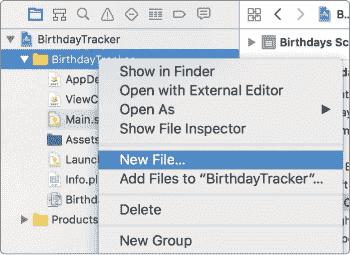

*图 10-1：在 Xcode 中创建新文件*

这将弹出一个对话框，类似于图 10-2。在这里，你需要选择要创建的文件类型，即一个通用的空 Swift 文件。在对话框顶部选择**iOS**，然后选择**Swift 文件**，点击**下一步**。

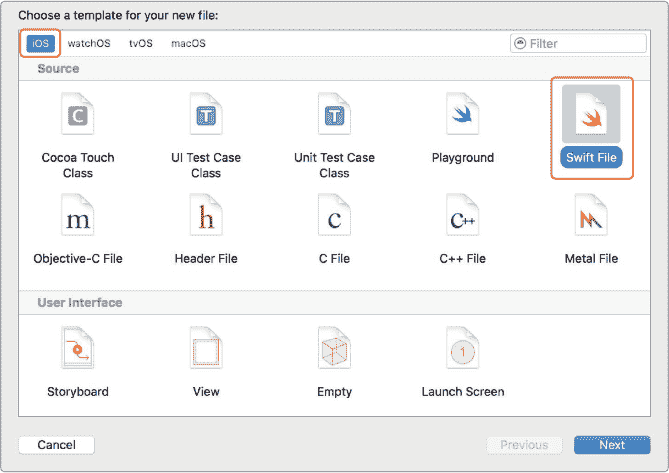

*图 10-2：选择* ***Swift 文件*** *作为模板。*

最后，将文件命名为 *Birthday*，然后点击 **Create**。您应该会在 Project navigator 的 *BirthdayTracker* 文件夹中看到 *Birthday.swift*。点击它，您应该会看到一个空的 *Birthday.swift* 文件，如 图 10-3 所示。

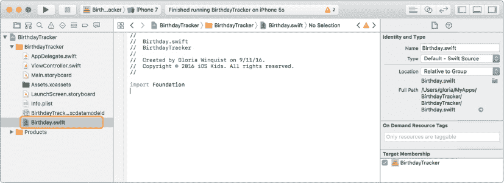

*图 10-3：* Birthday.swift *文件*

注意，在文件顶部，Xcode 已自动写入了一些版权信息作为代码注释。紧跟在“Created by”后面的名字来自您计算机的联系人应用中的联系人卡。版权年份之后，您应该看到在 第一章 创建第一个 Xcode 项目时使用的组织名称。每次在 Xcode 中创建新文件时，这个注释头都会自动包含。

现在您已经有了 *Birthday.swift* 文件，可以创建 Birthday 类来存储您的生日信息。

#### 编写 Birthday 类

您的 Birthday 类将具有三个常量属性：firstName、lastName 和 birthdate。firstName 和 lastName 属性应该是 String 类型，而 birthdate 将是一个内建于 Swift 中的特殊类，名为 Date，它专门用于处理日期和时间。我们将使用 Date 类的功能来提醒用户关于生日的信息。在 *Birthday.swift* 中的 import Foundation 语句下方输入以下内容。

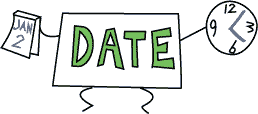

*Birthday.swift*

```
class
 Birthday {

    let
 firstName: String

    let
 lastName: String

  ➊
 let
 birthdate: Date

  ➋
 init
 (firstName: String
 , lastName: String
 , birthdate: Date
 ) {

      ➌
 self
 .firstName
 = firstName

        self
 .lastName
 = lastName

        self
 .birthdate
 = birthdate

    }

}
```

您可以在 ➊ 看到新的 Date 数据类型。Date 的声明方式与其他变量一样。

在 ➋ 处，您为 Birthday 类添加了一个初始化器，该初始化器将 firstName、lastName 和 birthdate 作为输入参数。然后，使用 self 属性，将它们设置为类的属性 ➌ 。这样，您就可以将名字和日期传递给 Birthday 类，以存储生日。

**注意**

*我们将一步一步地构建每个项目代码文件。最终版本可以从* [`www.nostarch.com/iphoneappsforkids/`](https://www.nostarch.com/iphoneappsforkids/) *获取。*

### 编程用户输入

到目前为止，您已经有了一个可以保存朋友姓名和出生日期的 Birthday 类，并且在 第九章 中设置了输入字段。但是，Birthday 类和输入字段之间没有连接，因此用户的输入不会被存储为一个生日。现在是时候编写代码，使界面能够添加生日了。为此，您将创建一个新的 AddBirthdayViewController 类来管理 storyboard 中“添加生日”场景的输入字段。（记住，视图由视图控制器控制，这正是您接下来要创建的内容。）

#### 创建添加生日视图控制器

当你创建一个应用并使用单视图应用模板时，Xcode 会自动创建一个名为 *ViewController.swift* 的文件，其中包含一个 ViewController 类，它用代码表示并控制一个视图。storyboard 中的视图控制器是由这个 ViewController 类管理的，我们将重命名它为 AddBirthdayViewController，以便类名能更好地描述它的功能。

要更改文件名 *ViewController.swift* ，请选中它并点击项目导航器中的文件名，这样它就会被高亮显示（参见 图 10-4）。然后输入新的文件名 *AddBirthdayViewController*。

接下来，你需要将 ViewController 类的名称更改为 AddBirthdayViewController。你可以通过更改以下行来实现：

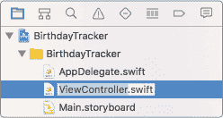

*图 10-4：更改* ViewController.swift 文件名

```
class
 ViewController: UIViewController

```

更改为以下行：

```
class
 AddBirthdayViewController: UIViewController

```

你不需要内建的 didReceiveMemoryWarning() 方法，所以可以通过删除这个方法来清理你的代码。现在你的类应该是这样的：

*AddBirthdayViewController.swift*

```
class
 AddBirthdayViewController: UIViewController
 {

    override
 func
 viewDidLoad() {

        super
 .viewDidLoad
 ()

        // Do any additional setup after loading the view,

        // typically from a nib

    }

}
```

UIViewController 是一个内建方法的类，用于管理在你运行应用时出现在屏幕上的视图。AddBirthdayViewController 是 UIViewController 的一个 *子类*，它允许我们通过实现一些 UIViewController 内建方法的自定义版本来控制 storyboard 中的视图控制器。

UIViewController 类有四个有用的内建回调方法，这些方法在视图控制器创建并出现在屏幕上或从屏幕消失时被调用。这些回调方法是：

viewDidLoad() 这个方法在视图控制器创建后，但在视图显示到屏幕之前调用。这是执行任何你只需要做一次的视图初始化设置的好地方。

viewWillAppear(_:) 这个方法在 viewDidLoad() 之后调用，并且在每次视图控制器的视图显示到屏幕上之前调用。

viewDidAppear(_:) 这个方法类似于 viewWillAppear(_:)，不同的是它在视图控制器的视图显示到屏幕后调用。

viewWillDisappear(_:) 这个方法在视图控制器的视图即将离开屏幕时调用。

你可以在你的子类 UIViewController 中重写这些方法中的任何一个。第一个方法，viewDidLoad()，非常有用。Swift 期望任何继承 UIViewController 的子类都使用这个方法，因此当你创建 UIViewController 的子类时，它会自动为 viewDidLoad() 方法添加一个占位符。

Swift 并没有为其他三个方法提供占位符代码。如果你决定使用其中一个，你可以开始输入它，自动补全会填充细节。

需要注意的是，虽然 viewDidLoad()仅在视图控制器第一次创建时被调用一次，但 viewWillAppear(_:)会在每次视图控制器的视图即将出现在屏幕上时被调用。因此，如果另一个屏幕覆盖在视图控制器的屏幕上并随后被移除，使得视图控制器的屏幕重新出现，viewWillAppear(_:)会再次被调用，但 viewDidLoad()不会，因为视图控制器已经加载并位于另一个屏幕后面。如果你希望每次视图出现时刷新新的信息，可以重写 viewWillAppear(_:)。

在第十二章中，我们将使用 viewWillAppear(_:)方法来刷新我们的生日列表。此外，在“设置最大出生日期”一节中，第 149 页将重写 AddBirthdayViewController 中的 viewDidLoad()。不过现在，我们可以先不管这些方法，将代码连接到我们在第九章中设置的输入控件。

#### 将代码与输入控件连接

在故事板中，我们的添加生日视图控制器包含一个“名”文本字段、一个“姓”文本字段和一个“出生日期”日期选择器。为了使用这些输入控件，我们需要在代码中引用它们，通过将变量分配给连接到屏幕元素的输入控件（使用 IBOutlets）。将以下三个属性添加到 AddBirthdayViewController 类的顶部，位于 viewDidLoad()方法之前（灰色的线条表示一些现有代码，以确定位置）：

*AddBirthdayViewController.swift*

```
class AddBirthdayViewController: UIViewController {

  ➊
 @IBOutlet var
 firstNameTextField: ➋
 UITextField!

    @IBOutlet var
 lastNameTextField: UITextField!

    @IBOutlet var
 birthdatePicker: UIDatePicker!

    override func viewDidLoad() {

```

@IBOutlet ➊是一个特殊的关键字，用于标记可以在故事板中连接的属性。IB 代表*界面构建器*，这是 Xcode 中我们处理故事板的部分。当你在属性前面加上@IBOutlet 关键字时，旁边的边距中会出现一个小圆圈，如图 10-5 所示。这表示你可以将该属性连接到故事板中的元素。如果圆圈未填充，意味着该属性尚未连接。

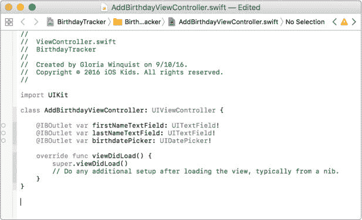

*图 10-5：* 带有 IBOutlet 属性的 AddBirthdayViewController *用于输入控件*

firstNameTextField 属性的数据类型 UITextField! ➋是一个隐式解包的可选类型，因为当视图控制器第一次创建时，IBOutlets 的值为 nil。然而，一旦视图加载，IBOutlets 会被赋予它们在故事板中连接的元素的值。

#### 将代码与故事板连接

现在你已经创建了 AddBirthdayViewController 以及输入控件的属性，是时候连接“名”和“姓”文本字段以及“出生日期”日期选择器了。

首先，将 storyboard 中 Add a Birthday 视图控制器的类更改为 AddBirthdayViewController，以便你可以使用该类来管理视图控制器。在项目导航器中选择 *Main.Storyboard*，接着在左侧大纲视图中选择 **Add a Birthday Scene**，然后在右侧面板中打开身份检查器。你应该能在顶部看到一个 Custom Class 部分，将类更改为 AddBirthdayViewController，如图 10-6 所示。

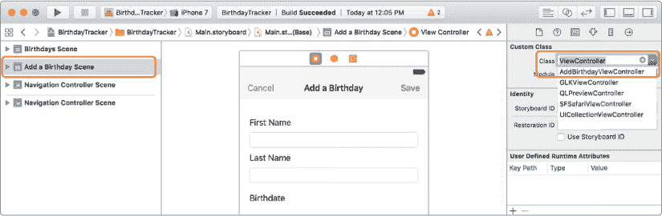

*图 10-6：将视图控制器的类更改为* AddBirthdayViewController *。*

现在，将 AddBirthdayViewController 的 IBOutlet 属性连接到 Add a Birthday Scene 中的文本字段和日期选择器。在左侧大纲视图中点击 Add a Birthday Scene 旁边的三角形展开该场景的项目菜单。然后，按住 CONTROL 键并点击 **Add a Birthday**，即黄色视图控制器图标旁边的项，打开连接对话框。

在连接对话框的 Outlets 部分，你可以看到 birthdatePicker、firstNameTextField 和 lastNameTextField。通过点击旁边的空圆圈并拖动到 storyboard 中的日期选择器来连接 birthdatePicker。当日期选择器对象被高亮为蓝色时，可以松开鼠标（参见图 10-7）。

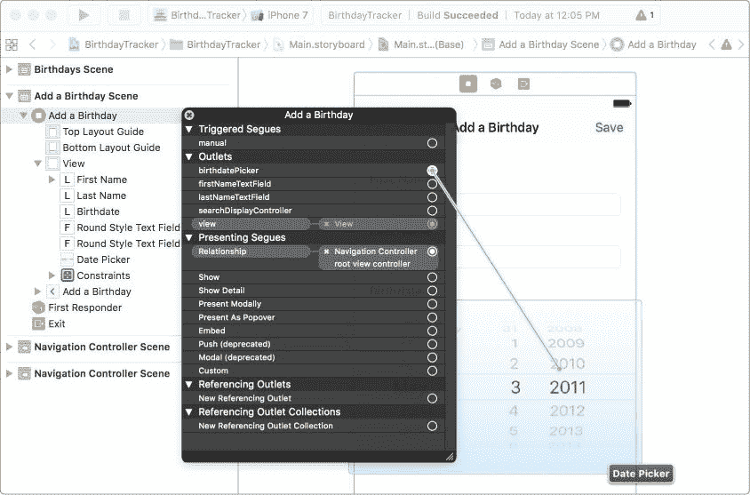

*图 10-7：将日期选择器连接到* birthdatePicker *插座*

如果你看到“Birthdate Picker”出现在连接框中并与“birthdatePicker”相邻，且连接圆圈已填充（参见图 10-8），那么说明连接成功。你只能将“birthdatePicker”插座连接到日期选择器。如果尝试将其连接到标签或其他类型的视图，将不会发生任何反应。Xcode 知道 “birthdatePicker” 必须连接到 UIDatePicker 类，因为在我们创建该属性时，已在 AddBirthdayViewController 中为其指定了数据类型。

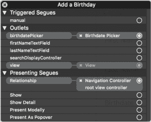

*图 10-8：* birthdatePicker *插座已成功连接。*

接下来，通过点击并拖动其圆圈到 First Name 标签下方的文本字段来连接 firstNameTextField。最后，将 lastNameTextField 连接到 Last Name 标签下方的文本字段。

目前，你已经完成了 storyboard 部分。接下来，让我们返回到 *AddBirthdayViewController.swift* 文件中，通过代码设置最大出生日期。

#### 设置最大出生日期

让一个人的出生日期出现在未来是没有意义的，所以我们写一些代码来防止 birthdatePicker 选择未来的日期。我们可以通过修改 AddBirthdayViewController 中的 viewDidLoad() 方法来进行这种设置。我们在 “创建 Add Birthday 视图控制器” 一节中讨论过 viewDidLoad() 方法（见第 145 页）。它会自动添加到我们的视图控制器中，因此找到 AddBirthdayViewController 中的该方法，并在其中添加以下代码：

*AddBirthdayViewController.swift*

```
override func viewDidLoad() {

    super.viewDidLoad()

  ➊
 birthdatePicker
 .maximumDate
 = Date
 ()

}

```

viewDidLoad() 已经是 UIViewController 类的一个方法，因此我们需要使用 override 关键字重写它，如下所示：override func viewDidLoad() 。请注意，保留方法中的 super.viewDidLoad() 行是很重要的。当你创建一个子类（例如 AddBirthdayViewController ）并重写原始超类的方法时，确保你也调用超类的方法。Apple 可能在 UIViewController 的 viewDidLoad() 方法中运行一些我们不知道的特殊代码，因此不调用这个超类方法可能会导致意外的错误。

要设置 birthdatePicker 的 maximumDate，只需在 ➊ 处输入 birthdatePicker.maximumDate = Date() 。Date() 方法创建一个新的日期，表示当前的日期和时间。现在尝试运行应用程序。应该无法选择任何未来的日期！

接下来，你将编写一些代码，以便使用你在第九章中制作的按钮，在这个视图控制器中保存生日并取消添加生日。

### 保存生日

现在来实现保存按钮！当用户点击保存时，应用程序应该根据输入的信息创建一个生日并保存用户输入的内容。

#### 连接保存按钮

让我们从创建一个每次用户点击保存按钮时都会调用的 saveTapped(_:) 方法开始。在 AddBirthdayViewController 中，紧接在 viewDidLoad() 方法后面添加以下代码：

*AddBirthdayViewController.swift*

```
  override func viewDidLoad() {

      --*snip*
 --

  }

➊
 @IBAction func
 saveTapped(➋
 _
 sender: ➌
 UIBarButtonItem
 ) {

    ➍
 print
 ("The save button was tapped."
 )

  }
```

@IBAction 在 ➊ 处是一个关键字，将一个函数直接连接到视图控制器中的一个元素，并允许我们指定当用户对该元素进行操作时应执行的代码。在这种情况下，我们将添加一个函数，当用户点击保存时它将被执行。编写 IBAction 方法时，你应该始终包括一个参数，表示触发该方法的 UI 元素。通常，使用下划线来隐藏参数标签，并且参数名是 sender ➋ ，但你可以根据需要自定义参数名。在这里，我们希望每次用户点击保存时都调用 saveTapped(_:) 方法，保存按钮是 UIBarButtonItem 。因此，我们指定 sender 的类型为 UIBarButtonItem ➌ 。在 ➍ 处的 print(_:) 方法帮助我们在测试代码时查看保存按钮是否被点击。

将 saveTapped(_:) 连接到保存按钮就像将 IBOutlet 连接到 storyboard 元素一样。返回到你的 *Main.storyboard* 文件中。按住 CONTROL 键并单击“添加生日”行以打开连接对话框。在连接对话框的底部，有一个名为“已接收的操作”的部分，如图 10-9 所示。在该部分中，从 saveTapped: 旁边的圆圈点击并拖动到“添加生日”视图控制器中的保存按钮，以连接它们。

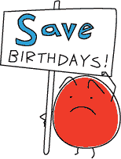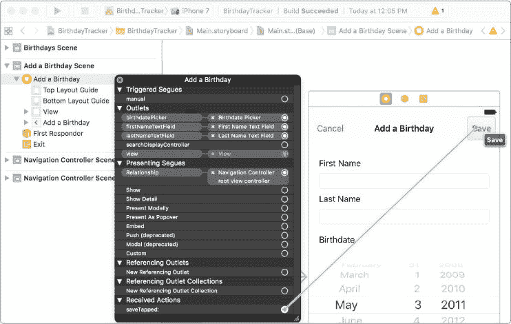

*图 10-9：在连接对话框的底部列出了 IBActions，在“已接收的操作”下。*

再次尝试运行你的应用程序。当你点击保存按钮时，消息 "The save button was tapped." 应该会显示在调试控制台中。

#### 从文本框读取文本

让我们在 saveTapped(_:) 方法中添加代码，在用户输入后从 firstNameTextField 和 lastNameTextField 中获取名字和姓氏。

UITextField 类有一个可选的字符串属性叫做 text。这个 text 属性的值是用户在文本框中输入的内容，因此你可以用它在 saveTapped(_:) 方法中获取用户的输入，代码如下：

*AddBirthdayViewController.swift*

```
@IBAction func saveTapped(_ sender: UIBarButtonItem) {

    print("The save button was tapped.")

  ➊
 let
 firstName = firstNameTextField
 .text
 ?? ""

  ➋
 let
 lastName = lastNameTextField
 .text
 ?? ""

    print
 ("My name is
 \(
 firstName)
 \(
 lastName)."
 )

}

```

在➊处，你创建了一个常量 firstName，并将其值设置为 firstNameTextField.text（如果它存在的话，也就是用户输入了值）或空字符串 ""。你可以使用你在第五章中学到的空合并操作符（??）来实现这一点。我们这里使用常量而不是变量，因为我们不会更改用户输入的名字和姓氏。

然后在➋处对 lastName 做相同的操作。在你获取了 firstName 和 lastName 的值后，将它们打印到控制台，这样你在运行应用时可以看到它们。

运行你的应用程序，看看会发生什么。在不输入任何内容的情况下尝试点击保存按钮，然后在输入了名字和姓氏后再试一次。你应该会看到类似如下的输出：

```
The save button was tapped.

My name is .

The save button was tapped.

My name is Dagmar Hedlund.
```

很棒！现在你可以在应用程序中输入名字，看看计算机如何在调试控制台中输出它。接下来，让我们专注于输出日期。

#### 从日期选择器获取日期

从 birthdatePicker 获取日期就像从 firstNameTextField 或 lastNameTextField 获取文本一样简单。UIDatePicker 类有一个名为 date 的属性，表示当前选择器中显示的日期。对于 birthdatePicker，这个属性是 birthdatePicker.date。当用户更改 UIDatePicker 时，date 属性也会发生变化，因此你可以使用 birthdayPicker.date 来访问用户输入的生日。

将以下几行代码添加到你的 saveTapped(_:) 方法中：

*AddBirthdayViewController.swift*

```
@IBAction func saveTapped(_ sender: UIBarButtonItem) {

    --*snip*
 --

    print("My name is \(firstName) \(lastName).")

    let
 birthdate = birthdatePicker
 .date

    print
 ("My birthday is
 \(
 birthdate)."
 )

}

```

现在运行应用程序，看看会发生什么。你应该会看到类似如下的输出：

```
The save button was tapped.

My name is Dagmar Hedlund.

My birthday is 2011-05-03 04:00:00 +0000
```

到目前为止，我们有了 firstName、lastName 和 birthdate——这三项数据是创建生日所需的！你会注意到，调试控制台中显示的日期格式有点奇怪，还包括时间和+0000 的时区偏移。现在不用太担心这个问题，我们将在第十一章中讨论日期格式以及如何在没有时间的情况下显示日期。

#### 创建生日

现在，你的代码可以访问用户提供的 firstName、lastName 和 birthdate 输入，你可以使用这些信息通过 Birthday 类的初始化方法来创建一个生日。

首先，删除 saveTapped(_:) 方法中的 print 语句，因为我们将用打印测试 newBirthday 实例的语句来替代它们。然后在 saveTapped(_:) 方法中添加以下几行代码。

*AddBirthdayViewController.swift*

```
@IBAction func saveTapped(_ sender: UIBarButtonItem) {

    --*snip*
 --

    let birthdate = birthdatePicker.date

  ➊
 let
 newBirthday = Birthday
 (firstName: firstName, lastName: 

        lastName, birthdate: birthdate)

        print
 ("Created a Birthday!"
 )

      ➋
 print
 ("First name:
 \(
 newBirthday.firstName
 )"
 )

        print
 ("Last name:
 \(
 newBirthday.lastName
 )"
 )

        print
 ("Birthdate:
 \(
 newBirthday.birthdate
 )"
 )

}

```

在 ➊ 处，你使用 Birthday 类的初始化方法创建了一个 newBirthday 实例，并传入了 firstName、lastName 和 birthdate 的常量。创建 newBirthday 后，在 ➋ 处，你使用点语法将它的属性输出到调试控制台。打印的输出与之前的 print 语句相同，但这次你得到的是 newBirthday 实例中的值。运行应用程序，输入一个生日并点击保存，看看会发生什么。你应该在调试控制台中看到类似以下的输出：

```
Created a Birthday!

First name: Dagmar

Last name: Hedlund

Birthdate: 2011-05-03 04:00:00 +0000
```

现在，点击保存按钮只会创建一个 Birthday。你将在 第十一章 学到如何在 Birthdays 视图控制器中显示这个 Birthday。

### 添加取消按钮

当用户点击取消时，意味着他们不再想添加生日，添加生日屏幕应该消失。我们通过向类中添加 cancelTapped(_:) 方法来实现这一行为，该方法将调用一个内置的 UIViewController 方法，名为 dismiss(animated:completion:)。这个方法做的正是它所说的——它会关闭当前显示的视图控制器。将以下方法添加到 AddBirthdayViewController 类中的 saveTapped(_:) 方法后面：

*AddBirthdayViewController.swift*

```
@IBAction func saveTapped(_ sender: UIBarButtonItem) {

    --*snip*
 --

        print("Birthdate: \(newBirthday.birthdate)")

}

@IBAction func
 cancelTapped(_
 sender: UIBarButtonItem
 ) {

  ➊
 dismiss
 (animated: true
 , completion: nil
 )

}
```

函数 dismiss(animated:completion:) ➊ 接受两个参数。animated 参数用于给关闭屏幕添加动画效果。传入 true，用户可以看到“添加生日”屏幕从屏幕上滑下来。它看起来就像一个专业的应用程序！第二个参数是一个可选的闭包，名为 completion。*闭包* 是可以传递到函数中的一段代码。如果你有任何代码需要在视图控制器被关闭后执行，可以使用 completion 闭包。因为这里不需要执行任何操作，你可以直接传入 nil。


最后的步骤是将 cancelTapped(_:) 方法连接到取消按钮。你可以像将 saveTapped(_:) 方法连接到保存按钮一样操作。打开 *Main.storyboard* 并弹出 Add Birthday 视图控制器的连接对话框。点击并拖动 cancelTapped(_:) 方法列表到取消按钮。

完成这些操作后，运行应用程序，点击 **+** 进入添加生日屏幕，然后点击 **取消**。你应该会看到添加生日屏幕从屏幕上滑下并消失。

### 你学到了什么

在本章中，你学会了如何将编写的代码与应用的视觉界面连接起来。你还学会了如何使用输入文本框和日期选择器来创建包含 firstName、lastName 和 birthdate 属性的 Birthday 对象。目前你可以保存 Birthday，但保存后无法查看它们。在第十一章中，我们将展示如何在一个生日表视图控制器中显示你的生日列表。

## 添加生日类并处理用户输入


在第九章中，你通过创建视图控制器、按钮来进行页面之间的导航，并设置了接收用户输入的屏幕，从而搭建了应用的视觉界面。现在是时候深入编程了！在这一章中，我们将展示如何编写代码并将它连接到你的故事板。你将编写 Birthday 和 AddBirthdayViewController 类，以便使用在上一章中创建的输入控件添加生日。

### 生日类

在本节中，你将编写一个临时的 Birthday 类，用来存储生日数据，但不会将这些数据永久保存到设备上。我们稍后会用更好的解决方案替换它，但这种方法让我们可以测试输入控件。


**注意**

*有时候，当你编程时，你需要编写包含多个部分并且会协同工作的应用。你可能会先写应用的某一部分，就像我们之前编写的输入控件那样，但要测试这一部分，你可能还需要其他一些尚未编写的代码。遇到这种情况时，你可以快速编写一些临时的*测试代码*，待你完成其余部分后再进行修改。我们现在做的就是这样，Birthday 类将在第十二章中被替换。*

如果你还没有打开它，请在 Xcode 中打开你的 BirthdayTracker 应用。确保你能看到项目导航器（⌘ -0）。

#### 创建新文件

首先，你需要创建一个文件，在其中编写 Birthday 类。在 Xcode 中，文件就像任何其他计算机文件一样——它是一种文档。当你用 Swift 编写应用时，所有的类和函数都将在 Swift 文件中编写。就像 Word 文件有*.doc*或*.docx*扩展名，PDF 文件以*.pdf*结尾一样，Swift 文件的扩展名是*.swift*。

如果你想为应用添加一个新类，可以创建一个新的 Swift 文件来编写该类。你可以在同一个文件中编写任意数量的类，但如果将类保持在单独的文件中，并且文件名与每个类的名称匹配，项目会更容易组织。按住 CONTROL 键点击项目导航器中的*BirthdayTracker*文件夹，并从菜单中选择**新建文件...**选项，如图 10-1 所示。


*图 10-1：在 Xcode 中创建新文件*

这将弹出一个对话框，如图 10-2 所示。在此对话框中，你需要选择要创建的文件类型，这是一个通用的空 Swift 文件。选择对话框顶部的 **iOS**，选择 **Swift 文件**，然后点击 **下一步**。


*图 10-2：选择* ***Swift 文件*** *作为模板。*

最后，将文件命名为*Birthday*并点击**创建**。你应该能在项目导航器的*BirthdayTracker*文件夹中看到*Birthday.swift*，点击它，你应该会看到一个空的*Birthday.swift*文件，如图 10-3 所示。


*图 10-3：* Birthday.swift *文件*

请注意，在文件顶部，Xcode 会自动在代码注释中写入一些版权信息。紧随“Created by”后的名字来自你电脑联系人应用中的联系人卡片。在版权年份之后，你应该能看到你在第一章创建第一个 Xcode 项目时使用的组织名称。每次你在 Xcode 中创建新文件时，这段注释头部会自动包含。

现在你已经有了 *Birthday.swift* 文件，可以创建 Birthday 类来存储你的生日信息。

#### 编写生日类

你的 Birthday 类将有三个常量属性：firstName、lastName 和 birthdate。firstName 和 lastName 应该是 String 类型，而 birthdate 将是一个内置于 Swift 中的特殊类，名为 Date，专门用来处理日期和时间。我们将使用 Date 类的功能来提醒用户生日。将以下内容输入到 *Birthday.swift* 文件中，在 import Foundation 语句下方。


*Birthday.swift*

```
class
 Birthday {

    let
 firstName: String

    let
 lastName: String

  ➊
 let
 birthdate: Date

  ➋
 init
 (firstName: String
 , lastName: String
 , birthdate: Date
 ) {

      ➌
 self
 .firstName
 = firstName

        self
 .lastName
 = lastName

        self
 .birthdate
 = birthdate

    }

}
```

你可以在 ➊ 处看到新的 Date 数据类型。Date 的声明方式与其他变量一样。

在 ➋ 处，你为 Birthday 类添加了一个初始化方法，该方法接受 firstName、lastName 和 birthdate 作为输入参数。然后，使用 self 属性，你将它们设置为类的属性 ➌ 。这将允许你将姓名和日期传递给 Birthday 类，以存储一个生日。

**注意**

*我们将逐步构建每个代码文件用于项目，最终版本可在* [`www.nostarch.com/iphoneappsforkids/`](https://www.nostarch.com/iphoneappsforkids/) *找到。*

### 编程用户输入

到目前为止，你已经有了一个可以保存朋友姓名和生日的 Birthday 类，并且在故事板中设置了输入字段，这些字段是你在第九章中设置的。但是，Birthday 类和输入字段之间没有连接，因此用户输入的内容不会被存储为 Birthday。现在是时候编写代码，使界面能够添加生日了。为此，你将创建一个新的 AddBirthdayViewController 类，用来管理故事板中的“添加生日”场景中的输入字段。（记住，一个视图由视图控制器控制，接下来你将创建视图控制器。）

#### 创建添加生日视图控制器

当你创建一个应用并使用单视图应用模板时，Xcode 会自动创建一个名为 *ViewController.swift* 的文件，里面包含了一个 ViewController 类，用来通过代码表示和控制一个视图。故事板中的视图控制器由这个 ViewController 类管理，我们将其重命名为 AddBirthdayViewController，以便类名能更好地描述它的功能。

要更改文件名 *ViewController.swift*，选择该文件并点击其名称使其高亮（参见 图 10-4）。然后输入新文件名 *AddBirthdayViewController*。

接下来，你需要将 ViewController 类的名称更改为 AddBirthdayViewController。你可以在文件内通过更改以下这一行来完成：


*图 10-4：更改文件名* ViewController.swift

```
class
 ViewController: UIViewController

```

到这一行：

```
class
 AddBirthdayViewController: UIViewController

```

你将不再需要内建的 didReceiveMemoryWarning() 方法，因此可以通过删除该方法来清理你的代码。现在，你的类应该是这样的：

*AddBirthdayViewController.swift*

```
class
 AddBirthdayViewController: UIViewController
 {

    override
 func
 viewDidLoad() {

        super
 .viewDidLoad
 ()

        // Do any additional setup after loading the view,

        // typically from a nib

    }

}
```

UIViewController 是一个自带方法的类，用于管理在你运行应用时出现在屏幕上的视图。AddBirthdayViewController 是 UIViewController 的 *子类*，它让我们通过实现一些 UIViewController 的内建方法来控制故事板中的视图控制器。

UIViewController 类有四个有用的内建回调方法，它们会在视图控制器创建后以及视图显示或消失时被调用。这些回调方法是：

viewDidLoad() 该方法在视图控制器创建完成后、视图显示在屏幕上之前调用。这是进行视图初始化设置的一个好地方，适合只执行一次的操作。

viewWillAppear(_:) 该方法在 viewDidLoad() 之后、每次视图控制器的视图显示在屏幕上之前调用。

viewDidAppear(_:) 该方法与 viewWillAppear(_:) 类似，只不过它是在视图控制器的视图显示在屏幕后调用。

viewWillDisappear(_:) 该方法在视图控制器的视图即将离开屏幕时调用。

你可以在你的子类 UIViewController 中重写任何这些方法。第一个方法，viewDidLoad()，非常有用。Swift 要求所有子类化 UIViewController 的类都使用此方法，因此当你子类化 UIViewController 时，它会自动为 viewDidLoad() 方法提供一个占位符。

Swift 不会为其他三个方法提供占位符代码。如果你决定使用其中一个方法，你可以开始输入，自动补全会填充细节。

需要注意的是，尽管 viewDidLoad()只在视图控制器第一次创建时调用一次，但 viewWillAppear(_:)会在每次视图控制器的视图即将出现在屏幕上时被调用。因此，如果另一个屏幕覆盖了视图控制器的屏幕，然后被移除，导致视图控制器的屏幕重新出现，viewWillAppear(_:)会再次被调用，但 viewDidLoad()不会，因为视图控制器已经存在并被加载在另一个屏幕后面。如果你希望每次视图出现时刷新新的信息，可以覆盖 viewWillAppear(_:)方法。

在第十二章中，我们将使用 viewWillAppear(_:)方法来刷新我们的生日列表。此外，在“设置最大出生日期”的 149 页中，我们将覆盖 AddBirthdayViewController 中的 viewDidLoad()方法。但是，暂时我们可以先忽略这些方法，直接将我们的代码连接到我们在第九章中设置的输入控件。

#### 将代码连接到输入控件

在故事板中，我们的添加生日视图控制器有一个“名字”文本字段、一个“姓氏”文本字段和一个“出生日期”日期选择器。为了使用这些输入控件，我们需要在代码中引用它们，这可以通过将变量分配给与屏幕元素连接的 IBOutlets 来实现。请在 AddBirthdayViewController 类的 viewDidLoad()方法之前添加以下三个属性（灰色的线条表示现有的代码，作为位置参考）：

*AddBirthdayViewController.swift*

```
class AddBirthdayViewController: UIViewController {

  ➊
 @IBOutlet var
 firstNameTextField: ➋
 UITextField!

    @IBOutlet var
 lastNameTextField: UITextField!

    @IBOutlet var
 birthdatePicker: UIDatePicker!

    override func viewDidLoad() {

```

@IBOutlet ➊ 是一个特殊的关键字，放在可以在故事板中连接的属性前面。IB 代表*界面构建器*，这是 Xcode 中我们编辑故事板的部分。当你在属性前加上@IBOutlet 关键字时，属性旁边的边距上会出现一个小圆圈，如图 10-5 所示。这表示你可以将该属性连接到故事板中的一个元素。如果圆圈没有被填充，意味着该属性尚未连接。


*图 10-5：* 带有输入控件 IBOutlet 属性的 AddBirthdayViewController

firstNameTextField 属性的数据类型是 UITextField! ➋，这是一个隐式展开的可选类型，因为在视图控制器第一次创建时，IBOutlets 的值为 nil。然而，一旦视图加载，IBOutlets 就会被赋予它们在故事板中连接的元素的值。

#### 将代码连接到故事板

现在你已经创建了 AddBirthdayViewController 以及输入控件的属性，是时候将“名字”和“姓氏”文本字段以及“出生日期”日期选择器连接起来了。

首先，改变故事板中“添加生日”视图控制器的类为 AddBirthdayViewController，这样你就可以使用这个类来管理视图控制器。选择项目导航器中的 *Main.Storyboard*，然后在左侧大纲视图中选择 **添加生日场景**，在右侧面板中打开 Identity Inspector。你应该会看到顶部的 Custom Class 部分，将类更改为 AddBirthdayViewController，如图 10-6 所示。


*图 10-6：将视图控制器的类更改为* AddBirthdayViewController *。*

现在，将 AddBirthdayViewController 的 IBOutlet 属性连接到“添加生日场景”中的文本字段和日期选择器。在左侧大纲视图中点击 Add a Birthday Scene 旁的三角形，展开该场景的项目菜单。然后，按住 CONTROL 键并点击**添加生日**，在黄色视图控制器图标旁边，打开连接对话框。

在连接对话框中，选择 Outlets，可以看到 birthdatePicker、firstNameTextField 和 lastNameTextField。通过点击旁边的空圆圈并拖动到故事板中的日期选择器来连接 birthdatePicker。当日期选择器对象高亮显示为蓝色时，你可以松开鼠标（见图 10-7）。


*图 10-7：将日期选择器连接到* birthdatePicker *控件*

如果你看到连接框中列出了 Birthdate Picker，并且连接圆圈已经填充（见图 10-8），那就说明连接成功。你只能将 birthdatePicker 控件连接到日期选择器。如果尝试将它连接到标签或其他类型的视图，则不会发生任何操作。Xcode 知道 birthdatePicker 必须连接到 UIDatePicker 类，因为我们在 AddBirthdayViewController 中创建该属性时，已经指定了这个数据类型。


*图 10-8：* birthdatePicker *控件已成功连接。*

接下来，通过点击并拖动其圆圈将 firstNameTextField 连接到 First Name 标签下方的文本字段。最后，将 lastNameTextField 连接到 Last Name 标签下方的文本字段。

目前你已经完成了故事板的工作。接下来，让我们回到 *AddBirthdayViewController.swift* 中，通过代码设置最大出生日期。

#### 设置最大出生日期

让一个人有未来的出生日期显然是不合理的，所以让我们编写一些代码来防止 birthdatePicker 选择未来的日期。我们可以通过修改 AddBirthdayViewController 中的 viewDidLoad() 方法来进行这样的设置。在 “创建 Add Birthday 视图控制器”一节中，我们讲过 viewDidLoad() 方法，位于第 145 页。它会自动添加到我们的视图控制器中，所以在 AddBirthdayViewController 中找到这个方法并添加以下代码：

*AddBirthdayViewController.swift*

```
override func viewDidLoad() {

    super.viewDidLoad()

  ➊
 birthdatePicker
 .maximumDate
 = Date
 ()

}

```

viewDidLoad() 已经是 UIViewController 类的一个方法，因此我们需要使用 override 关键字来重写它，如下所示：override func viewDidLoad()。请注意，必须保留方法中的 super.viewDidLoad() 这一行。当你创建一个子类，比如 AddBirthdayViewController，并重写原父类的方法时，你需要确保也调用父类的方法。苹果可能在 UIViewController 的 viewDidLoad() 中包含一些我们不知道的特殊代码，因此不调用这个父类方法可能会导致意外的错误。

要设置 birthdatePicker 的 maximumDate，只需要在 ➊ 处输入 birthdatePicker.maximumDate = Date()。Date() 方法会创建一个表示当前日期和时间的新日期。现在试着运行应用程序，应该不再能选择任何未来的日期！

接下来，你将编写一些代码，以便你可以使用你在 第九章 中创建的按钮，从这个视图控制器中保存一个生日并取消添加生日。

### 保存生日

现在来实现保存按钮！当用户点击保存时，应用程序应该根据输入的信息创建一个生日对象，并保存用户输入的数据。

#### 连接保存按钮

我们从编写一个每次用户点击保存按钮时都会被调用的 saveTapped(_:) 方法开始。在 viewDidLoad() 方法之后，立即将以下代码添加到 AddBirthdayViewController 中：

*AddBirthdayViewController.swift*

```
  override func viewDidLoad() {

      --*snip*
 --

  }

➊
 @IBAction func
 saveTapped(➋
 _
 sender: ➌
 UIBarButtonItem
 ) {

    ➍
 print
 ("The save button was tapped."
 )

  }
```

@IBAction 在 ➊ 处是一个关键字，它将一个函数直接连接到视图控制器中的元素，并允许我们指定在用户对该元素进行操作时应运行的代码。在这种情况下，我们将添加一个函数，该函数将在用户点击保存按钮时运行。当你编写 IBAction 方法时，应该始终包含一个参数，用于表示触发该方法的 UI 元素。通常，使用下划线来隐藏参数标签，参数名称是 sender ➋，但你可以根据需要命名此参数。在这种情况下，我们希望每当用户点击保存时调用 saveTapped(_:) 方法，保存按钮是一个 UIBarButtonItem。因此，我们指定 sender 的类型是 UIBarButtonItem ➌。在 ➍ 处的 print(_:) 方法有助于我们在测试代码时查看保存按钮是否被点击。

将 saveTapped(_:) 连接到保存按钮就像将 IBOutlet 连接到 storyboard 元素一样。返回到你的 *Main.storyboard* 文件。按住 CONTROL -点击 “Add a Birthday” 这一行以打开连接对话框。在连接对话框的底部，有一个名为 "Received Actions" 的部分，如 图 10-9 所示。在该部分，从 saveTapped: 旁边的圆圈点击并拖动到 Add a Birthday 视图控制器中的保存按钮，以完成连接。


*图 10-9：IBActions 列在连接对话框底部的 "Received Actions" 下。*

再次运行你的应用。当你点击保存按钮时，应该会在调试控制台显示消息：“The save button was tapped.”。

#### 从文本框读取文本

我们来为`saveTapped(_:)`方法添加代码，用来获取用户输入的 firstNameTextField 和 lastNameTextField 中的名字。

UITextField 类有一个可选的 String 类型属性 text。这个 text 属性的值是用户在文本框中输入的内容，因此你可以使用它来获取用户在`saveTapped(_:)`中输入的内容，代码如下：

*AddBirthdayViewController.swift*

```
@IBAction func saveTapped(_ sender: UIBarButtonItem) {

    print("The save button was tapped.")

  ➊
 let
 firstName = firstNameTextField
 .text
 ?? ""

  ➋
 let
 lastName = lastNameTextField
 .text
 ?? ""

    print
 ("My name is
 \(
 firstName)
 \(
 lastName)."
 )

}

```

在➊处，你创建了一个常量 firstName，并将其值设置为 firstNameTextField.text（如果存在的话，即用户输入了值），否则设置为空字符串""。你可以使用在第五章中学到的空合并操作符(??)。我们这里使用常量而不是变量，因为用户输入的名字在之后不会改变。

然后在➋处对 lastName 执行相同的操作。获取到 firstName 和 lastName 的值后，将它们打印到控制台，以便在运行应用时查看。

运行你的应用，看看会发生什么。尝试在文本框中什么都不输入就点击保存按钮，然后再输入名字和姓氏后点击保存按钮。你应该看到类似以下的输出：

```
The save button was tapped.

My name is .

The save button was tapped.

My name is Dagmar Hedlund.
```

太棒了！现在你可以在应用中输入名字，并在调试控制台看到计算机的输出了。接下来，让我们集中精力输出一个日期。

#### 从日期选择器获取日期

从 birthdatePicker 中获取日期就像从 firstNameTextField 或 lastNameTextField 中获取文本一样简单。UIDatePicker 类有一个`date`属性，它表示当前选择的日期。对于 birthdatePicker 来说，就是`birthdatePicker.date`。当用户更改 UIDatePicker 时，`date`属性也会更新，因此你可以使用`birthdayPicker.date`来访问用户输入的生日。

将以下代码添加到`saveTapped(_:)`方法中：

*AddBirthdayViewController.swift*

```
@IBAction func saveTapped(_ sender: UIBarButtonItem) {

    --*snip*
 --

    print("My name is \(firstName) \(lastName).")

    let
 birthdate = birthdatePicker
 .date

    print
 ("My birthday is
 \(
 birthdate)."
 )

}

```

现在运行应用，看看发生了什么。你应该会看到类似以下的输出：

```
The save button was tapped.

My name is Dagmar Hedlund.

My birthday is 2011-05-03 04:00:00 +0000
```

到目前为止，我们已经得到了 firstName、lastName 和 birthdate——这三项数据就是我们创建生日所需的！你会注意到，在调试控制台中显示的日期格式很奇怪，它还包括时间和+0000 的时区偏移。现在不需要过多担心这个问题。我们将在第十一章中讨论日期格式以及如何显示没有时间的日期。

#### 创建生日

现在，你的代码可以访问用户提供的 firstName、lastName 和 birthdate 输入，你可以利用这些信息通过 Birthday 类的初始化方法来创建一个生日。

首先，从 saveTapped(_:)方法中删除 print 语句，因为我们将用新的 print 语句来测试 newBirthday 实例。然后将以下代码行添加到 saveTapped(_:)方法中。

*AddBirthdayViewController.swift*

```
@IBAction func saveTapped(_ sender: UIBarButtonItem) {

    --*snip*
 --

    let birthdate = birthdatePicker.date

  ➊
 let
 newBirthday = Birthday
 (firstName: firstName, lastName: 

        lastName, birthdate: birthdate)

        print
 ("Created a Birthday!"
 )

      ➋
 print
 ("First name:
 \(
 newBirthday.firstName
 )"
 )

        print
 ("Last name:
 \(
 newBirthday.lastName
 )"
 )

        print
 ("Birthdate:
 \(
 newBirthday.birthdate
 )"
 )

}

```

在➊处，你使用 Birthday 类的初始化方法创建了一个 newBirthday 实例，并传入 firstName、lastName 和 birthdate 的常量。创建 newBirthday 实例后，在➋处，你使用点语法将其属性输出到调试控制台。打印的输出与之前的 print 语句相同，但这次你得到的是来自 newBirthday 实例的值。运行应用程序，输入生日，并点击保存，看看会发生什么。你应该会在调试控制台中看到类似以下的输出：

```
Created a Birthday!

First name: Dagmar

Last name: Hedlund

Birthdate: 2011-05-03 04:00:00 +0000
```

到目前为止，点击保存按钮仅会创建一个生日实例。你将在第十一章中学习如何在生日视图控制器中显示这个生日。

### 添加取消按钮

当用户点击取消时，意味着他们不再想添加生日，添加生日的界面应该消失。我们通过在类中添加一个 cancelTapped(_:)方法来实现这一行为，该方法将调用一个内置的 UIViewController 方法 dismiss(animated:completion:)。这个方法正如它所说的那样——它会关闭当前显示的视图控制器。将以下方法添加到 AddBirthdayViewController 类中的 saveTapped(_:)方法之后：

*AddBirthdayViewController.swift*

```
@IBAction func saveTapped(_ sender: UIBarButtonItem) {

    --*snip*
 --

        print("Birthdate: \(newBirthday.birthdate)")

}

@IBAction func
 cancelTapped(_
 sender: UIBarButtonItem
 ) {

  ➊
 dismiss
 (animated: true
 , completion: nil
 )

}
```

函数 dismiss(animated:completion:) ➊有两个参数。animated 参数用于控制关闭屏幕时的动画效果。传入 true，这样用户就能看到添加生日界面从屏幕上滑下，效果就像一个专业的应用程序一样！第二个参数是一个可选的闭包，称为 completion。*闭包*是可以传递给函数的代码块。completion 闭包可以用于你希望在视图控制器被关闭后执行的任何代码。由于你这里不需要执行任何操作，你可以直接传入 nil。


最后的步骤是将 cancelTapped(_:)与取消按钮连接起来。你可以按照与 saveTapped(_:)方法连接保存按钮的方式来做这件事。前往*Main.storyboard*，并打开添加生日视图控制器的连接对话框。点击并拖动 cancelTapped(_:)方法的列表项到取消按钮。

完成后，运行应用程序，点击**+**进入添加生日界面，再点击**取消**。你应该会看到添加生日界面从屏幕上滑下并消失。

### 你学到了什么

在本章中，你学会了如何将编写的代码与应用的视觉界面连接起来。你还学会了如何使用输入文本框和日期选择器创建一个包含 firstName、lastName 和 birthdate 属性的生日对象。现在你可以保存生日数据，但保存后无法查看它们。在第十一章中，我们将向你展示如何在生日表视图控制器中显示你保存的生日列表。


在第九章中，你通过创建视图控制器、用于在它们之间导航的按钮和接受用户输入的屏幕，设置了你的应用程序的视觉界面。现在是时候深入编程了！在本章中，我们将向你展示如何编写应用代码并将其与故事板连接。你将编写 Birthday 和 AddBirthdayViewController 类，这样你就可以使用上一章创建的输入控件来添加生日。

### 生日类

在这一部分，你将编写一个临时的生日类来存储你的生日，但它不会将生日数据永久保存到设备上。我们稍后将用更好的解决方案替换它，但这种方法可以让我们测试输入控件。


**注意**

*有时候，在编程时，你需要编写包含多个部分并协同工作的应用程序。你可能会先写应用的一部分，像我们之前写的输入控件那样，但要测试这一部分，你可能需要一些其他你还没有写的代码。当这种情况发生时，你可以快速写一些临时的*测试代码*，在完成其余部分之后再重新修改它。这就是我们在处理生日类时的做法——我们将在第十二章中替换它。*

如果你还没有打开它，打开你的 BirthdayTracker 应用程序并在 Xcode 中查看。确保你可以看到项目导航器（⌘ -0）。

#### 创建新文件

首先，你需要创建一个文件，在其中编写生日类。Xcode 中的文件就像其他计算机文件一样——它是一种文档类型。当你用 Swift 编写应用程序时，你将把类和函数写入 Swift 文件中。就像 Word 文件有*.doc*或*.docx*扩展名，PDF 文件以*.pdf*结尾一样，Swift 文件的扩展名是*.swift*。

如果你想向应用程序中添加一个新类，可以创建一个新的 Swift 文件来编写该类。你可以在同一个文件中写多个类，但如果你将类保存在不同的文件中，并且文件名与类名匹配，组织项目会更加方便。在项目导航器中，*控制*单击 BirthdayTracker 文件夹，并从菜单中选择**新建文件…**选项，如图 10-1 所示。


*图 10-1：在 Xcode 中创建新文件*

这将弹出一个对话框，类似于 图 10-2 中的对话框。在这里，你需要选择要创建的文件类型，这将是一个通用的空白 Swift 文件。在对话框顶部选择 **iOS**，然后选择 **Swift 文件**，接着点击 **下一步**。


*图 10-2：选择* ***Swift 文件*** *作为模板。*

最后，将文件命名为 *Birthday* 并点击 **创建**。你应该能在项目导航器的 *BirthdayTracker* 文件夹中看到 *Birthday.swift* 文件。点击它，你应该能看到一个空的 *Birthday.swift* 文件，如 图 10-3 所示。


*图 10-3：* Birthday.swift *文件*

注意，在文件顶部，Xcode 已经自动写入了一些版权信息作为代码注释。“Created by” 后面的名字是从你计算机上的联系人应用程序中的联系人卡片获取的。版权年份后，你应该看到你在 第一章 中创建第一个 Xcode 项目时使用的组织名称。每次你在 Xcode 中创建新文件时，这个注释头都会自动包含。

现在你已经有了 *Birthday.swift* 文件，可以创建生日类来存储你的生日信息。

#### 编写生日类

你的生日类将有三个常量属性：firstName、lastName 和 birthdate。firstName 和 lastName 应该是字符串（String）类型，而 birthdate 将是 Swift 内建的一个特殊类 Date，用于处理日期和时间。我们将使用 Date 类的功能来提醒用户生日。将以下内容输入到 *Birthday.swift* 文件的 import Foundation 语句下方。


*Birthday.swift*

```
class
 Birthday {

    let
 firstName: String

    let
 lastName: String

  ➊
 let
 birthdate: Date

  ➋
 init
 (firstName: String
 , lastName: String
 , birthdate: Date
 ) {

      ➌
 self
 .firstName
 = firstName

        self
 .lastName
 = lastName

        self
 .birthdate
 = birthdate

    }

}
```

你可以在 ➊ 处看到新的 Date 数据类型。Date 的声明方式和任何其他变量一样。

在 ➋ 处，你为 Birthday 类添加了一个初始化方法，该方法接受 firstName、lastName 和 birthdate 作为输入参数。然后，使用 self 属性，将它们赋值给类的属性 ➌。这将让你将名字和日期传递给 Birthday 类来存储生日信息。

**注意**

*我们将一步一步地构建每个项目的代码文件。最终版本可以从* [`www.nostarch.com/iphoneappsforkids/`](https://www.nostarch.com/iphoneappsforkids/) *获取。*

### 编程用户输入

到此为止，你已经有了一个可以存储朋友姓名和生日的生日类，并且在 第九章 中设置了输入字段。然而，生日类和输入字段并未连接，因此用户的输入不会作为一个生日存储。是时候编写代码来让界面添加生日了。为此，你将创建一个新的 AddBirthdayViewController 类来管理 storyboard 中“添加生日场景”的输入字段。（记住，视图是由视图控制器控制的，而你接下来就是要创建这个控制器。）

#### 创建添加生日视图控制器

当你创建一个应用并选择一个单视图应用模板时，Xcode 会自动创建一个名为 *ViewController.swift* 的文件，里面包含一个 ViewController 类，该类通过代码表示并控制一个视图。故事板中的视图控制器是通过这个 ViewController 类进行管理的，我们将其重命名为 AddBirthdayViewController，以便类名能更好地描述它的功能。

要更改文件名 *ViewController.swift*，请选中该文件并在项目导航器中单击其名称，使其高亮显示（参见 图 10-4）。然后输入新的文件名 *AddBirthdayViewController*。

接下来，你需要将 ViewController 类的名称更改为 AddBirthdayViewController。你可以在文件中更改这一行来完成此操作：


*图 10-4：更改文件名的* ViewController.swift

```
class
 ViewController: UIViewController

```

到此行：

```
class
 AddBirthdayViewController: UIViewController

```

你将不再需要内置方法 didReceiveMemoryWarning()，因此可以通过删除该方法来清理代码。现在你的类应该是这样的：

*AddBirthdayViewController.swift*

```
class
 AddBirthdayViewController: UIViewController
 {

    override
 func
 viewDidLoad() {

        super
 .viewDidLoad
 ()

        // Do any additional setup after loading the view,

        // typically from a nib

    }

}
```

UIViewController 是一个内置类，提供了管理在应用程序运行时出现在屏幕上的视图的方法。AddBirthdayViewController 是 UIViewController 的一个*子类*，它允许我们通过实现 UIViewController 一些内置方法的自定义版本来控制故事板中的视图控制器。

UIViewController 类有四个有用的内置回调方法，它们会在视图控制器创建并且视图出现或从屏幕消失时被调用。这些回调方法包括：

viewDidLoad() 该方法在视图控制器创建完成后，但在其视图出现在屏幕之前调用。这里是进行视图初始设置的好地方，适合做只需要执行一次的设置。

viewWillAppear(_:) 该方法在 viewDidLoad() 之后以及每次视图控制器的视图出现在屏幕之前调用。

viewDidAppear(_:) 该方法与 viewWillAppear(_:) 相似，不同之处在于它在视图控制器的视图出现在屏幕上之后调用。

viewWillDisappear(_:) 该方法在视图控制器的视图即将离开屏幕时调用。

你可以在你的子类 UIViewController 中重写任何这些方法。其中第一个，viewDidLoad()，非常有用。Swift 期望所有继承自 UIViewController 的类都使用此方法，因此当你创建 UIViewController 的子类时，它会自动在模板中添加一个 viewDidLoad() 的占位符。

Swift 并不会为其他三个方法提供占位代码。如果你决定使用其中的一个，可以开始输入，自动完成将填充详细信息。

需要注意的是，虽然 viewDidLoad()方法只在视图控制器首次创建时调用一次，但 viewWillAppear(_:)方法在每次视图控制器的视图即将显示到屏幕上时都会被调用。因此，如果另一个屏幕覆盖了视图控制器的屏幕，然后被移除，使得视图控制器的屏幕重新出现，viewWillAppear(_:)将会再次被调用，但 viewDidLoad()不会，因为视图控制器已经在另一个屏幕背后加载。如果你希望每次视图出现时都能用新信息刷新视图，可以重写 viewWillAppear(_:)方法。

在第十二章中，我们将使用 viewWillAppear(_:)方法来刷新我们的生日列表。此外，在“设置最大出生日期”一节中的第 149 页，我们将重写 AddBirthdayViewController 中的 viewDidLoad()方法。不过现在，我们可以先不管这些方法，直接将代码连接到我们在第九章中设置的输入项。

#### 将代码连接到输入控件

在故事板中，我们的“添加生日”视图控制器有一个“名”文本框，一个“姓”文本框和一个“出生日期”日期选择器。为了使用这些输入控件，我们需要在代码中引用它们，我们通过为这些输入控件分配变量来实现，这些控件通过 IBOutlets 与屏幕上的元素相连接。在 AddBirthdayViewController 类的 viewDidLoad()方法之前，添加以下三个属性（灰色线条表示一些现有的代码，标明位置）：

*AddBirthdayViewController.swift*

```
class AddBirthdayViewController: UIViewController {

  ➊
 @IBOutlet var
 firstNameTextField: ➋
 UITextField!

    @IBOutlet var
 lastNameTextField: UITextField!

    @IBOutlet var
 birthdatePicker: UIDatePicker!

    override func viewDidLoad() {

```

@IBOutlet ➊是一个特殊的关键字，放在可以在故事板中连接的属性前面。IB 代表*界面构建器*，这是 Xcode 中我们工作于故事板的部分。当你在属性前加上@IBOutlet 关键字时，属性旁边的边距会出现一个小圆圈，如图 10-5 所示。这表示你可以将该属性连接到故事板中的元素。当圆圈没有填充时，表示该属性尚未连接。


*图 10-5：* 带有 IBOutlet 属性的 AddBirthdayViewController *用于输入控件*

firstNameTextField 属性的类型是 UITextField! ➋，这是一个隐式解包可选类型，因为当视图控制器第一次创建时，IBOutlets 的值为 nil。然而，一旦视图加载，IBOutlets 会被赋予它们在故事板中连接的值。

#### 将代码连接到故事板

现在你已经创建了 AddBirthdayViewController 和输入控件的属性，接下来是将“名”和“姓”文本框以及“出生日期”日期选择器连接起来的时候了。

首先，将故事板中“添加生日”视图控制器的类更改为 AddBirthdayViewController，这样你就可以使用该类来管理视图控制器。选择项目导航器中的 *Main.Storyboard*。接下来，在左侧大纲视图中选择 **添加生日场景**，并在右侧面板中打开身份检查器。你应该会看到顶部的“自定义类”部分。将类更改为 AddBirthdayViewController，如 图 10-6 所示。


*图 10-6：将视图控制器的类更改为* AddBirthdayViewController *。*

现在，将 AddBirthdayViewController 的 IBOutlet 属性连接到“添加生日场景”中的文本字段和日期选择器。点击左侧大纲视图中“添加生日场景”旁边的三角形，展开该场景中的项目菜单。然后，按住 CONTROL 键并点击黄色视图控制器图标旁边的 **添加生日**，打开连接对话框。

在连接对话框中，在 Outlets 下，你可以看到 birthdatePicker、firstNameTextField 和 lastNameTextField。通过点击它旁边的空圆圈并拖动到故事板中的日期选择器来连接 birthdatePicker。当日期选择器对象高亮显示为蓝色时，你可以松开（见 图 10-7）。


*图 10-7：将日期选择器连接到* birthdatePicker *outlet*

你可以通过查看连接框中 birthdatePicker 旁边是否列出了 Birthdate Picker，且连接圆圈已填充，来确认连接是否成功（见 图 10-8）。你只能将 birthdatePicker outlet 连接到日期选择器。如果尝试将其连接到标签或其他类型的视图，什么也不会发生。Xcode 知道 birthdatePicker 必须连接到 UIDatePicker 类，因为在 AddBirthdayViewController 中创建该属性时，我们为其指定了该数据类型。


*图 10-8：* birthdatePicker *outlet 已成功连接。*

接下来，连接 firstNameTextField，通过点击并拖动其圆圈到“First Name”标签下方的文本字段。最后，将 lastNameTextField 连接到“Last Name”标签下方的文本字段。

暂时完成了故事板的工作。让我们回到 *AddBirthdayViewController.swift*，在代码中设置最大出生日期。

#### 设置最大出生日期

对于一个人的出生日期来说，选择未来的日期没有意义，因此我们需要写一些代码来防止 birthdatePicker 选择未来的日期。我们可以通过修改 AddBirthdayViewController 中的 viewDidLoad() 方法来实现这一点。我们在 “创建添加生日视图控制器” 中讨论了 viewDidLoad() 方法，见 第 145 页。它会自动添加到我们的视图控制器中，所以在 AddBirthdayViewController 中找到该方法并添加以下代码：

*AddBirthdayViewController.swift*

```
override func viewDidLoad() {

    super.viewDidLoad()

  ➊
 birthdatePicker
 .maximumDate
 = Date
 ()

}

```

viewDidLoad()已经是 UIViewController 类的方法，所以我们需要使用 override 关键字来重写它，如：override func viewDidLoad()。注意，必须保留方法中的 super.viewDidLoad()这一行。当你创建一个子类（如 AddBirthdayViewController）并重写原父类的方法时，要确保你也调用父类的方法。苹果可能在 UIViewController 的 viewDidLoad()方法中有一些我们不清楚的特殊代码，所以不调用这个父类方法可能会导致意外的错误。

要设置 birthdatePicker 的 maximumDate，只需在➊处输入 birthdatePicker.maximumDate = Date()。Date()方法会创建一个当前日期和时间的新日期。现在尝试运行应用，应该无法选择未来的任何日期！

接下来，你将编写一些代码，以便使用你在第九章中制作的按钮，保存生日并取消添加生日。

### 保存生日

现在来实现保存按钮！当用户点击保存时，应用应该根据输入的信息创建一个生日并保存用户输入。

#### 连接保存按钮

我们从创建一个 saveTapped(_:)方法开始，该方法在每次用户点击保存按钮时被调用。将以下代码添加到 AddBirthdayViewController 中，紧接着 viewDidLoad()方法之后：

*AddBirthdayViewController.swift*

```
  override func viewDidLoad() {

      --*snip*
 --

  }

➊
 @IBAction func
 saveTapped(➋
 _
 sender: ➌
 UIBarButtonItem
 ) {

    ➍
 print
 ("The save button was tapped."
 )

  }
```

@IBAction 在➊处是一个关键字，它将一个函数直接连接到视图控制器中的元素，并允许我们指定当用户在该元素上执行操作时应运行的代码。在这种情况下，我们将添加一个函数，当用户点击保存时该函数将被执行。当你编写一个 IBAction 方法时，应该始终包括一个表示触发该方法的 UI 元素的参数。通常使用下划线来隐藏参数标签，参数名称为 sender ➋，但你可以根据需要命名该参数。在这种情况下，我们希望每当用户点击保存时，调用 saveTapped(_:)方法，而保存按钮是一个 UIBarButtonItem。所以我们指定 sender 的类型为 UIBarButtonItem ➌。print(_:)方法在➍处帮助我们在测试代码时查看保存按钮是否被点击。

将 saveTapped(_:)与保存按钮连接起来，就像将 IBOutlet 与 Storyboard 元素连接一样。返回到你的*Main.storyboard*文件。CONTROL-点击“添加生日”行以打开连接对话框。在连接对话框的底部，有一个名为“已接收的操作”的部分，如图 10-9 所示。在该部分，点击并拖动从 saveTapped:旁边的圆圈到“添加生日”视图控制器中的保存按钮，完成连接。


*图 10-9：IBActions 列在连接对话框的底部，位于已接收的操作下。*

再次运行你的应用。当你点击保存按钮时，调试控制台中应该显示“保存按钮已被点击”的信息。

#### 从文本框读取文本

让我们在 saveTapped(_:) 方法中添加代码，以便在用户输入名字和姓氏后，从 firstNameTextField 和 lastNameTextField 中获取这些信息。

UITextField 类有一个名为 text 的可选 String 属性。这个 text 属性的值是用户输入的内容，因此你可以使用它在 saveTapped(_:) 方法中获取用户的输入，代码如下：

*AddBirthdayViewController.swift*

```
@IBAction func saveTapped(_ sender: UIBarButtonItem) {

    print("The save button was tapped.")

  ➊
 let
 firstName = firstNameTextField
 .text
 ?? ""

  ➋
 let
 lastName = lastNameTextField
 .text
 ?? ""

    print
 ("My name is
 \(
 firstName)
 \(
 lastName)."
 )

}

```

在 ➊ 处，你创建了一个常量 firstName，并将其值设置为 firstNameTextField.text（如果存在的话，即用户输入了某个值），否则设置为一个空字符串 ""。你可以使用在第五章中学到的 nil 合并操作符 (??) 来实现这一点。我们在这里使用常量而不是变量，因为我们不会更改用户输入的名字和姓氏的值。

然后在 ➋ 处对 lastName 执行相同操作。在获取 firstName 和 lastName 的值后，将它们打印到控制台，以便在运行应用时查看。

运行你的应用，看看会发生什么。试着在没有输入任何内容的情况下点击保存按钮，然后在输入了名字和姓氏后再试一次。你应该会看到类似如下的输出：

```
The save button was tapped.

My name is .

The save button was tapped.

My name is Dagmar Hedlund.
```

酷！现在你可以在应用中输入名字，并看到计算机在调试控制台中输出它。接下来，我们来专注于获取日期输出。

#### 从日期选择器获取日期

从 birthdatePicker 获取日期就像从 firstNameTextField 或 lastNameTextField 中获取文本一样简单。UIDatePicker 类有一个名为 date 的属性，它表示当前日期选择器显示的日期。对于 birthdatePicker，这就是 birthdatePicker.date。当用户更改 UIDatePicker 时，date 属性也会发生变化，因此你可以使用 birthdayPicker.date 来访问用户输入的生日。

在 saveTapped(_:) 方法中添加以下几行代码：

*AddBirthdayViewController.swift*

```
@IBAction func saveTapped(_ sender: UIBarButtonItem) {

    --*snip*
 --

    print("My name is \(firstName) \(lastName).")

    let
 birthdate = birthdatePicker
 .date

    print
 ("My birthday is
 \(
 birthdate)."
 )

}

```

现在运行应用，看看会发生什么。你应该会看到类似如下的输出：

```
The save button was tapped.

My name is Dagmar Hedlund.

My birthday is 2011-05-03 04:00:00 +0000
```

到目前为止，我们已经有了 firstName、lastName 和 birthdate ——这是我们创建生日所需的三项数据！你会注意到，调试控制台中显示的日期格式很奇怪，包含了时间和 +0000 的时区偏移。现在不需要过于担心这个问题，我们将在第十一章中讨论日期格式以及如何在不显示时间的情况下展示日期。

#### 创建生日

现在你的代码可以访问用户提供的 firstName、lastName 和 birthdate 输入了，你可以使用这些信息通过 Birthday 类的初始化器来创建一个生日。

首先，删除 saveTapped(_:) 方法中的 print 语句，因为我们将用测试 newBirthday 实例的 print 语句替代它们。然后在 saveTapped(_:) 方法中添加以下几行代码。

*AddBirthdayViewController.swift*

```
@IBAction func saveTapped(_ sender: UIBarButtonItem) {

    --*snip*
 --

    let birthdate = birthdatePicker.date

  ➊
 let
 newBirthday = Birthday
 (firstName: firstName, lastName: 

        lastName, birthdate: birthdate)

        print
 ("Created a Birthday!"
 )

      ➋
 print
 ("First name:
 \(
 newBirthday.firstName
 )"
 )

        print
 ("Last name:
 \(
 newBirthday.lastName
 )"
 )

        print
 ("Birthdate:
 \(
 newBirthday.birthdate
 )"
 )

}

```

在 ➊ 处，你使用 Birthday 类的初始化方法创建了一个 newBirthday 实例，并传入 firstName、lastName 和 birthdate 的常量。创建完 newBirthday 后，在 ➋ 处，你使用点符号将其属性输出到调试控制台。打印的输出将与之前的 print 语句相同，不过这次你是从 newBirthday 实例获取值。运行应用，输入生日信息，点击保存，看看会发生什么。你应该能在调试控制台看到类似如下的输出：

```
Created a Birthday!

First name: Dagmar

Last name: Hedlund

Birthdate: 2011-05-03 04:00:00 +0000
```

目前，点击保存按钮只会创建一个生日。你将在第十一章学到如何在生日视图控制器中显示这个生日。

### 添加取消按钮

当用户点击取消时，意味着他们不再想添加生日，添加生日的屏幕应该关闭。让我们通过向类中添加一个 cancelTapped(_:) 方法来实现这一行为，它将调用一个内置的 UIViewController 方法，名为 dismiss(animated:completion:)。这个方法做的就是它说的那样——关闭当前显示的视图控制器。在 AddBirthdayViewController 类的 saveTapped(_:) 方法后添加以下方法：

*AddBirthdayViewController.swift*

```
@IBAction func saveTapped(_ sender: UIBarButtonItem) {

    --*snip*
 --

        print("Birthdate: \(newBirthday.birthdate)")

}

@IBAction func
 cancelTapped(_
 sender: UIBarButtonItem
 ) {

  ➊
 dismiss
 (animated: true
 , completion: nil
 )

}
```

函数 dismiss(animated:completion:) ➊ 有两个参数。animated 参数用于动画关闭屏幕。传入 true，这样用户就能看到“添加生日”屏幕从屏幕上滑动下去。它看起来就像一个专业的应用程序！第二个参数是一个可选的闭包，名为 completion。*闭包* 是一段可以传递给函数的代码块。completion 闭包可以在你希望视图控制器关闭后执行一些代码时使用。因为在这里你不需要任何操作，所以可以直接传入 nil。


最后一步是将 cancelTapped(_:) 方法与取消按钮连接。你可以像将 saveTapped(_:) 方法连接到保存按钮一样操作。进入 *Main.storyboard*，调出添加生日视图控制器的连接对话框。点击并拖动 cancelTapped(_:) 方法列表到取消按钮。

完成这一步后，运行应用，点击 **+** 进入添加生日页面，然后点击 **取消**。你应该能看到“添加生日”屏幕从上滑下去并消失。

### 你学到的内容

在本章中，你学习了如何将编写的代码与应用的视觉界面连接起来。你还学会了如何使用输入文本框和日期选择器创建一个包含 firstName、lastName 和 birthdate 属性的 Birthday 对象。现在，你可以保存 Birthday，但保存后无法查看它们。在第十一章中，我们将展示如何在一个 Birthdays 表视图控制器中显示你的生日列表。

在第九章中，你通过创建视图控制器、用于在它们之间导航的按钮以及获取用户输入的屏幕，为应用设置了视觉界面。现在是时候深入编程了！在本章中，我们将展示如何编写应用代码并将其连接到故事板。你将编写 Birthday 和 AddBirthdayViewController 类，以便使用上一章中创建的输入控件添加生日信息。

### 生日类

在本节中，你将编写一个临时的 Birthday 类，用于存储你的生日信息，但不会在设备上永久保存生日数据。我们稍后会用更好的解决方案来替换它，但这种方法能让我们测试输入控件。


**注意**

*有时，当你编写程序时，你需要编写包含多个部分的应用程序，这些部分需要协同工作。你可能会先编写应用的某个部分，比如我们做的输入控件，但为了测试这部分功能，你可能需要一些尚未编写的其他代码。发生这种情况时，你可以快速编写一些临时的* 测试代码 *，在你完成应用的其他部分之后再进行修改。这就是我们正在做的 Birthday 类——我们将在第十二章中替换它。*

如果你还没有打开，打开 Xcode 中的 BirthdayTracker 应用。确保你能看到项目导航器（⌘ -0）。

#### 创建新文件

首先，你将创建一个文件，在其中编写 Birthday 类。在 Xcode 中，文件就像任何其他计算机文件一样——它是一种文档。当你用 Swift 编写应用时，你将在 Swift 文件中编写类和函数。就像 Word 文件有*.doc*或*.docx*的扩展名，PDF 文件以*.pdf*结尾一样，Swift 文件的扩展名是*.swift*。

如果你想向应用中添加一个新类，请创建一个新的 Swift 文件来编写该类。你可以在同一个文件中编写多个类，但如果将每个类保存在与类名匹配的独立文件中，组织项目会更加方便。在项目导航器中，**控制**-点击 *BirthdayTracker* 文件夹，然后从菜单中选择**新建文件…**选项，如图 10-1 所示。


*图 10-1：在 Xcode 中创建新文件*

这会弹出一个对话框，如图 10-2 所示。在这里，您需要选择要创建的文件类型，这是一个通用的空白 Swift 文件。选择对话框顶部的**iOS**，然后选择**Swift 文件**，接着点击**下一步**。


*图 10-2：选择* ***Swift 文件*** *作为模板。*

最后，将文件命名为*Birthday*并点击**创建**。您应该能在项目导航器的*BirthdayTracker*文件夹中看到*Birthday.swift*文件。点击它，您将看到一个空的*Birthday.swift*文件，如图 10-3 所示。


*图 10-3：* Birthday.swift *文件*

注意，在文件顶部，Xcode 已经自动在代码注释中写入了一些版权信息。 "Created by"后面的名字是从您计算机中的通讯录应用程序的联系卡中提取的。在版权年份后，您应该看到在第一章中创建第一个 Xcode 项目时使用的组织名称。每次在 Xcode 中创建新文件时，都会自动包含这个注释头部。

现在，您已经有了*Birthday.swift*文件，可以创建 Birthday 类来存储您的生日。

#### 编写生日类

您的 Birthday 类将有三个常量属性：firstName、lastName 和 birthdate。firstName 和 lastName 应该是 String 类型，但 birthdate 将是一个内置于 Swift 中的特殊类，名为 Date，专门用于处理日期和时间。我们将使用 Date 类的功能来提醒用户生日。请在*Birthday.swift*文件中的 import Foundation 语句下方输入以下内容。


*Birthday.swift*

```
class
 Birthday {

    let
 firstName: String

    let
 lastName: String

  ➊
 let
 birthdate: Date

  ➋
 init
 (firstName: String
 , lastName: String
 , birthdate: Date
 ) {

      ➌
 self
 .firstName
 = firstName

        self
 .lastName
 = lastName

        self
 .birthdate
 = birthdate

    }

}
```

您可以在➊处看到新的 Date 数据类型。Date 声明方式和其他变量一样。

在➋处，您将向生日类添加一个初始化器，该初始化器接受 firstName、lastName 和 birthdate 作为输入参数。然后，使用 self 属性，将它们设置为类属性➌。这将允许您将姓名和日期传递给生日类，以便存储生日信息。

**注意**

*我们将一步一步地为项目构建每个代码文件。最终版本可以从* [`www.nostarch.com/iphoneappsforkids/`](https://www.nostarch.com/iphoneappsforkids/) *获取。*

### 编程用户输入

到此为止，您已经有了一个可以保存朋友姓名和出生日期的 Birthday 类，并且您已经在第九章中设置了故事板中的输入字段。但目前生日类和输入字段并未连接，因此用户输入的内容不会作为生日被保存。现在是时候编写代码，让界面可以添加生日了。为此，您将创建一个新的 AddBirthdayViewController 类，用于管理故事板中“添加生日”场景中的输入字段。（请记住，一个视图由视图控制器控制，这正是您接下来要做的。）

#### 创建添加生日视图控制器

当你创建一个应用并从单视图应用模板开始时，Xcode 会自动创建一个名为 *ViewController.swift* 的文件，其中包含一个代表和控制视图的 ViewController 类。故事板中的视图控制器由这个 ViewController 类管理，我们将重命名为 AddBirthdayViewController，以便类的名称能够描述它将要执行的操作。

要更改文件名 *ViewController.swift* ，请选择它并在项目导航器中单击其名称，使其高亮显示（见 图 10-4 ）。然后键入新文件名 *AddBirthdayViewController*。

接下来，你需要将 ViewController 类的名称更改为 AddBirthdayViewController。你可以通过修改文件中的这一行来完成：


*图 10-4：更改文件名* ViewController.swift

```
class
 ViewController: UIViewController

```

到这一行：

```
class
 AddBirthdayViewController: UIViewController

```

你不需要内建方法 didReceiveMemoryWarning() ，所以你可以通过删除该方法来清理代码。现在你的类应该如下所示：

*AddBirthdayViewController.swift*

```
class
 AddBirthdayViewController: UIViewController
 {

    override
 func
 viewDidLoad() {

        super
 .viewDidLoad
 ()

        // Do any additional setup after loading the view,

        // typically from a nib

    }

}
```

UIViewController 是一个带有内建方法的类，用于管理在你运行应用时出现在屏幕上的视图。AddBirthdayViewController 是 UIViewController 的 *子类*，它允许我们通过实现 UIViewController 的一些内建方法来控制故事板中的视图控制器。

UIViewController 类有四个有用的内建回调方法，当视图控制器被创建并且出现在屏幕上或从屏幕上消失时，这些回调方法会被调用。它们是：

viewDidLoad() 这个方法在视图控制器创建后，但在其视图出现在屏幕上之前被调用。这里是进行视图初始化设置的好地方，通常这些设置只需要执行一次。

viewWillAppear(_:) 这个方法在 viewDidLoad() 之后以及每次视图控制器的视图出现在屏幕之前被调用。

viewDidAppear(_:) 这个方法与 viewWillAppear(_:) 类似，不同之处在于它是在视图控制器的视图出现在屏幕上之后被调用。

viewWillDisappear(_:) 这个方法在视图控制器的视图即将离开屏幕时被调用。

你可以在你的子类 UIViewController 中重写这些方法中的任何一个。第一个方法，viewDidLoad()，非常有用。Swift 期望任何子类化 UIViewController 的类都使用这个方法，因此当你子类化 UIViewController 时，它会自动在模板中为 viewDidLoad() 添加一个占位符。

Swift 不会为其他三个方法提供占位代码。如果你决定使用其中一个方法，你可以开始输入它，自动补全会填充细节。

需要注意的是，虽然 viewDidLoad()只会被调用一次——即视图控制器首次创建时——但是 viewWillAppear(_:)每次视图控制器的视图即将出现在屏幕上时都会被调用。因此，如果另一个屏幕覆盖在视图控制器的屏幕上，然后被移除，导致视图控制器的屏幕重新出现，viewWillAppear(_:)会再次被调用，但 viewDidLoad()不会，因为视图控制器已经在另一个屏幕后面加载好了。如果你希望每次视图出现时都能刷新新信息，可以重写 viewWillAppear(_:)方法。

在第十二章中，我们将使用 viewWillAppear(_:)方法来刷新我们的生日列表。另外，在“设置最大出生日期”中，位于第 149 页，我们将重写 AddBirthdayViewController 中的 viewDidLoad()。不过现在，我们可以先不动这些方法，将代码连接到我们在第九章中设置的输入控件上。

#### 将代码与输入控件连接

在故事板中，我们的“添加生日”视图控制器包含一个名字文本框、一个姓氏文本框和一个出生日期选择器。为了使用这些输入控件，我们需要在代码中引用它们，我们通过将变量赋给与屏幕元素通过 IBOutlets 连接的输入控件来实现这一点。在 AddBirthdayViewController 类的 viewDidLoad()方法之前，添加以下三个属性（灰色的行表示一些现有代码，供参考）：

*AddBirthdayViewController.swift*

```
class AddBirthdayViewController: UIViewController {

  ➊
 @IBOutlet var
 firstNameTextField: ➋
 UITextField!

    @IBOutlet var
 lastNameTextField: UITextField!

    @IBOutlet var
 birthdatePicker: UIDatePicker!

    override func viewDidLoad() {

```

@IBOutlet ➊是一个特殊的关键字，放在可以在故事板中连接的属性前面。IB 代表*接口构建器*，这是 Xcode 中我们处理故事板的部分。当你将@IBOutlet 关键字放在一个属性前面时，属性旁边会出现一个小圆圈，如图 10-5 所示。这表示你可以将该属性连接到故事板中的一个元素。当圆圈未填充时，意味着该属性尚未连接。


*图 10-5:* AddBirthdayViewController *具有用于输入控件的 IBOutlet 属性*

firstNameTextField 属性的数据类型为 UITextField! ➋，它是一个隐式解包的可选类型，因为当视图控制器首次创建时，IBOutlets 的值为 nil。然而，一旦视图加载，IBOutlets 就会被赋予它们在故事板中所连接的元素的值。

#### 将你的代码与故事板连接

现在，既然你已经创建了 AddBirthdayViewController 和输入控件的属性，是时候将名字和姓氏文本框以及出生日期选择器连接起来了。

首先，将故事板中“添加生日”视图控制器的类更改为 AddBirthdayViewController，这样您就可以使用该类来管理视图控制器。在项目导航器中选择*Main.Storyboard*。接下来，在左侧大纲视图中选择**添加生日场景**，然后在右侧窗格中打开身份检查器。您应该会看到顶部有一个自定义类部分。将类更改为 AddBirthdayViewController，如图 10-6 所示。


*图 10-6：将视图控制器的类更改为* AddBirthdayViewController *。*

现在，将 AddBirthdayViewController 的 IBOutlet 属性连接到“添加生日”场景中的文本字段和日期选择器。点击左侧大纲视图中 Add a Birthday Scene 旁边的三角形，以展开该场景中项目的菜单。然后，按住 CONTROL 键并点击**添加生日**，这将在黄色视图控制器图标旁边打开一个连接对话框。

在连接对话框中，您可以在"出口"下看到 birthdatePicker、firstNameTextField 和 lastNameTextField。通过点击它旁边的空圆圈并拖动到故事板中的日期选择器来连接 birthdatePicker。当日期选择器对象被高亮显示为蓝色时，您可以放开鼠标（参见图 10-7）。


*图 10-7：将日期选择器连接到* birthdatePicker *出口*

如果您看到 birthdatePicker 旁边的连接框中列出了 Birthdate Picker，并且连接圆圈已填充，那么就表示连接成功（参见图 10-8）。您只能将 birthdatePicker 出口连接到日期选择器。如果尝试将其连接到标签或其他类型的视图，什么也不会发生。Xcode 知道 birthdatePicker 必须连接到 UIDatePicker 类，因为这是我们在 AddBirthdayViewController 中创建属性时为其指定的数据类型。


*图 10-8：* birthdatePicker *出口已成功连接。*

接下来，通过点击并拖动它的圆圈，将 firstNameTextField 连接到 First Name 标签下方的文本字段。最后，将 lastNameTextField 连接到 Last Name 标签下方的文本字段。

目前，您已经完成了故事板的工作。让我们返回到*AddBirthdayViewController.swift*，在代码中设置最大出生日期。

#### 设置最大出生日期

如果一个人的出生日期在未来，那就没有意义了，所以让我们写一些代码来防止 birthdatePicker 选择未来的日期。我们可以通过修改 AddBirthdayViewController 中的 viewDidLoad()方法来进行这种设置。我们在"创建添加生日视图控制器"一节中讨论了 viewDidLoad()方法，见第 145 页。它会自动添加到我们的视图控制器中，因此在 AddBirthdayViewController 中找到该方法，并在其中添加以下代码行：

*AddBirthdayViewController.swift*

```
override func viewDidLoad() {

    super.viewDidLoad()

  ➊
 birthdatePicker
 .maximumDate
 = Date
 ()

}

```

viewDidLoad() 已经是 UIViewController 类的方法，因此我们需要使用 override 关键字重写它，如下所示：override func viewDidLoad()。请注意，保持方法中的 super.viewDidLoad() 这一行是很重要的。当您创建一个子类，例如 AddBirthdayViewController，并重写原始超类的方法时，您需要确保也调用超类的方法。Apple 可能在 UIViewController 的 viewDidLoad() 中有一些我们不知道的特殊代码，因此如果不调用该超类方法，可能会导致意外错误。

要设置 birthdatePicker 的 maximumDate，您只需在 ➊ 处输入 birthdatePicker.maximumDate = Date()。Date() 方法创建一个表示当前日期和时间的新日期。现在试着运行应用程序，它应该无法选择未来的任何日期！

接下来，您将编写一些代码，以便通过您在第九章中制作的按钮，在此视图控制器中保存生日并取消添加生日。

### 保存生日

现在实现保存按钮！当用户点击保存时，应用程序应根据输入的信息创建一个生日，并保存用户输入。

#### 绑定保存按钮

让我们从创建一个 saveTapped(_:) 方法开始，每当用户点击保存按钮时都会调用该方法。将以下代码添加到 AddBirthdayViewController 中，紧跟在 viewDidLoad() 方法后面：

*AddBirthdayViewController.swift*

```
  override func viewDidLoad() {

      --*snip*
 --

  }

➊
 @IBAction func
 saveTapped(➋
 _
 sender: ➌
 UIBarButtonItem
 ) {

    ➍
 print
 ("The save button was tapped."
 )

  }
```

在➊处的 @IBAction 是一个关键字，它将一个函数直接连接到视图控制器中的元素，并允许我们指定当用户对该元素进行操作时应该运行的代码。在这种情况下，我们将添加一个函数，当用户点击保存时执行。当编写 IBAction 方法时，应该始终包括一个参数，用于表示触发该方法的 UI 元素。通常，使用下划线来隐藏参数标签，并且参数名称是 sender ➋，但您可以根据需要为该参数命名。在此示例中，我们希望每当用户点击保存时调用 saveTapped(_:) 方法，而保存按钮是 UIBarButtonItem。所以我们指定 sender 的类型是 UIBarButtonItem ➌。在 ➍ 处的 print(_:) 方法帮助我们在测试代码时查看保存按钮是否被点击。

将 saveTapped(_:) 绑定到保存按钮，就像将 IBOutlet 绑定到故事板元素一样。返回到您的*Main.storyboard*文件。按住 CONTROL 键并点击“添加生日”行，打开连接对话框。连接对话框的底部有一个名为“接收的操作”（Received Actions）部分，如图 10-9 所示。在该部分中，从 saveTapped: 旁边的圆圈点击并拖动到“添加生日”视图控制器中的保存按钮，以连接它们。


*图 10-9：IBActions 列在连接对话框底部的“接收的操作”下。*

再次运行你的应用程序。当你点击“保存”按钮时，消息“The save button was tapped.”应该会显示在调试控制台中。

#### 从文本框中读取文本

让我们向 saveTapped(_:)方法添加代码，在用户输入名字和姓氏后，从 firstNameTextField 和 lastNameTextField 中提取出这些值。

UITextField 类有一个名为 text 的可选 String 属性。这个 text 属性的值是文本框中输入的内容，因此你可以用它来获取用户在 saveTapped(_:)中输入的内容，代码如下：

*AddBirthdayViewController.swift*

```
@IBAction func saveTapped(_ sender: UIBarButtonItem) {

    print("The save button was tapped.")

  ➊
 let
 firstName = firstNameTextField
 .text
 ?? ""

  ➋
 let
 lastName = lastNameTextField
 .text
 ?? ""

    print
 ("My name is
 \(
 firstName)
 \(
 lastName)."
 )

}

```

在➊处，你创建了一个常量 firstName，并将其值设置为 firstNameTextField.text（如果存在的话，也就是如果用户输入了值）或空字符串""。你可以使用 nil 合并运算符(??)，这是你在第五章中学到的。我们这里使用常量而不是变量，因为我们不会更改用户输入的名字和姓氏。

然后在➋处对 lastName 做同样的操作。在获取 firstName 和 lastName 的值后，将它们打印到控制台，这样你在运行应用程序时可以看到它们。

运行你的应用程序，看看会发生什么。尝试在文本框中不输入任何内容就点击“保存”按钮，然后在输入名字和姓氏后再试一次。你应该看到类似以下的输出：

```
The save button was tapped.

My name is .

The save button was tapped.

My name is Dagmar Hedlund.
```

太棒了！现在你可以将名字输入到应用程序中，并在调试控制台中看到计算机输出它。接下来让我们专注于获取日期输出。

#### 从日期选择器获取日期

从 birthdatePicker 获取日期就和从 firstNameTextField 或 lastNameTextField 获取文本一样简单。UIDatePicker 类有一个 date 属性，它表示当前由选择器显示的日期。对于 birthdatePicker 来说，就是 birthdatePicker.date。当用户更改 UIDatePicker 时，date 属性也会发生变化，因此你可以使用 birthdayPicker.date 来访问用户输入的生日。

向你的 saveTapped(_:)方法添加以下几行：

*AddBirthdayViewController.swift*

```
@IBAction func saveTapped(_ sender: UIBarButtonItem) {

    --*snip*
 --

    print("My name is \(firstName) \(lastName).")

    let
 birthdate = birthdatePicker
 .date

    print
 ("My birthday is
 \(
 birthdate)."
 )

}

```

现在运行应用程序，看看会发生什么。你应该看到类似以下的输出：

```
The save button was tapped.

My name is Dagmar Hedlund.

My birthday is 2011-05-03 04:00:00 +0000
```

到目前为止，我们已经有了 firstName、lastName 和 birthdate——这三项数据是我们创建生日所需要的！你会注意到调试控制台中显示的日期格式有点奇怪，还包括时间和+0000 的时区偏移。现在不必太担心这个，我们将在第十一章讨论日期格式和如何只显示日期而不显示时间。

#### 创建生日

现在，代码已经能够访问用户提供的 firstName、lastName 和 birthdate 输入，你可以利用这些信息，通过 Birthday 类的初始化方法来创建一个生日。

首先，删除 saveTapped(_:)方法中的 print 语句，因为我们将用打印 newBirthday 实例的 print 语句来替换它们。然后将以下代码行添加到 saveTapped(_:)方法中。

*AddBirthdayViewController.swift*

```
@IBAction func saveTapped(_ sender: UIBarButtonItem) {

    --*snip*
 --

    let birthdate = birthdatePicker.date

  ➊
 let
 newBirthday = Birthday
 (firstName: firstName, lastName: 

        lastName, birthdate: birthdate)

        print
 ("Created a Birthday!"
 )

      ➋
 print
 ("First name:
 \(
 newBirthday.firstName
 )"
 )

        print
 ("Last name:
 \(
 newBirthday.lastName
 )"
 )

        print
 ("Birthdate:
 \(
 newBirthday.birthdate
 )"
 )

}

```

在➊处，你使用 Birthday 类的初始化器创建一个 newBirthday 实例，并传入 firstName、lastName 和 birthdate 的常量值。创建完 newBirthday 后，在➋处，你通过点语法将其属性输出到调试控制台。打印的输出将与之前的 print 语句相同，但这次你获得的是 newBirthday 实例中的值。运行应用，输入生日信息并点击“保存”以查看发生了什么。你应该会在调试控制台看到类似以下的输出：

```
Created a Birthday!

First name: Dagmar

Last name: Hedlund

Birthdate: 2011-05-03 04:00:00 +0000
```

目前，点击“保存”按钮只会创建一个生日。你将在第十一章中学习如何在生日视图控制器中显示这个生日。

### 添加取消按钮

当用户点击“取消”时，意味着他们不再想添加生日，添加生日界面应该消失。我们通过在类中添加一个 cancelTapped(_:)方法来实现这一行为，该方法会调用一个内置的 UIViewController 方法，叫做 dismiss(animated:completion:)。这个方法正如其名所示——它会关闭当前显示的视图控制器。将以下方法添加到 AddBirthdayViewController 类的 saveTapped(_:)方法之后：

*AddBirthdayViewController.swift*

```
@IBAction func saveTapped(_ sender: UIBarButtonItem) {

    --*snip*
 --

        print("Birthdate: \(newBirthday.birthdate)")

}

@IBAction func
 cancelTapped(_
 sender: UIBarButtonItem
 ) {

  ➊
 dismiss
 (animated: true
 , completion: nil
 )

}
```

函数 dismiss(animated:completion:) ➊接受两个参数。animated 参数用于控制关闭界面的动画效果。传入 true，这样用户就能看到添加生日界面从屏幕上滑下来，效果就像一个专业的应用程序一样！第二个参数是一个可选的闭包，名为 completion。*闭包*是可以传递给函数的一段代码。如果在视图控制器关闭后你希望执行某些代码，可以使用 completion 闭包。由于这里不需要任何操作，你可以直接传入 nil。


最后一步是将 cancelTapped(_:)方法与“取消”按钮关联起来。你可以像将 saveTapped(_:)方法与“保存”按钮关联一样操作。进入*Main.storyboard*，打开添加生日视图控制器的连接对话框。点击并拖动 cancelTapped(_:)方法列表到“取消”按钮上。

完成这些后，运行应用，点击**+**进入添加生日界面，然后点击**取消**。你应该会看到“添加生日”界面从屏幕上滑下并消失。

### 你学到了什么

在本章中，你学习了如何将编写的代码与应用的可视界面连接起来。你还学会了如何使用输入文本框和日期选择器，创建一个包含 firstName、lastName 和 birthdate 属性的 Birthday 对象。现在你可以保存 Birthday，但保存后无法查看它们。在第十一章中，我们将向你展示如何在一个 Birthdays 表格视图控制器中显示你的生日列表。

### 生日类

在本节中，你将编写一个临时的 Birthday 类，它将存储你的生日信息，但不会在设备上永久保存生日数据。我们稍后将用更好的解决方案替换它，但这种方法可以让我们测试输入控件。


**注意**

*有时候，在编程时，你需要编写包含多个部分的应用，这些部分将会一起工作。你可能会先编写应用的某一部分，比如我们做的输入控件，但为了测试这一部分，你可能需要一些你还没写的代码。当这种情况发生时，你可以快速编写一些临时的* 测试代码 *，在你完成应用的其他部分后，再重新修改这些代码。这就是我们正在做的 Birthday 类——我们将在第十二章中替换它。*

如果你还没有打开它，请在 Xcode 中打开你的 BirthdayTracker 应用。确保你可以看到项目导航器（⌘ -0）。

#### 创建新文件

首先，你将创建一个文件，在其中编写 Birthday 类。Xcode 中的文件就像任何其他计算机文件一样——它是一种文档类型。当你用 Swift 编写应用时，你会将类和函数写入 Swift 文件中。就像 Word 文件的扩展名是 *.doc* 或 *.docx*，PDF 文件以 *.pdf* 结尾一样，Swift 文件的扩展名是 *.swift*。

如果你想在应用中添加一个新类，请创建一个新的 Swift 文件来编写该类。你可以在同一个文件中编写任意数量的类，但如果你将类保存在单独的文件中，并确保文件名与类名匹配，这样更有利于组织项目。在项目导航器中，*Control* -点击 *BirthdayTracker* 文件夹，然后从菜单中选择**新建文件…**选项，如图 10-1 所示。


*图 10-1：在 Xcode 中创建新文件*

这会弹出一个对话框，类似于图 10-2 中的对话框。在这里，你被要求选择你想要创建的文件类型，这是一个通用的空 Swift 文件。在对话框顶部选择**iOS**，选择**Swift 文件**，然后点击**下一步**。


*图 10-2：选择* ***Swift 文件*** *作为模板。*

最后，将文件命名为 *Birthday*，然后点击**创建**。你应该会在项目导航器的 *BirthdayTracker* 文件夹中看到 *Birthday.swift*，点击它，你应该会看到一个空的 *Birthday.swift* 文件，如图 10-3 所示。


*图 10-3：* Birthday.swift *文件*

请注意，在文件的顶部，Xcode 已自动写入一些版权信息作为代码注释。紧跟在“Created by”后面的名字来自你计算机的通讯录应用中的联系人卡片。版权年份之后，应该能看到你在第一章中创建第一个 Xcode 项目时使用的组织名称。每次你在 Xcode 中创建一个新文件时，都会自动包含这个注释头部。

现在你有了 *Birthday.swift* 文件，你可以创建 Birthday 类来存储生日信息。

#### 编写生日类

你的 Birthday 类将包含三个常量属性：firstName、lastName 和 birthdate。firstName 和 lastName 的类型应该是 String，而 birthdate 将是 Swift 中内置的一个特殊类——Date，用于处理日期和时间。我们将使用 Date 类的功能来提醒用户生日信息。在 *Birthday.swift* 文件中，紧接在 import Foundation 语句之后输入以下代码。


*Birthday.swift*

```
class
 Birthday {

    let
 firstName: String

    let
 lastName: String

  ➊
 let
 birthdate: Date

  ➋
 init
 (firstName: String
 , lastName: String
 , birthdate: Date
 ) {

      ➌
 self
 .firstName
 = firstName

        self
 .lastName
 = lastName

        self
 .birthdate
 = birthdate

    }

}
```

你可以在 ➊ 看到新的 Date 数据类型。Date 的声明方式与其他变量相同。

在 ➋ 处，你向 Birthday 类添加了一个初始化方法，该方法接收 firstName、lastName 和 birthdate 作为输入参数。然后，使用 self 属性，将这些值赋给类的属性 ➌ 。这样，你就可以将名字和日期传递给 Birthday 类来存储生日。

**注意**

*我们将按步骤构建每个代码文件，最终版本可以从* [`www.nostarch.com/iphoneappsforkids/`](https://www.nostarch.com/iphoneappsforkids/) *下载。*

### 编写用户输入处理代码

到此为止，你已经有了一个能够存储朋友名字和生日的 Birthday 类，同时你也在故事板中设置了输入字段，这些字段在第九章中已经创建。但此时，Birthday 类和输入字段尚未连接，因此用户的输入不会被存储为一个 Birthday 对象。现在是时候编写代码，使得界面能够添加生日信息了。为此，你需要创建一个新的 AddBirthdayViewController 类来管理故事板中“添加生日”场景中的输入字段。（记住，视图是由视图控制器管理的，接下来你将创建这个控制器。）

#### 创建添加生日视图控制器

当你创建一个应用并选择使用单视图应用模板时，Xcode 会自动创建一个名为 *ViewController.swift* 的文件，其中包含一个 ViewController 类，表示并控制一个视图的代码。故事板中的视图控制器由这个 ViewController 类来管理，我们将把它重命名为 AddBirthdayViewController，以便类的名称能准确描述它的功能。

要更改文件名 *ViewController.swift*，请选择该文件并点击其名称，使其被高亮显示（见 图 10-4）。然后输入新文件名 *AddBirthdayViewController*。

接下来，你需要将 ViewController 类的名称更改为 AddBirthdayViewController。你可以在文件中通过更改这一行来完成：


*图 10-4：更改* ViewController.swift 的文件名

```
class
 ViewController: UIViewController

```

到这一行：

```
class
 AddBirthdayViewController: UIViewController

```

你不需要使用内建方法 didReceiveMemoryWarning()，因此可以通过删除该方法来清理代码。现在你的类应该是这样的：

*AddBirthdayViewController.swift*

```
class
 AddBirthdayViewController: UIViewController
 {

    override
 func
 viewDidLoad() {

        super
 .viewDidLoad
 ()

        // Do any additional setup after loading the view,

        // typically from a nib

    }

}
```

UIViewController 是一个包含内建方法的类，用于管理在运行应用时出现在屏幕上的视图。AddBirthdayViewController 是 UIViewController 的 *子类*，它允许我们通过实现自己的版本来控制故事板中的视图控制器，修改一些 UIViewController 的内建方法。

UIViewController 类有四个有用的内建回调方法，这些方法会在视图控制器创建并且视图出现在屏幕上或从屏幕上消失时被调用。这些回调方法是：

viewDidLoad() 该方法在视图控制器创建完成后、视图显示在屏幕之前被调用。这是进行任何一次性初始化设置的绝佳时机。

viewWillAppear(_:) 该方法在 viewDidLoad() 之后和每次视图控制器的视图即将出现在屏幕之前被调用。

viewDidAppear(_:) 该方法与 viewWillAppear(_:) 类似，只不过它是在视图控制器的视图出现在屏幕后被调用。

viewWillDisappear(_:) 该方法在视图控制器的视图即将离开屏幕时被调用。

你可以在你的子类 UIViewController 中重写这些方法中的任何一个。第一个方法，viewDidLoad()，非常有用。Swift 期望任何继承自 UIViewController 的类使用此方法，因此当你继承 UIViewController 时，它会自动在模板中为 viewDidLoad() 添加一个占位符。

Swift 不会为其他三个方法提供占位符代码。如果你决定使用其中一个，可以开始输入，自动补全将填充细节。

需要注意的是，尽管 viewDidLoad() 只会被调用一次——即视图控制器首次创建时——viewWillAppear(_:) 每次视图控制器的视图即将出现在屏幕上时都会被调用。所以，如果另一个屏幕覆盖在视图控制器的屏幕上，然后被移除，以至于视图控制器的屏幕重新显示，viewWillAppear(_:) 会再次被调用，而 viewDidLoad() 则不会被调用，因为视图控制器已经在另一个屏幕后加载了。如果你希望每次视图出现时都用新信息刷新视图，可以重写 viewWillAppear(_:)。

在第十二章中，我们将使用 viewWillAppear(_:)方法来刷新我们的生日列表。此外，在“设置最大出生日期”（第 149 页）中，我们将在 AddBirthdayViewController 中重写 viewDidLoad()。不过，目前，我们可以暂时不管这些方法，而是将代码连接到我们在第九章中设置的输入控件。

#### 将代码连接到输入控件

在故事板中，我们的“添加生日”视图控制器包含了一个名字文本框、一个姓氏文本框和一个出生日期选择器。为了使用这些输入控件，我们需要在代码中引用它们，方法是通过将变量分配给与屏幕元素通过 IBOutlet 连接的输入控件。在 AddBirthdayViewController 类的 viewDidLoad()方法之前，向类顶部添加以下三个属性（灰色行表示一些现有代码，用于显示位置）：

*AddBirthdayViewController.swift*

```
class AddBirthdayViewController: UIViewController {

  ➊
 @IBOutlet var
 firstNameTextField: ➋
 UITextField!

    @IBOutlet var
 lastNameTextField: UITextField!

    @IBOutlet var
 birthdatePicker: UIDatePicker!

    override func viewDidLoad() {

```

@IBOutlet ➊ 是一个特殊的关键字，用于在属性前面标记可以在故事板中连接的属性。IB 代表*界面构建器*，这是 Xcode 中用于设计故事板的部分。当你在一个属性前面加上@IBOutlet 关键字时，旁边的边距中会出现一个小圆圈，如图 10-5 所示。这表示您可以将该属性连接到故事板中的元素。当圆圈未填充时，表示该属性尚未连接。


*图 10-5:* AddBirthdayViewController *具有输入控件的 IBOutlet 属性*

firstNameTextField 属性的数据类型 UITextField! ➋ 是一个隐式展开的可选类型，因为当视图控制器首次创建时，IBOutlet 的值为 nil。然而，一旦视图加载，IBOutlet 会被赋值为它们在故事板中连接的元素。

#### 将代码连接到故事板

现在，您已经创建了 AddBirthdayViewController 和输入控件的属性，是时候将“名字”和“姓氏”文本框以及“出生日期”日期选择器连接起来了。

首先，在故事板中将“添加生日”视图控制器的类更改为 AddBirthdayViewController，以便可以使用该类来管理视图控制器。选择项目导航器中的*Main.Storyboard*。接下来，在左侧大纲视图中选择**添加生日场景**，并在右侧窗格中打开身份检查器。您应该会看到顶部的自定义类部分。将类更改为 AddBirthdayViewController，如图 10-6 所示。


*图 10-6：将视图控制器的类更改为* AddBirthdayViewController *。*

现在将 AddBirthdayViewController 的 IBOutlet 属性连接到 Add a Birthday 场景中的文本字段和日期选择器。在左侧大纲视图中，点击 Add a Birthday Scene 旁边的三角形，展开该场景中的项目菜单。然后，按住 CONTROL 键点击 **Add a Birthday**，位于黄色视图控制器图标旁边，打开连接对话框。

在连接对话框中，在 Outlets 下，你可以看到 birthdatePicker、firstNameTextField 和 lastNameTextField。通过点击它旁边的空圆圈并拖动到故事板中的日期选择器来连接 birthdatePicker。当日期选择器对象被蓝色高亮显示时，你可以松开（参见 图 10-7）。


*图 10-7：将日期选择器连接到 birthdatePicker outlet*

如果连接成功，你会看到出生日期选择器（Birthdate Picker）列在连接框中的 birthdatePicker 旁边，并且连接圆圈已填充（参见 图 10-8）。你只能将 birthdatePicker outlet 连接到日期选择器。如果你尝试将其连接到标签或其他类型的视图，什么也不会发生。Xcode 知道 birthdatePicker 必须连接到 UIDatePicker 类，因为我们在 AddBirthdayViewController 中创建该属性时指定了该数据类型。


*图 10-8：出生日期选择器（birthdatePicker）已成功连接。*

接下来，连接 firstNameTextField，点击并拖动从其圆圈到 First Name 标签下方的文本字段。最后，将 lastNameTextField 连接到 Last Name 标签下方的文本字段。

目前，你已经完成了故事板的设置。现在让我们回到 *AddBirthdayViewController.swift* 中，在代码中设置最大出生日期。

#### 设置最大出生日期

让人拥有未来的出生日期是没有意义的，所以我们来编写一些代码，防止 birthdatePicker 选择未来的日期。我们可以通过修改 AddBirthdayViewController 中的 viewDidLoad() 方法来完成这种设置。在 “创建 Add Birthday 视图控制器” 章节中我们讨论过 viewDidLoad() 方法（见 第 145 页）。它会自动添加到我们的视图控制器中，所以找到 AddBirthdayViewController 中的这个方法，并在其中添加以下代码行：

*AddBirthdayViewController.swift*

```
override func viewDidLoad() {

    super.viewDidLoad()

  ➊
 birthdatePicker
 .maximumDate
 = Date
 ()

}

```

viewDidLoad() 已经是 UIViewController 类的一个方法，因此我们需要使用 override 关键字来重写它，像这样：override func viewDidLoad()。请注意，重要的是保留方法中的 super.viewDidLoad() 这一行。当你创建一个子类，比如 AddBirthdayViewController，并且重写了原始父类的方法时，你需要确保也调用父类的方法。因为 Apple 可能在 UIViewController 的 viewDidLoad() 中有一些我们不知道的特殊代码，因此不调用父类方法可能会导致意外的错误。

要设置 birthdatePicker 的 maximumDate，只需在 ➊ 处输入 birthdatePicker.maximumDate = Date()。Date() 方法创建一个新的日期对象，表示当前的日期和时间。现在尝试运行应用程序，应该无法选择任何未来的日期！

接下来，你将编写一些代码，以便能够保存生日并取消从这个视图控制器中添加生日，使用你在 第九章 中创建的按钮。

### 保存生日

现在来实现保存按钮的功能！当用户点击“保存”时，应用程序应该根据输入的信息创建一个生日对象，然后保存用户的输入。

#### 连接保存按钮

让我们从编写一个 saveTapped(_:) 方法开始，每次用户点击“保存”时都会调用这个方法。在 viewDidLoad() 方法后，向 AddBirthdayViewController 添加以下代码：

*AddBirthdayViewController.swift*

```
  override func viewDidLoad() {

      --*snip*
 --

  }

➊
 @IBAction func
 saveTapped(➋
 _
 sender: ➌
 UIBarButtonItem
 ) {

    ➍
 print
 ("The save button was tapped."
 )

  }
```

@IBAction 在 ➊ 是一个关键字，它将函数直接连接到视图控制器中的一个元素，并允许我们指定在用户对该元素执行操作时应运行的代码。在这种情况下，我们将添加一个函数，当用户点击“保存”时运行。当你编写一个 IBAction 方法时，应该始终包含一个参数，用于表示触发该方法的 UI 元素。通常，使用下划线来隐藏参数标签，参数名称为 sender ➋，但是你可以根据需要为这个参数命名。在这个例子中，我们希望在用户点击“保存”时调用 saveTapped(_:) 方法，它是一个 UIBarButtonItem。因此，我们指定 sender 的类型为 UIBarButtonItem ➌。在 ➍ 处的 print(_:) 方法帮助我们查看在测试代码时，保存按钮是否被点击。

将 saveTapped(_:) 方法连接到保存按钮，就像将 IBOutlet 连接到故事板元素一样。返回到 *Main.storyboard* 文件。按住 CONTROL 键并点击“添加生日”这一行，打开连接对话框。在连接对话框的底部有一个叫做“接收的操作”部分，如 图 10-9 所示。在该部分，点击并拖动从 saveTapped: 旁边的圆圈到“添加生日”视图控制器中的保存按钮，以将它们连接起来。


*图 10-9：IBAction 会列在连接对话框底部的“接收的操作”部分。*

再次运行应用。点击保存按钮时，调试控制台应该会显示“保存按钮被点击了。”的信息。

#### 从文本框读取文本

让我们向 saveTapped(_:)方法中添加代码，在用户输入 firstName 和 lastName 后，从 firstNameTextField 和 lastNameTextField 中获取它们。

UITextField 类有一个可选的 String 属性，名为 text。这个 text 属性的值是用户在文本框中输入的内容，因此你可以用它来获取用户在 saveTapped(_:)方法中输入的信息，代码如下：

*AddBirthdayViewController.swift*

```
@IBAction func saveTapped(_ sender: UIBarButtonItem) {

    print("The save button was tapped.")

  ➊
 let
 firstName = firstNameTextField
 .text
 ?? ""

  ➋
 let
 lastName = lastNameTextField
 .text
 ?? ""

    print
 ("My name is
 \(
 firstName)
 \(
 lastName)."
 )

}

```

在➊处，你创建了一个常量 firstName，并将其值设置为 firstNameTextField.text（如果存在的话，即用户输入了某个值）或者空字符串""。你可以使用 nil 合并操作符(??)，这是你在第五章中学到的。我们这里使用常量而不是变量，因为我们不会更改用户输入的 firstName 和 lastName 的值。

然后在➋处对 lastName 做相同的操作。获取 firstName 和 lastName 的值后，将它们打印到控制台，以便在运行应用时查看它们。

运行你的应用，看看会发生什么。尝试在不输入任何内容的情况下点击保存按钮，然后在输入了 firstName 和 lastName 后再次尝试。你应该会看到类似以下的输出：

```
The save button was tapped.

My name is .

The save button was tapped.

My name is Dagmar Hedlund.
```

很酷！现在你可以在应用中输入名字，并在调试控制台中看到计算机输出的结果。接下来，让我们专注于获取日期的输出。

#### 从日期选择器获取日期

从 birthdatePicker 获取日期就像从 firstNameTextField 或 lastNameTextField 中获取文本一样简单。UIDatePicker 类有一个 date 属性，它表示当前由选择器显示的日期。对于 birthdatePicker 来说，这个属性是 birthdatePicker.date。当用户更改 UIDatePicker 时，date 属性也会发生变化，因此你可以使用 birthdayPicker.date 来访问用户输入的生日。

在你的 saveTapped(_:)方法中添加以下几行：

*AddBirthdayViewController.swift*

```
@IBAction func saveTapped(_ sender: UIBarButtonItem) {

    --*snip*
 --

    print("My name is \(firstName) \(lastName).")

    let
 birthdate = birthdatePicker
 .date

    print
 ("My birthday is
 \(
 birthdate)."
 )

}

```

现在运行应用，看看会发生什么。你应该会看到类似于以下的输出：

```
The save button was tapped.

My name is Dagmar Hedlund.

My birthday is 2011-05-03 04:00:00 +0000
```

此时，我们已经有了 firstName、lastName 和 birthdate——这三项数据是我们创建生日所需的！你会注意到，调试控制台中显示的日期格式很奇怪，它还包括了时间和+0000 的时区偏移。现在不用太担心这些，我们将在第十一章中讨论日期格式以及如何显示没有时间的日期。

#### 创建生日

现在你的代码可以访问用户提供的 firstName、lastName 和 birthdate 输入，你可以利用这些信息通过 Birthday 类的初始化方法来创建一个生日对象。

首先，从 saveTapped(_:)方法中删除打印语句，因为我们将用测试 newBirthday 实例的打印语句替换它们。然后，在 saveTapped(_:)方法中添加以下几行代码。

*AddBirthdayViewController.swift*

```
@IBAction func saveTapped(_ sender: UIBarButtonItem) {

    --*snip*
 --

    let birthdate = birthdatePicker.date

  ➊
 let
 newBirthday = Birthday
 (firstName: firstName, lastName: 

        lastName, birthdate: birthdate)

        print
 ("Created a Birthday!"
 )

      ➋
 print
 ("First name:
 \(
 newBirthday.firstName
 )"
 )

        print
 ("Last name:
 \(
 newBirthday.lastName
 )"
 )

        print
 ("Birthdate:
 \(
 newBirthday.birthdate
 )"
 )

}

```

在➊处，你使用生日类的初始化方法创建一个 newBirthday 实例，并传入 firstName、lastName 和 birthdate 的常量。创建 newBirthday 后，在➋处，你使用点表示法将其属性输出到调试控制台。打印输出将与之前的打印语句相同，但这次你是从 newBirthday 实例中获取值。运行应用程序，输入生日并点击保存，看看会发生什么。你应该会在调试控制台看到类似以下内容的输出：

```
Created a Birthday!

First name: Dagmar

Last name: Hedlund

Birthdate: 2011-05-03 04:00:00 +0000
```

目前，点击保存按钮只会创建一个生日记录。你将在第十一章中学习如何在生日视图控制器中显示这个生日记录。

### 添加取消按钮

当用户点击取消时，表示他们不再想添加生日，添加生日屏幕应该消失。让我们通过向类中添加一个 cancelTapped(_:)方法来实现这个行为，该方法将调用一个名为 dismiss(animated:completion:)的内置 UIViewController 方法。该方法的作用正如其名——它会关闭当前显示的视图控制器。将以下方法添加到 AddBirthdayViewController 类中的 saveTapped(_:)方法后：

*AddBirthdayViewController.swift*

```
@IBAction func saveTapped(_ sender: UIBarButtonItem) {

    --*snip*
 --

        print("Birthdate: \(newBirthday.birthdate)")

}

@IBAction func
 cancelTapped(_
 sender: UIBarButtonItem
 ) {

  ➊
 dismiss
 (animated: true
 , completion: nil
 )

}
```

函数 dismiss(animated:completion:) ➊接收两个参数。animated 参数用于动画化关闭屏幕，传入 true，用户将看到“添加生日”屏幕滑动消失，效果就像专业应用一样！第二个参数是一个可选闭包，名为 completion。*闭包*是可以传递给函数的代码块。如果你希望在视图控制器关闭后执行某些代码，可以使用 completion 闭包。但由于你不需要在这里执行任何操作，因此可以传入 nil。


最后的步骤是将 cancelTapped(_:)方法与取消按钮连接。你可以像将 saveTapped(_:)方法与保存按钮连接一样进行操作。进入*Main.storyboard*，并调出添加生日视图控制器的连接对话框。从 cancelTapped(_:)方法的列表中点击并拖动到取消按钮上。

完成上述操作后，运行应用程序，点击**+**进入添加生日屏幕，然后点击**取消**。你应该会看到“添加生日”滑动消失。

### 你学到了什么

在本章中，你学习了如何将编写的代码与应用的视觉界面连接起来。你还学会了如何使用输入文本字段和日期选择器来创建一个包含 firstName、lastName 和 birthdate 属性的生日对象。目前你可以保存生日信息，但保存后无法查看它们。在 第十一章 中，我们将展示如何在一个生日列表视图控制器中显示你的生日列表。

在本节中，你将编写一个临时的生日类，该类将存储你的生日数据，但不会将生日数据永久保存到设备上。我们稍后会用更好的解决方案替换它，但这个方法将帮助我们测试输入控件。


**注意**

*有时在编程时，你需要编写一个包含多个部分并且这些部分需要协同工作的应用程序。你可能会先编写应用的一部分，就像我们做的输入控件那样，但为了测试这一部分，你可能需要一些你还没写的其他代码。遇到这种情况时，你可以快速编写一些临时的* 测试代码 *，等到你完成应用的其他部分之后再进行重构。这就是我们在使用生日类时的做法——我们将在 第十二章 中替换它。*

如果你还没有打开它，请在 Xcode 中打开你的 BirthdayTracker 应用。确保你可以看到项目导航器（⌘ -0）。

#### 创建新文件

首先，你将创建一个文件，在其中编写生日类。Xcode 中的文件就像任何其他计算机文件一样——它是一种文档。当你使用 Swift 编写应用程序时，你将在 Swift 文件中编写类和函数。就像 Word 文件扩展名为 *.doc* 或 *.docx*，PDF 文件以 *.pdf* 结尾一样，Swift 文件的扩展名是 *.swift*。

如果你想为你的应用添加一个新类，请创建一个新的 Swift 文件来编写该类。你可以在同一个文件中编写任意多个类，但如果你将每个类保存在单独的文件中，并且文件名与类名匹配，组织项目会更容易。在项目导航器中 CONTROL -点击 *BirthdayTracker* 文件夹，然后从菜单中选择 **新建文件…** 选项，如 图 10-1 所示。


*图 10-1：在 Xcode 中创建新文件*

这将弹出一个对话框，如 图 10-2 所示。在这里，你需要选择你想要创建的文件类型，也就是一个通用的空 Swift 文件。选择对话框顶部的 **iOS**，选择 **Swift 文件**，然后点击 **下一步**。


*图 10-2：选择* ***Swift 文件*** *作为模板。*

最后，命名文件为 *Birthday* 并点击 **创建**。你应该能在项目导航器的 *BirthdayTracker* 文件夹中看到 *Birthday.swift*。点击它，你应该能看到一个空的 *Birthday.swift* 文件，如 图 10-3 所示。


*图 10-3：* Birthday.swift *文件*

请注意，在文件顶部，Xcode 会自动写入一些版权信息的代码注释。紧跟在“Created by”后的名字是从你计算机的联系人应用中的个人资料卡拉取的。在版权年份后，你应该看到你在第一章中创建第一个 Xcode 项目时使用的组织名称。每次在 Xcode 中创建新文件时，都会自动包含这个注释头。

现在你已经有了 *Birthday.swift* 文件，你可以创建 Birthday 类来存储生日信息。

#### 编写生日类

你的 Birthday 类将有三个常量属性：firstName、lastName 和 birthdate。firstName 和 lastName 应该是 String 类型，但 birthdate 会是一个内置于 Swift 中的特殊类，名为 Date，它专门用于处理日期和时间。我们将利用 Date 类的功能来提醒用户生日。将以下内容输入到 *Birthday.swift* 文件中的 import Foundation 语句下。


*Birthday.swift*

```
class
 Birthday {

    let
 firstName: String

    let
 lastName: String

  ➊
 let
 birthdate: Date

  ➋
 init
 (firstName: String
 , lastName: String
 , birthdate: Date
 ) {

      ➌
 self
 .firstName
 = firstName

        self
 .lastName
 = lastName

        self
 .birthdate
 = birthdate

    }

}
```

你可以在 ➊ 看到新的 Date 数据类型。Date 的声明方式与其他变量一样。

在 ➋ 处，你为 Birthday 类添加了一个初始化方法，该方法接受 firstName、lastName 和 birthdate 作为输入参数。然后，使用 self 属性，将它们赋值给类的属性 ➌ 。这样，你就可以将名字和日期传递给 Birthday 类来存储生日。

**注意**

*我们将一步步构建每个项目的代码文件。最终版本可从* [`www.nostarch.com/iphoneappsforkids/`](https://www.nostarch.com/iphoneappsforkids/) *下载。*

### 编程用户输入

此时，你已经有了一个可以存储朋友名字和生日的 Birthday 类，并且你在故事板中设置了输入字段，如在第九章中所述。但是，Birthday 类和输入字段没有连接，因此用户输入的内容不会存储为 Birthday。现在是时候编写代码来让界面能够添加生日了。为此，你需要创建一个新的 AddBirthdayViewController 类，用来管理故事板中“添加生日”场景中的输入字段。（记住，一个视图由视图控制器控制，这就是你接下来要创建的内容。）

#### 创建添加生日视图控制器

当你创建一个应用并选择使用单视图应用模板时，Xcode 会自动创建一个名为 *ViewController.swift* 的文件，其中包含一个 ViewController 类，用于通过代码表示和控制视图。故事板中的视图控制器由这个 ViewController 类管理，我们将把它重命名为 AddBirthdayViewController，以便类名能够描述它将要执行的操作。

要更改文件 *ViewController.swift* 的名称，选中它并在项目导航器中点击文件名，使其高亮显示（见图 10-4）。然后输入新的文件名 *AddBirthdayViewController*。

接下来，你需要将 `ViewController` 类的名称更改为 `AddBirthdayViewController`。你可以通过修改文件中的这一行来实现：


*图 10-4：修改 ViewController.swift 的文件名*

```
class
 ViewController: UIViewController

```

将这一行修改为：

```
class
 AddBirthdayViewController: UIViewController

```

你不需要使用内置的 `didReceiveMemoryWarning()` 方法，因此你可以通过删除该方法来清理你的代码。现在，你的类应该如下所示：

*AddBirthdayViewController.swift*

```
class
 AddBirthdayViewController: UIViewController
 {

    override
 func
 viewDidLoad() {

        super
 .viewDidLoad
 ()

        // Do any additional setup after loading the view,

        // typically from a nib

    }

}
```

`UIViewController` 是一个带有内置方法的类，用于管理在你运行应用时出现在屏幕上的视图。`AddBirthdayViewController` 是 `UIViewController` 的一个*子类*，它允许我们通过实现 `UIViewController` 中一些内置方法的自定义版本，来控制故事板中的视图控制器。

`UIViewController` 类有四个有用的内置回调方法，当视图控制器被创建并出现在屏幕上或从屏幕消失时，这些回调方法会被调用。这些回调方法包括：

`viewDidLoad()`：当视图控制器创建完成，但视图尚未出现在屏幕上时，会调用此方法。这是进行任何视图初始化设置的好地方，适合只执行一次的操作。

`viewWillAppear(_:)`：此方法在 `viewDidLoad()` 之后、每次视图控制器的视图即将出现在屏幕上时被调用。

`viewDidAppear(_:)`：此方法与 `viewWillAppear(_:)` 类似，只不过它是在视图控制器的视图出现在屏幕之后被调用。

`viewWillDisappear(_:)`：当视图控制器的视图即将离开屏幕时，调用此方法。

你可以在子类 `UIViewController` 中重写这些方法中的任何一个。其中，第一个方法 `viewDidLoad()` 非常有用。Swift 期望所有继承 `UIViewController` 的子类都使用此方法，因此当你创建 `UIViewController` 的子类时，它会自动在模板中添加 `viewDidLoad()` 的占位符。

Swift 不会为另外三个方法提供占位符代码。如果你决定使用其中的一个，可以开始输入方法名，自动补全会填写完整的细节。

需要注意的是，尽管 `viewDidLoad()` 只会被调用一次——即视图控制器首次创建时——`viewWillAppear(_:)` 会在每次视图控制器的视图即将出现在屏幕上时被调用。所以，如果另一个屏幕覆盖在视图控制器的屏幕上，随后又移除，视图控制器的屏幕重新显示时，`viewWillAppear(_:)` 会再次被调用，而 `viewDidLoad()` 不会被调用，因为视图控制器已经在另一个屏幕后面加载。如果你希望每次视图出现时都刷新显示新的信息，可以重写 `viewWillAppear(_:)`。

在第十二章中，我们将使用 viewWillAppear(_:)方法来刷新我们的生日列表。此外，在“设置最大生日日期”中，参见第 149 页，我们将在 AddBirthdayViewController 中重写 viewDidLoad()方法。然而，现在，我们可以先忽略这些方法，并将我们的代码连接到第九章中设置的输入项。

#### 将代码连接到输入控件

在故事板中，我们的“添加生日”视图控制器有一个“名字”文本框、一个“姓氏”文本框和一个“生日”日期选择器。为了使用这些输入控件，我们需要在代码中引用它们，这可以通过将变量分配给与 IBOutlets 连接的屏幕元素来实现。将以下三个属性添加到 AddBirthdayViewController 类的顶部，在 viewDidLoad()方法之前（灰色行表示一些现有代码的放置位置）：

*AddBirthdayViewController.swift*

```
class AddBirthdayViewController: UIViewController {

  ➊
 @IBOutlet var
 firstNameTextField: ➋
 UITextField!

    @IBOutlet var
 lastNameTextField: UITextField!

    @IBOutlet var
 birthdatePicker: UIDatePicker!

    override func viewDidLoad() {

```

@IBOutlet ➊是一个特殊的关键字，用于标记可以在故事板中连接的属性。IB 代表*界面构建器*，它是 Xcode 中我们进行故事板工作的部分。当你在属性前面加上@IBOutlet 关键字时，旁边的边距中会出现一个小圆圈，如图 10-5 所示。这表示你可以将该属性连接到故事板中的元素。当圆圈未填充时，表示该属性尚未连接。


*图 10-5：AddBirthdayViewController* *具有用于输入控件的 IBOutlet 属性*

firstNameTextField 属性的数据类型是 UITextField! ➋，它是一个隐式解包的可选类型，因为当视图控制器首次创建时，IBOutlet 的值为 nil。然而，一旦视图加载，IBOutlet 会被赋予它们在故事板中连接到的元素的值。

#### 将代码连接到故事板

现在你已经创建了 AddBirthdayViewController 和输入控件的属性，是时候将“名字”和“姓氏”文本框以及“生日”日期选择器连接起来了。

首先，将故事板中“添加生日”视图控制器的类更改为 AddBirthdayViewController，以便你可以使用该类来管理视图控制器。在项目导航器中选择*Main.Storyboard*。接下来，在左侧大纲视图中选择**添加生日场景**，并在右侧窗格中打开身份检查器。你应该能在顶部看到一个自定义类部分。将类更改为 AddBirthdayViewController，如图 10-6 所示。


*图 10-6：将视图控制器的类更改为* AddBirthdayViewController *。*

现在，将 AddBirthdayViewController 的 IBOutlet 属性连接到 “添加生日” 场景中的文本框和日期选择器。在左侧大纲视图中，点击 Add a Birthday Scene 旁边的三角形，展开该场景中的项目菜单。接着，按住 CONTROL 并点击 **Add a Birthday**，在黄色的视图控制器图标旁，打开连接对话框。

在连接对话框中，找到 Outlets 部分，你可以看到 birthdatePicker、firstNameTextField 和 lastNameTextField。通过点击 birthdatePicker 旁边的空圆圈并拖动到故事板中的日期选择器来连接它。当日期选择器对象被高亮显示为蓝色时，你可以放开鼠标（见 图 10-7）。


*图 10-7：将日期选择器连接到* birthdatePicker outlet

如果你看到 Birthdate Picker 在连接框中与 birthdatePicker 旁边列出，并且连接圆圈已经填充，你就知道连接成功了（见 图 10-8）。你只能将 birthdatePicker outlet 连接到日期选择器。如果你尝试将它连接到标签或其他类型的视图，将不会发生任何事情。Xcode 知道 birthdatePicker 必须连接到 UIDatePicker 类，因为我们在 AddBirthdayViewController 中创建属性时给它指定了这个数据类型。


*图 10-8：* birthdatePicker *outlet 已成功连接。*

接下来，通过点击并拖动第一个 firstNameTextField 的圆圈，连接到 First Name 标签下方的文本框。最后，将 lastNameTextField 连接到 Last Name 标签下方的文本框。

你暂时已经完成了故事板的设计。接下来，让我们回到 *AddBirthdayViewController.swift* 文件中，在代码中设置最大出生日期。

#### 设置最大出生日期

让人出生在未来显然不合逻辑，因此我们编写一些代码，防止 birthdatePicker 选择未来的日期。我们可以通过修改 AddBirthdayViewController 中的 viewDidLoad() 方法来进行此类设置。我们在 “创建添加生日视图控制器” 中提到过 viewDidLoad() 方法，它位于 第 145 页。这个方法会自动添加到我们的视图控制器中，因此找到 AddBirthdayViewController 中的该方法，并在其中添加以下代码：

*AddBirthdayViewController.swift*

```
override func viewDidLoad() {

    super.viewDidLoad()

  ➊
 birthdatePicker
 .maximumDate
 = Date
 ()

}

```

`viewDidLoad()`已经是`UIViewController`类的方法，因此我们需要使用`override`关键字来重写它，如下所示：`override func viewDidLoad()`。请注意，保持`super.viewDidLoad()`这一行在方法中非常重要。当你创建一个子类，比如`AddBirthdayViewController`，并重写原始超类的方法时，确保你也调用超类的方法。苹果可能在`UIViewController`的`viewDidLoad()`中运行了一些我们不知道的特殊代码，因此不调用这个超类方法可能会导致意外的错误。

要设置`birthdatePicker`的 maximumDate，你只需要在➊处输入`birthdatePicker.maximumDate = Date()`。`Date()`方法创建一个表示当前日期和时间的新日期。现在尝试运行这个应用程序，应该无法选择未来的任何日期！

接下来，你将编写一些代码，使你可以使用你在第九章中创建的按钮来保存生日并取消从此视图控制器添加生日。

### 保存生日

现在来实现保存按钮！当用户点击“保存”时，应用应该从输入的信息中创建一个生日对象，并保存用户的输入。

#### 连接保存按钮

让我们首先创建一个`saveTapped(_:)`方法，每次用户点击“保存”按钮时都会调用该方法。将以下代码添加到`AddBirthdayViewController`的`viewDidLoad()`方法之后：

*AddBirthdayViewController.swift*

```
  override func viewDidLoad() {

      --*snip*
 --

  }

➊
 @IBAction func
 saveTapped(➋
 _
 sender: ➌
 UIBarButtonItem
 ) {

    ➍
 print
 ("The save button was tapped."
 )

  }
```

在➊处的`@IBAction`是一个关键字，它将一个函数直接与视图控制器中的元素连接，并允许我们指定在用户对该元素执行操作时应运行的代码。在这种情况下，我们将添加一个在用户点击“保存”时运行的函数。编写`IBAction`方法时，应该始终包括一个参数，用于表示触发该方法的 UI 元素。通常，使用下划线来隐藏参数标签，参数名称为`sender` ➋，但你可以根据需要为该参数命名。在这种情况下，我们希望在用户点击“保存”时调用`saveTapped(_:)`方法，这时“保存”是一个`UIBarButtonItem`。因此，我们指定`sender`的类型为`UIBarButtonItem` ➌。`print(_:)`方法在➍处帮助我们在测试代码时看到“保存”按钮是否已被点击。

将`saveTapped(_:)`连接到“保存”按钮就像将`IBOutlet`连接到故事板元素一样。返回到你的*Main.storyboard*文件。按住 CONTROL 键点击“添加生日”这一行，打开连接对话框。在连接对话框的底部有一个名为“Received Actions”的部分，如图 10-9 所示。在该部分中，从`saveTapped:`旁边的圆圈点击并拖动到“保存”按钮，连接它们。


*图 10-9：`IBActions`在连接对话框底部的“Received Actions”部分列出。*

再次运行你的应用程序。当你点击保存按钮时，调试控制台中应该显示"保存按钮被点击"的消息。

#### 从文本框读取文本

让我们在 saveTapped(_:)方法中添加代码，在用户输入姓名后，从 firstNameTextField 和 lastNameTextField 中获取名字和姓氏。

UITextField 类有一个可选的 String 类型属性叫做 text。这个 text 属性的值是输入框中用户输入的内容，因此你可以通过以下代码在 saveTapped(_:)中获取用户的输入：

*AddBirthdayViewController.swift*

```
@IBAction func saveTapped(_ sender: UIBarButtonItem) {

    print("The save button was tapped.")

  ➊
 let
 firstName = firstNameTextField
 .text
 ?? ""

  ➋
 let
 lastName = lastNameTextField
 .text
 ?? ""

    print
 ("My name is
 \(
 firstName)
 \(
 lastName)."
 )

}

```

在➊处，你创建了一个常量 firstName，并将其值设置为 firstNameTextField.text（如果存在的话，即用户输入了值），或者设置为空字符串""。你可以使用在第五章中学到的 nil 合并运算符(??)来实现。我们在这里使用常量而不是变量，因为我们不会更改用户输入的名字和姓氏的值。

然后在➋处对 lastName 做同样的处理。在获取了 firstName 和 lastName 的值之后，将它们打印到控制台，这样在运行应用程序时就能看到它们。

运行你的应用程序，看看会发生什么。尝试在没有输入任何内容的情况下点击保存按钮，然后再输入名字和姓氏后再次尝试。你应该会看到类似下面的输出：

```
The save button was tapped.

My name is .

The save button was tapped.

My name is Dagmar Hedlund.
```

酷！现在你可以在应用程序中输入名字，并在调试控制台中看到计算机输出它。接下来我们来专注于获取日期输出。

#### 从日期选择器获取日期

从 birthdatePicker 获取日期和从 firstNameTextField 或 lastNameTextField 中获取文本一样简单。UIDatePicker 类有一个 date 属性，它表示当前显示的日期。对于 birthdatePicker 来说，它的值是 birthdatePicker.date。当用户更改 UIDatePicker 时，date 属性也会发生变化，所以你可以使用 birthdayPicker.date 来获取用户输入的生日。

将以下代码添加到你的 saveTapped(_:)方法中：

*AddBirthdayViewController.swift*

```
@IBAction func saveTapped(_ sender: UIBarButtonItem) {

    --*snip*
 --

    print("My name is \(firstName) \(lastName).")

    let
 birthdate = birthdatePicker
 .date

    print
 ("My birthday is
 \(
 birthdate)."
 )

}

```

现在运行应用程序，看看会发生什么。你应该看到类似以下的输出：

```
The save button was tapped.

My name is Dagmar Hedlund.

My birthday is 2011-05-03 04:00:00 +0000
```

到此为止，我们已经有了 firstName、lastName 和 birthdate——这三项数据是创建生日所必需的！你会注意到，调试控制台中显示的日期格式很奇怪，还包括时间和+0000 时区偏移。现在不用太担心这个问题，我们将在第十一章中讨论日期格式以及如何显示没有时间的日期。

#### 创建生日

现在你的代码可以访问用户提供的 firstName、lastName 和 birthdate 输入，你可以使用这些信息，通过 Birthday 类的初始化器来创建一个生日。

首先，删除 saveTapped(_:)方法中的 print 语句，因为我们将用新的 print 语句来测试 newBirthday 实例。然后将以下代码行添加到 saveTapped(_:)方法中。

*AddBirthdayViewController.swift*

```
@IBAction func saveTapped(_ sender: UIBarButtonItem) {

    --*snip*
 --

    let birthdate = birthdatePicker.date

  ➊
 let
 newBirthday = Birthday
 (firstName: firstName, lastName: 

        lastName, birthdate: birthdate)

        print
 ("Created a Birthday!"
 )

      ➋
 print
 ("First name:
 \(
 newBirthday.firstName
 )"
 )

        print
 ("Last name:
 \(
 newBirthday.lastName
 )"
 )

        print
 ("Birthdate:
 \(
 newBirthday.birthdate
 )"
 )

}

```

在 ➊ 处，你使用生日类的初始化方法创建了一个新的 Birthday 实例，并传入了 firstName、lastName 和 birthdate 的常量。创建了 newBirthday 之后，在 ➋ 处，你使用点符号将其属性输出到调试控制台。打印输出将与之前的 print 语句相同，但这次你是从 newBirthday 实例中获取值。运行应用程序，输入生日并点击保存，查看发生了什么。你应该会在调试控制台看到类似以下的输出：

```
Created a Birthday!

First name: Dagmar

Last name: Hedlund

Birthdate: 2011-05-03 04:00:00 +0000
```

目前，点击保存按钮仅仅创建了一个 Birthday。你将在第十一章中学习如何在 Birthdays 视图控制器中显示这个 Birthday。

### 添加取消按钮

当用户点击取消时，意味着他们不再想添加生日，添加生日界面应该消失。我们通过在类中添加一个 cancelTapped(_:)方法来实现这一行为，该方法会调用一个内置的 UIViewController 方法 dismiss(animated:completion:)。这个方法正如它所描述的那样——它会关闭当前显示的视图控制器。在 AddBirthdayViewController 类中的 saveTapped(_:)方法后添加以下方法：

*AddBirthdayViewController.swift*

```
@IBAction func saveTapped(_ sender: UIBarButtonItem) {

    --*snip*
 --

        print("Birthdate: \(newBirthday.birthdate)")

}

@IBAction func
 cancelTapped(_
 sender: UIBarButtonItem
 ) {

  ➊
 dismiss
 (animated: true
 , completion: nil
 )

}
```

函数 dismiss(animated:completion:) ➊ 有两个参数。animated 参数用于控制关闭界面的动画效果。传入 true，用户就可以看到添加生日界面从屏幕上滑下来。这看起来就像是一个专业的应用程序！第二个参数是一个可选的闭包，叫做 completion。*闭包*是可以传递给函数的代码块。如果在视图控制器被关闭后需要运行某些代码，可以使用 completion 闭包。因为这里不需要做任何事情，所以你可以传入 nil。


最后的步骤是将 cancelTapped(_:)方法连接到取消按钮。你可以按照将 saveTapped(_:)方法连接到保存按钮的相同方式进行操作。进入*Main.storyboard*，打开 Add Birthday 视图控制器的连接对话框。从 cancelTapped(_:)方法列表中点击并拖动到取消按钮。

完成后，运行应用程序，点击**+**进入添加生日界面，然后点击**取消**。你应该会看到添加生日界面从屏幕上滑下来并消失。

### 你学到了什么

在本章中，你学习了如何将编写的代码与应用程序的视觉界面连接起来。你还学会了如何使用输入文本字段和日期选择器来创建一个具有 firstName、lastName 和 birthdate 属性的 Birthday 对象。现在你可以保存 Birthday 对象，但保存后无法查看它们。在第十一章中，我们将向你展示如何在 Birthdays 表视图控制器中显示你的生日列表。


**注意**

*有时在编程时，你需要编写具有多个部分、能够协同工作的应用程序。你可能会先编写应用程序的一部分，例如我们为输入控件所做的，但为了测试这一部分，你可能需要一些其他代码，而这些代码你还没有编写。遇到这种情况时，你可以快速编写一些临时的*测试代码*，这些代码会在完成其他部分的开发后进行重构。这就是我们处理 Birthday 类的方式——我们将在第十二章中替换它。*

如果你还没有打开它，请在 Xcode 中打开你的 BirthdayTracker 应用程序。确保你能看到项目导航器（⌘ -0）。

#### 创建一个新文件

首先，你需要创建一个文件，在其中编写 `Birthday` 类。在 Xcode 中，文件就像任何其他计算机文件一样——它是一种文档类型。当你用 Swift 编写应用程序时，你将在 Swift 文件中编写类和函数。就像 Word 文件的扩展名是 *.doc* 或 *.docx*，PDF 文件以 *.pdf* 结尾一样，Swift 文件的扩展名是 *.swift*。

如果你想向应用程序中添加一个新类，可以创建一个新的 Swift 文件来编写该类。你可以在同一个文件中编写任意多个类，但如果将类保存在独立的文件中，并确保文件名与类名匹配，将会更容易组织你的项目。在项目导航器中按 **CONTROL** 键点击 *BirthdayTracker* 文件夹，然后从菜单中选择 **新建文件...** 选项，如图 10-1 所示。


*图 10-1：在 Xcode 中创建一个新文件*

这将弹出一个对话框，类似于图 10-2 中的界面。在这里，你需要选择要创建的文件类型，即一个通用的空 Swift 文件。选择对话框顶部的 **iOS**，然后选择 **Swift 文件**，接着点击 **下一步**。


*图 10-2：选择* ***Swift 文件*** *作为模板。*

最后，给文件命名为 *Birthday* 并点击 **创建**。你应该会看到 *Birthday.swift* 显示在项目导航器中的 *BirthdayTracker* 文件夹中。点击它，你应该会看到一个空的 *Birthday.swift* 文件，如图 10-3 所示。


*图 10-3：* Birthday.swift *文件*

请注意，在文件的顶部，Xcode 已经自动写入了一些版权信息作为代码注释。注释中的“Created by”后面的名字是从你计算机的联系人应用中提取的。在版权年份之后，你应该能看到你在 第一章 中创建第一个 Xcode 项目时使用的组织名称。每次你在 Xcode 中创建一个新文件时，这个注释头都会自动包含。

现在你已经有了 *Birthday.swift* 文件，可以创建 Birthday 类来存储生日。

#### 编写生日类

你的 Birthday 类将有三个常量属性：firstName、lastName 和 birthdate。firstName 和 lastName 应该是 String 类型，而 birthdate 将是一个特殊的类，内置于 Swift 中，名为 Date，专门用来处理日期和时间。我们将使用 Date 类的功能来提醒用户生日。将以下内容输入到 *Birthday.swift* 文件中，在 import Foundation 语句下。


*Birthday.swift*

```
class
 Birthday {

    let
 firstName: String

    let
 lastName: String

  ➊
 let
 birthdate: Date

  ➋
 init
 (firstName: String
 , lastName: String
 , birthdate: Date
 ) {

      ➌
 self
 .firstName
 = firstName

        self
 .lastName
 = lastName

        self
 .birthdate
 = birthdate

    }

}
```

你可以在 ➊ 看到新的 Date 数据类型。Date 的声明方式和其他变量一样。

在 ➋ 处，你为 Birthday 类添加了一个初始化方法，该方法接受 firstName、lastName 和 birthdate 作为输入参数。然后，使用 self 属性将它们设置为类的属性 ➌ 。这将允许你将姓名和日期传递给 Birthday 类以存储生日。

**注意**

*我们将一步步构建项目中的每个代码文件。最终版本可以从* [`www.nostarch.com/iphoneappsforkids/`](https://www.nostarch.com/iphoneappsforkids/) *获取。*

### 编程用户输入

到此为止，你已经有了一个可以存储朋友姓名和出生日期的生日类，并且在 第九章 中设置了故事板中的输入字段。但是，生日类和输入字段尚未连接，因此用户的输入不会被存储为一个生日对象。现在是时候编写代码来使界面能够添加生日了。为此，你将创建一个新的 AddBirthdayViewController 类来管理故事板中“添加生日”场景中的输入字段。（记住，一个视图由视图控制器管理，而这就是你接下来要做的事情。）

#### 创建添加生日视图控制器

当你创建一个应用并选择“单视图应用”模板时，Xcode 会自动创建一个名为 *ViewController.swift* 的文件，其中包含一个 ViewController 类，用于通过代码表示和控制视图。故事板中的视图控制器由这个 ViewController 类管理，我们将把它重命名为 AddBirthdayViewController，这样类名就能描述它将要执行的功能。

要更改文件名 *ViewController.swift*，选择它并点击项目导航器中该文件名，使其高亮显示（见 图 10-4）。然后输入新的文件名 *AddBirthdayViewController*。

接下来，你需要将 ViewController 类的名称更改为 AddBirthdayViewController。你可以通过修改文件中的以下一行来实现：


*图 10-4：更改* ViewController.swift 的文件名

```
class
 ViewController: UIViewController

```

到以下一行：

```
class
 AddBirthdayViewController: UIViewController

```

你不需要使用内建方法 didReceiveMemoryWarning()，因此你可以通过删除该方法来清理代码。现在你的类应该是这样的：

*AddBirthdayViewController.swift*

```
class
 AddBirthdayViewController: UIViewController
 {

    override
 func
 viewDidLoad() {

        super
 .viewDidLoad
 ()

        // Do any additional setup after loading the view,

        // typically from a nib

    }

}
```

UIViewController 是一个自带内建方法的类，用于管理当你运行应用时出现在屏幕上的视图。AddBirthdayViewController 是 UIViewController 的一个*子类*，它让我们通过实现自己的版本来控制故事板中的视图控制器。

UIViewController 类有四个有用的内建回调方法，这些方法会在视图控制器创建并显示在屏幕上或从屏幕上消失时被调用。这些回调方法包括：

viewDidLoad() 这个方法会在视图控制器创建后立即被调用，但在视图出现在屏幕上之前。这是进行视图初始设置的好地方，尤其是你只希望设置一次的内容。

viewWillAppear(_:) 这个方法在 viewDidLoad() 之后和每次视图控制器的视图出现在屏幕之前被调用。

viewDidAppear(_:) 这个方法类似于 viewWillAppear(_:)，只是它是在视图控制器的视图出现在屏幕后被调用。

viewWillDisappear(_:) 这个方法会在视图控制器的视图即将离开屏幕时被调用。

你可以在你的子类 UIViewController 中重写这些方法中的任何一个。第一个方法，viewDidLoad()，非常有用。Swift 期望任何继承自 UIViewController 的类都使用这个方法，所以当你创建 UIViewController 的子类时，它会自动在模板中添加一个 viewDidLoad() 的占位符。

Swift 不会为其他三个方法提供占位符代码。如果你决定使用其中一个方法，你可以开始输入，自动补全会填充其详细内容。

需要注意的是，尽管 viewDidLoad() 只会被调用一次——即视图控制器第一次创建时——viewWillAppear(_:) 会在每次视图控制器的视图即将出现在屏幕上时被调用。因此，如果另一个屏幕覆盖了视图控制器的屏幕并随后被移除，使得视图控制器的屏幕重新出现，viewWillAppear(_:) 会再次被调用，但 viewDidLoad() 不会被调用，因为视图控制器已经在另一个屏幕后加载。如果你希望每次视图出现时都刷新新的信息，可以重写 viewWillAppear(_:)。

在第十二章中，我们将使用 viewWillAppear(_:) 方法来刷新我们的生日列表。另外，在“设置最大出生日期”一节的第 149 页，我们会在 AddBirthdayViewController 中重写 viewDidLoad() 方法。不过，目前我们可以先不管这些方法，直接将代码与第九章中设置的输入控件连接起来。

#### 将代码连接到输入控件

在故事板中，我们的 Add a Birthday 视图控制器包含一个 First Name 文本框、一个 Last Name 文本框和一个 Birthdate 日期选择器。为了使用这些输入控件，我们需要在代码中引用它们，通过为输入控件分配变量并将它们与界面元素通过 IBOutlets 连接来实现。将以下三个属性添加到 AddBirthdayViewController 类的顶部，放在 viewDidLoad() 方法之前（灰色的行表示一些现有代码，用于位置标示）：

*AddBirthdayViewController.swift*

```
class AddBirthdayViewController: UIViewController {

  ➊
 @IBOutlet var
 firstNameTextField: ➋
 UITextField!

    @IBOutlet var
 lastNameTextField: UITextField!

    @IBOutlet var
 birthdatePicker: UIDatePicker!

    override func viewDidLoad() {

```

@IBOutlet ➊ 是一个特殊的关键字，用于标识可以在故事板中连接的属性。IB 代表 *interface builder*，即 Xcode 中用于编辑故事板的部分。当你在属性前加上 @IBOutlet 关键字时，属性旁边的边距会出现一个小圆圈，如图 10-5 所示。这表示你可以将该属性连接到故事板中的某个元素。当圆圈没有填充时，表示该属性尚未连接。


*图 10-5：* AddBirthdayViewController *具有用于输入控件的 IBOutlet 属性*

firstNameTextField 属性的数据类型 UITextField! ➋ 是一个隐式展开的可选值，因为在视图控制器首次创建时，IBOutlets 的值为 nil。然而，一旦视图加载，IBOutlets 会被赋予它们在故事板中连接的界面元素的值。

#### 将代码连接到故事板

现在你已经创建了 AddBirthdayViewController 和输入控件的属性，接下来是将 First Name 和 Last Name 文本框以及 Birthdate 日期选择器连接起来。

首先，在故事板中将 Add a Birthday 视图控制器的类更改为 AddBirthdayViewController，这样你就可以使用该类来管理视图控制器。选择项目导航器中的 *Main.Storyboard*，然后在左侧大纲视图中选择 **Add a Birthday Scene**，并在右侧面板中打开身份检查器。你应该能在顶部看到一个 Custom Class 部分，将类更改为 AddBirthdayViewController，如图 10-6 所示。


*图 10-6：将视图控制器的类改为* AddBirthdayViewController *。*

现在，将 AddBirthdayViewController 的 IBOutlet 属性连接到 Add a Birthday 场景中的文本字段和日期选择器。点击左侧大纲视图中 Add a Birthday Scene 旁边的三角形，展开该场景中的项目菜单。然后，按住 CONTROL 键并点击 **Add a Birthday**，这是黄色视图控制器图标旁边的项，打开连接对话框。

在连接对话框中，您可以看到 birthdatePicker、firstNameTextField 和 lastNameTextField。在 birthdatePicker 旁边点击空圆圈并拖动到 storyboard 中的日期选择器对象。当日期选择器对象被高亮显示为蓝色时，您可以松开鼠标（见 图 10-7）。


*图 10-7：将日期选择器连接到* birthdatePicker *outlet*

如果您在连接框中看到 Birthdate Picker 列在 birthdatePicker 旁边，并且连接圆圈已被填充，那么您就知道连接成功了（见 图 10-8）。您只能将 birthdatePicker outlet 连接到一个日期选择器。如果尝试将它连接到标签或其他类型的视图，则不会发生任何事情。Xcode 知道 birthdatePicker 必须连接到 UIDatePicker 类，因为我们在 AddBirthdayViewController 中创建属性时为它指定了这个数据类型。


*图 10-8：* birthdatePicker *outlet 已成功连接。*

接下来，通过点击并拖动 firstNameTextField 旁的圆圈到 First Name 标签下方的文本字段，连接 firstNameTextField。最后，将 lastNameTextField 连接到 Last Name 标签下方的文本字段。

目前，您已经完成了 storyboard 的设置。接下来，让我们返回 *AddBirthdayViewController.swift* 代码文件中设置最大出生日期。

#### 设置最大出生日期

如果一个人的出生日期是未来的日期，那是没有意义的，所以我们要编写一些代码，防止 birthdatePicker 选择未来的日期。我们可以通过修改 AddBirthdayViewController 中的 viewDidLoad() 方法来实现这个设置。我们在 “创建 Add Birthday View Controller”（第 145 页）中讨论过 viewDidLoad() 方法。它会自动添加到我们的视图控制器中，所以在 AddBirthdayViewController 中找到这个方法，并在其中添加以下代码行：

*AddBirthdayViewController.swift*

```
override func viewDidLoad() {

    super.viewDidLoad()

  ➊
 birthdatePicker
 .maximumDate
 = Date
 ()

}

```

`viewDidLoad()` 已经是 `UIViewController` 类的一个方法，所以我们需要使用 `override` 关键字来重写它，如下所示：`override func viewDidLoad()`。请注意，重要的是要保留方法中的 `super.viewDidLoad()` 这一行。当你创建一个子类（例如 `AddBirthdayViewController`）并重写原始父类的方法时，确保也调用父类的方法是非常重要的。Apple 可能在 `UIViewController` 的 `viewDidLoad()` 中有一些我们不知道的特殊代码，所以如果不调用这个父类方法，可能会导致意外的错误。

要设置 `birthdatePicker` 的 `maximumDate`，你只需要在 ➊ 处输入 `birthdatePicker.maximumDate = Date()`。`Date()` 方法创建了一个当前的日期和时间。现在尝试运行应用程序，应该无法选择任何未来的日期！

接下来，你将编写一些代码，以便通过在 第九章 中创建的按钮，能够保存生日并取消添加生日。

### 保存生日

现在实现保存按钮！当用户点击“保存”时，应用程序应该根据输入的信息创建一个生日对象，并保存用户的输入。

#### 连接保存按钮

让我们从创建一个 `saveTapped(_:)` 方法开始，每当用户点击保存按钮时，该方法都会被调用。将以下代码添加到 `AddBirthdayViewController` 中，紧接在 `viewDidLoad()` 方法之后：

*AddBirthdayViewController.swift*

```
  override func viewDidLoad() {

      --*snip*
 --

  }

➊
 @IBAction func
 saveTapped(➋
 _
 sender: ➌
 UIBarButtonItem
 ) {

    ➍
 print
 ("The save button was tapped."
 )

  }
```

在➊处的`@IBAction`是一个关键字，它将一个函数与视图控制器中的元素直接关联，并允许我们指定当用户在该元素上执行操作时应该运行的代码。在这种情况下，我们将添加一个函数，当用户点击“保存”时它会运行。编写 `IBAction` 方法时，应该始终包括一个参数，用于表示触发该方法的 UI 元素。通常，使用下划线来隐藏参数标签，并且参数名称是 `sender` ➋，但你可以根据需要为此参数取任何名称。在这种情况下，我们希望每当用户点击“保存”时调用 `saveTapped(_:)` 方法，这时 `Save` 是一个 `UIBarButtonItem`。所以我们指定 `sender` 的类型为 `UIBarButtonItem` ➌。在 ➍ 处的 `print(_:)` 方法帮助我们在测试代码时查看何时点击了保存按钮。

将 `saveTapped(_:)` 连接到保存按钮就像将 `IBOutlet` 连接到故事板元素一样。返回到 *Main.storyboard* 文件。按住 CONTROL 键并点击 “Add a Birthday” 行以打开连接对话框。在连接对话框的底部有一个名为 "Received Actions" 的部分，如 图 10-9 所示。在该部分中，从 `saveTapped:` 旁边的圆圈点击并拖动到 Add a Birthday 视图控制器中的保存按钮，以连接它们。


*图 10-9：在连接对话框的 "Received Actions" 部分列出了 IBActions。*

现在再次运行你的应用程序。当你点击保存按钮时，"The save button was tapped." 这条信息应该会显示在你的调试控制台中。

#### 从文本框读取文本

让我们在 saveTapped(_:) 方法中添加代码，从 firstNameTextField 和 lastNameTextField 获取用户输入的名字和姓氏。

UITextField 类有一个可选的 String 类型属性，名为 text。这个 text 属性的值是用户在文本框中输入的内容，因此你可以在 saveTapped(_:) 方法中使用以下代码获取用户的输入：

*AddBirthdayViewController.swift*

```
@IBAction func saveTapped(_ sender: UIBarButtonItem) {

    print("The save button was tapped.")

  ➊
 let
 firstName = firstNameTextField
 .text
 ?? ""

  ➋
 let
 lastName = lastNameTextField
 .text
 ?? ""

    print
 ("My name is
 \(
 firstName)
 \(
 lastName)."
 )

}

```

在 ➊ 处，你创建了一个常量 firstName，并将其值设置为 firstNameTextField.text（如果存在的话，即用户输入了值），如果没有输入，则设置为空字符串 ""。你可以使用你在第五章中学到的 nil 合并运算符（??）来做到这一点。我们使用常量而不是变量，因为我们不会改变用户输入的名字和姓氏的值。

然后在 ➋ 处对 lastName 做同样的事情。获取 firstName 和 lastName 的值后，打印它们到控制台，以便你在运行应用时可以看到它们。

运行你的应用程序，看看会发生什么。尝试在不输入任何内容的情况下点击保存按钮，然后再输入名字和姓氏后尝试一次。你应该会看到类似以下的输出：

```
The save button was tapped.

My name is .

The save button was tapped.

My name is Dagmar Hedlund.
```

太酷了！现在你可以在应用程序中输入名字，并在调试控制台中看到计算机输出。接下来，让我们专注于获取日期输出。

#### 从日期选择器获取日期

从 birthdatePicker 获取日期就像从 firstNameTextField 或 lastNameTextField 获取文本一样简单。UIDatePicker 类有一个 date 属性，它是当前由选择器显示的日期。对于 birthdatePicker，这个属性就是 birthdatePicker.date。当用户更改 UIDatePicker 时，date 属性也会改变，所以你可以使用 birthdayPicker.date 来访问用户输入的生日。

将以下几行添加到你的 saveTapped(_:) 方法中：

*AddBirthdayViewController.swift*

```
@IBAction func saveTapped(_ sender: UIBarButtonItem) {

    --*snip*
 --

    print("My name is \(firstName) \(lastName).")

    let
 birthdate = birthdatePicker
 .date

    print
 ("My birthday is
 \(
 birthdate)."
 )

}

```

现在运行应用程序，看看会发生什么。你应该会看到类似以下的输出：

```
The save button was tapped.

My name is Dagmar Hedlund.

My birthday is 2011-05-03 04:00:00 +0000
```

此时，我们有了 firstName、lastName 和 birthdate ——这三项数据是创建生日所需的！你会注意到，在调试控制台中显示的日期格式很奇怪，还包括了时间和 +0000 的时区偏移。暂时不用太担心这个问题。我们将在第十一章讨论日期格式以及如何在没有时间的情况下显示日期。

#### 创建生日

现在你的代码可以访问用户提供的 firstName、lastName 和 birthdate 输入信息，你可以使用这些信息通过 Birthday 类的初始化方法创建一个生日。

首先，删除 saveTapped(_:)方法中的 print 语句，因为我们将用测试 newBirthday 实例的 print 语句来替换它们。然后，在 saveTapped(_:)方法中添加以下几行代码。

*AddBirthdayViewController.swift*

```
@IBAction func saveTapped(_ sender: UIBarButtonItem) {

    --*snip*
 --

    let birthdate = birthdatePicker.date

  ➊
 let
 newBirthday = Birthday
 (firstName: firstName, lastName: 

        lastName, birthdate: birthdate)

        print
 ("Created a Birthday!"
 )

      ➋
 print
 ("First name:
 \(
 newBirthday.firstName
 )"
 )

        print
 ("Last name:
 \(
 newBirthday.lastName
 )"
 )

        print
 ("Birthdate:
 \(
 newBirthday.birthdate
 )"
 )

}

```

在 ➊ 处，你使用 Birthday 类的初始化方法创建一个 newBirthday 实例，并传入 firstName、lastName 和 birthdate 的常量。在你创建 newBirthday 之后， 在 ➋ 处，你通过点符号将其属性输出到调试控制台。输出的内容将与之前的 print 语句相同，但这次你获取的是来自 newBirthday 实例的值。运行应用程序，输入一个生日，点击保存，看看会发生什么。你应该会看到类似下面的调试控制台输出：

```
Created a Birthday!

First name: Dagmar

Last name: Hedlund

Birthdate: 2011-05-03 04:00:00 +0000
```

目前，点击保存按钮仅会创建一个生日。你将在第十一章中学习如何在生日视图控制器中显示这个生日。

### 添加取消按钮

当用户点击取消时，意味着他们不再想添加生日，添加生日的界面应该消失。我们通过在类中添加一个 cancelTapped(_:)方法来实现这一行为，该方法将调用一个内置的 UIViewController 方法 dismiss(animated:completion:)。这个方法正如它所说的那样——它会关闭当前显示的视图控制器。在你的 AddBirthdayViewController 类中的 saveTapped(_:)方法后面添加以下方法：

*AddBirthdayViewController.swift*

```
@IBAction func saveTapped(_ sender: UIBarButtonItem) {

    --*snip*
 --

        print("Birthdate: \(newBirthday.birthdate)")

}

@IBAction func
 cancelTapped(_
 sender: UIBarButtonItem
 ) {

  ➊
 dismiss
 (animated: true
 , completion: nil
 )

}
```

dismiss(animated:completion:)函数 ➊ 有两个参数。animated 参数用于动画化关闭屏幕的效果。传入 true，这样用户就能看到添加生日界面从屏幕上滑下，看起来就像一个专业的应用程序！第二个参数是一个可选的闭包，名为 completion。*闭包*是可以传递给函数的一段代码。如果在关闭视图控制器后有任何代码需要执行，你可以使用这个闭包。由于你不需要执行任何操作，你可以直接传入 nil。


最后一步是将 cancelTapped(_:)方法与取消按钮连接起来。你可以通过与将 saveTapped(_:)方法连接到保存按钮的方式来完成这项工作。进入*Main.storyboard*，打开添加生日视图控制器的连接对话框。从 cancelTapped(_:)方法列表拖动到取消按钮。

完成后，运行应用程序，点击**+**进入添加生日界面，然后点击**取消**。你应该会看到添加生日界面从屏幕上滑下并消失。

### 你学到的内容

在本章中，你学习了如何将编写的代码与应用程序的视觉界面连接起来。你还学习了如何使用输入文本字段和日期选择器来创建具有 firstName、lastName 和 birthdate 属性的 Birthday 对象。目前，你可以保存 Birthday 对象，但保存后无法查看它们。在第十一章中，我们将向你展示如何在生日表视图控制器中显示你的生日列表。

**注意**

*有时候，在编程时，你需要编写包含多个部分的应用程序，这些部分需要协同工作。你可能会先编写应用程序的一部分，例如我们编写的输入控件，但为了测试该部分，你可能需要一些尚未编写的其他代码。当这种情况发生时，你可以快速编写一些临时的*测试代码*，等到其他部分的代码完成后，再进行重构。这就是我们在编写 Birthday 类时所做的——我们将在第十二章中替换它。*

如果你还没有打开它，请在 Xcode 中打开你的 BirthdayTracker 应用程序。确保你能看到项目导航器（⌘ -0）。

#### 创建新文件

首先，你需要创建一个文件，在其中编写 Birthday 类。在 Xcode 中，文件就像任何其他计算机文件一样——它是一种文档。当你用 Swift 编写应用程序时，你将把类和函数写入 Swift 文件中。就像 Word 文件的扩展名是*.doc*或*.docx*，PDF 文件的扩展名是*.pdf*，Swift 文件的扩展名是*.swift*。

如果你想向你的应用程序中添加一个新类，请创建一个新的 Swift 文件来编写该类。你可以在同一个文件中编写任意多个类，但如果将类保存在单独的文件中，并且文件名与每个类的名称匹配，那么组织你的项目会更加方便。在项目导航器中，CONTROL -点击*BirthdayTracker*文件夹，然后从菜单中选择**新建文件…**选项，如图 10-1 所示。


*图 10-1：在 Xcode 中创建新文件*

这将弹出一个对话框，类似于图 10-2。在这里，你需要选择你要创建的文件类型，这是一个通用的空白 Swift 文件。选择对话框顶部的**iOS**，选择**Swift 文件**，然后点击**下一步**。


*图 10-2：选择* ***Swift 文件*** *作为模板。*

最后，将文件命名为*Birthday*并点击**创建**。你应该能在项目导航器的*BirthdayTracker*文件夹中看到*Birthday.swift*。点击它，你应该会看到一个空的*Birthday.swift*文件，如图 10-3 所示。


*图 10-3：Birthday.swift 文件*

注意，在文件的顶部，Xcode 自动写入了一些版权信息，作为代码注释。“Created by”后面的名字是从你电脑的联系人应用中的联系人卡片提取的。在版权年份之后，你应该能看到你在第一章中创建第一个 Xcode 项目时使用的组织名称。每次你在 Xcode 中创建新文件时，这个注释头部都会自动包含在内。

现在你已经有了你的*Birthday.swift*文件，你可以创建 Birthday 类来存储你的生日信息。

#### 编写 BIRTHDAY 类

你的 Birthday 类将有三个常量属性：firstName、lastName 和 birthdate。firstName 和 lastName 的类型应该是 String，而 birthdate 将是一个特别的类——Swift 内建的 Date 类，它专门用于处理日期和时间。我们将使用 Date 类的功能来提醒用户生日信息。请在*Birthday.swift*文件中的 import Foundation 语句下输入以下内容。


*Birthday.swift*

```
class
 Birthday {

    let
 firstName: String

    let
 lastName: String

  ➊
 let
 birthdate: Date

  ➋
 init
 (firstName: String
 , lastName: String
 , birthdate: Date
 ) {

      ➌
 self
 .firstName
 = firstName

        self
 .lastName
 = lastName

        self
 .birthdate
 = birthdate

    }

}
```

你可以在➊看到新的 Date 数据类型。Date 的声明方式与其他变量相同。

在➋处，你为 Birthday 类添加了一个初始化器，该初始化器接受 firstName、lastName 和 birthdate 作为输入参数。然后，使用 self 属性，将这些值设置为类的属性➌。这样，你就可以将名字和日期传递给 Birthday 类，以便存储一个生日信息。

**注意**

*我们将一步步构建每个项目的代码文件。最终版本可以在* [`www.nostarch.com/iphoneappsforkids/`](https://www.nostarch.com/iphoneappsforkids/) *查看。*

### 编程用户输入

到目前为止，你已经有了一个能够存储朋友姓名和生日的 Birthday 类，并且在故事板中设置了输入字段（你在第九章中完成的）。但是，Birthday 类和输入字段之间还没有连接，因此用户输入的内容不能作为一个 Birthday 对象存储。是时候编写代码，让界面能够添加生日信息了。为此，你需要创建一个新的 AddBirthdayViewController 类，用于管理故事板中“添加生日”场景的输入字段。（记住，一个视图是由视图控制器控制的，而你接下来将要做的正是创建视图控制器。）

#### 创建添加生日视图控制器

当你创建一个应用并从单视图应用模板开始时，Xcode 会自动创建一个名为*ViewController.swift*的文件，其中包含一个表示和控制视图的 ViewController 类。故事板中的视图控制器是由这个 ViewController 类管理的，我们将把它重命名为 AddBirthdayViewController，以便类的名称能够描述它将要执行的任务。

若要更改文件*ViewController.swift*的名称，请选择它并点击项目导航器中的文件名，使其高亮显示（见图 10-4）。然后输入新的文件名*AddBirthdayViewController*。

接下来，你需要将 `ViewController` 类的名称更改为 `AddBirthdayViewController`。你可以通过更改文件中的以下一行来完成：


*图 10-4：更改文件名为* `ViewController.swift`

```
class
 ViewController: UIViewController

```

到这一行：

```
class
 AddBirthdayViewController: UIViewController

```

你不需要使用内建方法 `didReceiveMemoryWarning()`，因此可以通过删除该方法来清理代码。现在你的类应该如下所示：

*AddBirthdayViewController.swift*

```
class
 AddBirthdayViewController: UIViewController
 {

    override
 func
 viewDidLoad() {

        super
 .viewDidLoad
 ()

        // Do any additional setup after loading the view,

        // typically from a nib

    }

}
```

`UIViewController` 是一个内建类，用于管理在你运行应用时出现在屏幕上的视图。`AddBirthdayViewController` 是 `UIViewController` 的 *子类*，它让我们通过实现 `UIViewController` 内建方法的自定义版本来控制故事板中的视图控制器。

`UIViewController` 类有四个有用的内建回调方法，当视图控制器被创建并且出现在屏幕上或从屏幕上消失时，这些回调方法会被调用。它们分别是：

`viewDidLoad()` 该方法会在视图控制器创建后立即调用，但在其视图显示到屏幕之前。这是一个进行任何只需做一次的视图初始化设置的好地方。

`viewWillAppear(_:)` 该方法会在 `viewDidLoad()` 之后以及每次视图控制器的视图即将出现在屏幕上时调用。

`viewDidAppear(_:)` 该方法与 `viewWillAppear(_:)` 相似，区别在于它是在视图控制器的视图显示在屏幕上之后调用的。

`viewWillDisappear(_:)` 该方法会在视图控制器的视图即将离开屏幕时调用。

你可以在你的子类 `UIViewController` 中重写这些方法中的任何一个。第一个方法 `viewDidLoad()` 非常有用。Swift 期望任何继承自 `UIViewController` 的类都使用此方法，因此当你继承 `UIViewController` 时，它会自动为 `viewDidLoad()` 提供一个占位符。

Swift 不会为其他三个方法提供占位代码。如果你决定使用其中一个方法，你可以开始输入，自动补全功能会填充详细信息。

需要注意的是，尽管 `viewDidLoad()` 只会在视图控制器首次创建时调用一次，`viewWillAppear(_:)` 每次视图控制器的视图即将出现在屏幕上时都会被调用。因此，如果另一个屏幕覆盖在视图控制器的屏幕上并随后被移除，导致视图控制器的屏幕重新显示，`viewWillAppear(_:)` 会再次被调用，而 `viewDidLoad()` 则不会被调用，因为视图控制器已经在另一个屏幕后面加载了。如果你希望每次视图出现时都能刷新新信息，你可以重写 `viewWillAppear(_:)`。

在第十二章中，我们将使用 viewWillAppear(_:)方法来刷新我们的生日列表。此外，在第 149 页的“设置最大生日日期”中，我们将重写 AddBirthdayViewController 中的 viewDidLoad()。不过，目前我们可以先不管这些方法，直接将代码与我们在第九章中设置的输入项连接起来。

#### 将代码连接到输入控件

在故事板中，我们的“添加生日”视图控制器包含一个名字文本字段、一个姓氏文本字段和一个生日日期选择器。为了使用这些输入控件，我们需要在代码中引用它们，方法是通过将变量分配给与屏幕元素连接的 IBOutlet 来实现。将以下三个属性添加到 AddBirthdayViewController 类的顶部，放在 viewDidLoad()方法之前（灰色的行表示一些现有代码的位置）：

*AddBirthdayViewController.swift*

```
class AddBirthdayViewController: UIViewController {

  ➊
 @IBOutlet var
 firstNameTextField: ➋
 UITextField!

    @IBOutlet var
 lastNameTextField: UITextField!

    @IBOutlet var
 birthdatePicker: UIDatePicker!

    override func viewDidLoad() {

```

@IBOutlet ➊是一个特殊的关键字，它放在可以在故事板中连接的属性前面。IB 代表*界面构建器*，这是 Xcode 中我们操作故事板的部分。当你在属性前面加上@IBOutlet 关键字时，旁边的边距会出现一个小圆圈，如图 10-5 所示。这表示你可以将该属性连接到故事板中的元素。当圆圈没有被填充时，意味着该属性尚未连接。


*图 10-5：* AddBirthdayViewController *包含输入控件的 IBOutlet 属性*

firstNameTextField 属性的数据类型是 UITextField! ➋，它是一个隐式解包的可选类型，因为当视图控制器首次创建时，IBOutlet 的值为 nil。然而，一旦视图加载完成，IBOutlet 就会被赋值为它们在故事板中所连接的元素。

#### 将代码连接到故事板

现在你已经创建了 AddBirthdayViewController 和输入控件的属性，接下来就是将“名字”和“姓氏”文本字段以及“生日”日期选择器连接起来。

首先，将故事板中“添加生日”视图控制器的类更改为 AddBirthdayViewController，这样你就可以使用该类来管理视图控制器。在项目导航器中选择*Main.Storyboard*。接下来，在左侧大纲视图中选择**添加生日场景**，并在右侧窗格中打开身份检查器。你应该能看到顶部的自定义类部分。将类更改为 AddBirthdayViewController，如图 10-6 所示。


*图 10-6：将视图控制器的类更改为* AddBirthdayViewController *。*

现在，将 AddBirthdayViewController 的 IBOutlet 属性连接到 Add a Birthday 场景中的文本框和日期选择器。点击左侧大纲视图中“Add a Birthday Scene”旁边的三角形，展开该场景中项目的菜单。然后，按住 CONTROL 键并点击 **Add a Birthday**（黄色视图控制器图标旁边）打开连接对话框。

在连接对话框中，Outlets 下可以看到 birthdatePicker、firstNameTextField 和 lastNameTextField。通过点击其旁边的空圆圈并将其拖动到故事板中的日期选择器来连接 birthdatePicker。当日期选择器对象高亮显示为蓝色时，你可以松开（见图 10-7）。


*图 10-7：将日期选择器连接到* birthdatePicker outlet

如果你看到“出生日期选择器”在连接框中显示在 birthdatePicker 旁边，并且连接圆圈已填充，说明连接成功（见图 10-8）。你只能将 birthdatePicker outlet 连接到日期选择器。如果尝试将它连接到标签或其他类型的视图，什么也不会发生。Xcode 知道 birthdatePicker 必须连接到 UIDatePicker 类，因为这是我们在 AddBirthdayViewController 中为它指定的数据类型。


*图 10-8：*出生日期选择器* outlet 已成功连接。*

接下来，通过点击并将 circle 拖动到 First Name 标签下的文本框，来连接 firstNameTextField。最后，将 lastNameTextField 连接到 Last Name 标签下的文本框。

目前你已经完成了故事板的部分。接下来，回到*AddBirthdayViewController.swift*，在代码中设置最大出生日期。

#### 设置最大出生日期

让一个人的出生日期是未来的日期显然不合理，所以我们需要编写代码，防止 birthdatePicker 选择未来的日期。我们可以通过修改 AddBirthdayViewController 中的 viewDidLoad() 方法来进行这种设置。我们在 “创建 Add Birthday 视图控制器”一文中讨论过 viewDidLoad() 方法，详见第 145 页。它会自动添加到我们的视图控制器中，因此找到 AddBirthdayViewController 中的这个方法，并在其中添加以下代码：

*AddBirthdayViewController.swift*

```
override func viewDidLoad() {

    super.viewDidLoad()

  ➊
 birthdatePicker
 .maximumDate
 = Date
 ()

}

```

`viewDidLoad()`已经是 UIViewController 类的一个方法，因此我们需要使用`override`关键字来重写它，代码如下：`override func viewDidLoad()`。请注意，在方法中保留`super.viewDidLoad()`这一行非常重要。当你创建一个子类（如 AddBirthdayViewController）并重写原始超类的方法时，你要确保调用超类的方法。Apple 可能在 UIViewController 的`viewDidLoad()`中运行一些我们不知道的特殊代码，因此不调用这个超类方法可能会导致意外的错误。

要设置 birthdatePicker 的 maximumDate，你只需在➊处输入`birthdatePicker.maximumDate = Date()`。Date()方法创建一个新的日期，表示当前的日期和时间。现在试着运行一下应用程序。应该无法选择未来的任何日期！

接下来，你将编写一些代码，以便可以保存生日信息，并使用第九章中创建的按钮取消添加生日信息。

### 保存生日信息

现在来实现保存按钮！当用户点击保存时，应用程序应该根据输入的信息创建一个生日并保存用户输入。

#### 连接保存按钮

我们从创建一个`saveTapped(_:)`方法开始，每次用户点击保存按钮时都会调用该方法。将以下代码添加到 AddBirthdayViewController 的`viewDidLoad()`方法之后：

*AddBirthdayViewController.swift*

```
  override func viewDidLoad() {

      --*snip*
 --

  }

➊
 @IBAction func
 saveTapped(➋
 _
 sender: ➌
 UIBarButtonItem
 ) {

    ➍
 print
 ("The save button was tapped."
 )

  }
```

@IBAction 在➊处是一个关键字，它将一个函数直接连接到视图控制器中的元素，并允许我们指定在用户对该元素进行操作时应运行的代码。在这种情况下，我们将添加一个函数，当用户点击保存时就会运行。编写 IBAction 方法时，应该始终包含一个参数，用于指示触发该方法的 UI 元素。通常，使用下划线来隐藏参数标签，参数名称为`sender` ➋，但你可以根据需要为这个参数起任何名字。在这个例子中，我们希望每次用户点击保存时，调用`saveTapped(_:)`方法，而保存按钮是一个 UIBarButtonItem。所以我们指定`sender`的类型是 UIBarButtonItem ➌。在➍处的`print(_:)`方法帮助我们在测试代码时看到保存按钮是否被点击。

将`saveTapped(_:)`连接到保存按钮，就像将 IBOutlet 连接到 storyboard 元素一样。回到你的*Main.storyboard*文件，按住 CONTROL 键点击“Add a Birthday”这一行以打开连接对话框。在连接对话框的底部有一个名为 Received Actions 的部分，如图 10-9 所示。在该部分中，点击并拖动 saveTapped:旁边的圆圈到 Add a Birthday 视图控制器中的保存按钮，以完成连接。


*图 10-9：IBActions 列出了连接对话框底部的接收操作。*

试着再次运行你的应用。当你点击保存按钮时，调试控制台中应该显示“保存按钮被点击了。”的信息。

#### 从文本框读取文本

让我们在 saveTapped(_:)方法中添加代码，在用户输入姓名后，从 firstNameTextField 和 lastNameTextField 中获取 firstName 和 lastName 的值。

UITextField 类有一个可选的 String 类型属性，叫做 text。这个 text 属性保存了用户在文本框中输入的内容，因此你可以使用它来获取用户在 saveTapped(_:)方法中输入的数据，代码如下：

*AddBirthdayViewController.swift*

```
@IBAction func saveTapped(_ sender: UIBarButtonItem) {

    print("The save button was tapped.")

  ➊
 let
 firstName = firstNameTextField
 .text
 ?? ""

  ➋
 let
 lastName = lastNameTextField
 .text
 ?? ""

    print
 ("My name is
 \(
 firstName)
 \(
 lastName)."
 )

}

```

在➊处，你创建了一个常量 firstName，并将其值设置为 firstNameTextField.text（如果它存在，即用户输入了值）或者空字符串""。你可以使用在第五章中学到的空合并操作符(??)来实现这一点。我们在这里使用常量而不是变量，因为我们不会更改用户输入的 firstName 和 lastName 的值。

然后在➋处对 lastName 做同样的操作。在你获取到 firstName 和 lastName 的值后，将它们打印到控制台，以便在运行应用时查看它们。

运行你的应用，看看会发生什么。尝试在没有输入任何内容的情况下点击保存按钮，然后在输入了 firstName 和 lastName 之后再试一次。你应该会看到类似以下的输出：

```
The save button was tapped.

My name is .

The save button was tapped.

My name is Dagmar Hedlund.
```

太酷了！现在你可以在你的应用中输入一个名字，并在调试控制台中看到计算机输出它。接下来，让我们专注于如何输出日期。

#### 从日期选择器获取日期

从 birthdatePicker 中获取日期就像从 firstNameTextField 或 lastNameTextField 中获取文本一样简单。UIDatePicker 类有一个 date 属性，这个属性表示当前显示在选择器中的日期。对于 birthdatePicker 来说，就是 birthdatePicker.date。当用户更改 UIDatePicker 时，date 属性也会变化，所以你可以使用 birthdayPicker.date 来访问用户输入的生日。

将以下代码添加到你的 saveTapped(_:)方法中：

*AddBirthdayViewController.swift*

```
@IBAction func saveTapped(_ sender: UIBarButtonItem) {

    --*snip*
 --

    print("My name is \(firstName) \(lastName).")

    let
 birthdate = birthdatePicker
 .date

    print
 ("My birthday is
 \(
 birthdate)."
 )

}

```

现在运行应用，看看会发生什么。你应该会看到类似以下的输出：

```
The save button was tapped.

My name is Dagmar Hedlund.

My birthday is 2011-05-03 04:00:00 +0000
```

到此为止，我们已经有了 firstName、lastName 和 birthdate——这三个数据是我们创建生日所需要的！你会注意到，调试控制台中显示的日期格式有些奇怪，还包括了时间和+0000 的时区偏移。现在不用太担心这个问题，我们将在第十一章中讨论日期格式以及如何只显示日期而不显示时间。

#### 创建生日

现在你的代码可以访问用户提供的 firstName、lastName 和 birthdate 输入了，你可以使用这些信息通过 Birthday 类的初始化方法来创建一个生日。

首先，删除 saveTapped(_:) 方法中的 print 语句，因为我们将用测试 newBirthday 实例的 print 语句替代它们。然后将以下代码添加到 saveTapped(_:) 方法中。

*AddBirthdayViewController.swift*

```
@IBAction func saveTapped(_ sender: UIBarButtonItem) {

    --*snip*
 --

    let birthdate = birthdatePicker.date

  ➊
 let
 newBirthday = Birthday
 (firstName: firstName, lastName: 

        lastName, birthdate: birthdate)

        print
 ("Created a Birthday!"
 )

      ➋
 print
 ("First name:
 \(
 newBirthday.firstName
 )"
 )

        print
 ("Last name:
 \(
 newBirthday.lastName
 )"
 )

        print
 ("Birthdate:
 \(
 newBirthday.birthdate
 )"
 )

}

```

在 ➊ 处，你使用 Birthday 类的初始化方法创建一个 newBirthday 实例，并传入 firstName、lastName 和 birthdate 的常量。创建完 newBirthday 后，在 ➋ 处，你使用点语法将其属性输出到调试控制台。打印的输出与之前的 print 语句相同，不过这次你是从 newBirthday 实例中获取值。运行应用，输入一个生日，点击保存，看看会发生什么。你应该会在调试控制台看到类似以下的输出：

```
Created a Birthday!

First name: Dagmar

Last name: Hedlund

Birthdate: 2011-05-03 04:00:00 +0000
```

目前，点击保存按钮只会创建一个 Birthday 实例。你将在 第十一章 中学习如何在 Birthdays 视图控制器中显示这个 Birthday。

### 添加取消按钮

当用户点击取消时，表示他们不再想添加生日，添加生日的屏幕应该消失。我们通过在类中添加 cancelTapped(_:) 方法来实现这一行为，该方法将调用一个内置的 UIViewController 方法 dismiss(animated:completion:)。这个方法的作用正如其名称所示——它会关闭当前显示的视图控制器。在 AddBirthdayViewController 类的 saveTapped(_:) 方法之后添加以下方法：

*AddBirthdayViewController.swift*

```
@IBAction func saveTapped(_ sender: UIBarButtonItem) {

    --*snip*
 --

        print("Birthdate: \(newBirthday.birthdate)")

}

@IBAction func
 cancelTapped(_
 sender: UIBarButtonItem
 ) {

  ➊
 dismiss
 (animated: true
 , completion: nil
 )

}
```

函数 dismiss(animated:completion:) ➊ 接受两个参数。animated 参数用于控制屏幕关闭时的动画效果。传入 true，用户就能看到“添加生日”屏幕从上滑下消失，看起来就像一个专业的应用程序！第二个参数是一个可选的闭包，名为 completion。*闭包*是可以传递给函数的一段代码。如果在视图控制器被关闭后需要执行某些代码，可以使用这个 completion 闭包。因为这里不需要做任何事情，所以可以传入 nil。


最后一步是将 cancelTapped(_:) 方法与取消按钮关联。你可以像将 saveTapped(_:) 方法与保存按钮关联一样操作。前往 *Main.storyboard*，打开“添加生日”视图控制器的连接对话框。点击并拖动 cancelTapped(_:) 方法列表到取消按钮。

完成这些步骤后，运行应用，点击 **+** 进入添加生日屏幕，再点击 **取消**。你应该能看到添加生日的界面从屏幕上滑下并消失。

### 你学到了什么

在本章中，你学习了如何将编写的代码连接到应用的视觉界面。你还学会了如何使用输入文本字段和日期选择器来创建一个具有 firstName、lastName 和 birthdate 属性的 Birthday 对象。目前，你可以保存 Birthday 对象，但保存后无法查看它们。在第十一章中，我们将向你展示如何在 Birthdays 表格视图控制器中显示你的生日列表。

如果你还没有打开它，请在 Xcode 中打开你的 BirthdayTracker 应用。确保你能看到项目导航器（⌘ -0）。

#### 创建新文件

首先，你将创建一个文件，在其中编写 Birthday 类。在 Xcode 中，文件就像任何其他计算机文件一样——它是一种文档。当你用 Swift 编写应用时，你将在 Swift 文件中编写类和函数。就像 Word 文件有扩展名 *.doc* 或 *.docx*，PDF 文件以 *.pdf* 结尾，Swift 文件的扩展名是 *.swift*。

如果你想向应用中添加一个新类，可以创建一个新的 Swift 文件来编写该类。你可以在同一个文件中编写任意数量的类，但如果你将每个类放在单独的文件中，并且文件名与类名匹配，组织项目会更容易。在项目导航器中，按住 CONTROL 键并点击 *BirthdayTracker* 文件夹，然后从菜单中选择 **新建文件...** 选项，如图 10-1 所示。


*图 10-1：在 Xcode 中创建新文件*

这会弹出一个对话框，如图 10-2 所示。此处将要求你选择要创建的文件类型，即一个通用的空 Swift 文件。在对话框的顶部选择 **iOS**，选择 **Swift 文件**，然后点击 **下一步**。


*图 10-2：选择* ***Swift 文件*** *作为模板。*

最后，将文件命名为 *Birthday* 并点击 **创建**。你应该会在项目导航器中的 *BirthdayTracker* 文件夹中看到 *Birthday.swift*，点击它，你应该会看到一个空的 *Birthday.swift* 文件，如图 10-3 所示。


*图 10-3：* Birthday.swift *文件*

请注意，在文件的顶部，Xcode 自动写入了一些版权信息，格式是代码注释。 “Created by” 后面的名字是从你计算机的通讯录应用中的联系卡提取的。版权年份后，你应该看到你在第一章中创建第一个 Xcode 项目时使用的组织名称。每次在 Xcode 中创建新文件时，这个注释头都会自动包含。

现在你已经有了 *Birthday.swift* 文件，你可以创建 Birthday 类来存储你的生日信息。

#### 编写 Birthday 类

您的 Birthday 类将有三个常量属性：firstName、lastName 和 birthdate。firstName 和 lastName 应该是 String 类型，而 birthdate 将是 Swift 中内建的一个特殊类 Date，用于处理日期和时间。我们将利用 Date 类的功能来提醒用户关于生日的事项。在*Birthday.swift*中 import Foundation 语句下方输入以下内容。


*Birthday.swift*

```
class
 Birthday {

    let
 firstName: String

    let
 lastName: String

  ➊
 let
 birthdate: Date

  ➋
 init
 (firstName: String
 , lastName: String
 , birthdate: Date
 ) {

      ➌
 self
 .firstName
 = firstName

        self
 .lastName
 = lastName

        self
 .birthdate
 = birthdate

    }

}
```

您可以在➊看到新的 Date 数据类型。Date 的声明方式与其他变量一样。

在➋处，您向 Birthday 类添加了一个初始化器，它接收 firstName、lastName 和 birthdate 作为输入参数。然后，使用 self 属性，将它们设置为类的属性➌。这样，您就可以传递姓名和日期到 Birthday 类中，以存储一个生日。

**注意**

*我们将逐步构建每个项目的代码文件。最终版本可以从* [`www.nostarch.com/iphoneappsforkids/`](https://www.nostarch.com/iphoneappsforkids/) *获取。*

### 程序用户输入

此时，您已经有了一个可以保存朋友姓名和生日的 Birthday 类，并且在第九章中设置了输入字段。然而，Birthday 类和输入字段并未连接，因此用户的输入不会作为 Birthday 进行存储。现在是时候编写代码以使界面能够添加生日了。为此，您将创建一个新的 AddBirthdayViewController 类来管理故事板中“添加生日”场景的输入字段。（记住，视图由视图控制器管理，而您接下来要做的就是创建这样的视图控制器。）

#### 创建添加生日视图控制器

当您创建一个应用程序并选择单视图应用程序模板时，Xcode 会自动创建一个名为*ViewController.swift*的文件，其中包含一个表示并通过代码控制视图的 ViewController 类。故事板中的视图控制器由此 ViewController 类管理，我们将把它重命名为 AddBirthdayViewController，以便类名能够描述它将要执行的功能。

要更改文件名*ViewController.swift*，请选择该文件并点击项目导航器中其名称，这样它就会被高亮显示（参见图 10-4）。然后输入新的文件名，*AddBirthdayViewController*。

接下来，您需要将 ViewController 类的名称更改为 AddBirthdayViewController。您可以在文件中通过修改以下这一行来完成：


*图 10-4：更改 ViewController.swift 的文件名*

```
class
 ViewController: UIViewController

```

到这一行：

```
class
 AddBirthdayViewController: UIViewController

```

您不需要使用内建方法 didReceiveMemoryWarning()，因此可以通过删除该方法来清理代码。现在，您的类应该是这样的：

*AddBirthdayViewController.swift*

```
class
 AddBirthdayViewController: UIViewController
 {

    override
 func
 viewDidLoad() {

        super
 .viewDidLoad
 ()

        // Do any additional setup after loading the view,

        // typically from a nib

    }

}
```

`UIViewController` 是一个内建的类，用于管理运行应用时在屏幕上出现的视图。`AddBirthdayViewController` 是 `UIViewController` 的*子类*，它允许我们通过实现 `UIViewController` 的一些内建方法来控制故事板中的视图控制器。

`UIViewController` 类有四个有用的内建回调方法，这些方法将在视图控制器创建后以及视图控制器的视图出现在屏幕上或从屏幕消失时被调用。这些回调方法是：

`viewDidLoad()` 这个方法在视图控制器被创建后立即调用，但在视图出现在屏幕上之前调用。这是做任何视图初始设置的好地方，适合只需要做一次的设置。

`viewWillAppear(_:)` 这个方法在 `viewDidLoad()` 之后被调用，并且在每次视图控制器的视图出现在屏幕上之前被调用。

`viewDidAppear(_:)` 这个方法与 `viewWillAppear(_:)` 类似，区别在于它是在视图控制器的视图出现在屏幕上之后调用。

`viewWillDisappear(_:)` 这个方法在视图控制器的视图即将离开屏幕时被调用。

你可以在你的子类 `UIViewController` 中重写这些方法中的任何一个。第一个方法 `viewDidLoad()` 非常有用。Swift 要求所有继承自 `UIViewController` 的类都使用这个方法，所以当你创建 `UIViewController` 的子类时，Swift 会自动在模板中为 `viewDidLoad()` 添加一个占位符。

Swift 不会为其他三个方法提供占位符代码。如果你决定使用其中的一个，你可以开始输入它，自动补全会填写细节。

需要注意的是，尽管 `viewDidLoad()` 只会被调用一次——即视图控制器首次创建时——`viewWillAppear(_:)` 每次视图控制器的视图即将出现在屏幕上时都会被调用。因此，如果另一个屏幕被放置在视图控制器的屏幕上方并随后被移除，使得视图控制器的屏幕重新出现，`viewWillAppear(_:)` 会再次被调用，但 `viewDidLoad()` 不会，因为视图控制器已经在另一个屏幕后加载并存在。如果你希望每次视图出现时刷新其中的信息，可以重写 `viewWillAppear(_:)`。

在第十二章中，我们将使用 `viewWillAppear(_:)` 方法来刷新我们的生日列表。此外，在 “设置最大生日” 章节的第 149 页，我们将在 `AddBirthdayViewController` 中重写 `viewDidLoad()`。不过目前，我们可以先不管这些方法，直接将代码连接到我们在第九章中设置的输入控件上。

#### 连接代码到输入控件

在故事板中，我们的“添加生日”视图控制器包含了一个“名字”文本框，一个“姓氏”文本框和一个“出生日期”日期选择器。为了使用这些输入控件，我们需要在代码中引用它们，这通过将变量分配给与屏幕元素连接的输入控件来完成，这些控件通过 IBOutlets 连接。请将以下三个属性添加到 `AddBirthdayViewController` 类的顶部，在 `viewDidLoad()` 方法之前（灰色线条表示一些现有代码的位置）：

*AddBirthdayViewController.swift*

```
class AddBirthdayViewController: UIViewController {

  ➊
 @IBOutlet var
 firstNameTextField: ➋
 UITextField!

    @IBOutlet var
 lastNameTextField: UITextField!

    @IBOutlet var
 birthdatePicker: UIDatePicker!

    override func viewDidLoad() {

```

@IBOutlet ➊ 是一个特殊的关键字，放置在可以在故事板中连接的属性前面。IB 代表 *界面构建器*，它是 Xcode 中我们进行故事板设计的部分。当你在属性前加上 @IBOutlet 关键字时，旁边的边缘会出现一个小圆圈，如图 10-5 所示。这表示你可以将该属性连接到故事板中的一个元素。当圆圈没有填充时，表示该属性尚未连接。


*图 10-5：* 带有 IBOutlet 属性的 AddBirthdayViewController *用于输入控件*

`firstNameTextField` 属性的数据类型 `UITextField!` ➋ 是一个隐式解包的可选值，因为当视图控制器第一次创建时，IBOutlets 的值为 nil。然而，一旦视图加载，IBOutlets 会被赋予它们在故事板中连接的元素的值。

#### 将你的代码与故事板连接

现在你已经创建了 `AddBirthdayViewController` 和输入控件的属性，是时候将“名字”和“姓氏”文本框以及“出生日期”日期选择器连接起来了。

首先，在故事板中将“添加生日”视图控制器的类更改为 `AddBirthdayViewController`，这样你就可以使用该类来管理视图控制器。选择项目导航器中的 *Main.Storyboard*。接着，在左侧大纲视图中选择 **添加生日场景**，并在右侧面板中打开“身份检查器”。你应该会看到顶部的自定义类部分，将类更改为 `AddBirthdayViewController`，如图 10-6 所示。


*图 10-6：将视图控制器的类更改为* AddBirthdayViewController *。*

现在，将 `AddBirthdayViewController` 的 IBOutlet 属性连接到“添加生日场景”中的文本框和日期选择器。点击左侧大纲视图中“添加生日场景”旁边的三角形展开该场景中的项目菜单。然后，CONTROL -点击 **添加生日**，它位于黄色视图控制器图标旁边，以打开连接对话框。

在连接对话框中，在“Outlets”下，你可以看到 `birthdatePicker`、`firstNameTextField` 和 `lastNameTextField`。通过点击旁边的空圆圈并拖动到故事板中的日期选择器，来连接 `birthdatePicker`。当日期选择器对象被蓝色高亮时，你可以松开（见图 10-7）。


*图 10-7：将日期选择器连接到* birthdatePicker outlet

如果你看到 Birthdate Picker 列在连接框中的 birthdatePicker 旁边，并且连接圆圈已被填充，那么你就知道连接成功了（参见 图 10-8）。你只能将 birthdatePicker outlet 连接到日期选择器。如果你尝试将其连接到标签或其他类型的视图，将不会发生任何事情。Xcode 知道 birthdatePicker 必须连接到 UIDatePicker 类，因为我们在 AddBirthdayViewController 中创建属性时就指定了这个数据类型。


*图 10-8：* birthdatePicker *outlet 已成功连接。*

接下来，通过点击并拖动，将 firstNameTextField 从其圆圈连接到 First Name 标签下方的文本框。最后，将 lastNameTextField 连接到 Last Name 标签下方的文本框。

目前你已经完成了故事板的部分工作。让我们回到 *AddBirthdayViewController.swift* 中，编写代码设置最大出生日期。

#### 设置最大出生日期

人的出生日期不可能是未来的日期，因此我们来编写一些代码，防止 birthdatePicker 选择未来的日期。我们可以通过修改 AddBirthdayViewController 中的 viewDidLoad() 方法来完成这种设置。我们在 “创建 Add Birthday View Controller” 一节中讨论过 viewDidLoad() 方法，位于 第 145 页。这个方法会自动添加到我们的视图控制器中，所以在 AddBirthdayViewController 中找到这个方法，并添加以下代码：

*AddBirthdayViewController.swift*

```
override func viewDidLoad() {

    super.viewDidLoad()

  ➊
 birthdatePicker
 .maximumDate
 = Date
 ()

}

```

viewDidLoad() 已经是 UIViewController 类的一个方法，因此我们需要使用 override 关键字重写它，代码如下：override func viewDidLoad()。注意，重要的是要在方法中保留 super.viewDidLoad() 这一行。当你创建一个子类，例如 AddBirthdayViewController，并重写原始父类的方法时，你要确保调用父类中的方法。苹果可能在 UIViewController 的 viewDidLoad() 中有我们不知道的特殊代码，所以不调用这个父类方法可能会导致意外的错误。

要设置 birthdatePicker 的 maximumDate，只需在 ➊ 处输入 birthdatePicker.maximumDate = Date()。Date() 方法会创建一个当前日期和时间的日期。现在试着运行应用程序，应该无法选择未来的日期！

接下来，你将编写一些代码，以便通过你在 第九章 中创建的按钮，从这个视图控制器中保存生日或取消添加生日。

### 保存生日

现在来实现保存按钮的功能！当用户点击保存时，应用应该根据输入的信息创建一个生日记录，并保存用户的输入。

#### 连接保存按钮

我们先从创建一个 `saveTapped(_:)` 方法开始，该方法会在用户每次点击保存按钮时调用。将以下代码添加到 AddBirthdayViewController 中，紧接着 viewDidLoad() 方法之后：

*AddBirthdayViewController.swift*

```
  override func viewDidLoad() {

      --*snip*
 --

  }

➊
 @IBAction func
 saveTapped(➋
 _
 sender: ➌
 UIBarButtonItem
 ) {

    ➍
 print
 ("The save button was tapped."
 )

  }
```

@IBAction 在 ➊ 处是一个关键字，它将函数直接与视图控制器中的一个元素连接，并允许我们指定当用户对该元素执行操作时应运行的代码。在这种情况下，我们将添加一个函数，当用户点击保存按钮时该函数将被触发。当你编写 IBAction 方法时，应始终包括一个参数，表示触发该方法的 UI 元素。通常，使用下划线来隐藏参数标签，参数名为 sender ➋ ，但你可以根据需要给这个参数命名。在此情况下，我们希望在用户点击保存按钮时调用 `saveTapped(_:)` 方法，保存按钮是一个 UIBarButtonItem。因此，我们指定 sender 的类型是 UIBarButtonItem ➌。在 ➍ 处的 `print(_:)` 方法帮助我们在调试代码时看到保存按钮是否被点击。

将 `saveTapped(_:)` 与保存按钮连接就像将 IBOutlet 连接到故事板元素一样。返回到你的 *Main.storyboard* 文件，按住 CONTROL 并点击 “Add a Birthday” 行，打开连接对话框。在连接对话框的底部，有一个名为 Received Actions 的区域，如图 10-9 所示。在该区域中，从 saveTapped: 旁边的圆圈点击并拖动到 Add a Birthday 视图控制器中的保存按钮，将它们连接起来。


*图 10-9：IBActions 在连接对话框的底部列出，在 Received Actions 下方。*

再次尝试运行你的应用。当你点击保存按钮时，调试控制台应该显示信息：“The save button was tapped.”

#### 从文本框读取文本

我们将向 `saveTapped(_:)` 方法添加代码，当用户输入完毕后，获取 firstNameTextField 和 lastNameTextField 中的名字。

UITextField 类有一个可选的 String 类型属性，名为 text。这个 text 属性保存了用户在文本框中输入的内容，因此你可以在 `saveTapped(_:)` 方法中使用它来获取用户的输入，代码如下：

*AddBirthdayViewController.swift*

```
@IBAction func saveTapped(_ sender: UIBarButtonItem) {

    print("The save button was tapped.")

  ➊
 let
 firstName = firstNameTextField
 .text
 ?? ""

  ➋
 let
 lastName = lastNameTextField
 .text
 ?? ""

    print
 ("My name is
 \(
 firstName)
 \(
 lastName)."
 )

}

```

在 ➊ 处，你创建了一个常量 firstName，并将其值设置为 firstNameTextField.text（如果存在，即用户输入了值）或空字符串 ""。你可以使用 nil 合并运算符（??）来完成此操作，这在第五章中有介绍。我们在这里使用常量而非变量，因为我们不会改变用户输入的 firstName 和 lastName 的值。

然后在 ➋ 处对 lastName 做相同的操作。在获取 firstName 和 lastName 的值之后，将它们打印到控制台，以便在运行应用时查看。

运行你的应用程序，看看会发生什么。尝试在文本框中不输入任何内容点击保存按钮，然后再输入一个名字和姓氏后再次尝试。你应该能看到类似这样的输出：

```
The save button was tapped.

My name is .

The save button was tapped.

My name is Dagmar Hedlund.
```

酷！现在你可以在应用程序中输入一个名字，并在调试控制台中看到计算机输出它。接下来，让我们集中精力获取日期输出。

#### 从日期选择器获取日期

从 birthdatePicker 获取日期和从 firstNameTextField 或 lastNameTextField 中获取文本一样简单。UIDatePicker 类有一个 date 属性，它表示当前由选择器显示的日期。对于 birthdatePicker 来说，它就是 birthdatePicker.date。当用户更改 UIDatePicker 时，date 属性也会发生变化，所以你可以使用 birthdayPicker.date 来访问用户输入的生日。

将以下代码行添加到你的 saveTapped(_:)方法中：

*AddBirthdayViewController.swift*

```
@IBAction func saveTapped(_ sender: UIBarButtonItem) {

    --*snip*
 --

    print("My name is \(firstName) \(lastName).")

    let
 birthdate = birthdatePicker
 .date

    print
 ("My birthday is
 \(
 birthdate)."
 )

}

```

现在运行应用程序，看看会发生什么。你应该能看到类似于以下输出：

```
The save button was tapped.

My name is Dagmar Hedlund.

My birthday is 2011-05-03 04:00:00 +0000
```

此时，我们已经有了 firstName、lastName 和 birthdate——这三项数据是我们创建生日所需的！你会注意到调试控制台中显示的日期格式很奇怪，还包括时间和+0000 的时区偏移。现在不用太担心这个问题。我们将在第十一章中讨论日期格式以及如何在不显示时间的情况下显示日期。

#### 创建生日

现在你的代码可以访问用户提供的 firstName、lastName 和 birthdate 输入，你可以使用这些信息通过 Birthday 类的初始化器来创建一个生日。

首先，删除 saveTapped(_:)方法中的 print 语句，因为我们将用 print 语句来测试新的 newBirthday 实例。然后将以下代码行添加到 saveTapped(_:)方法中。

*AddBirthdayViewController.swift*

```
@IBAction func saveTapped(_ sender: UIBarButtonItem) {

    --*snip*
 --

    let birthdate = birthdatePicker.date

  ➊
 let
 newBirthday = Birthday
 (firstName: firstName, lastName: 

        lastName, birthdate: birthdate)

        print
 ("Created a Birthday!"
 )

      ➋
 print
 ("First name:
 \(
 newBirthday.firstName
 )"
 )

        print
 ("Last name:
 \(
 newBirthday.lastName
 )"
 )

        print
 ("Birthdate:
 \(
 newBirthday.birthdate
 )"
 )

}

```

在 ➊ 处，你使用 Birthday 类的初始化器创建一个 newBirthday 实例，并传入 firstName、lastName 和 birthdate 的常量。创建 newBirthday 后，在 ➋ 处，你通过点符号输出它的属性到调试控制台。打印输出将与之前的 print 语句相同，但这次你从 newBirthday 实例中获取值。运行应用程序，输入一个生日，点击保存，看看会发生什么。你应该能在调试控制台中看到类似于以下的输出：

```
Created a Birthday!

First name: Dagmar

Last name: Hedlund

Birthdate: 2011-05-03 04:00:00 +0000
```

此时，点击保存按钮仅会创建一个生日。你将在第十一章中学习如何在生日视图控制器中显示这个生日。

### 添加取消按钮

当用户点击取消时，这意味着他们不再想添加生日，添加生日的页面应该消失。我们通过向类中添加一个 cancelTapped(_:) 方法来实现这一行为，该方法将调用一个内置的 UIViewController 方法，叫做 dismiss(animated:completion:)。该方法的作用正如其名称所示——它会关闭当前显示的视图控制器。将以下方法添加到 AddBirthdayViewController 类中的 saveTapped(_:) 方法之后：

*AddBirthdayViewController.swift*

```
@IBAction func saveTapped(_ sender: UIBarButtonItem) {

    --*snip*
 --

        print("Birthdate: \(newBirthday.birthdate)")

}

@IBAction func
 cancelTapped(_
 sender: UIBarButtonItem
 ) {

  ➊
 dismiss
 (animated: true
 , completion: nil
 )

}
```

dismiss(animated:completion:) 函数 ➊ 有两个参数。animated 参数用于动画效果来关闭屏幕。传入 true 以便用户能够看到“添加生日”页面滑出屏幕的效果。它将看起来像一个专业的应用程序！第二个参数是一个可选闭包，名为 completion。*闭包* 是一段可以传递给函数的代码。如果你希望在视图控制器被关闭后执行某些代码，可以使用 completion 闭包。因为你在这里不需要任何操作，所以可以传入 nil。


最后一步是将 cancelTapped(_:) 方法连接到取消按钮。你可以像将 saveTapped(_:) 方法连接到保存按钮一样进行操作。前往 *Main.storyboard* 并打开 Add Birthday 视图控制器的连接对话框。从 cancelTapped(_:) 方法列表中点击并拖动到取消按钮上。

完成这些操作后，运行应用，点击 **+** 进入添加生日页面，然后点击 **取消**。你应该会看到“添加生日”页面从屏幕上滑下并消失。

### 你学到了什么

在这一章中，你学会了如何将编写的代码与应用的视觉界面连接起来。你还学会了如何使用输入文本框和日期选择器来创建包含 firstName、lastName 和 birthdate 属性的 Birthday 对象。目前，你可以保存生日，但保存后你无法看到它们。在 第十一章 中，我们将展示如何在 Birthdays 表视图控制器中显示你的生日列表。

#### 创建新文件

首先，你将创建一个文件，在其中编写 Birthday 类。在 Xcode 中，文件就像计算机中的任何其他文件一样——它是一种文档。当你使用 Swift 编写应用时，你会在 Swift 文件中编写类和函数。就像 Word 文件的扩展名是 *.doc* 或 *.docx*，PDF 文件的扩展名是 *.pdf*，Swift 文件的扩展名是 *.swift*。

如果你想在应用中添加一个新的类，创建一个新的 Swift 文件来编写该类。你可以在同一个文件中编写任意数量的类，但为了更方便地组织项目，最好将每个类放在不同的文件中，并使文件名与类名一致。在项目导航器中，按住 CONTROL 键点击 *BirthdayTracker* 文件夹，并从菜单中选择 **新建文件…** 选项，如 图 10-1 所示。


*图 10-1：在 Xcode 中创建一个新文件*

这会弹出一个对话框，如图 10-2 所示。在这里，您需要选择要创建的文件类型，这是一个通用的空 Swift 文件。在对话框顶部选择**iOS**，选择**Swift 文件**，然后点击**下一步**。


*图 10-2：选择***Swift 文件***作为模板。*

最后，将文件命名为*Birthday*并点击**创建**。您应该会在项目导航器的*BirthdayTracker*文件夹中看到*Birthday.swift*。点击它，您应该会看到一个空的*Birthday.swift*文件，如图 10-3 所示。


*图 10-3：* Birthday.swift *文件*

请注意，在文件顶部，Xcode 已经自动写入了一些版权信息作为代码注释。在“Created by”后面的名字是从您计算机的联系人应用程序中的联系人卡片获取的。在版权年份之后，您应该会看到您在第一章中创建第一个 Xcode 项目时使用的组织名称。每次在 Xcode 中创建新文件时，这个注释头部都会自动包含。

现在您已经有了*Birthday.swift*文件，您可以创建 Birthday 类来存储您的生日信息。

#### 编写 BIRTHDAY 类

您的 Birthday 类将有三个常量属性：firstName、lastName 和 birthdate。firstName 和 lastName 应该是 String 类型，而 birthdate 将是一个内置于 Swift 中的特殊类，名为 Date，它专门用于处理日期和时间。我们将使用 Date 类的功能来提醒用户生日。将以下内容输入到*Birthday.swift*文件中，位于 import Foundation 语句下面。


*Birthday.swift*

```
class
 Birthday {

    let
 firstName: String

    let
 lastName: String

  ➊
 let
 birthdate: Date

  ➋
 init
 (firstName: String
 , lastName: String
 , birthdate: Date
 ) {

      ➌
 self
 .firstName
 = firstName

        self
 .lastName
 = lastName

        self
 .birthdate
 = birthdate

    }

}
```

您可以在➊处看到新的 Date 数据类型。Date 的声明方式与其他变量一样。

在➋处，您为 Birthday 类添加了一个初始化方法，该方法接受 firstName、lastName 和 birthdate 作为输入参数。然后，使用 self 属性将它们设置为类的属性➌。这样，您就可以传递姓名和日期给 Birthday 类来存储生日。

**注意**

*我们将逐步为项目构建每个代码文件。最终版本可以从[`www.nostarch.com/iphoneappsforkids/`](https://www.nostarch.com/iphoneappsforkids/)获得。*

### 编程用户输入

此时，您已经有了一个可以保存朋友姓名和生日的 Birthday 类，并且您在第九章中设置了 Storyboard 中的输入字段。但是，Birthday 类和输入字段尚未连接，因此用户的输入不会被存储为 Birthday 对象。现在是时候编写代码，让界面可以添加生日了。为此，您需要创建一个新的 AddBirthdayViewController 类来管理 Storyboard 中“添加生日”场景中的输入字段。（记住，视图是由视图控制器控制的，接下来您将创建的正是视图控制器。）

#### 创建添加生日视图控制器

当你创建一个应用并使用单视图应用模板时，Xcode 会自动创建一个名为 *ViewController.swift* 的文件，其中包含一个代表并通过代码控制视图的 ViewController 类。故事板中的视图控制器是通过这个 ViewController 类进行管理的，我们将把它重命名为 AddBirthdayViewController，这样类的名称就能描述它将要执行的功能。

要更改文件名 *ViewController.swift* ，选择它并点击项目导航器中的文件名，使其高亮显示（参见 图 10-4）。然后输入新的文件名，*AddBirthdayViewController*。

接下来，你需要将 ViewController 类的名称更改为 AddBirthdayViewController。你可以在文件中通过更改以下行来完成：


*图 10-4：更改文件名为* ViewController.swift

```
class
 ViewController: UIViewController

```

到以下行：

```
class
 AddBirthdayViewController: UIViewController

```

你不需要内建的 didReceiveMemoryWarning() 方法，因此可以通过删除这个方法来清理代码。现在你的类应该是这样的：

*AddBirthdayViewController.swift*

```
class
 AddBirthdayViewController: UIViewController
 {

    override
 func
 viewDidLoad() {

        super
 .viewDidLoad
 ()

        // Do any additional setup after loading the view,

        // typically from a nib

    }

}
```

UIViewController 是一个内建的类，提供了管理当你运行应用时显示在屏幕上的视图的内建方法。AddBirthdayViewController 是 UIViewController 的一个*子类*，它让我们通过实现 UIViewController 的一些内建方法的自定义版本，来控制故事板中的视图控制器。

UIViewController 类有四个有用的内建回调方法，当视图控制器被创建并出现在屏幕上或从屏幕上消失时，它们会被调用。这些回调方法是：

viewDidLoad() 这个方法在视图控制器创建完成后但视图尚未出现在屏幕上时调用。这里是进行任何初步视图设置的好地方，你可能只希望做一次设置。

viewWillAppear(_:) 这个方法在 viewDidLoad() 之后调用，并且在每次视图控制器的视图出现在屏幕上之前调用。

viewDidAppear(_:) 这个方法类似于 viewWillAppear(_:)，不同之处在于它是在视图控制器的视图出现在屏幕上之后调用。

viewWillDisappear(_:) 这个方法在视图控制器的视图即将离开屏幕时调用。

你可以在子类 UIViewController 中重写任何这些方法。第一个方法 viewDidLoad() 非常有用。Swift 希望任何继承自 UIViewController 的类都使用这个方法，因此当你子类化 UIViewController 时，它会自动在模板中添加一个 viewDidLoad() 的占位符。

Swift 不会为其他三个方法提供占位代码。如果你决定使用其中一个方法，你可以开始输入它，自动补全会填充细节。

需要注意的是，虽然`viewDidLoad()`只会在视图控制器首次创建时被调用一次，**viewWillAppear(_:)**却会在每次视图控制器的视图即将显示在屏幕上时被调用。所以，如果另一个屏幕被叠加到视图控制器的屏幕上，然后被移除，使得视图控制器的屏幕重新出现，**viewWillAppear(_:)**会再次被调用，但`viewDidLoad()`不会，因为视图控制器已经在另一个屏幕后面加载好了。如果你希望每次视图出现时都刷新新的信息，可以重写**viewWillAppear(_:)**。

在第十二章中，我们将使用**viewWillAppear(_:)**方法来刷新我们的生日列表。此外，在“设置最大生日”一节中的第 149 页，我们将重写`viewDidLoad()`方法，位于`AddBirthdayViewController`中。然而，现在我们可以暂时不管这些方法，先将代码连接到我们在第九章中设置的输入控件。

#### 将代码连接到输入控件

在故事板中，我们的“添加生日”视图控制器有一个“名”文本框、一个“姓”文本框和一个“生日”日期选择器。为了使用这些输入控件，我们需要在代码中引用它们，方法是通过将变量赋给连接到屏幕元素的`IBOutlets`来实现。将以下三个属性添加到`AddBirthdayViewController`类的顶部，在`viewDidLoad()`方法之前（灰色的行表示一些现有代码的位置）：

*AddBirthdayViewController.swift*

```
class AddBirthdayViewController: UIViewController {

  ➊
 @IBOutlet var
 firstNameTextField: ➋
 UITextField!

    @IBOutlet var
 lastNameTextField: UITextField!

    @IBOutlet var
 birthdatePicker: UIDatePicker!

    override func viewDidLoad() {

```

`@IBOutlet` ➊ 是一个特殊的关键字，用于放在可以在故事板中连接的属性前面。`IB`代表*接口构建器*，这是 Xcode 中用于操作故事板的部分。当你在属性前加上`@IBOutlet`关键字时，旁边的边距上会出现一个小圆圈，如图 10-5 所示。这表示你可以将该属性连接到故事板中的一个元素。当圆圈没有填充时，意味着该属性尚未连接。


*图 10-5:* 带有输入控件`IBOutlet`属性的`AddBirthdayViewController`

`firstNameTextField`属性的数据类型是`UITextField!` ➋，它是一个隐式解包可选类型，因为当视图控制器首次创建时，`IBOutlets`的值为`nil`。然而，一旦视图加载，`IBOutlets`就会被赋予它们在故事板中连接的元素的值。

#### 将你的代码连接到故事板

现在你已经创建了`AddBirthdayViewController`和输入控件的属性，是时候将“名”和“姓”文本框以及“生日”日期选择器连接起来了。

首先，将故事板中“添加生日”视图控制器的类更改为 AddBirthdayViewController，这样你就可以使用这个类来管理视图控制器。在项目导航器中选择 *Main.Storyboard*，然后在左侧大纲视图中选择 **Add a Birthday Scene**，在右侧窗格中打开身份检查器。你应该能看到顶部的自定义类部分。将类更改为 AddBirthdayViewController，如 图 10-6 所示。


*图 10-6：将视图控制器的类更改为* AddBirthdayViewController *。*

现在，将 AddBirthdayViewController 的 IBOutlet 属性连接到“添加生日场景”中的文本字段和日期选择器。点击左侧大纲视图中“添加生日场景”旁边的三角形，展开该场景中的项目菜单。然后，按住 CONTROL 键点击 **Add a Birthday**，它位于黄色视图控制器图标旁边，打开连接对话框。

在连接对话框中，您可以看到 birthdatePicker、firstNameTextField 和 lastNameTextField。通过点击 birthdatePicker 旁边的空圆圈并拖动到故事板中的日期选择器来连接它。当日期选择器对象被蓝色高亮时，可以放开鼠标（参见 图 10-7）。


*图 10-7：将日期选择器连接到* birthdatePicker outlet

如果你看到 Birthdate Picker 在连接框中与 birthdatePicker 并列，并且连接圆圈已经填充，说明连接成功（参见 图 10-8）。你只能将 birthdatePicker outlet 连接到一个日期选择器。如果尝试将它连接到标签或其他类型的视图，则不会发生任何事情。Xcode 知道 birthdatePicker 必须连接到 UIDatePicker 类，因为我们在 AddBirthdayViewController 中创建属性时指定了这个数据类型。


*图 10-8：* birthdatePicker *outlet 已成功连接。*

接下来，通过点击并拖动 firstNameTextField 的圆圈，将其连接到 First Name 标签下方的文本字段。最后，将 lastNameTextField 连接到 Last Name 标签下方的文本字段。

暂时完成了故事板的操作。接下来，让我们回到 *AddBirthdayViewController.swift* 文件中，通过代码设置最大出生日期。

#### 设置最大出生日期

让人拥有一个未来的出生日期显然没有意义，因此让我们编写一些代码，防止 birthdatePicker 选择未来的日期。我们可以通过修改 AddBirthdayViewController 中的 viewDidLoad() 方法来完成这种设置。我们在 “创建添加生日视图控制器” 章节中已经讨论过 viewDidLoad() 方法（参见 第 145 页）。它会自动添加到我们的视图控制器中，因此请在 AddBirthdayViewController 中找到这个方法，并向其中添加以下代码：

*AddBirthdayViewController.swift*

```
override func viewDidLoad() {

    super.viewDidLoad()

  ➊
 birthdatePicker
 .maximumDate
 = Date
 ()

}

```

`viewDidLoad()`已经是`UIViewController`类的一个方法，所以我们需要使用`override`关键字来重写它，像这样：`override func viewDidLoad()`。请注意，方法中一定要保留`super.viewDidLoad()`这一行。当你创建一个子类，如`AddBirthdayViewController`，并重写原始父类的方法时，你需要确保调用父类的方法。因为 Apple 可能在`UIViewController`的`viewDidLoad()`方法中有一些我们不了解的特殊代码，所以不调用这个父类方法可能会导致意外的错误。

要设置`birthdatePicker`的`maximumDate`，你只需在➊处输入`birthdatePicker.maximumDate = Date()`。`Date()`方法创建一个新的日期，代表当前的日期和时间。现在试着运行应用程序，它应该无法选择未来的任何日期！

接下来，你将编写一些代码，以便能够通过你在第九章中制作的按钮，在此视图控制器中保存生日并取消添加生日。

### 保存生日

现在来实现保存按钮！当用户点击保存时，应用程序应该根据输入的信息创建一个生日对象，并保存用户输入的内容。

#### 连接保存按钮

让我们先创建一个`saveTapped(_:)`方法，该方法会在每次用户点击保存按钮时调用。将以下代码添加到`AddBirthdayViewController`中，紧接着`viewDidLoad()`方法之后：

*AddBirthdayViewController.swift*

```
  override func viewDidLoad() {

      --*snip*
 --

  }

➊
 @IBAction func
 saveTapped(➋
 _
 sender: ➌
 UIBarButtonItem
 ) {

    ➍
 print
 ("The save button was tapped."
 )

  }
```

➊处的`@IBAction`是一个关键字，它将一个函数直接连接到视图控制器中的一个元素，并允许我们指定当用户在该元素上进行操作时应该运行的代码。在这里，我们将添加一个函数，当用户点击保存时运行。当你编写一个`IBAction`方法时，应该始终包括一个参数，表示触发该方法的 UI 元素。通常会使用下划线来隐藏参数标签，参数名称为`sender` ➋，但你可以根据需要将这个参数命名为其他任何名字。在这种情况下，我们希望在用户点击保存按钮时调用`saveTapped(_:)`方法，保存按钮是一个`UIBarButtonItem`。因此，我们指定`sender`的类型为`UIBarButtonItem` ➌。`print(_:)`方法在➍处帮助我们在测试代码时看到保存按钮何时被点击。

将`saveTapped(_:)`连接到保存按钮，就像将`IBOutlet`连接到故事板元素一样。回到你的*Main.storyboard*文件。按住 CONTROL 键点击“添加生日”这一行，打开连接对话框。在连接对话框的底部，有一个名为“接收的动作”部分，如图 10-9 所示。在该部分，点击并拖动从`saveTapped:`旁边的圆圈到“添加生日”视图控制器中的保存按钮，以便将它们连接起来。


*图 10-9：IBActions 在连接对话框底部的“接收的动作”下列出。*

再次运行你的应用。点击保存按钮时，调试控制台应该显示消息 "The save button was tapped."。

#### 从文本字段读取文本

让我们在 saveTapped(_:) 方法中添加代码，获取用户输入的 firstName 和 lastName，分别来自 firstNameTextField 和 lastNameTextField。

UITextField 类有一个名为 text 的可选 String 属性。这个 text 属性的值就是输入框中用户输入的内容，所以你可以在 saveTapped(_:) 方法中使用以下代码获取用户的输入：

*AddBirthdayViewController.swift*

```
@IBAction func saveTapped(_ sender: UIBarButtonItem) {

    print("The save button was tapped.")

  ➊
 let
 firstName = firstNameTextField
 .text
 ?? ""

  ➋
 let
 lastName = lastNameTextField
 .text
 ?? ""

    print
 ("My name is
 \(
 firstName)
 \(
 lastName)."
 )

}

```

在 ➊ 处，你创建了一个常量 firstName，并将其值设置为 firstNameTextField.text（如果存在的话，即用户输入了值），否则设置为空字符串 ""。你可以使用在第五章中学到的空值合并运算符 (??) 来实现这一点。我们这里使用常量而不是变量，因为我们不会改变用户输入的名字和姓氏。

然后对 ➋ 处的 lastName 做相同的操作。获取 firstName 和 lastName 的值后，将它们打印到控制台，这样你在运行应用时可以看到它们。

运行你的应用程序，看看会发生什么。尝试在不输入任何内容的情况下点击保存按钮，然后在输入了名字和姓氏后再试一次。你应该会看到类似以下的输出：

```
The save button was tapped.

My name is .

The save button was tapped.

My name is Dagmar Hedlund.
```

太酷了！现在你可以在应用中输入名字，并看到计算机在调试控制台中输出它。接下来我们将重点关注如何输出日期。

#### 从日期选择器获取日期

从 birthdatePicker 获取日期和从 firstNameTextField 或 lastNameTextField 获取文本一样简单。UIDatePicker 类有一个 date 属性，它是当前由选择器显示的日期。对于 birthdatePicker，它的值是 birthdatePicker.date。当用户更改 UIDatePicker 时，date 属性也会发生变化，所以你可以使用 birthdayPicker.date 来访问用户输入的生日。

向 saveTapped(_:) 方法中添加以下几行：

*AddBirthdayViewController.swift*

```
@IBAction func saveTapped(_ sender: UIBarButtonItem) {

    --*snip*
 --

    print("My name is \(firstName) \(lastName).")

    let
 birthdate = birthdatePicker
 .date

    print
 ("My birthday is
 \(
 birthdate)."
 )

}

```

现在运行应用看看会发生什么。你应该会看到类似下面的输出：

```
The save button was tapped.

My name is Dagmar Hedlund.

My birthday is 2011-05-03 04:00:00 +0000
```

到目前为止，我们已经有了 firstName、lastName 和 birthdate ——这三个数据是创建生日所必需的！你会注意到，调试控制台中显示的日期格式有些奇怪，其中还包括了时间和 +0000 的时区偏移。暂时不用太担心这个。我们将在第十一章中讨论日期格式以及如何不带时间地显示日期。

#### 创建生日

现在你的代码可以访问用户提供的 firstName、lastName 和 birthdate 输入，你可以利用这些信息通过 Birthday 类的初始化方法创建一个生日。

首先，删除`saveTapped(_:)`方法中的打印语句，因为我们将用打印语句来测试新的`newBirthday`实例。然后在`saveTapped(_:)`方法中添加以下几行代码。

*AddBirthdayViewController.swift*

```
@IBAction func saveTapped(_ sender: UIBarButtonItem) {

    --*snip*
 --

    let birthdate = birthdatePicker.date

  ➊
 let
 newBirthday = Birthday
 (firstName: firstName, lastName: 

        lastName, birthdate: birthdate)

        print
 ("Created a Birthday!"
 )

      ➋
 print
 ("First name:
 \(
 newBirthday.firstName
 )"
 )

        print
 ("Last name:
 \(
 newBirthday.lastName
 )"
 )

        print
 ("Birthdate:
 \(
 newBirthday.birthdate
 )"
 )

}

```

在➊，你使用`Birthday`类的初始化方法创建了一个`newBirthday`实例，并传入`firstName`、`lastName`和`birthdate`的常量值。创建了`newBirthday`之后，在➋，你通过点表示法将其属性输出到调试控制台。打印的输出将与之前的打印语句相同，但这次你获取的是来自`newBirthday`实例的值。运行应用，输入生日信息，点击保存，看看会发生什么。你应该能在调试控制台中看到类似以下内容的输出：

```
Created a Birthday!

First name: Dagmar

Last name: Hedlund

Birthdate: 2011-05-03 04:00:00 +0000
```

目前，点击保存按钮只会创建一个`Birthday`实例。你将在第十一章学到如何在生日视图控制器中显示这个生日。

### 添加取消按钮

当用户点击取消时，意味着他们不再想添加生日，添加生日界面应该消失。我们通过在类中添加一个`cancelTapped(_:)`方法来实现这一行为，该方法会调用一个内置的 UIViewController 方法，叫做`dismiss(animated:completion:)`。这个方法的作用正如它的名字所示——它会关闭当前显示的视图控制器。在你的`AddBirthdayViewController`类中，紧跟在`saveTapped(_:)`方法后面添加以下方法：

*AddBirthdayViewController.swift*

```
@IBAction func saveTapped(_ sender: UIBarButtonItem) {

    --*snip*
 --

        print("Birthdate: \(newBirthday.birthdate)")

}

@IBAction func
 cancelTapped(_
 sender: UIBarButtonItem
 ) {

  ➊
 dismiss
 (animated: true
 , completion: nil
 )

}
```

`dismiss(animated:completion:)` ➊ 方法接受两个参数。`animated`参数用于控制屏幕关闭时是否有动画效果。传入`true`，让用户看到“添加生日”界面滑下屏幕。这样看起来就像一个专业的应用！第二个参数是一个可选的闭包，叫做`completion`。一个*闭包*是一个可以传递给函数的代码块。如果你希望在视图控制器关闭后运行某些代码，可以使用`completion`闭包。因为在这里你不需要任何后续操作，所以可以直接传入`nil`。


最后一步是将`cancelTapped(_:)`方法连接到取消按钮。你可以像连接`saveTapped(_:)`方法到保存按钮那样做。打开*Main.storyboard*，并调出添加生日视图控制器的连接对话框。点击并拖动`cancelTapped(_:)`方法列表到取消按钮上。

完成这些步骤后，运行应用，点击**+**进入添加生日屏幕，再点击**取消**。你应该能看到“添加生日”界面从屏幕上滑动消失。

### 你学到了什么

在这一章中，你学会了如何将编写的代码与应用程序的视觉界面连接起来。你还学会了如何使用输入文本框和日期选择器来创建一个包含 firstName、lastName 和 birthdate 属性的 Birthday 对象。现在你可以保存 Birthday 对象，但保存后无法查看它们。在第十一章，我们将向你展示如何在一个生日列表视图控制器中显示你的生日。

首先，你将创建一个文件，在其中编写 Birthday 类。Xcode 中的文件就像其他计算机文件一样，它是一种文档类型。当你用 Swift 编写应用程序时，你将在 Swift 文件中编写类和函数。就像 Word 文件的扩展名是*.doc*或*.docx*，PDF 文件以*.pdf*结尾，Swift 文件的扩展名是*.swift*。

如果你想为你的应用程序添加一个新的类，可以创建一个新的 Swift 文件来编写该类。你可以在同一个文件中编写多个类，但如果将每个类放在单独的文件中，并且文件名与类名匹配，会更容易组织项目。在项目导航器中，*右键单击* *BirthdayTracker* 文件夹，选择菜单中的 **新建文件...** 选项，如图 10-1 所示。


*图 10-1：在 Xcode 中创建新文件*

这会弹出一个对话框，如图 10-2 所示。在这里，你被要求选择你要创建的文件类型，这是一个通用的空 Swift 文件。在对话框顶部选择 **iOS**，选择 **Swift 文件**，然后点击 **下一步**。


*图 10-2：选择* ***Swift 文件*** *作为模板。*

最后，将文件命名为 *Birthday* 并点击 **创建**。你应该会看到 *Birthday.swift* 文件列在项目导航器中的 *BirthdayTracker* 文件夹中。点击它，你应该会看到一个空的 *Birthday.swift* 文件，如图 10-3 所示。


*图 10-3：* Birthday.swift *文件*

请注意，在文件顶部，Xcode 已经自动写入了一些版权信息，格式是代码注释。紧跟着“Created by”后面的名字是从你电脑上的联系人应用程序的联系人卡片中提取的。版权年份之后，你应该会看到你在第一章创建第一个 Xcode 项目时使用的组织名称。每次在 Xcode 中创建新文件时，这个注释头都会自动包含。

现在你已经有了*Birthday.swift*文件，你可以创建 Birthday 类来存储你的生日。

#### 编写 Birthday 类

你的 Birthday 类将有三个常量属性：firstName、lastName 和 birthdate。firstName 和 lastName 应该是 String 类型，但 birthdate 将是一个特别的类，Swift 内建的 Date 类，它专门用于处理日期和时间。我们将利用 Date 类的功能来提醒用户生日。将以下内容输入到*Birthday.swift*文件中的 import Foundation 语句下。


*Birthday.swift*

```
class
 Birthday {

    let
 firstName: String

    let
 lastName: String

  ➊
 let
 birthdate: Date

  ➋
 init
 (firstName: String
 , lastName: String
 , birthdate: Date
 ) {

      ➌
 self
 .firstName
 = firstName

        self
 .lastName
 = lastName

        self
 .birthdate
 = birthdate

    }

}
```

你可以在➊处看到新的 Date 数据类型。Date 的声明方式与其他变量一样。

在➋处，你为 Birthday 类添加了一个初始化器，该初始化器接受 firstName、lastName 和 birthdate 作为输入参数。然后，使用 self 属性，将它们设置为类的属性➌。这样，你就可以将名字和日期传递给 Birthday 类来存储生日信息。

**注意**

*我们将一步一步地构建每个项目的代码文件，最终版本可以从*[`www.nostarch.com/iphoneappsforkids/`](https://www.nostarch.com/iphoneappsforkids/) *获取。*

### 编程用户输入

此时，你已经有了一个可以存储朋友姓名和生日的 Birthday 类，并且在第九章的故事板中设置了输入字段。但是 Birthday 类和输入字段没有连接，因此用户输入的内容无法作为 Birthday 对象存储。现在是时候编写代码，让界面能够添加生日了。为此，你将创建一个新的 AddBirthdayViewController 类，用于管理故事板中“添加生日”场景的输入字段。（记住，视图是由视图控制器管理的，这就是你接下来要做的事情。）

#### 创建添加生日视图控制器

当你创建一个应用程序并从单视图应用程序模板开始时，Xcode 会自动创建一个名为*ViewController.swift*的文件，其中包含一个 ViewController 类，该类通过代码表示和控制视图。故事板中的视图控制器由这个 ViewController 类管理，我们将其重命名为 AddBirthdayViewController，以便类名能够描述其功能。

要更改文件名*ViewController.swift*，选择它并点击项目导航器中的名称，使其被高亮显示（见图 10-4）。然后输入新的文件名，*AddBirthdayViewController*。

接下来，你需要将 ViewController 类的名称更改为 AddBirthdayViewController。你可以在文件中通过修改以下行来实现：


*图 10-4：更改文件名为* ViewController.swift*

```
class
 ViewController: UIViewController

```

到这一行：

```
class
 AddBirthdayViewController: UIViewController

```

你不再需要内建方法 didReceiveMemoryWarning()，因此可以通过删除该方法来简化代码。现在你的类应该是这样的：

*AddBirthdayViewController.swift*

```
class
 AddBirthdayViewController: UIViewController
 {

    override
 func
 viewDidLoad() {

        super
 .viewDidLoad
 ()

        // Do any additional setup after loading the view,

        // typically from a nib

    }

}
```

UIViewController 是一个带有内建方法的类，用于管理在你运行应用程序时出现在屏幕上的视图。AddBirthdayViewController 是 UIViewController 的一个*子类*，它让我们通过实现一些 UIViewController 内建方法的自定义版本，来控制故事板中的视图控制器。

UIViewController 类有四个有用的内建回调方法，这些方法会在视图控制器创建并出现在屏幕上或从屏幕上消失时被调用。以下是这些回调方法：

viewDidLoad() 这个方法会在视图控制器创建后，但在其视图出现在屏幕上之前被调用。这里是做任何只需要执行一次的视图初始化设置的好地方。

viewWillAppear(_:) 这个方法会在 viewDidLoad() 调用后，且每次视图控制器的视图出现在屏幕之前被调用。

viewDidAppear(_:) 这个方法与 viewWillAppear(_:) 类似，不同的是，它是在视图控制器的视图出现在屏幕后调用。

viewWillDisappear(_:) 这个方法在视图控制器的视图即将离开屏幕时调用。

你可以在子类 UIViewController 中重写这些方法中的任何一个。第一个方法 viewDidLoad() 非常有用。Swift 期望任何子类化 UIViewController 的类都使用这个方法，因此当你子类化 UIViewController 时，它会自动为 viewDidLoad() 提供一个占位符。

Swift 不会为其他三个方法提供占位代码。如果你决定使用其中一个方法，你可以开始输入，自动补全会填充详细信息。

需要注意的是，虽然 viewDidLoad() 只会在视图控制器首次创建时调用一次，但 viewWillAppear(_:) 会在视图控制器的视图即将出现在屏幕上时每次都被调用。因此，如果另一个屏幕覆盖在视图控制器的屏幕上，然后被移除，从而让视图控制器的屏幕重新出现，viewWillAppear(_:) 会再次被调用，但 viewDidLoad() 不会，因为视图控制器已经在另一个屏幕后面加载了。如果你希望每次视图出现时都刷新新信息，可以重写 viewWillAppear(_:)。

在第十二章中，我们将使用 viewWillAppear(_:) 方法来刷新生日列表。此外，在 “设置最大出生日期”（见第 149 页）中，我们将在 AddBirthdayViewController 中重写 viewDidLoad()。不过现在，我们可以暂时不管这些方法，将我们的代码与第九章中设置的输入连接起来。

#### 将代码连接到输入控件

在故事板中，我们的添加生日视图控制器有一个名为“First Name”的文本字段、一个名为“Last Name”的文本字段和一个名为“Birthdate”的日期选择器。为了使用这些输入控件，我们需要在代码中引用它们，这可以通过为连接到屏幕元素的 IBOutlets 分配变量来实现。在 AddBirthdayViewController 类的 viewDidLoad()方法之前，添加以下三个属性（灰色行表示现有代码，供参考）：

*AddBirthdayViewController.swift*

```
class AddBirthdayViewController: UIViewController {

  ➊
 @IBOutlet var
 firstNameTextField: ➋
 UITextField!

    @IBOutlet var
 lastNameTextField: UITextField!

    @IBOutlet var
 birthdatePicker: UIDatePicker!

    override func viewDidLoad() {

```

@IBOutlet ➊ 是一个特殊的关键字，放在可以在故事板中连接的属性前面。IB 代表*界面构建器*，这是 Xcode 中我们用来操作故事板的部分。当你在属性前面加上@IBOutlet 关键字时，旁边的边距会出现一个小圆圈，如图 10-5 所示。这表示你可以将该属性连接到故事板中的元素。当圆圈没有填充时，意味着该属性尚未连接。


*图 10-5:* AddBirthdayViewController *与输入控件的 IBOutlet 属性*

firstNameTextField 属性的数据类型为 UITextField! ➋，它是一个隐式解包可选值，因为当视图控制器首次创建时，IBOutlets 的值为 nil。然而，一旦视图加载，IBOutlets 就会被赋予它们在故事板中连接的元素的值。

#### 将你的代码连接到故事板

现在，你已经创建了 AddBirthdayViewController 以及输入控件的属性，是时候连接“First Name”和“Last Name”文本字段以及“Birthdate”日期选择器了。

首先，在故事板中将“Add a Birthday”视图控制器的类更改为 AddBirthdayViewController，以便你可以使用该类来管理视图控制器。在项目导航器中选择*Main.Storyboard*。接下来，在左侧大纲视图中选择**Add a Birthday Scene**，并在右侧窗格中打开身份检查器。你应该能看到顶部的 Custom Class 部分。将类更改为 AddBirthdayViewController，如图 10-6 所示。


*图 10-6：将视图控制器的类更改为* AddBirthdayViewController *。*

现在，将 AddBirthdayViewController 的 IBOutlet 属性连接到“Add a Birthday Scene”中的文本字段和日期选择器。点击左侧大纲视图中“Add a Birthday Scene”旁的三角形以展开该场景中的项目菜单。然后，按住 CONTROL 并点击**Add a Birthday**，该选项位于黄色视图控制器图标旁边，以打开连接对话框。

在连接对话框中，在 Outlets 下，你可以看到 birthdatePicker、firstNameTextField 和 lastNameTextField。通过点击其旁边的空圆圈并拖动到故事板中的日期选择器上来连接 birthdatePicker。当日期选择器对象变为蓝色高亮时，你可以松开鼠标（见图 10-7）。


*图 10-7：将日期选择器连接到* birthdatePicker *outlet*

如果你看到“Birthdate Picker”出现在连接框中的 birthdatePicker 旁边，并且连接圆圈已填充，说明连接成功（参见图 10-8）。你只能将 birthdatePicker outlet 连接到日期选择器。如果你尝试将它连接到标签或其他类型的视图，则不会发生任何事情。Xcode 知道 birthdatePicker 必须连接到 UIDatePicker 类，因为我们在创建属性时在 AddBirthdayViewController 中为其指定了该数据类型。


*图 10-8：* birthdatePicker *outlet 已成功连接。*

接下来，通过点击并拖动圆圈从 firstNameTextField 连接到 First Name 标签下方的文本字段。最后，将 lastNameTextField 连接到 Last Name 标签下方的文本字段。

目前你已经完成了故事板的工作。接下来，我们回到*AddBirthdayViewController.swift*，在代码中设置最大出生日期。

#### 设置最大出生日期

如果一个人的出生日期在未来，那就没有意义了，因此我们编写一些代码来防止 birthdatePicker 选择未来的日期。我们可以通过修改 AddBirthdayViewController 中的 viewDidLoad()方法来进行此设置。我们在“创建添加生日视图控制器”中讨论过 viewDidLoad()方法，见第 145 页。它已自动添加到我们的视图控制器中，因此在 AddBirthdayViewController 中找到此方法，并向其中添加以下代码行：

*AddBirthdayViewController.swift*

```
override func viewDidLoad() {

    super.viewDidLoad()

  ➊
 birthdatePicker
 .maximumDate
 = Date
 ()

}

```

viewDidLoad()已经是 UIViewController 类的方法，因此我们需要使用 override 关键字来重写它，如下所示：override func viewDidLoad()。请注意，保留方法中的 super.viewDidLoad()行很重要。当你创建一个子类，如 AddBirthdayViewController，并重写来自原始父类的方法时，你要确保也调用父类的方法。Apple 可能在 UIViewController 的 viewDidLoad()中有我们不知道的特殊代码，因此不调用此父类方法可能会导致意外错误。

要设置 birthdatePicker 的 maximumDate，只需在➊处输入 birthdatePicker.maximumDate = Date()。Date()方法创建一个新的日期，表示当前的日期和时间。现在试着运行应用程序。应该不可能选择未来的任何日期！

接下来，你将编写一些代码，以便使用在第九章中创建的按钮，在此视图控制器中保存生日并取消添加生日。

### 保存生日

现在来实现保存按钮！当用户点击保存时，应用程序应该根据输入的信息创建一个生日对象，然后保存用户输入的内容。

#### 连接保存按钮

我们从创建一个 saveTapped(_:) 方法开始，这个方法会在用户每次点击保存按钮时被调用。在 viewDidLoad() 方法之后，向 AddBirthdayViewController 中添加以下代码：

*AddBirthdayViewController.swift*

```
  override func viewDidLoad() {

      --*snip*
 --

  }

➊
 @IBAction func
 saveTapped(➋
 _
 sender: ➌
 UIBarButtonItem
 ) {

    ➍
 print
 ("The save button was tapped."
 )

  }
```

@IBAction 在 ➊ 处是一个关键字，用于将一个函数直接连接到视图控制器中的元素，并允许我们指定当用户对该元素进行操作时应执行的代码。在本例中，我们将添加一个函数，它会在用户点击保存时执行。当你编写一个 IBAction 方法时，你应该始终包括一个参数，表示触发该方法的 UI 元素。通常使用下划线来隐藏参数标签，参数名称为 sender ➋ ，但是你可以根据需要为这个参数命名。在这个例子中，我们希望在用户点击保存时调用 saveTapped(_:) 方法，而保存按钮是一个 UIBarButtonItem 。因此，我们指定 sender 的类型是 UIBarButtonItem ➌ 。在 ➍ 处的 print(_:) 方法帮助我们在测试代码时查看保存按钮是否被点击。

将 saveTapped(_:) 连接到保存按钮，就像将 IBOutlet 连接到故事板元素一样。返回到你的 *Main.storyboard* 文件。按住 CONTROL 键点击“添加生日”这一行，打开连接对话框。在连接对话框的底部，有一个叫做“接收的操作”区域，如 图 10-9 所示。在该区域，点击并拖动从 saveTapped: 旁边的圆圈到“添加生日”视图控制器中的保存按钮，以将它们连接起来。


*图 10-9：IBActions 在连接对话框的底部列出，位于接收的操作下。*

重新运行你的应用程序。当你点击保存按钮时，调试控制台应该显示“已点击保存按钮”信息。

#### 从文本字段读取文本

让我们向 saveTapped(_:) 方法添加代码，获取用户输入的 firstNameTextField 和 lastNameTextField 中的名字和姓氏。

UITextField 类有一个可选的 String 类型属性 text 。这个 text 属性的值是用户输入到文本字段中的内容，因此你可以在 saveTapped(_:) 方法中使用它来获取用户的输入，代码如下：

*AddBirthdayViewController.swift*

```
@IBAction func saveTapped(_ sender: UIBarButtonItem) {

    print("The save button was tapped.")

  ➊
 let
 firstName = firstNameTextField
 .text
 ?? ""

  ➋
 let
 lastName = lastNameTextField
 .text
 ?? ""

    print
 ("My name is
 \(
 firstName)
 \(
 lastName)."
 )

}

```

在 ➊ 处，你创建了一个常量 firstName，并将其值设置为 firstNameTextField.text（如果存在的话，即用户输入了一个值），或者设置为空字符串 "" 。你可以使用 nil 合并运算符 (??) 来实现这一点，正如你在 第五章 中学到的那样。我们在这里使用常量而不是变量，因为我们不会改变用户输入的名字和姓氏的值。

然后对 ➋ 处的 lastName 做同样的操作。在你获取 firstName 和 lastName 的值后，将它们打印到控制台，以便在运行应用时查看。

运行你的应用程序，看看会发生什么。尝试在文本字段中不输入任何内容后点击保存按钮，然后再输入名字和姓氏后再次尝试。你应该会看到类似下面的输出：

```
The save button was tapped.

My name is .

The save button was tapped.

My name is Dagmar Hedlund.
```

很棒！现在你可以在应用程序中输入名字并看到计算机在调试控制台输出它。接下来，让我们关注如何输出日期。

#### 从日期选择器获取日期

从 birthdatePicker 获取日期就像从 firstNameTextField 或 lastNameTextField 获取文本一样简单。UIDatePicker 类有一个 date 属性，它表示当前 picker 显示的日期。对于 birthdatePicker 来说，这个属性是 birthdatePicker.date。当用户更改 UIDatePicker 时，date 属性也会发生变化，因此你可以使用 birthdayPicker.date 来访问用户输入的生日。

将以下几行代码添加到 saveTapped(_:)方法中：

*AddBirthdayViewController.swift*

```
@IBAction func saveTapped(_ sender: UIBarButtonItem) {

    --*snip*
 --

    print("My name is \(firstName) \(lastName).")

    let
 birthdate = birthdatePicker
 .date

    print
 ("My birthday is
 \(
 birthdate)."
 )

}

```

现在运行应用程序，看看会发生什么。你应该会看到类似以下内容的输出：

```
The save button was tapped.

My name is Dagmar Hedlund.

My birthday is 2011-05-03 04:00:00 +0000
```

到目前为止，我们已经有了 firstName、lastName 和 birthdate——这三项数据足以创建一个 Birthday！你会注意到，调试控制台中显示的日期格式有些奇怪，包含了时间以及+0000 作为时区偏移。暂时不用太担心这个问题，我们将在第十一章中讨论日期格式以及如何显示没有时间的日期。

#### 创建一个生日

现在，你的代码可以访问用户提供的 firstName、lastName 和 birthdate 输入，你可以利用这些信息使用 Birthday 类的初始化器创建一个 Birthday。

首先，删除 saveTapped(_:)方法中的 print 语句，因为我们将用新的 print 语句来测试 newBirthday 实例。然后，将以下几行代码添加到 saveTapped(_:)方法中。

*AddBirthdayViewController.swift*

```
@IBAction func saveTapped(_ sender: UIBarButtonItem) {

    --*snip*
 --

    let birthdate = birthdatePicker.date

  ➊
 let
 newBirthday = Birthday
 (firstName: firstName, lastName: 

        lastName, birthdate: birthdate)

        print
 ("Created a Birthday!"
 )

      ➋
 print
 ("First name:
 \(
 newBirthday.firstName
 )"
 )

        print
 ("Last name:
 \(
 newBirthday.lastName
 )"
 )

        print
 ("Birthdate:
 \(
 newBirthday.birthdate
 )"
 )

}

```

在➊处，使用 Birthday 类的初始化器创建一个新的 Birthday 实例，并传入常量 firstName、lastName 和 birthdate。在创建 newBirthday 后，在➋处，使用点符号将其属性输出到调试控制台。打印输出将与之前的 print 语句相同，但这次你获取的是 newBirthday 实例中的值。运行应用程序，输入生日，点击保存，看看会发生什么。你应该会在调试控制台看到类似以下内容的输出：

```
Created a Birthday!

First name: Dagmar

Last name: Hedlund

Birthdate: 2011-05-03 04:00:00 +0000
```

目前，点击保存按钮只会创建一个 Birthday 对象。你将在第十一章中学习如何在 Birthdays 视图控制器中显示这个 Birthday。

### 添加取消按钮

当用户点击取消时，意味着他们不再希望添加生日，添加生日的界面应该消失。我们通过向类中添加一个 cancelTapped(_:)方法来实现这一行为，该方法将调用 UIViewController 的内置方法 dismiss(animated:completion:)。这个方法的作用正如其名称所示——它会关闭当前显示的视图控制器。在 AddBirthdayViewController 类中的 saveTapped(_:)方法后面添加以下方法：

*AddBirthdayViewController.swift*

```
@IBAction func saveTapped(_ sender: UIBarButtonItem) {

    --*snip*
 --

        print("Birthdate: \(newBirthday.birthdate)")

}

@IBAction func
 cancelTapped(_
 sender: UIBarButtonItem
 ) {

  ➊
 dismiss
 (animated: true
 , completion: nil
 )

}
```

函数 dismiss(animated:completion:) ➊接受两个参数。animated 参数用于动画显示关闭屏幕。传入 true，这样用户就能看到添加生日界面从屏幕上滑下。它看起来就像一个专业应用！第二个参数是一个可选的闭包，名为 completion。*闭包*是可以传递给函数的一段代码。如果你想在视图控制器被关闭后执行任何代码，可以使用 completion 闭包。因为这里不需要执行任何代码，所以你可以传入 nil。


最后一步是将 cancelTapped(_:)与取消按钮连接。你可以像将 saveTapped(_:)方法与保存按钮连接一样来操作。进入*Main.storyboard*，并打开添加生日视图控制器的连接对话框。从 cancelTapped(_:)方法列表中点击并拖动到取消按钮。

完成上述步骤后，运行应用，点击**+**进入添加生日界面，然后点击**Cancel**。你应该会看到添加生日的界面从屏幕上滑下并消失。

### 你学到的内容

在这一章中，你学会了如何将编写的代码与应用的视觉界面连接起来。你还学会了如何使用输入文本字段和日期选择器来创建一个包含 firstName、lastName 和 birthdate 属性的生日对象。目前，你可以保存生日信息，但保存后无法查看它们。在第十一章中，我们将展示如何在生日表视图控制器中显示你的生日列表。

如果你想在应用中添加一个新类，创建一个新的 Swift 文件来编写这个类。你可以在同一个文件中编写任意数量的类，但如果将类分开放在不同的文件中，并使文件名与类名匹配，会更容易组织你的项目。在项目导航器中，按住 CONTROL 键点击*BirthdayTracker*文件夹，并从菜单中选择**New File…**选项，如图 10-1 所示。


*图 10-1: 在 Xcode 中创建新文件*

这将弹出一个对话框，类似于图 10-2 所示。在这里，你被要求选择你想创建的文件类型，即一个通用的空 Swift 文件。在对话框的顶部选择**iOS**，选择**Swift File**，然后点击**Next**。


*图 10-2: 选择* ***Swift File*** *作为模板。*

最后，将文件命名为 *Birthday* 并点击 **Create**。你应该会在项目导航器的 *BirthdayTracker* 文件夹中看到 *Birthday.swift* 文件。点击它，你应该会看到一个空的 *Birthday.swift* 文件，如图 10-3 所示。


*图 10-3: *Birthday.swift* 文件*

注意，在文件的顶部，Xcode 已经自动写入了一些版权信息作为代码注释。紧随其后的“Created by”中的名字是从你计算机的联系人应用程序中的联系人卡片中提取的。在版权年份之后，你应该能看到在第一章中创建第一个 Xcode 项目时使用的组织名称。每次你在 Xcode 中创建新文件时，这个注释头都会自动包含。

现在你已经有了 *Birthday.swift* 文件，你可以创建 Birthday 类来存储生日信息。

#### 编写 Birthday 类

你的 Birthday 类将有三个常量属性：firstName、lastName 和 birthdate。属性 firstName 和 lastName 应该是 String 类型，而 birthdate 将是 Swift 中内置的特殊类 Date，它专门用于处理日期和时间。我们将使用 Date 类的功能来提醒用户关于生日的事项。请在 *Birthday.swift* 文件中 import Foundation 语句下输入以下内容。


*Birthday.swift*

```
class
 Birthday {

    let
 firstName: String

    let
 lastName: String

  ➊
 let
 birthdate: Date

  ➋
 init
 (firstName: String
 , lastName: String
 , birthdate: Date
 ) {

      ➌
 self
 .firstName
 = firstName

        self
 .lastName
 = lastName

        self
 .birthdate
 = birthdate

    }

}
```

你可以在 ➊ 处看到新的 Date 数据类型。Date 的声明方式和任何其他变量一样。

在 ➋ 处，你为 Birthday 类添加了一个初始化方法，该方法接受 firstName、lastName 和 birthdate 作为输入参数。然后，使用 self 属性，将它们设置为类的属性 ➌ 。这将允许你将姓名和日期传递给 Birthday 类以存储生日。

**注意**

*我们将逐步构建每个项目的代码文件。最终版本可以从* [`www.nostarch.com/iphoneappsforkids/`](https://www.nostarch.com/iphoneappsforkids/) *获取。*

### 编程用户输入

此时，你已经有了一个可以保存朋友姓名和生日的 Birthday 类，并且在第九章中设置了界面中的输入字段。但是，Birthday 类和输入字段尚未连接，因此用户输入的数据不会作为 Birthday 存储。现在是时候编写代码使界面能够添加生日了。为此，你将创建一个新的 AddBirthdayViewController 类来管理故事板中“添加生日”场景中的输入字段。（记住，一个视图是由视图控制器管理的，这就是你接下来要创建的。）

#### 创建添加生日视图控制器

当你创建一个应用程序并选择一个单视图应用程序模板时，Xcode 会自动创建一个名为 *ViewController.swift* 的文件，该文件包含一个表示并用代码控制视图的 ViewController 类。故事板中的视图控制器由这个 ViewController 类管理，我们将它重命名为 AddBirthdayViewController，以便类名能描述它的功能。

要更改文件名 *ViewController.swift*，请选择该文件并在项目导航器中点击文件名使其高亮（见 图 10-4）。然后输入新的文件名 *AddBirthdayViewController*。

接下来，你需要将 ViewController 类的名称更改为 AddBirthdayViewController。你可以在文件中通过更改以下这一行来实现：


*图 10-4：更改* ViewController.swift 的文件名

```
class
 ViewController: UIViewController

```

到这一行：

```
class
 AddBirthdayViewController: UIViewController

```

你不需要使用内置方法 didReceiveMemoryWarning()，所以可以通过删除该方法来清理代码。现在你的类应该像这样：

*AddBirthdayViewController.swift*

```
class
 AddBirthdayViewController: UIViewController
 {

    override
 func
 viewDidLoad() {

        super
 .viewDidLoad
 ()

        // Do any additional setup after loading the view,

        // typically from a nib

    }

}
```

UIViewController 是一个自带管理视图的内置方法的类，当你运行应用程序时，视图会显示在屏幕上。AddBirthdayViewController 是 UIViewController 的 *子类*，它允许我们通过实现 UIViewController 一些内置方法的自定义版本来控制故事板中的视图控制器。

UIViewController 类有四个有用的内置回调方法，这些方法会在视图控制器创建并出现在屏幕上或从屏幕消失时调用。以下是这些回调方法：

viewDidLoad() 这个方法在视图控制器创建完成但视图尚未出现在屏幕上时被调用。这个方法是进行任何仅需要执行一次的视图初始化设置的理想位置。

viewWillAppear(_:) 这个方法在 viewDidLoad() 之后以及每次视图控制器的视图将要出现在屏幕上之前调用。

viewDidAppear(_:) 这个方法类似于 viewWillAppear(_:)，不同之处在于它是在视图控制器的视图出现在屏幕上之后调用的。

viewWillDisappear(_:) 这个方法在视图控制器的视图即将离开屏幕时调用。

你可以在 UIViewController 的子类中重写这些方法中的任何一个。第一个方法 viewDidLoad() 非常有用。Swift 期望所有继承自 UIViewController 的类都使用这个方法，所以当你创建 UIViewController 的子类时，它会自动为 viewDidLoad() 提供一个占位符代码。

Swift 不会为其他三个方法提供占位符代码。如果你决定使用其中一个，可以开始输入，它会自动补全细节。

需要注意的是，尽管 viewDidLoad() 只会被调用一次——即当视图控制器首次创建时——viewWillAppear(_:) 会在每次视图控制器的视图即将显示在屏幕上时调用。因此，如果一个屏幕被放到视图控制器的屏幕上方，然后被移除，使得视图控制器的屏幕重新出现，viewWillAppear(_:) 会再次被调用，但 viewDidLoad() 不会被调用，因为视图控制器已经在另一个屏幕后面加载了。如果你希望每次视图出现时刷新视图以显示新信息，你可以重写 viewWillAppear(_:)。

在第十二章中，我们将使用 viewWillAppear(_:) 方法来刷新我们的生日列表。另外，在“设置最大出生日期”（第 149 页）（page 149）中，我们将在 AddBirthdayViewController 中重写 viewDidLoad()。不过现在，我们可以先不处理这些方法，先将我们的代码与在第九章中设置的输入连接起来。

#### 将代码连接到输入控件

在 storyboard 中，我们的“添加生日”视图控制器有一个名为 First Name 的文本字段，一个 Last Name 的文本字段和一个 Birthdate 的日期选择器。为了使用这些输入控件，我们需要在代码中引用它们，我们通过将变量分配给连接到屏幕元素的 IBOutlets 来实现。在 AddBirthdayViewController 类的 viewDidLoad() 方法之前添加以下三个属性（灰色线条表示一些现有的代码，作为位置指示）：

*AddBirthdayViewController.swift*

```
class AddBirthdayViewController: UIViewController {

  ➊
 @IBOutlet var
 firstNameTextField: ➋
 UITextField!

    @IBOutlet var
 lastNameTextField: UITextField!

    @IBOutlet var
 birthdatePicker: UIDatePicker!

    override func viewDidLoad() {

```

@IBOutlet ➊ 是一个特殊的关键字，放在可以在 storyboard 中连接的属性前面。IB 代表 *接口构建器*，这是 Xcode 中我们操作 storyboard 的部分。当你在一个属性前面加上 @IBOutlet 关键字时，它旁边的边缘会出现一个小圆圈，如图 10-5 所示。这表示你可以将该属性连接到 storyboard 中的某个元素。当圆圈未填充时，表示该属性尚未连接。


*图 10-5:* 带有 IBOutlet 属性的 AddBirthdayViewController *，用于输入控件*

firstNameTextField 属性的数据类型 UITextField! ➋ 是一个隐式解包的可选类型，因为当视图控制器首次创建时，IBOutlets 的值为 nil。然而，一旦视图加载完成，IBOutlets 就会被赋值为它们在 storyboard 中连接到的元素。

#### 将代码连接到 storyboard

现在，你已经创建了 AddBirthdayViewController 和输入控件的属性，是时候将 First Name 和 Last Name 文本字段以及 Birthdate 日期选择器连接起来了。

首先，将 storyboard 中 Add a Birthday 视图控制器的类更改为 AddBirthdayViewController，以便使用该类来管理视图控制器。在项目导航器中选择 *Main.Storyboard*。接下来，在左侧大纲视图中选择 **Add a Birthday Scene**，并在右侧窗格中打开 Identity Inspector。您应该在顶部看到一个 Custom Class 部分。将类更改为 AddBirthdayViewController，如图 10-6 所示。


*图 10-6：将视图控制器的类更改为* AddBirthdayViewController *。*

现在将 AddBirthdayViewController 的 IBOutlet 属性连接到 Add a Birthday 场景中的文本字段和日期选择器。点击左侧大纲视图中 Add a Birthday Scene 旁边的三角形，展开该场景中的项目菜单。然后，按住 CONTROL 键并点击黄色视图控制器图标旁边的**Add a Birthday**，打开连接对话框。

在连接对话框中，您可以看到 birthdatePicker、firstNameTextField 和 lastNameTextField。在它们旁边点击空圆圈并拖动到 storyboard 中的日期选择器来连接 birthdatePicker。当日期选择器对象被蓝色高亮时，您可以松开鼠标（见图 10-7）。


*图 10-7：将日期选择器连接到* birthdatePicker outlet

如果您看到 Birthdate Picker 列在连接框中的 birthdatePicker 旁边，并且连接圆圈已填充，那么说明连接成功（见图 10-8）。您只能将 birthdatePicker outlet 连接到日期选择器。如果尝试将其连接到标签或其他类型的视图，什么也不会发生。Xcode 知道 birthdatePicker 必须连接到 UIDatePicker 类，因为在创建 AddBirthdayViewController 的属性时我们为其指定了这个数据类型。


*图 10-8：* birthdatePicker *outlet 已成功连接。*

接下来，通过点击并拖动 firstNameTextField 的圆圈到 First Name 标签下方的文本字段来连接 firstNameTextField。最后，将 lastNameTextField 连接到 Last Name 标签下方的文本字段。

到目前为止，您已经完成了 storyboard 的部分工作。现在我们回到 *AddBirthdayViewController.swift* 文件中，编写代码设置最大出生日期。

#### 设置最大出生日期

让我们编写一些代码，防止用户在未来选择出生日期，因为让一个人选择未来的出生日期没有意义。我们可以通过修改 AddBirthdayViewController 中的 viewDidLoad() 方法来进行这样的设置。在 “创建 Add Birthday 视图控制器” 一节中我们讨论了 viewDidLoad() 方法（见第 145 页）。它会自动添加到我们的视图控制器中，因此在 AddBirthdayViewController 中找到该方法，并在其中添加以下代码行：

*AddBirthdayViewController.swift*

```
override func viewDidLoad() {

    super.viewDidLoad()

  ➊
 birthdatePicker
 .maximumDate
 = Date
 ()

}

```

viewDidLoad() 已经是 UIViewController 类的一个方法，因此我们需要使用 override 关键字来重写它，写作：override func viewDidLoad()。请注意，在该方法中保留 super.viewDidLoad() 这一行非常重要。当你创建一个子类（如 AddBirthdayViewController）并重写原始超类中的方法时，确保也调用超类的方法。苹果可能在 UIViewController 的 viewDidLoad() 中运行了一些我们不知道的特殊代码，因此不调用该超类方法可能会导致意外的错误。

要设置 birthdatePicker 的最大日期，您只需在 ➊ 处输入 birthdatePicker.maximumDate = Date()。Date() 方法创建一个新的日期对象，该对象表示当前的日期和时间。现在试着运行一下应用程序，应该无法选择未来的任何日期！

接下来，您将编写一些代码，以便能够通过您在 第九章 中制作的按钮保存生日并取消添加生日。

### 保存生日

现在来实现“保存”按钮！当用户点击“保存”时，应用程序应该根据输入的信息创建一个生日对象，并保存用户的输入。

#### 连接“保存”按钮

让我们从创建一个 saveTapped(_:) 方法开始，每次用户点击“保存”按钮时该方法都会被调用。将以下代码添加到 AddBirthdayViewController 中，紧接着 viewDidLoad() 方法：

*AddBirthdayViewController.swift*

```
  override func viewDidLoad() {

      --*snip*
 --

  }

➊
 @IBAction func
 saveTapped(➋
 _
 sender: ➌
 UIBarButtonItem
 ) {

    ➍
 print
 ("The save button was tapped."
 )

  }
```

@IBAction 在 ➊ 是一个关键字，它将一个函数直接连接到视图控制器中的一个元素，并允许我们指定在用户对该元素进行操作时应该执行的代码。在这种情况下，我们将添加一个在用户点击“保存”时执行的函数。当你编写一个 IBAction 方法时，应该始终包括一个表示触发该方法的 UI 元素的参数。通常，会使用下划线来隐藏参数标签，参数名称为 sender ➋，但你可以根据需要命名此参数。在此案例中，我们希望每次用户点击“保存”时都会调用 saveTapped(_:) 方法，该方法对应的是一个 UIBarButtonItem。所以我们指定 sender 的类型为 UIBarButtonItem ➌。在 ➍ 处的 print(_:) 方法可以帮助我们在测试代码时查看是否点击了“保存”按钮。

将 saveTapped(_:) 连接到“保存”按钮的过程就像将 IBOutlet 连接到 storyboard 元素一样。返回到 *Main.storyboard* 文件。按住 CONTROL 键并单击“添加生日”这一行，打开连接对话框。在连接对话框的底部有一个名为“已接收操作”的部分，如 图 10-9 所示。在该部分中，点击并拖动从 saveTapped: 旁边的圆圈到“添加生日”视图控制器中的“保存”按钮，以连接它们。


*图 10-9：在连接对话框底部的“已接收操作”部分列出了 IBActions。*

再次尝试运行你的应用。当你点击保存按钮时，调试控制台应该会显示消息：“保存按钮被点击了。”

#### 从文本框读取文本

让我们在 saveTapped(_:) 方法中添加代码，以便在用户输入后，从 firstNameTextField 和 lastNameTextField 获取名字和姓氏。

UITextField 类有一个可选的 String 类型属性叫做 text 。这个 text 属性的值是输入框中输入的内容，因此你可以用它在 saveTapped(_:) 方法中获取用户输入，代码如下：

*AddBirthdayViewController.swift*

```
@IBAction func saveTapped(_ sender: UIBarButtonItem) {

    print("The save button was tapped.")

  ➊
 let
 firstName = firstNameTextField
 .text
 ?? ""

  ➋
 let
 lastName = lastNameTextField
 .text
 ?? ""

    print
 ("My name is
 \(
 firstName)
 \(
 lastName)."
 )

}

```

在➊处，你创建了一个常量 firstName，并将其值设置为 firstNameTextField.text（如果存在的话，也就是用户输入了值），如果为空则设置为""。你可以使用在第五章中学到的空合并操作符（??）来完成这项工作。我们在这里使用常量而不是变量，因为我们不会改变用户输入的名字和姓氏的值。

然后，在➋处对 lastName 做同样的处理。当你获取了 firstName 和 lastName 的值后，打印它们到控制台，这样你在运行应用时就能看到它们。

运行你的应用看看会发生什么。尝试在文本框中什么都不输入就点击保存按钮，然后再输入名字和姓氏后点击保存。你应该能看到类似以下的输出：

```
The save button was tapped.

My name is .

The save button was tapped.

My name is Dagmar Hedlund.
```

很酷！现在你可以在应用中输入名字并在调试控制台中看到电脑输出的结果了。接下来，让我们聚焦于如何输出日期。

#### 从日期选择器获取日期

从 birthdatePicker 获取日期和从 firstNameTextField 或 lastNameTextField 获取文本一样简单。UIDatePicker 类有一个 date 属性，它是当前显示的日期。对于 birthdatePicker ，就是 birthdatePicker.date 。当用户更改 UIDatePicker 时，date 属性也会发生变化，因此你可以通过 birthdayPicker.date 获取用户输入的生日。

在 saveTapped(_:) 方法中添加以下几行代码：

*AddBirthdayViewController.swift*

```
@IBAction func saveTapped(_ sender: UIBarButtonItem) {

    --*snip*
 --

    print("My name is \(firstName) \(lastName).")

    let
 birthdate = birthdatePicker
 .date

    print
 ("My birthday is
 \(
 birthdate)."
 )

}

```

现在运行应用，看看会发生什么。你应该能看到类似以下的输出：

```
The save button was tapped.

My name is Dagmar Hedlund.

My birthday is 2011-05-03 04:00:00 +0000
```

到此为止，我们已经有了一个 firstName 、一个 lastName 和一个出生日期——这三项数据是我们创建生日所需要的！你会注意到，调试控制台中显示的日期格式很奇怪，还包括了时间和时区偏移（+0000）。现在不用太担心这个问题，我们将在第十一章中讨论日期格式以及如何不显示时间来展示日期。

#### 创建生日

现在，代码可以访问用户提供的 firstName 、 lastName 和 birthdate 输入数据，你可以使用这些信息通过 Birthday 类的初始化器来创建一个生日对象。

首先，从 saveTapped(_:)方法中删除 print 语句，因为我们将用测试 newBirthday 实例的 print 语句来替换它们。然后将以下代码行添加到 saveTapped(_:)方法中。

*AddBirthdayViewController.swift*

```
@IBAction func saveTapped(_ sender: UIBarButtonItem) {

    --*snip*
 --

    let birthdate = birthdatePicker.date

  ➊
 let
 newBirthday = Birthday
 (firstName: firstName, lastName: 

        lastName, birthdate: birthdate)

        print
 ("Created a Birthday!"
 )

      ➋
 print
 ("First name:
 \(
 newBirthday.firstName
 )"
 )

        print
 ("Last name:
 \(
 newBirthday.lastName
 )"
 )

        print
 ("Birthdate:
 \(
 newBirthday.birthdate
 )"
 )

}

```

在➊处，你使用 Birthday 类的初始化器创建了一个 newBirthday 实例，并传入了 firstName、lastName 和 birthdate 的常量。创建了 newBirthday 之后，在➋处，你通过点语法输出它的属性到调试控制台。打印输出与之前的 print 语句类似，但这次你获取的是 newBirthday 实例的值。运行应用程序，输入生日，点击保存查看会发生什么。你应该能在调试控制台中看到类似以下的输出：

```
Created a Birthday!

First name: Dagmar

Last name: Hedlund

Birthdate: 2011-05-03 04:00:00 +0000
```

目前，点击保存按钮仅会创建一个生日。你将在第十一章中学习如何在 Birthdays 视图控制器中显示这个生日。

### 添加取消按钮

当用户点击取消时，意味着他们不再想添加生日，添加生日界面应该消失。让我们通过向我们的类中添加一个 cancelTapped(_:)方法来实现这个行为，这个方法会调用一个内置的 UIViewController 方法——dismiss(animated:completion:)。这个方法的作用正如它的名字所示——它会关闭当前显示的视图控制器。将以下方法添加到你的 AddBirthdayViewController 类中的 saveTapped(_:)方法之后：

*AddBirthdayViewController.swift*

```
@IBAction func saveTapped(_ sender: UIBarButtonItem) {

    --*snip*
 --

        print("Birthdate: \(newBirthday.birthdate)")

}

@IBAction func
 cancelTapped(_
 sender: UIBarButtonItem
 ) {

  ➊
 dismiss
 (animated: true
 , completion: nil
 )

}
```

函数 dismiss(animated:completion:) ➊有两个参数。animated 参数用于动画效果，关闭时会动画展示。传入 true，这样用户就能看到添加生日界面从屏幕上滑动消失。看起来就像一个专业的应用程序！第二个参数是一个可选闭包，叫做 completion。*闭包*是一段可以传递给函数的代码块。如果有任何需要在视图控制器消失后执行的代码，可以在此使用 completion 闭包。因为你这里不需要执行任何操作，所以可以传入 nil。


最后一步是将 cancelTapped(_:)方法与取消按钮连接。你可以按照与保存按钮相同的方式将 saveTapped(_:)方法连接到保存按钮。进入*Main.storyboard*，打开添加生日视图控制器的连接对话框。从 cancelTapped(_:)方法列表中点击并拖动到取消按钮上。

完成上述步骤后，运行应用程序，点击**+**进入添加生日界面，然后点击**取消**。你应该看到“添加生日”界面滑出屏幕并消失。

### 你学到了什么

在本章中，你学会了如何将编写的代码与应用的视觉界面连接起来。你还学会了如何使用输入文本框和日期选择器创建一个包含 firstName、lastName 和 birthdate 属性的 Birthday 对象。目前你可以保存 Birthday，但保存后无法看到它们。在 第十一章 中，我们将向你展示如何在生日表视图控制器中显示生日列表。


*图 10-1：在 Xcode 中创建新文件*

这会弹出一个对话框，类似于 图 10-2 中的那种。这里会要求你选择想要创建的文件类型，这是一个通用的空白 Swift 文件。在对话框顶部选择 **iOS**，选择 **Swift 文件**，然后点击 **下一步**。


*图 10-2：选择* ***Swift 文件*** *作为模板。*

最后，将文件命名为 *Birthday* 并点击 **创建**。你应该会在项目导航器的 *BirthdayTracker* 文件夹中看到 *Birthday.swift*。点击它，你应该会看到一个空的 *Birthday.swift* 文件，如 图 10-3 所示。


*图 10-3：* Birthday.swift *文件*

请注意，在文件的顶部，Xcode 已经自动写入了一些版权信息，作为代码注释。“Created by” 后面的名字是从你计算机的联系人应用中提取的。在版权年份后，你应该能看到你在 第一章 中创建第一个 Xcode 项目时使用的组织名称。每次你在 Xcode 中创建新文件时，这个注释头都会自动包含。

现在你已经有了 *Birthday.swift* 文件，你可以创建 Birthday 类来存储你的生日信息。

#### 编写生日类

你的生日类将有三个常量属性：firstName、lastName 和 birthdate。属性 firstName 和 lastName 应该是 String 类型，而 birthdate 将是 Swift 中一个特殊的类，称为 Date，它专门用来处理日期和时间。我们将使用 Date 类的功能来提醒用户生日。请在 *Birthday.swift* 文件中的 import Foundation 语句下输入以下内容。


*Birthday.swift*

```
class
 Birthday {

    let
 firstName: String

    let
 lastName: String

  ➊
 let
 birthdate: Date

  ➋
 init
 (firstName: String
 , lastName: String
 , birthdate: Date
 ) {

      ➌
 self
 .firstName
 = firstName

        self
 .lastName
 = lastName

        self
 .birthdate
 = birthdate

    }

}
```

你可以在 ➊ 处看到新的 Date 数据类型。Date 的声明与其他变量一样。

在 ➋ 处，你为 Birthday 类添加了一个初始化器，它接受 firstName、lastName 和 birthdate 作为输入参数。然后，使用 self 属性，将它们赋值给类的属性 ➌ 。这将允许你将姓名和日期传递给 Birthday 类，以存储一个生日。

**注意**

*我们将逐步构建每个项目的代码文件。最终版本可以在* [`www.nostarch.com/iphoneappsforkids/`](https://www.nostarch.com/iphoneappsforkids/) *上获取。*

### 编程用户输入

到目前为止，你已经有了一个可以保存朋友姓名和出生日期的 Birthday 类，并且在故事板中已经设置了输入字段（这些字段在第九章中设置）。但是，Birthday 类和输入字段之间没有连接，因此用户输入的内容没有作为 Birthday 存储。现在是时候编写代码来使界面能够添加生日了。为此，你将创建一个新的 AddBirthdayViewController 类来管理故事板中“添加生日”场景的输入字段。（记住，视图由视图控制器控制，这正是你接下来要做的。）

#### 创建添加生日视图控制器

当你创建一个应用并使用单视图应用模板时，Xcode 会自动创建一个名为 *ViewController.swift* 的文件，其中包含一个表示和控制视图的 ViewController 类。故事板中的视图控制器通过这个 ViewController 类进行管理，我们将其重命名为 AddBirthdayViewController，以便类名能够描述它将要执行的功能。

要更改文件名 *ViewController.swift*，请选择该文件并点击项目导航器中的文件名，使其高亮显示（见图 10-4）。然后输入新的文件名，*AddBirthdayViewController*。

接下来，你需要将 ViewController 类的名称更改为 AddBirthdayViewController。你可以在文件中通过修改以下代码行来完成此操作：


*图 10-4：更改* ViewController.swift 的文件名

```
class
 ViewController: UIViewController

```

到此为止：

```
class
 AddBirthdayViewController: UIViewController

```

你不需要使用内建方法 didReceiveMemoryWarning()，因此可以通过删除该方法来清理代码。现在你的类应该看起来是这样的：

*AddBirthdayViewController.swift*

```
class
 AddBirthdayViewController: UIViewController
 {

    override
 func
 viewDidLoad() {

        super
 .viewDidLoad
 ()

        // Do any additional setup after loading the view,

        // typically from a nib

    }

}
```

UIViewController 是一个内建的类，提供了管理应用运行时在屏幕上显示的视图的方法。AddBirthdayViewController 是 UIViewController 的*子类*，它允许我们通过实现 UIViewController 的一些内建方法的自定义版本来控制故事板中的视图控制器。

UIViewController 类有四个有用的内建回调方法，这些方法将在视图控制器创建后、视图出现在屏幕上或从屏幕上消失时被调用。以下是这些回调方法：

viewDidLoad() 这个方法会在视图控制器创建后立即调用，但在其视图出现在屏幕上之前调用。这是进行任何只需执行一次的视图初始化设置的好地方。

viewWillAppear(_:) 这个方法在 viewDidLoad() 之后调用，并且在每次视图控制器的视图出现在屏幕上之前调用。

viewDidAppear(_:) 这个方法类似于 viewWillAppear(_:)，不同的是它是在视图控制器的视图出现在屏幕上之后调用的。

viewWillDisappear(_:) 这个方法在视图控制器的视图即将从屏幕上消失时调用。

你可以在你的子类 UIViewController 中覆盖任何这些方法。第一个方法 viewDidLoad()非常有用。Swift 期望所有子类 UIViewController 的人都使用此方法，因此当你子类化 UIViewController 时，它会自动在模板中为 viewDidLoad()添加一个占位符。

Swift 不会为另外三个方法提供占位符代码。如果你决定使用其中一个，你可以开始输入，自动完成功能会填写详细信息。

需要注意的是，虽然 viewDidLoad()仅在视图控制器首次创建时调用一次，但 viewWillAppear(_:)会在视图控制器的视图即将显示到屏幕上时每次被调用。因此，如果另一个屏幕覆盖在视图控制器的屏幕上并且被移除，导致视图控制器的屏幕重新出现，viewWillAppear(_:)将会再次被调用，但 viewDidLoad()不会，因为视图控制器已经在另一个屏幕后面加载好了。如果你希望每次视图出现时都刷新显示新的信息，你可以覆盖 viewWillAppear(_:)方法。

在第十二章中，我们将使用 viewWillAppear(_:)方法来刷新我们的生日列表。此外，在“设置最大出生日期”中，第 149 页将会覆盖 AddBirthdayViewController 中的 viewDidLoad()方法。然而，目前我们可以暂时不动这些方法，而将代码连接到我们在第九章中设置的输入控件。

#### 将代码连接到输入控件

在故事板中，我们的添加生日视图控制器有一个名为“First Name”的文本字段，一个名为“Last Name”的文本字段，以及一个出生日期选择器。为了使用这些输入控件，我们需要在代码中引用它们，这通过将变量分配给连接到屏幕元素的输入控件来实现。将以下三个属性添加到 AddBirthdayViewController 类的 viewDidLoad()方法之前（灰色的线表示一些现有代码，用于放置位置）：

*AddBirthdayViewController.swift*

```
class AddBirthdayViewController: UIViewController {

  ➊
 @IBOutlet var
 firstNameTextField: ➋
 UITextField!

    @IBOutlet var
 lastNameTextField: UITextField!

    @IBOutlet var
 birthdatePicker: UIDatePicker!

    override func viewDidLoad() {

```

@IBOutlet ➊是一个特殊的关键字，用于标记可以在故事板中连接的属性。IB 代表*界面构建器*，这是 Xcode 中我们进行故事板工作的部分。当你在属性前添加@IBOutlet 关键字时，会在旁边的边缘显示一个小圆圈，如图 10-5 所示。这表示你可以将该属性连接到故事板中的元素。当圆圈没有填充时，表示该属性尚未连接。


*图 10-5:* AddBirthdayViewController *包含输入控件的 IBOutlet 属性*

firstNameTextField 属性的数据类型是 UITextField! ➋ ，它是一个隐式解包可选类型，因为当视图控制器第一次创建时，IBOutlets 的值是 nil。但是，一旦视图加载，IBOutlets 就会被赋予与它们在故事板中连接的对象的值。

#### 将代码连接到故事板

现在，你已经创建了 AddBirthdayViewController 和输入控件的属性，接下来是连接 First Name 和 Last Name 文本框以及 Birthdate 日期选择器。

首先，在故事板中将 Add a Birthday 视图控制器的类更改为 AddBirthdayViewController，这样你就可以使用这个类来管理视图控制器。在项目导航器中选择 *Main.Storyboard*。接下来，在左侧大纲视图中选择 **Add a Birthday Scene**，然后在右侧面板中打开 Identity Inspector。你应该能看到顶部的 Custom Class 部分。将类更改为 AddBirthdayViewController，如 图 10-6 所示。


*图 10-6：将视图控制器的类更改为* AddBirthdayViewController *。*

现在，将 AddBirthdayViewController 的 IBOutlet 属性连接到 Add a Birthday Scene 中的文本框和日期选择器。点击左侧大纲视图中 Add a Birthday Scene 旁边的三角形，展开该场景中的项目菜单。然后，CONTROL-点击**Add a Birthday**旁边的黄色视图控制器图标，打开连接对话框。

在连接对话框中，在 Outlets 下，你可以看到 birthdatePicker、firstNameTextField 和 lastNameTextField。通过点击其旁边的空圆圈并拖动到故事板中的日期选择器来连接 birthdatePicker。当日期选择器对象被蓝色高亮时，你可以松开（参见 图 10-7）。


*图 10-7：将日期选择器连接到* birthdatePicker outlet

如果你看到 Birthdate Picker 出现在连接框中的 birthdatePicker 旁边，且连接圆圈已填充，那么说明连接成功（参见 图 10-8）。你只能将 birthdatePicker outlet 连接到日期选择器。如果你尝试将其连接到标签或其他类型的视图，什么也不会发生。Xcode 知道 birthdatePicker 必须连接到 UIDatePicker 类，因为我们在 AddBirthdayViewController 中为它指定了这个数据类型。


*图 10-8：* birthdatePicker *outlet 已成功连接。*

接下来，通过点击并拖动，从 firstNameTextField 的圆圈到 First Name 标签下的文本框来连接它。最后，将 lastNameTextField 连接到 Last Name 标签下的文本框。

目前为止，你已经完成了故事板的工作。让我们回到 *AddBirthdayViewController.swift*，在代码中设置最大出生日期。

#### 设置最大出生日期

让一个人的生日是在未来日期上是不合适的，因此我们编写一些代码来防止 birthdatePicker 选择未来的日期。我们可以通过修改 AddBirthdayViewController 中的 viewDidLoad()方法来进行此设置。在第 145 页的“创建添加生日视图控制器”中，我们讨论过 viewDidLoad()方法。它会自动添加到我们的视图控制器中，因此在 AddBirthdayViewController 中找到此方法，并向其中添加以下代码：

*AddBirthdayViewController.swift*

```
override func viewDidLoad() {

    super.viewDidLoad()

  ➊
 birthdatePicker
 .maximumDate
 = Date
 ()

}

```

viewDidLoad()已经是 UIViewController 类的一个方法，因此我们需要使用 override 关键字来重写它，如下所示：override func viewDidLoad()。请注意，必须在方法中保留 super.viewDidLoad()这一行。当你创建一个子类，例如 AddBirthdayViewController，并重写来自原始超类的方法时，你需要确保也调用超类的方法。苹果可能在 UIViewController 的 viewDidLoad()方法中有一些我们不知道的特殊代码，因此不调用这个超类方法可能会导致意外的错误。

要设置 birthdatePicker 的 maximumDate，只需在➊处输入 birthdatePicker.maximumDate = Date()。Date()方法会创建一个当前日期和时间的新日期。现在尝试运行应用程序，应该无法选择任何未来的日期！

接下来，你将编写一些代码，以便可以保存生日并使用你在第九章中创建的按钮从此视图控制器取消添加生日。

### 保存生日

现在来实现保存按钮！当用户点击保存时，应用程序应该根据输入的信息创建一个生日对象，然后保存用户输入。

#### 连接保存按钮

让我们从创建一个 saveTapped(_:)方法开始，每次用户点击保存按钮时都会调用这个方法。在 viewDidLoad()方法之后，向 AddBirthdayViewController 中添加以下代码：

*AddBirthdayViewController.swift*

```
  override func viewDidLoad() {

      --*snip*
 --

  }

➊
 @IBAction func
 saveTapped(➋
 _
 sender: ➌
 UIBarButtonItem
 ) {

    ➍
 print
 ("The save button was tapped."
 )

  }
```

@IBAction 在➊处是一个关键字，它将一个函数直接连接到视图控制器中的一个元素，并允许我们指定当用户在该元素上执行操作时应运行的代码。在这种情况下，我们将添加一个函数，当用户点击保存时运行。当你编写 IBAction 方法时，应始终包含一个参数，用于指定触发该方法的 UI 元素。通常，使用下划线来隐藏参数标签，参数名称是 sender ➋ ，但你可以随意命名这个参数。在这里，我们希望每当用户点击保存时，调用 saveTapped(_:)方法，它是一个 UIBarButtonItem。所以我们指定 sender 的类型是 UIBarButtonItem ➌ 。在➍处的 print(_:)方法帮助我们在测试代码时看到保存按钮是否已被点击。

将 saveTapped(_:)与保存按钮连接起来，就像将 IBOutlet 与 Storyboard 元素连接一样。返回到你的*Main.storyboard*文件。按住 CONTROL 键并点击“添加生日”这一行，以打开连接对话框。在连接对话框的底部，有一个叫做“接收的动作”部分，如图 10-9 所示。在该部分中，从 saveTapped:旁边的圆圈点击并拖动到“添加生日”视图控制器中的保存按钮，以建立连接。


*图 10-9：IBActions 列在连接对话框底部的“接收的动作”部分。*

再次运行你的应用程序。当你点击保存按钮时，调试控制台中应显示“保存按钮已被点击”消息。

#### 从文本框读取文本

让我们在 saveTapped(_:)方法中添加代码，当用户输入名字和姓氏后，能够从 firstNameTextField 和 lastNameTextField 中获取这些值。

UITextField 类有一个可选的 String 类型属性，叫做 text。这个 text 属性的值就是输入框中所输入的内容，因此你可以在 saveTapped(_:)中使用它来获取用户的输入，代码如下：

*AddBirthdayViewController.swift*

```
@IBAction func saveTapped(_ sender: UIBarButtonItem) {

    print("The save button was tapped.")

  ➊
 let
 firstName = firstNameTextField
 .text
 ?? ""

  ➋
 let
 lastName = lastNameTextField
 .text
 ?? ""

    print
 ("My name is
 \(
 firstName)
 \(
 lastName)."
 )

}

```

在➊处，你首先创建一个常量 firstName，并将其值设置为 firstNameTextField.text（如果存在的话，即用户输入了值），否则设置为空字符串""。你可以使用在第五章中学到的 nil 合并运算符(??)来完成此操作。这里使用常量而不是变量，因为我们不会改变用户输入的名字和姓氏的值。

然后在➋处对 lastName 执行相同的操作。获取 firstName 和 lastName 的值后，将它们打印到控制台，以便在运行应用时查看。

运行你的应用程序，看看会发生什么。尝试在不输入任何内容的情况下点击保存按钮，然后在输入了名字和姓氏后再次尝试。你应该看到类似如下的输出：

```
The save button was tapped.

My name is .

The save button was tapped.

My name is Dagmar Hedlund.
```

太棒了！现在你可以在应用中输入名字，并在调试控制台中看到计算机输出的结果。接下来，我们来集中处理日期输出的问题。

#### 从日期选择器获取日期

从 birthdatePicker 获取日期与从 firstNameTextField 或 lastNameTextField 获取文本一样简单。UIDatePicker 类有一个 date 属性，它表示当前选择的日期。对于 birthdatePicker 来说，这是 birthdatePicker.date。当用户更改 UIDatePicker 时，date 属性也会发生变化，因此你可以使用 birthdayPicker.date 来访问用户输入的生日。

向 saveTapped(_:)方法添加以下代码：

*AddBirthdayViewController.swift*

```
@IBAction func saveTapped(_ sender: UIBarButtonItem) {

    --*snip*
 --

    print("My name is \(firstName) \(lastName).")

    let
 birthdate = birthdatePicker
 .date

    print
 ("My birthday is
 \(
 birthdate)."
 )

}

```

现在运行应用程序，看看会发生什么。你应该看到类似以下的输出：

```
The save button was tapped.

My name is Dagmar Hedlund.

My birthday is 2011-05-03 04:00:00 +0000
```

到目前为止，我们已经拥有了 firstName、lastName 和 birthdate——这三项数据是创建生日所需的！你会注意到调试控制台中显示的日期格式很奇怪，还包含了时间和+0000 的时区偏移。现在不必太担心这个问题，我们将在第十一章中讨论日期格式以及如何显示没有时间的日期。

#### 创建生日

现在你的代码可以访问用户提供的 firstName、lastName 和 birthdate 输入信息，你可以使用这些信息通过 Birthday 类的初始化方法来创建一个生日。

首先，从 saveTapped(_:)方法中删除 print 语句，因为我们将用测试 newBirthday 实例的 print 语句来替换它们。然后将以下几行添加到 saveTapped(_:)方法中。

*AddBirthdayViewController.swift*

```
@IBAction func saveTapped(_ sender: UIBarButtonItem) {

    --*snip*
 --

    let birthdate = birthdatePicker.date

  ➊
 let
 newBirthday = Birthday
 (firstName: firstName, lastName: 

        lastName, birthdate: birthdate)

        print
 ("Created a Birthday!"
 )

      ➋
 print
 ("First name:
 \(
 newBirthday.firstName
 )"
 )

        print
 ("Last name:
 \(
 newBirthday.lastName
 )"
 )

        print
 ("Birthdate:
 \(
 newBirthday.birthdate
 )"
 )

}

```

在➊处，你使用 Birthday 类的初始化方法创建了一个 newBirthday 实例，并传入了 firstName、lastName 和 birthdate 常量。创建 newBirthday 之后，在➋处，你使用点符号将其属性输出到调试控制台。打印的输出与之前的 print 语句相同，但这次你获取的是 newBirthday 实例的值。运行应用程序，输入生日，点击保存，查看会发生什么。你应该能在调试控制台中看到类似以下的输出：

```
Created a Birthday!

First name: Dagmar

Last name: Hedlund

Birthdate: 2011-05-03 04:00:00 +0000
```

目前，点击“保存”按钮仅仅是创建了一个生日。你将在第十一章中学习如何在生日视图控制器中显示这个生日。

### 添加取消按钮

当用户点击“取消”时，意味着他们不再想添加生日，“添加生日”屏幕应该关闭。让我们通过在类中添加一个 cancelTapped(_:)方法来实现这一行为，该方法将调用一个内置的 UIViewController 方法叫做 dismiss(animated:completion:)。这个方法就是它所描述的——它会关闭当前显示的视图控制器。将以下方法添加到 AddBirthdayViewController 类中的 saveTapped(_:)方法之后：

*AddBirthdayViewController.swift*

```
@IBAction func saveTapped(_ sender: UIBarButtonItem) {

    --*snip*
 --

        print("Birthdate: \(newBirthday.birthdate)")

}

@IBAction func
 cancelTapped(_
 sender: UIBarButtonItem
 ) {

  ➊
 dismiss
 (animated: true
 , completion: nil
 )

}
```

函数 dismiss(animated:completion:) ➊ 接受两个参数。animated 参数用于动画显示关闭屏幕。传入 true，用户就能看到“添加生日”屏幕从屏幕上滑动消失。这看起来就像一个专业的应用程序！第二个参数是一个可选的闭包，叫做 completion。*闭包*是可以传递给函数的一段代码块。如果你想在视图控制器被关闭后运行某些代码，可以使用 completion 闭包。因为此处不需要做任何操作，你可以直接传入 nil。


最后一步是将 cancelTapped(_:)方法与取消按钮连接。你可以像将 saveTapped(_:)方法与保存按钮连接一样操作。打开*Main.storyboard*，调出添加生日视图控制器的连接对话框。从 cancelTapped(_:)方法列表中点击并拖动到取消按钮上。

完成这一步后，运行应用，点击**+**进入添加生日页面，然后点击**取消**。你应该能看到“添加生日”从屏幕上滑动并消失。

### 你学到了什么

在这一章中，你学会了如何将编写的代码与应用的视觉界面连接起来。你还学会了如何使用输入文本字段和日期选择器来创建一个包含 firstName、lastName 和 birthdate 属性的 Birthday 对象。目前你可以保存 Birthday 对象，但保存后无法查看它们。在第十一章中，我们将展示如何在 Birthdays 表视图控制器中显示你的生日列表。

*图 10-1：在 Xcode 中创建新文件*

这将弹出一个对话框，如图 10-2 所示。在这里，你需要选择要创建的文件类型，这将是一个通用的空 Swift 文件。在对话框的顶部选择**iOS**，然后选择**Swift 文件**，接着点击**下一步**。


*图 10-2：选择* ***Swift 文件*** *作为模板。*

最后，将文件命名为*Birthday*，然后点击**创建**。你应该能在项目导航器中的*BirthdayTracker*文件夹中看到*Birthday.swift*。点击它，你应该会看到一个空的*Birthday.swift*文件，如图 10-3 所示。


*图 10-3：* Birthday.swift *文件*

请注意，在文件顶部，Xcode 已经自动写入了一些版权信息注释。紧随“Created by”后的名字来自你计算机中的通讯录应用中的联系人卡片。在版权年份之后，你应该看到你在第一章创建第一个 Xcode 项目时使用的组织名称。每次在 Xcode 中创建新文件时，这个注释头都会自动包含。

现在你已经有了*Birthday.swift*文件，可以创建 Birthday 类来存储你的生日信息。

#### 编写生日类

你的 Birthday 类将有三个常量属性：firstName、lastName 和 birthdate。firstName 和 lastName 应该是 String 类型，而 birthdate 将是一个内置于 Swift 中的特殊类，名为 Date，专门用来处理日期和时间。我们将使用 Date 类的功能来提醒用户生日。将以下内容输入到*Birthday.swift*中的 import Foundation 语句下。


*Birthday.swift*

```
class
 Birthday {

    let
 firstName: String

    let
 lastName: String

  ➊
 let
 birthdate: Date

  ➋
 init
 (firstName: String
 , lastName: String
 , birthdate: Date
 ) {

      ➌
 self
 .firstName
 = firstName

        self
 .lastName
 = lastName

        self
 .birthdate
 = birthdate

    }

}
```

你可以在➊看到新的日期数据类型。日期的声明方式与其他变量相同。

在➋处，你向 Birthday 类添加了一个初始化器，它接受 firstName、lastName 和 birthdate 作为输入参数。然后，使用 self 属性，将它们设置为类的属性➌。这将允许你将姓名和日期传递给 Birthday 类，以存储生日。

**注意**

*我们将逐步构建每个项目的代码文件。最终版本可以从* [`www.nostarch.com/iphoneappsforkids/`](https://www.nostarch.com/iphoneappsforkids/) *获取。*

### 编程用户输入

到目前为止，你已经有了一个 Birthday 类，用来保存朋友的姓名和生日，并且你在第九章的故事板中设置了输入字段。但 Birthday 类和输入字段尚未连接，因此用户的输入不会作为生日存储。现在是时候编写代码让界面能够添加生日了。为此，你将创建一个新的 AddBirthdayViewController 类，用来管理故事板中“添加生日”场景中的输入字段。（记住，一个视图由视图控制器管理，这就是你接下来要做的。）

#### 创建添加生日视图控制器

当你制作一个应用并选择一个单视图应用模板时，Xcode 会自动创建一个名为*ViewController.swift*的文件，其中包含一个 ViewController 类，负责用代码表示和控制一个视图。故事板中的视图控制器由这个 ViewController 类管理，我们将其重命名为 AddBirthdayViewController，以便类名更好地描述它将要执行的功能。

要更改文件*ViewController.swift*的名称，选择它并点击项目导航器中的文件名，以便高亮显示（参见图 10-4）。然后输入新的文件名，*AddBirthdayViewController*。

接下来，你需要将 ViewController 类的名称更改为 AddBirthdayViewController。你可以通过修改文件中的这一行来完成：


*图 10-4：更改文件名为* ViewController.swift

```
class
 ViewController: UIViewController

```

到这一行：

```
class
 AddBirthdayViewController: UIViewController

```

你不需要使用内建方法 didReceiveMemoryWarning()，所以你可以通过删除该方法来清理代码。现在你的类应该如下所示：

*AddBirthdayViewController.swift*

```
class
 AddBirthdayViewController: UIViewController
 {

    override
 func
 viewDidLoad() {

        super
 .viewDidLoad
 ()

        // Do any additional setup after loading the view,

        // typically from a nib

    }

}
```

UIViewController 是一个内建的类，带有用于管理当你运行应用时在屏幕上显示的视图的内建方法。AddBirthdayViewController 是 UIViewController 的一个*子类*，它让我们通过实现 UIViewController 的一些内建方法来控制故事板中的视图控制器。

UIViewController 类有四个有用的内建回调方法，当视图控制器创建并显示在屏幕上或从屏幕上消失时会被调用。这些回调方法是：

viewDidLoad() 该方法在视图控制器创建后立即被调用，但在其视图显示在屏幕上之前调用。这是进行视图初始设置的一个好地方，你只需要做一次设置。

viewWillAppear(_:) 该方法在 viewDidLoad()之后、视图控制器的视图每次出现在屏幕上之前调用。

viewDidAppear(_:) 该方法类似于 viewWillAppear(_:)，不同之处在于它是在视图控制器的视图出现在屏幕上之后调用的。

viewWillDisappear(_:) 该方法在视图控制器的视图即将离开屏幕时调用。

你可以在你的子类 UIViewController 中重写这些方法中的任何一个。第一个方法 viewDidLoad()非常有用。Swift 期望任何继承自 UIViewController 的类都使用这个方法，所以当你创建 UIViewController 的子类时，它会自动在模板中为 viewDidLoad()添加一个占位符。

Swift 没有为其他三个方法提供占位代码。如果你决定使用其中一个方法，你可以开始输入，自动完成功能会填充详细信息。

需要注意的是，虽然 viewDidLoad()只在视图控制器首次创建时调用一次，但 viewWillAppear(_:)每次视图控制器的视图即将显示在屏幕上时都会被调用。因此，如果另一个屏幕覆盖了视图控制器的屏幕，然后被移除，导致视图控制器的屏幕重新出现，viewWillAppear(_:)会再次被调用，但 viewDidLoad()不会，因为视图控制器已经在另一个屏幕后面加载了。如果你希望每次视图出现时都刷新新的信息，可以重写 viewWillAppear(_:)。

在第十二章中，我们将使用 viewWillAppear(_:)方法来刷新我们的生日列表。此外，在“设置最大生日”（第 149 页）中，我们将在 AddBirthdayViewController 中重写 viewDidLoad()方法。然而，现在我们可以先不管这些方法，直接将我们的代码连接到在第九章中设置的输入项。

#### 将代码连接到输入控件

在故事板中，我们的“添加生日”视图控制器包含一个“名字”文本框、一个“姓氏”文本框和一个“生日”日期选择器。为了使用这些输入控件，我们需要在代码中引用它们，我们通过将变量分配给与界面元素通过 IBOutlets 连接的输入控件来实现。请将以下三个属性添加到 AddBirthdayViewController 类的 viewDidLoad()方法之前（灰色的代码行表示一些现有的代码，帮助你放置位置）：

*AddBirthdayViewController.swift*

```
class AddBirthdayViewController: UIViewController {

  ➊
 @IBOutlet var
 firstNameTextField: ➋
 UITextField!

    @IBOutlet var
 lastNameTextField: UITextField!

    @IBOutlet var
 birthdatePicker: UIDatePicker!

    override func viewDidLoad() {

```

@IBOutlet ➊ 是一个特殊的关键字，用于在属性前面，这样这些属性就能在故事板中连接起来。IB 代表*界面构建器*，它是 Xcode 中我们进行故事板操作的部分。当你在属性前加上@IBOutlet 关键字时，旁边的边距中会出现一个小圆圈，如图 10-5 所示。这表示你可以将该属性连接到故事板中的一个元素。当圆圈未填充时，表示该属性还没有连接。


*图 10-5：具有 IBOutlet 属性的 AddBirthdayViewController 用于输入控件*

firstNameTextField 属性的数据类型是 UITextField! ➋，它是一个隐式解包的可选值，因为在视图控制器首次创建时，IBOutlet 的值为 nil。然而，一旦视图加载，IBOutlet 会被赋予它们在 storyboard 中连接到的值。

#### 将代码连接到 storyboard

现在你已经创建了 AddBirthdayViewController 和输入控件的属性，是时候将 First Name 和 Last Name 文本框以及 Birthdate 日期选择器连接起来了。

首先，在 storyboard 中将“添加生日”视图控制器的类更改为 AddBirthdayViewController，这样你就可以使用该类来管理视图控制器。在项目导航器中选择 *Main.Storyboard*。接着，在左侧大纲视图中选择 **添加生日场景**，然后在右侧面板中打开身份检查器。你应该能看到顶部的“自定义类”部分。将类更改为 AddBirthdayViewController，如 图 10-6 所示。


*图 10-6：将视图控制器的类更改为* AddBirthdayViewController *。*

现在将 AddBirthdayViewController 的 IBOutlet 属性连接到 Add a Birthday Scene 中的文本框和日期选择器。点击左侧大纲视图中 Add a Birthday Scene 旁边的三角形，展开该场景中的项目菜单。然后，CONTROL-点击 **添加生日**，位于黄色视图控制器图标旁边，打开连接对话框。

在连接对话框中，在“Outlets”下，你可以看到 birthdatePicker、firstNameTextField 和 lastNameTextField。通过点击它旁边的空圆圈并拖动到 storyboard 中的日期选择器来连接 birthdatePicker。当日期选择器对象被高亮显示为蓝色时，你可以松开（参见 图 10-7）。


*图 10-7：将日期选择器连接到* birthdatePicker outlet

你会知道连接是否成功，如果你看到 Birthdate Picker 列在 birthdatePicker 旁边的连接框中，并且连接圆圈已填充（参见 图 10-8）。你只能将 birthdatePicker outlet 连接到日期选择器。如果你尝试将它连接到标签或其他类型的视图，什么也不会发生。Xcode 知道 birthdatePicker 必须连接到 UIDatePicker 类，因为我们在 AddBirthdayViewController 中创建该属性时为它指定了该数据类型。


*图 10-8：* birthdatePicker *outlet 已成功连接。*

接下来，通过点击并拖动 firstNameTextField 的圆圈到 First Name 标签下方的文本框来连接 firstNameTextField。最后，将 lastNameTextField 连接到 Last Name 标签下方的文本框。

目前为止，你已经完成了 storyboard 的工作。现在让我们回到 *AddBirthdayViewController.swift* 中，用代码设置一个最大出生日期。

#### 设置最大出生日期

对于一个人来说，出生日期不可能是未来的日期，所以让我们写一些代码来防止 birthdatePicker 选择未来的日期。我们可以通过修改 AddBirthdayViewController 中的 viewDidLoad() 方法来完成这项设置。我们在 “创建添加生日视图控制器” 中讨论过 viewDidLoad() 方法，位于 第 145 页。它会自动添加到我们的视图控制器中，所以找到 AddBirthdayViewController 中的这个方法，并向其中添加以下代码：

*AddBirthdayViewController.swift*

```
override func viewDidLoad() {

    super.viewDidLoad()

  ➊
 birthdatePicker
 .maximumDate
 = Date
 ()

}

```

viewDidLoad() 已经是 UIViewController 类的一个方法，所以我们需要使用 override 关键字来重写它，代码如下：override func viewDidLoad()。请注意，保留方法中的 super.viewDidLoad() 这一行非常重要。当你创建一个子类，如 AddBirthdayViewController，并重写原始父类的方法时，你需要确保调用父类的方法。Apple 可能在 UIViewController 的 viewDidLoad() 中有一些我们不知道的特殊代码，因此不调用这个父类方法可能会导致意外的错误。

要设置 birthdatePicker 的 maximumDate，只需在 ➊ 处输入 birthdatePicker.maximumDate = Date()。Date() 方法会创建一个表示当前日期和时间的新日期。现在试着运行应用，应该无法选择任何未来的日期了！

接下来，你需要写一些代码，以便能够通过你在 第九章 中创建的按钮，保存生日并取消添加生日。 

### 保存生日

现在来实现保存按钮！当用户点击保存时，应用应该根据输入的信息创建一个生日对象，然后保存用户输入的内容。

#### 连接保存按钮

首先，我们来创建一个 saveTapped(_:) 方法，每当用户点击保存按钮时，它就会被调用。在 AddBirthdayViewController 的 viewDidLoad() 方法后面添加以下代码：

*AddBirthdayViewController.swift*

```
  override func viewDidLoad() {

      --*snip*
 --

  }

➊
 @IBAction func
 saveTapped(➋
 _
 sender: ➌
 UIBarButtonItem
 ) {

    ➍
 print
 ("The save button was tapped."
 )

  }
```

@IBAction 在➊处是一个关键字，它将函数直接连接到视图控制器中的元素，并允许我们指定在用户对该元素执行操作时应该运行的代码。在这种情况下，我们将添加一个函数，当用户点击保存时会运行。当你编写 IBAction 方法时，应该始终包括一个参数，用于表示触发该方法的 UI 元素。通常，使用下划线来隐藏参数标签，参数名称为 sender ➋，但你可以根据需要命名该参数。在这个例子中，我们希望在用户点击保存时调用 saveTapped(_:)方法，这时 save 是一个 UIBarButtonItem。所以我们指定 sender 的类型是 UIBarButtonItem ➌。在➍处的 print(_:)方法帮助我们在测试代码时看到保存按钮是否被点击。

将 saveTapped(_:)与保存按钮连接起来，就像将 IBOutlet 连接到故事板元素一样。返回到你的*Main.storyboard*文件。按住 CONTROL 键并点击"Add a Birthday"行以打开连接对话框。在连接对话框的底部，有一个名为“接收到的动作”的部分，如图 10-9 所示。在该部分中，从 saveTapped:旁边的圆圈点击并拖动到"Add a Birthday"视图控制器中的保存按钮，以建立连接。


*图 10-9：IBActions 列在连接对话框的底部，位于接收到的动作下方。*

试着再次运行你的应用。当你点击保存按钮时，消息"The save button was tapped."应该会显示在你的调试控制台中。

#### 从文本字段读取文本

让我们为 saveTapped(_:)方法添加代码，以便在用户输入姓名后，从 firstNameTextField 和 lastNameTextField 中获取名字和姓氏。

UITextField 类有一个名为 text 的可选 String 属性。这个 text 属性的值是用户输入的内容，所以你可以使用它在 saveTapped(_:)方法中获取用户的输入，代码如下：

*AddBirthdayViewController.swift*

```
@IBAction func saveTapped(_ sender: UIBarButtonItem) {

    print("The save button was tapped.")

  ➊
 let
 firstName = firstNameTextField
 .text
 ?? ""

  ➋
 let
 lastName = lastNameTextField
 .text
 ?? ""

    print
 ("My name is
 \(
 firstName)
 \(
 lastName)."
 )

}

```

在➊处，你创建了一个常量 firstName，并将其值设置为 firstNameTextField.text（如果存在的话，即如果用户输入了值），或者为空字符串""。你可以使用你在第五章中学到的空合并操作符(??)。我们在这里使用常量而不是变量，因为我们不会更改用户输入的名字和姓氏的值。

然后，在➋处对 lastName 执行相同的操作。获取 firstName 和 lastName 的值后，将它们打印到控制台，以便在运行应用时查看它们。

运行你的应用看看会发生什么。尝试在不输入任何内容的情况下点击保存按钮，然后再输入名字和姓氏后再次尝试。你应该会看到类似这样的输出：

```
The save button was tapped.

My name is .

The save button was tapped.

My name is Dagmar Hedlund.
```

很棒！现在你可以在你的应用中输入一个名字，并在调试控制台中看到计算机输出它。接下来，让我们专注于输出日期。

#### 从日期选择器获取日期

从`birthdatePicker`获取日期和从`firstNameTextField`或`lastNameTextField`中获取文本一样简单。`UIDatePicker`类有一个`date`属性，它表示当前显示在选择器中的日期。对于`birthdatePicker`来说，这就是`birthdatePicker.date`。当用户更改`UIDatePicker`时，`date`属性也会改变，所以你可以使用`birthdayPicker.date`来访问用户输入的生日。

将以下几行代码添加到你的`saveTapped(_:)`方法中：

*AddBirthdayViewController.swift*

```
@IBAction func saveTapped(_ sender: UIBarButtonItem) {

    --*snip*
 --

    print("My name is \(firstName) \(lastName).")

    let
 birthdate = birthdatePicker
 .date

    print
 ("My birthday is
 \(
 birthdate)."
 )

}

```

现在运行应用程序，看看会发生什么。你应该会看到类似以下的输出：

```
The save button was tapped.

My name is Dagmar Hedlund.

My birthday is 2011-05-03 04:00:00 +0000
```

到此为止，我们已经有了`firstName`、`lastName`和`birthdate`——这三项数据是创建`Birthday`所需要的！你会注意到调试控制台中显示的日期格式很奇怪，其中还包括时间和+0000 的时区偏移。暂时不必太担心这个问题，我们将在第十一章中讨论日期格式以及如何不带时间显示日期。

#### 创建生日

现在，你的代码可以访问用户提供的`firstName`、`lastName`和`birthdate`输入，你可以使用这些信息通过`Birthday`类的初始化方法来创建一个`Birthday`实例。

首先，删除`saveTapped(_:)`方法中的打印语句，因为我们将用测试`newBirthday`实例的打印语句来替换它们。然后，将以下几行代码添加到`saveTapped(_:)`方法中。

*AddBirthdayViewController.swift*

```
@IBAction func saveTapped(_ sender: UIBarButtonItem) {

    --*snip*
 --

    let birthdate = birthdatePicker.date

  ➊
 let
 newBirthday = Birthday
 (firstName: firstName, lastName: 

        lastName, birthdate: birthdate)

        print
 ("Created a Birthday!"
 )

      ➋
 print
 ("First name:
 \(
 newBirthday.firstName
 )"
 )

        print
 ("Last name:
 \(
 newBirthday.lastName
 )"
 )

        print
 ("Birthdate:
 \(
 newBirthday.birthdate
 )"
 )

}

```

在➊处，你使用`Birthday`类的初始化方法创建了一个`newBirthday`实例，并传入了`firstName`、`lastName`和`birthdate`的常量。创建了`newBirthday`之后，在➋处，你通过点语法将它的属性输出到调试控制台。打印的输出将与之前的打印语句相同，但这次你是从`newBirthday`实例中获取值。运行应用程序，输入生日，点击保存，看看会发生什么。你应该会在调试控制台中看到类似以下的输出：

```
Created a Birthday!

First name: Dagmar

Last name: Hedlund

Birthdate: 2011-05-03 04:00:00 +0000
```

目前，点击保存按钮只会创建一个`Birthday`。你将在第十一章中学习如何在`Birthdays`视图控制器中显示这个`Birthday`。

### 添加取消按钮

当用户点击取消时，意味着他们不再想添加一个`Birthday`，因此“添加生日”屏幕应该消失。让我们通过向类中添加一个`cancelTapped(_:)`方法来实现这一行为，这个方法将调用一个内置的`UIViewController`方法，名为`dismiss(animated:completion:)`。这个方法正如其名所示——它会关闭当前显示的视图控制器。将以下方法添加到你的`AddBirthdayViewController`类中的`saveTapped(_:)`方法后面：

*AddBirthdayViewController.swift*

```
@IBAction func saveTapped(_ sender: UIBarButtonItem) {

    --*snip*
 --

        print("Birthdate: \(newBirthday.birthdate)")

}

@IBAction func
 cancelTapped(_
 sender: UIBarButtonItem
 ) {

  ➊
 dismiss
 (animated: true
 , completion: nil
 )

}
```

函数 dismiss(animated:completion:) ➊ 接受两个参数。animated 参数用于动画显示关闭的屏幕。传入 true 以便用户看到“添加生日”界面从屏幕上滑下来。它看起来就像一个专业的应用程序！第二个参数是一个可选的闭包，名为 completion。*闭包* 是可以传递给函数的代码块。如果你希望在视图控制器消失后运行某些代码，可以使用 completion 闭包。因为你在这里不需要任何操作，你可以直接传入 nil。


最后一步是将 cancelTapped(_:) 方法连接到取消按钮。你可以像将 saveTapped(_:) 方法连接到保存按钮一样，按相同的方式进行操作。打开 *Main.storyboard*，然后调出添加生日视图控制器的连接对话框。从 cancelTapped(_:) 方法列表点击并拖动到取消按钮。

完成后，运行应用程序，点击 **+** 进入添加生日页面，然后点击 **Cancel** 。你应该能看到“添加生日”界面从屏幕上滑下来并消失。

### 你学到了什么

在本章中，你学习了如何将书写的代码连接到应用程序的视觉界面。你还学习了如何使用输入文本框和日期选择器来创建包含 firstName、lastName 和 birthdate 属性的 Birthday 对象。现在你可以保存 Birthday 对象，但保存后无法查看它们。在第十一章中，我们将向你展示如何在 Birthdays 表格视图控制器中显示你的生日列表。

这将弹出一个对话框，类似于图 10-2 所示。在此对话框中，你需要选择你要创建的文件类型，这是一个通用的空 Swift 文件。在对话框顶部选择 **iOS**，然后选择 **Swift File**，最后点击 **Next**。


*图 10-2：选择* ***Swift File*** *作为模板。*

最后，将文件命名为 *Birthday* 并点击 **Create** 。你应该能在项目导航器的 *BirthdayTracker* 文件夹中看到 *Birthday.swift* 文件。点击它，你应该能看到一个空的 *Birthday.swift* 文件，如图 10-3 所示。


*图 10-3：* Birthday.swift *文件*

请注意，在文件顶部，Xcode 已经自动写入了一些版权信息，作为代码注释。紧跟在“Created by”之后的名字是从你电脑的联系人应用中获取的。如果是版权年份，你应该能看到你在第一章创建第一个 Xcode 项目时所使用的组织名称。每次你在 Xcode 中创建新文件时，都会自动包含这个注释头。

现在你已经有了 *Birthday.swift* 文件，你可以创建 Birthday 类来存储你的生日信息。

#### 编写 Birthday 类

你的 Birthday 类将包含三个常量属性：firstName、lastName 和 birthdate。firstName 和 lastName 的类型应为 String，但 birthdate 将是一个内建于 Swift 中的特殊类，名为 Date，它专门用于处理日期和时间。我们将使用 Date 类的功能来提醒用户关于生日的事项。将以下内容输入到 *Birthday.swift* 文件中，在 import Foundation 语句下方。


*Birthday.swift*

```
class
 Birthday {

    let
 firstName: String

    let
 lastName: String

  ➊
 let
 birthdate: Date

  ➋
 init
 (firstName: String
 , lastName: String
 , birthdate: Date
 ) {

      ➌
 self
 .firstName
 = firstName

        self
 .lastName
 = lastName

        self
 .birthdate
 = birthdate

    }

}
```

你可以在 ➊ 看到新的 Date 数据类型。Date 的声明方式与其他变量相同。

在 ➋ 处，你为 Birthday 类添加了一个初始化器，它接受 firstName、lastName 和 birthdate 作为输入参数。然后，使用 self 属性将这些值设置为类的属性 ➌ 。这样你就可以将姓名和日期传递给 Birthday 类，以便存储生日。

**注意**

*我们将一步步构建每个项目的代码文件。最终版本可以在* [`www.nostarch.com/iphoneappsforkids/`](https://www.nostarch.com/iphoneappsforkids/) *获取。*

### 程序用户输入

到目前为止，你已经有了一个可以保存朋友姓名和生日的 Birthday 类，并且你已经在 第九章 中设置了故事板中的输入字段。但 Birthday 类和输入字段尚未连接，因此用户的输入并未以 Birthday 形式存储。现在是时候编写代码，使界面能够添加生日了。为此，你需要创建一个新的 AddBirthdayViewController 类来管理故事板中的 Add a Birthday 场景中的输入字段。（记住，一个视图由视图控制器控制，这正是你接下来要创建的。）

#### 创建添加生日视图控制器

当你创建一个应用并使用单视图应用模板时，Xcode 会自动创建一个名为 *ViewController.swift* 的文件，其中包含一个 ViewController 类，该类用代码表示并控制视图。故事板中的视图控制器由此 ViewController 类管理，我们将其重命名为 AddBirthdayViewController，以便类名能准确描述它的功能。

要更改 *ViewController.swift* 文件的名称，选择它并点击项目导航器中的文件名使其高亮（参见 图 10-4）。然后输入新的文件名 *AddBirthdayViewController*。

接下来，你需要将 ViewController 类的名称更改为 AddBirthdayViewController。你可以通过更改文件中的以下行来完成此操作：


*图 10-4：更改* ViewController.swift *文件名*

```
class
 ViewController: UIViewController

```

到这一行：

```
class
 AddBirthdayViewController: UIViewController

```

你不再需要内建方法 didReceiveMemoryWarning()，因此可以通过删除该方法来清理代码。现在你的类应该是这样的：

*AddBirthdayViewController.swift*

```
class
 AddBirthdayViewController: UIViewController
 {

    override
 func
 viewDidLoad() {

        super
 .viewDidLoad
 ()

        // Do any additional setup after loading the view,

        // typically from a nib

    }

}
```

UIViewController 是一个内置方法的类，用于管理当你运行应用时在屏幕上出现的视图。AddBirthdayViewController 是 UIViewController 的一个*子类*，它让我们通过实现自己的版本来控制 storyboard 中的视图控制器。

UIViewController 类有四个有用的内置回调方法，这些方法会在视图控制器创建并出现在屏幕上或从屏幕上消失时调用。这些回调方法包括：

viewDidLoad() 这个方法在视图控制器创建完成后但视图未显示在屏幕上时调用。这里是进行视图初始设置的好地方，适合只需要执行一次的操作。

viewWillAppear(_:) 这个方法在 viewDidLoad() 之后调用，并且每次视图控制器的视图即将出现在屏幕上时都会调用。

viewDidAppear(_:) 这个方法与 viewWillAppear(_:) 类似，不同之处在于它是在视图控制器的视图出现在屏幕上之后调用的。

viewWillDisappear(_:) 这个方法在视图控制器的视图即将离开屏幕时调用。

你可以在你的子类 UIViewController 中重写任何这些方法。第一个方法 viewDidLoad() 非常有用。Swift 希望任何继承 UIViewController 的类都使用这个方法，因此当你子类化 UIViewController 时，它会自动在模板中添加 viewDidLoad() 的占位符代码。

Swift 不会为其他三个方法提供占位符代码。如果你决定使用其中之一，可以开始输入，自动补全会填写详细内容。

需要注意的是，虽然 viewDidLoad() 只会调用一次——当视图控制器第一次创建时——viewWillAppear(_:) 每次视图控制器的视图即将出现在屏幕上时都会调用。所以，如果在视图控制器的屏幕上放置另一个屏幕并将其移除，导致视图控制器的屏幕重新出现，viewWillAppear(_:) 会再次被调用，而 viewDidLoad() 不会被调用，因为视图控制器已经在另一个屏幕后面加载好了。如果你希望每次视图出现时都刷新新的信息，可以重写 viewWillAppear(_:) 方法。

在第十二章 中，我们将使用 viewWillAppear(_:) 方法来刷新我们的生日列表。另外，在 “设置最大生日” 的第 149 页，我们将重写 AddBirthdayViewController 中的 viewDidLoad() 方法。但现在，我们可以暂时保持这些方法不变，并将我们的代码连接到第九章中设置的输入控件。

#### 将代码连接到输入控件

在 storyboard 中，我们的“添加生日”视图控制器有一个“名字”文本框、一个“姓氏”文本框和一个“生日”日期选择器。要使用这些输入控件，我们需要在代码中引用它们，方法是为这些与屏幕元素连接的控件分配变量。将以下三个属性添加到 AddBirthdayViewController 类的顶部，在 viewDidLoad() 方法之前（灰色行表示一些现有的代码，用于定位）：

*AddBirthdayViewController.swift*

```
class AddBirthdayViewController: UIViewController {

  ➊
 @IBOutlet var
 firstNameTextField: ➋
 UITextField!

    @IBOutlet var
 lastNameTextField: UITextField!

    @IBOutlet var
 birthdatePicker: UIDatePicker!

    override func viewDidLoad() {

```

@IBOutlet ➊ 是一个特殊的关键字，放在可以在 storyboard 中连接的属性前面。IB 代表*界面构建器*，它是 Xcode 中我们处理 storyboard 的部分。当你在属性前加上 @IBOutlet 关键字时，旁边的边距会出现一个小圆圈，如图 10-5 所示。这表示你可以将该属性连接到 storyboard 中的元素。当圆圈未填充时，意味着该属性尚未连接。


*图 10-5：* AddBirthdayViewController *与用于输入控件的 IBOutlet 属性*

firstNameTextField 属性的数据类型为 UITextField! ➋ ，它是一个隐式解包的可选类型，因为当视图控制器首次创建时，IBOutlet 的值为 nil。然而，一旦视图加载，IBOutlet 就会赋值为它们在 storyboard 中所连接的内容。

#### 将你的代码连接到 storyboard

现在，你已经创建了 AddBirthdayViewController 及其输入控件的属性，是时候连接“名字”和“姓氏”文本框以及“生日”日期选择器了。

首先，将 storyboard 中“添加生日”视图控制器的类更改为 AddBirthdayViewController，这样你就可以使用该类来管理视图控制器。在项目导航器中选择*Main.Storyboard*，接着在左侧大纲视图中选择**添加生日场景**，并在右侧面板中打开身份检查器。你应该会看到顶部有一个“自定义类”部分。将类更改为 AddBirthdayViewController，如图 10-6 所示。


*图 10-6：将视图控制器的类更改为* AddBirthdayViewController *。*

现在，将 AddBirthdayViewController 的 IBOutlet 属性连接到“添加生日场景”中的文本框和日期选择器。在左侧大纲视图中，点击“添加生日场景”旁边的三角形，展开该场景中项目的菜单。然后，CONTROL -点击**添加生日**，在黄色视图控制器图标旁边打开连接对话框。

在连接对话框中，在 Outlets 下，你可以看到 birthdatePicker、firstNameTextField 和 lastNameTextField。通过点击它旁边的空圆圈并拖动到 storyboard 中的日期选择器来连接 birthdatePicker。当日期选择器对象被蓝色高亮时，你可以松开鼠标（见图 10-7）。


*图 10-7：将日期选择器连接到* birthdatePicker *插槽*

如果你在连接框中看到 Birthdate Picker 列在 birthdatePicker 旁边，并且连接圆圈已填充（见图 10-8），那么说明连接成功。你只能将 birthdatePicker 插槽连接到日期选择器。如果你尝试将其连接到标签或其他类型的视图，则不会发生任何事情。Xcode 知道 birthdatePicker 必须连接到 UIDatePicker 类，因为我们在 AddBirthdayViewController 中创建属性时已经指定了该数据类型。


*图 10-8：* birthdatePicker *插槽已成功连接。*

接下来，连接 firstNameTextField，将其从圆圈拖动到 First Name 标签下方的文本框。最后，将 lastNameTextField 连接到 Last Name 标签下方的文本框。

目前你已经完成了故事板的工作。接下来，让我们回到 *AddBirthdayViewController.swift* 中的代码，设置最大出生日期。

#### 设置最大出生日期

如果一个人的出生日期是在未来，那显然是不合理的，所以我们要写一些代码来防止 birthdatePicker 选择未来的日期。我们可以通过修改 AddBirthdayViewController 中的 `viewDidLoad()` 方法来完成这种设置。在《创建添加生日视图控制器》 中我们已经讲过了 `viewDidLoad()` 方法（见第 145 页）。它会自动添加到我们的视图控制器中，所以找到 AddBirthdayViewController 中的这个方法，并添加以下代码：

*AddBirthdayViewController.swift*

```
override func viewDidLoad() {

    super.viewDidLoad()

  ➊
 birthdatePicker
 .maximumDate
 = Date
 ()

}

```

`viewDidLoad()` 已经是 UIViewController 类的一个方法，因此我们需要使用 override 关键字重写它，如下所示：`override func viewDidLoad()`。请注意，重要的是在方法中保留 `super.viewDidLoad()` 这一行。当你创建一个子类，例如 AddBirthdayViewController，并重写原始父类的方法时，你需要确保也调用父类中的该方法。Apple 可能在 UIViewController 的 `viewDidLoad()` 中有一些我们不知道的特殊代码，因此不调用该父类方法可能会导致意外错误。

要设置 birthdatePicker 的最大日期，只需在 ➊ 位置输入 `birthdatePicker.maximumDate = Date()`。Date() 方法会创建一个新的日期，表示当前的日期和时间。现在试着运行一下应用程序，应该无法选择未来的任何日期！

接下来，你将编写一些代码，以便通过你在第九章中创建的按钮，从此视图控制器中保存一个生日并取消添加生日。

### 保存生日

现在来实现“保存”按钮！当用户点击保存时，应用应该根据输入的信息创建一个生日并保存用户输入。

#### 连接保存按钮

我们先从创建一个 saveTapped(_:)方法开始，每当用户点击保存按钮时，这个方法都会被调用。在 viewDidLoad()方法之后，向 AddBirthdayViewController 中添加以下代码：

*AddBirthdayViewController.swift*

```
  override func viewDidLoad() {

      --*snip*
 --

  }

➊
 @IBAction func
 saveTapped(➋
 _
 sender: ➌
 UIBarButtonItem
 ) {

    ➍
 print
 ("The save button was tapped."
 )

  }
```

@IBAction 在➊处是一个关键字，它将一个函数直接连接到视图控制器中的元素，并允许我们指定当用户对该元素执行操作时应该运行的代码。在这里，我们将添加一个函数，它会在用户点击保存按钮时运行。编写 IBAction 方法时，通常应该包括一个参数，用于表示触发该方法的 UI 元素。通常，使用下划线来隐藏参数标签，参数名称是 sender ➋，但你可以根据需要为此参数起任何名字。在这里，我们希望每当用户点击保存按钮时调用 saveTapped(_:)方法，而保存按钮是一个 UIBarButtonItem。所以我们指定 sender 的类型是 UIBarButtonItem ➌。在➍处的 print(_:)方法有助于我们在测试代码时查看保存按钮是否被点击。

将 saveTapped(_:)连接到保存按钮就像将 IBOutlet 连接到故事板元素一样。返回到你的*Main.storyboard*文件中。按住 CONTROL 键并点击“添加生日”这一行，打开连接对话框。在连接对话框的底部，有一个名为“接收到的操作”的部分，如图 10-9 所示。在该部分，点击并拖动从 saveTapped:旁边的圆圈到“添加生日”视图控制器中的保存按钮，以连接它们。


*图 10-9：IBActions 列在连接对话框底部的接收到的操作部分。*

试着再次运行你的应用程序。当你点击保存按钮时，调试控制台应显示消息“The save button was tapped.”。

#### 从文本框读取文本

让我们向 saveTapped(_:)方法中添加代码，当用户输入姓名后，可以从 firstNameTextField 和 lastNameTextField 中获取名字和姓氏。

UITextField 类有一个可选的 String 属性，名为 text。这个 text 属性的值是用户输入到文本框中的内容，因此你可以使用它在 saveTapped(_:)方法中获取用户的输入，代码如下：

*AddBirthdayViewController.swift*

```
@IBAction func saveTapped(_ sender: UIBarButtonItem) {

    print("The save button was tapped.")

  ➊
 let
 firstName = firstNameTextField
 .text
 ?? ""

  ➋
 let
 lastName = lastNameTextField
 .text
 ?? ""

    print
 ("My name is
 \(
 firstName)
 \(
 lastName)."
 )

}

```

在➊处，你创建了一个常量 firstName，并将其值设置为 firstNameTextField.text（如果存在，即用户输入了值），否则设置为空字符串""。你可以使用 nil 合并运算符(??)，如你在第五章中学到的那样。我们在这里使用常量而不是变量，因为我们不会改变用户输入的名字和姓氏的值。

然后在➋处对 lastName 执行相同操作。在获取 firstName 和 lastName 的值后，将它们打印到控制台，以便在运行应用程序时查看它们。

运行你的应用，看看会发生什么。尝试在没有输入任何内容的情况下点击保存按钮，然后再输入一个名字和姓氏后再试一次。你应该会看到类似以下的输出：

```
The save button was tapped.

My name is .

The save button was tapped.

My name is Dagmar Hedlund.
```

太酷了！现在你可以将名字输入到应用中，并在调试控制台中看到计算机输出它。接下来，让我们专注于获取日期输出。

#### 从日期选择器获取日期

从`birthdatePicker`获取日期和从`firstNameTextField`或`lastNameTextField`获取文本一样简单。UIDatePicker 类有一个`date`属性，表示当前由选择器显示的日期。对于`birthdatePicker`来说，这就是`birthdatePicker.date`。当用户更改 UIDatePicker 时，`date`属性也会发生变化，因此你可以使用`birthdayPicker.date`来访问用户输入的生日。

将以下几行代码添加到`saveTapped(_:)`方法中：

*AddBirthdayViewController.swift*

```
@IBAction func saveTapped(_ sender: UIBarButtonItem) {

    --*snip*
 --

    print("My name is \(firstName) \(lastName).")

    let
 birthdate = birthdatePicker
 .date

    print
 ("My birthday is
 \(
 birthdate)."
 )

}

```

现在运行应用，看看会发生什么。你应该会看到类似以下的输出：

```
The save button was tapped.

My name is Dagmar Hedlund.

My birthday is 2011-05-03 04:00:00 +0000
```

到目前为止，我们已经有了`firstName`、`lastName`和`birthdate` —— 这三项数据是我们创建生日所需的！你会注意到在调试控制台中显示的日期格式有点奇怪，包含了时间和+0000 作为时区偏移。现在先不用太担心这个问题，我们将在第十一章中讨论日期格式以及如何不带时间显示日期。

#### 创建生日

现在你的代码可以访问用户提供的`firstName`、`lastName`和`birthdate`输入，你可以利用这些信息通过 Birthday 类的初始化方法来创建一个生日。

首先，从`saveTapped(_:)`方法中删除打印语句，因为我们将用测试`newBirthday`实例的打印语句来替代它们。然后将以下几行代码添加到`saveTapped(_:)`方法中。

*AddBirthdayViewController.swift*

```
@IBAction func saveTapped(_ sender: UIBarButtonItem) {

    --*snip*
 --

    let birthdate = birthdatePicker.date

  ➊
 let
 newBirthday = Birthday
 (firstName: firstName, lastName: 

        lastName, birthdate: birthdate)

        print
 ("Created a Birthday!"
 )

      ➋
 print
 ("First name:
 \(
 newBirthday.firstName
 )"
 )

        print
 ("Last name:
 \(
 newBirthday.lastName
 )"
 )

        print
 ("Birthdate:
 \(
 newBirthday.birthdate
 )"
 )

}

```

在➊处，你使用 Birthday 类的初始化方法创建了一个新的`newBirthday`实例，并传入了`firstName`、`lastName`和`birthdate`的常量。创建了`newBirthday`后，在➋处，你使用点符号将它的属性输出到调试控制台。打印的输出将和之前的打印语句一样，不过这次你获取的是`newBirthday`实例的值。运行应用，输入一个生日，然后点击保存，看看会发生什么。你应该会看到类似以下的调试输出：

```
Created a Birthday!

First name: Dagmar

Last name: Hedlund

Birthdate: 2011-05-03 04:00:00 +0000
```

到目前为止，点击保存按钮只会创建一个生日。你将在第十一章中学习如何在 Birthdays 视图控制器中显示这个生日。

### 添加取消按钮

当用户点击取消时，表示他们不再想添加生日，添加生日界面应该消失。我们通过向类中添加 cancelTapped(_:)方法来实现这一行为，该方法会调用一个内置的 UIViewController 方法，名为 dismiss(animated:completion:)。这个方法正如它的名字所示——它会关闭当前显示的视图控制器。将以下方法添加到 AddBirthdayViewController 类中的 saveTapped(_:)方法后：

*AddBirthdayViewController.swift*

```
@IBAction func saveTapped(_ sender: UIBarButtonItem) {

    --*snip*
 --

        print("Birthdate: \(newBirthday.birthdate)")

}

@IBAction func
 cancelTapped(_
 sender: UIBarButtonItem
 ) {

  ➊
 dismiss
 (animated: true
 , completion: nil
 )

}
```

函数 dismiss(animated:completion:) ➊有两个参数。animated 参数用于为关闭界面添加动画效果。传入 true，用户将看到添加生日界面从屏幕上滑下，效果就像一个专业应用一样！第二个参数是一个可选闭包，名为 completion。*闭包*是可以传递给函数的一段代码块。如果你想在视图控制器被关闭后执行某些操作，可以使用 completion 闭包。由于此处不需要任何操作，你可以传入 nil。


最后一步是将 cancelTapped(_:)方法连接到取消按钮。你可以像将 saveTapped(_:)方法连接到保存按钮一样操作。打开*Main.storyboard*并调出添加生日视图控制器的连接对话框。从 cancelTapped(_:)方法列表中点击并拖动到取消按钮。

完成这些步骤后，运行应用，点击**+**进入添加生日界面，再点击**取消**。你应该会看到添加生日界面从屏幕滑下并消失。

### 你学到了什么

在这一章中，你学会了如何将编写的代码连接到应用的视觉界面。你还学会了如何使用输入文本框和日期选择器创建一个包含 firstName、lastName 和 birthdate 属性的生日对象。目前你可以保存生日数据，但保存后无法查看它们。在第十一章中，我们将展示如何在生日表格视图控制器中显示你的生日列表。


*图 10-2: 选择* ***Swift 文件*** *作为模板。*

最后，将文件命名为*Birthday*并点击**创建**。你应该会在项目导航器的*BirthdayTracker*文件夹中看到*Birthday.swift*文件。点击它，你应该会看到一个空的*Birthday.swift*文件，如图 10-3 所示。


*图 10-3: * Birthday.swift *文件*

请注意，在文件的顶部，Xcode 自动在代码注释中写入了一些版权信息。“Created by”后的名字来自你计算机联系人应用中的联系人卡片。在版权年份之后，你应该看到你在第一章创建第一个 Xcode 项目时使用的组织名称。每次你在 Xcode 中创建新文件时，都会自动包含这个注释头。

现在你已经有了 *Birthday.swift* 文件，可以创建 Birthday 类来存储你的生日数据。

#### 编写 BIRTHDAY 类

你的 Birthday 类将有三个常量属性：firstName、lastName 和 birthdate。firstName 和 lastName 应该是 String 类型，而 birthdate 将是一个内建于 Swift 中的特殊类，叫做 Date，它专门用于处理日期和时间。我们将使用 Date 类的功能来提醒用户生日。请在 import Foundation 语句下输入以下内容到 *Birthday.swift* 文件中。


*Birthday.swift*

```
class
 Birthday {

    let
 firstName: String

    let
 lastName: String

  ➊
 let
 birthdate: Date

  ➋
 init
 (firstName: String
 , lastName: String
 , birthdate: Date
 ) {

      ➌
 self
 .firstName
 = firstName

        self
 .lastName
 = lastName

        self
 .birthdate
 = birthdate

    }

}
```

你可以在 ➊ 处看到新的 Date 数据类型。Date 的声明方式与其他变量相同。

在 ➋ 处，你为 Birthday 类添加了一个初始化器，它接受 firstName、lastName 和 birthdate 作为输入参数。然后，使用 self 属性，将它们设置为类的属性 ➌。这将允许你将姓名和日期传递给 Birthday 类，以存储生日数据。

**注意**

*我们将按步骤逐步构建每个项目的代码文件。最终版本可从* [`www.nostarch.com/iphoneappsforkids/`](https://www.nostarch.com/iphoneappsforkids/) *下载。*

### 编程用户输入

此时，你已经有了一个可以存储朋友姓名和生日日期的 Birthday 类，并且在 第九章 中设置了输入字段。然而，Birthday 类和输入字段尚未连接，因此用户输入的内容没有作为生日信息存储。现在是时候编写代码，让界面可以添加生日了。为此，你将创建一个新的 AddBirthdayViewController 类来管理故事板中“添加生日”场景中的输入字段。（记住，视图由视图控制器管理，这就是你接下来要做的事情。）

#### 创建添加生日视图控制器

当你创建一个应用并选择“单视图应用程序”模板时，Xcode 会自动创建一个名为 *ViewController.swift* 的文件，其中包含一个表示和控制视图的 ViewController 类。故事板中的视图由这个 ViewController 类管理，我们将其重命名为 AddBirthdayViewController，以便类名能够描述它的功能。

要更改文件 *ViewController.swift* 的名称，请选择它并点击项目导航器中其名称部分，使其高亮显示（参见 图 10-4）。然后输入新文件名 *AddBirthdayViewController*。

接下来，你需要将 ViewController 类的名称更改为 AddBirthdayViewController。你可以通过更改文件中的以下行来完成：


*图 10-4：更改 *ViewController.swift* 文件名*

```
class
 ViewController: UIViewController

```

到这行：

```
class
 AddBirthdayViewController: UIViewController

```

你不需要内建的 didReceiveMemoryWarning() 方法，因此可以通过删除该方法来清理代码。现在你的类应该如下所示：

*AddBirthdayViewController.swift*

```
class
 AddBirthdayViewController: UIViewController
 {

    override
 func
 viewDidLoad() {

        super
 .viewDidLoad
 ()

        // Do any additional setup after loading the view,

        // typically from a nib

    }

}
```

UIViewController 是一个内建类，提供了用于管理应用程序运行时出现在屏幕上的视图的方法。AddBirthdayViewController 是 UIViewController 的*子类*，它通过实现 UIViewController 的一些内建方法的自定义版本，让我们能够在故事板中控制视图控制器。

UIViewController 类有四个非常有用的内建回调方法，当视图控制器被创建并出现在屏幕上或从屏幕上消失时，会调用这些回调方法。这些回调方法包括：

viewDidLoad() 该方法在视图控制器创建后但在其视图出现在屏幕上之前被调用。这是进行任何只需要执行一次的视图初始化设置的好地方。

viewWillAppear(_:) 此方法在 viewDidLoad()之后、每次视图控制器的视图出现在屏幕之前被调用。

viewDidAppear(_:) 此方法类似于 viewWillAppear(_:)，但它在视图控制器的视图出现在屏幕上后被调用。

viewWillDisappear(_:) 当视图控制器的视图即将离开屏幕时，系统会调用此方法。

你可以在你的 UIViewController 子类中重写这些方法中的任何一个。第一个方法 viewDidLoad()非常有用。Swift 期望所有子类化 UIViewController 的类都使用此方法，因此它会在你子类化 UIViewController 时，自动为 viewDidLoad()方法添加一个占位符。

Swift 没有为其他三个方法提供占位符代码。如果你决定使用其中的某个方法，你可以开始输入，它会自动完成并填充细节。

需要注意的是，尽管 viewDidLoad()只会被调用一次——即视图控制器第一次创建时——但 viewWillAppear(_:)会在每次视图控制器的视图即将出现在屏幕上时被调用。所以，如果另一个屏幕覆盖了视图控制器的屏幕并随后移除，导致视图控制器的屏幕重新出现，viewWillAppear(_:)将再次被调用，但 viewDidLoad()不会被调用，因为视图控制器已经存在且被其他屏幕覆盖。如果你希望每次视图出现时都能刷新新信息，可以重写 viewWillAppear(_:)。

在第十二章中，我们将使用 viewWillAppear(_:)方法来刷新我们的生日列表。此外，在“设置最大出生日期”（位于第 149 页）中，我们将重写 AddBirthdayViewController 中的 viewDidLoad()方法。然而，目前我们可以先不管这些方法，而是将代码连接到我们在第九章中设置的输入控件。

#### 将代码连接到输入控件

在故事板中，我们的“添加生日”视图控制器有一个“名字”文本字段，一个“姓氏”文本字段，以及一个“出生日期”日期选择器。为了使用这些输入控件，我们需要在代码中引用它们，方法是为与屏幕元素连接的控件分配变量，使用 IBOutlet 连接。将以下三个属性添加到 AddBirthdayViewController 类的 viewDidLoad()方法之前（灰色的行表示现有代码的位置）：

*AddBirthdayViewController.swift*

```
class AddBirthdayViewController: UIViewController {

  ➊
 @IBOutlet var
 firstNameTextField: ➋
 UITextField!

    @IBOutlet var
 lastNameTextField: UITextField!

    @IBOutlet var
 birthdatePicker: UIDatePicker!

    override func viewDidLoad() {

```

@IBOutlet ➊ 是一个特殊的关键字，放置在可以在故事板中连接的属性前面。IB 代表*界面构建器*，它是 Xcode 中我们编辑故事板的部分。当你在一个属性前放上@IBOutlet 关键字时，属性旁边的边缘会出现一个小圆圈，如图 10-5 所示。这表示你可以将该属性连接到故事板中的元素。当圆圈没有填充时，表示该属性尚未连接。


*图 10-5：* AddBirthdayViewController *具有用于输入控件的 IBOutlet 属性*

firstNameTextField 属性的数据类型 UITextField! ➋ 是一个隐式解包的可选类型，因为当视图控制器首次创建时，IBOutlet 的值为 nil。然而，一旦视图加载，IBOutlet 将被赋值为它们在故事板中连接的元素的值。

#### 将代码连接到故事板

现在你已经创建了 AddBirthdayViewController 及其输入控件的属性，是时候将“名字”和“姓氏”文本字段以及“出生日期”日期选择器连接起来了。

首先，在故事板中将“添加生日”视图控制器的类更改为 AddBirthdayViewController，以便可以使用该类来管理视图控制器。在项目导航器中选择*Main.Storyboard*。接下来，在左侧大纲视图中选择**添加生日场景**，并在右侧面板中打开身份检查器。您应该会看到顶部的“自定义类”部分。将类更改为 AddBirthdayViewController，如图 10-6 所示。


*图 10-6：将视图控制器的类更改为* AddBirthdayViewController *。*

现在将 AddBirthdayViewController 的 IBOutlet 属性连接到“添加生日场景”中的文本字段和日期选择器。点击左侧大纲视图中“添加生日场景”旁边的三角形，展开该场景中的项目菜单。然后，CONTROL-点击**添加生日**，它位于黄色视图控制器图标旁边，打开连接对话框。

在连接对话框中，您可以看到 birthdatePicker、firstNameTextField 和 lastNameTextField。在 birthdatePicker 旁边点击空圆圈并拖动到故事板中的日期选择器。日期选择器对象变蓝时，您可以放开鼠标（请参见图 10-7）。


*图 10-7：将日期选择器连接到* birthdatePicker *outlet*

如果你在连接框中看到 birthdatePicker 旁边列出了 Birthdate Picker，并且连接圆圈已填充（见图 10-8），那么你就知道连接成功了。你只能将 birthdatePicker outlet 连接到日期选择器。如果你尝试将其连接到标签或其他类型的视图，什么也不会发生。Xcode 知道 birthdatePicker 必须连接到 UIDatePicker 类，因为在我们创建 AddBirthdayViewController 时，给它分配了这个数据类型。


*图 10-8：* birthdatePicker *outlet 已成功连接。*

接下来，通过点击并拖动其圆圈，将 firstNameTextField 连接到 First Name 标签下方的文本字段。最后，将 lastNameTextField 连接到 Last Name 标签下方的文本字段。

你暂时已经完成了故事板的工作。现在让我们回到*AddBirthdayViewController.swift*，在代码中设置最大出生日期。

#### 设置最大出生日期

人的出生日期不可能是在未来，所以让我们写一些代码来防止 birthdatePicker 选择未来的日期。我们可以通过修改 AddBirthdayViewController 中的 viewDidLoad()方法来完成这种设置。我们在《创建添加生日视图控制器》（第 145 页）中讨论过 viewDidLoad()方法。它会自动添加到我们的视图控制器中，所以在 AddBirthdayViewController 中找到这个方法，并向其中添加以下代码：

*AddBirthdayViewController.swift*

```
override func viewDidLoad() {

    super.viewDidLoad()

  ➊
 birthdatePicker
 .maximumDate
 = Date
 ()

}

```

viewDidLoad()已经是 UIViewController 类的一个方法，因此我们需要使用 override 关键字覆盖它，代码如下：override func viewDidLoad()。请注意，保持方法中的 super.viewDidLoad()这一行非常重要。当你创建一个子类，比如 AddBirthdayViewController，并且覆盖原始父类的方法时，你需要确保也调用父类的方法。Apple 可能在 UIViewController 的 viewDidLoad()中有一些我们不知道的特殊代码，所以不调用这个父类方法可能会导致意外的错误。

要设置 birthdatePicker 的 maximumDate，你只需要在➊位置输入 birthdatePicker.maximumDate = Date()。Date()方法会创建一个新的日期，即当前的日期和时间。现在尝试运行应用，应该无法选择任何未来的日期！

接下来，你将编写一些代码，以便在这个视图控制器中使用你在第九章中创建的按钮保存生日并取消添加生日。

### 保存生日

现在来实现保存按钮！当用户点击保存时，应用应该根据输入的信息创建一个生日对象，并保存用户的输入。

#### 连接保存按钮

让我们先编写一个 saveTapped(_:) 方法，每次用户点击保存按钮时都会调用。将以下代码添加到 AddBirthdayViewController 中，紧跟在 viewDidLoad() 方法后面：

*AddBirthdayViewController.swift*

```
  override func viewDidLoad() {

      --*snip*
 --

  }

➊
 @IBAction func
 saveTapped(➋
 _
 sender: ➌
 UIBarButtonItem
 ) {

    ➍
 print
 ("The save button was tapped."
 )

  }
```

@IBAction 在➊处是一个关键字，它将一个函数直接连接到视图控制器中的元素，并允许我们指定当用户对该元素执行操作时应运行的代码。在本例中，我们将添加一个函数，当用户点击保存按钮时该函数会运行。当你编写一个 IBAction 方法时，应始终包含一个参数，该参数表示触发该方法的 UI 元素。通常使用下划线来隐藏参数标签，参数名称为 sender ➋ ，但你可以随意命名这个参数。在本例中，我们希望在用户点击保存按钮时调用 saveTapped(_:) 方法，该按钮是一个 UIBarButtonItem 。因此，我们指定 sender 的类型是 UIBarButtonItem ➌ 。在 ➍ 处的 print(_:) 方法帮助我们在测试代码时看到保存按钮是否被点击。

将 saveTapped(_:) 连接到保存按钮就像将 IBOutlet 连接到 storyboard 元素一样。回到你的 *Main.storyboard* 文件中。CONTROL-点击“添加生日”行，打开连接对话框。在连接对话框的底部有一个叫做“接收的操作”的部分，如图 10-9 所示。在该部分，点击并从 saveTapped: 旁边的圆圈拖动到 Add a Birthday 视图控制器中的保存按钮以连接它们。


*图 10-9：IBActions 列在连接对话框底部的“接收的操作”区域。*

再次尝试运行你的应用。当你点击保存按钮时，"The save button was tapped." 这条消息应该会显示在调试控制台中。

#### 从文本框读取文本

让我们在 saveTapped(_:) 方法中添加代码，当用户输入名字和姓氏后，从 firstNameTextField 和 lastNameTextField 中获取它们。

UITextField 类有一个可选的 String 属性，叫做 text 。这个 text 属性的值是用户在文本框中输入的内容，因此你可以在 saveTapped(_:) 方法中使用以下代码来获取用户的输入：

*AddBirthdayViewController.swift*

```
@IBAction func saveTapped(_ sender: UIBarButtonItem) {

    print("The save button was tapped.")

  ➊
 let
 firstName = firstNameTextField
 .text
 ?? ""

  ➋
 let
 lastName = lastNameTextField
 .text
 ?? ""

    print
 ("My name is
 \(
 firstName)
 \(
 lastName)."
 )

}

```

在 ➊ 处，你创建了一个常量 firstName，并将其值设置为 firstNameTextField.text（如果它存在，也就是用户输入了一个值），如果没有输入则设置为空字符串 "" 。你可以使用你在第五章中学到的空合并操作符（??）来实现这一点。这里我们使用常量而不是变量，因为我们不会更改用户输入的名字和姓氏的值。

然后对 lastName 在➋处做同样的操作。在获取 firstName 和 lastName 的值后，将它们打印到控制台，这样你在运行应用时就能看到它们。

运行你的应用程序查看会发生什么。尝试在不输入任何文本的情况下点击保存按钮，然后输入名字和姓氏后再试一次。你应该看到类似于以下的输出：

```
The save button was tapped.

My name is .

The save button was tapped.

My name is Dagmar Hedlund.
```

太棒了！现在你可以在应用程序中输入名字，并看到计算机将其输出到调试控制台。接下来，让我们关注如何输出日期。

#### 从日期选择器获取日期

从 birthdatePicker 获取日期和从 firstNameTextField 或 lastNameTextField 获取文本一样简单。UIDatePicker 类有一个 date 属性，表示当前选择的日期。对于 birthdatePicker，这是 birthdatePicker.date。当用户更改 UIDatePicker 时，date 属性也会改变，所以你可以使用 birthdayPicker.date 来访问用户输入的生日。

将以下几行代码添加到你的 saveTapped(_:) 方法中：

*AddBirthdayViewController.swift*

```
@IBAction func saveTapped(_ sender: UIBarButtonItem) {

    --*snip*
 --

    print("My name is \(firstName) \(lastName).")

    let
 birthdate = birthdatePicker
 .date

    print
 ("My birthday is
 \(
 birthdate)."
 )

}

```

现在运行应用程序，看看会发生什么。你应该看到类似以下的输出：

```
The save button was tapped.

My name is Dagmar Hedlund.

My birthday is 2011-05-03 04:00:00 +0000
```

到此为止，我们已经有了 firstName、lastName 和 birthdate ——创建 Birthday 所需的三项数据！你会注意到，在调试控制台中显示的日期格式很奇怪，还包括了时间和 +0000 的时区偏移。目前不用太担心这个，我们将在第十一章中讨论日期格式以及如何显示没有时间的日期。

#### 创建生日

现在你的代码可以访问用户提供的 firstName、lastName 和 birthdate 输入，你可以使用这些信息通过 Birthday 类的初始化方法创建一个 Birthday。

首先，从 saveTapped(_:) 方法中删除 print 语句，因为我们将用新的 print 语句来测试 newBirthday 实例。然后将以下几行代码添加到 saveTapped(_:) 方法中。

*AddBirthdayViewController.swift*

```
@IBAction func saveTapped(_ sender: UIBarButtonItem) {

    --*snip*
 --

    let birthdate = birthdatePicker.date

  ➊
 let
 newBirthday = Birthday
 (firstName: firstName, lastName: 

        lastName, birthdate: birthdate)

        print
 ("Created a Birthday!"
 )

      ➋
 print
 ("First name:
 \(
 newBirthday.firstName
 )"
 )

        print
 ("Last name:
 \(
 newBirthday.lastName
 )"
 )

        print
 ("Birthdate:
 \(
 newBirthday.birthdate
 )"
 )

}

```

在 ➊ 处，你使用 Birthday 类的初始化方法创建了一个新的 Birthday 实例，并传入了 firstName、lastName 和 birthdate 的常量。创建 newBirthday 后，在 ➋ 处，你使用点符号将其属性输出到调试控制台。打印的输出将与早前的 print 语句相同，但这次你是从 newBirthday 实例中获取值。运行应用程序，输入生日信息并点击保存，查看会发生什么。你应该在调试控制台中看到类似如下的输出：

```
Created a Birthday!

First name: Dagmar

Last name: Hedlund

Birthdate: 2011-05-03 04:00:00 +0000
```

目前，点击保存按钮只会创建一个 Birthday。你将在第十一章中学习如何在 Birthdays 视图控制器中显示这个 Birthday。

### 添加取消按钮

当用户点击取消时，意味着他们不再想添加生日，“添加生日”界面应该消失。我们通过为类添加一个 cancelTapped(_:)方法来实现这个行为，该方法将调用一个内置的 UIViewController 方法 dismiss(animated:completion:)。这个方法正如它所说的那样，关闭当前显示的视图控制器。将以下方法添加到 AddBirthdayViewController 类中的 saveTapped(_:)方法后：

*AddBirthdayViewController.swift*

```
@IBAction func saveTapped(_ sender: UIBarButtonItem) {

    --*snip*
 --

        print("Birthdate: \(newBirthday.birthdate)")

}

@IBAction func
 cancelTapped(_
 sender: UIBarButtonItem
 ) {

  ➊
 dismiss
 (animated: true
 , completion: nil
 )

}
```

函数 dismiss(animated:completion:) ➊有两个参数。animated 参数用于动画化关闭界面。传入 true，用户就可以看到“添加生日”界面从屏幕上滑下来，效果看起来就像一个专业应用一样！第二个参数是一个可选的闭包，叫做 completion。*闭包*是可以传递给函数的一段代码。如果你想在视图控制器被关闭后运行某些代码，可以使用这个 completion 闭包。因为这里不需要任何操作，你可以直接传入 nil。


最后一步是将 cancelTapped(_:)方法连接到“取消”按钮。你可以像将 saveTapped(_:)方法连接到“保存”按钮一样进行操作。进入*Main.storyboard*，打开添加生日视图控制器的连接对话框。从 cancelTapped(_:)方法列表中点击并拖动到“取消”按钮。

完成这些操作后，运行应用，点击**+**进入添加生日界面，然后点击**Cancel**。你应该看到“添加生日”界面滑下屏幕并消失。

### 你学到了什么

在这一章中，你学习了如何将书写的代码连接到应用的视觉界面。你还学会了如何使用输入文本字段和日期选择器来创建一个具有 firstName、lastName 和 birthdate 属性的 Birthday 对象。现在你可以保存 Birthday 对象，但保存后无法查看它们。在第十一章中，我们将向你展示如何在 Birthdays 表视图控制器中显示你的生日列表。

*图 10-2：选择* ***Swift File*** *作为模板。*

最后，将文件命名为*Birthday*并点击**Create**。你应该可以在项目导航器的*BirthdayTracker*文件夹中看到*Birthday.swift*，点击它，你将看到一个空的*Birthday.swift*文件，如图 10-3 所示。


*图 10-3：* Birthday.swift *文件*

请注意，在文件顶部，Xcode 自动写入了一些版权信息，作为代码注释。紧跟在“Created by”之后的名字来自你电脑联系人应用中的联系卡。在版权年份之后，你应该能看到你在第一章中创建第一个 Xcode 项目时使用的组织名称。每次你在 Xcode 中创建新文件时，这个注释头都会自动包含进去。

现在你已经有了 *Birthday.swift* 文件，你可以创建 Birthday 类来存储生日信息。

#### 编写生日类

你的 Birthday 类将有三个常量属性：firstName、lastName 和 birthdate。firstName 和 lastName 应该是 String 类型，而 birthdate 将是 Swift 内建的一个特殊类 Date，专门用于处理日期和时间。我们将使用 Date 类的功能来提醒用户生日。将以下内容输入到 *Birthday.swift* 中，放在 import Foundation 语句下方。


*Birthday.swift*

```
class
 Birthday {

    let
 firstName: String

    let
 lastName: String

  ➊
 let
 birthdate: Date

  ➋
 init
 (firstName: String
 , lastName: String
 , birthdate: Date
 ) {

      ➌
 self
 .firstName
 = firstName

        self
 .lastName
 = lastName

        self
 .birthdate
 = birthdate

    }

}
```

你可以在 ➊ 看到新的 Date 数据类型。Date 的声明方式和其他变量一样。

在➋处，你为 Birthday 类添加了一个初始化方法，该方法接受 firstName、lastName 和 birthdate 作为输入参数。然后，使用 self 属性，将这些值赋给类的属性 ➌。这样，你就可以将名字和日期传递给 Birthday 类，存储一个生日。

**注意**

*我们将逐步构建每个项目的代码文件。最终版本可以从* [`www.nostarch.com/iphoneappsforkids/`](https://www.nostarch.com/iphoneappsforkids/) *下载。*

### 编程用户输入

此时，你有了一个可以存储朋友名字和生日的 Birthday 类，并且在 第九章 中设置了输入字段。但是，Birthday 类和输入字段尚未连接，因此用户的输入没有被存储为生日。是时候编写代码，使界面能够添加生日了。为此，你将创建一个新的 AddBirthdayViewController 类来管理 storyboard 中“添加生日”场景中的输入字段。（记住，视图由视图控制器控制，这就是你接下来要做的事情。）

#### 创建添加生日视图控制器

当你创建一个应用并选择 Single View Application 模板时，Xcode 会自动创建一个名为 *ViewController.swift* 的文件，其中包含一个 ViewController 类，用于通过代码表示和控制视图。storyboard 中的视图由这个 ViewController 类进行管理，我们将其重命名为 AddBirthdayViewController，以便类名能描述它的功能。

要更改文件名 *ViewController.swift*，请选择它并在项目导航器中点击其名称，直到它被高亮显示（参见 图 10-4）。然后输入新的文件名 *AddBirthdayViewController*。

接下来，你需要将 ViewController 类的名称更改为 AddBirthdayViewController。你可以通过更改文件中的这一行来完成：


*图 10-4：更改文件名为* ViewController.swift

```
class
 ViewController: UIViewController

```

到这一行：

```
class
 AddBirthdayViewController: UIViewController

```

你不需要使用内建方法 didReceiveMemoryWarning()，因此可以通过删除该方法来清理代码。现在你的类应该像这样：

*AddBirthdayViewController.swift*

```
class
 AddBirthdayViewController: UIViewController
 {

    override
 func
 viewDidLoad() {

        super
 .viewDidLoad
 ()

        // Do any additional setup after loading the view,

        // typically from a nib

    }

}
```

UIViewController 是一个自带方法的类，用于管理在运行应用程序时显示在屏幕上的视图。AddBirthdayViewController 是 UIViewController 的一个*子类*，它让我们通过实现 UIViewController 一些内置方法的自定义版本来控制故事板中的视图控制器。

UIViewController 类有四个有用的内置回调方法，当视图控制器创建并显示在屏幕上或从屏幕上消失时，它们会被调用。这些回调方法是：

viewDidLoad() 这个方法在视图控制器创建之后，但在视图显示到屏幕上之前调用。这是进行任何初始设置的好地方，通常这些设置只需要做一次。

viewWillAppear(_:) 这个方法在 viewDidLoad() 之后调用，并且在每次视图控制器的视图出现在屏幕上之前调用。

viewDidAppear(_:) 这个方法与 viewWillAppear(_:) 类似，唯一的区别是它是在视图控制器的视图出现在屏幕上之后调用的。

viewWillDisappear(_:) 这个方法在视图控制器的视图即将离开屏幕时调用。

你可以在你的子类 UIViewController 中重写这些方法中的任何一个。第一个方法，viewDidLoad()，非常有用。Swift 期望任何子类化 UIViewController 的人都使用这个方法，因此当你子类化 UIViewController 时，它会自动在模板中为 viewDidLoad() 添加一个占位符。

Swift 并没有为其他三个方法提供占位符代码。如果你决定使用其中一个方法，你可以开始输入，它会自动完成细节。

需要注意的是，尽管 viewDidLoad() 只会调用一次——当视图控制器首次创建时——但是 viewWillAppear(_:) 每次视图控制器的视图即将出现在屏幕上时都会被调用。所以，如果另一个屏幕覆盖在视图控制器的屏幕上，然后被移除，视图控制器的屏幕重新出现时，viewWillAppear(_:) 会再次被调用，而 viewDidLoad() 不会被调用，因为视图控制器已经在另一个屏幕后面加载好了。如果你希望每次视图出现时都刷新视图中的信息，你可以重写 viewWillAppear(_:)。

在第十二章中，我们将使用 viewWillAppear(_:) 方法来刷新我们的生日列表。此外，在 “设置最大出生日期”中，第 149 页我们将会在 AddBirthdayViewController 中重写 viewDidLoad()。不过现在，我们可以先不理会这些方法，直接将我们的代码连接到在第九章中设置的输入控件。

#### 连接代码到输入控件

在故事板中，我们的 Add a Birthday 视图控制器包含了 First Name 文本框、Last Name 文本框和 Birthdate 日期选择器。为了使用这些输入控件，我们需要在代码中引用它们，方法是为连接到屏幕元素的输入控件分配变量，这些控件通过 IBOutlets 与元素连接。在 AddBirthdayViewController 类的 viewDidLoad() 方法之前，添加以下三个属性（灰色线条表示现有代码的位置）：

*AddBirthdayViewController.swift*

```
class AddBirthdayViewController: UIViewController {

  ➊
 @IBOutlet var
 firstNameTextField: ➋
 UITextField!

    @IBOutlet var
 lastNameTextField: UITextField!

    @IBOutlet var
 birthdatePicker: UIDatePicker!

    override func viewDidLoad() {

```

@IBOutlet ➊ 是一个特殊的关键字，放在可以在故事板中连接的属性前面。IB 代表 *界面构建器*，这是 Xcode 中我们处理故事板的部分。当你将 @IBOutlet 关键字放在属性前面时，属性旁边会出现一个小圆圈，如 图 10-5 所示。这表示你可以将该属性连接到故事板中的某个元素。当圆圈没有被填充时，表示该属性尚未连接。


*图 10-5:* AddBirthdayViewController *与输入控件的 IBOutlet 属性*

firstNameTextField 属性的数据类型 UITextField! ➋ 是一个隐式解包的可选值，因为当视图控制器首次创建时，IBOutlets 的值为 nil。然而，一旦视图加载，IBOutlets 就会被赋予它们在故事板中连接的元素的值。

#### 将你的代码连接到故事板

现在你已经创建了 AddBirthdayViewController 和输入控件的属性，是时候将 First Name 和 Last Name 文本框以及 Birthdate 日期选择器连接起来了。

首先，在故事板中将 Add a Birthday 视图控制器的类更改为 AddBirthdayViewController，以便你可以使用该类来管理视图控制器。在项目导航器中选择 *Main.Storyboard*。接下来，在左侧大纲视图中选择 **Add a Birthday Scene**，并在右侧面板中打开身份检查器。你应该能看到顶部的 Custom Class 部分。将类更改为 AddBirthdayViewController，如 图 10-6 所示。


*图 10-6：将视图控制器的类更改为* AddBirthdayViewController *。*

现在将 AddBirthdayViewController 的 IBOutlet 属性连接到 Add a Birthday Scene 中的文本框和日期选择器。点击左侧大纲视图中 Add a Birthday Scene 旁边的三角形，展开该场景中的项目菜单。然后，CONTROL -点击 **Add a Birthday** 旁边的黄色视图控制器图标，打开连接对话框。

在连接对话框中，Outlets 下你可以看到 birthdatePicker、firstNameTextField 和 lastNameTextField。通过点击旁边的空圆圈并拖动到故事板中的日期选择器，来连接 birthdatePicker。当日期选择器对象被高亮显示为蓝色时，可以松开鼠标（参见 图 10-7）。


*图 10-7：将日期选择器连接到* birthdatePicker *接口*

如果你看到连接框中 birthdatePicker 旁边列出了 Birthdate Picker，并且连接圆圈已填充（参见图 10-8），那么就知道连接成功了。你只能将 birthdatePicker 接口连接到日期选择器。如果你尝试将其连接到标签或其他类型的视图，什么也不会发生。Xcode 知道 birthdatePicker 必须连接到 UIDatePicker 类，因为在我们创建 AddBirthdayViewController 时，给它设置的就是这个数据类型。


*图 10-8：* birthdatePicker *接口已成功连接。*

接下来，通过点击并拖动 firstNameTextField 的圆圈，将其连接到 First Name 标签下方的文本框。最后，将 lastNameTextField 连接到 Last Name 标签下方的文本框。

目前，你已经完成了故事板的部分。现在回到*AddBirthdayViewController.swift*中，通过代码设置一个最大出生日期。

#### 设置最大出生日期

让一个人有未来的出生日期显然没有意义，所以我们写一些代码来防止 birthdatePicker 选择未来的日期。我们可以通过修改 AddBirthdayViewController 中的 viewDidLoad()方法来进行这种设置。我们在“创建添加生日视图控制器”中讨论了 viewDidLoad()方法，在第 145 页中提到过。它会自动添加到我们的视图控制器中，因此请在 AddBirthdayViewController 中找到这个方法，并向其中添加以下代码：

*AddBirthdayViewController.swift*

```
override func viewDidLoad() {

    super.viewDidLoad()

  ➊
 birthdatePicker
 .maximumDate
 = Date
 ()

}

```

viewDidLoad()已经是 UIViewController 类的方法，因此我们需要使用 override 关键字重写它，如：`override func viewDidLoad()`。注意，方法中保留`super.viewDidLoad()`这一行非常重要。当你创建一个子类（如 AddBirthdayViewController）并重写父类的方法时，你需要确保调用父类的方法。Apple 可能在 UIViewController 的 viewDidLoad()方法中运行了一些我们不知道的特殊代码，因此如果不调用这个父类方法，可能会导致不可预料的错误。

要设置 birthdatePicker 的 maximumDate，只需在➊处输入`birthdatePicker.maximumDate = Date()`。Date()方法会创建一个当前的日期和时间。现在尝试运行应用程序，应该无法选择任何未来的日期！

接下来，你将编写一些代码，使你能够从这个视图控制器保存生日并取消添加生日，使用的是你在第九章中制作的按钮。

### 保存生日

现在来实现保存按钮！当用户点击保存时，应用程序应该根据输入的信息创建一个生日对象，并保存用户的输入。

#### 连接保存按钮

让我们首先创建一个 saveTapped(_:) 方法，每当用户点击保存按钮时都会调用。将以下代码添加到 AddBirthdayViewController 中，紧接着 viewDidLoad() 方法后：

*AddBirthdayViewController.swift*

```
  override func viewDidLoad() {

      --*snip*
 --

  }

➊
 @IBAction func
 saveTapped(➋
 _
 sender: ➌
 UIBarButtonItem
 ) {

    ➍
 print
 ("The save button was tapped."
 )

  }
```

➊ 处的 @IBAction 是一个关键字，将一个函数直接连接到视图控制器中的元素，并允许我们指定当用户对该元素进行操作时应执行的代码。在这个例子中，我们将添加一个在用户点击保存时执行的函数。当你编写一个 IBAction 方法时，应该始终包括一个参数，用来表示触发该方法的 UI 元素。通常，使用下划线来隐藏参数标签，参数名称是 sender ➋ ，但是你可以根据需要更改这个参数的名称。在这种情况下，我们希望每当用户点击保存按钮时调用 saveTapped(_:) 方法，而保存按钮是一个 UIBarButtonItem。因此，我们指定 sender 的类型是 UIBarButtonItem ➌ 。 ➍ 处的 print(_:) 方法可以帮助我们在测试代码时看到保存按钮是否被点击。

将 saveTapped(_:) 与保存按钮连接起来，就像将 IBOutlet 连接到故事板元素一样。回到你的 *Main.storyboard* 文件，CONTROL -点击“Add a Birthday”行以打开连接对话框。在连接对话框的底部，有一个名为 Received Actions 的区域，如图 10-9 所示。在这个区域，点击并拖动 saveTapped:旁边的圆圈到 Add a Birthday 视图控制器中的保存按钮，将它们连接起来。


*图 10-9：在连接对话框底部列出了 IBActions，位于 Received Actions 下。*

尝试再次运行你的应用。当你点击保存按钮时，"The save button was tapped." 消息应该会显示在调试控制台中。

#### 从文本框读取文本

让我们在 saveTapped(_:) 方法中添加代码，在用户输入名字后，从 firstNameTextField 和 lastNameTextField 获取名字和姓氏。

UITextField 类有一个可选的 String 类型属性，名为 text。这个 text 属性的值是用户在文本框中输入的内容，因此你可以通过它获取用户在 saveTapped(_:) 方法中的输入，代码如下：

*AddBirthdayViewController.swift*

```
@IBAction func saveTapped(_ sender: UIBarButtonItem) {

    print("The save button was tapped.")

  ➊
 let
 firstName = firstNameTextField
 .text
 ?? ""

  ➋
 let
 lastName = lastNameTextField
 .text
 ?? ""

    print
 ("My name is
 \(
 firstName)
 \(
 lastName)."
 )

}

```

在 ➊ 处，你创建了一个常量 firstName，并将其值设置为 firstNameTextField.text（如果存在的话，即用户输入了值），或者设置为空字符串 ""。你可以使用 nil 合并运算符 (??) 来完成这一操作，这一点你可以在第五章中学到。我们使用常量而非变量，是因为我们不会改变用户输入的名字和姓氏的值。

然后在 ➋ 处对 lastName 执行相同的操作。在你获取 firstName 和 lastName 的值之后，将它们打印到控制台，这样在运行你的应用时就可以看到它们。

运行你的应用程序，看看会发生什么。尝试在没有输入任何内容的情况下点击保存按钮，然后在输入了姓名后再试一次。你应该会看到类似以下的输出：

```
The save button was tapped.

My name is .

The save button was tapped.

My name is Dagmar Hedlund.
```

太棒了！现在你可以在应用程序中输入名字，并在调试控制台中看到计算机输出的结果。接下来，让我们专注于如何获取日期输出。

#### 从日期选择器获取日期

从 birthdatePicker 获取日期和从 firstNameTextField 或 lastNameTextField 获取文本一样简单。UIDatePicker 类有一个 date 属性，它是当前日期选择器显示的日期。对于 birthdatePicker 来说，它的值是 birthdatePicker.date。当用户更改 UIDatePicker 时，date 属性也会发生变化，因此你可以使用 birthdayPicker.date 来访问用户输入的生日。

将以下代码添加到 saveTapped(_:) 方法中：

*AddBirthdayViewController.swift*

```
@IBAction func saveTapped(_ sender: UIBarButtonItem) {

    --*snip*
 --

    print("My name is \(firstName) \(lastName).")

    let
 birthdate = birthdatePicker
 .date

    print
 ("My birthday is
 \(
 birthdate)."
 )

}

```

现在运行应用程序，看看会发生什么。你应该会看到类似以下的输出：

```
The save button was tapped.

My name is Dagmar Hedlund.

My birthday is 2011-05-03 04:00:00 +0000
```

到这一步，我们有了 firstName、lastName 和 birthdate ——这三项数据是我们创建一个 Birthday 所需要的！你会注意到，在调试控制台中显示的日期格式很奇怪，还包括了时间和时区偏移（+0000）。目前不用太担心这些，我们将在第十一章中讨论日期格式以及如何显示没有时间的日期。

#### 创建生日

现在你的代码可以访问用户提供的 firstName、lastName 和 birthdate 输入信息，你可以使用这些信息通过 Birthday 类的初始化方法创建一个 Birthday。

首先，删除 saveTapped(_:) 方法中的 print 语句，因为我们将用新的 print 语句来测试 newBirthday 实例。然后，将以下代码添加到 saveTapped(_:) 方法中。

*AddBirthdayViewController.swift*

```
@IBAction func saveTapped(_ sender: UIBarButtonItem) {

    --*snip*
 --

    let birthdate = birthdatePicker.date

  ➊
 let
 newBirthday = Birthday
 (firstName: firstName, lastName: 

        lastName, birthdate: birthdate)

        print
 ("Created a Birthday!"
 )

      ➋
 print
 ("First name:
 \(
 newBirthday.firstName
 )"
 )

        print
 ("Last name:
 \(
 newBirthday.lastName
 )"
 )

        print
 ("Birthdate:
 \(
 newBirthday.birthdate
 )"
 )

}

```

在 ➊ 处，你使用 Birthday 类的初始化方法创建了一个 newBirthday 实例，并传入 firstName、lastName 和 birthdate 常量。创建了 newBirthday 之后，在 ➋ 处，你使用点符号将其属性输出到调试控制台。打印的输出与之前的 print 语句相同，但这次你是从 newBirthday 实例中获取值。运行应用程序，输入生日并点击保存，看看会发生什么。你应该会在调试控制台中看到类似以下的输出：

```
Created a Birthday!

First name: Dagmar

Last name: Hedlund

Birthdate: 2011-05-03 04:00:00 +0000
```

目前，点击保存按钮仅仅会创建一个 Birthday。你将在第十一章中学习如何在 Birthdays 视图控制器中显示这个 Birthday。

### 添加取消按钮

当用户点击“取消”时，表示他们不再想添加生日，添加生日的界面应该消失。我们通过在类中添加一个名为 cancelTapped(_:)的方法来实现这一行为，它将调用一个内置的 UIViewController 方法——dismiss(animated:completion:)。这个方法正如它的名字所示——它会关闭当前显示的视图控制器。将以下方法添加到你的 AddBirthdayViewController 类中的 saveTapped(_:)方法后面：

*AddBirthdayViewController.swift*

```
@IBAction func saveTapped(_ sender: UIBarButtonItem) {

    --*snip*
 --

        print("Birthdate: \(newBirthday.birthdate)")

}

@IBAction func
 cancelTapped(_
 sender: UIBarButtonItem
 ) {

  ➊
 dismiss
 (animated: true
 , completion: nil
 )

}
```

函数 dismiss(animated:completion:) ➊接收两个参数。animated 参数用于动画化关闭界面。传入 true，用户将看到“添加生日”界面滑出屏幕，像一个专业的应用程序一样！第二个参数是一个可选的闭包，名为 completion。*闭包*是一段可以传递给函数的代码块。如果你想在视图控制器关闭后执行某些代码，可以使用 completion 闭包。由于你在这里不需要任何操作，可以传入 nil。


最后一步是将 cancelTapped(_:)方法连接到取消按钮。你可以通过与连接 saveTapped(_:)方法到保存按钮的方式一样来实现这一点。前往*Main.storyboard*并打开添加生日视图控制器的连接对话框。点击并拖动 cancelTapped(_:)方法列表到取消按钮。

完成这些操作后，运行应用，点击**+**进入添加生日界面，然后点击**取消**。你应该会看到“添加生日”界面从屏幕滑下并消失。

### 你学到了什么

在本章中，你学会了如何将编写的代码连接到应用的视觉界面。你还学会了如何使用输入文本字段和日期选择器来创建一个具有 firstName、lastName 和 birthdate 属性的 Birthday 对象。现在你可以保存生日，但保存后看不到它们。在第十一章中，我们将向你展示如何在生日表视图控制器中显示你的生日列表。

最后，将文件命名为*Birthday*并点击**创建**。你应该在项目导航器的*BirthdayTracker*文件夹中看到*Birthday.swift*。点击它，你应该能看到一个空的*Birthday.swift*文件，如图 10-3 所示。


*图 10-3：*Birthday.swift *文件*

注意，在文件顶部，Xcode 已经自动写入了一些版权信息的代码注释。紧随“Created by”之后的名字是从你计算机的通讯录应用中的联系人卡片中提取的。在版权年份之后，你应该能看到你在第一章创建第一个 Xcode 项目时使用的组织名称。每次你在 Xcode 中创建新文件时，这个注释头都会自动包含。

现在您已经有了 *Birthday.swift* 文件，您可以创建 Birthday 类来存储您的生日信息。

#### 编写生日类

您的 Birthday 类将有三个常量属性：firstName、lastName 和 birthdate。firstName 和 lastName 应该是 String 类型，但 birthdate 将是一个 Swift 中内建的特殊类 Date，它专门用于处理日期和时间。我们将使用 Date 类的功能来提醒用户生日。将以下内容输入到 *Birthday.swift* 文件中，位于 import Foundation 语句下方。


*Birthday.swift*

```
class
 Birthday {

    let
 firstName: String

    let
 lastName: String

  ➊
 let
 birthdate: Date

  ➋
 init
 (firstName: String
 , lastName: String
 , birthdate: Date
 ) {

      ➌
 self
 .firstName
 = firstName

        self
 .lastName
 = lastName

        self
 .birthdate
 = birthdate

    }

}
```

您可以在 ➊ 处看到新的 Date 数据类型。Date 就像其他任何变量一样被声明。

在 ➋ 处，您向 Birthday 类添加了一个初始化器，该初始化器接受 firstName、lastName 和 birthdate 作为输入参数。然后，使用 self 属性将它们设置为类属性 ➌ 。这将允许您将姓名和日期传递给 Birthday 类，以便存储生日信息。

**注意**

*我们将一步步地为项目构建每个代码文件。最终版本可以从* [`www.nostarch.com/iphoneappsforkids/`](https://www.nostarch.com/iphoneappsforkids/) *获取。*

### 编程用户输入

到目前为止，您已经有了一个可以保存朋友姓名和出生日期的 Birthday 类，并且在故事板中已经设置好了输入字段，您可以在第九章中查看设置内容。但是，Birthday 类和输入字段并未连接，因此用户的输入不会作为生日信息保存。现在是时候编写代码，使界面能够添加生日信息了。为此，您将创建一个新的 AddBirthdayViewController 类，用于管理故事板中“添加生日”场景中的输入字段。（记住，视图由视图控制器控制，这正是您接下来要创建的内容。）

#### 创建添加生日视图控制器

当您创建一个应用并选择单视图应用模板时，Xcode 会自动创建一个名为 *ViewController.swift* 的文件，其中包含一个 ViewController 类，用于通过代码表示和控制视图。故事板中的视图控制器由这个 ViewController 类管理，我们将其重命名为 AddBirthdayViewController，以便类名能够描述它的功能。

要更改文件名 *ViewController.swift*，请选中它并在项目导航器中点击其名称以使其高亮（参见图 10-4）。然后输入新的文件名 *AddBirthdayViewController*。

接下来，您需要将 ViewController 类的名称更改为 AddBirthdayViewController。您可以在文件中通过更改以下行来实现：


*图 10-4：更改文件名为* ViewController.swift

```
class
 ViewController: UIViewController

```

更改为以下行：

```
class
 AddBirthdayViewController: UIViewController

```

您不需要内置的 didReceiveMemoryWarning() 方法，因此可以通过删除该方法来简化代码。现在，您的类应该如下所示：

*AddBirthdayViewController.swift*

```
class
 AddBirthdayViewController: UIViewController
 {

    override
 func
 viewDidLoad() {

        super
 .viewDidLoad
 ()

        // Do any additional setup after loading the view,

        // typically from a nib

    }

}
```

`UIViewController` 是一个带有内建方法的类，用于管理在你运行应用时显示在屏幕上的视图。`AddBirthdayViewController` 是 `UIViewController` 的*子类*，它允许我们通过实现一些 `UIViewController` 内建方法的自定义版本，来控制故事板中的视图控制器。

`UIViewController` 类有四个有用的内建回调方法，当视图控制器被创建并且其视图出现在屏幕上或从屏幕消失时会被调用。这些回调方法是：

`viewDidLoad()` 这个方法在视图控制器创建完成后、视图显示在屏幕之前被调用。这是一个非常好的地方，可以进行一些只需要执行一次的视图初始化设置。

`viewWillAppear(_:)` 这个方法在 `viewDidLoad()` 之后、每次视图控制器的视图出现在屏幕上之前被调用。

`viewDidAppear(_:)` 这个方法与 `viewWillAppear(_:)` 类似，唯一的区别是它在视图控制器的视图显示在屏幕之后被调用。

`viewWillDisappear(_:)` 这个方法在视图控制器的视图即将离开屏幕时被调用。

你可以在子类 `UIViewController` 中重写这些方法中的任何一个。其中第一个方法，`viewDidLoad()`，非常有用。Swift 期望所有子类化 `UIViewController` 的类都使用这个方法，因此当你子类化 `UIViewController` 时，它会自动在模板中添加 `viewDidLoad()` 的占位符。

Swift 并不会为其他三个方法提供占位代码。如果你决定使用其中一个方法，你可以开始输入，自动完成功能会帮你填写细节。

需要注意的是，虽然 `viewDidLoad()` 只会被调用一次——当视图控制器首次创建时——`viewWillAppear(_:)` 会在每次视图控制器的视图即将出现在屏幕上时被调用。因此，如果一个屏幕覆盖在视图控制器的屏幕上，然后移除以使视图控制器的屏幕重新出现，`viewWillAppear(_:)` 会再次被调用，但 `viewDidLoad()` 不会被再次调用，因为视图控制器已经加载并在另一个屏幕后面。如果你希望视图每次出现时都能刷新新信息，你可以重写 `viewWillAppear(_:)`。

在第十二章中，我们将使用 `viewWillAppear(_:)` 方法来刷新我们的生日列表。此外，在“设置最大出生日期”一节中，第 149 页将会在 `AddBirthdayViewController` 中重写 `viewDidLoad()`。然而现在，我们可以先不处理这些方法，而是将代码连接到我们在第九章中设置的输入控件上。

#### 将代码连接到输入控件

在故事板中，我们的“添加生日”视图控制器包含一个“名”文本框、一个“姓”文本框和一个“出生日期”日期选择器。为了使用这些输入控件，我们需要在代码中引用它们，这可以通过将变量赋给与屏幕元素连接的 IBOutlet 控件来实现。在`viewDidLoad()`方法之前，在 AddBirthdayViewController 类的顶部添加以下三个属性（灰色的代码行表示部分现有代码，供参考）：

*AddBirthdayViewController.swift*

```
class AddBirthdayViewController: UIViewController {

  ➊
 @IBOutlet var
 firstNameTextField: ➋
 UITextField!

    @IBOutlet var
 lastNameTextField: UITextField!

    @IBOutlet var
 birthdatePicker: UIDatePicker!

    override func viewDidLoad() {

```

@IBOutlet ➊是一个特殊的关键字，它放在可以在故事板中连接的属性前面。IB 代表*界面构建器*，它是 Xcode 中我们处理故事板的部分。当你在属性前面加上@IBOutlet 关键字时，旁边的边距会出现一个小圆圈，如图 10-5 所示。这表示你可以将该属性连接到故事板中的一个元素。当圆圈未填充时，表示该属性尚未连接。


*图 10-5：带有 IBOutlet 属性的 AddBirthdayViewController，用于输入控件*

firstNameTextField 属性的数据类型 UITextField! ➋是一个隐式解包的可选值，因为当视图控制器首次创建时，IBOutlet 的值为 nil。然而，一旦视图加载，IBOutlet 就会被赋值为它们在故事板中连接的元素的值。

#### 将你的代码与故事板连接起来

现在，你已经创建了 AddBirthdayViewController 及其输入控件的属性，接下来就是将“名”和“姓”文本框以及“出生日期”日期选择器连接起来。

首先，将故事板中“添加生日”视图控制器的类更改为 AddBirthdayViewController，这样你就可以使用该类来管理视图控制器。在项目导航器中选择*Main.Storyboard*。接下来，在左侧大纲视图中选择**添加生日场景**，并在右侧面板中打开身份检查器。你应该会看到顶部有一个“自定义类”部分。将类更改为 AddBirthdayViewController，如图 10-6 所示。


*图 10-6：将视图控制器的类更改为* AddBirthdayViewController *。*

现在，将 AddBirthdayViewController 的 IBOutlet 属性连接到“添加生日场景”中的文本框和日期选择器。点击左侧大纲视图中“添加生日场景”旁边的三角形，展开该场景中项目的菜单。然后，CONTROL-点击**添加生日**旁边的黄色视图控制器图标，打开连接对话框。

在连接对话框中，在 Outlets 下，你可以看到 birthdatePicker、firstNameTextField 和 lastNameTextField。通过点击它旁边的空圆圈并拖动到故事板中的日期选择器来连接 birthdatePicker。当日期选择器对象被高亮显示为蓝色时，你可以松开（见图 10-7）。


*图 10-7：将日期选择器连接到* birthdatePicker *outlet*

如果你在连接框中看到 Birthdate Picker 列在 birthdatePicker 旁边，并且连接圆圈已填充，那么说明连接成功（见 图 10-8）。你只能将 birthdatePicker outlet 连接到日期选择器。如果你尝试将其连接到标签或其他类型的视图，什么也不会发生。Xcode 知道 birthdatePicker 必须连接到 UIDatePicker 类，因为我们在 AddBirthdayViewController 中创建属性时指定了这个数据类型。


*图 10-8：* birthdatePicker *outlet 已成功连接。*

接下来，通过点击并拖动 firstNameTextField 的圆圈到“名字”标签下方的文本框来连接它。最后，将 lastNameTextField 连接到“姓氏”标签下方的文本框。

目前你已经完成了故事板的工作。让我们回到 *AddBirthdayViewController.swift*，在代码中设置最大出生日期。

#### 设置最大出生日期

对一个人来说，出生日期设定为未来的日期是不合理的，因此让我们编写一些代码来防止 birthdatePicker 选择未来的日期。我们可以通过修改 AddBirthdayViewController 中的 viewDidLoad() 方法来完成这种设置。我们在 “创建添加生日视图控制器” 中已经讨论过 viewDidLoad() 方法，见 第 145 页。它会自动添加到我们的视图控制器中，所以在 AddBirthdayViewController 中找到此方法，并向其中添加以下代码行：

*AddBirthdayViewController.swift*

```
override func viewDidLoad() {

    super.viewDidLoad()

  ➊
 birthdatePicker
 .maximumDate
 = Date
 ()

}

```

viewDidLoad() 已经是 UIViewController 类的方法，因此我们需要使用 override 关键字来重写它，像这样：override func viewDidLoad()。注意，重要的是要保留方法中的 super.viewDidLoad() 这一行。当你创建一个子类（如 AddBirthdayViewController）并重写原始父类的方法时，你需要确保调用父类的方法。苹果可能在 UIViewController 的 viewDidLoad() 中运行了一些我们不知道的特殊代码，因此不调用这个父类方法可能会导致意外的错误。

要设置 birthdatePicker 的 maximumDate，你只需在 ➊ 处输入 birthdatePicker.maximumDate = Date()。Date() 方法会创建一个表示当前日期和时间的新日期。现在尝试运行应用程序，应该无法选择未来的日期！

接下来，你将编写一些代码，使得你可以从这个视图控制器中保存生日并取消添加生日，使用你在 第九章 中创建的按钮。

### 保存生日

现在来实现保存按钮！当用户点击保存时，应用应该根据输入的信息创建一个生日对象并保存用户输入的数据。

#### 连接保存按钮

让我们从创建一个 saveTapped(_:)方法开始，每次用户点击“保存”按钮时都会调用。将以下代码添加到 AddBirthdayViewController 中，紧接在 viewDidLoad()方法之后：

*AddBirthdayViewController.swift*

```
  override func viewDidLoad() {

      --*snip*
 --

  }

➊
 @IBAction func
 saveTapped(➋
 _
 sender: ➌
 UIBarButtonItem
 ) {

    ➍
 print
 ("The save button was tapped."
 )

  }
```

@IBAction 在➊处是一个关键字，它将函数直接连接到视图控制器中的一个元素，并允许我们指定当用户在该元素上进行操作时应执行的代码。在这种情况下，我们将添加一个函数，当用户点击“保存”时执行。编写 IBAction 方法时，你应始终为触发该方法的 UI 元素包含一个参数。通常，使用下划线来隐藏参数标签，参数名为 sender ➋，但你可以根据需要为该参数命名。在此情况下，我们希望在用户点击保存时调用 saveTapped(_:)方法，而保存按钮是一个 UIBarButtonItem。所以我们指定 sender 的类型是 UIBarButtonItem ➌。➊处的 print(_:)方法帮助我们在测试代码时看到保存按钮是否已被点击。

将 saveTapped(_:)与“保存”按钮连接就像将 IBOutlet 连接到故事板元素一样。返回到你的*Main.storyboard*文件。按住 CONTROL 点击“添加生日”这一行以打开连接对话框。在连接对话框的底部有一个名为“接收的操作”的部分，如图 10-9 所示。在该部分中，从 saveTapped:旁边的圆圈点击并拖动到“添加生日”视图控制器中的“保存”按钮以连接它们。


*图 10-9：IBActions 在连接对话框的底部的“接收的操作”部分列出。*

再次尝试运行你的应用。当你点击“保存”按钮时，调试控制台应显示消息“保存按钮已被点击”。

#### 从文本框读取文本

让我们在 saveTapped(_:)方法中添加代码，从 firstNameTextField 和 lastNameTextField 获取用户输入的名字和姓氏。

UITextField 类有一个可选的 String 类型属性，叫做 text。这个 text 属性的值是用户在文本框中输入的内容，因此你可以用它来在 saveTapped(_:)方法中获取用户的输入，代码如下：

*AddBirthdayViewController.swift*

```
@IBAction func saveTapped(_ sender: UIBarButtonItem) {

    print("The save button was tapped.")

  ➊
 let
 firstName = firstNameTextField
 .text
 ?? ""

  ➋
 let
 lastName = lastNameTextField
 .text
 ?? ""

    print
 ("My name is
 \(
 firstName)
 \(
 lastName)."
 )

}

```

在➊处，你创建了一个常量 firstName，并将其值设置为 firstNameTextField.text（如果存在的话，也就是如果用户输入了值），或者设置为空字符串""。你可以使用你在第五章学到的 nil 合并运算符(??)来做到这一点。这里我们使用常量而不是变量，因为我们不会更改用户输入的名字和姓氏的值。

然后对➋处的 lastName 执行相同的操作。在你获取到 firstName 和 lastName 的值之后，将它们打印到控制台，以便在运行应用时看到它们。

运行你的应用，看看会发生什么。尝试在不输入任何内容的情况下点击保存按钮，再输入名字和姓氏后再尝试一次。你应该会看到类似如下的输出：

```
The save button was tapped.

My name is .

The save button was tapped.

My name is Dagmar Hedlund.
```

很棒！现在你可以在应用中输入名字并看到计算机在调试控制台输出它。接下来我们来专注于获取日期输出。

#### 从日期选择器获取日期

从 birthdatePicker 获取日期和从 firstNameTextField 或 lastNameTextField 获取文本一样简单。UIDatePicker 类有一个 date 属性，它表示当前显示在选择器上的日期。对于 birthdatePicker 来说，这个属性就是 birthdatePicker.date。当用户改变 UIDatePicker 时，date 属性也会变化，所以你可以通过 birthdayPicker.date 访问用户输入的生日。

将以下代码行添加到你的 saveTapped(_:)方法中：

*AddBirthdayViewController.swift*

```
@IBAction func saveTapped(_ sender: UIBarButtonItem) {

    --*snip*
 --

    print("My name is \(firstName) \(lastName).")

    let
 birthdate = birthdatePicker
 .date

    print
 ("My birthday is
 \(
 birthdate)."
 )

}

```

现在运行应用，看看会发生什么。你应该会看到类似如下的输出：

```
The save button was tapped.

My name is Dagmar Hedlund.

My birthday is 2011-05-03 04:00:00 +0000
```

到此为止，我们已经有了 firstName、lastName 和 birthdate——创建生日所需的三条数据！你会注意到调试控制台显示的日期格式很奇怪，里面还包含时间和+0000 时区偏移。现在不用太担心这个问题，我们将在第十一章讨论日期格式以及如何显示没有时间的日期。

#### 创建生日

现在你的代码可以访问用户提供的 firstName、lastName 和 birthdate 输入信息，你可以使用这些信息通过 Birthday 类的初始化方法创建一个生日。

首先，删除 saveTapped(_:)方法中的 print 语句，因为我们将用测试 newBirthday 实例的 print 语句替代它们。然后将以下代码行添加到 saveTapped(_:)方法中。

*AddBirthdayViewController.swift*

```
@IBAction func saveTapped(_ sender: UIBarButtonItem) {

    --*snip*
 --

    let birthdate = birthdatePicker.date

  ➊
 let
 newBirthday = Birthday
 (firstName: firstName, lastName: 

        lastName, birthdate: birthdate)

        print
 ("Created a Birthday!"
 )

      ➋
 print
 ("First name:
 \(
 newBirthday.firstName
 )"
 )

        print
 ("Last name:
 \(
 newBirthday.lastName
 )"
 )

        print
 ("Birthdate:
 \(
 newBirthday.birthdate
 )"
 )

}

```

在➊处，你使用 Birthday 类的初始化方法创建一个 newBirthday 实例，并传入 firstName、lastName 和 birthdate 的常量。创建 newBirthday 后，在➋处，你使用点符号输出它的属性到调试控制台。打印的输出将与之前的 print 语句相同，不过这次你是从 newBirthday 实例中获取值。运行应用，输入生日，点击保存，看看会发生什么。你应该会在调试控制台看到类似如下的输出：

```
Created a Birthday!

First name: Dagmar

Last name: Hedlund

Birthdate: 2011-05-03 04:00:00 +0000
```

目前，点击保存按钮只会创建一个生日。你将在第十一章学习如何在生日视图控制器中显示这个生日。

### 添加取消按钮

当用户点击取消时，意味着他们不再想添加生日，添加生日的屏幕应该消失。让我们通过向我们的类中添加 cancelTapped(_:) 方法来实现这一行为，它将调用一个内置的 UIViewController 方法，名为 dismiss(animated:completion:)。这个方法的作用正如其名——它会关闭当前显示的视图控制器。在你的 AddBirthdayViewController 类中，在 saveTapped(_:) 方法之后添加以下方法：

*AddBirthdayViewController.swift*

```
@IBAction func saveTapped(_ sender: UIBarButtonItem) {

    --*snip*
 --

        print("Birthdate: \(newBirthday.birthdate)")

}

@IBAction func
 cancelTapped(_
 sender: UIBarButtonItem
 ) {

  ➊
 dismiss
 (animated: true
 , completion: nil
 )

}
```

函数 dismiss(animated:completion:) ➊ 接受两个参数。animated 参数用于设置关闭屏幕时的动画效果。传入 true，用户可以看到“添加生日”屏幕滑下并消失，看起来就像一个专业的应用！第二个参数是一个可选的闭包，名为 completion。*闭包* 是可以传递给函数的一段代码。如果你希望在视图控制器消失后执行某些代码，可以使用 completion 闭包。由于你不需要任何操作，因此可以传入 nil。


最后一步是将 cancelTapped(_:) 方法连接到取消按钮。你可以像将 saveTapped(_:) 方法连接到保存按钮一样操作。在 *Main.storyboard* 中，打开添加生日视图控制器的连接对话框。点击并拖动 cancelTapped(_:) 方法列表到取消按钮。

完成后，运行应用，点击 **+** 进入添加生日屏幕，再点击 **取消**。你应该看到“添加生日”屏幕滑下并消失。

### 你学到了什么

在本章中，你学会了如何将编写的代码与应用的视觉界面连接起来。你还学会了如何使用输入文本字段和日期选择器来创建一个包含 firstName、lastName 和 birthdate 属性的 Birthday 对象。目前，你可以保存生日，但保存后无法看到它们。在第十一章中，我们将展示如何在生日表格视图控制器中显示你的生日列表。


*图 10-3: The* Birthday.swift *文件*

注意，在文件顶部，Xcode 自动写入了一些版权信息在代码注释中。紧跟在“Created by”之后的名字是从你电脑的联系人应用中的联系人卡片中提取的。在版权年份之后，你应该看到你在第一章创建第一个 Xcode 项目时使用的组织名称。每次在 Xcode 中创建新文件时，这段注释头都会自动包含。

现在你已经有了 *Birthday.swift* 文件，可以创建 Birthday 类来存储你的生日信息。

#### 编写生日类

你的 Birthday 类将有三个常量属性：firstName、lastName 和 birthdate。firstName 和 lastName 应该是 String 类型，而 birthdate 将是一个内置的特殊类——Swift 中的 Date 类，它专门用来处理日期和时间。我们将使用 Date 类的功能来提醒用户生日。请在*Birthday.swift*文件中的 import Foundation 语句下输入以下内容。


*Birthday.swift*

```
class
 Birthday {

    let
 firstName: String

    let
 lastName: String

  ➊
 let
 birthdate: Date

  ➋
 init
 (firstName: String
 , lastName: String
 , birthdate: Date
 ) {

      ➌
 self
 .firstName
 = firstName

        self
 .lastName
 = lastName

        self
 .birthdate
 = birthdate

    }

}
```

你可以在➊处看到新的 Date 数据类型。Date 的声明与其他变量类似。

在➋处，你为 Birthday 类添加了一个初始化器，该初始化器接受 firstName、lastName 和 birthdate 作为输入参数。然后，使用 self 属性将它们设置为类的属性➌。这将允许你将姓名和日期传递给 Birthday 类以存储生日信息。

**注意**

*我们将逐步构建每个项目的代码文件，最终版本可以在* [`www.nostarch.com/iphoneappsforkids/`](https://www.nostarch.com/iphoneappsforkids/) *找到。*

### 编程用户输入

此时，你已经有了一个可以存储朋友姓名和生日的 Birthday 类，同时在 Storyboard 中有你在第九章中设置的输入字段。但 Birthday 类和输入字段尚未连接，因此用户的输入没有存储为 Birthday。现在是时候编写代码，让界面能够添加生日了。为此，你将创建一个新的 AddBirthdayViewController 类来管理 Storyboard 中“添加生日”场景中的输入字段。（记住，视图由视图控制器控制，而你接下来要做的就是创建这个视图控制器。）

#### 创建添加生日视图控制器

当你制作一个应用并选择一个单视图应用模板时，Xcode 会自动创建一个名为*ViewController.swift*的文件，其中包含一个 ViewController 类，该类用代码表示并控制一个视图。Storyboard 中的视图控制器由此 ViewController 类管理，我们将其重命名为 AddBirthdayViewController，以便类名更好地描述它的功能。

要更改文件名*ViewController.swift*，请选择它并在项目导航器中单击文件名，使其高亮显示（参见图 10-4）。然后输入新的文件名*AddBirthdayViewController*。

接下来，你需要将 ViewController 类的名称更改为 AddBirthdayViewController。你可以通过修改文件中的这一行来完成此操作：


*图 10-4：更改文件名* ViewController.swift

```
class
 ViewController: UIViewController

```

到这一行：

```
class
 AddBirthdayViewController: UIViewController

```

你不需要内建方法 didReceiveMemoryWarning()，因此可以通过删除该方法来清理代码。现在你的类应该如下所示：

*AddBirthdayViewController.swift*

```
class
 AddBirthdayViewController: UIViewController
 {

    override
 func
 viewDidLoad() {

        super
 .viewDidLoad
 ()

        // Do any additional setup after loading the view,

        // typically from a nib

    }

}
```

`UIViewController` 是一个内置类，用于管理在运行应用时出现在屏幕上的视图。`AddBirthdayViewController` 是 `UIViewController` 的一个*子类*，它允许我们通过实现自己版本的某些 `UIViewController` 内置方法来控制故事板中的视图控制器。

`UIViewController` 类有四个有用的内置回调方法，当视图控制器被创建并出现在屏幕上或从屏幕上消失时，这些回调方法将被调用。这些回调方法是：

`viewDidLoad()` 这个方法在视图控制器创建后，但在其视图显示在屏幕上之前被调用。这是进行视图初始化设置的好地方，通常你只需要执行一次。

`viewWillAppear(_:)` 这个方法在 `viewDidLoad()` 之后，每次视图控制器的视图即将显示在屏幕上时被调用。

`viewDidAppear(_:)` 这个方法类似于 `viewWillAppear(_:)`，不过它是在视图控制器的视图显示在屏幕后被调用。

`viewWillDisappear(_:)` 这个方法在视图控制器的视图即将离开屏幕时被调用。

你可以在子类 `UIViewController` 中重写这些方法中的任何一个。其中，第一个方法 `viewDidLoad()` 非常有用。Swift 期望任何子类化 `UIViewController` 的类都使用这个方法，因此当你子类化 `UIViewController` 时，它会自动为 `viewDidLoad()` 方法在模板中添加一个占位符。

Swift 并不会为其他三个方法提供占位符代码。如果你决定使用其中的一个，你可以开始输入它，自动完成功能会填写详细信息。

需要注意的是，虽然 `viewDidLoad()` 只会在视图控制器首次创建时被调用一次，但 `viewWillAppear(_:)` 会在每次视图控制器的视图即将出现在屏幕上时被调用。因此，如果另一个屏幕覆盖在视图控制器的屏幕上，然后被移除，从而让视图控制器的屏幕重新出现，`viewWillAppear(_:)` 会再次被调用，但 `viewDidLoad()` 不会被调用，因为视图控制器已经在另一个屏幕后面加载好了。如果你希望每次视图出现时都刷新为新信息，可以重写 `viewWillAppear(_:)`。

在第十二章中，我们将使用 `viewWillAppear(_:)` 方法来刷新我们的生日列表。此外，在 “设置最大出生日期” 第 149 页 中，我们将重写 `AddBirthdayViewController` 中的 `viewDidLoad()`。但是现在，我们可以先不管这些方法，直接将代码连接到我们在第九章中设置的输入控件。

#### 将代码连接到输入控件

在故事板中，我们的 Add a Birthday 视图控制器有一个 First Name 文本框、一个 Last Name 文本框和一个 Birthdate 日期选择器。为了使用这些输入控件，我们需要在代码中引用它们，方法是将变量赋给与屏幕元素连接的 IBOutlet 输入控件。将以下三个属性添加到 AddBirthdayViewController 类的顶部，放在 viewDidLoad() 方法之前（灰色线条表示现有代码的部分，用于位置参考）：

*AddBirthdayViewController.swift*

```
class AddBirthdayViewController: UIViewController {

  ➊
 @IBOutlet var
 firstNameTextField: ➋
 UITextField!

    @IBOutlet var
 lastNameTextField: UITextField!

    @IBOutlet var
 birthdatePicker: UIDatePicker!

    override func viewDidLoad() {

```

@IBOutlet ➊ 是一个特殊的关键字，用于标记可以在故事板中连接的属性。IB 代表 *界面构建器*，它是 Xcode 中用于操作故事板的部分。当你在属性前面加上 @IBOutlet 关键字时，旁边会出现一个小圆圈，如图 10-5 所示。这表示你可以将该属性连接到故事板中的一个元素。当圆圈没有填充时，表示该属性尚未连接。


*图 10-5：AddBirthdayViewController *带有输入控件的 IBOutlet 属性*

firstNameTextField 属性的数据类型是 UITextField! ➋ ，它是一个隐式解包可选类型，因为当视图控制器首次创建时，IBOutlet 的初始值为 nil。然而，一旦视图加载，IBOutlet 就会被赋予它们在故事板中所连接的元素的值。

#### 将代码与故事板连接

现在你已经创建了 AddBirthdayViewController 和输入控件的属性，接下来是时候将 First Name 和 Last Name 文本框以及 Birthdate 日期选择器连接起来了。

首先，在故事板中将 Add a Birthday 视图控制器的类更改为 AddBirthdayViewController，这样你就可以使用该类来管理视图控制器。在项目导航器中选择 *Main.Storyboard*。接着，在左侧大纲视图中选择 **Add a Birthday Scene**，然后在右侧窗格中打开 Identity Inspector。你应该能在顶部看到一个 Custom Class 部分，将类名更改为 AddBirthdayViewController，如图 10-6 所示。


*图 10-6：将视图控制器的类更改为* AddBirthdayViewController *。*

现在，将 AddBirthdayViewController 的 IBOutlet 属性连接到 Add a Birthday Scene 中的文本框和日期选择器。在左侧大纲视图中点击 Add a Birthday Scene 旁的三角形展开该场景中的项目菜单。然后，按住 CONTROL 并点击 **Add a Birthday**，这是黄色视图控制器图标旁边的文字，打开连接对话框。

在连接对话框中，Under Outlets，你可以看到 birthdatePicker、firstNameTextField 和 lastNameTextField。通过点击它旁边的空圆圈并拖动到故事板中的日期选择器，来连接 birthdatePicker。当日期选择器对象被高亮为蓝色时，你可以松开鼠标（见图 10-7）。


*图 10-7：连接日期选择器到* birthdatePicker 插座

如果连接成功，你会看到在连接框中，birthdatePicker 旁边会列出 Birthdate Picker，并且连接圆圈已经被填充（见图 10-8）。你只能将 birthdatePicker 插座连接到日期选择器。如果尝试将它连接到标签或其他类型的视图，什么也不会发生。Xcode 知道 birthdatePicker 必须连接到 UIDatePicker 类，因为在 AddBirthdayViewController 中创建属性时，我们已经为它指定了数据类型。


*图 10-8：* birthdatePicker *连接已成功。*

接下来，通过点击并拖动第一个名字文本框，从其圆圈拖到“First Name”标签下方的文本框。最后，将 lastNameTextField 连接到“Last Name”标签下方的文本框。

目前你已经完成了 storyboard 的工作。接下来，让我们回到 *AddBirthdayViewController.swift* 文件，通过代码设置最大出生日期。

#### 设置最大出生日期

让一个人的出生日期设为未来的日期显然没有意义，因此我们可以编写代码来防止 birthdatePicker 选择未来的日期。我们可以通过修改 AddBirthdayViewController 中的 viewDidLoad() 方法来进行这种设置。我们在《创建添加生日视图控制器》一章的 第 145 页 中讨论了 viewDidLoad() 方法。它会自动添加到我们的视图控制器中，因此请在 AddBirthdayViewController 中找到此方法，并在其中添加以下代码：

*AddBirthdayViewController.swift*

```
override func viewDidLoad() {

    super.viewDidLoad()

  ➊
 birthdatePicker
 .maximumDate
 = Date
 ()

}

```

viewDidLoad() 已经是 UIViewController 类的方法，所以我们需要使用 override 关键字来重写它，如下所示：override func viewDidLoad()。请注意，必须保留方法中的 super.viewDidLoad() 这一行。当你创建子类（如 AddBirthdayViewController）并重写父类的方法时，要确保调用父类的方法。苹果可能在 UIViewController 的 viewDidLoad() 中有一些我们不知道的特殊代码，因此不调用父类方法可能会导致意外的错误。

要设置 birthdatePicker 的最大日期，你只需在 ➊ 处输入 birthdatePicker.maximumDate = Date()。Date() 方法会创建一个当前日期和时间的日期对象。现在尝试运行应用。应该无法选择未来的日期了！

接下来，你将编写一些代码，这样就可以通过你在 第九章 中创建的按钮，从此视图控制器保存生日或取消添加生日。

### 保存生日

现在来实现保存按钮！当用户点击保存时，应用应该根据输入的信息创建一个生日对象，然后保存用户输入。

#### 连接保存按钮

我们从创建一个名为 saveTapped(_:)的方法开始，该方法在用户点击保存按钮时被调用。将以下代码添加到 AddBirthdayViewController 中，位置紧接在 viewDidLoad()方法之后：

*AddBirthdayViewController.swift*

```
  override func viewDidLoad() {

      --*snip*
 --

  }

➊
 @IBAction func
 saveTapped(➋
 _
 sender: ➌
 UIBarButtonItem
 ) {

    ➍
 print
 ("The save button was tapped."
 )

  }
```

@IBAction 位于➊处，是一个关键字，它将函数直接连接到视图控制器中的元素，并允许我们指定用户在该元素上执行操作时应运行的代码。在这个例子中，我们将添加一个函数，当用户点击保存时会执行。当你编写 IBAction 方法时，应该始终包括一个参数，表示触发该方法的 UI 元素。通常，使用下划线来隐藏参数标签，参数名称是 sender ➋，但你可以根据需要命名该参数。在这个例子中，我们希望每当用户点击保存时，调用 saveTapped(_:)方法，而保存是一个 UIBarButtonItem。因此，我们指定 sender 的类型为 UIBarButtonItem ➌。➔4 处的 print(_:)方法帮助我们在测试代码时看到保存按钮是否被点击。

将 saveTapped(_:)连接到保存按钮就像将 IBOutlet 连接到 Storyboard 元素一样。返回到你的*Main.storyboard*文件中。按住 CONTROL 并点击“添加生日”这一行，打开连接对话框。在连接对话框的底部，有一个名为 Received Actions 的部分，如图 10-9 所示。在该部分中，从 saveTapped:旁边的圆圈点击并拖动到“添加生日”视图控制器中的保存按钮，以将它们连接起来。


*图 10-9：IBActions 列在连接对话框底部的 Received Actions 下。*

尝试再次运行你的应用。当你点击保存按钮时，应该在调试控制台中看到消息“保存按钮已被点击。”

#### 从文本字段读取文本

让我们向 saveTapped(_:)方法添加代码，在用户输入名字后从 firstNameTextField 和 lastNameTextField 中获取 firstName 和 lastName。

UITextField 类有一个可选的 String 类型属性，叫做 text。这个 text 属性包含了用户在文本字段中输入的内容，因此你可以使用它来获取用户输入的内容，在 saveTapped(_:)中使用以下代码：

*AddBirthdayViewController.swift*

```
@IBAction func saveTapped(_ sender: UIBarButtonItem) {

    print("The save button was tapped.")

  ➊
 let
 firstName = firstNameTextField
 .text
 ?? ""

  ➋
 let
 lastName = lastNameTextField
 .text
 ?? ""

    print
 ("My name is
 \(
 firstName)
 \(
 lastName)."
 )

}

```

在➊处，你创建了一个常量 firstName，并将其值设置为 firstNameTextField.text（如果存在的话，即用户输入了值），否则设置为空字符串""。你可以使用 nil 合并运算符（??）来实现这一点，这个运算符你在第五章中已经学习过了。我们在这里使用常量而不是变量，因为我们不会改变用户输入的名字。

然后在➋处对 lastName 执行相同的操作。在获取 firstName 和 lastName 的值后，将它们打印到控制台，以便在运行应用时看到它们。

运行你的应用，看看会发生什么。尝试在文本字段中不输入任何内容就点击保存按钮，然后再次尝试输入名字和姓氏后再点击保存。你应该会看到类似以下的输出：

```
The save button was tapped.

My name is .

The save button was tapped.

My name is Dagmar Hedlund.
```

酷！现在你可以将一个名字输入到你的应用中，并在调试控制台中看到计算机输出它。接下来，让我们集中精力获取一个日期输出。

#### 从日期选择器获取日期

从 birthdatePicker 获取日期和从 firstNameTextField 或 lastNameTextField 获取文本一样简单。UIDatePicker 类有一个 date 属性，它表示当前选择器显示的日期。对于 birthdatePicker 来说，这就是 birthdatePicker.date。当用户更改 UIDatePicker 时，date 属性也会随之变化，因此你可以使用 birthdayPicker.date 来访问用户输入的生日。

将以下代码添加到你的 saveTapped(_:) 方法中：

*AddBirthdayViewController.swift*

```
@IBAction func saveTapped(_ sender: UIBarButtonItem) {

    --*snip*
 --

    print("My name is \(firstName) \(lastName).")

    let
 birthdate = birthdatePicker
 .date

    print
 ("My birthday is
 \(
 birthdate)."
 )

}

```

现在运行应用，看看会发生什么。你应该会看到类似以下的输出：

```
The save button was tapped.

My name is Dagmar Hedlund.

My birthday is 2011-05-03 04:00:00 +0000
```

此时，我们已经有了 firstName、lastName 和 birthdate ——这三项数据正是我们创建生日所需的！你会注意到调试控制台中显示的日期格式有点奇怪，里面还包括时间和 +0000 时区偏移。现在不用太担心这个，我们将在第十一章讨论日期格式以及如何在没有时间的情况下显示日期。

#### 创建生日

现在你的代码可以访问用户提供的 firstName、lastName 和 birthdate 输入，你可以使用这些信息通过 Birthday 类的初始化器创建一个生日。

首先，删除 saveTapped(_:) 方法中的 print 语句，因为我们将用测试 newBirthday 实例的 print 语句来替换它们。然后将以下代码添加到 saveTapped(_:) 方法中。

*AddBirthdayViewController.swift*

```
@IBAction func saveTapped(_ sender: UIBarButtonItem) {

    --*snip*
 --

    let birthdate = birthdatePicker.date

  ➊
 let
 newBirthday = Birthday
 (firstName: firstName, lastName: 

        lastName, birthdate: birthdate)

        print
 ("Created a Birthday!"
 )

      ➋
 print
 ("First name:
 \(
 newBirthday.firstName
 )"
 )

        print
 ("Last name:
 \(
 newBirthday.lastName
 )"
 )

        print
 ("Birthdate:
 \(
 newBirthday.birthdate
 )"
 )

}

```

在 ➊，你使用 Birthday 类的初始化器创建一个新的 newBirthday 实例，并传入 firstName、lastName 和 birthdate 的常量值。创建 newBirthday 后，在 ➋，你通过点表示法将它的属性输出到调试控制台。打印的输出将与之前的 print 语句相同，只不过这次你是从 newBirthday 实例中获取的值。运行应用，输入生日，然后点击保存，看看会发生什么。你应该会在调试控制台中看到类似以下的输出：

```
Created a Birthday!

First name: Dagmar

Last name: Hedlund

Birthdate: 2011-05-03 04:00:00 +0000
```

目前，点击保存按钮只会创建一个生日。你将在第十一章中学习如何在 Birthdays 视图控制器中显示这个生日。

### 添加取消按钮

当用户点击取消时，意味着他们不再想添加生日，添加生日界面应该消失。我们通过向类中添加一个 cancelTapped(_:)方法来实现这一行为，该方法会调用 UIViewController 的一个内建方法，叫做 dismiss(animated:completion:)。这个方法的作用就是它的名字——它会关闭当前显示的视图控制器。将以下方法添加到 AddBirthdayViewController 类中的 saveTapped(_:)方法之后：

*AddBirthdayViewController.swift*

```
@IBAction func saveTapped(_ sender: UIBarButtonItem) {

    --*snip*
 --

        print("Birthdate: \(newBirthday.birthdate)")

}

@IBAction func
 cancelTapped(_
 sender: UIBarButtonItem
 ) {

  ➊
 dismiss
 (animated: true
 , completion: nil
 )

}
```

函数 dismiss(animated:completion:) ➊有两个参数。animated 参数用于动画显示关闭界面。传入 true，用户可以看到“添加生日”界面滑动退出屏幕，效果看起来就像一个专业的应用程序！第二个参数是一个可选闭包，名为 completion。*闭包*是可以传递给函数的一段代码。如果你希望在视图控制器被关闭后运行某些代码，可以使用 completion 闭包。因为你不需要在这里执行任何操作，可以直接传入 nil。


最后的步骤是将 cancelTapped(_:)与“取消”按钮连接。你可以用与将 saveTapped(_:)方法连接到“保存”按钮完全相同的方式进行操作。进入*Main.storyboard*，打开“添加生日”视图控制器的连接对话框。点击并拖动 cancelTapped(_:)方法列表到“取消”按钮。

完成这些操作后，运行应用程序，点击**+**进入“添加生日”界面，然后点击**取消**。你应该看到“添加生日”界面从屏幕上滑动消失。

### 你学到了什么

在本章中，你学习了如何将编写的代码与应用程序的视觉界面连接起来。你还学会了如何使用输入文本框和日期选择器来创建一个包含 firstName、lastName 和 birthdate 属性的 Birthday 对象。现在，你可以保存 Birthday，但保存后无法查看它们。在第十一章中，我们将向你展示如何在 Birthdays 表视图控制器中显示你的生日列表。

*图 10-3：* Birthday.swift *文件*

请注意，在文件的顶部，Xcode 自动为你写入了一些版权信息注释。紧跟在“Created by”之后的名字是从你电脑的联系人应用中提取的。版权年份之后，你应该看到在第一章中创建第一个 Xcode 项目时使用的组织名称。每次你在 Xcode 中创建新文件时，这个注释头都会自动包含。

现在你已经有了*Birthday.swift*文件，你可以创建 Birthday 类来存储你的生日信息。

#### 编写生日类

你的 Birthday 类将有三个常量属性：firstName、lastName 和 birthdate。firstName 和 lastName 应该是 String 类型，而 birthdate 将是一个特殊的类，Swift 中内置的 Date 类，它专门用于处理日期和时间。我们将使用 Date 类的功能来提醒用户生日信息。将以下内容输入到*Birthday.swift*中，放在 import Foundation 语句下方。


*Birthday.swift*

```
class
 Birthday {

    let
 firstName: String

    let
 lastName: String

  ➊
 let
 birthdate: Date

  ➋
 init
 (firstName: String
 , lastName: String
 , birthdate: Date
 ) {

      ➌
 self
 .firstName
 = firstName

        self
 .lastName
 = lastName

        self
 .birthdate
 = birthdate

    }

}
```

你可以在➊位置看到新的 Date 数据类型。Date 的声明方式与其他变量一样。

在➋位置，你为 Birthday 类添加了一个初始化器，接受 firstName、lastName 和 birthdate 作为输入参数。然后，使用 self 属性将它们设置为类的属性➌。这将使你能够将名字和日期传递给 Birthday 类以存储生日。

**注意**

*我们将一步步构建项目的每个代码文件，最终版本可以从* [`www.nostarch.com/iphoneappsforkids/`](https://www.nostarch.com/iphoneappsforkids/) *获取。*

### 编程用户输入

此时，你已经有了一个可以保存朋友名字和生日的 Birthday 类，并且在故事板中有输入字段（你在第九章中设置的）。但 Birthday 类和输入字段之间还没有连接，因此用户输入的内容无法作为 Birthday 存储。现在是时候编写代码来实现添加生日的功能了。为此，你将创建一个新的 AddBirthdayViewController 类来管理故事板中“添加生日场景”的输入字段。（记住，一个视图由视图控制器管理，而这就是你接下来要做的事情。）

#### 创建添加生日视图控制器

当你创建一个应用并从单视图应用模板开始时，Xcode 会自动创建一个名为*ViewController.swift*的文件，其中包含一个 ViewController 类，代表并通过代码控制一个视图。故事板中的视图控制器由这个 ViewController 类管理，我们将它重命名为 AddBirthdayViewController，以便让类名更好地描述它的功能。

要更改文件*ViewController.swift*的名称，选择它并点击项目导航器中的名称，使其高亮显示（见图 10-4）。然后输入新文件名，*AddBirthdayViewController*。

接下来，你需要将 ViewController 类的名称更改为 AddBirthdayViewController。你可以在文件内部通过更改以下行来实现：


*图 10-4：更改文件名为* ViewController.swift

```
class
 ViewController: UIViewController

```

改为以下行：

```
class
 AddBirthdayViewController: UIViewController

```

你不再需要内置的 didReceiveMemoryWarning()方法，因此可以通过删除该方法来清理代码。现在，你的类应该是这样的：

*AddBirthdayViewController.swift*

```
class
 AddBirthdayViewController: UIViewController
 {

    override
 func
 viewDidLoad() {

        super
 .viewDidLoad
 ()

        // Do any additional setup after loading the view,

        // typically from a nib

    }

}
```

UIViewController 是一个内建类，提供了用于管理在运行应用时出现在屏幕上的视图的方法。AddBirthdayViewController 是 UIViewController 的一个*子类*，通过实现我们自己版本的一些 UIViewController 内建方法，它让我们可以在故事板中控制视图控制器。

UIViewController 类有四个有用的内建回调方法，当视图控制器创建并显示或从屏幕上消失时会被调用。这些回调方法是：

viewDidLoad() 这个方法在视图控制器创建后但在其视图出现在屏幕上之前被调用。这是做任何只需要执行一次的视图初始化设置的好地方。

viewWillAppear(_:) 这个方法在 viewDidLoad() 之后并且在每次视图控制器的视图出现在屏幕上之前被调用。

viewDidAppear(_:) 这个方法类似于 viewWillAppear(_:)，不过它是在视图控制器的视图出现在屏幕上之后被调用。

viewWillDisappear(_:) 这个方法在视图控制器的视图即将离开屏幕时被调用。

你可以在你的子类 UIViewController 中重写这些方法中的任何一个。第一个方法，viewDidLoad()，非常有用。Swift 期望任何子类化 UIViewController 的人都使用这个方法，所以当你子类化 UIViewController 时，它会自动在模板中为 viewDidLoad() 添加一个占位符。

Swift 不会为其他三个方法提供占位符代码。如果你决定使用其中一个，可以开始输入它，自动补全会填写细节。

需要注意的是，虽然 viewDidLoad() 只会被调用一次——即视图控制器首次创建时——viewWillAppear(_:) 会在每次视图控制器的视图即将出现在屏幕上时被调用。因此，如果一个新的屏幕被放到视图控制器的屏幕上方，然后再移除，使得视图控制器的屏幕重新出现，viewWillAppear(_:) 会再次被调用，但 viewDidLoad() 不会，因为视图控制器已经在另一个屏幕后加载过了。如果你希望每次视图出现时都刷新它并显示新的信息，可以重写 viewWillAppear(_:)。

在第十二章，我们将使用 viewWillAppear(_:) 方法来刷新我们的生日列表。另外，在 “设置最大出生日期” 的 第 149 页 中，我们将在 AddBirthdayViewController 中重写 viewDidLoad()。不过现在，我们可以先不管这些方法，直接将我们的代码连接到在 第九章 中设置的输入控件上。

#### 将代码连接到输入控件

在故事板中，我们的 Add a Birthday 视图控制器有一个“名字”文本框，一个“姓氏”文本框和一个“出生日期”日期选择器。为了使用这些输入控件，我们需要在代码中引用它们，方法是通过分配变量给这些已连接到屏幕元素的输入控件（通过 IBOutlet）。在 AddBirthdayViewController 类的 viewDidLoad() 方法之前，添加以下三个属性（灰色行表示已有代码，指示放置位置）：

*AddBirthdayViewController.swift*

```
class AddBirthdayViewController: UIViewController {

  ➊
 @IBOutlet var
 firstNameTextField: ➋
 UITextField!

    @IBOutlet var
 lastNameTextField: UITextField!

    @IBOutlet var
 birthdatePicker: UIDatePicker!

    override func viewDidLoad() {

```

@IBOutlet ➊ 是一个特殊的关键字，放在可以在故事板中连接的属性前面。IB 代表 *interface builder*，它是 Xcode 中我们处理故事板的部分。当你在属性前加上 @IBOutlet 关键字时，旁边的边距上会出现一个小圆圈，如图 10-5 所示。这表示你可以将该属性连接到故事板中的一个元素。当圆圈没有被填充时，意味着该属性尚未连接。


*图 10-5：* AddBirthdayViewController *，具有用于输入控件的 IBOutlet 属性*

firstNameTextField 属性的数据类型，UITextField! ➋，是一个隐式解包的可选类型，因为当视图控制器首次创建时，IBOutlet 属性的值为 nil。然而，一旦视图加载，IBOutlet 属性就会被赋予它们在故事板中连接到的元素的值。

#### 将代码连接到故事板

现在你已经创建了 AddBirthdayViewController 类以及输入控件的属性，接下来是将“名字”和“姓氏”文本框以及“出生日期”日期选择器连接起来。

首先，在故事板中将 Add a Birthday 视图控制器的类更改为 AddBirthdayViewController，以便使用该类来管理视图控制器。在项目导航器中选择 *Main.Storyboard*。接下来，在左侧大纲视图中选择 **Add a Birthday Scene** 并在右侧窗格中打开身份检查器。你应该会看到顶部的“自定义类”部分。将类更改为 AddBirthdayViewController，如图 10-6 所示。


*图 10-6：将视图控制器的类更改为* AddBirthdayViewController *。*

现在，将 AddBirthdayViewController 的 IBOutlet 属性连接到 Add a Birthday 场景中的文本框和日期选择器。点击左侧大纲视图中 Add a Birthday Scene 旁边的三角形，展开该场景中的项目菜单。然后，按住 CONTROL 键点击 **Add a Birthday**，旁边是黄色的视图控制器图标，以打开连接对话框。

在连接对话框中，在 Outlets 下，你可以看到 birthdatePicker、firstNameTextField 和 lastNameTextField。通过点击 birthdatePicker 旁边的空圆圈并拖动到故事板中的日期选择器来连接它。当日期选择器对象被蓝色高亮时，你可以松开鼠标（见图 10-7）。


*图 10-7：将日期选择器连接到* birthdatePicker *outlet*  

如果你看到“出生日期选择器”列在连接框中的 birthdatePicker 旁边，且连接圆圈已填充（请参见图 10-8），则说明连接成功。你只能将 birthdatePicker outlet 连接到日期选择器。如果你试图将它连接到标签或其他类型的视图，什么也不会发生。Xcode 知道 birthdatePicker 必须连接到 UIDatePicker 类，因为我们在 AddBirthdayViewController 中创建属性时给它指定了这个数据类型。


*图 10-8：* birthdatePicker *outlet 已成功连接。*

接下来，通过点击并拖动它的圆圈，将 firstNameTextField 连接到 First Name 标签下方的文本框。最后，将 lastNameTextField 连接到 Last Name 标签下方的文本框。

你暂时完成了故事板的部分。现在让我们回到*AddBirthdayViewController.swift*中，通过代码来设置最大出生日期。

#### 设置最大出生日期

让一个人有一个未来的出生日期是不合逻辑的，所以我们来写一些代码，防止 birthdatePicker 选择未来的日期。我们可以通过修改 AddBirthdayViewController 中的 viewDidLoad()方法来实现这种设置。我们在《创建添加生日视图控制器》一章的第 145 页讨论过 viewDidLoad()方法。它会自动添加到我们的视图控制器中，所以找到 AddBirthdayViewController 中的这个方法，并向其中添加以下代码行：

*AddBirthdayViewController.swift*

```
override func viewDidLoad() {

    super.viewDidLoad()

  ➊
 birthdatePicker
 .maximumDate
 = Date
 ()

}

```

viewDidLoad()已经是 UIViewController 类的一个方法，因此我们需要使用 override 关键字覆盖它，如下所示：override func viewDidLoad()。请注意，方法中必须保留 super.viewDidLoad()这一行。当你创建一个子类（如 AddBirthdayViewController）并覆盖原始父类的方法时，你要确保也调用父类的方法。Apple 可能在 UIViewController 的 viewDidLoad()方法中有一些我们不知道的特殊代码，因此不调用这个父类方法可能会导致意外的错误。

要设置 birthdatePicker 的 maximumDate，您只需在➊处输入 birthdatePicker.maximumDate = Date()。Date()方法会创建一个新的日期，它是当前的日期和时间。现在试着运行一下应用程序，应该不可能选择任何未来的日期！

接下来，您将编写一些代码，以便能够保存一个生日并取消从此视图控制器添加生日，使用您在第九章中创建的按钮。

### 保存生日

现在实现保存按钮！当用户点击保存时，应用程序应该从输入的信息中创建一个生日，并保存用户输入的数据。

#### 连接保存按钮

让我们从创建一个 saveTapped(_:) 方法开始，每次用户点击保存按钮时都会调用这个方法。在 viewDidLoad() 方法后面，向 AddBirthdayViewController 中添加以下代码：

*AddBirthdayViewController.swift*

```
  override func viewDidLoad() {

      --*snip*
 --

  }

➊
 @IBAction func
 saveTapped(➋
 _
 sender: ➌
 UIBarButtonItem
 ) {

    ➍
 print
 ("The save button was tapped."
 )

  }
```

在 ➊ 处，@IBAction 是一个关键字，它将一个函数直接连接到视图控制器中的元素，并允许我们指定在用户对该元素进行操作时应运行的代码。在本例中，我们将添加一个函数，该函数将在用户点击保存时运行。当你编写一个 IBAction 方法时，应该始终包含一个用于触发该方法的 UI 元素的参数。通常，使用下划线来隐藏参数标签，参数名称为 sender ➋ ，但你可以将这个参数命名为任何你喜欢的名称。在这个例子中，我们希望每当用户点击保存按钮时调用 saveTapped(_:) 方法，而保存按钮是一个 UIBarButtonItem。所以我们指定 sender 的类型为 UIBarButtonItem ➌。在 ➍ 处的 print(_:) 方法帮助我们在测试代码时看到保存按钮是否被点击。

将 saveTapped(_:) 绑定到保存按钮，就像将 IBOutlet 连接到 storyboard 元素一样。返回到你的 *Main.storyboard* 文件。按住 CONTROL 键并点击“添加生日”这一行，打开连接对话框。在连接对话框的底部，有一个名为“接收的动作”（Received Actions）的部分，如 图 10-9 所示。在该部分中，从 saveTapped: 旁边的圆圈点击并拖动到“添加生日”视图控制器中的保存按钮，以连接它们。


*图 10-9：IBActions 在连接对话框底部的“接收的动作”部分列出。*

重新运行你的应用程序。当你点击保存按钮时，调试控制台应该会显示消息 "保存按钮已被点击"。

#### 从文本字段读取文本

让我们向 saveTapped(_:) 方法中添加代码，在用户输入名字和姓氏后，从 firstNameTextField 和 lastNameTextField 中获取这些值。

UITextField 类有一个可选的 String 类型属性叫做 text。这个 text 属性的值是用户在文本字段中输入的内容，因此你可以用它来在 saveTapped(_:) 方法中获取用户的输入，代码如下：

*AddBirthdayViewController.swift*

```
@IBAction func saveTapped(_ sender: UIBarButtonItem) {

    print("The save button was tapped.")

  ➊
 let
 firstName = firstNameTextField
 .text
 ?? ""

  ➋
 let
 lastName = lastNameTextField
 .text
 ?? ""

    print
 ("My name is
 \(
 firstName)
 \(
 lastName)."
 )

}

```

在 ➊ 处，你首先创建一个常量 firstName，并将其值设置为 firstNameTextField.text（如果它存在的话，即用户输入了一个值）或者设置为一个空字符串 ""。你可以使用你在 第五章 中学到的空合并操作符（??）来实现这一点。我们这里使用常量而不是变量，因为我们不会改变用户输入的名字和姓氏的值。

然后在 ➋ 处对 lastName 执行相同的操作。获取 firstName 和 lastName 的值后，将它们打印到控制台，以便你在运行应用程序时看到它们。

运行应用看看会发生什么。尝试在没有输入任何内容的情况下点击保存按钮，然后再输入名字和姓氏后点击保存。你应该能看到类似这样的输出：

```
The save button was tapped.

My name is .

The save button was tapped.

My name is Dagmar Hedlund.
```

酷！现在你可以在应用中输入名字，并在调试控制台中看到计算机输出它。接下来，让我们集中精力获取日期输出。

#### 从日期选择器获取日期

从 birthdatePicker 获取日期就像从 firstNameTextField 或 lastNameTextField 获取文本一样简单。UIDatePicker 类有一个 date 属性，表示当前由选择器显示的日期。对于 birthdatePicker，这就是 birthdatePicker.date。当用户更改 UIDatePicker 时，date 属性也会变化，所以你可以使用 birthdayPicker.date 来获取用户输入的生日。

将以下代码添加到 saveTapped(_:) 方法中：

*AddBirthdayViewController.swift*

```
@IBAction func saveTapped(_ sender: UIBarButtonItem) {

    --*snip*
 --

    print("My name is \(firstName) \(lastName).")

    let
 birthdate = birthdatePicker
 .date

    print
 ("My birthday is
 \(
 birthdate)."
 )

}

```

现在运行应用，看看会发生什么。你应该能看到类似以下的输出：

```
The save button was tapped.

My name is Dagmar Hedlund.

My birthday is 2011-05-03 04:00:00 +0000
```

到目前为止，我们已经有了 firstName、lastName 和 birthdate ——这三项数据是创建一个生日所需要的！你会注意到调试控制台中显示的日期格式有些奇怪，其中还包含了时间和 +0000 的时区偏移。现在不用太担心这个问题。我们将在第十一章中讨论日期格式以及如何在没有时间的情况下显示日期。

#### 创建一个生日

现在你的代码可以访问用户提供的 firstName、lastName 和 birthdate 输入，你可以利用这些信息通过 Birthday 类的初始化器来创建一个生日对象。

首先，删除 saveTapped(_:) 方法中的 print 语句，因为我们将用一些新的 print 语句来测试 newBirthday 实例。接下来，将以下代码添加到 saveTapped(_:) 方法中。

*AddBirthdayViewController.swift*

```
@IBAction func saveTapped(_ sender: UIBarButtonItem) {

    --*snip*
 --

    let birthdate = birthdatePicker.date

  ➊
 let
 newBirthday = Birthday
 (firstName: firstName, lastName: 

        lastName, birthdate: birthdate)

        print
 ("Created a Birthday!"
 )

      ➋
 print
 ("First name:
 \(
 newBirthday.firstName
 )"
 )

        print
 ("Last name:
 \(
 newBirthday.lastName
 )"
 )

        print
 ("Birthdate:
 \(
 newBirthday.birthdate
 )"
 )

}

```

在 ➊ 处，你通过 Birthday 类的初始化器创建了一个 newBirthday 实例，并传入了 firstName、lastName 和 birthdate 的常量。创建完 newBirthday 后，在 ➋ 处，你使用点表示法将其属性输出到调试控制台。输出结果将与之前的 print 语句相同，不过这次你是从 newBirthday 实例获取的值。运行应用，输入一个生日，并点击保存，看看会发生什么。你应该能在调试控制台看到类似下面的输出：

```
Created a Birthday!

First name: Dagmar

Last name: Hedlund

Birthdate: 2011-05-03 04:00:00 +0000
```

目前，点击保存按钮仅仅是创建了一个生日。你将在第十一章中学习如何在 Birthdays 视图控制器中显示这个生日。

### 添加取消按钮

当用户点击取消时，意味着他们不再想添加生日，添加生日的屏幕应该消失。让我们通过在类中添加一个 cancelTapped(_:) 方法来实现这一行为，该方法将调用一个内置的 UIViewController 方法，名为 dismiss(animated:completion:)。这个方法正如它的名字所示——它会关闭当前显示的视图控制器。将以下方法添加到 AddBirthdayViewController 类的 saveTapped(_:) 方法之后：

*AddBirthdayViewController.swift*

```
@IBAction func saveTapped(_ sender: UIBarButtonItem) {

    --*snip*
 --

        print("Birthdate: \(newBirthday.birthdate)")

}

@IBAction func
 cancelTapped(_
 sender: UIBarButtonItem
 ) {

  ➊
 dismiss
 (animated: true
 , completion: nil
 )

}
```

函数 dismiss(animated:completion:) ➊ 有两个参数。animated 参数用于动画化关闭屏幕。传入 true，这样用户就能看到“添加生日”屏幕滑下消失。看起来就像一个专业的应用！第二个参数是一个可选闭包，名为 completion。*闭包* 是可以传递给函数的一段代码。如果你希望在视图控制器关闭后执行某些代码，可以使用这个 completion 闭包。因为在这里你不需要任何操作，可以直接传入 nil。


最后一步是将 cancelTapped(_:) 连接到取消按钮。你可以像将 saveTapped(_:) 方法连接到保存按钮一样来操作。打开 *Main.storyboard*，并显示“添加生日”视图控制器的连接对话框。从 cancelTapped(_:) 方法列表中点击并拖动到取消按钮。

完成这些步骤后，运行应用，点击 **+** 进入添加生日屏幕，然后点击 **取消**。你应该看到“添加生日”屏幕从屏幕上滑下来并消失。

### 你学到了什么

在这一章中，你学会了如何将编写的代码连接到应用的视觉界面。你还学会了如何使用输入文本字段和日期选择器创建一个包含 firstName、lastName 和 birthdate 属性的 Birthday 对象。现在，你可以保存 Birthday，但保存后无法查看它们。在第十一章中，我们将向你展示如何在生日列表视图控制器中显示你的生日。

请注意，在文件的顶部，Xcode 已经自动写入了一些版权信息，作为代码注释。紧跟“Created by”后面的名字来自你计算机联系人应用中的联系人卡片。在版权年份之后，你应该能看到你在第一章中创建第一个 Xcode 项目时使用的组织名称。每当你在 Xcode 中创建一个新文件时，这个注释头部会自动包含。

现在你已经有了 *Birthday.swift* 文件，可以创建 Birthday 类来存储你的生日。

#### 编写生日类

您的 Birthday 类将有三个常量属性：firstName、lastName 和 birthdate。firstName 和 lastName 的类型应该是 String，而 birthdate 将是一个内建于 Swift 中的特殊类，名为 Date，它专门用于处理日期和时间。我们将使用 Date 类的功能来提醒用户生日。请在 *Birthday.swift* 中的 import Foundation 语句下输入以下内容。


*Birthday.swift*

```
class
 Birthday {

    let
 firstName: String

    let
 lastName: String

  ➊
 let
 birthdate: Date

  ➋
 init
 (firstName: String
 , lastName: String
 , birthdate: Date
 ) {

      ➌
 self
 .firstName
 = firstName

        self
 .lastName
 = lastName

        self
 .birthdate
 = birthdate

    }

}
```

您可以在 ➊ 处看到新的 Date 数据类型。Date 的声明方式与其他变量相同。

在 ➋ 处，您为 Birthday 类添加了一个初始化方法，该方法接收 firstName、lastName 和 birthdate 作为输入参数。然后，使用 self 属性，将这些参数设置为类的属性 ➌。这样，您就可以将姓名和日期传递给 Birthday 类，以存储一个生日。

**注意**

*我们将一步一步地构建每个项目的代码文件。最终版本可以从* [`www.nostarch.com/iphoneappsforkids/`](https://www.nostarch.com/iphoneappsforkids/) *获取。*

### 编程用户输入

到此为止，您已经有了一个可以保存朋友姓名和出生日期的 Birthday 类，同时在故事板中也有您在 第九章 中设置的输入字段。但 Birthday 类和输入字段之间并没有连接，因此用户输入的内容并没有作为 Birthday 被存储。现在是时候编写代码来使界面可以添加生日了。为此，您需要创建一个新的 AddBirthdayViewController 类来管理故事板中“添加生日”场景中的输入字段。（记住，视图由视图控制器控制，而这就是您接下来要创建的。）

#### 创建添加生日视图控制器

当您创建一个应用并选择使用单视图应用模板时，Xcode 会自动创建一个名为 *ViewController.swift* 的文件，其中包含一个表示和控制视图的 ViewController 类。故事板中的视图控制器由此 ViewController 类管理，我们将重命名为 AddBirthdayViewController，以便类的名称能准确描述它的功能。

要更改文件 *ViewController.swift* 的名称，请选择它，并点击项目导航器中的名称，直到其被高亮显示（参见 图 10-4）。然后输入新的文件名 *AddBirthdayViewController*。

接下来，您需要将 ViewController 类的名称更改为 AddBirthdayViewController。您可以在文件内通过更改以下这一行来实现：


*图 10-4：更改 ViewController.swift 的文件名*

```
class
 ViewController: UIViewController

```

到以下这一行：

```
class
 AddBirthdayViewController: UIViewController

```

您不需要使用内建的 didReceiveMemoryWarning() 方法，因此可以通过删除该方法来清理代码。现在您的类应该如下所示：

*AddBirthdayViewController.swift*

```
class
 AddBirthdayViewController: UIViewController
 {

    override
 func
 viewDidLoad() {

        super
 .viewDidLoad
 ()

        // Do any additional setup after loading the view,

        // typically from a nib

    }

}
```

UIViewController 是一个带有内置方法的类，用于管理运行应用时在屏幕上出现的视图。AddBirthdayViewController 是 UIViewController 的一个 *子类*，通过实现 UIViewController 的某些内置方法的自定义版本，我们可以在故事板中控制视图控制器。

UIViewController 类有四个有用的内置回调方法，这些方法会在视图控制器被创建并出现在屏幕上或从屏幕上消失时被调用。以下是这些回调方法：

viewDidLoad() 这个方法会在视图控制器创建后、其视图出现在屏幕上之前调用。这里是进行任何只需要执行一次的视图初始化设置的好地方。

viewWillAppear(_:) 这个方法在 viewDidLoad() 之后，并且在每次视图控制器的视图将要出现在屏幕上之前调用。

viewDidAppear(_:) 这个方法类似于 viewWillAppear(_:)，不同之处在于它是在视图控制器的视图出现在屏幕上之后调用的。

viewWillDisappear(_:) 这个方法在视图控制器的视图即将离开屏幕时调用。

你可以在子类 UIViewController 中重写这些方法中的任何一个。第一个方法 viewDidLoad() 非常有用。Swift 期望所有继承 UIViewController 的子类都使用这个方法，因此当你继承 UIViewController 时，它会自动在模板中为 viewDidLoad() 添加一个占位符。

Swift 不会为另外三个方法提供占位符代码。如果你决定使用其中一个方法，可以开始输入它，自动完成功能将填写详细信息。

需要注意的是，尽管 viewDidLoad() 只会调用一次——即视图控制器第一次创建时——但 viewWillAppear(_:) 每次视图控制器的视图即将出现在屏幕上时都会被调用。所以，如果另一个屏幕覆盖在视图控制器的屏幕上，然后被移除，使得视图控制器的屏幕重新出现，viewWillAppear(_:) 会再次被调用，而 viewDidLoad() 不会，因为视图控制器已经在另一个屏幕下加载并存在。如果你希望每次视图出现时都能刷新新的信息，可以重写 viewWillAppear(_:)。

在 第十二章 中，我们将使用 viewWillAppear(_:) 方法来刷新我们的生日列表。此外，在 “设置最大出生日期” 的 149 页 中，我们将在 AddBirthdayViewController 中重写 viewDidLoad()。然而，现在，我们可以先不触动这些方法，先将代码与我们在 第九章 中设置的输入连接起来。

#### 连接代码与输入控件

在故事板中，我们的 "添加生日" 视图控制器包含了 First Name 文本字段、Last Name 文本字段和 Birthdate 日期选择器。为了使用这些输入控件，我们需要在代码中引用它们，方法是为与屏幕元素连接的输入控件分配变量，通过 IBOutlet 连接。将以下三个属性添加到 AddBirthdayViewController 类的顶部，放置在 viewDidLoad() 方法之前（灰色的行表示一些已有的代码，表示位置）：

*AddBirthdayViewController.swift*

```
class AddBirthdayViewController: UIViewController {

  ➊
 @IBOutlet var
 firstNameTextField: ➋
 UITextField!

    @IBOutlet var
 lastNameTextField: UITextField!

    @IBOutlet var
 birthdatePicker: UIDatePicker!

    override func viewDidLoad() {

```

@IBOutlet ➊ 是一个特殊的关键字，放在可以在故事板中连接的属性前面。IB 代表 *interface builder*，这是 Xcode 中用于处理故事板的部分。当你在属性前加上 @IBOutlet 关键字时，旁边的边距会出现一个小圆圈，如 图 10-5 所示。这表示该属性可以与故事板中的元素连接。当圆圈未被填充时，表示该属性尚未连接。


*图 10-5：* 带有 IBOutlet 属性的 AddBirthdayViewController *，用于输入控件*

第一个 firstNameTextField 属性的类型是 UITextField! ➋ ，它是一个隐式解包的可选类型，因为在视图控制器首次创建时，IBOutlets 的值为 nil。然而，一旦视图加载，IBOutlets 会被赋值为它们在故事板中连接的元素。

#### 将代码连接到故事板

现在你已经创建了 AddBirthdayViewController 以及输入控件的属性，接下来需要将 First Name 和 Last Name 文本字段以及 Birthdate 日期选择器连接起来。

首先，修改故事板中 "添加生日" 视图控制器的类为 AddBirthdayViewController，以便使用该类来管理视图控制器。在项目导航器中选择 *Main.Storyboard*。接着，在左侧大纲视图中选择 **添加生日场景**，然后在右侧面板中打开身份检查器。你应该会看到顶部的自定义类部分。将类改为 AddBirthdayViewController，如 图 10-6 所示。


*图 10-6：将视图控制器的类更改为* AddBirthdayViewController *。*

现在，将 AddBirthdayViewController 的 IBOutlet 属性连接到 "添加生日" 场景中的文本字段和日期选择器。在左侧大纲视图中点击 "添加生日" 场景旁边的三角形，展开该场景中的项目菜单。然后，按住 CONTROL 键并点击 **添加生日**，在黄色的视图控制器图标旁打开连接对话框。

在连接对话框中，在 Outlets 下，你可以看到 birthdatePicker、firstNameTextField 和 lastNameTextField。通过点击它旁边的空圆圈并拖动到故事板中的日期选择器来连接 birthdatePicker。当日期选择器对象被蓝色高亮显示时，你可以放开鼠标（参见 图 10-7）。


*图 10-7：将日期选择器连接到* birthdatePicker *outlet*

如果你在连接框中看到 Birthdate Picker 列在 birthdatePicker 旁边，并且连接圆圈已填充（见图 10-8），那么就说明连接成功。你只能将 birthdatePicker outlet 连接到日期选择器。如果你尝试将其连接到标签或其他类型的视图，什么也不会发生。Xcode 知道 birthdatePicker 必须连接到 UIDatePicker 类，因为在创建 AddBirthdayViewController 时，我们在该属性中指定了数据类型。


*图 10-8：* birthdatePicker *outlet 已成功连接。*

接下来，通过点击并拖动其圆圈，将 firstNameTextField 连接到 First Name 标签下方的文本字段。最后，将 lastNameTextField 连接到 Last Name 标签下方的文本字段。

目前，你已经完成了故事板的部分。让我们回到 *AddBirthdayViewController.swift*，在代码中设置最大生日日期。

#### 设置最大生日日期

如果一个人的生日是在未来，那是没有意义的，因此我们需要编写一些代码，防止 birthdatePicker 选择未来的日期。我们可以通过修改 AddBirthdayViewController 中的 viewDidLoad() 方法来进行这种设置。我们在第 145 页的“创建添加生日视图控制器”中讨论了 viewDidLoad() 方法。它会自动添加到我们的视图控制器中，因此找到 AddBirthdayViewController 中的这个方法，并向其中添加以下代码行：

*AddBirthdayViewController.swift*

```
override func viewDidLoad() {

    super.viewDidLoad()

  ➊
 birthdatePicker
 .maximumDate
 = Date
 ()

}

```

viewDidLoad() 已经是 UIViewController 类的一个方法，因此我们需要使用 override 关键字重写它，如下所示：override func viewDidLoad()。注意，重要的是在该方法中保留 super.viewDidLoad() 这一行。当你创建子类（例如 AddBirthdayViewController）并重写原始超类的方法时，你需要确保调用超类中的方法。Apple 可能在 UIViewController 的 viewDidLoad() 中有一些我们不知道的特殊代码，因此不调用这个超类方法可能会导致意外错误。

要设置 birthdatePicker 的 maximumDate，你只需在 ➊ 处输入 birthdatePicker.maximumDate = Date()。Date() 方法会创建一个当前日期和时间的日期。现在尝试运行应用程序。应该无法选择任何未来的日期！

接下来，你将编写一些代码，以便通过你在第九章中创建的按钮，在此视图控制器中保存生日并取消添加生日。

### 保存生日

现在实现保存按钮！当用户点击保存时，应用程序应该根据输入的信息创建一个生日并保存用户输入。

#### 连接保存按钮

我们先来创建一个 saveTapped(_:)方法，每次用户点击保存按钮时都会调用该方法。将以下代码添加到 AddBirthdayViewController 中，紧接在 viewDidLoad()方法之后：

*AddBirthdayViewController.swift*

```
  override func viewDidLoad() {

      --*snip*
 --

  }

➊
 @IBAction func
 saveTapped(➋
 _
 sender: ➌
 UIBarButtonItem
 ) {

    ➍
 print
 ("The save button was tapped."
 )

  }
```

@IBAction 在➊处是一个关键字，它将一个函数直接连接到视图控制器中的一个元素，并允许我们指定在用户对该元素进行操作时应该运行的代码。在这种情况下，我们将添加一个函数，该函数将在用户点击保存时运行。当您编写 IBAction 方法时，应该始终包括一个参数，用于表示触发该方法的 UI 元素。通常，使用下划线来隐藏参数标签，参数名称为 sender ➋，但您可以根据需要为此参数起任何名字。在这种情况下，我们希望在用户点击保存时调用 saveTapped(_:)方法，保存按钮是一个 UIBarButtonItem。因此，我们指定 sender 的类型是 UIBarButtonItem ➌。在➔处的 print(_:)方法可以帮助我们在测试代码时看到 Save 按钮是否被点击。

将 saveTapped(_:)与保存按钮连接，就像将 IBOutlet 与 Storyboard 元素连接一样。返回到您的*Main.storyboard*文件。按住 CONTROL 键并点击"Add a Birthday"一行，打开连接对话框。在连接对话框的底部，有一个名为 Received Actions 的部分，如图 10-9 所示。在该部分中，从 saveTapped:旁边的圆圈点击并拖动到"Add a Birthday"视图控制器中的保存按钮，将它们连接起来。


*图 10-9：在连接对话框的底部列出了 IBActions，位于 Received Actions 下。*

尝试再次运行您的应用程序。当您点击保存按钮时，调试控制台应该显示消息"Save 按钮已被点击"。

#### 从文本框读取文本

接下来，我们在 saveTapped(_:)方法中添加代码，用于在用户输入后从 firstNameTextField 和 lastNameTextField 中获取名字和姓氏。

UITextField 类有一个名为 text 的可选 String 属性。这个 text 属性的值就是用户在文本框中输入的内容，因此您可以在 saveTapped(_:)方法中使用它来获取用户的输入，代码如下：

*AddBirthdayViewController.swift*

```
@IBAction func saveTapped(_ sender: UIBarButtonItem) {

    print("The save button was tapped.")

  ➊
 let
 firstName = firstNameTextField
 .text
 ?? ""

  ➋
 let
 lastName = lastNameTextField
 .text
 ?? ""

    print
 ("My name is
 \(
 firstName)
 \(
 lastName)."
 )

}

```

在➊处，您创建一个常量 firstName，并将其值设置为 firstNameTextField.text（如果存在的话，也就是用户输入了值），或者设置为空字符串""。您可以使用您在第五章中学到的空合并运算符(??)来实现这一点。我们在这里使用常量而不是变量，因为我们不会改变用户输入的名字和姓氏的值。

然后对 lastName 做同样的操作在➋处。获取 firstName 和 lastName 的值后，将它们打印到控制台，以便在运行应用程序时查看它们。

运行你的应用程序，看看会发生什么。尝试在文本字段中不输入任何内容然后点击保存按钮，再输入名字和姓氏后再次点击保存。你应该会看到类似以下的输出：

```
The save button was tapped.

My name is .

The save button was tapped.

My name is Dagmar Hedlund.
```

酷！现在你可以将名字输入到应用程序中，并在调试控制台中看到计算机输出它。接下来，让我们专注于获取日期输出。

#### 从日期选择器获取日期

从 birthdatePicker 获取日期和从 firstNameTextField 或 lastNameTextField 中获取文本一样简单。UIDatePicker 类有一个 date 属性，它表示当前由选择器显示的日期。对于 birthdatePicker，它就是 birthdatePicker.date。当用户更改 UIDatePicker 时，date 属性也会变化，因此你可以使用 birthdayPicker.date 来访问用户输入的生日。

将以下代码行添加到你的 saveTapped(_:)方法中：

*AddBirthdayViewController.swift*

```
@IBAction func saveTapped(_ sender: UIBarButtonItem) {

    --*snip*
 --

    print("My name is \(firstName) \(lastName).")

    let
 birthdate = birthdatePicker
 .date

    print
 ("My birthday is
 \(
 birthdate)."
 )

}

```

现在运行应用程序，看看会发生什么。你应该会看到类似以下的输出：

```
The save button was tapped.

My name is Dagmar Hedlund.

My birthday is 2011-05-03 04:00:00 +0000
```

此时，我们已经有了 firstName、lastName 和 birthdate——这三项数据正是我们创建 Birthday 所需的！你会注意到，调试控制台中显示的日期格式很奇怪，其中还包含了时间和+0000 的时区偏移。现在不用太担心这个问题，我们会在第十一章中讨论日期格式以及如何显示不带时间的日期。

#### 创建生日

现在你的代码可以访问用户提供的 firstName、lastName 和 birthdate 输入，你可以使用这些信息来通过 Birthday 类初始化方法创建一个 Birthday。

首先，删除 saveTapped(_:)方法中的打印语句，因为我们将用测试 newBirthday 实例的打印语句来替换它们。然后将以下代码行添加到 saveTapped(_:)方法中。

*AddBirthdayViewController.swift*

```
@IBAction func saveTapped(_ sender: UIBarButtonItem) {

    --*snip*
 --

    let birthdate = birthdatePicker.date

  ➊
 let
 newBirthday = Birthday
 (firstName: firstName, lastName: 

        lastName, birthdate: birthdate)

        print
 ("Created a Birthday!"
 )

      ➋
 print
 ("First name:
 \(
 newBirthday.firstName
 )"
 )

        print
 ("Last name:
 \(
 newBirthday.lastName
 )"
 )

        print
 ("Birthdate:
 \(
 newBirthday.birthdate
 )"
 )

}

```

在 ➊ 处，使用 Birthday 类的初始化方法创建一个 newBirthday 实例，并传入 firstName、lastName 和 birthdate 的常量。在创建 newBirthday 后，在 ➋ 处，你通过点符号将它的属性输出到调试控制台。打印的输出与之前的打印语句相同，但这次你是从 newBirthday 实例中获取值。运行应用程序，输入一个生日，然后点击保存，看看会发生什么。你应该会在调试控制台中看到类似以下的输出：

```
Created a Birthday!

First name: Dagmar

Last name: Hedlund

Birthdate: 2011-05-03 04:00:00 +0000
```

目前，点击保存按钮仅会创建一个 Birthday。你将在第十一章中学习如何在 Birthdays 视图控制器中显示这个 Birthday。

### 添加取消按钮

当用户点击 Cancel 时，表示他们不再想添加生日，添加生日的界面应该消失。让我们通过向类中添加一个 cancelTapped(_:) 方法来实现这个行为，该方法将调用一个内置的 UIViewController 方法，名为 dismiss(animated:completion:)。这个方法正如其名——它会关闭当前显示的视图控制器。在 AddBirthdayViewController 类中的 saveTapped(_:) 方法之后添加以下方法：

*AddBirthdayViewController.swift*

```
@IBAction func saveTapped(_ sender: UIBarButtonItem) {

    --*snip*
 --

        print("Birthdate: \(newBirthday.birthdate)")

}

@IBAction func
 cancelTapped(_
 sender: UIBarButtonItem
 ) {

  ➊
 dismiss
 (animated: true
 , completion: nil
 )

}
```

函数 dismiss(animated:completion:) ➊ 接受两个参数。animated 参数用于为关闭界面添加动画效果。传入 true，让用户看到“添加生日”界面从屏幕上滑下。这看起来就像一个专业应用！第二个参数是一个可选的闭包，名为 completion。*闭包* 是可以传递到函数中的代码块。completion 闭包可以在视图控制器被消失后执行一些代码。因为这里你不需要任何额外的操作，所以可以传入 nil。


最后的步骤是将 cancelTapped(_:) 方法与 Cancel 按钮连接。你可以像将 saveTapped(_:) 方法连接到 Save 按钮一样操作。在 *Main.storyboard* 中打开添加生日视图控制器的连接对话框。点击并拖动 cancelTapped(_:) 方法列表到 Cancel 按钮。

完成这些步骤后，运行应用，点击 **+** 进入添加生日界面，再点击 **Cancel**。你应该看到“添加生日”界面从屏幕上滑下并消失。

### 你学到的内容

在这一章中，你学习了如何将编写的代码连接到应用的视觉界面。你还学习了如何使用输入文本框和日期选择器来创建一个包含 firstName、lastName 和 birthdate 属性的 Birthday 对象。现在你可以保存 Birthday 对象，但保存后你看不见它们。在第十一章中，我们将向你展示如何在一个 Birthdays 表视图控制器中显示你的生日列表。

现在你已经有了 *Birthday.swift* 文件，你可以创建 Birthday 类来存储你的生日信息。

#### 编写生日类

你的 Birthday 类将有三个常量属性：firstName、lastName 和 birthdate。firstName 和 lastName 应该是 String 类型，而 birthdate 将是 Swift 中内置的一个特殊类——Date，它专门用于处理日期和时间。我们将使用 Date 类的功能来提醒用户生日信息。将以下内容输入到 *Birthday.swift* 文件中，位于 import Foundation 语句下方。


*Birthday.swift*

```
class
 Birthday {

    let
 firstName: String

    let
 lastName: String

  ➊
 let
 birthdate: Date

  ➋
 init
 (firstName: String
 , lastName: String
 , birthdate: Date
 ) {

      ➌
 self
 .firstName
 = firstName

        self
 .lastName
 = lastName

        self
 .birthdate
 = birthdate

    }

}
```

你可以看到新的 Date 数据类型位于 ➊ 处。Date 就像其他变量一样声明。

在 ➋ 处，你为 Birthday 类添加了一个初始化方法，该方法接受 firstName、lastName 和 birthdate 作为输入参数。然后，使用 self 属性将它们设置为类属性 ➌。这将允许你将名字和日期传递给 Birthday 类以存储生日。

**注意**

*我们将逐步构建每个项目的代码文件。最终版本可以从* [`www.nostarch.com/iphoneappsforkids/`](https://www.nostarch.com/iphoneappsforkids/) *获得。*

### 编程用户输入

到此为止，你已经有了一个可以存储朋友姓名和生日的 Birthday 类，并且在故事板中设置了输入字段，如第九章所示。但 Birthday 类和输入字段之间没有连接，所以用户的输入并没有作为 Birthday 存储。现在是时候编写代码，让界面能够添加生日了。为此，你将创建一个新的 AddBirthdayViewController 类来管理故事板中“添加生日”场景中的输入字段。（记住，视图是由视图控制器控制的，而视图控制器就是你接下来要创建的。）

#### 创建添加生日视图控制器

当你创建一个应用并从单视图应用模板开始时，Xcode 会自动创建一个名为 *ViewController.swift* 的文件，其中包含一个 ViewController 类，用于表示和控制视图的代码。故事板中的视图控制器由这个 ViewController 类管理，我们将其重命名为 AddBirthdayViewController，使类的名称能够描述其功能。

要更改文件名 *ViewController.swift*，在项目导航器中选择该文件，并点击其名称使其高亮显示（见 图 10-4）。然后输入新文件名 *AddBirthdayViewController*。

接下来，你需要将 ViewController 类的名称更改为 AddBirthdayViewController。你可以在文件中通过更改以下这一行来完成：


*图 10-4：更改* ViewController.swift 的文件名

```
class
 ViewController: UIViewController

```

改为这一行：

```
class
 AddBirthdayViewController: UIViewController

```

你不需要内置方法 didReceiveMemoryWarning()，因此可以通过删除该方法来清理代码。现在你的类应该如下所示：

*AddBirthdayViewController.swift*

```
class
 AddBirthdayViewController: UIViewController
 {

    override
 func
 viewDidLoad() {

        super
 .viewDidLoad
 ()

        // Do any additional setup after loading the view,

        // typically from a nib

    }

}
```

UIViewController 是一个带有内置方法的类，用于管理在运行应用时出现在屏幕上的视图。AddBirthdayViewController 是 UIViewController 的 *子类*，它允许我们通过实现 UIViewController 一些内置方法的自定义版本来控制故事板中的视图控制器。

UIViewController 类有四个有用的内置回调方法，这些方法会在视图控制器被创建并出现在屏幕上或从屏幕消失时被调用。这些回调方法包括：

viewDidLoad() 该方法会在视图控制器创建完成后但视图还未显示在屏幕上时被调用。这是执行任何初始化设置的好地方，适合只执行一次的视图初始化。

viewWillAppear(_:) 该方法在 viewDidLoad() 之后被调用，并且在每次视图控制器的视图出现在屏幕上之前被调用。

viewDidAppear(_:) 该方法与 viewWillAppear(_:) 类似，唯一不同的是它在视图控制器的视图出现在屏幕后被调用。

viewWillDisappear(_:) 该方法在视图控制器的视图即将离开屏幕时被调用。

你可以在子类 UIViewController 中重写这些方法中的任何一个。第一个方法，viewDidLoad()，非常有用。Swift 期望任何子类化 UIViewController 的类都使用该方法，因此当你子类化 UIViewController 时，它会自动在模板中添加 viewDidLoad() 的占位符。

Swift 不会为其他三个方法提供占位代码。如果你决定使用其中一个，你可以开始输入，自动完成将填写详细信息。

需要注意的是，虽然 viewDidLoad() 只在视图控制器首次创建时调用一次，但 viewWillAppear(_:) 会在每次视图控制器的视图即将出现在屏幕上时被调用。因此，如果另一个屏幕被放置在视图控制器的屏幕上方，并且移除后视图控制器的屏幕重新出现，viewWillAppear(_:) 将再次被调用，但 viewDidLoad() 不会，因为视图控制器已经加载在另一个屏幕后面。如果你希望每次视图出现时都刷新新信息，可以重写 viewWillAppear(_:)。

在 第十二章 中，我们将使用 viewWillAppear(_:) 方法来刷新我们的生日列表。另外，在 “设置最大出生日期” 中的 第 149 页，我们将重写 AddBirthdayViewController 中的 viewDidLoad() 方法。现在，我们可以暂时忽略这些方法，直接将我们的代码连接到在 第九章 中设置的输入控件。

#### 将代码连接到输入控件

在故事板中，我们的添加生日视图控制器包含一个名为 First Name 的文本字段、一个 Last Name 的文本字段和一个 Birthdate 的日期选择器。为了使用这些输入控件，我们需要在代码中引用它们，方法是将变量分配给通过 IBOutlets 与屏幕元素连接的输入控件。在 AddBirthdayViewController 类的 viewDidLoad() 方法之前添加以下三个属性（灰色的行表示现有代码的位置）：

*AddBirthdayViewController.swift*

```
class AddBirthdayViewController: UIViewController {

  ➊
 @IBOutlet var
 firstNameTextField: ➋
 UITextField!

    @IBOutlet var
 lastNameTextField: UITextField!

    @IBOutlet var
 birthdatePicker: UIDatePicker!

    override func viewDidLoad() {

```

@IBOutlet ➊ 是一个特殊的关键字，用于属性前，以便在故事板中进行连接。IB 代表 *界面构建器*，它是 Xcode 中我们操作故事板的部分。当你在一个属性前加上 @IBOutlet 关键字时，旁边的边距会出现一个小圆圈，如 图 10-5 所示。这表示你可以将该属性连接到故事板中的一个元素。当圆圈没有填充时，表示该属性尚未连接。


*图 10-5：* AddBirthdayViewController *，具有用于输入控件的 IBOutlet 属性*

firstNameTextField 属性的数据类型是 UITextField! ➋ ，它是一个隐式解包的可选类型，因为当视图控制器首次创建时，IBOutlet 的初始值为 nil。然而，一旦视图加载，IBOutlet 会被赋值为它们在故事板中连接的内容。

#### 将你的代码连接到故事板

现在你已经创建了 AddBirthdayViewController 及其输入控件的属性，是时候连接 First Name 和 Last Name 文本框以及 Birthdate 日期选择器了。

首先，将故事板中“添加生日”视图控制器的类更改为 AddBirthdayViewController，这样你就可以使用该类来管理视图控制器。在项目导航器中选择 *Main.Storyboard*。接下来，在左侧大纲视图中选择 **Add a Birthday Scene**，然后在右侧窗格中打开身份检查器。你应该看到顶部有一个自定义类部分。将类更改为 AddBirthdayViewController，如 图 10-6 所示。


*图 10-6：将视图控制器的类更改为* AddBirthdayViewController *。*

现在，将 AddBirthdayViewController 的 IBOutlet 属性连接到“添加生日”场景中的文本框和日期选择器。点击左侧大纲视图中 **Add a Birthday Scene** 旁边的三角形，展开该场景中的项目菜单。然后，按住 CONTROL 键并点击 **Add a Birthday**（黄色视图控制器图标旁边）打开连接对话框。

在连接对话框中，Outlets 部分，你可以看到 birthdatePicker、firstNameTextField 和 lastNameTextField。通过点击它旁边的空圆圈并拖动到故事板中的日期选择器来连接 birthdatePicker。当日期选择器对象被蓝色高亮显示时，你可以放开鼠标（见 图 10-7）。


*图 10-7：将日期选择器连接到* birthdatePicker *outlet*

如果连接成功，你会看到 Birthdate Picker 出现在连接框中，birthdatePicker 的旁边有一个填充的连接圆圈（见 图 10-8 ）。你只能将 birthdatePicker outlet 连接到日期选择器。如果你尝试将它连接到标签或其他类型的视图，将不会发生任何事情。Xcode 知道 birthdatePicker 必须连接到 UIDatePicker 类，因为这是我们在 AddBirthdayViewController 中创建属性时为它指定的数据类型。


*图 10-8：* birthdatePicker *outlet 已成功连接。*

接下来，通过点击并拖动其圆圈到 First Name 标签下方的文本框，连接 firstNameTextField。最后，将 lastNameTextField 连接到 Last Name 标签下方的文本框。

暂时完成了故事板的工作。让我们回到*AddBirthdayViewController.swift*，用代码设置最大生日日期。

#### 设置最大生日日期

如果一个人的生日是在未来，这显然是没有意义的。所以我们来写一些代码，防止`birthdatePicker`选择未来的日期。我们可以通过修改`AddBirthdayViewController`中的`viewDidLoad()`方法来完成这一设置。我们在《创建添加生日视图控制器》第 145 页中讨论过`viewDidLoad()`方法。它会自动添加到我们的视图控制器中，因此在`AddBirthdayViewController`中找到这个方法，并在其中添加以下代码：

*AddBirthdayViewController.swift*

```
override func viewDidLoad() {

    super.viewDidLoad()

  ➊
 birthdatePicker
 .maximumDate
 = Date
 ()

}

```

`viewDidLoad()`已经是`UIViewController`类的方法，因此我们需要使用`override`关键字来重写它，代码如下：`override func viewDidLoad()`。注意，重要的是要保留方法中的`super.viewDidLoad()`这一行。当你创建一个子类（例如`AddBirthdayViewController`）并重写原类的某个方法时，你要确保也调用父类的方法。因为苹果可能在`UIViewController`的`viewDidLoad()`方法中运行了一些我们不知道的特殊代码，所以不调用父类方法可能会导致意外错误。

要设置`birthdatePicker`的最大日期，您只需要在➊处输入`birthdatePicker.maximumDate = Date()`。`Date()`方法会创建一个新的日期对象，它代表当前的日期和时间。现在试着运行一下应用程序。应该无法选择任何未来的日期！

接下来，你将写一些代码，这样你就可以在这个视图控制器中通过你在第九章中创建的按钮来保存生日或取消添加生日。

### 保存生日

现在来实现保存按钮！当用户点击保存时，应用程序应该根据用户输入的信息创建一个生日对象，并保存这些信息。

#### 连接保存按钮

我们先从创建一个`saveTapped(_:)`方法开始，每当用户点击保存按钮时，这个方法会被调用。在`AddBirthdayViewController`中，紧接着`viewDidLoad()`方法添加以下代码：

*AddBirthdayViewController.swift*

```
  override func viewDidLoad() {

      --*snip*
 --

  }

➊
 @IBAction func
 saveTapped(➋
 _
 sender: ➌
 UIBarButtonItem
 ) {

    ➍
 print
 ("The save button was tapped."
 )

  }
```

@IBAction 位于 ➊ 是一个关键字，它将一个函数直接连接到视图控制器中的一个元素，并允许我们指定当用户对该元素执行操作时应执行的代码。在这种情况下，我们将添加一个函数，当用户点击保存时执行。当你编写一个 IBAction 方法时，应该始终包含一个参数，用来表示触发该方法的 UI 元素。通常，使用下划线来隐藏参数标签，并且参数名称是 sender ➋ ，但你可以将此参数命名为任何你喜欢的名称。在这种情况下，我们希望在用户点击保存时调用 saveTapped(_:) 方法，它是一个 UIBarButtonItem。所以我们指定 sender 的类型是 UIBarButtonItem ➌ 。print(_:) 方法位于 ➍ ，它帮助我们在测试代码时看到保存按钮是否已被点击。

将 saveTapped(_:) 与保存按钮连接起来，就像将 IBOutlet 连接到 storyboard 元素一样。返回到你的 *Main.storyboard* 文件。按住 CONTROL - 点击“添加生日”行以打开连接对话框。在连接对话框的底部有一个名为“已接收的操作”的部分，如 图 10-9 所示。在该部分中，点击并拖动从 saveTapped: 旁边的圆圈到“添加生日”视图控制器中的保存按钮，以将它们连接起来。


*图 10-9：IBActions 在连接对话框的底部列出，位于已接收的操作下。*

再次运行你的应用。当你点击保存按钮时，消息"The save button was tapped."应该会显示在你的调试控制台中。

#### 从文本框读取文本

让我们在 saveTapped(_:) 方法中添加代码，从 firstNameTextField 和 lastNameTextField 中获取用户输入的名字和姓氏。

UITextField 类有一个可选的 String 属性，叫做 text。这个 text 属性的值是输入框中输入的内容，所以你可以在 saveTapped(_:) 中使用它来获取用户的输入，代码如下：

*AddBirthdayViewController.swift*

```
@IBAction func saveTapped(_ sender: UIBarButtonItem) {

    print("The save button was tapped.")

  ➊
 let
 firstName = firstNameTextField
 .text
 ?? ""

  ➋
 let
 lastName = lastNameTextField
 .text
 ?? ""

    print
 ("My name is
 \(
 firstName)
 \(
 lastName)."
 )

}

```

在 ➊ 处，你首先创建一个常量 firstName，并将其值设置为 firstNameTextField.text（如果存在的话，即用户输入了值）或者设置为空字符串 "" 。你可以使用 nil 合并操作符 (??) 来实现这一点，这在 第五章 中你已经学过了。这里我们使用常量而不是变量，因为我们不会更改用户输入的名字和姓氏的值。

然后在 ➋ 处对 lastName 做同样的操作。在你获取了 firstName 和 lastName 的值之后，将它们打印到控制台，以便在运行应用时查看它们。

运行你的应用，看看会发生什么。试着在文本框中什么也不输入就点击保存按钮，然后再输入名字和姓氏后再试一次。你应该会看到类似以下的输出：

```
The save button was tapped.

My name is .

The save button was tapped.

My name is Dagmar Hedlund.
```

太棒了！现在你可以在应用中输入一个名字，并在调试控制台看到计算机输出它。接下来，让我们专注于获取日期输出。

#### 从日期选择器获取日期

从 `birthdatePicker` 获取日期就像从 `firstNameTextField` 或 `lastNameTextField` 获取文本一样简单。`UIDatePicker` 类有一个 `date` 属性，它是当前显示在选择器中的日期。对于 `birthdatePicker`，这个属性就是 `birthdatePicker.date`。当用户更改 `UIDatePicker` 时，`date` 属性也会随之改变，因此你可以使用 `birthdayPicker.date` 来获取用户输入的生日。

将以下代码添加到你的 `saveTapped(_:)` 方法中：

*AddBirthdayViewController.swift*

```
@IBAction func saveTapped(_ sender: UIBarButtonItem) {

    --*snip*
 --

    print("My name is \(firstName) \(lastName).")

    let
 birthdate = birthdatePicker
 .date

    print
 ("My birthday is
 \(
 birthdate)."
 )

}

```

现在运行应用程序，看看会发生什么。你应该看到类似以下内容的输出：

```
The save button was tapped.

My name is Dagmar Hedlund.

My birthday is 2011-05-03 04:00:00 +0000
```

目前，我们已经有了 `firstName`、`lastName` 和 `birthdate` ——这三项数据足以创建一个生日！你会注意到在调试控制台中显示的日期格式有点奇怪，还包括时间和 `+0000` 的时区偏移。暂时不必太担心这些，我们将在第十一章中讨论日期格式和如何显示没有时间的日期。

#### 创建生日

现在，你的代码可以访问用户输入的 `firstName`、`lastName` 和 `birthdate` 数据，你可以使用这些信息来通过 `Birthday` 类的初始化方法创建一个生日。

首先，删除 `saveTapped(_:)` 方法中的 `print` 语句，因为我们将用测试 `newBirthday` 实例的 `print` 语句来替代它们。然后将以下代码添加到 `saveTapped(_:)` 方法中。

*AddBirthdayViewController.swift*

```
@IBAction func saveTapped(_ sender: UIBarButtonItem) {

    --*snip*
 --

    let birthdate = birthdatePicker.date

  ➊
 let
 newBirthday = Birthday
 (firstName: firstName, lastName: 

        lastName, birthdate: birthdate)

        print
 ("Created a Birthday!"
 )

      ➋
 print
 ("First name:
 \(
 newBirthday.firstName
 )"
 )

        print
 ("Last name:
 \(
 newBirthday.lastName
 )"
 )

        print
 ("Birthdate:
 \(
 newBirthday.birthdate
 )"
 )

}

```

在 ➊ 处，你使用 `Birthday` 类的初始化方法创建了一个 `newBirthday` 实例，并传入了 `firstName`、`lastName` 和 `birthdate` 的常量。在创建 `newBirthday` 后，➋ 你使用点语法将它的属性输出到调试控制台。打印输出将与之前的 `print` 语句相同，但这次你得到的是来自 `newBirthday` 实例的值。运行应用程序，输入一个生日并点击保存，查看发生了什么。你应该能在调试控制台中看到类似以下内容的输出：

```
Created a Birthday!

First name: Dagmar

Last name: Hedlund

Birthdate: 2011-05-03 04:00:00 +0000
```

目前，点击保存按钮只会创建一个生日。你将在第十一章中学习如何在“生日”视图控制器中显示这个生日。

### 添加取消按钮

当用户点击取消时，意味着他们不再想添加生日，"添加生日"界面应该消失。我们可以通过在类中添加一个 `cancelTapped(_:)` 方法来实现这一行为，该方法将调用一个内建的 `UIViewController` 方法，叫做 `dismiss(animated:completion:)`。这个方法做的正是它所说的——它会关闭当前显示的视图控制器。在 `AddBirthdayViewController` 类中的 `saveTapped(_:)` 方法后添加以下方法：

*AddBirthdayViewController.swift*

```
@IBAction func saveTapped(_ sender: UIBarButtonItem) {

    --*snip*
 --

        print("Birthdate: \(newBirthday.birthdate)")

}

@IBAction func
 cancelTapped(_
 sender: UIBarButtonItem
 ) {

  ➊
 dismiss
 (animated: true
 , completion: nil
 )

}
```

函数 dismiss(animated:completion:)➊接受两个参数。animated 参数用于动画效果地关闭屏幕。传入 true，这样用户就可以看到“添加生日”屏幕滑动消失，效果就像一个专业应用程序！第二个参数是一个可选的闭包，叫做 completion。*闭包*是一段可以传入函数的代码块。completion 闭包可以在视图控制器被关闭后执行你希望运行的代码。由于这里不需要做任何事情，你可以传入 nil。


最后一步是将 cancelTapped(_:)连接到 Cancel 按钮。你可以像将 saveTapped(_:)方法连接到 Save 按钮一样操作。转到*Main.storyboard*并调出 Add Birthday 视图控制器的连接对话框。点击并拖动 cancelTapped(_:)方法列表到 Cancel 按钮。

完成上述步骤后，运行应用，点击**+**进入添加生日屏幕，然后点击**Cancel**。你应该会看到添加生日屏幕滑动消失。

### 你学到了什么

在本章中，你学会了如何将编写的代码与应用的视觉界面连接起来。你还学会了如何使用输入文本字段和日期选择器来创建一个具有 firstName、lastName 和 birthdate 属性的 Birthday 对象。目前，你可以保存 Birthday 对象，但保存后看不到它们。在第十一章中，我们将展示如何在 Birthdays 表视图控制器中显示你的生日列表。

#### 编写生日类

你的 Birthday 类将有三个常量属性：firstName、lastName 和 birthdate。firstName 和 lastName 应该是 String 类型，而 birthdate 将是一个内建于 Swift 中的特殊类，叫做 Date，它专门用于处理日期和时间。我们将使用 Date 类的功能来提醒用户生日。将以下内容输入到*Birthday.swift*文件中，在 import Foundation 语句下方。


*Birthday.swift*

```
class
 Birthday {

    let
 firstName: String

    let
 lastName: String

  ➊
 let
 birthdate: Date

  ➋
 init
 (firstName: String
 , lastName: String
 , birthdate: Date
 ) {

      ➌
 self
 .firstName
 = firstName

        self
 .lastName
 = lastName

        self
 .birthdate
 = birthdate

    }

}
```

你可以在➊处看到新的 Date 数据类型。Date 的声明方式和其他变量一样。

在➋处，向 Birthday 类添加一个初始化器，接受 firstName、lastName 和 birthdate 作为输入参数。然后，使用 self 属性将它们设置为类的属性➌。这样，你就可以将姓名和日期传递给 Birthday 类以存储生日。

**注意**

*我们将一步步构建每个代码文件。最终版本可以在* [`www.nostarch.com/iphoneappsforkids/`](https://www.nostarch.com/iphoneappsforkids/) *获取。*

### 编程用户输入

此时，你已经有了一个可以保存朋友姓名和生日的 Birthday 类，并且你在第九章中设置了故事板中的输入字段。但是，Birthday 类和输入字段还没有连接起来，因此用户输入的内容不会作为一个 Birthday 被存储。现在是时候编写代码来使界面能够添加生日了。为此，你将创建一个新的 AddBirthdayViewController 类来管理故事板中的“添加生日”场景中的输入字段。（记住，视图是由视图控制器控制的，而这正是你接下来要做的。）

#### 创建添加生日视图控制器

当你创建一个应用并从单一视图应用模板开始时，Xcode 会自动创建一个名为*ViewController.swift*的文件，其中包含一个 ViewController 类，用于通过代码表示和控制视图。故事板中的视图控制器由这个 ViewController 类管理，我们将其重命名为 AddBirthdayViewController，以便类名能描述它的功能。

要更改文件名 *ViewController.swift*，请选择该文件并点击项目导航器中的文件名，直到它被高亮显示（见图 10-4）。然后输入新文件名 *AddBirthdayViewController*。

接下来，你需要将 ViewController 类的名称更改为 AddBirthdayViewController。你可以在文件中通过修改以下行来实现这一点：


*图 10-4：更改 ViewController.swift 的文件名*

```
class
 ViewController: UIViewController

```

到此为止：

```
class
 AddBirthdayViewController: UIViewController

```

你不需要内建的 didReceiveMemoryWarning() 方法，因此你可以通过删除该方法来清理代码。现在你的类应该是这样的：

*AddBirthdayViewController.swift*

```
class
 AddBirthdayViewController: UIViewController
 {

    override
 func
 viewDidLoad() {

        super
 .viewDidLoad
 ()

        // Do any additional setup after loading the view,

        // typically from a nib

    }

}
```

UIViewController 是一个内建的类，提供了管理在应用运行时出现在屏幕上的视图的方法。AddBirthdayViewController 是 UIViewController 的一个*子类*，这使我们可以通过实现 UIViewController 一些内建方法的自定义版本来控制故事板中的视图控制器。

UIViewController 类有四个有用的内建回调方法，这些方法会在视图控制器创建并出现在屏幕上或从屏幕消失时调用。这些回调方法包括：

viewDidLoad() 该方法在视图控制器被创建后立即调用，但在视图出现在屏幕上之前调用。这是执行任何仅需执行一次的视图初始化设置的好地方。

viewWillAppear(_:) 该方法在 viewDidLoad() 之后调用，并在每次视图控制器的视图出现在屏幕上之前调用。

viewDidAppear(_:) 该方法类似于 viewWillAppear(_:)，不同之处在于它是在视图控制器的视图出现在屏幕上之后调用的。

viewWillDisappear(_:) 该方法在视图控制器的视图即将离开屏幕时调用。

你可以在你的子类 UIViewController 中重写这些方法中的任何一个。第一个方法 viewDidLoad()非常有用。Swift 期望任何继承自 UIViewController 的子类都能使用这个方法，因此当你创建 UIViewController 的子类时，它会自动在模板中为 viewDidLoad()添加一个占位符。

Swift 不会为其他三个方法提供占位符代码。如果你决定使用其中之一，你可以开始输入，自动补全会填充详细信息。

需要注意的是，尽管 viewDidLoad()只会被调用一次——即视图控制器首次创建时——viewWillAppear(_:)会在每次视图控制器的视图即将出现在屏幕上时被调用。因此，如果另一个屏幕覆盖在视图控制器的屏幕上并且被移除，导致视图控制器的屏幕重新出现，viewWillAppear(_:)会再次被调用，而 viewDidLoad()则不会被调用，因为视图控制器已经加载并处于另一个屏幕后面。如果你希望每次视图出现时都能用新的信息刷新视图，可以重写 viewWillAppear(_:)。

在第十二章中，我们将使用 viewWillAppear(_:)方法来刷新我们的生日列表。此外，在“设置最大生日日期”中，位于第 149 页，我们将在 AddBirthdayViewController 中重写 viewDidLoad()。不过现在，我们可以先不处理这些方法，直接将我们的代码与在第九章中设置的输入连接起来。

#### 将代码与输入控件连接

在故事板中，我们的“添加生日”视图控制器有一个“名字”文本框，一个“姓氏”文本框和一个“生日”日期选择器。为了使用这些输入控件，我们需要在代码中引用它们，方法是为这些输入控件分配变量，并通过 IBOutlet 将它们与屏幕元素连接。将以下三个属性添加到 AddBirthdayViewController 类的 viewDidLoad()方法之前（灰色的线表示现有代码，用于定位）：

*AddBirthdayViewController.swift*

```
class AddBirthdayViewController: UIViewController {

  ➊
 @IBOutlet var
 firstNameTextField: ➋
 UITextField!

    @IBOutlet var
 lastNameTextField: UITextField!

    @IBOutlet var
 birthdatePicker: UIDatePicker!

    override func viewDidLoad() {

```

@IBOutlet ➊是一个特殊的关键字，放在可以在故事板中连接的属性前面。IB 代表*界面构建器*，这是 Xcode 中用于设计故事板的部分。当你在属性前面加上@IBOutlet 关键字时，旁边的边距会出现一个小圆圈，如图 10-5 所示。这个圆圈表示你可以将该属性与故事板中的元素连接起来。当圆圈没有填充时，表示该属性尚未连接。


*图 10-5：* AddBirthdayViewController *带有输入控件的 IBOutlet 属性*

firstNameTextField 属性的数据显示类型是 UITextField! ➋ ，它是一个隐式解包的可选类型，因为当视图控制器首次创建时，IBOutlets 的值为 nil。然而，一旦视图加载，IBOutlets 就会被赋予它们在故事板中连接到的对象的值。

#### 将你的代码连接到故事板

现在你已经创建了 AddBirthdayViewController 以及输入控件的属性，接下来是连接名字、姓氏文本字段和出生日期选择器。

首先，将故事板中“添加生日”视图控制器的类更改为 AddBirthdayViewController，这样你就可以使用该类来管理视图控制器。在项目导航器中选择 *Main.Storyboard*。接下来，在左侧轮廓视图中选择 **添加生日场景**，并在右侧窗格中打开身份检查器。你应该在顶部看到一个自定义类部分。将类更改为 AddBirthdayViewController，如 图 10-6 所示。


*图 10-6：将视图控制器的类更改为* AddBirthdayViewController *。*

现在，将 AddBirthdayViewController 的 IBOutlet 属性连接到“添加生日场景”中的文本字段和日期选择器。点击左侧轮廓视图中“添加生日场景”旁的三角形，展开该场景中的项菜单。然后，按住 CONTROL 并点击 **添加生日**，该操作位于黄色视图控制器图标旁，打开连接对话框。

在连接对话框中，您可以看到 birthdatePicker、firstNameTextField 和 lastNameTextField。在“输出口”下，点击 birthdatePicker 旁边的空圆圈并拖动到故事板中的日期选择器。当日期选择器对象高亮显示为蓝色时，你可以松开（见 图 10-7）。


*图 10-7：将日期选择器连接到* birthdatePicker 输出口

如果你看到出生日期选择器列在连接框中的 birthdatePicker 旁，并且连接圆圈已填充（见 图 10-8），那么连接就成功了。你只能将 birthdatePicker 输出口连接到日期选择器。如果你试图将它连接到标签或其他类型的视图，什么也不会发生。Xcode 知道 birthdatePicker 必须连接到 UIDatePicker 类，因为在 AddBirthdayViewController 中创建该属性时，我们为它指定了数据类型。


*图 10-8：birthdatePicker 输出口已成功连接。*

接下来，通过点击并从其圆圈拖动到“名字”标签下方的文本字段来连接 firstNameTextField。最后，将 lastNameTextField 连接到“姓氏”标签下方的文本字段。

暂时完成了故事板的工作。让我们回到 *AddBirthdayViewController.swift* 中，编写代码设置最大出生日期。

#### 设置最大出生日期

对一个人来说，出生日期设定在未来是没有意义的，因此我们来编写一些代码，防止 birthdatePicker 选择未来的日期。我们可以通过修改 AddBirthdayViewController 中的 viewDidLoad()方法来进行这种设置。我们在“创建添加生日视图控制器”一节中讨论了 viewDidLoad()方法，见第 145 页。它会自动添加到我们的视图控制器中，所以找到 AddBirthdayViewController 中的这个方法，并在其中添加以下代码：

*AddBirthdayViewController.swift*

```
override func viewDidLoad() {

    super.viewDidLoad()

  ➊
 birthdatePicker
 .maximumDate
 = Date
 ()

}

```

viewDidLoad()已经是 UIViewController 类的一个方法，因此我们需要使用 override 关键字来重写它，像这样：override func viewDidLoad()。请注意，方法中的 super.viewDidLoad()这一行非常重要。创建子类时，比如 AddBirthdayViewController，并重写原始父类的方法时，你需要确保也调用父类的方法。Apple 可能在 UIViewController 的 viewDidLoad()方法中有一些我们不知道的特殊代码，因此不调用这个父类方法可能会导致意外的错误。

要设置 birthdatePicker 的 maximumDate，你只需要在➊处输入 birthdatePicker.maximumDate = Date()。Date()方法会创建一个新的日期，该日期为当前的日期和时间。现在尝试运行应用程序，应该无法选择未来的任何日期！

接下来，你将编写一些代码，以便使用你在第九章中制作的按钮，在这个视图控制器中保存生日并取消添加生日。

### 保存生日

现在来实现保存按钮！当用户点击“保存”时，应用程序应该根据输入的信息创建一个 Birthday 对象，并保存用户的输入。

#### 连接保存按钮

让我们从创建一个 saveTapped(_:)方法开始，每当用户点击“保存”按钮时都会调用这个方法。在 viewDidLoad()方法之后，向 AddBirthdayViewController 添加以下代码：

*AddBirthdayViewController.swift*

```
  override func viewDidLoad() {

      --*snip*
 --

  }

➊
 @IBAction func
 saveTapped(➋
 _
 sender: ➌
 UIBarButtonItem
 ) {

    ➍
 print
 ("The save button was tapped."
 )

  }
```

@IBAction 在➊处是一个关键字，它将一个函数直接连接到视图控制器中的一个元素，并允许我们指定当用户对该元素采取操作时应该运行的代码。在这种情况下，我们将添加一个函数，在用户点击“保存”时运行。当你编写一个 IBAction 方法时，应该始终包含一个参数，用于表示触发该方法的 UI 元素。通常，使用下划线来隐藏参数标签，参数名称是 sender ➋，但你可以根据需要为此参数命名。在这种情况下，我们希望在用户点击“保存”时调用 saveTapped(_:)方法，它是一个 UIBarButtonItem。因此，我们指定 sender 的类型是 UIBarButtonItem ➌。print(_:)方法在➍处帮助我们查看保存按钮是否被点击，以便在测试代码时进行调试。

将 saveTapped(_:)与保存按钮连接就像将 IBOutlet 连接到 storyboard 元素一样。返回到你的*Main.storyboard*文件。按住 CONTROL 键点击“Add a Birthday”这一行，打开连接对话框。在连接对话框的底部有一个叫做 Received Actions 的区域，如图 10-9 所示。在该区域，点击并拖动 saveTapped:旁边的圆圈到“Add a Birthday”视图控制器中的保存按钮进行连接。


*图 10-9：IBActions 在连接对话框的 Received Actions 部分列出。*

现在再试着运行一下你的应用。当你点击保存按钮时，调试控制台应该会显示消息 "The save button was tapped."。

#### 从文本框读取文本

让我们在 saveTapped(_:)方法中添加代码，当用户输入名字后，能够从 firstNameTextField 和 lastNameTextField 中获取到名字和姓氏。

UITextField 类有一个可选的 String 属性，叫做 text。这个 text 属性的值是输入框中被输入的内容，因此你可以使用它来获取用户在 saveTapped(_:)方法中的输入，代码如下：

*AddBirthdayViewController.swift*

```
@IBAction func saveTapped(_ sender: UIBarButtonItem) {

    print("The save button was tapped.")

  ➊
 let
 firstName = firstNameTextField
 .text
 ?? ""

  ➋
 let
 lastName = lastNameTextField
 .text
 ?? ""

    print
 ("My name is
 \(
 firstName)
 \(
 lastName)."
 )

}

```

在➊处，你创建了一个常量 firstName，并将其值设置为 firstNameTextField.text（如果存在的话，即用户输入了值），如果没有则设为空字符串""。你可以使用你在第五章中学到的 nil 合并运算符(??)来实现这一点。我们在这里使用常量而非变量，因为我们不会改变用户输入的名字和姓氏。

然后，在➋处对 lastName 做同样的操作。在你获取到 firstName 和 lastName 的值后，将它们打印到控制台，这样你在运行应用时就可以看到它们。

运行你的应用看看会发生什么。尝试在没有输入任何内容的情况下点击保存按钮，然后再输入名字和姓氏后尝试一次。你应该会看到类似于下面的输出：

```
The save button was tapped.

My name is .

The save button was tapped.

My name is Dagmar Hedlund.
```

很棒！现在你可以在应用中输入一个名字，并看到计算机在调试控制台输出它。接下来，我们将专注于获取日期输出。

#### 从日期选择器获取日期

从 birthdatePicker 获取日期和从 firstNameTextField 或 lastNameTextField 中获取文本一样简单。UIDatePicker 类有一个名为 date 的属性，它表示选择器当前显示的日期。对于 birthdatePicker 来说，这个属性是 birthdatePicker.date。当用户更改 UIDatePicker 时，date 属性也会发生变化，因此你可以使用 birthdayPicker.date 来获取用户输入的生日。

将以下代码添加到你的 saveTapped(_:)方法中：

*AddBirthdayViewController.swift*

```
@IBAction func saveTapped(_ sender: UIBarButtonItem) {

    --*snip*
 --

    print("My name is \(firstName) \(lastName).")

    let
 birthdate = birthdatePicker
 .date

    print
 ("My birthday is
 \(
 birthdate)."
 )

}

```

现在运行应用看看会发生什么。你应该会看到类似于以下的输出：

```
The save button was tapped.

My name is Dagmar Hedlund.

My birthday is 2011-05-03 04:00:00 +0000
```

到此为止，我们已经有了 firstName、lastName 和 birthdate——这三项数据是创建生日所需的！你会注意到调试控制台中显示的日期格式很奇怪，它还包含时间和+0000 的时区偏移。现在不必太担心这个问题。我们将在第十一章中讨论日期格式以及如何显示没有时间的日期。

#### 创建生日

现在，你的代码已经能够访问用户提供的 firstName、lastName 和 birthdate 输入，你可以利用这些信息通过 Birthday 类的初始化器创建一个生日。

首先，删除 saveTapped(_:)方法中的 print 语句，因为我们将用测试 newBirthday 实例的 print 语句来替代它们。然后将以下代码添加到 saveTapped(_:)方法中。

*AddBirthdayViewController.swift*

```
@IBAction func saveTapped(_ sender: UIBarButtonItem) {

    --*snip*
 --

    let birthdate = birthdatePicker.date

  ➊
 let
 newBirthday = Birthday
 (firstName: firstName, lastName: 

        lastName, birthdate: birthdate)

        print
 ("Created a Birthday!"
 )

      ➋
 print
 ("First name:
 \(
 newBirthday.firstName
 )"
 )

        print
 ("Last name:
 \(
 newBirthday.lastName
 )"
 )

        print
 ("Birthdate:
 \(
 newBirthday.birthdate
 )"
 )

}

```

在➊，你通过 Birthday 类的初始化器创建了一个 newBirthday 实例，并传入了 firstName、lastName 和 birthdate 的常量。创建 newBirthday 之后，在➋，你使用点表示法将它的属性输出到调试控制台。输出的结果与之前的 print 语句相同，但这次你得到的是 newBirthday 实例中的值。运行应用，输入生日并点击保存，看看会发生什么。你应该能在调试控制台中看到类似以下的输出：

```
Created a Birthday!

First name: Dagmar

Last name: Hedlund

Birthdate: 2011-05-03 04:00:00 +0000
```

暂时，点击保存按钮只会创建一个生日。你将在第十一章中学习如何在生日视图控制器中显示这个生日。

### 添加取消按钮

当用户点击取消时，意味着他们不再想添加生日，因此添加生日的界面应该消失。我们通过向类中添加一个 cancelTapped(_:)方法来实现这一行为，这个方法会调用一个内置的 UIViewController 方法 dismiss(animated:completion:)。该方法正如其名，它会关闭当前显示的视图控制器。在 AddBirthdayViewController 类中的 saveTapped(_:)方法后面添加以下方法：

*AddBirthdayViewController.swift*

```
@IBAction func saveTapped(_ sender: UIBarButtonItem) {

    --*snip*
 --

        print("Birthdate: \(newBirthday.birthdate)")

}

@IBAction func
 cancelTapped(_
 sender: UIBarButtonItem
 ) {

  ➊
 dismiss
 (animated: true
 , completion: nil
 )

}
```

函数 dismiss(animated:completion:) ➊有两个参数。animated 参数用于动画关闭屏幕。传入 true，这样用户可以看到“添加生日”界面从屏幕上滑下来，看起来就像一个专业的应用程序！第二个参数是一个可选的闭包，名为 completion。*闭包*是可以传递给函数的一段代码块。如果你希望在视图控制器关闭后执行某些代码，可以使用 completion 闭包。由于这里不需要做任何事，你可以传入 nil。


最后一步是将 cancelTapped(_:) 方法连接到取消按钮。你可以像将 saveTapped(_:) 方法连接到保存按钮一样进行操作。进入 *Main.storyboard*，调出添加生日视图控制器的连接对话框。从 cancelTapped(_:) 方法列表拖动并连接到取消按钮。

完成之后，运行应用，点击 **+** 进入添加生日界面，然后点击 **取消**。你应该会看到“添加生日”界面从屏幕滑下并消失。

### 你学到了什么

在本章中，你学会了如何将编写的代码与应用的可视化界面连接起来。你还学会了如何使用输入文本字段和日期选择器来创建一个包含 firstName、lastName 和 birthdate 属性的 Birthday 对象。目前你可以保存 Birthday 对象，但保存后无法查看它们。在 第十一章 中，我们将展示如何在生日表格视图控制器中显示你的生日列表。

你的 Birthday 类将有三个常量属性：firstName、lastName 和 birthdate。firstName 和 lastName 的类型应为 String，而 birthdate 将是 Swift 中内建的一个特殊类 Date，用于处理日期和时间。我们将使用 Date 类的功能来提醒用户关于生日的信息。将以下内容输入到 *Birthday.swift* 文件中的 import Foundation 语句下。


*Birthday.swift*

```
class
 Birthday {

    let
 firstName: String

    let
 lastName: String

  ➊
 let
 birthdate: Date

  ➋
 init
 (firstName: String
 , lastName: String
 , birthdate: Date
 ) {

      ➌
 self
 .firstName
 = firstName

        self
 .lastName
 = lastName

        self
 .birthdate
 = birthdate

    }

}
```

你可以在 ➊ 处看到新的 Date 数据类型。Date 的声明方式与其他变量一样。

在 ➋ 处，你为 Birthday 类添加了一个初始化器，该初始化器接收 firstName、lastName 和 birthdate 作为输入参数。然后，使用 self 属性将它们赋值给类的属性 ➌ 。这将允许你将姓名和日期传递给 Birthday 类，从而存储一个生日。

**注意**

*我们将一步一步地构建每个代码文件。最终版本可以从* [`www.nostarch.com/iphoneappsforkids/`](https://www.nostarch.com/iphoneappsforkids/) *获取。*

### 编程用户输入

到目前为止，你已经创建了一个可以保存朋友姓名和生日的 Birthday 类，并且在 storyboard 中设置了输入字段，这些字段是你在 第九章 中设置的。但 Birthday 类和输入字段并未连接，因此用户的输入没有以 Birthday 对象的形式存储。现在是时候编写代码，让界面能够添加生日了。为此，你将创建一个新的 AddBirthdayViewController 类来管理 storyboard 中“添加生日”场景中的输入字段。（记住，视图由视图控制器控制，而你接下来将要做的正是这个视图控制器。）

#### 创建添加生日视图控制器

当你创建一个应用并从单视图应用模板开始时，Xcode 会自动创建一个名为 *ViewController.swift* 的文件，文件中包含一个表示并通过代码控制视图的 ViewController 类。故事板中的视图控制器是通过这个 ViewController 类进行管理的，我们将其重命名为 AddBirthdayViewController，这样类名就能更好地描述它的功能。

要更改文件名 *ViewController.swift*，请在项目导航器中选择它，然后单击其名称使其高亮显示（参见 图 10-4）。然后输入新文件名 *AddBirthdayViewController*。

接下来，你需要将 ViewController 类的名称更改为 AddBirthdayViewController。你可以通过修改文件中的以下行来完成：


*图 10-4：更改* ViewController.swift 的文件名

```
class
 ViewController: UIViewController

```

到这一行：

```
class
 AddBirthdayViewController: UIViewController

```

你不需要内置的 didReceiveMemoryWarning() 方法，因此可以通过删除该方法来清理你的代码。现在你的类应该是这样的：

*AddBirthdayViewController.swift*

```
class
 AddBirthdayViewController: UIViewController
 {

    override
 func
 viewDidLoad() {

        super
 .viewDidLoad
 ()

        // Do any additional setup after loading the view,

        // typically from a nib

    }

}
```

UIViewController 是一个包含管理视图的内置方法的类，这些视图会在你运行应用时显示在屏幕上。AddBirthdayViewController 是 UIViewController 的一个 *子类*，它允许我们通过实现 UIViewController 的一些内置方法的自定义版本来控制故事板中的视图控制器。

UIViewController 类有四个有用的内置回调方法，它们会在视图控制器创建并显示或从屏幕上消失时被调用。这些回调方法是：

viewDidLoad() 这个方法在视图控制器创建后立即调用，但在视图显示到屏幕上之前调用。这里是进行任何你只想做一次的视图初始化设置的好地方。

viewWillAppear(_:) 这个方法在 viewDidLoad() 之后调用，并且在每次视图控制器的视图出现在屏幕上之前调用。

viewDidAppear(_:) 这个方法与 viewWillAppear(_:) 类似，唯一的区别是它在视图控制器的视图显示在屏幕上之后调用。

viewWillDisappear(_:) 这个方法在视图控制器的视图即将离开屏幕时调用。

你可以在你的子类 UIViewController 中重写这些方法中的任何一个。第一个方法，viewDidLoad()，非常有用。Swift 期望任何继承自 UIViewController 的类都使用这个方法，因此当你继承 UIViewController 时，它会自动在模板中为 viewDidLoad() 添加占位符。

Swift 不会为其他三个方法提供占位符代码。如果你决定使用其中一个，你可以开始输入，它会自动填充详细信息。

需要注意的是，尽管`viewDidLoad()`只会被调用一次——即视图控制器首次创建时——但`viewWillAppear(_:)`每次视图控制器的视图即将出现在屏幕上时都会被调用。所以，如果一个屏幕覆盖在视图控制器的屏幕上，然后被移除，导致视图控制器的屏幕重新出现，`viewWillAppear(_:)`将再次被调用，但`viewDidLoad()`不会，因为视图控制器已经在另一个屏幕下加载好了。如果你希望每次视图出现时都刷新新的信息，你可以重写`viewWillAppear(_:)`方法。

在第十二章中，我们将使用`viewWillAppear(_:)`方法来刷新我们的生日列表。另外，在“设置最大出生日期”一节中，参见第 149 页，我们将重写`AddBirthdayViewController`中的`viewDidLoad()`方法。但现在，我们可以先不管这些方法，直接将代码连接到第九章中设置的输入控件。

#### 将代码连接到输入控件

在故事板中，我们的“添加生日”视图控制器有一个“名字”文本框、一个“姓氏”文本框和一个“出生日期”日期选择器。为了使用这些输入控件，我们需要在代码中引用它们，这可以通过为连接到屏幕元素的输入控件分配变量来完成。请在`AddBirthdayViewController`类的`viewDidLoad()`方法之前，添加以下三个属性（灰色线条表示现有代码的位置）：

*AddBirthdayViewController.swift*

```
class AddBirthdayViewController: UIViewController {

  ➊
 @IBOutlet var
 firstNameTextField: ➋
 UITextField!

    @IBOutlet var
 lastNameTextField: UITextField!

    @IBOutlet var
 birthdatePicker: UIDatePicker!

    override func viewDidLoad() {

```

`@IBOutlet ➊`是一个特殊的关键字，用于放置在可以在故事板中连接的属性前面。IB 代表*界面构建器*，这是 Xcode 中我们编辑故事板的部分。当你在属性前加上`@IBOutlet`关键字时，旁边的边距会出现一个小圆圈，如图 10-5 所示。这表示你可以将该属性连接到故事板中的元素。当圆圈没有填充时，意味着该属性尚未连接。


*图 10-5:* 具有`IBOutlet`属性的`AddBirthdayViewController` *与输入控件连接*

`firstNameTextField`属性的数据类型是`UITextField! ➋`，它是一个隐式解包的可选值，因为当视图控制器首次创建时，`IBOutlet`的值为`nil`。然而，一旦视图加载，`IBOutlet`就会被赋予它们在故事板中连接的元素的值。

#### 将代码连接到故事板

现在你已经创建了`AddBirthdayViewController`和输入控件的属性，是时候将“名字”和“姓氏”文本框以及“出生日期”日期选择器连接起来了。

首先，将故事板中“添加生日”视图控制器的类更改为 `AddBirthdayViewController`，这样您就可以使用该类来管理视图控制器了。在项目导航器中选择 *Main.Storyboard*，接着在左侧大纲视图中选择 **Add a Birthday Scene**，并在右侧面板中打开身份检查器。您应该会看到顶部的自定义类部分，将类更改为 `AddBirthdayViewController`，如图 10-6 所示。


*图 10-6：将视图控制器的类更改为* `AddBirthdayViewController` *。*

现在，将 `AddBirthdayViewController` 的 `IBOutlet` 属性连接到“添加生日”场景中的文本框和日期选择器。在左侧大纲视图中点击“添加生日”场景旁的三角形，展开该场景中的项目菜单。然后，按住 CONTROL 键并点击 **Add a Birthday**，这会打开连接对话框。

在连接对话框中，您可以看到 `birthdatePicker`、`firstNameTextField` 和 `lastNameTextField`。通过点击它旁边的空圆圈并将其拖动到故事板中的日期选择器来连接 `birthdatePicker`。当日期选择器对象被高亮显示为蓝色时，您可以松开鼠标（参见图 10-7）。


*图 10-7：将日期选择器连接到* `birthdatePicker` *outlet*

如果您看到连接框中列出了 `birthdatePicker`，并且连接圆圈已填充，那么就说明连接成功（参见图 10-8）。您只能将 `birthdatePicker` outlet 连接到日期选择器。如果您尝试将它连接到标签或其他类型的视图，什么也不会发生。Xcode 知道 `birthdatePicker` 必须连接到 `UIDatePicker` 类，因为我们在 `AddBirthdayViewController` 中创建该属性时已经指定了数据类型。


*图 10-8：`birthdatePicker` outlet 已成功连接。*

接下来，通过点击并拖动第一个 `firstNameTextField` 的圆圈到“First Name”标签下方的文本框来连接它。最后，将 `lastNameTextField` 连接到“Last Name”标签下方的文本框。

目前，您已经完成了故事板的设置。接下来，让我们回到 *AddBirthdayViewController.swift*，在代码中设置最大出生日期。

#### 设置最大出生日期

让一个人有未来的出生日期是没有意义的，因此我们需要写一些代码，防止 `birthdatePicker` 选择未来的日期。我们可以通过修改 `AddBirthdayViewController` 中的 `viewDidLoad()` 方法来进行这种设置。我们在“创建添加生日视图控制器”的第 145 页中讨论过 `viewDidLoad()` 方法。它会自动添加到我们的视图控制器中，所以在 `AddBirthdayViewController` 中找到这个方法，并向其中添加以下代码行：

*AddBirthdayViewController.swift*

```
override func viewDidLoad() {

    super.viewDidLoad()

  ➊
 birthdatePicker
 .maximumDate
 = Date
 ()

}

```

viewDidLoad()已经是 UIViewController 类中的一个方法，因此我们需要使用 override 关键字来重写它，像这样：override func viewDidLoad()。注意，保持方法中的 super.viewDidLoad()这一行非常重要。当你创建一个子类（如 AddBirthdayViewController）并重写原始超类的方法时，必须确保你也调用超类的方法。Apple 可能在 UIViewController 的 viewDidLoad()方法中有一些我们不知道的特殊代码，因此不调用这个超类方法可能会导致意外的错误。

要设置 birthdatePicker 的 maximumDate，你只需在➊处输入 birthdatePicker.maximumDate = Date()。Date()方法创建一个新的日期，它是当前的日期和时间。现在尝试运行应用程序。应该无法选择任何未来的日期！

接下来，你将编写一些代码，以便通过你在第九章中创建的按钮，能够从这个视图控制器中保存一个生日并取消添加生日。

### 保存生日

现在来实现 Save 按钮！当用户点击 Save 时，应用程序应该从输入的信息中创建一个生日，并保存用户输入。

#### 连接 Save 按钮

让我们从创建一个 saveTapped(_:)方法开始，这个方法将在用户每次点击 Save 按钮时被调用。在 viewDidLoad()方法之后，将以下代码添加到 AddBirthdayViewController 中：

*AddBirthdayViewController.swift*

```
  override func viewDidLoad() {

      --*snip*
 --

  }

➊
 @IBAction func
 saveTapped(➋
 _
 sender: ➌
 UIBarButtonItem
 ) {

    ➍
 print
 ("The save button was tapped."
 )

  }
```

@IBAction 在➊处是一个关键字，它将一个函数直接连接到视图控制器中的一个元素，并允许我们指定在用户对该元素执行操作时应该运行的代码。在这种情况下，我们将添加一个函数，当用户点击 Save 时它会运行。当你编写一个 IBAction 方法时，应该始终为触发方法的 UI 元素包含一个参数。通常，使用下划线来隐藏参数标签，参数名称是 sender ➋，但是你可以根据需要命名这个参数。在这个例子中，我们希望在用户点击 Save（它是一个 UIBarButtonItem）时调用 saveTapped(_:)方法。因此，我们指定 sender 的类型是 UIBarButtonItem ➌。在➋处的 print(_:)方法帮助我们查看在测试代码时 Save 按钮是否被点击。

将 saveTapped(_:)与 Save 按钮连接起来，就像将 IBOutlet 连接到 storyboard 元素一样。返回到你的*Main.storyboard*文件。CONTROL -点击“添加生日”这一行，打开连接对话框。在连接对话框的底部，有一个名为“Received Actions”的部分，如图 10-9 所示。在该部分，点击并拖动 saveTapped:旁边的圆圈到“添加生日”视图控制器中的 Save 按钮，将它们连接起来。


*图 10-9：在连接对话框底部的 Received Actions 部分列出了 IBActions。*

重新运行你的应用。当你点击保存按钮时，消息“The save button was tapped.”应该会显示在你的调试控制台中。

#### 从文本框读取文本

让我们在 saveTapped(_:)方法中添加代码，用来获取用户输入的 firstName 和 lastName，分别从 firstNameTextField 和 lastNameTextField 中提取。

UITextField 类有一个可选的 String 类型属性，叫做 text。这个 text 属性的值是文本框中输入的内容，因此你可以在 saveTapped(_:)方法中使用它来获取用户的输入，代码如下：

*AddBirthdayViewController.swift*

```
@IBAction func saveTapped(_ sender: UIBarButtonItem) {

    print("The save button was tapped.")

  ➊
 let
 firstName = firstNameTextField
 .text
 ?? ""

  ➋
 let
 lastName = lastNameTextField
 .text
 ?? ""

    print
 ("My name is
 \(
 firstName)
 \(
 lastName)."
 )

}

```

在➊处，你创建了一个常量 firstName，并将其值设置为 firstNameTextField.text（如果存在的话，即用户输入了值）或者为空字符串""。你可以使用你在第五章中学到的 nil 合并操作符(??)来完成这一步。我们这里使用常量而不是变量，因为我们不会改变用户输入的名字和姓氏的值。

然后对➋处的 lastName 做同样的操作。在获取 firstName 和 lastName 的值后，将它们打印到控制台，这样你在运行应用时就可以看到它们。

运行你的应用看看发生了什么。尝试在文本框中不输入任何内容就点击保存按钮，然后再输入名字和姓氏后尝试一次。你应该会看到类似这样的输出：

```
The save button was tapped.

My name is .

The save button was tapped.

My name is Dagmar Hedlund.
```

太棒了！现在你可以在应用中输入名字，并在调试控制台看到计算机输出了这个名字。接下来让我们专注于获取日期的输出。

#### 从日期选择器获取日期

从 birthdatePicker 获取日期就像从 firstNameTextField 或 lastNameTextField 中获取文本一样简单。UIDatePicker 类有一个 date 属性，表示当前选择器显示的日期。对于 birthdatePicker 来说，就是 birthdatePicker.date。当用户更改 UIDatePicker 时，date 属性也会发生变化，所以你可以通过 birthdayPicker.date 来访问用户输入的生日。

在你的 saveTapped(_:)方法中添加以下代码：

*AddBirthdayViewController.swift*

```
@IBAction func saveTapped(_ sender: UIBarButtonItem) {

    --*snip*
 --

    print("My name is \(firstName) \(lastName).")

    let
 birthdate = birthdatePicker
 .date

    print
 ("My birthday is
 \(
 birthdate)."
 )

}

```

现在运行应用，看看会发生什么。你应该会看到类似以下的输出：

```
The save button was tapped.

My name is Dagmar Hedlund.

My birthday is 2011-05-03 04:00:00 +0000
```

到此为止，我们有了 firstName、lastName 和 birthdate——这三项数据是创建生日所需要的！你会注意到调试控制台中显示的日期格式很奇怪，其中还包括时间和+0000 的时区偏移。现在不用太担心这个问题，我们将在第十一章中讨论日期格式以及如何显示没有时间的日期。

#### 创建生日

现在你的代码可以访问用户提供的 firstName、lastName 和 birthdate 输入了，你可以使用这些信息通过 Birthday 类的初始化方法来创建一个生日。

首先，删除`saveTapped(_:)`方法中的打印语句，因为我们将用测试新`Birthday`实例的打印语句替代它们。然后，向`saveTapped(_:)`方法添加以下几行代码。

*AddBirthdayViewController.swift*

```
@IBAction func saveTapped(_ sender: UIBarButtonItem) {

    --*snip*
 --

    let birthdate = birthdatePicker.date

  ➊
 let
 newBirthday = Birthday
 (firstName: firstName, lastName: 

        lastName, birthdate: birthdate)

        print
 ("Created a Birthday!"
 )

      ➋
 print
 ("First name:
 \(
 newBirthday.firstName
 )"
 )

        print
 ("Last name:
 \(
 newBirthday.lastName
 )"
 )

        print
 ("Birthdate:
 \(
 newBirthday.birthdate
 )"
 )

}

```

在 ➊ 处，你使用`Birthday`类的初始化器创建一个`newBirthday`实例，并传入`firstName`、`lastName`和`birthdate`的常量。创建完`newBirthday`后，在 ➋ 处，你使用点表示法将它的属性输出到调试控制台。打印输出将与之前的打印语句相同，但这次你从`newBirthday`实例中获取值。运行应用，输入一个生日，点击保存，看看会发生什么。你应该会在调试控制台看到类似如下的输出：

```
Created a Birthday!

First name: Dagmar

Last name: Hedlund

Birthdate: 2011-05-03 04:00:00 +0000
```

目前，点击保存按钮只会创建一个`Birthday`。你将在第十一章中学习如何在`Birthdays`视图控制器中显示这个`Birthday`。

### 添加取消按钮

当用户点击取消时，意味着他们不再想添加生日，应该关闭“添加生日”屏幕。我们通过向类中添加一个`cancelTapped(_:)`方法来实现这个行为，这个方法会调用一个内置的 UIViewController 方法`dismiss(animated:completion:)`。这个方法做的就是它所说的——它会解除当前显示的视图控制器。将以下方法添加到`AddBirthdayViewController`类中的`saveTapped(_:)`方法之后：

*AddBirthdayViewController.swift*

```
@IBAction func saveTapped(_ sender: UIBarButtonItem) {

    --*snip*
 --

        print("Birthdate: \(newBirthday.birthdate)")

}

@IBAction func
 cancelTapped(_
 sender: UIBarButtonItem
 ) {

  ➊
 dismiss
 (animated: true
 , completion: nil
 )

}
```

`dismiss(animated:completion:)`函数 ➊ 有两个参数。`animated`参数用于设置关闭屏幕时的动画效果。传入 true，这样用户就可以看到“添加生日”屏幕从屏幕上滑动下去。它看起来就像一个专业的应用！第二个参数是一个可选的闭包，叫做`completion`。*闭包*是可以传递到函数中的一段代码。如果在视图控制器被解除显示后你需要执行某些代码，可以使用`completion`闭包。因为在这里你不需要做任何事情，所以可以传入`nil`。


最后一步是将`cancelTapped(_:)`与取消按钮连接。你可以按照与将`saveTapped(_:)`方法连接到保存按钮相同的方式来做这件事。转到*Main.storyboard*并打开 Add Birthday 视图控制器的连接对话框。从`cancelTapped(_:)`方法列表中点击并拖动到取消按钮。

完成上述步骤后，运行应用，点击**+**进入“添加生日”屏幕，点击**取消**。你应该会看到“添加生日”从屏幕上滑下来并消失。

### 你学到了什么

在本章中，你学习了如何将编写的代码与应用程序的视觉界面连接起来。你还学习了如何使用输入文本字段和日期选择器来创建一个具有 firstName、lastName 和 birthdate 属性的 Birthday 对象。现在，你可以保存 Birthday 对象，但保存后无法查看它们。在第十一章中，我们将展示如何在一个 Birthdays 表视图控制器中显示你的生日列表。


*Birthday.swift*

```
class
 Birthday {

    let
 firstName: String

    let
 lastName: String

  ➊
 let
 birthdate: Date

  ➋
 init
 (firstName: String
 , lastName: String
 , birthdate: Date
 ) {

      ➌
 self
 .firstName
 = firstName

        self
 .lastName
 = lastName

        self
 .birthdate
 = birthdate

    }

}
```

你可以在➊处看到新的 Date 数据类型。Date 的声明方式与其他变量类似。

在➋处，你为 Birthday 类添加了一个初始化函数，该函数接收 firstName、lastName 和 birthdate 作为输入参数。然后，使用 self 属性将这些值设置为类的属性➌。这样，你就可以将姓名和日期传递给 Birthday 类，以存储生日信息。

**注意**

*我们将逐步构建项目的每个代码文件。最终版本可以从* [`www.nostarch.com/iphoneappsforkids/`](https://www.nostarch.com/iphoneappsforkids/) *获取。*

### 编程用户输入

此时，你已经有了一个可以保存朋友姓名和出生日期的 Birthday 类，并且在故事板中设置了输入字段，这些字段是在第九章中配置的。但 Birthday 类和输入字段并没有连接，所以用户输入的内容不能作为 Birthday 存储。现在是时候编写代码来使界面能够添加生日了。为此，你将创建一个新的 AddBirthdayViewController 类，用来管理故事板中“添加生日”场景的输入字段。（记住，视图是由视图控制器控制的，这就是你接下来要做的事。）

#### 创建添加生日视图控制器

当你创建一个应用程序并选择单视图应用程序模板时，Xcode 会自动创建一个名为*ViewController.swift*的文件，该文件包含一个表示和控制视图的 ViewController 类。故事板中的视图控制器由这个 ViewController 类管理，我们将它重命名为 AddBirthdayViewController，以便类名能准确描述它的功能。

要更改文件名*ViewController.swift*，请选择该文件，并在项目导航器中单击其名称，使其高亮显示（参见图 10-4）。然后输入新的文件名*AddBirthdayViewController*。

接下来，你需要将 ViewController 类的名称更改为 AddBirthdayViewController。你可以在文件中通过更改以下行来实现：


*图 10-4：更改文件名为* ViewController.swift

```
class
 ViewController: UIViewController

```

到以下行：

```
class
 AddBirthdayViewController: UIViewController

```

你不需要使用内置方法 didReceiveMemoryWarning()，因此可以通过删除该方法来清理代码。现在，你的类应该是这样的：

*AddBirthdayViewController.swift*

```
class
 AddBirthdayViewController: UIViewController
 {

    override
 func
 viewDidLoad() {

        super
 .viewDidLoad
 ()

        // Do any additional setup after loading the view,

        // typically from a nib

    }

}
```

UIViewController 是一个类，它带有用于管理在应用程序运行时出现在屏幕上的视图的内建方法。AddBirthdayViewController 是 UIViewController 的*子类*，它让我们可以通过实现 UIViewController 的一些内建方法的自定义版本来控制故事板中的视图控制器。

UIViewController 类有四个非常有用的内建回调方法，这些方法会在视图控制器被创建并且出现在屏幕上或从屏幕上消失时被调用。这些回调方法是：

viewDidLoad() 这个方法会在视图控制器创建后立即被调用，但在其视图出现在屏幕上之前。这是进行任何你只希望执行一次的视图初始化设置的好地方。

viewWillAppear(_:) 这个方法在 viewDidLoad()之后并且在每次视图控制器的视图出现在屏幕上之前被调用。

viewDidAppear(_:) 这个方法类似于 viewWillAppear(_:)，不同之处在于它是在视图控制器的视图出现在屏幕后被调用的。

viewWillDisappear(_:) 这个方法在视图控制器的视图即将离开屏幕时被调用。

你可以在你的子类 UIViewController 中重写这些方法中的任何一个。其中第一个，viewDidLoad()，非常有用。Swift 期望任何子类化 UIViewController 的人都使用这个方法，因此当你子类化 UIViewController 时，它会自动为 viewDidLoad()添加占位符。

Swift 不会为其他三个方法提供占位代码。如果你决定使用其中一个，你可以开始输入它，自动补全会填充详细信息。

需要注意的是，尽管 viewDidLoad()只会被调用一次——即当视图控制器首次创建时——但 viewWillAppear(_:)会在每次视图控制器的视图即将出现在屏幕上时被调用。所以，如果另一个屏幕覆盖了视图控制器的屏幕，然后被移除，使得视图控制器的屏幕重新出现，viewWillAppear(_:)会再次被调用，但 viewDidLoad()不会，因为视图控制器已经在另一个屏幕后面加载并存在。如果你希望每次视图出现时都用新的信息来刷新它，你可以重写 viewWillAppear(_:)。

在第十二章中，我们将使用 viewWillAppear(_:)方法来刷新我们的生日列表。另见 “设置最大出生日期” 在第 149 页中，我们将在 AddBirthdayViewController 中重写 viewDidLoad()。不过，现在我们可以先忽略这些方法，并将我们的代码连接到第九章中设置的输入控件。

#### 将代码连接到输入控件

在故事板中，我们的“添加生日”视图控制器有一个“名字”文本字段，一个“姓氏”文本字段和一个“出生日期”日期选择器。为了使用这些输入控件，我们需要在代码中引用它们，这通过为这些输入控件分配变量，并通过 IBOutlet 将它们与屏幕元素连接来实现。在 AddBirthdayViewController 类的 viewDidLoad() 方法之前（灰色的行表示一些现有代码），添加以下三个属性：

*AddBirthdayViewController.swift*

```
class AddBirthdayViewController: UIViewController {

  ➊
 @IBOutlet var
 firstNameTextField: ➋
 UITextField!

    @IBOutlet var
 lastNameTextField: UITextField!

    @IBOutlet var
 birthdatePicker: UIDatePicker!

    override func viewDidLoad() {

```

@IBOutlet ➊ 是一个特殊的关键字，放置在可以在故事板中连接的属性前面。IB 代表 *界面构建器*，它是 Xcode 中我们进行故事板工作的部分。当你在属性前加上 @IBOutlet 关键字时，属性旁边的边距上会出现一个小圆圈，如图 10-5 所示。这表示你可以将该属性连接到故事板中的某个元素。当圆圈没有被填充时，表示该属性尚未连接。


*图 10-5：* AddBirthdayViewController *与输入控件的 IBOutlet 属性*

firstNameTextField 属性的数据类型 UITextField! ➋ 是一个隐式解包可选类型，因为当视图控制器首次创建时，IBOutlet 的值为 nil。然而，一旦视图加载，IBOutlet 就会赋值为它们在故事板中连接的元素。

#### 将代码连接到故事板

现在你已经创建了 AddBirthdayViewController 和输入控件的属性，接下来是连接“名字”和“姓氏”文本字段以及“出生日期”日期选择器。

首先，在故事板中将“添加生日”视图控制器的类更改为 AddBirthdayViewController，这样你就可以使用该类来管理视图控制器。选择项目导航器中的 *Main.Storyboard*。接下来，在左侧大纲视图中选择 **添加生日场景**，然后在右侧窗格中打开身份检查器。你应该会看到顶部的自定义类部分。将类更改为 AddBirthdayViewController，如图 10-6 所示。


*图 10-6：将视图控制器的类更改为* AddBirthdayViewController *。*

现在，将 AddBirthdayViewController 的 IBOutlet 属性连接到“添加生日场景”中的文本字段和日期选择器。点击左侧大纲视图中“添加生日场景”旁边的三角形，展开该场景中的项目菜单。然后，按住 CONTROL 键点击 **添加生日**，接近黄色的视图控制器图标，以打开连接对话框。

在连接对话框中，您可以看到 birthdatePicker、firstNameTextField 和 lastNameTextField。在空圆圈旁边点击 birthdatePicker，然后拖动到故事板中的日期选择器。当日期选择器对象被高亮显示为蓝色时，松开鼠标（参见图 10-7）。


*图 10-7：将日期选择器连接到* birthdatePicker *outlet*

如果你看到 Birthdate Picker 列在连接框中的 birthdatePicker 旁边，并且连接圆圈已填充（见图 10-8），那么你就知道连接成功了。你只能将 birthdatePicker outlet 连接到日期选择器。如果你尝试将其连接到标签或其他类型的视图，什么也不会发生。Xcode 知道 birthdatePicker 必须连接到 UIDatePicker 类，因为我们在 AddBirthdayViewController 中创建属性时给它指定了这个数据类型。


*图 10-8：* birthdatePicker *outlet 已成功连接。*

接下来，连接 firstNameTextField，通过点击并拖动它的圆圈到“First Name”标签下方的文本框。最后，将 lastNameTextField 连接到“Last Name”标签下方的文本框。

暂时完成了故事板的工作。让我们回到 *AddBirthdayViewController.swift* 中，编写代码来设置最大出生日期。

#### 设置最大出生日期

让人有出生日期在未来的情况是没有意义的，所以让我们写一些代码来防止 birthdatePicker 选择未来的日期。我们可以通过修改 AddBirthdayViewController 中的 viewDidLoad() 方法来进行此类设置。我们在“创建添加生日视图控制器”一节中讨论了 viewDidLoad() 方法，见第 145 页。它会自动添加到我们的视图控制器中，因此找到 AddBirthdayViewController 中的这个方法，并在其中添加以下代码：

*AddBirthdayViewController.swift*

```
override func viewDidLoad() {

    super.viewDidLoad()

  ➊
 birthdatePicker
 .maximumDate
 = Date
 ()

}

```

viewDidLoad() 已经是 UIViewController 类的方法，因此我们需要使用 override 关键字重写它，如下所示：override func viewDidLoad()。注意，重要的是要保留方法中的 super.viewDidLoad() 这一行。当你创建一个子类（如 AddBirthdayViewController）并重写原始超类的方法时，你要确保也调用超类的方法。Apple 可能在 UIViewController 的 viewDidLoad() 中有一些我们不知道的特殊代码，因此不调用这个超类方法可能会导致意外的错误。

要设置出生日期选择器（birthdatePicker）的最大日期，只需在➊处输入 birthdatePicker.maximumDate = Date()。Date() 方法创建一个新的日期，表示当前的日期和时间。现在尝试运行应用程序。应该无法选择任何未来的日期！

接下来，你将编写一些代码，以便可以保存生日并通过你在第九章中创建的按钮取消添加生日。

### 保存生日

现在来实现保存按钮！当用户点击保存时，应用程序应该根据输入的信息创建一个生日对象，并保存用户的输入。

#### 连接保存按钮

让我们从创建一个 `saveTapped(_:)` 方法开始，每次用户点击保存按钮时都会调用它。将以下代码添加到 `AddBirthdayViewController` 中，紧接在 `viewDidLoad()` 方法后面：

*AddBirthdayViewController.swift*

```
  override func viewDidLoad() {

      --*snip*
 --

  }

➊
 @IBAction func
 saveTapped(➋
 _
 sender: ➌
 UIBarButtonItem
 ) {

    ➍
 print
 ("The save button was tapped."
 )

  }
```

在 ➊ 处的 `@IBAction` 是一个关键字，它将一个函数直接与视图控制器中的元素连接起来，并允许我们指定用户对该元素采取某个操作时应该执行的代码。在这种情况下，我们将添加一个函数，当用户点击保存时就会执行。当你编写一个 IBAction 方法时，应该始终包括一个参数，用来表示触发该方法的 UI 元素。通常使用下划线来隐藏参数标签，参数名称是 `sender` ➋，但是你也可以随意命名这个参数。在这个例子中，我们希望每次用户点击保存按钮时调用 `saveTapped(_:)` 方法，而保存按钮是一个 `UIBarButtonItem`。所以我们指定 `sender` 的类型是 `UIBarButtonItem` ➌。在 ➍ 处的 `print(_:)` 方法帮助我们看到保存按钮被点击时的情况，以便我们测试代码。

将 `saveTapped(_:)` 与保存按钮连接起来，类似于将 `IBOutlet` 连接到一个 storyboard 元素。返回你的 *Main.storyboard* 文件。按住 CONTROL 键并点击 "Add a Birthday" 行，打开连接对话框。在连接对话框的底部有一个名为 Received Actions 的部分，如 图 10-9 所示。在该部分中，从 `saveTapped:` 旁边的圆圈拖动到 "Add a Birthday" 视图控制器中的保存按钮进行连接。


*图 10-9：在连接对话框的底部，列出了接收的动作。*

重新运行你的应用。当你点击保存按钮时，调试控制台应该会显示消息 "The save button was tapped."。

#### 从文本框读取文本

让我们在 `saveTapped(_:)` 方法中添加代码，在用户输入名字后，从 `firstNameTextField` 和 `lastNameTextField` 获取名字和姓氏。

`UITextField` 类有一个可选的字符串属性，叫做 text。这个 text 属性的值是用户输入的文本内容，所以你可以在 `saveTapped(_:)` 方法中通过以下代码获取用户的输入：

*AddBirthdayViewController.swift*

```
@IBAction func saveTapped(_ sender: UIBarButtonItem) {

    print("The save button was tapped.")

  ➊
 let
 firstName = firstNameTextField
 .text
 ?? ""

  ➋
 let
 lastName = lastNameTextField
 .text
 ?? ""

    print
 ("My name is
 \(
 firstName)
 \(
 lastName)."
 )

}

```

在 ➊ 处，你创建了一个常量 firstName，并将其值设置为 `firstNameTextField.text`（如果存在的话，即用户输入了一个值），否则设置为空字符串 `""`。你可以使用在第五章中学习的 nil 合并运算符（??）来实现这一点。我们在这里使用常量而非变量，因为用户输入的名字和姓氏值不会改变。

接着，在 ➋ 处对 `lastName` 做同样的处理。在获取到 `firstName` 和 `lastName` 的值后，将它们打印到控制台，以便在运行应用时看到它们。

运行你的应用程序，看看会发生什么。尝试在不输入任何内容的情况下点击保存按钮，然后再输入名字和姓氏后再试一次。你应该会看到类似下面的输出：

```
The save button was tapped.

My name is .

The save button was tapped.

My name is Dagmar Hedlund.
```

很酷！现在你可以在应用程序中输入名字，并看到计算机在调试控制台中输出它。接下来，让我们专注于获取日期的输出。

#### 从日期选择器获取日期

从 birthdatePicker 获取日期就像从 firstNameTextField 或 lastNameTextField 中获取文本一样简单。UIDatePicker 类有一个 date 属性，表示当前由选择器显示的日期。对于 birthdatePicker ，这就是 birthdatePicker.date。当用户更改 UIDatePicker 时，date 属性也会发生变化，因此你可以使用 birthdayPicker.date 来访问用户输入的生日。

在你的 saveTapped(_:) 方法中添加以下几行：

*AddBirthdayViewController.swift*

```
@IBAction func saveTapped(_ sender: UIBarButtonItem) {

    --*snip*
 --

    print("My name is \(firstName) \(lastName).")

    let
 birthdate = birthdatePicker
 .date

    print
 ("My birthday is
 \(
 birthdate)."
 )

}

```

现在运行应用程序，看看会发生什么。你应该会看到类似下面的输出：

```
The save button was tapped.

My name is Dagmar Hedlund.

My birthday is 2011-05-03 04:00:00 +0000
```

目前，我们已经有了 firstName、lastName 和 birthdate——这三项数据是我们创建生日所需的！你会注意到，调试控制台中显示的日期格式有些奇怪，还包含了时间和 +0000 的时区偏移。现在不用太担心这些格式问题。我们将在第十一章中讨论日期格式以及如何显示没有时间的日期。

#### 创建生日

现在你的代码可以访问用户提供的 firstName、lastName 和 birthdate 输入，你可以使用这些信息通过 Birthday 类的初始化器创建一个 Birthday。

首先，从 saveTapped(_:) 方法中删除打印语句，因为我们将用打印语句来测试 newBirthday 实例。然后，向 saveTapped(_:) 方法中添加以下几行。

*AddBirthdayViewController.swift*

```
@IBAction func saveTapped(_ sender: UIBarButtonItem) {

    --*snip*
 --

    let birthdate = birthdatePicker.date

  ➊
 let
 newBirthday = Birthday
 (firstName: firstName, lastName: 

        lastName, birthdate: birthdate)

        print
 ("Created a Birthday!"
 )

      ➋
 print
 ("First name:
 \(
 newBirthday.firstName
 )"
 )

        print
 ("Last name:
 \(
 newBirthday.lastName
 )"
 )

        print
 ("Birthdate:
 \(
 newBirthday.birthdate
 )"
 )

}

```

在 ➊ ，你使用 Birthday 类的初始化器创建了一个 newBirthday 实例，并传入 firstName、lastName 和 birthdate 的常量。创建 newBirthday 后，在 ➋ ，你通过点表示法将其属性输出到调试控制台。打印的输出将与之前的打印语句相同，但这次你是从 newBirthday 实例获取值。运行应用程序，输入生日信息，点击保存，看看会发生什么。你应该会在调试控制台中看到类似下面的输出：

```
Created a Birthday!

First name: Dagmar

Last name: Hedlund

Birthdate: 2011-05-03 04:00:00 +0000
```

现在，点击保存按钮仅仅是创建了一个 Birthday 。你将在第十一章中学习如何在 Birthdays 视图控制器中显示这个 Birthday。

### 添加取消按钮

当用户点击 Cancel 时，表示他们不再希望添加生日，Add a Birthday 屏幕应该消失。我们通过向类中添加一个 cancelTapped(_:) 方法来实现这一行为，该方法会调用一个内置的 UIViewController 方法，名为 dismiss(animated:completion:)。该方法正如其名所示——它会关闭当前显示的视图控制器。在 AddBirthdayViewController 类中，在 saveTapped(_:) 方法后添加以下方法：

*AddBirthdayViewController.swift*

```
@IBAction func saveTapped(_ sender: UIBarButtonItem) {

    --*snip*
 --

        print("Birthdate: \(newBirthday.birthdate)")

}

@IBAction func
 cancelTapped(_
 sender: UIBarButtonItem
 ) {

  ➊
 dismiss
 (animated: true
 , completion: nil
 )

}
```

函数 dismiss(animated:completion:) ➊ 接受两个参数。animated 参数用于控制是否动画化关闭屏幕。传入 true 以便用户看到 Add a Birthday 屏幕从屏幕上滑下。这样看起来就像一个专业的应用程序！第二个参数是一个可选闭包，名为 completion。*闭包* 是一块可以传递给函数的代码。如果你希望在视图控制器被关闭后执行某些代码，可以使用 completion 闭包。因为你这里不需要执行任何操作，所以可以传入 nil。


最后一步是将 cancelTapped(_:) 方法连接到 Cancel 按钮。你可以按照将 saveTapped(_:) 方法连接到 Save 按钮的相同步骤操作。前往 *Main.storyboard*，打开 Add Birthday 视图控制器的连接对话框。点击并拖动 cancelTapped(_:) 方法列表到 Cancel 按钮。

完成后，运行应用程序，点击 **+** 进入 Add a Birthday 屏幕，然后点击 **Cancel**。你应该能看到 Add a Birthday 屏幕从屏幕上滑下并消失。

### 你学到了什么

在本章中，你学习了如何将书面代码与应用程序的视觉界面连接起来。你还学会了如何使用输入文本框和日期选择器来创建一个包含 firstName、lastName 和 birthdate 属性的 Birthday 对象。现在你可以保存 Birthday，但保存后无法看到它们。在 第十一章 中，我们将展示如何在 Birthdays 表视图控制器中显示你的生日列表。

*Birthday.swift*

```
class
 Birthday {

    let
 firstName: String

    let
 lastName: String

  ➊
 let
 birthdate: Date

  ➋
 init
 (firstName: String
 , lastName: String
 , birthdate: Date
 ) {

      ➌
 self
 .firstName
 = firstName

        self
 .lastName
 = lastName

        self
 .birthdate
 = birthdate

    }

}
```

你可以在 ➊ 看到新的 Date 数据类型。Date 的声明方式和其他变量一样。

在 ➋ 处，你向 Birthday 类添加了一个初始化方法，该方法接受 firstName、lastName 和 birthdate 作为输入参数。然后，使用 self 属性，将它们设置为类的属性 ➌。这将允许你将名字和日期传递给 Birthday 类，以存储一个生日。

**注意**

*我们将逐步构建每个项目的代码文件。最终版本可以在* [`www.nostarch.com/iphoneappsforkids/`](https://www.nostarch.com/iphoneappsforkids/) *获取。*

### 编程用户输入

到目前为止，你已经创建了一个可以保存朋友姓名和出生日期的 Birthday 类，并且在 第九章 的故事板中设置了输入字段。但 Birthday 类和输入字段尚未连接，因此用户的输入不会被作为 Birthday 存储。现在是时候编写代码，使界面能够添加生日了。为此，你将创建一个新的 AddBirthdayViewController 类，用于管理故事板中“添加生日”场景的输入字段。（记住，视图由视图控制器管理，这也是你接下来要做的事情。）

#### 创建添加生日视图控制器

当你创建一个应用并使用单视图应用模板时，Xcode 会自动创建一个名为 *ViewController.swift* 的文件，其中包含一个 ViewController 类，代表并通过代码控制视图。故事板中的视图控制器由这个 ViewController 类管理，我们将其重命名为 AddBirthdayViewController，以便类名能描述它将要执行的功能。

要更改文件 *ViewController.swift* 的名称，请选择该文件并点击项目导航器中的文件名，使其高亮显示（参见 图 10-4）。然后键入新的文件名 *AddBirthdayViewController*。

接下来，你需要将 ViewController 类的名称更改为 AddBirthdayViewController。你可以通过更改文件中的以下行来完成这一操作：


*图 10-4：更改文件名的* ViewController.swift

```
class
 ViewController: UIViewController

```

到这行：

```
class
 AddBirthdayViewController: UIViewController

```

你将不再需要内置方法 didReceiveMemoryWarning()，因此可以通过删除该方法来清理代码。现在你的类应该如下所示：

*AddBirthdayViewController.swift*

```
class
 AddBirthdayViewController: UIViewController
 {

    override
 func
 viewDidLoad() {

        super
 .viewDidLoad
 ()

        // Do any additional setup after loading the view,

        // typically from a nib

    }

}
```

UIViewController 是一个内置类，包含管理应用程序运行时在屏幕上显示的视图的内置方法。AddBirthdayViewController 是 UIViewController 的 *子类*，它使我们能够通过实现 UIViewController 的一些内置方法的自定义版本来控制故事板中的视图控制器。

UIViewController 类有四个有用的内置回调方法，当视图控制器创建并出现在屏幕上或从屏幕消失时，会调用这些回调方法。这些回调方法是：

viewDidLoad() 该方法在视图控制器创建后立即调用，但在视图显示在屏幕上之前调用。这是进行任何仅需执行一次的初始设置的好地方。

viewWillAppear(_:) 该方法在 viewDidLoad() 之后和每次视图控制器的视图出现在屏幕上之前调用。

viewDidAppear(_:) 该方法与 viewWillAppear(_:) 类似，不同的是它是在视图控制器的视图出现在屏幕上后调用。

viewWillDisappear(_:) 该方法在视图控制器的视图即将离开屏幕时调用。

你可以在你的子类 UIViewController 中重写这些方法中的任何一个。第一个方法 viewDidLoad()非常有用。Swift 期望任何子类化 UIViewController 的人都使用这个方法，因此它会在你子类化 UIViewController 时，自动在模板中添加 viewDidLoad()的占位符。

Swift 没有为其他三个方法提供占位符代码。如果你决定使用其中一个，你可以开始输入，它会自动完成剩余部分。

需要注意的是，尽管 viewDidLoad()只在视图控制器首次创建时调用一次，但 viewWillAppear(_:)在每次视图控制器的视图即将出现在屏幕上时都会被调用。因此，如果另一个屏幕被覆盖在视图控制器的屏幕上，然后被移除，使得视图控制器的屏幕重新出现，viewWillAppear(_:)会再次被调用，而 viewDidLoad()不会被调用，因为视图控制器已经在另一个屏幕后面加载好了。如果你希望每次视图出现时都刷新新信息，可以重写 viewWillAppear(_:)。

在第十二章中，我们将使用 viewWillAppear(_:)方法来刷新我们的生日列表。另外，在“设置最大出生日期”中，第 149 页我们将在 AddBirthdayViewController 中重写 viewDidLoad()。不过现在，我们可以先不管这些方法，先将我们的代码连接到在第九章中设置的输入控件。

#### 将代码连接到输入控件

在故事板中，我们的“添加生日”视图控制器有一个“名字”文本字段，一个“姓氏”文本字段和一个“出生日期”日期选择器。为了使用这些输入控件，我们需要在代码中引用它们，方法是为这些输入控件分配变量，这些控件通过 IBOutlets 与屏幕元素连接。在 AddBirthdayViewController 类的 viewDidLoad()方法之前，添加以下三个属性（灰色的线条表示现有的代码，用于放置位置）：

*AddBirthdayViewController.swift*

```
class AddBirthdayViewController: UIViewController {

  ➊
 @IBOutlet var
 firstNameTextField: ➋
 UITextField!

    @IBOutlet var
 lastNameTextField: UITextField!

    @IBOutlet var
 birthdatePicker: UIDatePicker!

    override func viewDidLoad() {

```

@IBOutlet ➊是一个特殊的关键字，放在可以在故事板中连接的属性前面。IB 代表*界面构建器*，即 Xcode 中我们工作在故事板上的部分。当你将@IBOutlet 关键字放在属性前面时，如图 10-5 所示，属性旁边的边距中会出现一个小圆圈。这表示你可以将该属性连接到故事板中的某个元素。当圆圈没有被填充时，表示该属性尚未连接。


*图 10-5:* 带有 IBOutlet 属性的 AddBirthdayViewController *用于输入控件*

firstNameTextField 属性的数据类型 UITextField! ➋ 是一个隐式解包的可选类型，因为在视图控制器首次创建时，IBOutlet 的值是 nil。然而，一旦视图加载，IBOutlet 将被赋予它们在故事板中所连接的对象的值。

#### 将代码连接到故事板

现在你已经创建了 AddBirthdayViewController 和输入控件的属性，是时候将 First Name 和 Last Name 文本框以及 Birthdate 日期选择器连接起来了。

首先，将故事板中“添加生日”视图控制器的类更改为 AddBirthdayViewController，以便使用该类来管理视图控制器。在项目导航器中选择*Main.Storyboard*。接下来，在左侧大纲视图中选择**添加生日场景**，然后在右侧窗格中打开身份检查器。你应该会看到顶部的自定义类部分。将类更改为 AddBirthdayViewController，如图 10-6 所示。


*图 10-6：将视图控制器的类更改为* AddBirthdayViewController *。*

现在，连接 AddBirthdayViewController 的 IBOutlet 属性到“添加生日场景”中的文本框和日期选择器。在左侧大纲视图中点击 Add a Birthday Scene 旁边的三角形，展开该场景中的项目菜单。然后，CONTROL-点击**添加生日**，它位于黄色视图控制器图标旁边，打开连接对话框。

在连接对话框中，Under Outlets，你可以看到 birthdatePicker、firstNameTextField 和 lastNameTextField。通过点击它旁边的空圆圈并拖动到故事板中的日期选择器，来连接 birthdatePicker。当日期选择器对象被高亮显示为蓝色时，你可以松开（见图 10-7）。


*图 10-7：将日期选择器连接到* birthdatePicker outlet

如果连接成功，你会在连接框中看到 birthdatePicker 旁边列出了 Birthdate Picker，并且连接圆圈已填充（见图 10-8）。你只能将 birthdatePicker outlet 连接到日期选择器。如果尝试将其连接到标签或其他类型的视图，则不会发生任何事情。Xcode 知道 birthdatePicker 必须连接到 UIDatePicker 类，因为我们在 AddBirthdayViewController 中创建该属性时为其指定了数据类型。


*图 10-8：* birthdatePicker *outlet 已经成功连接。*

接下来，通过点击并拖动 firstNameTextField 的圆圈到 First Name 标签下方的文本框，来连接 firstNameTextField。最后，将 lastNameTextField 连接到 Last Name 标签下方的文本框。

目前，你已经完成了故事板的设置。现在让我们回到*AddBirthdayViewController.swift*，在代码中设置最大出生日期。

#### 设置最大出生日期

对于一个人来说，出生日期设置为未来的日期没有意义，所以我们要写一些代码来防止出生日期选择器（birthdatePicker）选择未来的日期。我们可以通过修改 AddBirthdayViewController 中的 viewDidLoad() 方法来进行这样的设置。我们在 “创建添加生日视图控制器” 中讨论过 viewDidLoad() 方法，第 145 页 上也有相关内容。它会自动添加到我们的视图控制器中，所以请在 AddBirthdayViewController 中找到这个方法，并添加以下代码：

*AddBirthdayViewController.swift*

```
override func viewDidLoad() {

    super.viewDidLoad()

  ➊
 birthdatePicker
 .maximumDate
 = Date
 ()

}

```

viewDidLoad() 已经是 UIViewController 类的方法了，因此我们需要使用 override 关键字重写它，如下所示：override func viewDidLoad()。注意，保持方法中的 super.viewDidLoad() 这一行非常重要。当你创建一个子类，比如 AddBirthdayViewController，并重写了来自原始父类的方法时，务必确保也调用父类的方法。因为 Apple 可能在 UIViewController 的 viewDidLoad() 中有一些我们不了解的特殊代码，所以不调用父类方法可能会导致意外的错误。

要设置 birthdatePicker 的 maximumDate，你只需在 ➊ 处输入 birthdatePicker.maximumDate = Date()。Date() 方法会创建一个新的日期，表示当前的日期和时间。现在尝试运行应用程序，应该无法选择未来的任何日期！

接下来，你将编写一些代码，以便能够保存生日并使用你在 第九章 中创建的按钮取消添加生日。

### 保存生日

现在来实现保存按钮！当用户点击保存时，应用程序应该根据输入的信息创建一个生日对象，并保存用户输入。

#### 连接保存按钮

让我们从创建一个 saveTapped(_:) 方法开始，这个方法会在用户每次点击保存按钮时被调用。在 viewDidLoad() 方法之后，将以下代码添加到 AddBirthdayViewController：

*AddBirthdayViewController.swift*

```
  override func viewDidLoad() {

      --*snip*
 --

  }

➊
 @IBAction func
 saveTapped(➋
 _
 sender: ➌
 UIBarButtonItem
 ) {

    ➍
 print
 ("The save button was tapped."
 )

  }
```

➊ 处的 @IBAction 是一个关键字，它将一个函数直接连接到视图控制器中的元素，并允许我们指定在用户对该元素进行操作时应该执行的代码。在这种情况下，我们将添加一个函数，当用户点击保存时就会执行。当你编写 IBAction 方法时，应该始终包括一个参数，用于表示触发该方法的 UI 元素。通常情况下，会使用下划线来隐藏参数标签，参数名为 sender ➋ ，但你可以根据需要命名这个参数。在本例中，我们希望每当用户点击保存时，都调用 saveTapped(_:) 方法，而保存按钮是一个 UIBarButtonItem。所以我们指定 sender 的类型为 UIBarButtonItem ➌ 。 ➍ 处的 print(_:) 方法帮助我们在测试代码时看到保存按钮是否被点击。

将 saveTapped(_:) 与保存按钮连接起来，就像将 IBOutlet 连接到故事板元素一样。返回到你的 *Main.storyboard* 文件。按住 CONTROL 键并点击 "Add a Birthday" 这一行，打开连接对话框。在连接对话框的底部，有一个名为 "Received Actions" 的部分，如 图 10-9 所示。在该部分中，从 saveTapped: 旁边的圆圈点击并拖动到 "Add a Birthday" 视图控制器中的保存按钮上，连接它们。


*图 10-9：IBActions 在连接对话框的底部 "Received Actions" 部分列出。*

再次运行你的应用。当你点击保存按钮时，"The save button was tapped." 这条信息应该会显示在你的调试控制台中。

#### 从文本框读取文本

让我们在 saveTapped(_:) 方法中添加代码，获取用户输入的 firstName 和 lastName。

UITextField 类有一个可选的字符串属性叫做 text。这个 text 属性的值是用户在文本字段中输入的内容，因此你可以使用它在 saveTapped(_:) 中获取用户输入，代码如下：

*AddBirthdayViewController.swift*

```
@IBAction func saveTapped(_ sender: UIBarButtonItem) {

    print("The save button was tapped.")

  ➊
 let
 firstName = firstNameTextField
 .text
 ?? ""

  ➋
 let
 lastName = lastNameTextField
 .text
 ?? ""

    print
 ("My name is
 \(
 firstName)
 \(
 lastName)."
 )

}

```

在 ➊ 处，你首先创建一个常量 firstName，并将其值设置为 firstNameTextField.text（如果存在的话，即用户输入了值），或者为空字符串 ""。你可以使用你在 第五章 中学到的空值合并运算符 (??) 来做到这一点。我们这里使用常量而不是变量，因为我们不会改变用户输入的名字和姓氏的值。

然后在 ➋ 处对 lastName 执行相同的操作。在获取了 firstName 和 lastName 的值之后，将它们打印到控制台，这样你就可以在运行应用时看到它们。

运行你的应用，看看会发生什么。试着在文本框中没有输入任何内容的情况下点击保存按钮，然后再在输入了名字和姓氏后尝试一次。你应该看到类似下面的输出：

```
The save button was tapped.

My name is .

The save button was tapped.

My name is Dagmar Hedlund.
```

酷！现在你可以在应用中输入一个名字，并看到计算机在调试控制台中输出它。接下来，让我们专注于获取日期输出。

#### 从日期选择器获取日期

从 birthdatePicker 获取日期就像从 firstNameTextField 或 lastNameTextField 获取文本一样简单。UIDatePicker 类有一个 date 属性，它表示当前由日期选择器显示的日期。对于 birthdatePicker，这就是 birthdatePicker.date。当用户更改 UIDatePicker 时，date 属性也会改变，因此你可以使用 birthdayPicker.date 来访问用户输入的生日。

向你的 saveTapped(_:) 方法中添加以下几行代码：

*AddBirthdayViewController.swift*

```
@IBAction func saveTapped(_ sender: UIBarButtonItem) {

    --*snip*
 --

    print("My name is \(firstName) \(lastName).")

    let
 birthdate = birthdatePicker
 .date

    print
 ("My birthday is
 \(
 birthdate)."
 )

}

```

现在运行应用并看看会发生什么。你应该看到类似以下的输出：

```
The save button was tapped.

My name is Dagmar Hedlund.

My birthday is 2011-05-03 04:00:00 +0000
```

到此为止，我们有了 firstName、lastName 和 birthdate——创建 Birthday 所需的三项数据！你会注意到调试控制台中显示的日期格式很奇怪，还包括时间和+0000 的时区偏移。现在不必过于担心这个问题。我们将在第十一章中讨论日期格式以及如何在不显示时间的情况下显示日期。

#### 创建生日

现在你的代码可以访问用户提供的 firstName、lastName 和 birthdate 输入，你可以使用这些信息通过 Birthday 类的初始化函数来创建一个 Birthday。

首先，删除 saveTapped(_:)方法中的打印语句，因为我们将用测试 newBirthday 实例的打印语句来替代它们。然后将以下代码行添加到 saveTapped(_:)方法中。

*AddBirthdayViewController.swift*

```
@IBAction func saveTapped(_ sender: UIBarButtonItem) {

    --*snip*
 --

    let birthdate = birthdatePicker.date

  ➊
 let
 newBirthday = Birthday
 (firstName: firstName, lastName: 

        lastName, birthdate: birthdate)

        print
 ("Created a Birthday!"
 )

      ➋
 print
 ("First name:
 \(
 newBirthday.firstName
 )"
 )

        print
 ("Last name:
 \(
 newBirthday.lastName
 )"
 )

        print
 ("Birthdate:
 \(
 newBirthday.birthdate
 )"
 )

}

```

在➊处，使用 Birthday 类的初始化函数创建一个新的 Birthday 实例，并传入 firstName、lastName 和 birthdate 的常量。在创建了 newBirthday 后，在➋处，你使用点符号将其属性输出到调试控制台。打印输出将与之前的打印语句相同，但这次你是从 newBirthday 实例中获取值。运行应用程序，输入生日，点击保存，看看会发生什么。你应该会在调试控制台看到类似以下的输出：

```
Created a Birthday!

First name: Dagmar

Last name: Hedlund

Birthdate: 2011-05-03 04:00:00 +0000
```

目前，点击保存按钮只会创建一个 Birthday。你将在第十一章中学习如何在 Birthdays 视图控制器中显示这个 Birthday。

### 添加取消按钮

当用户点击取消时，意味着他们不再想添加生日，添加生日的页面应该关闭。我们通过向类中添加一个 cancelTapped(_:)方法来实现这一行为，该方法将调用一个内置的 UIViewController 方法，名为 dismiss(animated:completion:)。这个方法正如其名所示——它会关闭当前显示的视图控制器。在 AddBirthdayViewController 类的 saveTapped(_:)方法后面添加以下方法：

*AddBirthdayViewController.swift*

```
@IBAction func saveTapped(_ sender: UIBarButtonItem) {

    --*snip*
 --

        print("Birthdate: \(newBirthday.birthdate)")

}

@IBAction func
 cancelTapped(_
 sender: UIBarButtonItem
 ) {

  ➊
 dismiss
 (animated: true
 , completion: nil
 )

}
```

函数 dismiss(animated:completion:) ➊接受两个参数。animated 参数用于控制关闭屏幕时的动画效果。传入 true，以便用户看到添加生日页面滑出屏幕的动画效果。这看起来就像一个专业的应用程序！第二个参数是一个可选的闭包，叫做 completion。*闭包*是一段可以传递给函数的代码。如果你希望在视图控制器关闭后执行一些代码，可以使用这个 completion 闭包。因为你这里不需要做任何事情，你可以传入 nil。


最后一步是将 cancelTapped(_:) 方法与取消按钮连接。你可以像之前将 saveTapped(_:) 方法与保存按钮连接一样进行操作。进入 *Main.storyboard*，打开添加生日视图控制器的连接对话框。点击并拖动 cancelTapped(_:) 方法列表到取消按钮。

完成上述步骤后，运行应用，点击 **+** 进入添加生日屏幕，再点击 **Cancel**。你应该会看到“添加生日”从屏幕上滑下来并消失。

### 你学到了什么

在本章中，你学习了如何将编写的代码与应用的视觉界面连接起来。你还学习了如何使用输入文本字段和日期选择器来创建一个包含 firstName、lastName 和 birthdate 属性的 Birthday 对象。现在你可以保存生日信息，但保存后无法查看它们。在 第十一章 中，我们将教你如何在生日列表视图控制器中显示你的所有生日。

```
class
 Birthday {

    let
 firstName: String

    let
 lastName: String

  ➊
 let
 birthdate: Date

  ➋
 init
 (firstName: String
 , lastName: String
 , birthdate: Date
 ) {

      ➌
 self
 .firstName
 = firstName

        self
 .lastName
 = lastName

        self
 .birthdate
 = birthdate

    }

}
```

你可以在 ➊ 看到新的 Date 数据类型。Date 的声明方式与其他变量类似。

在 ➋ 处，你向 Birthday 类添加了一个初始化方法，接受 firstName、lastName 和 birthdate 作为输入参数。然后，使用 self 属性将它们设置为类的属性 ➌。这将允许你将姓名和日期传递给 Birthday 类，从而存储生日信息。

**注意**

*我们将逐步构建每个项目的代码文件。最终版本可以在* [`www.nostarch.com/iphoneappsforkids/`](https://www.nostarch.com/iphoneappsforkids/) *下载。*

### 编程用户输入

到目前为止，你已经有了一个可以保存朋友姓名和出生日期的 Birthday 类，并且在 第九章 的故事板中设置了输入字段。但 Birthday 类和输入字段之间并没有连接，所以用户输入的内容不会被保存为一个 Birthday 对象。现在是时候编写代码，使界面能够添加生日了。为此，你将创建一个新的 AddBirthdayViewController 类，用来管理故事板中“添加生日”场景的输入字段。（记住，视图由视图控制器控制，而你接下来要做的就是创建视图控制器。）

#### 创建添加生日视图控制器

当你创建一个应用并选择一个单视图应用模板时，Xcode 会自动创建一个名为 *ViewController.swift* 的文件，其中包含一个表示并通过代码控制视图的 ViewController 类。故事板中的视图控制器由这个 ViewController 类管理，我们将把它重命名为 AddBirthdayViewController，以便类名能描述它的功能。

要更改文件 *ViewController.swift* 的名称，选择该文件并点击项目导航器中的文件名，使其高亮显示（见 图 10-4）。然后输入新的文件名 *AddBirthdayViewController*。

接下来，你需要将 ViewController 类的名称更改为 AddBirthdayViewController。你可以在文件内部通过更改以下行来完成此操作：


*图 10-4：更改* ViewController.swift 的文件名

```
class
 ViewController: UIViewController

```

更改为以下行：

```
class
 AddBirthdayViewController: UIViewController

```

你不需要内置方法 didReceiveMemoryWarning()，所以你可以通过删除该方法来清理代码。现在你的类应该如下所示：

*AddBirthdayViewController.swift*

```
class
 AddBirthdayViewController: UIViewController
 {

    override
 func
 viewDidLoad() {

        super
 .viewDidLoad
 ()

        // Do any additional setup after loading the view,

        // typically from a nib

    }

}
```

UIViewController 是一个带有内置方法的类，用于管理在运行应用程序时出现在屏幕上的视图。AddBirthdayViewController 是 UIViewController 的 *子类*，它允许我们通过实现自己的版本来控制故事板中的视图控制器，这些版本覆盖了 UIViewController 的一些内置方法。

UIViewController 类有四个有用的内置回调方法，这些方法会在视图控制器创建并显示或从屏幕上消失时被调用。这些回调方法是：

viewDidLoad() 这个方法在视图控制器被创建后立即调用，但在其视图显示在屏幕上之前。这是进行任何仅需执行一次的视图初始设置的好地方。

viewWillAppear(_:) 这个方法在 viewDidLoad() 之后调用，并且在每次视图控制器的视图显示在屏幕上之前调用。

viewDidAppear(_:) 这个方法类似于 viewWillAppear(_:)，只是它是在视图控制器的视图显示在屏幕上之后调用。

viewWillDisappear(_:) 这个方法在视图控制器的视图即将离开屏幕时调用。

你可以在你的子类 UIViewController 中重写这些方法中的任何一个。第一个方法，viewDidLoad()，非常有用。Swift 期望任何子类化 UIViewController 的类都使用这个方法，所以当你子类化 UIViewController 时，它会自动在模板中为 viewDidLoad() 添加一个占位符。

Swift 不会为其他三个方法提供占位符代码。如果你决定使用其中一个方法，你可以开始输入，自动补全会填充详细内容。

需要注意的是，尽管 viewDidLoad() 只会调用一次——当视图控制器第一次创建时——viewWillAppear(_:) 每次视图控制器的视图即将显示在屏幕上时都会被调用。因此，如果一个新屏幕覆盖在视图控制器的屏幕上，然后被移除，视图控制器的屏幕重新出现，viewWillAppear(_:) 会再次被调用，但 viewDidLoad() 不会，因为视图控制器已经在另一个屏幕后面加载好了。如果你希望每次视图显示时都刷新显示新的信息，可以重写 viewWillAppear(_:)。

在 第十二章 中，我们将使用 `viewWillAppear(_:)` 方法来刷新我们的生日列表。另外，在 “设置最大出生日期” （第 149 页）中，我们将在 AddBirthdayViewController 中重写 `viewDidLoad()` 方法。然而，现在我们可以先不管这些方法，而是将我们的代码连接到我们在 第九章 中设置的输入控件。

#### 将代码连接到输入控件

在故事板中，我们的 Add a Birthday 视图控制器有一个 First Name 文本框、一个 Last Name 文本框和一个 Birthdate 日期选择器。为了使用这些输入控件，我们需要在代码中引用它们，方法是为这些输入控件分配变量，并通过 IBOutlets 将它们连接到屏幕上的元素。请在 AddBirthdayViewController 类的 `viewDidLoad()` 方法之前（灰色行表示现有代码位置）添加以下三个属性：

*AddBirthdayViewController.swift*

```
class AddBirthdayViewController: UIViewController {

  ➊
 @IBOutlet var
 firstNameTextField: ➋
 UITextField!

    @IBOutlet var
 lastNameTextField: UITextField!

    @IBOutlet var
 birthdatePicker: UIDatePicker!

    override func viewDidLoad() {

```

@IBOutlet ➊ 是一个特殊的关键字，放置在可以在故事板中连接的属性前面。IB 代表 *界面构建器*，它是 Xcode 中我们处理故事板的部分。当你在属性前添加 @IBOutlet 关键字时，旁边的边距上会出现一个小圆圈，如 图 10-5 所示。这表示你可以将该属性连接到故事板中的某个元素。当圆圈没有填充时，表示该属性尚未连接。


*图 10-5：AddBirthdayViewController *具有输入控件的 IBOutlet 属性*

`firstNameTextField` 属性的数据类型是 `UITextField!` ➋ ，这是一个隐式解包的可选类型，因为当视图控制器第一次创建时，IBOutlets 的初始值是 nil。然而，一旦视图被加载，IBOutlets 就会被赋予它们在故事板中所连接的元素的值。

#### 将你的代码连接到故事板

现在你已经创建了 AddBirthdayViewController 并为输入控件创建了属性，是时候将 First Name 和 Last Name 文本框以及 Birthdate 日期选择器连接起来了。

首先，在故事板中将 Add a Birthday 视图控制器的类更改为 AddBirthdayViewController，这样你就可以使用该类来管理视图控制器。在项目导航器中选择 *Main.Storyboard*。接下来，在左侧轮廓视图中选择 **Add a Birthday Scene**，并在右侧面板中打开身份检查器。你应该能在顶部看到一个自定义类部分。将类更改为 AddBirthdayViewController，如 图 10-6 所示。


*图 10-6：将视图控制器的类更改为* AddBirthdayViewController *。*

现在，将 AddBirthdayViewController 的 IBOutlet 属性连接到“添加生日”场景中的文本框和日期选择器。点击左侧大纲视图中“添加生日”场景旁的三角形，展开该场景中的项目菜单。然后，按住 CONTROL 键并点击黄色视图控制器图标旁边的 **Add a Birthday**，打开连接对话框。

在连接对话框中，选择“Outlets”下的 birthdatePicker、firstNameTextField 和 lastNameTextField。通过点击它旁边的空圆圈并拖动到 storyboard 中的日期选择器来连接 birthdatePicker。当日期选择器对象高亮显示为蓝色时，可以松开鼠标（见 图 10-7）。


*图 10-7：将日期选择器连接到* birthdatePicker *outlet。*

如果你看到“出生日期选择器”列在连接框中的 birthdatePicker 旁，并且连接圆圈已填充，那么你就知道连接成功了（见 图 10-8）。你只能将 birthdatePicker outlet 连接到日期选择器。如果你尝试将其连接到标签或其他类型的视图，什么也不会发生。Xcode 知道 birthdatePicker 必须连接到 UIDatePicker 类，因为在我们创建 AddBirthdayViewController 的属性时，我们给它指定了这个数据类型。


*图 10-8：* birthdatePicker *outlet 已成功连接。*

接下来，通过点击并拖动 firstNameTextField 的圆圈，将其连接到 First Name 标签下方的文本框。最后，将 lastNameTextField 连接到 Last Name 标签下方的文本框。

目前 storyboard 部分已经完成。接下来，让我们回到 *AddBirthdayViewController.swift* 文件中，编写代码设置最大出生日期。

#### 设置最大出生日期

让人有未来出生日期显然不合理，因此我们需要编写代码防止 birthdatePicker 选择未来的日期。我们可以通过修改 AddBirthdayViewController 中的 viewDidLoad() 方法来实现这个设置。我们在“创建添加生日视图控制器”中讨论过 viewDidLoad() 方法，在 第 145 页 中也有提到。该方法会自动添加到我们的视图控制器中，因此在 AddBirthdayViewController 中找到此方法，并向其中添加以下代码行：

*AddBirthdayViewController.swift*

```
override func viewDidLoad() {

    super.viewDidLoad()

  ➊
 birthdatePicker
 .maximumDate
 = Date
 ()

}

```

viewDidLoad()已经是 UIViewController 类的方法，所以我们需要使用 override 关键字来重写它，如下所示：override func viewDidLoad()。请注意，重要的是要保留方法中的 super.viewDidLoad()这一行。当你创建一个子类，比如 AddBirthdayViewController，并重写来自原始父类的方法时，你需要确保调用父类的方法。苹果可能在 UIViewController 的 viewDidLoad()中有一些特殊的代码我们不知道，所以不调用这个父类方法可能会导致意外的错误。

要设置 birthdatePicker 的 maximumDate，只需在➊处输入 birthdatePicker.maximumDate = Date()。Date()方法会创建一个表示当前日期和时间的新日期。现在试着运行应用程序。应该无法选择未来的任何日期！

接下来，你将编写一些代码，以便通过你在第九章中创建的按钮保存生日并取消添加生日。

### 保存生日

现在来实现保存按钮！当用户点击保存时，应用程序应该根据输入的信息创建一个生日，并保存用户输入。

#### 连接保存按钮

让我们从创建一个 saveTapped(_:)方法开始，它会在每次用户点击保存按钮时被调用。将以下代码添加到 AddBirthdayViewController 中，紧跟在 viewDidLoad()方法之后：

*AddBirthdayViewController.swift*

```
  override func viewDidLoad() {

      --*snip*
 --

  }

➊
 @IBAction func
 saveTapped(➋
 _
 sender: ➌
 UIBarButtonItem
 ) {

    ➍
 print
 ("The save button was tapped."
 )

  }
```

@IBAction 在➊处是一个关键字，它将函数直接连接到视图控制器中的元素，并允许我们指定当用户对该元素执行操作时应运行的代码。在这种情况下，我们将添加一个函数，当用户点击保存时该函数将运行。编写 IBAction 方法时，应始终包括一个参数，用于指定触发该方法的 UI 元素。通常使用下划线来隐藏参数标签，参数名是 sender ➋ ，但你可以根据需要为该参数命名。在这个例子中，我们希望每当用户点击保存时调用 saveTapped(_:)方法，而保存是一个 UIBarButtonItem。所以我们指定 sender 的类型是 UIBarButtonItem ➌ 。在➍处的 print(_:)方法帮助我们在测试代码时看到保存按钮何时被点击。

将 saveTapped(_:)与保存按钮连接起来，就像将 IBOutlet 连接到故事板元素一样。返回到你的*Main.storyboard*文件。按住 CONTROL 键点击“添加生日”行，打开连接对话框。在连接对话框的底部，有一个名为“接收的动作”（Received Actions）的部分，如图 10-9 所示。在该部分，从 saveTapped:旁边的圆圈点击并拖动到“添加生日”视图控制器中的保存按钮，以将它们连接起来。


*图 10-9：在连接对话框底部的“接收的动作”部分列出了 IBActions。*

再次运行你的应用程序。当你点击保存按钮时，调试控制台应该会显示消息 "The save button was tapped."。

#### 从文本框读取文本

让我们向 saveTapped(_:)方法添加代码，在用户输入 firstName 和 lastName 后，从 firstNameTextField 和 lastNameTextField 中获取这些值。

UITextField 类有一个可选的 String 属性，叫做 text。这个 text 属性的值就是用户在文本框中输入的内容，所以你可以在 saveTapped(_:)方法中使用以下代码来获取用户输入的内容：

*AddBirthdayViewController.swift*

```
@IBAction func saveTapped(_ sender: UIBarButtonItem) {

    print("The save button was tapped.")

  ➊
 let
 firstName = firstNameTextField
 .text
 ?? ""

  ➋
 let
 lastName = lastNameTextField
 .text
 ?? ""

    print
 ("My name is
 \(
 firstName)
 \(
 lastName)."
 )

}

```

在➊处，你首先创建一个常量 firstName，并将其值设置为 firstNameTextField.text（如果它存在，即用户输入了值）或为空字符串""。你可以使用你在第五章中学到的空值合并操作符（??）来实现这一点。我们在这里使用常量而不是变量，因为我们不会更改用户输入的名字和姓氏的值。

然后，在➋处对 lastName 做相同的操作。当你获取到 firstName 和 lastName 的值后，将它们打印到控制台，这样你就可以在运行应用程序时看到它们。

运行你的应用，看看会发生什么。试着在文本框中什么也不输入然后点击保存按钮，再试着输入名字和姓氏后再点击保存按钮。你应该会看到类似这样的输出：

```
The save button was tapped.

My name is .

The save button was tapped.

My name is Dagmar Hedlund.
```

很棒！现在你可以在你的应用中输入名字，并看到计算机在调试控制台中输出它了。接下来，让我们集中精力让应用输出日期。

#### 从日期选择器获取日期

从 birthdatePicker 获取日期就像从 firstNameTextField 或 lastNameTextField 获取文本一样简单。UIDatePicker 类有一个 date 属性，它是当前选择器中显示的日期。对于 birthdatePicker 来说，这就是 birthdatePicker.date。当用户更改 UIDatePicker 时，date 属性也会发生变化，所以你可以使用 birthdayPicker.date 来访问用户输入的生日。

将以下几行代码添加到你的 saveTapped(_:)方法中：

*AddBirthdayViewController.swift*

```
@IBAction func saveTapped(_ sender: UIBarButtonItem) {

    --*snip*
 --

    print("My name is \(firstName) \(lastName).")

    let
 birthdate = birthdatePicker
 .date

    print
 ("My birthday is
 \(
 birthdate)."
 )

}

```

现在运行你的应用程序，看看会发生什么。你应该会看到类似于以下输出的内容：

```
The save button was tapped.

My name is Dagmar Hedlund.

My birthday is 2011-05-03 04:00:00 +0000
```

此时，我们已经有了 firstName、lastName 和 birthdate——这三项数据是我们创建 Birthday 所需的！你会注意到调试控制台中显示的日期格式很奇怪，其中还包括时间和+0000 的时区偏移。现在不必过于担心这个问题，我们将在第十一章中讨论日期格式和如何显示没有时间的日期。

#### 创建一个生日

现在你的代码可以访问用户提供的 firstName、lastName 和 birthdate 输入信息了，你可以利用这些信息使用 Birthday 类的初始化方法来创建一个 Birthday。

首先，删除 `saveTapped(_:)` 方法中的 print 语句，因为我们将用测试 newBirthday 实例的 print 语句替换它们。然后将以下几行添加到 `saveTapped(_:)` 方法中。

*AddBirthdayViewController.swift*

```
@IBAction func saveTapped(_ sender: UIBarButtonItem) {

    --*snip*
 --

    let birthdate = birthdatePicker.date

  ➊
 let
 newBirthday = Birthday
 (firstName: firstName, lastName: 

        lastName, birthdate: birthdate)

        print
 ("Created a Birthday!"
 )

      ➋
 print
 ("First name:
 \(
 newBirthday.firstName
 )"
 )

        print
 ("Last name:
 \(
 newBirthday.lastName
 )"
 )

        print
 ("Birthdate:
 \(
 newBirthday.birthdate
 )"
 )

}

```

在 ➊ 处，你使用 Birthday 类的初始化方法创建一个 newBirthday 实例，并传入 firstName、lastName 和 birthdate 的常量。在你创建 newBirthday 后，在 ➋ 处，你使用点表示法将其属性输出到调试控制台。打印的输出与之前的 print 语句相同，但这次你是从 newBirthday 实例中获取值。运行应用程序，输入一个生日，点击保存，看看发生了什么。你应该会在调试控制台中看到类似以下的输出：

```
Created a Birthday!

First name: Dagmar

Last name: Hedlund

Birthdate: 2011-05-03 04:00:00 +0000
```

目前，点击保存按钮只会创建一个生日。你将在 第十一章 学习如何在 Birthdays 视图控制器中显示这个生日。

### 添加取消按钮

当用户点击取消时，表示他们不再想添加生日，添加生日界面应该消失。让我们通过在类中添加一个 `cancelTapped(_:)` 方法来实现这个行为，它将调用一个内置的 UIViewController 方法，叫做 `dismiss(animated:completion:)`。这个方法做的就是它所说的事情——它关闭当前显示的视图控制器。在 AddBirthdayViewController 类中的 `saveTapped(_:)` 方法后面添加以下方法：

*AddBirthdayViewController.swift*

```
@IBAction func saveTapped(_ sender: UIBarButtonItem) {

    --*snip*
 --

        print("Birthdate: \(newBirthday.birthdate)")

}

@IBAction func
 cancelTapped(_
 sender: UIBarButtonItem
 ) {

  ➊
 dismiss
 (animated: true
 , completion: nil
 )

}
```

`dismiss(animated:completion:)` 函数 ➊ 有两个参数。`animated` 参数用于设置关闭屏幕时的动画效果。传入 true，这样用户就可以看到添加生日界面从屏幕上滑下来，看起来就像一个专业的应用程序！第二个参数是一个可选的闭包，叫做 `completion`。*闭包* 是可以传递到函数中的一段代码。如果你想在视图控制器被关闭后执行某些代码，可以使用 `completion` 闭包。因为你这里不需要做任何事情，所以可以直接传入 nil。


最后一步是将 `cancelTapped(_:)` 方法连接到取消按钮。你可以像将 `saveTapped(_:)` 方法连接到保存按钮一样进行操作。打开 *Main.storyboard*，然后弹出 Add Birthday 视图控制器的连接对话框。点击并拖动 `cancelTapped(_:)` 方法到取消按钮。

完成后，运行应用程序，点击 **+** 进入添加生日界面，然后点击 **取消**。你应该会看到添加生日界面从屏幕上滑下并消失。

### 你学到了什么

在本章中，您学习了如何将编写的代码与应用程序的视觉界面连接起来。您还学习了如何使用输入文本字段和日期选择器来创建具有 firstName、lastName 和 birthdate 属性的 Birthday 对象。目前，您可以保存 Birthday 对象，但保存后无法查看它们。在第十一章中，我们将向您展示如何在 Birthdays 表视图控制器中显示您的生日列表。

您可以在 ➊ 看到新的 Date 数据类型。Date 的声明方式与任何其他变量相同。

在 ➋，您为 Birthday 类添加了一个初始化函数，该函数接受 firstName、lastName 和 birthdate 作为输入参数。然后，使用 self 属性，将这些值设置为类的属性 ➌。这样，您就可以将姓名和日期传递给 Birthday 类，以存储生日信息。

**注意**

*我们将逐步为项目构建每个代码文件。最终版本可以从* [`www.nostarch.com/iphoneappsforkids/`](https://www.nostarch.com/iphoneappsforkids/) *获取。*

### 编程用户输入

此时，您已经有了一个可以保存朋友姓名和出生日期的 Birthday 类，并且在故事板中已经设置了输入字段（这些是在第九章中设置的）。但是，Birthday 类和输入字段并没有连接起来，因此用户输入的内容不会被存储为 Birthday 对象。现在是时候编写代码，让界面能够添加生日了。为此，您将创建一个新的 AddBirthdayViewController 类，来管理故事板中“添加生日场景”的输入字段。（请记住，视图是由视图控制器控制的，这正是您接下来要创建的。）

#### 创建添加生日视图控制器

当您创建一个应用程序并从单视图应用程序模板开始时，Xcode 会自动创建一个名为 *ViewController.swift* 的文件，其中包含一个 ViewController 类，用于表示和控制视图。故事板中的视图控制器由此 ViewController 类管理，我们将其重命名为 AddBirthdayViewController，以便类的名称能更好地描述其功能。

要更改文件 *ViewController.swift* 的名称，请在项目导航器中选择该文件，然后单击其名称，使其高亮显示（参见图 10-4）。接着输入新的文件名，*AddBirthdayViewController*。

接下来，您需要将 ViewController 类的名称更改为 AddBirthdayViewController。您可以通过修改文件中的这一行来完成：


*图 10-4：更改* ViewController.swift 的文件名

```
class
 ViewController: UIViewController

```

到这一行：

```
class
 AddBirthdayViewController: UIViewController

```

您不需要使用内置方法 didReceiveMemoryWarning()，因此可以通过删除该方法来清理代码。现在，您的类应该如下所示：

*AddBirthdayViewController.swift*

```
class
 AddBirthdayViewController: UIViewController
 {

    override
 func
 viewDidLoad() {

        super
 .viewDidLoad
 ()

        // Do any additional setup after loading the view,

        // typically from a nib

    }

}
```

UIViewController 是一个带有内置方法的类，用于管理运行应用程序时出现在屏幕上的视图。AddBirthdayViewController 是 UIViewController 的一个*子类*，它让我们通过实现 UIViewController 的某些内置方法来控制故事板中的视图控制器。

UIViewController 类有四个有用的内置回调方法，这些方法会在视图控制器创建并出现在屏幕上或从屏幕上消失时被调用。这些回调方法是：

viewDidLoad() 这个方法在视图控制器创建后，但在视图出现在屏幕之前被调用。这是进行任何只需要执行一次的视图初始化设置的好地方。

viewWillAppear(_:) 这个方法在 viewDidLoad()之后，每次视图控制器的视图出现在屏幕之前被调用。

viewDidAppear(_:) 这个方法与 viewWillAppear(_:)类似，不同之处在于它是在视图控制器的视图出现在屏幕上后调用的。

viewWillDisappear(_:) 这个方法在视图控制器的视图即将离开屏幕时被调用。

你可以在你的 UIViewController 子类中重写这些方法中的任何一个。第一个方法 viewDidLoad()非常有用。Swift 要求任何继承 UIViewController 的类都使用这个方法，因此当你继承 UIViewController 时，Swift 会自动在模板中为 viewDidLoad()添加一个占位符。

Swift 不会为其他三个方法提供占位符代码。如果你决定使用其中一个方法，可以开始输入它，自动补全会填写细节。

需要注意的是，虽然 viewDidLoad()只会被调用一次——当视图控制器第一次创建时——但 viewWillAppear(_:)会在每次视图控制器的视图即将出现在屏幕上时被调用。因此，如果另一个屏幕被覆盖在视图控制器的屏幕上，然后移除，使得视图控制器的屏幕重新出现，viewWillAppear(_:)会再次被调用，但 viewDidLoad()不会，因为视图控制器已经在另一个屏幕后面加载。如果你希望每次视图出现时都能刷新显示新的信息，可以重写 viewWillAppear(_:)。

在第十二章中，我们将使用 viewWillAppear(_:)方法来刷新我们的生日列表。此外，在“设置最大出生日期”一节的第 149 页中，我们将在 AddBirthdayViewController 中重写 viewDidLoad()。不过现在，我们可以先不管这些方法，直接将代码与我们在第九章中设置的输入控件连接起来。

#### 将代码连接到输入控件

在故事板中，我们的“添加生日”视图控制器包含一个名为“First Name”的文本字段，一个名为“Last Name”的文本字段和一个“Birthdate”日期选择器。为了使用这些输入控件，我们需要在代码中引用它们，这可以通过将变量分配给与屏幕元素通过 IBOutlet 连接的输入控件来实现。请在 AddBirthdayViewController 类的 viewDidLoad()方法之前添加以下三个属性（灰色行表示一些现有的代码，方便放置）：

*AddBirthdayViewController.swift*

```
class AddBirthdayViewController: UIViewController {

  ➊
 @IBOutlet var
 firstNameTextField: ➋
 UITextField!

    @IBOutlet var
 lastNameTextField: UITextField!

    @IBOutlet var
 birthdatePicker: UIDatePicker!

    override func viewDidLoad() {

```

@IBOutlet ➊ 是一个特殊的关键字，放在可以在故事板中连接的属性前面。IB 代表*界面构建器*，这是 Xcode 中我们进行故事板工作的部分。当你在属性前加上@IBOutlet 关键字时，属性旁边的边距中会出现一个小圆圈，如图 10-5 所示。这表示你可以将属性连接到故事板中的一个元素。当圆圈没有被填充时，意味着该属性尚未连接。


*图 10-5：* AddBirthdayViewController *，具有用于输入控件的 IBOutlet 属性*

firstNameTextField 属性的数据类型 UITextField! ➋ 是一个隐式解包的可选类型，因为当视图控制器首次创建时，IBOutlets 的值为 nil。然而，一旦视图加载，IBOutlets 会被赋予它们在故事板中所连接的元素的值。

#### 将代码连接到故事板

现在你已经创建了 AddBirthdayViewController 和输入控件的属性，是时候将“First Name”和“Last Name”文本字段以及“Birthdate”日期选择器连接起来了。

首先，将故事板中“添加生日”视图控制器的类更改为 AddBirthdayViewController，这样你就可以使用该类来管理视图控制器。在项目导航器中选择*Main.Storyboard*。接下来，在左侧大纲视图中选择**添加生日场景**，然后在右侧面板中打开身份检查器。你应该在顶部看到一个自定义类部分。将类更改为 AddBirthdayViewController，如图 10-6 所示。


*图 10-6：将视图控制器的类更改为* AddBirthdayViewController *。*

现在将 AddBirthdayViewController 的 IBOutlet 属性连接到“添加生日场景”中的文本字段和日期选择器。在左侧大纲视图中点击“添加生日场景”旁边的三角形，展开该场景中项的菜单。然后，CONTROL-点击**添加生日**，在黄色视图控制器图标旁边，打开一个连接对话框。

在连接对话框中，您可以看到 birthdatePicker、firstNameTextField 和 lastNameTextField。通过点击它旁边的空圆圈并拖动到故事板中的日期选择器来连接 birthdatePicker。当日期选择器对象被蓝色高亮显示时，您可以松开鼠标（请参见图 10-7）。


*图 10-7：将日期选择器连接到* `birthdatePicker` *outlet*

如果你看到 `birthdatePicker` 在连接框中列在 `birthdatePicker` 旁边，并且连接圆圈已填充（见 图 10-8 ），那么说明连接成功。你只能将 `birthdatePicker` outlet 连接到日期选择器。如果你尝试将它连接到标签或其他类型的视图，将不会发生任何事情。Xcode 知道 `birthdatePicker` 必须连接到 UIDatePicker 类，因为在我们创建属性时，在 `AddBirthdayViewController` 中指定了该数据类型。


*图 10-8：* `birthdatePicker` *outlet 已成功连接。*

接下来，通过点击并拖动，将 `firstNameTextField` 从圆圈连接到“First Name”标签下方的文本框。最后，将 `lastNameTextField` 连接到“Last Name”标签下方的文本框。

暂时完成了 storyboard 的部分。让我们回到 *AddBirthdayViewController.swift* 文件中，在代码中设置最大生日日期。

#### 设置最大生日日期

让人们选择未来的生日日期是不合常理的，所以我们来写一些代码，防止 `birthdatePicker` 选择未来的日期。我们可以通过修改 `AddBirthdayViewController` 中的 `viewDidLoad()` 方法来进行这种设置。我们在 “创建添加生日视图控制器” 中讨论过 `viewDidLoad()` 方法，见 第 145 页。它会自动添加到我们的视图控制器中，因此请在 `AddBirthdayViewController` 中找到此方法，并添加以下代码：

*AddBirthdayViewController.swift*

```
override func viewDidLoad() {

    super.viewDidLoad()

  ➊
 birthdatePicker
 .maximumDate
 = Date
 ()

}

```

`viewDidLoad()` 已经是 `UIViewController` 类的一个方法，所以我们需要使用 `override` 关键字重写它，如下所示：`override func viewDidLoad()`。请注意，在该方法中保留 `super.viewDidLoad()` 这一行非常重要。当你创建一个子类（如 `AddBirthdayViewController`）并重写原始超类的方法时，你需要确保调用超类的方法。苹果可能在 `UIViewController` 的 `viewDidLoad()` 方法中有一些我们不知道的特殊代码，因此不调用这个超类方法可能会导致意外的错误。

要设置 `birthdatePicker` 的最大日期，你只需要在 ➊ 处输入 `birthdatePicker.maximumDate = Date()`。`Date()` 方法创建一个表示当前日期和时间的新日期。现在尝试运行应用程序，应该无法选择未来的任何日期！

接下来，你将编写一些代码，以便通过你在 第九章 中创建的按钮，保存一个生日并取消添加生日。

### 保存生日

现在来实现保存按钮！当用户点击保存时，应用程序应该根据输入的信息创建一个生日记录，并保存用户输入的内容。

#### 连接保存按钮

让我们从创建一个每次用户点击保存按钮时都会调用的 saveTapped(_:)方法开始。将以下代码添加到 AddBirthdayViewController 中，紧接在 viewDidLoad()方法之后：

*AddBirthdayViewController.swift*

```
  override func viewDidLoad() {

      --*snip*
 --

  }

➊
 @IBAction func
 saveTapped(➋
 _
 sender: ➌
 UIBarButtonItem
 ) {

    ➍
 print
 ("The save button was tapped."
 )

  }
```

@IBAction 在➊处是一个关键字，它将函数直接连接到视图控制器中的元素，并允许我们指定在用户对该元素执行操作时应该运行的代码。在这个例子中，我们将添加一个函数，该函数将在用户点击保存时运行。当你编写 IBAction 方法时，应该始终包括一个参数，用于表示触发该方法的 UI 元素。通常使用下划线来隐藏参数标签，参数名称是 sender ➋ ，但你可以根据需要命名此参数。在这个例子中，我们希望每当用户点击保存时调用 saveTapped(_:)方法，而保存按钮是一个 UIBarButtonItem。因此，我们指定 sender 的类型是 UIBarButtonItem ➌ 。在➊处的 print(_:)方法可以帮助我们在测试代码时看到保存按钮是否被点击。

将 saveTapped(_:)方法连接到保存按钮，就像将 IBOutlet 连接到 Storyboard 元素一样。返回到你的*Main.storyboard*文件。按住 CONTROL 键并点击“添加生日”这一行，打开连接对话框。在连接对话框底部，有一个名为“已接收的操作”的部分，如图 10-9 所示。在该部分中，从 saveTapped:旁边的圆圈点击并拖动到添加生日视图控制器中的保存按钮，进行连接。


*图 10-9：IBActions 列在连接对话框底部的“已接收的操作”部分。*

尝试再次运行你的应用程序。当你点击保存按钮时，调试控制台应该显示消息“保存按钮被点击了。”

#### 从文本框读取文本

我们将向 saveTapped(_:)方法中添加代码，以便在用户输入名字和姓氏后，从 firstNameTextField 和 lastNameTextField 中获取它们。

UITextField 类有一个可选的 String 属性，名为 text。这个 text 属性的值是输入框中输入的内容，因此你可以使用它来在 saveTapped(_:)方法中获取用户输入的内容，代码如下：

*AddBirthdayViewController.swift*

```
@IBAction func saveTapped(_ sender: UIBarButtonItem) {

    print("The save button was tapped.")

  ➊
 let
 firstName = firstNameTextField
 .text
 ?? ""

  ➋
 let
 lastName = lastNameTextField
 .text
 ?? ""

    print
 ("My name is
 \(
 firstName)
 \(
 lastName)."
 )

}

```

在➊处，你创建了一个常量 firstName，并将其值设置为 firstNameTextField.text（如果存在的话，即用户输入了值）或设置为空字符串""。你可以使用 nil 合并操作符（??）来实现这一点，正如你在第五章中学到的那样。我们这里使用常量而不是变量，因为我们不会改变用户输入的名字和姓氏的值。

然后对 lastName 也做相同的操作，在➋处。获取 firstName 和 lastName 的值后，将它们打印到控制台，这样你在运行应用程序时就能看到它们。

运行您的应用，看看会发生什么。尝试在文本框中什么都不输入就点击保存按钮，然后再输入名字和姓氏后再次尝试。您应该会看到类似于以下的输出：

```
The save button was tapped.

My name is .

The save button was tapped.

My name is Dagmar Hedlund.
```

很棒！现在您可以在应用中输入名字，并看到计算机将其输出到调试控制台。接下来，让我们集中精力输出日期。

#### 从日期选择器获取日期

从 birthdatePicker 获取日期就像从 firstNameTextField 或 lastNameTextField 获取文本一样简单。UIDatePicker 类有一个 date 属性，它表示当前由选择器显示的日期。对于 birthdatePicker，日期就是 birthdatePicker.date。当用户更改 UIDatePicker 时，date 属性也会改变，因此您可以使用 birthdayPicker.date 来访问用户输入的生日。

将以下代码行添加到 saveTapped(_:) 方法中：

*AddBirthdayViewController.swift*

```
@IBAction func saveTapped(_ sender: UIBarButtonItem) {

    --*snip*
 --

    print("My name is \(firstName) \(lastName).")

    let
 birthdate = birthdatePicker
 .date

    print
 ("My birthday is
 \(
 birthdate)."
 )

}

```

现在运行应用，看看会发生什么。您应该会看到类似于以下的输出：

```
The save button was tapped.

My name is Dagmar Hedlund.

My birthday is 2011-05-03 04:00:00 +0000
```

目前，我们有了 firstName、lastName 和 birthdate ——这三个数据是我们创建一个生日所需的！您会注意到在调试控制台中显示的日期格式很奇怪，里面还包括时间和时区偏移的 +0000。现在不必太担心这个问题。我们将在第十一章中讨论日期格式以及如何不显示时间来显示日期。

#### 创建生日

现在，您的代码可以访问用户提供的 firstName、lastName 和 birthdate 输入，您可以使用这些信息通过 Birthday 类的初始化方法创建一个生日。

首先，删除 saveTapped(_:) 方法中的打印语句，因为我们将用测试 newBirthday 实例的打印语句替代它们。然后，将以下代码行添加到 saveTapped(_:) 方法中。

*AddBirthdayViewController.swift*

```
@IBAction func saveTapped(_ sender: UIBarButtonItem) {

    --*snip*
 --

    let birthdate = birthdatePicker.date

  ➊
 let
 newBirthday = Birthday
 (firstName: firstName, lastName: 

        lastName, birthdate: birthdate)

        print
 ("Created a Birthday!"
 )

      ➋
 print
 ("First name:
 \(
 newBirthday.firstName
 )"
 )

        print
 ("Last name:
 \(
 newBirthday.lastName
 )"
 )

        print
 ("Birthdate:
 \(
 newBirthday.birthdate
 )"
 )

}

```

在 ➊ 处，您使用 Birthday 类的初始化方法创建了一个 newBirthday 实例，并传入 firstName、lastName 和 birthdate 常量。在创建 newBirthday 后，在 ➋ 处，您使用点符号将其属性输出到调试控制台。打印的输出将与之前的打印语句相同，但这次您获取的是来自 newBirthday 实例的值。运行应用，输入一个生日，并点击保存按钮，看看会发生什么。您应该会在调试控制台中看到类似于以下的输出：

```
Created a Birthday!

First name: Dagmar

Last name: Hedlund

Birthdate: 2011-05-03 04:00:00 +0000
```

目前，点击保存按钮只会创建一个生日。您将在第十一章中学习如何在 Birthdays 视图控制器中显示这个生日。

### 添加取消按钮

当用户点击取消时，表示他们不再想添加生日，添加生日屏幕应该关闭。让我们通过向我们的类添加一个 cancelTapped(_:) 方法来实现这一行为，该方法将调用一个内置的 UIViewController 方法，名为 dismiss(animated:completion:)。这个方法做的就是它名字所说的——它关闭当前显示的视图控制器。在 AddBirthdayViewController 类中，在 saveTapped(_:) 方法后面添加以下方法：

*AddBirthdayViewController.swift*

```
@IBAction func saveTapped(_ sender: UIBarButtonItem) {

    --*snip*
 --

        print("Birthdate: \(newBirthday.birthdate)")

}

@IBAction func
 cancelTapped(_
 sender: UIBarButtonItem
 ) {

  ➊
 dismiss
 (animated: true
 , completion: nil
 )

}
```

函数 dismiss(animated:completion:) ➊ 有两个参数。animated 参数用于为关闭屏幕添加动画效果。传入 true 以便用户可以看到添加生日屏幕从屏幕上滑下去，看起来就像是一个专业的应用！第二个参数是一个可选的闭包，名为 completion。*闭包*是可以传入函数的代码块。如果你希望在视图控制器被关闭后执行某些代码，可以使用 completion 闭包。由于你不需要这里执行任何操作，所以可以直接传入 nil。


最后一步是将 cancelTapped(_:) 连接到取消按钮。你可以像将 saveTapped(_:) 方法连接到保存按钮一样进行操作。进入 *Main.storyboard* 并调出添加生日视图控制器的连接对话框。从 cancelTapped(_:) 方法列表中点击并拖动到取消按钮。

完成这些后，运行应用，点击 **+** 进入添加生日屏幕，然后点击 **取消**。你应该能看到添加生日屏幕从屏幕上滑下并消失。

### 你所学的内容

在本章中，你学习了如何将编写的代码与应用的视觉界面连接起来。你还学习了如何使用输入文本字段和日期选择器创建一个具有 firstName、lastName 和 birthdate 属性的 Birthday 对象。目前，你可以保存 Birthday，但保存后无法查看它们。在第十一章中，我们将向你展示如何在 Birthdays 表格视图控制器中显示你的生日列表。

在 ➋ 处，你为 Birthday 类添加了一个初始化器，该初始化器接受 firstName、lastName 和 birthdate 作为输入参数。然后，使用 self 属性，将它们赋值给类属性 ➌ 。这样你就可以将姓名和日期传递给 Birthday 类，以存储一个生日。

**注意**

*我们将逐步为每个项目构建代码文件。最终版本可以从* [`www.nostarch.com/iphoneappsforkids/`](https://www.nostarch.com/iphoneappsforkids/) *获取。*

### 编程用户输入

此时，你已经有了一个可以保存朋友姓名和生日日期的 Birthday 类，并且在第九章的故事板中设置了输入字段。但是，Birthday 类和输入字段尚未连接，因此用户的输入不会作为 Birthday 存储。现在是时候编写代码来使界面能够添加生日了。为此，你将创建一个新的 AddBirthdayViewController 类来管理故事板中“添加生日”场景的输入字段。（记住，视图由视图控制器管理，这就是你接下来要做的事。）

#### 创建添加生日视图控制器

当你创建一个应用程序并从单一视图应用程序模板开始时，Xcode 会自动创建一个名为*ViewController.swift*的文件，其中包含一个表示并控制视图的 ViewController 类。故事板中的视图控制器由这个 ViewController 类管理，我们将重新命名它为 AddBirthdayViewController，这样类名就可以描述它将要执行的任务。

要更改文件*ViewController.swift*的名称，请选择该文件并点击其名称，使其在项目导航器中被高亮显示（见图 10-4）。然后输入新的文件名，*AddBirthdayViewController*。

接下来，你需要将 ViewController 类的名称更改为 AddBirthdayViewController。你可以通过在文件中更改以下这一行来完成：


*图 10-4：更改 ViewController.swift 文件名*

```
class
 ViewController: UIViewController

```

更改到这一行：

```
class
 AddBirthdayViewController: UIViewController

```

你不需要内置的 didReceiveMemoryWarning()方法，因此可以通过删除该方法来清理你的代码。现在你的类应该看起来像这样：

*AddBirthdayViewController.swift*

```
class
 AddBirthdayViewController: UIViewController
 {

    override
 func
 viewDidLoad() {

        super
 .viewDidLoad
 ()

        // Do any additional setup after loading the view,

        // typically from a nib

    }

}
```

UIViewController 是一个内置类，提供了用于管理在运行应用程序时显示在屏幕上的视图的方法。AddBirthdayViewController 是 UIViewController 的*子类*，它允许我们通过实现 UIViewController 的一些内置方法的自定义版本来控制故事板中的视图控制器。

UIViewController 类有四个有用的内置回调方法，这些方法将在视图控制器创建后以及视图控制器的视图出现在屏幕上或从屏幕消失时被调用。这些回调方法是：

viewDidLoad() 该方法在视图控制器创建后立即调用，但在其视图出现在屏幕上之前调用。这是做任何你只想做一次的视图初始化设置的好地方。

viewWillAppear(_:) 该方法在 viewDidLoad()之后调用，并且在每次视图控制器的视图出现在屏幕上之前调用。

viewDidAppear(_:) 该方法与 viewWillAppear(_:)类似，不同之处在于它是在视图控制器的视图出现在屏幕上之后调用的。

viewWillDisappear(_:) 该方法在视图控制器的视图即将离开屏幕时调用。

你可以在你的子类`UIViewController`中重写这些方法。其中第一个方法`viewDidLoad()`非常有用。Swift 期望任何继承自`UIViewController`的子类都使用这个方法，所以当你子类化`UIViewController`时，Swift 会自动在模板中为`viewDidLoad()`添加一个占位符。

Swift 不会为其他三个方法提供占位符代码。如果你决定使用其中一个，你可以开始输入，自动完成功能会填充详细信息。

需要注意的是，尽管`viewDidLoad()`只会在视图控制器首次创建时调用一次，`viewWillAppear(_:)`会在视图控制器的视图即将出现在屏幕上时每次被调用。所以，如果另一个屏幕覆盖了视图控制器的屏幕，然后移除该屏幕，导致视图控制器的屏幕重新出现，`viewWillAppear(_:)`会再次被调用，但`viewDidLoad()`不会被调用，因为视图控制器已经在另一个屏幕后面加载好了。如果你希望每次视图出现时都刷新其内容，可以重写`viewWillAppear(_:)`。

在第十二章中，我们将使用`viewWillAppear(_:)`方法来刷新我们的生日列表。此外，在“设置最大生日”部分中，第 149 页我们将重写`viewDidLoad()`方法来处理`AddBirthdayViewController`。然而，现在，我们可以暂时不处理这些方法，直接将我们的代码与第九章中设置的输入控件连接起来。

#### 将代码连接到输入控件

在故事板中，我们的“添加生日”视图控制器包含了一个“名字”文本框、一个“姓氏”文本框和一个“生日”日期选择器。为了使用这些输入控件，我们需要在代码中引用它们，我们通过将变量赋给连接到屏幕元素的`IBOutlet`输入控件来完成。将以下三个属性添加到`AddBirthdayViewController`类的`viewDidLoad()`方法之前（灰色的行表示已有代码，位置如下）：

*AddBirthdayViewController.swift*

```
class AddBirthdayViewController: UIViewController {

  ➊
 @IBOutlet var
 firstNameTextField: ➋
 UITextField!

    @IBOutlet var
 lastNameTextField: UITextField!

    @IBOutlet var
 birthdatePicker: UIDatePicker!

    override func viewDidLoad() {

```

@IBOutlet ➊ 是一个特殊的关键字，放在可以在故事板中连接的属性前面。IB 代表*界面构建器*，这是 Xcode 中我们进行故事板操作的部分。当你在一个属性前加上@IBOutlet 关键字时，属性旁边会出现一个小圆圈，如图 10-5 所示。这表示你可以将这个属性连接到故事板中的一个元素。当圆圈没有被填充时，意味着该属性还没有连接。


*图 10-5：* AddBirthdayViewController *具有用于输入控件的 IBOutlet 属性*

firstNameTextField 属性的数据类型是 UITextField! ➋，它是一个隐式解包的可选值，因为当视图控制器首次创建时，IBOutlets 的值是 nil。然而，一旦视图加载，IBOutlets 会被赋予它们在故事板中连接的对象的值。

#### 将你的代码连接到故事板

现在你已经创建了 AddBirthdayViewController 和输入控件的属性，接下来就是将 First Name 和 Last Name 文本框以及 Birthdate 日期选择器连接起来。

首先，在故事板中将 Add a Birthday 视图控制器的类更改为 AddBirthdayViewController，这样你就可以使用该类来管理视图控制器。选择项目导航器中的 *Main.Storyboard*，然后在左侧大纲视图中选择 **Add a Birthday Scene**，并在右侧窗格中打开 Identity Inspector。你应该能看到顶部的 Custom Class 部分。将类更改为 AddBirthdayViewController，如图 10-6 所示。


*图 10-6：将视图控制器的类更改为* AddBirthdayViewController *。*

现在，将 AddBirthdayViewController 的 IBOutlet 属性连接到 Add a Birthday Scene 中的文本框和日期选择器。点击左侧大纲视图中 **Add a Birthday Scene** 旁边的三角形，展开该场景中项的菜单。然后，按住 CONTROL 键并点击 **Add a Birthday**，打开一个连接对话框。

在连接对话框中，Outlets 部分可以看到 birthdatePicker、firstNameTextField 和 lastNameTextField。通过点击它旁边的空圆圈并拖动到故事板中的日期选择器，来连接 birthdatePicker。当日期选择器对象被蓝色高亮显示时，你可以松开鼠标（见图 10-7）。


*图 10-7：将日期选择器连接到* birthdatePicker *outlet*

如果你在连接框中看到 Birthdate Picker 列在 birthdatePicker 旁边，并且连接圆圈已填充，那么你就知道连接成功了（见图 10-8）。你只能将 birthdatePicker outlet 连接到日期选择器。如果你尝试将其连接到标签或其他类型的视图，什么也不会发生。Xcode 知道 birthdatePicker 必须连接到 UIDatePicker 类，因为在我们创建属性时，在 AddBirthdayViewController 中给它指定了该数据类型。


*图 10-8：* birthdatePicker *outlet 已成功连接。*

接下来，通过点击并拖动它的圆圈，将 firstNameTextField 连接到 First Name 标签下方的文本框。最后，将 lastNameTextField 连接到 Last Name 标签下方的文本框。

目前你已经完成了故事板的部分工作。接下来，返回到 *AddBirthdayViewController.swift* 文件，在代码中设置最大出生日期。

#### 设置最大出生日期

人的出生日期不可能是未来的日期，因此让我们编写一些代码，防止 `birthdatePicker` 选择未来的日期。我们可以通过修改 `AddBirthdayViewController` 中的 `viewDidLoad()` 方法来完成这个设置。我们在 “创建添加生日视图控制器” 第 145 页 中讨论过 `viewDidLoad()` 方法。它会自动添加到我们的视图控制器中，所以找到 `AddBirthdayViewController` 中的这个方法，并向其中添加以下代码：

*AddBirthdayViewController.swift*

```
override func viewDidLoad() {

    super.viewDidLoad()

  ➊
 birthdatePicker
 .maximumDate
 = Date
 ()

}

```

`viewDidLoad()` 已经是 `UIViewController` 类的一个方法，所以我们需要使用 `override` 关键字来重写它，像这样：`override func viewDidLoad()`。请注意，方法中必须保留 `super.viewDidLoad()` 这一行。当你创建一个子类（如 `AddBirthdayViewController`）并重写原始父类的方法时，确保也调用父类中的方法非常重要。苹果可能在 `UIViewController` 的 `viewDidLoad()` 中有一些我们不了解的特殊代码，因此不调用这个父类方法可能会导致意外的错误。

要设置 `birthdatePicker` 的 `maximumDate`，你只需要在 ➊ 处输入 `birthdatePicker.maximumDate = Date()`。`Date()` 方法创建一个新的日期对象，它表示当前的日期和时间。现在试着运行应用程序。你应该无法选择未来的任何日期！

接下来，你将编写一些代码，以便通过你在 第九章 中创建的按钮来保存生日并取消添加生日。

### 保存生日

现在来实现保存按钮吧！当用户点击保存时，应用程序应该根据用户输入的信息创建一个 `Birthday` 并保存用户的输入。

#### 连接保存按钮

让我们从创建一个 `saveTapped(_:)` 方法开始，每当用户点击保存按钮时，这个方法就会被调用。将以下代码添加到 AddBirthdayViewController 中，紧接着 `viewDidLoad()` 方法之后：

*AddBirthdayViewController.swift*

```
  override func viewDidLoad() {

      --*snip*
 --

  }

➊
 @IBAction func
 saveTapped(➋
 _
 sender: ➌
 UIBarButtonItem
 ) {

    ➍
 print
 ("The save button was tapped."
 )

  }
```

➊ 处的 `@IBAction` 是一个关键字，它将一个函数直接与视图控制器中的一个元素连接起来，并允许我们指定当用户对该元素执行某个操作时应执行的代码。在这种情况下，我们将添加一个函数，当用户点击保存时它会运行。编写 `IBAction` 方法时，你应该始终包含一个表示触发该方法的 UI 元素的参数。通常，使用下划线来隐藏参数标签，参数名称是 `sender` ➋，但你也可以根据需要命名此参数。在这种情况下，我们希望每当用户点击保存（一个 `UIBarButtonItem`）时，调用 `saveTapped(_:)` 方法。因此，我们指定 `sender` 的类型是 `UIBarButtonItem` ➌。 `print(_:)` 方法 ➍ 可以帮助我们在测试代码时看到保存按钮是否已被点击。

将 `saveTapped(_:)` 连接到保存按钮，就像将一个 IBOutlet 连接到故事板元素一样。返回到你的 *Main.storyboard* 文件。按住 CONTROL -点击 “Add a Birthday” 这一行，打开连接对话框。在连接对话框的底部，有一个叫做 "Received Actions" 的部分，如图 10-9 所示。在该部分，点击并拖动从 `saveTapped:` 旁边的圆圈到 "Add a Birthday" 视图控制器中的保存按钮，以便将它们连接起来。


*图 10-9：IBActions 在连接对话框底部的 "Received Actions" 部分列出。*

尝试再次运行你的应用。当你点击保存按钮时，应该会在调试控制台中显示 "The save button was tapped." 这条信息。

#### 从文本框读取文本

接下来，我们向 `saveTapped(_:)` 方法中添加代码，以便在用户输入名字后，从 `firstNameTextField` 和 `lastNameTextField` 中获取用户的名字和姓氏。

`UITextField` 类有一个名为 `text` 的可选字符串属性。这个 `text` 属性的值是用户输入到文本框中的内容，因此你可以用它来在 `saveTapped(_:)` 中获取用户的输入，代码如下：

*AddBirthdayViewController.swift*

```
@IBAction func saveTapped(_ sender: UIBarButtonItem) {

    print("The save button was tapped.")

  ➊
 let
 firstName = firstNameTextField
 .text
 ?? ""

  ➋
 let
 lastName = lastNameTextField
 .text
 ?? ""

    print
 ("My name is
 \(
 firstName)
 \(
 lastName)."
 )

}

```

在 ➊ 处，你创建了一个常量 `firstName`，并将其值设置为 `firstNameTextField.text`（如果它存在，也就是用户输入了内容），否则设置为一个空字符串 `""`。你可以使用在第五章中学到的“空合并运算符”（??）来实现这一点。这里我们使用常量而不是变量，因为我们不会改变用户输入的名字和姓氏的值。

然后在 ➋ 处对 `lastName` 执行相同的操作。在你为 `firstName` 和 `lastName` 获取值后，将它们打印到控制台，以便你在运行应用时能够看到它们。

运行你的应用，看看会发生什么。尝试在文本框中什么也不输入的情况下点击保存按钮，然后在输入名字和姓氏后再试一次。你应该会看到类似下面的输出：

```
The save button was tapped.

My name is .

The save button was tapped.

My name is Dagmar Hedlund.
```

太棒了！现在你可以在你的应用中输入一个名字，并看到计算机在调试控制台中输出它。接下来我们来专注于获取日期输出。

#### 从日期选择器获取日期

从 `birthdatePicker` 获取日期和从 `firstNameTextField` 或 `lastNameTextField` 获取文本一样简单。`UIDatePicker` 类有一个 `date` 属性，这是当前由选择器显示的日期。对于 `birthdatePicker`，这就是 `birthdatePicker.date`。当用户改变 `UIDatePicker` 时，`date` 属性也会发生变化，所以你可以通过 `birthdayPicker.date` 获取用户输入的生日。

向你的 `saveTapped(_:)` 方法中添加以下几行：

*AddBirthdayViewController.swift*

```
@IBAction func saveTapped(_ sender: UIBarButtonItem) {

    --*snip*
 --

    print("My name is \(firstName) \(lastName).")

    let
 birthdate = birthdatePicker
 .date

    print
 ("My birthday is
 \(
 birthdate)."
 )

}

```

现在运行应用，看看发生了什么。你应该会看到类似以下的输出：

```
The save button was tapped.

My name is Dagmar Hedlund.

My birthday is 2011-05-03 04:00:00 +0000
```

到目前为止，我们已经有了 firstName、lastName 和 birthdate——这三项数据是我们创建生日记录所需要的！你会注意到，在调试控制台中显示的日期格式有点奇怪，还包括了时间和时区偏移（+0000）。目前不需要太担心这个问题，我们将在第十一章中讨论日期格式，以及如何显示不带时间的日期。

#### 创建生日

现在，你的代码可以访问用户提供的 firstName、lastName 和 birthdate 输入，你可以使用这些信息，通过 Birthday 类的初始化方法来创建一个生日记录。

首先，删除 saveTapped(_:)方法中的 print 语句，因为我们将用测试 newBirthday 实例的 print 语句替代它们。然后将以下代码行添加到 saveTapped(_:)方法中。

*AddBirthdayViewController.swift*

```
@IBAction func saveTapped(_ sender: UIBarButtonItem) {

    --*snip*
 --

    let birthdate = birthdatePicker.date

  ➊
 let
 newBirthday = Birthday
 (firstName: firstName, lastName: 

        lastName, birthdate: birthdate)

        print
 ("Created a Birthday!"
 )

      ➋
 print
 ("First name:
 \(
 newBirthday.firstName
 )"
 )

        print
 ("Last name:
 \(
 newBirthday.lastName
 )"
 )

        print
 ("Birthdate:
 \(
 newBirthday.birthdate
 )"
 )

}

```

在➊处，你通过 Birthday 类的初始化方法创建了一个 newBirthday 实例，并传入了 firstName、lastName 和 birthdate 常量。创建 newBirthday 后，在➋处，你使用点符号将其属性输出到调试控制台。打印的输出将与之前的 print 语句相同，但这次你获取的是来自 newBirthday 实例的值。运行应用程序，输入一个生日，并点击保存，看看会发生什么。你应该会在调试控制台中看到类似下面的输出：

```
Created a Birthday!

First name: Dagmar

Last name: Hedlund

Birthdate: 2011-05-03 04:00:00 +0000
```

目前，点击保存按钮只会创建一个生日记录。你将在第十一章中学习如何在“生日”视图控制器中显示这个生日记录。

### 添加取消按钮

当用户点击取消时，意味着他们不再想添加生日，添加生日的界面应该消失。让我们通过在类中添加一个 cancelTapped(_:)方法来实现这一行为，该方法将调用一个内置的 UIViewController 方法——dismiss(animated:completion:)。这个方法就是它所说的那样——它会关闭当前显示的视图控制器。将以下方法添加到 AddBirthdayViewController 类中的 saveTapped(_:)方法之后：

*AddBirthdayViewController.swift*

```
@IBAction func saveTapped(_ sender: UIBarButtonItem) {

    --*snip*
 --

        print("Birthdate: \(newBirthday.birthdate)")

}

@IBAction func
 cancelTapped(_
 sender: UIBarButtonItem
 ) {

  ➊
 dismiss
 (animated: true
 , completion: nil
 )

}
```

函数 dismiss(animated:completion:) ➊ 接受两个参数。animated 参数用于动画化关闭屏幕。传入 true，这样用户可以看到“添加生日”屏幕从界面滑下。看起来就像一个专业的应用程序一样！第二个参数是一个可选的闭包，名为 completion。*闭包*是可以传递给函数的一段代码。completion 闭包可以在视图控制器被关闭后执行任何你希望执行的代码。因为你这里不需要做任何事情，所以可以传入 nil。


最后一步是将 cancelTapped(_:) 方法与取消按钮连接。您可以像将 saveTapped(_:) 方法与保存按钮连接一样，进行操作。进入 *Main.storyboard*，调出添加生日视图控制器的连接对话框。然后点击并拖动 cancelTapped(_:) 方法列表到取消按钮。

完成上述步骤后，运行应用，点击 **+** 进入添加生日屏幕，然后点击 **取消**。您应该看到“添加生日”从屏幕上滑下并消失。

### 您学到了什么

在本章中，您学会了如何将编写的代码与应用的视觉界面连接起来。您还学会了如何使用输入文本框和日期选择器创建一个包含 firstName、lastName 和 birthdate 属性的 Birthday 对象。现在，您可以保存 Birthday，但保存后无法查看它们。在第十一章中，我们将展示如何在 Birthdays 表格视图控制器中显示您的生日列表。

**注意**

*我们将逐步为项目构建每个代码文件。最终版本可以从* [`www.nostarch.com/iphoneappsforkids/`](https://www.nostarch.com/iphoneappsforkids/) *获取。*

### 编程用户输入

此时，您已经有了一个可以存储朋友姓名和出生日期的 Birthday 类，并且您已经在故事板中设置了输入字段（在第九章中）。但是，Birthday 类和输入字段尚未连接，因此用户输入的数据不会作为 Birthday 存储。现在是时候编写代码以使界面能够添加生日了。为此，您将创建一个新的 AddBirthdayViewController 类来管理故事板中“添加生日”场景的输入字段。（记住，视图是由视图控制器控制的，这就是您接下来要做的事。）

#### 创建添加生日视图控制器

当您创建一个应用并使用单视图应用模板时，Xcode 会自动创建一个名为 *ViewController.swift* 的文件，其中包含一个 ViewController 类，表示并通过代码控制一个视图。故事板中的视图控制器由这个 ViewController 类管理，我们将其重命名为 AddBirthdayViewController，以便类名能描述它的功能。

要更改文件名 *ViewController.swift*，请选择它，并在项目导航器中点击其名称，使其高亮显示（参见图 10-4）。然后输入新的文件名 *AddBirthdayViewController*。

接下来，您需要将 ViewController 类的名称更改为 AddBirthdayViewController。您可以通过在文件中更改以下行来实现：


*图 10-4：更改* ViewController.swift 的文件名

```
class
 ViewController: UIViewController

```

到这一行：

```
class
 AddBirthdayViewController: UIViewController

```

您将不再需要内建方法 didReceiveMemoryWarning()，因此可以通过删除该方法来清理代码。现在您的类应该如下所示：

*AddBirthdayViewController.swift*

```
class
 AddBirthdayViewController: UIViewController
 {

    override
 func
 viewDidLoad() {

        super
 .viewDidLoad
 ()

        // Do any additional setup after loading the view,

        // typically from a nib

    }

}
```

UIViewController 是一个类，内建了管理应用运行时出现在屏幕上的视图的方法。AddBirthdayViewController 是 UIViewController 的*子类*，它允许我们通过实现 UIViewController 的一些内建方法的自定义版本来控制故事板中的视图控制器。

UIViewController 类有四个非常有用的内建回调方法，这些方法会在视图控制器创建并且视图出现在屏幕上或从屏幕消失时被调用。这些回调方法包括：

viewDidLoad() 这个方法在视图控制器创建后但在视图出现在屏幕上之前被调用。这是进行视图初始设置的好地方，适合做只需执行一次的操作。

viewWillAppear(_:) 这个方法在 viewDidLoad()之后调用，并且在每次视图控制器的视图出现在屏幕上之前调用。

viewDidAppear(_:) 这个方法与 viewWillAppear(_:)类似，只不过它是在视图控制器的视图出现在屏幕后被调用。

viewWillDisappear(_:) 这个方法在视图控制器的视图即将离开屏幕时被调用。

你可以在子类 UIViewController 中重写这些方法中的任何一个。第一个方法 viewDidLoad()非常有用。Swift 期望任何继承 UIViewController 的子类都使用这个方法，因此当你继承 UIViewController 时，它会自动在模板中为 viewDidLoad()添加一个占位符。

Swift 不会为其他三个方法提供占位代码。如果你决定使用其中之一，你可以开始输入，自动补全会填写细节。

需要注意的是，虽然 viewDidLoad()只在视图控制器首次创建时调用一次，但 viewWillAppear(_:)会在每次视图控制器的视图即将出现在屏幕上时被调用。因此，如果另一个屏幕覆盖在视图控制器的屏幕上并且被移除，使得视图控制器的屏幕重新出现，viewWillAppear(_:)将再次被调用，但 viewDidLoad()不会，因为视图控制器已经在另一个屏幕后面加载。如果你希望每次视图出现时都用新信息刷新视图，可以重写 viewWillAppear(_:)。

在第十二章中，我们将使用 viewWillAppear(_:)方法来刷新我们的生日列表。此外，在第十章第六部分的“设置最大出生日期”中，我们将在 AddBirthdayViewController 中重写 viewDidLoad()。不过，现在我们可以先忽略这些方法，将代码连接到我们在第九章中设置的输入控件。

#### 将代码连接到输入控件

在故事板中，我们的 Add a Birthday 视图控制器包含一个 First Name 文本框、一个 Last Name 文本框和一个 Birthdate 日期选择器。为了使用这些输入控件，我们需要在代码中引用它们，我们通过为与屏幕元素连接的输入控件分配变量来实现这一点。将以下三个属性添加到 AddBirthdayViewController 类的顶部，放在 viewDidLoad()方法之前（灰色行表示一些现有代码，用于定位）：

*AddBirthdayViewController.swift*

```
class AddBirthdayViewController: UIViewController {

  ➊
 @IBOutlet var
 firstNameTextField: ➋
 UITextField!

    @IBOutlet var
 lastNameTextField: UITextField!

    @IBOutlet var
 birthdatePicker: UIDatePicker!

    override func viewDidLoad() {

```

@IBOutlet ➊ 是一个特殊的关键字，放在可以在故事板中连接的属性前面。IB 代表*界面构建器*，它是 Xcode 中我们工作于故事板的部分。当你在一个属性前加上@IBOutlet 关键字时，在旁边的边距中会出现一个小圆圈，如图 10-5 所示。这表示你可以将该属性连接到故事板中的一个元素。当圆圈没有被填充时，表示该属性尚未连接。


*图 10-5:* AddBirthdayViewController *与 IBOutlet 属性的输入控件*

firstNameTextField 属性的数据类型 UITextField! ➋ 是一个隐式解包可选类型，因为当视图控制器首次创建时，IBOutlet 的值为 nil。然而，一旦视图加载，IBOutlet 就会被赋予它们在故事板中所连接的值。

#### 将代码连接到故事板

现在你已经创建了 AddBirthdayViewController 及其输入控件的属性，是时候将 First Name 和 Last Name 文本框以及 Birthdate 日期选择器连接起来了。

首先，在故事板中将“添加生日”视图控制器的类更改为 AddBirthdayViewController，以便你可以使用该类来管理视图控制器。在项目导航器中选择*Main.Storyboard*。接下来，在左侧大纲视图中选择**添加生日场景**，并在右侧面板中打开身份检查器。你应该能看到顶部的 Custom Class 部分。将类更改为 AddBirthdayViewController，如图 10-6 所示。


*图 10-6：将视图控制器的类更改为* AddBirthdayViewController *。*

现在，将 AddBirthdayViewController 的 IBOutlet 属性连接到“添加生日场景”中的文本框和日期选择器。在左侧大纲视图中点击 Add a Birthday Scene 旁边的三角形以展开该场景中的项目菜单。然后，CONTROL-点击**添加生日**，它位于黄色视图控制器图标旁边，打开连接对话框。

在连接对话框中，Under Outlets 部分，你可以看到 birthdatePicker、firstNameTextField 和 lastNameTextField。通过点击 birthdatePicker 旁边的空圆圈并拖动到故事板中的日期选择器来连接 birthdatePicker。当日期选择器对象被蓝色高亮时，你可以松开鼠标（见图 10-7）。


*图 10-7：将日期选择器连接到* birthdatePicker outlet

如果连接成功，您会看到在连接框中 birthdatePicker 旁边列出了 Birthdate Picker，并且连接圆圈已经填充（见图 10-8）。您只能将 birthdatePicker outlet 连接到日期选择器。如果尝试将其连接到标签或其他类型的视图，则不会发生任何事情。Xcode 知道 birthdatePicker 必须连接到 UIDatePicker 类，因为这是我们在创建 AddBirthdayViewController 属性时指定的数据类型。


*图 10-8：* birthdatePicker *outlet 已成功连接。*

接下来，通过点击并拖动将 firstNameTextField 从其圆圈连接到“First Name”标签下的文本字段。最后，将 lastNameTextField 连接到“Last Name”标签下的文本字段。

暂时完成故事板的工作。让我们回到 *AddBirthdayViewController.swift*，以在代码中设置最大生日日期。

#### 设置最大生日日期

让一个人的生日出现在未来是不合逻辑的，所以我们编写一些代码来防止 birthdatePicker 选择未来的日期。我们可以通过修改 AddBirthdayViewController 中的 viewDidLoad() 方法来进行这种设置。我们在 “创建添加生日视图控制器” 中讨论过 viewDidLoad() 方法，见 第 145 页。它会自动添加到我们的视图控制器中，因此找到 AddBirthdayViewController 中的这个方法并添加以下代码：

*AddBirthdayViewController.swift*

```
override func viewDidLoad() {

    super.viewDidLoad()

  ➊
 birthdatePicker
 .maximumDate
 = Date
 ()

}

```

viewDidLoad() 已经是 UIViewController 类的方法，因此我们需要使用 override 关键字重写它，像这样：override func viewDidLoad()。注意，必须保留方法中的 super.viewDidLoad() 这一行。当你创建一个子类（例如 AddBirthdayViewController）并重写原始父类的方法时，确保调用父类的方法非常重要。Apple 在 UIViewController 的 viewDidLoad() 中可能有我们不知道的特殊代码，因此如果不调用这个父类方法，可能会导致意外错误。

要设置 birthdatePicker 的 maximumDate，只需在 ➊ 处输入 birthdatePicker.maximumDate = Date()。Date() 方法会创建一个新的日期，表示当前日期和时间。现在尝试运行应用程序。应该无法选择任何未来的日期！

接下来，您将编写一些代码，以便通过在第九章中创建的按钮，在此视图控制器中保存生日并取消添加生日。

### 保存生日

现在来实现保存按钮！当用户点击保存时，应用程序应该根据输入的信息创建一个生日并保存用户输入。

#### 连接保存按钮

我们从创建一个 saveTapped(_:)方法开始，每次用户点击保存按钮时都会调用该方法。将以下代码添加到 AddBirthdayViewController 中，紧跟在 viewDidLoad()方法之后：

*AddBirthdayViewController.swift*

```
  override func viewDidLoad() {

      --*snip*
 --

  }

➊
 @IBAction func
 saveTapped(➋
 _
 sender: ➌
 UIBarButtonItem
 ) {

    ➍
 print
 ("The save button was tapped."
 )

  }
```

@IBAction 在➊处是一个关键字，它将一个函数与视图控制器中的一个元素直接连接，并允许我们指定当用户对该元素执行操作时应运行的代码。在这种情况下，我们将添加一个函数，当用户点击保存时该函数会运行。当你编写一个 IBAction 方法时，应该始终为触发方法的 UI 元素添加一个参数。通常，会使用下划线来隐藏参数标签，参数名为 sender ➋，但你可以将此参数命名为任何你想要的。在这个例子中，我们希望每次用户点击保存按钮时都调用 saveTapped(_:)方法，而保存按钮是一个 UIBarButtonItem。因此，我们指定 sender 的类型为 UIBarButtonItem ➌。在➍处的 print(_:)方法有助于我们在测试代码时看到保存按钮是否被点击。

将 saveTapped(_:)方法连接到保存按钮，就像将 IBOutlet 连接到故事板元素一样。回到你的*Main.storyboard*文件，按住 CONTROL 键点击“添加生日”这一行打开连接对话框。连接对话框的底部有一个名为“接收的动作”的部分，如图 10-9 所示。在该部分中，点击并拖动 saveTapped:旁边的圆圈到“添加生日”视图控制器中的保存按钮，将它们连接起来。


*图 10-9：IBActions 列在连接对话框底部的“接收的动作”中。*

再次尝试运行你的应用。当你点击保存按钮时，调试控制台应该会显示“保存按钮被点击了。”的消息。

#### 从文本框读取文本

让我们在 saveTapped(_:)方法中添加代码，在用户输入名字后，从 firstNameTextField 和 lastNameTextField 中获取名字和姓氏。

UITextField 类有一个可选的 String 属性叫做 text。这个 text 属性的值是用户在文本框中输入的内容，所以你可以在 saveTapped(_:)方法中通过以下代码获取用户的输入：

*AddBirthdayViewController.swift*

```
@IBAction func saveTapped(_ sender: UIBarButtonItem) {

    print("The save button was tapped.")

  ➊
 let
 firstName = firstNameTextField
 .text
 ?? ""

  ➋
 let
 lastName = lastNameTextField
 .text
 ?? ""

    print
 ("My name is
 \(
 firstName)
 \(
 lastName)."
 )

}

```

在➊处，你创建了一个常量 firstName，并将其值设置为 firstNameTextField.text（如果存在的话，也就是用户输入了值），否则设置为空字符串""。你可以使用 nil 合并运算符（??）来实现这一点，这在第五章中已经学过了。我们使用常量而不是变量，因为我们不会更改用户输入的名字和姓氏。

然后在➋处对 lastName 做同样的操作。获取 firstName 和 lastName 的值后，将它们打印到控制台，以便在运行应用时查看。

运行你的应用，看看会发生什么。尝试在文本框中什么都不输入然后点击保存，再输入姓名后再试一次。你应该会看到类似以下的输出：

```
The save button was tapped.

My name is .

The save button was tapped.

My name is Dagmar Hedlund.
```

很棒！现在你可以在应用中输入一个名字，并看到计算机在调试控制台中输出它。接下来，我们专注于获取日期的输出。

#### 从日期选择器获取日期

从 birthdatePicker 获取日期就像从 firstNameTextField 或 lastNameTextField 获取文本一样简单。UIDatePicker 类有一个 date 属性，它是当前由选择器显示的日期。对于 birthdatePicker ，这个属性就是 birthdatePicker.date。当用户更改 UIDatePicker 时，date 属性也会发生变化，因此你可以使用 birthdayPicker.date 获取用户输入的生日。

将以下代码行添加到你的 saveTapped(_:) 方法中：

*AddBirthdayViewController.swift*

```
@IBAction func saveTapped(_ sender: UIBarButtonItem) {

    --*snip*
 --

    print("My name is \(firstName) \(lastName).")

    let
 birthdate = birthdatePicker
 .date

    print
 ("My birthday is
 \(
 birthdate)."
 )

}

```

现在运行应用，看看会发生什么。你应该会看到类似以下的输出：

```
The save button was tapped.

My name is Dagmar Hedlund.

My birthday is 2011-05-03 04:00:00 +0000
```

到此为止，我们已经有了 firstName、lastName 和 birthdate ——这三个数据足以创建一个生日！你会注意到，调试控制台中显示的日期格式很奇怪，包含了时间以及时区偏移的 +0000。暂时不必太担心这个问题。我们将在第十一章中讨论日期格式以及如何显示没有时间的日期。

#### 创建生日

现在，你的代码可以访问用户提供的 firstName、lastName 和 birthdate 输入，你可以使用这些信息通过 Birthday 类的初始化器创建一个生日。

首先，删除 saveTapped(_:) 方法中的 print 语句，因为我们将用测试 newBirthday 实例的 print 语句来替换它们。然后将以下代码行添加到 saveTapped(_:) 方法中。

*AddBirthdayViewController.swift*

```
@IBAction func saveTapped(_ sender: UIBarButtonItem) {

    --*snip*
 --

    let birthdate = birthdatePicker.date

  ➊
 let
 newBirthday = Birthday
 (firstName: firstName, lastName: 

        lastName, birthdate: birthdate)

        print
 ("Created a Birthday!"
 )

      ➋
 print
 ("First name:
 \(
 newBirthday.firstName
 )"
 )

        print
 ("Last name:
 \(
 newBirthday.lastName
 )"
 )

        print
 ("Birthdate:
 \(
 newBirthday.birthdate
 )"
 )

}

```

在 ➊ 处，你使用 Birthday 类的初始化器创建一个 newBirthday 实例，并传入 firstName、lastName 和 birthdate 的常量。创建 newBirthday 后，在 ➋ 处，你通过点语法将其属性输出到调试控制台。打印输出将与之前的 print 语句相同，不过这次你从 newBirthday 实例中获取值。运行应用，输入一个生日，并点击保存，看看会发生什么。你应该会在调试控制台看到类似以下的输出：

```
Created a Birthday!

First name: Dagmar

Last name: Hedlund

Birthdate: 2011-05-03 04:00:00 +0000
```

目前，点击保存按钮仅会创建一个生日。你将在第十一章中学习如何在生日视图控制器中显示这个生日。

### 添加取消按钮

当用户点击“取消”时，意味着他们不再想添加生日，应该关闭“添加生日”界面。我们通过向类中添加一个 cancelTapped(_:) 方法来实现这一行为，该方法将调用一个内建的 UIViewController 方法，名为 dismiss(animated:completion:)。这个方法的作用正如它所描述的——它关闭当前显示的视图控制器。在 AddBirthdayViewController 类中的 saveTapped(_:) 方法后添加以下方法：

*AddBirthdayViewController.swift*

```
@IBAction func saveTapped(_ sender: UIBarButtonItem) {

    --*snip*
 --

        print("Birthdate: \(newBirthday.birthdate)")

}

@IBAction func
 cancelTapped(_
 sender: UIBarButtonItem
 ) {

  ➊
 dismiss
 (animated: true
 , completion: nil
 )

}
```

函数 dismiss(animated:completion:) ➊ 接受两个参数。animated 参数用于动画关闭界面。传入 true，用户可以看到“添加生日”界面从屏幕上滑下，效果看起来就像一个专业的应用一样！第二个参数是一个可选的闭包，名为 completion。*闭包* 是一段可以传入函数的代码。如果你想在视图控制器被关闭后执行某些代码，可以使用 completion 闭包。由于你不需要在这里执行任何操作，可以直接传入 nil。


最后一步是将 cancelTapped(_:) 方法连接到“取消”按钮。你可以像将 saveTapped(_:) 方法连接到“保存”按钮一样，按照相同的方式操作。打开 *Main.storyboard* 并显示“添加生日”视图控制器的连接对话框。从 cancelTapped(_:) 方法列表拖动到“取消”按钮。

完成上述操作后，运行应用，点击 **+** 进入“添加生日”界面，再点击 **取消**。你应该看到“添加生日”界面从屏幕上滑下并消失。

### 你学到了什么

在本章中，你学习了如何将编写的代码与应用的视觉界面连接起来。你还学习了如何使用输入文本字段和日期选择器来创建一个包含 firstName、lastName 和 birthdate 属性的生日对象。现在你可以保存生日信息，但保存后无法查看它们。在第十一章中，我们将展示如何在生日表视图控制器中显示你的生日列表。

### 编程用户输入

到目前为止，你已经有了一个能够保存朋友姓名和生日日期的 Birthday 类，并且在第九章中你在 storyboard 中设置了输入字段。但是，Birthday 类和输入字段并没有连接，所以用户的输入不会被存储为生日对象。现在是时候编写代码，让界面可以添加生日信息了。为此，你将创建一个新的 AddBirthdayViewController 类，来管理 storyboard 中“添加生日”场景的输入字段。（记住，一个视图由一个视图控制器控制，而这正是你接下来要创建的内容。）

#### 创建添加生日视图控制器

当你创建一个应用并使用单视图应用模板时，Xcode 会自动创建一个名为 *ViewController.swift* 的文件，文件中包含一个 ViewController 类，它用代码表示和控制视图。故事板中的视图控制器是由这个 ViewController 类管理的，我们将其重命名为 AddBirthdayViewController，这样类名就能描述它的作用。

要更改文件名 *ViewController.swift* ，请在项目导航器中选择该文件，然后点击文件名，使其高亮显示（参见 图 10-4）。然后输入新的文件名 *AddBirthdayViewController*。

接下来，你需要将 ViewController 类的名称更改为 AddBirthdayViewController 。你可以在文件中通过修改以下行来完成：


*图 10-4：更改文件名的示例* ViewController.swift

```
class
 ViewController: UIViewController

```

改为以下行：

```
class
 AddBirthdayViewController: UIViewController

```

你不需要使用内建的 didReceiveMemoryWarning() 方法，因此可以通过删除该方法来清理代码。现在你的类应该如下所示：

*AddBirthdayViewController.swift*

```
class
 AddBirthdayViewController: UIViewController
 {

    override
 func
 viewDidLoad() {

        super
 .viewDidLoad
 ()

        // Do any additional setup after loading the view,

        // typically from a nib

    }

}
```

UIViewController 是一个内建的类，提供管理视图的方法，这些视图会在你运行应用时显示在屏幕上。AddBirthdayViewController 是 UIViewController 的一个 *子类*，它让我们通过实现一些 UIViewController 内建方法的自定义版本来控制故事板中的视图控制器。

UIViewController 类有四个有用的内建回调方法，当视图控制器创建并显示在屏幕上或从屏幕上消失时，这些回调方法会被调用。这些回调方法包括：

viewDidLoad() 这个方法在视图控制器创建后、视图出现在屏幕之前被调用。这里是进行任何一次性视图初始化设置的好地方。

viewWillAppear(_:) 这个方法在 viewDidLoad() 之后以及每次视图控制器的视图出现在屏幕之前被调用。

viewDidAppear(_:) 这个方法与 viewWillAppear(_:) 类似，唯一不同的是，它在视图控制器的视图出现在屏幕上之后被调用。

viewWillDisappear(_:) 这个方法在视图控制器的视图即将离开屏幕时被调用。

你可以在你的子类 UIViewController 中重写这些方法中的任何一个。其中，第一个方法 viewDidLoad() 非常有用。Swift 期望所有继承自 UIViewController 的类都使用这个方法，因此当你子类化 UIViewController 时，它会自动在模板中为 viewDidLoad() 添加一个占位符。

Swift 不会为其他三个方法提供占位符代码。如果你决定使用其中一个方法，你可以开始输入，它会自动补全细节。

需要注意的是，虽然 viewDidLoad()只会在视图控制器第一次创建时调用一次，但 viewWillAppear(_:)每次视图控制器的视图即将出现在屏幕上时都会被调用。因此，如果另一个屏幕覆盖在视图控制器的屏幕上并被移除，使得视图控制器的屏幕重新出现，viewWillAppear(_:)会再次被调用，但 viewDidLoad()不会，因为视图控制器已经加载在另一个屏幕后面。如果你希望每次视图出现时都刷新新信息，可以重写 viewWillAppear(_:)。

在第十二章中，我们将使用 viewWillAppear(_:)方法来刷新生日列表。此外，在“设置最大出生日期”中，位于第 149 页，我们将重写 AddBirthdayViewController 中的 viewDidLoad()。然而，目前我们可以先放着这些方法不动，直接将代码连接到我们在第九章中设置的输入控件。

#### 将代码连接到输入控件

在故事板中，我们的“添加生日”视图控制器有一个“名字”文本框，一个“姓氏”文本框和一个“出生日期”日期选择器。为了使用这些输入控件，我们需要在代码中引用它们，我们通过为这些控件分配变量，并使用 IBOutlet 将它们连接到屏幕元素来实现。将以下三个属性添加到 AddBirthdayViewController 类的顶部，在 viewDidLoad()方法之前（灰色行表示一些现有代码的位置）：

*AddBirthdayViewController.swift*

```
class AddBirthdayViewController: UIViewController {

  ➊
 @IBOutlet var
 firstNameTextField: ➋
 UITextField!

    @IBOutlet var
 lastNameTextField: UITextField!

    @IBOutlet var
 birthdatePicker: UIDatePicker!

    override func viewDidLoad() {

```

@IBOutlet ➊ 是一个特殊的关键字，放在可以在故事板中连接的属性前面。IB 代表*界面构建器*，这是 Xcode 中我们编辑故事板的部分。当你在属性前面加上@IBOutlet 关键字时，旁边的边距处会出现一个小圆圈，如图 10-5 所示。这表示你可以将该属性连接到故事板中的一个元素。当圆圈没有填充时，表示该属性尚未连接。


*图 10-5:* AddBirthdayViewController *与用于输入控件的 IBOutlet 属性*

firstNameTextField 属性的数据类型 UITextField! ➋ 是一个隐式解包可选值，因为当视图控制器第一次创建时，IBOutlet 的值为 nil。然而，一旦视图加载，IBOutlet 将被赋予它们在故事板中连接的元素的值。

#### 将你的代码连接到故事板

现在你已经创建了 AddBirthdayViewController 和用于输入控件的属性，接下来是将“名字”和“姓氏”文本框以及“出生日期”日期选择器连接起来的时候了。

首先，在故事板中将“添加生日”视图控制器的类更改为 AddBirthdayViewController，这样你就可以使用该类来管理视图控制器。在项目导航器中选择 *Main.Storyboard*。接下来，在左侧大纲视图中选择 **添加生日场景**，并在右侧面板中打开身份检查器。你应该会看到顶部的“自定义类”部分。将类更改为 AddBirthdayViewController，如图 10-6 所示。


*图 10-6：将视图控制器的类更改为* AddBirthdayViewController *。*

现在将 AddBirthdayViewController 的 IBOutlet 属性连接到“添加生日”场景中的文本字段和日期选择器。点击左侧大纲视图中“添加生日”场景旁的三角形按钮，展开该场景中的项目菜单。然后，按住 CONTROL 键点击**添加生日**，这会在黄色视图控制器图标旁打开连接对话框。

在连接对话框中，在 Outlets 下，你可以看到 birthdatePicker、firstNameTextField 和 lastNameTextField。通过点击其旁边的空圆圈并拖动到故事板中的日期选择器来连接 birthdatePicker。当日期选择器对象高亮显示为蓝色时，你可以松开鼠标（参见图 10-7）。


*图 10-7：将日期选择器连接到* birthdatePicker *outlet*

如果你看到“出生日期选择器”列在连接框中 birthdatePicker 旁边，并且连接圆圈已填充，说明连接成功（参见图 10-8）。你只能将 birthdatePicker outlet 连接到日期选择器。如果你尝试将其连接到标签或其他类型的视图，则不会发生任何事情。Xcode 知道 birthdatePicker 必须连接到 UIDatePicker 类，因为在创建 AddBirthdayViewController 的属性时，我们为其指定了该数据类型。


*图 10-8：* birthdatePicker *outlet 已成功连接。*

接下来，通过点击并拖动，从 firstNameTextField 的圆圈连接到 First Name 标签下的文本字段。最后，将 lastNameTextField 连接到 Last Name 标签下的文本字段。

暂时完成故事板的工作。接下来回到 *AddBirthdayViewController.swift* 文件中设置代码中的最大出生日期。

#### 设置最大出生日期

对一个人来说，出生日期设置为未来的日期是没有意义的，所以我们来写一些代码，防止 birthdatePicker 选择未来的日期。我们可以通过修改 AddBirthdayViewController 中的 viewDidLoad() 方法来进行这样的设置。我们在“创建添加生日视图控制器”一节中讨论过 viewDidLoad() 方法（见第 145 页）。它会自动添加到我们的视图控制器中，因此在 AddBirthdayViewController 中找到该方法，并在其中添加以下代码：

*AddBirthdayViewController.swift*

```
override func viewDidLoad() {

    super.viewDidLoad()

  ➊
 birthdatePicker
 .maximumDate
 = Date
 ()

}

```

viewDidLoad()已经是 UIViewController 类的一个方法，因此我们需要使用 override 关键字重写它，如下所示：override func viewDidLoad()。请注意，保留 super.viewDidLoad()这一行非常重要。当你创建一个子类（例如 AddBirthdayViewController）并重写原始超类中的方法时，你需要确保调用超类中的方法。Apple 可能在 UIViewController 的 viewDidLoad()方法中有一些特殊的代码我们不了解，所以如果不调用这个超类方法，可能会导致意外错误。

要设置 birthdatePicker 的 maximumDate，你只需要在➊处输入 birthdatePicker.maximumDate = Date()。Date()方法会创建一个新的日期对象，表示当前的日期和时间。现在试着运行一下应用程序，应该无法选择未来的任何日期！

接下来，你将编写一些代码，以便可以通过你在第九章中创建的按钮，在这个视图控制器中保存生日和取消添加生日。

### 保存生日

现在实现“保存”按钮功能！当用户点击“保存”时，应用程序应该根据输入的信息创建一个生日并保存用户输入。

#### 连接保存按钮

首先，创建一个 saveTapped(_:)方法，该方法会在每次用户点击“保存”按钮时被调用。将以下代码添加到 AddBirthdayViewController 中，紧接在 viewDidLoad()方法之后：

*AddBirthdayViewController.swift*

```
  override func viewDidLoad() {

      --*snip*
 --

  }

➊
 @IBAction func
 saveTapped(➋
 _
 sender: ➌
 UIBarButtonItem
 ) {

    ➍
 print
 ("The save button was tapped."
 )

  }
```

@IBAction 在➊处是一个关键字，它将一个函数直接连接到视图控制器中的一个元素，并允许我们指定在用户对该元素进行操作时应该执行的代码。在这种情况下，我们将添加一个函数，该函数会在用户点击“保存”时执行。当你编写一个 IBAction 方法时，应该始终包括一个参数，表示触发该方法的 UI 元素。通常使用下划线来隐藏参数标签，参数名称为 sender ➋，但你可以随意命名这个参数。在这种情况下，我们希望每次用户点击保存时都调用 saveTapped(_:)方法，它是一个 UIBarButtonItem。所以我们指定 sender 的类型为 UIBarButtonItem ➌。print(_:)方法在➍处帮助我们查看“保存”按钮是否已被点击，以便我们在测试代码时确认。

将 saveTapped(_:)连接到保存按钮，就像将 IBOutlet 连接到故事板元素一样。返回你的*Main.storyboard*文件。按住 CONTROL 键点击“添加生日”行，打开连接对话框。在连接对话框的底部，有一个名为“接收的操作”的部分，如图 10-9 所示。在该部分中，从 saveTapped:旁边的圆圈点击并拖动到“添加生日”视图控制器中的保存按钮，以连接它们。


*图 10-9：IBActions 在连接对话框底部的“接收的操作”下列出。*

再次运行你的应用程序。当你点击保存按钮时，调试控制台中应该显示“保存按钮已点击。”的消息。

#### 从文本框读取文本

让我们在 saveTapped(_:)方法中添加代码，获取用户输入的 firstNameTextField 和 lastNameTextField 中的名字和姓氏。

UITextField 类有一个可选的 String 属性，叫做 text。这个 text 属性的值是用户在文本框中输入的内容，因此你可以在 saveTapped(_:)方法中使用它来获取用户的输入，代码如下：

*AddBirthdayViewController.swift*

```
@IBAction func saveTapped(_ sender: UIBarButtonItem) {

    print("The save button was tapped.")

  ➊
 let
 firstName = firstNameTextField
 .text
 ?? ""

  ➋
 let
 lastName = lastNameTextField
 .text
 ?? ""

    print
 ("My name is
 \(
 firstName)
 \(
 lastName)."
 )

}

```

在➊位置，你创建了一个常量 firstName，并将其值设置为 firstNameTextField.text（如果存在的话，即用户输入了值）或空字符串""。你可以使用你在第五章中学到的空合并运算符（??）来实现这一点。我们在这里使用常量而不是变量，因为我们不会改变用户输入的名字和姓氏的值。

然后在➋位置做同样的操作，处理 lastName。在你获取到 firstName 和 lastName 的值之后，将它们打印到控制台，这样你就能在运行应用程序时看到它们。

运行你的应用程序，看看会发生什么。尝试在文本框中什么也不输入，然后点击保存按钮，再输入一个名字和姓氏后再次尝试。你应该能看到类似以下的输出：

```
The save button was tapped.

My name is .

The save button was tapped.

My name is Dagmar Hedlund.
```

很酷！现在你可以在应用程序中输入一个名字，并在调试控制台中查看计算机输出的结果。接下来，让我们专注于获取日期的输出。

#### 从日期选择器获取日期

从 birthdatePicker 获取日期就像从 firstNameTextField 或 lastNameTextField 获取文本一样简单。UIDatePicker 类有一个 date 属性，它是当前由选择器显示的日期。对于 birthdatePicker，这个属性是 birthdatePicker.date。当用户更改 UIDatePicker 时，date 属性也会改变，所以你可以使用 birthdayPicker.date 来获取用户输入的生日。

在你的 saveTapped(_:)方法中添加以下几行代码：

*AddBirthdayViewController.swift*

```
@IBAction func saveTapped(_ sender: UIBarButtonItem) {

    --*snip*
 --

    print("My name is \(firstName) \(lastName).")

    let
 birthdate = birthdatePicker
 .date

    print
 ("My birthday is
 \(
 birthdate)."
 )

}

```

现在运行应用程序，看看会发生什么。你应该会看到类似以下的输出：

```
The save button was tapped.

My name is Dagmar Hedlund.

My birthday is 2011-05-03 04:00:00 +0000
```

到目前为止，我们已经有了 firstName、lastName 和 birthdate——这三个数据是我们创建生日所需要的！你会注意到，调试控制台中显示的日期格式很奇怪，还包括了时间和+0000 的时区偏移。现在不必太担心这个问题。我们将在第十一章中讨论日期格式以及如何显示没有时间的日期。

#### 创建一个生日

现在你的代码可以访问用户提供的 firstName、lastName 和 birthdate 输入，你可以使用这些信息通过 Birthday 类初始化器来创建一个生日。

首先，删除 saveTapped(_:)方法中的 print 语句，因为我们将用新的 print 语句来测试 newBirthday 实例。然后将以下几行代码添加到 saveTapped(_:)方法中。

*AddBirthdayViewController.swift*

```
@IBAction func saveTapped(_ sender: UIBarButtonItem) {

    --*snip*
 --

    let birthdate = birthdatePicker.date

  ➊
 let
 newBirthday = Birthday
 (firstName: firstName, lastName: 

        lastName, birthdate: birthdate)

        print
 ("Created a Birthday!"
 )

      ➋
 print
 ("First name:
 \(
 newBirthday.firstName
 )"
 )

        print
 ("Last name:
 \(
 newBirthday.lastName
 )"
 )

        print
 ("Birthdate:
 \(
 newBirthday.birthdate
 )"
 )

}

```

在➊，你使用 Birthday 类的初始化器创建一个 newBirthday 实例，并传入 firstName、lastName 和 birthdate 常量。创建 newBirthday 后，在➋，你通过点语法输出它的属性到调试控制台。打印的输出与之前的 print 语句相同，但这次你获取的是 newBirthday 实例的值。运行应用程序，输入生日，点击保存，看看发生了什么。你应该会在调试控制台看到类似下面的输出：

```
Created a Birthday!

First name: Dagmar

Last name: Hedlund

Birthdate: 2011-05-03 04:00:00 +0000
```

目前，点击保存按钮只会创建一个 Birthday 实例。你将会在第十一章中学习如何在 Birthdays 视图控制器中显示这个生日。

### 添加取消按钮

当用户点击“取消”时，意味着他们不再想添加生日，添加生日的界面应该消失。我们通过向类中添加一个 cancelTapped(_:)方法来实现这个行为，该方法会调用 UIViewController 的一个内置方法 dismiss(animated:completion:)。这个方法做的正是它名字所表达的——它会关闭当前显示的视图控制器。将以下方法添加到你的 AddBirthdayViewController 类中的 saveTapped(_:)方法之后：

*AddBirthdayViewController.swift*

```
@IBAction func saveTapped(_ sender: UIBarButtonItem) {

    --*snip*
 --

        print("Birthdate: \(newBirthday.birthdate)")

}

@IBAction func
 cancelTapped(_
 sender: UIBarButtonItem
 ) {

  ➊
 dismiss
 (animated: true
 , completion: nil
 )

}
```

函数 dismiss(animated:completion:) ➊有两个参数。animated 参数用于控制关闭屏幕时的动画效果。传入 true，用户就能看到“添加生日”界面滑出屏幕，效果就像一个专业的应用程序！第二个参数是一个可选的闭包，叫做 completion。*闭包*是一段可以传入函数的代码块。如果在关闭视图控制器后你希望执行某些代码，可以使用这个 completion 闭包。由于你在这里不需要执行任何操作，所以可以直接传入 nil。


最后的步骤是将 cancelTapped(_:)方法连接到取消按钮。你可以像连接 saveTapped(_:)方法到保存按钮那样进行操作。进入*Main.storyboard*，并打开 Add Birthday 视图控制器的连接对话框。点击并拖动 cancelTapped(_:)方法的列表项到取消按钮。

完成这些后，运行应用程序，点击**+**进入添加生日界面，然后点击**取消**。你应该看到“添加生日”界面从屏幕上滑下并消失。

### 你学到了什么

在本章中，你学习了如何将编写的代码与应用的视觉界面连接起来。你还学会了如何使用输入文本框和日期选择器来创建一个包含 firstName、lastName 和 birthdate 属性的 Birthday 对象。现在你可以保存生日信息，但保存后无法查看它们。在第十一章中，我们将展示如何在 Birthdays 表格视图控制器中显示你的生日列表。

到目前为止，你已经有了一个可以保存朋友姓名和生日日期的 Birthday 类，并且在第九章中设置了输入字段。但 Birthday 类和输入字段还没有连接起来，所以用户输入的内容不会被存储为一个 Birthday。现在是时候编写代码来让界面能够添加生日信息了。为此，你将创建一个新的 AddBirthdayViewController 类来管理故事板中“添加生日”场景的输入字段。（记住，视图是由视图控制器管理的，而视图控制器就是你接下来要创建的东西。）

#### 创建添加生日视图控制器

当你创建一个应用并从单一视图应用模板开始时，Xcode 会自动创建一个名为 *ViewController.swift* 的文件，其中包含一个 ViewController 类，该类通过代码表示和控制一个视图。故事板中的视图控制器由这个 ViewController 类管理，我们将其重命名为 AddBirthdayViewController，以便类名能够描述它的功能。

要更改文件名 *ViewController.swift*，请在项目导航器中选择它，然后点击文件名使其高亮（参见图 10-4）。然后输入新文件名 *AddBirthdayViewController*。

接下来，你需要将 ViewController 类的名称更改为 AddBirthdayViewController。你可以在文件内部通过更改以下行来实现：


*图 10-4：更改* ViewController.swift 的文件名

```
class
 ViewController: UIViewController

```

到以下这一行：

```
class
 AddBirthdayViewController: UIViewController

```

你不需要使用内置方法 didReceiveMemoryWarning()，所以你可以通过删除这个方法来清理代码。现在你的类应该如下所示：

*AddBirthdayViewController.swift*

```
class
 AddBirthdayViewController: UIViewController
 {

    override
 func
 viewDidLoad() {

        super
 .viewDidLoad
 ()

        // Do any additional setup after loading the view,

        // typically from a nib

    }

}
```

UIViewController 是一个类，带有内置的方法，用于管理当你运行应用时出现在屏幕上的视图。AddBirthdayViewController 是 UIViewController 的 *子类*，它让我们通过实现 UIViewController 一些内置方法的自定义版本来控制故事板中的视图控制器。

UIViewController 类有四个有用的内置回调方法，当视图控制器被创建并显示或从屏幕上消失时，它们会被调用。这些回调方法是：

viewDidLoad() 这个方法在视图控制器创建完成后但视图还未显示时被调用。这里是做任何一次性初始化设置的好地方。

viewWillAppear(_:) 这个方法在 viewDidLoad() 之后、每次视图控制器的视图显示在屏幕上之前被调用。

viewDidAppear(_:) 这个方法类似于 viewWillAppear(_:)，只是它是在视图控制器的视图显示到屏幕后被调用。

viewWillDisappear(_:) 这个方法在视图控制器的视图即将离开屏幕时被调用。

你可以在子类 UIViewController 中重写这些方法中的任何一个。其中，第一个方法 viewDidLoad() 非常有用。Swift 期望所有子类化 UIViewController 的类都使用这个方法，因此当你子类化 UIViewController 时，它会自动为 viewDidLoad() 方法添加一个占位符。

Swift 并不会为其他三个方法提供占位符代码。如果你决定使用其中一个方法，你可以开始输入，自动补全会填充详细信息。

需要注意的是，虽然 viewDidLoad() 只会被调用一次——在视图控制器首次创建时——但 viewWillAppear(_:) 每次视图控制器的视图即将出现在屏幕上时都会被调用。所以，如果另一个屏幕覆盖了视图控制器的屏幕，然后被移除，导致视图控制器的屏幕重新显示，viewWillAppear(_:) 会再次被调用，但 viewDidLoad() 不会被调用，因为视图控制器已经在另一个屏幕后面加载好了。如果你希望每次视图出现时都能刷新新信息，你可以重写 viewWillAppear(_:)。

在 第十二章，我们将使用 viewWillAppear(_:) 方法来刷新我们的生日列表。同时，在 “设置最大生日” 中的 第 149 页，我们将在 AddBirthdayViewController 中重写 viewDidLoad()。不过现在，我们可以先不管这些方法，直接将我们的代码连接到在 第九章 中设置的输入控件上。

#### 将代码连接到输入控件

在故事板中，我们的 Add a Birthday 视图控制器有一个名为 First Name 的文本框、一个名为 Last Name 的文本框和一个名为 Birthdate 的日期选择器。为了使用这些输入控件，我们需要在代码中引用它们，方法是为连接到屏幕元素的输入控件分配变量。这些输入控件是通过 IBOutlets 与界面连接的。在 AddBirthdayViewController 类的 viewDidLoad() 方法之前添加以下三个属性（灰色的行表示一些现有代码，用于指示位置）：

*AddBirthdayViewController.swift*

```
class AddBirthdayViewController: UIViewController {

  ➊
 @IBOutlet var
 firstNameTextField: ➋
 UITextField!

    @IBOutlet var
 lastNameTextField: UITextField!

    @IBOutlet var
 birthdatePicker: UIDatePicker!

    override func viewDidLoad() {

```

@IBOutlet ➊ 是一个特殊的关键字，放置在可以在故事板中连接的属性前面。IB 代表 *接口构建器*，它是 Xcode 中用于操作故事板的部分。当你在属性前面添加 @IBOutlet 关键字时，旁边的边距会出现一个小圆圈，如 图 10-5 所示。这表示你可以将该属性连接到故事板中的一个元素。当圆圈没有填充时，意味着该属性还没有连接。


*图 10-5：* AddBirthdayViewController *带有输入控件的 IBOutlet 属性*

firstNameTextField 属性的数据类型为 UITextField! ➋，是一个隐式解包的可选类型，因为当视图控制器首次创建时，IBOutlet 的值为 nil。然而，当视图加载后，IBOutlet 会根据它们在故事板中连接的内容被赋予值。

#### 将代码连接到故事板

现在你已经创建了 AddBirthdayViewController 并为输入控件创建了属性，是时候将“名字”和“姓氏”文本字段以及“出生日期”日期选择器连接起来了。

首先，将故事板中“添加生日”视图控制器的类更改为 AddBirthdayViewController，以便使用该类来管理视图控制器。在项目导航器中选择*Main.Storyboard*。接下来，选择左侧大纲视图中的**添加生日场景**，并在右侧窗格中打开身份检查器。你应该看到顶部的自定义类部分。将类更改为 AddBirthdayViewController，如图 10-6 所示。


*图 10-6：将视图控制器的类更改为* AddBirthdayViewController *。*

现在，将 AddBirthdayViewController 的 IBOutlet 属性连接到“添加生日”场景中的文本字段和日期选择器。点击左侧大纲视图中“添加生日”场景旁边的三角形，展开该场景中的项目菜单。然后，按住 CONTROL 键并点击**添加生日**，在黄色视图控制器图标旁边，打开连接对话框。

在连接对话框中，Under Outlets，你可以看到 birthdatePicker、firstNameTextField 和 lastNameTextField。通过点击其旁边的空圆圈并将其拖动到故事板中的日期选择器来连接 birthdatePicker。当日期选择器对象变为蓝色高亮时，你可以松开（参见图 10-7）。


*图 10-7：将日期选择器连接到* birthdatePicker outlet

如果你看到“Birthdate Picker”出现在连接框中的 birthdatePicker 旁边，并且连接圆圈已经填充，说明连接成功（参见图 10-8）。你只能将 birthdatePicker outlet 连接到日期选择器。如果尝试将其连接到标签或其他类型的视图，什么也不会发生。Xcode 知道 birthdatePicker 必须连接到 UIDatePicker 类，因为我们在 AddBirthdayViewController 中为它指定了这个数据类型，当我们创建该属性时。


*图 10-8：* birthdatePicker *outlet 已成功连接。*

接下来，通过点击并从其圆圈拖动到“名字”标签下方的文本字段来连接 firstNameTextField。最后，将 lastNameTextField 连接到“姓氏”标签下方的文本字段。

目前，你已经完成了故事板的部分。接下来，让我们回到*AddBirthdayViewController.swift*文件，编写代码来设置一个最大生日日期。

#### 设置最大生日日期

人的生日不可能是未来的日期，因此我们需要写一些代码来防止 birthdatePicker 选择未来的日期。我们可以通过修改 AddBirthdayViewController 中的 viewDidLoad()方法来完成这个设置。我们在《创建添加生日视图控制器》一节中讨论了 viewDidLoad()方法，详见第 145 页。它是自动添加到我们的视图控制器中的，因此请在 AddBirthdayViewController 中找到这个方法，并在其中添加以下代码：

*AddBirthdayViewController.swift*

```
override func viewDidLoad() {

    super.viewDidLoad()

  ➊
 birthdatePicker
 .maximumDate
 = Date
 ()

}

```

viewDidLoad()方法已经是 UIViewController 类的一个方法，因此我们需要使用 override 关键字来重写它，代码如下：override func viewDidLoad()。注意，必须保留 super.viewDidLoad()这一行代码。当你创建一个子类（如 AddBirthdayViewController）并重写父类中的方法时，要确保你也调用父类的方法。苹果可能在 UIViewController 的 viewDidLoad()中有一些我们不清楚的特殊代码，因此不调用这个父类方法可能会导致意外错误。

为了设置 birthdatePicker 的 maximumDate，只需要在➊位置输入 birthdatePicker.maximumDate = Date()。Date()方法会创建一个当前的日期和时间。现在试着运行应用，应该无法选择未来的日期了！

接下来，你将编写一些代码，使用你在第九章中创建的按钮，能够在这个视图控制器中保存一个生日并取消添加生日。

### 保存生日

现在来实现“保存”按钮的功能！当用户点击保存时，应用应该根据输入的信息创建一个生日对象，并保存用户的输入。

#### 连接保存按钮

首先，我们要创建一个 saveTapped(_:)方法，每次用户点击“保存”按钮时都会调用这个方法。将以下代码添加到 AddBirthdayViewController 中，紧接着 viewDidLoad()方法：

*AddBirthdayViewController.swift*

```
  override func viewDidLoad() {

      --*snip*
 --

  }

➊
 @IBAction func
 saveTapped(➋
 _
 sender: ➌
 UIBarButtonItem
 ) {

    ➍
 print
 ("The save button was tapped."
 )

  }
```

@IBAction 在➊处是一个关键字，它将一个函数直接连接到视图控制器中的元素，并允许我们指定当用户对该元素执行操作时应该运行的代码。在这种情况下，我们将添加一个函数，当用户点击保存时执行。当你编写 IBAction 方法时，你应该总是包括一个参数，用于表示触发该方法的 UI 元素。通常会使用下划线来隐藏参数标签，参数名称为 sender➋，但你可以为这个参数取任何名字。在这种情况下，我们希望在用户点击保存时调用 saveTapped(_:)方法，它是一个 UIBarButtonItem。所以我们指定 sender 的类型是 UIBarButtonItem➌。在测试代码时，➍处的 print(_:)方法帮助我们看到保存按钮是否已被点击。

将 saveTapped(_:)连接到保存按钮就像将 IBOutlet 连接到故事板元素一样。返回到你的*Main.storyboard*文件。按住 CONTROL 键并点击“添加生日”行以打开连接对话框。在连接对话框的底部，有一个名为接收动作的部分，如图 10-9 所示。在该部分中，从 saveTapped:旁边的圆圈点击并拖动到“添加生日”视图控制器中的保存按钮，以将它们连接起来。


*图 10-9：IBActions 列在连接对话框底部的接收动作部分。*

再次运行你的应用程序。当你点击保存按钮时，调试控制台应该显示“保存按钮已被点击”的消息。

#### 从文本字段读取文本

让我们在 saveTapped(_:)方法中添加代码，当用户输入名字后，可以从 firstNameTextField 和 lastNameTextField 获取名字和姓氏。

UITextField 类有一个可选的 String 属性，叫做 text。这个 text 属性的值是输入到文本字段中的内容，因此你可以在 saveTapped(_:)方法中使用它获取用户输入，代码如下：

*AddBirthdayViewController.swift*

```
@IBAction func saveTapped(_ sender: UIBarButtonItem) {

    print("The save button was tapped.")

  ➊
 let
 firstName = firstNameTextField
 .text
 ?? ""

  ➋
 let
 lastName = lastNameTextField
 .text
 ?? ""

    print
 ("My name is
 \(
 firstName)
 \(
 lastName)."
 )

}

```

在➊处，你创建了一个常量 firstName，并将其值设置为 firstNameTextField.text（如果它存在的话，即用户输入了一个值），否则设置为空字符串""。你可以使用在第五章中学到的 nil 合并运算符(??)来实现这一点。我们这里使用常量而不是变量，因为我们不会改变用户输入的名字和姓氏的值。

然后在➋处对 lastName 做相同的处理。获取 firstName 和 lastName 的值后，将它们打印到控制台中，这样你就能在运行应用程序时看到它们。

运行你的应用程序，看看会发生什么。尝试在不输入任何内容的情况下点击保存按钮，然后再尝试输入名字和姓氏后点击保存。你应该会看到类似下面的输出：

```
The save button was tapped.

My name is .

The save button was tapped.

My name is Dagmar Hedlund.
```

酷！现在你可以在你的应用程序中输入一个名字，并在调试控制台中查看计算机输出它。接下来，让我们集中精力输出一个日期。

#### 从日期选择器获取日期

从 birthdatePicker 获取日期就像从 firstNameTextField 或 lastNameTextField 中获取文本一样简单。UIDatePicker 类有一个 date 属性，表示当前日期选择器中显示的日期。对于 birthdatePicker 来说，就是 birthdatePicker.date。当用户更改 UIDatePicker 时，date 属性也会发生变化，因此你可以使用 birthdayPicker.date 来获取用户输入的生日。

将以下几行代码添加到 saveTapped(_:)方法中：

*AddBirthdayViewController.swift*

```
@IBAction func saveTapped(_ sender: UIBarButtonItem) {

    --*snip*
 --

    print("My name is \(firstName) \(lastName).")

    let
 birthdate = birthdatePicker
 .date

    print
 ("My birthday is
 \(
 birthdate)."
 )

}

```

现在运行应用程序，看看会发生什么。你应该会看到类似下面的输出：

```
The save button was tapped.

My name is Dagmar Hedlund.

My birthday is 2011-05-03 04:00:00 +0000
```

此时，我们已经拥有了 firstName、lastName 和 birthdate——这三个数据是创建生日所需的！你会注意到调试控制台中显示的日期格式很奇怪，里面还包括时间和+0000 的时区偏移。暂时不用太担心这个问题。我们将在第十一章中讨论日期格式以及如何在不显示时间的情况下显示日期。

#### 创建生日

现在你的代码可以访问用户提供的 firstName、lastName 和 birthdate 输入信息，你可以使用这些信息通过 Birthday 类的初始化方法来创建一个生日。

首先，删除 saveTapped(_:)方法中的打印语句，因为我们将用打印语句来测试新的 newBirthday 实例。然后在 saveTapped(_:)方法中添加以下几行代码。

*AddBirthdayViewController.swift*

```
@IBAction func saveTapped(_ sender: UIBarButtonItem) {

    --*snip*
 --

    let birthdate = birthdatePicker.date

  ➊
 let
 newBirthday = Birthday
 (firstName: firstName, lastName: 

        lastName, birthdate: birthdate)

        print
 ("Created a Birthday!"
 )

      ➋
 print
 ("First name:
 \(
 newBirthday.firstName
 )"
 )

        print
 ("Last name:
 \(
 newBirthday.lastName
 )"
 )

        print
 ("Birthdate:
 \(
 newBirthday.birthdate
 )"
 )

}

```

在➊处，你使用 Birthday 类的初始化方法创建了一个 newBirthday 实例，并传入了 firstName、lastName 和 birthdate 常量。在创建了 newBirthday 之后，在➋处，你通过点符号输出其属性到调试控制台。打印的输出与之前的打印语句相同，但这次你是从 newBirthday 实例中获取值。运行应用程序，输入生日并点击保存，看看会发生什么。你应该会在调试控制台看到类似下面的输出：

```
Created a Birthday!

First name: Dagmar

Last name: Hedlund

Birthdate: 2011-05-03 04:00:00 +0000
```

目前，点击保存按钮只是创建了一个生日。你将在第十一章学习如何在生日视图控制器中显示这个生日。

### 添加取消按钮

当用户点击取消时，意味着他们不再想添加生日，添加生日的界面应该消失。我们通过在类中添加一个 cancelTapped(_:)方法来实现这个行为，该方法会调用一个内置的 UIViewController 方法 dismiss(animated:completion:)。这个方法的作用就是它所说的——它会关闭当前显示的视图控制器。在你的 AddBirthdayViewController 类中，紧接着 saveTapped(_:)方法后添加以下方法：

*AddBirthdayViewController.swift*

```
@IBAction func saveTapped(_ sender: UIBarButtonItem) {

    --*snip*
 --

        print("Birthdate: \(newBirthday.birthdate)")

}

@IBAction func
 cancelTapped(_
 sender: UIBarButtonItem
 ) {

  ➊
 dismiss
 (animated: true
 , completion: nil
 )

}
```

函数 dismiss(animated:completion:) ➊ 接受两个参数。animated 参数用于控制关闭屏幕时的动画效果。传入 true，这样用户就能看到添加生日屏幕从屏幕上滑下，看起来就像一个专业的应用程序！第二个参数是一个可选的闭包，名为 completion。*闭包*是一个可以传递给函数的代码块。completion 闭包可以在视图控制器被关闭后执行任何你想运行的代码。因为你这里不需要做任何操作，所以可以传入 nil。


最后一步是将 cancelTapped(_:) 方法与取消按钮连接。你可以用与将 saveTapped(_:) 方法与保存按钮连接相同的方式来完成这一步。进入*Main.storyboard*，并打开 Add Birthday 视图控制器的连接对话框。从 cancelTapped(_:) 方法列表中点击并拖动到取消按钮。

完成上述操作后，运行应用程序，点击 **+** 进入添加生日界面，然后点击 **取消**。你应该会看到添加生日屏幕从屏幕上滑下来并消失。

### 你学到了什么

在本章中，你学习了如何将编写的代码与应用程序的视觉界面连接起来。你还学习了如何使用输入文本框和日期选择器来创建包含 firstName、lastName 和 birthdate 属性的 Birthday 对象。现在你可以保存生日信息，但保存后无法查看它们。在第十一章中，我们将展示如何在生日列表视图控制器中显示你的生日信息。

#### 创建添加生日视图控制器

当你创建一个应用并从单一视图应用模板开始时，Xcode 会自动创建一个名为*ViewController.swift*的文件，其中包含一个表示并通过代码控制视图的 ViewController 类。故事板中的视图控制器由这个 ViewController 类管理，我们将其重命名为 AddBirthdayViewController，以便让类名更准确地描述它将执行的功能。

要更改文件名*ViewController.swift*，请选择它并点击项目导航器中的文件名，使其被高亮显示（见图 10-4）。然后输入新的文件名，*AddBirthdayViewController*。

接下来，你需要将 ViewController 类的名称更改为 AddBirthdayViewController。你可以在文件内更改以下行：


*图 10-4：更改文件名* ViewController.swift

```
class
 ViewController: UIViewController

```

到这行：

```
class
 AddBirthdayViewController: UIViewController

```

你不需要内置的 didReceiveMemoryWarning() 方法，因此可以通过删除该方法来清理代码。现在你的类应该如下所示：

*AddBirthdayViewController.swift*

```
class
 AddBirthdayViewController: UIViewController
 {

    override
 func
 viewDidLoad() {

        super
 .viewDidLoad
 ()

        // Do any additional setup after loading the view,

        // typically from a nib

    }

}
```

UIViewController 是一个内置的类，提供了用于管理在应用运行时出现在屏幕上的视图的方法。AddBirthdayViewController 是 UIViewController 的一个*子类*，它允许我们通过实现一些 UIViewController 内置方法的自定义版本来控制故事板中的视图控制器。

UIViewController 类有四个非常有用的内置回调方法，这些方法会在视图控制器被创建并且视图出现在屏幕上或从屏幕上消失时被调用。这些回调方法是：

viewDidLoad() 这个方法在视图控制器创建完成后，但在视图出现在屏幕上之前调用。这是进行任何只需执行一次的视图初始化设置的绝佳位置。

viewWillAppear(_:) 这个方法在 viewDidLoad()之后调用，并且在视图控制器的视图每次显示在屏幕上之前调用。

viewDidAppear(_:) 这个方法与 viewWillAppear(_:)类似，区别在于它是在视图控制器的视图出现在屏幕上之后调用的。

viewWillDisappear(_:) 这个方法在视图控制器的视图即将离开屏幕时调用。

你可以在你的子类 UIViewController 中重写这些方法中的任何一个。其中第一个方法，viewDidLoad()，非常有用。Swift 期望任何子类化 UIViewController 的人都使用这个方法，因此当你子类化 UIViewController 时，它会自动在模板中为 viewDidLoad()添加一个占位符。

Swift 不会为其他三个方法提供占位符代码。如果你决定使用其中之一，你可以开始输入，自动补全会填充详细内容。

需要注意的是，虽然 viewDidLoad()只会调用一次——即视图控制器首次创建时——但 viewWillAppear(_:)会在每次视图控制器的视图即将显示在屏幕上时调用。因此，如果一个屏幕被放置在视图控制器的屏幕上方，然后移除，使得视图控制器的屏幕重新出现，viewWillAppear(_:)会再次被调用，但 viewDidLoad()不会被调用，因为视图控制器已经在另一个屏幕后面加载。如果你希望每次视图出现时刷新内容，可以重写 viewWillAppear(_:)。

在第十二章中，我们将使用 viewWillAppear(_:)方法来刷新我们的生日列表。此外，在“设置最大出生日期”中，位于第 149 页，我们将在 AddBirthdayViewController 中重写 viewDidLoad()。不过，现在我们可以暂时不使用这些方法，而是将我们的代码与在第九章中设置的输入连接起来。

#### 将代码与输入控件连接

在故事板中，我们的“添加生日”视图控制器有一个名字字段、一个姓氏字段和一个生日日期选择器。为了使用这些输入控件，我们需要在代码中引用它们，这通过为与屏幕元素连接的输入控件分配变量来实现。将以下三个属性添加到 AddBirthdayViewController 类的顶部，在 viewDidLoad() 方法之前（灰色的行表示部分现有代码，仅用于位置参考）：

*AddBirthdayViewController.swift*

```
class AddBirthdayViewController: UIViewController {

  ➊
 @IBOutlet var
 firstNameTextField: ➋
 UITextField!

    @IBOutlet var
 lastNameTextField: UITextField!

    @IBOutlet var
 birthdatePicker: UIDatePicker!

    override func viewDidLoad() {

```

@IBOutlet ➊ 是一个特殊的关键字，放在可以在故事板中连接的属性前面。IB 代表 *接口构建器*，这是 Xcode 中我们操作故事板的部分。当你在属性前加上 @IBOutlet 关键字时，属性旁边的边距会出现一个小圆圈，如图 10-5 所示。这表示你可以将该属性连接到故事板中的某个元素。当圆圈未被填充时，表示该属性尚未连接。


*图 10-5:* AddBirthdayViewController *具有输入控件的 IBOutlet 属性*

firstNameTextField 属性的数据类型是 UITextField! ➋ ，它是一个隐式解包可选类型，因为当视图控制器首次创建时，IBOutlets 的值为 nil。然而，一旦视图加载，IBOutlets 就会被赋值为它们在故事板中所连接的内容。

#### 将代码与故事板连接

现在你已经创建了 AddBirthdayViewController 和输入控件的属性，是时候将名字字段、姓氏字段和生日日期选择器连接起来了。

首先，在故事板中将“添加生日”视图控制器的类更改为 AddBirthdayViewController，这样你就可以使用该类来管理视图控制器。在项目导航器中选择 *Main.Storyboard*。接着，选择左侧大纲视图中的 **添加生日场景**，并打开右侧窗格中的身份检查器。你应该能看到顶部的“自定义类”部分。将类更改为 AddBirthdayViewController，如图 10-6 所示。


*图 10-6: 将视图控制器的类更改为* AddBirthdayViewController *。*

现在，将 AddBirthdayViewController 的 IBOutlet 属性连接到“添加生日场景”中的文本字段和日期选择器。点击左侧大纲视图中“添加生日场景”旁边的三角形展开该场景中的项目菜单。然后，CONTROL -点击**添加生日**，它位于黄色视图控制器图标旁边，打开连接对话框。

在连接对话框中，在 Outlets 下你可以看到 birthdatePicker、firstNameTextField 和 lastNameTextField。通过点击其旁边的空圆圈并拖动到故事板中的日期选择器来连接 birthdatePicker。当日期选择器对象被蓝色高亮显示时，你可以松开（见图 10-7）。


*图 10-7：将日期选择器连接到* `birthdatePicker` *出口*

如果你看到`Birthdate Picker`显示在连接框中，且与`birthdatePicker`并列，并且连接圆圈已填充（参见图 10-8），那么说明连接成功。你只能将`birthdatePicker`出口连接到日期选择器。如果尝试将其连接到标签或其他类型的视图，则不会发生任何事情。Xcode 知道`birthdatePicker`必须连接到`UIDatePicker`类，因为我们在`AddBirthdayViewController`中创建该属性时指定了该数据类型。


*图 10-8：* `birthdatePicker` *的出口已成功连接。*

接下来，通过点击并拖动从`firstNameTextField`的圆圈到“First Name”标签下方的文本框，连接`firstNameTextField`。最后，将`lastNameTextField`连接到“Last Name”标签下方的文本框。

目前为止，你已经完成了界面设计部分。让我们回到*AddBirthdayViewController.swift*，在代码中设置最大生日日期。

#### 设置最大生日日期

对一个人来说，生日日期不可能是未来的日期，因此我们需要写一些代码来防止`birthdatePicker`选择未来的日期。我们可以通过修改`AddBirthdayViewController`中的`viewDidLoad()`方法来完成这一设置。我们在“创建添加生日视图控制器”一节中讨论了`viewDidLoad()`方法，见第 145 页。它是自动添加到我们的视图控制器中的，因此可以在`AddBirthdayViewController`中找到这个方法，并在其中添加以下代码：

*AddBirthdayViewController.swift*

```
override func viewDidLoad() {

    super.viewDidLoad()

  ➊
 birthdatePicker
 .maximumDate
 = Date
 ()

}

```

`viewDidLoad()`已经是`UIViewController`类的方法，因此我们需要使用`override`关键字来重写它，如下所示：`override func viewDidLoad()`。请注意，保留`super.viewDidLoad()`这一行是很重要的。当你创建一个子类，比如`AddBirthdayViewController`，并重写了父类的某个方法时，你需要确保调用父类的方法。苹果可能在`UIViewController`的`viewDidLoad()`方法中有一些我们不知道的特殊代码，因此不调用这个父类的方法可能会导致意外的错误。

要设置`birthdatePicker`的`maximumDate`，你只需在➊处输入`birthdatePicker.maximumDate = Date()`。`Date()`方法创建了一个新的日期对象，该对象是当前的日期和时间。现在尝试运行应用。应该无法选择任何未来的日期！

接下来，你将编写一些代码，以便通过你在第九章中创建的按钮，从这个视图控制器保存一个生日或取消添加生日。

### 保存生日

现在实现保存按钮！当用户点击保存时，应用应该根据输入的信息创建一个生日对象，然后保存用户的输入。

#### 连接保存按钮

让我们从创建一个 saveTapped(_:)方法开始，该方法会在每次用户点击保存按钮时被调用。将以下代码添加到 AddBirthdayViewController 中的 viewDidLoad()方法之后：

*AddBirthdayViewController.swift*

```
  override func viewDidLoad() {

      --*snip*
 --

  }

➊
 @IBAction func
 saveTapped(➋
 _
 sender: ➌
 UIBarButtonItem
 ) {

    ➍
 print
 ("The save button was tapped."
 )

  }
```

@IBAction 在➊处是一个关键字，它将一个函数直接与视图控制器中的元素连接，并允许我们指定当用户对该元素进行操作时应运行的代码。在这种情况下，我们将添加一个在用户点击保存时运行的函数。当你编写 IBAction 方法时，应该始终为触发该方法的 UI 元素包括一个参数。通常使用下划线来隐藏参数标签，参数名称为 sender ➋，但你可以根据需要命名此参数。在这种情况下，我们希望在用户点击保存按钮时调用 saveTapped(_:)方法，保存按钮是一个 UIBarButtonItem。因此，我们指定 sender 的类型是 UIBarButtonItem ➌。在➔4 处的 print(_:)方法帮助我们在测试代码时看到保存按钮是否已被点击。

将 saveTapped(_:)与保存按钮连接就像将 IBOutlet 与故事板元素连接一样。返回到你的*Main.storyboard*文件，按住 CONTROL 键并点击“添加生日”行以打开连接对话框。在连接对话框的底部是一个名为“接收的动作”的部分，如图 10-9 所示。在这个部分中，从 saveTapped:旁边的圆圈点击并拖动到“添加生日”视图控制器中的保存按钮以将它们连接起来。


*图 10-9：IBActions 在连接对话框底部的接收的动作部分列出。*

尝试再次运行你的应用。当你点击保存按钮时，"保存按钮已被点击"的信息应该会显示在调试控制台中。

#### 从文本字段读取文本

让我们在 saveTapped(_:)方法中添加代码，在用户输入后，从 firstNameTextField 和 lastNameTextField 中提取名字和姓氏。

UITextField 类有一个名为 text 的可选 String 属性。该 text 属性的值是输入文本框中所输入的内容，因此你可以使用它来在 saveTapped(_:)方法中获取用户的输入，代码如下：

*AddBirthdayViewController.swift*

```
@IBAction func saveTapped(_ sender: UIBarButtonItem) {

    print("The save button was tapped.")

  ➊
 let
 firstName = firstNameTextField
 .text
 ?? ""

  ➋
 let
 lastName = lastNameTextField
 .text
 ?? ""

    print
 ("My name is
 \(
 firstName)
 \(
 lastName)."
 )

}

```

在➊处，你创建了一个常量 firstName，并将其值设置为 firstNameTextField.text（如果存在的话，即如果用户输入了值）或空字符串""。你可以使用 nil 合并操作符(??)来实现这一点，你在第五章中已经学习过了。我们在这里使用常量而不是变量，因为我们不会改变用户输入的名字和姓氏的值。

然后在➋处对 lastName 做同样的事情。获取 firstName 和 lastName 的值后，将它们打印到控制台中，以便你在运行应用时查看。

运行你的应用看看会发生什么。尝试在没有输入任何内容的情况下点击“保存”按钮，然后再尝试输入名字和姓氏后点击“保存”。你应该看到类似如下的输出：

```
The save button was tapped.

My name is .

The save button was tapped.

My name is Dagmar Hedlund.
```

很棒！现在你可以在应用中输入一个名字，并在调试控制台中看到计算机输出它。接下来，让我们专注于获取日期输出。

#### 从日期选择器获取日期

从 birthdatePicker 获取日期就像从 firstNameTextField 或 lastNameTextField 获取文本一样简单。UIDatePicker 类有一个 date 属性，表示当前日期选择器显示的日期。对于 birthdatePicker 来说，这就是 birthdatePicker.date。当用户更改 UIDatePicker 时，date 属性也会变化，因此你可以使用 birthdayPicker.date 来访问用户输入的生日日期。

将以下几行代码添加到你的 saveTapped(_:)方法中：

*AddBirthdayViewController.swift*

```
@IBAction func saveTapped(_ sender: UIBarButtonItem) {

    --*snip*
 --

    print("My name is \(firstName) \(lastName).")

    let
 birthdate = birthdatePicker
 .date

    print
 ("My birthday is
 \(
 birthdate)."
 )

}

```

现在运行应用看看会发生什么。你应该看到类似如下的输出：

```
The save button was tapped.

My name is Dagmar Hedlund.

My birthday is 2011-05-03 04:00:00 +0000
```

到目前为止，我们已经有了 firstName、lastName 和 birthdate 这三项数据，这些是创建一个生日记录所需要的！你会注意到，调试控制台中显示的日期格式有些奇怪，还包括了时间和+0000 的时区偏移。现在不用太担心这些，我们将在第十一章中讨论日期格式，以及如何显示没有时间的日期。

#### 创建生日记录

现在你的代码可以访问用户提供的 firstName、lastName 和 birthdate 输入，你可以使用这些信息通过 Birthday 类的初始化方法来创建一个生日记录。

首先，删除 saveTapped(_:)方法中的打印语句，因为我们将用新的打印语句来测试 newBirthday 实例。然后将以下几行代码添加到 saveTapped(_:)方法中。

*AddBirthdayViewController.swift*

```
@IBAction func saveTapped(_ sender: UIBarButtonItem) {

    --*snip*
 --

    let birthdate = birthdatePicker.date

  ➊
 let
 newBirthday = Birthday
 (firstName: firstName, lastName: 

        lastName, birthdate: birthdate)

        print
 ("Created a Birthday!"
 )

      ➋
 print
 ("First name:
 \(
 newBirthday.firstName
 )"
 )

        print
 ("Last name:
 \(
 newBirthday.lastName
 )"
 )

        print
 ("Birthdate:
 \(
 newBirthday.birthdate
 )"
 )

}

```

在➊处，你使用 Birthday 类的初始化方法创建了一个 newBirthday 实例，并传入了 firstName、lastName 和 birthdate 常量。创建 newBirthday 之后，在➋处，你使用点表示法将其属性输出到调试控制台。打印的输出将与之前的打印语句相同，不过这次你得到的是来自 newBirthday 实例的值。运行应用，输入一个生日，然后点击“保存”按钮，看看会发生什么。你应该在调试控制台中看到类似如下的输出：

```
Created a Birthday!

First name: Dagmar

Last name: Hedlund

Birthdate: 2011-05-03 04:00:00 +0000
```

目前，点击“保存”按钮仅会创建一个生日记录。你将在第十一章中学习如何在生日视图控制器中显示这个生日记录。

### 添加取消按钮

当用户点击取消时，意味着他们不再想添加生日，添加生日的界面应该消失。让我们通过在类中添加一个 cancelTapped(_:) 方法来实现这一行为，该方法将调用一个内建的 UIViewController 方法 dismiss(animated:completion:)。这个方法的作用正如它的名字所示——它会关闭当前显示的视图控制器。在 AddBirthdayViewController 类中的 saveTapped(_:) 方法后添加以下方法：

*AddBirthdayViewController.swift*

```
@IBAction func saveTapped(_ sender: UIBarButtonItem) {

    --*snip*
 --

        print("Birthdate: \(newBirthday.birthdate)")

}

@IBAction func
 cancelTapped(_
 sender: UIBarButtonItem
 ) {

  ➊
 dismiss
 (animated: true
 , completion: nil
 )

}
```

函数 dismiss(animated:completion:) ➊ 接受两个参数。animated 参数用于控制关闭屏幕的动画效果。传入 true，让用户看到添加生日界面从屏幕滑动出去。它看起来就像一个专业的应用程序！第二个参数是一个可选的闭包，名为 completion。*闭包* 是一段可以传递给函数的代码块。如果你希望在视图控制器消失后执行某些代码，可以使用 completion 闭包。由于在这里没有需要执行的代码，可以直接传入 nil。


最后的步骤是将 cancelTapped(_:) 方法与取消按钮连接。你可以按照和将 saveTapped(_:) 方法与保存按钮连接的方式来完成此操作。打开 *Main.storyboard*，并调出 Add Birthday 视图控制器的连接对话框。从 cancelTapped(_:) 方法列表中点击并拖动到取消按钮上。

完成这些操作后，运行应用，点击 **+** 进入添加生日界面，然后点击 **取消**。你应该会看到添加生日界面从屏幕上滑下并消失。

### 你学到的知识

在本章中，你学习了如何将编写的代码与应用程序的视觉界面连接起来。你还学习了如何使用输入文本字段和日期选择器来创建具有 firstName、lastName 和 birthdate 属性的 Birthday 对象。现在，你可以保存 Birthday 对象，但保存后无法查看它们。在第十一章中，我们将向你展示如何在 Birthdays 表视图控制器中显示你保存的生日列表。

当你创建一个应用并使用单视图应用模板时，Xcode 会自动创建一个名为 *ViewController.swift* 的文件，其中包含一个 ViewController 类，用于通过代码表示和控制视图。故事板中的视图控制器是通过这个 ViewController 类来管理的，我们将其重命名为 AddBirthdayViewController，以便类名能准确描述其功能。

要更改文件名 *ViewController.swift*，请选择该文件并在项目导航器中点击文件名，使其高亮（见图 10-4）。然后输入新的文件名 *AddBirthdayViewController*。

接下来，你需要将 ViewController 类的名称更改为 AddBirthdayViewController。你可以通过在文件中修改以下这一行来完成：


*图 10-4：更改* ViewController.swift 的文件名

```
class
 ViewController: UIViewController

```

到这一行：

```
class
 AddBirthdayViewController: UIViewController

```

你不需要使用内置的`didReceiveMemoryWarning()`方法，因此可以通过删除这个方法来清理代码。现在你的类应该是这样的：

*AddBirthdayViewController.swift*

```
class
 AddBirthdayViewController: UIViewController
 {

    override
 func
 viewDidLoad() {

        super
 .viewDidLoad
 ()

        // Do any additional setup after loading the view,

        // typically from a nib

    }

}
```

`UIViewController`是一个带有内置方法的类，用于管理在运行你的应用时出现在屏幕上的视图。`AddBirthdayViewController`是`UIViewController`的一个*子类*，它让我们可以通过实现`UIViewController`的一些内置方法的自定义版本来控制故事板中的视图控制器。

`UIViewController`类有四个有用的内置回调方法，这些方法会在视图控制器创建并且其视图出现在屏幕上或从屏幕上消失时被调用。这些回调方法是：

`viewDidLoad()` 这个方法在视图控制器创建完成后、视图显示在屏幕上之前调用。这是进行任何只需要执行一次的视图初始设置的好地方。

`viewWillAppear(_:)` 这个方法在`viewDidLoad()`之后被调用，并且在每次视图控制器的视图出现在屏幕上之前被调用。

`viewDidAppear(_:)` 这个方法类似于`viewWillAppear(_:)`，不同之处在于它是在视图控制器的视图出现在屏幕上后调用的。

`viewWillDisappear(_:)` 这个方法在视图控制器的视图即将离开屏幕时调用。

你可以在子类`UIViewController`中重写这些方法中的任何一个。其中第一个方法`viewDidLoad()`非常有用。Swift 期望任何继承`UIViewController`的子类都使用这个方法，因此当你创建`UIViewController`的子类时，它会自动在模板中添加`viewDidLoad()`的占位符。

Swift 不会为其他三个方法提供占位符代码。如果你决定使用其中一个方法，你可以开始输入，自动完成功能会帮你填充细节。

需要注意的是，虽然`viewDidLoad()`只会在视图控制器第一次创建时调用一次，但`viewWillAppear(_:)`每次视图控制器的视图即将出现在屏幕上时都会被调用。因此，如果另一个屏幕覆盖了视图控制器的屏幕，然后又被移除，导致视图控制器的屏幕重新出现，那么`viewWillAppear(_:)`会再次被调用，而`viewDidLoad()`则不会，因为视图控制器已经加载并处于另一个屏幕的后面。如果你希望每次视图出现时都刷新新的信息，你可以重写`viewWillAppear(_:)`。

在第十二章，我们将使用`viewWillAppear(_:)`方法来刷新我们的生日列表。另外，在“设置最大生日”中，第 149 页我们会在`AddBirthdayViewController`中重写`viewDidLoad()`。不过现在，我们可以先不管这些方法，直接将我们的代码与第九章中设置的输入连接起来。

#### 连接代码与输入控件

在故事板中，我们的 Add a Birthday 视图控制器有一个 First Name 文本字段，一个 Last Name 文本字段和一个 Birthdate 日期选择器。为了使用这些输入控件，我们需要在代码中引用它们，我们通过为与屏幕元素连接的输入控件分配变量来实现这一点。将以下三个属性添加到 AddBirthdayViewController 类的顶部，在 viewDidLoad() 方法之前（灰色的行表示部分现有代码，仅用于位置标注）：

*AddBirthdayViewController.swift*

```
class AddBirthdayViewController: UIViewController {

  ➊
 @IBOutlet var
 firstNameTextField: ➋
 UITextField!

    @IBOutlet var
 lastNameTextField: UITextField!

    @IBOutlet var
 birthdatePicker: UIDatePicker!

    override func viewDidLoad() {

```

@IBOutlet ➊ 是一个特殊的关键字，放置在可以在故事板中连接的属性前面。IB 代表 *interface builder*，即 Xcode 中用于处理故事板的部分。当你在属性前加上 @IBOutlet 关键字时，会在旁边的边缘出现一个小圆圈，如 图 10-5 所示。这表示你可以将该属性连接到故事板中的元素。当圆圈没有被填充时，意味着该属性尚未连接。


*图 10-5:* AddBirthdayViewController *具有用于输入控件的 IBOutlet 属性*

第一个属性 firstNameTextField 的数据类型 UITextField! ➋ 是一个隐式解包的可选类型，因为在视图控制器首次创建时，IBOutlet 的值为 nil。然而，一旦视图加载，IBOutlet 将会赋予它们在故事板中连接的值。

#### 将代码连接到故事板

现在你已经创建了 AddBirthdayViewController 和输入控件的属性，接下来是将 First Name 和 Last Name 文本字段以及 Birthdate 日期选择器连接起来。

首先，在故事板中将 Add a Birthday 视图控制器的类更改为 AddBirthdayViewController，这样你就可以使用该类来管理视图控制器。在项目导航器中选择 *Main.Storyboard*。接着，在左侧大纲视图中选择 **Add a Birthday Scene**，并在右侧窗格中打开身份检查器。你应该会看到顶部有一个自定义类部分。将类更改为 AddBirthdayViewController，如 图 10-6 所示。


*图 10-6：将视图控制器的类更改为* AddBirthdayViewController *。*

现在将 AddBirthdayViewController 的 IBOutlet 属性连接到 Add a Birthday Scene 中的文本字段和日期选择器。点击左侧大纲视图中 Add a Birthday Scene 旁边的三角形，展开该场景中项目的菜单。然后，按住 CONTROL 键点击 **Add a Birthday**，点击黄色的视图控制器图标，以打开连接对话框。

在连接对话框中，在 Outlets 下，你可以看到 birthdatePicker、firstNameTextField 和 lastNameTextField。通过点击 birthdatePicker 旁边的空圆圈并拖动到故事板中的日期选择器来连接 birthdatePicker。当日期选择器对象被高亮显示为蓝色时，你可以放开鼠标（参见 图 10-7）。


*图 10-7: 连接日期选择器到 birthdatePicker outlet*

如果你看到出生日期选择器旁边的 birthdatePicker 在连接框中列出，并且连接圆圈已填充（见 图 10-8），就知道连接成功了。你只能将 birthdatePicker outlet 连接到日期选择器。如果尝试将其连接到标签或其他类型的视图，则不会发生任何事情。Xcode 知道 birthdatePicker 必须连接到 UIDatePicker 类，因为我们在 AddBirthdayViewController 中创建属性时给它指定了数据类型。


*图 10-8: birthdatePicker outlet 已成功连接。*

接下来，通过点击并拖动其圆圈到 First Name 标签下方的文本框来连接 firstNameTextField。最后，将 lastNameTextField 连接到 Last Name 标签下方的文本框。

暂时完成了 storyboard 的工作。现在回到 *AddBirthdayViewController.swift* 中，在代码里设置最大出生日期。

#### 设置最大出生日期

对于一个人来说，出生日期出现在未来是不合逻辑的，因此我们需要编写一些代码来防止 birthdatePicker 选择未来的日期。我们可以通过修改 AddBirthdayViewController 中的 viewDidLoad() 方法来实现这一点。我们在 “创建添加生日视图控制器” 中讨论过 viewDidLoad() 方法（见 第 145 页）。它会自动添加到我们的视图控制器中，因此请在 AddBirthdayViewController 中找到这个方法，并在其中添加以下代码：

*AddBirthdayViewController.swift*

```
override func viewDidLoad() {

    super.viewDidLoad()

  ➊
 birthdatePicker
 .maximumDate
 = Date
 ()

}

```

viewDidLoad() 已经是 UIViewController 类的一个方法，所以我们需要使用 override 关键字来重写它，如下所示：override func viewDidLoad()。请注意，重要的是在方法中保留这一行 super.viewDidLoad()。当你创建一个子类，比如 AddBirthdayViewController，并重写原父类的方法时，你需要确保调用父类的方法。Apple 可能在 UIViewController 的 viewDidLoad() 中有一些我们不知道的特殊代码，因此不调用这个父类方法可能会导致意外错误。

要设置 birthdatePicker 的 maximumDate，只需在 ➊ 处输入 birthdatePicker.maximumDate = Date()。Date() 方法会创建一个新的日期，表示当前的日期和时间。现在尝试运行应用程序。应该无法选择任何未来的日期！

接下来，你将编写一些代码，这样你就可以通过在 第九章 中创建的按钮来保存生日并取消添加生日。

### 保存生日

现在来实现保存按钮！当用户点击保存时，应用程序应该根据输入的信息创建一个生日，并保存用户的输入。

#### 连接保存按钮

让我们首先创建一个 saveTapped(_:)方法，它将在每次用户点击保存按钮时被调用。将以下代码添加到 AddBirthdayViewController 中，放在 viewDidLoad()方法之后：

*AddBirthdayViewController.swift*

```
  override func viewDidLoad() {

      --*snip*
 --

  }

➊
 @IBAction func
 saveTapped(➋
 _
 sender: ➌
 UIBarButtonItem
 ) {

    ➍
 print
 ("The save button was tapped."
 )

  }
```

@IBAction 在➊处是一个关键字，用于将一个函数直接连接到视图控制器中的一个元素，并允许我们指定当用户对该元素采取操作时应执行的代码。在这种情况下，我们将添加一个函数，当用户点击保存时，该函数将被执行。当您编写 IBAction 方法时，应该始终包含一个参数，用于指定触发该方法的 UI 元素。通常，使用下划线来隐藏参数标签，参数名称为 sender ➋，但是您可以根据需要为该参数取任何名称。在这种情况下，我们希望 saveTapped(_:)方法在用户点击保存时被调用，而保存是一个 UIBarButtonItem。所以我们指定 sender 的类型为 UIBarButtonItem ➌。在➍处的 print(_:)方法可以帮助我们在测试代码时看到保存按钮是否被点击。

将 saveTapped(_:)与保存按钮连接起来，就像将 IBOutlet 连接到故事板元素一样。返回到您的*Main.storyboard*文件中。按住 CONTROL 键点击“添加生日”行，打开连接对话框。在连接对话框的底部，有一个名为“接收的操作”的部分，如图 10-9 所示。在该部分中，点击并从 saveTapped:旁边的圆圈拖动到添加生日视图控制器中的保存按钮，以连接它们。


*图 10-9：在连接对话框的接收操作下列出了 IBActions。*

尝试再次运行您的应用程序。当您点击保存按钮时，调试控制台应该显示消息"The save button was tapped."。

#### 从文本框读取文本

让我们在 saveTapped(_:)方法中添加代码，在用户输入名字和姓氏后，从 firstNameTextField 和 lastNameTextField 中获取这些值。

UITextField 类有一个可选的 String 属性，名为 text。这个 text 属性的值是用户在文本框中输入的内容，因此您可以在 saveTapped(_:)方法中使用以下代码来获取用户的输入：

*AddBirthdayViewController.swift*

```
@IBAction func saveTapped(_ sender: UIBarButtonItem) {

    print("The save button was tapped.")

  ➊
 let
 firstName = firstNameTextField
 .text
 ?? ""

  ➋
 let
 lastName = lastNameTextField
 .text
 ?? ""

    print
 ("My name is
 \(
 firstName)
 \(
 lastName)."
 )

}

```

在➊处，您创建一个常量 firstName，并将其值设置为 firstNameTextField.text（如果存在的话，即用户输入了值），或者设置为空字符串""。您可以使用在第五章中学到的空合并运算符（??）来完成此操作。我们在这里使用常量而不是变量，因为我们不会更改用户输入的名字和姓氏的值。

然后对 lastName 进行相同的操作，在➋处获取 firstName 和 lastName 的值后，将它们打印到控制台，这样在运行应用时您可以看到它们。

运行你的应用程序，看看会发生什么。尝试在文本框中没有输入任何内容的情况下点击保存按钮，然后在输入了名字和姓氏后再试一次。你应该会看到类似这样的输出：

```
The save button was tapped.

My name is .

The save button was tapped.

My name is Dagmar Hedlund.
```

很棒！现在你可以在应用程序中输入名字，并在调试控制台中看到计算机输出它。接下来，让我们专注于获取日期输出。

#### 从日期选择器获取日期

从 birthdatePicker 获取日期和从 firstNameTextField 或 lastNameTextField 获取文本一样简单。UIDatePicker 类有一个 date 属性，它是当前显示在选择器上的日期。对于 birthdatePicker，它是 birthdatePicker.date。当用户更改 UIDatePicker 时，date 属性也会变化，因此你可以使用 birthdayPicker.date 来访问用户输入的生日。

将以下几行代码添加到你的 saveTapped(_:)方法中：

*AddBirthdayViewController.swift*

```
@IBAction func saveTapped(_ sender: UIBarButtonItem) {

    --*snip*
 --

    print("My name is \(firstName) \(lastName).")

    let
 birthdate = birthdatePicker
 .date

    print
 ("My birthday is
 \(
 birthdate)."
 )

}

```

现在运行应用程序，看看会发生什么。你应该会看到类似以下输出：

```
The save button was tapped.

My name is Dagmar Hedlund.

My birthday is 2011-05-03 04:00:00 +0000
```

到目前为止，我们有了 firstName、lastName 和 birthdate——创建 Birthday 所需的三条数据！你会注意到调试控制台中显示的日期格式很奇怪，还包括时间和+0000 作为时区偏移。现在不必太担心这个。我们将在第十一章中讨论日期格式以及如何显示没有时间的日期。

#### 创建生日

现在你的代码可以访问用户提供的 firstName、lastName 和 birthdate 输入，你可以利用这些信息使用 Birthday 类的初始化方法创建一个 Birthday。

首先，从 saveTapped(_:)方法中删除打印语句，因为我们将用新的 print 语句来测试 newBirthday 实例。然后，将以下几行代码添加到 saveTapped(_:)方法中。

*AddBirthdayViewController.swift*

```
@IBAction func saveTapped(_ sender: UIBarButtonItem) {

    --*snip*
 --

    let birthdate = birthdatePicker.date

  ➊
 let
 newBirthday = Birthday
 (firstName: firstName, lastName: 

        lastName, birthdate: birthdate)

        print
 ("Created a Birthday!"
 )

      ➋
 print
 ("First name:
 \(
 newBirthday.firstName
 )"
 )

        print
 ("Last name:
 \(
 newBirthday.lastName
 )"
 )

        print
 ("Birthdate:
 \(
 newBirthday.birthdate
 )"
 )

}

```

在 ➊ 处，你使用 Birthday 类的初始化方法创建了一个 newBirthday 实例，并传入了 firstName、lastName 和 birthdate 的常量。在创建 newBirthday 后，在 ➋ 处，你通过点表示法将其属性输出到调试控制台。打印输出与之前的 print 语句相同，但这次你是从 newBirthday 实例中获取值。运行应用程序，输入生日并点击保存，看看会发生什么。你应该会看到调试控制台中类似以下的输出：

```
Created a Birthday!

First name: Dagmar

Last name: Hedlund

Birthdate: 2011-05-03 04:00:00 +0000
```

目前，点击保存按钮只会创建一个 Birthday。你将在第十一章中学习如何在 Birthdays 视图控制器中显示这个 Birthday。

### 添加取消按钮

当用户点击取消时，表示他们不再想添加生日，添加生日屏幕应该消失。让我们通过向我们的类中添加一个 cancelTapped(_:) 方法来实现这一行为，它将调用一个内建的 UIViewController 方法，名为 dismiss(animated:completion:)。这个方法正如它所描述的那样——它关闭当前显示的视图控制器。在 AddBirthdayViewController 类的 saveTapped(_:) 方法之后，添加以下方法：

*AddBirthdayViewController.swift*

```
@IBAction func saveTapped(_ sender: UIBarButtonItem) {

    --*snip*
 --

        print("Birthdate: \(newBirthday.birthdate)")

}

@IBAction func
 cancelTapped(_
 sender: UIBarButtonItem
 ) {

  ➊
 dismiss
 (animated: true
 , completion: nil
 )

}
```

函数 dismiss(animated:completion:) ➊ 接受两个参数。animated 参数用于动画化关闭屏幕。传入 true，这样用户就可以看到“添加生日”屏幕从屏幕上滑下，就像一个专业的应用程序一样！第二个参数是一个可选的闭包，叫做 completion。*闭包*是可以传递给函数的代码块。completion 闭包可以在视图控制器被关闭后运行任何代码。由于您不需要在这里执行任何操作，您可以直接传入 nil。


最后一步是将 cancelTapped(_:) 方法与取消按钮连接。您可以像将 saveTapped(_:) 方法与保存按钮连接一样，使用相同的方式来操作。在 *Main.storyboard* 中打开 Add Birthday 视图控制器的连接对话框。点击并拖动 cancelTapped(_:) 方法列表到取消按钮。

完成后，运行应用程序，点击 **+** 进入“添加生日”屏幕，然后点击 **取消**。您应该看到“添加生日”屏幕滑下并消失。

### 你学到了什么

在本章中，您学习了如何将编写的代码与应用程序的视觉界面连接起来。您还学习了如何使用输入文本字段和日期选择器来创建一个包含 firstName、lastName 和 birthdate 属性的 Birthday 对象。现在，您可以保存生日信息，但保存后无法查看它们。在第十一章中，我们将向您展示如何在“生日”表视图控制器中显示您的生日列表。

要更改文件名 *ViewController.swift*，请选中它并在项目导航器中点击文件名，使其高亮显示（参见图 10-4）。然后输入新文件名 *AddBirthdayViewController*。

接下来，您需要将 ViewController 类的名称更改为 AddBirthdayViewController。您可以在文件中通过更改以下行来完成此操作：


*图 10-4：更改 ViewController.swift 的文件名*

```
class
 ViewController: UIViewController

```

将其更改为：

```
class
 AddBirthdayViewController: UIViewController

```

您将不再需要内建方法 didReceiveMemoryWarning()，因此可以通过删除该方法来清理代码。现在，您的类应该如下所示：

*AddBirthdayViewController.swift*

```
class
 AddBirthdayViewController: UIViewController
 {

    override
 func
 viewDidLoad() {

        super
 .viewDidLoad
 ()

        // Do any additional setup after loading the view,

        // typically from a nib

    }

}
```

UIViewController 是一个带有内置方法的类，用于管理在运行应用时显示在屏幕上的视图。AddBirthdayViewController 是 UIViewController 的*子类*，它让我们可以通过实现一些 UIViewController 的内置方法的自定义版本来控制故事板中的视图控制器。

UIViewController 类有四个有用的内置回调方法，它们会在视图控制器创建并显示在屏幕上或从屏幕上消失时被调用。这些回调方法是：

viewDidLoad() 这个方法会在视图控制器创建后立即调用，但在其视图显示在屏幕上之前调用。这是进行任何视图初始设置的一个好地方，这些设置只需要做一次。

viewWillAppear(_:) 这个方法在 viewDidLoad() 之后、每次视图控制器的视图即将显示在屏幕上之前被调用。

viewDidAppear(_:) 这个方法与 viewWillAppear(_:) 类似，只是它在视图控制器的视图显示在屏幕上之后调用。

viewWillDisappear(_:) 这个方法会在视图控制器的视图即将离开屏幕时被调用。

你可以在自己的 UIViewController 子类中重写这些方法中的任何一个。第一个方法，viewDidLoad()，非常有用。Swift 期望任何继承 UIViewController 的子类都使用这个方法，所以当你子类化 UIViewController 时，模板会自动为 viewDidLoad() 添加占位符。

Swift 并不会为其他三个方法提供占位代码。如果你决定使用其中一个，可以开始输入，自动补全会填写详细信息。

需要注意的是，虽然 viewDidLoad() 只会被调用一次——即视图控制器首次创建时——但 viewWillAppear(_:) 每次视图控制器的视图即将显示在屏幕上时都会被调用。因此，如果另一个屏幕覆盖在视图控制器的屏幕上，然后被移除，导致视图控制器的屏幕重新出现，viewWillAppear(_:) 会再次被调用，但 viewDidLoad() 不会被调用，因为视图控制器已经在另一个屏幕后面加载好了。如果你希望每次视图出现时刷新新信息，可以重写 viewWillAppear(_:)。

在第十二章中，我们将使用 viewWillAppear(_:) 方法来刷新我们的生日列表。另外，在“设置最大出生日期”中，位于第 149 页，我们将重写 AddBirthdayViewController 中的 viewDidLoad()。不过目前，我们可以先将这些方法留着不动，并将代码连接到我们在第九章中设置的输入控件。

#### 将代码连接到输入控件

在 storyboard 中，我们的“添加生日”视图控制器包含一个“名字”文本框，一个“姓氏”文本框和一个“出生日期”日期选择器。为了使用这些输入控件，我们需要在代码中引用它们，这可以通过将变量分配给已连接到屏幕元素的控件来实现。将以下三个属性添加到 AddBirthdayViewController 类的顶部，在 viewDidLoad() 方法之前（灰色的行表示一些现有代码，作为位置参考）：

*AddBirthdayViewController.swift*

```
class AddBirthdayViewController: UIViewController {

  ➊
 @IBOutlet var
 firstNameTextField: ➋
 UITextField!

    @IBOutlet var
 lastNameTextField: UITextField!

    @IBOutlet var
 birthdatePicker: UIDatePicker!

    override func viewDidLoad() {

```

@IBOutlet ➊ 是一个特殊的关键字，放在可以在 storyboard 中连接的属性前面。IB 代表 *界面构建器*，它是 Xcode 中我们用来处理 storyboard 的部分。当你在一个属性前面加上 @IBOutlet 关键字时，旁边的边距中会出现一个小圆圈，如图 10-5 所示。这表示你可以将该属性连接到 storyboard 中的一个元素。当圆圈没有被填充时，意味着该属性尚未连接。


*图 10-5:* AddBirthdayViewController *与输入控件的 IBOutlet 属性*

firstNameTextField 属性的数据类型 UITextField! ➋ 是一个隐式解包的可选类型，因为当视图控制器第一次创建时，IBOutlets 的值为 nil。然而，一旦视图加载，IBOutlets 会被赋予它们在 storyboard 中所连接的元素的值。

#### 将代码连接到 storyboard

现在你已经创建了 AddBirthdayViewController 以及输入控件的属性，接下来是将“名字”和“姓氏”文本框以及“出生日期”日期选择器连接起来。

首先，将 storyboard 中“添加生日”视图控制器的类更改为 AddBirthdayViewController，以便使用该类来管理视图控制器。在项目导航器中选择 *Main.Storyboard*。接着，在左侧大纲视图中选择 **添加生日场景**，并打开右侧窗格中的身份检查器。你应该会看到顶部的“自定义类”部分。将类更改为 AddBirthdayViewController，如图 10-6 所示。


*图 10-6：将视图控制器的类更改为* AddBirthdayViewController *。*

现在将 AddBirthdayViewController 的 IBOutlet 属性连接到“添加生日场景”中的文本框和日期选择器。点击左侧大纲视图中“添加生日场景”旁的三角形，展开该场景中的项目菜单。然后，按住 CONTROL 键点击 **添加生日**，并点击黄色视图控制器图标旁边，打开连接对话框。

在连接对话框中，在 Outlets 下，你可以看到 birthdatePicker、firstNameTextField 和 lastNameTextField。通过点击 birthdatePicker 旁边的空圆圈并拖动到 storyboard 中的日期选择器来连接该属性。当日期选择器对象高亮显示为蓝色时，你可以放开鼠标（见图 10-7）。


*图 10-7：将日期选择器连接到* birthdatePicker *出口*

如果您看到连接框中列出了 Birthdate Picker，并且在连接圆圈旁边显示已填充状态（请参见图 10-8），则说明连接成功。您只能将 birthdatePicker 出口连接到一个日期选择器。如果您尝试将其连接到标签或其他类型的视图，将不会发生任何事情。Xcode 知道 birthdatePicker 必须连接到 UIDatePicker 类，因为我们在 AddBirthdayViewController 中创建属性时为其指定了这个数据类型。


*图 10-8：* birthdatePicker *出口已成功连接。*

接下来，通过点击并拖动第一个 firstNameTextField，从它的圆圈连接到“First Name”标签下方的文本框。最后，将 lastNameTextField 连接到“Last Name”标签下方的文本框。

目前为止，您已完成了故事板的工作。让我们回到 *AddBirthdayViewController.swift*，以编写代码设置最大生日日期。

#### 设置最大生日日期

让一个人拥有未来的生日日期是没有意义的，因此我们编写一些代码以防止 birthdatePicker 选择未来的日期。我们可以通过修改 AddBirthdayViewController 中的 viewDidLoad() 方法来实现这种设置。我们在“创建添加生日视图控制器”一节中已经讨论过 viewDidLoad() 方法，见第 145 页。它会自动添加到我们的视图控制器中，因此请在 AddBirthdayViewController 中找到该方法并在其中添加以下代码：

*AddBirthdayViewController.swift*

```
override func viewDidLoad() {

    super.viewDidLoad()

  ➊
 birthdatePicker
 .maximumDate
 = Date
 ()

}

```

viewDidLoad() 已经是 UIViewController 类的一个方法，因此我们需要使用 override 关键字重写它，如下所示：`override func viewDidLoad()`。请注意，必须保留方法中的 `super.viewDidLoad()` 这一行。当您创建一个子类（如 AddBirthdayViewController）并重写原始超类的方法时，您希望确保也调用超类的方法。Apple 可能在 UIViewController 的 viewDidLoad() 方法中运行一些我们不知道的特殊代码，因此不调用此超类方法可能会导致意外的错误。

要设置 birthdatePicker 的 maximumDate，您只需在 ➊ 处输入 `birthdatePicker.maximumDate = Date()`。Date() 方法会创建一个新的日期对象，该日期为当前的日期和时间。现在试着运行一下应用程序。应该无法选择未来的任何日期！

接下来，您将编写一些代码，以便您可以保存一个生日，并使用在第九章中创建的按钮取消添加生日。

### 保存生日

现在实现保存按钮！当用户点击保存时，应用程序应该根据输入的信息创建一个生日并保存用户的输入。

#### 连接保存按钮

我们从创建一个 saveTapped(_:) 方法开始，每次用户点击保存按钮时都会调用它。将以下代码添加到 AddBirthdayViewController 中，紧跟在 viewDidLoad() 方法之后：

*AddBirthdayViewController.swift*

```
  override func viewDidLoad() {

      --*snip*
 --

  }

➊
 @IBAction func
 saveTapped(➋
 _
 sender: ➌
 UIBarButtonItem
 ) {

    ➍
 print
 ("The save button was tapped."
 )

  }
```

@IBAction 在 ➊ 处是一个关键字，用于将一个函数直接连接到视图控制器中的一个元素，并允许我们指定用户在该元素上执行操作时应运行的代码。在本例中，我们将添加一个函数，当用户点击保存按钮时执行。编写 IBAction 方法时，应始终包含一个参数，用于表示触发该方法的 UI 元素。通常使用下划线来隐藏参数标签，参数名称为 sender ➋ ，但你可以根据需要自定义该参数名。在本例中，我们希望每当用户点击保存按钮时，调用 saveTapped(_:) 方法，该按钮是一个 UIBarButtonItem 。因此，我们指定 sender 的类型为 UIBarButtonItem ➌ 。在 ➍ 处的 print(_:) 方法帮助我们在测试代码时看到保存按钮是否已被点击。

将 saveTapped(_:) 方法连接到保存按钮，就像将 IBOutlet 连接到 storyboard 元素一样。回到 *Main.storyboard* 文件中，CONTROL -点击“Add a Birthday”行，打开连接对话框。在连接对话框的底部，有一个名为“Received Actions”的部分，如 图 10-9 所示。在该部分中，点击并拖动从 saveTapped: 旁边的圆圈到 Add a Birthday 视图控制器中的保存按钮，以连接它们。


*图 10-9：IBAction 被列在连接对话框底部的 Received Actions 部分。*

尝试再次运行你的应用。当你点击保存按钮时，调试控制台中应显示消息 "The save button was tapped."。

#### 从文本框读取文本

让我们在 saveTapped(_:) 方法中添加代码，用于在用户输入名字和姓氏后，从 firstNameTextField 和 lastNameTextField 中提取这些值。

UITextField 类有一个可选的 String 类型属性 text 。这个 text 属性的值是用户在文本框中输入的内容，因此你可以使用它来获取用户在 saveTapped(_:) 方法中的输入，代码如下：

*AddBirthdayViewController.swift*

```
@IBAction func saveTapped(_ sender: UIBarButtonItem) {

    print("The save button was tapped.")

  ➊
 let
 firstName = firstNameTextField
 .text
 ?? ""

  ➋
 let
 lastName = lastNameTextField
 .text
 ?? ""

    print
 ("My name is
 \(
 firstName)
 \(
 lastName)."
 )

}

```

在 ➊ 处，你首先创建一个常量 firstName，并将其值设置为 firstNameTextField.text（如果存在的话，即用户输入了值）或空字符串 "" 。你可以使用 nil 合并操作符（??）来实现这一点，这在 第五章 中已经学过。这里使用常量而不是变量是因为我们不会修改用户输入的名字和姓氏的值。

然后在 ➋ 处对 lastName 做同样的操作。在获取 firstName 和 lastName 的值后，将它们打印到控制台，以便你在运行应用时查看它们。

运行你的应用程序，看看会发生什么。尝试在文本字段中不输入任何内容就点击保存按钮，然后在输入了名字和姓氏后再试一次。你应该会看到类似于以下的输出：

```
The save button was tapped.

My name is .

The save button was tapped.

My name is Dagmar Hedlund.
```

很酷！现在你可以在应用程序中输入名字，并看到计算机在调试控制台中输出它。接下来，让我们专注于获取日期的输出。

#### 从日期选择器获取日期

从 birthdatePicker 获取日期和从 firstNameTextField 或 lastNameTextField 获取文本一样简单。UIDatePicker 类有一个 date 属性，它表示当前由选择器显示的日期。对于 birthdatePicker 来说，就是 birthdatePicker.date。当用户更改 UIDatePicker 时，date 属性也会发生变化，因此你可以使用 birthdayPicker.date 来访问用户输入的生日。

将以下几行代码添加到你的 saveTapped(_:) 方法中：

*AddBirthdayViewController.swift*

```
@IBAction func saveTapped(_ sender: UIBarButtonItem) {

    --*snip*
 --

    print("My name is \(firstName) \(lastName).")

    let
 birthdate = birthdatePicker
 .date

    print
 ("My birthday is
 \(
 birthdate)."
 )

}

```

现在运行应用程序，看看会发生什么。你应该会看到类似于以下的输出：

```
The save button was tapped.

My name is Dagmar Hedlund.

My birthday is 2011-05-03 04:00:00 +0000
```

到目前为止，我们已经有了 firstName、lastName 和 birthdate——这三项数据就是我们创建一个 Birthday 所需的！你会注意到调试控制台中显示的日期格式有些奇怪，里面还包括时间和 +0000 的时区偏移。暂时不必太担心这个问题。我们将在第十一章中讨论日期格式以及如何显示没有时间的日期。

#### 创建生日

现在你的代码可以访问用户提供的 firstName、lastName 和 birthdate 输入，你可以使用这些信息通过 Birthday 类初始化器创建一个 Birthday。

首先，删除 saveTapped(_:) 方法中的 print 语句，因为我们将用测试 newBirthday 实例的 print 语句来替换它们。然后将以下几行代码添加到 saveTapped(_:) 方法中。

*AddBirthdayViewController.swift*

```
@IBAction func saveTapped(_ sender: UIBarButtonItem) {

    --*snip*
 --

    let birthdate = birthdatePicker.date

  ➊
 let
 newBirthday = Birthday
 (firstName: firstName, lastName: 

        lastName, birthdate: birthdate)

        print
 ("Created a Birthday!"
 )

      ➋
 print
 ("First name:
 \(
 newBirthday.firstName
 )"
 )

        print
 ("Last name:
 \(
 newBirthday.lastName
 )"
 )

        print
 ("Birthdate:
 \(
 newBirthday.birthdate
 )"
 )

}

```

在 ➊ 处，你使用 Birthday 类的初始化方法创建一个 newBirthday 实例，并传入 firstName、lastName 和 birthdate 的常量。创建 newBirthday 后，在 ➋ 处，你使用点符号将其属性输出到调试控制台。打印输出将与之前的 print 语句相同，但这次你获取的是 newBirthday 实例的值。运行应用程序，输入一个生日，并点击保存，看看会发生什么。你应该会在调试控制台中看到类似于以下的输出：

```
Created a Birthday!

First name: Dagmar

Last name: Hedlund

Birthdate: 2011-05-03 04:00:00 +0000
```

现在，点击保存按钮只会创建一个 Birthday 实例。你将在第十一章中学习如何在 Birthdays 视图控制器中显示这个 Birthday。

### 添加取消按钮

当用户点击取消时，表示他们不再想添加生日，添加生日界面应该消失。我们通过向类中添加一个 cancelTapped(_:)方法来实现这个行为，该方法将调用一个名为 dismiss(animated:completion:)的 UIViewController 内置方法。这个方法的作用正如其名——它会关闭当前显示的视图控制器。在你的 AddBirthdayViewController 类中，在 saveTapped(_:)方法后添加以下方法：

*AddBirthdayViewController.swift*

```
@IBAction func saveTapped(_ sender: UIBarButtonItem) {

    --*snip*
 --

        print("Birthdate: \(newBirthday.birthdate)")

}

@IBAction func
 cancelTapped(_
 sender: UIBarButtonItem
 ) {

  ➊
 dismiss
 (animated: true
 , completion: nil
 )

}
```

函数 dismiss(animated:completion:) ➊有两个参数。animated 参数用于为关闭界面添加动画效果。传入 true，这样用户就能看到添加生日界面从屏幕上滑下。这看起来就像一个专业的应用程序！第二个参数是一个可选的闭包，名为 completion。*闭包*是可以传递给函数的代码块。如果在视图控制器被关闭后你想执行一些代码，可以使用 completion 闭包。因为你这里不需要执行任何操作，你可以传入 nil。


最后的步骤是将 cancelTapped(_:)方法连接到取消按钮。你可以按照与将 saveTapped(_:)方法连接到保存按钮完全相同的方式进行。打开*Main.storyboard*并调出添加生日视图控制器的连接对话框。点击并拖动 cancelTapped(_:)方法列表到取消按钮上。

完成后，运行应用程序，点击**+**进入添加生日界面，然后点击**取消**。你应该会看到添加生日界面从屏幕上滑下并消失。

### 你学到了什么

在本章中，你学会了如何将书写的代码与应用程序的视觉界面连接起来。你还学会了如何使用输入文本字段和日期选择器来创建一个包含 firstName、lastName 和 birthdate 属性的 Birthday 对象。目前你可以保存 Birthday 对象，但保存后无法查看它们。在第十一章中，我们将向你展示如何在 Birthdays 表格视图控制器中显示你的生日列表。

接下来，你需要将 ViewController 类的名称更改为 AddBirthdayViewController。你可以在文件中通过更改以下这一行来完成：


*图 10-4：更改* ViewController.swift 的文件名

```
class
 ViewController: UIViewController

```

到这一行：

```
class
 AddBirthdayViewController: UIViewController

```

你不需要使用内置方法 didReceiveMemoryWarning()，因此可以通过删除该方法来清理代码。现在你的类应该是这样的：

*AddBirthdayViewController.swift*

```
class
 AddBirthdayViewController: UIViewController
 {

    override
 func
 viewDidLoad() {

        super
 .viewDidLoad
 ()

        // Do any additional setup after loading the view,

        // typically from a nib

    }

}
```

UIViewController 是一个类，提供了内置方法来管理运行应用程序时出现在屏幕上的视图。AddBirthdayViewController 是 UIViewController 的*子类*，它允许我们通过实现 UIViewController 的一些内置方法的自定义版本来控制故事板中的视图控制器。

UIViewController 类有四个有用的内置回调方法，这些方法会在视图控制器创建并显示或从屏幕上消失时被调用。这些回调方法是：

viewDidLoad() 该方法在视图控制器创建后、其视图出现在屏幕上之前调用。这是进行任何你只想做一次的视图初始化设置的好地方。

viewWillAppear(_:) 该方法在 viewDidLoad()之后并且每次视图控制器的视图即将出现在屏幕上之前调用。

viewDidAppear(_:) 该方法类似于 viewWillAppear(_:)，不同之处在于它是在视图控制器的视图出现在屏幕上后调用的。

viewWillDisappear(_:) 该方法在视图控制器的视图即将离开屏幕时调用。

你可以在你的子类 UIViewController 中重写这些方法中的任何一个。第一个方法，viewDidLoad()，非常有用。Swift 期望任何子类化 UIViewController 的人都使用这个方法，所以当你子类化 UIViewController 时，它会自动为 viewDidLoad()方法添加一个占位符。

Swift 不会为其他三个方法提供占位符代码。如果你决定使用其中一个，可以开始输入它，自动补全会填写详细信息。

需要注意的是，虽然 viewDidLoad()只会在视图控制器第一次创建时调用一次，但 viewWillAppear(_:)会在每次视图控制器的视图即将出现在屏幕上时调用。因此，如果另一个屏幕覆盖在视图控制器的屏幕上，随后被移除，使得视图控制器的屏幕重新出现，viewWillAppear(_:)会再次被调用，但 viewDidLoad()不会，因为视图控制器已经加载并在另一个屏幕后面等待显示。如果你希望每次视图出现时刷新新信息，可以重写 viewWillAppear(_:)。

在第十二章中，我们将使用 viewWillAppear(_:)方法来刷新我们的生日列表。此外，在“设置最大出生日期”中，在第 149 页中，我们将重写`AddBirthdayViewController`中的 viewDidLoad()。然而，目前我们可以先不管这些方法，只需将代码连接到我们在第九章中设置的输入控件。

#### 将代码连接到输入控件

在故事板中，我们的“添加生日”视图控制器包含一个“名字”文本字段、一个“姓氏”文本字段和一个“出生日期”日期选择器。为了使用这些输入控件，我们需要在代码中引用它们，我们通过将变量分配给与屏幕元素连接的输入控件来实现。请在`viewDidLoad()`方法之前将以下三个属性添加到`AddBirthdayViewController`类的顶部（灰色行表示现有代码，供放置参考）：

*AddBirthdayViewController.swift*

```
class AddBirthdayViewController: UIViewController {

  ➊
 @IBOutlet var
 firstNameTextField: ➋
 UITextField!

    @IBOutlet var
 lastNameTextField: UITextField!

    @IBOutlet var
 birthdatePicker: UIDatePicker!

    override func viewDidLoad() {

```

@IBOutlet ➊ 是一个特殊的关键字，放在可以在故事板中连接的属性前面。IB 代表*接口构建器*，这是 Xcode 中用于编辑故事板的部分。当你在属性前面加上@IBOutlet 关键字时，属性旁边会出现一个小圆圈，如图 10-5 所示。这表示你可以将该属性连接到故事板中的元素。当圆圈未填充时，表示该属性尚未连接。


*图 10-5：AddBirthdayViewController *带有输入控件的 IBOutlet 属性*

firstNameTextField 属性的数据类型 UITextField! ➋ 是一个隐式解包的可选类型，因为当视图控制器首次创建时，IBOutlet 的值为 nil。然而，一旦视图加载，IBOutlet 将赋予它们在故事板中连接的值。

#### 将你的代码连接到故事板

现在你已经创建了 AddBirthdayViewController 和输入控件的属性，是时候将 First Name 和 Last Name 文本字段以及 Birthdate 日期选择器连接起来了。

首先，将故事板中“添加生日”视图控制器的类更改为 AddBirthdayViewController，以便你可以使用该类来管理视图控制器。在项目导航器中选择*Main.Storyboard*。接下来，选择左侧大纲视图中的**添加生日场景**，并在右侧窗格中打开身份检查器。你应该能看到顶部的自定义类部分，将类更改为 AddBirthdayViewController，如图 10-6 所示。


*图 10-6：将视图控制器的类更改为* AddBirthdayViewController *。*

现在，将 AddBirthdayViewController 的 IBOutlet 属性连接到“添加生日场景”中的文本字段和日期选择器。点击左侧大纲视图中“添加生日场景”旁的三角形，展开该场景中的项目菜单。然后，按住 CONTROL 键点击**Add a Birthday**，它位于黄色视图控制器图标旁边，打开连接对话框。

在连接对话框中，Under Outlets，你可以看到 birthdatePicker、firstNameTextField 和 lastNameTextField。通过点击 birthdatePicker 旁边的空圆圈并拖动到故事板中的日期选择器，来连接 birthdatePicker。当日期选择器对象被蓝色高亮显示时，你可以松开鼠标（见图 10-7）。


*图 10-7：将日期选择器连接到* birthdatePicker outlet

如果你看到 Birthdate Picker 在连接框中列在 birthdatePicker 旁边，并且连接圆圈被填充，说明连接成功（参见图 10-8）。你只能将 birthdatePicker outlet 连接到日期选择器。如果你尝试将它连接到标签或其他类型的视图，什么也不会发生。Xcode 知道 birthdatePicker 必须连接到 UIDatePicker 类，因为这是我们在 AddBirthdayViewController 中创建属性时指定的数据类型。


*图 10-8：birthdatePicker outlet 已成功连接。*

接下来，通过点击并拖动从 firstNameTextField 的圆圈到 First Name 标签下方的文本字段，来连接 firstNameTextField。最后，将 lastNameTextField 连接到 Last Name 标签下方的文本字段。

暂时完成了故事板的工作。让我们回到 *AddBirthdayViewController.swift* 文件，通过代码设置最大出生日期。

#### 设置最大出生日期

对一个人来说，出生日期在未来是没有意义的，因此让我们编写一些代码，防止 birthdatePicker 选择未来的日期。我们可以通过修改 AddBirthdayViewController 中的 viewDidLoad() 方法来实现这种设置。我们在 “创建 Add Birthday 视图控制器”一节中讨论过 viewDidLoad() 方法，见第 145 页。它已经自动添加到我们的视图控制器中，所以找到 AddBirthdayViewController 中的这个方法，并向其中添加以下代码行：

*AddBirthdayViewController.swift*

```
override func viewDidLoad() {

    super.viewDidLoad()

  ➊
 birthdatePicker
 .maximumDate
 = Date
 ()

}

```

viewDidLoad() 已经是 UIViewController 类的方法，因此我们需要使用 override 关键字来重写它，代码如下：`override func viewDidLoad()`。请注意，保留方法中的 `super.viewDidLoad()` 这一行是很重要的。当你创建一个子类（比如 AddBirthdayViewController）并重写原始父类的方法时，要确保你也调用了父类的方法。苹果可能在 UIViewController 的 viewDidLoad() 中有一些我们不知道的特殊代码，所以不调用这个父类方法可能会导致意外的错误。

要设置 birthdatePicker 的 maximumDate，只需要在 ➊ 处输入 `birthdatePicker.maximumDate = Date()`。Date() 方法创建一个新的日期，表示当前的日期和时间。现在试着运行应用程序。应该无法选择任何未来的日期！

接下来，你将编写一些代码，使你能够通过你在第九章中制作的按钮保存生日并取消添加生日。

### 保存生日

现在来实现保存按钮的功能！当用户点击保存时，应用程序应该根据输入的信息创建一个 Birthday 对象，并保存用户输入。

#### 连接保存按钮

让我们从创建一个 `saveTapped(_:)` 方法开始，该方法将在用户每次点击保存按钮时被调用。在 `AddBirthdayViewController` 中，紧跟在 `viewDidLoad()` 方法后面添加以下代码：

*AddBirthdayViewController.swift*

```
  override func viewDidLoad() {

      --*snip*
 --

  }

➊
 @IBAction func
 saveTapped(➋
 _
 sender: ➌
 UIBarButtonItem
 ) {

    ➍
 print
 ("The save button was tapped."
 )

  }
```

@IBAction 在 ➊ 处是一个关键字，它将一个函数直接连接到视图控制器中的元素，并允许我们指定在用户对该元素执行操作时应运行的代码。在这种情况下，我们将添加一个函数，在用户点击保存时运行。当你编写 IBAction 方法时，应该始终包含一个用于表示触发方法的 UI 元素的参数。通常使用下划线来隐藏参数标签，参数名称是 `sender` ➋，但你可以根据需要为该参数命名。在这个例子中，我们希望在用户点击保存时调用 `saveTapped(_:)` 方法，而保存按钮是一个 `UIBarButtonItem`。所以我们指定 `sender` 的类型是 `UIBarButtonItem` ➌。`print(_:)` 方法在 ➍ 处帮助我们查看在测试代码时保存按钮是否已被点击。

将 `saveTapped(_:)` 连接到保存按钮，就像将 IBOutlet 连接到 storyboard 元素一样。返回到你的 *Main.storyboard* 文件中。CONTROL -点击“添加生日”行，打开连接对话框。在连接对话框的底部有一个名为“接收的操作”的部分，如图 10-9 所示。在该部分中，从 `saveTapped:` 旁边的圆圈点击并拖动到“添加生日”视图控制器中的保存按钮，以将它们连接起来。


*图 10-9：IBActions 列在连接对话框底部的“接收的操作”部分。*

尝试再次运行你的应用。当你点击保存按钮时，调试控制台应该显示消息：“保存按钮已被点击。”

#### 从文本字段读取文本

让我们为 `saveTapped(_:)` 方法添加代码，以便在用户输入名字后，从 `firstNameTextField` 和 `lastNameTextField` 获取用户输入的名字和姓氏。

`UITextField` 类有一个可选的 String 类型属性 `text`。这个 `text` 属性的值是用户在文本字段中输入的内容，因此你可以使用它来在 `saveTapped(_:)` 中获取用户的输入，代码如下：

*AddBirthdayViewController.swift*

```
@IBAction func saveTapped(_ sender: UIBarButtonItem) {

    print("The save button was tapped.")

  ➊
 let
 firstName = firstNameTextField
 .text
 ?? ""

  ➋
 let
 lastName = lastNameTextField
 .text
 ?? ""

    print
 ("My name is
 \(
 firstName)
 \(
 lastName)."
 )

}

```

在 ➊ 处，你创建了一个常量 `firstName`，并将其值设置为 `firstNameTextField.text`，如果存在的话（即用户输入了值），否则设置为一个空字符串 `""`。你可以使用 `nil 合并运算符 (??)` 来实现这一点，这个运算符你在第五章中学到过。我们在这里使用常量而不是变量，因为我们不会更改用户输入的名字和姓氏。

然后在 ➋ 处对 `lastName` 做同样的操作。获取 `firstName` 和 `lastName` 的值后，将它们打印到控制台，以便在运行应用时查看它们。

运行你的应用程序，看看会发生什么。尝试在不输入任何内容的情况下点击保存按钮，然后再尝试在输入了姓名后点击保存。你应该会看到类似以下的输出：

```
The save button was tapped.

My name is .

The save button was tapped.

My name is Dagmar Hedlund.
```

太酷了！现在你可以在应用程序中输入姓名，并在调试控制台中看到计算机输出的内容。接下来，让我们关注如何获取日期的输出。

#### 从日期选择器获取日期

从 birthdatePicker 获取日期和从 firstNameTextField 或 lastNameTextField 中获取文本一样简单。UIDatePicker 类有一个 date 属性，这是当前显示的日期。对于 birthdatePicker，date 就是 birthdatePicker.date。当用户更改 UIDatePicker 时，date 属性也会发生变化，因此你可以使用 birthdayPicker.date 来访问用户输入的生日。

在 saveTapped(_:) 方法中添加以下几行代码：

*AddBirthdayViewController.swift*

```
@IBAction func saveTapped(_ sender: UIBarButtonItem) {

    --*snip*
 --

    print("My name is \(firstName) \(lastName).")

    let
 birthdate = birthdatePicker
 .date

    print
 ("My birthday is
 \(
 birthdate)."
 )

}

```

现在运行应用程序，看看会发生什么。你应该会看到类似以下内容的输出：

```
The save button was tapped.

My name is Dagmar Hedlund.

My birthday is 2011-05-03 04:00:00 +0000
```

到这里，我们已经有了 firstName 、lastName 和 birthdate ——这三项数据是我们创建一个 Birthday 所需要的！你会注意到，调试控制台中显示的日期格式很奇怪，里面还包含了时间和 +0000 的时区偏移。现在不需要太担心这个问题。我们将在第十一章中讨论日期格式以及如何显示没有时间的日期。

#### 创建一个生日

现在，代码可以访问用户提供的 firstName 、lastName 和 birthdate 输入数据，你可以利用这些信息通过 Birthday 类的初始化方法创建一个 Birthday。

首先，删除 saveTapped(_:) 方法中的 print 语句，因为我们将用测试新实例 newBirthday 的 print 语句来替换它们。然后在 saveTapped(_:) 方法中添加以下几行代码。

*AddBirthdayViewController.swift*

```
@IBAction func saveTapped(_ sender: UIBarButtonItem) {

    --*snip*
 --

    let birthdate = birthdatePicker.date

  ➊
 let
 newBirthday = Birthday
 (firstName: firstName, lastName: 

        lastName, birthdate: birthdate)

        print
 ("Created a Birthday!"
 )

      ➋
 print
 ("First name:
 \(
 newBirthday.firstName
 )"
 )

        print
 ("Last name:
 \(
 newBirthday.lastName
 )"
 )

        print
 ("Birthdate:
 \(
 newBirthday.birthdate
 )"
 )

}

```

在 ➊ 处，你使用 Birthday 类的初始化方法创建了一个 newBirthday 实例，并传入 firstName 、lastName 和 birthdate 的常量。创建完 newBirthday 后，在 ➋ 处，你使用点符号输出它的属性到调试控制台。打印的输出将与之前的 print 语句相同，但这次你从 newBirthday 实例中获取值。运行应用程序，输入生日，然后点击保存，看看会发生什么。你应该会在调试控制台看到类似以下内容的输出：

```
Created a Birthday!

First name: Dagmar

Last name: Hedlund

Birthdate: 2011-05-03 04:00:00 +0000
```

现在，点击保存按钮只会创建一个 Birthday。你将在第十一章中学习如何在 Birthdays 视图控制器中显示这个 Birthday。

### 添加取消按钮

当用户点击取消时，意味着他们不再想添加生日，“添加生日”屏幕应该消失。我们通过向类中添加一个 cancelTapped(_:) 方法来实现这一行为，这个方法将调用一个内建的 UIViewController 方法，叫做 dismiss(animated:completion:)。这个方法做的正是它说的那样——它会关闭当前显示的视图控制器。在 AddBirthdayViewController 类的 saveTapped(_:) 方法后面添加以下方法：

*AddBirthdayViewController.swift*

```
@IBAction func saveTapped(_ sender: UIBarButtonItem) {

    --*snip*
 --

        print("Birthdate: \(newBirthday.birthdate)")

}

@IBAction func
 cancelTapped(_
 sender: UIBarButtonItem
 ) {

  ➊
 dismiss
 (animated: true
 , completion: nil
 )

}
```

函数 dismiss(animated:completion:) ➊ 接受两个参数。animated 参数用于动画化关闭屏幕。传入 true 使用户可以看到“添加生日”屏幕从屏幕上滑下。它看起来就像一个专业的应用程序！第二个参数是一个可选闭包，称为 completion。*闭包*是可以传递给函数的代码块。如果在视图控制器被关闭后你希望执行某些代码，可以使用 completion 闭包。因为你不需要在这里做任何事情，所以可以传入 nil。


最后的步骤是将 cancelTapped(_:) 连接到取消按钮。你可以按照与将 saveTapped(_:) 方法连接到保存按钮时完全相同的方式进行操作。进入 *Main.storyboard*，打开“添加生日”视图控制器的连接对话框。从 cancelTapped(_:) 方法列表中点击并拖动到取消按钮。

完成这些后，运行应用，点击 **+** 进入“添加生日”屏幕，然后点击 **取消**。你应该会看到“添加生日”从屏幕上滑下来并消失。

### 你学到了什么

在本章中，你学习了如何将书面代码与应用的视觉界面连接起来。你还学习了如何使用输入文本字段和日期选择器创建一个包含 firstName、lastName 和 birthdate 属性的 Birthday 对象。现在你可以保存 Birthday，但保存后无法查看它们。在 第十一章 中，我们将向你展示如何在 Birthdays 表格视图控制器中显示你的生日列表。


*图 10-4：更改文件名为* ViewController.swift

```
class
 ViewController: UIViewController

```

到这一行：

```
class
 AddBirthdayViewController: UIViewController

```

你不再需要内建方法 didReceiveMemoryWarning()，因此可以通过删除该方法来清理代码。现在你的类应该像这样：

*AddBirthdayViewController.swift*

```
class
 AddBirthdayViewController: UIViewController
 {

    override
 func
 viewDidLoad() {

        super
 .viewDidLoad
 ()

        // Do any additional setup after loading the view,

        // typically from a nib

    }

}
```

UIViewController 是一个带有内建方法的类，用于管理在运行应用时显示在屏幕上的视图。AddBirthdayViewController 是 UIViewController 的 *子类*，它允许我们通过实现一些 UIViewController 内建方法的自定义版本来控制故事板中的视图控制器。

UIViewController 类有四个有用的内建回调方法，当视图控制器创建并显示在屏幕上或从屏幕消失时，这些回调方法会被调用。这些回调方法包括：

viewDidLoad() 这个方法在视图控制器被创建后、视图出现在屏幕上之前调用。这是进行视图初始化设置的好地方，通常这些设置只需要做一次。

viewWillAppear(_:) 这个方法在 viewDidLoad() 之后调用，并且在每次视图控制器的视图出现在屏幕上之前调用。

viewDidAppear(_:) 这个方法类似于 viewWillAppear(_:)，不过它是在视图控制器的视图出现在屏幕后调用的。

viewWillDisappear(_:) 这个方法在视图控制器的视图即将离开屏幕时调用。

你可以在你的子类 UIViewController 中重写这些方法中的任何一个。第一个方法，viewDidLoad()，非常有用。Swift 希望任何子类化 UIViewController 的人都能使用这个方法，所以当你子类化 UIViewController 时，它会自动在模板中为 viewDidLoad() 添加一个占位符。

Swift 并不会为其他三个方法提供占位代码。如果你决定使用其中一个，你可以开始输入它，自动补全将填充细节。

需要注意的是，虽然 viewDidLoad() 只会在视图控制器首次创建时调用一次，但 viewWillAppear(_:) 会在每次视图控制器的视图即将出现在屏幕上时调用。所以，如果另一个屏幕覆盖在视图控制器的屏幕上并随后移除，导致视图控制器的屏幕重新出现，那么 viewWillAppear(_:) 将再次被调用，但 viewDidLoad() 不会被调用，因为视图控制器已经加载在另一个屏幕后面。如果你希望每次视图出现时都刷新新信息，可以重写 viewWillAppear(_:) 方法。

在第十二章中，我们将使用 viewWillAppear(_:) 方法来刷新我们的生日列表。此外，在 “设置最大出生日期”（第 149 页）中，我们将在 AddBirthdayViewController 中重写 viewDidLoad()。但是现在，我们可以先不管这些方法，直接将代码连接到我们在第九章中设置的输入控件。

#### 将代码连接到输入控件

在故事板中，我们的“添加生日”视图控制器有一个名为 First Name 的文本框、一个 Last Name 的文本框和一个 Birthdate 的日期选择器。为了使用这些输入控件，我们需要在代码中引用它们，这通过为这些输入控件分配与屏幕元素连接的 IBOutlets 来实现。在 viewDidLoad() 方法之前，在 AddBirthdayViewController 类的顶部添加以下三个属性（灰色行表示一些现有代码，用于定位）：

*AddBirthdayViewController.swift*

```
class AddBirthdayViewController: UIViewController {

  ➊
 @IBOutlet var
 firstNameTextField: ➋
 UITextField!

    @IBOutlet var
 lastNameTextField: UITextField!

    @IBOutlet var
 birthdatePicker: UIDatePicker!

    override func viewDidLoad() {

```

@IBOutlet ➊ 是一个特殊的关键字，用于在属性前面，这些属性可以在故事板中连接。IB 代表 *界面构建器*，这是 Xcode 中我们处理故事板的部分。当您在属性前面放置 @IBOutlet 关键字时，旁边的边距会出现一个小圆圈，如 图 10-5 所示。这表示您可以将属性连接到故事板中的元素。当圆圈没有填充时，意味着该属性尚未连接。


*图 10-5：* AddBirthdayViewController *与输入控件的 IBOutlet 属性*

firstNameTextField 属性的数据类型为 UITextField! ➋，是一个隐式解包的可选类型，因为当视图控制器首次创建时，IBOutlet 会有 nil 值。然而，一旦视图加载，IBOutlet 会被赋值为它们在故事板中连接的对象。

#### 将代码连接到故事板

现在您已经创建了 AddBirthdayViewController 和输入控件的属性，是时候将“名字”和“姓氏”文本字段以及“出生日期”日期选择器连接起来了。

首先，将故事板中“添加生日”视图控制器的类更改为 AddBirthdayViewController，以便您可以使用该类来管理视图控制器。在项目导航器中选择 *Main.Storyboard*。接下来，在左侧大纲视图中选择 **添加生日场景**，并在右侧面板中打开身份检查器。您应该能在顶部看到一个“自定义类”部分。将类更改为 AddBirthdayViewController，如 图 10-6 所示。


*图 10-6：将视图控制器的类更改为* AddBirthdayViewController *。*

现在，将 AddBirthdayViewController 的 IBOutlet 属性连接到“添加生日场景”中的文本字段和日期选择器。点击左侧大纲视图中“添加生日场景”旁边的三角形，以展开该场景中项目的菜单。然后，按住 CONTROL 键点击 **添加生日**，该操作位于黄色视图控制器图标旁边，以打开连接对话框。

在连接对话框中，您可以在“出口”下看到 birthdatePicker、firstNameTextField 和 lastNameTextField。通过点击 birthdatePicker 旁边的空圆圈并拖动到故事板中的日期选择器来连接它。当日期选择器对象被蓝色高亮显示时，您可以松开（见 图 10-7）。


*图 10-7：将日期选择器连接到* birthdatePicker *出口*

如果您在连接框中看到 Birthdate Picker 列在 birthdatePicker 旁边，且连接圆圈已填充（请参见 图 10-8），则表示连接成功。您只能将 birthdatePicker outlet 连接到日期选择器。如果您尝试将其连接到标签或其他类型的视图，将不会发生任何事情。Xcode 知道 birthdatePicker 必须连接到 UIDatePicker 类，因为这是我们在 AddBirthdayViewController 中创建属性时指定的数据类型。


*图 10-8：birthdatePicker outlet 已成功连接。*

接下来，通过点击并拖动 First Name 标签下方的文本字段，将 firstNameTextField 连接起来。最后，将 lastNameTextField 连接到 Last Name 标签下方的文本字段。

暂时完成了 storyboard 的工作。让我们回到 *AddBirthdayViewController.swift* 中，通过代码设置最大生日日期。

#### 设置最大生日日期

对于一个人来说，拥有未来的生日日期是不合逻辑的，因此让我们编写一些代码来防止 birthdatePicker 选择未来的日期。我们可以通过修改 AddBirthdayViewController 中的 viewDidLoad() 方法来实现这种设置。我们在 “创建添加生日视图控制器” 第 145 页 中讨论过 viewDidLoad() 方法。它会自动添加到我们的视图控制器中，因此请在 AddBirthdayViewController 中找到此方法并添加以下代码行：

*AddBirthdayViewController.swift*

```
override func viewDidLoad() {

    super.viewDidLoad()

  ➊
 birthdatePicker
 .maximumDate
 = Date
 ()

}

```

viewDidLoad() 已经是 UIViewController 类的一个方法，因此我们需要使用 override 关键字来重写它，如：override func viewDidLoad()。请注意，方法中必须保留 super.viewDidLoad() 这一行。当您创建一个子类（如 AddBirthdayViewController）并重写原父类的方法时，您需要确保也调用父类中的方法。Apple 可能在 UIViewController 的 viewDidLoad() 中有一些我们不知道的特殊代码，所以如果不调用父类的方法，可能会导致意外错误。

要设置 birthdatePicker 的 maximumDate，您只需在 ➊ 处输入 `birthdatePicker.maximumDate = Date()`。Date() 方法创建一个新的日期，表示当前的日期和时间。现在尝试运行应用程序。应该无法选择未来的任何日期！

接下来，您将编写一些代码，以便能够保存生日并取消从此视图控制器中添加生日，使用您在 第九章 中制作的按钮。

### 保存生日

现在来实现 Save 按钮！当用户点击 Save 时，应用程序应该根据输入的信息创建一个生日对象并保存用户输入。

#### 连接保存按钮

我们首先创建一个 saveTapped(_:)方法，每次用户点击保存按钮时都会调用该方法。在 viewDidLoad()方法后，向 AddBirthdayViewController 中添加以下代码：

*AddBirthdayViewController.swift*

```
  override func viewDidLoad() {

      --*snip*
 --

  }

➊
 @IBAction func
 saveTapped(➋
 _
 sender: ➌
 UIBarButtonItem
 ) {

    ➍
 print
 ("The save button was tapped."
 )

  }
```

➊处的@IBAction 是一个关键字，它将一个函数直接连接到视图控制器中的一个元素，并允许我们指定当用户对该元素进行操作时应该运行的代码。在这种情况下，我们将添加一个在用户点击保存按钮时运行的函数。当你编写 IBAction 方法时，应该始终包含一个参数，表示触发该方法的 UI 元素。通常使用下划线来隐藏参数标签，参数名称为 sender ➋，但你可以将这个参数命名为任何你想要的名字。在这种情况下，我们希望每当用户点击保存按钮时调用 saveTapped(_:)方法，保存按钮是一个 UIBarButtonItem。所以我们指定 sender 的类型为 UIBarButtonItem ➌。在➋处的 print(_:)方法帮助我们查看在测试代码时保存按钮是否已被点击。

将 saveTapped(_:)与保存按钮连接起来就像将 IBOutlet 连接到故事板元素一样。返回到*Main.storyboard*文件。CONTROL-点击“Add a Birthday”行以打开连接对话框。在连接对话框的底部，有一个名为 Received Actions 的部分，如图 10-9 所示。在该部分中，从 saveTapped:旁边的圆圈点击并拖动到 Add a Birthday 视图控制器中的保存按钮，以连接它们。


*图 10-9：IBAction 列在连接对话框的底部的 Received Actions 部分。*

再次运行你的应用程序。当你点击保存按钮时，消息"The save button was tapped."应该会显示在调试控制台中。

#### 从文本框中读取文本

让我们在 saveTapped(_:)方法中添加代码，在用户输入姓名后，从 firstNameTextField 和 lastNameTextField 中获取名字和姓氏。

UITextField 类有一个可选的 String 类型属性 text。这个 text 属性的值是用户在文本框中输入的内容，因此你可以使用以下代码在 saveTapped(_:)中获取用户的输入：

*AddBirthdayViewController.swift*

```
@IBAction func saveTapped(_ sender: UIBarButtonItem) {

    print("The save button was tapped.")

  ➊
 let
 firstName = firstNameTextField
 .text
 ?? ""

  ➋
 let
 lastName = lastNameTextField
 .text
 ?? ""

    print
 ("My name is
 \(
 firstName)
 \(
 lastName)."
 )

}

```

在➊处，你创建了一个常量 firstName，并将其值设置为 firstNameTextField.text（如果存在的话，即用户输入了值），或者设置为空字符串""。你可以使用你在第五章中学到的空合并运算符(??)来实现这一点。我们在这里使用常量而不是变量，因为我们不会改变用户输入的名字和姓氏的值。

然后，在➋处对 lastName 执行相同的操作。获取 firstName 和 lastName 的值后，将它们打印到控制台，以便你在运行应用时看到它们。

运行你的应用程序，看看会发生什么。尝试在文本框中没有输入任何内容的情况下点击保存按钮，然后再在输入了名字和姓氏后重试。你应该看到类似下面的输出：

```
The save button was tapped.

My name is .

The save button was tapped.

My name is Dagmar Hedlund.
```

太棒了！现在你可以在应用中输入一个名字，并在调试控制台中看到计算机输出这个名字。接下来，让我们专注于获取日期的输出。

#### 从日期选择器获取日期

从 birthdatePicker 获取日期就像从 firstNameTextField 或 lastNameTextField 获取文本一样简单。UIDatePicker 类有一个 date 属性，它是当前由日期选择器显示的日期。对于 birthdatePicker ，就是 birthdatePicker.date。当用户更改 UIDatePicker 时，date 属性也会变化，因此你可以使用 birthdayPicker.date 来访问用户输入的生日。

将以下几行代码添加到你的 saveTapped(_:) 方法中：

*AddBirthdayViewController.swift*

```
@IBAction func saveTapped(_ sender: UIBarButtonItem) {

    --*snip*
 --

    print("My name is \(firstName) \(lastName).")

    let
 birthdate = birthdatePicker
 .date

    print
 ("My birthday is
 \(
 birthdate)."
 )

}

```

现在运行应用程序，看看会发生什么。你应该看到类似以下输出的内容：

```
The save button was tapped.

My name is Dagmar Hedlund.

My birthday is 2011-05-03 04:00:00 +0000
```

目前，我们已经有了 firstName 、 lastName 和 birthdate ——这三项数据是创建生日所需的！你会注意到调试控制台中显示的日期格式有些奇怪，它还包括时间和时区偏移的 +0000。现在不用太担心这个问题，我们将在 第十一章 中讨论日期格式以及如何显示没有时间的日期。

#### 创建生日

现在你的代码可以访问用户提供的 firstName 、 lastName 和 birthdate 输入信息，你可以使用这些信息通过 Birthday 类的初始化方法来创建一个 Birthday 对象。

首先，删除 saveTapped(_:) 方法中的 print 语句，因为我们将用新的 print 语句替换它们，这些语句用于测试 newBirthday 实例。然后将以下几行代码添加到 saveTapped(_:) 方法中。

*AddBirthdayViewController.swift*

```
@IBAction func saveTapped(_ sender: UIBarButtonItem) {

    --*snip*
 --

    let birthdate = birthdatePicker.date

  ➊
 let
 newBirthday = Birthday
 (firstName: firstName, lastName: 

        lastName, birthdate: birthdate)

        print
 ("Created a Birthday!"
 )

      ➋
 print
 ("First name:
 \(
 newBirthday.firstName
 )"
 )

        print
 ("Last name:
 \(
 newBirthday.lastName
 )"
 )

        print
 ("Birthdate:
 \(
 newBirthday.birthdate
 )"
 )

}

```

在 ➊ 处，你使用 Birthday 类的初始化方法创建了一个新的 newBirthday 实例，并传入了 firstName 、 lastName 和 birthdate 的常量。创建 newBirthday 后，在 ➋ 处，你通过点符号将它的属性输出到调试控制台。打印的输出将与之前的 print 语句相同，但这次你是从 newBirthday 实例中获取值。运行应用程序，输入生日，点击保存，看看会发生什么。你应该在调试控制台中看到类似以下的输出：

```
Created a Birthday!

First name: Dagmar

Last name: Hedlund

Birthdate: 2011-05-03 04:00:00 +0000
```

目前，点击保存按钮只会创建一个 Birthday 对象。你将学习如何在 第十一章 中将这个生日显示在 Birthdays 视图控制器中。

### 添加取消按钮

当用户点击取消时，意味着他们不再想添加生日，Add a Birthday 屏幕应该消失。我们通过向我们的类添加一个 cancelTapped(_:) 方法来实现这一行为，该方法将调用一个名为 dismiss(animated:completion:) 的 UIViewController 内置方法。这个方法做的正是它所描述的——它会关闭当前显示的视图控制器。将以下方法添加到 AddBirthdayViewController 类中的 saveTapped(_:) 方法后：

*AddBirthdayViewController.swift*

```
@IBAction func saveTapped(_ sender: UIBarButtonItem) {

    --*snip*
 --

        print("Birthdate: \(newBirthday.birthdate)")

}

@IBAction func
 cancelTapped(_
 sender: UIBarButtonItem
 ) {

  ➊
 dismiss
 (animated: true
 , completion: nil
 )

}
```

函数 dismiss(animated:completion:) ➊ 接受两个参数。animated 参数用于动画效果来关闭屏幕。传入 true 以便用户能看到 Add a Birthday 屏幕从屏幕滑下。这看起来就像一个专业的应用程序一样！第二个参数是一个可选的闭包，名为 completion。一个 *闭包* 是一段可以传递给函数的代码块。completion 闭包可以在视图控制器被关闭后执行任何代码。因为你在这里不需要任何操作，所以可以传入 nil。


最后的步骤是将 cancelTapped(_:) 方法连接到取消按钮。你可以像将 saveTapped(_:) 方法连接到保存按钮一样操作。打开 *Main.storyboard*，并调出 Add Birthday 视图控制器的连接对话框。从 cancelTapped(_:) 方法列表中点击并拖动到取消按钮。

完成这些后，运行应用，点击 **+** 进入 Add a Birthday 屏幕，然后点击 **Cancel**。你应该看到 Add a Birthday 屏幕从屏幕滑下并消失。

### 你学到了什么

在本章中，你学会了如何将编写的代码与应用的视觉界面连接。你还学会了如何使用输入文本框和日期选择器来创建一个具有 firstName、lastName 和 birthdate 属性的 Birthday 对象。目前，你可以保存 Birthday 对象，但保存后无法查看它们。在第十一章，我们将向你展示如何在一个 Birthdays 表视图控制器中显示你保存的生日列表。

*图 10-4：更改 ViewController.swift 的文件名*

```
class
 ViewController: UIViewController

```

到这行：

```
class
 AddBirthdayViewController: UIViewController

```

你不需要内置方法 didReceiveMemoryWarning()，因此可以通过删除该方法来清理代码。现在你的类应该是这样的：

*AddBirthdayViewController.swift*

```
class
 AddBirthdayViewController: UIViewController
 {

    override
 func
 viewDidLoad() {

        super
 .viewDidLoad
 ()

        // Do any additional setup after loading the view,

        // typically from a nib

    }

}
```

UIViewController 是一个内置方法的类，用于管理当你运行应用时出现在屏幕上的视图。AddBirthdayViewController 是 UIViewController 的一个 *子类*，它允许我们通过实现 UIViewController 一些内置方法的自定义版本，来控制 storyboard 中的视图控制器。

UIViewController 类有四个有用的内置回调方法，当视图控制器被创建并出现在屏幕上或从屏幕消失时，这些回调方法会被调用。这些回调方法包括：

viewDidLoad() 这个方法会在视图控制器创建后、视图出现在屏幕之前被调用。这是进行任何只需要执行一次的视图初始设置的好地方。

viewWillAppear(_:) 这个方法会在 viewDidLoad() 之后，每次视图控制器的视图出现在屏幕之前被调用。

viewDidAppear(_:) 这个方法类似于 viewWillAppear(_:)，不过它是在视图控制器的视图出现在屏幕上之后调用的。

viewWillDisappear(_:) 该方法在视图控制器的视图即将离开屏幕时被调用。

你可以在你的子类 UIViewController 中重写这些方法。第一个方法 viewDidLoad() 非常有用。Swift 希望任何子类化 UIViewController 的类都使用此方法，因此当你子类化 UIViewController 时，它会自动在模板中添加一个 viewDidLoad() 的占位符。

Swift 不会为其他三个方法提供占位符代码。如果你决定使用其中之一，可以开始输入，它会自动完成。

需要注意的是，尽管 viewDidLoad() 只会被调用一次——当视图控制器首次创建时——viewWillAppear(_:) 会在每次视图控制器的视图即将出现在屏幕上时被调用。所以，如果另一个屏幕覆盖了视图控制器的屏幕，然后被移除以使视图控制器的屏幕重新出现，viewWillAppear(_:) 会再次被调用，而 viewDidLoad() 则不会，因为视图控制器已经在另一个屏幕后面加载好了。如果你希望每次视图出现时都能刷新信息，可以重写 viewWillAppear(_:)。

在第十二章中，我们将使用 viewWillAppear(_:) 方法来刷新我们的生日列表。另外，在 “设置最大出生日期” 第 149 页(page 149)中，我们将重写 AddBirthdayViewController 中的 viewDidLoad()。然而，现在我们可以暂时不使用这些方法，直接将代码连接到我们在第九章中设置的输入控件。

#### 将代码连接到输入控件

在故事板中，我们的“添加生日”视图控制器有一个“名”文本框，一个“姓”文本框和一个“出生日期”日期选择器。为了使用这些输入控件，我们需要在代码中引用它们，通过将变量赋值给与屏幕元素通过 IBOutlets 连接的输入控件来实现。在 AddBirthdayViewController 类的 viewDidLoad() 方法之前，添加以下三个属性（灰色行表示一些现有代码的位置）：

*AddBirthdayViewController.swift*

```
class AddBirthdayViewController: UIViewController {

  ➊
 @IBOutlet var
 firstNameTextField: ➋
 UITextField!

    @IBOutlet var
 lastNameTextField: UITextField!

    @IBOutlet var
 birthdatePicker: UIDatePicker!

    override func viewDidLoad() {

```

@IBOutlet ➊ 是一个特殊的关键字，用于标记可以在故事板中连接的属性。IB 代表*界面构建器*，这是 Xcode 中我们进行故事板编辑的部分。当你在属性前面加上@IBOutlet 关键字时，属性旁边的边距会出现一个小圆圈，如图 10-5 所示。这表示你可以将该属性连接到故事板中的元素。当圆圈未填充时，表示该属性尚未连接。


*图 10-5：* AddBirthdayViewController *具有输入控件的 IBOutlet 属性*

firstNameTextField 属性的数据类型 UITextField! ➋ 是一个隐式解包的可选类型，因为当视图控制器首次创建时，IBOutlet 属性的值为 nil。然而，一旦视图加载，IBOutlet 属性会根据它们在故事板中连接的元素赋予相应的值。

#### 将你的代码连接到故事板

现在你已经创建了 AddBirthdayViewController 及其输入控件的属性，接下来是连接“名字”和“姓氏”文本框以及“生日”日期选择器。

首先，将故事板中“添加生日”视图控制器的类更改为 AddBirthdayViewController，这样你就可以使用该类来管理视图控制器。在项目导航器中选择*Main.Storyboard*。接下来，在左侧大纲视图中选择**添加生日场景**，并在右侧面板中打开身份检查器。你应该在顶部看到一个自定义类部分。将类更改为 AddBirthdayViewController，如图 10-6 所示。


*图 10-6：将视图控制器的类更改为* AddBirthdayViewController *。*

现在将 AddBirthdayViewController 的 IBOutlet 属性连接到“添加生日场景”中的文本框和日期选择器。点击左侧大纲视图中“添加生日场景”旁边的三角形，展开该场景中项目的菜单。然后，按住 CONTROL 键点击**添加生日**，在黄色视图控制器图标旁边打开连接对话框。

在连接对话框中，Outlets 部分可以看到 birthdatePicker、firstNameTextField 和 lastNameTextField。通过点击其旁边的空圆圈并拖动到故事板中的日期选择器来连接 birthdatePicker。当日期选择器对象被蓝色高亮显示时，可以松开鼠标（见图 10-7）。


*图 10-7：将日期选择器连接到* birthdatePicker outlet

如果你看到 Birthdate Picker 在连接框中列在 birthdatePicker 旁边，并且连接圆圈已经填充（见图 10-8），那么你就知道连接成功了。你只能将 birthdatePicker 插座连接到日期选择器。如果你试图将它连接到标签或其他类型的视图，什么也不会发生。Xcode 知道 birthdatePicker 必须连接到 UIDatePicker 类，因为在我们创建 AddBirthdayViewController 中的属性时，我们给它指定了这个数据类型。


*图 10-8：* birthdatePicker *插座已成功连接。*

接下来，通过点击并拖动其圆圈将 firstNameTextField 连接到 First Name 标签下方的文本字段。最后，将 lastNameTextField 连接到 Last Name 标签下方的文本字段。

暂时完成了故事板的工作。让我们回到*AddBirthdayViewController.swift*中，编写代码设置最大出生日期。

#### 设置最大出生日期

对于一个人来说，出生日期出现在未来是没有意义的，所以让我们编写一些代码，防止 birthdatePicker 选择未来的日期。我们可以通过修改 AddBirthdayViewController 中的 viewDidLoad()方法来进行这种设置。我们在“创建 Add Birthday 视图控制器”中讨论过 viewDidLoad()方法，在第 145 页。它会自动添加到我们的视图控制器中，因此找到 AddBirthdayViewController 中的这个方法，并添加以下代码：

*AddBirthdayViewController.swift*

```
override func viewDidLoad() {

    super.viewDidLoad()

  ➊
 birthdatePicker
 .maximumDate
 = Date
 ()

}

```

viewDidLoad()已经是 UIViewController 类的一个方法，因此我们需要使用 override 关键字来重写它，如下所示：override func viewDidLoad()。注意，在该方法中保留 super.viewDidLoad()这一行是非常重要的。当你创建一个子类，比如 AddBirthdayViewController，并且重写了原父类的方法时，你需要确保也调用父类的方法。Apple 可能在 UIViewController 的 viewDidLoad()中运行一些我们不知道的特殊代码，因此不调用这个父类方法可能会导致意外错误。

要设置 birthdatePicker 的 maximumDate，你只需在➊处输入 birthdatePicker.maximumDate = Date()。Date()方法会创建一个当前日期和时间的日期。现在试着运行应用程序。应该无法选择未来的任何日期！

接下来，你将编写一些代码，以便能够从这个视图控制器中保存一个生日并取消添加生日，使用的是你在第九章中制作的按钮。

### 保存生日

现在来实现保存按钮！当用户点击保存时，应用程序应该根据输入的信息创建一个生日并保存用户输入。

#### 连接保存按钮

让我们开始编写一个 saveTapped(_:) 方法，该方法在用户每次点击保存按钮时被调用。在 AddBirthdayViewController 中，在 viewDidLoad() 方法之后添加以下代码：

*AddBirthdayViewController.swift*

```
  override func viewDidLoad() {

      --*snip*
 --

  }

➊
 @IBAction func
 saveTapped(➋
 _
 sender: ➌
 UIBarButtonItem
 ) {

    ➍
 print
 ("The save button was tapped."
 )

  }
```

@IBAction 在 ➊ 是一个关键字，用来将一个函数直接连接到视图控制器中的元素，并允许我们指定在用户对该元素进行操作时应运行的代码。在这种情况下，我们将添加一个函数，当用户点击保存时该函数会运行。当你编写 IBAction 方法时，应该始终包含一个参数，用于表示触发该方法的 UI 元素。通常，使用下划线来隐藏参数标签，参数名称是 sender ➋ ，但你可以为这个参数命名任何你想要的名称。在这种情况下，我们希望 saveTapped(_:) 方法在用户点击保存时被调用，而保存按钮是 UIBarButtonItem 类型。因此，我们指定 sender 的类型为 UIBarButtonItem ➌。在 ➍ 处的 print(_:) 方法帮助我们在测试代码时查看保存按钮是否被点击。

将 saveTapped(_:) 与保存按钮连接起来，就像将 IBOutlet 连接到 storyboard 元素一样。返回到你的 *Main.storyboard* 文件。按住 CONTROL 键并点击 "Add a Birthday" 行以打开连接对话框。在连接对话框的底部，有一个名为 "Received Actions" 的区域，如 图 10-9 所示。在该区域中，从 saveTapped: 旁边的圆圈点击并拖动到 "Add a Birthday" 视图控制器中的保存按钮以连接它们。


*图 10-9：IBActions 列在连接对话框底部的 Received Actions 下。*

尝试再次运行你的应用程序。当你点击保存按钮时，调试控制台应该会显示 "The save button was tapped." 消息。

#### 从文本字段读取文本

让我们在 saveTapped(_:) 方法中添加代码，当用户输入名字和姓氏后，从 firstNameTextField 和 lastNameTextField 中获取它们。

UITextField 类有一个可选的 String 类型属性叫做 text。这个 text 属性的值是用户在文本字段中输入的内容，所以你可以在 saveTapped(_:) 中使用它来获取用户的输入，代码如下：

*AddBirthdayViewController.swift*

```
@IBAction func saveTapped(_ sender: UIBarButtonItem) {

    print("The save button was tapped.")

  ➊
 let
 firstName = firstNameTextField
 .text
 ?? ""

  ➋
 let
 lastName = lastNameTextField
 .text
 ?? ""

    print
 ("My name is
 \(
 firstName)
 \(
 lastName)."
 )

}

```

在 ➊ 处，你创建了一个常量 firstName，并将其值设置为 firstNameTextField.text（如果存在，即用户输入了值）或空字符串 ""。你可以使用 nil 合并运算符 (??) 来实现这一点，这一点你在 第五章 中学过。我们在这里使用常量而不是变量，因为我们不会改变用户输入的名字和姓氏的值。

然后对 lastName 在 ➋ 处执行相同的操作。在获取 firstName 和 lastName 的值后，将它们打印到控制台，以便在运行应用程序时查看。

运行你的应用程序看看会发生什么。尝试在没有输入任何内容的情况下点击“保存”按钮，然后再尝试在输入了名字和姓氏之后点击。你应该会看到类似下面的输出：

```
The save button was tapped.

My name is .

The save button was tapped.

My name is Dagmar Hedlund.
```

酷！现在你可以在应用中输入一个名字，并看到计算机在调试控制台中输出它。接下来，让我们专注于获取日期输出。

#### 从日期选择器获取日期

从 birthdatePicker 获取日期和从 firstNameTextField 或 lastNameTextField 获取文本一样简单。UIDatePicker 类有一个 date 属性，它表示当前由选择器显示的日期。对于 birthdatePicker，这个属性是 birthdatePicker.date。当用户更改 UIDatePicker 时，date 属性也会发生变化，所以你可以使用 birthdayPicker.date 来访问用户输入的生日。

在 saveTapped(_:) 方法中添加以下几行代码：

*AddBirthdayViewController.swift*

```
@IBAction func saveTapped(_ sender: UIBarButtonItem) {

    --*snip*
 --

    print("My name is \(firstName) \(lastName).")

    let
 birthdate = birthdatePicker
 .date

    print
 ("My birthday is
 \(
 birthdate)."
 )

}

```

现在运行应用程序，看看会发生什么。你应该会看到类似下面的输出：

```
The save button was tapped.

My name is Dagmar Hedlund.

My birthday is 2011-05-03 04:00:00 +0000
```

到目前为止，我们已经有了 firstName、lastName 和 birthdate ——这三项数据是我们创建生日所需的！你会注意到在调试控制台中显示的日期格式有点奇怪，包含了时间和 +0000 时区偏移。现在不用太担心这个问题。我们将在第十一章中讨论日期格式以及如何显示没有时间的日期。

#### 创建生日

现在你的代码可以访问用户提供的 firstName、lastName 和 birthdate 输入，你可以利用这些信息使用 Birthday 类的初始化器创建一个生日。

首先，删除 saveTapped(_:) 方法中的 print 语句，因为我们将用测试 newBirthday 实例的 print 语句替换它们。然后，在 saveTapped(_:) 方法中添加以下几行代码。

*AddBirthdayViewController.swift*

```
@IBAction func saveTapped(_ sender: UIBarButtonItem) {

    --*snip*
 --

    let birthdate = birthdatePicker.date

  ➊
 let
 newBirthday = Birthday
 (firstName: firstName, lastName: 

        lastName, birthdate: birthdate)

        print
 ("Created a Birthday!"
 )

      ➋
 print
 ("First name:
 \(
 newBirthday.firstName
 )"
 )

        print
 ("Last name:
 \(
 newBirthday.lastName
 )"
 )

        print
 ("Birthdate:
 \(
 newBirthday.birthdate
 )"
 )

}

```

在 ➊ 处，你使用 Birthday 类的初始化器创建一个 newBirthday 实例，并传入 firstName、lastName 和 birthdate 的常量。创建 newBirthday 后，在 ➋ 处，你使用点符号将其属性输出到调试控制台。打印的输出将与之前的 print 语句相同，但这次你获取的是 newBirthday 实例中的值。运行应用程序，输入一个生日，点击“保存”按钮，看看会发生什么。你应该会看到类似下面的调试控制台输出：

```
Created a Birthday!

First name: Dagmar

Last name: Hedlund

Birthdate: 2011-05-03 04:00:00 +0000
```

目前，点击“保存”按钮只会创建一个生日。你将在第十一章中学习如何在“生日”视图控制器中显示这个生日。

### 添加取消按钮

当用户点击“取消”时，表示他们不再想添加生日，添加生日的界面应该消失。我们通过向类中添加一个`cancelTapped(_:)`方法来实现这个行为，这个方法将调用一个内置的 UIViewController 方法，叫做`dismiss(animated:completion:)`。这个方法的作用正如其名——它会关闭当前显示的视图控制器。将以下方法添加到`saveTapped(_:)`方法后面：

*AddBirthdayViewController.swift*

```
@IBAction func saveTapped(_ sender: UIBarButtonItem) {

    --*snip*
 --

        print("Birthdate: \(newBirthday.birthdate)")

}

@IBAction func
 cancelTapped(_
 sender: UIBarButtonItem
 ) {

  ➊
 dismiss
 (animated: true
 , completion: nil
 )

}
```

`dismiss(animated:completion:)`函数➊有两个参数。`animated`参数用于动画化关闭界面，传入 true，用户可以看到添加生日界面从屏幕上滑下。这将看起来就像一个专业的应用程序！第二个参数是一个可选的闭包，叫做`completion`。一个*闭包*是可以传递给函数的一段代码。如果你想在视图控制器关闭后执行某些代码，可以使用`completion`闭包。因为你在这里不需要任何操作，可以直接传入`nil`。


最后一步是将`cancelTapped(_:)`方法与取消按钮连接起来。你可以像将`saveTapped(_:)`方法连接到保存按钮一样操作。在*Main.storyboard*中，打开添加生日视图控制器的连接对话框。点击并拖动`cancelTapped(_:)`方法到取消按钮。

完成这一步后，运行应用程序，点击**+**进入添加生日界面，然后点击**取消**。你应该看到添加生日界面从屏幕上滑下并消失。

### 你学到了什么

在这一章中，你学习了如何将编写的代码连接到应用程序的视觉界面。你还学习了如何使用输入文本框和日期选择器来创建一个包含`firstName`、`lastName`和`birthdate`属性的生日对象。现在你可以保存生日信息，但保存后无法查看它们。在第十一章中，我们将向你展示如何在一个生日列表视图控制器中显示你的生日。

```
class
 ViewController: UIViewController

```

到这一行：

```
class
 AddBirthdayViewController: UIViewController

```

你不需要内置的`didReceiveMemoryWarning()`方法，因此可以通过删除该方法来清理代码。现在你的类应该如下所示：

*AddBirthdayViewController.swift*

```
class
 AddBirthdayViewController: UIViewController
 {

    override
 func
 viewDidLoad() {

        super
 .viewDidLoad
 ()

        // Do any additional setup after loading the view,

        // typically from a nib

    }

}
```

UIViewController 是一个内置类，提供了用于管理应用程序中显示的视图的方法。AddBirthdayViewController 是 UIViewController 的*子类*，通过实现 UIViewController 的一些内置方法的自定义版本，我们可以控制故事板中的视图控制器。

UIViewController 类有四个有用的内置回调方法，这些方法将在视图控制器创建并出现在屏幕上或从屏幕上消失时被调用。这些回调方法包括：

viewDidLoad() 这个方法在视图控制器被创建之后立即调用，但在其视图显示在屏幕上之前。这里是做任何只需要执行一次的视图初始化设置的好地方。

viewWillAppear(_:) 这个方法在 viewDidLoad() 之后以及每次视图控制器的视图将要显示在屏幕上之前被调用。

viewDidAppear(_:) 这个方法与 viewWillAppear(_:) 类似，不同之处在于它是在视图控制器的视图出现在屏幕上之后被调用的。

viewWillDisappear(_:) 这个方法在视图控制器的视图即将离开屏幕时被调用。

你可以在你的子类 UIViewController 中重写这些方法中的任何一个。第一个方法 viewDidLoad() 非常有用。Swift 期望任何子类化 UIViewController 的类都使用这个方法，因此在你子类化 UIViewController 时，它会自动在模板中为 viewDidLoad() 添加一个占位符。

Swift 不会为其他三个方法提供占位符代码。如果你决定使用其中一个，可以开始输入，自动补全会填写详细内容。

需要注意的是，虽然 viewDidLoad() 只会调用一次——即视图控制器首次创建时——但 viewWillAppear(_:) 每次视图控制器的视图即将显示在屏幕上时都会被调用。所以，如果另一个屏幕覆盖了视图控制器的屏幕，然后被移除，视图控制器的屏幕重新出现时，viewWillAppear(_:) 会再次被调用，但 viewDidLoad() 不会被调用，因为视图控制器已经加载在另一个屏幕后面。如果你希望每次视图出现时都刷新新信息，可以重写 viewWillAppear(_:)。

在 第十二章，我们将使用 viewWillAppear(_:) 方法来刷新我们的生日列表。此外，在 “设置最大出生日期” 中的 第 149 页，我们将在 AddBirthdayViewController 中重写 viewDidLoad()。不过现在，我们可以暂时不管这些方法，直接将代码与我们在 第九章 中设置的输入控件连接起来。

#### 将代码连接到输入控件

在故事板中，我们的添加生日视图控制器有一个“名”文本字段、一个“姓”文本字段和一个“出生日期”日期选择器。为了使用这些输入控件，我们需要在代码中引用它们，我们通过将变量分配给与屏幕元素通过 IBOutlet 连接的输入控件来实现。在 AddBirthdayViewController 类的 viewDidLoad() 方法之前，添加以下三个属性（灰色的行表示一些现有代码，用于位置标注）：

*AddBirthdayViewController.swift*

```
class AddBirthdayViewController: UIViewController {

  ➊
 @IBOutlet var
 firstNameTextField: ➋
 UITextField!

    @IBOutlet var
 lastNameTextField: UITextField!

    @IBOutlet var
 birthdatePicker: UIDatePicker!

    override func viewDidLoad() {

```

@IBOutlet ➊ 是一个特殊的关键词，放在可以在故事板中连接的属性前面。IB 代表*界面构建器*，这是 Xcode 中我们进行故事板工作的部分。当你在属性前面加上@IBOutlet 关键词时，旁边的边距会出现一个小圆圈，如图 10-5 所示。这表示你可以将属性连接到故事板中的某个元素。当圆圈没有被填充时，意味着属性尚未连接。


*图 10-5：* AddBirthdayViewController *具有输入控件的 IBOutlet 属性*

firstNameTextField 属性的数据类型 UITextField! ➋ 是一个隐式解包的可选类型，因为当视图控制器首次创建时，IBOutlet 的值为 nil。然而，一旦视图加载，IBOutlet 会被赋予它们在故事板中所连接的值。

#### 将代码连接到故事板

现在你已经创建了 AddBirthdayViewController 并为输入控件设置了属性，是时候连接 First Name 和 Last Name 文本框以及 Birthdate 日期选择器了。

首先，在故事板中将“添加生日”视图控制器的类更改为 AddBirthdayViewController，这样你就可以使用该类来管理视图控制器。在项目导航器中选择*Main.Storyboard*。接着，在左侧大纲视图中选择**添加生日场景**，并在右侧面板中打开身份检查器。你应该能看到顶部的自定义类部分。将类更改为 AddBirthdayViewController，如图 10-6 所示。


*图 10-6：将视图控制器的类更改为* AddBirthdayViewController *。*

现在将 AddBirthdayViewController 的 IBOutlet 属性连接到“添加生日”场景中的文本框和日期选择器。点击左侧大纲视图中 Add a Birthday Scene 旁边的三角形，展开该场景中的项目菜单。然后，CONTROL-点击**添加生日**，这是黄色视图控制器图标旁的选项，以打开连接对话框。

在连接对话框中，在 Outlets 下，你可以看到 birthdatePicker、firstNameTextField 和 lastNameTextField。通过点击它旁边的空圆圈并拖动到故事板中的日期选择器，连接 birthdatePicker。当日期选择器对象高亮为蓝色时，你可以松开（见图 10-7）。


*图 10-7：将日期选择器连接到* birthdatePicker outlet

如果您看到 Birthdate Picker 列在连接框中的 birthdatePicker 旁边，并且连接圆圈已填充（参见 图 10-8），那么说明连接成功。您只能将 birthdatePicker outlet 连接到日期选择器。如果尝试将其连接到标签或其他类型的视图，则不会发生任何事情。Xcode 知道 birthdatePicker 必须连接到 UIDatePicker 类，因为我们在 AddBirthdayViewController 中创建属性时为其指定了这个数据类型。


*图 10-8：* birthdatePicker *连接已成功完成。*

接下来，通过点击并拖动，将 firstNameTextField 连接到 First Name 标签下方的文本字段。最后，将 lastNameTextField 连接到 Last Name 标签下方的文本字段。

暂时完成了 storyboard 的部分。现在让我们回到 *AddBirthdayViewController.swift*，通过代码设置最大出生日期。

#### 设置最大出生日期

对于一个人来说，出生日期在未来是不合逻辑的，所以让我们编写一些代码来防止出生日期选择器选择未来的日期。我们可以通过修改 AddBirthdayViewController 中的 viewDidLoad() 方法来实现这个设置。我们在“创建添加生日视图控制器”一节中（见 第 145 页）讨论了 viewDidLoad() 方法。这个方法会自动添加到我们的视图控制器中，因此在 AddBirthdayViewController 中找到该方法并添加以下代码：

*AddBirthdayViewController.swift*

```
override func viewDidLoad() {

    super.viewDidLoad()

  ➊
 birthdatePicker
 .maximumDate
 = Date
 ()

}

```

viewDidLoad() 已经是 UIViewController 类的一个方法，因此我们需要使用 override 关键字来重写它，如下所示：`override func viewDidLoad()`。请注意，在方法中保留 `super.viewDidLoad()` 这一行非常重要。当您创建一个子类，例如 AddBirthdayViewController，并重写原始父类的方法时，您希望确保同时调用父类的方法。苹果可能在 UIViewController 的 viewDidLoad() 中运行了一些特殊代码，我们无法知道，因此不调用父类方法可能会导致意外的错误。

要设置出生日期选择器（birthdatePicker）的最大日期，您只需在➊处输入 `birthdatePicker.maximumDate = Date()`。Date() 方法会创建一个新的日期，表示当前的日期和时间。现在尝试运行应用程序，应该无法选择未来的任何日期！

接下来，您将编写一些代码，以便您可以保存生日并通过您在第九章中创建的按钮取消从此视图控制器添加生日。

### 保存生日

现在来实现保存按钮！当用户点击“保存”时，应用应该根据输入的信息创建一个生日对象，然后保存用户的输入。

#### 连接保存按钮

让我们从创建一个每次用户点击“保存”按钮时都会调用的`saveTapped(_:)`方法开始。在`viewDidLoad()`方法之后，向`AddBirthdayViewController`添加以下代码：

*AddBirthdayViewController.swift*

```
  override func viewDidLoad() {

      --*snip*
 --

  }

➊
 @IBAction func
 saveTapped(➋
 _
 sender: ➌
 UIBarButtonItem
 ) {

    ➍
 print
 ("The save button was tapped."
 )

  }
```

➊处的`@IBAction`是一个关键字，它将一个函数直接连接到视图控制器中的元素，并允许我们指定当用户对该元素执行操作时应运行的代码。在这种情况下，我们将添加一个函数，当用户点击“保存”时该函数会执行。当你编写一个 IBAction 方法时，应该始终包含一个用于触发该方法的 UI 元素的参数。通常，使用下划线来隐藏参数标签，参数名为`sender` ➋，但你可以根据需要命名此参数。在这里，我们希望每次用户点击“保存”时调用`saveTapped(_:)`方法，这时`sender`是一个 UIBarButtonItem。所以我们指定`sender`的类型为 UIBarButtonItem ➌。➍处的`print(_:)`方法帮助我们在测试代码时看到“保存”按钮是否已被点击。

将`saveTapped(_:)`与“保存”按钮连接，就像将 IBOutlet 连接到 Storyboard 元素一样。返回到你的*Main.storyboard*文件。CONTROL -点击“添加生日”行以打开连接对话框。在连接对话框的底部有一个名为“接收的动作”的部分，如图 10-9 所示。在该部分中，从`saveTapped:`旁边的圆圈点击并拖动到“添加生日”视图控制器中的保存按钮以将它们连接起来。


*图 10-9：IBActions 列在连接对话框的底部，位于“接收的动作”下。*

尝试再次运行你的应用程序。当你点击“保存”按钮时，调试控制台应显示消息“保存按钮已点击”。

#### 从文本框读取文本

让我们在`saveTapped(_:)`方法中添加代码，当用户输入姓名后，可以从`firstNameTextField`和`lastNameTextField`中获取名字和姓氏。

`UITextField`类有一个名为`text`的可选`String`属性。该`text`属性包含用户在文本框中输入的内容，因此你可以使用它在`saveTapped(_:)`方法中获取用户的输入，代码如下：

*AddBirthdayViewController.swift*

```
@IBAction func saveTapped(_ sender: UIBarButtonItem) {

    print("The save button was tapped.")

  ➊
 let
 firstName = firstNameTextField
 .text
 ?? ""

  ➋
 let
 lastName = lastNameTextField
 .text
 ?? ""

    print
 ("My name is
 \(
 firstName)
 \(
 lastName)."
 )

}

```

在➊处，你创建了一个常量`firstName`并将其值设置为`firstNameTextField.text`（如果存在的话，也就是如果用户输入了值），否则设置为空字符串`""`。你可以使用空合并操作符（??）来实现这一点，正如你在第五章中学到的那样。我们使用常量而非变量是因为我们不会更改用户输入的名字和姓氏的值。

然后在➋处对`lastName`做相同的操作。获取`firstName`和`lastName`的值后，将它们打印到控制台，以便在运行应用程序时查看。

运行你的应用，看看会发生什么。尝试在文本字段中什么都不输入，然后点击保存按钮，再尝试输入名字和姓氏后点击保存。你应该能看到类似以下的输出：

```
The save button was tapped.

My name is .

The save button was tapped.

My name is Dagmar Hedlund.
```

太酷了！现在你可以在应用中输入名字，并在调试控制台中看到计算机输出。接下来，让我们专注于获取日期输出。

#### 从日期选择器获取日期

从 birthdatePicker 获取日期与从 firstNameTextField 或 lastNameTextField 获取文本一样简单。UIDatePicker 类有一个 date 属性，它是当前由选择器显示的日期。对于 birthdatePicker，这是 birthdatePicker.date。当用户更改 UIDatePicker 时，date 属性也会变化，因此你可以使用 birthdayPicker.date 来访问用户输入的生日。

将以下几行代码添加到 saveTapped(_:)方法中：

*AddBirthdayViewController.swift*

```
@IBAction func saveTapped(_ sender: UIBarButtonItem) {

    --*snip*
 --

    print("My name is \(firstName) \(lastName).")

    let
 birthdate = birthdatePicker
 .date

    print
 ("My birthday is
 \(
 birthdate)."
 )

}

```

现在运行应用，看看会发生什么。你应该能看到类似以下的输出：

```
The save button was tapped.

My name is Dagmar Hedlund.

My birthday is 2011-05-03 04:00:00 +0000
```

到此为止，我们已经有了 firstName、lastName 和 birthdate——创建一个 Birthday 所需的三项数据！你会注意到调试控制台中显示的日期格式很奇怪，还包括了时间和+0000 的时区偏移。现在不必太担心这个，我们将在第十一章中讨论日期格式以及如何不带时间显示日期。

#### 创建生日

现在你的代码可以访问用户提供的 firstName、lastName 和 birthdate 输入，你可以使用这些信息通过 Birthday 类的初始化器创建一个 Birthday。

首先，删除 saveTapped(_:)方法中的 print 语句，因为我们将用 print 语句替代它们来测试新的 Birthday 实例。然后，将以下几行代码添加到 saveTapped(_:)方法中。

*AddBirthdayViewController.swift*

```
@IBAction func saveTapped(_ sender: UIBarButtonItem) {

    --*snip*
 --

    let birthdate = birthdatePicker.date

  ➊
 let
 newBirthday = Birthday
 (firstName: firstName, lastName: 

        lastName, birthdate: birthdate)

        print
 ("Created a Birthday!"
 )

      ➋
 print
 ("First name:
 \(
 newBirthday.firstName
 )"
 )

        print
 ("Last name:
 \(
 newBirthday.lastName
 )"
 )

        print
 ("Birthdate:
 \(
 newBirthday.birthdate
 )"
 )

}

```

在➊处，你通过生日类的初始化器创建一个新的 Birthday 实例，并传入 firstName、lastName 和 birthdate 的常量。创建 newBirthday 后，在➋处，你使用点符号将其属性输出到调试控制台。打印的输出与之前的 print 语句相同，但这次你从 newBirthday 实例中获取值。运行应用，输入生日并点击保存，看看会发生什么。你应该能在调试控制台中看到类似以下的输出：

```
Created a Birthday!

First name: Dagmar

Last name: Hedlund

Birthdate: 2011-05-03 04:00:00 +0000
```

目前，点击保存按钮只会创建一个 Birthday。你将在第十一章中学习如何在 Birthdays 视图控制器中显示这个 Birthday。

### 添加取消按钮

当用户点击取消时，意味着他们不再想添加生日，添加生日的界面应该消失。我们通过向类中添加一个 cancelTapped(_:) 方法来实现这一行为，该方法会调用一个内置的 UIViewController 方法，叫做 dismiss(animated:completion:)。这个方法正如它的名字所示——它会关闭当前显示的视图控制器。请将以下方法添加到 AddBirthdayViewController 类中的 saveTapped(_:) 方法之后：

*AddBirthdayViewController.swift*

```
@IBAction func saveTapped(_ sender: UIBarButtonItem) {

    --*snip*
 --

        print("Birthdate: \(newBirthday.birthdate)")

}

@IBAction func
 cancelTapped(_
 sender: UIBarButtonItem
 ) {

  ➊
 dismiss
 (animated: true
 , completion: nil
 )

}
```

函数 dismiss(animated:completion:) ➊ 接受两个参数。animated 参数用于控制关闭屏幕时的动画效果。传入 true，以便用户看到添加生日界面从屏幕上滑下，就像一个专业的应用一样！第二个参数是一个可选的闭包，叫做 completion。*闭包* 是可以传递给函数的一段代码。如果在视图控制器被关闭后你想执行某些代码，可以使用 completion 闭包。但由于这里不需要执行任何操作，所以你可以传入 nil。


最后的步骤是将 cancelTapped(_:) 方法连接到取消按钮。你可以和连接 saveTapped(_:) 方法到保存按钮的方法一样，进行连接。进入 *Main.storyboard*，打开添加生日视图控制器的连接对话框，从 cancelTapped(_:) 方法列表中点击并拖动到取消按钮。

完成后，运行应用，点击 **+** 进入添加生日界面，再点击 **Cancel**。你应该能看到添加生日界面从屏幕上滑下来并消失。

### 你学到的内容

在这一章中，你学会了如何将编写的代码与应用的视觉界面连接起来。你还学会了如何使用输入文本框和日期选择器创建一个包含 firstName、lastName 和 birthdate 属性的生日对象。目前，你可以保存生日，但保存后无法查看它们。在第十一章中，我们将向你展示如何在生日表格视图控制器中显示你的生日列表。

到这一行：

```
class
 AddBirthdayViewController: UIViewController

```

你不需要使用内置方法 didReceiveMemoryWarning()，因此可以通过删除该方法来清理代码。现在你的类应该如下所示：

*AddBirthdayViewController.swift*

```
class
 AddBirthdayViewController: UIViewController
 {

    override
 func
 viewDidLoad() {

        super
 .viewDidLoad
 ()

        // Do any additional setup after loading the view,

        // typically from a nib

    }

}
```

UIViewController 是一个带有内置方法的类，用于管理在运行应用时出现在屏幕上的视图。AddBirthdayViewController 是 UIViewController 的一个*子类*，通过实现一些 UIViewController 内置方法的自定义版本，我们可以控制故事板中的视图控制器。

UIViewController 类有四个有用的内置回调方法，这些方法会在视图控制器创建并出现在屏幕上或从屏幕消失时被调用。这些回调方法包括：

`viewDidLoad()` 这个方法会在视图控制器创建后但在其视图出现在屏幕上之前被调用。这是进行任何一次性初始设置的好地方。

`viewWillAppear(_:)` 这个方法在 `viewDidLoad()` 之后，并且在每次视图控制器的视图出现在屏幕之前被调用。

`viewDidAppear(_:)` 这个方法与 `viewWillAppear(_:)` 类似，只不过它是在视图控制器的视图出现在屏幕后调用的。

`viewWillDisappear(_:)` 这个方法在视图控制器的视图即将离开屏幕时被调用。

你可以在你的子类 `UIViewController` 中重写这些方法。第一个方法 `viewDidLoad()` 非常有用。Swift 要求任何继承自 `UIViewController` 的类都使用这个方法，所以当你创建 `UIViewController` 的子类时，它会自动在模板中添加一个 `viewDidLoad()` 的占位符。

Swift 不会为另外三个方法提供占位符代码。如果你决定使用其中一个方法，你可以开始输入，它会自动补全细节。

需要注意的是，虽然 `viewDidLoad()` 只会调用一次——即视图控制器首次创建时——`viewWillAppear(_:)` 会在每次视图控制器的视图即将出现在屏幕上时被调用。所以，如果另一个屏幕覆盖在视图控制器的屏幕上，然后被移除，使得视图控制器的屏幕重新出现，`viewWillAppear(_:)` 会再次被调用，但 `viewDidLoad()` 不会，因为视图控制器已经在另一个屏幕后加载了。如果你希望每次视图出现时都能刷新新的信息，可以重写 `viewWillAppear(_:)`。

在第十二章，我们将使用 `viewWillAppear(_:)` 方法来刷新我们的生日列表。此外，在 “设置最大出生日期” 中的第 149 页，我们将重写 `viewDidLoad()` 方法，在 `AddBirthdayViewController` 中进行。现在，然而，我们可以暂时不修改这些方法，而是将代码与我们在第九章中设置的输入控件连接起来。

#### 将代码与输入控件连接起来

在 storyboard 中，我们的 "添加生日" 视图控制器包含了一个“名字”文本框，一个“姓氏”文本框和一个“出生日期”日期选择器。为了使用这些输入控件，我们需要在代码中引用它们，方法是将变量与通过 `IBOutlet` 连接到屏幕元素的输入控件关联起来。在 `AddBirthdayViewController` 类的顶部，`viewDidLoad()` 方法之前，添加以下三个属性（灰色行表示已有的代码，位置如下）：

*AddBirthdayViewController.swift*

```
class AddBirthdayViewController: UIViewController {

  ➊
 @IBOutlet var
 firstNameTextField: ➋
 UITextField!

    @IBOutlet var
 lastNameTextField: UITextField!

    @IBOutlet var
 birthdatePicker: UIDatePicker!

    override func viewDidLoad() {

```

@IBOutlet ➊ 是一个特殊的关键字，放在可以在故事板中连接的属性前面。IB 代表*界面构建器*，是 Xcode 中我们处理故事板的部分。当你在属性前面加上@IBOutlet 关键字时，旁边的边距会出现一个小圆圈，如图 10-5 所示。这表示你可以将该属性连接到故事板中的一个元素。当圆圈没有填充时，意味着该属性尚未连接。


*图 10-5：AddBirthdayViewController* *具有输入控件的 IBOutlet 属性*

firstNameTextField 属性的数据类型 UITextField! ➋ 是一个隐式解包的可选类型，因为当视图控制器首次创建时，IBOutlets 的值为 nil。然而，一旦视图加载，IBOutlets 就会被赋予它们在故事板中连接到的对象的值。

#### 将你的代码连接到故事板

现在你已经创建了 AddBirthdayViewController 及其输入控件的属性，接下来是连接“名字”和“姓氏”文本字段以及“生日”日期选择器。

首先，在故事板中将“添加生日”视图控制器的类更改为 AddBirthdayViewController，这样你就可以使用该类来管理视图控制器。在项目导航器中选择*Main.Storyboard*。接下来，在左侧大纲视图中选择**添加生日场景**，并在右侧面板中打开身份检查器。你应该能看到顶部的自定义类部分。将类更改为 AddBirthdayViewController，如图 10-6 所示。


*图 10-6：将视图控制器的类更改为* AddBirthdayViewController *。*

现在将 AddBirthdayViewController 的 IBOutlet 属性连接到“添加生日场景”中的文本字段和日期选择器。点击左侧大纲视图中 Add a Birthday Scene 旁边的三角形，展开该场景中的项目菜单。然后，按住 CONTROL 并点击**添加生日**，以打开连接对话框。

在连接对话框中，在 Outlets 下，你可以看到 birthdatePicker、firstNameTextField 和 lastNameTextField。通过点击它旁边的空圆圈并拖动到故事板中的日期选择器来连接 birthdatePicker。当日期选择器对象高亮显示为蓝色时，你可以松开鼠标（见图 10-7）。


*图 10-7：将日期选择器连接到* birthdatePicker outlet

如果你看到“出生日期选择器”列在连接框中，并且连接圆圈已填充（见图 10-8），那说明连接成功。你只能将 birthdatePicker outlet 连接到日期选择器。如果尝试将其连接到标签或其他类型的视图，什么也不会发生。Xcode 知道 birthdatePicker 必须连接到 UIDatePicker 类，因为在我们创建 AddBirthdayViewController 中的属性时，我们给它指定了这个数据类型。


*图 10-8：出生日期选择器已成功连接。*

接下来，连接 firstNameTextField，方法是从它的圆圈拖动到 First Name 标签下方的文本字段。最后，将 lastNameTextField 连接到 Last Name 标签下方的文本字段。

暂时完成了故事板的工作。现在让我们回到*AddBirthdayViewController.swift*中编写代码来设置最大出生日期。

#### 设置最大出生日期

让一个人的出生日期出现在未来是不合适的，因此我们编写一些代码来防止 birthdatePicker 选择未来的日期。我们可以通过修改 AddBirthdayViewController 中的 viewDidLoad()方法来进行这种设置。我们在“创建添加生日视图控制器”一节中已经讨论过 viewDidLoad()方法（见第 145 页）。它会自动添加到我们的视图控制器中，因此找到 AddBirthdayViewController 中的这个方法，并在其中添加以下代码：

*AddBirthdayViewController.swift*

```
override func viewDidLoad() {

    super.viewDidLoad()

  ➊
 birthdatePicker
 .maximumDate
 = Date
 ()

}

```

viewDidLoad()已经是 UIViewController 类的一个方法，因此我们需要使用 override 关键字重写它，代码如下：`override func viewDidLoad()`。注意，方法中保留`super.viewDidLoad()`这一行是非常重要的。当你创建一个子类（例如 AddBirthdayViewController）并重写原始父类中的方法时，你需要确保调用父类的方法。苹果可能在 UIViewController 的 viewDidLoad()方法中加入了一些特殊的代码，我们并不知道，因此不调用父类的方法可能会导致意外的错误。

要设置出生日期选择器（birthdatePicker）的最大日期，只需在➊处输入`birthdatePicker.maximumDate = Date()`。Date()方法会创建一个当前日期和时间的新日期。现在尝试运行应用程序。应该无法选择未来的任何日期！

接下来，你将编写一些代码，使得你能够使用你在第九章中创建的按钮来保存生日并取消添加生日。

### 保存生日

现在来实现保存按钮的功能！当用户点击保存按钮时，应用程序应该根据输入的信息创建一个生日记录，并保存用户输入。

#### 连接保存按钮

让我们从创建一个 saveTapped(_:) 方法开始，每次用户点击“保存”按钮时都会调用这个方法。将以下代码添加到 AddBirthdayViewController 中，紧接在 viewDidLoad() 方法后：

*AddBirthdayViewController.swift*

```
  override func viewDidLoad() {

      --*snip*
 --

  }

➊
 @IBAction func
 saveTapped(➋
 _
 sender: ➌
 UIBarButtonItem
 ) {

    ➍
 print
 ("The save button was tapped."
 )

  }
```

@IBAction 在 ➊ 是一个关键字，它将一个函数直接连接到视图控制器中的一个元素，并允许我们指定当用户在该元素上执行操作时应运行的代码。在这种情况下，我们将添加一个函数，当用户点击“保存”按钮时运行。当你编写一个 IBAction 方法时，应该始终包括一个参数，用于表示触发该方法的 UI 元素。通常，使用下划线来隐藏参数标签，参数名为 sender ➋ ，但你可以根据需要为此参数命名。在这个例子中，我们希望 saveTapped(_:) 方法在用户点击“保存”时被调用，而“保存”是一个 UIBarButtonItem。因此，我们指定 sender 的类型为 UIBarButtonItem ➌ 。在 ➍ 处的 print(_:) 方法帮助我们在测试代码时查看是否点击了“保存”按钮。

将 saveTapped(_:) 连接到“保存”按钮就像将 IBOutlet 连接到故事板元素一样。返回到你的 *Main.storyboard* 文件。按住 CONTROL 键，点击 “Add a Birthday” 行以打开连接对话框。在连接对话框的底部，有一个名为 Received Actions 的部分，如 图 10-9 所示。在该部分中，从 saveTapped: 旁边的圆圈点击并拖动到 Add a Birthday 视图控制器中的“保存”按钮，以连接它们。


*图 10-9：IBActions 在连接对话框底部的 Received Actions 部分列出。*

尝试再次运行你的应用。当你点击“保存”按钮时，调试控制台应该显示消息“保存按钮已被点击。”

#### 从文本字段读取文本

让我们为 saveTapped(_:) 方法添加代码，获取用户输入的 firstNameTextField 和 lastNameTextField 中的名字和姓氏。

UITextField 类有一个可选的 String 类型属性，叫做 text。这个 text 属性的值是文本字段中输入的内容，因此你可以使用它在 saveTapped(_:) 方法中获取用户输入，代码如下：

*AddBirthdayViewController.swift*

```
@IBAction func saveTapped(_ sender: UIBarButtonItem) {

    print("The save button was tapped.")

  ➊
 let
 firstName = firstNameTextField
 .text
 ?? ""

  ➋
 let
 lastName = lastNameTextField
 .text
 ?? ""

    print
 ("My name is
 \(
 firstName)
 \(
 lastName)."
 )

}

```

在 ➊ 处，你创建了一个常量 firstName，并将其值设置为 firstNameTextField.text（如果存在的话，即用户输入了一个值），否则设置为空字符串 "" 。你可以使用在 第五章 中学到的 nil 合并操作符（?? ）来实现这一点。我们在这里使用常量而非变量，因为我们不会改变用户输入的名字和姓氏的值。

然后，使用 lastName 在 ➋ 处做同样的事情。获取 firstName 和 lastName 的值后，将它们打印到控制台，以便你在运行应用时查看它们。

运行您的应用程序看看会发生什么。尝试在不输入任何内容的情况下点击保存按钮，然后在输入了姓名后再试一次。您应该看到类似以下的输出：

```
The save button was tapped.

My name is .

The save button was tapped.

My name is Dagmar Hedlund.
```

太酷了！现在您可以在应用中输入名字，并看到计算机在调试控制台中输出它。接下来，让我们专注于获取日期输出。

#### 从日期选择器获取日期

从 birthdatePicker 获取日期和从 firstNameTextField 或 lastNameTextField 获取文本一样简单。UIDatePicker 类有一个 date 属性，它是当前由选择器显示的日期。对于 birthdatePicker 来说，就是 birthdatePicker.date。当用户更改 UIDatePicker 时，date 属性也会变化，所以你可以使用 birthdayPicker.date 来访问用户输入的生日。

将以下代码行添加到 saveTapped(_:) 方法中：

*AddBirthdayViewController.swift*

```
@IBAction func saveTapped(_ sender: UIBarButtonItem) {

    --*snip*
 --

    print("My name is \(firstName) \(lastName).")

    let
 birthdate = birthdatePicker
 .date

    print
 ("My birthday is
 \(
 birthdate)."
 )

}

```

现在运行应用程序看看会发生什么。您应该会看到类似以下的输出：

```
The save button was tapped.

My name is Dagmar Hedlund.

My birthday is 2011-05-03 04:00:00 +0000
```

到此为止，我们已经有了 firstName、lastName 和 birthdate ——这三项数据足够用来创建一个 Birthday！您会注意到调试控制台中显示的日期格式很奇怪，还包括时间和 +0000 的时区偏移。现在不需要过多担心这个问题，我们将在 第十一章 中讨论日期格式和如何显示不带时间的日期。

#### 创建生日

现在，您的代码可以访问用户提供的 firstName、lastName 和 birthdate 输入，您可以使用这些信息通过 Birthday 类的初始化器创建一个 Birthday。

首先，从 saveTapped(_:) 方法中删除 print 语句，因为我们将用测试 newBirthday 实例的 print 语句替代它们。然后将以下代码行添加到 saveTapped(_:) 方法中。

*AddBirthdayViewController.swift*

```
@IBAction func saveTapped(_ sender: UIBarButtonItem) {

    --*snip*
 --

    let birthdate = birthdatePicker.date

  ➊
 let
 newBirthday = Birthday
 (firstName: firstName, lastName: 

        lastName, birthdate: birthdate)

        print
 ("Created a Birthday!"
 )

      ➋
 print
 ("First name:
 \(
 newBirthday.firstName
 )"
 )

        print
 ("Last name:
 \(
 newBirthday.lastName
 )"
 )

        print
 ("Birthdate:
 \(
 newBirthday.birthdate
 )"
 )

}

```

在 ➊ 处，您使用 Birthday 类初始化器创建一个 newBirthday 实例，并传入 firstName、lastName 和 birthdate 的常量。在创建 newBirthday 后，➋ 处，您使用点符号输出它的属性到调试控制台。打印输出将与之前的 print 语句相同，但这次您获取的是来自 newBirthday 实例的值。运行应用程序，输入生日，点击保存，看看会发生什么。您应该在调试控制台看到类似以下内容的输出：

```
Created a Birthday!

First name: Dagmar

Last name: Hedlund

Birthdate: 2011-05-03 04:00:00 +0000
```

目前，点击保存按钮只会创建一个 Birthday。您将在 第十一章 中学习如何在 Birthdays 视图控制器中显示这个 Birthday。

### 添加取消按钮

当用户点击取消时，意味着他们不再想添加生日，添加生日屏幕应该消失。我们通过向类中添加一个 cancelTapped(_:) 方法来实现这个行为，该方法会调用一个名为 dismiss(animated:completion:) 的内建 UIViewController 方法。这个方法做的就是它的名字所说的——它会关闭当前显示的视图控制器。在 AddBirthdayViewController 类中，紧接着 saveTapped(_:) 方法之后添加以下方法：

*AddBirthdayViewController.swift*

```
@IBAction func saveTapped(_ sender: UIBarButtonItem) {

    --*snip*
 --

        print("Birthdate: \(newBirthday.birthdate)")

}

@IBAction func
 cancelTapped(_
 sender: UIBarButtonItem
 ) {

  ➊
 dismiss
 (animated: true
 , completion: nil
 )

}
```

dismiss(animated:completion:) ➊ 方法接受两个参数。animated 参数用于动画关闭屏幕。传入 true，让用户看到“添加生日”屏幕从屏幕上滑下，效果就像一个专业的应用！第二个参数是一个可选闭包，名为 completion。*闭包* 是一个可以传递给函数的代码块。如果你希望在视图控制器被关闭后运行某些代码，可以使用 completion 闭包。由于你不需要执行任何操作，只需传入 nil。


最后一步是将 cancelTapped(_:) 方法与取消按钮连接。你可以通过与将 saveTapped(_:) 方法与保存按钮连接的方式一样来完成这个操作。打开 *Main.storyboard* 并调出 Add Birthday 视图控制器的连接对话框。点击并拖动 cancelTapped(_:) 方法列表到取消按钮。

完成上述步骤后，运行应用，点击**+**进入添加生日屏幕，然后点击**取消**。你应该能看到“添加生日”从屏幕上滑下并消失。

### 你学到了什么

在本章中，你学习了如何将编写的代码与应用的视觉界面连接起来。你还学习了如何使用输入文本框和日期选择器来创建一个包含 firstName、lastName 和 birthdate 属性的 Birthday 对象。现在你可以保存生日，但保存后无法查看它们。在第十一章中，我们将展示如何在生日表格视图控制器中显示你的生日列表。

```
class
 AddBirthdayViewController: UIViewController

```

你不需要使用内建方法 didReceiveMemoryWarning()，因此可以通过删除该方法来清理代码。现在你的类应该看起来像这样：

*AddBirthdayViewController.swift*

```
class
 AddBirthdayViewController: UIViewController
 {

    override
 func
 viewDidLoad() {

        super
 .viewDidLoad
 ()

        // Do any additional setup after loading the view,

        // typically from a nib

    }

}
```

UIViewController 是一个自带方法的类，用于管理在你运行应用时出现在屏幕上的视图。AddBirthdayViewController 是 UIViewController 的一个*子类*，它允许我们通过实现一些 UIViewController 内建方法的自定义版本来控制故事板中的视图控制器。

UIViewController 类有四个有用的内建回调方法，这些方法会在视图控制器创建并显示在屏幕上或从屏幕上消失时被调用。这些回调方法包括：

viewDidLoad() 该方法在视图控制器创建后、视图出现在屏幕之前调用。这里是进行视图初始设置的好地方，通常只需要做一次设置。

viewWillAppear(_:) 该方法在 viewDidLoad()之后调用，每次视图控制器的视图出现在屏幕上之前都会调用。

viewDidAppear(_:) 该方法类似于 viewWillAppear(_:)，只是它是在视图控制器的视图出现在屏幕上之后调用的。

viewWillDisappear(_:) 该方法在视图控制器的视图即将离开屏幕时调用。

你可以在 UIViewController 的子类中重写这些方法中的任何一个。其中，第一个方法 viewDidLoad()非常有用。Swift 期望任何子类化 UIViewController 的人都使用这个方法，因此当你子类化 UIViewController 时，它会自动在模板中为 viewDidLoad()添加占位符。

Swift 不会为其他三个方法提供占位代码。如果你决定使用其中之一，你可以开始输入，自动补全会填充细节。

需要注意的是，虽然 viewDidLoad()只在视图控制器首次创建时调用一次，但 viewWillAppear(_:)每次视图控制器的视图即将出现在屏幕上时都会被调用。因此，如果另一个屏幕覆盖在视图控制器的屏幕上，然后被移除，视图控制器的屏幕重新出现，viewWillAppear(_:)会再次被调用，但 viewDidLoad()不会，因为视图控制器已经在另一个屏幕后面加载好了。如果你希望视图每次出现时都能刷新新的信息，你可以重写 viewWillAppear(_:)方法。

在第十二章，我们将使用 viewWillAppear(_:)方法来刷新我们的生日列表。此外，在“设置最大出生日期”的第 149 页，我们将在 AddBirthdayViewController 中重写 viewDidLoad()。不过，现在我们可以先不动这些方法，直接将代码与我们在第九章中设置的输入控件连接起来。

#### 将代码连接到输入控件

在故事板中，我们的“添加生日”视图控制器有一个名字文本框、一个姓氏文本框和一个出生日期选择器。为了使用这些输入控件，我们需要在代码中引用它们，通过将变量分配给与屏幕元素连接的控件（IBOutlets）来实现。在 viewDidLoad()方法之前，将以下三个属性添加到 AddBirthdayViewController 类的顶部（灰色行表示现有代码，便于放置）：

*AddBirthdayViewController.swift*

```
class AddBirthdayViewController: UIViewController {

  ➊
 @IBOutlet var
 firstNameTextField: ➋
 UITextField!

    @IBOutlet var
 lastNameTextField: UITextField!

    @IBOutlet var
 birthdatePicker: UIDatePicker!

    override func viewDidLoad() {

```

@IBOutlet ➊ 是一个特殊的关键字，放在可以在故事板中连接的属性前面。IB 代表 *界面构建器*，即我们在 Xcode 中处理故事板的部分。当你将 @IBOutlet 关键字放在属性前面时，属性旁边的边距中会出现一个小圆圈，如 图 10-5 所示。这表示你可以将该属性连接到故事板中的元素。如果圆圈没有填充，意味着该属性尚未连接。


*图 10-5：* 为 AddBirthdayViewController 添加 *用于输入控件的 IBOutlet 属性*

firstNameTextField 属性的数据类型为 UITextField! ➋，它是一个隐式解包的可选类型，因为当视图控制器首次创建时，IBOutlet 的值为 nil。然而，一旦视图加载，IBOutlet 就会赋值为它们在故事板中连接的对象。

#### 将你的代码连接到故事板

现在你已经创建了 AddBirthdayViewController 和输入控件的属性，接下来是连接 First Name 和 Last Name 文本字段以及 Birthdate 日期选择器。

首先，将故事板中“添加生日”视图控制器的类更改为 AddBirthdayViewController，这样你就可以使用该类来管理视图控制器。在项目导航器中选择 *Main.Storyboard*。接着，在左侧大纲视图中选择 **Add a Birthday Scene**，并在右侧窗格中打开身份检查器。你应该能在顶部看到一个自定义类部分。将类更改为 AddBirthdayViewController，如 图 10-6 所示。


*图 10-6：将视图控制器的类更改为* AddBirthdayViewController *。*

现在，将 AddBirthdayViewController 的 IBOutlet 属性连接到“添加生日”场景中的文本字段和日期选择器。在左侧大纲视图中，点击 Add a Birthday Scene 旁边的三角形，展开该场景中的项目菜单。然后，按住 CONTROL 键并点击 **Add a Birthday** 旁边的黄色视图控制器图标，打开连接对话框。

在连接对话框中，在 Outlets 下，你可以看到 birthdatePicker、firstNameTextField 和 lastNameTextField。通过点击旁边的空圆圈并拖动到故事板中的日期选择器来连接 birthdatePicker。当日期选择器对象变为蓝色高亮时，你可以放开鼠标（见 图 10-7）。


*图 10-7：将日期选择器连接到* birthdatePicker outlet

如果你看到`birthdatePicker`旁边列出了出生日期选择器，并且连接框中的连接圆圈已经填充（参见图 10-8），那么你就知道连接成功了。你只能将`birthdatePicker`的 outlet 连接到日期选择器。如果你尝试将它连接到标签或其他类型的视图，则什么也不会发生。Xcode 知道`birthdatePicker`必须连接到 UIDatePicker 类，因为我们在`AddBirthdayViewController`中创建属性时给它指定了这个数据类型。


*图 10-8：出生日期选择器 outlet 已成功连接。*

接下来，点击并拖动`firstNameTextField`的圆圈，将它连接到“名字”标签下的文本框。最后，将`lastNameTextField`连接到“姓氏”标签下的文本框。

目前，你已经完成了故事板的工作。让我们回到*AddBirthdayViewController.swift*，在代码中设置一个最大出生日期。

#### 设置最大出生日期

让一个人的出生日期出现在未来是不合逻辑的，所以我们来写一些代码，防止出生日期选择器选择未来的日期。我们可以通过修改`AddBirthdayViewController`中的 viewDidLoad()方法来实现这个设置。我们在《创建添加生日视图控制器》一文中讨论过 viewDidLoad()方法，见第 145 页。它是自动添加到我们的视图控制器中的，所以在`AddBirthdayViewController`中找到这个方法，并向其中添加以下代码行：

*AddBirthdayViewController.swift*

```
override func viewDidLoad() {

    super.viewDidLoad()

  ➊
 birthdatePicker
 .maximumDate
 = Date
 ()

}

```

viewDidLoad()已经是 UIViewController 类的方法了，所以我们需要用 override 关键字重写它，如下所示：`override func viewDidLoad()`。注意，在方法中保留`super.viewDidLoad()`这一行非常重要。当你创建一个子类（如`AddBirthdayViewController`）并重写了原始超类中的方法时，你需要确保调用超类的方法。Apple 可能在 UIViewController 的 viewDidLoad()中有一些我们不知道的特殊代码，所以不调用这个超类方法可能会导致意外的错误。

要设置`birthdatePicker`的最大日期，只需在➊处输入`birthdatePicker.maximumDate = Date()`。`Date()`方法会创建一个当前日期和时间的日期。现在尝试运行应用。应该无法选择任何未来的日期！

接下来，你需要写一些代码，以便能够保存生日并通过你在第九章中创建的按钮取消添加生日。

### 保存生日

现在实现保存按钮！当用户点击保存时，应用应该根据输入的信息创建一个生日并保存用户的输入。

#### 连接保存按钮

首先，我们要创建一个 saveTapped(_:)方法，每当用户点击 Save 按钮时就会调用。将以下代码添加到 AddBirthdayViewController 中，放在 viewDidLoad()方法之后：

*AddBirthdayViewController.swift*

```
  override func viewDidLoad() {

      --*snip*
 --

  }

➊
 @IBAction func
 saveTapped(➋
 _
 sender: ➌
 UIBarButtonItem
 ) {

    ➍
 print
 ("The save button was tapped."
 )

  }
```

在➊处的@IBAction 是一个关键字，用来将一个函数直接连接到视图控制器中的一个元素，并允许我们指定当用户对该元素进行操作时应该执行的代码。在这个例子中，我们将添加一个函数，当用户点击 Save 时就会运行。编写 IBAction 方法时，应该始终包含一个参数，用来表示触发该方法的 UI 元素。通常，使用下划线来隐藏参数标签，参数名是 sender ➋，但你可以根据需要自定义这个参数的名称。在这个例子中，我们希望 saveTapped(_:)方法在用户点击 Save 时被调用，而 Save 是一个 UIBarButtonItem。所以我们指定 sender 的类型为 UIBarButtonItem ➌。在➍处的 print(_:)方法帮助我们在测试代码时查看 Save 按钮是否被点击。

将 saveTapped(_:)与 Save 按钮连接起来，就像将 IBOutlet 连接到故事板元素一样。返回到你的*Main.storyboard*文件。CONTROL -点击“Add a Birthday”行以打开连接对话框。在连接对话框的底部，有一个名为“Received Actions”的部分，如图 10-9 所示。在该部分中，从 saveTapped:旁边的圆圈点击并拖动到“Add a Birthday”视图控制器中的 Save 按钮，以建立它们之间的连接。


*图 10-9：IBActions 列在连接对话框底部的 Received Actions 下。*

再次运行你的应用。当你点击 Save 按钮时，调试控制台应显示消息“Save 按钮已被点击。”

#### 从文本框读取文本

我们来给 saveTapped(_:)方法添加代码，这样当用户输入姓名后，可以从 firstNameTextField 和 lastNameTextField 中获取用户输入的名字。

UITextField 类有一个可选的 String 类型属性叫做 text。这个 text 属性的值就是用户在文本框中输入的内容，因此你可以在 saveTapped(_:)方法中使用它来获取用户输入的内容，代码如下：

*AddBirthdayViewController.swift*

```
@IBAction func saveTapped(_ sender: UIBarButtonItem) {

    print("The save button was tapped.")

  ➊
 let
 firstName = firstNameTextField
 .text
 ?? ""

  ➋
 let
 lastName = lastNameTextField
 .text
 ?? ""

    print
 ("My name is
 \(
 firstName)
 \(
 lastName)."
 )

}

```

在➊处，你创建了一个常量 firstName，并将其值设置为 firstNameTextField.text（如果它存在的话，即用户输入了一个值），否则设置为空字符串""。你可以使用你在第五章中学到的 nil 合并操作符(??)来实现这一点。这里使用常量而不是变量是因为我们不会改变用户输入的 firstName 和 lastName 的值。

然后在➋处对 lastName 做同样的操作。在获取了 firstName 和 lastName 的值后，将它们打印到控制台，这样你在运行应用时就能看到它们。

运行应用程序，看看会发生什么。试着在文本框中什么都不输入，点击保存按钮，然后再试一次，输入名字和姓氏。你应该会看到类似以下的输出：

```
The save button was tapped.

My name is .

The save button was tapped.

My name is Dagmar Hedlund.
```

太棒了！现在你可以在应用程序中输入一个名字，并在调试控制台中看到计算机输出它。接下来让我们集中精力获取一个日期输出。

#### 从日期选择器获取日期

从 birthdatePicker 获取日期就像从 firstNameTextField 或 lastNameTextField 获取文本一样简单。UIDatePicker 类有一个 date 属性，这是当前由日期选择器显示的日期。对于 birthdatePicker，这就是 birthdatePicker.date。当用户更改 UIDatePicker 时，date 属性也会改变，因此你可以使用 birthdayPicker.date 来访问用户输入的生日。

将以下代码添加到你的 saveTapped(_:) 方法中：

*AddBirthdayViewController.swift*

```
@IBAction func saveTapped(_ sender: UIBarButtonItem) {

    --*snip*
 --

    print("My name is \(firstName) \(lastName).")

    let
 birthdate = birthdatePicker
 .date

    print
 ("My birthday is
 \(
 birthdate)."
 )

}

```

现在运行应用程序，看看会发生什么。你应该会看到类似以下的输出：

```
The save button was tapped.

My name is Dagmar Hedlund.

My birthday is 2011-05-03 04:00:00 +0000
```

到这个时候，我们已经有了 firstName、lastName 和 birthdate——我们创建生日所需的三项数据！你会注意到调试控制台中显示的日期格式有些奇怪，其中还包括时间和 +0000 的时区偏移。现在不必太担心这个问题。我们将在第十一章中讨论日期格式以及如何显示没有时间的日期。

#### 创建生日

现在你的代码可以访问用户提供的 firstName、lastName 和 birthdate 输入，你可以使用这些信息通过 Birthday 类初始化器创建一个生日。

首先，从 saveTapped(_:) 方法中删除打印语句，因为我们将用打印语句来测试新的 newBirthday 实例。然后将以下代码添加到 saveTapped(_:) 方法中。

*AddBirthdayViewController.swift*

```
@IBAction func saveTapped(_ sender: UIBarButtonItem) {

    --*snip*
 --

    let birthdate = birthdatePicker.date

  ➊
 let
 newBirthday = Birthday
 (firstName: firstName, lastName: 

        lastName, birthdate: birthdate)

        print
 ("Created a Birthday!"
 )

      ➋
 print
 ("First name:
 \(
 newBirthday.firstName
 )"
 )

        print
 ("Last name:
 \(
 newBirthday.lastName
 )"
 )

        print
 ("Birthdate:
 \(
 newBirthday.birthdate
 )"
 )

}

```

在 ➊ 处，你使用 Birthday 类的初始化器创建一个 newBirthday 实例，并传入 firstName、lastName 和 birthdate 的常量。创建 newBirthday 后，在 ➋ 处，你通过点符号输出其属性到调试控制台。打印的输出将与之前的打印语句相同，但这次你是从 newBirthday 实例中获取值。运行应用程序，输入一个生日，点击保存，看看会发生什么。你应该会在调试控制台看到类似以下的输出：

```
Created a Birthday!

First name: Dagmar

Last name: Hedlund

Birthdate: 2011-05-03 04:00:00 +0000
```

目前，点击保存按钮只会创建一个生日。你将会在第十一章中学习如何在 Birthdays 视图控制器中显示这个生日。

### 添加取消按钮

当用户点击取消时，意味着他们不再想添加生日，添加生日屏幕应该消失。我们通过向类中添加一个 cancelTapped(_:) 方法来实现这一行为，该方法将调用一个内建的 UIViewController 方法，名为 dismiss(animated:completion:)。该方法做的就是它所说的——它会关闭当前显示的视图控制器。将以下方法添加到 AddBirthdayViewController 类中的 saveTapped(_:) 方法之后：

*AddBirthdayViewController.swift*

```
@IBAction func saveTapped(_ sender: UIBarButtonItem) {

    --*snip*
 --

        print("Birthdate: \(newBirthday.birthdate)")

}

@IBAction func
 cancelTapped(_
 sender: UIBarButtonItem
 ) {

  ➊
 dismiss
 (animated: true
 , completion: nil
 )

}
```

dismiss(animated:completion:) ➊ 函数接受两个参数。animated 参数用于为关闭屏幕添加动画效果。传入 true，这样用户就能看到添加生日屏幕滑动下去的效果，界面看起来就像一个专业的应用一样！第二个参数是一个可选的闭包，叫做 completion。*闭包* 是可以传入函数的代码块。completion 闭包可用于在视图控制器被关闭后运行一些代码。因为您不需要在这里执行任何操作，所以可以直接传入 nil。


最后一步是将 cancelTapped(_:) 方法连接到取消按钮。您可以像将 saveTapped(_:) 方法连接到保存按钮一样进行操作。打开 *Main.storyboard*，并调出添加生日视图控制器的连接对话框。从 cancelTapped(_:) 方法列表拖动到取消按钮。

完成这些操作后，运行应用程序，点击 **+** 进入添加生日屏幕，再点击 **取消**。您应该会看到添加生日屏幕从屏幕上滑下并消失。

### 您所学到的内容

在本章中，您学习了如何将编写的代码与应用程序的视觉界面连接起来。您还学习了如何使用输入文本字段和日期选择器创建一个具有 firstName、lastName 和 birthdate 属性的 Birthday 对象。目前，您可以保存 Birthday，但保存后无法查看它们。在第十一章中，我们将向您展示如何在 Birthdays 表格视图控制器中显示您的生日列表。

您不需要内建方法 didReceiveMemoryWarning()，因此可以通过删除该方法来清理代码。现在，您的类应该如下所示：

*AddBirthdayViewController.swift*

```
class
 AddBirthdayViewController: UIViewController
 {

    override
 func
 viewDidLoad() {

        super
 .viewDidLoad
 ()

        // Do any additional setup after loading the view,

        // typically from a nib

    }

}
```

UIViewController 是一个带有内建方法的类，用于管理在运行应用时出现在屏幕上的视图。AddBirthdayViewController 是 UIViewController 的 *子类*，它允许我们通过实现 UIViewController 一些内建方法的自定义版本，来控制故事板中的视图控制器。

UIViewController 类有四个有用的内建回调方法，这些方法将在视图控制器被创建并出现在屏幕上或从屏幕上消失时调用。这些回调方法包括：

viewDidLoad() 该方法在视图控制器被创建后但在其视图出现在屏幕上之前被调用。这是进行任何只需要执行一次的初始设置的好地方。

viewWillAppear(_:) 该方法在 viewDidLoad() 之后，并且在每次视图控制器的视图出现在屏幕上之前被调用。

viewDidAppear(_:) 该方法与 viewWillAppear(_:) 相似，不同之处在于它是在视图控制器的视图出现在屏幕上之后被调用的。

viewWillDisappear(_:) 该方法在视图控制器的视图即将离开屏幕时被调用。

你可以在你的子类 UIViewController 中重写任何这些方法。第一个方法，viewDidLoad()，非常有用。Swift 期望任何继承自 UIViewController 的类都使用这个方法，因此当你子类化 UIViewController 时，它会自动为 viewDidLoad() 添加占位符到模板中。

Swift 不会为其他三个方法提供占位符代码。如果你决定使用其中一个方法，可以开始输入，自动完成功能会填写其细节。

需要注意的是，尽管 viewDidLoad() 只会被调用一次——即当视图控制器首次创建时——但 viewWillAppear(_:) 每次视图控制器的视图即将显示到屏幕上时都会被调用。因此，如果另一个屏幕被覆盖到视图控制器的屏幕上，然后被移除，使得视图控制器的屏幕重新出现，viewWillAppear(_:) 会再次被调用，但 viewDidLoad() 不会被调用，因为视图控制器已经在另一个屏幕后加载好。如果你希望每次视图出现时都刷新信息，可以重写 viewWillAppear(_:) 方法。

在第十二章中，我们将使用 viewWillAppear(_:) 方法来刷新我们的生日列表。此外，在 “设置最大出生日期” 第 149 页 中，我们将重写 AddBirthdayViewController 中的 viewDidLoad()。然而，暂时我们可以不处理这些方法，直接将代码连接到我们在第九章中设置的输入控件。

#### 将代码连接到输入控件

在故事板中，我们的“添加生日”视图控制器有一个“名字”文本框、一个“姓氏”文本框和一个“出生日期”日期选择器。要使用这些输入控件，我们需要在代码中引用它们，通过为这些输入控件分配变量，这些控件通过 IBOutlets 与屏幕元素连接。在 AddBirthdayViewController 类的 viewDidLoad() 方法之前，添加以下三个属性（灰色的行表示一些现有代码，用于位置参考）：

*AddBirthdayViewController.swift*

```
class AddBirthdayViewController: UIViewController {

  ➊
 @IBOutlet var
 firstNameTextField: ➋
 UITextField!

    @IBOutlet var
 lastNameTextField: UITextField!

    @IBOutlet var
 birthdatePicker: UIDatePicker!

    override func viewDidLoad() {

```

@IBOutlet ➊ 是一个特殊的关键字，用于修饰可以在故事板中连接的属性。IB 代表 *interface builder*，它是 Xcode 中用于编辑故事板的部分。当你在属性前面加上 @IBOutlet 关键字时，会在旁边的边距中出现一个小圆圈，如 图 10-5 所示。这表示你可以将该属性连接到故事板中的某个元素。当圆圈未填充时，表示该属性尚未连接。


*图 10-5：* AddBirthdayViewController *与输入控件的 IBOutlet 属性*

`firstNameTextField` 属性的数据类型是 UITextField! ➋，它是一个隐式解包的可选类型，因为当视图控制器第一次创建时，IBOutlets 的值为 nil。然而，一旦视图加载，IBOutlets 就会被赋予与故事板中相应元素连接的值。

#### 将你的代码连接到故事板

现在你已经创建了 `AddBirthdayViewController` 和输入控件的属性，接下来是将“First Name”和“Last Name”文本字段以及“Birthdate”日期选择器进行连接。

首先，将故事板中“Add a Birthday”视图控制器的类更改为 `AddBirthdayViewController`，以便你可以使用该类来管理视图控制器。在项目导航器中选择 *Main.Storyboard*，然后在左侧大纲视图中选择 **Add a Birthday Scene**，并在右侧面板中打开身份检查器。你应该会看到顶部的 Custom Class 部分。将类更改为 `AddBirthdayViewController`，如 图 10-6 所示。


*图 10-6：将视图控制器的类更改为* AddBirthdayViewController *。*

现在，将 `AddBirthdayViewController` 的 IBOutlet 属性连接到“Add a Birthday Scene”中的文本字段和日期选择器。在左侧大纲视图中，点击“Add a Birthday Scene”旁边的三角形展开该场景中的项目菜单。然后，按住 CONTROL 键并点击 **Add a Birthday** 旁边的黄色视图控制器图标，打开连接对话框。

在连接对话框中，在 Outlets 下，你可以看到 `birthdatePicker`、`firstNameTextField` 和 `lastNameTextField`。通过点击它旁边的空圆圈并拖动到故事板中的日期选择器来连接 `birthdatePicker`。当日期选择器对象高亮显示为蓝色时，你可以松开（见 图 10-7）。


*图 10-7：将日期选择器连接到* birthdatePicker *outlet*

如果连接成功，你将在连接框中看到 Birthdate Picker 列在 birthdatePicker 旁边，并且连接圆圈已填充（参见图 10-8）。你只能将 birthdatePicker 插槽连接到日期选择器。如果你尝试将它连接到标签或其他类型的视图，什么也不会发生。Xcode 知道 birthdatePicker 必须连接到 UIDatePicker 类，因为这是我们在 AddBirthdayViewController 中创建属性时所指定的数据类型。


*图 10-8：* birthdatePicker *插槽已成功连接。*

接下来，通过点击并拖动，将 firstNameTextField 从其圆圈连接到 First Name 标签下方的文本框。最后，将 lastNameTextField 连接到 Last Name 标签下方的文本框。

目前你已完成故事板部分。让我们回到 *AddBirthdayViewController.swift* 文件中，在代码中设置最大生日日期。

#### 设置最大生日日期

由于一个人的生日不应出现在未来，因此让我们编写一些代码，以防止 birthdatePicker 选择未来的日期。我们可以通过修改 AddBirthdayViewController 中的 viewDidLoad() 方法来进行这种设置。我们在《创建添加生日视图控制器》一章的 第 145 页 中讨论过 viewDidLoad() 方法。它会自动添加到我们的视图控制器中，因此找到 AddBirthdayViewController 中的这个方法，并在其中添加以下代码行：

*AddBirthdayViewController.swift*

```
override func viewDidLoad() {

    super.viewDidLoad()

  ➊
 birthdatePicker
 .maximumDate
 = Date
 ()

}

```

viewDidLoad() 已经是 UIViewController 类的一个方法，因此我们需要使用 override 关键字重写它，如下所示：override func viewDidLoad()。请注意，必须保留方法中的 super.viewDidLoad() 这一行。当你创建一个子类，比如 AddBirthdayViewController，并重写原始超类的方法时，必须确保也调用超类的方法。因为苹果可能在 UIViewController 的 viewDidLoad() 中有我们不知道的特殊代码，所以不调用这个超类方法可能会导致不可预期的错误。

要设置 birthdatePicker 的 maximumDate，只需在 ➊ 输入 birthdatePicker.maximumDate = Date()。Date() 方法会创建一个当前的日期和时间。现在尝试运行应用程序，应该无法选择任何未来的日期！

接下来，你将编写一些代码，以便使用你在第九章 中创建的按钮来保存生日或取消添加生日。

### 保存生日

现在来实现保存按钮！当用户点击保存时，应用程序应该根据用户输入的信息创建一个生日，并保存这些信息。

#### 连接保存按钮

我们从创建一个 saveTapped(_:) 方法开始，每次用户点击保存按钮时都会调用该方法。在 viewDidLoad() 方法后，添加以下代码到 AddBirthdayViewController：

*AddBirthdayViewController.swift*

```
  override func viewDidLoad() {

      --*snip*
 --

  }

➊
 @IBAction func
 saveTapped(➋
 _
 sender: ➌
 UIBarButtonItem
 ) {

    ➍
 print
 ("The save button was tapped."
 )

  }
```

@IBAction 在➊处是一个关键字，它将一个函数直接连接到视图控制器中的元素，并允许我们指定用户对该元素进行操作时应该执行的代码。在这个例子中，我们将添加一个函数，当用户点击保存时执行。当你编写一个 IBAction 方法时，应该始终包含一个参数，表示触发该方法的 UI 元素。通常使用下划线来隐藏参数标签，参数名称是 sender ➋，但你可以根据需要为该参数命名。在这个例子中，我们希望 saveTapped(_:) 方法在用户点击保存时被调用，保存按钮是一个 UIBarButtonItem。因此，我们指定 sender 的类型是 UIBarButtonItem ➌。print(_:) 方法在 ➍处帮助我们查看保存按钮是否已经被点击，以便在测试代码时查看。

将 saveTapped(_:) 连接到保存按钮就像将 IBOutlet 连接到 storyboard 元素一样。回到你的 *Main.storyboard* 文件。按住 CONTROL -点击 "Add a Birthday" 这一行以打开连接对话框。在连接对话框的底部有一个名为 Received Actions 的区域，如 图 10-9 所示。在该区域中，从 saveTapped: 旁边的圆圈点击并拖动到 "Add a Birthday" 视图控制器中的保存按钮，以将它们连接起来。


*图 10-9：IBAction 列表显示在连接对话框的底部，位于 Received Actions 下。*

再次尝试运行你的应用。当你点击保存按钮时，调试控制台应该会显示消息 "The save button was tapped."。

#### 从文本框读取文本

现在让我们向 saveTapped(_:) 方法添加代码，当用户输入名字和姓氏后，从 firstNameTextField 和 lastNameTextField 中获取这些值。

UITextField 类有一个可选的 String 属性，名为 text。这个 text 属性的值是用户在文本框中输入的内容，因此你可以在 saveTapped(_:) 方法中使用它来获取用户的输入，代码如下：

*AddBirthdayViewController.swift*

```
@IBAction func saveTapped(_ sender: UIBarButtonItem) {

    print("The save button was tapped.")

  ➊
 let
 firstName = firstNameTextField
 .text
 ?? ""

  ➋
 let
 lastName = lastNameTextField
 .text
 ?? ""

    print
 ("My name is
 \(
 firstName)
 \(
 lastName)."
 )

}

```

在➊处，你创建了一个常量 firstName，并将其值设置为 firstNameTextField.text（如果存在的话，即用户输入了一个值），否则设置为空字符串 ""。你可以使用 nil 合并操作符（??）来实现这一点，正如你在 第五章 中学到的那样。这里使用常量而不是变量是因为我们不会改变用户输入的名字和姓氏的值。

然后在➋处对 lastName 做同样的操作。在你获取了 firstName 和 lastName 的值后，打印它们到控制台，以便在运行应用时看到它们。

运行你的应用程序，看看会发生什么。尝试在文本框中什么都不输入时点击保存，然后再尝试在输入了名字和姓氏后点击保存。你应该会看到类似如下的输出：

```
The save button was tapped.

My name is .

The save button was tapped.

My name is Dagmar Hedlund.
```

很棒！现在你可以在应用程序中输入名字，并看到计算机在调试控制台中输出它。接下来，让我们关注如何输出日期。

#### 从日期选择器获取日期

从 birthdatePicker 获取日期和从 firstNameTextField 或 lastNameTextField 获取文本一样简单。UIDatePicker 类有一个 date 属性，它表示当前由选择器显示的日期。对于 birthdatePicker，这就是 birthdatePicker.date。当用户更改 UIDatePicker 时，date 属性也会变化，因此你可以使用 birthdayPicker.date 来访问用户输入的生日。

将以下代码行添加到你的 saveTapped(_:) 方法中：

*AddBirthdayViewController.swift*

```
@IBAction func saveTapped(_ sender: UIBarButtonItem) {

    --*snip*
 --

    print("My name is \(firstName) \(lastName).")

    let
 birthdate = birthdatePicker
 .date

    print
 ("My birthday is
 \(
 birthdate)."
 )

}

```

现在运行应用程序，看看会发生什么。你应该会看到类似如下的输出：

```
The save button was tapped.

My name is Dagmar Hedlund.

My birthday is 2011-05-03 04:00:00 +0000
```

此时，我们已经拥有了 firstName、lastName 和 birthdate ——这三项数据是我们创建一个生日所需要的！你会注意到调试控制台中显示的日期格式有些奇怪，里面还包含了时间和 +0000 的时区偏移。现在不必太担心这个问题，我们将在第十一章讨论日期格式以及如何不显示时间的情况下显示日期。

#### 创建生日

现在你的代码可以访问用户提供的 firstName、lastName 和 birthdate 输入，你可以使用这些信息通过 Birthday 类的初始化器创建一个生日对象。

首先，删除 saveTapped(_:) 方法中的 print 语句，因为我们将用测试 newBirthday 实例的 print 语句来替代它们。然后将以下代码行添加到 saveTapped(_:) 方法中。

*AddBirthdayViewController.swift*

```
@IBAction func saveTapped(_ sender: UIBarButtonItem) {

    --*snip*
 --

    let birthdate = birthdatePicker.date

  ➊
 let
 newBirthday = Birthday
 (firstName: firstName, lastName: 

        lastName, birthdate: birthdate)

        print
 ("Created a Birthday!"
 )

      ➋
 print
 ("First name:
 \(
 newBirthday.firstName
 )"
 )

        print
 ("Last name:
 \(
 newBirthday.lastName
 )"
 )

        print
 ("Birthdate:
 \(
 newBirthday.birthdate
 )"
 )

}

```

在 ➊ 处，你使用 Birthday 类的初始化器创建一个 newBirthday 实例，并传入 firstName、lastName 和 birthdate 的常量值。创建 newBirthday 后，在 ➋ 处，你使用点符号将其属性输出到调试控制台。打印的输出将与之前的 print 语句一样，但这次你是从 newBirthday 实例中获取值。运行应用程序，输入一个生日，点击保存，看看会发生什么。你应该会在调试控制台看到类似如下的输出：

```
Created a Birthday!

First name: Dagmar

Last name: Hedlund

Birthdate: 2011-05-03 04:00:00 +0000
```

目前，点击保存按钮只会创建一个生日。你将会在第十一章学习如何在 Birthdays 视图控制器中显示这个生日。

### 添加取消按钮

当用户点击取消时，表示他们不再想添加生日，添加生日界面应该消失。我们通过向类中添加一个 cancelTapped(_:)方法来实现这个行为，该方法会调用一个内置的 UIViewController 方法 dismiss(animated:completion:)。这个方法的作用正如它的名字所示——它会关闭当前显示的视图控制器。在你的 AddBirthdayViewController 类中的 saveTapped(_:)方法之后添加以下方法：

*AddBirthdayViewController.swift*

```
@IBAction func saveTapped(_ sender: UIBarButtonItem) {

    --*snip*
 --

        print("Birthdate: \(newBirthday.birthdate)")

}

@IBAction func
 cancelTapped(_
 sender: UIBarButtonItem
 ) {

  ➊
 dismiss
 (animated: true
 , completion: nil
 )

}
```

函数 dismiss(animated:completion:) ➊接受两个参数。animated 参数用于动画化关闭屏幕。传入 true，这样用户可以看到“添加生日”界面从屏幕上滑动下来，看起来就像一个专业的应用程序！第二个参数是一个可选的闭包，称为 completion。*闭包*是可以传递给函数的一段代码。如果你希望在视图控制器被关闭后运行任何代码，可以使用 completion 闭包。由于这里不需要执行任何操作，所以你可以传入 nil。


最后一步是将 cancelTapped(_:)方法与取消按钮连接。你可以像将 saveTapped(_:)方法与保存按钮连接一样进行操作。打开*Main.storyboard*，并调出添加生日视图控制器的连接对话框。从 cancelTapped(_:)方法列表中点击并拖动到取消按钮。

完成后，运行应用程序，点击**+**进入“添加生日”界面，再点击**取消**。你应该会看到“添加生日”界面从屏幕上滑出并消失。

### 你学到了什么

在本章中，你学习了如何将编写的代码与应用的视觉界面连接起来。你还学会了如何使用输入文本字段和日期选择器来创建一个包含 firstName、lastName 和 birthdate 属性的 Birthday 对象。目前你可以保存 Birthday 对象，但保存后无法查看它们。在第十一章中，我们将向你展示如何在 Birthdays 表视图控制器中显示你的生日列表。

*AddBirthdayViewController.swift*

```
class
 AddBirthdayViewController: UIViewController
 {

    override
 func
 viewDidLoad() {

        super
 .viewDidLoad
 ()

        // Do any additional setup after loading the view,

        // typically from a nib

    }

}
```

UIViewController 是一个带有内置方法的类，用于管理应用运行时在屏幕上显示的视图。AddBirthdayViewController 是 UIViewController 的*子类*，它允许我们通过实现 UIViewController 的一些内置方法来控制故事板中的视图控制器。

UIViewController 类有四个有用的内置回调方法，这些方法将在视图控制器创建并出现在屏幕上或从屏幕上消失时被调用。这些回调方法是：

viewDidLoad() 方法在视图控制器创建后但在其视图显示在屏幕上之前调用。这是进行任何初始设置的好地方，特别是当你只想做一次设置时。

viewWillAppear(_:) 该方法在 viewDidLoad()之后，在每次视图控制器的视图即将出现在屏幕上时被调用。

viewDidAppear(_:) 该方法类似于 viewWillAppear(_:)，只是它是在视图控制器的视图出现在屏幕上之后调用的。

viewWillDisappear(_:) 该方法在视图控制器的视图即将离开屏幕时被调用。

你可以在你的子类 UIViewController 中重写这些方法中的任何一个。第一个方法 viewDidLoad()非常有用。Swift 期望所有子类化 UIViewController 的人使用这个方法，因此当你子类化 UIViewController 时，它会自动在模板中为 viewDidLoad()添加一个占位符。

Swift 不会为其他三个方法提供占位代码。如果你决定使用其中一个方法，你可以开始输入它，自动补全会填充详细信息。

需要注意的是，尽管 viewDidLoad()只会被调用一次——即视图控制器第一次创建时——但 viewWillAppear(_:)会在每次视图控制器的视图即将出现在屏幕上时被调用。所以，如果另一个屏幕被放置在视图控制器的屏幕上方，然后移除，使得视图控制器的屏幕重新出现，viewWillAppear(_:)将会再次被调用，而 viewDidLoad()则不会，因为视图控制器已经在另一个屏幕后面加载过了。如果你希望每次视图出现时都能刷新信息，可以重写 viewWillAppear(_:)方法。

在第十二章，我们将使用 viewWillAppear(_:)方法来刷新我们的生日列表。另外，在“设置最大出生日期”的第 149 页，我们将在 AddBirthdayViewController 中重写 viewDidLoad()。不过目前，我们可以先不处理这些方法，直接将代码连接到我们在第九章中设置的输入控件。

#### 将代码连接到输入控件

在故事板中，我们的添加生日视图控制器包含一个名字文本框、一个姓氏文本框和一个出生日期选择器。为了使用这些输入控件，我们需要在代码中引用它们，我们通过为连接到屏幕元素的控件分配变量来实现这一点，这些控件是通过 IBOutlet 连接的。在 AddBirthdayViewController 类的 viewDidLoad()方法之前添加以下三个属性（灰色的行表示一些现有代码，供参考）：

*AddBirthdayViewController.swift*

```
class AddBirthdayViewController: UIViewController {

  ➊
 @IBOutlet var
 firstNameTextField: ➋
 UITextField!

    @IBOutlet var
 lastNameTextField: UITextField!

    @IBOutlet var
 birthdatePicker: UIDatePicker!

    override func viewDidLoad() {

```

@IBOutlet ➊是一个特殊的关键字，用于标记那些可以在故事板中连接的属性。IB 代表*界面构建器*，它是 Xcode 中我们处理故事板的部分。当你在一个属性前加上@IBOutlet 关键字时，在其旁边的边距中会出现一个小圆圈，如图 10-5 所示。这表示你可以将该属性连接到故事板中的某个元素。当圆圈没有填充时，表示该属性尚未连接。


*图 10-5：* AddBirthdayViewController *带有输入控件的 IBOutlet 属性*

firstNameTextField 属性的数据类型为 UITextField! ➋ ，是一个隐式展开的可选类型，因为当视图控制器首次创建时，IBOutlets 的值为 nil。然而，当视图加载时，IBOutlets 会被赋予它们在故事板中连接的值。

#### 将你的代码连接到故事板

现在你已经创建了 AddBirthdayViewController 及其输入控件的属性，接下来是连接 First Name 和 Last Name 文本框以及 Birthdate 日期选择器。

首先，将故事板中 Add a Birthday 视图控制器的类更改为 AddBirthdayViewController，以便使用该类来管理视图控制器。在项目导航器中选择*Main.Storyboard*。接下来，在左侧大纲视图中选择**Add a Birthday Scene**，然后在右侧面板中打开身份检查器。你应该在顶部看到一个 Custom Class 部分。将类更改为 AddBirthdayViewController，如图 10-6 所示。


*图 10-6：将视图控制器的类更改为* AddBirthdayViewController *。*

现在，将 AddBirthdayViewController 的 IBOutlet 属性连接到 Add a Birthday 场景中的文本框和日期选择器。点击左侧大纲视图中的 Add a Birthday Scene 旁边的三角形，以展开该场景中的项目菜单。然后，CONTROL -点击黄色视图控制器图标旁的**Add a Birthday**，以打开连接对话框。

在连接对话框中，选择 Outlets 下，你可以看到 birthdatePicker、firstNameTextField 和 lastNameTextField。通过点击 birthdatePicker 旁边的空圆圈并拖动到故事板中的日期选择器，来连接 birthdatePicker。当日期选择器对象被高亮显示为蓝色时，你可以放开鼠标（参见图 10-7）。


*图 10-7：将日期选择器连接到* birthdatePicker *outlet*

如果你看到 Birthdate Picker 列在连接框中，并且 birthdatePicker 旁边的连接圆圈已填充，则表示连接成功（参见图 10-8）。你只能将 birthdatePicker outlet 连接到一个日期选择器。如果你试图将它连接到标签或其他类型的视图，什么也不会发生。Xcode 知道 birthdatePicker 必须连接到 UIDatePicker 类，因为我们在 AddBirthdayViewController 中创建属性时给它指定了这个数据类型。


*图 10-8：* birthdatePicker *outlet 已成功连接。*

接下来，点击并从 firstNameTextField 的圆圈拖动到 First Name 标签下方的文本框，来连接 firstNameTextField。最后，将 lastNameTextField 连接到 Last Name 标签下方的文本框。

目前你已经完成了故事板的设置。让我们回到 *AddBirthdayViewController.swift*，通过代码来设置最大生日日期。

#### 设置最大生日日期

对于一个人来说，出生日期不可能是未来的日期，因此让我们编写一些代码，防止 birthdatePicker 选择未来的日期。我们可以通过修改 AddBirthdayViewController 中的 viewDidLoad() 方法来完成这个设置。我们在 “创建添加生日视图控制器” 中讨论过 viewDidLoad() 方法，具体见 第 145 页。这个方法会自动添加到我们的视图控制器中，因此找到 AddBirthdayViewController 中的这个方法，并在其中添加以下代码：

*AddBirthdayViewController.swift*

```
override func viewDidLoad() {

    super.viewDidLoad()

  ➊
 birthdatePicker
 .maximumDate
 = Date
 ()

}

```

viewDidLoad() 已经是 UIViewController 类的一个方法，因此我们需要使用 override 关键字重写它，代码如下：override func viewDidLoad()。请注意，在方法中保留 super.viewDidLoad() 这一行非常重要。当你创建一个子类（比如 AddBirthdayViewController）并重写原父类的方法时，确保你也调用父类的方法。Apple 可能在 UIViewController 的 viewDidLoad() 中加入了一些我们不知道的特殊代码，因此不调用这个父类方法可能会导致意外的错误。

要设置 birthdatePicker 的 maximumDate，你只需在 ➊ 处输入 birthdatePicker.maximumDate = Date()。Date() 方法创建一个当前的日期和时间。现在试着运行应用程序，应该无法选择未来的任何日期了！

接下来，你将编写一些代码，以便通过你在 第九章 中创建的按钮，在这个视图控制器中保存生日信息和取消添加生日。

### 保存生日

现在来实现保存按钮的功能！当用户点击保存时，应用程序应该根据输入的信息创建一个生日，并保存用户的输入。

#### 连接保存按钮

我们先从创建一个 saveTapped(_:) 方法开始，每次用户点击保存按钮时都会调用这个方法。将以下代码添加到 AddBirthdayViewController 中，位置紧跟在 viewDidLoad() 方法之后：

*AddBirthdayViewController.swift*

```
  override func viewDidLoad() {

      --*snip*
 --

  }

➊
 @IBAction func
 saveTapped(➋
 _
 sender: ➌
 UIBarButtonItem
 ) {

    ➍
 print
 ("The save button was tapped."
 )

  }
```

➊ 处的 @IBAction 是一个关键字，它将一个函数直接连接到视图控制器中的某个元素，并允许我们指定当用户对该元素执行操作时应运行的代码。在本例中，我们将添加一个函数，当用户点击“保存”时，它会运行。当你编写一个 IBAction 方法时，你应该始终包含一个用于触发该方法的 UI 元素的参数。通常，使用下划线来隐藏参数标签，参数名称为 sender ➋，但你可以根据需要为这个参数命名。在本例中，我们希望在用户点击“保存”时调用 saveTapped(_:) 方法，它是一个 UIBarButtonItem。因此，我们指定 sender 的类型是 UIBarButtonItem ➌。 ➍ 处的 print(_:) 方法帮助我们在测试代码时查看“保存”按钮是否被点击。

将 saveTapped(_:) 连接到“保存”按钮就像将 IBOutlet 连接到故事板元素一样。返回到你的 *Main.storyboard* 文件。按住 CONTROL 键并点击“添加生日”这一行，打开连接对话框。在连接对话框的底部，有一个名为“Received Actions”的部分，如图 10-9 所示。在该部分中，点击并拖动从 saveTapped: 旁边的圆圈到“添加生日”视图控制器中的“保存”按钮，以连接它们。


*图 10-9：IBAction 列表显示在连接对话框的底部，位于“Received Actions”下。*

再次尝试运行你的应用程序。当你点击“保存”按钮时，应该会在调试控制台中显示消息 "The save button was tapped."。

#### 从文本框读取文本

让我们在 saveTapped(_:) 方法中添加代码，在用户输入名字和姓氏后，从 firstNameTextField 和 lastNameTextField 获取这些值。

UITextField 类有一个名为 text 的可选字符串属性。这个 text 属性的值是用户在文本框中输入的内容，因此你可以使用它在 saveTapped(_:) 方法中获取用户输入，代码如下：

*AddBirthdayViewController.swift*

```
@IBAction func saveTapped(_ sender: UIBarButtonItem) {

    print("The save button was tapped.")

  ➊
 let
 firstName = firstNameTextField
 .text
 ?? ""

  ➋
 let
 lastName = lastNameTextField
 .text
 ?? ""

    print
 ("My name is
 \(
 firstName)
 \(
 lastName)."
 )

}

```

在 ➊ 处，创建一个常量 firstName，并将其值设置为 firstNameTextField.text（如果它存在，即用户输入了一个值）或空字符串 ""。你可以使用在第五章中学到的 nil 合并运算符（??）来完成这一操作。我们在这里使用常量而不是变量，因为我们不会更改用户输入的名字和姓氏的值。

然后在 ➋ 处对 lastName 执行相同操作。获取 firstName 和 lastName 的值后，将它们打印到控制台，这样你就可以在运行应用程序时看到它们。

运行你的应用程序，看看会发生什么。尝试在文本框中没有输入任何内容的情况下点击“保存”按钮，然后在输入了名字和姓氏后再试一次。你应该会看到类似于以下内容的输出：

```
The save button was tapped.

My name is .

The save button was tapped.

My name is Dagmar Hedlund.
```

很棒！现在你可以在应用程序中输入名字，并在调试控制台中查看计算机输出的结果了。接下来，我们专注于获取日期输出。

#### 从日期选择器获取日期

从 birthdatePicker 获取日期和从 firstNameTextField 或 lastNameTextField 中获取文本一样简单。UIDatePicker 类有一个 date 属性，它是当前由选择器显示的日期。对于 birthdatePicker 来说，就是 birthdatePicker.date。当用户更改 UIDatePicker 时，date 属性也会改变，因此你可以使用 birthdayPicker.date 来访问用户输入的生日。

在 saveTapped(_:)方法中添加以下行：

*AddBirthdayViewController.swift*

```
@IBAction func saveTapped(_ sender: UIBarButtonItem) {

    --*snip*
 --

    print("My name is \(firstName) \(lastName).")

    let
 birthdate = birthdatePicker
 .date

    print
 ("My birthday is
 \(
 birthdate)."
 )

}

```

现在运行应用程序，看看会发生什么。你应该会看到类似以下的输出：

```
The save button was tapped.

My name is Dagmar Hedlund.

My birthday is 2011-05-03 04:00:00 +0000
```

到目前为止，我们已经有了 firstName、lastName 和 birthdate——这三项数据是创建生日所必需的！你会注意到在调试控制台中显示的日期格式很奇怪，还包含了时间和+0000 时区偏移。暂时不必太担心这个问题。我们将在第十一章中讨论日期格式以及如何显示没有时间的日期。

#### 创建生日

现在你的代码可以访问用户提供的 firstName、lastName 和 birthdate 输入，你可以使用这些信息通过 Birthday 类的初始化方法创建一个生日。

首先，删除 saveTapped(_:)方法中的打印语句，因为我们将用测试 newBirthday 实例的打印语句替代它们。然后在 saveTapped(_:)方法中添加以下行。

*AddBirthdayViewController.swift*

```
@IBAction func saveTapped(_ sender: UIBarButtonItem) {

    --*snip*
 --

    let birthdate = birthdatePicker.date

  ➊
 let
 newBirthday = Birthday
 (firstName: firstName, lastName: 

        lastName, birthdate: birthdate)

        print
 ("Created a Birthday!"
 )

      ➋
 print
 ("First name:
 \(
 newBirthday.firstName
 )"
 )

        print
 ("Last name:
 \(
 newBirthday.lastName
 )"
 )

        print
 ("Birthdate:
 \(
 newBirthday.birthdate
 )"
 )

}

```

在➊处，你使用 Birthday 类的初始化方法创建了一个 newBirthday 实例，并传入了 firstName、lastName 和 birthdate 的常量。在创建 newBirthday 之后，在➋处，你通过点语法将其属性输出到调试控制台。打印的输出将和之前的打印语句相同，不过这次你获取的是来自 newBirthday 实例的值。运行应用程序，输入一个生日，然后点击保存，看看会发生什么。你应该会在调试控制台中看到类似以下的输出：

```
Created a Birthday!

First name: Dagmar

Last name: Hedlund

Birthdate: 2011-05-03 04:00:00 +0000
```

现在，点击保存按钮只会创建一个生日。你将在第十一章中学习如何在生日视图控制器中显示这个生日。

### 添加取消按钮

当用户点击取消时，意味着他们不再想添加生日，添加生日界面应该关闭。让我们通过在类中添加一个 cancelTapped(_:)方法来实现这一行为，该方法会调用一个内建的 UIViewController 方法 dismiss(animated:completion:)。这个方法做的正是它所说的——它会关闭当前显示的视图控制器。在 AddBirthdayViewController 类的 saveTapped(_:)方法后添加以下方法：

*AddBirthdayViewController.swift*

```
@IBAction func saveTapped(_ sender: UIBarButtonItem) {

    --*snip*
 --

        print("Birthdate: \(newBirthday.birthdate)")

}

@IBAction func
 cancelTapped(_
 sender: UIBarButtonItem
 ) {

  ➊
 dismiss
 (animated: true
 , completion: nil
 )

}
```

函数 dismiss(animated:completion:) ➊ 接受两个参数。animated 参数用于动画效果地关闭界面。传入 true，让用户看到“添加生日”界面滑出屏幕。它看起来就像一个专业的应用！第二个参数是一个可选的闭包，名为 completion。*闭包*是可以传递给函数的一段代码。如果你想在视图控制器被关闭后执行某些操作，可以使用这个闭包。因为你不需要执行任何操作，所以可以传入 nil。


最后一步是将 cancelTapped(_:) 绑定到“取消”按钮。你可以按照与将 saveTapped(_:) 方法绑定到“保存”按钮相同的方式进行。打开*Main.storyboard*，并弹出“添加生日”视图控制器的连接对话框。点击并拖动 cancelTapped(_:) 方法项到“取消”按钮。

完成后，运行应用，点击**+**进入添加生日界面，然后点击**取消**。你应该会看到“添加生日”界面从屏幕上滑下并消失。

### 你学到了什么

在本章中，你学会了如何将编写的代码与应用的视觉界面连接。你还学会了如何使用输入文本框和日期选择器创建一个包含 firstName、lastName 和 birthdate 属性的 Birthday 对象。现在，你可以保存 Birthday，但保存后无法查看它们。在第十一章，我们将向你展示如何在“生日”表格视图控制器中显示你的生日列表。

```
class
 AddBirthdayViewController: UIViewController
 {

    override
 func
 viewDidLoad() {

        super
 .viewDidLoad
 ()

        // Do any additional setup after loading the view,

        // typically from a nib

    }

}
```

UIViewController 是一个内置类，提供了管理当你运行应用时出现在屏幕上的视图的方法。AddBirthdayViewController 是 UIViewController 的*子类*，它让我们通过实现 UIViewController 的一些内置方法的自定义版本来控制故事板中的视图控制器。

UIViewController 类有四个有用的内置回调方法，它们会在视图控制器创建并显示在屏幕上或消失时被调用。这些回调方法是：

viewDidLoad() 这个方法会在视图控制器创建后，但在其视图显示之前调用。这个方法是做任何你只想执行一次的视图初始化操作的好地方。

viewWillAppear(_:) 这个方法在 viewDidLoad() 之后，以及每次视图控制器的视图出现在屏幕上之前被调用。

viewDidAppear(_:) 这个方法与 viewWillAppear(_:) 类似，区别在于它是在视图控制器的视图显示在屏幕后调用。

viewWillDisappear(_:) 这个方法在视图控制器的视图即将离开屏幕时调用。

你可以在你的子类 UIViewController 中重写这些方法中的任何一个。第一个方法，viewDidLoad()，非常有用。Swift 期望任何子类化 UIViewController 的人都使用这个方法，因此当你子类化 UIViewController 时，它会自动在模板中添加 viewDidLoad()的占位符。

Swift 不会为其他三个方法提供占位代码。如果你决定使用其中一个方法，你可以开始输入，自动完成功能将填充详细信息。

需要注意的是，虽然 viewDidLoad()仅在视图控制器第一次创建时调用一次，但 viewWillAppear(_:)会在视图控制器的视图即将出现在屏幕上时每次调用。所以，如果另一个屏幕覆盖了视图控制器的屏幕，然后被移除，导致视图控制器的屏幕重新出现，viewWillAppear(_:)会再次被调用，但 viewDidLoad()不会被调用，因为视图控制器已经在另一个屏幕后面加载好了。如果你希望每次视图出现时刷新新信息，你可以重写 viewWillAppear(_:)。

在第十二章中，我们将使用 viewWillAppear(_:)方法来刷新我们的生日列表。另外，在“设置最大出生日期”一节中，第 149 页将重写 AddBirthdayViewController 中的 viewDidLoad()方法。然而，目前，我们可以先不管这些方法，而将我们的代码连接到我们在第九章中设置的输入控件。

#### 将代码连接到输入控件

在故事板中，我们的“添加生日”视图控制器有一个“名字”文本字段，一个“姓氏”文本字段，以及一个“出生日期”日期选择器。为了使用这些输入控件，我们需要在代码中引用它们，方法是将变量分配给与屏幕元素通过 IBOutlet 连接的输入控件。在 viewDidLoad()方法之前，将以下三个属性添加到 AddBirthdayViewController 类的顶部（灰色的行表示一些现有代码，用于放置）：

*AddBirthdayViewController.swift*

```
class AddBirthdayViewController: UIViewController {

  ➊
 @IBOutlet var
 firstNameTextField: ➋
 UITextField!

    @IBOutlet var
 lastNameTextField: UITextField!

    @IBOutlet var
 birthdatePicker: UIDatePicker!

    override func viewDidLoad() {

```

@IBOutlet ➊是一个特殊的关键字，用于放在可以在故事板中连接的属性前面。IB 代表*接口构建器*，它是我们在 Xcode 中处理故事板的部分。当你在属性前面放置@IBOutlet 关键字时，如图 10-5 所示，旁边的边距会出现一个小圆圈。这表示你可以将该属性连接到故事板中的元素。当圆圈没有填充时，表示该属性尚未连接。


*图 10-5：* AddBirthdayViewController *与用于输入控件的 IBOutlet 属性*

firstNameTextField 属性的数据类型是 UITextField! ➋，这是一个隐式解包的可选类型，因为当视图控制器首次创建时，IBOutlet 的值是 nil。然而，一旦视图加载，IBOutlet 会根据它们在故事板中连接的对象获取相应的值。

#### 将代码连接到故事板

现在，你已经创建了 AddBirthdayViewController 以及输入控件的属性，是时候将 First Name 和 Last Name 文本字段以及 Birthdate 日期选择器连接起来了。

首先，在故事板中将“添加生日”视图控制器的类更改为 AddBirthdayViewController，这样你就可以使用该类来管理视图控制器。在项目导航器中选择*Main.Storyboard*。接下来，选择左侧大纲视图中的**添加生日场景**，并在右侧窗格中打开身份检查器。你应该能看到顶部的“自定义类”部分。将类更改为 AddBirthdayViewController，如图 10-6 所示。


*图 10-6：将视图控制器的类更改为* AddBirthdayViewController *.*

现在，将 AddBirthdayViewController 的 IBOutlet 属性连接到“添加生日场景”中的文本字段和日期选择器。点击左侧大纲视图中“添加生日场景”旁边的三角形展开该场景中的项目菜单。然后，按住 CONTROL 键并点击**添加生日**旁边的黄色视图控制器图标以打开连接对话框。

在连接对话框中，在 Outlets 下，你可以看到 birthdatePicker、firstNameTextField 和 lastNameTextField。通过点击它旁边的空圆圈并拖动到故事板中的日期选择器来连接 birthdatePicker。当日期选择器对象高亮显示为蓝色时，你可以放开鼠标（参见图 10-7）。


*图 10-7：将日期选择器连接到* birthdatePicker *outlet*

如果你看到“Birthdate Picker”出现在连接框中，并且与 birthdatePicker 并排显示，且连接圆圈已经填充，那么你就知道连接成功了（参见图 10-8）。你只能将 birthdatePicker 连接到日期选择器。如果你尝试将它连接到标签或其他类型的视图，什么也不会发生。Xcode 知道 birthdatePicker 必须连接到 UIDatePicker 类，因为在我们创建 AddBirthdayViewController 的属性时，已经在其中指定了该数据类型。


*图 10-8：* birthdatePicker *outlet 已经成功连接。*

接下来，通过点击并拖动从其圆圈到“名字”标签下方的文本字段来连接 firstNameTextField。最后，将 lastNameTextField 连接到“姓氏”标签下方的文本字段。

目前为止，你已经完成了故事板的设置。接下来，让我们回到*AddBirthdayViewController.swift*中，通过代码设置最大生日日期。

#### 设置最大生日日期

如果一个人的生日是未来的日期，那是没有意义的，所以我们来写些代码，防止`birthdatePicker`选择未来的日期。我们可以通过修改`AddBirthdayViewController`中的`viewDidLoad()`方法来实现这个设置。在《创建添加生日视图控制器》中，我们谈到了`viewDidLoad()`方法，具体内容见第 145 页。该方法会自动添加到我们的视图控制器中，所以找到`AddBirthdayViewController`中的这个方法，并在其中添加以下代码：

*AddBirthdayViewController.swift*

```
override func viewDidLoad() {

    super.viewDidLoad()

  ➊
 birthdatePicker
 .maximumDate
 = Date
 ()

}

```

`viewDidLoad()`已经是`UIViewController`类的方法，因此我们需要使用`override`关键字来重写它，如下所示：`override func viewDidLoad()`。请注意，保留`super.viewDidLoad()`这一行是很重要的。当你创建一个子类（比如`AddBirthdayViewController`）并重写父类中的方法时，需要确保也调用父类的方法。苹果可能在`UIViewController`的`viewDidLoad()`中有一些我们不知道的特殊代码，所以不调用父类方法可能会导致不可预料的错误。

要设置`birthdatePicker`的`maximumDate`，你只需要在➊处输入`birthdatePicker.maximumDate = Date()`。`Date()`方法会创建一个新的日期对象，它代表当前的日期和时间。现在试着运行一下应用，应该无法选择任何未来的日期！

接下来，你将写一些代码，使你能够在这个视图控制器中使用在第九章中创建的按钮来保存生日并取消添加生日。

### 保存生日

现在来实现保存按钮！当用户点击“保存”时，应用应该根据输入的信息创建一个生日，并保存用户输入的数据。

#### 连接保存按钮

让我们从编写一个`saveTapped(_:)`方法开始，这个方法将在用户每次点击“保存”按钮时被调用。将以下代码添加到`AddBirthdayViewController`中，紧接着`viewDidLoad()`方法之后：

*AddBirthdayViewController.swift*

```
  override func viewDidLoad() {

      --*snip*
 --

  }

➊
 @IBAction func
 saveTapped(➋
 _
 sender: ➌
 UIBarButtonItem
 ) {

    ➍
 print
 ("The save button was tapped."
 )

  }
```

在➊处的`@IBAction`是一个关键字，它将一个函数直接连接到视图控制器中的一个元素，并允许我们指定当用户对该元素进行操作时应执行的代码。在这个案例中，我们将添加一个函数，当用户点击“保存”时执行。编写`IBAction`方法时，应该始终包含一个参数，表示触发该方法的 UI 元素。通常使用下划线来隐藏参数标签，参数名称为`sender`➋，但你可以根据需要将其命名。在这个例子中，我们希望每次用户点击“保存”时，都会调用`saveTapped(_:)`方法，这个方法的类型是`UIBarButtonItem`➌。`print(_:)`方法在➊处有助于我们在测试代码时看到“保存”按钮是否被点击。

将 saveTapped(_:) 方法连接到保存按钮，就像将 IBOutlet 连接到 storyboard 元素一样。返回你的 *Main.storyboard* 文件。按住 CONTROL 键并点击“添加生日”行，打开连接对话框。在连接对话框的底部，有一个名为“已接收动作”的部分，如 图 10-9 所示。在该部分，点击并拖动 saveTapped: 旁边的圆圈到“添加生日”视图控制器中的保存按钮，进行连接。


*图 10-9：IBActions 列在连接对话框底部的已接收动作下。*

再次运行你的应用程序。当你点击保存按钮时，调试控制台应该会显示消息 "The save button was tapped."（保存按钮已被点击）。

#### 从文本框读取文本

让我们在 `saveTapped(_:)` 方法中添加代码，当用户输入名字和姓氏后，从 firstNameTextField 和 lastNameTextField 中获取值。

UITextField 类有一个名为 text 的可选 String 属性。这个 text 属性的值是输入到文本框中的内容，因此你可以使用它在 `saveTapped(_:)` 方法中获取用户输入，代码如下：

*AddBirthdayViewController.swift*

```
@IBAction func saveTapped(_ sender: UIBarButtonItem) {

    print("The save button was tapped.")

  ➊
 let
 firstName = firstNameTextField
 .text
 ?? ""

  ➋
 let
 lastName = lastNameTextField
 .text
 ?? ""

    print
 ("My name is
 \(
 firstName)
 \(
 lastName)."
 )

}

```

在 ➊ 处，你创建了一个常量 firstName，并将其值设置为 firstNameTextField.text（如果存在的话，即用户输入了值）或空字符串 ""。你可以使用你在 第五章 中学到的空合并操作符 (??) 来实现这一点。我们在这里使用常量而非变量，因为我们不会更改用户输入的名字和姓氏的值。

然后在 ➋ 处对 lastName 做相同的操作。在获取了 firstName 和 lastName 的值后，将它们打印到控制台，这样你在运行应用程序时就能看到它们。

运行你的应用程序看看会发生什么。尝试在文本框中什么都不输入的情况下点击保存按钮，然后在输入了名字和姓氏后再试一次。你应该看到类似以下的输出：

```
The save button was tapped.

My name is .

The save button was tapped.

My name is Dagmar Hedlund.
```

很酷！现在你可以将名字输入到应用程序中，并在调试控制台看到计算机输出它。接下来我们来关注如何输出日期。

#### 从日期选择器获取日期

从 birthdatePicker 获取日期和从 firstNameTextField 或 lastNameTextField 获取文本一样简单。UIDatePicker 类有一个名为 date 的属性，它表示当前由选择器显示的日期。对于 birthdatePicker，应该是 birthdatePicker.date。当用户更改 UIDatePicker 时，date 属性也会发生变化，因此你可以使用 birthdayPicker.date 获取用户输入的生日。

在 `saveTapped(_:)` 方法中添加以下代码行：

*AddBirthdayViewController.swift*

```
@IBAction func saveTapped(_ sender: UIBarButtonItem) {

    --*snip*
 --

    print("My name is \(firstName) \(lastName).")

    let
 birthdate = birthdatePicker
 .date

    print
 ("My birthday is
 \(
 birthdate)."
 )

}

```

现在运行应用程序，看看会发生什么。你应该看到类似以下的输出：

```
The save button was tapped.

My name is Dagmar Hedlund.

My birthday is 2011-05-03 04:00:00 +0000
```

到目前为止，我们已经有了 firstName、lastName 和 birthdate ——这三项数据是我们创建生日所需的！你会注意到，在调试控制台中显示的日期格式很奇怪，包含了时间和 +0000 的时区偏移。现在不必过于担心这个问题，我们将在第十一章中讨论日期格式以及如何在没有时间的情况下显示日期。

#### 创建生日

现在你的代码可以访问用户提供的 firstName、lastName 和 birthdate 输入，你可以使用这些信息通过 Birthday 类的初始化方法创建一个生日。

首先，删除 saveTapped(_:) 方法中的 print 语句，因为我们将用测试 newBirthday 实例的 print 语句替换它们。然后，在 saveTapped(_:) 方法中添加以下行：

*AddBirthdayViewController.swift*

```
@IBAction func saveTapped(_ sender: UIBarButtonItem) {

    --*snip*
 --

    let birthdate = birthdatePicker.date

  ➊
 let
 newBirthday = Birthday
 (firstName: firstName, lastName: 

        lastName, birthdate: birthdate)

        print
 ("Created a Birthday!"
 )

      ➋
 print
 ("First name:
 \(
 newBirthday.firstName
 )"
 )

        print
 ("Last name:
 \(
 newBirthday.lastName
 )"
 )

        print
 ("Birthdate:
 \(
 newBirthday.birthdate
 )"
 )

}

```

在 ➊ 处，你使用 Birthday 类的初始化方法创建了一个新的 newBirthday 实例，并传入了 firstName、lastName 和 birthdate 的常量。创建 newBirthday 后，在 ➋ 处，你使用点符号输出它的属性到调试控制台。打印输出将与之前的 print 语句相同，但这次你得到的是来自 newBirthday 实例的值。运行应用，输入生日并点击保存，看看会发生什么。你应该会在调试控制台中看到类似以下的输出：

```
Created a Birthday!

First name: Dagmar

Last name: Hedlund

Birthdate: 2011-05-03 04:00:00 +0000
```

目前，点击保存按钮只会创建一个生日。你将在第十一章中学习如何在生日视图控制器中显示这个生日。

### 添加取消按钮

当用户点击取消时，意味着他们不再想添加生日，添加生日的界面应该消失。我们通过在类中添加一个 cancelTapped(_:) 方法来实现这个行为，该方法将调用一个内置的 UIViewController 方法叫做 dismiss(animated:completion:)。这个方法正如其名——它会关闭当前显示的视图控制器。在 AddBirthdayViewController 类中的 saveTapped(_:) 方法后面添加以下方法：

*AddBirthdayViewController.swift*

```
@IBAction func saveTapped(_ sender: UIBarButtonItem) {

    --*snip*
 --

        print("Birthdate: \(newBirthday.birthdate)")

}

@IBAction func
 cancelTapped(_
 sender: UIBarButtonItem
 ) {

  ➊
 dismiss
 (animated: true
 , completion: nil
 )

}
```

函数 dismiss(animated:completion:) ➊ 接受两个参数。animated 参数用于动画化关闭屏幕。传入 true 以便用户看到添加生日界面从屏幕上滑下，效果就像一个专业应用一样！第二个参数是一个可选闭包，叫做 completion。*闭包*是可以传递给函数的一段代码。如果你希望在视图控制器关闭后运行某些代码，可以使用这个 completion 闭包。但由于此处不需要任何操作，你可以传入 nil。


最后一步是将 cancelTapped(_:) 方法连接到取消按钮。你可以按照与将 saveTapped(_:) 方法连接到保存按钮完全相同的方式来实现。打开 *Main.storyboard* 并显示 Add Birthday 视图控制器的连接对话框。点击并拖动 cancelTapped(_:) 方法列表到取消按钮上。

完成后，运行应用，点击 **+** 进入添加生日屏幕，再点击 **Cancel**。你应该会看到添加生日视图从屏幕上滑下并消失。

### 你学到了什么

在本章中，你学会了如何将编写的代码与应用的视觉界面连接。你还学会了如何使用输入文本字段和日期选择器来创建一个包含 firstName、lastName 和 birthdate 属性的 Birthday 对象。目前，你可以保存生日，但保存后无法看到它们。在第十一章中，我们将展示如何在 Birthdays 表格视图控制器中显示你的生日列表。

UIViewController 是一个带有内建方法的类，用于管理当你运行应用时出现在屏幕上的视图。AddBirthdayViewController 是 UIViewController 的一个*子类*，它让我们通过实现 UIViewController 一些内建方法的自定义版本来控制故事板中的视图控制器。

UIViewController 类有四个有用的内建回调方法，它们将在视图控制器创建后以及视图控制器的视图出现在屏幕上或离开屏幕时被调用。这些回调方法是：

viewDidLoad() 这个方法在视图控制器被创建后立即调用，但在视图出现在屏幕上之前调用。这是进行任何只需要执行一次的视图初始化设置的好地方。

viewWillAppear(_:) 这个方法在 viewDidLoad() 调用后和每次视图控制器的视图出现在屏幕上之前调用。

viewDidAppear(_:) 这个方法与 viewWillAppear(_:) 类似，不同之处在于它是在视图控制器的视图出现在屏幕上之后调用的。

viewWillDisappear(_:) 这个方法在视图控制器的视图即将离开屏幕时调用。

你可以在你的子类 UIViewController 中重写这些方法中的任何一个。第一个方法 viewDidLoad() 非常有用。Swift 期望所有继承自 UIViewController 的子类都使用这个方法，因此当你继承 UIViewController 时，它会自动在模板中为 viewDidLoad() 添加占位符。

Swift 不会为其他三个方法提供占位符代码。如果你决定使用其中一个方法，你可以开始输入，它会自动补全细节。

需要注意的是，虽然 viewDidLoad() 只会被调用一次——即当视图控制器第一次创建时——但 viewWillAppear(_:) 每次视图控制器的视图即将出现在屏幕上时都会被调用。因此，如果一个屏幕被覆盖在视图控制器的屏幕上并且被移除，以使视图控制器的屏幕重新出现，viewWillAppear(_:) 会再次被调用，但 viewDidLoad() 不会被调用，因为视图控制器已经在另一个屏幕后面加载好了。如果您希望每次视图出现时刷新其内容，可以重写 viewWillAppear(_:) 方法。

在 第十二章 中，我们将使用 viewWillAppear(_:) 方法来刷新我们的生日列表。此外，在 “设置最大出生日期” （第 149 页）中，我们将重写 AddBirthdayViewController 中的 viewDidLoad() 方法。然而，现在我们可以先不管这些方法，直接将代码与 第九章 中设置的输入控件连接起来。

#### 将代码连接到输入控件

在故事板中，我们的“添加生日”视图控制器有一个“名”文本框，一个“姓”文本框和一个“出生日期”日期选择器。为了使用这些输入控件，我们需要在代码中引用它们，通过将变量分配给与屏幕元素连接的 IBOutlet 控件。将以下三个属性添加到 AddBirthdayViewController 类的顶部，在 viewDidLoad() 方法之前（灰色的行表示现有代码，表示放置位置）：

*AddBirthdayViewController.swift*

```
class AddBirthdayViewController: UIViewController {

  ➊
 @IBOutlet var
 firstNameTextField: ➋
 UITextField!

    @IBOutlet var
 lastNameTextField: UITextField!

    @IBOutlet var
 birthdatePicker: UIDatePicker!

    override func viewDidLoad() {

```

@IBOutlet ➊ 是一个特殊的关键字，它放置在属性前面，表示这些属性可以在故事板中进行连接。IB 代表 *接口构建器*，这是 Xcode 中我们操作故事板的部分。当你在属性前面加上 @IBOutlet 关键字时，旁边的边距中会出现一个小圆圈，如 图 10-5 所示。这表示你可以将属性连接到故事板中的一个元素。当圆圈没有被填充时，表示该属性尚未连接。


*图 10-5：* AddBirthdayViewController *与输入控件的 IBOutlet 属性*

firstNameTextField 属性的数据类型，UITextField! ➋ ，是一个隐式解包的可选类型，因为当视图控制器第一次创建时，IBOutlet 的值为 nil。然而，一旦视图被加载，IBOutlet 就会被赋予它们在故事板中连接的元素的值。

#### 将代码连接到故事板

现在，您已经创建了 AddBirthdayViewController 和输入控件的属性，接下来是将“名”和“姓”文本框以及“出生日期”日期选择器连接起来。

首先，在故事板中将“添加生日”视图控制器的类更改为 AddBirthdayViewController，这样你就可以使用该类来管理视图控制器。在项目导航器中选择 *Main.Storyboard*。接下来，在左侧大纲视图中选择 **Add a Birthday Scene**，并在右侧窗格中打开身份检查器。你应该能在顶部看到一个自定义类部分。将类更改为 AddBirthdayViewController，如图 10-6 所示。


*图 10-6：将视图控制器的类更改为* AddBirthdayViewController *。*

现在，将 AddBirthdayViewController 的 IBOutlet 属性连接到“Add a Birthday Scene”中的文本字段和日期选择器。在左侧大纲视图中点击 Add a Birthday Scene 旁边的三角形，展开该场景中项目的菜单。然后，按住 CONTROL 键并点击 **Add a Birthday**，该项位于黄色视图控制器图标旁边，打开连接对话框。

在连接对话框中，在 Outlets 下，你可以看到 birthdatePicker、firstNameTextField 和 lastNameTextField。通过点击它旁边的空圆圈并拖动到故事板中的日期选择器来连接 birthdatePicker。当日期选择器对象高亮为蓝色时，你可以松开鼠标（参见图 10-7）。


*图 10-7：将日期选择器连接到* birthdatePicker *控件*

如果你看到 Birthdate Picker 出现在连接框中，并且与 birthdatePicker 对应的连接圆圈已填充（参见图 10-8），那么说明连接成功。你只能将 birthdatePicker 控件连接到日期选择器。如果尝试将它连接到标签或其他类型的视图，将不会发生任何事情。Xcode 知道 birthdatePicker 必须连接到 UIDatePicker 类，因为在 AddBirthdayViewController 中创建属性时，我们为其指定了该数据类型。


*图 10-8：* birthdatePicker *控件已成功连接。*

接下来，通过点击并拖动其圆圈，将 firstNameTextField 连接到“First Name”标签下方的文本字段。最后，将 lastNameTextField 连接到“Last Name”标签下方的文本字段。

至此，故事板的工作完成了。现在让我们回到 *AddBirthdayViewController.swift*，在代码中设置最大出生日期。

#### 设置最大出生日期

让一个人有一个未来的出生日期是不合理的，因此我们写一些代码来防止 birthdatePicker 选择未来的日期。我们可以通过修改 AddBirthdayViewController 中的 viewDidLoad() 方法来实现这一设置。我们在“创建添加生日视图控制器”一节中提到了 viewDidLoad() 方法（参见第 145 页）。它会自动添加到我们的视图控制器中，所以在 AddBirthdayViewController 中找到该方法，并向其中添加以下代码行：

*AddBirthdayViewController.swift*

```
override func viewDidLoad() {

    super.viewDidLoad()

  ➊
 birthdatePicker
 .maximumDate
 = Date
 ()

}

```

`viewDidLoad()` 已经是 UIViewController 类的一个方法，所以我们需要使用 `override` 关键字重写它，如下所示：`override func viewDidLoad()`。请注意，在方法中保留 `super.viewDidLoad()` 这一行非常重要。当你创建一个子类，如 `AddBirthdayViewController`，并重写原始超类中的方法时，你需要确保调用超类中的方法。Apple 可能在 `UIViewController` 的 `viewDidLoad()` 中有一些我们不知道的特殊代码，所以如果不调用这个超类方法，可能会导致意外的错误。

要设置 `birthdatePicker` 的 `maximumDate`，只需在 ➊ 处输入 `birthdatePicker.maximumDate = Date()`。`Date()` 方法创建一个新的日期，表示当前的日期和时间。现在尝试运行应用程序。你应该无法选择任何未来的日期！

接下来，你将编写一些代码，以便你可以从这个视图控制器保存生日并取消添加生日，使用你在 第九章 中创建的按钮。

### 保存生日

现在来实现保存按钮！当用户点击保存时，应用应该从输入的信息中创建一个生日对象，并保存用户输入的内容。

#### 连接保存按钮

让我们从创建一个 `saveTapped(_:)` 方法开始，每当用户点击保存按钮时，都会调用该方法。将以下代码添加到 `AddBirthdayViewController` 中，紧跟在 `viewDidLoad()` 方法之后：

*AddBirthdayViewController.swift*

```
  override func viewDidLoad() {

      --*snip*
 --

  }

➊
 @IBAction func
 saveTapped(➋
 _
 sender: ➌
 UIBarButtonItem
 ) {

    ➍
 print
 ("The save button was tapped."
 )

  }
```

➊ 处的 `@IBAction` 是一个关键字，它将一个函数直接连接到视图控制器中的元素，并允许我们指定当用户在该元素上执行操作时应运行的代码。在这种情况下，我们将添加一个函数，当用户点击保存时它会运行。当你编写一个 IBAction 方法时，应该始终包括一个参数，用于触发该方法的 UI 元素。通常，使用下划线来隐藏参数标签，参数名为 `sender` ➋，但是你可以根据需要给这个参数起任何名字。在本例中，我们希望每当用户点击保存时调用 `saveTapped(_:)` 方法，而保存按钮是一个 `UIBarButtonItem`。因此，我们指定 `sender` 的类型为 `UIBarButtonItem` ➌。`print(_:)` 方法在 ➍ 处帮助我们查看保存按钮是否被点击，当我们测试代码时非常有用。

将 `saveTapped(_:)` 连接到保存按钮，就像将 IBOutlet 连接到 storyboard 元素一样。返回到你的 *Main.storyboard* 文件。按住 CONTROL 键点击“添加生日”行以打开连接对话框。在连接对话框的底部，有一个名为“接收的动作”的部分，如 图 10-9 所示。在该部分，点击并拖动 `saveTapped:` 旁边的圆圈，将其连接到“添加生日”视图控制器中的保存按钮。


*图 10-9：IBActions 列在连接对话框底部的“接收的动作”下。*

再次运行您的应用程序。当您点击保存按钮时，"The save button was tapped." 的消息应该会显示在调试控制台中。

#### 从文本字段读取文本

让我们在 saveTapped(_:) 方法中添加代码，获取用户输入后从 firstNameTextField 和 lastNameTextField 中提取名字和姓氏。

UITextField 类有一个名为 text 的可选 String 属性。该 text 属性的值为用户输入的文本，因此您可以通过以下代码在 saveTapped(_:) 方法中获取用户输入：

*AddBirthdayViewController.swift*

```
@IBAction func saveTapped(_ sender: UIBarButtonItem) {

    print("The save button was tapped.")

  ➊
 let
 firstName = firstNameTextField
 .text
 ?? ""

  ➋
 let
 lastName = lastNameTextField
 .text
 ?? ""

    print
 ("My name is
 \(
 firstName)
 \(
 lastName)."
 )

}

```

在 ➊ 处，您创建了一个常量 firstName，并将其值设置为 firstNameTextField.text（如果存在的话，即如果用户输入了一个值），或者设置为空字符串 ""。您可以使用 nil 合并操作符（??）来实现这一点，正如您在第五章中学到的那样。我们在这里使用常量而不是变量，因为我们不会更改用户输入的名字和姓氏的值。

然后在 ➋ 处对 lastName 做相同的操作。在获取了 firstName 和 lastName 的值后，将它们打印到控制台，以便您在运行应用时能够看到它们。

运行您的应用程序，看看会发生什么。尝试在不输入任何内容的情况下点击保存按钮，然后在输入了名字和姓氏后再次尝试。您应该会看到类似这样的输出：

```
The save button was tapped.

My name is .

The save button was tapped.

My name is Dagmar Hedlund.
```

太酷了！现在您可以将一个名字输入到应用程序中，并在调试控制台中看到计算机输出它。接下来，让我们集中精力输出日期。

#### 从日期选择器获取日期

从 birthdatePicker 获取日期和从 firstNameTextField 或 lastNameTextField 获取文本一样简单。UIDatePicker 类有一个 date 属性，它表示当前由选择器显示的日期。对于 birthdatePicker，它就是 birthdatePicker.date。当用户更改 UIDatePicker 时，date 属性也会发生变化，因此您可以使用 birthdayPicker.date 来访问用户输入的生日。

将以下代码添加到您的 saveTapped(_:) 方法中：

*AddBirthdayViewController.swift*

```
@IBAction func saveTapped(_ sender: UIBarButtonItem) {

    --*snip*
 --

    print("My name is \(firstName) \(lastName).")

    let
 birthdate = birthdatePicker
 .date

    print
 ("My birthday is
 \(
 birthdate)."
 )

}

```

现在运行应用程序，看看会发生什么。您应该会看到类似以下的输出：

```
The save button was tapped.

My name is Dagmar Hedlund.

My birthday is 2011-05-03 04:00:00 +0000
```

到目前为止，我们已经有了 firstName、lastName 和 birthdate——这三项数据是我们创建生日所需的！您会注意到在调试控制台中显示的日期格式很奇怪，还包括时间和 +0000 的时区偏移。暂时不用太担心这个问题。我们将在第十一章讨论日期格式以及如何显示没有时间的日期。

#### 创建生日

现在，您的代码可以访问用户提供的 firstName、lastName 和 birthdate 输入，您可以使用这些信息通过 Birthday 类的初始化器来创建一个生日。

首先，删除 saveTapped(_:)方法中的 print 语句，因为我们将用测试 newBirthday 实例的 print 语句来替换它们。然后，在 saveTapped(_:)方法中添加以下行。

*AddBirthdayViewController.swift*

```
@IBAction func saveTapped(_ sender: UIBarButtonItem) {

    --*snip*
 --

    let birthdate = birthdatePicker.date

  ➊
 let
 newBirthday = Birthday
 (firstName: firstName, lastName: 

        lastName, birthdate: birthdate)

        print
 ("Created a Birthday!"
 )

      ➋
 print
 ("First name:
 \(
 newBirthday.firstName
 )"
 )

        print
 ("Last name:
 \(
 newBirthday.lastName
 )"
 )

        print
 ("Birthdate:
 \(
 newBirthday.birthdate
 )"
 )

}

```

在➊处，你使用 Birthday 类的初始化方法创建一个新的 Birthday 实例，并传入 firstName、lastName 和 birthdate 的常量。在创建 newBirthday 后，在➋处，你使用点符号将其属性输出到调试控制台。打印输出将与之前的 print 语句相同，但这次你获取的是 newBirthday 实例的值。运行应用程序，输入生日，点击保存以查看发生了什么。你应该会在调试控制台中看到类似如下的输出：

```
Created a Birthday!

First name: Dagmar

Last name: Hedlund

Birthdate: 2011-05-03 04:00:00 +0000
```

暂时，点击保存按钮只会创建一个 Birthday。你将学习如何在第十一章中将这个 Birthday 显示在 Birthdays 视图控制器中。

### 添加取消按钮

当用户点击取消时，意味着他们不再想添加生日，添加生日的界面应该消失。我们通过向类中添加一个 cancelTapped(_:)方法来实现这一行为，该方法将调用一个内建的 UIViewController 方法：dismiss(animated:completion:)。这个方法正如它的名字所示，它会关闭当前显示的视图控制器。在 AddBirthdayViewController 类中的 saveTapped(_:)方法后面添加以下方法：

*AddBirthdayViewController.swift*

```
@IBAction func saveTapped(_ sender: UIBarButtonItem) {

    --*snip*
 --

        print("Birthdate: \(newBirthday.birthdate)")

}

@IBAction func
 cancelTapped(_
 sender: UIBarButtonItem
 ) {

  ➊
 dismiss
 (animated: true
 , completion: nil
 )

}
```

函数 dismiss(animated:completion:) ➊接受两个参数。animated 参数用于为关闭屏幕添加动画效果。传入 true，这样用户就能看到添加生日的界面从屏幕上滑下，效果就像一个专业的应用程序一样！第二个参数是一个可选的闭包，名为 completion。*闭包*是可以传递给函数的代码块。如果你希望在视图控制器被关闭后执行任何代码，可以使用 completion 闭包。因为你在这里不需要任何操作，所以可以传入 nil。


最后一步是将 cancelTapped(_:)方法与取消按钮连接起来。你可以与连接 saveTapped(_:)方法到保存按钮时完全相同的方式进行。前往*Main.storyboard*，然后打开 Add Birthday 视图控制器的连接对话框。点击并拖动 cancelTapped(_:)方法列表到取消按钮上。

完成后，运行应用程序，点击**+**进入添加生日页面，然后点击**取消**。你应该会看到添加生日界面从屏幕上滑下并消失。

### 你学到了什么

在本章中，你学会了如何将编写的代码与应用程序的视觉界面连接起来。你还学会了如何使用输入文本字段和日期选择器来创建包含 firstName、lastName 和 birthdate 属性的 Birthday 对象。目前，你可以保存 Birthday 对象，但保存后无法查看它们。在第十一章中，我们将展示如何在一个 Birthday 表格视图控制器中显示你的生日列表。

UIViewController 类有四个非常有用的内置回调方法，这些方法会在视图控制器创建、显示在屏幕上或从屏幕上消失时被调用。这些回调方法是：

viewDidLoad() 这个方法在视图控制器创建后立即调用，但在视图显示在屏幕上之前。这是一个非常适合进行视图初步设置的地方，通常只需要设置一次。

viewWillAppear(_:) 这个方法在 viewDidLoad()之后调用，并且在每次视图控制器的视图即将显示在屏幕上之前调用。

viewDidAppear(_:) 这个方法与 viewWillAppear(_:)类似，区别在于它是在视图控制器的视图显示在屏幕上之后调用的。

viewWillDisappear(_:) 这个方法在视图控制器的视图即将离开屏幕时调用。

你可以在你的子类 UIViewController 中重写这些方法中的任何一个。其中第一个方法，viewDidLoad()，非常有用。Swift 期望所有继承 UIViewController 的子类都使用这个方法，因此当你创建 UIViewController 的子类时，它会自动在模板中添加 viewDidLoad()的占位符。

Swift 不会为其他三个方法提供占位符代码。如果你决定使用其中一个方法，你可以开始输入，自动补全功能会填充详细内容。

需要注意的是，尽管 viewDidLoad()只会在视图控制器第一次创建时调用一次，但 viewWillAppear(_:)会在每次视图控制器的视图即将显示在屏幕上时调用。因此，如果另一个屏幕覆盖在视图控制器的屏幕上，然后被移除，使得视图控制器的屏幕重新显示，那么 viewWillAppear(_:)将会再次被调用，但 viewDidLoad()不会，因为视图控制器已经在另一个屏幕后加载过了。如果你希望每次视图出现时都能刷新新的信息，你可以重写 viewWillAppear(_:)。

在第十二章中，我们将使用 viewWillAppear(_:)方法来刷新我们的生日列表。同时，在“设置最大出生日期”中，我们将在第 149 页的 AddBirthdayViewController 中重写 viewDidLoad()。但是现在，我们可以暂时不管这些方法，直接将我们的代码与第九章中设置的输入连接起来。

#### 将代码连接到输入控件

在 storyboard 中，我们的“添加生日”视图控制器有一个“名”文本字段，一个“姓”文本字段和一个“生日”日期选择器。为了使用这些输入控件，我们需要在代码中引用它们，我们通过将变量分配给与屏幕元素通过 IBOutlet 连接的输入控件来实现这一点。将以下三个属性添加到 AddBirthdayViewController 类的顶部，在 viewDidLoad() 方法之前（灰色行表示一些现有代码的位置）：

*AddBirthdayViewController.swift*

```
class AddBirthdayViewController: UIViewController {

  ➊
 @IBOutlet var
 firstNameTextField: ➋
 UITextField!

    @IBOutlet var
 lastNameTextField: UITextField!

    @IBOutlet var
 birthdatePicker: UIDatePicker!

    override func viewDidLoad() {

```

@IBOutlet ➊ 是一个特殊关键字，放在可以在 storyboard 中连接的属性前面。IB 代表 *interface builder*，这是 Xcode 中我们操作 storyboard 的部分。当你将 @IBOutlet 关键字放在属性前面时，旁边的边距会出现一个小圆圈，如 图 10-5 所示。这表示你可以将该属性连接到 storyboard 中的一个元素。当圆圈没有填充时，表示该属性尚未连接。


*图 10-5：具有 IBOutlet 属性的 AddBirthdayViewController 用于输入控件*

firstNameTextField 属性的数据类型 UITextField! ➋ 是一个隐式解包可选类型，因为当视图控制器首次创建时，IBOutlet 的值为 nil。然而，一旦视图加载完成，IBOutlet 就会被赋予它们在 storyboard 中所连接的值。

#### 将你的代码连接到 storyboard

现在你已经创建了 AddBirthdayViewController 并为输入控件设置了属性，是时候连接“名”文本字段、“姓”文本字段和“生日”日期选择器了。

首先，在 storyboard 中将“添加生日”视图控制器的类更改为 AddBirthdayViewController，以便你可以使用该类来管理视图控制器。在项目导航器中选择 *Main.Storyboard*。接下来，在左侧大纲视图中选择 **Add a Birthday Scene**，并在右侧窗格中打开身份检查器。你应该能看到顶部的 Custom Class 部分。将类更改为 AddBirthdayViewController，如 图 10-6 所示。


*图 10-6：将视图控制器的类更改为* AddBirthdayViewController *。*

现在，将 AddBirthdayViewController 的 IBOutlet 属性连接到“添加生日”场景中的文本字段和日期选择器。在左侧大纲视图中点击“添加生日”场景旁边的三角形，展开该场景中项目的菜单。然后，按住 CONTROL 键并点击黄色视图控制器图标旁边的 **Add a Birthday** 打开连接对话框。

在连接对话框中，在 Outlets 下可以看到 birthdatePicker、firstNameTextField 和 lastNameTextField。通过点击它旁边的空圆圈并拖动到 storyboard 中的日期选择器来连接 birthdatePicker。当日期选择器对象被蓝色高亮时，可以放开鼠标（见 图 10-7）。


*图 10-7：将日期选择器连接到* birthdatePicker *控件*

如果连接成功，你会看到“Birthdate Picker”出现在连接框中，旁边显示 birthdatePicker，且连接圆圈已填充（参见图 10-8）。你只能将 birthdatePicker 控件连接到日期选择器。如果你尝试将其连接到标签或其他类型的视图，什么也不会发生。Xcode 知道 birthdatePicker 必须连接到 UIDatePicker 类，因为我们在创建 AddBirthdayViewController 时已经将其定义为该数据类型。


*图 10-8：* birthdatePicker *控件已成功连接。*

接下来，通过点击并拖动，将 firstNameTextField 从其圆圈连接到“First Name”标签下方的文本框。最后，将 lastNameTextField 连接到“Last Name”标签下方的文本框。

暂时完成了故事板的部分。让我们回到*AddBirthdayViewController.swift*，通过代码设置最大出生日期。

#### 设置最大出生日期

让一个人的出生日期在未来是不合逻辑的，所以我们需要写一些代码来防止 birthdatePicker 选择未来的日期。我们可以通过修改 AddBirthdayViewController 中的 viewDidLoad()方法来完成这个设置。我们在“创建添加生日视图控制器”中讨论了 viewDidLoad()方法，位于第 145 页。它会自动添加到我们的视图控制器中，所以在 AddBirthdayViewController 中找到此方法，并向其中添加以下代码：

*AddBirthdayViewController.swift*

```
override func viewDidLoad() {

    super.viewDidLoad()

  ➊
 birthdatePicker
 .maximumDate
 = Date
 ()

}

```

viewDidLoad()已经是 UIViewController 类的方法，因此我们需要使用 override 关键字来重写它，如下所示：override func viewDidLoad()。请注意，在方法中保留 super.viewDidLoad()这一行非常重要。当你创建一个子类，如 AddBirthdayViewController，并重写原始父类的方法时，确保也调用父类的方法。苹果可能在 UIViewController 的 viewDidLoad()方法中有一些我们不知道的特殊代码，所以如果不调用这个父类方法，可能会导致不可预料的错误。

要设置 birthdatePicker 的 maximumDate，只需在➊处输入 birthdatePicker.maximumDate = Date()。Date()方法会创建一个当前的日期和时间。现在尝试运行应用程序，应该无法选择未来的任何日期！

接下来，你将编写一些代码，以便使用第九章中制作的按钮，从这个视图控制器保存生日并取消添加生日。

### 保存生日

现在来实现“保存”按钮！当用户点击保存时，应用程序应该根据输入的信息创建一个生日记录，并保存用户输入的数据。

#### 连接保存按钮

让我们先创建一个 saveTapped(_:)方法，每当用户点击保存按钮时都会调用。将以下代码添加到 AddBirthdayViewController 中，在 viewDidLoad()方法后：

*AddBirthdayViewController.swift*

```
  override func viewDidLoad() {

      --*snip*
 --

  }

➊
 @IBAction func
 saveTapped(➋
 _
 sender: ➌
 UIBarButtonItem
 ) {

    ➍
 print
 ("The save button was tapped."
 )

  }
```

@IBAction 标记位于➊处，是一个关键字，它将一个函数直接与视图控制器中的一个元素连接，并允许我们指定用户在该元素上进行操作时应执行的代码。在这种情况下，我们将添加一个函数，当用户点击保存时它将被执行。当你编写 IBAction 方法时，应该始终包含一个参数，该参数表示触发该方法的 UI 元素。通常使用下划线来隐藏参数标签，参数名称为 sender ➋，但你可以根据需要为这个参数命名。在这里，我们希望每次用户点击保存时调用 saveTapped(_:)方法，这个保存按钮是一个 UIBarButtonItem。因此，我们指定 sender 的类型为 UIBarButtonItem ➌。print(_:)方法位于➍处，可以帮助我们查看在测试代码时保存按钮是否被点击。

将 saveTapped(_:)与保存按钮连接起来，就像将 IBOutlet 连接到 storyboard 元素一样。返回到你的*Main.storyboard*文件。按住 CONTROL 并点击“添加生日”这一行以打开连接对话框。在连接对话框的底部，有一个名为接收的操作的部分，如图 10-9 所示。在该部分，点击并拖动从 saveTapped:旁边的圆圈到 Add a Birthday 视图控制器中的保存按钮以进行连接。


*图 10-9：IBActions 列在连接对话框的底部，位于接收的操作下方。*

尝试再次运行你的应用。当你点击保存按钮时，调试控制台应显示“保存按钮已被点击”的消息。

#### 从文本字段读取文本

让我们在 saveTapped(_:)方法中添加代码，当用户输入完 firstNameTextField 和 lastNameTextField 后，获取其中的名字和姓氏。

UITextField 类有一个可选的 String 类型属性，名为 text。这个 text 属性包含了在文本字段中输入的内容，因此你可以使用它来获取用户在 saveTapped(_:)中的输入，代码如下：

*AddBirthdayViewController.swift*

```
@IBAction func saveTapped(_ sender: UIBarButtonItem) {

    print("The save button was tapped.")

  ➊
 let
 firstName = firstNameTextField
 .text
 ?? ""

  ➋
 let
 lastName = lastNameTextField
 .text
 ?? ""

    print
 ("My name is
 \(
 firstName)
 \(
 lastName)."
 )

}

```

在➊处，你创建了一个常量 firstName，并将其值设置为 firstNameTextField.text（如果存在的话，即用户输入了值）或者为空字符串""。你可以使用在第五章中学习过的 nil 合并操作符(??)来实现这一点。这里我们使用常量而非变量，因为我们不会更改用户输入的名字和姓氏的值。

然后，对 lastName 做相同的操作，位于➋处。在你获取 firstName 和 lastName 的值后，将它们打印到控制台，以便在运行应用时查看它们。

运行应用，看看会发生什么。尝试在文本字段中不输入任何内容时点击保存按钮，然后再试试输入名字和姓氏后点击保存按钮。你应该会看到类似这样的输出：

```
The save button was tapped.

My name is .

The save button was tapped.

My name is Dagmar Hedlund.
```

酷！现在你可以在应用中输入名字，并看到计算机将其输出到调试控制台。接下来，让我们专注于输出日期。

#### 从日期选择器获取日期

从 `birthdatePicker` 获取日期就像从 `firstNameTextField` 或 `lastNameTextField` 获取文本一样简单。UIDatePicker 类有一个 `date` 属性，它表示当前由选择器显示的日期。对于 `birthdatePicker`，就是 `birthdatePicker.date`。当用户更改 UIDatePicker 时，`date` 属性也会发生变化，所以你可以使用 `birthdayPicker.date` 来获取用户输入的生日。

将以下代码添加到你的 `saveTapped(_:)` 方法中：

*AddBirthdayViewController.swift*

```
@IBAction func saveTapped(_ sender: UIBarButtonItem) {

    --*snip*
 --

    print("My name is \(firstName) \(lastName).")

    let
 birthdate = birthdatePicker
 .date

    print
 ("My birthday is
 \(
 birthdate)."
 )

}

```

现在运行应用，看看会发生什么。你应该会看到类似以下的输出：

```
The save button was tapped.

My name is Dagmar Hedlund.

My birthday is 2011-05-03 04:00:00 +0000
```

此时，我们已经有了 `firstName`、`lastName` 和 `birthdate`——这三个数据点是创建生日所需的！你会注意到，在调试控制台中显示的日期格式有点奇怪，还包括时间和 +0000 的时区偏移。暂时不必太担心这个问题。我们将在 第十一章 中讨论日期格式以及如何显示没有时间的日期。

#### 创建生日

现在你的代码可以访问用户提供的 `firstName`、`lastName` 和 `birthdate` 输入，你可以使用这些信息，通过生日类的初始化方法来创建一个生日。

首先，删除 `saveTapped(_:)` 方法中的 `print` 语句，因为我们将用测试 `newBirthday` 实例的 `print` 语句来替换它们。然后将以下代码添加到 `saveTapped(_:)` 方法中。

*AddBirthdayViewController.swift*

```
@IBAction func saveTapped(_ sender: UIBarButtonItem) {

    --*snip*
 --

    let birthdate = birthdatePicker.date

  ➊
 let
 newBirthday = Birthday
 (firstName: firstName, lastName: 

        lastName, birthdate: birthdate)

        print
 ("Created a Birthday!"
 )

      ➋
 print
 ("First name:
 \(
 newBirthday.firstName
 )"
 )

        print
 ("Last name:
 \(
 newBirthday.lastName
 )"
 )

        print
 ("Birthdate:
 \(
 newBirthday.birthdate
 )"
 )

}

```

在 ➊ 处，你使用生日类的初始化方法创建一个 `newBirthday` 实例，并传入 `firstName`、`lastName` 和 `birthdate` 的常量。创建 `newBirthday` 后，在 ➋ 处，你使用点表示法将它的属性输出到调试控制台。打印的输出将与早期的 `print` 语句相同，但这次你获取的是 `newBirthday` 实例中的值。运行应用，输入一个生日，并点击保存，看看会发生什么。你应该会在调试控制台中看到类似以下的输出：

```
Created a Birthday!

First name: Dagmar

Last name: Hedlund

Birthdate: 2011-05-03 04:00:00 +0000
```

目前，点击保存按钮只会创建一个生日。你将在 第十一章 中学到如何在生日视图控制器中显示这个生日。

### 添加取消按钮

当用户点击取消时，意味着他们不再想添加生日，添加生日的屏幕应该消失。我们通过向类中添加 cancelTapped(_:) 方法来实现这一行为，它将调用一个内置的 UIViewController 方法，叫做 dismiss(animated:completion:)。这个方法做的正是它名字所暗示的事情——它会关闭当前显示的视图控制器。在 AddBirthdayViewController 类中的 saveTapped(_:) 方法后添加以下方法：

*AddBirthdayViewController.swift*

```
@IBAction func saveTapped(_ sender: UIBarButtonItem) {

    --*snip*
 --

        print("Birthdate: \(newBirthday.birthdate)")

}

@IBAction func
 cancelTapped(_
 sender: UIBarButtonItem
 ) {

  ➊
 dismiss
 (animated: true
 , completion: nil
 )

}
```

函数 dismiss(animated:completion:) ➊ 接受两个参数。animated 参数用于设置关闭屏幕的动画效果。传入 true 以便用户看到“添加生日”屏幕滑下屏幕的效果，像一个专业的应用程序一样！第二个参数是一个可选的闭包，叫做 completion。*闭包* 是可以传入函数的一段代码。如果在视图控制器被关闭后需要执行任何代码，可以使用这个 completion 闭包。因为你在这里不需要做任何事情，可以直接传入 nil。


最后的步骤是将 cancelTapped(_:) 连接到取消按钮。你可以像将 saveTapped(_:) 方法连接到保存按钮一样进行操作。打开*Main.storyboard*并调出添加生日视图控制器的连接对话框。点击并拖动 cancelTapped(_:) 方法条目到取消按钮。

完成这些操作后，运行应用程序，点击 **+** 进入添加生日页面，然后点击 **取消**。你应该能看到“添加生日”屏幕从屏幕上滑下并消失。

### 你学到的内容

在这一章中，你学会了如何将编写的代码与应用程序的视觉界面连接起来。你还学会了如何使用输入文本字段和日期选择器来创建具有 firstName、lastName 和 birthdate 属性的 Birthday 对象。现在你可以保存生日，但保存后你无法查看它们。在第十一章中，我们将展示如何在 Birthdays 表视图控制器中显示生日列表。

viewDidLoad() 该方法在视图控制器创建后但在视图显示之前被调用。这个方法是进行任何只需要执行一次的视图初始设置的好地方。

viewWillAppear(_:) 该方法在 viewDidLoad() 后和视图控制器的视图每次显示在屏幕之前被调用。

viewDidAppear(_:) 该方法与 viewWillAppear(_:) 类似，只不过它是在视图控制器的视图出现在屏幕上之后被调用。

viewWillDisappear(_:) 该方法在视图控制器的视图即将离开屏幕时被调用。

你可以在你的子类 UIViewController 中重写这些方法中的任何一个。第一个方法 viewDidLoad() 非常有用。Swift 期望任何继承 UIViewController 的类都使用这个方法，因此当你创建 UIViewController 的子类时，它会自动为 viewDidLoad() 方法添加一个占位符。

Swift 并没有为其他三个方法提供占位符代码。如果你决定使用其中之一，你可以开始输入，自动完成功能将填充其细节。

需要注意的是，虽然 viewDidLoad() 只会被调用一次——即当视图控制器首次创建时——但 viewWillAppear(_:) 会在每次视图控制器的视图即将出现在屏幕上时被调用。所以，如果另一个屏幕覆盖了视图控制器的屏幕并被移除，使得视图控制器的屏幕重新出现，viewWillAppear(_:) 会再次被调用，但 viewDidLoad() 不会被调用，因为视图控制器已经加载并处于另一个屏幕后面。如果你希望每次视图出现时都刷新信息，可以重写 viewWillAppear(_:)。

在第十二章中，我们将使用 viewWillAppear(_:) 方法来刷新我们的生日列表。同时，在“设置最大出生日期”的第 149 页中，我们将重写 AddBirthdayViewController 中的 viewDidLoad()。然而，目前我们可以暂时不管这些方法，直接将代码连接到我们在第九章中设置的输入控件。

#### 将代码连接到输入控件

在故事板中，我们的 Add a Birthday 视图控制器有一个 First Name 文本字段、一个 Last Name 文本字段和一个 Birthdate 日期选择器。为了使用这些输入控件，我们需要在代码中引用它们，方法是为这些输入控件分配与屏幕元素连接的 IBOutlet 变量。在 AddBirthdayViewController 类的 viewDidLoad() 方法之前，添加以下三个属性（灰色行表示一些现有代码，供放置参考）：

*AddBirthdayViewController.swift*

```
class AddBirthdayViewController: UIViewController {

  ➊
 @IBOutlet var
 firstNameTextField: ➋
 UITextField!

    @IBOutlet var
 lastNameTextField: UITextField!

    @IBOutlet var
 birthdatePicker: UIDatePicker!

    override func viewDidLoad() {

```

@IBOutlet ➊ 是一个特殊的关键字，用于放置在可以在故事板中连接的属性前面。IB 代表 *界面构建器*，这是 Xcode 中我们编辑故事板的部分。当你在属性前面加上 @IBOutlet 关键字时，旁边的边距中会出现一个小圆圈，如图 10-5 所示。这表示你可以将该属性连接到故事板中的元素。当圆圈没有填充时，表示该属性尚未连接。


*图 10-5:* AddBirthdayViewController *带有用于输入控件的 IBOutlet 属性*

firstNameTextField 属性的数据类型为 UITextField! ➋，它是一个隐式解包的可选类型，因为在视图控制器首次创建时，IBOutlets 的值为 nil。然而，当视图加载后，IBOutlets 将获得它们在故事板中连接到的对象的值。

#### 将代码连接到故事板

现在你已经创建了 AddBirthdayViewController 并为输入控件设置了属性，是时候连接“名字”和“姓氏”文本字段以及“出生日期”日期选择器了。

首先，将故事板中“添加生日”视图控制器的类更改为 AddBirthdayViewController，以便使用该类来管理视图控制器。在项目导航器中选择*Main.Storyboard*。接着，在左侧大纲视图中选择**添加生日场景**，并在右侧面板中打开身份检查器。你应该能在顶部看到一个自定义类部分。将类更改为 AddBirthdayViewController，如图 10-6 所示。


*图 10-6：将视图控制器的类更改为* AddBirthdayViewController *。*

现在，将 AddBirthdayViewController 的 IBOutlet 属性连接到“添加生日”场景中的文本字段和日期选择器。点击左侧大纲视图中“添加生日场景”旁边的三角形，展开该场景中的项目菜单。然后，按住 CONTROL 键并点击**添加生日**，打开连接对话框。

在连接对话框中，找到“出口”下的 birthdatePicker、firstNameTextField 和 lastNameTextField。点击 birthdatePicker 旁边的空圆圈并拖动到故事板中的日期选择器。当日期选择器对象高亮显示为蓝色时，可以松开（请参见图 10-7）。


*图 10-7：将日期选择器连接到* birthdatePicker *出口*

如果你看到“出生日期选择器”旁边列出了 birthdatePicker，并且连接框中的连接圆圈已填充，说明连接成功（请参见图 10-8）。你只能将 birthdatePicker 连接到日期选择器。如果尝试将其连接到标签或其他类型的视图，则不会发生任何事情。Xcode 知道 birthdatePicker 必须连接到 UIDatePicker 类，因为我们在 AddBirthdayViewController 中为其创建属性时指定了该数据类型。


*图 10-8：* birthdatePicker *出口已成功连接。*

接下来，通过点击并拖动 firstNameTextField 的圆圈，将其连接到“名字”标签下方的文本字段。最后，将 lastNameTextField 连接到“姓氏”标签下方的文本字段。

目前，你已经完成了故事板的设置。接下来，我们回到*AddBirthdayViewController.swift*，在代码中设置最大出生日期。

#### 设置最大出生日期

对一个人来说，出生日期不可能是未来的日期，因此我们要写一些代码，防止 birthdatePicker 选择未来的日期。我们可以通过修改 AddBirthdayViewController 中的 viewDidLoad()方法来实现这种设置。我们在《创建添加生日视图控制器》一文中讨论了 viewDidLoad()方法，见第 145 页。这个方法会自动添加到我们的视图控制器中，因此找到 AddBirthdayViewController 中的该方法，并在其中添加以下代码：

*AddBirthdayViewController.swift*

```
override func viewDidLoad() {

    super.viewDidLoad()

  ➊
 birthdatePicker
 .maximumDate
 = Date
 ()

}

```

`viewDidLoad()`已经是 UIViewController 类的方法，所以我们需要使用`override`关键字来重写它，如下所示：`override func viewDidLoad()`。请注意，在该方法中保留`super.viewDidLoad()`这一行非常重要。当你创建一个子类，比如 AddBirthdayViewController，并重写原始父类的方法时，你需要确保调用父类的方法。Apple 可能在 UIViewController 的`viewDidLoad()`中有一些我们不知道的特殊代码，如果不调用这个父类的方法，可能会导致不可预料的错误。

要设置 birthdatePicker 的最大日期，你只需在➊处输入`birthdatePicker.maximumDate = Date()`。`Date()`方法会创建一个新的日期，即当前的日期和时间。现在尝试运行应用程序，应该无法选择未来的日期了！

接下来，你将编写一些代码，这样你就可以从这个视图控制器中使用你在第九章中创建的按钮来保存生日并取消添加生日。

### 保存生日

现在开始实现“保存”按钮！当用户点击“保存”时，应用程序应该根据输入的信息创建一个生日对象，并保存用户的输入。

#### 连接保存按钮

首先，我们创建一个`saveTapped(_:)`方法，每当用户点击“保存”按钮时就会调用。请将以下代码添加到 AddBirthdayViewController 中，紧接在 viewDidLoad()方法之后：

*AddBirthdayViewController.swift*

```
  override func viewDidLoad() {

      --*snip*
 --

  }

➊
 @IBAction func
 saveTapped(➋
 _
 sender: ➌
 UIBarButtonItem
 ) {

    ➍
 print
 ("The save button was tapped."
 )

  }
```

@IBAction 在➊处是一个关键字，它将函数与视图控制器中的元素直接连接，并允许我们指定当用户在该元素上执行操作时应该运行的代码。在这种情况下，我们将添加一个函数，当用户点击“保存”时执行。编写 IBAction 方法时，应该始终包括一个参数，用于表示触发该方法的 UI 元素。通常，我们使用下划线来隐藏参数标签，参数名称为 sender ➋，但你可以根据需要自定义此参数名。在本例中，我们希望每当用户点击“保存”按钮时调用`saveTapped(_:)`方法，`Save`按钮是一个 UIBarButtonItem。所以我们指定 sender 的类型为 UIBarButtonItem ➌。在➔处的`print(_:)`方法有助于我们在测试代码时看到“保存”按钮是否被点击。

将 saveTapped(_:) 连接到保存按钮，就像将 IBOutlet 连接到 storyboard 元素一样。返回你的 *Main.storyboard* 文件。按住 CONTROL 键并点击“Add a Birthday”这一行，打开连接对话框。在对话框的底部，有一个名为 Received Actions 的部分，如 图 10-9 所示。在该部分中，从 saveTapped: 旁边的圆圈点击并拖动到 Add a Birthday 视图控制器中的保存按钮，将它们连接起来。


*图 10-9: IBActions 列表显示在连接对话框底部的 Received Actions 部分。*

再次运行你的应用。当你点击保存按钮时，消息“The save button was tapped.”应该会显示在你的调试控制台中。

#### 从文本框读取文本

让我们在 saveTapped(_:) 方法中添加代码，用以在用户输入姓名后从 firstNameTextField 和 lastNameTextField 获取名字和姓氏。

UITextField 类有一个名为 text 的可选字符串属性。这个 text 属性的值是用户在文本框中输入的内容，因此你可以在 saveTapped(_:) 方法中使用它来获取用户输入的内容，代码如下：

*AddBirthdayViewController.swift*

```
@IBAction func saveTapped(_ sender: UIBarButtonItem) {

    print("The save button was tapped.")

  ➊
 let
 firstName = firstNameTextField
 .text
 ?? ""

  ➋
 let
 lastName = lastNameTextField
 .text
 ?? ""

    print
 ("My name is
 \(
 firstName)
 \(
 lastName)."
 )

}

```

在 ➊ 处，你创建一个常量 firstName，并将其值设置为 firstNameTextField.text（如果存在，即用户输入了值），或者为空字符串 ""。你可以使用 第五章 中学到的 nil 合并操作符（??）来实现。我们在这里使用常量而不是变量，因为我们不会更改用户输入的名字和姓氏的值。

然后在 ➋ 处对 lastName 做同样的操作。获取 firstName 和 lastName 的值后，将它们打印到控制台，这样你在运行应用时就能看到它们。

运行你的应用看看会发生什么。试着在没有输入任何内容的文本框中点击保存按钮，然后再输入名字和姓氏后再试一次。你应该会看到类似如下的输出：

```
The save button was tapped.

My name is .

The save button was tapped.

My name is Dagmar Hedlund.
```

很酷！现在你可以在应用中输入名字，并在调试控制台中看到计算机输出它。接下来，让我们专注于获取日期输出。

#### 从日期选择器获取日期

从 birthdatePicker 获取日期就像从 firstNameTextField 或 lastNameTextField 获取文本一样简单。UIDatePicker 类有一个 date 属性，它是当前显示的日期。对于 birthdatePicker，date 属性就是 birthdatePicker.date。当用户更改 UIDatePicker 时，date 属性也会发生变化，因此你可以使用 birthdayPicker.date 来访问用户输入的生日。

将以下代码行添加到你的 saveTapped(_:) 方法中：

*AddBirthdayViewController.swift*

```
@IBAction func saveTapped(_ sender: UIBarButtonItem) {

    --*snip*
 --

    print("My name is \(firstName) \(lastName).")

    let
 birthdate = birthdatePicker
 .date

    print
 ("My birthday is
 \(
 birthdate)."
 )

}

```

现在运行应用，看看会发生什么。你应该会看到类似以下的输出：

```
The save button was tapped.

My name is Dagmar Hedlund.

My birthday is 2011-05-03 04:00:00 +0000
```

到目前为止，我们已经有了 firstName、lastName 和 birthdate——这三项数据正是创建生日所需的！你会注意到，在调试控制台中显示的日期格式很奇怪，它还包含了时间和+0000 时区偏移。暂时不用太担心这个问题。我们将在第十一章中讨论日期格式以及如何显示没有时间的日期。

#### 创建一个生日

现在，代码可以访问用户提供的 firstName、lastName 和 birthdate 输入，你可以利用这些信息通过 Birthday 类的初始化器来创建一个生日。

首先，删除 saveTapped(_:)方法中的打印语句，因为我们将用打印语句来测试新的 newBirthday 实例。然后，将以下几行代码添加到 saveTapped(_:)方法中。

*AddBirthdayViewController.swift*

```
@IBAction func saveTapped(_ sender: UIBarButtonItem) {

    --*snip*
 --

    let birthdate = birthdatePicker.date

  ➊
 let
 newBirthday = Birthday
 (firstName: firstName, lastName: 

        lastName, birthdate: birthdate)

        print
 ("Created a Birthday!"
 )

      ➋
 print
 ("First name:
 \(
 newBirthday.firstName
 )"
 )

        print
 ("Last name:
 \(
 newBirthday.lastName
 )"
 )

        print
 ("Birthdate:
 \(
 newBirthday.birthdate
 )"
 )

}

```

在➊处，你使用 Birthday 类的初始化器创建了一个 newBirthday 实例，并传入 firstName、lastName 和 birthdate 常量。创建 newBirthday 后，在➋处，你使用点符号将它的属性输出到调试控制台。打印的输出将与之前的打印语句相同，但这次你得到的值来自 newBirthday 实例。运行应用程序，输入一个生日，并点击保存按钮，看看会发生什么。你应该会在调试控制台看到类似以下的输出：

```
Created a Birthday!

First name: Dagmar

Last name: Hedlund

Birthdate: 2011-05-03 04:00:00 +0000
```

目前，点击保存按钮只会创建一个生日对象。你将在第十一章中学习如何在“生日”视图控制器中显示这个生日。

### 添加取消按钮

当用户点击取消时，意味着他们不再想添加生日，"添加生日"屏幕应该消失。我们通过向类中添加一个 cancelTapped(_:)方法来实现此功能，该方法将调用一个内建的 UIViewController 方法，叫做 dismiss(animated:completion:)。这个方法的作用就是关闭当前显示的视图控制器。将以下方法添加到 AddBirthdayViewController 类中的 saveTapped(_:)方法后面：

*AddBirthdayViewController.swift*

```
@IBAction func saveTapped(_ sender: UIBarButtonItem) {

    --*snip*
 --

        print("Birthdate: \(newBirthday.birthdate)")

}

@IBAction func
 cancelTapped(_
 sender: UIBarButtonItem
 ) {

  ➊
 dismiss
 (animated: true
 , completion: nil
 )

}
```

函数 dismiss(animated:completion:)➊接受两个参数。animated 参数用于动画化关闭屏幕。传入 true，这样用户就能看到“添加生日”屏幕从屏幕上滑动消失，效果就像一个专业的应用程序！第二个参数是一个可选闭包，称为 completion。*闭包*是可以传递给函数的代码块。如果你希望在视图控制器被关闭后执行某些代码，可以使用 completion 闭包。因为此处不需要任何操作，所以可以传入 nil。


最后一步是将 cancelTapped(_:) 方法与取消按钮连接起来。你可以像将 saveTapped(_:) 方法与保存按钮连接一样，去 *Main.storyboard* 并打开“添加生日”视图控制器的连接对话框。点击并拖动 cancelTapped(_:) 方法到取消按钮。

完成这个步骤后，运行应用，点击 **+** 进入添加生日页面，然后点击 **取消**。你应该能看到“添加生日”从屏幕滑下并消失。

### 你学到了什么

在本章中，你学习了如何将书写的代码连接到应用的视觉界面。你还学会了如何使用输入文本框和日期选择器来创建一个包含 firstName、lastName 和 birthdate 属性的 Birthday 对象。现在你可以保存 Birthday，但保存后无法查看它们。在 第十一章 中，我们将向你展示如何在 Birthdays 表格视图控制器中显示你的生日列表。

viewWillAppear(_:) 这个方法在 viewDidLoad() 之后、每次视图控制器的视图出现在屏幕上之前被调用。

viewDidAppear(_:) 这个方法类似于 viewWillAppear(_:)，只是它在视图控制器的视图出现在屏幕上之后才会被调用。

viewWillDisappear(_:) 这个方法在视图控制器的视图即将离开屏幕时被调用。

你可以在你的子类 UIViewController 中重写这些方法中的任何一个。第一个方法，viewDidLoad()，非常有用。Swift 期望所有子类化 UIViewController 的类都使用这个方法，因此当你子类化 UIViewController 时，Swift 会自动在模板中添加 viewDidLoad() 的占位符。

Swift 并没有为其他三个方法提供占位符代码。如果你决定使用其中一个方法，可以开始输入，它会自动补全细节。

需要注意的是，虽然 viewDidLoad() 只会被调用一次——即视图控制器第一次创建时——但 viewWillAppear(_:) 会在每次视图控制器的视图即将出现在屏幕上时被调用。所以，如果另一个屏幕覆盖在视图控制器的屏幕上，随后移除，使视图控制器的屏幕重新出现，viewWillAppear(_:) 会再次被调用，而 viewDidLoad() 则不会，因为视图控制器已经在另一个屏幕后面加载了。如果你希望每次视图出现时都刷新新的信息，可以重写 viewWillAppear(_:)。

在 第十二章 中，我们将使用 viewWillAppear(_:) 方法来刷新我们的生日列表。另外，在 “设置最大出生日期” 的 149 页 中，我们将在 AddBirthdayViewController 中重写 viewDidLoad()。不过现在，我们可以先不动这些方法，直接将我们的代码连接到 第九章 中设置的输入控件。

#### 将代码连接到输入控件

在故事板中，我们的 Add a Birthday 视图控制器包含一个“名字”文本字段、一个“姓氏”文本字段和一个“出生日期”日期选择器。为了使用这些输入控件，我们需要在代码中引用它们，这通过为这些输入控件分配与屏幕元素连接的 IBOutlet 变量来完成。在 AddBirthdayViewController 类的 viewDidLoad() 方法之前（灰色的线条表示一些现有代码位置），添加以下三个属性：

*AddBirthdayViewController.swift*

```
class AddBirthdayViewController: UIViewController {

  ➊
 @IBOutlet var
 firstNameTextField: ➋
 UITextField!

    @IBOutlet var
 lastNameTextField: UITextField!

    @IBOutlet var
 birthdatePicker: UIDatePicker!

    override func viewDidLoad() {

```

@IBOutlet ➊ 是一个特殊的关键字，位于可以在故事板中连接的属性前面。IB 代表 *interface builder*，即 Xcode 中我们用于编辑故事板的部分。当你在属性前加上 @IBOutlet 关键字时，旁边会出现一个小圆圈，如 图 10-5 所示。这表示你可以将属性连接到故事板中的某个元素。如果圆圈没有填充，说明该属性尚未连接。


*图 10-5:* AddBirthdayViewController *与用于输入控件的 IBOutlet 属性*

firstNameTextField 属性的数据类型为 UITextField! ➋，它是一个隐式解包的可选类型，因为当视图控制器第一次创建时，IBOutlet 属性的初始值为 nil。然而，一旦视图加载，IBOutlet 属性就会赋予它们在故事板中连接到的元素的值。

#### 将代码连接到故事板

现在你已经创建了 AddBirthdayViewController 和输入控件的属性，接下来是连接“名字”和“姓氏”文本字段以及“出生日期”日期选择器。

首先，将故事板中“添加生日”视图控制器的类更改为 AddBirthdayViewController，以便使用该类来管理视图控制器。在项目导航器中选择 *Main.Storyboard*，接着在左侧大纲视图中选择 **添加生日场景**，然后在右侧面板中打开身份检查器。你应该能看到顶部的 Custom Class 部分。将类更改为 AddBirthdayViewController，如 图 10-6 所示。


*图 10-6：将视图控制器的类更改为* AddBirthdayViewController *。*

现在，将 AddBirthdayViewController 的 IBOutlet 属性连接到“添加生日场景”中的文本字段和日期选择器。点击左侧大纲视图中“添加生日场景”旁的三角形以展开该场景中项目的菜单。然后，按住 CONTROL 键并点击 **Add a Birthday**，该按钮位于黄色视图控制器图标旁边，以打开连接对话框。

在连接对话框中，在“Outlets”下，你可以看到 birthdatePicker、firstNameTextField 和 lastNameTextField。通过点击它旁边的空圆圈并拖动到故事板中的日期选择器来连接 birthdatePicker。当日期选择器对象被高亮显示为蓝色时，你可以松开（见 图 10-7）。


*图 10-7：将日期选择器连接到* birthdatePicker *的 outlet*

如果您在连接框中看到 Birthdate Picker 列在 birthdatePicker 旁边，且连接圆圈已填充，那么连接成功（参见 图 10-8）。您只能将 birthdatePicker outlet 连接到日期选择器。如果您尝试将其连接到标签或其他类型的视图，将不会发生任何事情。Xcode 知道 birthdatePicker 必须连接到 UIDatePicker 类，因为我们在 AddBirthdayViewController 中创建该属性时就指定了该数据类型。


*图 10-8：* birthdatePicker *的 outlet 已成功连接。*

接下来，连接 firstNameTextField，方法是从其圆圈拖动并点击将其连接到 First Name 标签下方的文本字段。最后，连接 lastNameTextField 到 Last Name 标签下方的文本字段。

暂时完成了故事板的工作。让我们回到 *AddBirthdayViewController.swift*，在代码中设置最大出生日期。

#### 设置最大出生日期

对一个人来说，出生日期设定在未来是不合理的，因此我们需要编写一些代码来防止 birthdatePicker 选择未来的日期。我们可以通过修改 AddBirthdayViewController 中的 viewDidLoad() 方法来进行这种设置。我们在 “创建添加生日视图控制器” 中讨论过 viewDidLoad() 方法，在 第 145 页。它会自动添加到我们的视图控制器中，因此找到 AddBirthdayViewController 中的这个方法并向其中添加以下代码：

*AddBirthdayViewController.swift*

```
override func viewDidLoad() {

    super.viewDidLoad()

  ➊
 birthdatePicker
 .maximumDate
 = Date
 ()

}

```

viewDidLoad() 已经是 UIViewController 类的一个方法，因此我们需要使用 override 关键字来重写它，如：override func viewDidLoad()。请注意，保留方法中的 super.viewDidLoad() 这一行是很重要的。当你创建一个子类，如 AddBirthdayViewController，并重写原始父类的方法时，确保也调用父类中的方法。Apple 可能在 UIViewController 的 viewDidLoad() 中有一些我们不知道的特殊代码，因此不调用这个父类方法可能会导致意外的错误。

要设置 birthdatePicker 的 maximumDate，您只需要在 ➊ 输入 birthdatePicker.maximumDate = Date()。Date() 方法会创建一个表示当前日期和时间的新日期。现在尝试运行应用程序，应该无法选择未来的日期！

接下来，您将编写一些代码，使您能够使用 第九章 中创建的按钮在这个视图控制器中保存和取消添加生日。

### 保存生日

现在开始实现保存按钮！当用户点击保存时，应用程序应该根据输入的信息创建一个生日对象，并保存用户的输入。

#### 连接保存按钮

让我们从创建一个每次用户点击保存按钮时都会调用的 saveTapped(_:)方法开始。在 viewDidLoad()方法之后，添加以下代码到 AddBirthdayViewController 中：

*AddBirthdayViewController.swift*

```
  override func viewDidLoad() {

      --*snip*
 --

  }

➊
 @IBAction func
 saveTapped(➋
 _
 sender: ➌
 UIBarButtonItem
 ) {

    ➍
 print
 ("The save button was tapped."
 )

  }
```

在➊处的@IBAction 是一个关键字，它将一个函数直接连接到视图控制器中的一个元素，并允许我们指定当用户对该元素进行操作时应执行的代码。在这个例子中，我们将添加一个函数，该函数将在用户点击保存时执行。当你编写 IBAction 方法时，应该始终包括一个参数，表示触发该方法的 UI 元素。通常使用下划线来隐藏参数标签，参数名是 sender➋，但你可以根据需要命名该参数。在本例中，我们希望在用户点击保存时调用 saveTapped(_:)方法，而保存是一个 UIBarButtonItem。因此，我们指定 sender 的类型是 UIBarButtonItem➌。在➊处的 print(_:)方法帮助我们在测试代码时看到保存按钮是否已被点击。

将 saveTapped(_:)连接到保存按钮就像将 IBOutlet 连接到故事板元素一样。返回到你的*Main.storyboard*文件。按住 CONTROL 键并点击“Add a Birthday”行，打开连接对话框。在连接对话框的底部是一个叫做 Received Actions 的部分，如图 10-9 所示。在该部分中，从 saveTapped:旁边的圆圈点击并拖动到“Add a Birthday”视图控制器中的保存按钮，以连接它们。


*图 10-9：IBAction 在连接对话框的底部列出，位于 Received Actions 下方。*

再次尝试运行你的应用。当你点击保存按钮时，调试控制台应该显示消息“The save button was tapped.”。

#### 从文本框读取文本

让我们为 saveTapped(_:)方法添加代码，在用户输入名字后，从 firstNameTextField 和 lastNameTextField 中提取出名字和姓氏。

UITextField 类有一个可选的 String 属性，叫做 text。这个 text 属性的值是用户在文本框中输入的内容，因此你可以在 saveTapped(_:)方法中使用以下代码来获取用户输入：

*AddBirthdayViewController.swift*

```
@IBAction func saveTapped(_ sender: UIBarButtonItem) {

    print("The save button was tapped.")

  ➊
 let
 firstName = firstNameTextField
 .text
 ?? ""

  ➋
 let
 lastName = lastNameTextField
 .text
 ?? ""

    print
 ("My name is
 \(
 firstName)
 \(
 lastName)."
 )

}

```

在➊处，你创建了一个常量 firstName，并将其值设置为 firstNameTextField.text（如果存在的话，即如果用户输入了一个值），如果没有，则设置为一个空字符串""。你可以使用在第五章中学到的 nil 合并运算符(??)来实现这一点。这里我们使用常量而不是变量，因为我们不会改变用户输入的名字和姓氏的值。

然后在➋处对 lastName 做相同的操作。获取 firstName 和 lastName 的值后，将它们打印到控制台，以便在运行应用时查看它们。

运行你的应用程序看看会发生什么。尝试在没有输入任何内容的情况下点击保存按钮，然后再输入名字和姓氏后再次尝试。你应该会看到类似以下的输出：

```
The save button was tapped.

My name is .

The save button was tapped.

My name is Dagmar Hedlund.
```

太酷了！现在你可以在应用程序中输入名字，并在调试控制台中看到计算机输出它。接下来，让我们专注于获取日期输出。

#### 从日期选择器获取日期

从 birthdatePicker 获取日期就像从 firstNameTextField 或 lastNameTextField 获取文本一样简单。UIDatePicker 类有一个 date 属性，这是当前选择器显示的日期。对于 birthdatePicker 来说，就是 birthdatePicker.date。当用户更改 UIDatePicker 时，date 属性也会发生变化，因此你可以使用 birthdayPicker.date 来获取用户输入的生日。

在 saveTapped(_:)方法中添加以下几行代码：

*AddBirthdayViewController.swift*

```
@IBAction func saveTapped(_ sender: UIBarButtonItem) {

    --*snip*
 --

    print("My name is \(firstName) \(lastName).")

    let
 birthdate = birthdatePicker
 .date

    print
 ("My birthday is
 \(
 birthdate)."
 )

}

```

现在运行应用程序，看看会发生什么。你应该会看到类似以下的输出：

```
The save button was tapped.

My name is Dagmar Hedlund.

My birthday is 2011-05-03 04:00:00 +0000
```

此时，我们有了 firstName、lastName 和 birthdate——这三个数据是创建 Birthday 所需的！你会注意到调试控制台中显示的日期格式有点奇怪，它还包含了时间和+0000 的时区偏移。现在不用太担心这个问题。我们将在第十一章中讨论日期格式，以及如何不显示时间的情况下显示日期。

#### 创建一个生日

现在，代码可以访问用户提供的 firstName、lastName 和 birthdate 输入，你可以使用这些信息通过 Birthday 类的初始化器创建一个 Birthday。

首先，从 saveTapped(_:)方法中删除 print 语句，因为我们将用新的 print 语句来测试 newBirthday 实例。然后，在 saveTapped(_:)方法中添加以下几行代码。

*AddBirthdayViewController.swift*

```
@IBAction func saveTapped(_ sender: UIBarButtonItem) {

    --*snip*
 --

    let birthdate = birthdatePicker.date

  ➊
 let
 newBirthday = Birthday
 (firstName: firstName, lastName: 

        lastName, birthdate: birthdate)

        print
 ("Created a Birthday!"
 )

      ➋
 print
 ("First name:
 \(
 newBirthday.firstName
 )"
 )

        print
 ("Last name:
 \(
 newBirthday.lastName
 )"
 )

        print
 ("Birthdate:
 \(
 newBirthday.birthdate
 )"
 )

}

```

在➊处，你使用 Birthday 类的初始化器创建了一个 newBirthday 实例，并传入了 firstName、lastName 和 birthdate 的常量。创建 newBirthday 之后，在➋处，你使用点语法将它的属性输出到调试控制台。打印的输出与之前的 print 语句相同，但这次你是从 newBirthday 实例中获取的值。运行应用程序，输入一个生日，然后点击保存，看看会发生什么。你应该会在调试控制台看到类似以下的输出：

```
Created a Birthday!

First name: Dagmar

Last name: Hedlund

Birthdate: 2011-05-03 04:00:00 +0000
```

目前，点击保存按钮只会创建一个 Birthday 实例。你将在第十一章中学习如何在 Birthdays 视图控制器中显示这个 Birthday。

### 添加取消按钮

当用户点击取消时，意味着他们不再想添加生日，添加生日的界面应该消失。我们通过在类中添加一个 cancelTapped(_:) 方法来实现这一行为，该方法会调用一个内建的 UIViewController 方法，名为 dismiss(animated:completion:)。这个方法的作用就是它所说的——它会关闭当前显示的视图控制器。在 AddBirthdayViewController 类中的 saveTapped(_:) 方法后添加以下方法：

*AddBirthdayViewController.swift*

```
@IBAction func saveTapped(_ sender: UIBarButtonItem) {

    --*snip*
 --

        print("Birthdate: \(newBirthday.birthdate)")

}

@IBAction func
 cancelTapped(_
 sender: UIBarButtonItem
 ) {

  ➊
 dismiss
 (animated: true
 , completion: nil
 )

}
```

函数 dismiss(animated:completion:) ➊ 接受两个参数。animated 参数用于动画化关闭屏幕。传入 true 以便用户看到添加生日屏幕从屏幕上滑下。它看起来就像一个专业的应用！第二个参数是一个可选闭包，叫做 completion。*闭包*是一个可以传入函数的代码块。completion 闭包可以在视图控制器被关闭后执行任何代码。由于你在这里不需要任何操作，可以直接传入 nil。


最后一步是将 cancelTapped(_:) 连接到取消按钮。你可以像将 saveTapped(_:) 方法连接到保存按钮一样，进行相同的操作。进入 *Main.storyboard*，并打开添加生日视图控制器的连接对话框。从 cancelTapped(_:) 方法列表拖动到取消按钮。

完成上述操作后，运行应用，点击 **+** 进入添加生日界面，然后点击 **取消**。你应该会看到添加生日界面从屏幕滑下并消失。

### 你学到的内容

在本章中，你学会了如何将编写的代码与应用程序的视觉界面连接起来。你还学会了如何使用输入文本字段和日期选择器来创建一个具有 firstName、lastName 和 birthdate 属性的 Birthday 对象。现在，你可以保存 Birthday，但保存后无法查看它们。在第十一章，我们将展示如何在 Birthdays 表视图控制器中显示你的生日列表。

viewDidAppear(_:) 这个方法与 viewWillAppear(_:) 类似，只不过它是在视图控制器的视图出现在屏幕上之后调用的。

viewWillDisappear(_:) 这个方法在视图控制器的视图即将离开屏幕时调用。

你可以在你的子类 UIViewController 中重写这些方法中的任何一个。其中第一个，viewDidLoad()，非常有用。Swift 期望任何继承 UIViewController 的子类都使用此方法，因此在你继承 UIViewController 时，它会自动将 viewDidLoad() 的占位符添加到模板中。

Swift 并未为其他三个方法提供占位代码。如果你决定使用其中一个，你可以开始输入，自动补全会填充细节。

需要注意的是，尽管 viewDidLoad()方法只在视图控制器第一次创建时调用一次，但 viewWillAppear(_:)方法会在每次视图控制器的视图即将出现在屏幕上时调用。因此，如果另一个屏幕覆盖在视图控制器的屏幕上，然后被移除，使得视图控制器的屏幕重新出现，viewWillAppear(_:)方法将再次被调用，但 viewDidLoad()不会，因为视图控制器已经在另一个屏幕后面加载过了。如果你希望每次视图出现时都刷新显示新信息，可以重写 viewWillAppear(_:)方法。

在第十二章中，我们将使用 viewWillAppear(_:)方法来刷新我们的生日列表。另外，在“设置最大出生日期”第 149 页中，我们将重写 AddBirthdayViewController 中的 viewDidLoad()方法。现在，我们可以暂时不管这些方法，直接将代码与我们在第九章中设置的输入控件连接起来。

#### 将代码与输入控件连接

在故事板中，我们的“添加生日”视图控制器包含了一个“名字”文本框、一个“姓氏”文本框和一个“生日”日期选择器。为了使用这些输入控件，我们需要在代码中引用它们，通过将变量分配给与屏幕元素连接的 IBOutlets 来实现。在 AddBirthdayViewController 类的 viewDidLoad()方法之前，添加以下三个属性（灰色行表示现有代码的位置）：

*AddBirthdayViewController.swift*

```
class AddBirthdayViewController: UIViewController {

  ➊
 @IBOutlet var
 firstNameTextField: ➋
 UITextField!

    @IBOutlet var
 lastNameTextField: UITextField!

    @IBOutlet var
 birthdatePicker: UIDatePicker!

    override func viewDidLoad() {

```

@IBOutlet ➊ 是一个特殊的关键字，用于标记可以在故事板中连接的属性。IB 代表*界面构建器*，即我们在 Xcode 中编辑故事板的部分。当你在属性前加上@IBOutlet 关键字时，旁边的边距会出现一个小圆圈，如图 10-5 所示。这表示你可以将该属性连接到故事板中的一个元素。如果圆圈没有被填充，说明该属性尚未连接。


*图 10-5：* 带有 IBOutlet 属性的 AddBirthdayViewController *用于输入控件*

firstNameTextField 属性的类型 UITextField! ➋ 是一个隐式解包可选类型，因为在视图控制器首次创建时，IBOutlets 的值为 nil。然而，一旦视图加载，IBOutlets 会被赋值为它们在故事板中连接的元素。

#### 将代码与故事板连接

现在你已经创建了 AddBirthdayViewController 及其输入控件的属性，接下来是将“名字”和“姓氏”文本框以及“生日”日期选择器连接起来。

首先，将故事板中“添加生日”视图控制器的类更改为 AddBirthdayViewController，这样你就可以使用该类来管理视图控制器。在项目导航器中选择 *Main.Storyboard*。接下来，选择左侧大纲视图中的**添加生日场景**，然后在右侧窗格中打开身份检查器。你应该会看到顶部的自定义类部分，将类更改为 AddBirthdayViewController，如 图 10-6 所示。


*图 10-6：将视图控制器的类更改为* AddBirthdayViewController *。*

现在，将 AddBirthdayViewController 的 IBOutlet 属性连接到“添加生日”场景中的文本字段和日期选择器。在左侧大纲视图中点击“添加生日”场景旁的三角形，展开该场景中项目的菜单。然后，按住 CONTROL 键点击**添加生日**，在黄色视图控制器图标旁，打开连接对话框。

在连接对话框中，在 Outlets 下，你可以看到 birthdatePicker、firstNameTextField 和 lastNameTextField。通过点击 birthdatePicker 旁边的空圆圈并拖动到故事板中的日期选择器，来连接 birthdatePicker。当日期选择器对象被蓝色高亮显示时，可以放开鼠标（见 图 10-7）。


*图 10-7：将日期选择器连接到* birthdatePicker *外接口*

如果你看到连接框中列出了 Birthdate Picker，且连接圆圈已填充，那么你就知道连接成功了（见 图 10-8）。你只能将 birthdatePicker 外接口连接到日期选择器。如果你试图将其连接到标签或其他类型的视图，什么也不会发生。Xcode 知道 birthdatePicker 必须连接到 UIDatePicker 类，因为我们在 AddBirthdayViewController 中创建该属性时已经指定了这个数据类型。


*图 10-8：* birthdatePicker *外接口已成功连接。*

接下来，通过点击并拖动其圆圈，将 firstNameTextField 连接到 First Name 标签下的文本字段。最后，将 lastNameTextField 连接到 Last Name 标签下的文本字段。

你暂时完成了故事板的工作。现在让我们回到 *AddBirthdayViewController.swift* 中，通过代码设置一个最大出生日期。

#### 设置最大出生日期

人们不可能有未来的出生日期，因此我们写一些代码来防止 birthdatePicker 选择未来的日期。我们可以通过修改 AddBirthdayViewController 中的 viewDidLoad() 方法来进行这种设置。我们在“创建添加生日视图控制器”中讨论了 viewDidLoad() 方法，位于 第 145 页。它会自动添加到我们的视图控制器中，因此在 AddBirthdayViewController 中找到此方法，并向其中添加以下代码行：

*AddBirthdayViewController.swift*

```
override func viewDidLoad() {

    super.viewDidLoad()

  ➊
 birthdatePicker
 .maximumDate
 = Date
 ()

}

```

viewDidLoad()已经是 UIViewController 类中的一个方法，因此我们需要使用 override 关键字来重写它，如下所示：override func viewDidLoad() 。请注意，在方法中保留 super.viewDidLoad()这一行很重要。当你创建一个子类，如 AddBirthdayViewController，并重写原始父类的方法时，你需要确保也调用父类中的方法。苹果可能在 UIViewController 的 viewDidLoad()方法中有一些我们不知道的特殊代码，所以如果不调用这个父类方法，可能会导致意外错误。

要设置 birthdatePicker 的 maximumDate，只需在➊处输入 birthdatePicker.maximumDate = Date() 。Date()方法创建一个新的日期，该日期是当前的日期和时间。现在尝试运行应用程序。应该不可能选择未来的日期！

接下来，你将编写一些代码，以便使用你在第九章中创建的按钮来保存生日并取消添加生日。

### 保存生日

现在来实现保存按钮！当用户点击保存时，应用程序应该根据输入的信息创建一个生日对象，然后保存用户的输入。

#### 连接保存按钮

让我们首先创建一个 saveTapped(_:)方法，每次用户点击保存按钮时都会调用。将以下代码添加到 AddBirthdayViewController 中的 viewDidLoad()方法之后：

*AddBirthdayViewController.swift*

```
  override func viewDidLoad() {

      --*snip*
 --

  }

➊
 @IBAction func
 saveTapped(➋
 _
 sender: ➌
 UIBarButtonItem
 ) {

    ➍
 print
 ("The save button was tapped."
 )

  }
```

@IBAction 在➊处是一个关键字，它将一个函数直接连接到视图控制器中的一个元素，并允许我们指定在用户对该元素执行操作时应该运行的代码。在这种情况下，我们将添加一个函数，当用户点击保存时会执行。编写 IBAction 方法时，你应该始终包含一个参数，用于表示触发该方法的 UI 元素。通常，使用下划线来隐藏参数标签，参数名称为 sender ➋ ，但你可以随意命名这个参数。在这个例子中，我们希望每次用户点击保存时都会调用 saveTapped(_:)方法，而保存按钮是一个 UIBarButtonItem。因此，我们指定 sender 的类型是 UIBarButtonItem ➌ 。print(_:)方法在 ➍ 处帮助我们查看在测试代码时是否点击了保存按钮。

将 saveTapped(_:)连接到保存按钮就像将 IBOutlet 连接到故事板元素一样。返回到你的*Main.storyboard*文件。按住 CONTROL 键点击“添加生日”这一行，打开连接对话框。在连接对话框的底部，有一个名为“接收的操作”（Received Actions）部分，如图 10-9 所示。在该部分中，点击并拖动 saveTapped:旁边的圆圈到“添加生日”视图控制器中的保存按钮，进行连接。


*图 10-9：IBActions 在连接对话框底部的“接收的操作”下列出。*

再次尝试运行你的应用程序。当你点击保存按钮时，调试控制台中应该会显示消息：“保存按钮被点击了。”

#### 从文本框读取文本

让我们在 `saveTapped(_:)` 方法中添加代码，获取用户输入的名字和姓氏，分别从 firstNameTextField 和 lastNameTextField 中提取出来。

UITextField 类有一个可选的 String 属性，名为 text。这个 text 属性的值是用户在文本框中输入的内容，因此你可以在 `saveTapped(_:)` 方法中使用它来获取用户的输入，代码如下：

*AddBirthdayViewController.swift*

```
@IBAction func saveTapped(_ sender: UIBarButtonItem) {

    print("The save button was tapped.")

  ➊
 let
 firstName = firstNameTextField
 .text
 ?? ""

  ➋
 let
 lastName = lastNameTextField
 .text
 ?? ""

    print
 ("My name is
 \(
 firstName)
 \(
 lastName)."
 )

}

```

在 ➊ 处，你创建一个常量 firstName，并将其值设置为 firstNameTextField.text（如果存在的话，即用户输入了值）或空字符串 ""。你可以使用你在 第五章 中学习过的空值合并运算符（??）来实现这一点。我们这里使用常量而不是变量，因为我们不会更改用户输入的名字和姓氏的值。

然后，在 ➋ 处对 lastName 执行相同的操作。获取到 firstName 和 lastName 的值后，将它们打印到控制台，以便你在运行应用程序时能看到它们。

运行你的应用程序，看看会发生什么。尝试在不输入任何内容的情况下点击保存按钮，然后在输入了名字和姓氏之后再试一次。你应该会看到类似如下的输出：

```
The save button was tapped.

My name is .

The save button was tapped.

My name is Dagmar Hedlund.
```

太棒了！现在你可以在应用程序中输入一个名字，并在调试控制台中看到计算机输出它了。接下来，让我们重点关注如何输出一个日期。

#### 从日期选择器获取日期

从 birthdatePicker 获取日期和从 firstNameTextField 或 lastNameTextField 获取文本一样简单。UIDatePicker 类有一个名为 date 的属性，表示当前日期选择器中显示的日期。对于 birthdatePicker，这个属性是 birthdatePicker.date。当用户更改 UIDatePicker 时，date 属性也会改变，所以你可以使用 birthdayPicker.date 来访问用户输入的生日。

将以下几行代码添加到你的 `saveTapped(_:)` 方法中：

*AddBirthdayViewController.swift*

```
@IBAction func saveTapped(_ sender: UIBarButtonItem) {

    --*snip*
 --

    print("My name is \(firstName) \(lastName).")

    let
 birthdate = birthdatePicker
 .date

    print
 ("My birthday is
 \(
 birthdate)."
 )

}

```

现在运行应用程序，看看会发生什么。你应该会看到类似如下的输出：

```
The save button was tapped.

My name is Dagmar Hedlund.

My birthday is 2011-05-03 04:00:00 +0000
```

此时，我们已经有了 firstName、lastName 和 birthdate——这三项数据足以创建一个生日对象了！你会注意到调试控制台中显示的日期格式很奇怪，包含了时间和 +0000 的时区偏移。现在不用太担心这个问题，我们将在 第十一章 中讨论日期格式以及如何在不显示时间的情况下显示日期。

#### 创建生日

现在你的代码可以访问用户提供的 firstName、lastName 和 birthdate 输入数据，你可以使用这些信息通过 Birthday 类的初始化方法来创建一个生日对象。

首先，删除`saveTapped(_:)`方法中的打印语句，因为我们将用打印语句来测试`newBirthday`实例。然后，向`saveTapped(_:)`方法中添加以下几行代码。

*AddBirthdayViewController.swift*

```
@IBAction func saveTapped(_ sender: UIBarButtonItem) {

    --*snip*
 --

    let birthdate = birthdatePicker.date

  ➊
 let
 newBirthday = Birthday
 (firstName: firstName, lastName: 

        lastName, birthdate: birthdate)

        print
 ("Created a Birthday!"
 )

      ➋
 print
 ("First name:
 \(
 newBirthday.firstName
 )"
 )

        print
 ("Last name:
 \(
 newBirthday.lastName
 )"
 )

        print
 ("Birthdate:
 \(
 newBirthday.birthdate
 )"
 )

}

```

在➊处，你使用 Birthday 类的初始化方法创建了一个`newBirthday`实例，并传入了`firstName`、`lastName`和`birthdate`常量。在创建了`newBirthday`之后，在➋处，你使用点语法将其属性输出到调试控制台。打印的输出将与之前的打印语句相同，但这次你获得的是来自`newBirthday`实例的值。运行应用程序，输入一个生日，然后点击保存，看看会发生什么。你应该能在调试控制台看到类似以下的输出：

```
Created a Birthday!

First name: Dagmar

Last name: Hedlund

Birthdate: 2011-05-03 04:00:00 +0000
```

目前，点击保存按钮仅会创建一个 Birthday 实例。你将在第十一章中学习如何在 Birthdays 视图控制器中显示这个 Birthday 实例。

### 添加取消按钮

当用户点击取消时，意味着他们不再想添加一个 Birthday，Add a Birthday 屏幕应该消失。让我们通过向我们的类中添加一个`cancelTapped(_:)`方法来实现这一行为，该方法将调用一个内置的 UIViewController 方法`dismiss(animated:completion:)`。这个方法正如它的名字所示——它会关闭当前显示的视图控制器。在`AddBirthdayViewController`类中的`saveTapped(_:)`方法之后添加以下方法：

*AddBirthdayViewController.swift*

```
@IBAction func saveTapped(_ sender: UIBarButtonItem) {

    --*snip*
 --

        print("Birthdate: \(newBirthday.birthdate)")

}

@IBAction func
 cancelTapped(_
 sender: UIBarButtonItem
 ) {

  ➊
 dismiss
 (animated: true
 , completion: nil
 )

}
```

函数`dismiss(animated:completion:)` ➊ 有两个参数。`animated`参数用于为关闭屏幕添加动画效果。传入 true，这样用户就能看到 Add a Birthday 屏幕从屏幕上滑下来。看起来就像一个专业的应用程序一样！第二个参数是一个可选闭包，名为`completion`。*闭包*是可以传递到函数中的一段代码。如果你希望在视图控制器被关闭后运行某些代码，可以使用这个`completion`闭包。因为在这里你不需要执行任何操作，可以直接传入`nil`。


最后一步是将`cancelTapped(_:)`方法连接到取消按钮。你可以像将`saveTapped(_:)`方法连接到保存按钮一样操作。在*Main.storyboard*中打开 Add Birthday 视图控制器的连接对话框，然后点击并拖动`cancelTapped(_:)`方法的列表项到取消按钮。

完成这些步骤后，运行应用程序，点击**+**进入 Add a Birthday 屏幕，然后点击**Cancel**。你应该看到 Add a Birthday 屏幕滑下屏幕并消失。

### 你学到了什么

在本章中，你学习了如何将编写的代码与应用程序的视觉界面连接起来。你还学习了如何使用输入文本字段和日期选择器来创建一个包含 `firstName`、`lastName` 和 `birthdate` 属性的生日对象。目前，你可以保存生日，但保存后无法查看它们。在第十一章中，我们将向你展示如何在“生日”表格视图控制器中显示你的生日列表。

`viewWillDisappear(_:)` 这个方法在视图控制器的视图即将离开屏幕时被调用。

你可以在子类 `UIViewController` 中重写这些方法中的任何一个。第一个方法，`viewDidLoad()`，非常有用。Swift 期望所有子类化 `UIViewController` 的类都使用这个方法，因此当你子类化 `UIViewController` 时，它会自动在模板中为 `viewDidLoad()` 添加一个占位符。

Swift 没有为其他三个方法提供占位符代码。如果你决定使用其中一个，你可以开始输入，自动补全将填写详细信息。

需要注意的是，虽然 `viewDidLoad()` 只在视图控制器第一次创建时被调用一次，但 `viewWillAppear(_:)` 每次视图控制器的视图即将出现在屏幕上时都会被调用。因此，如果另一个屏幕被覆盖在视图控制器的屏幕上，然后移除，使得视图控制器的屏幕重新出现，`viewWillAppear(_:)` 将会再次被调用，而 `viewDidLoad()` 则不会被调用，因为视图控制器已经在另一个屏幕后面加载过了。如果你希望每次视图出现时都能用新信息刷新它，你可以重写 `viewWillAppear(_:)`。

在第十二章中，我们将使用 `viewWillAppear(_:)` 方法来刷新我们的生日列表。此外，在 “设置最大出生日期”（第 149 页）中，我们将在 `AddBirthdayViewController` 中重写 `viewDidLoad()`。但是现在，我们可以暂时不使用这些方法，而将代码连接到我们在第九章中设置的输入控件。

#### 将代码连接到输入控件

在故事板中，我们的“添加生日”视图控制器有一个“名字”文本字段，一个“姓氏”文本字段和一个“出生日期”日期选择器。为了使用这些输入控件，我们需要在代码中引用它们，通过将变量分配给与屏幕元素连接的输入控件（使用 `IBOutlet`）。在 `viewDidLoad()` 方法之前，将以下三个属性添加到 `AddBirthdayViewController` 类的顶部（灰色行表示现有代码，用于定位）：

*AddBirthdayViewController.swift*

```
class AddBirthdayViewController: UIViewController {

  ➊
 @IBOutlet var
 firstNameTextField: ➋
 UITextField!

    @IBOutlet var
 lastNameTextField: UITextField!

    @IBOutlet var
 birthdatePicker: UIDatePicker!

    override func viewDidLoad() {

```

`@IBOutlet` ➊ 是一个特殊的关键字，放置在可以在故事板中连接的属性前面。IB 代表 *interface builder* ，即 Xcode 中用于处理故事板的部分。当你在属性前添加 `@IBOutlet` 关键字时，属性旁边的边距会出现一个小圆圈，如 图 10-5 所示。这个小圆圈表示你可以将该属性连接到故事板中的某个元素。如果圆圈没有被填充，意味着该属性尚未连接。


*图 10-5：* `AddBirthdayViewController` *具有输入控件的 IBOutlet 属性*

第一个属性 `firstNameTextField` 的数据类型是 `UITextField!` ➋ ，它是一个隐式解包的可选类型，因为当视图控制器首次创建时，IBOutlets 的值为 nil。然而，一旦视图被加载，IBOutlets 就会获得它们在故事板中连接到的对象的值。

#### 将你的代码连接到故事板

现在，你已经创建了 `AddBirthdayViewController` 和输入控件的属性，接下来是将“名字”和“姓氏”文本字段以及“出生日期”日期选择器连接起来。

首先，改变故事板中“添加生日”视图控制器的类为 `AddBirthdayViewController`，这样你就可以使用该类来管理视图控制器。选择项目导航器中的 *Main.Storyboard*，然后在左侧大纲视图中选择 **Add a Birthday Scene**，并在右侧面板中打开 Identity Inspector。你应该能看到顶部的 Custom Class 部分，将类名更改为 `AddBirthdayViewController`，如 图 10-6 所示。


*图 10-6：将视图控制器的类更改为* `AddBirthdayViewController` *。*

现在，将 `AddBirthdayViewController` 的 IBOutlet 属性连接到“添加生日场景”中的文本字段和日期选择器。在左侧大纲视图中，点击“添加生日场景”旁边的三角形，展开该场景中项目的菜单。然后，按住 CONTROL 键并点击黄色视图控制器图标旁边的 **Add a Birthday**，打开连接对话框。

在连接对话框中，在 Outlets 部分，你可以看到 `birthdatePicker`、`firstNameTextField` 和 `lastNameTextField`。通过点击其旁边的空圆圈并拖动到故事板中的日期选择器，来连接 `birthdatePicker`。当日期选择器对象被蓝色高亮显示时，你可以松开鼠标（参见 图 10-7）。


*图 10-7：将日期选择器连接到* `birthdatePicker` *outlet*

如果你看到连接框中 birthdatePicker 旁边列出了 Birthdate Picker，并且连接圆圈已填充（见 图 10-8 ），那么说明连接成功。你只能将 birthdatePicker outlet 连接到日期选择器。如果你尝试将它连接到标签或其他类型的视图，将不会发生任何事情。Xcode 知道 birthdatePicker 必须连接到 UIDatePicker 类，因为我们在 AddBirthdayViewController 中创建属性时给定了这个数据类型。


*图 10-8：* birthdatePicker *outlet 已成功连接。*

接下来，通过点击并拖动，将 firstNameTextField 从其圆圈连接到 First Name 标签下方的文本字段。最后，将 lastNameTextField 连接到 Last Name 标签下方的文本字段。

暂时完成了故事板的工作。现在让我们回到 *AddBirthdayViewController.swift* 文件，在代码中设置最大出生日期。

#### 设置最大出生日期

对于一个人来说，出生日期不可能是未来的日期，所以让我们编写一些代码来防止 birthdatePicker 选择未来的日期。我们可以通过修改 AddBirthdayViewController 中的 viewDidLoad() 方法来进行这种设置。我们在《创建添加生日视图控制器》的 第 145 页 中讨论了 viewDidLoad() 方法。它会自动添加到我们的视图控制器中，因此找到 AddBirthdayViewController 中的此方法并在其中添加以下代码行：

*AddBirthdayViewController.swift*

```
override func viewDidLoad() {

    super.viewDidLoad()

  ➊
 birthdatePicker
 .maximumDate
 = Date
 ()

}

```

viewDidLoad() 已经是 UIViewController 类的一个方法，因此我们需要使用 override 关键字来重写它，如下所示： override func viewDidLoad() 。请注意，重要的是要在方法中保留 super.viewDidLoad() 这一行。当你创建一个子类（如 AddBirthdayViewController ）并重写原始父类的方法时，你需要确保也调用父类的方法。Apple 可能在 UIViewController 的 viewDidLoad() 中运行了一些我们不知道的特殊代码，所以不调用这个父类方法可能会导致意外错误。

要设置 birthdatePicker 的 maximumDate ，你只需要在➊处输入 birthdatePicker.maximumDate = Date() 。Date() 方法会创建一个当前日期和时间的新日期。现在尝试运行应用程序。应该无法选择未来的任何日期！

接下来，你将编写一些代码，以便通过你在 第九章 中创建的按钮来保存生日或取消添加生日。

### 保存生日

现在来实现保存按钮！当用户点击保存时，应用程序应该根据输入的信息创建一个生日对象，并保存用户的输入。

#### 连接保存按钮

让我们首先创建一个 saveTapped(_:) 方法，每次用户点击保存按钮时都会调用它。在 viewDidLoad() 方法后，向 AddBirthdayViewController 添加以下代码：

*AddBirthdayViewController.swift*

```
  override func viewDidLoad() {

      --*snip*
 --

  }

➊
 @IBAction func
 saveTapped(➋
 _
 sender: ➌
 UIBarButtonItem
 ) {

    ➍
 print
 ("The save button was tapped."
 )

  }
```

@IBAction 在 ➊ 处是一个关键字，它将一个函数直接与视图控制器中的元素连接，并允许我们指定在用户对该元素进行操作时应该执行的代码。在这种情况下，我们将添加一个函数，当用户点击保存时会执行。编写 IBAction 方法时，应该始终包含一个参数，表示触发该方法的 UI 元素。通常，使用下划线来隐藏参数标签，参数名称是 sender ➋ ，但是你可以根据需要为此参数命名。在这个例子中，我们希望在用户点击保存按钮时调用 saveTapped(_:) 方法，它是一个 UIBarButtonItem。因此，我们指定 sender 的类型为 UIBarButtonItem ➌ 。在 ➍ 处的 print(_:) 方法帮助我们在测试代码时查看保存按钮是否被点击。

将 saveTapped(_:) 连接到保存按钮就像将 IBOutlet 连接到故事板元素一样。返回你的 *Main.storyboard* 文件。按住 CONTROL 键并点击“添加生日”这一行以打开连接对话框。在连接对话框的底部，有一个名为“已接收的操作”（Received Actions）的部分，如 图 10-9 所示。在该部分中，从 saveTapped: 旁边的圆圈点击并拖动到“添加生日”视图控制器中的保存按钮，以将它们连接起来。


*图 10-9：IBActions 在连接对话框的底部的“已接收的操作”部分列出。*

尝试再次运行你的应用。当你点击保存按钮时，调试控制台中应该会显示消息“保存按钮被点击了。”

#### 从文本字段读取文本

让我们在 saveTapped(_:) 方法中添加代码，在用户输入姓名后，从 firstNameTextField 和 lastNameTextField 中获取名字和姓氏。

UITextField 类有一个可选的 String 属性，名为 text。这个 text 属性的值是输入到文本字段中的内容，因此你可以使用它来获取用户在 saveTapped(_:) 方法中输入的信息，代码如下：

*AddBirthdayViewController.swift*

```
@IBAction func saveTapped(_ sender: UIBarButtonItem) {

    print("The save button was tapped.")

  ➊
 let
 firstName = firstNameTextField
 .text
 ?? ""

  ➋
 let
 lastName = lastNameTextField
 .text
 ?? ""

    print
 ("My name is
 \(
 firstName)
 \(
 lastName)."
 )

}

```

在 ➊ 处，你创建了一个常量 firstName，并将其值设置为 firstNameTextField.text（如果存在的话，即用户输入了值）或者设置为空字符串 ""。你可以使用在 第五章 中学习过的 nil 合并运算符（??）来完成这一操作。这里我们使用常量而非变量，因为用户输入的名字和姓氏的值不会发生变化。

然后在 ➋ 处对 lastName 执行相同的操作。在获取 firstName 和 lastName 的值后，将它们打印到控制台，这样你就可以在运行应用时看到它们。

运行你的应用，看看会发生什么。尝试在没有输入任何内容的情况下点击保存按钮，然后再输入名字和姓氏后再试一次。你应该会看到类似如下的输出：

```
The save button was tapped.

My name is .

The save button was tapped.

My name is Dagmar Hedlund.
```

酷！现在你可以在应用中输入名字，并看到计算机将其输出到你的调试控制台。接下来，让我们专注于获取日期输出。

#### 从日期选择器获取日期

从 birthdatePicker 获取日期就像从 firstNameTextField 或 lastNameTextField 中获取文本一样简单。UIDatePicker 类有一个 date 属性，它是当前由选择器显示的日期。对于 birthdatePicker 来说，它就是 birthdatePicker.date。当用户更改 UIDatePicker 时，date 属性也会改变，因此你可以使用 birthdayPicker.date 来访问用户输入的生日。

将以下代码行添加到你的 saveTapped(_:)方法中：

*AddBirthdayViewController.swift*

```
@IBAction func saveTapped(_ sender: UIBarButtonItem) {

    --*snip*
 --

    print("My name is \(firstName) \(lastName).")

    let
 birthdate = birthdatePicker
 .date

    print
 ("My birthday is
 \(
 birthdate)."
 )

}

```

现在运行应用，看看会发生什么。你应该会看到类似如下的输出：

```
The save button was tapped.

My name is Dagmar Hedlund.

My birthday is 2011-05-03 04:00:00 +0000
```

此时，我们有了 firstName、lastName 和 birthdate——这三项数据是我们创建 Birthday 所需的！你会注意到，在调试控制台中显示的日期格式奇怪，还包括了时间和+0000 的时区偏移。暂时不用太担心这些。我们将在第十一章中讨论日期格式以及如何在没有时间的情况下显示日期。

#### 创建生日

现在你的代码可以访问用户提供的 firstName、lastName 和 birthdate 输入，你可以使用这些信息通过 Birthday 类的初始化方法创建一个 Birthday。

首先，删除 saveTapped(_:)方法中的 print 语句，因为我们将用测试新 Birthday 实例的 print 语句来替换它们。然后，将以下代码行添加到 saveTapped(_:)方法中。

*AddBirthdayViewController.swift*

```
@IBAction func saveTapped(_ sender: UIBarButtonItem) {

    --*snip*
 --

    let birthdate = birthdatePicker.date

  ➊
 let
 newBirthday = Birthday
 (firstName: firstName, lastName: 

        lastName, birthdate: birthdate)

        print
 ("Created a Birthday!"
 )

      ➋
 print
 ("First name:
 \(
 newBirthday.firstName
 )"
 )

        print
 ("Last name:
 \(
 newBirthday.lastName
 )"
 )

        print
 ("Birthdate:
 \(
 newBirthday.birthdate
 )"
 )

}

```

在➊处，你使用 Birthday 类的初始化方法创建了一个 newBirthday 实例，并传入了 firstName、lastName 和 birthdate 的常量。在创建 newBirthday 后，在➋处，你使用点符号将其属性输出到调试控制台。打印的输出与之前的 print 语句相同，但这次你获取的是来自 newBirthday 实例的值。运行应用，输入生日，点击保存，看看会发生什么。你应该会在调试控制台看到类似如下的输出：

```
Created a Birthday!

First name: Dagmar

Last name: Hedlund

Birthdate: 2011-05-03 04:00:00 +0000
```

目前，点击保存按钮只会创建一个 Birthday。你将会在第十一章中学习如何在 Birthdays 视图控制器中显示这个 Birthday。

### 添加取消按钮

当用户点击取消时，意味着他们不再想添加生日，添加生日界面应该消失。我们通过在类中添加一个 cancelTapped(_:)方法来实现这一行为，该方法会调用一个内置的 UIViewController 方法，名为 dismiss(animated:completion:)。这个方法的作用正如它所说的——它会关闭当前显示的视图控制器。在你的 AddBirthdayViewController 类中的 saveTapped(_:)方法后添加以下方法：

*AddBirthdayViewController.swift*

```
@IBAction func saveTapped(_ sender: UIBarButtonItem) {

    --*snip*
 --

        print("Birthdate: \(newBirthday.birthdate)")

}

@IBAction func
 cancelTapped(_
 sender: UIBarButtonItem
 ) {

  ➊
 dismiss
 (animated: true
 , completion: nil
 )

}
```

函数 dismiss(animated:completion:) ➊有两个参数。animated 参数用于控制关闭屏幕时的动画效果。传入 true，这样用户可以看到“添加生日”界面从屏幕上滑下，看起来就像一个专业的应用！第二个参数是一个可选的闭包，名为 completion。*闭包*是可以传入函数的一段代码。如果你想在视图控制器关闭后执行某些代码，可以使用 completion 闭包。由于你这里不需要任何操作，你可以直接传入 nil。


最后的步骤是将 cancelTapped(_:)方法连接到取消按钮。你可以通过和将 saveTapped(_:)方法连接到保存按钮的方式一样来做这件事。进入*Main.storyboard*，然后打开 Add Birthday 视图控制器的连接对话框。从 cancelTapped(_:)方法列表中点击并拖动到取消按钮。

完成后，运行应用，点击**+**进入添加生日界面，再点击**取消**。你应该会看到“添加生日”界面从屏幕上滑下并消失。

### 你学到了什么

在本章中，你学习了如何将编写的代码连接到应用的视觉界面。你还学会了如何使用输入文本字段和日期选择器来创建一个包含 firstName、lastName 和 birthdate 属性的 Birthday 对象。目前你可以保存生日信息，但保存后无法查看。在第十一章中，我们将展示如何在 Birthdays 表视图控制器中显示你的生日列表。

你可以在 UIViewController 的子类中重写这些方法中的任何一个。其中第一个，viewDidLoad()，非常有用。Swift 期望所有 UIViewController 的子类都使用这个方法，因此当你子类化 UIViewController 时，它会自动在模板中添加 viewDidLoad()的占位符。

Swift 不会为其他三个方法提供占位符代码。如果你决定使用其中一个，可以开始输入，自动补全会填写详细信息。

需要注意的是，虽然 viewDidLoad() 只在视图控制器第一次创建时调用一次，但 viewWillAppear(_:) 会在视图控制器的视图即将出现在屏幕上时每次被调用。因此，如果另一个屏幕覆盖在视图控制器的屏幕上，并且随后被移除以使视图控制器的屏幕重新出现，viewWillAppear(_:) 会再次被调用，但 viewDidLoad() 不会，因为视图控制器已经在另一个屏幕下加载过了。如果你希望每次视图出现时都刷新新的信息，可以重写 viewWillAppear(_:)。

在第十二章中，我们将使用 viewWillAppear(_:) 方法来刷新我们的生日列表。此外，在 “设置最大出生日期”一节的第 149 页，我们将覆盖 AddBirthdayViewController 中的 viewDidLoad() 方法。然而，目前我们可以暂时不管这些方法，将我们的代码与第九章中设置的输入控件连接起来。

#### 将代码连接到输入控件

在故事板中，我们的 Add a Birthday 视图控制器包含一个 First Name 文本字段、一个 Last Name 文本字段和一个 Birthdate 日期选择器。要使用这些输入控件，我们需要在代码中引用它们，通过将变量赋给与界面元素连接的 IBOutlet 输入控件来实现。在 AddBirthdayViewController 类的 viewDidLoad() 方法之前添加以下三个属性（灰色行表示一些现有代码，表示放置位置）：

*AddBirthdayViewController.swift*

```
class AddBirthdayViewController: UIViewController {

  ➊
 @IBOutlet var
 firstNameTextField: ➋
 UITextField!

    @IBOutlet var
 lastNameTextField: UITextField!

    @IBOutlet var
 birthdatePicker: UIDatePicker!

    override func viewDidLoad() {

```

@IBOutlet ➊ 是一个特殊的关键字，放置在可以在故事板中连接的属性前面。IB 代表*界面构建器*，它是 Xcode 中我们进行故事板设计的部分。当你在属性前加上 @IBOutlet 关键字时，旁边的边距会出现一个小圆圈，如图 10-5 所示。这表示你可以将该属性连接到故事板中的元素。当圆圈未填充时，表示该属性尚未连接。


*图 10-5:* 带有 IBOutlet 属性的 AddBirthdayViewController *用于输入控件*

firstNameTextField 属性的数据类型为 UITextField! ➋，它是一个隐式展开的可选类型，因为当视图控制器第一次创建时，IBOutlets 的值为 nil。然而，一旦视图加载完成，IBOutlets 会被赋值为它们在故事板中连接的元素。

#### 将你的代码连接到故事板

现在你已经创建了 AddBirthdayViewController 和输入控件的属性，接下来是将 First Name 和 Last Name 文本字段以及 Birthdate 日期选择器连接起来。

首先，在故事板中将“添加生日”视图控制器的类更改为 AddBirthdayViewController，这样你就可以使用该类来管理视图控制器。在项目导航器中选择 *Main.Storyboard*。接下来，在左侧大纲视图中选择 **添加生日场景**，并在右侧窗格中打开身份检查器。你应该能看到顶部的自定义类部分。将类更改为 AddBirthdayViewController，如 图 10-6 所示。


*图 10-6：将视图控制器的类更改为* AddBirthdayViewController *。*

现在，将 AddBirthdayViewController 的 IBOutlet 属性连接到“添加生日场景”中的文本字段和日期选择器。点击左侧大纲视图中“添加生日场景”旁边的三角形，展开该场景中项目的菜单。然后，按住 CONTROL 键并点击**添加生日**，位于黄色视图控制器图标旁边，打开连接对话框。

在连接对话框中，在 Outlets 下可以看到 birthdatePicker、firstNameTextField 和 lastNameTextField。通过点击 birthdatePicker 旁边的空圆圈并拖动到故事板中的日期选择器，来连接 birthdatePicker。当日期选择器对象被蓝色高亮显示时，你可以松开（参见 图 10-7）。


*图 10-7：将日期选择器连接到* birthdatePicker *出口*

如果你看到 Birthdate Picker 出现在连接框中的 birthdatePicker 旁边，且连接圆圈已填充，表示连接成功（参见 图 10-8）。你只能将 birthdatePicker 出口连接到日期选择器。如果你尝试将其连接到标签或其他类型的视图，什么也不会发生。Xcode 知道 birthdatePicker 必须连接到 UIDatePicker 类，因为我们在创建属性时在 AddBirthdayViewController 中给它指定了数据类型。


*图 10-8：* birthdatePicker *出口已成功连接。*

接下来，通过点击并拖动第一个 firstNameTextField 的圆圈，将其连接到“名字”标签下方的文本字段。最后，将 lastNameTextField 连接到“姓氏”标签下方的文本字段。

目前，故事板的工作完成了。让我们回到 *AddBirthdayViewController.swift* 文件中，设置代码中的最大出生日期。

#### 设置最大出生日期

对于一个人来说，出生日期不可能是在未来的，所以我们写一些代码来防止 birthdatePicker 选择未来的日期。我们可以通过修改 AddBirthdayViewController 中的 viewDidLoad() 方法来实现这一设置。我们在 “创建添加生日视图控制器” 中讨论过 viewDidLoad() 方法，见 第 145 页。它会自动添加到我们的视图控制器中，所以找到 AddBirthdayViewController 中的这个方法，并在其中添加以下一行代码：

*AddBirthdayViewController.swift*

```
override func viewDidLoad() {

    super.viewDidLoad()

  ➊
 birthdatePicker
 .maximumDate
 = Date
 ()

}

```

viewDidLoad() 已经是 UIViewController 类的一个方法，所以我们需要使用 override 关键字重写它，如下所示：override func viewDidLoad()。请注意，保持方法中的 super.viewDidLoad() 这一行非常重要。当你创建一个子类，如 AddBirthdayViewController，并重写原始父类的方法时，你需要确保也调用父类的方法。Apple 可能在 UIViewController 的 viewDidLoad() 中有一些我们不知道的特殊代码，因此不调用这个父类方法可能会导致意外错误。

要设置 birthdatePicker 的 maximumDate，只需在 ➊ 处输入 birthdatePicker.maximumDate = Date()。Date() 方法会创建一个当前日期和时间的日期。现在尝试运行应用，应该无法选择未来的任何日期！

接下来，你将编写一些代码，这样你就可以使用在 第九章 中制作的按钮，从这个视图控制器保存生日并取消添加生日。

### 保存生日

现在来实现保存按钮！当用户点击保存时，应用应该根据输入的信息创建一个生日并保存用户输入。

#### 连接保存按钮

让我们先从创建一个 saveTapped(_:) 方法开始，每次用户点击保存按钮时都会调用该方法。在 AddBirthdayViewController 中的 viewDidLoad() 方法之后添加以下代码：

*AddBirthdayViewController.swift*

```
  override func viewDidLoad() {

      --*snip*
 --

  }

➊
 @IBAction func
 saveTapped(➋
 _
 sender: ➌
 UIBarButtonItem
 ) {

    ➍
 print
 ("The save button was tapped."
 )

  }
```

➊ 处的 @IBAction 是一个关键字，它将一个函数直接连接到视图控制器中的一个元素，并允许我们指定当用户对该元素执行操作时应该运行的代码。在这个例子中，我们将添加一个函数，当用户点击保存时它会被执行。当你编写 IBAction 方法时，应该始终包含一个参数，用于指示触发该方法的 UI 元素。通常使用下划线来隐藏参数标签，参数名称为 sender ➋，但你可以将这个参数命名为任何你喜欢的名字。在本例中，我们希望 saveTapped(_:) 方法在用户点击保存时被调用，保存是一个 UIBarButtonItem。因此，我们指定 sender 的类型为 UIBarButtonItem ➌。在 ➍ 处的 print(_:) 方法帮助我们在测试代码时查看保存按钮是否被点击。

将 saveTapped(_:) 连接到保存按钮就像将 IBOutlet 连接到 storyboard 元素一样。返回到你的 *Main.storyboard* 文件。按住 CONTROL 并点击 “添加生日” 这一行以打开连接对话框。在连接对话框的底部，有一个名为 "Received Actions" 的部分，如 图 10-9 所示。在该部分中，从 saveTapped: 旁边的圆圈点击并拖动到 "添加生日" 视图控制器中的保存按钮，以将它们连接起来。


*图 10-9：IBActions 在连接对话框的 Received Actions 部分列出。*

重新运行你的应用程序。当你点击保存按钮时，调试控制台中应该会显示消息“保存按钮已点击”。

#### 从文本框读取文本

让我们在 saveTapped(_:)方法中添加代码，当用户输入名字后，它将从 firstNameTextField 和 lastNameTextField 中获取名字和姓氏。

UITextField 类有一个可选的 String 属性，叫做 text。这个 text 属性的值就是输入到文本框中的内容，因此你可以用它来在 saveTapped(_:)方法中获取用户的输入，代码如下：

*AddBirthdayViewController.swift*

```
@IBAction func saveTapped(_ sender: UIBarButtonItem) {

    print("The save button was tapped.")

  ➊
 let
 firstName = firstNameTextField
 .text
 ?? ""

  ➋
 let
 lastName = lastNameTextField
 .text
 ?? ""

    print
 ("My name is
 \(
 firstName)
 \(
 lastName)."
 )

}

```

在➊，你创建了一个常量 firstName，并将其值设置为 firstNameTextField.text（如果它存在，即用户输入了值），否则设置为空字符串""。你可以使用你在第五章中学到的 nil 合并操作符(??)来实现。我们在这里使用常量而不是变量，因为我们不会改变用户输入的名字和姓氏。

然后对 lastName 做同样的操作，参考➋。在你获取了 firstName 和 lastName 的值后，打印它们到控制台，这样你在运行应用时就能看到它们。

运行你的应用程序，看看会发生什么。尝试在文本框中不输入任何内容，然后再输入名字和姓氏后再次尝试。你应该会看到类似以下的输出：

```
The save button was tapped.

My name is .

The save button was tapped.

My name is Dagmar Hedlund.
```

很酷！现在你可以在应用中输入名字，并在调试控制台看到计算机输出它。接下来我们来聚焦于获取日期输出。

#### 从日期选择器获取日期

从 birthdatePicker 获取日期就像从 firstNameTextField 或 lastNameTextField 中获取文本一样简单。UIDatePicker 类有一个 date 属性，它表示当前由选择器显示的日期。对于 birthdatePicker 来说，这就是 birthdatePicker.date。当用户改变 UIDatePicker 时，date 属性也会发生变化，所以你可以使用 birthdayPicker.date 来获取用户输入的生日。

将以下代码添加到 saveTapped(_:)方法中：

*AddBirthdayViewController.swift*

```
@IBAction func saveTapped(_ sender: UIBarButtonItem) {

    --*snip*
 --

    print("My name is \(firstName) \(lastName).")

    let
 birthdate = birthdatePicker
 .date

    print
 ("My birthday is
 \(
 birthdate)."
 )

}

```

现在运行应用并查看会发生什么。你应该会看到类似以下的输出：

```
The save button was tapped.

My name is Dagmar Hedlund.

My birthday is 2011-05-03 04:00:00 +0000
```

到目前为止，我们已经有了 firstName、lastName 和 birthdate——这三项数据是我们创建生日所需的！你会注意到在调试控制台中显示的日期格式很奇怪，里面还包括时间和+0000 的时区偏移。现在不用太担心这个问题，我们将在第十一章讨论日期格式和如何显示没有时间的日期。

#### 创建一个生日

现在你的代码可以访问用户提供的 firstName、lastName 和 birthdate 输入，你可以使用这些信息通过 Birthday 类的初始化方法创建一个生日对象。

首先，从 saveTapped(_:)方法中删除 print 语句，因为我们将用打印新 Birthday 实例的 print 语句替换它们。然后将以下行添加到 saveTapped(_:)方法中。

*AddBirthdayViewController.swift*

```
@IBAction func saveTapped(_ sender: UIBarButtonItem) {

    --*snip*
 --

    let birthdate = birthdatePicker.date

  ➊
 let
 newBirthday = Birthday
 (firstName: firstName, lastName: 

        lastName, birthdate: birthdate)

        print
 ("Created a Birthday!"
 )

      ➋
 print
 ("First name:
 \(
 newBirthday.firstName
 )"
 )

        print
 ("Last name:
 \(
 newBirthday.lastName
 )"
 )

        print
 ("Birthdate:
 \(
 newBirthday.birthdate
 )"
 )

}

```

在➊处，你通过使用 Birthday 类的初始化器创建一个新的 Birthday 实例，并传入 firstName、lastName 和 birthdate 的常量。在创建 newBirthday 之后，在➋处，你使用点符号将其属性输出到调试控制台。打印的输出将与之前的 print 语句相同，但这次你从 newBirthday 实例中获取值。运行应用程序，输入生日并点击保存，看看会发生什么。你应该在调试控制台看到类似以下的输出：

```
Created a Birthday!

First name: Dagmar

Last name: Hedlund

Birthdate: 2011-05-03 04:00:00 +0000
```

目前，点击保存按钮只会创建一个生日。你将在第十一章中学习如何在生日视图控制器中显示这个生日。

### 添加取消按钮

当用户点击取消时，意味着他们不再想添加生日，添加生日界面应该关闭。我们通过在类中添加一个 cancelTapped(_:)方法来实现这一行为，该方法会调用一个内置的 UIViewController 方法，叫做 dismiss(animated:completion:)。这个方法的作用就是它的名字——关闭当前显示的视图控制器。将以下方法添加到 AddBirthdayViewController 类中的 saveTapped(_:)方法之后：

*AddBirthdayViewController.swift*

```
@IBAction func saveTapped(_ sender: UIBarButtonItem) {

    --*snip*
 --

        print("Birthdate: \(newBirthday.birthdate)")

}

@IBAction func
 cancelTapped(_
 sender: UIBarButtonItem
 ) {

  ➊
 dismiss
 (animated: true
 , completion: nil
 )

}
```

函数 dismiss(animated:completion:) ➊接受两个参数。animated 参数用于动画化关闭界面。传入 true，以便用户可以看到添加生日界面从屏幕上滑下。这看起来就像一个专业的应用程序！第二个参数是一个可选的闭包，叫做 completion。*闭包*是可以传递给函数的一段代码。如果你希望在视图控制器被关闭后执行某些代码，可以使用 completion 闭包。因为这里不需要任何操作，你可以传入 nil。


最后的步骤是将 cancelTapped(_:)与取消按钮关联起来。你可以像将 saveTapped(_:)方法与保存按钮关联一样，使用相同的方式进行操作。进入*Main.storyboard*，打开添加生日视图控制器的连接对话框。点击并拖动 cancelTapped(_:)方法列表到取消按钮上。

完成这一步后，运行应用程序，点击**+**进入添加生日界面，然后点击**取消**。你应该会看到添加生日界面从屏幕上滑下并消失。

### 你学到了什么

在本章中，您学习了如何将编写的代码与应用程序的视觉界面连接起来。您还学习了如何使用输入文本字段和日期选择器创建一个包含 firstName、lastName 和 birthdate 属性的 Birthday 对象。目前，您可以保存 Birthday 对象，但保存后无法查看它们。在第十一章中，我们将向您展示如何在 Birthdays 表视图控制器中显示您的生日列表。

Swift 不会为其他三个方法提供占位符代码。如果您决定使用其中一个方法，您可以开始输入它，自动完成功能会填充详细信息。

需要注意的是，尽管 viewDidLoad() 仅在视图控制器首次创建时调用一次，viewWillAppear(_:) 会在视图控制器的视图即将显示到屏幕上时每次都被调用。因此，如果另一个屏幕覆盖在视图控制器的屏幕上，并随后被移除，使得视图控制器的屏幕重新出现，viewWillAppear(_:) 将再次被调用，而 viewDidLoad() 不会被调用，因为视图控制器已经在另一个屏幕后面加载了。如果您希望每次视图出现时都能刷新新的信息，可以重写 viewWillAppear(_:)。

在第十二章中，我们将使用 viewWillAppear(_:) 方法来刷新我们的生日列表。此外，在“设置最大出生日期”一节的第 149 页中，我们将重写 AddBirthdayViewController 中的 viewDidLoad() 方法。然而，现阶段我们可以先不管这些方法，直接将代码与第九章中设置的输入进行连接。

#### 将代码连接到输入控件

在故事板中，我们的添加生日视图控制器包含一个 First Name 文本字段、一个 Last Name 文本字段和一个 Birthdate 日期选择器。为了使用这些输入控件，我们需要在代码中引用它们，通过将变量分配给与屏幕元素连接的 IBOutlets 输入控件来实现。在 AddBirthdayViewController 类的 viewDidLoad() 方法之前，添加以下三个属性（灰色线条表示现有代码的位置）：

*AddBirthdayViewController.swift*

```
class AddBirthdayViewController: UIViewController {

  ➊
 @IBOutlet var
 firstNameTextField: ➋
 UITextField!

    @IBOutlet var
 lastNameTextField: UITextField!

    @IBOutlet var
 birthdatePicker: UIDatePicker!

    override func viewDidLoad() {

```

@IBOutlet ➊ 是一个特殊的关键字，放置在可以在故事板中连接的属性前面。IB 代表 *界面构建器*，这是 Xcode 中我们工作于故事板的部分。当您将 @IBOutlet 关键字放置在属性前面时，属性旁边的边距会出现一个小圆圈，如图 10-5 所示。这表示您可以将该属性连接到故事板中的元素。当圆圈未被填充时，表示该属性尚未连接。


*图 10-5:* 带有 IBOutlet 属性的 AddBirthdayViewController，用于输入控件

firstNameTextField 属性的数据类型是 UITextField! ➋，它是一个隐式解包的可选类型，因为当视图控制器第一次创建时，IBOutlet 的值是 nil。然而，当视图加载时，IBOutlet 会被赋予它们在故事板中连接的内容的值。

#### 将代码连接到故事板

现在您已经创建了 AddBirthdayViewController 和输入控件的属性，是时候将 First Name 和 Last Name 文本字段以及 Birthdate 日期选择器连接起来了。

首先，将故事板中“添加生日”视图控制器的类更改为 AddBirthdayViewController，以便使用该类来管理视图控制器。在项目导航器中选择 *Main.Storyboard*，接着选择左侧大纲视图中的 **添加生日场景**，并在右侧面板中打开身份检查器。您应该看到顶部的 Custom Class 部分，将类更改为 AddBirthdayViewController，如 图 10-6 所示。


*图 10-6：将视图控制器的类更改为* AddBirthdayViewController *。*

现在，将 AddBirthdayViewController 的 IBOutlet 属性连接到“添加生日”场景中的文本字段和日期选择器。点击左侧大纲视图中“添加生日”场景旁的三角形，展开该场景中的项目菜单。然后，按住 CONTROL 键并点击 **添加生日**，这将打开一个连接对话框。

在连接对话框中，您可以看到 birthdatePicker、firstNameTextField 和 lastNameTextField。在它们旁边的空圆圈上点击并拖动到故事板中的日期选择器上，即可连接 birthdatePicker。当日期选择器对象被蓝色高亮显示时，您可以松开鼠标（参见 图 10-7）。


*图 10-7：将日期选择器连接到* birthdatePicker 插座

如果您在连接框中看到 Birthdate Picker 显示在 birthdatePicker 旁边，并且连接圆圈已填充，说明连接成功（参见 图 10-8）。您只能将 birthdatePicker 插座连接到日期选择器。如果您尝试将其连接到标签或其他类型的视图，将不会发生任何反应。Xcode 知道 birthdatePicker 必须连接到 UIDatePicker 类，因为这是我们在 AddBirthdayViewController 中为其定义的属性类型。


*图 10-8：* birthdatePicker *插座已成功连接。*

接下来，通过点击并拖动从 firstNameTextField 的圆圈到 First Name 标签下方的文本字段，来连接 firstNameTextField。最后，将 lastNameTextField 连接到 Last Name 标签下方的文本字段。

目前您已经完成了故事板的工作。接下来，我们回到 *AddBirthdayViewController.swift* 文件中，以便在代码中设置最大出生日期。

#### 设置最大出生日期

人的生日不可能是未来的日期，所以让我们写一些代码，防止 birthdatePicker 选择未来的日期。我们可以通过修改 AddBirthdayViewController 中的 viewDidLoad()方法来实现这种设置。我们在“创建添加生日视图控制器”一节中讨论了 viewDidLoad()方法，见第 145 页。这个方法自动添加到我们的视图控制器中，因此在 AddBirthdayViewController 中找到这个方法并添加以下代码：

*AddBirthdayViewController.swift*

```
override func viewDidLoad() {

    super.viewDidLoad()

  ➊
 birthdatePicker
 .maximumDate
 = Date
 ()

}

```

viewDidLoad()已经是 UIViewController 类中的一个方法，所以我们需要使用 override 关键字来重写它，如下所示：override func viewDidLoad()。注意，必须保留方法中的 super.viewDidLoad()这一行。当你创建一个子类（如 AddBirthdayViewController）并重写原父类的方法时，你需要确保也调用父类的方法。Apple 可能在 UIViewController 的 viewDidLoad()方法中运行了一些我们不知道的特殊代码，所以不调用这个父类方法可能会导致意外的错误。

要设置 birthdatePicker 的 maximumDate，你只需要在➊处输入 birthdatePicker.maximumDate = Date()。Date()方法会创建一个当前日期和时间的日期对象。现在试着运行一下应用，应该就不能选择未来的日期了！

接下来，你将编写一些代码，以便通过你在第九章中制作的按钮，从这个视图控制器保存生日并取消添加生日。

### 保存生日

现在来实现保存按钮的功能！当用户点击保存时，应用应该根据输入的信息创建一个生日对象，并保存用户的输入。

#### 连接保存按钮

首先，我们创建一个 saveTapped(_:)方法，每当用户点击保存按钮时都会调用它。将以下代码添加到 AddBirthdayViewController 类中的 viewDidLoad()方法之后：

*AddBirthdayViewController.swift*

```
  override func viewDidLoad() {

      --*snip*
 --

  }

➊
 @IBAction func
 saveTapped(➋
 _
 sender: ➌
 UIBarButtonItem
 ) {

    ➍
 print
 ("The save button was tapped."
 )

  }
```

@IBAction 在➊处是一个关键字，它将一个函数直接连接到视图控制器中的元素，并允许我们指定在用户对该元素进行操作时应该运行的代码。在这种情况下，我们将添加一个函数，当用户点击保存时执行。当编写 IBAction 方法时，应该始终包括一个参数，用于接收触发该方法的 UI 元素。通常情况下，使用下划线来隐藏参数标签，参数名为 sender ➋，但是你可以根据需要将这个参数命名为其他任何名称。在这个例子中，我们希望每当用户点击保存按钮时调用 saveTapped(_:)方法，而保存按钮是一个 UIBarButtonItem。因此，我们指定 sender 的类型为 UIBarButtonItem ➌。print(_:)方法在➍处帮助我们在测试代码时看到保存按钮是否被点击。

将 saveTapped(_:) 连接到 Save 按钮就像将 IBOutlet 连接到 storyboard 元素一样。返回到你的 *Main.storyboard* 文件。按住 CONTROL 键并点击 Add a Birthday 行，打开连接对话框。在连接对话框的底部，有一个叫做 Received Actions 的部分，如图 10-9 所示。在这个部分，点击并拖动 saveTapped:旁边的圆圈到 Add a Birthday 视图控制器中的 Save 按钮，将它们连接起来。


*图 10-9：IBActions 在连接对话框的 Received Actions 部分列出。*

再次尝试运行你的应用。当你点击 Save 按钮时，应该会在调试控制台中显示消息 "The save button was tapped."。

#### 从文本框读取文本

让我们在 saveTapped(_:) 方法中添加代码，在用户输入名字后从 firstNameTextField 和 lastNameTextField 中获取名字和姓氏。

UITextField 类有一个可选的 String 属性 text。这个 text 属性的值是输入到文本框中的内容，所以你可以使用它在 saveTapped(_:) 中获取用户的输入，代码如下：

*AddBirthdayViewController.swift*

```
@IBAction func saveTapped(_ sender: UIBarButtonItem) {

    print("The save button was tapped.")

  ➊
 let
 firstName = firstNameTextField
 .text
 ?? ""

  ➋
 let
 lastName = lastNameTextField
 .text
 ?? ""

    print
 ("My name is
 \(
 firstName)
 \(
 lastName)."
 )

}

```

在 ➊，你创建了一个常量 firstName，并将其值设置为 firstNameTextField.text（如果存在的话，即如果用户输入了值），否则设置为空字符串 ""。你可以使用你在第五章中学到的 nil 合并运算符 (??) 来实现这一点。我们在这里使用常量而不是变量，因为我们不会改变用户输入的名字和姓氏。

然后在 ➋ 处对 lastName 做同样的事情。在你获取了 firstName 和 lastName 的值后，打印它们到控制台，这样你就可以在运行应用时看到它们。

运行你的应用，看看会发生什么。尝试在文本框中没有输入任何内容的情况下点击 Save 按钮，然后在输入了名字和姓氏后再试一次。你应该会看到类似以下的输出：

```
The save button was tapped.

My name is .

The save button was tapped.

My name is Dagmar Hedlund.
```

酷！现在你可以在应用程序中输入名字，并在调试控制台中看到计算机输出。接下来，让我们关注如何输出日期。

#### 从日期选择器获取日期

从 birthdatePicker 获取日期和从 firstNameTextField 或 lastNameTextField 获取文本一样简单。UIDatePicker 类有一个 date 属性，它表示当前由选择器显示的日期。对于 birthdatePicker，这就是 birthdatePicker.date。当用户更改 UIDatePicker 时，date 属性也会改变，因此你可以使用 birthdayPicker.date 来访问用户输入的生日。

在你的 saveTapped(_:) 方法中添加以下行：

*AddBirthdayViewController.swift*

```
@IBAction func saveTapped(_ sender: UIBarButtonItem) {

    --*snip*
 --

    print("My name is \(firstName) \(lastName).")

    let
 birthdate = birthdatePicker
 .date

    print
 ("My birthday is
 \(
 birthdate)."
 )

}

```

现在运行应用，看看会发生什么。你应该会看到类似以下的输出：

```
The save button was tapped.

My name is Dagmar Hedlund.

My birthday is 2011-05-03 04:00:00 +0000
```

到目前为止，我们已经有了一个 firstName 、一个 lastName 和一个 birthdate——这三项数据是我们创建一个生日所需要的！你会注意到，调试控制台中显示的日期格式很奇怪，还包括时间和+0000 的时区偏移。暂时不用太担心这些问题。我们将在第十一章讨论日期格式和如何显示没有时间的日期。

#### 创建生日

现在你的代码可以访问用户提供的 firstName 、 lastName 和 birthdate 输入，你可以利用这些信息通过 Birthday 类的初始化器创建一个 Birthday。

首先，从 saveTapped(_:) 方法中删除 print 语句，因为我们将用测试 newBirthday 实例的 print 语句来替换它们。然后将以下代码添加到 saveTapped(_:) 方法中。

*AddBirthdayViewController.swift*

```
@IBAction func saveTapped(_ sender: UIBarButtonItem) {

    --*snip*
 --

    let birthdate = birthdatePicker.date

  ➊
 let
 newBirthday = Birthday
 (firstName: firstName, lastName: 

        lastName, birthdate: birthdate)

        print
 ("Created a Birthday!"
 )

      ➋
 print
 ("First name:
 \(
 newBirthday.firstName
 )"
 )

        print
 ("Last name:
 \(
 newBirthday.lastName
 )"
 )

        print
 ("Birthdate:
 \(
 newBirthday.birthdate
 )"
 )

}

```

在 ➊ 处，你使用 Birthday 类的初始化器创建了一个新的 newBirthday 实例，并传入了 firstName 、 lastName 和 birthdate 常量。创建 newBirthday 后，在 ➋ 处，你通过点符号输出了它的属性到调试控制台。打印的输出将与之前的 print 语句一样，只不过这次你获取的是来自 newBirthday 实例的值。运行应用，输入生日并点击保存，看看会发生什么。你应该会在调试控制台中看到类似以下内容的输出：

```
Created a Birthday!

First name: Dagmar

Last name: Hedlund

Birthdate: 2011-05-03 04:00:00 +0000
```

目前，点击保存按钮只是创建了一个生日。你将在第十一章中学习如何在生日视图控制器中显示这个生日。

### 添加取消按钮

当用户点击取消时，意味着他们不再想添加生日，添加生日的界面应该消失。我们可以通过向我们的类中添加一个 cancelTapped(_:) 方法来实现这个行为，这个方法将调用一个内置的 UIViewController 方法叫做 dismiss(animated:completion:) 。这个方法的作用就是它所描述的——它会关闭当前显示的视图控制器。请在 AddBirthdayViewController 类中的 saveTapped(_:) 方法后面添加以下方法：

*AddBirthdayViewController.swift*

```
@IBAction func saveTapped(_ sender: UIBarButtonItem) {

    --*snip*
 --

        print("Birthdate: \(newBirthday.birthdate)")

}

@IBAction func
 cancelTapped(_
 sender: UIBarButtonItem
 ) {

  ➊
 dismiss
 (animated: true
 , completion: nil
 )

}
```

函数 dismiss(animated:completion:) ➊ 接受两个参数。animated 参数用于动画化关闭界面。传入 true，这样用户就可以看到“添加生日”界面滑动消失，效果就像一个专业的应用一样！第二个参数是一个可选的闭包，叫做 completion。*闭包*是可以传递给函数的一段代码。如果你希望在视图控制器关闭后执行某些代码，可以使用 completion 闭包。因为你不需要做任何事情，你可以直接传入 nil。


最后一步是将 cancelTapped(_:) 连接到取消按钮。你可以与将 saveTapped(_:) 方法连接到保存按钮的方式完全相同来完成这一操作。进入 *Main.storyboard* 并打开 Add Birthday 视图控制器的连接对话框。从 cancelTapped(_:) 方法列表中点击并拖动到取消按钮。

完成后，运行应用，点击 **+** 进入 Add a Birthday 屏幕，然后点击 **Cancel**。你应该看到 Add a Birthday 从屏幕滑下来并消失。

### 你所学的内容

在本章中，你学习了如何将编写的代码与应用程序的视觉界面连接起来。你还学习了如何使用输入文本字段和日期选择器创建一个包含 firstName、lastName 和 birthdate 属性的 Birthday 对象。目前，你可以保存 Birthday 对象，但保存后无法查看它们。在第十一章中，我们将向你展示如何在 Birthdays 表格视图控制器中显示你的生日列表。

需要注意的是，尽管 viewDidLoad() 只会被调用一次——即视图控制器首次创建时——viewWillAppear(_:) 会在每次视图控制器的视图即将显示在屏幕上时被调用。因此，如果另一个屏幕被覆盖在视图控制器的屏幕上，然后移除，使得视图控制器的屏幕重新出现，viewWillAppear(_:) 会再次被调用，但 viewDidLoad() 不会被调用，因为视图控制器已经在另一个屏幕后加载好了。如果你希望每次视图出现时都刷新显示新信息，你可以重写 viewWillAppear(_:)。

在第十二章中，我们将使用 viewWillAppear(_:) 方法来刷新我们的生日列表。同时，在 “设置最大出生日期” 中的第 149 页，我们将重写 AddBirthdayViewController 中的 viewDidLoad() 方法。然而，现在我们可以先将这些方法留着不管，专注于将代码连接到我们在第九章中设置的输入控件。

#### 将代码连接到输入控件

在故事板中，我们的 Add a Birthday 视图控制器包含一个 First Name 文本字段、一个 Last Name 文本字段和一个 Birthdate 日期选择器。为了使用这些输入控件，我们需要在代码中引用它们，通过将变量分配给与界面元素连接的 IBOutlet 来实现。请在 AddBirthdayViewController 类的 viewDidLoad() 方法之前添加以下三个属性（灰色的行表示现有代码，用于显示位置）：

*AddBirthdayViewController.swift*

```
class AddBirthdayViewController: UIViewController {

  ➊
 @IBOutlet var
 firstNameTextField: ➋
 UITextField!

    @IBOutlet var
 lastNameTextField: UITextField!

    @IBOutlet var
 birthdatePicker: UIDatePicker!

    override func viewDidLoad() {

```

@IBOutlet ➊ 是一个特殊的关键字，放在可以在 storyboard 中连接的属性前面。IB 代表 *界面构建器*，这是 Xcode 中我们处理 storyboard 的部分。当你在属性前面加上 @IBOutlet 关键字时，旁边的边距会出现一个小圆圈，如 图 10-5 所示。这表示你可以将该属性连接到 storyboard 中的某个元素。当圆圈没有填充时，意味着该属性还没有连接。


*图 10-5：AddBirthdayViewController *带有输入控件的 IBOutlet 属性*

firstNameTextField 属性的数据类型为 UITextField! ➋，它是一个隐式解包的可选值，因为在视图控制器首次创建时，IBOutlets 的值为 nil。然而，一旦视图加载，IBOutlets 就会被赋予它们在 storyboard 中连接的值。

#### 将代码连接到 storyboard

现在你已经创建了 AddBirthdayViewController 以及输入控件的属性，接下来是将 First Name 和 Last Name 文本框以及 Birthdate 日期选择器连接起来的时候了。

首先，在 storyboard 中将“添加生日”视图控制器的类更改为 AddBirthdayViewController，这样你就可以使用该类来管理视图控制器。在项目导航器中选择 *Main.Storyboard*。接下来，在左侧大纲视图中选择 **添加生日场景**，然后在右侧窗格中打开身份检查器。你应该在顶部看到一个自定义类部分，将类更改为 AddBirthdayViewController，如 图 10-6 所示。


*图 10-6：将视图控制器的类更改为* AddBirthdayViewController *。*

现在，将 AddBirthdayViewController 的 IBOutlet 属性连接到“添加生日”场景中的文本框和日期选择器。点击左侧大纲视图中 **添加生日场景** 旁边的三角形，展开该场景中项的菜单。然后，按住 CONTROL 并点击黄色的视图控制器图标旁边的 **添加生日**，以打开连接对话框。

在连接对话框中，在“Outlets”下，你可以看到 birthdatePicker、firstNameTextField 和 lastNameTextField。通过点击它旁边的空圆圈并拖动到 storyboard 中的日期选择器来连接 birthdatePicker。当日期选择器对象高亮显示为蓝色时，你可以松开鼠标（参见 图 10-7）。


*图 10-7：将日期选择器连接到* birthdatePicker outlet

如果你看到 Birthdate Picker 在连接框中列在 birthdatePicker 旁边，并且连接圆圈已填充，那么就说明连接成功（见图 10-8）。你只能将 birthdatePicker outlet 连接到日期选择器。如果你尝试将其连接到标签或其他类型的视图，什么也不会发生。Xcode 知道 birthdatePicker 必须连接到 UIDatePicker 类，因为我们在 AddBirthdayViewController 中为其创建属性时指定了这个数据类型。


*图 10-8：* birthdatePicker *连接已成功完成。*

接下来，通过点击并拖动，将 firstNameTextField 的圆圈连接到 First Name 标签下方的文本框。最后，将 lastNameTextField 连接到 Last Name 标签下方的文本框。

你暂时完成了故事板的工作。让我们回到 *AddBirthdayViewController.swift* 中，通过代码设置最大生日日期。

#### 设置最大生日日期

让我们写一些代码，防止 birthdatePicker 选择未来的日期，因为让一个人的生日日期出现在未来是没有意义的。我们可以通过修改 AddBirthdayViewController 中的 viewDidLoad() 方法来进行这种设置。我们在“创建添加生日视图控制器”一文中讨论了 viewDidLoad() 方法，内容见第 145 页。该方法会自动添加到我们的视图控制器中，所以请在 AddBirthdayViewController 中找到这个方法，并在其中添加以下代码行：

*AddBirthdayViewController.swift*

```
override func viewDidLoad() {

    super.viewDidLoad()

  ➊
 birthdatePicker
 .maximumDate
 = Date
 ()

}

```

viewDidLoad() 已经是 UIViewController 类的一个方法，因此我们需要使用 override 关键字来重写它，像这样：`override func viewDidLoad()`。请注意，务必保留方法中的 `super.viewDidLoad()` 这一行。当你创建一个子类，如 AddBirthdayViewController，并重写原父类中的方法时，你需要确保也调用父类中的方法。Apple 可能在 UIViewController 的 viewDidLoad() 方法中有一些我们不知道的特殊代码，因此不调用这个父类方法可能会导致意外的错误。

要设置 birthdatePicker 的 maximumDate，只需在 ➊ 处输入 `birthdatePicker.maximumDate = Date()`。Date() 方法会创建一个当前日期和时间的新日期。现在尝试运行应用程序，应该无法选择任何未来的日期！

接下来，你将编写一些代码，以便能够通过在第九章中创建的按钮，保存生日并取消添加生日。

### 保存生日

现在来实现保存按钮！当用户点击保存时，应用程序应该根据输入的信息创建一个生日并保存用户输入。

#### 连接保存按钮

让我们首先创建一个 saveTapped(_:) 方法，每次用户点击保存按钮时都会调用它。将以下代码添加到 AddBirthdayViewController 中，在 viewDidLoad() 方法之后：

*AddBirthdayViewController.swift*

```
  override func viewDidLoad() {

      --*snip*
 --

  }

➊
 @IBAction func
 saveTapped(➋
 _
 sender: ➌
 UIBarButtonItem
 ) {

    ➍
 print
 ("The save button was tapped."
 )

  }
```

@IBAction 处的 ➊ 是一个关键字，它将一个函数直接连接到视图控制器中的一个元素，并允许我们指定在用户对该元素执行操作时应运行的代码。在这种情况下，我们将添加一个函数，在用户点击保存时运行。当你编写 IBAction 方法时，应该始终包括一个用于触发该方法的 UI 元素的参数。通常，使用下划线来隐藏参数标签，参数名称是 sender ➋ ，但你可以根据需要给这个参数命名。在这个例子中，我们希望在用户点击保存时调用 saveTapped(_:) 方法，它是一个 UIBarButtonItem。因此，我们指定 sender 的类型是 UIBarButtonItem ➌ 。➍ 处的 print(_:) 方法帮助我们在调试代码时查看保存按钮是否被点击。

将 saveTapped(_:) 连接到保存按钮的方式就像将 IBOutlet 连接到 storyboard 元素一样。返回你的 *Main.storyboard* 文件。按住 CONTROL 并点击 “添加生日”行以打开连接对话框。在连接对话框的底部有一个名为 “接收的操作” 的部分，如 图 10-9 所示。在该部分中，从 saveTapped: 旁边的圆圈点击并拖动到添加生日视图控制器中的保存按钮，以将它们连接起来。


*图 10-9：IBActions 列在连接对话框底部的接收的操作部分。*

尝试再次运行你的应用程序。当你点击保存按钮时，调试控制台应该显示 “保存按钮已点击”。

#### 从文本字段读取文本

让我们在 saveTapped(_:) 方法中添加代码，以便在用户输入后从 firstNameTextField 和 lastNameTextField 中获取名字和姓氏。

UITextField 类有一个可选的 String 属性，叫做 text。这个 text 属性的值是用户在文本字段中输入的内容，因此你可以在 saveTapped(_:) 方法中使用它，获取用户输入的内容，代码如下：

*AddBirthdayViewController.swift*

```
@IBAction func saveTapped(_ sender: UIBarButtonItem) {

    print("The save button was tapped.")

  ➊
 let
 firstName = firstNameTextField
 .text
 ?? ""

  ➋
 let
 lastName = lastNameTextField
 .text
 ?? ""

    print
 ("My name is
 \(
 firstName)
 \(
 lastName)."
 )

}

```

在 ➊ 处，你创建了一个常量 firstName，并将其值设置为 firstNameTextField.text（如果存在，即如果用户输入了一个值），或者设置为空字符串 "" 。你可以使用你在 第五章 中学习过的空合并操作符 (??) 来实现这一点。我们在这里使用常量而不是变量，因为我们不会更改用户输入的名字和姓氏的值。

然后对 lastName 执行相同的操作，位于 ➋ 。在你为 firstName 和 lastName 获取值之后，将它们打印到控制台，以便在运行应用程序时查看它们。

运行你的应用，看看会发生什么。尝试在没有输入任何文本的情况下点击“保存”按钮，然后再输入姓名后尝试一次。你应该会看到类似以下的输出：

```
The save button was tapped.

My name is .

The save button was tapped.

My name is Dagmar Hedlund.
```

太酷了！现在你可以在应用中输入姓名，并看到计算机将其输出到调试控制台。接下来，让我们关注如何输出日期。

#### 从日期选择器获取日期

从 birthdatePicker 获取日期就像从 firstNameTextField 或 lastNameTextField 获取文本一样简单。UIDatePicker 类有一个 date 属性，它表示当前由选择器显示的日期。对于 birthdatePicker ，它就是 birthdatePicker.date。当用户更改 UIDatePicker 时，date 属性也会改变，所以你可以使用 birthdayPicker.date 来访问用户输入的生日。

将以下代码行添加到你的 saveTapped(_:) 方法中：

*AddBirthdayViewController.swift*

```
@IBAction func saveTapped(_ sender: UIBarButtonItem) {

    --*snip*
 --

    print("My name is \(firstName) \(lastName).")

    let
 birthdate = birthdatePicker
 .date

    print
 ("My birthday is
 \(
 birthdate)."
 )

}

```

现在运行应用程序，看看会发生什么。你应该能看到类似以下的输出：

```
The save button was tapped.

My name is Dagmar Hedlund.

My birthday is 2011-05-03 04:00:00 +0000
```

此时，我们有了 firstName 、 lastName 和 birthdate ——这三个数据项是我们创建生日所需的！你会注意到在调试控制台中显示的日期格式很奇怪，还包括了时间和 +0000 的时区偏移。暂时不用担心这些，我们将在第十一章中讨论日期格式以及如何显示没有时间的日期。

#### 创建生日

现在你的代码可以访问用户提供的 firstName 、 lastName 和 birthdate 输入，你可以利用这些信息通过 Birthday 类的初始化方法创建一个生日。

首先，删除 saveTapped(_:) 方法中的 print 语句，因为我们将用新的 print 语句来测试 newBirthday 实例。然后，将以下代码行添加到 saveTapped(_:) 方法中。

*AddBirthdayViewController.swift*

```
@IBAction func saveTapped(_ sender: UIBarButtonItem) {

    --*snip*
 --

    let birthdate = birthdatePicker.date

  ➊
 let
 newBirthday = Birthday
 (firstName: firstName, lastName: 

        lastName, birthdate: birthdate)

        print
 ("Created a Birthday!"
 )

      ➋
 print
 ("First name:
 \(
 newBirthday.firstName
 )"
 )

        print
 ("Last name:
 \(
 newBirthday.lastName
 )"
 )

        print
 ("Birthdate:
 \(
 newBirthday.birthdate
 )"
 )

}

```

在 ➊ ，你使用 Birthday 类的初始化方法创建了一个 newBirthday 实例，并传入了 firstName 、 lastName 和 birthdate 的常量。创建 newBirthday 后，在 ➋ ，你通过点语法输出其属性到调试控制台。打印的输出与之前的 print 语句相同，不过这次你是从 newBirthday 实例中获取值。运行应用，输入一个生日，然后点击保存，看看会发生什么。你应该在调试控制台中看到类似以下的输出：

```
Created a Birthday!

First name: Dagmar

Last name: Hedlund

Birthdate: 2011-05-03 04:00:00 +0000
```

目前，点击“保存”按钮仅会创建一个生日。你将在第十一章学习如何在生日视图控制器中显示这个生日。

### 添加取消按钮

当用户点击取消时，表示他们不再想添加生日，添加生日界面应该消失。我们通过向类中添加 cancelTapped(_:) 方法来实现这个行为，它将调用一个内建的 UIViewController 方法，称为 dismiss(animated:completion:)。这个方法正如其名，它会解除当前显示的视图控制器。在 AddBirthdayViewController 类的 saveTapped(_:) 方法后添加以下方法：

*AddBirthdayViewController.swift*

```
@IBAction func saveTapped(_ sender: UIBarButtonItem) {

    --*snip*
 --

        print("Birthdate: \(newBirthday.birthdate)")

}

@IBAction func
 cancelTapped(_
 sender: UIBarButtonItem
 ) {

  ➊
 dismiss
 (animated: true
 , completion: nil
 )

}
```

函数 dismiss(animated:completion:) ➊ 接受两个参数。animated 参数用于动画效果地关闭屏幕。传入 true，这样用户可以看到“添加生日”界面从屏幕滑下，效果就像一个专业的应用！第二个参数是一个可选的闭包，称为 completion。*闭包* 是一个可以传递给函数的代码块。completion 闭包可以在视图控制器被解除显示后运行你想执行的任何代码。因为这里不需要做任何事情，你可以直接传入 nil。


最后一步是将 cancelTapped(_:) 方法与取消按钮连接。你可以像将 saveTapped(_:) 方法与保存按钮连接一样来操作。打开 *Main.storyboard* 并弹出添加生日视图控制器的连接对话框。从 cancelTapped(_:) 方法列表拖动到取消按钮。

完成这些步骤后，运行应用，点击**+**进入添加生日屏幕，然后点击**取消**。你应该看到“添加生日”界面从屏幕滑下并消失。

### 你学到了什么

在本章中，你学习了如何将编写的代码与应用的视觉界面连接起来。你还学会了如何使用输入文本框和日期选择器创建一个包含 firstName、lastName 和 birthdate 属性的 Birthday 对象。目前，你可以保存 Birthday 对象，但保存后无法查看它们。在第十一章中，我们将展示如何在 Birthdays 表格视图控制器中显示你的生日列表。

在第十二章中，我们将使用 viewWillAppear(_:) 方法刷新生日列表。同时，在“设置最大出生日期”（第 149 页）中，我们将在 AddBirthdayViewController 中重写 viewDidLoad()。不过现在，我们可以暂时不处理这些方法，先将代码连接到我们在第九章中设置的输入控件。

#### 将代码与输入控件连接

在故事板中，我们的“添加生日”视图控制器有一个“名字”文本框、一个“姓氏”文本框和一个“出生日期”日期选择器。为了使用这些输入控件，我们需要在代码中引用它们，方法是通过分配变量将它们连接到与屏幕元素相关联的 IBOutlets。请将以下三个属性添加到 AddBirthdayViewController 类的顶部，放置在 viewDidLoad() 方法之前（灰色行表示现有代码的部分，供参考）：

*AddBirthdayViewController.swift*

```
class AddBirthdayViewController: UIViewController {

  ➊
 @IBOutlet var
 firstNameTextField: ➋
 UITextField!

    @IBOutlet var
 lastNameTextField: UITextField!

    @IBOutlet var
 birthdatePicker: UIDatePicker!

    override func viewDidLoad() {

```

@IBOutlet ➊ 是一个特殊的关键字，用于标记可以在故事板中连接的属性。IB 代表 *界面构建器*，它是 Xcode 中用于处理故事板的部分。当你在属性前面加上 @IBOutlet 关键字时，旁边的边距会出现一个小圆圈，如图 10-5 所示。这表示你可以将该属性连接到故事板中的元素。当圆圈没有被填充时，表示该属性尚未连接。


*图 10-5：AddBirthdayViewController *包含用于输入控件的 IBOutlet 属性*

firstNameTextField 属性的数据显示类型为 UITextField! ➋，是一个隐式解包可选类型，因为当视图控制器首次创建时，IBOutlets 的值为 nil。然而，一旦视图被加载，IBOutlets 就会被赋予它们在故事板中所连接的元素的值。

#### 将代码连接到故事板

现在你已经创建了 AddBirthdayViewController 以及输入控件的属性，是时候将“名字”和“姓氏”文本框以及“出生日期”日期选择器连接起来了。

首先，在故事板中将“添加生日”视图控制器的类更改为 AddBirthdayViewController，这样你就可以使用该类来管理视图控制器。选择项目导航器中的 *Main.Storyboard*。接着，在左侧大纲视图中选择**添加生日场景**，并在右侧窗格中打开身份检查器。你应该能看到顶部的“自定义类”部分。将类更改为 AddBirthdayViewController，如图 10-6 所示。


*图 10-6：将视图控制器的类更改为* AddBirthdayViewController *。*

现在，将 AddBirthdayViewController 的 IBOutlet 属性连接到“添加生日”场景中的文本框和日期选择器。在左侧大纲视图中，点击“添加生日”场景旁的三角形按钮，展开该场景中项目的菜单。然后，按住 CONTROL 键并点击**添加生日**，位于黄色视图控制器图标旁边，打开连接对话框。

在连接对话框中，在 Outlets 下，你可以看到 birthdatePicker、firstNameTextField 和 lastNameTextField。通过点击它旁边的空圆圈并拖动到故事板中的日期选择器来连接 birthdatePicker。当日期选择器对象被蓝色高亮时，你可以松开鼠标（参见 图 10-7）。


*图 10-7：将日期选择器连接到* birthdatePicker *出口*

如果你看到“Birthdate Picker”出现在连接框中，且其连接圆圈已填充（参见图 10-8），你就知道连接成功了。你只能将 birthdatePicker 出口连接到日期选择器。如果你尝试将其连接到标签或其他类型的视图，什么也不会发生。Xcode 知道 birthdatePicker 必须连接到 UIDatePicker 类，因为我们在创建 AddBirthdayViewController 属性时给它指定了该数据类型。


*图 10-8：* birthdatePicker *出口已成功连接。*

接下来，通过点击并拖动第一个文本框的圆圈，将其连接到“First Name”标签下方的文本框。最后，将“Last Name”文本框连接到“Last Name”标签下方的文本框。

你暂时已经完成了故事板的设计。接下来，我们回到*AddBirthdayViewController.swift*，在代码中设置一个最大生日日期。

#### 设置最大生日日期

让人有未来生日日期显然不合理，因此让我们编写一些代码，防止 birthdatePicker 选择未来的日期。我们可以通过修改 AddBirthdayViewController 中的 viewDidLoad()方法来实现这个设置。在《创建添加生日视图控制器》第 145 页中，我们讨论了 viewDidLoad()方法。它自动添加到我们的视图控制器中，因此在 AddBirthdayViewController 中找到这个方法并向其中添加以下代码：

*AddBirthdayViewController.swift*

```
override func viewDidLoad() {

    super.viewDidLoad()

  ➊
 birthdatePicker
 .maximumDate
 = Date
 ()

}

```

viewDidLoad()已经是 UIViewController 类的一个方法，因此我们需要使用 override 关键字重写它，像这样：override func viewDidLoad()。请注意，在方法中保留 super.viewDidLoad()这一行非常重要。当你创建一个子类（如 AddBirthdayViewController）并重写父类中的方法时，你希望确保同时调用父类的方法。Apple 可能在 UIViewController 的 viewDidLoad()中有一些特殊的代码我们不知道，所以不调用这个父类方法可能会导致意想不到的错误。

要设置 birthdatePicker 的 maximumDate，只需在➊处输入 birthdatePicker.maximumDate = Date()。Date()方法会创建一个新的日期，即当前日期和时间。现在试着运行应用程序，应该无法选择任何未来的日期！

接下来，你将编写一些代码，以便通过你在第九章中创建的按钮，从这个视图控制器保存生日或取消添加生日。

### 保存生日

现在来实现保存按钮！当用户点击保存时，应用程序应该从输入的信息中创建一个生日，并保存用户的输入。

#### 连接保存按钮

让我们从创建一个 saveTapped(_:) 方法开始，该方法会在每次用户点击保存按钮时被调用。将以下代码添加到 AddBirthdayViewController 中，在 viewDidLoad() 方法之后：

*AddBirthdayViewController.swift*

```
  override func viewDidLoad() {

      --*snip*
 --

  }

➊
 @IBAction func
 saveTapped(➋
 _
 sender: ➌
 UIBarButtonItem
 ) {

    ➍
 print
 ("The save button was tapped."
 )

  }
```

@IBAction 在 ➊ 是一个关键字，它将一个函数直接连接到视图控制器中的一个元素，并允许我们指定当用户在该元素上执行操作时应运行的代码。在这种情况下，我们将添加一个函数，当用户点击保存按钮时该函数会运行。当编写一个 IBAction 方法时，应该始终包含一个参数，用于表示触发该方法的 UI 元素。通常，使用下划线来隐藏参数标签，参数名为 sender ➋ ，但你可以根据需要命名此参数。在本例中，我们希望每当用户点击保存按钮时调用 saveTapped(_:) 方法，保存按钮是一个 UIBarButtonItem。因此，我们指定 sender 的类型是 UIBarButtonItem ➌ 。在 ➍ 处的 print(_:) 方法帮助我们在测试代码时看到保存按钮是否已被点击。

将 saveTapped(_:) 连接到保存按钮就像将 IBOutlet 连接到故事板元素一样。返回到你的 *Main.storyboard* 文件中。按住 CONTROL 键并点击 "添加生日" 这一行以打开连接对话框。在连接对话框的底部有一个名为接收到的操作的区域，如 图 10-9 所示。在该区域中，点击并从 saveTapped: 旁边的圆圈拖动到 "保存" 按钮上，以将它们连接起来。


*图 10-9：在连接对话框的底部列出了 IBActions，位于接收到的操作下方。*

尝试重新运行你的应用程序。当你点击保存按钮时，调试控制台应显示消息 "保存按钮已被点击"。

#### 从文本字段读取文本

让我们为 saveTapped(_:) 方法添加代码，这段代码会在用户输入后，从 firstNameTextField 和 lastNameTextField 中获取用户的名字和姓氏。

UITextField 类有一个可选的 String 属性，称为 text。这个 text 属性的值是用户在文本字段中输入的内容，因此你可以使用它来在 saveTapped(_:) 方法中获取用户的输入，代码如下：

*AddBirthdayViewController.swift*

```
@IBAction func saveTapped(_ sender: UIBarButtonItem) {

    print("The save button was tapped.")

  ➊
 let
 firstName = firstNameTextField
 .text
 ?? ""

  ➋
 let
 lastName = lastNameTextField
 .text
 ?? ""

    print
 ("My name is
 \(
 firstName)
 \(
 lastName)."
 )

}

```

在 ➊ 处，你创建了一个常量 firstName，并将其值设置为 firstNameTextField.text（如果存在的话，也就是说，如果用户输入了一个值），否则设置为空字符串 ""。你可以使用在 第五章 中学习的空合并操作符（?? ）来实现这一点。我们在这里使用常量而非变量，因为我们不会更改用户输入的名字和姓氏的值。

然后在 ➋ 处对 lastName 执行相同的操作。在获取 firstName 和 lastName 的值后，将它们打印到控制台，这样在运行应用程序时就可以看到它们。

运行你的应用程序看看会发生什么。试着在没有输入任何内容的情况下点击保存按钮，然后在输入了名字和姓氏后再试一次。你应该会看到类似于下面的输出：

```
The save button was tapped.

My name is .

The save button was tapped.

My name is Dagmar Hedlund.
```

很棒！现在你可以在应用程序中输入姓名，并在调试控制台中查看计算机输出它。接下来，让我们集中精力获取日期输出。

#### 从日期选择器获取日期

从 birthdatePicker 获取日期和从 firstNameTextField 或 lastNameTextField 获取文本一样简单。UIDatePicker 类有一个 date 属性，它表示当前显示在选择器上的日期。对于 birthdatePicker，这个属性是 birthdatePicker.date。当用户更改 UIDatePicker 时，date 属性也会改变，因此你可以使用 birthdayPicker.date 来访问用户输入的生日。

在你的 saveTapped(_:) 方法中添加以下几行代码：

*AddBirthdayViewController.swift*

```
@IBAction func saveTapped(_ sender: UIBarButtonItem) {

    --*snip*
 --

    print("My name is \(firstName) \(lastName).")

    let
 birthdate = birthdatePicker
 .date

    print
 ("My birthday is
 \(
 birthdate)."
 )

}

```

现在运行应用程序，看看会发生什么。你应该会看到类似于以下的输出：

```
The save button was tapped.

My name is Dagmar Hedlund.

My birthday is 2011-05-03 04:00:00 +0000
```

到此为止，我们已经有了 firstName、lastName 和 birthdate ——这三个数据是创建 Birthday 所需的！你会注意到调试控制台中显示的日期格式很奇怪，其中还包括了时间和时区偏移 +0000。现在不用太担心这些，我们将在第十一章中讨论日期格式以及如何显示没有时间的日期。

#### 创建生日

现在你的代码能够访问用户提供的 firstName、lastName 和 birthdate 输入，你可以使用这些信息通过 Birthday 类初始化器来创建一个生日。

首先，删除 saveTapped(_:) 方法中的打印语句，因为我们将用新的打印语句来测试 newBirthday 实例。然后在 saveTapped(_:) 方法中添加以下几行代码。

*AddBirthdayViewController.swift*

```
@IBAction func saveTapped(_ sender: UIBarButtonItem) {

    --*snip*
 --

    let birthdate = birthdatePicker.date

  ➊
 let
 newBirthday = Birthday
 (firstName: firstName, lastName: 

        lastName, birthdate: birthdate)

        print
 ("Created a Birthday!"
 )

      ➋
 print
 ("First name:
 \(
 newBirthday.firstName
 )"
 )

        print
 ("Last name:
 \(
 newBirthday.lastName
 )"
 )

        print
 ("Birthdate:
 \(
 newBirthday.birthdate
 )"
 )

}

```

在 ➊ 处，你使用 Birthday 类初始化器创建了一个 newBirthday 实例，并传入 firstName、lastName 和 birthdate 的常量。创建 newBirthday 后，在 ➋ 处，你通过点符号输出它的属性到调试控制台。打印的输出将和之前的打印语句一样，但这次你是从 newBirthday 实例中获取的值。运行应用程序，输入生日并点击保存，看看会发生什么。你应该会在调试控制台看到类似于以下的输出：

```
Created a Birthday!

First name: Dagmar

Last name: Hedlund

Birthdate: 2011-05-03 04:00:00 +0000
```

现在，点击保存按钮只会创建一个 Birthday。你将在第十一章中学习如何在 Birthdays 视图控制器中显示这个生日。

### 添加取消按钮

当用户点击“取消”时，意味着他们不再想添加生日，添加生日的界面应该消失。我们通过在类中添加一个 cancelTapped(_:)方法来实现这一行为，这个方法会调用 UIViewController 的一个内置方法 dismiss(animated:completion:)。这个方法正如它的名字所示——它会关闭当前显示的视图控制器。将以下方法添加到你的 AddBirthdayViewController 类中，紧接在 saveTapped(_:)方法之后：

*AddBirthdayViewController.swift*

```
@IBAction func saveTapped(_ sender: UIBarButtonItem) {

    --*snip*
 --

        print("Birthdate: \(newBirthday.birthdate)")

}

@IBAction func
 cancelTapped(_
 sender: UIBarButtonItem
 ) {

  ➊
 dismiss
 (animated: true
 , completion: nil
 )

}
```

函数 dismiss(animated:completion:) ➊有两个参数。animated 参数用于动画化关闭界面。传入 true，用户就能看到“添加生日”界面从屏幕上滑动消失。这看起来就像一个专业的应用！第二个参数是一个可选的闭包，叫做 completion。*闭包*是一段可以传入函数的代码块。如果在视图控制器被关闭后有任何代码需要运行，可以使用这个 completion 闭包。因为你不需要在这里执行任何操作，所以可以传入 nil。


最后一步是将 cancelTapped(_:)方法连接到“取消”按钮。你可以像将 saveTapped(_:)方法连接到“保存”按钮一样进行操作。打开*Main.storyboard*并调出添加生日视图控制器的连接对话框。点击并拖动 cancelTapped(_:)方法的条目到“取消”按钮。

完成这些步骤后，运行应用，点击**+**进入添加生日界面，然后点击**取消**。你应该看到“添加生日”界面从屏幕上滑动消失。

### 你学到了什么

在本章中，你学习了如何将编写的代码连接到应用的视觉界面。你还学会了如何使用输入文本框和日期选择器来创建一个包含 firstName、lastName 和 birthdate 属性的 Birthday 对象。现在你可以保存生日，但保存后无法查看它们。在第十一章中，我们将展示如何在“生日”表格视图控制器中显示你的生日列表。

#### 将代码连接到输入控件

在故事板中，我们的“添加生日”视图控制器有一个“名字”文本框，一个“姓氏”文本框和一个“出生日期”日期选择器。为了使用这些输入控件，我们需要在代码中引用它们，这样我们就可以通过将变量赋值给与屏幕元素通过 IBOutlet 连接的输入控件来实现。在 AddBirthdayViewController 类的 viewDidLoad()方法之前添加以下三个属性（灰色的行表示现有代码的位置）：

*AddBirthdayViewController.swift*

```
class AddBirthdayViewController: UIViewController {

  ➊
 @IBOutlet var
 firstNameTextField: ➋
 UITextField!

    @IBOutlet var
 lastNameTextField: UITextField!

    @IBOutlet var
 birthdatePicker: UIDatePicker!

    override func viewDidLoad() {

```

@IBOutlet ➊ 是一个特殊的关键字，用于属性前，这些属性可以在故事板中连接。IB 代表 *interface builder*，这是我们在 Xcode 中操作故事板的部分。当您将 @IBOutlet 关键字放在属性前面时，属性旁边的边距中会出现一个小圆圈，如 图 10-5 所示。这表示您可以将该属性连接到故事板中的一个元素。当圆圈未填充时，表示该属性尚未连接。


*图 10-5：* AddBirthdayViewController *，具有用于输入控件的 IBOutlet 属性*

firstNameTextField 属性的数据类型 UITextField! ➋ 是一个隐式解包的可选类型，因为当视图控制器首次创建时，IBOutlets 的值为 nil。然而，一旦视图加载，IBOutlets 会被赋予它们在故事板中所连接的元素的值。

#### 将代码连接到故事板

现在，您已经创建了 AddBirthdayViewController 和输入控件的属性，是时候将“名字”和“姓氏”文本字段以及“出生日期”日期选择器连接起来了。

首先，在故事板中将 Add a Birthday 视图控制器的类更改为 AddBirthdayViewController，这样您就可以使用该类来管理视图控制器。在项目导航器中选择 *Main.Storyboard*。接下来，选择左侧大纲视图中的 **Add a Birthday Scene**，并在右侧窗格中打开身份检查器。您应该会看到顶部的自定义类部分。将类更改为 AddBirthdayViewController，如 图 10-6 所示。


*图 10-6：将视图控制器的类更改为* AddBirthdayViewController *。*

现在将 AddBirthdayViewController 的 IBOutlet 属性连接到 Add a Birthday Scene 中的文本字段和日期选择器。点击左侧大纲视图中 Add a Birthday Scene 旁边的三角形，展开该场景中的项目菜单。然后，CONTROL -点击 **Add a Birthday** 旁边的黄色视图控制器图标，打开连接对话框。

在连接对话框中，在“Outlets”下，您可以看到 birthdatePicker、firstNameTextField 和 lastNameTextField。通过点击它旁边的空圆圈并拖动到故事板中的日期选择器来连接 birthdatePicker。当日期选择器对象被高亮显示为蓝色时，您可以松开（见 图 10-7）。


*图 10-7：将日期选择器连接到* birthdatePicker outlet

如果你看到“出生日期选择器”列在出生日期选择器旁边，并且连接框中的连接圆圈已填充（见图 10-8），那么说明连接成功。你只能将出生日期选择器连接到日期选择器。如果你尝试将它连接到标签或其他类型的视图，则不会发生任何事情。Xcode 知道出生日期选择器必须连接到 UIDatePicker 类，因为我们在创建 AddBirthdayViewController 属性时已经指定了该数据类型。


*图 10-8：*出生日期选择器*已成功连接。*

接下来，点击并拖动从 firstNameTextField 的圆圈到 First Name 标签下方的文本框，连接第一个名字文本框。最后，将 lastNameTextField 连接到 Last Name 标签下方的文本框。

目前，你已经完成了故事板的部分。现在让我们回到 *AddBirthdayViewController.swift* 文件，在代码中设置最大出生日期。

#### 设置最大出生日期

对于一个人来说，出生日期不应该在未来，因此我们需要编写代码，防止出生日期选择器选择未来的日期。我们可以通过修改 AddBirthdayViewController 中的 viewDidLoad() 方法来实现这种设置。在第 145 页的“创建添加生日视图控制器”中，我们讨论了 viewDidLoad() 方法。这个方法会自动添加到我们的视图控制器中，所以在 AddBirthdayViewController 中找到这个方法，并向其中添加以下代码：

*AddBirthdayViewController.swift*

```
override func viewDidLoad() {

    super.viewDidLoad()

  ➊
 birthdatePicker
 .maximumDate
 = Date
 ()

}

```

viewDidLoad() 已经是 UIViewController 类中的一个方法，因此我们需要使用 override 关键字重写它，如下所示：override func viewDidLoad()。请注意，方法中保留 super.viewDidLoad() 这一行非常重要。当你创建一个子类（例如 AddBirthdayViewController）并重写原始超类的方法时，务必确保你也调用了超类的方法。Apple 可能在 UIViewController 的 viewDidLoad() 方法中运行了一些我们不知道的特殊代码，因此不调用该超类方法可能会导致意外错误。

要设置出生日期选择器的最大日期，只需在 ➊ 处输入 birthdatePicker.maximumDate = Date()。Date() 方法创建一个新的日期，表示当前日期和时间。现在尝试运行应用程序，应该无法选择未来的任何日期！

接下来，你将编写一些代码，这样你就可以使用在第九章中创建的按钮，保存生日并取消从此视图控制器添加生日。

### 保存生日

现在实现保存按钮！当用户点击保存时，应用程序应该根据输入的信息创建一个生日对象，并保存用户输入。

#### 连接保存按钮

首先，我们要创建一个 saveTapped(_:) 方法，该方法将在每次用户点击保存按钮时被调用。将以下代码添加到 AddBirthdayViewController 中，紧跟在 viewDidLoad() 方法之后：

*AddBirthdayViewController.swift*

```
  override func viewDidLoad() {

      --*snip*
 --

  }

➊
 @IBAction func
 saveTapped(➋
 _
 sender: ➌
 UIBarButtonItem
 ) {

    ➍
 print
 ("The save button was tapped."
 )

  }
```

➊ 处的 @IBAction 是一个关键字，用于将一个函数直接连接到视图控制器中的某个元素，并允许我们指定用户对该元素进行操作时应该执行的代码。在本例中，我们将添加一个函数，当用户点击保存时会执行。编写 IBAction 方法时，应该始终包括一个参数，用于表示触发该方法的 UI 元素。通常，使用下划线来隐藏参数标签，参数名称为 sender ➋，但你可以将这个参数命名为任何你想要的名称。在这个例子中，我们希望 saveTapped(_:) 方法在用户点击保存按钮时被调用，保存按钮是一个 UIBarButtonItem。因此，我们指定 sender 的类型为 UIBarButtonItem ➌。在 ➍ 处的 print(_:) 方法帮助我们在测试代码时看到保存按钮是否被点击。

将 saveTapped(_:) 连接到保存按钮的过程，就像将 IBOutlet 连接到故事板元素一样。返回你的 *Main.storyboard* 文件。按住 CONTROL 键并点击“添加生日”那一行，打开连接对话框。在连接对话框的底部，有一个名为“接收的操作”的部分，如图 10-9 所示。在该部分中，从 saveTapped: 旁边的圆圈点击并拖动到“添加生日”视图控制器中的保存按钮，完成连接。


*图 10-9：在连接对话框的底部列出了 IBActions，位于“接收的操作”下方。*

再次运行你的应用。当你点击保存按钮时，"The save button was tapped." 的消息应该会显示在你的调试控制台中。

#### 从文本框读取文本

我们将为 saveTapped(_:) 方法添加代码，在用户输入姓名后，从 firstNameTextField 和 lastNameTextField 获取用户的名字和姓氏。

UITextField 类有一个可选的 String 类型属性，名为 text。这个 text 属性的值就是用户输入到文本框中的内容，所以你可以使用它在 saveTapped(_:) 方法中获取用户输入，代码如下：

*AddBirthdayViewController.swift*

```
@IBAction func saveTapped(_ sender: UIBarButtonItem) {

    print("The save button was tapped.")

  ➊
 let
 firstName = firstNameTextField
 .text
 ?? ""

  ➋
 let
 lastName = lastNameTextField
 .text
 ?? ""

    print
 ("My name is
 \(
 firstName)
 \(
 lastName)."
 )

}

```

在 ➊ 处，你创建了一个常量 firstName，并将其值设置为 firstNameTextField.text（如果存在的话，也就是用户输入了值）或者设置为空字符串 ""。你可以使用 nil 合并操作符（??）来实现这一点，这个你在第五章 中学过。我们在这里使用常量而不是变量，因为我们不会更改用户输入的名字和姓氏的值。

然后在 ➋ 处对 lastName 做同样的操作。获取 firstName 和 lastName 的值后，打印它们到控制台，这样你就可以在运行应用时看到它们。

运行你的应用程序，看看会发生什么。尝试在没有输入任何内容的情况下点击“保存”按钮，然后在输入了姓名和姓氏后再试一次。你应该会看到类似以下的输出：

```
The save button was tapped.

My name is .

The save button was tapped.

My name is Dagmar Hedlund.
```

很棒！现在你可以在应用程序中输入一个名字，并看到计算机将其输出到调试控制台。接下来，让我们重点关注获取日期输出。

#### 从日期选择器获取日期

从`birthdatePicker`获取日期就像从`firstNameTextField`或`lastNameTextField`获取文本一样简单。`UIDatePicker`类有一个`date`属性，它是当前显示在选择器中的日期。对于`birthdatePicker`，就是`birthdatePicker.date`。当用户更改`UIDatePicker`时，`date`属性也会改变，因此你可以使用`birthdayPicker.date`来获取用户输入的生日。

在`saveTapped(_:)`方法中添加以下行：

*AddBirthdayViewController.swift*

```
@IBAction func saveTapped(_ sender: UIBarButtonItem) {

    --*snip*
 --

    print("My name is \(firstName) \(lastName).")

    let
 birthdate = birthdatePicker
 .date

    print
 ("My birthday is
 \(
 birthdate)."
 )

}

```

现在运行应用程序，看看会发生什么。你应该会看到类似以下的输出：

```
The save button was tapped.

My name is Dagmar Hedlund.

My birthday is 2011-05-03 04:00:00 +0000
```

到目前为止，我们有了`firstName`、`lastName`和`birthdate`——这三项数据是我们创建生日所需要的！你会注意到，调试控制台中显示的日期格式很奇怪，还包括了时间和时区偏移（+0000）。暂时不需要太担心这个，我们将在第十一章中讨论日期格式以及如何显示没有时间的日期。

#### 创建一个生日

现在你的代码可以访问用户提供的`firstName`、`lastName`和`birthdate`输入了，你可以使用这些信息通过生日类的初始化方法来创建一个生日。

首先，删除`saveTapped(_:)`方法中的打印语句，因为我们将用打印语句来测试新的`newBirthday`实例。然后，在`saveTapped(_:)`方法中添加以下行。

*AddBirthdayViewController.swift*

```
@IBAction func saveTapped(_ sender: UIBarButtonItem) {

    --*snip*
 --

    let birthdate = birthdatePicker.date

  ➊
 let
 newBirthday = Birthday
 (firstName: firstName, lastName: 

        lastName, birthdate: birthdate)

        print
 ("Created a Birthday!"
 )

      ➋
 print
 ("First name:
 \(
 newBirthday.firstName
 )"
 )

        print
 ("Last name:
 \(
 newBirthday.lastName
 )"
 )

        print
 ("Birthdate:
 \(
 newBirthday.birthdate
 )"
 )

}

```

在➊位置，你使用生日类的初始化方法创建了一个`newBirthday`实例，并传入了`firstName`、`lastName`和`birthdate`的常量。创建完`newBirthday`后，在➋位置，你使用点符号将其属性输出到调试控制台。打印的输出将和之前的打印语句相同，只不过这次你是从`newBirthday`实例中获取值。运行应用程序，输入一个生日，点击“保存”看看会发生什么。你应该会在调试控制台中看到类似以下的输出：

```
Created a Birthday!

First name: Dagmar

Last name: Hedlund

Birthdate: 2011-05-03 04:00:00 +0000
```

目前，点击“保存”按钮只会创建一个生日对象。你将在第十一章中学习如何在“生日”视图控制器中显示这个生日。

### 添加取消按钮

当用户点击取消时，意味着他们不再想要添加生日，添加生日屏幕应该消失。我们通过向类中添加一个 cancelTapped(_:) 方法来实现这一行为，该方法将调用一个内置的 UIViewController 方法，叫做 dismiss(animated:completion:)。这个方法做的就是它说的那样——它会关闭当前显示的视图控制器。将以下方法添加到 AddBirthdayViewController 类中的 saveTapped(_:) 方法之后：

*AddBirthdayViewController.swift*

```
@IBAction func saveTapped(_ sender: UIBarButtonItem) {

    --*snip*
 --

        print("Birthdate: \(newBirthday.birthdate)")

}

@IBAction func
 cancelTapped(_
 sender: UIBarButtonItem
 ) {

  ➊
 dismiss
 (animated: true
 , completion: nil
 )

}
```

函数 dismiss(animated:completion:) ➊ 接受两个参数。animated 参数用于动画化关闭屏幕。传入 true，这样用户就能看到添加生日屏幕滑出屏幕的动画效果，效果看起来就像一个专业的应用！第二个参数是一个可选的闭包，叫做 completion。*闭包* 是一段可以传递给函数的代码块。completion 闭包可以在视图控制器消失后执行某些代码。因为在这里你不需要任何操作，所以可以传入 nil。


最后一步是将 cancelTapped(_:) 方法连接到取消按钮。你可以用与将 saveTapped(_:) 方法连接到保存按钮完全相同的方式来完成这一步。前往 *Main.storyboard* 并打开 Add Birthday 视图控制器的连接对话框。从 cancelTapped(_:) 方法列表中点击并拖动到取消按钮。

完成后，运行应用，点击 **+** 进入添加生日屏幕，然后点击 **取消**。你应该会看到添加生日界面滑出屏幕并消失。

### 你学到了什么

在本章中，你学会了如何将编写的代码与应用的视觉界面连接起来。你还学会了如何使用输入文本字段和日期选择器来创建一个包含 firstName、lastName 和 birthdate 属性的 Birthday 对象。现在你可以保存生日，但保存后无法查看它们。在 第十一章 中，我们将向你展示如何在 Birthdays 表格视图控制器中显示你的生日列表。

在故事板中，我们的添加生日视图控制器有一个名字字段、一个姓氏字段和一个出生日期选择器。为了使用这些输入控件，我们需要在代码中引用它们，方法是通过为输入控件分配与界面元素连接的 IBOutlets 变量。在 AddBirthdayViewController 类的 viewDidLoad() 方法之前添加以下三个属性（灰色的线表示一些现有的代码，仅用于定位）：

*AddBirthdayViewController.swift*

```
class AddBirthdayViewController: UIViewController {

  ➊
 @IBOutlet var
 firstNameTextField: ➋
 UITextField!

    @IBOutlet var
 lastNameTextField: UITextField!

    @IBOutlet var
 birthdatePicker: UIDatePicker!

    override func viewDidLoad() {

```

@IBOutlet ➊ 是一个特殊的关键字，放在可以在 storyboard 中连接的属性前面。IB 代表*界面构建器*，这是我们在 Xcode 中操作 storyboard 的部分。当你在属性前加上 @IBOutlet 关键字时，旁边会出现一个小圆圈，如图 10-5 所示。这表示你可以将该属性连接到 storyboard 中的一个元素。当圆圈没有填充时，表示该属性尚未连接。


*图 10-5：* AddBirthdayViewController *具有输入控件的 IBOutlet 属性*

firstNameTextField 属性的数据类型 UITextField! ➋ 是一个隐式解包的可选类型，因为当视图控制器首次创建时，IBOutlets 的值是 nil。然而，当视图加载后，IBOutlets 会被赋予它们在 storyboard 中连接的元素的值。

#### 将代码连接到 storyboard

现在，你已经创建了 AddBirthdayViewController 和输入控件的属性，是时候将 First Name 和 Last Name 文本字段以及 Birthdate 日期选择器连接起来了。

首先，将 storyboard 中“添加生日”视图控制器的类更改为 AddBirthdayViewController，以便可以使用该类来管理视图控制器。在项目导航器中选择*Main.Storyboard*。接下来，在左侧大纲视图中选择**添加生日场景**，并在右侧窗格中打开身份检查器。你应该会看到顶部的自定义类部分。将类更改为 AddBirthdayViewController，如图 10-6 所示。


*图 10-6：将视图控制器的类更改为* AddBirthdayViewController *。*

现在，将 AddBirthdayViewController 的 IBOutlet 属性连接到“添加生日”场景中的文本字段和日期选择器。在左侧大纲视图中点击 Add a Birthday Scene 旁边的三角形，展开该场景中项目的菜单。然后，按住 CONTROL 键点击**添加生日**旁边的黄色视图控制器图标，打开连接对话框。

在连接对话框中，点击“Outlets”下，你可以看到 birthdatePicker、firstNameTextField 和 lastNameTextField。通过点击它旁边的空圆圈并拖动到 storyboard 中的日期选择器来连接 birthdatePicker。当日期选择器对象被高亮显示为蓝色时，可以松开鼠标（见图 10-7）。


*图 10-7：将日期选择器连接到* birthdatePicker outlet

如果你在连接框中看到 Birthdate Picker 列在 birthdatePicker 旁边，并且连接圆圈已填充（参见 图 10-8 ），那就说明连接成功了。你只能将 birthdatePicker outlet 连接到一个日期选择器。如果你尝试将它连接到标签或其他类型的视图，什么也不会发生。Xcode 知道 birthdatePicker 必须连接到 UIDatePicker 类，因为在我们创建 AddBirthdayViewController 属性时，给它指定了这个数据类型。


*图 10-8：birthdatePicker outlet 已成功连接。*

接下来，通过点击并拖动其圆圈，将 firstNameTextField 连接到 First Name 标签下方的文本框。最后，将 lastNameTextField 连接到 Last Name 标签下方的文本框。

暂时完成 storyboard 的部分。让我们回到 *AddBirthdayViewController.swift* 来通过代码设置最大生日日期。

#### 设置最大生日日期

对于一个人的生日来说，不可能是未来的日期，所以我们编写一些代码，防止 birthdatePicker 选择未来的日期。我们可以通过修改 AddBirthdayViewController 中的 viewDidLoad() 方法来进行这种设置。我们在 “创建 Add Birthday 视图控制器” 中讨论过 viewDidLoad() 方法，见 第 145 页。它会自动添加到我们的视图控制器中，所以在 AddBirthdayViewController 中找到这个方法，并在其中添加以下代码：

*AddBirthdayViewController.swift*

```
override func viewDidLoad() {

    super.viewDidLoad()

  ➊
 birthdatePicker
 .maximumDate
 = Date
 ()

}

```

viewDidLoad() 已经是 UIViewController 类的一个方法，所以我们需要使用 `override` 关键字重写它，如下所示：override func viewDidLoad()。请注意，重要的是要在方法中保留行 `super.viewDidLoad()`。当你创建一个子类，比如 AddBirthdayViewController，并重写原始父类的方法时，你需要确保也调用父类的方法。Apple 可能在 UIViewController 的 viewDidLoad() 中有一些我们不知道的特殊代码，所以不调用这个父类方法可能会导致意外的错误。

要设置 birthdatePicker 的 maximumDate，只需在 ➊ 处输入 `birthdatePicker.maximumDate = Date()`。Date() 方法会创建一个新的日期，代表当前的日期和时间。现在试着运行应用程序，应该无法选择任何未来的日期！

接下来，你将编写一些代码，以便使用你在 第九章 中创建的按钮来保存一个生日并取消添加生日。

### 保存生日

现在来实现保存按钮！当用户点击保存时，应用程序应该根据输入的信息创建一个生日对象，并保存用户输入。

#### 连接保存按钮

让我们首先创建一个 saveTapped(_:) 方法，每次用户点击保存按钮时都会调用它。在 AddBirthdayViewController 中的 viewDidLoad() 方法后面添加以下代码：

*AddBirthdayViewController.swift*

```
  override func viewDidLoad() {

      --*snip*
 --

  }

➊
 @IBAction func
 saveTapped(➋
 _
 sender: ➌
 UIBarButtonItem
 ) {

    ➍
 print
 ("The save button was tapped."
 )

  }
```

@IBAction 在 ➊ 是一个关键字，它将一个函数直接连接到视图控制器中的元素，并允许我们指定在用户对该元素执行操作时应运行的代码。在这种情况下，我们将添加一个函数，当用户点击保存按钮时该函数会运行。当你编写一个 IBAction 方法时，应该始终包含一个参数，表示触发该方法的 UI 元素。通常，使用下划线来隐藏参数标签，参数名称是 sender ➋ ，但你可以根据需要自定义该参数的名称。在这种情况下，我们希望在用户点击保存按钮时调用 saveTapped(_:) 方法，而保存按钮是一个 UIBarButtonItem 。所以我们指定 sender 的类型是 UIBarButtonItem ➌ 。位于 ➍ 的 print(_:) 方法有助于我们在测试代码时看到保存按钮是否被点击。

将 saveTapped(_:) 连接到保存按钮就像将 IBOutlet 连接到 storyboard 元素一样。返回到你的 *Main.storyboard* 文件。按住 CONTROL 键点击“添加生日”行，打开连接对话框。在连接对话框的底部，有一个叫做“接收的操作”部分，如 图 10-9 所示。在该部分中，从 saveTapped: 旁边的圆圈点击并拖动到“添加生日”视图控制器中的保存按钮，以将它们连接起来。


*图 10-9：IBAction 在连接对话框的底部列出，位于接收的操作下方。*

再次尝试运行你的应用。当你点击保存按钮时，应该会在调试控制台中显示消息 "保存按钮已被点击"。

#### 从文本字段读取文本

让我们在 saveTapped(_:) 方法中添加代码，当用户输入名字和姓氏后，从 firstNameTextField 和 lastNameTextField 中获取相应的值。

UITextField 类有一个可选的 String 属性，叫做 text 。这个 text 属性的值是用户在文本字段中输入的内容，因此你可以在 saveTapped(_:) 方法中使用它来获取用户输入，代码如下：

*AddBirthdayViewController.swift*

```
@IBAction func saveTapped(_ sender: UIBarButtonItem) {

    print("The save button was tapped.")

  ➊
 let
 firstName = firstNameTextField
 .text
 ?? ""

  ➋
 let
 lastName = lastNameTextField
 .text
 ?? ""

    print
 ("My name is
 \(
 firstName)
 \(
 lastName)."
 )

}

```

在 ➊ ，你创建了一个常量 firstName，并将其值设置为 firstNameTextField.text（如果存在的话，即用户输入了一个值），否则设置为空字符串 "" 。你可以使用 nil 合并操作符 (??) 来实现这一点，这是你在 第五章 中学到的。我们这里使用常量而不是变量，因为我们不会改变用户输入的名字和姓氏的值。

然后对 lastName 在 ➋ 做相同的操作。获取 firstName 和 lastName 的值后，将它们打印到控制台，以便你在运行应用时可以看到它们。

运行你的应用看看会发生什么。尝试在没有输入任何内容的情况下点击保存按钮，然后再输入名字和姓氏后再试一次。你应该看到类似如下的输出：

```
The save button was tapped.

My name is .

The save button was tapped.

My name is Dagmar Hedlund.
```

太棒了！现在你可以在应用中输入一个名字，并看到计算机在调试控制台中输出它。接下来，我们将专注于输出日期。

#### 从日期选择器获取日期

从 birthdatePicker 获取日期就像从 firstNameTextField 或 lastNameTextField 获取文本一样简单。UIDatePicker 类有一个 date 属性，它表示当前显示在选择器上的日期。对于 birthdatePicker 来说，这个属性是 birthdatePicker.date。当用户更改 UIDatePicker 时，date 属性也会改变，所以你可以使用 birthdayPicker.date 来访问用户输入的生日。

将以下几行代码添加到你的 saveTapped(_:)方法中：

*AddBirthdayViewController.swift*

```
@IBAction func saveTapped(_ sender: UIBarButtonItem) {

    --*snip*
 --

    print("My name is \(firstName) \(lastName).")

    let
 birthdate = birthdatePicker
 .date

    print
 ("My birthday is
 \(
 birthdate)."
 )

}

```

现在运行应用看看会发生什么。你应该看到类似以下的输出：

```
The save button was tapped.

My name is Dagmar Hedlund.

My birthday is 2011-05-03 04:00:00 +0000
```

此时，我们有了一个 firstName，一个 lastName，和一个 birthdate——这三项数据是我们创建生日所需要的！你会注意到调试控制台中显示的日期格式有些奇怪，它还包括时间和+0000 的时区偏移。暂时不用过于担心这个问题。我们将在第十一章中讨论日期格式以及如何显示没有时间的日期。

#### 创建生日

现在你的代码可以访问用户提供的 firstName、lastName 和 birthdate 输入数据，你可以使用这些信息通过 Birthday 类的初始化器来创建一个生日。

首先，删除 saveTapped(_:)方法中的 print 语句，因为我们将用新的 print 语句来测试 newBirthday 实例。然后将以下代码添加到 saveTapped(_:)方法中。

*AddBirthdayViewController.swift*

```
@IBAction func saveTapped(_ sender: UIBarButtonItem) {

    --*snip*
 --

    let birthdate = birthdatePicker.date

  ➊
 let
 newBirthday = Birthday
 (firstName: firstName, lastName: 

        lastName, birthdate: birthdate)

        print
 ("Created a Birthday!"
 )

      ➋
 print
 ("First name:
 \(
 newBirthday.firstName
 )"
 )

        print
 ("Last name:
 \(
 newBirthday.lastName
 )"
 )

        print
 ("Birthdate:
 \(
 newBirthday.birthdate
 )"
 )

}

```

在➊处，你使用 Birthday 类的初始化器创建了一个 newBirthday 实例，并传入 firstName、lastName 和 birthdate 的常量。创建 newBirthday 后，在➋处，你使用点符号将其属性输出到调试控制台。打印的输出将与之前的 print 语句相同，但这次你获取的是 newBirthday 实例的值。运行应用，输入生日，点击保存看看会发生什么。你应该在调试控制台看到类似如下的输出：

```
Created a Birthday!

First name: Dagmar

Last name: Hedlund

Birthdate: 2011-05-03 04:00:00 +0000
```

目前，点击保存按钮只会创建一个 Birthday。你将在第十一章中学习如何在 Birthdays 视图控制器中显示这个 Birthday。

### 添加取消按钮

当用户点击取消时，意味着他们不再想添加生日，Add a Birthday 屏幕应该消失。我们通过在类中添加一个 cancelTapped(_:) 方法来实现这个行为，该方法将调用一个内置的 UIViewController 方法，名为 dismiss(animated:completion:)。该方法确实如其所述——它会关闭当前显示的视图控制器。在你的 AddBirthdayViewController 类中，紧跟 saveTapped(_:) 方法之后，添加以下方法：

*AddBirthdayViewController.swift*

```
@IBAction func saveTapped(_ sender: UIBarButtonItem) {

    --*snip*
 --

        print("Birthdate: \(newBirthday.birthdate)")

}

@IBAction func
 cancelTapped(_
 sender: UIBarButtonItem
 ) {

  ➊
 dismiss
 (animated: true
 , completion: nil
 )

}
```

函数 dismiss(animated:completion:) ➊ 接受两个参数。animated 参数用于动画效果来关闭屏幕。传入 true，用户可以看到 Add a Birthday 屏幕从屏幕上滑下。这将看起来像一个专业的应用程序！第二个参数是一个可选的闭包，名为 completion。*闭包* 是可以传递给函数的一段代码。completion 闭包可以在视图控制器被关闭后执行任何代码。因为你不需要在这里执行任何操作，所以可以直接传入 nil。


最后一步是将 cancelTapped(_:) 方法连接到取消按钮。你可以像将 saveTapped(_:) 方法连接到保存按钮一样来操作。进入 *Main.storyboard*，打开 Add Birthday 视图控制器的连接对话框。从 cancelTapped(_:) 方法列表中点击并拖动到取消按钮。

完成此操作后，运行应用程序，点击 **+** 进入 Add a Birthday 屏幕，然后点击 **Cancel**。你应该看到 Add a Birthday 屏幕向下滑动并消失。

### 你学到了什么

在本章中，你学会了如何将书写的代码与应用程序的视觉界面连接起来。你还学会了如何使用输入文本框和日期选择器创建一个包含 firstName、lastName 和 birthdate 属性的 Birthday 对象。现在，你可以保存生日，但保存后无法看到它们。在第十一章中，我们将展示如何在 Birthdays 表格视图控制器中显示你的生日列表。

*AddBirthdayViewController.swift*

```
class AddBirthdayViewController: UIViewController {

  ➊
 @IBOutlet var
 firstNameTextField: ➋
 UITextField!

    @IBOutlet var
 lastNameTextField: UITextField!

    @IBOutlet var
 birthdatePicker: UIDatePicker!

    override func viewDidLoad() {

```

@IBOutlet ➊ 是一个特殊的关键字，放在可以在故事板中连接的属性前面。IB 代表 *interface builder*，即 Xcode 中用于操作故事板的部分。当你在属性前加上 @IBOutlet 关键字时，会在旁边的边距上出现一个小圆圈，如图 10-5 所示。这表示你可以将该属性连接到故事板中的元素。当圆圈未填充时，意味着该属性尚未连接。


*图 10-5:* AddBirthdayViewController *具有用于输入控件的 IBOutlet 属性*

firstNameTextField 属性的数据类型是 UITextField! ➋，它是一个隐式解包的可选类型，因为当视图控制器首次创建时，IBOutlet 的值为 nil。然而，一旦视图加载，IBOutlet 就会被赋予在故事板中连接的对象的值。

#### 将您的代码连接到故事板

现在您已经创建了 AddBirthdayViewController 和输入控件的属性，是时候将“名字”和“姓氏”文本框以及“出生日期”日期选择器连接起来了。

首先，在故事板中将“添加生日”视图控制器的类更改为 AddBirthdayViewController，这样您就可以使用该类来管理视图控制器。选择项目导航器中的 *Main.Storyboard*。接下来，在左侧大纲视图中选择**添加生日场景**，并在右侧面板中打开身份检查器。您应该看到顶部的自定义类部分。将类更改为 AddBirthdayViewController，如 图 10-6 所示。


*图 10-6：将视图控制器的类更改为* AddBirthdayViewController *。*

现在，将 AddBirthdayViewController 的 IBOutlet 属性连接到“添加生日”场景中的文本框和日期选择器。在左侧大纲视图中，点击“添加生日”场景旁边的三角形，展开该场景中的项目菜单。然后，按住 CONTROL 键并点击**添加生日**，在黄色的视图控制器图标旁边打开连接对话框。

在连接对话框中，您可以看到 birthdatePicker、firstNameTextField 和 lastNameTextField。通过点击它旁边的空圆圈并拖动到故事板中的日期选择器来连接 birthdatePicker。当日期选择器对象被高亮显示为蓝色时，您可以松开鼠标（参见 图 10-7）。


*图 10-7：将日期选择器连接到* birthdatePicker *outlet。*

如果您在连接框中看到“出生日期选择器”列在 birthdatePicker 旁边，并且连接圆圈已填充，则说明连接成功（参见 图 10-8）。您只能将 birthdatePicker outlet 连接到日期选择器。如果尝试将其连接到标签或其他类型的视图，将不会发生任何反应。Xcode 知道 birthdatePicker 必须连接到 UIDatePicker 类，因为我们在创建 AddBirthdayViewController 的属性时指定了该数据类型。


*图 10-8：* birthdatePicker *outlet 已成功连接。*

接下来，通过点击并从它的圆圈拖动到“名字”标签下方的文本框来连接 firstNameTextField。最后，将 lastNameTextField 连接到“姓氏”标签下方的文本框。

目前，您已经完成了故事板的工作。接下来，让我们回到 *AddBirthdayViewController.swift* 文件中设置代码中的最大出生日期。

#### 设置最大出生日期

对于一个人来说，出生日期出现在未来是没有意义的，所以让我们写一些代码来防止`birthdatePicker`选择未来的日期。我们可以通过修改`AddBirthdayViewController`中的`viewDidLoad()`方法来实现这一设置。我们在“创建添加生日视图控制器”一文中讨论了`viewDidLoad()`方法，位于第 145 页。它会自动添加到我们的视图控制器中，所以在`AddBirthdayViewController`中找到这个方法，并在其中添加以下代码：

*AddBirthdayViewController.swift*

```
override func viewDidLoad() {

    super.viewDidLoad()

  ➊
 birthdatePicker
 .maximumDate
 = Date
 ()

}

```

`viewDidLoad()`已经是`UIViewController`类中的一个方法，因此我们需要使用`override`关键字来重写它，像这样：`override func viewDidLoad()`。请注意，必须在方法中保留`super.viewDidLoad()`这一行。当您创建一个子类，比如`AddBirthdayViewController`，并且重写了原始父类的方法时，您要确保调用父类中的这个方法。苹果可能在`UIViewController`的`viewDidLoad()`方法中有一些我们不知道的特殊代码，因此如果不调用父类方法，可能会导致意外的错误。

要设置`birthdatePicker`的`maximumDate`，您只需要在➊处输入`birthdatePicker.maximumDate = Date()`。`Date()`方法会创建一个新的日期对象，表示当前的日期和时间。现在尝试运行应用程序，应该无法选择任何未来的日期！

接下来，您将编写一些代码，以便您可以通过您在第九章中制作的按钮，保存生日并取消添加生日。

### 保存生日

现在实现保存按钮的功能！当用户点击保存时，应用程序应该根据输入的信息创建一个生日对象，然后保存用户的输入。

#### 连接保存按钮

让我们首先创建一个`saveTapped(_:)`方法，这个方法会在用户每次点击保存按钮时调用。在`viewDidLoad()`方法后面添加以下代码到`AddBirthdayViewController`中：

*AddBirthdayViewController.swift*

```
  override func viewDidLoad() {

      --*snip*
 --

  }

➊
 @IBAction func
 saveTapped(➋
 _
 sender: ➌
 UIBarButtonItem
 ) {

    ➍
 print
 ("The save button was tapped."
 )

  }
```

在➊处的`@IBAction`是一个关键字，它将一个函数直接连接到视图控制器中的元素，并允许我们指定用户对该元素进行操作时应执行的代码。在这个例子中，我们将添加一个函数，当用户点击保存时执行。当您编写`IBAction`方法时，应始终为触发该方法的 UI 元素包含一个参数。通常，使用下划线来隐藏参数标签，参数名称为`sender` ➋，但您可以根据需要命名此参数。在此案例中，我们希望每当用户点击保存按钮时，调用`saveTapped(_:)`方法，这个按钮是`UIBarButtonItem`类型。所以我们指定`sender`的类型是`UIBarButtonItem` ➌。`print(_:)`方法在➍处帮助我们在测试代码时查看保存按钮是否被点击。

将`saveTapped(_:)`连接到保存按钮就像将 IBOutlet 连接到故事板元素一样。返回到你的*Main.storyboard*文件。按住 CONTROL 键点击“添加生日”行以打开连接对话框。在连接对话框的底部，有一个名为“接收的操作”部分，如图 10-9 所示。在该部分中，从`saveTapped:`旁边的圆圈点击并拖动到“添加生日”视图控制器中的保存按钮，以将它们连接起来。


*图 10-9：IBAction 列在连接对话框底部的“接收的操作”下。*

现在再运行一次你的应用。当你点击保存按钮时，应该会在调试控制台中显示消息：“保存按钮已被点击。”

#### 从文本字段读取文本

让我们在`saveTapped(_:)`方法中添加代码，从`firstNameTextField`和`lastNameTextField`中获取用户输入的名字和姓氏。

`UITextField`类有一个可选的`String`属性，叫做`text`。这个`text`属性的值是用户在文本字段中输入的内容，因此你可以在`saveTapped(_:)`方法中使用它来获取用户输入，代码如下：

*AddBirthdayViewController.swift*

```
@IBAction func saveTapped(_ sender: UIBarButtonItem) {

    print("The save button was tapped.")

  ➊
 let
 firstName = firstNameTextField
 .text
 ?? ""

  ➋
 let
 lastName = lastNameTextField
 .text
 ?? ""

    print
 ("My name is
 \(
 firstName)
 \(
 lastName)."
 )

}

```

在➊位置，你创建了一个常量`firstName`，并将其值设置为`firstNameTextField.text`（如果存在的话，也就是用户输入了值）或者设置为空字符串`""`。你可以使用在第五章中学到的空合并运算符（??）来实现。我们在这里使用常量而不是变量，因为我们不会更改用户输入的名字和姓氏的值。

然后在➋位置对`lastName`做同样的操作。在获取`firstName`和`lastName`的值后，将它们打印到控制台，以便在运行应用时查看它们。

运行你的应用，看看会发生什么。尝试在不输入任何内容的情况下点击保存按钮，然后再输入名字和姓氏后再尝试一次。你应该会看到类似这样的输出：

```
The save button was tapped.

My name is .

The save button was tapped.

My name is Dagmar Hedlund.
```

太棒了！现在你可以将名字输入到应用中，并在调试控制台中查看计算机输出。接下来，让我们集中精力获取日期输出。

#### 从日期选择器获取日期

从`birthdatePicker`获取日期和从`firstNameTextField`或`lastNameTextField`获取文本一样简单。`UIDatePicker`类有一个`date`属性，它是当前由日期选择器显示的日期。对于`birthdatePicker`，这是`birthdatePicker.date`。当用户更改`UIDatePicker`时，`date`属性也会改变，因此你可以使用`birthdayPicker.date`来获取用户输入的生日。

将以下代码行添加到`saveTapped(_:)`方法中：

*AddBirthdayViewController.swift*

```
@IBAction func saveTapped(_ sender: UIBarButtonItem) {

    --*snip*
 --

    print("My name is \(firstName) \(lastName).")

    let
 birthdate = birthdatePicker
 .date

    print
 ("My birthday is
 \(
 birthdate)."
 )

}

```

现在运行应用，看看会发生什么。你应该会看到类似以下的输出：

```
The save button was tapped.

My name is Dagmar Hedlund.

My birthday is 2011-05-03 04:00:00 +0000
```

到目前为止，我们有了 firstName、lastName 和 birthdate——这三项数据是创建生日所需的！你会注意到在调试控制台中显示的日期格式很奇怪，还包含了时间和+0000 的时区偏移。现在不需要过多担心这个问题。我们将在第十一章中讨论日期格式以及如何显示不包含时间的日期。

#### 创建生日

现在你的代码可以访问用户提供的 firstName、lastName 和 birthdate 输入，你可以使用这些信息通过 Birthday 类的初始化方法来创建一个生日。

首先，删除 saveTapped(_:)方法中的 print 语句，因为我们将用新的 print 语句来测试 newBirthday 实例。然后，将以下几行代码添加到 saveTapped(_:)方法中。

*AddBirthdayViewController.swift*

```
@IBAction func saveTapped(_ sender: UIBarButtonItem) {

    --*snip*
 --

    let birthdate = birthdatePicker.date

  ➊
 let
 newBirthday = Birthday
 (firstName: firstName, lastName: 

        lastName, birthdate: birthdate)

        print
 ("Created a Birthday!"
 )

      ➋
 print
 ("First name:
 \(
 newBirthday.firstName
 )"
 )

        print
 ("Last name:
 \(
 newBirthday.lastName
 )"
 )

        print
 ("Birthdate:
 \(
 newBirthday.birthdate
 )"
 )

}

```

在➊处，你使用 Birthday 类的初始化方法创建了一个 newBirthday 实例，并传入了 firstName、lastName 和 birthdate 的常量。在你创建 newBirthday 后，在➋处，你使用点语法将其属性输出到调试控制台。打印输出将与之前的 print 语句相同，但这次你从 newBirthday 实例中获取值。运行应用程序，输入一个生日，点击保存，看看会发生什么。你应该在调试控制台看到类似以下的输出：

```
Created a Birthday!

First name: Dagmar

Last name: Hedlund

Birthdate: 2011-05-03 04:00:00 +0000
```

目前，点击保存按钮只会创建一个生日。你将在第十一章中学习如何在 Birthdays 视图控制器中显示这个生日。

### 添加取消按钮

当用户点击取消时，表示他们不再希望添加生日，添加生日的界面应该消失。让我们通过在类中添加一个 cancelTapped(_:)方法来实现这一行为，该方法将调用一个内建的 UIViewController 方法，名为 dismiss(animated:completion:)。这个方法正如它的名字所示——它会关闭当前显示的视图控制器。在 AddBirthdayViewController 类中的 saveTapped(_:)方法后添加以下方法：

*AddBirthdayViewController.swift*

```
@IBAction func saveTapped(_ sender: UIBarButtonItem) {

    --*snip*
 --

        print("Birthdate: \(newBirthday.birthdate)")

}

@IBAction func
 cancelTapped(_
 sender: UIBarButtonItem
 ) {

  ➊
 dismiss
 (animated: true
 , completion: nil
 )

}
```

dismiss(animated:completion:)函数➊接受两个参数。animated 参数用于设置关闭界面的动画效果。传入 true，以便用户能看到添加生日界面从屏幕上滑下的效果。这将看起来像一个专业的应用程序！第二个参数是一个可选的闭包，名为 completion。*闭包*是一个可以传递给函数的代码块。completion 闭包可以在视图控制器被关闭后运行任何代码。由于你不需要任何操作，所以可以直接传入 nil。


最后一步是将 cancelTapped(_:) 方法连接到取消按钮。你可以通过与将 saveTapped(_:) 方法连接到保存按钮的相同方式来完成这一步。打开 *Main.storyboard*，并调出添加生日视图控制器的连接对话框。从 cancelTapped(_:) 方法列表拖动到取消按钮。

完成这些操作后，运行应用，点击 **+** 进入添加生日页面，再点击 **取消**。你应该能看到添加生日界面从屏幕上滑下并消失。

### 你学到了什么

在本章中，你学习了如何将编写的代码连接到应用的可视化界面。你还学习了如何使用输入文本字段和日期选择器来创建包含 firstName、lastName 和 birthdate 属性的 Birthday 对象。现在你可以保存生日数据，但保存后无法查看它们。在第十一章中，我们将展示如何在 Birthdays 表视图控制器中显示生日列表。

```
class AddBirthdayViewController: UIViewController {

  ➊
 @IBOutlet var
 firstNameTextField: ➋
 UITextField!

    @IBOutlet var
 lastNameTextField: UITextField!

    @IBOutlet var
 birthdatePicker: UIDatePicker!

    override func viewDidLoad() {

```

@IBOutlet ➊ 是一个特殊的关键字，用于标记可以在故事板中连接的属性。IB 代表 *界面构建器*，这是 Xcode 中我们处理故事板的部分。当你在属性前添加 @IBOutlet 关键字时，属性旁边的边距处会出现一个小圆圈，如 图 10-5 所示。这表示你可以将该属性连接到故事板中的某个元素。如果圆圈没有被填充，表示该属性尚未连接。


*图 10-5：* 添加生日视图控制器 *与用于输入控件的 IBOutlet 属性*

firstNameTextField 属性的数据类型是 UITextField! ➋，它是一个隐式解包的可选值，因为当视图控制器首次创建时，IBOutlet 属性的值为 nil。然而，一旦视图加载，IBOutlet 属性就会被赋予它们在故事板中连接的元素的值。

#### 将代码连接到故事板

现在你已经创建了 AddBirthdayViewController 和输入控件的属性，是时候将 First Name 和 Last Name 文本字段以及 Birthdate 日期选择器连接起来了。

首先，在故事板中将添加生日视图控制器的类更改为 AddBirthdayViewController，这样你就可以使用该类来管理视图控制器。选择项目导航器中的 *Main.Storyboard*。接下来，在左侧大纲视图中选择 **添加生日场景**，然后在右侧面板中打开身份检查器。你应该能看到顶部的自定义类部分。将类更改为 AddBirthdayViewController，如 图 10-6 所示。


*图 10-6：将视图控制器的类更改为* AddBirthdayViewController *。*

现在将 AddBirthdayViewController 的 IBOutlet 属性连接到“添加生日场景”中的文本框和日期选择器。点击左侧大纲视图中“添加生日场景”旁边的三角形，展开该场景中的项目菜单。然后，按住 CONTROL 键点击**添加生日**，它位于黄色视图控制器图标旁边，以打开连接对话框。

在连接对话框中，在“Outlets”下，你可以看到 birthdatePicker、firstNameTextField 和 lastNameTextField。通过点击它旁边的空圆圈并拖动到故事板中的日期选择器来连接 birthdatePicker。当日期选择器对象被蓝色高亮显示时，你可以松开鼠标（参见图 10-7）。


*图 10-7：将日期选择器连接到* birthdatePicker *插座*

如果你看到“Birthdate Picker”出现在连接框中，且连接圆圈已填充，则表示连接成功（参见图 10-8）。你只能将 birthdatePicker 插座连接到日期选择器。如果你尝试将其连接到标签或其他类型的视图，什么也不会发生。Xcode 知道 birthdatePicker 必须连接到 UIDatePicker 类，因为在我们创建 AddBirthdayViewController 时，给它指定的数据类型就是 UIDatePicker。


*图 10-8：* birthdatePicker *插座已成功连接。*

接下来，通过点击并拖动 firstNameTextField 旁边的圆圈，将其连接到“名”标签下的文本框。最后，将 lastNameTextField 连接到“姓”标签下的文本框。

目前你已经完成了故事板的工作。让我们回到*AddBirthdayViewController.swift*文件中，通过代码设置最大出生日期。

#### 设置最大出生日期

对一个人来说，出生日期不可能是未来的日期，因此让我们写一些代码来防止`birthdatePicker`选择未来的日期。我们可以通过修改 AddBirthdayViewController 中的 viewDidLoad()方法来进行这样的设置。我们在“创建添加生日视图控制器”一文中提到过 viewDidLoad()方法，位于第 145 页。这个方法会自动添加到我们的视图控制器中，所以找到 AddBirthdayViewController 中的这个方法，并在其中添加以下代码：

*AddBirthdayViewController.swift*

```
override func viewDidLoad() {

    super.viewDidLoad()

  ➊
 birthdatePicker
 .maximumDate
 = Date
 ()

}

```

viewDidLoad() 已经是 UIViewController 类中的一个方法，所以我们需要使用 override 关键字重写它，像这样：override func viewDidLoad()。请注意，保留方法中的 super.viewDidLoad() 这一行很重要。当你创建一个子类，比如 AddBirthdayViewController，并重写原始超类的方法时，你需要确保同时调用超类的方法。苹果可能在 UIViewController 的 viewDidLoad() 方法中有一些我们不知道的特殊代码，因此不调用这个超类方法可能会导致意外的错误。

要设置 birthdatePicker 的最大日期，你只需要在 ➊ 处输入 birthdatePicker.maximumDate = Date()。Date() 方法创建一个当前的日期和时间。现在试着运行应用程序，应该无法选择任何未来的日期！

接下来，你将编写一些代码，以便使用在 第九章 中创建的按钮从这个视图控制器保存生日并取消添加生日。

### 保存生日

现在来实现保存按钮！当用户点击保存时，应用程序应该根据输入的信息创建一个生日对象，然后保存用户输入的数据。

#### 连接保存按钮

让我们从创建一个 saveTapped(_:) 方法开始，每次用户点击保存按钮时都会调用这个方法。在 AddBirthdayViewController 中的 viewDidLoad() 方法之后添加以下代码：

*AddBirthdayViewController.swift*

```
  override func viewDidLoad() {

      --*snip*
 --

  }

➊
 @IBAction func
 saveTapped(➋
 _
 sender: ➌
 UIBarButtonItem
 ) {

    ➍
 print
 ("The save button was tapped."
 )

  }
```

@IBAction 在 ➊ 处是一个关键字，它将一个函数直接与视图控制器中的元素连接起来，并允许我们指定当用户对该元素执行操作时应该运行的代码。在这里，我们将添加一个函数，在用户点击保存时执行。当你编写一个 IBAction 方法时，应该始终包括一个参数来表示触发该方法的 UI 元素。通常，使用下划线来隐藏参数标签，参数名称为 sender ➋，但你可以根据需要为这个参数命名。在这种情况下，我们希望在用户点击保存时调用 saveTapped(_:) 方法，而保存按钮是一个 UIBarButtonItem。因此，我们指定 sender 的类型为 UIBarButtonItem ➌。在 ➍ 处的 print(_:) 方法帮助我们在测试代码时查看是否已经点击了保存按钮。

将 saveTapped(_:) 连接到保存按钮就像将 IBOutlet 连接到 storyboard 元素一样。返回到你的 *Main.storyboard* 文件。按住 CONTROL 键点击“添加生日”这一行以打开连接对话框。在连接对话框的底部有一个名为“接收的操作”（Received Actions）的部分，如 图 10-9 所示。在这个部分中，从 saveTapped: 旁边的圆圈点击并拖动到 Add a Birthday 视图控制器中的保存按钮，以将它们连接起来。


*图 10-9：在连接对话框的底部列出了 IBActions，位于“接收的操作”部分。*

再次尝试运行你的应用。当你点击保存按钮时，"The save button was tapped."这条消息应该会显示在调试控制台中。

#### 从文本字段读取文本

让我们在 saveTapped(_:)方法中添加代码，以便在用户输入后从 firstNameTextField 和 lastNameTextField 中获取名字和姓氏。

UITextField 类有一个可选的 String 属性叫做 text。这个 text 属性的值是文本字段中输入的内容，所以你可以在 saveTapped(_:)方法中使用它来获取用户输入，如下代码所示：

*AddBirthdayViewController.swift*

```
@IBAction func saveTapped(_ sender: UIBarButtonItem) {

    print("The save button was tapped.")

  ➊
 let
 firstName = firstNameTextField
 .text
 ?? ""

  ➋
 let
 lastName = lastNameTextField
 .text
 ?? ""

    print
 ("My name is
 \(
 firstName)
 \(
 lastName)."
 )

}

```

在➊处，你创建了一个常量 firstName，并将其值设置为 firstNameTextField.text（如果它存在的话，也就是用户输入了值），或者为空字符串""。你可以使用你在第五章学到的空合并操作符（??）来实现这一点。我们在这里使用常量而不是变量，因为我们不会改变用户输入的名字和姓氏的值。

然后，在➋处对 lastName 做同样的操作。在获取 firstName 和 lastName 的值后，将它们打印到控制台中，以便你在运行应用时可以看到它们。

运行你的应用，看看会发生什么。尝试在没有输入任何内容的情况下点击保存按钮，然后再试着输入名字和姓氏后再点击。你应该看到类似这样的输出：

```
The save button was tapped.

My name is .

The save button was tapped.

My name is Dagmar Hedlund.
```

酷！现在你可以在应用中输入一个名字，并看到计算机在调试控制台中输出它。接下来，我们将专注于获取日期输出。

#### 从日期选择器获取日期

从 birthdatePicker 获取日期和从 firstNameTextField 或 lastNameTextField 中获取文本一样简单。UIDatePicker 类有一个 date 属性，它是当前由选择器显示的日期。对于 birthdatePicker，这是 birthdatePicker.date。当用户更改 UIDatePicker 时，date 属性也会改变，所以你可以使用 birthdayPicker.date 来访问用户输入的生日。

将以下代码添加到你的 saveTapped(_:)方法中：

*AddBirthdayViewController.swift*

```
@IBAction func saveTapped(_ sender: UIBarButtonItem) {

    --*snip*
 --

    print("My name is \(firstName) \(lastName).")

    let
 birthdate = birthdatePicker
 .date

    print
 ("My birthday is
 \(
 birthdate)."
 )

}

```

现在运行你的应用，看看会发生什么。你应该会看到类似以下的输出：

```
The save button was tapped.

My name is Dagmar Hedlund.

My birthday is 2011-05-03 04:00:00 +0000
```

此时，我们已经有了 firstName、lastName 和 birthdate——这三项数据是我们创建生日所需的！你会注意到，在调试控制台中显示的日期格式很奇怪，它还包括时间和+0000 的时区偏移。暂时不需要过多担心这个问题。我们将在第十一章讨论日期格式以及如何显示没有时间的日期。

#### 创建一个生日

现在，代码可以访问用户提供的 firstName、lastName 和 birthdate 输入，你可以利用这些信息使用 Birthday 类初始化器创建一个生日。

首先，删除 saveTapped(_:)方法中的 print 语句，因为我们将用测试 newBirthday 实例的 print 语句来替代它们。然后，将以下代码行添加到 saveTapped(_:)方法中。

*AddBirthdayViewController.swift*

```
@IBAction func saveTapped(_ sender: UIBarButtonItem) {

    --*snip*
 --

    let birthdate = birthdatePicker.date

  ➊
 let
 newBirthday = Birthday
 (firstName: firstName, lastName: 

        lastName, birthdate: birthdate)

        print
 ("Created a Birthday!"
 )

      ➋
 print
 ("First name:
 \(
 newBirthday.firstName
 )"
 )

        print
 ("Last name:
 \(
 newBirthday.lastName
 )"
 )

        print
 ("Birthdate:
 \(
 newBirthday.birthdate
 )"
 )

}

```

在➊，你使用 Birthday 类的初始化方法创建了一个 newBirthday 实例，并传入 firstName、lastName 和 birthdate 的常量。创建完 newBirthday 后，在➋，你使用点符号将它的属性输出到调试控制台。打印的输出与之前的 print 语句相同，但这次是从 newBirthday 实例中获取的值。运行应用，输入一个生日，点击保存，看看会发生什么。你应该会在调试控制台看到类似以下的输出：

```
Created a Birthday!

First name: Dagmar

Last name: Hedlund

Birthdate: 2011-05-03 04:00:00 +0000
```

目前，点击保存按钮只会创建一个生日。你将在第十一章学习如何在生日视图控制器中显示这个生日。

### 添加取消按钮

当用户点击取消时，表示他们不再想添加生日，添加生日的界面应该消失。我们通过在类中添加一个 cancelTapped(_:)方法来实现这个行为，该方法将调用 UIViewController 的内建方法 dismiss(animated:completion:)。这个方法正如其名所示——它会关闭当前显示的视图控制器。在 AddBirthdayViewController 类中的 saveTapped(_:)方法后添加以下方法：

*AddBirthdayViewController.swift*

```
@IBAction func saveTapped(_ sender: UIBarButtonItem) {

    --*snip*
 --

        print("Birthdate: \(newBirthday.birthdate)")

}

@IBAction func
 cancelTapped(_
 sender: UIBarButtonItem
 ) {

  ➊
 dismiss
 (animated: true
 , completion: nil
 )

}
```

dismiss(animated:completion:) ➊函数有两个参数。animated 参数用于控制关闭界面的动画效果。传入 true，这样用户就能看到添加生日界面从屏幕上滑下去，效果就像专业应用一样！第二个参数是一个可选的闭包，名为 completion。*闭包*是一段可以传递给函数的代码。如果你想在视图控制器被关闭后执行一些代码，可以使用这个 completion 闭包。因为在这里你不需要执行任何操作，所以可以传入 nil。


最后一步是将 cancelTapped(_:)与取消按钮连接起来。你可以像将 saveTapped(_:)方法连接到保存按钮一样操作。进入*Main.storyboard*，打开添加生日视图控制器的连接对话框。从 cancelTapped(_:)方法列表中点击并拖动到取消按钮上。

完成后，运行应用，点击**+**进入添加生日界面，然后点击**取消**。你应该会看到添加生日界面从屏幕上滑下并消失。

### 你学到了什么

在本章中，你学会了如何将书面代码与应用程序的视觉界面连接起来。你还学会了如何使用输入文本字段和日期选择器来创建一个包含 firstName、lastName 和 birthdate 属性的 Birthday 对象。现在，你可以保存 Birthday 对象，但保存后无法看到它们。在 第十一章 中，我们将向你展示如何在 Birthdays 表视图控制器中显示生日列表。

@IBOutlet ➊ 是一个特殊关键字，放在可以在故事板中连接的属性前面。IB 代表 *interface builder*，它是 Xcode 中用于工作在故事板上的部分。当你将 @IBOutlet 关键字放在属性前面时，旁边的边距会出现一个小圆圈，如 图 10-5 所示。这表示你可以将该属性连接到故事板中的一个元素。当圆圈没有填充时，表示该属性还没有连接。


*图 10-5：* AddBirthdayViewController *与输入控件的 IBOutlet 属性*

firstNameTextField 属性的数据类型为 UITextField! ➋，是一个隐式解包可选值，因为在视图控制器首次创建时，IBOutlets 的值为 nil。然而，一旦视图加载，IBOutlets 就会被赋予它们在故事板中连接的元素的值。

#### 将代码连接到故事板

现在你已经创建了 AddBirthdayViewController 以及输入控件的属性，接下来是将 First Name 和 Last Name 文本字段以及 Birthdate 日期选择器连接起来。

首先，将故事板中“添加生日”视图控制器的类更改为 AddBirthdayViewController，这样你就可以使用该类来管理视图控制器。在项目导航器中选择 *Main.Storyboard*，然后在左侧大纲视图中选择 **添加生日场景**，并在右侧窗格中打开身份检查器。你应该能在顶部看到一个 Custom Class 部分。将类更改为 AddBirthdayViewController，如 图 10-6 所示。


*图 10-6：将视图控制器的类更改为* AddBirthdayViewController *。*

现在将 AddBirthdayViewController 的 IBOutlet 属性连接到“添加生日场景”中的文本字段和日期选择器。点击左侧大纲视图中“添加生日场景”旁边的三角形，展开该场景中的菜单项。然后，CONTROL -点击 **添加生日**，它位于黄色视图控制器图标旁边，打开连接对话框。

在连接对话框中，在 Outlets 下，你可以看到 birthdatePicker、firstNameTextField 和 lastNameTextField。通过点击旁边的空圆圈并拖动到故事板中的日期选择器来连接 birthdatePicker。当日期选择器对象被蓝色高亮时，你可以松开（参见 图 10-7）。


*图 10-7：将日期选择器连接到* birthdatePicker 控件

如果你在连接框中看到 Birthdate Picker 和 birthdatePicker 旁边显示，并且连接圈已填充（参见图 10-8），则表示连接成功。你只能将 birthdatePicker 控件连接到日期选择器。如果你尝试将其连接到标签或其他类型的视图，则不会发生任何事情。Xcode 知道 birthdatePicker 必须连接到 UIDatePicker 类，因为我们在 AddBirthdayViewController 中创建属性时已经指定了该数据类型。


*图 10-8：* birthdatePicker *控件已经成功连接。*

接下来，通过点击并拖动，从 First Name 标签下方的文本框连接 firstNameTextField。最后，将 lastNameTextField 连接到 Last Name 标签下方的文本框。

暂时完成 storyboard 的部分。接下来，回到 *AddBirthdayViewController.swift* 中设置代码中最大出生日期。

#### 设置最大出生日期

让人有出生日期在未来是不合理的，因此我们可以编写代码来防止 birthdatePicker 选择未来的日期。我们可以通过修改 AddBirthdayViewController 中的 viewDidLoad() 方法来实现这一设置。我们在“创建添加生日视图控制器”中讨论过 viewDidLoad() 方法，它自动添加到我们的视图控制器中，所以在 AddBirthdayViewController 中找到此方法，并添加以下代码行：

*AddBirthdayViewController.swift*

```
override func viewDidLoad() {

    super.viewDidLoad()

  ➊
 birthdatePicker
 .maximumDate
 = Date
 ()

}

```

viewDidLoad() 已经是 UIViewController 类的方法，因此我们需要使用 override 关键字来重写它，如下所示：override func viewDidLoad()。请注意，保持 super.viewDidLoad() 这一行在方法中是很重要的。当你创建一个子类（比如 AddBirthdayViewController）并重写父类的方法时，你需要确保也调用父类的方法。因为 Apple 可能在 UIViewController 的 viewDidLoad() 中运行一些我们不知道的特殊代码，所以如果不调用父类的方法，可能会导致意外的错误。

要设置 birthdatePicker 的最大日期，只需要在 ➊ 位置输入 birthdatePicker.maximumDate = Date()。Date() 方法创建一个当前日期和时间的新的日期对象。现在尝试运行应用，应该无法选择未来的日期！

接下来，你将编写一些代码，使你能够通过之前在 第九章 中创建的按钮来保存生日或取消添加生日。

### 保存生日

现在来实现保存按钮！当用户点击保存时，应用应该根据用户输入的信息创建一个生日，并保存这些数据。

#### 连接保存按钮

让我们从创建一个 saveTapped(_:)方法开始，每次用户点击保存按钮时都会调用该方法。将以下代码添加到 AddBirthdayViewController 中，紧跟在 viewDidLoad()方法之后：

*AddBirthdayViewController.swift*

```
  override func viewDidLoad() {

      --*snip*
 --

  }

➊
 @IBAction func
 saveTapped(➋
 _
 sender: ➌
 UIBarButtonItem
 ) {

    ➍
 print
 ("The save button was tapped."
 )

  }
```

@IBAction 在➊处是一个关键字，它将一个函数直接连接到视图控制器中的元素，并允许我们指定在用户对该元素进行操作时应执行的代码。在这种情况下，我们将添加一个函数，当用户点击保存按钮时会运行。编写 IBAction 方法时，应该始终包含一个参数，用于指定触发该方法的 UI 元素。通常，使用下划线来隐藏参数标签，参数名称是 sender ➋，但你可以将该参数命名为任何你喜欢的名称。在这种情况下，我们希望每当用户点击保存按钮时调用 saveTapped(_:)方法，而保存按钮是一个 UIBarButtonItem。因此，我们指定 sender 的类型为 UIBarButtonItem ➌。在➍处的 print(_:)方法帮助我们在测试代码时看到保存按钮是否被点击。

将 saveTapped(_:)方法连接到保存按钮，就像将 IBOutlet 连接到故事板元素一样。回到你的*Main.storyboard*文件中。CONTROL-点击“Add a Birthday”行，打开连接对话框。在连接对话框的底部有一个叫做 Received Actions 的部分，如图 10-9 所示。在这个部分，点击并拖动 saveTapped:旁边的圆圈到 Add a Birthday 视图控制器中的保存按钮进行连接。


*图 10-9：IBActions 在连接对话框的底部列出，位于 Received Actions 下。*

再次运行你的应用程序。当你点击保存按钮时，"The save button was tapped."的信息应该会显示在调试控制台中。

#### 从文本框读取文本

让我们在 saveTapped(_:)方法中添加代码，从 firstNameTextField 和 lastNameTextField 中获取用户输入的名字。

UITextField 类有一个可选的 String 属性，叫做 text。这个 text 属性的值是用户在文本框中输入的内容，因此你可以使用它来获取用户在 saveTapped(_:)方法中的输入，代码如下：

*AddBirthdayViewController.swift*

```
@IBAction func saveTapped(_ sender: UIBarButtonItem) {

    print("The save button was tapped.")

  ➊
 let
 firstName = firstNameTextField
 .text
 ?? ""

  ➋
 let
 lastName = lastNameTextField
 .text
 ?? ""

    print
 ("My name is
 \(
 firstName)
 \(
 lastName)."
 )

}

```

在➊处，你创建了一个常量 firstName，并将其值设置为 firstNameTextField.text（如果它存在的话，也就是说用户输入了一个值），如果不存在则设置为空字符串""。你可以使用在第五章中学到的 nil 合并操作符（??）来完成这项工作。我们在这里使用常量而不是变量，因为我们不会更改用户输入的名字。

然后在➋处对 lastName 做同样的操作。获取 firstName 和 lastName 的值后，打印它们到控制台，以便你在运行应用时查看。

运行你的应用程序，看看会发生什么。尝试在不输入任何内容的情况下点击保存按钮，然后再输入名字和姓氏后再试一次。你应该会看到类似于下面的输出：

```
The save button was tapped.

My name is .

The save button was tapped.

My name is Dagmar Hedlund.
```

太酷了！现在你可以在应用中输入一个名字，并看到计算机在调试控制台中输出它。接下来，让我们专注于输出日期。

#### 从日期选择器获取日期

从 birthdatePicker 获取日期和从 firstNameTextField 或 lastNameTextField 获取文本一样简单。UIDatePicker 类有一个 date 属性，它是当前选择器显示的日期。对于 birthdatePicker 来说，就是 birthdatePicker.date。当用户更改 UIDatePicker 时，date 属性也会发生变化，因此你可以使用 birthdayPicker.date 来访问用户输入的生日。

在你的 saveTapped(_:)方法中添加以下几行代码：

*AddBirthdayViewController.swift*

```
@IBAction func saveTapped(_ sender: UIBarButtonItem) {

    --*snip*
 --

    print("My name is \(firstName) \(lastName).")

    let
 birthdate = birthdatePicker
 .date

    print
 ("My birthday is
 \(
 birthdate)."
 )

}

```

现在运行应用，看看会发生什么。你应该会看到类似于以下的输出：

```
The save button was tapped.

My name is Dagmar Hedlund.

My birthday is 2011-05-03 04:00:00 +0000
```

到这一步，我们有了 firstName、lastName 和 birthdate——这三条数据是我们创建生日所需要的！你会注意到，调试控制台中显示的日期格式有点奇怪，其中还包括时间和时区偏移（+0000）。暂时不必过于担心这个，我们将在第十一章中讨论日期格式和如何不显示时间的日期。

#### 创建一个生日

现在你的代码可以访问用户提供的 firstName、lastName 和 birthdate 输入，你可以使用这些信息通过 Birthday 类的初始化方法来创建一个 Birthday。

首先，删除 saveTapped(_:)方法中的 print 语句，因为我们将用打印测试 newBirthday 实例的 print 语句来替换它们。然后在 saveTapped(_:)方法中添加以下几行代码。

*AddBirthdayViewController.swift*

```
@IBAction func saveTapped(_ sender: UIBarButtonItem) {

    --*snip*
 --

    let birthdate = birthdatePicker.date

  ➊
 let
 newBirthday = Birthday
 (firstName: firstName, lastName: 

        lastName, birthdate: birthdate)

        print
 ("Created a Birthday!"
 )

      ➋
 print
 ("First name:
 \(
 newBirthday.firstName
 )"
 )

        print
 ("Last name:
 \(
 newBirthday.lastName
 )"
 )

        print
 ("Birthdate:
 \(
 newBirthday.birthdate
 )"
 )

}

```

在➊处，你使用 Birthday 类的初始化方法创建了一个 newBirthday 实例，并传入了 firstName、lastName 和 birthdate 的常量。在创建 newBirthday 之后，➋处，你使用点符号将它的属性输出到调试控制台。打印的输出将与之前的 print 语句相同，但这次你是从 newBirthday 实例中获取值。运行应用，输入生日，并点击保存，看看会发生什么。你应该在调试控制台中看到类似以下的输出：

```
Created a Birthday!

First name: Dagmar

Last name: Hedlund

Birthdate: 2011-05-03 04:00:00 +0000
```

目前，点击保存按钮只会创建一个生日。你将在第十一章中学习如何在生日视图控制器中显示这个生日。

### 添加取消按钮

当用户点击 Cancel 时，表示他们不再想添加生日，添加生日的屏幕应该消失。我们通过在类中添加 cancelTapped(_:) 方法并调用一个内建的 UIViewController 方法 dismiss(animated:completion:) 来实现这个行为。这个方法做的正是它所描述的功能——它关闭当前显示的视图控制器。将以下方法添加到你的 AddBirthdayViewController 类中的 saveTapped(_:) 方法之后：

*AddBirthdayViewController.swift*

```
@IBAction func saveTapped(_ sender: UIBarButtonItem) {

    --*snip*
 --

        print("Birthdate: \(newBirthday.birthdate)")

}

@IBAction func
 cancelTapped(_
 sender: UIBarButtonItem
 ) {

  ➊
 dismiss
 (animated: true
 , completion: nil
 )

}
```

函数 dismiss(animated:completion:) ➊ 接受两个参数。animated 参数用于为关闭屏幕添加动画效果。传入 true，这样用户就能看到添加生日屏幕从屏幕上滑下的动画效果。这看起来就像一个专业的应用！第二个参数是一个可选闭包，叫做 completion。*闭包*是可以传递给函数的代码块。completion 闭包可以在视图控制器被关闭后执行你想运行的代码。因为在这里你不需要任何操作，所以可以直接传入 nil。


最后一步是将 cancelTapped(_:) 方法与 Cancel 按钮连接起来。你可以像将 saveTapped(_:) 方法与 Save 按钮连接一样操作。进入 *Main.storyboard*，打开 Add Birthday 视图控制器的连接对话框。从 cancelTapped(_:) 方法列表中点击并拖动到 Cancel 按钮。

完成这些操作后，运行应用，点击 **+** 进入添加生日屏幕，然后点击 **Cancel**。你应该能看到“添加生日”屏幕从屏幕上滑下并消失。

### 你学到的内容

在本章中，你学会了如何将编写的代码与应用的视觉界面连接起来。你还学会了如何使用输入文本框和日期选择器来创建一个包含 firstName、lastName 和 birthdate 属性的 Birthday 对象。现在你可以保存生日，但保存后你无法看到它们。在第十一章中，我们将向你展示如何在 Birthdays 表视图控制器中显示生日列表。


*图 10-5：* AddBirthdayViewController *与输入控件的 IBOutlet 属性*

firstNameTextField 属性的数据类型 UITextField! ➋ 是一个隐式解包的可选类型，因为当视图控制器首次创建时，IBOutlet 的值是 nil。然而，一旦视图加载完成，IBOutlet 就会获得它们在故事板中连接的对象的值。

#### 将你的代码连接到故事板

现在你已经创建了 AddBirthdayViewController 和输入控件的属性，接下来是将 First Name 和 Last Name 文本框以及 Birthdate 日期选择器连接起来。

首先，在故事板中将“添加生日”视图控制器的类更改为 AddBirthdayViewController，以便你可以使用该类来管理视图控制器。在项目导航器中选择*Main.Storyboard*。接下来，在左侧大纲视图中选择**添加生日场景**，然后在右侧面板中打开身份检查器。你应该在顶部看到一个“自定义类”部分。将类更改为 AddBirthdayViewController，如图 10-6 所示。


*图 10-6：将视图控制器的类更改为* AddBirthdayViewController *。*

现在，将 AddBirthdayViewController 的 IBOutlet 属性连接到“添加生日场景”中的文本字段和日期选择器。在左侧大纲视图中点击“添加生日场景”旁边的三角形，展开该场景中的项目菜单。然后，按住 CONTROL 键并点击**添加生日**，此时会打开连接对话框。

在连接对话框中，在“Outlets”下，你可以看到 birthdatePicker、firstNameTextField 和 lastNameTextField。通过点击它旁边的空圆圈并拖动到故事板中的日期选择器来连接 birthdatePicker。当日期选择器对象被高亮为蓝色时，可以松开鼠标（见图 10-7）。


*图 10-7：将日期选择器连接到* birthdatePicker *outlet*

如果你在连接框中看到 Birthdate Picker 出现在 birthdatePicker 旁边，并且连接圆圈已填充（见图 10-8），说明连接成功。你只能将 birthdatePicker outlet 连接到日期选择器。如果你尝试将其连接到标签或其他类型的视图，将不会发生任何事情。Xcode 知道 birthdatePicker 必须连接到 UIDatePicker 类，因为这是我们在 AddBirthdayViewController 中为其创建属性时指定的数据类型。


*图 10-8：* birthdatePicker *outlet 已成功连接。*

接下来，通过点击并拖动其圆圈，将 firstNameTextField 连接到 First Name 标签下方的文本字段。最后，将 lastNameTextField 连接到 Last Name 标签下方的文本字段。

目前为止，故事板的工作已经完成。现在让我们回到*AddBirthdayViewController.swift*，在代码中设置最大出生日期。

#### 设置最大出生日期

对一个人来说，出生日期在未来是不合逻辑的，因此我们需要编写一些代码，防止 birthdatePicker 选择未来的日期。我们可以通过修改 AddBirthdayViewController 中的 viewDidLoad()方法来进行这种设置。在“创建添加生日视图控制器”一节中，我们讨论了 viewDidLoad()方法（见第 145 页）。它会自动添加到我们的视图控制器中，因此在 AddBirthdayViewController 中找到该方法，并在其中添加以下代码：

*AddBirthdayViewController.swift*

```
override func viewDidLoad() {

    super.viewDidLoad()

  ➊
 birthdatePicker
 .maximumDate
 = Date
 ()

}

```

viewDidLoad() 已经是 UIViewController 类的一个方法，因此我们需要使用 override 关键字重写它，像这样：override func viewDidLoad()。请注意，在方法中保留 super.viewDidLoad() 这一行非常重要。当你创建一个子类（如 AddBirthdayViewController）并重写原始父类的方法时，你需要确保也调用父类的方法。苹果可能在 UIViewController 的 viewDidLoad() 方法中有一些我们不知道的特殊代码，因此不调用这个父类方法可能会导致意外的错误。

要设置 birthdatePicker 的 maximumDate，只需在 ➊ 处输入 birthdatePicker.maximumDate = Date()。Date() 方法创建一个新的日期对象，该日期为当前的日期和时间。现在试着运行应用。应该无法选择任何未来的日期！

接下来，你将编写一些代码，使得你可以使用在第九章中创建的按钮，在这个视图控制器中保存生日信息或取消添加生日。

### 保存生日

现在来实现保存按钮！当用户点击保存时，应用应该根据输入的信息创建一个生日对象，并保存用户输入的数据。

#### 连接保存按钮

让我们开始编写一个 saveTapped(_:) 方法，每次用户点击保存按钮时都会调用它。将以下代码添加到 AddBirthdayViewController 中，紧接在 viewDidLoad() 方法之后：

*AddBirthdayViewController.swift*

```
  override func viewDidLoad() {

      --*snip*
 --

  }

➊
 @IBAction func
 saveTapped(➋
 _
 sender: ➌
 UIBarButtonItem
 ) {

    ➍
 print
 ("The save button was tapped."
 )

  }
```

@IBAction 在 ➊ 是一个关键字，用于将函数直接连接到视图控制器中的元素，并允许我们指定当用户在该元素上执行操作时应该运行的代码。在本例中，我们将添加一个函数，当用户点击“保存”按钮时运行。当你编写 IBAction 方法时，应该始终为触发该方法的 UI 元素包含一个参数。通常，使用下划线来隐藏参数标签，参数名称是 sender ➋，但是你可以将这个参数命名为任何你喜欢的名字。在这个例子中，我们希望 saveTapped(_:) 方法在用户点击“保存”时被调用，后者是一个 UIBarButtonItem。因此，我们指定 sender 的类型为 UIBarButtonItem ➌。在 ➍ 处的 print(_:) 方法有助于我们在测试代码时看到保存按钮是否已被点击。

将 saveTapped(_:) 与保存按钮连接起来，就像将 IBOutlet 连接到 storyboard 元素一样。返回到你的 *Main.storyboard* 文件。按住 CONTROL 键并点击“添加生日”这一行，打开连接对话框。在连接对话框的底部，有一个叫做“接收的操作”部分，如图 10-9 所示。在这个部分中，从 saveTapped: 旁边的圆圈点击并拖动到“添加生日”视图控制器中的保存按钮，以连接它们。


*图 10-9：IBActions 在连接对话框底部的“接收的操作”下列出。*

再次尝试运行应用。当你点击保存按钮时，调试控制台应显示消息“保存按钮已被点击”。

#### 从文本框读取文本

让我们在 saveTapped(_:)方法中添加代码，获取用户输入的 firstNameTextField 和 lastNameTextField 中的名字和姓氏。

UITextField 类有一个可选的 String 类型属性叫做 text。这个 text 属性的值就是文本框中输入的内容，因此你可以使用它来获取用户在 saveTapped(_:)方法中的输入，代码如下：

*AddBirthdayViewController.swift*

```
@IBAction func saveTapped(_ sender: UIBarButtonItem) {

    print("The save button was tapped.")

  ➊
 let
 firstName = firstNameTextField
 .text
 ?? ""

  ➋
 let
 lastName = lastNameTextField
 .text
 ?? ""

    print
 ("My name is
 \(
 firstName)
 \(
 lastName)."
 )

}

```

在➊处，你创建了一个常量 firstName，并将其值设置为 firstNameTextField.text（如果存在的话，即用户输入了值）或空字符串""。你可以使用 nil 合并操作符（??）来实现这一点，这在第五章中你已经学习过了。我们这里使用常量而不是变量，因为用户输入的名字和姓氏的值不会改变。

然后在➋处对 lastName 做同样的事情。当你获取到 firstName 和 lastName 的值后，将它们打印到控制台，以便在运行应用时查看。

运行你的应用，看看会发生什么。尝试在没有输入任何内容的情况下点击保存按钮，然后再试试在输入了名字和姓氏后点击保存。你应该会看到类似这样的输出：

```
The save button was tapped.

My name is .

The save button was tapped.

My name is Dagmar Hedlund.
```

太酷了！现在你可以在应用中输入一个名字，并在调试控制台看到计算机输出该名字。接下来，让我们专注于获取日期输出。

#### 从日期选择器获取日期

从 birthdatePicker 获取日期就像从 firstNameTextField 或 lastNameTextField 中获取文本一样简单。UIDatePicker 类有一个 date 属性，它是当前由选择器显示的日期。对于 birthdatePicker，这个属性就是 birthdatePicker.date。当用户更改 UIDatePicker 时，date 属性也会发生变化，因此你可以使用 birthdayPicker.date 来获取用户输入的生日。

将以下代码行添加到 saveTapped(_:)方法中：

*AddBirthdayViewController.swift*

```
@IBAction func saveTapped(_ sender: UIBarButtonItem) {

    --*snip*
 --

    print("My name is \(firstName) \(lastName).")

    let
 birthdate = birthdatePicker
 .date

    print
 ("My birthday is
 \(
 birthdate)."
 )

}

```

现在运行应用，看看会发生什么。你应该会看到类似以下的输出：

```
The save button was tapped.

My name is Dagmar Hedlund.

My birthday is 2011-05-03 04:00:00 +0000
```

到目前为止，我们已经有了 firstName、lastName 和 birthdate ——这三项数据是我们创建生日所需要的！你会注意到调试控制台中显示的日期格式很奇怪，其中还包含了时间和+0000 作为时区偏移。暂时不需要太担心这个问题。我们将在第十一章中讨论日期格式以及如何显示没有时间的日期。

#### 创建生日

现在你的代码可以访问用户提供的 firstName、lastName 和 birthdate 输入，你可以使用这些信息通过 Birthday 类的初始化器来创建一个生日。

首先，删除 saveTapped(_:)方法中的 print 语句，因为我们将用测试 newBirthday 实例的 print 语句来替代它们。然后将以下代码添加到 saveTapped(_:)方法中。

*AddBirthdayViewController.swift*

```
@IBAction func saveTapped(_ sender: UIBarButtonItem) {

    --*snip*
 --

    let birthdate = birthdatePicker.date

  ➊
 let
 newBirthday = Birthday
 (firstName: firstName, lastName: 

        lastName, birthdate: birthdate)

        print
 ("Created a Birthday!"
 )

      ➋
 print
 ("First name:
 \(
 newBirthday.firstName
 )"
 )

        print
 ("Last name:
 \(
 newBirthday.lastName
 )"
 )

        print
 ("Birthdate:
 \(
 newBirthday.birthdate
 )"
 )

}

```

在➊，你使用 Birthday 类的初始化方法创建一个 newBirthday 实例，并传入 firstName、lastName 和 birthdate 常量。在创建 newBirthday 之后，在➋，你通过点语法输出其属性到调试控制台。打印的输出将和之前的 print 语句相同，但这次你得到的是 newBirthday 实例的值。运行应用，输入一个生日并点击保存，看看会发生什么。你应该能在调试控制台看到类似下面的输出：

```
Created a Birthday!

First name: Dagmar

Last name: Hedlund

Birthdate: 2011-05-03 04:00:00 +0000
```

目前，点击保存按钮只会创建一个 Birthday。你将在第十一章学习如何在 Birthdays 视图控制器中显示这个 Birthday。

### 添加取消按钮

当用户点击取消时，意味着他们不再想添加生日，Add a Birthday 屏幕应该消失。让我们通过在类中添加一个 cancelTapped(_:)方法来实现这个功能，该方法会调用 UIViewController 的一个内置方法 dismiss(animated:completion:)。这个方法正如其名，它会关闭当前显示的视图控制器。将以下方法添加到 AddBirthdayViewController 类中的 saveTapped(_:)方法后面：

*AddBirthdayViewController.swift*

```
@IBAction func saveTapped(_ sender: UIBarButtonItem) {

    --*snip*
 --

        print("Birthdate: \(newBirthday.birthdate)")

}

@IBAction func
 cancelTapped(_
 sender: UIBarButtonItem
 ) {

  ➊
 dismiss
 (animated: true
 , completion: nil
 )

}
```

dismiss(animated:completion:) ➊函数有两个参数。animated 参数用于控制屏幕关闭的动画效果。传入 true，用户就能看到 Add a Birthday 屏幕滑出屏幕，效果会像专业应用一样！第二个参数是一个可选的闭包，名为 completion。*闭包*是可以传递给函数的一段代码。如果有任何需要在视图控制器关闭后执行的代码，可以使用 completion 闭包。由于这里没有需要执行的代码，你可以直接传入 nil。


最后一步是将 cancelTapped(_:)方法连接到取消按钮。你可以像连接 saveTapped(_:)方法到保存按钮一样操作。进入*Main.storyboard*，打开 Add Birthday 视图控制器的连接对话框。点击并拖动 cancelTapped(_:)方法列表到取消按钮。

完成后，运行应用，点击**+**进入添加生日屏幕，再点击**取消**。你应该会看到 Add a Birthday 从屏幕上滑下来并消失。

### 你学到了什么

在本章中，你学习了如何将编写的代码与应用程序的可视界面连接。你还学习了如何使用输入文本框和日期选择器创建包含 firstName、lastName 和 birthdate 属性的 Birthday 对象。目前，你可以保存 Birthday，但是保存后无法查看它们。在 第十一章 中，我们将向你展示如何在一个 Birthdays 表格视图控制器中显示你保存的生日列表。

*图 10-5：* AddBirthdayViewController *具有输入控件的 IBOutlet 属性*

firstNameTextField 属性的数据类型为 UITextField! ➋ ，是一个隐式解包可选值，因为当视图控制器首次创建时，IBOutlets 的值为 nil。然而，一旦视图加载，IBOutlets 就会被赋予它们在故事板中连接的对象的值。

#### 将代码连接到故事板

现在，你已经创建了 AddBirthdayViewController 以及输入控件的属性，是时候将 First Name 和 Last Name 文本框以及 Birthdate 日期选择器连接起来了。

首先，在故事板中将“添加生日”视图控制器的类更改为 AddBirthdayViewController，这样你就可以使用该类来管理视图控制器。在项目导航器中选择 *Main.Storyboard*，然后在左侧大纲视图中选择 **添加生日场景**，并在右侧窗格中打开身份检查器。你应该在顶部看到一个“自定义类”部分。将类更改为 AddBirthdayViewController，如 图 10-6 所示。


*图 10-6：将视图控制器的类更改为* AddBirthdayViewController *。*

现在，将 AddBirthdayViewController 的 IBOutlet 属性连接到“添加生日”场景中的文本框和日期选择器。点击左侧大纲视图中“添加生日场景”旁边的三角形，展开该场景中项目的菜单。然后，按住 CONTROL 键点击 **添加生日**，这是黄色视图控制器图标旁边的选项，以打开连接对话框。

在连接对话框中，在 Outlets 下，你可以看到 birthdatePicker、firstNameTextField 和 lastNameTextField。通过点击旁边的空圆圈并拖动到故事板中的日期选择器来连接 birthdatePicker。当日期选择器对象高亮显示为蓝色时，你可以松开鼠标（见 图 10-7）。


*图 10-7：将日期选择器连接到* birthdatePicker outlet

如果连接成功，你会看到 Birthdate Picker 在连接框中与 birthdatePicker 一起列出，并且连接圆圈已填充（见 图 10-8）。你只能将 birthdatePicker outlet 连接到日期选择器。如果尝试将其连接到标签或其他类型的视图，则不会发生任何事情。Xcode 知道 birthdatePicker 必须连接到 UIDatePicker 类，因为在我们创建 AddBirthdayViewController 的属性时，给它分配了这个数据类型。


*图 10-8：* birthdatePicker *控件已成功连接。*

接下来，通过点击并拖动，将 firstNameTextField 从其圆圈连接到 First Name 标签下方的文本框。最后，将 lastNameTextField 连接到 Last Name 标签下方的文本框。

目前你已经完成了故事板的部分工作。现在，让我们回到 *AddBirthdayViewController.swift*，在代码中设置最大出生日期。

#### 设置最大出生日期

如果一个人的出生日期是未来的，那就不合理了，因此我们需要写一些代码来防止 birthdatePicker 选择未来的日期。我们可以通过修改 AddBirthdayViewController 中的 viewDidLoad() 方法来进行这种设置。我们在 “创建 Add Birthday View Controller” 中讨论过 viewDidLoad() 方法，参见 第 145 页。它会自动添加到我们的视图控制器中，所以请在 AddBirthdayViewController 中找到这个方法，并添加以下代码：

*AddBirthdayViewController.swift*

```
override func viewDidLoad() {

    super.viewDidLoad()

  ➊
 birthdatePicker
 .maximumDate
 = Date
 ()

}

```

viewDidLoad() 已经是 UIViewController 类的一个方法，因此我们需要使用 override 关键字来重写它，如下所示：override func viewDidLoad()。请注意，重要的是要保留方法中的 super.viewDidLoad() 这一行。当你创建一个子类（如 AddBirthdayViewController）并重写父类中的方法时，要确保你也调用父类的方法。苹果可能在 UIViewController 的 viewDidLoad() 方法中有一些特殊代码，我们无法得知，所以不调用父类方法可能会导致意外的错误。

要设置 birthdatePicker 的 maximumDate，只需在 ➊ 处输入 birthdatePicker.maximumDate = Date()。Date() 方法会创建一个新的日期对象，代表当前的日期和时间。现在尝试运行应用，应该不可能选择任何未来的日期！

接下来，你将编写一些代码，使得可以通过你在第九章中创建的按钮来保存生日或取消添加生日。

### 保存生日

现在来实现保存按钮！当用户点击保存时，应用应该从输入的信息中创建一个生日对象，并保存用户的输入。

#### 连接保存按钮

我们先来创建一个 saveTapped(_:) 方法，每次用户点击保存按钮时就会调用它。在 AddBirthdayViewController 中的 viewDidLoad() 方法之后添加以下代码：

*AddBirthdayViewController.swift*

```
  override func viewDidLoad() {

      --*snip*
 --

  }

➊
 @IBAction func
 saveTapped(➋
 _
 sender: ➌
 UIBarButtonItem
 ) {

    ➍
 print
 ("The save button was tapped."
 )

  }
```

在➊处的@IBAction 是一个关键字，将函数直接连接到视图控制器中的元素，并允许我们指定当用户在该元素上执行操作时应该运行的代码。在这种情况下，我们将添加一个函数，当用户点击“保存”时会运行。当您编写 IBAction 方法时，应始终包含一个参数，用于表示触发该方法的 UI 元素。通常，使用下划线来隐藏参数标签，参数名称为 sender➋，但您可以将这个参数命名为任何您想要的名称。在这种情况下，我们希望 saveTapped(_:)方法在用户点击“保存”时被调用，它是一个 UIBarButtonItem。所以我们指定 sender 的类型是 UIBarButtonItem➌。在➍处的 print(_:)方法帮助我们在测试代码时看到“保存”按钮是否被点击。

将 saveTapped(_:)连接到保存按钮，就像将 IBOutlet 连接到故事板元素一样。返回到您的*Main.storyboard*文件。按住 CONTROL 键并点击“添加生日”行以打开连接对话框。在连接对话框的底部，有一个名为“接收的操作”的部分，如图 10-9 所示。在该部分中，点击并拖动 saveTapped:旁边的圆圈到“添加生日”视图控制器中的保存按钮，以连接它们。


*图 10-9：IBActions 列出在连接对话框底部的“接收的操作”部分。*

再次尝试运行您的应用程序。当您点击“保存”按钮时，调试控制台中应该会显示“保存按钮已被点击”的消息。

#### 从文本框读取文本

让我们向 saveTapped(_:)方法添加代码，以便在用户输入姓名后从 firstNameTextField 和 lastNameTextField 中获取名字和姓氏。

UITextField 类有一个可选的 String 类型属性，叫做 text。这个 text 属性的值是用户在文本框中输入的内容，因此您可以在 saveTapped(_:)方法中使用它来获取用户输入，代码如下：

*AddBirthdayViewController.swift*

```
@IBAction func saveTapped(_ sender: UIBarButtonItem) {

    print("The save button was tapped.")

  ➊
 let
 firstName = firstNameTextField
 .text
 ?? ""

  ➋
 let
 lastName = lastNameTextField
 .text
 ?? ""

    print
 ("My name is
 \(
 firstName)
 \(
 lastName)."
 )

}

```

在➊处，您创建一个常量 firstName，并将其值设置为 firstNameTextField.text（如果存在的话，即用户输入了值），或者设置为空字符串""。您可以使用在第五章中学习到的空合并运算符（??）来实现这一点。我们在这里使用常量而不是变量，因为我们不会改变用户输入的名字和姓氏的值。

然后在➋处对 lastName 执行相同的操作。获取 firstName 和 lastName 的值后，将它们打印到控制台，以便在运行应用程序时查看它们。

运行您的应用程序，看看会发生什么。尝试在不输入任何内容的情况下点击“保存”按钮，然后再试一次，输入一个名字和姓氏后点击。您应该会看到类似下面的输出：

```
The save button was tapped.

My name is .

The save button was tapped.

My name is Dagmar Hedlund.
```

太酷了！现在您可以在应用程序中输入一个名字，并看到计算机在调试控制台输出它。接下来，让我们集中精力获取日期输出。

#### 从日期选择器获取日期

从`birthdatePicker`获取日期就像从`firstNameTextField`或`lastNameTextField`获取文本一样简单。`UIDatePicker`类有一个`date`属性，它是当前`picker`显示的日期。对于`birthdatePicker`，就是`birthdatePicker.date`。当用户更改`UIDatePicker`时，`date`属性也会变化，所以你可以使用`birthdayPicker.date`来访问用户输入的生日。

在你的`saveTapped(_:)`方法中添加以下几行代码：

*AddBirthdayViewController.swift*

```
@IBAction func saveTapped(_ sender: UIBarButtonItem) {

    --*snip*
 --

    print("My name is \(firstName) \(lastName).")

    let
 birthdate = birthdatePicker
 .date

    print
 ("My birthday is
 \(
 birthdate)."
 )

}

```

现在运行应用，看看会发生什么。你应该会看到类似以下的输出：

```
The save button was tapped.

My name is Dagmar Hedlund.

My birthday is 2011-05-03 04:00:00 +0000
```

目前，我们已经有了`firstName`、`lastName`和`birthdate`——这三项数据是我们创建`Birthday`所需的！你会注意到，在调试控制台中显示的日期格式有点奇怪，还包含了时间和时区偏移`+0000`。现在不必太担心这个问题。我们将在第十一章中讨论日期格式和如何显示没有时间的日期。

#### 创建一个生日

现在你的代码可以访问用户提供的`firstName`、`lastName`和`birthdate`输入，你可以使用这些信息通过`Birthday`类的初始化器来创建一个`Birthday`。

首先，删除`saveTapped(_:)`方法中的打印语句，因为我们将用测试新的`newBirthday`实例的打印语句替代它们。然后，在`saveTapped(_:)`方法中添加以下几行代码。

*AddBirthdayViewController.swift*

```
@IBAction func saveTapped(_ sender: UIBarButtonItem) {

    --*snip*
 --

    let birthdate = birthdatePicker.date

  ➊
 let
 newBirthday = Birthday
 (firstName: firstName, lastName: 

        lastName, birthdate: birthdate)

        print
 ("Created a Birthday!"
 )

      ➋
 print
 ("First name:
 \(
 newBirthday.firstName
 )"
 )

        print
 ("Last name:
 \(
 newBirthday.lastName
 )"
 )

        print
 ("Birthdate:
 \(
 newBirthday.birthdate
 )"
 )

}

```

在➊，你使用`Birthday`类的初始化器创建一个`newBirthday`实例，并传入`firstName`、`lastName`和`birthdate`的常量。创建`newBirthday`后，在➋，你使用点语法将它的属性输出到调试控制台。打印的输出将与之前的打印语句相同，但这次你从`newBirthday`实例获取值。运行应用，输入一个生日并点击保存，看看会发生什么。你应该会在调试控制台看到类似以下的输出：

```
Created a Birthday!

First name: Dagmar

Last name: Hedlund

Birthdate: 2011-05-03 04:00:00 +0000
```

目前，点击保存按钮只会创建一个`Birthday`。你将在第十一章中学习如何在`Birthdays`视图控制器中显示这个`Birthday`。

### 添加取消按钮

当用户点击取消时，意味着他们不再想添加一个`Birthday`，所以添加生日的界面应该消失。让我们通过向类中添加一个`cancelTapped(_:)`方法来实现这个行为，它将调用一个内置的`UIViewController`方法`dismiss(animated:completion:)`。这个方法的作用就是它所描述的——关闭当前显示的视图控制器。将以下方法添加到`saveTapped(_:)`方法后面：

*AddBirthdayViewController.swift*

```
@IBAction func saveTapped(_ sender: UIBarButtonItem) {

    --*snip*
 --

        print("Birthdate: \(newBirthday.birthdate)")

}

@IBAction func
 cancelTapped(_
 sender: UIBarButtonItem
 ) {

  ➊
 dismiss
 (animated: true
 , completion: nil
 )

}
```

`dismiss(animated:completion:)` ➊函数有两个参数。`animated`参数用于动画效果，传入 true 让用户看到“添加生日”页面滑出屏幕，效果就像一个专业的应用一样！第二个参数是一个可选的闭包`completion`。*闭包*是一个可以传递给函数的代码块。如果你希望在视图控制器关闭后执行某些代码，可以使用`completion`闭包。由于在此处不需要执行任何操作，因此可以传入`nil`。


最后一步是将`cancelTapped(_:)`方法连接到“取消”按钮。你可以像将`saveTapped(_:)`方法连接到“保存”按钮一样来做这件事。进入*Main.storyboard*，打开“添加生日”视图控制器的连接对话框。从`cancelTapped(_:)`方法列表拖动并连接到“取消”按钮。

完成这些步骤后，运行应用，点击**+**进入添加生日页面，然后点击**取消**。你应该会看到“添加生日”视图从屏幕上滑下来并消失。

### 你学到的内容

在本章中，你学习了如何将编写的代码与应用的视觉界面连接起来。你还学会了如何使用输入文本字段和日期选择器来创建具有`firstName`、`lastName`和`birthdate`属性的`Birthday`对象。目前你可以保存生日，但保存后无法查看它们。在第十一章中，我们将向你展示如何在生日表视图控制器中显示生日列表。

第一个`firstNameTextField`属性的数据类型是`UITextField!` ➋，它是一个隐式解包的可选值，因为当视图控制器首次创建时，IBOutlets 的值为 nil。然而，当视图加载后，IBOutlets 会被赋予它们在故事板中所连接的对象的值。

#### 将你的代码与故事板连接

现在你已经创建了`AddBirthdayViewController`以及输入控件的属性，接下来是将“名字”和“姓氏”文本字段与“出生日期”日期选择器连接起来。

首先，在故事板中将“添加生日”视图控制器的类更改为`AddBirthdayViewController`，以便使用该类来管理视图控制器。在项目导航器中选择*Main.Storyboard*。接着，在左侧大纲视图中选择**添加生日场景**，然后在右侧面板中打开身份检查器。你应该能看到顶部的自定义类部分。将类更改为`AddBirthdayViewController`，如图 10-6 所示。


*图 10-6：将视图控制器的类更改为* `AddBirthdayViewController` *。*

现在将 AddBirthdayViewController 的 IBOutlet 属性连接到“添加生日场景”中的文本字段和日期选择器。在左侧大纲视图中点击“添加生日场景”旁边的三角形，展开该场景中的项目菜单。然后，按住 CONTROL 键并点击**添加生日**，该按钮位于黄色视图控制器图标旁边，打开连接对话框。

在连接对话框中，在“Outlets”下，你可以看到 birthdatePicker、firstNameTextField 和 lastNameTextField。通过点击其旁边的空圆圈并拖动到故事板中的日期选择器，连接 birthdatePicker。当日期选择器对象高亮显示为蓝色时，可以松开鼠标（见 图 10-7）。


*图 10-7：将日期选择器连接到* birthdatePicker outlet

如果你看到在连接框中 birthdatePicker 旁边列出了“出生日期选择器”并且连接圆圈已填充，则表示连接成功（见 图 10-8）。你只能将 birthdatePicker outlet 连接到日期选择器。如果尝试将其连接到标签或其他类型的视图，将不会发生任何操作。Xcode 知道 birthdatePicker 必须连接到 UIDatePicker 类，因为这是我们在 AddBirthdayViewController 中为其创建属性时所指定的数据类型。


*图 10-8：* birthdatePicker *outlet 已成功连接。*

接下来，通过点击并拖动其圆圈，将 firstNameTextField 连接到“名”标签下方的文本字段。最后，将 lastNameTextField 连接到“姓”标签下方的文本字段。

暂时完成了故事板的设置。让我们回到 *AddBirthdayViewController.swift*，在代码中设置最大出生日期。

#### 设置最大出生日期

让一个人的出生日期出现在未来是不合逻辑的，所以我们来写一些代码，防止 birthdatePicker 选择未来的日期。我们可以通过修改 AddBirthdayViewController 中的 viewDidLoad() 方法来完成这个设置。在“创建添加生日视图控制器”一章中我们讨论了 viewDidLoad() 方法，见 第 145 页。该方法自动添加到我们的视图控制器中，所以在 AddBirthdayViewController 中找到该方法，并向其中添加以下代码：

*AddBirthdayViewController.swift*

```
override func viewDidLoad() {

    super.viewDidLoad()

  ➊
 birthdatePicker
 .maximumDate
 = Date
 ()

}

```

viewDidLoad()已经是 UIViewController 类的方法，因此我们需要使用 override 关键字来重写它，如下所示：override func viewDidLoad() 。注意，重要的一点是要保留 super.viewDidLoad()这一行。当你创建一个子类（例如 AddBirthdayViewController）并重写了父类的方法时，你需要确保也调用父类的方法。因为 Apple 可能在 UIViewController 的 viewDidLoad()中包含了一些特殊的代码，而我们并不完全了解，跳过调用父类的方法可能会导致不可预见的错误。

要设置 birthdatePicker 的 maximumDate，只需在➊处输入 birthdatePicker.maximumDate = Date()。Date()方法会创建一个新的日期，表示当前的日期和时间。现在试着运行应用程序，应该无法选择任何未来的日期！

接下来，你将编写一些代码，使你能够在这个视图控制器中使用你在第九章中创建的按钮来保存生日和取消添加生日。

### 保存生日

现在来实现保存按钮的功能！当用户点击保存时，应用程序应该根据输入的信息创建一个生日对象，并保存用户输入的数据。

#### 连接保存按钮

首先，我们创建一个名为 saveTapped(_:)的方法，每当用户点击保存按钮时，都会调用该方法。将以下代码添加到 AddBirthdayViewController 中，放在 viewDidLoad()方法之后：

*AddBirthdayViewController.swift*

```
  override func viewDidLoad() {

      --*snip*
 --

  }

➊
 @IBAction func
 saveTapped(➋
 _
 sender: ➌
 UIBarButtonItem
 ) {

    ➍
 print
 ("The save button was tapped."
 )

  }
```

@IBAction 在➊处是一个关键字，它将一个函数直接连接到视图控制器中的一个元素，并允许我们指定用户在该元素上执行操作时应运行的代码。在这种情况下，我们将添加一个函数，当用户点击保存时，这个函数会运行。当你编写一个 IBAction 方法时，应该始终包含一个参数，用于表示触发该方法的 UI 元素。通常使用下划线来隐藏参数标签，参数名称是 sender ➋，但你也可以给这个参数起任何你喜欢的名字。在这个例子中，我们希望在用户点击保存时，调用 saveTapped(_:)方法，而保存按钮是一个 UIBarButtonItem。因此，我们指定 sender 的类型是 UIBarButtonItem ➌。在➍处的 print(_:)方法帮助我们在测试代码时查看保存按钮是否被点击。

将 saveTapped(_:)连接到保存按钮就像将 IBOutlet 连接到故事板元素一样。返回到你的*Main.storyboard*文件。CONTROL -点击“添加生日”这一行，打开连接对话框。在连接对话框的底部，有一个名为 Received Actions 的部分，如图 10-9 所示。在该部分中，从 saveTapped:旁边的圆圈点击并拖动到“添加生日”视图控制器中的保存按钮，以将它们连接起来。


*图 10-9：IBAction 列在连接对话框的底部，标题为 Received Actions。*

再次运行应用程序。当您点击保存按钮时，调试控制台中应该会显示“保存按钮被点击了”。

#### 从文本框读取文本

让我们在 saveTapped(_:) 方法中添加代码，从 firstNameTextField 和 lastNameTextField 获取用户输入的名字。

UITextField 类有一个可选的 String 类型属性叫做 text。这个 text 属性的值是用户输入到文本框中的内容，您可以在 saveTapped(_:) 方法中通过以下代码获取用户的输入：

*AddBirthdayViewController.swift*

```
@IBAction func saveTapped(_ sender: UIBarButtonItem) {

    print("The save button was tapped.")

  ➊
 let
 firstName = firstNameTextField
 .text
 ?? ""

  ➋
 let
 lastName = lastNameTextField
 .text
 ?? ""

    print
 ("My name is
 \(
 firstName)
 \(
 lastName)."
 )

}

```

在 ➊ 处，您创建了一个常量 firstName，并将其值设置为 firstNameTextField.text（如果存在的话，即用户输入了一个值），如果不存在则设置为空字符串 ""。您可以使用您在第五章中学到的 nil 合并操作符（??）来完成这一点。这里我们使用常量而不是变量，因为用户输入的名字不会改变。

然后，在 ➋ 处对 lastName 执行相同的操作。当您获取到 firstName 和 lastName 的值后，打印它们到控制台，以便在运行应用时查看。

运行您的应用程序看看会发生什么。尝试在文本框中不输入任何内容点击保存按钮，然后再尝试输入名字后点击保存。您应该会看到类似以下的输出：

```
The save button was tapped.

My name is .

The save button was tapped.

My name is Dagmar Hedlund.
```

很酷！现在您可以在应用程序中输入名字，并看到计算机在调试控制台中输出这个名字。接下来让我们重点关注如何获取日期的输出。

#### 从日期选择器获取日期

从 birthdatePicker 获取日期就和从 firstNameTextField 或 lastNameTextField 获取文本一样简单。UIDatePicker 类有一个 date 属性，表示当前日期选择器显示的日期。对于 birthdatePicker 来说，这个属性就是 birthdatePicker.date。当用户改变 UIDatePicker 时，date 属性也会随之变化，因此您可以使用 birthdayPicker.date 来获取用户输入的生日。

在您的 saveTapped(_:) 方法中添加以下几行代码：

*AddBirthdayViewController.swift*

```
@IBAction func saveTapped(_ sender: UIBarButtonItem) {

    --*snip*
 --

    print("My name is \(firstName) \(lastName).")

    let
 birthdate = birthdatePicker
 .date

    print
 ("My birthday is
 \(
 birthdate)."
 )

}

```

现在运行应用程序，看看会发生什么。您应该会看到类似以下的输出：

```
The save button was tapped.

My name is Dagmar Hedlund.

My birthday is 2011-05-03 04:00:00 +0000
```

到目前为止，我们已经有了 firstName、lastName 和 birthdate——这三项数据足以创建一个生日！您会注意到，调试控制台中显示的日期格式很奇怪，还包括了时间和 +0000 的时区偏移。现在不用太担心这个，我们将在第十一章中讨论日期格式以及如何显示没有时间的日期。

#### 创建生日

现在，您的代码可以访问用户提供的 firstName、lastName 和 birthdate 输入，您可以使用这些信息通过 Birthday 类的初始化方法创建一个生日。

首先，删除 saveTapped(_:) 方法中的打印语句，因为我们将用测试 newBirthday 实例的打印语句来替换它们。然后在 saveTapped(_:) 方法中添加以下几行代码。

*AddBirthdayViewController.swift*

```
@IBAction func saveTapped(_ sender: UIBarButtonItem) {

    --*snip*
 --

    let birthdate = birthdatePicker.date

  ➊
 let
 newBirthday = Birthday
 (firstName: firstName, lastName: 

        lastName, birthdate: birthdate)

        print
 ("Created a Birthday!"
 )

      ➋
 print
 ("First name:
 \(
 newBirthday.firstName
 )"
 )

        print
 ("Last name:
 \(
 newBirthday.lastName
 )"
 )

        print
 ("Birthdate:
 \(
 newBirthday.birthdate
 )"
 )

}

```

在 ➊ 处，使用 Birthday 类的初始化器创建一个新的 Birthday 实例，并传入 firstName、lastName 和 birthdate 的常量值。在创建 newBirthday 后， 在 ➋ 处，使用点表示法将其属性输出到调试控制台。打印的输出将与之前的打印语句相同，但这次你是从 newBirthday 实例获取值。运行应用程序，输入生日并点击保存，看看会发生什么。你应该会在调试控制台看到类似以下的输出：

```
Created a Birthday!

First name: Dagmar

Last name: Hedlund

Birthdate: 2011-05-03 04:00:00 +0000
```

目前，点击保存按钮仅会创建一个 Birthday。你将在第十一章中学习如何在 Birthdays 视图控制器中显示这个 Birthday。

### 添加取消按钮

当用户点击取消时，意味着他们不再想添加生日，"添加生日" 屏幕应该消失。我们通过在类中添加 cancelTapped(_:) 方法来实现这一行为，该方法将调用一个名为 dismiss(animated:completion:) 的内建 UIViewController 方法。这个方法正如它的名字所示——它会关闭当前显示的视图控制器。在你的 AddBirthdayViewController 类中，紧接在 saveTapped(_:) 方法后添加以下方法：

*AddBirthdayViewController.swift*

```
@IBAction func saveTapped(_ sender: UIBarButtonItem) {

    --*snip*
 --

        print("Birthdate: \(newBirthday.birthdate)")

}

@IBAction func
 cancelTapped(_
 sender: UIBarButtonItem
 ) {

  ➊
 dismiss
 (animated: true
 , completion: nil
 )

}
```

函数 dismiss(animated:completion:) ➊ 接受两个参数。animated 参数用于为关闭屏幕添加动画效果。传入 true，这样用户就能看到 "添加生日" 屏幕滑出屏幕。这看起来就像一个专业的应用程序！第二个参数是一个可选的闭包，名为 completion。*闭包* 是可以传递给函数的一段代码。如果你希望在视图控制器被关闭后执行某些代码，可以使用 completion 闭包。由于你这里不需要做任何事，可以直接传入 nil。


最后一步是将 cancelTapped(_:) 方法与取消按钮连接。你可以像将 saveTapped(_:) 方法连接到保存按钮那样来操作。进入 *Main.storyboard*，并打开“添加生日”视图控制器的连接对话框。从 cancelTapped(_:) 方法列表中点击并拖动到取消按钮上。

做完这些后，运行应用程序，点击 **+** 进入“添加生日”屏幕，再点击 **取消**。你应该会看到“添加生日”屏幕滑动下去并消失。

### 你学到了什么

在本章中，你学会了如何将编写的代码与应用程序的视觉界面连接起来。你还学会了如何使用输入文本字段和日期选择器来创建一个包含 firstName、lastName 和 birthdate 属性的 Birthday 对象。现在，你可以保存生日数据，但保存后无法查看它们。在第十一章中，我们将展示如何在一个 Birthdays 表视图控制器中显示你保存的生日列表。

#### 将代码连接到故事板

现在你已经创建了 AddBirthdayViewController 及其输入控件的属性，是时候连接 First Name 和 Last Name 文本字段以及 Birthdate 日期选择器了。

首先，将故事板中“添加生日”视图控制器的类更改为 AddBirthdayViewController，这样你就可以使用该类来管理视图控制器。在项目导航器中选择 *Main.Storyboard*，然后在左侧大纲视图中选择 **添加生日场景**，并在右侧窗格中打开 Identity Inspector。你应该看到顶部有一个 Custom Class 部分，将类更改为 AddBirthdayViewController，如图 10-6 所示。


*图 10-6：将视图控制器的类更改为* AddBirthdayViewController *。*

现在将 AddBirthdayViewController 的 IBOutlet 属性连接到“添加生日场景”中的文本字段和日期选择器。在左侧大纲视图中，点击“添加生日场景”旁边的三角形展开该场景中的项目菜单。然后，按住 CONTROL 键并点击 **添加生日** 旁边的黄色视图控制器图标，打开连接对话框。

在连接对话框中，在 Outlets 下，你可以看到 birthdatePicker、firstNameTextField 和 lastNameTextField。通过点击其旁边的空圆圈并拖动到故事板中的日期选择器来连接 birthdatePicker。当日期选择器对象被蓝色高亮显示时，你可以松开鼠标（见图 10-7）。


*图 10-7：将日期选择器连接到* birthdatePicker outlet

如果连接成功，你将在连接框中看到 Birthdate Picker 列在 birthdatePicker 旁边，且连接圆圈已填充（见图 10-8）。你只能将 birthdatePicker outlet 连接到日期选择器。如果你尝试将其连接到标签或其他类型的视图，则不会发生任何反应。Xcode 知道 birthdatePicker 必须连接到 UIDatePicker 类，因为我们在创建 AddBirthdayViewController 的属性时给它指定了该数据类型。


*图 10-8：* birthdatePicker *outlet 已成功连接。*

接下来，通过点击并拖动 firstNameTextField 的圆圈，将其连接到 First Name 标签下方的文本字段。最后，将 lastNameTextField 连接到 Last Name 标签下方的文本字段。

目前你已经完成了 storyboard 的工作。现在让我们返回到*AddBirthdayViewController.swift*，通过代码设置最大出生日期。

#### 设置最大出生日期

对于一个人的出生日期设定在未来是没有意义的，因此让我们编写一些代码，防止 birthdatePicker 选择未来的日期。我们可以通过修改 AddBirthdayViewController 中的 viewDidLoad()方法来进行这种设置。我们在《创建添加生日视图控制器》一文中提到了 viewDidLoad()方法，见第 145 页。它会自动添加到我们的视图控制器中，因此在 AddBirthdayViewController 中找到这个方法并添加以下代码：

*AddBirthdayViewController.swift*

```
override func viewDidLoad() {

    super.viewDidLoad()

  ➊
 birthdatePicker
 .maximumDate
 = Date
 ()

}

```

viewDidLoad()已经是 UIViewController 类的方法，所以我们需要使用 override 关键字来重写它，如下所示：override func viewDidLoad()。请注意，在方法中保留 super.viewDidLoad()这一行是很重要的。当你创建一个子类（如 AddBirthdayViewController）并重写原始父类的方法时，确保你也调用了父类的方法。Apple 可能在 UIViewController 的 viewDidLoad()方法中有我们不知道的特殊代码，如果不调用这个父类方法，可能会导致不可预料的错误。

要设置 birthdatePicker 的 maximumDate，只需在➊处输入 birthdatePicker.maximumDate = Date()。Date()方法会创建一个新的日期，它是当前的日期和时间。现在试着运行一下应用程序，应该无法选择未来的日期！

接下来，你将编写一些代码，以便能够保存生日，并通过你在第九章中创建的按钮取消添加生日操作。

### 保存生日

现在来实现保存按钮！当用户点击保存时，应用应该根据用户输入的信息创建一个生日对象，然后保存这些用户输入的数据。

#### 连接保存按钮

首先，让我们创建一个 saveTapped(_:)方法，每当用户点击保存按钮时，这个方法就会被调用。在 viewDidLoad()方法之后，立即将以下代码添加到 AddBirthdayViewController 中：

*AddBirthdayViewController.swift*

```
  override func viewDidLoad() {

      --*snip*
 --

  }

➊
 @IBAction func
 saveTapped(➋
 _
 sender: ➌
 UIBarButtonItem
 ) {

    ➍
 print
 ("The save button was tapped."
 )

  }
```

@IBAction 在 ➊ 处是一个关键字，它将函数直接连接到视图控制器中的一个元素，并允许我们指定在用户对该元素进行操作时应运行的代码。在这种情况下，我们将添加一个函数，当用户点击保存按钮时运行。编写 IBAction 方法时，应该始终包括一个用于触发该方法的 UI 元素的参数。通常，使用下划线来隐藏参数标签，参数名为 sender ➋，但你可以根据需要给这个参数起任何名字。在这种情况下，我们希望在用户点击保存时调用 saveTapped(_:) 方法，保存按钮是一个 UIBarButtonItem。所以我们指定 sender 的类型是 UIBarButtonItem ➌。在 ➍ 处的 print(_:) 方法帮助我们在测试代码时查看保存按钮是否被点击。

将 saveTapped(_:) 方法连接到保存按钮就像将 IBOutlet 连接到 storyboard 元素一样。回到你的 *Main.storyboard* 文件，按住 CONTROL 键点击“添加生日”那一行，打开连接对话框。在连接对话框的底部，有一个名为“已接收的操作”部分，如 图 10-9 所示。在该部分，点击并拖动从 saveTapped: 旁边的圆圈到“添加生日”视图控制器中的保存按钮，连接它们。


*图 10-9：IBActions 在连接对话框的下方列出了，位于“已接收的操作”部分。*

尝试再次运行你的应用程序。当你点击保存按钮时，消息“保存按钮已被点击”应该会显示在你的调试控制台中。

#### 从文本框中读取文本

让我们在 saveTapped(_:) 方法中添加代码，当用户输入名字和姓氏后，可以从 firstNameTextField 和 lastNameTextField 中提取它们的值。

UITextField 类有一个可选的 String 属性，名为 text。这个 text 属性的值是输入到文本框中的内容，因此你可以在 saveTapped(_:) 方法中使用它来获取用户的输入，代码如下：

*AddBirthdayViewController.swift*

```
@IBAction func saveTapped(_ sender: UIBarButtonItem) {

    print("The save button was tapped.")

  ➊
 let
 firstName = firstNameTextField
 .text
 ?? ""

  ➋
 let
 lastName = lastNameTextField
 .text
 ?? ""

    print
 ("My name is
 \(
 firstName)
 \(
 lastName)."
 )

}

```

在 ➊ 处，你创建了一个常量 firstName，并将其值设置为 firstNameTextField.text（如果存在的话，也就是用户输入了值），否则设置为空字符串 ""。你可以使用你在 第五章 中学到的 nil 合并操作符（??）来实现这一点。我们在这里使用常量而不是变量，因为我们不会改变用户输入的名字和姓氏的值。

然后在 ➋ 处对 lastName 做同样的操作。在你获取了 firstName 和 lastName 的值之后，将它们打印到控制台，这样你在运行应用程序时就能看到它们。

运行你的应用程序看看会发生什么。尝试在文本框中不输入任何内容就点击保存按钮，然后在输入了名字和姓氏后再试一次。你应该会看到类似这样的输出：

```
The save button was tapped.

My name is .

The save button was tapped.

My name is Dagmar Hedlund.
```

很棒！现在你可以在应用程序中输入名字，并在调试控制台中看到计算机输出它。接下来，让我们集中精力获取日期的输出。

#### 从日期选择器获取日期

从 birthdatePicker 获取日期就像从 firstNameTextField 或 lastNameTextField 中获取文本一样简单。UIDatePicker 类有一个 date 属性，它表示当前由日期选择器显示的日期。对于 birthdatePicker 来说，就是 birthdatePicker.date。当用户更改 UIDatePicker 时，date 属性也会变化，因此你可以使用 birthdayPicker.date 来访问用户输入的生日。

将以下代码行添加到你的 saveTapped(_:) 方法中：

*AddBirthdayViewController.swift*

```
@IBAction func saveTapped(_ sender: UIBarButtonItem) {

    --*snip*
 --

    print("My name is \(firstName) \(lastName).")

    let
 birthdate = birthdatePicker
 .date

    print
 ("My birthday is
 \(
 birthdate)."
 )

}

```

现在运行应用，看看会发生什么。你应该会看到类似下面的输出：

```
The save button was tapped.

My name is Dagmar Hedlund.

My birthday is 2011-05-03 04:00:00 +0000
```

目前，我们已经有了 firstName、lastName 和 birthdate——这三项数据是创建 Birthday 所需要的！你会注意到调试控制台中显示的日期格式很奇怪，还包括时间和 +0000 的时区偏移。目前不用太担心这个问题，我们会在第十一章中讨论日期格式以及如何显示没有时间的日期。

#### 创建生日

现在你的代码可以访问用户提供的 firstName、lastName 和 birthdate 输入信息，你可以使用这些信息通过 Birthday 类的初始化器来创建一个 Birthday。

首先，删除 saveTapped(_:) 方法中的 print 语句，因为我们将用测试 newBirthday 实例的 print 语句来替代它们。然后将以下代码行添加到 saveTapped(_:) 方法中。

*AddBirthdayViewController.swift*

```
@IBAction func saveTapped(_ sender: UIBarButtonItem) {

    --*snip*
 --

    let birthdate = birthdatePicker.date

  ➊
 let
 newBirthday = Birthday
 (firstName: firstName, lastName: 

        lastName, birthdate: birthdate)

        print
 ("Created a Birthday!"
 )

      ➋
 print
 ("First name:
 \(
 newBirthday.firstName
 )"
 )

        print
 ("Last name:
 \(
 newBirthday.lastName
 )"
 )

        print
 ("Birthdate:
 \(
 newBirthday.birthdate
 )"
 )

}

```

在 ➊ 处，你使用 Birthday 类的初始化器创建了一个 newBirthday 实例，并传入 firstName、lastName 和 birthdate 的常量。创建 newBirthday 后，在 ➋ 处，你通过点表示法将其属性输出到调试控制台。打印输出将与早期的 print 语句一样，不过这次你是从 newBirthday 实例中获取值。运行应用，输入生日并点击保存，看看会发生什么。你应该会看到类似下面的输出：

```
Created a Birthday!

First name: Dagmar

Last name: Hedlund

Birthdate: 2011-05-03 04:00:00 +0000
```

目前，点击保存按钮只会创建一个生日。你将在第十一章中学习如何在 Birthdays 视图控制器中显示这个生日。

### 添加取消按钮

当用户点击取消时，意味着他们不再想添加生日，添加生日的界面应该消失。我们通过在类中添加一个 cancelTapped(_:) 方法来实现这个功能，该方法将调用一个内置的 UIViewController 方法 dismiss(animated:completion:)。这个方法正如其名所示——它会关闭当前显示的视图控制器。将以下方法添加到 AddBirthdayViewController 类中的 saveTapped(_:) 方法之后：

*AddBirthdayViewController.swift*

```
@IBAction func saveTapped(_ sender: UIBarButtonItem) {

    --*snip*
 --

        print("Birthdate: \(newBirthday.birthdate)")

}

@IBAction func
 cancelTapped(_
 sender: UIBarButtonItem
 ) {

  ➊
 dismiss
 (animated: true
 , completion: nil
 )

}
```

函数 dismiss(animated:completion:) ➊有两个参数。animated 参数用于控制关闭屏幕的动画效果。传入 true，用户可以看到“添加生日”屏幕从屏幕上滑下，效果就像一个专业的应用程序！第二个参数是一个可选闭包，名为 completion。*闭包*是一个可以传递给函数的代码块。如果你希望在视图控制器被关闭后执行某些代码，可以使用 completion 闭包。因为在此处你不需要做任何事情，所以你可以传入 nil。


最后一步是将 cancelTapped(_:)与“取消”按钮连接。你可以像将 saveTapped(_:)方法与“保存”按钮连接一样操作。前往*Main.storyboard*并打开添加生日视图控制器的连接对话框。点击并拖动 cancelTapped(_:)方法列表到“取消”按钮上。

完成这些后，运行应用，点击**+**进入“添加生日”屏幕，然后点击**取消**。你应该会看到“添加生日”界面滑下屏幕并消失。

### 你学到了什么

在本章中，你学会了如何将编写的代码与应用程序的视觉界面连接。你还学会了如何使用输入文本字段和日期选择器来创建一个包含 firstName、lastName 和 birthdate 属性的 Birthday 对象。目前你可以保存 Birthday 对象，但保存后无法查看它们。在第十一章中，我们将向你展示如何在一个生日表视图控制器中显示你的生日列表。

现在你已经创建了 AddBirthdayViewController 及输入控件的属性，是时候将“名字”和“姓氏”文本字段以及“出生日期”日期选择器连接起来了。

首先，在故事板中将“添加生日”视图控制器的类更改为 AddBirthdayViewController，这样你就可以使用该类来管理视图控制器。在项目导航器中选择*Main.Storyboard*。接着，在左侧大纲视图中选择**添加生日场景**，并在右侧窗格中打开身份检查器。你应该能看到顶部的自定义类部分。将类更改为 AddBirthdayViewController，如图 10-6 所示。


*图 10-6：将视图控制器的类更改为* AddBirthdayViewController *。*

现在将 AddBirthdayViewController 的 IBOutlet 属性连接到“添加生日场景”中的文本字段和日期选择器。在左侧大纲视图中点击“添加生日场景”旁的三角形，展开该场景中的项目菜单。然后，按住 CONTROL 键并点击**添加生日**，即黄色视图控制器图标旁边的项，打开连接对话框。

在连接对话框中，您可以看到`birthdatePicker`、`firstNameTextField`和`lastNameTextField`。通过点击`birthdatePicker`旁边的空圆圈并将其拖动到故事板中的日期选择器来连接。当日期选择器对象高亮显示为蓝色时，您可以放开鼠标（参见图 10-7）。


*图 10-7: 将日期选择器连接到`birthdatePicker` outlet*

如果您看到“Birthdate Picker”列在`birthdatePicker`旁边，并且连接圆圈已填充（参见图 10-8），就表示连接成功。您只能将`birthdatePicker`的 outlet 连接到日期选择器。如果尝试将其连接到标签或其他类型的视图，什么也不会发生。Xcode 知道`birthdatePicker`必须连接到`UIDatePicker`类，因为我们在创建`AddBirthdayViewController`时给它设置了这个数据类型。


*图 10-8: `birthdatePicker` outlet 已成功连接。*

接下来，通过点击并拖动第一个`firstNameTextField`的圆圈，将其连接到“First Name”标签下方的文本框。最后，将`lastNameTextField`连接到“Last Name”标签下方的文本框。

您暂时完成了故事板的工作。接下来，让我们返回到*AddBirthdayViewController.swift*，通过代码设置最大出生日期。

#### 设置最大出生日期

对于一个人的出生日期来说，未来的日期是不合理的，因此让我们写一些代码来防止`birthdatePicker`选择未来的日期。我们可以通过修改`AddBirthdayViewController`中的`viewDidLoad()`方法来进行此设置。我们在“创建 Add Birthday View Controller”中讨论过`viewDidLoad()`方法（参见第 145 页）。它会自动添加到我们的视图控制器中，因此找到这个方法并在其中添加以下代码：

*AddBirthdayViewController.swift*

```
override func viewDidLoad() {

    super.viewDidLoad()

  ➊
 birthdatePicker
 .maximumDate
 = Date
 ()

}

```

`viewDidLoad()`已经是`UIViewController`类的一个方法，因此我们需要使用`override`关键字来重写它，如下所示：`override func viewDidLoad()`。请注意，务必在方法中保留`super.viewDidLoad()`这一行。当您创建一个子类，比如`AddBirthdayViewController`，并重写原始父类的方法时，您需要确保也调用父类的方法。苹果可能在`UIViewController`的`viewDidLoad()`中有一些我们不知道的特殊代码，所以不调用这个父类方法可能会导致意外错误。

要设置`birthdatePicker`的最大日期，您只需在➊处输入`birthdatePicker.maximumDate = Date()`。`Date()`方法会创建一个当前的日期和时间。现在可以尝试运行应用，应该无法选择未来的日期！

接下来，你将编写一些代码，使你能够通过你在第九章中创建的按钮保存生日并取消添加生日。

### 保存生日

现在来实现保存按钮！当用户点击保存时，应用程序应该根据用户输入的信息创建一个生日对象，并保存这些输入。

#### 连接保存按钮

我们从创建一个 `saveTapped(_:)` 方法开始，该方法会在用户每次点击保存按钮时被调用。将以下代码添加到 `AddBirthdayViewController` 中，放在 `viewDidLoad()` 方法后面：

*AddBirthdayViewController.swift*

```
  override func viewDidLoad() {

      --*snip*
 --

  }

➊
 @IBAction func
 saveTapped(➋
 _
 sender: ➌
 UIBarButtonItem
 ) {

    ➍
 print
 ("The save button was tapped."
 )

  }
```

@IBAction 在 ➊ 处是一个关键字，它将一个函数直接连接到视图控制器中的元素，并允许我们指定在用户对该元素进行操作时应执行的代码。在这个例子中，我们将添加一个函数，在用户点击保存时执行。当你编写 IBAction 方法时，你应该始终为触发该方法的 UI 元素包含一个参数。通常，使用下划线来隐藏参数标签，参数名为 sender ➋，但是你可以根据需要将此参数命名为任何你喜欢的名字。在这个例子中，我们希望在用户点击保存时调用 `saveTapped(_:)` 方法，而保存按钮是一个 UIBarButtonItem。因此，我们指定 sender 的类型为 UIBarButtonItem ➌。`print(_:)` 方法在 ➍ 处帮助我们在测试代码时查看保存按钮是否被点击。

将 `saveTapped(_:)` 连接到保存按钮，就像将 IBOutlet 连接到故事板元素一样。返回到你的 *Main.storyboard* 文件。CONTROL -点击“添加生日”行，打开连接对话框。连接对话框底部有一个叫做“已接收的动作”的区域，如图 10-9 所示。在该区域中，从 saveTapped: 旁边的圆圈点击并拖动到“添加生日”视图控制器中的保存按钮，以将它们连接起来。


*图 10-9：IBActions 在连接对话框的底部列出，位于“已接收的动作”下方。*

再次尝试运行你的应用程序。当你点击保存按钮时，调试控制台中应显示“保存按钮被点击”。

#### 从文本字段读取文本

接下来，我们将向 `saveTapped(_:)` 方法添加代码，以便在用户输入名字后，从 firstNameTextField 和 lastNameTextField 中获取名字和姓氏。

UITextField 类有一个可选的字符串属性叫做 text。这个 text 属性的值是用户在文本字段中输入的内容，因此你可以使用它在 `saveTapped(_:)` 方法中获取用户的输入，代码如下：

*AddBirthdayViewController.swift*

```
@IBAction func saveTapped(_ sender: UIBarButtonItem) {

    print("The save button was tapped.")

  ➊
 let
 firstName = firstNameTextField
 .text
 ?? ""

  ➋
 let
 lastName = lastNameTextField
 .text
 ?? ""

    print
 ("My name is
 \(
 firstName)
 \(
 lastName)."
 )

}

```

在➊处，你创建了一个常量 firstName，并将其值设置为 firstNameTextField.text（如果存在的话，即如果用户输入了值），或者设置为一个空字符串""。你可以使用 nil 合并操作符(??)来实现这一点，正如你在第五章中学到的那样。我们在这里使用常量而不是变量，因为用户输入的 firstName 和 lastName 的值不会改变。

然后，在➋处对 lastName 执行相同操作。在获取 firstName 和 lastName 的值后，将它们打印到控制台，以便在运行应用时看到它们。

运行你的应用，看看会发生什么。试着在没有输入任何内容的情况下点击保存按钮，然后在输入了 firstName 和 lastName 后再试一次。你应该会看到类似以下的输出：

```
The save button was tapped.

My name is .

The save button was tapped.

My name is Dagmar Hedlund.
```

太棒了！现在你可以在应用中输入一个名字，并看到计算机在调试控制台中输出它。接下来，我们来关注如何输出日期。

#### 从日期选择器获取日期

从 birthdatePicker 获取日期和从 firstNameTextField 或 lastNameTextField 获取文本一样简单。UIDatePicker 类有一个 date 属性，它是当前显示在选择器中的日期。对于 birthdatePicker 来说，就是 birthdatePicker.date。当用户更改 UIDatePicker 时，date 属性也会变化，所以你可以使用 birthdayPicker.date 来获取用户输入的生日。

在 saveTapped(_:)方法中添加以下几行代码：

*AddBirthdayViewController.swift*

```
@IBAction func saveTapped(_ sender: UIBarButtonItem) {

    --*snip*
 --

    print("My name is \(firstName) \(lastName).")

    let
 birthdate = birthdatePicker
 .date

    print
 ("My birthday is
 \(
 birthdate)."
 )

}

```

现在运行应用，看看会发生什么。你应该会看到类似以下的输出：

```
The save button was tapped.

My name is Dagmar Hedlund.

My birthday is 2011-05-03 04:00:00 +0000
```

到目前为止，我们已经有了一个 firstName、一个 lastName 和一个 birthdate——这三项数据是我们创建 Birthday 所需的！你会注意到在调试控制台中显示的日期格式很奇怪，还包含了时间和+0000 的时区偏移。现在不必过于担心这些内容。我们将在第十一章中讨论日期格式以及如何显示没有时间的日期。

#### 创建生日

现在你的代码可以访问用户提供的 firstName、lastName 和 birthdate 输入，你可以使用这些信息通过 Birthday 类的初始化器创建一个 Birthday。

首先，从 saveTapped(_:)方法中删除 print 语句，因为我们将用新的 print 语句来测试 newBirthday 实例。然后，在 saveTapped(_:)方法中添加以下几行代码。

*AddBirthdayViewController.swift*

```
@IBAction func saveTapped(_ sender: UIBarButtonItem) {

    --*snip*
 --

    let birthdate = birthdatePicker.date

  ➊
 let
 newBirthday = Birthday
 (firstName: firstName, lastName: 

        lastName, birthdate: birthdate)

        print
 ("Created a Birthday!"
 )

      ➋
 print
 ("First name:
 \(
 newBirthday.firstName
 )"
 )

        print
 ("Last name:
 \(
 newBirthday.lastName
 )"
 )

        print
 ("Birthdate:
 \(
 newBirthday.birthdate
 )"
 )

}

```

在➊处，你通过 Birthday 类的初始化器创建了一个 newBirthday 实例，并传入 firstName、lastName 和 birthdate 的常量。创建 newBirthday 后，在➋处，你使用点符号将其属性输出到调试控制台。打印的输出将与早前的 print 语句相同，但这次你获取的是 newBirthday 实例中的值。运行应用，输入生日，点击保存，看看会发生什么。你应该会在调试控制台看到类似以下的输出：

```
Created a Birthday!

First name: Dagmar

Last name: Hedlund

Birthdate: 2011-05-03 04:00:00 +0000
```

目前，点击保存按钮只能创建一个 Birthday。你将在第十一章中学会如何在 Birthdays 视图控制器中显示这个 Birthday。

### 添加取消按钮

当用户点击取消时，意味着他们不再想添加一个生日，添加生日的界面应该消失。我们通过在类中添加一个 cancelTapped(_:) 方法来实现这个行为，该方法将调用一个内置的 UIViewController 方法，名为 dismiss(animated:completion:)。这个方法的作用正如其名——它会关闭当前显示的视图控制器。在 AddBirthdayViewController 类的 saveTapped(_:) 方法后面添加以下方法：

*AddBirthdayViewController.swift*

```
@IBAction func saveTapped(_ sender: UIBarButtonItem) {

    --*snip*
 --

        print("Birthdate: \(newBirthday.birthdate)")

}

@IBAction func
 cancelTapped(_
 sender: UIBarButtonItem
 ) {

  ➊
 dismiss
 (animated: true
 , completion: nil
 )

}
```

函数 dismiss(animated:completion:) ➊ 接受两个参数。animated 参数用于为关闭的屏幕添加动画效果。传入 true，这样用户可以看到“添加生日”屏幕从屏幕上滑下，效果看起来就像一个专业的应用一样！第二个参数是一个可选的闭包，叫做 completion。*闭包* 是可以传递给函数的一段代码。如果有任何代码需要在视图控制器关闭后执行，可以使用 completion 闭包。因为你在这里不需要执行任何操作，所以可以传入 nil。


最后一步是将 cancelTapped(_:) 方法与取消按钮关联。你可以像将 saveTapped(_:) 方法与保存按钮关联一样操作。打开 *Main.storyboard* 并调出 Add Birthday 视图控制器的连接对话框。从 cancelTapped(_:) 方法列表中点击并拖动到取消按钮上。

完成这些后，运行应用，点击**+**进入添加生日页面，再点击**取消**。你应该能看到“添加生日”从屏幕滑下来并消失。

### 你学到了什么

在这一章中，你学会了如何将编写的代码与应用的视觉界面连接起来。你还学会了如何使用输入文本框和日期选择器来创建一个包含 firstName、lastName 和 birthdate 属性的 Birthday 对象。现在你可以保存 Birthday，但保存后无法看到它们。在第十一章中，我们将展示如何在 Birthdays 表格视图控制器中显示你保存的生日列表。

首先，在 storyboard 中将 Add a Birthday 视图控制器的类更改为 AddBirthdayViewController，以便你可以使用这个类来管理视图控制器。在项目导航器中选择 *Main.Storyboard*。接着，在左侧大纲视图中选择 **Add a Birthday 场景**，并在右侧窗格中打开身份检查器。你应该会看到顶部的 Custom Class 部分。将类更改为 AddBirthdayViewController，如图 10-6 所示。


*图 10-6：将视图控制器的类更改为* AddBirthdayViewController *。*

现在将 AddBirthdayViewController 的 IBOutlet 属性连接到“添加生日”场景中的文本框和日期选择器。点击左侧大纲视图中“添加生日”场景旁的三角形，展开该场景中的项目菜单。然后，按住 CONTROL 键点击黄色视图控制器图标旁的**添加生日**，以打开连接对话框。

在连接对话框中，在 Outlets 下，你可以看到 birthdatePicker、firstNameTextField 和 lastNameTextField。点击 birthdatePicker 旁的空圆圈并将其拖到故事板中的日期选择器上。当日期选择器对象被蓝色高亮时，你可以放开（见图 10-7）。


*图 10-7：将日期选择器连接到* birthdatePicker 插座

如果你看到在连接框中，birthdatePicker 旁边列出了 Birthdate Picker，并且连接圆圈已填充（见图 10-8），那就说明连接成功。你只能将 birthdatePicker 插座连接到日期选择器。如果你尝试将其连接到标签或其他类型的视图，什么也不会发生。Xcode 知道 birthdatePicker 必须连接到 UIDatePicker 类，因为在我们创建 AddBirthdayViewController 属性时，给它指定了这个数据类型。


*图 10-8：* birthdatePicker *插座已成功连接。*

接下来，通过点击并从其圆圈拖动到“名”标签下方的文本框，连接 firstNameTextField。最后，将 lastNameTextField 连接到“姓”标签下方的文本框。

目前你已经完成了故事板的工作。让我们回到*AddBirthdayViewController.swift*文件中，在代码里设置最大出生日期。

#### 设置最大出生日期

让一个人有未来的出生日期是没有意义的，因此我们需要写一些代码来防止 birthdatePicker 选择未来的日期。我们可以通过修改 AddBirthdayViewController 中的 viewDidLoad()方法来进行这种设置。我们在“创建添加生日视图控制器”一节中讨论过 viewDidLoad()方法，位于第 145 页。该方法会自动添加到我们的视图控制器中，所以找到 AddBirthdayViewController 中的这个方法并在其中添加以下代码：

*AddBirthdayViewController.swift*

```
override func viewDidLoad() {

    super.viewDidLoad()

  ➊
 birthdatePicker
 .maximumDate
 = Date
 ()

}

```

viewDidLoad() 已经是 UIViewController 类的一个方法，因此我们需要使用 override 关键字重写它，如下所示：override func viewDidLoad() 。请注意，保留 super.viewDidLoad() 这一行非常重要。当你创建一个子类（如 AddBirthdayViewController ）并重写原始超类的方法时，你需要确保也调用超类的方法。苹果可能在 UIViewController 的 viewDidLoad() 中有一些我们不知道的特殊代码，因此不调用这个超类方法可能会导致意外的错误。

要设置 birthdatePicker 的 maximumDate，只需在 ➊ 处输入 birthdatePicker.maximumDate = Date() 。Date() 方法会创建一个表示当前日期和时间的新日期。现在尝试运行应用程序。应该无法选择未来的任何日期！

接下来，你将编写一些代码，以便通过你在 第九章 中创建的按钮，能够从此视图控制器中保存生日并取消添加生日。

### 保存生日

现在来实现保存按钮！当用户点击保存时，应用程序应该根据输入的信息创建一个生日对象，然后保存用户的输入。

#### 连接保存按钮

首先，我们通过创建一个 saveTapped(_:) 方法来开始。每次用户点击保存按钮时，这个方法都会被调用。将以下代码添加到 AddBirthdayViewController 中，紧跟在 viewDidLoad() 方法后面：

*AddBirthdayViewController.swift*

```
  override func viewDidLoad() {

      --*snip*
 --

  }

➊
 @IBAction func
 saveTapped(➋
 _
 sender: ➌
 UIBarButtonItem
 ) {

    ➍
 print
 ("The save button was tapped."
 )

  }
```

@IBAction 处的 ➊ 是一个关键字，它将一个函数直接连接到视图控制器中的元素，并允许我们指定在用户对该元素执行操作时应该运行的代码。在这种情况下，我们将添加一个函数，该函数将在用户点击保存时运行。当你编写一个 IBAction 方法时，应该始终包含一个参数，用来表示触发方法的 UI 元素。通常使用下划线来隐藏参数标签，参数名称为 sender ➋ ，但你可以根据需要给这个参数命名。在这个例子中，我们希望每当用户点击保存按钮时调用 saveTapped(_:) 方法，而保存按钮是一个 UIBarButtonItem 。因此，我们指定 sender 的类型是 UIBarButtonItem ➌ 。print(_:) 方法 ➍ 可以帮助我们在测试代码时看到保存按钮是否被点击。

将 saveTapped(_:) 连接到保存按钮就像将 IBOutlet 连接到 storyboard 元素一样。返回你的 *Main.storyboard* 文件。CONTROL -点击“添加生日”行以打开连接对话框。在连接对话框的底部，有一个名为 Received Actions 的部分，如 图 10-9 所示。在该部分中，从 saveTapped: 旁边的圆圈点击并拖动到“添加生日”视图控制器中的保存按钮进行连接。


*图 10-9：在连接对话框的底部列出了接收到的操作（Received Actions）。*

重新运行你的应用程序。当你点击保存按钮时，调试控制台应该会显示消息 "The save button was tapped."。

#### 从文本框读取文本

让我们在 `saveTapped(_:)` 方法中添加代码，从 `firstNameTextField` 和 `lastNameTextField` 中获取用户输入的名字和姓氏。

UITextField 类有一个可选的 String 类型属性，叫做 text。这个 text 属性的值是用户在文本框中输入的内容，因此你可以在 `saveTapped(_:)` 方法中使用它来获取用户的输入，代码如下：

*AddBirthdayViewController.swift*

```
@IBAction func saveTapped(_ sender: UIBarButtonItem) {

    print("The save button was tapped.")

  ➊
 let
 firstName = firstNameTextField
 .text
 ?? ""

  ➋
 let
 lastName = lastNameTextField
 .text
 ?? ""

    print
 ("My name is
 \(
 firstName)
 \(
 lastName)."
 )

}

```

在 ➊ 处，你创建了一个常量 `firstName`，并将其值设置为 `firstNameTextField.text`（如果它存在，即用户输入了值），否则设置为空字符串 ""。你可以使用你在第五章中学到的 nil 合并操作符（??）来实现这一点。我们这里使用常量而不是变量，因为我们不会改变用户输入的名字和姓氏的值。

然后，在 ➋ 处对 `lastName` 做同样的操作。当你获取到 `firstName` 和 `lastName` 的值后，将它们打印到控制台，以便你在运行应用时看到它们。

运行你的应用程序看看会发生什么。先尝试在不输入任何内容的情况下点击保存按钮，然后再输入名字和姓氏后再试一次。你应该会看到类似于下面的输出：

```
The save button was tapped.

My name is .

The save button was tapped.

My name is Dagmar Hedlund.
```

很棒！现在你可以在应用中输入名字，并看到计算机将其输出到调试控制台。接下来，让我们专注于如何获取日期输出。

#### 从日期选择器获取日期

从 `birthdatePicker` 获取日期就像从 `firstNameTextField` 或 `lastNameTextField` 获取文本一样简单。UIDatePicker 类有一个 `date` 属性，这个属性是当前选择器显示的日期。对于 `birthdatePicker`，就是 `birthdatePicker.date`。当用户更改 UIDatePicker 时，`date` 属性也会发生变化，因此你可以使用 `birthdayPicker.date` 来访问用户输入的生日。

在你的 `saveTapped(_:)` 方法中添加以下几行代码：

*AddBirthdayViewController.swift*

```
@IBAction func saveTapped(_ sender: UIBarButtonItem) {

    --*snip*
 --

    print("My name is \(firstName) \(lastName).")

    let
 birthdate = birthdatePicker
 .date

    print
 ("My birthday is
 \(
 birthdate)."
 )

}

```

现在运行应用程序，看看会发生什么。你应该会看到类似于以下的输出：

```
The save button was tapped.

My name is Dagmar Hedlund.

My birthday is 2011-05-03 04:00:00 +0000
```

到此为止，我们已经有了 `firstName`、`lastName` 和 `birthdate` ——这三项数据是我们创建一个生日所需要的！你会注意到在调试控制台中显示的日期格式很奇怪，还包括了时间和 +0000 的时区偏移。现在不必太担心这个问题。我们将在第十一章讨论日期格式以及如何显示没有时间的日期。

#### 创建一个生日

现在，您的代码可以访问用户提供的 `firstName`、`lastName` 和 `birthdate` 输入信息，你可以使用这些信息通过 Birthday 类的初始化器创建一个生日对象。

首先，删除 saveTapped(_:)方法中的 print 语句，因为我们将用测试 newBirthday 实例的 print 语句替代它们。然后将以下几行代码添加到 saveTapped(_:)方法中。

*AddBirthdayViewController.swift*

```
@IBAction func saveTapped(_ sender: UIBarButtonItem) {

    --*snip*
 --

    let birthdate = birthdatePicker.date

  ➊
 let
 newBirthday = Birthday
 (firstName: firstName, lastName: 

        lastName, birthdate: birthdate)

        print
 ("Created a Birthday!"
 )

      ➋
 print
 ("First name:
 \(
 newBirthday.firstName
 )"
 )

        print
 ("Last name:
 \(
 newBirthday.lastName
 )"
 )

        print
 ("Birthdate:
 \(
 newBirthday.birthdate
 )"
 )

}

```

在➊，你使用 Birthday 类的初始化方法创建了一个 newBirthday 实例，并传入 firstName、lastName 和 birthdate 的常量。创建 newBirthday 后，在➋，你通过点表示法将它的属性输出到调试控制台。打印的输出将和之前的 print 语句相同，但这次你获取的是 newBirthday 实例中的值。运行应用程序，输入生日并点击保存，看看会发生什么。你应该在调试控制台看到类似以下的输出：

```
Created a Birthday!

First name: Dagmar

Last name: Hedlund

Birthdate: 2011-05-03 04:00:00 +0000
```

目前，点击保存按钮仅仅是创建一个生日。你将在第十一章中学习如何在生日视图控制器中显示这个生日。

### 添加取消按钮

当用户点击取消时，意味着他们不再想添加生日，"添加生日"屏幕应该消失。让我们通过向类中添加一个 cancelTapped(_:)方法来实现这一行为，它将调用一个内置的 UIViewController 方法，叫做 dismiss(animated:completion:)。这个方法做的就是它名字所表示的功能——它关闭当前显示的视图控制器。将以下方法添加到你的 AddBirthdayViewController 类中的 saveTapped(_:)方法之后：

*AddBirthdayViewController.swift*

```
@IBAction func saveTapped(_ sender: UIBarButtonItem) {

    --*snip*
 --

        print("Birthdate: \(newBirthday.birthdate)")

}

@IBAction func
 cancelTapped(_
 sender: UIBarButtonItem
 ) {

  ➊
 dismiss
 (animated: true
 , completion: nil
 )

}
```

函数 dismiss(animated:completion:) ➊ 需要两个参数。animated 参数用于动画化关闭屏幕。传入 true，以便用户可以看到“添加生日”屏幕从屏幕上滑下来。它看起来就像一个专业的应用程序！第二个参数是一个可选的闭包，名为 completion。*闭包*是可以传递给函数的一段代码。如果你想在视图控制器被关闭后执行某些代码，可以使用 completion 闭包。因为你不需要在这里做任何事情，你可以传入 nil。


最后的步骤是将 cancelTapped(_:)方法与取消按钮连接。你可以像将 saveTapped(_:)方法与保存按钮连接一样来做。进入*Main.storyboard*，并调出“添加生日”视图控制器的连接对话框。从 cancelTapped(_:)方法列表拖动到取消按钮。

完成后，运行应用程序，点击**+**进入“添加生日”屏幕，然后点击**取消**。你应该看到“添加生日”屏幕从屏幕上滑下来并消失。

### 你学到了什么

在本章中，你学习了如何将编写的代码与应用程序的视觉界面连接起来。你还学会了如何使用输入文本框和日期选择器来创建包含 firstName、lastName 和 birthdate 属性的 Birthday 对象。目前你可以保存 Birthday 对象，但保存后无法查看它们。在第十一章中，我们将展示如何在 Birthdays 表视图控制器中显示生日列表。


*图 10-6：将视图控制器的类更改为* AddBirthdayViewController *。*

现在，将 AddBirthdayViewController 的 IBOutlet 属性连接到“添加生日”场景中的文本框和日期选择器。点击左侧大纲视图中 Add a Birthday Scene 旁边的三角形，展开该场景中项的菜单。然后，按住 CONTROL 键点击**Add a Birthday**，它会打开一个连接对话框。

在连接对话框中，在 Outlets 下，你可以看到 birthdatePicker、firstNameTextField 和 lastNameTextField。通过点击它旁边的空圆圈并拖动到故事板中的日期选择器来连接 birthdatePicker。当日期选择器对象被高亮显示为蓝色时，你可以松开鼠标（见图 10-7）。


*图 10-7：将日期选择器连接到* birthdatePicker outlet

如果你在连接框中看到出生日期选择器列在 birthdatePicker 旁边，并且连接圆圈已填充，那么你就知道连接成功了（见图 10-8）。你只能将 birthdatePicker outlet 连接到日期选择器。如果你尝试将它连接到标签或其他类型的视图，什么也不会发生。Xcode 知道 birthdatePicker 必须连接到 UIDatePicker 类，因为我们在创建属性时，在 AddBirthdayViewController 中已经为它指定了该数据类型。


*图 10-8：* birthdatePicker *outlet 已经成功连接。*

接下来，通过点击并拖动其圆圈，将 firstNameTextField 连接到 First Name 标签下的文本框。最后，将 lastNameTextField 连接到 Last Name 标签下的文本框。

目前你已经完成了故事板的工作。让我们返回到*AddBirthdayViewController.swift*，在代码中设置最大出生日期。

#### 设置最大出生日期

如果一个人有未来的出生日期是没有意义的，所以让我们编写一些代码，防止 birthdatePicker 选择未来的日期。我们可以通过修改 AddBirthdayViewController 中的 viewDidLoad()方法来完成这种设置。我们在“创建添加生日视图控制器”中已经讨论过 viewDidLoad()方法（见第 145 页）。它会自动添加到我们的视图控制器中，因此找到 AddBirthdayViewController 中的这个方法，并向其中添加以下代码行：

*AddBirthdayViewController.swift*

```
override func viewDidLoad() {

    super.viewDidLoad()

  ➊
 birthdatePicker
 .maximumDate
 = Date
 ()

}

```

`viewDidLoad()` 已经是 `UIViewController` 类的一个方法，因此我们需要使用 `override` 关键字重写它，如下所示：`override func viewDidLoad()`。请注意，必须保留方法中的 `super.viewDidLoad()` 这一行。当您创建一个子类，比如 `AddBirthdayViewController`，并重写原始父类的方法时，您需要确保也调用父类的方法。苹果可能在 `UIViewController` 的 `viewDidLoad()` 中有一些我们不知道的特殊代码，因此不调用这个父类方法可能会导致意外的错误。

要设置出生日期选择器的最大日期，您只需在 ➊ 处输入 `birthdatePicker.maximumDate = Date()`。`Date()` 方法会创建一个新的日期对象，表示当前的日期和时间。现在试着运行应用程序。应该无法选择任何未来的日期！

接下来，您将编写一些代码，以便使用您在第九章中创建的按钮保存生日并取消添加生日。

### 保存生日

现在来实现“保存”按钮！当用户点击“保存”时，应用程序应该从输入的信息创建一个生日对象，并保存用户输入的数据。

#### 连接保存按钮

让我们从创建一个 `saveTapped(_:)` 方法开始，每次用户点击保存按钮时该方法都会被调用。将以下代码添加到 `AddBirthdayViewController` 中，紧跟在 `viewDidLoad()` 方法后面：

*AddBirthdayViewController.swift*

```
  override func viewDidLoad() {

      --*snip*
 --

  }

➊
 @IBAction func
 saveTapped(➋
 _
 sender: ➌
 UIBarButtonItem
 ) {

    ➍
 print
 ("The save button was tapped."
 )

  }
```

`@IBAction` 在 ➊ 处是一个关键字，它将函数直接连接到视图控制器中的一个元素，并允许我们指定在用户对该元素执行操作时应运行的代码。在本例中，我们将添加一个函数，该函数会在用户点击“保存”时运行。当您编写一个 `IBAction` 方法时，应始终包含一个参数，表示触发该方法的 UI 元素。通常，使用下划线来隐藏参数标签，参数名为 `sender` ➋，但您可以根据需要为这个参数命名。在本例中，我们希望在用户点击“保存”时调用 `saveTapped(_:)` 方法，`Save` 是一个 `UIBarButtonItem`。因此，我们指定 `sender` 的类型是 `UIBarButtonItem` ➌。位于 ➍ 处的 `print(_:)` 方法帮助我们在测试代码时查看“保存”按钮是否被点击。

将 `saveTapped(_:)` 连接到“保存”按钮，就像将一个 `IBOutlet` 连接到一个故事板元素一样。返回到您的 *Main.storyboard* 文件。按住 CONTROL 键并点击“添加生日”一行以打开连接对话框。在连接对话框的底部，有一个名为“收到的动作”的部分，如图 10-9 所示。在该部分中，从 `saveTapped:` 旁边的圆圈拖动到“保存”按钮，完成它们之间的连接。


*图 10-9：在连接对话框的底部列出了收到的 IBActions。*

再次运行你的应用。当你点击保存按钮时，"保存按钮已被点击"的信息应该会显示在调试控制台中。

#### 从文本框读取文本

让我们在`saveTapped(_:)`方法中添加代码，获取用户输入的名字和姓氏，分别从 firstNameTextField 和 lastNameTextField 中提取它们。

UITextField 类有一个名为 text 的可选 String 属性。这个 text 属性的值是文本框中输入的内容，因此你可以使用它来在`saveTapped(_:)`方法中获取用户输入的内容，代码如下：

*AddBirthdayViewController.swift*

```
@IBAction func saveTapped(_ sender: UIBarButtonItem) {

    print("The save button was tapped.")

  ➊
 let
 firstName = firstNameTextField
 .text
 ?? ""

  ➋
 let
 lastName = lastNameTextField
 .text
 ?? ""

    print
 ("My name is
 \(
 firstName)
 \(
 lastName)."
 )

}

```

在➊处，你创建了一个常量 firstName，并将其值设置为 firstNameTextField.text（如果存在的话，即用户输入了值），否则设置为空字符串""。你可以使用在第五章中学到的 nil 合并运算符（??）来完成这项操作。我们这里使用常量而不是变量，因为我们不会改变用户输入的名字和姓氏。

然后对➋处的 lastName 做相同的操作。在获取 firstName 和 lastName 的值后，将它们打印到控制台，这样在运行应用时就可以看到它们。

运行你的应用程序，看看会发生什么。尝试在文本框中不输入任何内容就点击保存按钮，然后再输入姓名后再试一次。你应该看到类似以下的输出：

```
The save button was tapped.

My name is .

The save button was tapped.

My name is Dagmar Hedlund.
```

太棒了！现在你可以在应用程序中输入名字，并在调试控制台中看到计算机输出的结果。接下来，我们专注于如何输出日期。

#### 从日期选择器获取日期

从 birthdatePicker 获取日期就像从 firstNameTextField 或 lastNameTextField 中获取文本一样简单。UIDatePicker 类有一个 date 属性，表示当前日期选择器显示的日期。对于 birthdatePicker 来说，这就是 birthdatePicker.date。当用户更改 UIDatePicker 时，date 属性也会变化，因此你可以使用 birthdayPicker.date 来获取用户输入的生日日期。

将以下几行代码添加到你的`saveTapped(_:)`方法中：

*AddBirthdayViewController.swift*

```
@IBAction func saveTapped(_ sender: UIBarButtonItem) {

    --*snip*
 --

    print("My name is \(firstName) \(lastName).")

    let
 birthdate = birthdatePicker
 .date

    print
 ("My birthday is
 \(
 birthdate)."
 )

}

```

现在运行应用程序，看看会发生什么。你应该会看到类似以下的输出：

```
The save button was tapped.

My name is Dagmar Hedlund.

My birthday is 2011-05-03 04:00:00 +0000
```

到这个步骤，我们已经有了 firstName、lastName 和 birthdate——这三个数据是创建生日所需的！你会注意到调试控制台中显示的日期格式有些奇怪，它还包含时间和+0000 的时区偏移。现在不用太担心这个问题。我们将在第十一章中讨论日期格式以及如何显示不带时间的日期。

#### 创建生日

现在你的代码可以访问用户提供的 firstName、lastName 和 birthdate 输入信息了，你可以使用这些信息，通过 Birthday 类的初始化器创建一个生日。

首先，删除`saveTapped(_:)`方法中的打印语句，因为我们将用打印语句替换它们，以测试`newBirthday`实例。然后，将以下代码行添加到`saveTapped(_:)`方法中。

*AddBirthdayViewController.swift*

```
@IBAction func saveTapped(_ sender: UIBarButtonItem) {

    --*snip*
 --

    let birthdate = birthdatePicker.date

  ➊
 let
 newBirthday = Birthday
 (firstName: firstName, lastName: 

        lastName, birthdate: birthdate)

        print
 ("Created a Birthday!"
 )

      ➋
 print
 ("First name:
 \(
 newBirthday.firstName
 )"
 )

        print
 ("Last name:
 \(
 newBirthday.lastName
 )"
 )

        print
 ("Birthdate:
 \(
 newBirthday.birthdate
 )"
 )

}

```

在 ➊ 处，使用`Birthday`类的初始化器创建一个`newBirthday`实例，并传入`firstName`、`lastName`和`birthdate`常量。在创建`newBirthday`后，在 ➋ 处，使用点符号输出其属性到调试控制台。打印的输出将与之前的打印语句相同，但这次你获取的是来自`newBirthday`实例的值。运行应用，输入生日信息，点击保存按钮，看看会发生什么。你应该会在调试控制台看到类似以下的输出：

```
Created a Birthday!

First name: Dagmar

Last name: Hedlund

Birthdate: 2011-05-03 04:00:00 +0000
```

目前，点击保存按钮只会创建一个`Birthday`对象。你将在第十一章学习如何在生日视图控制器中显示这个`Birthday`。

### 添加取消按钮

当用户点击取消时，表示他们不再想添加生日，"添加生日"屏幕应该消失。让我们通过为类添加一个`cancelTapped(_:)`方法来实现这种行为，它将调用一个内建的`UIViewController`方法——`dismiss(animated:completion:)`。这个方法做的正是它所说的——它会关闭当前显示的视图控制器。将以下方法添加到你的`AddBirthdayViewController`类中的`saveTapped(_:)`方法后：

*AddBirthdayViewController.swift*

```
@IBAction func saveTapped(_ sender: UIBarButtonItem) {

    --*snip*
 --

        print("Birthdate: \(newBirthday.birthdate)")

}

@IBAction func
 cancelTapped(_
 sender: UIBarButtonItem
 ) {

  ➊
 dismiss
 (animated: true
 , completion: nil
 )

}
```

`dismiss(animated:completion:)`函数 ➊ 有两个参数。`animated`参数用于控制屏幕关闭时的动画效果。传入`true`，让用户看到“添加生日”屏幕滑出屏幕，就像一个专业的应用程序一样！第二个参数是一个可选的闭包，叫做`completion`。*闭包*是一段可以传递给函数的代码块。如果你希望在视图控制器消失后执行某些代码，可以使用`completion`闭包。由于在这里不需要任何操作，你可以传入`nil`。


最后一步是将`cancelTapped(_:)`连接到取消按钮。你可以像将`saveTapped(_:)`方法连接到保存按钮一样进行操作。进入*Main.storyboard*，打开“添加生日”视图控制器的连接对话框。点击并拖动`cancelTapped(_:)`方法列表到取消按钮。

完成后，运行应用，点击**+**进入“添加生日”屏幕，再点击**取消**。你应该看到“添加生日”屏幕滑下并消失。

### 你学到的内容

在本章中，您学习了如何将编写的代码与应用的视觉界面连接起来。您还学习了如何使用输入文本框和日期选择器来创建具有 firstName、lastName 和 birthdate 属性的 Birthday 对象。现在，您可以保存 Birthday 对象，但保存后无法查看它们。在 第十一章 中，我们将向您展示如何在 Birthdays 表视图控制器中显示生日列表。

*图 10-6：将视图控制器的类更改为* AddBirthdayViewController *。*

现在，将 AddBirthdayViewController 的 IBOutlet 属性连接到 “Add a Birthday Scene” 中的文本框和日期选择器。在左侧大纲视图中，点击 Add a Birthday Scene 旁的三角形以展开该场景中的项目菜单。然后，按住 CONTROL 键点击 **Add a Birthday** 旁边的黄色视图控制器图标以打开连接对话框。

在连接对话框中，您可以在“Outlets”下看到 birthdatePicker、firstNameTextField 和 lastNameTextField。通过点击 birthdatePicker 旁边的空圆圈并拖动到故事板中的日期选择器来连接它。当日期选择器对象被蓝色高亮时，您可以松开鼠标（见 图 10-7）。


*图 10-7：将日期选择器连接到* birthdatePicker *outlet*

如果连接成功，您将在连接框中看到 Birthdate Picker 列在 birthdatePicker 旁边，并且连接圆圈已填充（见 图 10-8）。您只能将 birthdatePicker outlet 连接到日期选择器。如果尝试将其连接到标签或其他类型的视图，将不会发生任何事情。Xcode 知道 birthdatePicker 必须连接到 UIDatePicker 类，因为我们在创建属性时在 AddBirthdayViewController 中为它指定了数据类型。


*图 10-8：* birthdatePicker *outlet 已成功连接。*

接下来，连接 firstNameTextField，通过点击并拖动其圆圈到 First Name 标签下方的文本框。最后，将 lastNameTextField 连接到 Last Name 标签下方的文本框。

目前您已完成故事板的工作。接下来，让我们回到 *AddBirthdayViewController.swift* 中以在代码中设置最大出生日期。

#### 设置最大出生日期

对于一个人的出生日期不应该是未来的日期，所以让我们写一些代码来防止 birthdatePicker 选择未来的日期。我们可以通过修改 AddBirthdayViewController 中的 viewDidLoad() 方法来进行此设置。我们在 “创建 Add Birthday View Controller” 中讨论过 viewDidLoad() 方法，具体见 第 145 页。该方法会自动添加到我们的视图控制器中，因此在 AddBirthdayViewController 中找到该方法并添加以下代码行：

*AddBirthdayViewController.swift*

```
override func viewDidLoad() {

    super.viewDidLoad()

  ➊
 birthdatePicker
 .maximumDate
 = Date
 ()

}

```

viewDidLoad() 已经是 UIViewController 类的一个方法，所以我们需要使用 override 关键字来重写它，像这样：override func viewDidLoad() 。注意，在方法中保留 super.viewDidLoad() 这一行是很重要的。当你创建一个子类，比如 AddBirthdayViewController，并重写原始父类的方法时，你要确保也调用父类中的方法。Apple 可能在 UIViewController 的 viewDidLoad() 中有一些我们不知道的特殊代码，因此不调用这个父类方法可能会导致意外的错误。

要设置 birthdatePicker 的 maximumDate，你只需要在 ➊ 处输入 birthdatePicker.maximumDate = Date() 。Date() 方法创建一个当前日期和时间的新日期。现在试着运行应用程序。应该无法选择未来的任何日期！

接下来，你将编写一些代码，以便可以通过你在 第九章 中创建的按钮保存生日并取消添加生日。

### 保存生日

现在来实现 Save 按钮！当用户点击 Save 时，应用程序应该根据输入的信息创建一个生日，并保存用户的输入。

#### 连接保存按钮

让我们从创建一个 saveTapped(_:) 方法开始，它将在每次用户点击 Save 按钮时被调用。将以下代码添加到 AddBirthdayViewController 中，紧接在 viewDidLoad() 方法之后：

*AddBirthdayViewController.swift*

```
  override func viewDidLoad() {

      --*snip*
 --

  }

➊
 @IBAction func
 saveTapped(➋
 _
 sender: ➌
 UIBarButtonItem
 ) {

    ➍
 print
 ("The save button was tapped."
 )

  }
```

➊ 处的 @IBAction 是一个关键字，用来将一个函数直接连接到视图控制器中的一个元素，并允许我们指定在用户对该元素进行操作时应该执行的代码。在这种情况下，我们要添加一个函数，当用户点击保存时，它会执行。当你编写一个 IBAction 方法时，应该始终包括一个参数，用来表示触发该方法的 UI 元素。通常，使用下划线来隐藏参数标签，参数名为 sender ➋ ，但你可以将此参数命名为任何你想要的名称。在这里，我们希望每当用户点击保存时，调用 saveTapped(_:) 方法，它是一个 UIBarButtonItem 。因此，我们指定 sender 的类型为 UIBarButtonItem ➌ 。 ➍ 处的 print(_:) 方法帮助我们在测试代码时查看 Save 按钮是否已被点击。

将 saveTapped(_:) 连接到 Save 按钮就像将 IBOutlet 连接到 storyboard 元素一样。返回到 *Main.storyboard* 文件。按住 CONTROL 键点击 "Add a Birthday" 行以打开连接对话框。在连接对话框的底部，有一个叫做 Received Actions 的部分，如 图 10-9 所示。在该部分中，从 saveTapped: 旁边的圆圈点击并拖动到 Add a Birthday 视图控制器中的 Save 按钮，以连接它们。


*图 10-9：IBActions 在连接对话框的底部列出，位于 Received Actions 下。*

再次运行你的应用。当你点击保存按钮时，调试控制台中应该会显示“保存按钮已点击。”

#### 从文本框读取文本

让我们在 saveTapped(_:) 方法中添加代码，在用户输入名字后，从 firstNameTextField 和 lastNameTextField 获取名字并保存。

UITextField 类有一个可选的 String 类型属性叫做 text。这个 text 属性包含了用户在文本框中输入的内容，你可以使用它在 saveTapped(_:) 中获取用户的输入，代码如下：

*AddBirthdayViewController.swift*

```
@IBAction func saveTapped(_ sender: UIBarButtonItem) {

    print("The save button was tapped.")

  ➊
 let
 firstName = firstNameTextField
 .text
 ?? ""

  ➋
 let
 lastName = lastNameTextField
 .text
 ?? ""

    print
 ("My name is
 \(
 firstName)
 \(
 lastName)."
 )

}

```

在 ➊ 处，你创建了一个常量 firstName，并将其值设置为 firstNameTextField.text（如果存在的话，也就是如果用户输入了值），否则设置为空字符串 ""。你可以使用你在第五章中学到的空合并操作符 (??) 来实现。我们这里使用常量而不是变量，因为我们不会改变用户输入的名字和姓氏。

然后在 ➋ 处对 lastName 执行相同的操作。获取 firstName 和 lastName 的值后，将它们打印到控制台，这样你就能在运行应用时看到它们。

运行你的应用看看会发生什么。尝试在文本框中什么都不输入然后点击保存按钮，再试一次，输入一个名字和姓氏后再点击保存。你应该会看到类似下面的输出：

```
The save button was tapped.

My name is .

The save button was tapped.

My name is Dagmar Hedlund.
```

酷！现在你可以在应用中输入名字，并看到计算机将其输出到调试控制台。接下来，我们将专注于获取日期输出。

#### 从日期选择器获取日期

从 birthdatePicker 获取日期就像从 firstNameTextField 或 lastNameTextField 中获取文本一样简单。UIDatePicker 类有一个 date 属性，表示当前日期选择器显示的日期。对于 birthdatePicker，它的值是 birthdatePicker.date。当用户改变 UIDatePicker 时，date 属性也会发生变化，因此你可以使用 birthdayPicker.date 来访问用户输入的生日。

将以下几行代码添加到你的 saveTapped(_:) 方法中：

*AddBirthdayViewController.swift*

```
@IBAction func saveTapped(_ sender: UIBarButtonItem) {

    --*snip*
 --

    print("My name is \(firstName) \(lastName).")

    let
 birthdate = birthdatePicker
 .date

    print
 ("My birthday is
 \(
 birthdate)."
 )

}

```

现在运行应用看看会发生什么。你应该会看到类似以下的输出：

```
The save button was tapped.

My name is Dagmar Hedlund.

My birthday is 2011-05-03 04:00:00 +0000
```

到目前为止，我们已经有了 firstName、lastName 和 birthdate——这三项数据就是创建生日所需要的！你会注意到，在调试控制台中显示的日期格式有点奇怪，还包括时间和 +0000 时区偏移。目前不必太担心这个，我们将在第十一章中讨论日期格式和如何显示没有时间的日期。

#### 创建生日

现在你的代码能够访问用户提供的 firstName、lastName 和 birthdate 输入数据了，你可以使用这些信息通过 Birthday 类的初始化方法来创建一个 Birthday。

首先，从 saveTapped(_:)方法中删除 print 语句，因为我们将用打印测试 newBirthday 实例的 print 语句来替代它们。然后，在 saveTapped(_:)方法中添加以下几行代码。

*AddBirthdayViewController.swift*

```
@IBAction func saveTapped(_ sender: UIBarButtonItem) {

    --*snip*
 --

    let birthdate = birthdatePicker.date

  ➊
 let
 newBirthday = Birthday
 (firstName: firstName, lastName: 

        lastName, birthdate: birthdate)

        print
 ("Created a Birthday!"
 )

      ➋
 print
 ("First name:
 \(
 newBirthday.firstName
 )"
 )

        print
 ("Last name:
 \(
 newBirthday.lastName
 )"
 )

        print
 ("Birthdate:
 \(
 newBirthday.birthdate
 )"
 )

}

```

在➊处，你使用 Birthday 类的初始化方法创建了一个 newBirthday 实例，并传入了 firstName、lastName 和 birthdate 常量。创建 newBirthday 后，在➋处，你使用点语法将其属性输出到调试控制台。打印输出将与之前的 print 语句相同，但这次你获取的是来自 newBirthday 实例的值。运行应用程序，输入生日并点击保存，看看会发生什么。你应该在调试控制台看到类似以下的输出：

```
Created a Birthday!

First name: Dagmar

Last name: Hedlund

Birthdate: 2011-05-03 04:00:00 +0000
```

目前，点击“保存”按钮只会创建一个 Birthday 实例。你将在第十一章中学习如何将这个生日显示在“生日”视图控制器中。

### 添加取消按钮

当用户点击取消时，意味着他们不再想添加生日，"添加生日"界面应该消失。我们通过向类中添加一个 cancelTapped(_:)方法来实现这一行为，它将调用一个内建的 UIViewController 方法，名为 dismiss(animated:completion:)。这个方法的作用如其名——它会关闭当前显示的视图控制器。在 AddBirthdayViewController 类中的 saveTapped(_:)方法之后，添加以下方法：

*AddBirthdayViewController.swift*

```
@IBAction func saveTapped(_ sender: UIBarButtonItem) {

    --*snip*
 --

        print("Birthdate: \(newBirthday.birthdate)")

}

@IBAction func
 cancelTapped(_
 sender: UIBarButtonItem
 ) {

  ➊
 dismiss
 (animated: true
 , completion: nil
 )

}
```

函数 dismiss(animated:completion:) ➊ 接受两个参数。animated 参数用于为关闭屏幕添加动画效果。传入 true，这样用户就可以看到“添加生日”界面从屏幕上滑动消失。效果就像一个专业的应用程序！第二个参数是一个可选的闭包，名为 completion。*闭包*是可以传递给函数的一段代码。如果你想在视图控制器被关闭后运行一些代码，可以使用 completion 闭包。由于你不需要执行任何操作，你可以直接传入 nil。


最后一步是将 cancelTapped(_:)方法连接到“取消”按钮。你可以像将 saveTapped(_:)方法连接到“保存”按钮一样，进行相同的操作。前往*Main.storyboard*并打开“添加生日”视图控制器的连接对话框。点击并拖动 cancelTapped(_:)方法的列表到“取消”按钮。

完成后，运行应用程序，点击**+**进入“添加生日”界面，再点击**取消**。你应该看到“添加生日”界面从屏幕上滑动消失。

### 你学到了什么

本章中，你学习了如何将书写的代码与应用的视觉界面连接起来。你还学会了如何使用输入文本框和日期选择器来创建一个包含 firstName、lastName 和 birthdate 属性的 Birthday 对象。现在，你可以保存 Birthday，但保存后无法查看它们。在第十一章中，我们将展示如何在 Birthdays 表视图控制器中显示你的生日列表。

现在，将 AddBirthdayViewController 的 IBOutlet 属性连接到 Add a Birthday Scene 中的文本框和日期选择器。点击左侧大纲视图中“Add a Birthday Scene”旁边的三角形，以展开该场景中的项目菜单。然后，按住 CONTROL 键并点击 **Add a Birthday**，这是黄色视图控制器图标旁边的内容，打开连接对话框。

在连接对话框中，Outlets 下可以看到 birthdatePicker、firstNameTextField 和 lastNameTextField。通过点击它旁边的空圆圈并将其拖到故事板中的日期选择器来连接 birthdatePicker。当日期选择器对象被蓝色高亮显示时，你可以松开鼠标（见图 10-7）。


*图 10-7：将日期选择器连接到* birthdatePicker 输出

如果你看到“Birthdate Picker”出现在连接框中，并且连接圆圈已被填充（见图 10-8），那么说明连接成功。你只能将 birthdatePicker 输出连接到日期选择器。如果你尝试将其连接到标签或其他类型的视图，将不会发生任何事情。Xcode 知道 birthdatePicker 必须连接到 UIDatePicker 类，因为我们在创建 AddBirthdayViewController 的属性时为它指定了数据类型。


*图 10-8：* birthdatePicker *输出已成功连接。*

接下来，连接 firstNameTextField，通过点击并将其圆圈拖动到 First Name 标签下方的文本框。最后，将 lastNameTextField 连接到 Last Name 标签下方的文本框。

你暂时完成了故事板的工作。让我们回到 *AddBirthdayViewController.swift* 中，设置最大出生日期的代码。

#### 设置最大出生日期

让人出生日期在未来是不合理的，所以让我们写一些代码来防止 birthdatePicker 选择未来的日期。我们可以通过修改 AddBirthdayViewController 中的 viewDidLoad() 方法来实现这种设置。我们在 “创建 Add Birthday View Controller” 中讨论过 viewDidLoad() 方法（见第 145 页）。它会自动添加到我们的视图控制器中，所以找到 AddBirthdayViewController 中的此方法，并向其中添加以下代码行：

*AddBirthdayViewController.swift*

```
override func viewDidLoad() {

    super.viewDidLoad()

  ➊
 birthdatePicker
 .maximumDate
 = Date
 ()

}

```

viewDidLoad()已经是 UIViewController 类中的一个方法，因此我们需要使用 override 关键字重写它，如下所示：override func viewDidLoad()。请注意，保持 super.viewDidLoad()这一行是很重要的。当你创建一个子类，比如 AddBirthdayViewController，并且重写了原始父类的方法时，你需要确保也调用父类的方法。苹果可能在 UIViewController 的 viewDidLoad()中有一些我们不知道的特殊代码，因此不调用这个父类方法可能会导致意外错误。

要设置 birthdatePicker 的 maximumDate，你只需在➊处输入 birthdatePicker.maximumDate = Date()。Date()方法会创建一个新的日期，即当前的日期和时间。现在试着运行应用程序，应该无法选择任何未来的日期！

接下来，你将编写一些代码，以便通过你在第九章中创建的按钮，能够保存生日并取消添加生日。

### 保存生日

现在来实现保存按钮！当用户点击保存时，应用程序应从输入的信息中创建一个生日对象，然后保存用户输入的内容。

#### 连接保存按钮

让我们从创建一个 saveTapped(_:)方法开始，每当用户点击保存按钮时都会调用该方法。将以下代码添加到 AddBirthdayViewController 中，紧接着 viewDidLoad()方法之后：

*AddBirthdayViewController.swift*

```
  override func viewDidLoad() {

      --*snip*
 --

  }

➊
 @IBAction func
 saveTapped(➋
 _
 sender: ➌
 UIBarButtonItem
 ) {

    ➍
 print
 ("The save button was tapped."
 )

  }
```

@IBAction 在➊处是一个关键字，它将函数直接连接到视图控制器中的元素，并允许我们指定在用户对该元素执行操作时应运行的代码。在这种情况下，我们将添加一个函数，当用户点击保存时会运行。编写 IBAction 方法时，通常应该包括一个表示触发方法的 UI 元素的参数。通常，使用下划线来隐藏参数标签，参数名称为 sender➋，但你可以根据需要命名此参数。在这种情况下，我们希望每当用户点击保存时，调用 saveTapped(_:)方法，而保存是一个 UIBarButtonItem。因此，我们指定 sender 的类型为 UIBarButtonItem➌。print(_:)方法在➔处帮助我们看到保存按钮何时被点击，方便我们测试代码。

将 saveTapped(_:)与保存按钮连接就像将 IBOutlet 与 Storyboard 元素连接一样。返回到你的*Main.storyboard*文件。按住 CONTROL 键点击“添加生日”那一行，打开连接对话框。在连接对话框的底部有一个名为“Received Actions”的部分，如图 10-9 所示。在该部分，点击并拖动 saveTapped:旁边的圆圈到“添加生日”视图控制器中的保存按钮，以建立它们之间的连接。


*图 10-9：IBActions 列在连接对话框底部的“Received Actions”下。*

再次尝试运行你的应用。当你点击“保存”按钮时，调试控制台应该显示消息：“The save button was tapped.”。

#### 从文本框读取文本

让我们在 `saveTapped(_:)` 方法中添加代码，获取用户输入的 `firstName` 和 `lastName`，它们来自 `firstNameTextField` 和 `lastNameTextField`。

UITextField 类有一个名为 `text` 的可选字符串属性。这个 `text` 属性包含用户在文本框中输入的内容，因此你可以在 `saveTapped(_:)` 方法中通过以下代码获取用户输入的内容：

*AddBirthdayViewController.swift*

```
@IBAction func saveTapped(_ sender: UIBarButtonItem) {

    print("The save button was tapped.")

  ➊
 let
 firstName = firstNameTextField
 .text
 ?? ""

  ➋
 let
 lastName = lastNameTextField
 .text
 ?? ""

    print
 ("My name is
 \(
 firstName)
 \(
 lastName)."
 )

}

```

在 ➊ 处，你创建了一个常量 `firstName`，并将其值设置为 `firstNameTextField.text`（如果存在的话，即用户输入了值），或者设置为空字符串 `""`。你可以使用你在第五章中学到的空合并操作符（??）来做到这一点。我们在这里使用常量而不是变量，因为我们不会改变用户输入的名字。

然后在 ➋ 处对 `lastName` 做同样的操作。在获取 `firstName` 和 `lastName` 的值后，将它们打印到控制台，这样你在运行应用时可以看到它们。

运行你的应用看看会发生什么。尝试在不输入任何内容的情况下点击“保存”按钮，然后再输入名字和姓氏后重试。你应该会看到类似于这样的输出：

```
The save button was tapped.

My name is .

The save button was tapped.

My name is Dagmar Hedlund.
```

很酷！现在你可以在应用中输入一个名字，并在调试控制台中看到计算机输出它。接下来，我们将专注于输出日期。

#### 从日期选择器获取日期

从 `birthdatePicker` 获取日期和从 `firstNameTextField` 或 `lastNameTextField` 获取文本一样简单。UIDatePicker 类有一个 `date` 属性，表示当前由日期选择器显示的日期。对于 `birthdatePicker`，这是 `birthdatePicker.date`。当用户更改 UIDatePicker 时，`date` 属性也会改变，所以你可以使用 `birthdayPicker.date` 来访问用户输入的生日。

将以下代码行添加到你的 `saveTapped(_:)` 方法中：

*AddBirthdayViewController.swift*

```
@IBAction func saveTapped(_ sender: UIBarButtonItem) {

    --*snip*
 --

    print("My name is \(firstName) \(lastName).")

    let
 birthdate = birthdatePicker
 .date

    print
 ("My birthday is
 \(
 birthdate)."
 )

}

```

现在运行应用，看看会发生什么。你应该看到类似以下的输出：

```
The save button was tapped.

My name is Dagmar Hedlund.

My birthday is 2011-05-03 04:00:00 +0000
```

此时，我们已经有了 `firstName`、`lastName` 和 `birthdate`——这三个数据是创建生日所需的！你会注意到，在调试控制台中显示的日期格式很奇怪，其中还包括时间和 +0000 的时区偏移。现在不需要太担心这个问题。我们将在第十一章中讨论日期格式和如何显示没有时间的日期。

#### 创建一个生日

现在你的代码可以访问用户提供的 `firstName`、`lastName` 和 `birthdate` 输入信息，你可以使用这些信息通过 `Birthday` 类的初始化器来创建一个生日。

首先，删除 saveTapped(_:)方法中的 print 语句，因为我们将用新的 print 语句来测试 newBirthday 实例。然后，将以下代码添加到 saveTapped(_:)方法中。

*AddBirthdayViewController.swift*

```
@IBAction func saveTapped(_ sender: UIBarButtonItem) {

    --*snip*
 --

    let birthdate = birthdatePicker.date

  ➊
 let
 newBirthday = Birthday
 (firstName: firstName, lastName: 

        lastName, birthdate: birthdate)

        print
 ("Created a Birthday!"
 )

      ➋
 print
 ("First name:
 \(
 newBirthday.firstName
 )"
 )

        print
 ("Last name:
 \(
 newBirthday.lastName
 )"
 )

        print
 ("Birthdate:
 \(
 newBirthday.birthdate
 )"
 )

}

```

在 ➊ 处，你使用生日类的初始化方法创建一个新的 Birthday 实例，并传入 firstName、lastName 和 birthdate 常量。创建完 newBirthday 后，在 ➋ 处，你通过点语法将其属性输出到调试控制台。打印输出将与之前的 print 语句相同，但这次你获取的是 newBirthday 实例中的值。运行应用程序，输入一个生日，然后点击保存，看看会发生什么。你应该在调试控制台中看到类似以下的输出：

```
Created a Birthday!

First name: Dagmar

Last name: Hedlund

Birthdate: 2011-05-03 04:00:00 +0000
```

目前，点击保存按钮仅会创建一个生日。你将在第十一章中学习如何在生日视图控制器中显示这个生日。

### 添加取消按钮

当用户点击取消时，意味着他们不再想添加生日，添加生日的屏幕应该消失。我们通过向类中添加 cancelTapped(_:)方法来实现这一行为，该方法将调用一个内置的 UIViewController 方法，叫做 dismiss(animated:completion:)。这个方法就是做它说的事——它会关闭当前显示的视图控制器。在 AddBirthdayViewController 类中的 saveTapped(_:)方法之后添加以下方法：

*AddBirthdayViewController.swift*

```
@IBAction func saveTapped(_ sender: UIBarButtonItem) {

    --*snip*
 --

        print("Birthdate: \(newBirthday.birthdate)")

}

@IBAction func
 cancelTapped(_
 sender: UIBarButtonItem
 ) {

  ➊
 dismiss
 (animated: true
 , completion: nil
 )

}
```

函数 dismiss(animated:completion:) ➊ 接受两个参数。animated 参数用于动画效果，传入 true，用户可以看到添加生日页面从屏幕上滑下，看起来就像一个专业的应用程序！第二个参数是一个可选的闭包，名为 completion。*闭包*是可以传递给函数的代码块。如果你希望在视图控制器消失后执行某些代码，可以使用 completion 闭包。因为在这里不需要执行任何操作，所以你可以传入 nil。


最后一步是将 cancelTapped(_:)方法与取消按钮连接。你可以像将 saveTapped(_:)方法与保存按钮连接一样进行操作。打开*Main.storyboard*，并打开 Add Birthday 视图控制器的连接对话框。从 cancelTapped(_:)方法列表中点击并拖动到取消按钮。

完成后，运行应用程序，点击**+**进入添加生日页面，再点击**取消**。你应该看到添加生日页面从屏幕上滑下并消失。

### 你学到了什么

在本章中，你学会了如何将编写的代码连接到应用程序的视觉界面。你还学会了如何使用输入文本字段和日期选择器来创建一个具有 firstName、lastName 和 birthdate 属性的 Birthday 对象。现在你可以保存 Birthday 对象，但保存后无法查看它们。在第十一章中，我们将展示如何在 Birthdays 表视图控制器中显示生日列表。

在连接对话框中，在“Outlets”下，你可以看到 birthdatePicker、firstNameTextField 和 lastNameTextField。通过点击它旁边的空圆圈并将其拖动到故事板中的日期选择器，可以连接 birthdatePicker。当日期选择器对象被蓝色高亮显示时，可以松开鼠标（参见图 10-7）。


*图 10-7：将日期选择器连接到* birthdatePicker *出口*

如果你在连接框中看到“Birthdate Picker”列在“birthdatePicker”旁边，并且连接圆圈已填充（参见图 10-8），那么说明连接成功。你只能将 birthdatePicker 出口连接到日期选择器。如果你尝试将它连接到标签或其他类型的视图，将不会发生任何变化。Xcode 知道 birthdatePicker 必须连接到 UIDatePicker 类，因为在我们创建 AddBirthdayViewController 中的属性时，我们给它指定了这个数据类型。


*图 10-8：* birthdatePicker *出口已成功连接。*

接下来，通过点击并拖动第一个文本字段（firstNameTextField）旁边的圆圈，连接到“First Name”标签下方的文本字段。最后，将 lastNameTextField 连接到“Last Name”标签下方的文本字段。

暂时完成了故事板的工作。让我们返回到*AddBirthdayViewController.swift*，在代码中设置最大出生日期。

#### 设置最大出生日期

让一个人的出生日期出现在未来是不合逻辑的，因此我们可以编写代码来防止 birthdatePicker 选择未来的日期。我们可以通过修改 AddBirthdayViewController 中的 viewDidLoad()方法来实现这一设置。我们在《创建添加生日视图控制器》一文中已经讨论了 viewDidLoad()方法，详见第 145 页。它会自动添加到我们的视图控制器中，所以请在 AddBirthdayViewController 中找到这个方法，并在其中添加以下代码：

*AddBirthdayViewController.swift*

```
override func viewDidLoad() {

    super.viewDidLoad()

  ➊
 birthdatePicker
 .maximumDate
 = Date
 ()

}

```

viewDidLoad() 已经是 UIViewController 类的一个方法，因此我们需要使用 override 关键字来重写它，写法如下：override func viewDidLoad()。请注意，在方法中保留 super.viewDidLoad() 这一行非常重要。当你创建一个子类，比如 AddBirthdayViewController，并重写原父类的方法时，你需要确保也调用父类的方法。Apple 可能在 UIViewController 的 viewDidLoad() 中运行了一些我们不知道的特殊代码，所以不调用父类的方法可能会导致意外错误。

要设置 birthdatePicker 的 maximumDate，您只需要在 ➊ 处输入 birthdatePicker.maximumDate = Date()。Date() 方法创建一个表示当前日期和时间的新日期。现在尝试运行应用，应该无法选择未来的任何日期！

接下来，您将编写一些代码，使得您可以通过本视图控制器中的按钮保存生日并取消添加生日，这些按钮是在 第九章 中创建的。

### 保存生日

现在来实现保存按钮功能！当用户点击保存时，应用应该根据输入的信息创建一个生日对象，然后保存用户的输入。

#### 连接保存按钮

我们从创建一个 saveTapped(_:) 方法开始，每次用户点击保存按钮时都会调用它。将以下代码添加到 AddBirthdayViewController 中，紧跟在 viewDidLoad() 方法之后：

*AddBirthdayViewController.swift*

```
  override func viewDidLoad() {

      --*snip*
 --

  }

➊
 @IBAction func
 saveTapped(➋
 _
 sender: ➌
 UIBarButtonItem
 ) {

    ➍
 print
 ("The save button was tapped."
 )

  }
```

@IBAction 在 ➊ 处是一个关键字，它将一个函数直接连接到视图控制器中的一个元素，并允许我们指定当用户在该元素上执行操作时应执行的代码。在这个例子中，我们将添加一个函数，在用户点击保存时执行。当你编写一个 IBAction 方法时，应该始终包含一个参数，用来接收触发该方法的 UI 元素。通常会使用下划线来隐藏参数标签，参数名为 sender ➋ ，但你可以根据需要自定义这个参数名。在这个例子中，我们希望在用户点击保存时调用 saveTapped(_:) 方法，而保存按钮是一个 UIBarButtonItem。所以我们指定 sender 的类型为 UIBarButtonItem ➌ 。方法 print(_:) 在 ➍ 处帮助我们测试代码时，能够看到保存按钮是否被点击。

将 saveTapped(_:) 连接到保存按钮，就像将 IBOutlet 连接到 storyboard 元素一样。回到您的 *Main.storyboard* 文件中。按住 CONTROL 键并点击添加生日的那一行以打开连接对话框。在连接对话框的底部有一个名为 "Received Actions" 的部分，如 图 10-9 所示。在这个部分，点击并拖动 saveTapped: 旁边的圆圈，连接到 Add a Birthday 视图控制器中的保存按钮。


*图 10-9：IBActions 列在连接对话框底部的 Received Actions 下。*

再次运行你的应用。当你点击保存按钮时，调试控制台应该显示“保存按钮被点击了”。

#### 从文本框读取文本

让我们向 saveTapped(_:)方法中添加代码，当用户输入名字后，从 firstNameTextField 和 lastNameTextField 中获取 firstName 和 lastName。

UITextField 类有一个可选的 String 属性，叫做 text。这个 text 属性的值就是文本框中输入的内容，因此你可以在 saveTapped(_:)方法中使用它获取用户输入的内容，代码如下：

*AddBirthdayViewController.swift*

```
@IBAction func saveTapped(_ sender: UIBarButtonItem) {

    print("The save button was tapped.")

  ➊
 let
 firstName = firstNameTextField
 .text
 ?? ""

  ➋
 let
 lastName = lastNameTextField
 .text
 ?? ""

    print
 ("My name is
 \(
 firstName)
 \(
 lastName)."
 )

}

```

在➊处，你创建了一个常量 firstName，并将其值设置为 firstNameTextField.text（如果它存在的话，也就是如果用户输入了值）或者空字符串""。你可以使用空合并操作符(??)来做到这一点，这个你在第五章学过。我们在这里使用常量而不是变量，因为我们不会改变用户输入的名字。

然后在➋处对 lastName 做相同的操作。获取 firstName 和 lastName 的值后，将它们打印到控制台，这样在运行应用时你可以看到它们。

运行你的应用，看看会发生什么。尝试在不输入任何内容的情况下点击保存按钮，然后再输入名字后点击保存按钮。你应该会看到类似下面的输出：

```
The save button was tapped.

My name is .

The save button was tapped.

My name is Dagmar Hedlund.
```

太酷了！现在你可以在应用中输入一个名字，并看到计算机在调试控制台输出它。接下来，让我们集中精力获取日期输出。

#### 从日期选择器获取日期

从 birthdatePicker 获取日期就和从 firstNameTextField 或 lastNameTextField 获取文本一样简单。UIDatePicker 类有一个 date 属性，表示当前由选择器显示的日期。对于 birthdatePicker 来说，就是 birthdatePicker.date。当用户更改 UIDatePicker 时，date 属性也会改变，因此你可以使用 birthdayPicker.date 来访问用户输入的生日。

在 saveTapped(_:)方法中添加以下几行代码：

*AddBirthdayViewController.swift*

```
@IBAction func saveTapped(_ sender: UIBarButtonItem) {

    --*snip*
 --

    print("My name is \(firstName) \(lastName).")

    let
 birthdate = birthdatePicker
 .date

    print
 ("My birthday is
 \(
 birthdate)."
 )

}

```

现在运行应用，看看会发生什么。你应该能看到类似下面的输出：

```
The save button was tapped.

My name is Dagmar Hedlund.

My birthday is 2011-05-03 04:00:00 +0000
```

到目前为止，我们已经有了 firstName、lastName 和 birthdate——这三项数据是我们创建生日所需要的！你会注意到，调试控制台显示的日期格式有点奇怪，还包括时间和+0000 时区偏移。现在不必太担心这个问题。我们将在第十一章讨论日期格式以及如何显示没有时间的日期。

#### 创建生日

现在你的代码可以访问用户提供的 firstName、lastName 和 birthdate 输入，你可以使用这些信息通过 Birthday 类的初始化方法来创建一个生日。

首先，删除 saveTapped(_:)方法中的 print 语句，因为我们将用测试 newBirthday 实例的 print 语句替代它们。然后将以下代码添加到 saveTapped(_:)方法中。

*AddBirthdayViewController.swift*

```
@IBAction func saveTapped(_ sender: UIBarButtonItem) {

    --*snip*
 --

    let birthdate = birthdatePicker.date

  ➊
 let
 newBirthday = Birthday
 (firstName: firstName, lastName: 

        lastName, birthdate: birthdate)

        print
 ("Created a Birthday!"
 )

      ➋
 print
 ("First name:
 \(
 newBirthday.firstName
 )"
 )

        print
 ("Last name:
 \(
 newBirthday.lastName
 )"
 )

        print
 ("Birthdate:
 \(
 newBirthday.birthdate
 )"
 )

}

```

在 ➊ 处，你使用 Birthday 类的初始化方法创建一个 newBirthday 实例，并传入 firstName、lastName 和 birthdate 的常量。创建 newBirthday 后，在 ➋ 处，你通过点符号法输出它的属性到调试控制台。打印的输出与之前的 print 语句相同，不过这次你获取的是 newBirthday 实例的值。运行应用，输入一个生日，点击保存查看会发生什么。你应该在调试控制台看到类似以下内容的输出：

```
Created a Birthday!

First name: Dagmar

Last name: Hedlund

Birthdate: 2011-05-03 04:00:00 +0000
```

目前，点击保存按钮只会创建一个生日。你将在第十一章中学习如何在生日视图控制器中显示这个生日。

### 添加取消按钮

当用户点击取消时，意味着他们不再想添加生日，添加生日页面应该消失。我们通过向类中添加 cancelTapped(_:)方法来实现这一行为，该方法会调用一个内建的 UIViewController 方法 dismiss(animated:completion:)。这个方法正如它的名字所示——它会关闭当前显示的视图控制器。将以下方法添加到 AddBirthdayViewController 类中的 saveTapped(_:)方法后：

*AddBirthdayViewController.swift*

```
@IBAction func saveTapped(_ sender: UIBarButtonItem) {

    --*snip*
 --

        print("Birthdate: \(newBirthday.birthdate)")

}

@IBAction func
 cancelTapped(_
 sender: UIBarButtonItem
 ) {

  ➊
 dismiss
 (animated: true
 , completion: nil
 )

}
```

函数 dismiss(animated:completion:) ➊ 接受两个参数。animated 参数用于动画效果地关闭屏幕。传入 true，这样用户就可以看到添加生日页面从屏幕上滑走。看起来就像是一个专业的应用！第二个参数是一个可选的闭包，名为 completion。*闭包*是可以传递给函数的代码块。completion 闭包可以在视图控制器被关闭后运行任何代码。因为在这里你不需要做任何事，所以可以传入 nil。


最后一步是将 cancelTapped(_:)方法与取消按钮连接。你可以按照和将 saveTapped(_:)方法与保存按钮连接的相同方式来进行。打开*Main.storyboard*并调出添加生日视图控制器的连接对话框。从 cancelTapped(_:)方法的列表中点击并拖动到取消按钮。

完成这些步骤后，运行应用，点击**+**进入添加生日页面，然后点击**取消**。你应该看到添加生日页面从屏幕上滑下并消失。

### 你学到的内容

在本章中，你学习了如何将编写的代码连接到应用的视觉界面。你还学习了如何使用输入文本框和日期选择器来创建一个包含 firstName、lastName 和 birthdate 属性的 Birthday 对象。目前你可以保存 Birthday，但保存后无法查看它们。在 第十一章 中，我们将展示如何在生日列表视图控制器中显示保存的生日。


*图 10-7：将日期选择器连接到* birthdatePicker *outlet*

如果你看到 Birthdate Picker 在连接框中列在 birthdatePicker 旁边，并且连接圆圈已填充（见 图 10-8），那么你就知道连接成功了。你只能将 birthdatePicker outlet 连接到日期选择器。如果你尝试将它连接到标签或其他类型的视图，什么也不会发生。Xcode 知道 birthdatePicker 必须连接到 UIDatePicker 类，因为我们在 AddBirthdayViewController 中创建属性时指定了数据类型。


*图 10-8：* birthdatePicker *outlet 已成功连接。*

接下来，通过点击并拖动第一个名字文本框，从它的圆圈拖动到“First Name”标签下方的文本框，来连接 firstNameTextField。最后，将 lastNameTextField 连接到“Last Name”标签下方的文本框。

暂时完成了故事板的工作。现在让我们回到 *AddBirthdayViewController.swift* 中，编写代码设置最大出生日期。

#### 设置最大出生日期

让一个人有未来的出生日期是没有意义的，所以我们来编写一些代码，防止 birthdatePicker 选择未来的日期。我们可以通过修改 AddBirthdayViewController 中的 viewDidLoad() 方法来进行这种设置。我们在 “创建 Add Birthday 视图控制器” 中讨论过 viewDidLoad() 方法，在 第 145 页 中也提到过。它会自动添加到我们的视图控制器中，所以找到 AddBirthdayViewController 中的这个方法，并在其中添加以下代码：

*AddBirthdayViewController.swift*

```
override func viewDidLoad() {

    super.viewDidLoad()

  ➊
 birthdatePicker
 .maximumDate
 = Date
 ()

}

```

viewDidLoad() 已经是 UIViewController 类的方法，因此我们需要使用 `override` 关键字来重写它，像这样：override func viewDidLoad()。请注意，在方法中保留 super.viewDidLoad() 这一行非常重要。当你创建一个子类，比如 AddBirthdayViewController，并重写原始父类的方法时，确保你也调用父类的方法。Apple 可能在 UIViewController 的 viewDidLoad() 中有一些我们不知道的特殊代码，因此不调用这个父类方法可能会导致意外的错误。

要设置 birthdatePicker 的 maximumDate ，您只需在 ➊ 处输入 birthdatePicker.maximumDate = Date() 。Date() 方法创建一个新的日期，即当前日期和时间。现在尝试运行应用程序。现在应该无法选择任何将来的日期！

接下来，您将编写一些代码，以便可以使用您在 第九章 中创建的按钮，从该视图控制器保存生日并取消添加生日。

### 保存生日

现在来实现保存按钮！当用户点击保存时，应用程序应根据输入的信息创建一个生日，然后保存用户输入。

#### 连接保存按钮

让我们从制作一个 saveTapped(_:) 方法开始，每次用户点击保存按钮时都会调用该方法。将以下代码添加到 AddBirthdayViewController 的 viewDidLoad() 方法之后：

*AddBirthdayViewController.swift*

```
  override func viewDidLoad() {

      --*snip*
 --

  }

➊
 @IBAction func
 saveTapped(➋
 _
 sender: ➌
 UIBarButtonItem
 ) {

    ➍
 print
 ("The save button was tapped."
 )

  }
```

@IBAction 是一个关键字，将一个函数直接连接到视图控制器中的一个元素，并允许我们指定当用户对该元素采取行动时应运行的代码。在这种情况下，我们将添加一个函数，该函数在用户点击保存时运行。当您编写一个 IBAction 方法时，应始终包括一个参数用于触发方法的 UI 元素。通常，使用下划线来隐藏参数标签，参数名称为 sender ➋ ，但您可以根据需要命名此参数。在这种情况下，我们希望每当用户点击保存按钮时都调用 saveTapped(_:) 方法，而这是一个 UIBarButtonItem 。因此，我们指定 sender 的类型为 UIBarButtonItem ➌ 。在 ➍ 处的 print(_:) 方法帮助我们在测试代码时查看何时点击了保存按钮。

将 saveTapped(_:) 钩到保存按钮，就像将 IBOutlet 钩到故事板元素一样。返回到您的 *Main.storyboard* 文件。CONTROL -click Add a Birthday 行以打开连接对话框。在连接对话框的底部是一个名为接收操作的部分，如 图 10-9 所示。在该部分，从 saveTapped: 旁边的圆形拖动到 Add a Birthday 视图控制器中的保存按钮，将它们连接起来。


*图 10-9：IBActions 列表在连接对话框底部的接收操作下方列出。*

再次运行应用程序。当您点击保存按钮时，应在调试控制台中显示消息“保存按钮被点击。”。

#### 从文本字段读取文本

让我们向 saveTapped(_:) 方法添加代码，以获取用户输入的名字和姓氏。

UITextField 类有一个名为 text 的可选 String 属性。这个 text 属性的值是输入到文本字段中的任何内容，因此您可以使用它在 saveTapped(_:) 中获取用户的输入，具体代码如下：

*AddBirthdayViewController.swift*

```
@IBAction func saveTapped(_ sender: UIBarButtonItem) {

    print("The save button was tapped.")

  ➊
 let
 firstName = firstNameTextField
 .text
 ?? ""

  ➋
 let
 lastName = lastNameTextField
 .text
 ?? ""

    print
 ("My name is
 \(
 firstName)
 \(
 lastName)."
 )

}

```

在 ➊ 处，您首先创建一个常量 firstName，并将其值设置为 firstNameTextField.text（如果存在的话，即用户输入了值），或者为空字符串""。您可以使用在第五章中学到的空合并运算符 (?? ) 来实现这一点。我们在这里使用常量而不是变量，因为用户输入的名字和姓氏的值不会发生变化。

然后，在 ➋ 处对 lastName 做同样的操作。获取 firstName 和 lastName 的值后，将它们打印到控制台，这样您就可以在运行应用时看到它们。

运行应用，看看会发生什么。尝试在没有输入任何内容的文本框的情况下点击保存按钮，然后再尝试在输入了名字和姓氏后再次点击保存。您应该会看到类似以下的输出：

```
The save button was tapped.

My name is .

The save button was tapped.

My name is Dagmar Hedlund.
```

很酷！现在您可以在应用中输入名字，并看到计算机在调试控制台中输出它。接下来，让我们专注于获取日期输出。

#### 从日期选择器获取日期

从 birthdatePicker 获取日期就像从 firstNameTextField 或 lastNameTextField 中获取文本一样简单。UIDatePicker 类有一个 date 属性，它表示当前日期选择器上显示的日期。对于 birthdatePicker，它是 birthdatePicker.date。当用户更改 UIDatePicker 时，date 属性也会发生变化，因此您可以使用 birthdayPicker.date 来访问用户输入的生日。

将以下几行添加到您的 saveTapped(_:) 方法中：

*AddBirthdayViewController.swift*

```
@IBAction func saveTapped(_ sender: UIBarButtonItem) {

    --*snip*
 --

    print("My name is \(firstName) \(lastName).")

    let
 birthdate = birthdatePicker
 .date

    print
 ("My birthday is
 \(
 birthdate)."
 )

}

```

现在运行应用，看看会发生什么。您应该会看到类似以下内容的输出：

```
The save button was tapped.

My name is Dagmar Hedlund.

My birthday is 2011-05-03 04:00:00 +0000
```

此时，我们已经有了 firstName、lastName 和 birthdate——这三项数据足以创建一个 Birthday！您会注意到，调试控制台中显示的日期格式很奇怪，还包括时间和 +0000 的时区偏移。目前不用太担心这些，我们将在第十一章中讨论日期格式以及如何显示没有时间的日期。

#### 创建生日

现在您的代码可以访问用户提供的 firstName、lastName 和 birthdate 输入，您可以使用这些信息通过 Birthday 类的初始化器创建一个 Birthday。

首先，从 saveTapped(_:) 方法中删除 print 语句，因为我们将用新的 print 语句来测试 newBirthday 实例。然后，将以下几行添加到 saveTapped(_:) 方法中。

*AddBirthdayViewController.swift*

```
@IBAction func saveTapped(_ sender: UIBarButtonItem) {

    --*snip*
 --

    let birthdate = birthdatePicker.date

  ➊
 let
 newBirthday = Birthday
 (firstName: firstName, lastName: 

        lastName, birthdate: birthdate)

        print
 ("Created a Birthday!"
 )

      ➋
 print
 ("First name:
 \(
 newBirthday.firstName
 )"
 )

        print
 ("Last name:
 \(
 newBirthday.lastName
 )"
 )

        print
 ("Birthdate:
 \(
 newBirthday.birthdate
 )"
 )

}

```

在 ➊ 处，您使用 Birthday 类的初始化器创建一个 newBirthday 实例，并传入 firstName、lastName 和 birthdate 的常量。创建 newBirthday 后，在 ➋ 处，您使用点表示法将其属性输出到调试控制台。打印的输出与之前的 print 语句相同，但这次您是从 newBirthday 实例中获取值。运行应用，输入生日并点击保存，看看会发生什么。您应该会在调试控制台看到类似以下内容的输出：

```
Created a Birthday!

First name: Dagmar

Last name: Hedlund

Birthdate: 2011-05-03 04:00:00 +0000
```

目前，点击保存按钮只会创建一个 Birthday 对象。你将在第十一章中学习如何在 Birthdays 视图控制器中显示这个 Birthday 对象。

### 添加取消按钮

当用户点击取消时，意味着他们不再想添加生日，添加生日界面应该消失。我们通过在类中添加 cancelTapped(_:) 方法来实现这个行为，这个方法将调用一个内建的 UIViewController 方法叫做 dismiss(animated:completion:)。这个方法正如它的名字所示——它会关闭当前显示的视图控制器。在 AddBirthdayViewController 类中，在 saveTapped(_:) 方法后面添加以下方法：

*AddBirthdayViewController.swift*

```
@IBAction func saveTapped(_ sender: UIBarButtonItem) {

    --*snip*
 --

        print("Birthdate: \(newBirthday.birthdate)")

}

@IBAction func
 cancelTapped(_
 sender: UIBarButtonItem
 ) {

  ➊
 dismiss
 (animated: true
 , completion: nil
 )

}
```

函数 dismiss(animated:completion:) ➊ 接受两个参数。animated 参数用于动画关闭屏幕。传入 true，用户就能看到添加生日界面从屏幕上滑下，就像一个专业应用一样！第二个参数是一个可选闭包，名为 completion。*闭包*是可以传递到函数中的代码块。如果你想在视图控制器被关闭后执行某些代码，可以使用这个闭包。由于这里不需要做任何事，你可以直接传入 nil。


最后一步是将 cancelTapped(_:) 方法与取消按钮连接。你可以按照与 Save 按钮连接 saveTapped(_:) 方法相同的方式操作。打开 *Main.storyboard*，然后调出添加生日视图控制器的连接对话框。点击并拖动 cancelTapped(_:) 方法列表到取消按钮。

完成这些步骤后，运行应用，点击 **+** 进入添加生日界面，然后点击 **Cancel**。你应该看到添加生日界面从屏幕上滑下并消失。

### 你学到了什么

在本章中，你学习了如何将编写的代码与应用的视觉界面连接起来。你还学习了如何使用输入文本字段和日期选择器来创建一个包含 firstName、lastName 和 birthdate 属性的 Birthday 对象。现在，你可以保存 Birthday 对象，但保存后无法查看它们。在第十一章中，我们将展示如何在一个 Birthdays 表视图控制器中显示你的生日列表。

*图 10-7：将日期选择器连接到* birthdatePicker outlet

如果你在连接框中看到 Birthdate Picker 列在 birthdatePicker 旁边，并且连接圆圈已填充（见图 10-8），那么说明连接成功。你只能将 birthdatePicker outlet 连接到日期选择器。如果你尝试将它连接到标签或其他类型的视图，则不会发生任何事情。Xcode 知道 birthdatePicker 必须连接到 UIDatePicker 类，因为我们在 AddBirthdayViewController 中创建属性时已经指定了该数据类型。


*图 10-8：* birthdatePicker *已成功连接。*

接下来，通过点击并拖动其圆圈，将 firstNameTextField 连接到 First Name 标签下的文本字段。最后，将 lastNameTextField 连接到 Last Name 标签下的文本字段。

目前可以暂时完成故事板的部分。让我们回到*AddBirthdayViewController.swift*，在代码中设置一个最大出生日期。

#### 设置最大出生日期

如果一个人的出生日期是未来的日期，那就没有意义了，所以我们来编写一些代码，防止 birthdatePicker 选择未来的日期。我们可以通过修改 AddBirthdayViewController 中的 viewDidLoad()方法来进行这样的设置。我们在《创建添加生日视图控制器》一文中已经讨论过 viewDidLoad()方法，详见第 145 页。这个方法会自动添加到我们的视图控制器中，所以请在 AddBirthdayViewController 中找到这个方法，并在其中添加以下代码：

*AddBirthdayViewController.swift*

```
override func viewDidLoad() {

    super.viewDidLoad()

  ➊
 birthdatePicker
 .maximumDate
 = Date
 ()

}

```

viewDidLoad()已经是 UIViewController 类的方法，因此我们需要使用 override 关键字来重写它，如下所示：override func viewDidLoad()。请注意，必须保留 super.viewDidLoad()这一行代码。当你创建一个子类（如 AddBirthdayViewController）并重写原始父类的方法时，要确保也调用父类的方法。Apple 可能在 UIViewController 的 viewDidLoad()中运行了一些我们不知道的特殊代码，因此不调用父类的方法可能会导致意外的错误。

要设置 birthdatePicker 的 maximumDate，只需在➊处输入 birthdatePicker.maximumDate = Date()。Date()方法会创建一个表示当前日期和时间的新日期。现在尝试运行应用程序。应该无法选择任何未来的日期！

接下来，你将编写一些代码，使你能够通过在第九章中创建的按钮保存生日并取消添加生日。

### 保存生日

现在实现保存按钮！当用户点击保存时，应用应该根据输入的信息创建一个生日并保存用户输入。

#### 连接保存按钮

现在让我们开始编写一个 saveTapped(_:)方法，每次用户点击保存按钮时都会调用该方法。将以下代码添加到 AddBirthdayViewController 的 viewDidLoad()方法之后：

*AddBirthdayViewController.swift*

```
  override func viewDidLoad() {

      --*snip*
 --

  }

➊
 @IBAction func
 saveTapped(➋
 _
 sender: ➌
 UIBarButtonItem
 ) {

    ➍
 print
 ("The save button was tapped."
 )

  }
```

@IBAction 在➊处是一个关键字，它将函数直接与视图控制器中的元素连接起来，并允许我们指定当用户对该元素进行操作时应该执行的代码。在这种情况下，我们将添加一个函数，当用户点击保存时，它将运行。当你编写一个 IBAction 方法时，应该始终包括一个参数，表示触发该方法的 UI 元素。通常，使用下划线来隐藏参数标签，参数名称为 sender ➋，但你可以根据需要命名该参数。在这种情况下，我们希望在用户点击保存时调用 saveTapped(_:)方法，而保存按钮是一个 UIBarButtonItem。因此，我们指定 sender 的类型为 UIBarButtonItem ➌。在➍处的 print(_:)方法帮助我们在测试代码时查看保存按钮是否被点击。

将 saveTapped(_:)与保存按钮连接起来，就像将 IBOutlet 连接到故事板元素一样。返回到你的*Main.storyboard*文件。按住 CONTROL 键点击“Add a Birthday”行以打开连接对话框。在连接对话框的底部，有一个名为“Received Actions”的部分，如图 10-9 所示。在该部分，点击并拖动 saveTapped:旁边的圆圈，将其连接到“Add a Birthday”视图控制器中的保存按钮。


*图 10-9：IBActions 列在连接对话框底部的 Received Actions 下。*

再次运行你的应用。当你点击保存按钮时，调试控制台应显示消息：“The save button was tapped.”。

#### 从文本框读取文本

让我们在 saveTapped(_:)方法中添加代码，当用户输入 firstName 和 lastName 后，它将从 firstNameTextField 和 lastNameTextField 中获取这两个值。

UITextField 类有一个可选的 String 类型属性叫做 text。这个 text 属性的值就是用户在文本框中输入的内容，因此你可以使用它来获取用户在 saveTapped(_:)方法中的输入，代码如下：

*AddBirthdayViewController.swift*

```
@IBAction func saveTapped(_ sender: UIBarButtonItem) {

    print("The save button was tapped.")

  ➊
 let
 firstName = firstNameTextField
 .text
 ?? ""

  ➋
 let
 lastName = lastNameTextField
 .text
 ?? ""

    print
 ("My name is
 \(
 firstName)
 \(
 lastName)."
 )

}

```

在➊处，你创建了一个常量 firstName，并将其值设置为 firstNameTextField.text（如果它存在的话，即如果用户输入了值），否则设置为空字符串""。你可以使用在第五章中学到的 nil 合并操作符(??)来实现这一点。我们在这里使用常量而不是变量，因为我们不会改变用户输入的 firstName 和 lastName 的值。

然后在➋处对 lastName 做相同的操作。获取 firstName 和 lastName 的值后，将它们打印到控制台，这样你就能在运行应用时看到它们。

运行你的应用，看看会发生什么。尝试在文本框中什么都不输入然后点击保存按钮，再尝试在输入了名字后点击保存按钮。你应该会看到类似以下的输出：

```
The save button was tapped.

My name is .

The save button was tapped.

My name is Dagmar Hedlund.
```

很棒！现在你可以在应用中输入一个名字，并在调试控制台中看到计算机输出它。接下来，让我们专注于获取日期输出。

#### 从日期选择器获取日期

从 birthdatePicker 获取日期和从 firstNameTextField 或 lastNameTextField 获取文本一样简单。UIDatePicker 类有一个 date 属性，表示当前由选择器显示的日期。对于 birthdatePicker ，这就是 birthdatePicker.date。当用户更改 UIDatePicker 时，date 属性也会发生变化，因此你可以使用 birthdayPicker.date 来访问用户输入的生日。

将以下代码行添加到你的 saveTapped(_:) 方法中：

*AddBirthdayViewController.swift*

```
@IBAction func saveTapped(_ sender: UIBarButtonItem) {

    --*snip*
 --

    print("My name is \(firstName) \(lastName).")

    let
 birthdate = birthdatePicker
 .date

    print
 ("My birthday is
 \(
 birthdate)."
 )

}

```

现在运行应用程序，看看会发生什么。你应该能看到类似以下的输出：

```
The save button was tapped.

My name is Dagmar Hedlund.

My birthday is 2011-05-03 04:00:00 +0000
```

到目前为止，我们已经有了 firstName 、 lastName 和 birthdate ——这三项数据是我们创建生日所需的！你会注意到，调试控制台中显示的日期格式很奇怪，其中还包含了时间和 +0000 的时区偏移。暂时不用太担心这个问题，我们将在第十一章讨论日期格式及如何显示没有时间的日期。

#### 创建生日

现在你的代码可以访问用户提供的 firstName 、 lastName 和 birthdate 输入，你可以使用这些信息通过 Birthday 类的初始化方法创建一个生日。

首先，删除 saveTapped(_:) 方法中的 print 语句，因为我们将用新的 print 语句来测试 newBirthday 实例。然后将以下代码行添加到 saveTapped(_:) 方法中。

*AddBirthdayViewController.swift*

```
@IBAction func saveTapped(_ sender: UIBarButtonItem) {

    --*snip*
 --

    let birthdate = birthdatePicker.date

  ➊
 let
 newBirthday = Birthday
 (firstName: firstName, lastName: 

        lastName, birthdate: birthdate)

        print
 ("Created a Birthday!"
 )

      ➋
 print
 ("First name:
 \(
 newBirthday.firstName
 )"
 )

        print
 ("Last name:
 \(
 newBirthday.lastName
 )"
 )

        print
 ("Birthdate:
 \(
 newBirthday.birthdate
 )"
 )

}

```

在 ➊ 处，你使用 Birthday 类的初始化方法创建一个 newBirthday 实例，并传入 firstName 、 lastName 和 birthdate 的常量。创建 newBirthday 后，在 ➋ 处，你通过点语法将它的属性输出到调试控制台。打印的输出将与之前的 print 语句相同，但这次你是从 newBirthday 实例中获取值。运行应用程序，输入生日，点击保存，看看会发生什么。你应该在调试控制台中看到类似以下的输出：

```
Created a Birthday!

First name: Dagmar

Last name: Hedlund

Birthdate: 2011-05-03 04:00:00 +0000
```

现在，点击保存按钮只会创建一个生日。你将在第十一章中学习如何在 Birthdays 视图控制器中显示这个生日。

### 添加取消按钮

当用户点击取消时，表示他们不再想添加生日，Add a Birthday 界面应该消失。我们通过在类中添加一个 cancelTapped(_:) 方法来实现这一行为，该方法会调用一个内置的 UIViewController 方法 dismiss(animated:completion:)。这个方法正如它的名字所示——它会关闭当前显示的视图控制器。将以下方法添加到 AddBirthdayViewController 类中的 saveTapped(_:) 方法之后：

*AddBirthdayViewController.swift*

```
@IBAction func saveTapped(_ sender: UIBarButtonItem) {

    --*snip*
 --

        print("Birthdate: \(newBirthday.birthdate)")

}

@IBAction func
 cancelTapped(_
 sender: UIBarButtonItem
 ) {

  ➊
 dismiss
 (animated: true
 , completion: nil
 )

}
```

函数 `dismiss(animated:completion:)` ➊ 接受两个参数。animated 参数用于控制关闭屏幕时的动画效果。传入 true，这样用户就能看到添加生日屏幕从屏幕上滑下。它看起来就像一个专业的应用！第二个参数是一个可选闭包，叫做 completion。*闭包* 是一个可以传递给函数的代码块。如果你希望在视图控制器消失后执行某些代码，可以使用 completion 闭包。由于你这里不需要执行任何操作，因此可以传入 nil。


最后一步是将 `cancelTapped(_:)` 方法连接到取消按钮。你可以通过和将 `saveTapped(_:)` 方法连接到保存按钮的方式完全相同来实现这一点。进入 *Main.storyboard* 并打开添加生日视图控制器的连接对话框。点击并拖动 `cancelTapped(_:)` 方法列表到取消按钮。

完成这些后，运行应用，点击 **+** 进入添加生日屏幕，然后点击 **Cancel**。你应该看到添加生日的界面从屏幕上滑下并消失。

### 你学到了什么

在这一章中，你学习了如何将编写的代码连接到应用的视觉界面。你还学习了如何使用输入文本框和日期选择器来创建具有 firstName、lastName 和 birthdate 属性的 Birthday 对象。目前，你可以保存生日，但保存后看不到它们。在 第十一章 中，我们将向你展示如何在生日表视图控制器中显示你的生日列表。

如果你在连接框中看到 Birthdate Picker 列在 birthdatePicker 旁边，并且连接圆圈被填充（参见 图 10-8 ），那么就说明连接成功。你只能将 birthdatePicker outlet 连接到日期选择器。如果你尝试将其连接到标签或其他类型的视图，什么也不会发生。Xcode 知道 birthdatePicker 必须连接到 UIDatePicker 类，因为我们在 AddBirthdayViewController 中创建该属性时指定了数据类型。


*图 10-8：* birthdatePicker *outlet 已成功连接。*

接下来，通过点击并拖动从 firstNameTextField 的圆圈到 First Name 标签下方的文本框，连接 firstNameTextField。最后，将 lastNameTextField 连接到 Last Name 标签下方的文本框。

暂时完成了 storyboard 的工作。让我们回到 *AddBirthdayViewController.swift* 文件，在代码中设置最大生日日期。

#### 设置最大生日日期

对于一个人来说，未来的出生日期显然不合理，因此我们来编写一些代码，防止 birthdatePicker 选择未来的日期。我们可以通过修改 AddBirthdayViewController 中的 viewDidLoad() 方法来进行这种设置。我们在“创建添加生日视图控制器”一节中讨论过 viewDidLoad() 方法，见第 145 页。它会自动添加到我们的视图控制器中，因此在 AddBirthdayViewController 中找到该方法并添加以下代码：

*AddBirthdayViewController.swift*

```
override func viewDidLoad() {

    super.viewDidLoad()

  ➊
 birthdatePicker
 .maximumDate
 = Date
 ()

}

```

viewDidLoad() 已经是 UIViewController 类的一个方法，因此我们需要使用 override 关键字来重写它，代码如下：override func viewDidLoad() 。请注意，在方法中保留 super.viewDidLoad() 这一行非常重要。当你创建一个子类（比如 AddBirthdayViewController ）并重写原始超类的方法时，确保也调用超类的方法。Apple 可能在 UIViewController 的 viewDidLoad() 方法中有一些我们不知道的特殊代码，因此不调用这个超类方法可能会导致意外的错误。

要设置 birthdatePicker 的 maximumDate，只需要在 ➊ 处输入 birthdatePicker.maximumDate = Date() 。Date() 方法创建一个当前日期和时间的日期。现在尝试运行应用程序，应该无法选择未来的任何日期！

接下来，你将编写一些代码，以便通过你在第九章 中创建的按钮，保存生日并取消添加生日。

### 保存生日

现在来实现保存按钮！当用户点击保存时，应用程序应该根据输入的信息创建一个生日，并保存用户输入。

#### 连接保存按钮

让我们从创建一个 saveTapped(_:) 方法开始，每当用户点击保存按钮时都会调用这个方法。将以下代码添加到 AddBirthdayViewController 中，紧接着 viewDidLoad() 方法之后：

*AddBirthdayViewController.swift*

```
  override func viewDidLoad() {

      --*snip*
 --

  }

➊
 @IBAction func
 saveTapped(➋
 _
 sender: ➌
 UIBarButtonItem
 ) {

    ➍
 print
 ("The save button was tapped."
 )

  }
```

@IBAction 在 ➊ 处是一个关键字，用于将函数直接连接到视图控制器中的元素，并允许我们指定当用户对该元素进行操作时应该执行的代码。在这种情况下，我们将添加一个函数，在用户点击保存时执行。编写 IBAction 方法时，应该始终包含一个参数，用于表示触发方法的 UI 元素。通常使用下划线来隐藏参数标签，参数名称是 sender ➋ ，但你可以根据需要命名这个参数。在本例中，我们希望在用户点击保存时调用 saveTapped(_:) 方法，而保存按钮是一个 UIBarButtonItem 。因此，我们指定 sender 的类型为 UIBarButtonItem ➌ 。print(_:) 方法 ➍ 可以帮助我们在测试代码时查看是否点击了保存按钮。

将 saveTapped(_:) 连接到保存按钮就像将 IBOutlet 连接到故事板元素一样。返回到你的 *Main.storyboard* 文件。按住 CONTROL 键点击 "Add a Birthday" 这一行打开连接对话框。在连接对话框的底部有一个名为 Received Actions 的部分，如 图 10-9 所示。在该部分，点击并拖动 saveTapped: 旁边的圆圈到 Add a Birthday 视图控制器中的保存按钮以将它们连接起来。


*图 10-9：IBActions 在连接对话框的 Received Actions 部分列出。*

尝试重新运行你的应用程序。当你点击保存按钮时，调试控制台应该显示消息“保存按钮已被点击”。

#### 从文本框读取文本

让我们在 saveTapped(_:) 方法中添加代码，用于获取用户输入的 firstName 和 lastName，并从 firstNameTextField 和 lastNameTextField 中提取出来。

UITextField 类有一个可选的字符串属性叫做 text。这个 text 属性的值是用户在文本框中输入的内容，因此你可以通过以下代码在 saveTapped(_:) 方法中获取用户的输入：

*AddBirthdayViewController.swift*

```
@IBAction func saveTapped(_ sender: UIBarButtonItem) {

    print("The save button was tapped.")

  ➊
 let
 firstName = firstNameTextField
 .text
 ?? ""

  ➋
 let
 lastName = lastNameTextField
 .text
 ?? ""

    print
 ("My name is
 \(
 firstName)
 \(
 lastName)."
 )

}

```

在 ➊ 处，你创建了一个常量 firstName，并将其值设置为 firstNameTextField.text（如果存在的话，即用户输入了一个值）或空字符串 ""。你可以使用 nil 合并运算符 (??) 来实现这一点，正如你在 第五章 中学到的那样。我们在这里使用常量而不是变量，因为我们不会更改用户输入的名字和姓氏的值。

然后在 ➋ 处对 lastName 做相同的操作。获取 firstName 和 lastName 的值后，将它们打印到控制台，以便你在运行应用程序时能够看到它们。

运行你的应用程序看看会发生什么。尝试在文本框中没有输入任何内容的情况下点击保存按钮，然后再尝试输入名字和姓氏后点击保存。你应该看到类似于以下的输出：

```
The save button was tapped.

My name is .

The save button was tapped.

My name is Dagmar Hedlund.
```

很酷！现在你可以在应用程序中输入一个名字并看到计算机在调试控制台中输出它。接下来我们来集中精力输出一个日期。

#### 从日期选择器获取日期

从 birthdatePicker 获取日期就像从 firstNameTextField 或 lastNameTextField 中获取文本一样简单。UIDatePicker 类有一个 date 属性，表示当前由选择器显示的日期。对于 birthdatePicker，使用 birthdatePicker.date 即可。当用户更改 UIDatePicker 时，date 属性也会变化，因此你可以使用 birthdayPicker.date 来获取用户输入的生日。

在你的 saveTapped(_:) 方法中添加以下几行代码：

*AddBirthdayViewController.swift*

```
@IBAction func saveTapped(_ sender: UIBarButtonItem) {

    --*snip*
 --

    print("My name is \(firstName) \(lastName).")

    let
 birthdate = birthdatePicker
 .date

    print
 ("My birthday is
 \(
 birthdate)."
 )

}

```

现在运行应用程序，看看会发生什么。你应该看到类似于以下的输出：

```
The save button was tapped.

My name is Dagmar Hedlund.

My birthday is 2011-05-03 04:00:00 +0000
```

此时，我们已经有了 firstName、lastName 和 birthdate——这三项数据是创建生日所需的！你会注意到，在调试控制台中显示的日期格式很奇怪，里面还包含了时间和+0000 的时区偏移。不过目前不用太担心这个问题，我们将在第十一章中讨论日期格式以及如何显示没有时间的日期。

#### 创建生日

现在你的代码可以访问用户提供的 firstName、lastName 和 birthdate 输入信息，你可以利用这些信息通过 Birthday 类的初始化方法来创建一个生日。

首先，删除 saveTapped(_:)方法中的打印语句，因为我们将用测试 newBirthday 实例的打印语句来替代它们。然后，将以下代码添加到 saveTapped(_:)方法中。

*AddBirthdayViewController.swift*

```
@IBAction func saveTapped(_ sender: UIBarButtonItem) {

    --*snip*
 --

    let birthdate = birthdatePicker.date

  ➊
 let
 newBirthday = Birthday
 (firstName: firstName, lastName: 

        lastName, birthdate: birthdate)

        print
 ("Created a Birthday!"
 )

      ➋
 print
 ("First name:
 \(
 newBirthday.firstName
 )"
 )

        print
 ("Last name:
 \(
 newBirthday.lastName
 )"
 )

        print
 ("Birthdate:
 \(
 newBirthday.birthdate
 )"
 )

}

```

在➊处，你使用 Birthday 类的初始化方法创建了一个 newBirthday 实例，并传入了 firstName、lastName 和 birthdate 的常量。在创建 newBirthday 之后，在➋处，你使用点符号将其属性输出到调试控制台。打印输出将与之前的打印语句相同，不过这次你是从 newBirthday 实例中获取值。运行应用，输入一个生日，点击保存，看看会发生什么。你应该会在调试控制台中看到类似以下的输出：

```
Created a Birthday!

First name: Dagmar

Last name: Hedlund

Birthdate: 2011-05-03 04:00:00 +0000
```

目前，点击保存按钮仅仅会创建一个生日。你将在第十一章中学习如何在生日视图控制器中显示这个生日。

### 添加取消按钮

当用户点击取消时，意味着他们不再希望添加生日，添加生日的界面应该消失。我们通过为类添加 cancelTapped(_:)方法来实现这一行为，该方法会调用 UIViewController 的一个内置方法：dismiss(animated:completion:)。这个方法正如它的名字所示——它会关闭当前显示的视图控制器。将以下方法添加到你的 AddBirthdayViewController 类中的 saveTapped(_:)方法之后：

*AddBirthdayViewController.swift*

```
@IBAction func saveTapped(_ sender: UIBarButtonItem) {

    --*snip*
 --

        print("Birthdate: \(newBirthday.birthdate)")

}

@IBAction func
 cancelTapped(_
 sender: UIBarButtonItem
 ) {

  ➊
 dismiss
 (animated: true
 , completion: nil
 )

}
```

函数 dismiss(animated:completion:) ➊接受两个参数。animated 参数用于动画化关闭界面。传入 true，这样用户就可以看到添加生日界面滑动消失，效果就像专业的应用一样！第二个参数是一个可选的闭包，名为 completion。*闭包*是可以传递给函数的一段代码。如果你希望在视图控制器关闭后执行某些代码，可以使用这个 completion 闭包。但由于你不需要在此执行任何操作，可以传入 nil。


最后一步是将 cancelTapped(_:) 方法连接到 Cancel 按钮。您可以像将 saveTapped(_:) 方法连接到 Save 按钮一样操作。进入 *Main.storyboard*，打开 Add Birthday 视图控制器的连接对话框。从 cancelTapped(_:) 方法列表拖动到 Cancel 按钮。

完成上述操作后，运行应用程序，点击 **+** 进入添加生日界面，再点击 **Cancel**。您应该会看到 Add a Birthday 从屏幕上滑下并消失。

### 你学到了什么

在本章中，您学会了如何将编写的代码与应用程序的视觉界面连接起来。您还学会了如何使用输入文本字段和日期选择器来创建具有 firstName、lastName 和 birthdate 属性的 Birthday 对象。现在您可以保存 Birthday，但保存后无法查看它们。在 第十一章，我们将向您展示如何在 Birthdays 表视图控制器中显示您的生日列表。


*图 10-8：* birthdatePicker *outlet 已成功连接。*

接下来，连接 firstNameTextField，通过点击并拖动它的圆圈到 First Name 标签下方的文本字段。最后，将 lastNameTextField 连接到 Last Name 标签下方的文本字段。

目前为止，您已经完成了 storyboard 的工作。接下来，让我们回到 *AddBirthdayViewController.swift* 文件，通过代码设置最大出生日期。

#### 设置最大出生日期

如果一个人的出生日期是未来的，那是不合理的，因此我们可以编写一些代码来防止 birthdatePicker 选择未来的日期。我们可以通过修改 AddBirthdayViewController 中的 viewDidLoad() 方法来进行此设置。我们在“创建 Add Birthday 视图控制器”中讨论了 viewDidLoad() 方法，第 145 页 有相关内容。这个方法会自动添加到我们的视图控制器中，因此在 AddBirthdayViewController 中找到这个方法并在其中添加以下代码：

*AddBirthdayViewController.swift*

```
override func viewDidLoad() {

    super.viewDidLoad()

  ➊
 birthdatePicker
 .maximumDate
 = Date
 ()

}

```

viewDidLoad() 已经是 UIViewController 类的方法，因此我们需要使用 override 关键字重写它，如下所示：override func viewDidLoad()。请注意，在方法中保留 super.viewDidLoad() 这一行非常重要。当您创建一个子类（如 AddBirthdayViewController）并重写原父类的方法时，确保也调用父类的方法。Apple 可能在 UIViewController 的 viewDidLoad() 中有一些我们不知道的特殊代码，因此不调用父类方法可能会导致意外错误。

要设置 birthdatePicker 的 maximumDate，您只需在 ➊ 处输入 `birthdatePicker.maximumDate = Date()`。Date() 方法创建一个新的日期，表示当前的日期和时间。现在尝试运行应用程序，应该无法选择任何未来的日期！

接下来，你将编写一些代码，使得你能够通过你在第九章中制作的按钮，在此视图控制器中保存一个生日并取消添加生日。

### 保存生日

现在来实现保存按钮的功能！当用户点击保存时，应用应根据用户输入的信息创建一个生日对象，并保存这些输入。

#### 连接保存按钮

首先，我们创建一个名为 saveTapped(_:)的方法，每次用户点击保存按钮时都会调用这个方法。在 AddBirthdayViewController 中，将以下代码添加到 viewDidLoad()方法之后：

*AddBirthdayViewController.swift*

```
  override func viewDidLoad() {

      --*snip*
 --

  }

➊
 @IBAction func
 saveTapped(➋
 _
 sender: ➌
 UIBarButtonItem
 ) {

    ➍
 print
 ("The save button was tapped."
 )

  }
```

@IBAction 位于➊处，是一个关键字，将一个函数直接连接到视图控制器中的元素，并允许我们指定当用户对该元素进行操作时应运行的代码。在这种情况下，我们将添加一个函数，当用户点击保存按钮时执行。编写 IBAction 方法时，应该始终包含一个用于触发该方法的 UI 元素的参数。通常，使用下划线来隐藏参数标签，参数名称为 sender ➋，但你可以随意命名这个参数。在本例中，我们希望 saveTapped(_:)方法在用户点击保存按钮时被调用，而保存按钮是一个 UIBarButtonItem。因此，我们指定 sender 的类型为 UIBarButtonItem ➌。print(_:)方法位于➍处，帮助我们在测试代码时看到保存按钮是否被点击。

将 saveTapped(_:)连接到保存按钮就像将 IBOutlet 连接到故事板元素一样。返回你的*Main.storyboard*文件。按住 CONTROL 键并点击“添加生日”这一行，打开连接对话框。连接对话框的底部有一个名为接收的动作的部分，如图 10-9 所示。在该部分，点击并从 saveTapped:旁边的圆圈拖动到 Add a Birthday 视图控制器中的保存按钮，以连接它们。


*图 10-9：IBActions 列在连接对话框的底部，位于接收的动作下。*

再次运行你的应用。当你点击保存按钮时，调试控制台中应该会显示消息 "The save button was tapped."。

#### 从文本框读取文本

我们将在 saveTapped(_:)方法中添加代码，以获取用户输入的名字和姓氏，分别从 firstNameTextField 和 lastNameTextField 中提取它们。

UITextField 类有一个可选的 String 类型属性 text。这个 text 属性的值是用户在文本框中输入的内容，因此你可以使用它在 saveTapped(_:)方法中获取用户输入，代码如下：

*AddBirthdayViewController.swift*

```
@IBAction func saveTapped(_ sender: UIBarButtonItem) {

    print("The save button was tapped.")

  ➊
 let
 firstName = firstNameTextField
 .text
 ?? ""

  ➋
 let
 lastName = lastNameTextField
 .text
 ?? ""

    print
 ("My name is
 \(
 firstName)
 \(
 lastName)."
 )

}

```

在➊处，你创建了一个常量 firstName，并将其值设置为 firstNameTextField.text（如果存在的话，即如果用户输入了值），否则设置为空字符串""。你可以使用你在第五章中学到的 nil 合并运算符(??)来实现这一点。这里使用常量而不是变量，因为我们不会更改用户输入的名字和姓氏的值。

然后在➋处对 lastName 做相同的操作。在获取了 firstName 和 lastName 的值之后，将它们打印到控制台，这样你在运行应用时就能看到它们。

运行应用程序，看看会发生什么。尝试在文本框中不输入任何内容就点击保存按钮，然后再输入名字和姓氏后再次尝试。你应该会看到类似这样的输出：

```
The save button was tapped.

My name is .

The save button was tapped.

My name is Dagmar Hedlund.
```

很酷！现在你可以在应用中输入名字，并看到计算机在调试控制台中输出它。接下来我们来专注于获取日期的输出。

#### 从日期选择器获取日期

从 birthdatePicker 获取日期就像从 firstNameTextField 或 lastNameTextField 中获取文本一样简单。UIDatePicker 类有一个 date 属性，它表示当前选择器显示的日期。对于 birthdatePicker 来说，就是 birthdatePicker.date。当用户更改 UIDatePicker 时，date 属性也会发生变化，因此你可以使用 birthdayPicker.date 来获取用户输入的生日。

将以下代码行添加到你的 saveTapped(_:)方法中：

*AddBirthdayViewController.swift*

```
@IBAction func saveTapped(_ sender: UIBarButtonItem) {

    --*snip*
 --

    print("My name is \(firstName) \(lastName).")

    let
 birthdate = birthdatePicker
 .date

    print
 ("My birthday is
 \(
 birthdate)."
 )

}

```

现在运行应用程序，看看会发生什么。你应该能看到类似以下的输出：

```
The save button was tapped.

My name is Dagmar Hedlund.

My birthday is 2011-05-03 04:00:00 +0000
```

到此为止，我们已经有了 firstName、lastName 和 birthdate——这三项数据，我们可以用来创建一个 Birthday！你会注意到在调试控制台中显示的日期格式有些奇怪，里面还包括了时间和+0000 的时区偏移。暂时不用太担心这个问题，我们会在第十一章中讨论日期格式以及如何只显示日期而不显示时间。

#### 创建生日

现在你的代码可以访问用户提供的 firstName、lastName 和 birthdate 输入了，你可以利用这些信息通过 Birthday 类初始化方法创建一个 Birthday。

首先，从 saveTapped(_:)方法中删除 print 语句，因为我们将用新的 print 语句来测试 newBirthday 实例。然后将以下代码行添加到 saveTapped(_:)方法中。

*AddBirthdayViewController.swift*

```
@IBAction func saveTapped(_ sender: UIBarButtonItem) {

    --*snip*
 --

    let birthdate = birthdatePicker.date

  ➊
 let
 newBirthday = Birthday
 (firstName: firstName, lastName: 

        lastName, birthdate: birthdate)

        print
 ("Created a Birthday!"
 )

      ➋
 print
 ("First name:
 \(
 newBirthday.firstName
 )"
 )

        print
 ("Last name:
 \(
 newBirthday.lastName
 )"
 )

        print
 ("Birthdate:
 \(
 newBirthday.birthdate
 )"
 )

}

```

在➊处，你使用 Birthday 类的初始化方法创建了一个新的 newBirthday 实例，并传入了 firstName、lastName 和 birthdate 的常量。创建 newBirthday 之后，在➋处，你使用点符号将其属性输出到调试控制台。打印的输出与之前的 print 语句相同，但这次你获取的是来自 newBirthday 实例的值。运行应用程序，输入一个生日，然后点击保存，看看会发生什么。你应该会在调试控制台中看到类似以下的输出：

```
Created a Birthday!

First name: Dagmar

Last name: Hedlund

Birthdate: 2011-05-03 04:00:00 +0000
```

目前，点击“保存”按钮仅会创建一个生日。你将在第十一章中学习如何在生日视图控制器中显示这个生日。

### 添加取消按钮

当用户点击取消时，意味着他们不再想添加生日，添加生日屏幕应该关闭。我们通过向类中添加一个 cancelTapped(_:)方法来实现这一行为，该方法将调用一个内置的 UIViewController 方法 dismiss(animated:completion:)。这个方法的作用正如它的名字所示——它会关闭当前显示的视图控制器。在 AddBirthdayViewController 类中，在 saveTapped(_:)方法后面添加以下方法：

*AddBirthdayViewController.swift*

```
@IBAction func saveTapped(_ sender: UIBarButtonItem) {

    --*snip*
 --

        print("Birthdate: \(newBirthday.birthdate)")

}

@IBAction func
 cancelTapped(_
 sender: UIBarButtonItem
 ) {

  ➊
 dismiss
 (animated: true
 , completion: nil
 )

}
```

函数 dismiss(animated:completion:) ➊有两个参数。animated 参数用于控制屏幕关闭时的动画效果。传入 true，用户可以看到“添加生日”屏幕滑动消失。这看起来就像一个专业的应用程序！第二个参数是一个可选的闭包，叫做 completion。*闭包*是可以传递给函数的一段代码。如果你希望在视图控制器关闭后执行某些代码，可以使用 completion 闭包。因为你这里不需要任何操作，所以可以直接传入 nil。


最后的步骤是将 cancelTapped(_:)与取消按钮连接。你可以通过和连接 saveTapped(_:)方法到保存按钮的方式完全相同的方式来实现。打开*Main.storyboard*，并调出“添加生日”视图控制器的连接对话框。从 cancelTapped(_:)方法列表中点击并拖动到取消按钮。

完成后，运行应用程序，点击**+**进入“添加生日”屏幕，然后点击**取消**。你应该看到“添加生日”屏幕滑动消失。

### 你学到了什么

在本章中，你学习了如何将编写的代码与应用程序的视觉界面连接起来。你还学会了如何使用输入文本框和日期选择器来创建一个包含 firstName、lastName 和 birthdate 属性的生日对象。现在你可以保存生日，但保存后你无法看到它们。在第十一章中，我们将向你展示如何在生日表格视图控制器中显示你的生日列表。

*图 10-8：* birthdatePicker *已成功连接。*

接下来，连接 firstNameTextField，通过点击并从其圆圈拖动到“名字”标签下方的文本框。最后，将 lastNameTextField 连接到“姓氏”标签下方的文本框。

目前为止，你已经完成了故事板的设置。接下来，我们回到*AddBirthdayViewController.swift*中编写代码，为出生日期设置最大值。

#### 设置最大出生日期

让一个人有一个未来的出生日期是没有意义的，因此我们需要编写一些代码来防止`birthdatePicker`选择未来的日期。我们可以通过修改`AddBirthdayViewController`中的`viewDidLoad()`方法来实现这一设置。我们在“创建添加生日视图控制器”的第 145 页中讨论过`viewDidLoad()`方法。它会自动添加到我们的视图控制器中，因此在`AddBirthdayViewController`中找到这个方法，并向其中添加以下代码：

*AddBirthdayViewController.swift*

```
override func viewDidLoad() {

    super.viewDidLoad()

  ➊
 birthdatePicker
 .maximumDate
 = Date
 ()

}

```

`viewDidLoad()`已经是`UIViewController`类的方法，因此我们需要使用`override`关键字重写它，如下所示：`override func viewDidLoad()`。请注意，务必保留方法中的`super.viewDidLoad()`这一行。当你创建一个子类，比如`AddBirthdayViewController`，并重写原始父类的方法时，你要确保同时调用父类中的方法。因为苹果可能在`UIViewController`的`viewDidLoad()`方法中运行一些我们不知道的特殊代码，所以不调用这个父类方法可能会导致意外错误。

要设置`birthdatePicker`的`maximumDate`，你只需要在➊处输入`birthdatePicker.maximumDate = Date()`。`Date()`方法会创建一个当前日期和时间的日期。现在尝试运行应用程序。应该无法选择任何未来的日期！

接下来，你将编写一些代码，以便能够保存一个生日并取消从这个视图控制器添加生日，使用你在第九章中创建的按钮。

### 保存生日

现在实现“保存”按钮！当用户点击保存时，应用程序应该根据输入的信息创建一个生日，并保存用户输入的数据。

#### 连接保存按钮

我们从创建一个`saveTapped(_:)`方法开始，该方法会在用户每次点击“保存”时调用。在`viewDidLoad()`方法之后，将以下代码添加到`AddBirthdayViewController`中：

*AddBirthdayViewController.swift*

```
  override func viewDidLoad() {

      --*snip*
 --

  }

➊
 @IBAction func
 saveTapped(➋
 _
 sender: ➌
 UIBarButtonItem
 ) {

    ➍
 print
 ("The save button was tapped."
 )

  }
```

@IBAction 在➊处是一个关键字，它将一个函数直接与视图控制器中的元素连接起来，并允许我们指定用户对该元素执行操作时应该运行的代码。在这个例子中，我们将添加一个函数，当用户点击“保存”时，它会运行。编写`IBAction`方法时，应该始终为触发该方法的 UI 元素包含一个参数。通常，使用下划线来隐藏参数标签，参数名称为`sender`➋，但你可以根据需要命名这个参数。在这种情况下，我们希望在用户点击“保存”时调用`saveTapped(_:)`方法，这个方法是一个`UIBarButtonItem`。因此，我们指定`sender`的类型是`UIBarButtonItem`➌。`print(_:)`方法在➍处帮助我们在测试代码时看到“保存”按钮是否被点击。

将 saveTapped(_:) 连接到 Save 按钮，就像将 IBOutlet 连接到 storyboard 元素一样。返回到你的 *Main.storyboard* 文件。CONTROL -点击 Add a Birthday 这一行，打开连接对话框。在连接对话框的底部，有一个名为 Received Actions 的部分，如 图 10-9 所示。在该部分中，从 saveTapped: 旁边的圆圈点击并拖动到 Add a Birthday 视图控制器中的 Save 按钮，以完成连接。


*图 10-9：IBActions 列在连接对话框的底部，位于 Received Actions 下。*

再次运行你的应用。当你点击 Save 按钮时，调试控制台应该显示“Save 按钮已被点击。”的信息。

#### 从文本框读取文本

我们将向 saveTapped(_:) 方法添加代码，在用户输入名字后，从 firstNameTextField 和 lastNameTextField 中提取出名字和姓氏。

UITextField 类有一个可选的 String 类型属性，名为 text。这个 text 属性的值是用户在文本框中输入的内容，因此你可以使用它来获取用户在 saveTapped(_:) 中输入的内容，代码如下：

*AddBirthdayViewController.swift*

```
@IBAction func saveTapped(_ sender: UIBarButtonItem) {

    print("The save button was tapped.")

  ➊
 let
 firstName = firstNameTextField
 .text
 ?? ""

  ➋
 let
 lastName = lastNameTextField
 .text
 ?? ""

    print
 ("My name is
 \(
 firstName)
 \(
 lastName)."
 )

}

```

在 ➊ 处，你创建了一个常量 firstName，并将其值设置为 firstNameTextField.text（如果存在的话，即用户输入了值），如果没有则设置为空字符串 ""。你可以使用在 第五章 中学到的空合并运算符（??）来实现这一点。我们在这里使用常量而不是变量，因为用户输入的名字和姓氏值不会改变。

然后，按照 ➋ 的步骤，对 lastName 做相同的操作。获取 firstName 和 lastName 的值后，将它们打印到控制台，这样你就可以在运行应用时看到它们。

运行你的应用，看看会发生什么。尝试在文本框中不输入任何内容直接点击 Save 按钮，然后在输入了名字和姓氏后再试一次。你应该看到类似下面的输出：

```
The save button was tapped.

My name is .

The save button was tapped.

My name is Dagmar Hedlund.
```

太酷了！现在你可以在应用中输入名字，并在调试控制台中看到计算机输出它。接下来，我们来关注获取日期的输出。

#### 从日期选择器获取日期

从 birthdatePicker 获取日期和从 firstNameTextField 或 lastNameTextField 获取文本一样简单。UIDatePicker 类有一个 date 属性，这个属性是当前显示的日期。对于 birthdatePicker，它是 birthdatePicker.date。当用户更改 UIDatePicker 时，date 属性也会改变，因此你可以使用 birthdayPicker.date 来访问用户输入的生日。

向你的 saveTapped(_:) 方法添加以下几行代码：

*AddBirthdayViewController.swift*

```
@IBAction func saveTapped(_ sender: UIBarButtonItem) {

    --*snip*
 --

    print("My name is \(firstName) \(lastName).")

    let
 birthdate = birthdatePicker
 .date

    print
 ("My birthday is
 \(
 birthdate)."
 )

}

```

现在运行应用，看看会发生什么。你应该看到类似下面的输出：

```
The save button was tapped.

My name is Dagmar Hedlund.

My birthday is 2011-05-03 04:00:00 +0000
```

此时，我们有了 firstName、lastName 和 birthdate——这三项数据足以创建一个生日！你会注意到，调试控制台中显示的日期格式奇怪，其中还包含了时间和 +0000 的时区偏移。现在不用太担心这个问题。我们将在第十一章讨论日期格式以及如何在没有时间的情况下显示日期。

#### 创建生日

现在你的代码可以访问用户提供的 firstName、lastName 和 birthdate 输入，你可以利用这些信息通过 Birthday 类的初始化器创建一个生日。

首先，删除 saveTapped(_:) 方法中的 print 语句，因为我们将用测试 newBirthday 实例的 print 语句来替代它们。然后将以下代码行添加到 saveTapped(_:) 方法中。

*AddBirthdayViewController.swift*

```
@IBAction func saveTapped(_ sender: UIBarButtonItem) {

    --*snip*
 --

    let birthdate = birthdatePicker.date

  ➊
 let
 newBirthday = Birthday
 (firstName: firstName, lastName: 

        lastName, birthdate: birthdate)

        print
 ("Created a Birthday!"
 )

      ➋
 print
 ("First name:
 \(
 newBirthday.firstName
 )"
 )

        print
 ("Last name:
 \(
 newBirthday.lastName
 )"
 )

        print
 ("Birthdate:
 \(
 newBirthday.birthdate
 )"
 )

}

```

在 ➊ 处，你使用 Birthday 类的初始化器创建了一个新的 newBirthday 实例，并传入了 firstName、lastName 和 birthdate 常量。创建 newBirthday 后，在 ➋ 处，你使用点语法将其属性输出到调试控制台。打印的输出将与之前的 print 语句相同，但这次你获得的是 newBirthday 实例的值。运行应用程序，输入生日，并点击保存查看会发生什么。你应该能在调试控制台中看到类似以下的输出：

```
Created a Birthday!

First name: Dagmar

Last name: Hedlund

Birthdate: 2011-05-03 04:00:00 +0000
```

目前，点击保存按钮只会创建一个生日。你将在第十一章学到如何在 "生日" 视图控制器中显示这个生日。

### 添加取消按钮

当用户点击取消时，表示他们不再想添加生日，"添加生日" 屏幕应该消失。让我们通过向类中添加一个 cancelTapped(_:) 方法来实现这一行为，该方法将调用一个内置的 UIViewController 方法：dismiss(animated:completion:)。这个方法正如其名所示——它关闭当前显示的视图控制器。将以下方法添加到 AddBirthdayViewController 类中的 saveTapped(_:) 方法之后：

*AddBirthdayViewController.swift*

```
@IBAction func saveTapped(_ sender: UIBarButtonItem) {

    --*snip*
 --

        print("Birthdate: \(newBirthday.birthdate)")

}

@IBAction func
 cancelTapped(_
 sender: UIBarButtonItem
 ) {

  ➊
 dismiss
 (animated: true
 , completion: nil
 )

}
```

`dismiss(animated:completion:)` ➊ 函数接受两个参数。animated 参数用于动画关闭屏幕。传入 true 以便用户可以看到 "添加生日" 屏幕滑出屏幕。它看起来就像一个专业的应用程序！第二个参数是一个可选闭包，名为 completion。*闭包* 是一段可以传递给函数的代码。如果你希望在视图控制器被关闭后执行某些代码，可以使用 completion 闭包。由于你不需要在这里执行任何操作，可以直接传入 nil。


最后的步骤是将 cancelTapped(_:) 方法连接到 Cancel 按钮。你可以像将 saveTapped(_:) 方法连接到 Save 按钮一样进行操作。打开 *Main.storyboard*，并调出 Add Birthday 视图控制器的连接对话框。点击并拖动 cancelTapped(_:) 方法列表项到 Cancel 按钮。

完成后，运行应用程序，点击 **+** 进入添加生日屏幕，然后点击 **Cancel**。你应该看到 Add a Birthday 从屏幕上滑动并消失。

### 你学到的内容

在这一章中，你学习了如何将编写的代码与应用程序的视觉界面连接起来。你还学会了如何使用输入文本框和日期选择器创建一个包含 firstName、lastName 和 birthdate 属性的 Birthday 对象。现在你可以保存 Birthday 对象，但保存后无法查看它们。在 第十一章中，我们将展示如何在 Birthdays 表格视图控制器中显示你的生日列表。

接下来，连接 firstNameTextField，通过点击并拖动其圆圈到 First Name 标签下方的文本框。最后，连接 lastNameTextField 到 Last Name 标签下方的文本框。

你暂时完成了 storyboard 的工作。让我们回到 *AddBirthdayViewController.swift*，在代码中设置最大出生日期。

#### 设置最大出生日期

人物不应该有未来的出生日期，因此让我们编写一些代码，防止 birthdatePicker 选择未来的日期。我们可以通过修改 AddBirthdayViewController 中的 viewDidLoad() 方法来进行此类设置。我们在 “创建 Add Birthday 视图控制器” 的 第 145 页 中谈到过 viewDidLoad() 方法。它会自动添加到我们的视图控制器中，因此找到 AddBirthdayViewController 中的该方法，并在其中添加以下代码：

*AddBirthdayViewController.swift*

```
override func viewDidLoad() {

    super.viewDidLoad()

  ➊
 birthdatePicker
 .maximumDate
 = Date
 ()

}

```

viewDidLoad() 已经是 UIViewController 类的一个方法，因此我们需要使用 override 关键字重写它，如下所示：override func viewDidLoad()。请注意，保留方法中的 super.viewDidLoad() 这一行很重要。当你创建一个子类，比如 AddBirthdayViewController，并重写原始超类的方法时，你需要确保也调用超类中的方法。苹果可能在 UIViewController 的 viewDidLoad() 中有一些我们不知道的特殊代码，因此如果不调用这个超类方法，可能会导致意外的错误。

要设置 birthdatePicker 的 maximumDate，只需在 ➊ 处输入 birthdatePicker.maximumDate = Date()。Date() 方法会创建一个新的日期对象，表示当前的日期和时间。现在尝试运行应用程序。应该无法选择未来的任何日期！

接下来，你将编写一些代码，以便使用你在第九章中创建的按钮，能够保存生日并取消添加生日的操作。

### 保存生日

现在来实现保存按钮！当用户点击保存时，应用程序应该根据输入的信息创建一个生日对象，然后保存用户输入。

#### 连接保存按钮

让我们首先创建一个每次用户点击保存按钮时都会被调用的 saveTapped(_:) 方法。在 viewDidLoad() 方法之后，向 AddBirthdayViewController 中添加以下代码：

*AddBirthdayViewController.swift*

```
  override func viewDidLoad() {

      --*snip*
 --

  }

➊
 @IBAction func
 saveTapped(➋
 _
 sender: ➌
 UIBarButtonItem
 ) {

    ➍
 print
 ("The save button was tapped."
 )

  }
```

@IBAction 在 ➊ 处是一个关键字，它将一个函数直接连接到视图控制器中的一个元素，并允许我们指定当用户对该元素执行操作时应该运行的代码。在这种情况下，我们将添加一个函数，当用户点击保存时该函数会执行。编写 IBAction 方法时，应该始终包括一个表示触发该方法的 UI 元素的参数。通常，使用下划线来隐藏参数标签，参数名称为 sender ➋ ，但是你可以随意命名该参数。在此，我们希望每次用户点击保存时调用 saveTapped(_:) 方法，它是一个 UIBarButtonItem 类型的元素。所以我们指定 sender 的类型是 UIBarButtonItem ➌ 。在 ➍ 处的 print(_:) 方法帮助我们在测试代码时查看是否已经点击了保存按钮。

将 saveTapped(_:) 方法连接到保存按钮就像将 IBOutlet 连接到 storyboard 元素一样。回到你的 *Main.storyboard* 文件。按住 CONTROL 键点击“添加生日”行，打开连接对话框。在连接对话框的底部，有一个名为“已接收的操作”的区域，如图 10-9 所示。在该区域中，从 saveTapped: 旁边的圆圈点击并拖动到“添加生日”视图控制器中的保存按钮，将它们连接起来。


*图 10-9：IBActions 会在连接对话框的底部列出，位于“已接收的操作”下。*

再次运行你的应用。当你点击保存按钮时，调试控制台应该显示消息 "The save button was tapped."。

#### 从文本框读取文本

让我们在 saveTapped(_:) 方法中添加代码，当用户输入完毕后，从 firstNameTextField 和 lastNameTextField 获取名字和姓氏。

UITextField 类有一个名为 text 的可选 String 属性。该 text 属性的值是用户在文本框中输入的内容，因此你可以使用它在 saveTapped(_:) 方法中获取用户输入，代码如下：

*AddBirthdayViewController.swift*

```
@IBAction func saveTapped(_ sender: UIBarButtonItem) {

    print("The save button was tapped.")

  ➊
 let
 firstName = firstNameTextField
 .text
 ?? ""

  ➋
 let
 lastName = lastNameTextField
 .text
 ?? ""

    print
 ("My name is
 \(
 firstName)
 \(
 lastName)."
 )

}

```

在➊处，你创建了一个常量 firstName，并将其值设置为 firstNameTextField.text（如果存在的话，即用户输入了值），或者设置为空字符串 ""。你可以使用在第五章中学到的空合并操作符（??）来实现这一点。我们这里使用常量而不是变量，因为我们不会改变用户输入的名字和姓氏的值。

然后在➋处对 lastName 做相同的操作。获取 firstName 和 lastName 的值后，打印它们到控制台，这样你在运行应用时可以看到它们。

运行你的应用，看看会发生什么。尝试在没有输入任何内容的情况下点击保存按钮，然后再试一次，输入名字和姓氏后点击保存。你应该看到类似以下的输出：

```
The save button was tapped.

My name is .

The save button was tapped.

My name is Dagmar Hedlund.
```

酷！现在你可以在应用程序中输入名字，并查看计算机将其输出到调试控制台。接下来，我们将重点关注如何输出日期。

#### 从日期选择器获取日期

从 birthdatePicker 获取日期和从 firstNameTextField 或 lastNameTextField 获取文本一样简单。UIDatePicker 类有一个 date 属性，表示当前日期选择器显示的日期。对于 birthdatePicker，这个日期就是 birthdatePicker.date。当用户更改 UIDatePicker 时，date 属性也会发生变化，所以你可以使用 birthdayPicker.date 来访问用户输入的生日。

将以下代码行添加到你的 saveTapped(_:) 方法中：

*AddBirthdayViewController.swift*

```
@IBAction func saveTapped(_ sender: UIBarButtonItem) {

    --*snip*
 --

    print("My name is \(firstName) \(lastName).")

    let
 birthdate = birthdatePicker
 .date

    print
 ("My birthday is
 \(
 birthdate)."
 )

}

```

现在运行应用，看看会发生什么。你应该看到类似以下的输出：

```
The save button was tapped.

My name is Dagmar Hedlund.

My birthday is 2011-05-03 04:00:00 +0000
```

此时，我们已经有了 firstName、lastName 和 birthdate ——这三条数据是我们创建一个生日所需的！你会注意到，调试控制台中显示的日期格式很奇怪，它还包含时间和 +0000 的时区偏移。现在不用太担心这个，我们将在第十一章中讨论日期格式以及如何在不显示时间的情况下显示日期。

#### 创建生日

现在，你的代码可以访问用户提供的 firstName、lastName 和 birthdate 输入了，你可以利用这些信息通过 Birthday 类的初始化方法创建一个 Birthday。

首先，删除 saveTapped(_:) 方法中的 print 语句，因为我们将用新的 print 语句来测试 newBirthday 实例。然后，将以下代码行添加到 saveTapped(_:) 方法中。

*AddBirthdayViewController.swift*

```
@IBAction func saveTapped(_ sender: UIBarButtonItem) {

    --*snip*
 --

    let birthdate = birthdatePicker.date

  ➊
 let
 newBirthday = Birthday
 (firstName: firstName, lastName: 

        lastName, birthdate: birthdate)

        print
 ("Created a Birthday!"
 )

      ➋
 print
 ("First name:
 \(
 newBirthday.firstName
 )"
 )

        print
 ("Last name:
 \(
 newBirthday.lastName
 )"
 )

        print
 ("Birthdate:
 \(
 newBirthday.birthdate
 )"
 )

}

```

在➊处，你通过 Birthday 类的初始化方法创建一个新的 newBirthday 实例，并传入 firstName、lastName 和 birthdate 的常量。创建 newBirthday 后，在➋处，你通过点符号输出它的属性到调试控制台。打印的输出将和之前的 print 语句一样，但这次你是从 newBirthday 实例中获取值。运行应用程序，输入生日，点击保存，看看会发生什么。你应该在调试控制台中看到类似以下内容的输出：

```
Created a Birthday!

First name: Dagmar

Last name: Hedlund

Birthdate: 2011-05-03 04:00:00 +0000
```

目前，点击保存按钮只会创建一个生日。你将在第十一章中学习如何在生日视图控制器中显示这个生日。

### 添加取消按钮

当用户点击取消时，意味着他们不再想添加生日，添加生日的界面应该消失。我们通过在类中添加一个名为 cancelTapped(_:)的方法来实现这个功能，该方法将调用一个内置的 UIViewController 方法，名为 dismiss(animated:completion:)。这个方法做的就是它的名字所表示的——它会关闭当前显示的视图控制器。在 AddBirthdayViewController 类中的 saveTapped(_:)方法后添加以下方法：

*AddBirthdayViewController.swift*

```
@IBAction func saveTapped(_ sender: UIBarButtonItem) {

    --*snip*
 --

        print("Birthdate: \(newBirthday.birthdate)")

}

@IBAction func
 cancelTapped(_
 sender: UIBarButtonItem
 ) {

  ➊
 dismiss
 (animated: true
 , completion: nil
 )

}
```

函数 dismiss(animated:completion:) ➊需要两个参数。animated 参数用于动画效果，设置为 true 以便用户看到添加生日界面从屏幕上滑下。看起来就像一个专业的应用！第二个参数是一个可选的闭包，名为 completion。*闭包*是一段可以传递给函数的代码块。completion 闭包可以在视图控制器被关闭后执行一些代码。因为在这里你不需要任何操作，所以可以传入 nil。


最后的步骤是将 cancelTapped(_:)与取消按钮连接起来。你可以像将 saveTapped(_:)方法连接到保存按钮一样进行操作。进入*Main.storyboard*，打开添加生日视图控制器的连接对话框。从 cancelTapped(_:)方法列表中点击并拖动到取消按钮。

完成这些操作后，运行应用，点击**+**进入添加生日界面，然后点击**取消**。你应该看到添加生日界面从屏幕上滑动消失。

### 你学到了什么

在这一章中，你学会了如何将编写的代码连接到应用的视觉界面。你还学会了如何使用输入文本框和日期选择器来创建一个包含 firstName、lastName 和 birthdate 属性的生日对象。目前你可以保存生日，但保存后无法查看它们。在第十一章中，我们将向你展示如何在生日列表视图控制器中显示你的生日。

你暂时完成了故事板的工作。现在让我们回到*AddBirthdayViewController.swift*，在代码中设置最大出生日期。

#### 设置最大出生日期

让一个人的生日日期设置为未来的日期是没有意义的，因此我们需要写一些代码来防止 `birthdatePicker` 选择未来的日期。我们可以通过修改 AddBirthdayViewController 中的 `viewDidLoad()` 方法来进行这种设置。在《创建添加生日视图控制器》一文中我们讨论了 `viewDidLoad()` 方法，第 145 页 中有相关内容。这个方法会自动添加到我们的视图控制器中，所以在 AddBirthdayViewController 中找到该方法，并添加以下代码：

*AddBirthdayViewController.swift*

```
override func viewDidLoad() {

    super.viewDidLoad()

  ➊
 birthdatePicker
 .maximumDate
 = Date
 ()

}

```

`viewDidLoad()` 已经是 `UIViewController` 类的一个方法，因此我们需要使用 `override` 关键字来重写它，如下所示：`override func viewDidLoad()`。请注意，方法中必须保留 `super.viewDidLoad()` 这一行。当你创建一个子类（如 `AddBirthdayViewController`）并重写了原始父类的方法时，确保也调用父类的方法非常重要。因为 Apple 可能在 `UIViewController` 的 `viewDidLoad()` 中有一些我们不清楚的特殊代码，所以不调用这个父类的方法可能会导致意外的错误。

要设置 `birthdatePicker` 的 `maximumDate`，只需在 ➊ 处输入 `birthdatePicker.maximumDate = Date()`。`Date()` 方法会创建一个新的日期，表示当前的日期和时间。现在试着运行一下应用程序，应该无法选择任何未来的日期！

接下来，你将编写一些代码，这样你就可以使用在 第九章 中创建的按钮，在这个视图控制器中保存生日并取消添加生日。

### 保存生日

现在来实现保存按钮功能！当用户点击保存时，应用程序应该根据用户输入的信息创建一个生日对象，并保存这些输入数据。

#### 连接保存按钮

首先，我们要创建一个 `saveTapped(_:)` 方法，每当用户点击保存按钮时，都会调用这个方法。将以下代码添加到 AddBirthdayViewController 中，放在 `viewDidLoad()` 方法之后：

*AddBirthdayViewController.swift*

```
  override func viewDidLoad() {

      --*snip*
 --

  }

➊
 @IBAction func
 saveTapped(➋
 _
 sender: ➌
 UIBarButtonItem
 ) {

    ➍
 print
 ("The save button was tapped."
 )

  }
```

@IBAction 在 ➊ 处是一个关键字，它将一个函数直接与视图控制器中的元素连接起来，并允许我们指定用户对该元素进行操作时应该运行的代码。在这个例子中，我们要添加一个函数，当用户点击保存时执行。当你编写一个 IBAction 方法时，应该总是包含一个参数，表示触发该方法的 UI 元素。通常，使用下划线来隐藏参数标签，参数名称是 `sender` ➋，但是你可以根据需要为该参数命名。在这个例子中，我们希望每当用户点击保存按钮时，调用 `saveTapped(_:)` 方法，这个按钮是一个 `UIBarButtonItem`。因此，我们指定 `sender` 的类型为 `UIBarButtonItem` ➌。在 ➍ 处的 `print(_:)` 方法可以帮助我们在测试代码时看到保存按钮是否被点击。

将 saveTapped(_:)连接到保存按钮就像将 IBOutlet 连接到故事板元素一样。返回你的*Main.storyboard*文件。按住 CONTROL 键点击“添加生日”那一行，打开连接对话框。在连接对话框的底部，有一个名为“接收的动作”（Received Actions）的区域，如图 10-9 所示。在该区域中，从 saveTapped:旁边的圆圈点击并拖动到“添加生日”视图控制器中的保存按钮，进行连接。


*图 10-9：IBActions 列出了在连接对话框底部的“接收的动作”区域下。*

再次运行你的应用程序。当你点击保存按钮时，应该在调试控制台中显示消息“保存按钮已被点击”。

#### 从文本框读取文本

让我们在 saveTapped(_:)方法中添加代码，获取用户输入的名字和姓氏，即从 firstNameTextField 和 lastNameTextField 中提取它们。

UITextField 类有一个名为 text 的可选 String 属性。这个 text 属性的值是输入框中用户输入的内容，因此你可以使用它在 saveTapped(_:)方法中获取用户输入，代码如下：

*AddBirthdayViewController.swift*

```
@IBAction func saveTapped(_ sender: UIBarButtonItem) {

    print("The save button was tapped.")

  ➊
 let
 firstName = firstNameTextField
 .text
 ?? ""

  ➋
 let
 lastName = lastNameTextField
 .text
 ?? ""

    print
 ("My name is
 \(
 firstName)
 \(
 lastName)."
 )

}

```

在➊处，你创建了一个常量 firstName，并将其值设置为 firstNameTextField.text（如果存在的话，也就是如果用户输入了值），或者设置为空字符串""。你可以使用在第五章中学到的空合并运算符(??)来实现这一点。我们在这里使用常量而非变量，因为我们不会改变用户输入的名字和姓氏的值。

然后在➋处对 lastName 执行相同操作。在获取 firstName 和 lastName 的值后，将它们打印到控制台，这样你就可以在运行应用程序时看到它们。

运行你的应用程序看看会发生什么。尝试在没有输入任何内容的情况下点击保存按钮，然后在输入了名字和姓氏后再试一次。你应该会看到类似以下的输出：

```
The save button was tapped.

My name is .

The save button was tapped.

My name is Dagmar Hedlund.
```

很棒！现在你可以在应用程序中输入名字，并看到计算机在调试控制台中输出它。接下来，让我们专注于获取日期输出。

#### 从日期选择器获取日期

从 birthdatePicker 获取日期和从 firstNameTextField 或 lastNameTextField 获取文本一样简单。UIDatePicker 类有一个 date 属性，这是选择器当前显示的日期。对于 birthdatePicker 来说，这个属性是 birthdatePicker.date。当用户更改 UIDatePicker 时，date 属性也会变化，因此你可以使用 birthdayPicker.date 来获取用户输入的生日。

向你的 saveTapped(_:)方法添加以下几行代码：

*AddBirthdayViewController.swift*

```
@IBAction func saveTapped(_ sender: UIBarButtonItem) {

    --*snip*
 --

    print("My name is \(firstName) \(lastName).")

    let
 birthdate = birthdatePicker
 .date

    print
 ("My birthday is
 \(
 birthdate)."
 )

}

```

现在运行应用程序，看看会发生什么。你应该会看到类似以下的输出：

```
The save button was tapped.

My name is Dagmar Hedlund.

My birthday is 2011-05-03 04:00:00 +0000
```

到此为止，我们已经有了 firstName、lastName 和 birthdate——这三项数据是创建生日所需的！您会注意到调试控制台中显示的日期格式有些奇怪，还包含了时间和+0000 的时区偏移。暂时不必太担心这个问题。我们将在第十一章中讨论日期格式以及如何显示没有时间的日期。

#### 创建生日

现在，您的代码可以访问用户提供的 firstName、lastName 和 birthdate 输入，您可以利用这些信息通过 Birthday 类的初始化方法创建一个 Birthday 实例。

首先，从 saveTapped(_:)方法中删除打印语句，因为我们将用打印语句来测试新的`newBirthday`实例。然后，在 saveTapped(_:)方法中添加以下几行代码。

*AddBirthdayViewController.swift*

```
@IBAction func saveTapped(_ sender: UIBarButtonItem) {

    --*snip*
 --

    let birthdate = birthdatePicker.date

  ➊
 let
 newBirthday = Birthday
 (firstName: firstName, lastName: 

        lastName, birthdate: birthdate)

        print
 ("Created a Birthday!"
 )

      ➋
 print
 ("First name:
 \(
 newBirthday.firstName
 )"
 )

        print
 ("Last name:
 \(
 newBirthday.lastName
 )"
 )

        print
 ("Birthdate:
 \(
 newBirthday.birthdate
 )"
 )

}

```

在 ➊ 处，您通过 Birthday 类的初始化方法创建了一个新的`newBirthday`实例，并传入 firstName、lastName 和 birthdate 常量。创建`newBirthday`实例后，在 ➋ 处，您使用点语法将其属性输出到调试控制台。打印输出与之前的打印语句相同，只不过这次您获得的是来自`newBirthday`实例的值。运行应用程序，输入生日并点击保存，看看会发生什么。您应该在调试控制台中看到类似以下内容的输出：

```
Created a Birthday!

First name: Dagmar

Last name: Hedlund

Birthdate: 2011-05-03 04:00:00 +0000
```

目前，点击保存按钮只会创建一个 Birthday 实例。您将在第十一章中学习如何在 Birthdays 视图控制器中显示这个 Birthday。

### 添加取消按钮

当用户点击取消时，意味着他们不再想添加生日，添加生日的界面应该消失。我们可以通过在类中添加一个 cancelTapped(_:)方法来实现此行为，该方法会调用一个内置的 UIViewController 方法 dismiss(animated:completion:)。此方法的作用就是它的名字所描述的——它会关闭当前显示的视图控制器。在 AddBirthdayViewController 类中的 saveTapped(_:)方法后面添加以下方法：

*AddBirthdayViewController.swift*

```
@IBAction func saveTapped(_ sender: UIBarButtonItem) {

    --*snip*
 --

        print("Birthdate: \(newBirthday.birthdate)")

}

@IBAction func
 cancelTapped(_
 sender: UIBarButtonItem
 ) {

  ➊
 dismiss
 (animated: true
 , completion: nil
 )

}
```

函数 dismiss(animated:completion:) ➊接收两个参数。animated 参数用于控制关闭屏幕的动画效果。传入 true，这样用户就能看到“添加生日”界面从屏幕上滑动消失，效果就像一个专业的应用程序一样！第二个参数是一个可选闭包，名为 completion。*闭包*是可以传递给函数的一段代码块。如果您希望在视图控制器消失后执行某些代码，可以使用 completion 闭包。但因为此处不需要任何操作，您可以直接传入 nil。


最后的步骤是将 cancelTapped(_:)与取消按钮连接起来。你可以像将 saveTapped(_:)方法与保存按钮连接一样来操作。在*Main.storyboard*中，打开添加生日视图控制器的连接对话框。点击并拖动 cancelTapped(_:)方法的列表项到取消按钮上。

完成后，运行应用程序，点击**+**进入添加生日界面，然后点击**取消**。你应该看到添加生日界面从屏幕上滑动并消失。

### 你学到了什么

在本章中，你学会了如何将编写的代码连接到应用程序的视觉界面。你还学会了如何使用输入文本框和日期选择器来创建一个包含 firstName、lastName 和 birthdate 属性的生日对象。现在，你可以保存生日，但保存后无法查看它们。在第十一章中，我们将向你展示如何在生日表格视图控制器中显示你的生日列表。

#### 设置最大出生日期

让一个人的出生日期出现在未来是不合适的，因此我们要编写一些代码，防止出生日期选择器选择未来的日期。我们可以通过修改 AddBirthdayViewController 中的 viewDidLoad()方法来完成这个设置。我们在“创建添加生日视图控制器”中讨论了 viewDidLoad()方法，具体内容请参见第 145 页。它是自动添加到我们的视图控制器中的，所以找到 AddBirthdayViewController 中的这个方法，并在其中添加以下代码：

*AddBirthdayViewController.swift*

```
override func viewDidLoad() {

    super.viewDidLoad()

  ➊
 birthdatePicker
 .maximumDate
 = Date
 ()

}

```

viewDidLoad()已经是 UIViewController 类的方法，因此我们需要使用 override 关键字来重写它，像这样：override func viewDidLoad()。请注意，在方法中保留 super.viewDidLoad()这一行是很重要的。当你创建一个子类（比如 AddBirthdayViewController）并重写原始超类的方法时，你需要确保也调用超类的方法。Apple 可能在 UIViewController 的 viewDidLoad()中有一些我们不知道的特殊代码，因此不调用这个超类方法可能会导致意外错误。

要设置出生日期选择器的 maximumDate，您只需在➊处输入 birthdatePicker.maximumDate = Date()。Date()方法会创建一个新的日期，它是当前的日期和时间。现在尝试运行应用程序。你应该无法选择任何未来的日期！

接下来，你将编写一些代码，以便你可以使用在第九章中创建的按钮来保存生日并取消从此视图控制器添加生日。

### 保存生日

现在来实现保存按钮！当用户点击保存时，应用程序应该根据输入的信息创建一个生日对象，并保存用户输入。

#### 连接保存按钮

让我们首先创建一个 `saveTapped(_:)` 方法，每次用户点击保存按钮时都会调用。将以下代码添加到 `AddBirthdayViewController` 中，在 `viewDidLoad()` 方法之后：

*AddBirthdayViewController.swift*

```
  override func viewDidLoad() {

      --*snip*
 --

  }

➊
 @IBAction func
 saveTapped(➋
 _
 sender: ➌
 UIBarButtonItem
 ) {

    ➍
 print
 ("The save button was tapped."
 )

  }
```

在 ➊ 处的 `@IBAction` 是一个关键字，它将一个函数直接连接到视图控制器中的元素，并允许我们指定在用户对该元素进行操作时应该执行的代码。在这种情况下，我们将添加一个函数，当用户点击保存时运行。当你编写一个 IBAction 方法时，应该始终包含一个参数，用于接收触发该方法的 UI 元素。通常，使用下划线来隐藏参数标签，并且参数名称是 `sender` ➋，但你可以根据需要为该参数命名。在这种情况下，我们希望每次用户点击保存时调用 `saveTapped(_:)` 方法，这时保存按钮是一个 `UIBarButtonItem`。因此，我们指定 `sender` 的类型为 `UIBarButtonItem` ➌。打印方法 `print(_:)` 在 ➍ 处帮助我们查看保存按钮是否在测试代码时被点击。

将 `saveTapped(_:)` 方法与保存按钮连接就像将一个 IBOutlet 连接到一个故事板元素一样。返回到你的*Main.storyboard*文件。按住 CONTROL 键并点击 "Add a Birthday" 这一行，以打开连接对话框。在连接对话框的底部，有一个名为 "Received Actions" 的部分，如图 10-9 所示。在该部分中，从 `saveTapped:` 旁边的圆圈点击并拖动到 "Add a Birthday" 视图控制器中的保存按钮，以连接它们。


*图 10-9：IBActions 列在连接对话框的底部，位于 Received Actions 下。*

再次运行你的应用程序。当你点击保存按钮时，应该会在调试控制台显示 "The save button was tapped."（保存按钮被点击了）。

#### 从文本字段读取文本

让我们在 `saveTapped(_:)` 方法中添加代码，在用户输入后，从 `firstNameTextField` 和 `lastNameTextField` 获取名字和姓氏。

`UITextField` 类有一个可选的 String 属性叫做 `text`。这个 `text` 属性的值是输入框中所输入的内容，因此你可以使用它来获取用户在 `saveTapped(_:)` 中的输入，代码如下：

*AddBirthdayViewController.swift*

```
@IBAction func saveTapped(_ sender: UIBarButtonItem) {

    print("The save button was tapped.")

  ➊
 let
 firstName = firstNameTextField
 .text
 ?? ""

  ➋
 let
 lastName = lastNameTextField
 .text
 ?? ""

    print
 ("My name is
 \(
 firstName)
 \(
 lastName)."
 )

}

```

在 ➊ 处，你创建了一个常量 `firstName`，并将其值设置为 `firstNameTextField.text`（如果存在的话，即如果用户输入了值），否则设置为空字符串 ""。你可以使用在第五章中学到的空合并操作符（??）来实现这一点。这里我们使用常量而不是变量，因为我们不会改变用户输入的名字和姓氏的值。

然后在 ➋ 处对 `lastName` 做同样的事情。在获取了 `firstName` 和 `lastName` 的值之后，将它们打印到控制台，这样你就可以在运行应用时看到它们。

运行你的应用，看看会发生什么。尝试在文本字段中不输入任何内容就点击保存按钮，然后再试一次，输入名字和姓氏后点击保存。你应该看到类似以下的输出：

```
The save button was tapped.

My name is .

The save button was tapped.

My name is Dagmar Hedlund.
```

太酷了！现在你可以在应用中输入一个名字，并看到计算机在调试控制台中输出它。接下来，我们将集中精力输出日期。

#### 从日期选择器获取日期

从 birthdatePicker 获取日期就像从 firstNameTextField 或 lastNameTextField 中获取文本一样简单。UIDatePicker 类有一个 date 属性，它表示当前选择器显示的日期。对于 birthdatePicker 来说，就是 birthdatePicker.date。当用户更改 UIDatePicker 时，date 属性也会改变，因此你可以使用 birthdayPicker.date 来获取用户输入的生日。

向 saveTapped(_:)方法中添加以下几行代码：

*AddBirthdayViewController.swift*

```
@IBAction func saveTapped(_ sender: UIBarButtonItem) {

    --*snip*
 --

    print("My name is \(firstName) \(lastName).")

    let
 birthdate = birthdatePicker
 .date

    print
 ("My birthday is
 \(
 birthdate)."
 )

}

```

现在运行应用程序，看看会发生什么。你应该会看到类似以下的输出：

```
The save button was tapped.

My name is Dagmar Hedlund.

My birthday is 2011-05-03 04:00:00 +0000
```

到此为止，我们已经有了 firstName、lastName 和 birthdate——这三项数据是我们创建 Birthday 所需的！你会注意到调试控制台中显示的日期格式有点奇怪，包含了时间和+0000 的时区偏移。暂时不用太担心这个，我们将在第十一章中讨论日期格式以及如何显示没有时间的日期。

#### 创建生日

现在你的代码可以访问用户提供的 firstName、lastName 和 birthdate 输入，你可以使用这些信息，通过 Birthday 类的初始化器创建一个 Birthday。

首先，从 saveTapped(_:)方法中删除打印语句，因为我们将用打印语句替换它们，来测试 newBirthday 实例。然后，向 saveTapped(_:)方法中添加以下几行代码。

*AddBirthdayViewController.swift*

```
@IBAction func saveTapped(_ sender: UIBarButtonItem) {

    --*snip*
 --

    let birthdate = birthdatePicker.date

  ➊
 let
 newBirthday = Birthday
 (firstName: firstName, lastName: 

        lastName, birthdate: birthdate)

        print
 ("Created a Birthday!"
 )

      ➋
 print
 ("First name:
 \(
 newBirthday.firstName
 )"
 )

        print
 ("Last name:
 \(
 newBirthday.lastName
 )"
 )

        print
 ("Birthdate:
 \(
 newBirthday.birthdate
 )"
 )

}

```

在➊处，你使用 Birthday 类的初始化器创建了一个 newBirthday 实例，并传入了 firstName、lastName 和 birthdate 的常量。创建 newBirthday 后，在➋处，你使用点表示法将其属性输出到调试控制台。打印的输出将与早期的打印语句相同，但这次你是从 newBirthday 实例中获取值。运行应用程序，输入生日，点击保存，看看会发生什么。你应该在调试控制台中看到类似以下的输出：

```
Created a Birthday!

First name: Dagmar

Last name: Hedlund

Birthdate: 2011-05-03 04:00:00 +0000
```

目前，点击保存按钮只会创建一个 Birthday。你将在第十一章中学习如何在 Birthdays 视图控制器中显示这个 Birthday。

### 添加取消按钮

当用户点击取消时，意味着他们不再想添加生日，添加生日界面应该消失。我们通过在类中添加 cancelTapped(_:)方法来实现这个行为，该方法将调用一个内建的 UIViewController 方法，名为 dismiss(animated:completion:)。这个方法正如其名——它会关闭当前显示的视图控制器。在你的 AddBirthdayViewController 类中的 saveTapped(_:)方法后添加以下方法：

*AddBirthdayViewController.swift*

```
@IBAction func saveTapped(_ sender: UIBarButtonItem) {

    --*snip*
 --

        print("Birthdate: \(newBirthday.birthdate)")

}

@IBAction func
 cancelTapped(_
 sender: UIBarButtonItem
 ) {

  ➊
 dismiss
 (animated: true
 , completion: nil
 )

}
```

函数 dismiss(animated:completion:) ➊有两个参数。animated 参数用于控制屏幕关闭时的动画效果。传入 true，用户就能看到“添加生日”界面从屏幕上滑下，就像专业的应用程序一样！第二个参数是一个可选的闭包，名为 completion。*闭包*是可以传递给函数的一段代码。如果你希望在视图控制器关闭后执行一些代码，可以使用 completion 闭包。因为你不需要在这里执行任何操作，所以可以传入 nil。


最后一步是将 cancelTapped(_:)方法与取消按钮连接。你可以像将 saveTapped(_:)方法与保存按钮连接一样进行操作。前往*Main.storyboard*，并调出“添加生日”视图控制器的连接对话框。点击并拖动 cancelTapped(_:)方法列表到取消按钮。

完成这些后，运行应用程序，点击**+**进入添加生日页面，再点击**取消**。你应该看到“添加生日”界面从屏幕上滑下并消失。

### 你学到了什么

在本章中，你学会了如何将编写的代码与应用程序的视觉界面连接起来。你还学会了如何使用输入文本字段和日期选择器来创建具有 firstName、lastName 和 birthdate 属性的 Birthday 对象。目前，你可以保存生日信息，但保存后无法查看它们。在第十一章中，我们将向你展示如何在一个生日列表视图控制器中显示所有的生日。

对于一个人的生日来说，未来的日期是没有意义的，因此我们需要写一些代码，防止 birthdayPicker 选择未来的日期。我们可以通过修改 AddBirthdayViewController 中的 viewDidLoad()方法来进行此设置。我们在“创建添加生日视图控制器”中讨论过 viewDidLoad()方法，位于第 145 页。它会自动添加到我们的视图控制器中，因此请在 AddBirthdayViewController 中找到此方法，并在其中添加以下代码：

*AddBirthdayViewController.swift*

```
override func viewDidLoad() {

    super.viewDidLoad()

  ➊
 birthdatePicker
 .maximumDate
 = Date
 ()

}

```

viewDidLoad()已经是 UIViewController 类的方法，所以我们需要使用 override 关键字来重写它，如下所示：override func viewDidLoad()。请注意，必须保留方法中的 super.viewDidLoad()这一行。当你创建一个子类（如 AddBirthdayViewController）并重写原父类的方法时，必须确保也调用父类的方法。Apple 可能在 UIViewController 的 viewDidLoad()中有一些我们不了解的特殊代码，因此不调用这个父类方法可能会导致意外的错误。

要设置 birthdatePicker 的 maximumDate，你只需在➊处输入 birthdatePicker.maximumDate = Date()。Date()方法创建一个表示当前日期和时间的新日期。现在试着运行应用程序。应该无法选择任何未来的日期！

接下来，你将编写一些代码，以便可以通过你在第九章中创建的按钮，从这个视图控制器中保存生日并取消添加生日。

### 保存生日

现在实现保存按钮！当用户点击保存时，应用程序应该根据输入的信息创建一个生日对象，然后保存用户的输入。

#### 连接保存按钮

让我们先编写一个 saveTapped(_:)方法，该方法会在用户点击保存按钮时被调用。将以下代码添加到 AddBirthdayViewController 中，紧接在 viewDidLoad()方法之后：

*AddBirthdayViewController.swift*

```
  override func viewDidLoad() {

      --*snip*
 --

  }

➊
 @IBAction func
 saveTapped(➋
 _
 sender: ➌
 UIBarButtonItem
 ) {

    ➍
 print
 ("The save button was tapped."
 )

  }
```

➊处的@IBAction 是一个关键字，将函数直接连接到视图控制器中的元素，并允许我们指定在用户对该元素执行操作时应运行的代码。在这种情况下，我们将添加一个函数，在用户点击保存时运行。当你编写 IBAction 方法时，应该始终包括一个参数，用来表示触发该方法的 UI 元素。通常，使用下划线来隐藏参数标签，参数名称是 sender ➋，但你可以根据需要为这个参数命名。在这个例子中，我们希望在用户点击保存按钮时调用 saveTapped(_:)方法，而保存按钮是一个 UIBarButtonItem。所以我们指定 sender 的类型为 UIBarButtonItem ➌。在➔处使用 print(_:)方法帮助我们在测试代码时看到保存按钮是否已被点击。

将 saveTapped(_:)方法与保存按钮连接，就像将 IBOutlet 与故事板元素连接一样。返回到你的*Main.storyboard*文件。按住 CONTROL 键并点击“添加生日”这一行，打开连接对话框。在连接对话框的底部，有一个名为“接收的操作”（Received Actions）的部分，如图 10-9 所示。在该部分中，从 saveTapped:旁边的圆圈点击并拖动到“添加生日”视图控制器中的保存按钮，进行连接。


*图 10-9：IBActions 列在连接对话框底部的接收操作部分。*

现在再次运行你的应用程序。当你点击保存按钮时，"保存按钮被点击了。"的信息应该会显示在你的调试控制台中。

#### 从文本字段读取文本

让我们在 saveTapped(_:) 方法中添加代码，当用户输入名字和姓氏后，从 firstNameTextField 和 lastNameTextField 中获取它们。

UITextField 类有一个可选的 String 属性，名为 text。这个 text 属性的值是文本字段中输入的内容，因此你可以使用它在 saveTapped(_:) 方法中获取用户的输入，代码如下：

*AddBirthdayViewController.swift*

```
@IBAction func saveTapped(_ sender: UIBarButtonItem) {

    print("The save button was tapped.")

  ➊
 let
 firstName = firstNameTextField
 .text
 ?? ""

  ➋
 let
 lastName = lastNameTextField
 .text
 ?? ""

    print
 ("My name is
 \(
 firstName)
 \(
 lastName)."
 )

}

```

在 ➊ 处，你创建了一个常量 firstName，并将其值设置为 firstNameTextField.text（如果存在的话，即用户输入了值）或空字符串 ""。你可以使用你在第五章学到的空合并操作符（??）来完成这一操作。我们这里使用常量而不是变量，因为我们不会更改用户输入的名字和姓氏的值。

然后在 ➋ 处对 lastName 做相同的操作。当你获取到 firstName 和 lastName 的值后，将它们打印到控制台，这样你就可以在运行应用程序时看到它们。

运行你的应用程序查看发生了什么。尝试在文本字段中没有输入任何内容的情况下点击保存按钮，然后再输入名字和姓氏后再试一次。你应该会看到类似于以下的输出：

```
The save button was tapped.

My name is .

The save button was tapped.

My name is Dagmar Hedlund.
```

酷！现在你可以在应用程序中输入一个名字，并在调试控制台中看到计算机输出它。接下来，我们将专注于获取日期输出。

#### 从日期选择器获取日期

从 birthdatePicker 获取日期和从 firstNameTextField 或 lastNameTextField 获取文本一样简单。UIDatePicker 类有一个 date 属性，它表示当前显示在选择器中的日期。对于 birthdatePicker 来说，这个属性是 birthdatePicker.date。当用户更改 UIDatePicker 时，date 属性也会变化，所以你可以使用 birthdayPicker.date 来访问用户输入的生日。

将以下几行代码添加到你的 saveTapped(_:) 方法中：

*AddBirthdayViewController.swift*

```
@IBAction func saveTapped(_ sender: UIBarButtonItem) {

    --*snip*
 --

    print("My name is \(firstName) \(lastName).")

    let
 birthdate = birthdatePicker
 .date

    print
 ("My birthday is
 \(
 birthdate)."
 )

}

```

现在运行应用程序，看看会发生什么。你应该会看到类似于以下输出的内容：

```
The save button was tapped.

My name is Dagmar Hedlund.

My birthday is 2011-05-03 04:00:00 +0000
```

到目前为止，我们已经有了 firstName、lastName 和 birthdate——这三项数据是我们创建生日所需要的！你会注意到，调试控制台中显示的日期格式很奇怪，还包含了时间和 +0000 的时区偏移。现在不用太担心这个，我们会在第十一章中讨论日期格式，以及如何不带时间显示日期。

#### 创建生日

现在你的代码可以访问用户提供的 firstName、lastName 和 birthdate 输入信息了，你可以使用这些信息通过 Birthday 类的初始化方法来创建一个生日。

首先，删除 saveTapped(_:)方法中的打印语句，因为我们将用测试 newBirthday 实例的打印语句来替换它们。然后将以下几行代码添加到 saveTapped(_:)方法中。

*AddBirthdayViewController.swift*

```
@IBAction func saveTapped(_ sender: UIBarButtonItem) {

    --*snip*
 --

    let birthdate = birthdatePicker.date

  ➊
 let
 newBirthday = Birthday
 (firstName: firstName, lastName: 

        lastName, birthdate: birthdate)

        print
 ("Created a Birthday!"
 )

      ➋
 print
 ("First name:
 \(
 newBirthday.firstName
 )"
 )

        print
 ("Last name:
 \(
 newBirthday.lastName
 )"
 )

        print
 ("Birthdate:
 \(
 newBirthday.birthdate
 )"
 )

}

```

在➊处，你使用 Birthday 类的初始化方法创建一个 newBirthday 实例，并传入 firstName、lastName 和 birthdate 常量。创建 newBirthday 后，在➋处，你使用点语法将它的属性输出到调试控制台。打印输出将与早期的打印语句相同，但这次你得到的是 newBirthday 实例中的值。运行应用程序，输入生日，点击保存，看看发生了什么。你应该会在调试控制台看到类似以下的输出：

```
Created a Birthday!

First name: Dagmar

Last name: Hedlund

Birthdate: 2011-05-03 04:00:00 +0000
```

现在，点击保存按钮只会创建一个生日。你将在第十一章学习如何在生日视图控制器中显示这个生日。

### 添加取消按钮

当用户点击取消时，表示他们不再想添加生日，添加生日的屏幕应该消失。让我们通过向类中添加一个 cancelTapped(_:)方法来实现这个行为，该方法将调用一个内置的 UIViewController 方法 dismiss(animated:completion:)。这个方法的作用就是它所说的——它关闭当前显示的视图控制器。在 AddBirthdayViewController 类中的 saveTapped(_:)方法后面添加以下方法：

*AddBirthdayViewController.swift*

```
@IBAction func saveTapped(_ sender: UIBarButtonItem) {

    --*snip*
 --

        print("Birthdate: \(newBirthday.birthdate)")

}

@IBAction func
 cancelTapped(_
 sender: UIBarButtonItem
 ) {

  ➊
 dismiss
 (animated: true
 , completion: nil
 )

}
```

函数 dismiss(animated:completion:) ➊有两个参数。animated 参数用于动画化关闭屏幕。传入 true，这样用户就可以看到“添加生日”屏幕从屏幕上滑下。看起来就像一个专业的应用程序！第二个参数是一个可选的闭包，叫做 completion。*闭包*是一个可以传递给函数的代码块。completion 闭包可以在你希望视图控制器关闭后运行某些代码时使用。因为你不需要在这里做任何事情，所以可以传入 nil。


最后一步是将 cancelTapped(_:)方法与取消按钮连接。你可以通过与保存按钮连接 saveTapped(_:)方法的相同方式来完成。打开*Main.storyboard*并弹出“添加生日”视图控制器的连接对话框。从 cancelTapped(_:)方法列表拖动到取消按钮。

完成后，运行应用程序，点击**+**进入添加生日屏幕，然后点击**取消**。你应该会看到“添加生日”从屏幕上滑下并消失。

### 你学到了什么

在本章中，您学习了如何将编写的代码与应用程序的视觉界面连接起来。您还学习了如何使用输入文本框和日期选择器创建一个包含 `firstName`、`lastName` 和 `birthdate` 属性的 Birthday 对象。现在您可以保存 Birthday，但保存后无法查看它们。在第十一章中，我们将向您展示如何在一个 Birthdays 表视图控制器中显示您的生日列表。

*AddBirthdayViewController.swift*

```
override func viewDidLoad() {

    super.viewDidLoad()

  ➊
 birthdatePicker
 .maximumDate
 = Date
 ()

}

```

`viewDidLoad()` 已经是 `UIViewController` 类的一个方法，因此我们需要使用 `override` 关键字重写它，像这样：`override func viewDidLoad()`。请注意，务必保留方法中的 `super.viewDidLoad()` 这一行。当您创建一个子类（如 AddBirthdayViewController）并重写原始父类的方法时，您需要确保也调用父类的方法。苹果可能在 `UIViewController` 的 `viewDidLoad()` 中有一些我们不了解的特殊代码，所以不调用父类的方法可能会导致意外的错误。

要设置出生日期选择器的最大日期，您只需要在➊处输入 `birthdatePicker.maximumDate = Date()`。`Date()` 方法创建一个新的日期对象，它表示当前的日期和时间。现在尝试运行应用程序。此时应该无法选择任何未来的日期！

接下来，您将编写一些代码，使得您能够从这个视图控制器中保存生日并取消添加生日，使用您在第九章中创建的按钮。

### 保存生日

现在来实现保存按钮！当用户点击保存时，应用程序应该根据用户输入的信息创建一个生日对象，并保存用户输入。

#### 连接保存按钮

我们先来创建一个 `saveTapped(_:)` 方法，每当用户点击保存按钮时，这个方法会被调用。请在 `viewDidLoad()` 方法后面将以下代码添加到 AddBirthdayViewController 中：

*AddBirthdayViewController.swift*

```
  override func viewDidLoad() {

      --*snip*
 --

  }

➊
 @IBAction func
 saveTapped(➋
 _
 sender: ➌
 UIBarButtonItem
 ) {

    ➍
 print
 ("The save button was tapped."
 )

  }
```

`@IBAction` 在➊处是一个关键字，它将函数与视图控制器中的元素直接连接，并允许我们指定在用户对该元素进行操作时应执行的代码。在这种情况下，我们将添加一个函数，当用户点击保存按钮时会运行。编写 `IBAction` 方法时，您应始终包含一个参数，用于表示触发该方法的 UI 元素。通常使用下划线来隐藏参数标签，参数名为 `sender` ➋，但您可以根据需要将该参数命名为其他任何名称。在这种情况下，我们希望每当用户点击保存按钮时，调用 `saveTapped(_:)` 方法，而保存按钮是一个 `UIBarButtonItem`。因此，我们指定 `sender` 的类型为 `UIBarButtonItem` ➌。`print(_:)` 方法在 ➍ 处帮助我们在测试代码时查看是否点击了保存按钮。

将 saveTapped(_:)连接到保存按钮就像将 IBOutlet 连接到故事板元素一样。返回你的*Main.storyboard*文件。CONTROL-点击“添加生日”行以打开连接对话框。在连接对话框的底部有一个名为“已接收操作”的区域，如图 10-9 所示。在该区域中，点击并拖动从 saveTapped:旁边的圆圈到“添加生日”视图控制器中的保存按钮进行连接。


*图 10-9：IBActions 列在连接对话框底部的已接收操作区域。*

再次尝试运行应用程序。当你点击保存按钮时，"The save button was tapped."的信息应该会显示在你的调试控制台中。

#### 从文本字段读取文本

让我们向 saveTapped(_:)方法中添加代码，获取用户输入的 firstNameTextField 和 lastNameTextField 中的名字。

UITextField 类有一个可选的 String 属性，名为 text。这个 text 属性的值就是输入到文本字段中的内容，因此你可以使用它来在 saveTapped(_:)方法中获取用户的输入，代码如下：

*AddBirthdayViewController.swift*

```
@IBAction func saveTapped(_ sender: UIBarButtonItem) {

    print("The save button was tapped.")

  ➊
 let
 firstName = firstNameTextField
 .text
 ?? ""

  ➋
 let
 lastName = lastNameTextField
 .text
 ?? ""

    print
 ("My name is
 \(
 firstName)
 \(
 lastName)."
 )

}

```

在➊处，你创建了一个常量 firstName，并将其值设置为 firstNameTextField.text（如果存在的话，也就是说，如果用户输入了值）或者空字符串""。你可以使用你在第五章中学到的空合并操作符(??)来实现这一点。我们这里使用常量而非变量，因为我们不会更改用户输入的名字。

然后在➋处对 lastName 执行相同的操作。当你获取到 firstName 和 lastName 的值后，将它们打印到控制台，这样你在运行应用时可以看到它们。

运行应用程序，看看会发生什么。尝试在文本字段中不输入任何内容点击保存按钮，再试一次，在输入了名字后点击保存。你应该会看到类似于以下的输出：

```
The save button was tapped.

My name is .

The save button was tapped.

My name is Dagmar Hedlund.
```

太棒了！现在你可以在应用中输入名字，并在调试控制台中查看计算机输出的内容。接下来，我们将专注于获取日期输出。

#### 从日期选择器获取日期

从 birthdatePicker 中获取日期和从 firstNameTextField 或 lastNameTextField 中获取文本一样简单。UIDatePicker 类有一个 date 属性，表示当前日期选择器中显示的日期。对于 birthdatePicker 来说，就是 birthdatePicker.date。当用户更改 UIDatePicker 时，date 属性也会改变，因此你可以使用 birthdayPicker.date 来访问用户输入的生日。

将以下代码行添加到你的 saveTapped(_:)方法中：

*AddBirthdayViewController.swift*

```
@IBAction func saveTapped(_ sender: UIBarButtonItem) {

    --*snip*
 --

    print("My name is \(firstName) \(lastName).")

    let
 birthdate = birthdatePicker
 .date

    print
 ("My birthday is
 \(
 birthdate)."
 )

}

```

现在运行应用程序，看看会发生什么。你应该会看到类似以下的输出：

```
The save button was tapped.

My name is Dagmar Hedlund.

My birthday is 2011-05-03 04:00:00 +0000
```

到目前为止，我们已经有了 `firstName`、`lastName` 和 `birthdate`——这三项数据是创建生日所需的！你会注意到，在调试控制台中显示的日期格式很奇怪，还包含了时间和 +0000 的时区偏移。现在不用太担心这个问题。我们将在第十一章讨论日期格式，以及如何在不显示时间的情况下显示日期。

#### 创建生日

现在你的代码可以访问用户提供的 `firstName`、`lastName` 和 `birthdate` 输入数据，你可以使用这些信息通过 `Birthday` 类的初始化器来创建一个生日。

首先，删除 `saveTapped(_:)` 方法中的 `print` 语句，因为我们将用测试 `newBirthday` 实例的 `print` 语句来替代它们。然后将以下行添加到 `saveTapped(_:)` 方法中。

*AddBirthdayViewController.swift*

```
@IBAction func saveTapped(_ sender: UIBarButtonItem) {

    --*snip*
 --

    let birthdate = birthdatePicker.date

  ➊
 let
 newBirthday = Birthday
 (firstName: firstName, lastName: 

        lastName, birthdate: birthdate)

        print
 ("Created a Birthday!"
 )

      ➋
 print
 ("First name:
 \(
 newBirthday.firstName
 )"
 )

        print
 ("Last name:
 \(
 newBirthday.lastName
 )"
 )

        print
 ("Birthdate:
 \(
 newBirthday.birthdate
 )"
 )

}

```

在 ➊ 处，你使用 `Birthday` 类的初始化器创建了一个 `newBirthday` 实例，并传入了 `firstName`、`lastName` 和 `birthdate` 的常量。创建 `newBirthday` 后，在 ➋ 处，你使用点语法将其属性输出到调试控制台。打印输出将与之前的 `print` 语句相同，不过这次你获得的是 `newBirthday` 实例中的值。运行应用，输入一个生日，然后点击“保存”查看发生了什么。你应该会在调试控制台看到类似以下的输出：

```
Created a Birthday!

First name: Dagmar

Last name: Hedlund

Birthdate: 2011-05-03 04:00:00 +0000
```

目前，点击“保存”按钮只会创建一个生日。你将在第十一章学到如何在生日视图控制器中显示这个生日。

### 添加取消按钮

当用户点击“取消”时，表示他们不再想添加生日，添加生日的界面应该关闭。我们可以通过向类中添加一个 `cancelTapped(_:)` 方法来实现这个行为，该方法将调用一个内置的 `UIViewController` 方法，名为 `dismiss(animated:completion:)`。这个方法正如其名字所示——它会关闭当前显示的视图控制器。在 `AddBirthdayViewController` 类中的 `saveTapped(_:)` 方法后面添加以下方法：

*AddBirthdayViewController.swift*

```
@IBAction func saveTapped(_ sender: UIBarButtonItem) {

    --*snip*
 --

        print("Birthdate: \(newBirthday.birthdate)")

}

@IBAction func
 cancelTapped(_
 sender: UIBarButtonItem
 ) {

  ➊
 dismiss
 (animated: true
 , completion: nil
 )

}
```

`dismiss(animated:completion:)` 方法 ➊ 接受两个参数。`animated` 参数用于动画地关闭屏幕。传入 `true`，这样用户可以看到添加生日界面从屏幕上滑下，效果就像一个专业的应用程序一样！第二个参数是一个可选的闭包，叫做 `completion`。*闭包* 是可以传递给函数的一段代码。如果你希望在视图控制器被关闭后执行某些代码，可以使用 `completion` 闭包。因为这里不需要执行任何操作，你可以传入 `nil`。


最后的步骤是将 cancelTapped(_:) 连接到取消按钮。你可以像之前将 saveTapped(_:) 方法连接到保存按钮一样操作。打开 *Main.storyboard*，并为添加生日视图控制器打开连接对话框。从 cancelTapped(_:) 方法列表拖动到取消按钮上。

完成这些步骤后，运行应用，点击 **+** 进入添加生日界面，然后点击 **Cancel**。你应该能看到添加生日界面从屏幕上滑下来并消失。

### 你学到了什么

在本章中，你学习了如何将编写的代码与应用的视觉界面连接起来。你还学习了如何使用输入文本框和日期选择器来创建一个具有 firstName、lastName 和 birthdate 属性的 Birthday 对象。目前，你可以保存 Birthday，但保存后无法查看它们。在第十一章中，我们将向你展示如何在一个 Birthdays 表视图控制器中显示你的生日列表。

```
override func viewDidLoad() {

    super.viewDidLoad()

  ➊
 birthdatePicker
 .maximumDate
 = Date
 ()

}

```

viewDidLoad() 已经是 UIViewController 类的一个方法，因此我们需要使用 override 关键字来重写它，代码如下：override func viewDidLoad()。注意，保留方法中的 super.viewDidLoad() 这一行是很重要的。当你创建一个子类（比如 AddBirthdayViewController）并重写原始父类的方法时，你需要确保调用父类中的这个方法。Apple 可能在 UIViewController 的 viewDidLoad() 中有一些我们不知道的特殊代码，因此不调用这个父类方法可能会导致意外的错误。

要设置 birthdatePicker 的 maximumDate，你只需在 ➊ 处输入 birthdatePicker.maximumDate = Date()。Date() 方法创建一个当前的日期和时间。现在尝试运行应用，应该无法选择未来的任何日期！

接下来，你将编写一些代码，使得你能够保存生日，并通过你在第九章中创建的按钮取消添加生日。

### 保存生日

现在来实现保存按钮功能！当用户点击保存时，应用应该根据输入的信息创建一个 Birthday 对象，并保存用户输入的数据。

#### 连接保存按钮

让我们首先创建一个 saveTapped(_:) 方法，每当用户点击保存时都会调用。将以下代码添加到 AddBirthdayViewController 中，放在 viewDidLoad() 方法之后：

*AddBirthdayViewController.swift*

```
  override func viewDidLoad() {

      --*snip*
 --

  }

➊
 @IBAction func
 saveTapped(➋
 _
 sender: ➌
 UIBarButtonItem
 ) {

    ➍
 print
 ("The save button was tapped."
 )

  }
```

@IBAction 在 ➊ 处是一个关键字，它将一个函数直接连接到视图控制器中的元素，并允许我们指定当用户对该元素进行操作时应该运行的代码。在这种情况下，我们将添加一个函数，当用户点击保存按钮时就会运行。当你编写 IBAction 方法时，应该始终包含一个参数，表示触发该方法的 UI 元素。通常，使用下划线来隐藏参数标签，参数名称是 sender ➋，但你可以根据需要为该参数命名。在这个例子中，我们希望在用户点击保存时调用 saveTapped(_:) 方法，而保存按钮是一个 UIBarButtonItem。因此，我们指定 sender 的类型是 UIBarButtonItem ➌。在 ➍ 处的 print(_:) 方法帮助我们在测试代码时看到保存按钮是否已被点击。

将 saveTapped(_:) 连接到保存按钮就像将 IBOutlet 连接到故事板元素一样。回到你的 *Main.storyboard* 文件，按住 CONTROL 键并点击“添加生日”这一行以打开连接对话框。在连接对话框的底部，有一个名为“接收操作”（Received Actions）的部分，如图 10-9 所示。在这个部分中，从 saveTapped: 旁边的圆圈点击并拖动到“添加生日”视图控制器中的保存按钮，来连接它们。


*图 10-9：IBAction 列表位于连接对话框底部的接收操作部分。*

再次尝试运行你的应用。当你点击保存按钮时，调试控制台中应该显示消息 "The save button was tapped."。

#### 从文本字段读取文本

让我们在 saveTapped(_:) 方法中添加代码，在用户输入名字和姓氏后，从 firstNameTextField 和 lastNameTextField 中提取它们。

UITextField 类有一个可选的 String 类型的属性，叫做 text。这个 text 属性的值是输入到文本字段中的内容，所以你可以在 saveTapped(_:) 方法中使用它来获取用户输入，如下所示：

*AddBirthdayViewController.swift*

```
@IBAction func saveTapped(_ sender: UIBarButtonItem) {

    print("The save button was tapped.")

  ➊
 let
 firstName = firstNameTextField
 .text
 ?? ""

  ➋
 let
 lastName = lastNameTextField
 .text
 ?? ""

    print
 ("My name is
 \(
 firstName)
 \(
 lastName)."
 )

}

```

在 ➊ 处，你创建了一个常量 firstName，并将其值设置为 firstNameTextField.text（如果它存在的话，即如果用户输入了值），否则设置为空字符串 ""。你可以使用在第五章中学习的 nil 合并运算符（??）来实现这一点。我们在这里使用常量而不是变量，因为我们不会改变用户输入的名字和姓氏的值。

然后在 ➋ 处对 lastName 做同样的操作。获取 firstName 和 lastName 的值后，将它们打印到控制台，以便在运行应用时查看它们。

运行你的应用，看看会发生什么。尝试在文本字段中不输入任何内容就点击保存按钮，然后再输入名字和姓氏后再试一次。你应该会看到类似下面的输出：

```
The save button was tapped.

My name is .

The save button was tapped.

My name is Dagmar Hedlund.
```

很棒！现在你可以在应用中输入名字，并在调试控制台中看到计算机输出它。接下来，让我们专注于获取日期输出。

#### 从日期选择器获取日期

从 birthdatePicker 获取日期和从 firstNameTextField 或 lastNameTextField 获取文本一样简单。UIDatePicker 类有一个 date 属性，表示当前 picker 显示的日期。对于 birthdatePicker，这就是 birthdatePicker.date。当用户更改 UIDatePicker 时，date 属性也会发生变化，因此你可以使用 birthdayPicker.date 来访问用户输入的生日。

将以下行添加到你的 saveTapped(_:)方法中：

*AddBirthdayViewController.swift*

```
@IBAction func saveTapped(_ sender: UIBarButtonItem) {

    --*snip*
 --

    print("My name is \(firstName) \(lastName).")

    let
 birthdate = birthdatePicker
 .date

    print
 ("My birthday is
 \(
 birthdate)."
 )

}

```

现在运行应用程序，看看会发生什么。你应该会看到类似以下的输出：

```
The save button was tapped.

My name is Dagmar Hedlund.

My birthday is 2011-05-03 04:00:00 +0000
```

到目前为止，我们已经有了 firstName、lastName 和 birthdate——这三项数据是创建 Birthday 所需的！你会注意到，在调试控制台中显示的日期格式有点奇怪，其中还包括时间和+0000 的时区偏移。暂时不用太担心这个问题，我们将在第十一章中讨论日期格式以及如何显示没有时间的日期。

#### 创建生日

现在你的代码可以访问用户提供的 firstName、lastName 和 birthdate 输入，你可以利用这些信息通过 Birthday 类初始化器来创建一个 Birthday。

首先，删除 saveTapped(_:)方法中的 print 语句，因为我们将用测试 newBirthday 实例的 print 语句来替换它们。然后，向 saveTapped(_:)方法中添加以下行。

*AddBirthdayViewController.swift*

```
@IBAction func saveTapped(_ sender: UIBarButtonItem) {

    --*snip*
 --

    let birthdate = birthdatePicker.date

  ➊
 let
 newBirthday = Birthday
 (firstName: firstName, lastName: 

        lastName, birthdate: birthdate)

        print
 ("Created a Birthday!"
 )

      ➋
 print
 ("First name:
 \(
 newBirthday.firstName
 )"
 )

        print
 ("Last name:
 \(
 newBirthday.lastName
 )"
 )

        print
 ("Birthdate:
 \(
 newBirthday.birthdate
 )"
 )

}

```

在➊，你使用 Birthday 类的初始化器创建一个新的 Birthday 实例，并传入 firstName、lastName 和 birthdate 的常量。创建完 newBirthday 后，在➋，你使用点符号将其属性输出到调试控制台。打印的输出将与之前的 print 语句相同，但这次你是从 newBirthday 实例中获取值。运行应用程序，输入一个生日，点击保存，看看会发生什么。你应该会在调试控制台看到类似以下的输出：

```
Created a Birthday!

First name: Dagmar

Last name: Hedlund

Birthdate: 2011-05-03 04:00:00 +0000
```

现在，点击保存按钮只会创建一个 Birthday。你将在第十一章中学习如何在 Birthdays 视图控制器中显示这个 Birthday。

### 添加取消按钮

当用户点击取消时，意味着他们不再想添加生日，Add a Birthday 界面应该消失。让我们通过在类中添加一个 cancelTapped(_:)方法来实现这一行为，它将调用一个内置的 UIViewController 方法，名为 dismiss(animated:completion:)。这个方法做的正是它所说的——它会关闭当前显示的视图控制器。将以下方法添加到 AddBirthdayViewController 类的 saveTapped(_:)方法之后：

*AddBirthdayViewController.swift*

```
@IBAction func saveTapped(_ sender: UIBarButtonItem) {

    --*snip*
 --

        print("Birthdate: \(newBirthday.birthdate)")

}

@IBAction func
 cancelTapped(_
 sender: UIBarButtonItem
 ) {

  ➊
 dismiss
 (animated: true
 , completion: nil
 )

}
```

dismiss(animated:completion:) ➊方法有两个参数。animated 参数用于设置是否动画关闭屏幕。传入 true，这样用户就能看到“添加生日”界面从屏幕上滑下，效果就像专业应用一样！第二个参数是一个可选的闭包，叫做 completion。*闭包*是一个可以传递给函数的代码块。如果你希望在视图控制器被关闭后执行某些代码，可以使用 completion 闭包。因为你在这里不需要任何操作，可以直接传入 nil。


最后一步是将 cancelTapped(_:)与取消按钮连接。你可以像将 saveTapped(_:)方法与保存按钮连接一样进行操作。前往*Main.storyboard*，然后打开 Add Birthday 视图控制器的连接对话框。点击并拖动 cancelTapped(_:)方法列表到取消按钮。

完成后，运行应用，点击**+**进入添加生日界面，然后点击**取消**。你应该看到“添加生日”界面从屏幕上滑下并消失。

### 你学到了什么

在本章中，你学习了如何将编写的代码连接到应用的视觉界面。你还学习了如何使用输入文本字段和日期选择器来创建一个包含 firstName、lastName 和 birthdate 属性的 Birthday 对象。现在你可以保存 Birthday 对象，但保存后无法查看它们。在第十一章中，我们将向你展示如何在 Birthdays 表视图控制器中显示你所有的生日列表。

viewDidLoad()已经是 UIViewController 类中的一个方法，因此我们需要使用 override 关键字来重写它，写成：override func viewDidLoad()。请注意，在方法中保留 super.viewDidLoad()这一行非常重要。当你创建一个子类，例如 AddBirthdayViewController，并重写原始超类的方法时，你需要确保也调用超类的方法。Apple 可能在 UIViewController 的 viewDidLoad()方法中有一些我们不了解的特殊代码，所以不调用超类的方法可能会导致意外的错误。

要设置 birthdatePicker 的 maximumDate，你只需要在➊处输入 birthdatePicker.maximumDate = Date()。Date()方法会创建一个当前的日期和时间。现在试着运行一下应用，应该无法选择未来的日期！

接下来，你将编写一些代码，让你可以使用第九章中创建的按钮，在这个视图控制器中保存生日并取消添加生日。

### 保存生日

现在来实现保存按钮！当用户点击保存时，应用应该从输入的信息中创建一个 Birthday 对象，然后保存用户输入的内容。

#### 连接保存按钮

让我们从创建一个 saveTapped(_:)方法开始，每当用户点击保存按钮时，它就会被调用。在 viewDidLoad()方法之后，立即将以下代码添加到 AddBirthdayViewController 中：

*AddBirthdayViewController.swift*

```
  override func viewDidLoad() {

      --*snip*
 --

  }

➊
 @IBAction func
 saveTapped(➋
 _
 sender: ➌
 UIBarButtonItem
 ) {

    ➍
 print
 ("The save button was tapped."
 )

  }
```

@IBAction 在➊处是一个关键字，它将函数直接连接到视图控制器中的元素，并允许我们指定当用户对该元素执行操作时应运行的代码。在这种情况下，我们将添加一个函数，当用户点击保存时运行。当你编写 IBAction 方法时，应该始终包括一个参数，表示触发该方法的 UI 元素。通常使用下划线来隐藏参数标签，参数名称是 sender ➋，但你可以将该参数命名为任何你喜欢的名称。在这种情况下，我们希望每当用户点击保存按钮时调用 saveTapped(_:)方法，保存按钮是一个 UIBarButtonItem。所以我们指定 sender 的类型是 UIBarButtonItem ➌。在➊处的 print(_:)方法帮助我们在测试代码时看到保存按钮是否被点击。

将 saveTapped(_:)与保存按钮连接，就像将 IBOutlet 连接到故事板元素一样。返回到你的*Main.storyboard*文件。按住 CONTROL 键点击“添加生日”行，打开连接对话框。在连接对话框的底部，有一个名为“接收的操作”（Received Actions）的部分，如图 10-9 所示。在这个部分，点击并拖动从 saveTapped:旁边的圆圈到“添加生日”视图控制器中的保存按钮，将它们连接起来。


*图 10-9：在连接对话框的“接收的操作”部分列出了所有的 IBAction。*

尝试重新运行你的应用。当你点击保存按钮时，调试控制台应该显示消息“保存按钮已被点击”。

#### 从文本字段读取文本

让我们在 saveTapped(_:)方法中添加代码，当用户输入 firstName 和 lastName 后，从 firstNameTextField 和 lastNameTextField 中获取这两个值。

UITextField 类有一个可选的 String 属性，叫做 text。这个 text 属性的值是文本字段中输入的内容，所以你可以使用它来获取用户在 saveTapped(_:)中输入的内容，代码如下：

*AddBirthdayViewController.swift*

```
@IBAction func saveTapped(_ sender: UIBarButtonItem) {

    print("The save button was tapped.")

  ➊
 let
 firstName = firstNameTextField
 .text
 ?? ""

  ➋
 let
 lastName = lastNameTextField
 .text
 ?? ""

    print
 ("My name is
 \(
 firstName)
 \(
 lastName)."
 )

}

```

在➊处，你创建了一个常量 firstName，并将其值设置为 firstNameTextField.text（如果存在的话，即用户输入了值），或者设置为空字符串""。你可以使用在第五章中学到的空值合并操作符（??）来实现这一点。这里我们使用常量而非变量，因为我们不会更改用户输入的 firstName 和 lastName 的值。

然后对➋处的 lastName 做同样的操作。获取 firstName 和 lastName 的值后，将它们打印到控制台，这样你就能在运行应用时看到它们。

运行你的应用查看会发生什么。尝试在没有输入任何内容的情况下点击保存按钮，然后在输入了名字和姓氏后再试一次。你应该会看到类似以下的输出：

```
The save button was tapped.

My name is .

The save button was tapped.

My name is Dagmar Hedlund.
```

酷！现在你可以在应用中输入一个名字，并在调试控制台中看到计算机输出它。接下来，我们将重点关注如何获取日期输出。

#### 从日期选择器获取日期

从 birthdatePicker 获取日期和从 firstNameTextField 或 lastNameTextField 获取文本一样简单。UIDatePicker 类有一个 date 属性，它是当前由选择器显示的日期。对于 birthdatePicker 来说，就是 birthdatePicker.date。当用户更改 UIDatePicker 时，date 属性也会改变，因此你可以使用 birthdayPicker.date 来访问用户输入的生日。

在你的 saveTapped(_:)方法中添加以下几行代码：

*AddBirthdayViewController.swift*

```
@IBAction func saveTapped(_ sender: UIBarButtonItem) {

    --*snip*
 --

    print("My name is \(firstName) \(lastName).")

    let
 birthdate = birthdatePicker
 .date

    print
 ("My birthday is
 \(
 birthdate)."
 )

}

```

现在运行应用程序，看看会发生什么。你应该会看到类似以下的输出：

```
The save button was tapped.

My name is Dagmar Hedlund.

My birthday is 2011-05-03 04:00:00 +0000
```

到目前为止，我们已经有了 firstName、lastName 和 birthdate——创建一个 Birthday 所需的三项数据！你会注意到调试控制台中显示的日期格式很奇怪，还包括时间和+0000 的时区偏移。目前不需要太担心这个问题。我们将在第十一章中讨论日期格式以及如何显示没有时间的日期。

#### 创建生日

现在你的代码可以访问用户提供的 firstName、lastName 和 birthdate 输入，你可以使用这些信息通过 Birthday 类的初始化方法创建一个 Birthday。

首先，从 saveTapped(_:)方法中删除 print 语句，因为我们将用测试 newBirthday 实例的 print 语句来替换它们。然后在 saveTapped(_:)方法中添加以下几行代码。

*AddBirthdayViewController.swift*

```
@IBAction func saveTapped(_ sender: UIBarButtonItem) {

    --*snip*
 --

    let birthdate = birthdatePicker.date

  ➊
 let
 newBirthday = Birthday
 (firstName: firstName, lastName: 

        lastName, birthdate: birthdate)

        print
 ("Created a Birthday!"
 )

      ➋
 print
 ("First name:
 \(
 newBirthday.firstName
 )"
 )

        print
 ("Last name:
 \(
 newBirthday.lastName
 )"
 )

        print
 ("Birthdate:
 \(
 newBirthday.birthdate
 )"
 )

}

```

在➊处，你使用 Birthday 类的初始化方法创建一个新的 newBirthday 实例，并传入 firstName、lastName 和 birthdate 的常量。创建 newBirthday 之后，在➋处，你使用点语法将它的属性输出到调试控制台。打印的输出将与之前的 print 语句相同，但这次你是从 newBirthday 实例中获取值。运行应用，输入生日，然后点击保存查看会发生什么。你应该会在调试控制台看到类似以下的输出：

```
Created a Birthday!

First name: Dagmar

Last name: Hedlund

Birthdate: 2011-05-03 04:00:00 +0000
```

目前，点击保存按钮只会创建一个 Birthday。你将在第十一章中学习如何在 Birthdays 视图控制器中显示这个 Birthday。

### 添加取消按钮

当用户点击“取消”时，意味着他们不再想添加生日，添加生日页面应该关闭。我们通过在类中添加`cancelTapped(_:)`方法来实现这一行为，该方法将调用一个内置的`UIViewController`方法`dismiss(animated:completion:)`。该方法的作用正如它所描述的那样——它会关闭当前显示的视图控制器。在`AddBirthdayViewController`类中的`saveTapped(_:)`方法后添加以下方法：

*AddBirthdayViewController.swift*

```
@IBAction func saveTapped(_ sender: UIBarButtonItem) {

    --*snip*
 --

        print("Birthdate: \(newBirthday.birthdate)")

}

@IBAction func
 cancelTapped(_
 sender: UIBarButtonItem
 ) {

  ➊
 dismiss
 (animated: true
 , completion: nil
 )

}
```

`dismiss(animated:completion:)`函数➊接受两个参数。`animated`参数用于为关闭界面添加动画效果。传入`true`，用户将看到“添加生日”页面从屏幕上滑下来。这看起来就像一个专业应用！第二个参数是一个可选的闭包，名为`completion`。*闭包*是可以传递给函数的一段代码。如果你希望在视图控制器关闭后运行某些代码，可以使用`completion`闭包。由于你在这里不需要做任何事，因此可以传入`nil`。


最后一步是将`cancelTapped(_:)`连接到“取消”按钮。你可以像将`saveTapped(_:)`方法连接到“保存”按钮一样进行操作。打开*Main.storyboard*并调出“添加生日”视图控制器的连接对话框。从`cancelTapped(_:)`方法列表拖动到“取消”按钮。

完成后，运行应用，点击**+**进入添加生日页面，然后点击**取消**。你应该看到“添加生日”页面从屏幕上滑下来并消失。

### 你学到的内容

在本章中，你学会了如何将编写的代码与应用的视觉界面连接起来。你还学会了如何使用输入文本框和日期选择器来创建一个包含`firstName`、`lastName`和`birthdate`属性的生日对象。现在你可以保存生日，但保存后你看不到它们。在第十一章中，我们将向你展示如何在生日表视图控制器中显示你的生日列表。

要设置`birthdatePicker`的`maximumDate`，你只需在➊处输入`birthdatePicker.maximumDate = Date()`。`Date()`方法创建一个表示当前日期和时间的新日期。现在试着运行应用。你应该无法选择任何未来的日期！

接下来，你将编写一些代码，使你可以通过在第九章中创建的按钮保存生日并取消添加生日。

### 保存生日

现在来实现“保存”按钮！当用户点击“保存”时，应用应该根据输入的信息创建一个生日对象，并保存用户输入。

#### 连接“保存”按钮

我们先从创建一个每次用户点击“保存”时都会调用的`saveTapped(_:)`方法开始。将以下代码添加到`AddBirthdayViewController`，紧接着`viewDidLoad()`方法：

*AddBirthdayViewController.swift*

```
  override func viewDidLoad() {

      --*snip*
 --

  }

➊
 @IBAction func
 saveTapped(➋
 _
 sender: ➌
 UIBarButtonItem
 ) {

    ➍
 print
 ("The save button was tapped."
 )

  }
```

➊ 处的 `@IBAction` 是一个关键字，它将一个函数直接连接到视图控制器中的元素，并允许我们指定当用户对该元素执行操作时应该运行的代码。在这种情况下，我们将添加一个函数，当用户点击保存按钮时运行。编写 IBAction 方法时，通常应该包含一个参数，表示触发该方法的 UI 元素。通常使用下划线来隐藏参数标签，参数名称为 `sender` ➋，但你可以根据需要为这个参数取任何名称。在此情况下，我们希望每当用户点击保存按钮时调用 `saveTapped(_:)` 方法，保存按钮是一个 `UIBarButtonItem`。因此，我们指定 `sender` 的类型是 `UIBarButtonItem` ➌。在 ➍ 处的 `print(_:)` 方法帮助我们在测试代码时查看保存按钮是否已被点击。

将 `saveTapped(_:)` 连接到保存按钮就像将一个 IBOutlet 连接到 storyboard 元素一样。返回到你的 *Main.storyboard* 文件。按住 CONTROL 并点击 “Add a Birthday” 行以打开连接对话框。在连接对话框的底部有一个叫做 “Received Actions” 的部分，如 图 10-9 所示。在这个部分，点击并拖动 `saveTapped:` 旁边的圆圈到 Add a Birthday 视图控制器中的保存按钮以建立连接。


*图 10-9：在连接对话框的 “Received Actions” 部分列出了 IBActions。*

再次尝试运行你的应用。当你点击保存按钮时，应该会在调试控制台中显示消息 "The save button was tapped."。

#### 从文本框读取文本

让我们在 `saveTapped(_:)` 方法中添加代码，从 `firstNameTextField` 和 `lastNameTextField` 中获取用户输入的名字和姓氏。

`UITextField` 类有一个可选的字符串属性叫做 `text`。这个 `text` 属性的值就是用户在文本框中输入的内容，因此你可以使用它在 `saveTapped(_:)` 方法中获取用户的输入，代码如下：

*AddBirthdayViewController.swift*

```
@IBAction func saveTapped(_ sender: UIBarButtonItem) {

    print("The save button was tapped.")

  ➊
 let
 firstName = firstNameTextField
 .text
 ?? ""

  ➋
 let
 lastName = lastNameTextField
 .text
 ?? ""

    print
 ("My name is
 \(
 firstName)
 \(
 lastName)."
 )

}

```

在 ➊ 处，你创建了一个常量 `firstName`，并将其值设置为 `firstNameTextField.text`（如果存在的话，即用户输入了值），否则设置为一个空字符串 `""`。你可以使用你在 第五章 中学到的空值合并运算符（??）来实现这一点。这里我们使用常量而非变量，因为我们不会更改用户输入的名字和姓氏的值。

然后在 ➋ 处对 `lastName` 执行相同的操作。获取 `firstName` 和 `lastName` 的值后，打印它们到控制台，这样你在运行应用时就能看到它们。

运行你的应用并观察会发生什么。尝试在文本框为空时点击保存按钮，然后在输入了名字和姓氏后再试一次。你应该会看到类似以下的输出：

```
The save button was tapped.

My name is .

The save button was tapped.

My name is Dagmar Hedlund.
```

太棒了！现在你可以在应用中输入一个名字，并看到计算机在调试控制台中输出它了。接下来我们将重点关注如何输出日期。

#### 从日期选择器获取日期

从 birthdatePicker 获取日期和从 firstNameTextField 或 lastNameTextField 获取文本一样简单。UIDatePicker 类有一个 date 属性，它是当前选择器显示的日期。对于 birthdatePicker 来说，就是 birthdatePicker.date。当用户更改 UIDatePicker 时，date 属性也会改变，因此你可以使用 birthdayPicker.date 来访问用户输入的生日。

将以下几行添加到你的 saveTapped(_:) 方法中：

*AddBirthdayViewController.swift*

```
@IBAction func saveTapped(_ sender: UIBarButtonItem) {

    --*snip*
 --

    print("My name is \(firstName) \(lastName).")

    let
 birthdate = birthdatePicker
 .date

    print
 ("My birthday is
 \(
 birthdate)."
 )

}

```

现在运行应用程序，看看会发生什么。你应该看到类似下面的输出：

```
The save button was tapped.

My name is Dagmar Hedlund.

My birthday is 2011-05-03 04:00:00 +0000
```

到目前为止，我们已经有了 firstName、lastName 和 birthdate——这三项数据是我们创建 Birthday 所需的！你会注意到在调试控制台中显示的日期格式很奇怪，其中还包括时间和 +0000 的时区偏移。暂时不必太担心这个问题，我们将在第十一章中讨论日期格式以及如何显示不包含时间的日期。

#### 创建生日

现在你的代码可以访问用户提供的 firstName、lastName 和 birthdate 输入，你可以使用这些信息通过 Birthday 类的初始化器来创建一个 Birthday。

首先，删除 saveTapped(_:) 方法中的 print 语句，因为我们将用测试 newBirthday 实例的 print 语句替换它们。然后，将以下几行添加到 saveTapped(_:) 方法中。

*AddBirthdayViewController.swift*

```
@IBAction func saveTapped(_ sender: UIBarButtonItem) {

    --*snip*
 --

    let birthdate = birthdatePicker.date

  ➊
 let
 newBirthday = Birthday
 (firstName: firstName, lastName: 

        lastName, birthdate: birthdate)

        print
 ("Created a Birthday!"
 )

      ➋
 print
 ("First name:
 \(
 newBirthday.firstName
 )"
 )

        print
 ("Last name:
 \(
 newBirthday.lastName
 )"
 )

        print
 ("Birthdate:
 \(
 newBirthday.birthdate
 )"
 )

}

```

在 ➊ 处，你使用 Birthday 类的初始化器创建一个新的 newBirthday 实例，并传入 firstName、lastName 和 birthdate 的常量。创建 newBirthday 后，在 ➋ 处，你使用点符号将其属性输出到调试控制台。打印的输出将与之前的 print 语句一样，但这次你得到的是来自 newBirthday 实例的值。运行应用程序，输入生日，点击保存，看看会发生什么。你应该会在调试控制台中看到类似下面的输出：

```
Created a Birthday!

First name: Dagmar

Last name: Hedlund

Birthdate: 2011-05-03 04:00:00 +0000
```

暂时，点击保存按钮只会创建一个 Birthday。你将在第十一章中学习如何在 Birthdays 视图控制器中显示这个 Birthday。

### 添加取消按钮

当用户点击取消时，意味着他们不再想添加 Birthday，添加生日的界面应该消失。我们来实现这个功能，通过向我们的类中添加一个 cancelTapped(_:) 方法，这个方法将调用一个内建的 UIViewController 方法叫做 dismiss(animated:completion:)。这个方法正如它的名字所示——它会关闭当前显示的视图控制器。将以下方法添加到 AddBirthdayViewController 类中的 saveTapped(_:) 方法后面：

*AddBirthdayViewController.swift*

```
@IBAction func saveTapped(_ sender: UIBarButtonItem) {

    --*snip*
 --

        print("Birthdate: \(newBirthday.birthdate)")

}

@IBAction func
 cancelTapped(_
 sender: UIBarButtonItem
 ) {

  ➊
 dismiss
 (animated: true
 , completion: nil
 )

}
```

`dismiss(animated:completion:)` 函数➊接受两个参数。`animated` 参数用于控制关闭屏幕时的动画效果。传入 `true`，用户可以看到“添加生日”界面滑出屏幕。它看起来就像一个专业的应用！第二个参数是一个可选的闭包，称为 `completion`。*闭包*是一个可以传递给函数的代码块。如果你希望在视图控制器关闭后执行某些代码，可以使用 `completion` 闭包。因为这里不需要执行任何操作，你可以传入 `nil`。


最后一步是将 `cancelTapped(_:)` 方法连接到“取消”按钮。你可以像连接 `saveTapped(_:)` 方法到“保存”按钮一样操作。前往 *Main.storyboard* 并打开“添加生日”视图控制器的连接对话框。点击并拖动 `cancelTapped(_:)` 方法列表到“取消”按钮。

完成后，运行应用，点击**+**进入“添加生日”界面，然后点击**取消**。你应该看到“添加生日”界面从屏幕上滑下并消失。

### 你学到了什么

在这一章中，你学习了如何将编写的代码连接到应用的视觉界面。你还学会了如何使用输入文本字段和日期选择器来创建一个包含 `firstName`、`lastName` 和 `birthdate` 属性的生日对象。现在你可以保存生日，但是保存后无法查看它们。在第十一章中，我们将展示如何在生日列表视图控制器中显示你保存的生日。

接下来，你需要编写一些代码，使用你在第九章中制作的按钮，从此视图控制器中保存生日或取消添加生日。

### 保存生日

现在来实现“保存”按钮！当用户点击“保存”时，应用应该根据输入的信息创建一个生日对象，然后保存用户输入。

#### 连接保存按钮

首先，我们创建一个 `saveTapped(_:)` 方法，每次用户点击“保存”按钮时都会调用这个方法。在 `AddBirthdayViewController` 中的 `viewDidLoad()` 方法之后，添加以下代码：

*AddBirthdayViewController.swift*

```
  override func viewDidLoad() {

      --*snip*
 --

  }

➊
 @IBAction func
 saveTapped(➋
 _
 sender: ➌
 UIBarButtonItem
 ) {

    ➍
 print
 ("The save button was tapped."
 )

  }
```

@IBAction 在 ➊ 处是一个关键字，它将一个函数直接连接到视图控制器中的元素，并允许我们指定当用户对该元素进行操作时应该执行的代码。在这种情况下，我们将添加一个函数，当用户点击保存按钮时运行。编写 IBAction 方法时，应该始终包含一个参数，表示触发该方法的 UI 元素。通常使用下划线来隐藏参数标签，参数名称是 `sender` ➋ ，但你可以随意命名此参数。在这个例子中，我们希望每当用户点击保存按钮时调用 `saveTapped(_:)` 方法，而保存按钮是一个 UIBarButtonItem。所以我们指定 `sender` 的类型为 UIBarButtonItem ➌ 。在 ➍ 处的 `print(_:)` 方法帮助我们在测试代码时看到保存按钮是否被点击。

将 `saveTapped(_:)` 连接到保存按钮，就像将 IBOutlet 连接到故事板元素一样。返回你的 *Main.storyboard* 文件。按住 CONTROL 键点击“添加生日”行，打开连接对话框。在连接对话框的底部，有一个名为“接收的动作”的部分，如图 10-9 所示。在该部分，从 `saveTapped:` 旁边的圆圈拖动到“添加生日”视图控制器中的保存按钮以连接它们。


*图 10-9：IBActions 列在连接对话框底部的“接收的动作”部分。*

再次运行你的应用程序。当你点击“保存”按钮时，调试控制台应该会显示消息：“保存按钮已被点击。”

#### 从文本字段读取文本

让我们在 `saveTapped(_:)` 方法中添加代码，以便在用户输入名字和姓氏后，从 `firstNameTextField` 和 `lastNameTextField` 中获取它们。

UITextField 类有一个可选的 String 类型属性 `text`。这个 `text` 属性的值是用户在文本框中输入的内容，因此你可以在 `saveTapped(_:)` 方法中使用它获取用户的输入，代码如下：

*AddBirthdayViewController.swift*

```
@IBAction func saveTapped(_ sender: UIBarButtonItem) {

    print("The save button was tapped.")

  ➊
 let
 firstName = firstNameTextField
 .text
 ?? ""

  ➋
 let
 lastName = lastNameTextField
 .text
 ?? ""

    print
 ("My name is
 \(
 firstName)
 \(
 lastName)."
 )

}

```

在 ➊ 处，你创建了一个常量 `firstName`，并将其值设置为 `firstNameTextField.text`，如果它存在（即用户输入了一个值），否则设置为空字符串 ""。你可以使用你在第五章中学到的“空合并运算符（??）”来实现这一点。我们在这里使用常量而不是变量，因为我们不会改变用户输入的名字和姓氏的值。

然后在 ➋ 处对 `lastName` 做相同的事情。在你获取到 `firstName` 和 `lastName` 的值后，将它们打印到控制台，以便在运行应用程序时查看。

运行你的应用程序，看看会发生什么。尝试在文本字段中不输入任何内容，点击“保存”按钮，然后输入一个名字和姓氏后再试一次。你应该会看到类似于下面的输出：

```
The save button was tapped.

My name is .

The save button was tapped.

My name is Dagmar Hedlund.
```

很酷！现在你可以在应用程序中输入名字，并看到计算机在调试控制台中输出它。接下来，让我们专注于获取日期输出。

#### 从日期选择器获取日期

从 birthdatePicker 获取日期和从 firstNameTextField 或 lastNameTextField 获取文本一样简单。UIDatePicker 类有一个 date 属性，它表示当前由日期选择器显示的日期。对于 birthdatePicker 来说，这个属性就是 birthdatePicker.date。当用户更改 UIDatePicker 时，date 属性也会发生变化，因此你可以使用 birthdayPicker.date 来获取用户输入的生日。

在 saveTapped(_:)方法中添加以下几行代码：

*AddBirthdayViewController.swift*

```
@IBAction func saveTapped(_ sender: UIBarButtonItem) {

    --*snip*
 --

    print("My name is \(firstName) \(lastName).")

    let
 birthdate = birthdatePicker
 .date

    print
 ("My birthday is
 \(
 birthdate)."
 )

}

```

现在运行应用程序，看看会发生什么。你应该会看到类似以下的输出：

```
The save button was tapped.

My name is Dagmar Hedlund.

My birthday is 2011-05-03 04:00:00 +0000
```

到目前为止，我们已经有了 firstName、lastName 和 birthdate——这三项数据是创建生日记录所必需的！你会注意到，调试控制台中显示的日期格式很奇怪，其中包括时间和+0000 时区偏移。现在不必过于担心这个问题，我们将在第十一章中讨论日期格式以及如何不显示时间的情况下展示日期。

#### 创建生日记录

现在你的代码可以访问用户提供的 firstName、lastName 和 birthdate 输入信息了，你可以使用这些信息通过 Birthday 类的初始化方法来创建一个生日记录。

首先，从 saveTapped(_:)方法中删除 print 语句，因为我们将用测试新 Birthday 实例的 print 语句替代它们。然后，在 saveTapped(_:)方法中添加以下几行代码。

*AddBirthdayViewController.swift*

```
@IBAction func saveTapped(_ sender: UIBarButtonItem) {

    --*snip*
 --

    let birthdate = birthdatePicker.date

  ➊
 let
 newBirthday = Birthday
 (firstName: firstName, lastName: 

        lastName, birthdate: birthdate)

        print
 ("Created a Birthday!"
 )

      ➋
 print
 ("First name:
 \(
 newBirthday.firstName
 )"
 )

        print
 ("Last name:
 \(
 newBirthday.lastName
 )"
 )

        print
 ("Birthdate:
 \(
 newBirthday.birthdate
 )"
 )

}

```

在➊处，你使用 Birthday 类的初始化方法创建了一个 newBirthday 实例，并传入了 firstName、lastName 和 birthdate 的常量。在创建 newBirthday 之后，在➋处，你使用点语法将其属性输出到调试控制台。打印的输出与之前的 print 语句相同，但这次你是从 newBirthday 实例中获取的值。运行应用程序，输入生日并点击“保存”看看会发生什么。你应该会在调试控制台看到类似以下的输出：

```
Created a Birthday!

First name: Dagmar

Last name: Hedlund

Birthdate: 2011-05-03 04:00:00 +0000
```

目前，点击“保存”按钮只会创建一个生日记录。你将在第十一章中学习如何在生日视图控制器中显示这个生日。

### 添加取消按钮

当用户点击“取消”时，意味着他们不再想添加生日记录，添加生日界面应该消失。让我们通过向类中添加一个 cancelTapped(_:)方法来实现这一行为，该方法会调用一个内建的 UIViewController 方法——dismiss(animated:completion:)。这个方法的作用就是它的名字所示——它会关闭当前显示的视图控制器。将以下方法添加到 AddBirthdayViewController 类中的 saveTapped(_:)方法后面：

*AddBirthdayViewController.swift*

```
@IBAction func saveTapped(_ sender: UIBarButtonItem) {

    --*snip*
 --

        print("Birthdate: \(newBirthday.birthdate)")

}

@IBAction func
 cancelTapped(_
 sender: UIBarButtonItem
 ) {

  ➊
 dismiss
 (animated: true
 , completion: nil
 )

}
```

函数 dismiss(animated:completion:) ➊ 接受两个参数。animated 参数用于动画化关闭屏幕。传入 true，这样用户就能看到 Add a Birthday 屏幕从屏幕上滑下，效果就像一个专业的应用程序一样！第二个参数是一个可选的闭包，称为 completion。*闭包*是可以传递给函数的一段代码。如果你希望在视图控制器消失后运行某些代码，可以使用 completion 闭包。由于这里不需要任何操作，你可以传入 nil。


最后一步是将 cancelTapped(_:) 方法连接到 Cancel 按钮。你可以用与将 saveTapped(_:) 方法连接到 Save 按钮完全相同的方式进行操作。前往 *Main.storyboard* 并打开 Add Birthday 视图控制器的连接对话框。从 cancelTapped(_:) 方法列表拖动到 Cancel 按钮。

完成上述操作后，运行应用程序，点击 **+** 进入添加生日界面，然后点击 **Cancel**。你应该能看到“添加生日”界面从屏幕上滑下并消失。

### 你学到了什么

在这一章中，你学习了如何将编写的代码与应用程序的视觉界面连接起来。你还学习了如何使用输入文本框和日期选择器来创建一个包含 firstName、lastName 和 birthdate 属性的 Birthday 对象。目前，你可以保存 Birthday 对象，但保存后无法查看它们。在第十一章中，我们将展示如何在 Birthdays 表格视图控制器中显示你的生日列表。

### 保存生日

现在来实现 Save 按钮！当用户点击 Save 时，应用程序应该根据输入的信息创建一个 Birthday 对象，并保存用户的输入。

#### 连接保存按钮

让我们从创建一个 saveTapped(_:) 方法开始，该方法会在用户每次点击 Save 按钮时调用。将以下代码添加到 AddBirthdayViewController 中，紧跟在 viewDidLoad() 方法之后：

*AddBirthdayViewController.swift*

```
  override func viewDidLoad() {

      --*snip*
 --

  }

➊
 @IBAction func
 saveTapped(➋
 _
 sender: ➌
 UIBarButtonItem
 ) {

    ➍
 print
 ("The save button was tapped."
 )

  }
```

@IBAction ➊ 是一个关键字，将函数直接与视图控制器中的元素连接，并允许我们指定在用户对该元素执行操作时应运行的代码。在这种情况下，我们将添加一个在用户点击 Save 时运行的函数。编写 IBAction 方法时，应该始终包括一个参数，表示触发该方法的 UI 元素。通常，使用下划线来隐藏参数标签，并且参数名称是 sender ➋，但你可以根据需要为此参数命名。在这种情况下，我们希望 saveTapped(_:) 方法在用户点击 Save（一个 UIBarButtonItem）时被调用。因此，我们指定 sender 的类型为 UIBarButtonItem ➌。print(_:) 方法 ➍ 帮助我们在测试代码时查看 Save 按钮是否被点击。

将 saveTapped(_:)与保存按钮连接，就像将 IBOutlet 与故事板元素连接一样。返回到你的*Main.storyboard*文件。按住 CONTROL 键并点击“添加生日”行以打开连接对话框。在连接对话框的底部有一个叫做“接收操作”的部分，如图 10-9 所示。在这个部分，从 saveTapped:旁边的圆圈点击并拖动到“添加生日”视图控制器中的保存按钮以连接它们。


*图 10-9：IBActions 列在连接对话框底部的接收操作部分。*

再次运行你的应用程序。当你点击保存按钮时，应该在调试控制台中显示消息“The save button was tapped.”。

#### 从文本框中读取文本

让我们在 saveTapped(_:)方法中添加代码，以便在用户输入姓名后从 firstNameTextField 和 lastNameTextField 中获取名字和姓氏。

UITextField 类有一个可选的 String 属性，叫做 text。这个 text 属性的值是输入框中输入的内容，所以你可以在 saveTapped(_:)方法中使用它来获取用户输入的内容，代码如下：

*AddBirthdayViewController.swift*

```
@IBAction func saveTapped(_ sender: UIBarButtonItem) {

    print("The save button was tapped.")

  ➊
 let
 firstName = firstNameTextField
 .text
 ?? ""

  ➋
 let
 lastName = lastNameTextField
 .text
 ?? ""

    print
 ("My name is
 \(
 firstName)
 \(
 lastName)."
 )

}

```

在➊处，你创建了一个常量 firstName，并将其值设置为 firstNameTextField.text（如果存在，即如果用户输入了值），或者设置为空字符串""。你可以使用 nil 合并运算符（??）来做到这一点，这在第五章中已经讲解过了。我们在这里使用常量而不是变量，因为我们不会改变用户输入的名字和姓氏的值。

然后在➋处对 lastName 做相同的操作。在检索到 firstName 和 lastName 的值后，将它们打印到控制台，以便在运行应用程序时查看它们。

运行你的应用程序，看看会发生什么。尝试在没有输入任何文本的情况下点击保存按钮，然后在输入了名字和姓氏后再试一次。你应该会看到类似如下的输出：

```
The save button was tapped.

My name is .

The save button was tapped.

My name is Dagmar Hedlund.
```

很棒！现在你可以将名字输入到你的应用程序中，并在调试控制台中看到计算机输出它。接下来，让我们专注于获取日期输出。

#### 从日期选择器获取日期

从 birthdatePicker 获取日期和从 firstNameTextField 或 lastNameTextField 中获取文本一样简单。UIDatePicker 类有一个 date 属性，它表示当前由选择器显示的日期。对于 birthdatePicker 来说，这就是 birthdatePicker.date。当用户更改 UIDatePicker 时，date 属性也会变化，因此你可以使用 birthdayPicker.date 来访问用户输入的生日。

将以下代码添加到你的 saveTapped(_:)方法中：

*AddBirthdayViewController.swift*

```
@IBAction func saveTapped(_ sender: UIBarButtonItem) {

    --*snip*
 --

    print("My name is \(firstName) \(lastName).")

    let
 birthdate = birthdatePicker
 .date

    print
 ("My birthday is
 \(
 birthdate)."
 )

}

```

现在运行应用程序，看看会发生什么。你应该会看到类似如下的输出：

```
The save button was tapped.

My name is Dagmar Hedlund.

My birthday is 2011-05-03 04:00:00 +0000
```

到目前为止，我们已经有了一个 firstName，一个 lastName 和一个 birthdate ——这三项数据是我们创建生日所需要的！你会注意到，调试控制台中显示的日期格式有点奇怪，里面还包含了时间和 +0000 的时区偏移。现在不需要过多担心这些，我们将在第十一章中讨论日期格式及如何不显示时间的日期。

#### 创建生日

现在，你的代码可以访问用户提供的 firstName、lastName 和 birthdate 输入，你可以使用这些信息通过 Birthday 类的初始化器创建一个生日。

首先，删除 saveTapped(_:) 方法中的 print 语句，因为我们将用测试 newBirthday 实例的 print 语句替代它们。然后将以下行添加到 saveTapped(_:) 方法中。

*AddBirthdayViewController.swift*

```
@IBAction func saveTapped(_ sender: UIBarButtonItem) {

    --*snip*
 --

    let birthdate = birthdatePicker.date

  ➊
 let
 newBirthday = Birthday
 (firstName: firstName, lastName: 

        lastName, birthdate: birthdate)

        print
 ("Created a Birthday!"
 )

      ➋
 print
 ("First name:
 \(
 newBirthday.firstName
 )"
 )

        print
 ("Last name:
 \(
 newBirthday.lastName
 )"
 )

        print
 ("Birthdate:
 \(
 newBirthday.birthdate
 )"
 )

}

```

在 ➊ 处，你使用 Birthday 类的初始化方法创建了一个新的 newBirthday 实例，并传入了 firstName、lastName 和 birthdate 常量。在创建了 newBirthday 后，在 ➋ 处，你使用点符号将其属性输出到调试控制台。打印的输出结果与之前的 print 语句相同，不过这次你是从 newBirthday 实例获取值。运行应用，输入生日，然后点击保存，看看会发生什么。你应该会在调试控制台中看到类似以下的输出：

```
Created a Birthday!

First name: Dagmar

Last name: Hedlund

Birthdate: 2011-05-03 04:00:00 +0000
```

目前，点击保存按钮只会创建一个生日。你将在第十一章中学习如何在生日视图控制器中显示这个生日。

### 添加取消按钮

当用户点击取消时，表示他们不再想添加生日，添加生日的界面应该消失。我们通过向类中添加一个 cancelTapped(_:) 方法来实现这个行为，该方法将调用一个内置的 UIViewController 方法 dismiss(animated:completion:)。这个方法就是它的名字所表示的功能 —— 它会关闭当前显示的视图控制器。在 AddBirthdayViewController 类中的 saveTapped(_:) 方法后添加以下方法：

*AddBirthdayViewController.swift*

```
@IBAction func saveTapped(_ sender: UIBarButtonItem) {

    --*snip*
 --

        print("Birthdate: \(newBirthday.birthdate)")

}

@IBAction func
 cancelTapped(_
 sender: UIBarButtonItem
 ) {

  ➊
 dismiss
 (animated: true
 , completion: nil
 )

}
```

函数 dismiss(animated:completion:) ➊ 接受两个参数。animated 参数用于动画效果关闭界面，传入 true，这样用户就能看到“添加生日”界面从屏幕上滑下来，效果看起来就像一个专业的应用！第二个参数是一个可选的闭包，叫做 completion。*闭包* 是一段可以传递给函数的代码。如果在视图控制器关闭后有任何代码需要执行，可以使用这个 completion 闭包。因为在这里不需要做什么，你可以传入 nil。


最后一步是将 cancelTapped(_:)方法连接到取消按钮。你可以像将 saveTapped(_:)方法连接到保存按钮一样，按照相同的方式进行操作。前往*Main.storyboard*，打开“添加生日”视图控制器的连接对话框。点击并拖动 cancelTapped(_:)方法条目到取消按钮。

完成这些操作后，运行应用，点击**+**进入“添加生日”屏幕，然后点击**取消**。你应该看到“添加生日”视图从屏幕滑下并消失。

### 你学到了什么

在本章中，你学会了如何将编写的代码连接到应用的可视化界面。你还学会了如何使用输入文本框和日期选择器来创建一个包含 firstName、lastName 和 birthdate 属性的生日对象。现在你可以保存生日，但保存后无法查看它们。在第十一章中，我们将向你展示如何在生日列表视图控制器中显示你的生日列表。

现在来实现保存按钮！当用户点击保存时，应用应该根据输入的信息创建一个生日对象，并保存用户输入的数据。

#### 连接保存按钮

让我们从编写一个 saveTapped(_:)方法开始，该方法将在每次用户点击保存按钮时调用。在 viewDidLoad()方法之后，向 AddBirthdayViewController 中添加以下代码：

*AddBirthdayViewController.swift*

```
  override func viewDidLoad() {

      --*snip*
 --

  }

➊
 @IBAction func
 saveTapped(➋
 _
 sender: ➌
 UIBarButtonItem
 ) {

    ➍
 print
 ("The save button was tapped."
 )

  }
```

@IBAction 在 ➊ 处是一个关键字，用来将一个函数直接连接到视图控制器中的元素，并允许我们指定用户对该元素采取行动时应执行的代码。在这种情况下，我们将添加一个函数，当用户点击保存时执行。当你编写 IBAction 方法时，应该始终包含一个参数，表示触发该方法的 UI 元素。通常，使用下划线来隐藏参数标签，参数名为 sender ➋，但你可以根据需要命名这个参数。在这里，我们希望每次用户点击保存时调用 saveTapped(_:)方法，它是一个 UIBarButtonItem。因此，我们指定 sender 的类型为 UIBarButtonItem ➌。print(_:)方法在 ➍ 处帮助我们在测试代码时看到保存按钮是否被点击。

将 saveTapped(_:)方法连接到保存按钮就像将 IBOutlet 连接到故事板元素一样。回到你的*Main.storyboard*文件。按住 CONTROL 键点击“添加生日”行，打开连接对话框。在连接对话框的底部，有一个叫做接收的动作的部分，如图 10-9 所示。在这个部分，点击并拖动从 saveTapped:旁边的圆圈到“添加生日”视图控制器中的保存按钮，以连接它们。


*图 10-9：IBAction 列在连接对话框的底部，标注为接收的动作。*

再次运行你的应用。当你点击保存按钮时，消息"The save button was tapped." 应该会显示在你的调试控制台中。

#### 从文本框读取文本

让我们在 saveTapped(_:)方法中添加代码，获取用户输入的 firstName 和 lastName，方法是从 firstNameTextField 和 lastNameTextField 中提取数据。

UITextField 类有一个可选的 String 类型属性，名为 text。这个 text 属性包含文本框中输入的内容，因此您可以在 saveTapped(_:)方法中使用它来获取用户的输入，代码如下：

*AddBirthdayViewController.swift*

```
@IBAction func saveTapped(_ sender: UIBarButtonItem) {

    print("The save button was tapped.")

  ➊
 let
 firstName = firstNameTextField
 .text
 ?? ""

  ➋
 let
 lastName = lastNameTextField
 .text
 ?? ""

    print
 ("My name is
 \(
 firstName)
 \(
 lastName)."
 )

}

```

在➊处，您创建了一个常量 firstName，并将其值设置为 firstNameTextField.text（如果存在的话，即用户输入了值）或空字符串""。您可以使用在第五章中学到的空合并运算符(??)来实现这一点。这里我们使用常量而不是变量，因为我们不会更改用户输入的 firstName 和 lastName 值。

然后在➋处对 lastName 执行相同操作。获取 firstName 和 lastName 的值后，打印它们到控制台，这样您就可以在运行应用程序时查看它们。

运行您的应用程序，看看会发生什么。尝试在文本框中不输入任何内容就点击保存按钮，然后在输入了 firstName 和 lastName 后再试一次。您应该会看到类似以下的输出：

```
The save button was tapped.

My name is .

The save button was tapped.

My name is Dagmar Hedlund.
```

很棒！现在您可以在应用程序中输入名字，并在调试控制台中看到计算机输出的结果。接下来我们将重点关注如何输出日期。

#### 从日期选择器获取日期

从 birthdatePicker 中获取日期和从 firstNameTextField 或 lastNameTextField 中获取文本一样简单。UIDatePicker 类有一个名为 date 的属性，它表示当前由选择器显示的日期。对于 birthdatePicker 来说，就是 birthdatePicker.date。当用户更改 UIDatePicker 时，date 属性也会发生变化，因此您可以使用 birthdayPicker.date 来访问用户输入的生日。

将以下代码添加到您的 saveTapped(_:)方法中：

*AddBirthdayViewController.swift*

```
@IBAction func saveTapped(_ sender: UIBarButtonItem) {

    --*snip*
 --

    print("My name is \(firstName) \(lastName).")

    let
 birthdate = birthdatePicker
 .date

    print
 ("My birthday is
 \(
 birthdate)."
 )

}

```

现在运行应用程序，看看会发生什么。您应该会看到类似以下的输出：

```
The save button was tapped.

My name is Dagmar Hedlund.

My birthday is 2011-05-03 04:00:00 +0000
```

到目前为止，我们已经有了 firstName、lastName 和 birthdate——这三个数据是我们创建一个 Birthday 对象所需要的！您会注意到在调试控制台中显示的日期格式很奇怪，还包括了时间和+0000 的时区偏移。暂时不用太担心这个问题，我们会在第十一章讨论日期格式及如何显示不带时间的日期。

#### 创建生日

现在，您的代码可以访问用户提供的 firstName、lastName 和 birthdate 输入，您可以使用这些信息通过 Birthday 类初始化器创建一个生日对象。

首先，删除 saveTapped(_:)方法中的 print 语句，因为我们将用新的 print 语句来测试 newBirthday 实例。然后，添加以下代码到 saveTapped(_:)方法中。

*AddBirthdayViewController.swift*

```
@IBAction func saveTapped(_ sender: UIBarButtonItem) {

    --*snip*
 --

    let birthdate = birthdatePicker.date

  ➊
 let
 newBirthday = Birthday
 (firstName: firstName, lastName: 

        lastName, birthdate: birthdate)

        print
 ("Created a Birthday!"
 )

      ➋
 print
 ("First name:
 \(
 newBirthday.firstName
 )"
 )

        print
 ("Last name:
 \(
 newBirthday.lastName
 )"
 )

        print
 ("Birthdate:
 \(
 newBirthday.birthdate
 )"
 )

}

```

在➊处，你使用 Birthday 类的初始化方法创建一个 newBirthday 实例，并传入 firstName、lastName 和 birthdate 常量。在创建 newBirthday 后，➋处，你使用点符号将它的属性输出到调试控制台。打印的输出将与之前的 print 语句相同，但这次你是从 newBirthday 实例获取值。运行应用，输入生日，点击保存，查看会发生什么。你应该会在调试控制台看到类似如下的输出：

```
Created a Birthday!

First name: Dagmar

Last name: Hedlund

Birthdate: 2011-05-03 04:00:00 +0000
```

目前，点击保存按钮只会创建一个生日。你将在第十一章中学习如何在“生日”视图控制器中显示这个生日。

### 添加取消按钮

当用户点击取消时，表示他们不再想添加生日，"添加生日"界面应该消失。让我们通过在类中添加一个 cancelTapped(_:)方法来实现这一行为，这个方法将调用一个内置的 UIViewController 方法 dismiss(animated:completion:)。这个方法的作用正如它的名字所示——它关闭当前显示的视图控制器。将以下方法添加到 AddBirthdayViewController 类中的 saveTapped(_:)方法之后：

*AddBirthdayViewController.swift*

```
@IBAction func saveTapped(_ sender: UIBarButtonItem) {

    --*snip*
 --

        print("Birthdate: \(newBirthday.birthdate)")

}

@IBAction func
 cancelTapped(_
 sender: UIBarButtonItem
 ) {

  ➊
 dismiss
 (animated: true
 , completion: nil
 )

}
```

函数 dismiss(animated:completion:) ➊ 需要两个参数。animated 参数用于动画效果，关闭屏幕时使用此参数。传入 true，这样用户就能看到“添加生日”界面从屏幕滑下。这看起来就像一个专业的应用！第二个参数是一个可选的闭包，名为 completion。*闭包*是可以传递给函数的一段代码块。如果你想在视图控制器被关闭后执行某些代码，可以使用 completion 闭包。因为在这里你不需要执行任何操作，所以可以直接传入 nil。


最后一步是将 cancelTapped(_:)与取消按钮连接。你可以像将 saveTapped(_:)方法连接到保存按钮一样操作。进入*Main.storyboard*，打开添加生日视图控制器的连接对话框。点击并拖动 cancelTapped(_:)方法列表到取消按钮。

完成这些操作后，运行应用，点击**+**进入添加生日界面，然后点击**取消**。你应该会看到“添加生日”界面滑下屏幕并消失。

### 你学到了什么

在这一章，你学习了如何将书写的代码连接到应用的视觉界面。你还学习了如何使用输入文本框和日期选择器来创建一个具有 firstName、lastName 和 birthdate 属性的 Birthday 对象。现在你可以保存生日，但保存后无法看到它们。在第十一章中，我们将展示如何在“生日”表格视图控制器中显示你的生日列表。

#### 连接保存按钮

我们先编写一个 saveTapped(_:) 方法，这个方法会在每次用户点击“保存”按钮时被调用。将以下代码添加到 AddBirthdayViewController 中，紧接着 viewDidLoad() 方法后：

*AddBirthdayViewController.swift*

```
  override func viewDidLoad() {

      --*snip*
 --

  }

➊
 @IBAction func
 saveTapped(➋
 _
 sender: ➌
 UIBarButtonItem
 ) {

    ➍
 print
 ("The save button was tapped."
 )

  }
```

@IBAction 在 ➊ 是一个关键字，它将一个函数直接连接到视图控制器中的一个元素，并允许我们指定当用户对该元素进行操作时应该执行的代码。在这种情况下，我们将添加一个函数，在用户点击“保存”时运行。当你编写一个 IBAction 方法时，应该始终包括一个参数，表示触发该方法的 UI 元素。通常使用下划线来隐藏参数标签，参数名称是 sender ➋，但你可以根据需要为这个参数命名。在这里，我们希望每当用户点击保存时，调用 saveTapped(_:) 方法，而保存是一个 UIBarButtonItem 。因此，我们指定 sender 的类型是 UIBarButtonItem ➌。在 ➍ 处的 print(_:) 方法帮助我们在测试代码时看到“保存”按钮是否被点击。

将 saveTapped(_:) 方法与“保存”按钮连接起来，就像将 IBOutlet 连接到 storyboard 元素一样。返回到你的 *Main.storyboard* 文件中，按住 CONTROL 键点击“添加生日”行以打开连接对话框。在连接对话框的底部，有一个名为“接收到的操作”的部分，如 图 10-9 所示。在该部分中，点击并拖动 saveTapped: 旁边的圆圈到“保存”按钮，连接它们。


*图 10-9：在连接对话框的底部列出了 IBActions，位于接收到的操作部分。*

尝试重新运行你的应用。当你点击“保存”按钮时，调试控制台中应该显示消息“保存按钮已被点击”。

#### 从文本框读取文本

我们在 saveTapped(_:) 方法中添加代码，获取用户输入后从 firstNameTextField 和 lastNameTextField 中提取出名字和姓氏。

UITextField 类有一个可选的 String 属性，名为 text 。该 text 属性的值是用户在文本框中输入的内容，因此你可以在 saveTapped(_:) 中使用它来获取用户的输入，代码如下：

*AddBirthdayViewController.swift*

```
@IBAction func saveTapped(_ sender: UIBarButtonItem) {

    print("The save button was tapped.")

  ➊
 let
 firstName = firstNameTextField
 .text
 ?? ""

  ➋
 let
 lastName = lastNameTextField
 .text
 ?? ""

    print
 ("My name is
 \(
 firstName)
 \(
 lastName)."
 )

}

```

在 ➊ 处，你创建了一个常量 firstName，并将其值设置为 firstNameTextField.text（如果存在的话，即用户输入了值），否则设置为空字符串 ""。你可以使用在 第五章 中学习过的空合并运算符 (??) 来实现这一点。我们在这里使用常量而不是变量，因为我们不会改变用户输入的名字和姓氏的值。

然后对 lastName 也执行相同的操作，在 ➋ 处。当你获取到 firstName 和 lastName 的值后，打印它们到控制台，这样你可以在运行应用时看到它们。

运行你的应用程序，看看会发生什么。尝试在文本字段中不输入任何内容直接点击保存按钮，然后再输入名字和姓氏后再次尝试。你应该会看到类似以下的输出：

```
The save button was tapped.

My name is .

The save button was tapped.

My name is Dagmar Hedlund.
```

太棒了！现在你可以在应用程序中输入名字，并看到计算机在调试控制台中输出它。接下来，我们将专注于输出日期。

#### 从日期选择器获取日期

从 birthdatePicker 中获取日期和从 firstNameTextField 或 lastNameTextField 中获取文本一样简单。UIDatePicker 类有一个 date 属性，它是当前由选择器显示的日期。对于 birthdatePicker 来说，它是 birthdatePicker.date。当用户更改 UIDatePicker 时，date 属性也会变化，因此你可以使用 birthdayPicker.date 来访问用户输入的生日。

将以下几行代码添加到你的 saveTapped(_:)方法中：

*AddBirthdayViewController.swift*

```
@IBAction func saveTapped(_ sender: UIBarButtonItem) {

    --*snip*
 --

    print("My name is \(firstName) \(lastName).")

    let
 birthdate = birthdatePicker
 .date

    print
 ("My birthday is
 \(
 birthdate)."
 )

}

```

现在运行应用程序，看看会发生什么。你应该会看到类似以下的输出：

```
The save button was tapped.

My name is Dagmar Hedlund.

My birthday is 2011-05-03 04:00:00 +0000
```

到目前为止，我们有了 firstName、lastName 和 birthdate——这三项数据正是创建 Birthday 所需要的！你会注意到调试控制台中显示的日期格式有点奇怪，还包括时间和+0000 的时区偏移。目前不需要太担心这个，我们将在第十一章中讨论日期格式以及如何显示不带时间的日期。

#### 创建生日

现在你的代码可以访问用户提供的 firstName、lastName 和 birthdate 输入，你可以使用这些信息通过 Birthday 类初始化器创建一个生日。

首先，删除 saveTapped(_:)方法中的 print 语句，因为我们将用打印测试 newBirthday 实例的语句替换它们。然后将以下几行代码添加到 saveTapped(_:)方法中。

*AddBirthdayViewController.swift*

```
@IBAction func saveTapped(_ sender: UIBarButtonItem) {

    --*snip*
 --

    let birthdate = birthdatePicker.date

  ➊
 let
 newBirthday = Birthday
 (firstName: firstName, lastName: 

        lastName, birthdate: birthdate)

        print
 ("Created a Birthday!"
 )

      ➋
 print
 ("First name:
 \(
 newBirthday.firstName
 )"
 )

        print
 ("Last name:
 \(
 newBirthday.lastName
 )"
 )

        print
 ("Birthdate:
 \(
 newBirthday.birthdate
 )"
 )

}

```

在➊，你使用 Birthday 类初始化器创建了一个 newBirthday 实例，并传入 firstName、lastName 和 birthdate 的常量。创建 newBirthday 后，在➋，你使用点符号输出它的属性到调试控制台。打印的输出与之前的 print 语句相同，但这次你是从 newBirthday 实例获取的值。运行应用程序，输入一个生日，然后点击保存，看看会发生什么。你应该会在调试控制台中看到类似以下的输出：

```
Created a Birthday!

First name: Dagmar

Last name: Hedlund

Birthdate: 2011-05-03 04:00:00 +0000
```

目前，点击保存按钮仅会创建一个 Birthday。你将在第十一章中学习如何在 Birthdays 视图控制器中显示这个 Birthday。

### 添加取消按钮

当用户点击取消时，意味着他们不再想添加生日，“添加生日”屏幕应该消失。我们通过向类中添加一个 cancelTapped(_:)方法来实现这个功能，该方法会调用一个内建的 UIViewController 方法 dismiss(animated:completion:)。这个方法的作用正如它所描述的那样——它会关闭当前显示的视图控制器。将以下方法添加到 AddBirthdayViewController 类中的 saveTapped(_:)方法之后：

*AddBirthdayViewController.swift*

```
@IBAction func saveTapped(_ sender: UIBarButtonItem) {

    --*snip*
 --

        print("Birthdate: \(newBirthday.birthdate)")

}

@IBAction func
 cancelTapped(_
 sender: UIBarButtonItem
 ) {

  ➊
 dismiss
 (animated: true
 , completion: nil
 )

}
```

函数 dismiss(animated:completion:) ➊接收两个参数。animated 参数用于为关闭屏幕添加动画效果。传入 true，这样用户就能看到“添加生日”界面从屏幕上滑下来，效果就像一个专业的应用程序！第二个参数是一个可选的闭包，名为 completion。*闭包*是可以传递给函数的一段代码块。completion 闭包可以在视图控制器被关闭后执行任何你想执行的代码。因为这里没有需要执行的代码，你可以直接传入 nil。


最后一步是将 cancelTapped(_:)方法与“取消”按钮关联起来。你可以像将 saveTapped(_:)方法与“保存”按钮关联一样来操作。在*Main.storyboard*中，打开添加生日视图控制器的连接对话框，从 cancelTapped(_:)方法列表拖动到“取消”按钮。

完成后，运行应用，点击**+**进入添加生日屏幕，再点击**取消**。你应该会看到“添加生日”界面从屏幕上滑下并消失。

### 你学到了什么

在本章中，你学习了如何将编写的代码与应用的视觉界面连接起来。你还学会了如何使用输入文本框和日期选择器来创建具有 firstName、lastName 和 birthdate 属性的 Birthday 对象。目前，你可以保存 Birthday 对象，但保存后无法查看它们。在第十一章中，我们将向你展示如何在一个生日表格视图控制器中显示你的生日列表。

我们首先创建一个名为 saveTapped(_:)的方法，每次用户点击“保存”按钮时都会调用它。将以下代码添加到 AddBirthdayViewController 中，紧接在 viewDidLoad()方法之后：

*AddBirthdayViewController.swift*

```
  override func viewDidLoad() {

      --*snip*
 --

  }

➊
 @IBAction func
 saveTapped(➋
 _
 sender: ➌
 UIBarButtonItem
 ) {

    ➍
 print
 ("The save button was tapped."
 )

  }
```

@IBAction 在➊处是一个关键字，它将一个函数直接连接到视图控制器中的元素，并允许我们指定用户对该元素执行操作时应运行的代码。在这种情况下，我们将添加一个在用户点击保存时执行的函数。当你编写一个 IBAction 方法时，应该始终包括一个参数，表示触发该方法的 UI 元素。通常使用下划线来隐藏参数标签，并且参数名称是 sender ➋ ，但是你可以随意为该参数命名。在这个例子中，我们希望在用户点击保存时调用 saveTapped(_:)方法，而保存按钮是一个 UIBarButtonItem。因此，我们指定 sender 的类型是 UIBarButtonItem ➌ 。在➍处的 print(_:)方法帮助我们在测试代码时看到保存按钮是否已被点击。

将 saveTapped(_:)连接到保存按钮就像将 IBOutlet 连接到故事板元素一样。返回到你的*Main.storyboard*文件中。CONTROL -点击“Add a Birthday”行打开连接对话框。在连接对话框的底部，有一个叫做“Received Actions”的部分，如图 10-9 所示。在该部分中，从 saveTapped:旁边的圆圈点击并拖动到“Add a Birthday”视图控制器中的保存按钮，进行连接。


*图 10-9：IBAction 列在连接对话框底部的“Received Actions”部分。*

再次运行你的应用程序。当你点击保存按钮时，调试控制台中应该会显示消息“The save button was tapped.”。

#### 从文本字段读取文本

让我们在 saveTapped(_:)方法中添加代码，当用户输入名字后，我们将从 firstNameTextField 和 lastNameTextField 中获取名字和姓氏。

UITextField 类有一个可选的 String 属性，叫做 text。这个 text 属性的值是文本字段中输入的内容，因此你可以使用它在 saveTapped(_:)方法中获取用户的输入，代码如下：

*AddBirthdayViewController.swift*

```
@IBAction func saveTapped(_ sender: UIBarButtonItem) {

    print("The save button was tapped.")

  ➊
 let
 firstName = firstNameTextField
 .text
 ?? ""

  ➋
 let
 lastName = lastNameTextField
 .text
 ?? ""

    print
 ("My name is
 \(
 firstName)
 \(
 lastName)."
 )

}

```

在➊处，你创建了一个常量 firstName，并将其值设置为 firstNameTextField.text（如果存在的话，即如果用户输入了值），否则设置为空字符串""。你可以使用在第五章中学习的 nil 合并运算符（??）来实现这一点。我们这里使用常量而不是变量，因为我们不会更改用户输入的名字和姓氏的值。

然后在➋处对 lastName 执行相同的操作。在你获取了 firstName 和 lastName 的值后，将它们打印到控制台，这样你在运行应用时就能看到它们。

运行你的应用程序，看看会发生什么。尝试在文本字段中不输入任何内容就点击保存按钮，然后在输入名字和姓氏后再试一次。你应该会看到类似于以下的输出：

```
The save button was tapped.

My name is .

The save button was tapped.

My name is Dagmar Hedlund.
```

太酷了！现在你可以在应用程序中输入名字，并在调试控制台中看到计算机输出结果。接下来，我们来专注于获取日期输出。

#### 从日期选择器获取日期

从 `birthdatePicker` 获取日期与从 `firstNameTextField` 或 `lastNameTextField` 获取文本一样简单。UIDatePicker 类有一个 `date` 属性，这是当前由选择器显示的日期。对于 `birthdatePicker`，它是 `birthdatePicker.date`。当用户更改 UIDatePicker 时，`date` 属性也会变化，因此你可以使用 `birthdayPicker.date` 来获取用户输入的生日。

将以下几行代码添加到你的 `saveTapped(_:)` 方法中：

*AddBirthdayViewController.swift*

```
@IBAction func saveTapped(_ sender: UIBarButtonItem) {

    --*snip*
 --

    print("My name is \(firstName) \(lastName).")

    let
 birthdate = birthdatePicker
 .date

    print
 ("My birthday is
 \(
 birthdate)."
 )

}

```

现在运行应用，看看会发生什么。你应该能看到类似以下的输出：

```
The save button was tapped.

My name is Dagmar Hedlund.

My birthday is 2011-05-03 04:00:00 +0000
```

到目前为止，我们已经有了 `firstName`、`lastName` 和 `birthdate` ——这三个数据是我们创建 `Birthday` 所需要的！你会注意到，调试控制台中显示的日期格式很奇怪，还包括时间和时区偏移 +0000。现在不必太担心这个问题。我们将在第十一章中讨论日期格式以及如何显示没有时间的日期。

#### 创建生日

现在你的代码可以访问用户提供的 `firstName`、`lastName` 和 `birthdate` 输入，你可以使用这些信息通过 Birthday 类的初始化方法创建一个 `Birthday`。

首先，删除 `saveTapped(_:)` 方法中的打印语句，因为我们将用测试新实例 `newBirthday` 的打印语句替代它们。然后在 `saveTapped(_:)` 方法中添加以下几行代码。

*AddBirthdayViewController.swift*

```
@IBAction func saveTapped(_ sender: UIBarButtonItem) {

    --*snip*
 --

    let birthdate = birthdatePicker.date

  ➊
 let
 newBirthday = Birthday
 (firstName: firstName, lastName: 

        lastName, birthdate: birthdate)

        print
 ("Created a Birthday!"
 )

      ➋
 print
 ("First name:
 \(
 newBirthday.firstName
 )"
 )

        print
 ("Last name:
 \(
 newBirthday.lastName
 )"
 )

        print
 ("Birthdate:
 \(
 newBirthday.birthdate
 )"
 )

}

```

在 ➊ 处，使用 Birthday 类的初始化方法创建一个 `newBirthday` 实例，并传入 `firstName`、`lastName` 和 `birthdate` 的常量。创建 `newBirthday` 后，在 ➋ 处，使用点语法将其属性输出到调试控制台。打印的输出将与之前的打印语句相同，但这次你从 `newBirthday` 实例中获取值。运行应用，输入生日，然后点击保存，看看会发生什么。你应该能在调试控制台看到类似以下的输出：

```
Created a Birthday!

First name: Dagmar

Last name: Hedlund

Birthdate: 2011-05-03 04:00:00 +0000
```

目前，点击保存按钮仅会创建一个 `Birthday`。你将在第十一章中学到如何在 Birthdays 视图控制器中显示这个 `Birthday`。

### 添加取消按钮

当用户点击取消时，这意味着他们不再想添加生日，`Add a Birthday` 界面应该消失。我们通过向类中添加一个 `cancelTapped(_:)` 方法来实现这一行为，该方法将调用一个内置的 `UIViewController` 方法 `dismiss(animated:completion:)`。这个方法做的正是它所说的——它会关闭当前显示的视图控制器。将以下方法添加到你的 `AddBirthdayViewController` 类中的 `saveTapped(_:)` 方法后面：

*AddBirthdayViewController.swift*

```
@IBAction func saveTapped(_ sender: UIBarButtonItem) {

    --*snip*
 --

        print("Birthdate: \(newBirthday.birthdate)")

}

@IBAction func
 cancelTapped(_
 sender: UIBarButtonItem
 ) {

  ➊
 dismiss
 (animated: true
 , completion: nil
 )

}
```

函数 dismiss(animated:completion:) ➊ 接受两个参数。animated 参数用于动画化关闭屏幕。传入 true，这样用户就能看到“添加生日”屏幕从屏幕上滑动消失。看起来就像一个专业的应用程序！第二个参数是一个可选的闭包，名为 completion。*闭包* 是一个可以传递给函数的代码块。如果在视图控制器被解除时需要运行任何代码，可以使用 completion 闭包。由于你这里不需要执行任何操作，你可以直接传入 nil。


最后一步是将 cancelTapped(_:) 连接到取消按钮。你可以按照和将 saveTapped(_:) 方法连接到保存按钮完全相同的方式进行操作。打开 *Main.storyboard*，并显示“添加生日”视图控制器的连接对话框。从 cancelTapped(_:) 方法列表点击并拖动到取消按钮。

完成这些操作后，运行应用程序，点击 **+** 进入添加生日页面，再点击 **取消**。你应该能看到“添加生日”从屏幕上滑下并消失。

### 你学到的知识

在本章中，你学会了如何将编写的代码连接到应用程序的视觉界面。你还学会了如何使用输入文本字段和日期选择器来创建具有 firstName、lastName 和 birthdate 属性的 Birthday 对象。现在你可以保存 Birthday，但保存后你无法看到它们。在第十一章中，我们将展示如何在 Birthdays 表格视图控制器中显示你保存的生日列表。

*AddBirthdayViewController.swift*

```
  override func viewDidLoad() {

      --*snip*
 --

  }

➊
 @IBAction func
 saveTapped(➋
 _
 sender: ➌
 UIBarButtonItem
 ) {

    ➍
 print
 ("The save button was tapped."
 )

  }
```

@IBAction 在 ➊ 是一个关键字，它将一个函数直接连接到视图控制器中的元素，并允许我们指定当用户在该元素上执行某个操作时应该运行的代码。在这个例子中，我们将添加一个函数，该函数会在用户点击保存时运行。当你编写一个 IBAction 方法时，应该始终包括一个用于表示触发该方法的 UI 元素的参数。通常使用下划线来隐藏参数标签，参数名称为 sender ➋，但你可以根据需要命名该参数。在这个例子中，我们希望每当用户点击保存时，调用 saveTapped(_:) 方法，这个保存按钮是一个 UIBarButtonItem。所以我们指定 sender 的类型为 UIBarButtonItem ➌。在 ➍ 处的 print(_:) 方法帮助我们在测试代码时看到是否已经点击了保存按钮。

将 saveTapped(_:) 连接到保存按钮就像将 IBOutlet 连接到 storyboard 元素一样。返回到你的*Main.storyboard*文件。按住 CONTROL 键并点击“添加生日”行，打开连接对话框。在连接对话框的底部，有一个名为“接收的动作”（Received Actions）的部分，如图 10-9 所示。在该部分，从 saveTapped:旁边的圆圈点击并拖动到“添加生日”视图控制器中的保存按钮，连接它们。


*图 10-9：IBActions 在连接对话框底部的“接收的操作”下列出。*

尝试再次运行你的应用。当你点击“保存”按钮时，"The save button was tapped."的消息应该会显示在调试控制台中。

#### 从文本框读取文本

让我们在 saveTapped(_:)方法中添加代码，用来在用户输入名字和姓氏后，从 firstNameTextField 和 lastNameTextField 中获取这些值。

UITextField 类有一个可选的 String 类型属性，叫做 text。这个 text 属性的值是输入到文本框中的内容，因此你可以在 saveTapped(_:)方法中使用它来获取用户输入，代码如下：

*AddBirthdayViewController.swift*

```
@IBAction func saveTapped(_ sender: UIBarButtonItem) {

    print("The save button was tapped.")

  ➊
 let
 firstName = firstNameTextField
 .text
 ?? ""

  ➋
 let
 lastName = lastNameTextField
 .text
 ?? ""

    print
 ("My name is
 \(
 firstName)
 \(
 lastName)."
 )

}

```

在➊处，你创建一个常量 firstName，并将其值设置为 firstNameTextField.text（如果存在的话，即如果用户输入了值），否则设置为空字符串""。你可以使用你在第五章中学到的 nil 合并运算符(??)来实现这一点。我们在这里使用常量而不是变量，因为我们不会更改用户输入的名字和姓氏的值。

然后在➋处对 lastName 做同样的处理。在检索到 firstName 和 lastName 的值后，将它们打印到控制台，这样你就可以在运行应用时看到它们。

运行应用程序，看看会发生什么。尝试在文本框中没有输入任何内容的情况下点击“保存”按钮，然后再尝试在输入了名字和姓氏后点击保存。你应该看到类似以下的输出：

```
The save button was tapped.

My name is .

The save button was tapped.

My name is Dagmar Hedlund.
```

酷！现在你可以在应用中输入一个名字，并在调试控制台中看到计算机输出它。接下来，我们将专注于获取日期输出。

#### 从日期选择器获取日期

从 birthdatePicker 获取日期和从 firstNameTextField 或 lastNameTextField 中获取文本一样简单。UIDatePicker 类有一个 date 属性，它是当前由选择器显示的日期。对于 birthdatePicker，这个属性是 birthdatePicker.date。当用户更改 UIDatePicker 时，date 属性也会发生变化，所以你可以使用 birthdayPicker.date 来访问用户输入的生日。

将以下几行代码添加到 saveTapped(_:)方法中：

*AddBirthdayViewController.swift*

```
@IBAction func saveTapped(_ sender: UIBarButtonItem) {

    --*snip*
 --

    print("My name is \(firstName) \(lastName).")

    let
 birthdate = birthdatePicker
 .date

    print
 ("My birthday is
 \(
 birthdate)."
 )

}

```

现在运行应用，看看会发生什么。你应该看到类似以下的输出：

```
The save button was tapped.

My name is Dagmar Hedlund.

My birthday is 2011-05-03 04:00:00 +0000
```

到目前为止，我们已经有了 firstName、lastName 和 birthdate——这三个数据是我们创建 Birthday 所需要的！你会注意到，调试控制台中显示的日期格式很奇怪，还包含了时间和+0000 的时区偏移。现在不用太担心这个问题。我们将在第十一章中讨论日期格式以及如何不显示时间的情况下显示日期。

#### 创建生日

现在，你的代码已经能够访问用户提供的 firstName、lastName 和 birthdate 输入，你可以利用这些信息通过 Birthday 类的初始化方法创建一个生日。

首先，删除 saveTapped(_:)方法中的 print 语句，因为我们将用用于测试 newBirthday 实例的 print 语句来替代它们。然后在 saveTapped(_:)方法中添加以下几行代码。

*AddBirthdayViewController.swift*

```
@IBAction func saveTapped(_ sender: UIBarButtonItem) {

    --*snip*
 --

    let birthdate = birthdatePicker.date

  ➊
 let
 newBirthday = Birthday
 (firstName: firstName, lastName: 

        lastName, birthdate: birthdate)

        print
 ("Created a Birthday!"
 )

      ➋
 print
 ("First name:
 \(
 newBirthday.firstName
 )"
 )

        print
 ("Last name:
 \(
 newBirthday.lastName
 )"
 )

        print
 ("Birthdate:
 \(
 newBirthday.birthdate
 )"
 )

}

```

在➊处，你使用 Birthday 类的初始化方法创建了一个 newBirthday 实例，并传入了 firstName、lastName 和 birthdate 的常量。在创建 newBirthday 之后，在➋处，你使用点符号输出它的属性到调试控制台。打印的输出与之前的 print 语句相同，不过这次你获得的是来自 newBirthday 实例的值。运行应用程序，输入生日，点击保存，看看会发生什么。你应该会在调试控制台看到类似以下的输出：

```
Created a Birthday!

First name: Dagmar

Last name: Hedlund

Birthdate: 2011-05-03 04:00:00 +0000
```

目前，点击保存按钮仅会创建一个 Birthday 对象。你将在第十一章中学习如何在 Birthdays 视图控制器中显示这个 Birthday 对象。

### 添加取消按钮

当用户点击取消时，意味着他们不再想添加 Birthday 对象，Add a Birthday 屏幕应该消失。我们通过向类中添加一个 cancelTapped(_:)方法来实现这个行为，该方法将调用一个内建的 UIViewController 方法，叫做 dismiss(animated:completion:)。这个方法的作用正如它的名字所示——它会关闭当前显示的视图控制器。在 AddBirthdayViewController 类中的 saveTapped(_:)方法后添加以下方法：

*AddBirthdayViewController.swift*

```
@IBAction func saveTapped(_ sender: UIBarButtonItem) {

    --*snip*
 --

        print("Birthdate: \(newBirthday.birthdate)")

}

@IBAction func
 cancelTapped(_
 sender: UIBarButtonItem
 ) {

  ➊
 dismiss
 (animated: true
 , completion: nil
 )

}
```

函数 dismiss(animated:completion:) ➊接受两个参数。animated 参数用于动画化关闭屏幕的效果。传入 true，这样用户就能看到 Add a Birthday 屏幕从屏幕上滑动消失。它看起来就像一个专业的应用程序一样！第二个参数是一个可选闭包，叫做 completion。*闭包*是可以传递给函数的代码块。如果你希望在视图控制器被关闭后运行一些代码，可以使用 completion 闭包。由于你不需要在这里做任何事情，可以直接传入 nil。


最后的步骤是将 cancelTapped(_:)方法连接到取消按钮。你可以像将 saveTapped(_:)方法连接到保存按钮一样，完成这个操作。打开*Main.storyboard*，并调出 Add Birthday 视图控制器的连接对话框。从 cancelTapped(_:)方法列表中点击并拖动到取消按钮。

完成以上操作后，运行应用程序，点击**+**进入 Add a Birthday 屏幕，然后点击**Cancel**。你应该会看到 Add a Birthday 屏幕从屏幕上滑下并消失。

### 你学到的内容

在本章中，你学会了如何将编写的代码与应用程序的视觉界面连接起来。你还学会了如何使用输入文本字段和日期选择器来创建一个包含`firstName`、`lastName`和`birthdate`属性的生日对象。目前，你可以保存生日对象，但保存后无法查看它们。在第十一章中，我们将向你展示如何在生日表格视图控制器中显示你的生日列表。

```
  override func viewDidLoad() {

      --*snip*
 --

  }

➊
 @IBAction func
 saveTapped(➋
 _
 sender: ➌
 UIBarButtonItem
 ) {

    ➍
 print
 ("The save button was tapped."
 )

  }
```

`@IBAction` ➊是一个关键字，它将函数直接连接到视图控制器中的元素，并允许我们指定当用户对该元素进行操作时应运行的代码。在这个例子中，我们将添加一个函数，当用户点击保存时，它会运行。在编写`IBAction`方法时，你应该始终包含一个参数，表示触发该方法的 UI 元素。通常，使用下划线来隐藏参数标签，参数名是`sender` ➋，但你可以根据需要给这个参数命名。在这种情况下，我们希望在用户点击保存按钮时调用`saveTapped(_:)`方法，该按钮是一个`UIBarButtonItem`。因此，我们指定`sender`的类型是`UIBarButtonItem` ➌。`print(_:)`方法 ➍帮助我们在测试代码时看到保存按钮是否已被点击。

将`saveTapped(_:)`连接到保存按钮就像将`IBOutlet`连接到故事板元素一样。返回到你的*Main.storyboard*文件。按住 CONTROL 键并点击“添加生日”行以打开连接对话框。在连接对话框的底部是一个名为“接收的操作”部分，如图 10-9 所示。在该部分中，从`saveTapped:`旁边的圆圈点击并拖动到“添加生日”视图控制器中的保存按钮进行连接。


*图 10-9: IBActions 在连接对话框的底部列出，位于“接收的操作”部分。*

再次运行你的应用。当你点击保存按钮时，调试控制台应该会显示消息 "保存按钮已被点击"。

#### 从文本字段读取文本

让我们在`saveTapped(_:)`方法中添加代码，在用户输入后，从`firstNameTextField`和`lastNameTextField`中获取名字和姓氏。

`UITextField`类有一个可选的`String`类型属性，名为`text`。这个`text`属性的值是用户在文本字段中输入的内容，因此你可以使用它来在`saveTapped(_:)`方法中获取用户的输入，代码如下：

*AddBirthdayViewController.swift*

```
@IBAction func saveTapped(_ sender: UIBarButtonItem) {

    print("The save button was tapped.")

  ➊
 let
 firstName = firstNameTextField
 .text
 ?? ""

  ➋
 let
 lastName = lastNameTextField
 .text
 ?? ""

    print
 ("My name is
 \(
 firstName)
 \(
 lastName)."
 )

}

```

在 ➊，你创建了一个常量`firstName`，并将其值设置为`firstNameTextField.text`（如果存在的话，即用户输入了一个值），或者设置为空字符串`""`。你可以使用你在第五章中学到的空合并运算符（`??`）来实现这一点。我们在这里使用常量而不是变量，因为我们不会更改用户输入的名字和姓氏的值。

然后，在➋处，对 lastName 执行相同的操作。获取 firstName 和 lastName 的值后，将它们打印到控制台，这样你在运行应用程序时就能看到它们。

运行你的应用程序，看看会发生什么。尝试在不输入任何内容的情况下点击“保存”按钮，然后在输入了名字和姓氏后再试一次。你应该会看到类似于以下的输出：

```
The save button was tapped.

My name is .

The save button was tapped.

My name is Dagmar Hedlund.
```

酷！现在你可以在应用程序中输入名字，并在调试控制台中查看计算机的输出。接下来，让我们专注于获取日期输出。

#### 从日期选择器获取日期

从 birthdatePicker 获取日期和从 firstNameTextField 或 lastNameTextField 获取文本一样简单。UIDatePicker 类有一个 date 属性，表示当前由选择器显示的日期。对于 birthdatePicker，这是 birthdatePicker.date。当用户更改 UIDatePicker 时，date 属性也会发生变化，因此你可以使用 birthdayPicker.date 来访问用户输入的生日。

将以下代码行添加到你的 saveTapped(_:)方法中：

*AddBirthdayViewController.swift*

```
@IBAction func saveTapped(_ sender: UIBarButtonItem) {

    --*snip*
 --

    print("My name is \(firstName) \(lastName).")

    let
 birthdate = birthdatePicker
 .date

    print
 ("My birthday is
 \(
 birthdate)."
 )

}

```

现在运行应用程序，看看会发生什么。你应该会看到类似以下的输出：

```
The save button was tapped.

My name is Dagmar Hedlund.

My birthday is 2011-05-03 04:00:00 +0000
```

到目前为止，我们已经有了 firstName、lastName 和 birthdate——这三个数据点是我们创建生日所需要的！你会注意到，调试控制台中显示的日期格式很奇怪，还包括时间和+0000 的时区偏移。现在不用太担心这个问题，我们将在第十一章中讨论日期格式以及如何显示不带时间的日期。

#### 创建生日

现在，既然你的代码可以访问用户提供的 firstName、lastName 和 birthdate 输入，你就可以使用这些信息，通过 Birthday 类的初始化器来创建一个生日。

首先，从 saveTapped(_:)方法中删除 print 语句，因为我们将用测试 newBirthday 实例的 print 语句来替代它们。然后，将以下代码行添加到 saveTapped(_:)方法中。

*AddBirthdayViewController.swift*

```
@IBAction func saveTapped(_ sender: UIBarButtonItem) {

    --*snip*
 --

    let birthdate = birthdatePicker.date

  ➊
 let
 newBirthday = Birthday
 (firstName: firstName, lastName: 

        lastName, birthdate: birthdate)

        print
 ("Created a Birthday!"
 )

      ➋
 print
 ("First name:
 \(
 newBirthday.firstName
 )"
 )

        print
 ("Last name:
 \(
 newBirthday.lastName
 )"
 )

        print
 ("Birthdate:
 \(
 newBirthday.birthdate
 )"
 )

}

```

在➊处，你使用 Birthday 类的初始化器创建了一个 newBirthday 实例，并传入了 firstName、lastName 和 birthdate 的常量。创建 newBirthday 后，在➋处，你使用点符号将其属性输出到调试控制台。打印输出将与之前的 print 语句相同，但这次你是从 newBirthday 实例获取值。运行应用程序，输入生日，然后点击“保存”按钮，看看会发生什么。你应该会在调试控制台中看到类似以下的输出：

```
Created a Birthday!

First name: Dagmar

Last name: Hedlund

Birthdate: 2011-05-03 04:00:00 +0000
```

目前，点击“保存”按钮只会创建一个生日。你将在第十一章中学习如何在生日视图控制器中显示这个生日。

### 添加取消按钮

当用户点击取消时，表示他们不再希望添加生日，因此“添加生日”界面应当消失。我们通过向类中添加 cancelTapped(_:) 方法来实现这一行为，它将调用一个内置的 UIViewController 方法，叫做 dismiss(animated:completion:) 。该方法的作用就是它的名字——它会关闭当前显示的视图控制器。在 AddBirthdayViewController 类中的 saveTapped(_:) 方法后添加以下方法：

*AddBirthdayViewController.swift*

```
@IBAction func saveTapped(_ sender: UIBarButtonItem) {

    --*snip*
 --

        print("Birthdate: \(newBirthday.birthdate)")

}

@IBAction func
 cancelTapped(_
 sender: UIBarButtonItem
 ) {

  ➊
 dismiss
 (animated: true
 , completion: nil
 )

}
```

函数 dismiss(animated:completion:) ➊ 接受两个参数。animated 参数用于为关闭界面添加动画效果。传入 true，这样用户可以看到“添加生日”界面从屏幕上滑下。看起来就像一个专业的应用！第二个参数是一个可选的闭包，叫做 completion。*闭包* 是可以传入函数的一段代码。如果在视图控制器关闭后有任何代码需要执行，可以使用这个 completion 闭包。因为这里不需要执行任何操作，你可以直接传入 nil。


最后的步骤是将 cancelTapped(_:) 方法连接到取消按钮。你可以用与将 saveTapped(_:) 方法连接到保存按钮相同的方式来实现这一点。进入 *Main.storyboard* 并打开 Add Birthday 视图控制器的连接对话框。点击并拖动 cancelTapped(_:) 方法条目到取消按钮。

完成这些步骤后，运行应用，点击 **+** 进入添加生日界面，然后点击 **取消**。你应该能看到“添加生日”界面从屏幕上滑下并消失。

### 你学到的内容

在本章中，你学会了如何将编写的代码与应用的可视界面连接起来。你还学会了如何使用输入文本框和日期选择器来创建一个包含 firstName、lastName 和 birthdate 属性的 Birthday 对象。现在你可以保存生日，但保存后无法查看它们。在第十一章中，我们将向你展示如何在一个 Birthdays 表格视图控制器中显示你的生日列表。

@IBAction 在➊处是一个关键字，用于将一个函数直接连接到视图控制器中的一个元素，并允许我们指定当用户在该元素上执行操作时应运行的代码。在这种情况下，我们将添加一个函数，当用户点击保存时会执行该函数。当编写一个 IBAction 方法时，应该始终包括一个表示触发该方法的 UI 元素的参数。通常会使用下划线来隐藏参数标签，参数名为 sender ➋ ，但你可以随意命名这个参数。在此情况下，我们希望每当用户点击保存时，都会调用 saveTapped(_:) 方法，它是一个 UIBarButtonItem。所以我们指定 sender 的类型是 UIBarButtonItem ➌ 。➔处的 print(_:) 方法帮助我们在测试代码时看到保存按钮何时被点击。

将 saveTapped(_:) 连接到保存按钮就像将 IBOutlet 连接到故事板元素一样。返回到你的 *Main.storyboard* 文件。按住 CONTROL -点击“Add a Birthday”行以打开连接对话框。在连接对话框的底部有一个叫做“Received Actions”的部分，如图 10-9 所示。在该部分，点击并拖动 saveTapped: 旁边的圆圈到 Add a Birthday 视图控制器中的保存按钮，以建立连接。


*图 10-9：IBActions 列在连接对话框底部的 Received Actions 部分。*

再次运行你的应用。当你点击保存按钮时，消息 "The save button was tapped." 应该会显示在调试控制台中。

#### 从文本框读取文本

让我们在 saveTapped(_:) 方法中添加代码，在用户输入姓名后，从 firstNameTextField 和 lastNameTextField 获取 firstName 和 lastName。

UITextField 类有一个可选的 String 属性，叫做 text。这个 text 属性的值是用户在文本框中输入的内容，因此你可以在 saveTapped(_:) 中使用它，获取用户的输入，代码如下：

*AddBirthdayViewController.swift*

```
@IBAction func saveTapped(_ sender: UIBarButtonItem) {

    print("The save button was tapped.")

  ➊
 let
 firstName = firstNameTextField
 .text
 ?? ""

  ➋
 let
 lastName = lastNameTextField
 .text
 ?? ""

    print
 ("My name is
 \(
 firstName)
 \(
 lastName)."
 )

}

```

在 ➊ 处，你创建一个常量 firstName，并将其值设置为 firstNameTextField.text（如果存在的话，即用户输入了值），或者设置为空字符串 ""。你可以使用 nil 合并运算符 (??) 来实现这一点，这个你在第五章中学过。我们这里使用常量而不是变量，因为我们不会更改用户输入的 firstName 和 lastName 的值。

然后在 ➋ 处对 lastName 执行相同的操作。当你获取到 firstName 和 lastName 的值后，将它们打印到控制台，以便在运行应用时查看。

运行你的应用，看看会发生什么。尝试在文本框中什么都不输入时点击保存按钮，然后再输入姓名后再尝试一次。你应该会看到类似以下的输出：

```
The save button was tapped.

My name is .

The save button was tapped.

My name is Dagmar Hedlund.
```

酷！现在你可以在应用中输入姓名，并在调试控制台中查看计算机输出它。接下来，让我们专注于获取日期输出。

#### 从日期选择器获取日期

从 birthdatePicker 获取日期就像从 firstNameTextField 或 lastNameTextField 中获取文本一样简单。UIDatePicker 类有一个 date 属性，它表示当前显示的日期。对于 birthdatePicker 来说，这就是 birthdatePicker.date。当用户更改 UIDatePicker 时，date 属性也会发生变化，因此你可以使用 birthdayPicker.date 来访问用户输入的生日。

将以下几行代码添加到你的 saveTapped(_:) 方法中：

*AddBirthdayViewController.swift*

```
@IBAction func saveTapped(_ sender: UIBarButtonItem) {

    --*snip*
 --

    print("My name is \(firstName) \(lastName).")

    let
 birthdate = birthdatePicker
 .date

    print
 ("My birthday is
 \(
 birthdate)."
 )

}

```

现在运行应用并查看结果。你应该会看到类似以下的输出：

```
The save button was tapped.

My name is Dagmar Hedlund.

My birthday is 2011-05-03 04:00:00 +0000
```

到此为止，我们已经有了一个 firstName 、一个 lastName 和一个 birthdate ——这三项数据是我们创建生日所需要的！你会注意到，调试控制台中显示的日期格式很奇怪，它还包括了时间和 +0000 的时区偏移。现在不用太担心这个问题，我们将在第十一章中讨论日期格式和如何显示没有时间的日期。

#### 创建生日

现在你的代码可以访问用户提供的 firstName 、lastName 和 birthdate 输入数据，你可以使用这些信息通过 Birthday 类的初始化器来创建一个 Birthday。

首先，删除 saveTapped(_:) 方法中的 print 语句，因为我们将用测试 newBirthday 实例的 print 语句来替换它们。然后将以下代码行添加到 saveTapped(_:) 方法中。

*AddBirthdayViewController.swift*

```
@IBAction func saveTapped(_ sender: UIBarButtonItem) {

    --*snip*
 --

    let birthdate = birthdatePicker.date

  ➊
 let
 newBirthday = Birthday
 (firstName: firstName, lastName: 

        lastName, birthdate: birthdate)

        print
 ("Created a Birthday!"
 )

      ➋
 print
 ("First name:
 \(
 newBirthday.firstName
 )"
 )

        print
 ("Last name:
 \(
 newBirthday.lastName
 )"
 )

        print
 ("Birthdate:
 \(
 newBirthday.birthdate
 )"
 )

}

```

在 ➊ 处，你使用 Birthday 类的初始化器创建了一个 newBirthday 实例，并传入 firstName 、lastName 和 birthdate 的常量。创建 newBirthday 后，在 ➋ 处，你使用点表示法将其属性输出到调试控制台。打印的输出将与之前的 print 语句相同，但这次你获得的是来自 newBirthday 实例的值。运行应用程序，输入生日，点击保存，看看会发生什么。你应该会在调试控制台看到类似下面的输出：

```
Created a Birthday!

First name: Dagmar

Last name: Hedlund

Birthdate: 2011-05-03 04:00:00 +0000
```

目前，点击保存按钮只是创建了一个生日。你将在第十一章中学习如何在生日视图控制器中显示这个生日。

### 添加取消按钮

当用户点击取消时，意味着他们不再想添加生日，添加生日界面应该消失。我们通过向类中添加一个 cancelTapped(_:) 方法来实现这一行为，该方法会调用一个内建的 UIViewController 方法，名为 dismiss(animated:completion:) 。这个方法做的就是它名字所说的事情——它会关闭当前显示的视图控制器。将以下方法添加到 AddBirthdayViewController 类的 saveTapped(_:) 方法之后：

*AddBirthdayViewController.swift*

```
@IBAction func saveTapped(_ sender: UIBarButtonItem) {

    --*snip*
 --

        print("Birthdate: \(newBirthday.birthdate)")

}

@IBAction func
 cancelTapped(_
 sender: UIBarButtonItem
 ) {

  ➊
 dismiss
 (animated: true
 , completion: nil
 )

}
```

函数 dismiss(animated:completion:) ➊ 接受两个参数。animated 参数用于动画化关闭屏幕。传入 true 以便用户能够看到添加生日界面从屏幕上滑下的效果。这看起来就像一个专业的应用程序！第二个参数是一个可选的闭包，名为 completion 。*闭包*是可以传递给函数的代码块。如果你希望在视图控制器被关闭后运行一些代码，可以使用这个 completion 闭包。因为你这里不需要做任何事情，所以可以传入 nil。


最后的步骤是将 cancelTapped(_:)与取消按钮连接起来。你可以像将 saveTapped(_:)方法连接到保存按钮一样来做这件事。前往*Main.storyboard*，打开添加生日视图控制器的连接对话框。点击并拖动 cancelTapped(_:)方法列表到取消按钮。

完成后，运行应用，点击**+**进入添加生日屏幕，然后点击**取消**。你应该看到添加生日的界面从屏幕上滑下来并消失。

### 你学到了什么

在这一章中，你学会了如何将编写的代码与应用的视觉界面连接起来。你还学会了如何使用输入文本框和日期选择器来创建一个包含 firstName、lastName 和 birthdate 属性的 Birthday 对象。目前你可以保存 Birthday，但保存后无法查看它们。在第十一章中，我们将展示如何在生日列表视图控制器中显示你的生日列表。

将 saveTapped(_:)与保存按钮连接就像将 IBOutlet 与 storyboard 元素连接一样。返回到你的*Main.storyboard*文件。按住 CONTROL 键点击“添加生日”这一行以打开连接对话框。在连接对话框的底部有一个名为“接收操作”的部分，如图 10-9 所示。在该部分，点击并拖动 saveTapped 旁边的圆圈到“添加生日”视图控制器中的保存按钮，以将它们连接起来。


*图 10-9：IBActions 列在连接对话框底部的接收操作下。*

再次运行你的应用。当你点击保存按钮时，调试控制台应该显示消息“保存按钮已被点击”。

#### 从文本框读取文本

让我们向 saveTapped(_:)方法添加代码，当用户输入名字和姓氏后，它将从 firstNameTextField 和 lastNameTextField 中获取这些值。

UITextField 类有一个可选的 String 属性 text。这个 text 属性的值就是用户在文本框中输入的内容，因此你可以在 saveTapped(_:)方法中使用它来获取用户的输入，代码如下：

*AddBirthdayViewController.swift*

```
@IBAction func saveTapped(_ sender: UIBarButtonItem) {

    print("The save button was tapped.")

  ➊
 let
 firstName = firstNameTextField
 .text
 ?? ""

  ➋
 let
 lastName = lastNameTextField
 .text
 ?? ""

    print
 ("My name is
 \(
 firstName)
 \(
 lastName)."
 )

}

```

在➊处，你创建了一个常量 firstName，并将其值设置为 firstNameTextField.text（如果存在的话，即如果用户输入了值），否则设置为空字符串""。你可以使用在第五章中学到的空合并运算符(??)来实现这一点。我们在这里使用常量而不是变量，因为用户输入的名字和姓氏的值不会改变。

然后，在➋处对 lastName 做同样的操作。在获取 firstName 和 lastName 的值后，打印它们到控制台，这样在运行你的应用时你就可以看到它们。

运行你的应用，看看会发生什么。尝试在文本框中不输入任何内容时点击保存按钮，然后在输入名字和姓氏后再试一次。你应该看到类似于下面的输出：

```
The save button was tapped.

My name is .

The save button was tapped.

My name is Dagmar Hedlund.
```

很棒！现在你可以将名字输入到应用中，并在调试控制台中看到它的输出。接下来，让我们专注于获取日期的输出。

#### 从日期选择器获取日期

从 birthdatePicker 中获取日期就像从 firstNameTextField 或 lastNameTextField 中获取文本一样简单。UIDatePicker 类有一个 date 属性，这是当前选择器显示的日期。对于 birthdatePicker，它就是 birthdatePicker.date。当用户更改 UIDatePicker 时，date 属性也会改变，所以你可以使用 birthdayPicker.date 来访问用户输入的生日。

在你的 saveTapped(_:)方法中添加以下几行：

*AddBirthdayViewController.swift*

```
@IBAction func saveTapped(_ sender: UIBarButtonItem) {

    --*snip*
 --

    print("My name is \(firstName) \(lastName).")

    let
 birthdate = birthdatePicker
 .date

    print
 ("My birthday is
 \(
 birthdate)."
 )

}

```

现在运行应用，看看会发生什么。你应该看到类似以下的输出：

```
The save button was tapped.

My name is Dagmar Hedlund.

My birthday is 2011-05-03 04:00:00 +0000
```

此时，我们已经有了 firstName、lastName 和 birthdate——这三个数据足以创建一个生日！你会注意到，在调试控制台中显示的日期格式很奇怪，还包含了时间和+0000 的时区偏移。暂时不必太担心这个。我们将在第十一章中讨论日期格式和如何不带时间显示日期。

#### 创建一个生日

现在你的代码可以访问用户提供的 firstName、lastName 和 birthdate 输入，你可以使用这些信息通过 Birthday 类的初始化方法来创建一个生日。

首先，删除 saveTapped(_:)方法中的 print 语句，因为我们将用 print 语句来测试 newBirthday 实例来替换它们。然后将以下几行添加到 saveTapped(_:)方法中。

*AddBirthdayViewController.swift*

```
@IBAction func saveTapped(_ sender: UIBarButtonItem) {

    --*snip*
 --

    let birthdate = birthdatePicker.date

  ➊
 let
 newBirthday = Birthday
 (firstName: firstName, lastName: 

        lastName, birthdate: birthdate)

        print
 ("Created a Birthday!"
 )

      ➋
 print
 ("First name:
 \(
 newBirthday.firstName
 )"
 )

        print
 ("Last name:
 \(
 newBirthday.lastName
 )"
 )

        print
 ("Birthdate:
 \(
 newBirthday.birthdate
 )"
 )

}

```

在➊处，你使用 Birthday 类的初始化方法创建了一个 newBirthday 实例，并传入了 firstName、lastName 和 birthdate 的常量。在创建 newBirthday 后，在➋处，你使用点符号将它的属性输出到调试控制台。打印输出将与之前的 print 语句相同，但这次你是从 newBirthday 实例中获取值。运行应用，输入生日，然后点击保存，看看会发生什么。你应该在调试控制台看到类似以下的输出：

```
Created a Birthday!

First name: Dagmar

Last name: Hedlund

Birthdate: 2011-05-03 04:00:00 +0000
```

目前，点击保存按钮仅仅是创建了一个生日。你将在第十一章中学习如何在生日视图控制器中显示这个生日。

### 添加取消按钮

当用户点击取消时，意味着他们不再想添加生日，添加生日的页面应该消失。让我们通过在类中添加一个 cancelTapped(_:)方法来实现这一行为，它会调用一个内置的 UIViewController 方法 dismiss(animated:completion:)。这个方法正如它的名字所示——它会关闭当前显示的视图控制器。在你的 AddBirthdayViewController 类中的 saveTapped(_:)方法后面添加以下方法：

*AddBirthdayViewController.swift*

```
@IBAction func saveTapped(_ sender: UIBarButtonItem) {

    --*snip*
 --

        print("Birthdate: \(newBirthday.birthdate)")

}

@IBAction func
 cancelTapped(_
 sender: UIBarButtonItem
 ) {

  ➊
 dismiss
 (animated: true
 , completion: nil
 )

}
```

函数 dismiss(animated:completion:) ➊ 接受两个参数。animated 参数用于控制关闭屏幕时的动画效果。传入 true，这样用户可以看到添加生日页面滑下屏幕，效果就像一个专业的应用程序一样！第二个参数是一个可选的闭包，名为 completion。*闭包*是一个可以传递给函数的代码块。如果你希望在视图控制器被关闭后执行某些代码，可以使用 completion 闭包。由于你不需要在这里执行任何操作，因此可以传入 nil。


最后一步是将 cancelTapped(_:) 连接到 Cancel 按钮。你可以像将 saveTapped(_:) 方法连接到 Save 按钮一样进行操作。打开 *Main.storyboard*，并为添加生日视图控制器调出连接对话框。点击并拖动 cancelTapped(_:) 方法到 Cancel 按钮上。

完成这些操作后，运行应用程序，点击 **+** 进入添加生日页面，然后点击 **Cancel**。你应该看到添加生日的页面从屏幕上滑下并消失。

### 你学到了什么

在本章中，你学习了如何将编写的代码与应用程序的视觉界面连接起来。你还学习了如何使用输入文本字段和日期选择器来创建一个包含 firstName、lastName 和 birthdate 属性的 Birthday 对象。目前，你可以保存 Birthday 对象，但保存后无法看到它们。在第十一章中，我们将展示如何在生日表格视图控制器中显示你的生日列表。


*图 10-9：IBActions 在连接对话框的底部列出，位于“接收的操作”下。*

再次尝试运行你的应用程序。当你点击 Save 按钮时，调试控制台中应该显示“Save 按钮已被点击”的消息。

#### 从文本字段读取文本

让我们在 saveTapped(_:) 方法中添加代码，以便在用户输入名字和姓氏后，从 firstNameTextField 和 lastNameTextField 获取这些值。

UITextField 类有一个可选的 String 属性，名为 text。这个 text 属性的值是用户在文本字段中输入的内容，因此你可以在 saveTapped(_:) 中使用以下代码来获取用户的输入：

*AddBirthdayViewController.swift*

```
@IBAction func saveTapped(_ sender: UIBarButtonItem) {

    print("The save button was tapped.")

  ➊
 let
 firstName = firstNameTextField
 .text
 ?? ""

  ➋
 let
 lastName = lastNameTextField
 .text
 ?? ""

    print
 ("My name is
 \(
 firstName)
 \(
 lastName)."
 )

}

```

在 ➊ 处，你创建了一个常量 firstName，并将其值设置为 firstNameTextField.text（如果存在的话，即用户输入了值）或者为空字符串 ""。你可以使用在第五章中学习的空合并操作符（??）来实现这一点。我们这里使用常量而不是变量，因为我们不会更改用户输入的名字和姓氏的值。

然后在 ➋ 处对 lastName 做同样的操作。在你获取到 firstName 和 lastName 的值后，将它们打印到控制台，以便在运行应用程序时查看它们。

运行你的应用，看看会发生什么。尝试在文本框未输入任何内容的情况下点击保存按钮，然后在输入了名字和姓氏后再试一次。你应该会看到类似于以下的输出：

```
The save button was tapped.

My name is .

The save button was tapped.

My name is Dagmar Hedlund.
```

酷！现在你可以在应用中输入一个名字，并看到计算机将其输出到你的调试控制台。接下来让我们专注于获取日期输出。

#### 从日期选择器获取日期

从 birthdatePicker 获取日期和从 firstNameTextField 或 lastNameTextField 获取文本一样简单。UIDatePicker 类有一个 date 属性，表示当前由日期选择器显示的日期。对于 birthdatePicker，这个属性就是 birthdatePicker.date。当用户更改 UIDatePicker 时，date 属性也会变化，因此你可以使用 birthdayPicker.date 来访问用户输入的生日。

将以下代码行添加到你的 saveTapped(_:) 方法中：

*AddBirthdayViewController.swift*

```
@IBAction func saveTapped(_ sender: UIBarButtonItem) {

    --*snip*
 --

    print("My name is \(firstName) \(lastName).")

    let
 birthdate = birthdatePicker
 .date

    print
 ("My birthday is
 \(
 birthdate)."
 )

}

```

现在运行应用，看看会发生什么。你应该会看到类似以下的输出：

```
The save button was tapped.

My name is Dagmar Hedlund.

My birthday is 2011-05-03 04:00:00 +0000
```

到目前为止，我们有了 firstName、lastName 和 birthdate ——这三项数据足以创建一个 Birthday！你会注意到，在调试控制台中显示的日期格式有点奇怪，它还包括时间和时区偏移 +0000。暂时不用太担心这个问题。我们将在 第十一章 中讨论日期格式以及如何不显示时间来展示日期。

#### 创建生日

现在你的代码可以访问用户提供的 firstName、lastName 和 birthdate 输入，你可以使用这些信息通过 Birthday 类的初始化方法创建一个 Birthday。

首先，删除 saveTapped(_:) 方法中的 print 语句，因为我们将用测试 newBirthday 实例的 print 语句替代它们。然后将以下代码行添加到 saveTapped(_:) 方法中。

*AddBirthdayViewController.swift*

```
@IBAction func saveTapped(_ sender: UIBarButtonItem) {

    --*snip*
 --

    let birthdate = birthdatePicker.date

  ➊
 let
 newBirthday = Birthday
 (firstName: firstName, lastName: 

        lastName, birthdate: birthdate)

        print
 ("Created a Birthday!"
 )

      ➋
 print
 ("First name:
 \(
 newBirthday.firstName
 )"
 )

        print
 ("Last name:
 \(
 newBirthday.lastName
 )"
 )

        print
 ("Birthdate:
 \(
 newBirthday.birthdate
 )"
 )

}

```

在 ➊ 处，你使用 Birthday 类的初始化方法创建了一个 newBirthday 实例，并传入了 firstName、lastName 和 birthdate 的常量。在创建 newBirthday 后，在 ➋ 处，你通过点表示法将其属性输出到调试控制台。打印的输出将与之前的 print 语句相同，不过这次你是从 newBirthday 实例获取值。运行应用，输入生日并点击保存，看看会发生什么。你应该会在调试控制台中看到类似以下的输出：

```
Created a Birthday!

First name: Dagmar

Last name: Hedlund

Birthdate: 2011-05-03 04:00:00 +0000
```

目前，点击保存按钮仅会创建一个 Birthday 实例。你将在 第十一章 学到如何在 Birthdays 视图控制器中显示这个 Birthday。

### 添加取消按钮

当用户点击取消时，意味着他们不再想添加生日，添加生日的屏幕应该消失。我们来实现这个功能，通过在类中添加一个 cancelTapped(_:)方法，该方法将调用一个内置的 UIViewController 方法 dismiss(animated:completion:)。这个方法的功能正如它的名字所示——它会关闭当前显示的视图控制器。在 AddBirthdayViewController 类中的 saveTapped(_:)方法后添加以下方法：

*AddBirthdayViewController.swift*

```
@IBAction func saveTapped(_ sender: UIBarButtonItem) {

    --*snip*
 --

        print("Birthdate: \(newBirthday.birthdate)")

}

@IBAction func
 cancelTapped(_
 sender: UIBarButtonItem
 ) {

  ➊
 dismiss
 (animated: true
 , completion: nil
 )

}
```

函数 dismiss(animated:completion:) ➊接收两个参数。animated 参数用于控制关闭屏幕时的动画效果。传入 true，这样用户就可以看到“添加生日”屏幕从屏幕上滑下，看起来就像一个专业的应用程序一样！第二个参数是一个可选的闭包，叫做 completion。*闭包*是可以传递到函数中的代码块。如果你希望在视图控制器被关闭后执行某些代码，可以使用 completion 闭包。因为这里不需要任何操作，你可以传入 nil。


最后一步是将 cancelTapped(_:)方法与取消按钮连接起来。你可以和将 saveTapped(_:)方法与保存按钮连接的方式完全相同。在*Main.storyboard*中打开 Add Birthday 视图控制器的连接对话框，然后点击并拖动 cancelTapped(_:)方法到取消按钮上。

完成这些后，运行应用程序，点击**+**进入添加生日屏幕，再点击**取消**。你应该会看到“添加生日”屏幕从屏幕上滑下并消失。

### 你学到的内容

在本章中，你学习了如何将编写的代码与应用程序的视觉界面连接起来。你还学会了如何使用输入文本框和日期选择器，创建一个具有 firstName、lastName 和 birthdate 属性的 Birthday 对象。现在你可以保存 Birthday，但保存后无法查看它们。在第十一章中，我们将向你展示如何在 Birthday 的表视图控制器中显示你的生日列表。


*图 10-9：IBActions 列在连接对话框的底部，标记为接收到的动作（Received Actions）。*

再次运行应用程序。当你点击保存按钮时，调试控制台应显示消息：“保存按钮已被点击。”

#### 从文本框读取文本

让我们在 saveTapped(_:)方法中添加代码，在用户输入名字后，从 firstNameTextField 和 lastNameTextField 中获取名字和姓氏。

UITextField 类有一个可选的 String 类型属性，叫做 text。这个 text 属性的值是用户在文本框中输入的内容，因此你可以在 saveTapped(_:)方法中使用它来获取用户输入，代码如下：

*AddBirthdayViewController.swift*

```
@IBAction func saveTapped(_ sender: UIBarButtonItem) {

    print("The save button was tapped.")

  ➊
 let
 firstName = firstNameTextField
 .text
 ?? ""

  ➋
 let
 lastName = lastNameTextField
 .text
 ?? ""

    print
 ("My name is
 \(
 firstName)
 \(
 lastName)."
 )

}

```

在 ➊ 处，你创建了一个常量 firstName，并将其值设置为 firstNameTextField.text（如果它存在的话，即如果用户输入了值），否则设置为空字符串""。你可以使用你在第五章中学到的空合并操作符(?? )来实现这一点。我们这里使用常量而不是变量，因为我们不会更改用户输入的名字和姓氏的值。

然后在 ➋ 处对 lastName 做同样的操作。获取 firstName 和 lastName 的值后，将它们打印到控制台中，以便在运行应用程序时查看它们。

运行你的应用程序看看会发生什么。尝试在没有输入任何内容的情况下点击保存按钮，然后在输入了名字和姓氏后再试一次。你应该会看到类似以下的输出：

```
The save button was tapped.

My name is .

The save button was tapped.

My name is Dagmar Hedlund.
```

酷！现在你可以在应用程序中输入一个名字，并在调试控制台中看到计算机输出它。接下来，我们集中在获取日期的输出。

#### 从日期选择器获取日期

从 birthdatePicker 获取日期和从 firstNameTextField 或 lastNameTextField 获取文本一样简单。UIDatePicker 类有一个 date 属性，它表示当前由选择器显示的日期。对于 birthdatePicker 来说，就是 birthdatePicker.date。当用户更改 UIDatePicker 时，date 属性也会发生变化，所以你可以使用 birthdayPicker.date 来访问用户输入的生日。

将以下几行代码添加到你的 saveTapped(_:)方法中：

*AddBirthdayViewController.swift*

```
@IBAction func saveTapped(_ sender: UIBarButtonItem) {

    --*snip*
 --

    print("My name is \(firstName) \(lastName).")

    let
 birthdate = birthdatePicker
 .date

    print
 ("My birthday is
 \(
 birthdate)."
 )

}

```

现在运行应用程序，看看会发生什么。你应该会看到类似于以下输出的内容：

```
The save button was tapped.

My name is Dagmar Hedlund.

My birthday is 2011-05-03 04:00:00 +0000
```

到目前为止，我们已经有了 firstName、lastName 和 birthdate——这三项数据是我们创建生日所需要的！你会注意到，调试控制台中显示的日期格式很奇怪，还包含时间和+0000 的时区偏移。现在不必过于担心这个问题。我们将在第十一章中讨论日期格式以及如何在不显示时间的情况下展示日期。

#### 创建生日

现在你的代码可以访问用户提供的 firstName、lastName 和 birthdate 输入了，你可以使用这些信息通过 Birthday 类的初始化器来创建一个生日。

首先，从 saveTapped(_:)方法中删除打印语句，因为我们将用打印语句替换它们，来测试新的 newBirthday 实例。然后将以下几行代码添加到 saveTapped(_:)方法中。

*AddBirthdayViewController.swift*

```
@IBAction func saveTapped(_ sender: UIBarButtonItem) {

    --*snip*
 --

    let birthdate = birthdatePicker.date

  ➊
 let
 newBirthday = Birthday
 (firstName: firstName, lastName: 

        lastName, birthdate: birthdate)

        print
 ("Created a Birthday!"
 )

      ➋
 print
 ("First name:
 \(
 newBirthday.firstName
 )"
 )

        print
 ("Last name:
 \(
 newBirthday.lastName
 )"
 )

        print
 ("Birthdate:
 \(
 newBirthday.birthdate
 )"
 )

}

```

在 ➊ 处，你使用 Birthday 类的初始化器创建一个新的 newBirthday 实例，并传入 firstName、lastName 和 birthdate 的常量。创建 newBirthday 之后，在 ➋ 处，你使用点语法将它的属性输出到调试控制台。打印的输出将和之前的打印语句一样，但这次你得到的是来自 newBirthday 实例的值。运行应用程序，输入一个生日，然后点击保存，看看会发生什么。你应该会看到类似以下的调试控制台输出：

```
Created a Birthday!

First name: Dagmar

Last name: Hedlund

Birthdate: 2011-05-03 04:00:00 +0000
```

现在，点击保存按钮只会创建一个生日。你将在第十一章中学习如何在 Birthdays 视图控制器中显示这个生日。

### 添加取消按钮

当用户点击取消时，意味着他们不再希望添加生日，添加生日的界面应该消失。让我们通过向我们的类中添加一个 cancelTapped(_:)方法来实现这个功能，该方法将调用一个内置的 UIViewController 方法——dismiss(animated:completion:)。这个方法做的正是它所说的——它会关闭当前显示的视图控制器。将以下方法添加到你的 AddBirthdayViewController 类中的 saveTapped(_:)方法后面：

*AddBirthdayViewController.swift*

```
@IBAction func saveTapped(_ sender: UIBarButtonItem) {

    --*snip*
 --

        print("Birthdate: \(newBirthday.birthdate)")

}

@IBAction func
 cancelTapped(_
 sender: UIBarButtonItem
 ) {

  ➊
 dismiss
 (animated: true
 , completion: nil
 )

}
```

函数 dismiss(animated:completion:) ➊有两个参数。animated 参数用于控制是否为关闭界面添加动画。传入 true，这样用户就能看到添加生日界面从屏幕上滑下，呈现出像专业应用一样的效果！第二个参数是一个可选闭包，叫做 completion。*闭包*是一段可以传入函数的代码块。completion 闭包可以在视图控制器被关闭后执行任何需要运行的代码。由于你在这里不需要做任何事，你可以传入 nil。


最后一步是将 cancelTapped(_:)方法与取消按钮连接起来。你可以用与将 saveTapped(_:)方法与保存按钮连接的相同方式来进行连接。前往*Main.storyboard*并打开 Add Birthday 视图控制器的连接对话框。点击并拖动 cancelTapped(_:)方法列表项到取消按钮。

完成上述操作后，运行应用，点击**+**进入添加生日界面，然后点击**取消**。你应该会看到添加生日界面从屏幕上滑下并消失。

### 你学到了什么

在这一章中，你学会了如何将编写的代码与应用的视觉界面连接起来。你还学会了如何使用输入文本框和日期选择器来创建一个包含 firstName、lastName 和 birthdate 属性的 Birthday 对象。目前你可以保存生日，但是保存后你无法看到它们。在第十一章中，我们将向你展示如何在 Birthdays 表格视图控制器中显示生日列表。

*图 10-9：IBAction 会在连接对话框的底部列出，位于接收的动作部分。*

尝试再次运行你的应用。当你点击保存按钮时，调试控制台应该会显示"Save button was tapped."的消息。

#### 从文本框读取文本

让我们在 saveTapped(_:)方法中添加代码，以便在用户输入完姓名后，从 firstNameTextField 和 lastNameTextField 获取名字和姓氏。

UITextField 类有一个可选的 String 类型属性叫做 text。这个 text 属性的值就是用户在文本框中输入的内容，因此你可以在 saveTapped(_:)方法中使用它，通过以下代码来获取用户的输入：

*AddBirthdayViewController.swift*

```
@IBAction func saveTapped(_ sender: UIBarButtonItem) {

    print("The save button was tapped.")

  ➊
 let
 firstName = firstNameTextField
 .text
 ?? ""

  ➋
 let
 lastName = lastNameTextField
 .text
 ?? ""

    print
 ("My name is
 \(
 firstName)
 \(
 lastName)."
 )

}

```

在 ➊ 处，你创建了一个常量 firstName，并将其值设置为 firstNameTextField.text（如果它存在，即用户输入了值），如果没有则设置为空字符串 ""。你可以使用 nil 合并操作符 (??) 来完成这项操作，这个操作符你在第五章中学过。我们在这里使用常量而非变量，因为我们不会改变用户输入的名字和姓氏的值。

然后对 ➋ 处的 lastName 做相同的操作。在你获取了 firstName 和 lastName 的值后，将它们打印到控制台，这样你在运行应用时就能看到它们。

运行你的应用，看看会发生什么。试着在没有输入任何内容的情况下点击保存按钮，然后再试试输入了名字和姓氏之后的情况。你应该会看到类似以下的输出：

```
The save button was tapped.

My name is .

The save button was tapped.

My name is Dagmar Hedlund.
```

太酷了！现在你可以在应用中输入名字，并在调试控制台中看到计算机输出了这个名字。接下来，让我们专注于输出日期。

#### 从日期选择器获取日期

从 birthdatePicker 获取日期就像从 firstNameTextField 或 lastNameTextField 获取文本一样简单。UIDatePicker 类有一个 date 属性，表示当前日期选择器中显示的日期。对于 birthdatePicker，这个属性就是 birthdatePicker.date。当用户更改 UIDatePicker 时，date 属性也会发生变化，所以你可以使用 birthdayPicker.date 来获取用户输入的生日。

将以下几行添加到你的 saveTapped(_:) 方法中：

*AddBirthdayViewController.swift*

```
@IBAction func saveTapped(_ sender: UIBarButtonItem) {

    --*snip*
 --

    print("My name is \(firstName) \(lastName).")

    let
 birthdate = birthdatePicker
 .date

    print
 ("My birthday is
 \(
 birthdate)."
 )

}

```

现在运行应用，看看会发生什么。你应该看到类似下面的输出：

```
The save button was tapped.

My name is Dagmar Hedlund.

My birthday is 2011-05-03 04:00:00 +0000
```

到目前为止，我们已经有了 firstName、lastName 和 birthdate ——这三项数据是我们创建 Birthday 所需的！你会注意到调试控制台中显示的日期格式有些奇怪，包含了时间和时区偏移 +0000。现在不必过于担心这个问题。我们将在第十一章中讨论日期格式以及如何显示不带时间的日期。

#### 创建生日

现在你的代码可以访问用户提供的 firstName、lastName 和 birthdate 输入，你可以利用这些信息使用 Birthday 类的初始化方法创建一个 Birthday。

首先，删除 saveTapped(_:) 方法中的打印语句，因为我们将用打印语句替换它们，测试新的 birthday 实例。然后将以下几行添加到 saveTapped(_:) 方法中。

*AddBirthdayViewController.swift*

```
@IBAction func saveTapped(_ sender: UIBarButtonItem) {

    --*snip*
 --

    let birthdate = birthdatePicker.date

  ➊
 let
 newBirthday = Birthday
 (firstName: firstName, lastName: 

        lastName, birthdate: birthdate)

        print
 ("Created a Birthday!"
 )

      ➋
 print
 ("First name:
 \(
 newBirthday.firstName
 )"
 )

        print
 ("Last name:
 \(
 newBirthday.lastName
 )"
 )

        print
 ("Birthdate:
 \(
 newBirthday.birthdate
 )"
 )

}

```

在 ➊ 处，你使用 Birthday 类的初始化方法创建一个 newBirthday 实例，并传入 firstName、lastName 和 birthdate 的常量。在创建 newBirthday 后，在 ➋ 处，你使用点表示法将它的属性输出到调试控制台。打印的输出将与之前的 print 语句相同，但这次你得到的是来自 newBirthday 实例的值。运行应用程序，输入一个生日，点击保存，看看会发生什么。你应该能在调试控制台中看到类似下面的输出：

```
Created a Birthday!

First name: Dagmar

Last name: Hedlund

Birthdate: 2011-05-03 04:00:00 +0000
```

目前，点击保存按钮只会创建一个 Birthday。你将在第十一章中学到如何在生日视图控制器中显示这个生日。

### 添加取消按钮

当用户点击取消时，表示他们不再想添加生日，"添加生日"界面应该关闭。让我们通过在类中添加一个 cancelTapped(_:) 方法来实现这个行为，这个方法会调用一个名为 dismiss(animated:completion:) 的内置 UIViewController 方法。这个方法正如其名——它会关闭当前显示的视图控制器。将以下方法添加到 AddBirthdayViewController 类中的 saveTapped(_:) 方法后面：

*AddBirthdayViewController.swift*

```
@IBAction func saveTapped(_ sender: UIBarButtonItem) {

    --*snip*
 --

        print("Birthdate: \(newBirthday.birthdate)")

}

@IBAction func
 cancelTapped(_
 sender: UIBarButtonItem
 ) {

  ➊
 dismiss
 (animated: true
 , completion: nil
 )

}
```

函数 dismiss(animated:completion:) ➊ 接受两个参数。animated 参数用于为关闭屏幕添加动画效果。传入 true，这样用户就能看到“添加生日”界面从屏幕上滑下。它看起来就像一个专业的应用程序！第二个参数是一个可选的闭包，叫做 completion。*闭包*是可以传递给函数的一段代码。如果你希望在视图控制器关闭后执行某些代码，可以使用 completion 闭包。因为在这里你不需要做任何事情，所以可以直接传入 nil。


最后的步骤是将 cancelTapped(_:) 连接到取消按钮。你可以像将 saveTapped(_:) 方法连接到保存按钮一样来做这件事。进入 *Main.storyboard*，打开添加生日视图控制器的连接对话框。点击并拖动 cancelTapped(_:) 方法列表到取消按钮。

完成上述步骤后，运行应用程序，点击**+**进入添加生日界面，然后点击**取消**。你应该能看到“添加生日”界面从屏幕上滑下并消失。

### 你学到了什么

在本章中，你学会了如何将编写的代码与应用程序的视觉界面连接起来。你还学会了如何使用输入文本框和日期选择器来创建一个包含 firstName、lastName 和 birthdate 属性的 Birthday 对象。目前你可以保存 Birthday，但保存后无法查看它们。在第十一章中，我们将向你展示如何在“生日”表视图控制器中显示你的生日列表。

再次尝试运行你的应用程序。当你点击保存按钮时，消息 "The save button was tapped." 应该会显示在你的调试控制台中。

#### 从文本框读取文本

让我们向 saveTapped(_:)方法中添加代码，用于在用户输入名字和姓氏后从 firstNameTextField 和 lastNameTextField 中获取这些信息。

UITextField 类有一个可选的 String 属性，名为 text。这个 text 属性的值是用户在文本框中输入的内容，因此您可以在 saveTapped(_:)方法中使用它来获取用户的输入，代码如下：

*AddBirthdayViewController.swift*

```
@IBAction func saveTapped(_ sender: UIBarButtonItem) {

    print("The save button was tapped.")

  ➊
 let
 firstName = firstNameTextField
 .text
 ?? ""

  ➋
 let
 lastName = lastNameTextField
 .text
 ?? ""

    print
 ("My name is
 \(
 firstName)
 \(
 lastName)."
 )

}

```

在➊处，您创建一个常量 firstName，并将其值设置为 firstNameTextField.text（如果存在的话，即用户输入了值），或者设置为空字符串""。您可以使用 nil 合并运算符(??)来实现这一点，这在第五章中讲解过。我们使用常量而不是变量，因为我们不会改变用户输入的名字和姓氏。

然后在➋处对 lastName 执行相同的操作。在获取 firstName 和 lastName 的值后，将它们打印到控制台，这样您在运行应用程序时就能看到它们。

运行您的应用程序，看看会发生什么。尝试在文本框中什么都不输入的情况下点击保存按钮，然后再次尝试输入名字和姓氏后再点击保存。您应该会看到类似下面的输出：

```
The save button was tapped.

My name is .

The save button was tapped.

My name is Dagmar Hedlund.
```

太酷了！现在您可以在应用程序中输入一个名字，并在调试控制台中查看计算机输出。接下来，我们来专注于获取日期输出。

#### 从日期选择器获取日期

从 birthdatePicker 获取日期就像从 firstNameTextField 或 lastNameTextField 获取文本一样简单。UIDatePicker 类有一个 date 属性，它表示当前选择器上显示的日期。对于 birthdatePicker 来说，这个属性是 birthdatePicker.date。当用户更改 UIDatePicker 时，date 属性也会发生变化，因此您可以使用 birthdayPicker.date 来访问用户输入的生日。

将以下几行代码添加到您的 saveTapped(_:)方法中：

*AddBirthdayViewController.swift*

```
@IBAction func saveTapped(_ sender: UIBarButtonItem) {

    --*snip*
 --

    print("My name is \(firstName) \(lastName).")

    let
 birthdate = birthdatePicker
 .date

    print
 ("My birthday is
 \(
 birthdate)."
 )

}

```

现在运行应用程序，看看会发生什么。您应该会看到类似以下的输出：

```
The save button was tapped.

My name is Dagmar Hedlund.

My birthday is 2011-05-03 04:00:00 +0000
```

到目前为止，我们已经有了 firstName、lastName 和 birthdate——这三个数据是我们创建生日所需的！您会注意到，在调试控制台中显示的日期格式很奇怪，还包括时间和+0000 时区偏移。暂时不用太担心这个问题。我们将在第十一章中讨论日期格式以及如何显示没有时间的日期。

#### 创建生日

现在，您的代码可以访问用户提供的 firstName、lastName 和 birthdate 输入，您可以使用这些信息通过 Birthday 类的初始化器来创建一个生日对象。

首先，删除 saveTapped(_:)方法中的 print 语句，因为我们将用新的 print 语句来测试 newBirthday 实例。然后，向 saveTapped(_:)方法添加以下几行代码。

*AddBirthdayViewController.swift*

```
@IBAction func saveTapped(_ sender: UIBarButtonItem) {

    --*snip*
 --

    let birthdate = birthdatePicker.date

  ➊
 let
 newBirthday = Birthday
 (firstName: firstName, lastName: 

        lastName, birthdate: birthdate)

        print
 ("Created a Birthday!"
 )

      ➋
 print
 ("First name:
 \(
 newBirthday.firstName
 )"
 )

        print
 ("Last name:
 \(
 newBirthday.lastName
 )"
 )

        print
 ("Birthdate:
 \(
 newBirthday.birthdate
 )"
 )

}

```

在➊，你使用 Birthday 类的初始化方法创建一个新的 Birthday 实例，并传入 firstName、lastName 和 birthdate 的常量。在创建 newBirthday 之后，在➋，你通过点表示法将它的属性输出到调试控制台。打印的输出将与之前的打印语句相同，但这次你是从 newBirthday 实例中获取的值。运行应用，输入一个生日，点击保存，看看会发生什么。你应该能在调试控制台看到类似如下的输出：

```
Created a Birthday!

First name: Dagmar

Last name: Hedlund

Birthdate: 2011-05-03 04:00:00 +0000
```

目前，点击保存按钮只会创建一个生日对象。你将在第十一章中学习如何在 Birthdays 视图控制器中显示这个生日。

### 添加取消按钮

当用户点击取消时，意味着他们不再想添加生日，添加生日的屏幕应该消失。我们通过在类中添加一个 cancelTapped(_:)方法来实现这个行为，它将调用一个内建的 UIViewController 方法，叫做 dismiss(animated:completion:)。这个方法的作用正如它的名字所示——它关闭当前显示的视图控制器。在 AddBirthdayViewController 类中的 saveTapped(_:)方法之后，添加以下方法：

*AddBirthdayViewController.swift*

```
@IBAction func saveTapped(_ sender: UIBarButtonItem) {

    --*snip*
 --

        print("Birthdate: \(newBirthday.birthdate)")

}

@IBAction func
 cancelTapped(_
 sender: UIBarButtonItem
 ) {

  ➊
 dismiss
 (animated: true
 , completion: nil
 )

}
```

函数 dismiss(animated:completion:)➊接受两个参数。animated 参数用于动画效果，控制关闭屏幕的动画。传入 true，以便用户能看到添加生日屏幕滑出屏幕，效果看起来就像一个专业的应用！第二个参数是一个可选闭包，叫做 completion。*闭包*是可以传递给函数的一段代码块。completion 闭包可以在视图控制器被关闭后执行任何代码。由于这里不需要执行任何操作，你可以直接传入 nil。


最后的步骤是将 cancelTapped(_:)与取消按钮连接。你可以通过与连接 saveTapped(_:)方法到保存按钮的方式来完成这一操作。打开*Main.storyboard*，并为添加生日的视图控制器调出连接对话框。从 cancelTapped(_:)方法列表中点击并拖动到取消按钮。

完成后，运行应用，点击**+**进入添加生日屏幕，然后点击**取消**。你应该能看到添加生日屏幕从屏幕上方滑下来并消失。

### 你学到了什么

在本章中，你学会了如何将编写的代码连接到应用的视觉界面。你还学会了如何使用输入文本字段和日期选择器创建具有 firstName、lastName 和 birthdate 属性的生日对象。现在你可以保存生日对象，但保存后你无法看到它们。在第十一章中，我们将展示如何在 Birthdays 表视图控制器中显示你的生日列表。

#### 从文本字段读取文本

让我们在 saveTapped(_:)方法中添加代码，在用户输入 firstName 和 lastName 后，从 firstNameTextField 和 lastNameTextField 中提取出这些信息。

UITextField 类有一个可选的 String 属性，叫做 text。这个 text 属性的值是用户在文本字段中输入的内容，所以你可以使用它在 saveTapped(_:)方法中获取用户输入，代码如下：

*AddBirthdayViewController.swift*

```
@IBAction func saveTapped(_ sender: UIBarButtonItem) {

    print("The save button was tapped.")

  ➊
 let
 firstName = firstNameTextField
 .text
 ?? ""

  ➋
 let
 lastName = lastNameTextField
 .text
 ?? ""

    print
 ("My name is
 \(
 firstName)
 \(
 lastName)."
 )

}

```

在➊处，你创建了一个常量 firstName，并将其值设置为 firstNameTextField.text（如果用户输入了值的话），或者为空字符串""。你可以使用你在第五章中学到的空值合并操作符(??)来实现这一点。我们在这里使用常量而不是变量，因为我们不会更改用户输入的 firstName 和 lastName 的值。

然后在➋处对 lastName 进行相同的操作。在你获取到 firstName 和 lastName 的值后，将它们打印到控制台，这样你就可以在运行应用时看到它们。

运行你的应用，看看会发生什么。尝试在不输入任何内容的情况下点击保存按钮，然后在输入了 firstName 和 lastName 后再试一次。你应该看到类似以下的输出：

```
The save button was tapped.

My name is .

The save button was tapped.

My name is Dagmar Hedlund.
```

酷！现在你可以在应用中输入名字，并在调试控制台中看到计算机输出的结果。接下来，我们来集中处理日期输出。

#### 从日期选择器获取日期

从 birthdatePicker 获取日期就像从 firstNameTextField 或 lastNameTextField 中获取文本一样简单。UIDatePicker 类有一个 date 属性，它是当前由选择器显示的日期。对于 birthdatePicker 来说，这个属性就是 birthdatePicker.date。当用户更改 UIDatePicker 时，date 属性也会改变，因此你可以使用 birthdayPicker.date 来访问用户输入的生日日期。

将以下几行代码添加到 saveTapped(_:)方法中：

*AddBirthdayViewController.swift*

```
@IBAction func saveTapped(_ sender: UIBarButtonItem) {

    --*snip*
 --

    print("My name is \(firstName) \(lastName).")

    let
 birthdate = birthdatePicker
 .date

    print
 ("My birthday is
 \(
 birthdate)."
 )

}

```

现在运行应用程序，看看会发生什么。你应该看到类似以下的输出：

```
The save button was tapped.

My name is Dagmar Hedlund.

My birthday is 2011-05-03 04:00:00 +0000
```

此时，我们有了 firstName、lastName 和 birthdate——这三个数据项是我们创建生日所需要的！你会注意到，在调试控制台中显示的日期格式很奇怪，其中还包括时间和+0000 的时区偏移。现在不用太担心这个问题，我们将在第十一章中讨论日期格式以及如何不显示时间的情况下显示日期。

#### 创建生日

现在你的代码可以访问用户提供的 firstName、lastName 和 birthdate 输入，你可以使用这些信息通过 Birthday 类的初始化方法创建一个 Birthday。

首先，删除 saveTapped(_:)方法中的 print 语句，因为我们将用测试 newBirthday 实例的 print 语句来替换它们。然后，将以下几行代码添加到 saveTapped(_:)方法中。

*AddBirthdayViewController.swift*

```
@IBAction func saveTapped(_ sender: UIBarButtonItem) {

    --*snip*
 --

    let birthdate = birthdatePicker.date

  ➊
 let
 newBirthday = Birthday
 (firstName: firstName, lastName: 

        lastName, birthdate: birthdate)

        print
 ("Created a Birthday!"
 )

      ➋
 print
 ("First name:
 \(
 newBirthday.firstName
 )"
 )

        print
 ("Last name:
 \(
 newBirthday.lastName
 )"
 )

        print
 ("Birthdate:
 \(
 newBirthday.birthdate
 )"
 )

}

```

在➊，你使用`Birthday`类的初始化器创建一个新的`newBirthday`实例，并传入`firstName`、`lastName`和`birthdate`的常量。创建完`newBirthday`之后，在➋，你使用点符号输出它的属性到调试控制台。打印输出将与之前的`print`语句一样，但这次你得到的是来自`newBirthday`实例的值。运行应用，输入一个生日并点击“保存”，看看会发生什么。你应该会在调试控制台看到类似以下内容的输出：

```
Created a Birthday!

First name: Dagmar

Last name: Hedlund

Birthdate: 2011-05-03 04:00:00 +0000
```

目前，点击“保存”按钮只会创建一个生日。你将在第十一章中学习如何在“生日”视图控制器中显示这个生日。

### 添加取消按钮

当用户点击“取消”时，意味着他们不再想添加生日，“添加生日”界面应该消失。让我们通过向类中添加一个`cancelTapped(_:)`方法来实现这一行为，该方法会调用一个内置的 UIViewController 方法`dismiss(animated:completion:)`。这个方法做的正是它说的——它会关闭当前显示的视图控制器。将以下方法添加到`AddBirthdayViewController`类的`saveTapped(_:)`方法后面：

*AddBirthdayViewController.swift*

```
@IBAction func saveTapped(_ sender: UIBarButtonItem) {

    --*snip*
 --

        print("Birthdate: \(newBirthday.birthdate)")

}

@IBAction func
 cancelTapped(_
 sender: UIBarButtonItem
 ) {

  ➊
 dismiss
 (animated: true
 , completion: nil
 )

}
```

`dismiss(animated:completion:)`函数➊有两个参数。`animated`参数用于动画地关闭屏幕。传入`true`，这样用户可以看到“添加生日”界面从屏幕上滑下。这看起来就像一个专业的应用程序！第二个参数是一个可选的闭包，名为`completion`。一个*闭包*是一个可以传递给函数的代码块。如果你想在视图控制器被关闭后运行某些代码，可以使用`completion`闭包。因为你这里不需要做任何事情，所以可以直接传入`nil`。


最后的步骤是将`cancelTapped(_:)`方法与“取消”按钮连接。你可以通过与“保存”按钮连接`saveTapped(_:)`方法的方式，来实现这一连接。前往*Main.storyboard*，打开“添加生日”视图控制器的连接对话框。点击并拖动`cancelTapped(_:)`方法列表到“取消”按钮。

完成这些后，运行应用，点击**+**进入“添加生日”界面，然后点击**取消**。你应该会看到“添加生日”界面从屏幕上滑下并消失。

### 你学到了什么

在本章中，你学习了如何将编写的代码与应用的视觉界面连接起来。你还学会了如何使用输入文本字段和日期选择器来创建具有`firstName`、`lastName`和`birthdate`属性的`Birthday`对象。现在，你可以保存生日，但保存后看不到它们。在第十一章中，我们将展示如何在“生日”表格视图控制器中显示你保存的生日列表。

让我们向`saveTapped(_:)`方法中添加代码，以便在用户输入名字后从`firstNameTextField`和`lastNameTextField`中获取名字和姓氏。

UITextField 类有一个可选的 String 属性，名为 text。该 text 属性的值为文本框中输入的内容，因此你可以在 saveTapped(_:) 方法中使用它来获取用户输入，代码如下：

*AddBirthdayViewController.swift*

```
@IBAction func saveTapped(_ sender: UIBarButtonItem) {

    print("The save button was tapped.")

  ➊
 let
 firstName = firstNameTextField
 .text
 ?? ""

  ➋
 let
 lastName = lastNameTextField
 .text
 ?? ""

    print
 ("My name is
 \(
 firstName)
 \(
 lastName)."
 )

}

```

在 ➊ 处，你创建了一个常量 firstName，并将其值设置为 firstNameTextField.text（如果存在的话，即用户输入了值），或者设置为空字符串 ""。你可以使用之前在 第五章 中学到的空合并操作符 (?? ) 来实现这一点。我们这里使用常量而非变量，因为用户输入的 firstName 和 lastName 的值不会发生变化。

然后对 ➋ 处的 lastName 执行相同的操作。获取 firstName 和 lastName 的值后，将它们打印到控制台，以便在运行应用时查看。

运行应用查看发生了什么。尝试在没有输入任何内容的情况下点击保存按钮，然后再尝试输入 firstName 和 lastName 后点击保存。你应该会看到类似这样的输出：

```
The save button was tapped.

My name is .

The save button was tapped.

My name is Dagmar Hedlund.
```

很棒！现在你可以在应用中输入姓名，并在调试控制台中看到计算机输出它。接下来，让我们专注于获取日期输出。

#### 从日期选择器获取日期

从 birthdatePicker 获取日期就像从 firstNameTextField 或 lastNameTextField 获取文本一样简单。UIDatePicker 类有一个 date 属性，表示当前显示的日期。对于 birthdatePicker 来说，这个属性是 birthdatePicker.date。当用户更改 UIDatePicker 时，date 属性也会发生变化，因此你可以通过 birthdayPicker.date 来访问用户输入的生日。

将以下几行代码添加到你的 saveTapped(_:) 方法中：

*AddBirthdayViewController.swift*

```
@IBAction func saveTapped(_ sender: UIBarButtonItem) {

    --*snip*
 --

    print("My name is \(firstName) \(lastName).")

    let
 birthdate = birthdatePicker
 .date

    print
 ("My birthday is
 \(
 birthdate)."
 )

}

```

现在运行应用，看看会发生什么。你应该会看到类似以下的输出：

```
The save button was tapped.

My name is Dagmar Hedlund.

My birthday is 2011-05-03 04:00:00 +0000
```

到目前为止，我们已经有了 firstName、lastName 和 birthdate——这三项数据正是创建一个 Birthday 所需的！你会注意到，调试控制台中显示的日期格式有些奇怪，包含了时间和 +0000 的时区偏移。暂时不需要太担心这个问题，我们将在 第十一章 中讨论日期格式及如何显示没有时间的日期。

#### 创建生日

现在，代码可以访问用户提供的 firstName、lastName 和 birthdate 输入，你可以利用这些信息通过 Birthday 类的初始化器创建一个 Birthday。

首先，从 saveTapped(_:) 方法中删除 print 语句，因为我们将用打印测试 newBirthday 实例的语句替代它们。然后将以下几行代码添加到 saveTapped(_:) 方法中。

*AddBirthdayViewController.swift*

```
@IBAction func saveTapped(_ sender: UIBarButtonItem) {

    --*snip*
 --

    let birthdate = birthdatePicker.date

  ➊
 let
 newBirthday = Birthday
 (firstName: firstName, lastName: 

        lastName, birthdate: birthdate)

        print
 ("Created a Birthday!"
 )

      ➋
 print
 ("First name:
 \(
 newBirthday.firstName
 )"
 )

        print
 ("Last name:
 \(
 newBirthday.lastName
 )"
 )

        print
 ("Birthdate:
 \(
 newBirthday.birthdate
 )"
 )

}

```

在 ➊ 处，你使用 Birthday 类的初始化方法创建了一个 newBirthday 实例，并传入 firstName、lastName 和 birthdate 的常量。创建 newBirthday 后，在 ➋ 处，你使用点语法将其属性输出到调试控制台。打印的输出将与之前的 print 语句相同，但这次你获取的是 newBirthday 实例的值。运行应用，输入一个生日并点击保存，看看会发生什么。你应该在调试控制台看到类似以下的输出：

```
Created a Birthday!

First name: Dagmar

Last name: Hedlund

Birthdate: 2011-05-03 04:00:00 +0000
```

目前，点击保存按钮仅会创建一个 Birthday 对象。你将在第十一章中学到如何在 Birthdays 视图控制器中显示这个生日对象。

### 添加取消按钮

当用户点击取消时，意味着他们不再想添加生日，添加生日页面应该消失。让我们通过向我们的类中添加 cancelTapped(_:) 方法来实现这个行为，该方法将调用一个内置的 UIViewController 方法 dismiss(animated:completion:)。这个方法正如它的名字所示——它关闭当前显示的视图控制器。在 AddBirthdayViewController 类的 saveTapped(_:) 方法之后添加以下方法：

*AddBirthdayViewController.swift*

```
@IBAction func saveTapped(_ sender: UIBarButtonItem) {

    --*snip*
 --

        print("Birthdate: \(newBirthday.birthdate)")

}

@IBAction func
 cancelTapped(_
 sender: UIBarButtonItem
 ) {

  ➊
 dismiss
 (animated: true
 , completion: nil
 )

}
```

函数 dismiss(animated:completion:) ➊ 接受两个参数。animated 参数用于动画化关闭屏幕。传入 true，这样用户就能看到“添加生日”屏幕从屏幕上滑下，效果就像一个专业应用！第二个参数是一个可选的闭包，名为 completion。*闭包* 是一段可以传递到函数中的代码块。如果你希望在视图控制器被关闭后执行某些代码，可以使用 completion 闭包。由于此处不需要执行任何操作，你可以传入 nil。


最后的步骤是将 cancelTapped(_:) 方法连接到取消按钮。你可以通过与将 saveTapped(_:) 方法连接到保存按钮的方式完全相同来完成这一步。进入 *Main.storyboard*，打开 Add Birthday 视图控制器的连接对话框。点击并拖动 cancelTapped(_:) 方法列表到取消按钮。

完成后，运行应用，点击 **+** 进入添加生日页面，再点击 **取消**。你应该会看到“添加生日”视图从屏幕上滑下并消失。

### 你学到了什么

在本章中，你学会了如何将编写的代码连接到应用的视觉界面。你还学会了如何使用输入文本字段和日期选择器来创建一个具有 firstName、lastName 和 birthdate 属性的 Birthday 对象。现在你可以保存生日，但保存后看不到它们。在第十一章中，我们将展示如何在一个生日表格视图控制器中显示你保存的生日列表。

UITextField 类有一个可选的 String 类型属性 text。这个 text 属性的值是文本框中输入的内容，因此你可以用它在 saveTapped(_:)方法中获取用户的输入，代码如下：

*AddBirthdayViewController.swift*

```
@IBAction func saveTapped(_ sender: UIBarButtonItem) {

    print("The save button was tapped.")

  ➊
 let
 firstName = firstNameTextField
 .text
 ?? ""

  ➋
 let
 lastName = lastNameTextField
 .text
 ?? ""

    print
 ("My name is
 \(
 firstName)
 \(
 lastName)."
 )

}

```

在➊处，你创建了一个常量 firstName，并将其值设置为 firstNameTextField.text（如果存在的话，即用户输入了值），或者设置为空字符串""。你可以使用在第五章中学到的 nil 合并操作符(??)。我们在这里使用常量而不是变量，因为我们不会更改用户输入的 firstName 和 lastName 值。

然后在➋处对 lastName 做同样的处理。获取 firstName 和 lastName 的值后，将它们打印到控制台，以便你在运行应用时查看。

运行应用，看看会发生什么。尝试在文本框中不输入任何内容就点击保存按钮，然后再输入 firstName 和 lastName 后再试一次。你应该看到类似以下的输出：

```
The save button was tapped.

My name is .

The save button was tapped.

My name is Dagmar Hedlund.
```

酷！现在你可以在应用中输入名字，并在调试控制台看到计算机输出它。接下来我们来专注于获取日期输出。

#### 从日期选择器获取日期

从 birthdatePicker 获取日期和从 firstNameTextField 或 lastNameTextField 获取文本一样简单。UIDatePicker 类有一个 date 属性，它表示当前由选择器显示的日期。对于 birthdatePicker，这是 birthdatePicker.date。当用户更改 UIDatePicker 时，date 属性也会变化，所以你可以使用 birthdayPicker.date 来访问用户输入的生日。

将以下代码添加到你的 saveTapped(_:)方法中：

*AddBirthdayViewController.swift*

```
@IBAction func saveTapped(_ sender: UIBarButtonItem) {

    --*snip*
 --

    print("My name is \(firstName) \(lastName).")

    let
 birthdate = birthdatePicker
 .date

    print
 ("My birthday is
 \(
 birthdate)."
 )

}

```

现在运行应用，看看会发生什么。你应该看到类似以下的输出：

```
The save button was tapped.

My name is Dagmar Hedlund.

My birthday is 2011-05-03 04:00:00 +0000
```

此时，我们已经有了 firstName、lastName 和 birthdate——这三项数据是创建生日所需的！你会注意到，调试控制台中显示的日期格式很奇怪，还包括时间和+0000 的时区偏移。现在不必太担心这个问题，我们将在第十一章中讨论日期格式和如何显示没有时间的日期。

#### 创建生日

现在你的代码可以访问用户提供的 firstName、lastName 和 birthdate 输入，你可以使用这些信息通过 Birthday 类的初始化方法来创建一个生日。

首先，从 saveTapped(_:)方法中删除 print 语句，因为我们将用测试 newBirthday 实例的 print 语句来替代它们。然后将以下代码添加到 saveTapped(_:)方法中。

*AddBirthdayViewController.swift*

```
@IBAction func saveTapped(_ sender: UIBarButtonItem) {

    --*snip*
 --

    let birthdate = birthdatePicker.date

  ➊
 let
 newBirthday = Birthday
 (firstName: firstName, lastName: 

        lastName, birthdate: birthdate)

        print
 ("Created a Birthday!"
 )

      ➋
 print
 ("First name:
 \(
 newBirthday.firstName
 )"
 )

        print
 ("Last name:
 \(
 newBirthday.lastName
 )"
 )

        print
 ("Birthdate:
 \(
 newBirthday.birthdate
 )"
 )

}

```

在➊，你使用 Birthday 类初始化器创建一个新的 Birthday 实例，并传入 firstName、lastName 和 birthdate 的常量。在你创建 newBirthday 后，在➋，你使用点表示法将其属性输出到调试控制台。打印输出将与之前的 print 语句相同，但这次你是从 newBirthday 实例中获取值。运行应用，输入生日，点击保存，看看会发生什么。你应该会在调试控制台看到类似以下内容的输出：

```
Created a Birthday!

First name: Dagmar

Last name: Hedlund

Birthdate: 2011-05-03 04:00:00 +0000
```

目前，点击保存按钮仅会创建一个 Birthday。你将在第十一章中学习如何在 Birthdays 视图控制器中显示这个 Birthday。

### 添加取消按钮

当用户点击取消时，表示他们不再想添加生日，Add a Birthday 屏幕应该消失。让我们通过向我们的类添加一个 cancelTapped(_:)方法来实现这一行为，该方法会调用一个名为 dismiss(animated:completion:)的内置 UIViewController 方法。该方法的作用正如其名——它会关闭当前显示的视图控制器。在你的 AddBirthdayViewController 类中，紧接着 saveTapped(_:)方法之后添加以下方法：

*AddBirthdayViewController.swift*

```
@IBAction func saveTapped(_ sender: UIBarButtonItem) {

    --*snip*
 --

        print("Birthdate: \(newBirthday.birthdate)")

}

@IBAction func
 cancelTapped(_
 sender: UIBarButtonItem
 ) {

  ➊
 dismiss
 (animated: true
 , completion: nil
 )

}
```

函数 dismiss(animated:completion:)➊接受两个参数。animated 参数用于控制屏幕关闭时的动画效果。传入 true，这样用户就能看到 Add a Birthday 屏幕从屏幕上滑下，看起来就像一个专业的应用程序！第二个参数是一个名为 completion 的可选闭包。*闭包*是可以传递给函数的代码块。completion 闭包可以在视图控制器被关闭后运行某些代码。由于你不需要在这里执行任何操作，因此可以直接传入 nil。


最后的步骤是将 cancelTapped(_:)方法与取消按钮连接起来。你可以和将 saveTapped(_:)方法与保存按钮连接起来的方法完全一样。进入*Main.storyboard*，调出 Add Birthday 视图控制器的连接对话框，从 cancelTapped(_:)方法列表拖动到取消按钮。

完成后，运行应用，点击**+**进入 Add a Birthday 屏幕，然后点击**Cancel**。你应该会看到 Add a Birthday 屏幕从屏幕上滑下并消失。

### 你学到的内容

在本章中，你学习了如何将编写的代码与应用的视觉界面连接起来。你还学习了如何使用输入文本字段和日期选择器来创建一个具有 firstName、lastName 和 birthdate 属性的 Birthday 对象。现在你可以保存 Birthday，但保存后你看不到它们。在第十一章中，我们将向你展示如何在 Birthdays 表视图控制器中显示生日列表。

*AddBirthdayViewController.swift*

```
@IBAction func saveTapped(_ sender: UIBarButtonItem) {

    print("The save button was tapped.")

  ➊
 let
 firstName = firstNameTextField
 .text
 ?? ""

  ➋
 let
 lastName = lastNameTextField
 .text
 ?? ""

    print
 ("My name is
 \(
 firstName)
 \(
 lastName)."
 )

}

```

在➊处，你创建了一个常量 firstName，并将其值设置为 firstNameTextField.text（如果存在的话，即用户输入了值）或设置为空字符串""。你可以使用第五章中学到的 nil 合并操作符(??)来实现这一点。我们在这里使用常量而不是变量，因为我们不会更改用户输入的姓名。

然后在➋处对 lastName 执行相同操作。获取 firstName 和 lastName 的值后，将它们打印到控制台，以便在运行应用程序时查看。

现在运行应用程序，查看会发生什么。尝试在没有输入任何内容的情况下点击保存按钮，然后在输入了姓和名后再试一次。你应该会看到类似下面的输出：

```
The save button was tapped.

My name is .

The save button was tapped.

My name is Dagmar Hedlund.
```

很棒！现在你可以在应用程序中输入姓名，并在调试控制台中看到计算机输出它。接下来，让我们集中精力处理日期输出。

#### 从日期选择器获取日期

从 birthdatePicker 获取日期就像从 firstNameTextField 或 lastNameTextField 中获取文本一样简单。UIDatePicker 类有一个 date 属性，它是当前日期选择器显示的日期。对于 birthdatePicker 来说，就是 birthdatePicker.date。当用户更改 UIDatePicker 时，date 属性也会发生变化，因此你可以使用 birthdayPicker.date 来访问用户输入的生日。

将以下代码行添加到 saveTapped(_:)方法中：

*AddBirthdayViewController.swift*

```
@IBAction func saveTapped(_ sender: UIBarButtonItem) {

    --*snip*
 --

    print("My name is \(firstName) \(lastName).")

    let
 birthdate = birthdatePicker
 .date

    print
 ("My birthday is
 \(
 birthdate)."
 )

}

```

现在运行应用程序，查看会发生什么。你应该会看到类似下面的输出：

```
The save button was tapped.

My name is Dagmar Hedlund.

My birthday is 2011-05-03 04:00:00 +0000
```

到这时，我们已经有了 firstName、lastName 和 birthdate——创建一个 Birthday 所需的三项数据！你会注意到调试控制台中显示的日期格式有些奇怪，里面还包括时间和+0000 的时区偏移。现在不用太担心这个问题。我们将在第十一章中讨论日期格式以及如何显示没有时间的日期。

#### 创建生日

现在，你的代码可以访问用户提供的 firstName、lastName 和 birthdate 输入，你可以利用这些信息使用 Birthday 类的初始化器创建一个 Birthday。

首先，删除 saveTapped(_:)方法中的 print 语句，因为我们将用测试新 Birthday 实例的 print 语句替代它们。然后将以下代码行添加到 saveTapped(_:)方法中。

*AddBirthdayViewController.swift*

```
@IBAction func saveTapped(_ sender: UIBarButtonItem) {

    --*snip*
 --

    let birthdate = birthdatePicker.date

  ➊
 let
 newBirthday = Birthday
 (firstName: firstName, lastName: 

        lastName, birthdate: birthdate)

        print
 ("Created a Birthday!"
 )

      ➋
 print
 ("First name:
 \(
 newBirthday.firstName
 )"
 )

        print
 ("Last name:
 \(
 newBirthday.lastName
 )"
 )

        print
 ("Birthdate:
 \(
 newBirthday.birthdate
 )"
 )

}

```

在➊处，使用 Birthday 类的初始化器创建一个 newBirthday 实例，并传入 firstName、lastName 和 birthdate 的常量。在创建 newBirthday 后，在➋处，使用点表示法将其属性输出到调试控制台。打印的输出将与之前的 print 语句相同，但这次你是从 newBirthday 实例中获取值。运行应用程序，输入生日，并点击保存查看会发生什么。你应该会在调试控制台看到类似以下的输出：

```
Created a Birthday!

First name: Dagmar

Last name: Hedlund

Birthdate: 2011-05-03 04:00:00 +0000
```

目前，点击保存按钮只会创建一个生日。你将在第十一章学习如何在生日视图控制器中显示这个生日。

### 添加取消按钮

当用户点击取消时，表示他们不再想添加生日，添加生日的界面应该消失。我们通过向类中添加一个 cancelTapped(_:)方法来实现这个行为，该方法会调用 UIViewController 的内置方法 dismiss(animated:completion:)。这个方法正如它的名字所示——它会关闭当前显示的视图控制器。将以下方法添加到 AddBirthdayViewController 类中的 saveTapped(_:)方法之后：

*AddBirthdayViewController.swift*

```
@IBAction func saveTapped(_ sender: UIBarButtonItem) {

    --*snip*
 --

        print("Birthdate: \(newBirthday.birthdate)")

}

@IBAction func
 cancelTapped(_
 sender: UIBarButtonItem
 ) {

  ➊
 dismiss
 (animated: true
 , completion: nil
 )

}
```

函数 dismiss(animated:completion:) ➊ 有两个参数。animated 参数用于动画效果，关闭屏幕时会进行动画处理。传入 true，让用户看到“添加生日”屏幕滑动出屏幕，效果看起来就像一个专业的应用程序！第二个参数是一个可选的闭包，叫做 completion。*闭包*是可以传递给函数的代码块。如果你希望在视图控制器被关闭后执行某些代码，可以使用 completion 闭包。因为这里不需要执行任何操作，所以你可以传入 nil。


最后一步是将 cancelTapped(_:)方法连接到取消按钮。你可以通过与连接 saveTapped(_:)方法到保存按钮的方式完全相同的方法来实现这一点。进入*Main.storyboard*，打开添加生日视图控制器的连接对话框。点击并拖动 cancelTapped(_:)方法列表到取消按钮。

完成上述操作后，运行应用程序，点击**+**进入添加生日界面，再点击**取消**。你应该看到“添加生日”界面从屏幕上滑动并消失。

### 你学到的内容

在本章中，你学习了如何将编写的代码与应用的视觉界面连接起来。你还学习了如何使用输入文本字段和日期选择器来创建包含 firstName、lastName 和 birthdate 属性的 Birthday 对象。目前，你可以保存生日，但保存后无法查看它们。在第十一章中，我们将展示如何在生日列表视图控制器中显示保存的生日。

```
@IBAction func saveTapped(_ sender: UIBarButtonItem) {

    print("The save button was tapped.")

  ➊
 let
 firstName = firstNameTextField
 .text
 ?? ""

  ➋
 let
 lastName = lastNameTextField
 .text
 ?? ""

    print
 ("My name is
 \(
 firstName)
 \(
 lastName)."
 )

}

```

在➊的位置，你首先创建一个常量 firstName，并将其值设置为 firstNameTextField.text（如果存在的话，即用户输入了值），或者设置为空字符串""。你可以使用在第五章中学到的 nil 合并运算符(??)来实现这一点。我们这里使用常量而非变量，因为用户输入的名字和姓氏不会发生变化。

然后，在➋的位置对 lastName 执行相同的操作。在获取 firstName 和 lastName 的值之后，将它们打印到控制台，以便在运行应用程序时查看。

运行应用，看看会发生什么。尝试在没有输入任何内容的文本框中点击保存按钮，然后再输入姓名后尝试一次。你应该会看到类似下面的输出：

```
The save button was tapped.

My name is .

The save button was tapped.

My name is Dagmar Hedlund.
```

酷！现在你可以在应用中输入一个名字，并看到计算机在调试控制台中输出它。接下来，让我们专注于获取日期输出。

#### 从日期选择器获取日期

从 birthdatePicker 获取日期就像从 firstNameTextField 或 lastNameTextField 中获取文本一样简单。UIDatePicker 类有一个 date 属性，表示当前由选择器显示的日期。对于 birthdatePicker 来说，就是 birthdatePicker.date。当用户更改 UIDatePicker 时，date 属性也会发生变化，因此你可以使用 birthdayPicker.date 来访问用户输入的生日。

将以下几行添加到你的 saveTapped(_:)方法中：

*AddBirthdayViewController.swift*

```
@IBAction func saveTapped(_ sender: UIBarButtonItem) {

    --*snip*
 --

    print("My name is \(firstName) \(lastName).")

    let
 birthdate = birthdatePicker
 .date

    print
 ("My birthday is
 \(
 birthdate)."
 )

}

```

现在运行应用，看看会发生什么。你应该会看到类似以下的输出：

```
The save button was tapped.

My name is Dagmar Hedlund.

My birthday is 2011-05-03 04:00:00 +0000
```

此时，我们有了 firstName、lastName 和 birthdate——这三项数据是创建 Birthday 所需的！你会注意到，在调试控制台中显示的日期格式很奇怪，里面还包括时间和时区偏移的+0000。现在不用太担心这个问题。我们将在第十一章中讨论日期格式以及如何显示没有时间的日期。

#### 创建生日

现在，你的代码可以访问用户提供的 firstName、lastName 和 birthdate 输入，你可以利用这些信息使用 Birthday 类初始化器创建一个 Birthday。

首先，删除 saveTapped(_:)方法中的 print 语句，因为我们将用测试 newBirthday 实例的 print 语句替换它们。然后，将以下几行添加到 saveTapped(_:)方法中。

*AddBirthdayViewController.swift*

```
@IBAction func saveTapped(_ sender: UIBarButtonItem) {

    --*snip*
 --

    let birthdate = birthdatePicker.date

  ➊
 let
 newBirthday = Birthday
 (firstName: firstName, lastName: 

        lastName, birthdate: birthdate)

        print
 ("Created a Birthday!"
 )

      ➋
 print
 ("First name:
 \(
 newBirthday.firstName
 )"
 )

        print
 ("Last name:
 \(
 newBirthday.lastName
 )"
 )

        print
 ("Birthdate:
 \(
 newBirthday.birthdate
 )"
 )

}

```

在➊处，使用 Birthday 类初始化器创建一个新的 Birthday 实例，并传入 firstName、lastName 和 birthdate 的常量。在创建了 newBirthday 之后，在➋处，使用点符号将其属性输出到调试控制台。打印的输出将与之前的 print 语句相同，但这一次你是从 newBirthday 实例中获取值。运行应用，输入生日并点击保存，看看会发生什么。你应该会在调试控制台中看到类似以下的输出：

```
Created a Birthday!

First name: Dagmar

Last name: Hedlund

Birthdate: 2011-05-03 04:00:00 +0000
```

目前，点击保存按钮只会创建一个 Birthday。你将在第十一章中学习如何在 Birthdays 视图控制器中显示这个 Birthday。

### 添加取消按钮

当用户点击取消时，意味着他们不再想要添加生日，添加生日的界面应该消失。让我们通过向我们的类中添加 `cancelTapped(_:)` 方法来实现这个行为，该方法将调用一个内置的 UIViewController 方法，叫做 `dismiss(animated:completion:)`。这个方法正如它的名字所示——它会关闭当前显示的视图控制器。请在 `saveTapped(_:)` 方法后面添加以下方法：

*AddBirthdayViewController.swift*

```
@IBAction func saveTapped(_ sender: UIBarButtonItem) {

    --*snip*
 --

        print("Birthdate: \(newBirthday.birthdate)")

}

@IBAction func
 cancelTapped(_
 sender: UIBarButtonItem
 ) {

  ➊
 dismiss
 (animated: true
 , completion: nil
 )

}
```

`dismiss(animated:completion:)` ➊ 函数接受两个参数。`animated` 参数用于动画关闭界面。传入 `true` 让用户看到添加生日界面从屏幕上滑下，看起来就像一个专业的应用程序！第二个参数是一个可选的闭包，叫做 `completion`。*闭包* 是可以传入函数中的一段代码。如果你希望在视图控制器被关闭后执行某些代码，可以使用 `completion` 闭包。因为这里没有任何代码需要执行，所以你可以直接传入 `nil`。


最后的步骤是将 `cancelTapped(_:)` 连接到取消按钮。你可以像将 `saveTapped(_:)` 方法连接到保存按钮一样，按相同的方式进行操作。前往 *Main.storyboard* 并打开“添加生日”视图控制器的连接对话框。点击并拖动 `cancelTapped(_:)` 方法列表到取消按钮。

完成这些后，运行应用，点击 **+** 进入添加生日界面，再点击 **取消**。你应该看到添加生日的界面从屏幕上滑下并消失。

### 你学到的内容

在本章中，你学会了如何将编写的代码与应用程序的视觉界面连接起来。你还学会了如何使用输入文本框和日期选择器来创建一个包含 `firstName`、`lastName` 和 `birthdate` 属性的 Birthday 对象。目前你可以保存生日，但是保存之后看不到它们。在第十一章中，我们将展示如何在 Birthdays 表视图控制器中显示你的生日列表。

在 ➊ 处，你创建了一个常量 `firstName` 并将其值设置为 `firstNameTextField.text`（如果存在的话，也就是说，如果用户输入了值），否则设置为一个空字符串 ""。你可以使用空合并运算符（??）来做到这一点，这在第五章中已经讲解过了。我们在这里使用常量而不是变量，因为我们不会更改用户输入的名字和姓氏的值。

然后在 ➋ 处对 `lastName` 做同样的事情。在你获取了 `firstName` 和 `lastName` 的值之后，将它们打印到控制台，这样你就能在运行应用时看到它们。

运行你的应用程序看看会发生什么。尝试在没有输入任何内容的情况下点击保存按钮，然后在输入了名字和姓氏后再试一次。你应该会看到类似于以下的输出：

```
The save button was tapped.

My name is .

The save button was tapped.

My name is Dagmar Hedlund.
```

很棒！现在你可以在应用程序中输入一个名字，并在调试控制台中看到计算机的输出。接下来，我们来专注于输出日期。

#### 从日期选择器获取日期

从 birthdatePicker 获取日期与从 firstNameTextField 或 lastNameTextField 获取文本一样简单。UIDatePicker 类有一个 date 属性，表示当前显示在选择器上的日期。对于 birthdatePicker ，这个属性是 birthdatePicker.date。当用户更改 UIDatePicker 时，date 属性也会随之更改，因此你可以使用 birthdayPicker.date 来访问用户输入的生日。

将以下代码添加到你的 saveTapped(_:) 方法中：

*AddBirthdayViewController.swift*

```
@IBAction func saveTapped(_ sender: UIBarButtonItem) {

    --*snip*
 --

    print("My name is \(firstName) \(lastName).")

    let
 birthdate = birthdatePicker
 .date

    print
 ("My birthday is
 \(
 birthdate)."
 )

}

```

现在运行应用程序，看看会发生什么。你应该会看到类似以下的输出：

```
The save button was tapped.

My name is Dagmar Hedlund.

My birthday is 2011-05-03 04:00:00 +0000
```

到此为止，我们已经有了 firstName 、 lastName 和 birthdate ——这三项数据是创建 Birthday 所需要的！你会注意到，调试控制台中显示的日期格式很奇怪，还包括时间和 +0000 的时区偏移。目前不必过于担心这些。我们将在第十一章中讨论日期格式以及如何显示没有时间的日期。

#### 创建一个生日

现在你的代码可以访问用户提供的 firstName 、 lastName 和 birthdate 输入，你可以使用这些信息通过 Birthday 类的初始化方法来创建一个 Birthday。

首先，删除 saveTapped(_:) 方法中的 print 语句，因为我们将用新的 print 语句来测试 newBirthday 实例。然后将以下代码添加到 saveTapped(_:) 方法中。

*AddBirthdayViewController.swift*

```
@IBAction func saveTapped(_ sender: UIBarButtonItem) {

    --*snip*
 --

    let birthdate = birthdatePicker.date

  ➊
 let
 newBirthday = Birthday
 (firstName: firstName, lastName: 

        lastName, birthdate: birthdate)

        print
 ("Created a Birthday!"
 )

      ➋
 print
 ("First name:
 \(
 newBirthday.firstName
 )"
 )

        print
 ("Last name:
 \(
 newBirthday.lastName
 )"
 )

        print
 ("Birthdate:
 \(
 newBirthday.birthdate
 )"
 )

}

```

在 ➊ 处，你使用 Birthday 类的初始化方法创建了一个 newBirthday 实例，并传入了 firstName 、 lastName 和 birthdate 的常量。创建了 newBirthday 后，在 ➋ 处，你使用点表示法将其属性输出到调试控制台。打印的输出将与之前的 print 语句相同，但这次你获取的是来自 newBirthday 实例的值。运行应用程序，输入一个生日，点击保存，看看会发生什么。你应该会在调试控制台看到类似以下的输出：

```
Created a Birthday!

First name: Dagmar

Last name: Hedlund

Birthdate: 2011-05-03 04:00:00 +0000
```

此时，点击保存按钮只会创建一个 Birthday 。你将在第十一章中学习如何在 Birthdays 视图控制器中显示这个生日。

### 添加取消按钮

当用户点击取消时，意味着他们不再想添加生日，添加生日的界面应该消失。我们可以通过向类中添加一个 cancelTapped(_:) 方法来实现这一行为，该方法将调用一个内建的 UIViewController 方法，叫做 dismiss(animated:completion:)。这个方法的作用就是它的名字所表示的——它会关闭当前显示的视图控制器。将以下方法添加到 AddBirthdayViewController 类中的 saveTapped(_:) 方法后面：

*AddBirthdayViewController.swift*

```
@IBAction func saveTapped(_ sender: UIBarButtonItem) {

    --*snip*
 --

        print("Birthdate: \(newBirthday.birthdate)")

}

@IBAction func
 cancelTapped(_
 sender: UIBarButtonItem
 ) {

  ➊
 dismiss
 (animated: true
 , completion: nil
 )

}
```

函数 dismiss(animated:completion:) ➊ 接受两个参数。animated 参数用于动画关闭屏幕。传入 true，用户将看到“添加生日”屏幕从屏幕滑下，看起来就像一个专业的应用！第二个参数是一个可选的闭包，叫做 completion。*闭包*是可以传递给函数的一段代码。如果你希望在视图控制器关闭后执行某些代码，可以使用 completion 闭包。由于你在这里不需要执行任何操作，可以传入 nil。


最后的步骤是将 cancelTapped(_:) 与 Cancel 按钮连接起来。你可以像将 saveTapped(_:) 方法连接到 Save 按钮一样操作。前往 *Main.storyboard* 并打开添加生日视图控制器的连接对话框。从 cancelTapped(_:) 方法列表中点击并拖动到 Cancel 按钮。

完成以上步骤后，运行应用，点击 **+** 进入添加生日界面，然后点击 **Cancel**。你应该会看到“添加生日”界面从屏幕滑下并消失。

### 你学到了什么

在这一章节中，你学习了如何将编写的代码与应用的视觉界面连接起来。你还学习了如何使用输入文本字段和日期选择器来创建一个包含 firstName、lastName 和 birthdate 属性的 Birthday 对象。现在，你可以保存 Birthday，但保存后无法查看它们。在第十一章中，我们将展示如何在一个生日列表表视图控制器中显示你的生日记录。

然后，在 ➋ 处对 lastName 执行相同的操作。在你获取了 firstName 和 lastName 的值后，将它们打印到控制台，以便在运行应用时查看它们。

运行你的应用，看看会发生什么。尝试在没有输入任何内容的情况下点击保存按钮，然后再输入一个名字和姓氏后尝试。你应该看到类似以下的输出：

```
The save button was tapped.

My name is .

The save button was tapped.

My name is Dagmar Hedlund.
```

太酷了！现在你可以在应用中输入一个名字，并看到计算机在调试控制台中输出它。接下来，我们聚焦于输出一个日期。

#### 从日期选择器获取日期

从 birthdatePicker 获取日期和从 firstNameTextField 或 lastNameTextField 获取文本一样简单。UIDatePicker 类有一个 date 属性，表示当前由日期选择器显示的日期。对于 birthdatePicker，这是 birthdatePicker.date。当用户更改 UIDatePicker 时，date 属性也会变化，因此你可以使用 birthdayPicker.date 来获取用户输入的生日。

将以下代码添加到你的 saveTapped(_:) 方法中：

*AddBirthdayViewController.swift*

```
@IBAction func saveTapped(_ sender: UIBarButtonItem) {

    --*snip*
 --

    print("My name is \(firstName) \(lastName).")

    let
 birthdate = birthdatePicker
 .date

    print
 ("My birthday is
 \(
 birthdate)."
 )

}

```

现在运行应用，看看发生了什么。你应该会看到类似于以下的输出：

```
The save button was tapped.

My name is Dagmar Hedlund.

My birthday is 2011-05-03 04:00:00 +0000
```

此时，我们已经有了 firstName、lastName 和 birthdate——这三项数据足以创建一个生日对象！你会注意到，在调试控制台中显示的日期格式很奇怪，还包含了时间和+0000 的时区偏移。现在不需要太担心这个，我们将在第十一章中讨论日期格式以及如何显示没有时间的日期。

#### 创建生日

现在你的代码可以访问用户提供的 firstName、lastName 和 birthdate 输入，你可以利用这些信息通过 Birthday 类的初始化方法创建一个生日对象。

首先，删除 saveTapped(_:)方法中的 print 语句，因为我们将用测试 newBirthday 实例的 print 语句替代它们。然后将以下行添加到 saveTapped(_:)方法中。

*AddBirthdayViewController.swift*

```
@IBAction func saveTapped(_ sender: UIBarButtonItem) {

    --*snip*
 --

    let birthdate = birthdatePicker.date

  ➊
 let
 newBirthday = Birthday
 (firstName: firstName, lastName: 

        lastName, birthdate: birthdate)

        print
 ("Created a Birthday!"
 )

      ➋
 print
 ("First name:
 \(
 newBirthday.firstName
 )"
 )

        print
 ("Last name:
 \(
 newBirthday.lastName
 )"
 )

        print
 ("Birthdate:
 \(
 newBirthday.birthdate
 )"
 )

}

```

在 ➊ 处，你使用 Birthday 类的初始化方法创建了一个 newBirthday 实例，并传入了 firstName、lastName 和 birthdate 常量。创建 newBirthday 后，在 ➋ 处，你使用点语法将它的属性输出到调试控制台。打印的输出将与之前的 print 语句一样，但这次你是从 newBirthday 实例中获取的值。运行应用程序，输入一个生日，点击保存，看看会发生什么。你应该会在调试控制台中看到类似以下的输出：

```
Created a Birthday!

First name: Dagmar

Last name: Hedlund

Birthdate: 2011-05-03 04:00:00 +0000
```

现在，点击保存按钮只是创建了一个生日对象。你将在第十一章中学习如何在生日视图控制器中显示这个生日对象。

### 添加取消按钮

当用户点击取消时，意味着他们不再想添加生日，"添加生日"页面应该关闭。让我们通过在类中添加一个 cancelTapped(_:)方法来实现这一行为，它将调用一个内置的 UIViewController 方法 dismiss(animated:completion:)。这个方法的作用正如它的名字所示——它关闭当前显示的视图控制器。在 AddBirthdayViewController 类中的 saveTapped(_:)方法之后添加以下方法：

*AddBirthdayViewController.swift*

```
@IBAction func saveTapped(_ sender: UIBarButtonItem) {

    --*snip*
 --

        print("Birthdate: \(newBirthday.birthdate)")

}

@IBAction func
 cancelTapped(_
 sender: UIBarButtonItem
 ) {

  ➊
 dismiss
 (animated: true
 , completion: nil
 )

}
```

函数 dismiss(animated:completion:) ➊ 接受两个参数。animated 参数用于动画关闭屏幕。传入 true，这样用户就能看到“添加生日”页面从屏幕上滑下。看起来就像一个专业的应用！第二个参数是一个可选的闭包，叫做 completion。*闭包*是可以传递给函数的一段代码。如果你希望在视图控制器被关闭后执行某些代码，可以使用这个 completion 闭包。因为这里不需要任何操作，所以你可以传入 nil。


最后一步是将 cancelTapped(_:)方法连接到取消按钮。你可以像将 saveTapped(_:)方法连接到保存按钮一样来做这件事。打开*Main.storyboard*并调出 Add Birthday 视图控制器的连接对话框。点击并拖动 cancelTapped(_:)方法列表到取消按钮。

完成后，运行应用，点击**+**进入添加生日屏幕，然后点击**取消**。你应该会看到“添加生日”滑下屏幕并消失。

### 你学到的知识

在本章中，你学会了如何将编写的代码与应用的视觉界面连接起来。你还学会了如何使用输入文本字段和日期选择器创建具有 firstName、lastName 和 birthdate 属性的 Birthday 对象。目前，你可以保存 Birthday，但保存后看不到它们。在第十一章中，我们将向你展示如何在 Birthdays 表视图控制器中显示生日列表。

运行你的应用，看看会发生什么。试着在不输入任何内容的情况下点击保存按钮，然后再输入名字和姓氏后重试。你应该会看到类似下面的输出：

```
The save button was tapped.

My name is .

The save button was tapped.

My name is Dagmar Hedlund.
```

酷！现在你可以在应用中输入一个名字，查看计算机在调试控制台中输出它。接下来，我们集中精力让程序输出日期。

#### 从日期选择器获取日期

从 birthdatePicker 获取日期和从 firstNameTextField 或 lastNameTextField 获取文本一样简单。UIDatePicker 类有一个 date 属性，它表示当前由选择器显示的日期。对于 birthdatePicker 来说，就是 birthdatePicker.date。当用户更改 UIDatePicker 时，date 属性也会随之变化，所以你可以使用 birthdayPicker.date 来获取用户输入的生日。

将以下行添加到你的 saveTapped(_:)方法中：

*AddBirthdayViewController.swift*

```
@IBAction func saveTapped(_ sender: UIBarButtonItem) {

    --*snip*
 --

    print("My name is \(firstName) \(lastName).")

    let
 birthdate = birthdatePicker
 .date

    print
 ("My birthday is
 \(
 birthdate)."
 )

}

```

现在运行应用，看看会发生什么。你应该会看到类似下面的输出：

```
The save button was tapped.

My name is Dagmar Hedlund.

My birthday is 2011-05-03 04:00:00 +0000
```

到这个时候，我们已经有了 firstName、lastName 和 birthdate——这三项数据是创建生日所需的！你会注意到调试控制台中显示的日期格式有些奇怪，还包括时间和+0000 的时区偏移。现在不必太担心这个问题。我们将在第十一章中讨论日期格式以及如何显示没有时间的日期。

#### 创建生日

现在你的代码可以访问用户提供的 firstName、lastName 和 birthdate 输入，你可以使用这些信息通过 Birthday 类的初始化器创建一个 Birthday。

首先，删除 saveTapped(_:)方法中的 print 语句，因为我们将用测试 newBirthday 实例的 print 语句来替换它们。然后将以下行添加到 saveTapped(_:)方法中。

*AddBirthdayViewController.swift*

```
@IBAction func saveTapped(_ sender: UIBarButtonItem) {

    --*snip*
 --

    let birthdate = birthdatePicker.date

  ➊
 let
 newBirthday = Birthday
 (firstName: firstName, lastName: 

        lastName, birthdate: birthdate)

        print
 ("Created a Birthday!"
 )

      ➋
 print
 ("First name:
 \(
 newBirthday.firstName
 )"
 )

        print
 ("Last name:
 \(
 newBirthday.lastName
 )"
 )

        print
 ("Birthdate:
 \(
 newBirthday.birthdate
 )"
 )

}

```

在 ➊ 处，你使用 Birthday 类的初始化器创建了一个 newBirthday 实例，并传入 firstName、lastName 和 birthdate 的常量。创建 newBirthday 后，在 ➋ 处，你使用点语法将其属性输出到调试控制台。打印输出将与之前的 print 语句相同，但这次你获取的是来自 newBirthday 实例的值。运行应用，输入生日并点击保存，看看会发生什么。你应该会在调试控制台看到类似以下的输出：

```
Created a Birthday!

First name: Dagmar

Last name: Hedlund

Birthdate: 2011-05-03 04:00:00 +0000
```

目前，点击保存按钮只会创建一个生日。你将在第十一章中学习如何在生日视图控制器中显示这个生日。

### 添加取消按钮

当用户点击取消时，意味着他们不再想添加生日，添加生日界面应该消失。让我们通过向类中添加一个 cancelTapped(_:) 方法来实现这个行为，该方法将调用一个内建的 UIViewController 方法，名为 dismiss(animated:completion:)。这个方法正如它的名字所示——它会关闭当前显示的视图控制器。将以下方法添加到 AddBirthdayViewController 类中的 saveTapped(_:) 方法后：

*AddBirthdayViewController.swift*

```
@IBAction func saveTapped(_ sender: UIBarButtonItem) {

    --*snip*
 --

        print("Birthdate: \(newBirthday.birthdate)")

}

@IBAction func
 cancelTapped(_
 sender: UIBarButtonItem
 ) {

  ➊
 dismiss
 (animated: true
 , completion: nil
 )

}
```

函数 dismiss(animated:completion:) ➊ 接受两个参数。animated 参数用于动画化关闭屏幕。传入 true，这样用户可以看到“添加生日”界面从屏幕上滑下来。看起来就像一个专业的应用程序！第二个参数是一个可选的闭包，称为 completion。*闭包*是可以传递给函数的一段代码。如果你希望在视图控制器被关闭后运行某些代码，可以使用 completion 闭包。由于这里不需要执行任何操作，你可以传入 nil。


最后一步是将 cancelTapped(_:) 与取消按钮连接起来。你可以按照将 saveTapped(_:) 方法连接到保存按钮的方式进行操作。进入 *Main.storyboard*，打开添加生日视图控制器的连接对话框。点击并拖动 cancelTapped(_:) 方法列表到取消按钮上。

完成这些步骤后，运行应用，点击 **+** 进入添加生日页面，然后点击 **取消**。你应该看到“添加生日”界面从屏幕上滑下来并消失。

### 你学到了什么

在本章中，你学习了如何将编写的代码与应用的视觉界面连接起来。你还学习了如何使用输入文本字段和日期选择器来创建一个具有 firstName、lastName 和 birthdate 属性的生日对象。现在，你可以保存生日，但保存后无法查看它们。在第十一章中，我们将向你展示如何在生日表格视图控制器中显示你的生日列表。

```
The save button was tapped.

My name is .

The save button was tapped.

My name is Dagmar Hedlund.
```

太棒了！现在你可以在应用中输入一个名字，并看到计算机在调试控制台中输出它。接下来，让我们专注于获取日期输出。

#### 从日期选择器获取日期

从 birthdatePicker 获取日期就像从 firstNameTextField 或 lastNameTextField 获取文本一样简单。UIDatePicker 类有一个 date 属性，表示当前由选择器显示的日期。对于 birthdatePicker 来说，它是 birthdatePicker.date。当用户更改 UIDatePicker 时，date 属性也会改变，所以你可以使用 birthdayPicker.date 来访问用户输入的生日。

将以下代码行添加到你的 saveTapped(_:)方法中：

*AddBirthdayViewController.swift*

```
@IBAction func saveTapped(_ sender: UIBarButtonItem) {

    --*snip*
 --

    print("My name is \(firstName) \(lastName).")

    let
 birthdate = birthdatePicker
 .date

    print
 ("My birthday is
 \(
 birthdate)."
 )

}

```

现在运行应用程序，看看会发生什么。你应该会看到类似下面的输出：

```
The save button was tapped.

My name is Dagmar Hedlund.

My birthday is 2011-05-03 04:00:00 +0000
```

到目前为止，我们有了 firstName、lastName 和 birthdate——这三项数据是创建一个生日所需要的！你会注意到，调试控制台中显示的日期格式很奇怪，包含了时间和+0000 的时区偏移。现在不用太担心这个问题。我们将在第十一章中讨论日期格式，以及如何不显示时间地展示日期。

#### 创建生日

现在你的代码可以访问用户提供的 firstName、lastName 和 birthdate 输入，你可以使用这些信息通过 Birthday 类的初始化方法来创建一个生日。

首先，从 saveTapped(_:)方法中删除打印语句，因为我们将用新的打印语句来测试 newBirthday 实例。然后，向 saveTapped(_:)方法中添加以下代码行。

*AddBirthdayViewController.swift*

```
@IBAction func saveTapped(_ sender: UIBarButtonItem) {

    --*snip*
 --

    let birthdate = birthdatePicker.date

  ➊
 let
 newBirthday = Birthday
 (firstName: firstName, lastName: 

        lastName, birthdate: birthdate)

        print
 ("Created a Birthday!"
 )

      ➋
 print
 ("First name:
 \(
 newBirthday.firstName
 )"
 )

        print
 ("Last name:
 \(
 newBirthday.lastName
 )"
 )

        print
 ("Birthdate:
 \(
 newBirthday.birthdate
 )"
 )

}

```

在➊，你通过 Birthday 类的初始化方法创建了一个 newBirthday 实例，并传入了 firstName、lastName 和 birthdate 的常量。创建 newBirthday 之后，在➋，你通过点语法将它的属性输出到调试控制台。打印的输出将与之前的打印语句相同，但这次你是从 newBirthday 实例中获取值。运行应用程序，输入生日，点击保存，看看会发生什么。你应该会在调试控制台看到类似下面的输出：

```
Created a Birthday!

First name: Dagmar

Last name: Hedlund

Birthdate: 2011-05-03 04:00:00 +0000
```

目前，点击保存按钮只会创建一个生日。你将在第十一章中学习如何在生日视图控制器中显示这个生日。

### 添加取消按钮

当用户点击取消时，意味着他们不再想添加生日，添加生日的屏幕应该消失。我们通过在类中添加一个 cancelTapped(_:)方法来实现这一行为，该方法会调用一个内建的 UIViewController 方法叫做 dismiss(animated:completion:)。这个方法正如其名——它会关闭当前显示的视图控制器。将以下方法添加到你的 AddBirthdayViewController 类中的 saveTapped(_:)方法之后：

*AddBirthdayViewController.swift*

```
@IBAction func saveTapped(_ sender: UIBarButtonItem) {

    --*snip*
 --

        print("Birthdate: \(newBirthday.birthdate)")

}

@IBAction func
 cancelTapped(_
 sender: UIBarButtonItem
 ) {

  ➊
 dismiss
 (animated: true
 , completion: nil
 )

}
```

函数 dismiss(animated:completion:) ➊ 接受两个参数。animated 参数用于控制关闭界面的动画效果。传入 true，以便用户能看到添加生日界面从屏幕上滑下来，看起来就像是一个专业的应用！第二个参数是一个可选的闭包，叫做 completion 。*闭包* 是可以传入函数的代码块。如果你希望在视图控制器被关闭后执行某些代码，可以使用 completion 闭包。因为这里不需要执行任何操作，你可以传入 nil 。


最后的步骤是将 cancelTapped(_:) 方法与取消按钮连接。你可以像将 saveTapped(_:) 方法连接到保存按钮一样进行操作。进入 *Main.storyboard* ，打开添加生日视图控制器的连接对话框。从 cancelTapped(_:) 方法列表中点击并拖动到取消按钮上。

完成后，运行应用程序，点击 **+** 进入添加生日界面，再点击 **取消** 。你应该会看到添加生日界面从屏幕上滑下来并消失。

### 你学到了什么

在本章中，你学会了如何将编写的代码与应用程序的视觉界面连接起来。你还学会了如何使用输入文本字段和日期选择器来创建包含 firstName 、 lastName 和 birthdate 属性的 Birthday 对象。现在你可以保存 Birthday，但保存后无法查看它们。在第十一章中，我们将向你展示如何在 Birthdays 表格视图控制器中显示你的生日列表。

酷！现在你可以在你的应用程序中输入一个名字，并在调试控制台中看到计算机输出它。接下来，我们专注于获取日期输出。

#### 从日期选择器获取日期

从 birthdatePicker 获取日期和从 firstNameTextField 或 lastNameTextField 中获取文本一样简单。UIDatePicker 类有一个 date 属性，它表示当前由选择器显示的日期。对于 birthdatePicker 来说，就是 birthdatePicker.date 。当用户更改 UIDatePicker 时，date 属性也会发生变化，所以你可以使用 birthdayPicker.date 来访问用户输入的生日。

将以下代码行添加到你的 saveTapped(_:) 方法中：

*AddBirthdayViewController.swift*

```
@IBAction func saveTapped(_ sender: UIBarButtonItem) {

    --*snip*
 --

    print("My name is \(firstName) \(lastName).")

    let
 birthdate = birthdatePicker
 .date

    print
 ("My birthday is
 \(
 birthdate)."
 )

}

```

现在运行应用程序，看看会发生什么。你应该会看到类似以下的输出：

```
The save button was tapped.

My name is Dagmar Hedlund.

My birthday is 2011-05-03 04:00:00 +0000
```

此时，我们已经有了 firstName 、 lastName 和 birthdate ——这三项数据是创建 Birthday 所需的！你会注意到调试控制台中显示的日期格式有些奇怪，其中还包括时间和 +0000 的时区偏移。暂时不用太担心这个问题，我们会在第十一章中讨论日期格式以及如何显示没有时间的日期。

#### 创建生日

现在你的代码可以访问用户提供的`firstName`、`lastName`和`birthdate`输入信息，你可以使用这些信息通过`Birthday`类的初始化方法来创建一个生日记录。

首先，删除`saveTapped(_:)`方法中的打印语句，因为我们将用测试`newBirthday`实例的打印语句来替代它们。然后将以下代码添加到`saveTapped(_:)`方法中。

*AddBirthdayViewController.swift*

```
@IBAction func saveTapped(_ sender: UIBarButtonItem) {

    --*snip*
 --

    let birthdate = birthdatePicker.date

  ➊
 let
 newBirthday = Birthday
 (firstName: firstName, lastName: 

        lastName, birthdate: birthdate)

        print
 ("Created a Birthday!"
 )

      ➋
 print
 ("First name:
 \(
 newBirthday.firstName
 )"
 )

        print
 ("Last name:
 \(
 newBirthday.lastName
 )"
 )

        print
 ("Birthdate:
 \(
 newBirthday.birthdate
 )"
 )

}

```

在 ➊ 处，你通过`Birthday`类的初始化方法创建了一个`newBirthday`实例，并传入了`firstName`、`lastName`和`birthdate`常量。创建完`newBirthday`后，在 ➋ 处，你通过点符号输出其属性到调试控制台。输出的内容与之前的打印语句相同，但这次你得到的是`newBirthday`实例的值。运行应用程序，输入一个生日，点击“保存”查看结果。你应该会在调试控制台看到类似以下的输出：

```
Created a Birthday!

First name: Dagmar

Last name: Hedlund

Birthdate: 2011-05-03 04:00:00 +0000
```

目前，点击“保存”按钮只会创建一个生日记录。你将在第十一章中学习如何在“生日”视图控制器中显示这个生日记录。

### 添加取消按钮

当用户点击取消时，意味着他们不再想添加生日，添加生日的页面应该消失。我们通过在类中添加一个`cancelTapped(_:)`方法来实现这个行为，该方法会调用一个内置的 UIViewController 方法，叫做`dismiss(animated:completion:)`。这个方法的作用就是它所说的——它会关闭当前显示的视图控制器。将以下方法添加到`AddBirthdayViewController`类中的`saveTapped(_:)`方法后面：

*AddBirthdayViewController.swift*

```
@IBAction func saveTapped(_ sender: UIBarButtonItem) {

    --*snip*
 --

        print("Birthdate: \(newBirthday.birthdate)")

}

@IBAction func
 cancelTapped(_
 sender: UIBarButtonItem
 ) {

  ➊
 dismiss
 (animated: true
 , completion: nil
 )

}
```

`dismiss(animated:completion:)` ➊ 方法接受两个参数。`animated`参数用于控制是否对关闭界面进行动画效果。传入`true`，这样用户就能看到“添加生日”页面从屏幕上滑下，就像一个专业的应用程序一样！第二个参数是一个可选的闭包，叫做`completion`。*闭包*是一个可以传递给函数的代码块。如果你想在视图控制器关闭后执行一些代码，可以使用`completion`闭包。因为你在这里不需要执行任何操作，所以可以传入`nil`。


最后一步是将`cancelTapped(_:)`与取消按钮关联起来。你可以像将`saveTapped(_:)`方法与保存按钮关联一样来做。打开*Main.storyboard*，调出“添加生日”视图控制器的连接对话框。从`cancelTapped(_:)`方法列表中点击并拖动到取消按钮。

完成后，运行应用程序，点击**+**进入“添加生日”页面，再点击**取消**。你应该会看到“添加生日”页面滑下屏幕并消失。

### 你学到了什么

在本章中，你学习了如何将书写的代码与应用程序的视觉界面连接起来。你还学习了如何使用输入文本字段和日期选择器来创建一个包含 firstName、lastName 和 birthdate 属性的 Birthday 对象。目前你可以保存 Birthday ，但保存后无法看到它们。在第十一章中，我们将向你展示如何在 Birthdays 表视图控制器中显示你的生日列表。

#### 从日期选择器获取日期

从 birthdatePicker 获取日期与从 firstNameTextField 或 lastNameTextField 获取文本一样简单。UIDatePicker 类有一个 date 属性，它是当前由选择器显示的日期。对于 birthdatePicker 来说，就是 birthdatePicker.date。当用户更改 UIDatePicker 时，date 属性也会发生变化，因此你可以使用 birthdayPicker.date 来访问用户输入的生日。

将以下几行代码添加到 saveTapped(_:) 方法中：

*AddBirthdayViewController.swift*

```
@IBAction func saveTapped(_ sender: UIBarButtonItem) {

    --*snip*
 --

    print("My name is \(firstName) \(lastName).")

    let
 birthdate = birthdatePicker
 .date

    print
 ("My birthday is
 \(
 birthdate)."
 )

}

```

现在运行应用程序，看看会发生什么。你应该会看到类似以下的输出：

```
The save button was tapped.

My name is Dagmar Hedlund.

My birthday is 2011-05-03 04:00:00 +0000
```

到目前为止，我们有了 firstName、lastName 和 birthdate ——这三项数据正是我们创建 Birthday 所需的！你会注意到调试控制台中显示的日期格式比较奇怪，其中还包括时间和 +0000 时区偏移。现在不必过于担心这些，我们将在第十一章中讨论日期格式以及如何显示没有时间的日期。

#### 创建一个 Birthday

现在，您的代码可以访问用户提供的 firstName、lastName 和 birthdate 输入，您可以利用这些信息通过 Birthday 类的初始化器来创建一个 Birthday 对象。

首先，删除 saveTapped(_:) 方法中的打印语句，因为我们将用测试 newBirthday 实例的打印语句替换它们。然后，将以下几行代码添加到 saveTapped(_:) 方法中。

*AddBirthdayViewController.swift*

```
@IBAction func saveTapped(_ sender: UIBarButtonItem) {

    --*snip*
 --

    let birthdate = birthdatePicker.date

  ➊
 let
 newBirthday = Birthday
 (firstName: firstName, lastName: 

        lastName, birthdate: birthdate)

        print
 ("Created a Birthday!"
 )

      ➋
 print
 ("First name:
 \(
 newBirthday.firstName
 )"
 )

        print
 ("Last name:
 \(
 newBirthday.lastName
 )"
 )

        print
 ("Birthdate:
 \(
 newBirthday.birthdate
 )"
 )

}

```

在 ➊ 处，你使用 Birthday 类的初始化器创建了一个 newBirthday 实例，并传入了 firstName、lastName 和 birthdate 的常量。创建 newBirthday 后，在 ➋ 处，你使用点表示法将其属性输出到调试控制台。打印的输出将与之前的打印语句相同，但这次你是从 newBirthday 实例中获取值。运行应用程序，输入一个生日，然后点击保存，看看会发生什么。你应该会在调试控制台中看到类似以下的输出：

```
Created a Birthday!

First name: Dagmar

Last name: Hedlund

Birthdate: 2011-05-03 04:00:00 +0000
```

目前，点击保存按钮只会创建一个 Birthday 。你将在第十一章中学习如何在 Birthdays 视图控制器中显示这个 Birthday 。

### 添加取消按钮

当用户点击取消时，表示他们不再想要添加生日，添加生日的屏幕应该消失。我们通过向类中添加 cancelTapped(_:) 方法来实现这一行为，该方法将调用一个内置的 UIViewController 方法叫做 dismiss(animated:completion:)。这个方法正如它的名字所示——它会关闭当前显示的视图控制器。在你的 AddBirthdayViewController 类中的 saveTapped(_:) 方法之后添加以下方法：

*AddBirthdayViewController.swift*

```
@IBAction func saveTapped(_ sender: UIBarButtonItem) {

    --*snip*
 --

        print("Birthdate: \(newBirthday.birthdate)")

}

@IBAction func
 cancelTapped(_
 sender: UIBarButtonItem
 ) {

  ➊
 dismiss
 (animated: true
 , completion: nil
 )

}
```

函数 dismiss(animated:completion:) ➊ 接受两个参数。animated 参数用于动画化关闭屏幕。传入 true，这样用户就能看到添加生日的屏幕滑动消失，效果就像一个专业的应用程序一样！第二个参数是一个可选闭包，叫做 completion。*闭包*是可以传递给函数的代码块。completion 闭包可以在视图控制器关闭后执行任何代码。因为你不需要在这里执行任何操作，你可以直接传入 nil。


最后一步是将 cancelTapped(_:) 方法与取消按钮连接。你可以按照将 saveTapped(_:) 方法与保存按钮连接的相同步骤来完成。进入 *Main.storyboard*，打开添加生日视图控制器的连接对话框。从 cancelTapped(_:) 方法列表中点击并拖动到取消按钮。

完成后，运行应用程序，点击 **+** 进入添加生日界面，然后点击 **取消**。你应该会看到添加生日界面从屏幕上滑动消失。

### 你学到了什么

在本章中，你学会了如何将编写的代码与应用程序的视觉界面连接起来。你还学会了如何使用输入文本字段和日期选择器来创建一个包含 firstName、lastName 和 birthdate 属性的生日对象。目前，你可以保存生日，但保存后无法看到它们。在 第十一章 中，我们将展示如何在生日表格视图控制器中显示你的生日列表。

获取出生日期选择器的日期就像获取 firstNameTextField 或 lastNameTextField 中的文本一样简单。UIDatePicker 类有一个 date 属性，它表示当前由选择器显示的日期。对于 birthdatePicker 来说，就是 birthdatePicker.date。当用户更改 UIDatePicker 时，date 属性也会变化，因此你可以使用 birthdayPicker.date 来访问用户输入的生日。

向 saveTapped(_:) 方法添加以下几行：

*AddBirthdayViewController.swift*

```
@IBAction func saveTapped(_ sender: UIBarButtonItem) {

    --*snip*
 --

    print("My name is \(firstName) \(lastName).")

    let
 birthdate = birthdatePicker
 .date

    print
 ("My birthday is
 \(
 birthdate)."
 )

}

```

现在运行应用程序，看看会发生什么。你应该会看到类似以下的输出：

```
The save button was tapped.

My name is Dagmar Hedlund.

My birthday is 2011-05-03 04:00:00 +0000
```

到目前为止，我们已经有了`firstName`、`lastName`和`birthdate`——这三个数据项是创建一个生日所需要的！你会注意到，调试控制台中显示的日期格式很奇怪，包含了时间和+0000 的时区偏移。暂时不用太担心这个问题，我们将在第十一章中讨论日期格式以及如何显示不带时间的日期。

#### 创建生日

现在，你的代码可以访问用户提供的`firstName`、`lastName`和`birthdate`输入，你可以使用这些信息通过`Birthday`类的初始化方法来创建一个生日实例。

首先，删除`saveTapped(_:)`方法中的`print`语句，因为我们将用测试`newBirthday`实例的`print`语句替换它们。然后，将以下行添加到`saveTapped(_:)`方法中。

*AddBirthdayViewController.swift*

```
@IBAction func saveTapped(_ sender: UIBarButtonItem) {

    --*snip*
 --

    let birthdate = birthdatePicker.date

  ➊
 let
 newBirthday = Birthday
 (firstName: firstName, lastName: 

        lastName, birthdate: birthdate)

        print
 ("Created a Birthday!"
 )

      ➋
 print
 ("First name:
 \(
 newBirthday.firstName
 )"
 )

        print
 ("Last name:
 \(
 newBirthday.lastName
 )"
 )

        print
 ("Birthdate:
 \(
 newBirthday.birthdate
 )"
 )

}

```

在 ➊ 处，你使用`Birthday`类的初始化方法创建了一个`newBirthday`实例，并传入了`firstName`、`lastName`和`birthdate`的常量。创建完`newBirthday`之后，在 ➋ 处，你通过点语法将其属性输出到调试控制台。打印的输出将与之前的`print`语句相同，但这次你是从`newBirthday`实例中获取值。运行应用，输入一个生日，然后点击保存，看看会发生什么。你应该会在调试控制台中看到类似以下内容的输出：

```
Created a Birthday!

First name: Dagmar

Last name: Hedlund

Birthdate: 2011-05-03 04:00:00 +0000
```

现在，点击保存按钮只会创建一个生日实例。你将在第十一章中学习如何在生日视图控制器中显示这个生日。

### 添加取消按钮

当用户点击取消时，表示他们不再想添加生日，添加生日的界面应该消失。我们通过在类中添加一个`cancelTapped(_:)`方法来实现这个行为，该方法将调用一个内置的 UIViewController 方法`dismiss(animated:completion:)`。这个方法正如它的名字所示——它会关闭当前显示的视图控制器。将以下方法添加到`AddBirthdayViewController`类中的`saveTapped(_:)`方法之后：

*AddBirthdayViewController.swift*

```
@IBAction func saveTapped(_ sender: UIBarButtonItem) {

    --*snip*
 --

        print("Birthdate: \(newBirthday.birthdate)")

}

@IBAction func
 cancelTapped(_
 sender: UIBarButtonItem
 ) {

  ➊
 dismiss
 (animated: true
 , completion: nil
 )

}
```

`dismiss(animated:completion:)`函数 ➊ 接受两个参数。`animated`参数用于动画关闭屏幕。传入`true`，这样用户就能看到“添加生日”屏幕向下滑出屏幕，效果就像一个专业的应用！第二个参数是一个可选闭包，叫做`completion`。*闭包*是可以传递给函数的一段代码。如果你希望在视图控制器被关闭后运行一些代码，可以使用`completion`闭包。但由于你这里不需要执行任何操作，你可以直接传入`nil`。


最后的步骤是将 cancelTapped(_:)与取消按钮连接起来。你可以与将 saveTapped(_:)方法与保存按钮连接的方式完全相同地进行操作。进入*Main.storyboard*并打开添加生日视图控制器的连接对话框。从 cancelTapped(_:)方法列表拖动到取消按钮。

完成后，运行应用程序，点击**+**进入添加生日界面，然后点击**Cancel**。你应该会看到“添加生日”界面从屏幕滑下并消失。

### 你学到了什么

在本章中，你学会了如何将编写的代码与应用的视觉界面连接起来。你还学会了如何使用输入文本框和日期选择器，通过 firstName、lastName 和 birthdate 属性创建一个 Birthday 对象。目前，你可以保存 Birthday，但保存后无法查看它们。在第十一章中，我们将展示如何在 Birthday 表格视图控制器中显示你的生日列表。

将以下代码添加到你的 saveTapped(_:)方法中：

*AddBirthdayViewController.swift*

```
@IBAction func saveTapped(_ sender: UIBarButtonItem) {

    --*snip*
 --

    print("My name is \(firstName) \(lastName).")

    let
 birthdate = birthdatePicker
 .date

    print
 ("My birthday is
 \(
 birthdate)."
 )

}

```

现在运行应用程序，看看会发生什么。你应该会看到类似以下的输出：

```
The save button was tapped.

My name is Dagmar Hedlund.

My birthday is 2011-05-03 04:00:00 +0000
```

此时，我们有了 firstName、lastName 和 birthdate——创建生日所需的三项数据！你会注意到调试控制台中显示的日期格式很奇怪，里面还包括时间和+0000 的时区偏移。现在不必太担心这个问题。我们将在第十一章中讨论日期格式以及如何显示没有时间的日期。

#### 创建生日

现在你的代码可以访问用户提供的 firstName、lastName 和 birthdate 输入，你可以使用这些信息通过 Birthday 类的初始化方法创建一个 Birthday。

首先，删除 saveTapped(_:)方法中的打印语句，因为我们将用测试新的 newBirthday 实例的打印语句替代它们。然后，将以下代码添加到 saveTapped(_:)方法中。

*AddBirthdayViewController.swift*

```
@IBAction func saveTapped(_ sender: UIBarButtonItem) {

    --*snip*
 --

    let birthdate = birthdatePicker.date

  ➊
 let
 newBirthday = Birthday
 (firstName: firstName, lastName: 

        lastName, birthdate: birthdate)

        print
 ("Created a Birthday!"
 )

      ➋
 print
 ("First name:
 \(
 newBirthday.firstName
 )"
 )

        print
 ("Last name:
 \(
 newBirthday.lastName
 )"
 )

        print
 ("Birthdate:
 \(
 newBirthday.birthdate
 )"
 )

}

```

在➊处，你使用 Birthday 类的初始化方法创建了一个 newBirthday 实例，并传入 firstName、lastName 和 birthdate 的常量。创建 newBirthday 之后，在➋处，你通过点语法将其属性输出到调试控制台。打印的输出将与之前的打印语句相同，但这次你获得的是来自 newBirthday 实例的值。运行应用程序，输入生日，点击保存，看看会发生什么。你应该会在调试控制台看到类似以下的输出：

```
Created a Birthday!

First name: Dagmar

Last name: Hedlund

Birthdate: 2011-05-03 04:00:00 +0000
```

目前，点击保存按钮仅会创建一个 Birthday。你将在第十一章中学到如何在 Birthday 视图控制器中显示这个 Birthday。

### 添加取消按钮

当用户点击取消时，意味着他们不再想添加生日，添加生日页面应该消失。让我们通过在类中添加 cancelTapped(_:) 方法来实现这一行为，它将调用一个名为 dismiss(animated:completion:) 的内置 UIViewController 方法。这个方法做的正是它说的——它关闭当前显示的视图控制器。在你的 AddBirthdayViewController 类中的 saveTapped(_:) 方法后添加以下方法：

*AddBirthdayViewController.swift*

```
@IBAction func saveTapped(_ sender: UIBarButtonItem) {

    --*snip*
 --

        print("Birthdate: \(newBirthday.birthdate)")

}

@IBAction func
 cancelTapped(_
 sender: UIBarButtonItem
 ) {

  ➊
 dismiss
 (animated: true
 , completion: nil
 )

}
```

函数 dismiss(animated:completion:) ➊ 接受两个参数。animated 参数用于动画关闭屏幕。传入 true，这样用户就可以看到“添加生日”页面滑动消失的效果，效果就像一个专业的应用程序！第二个参数是一个可选的闭包，叫做 completion。*闭包*是可以传递给函数的代码块。如果有任何代码需要在视图控制器被关闭后执行，可以使用 completion 闭包。由于此处不需要任何操作，你可以传入 nil。


最后一步是将 cancelTapped(_:) 方法连接到取消按钮。你可以像将 saveTapped(_:) 方法连接到保存按钮一样操作。前往 *Main.storyboard*，并打开添加生日视图控制器的连接对话框。点击并拖动 cancelTapped(_:) 方法列表到取消按钮。

完成上述操作后，运行应用程序，点击 **+** 进入添加生日页面，然后点击 **取消**。你应该能看到“添加生日”页面从屏幕上滑下并消失。

### 你学到了什么

在本章中，你学会了如何将编写的代码与应用的视觉界面连接起来。你还学会了如何使用输入文本框和日期选择器创建一个具有 firstName、lastName 和 birthdate 属性的 Birthday 对象。现在，你可以保存生日，但保存后无法看到它们。在第十一章中，我们将展示如何在 Birthdays 表格视图控制器中显示你的生日列表。

*AddBirthdayViewController.swift*

```
@IBAction func saveTapped(_ sender: UIBarButtonItem) {

    --*snip*
 --

    print("My name is \(firstName) \(lastName).")

    let
 birthdate = birthdatePicker
 .date

    print
 ("My birthday is
 \(
 birthdate)."
 )

}

```

现在运行应用程序，看看会发生什么。你应该看到类似以下的输出：

```
The save button was tapped.

My name is Dagmar Hedlund.

My birthday is 2011-05-03 04:00:00 +0000
```

到目前为止，我们已经有了 firstName、lastName 和 birthdate——这三项数据是我们创建一个生日所需的！你会注意到在调试控制台中显示的日期格式很奇怪，还包括时间和 +0000 的时区偏移。现在不用太担心这个问题。我们将在第十一章中讨论日期格式和如何显示没有时间的日期。

#### 创建生日

现在你的代码可以访问用户提供的 firstName、lastName 和 birthdate 输入信息，你可以使用这些信息通过 Birthday 类的初始化方法创建一个生日。

首先，从 saveTapped(_:) 方法中删除打印语句，因为我们将用测试 newBirthday 实例的打印语句替代它们。然后将以下代码行添加到 saveTapped(_:) 方法中。

*AddBirthdayViewController.swift*

```
@IBAction func saveTapped(_ sender: UIBarButtonItem) {

    --*snip*
 --

    let birthdate = birthdatePicker.date

  ➊
 let
 newBirthday = Birthday
 (firstName: firstName, lastName: 

        lastName, birthdate: birthdate)

        print
 ("Created a Birthday!"
 )

      ➋
 print
 ("First name:
 \(
 newBirthday.firstName
 )"
 )

        print
 ("Last name:
 \(
 newBirthday.lastName
 )"
 )

        print
 ("Birthdate:
 \(
 newBirthday.birthdate
 )"
 )

}

```

在 ➊ 处，你使用 Birthday 类的初始化方法创建一个 newBirthday 实例，并传入 firstName、lastName 和 birthdate 的常量。创建 newBirthday 后，在 ➋ 处，你使用点符号将其属性输出到调试控制台。输出的内容与之前的打印语句相同，不过这次你是从 newBirthday 实例中获取值的。运行应用程序，输入一个生日，点击保存，看看会发生什么。你应该会在调试控制台看到类似以下的输出：

```
Created a Birthday!

First name: Dagmar

Last name: Hedlund

Birthdate: 2011-05-03 04:00:00 +0000
```

目前，点击保存按钮只会创建一个生日。你将在第十一章中学习如何在生日视图控制器中显示这个生日。

### 添加取消按钮

当用户点击取消时，意味着他们不再想添加生日，添加生日界面应该消失。我们通过在类中添加 cancelTapped(_:) 方法来实现这一行为，该方法将调用一个内置的 UIViewController 方法 dismiss(animated:completion:)。这个方法的作用正如其名——它会关闭当前显示的视图控制器。在 AddBirthdayViewController 类中的 saveTapped(_:) 方法后添加以下方法：

*AddBirthdayViewController.swift*

```
@IBAction func saveTapped(_ sender: UIBarButtonItem) {

    --*snip*
 --

        print("Birthdate: \(newBirthday.birthdate)")

}

@IBAction func
 cancelTapped(_
 sender: UIBarButtonItem
 ) {

  ➊
 dismiss
 (animated: true
 , completion: nil
 )

}
```

函数 dismiss(animated:completion:) ➊ 接受两个参数。animated 参数用于为关闭屏幕添加动画效果。传入 true，这样用户可以看到添加生日界面滑出屏幕，看起来就像一个专业的应用程序！第二个参数是一个可选闭包，叫做 completion。*闭包* 是一个可以传递给函数的代码块。completion 闭包可以用来执行你希望在视图控制器被关闭后运行的任何代码。因为在这里你不需要执行任何操作，所以可以传入 nil。


最后一步是将 cancelTapped(_:) 方法连接到取消按钮。你可以按照与将 saveTapped(_:) 方法连接到保存按钮相同的方式进行操作。进入 *Main.storyboard*，并打开添加生日视图控制器的连接对话框。点击并拖动 cancelTapped(_:) 方法列表到取消按钮上。

完成后，运行应用程序，点击 **+** 进入添加生日界面，再点击 **取消**。你应该看到添加生日界面从屏幕滑下并消失。

### 你学到的内容

在本章中，你学习了如何将编写的代码与应用程序的视觉界面连接起来。你还学习了如何使用输入文本框和日期选择器创建一个具有 firstName、lastName 和 birthdate 属性的 Birthday 对象。现在，你可以保存生日，但保存后无法看到它们。在第十一章中，我们将展示如何在生日表视图控制器中显示你的生日列表。

```
@IBAction func saveTapped(_ sender: UIBarButtonItem) {

    --*snip*
 --

    print("My name is \(firstName) \(lastName).")

    let
 birthdate = birthdatePicker
 .date

    print
 ("My birthday is
 \(
 birthdate)."
 )

}

```

现在运行应用程序，看看会发生什么。你应该会看到类似以下的输出：

```
The save button was tapped.

My name is Dagmar Hedlund.

My birthday is 2011-05-03 04:00:00 +0000
```

到此为止，我们已经有了 firstName、lastName 和 birthdate——创建生日所需的三项数据！你会注意到调试控制台中显示的日期格式很奇怪，它还包括时间和+0000 作为时区偏移。暂时不用太担心这个问题。我们将在第十一章中讨论日期格式以及如何显示没有时间的日期。

#### 创建生日

现在你的代码可以访问用户提供的 firstName、lastName 和 birthdate 输入，你可以使用这些信息通过 Birthday 类的初始化方法创建一个生日。

首先，删除 saveTapped(_:)方法中的 print 语句，因为我们将用新的 print 语句来测试 newBirthday 实例。然后，将以下行添加到 saveTapped(_:)方法中。

*AddBirthdayViewController.swift*

```
@IBAction func saveTapped(_ sender: UIBarButtonItem) {

    --*snip*
 --

    let birthdate = birthdatePicker.date

  ➊
 let
 newBirthday = Birthday
 (firstName: firstName, lastName: 

        lastName, birthdate: birthdate)

        print
 ("Created a Birthday!"
 )

      ➋
 print
 ("First name:
 \(
 newBirthday.firstName
 )"
 )

        print
 ("Last name:
 \(
 newBirthday.lastName
 )"
 )

        print
 ("Birthdate:
 \(
 newBirthday.birthdate
 )"
 )

}

```

在➊处，你使用 Birthday 类的初始化方法创建了一个 newBirthday 实例，并传入 firstName、lastName 和 birthdate 常量。在创建 newBirthday 之后，在➋处，你使用点符号将其属性输出到调试控制台。打印的输出将与之前的 print 语句相同，但这次你是从 newBirthday 实例中获取值。运行应用程序，输入生日，然后点击保存，看看会发生什么。你应该在调试控制台中看到类似以下的输出：

```
Created a Birthday!

First name: Dagmar

Last name: Hedlund

Birthdate: 2011-05-03 04:00:00 +0000
```

目前，点击保存按钮仅会创建一个生日。你将在第十一章中学习如何在生日视图控制器中显示这个生日。

### 添加取消按钮

当用户点击取消时，意味着他们不再想添加生日，添加生日的屏幕应该关闭。我们通过在类中添加一个 cancelTapped(_:)方法来实现这个行为，它将调用一个内置的 UIViewController 方法——dismiss(animated:completion:)。这个方法正如它的名字所示——它会关闭当前显示的视图控制器。将以下方法添加到 AddBirthdayViewController 类中的 saveTapped(_:)方法之后：

*AddBirthdayViewController.swift*

```
@IBAction func saveTapped(_ sender: UIBarButtonItem) {

    --*snip*
 --

        print("Birthdate: \(newBirthday.birthdate)")

}

@IBAction func
 cancelTapped(_
 sender: UIBarButtonItem
 ) {

  ➊
 dismiss
 (animated: true
 , completion: nil
 )

}
```

函数 dismiss(animated:completion:) ➊ 有两个参数。animated 参数用于设置关闭屏幕时的动画效果。传入 true，用户可以看到“添加生日”屏幕滑下的效果，看起来就像是一个专业的应用程序！第二个参数是一个可选的闭包，叫做 completion。*闭包* 是可以传递给函数的一段代码。如果你希望在视图控制器消失后执行某些代码，可以使用这个 completion 闭包。因为这里你不需要做任何事，所以可以传入 nil。


最后一步是将 cancelTapped(_:) 方法与取消按钮连接起来。你可以像将 saveTapped(_:) 方法与保存按钮连接一样，操作方式完全相同。打开 *Main.storyboard*，然后打开“添加生日”视图控制器的连接对话框。点击并拖动 cancelTapped(_:) 方法列表到取消按钮。

做完这些后，运行应用程序，点击 **+** 进入添加生日屏幕，再点击 **取消**。你应该能看到“添加生日”屏幕从屏幕上滑下并消失。

### 你学到了什么

在本章中，你学习了如何将编写的代码与应用程序的视觉界面连接起来。你还学习了如何使用输入文本框和日期选择器，通过 firstName、lastName 和 birthdate 属性创建一个 Birthday 对象。现在你可以保存 Birthday 对象，但保存后无法查看它们。在第十一章中，我们将向你展示如何在 Birthdays 表格视图控制器中显示你的生日列表。

现在运行应用程序，看看会发生什么。你应该会看到类似下面的输出：

```
The save button was tapped.

My name is Dagmar Hedlund.

My birthday is 2011-05-03 04:00:00 +0000
```

到目前为止，我们已经有了 firstName、lastName 和 birthdate ——这三项数据是我们创建 Birthday 所需的！你会注意到，调试控制台中显示的日期格式很奇怪，里面还包含了时间和 +0000 时区偏移。暂时不用太担心这些，我们将在第十一章中讨论日期格式以及如何显示不包含时间的日期。

#### 创建生日

现在你的代码可以访问用户提供的 firstName、lastName 和 birthdate 输入，你可以使用这些信息通过 Birthday 类的初始化器来创建一个 Birthday 对象。

首先，删除 saveTapped(_:) 方法中的打印语句，因为我们将用测试 newBirthday 实例的打印语句来替代它们。然后在 saveTapped(_:) 方法中添加以下行。

*AddBirthdayViewController.swift*

```
@IBAction func saveTapped(_ sender: UIBarButtonItem) {

    --*snip*
 --

    let birthdate = birthdatePicker.date

  ➊
 let
 newBirthday = Birthday
 (firstName: firstName, lastName: 

        lastName, birthdate: birthdate)

        print
 ("Created a Birthday!"
 )

      ➋
 print
 ("First name:
 \(
 newBirthday.firstName
 )"
 )

        print
 ("Last name:
 \(
 newBirthday.lastName
 )"
 )

        print
 ("Birthdate:
 \(
 newBirthday.birthdate
 )"
 )

}

```

在➊处，你使用 Birthday 类初始化器创建一个新的 Birthday 实例，并传入 firstName、lastName 和 birthdate 的常量。创建完 newBirthday 后，在➋处，你使用点符号将其属性输出到调试控制台。打印的输出将与之前的 print 语句相同，但这次你是从 newBirthday 实例中获取值。运行应用程序，输入一个生日，点击保存，看看会发生什么。你应该能在调试控制台看到类似以下的输出：

```
Created a Birthday!

First name: Dagmar

Last name: Hedlund

Birthdate: 2011-05-03 04:00:00 +0000
```

此时，点击保存按钮只会创建一个生日对象。你将在第十一章中学习如何在 Birthdays 视图控制器中显示这个生日。

### 添加取消按钮

当用户点击取消时，意味着他们不再想添加生日，添加生日界面应该消失。我们通过向类中添加一个 cancelTapped(_:)方法来实现这一行为，该方法将调用一个内置的 UIViewController 方法，名为 dismiss(animated:completion:)。这个方法做的就是它所说的——它会关闭当前显示的视图控制器。在 AddBirthdayViewController 类中的 saveTapped(_:)方法后添加以下方法：

*AddBirthdayViewController.swift*

```
@IBAction func saveTapped(_ sender: UIBarButtonItem) {

    --*snip*
 --

        print("Birthdate: \(newBirthday.birthdate)")

}

@IBAction func
 cancelTapped(_
 sender: UIBarButtonItem
 ) {

  ➊
 dismiss
 (animated: true
 , completion: nil
 )

}
```

函数 dismiss(animated:completion:) ➊有两个参数。animated 参数用于为关闭界面添加动画效果。传入 true，让用户看到添加生日界面从屏幕上滑下来。这看起来就像一个专业的应用程序！第二个参数是一个可选的闭包，名为 completion。*闭包*是可以传递给函数的一段代码。如果你希望在视图控制器关闭后执行任何代码，可以使用 completion 闭包。由于你不需要在这里执行任何操作，可以直接传入 nil。


最后的步骤是将 cancelTapped(_:)方法连接到取消按钮。你可以按照与将 saveTapped(_:)方法连接到保存按钮时相同的方式进行操作。打开*Main.storyboard*并调出添加生日视图控制器的连接对话框。点击并拖动 cancelTapped(_:)方法到取消按钮。

完成后，运行应用程序，点击**+**进入添加生日界面，点击**取消**。你应该看到“添加生日”界面从屏幕上滑下来并消失。

### 你学到了什么

在本章中，你学习了如何将编写的代码连接到应用程序的视觉界面。你还学会了如何使用输入文本字段和日期选择器来创建一个包含 firstName、lastName 和 birthdate 属性的 Birthday 对象。现在你可以保存生日对象，但保存后无法查看它们。在第十一章中，我们将向你展示如何在 Birthdays 表格视图控制器中显示生日列表。

```
The save button was tapped.

My name is Dagmar Hedlund.

My birthday is 2011-05-03 04:00:00 +0000
```

此时，我们已经拥有了 firstName、lastName 和 birthdate ——创建生日所需的三项数据！你会注意到，在调试控制台中显示的日期格式很奇怪，还包含了时间和 +0000 的时区偏移。暂时不用太担心这些，我们将在第十一章中讨论日期格式以及如何显示没有时间的日期。

#### 创建生日

现在你的代码可以访问用户提供的 firstName、lastName 和 birthdate 输入，你可以使用这些信息通过 Birthday 类的初始化方法创建一个 Birthday。

首先，删除 saveTapped(_:) 方法中的 print 语句，因为我们将用新的 print 语句来测试 newBirthday 实例。然后在 saveTapped(_:) 方法中添加以下代码：

*AddBirthdayViewController.swift*

```
@IBAction func saveTapped(_ sender: UIBarButtonItem) {

    --*snip*
 --

    let birthdate = birthdatePicker.date

  ➊
 let
 newBirthday = Birthday
 (firstName: firstName, lastName: 

        lastName, birthdate: birthdate)

        print
 ("Created a Birthday!"
 )

      ➋
 print
 ("First name:
 \(
 newBirthday.firstName
 )"
 )

        print
 ("Last name:
 \(
 newBirthday.lastName
 )"
 )

        print
 ("Birthdate:
 \(
 newBirthday.birthdate
 )"
 )

}

```

在 ➊ 处，你使用 Birthday 类的初始化方法创建了一个 newBirthday 实例，并传入了 firstName、lastName 和 birthdate 的常量。在创建 newBirthday 后，在 ➋ 处，你通过点符号法将其属性输出到调试控制台。打印的输出将与之前的 print 语句相同，但这次你从 newBirthday 实例中获取值。运行应用，输入生日，点击保存查看发生了什么。你应该会在调试控制台看到类似如下的输出：

```
Created a Birthday!

First name: Dagmar

Last name: Hedlund

Birthdate: 2011-05-03 04:00:00 +0000
```

目前，点击保存按钮只会创建一个 Birthday。你将在第十一章中学习如何在 Birthdays 视图控制器中显示这个生日。

### 添加取消按钮

当用户点击取消时，意味着他们不再想添加生日，添加生日的屏幕应该消失。我们通过向类中添加一个 cancelTapped(_:) 方法来实现这一行为，该方法将调用一个名为 dismiss(animated:completion:) 的内建 UIViewController 方法。这个方法做的就是它所说的——关闭当前显示的视图控制器。在你的 AddBirthdayViewController 类中，紧跟着 saveTapped(_:) 方法之后添加以下方法：

*AddBirthdayViewController.swift*

```
@IBAction func saveTapped(_ sender: UIBarButtonItem) {

    --*snip*
 --

        print("Birthdate: \(newBirthday.birthdate)")

}

@IBAction func
 cancelTapped(_
 sender: UIBarButtonItem
 ) {

  ➊
 dismiss
 (animated: true
 , completion: nil
 )

}
```

函数 dismiss(animated:completion:) ➊ 接受两个参数。animated 参数用于动画化关闭屏幕。传入 true 以便用户看到“添加生日”屏幕从屏幕上滑下来，效果就像专业应用一样！第二个参数是一个可选的闭包，名为 completion。*闭包*是可以传递给函数的一段代码块。如果你希望在视图控制器被关闭后执行某些代码，可以使用这个 completion 闭包。因为你这里不需要执行任何操作，可以直接传入 nil。


最后一步是将 cancelTapped(_:) 方法与取消按钮连接。你可以按照与 saveTapped(_:) 方法连接保存按钮的相同方式来操作。前往 *Main.storyboard* 并打开添加生日视图控制器的连接对话框。点击并拖动 cancelTapped(_:) 方法列表到取消按钮上。

完成这些操作后，运行应用，点击 **+** 进入添加生日页面，然后点击 **取消**。你应该会看到添加生日页面从屏幕上滑下并消失。

### 你学到了什么

在本章中，你学习了如何将编写的代码与应用的视觉界面连接起来。你还学习了如何使用输入文本框和日期选择器来创建一个包含 firstName、lastName 和 birthdate 属性的生日对象。现在你可以保存生日，但保存后无法看到它们。在 第十一章 中，我们将向你展示如何在 Birthdays 表格视图控制器中显示生日列表。

此时，我们已经有了 firstName、lastName 和 birthdate ——这三项数据足以创建一个生日对象！你会注意到，调试控制台中显示的日期格式比较奇怪，还包含了时间和 +0000 的时区偏移。暂时不必太担心这个问题。我们将在 第十一章 中讨论日期格式和如何不显示时间的情况下显示日期。

#### 创建生日

现在你的代码可以访问用户提供的 firstName、lastName 和 birthdate 输入，你可以使用这些信息通过 Birthday 类的初始化器创建一个生日对象。

首先，删除 saveTapped(_:) 方法中的 print 语句，因为我们将用新的 print 语句来测试 newBirthday 实例。然后在 saveTapped(_:) 方法中添加以下几行代码。

*AddBirthdayViewController.swift*

```
@IBAction func saveTapped(_ sender: UIBarButtonItem) {

    --*snip*
 --

    let birthdate = birthdatePicker.date

  ➊
 let
 newBirthday = Birthday
 (firstName: firstName, lastName: 

        lastName, birthdate: birthdate)

        print
 ("Created a Birthday!"
 )

      ➋
 print
 ("First name:
 \(
 newBirthday.firstName
 )"
 )

        print
 ("Last name:
 \(
 newBirthday.lastName
 )"
 )

        print
 ("Birthdate:
 \(
 newBirthday.birthdate
 )"
 )

}

```

在 ➊ 处，你通过使用 Birthday 类的初始化器创建一个新的 Birthday 实例，并传入 firstName、lastName 和 birthdate 常量。创建 newBirthday 后，在 ➋ 处，你使用点表示法将其属性输出到调试控制台。打印输出将与之前的 print 语句相同，但这次你得到的值来自 newBirthday 实例。运行应用，输入一个生日，然后点击保存以查看会发生什么。你应该能在调试控制台中看到类似以下的输出：

```
Created a Birthday!

First name: Dagmar

Last name: Hedlund

Birthdate: 2011-05-03 04:00:00 +0000
```

此时，点击保存按钮只会创建一个生日对象。你将学习如何在 第十一章 中将这个生日显示在 Birthdays 视图控制器中。

### 添加取消按钮

当用户点击“取消”时，表示他们不再想添加生日，“添加生日”界面应该关闭。让我们通过向类中添加一个`cancelTapped(_:)`方法来实现这一行为，该方法将调用一个内置的 UIViewController 方法`dismiss(animated:completion:)`。这个方法正如它的名字所示——它会关闭当前显示的视图控制器。将以下方法添加到`AddBirthdayViewController`类中的`saveTapped(_:)`方法后面：

*AddBirthdayViewController.swift*

```
@IBAction func saveTapped(_ sender: UIBarButtonItem) {

    --*snip*
 --

        print("Birthdate: \(newBirthday.birthdate)")

}

@IBAction func
 cancelTapped(_
 sender: UIBarButtonItem
 ) {

  ➊
 dismiss
 (animated: true
 , completion: nil
 )

}
```

`dismiss(animated:completion:)`函数➊接受两个参数。`animated`参数用于控制关闭界面的动画效果。传入 true，这样用户就可以看到“添加生日”界面从屏幕上滑下。看起来就像一个专业的应用！第二个参数是一个可选的闭包，名为`completion`。*闭包*是一个可以传递给函数的代码块。如果你在视图控制器被关闭后有任何代码需要执行，可以使用`completion`闭包。因为在这里你不需要执行任何操作，所以可以直接传入 nil。


最后的步骤是将`cancelTapped(_:)`方法与“取消”按钮连接。你可以按照与将`saveTapped(_:)`方法与“保存”按钮连接时完全相同的方式进行操作。打开*Main.storyboard*，并调出“添加生日”视图控制器的连接对话框。点击并拖动`cancelTapped(_:)`方法列表到“取消”按钮。

完成这个步骤后，运行应用，点击**+**进入添加生日界面，然后点击**取消**。你应该会看到“添加生日”界面从屏幕上滑下并消失。

### 你学到了什么

在本章中，你学会了如何将编写的代码与应用的视觉界面连接起来。你还学会了如何使用输入文本框和日期选择器，通过`firstName`、`lastName`和`birthdate`属性创建一个生日对象。目前你可以保存生日信息，但保存后无法查看它们。在第十一章中，我们将展示如何在生日列表视图控制器中显示你的生日数据。

#### 创建生日

现在你的代码可以访问用户提供的`firstName`、`lastName`和`birthdate`输入，你可以利用这些信息通过生日类的初始化方法创建一个生日对象。

首先，删除`saveTapped(_:)`方法中的打印语句，因为我们将用测试`newBirthday`实例的打印语句替换它们。然后，向`saveTapped(_:)`方法中添加以下几行代码。

*AddBirthdayViewController.swift*

```
@IBAction func saveTapped(_ sender: UIBarButtonItem) {

    --*snip*
 --

    let birthdate = birthdatePicker.date

  ➊
 let
 newBirthday = Birthday
 (firstName: firstName, lastName: 

        lastName, birthdate: birthdate)

        print
 ("Created a Birthday!"
 )

      ➋
 print
 ("First name:
 \(
 newBirthday.firstName
 )"
 )

        print
 ("Last name:
 \(
 newBirthday.lastName
 )"
 )

        print
 ("Birthdate:
 \(
 newBirthday.birthdate
 )"
 )

}

```

在➊，你使用 Birthday 类的初始化方法创建一个 newBirthday 实例，并传入 firstName、lastName 和 birthdate 的常量。创建 newBirthday 后，在➋，你使用点语法将其属性输出到调试控制台。打印的输出将与早期的 print 语句相同，只不过这次你获取的是来自 newBirthday 实例的值。运行应用，输入一个生日，点击保存，看看会发生什么。你应该会在调试控制台看到类似以下的输出：

```
Created a Birthday!

First name: Dagmar

Last name: Hedlund

Birthdate: 2011-05-03 04:00:00 +0000
```

目前，点击保存按钮只会创建一个生日对象。你将在第十一章学习如何在生日视图控制器中显示这个生日对象。

### 添加取消按钮

当用户点击取消时，表示他们不再希望添加生日，因此“添加生日”屏幕应该消失。让我们通过向我们的类中添加一个 cancelTapped(_:)方法来实现这一行为，该方法将调用一个名为 dismiss(animated:completion:)的内建 UIViewController 方法。这个方法正如它的名字所描述的那样——它会关闭当前显示的视图控制器。在 AddBirthdayViewController 类的 saveTapped(_:)方法后添加以下方法：

*AddBirthdayViewController.swift*

```
@IBAction func saveTapped(_ sender: UIBarButtonItem) {

    --*snip*
 --

        print("Birthdate: \(newBirthday.birthdate)")

}

@IBAction func
 cancelTapped(_
 sender: UIBarButtonItem
 ) {

  ➊
 dismiss
 (animated: true
 , completion: nil
 )

}
```

函数 dismiss(animated:completion:) ➊接受两个参数。animated 参数用于动画显示关闭屏幕。传入 true，这样用户可以看到“添加生日”屏幕从界面上滑动下去。它看起来就像一个专业的应用程序！第二个参数是一个可选的闭包，称为 completion。*闭包*是可以传递给函数的一段代码。如果有任何代码希望在视图控制器被关闭后运行，可以使用 completion 闭包。由于在这里不需要执行任何操作，你可以直接传入 nil。


最后一步是将 cancelTapped(_:)方法连接到取消按钮。你需要以和将 saveTapped(_:)方法连接到保存按钮完全相同的方式来做。前往*Main.storyboard*，并调出“添加生日”视图控制器的连接对话框。从 cancelTapped(_:)方法列表中点击并拖动到取消按钮。

完成这些操作后，运行应用，点击**+**进入“添加生日”屏幕，然后点击**取消**。你应该看到“添加生日”从屏幕上滑下并消失。

### 你学到了什么

在本章中，你学习了如何将书写的代码与应用的视觉界面连接起来。你还学习了如何使用输入文本框和日期选择器来创建一个包含 firstName、lastName 和 birthdate 属性的生日对象。现在你可以保存生日对象，但保存后无法查看它们。在第十一章中，我们将展示如何在生日列表视图控制器中显示这些生日。

现在你的代码可以访问用户提供的 `firstName`、`lastName` 和 `birthdate` 输入，你可以利用这些信息通过 `Birthday` 类的初始化器创建一个生日。

首先，删除 `saveTapped(_:)` 方法中的 `print` 语句，因为我们将用新的 `print` 语句来测试 `newBirthday` 实例。然后将以下行添加到 `saveTapped(_:)` 方法中。

*AddBirthdayViewController.swift*

```
@IBAction func saveTapped(_ sender: UIBarButtonItem) {

    --*snip*
 --

    let birthdate = birthdatePicker.date

  ➊
 let
 newBirthday = Birthday
 (firstName: firstName, lastName: 

        lastName, birthdate: birthdate)

        print
 ("Created a Birthday!"
 )

      ➋
 print
 ("First name:
 \(
 newBirthday.firstName
 )"
 )

        print
 ("Last name:
 \(
 newBirthday.lastName
 )"
 )

        print
 ("Birthdate:
 \(
 newBirthday.birthdate
 )"
 )

}

```

在 ➊ 处，你使用 `Birthday` 类的初始化器创建一个新的 `newBirthday` 实例，并传入 `firstName`、`lastName` 和 `birthdate` 常量。创建了 `newBirthday` 后，在 ➋ 处，你使用点符号将其属性输出到调试控制台。打印的输出与之前的 `print` 语句相同，但这次你从 `newBirthday` 实例中获取值。运行应用，输入一个生日，并点击保存，看看会发生什么。你应该在调试控制台看到类似以下的输出：

```
Created a Birthday!

First name: Dagmar

Last name: Hedlund

Birthdate: 2011-05-03 04:00:00 +0000
```

目前，点击保存按钮只会创建一个生日。你将在第十一章 学到如何在“生日”视图控制器中显示这个生日。

### 添加取消按钮

当用户点击取消时，意味着他们不再想添加生日，添加生日的界面应该消失。我们通过向类中添加一个 `cancelTapped(_:)` 方法来实现这个行为，该方法将调用一个内建的 UIViewController 方法，名为 `dismiss(animated:completion:)`。这个方法正如它的名字所示——它会关闭当前显示的视图控制器。在你的 `AddBirthdayViewController` 类中的 `saveTapped(_:)` 方法后面添加以下方法：

*AddBirthdayViewController.swift*

```
@IBAction func saveTapped(_ sender: UIBarButtonItem) {

    --*snip*
 --

        print("Birthdate: \(newBirthday.birthdate)")

}

@IBAction func
 cancelTapped(_
 sender: UIBarButtonItem
 ) {

  ➊
 dismiss
 (animated: true
 , completion: nil
 )

}
```

`dismiss(animated:completion:)` ➊ 方法接受两个参数。`animated` 参数用于控制屏幕关闭时的动画效果。传入 `true` 以便用户能够看到“添加生日”界面从屏幕上滑下去。这将看起来就像一个专业的应用程序一样！第二个参数是一个可选的闭包，名为 `completion`。*闭包* 是可以传入函数的代码块。如果你希望在视图控制器被关闭后执行某些代码，可以使用 `completion` 闭包。因为你在这里不需要做任何事情，所以你可以传入 `nil`。


最后一步是将 `cancelTapped(_:)` 方法与取消按钮连接起来。你可以像将 `saveTapped(_:)` 方法与保存按钮连接一样操作。进入 *Main.storyboard* 并打开添加生日视图控制器的连接对话框。从 `cancelTapped(_:)` 方法列表拖动到取消按钮。

完成这些步骤后，运行应用，点击 **+** 进入添加生日界面，再点击 **取消**。你应该看到添加生日界面从屏幕上滑下并消失。

### 你学到了什么

在这一章，你学习了如何将编写的代码与应用的视觉界面连接起来。你还学习了如何使用输入文本字段和日期选择器来创建一个具有`firstName`、`lastName`和`birthdate`属性的生日对象。现在你可以保存生日，但保存后看不到它们。在第十一章中，我们将展示如何在一个生日表视图控制器中显示你保存的生日列表。

首先，删除`saveTapped(_:)`方法中的打印语句，因为我们将用测试`newBirthday`实例的打印语句来替换它们。然后，在`saveTapped(_:)`方法中添加以下行。

*AddBirthdayViewController.swift*

```
@IBAction func saveTapped(_ sender: UIBarButtonItem) {

    --*snip*
 --

    let birthdate = birthdatePicker.date

  ➊
 let
 newBirthday = Birthday
 (firstName: firstName, lastName: 

        lastName, birthdate: birthdate)

        print
 ("Created a Birthday!"
 )

      ➋
 print
 ("First name:
 \(
 newBirthday.firstName
 )"
 )

        print
 ("Last name:
 \(
 newBirthday.lastName
 )"
 )

        print
 ("Birthdate:
 \(
 newBirthday.birthdate
 )"
 )

}

```

在➊，你使用生日类的初始化器创建一个新的`newBirthday`实例，并传入`firstName`、`lastName`和`birthdate`的常量。创建`newBirthday`后，在➋，你使用点符号将它的属性输出到调试控制台。打印输出将与之前的打印语句相同，但这次你获得的是来自`newBirthday`实例的值。运行应用，输入一个生日，点击“保存”看看会发生什么。你应该在调试控制台看到类似以下的输出：

```
Created a Birthday!

First name: Dagmar

Last name: Hedlund

Birthdate: 2011-05-03 04:00:00 +0000
```

目前，点击“保存”按钮只会创建一个生日。你将在第十一章中学习如何在生日视图控制器中显示这个生日。

### 添加取消按钮

当用户点击取消时，表示他们不再希望添加生日，“添加生日”界面应该消失。我们通过在类中添加一个`cancelTapped(_:)`方法来实现这一行为，该方法会调用一个内置的`UIViewController`方法，名为`dismiss(animated:completion:)`。这个方法正如它的名字所说，它会消失当前显示的视图控制器。在`AddBirthdayViewController`类中的`saveTapped(_:)`方法后，添加以下方法：

*AddBirthdayViewController.swift*

```
@IBAction func saveTapped(_ sender: UIBarButtonItem) {

    --*snip*
 --

        print("Birthdate: \(newBirthday.birthdate)")

}

@IBAction func
 cancelTapped(_
 sender: UIBarButtonItem
 ) {

  ➊
 dismiss
 (animated: true
 , completion: nil
 )

}
```

`dismiss(animated:completion:)`方法➊接受两个参数。`animated`参数用于动画化关闭界面。传入`true`，让用户看到“添加生日”界面从屏幕上滑下，像专业应用一样！第二个参数是一个名为`completion`的可选闭包。*闭包*是可以传递给函数的一段代码块。如果你希望在视图控制器消失后执行一些代码，可以使用`completion`闭包。由于你这里不需要任何操作，你可以传入`nil`。


最后一步是将`cancelTapped(_:)`方法与取消按钮连接。你可以通过和将`saveTapped(_:)`方法连接到“保存”按钮的方法完全相同的方式来做这件事。进入*Main.storyboard*，并打开“添加生日”视图控制器的连接对话框。从`cancelTapped(_:)`方法的列表中点击并拖动到取消按钮。

完成上述步骤后，运行应用，点击 **+** 进入添加生日屏幕，然后点击 **取消**。你应该看到“添加生日”屏幕滑下并消失。

### 你学到了什么

在本章中，你学会了如何将编写的代码与应用的视觉界面连接起来。你还学会了如何使用输入文本框和日期选择器来创建一个包含 firstName、lastName 和 birthdate 属性的 Birthday 对象。现在你可以保存生日，但保存后看不到它们。在 第十一章 中，我们将展示如何在“生日”表视图控制器中显示你所有的生日。

*AddBirthdayViewController.swift*

```
@IBAction func saveTapped(_ sender: UIBarButtonItem) {

    --*snip*
 --

    let birthdate = birthdatePicker.date

  ➊
 let
 newBirthday = Birthday
 (firstName: firstName, lastName: 

        lastName, birthdate: birthdate)

        print
 ("Created a Birthday!"
 )

      ➋
 print
 ("First name:
 \(
 newBirthday.firstName
 )"
 )

        print
 ("Last name:
 \(
 newBirthday.lastName
 )"
 )

        print
 ("Birthdate:
 \(
 newBirthday.birthdate
 )"
 )

}

```

在 ➊ 处，你使用 Birthday 类的初始化器创建了一个 newBirthday 实例，并传入 firstName、lastName 和 birthdate 的常量值。创建 newBirthday 后，在 ➋ 处，你使用点符号将它的属性输出到调试控制台。打印的输出将与之前的 print 语句相同，只不过这次你获取的是 newBirthday 实例的值。运行应用，输入一个生日，然后点击保存，看看会发生什么。你应该会在调试控制台看到类似如下的输出：

```
Created a Birthday!

First name: Dagmar

Last name: Hedlund

Birthdate: 2011-05-03 04:00:00 +0000
```

目前，点击“保存”按钮仅仅会创建一个 Birthday。你将在 第十一章 中学习如何在“生日”视图控制器中显示这个 Birthday。

### 添加取消按钮

当用户点击“取消”时，意味着他们不再想添加生日，添加生日的屏幕应该消失。让我们通过向类中添加一个 cancelTapped(_:) 方法来实现这个行为，它将调用一个内置的 UIViewController 方法叫做 dismiss(animated:completion:)。这个方法的作用正如其名称所示——它关闭当前显示的视图控制器。在 AddBirthdayViewController 类中的 saveTapped(_:) 方法后添加以下方法：

*AddBirthdayViewController.swift*

```
@IBAction func saveTapped(_ sender: UIBarButtonItem) {

    --*snip*
 --

        print("Birthdate: \(newBirthday.birthdate)")

}

@IBAction func
 cancelTapped(_
 sender: UIBarButtonItem
 ) {

  ➊
 dismiss
 (animated: true
 , completion: nil
 )

}
```

函数 dismiss(animated:completion:) ➊ 接受两个参数。animated 参数用于动画关闭屏幕。传入 true，这样用户就能看到“添加生日”屏幕从屏幕上滑下去，效果就像一个专业的应用一样！第二个参数是一个可选的闭包，称为 completion。*闭包* 是可以传递给函数的一段代码。如果你希望在视图控制器被关闭后执行某些代码，可以使用 completion 闭包。因为这里不需要任何操作，所以你可以传入 nil。


最后一步是将 cancelTapped(_:) 连接到“取消”按钮。你可以通过与将 saveTapped(_:) 方法连接到“保存”按钮的相同方式来完成此操作。前往 *Main.storyboard* 并打开添加生日视图控制器的连接对话框。从 cancelTapped(_:) 方法列表中点击并拖动到“取消”按钮。

完成这些操作后，运行应用，点击 **+** 进入添加生日页面，然后点击 **取消**。你应该看到“添加生日”页面滑出并消失。

### 你学到了什么

在本章中，你学习了如何将编写的代码与应用程序的视觉界面连接起来。你还学会了如何使用输入文本框和日期选择器来创建一个包含 firstName、lastName 和 birthdate 属性的 Birthday 对象。目前，你可以保存生日信息，但保存后无法查看它们。在第十一章中，我们将向你展示如何在“生日”表格视图控制器中显示你的生日列表。

```
@IBAction func saveTapped(_ sender: UIBarButtonItem) {

    --*snip*
 --

    let birthdate = birthdatePicker.date

  ➊
 let
 newBirthday = Birthday
 (firstName: firstName, lastName: 

        lastName, birthdate: birthdate)

        print
 ("Created a Birthday!"
 )

      ➋
 print
 ("First name:
 \(
 newBirthday.firstName
 )"
 )

        print
 ("Last name:
 \(
 newBirthday.lastName
 )"
 )

        print
 ("Birthdate:
 \(
 newBirthday.birthdate
 )"
 )

}

```

在➊处，你使用 Birthday 类的初始化方法创建一个新的 newBirthday 实例，并传入 firstName、lastName 和 birthdate 的常量。创建 newBirthday 后，在➋处，你通过点符号将它的属性输出到调试控制台。打印输出将与之前的 print 语句相同，但这次你是从 newBirthday 实例中获取值。运行应用，输入一个生日，并点击保存，看看会发生什么。你应该在调试控制台看到类似以下内容的输出：

```
Created a Birthday!

First name: Dagmar

Last name: Hedlund

Birthdate: 2011-05-03 04:00:00 +0000
```

目前，点击保存按钮只会创建一个 Birthday。你将在第十一章中学习如何在“生日”视图控制器中显示这个生日。

### 添加取消按钮

当用户点击取消时，表示他们不再想添加生日，添加生日页面应该关闭。我们通过向类中添加一个 cancelTapped(_:) 方法来实现这一行为，该方法将调用一个内置的 UIViewController 方法：dismiss(animated:completion:)。这个方法正如它的名字所示——它关闭当前显示的视图控制器。在 AddBirthdayViewController 类中的 saveTapped(_:) 方法后添加以下方法：

*AddBirthdayViewController.swift*

```
@IBAction func saveTapped(_ sender: UIBarButtonItem) {

    --*snip*
 --

        print("Birthdate: \(newBirthday.birthdate)")

}

@IBAction func
 cancelTapped(_
 sender: UIBarButtonItem
 ) {

  ➊
 dismiss
 (animated: true
 , completion: nil
 )

}
```

函数 dismiss(animated:completion:) ➊ 有两个参数。animated 参数用于动画效果来关闭页面。传入 true，这样用户就能看到“添加生日”页面从屏幕上滑下去，效果看起来就像专业的应用程序一样！第二个参数是一个可选的闭包，名为 completion。*闭包* 是一个可以传递给函数的代码块。completion 闭包可以在视图控制器关闭后执行任何你想要运行的代码。由于你不需要执行任何操作，你可以传入 nil。


最后一步是将 cancelTapped(_:) 方法与取消按钮连接起来。你可以按照与 saveTapped(_:) 方法连接保存按钮的相同方式来操作。在 *Main.storyboard* 中，调出 Add Birthday 视图控制器的连接对话框。点击并拖动 cancelTapped(_:) 方法列表到取消按钮。

完成上述操作后，运行应用，点击**+**进入添加生日界面，然后点击**取消**。你应该看到“添加生日”界面从屏幕上滑下来并消失。

### 你学到了什么

在本章中，你学习了如何将编写的代码连接到应用的视觉界面。你还学习了如何使用输入文本字段和日期选择器来创建一个包含`firstName`、`lastName`和`birthdate`属性的生日对象。目前你可以保存生日，但保存后无法看到它们。在第十一章中，我们将向你展示如何在生日表视图控制器中显示你的生日列表。

在➊位置，你使用`Birthday`类的初始化器创建一个`newBirthday`实例，并传入`firstName`、`lastName`和`birthdate`常量。创建`newBirthday`后，在➋位置，你使用点表示法将它的属性输出到调试控制台。打印输出将与之前的打印语句相同，但这次你得到的是来自`newBirthday`实例的值。运行应用，输入生日并点击保存，查看发生了什么。你应该会在调试控制台看到类似以下的输出：

```
Created a Birthday!

First name: Dagmar

Last name: Hedlund

Birthdate: 2011-05-03 04:00:00 +0000
```

此时，点击保存按钮仅会创建一个生日。你将在第十一章中学到如何在生日视图控制器中显示这个生日。

### 添加取消按钮

当用户点击取消时，表示他们不再希望添加生日，添加生日界面应该关闭。我们通过向类中添加一个`cancelTapped(_:)`方法来实现这一行为，该方法会调用一个内置的 UIViewController 方法，叫做`dismiss(animated:completion:)`。这个方法正如其名所示——它会关闭当前显示的视图控制器。在`AddBirthdayViewController`类的`saveTapped(_:)`方法后面添加以下方法：

*AddBirthdayViewController.swift*

```
@IBAction func saveTapped(_ sender: UIBarButtonItem) {

    --*snip*
 --

        print("Birthdate: \(newBirthday.birthdate)")

}

@IBAction func
 cancelTapped(_
 sender: UIBarButtonItem
 ) {

  ➊
 dismiss
 (animated: true
 , completion: nil
 )

}
```

`dismiss(animated:completion:)`函数➊接受两个参数。`animated`参数用于动画效果关闭屏幕。传入`true`，这样用户就能看到“添加生日”界面从屏幕上滑下来。这看起来就像一个专业的应用！第二个参数是一个可选的闭包，叫做`completion`。*闭包*是可以传递给函数的一段代码。如果在关闭视图控制器后你希望执行某些代码，可以使用这个闭包。因为你在这里不需要任何操作，所以可以传入`nil`。


最后一步是将`cancelTapped(_:)`方法与取消按钮连接起来。你可以像将`saveTapped(_:)`方法与保存按钮连接一样，进行操作。进入*Main.storyboard*，调出添加生日视图控制器的连接对话框。点击并拖动`cancelTapped(_:)`方法列表到取消按钮。

完成后，运行应用程序，点击**+**进入添加生日屏幕，然后点击**取消**。你应该会看到“添加生日”从屏幕上滑下来并消失。

### 你学到了什么

在这一章中，你学习了如何将编写的代码与应用程序的视觉界面连接起来。你还学习了如何使用输入文本字段和日期选择器来创建一个包含 firstName、lastName 和 birthdate 属性的 Birthday 对象。现在你可以保存生日，但保存后看不到它们。在第十一章中，我们将向你展示如何在生日表视图控制器中显示你的生日列表。

```
Created a Birthday!

First name: Dagmar

Last name: Hedlund

Birthdate: 2011-05-03 04:00:00 +0000
```

目前，点击保存按钮只会创建一个生日。你将在第十一章中学习如何在生日视图控制器中显示这个生日。

### 添加取消按钮

当用户点击取消时，意味着他们不再想添加生日，添加生日屏幕应该消失。让我们通过向我们的类中添加一个 cancelTapped(_:) 方法来实现这一行为，它将调用一个内置的 UIViewController 方法，名为 dismiss(animated:completion:)。这个方法正如其名所示——它会关闭当前显示的视图控制器。将以下方法添加到你的 AddBirthdayViewController 类中的 saveTapped(_:) 方法之后：

*AddBirthdayViewController.swift*

```
@IBAction func saveTapped(_ sender: UIBarButtonItem) {

    --*snip*
 --

        print("Birthdate: \(newBirthday.birthdate)")

}

@IBAction func
 cancelTapped(_
 sender: UIBarButtonItem
 ) {

  ➊
 dismiss
 (animated: true
 , completion: nil
 )

}
```

函数 dismiss(animated:completion:) ➊ 接受两个参数。animated 参数用于动画关闭屏幕。传入 true，以便用户能看到“添加生日”屏幕从屏幕上滑下来，看起来就像一个专业的应用程序！第二个参数是一个可选闭包，称为 completion。*闭包*是可以传递给函数的一块代码。如果在视图控制器被关闭后需要执行某些代码，可以使用这个 completion 闭包。因为这里不需要做任何事情，你可以直接传入 nil。


最后的步骤是将 cancelTapped(_:) 方法与取消按钮连接。你可以像将 saveTapped(_:) 方法连接到保存按钮一样连接。进入 *Main.storyboard*，打开添加生日视图控制器的连接对话框。从 cancelTapped(_:) 方法列表拖动到取消按钮。

完成后，运行应用程序，点击**+**进入添加生日屏幕，然后点击**取消**。你应该会看到“添加生日”从屏幕上滑下来并消失。

### 你学到了什么

在这一章中，你学习了如何将编写的代码与应用程序的视觉界面连接起来。你还学习了如何使用输入文本字段和日期选择器来创建一个包含 firstName、lastName 和 birthdate 属性的 Birthday 对象。现在你可以保存生日，但保存后看不到它们。在第十一章中，我们将向你展示如何在生日表视图控制器中显示你的生日列表。

暂时，点击保存按钮只会创建一个 Birthday 对象。你将在第十一章中学习如何在 Birthdays 视图控制器中显示这个 Birthday。

### 添加取消按钮

当用户点击取消时，意味着他们不再想添加生日，添加生日的界面应该消失。让我们通过在我们的类中添加一个 cancelTapped(_:) 方法来实现这一行为，该方法将调用一个内置的 UIViewController 方法 dismiss(animated:completion:)。这个方法就是它的名字所描述的功能——它会关闭当前显示的视图控制器。在你的 AddBirthdayViewController 类中，在 saveTapped(_:) 方法后面添加以下方法：

*AddBirthdayViewController.swift*

```
@IBAction func saveTapped(_ sender: UIBarButtonItem) {

    --*snip*
 --

        print("Birthdate: \(newBirthday.birthdate)")

}

@IBAction func
 cancelTapped(_
 sender: UIBarButtonItem
 ) {

  ➊
 dismiss
 (animated: true
 , completion: nil
 )

}
```

dismiss(animated:completion:) ➊ 函数有两个参数。animated 参数用于为关闭界面添加动画效果。传入 true，这样用户就能看到添加生日的界面从屏幕上滑下来，看起来就像是一个专业的应用程序！第二个参数是一个可选的闭包，叫做 completion。*闭包*是可以传递给函数的代码块。如果你希望在视图控制器被关闭后执行某些代码，可以使用这个 completion 闭包。因为你这里不需要任何操作，所以可以传入 nil。


最后一步是将 cancelTapped(_:) 方法连接到取消按钮。你可以像将 saveTapped(_:) 方法连接到保存按钮一样，做这一步。进入 *Main.storyboard*，并打开添加生日视图控制器的连接对话框。从 cancelTapped(_:) 方法列表中点击并拖动到取消按钮。

完成上述步骤后，运行应用程序，点击 **+** 进入添加生日界面，然后点击 **取消**。你应该会看到添加生日界面从屏幕上滑下并消失。

### 你学到了什么

在这一章中，你学习了如何将编写的代码连接到应用程序的视觉界面。你还学习了如何使用输入文本框和日期选择器创建一个包含 firstName、lastName 和 birthdate 属性的 Birthday 对象。现在，你可以保存 Birthday 对象，但保存后无法查看它们。在第十一章中，我们将展示如何在 Birthdays 表视图控制器中显示你的生日列表。

### 添加取消按钮

当用户点击取消时，意味着他们不再想添加生日，添加生日的界面应该消失。让我们通过在我们的类中添加一个 cancelTapped(_:) 方法来实现这一行为，该方法将调用一个内置的 UIViewController 方法 dismiss(animated:completion:)。这个方法就是它的名字所描述的功能——它会关闭当前显示的视图控制器。在你的 AddBirthdayViewController 类中，在 saveTapped(_:) 方法后面添加以下方法：

*AddBirthdayViewController.swift*

```
@IBAction func saveTapped(_ sender: UIBarButtonItem) {

    --*snip*
 --

        print("Birthdate: \(newBirthday.birthdate)")

}

@IBAction func
 cancelTapped(_
 sender: UIBarButtonItem
 ) {

  ➊
 dismiss
 (animated: true
 , completion: nil
 )

}
```

函数`dismiss(animated:completion:)` ➊ 接受两个参数。`animated`参数用于动画化关闭屏幕。传入`true`，这样用户就能看到添加生日屏幕从屏幕上滑下，效果看起来就像一个专业的应用！第二个参数是一个可选的闭包，名为`completion`。*闭包*是可以传入函数的一段代码。如果你希望在视图控制器消失后执行某些代码，可以使用`completion`闭包。因为这里你不需要任何操作，所以可以传入`nil`。


最后一步是将`cancelTapped(_:)`与取消按钮连接起来。你可以像将`saveTapped(_:)`方法与保存按钮连接一样来操作。打开*Main.storyboard*，然后调出添加生日视图控制器的连接对话框。点击并拖动`cancelTapped(_:)`方法到取消按钮。

完成后，运行应用，点击**+**进入添加生日屏幕，然后点击**取消**。你应该会看到添加生日界面滑下屏幕并消失。

### 你学到的内容

本章中，你学会了如何将编写的代码与应用的视觉界面连接起来。你还学习了如何使用输入文本框和日期选择器来创建包含`firstName`、`lastName`和`birthdate`属性的 Birthday 对象。现在，你可以保存 Birthday，但保存后无法看到它们。在第十一章，我们将向你展示如何在 Birthdays 表视图控制器中显示你保存的生日列表。

当用户点击取消时，意味着他们不再想添加生日，添加生日屏幕应该消失。让我们通过向类中添加一个`cancelTapped(_:)`方法来实现这一行为，该方法将调用一个内置的`UIViewController`方法，叫做`dismiss(animated:completion:)`。这个方法正如其名，它会关闭当前显示的视图控制器。将以下方法添加到你的`AddBirthdayViewController`类中的`saveTapped(_:)`方法之后：

*AddBirthdayViewController.swift*

```
@IBAction func saveTapped(_ sender: UIBarButtonItem) {

    --*snip*
 --

        print("Birthdate: \(newBirthday.birthdate)")

}

@IBAction func
 cancelTapped(_
 sender: UIBarButtonItem
 ) {

  ➊
 dismiss
 (animated: true
 , completion: nil
 )

}
```

函数`dismiss(animated:completion:)` ➊ 接受两个参数。`animated`参数用于动画化关闭屏幕。传入`true`，这样用户就能看到添加生日屏幕从屏幕上滑下，效果看起来就像一个专业的应用！第二个参数是一个可选的闭包，名为`completion`。*闭包*是可以传入函数的一段代码。如果你希望在视图控制器消失后执行某些代码，可以使用`completion`闭包。因为这里你不需要任何操作，所以可以传入`nil`。


最后一步是将 cancelTapped(_:)方法连接到取消按钮。你可以像将 saveTapped(_:)方法连接到保存按钮一样操作。进入*Main.storyboard*，打开添加生日视图控制器的连接对话框。从 cancelTapped(_:)方法列表中点击并拖动到取消按钮。

完成以上操作后，运行应用，点击**+**进入添加生日屏幕，然后点击**取消**。你应该看到“添加生日”屏幕从屏幕上滑下并消失。

### 你学到了什么

在本章中，你学会了如何将编写的代码与应用的视觉界面连接起来。你还学会了如何使用输入文本框和日期选择器来创建具有 firstName、lastName 和 birthdate 属性的 Birthday 对象。目前，你可以保存 Birthday 对象，但保存后无法查看它们。在第十一章中，我们将展示如何在 Birthdays 表视图控制器中显示你的生日列表。

*AddBirthdayViewController.swift*

```
@IBAction func saveTapped(_ sender: UIBarButtonItem) {

    --*snip*
 --

        print("Birthdate: \(newBirthday.birthdate)")

}

@IBAction func
 cancelTapped(_
 sender: UIBarButtonItem
 ) {

  ➊
 dismiss
 (animated: true
 , completion: nil
 )

}
```

函数 dismiss(animated:completion:) ➊接受两个参数。animated 参数用于控制关闭屏幕时的动画效果。传入 true，用户可以看到“添加生日”屏幕从屏幕上滑下来，效果就像一个专业的应用程序！第二个参数是一个可选的闭包，叫做 completion。*闭包*是可以传递给函数的一段代码块。如果你希望在视图控制器消失后运行某些代码，可以使用 completion 闭包。因为这里不需要执行任何操作，所以你可以传入 nil。


最后一步是将 cancelTapped(_:)方法连接到取消按钮。你可以像将 saveTapped(_:)方法连接到保存按钮一样操作。进入*Main.storyboard*，打开添加生日视图控制器的连接对话框。从 cancelTapped(_:)方法列表中点击并拖动到取消按钮。

完成以上操作后，运行应用，点击**+**进入添加生日屏幕，然后点击**取消**。你应该看到“添加生日”屏幕从屏幕上滑下并消失。

### 你学到了什么

在本章中，你学会了如何将编写的代码与应用的视觉界面连接起来。你还学会了如何使用输入文本框和日期选择器来创建具有 firstName、lastName 和 birthdate 属性的 Birthday 对象。目前，你可以保存 Birthday 对象，但保存后无法查看它们。在第十一章中，我们将展示如何在 Birthdays 表视图控制器中显示你的生日列表。

```
@IBAction func saveTapped(_ sender: UIBarButtonItem) {

    --*snip*
 --

        print("Birthdate: \(newBirthday.birthdate)")

}

@IBAction func
 cancelTapped(_
 sender: UIBarButtonItem
 ) {

  ➊
 dismiss
 (animated: true
 , completion: nil
 )

}
```

函数 dismiss(animated:completion:) ➊接收两个参数。animated 参数用于动画化关闭屏幕。传入 true，用户可以看到“添加生日”页面滑出屏幕。这看起来就像一个专业的应用程序！第二个参数是一个可选的闭包，名为 completion。*闭包*是可以传递给函数的代码块。如果你希望在视图控制器被关闭后运行某些代码，可以使用 completion 闭包。因为在这里你不需要任何操作，所以可以直接传入 nil。


最后一步是将 cancelTapped(_:)与取消按钮连接。你可以按照与保存按钮连接 saveTapped(_:)方法的方式进行操作。打开*Main.storyboard*并调出添加生日视图控制器的连接对话框。点击并拖动 cancelTapped(_:)方法列表到取消按钮。

完成后，运行应用程序，点击**+**进入添加生日页面，然后点击**取消**。你应该看到“添加生日”页面滑动出屏幕并消失。

### 你学到的内容

在本章中，你学会了如何将编写的代码与应用程序的视觉界面连接。你还学会了如何使用输入文本框和日期选择器来创建一个包含 firstName、lastName 和 birthdate 属性的 Birthday 对象。现在你可以保存生日，但保存后无法看到它们。在第十一章中，我们将向你展示如何在 Birthdays 表视图控制器中显示你保存的生日列表。

函数 dismiss(animated:completion:) ➊接收两个参数。animated 参数用于动画化关闭屏幕。传入 true，用户可以看到“添加生日”页面滑出屏幕。这看起来就像一个专业的应用程序！第二个参数是一个可选的闭包，名为 completion。*闭包*是可以传递给函数的代码块。如果你希望在视图控制器被关闭后运行某些代码，可以使用 completion 闭包。因为在这里你不需要任何操作，所以可以直接传入 nil。


最后一步是将 cancelTapped(_:)与取消按钮连接。你可以按照与保存按钮连接 saveTapped(_:)方法的方式进行操作。打开*Main.storyboard*并调出添加生日视图控制器的连接对话框。点击并拖动 cancelTapped(_:)方法列表到取消按钮。

完成后，运行应用程序，点击**+**进入添加生日页面，然后点击**取消**。你应该看到“添加生日”页面滑动出屏幕并消失。

### 你学到的内容

在本章中，你学习了如何将编写的代码与应用程序的视觉界面连接起来。你还学习了如何使用输入文本字段和日期选择器来创建一个包含 firstName、lastName 和 birthdate 属性的 Birthday 对象。目前，你可以保存 Birthday 对象，但保存后无法查看它们。在第十一章中，我们将向你展示如何在一个 Birthdays 表格视图控制器中显示你的生日列表。


最后一步是将 cancelTapped(_:) 方法与取消按钮连接。你可以按照与将 saveTapped(_:) 方法与保存按钮连接相同的方式来操作。打开 *Main.storyboard*，并调出 Add Birthday 视图控制器的连接对话框。从 cancelTapped(_:) 方法列表中点击并拖动到取消按钮。

完成后，运行应用程序，点击 **+** 进入添加生日屏幕，然后点击 **Cancel**。你应该看到“添加生日”从屏幕上滑下并消失。

### 你学到了什么

在本章中，你学习了如何将编写的代码与应用程序的视觉界面连接起来。你还学习了如何使用输入文本字段和日期选择器来创建一个包含 firstName、lastName 和 birthdate 属性的 Birthday 对象。目前，你可以保存 Birthday 对象，但保存后无法查看它们。在第十一章中，我们将向你展示如何在一个 Birthdays 表格视图控制器中显示你的生日列表。

最后一步是将 cancelTapped(_:) 方法与取消按钮连接。你可以按照与将 saveTapped(_:) 方法与保存按钮连接相同的方式来操作。打开 *Main.storyboard*，并调出 Add Birthday 视图控制器的连接对话框。从 cancelTapped(_:) 方法列表中点击并拖动到取消按钮。

完成后，运行应用程序，点击 **+** 进入添加生日屏幕，然后点击 **Cancel**。你应该看到“添加生日”从屏幕上滑下并消失。

### 你学到了什么

在本章中，你学习了如何将编写的代码与应用程序的视觉界面连接起来。你还学习了如何使用输入文本字段和日期选择器来创建一个包含 firstName、lastName 和 birthdate 属性的 Birthday 对象。目前，你可以保存 Birthday 对象，但保存后无法查看它们。在第十一章中，我们将向你展示如何在一个 Birthdays 表格视图控制器中显示你的生日列表。

完成后，运行应用程序，点击 **+** 进入添加生日屏幕，然后点击 **Cancel**。你应该看到“添加生日”从屏幕上滑下并消失。

### 你学到了什么

在本章中，你学习了如何将编写的代码与应用程序的视觉界面连接起来。你还学习了如何使用输入文本字段和日期选择器来创建一个包含 firstName、lastName 和 birthdate 属性的 Birthday 对象。现在，你可以保存 Birthday 对象，但保存后无法查看它们。在第十一章中，我们将展示如何在 Birthdays 表格视图控制器中显示你的生日列表。

### 你学到了什么

在本章中，你学习了如何将编写的代码与应用程序的视觉界面连接起来。你还学习了如何使用输入文本字段和日期选择器来创建一个包含 firstName、lastName 和 birthdate 属性的 Birthday 对象。现在，你可以保存 Birthday 对象，但保存后无法查看它们。在第十一章中，我们将展示如何在 Birthdays 表格视图控制器中显示你的生日列表。

在本章中，你学习了如何将编写的代码与应用程序的视觉界面连接起来。你还学习了如何使用输入文本字段和日期选择器来创建一个包含 firstName、lastName 和 birthdate 属性的 Birthday 对象。现在，你可以保存 Birthday 对象，但保存后无法查看它们。在第十一章中，我们将展示如何在 Birthdays 表格视图控制器中显示你的生日列表。
