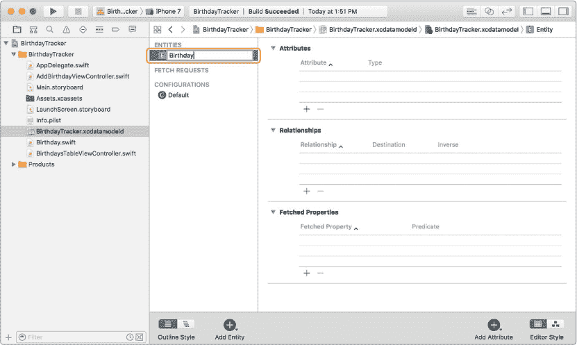
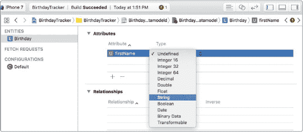
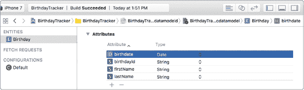
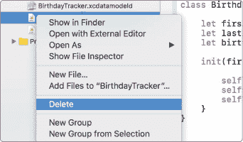
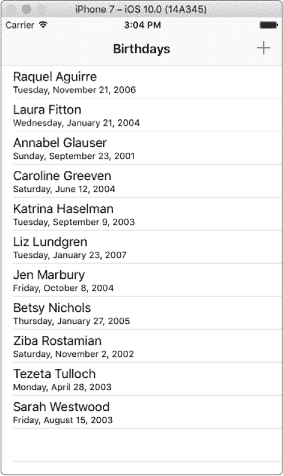
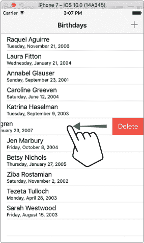

## 第十二章：## 保存生日


现在，您可以将生日添加到您的应用中并以列表形式显示它们，这太棒了！但是，当您关闭应用时，生日信息会从您的设备中消失。在本章中，我们将向您展示如何将应用程序的数据保存在您的设备中，即使您退出应用，数据仍然存在。

### 将生日存储到数据库中

数据存储在 iPhone 中的*数据库*中，数据库是可以快速保存、更新和检索的数据集合。您可以将其视为一个电子档案系统，其中数据存储在具有行和列的表格中。在我们应用程序的数据库中，将有一个生日表格来存储生日数据。这将类似于表 12-1。

**表 12-1：** 数据库中的生日表

| firstName | lastName | birthdate |
| --- | --- | --- |
| Jen | Marbury | 2004 年 10 月 8 日 |
| Tezeta | Tulloch | 2003 年 4 月 28 日 |
| Betsy | Nichols | 2005 年 1 月 27 日 |
| Caroline | Greeven | 2004 年 6 月 12 日 |

每一行将包含一个生日对象，列中包含其 firstName、lastName 和 birthdate 属性。

Core Data 是 Apple 提供的一个框架，您可以使用它来在数据库中保存和检索数据。存储在 Core Data 数据库中的对象必须来自 NSManagedObject 类的子类。这些子类被称为*托管对象*，因为它们的生命周期由 Core Data 框架管理。这意味着您不能使用我们在第八章中讨论的 init()方法来创建托管对象。相反，您需要使用一个特殊的 NSManagedObject 初始化器。

将 Core Data 添加到您的项目中最简单的方法是让 Xcode 自动完成。为此，每当您创建一个新项目时，选择一个单视图应用程序，并在新项目选项中勾选“使用 Core Data”框。当您在第九章中创建 BirthdayTracker 项目时，您应该已经完成了此步骤。当您使用 Core Data 创建新项目时，Xcode 会为您提供一个数据模型文件和在*AppDelegate.swift*文件中的设置代码。您需要这些代码来保存数据，但您可以调整它们以适应您自己的应用程序。

每个 iOS 应用程序都有一个特殊的*应用程序委托*，它会自动作为 AppDelegate 类的实例创建。应用程序委托负责*应用程序生命周期*，即应用程序可能处于的各种运行状态。对于 BirthdayTracker 应用程序，应用程序委托还将管理数据存储。我们将在第 178 页的“保存生日”中向您展示如何与应用程序委托一起工作，以保存和获取数据。

#### 生日实体

在您的应用中，您需要保存和检索托管的生日对象。为此，您需要创建一个生日*实体*，它将建模生日类。您可以将实体视为 Core Data 数据库中的一个表格。

在您的项目导航器中，您应该能看到一个名为 *BirthdayTracker.xcdatamodeld* 的数据模型文件。点击该文件，您将看到一个空的数据模型。在模型的左下角，点击 **添加实体** 按钮。这样会创建一个新的实体，它会出现在实体列表下，默认名称为 Entity。双击其名称进入可编辑文本框，将其名称更改为 Birthday（见图 12-1）。



*图 12-1：双击实体以更改其名称。*

接下来，您将为 Birthday 实体添加属性，以便为每个 Birthday 对象存储 firstName、lastName 和 birthdate。

#### 生日属性

就像类有属性一样，实体有属性。一个 Core Data 实体必须在 Swift 中有一个对应的类，并且该类的属性需要与实体的属性相匹配。您的 Birthday 类有三个属性——firstName、lastName 和 birthdate——这意味着 Birthday 实体需要有三个相同名称的属性。我们还将添加一个 birthdayId 属性——一个用于唯一标识每个生日的字符串。我们将在第十三章中使用这个属性，当我们从应用中删除一个生日及其相应的用户通知时会用到。

现在我们来创建属性。点击 **添加属性** 按钮为 Birthday 实体添加一个新属性。将其命名为 firstName，在其可编辑文本框中输入 firstName。接着，使用类型下拉菜单将类型设置为 **String**（见图 12-2）。

完成此操作后，添加 lastName 和 birthdayId 属性，类型也设置为 **String**。最后，添加 birthdate 属性，但将其类型设置为 **Date**。完成后，您的数据模型应该像图 12-3 中所示。



*图 12-2：为 Birthday 添加一个类型为 String 的 firstName 属性。*



*图 12-3：带有 Birthday *实体* 的 BirthdayTracker 数据模型*

现在，数据模型已经设置好，Xcode 在后台为其创建了一个 Birthday NSManagedObject 子类，用来存储生日数据。这意味着我们可以从代码中删除原来的 Birthday 类。我们现在有了一个新的 Birthday 类，它会创建已管理的 Birthday 对象并存储到设备的数据库中，因此我们不再需要之前创建的临时 Birthday 类。

在项目导航器中**按住 CONTROL 键并点击** *Birthday.swift*，弹出菜单如图 12-4 所示。选择 **删除**。



*图 12-4：删除 *Birthday.swift* 文件。*


接下来，你会看到一个对话框，询问是否要移除对文件的引用或将其移至废纸篓。移除文件的引用会将文件从项目中移除，但不会实际删除文件，以防你将来需要使用该文件。由于我们不再使用 *Birthday.swift* 文件，你可以将其完全删除。选择**移至废纸篓**。

#### 应用委托

我们很快会展示如何在设备上保存生日信息。为此，你需要在代码中访问应用委托。请记住，在我们的应用中，管理 Core Data 的代码位于应用委托中。

当你使用 Xcode 创建一个新的 iOS 应用时，*AppDelegate.swift* 文件会自动为你创建。该文件包含 AppDelegate 类，该类实现了 UIApplicationDelegate 协议，进而为应用创建了应用委托。每个应用只有一个应用委托，应用委托负责应用的生命周期管理。

在 iOS 设备上，用户通常一次只能看到并与一个应用进行互动。这就是所谓的*前台*应用。当用户按下 iOS 设备的主屏幕按钮或切换到另一个应用时，他们正在使用的应用会被*后台化*。这意味着当前应用不再可见，另一个应用可以进入前台。后台应用仍然可以执行一些代码，但最终会被*挂起*，或者暂停。当用户切换回应用时，由于应用仍在设备内存中，它可以很快被带回前台。完全关闭的应用会被*终止*。被终止的应用必须从头重新启动，用户再次打开时才会运行。

应用委托知道应用何时完成启动、进入后台、返回前台或被终止。AppDelegate 类包含六个回调函数，当应用进入不同的生命周期状态时，这些函数会被调用：

`application(_:didFinishLaunchingWithOptions:)` 在应用启动时被调用。如果你希望应用在启动后立即执行某些操作，可以在这个回调函数中编写代码。

`applicationWillResignActive(_:)` 在应用将离开前台状态时被调用。

当应用进入后台状态时，会调用`applicationDidEnterBackground(_:)`，此时可以执行一些代码，但应用仍然可能随时被挂起。

`applicationWillEnterForeground(_:)` 在应用将离开后台状态并即将进入前台状态时被调用。

`applicationDidBecomeActive(_:)` 在应用将进入前台状态并重新激活时被调用。

`applicationWillTerminate(_:)` 在应用在前台或后台运行并即将关闭时被调用。如果应用在关闭时被挂起，则不会调用该方法。

当你使用 Core Data 创建一个新项目时，Xcode 会自动让 AppDelegate 类为你管理数据存储。在*AppDelegate.swift*文件中，你会看到 AppDelegate 类包含一个 persistentContainer 属性，你将需要它来保存和访问数据。在 persistentContainer 上有一个名为 viewContext 的 NSManagedObjectContext 属性。当我们在代码中保存和获取生日时，我们需要直接访问 persistentContainer.viewContext。让我们看看怎么做。

##### 访问托管对象上下文

*托管对象上下文*就像一个便签对象，用于创建、保存和从数据库中获取数据。它临时存储你需要的数据。在应用程序的任何地方，你都可以通过以下两行代码访问托管对象上下文（我们稍后会告诉你将它们添加到哪里，所以现在只需要专注于理解它们的作用）：

```
➊
 let
 appDelegate = UIApplication
 .shared
 .delegate
 as
 ! AppDelegate

➋
 let
 context = appDelegate.persistentContainer
 .viewContext

```

这段代码的目的是获取你应用程序的托管对象上下文，并将其存储到一个简单的常量中，方便你用来创建和保存生日。在➊位置，你创建了一个常量引用，指向你应用程序的应用程序委托。你通过使用 UIApplication 的 shared 属性来返回你的应用实例（即当前正在运行的应用）。一旦你获取到当前的应用实例，你将该实例的 delegate 属性转换为 AppDelegate，并将其存储在常量 appDelegate 中。➋位置的那行代码检索 viewContext，它位于 appDelegate 的 persistentContainer 中，并将其存储在一个名为 context 的常量中。

现在你已经访问了托管对象上下文，你准备好保存一些生日了！你使用上下文来创建一个新的生日，然后当你想保存生日时，只需要保存上下文。

##### 保存生日

让我们在 iPhone 上保存一个生日！打开*AddBirthdayViewController.swift*。第一步是导入 Core Data，这是你在任何想要使用 Core Data 的文件中都需要做的。将以下内容添加到文件顶部。

*AddBirthdayViewController.swift*

```
import UIKit

import
 CoreData
```

接下来，查看 saveTapped(_:)方法。删除以下几行代码：

```
➊
 let
 newBirthday = Birthday
 (firstName: firstName, 
    // ← Remove this code

      lastName: lastName, birthdate: birthdate)         // ← Remove this code

➋
 delegate
 ?.addBirthdayViewController
 (self
 , 
          // ← Remove this code

      didAddBirthday: newBirthday)                     // ← Remove this code

```

我们将不再使用初始化器来创建 newBirthday，所以你可以去掉➊位置的那行代码。此外，我们也不需要使用委托将生日传递给生日表视图控制器（稍后你会明白为什么），所以你也可以去掉➋位置的那行代码。

现在我们将在 saveTapped(_:)方法中添加代码。我们需要获取托管对象上下文来创建和保存生日。首先，添加我们在“访问托管对象上下文”中讨论的那两行代码，位于第 178 页：

```
let firstName = firstNameTextField.text ?? ""

let lastName = lastNameTextField.text ?? ""

let birthdate = birthdatePicker.date

let
 appDelegate = UIApplication
 .shared
 .delegate
 as
 ! AppDelegate

let
 context = appDelegate.persistentContainer
 .viewContext

dismiss(animated: true, completion: nil)

```

在你访问了上下文之后，你可以使用它来创建一个生日。在设置了 context 之后，将以下几行代码添加到 saveTapped(_:)方法中。

```
 let appDelegate = UIApplication.shared.delegate as! AppDelegate

  let context = appDelegate.persistentContainer.viewContext

➊
 let
 newBirthday = Birthday
 (context: context)

➋
 newBirthday.firstName
 = firstName

➌
 newBirthday.lastName
 = lastName

➍
 newBirthday.birthdate
 = birthdate as
 NSDate
 ?

➎
 newBirthday.birthdayId
 = UUID
 ().uuidString

➏
 if
 let
 uniqueId = newBirthday.birthdayId
 {

      print
 ("The birthdayId is
 \(
 uniqueId)"
 )

  }

  dismiss(animated: true, completion: nil)

```

每个 NSManagedObject 子类都有一个默认的初始化函数，它接受一个上下文，并将创建一个新的管理对象。在➊处，我们通过使用一个新的 Birthday 初始化函数并传入上面创建的上下文来创建一个生日对象。在创建 newBirthday 后，我们可以设置它的 firstName ➋、lastName ➌和 birthdate ➍属性。请注意，这与我们以前的初始化函数不同，后者是传入 Birthday 类的所有属性。在这里，我们首先创建 newBirthday，然后逐行设置它的属性。至于 Xcode 版本 8.2.1（及之后版本）中，我们在➕时必须将 birthdate 属性强制转换为 NSDate 对象。NSDate 是 Swift 旧版本中使用的日期类型，现在已经更新为 Date。然而，Core Data 中的日期还没有更新为使用新的 Date 类，因此我们必须将 birthdate 属性强制转换为 NSDate，以确保从数据库中获取正确的值。


我们还想将 birthdayId 字段设置为每个生日的唯一标识符。这有点像美国政府为每个公民发放社会安全号码。没有两个人会有相同的号码。在计算机编程中，通常需要为对象分配唯一标识符，这些标识符被称为*全局唯一标识符（UUIDs）*。Swift 有一个 UUID 类，它将为我们生成一个 UUID 字符串。当我们将 newBirthday 的 birthdayId 设置为 UUID().uuidString 时，我们在➎使用了这个类。UUID 类的这个属性每次被调用时都会返回一个新的唯一值。如果你想查看 birthdayId 的值，你可以添加一个打印语句➏，每次你添加一个生日时，你都会看到类似以下内容的输出：

```
The birthdayId is 79E2B0EF-2AD5-4382-A38C-4911454515F1
```

接下来，我们需要保存 newBirthday。为此，我们在上下文中调用 save()方法。这有点像在完成文档编辑后保存计算机文档。管理对象上下文就像是你的文档，而你已经向其中添加了一个生日，现在你想保存这个文档。在设置完属性后，添加以下几行代码：

```
  if let uniqueId = newBirthday.birthdayId {

      print("The birthdayId is \(uniqueId)")

  }

➊
 do
 {

    ➋
 try
 context.save
 ()

➌
 } catch
 let
 error {

    ➍
 print
 ("Could not save because of
 \(
 error)."
 )

  }

  dismiss(animated: true, completion: nil)

```

现在这是一个新内容！我们将保存上下文的方法包裹在一个 do-try-catch 块中，Swift 中用它来处理错误。在大多数简单的应用程序中，你只会在对管理对象上下文调用的方法周围使用 do-try-catch 块，因此本书仅会讲解如何在这种情况下使用它。当你想在上下文上调用像 save()这样的函数时，你需要将方法包裹在一个以关键字 do ➊开头的块中。这告诉 Swift 执行 do 块大括号中的代码。接下来，你需要在方法调用前加上关键字 try ➋。try 关键字告诉 Swift 它应该*尝试*执行该方法，但如果方法没有成功，它会抛出一个错误，Swift 需要*捕获*这个错误。

try 关键字仅在抛出错误的方法前使用，比如这个 context.save()方法。抛出错误的方法在其定义中，输入参数后会有 throws 关键字。例如：

```
func
 save() throws

```

如果你尝试在没有使用 do-try-catch 的情况下调用 context.save()方法，Xcode 会给出错误提示。

最后，最后一部分是 catch 块，用来捕获 context.save()方法抛出的任何错误 ➌。如果 context.save()方法失败，并且你想了解发生了什么，可以打印出抛出的错误并且被捕获 ➍。

现在你已经保存了所有输入到应用中的生日。但在我们再次运行应用之前，我们还需要让我们的生日表视图控制器从数据库中抓取所有生日数据并进行展示。

##### 获取生日

添加生日视图控制器将每个新增的生日保存到你的设备中。现在让我们*获取*这些生日数据——也就是说，从 Core Data 中获取 Birthday 对象——以便它们可以在生日表视图控制器中显示。

首先，将 import CoreData 添加到 BirthdayTableViewController 文件的顶部，就像你在 AddBirthdayViewController 中做的那样。每个使用 Core Data 框架的文件顶部必须包含此导入语句，否则 Xcode 将无法识别 Core Data 使用的类或方法。

接下来，我们需要编写代码来获取我们想要展示的生日数据。每次生日表视图控制器的视图出现在屏幕上时，生日列表应该被刷新。这样，当你添加了一个生日并关闭添加生日视图控制器后，生日表视图控制器会显示新添加的生日，并将其作为列表的一部分。

在 UIViewController 类中有一个内置方法叫做 viewWillAppear(_:)，我们可以在每次生日表视图控制器出现在屏幕上时，获取生日数据并将其放入生日数组中。将以下代码添加到 viewDidLoad()方法之后：

*BirthdaysTableViewController.swift*

```
  override func viewDidLoad() {

      --*snip*
 --

  }

➊
 override
 func
 viewWillAppear(_
 animated: Bool
 ) {

    ➋
 super
 .viewWillAppear
 (animated)

    ➌
 let
 appDelegate = UIApplication
 .shared
 .delegate
 as
 ! AppDelegate

    ➍
 let
 context = appDelegate.persistentContainer
 .viewContext

    ➎
 let
 fetchRequest = Birthday
 .fetchRequest
 () as
 NSFetchRequest
 <Birthday
 >

      do
 {

        ➏
 birthdays = try
 context.fetch
 (fetchRequest)

      } catch
 let
 error {

          print
 ("Could not fetch because of error:
 \(
 error)."
 )

      }

    ➐
 tableView
 .reloadData
 ()

  }
```

函数 viewWillAppear(_:) ➊是一个 UIViewController 生命周期方法，类似于 viewDidLoad()。而 viewDidLoad()只会在视图控制器第一次创建时被调用一次，viewWillAppear(_:)则会在每次视图出现在屏幕上时被调用。这使得它成为一个非常有用的地方，适合放置你希望每次视图出现或重新出现时执行的代码。

如果你要实现 viewWillAppear(_:)，请确保调用 super.viewWillAppear(_:) ➋，这样你仍然能获取 UIViewController 的 viewWillAppear(_:)方法的内置功能。在这种情况下，你还需要将 animated 参数传递给该方法。animated 参数是一个布尔值，用来告诉应用视图是否会进行动画（即，滑动到屏幕上）。

要从数据库中获取数据，你需要访问应用委托的托管对象上下文。位于 ➌ 和 ➍ 的代码行将为你获取上下文，接下来你将使用它来获取数据。这与在添加生日视图控制器中获取上下文以保存生日的方式是一样的。

接下来，你需要创建一个 NSFetchRequest 对象。位于 ➎ 的代码行创建了一个 NSFetchRequest，它将从 Core Data 中获取所有的 Birthday 对象。它使用了 Xcode 在你的 *Birthday+CoreDataProperties.swift* 文件中自动创建的类方法 fetchRequest()。请注意，在创建 fetchRequest 时，你需要将其强制转换为 NSFetchRequest<Birthday> 数据类型，这样它才能知道从数据库中获取什么类型的对象。

一旦你有了 fetchRequest，你可以让托管对象上下文执行它的 fetch(_:) 方法。fetch(_:) 方法 ➏ 会返回一个指定数据类型的对象数组。在这个例子中，我们将得到一个 Birthday 对象数组，并可以将其赋值给 birthdays 数组。此行代码被包裹在一个 do-try-catch 错误处理块中，就像我们在 Add Birthday 视图控制器中保存生日时使用的那样。Swift 在从 Core Data 中获取对象时使用这种类型的错误处理，以便如果获取失败，错误可以告诉你发生了什么。

最后，在获取了所有的生日信息后，我们需要重新加载表格视图，这样我们才能看到新的生日 ➐。

在我们运行应用并测试保存的生日之前，我们还需要处理一些其他的事情。

### 代码清理

你会发现，在编写应用程序时，常常是先按照一种方式做，后来才发现有更好的方法。当你改进已经写好的代码时，这叫做 *重构* 代码。让我们从清理并去除不再需要的旧代码开始。


在 第十一章 中，我们使用委托模式让 Add Birthday 视图控制器每次添加一个生日时通知 Birthdays 表格视图控制器，以便它能够显示该生日。现在我们不再需要这样做了。相反，我们将让 Birthdays 表格视图控制器每次显示时，都通过从数据库中提取已保存的 Birthday 对象来填充其 birthdays 数组。这样，我们就可以删除 AddBirthdayViewControllerDelegate 及其相关代码！

为此，删除整个 AddBirthdayViewControllerDelegate 协议及其函数 addBirthdayViewController(_:didAddBirthday:)：

*AddBirthdayViewController.swift*

```
protocol
 AddBirthdayViewControllerDelegate {                      // ← Remove

    func
 addBirthdayViewController(_

                            // ← Remove

        addBirthdayViewController: AddBirthdayViewController
 , 
   // ← Remove

        didAddBirthday birthday: Birthday
 )                        // ← Remove

}                                                                 // ← Remove

```

一旦你删除了这行代码，你会看到在 AddBirthdayViewController 类中的委托属性旁出现一个红色错误。也删除那行代码：

```
var
 delegate: AddBirthdayViewControllerDelegate
 ?  // ← Remove

```

接下来，点击打开 BirthdaysTableViewController 文件。由于 AddBirthdayViewControllerDelegate 协议不再存在，你不能让 BirthdaysTableViewController 类采纳这个协议，所以在 BirthdaysTableViewController 定义旁边会有一个错误。删除代码行中的逗号和 AddBirthdayViewControllerDelegate：

*BirthdaysTableViewController.swift*

```
class
 BirthdaysTableViewController: UITableViewController

    , AddBirthdayViewControllerDelegate

            // ← Remove

    {
```

所以，BirthdayTableViewController 声明现在应该是这样的：

```
class
 BirthdaysTableViewController: UITableViewController
 {
```

现在你可以在*BirthdaysTableViewController.swift*文件中删除两个部分。删除下面所有代码，包括注释// MARK: -AddBirthdayViewControllerDelegate，因为 AddBirthdayViewControllerDelegate 不再存在，它的方法也永远不会被调用：

```
// MARK: - AddBirthdayViewControllerDelegate
                      // ← Remove

    func
 addBirthdayViewController(_

                           // ← Remove

        addBirthdayViewController: AddBirthdayViewController
 , 
 // ← Remove

        didAddBirthday birthday: Birthday
 ) {                     // ← Remove

        birthdays
 .append
 (birthday)                               // ← Remove

        tableView
 .reloadData
 ()                                   // ← Remove

}                                                                // ← Remove

```

然后查看导航部分。在 prepare(for:sender:)方法中，我们所做的只是将 Birthdays 表视图控制器设置为 Add Birthday 视图控制器的委托。这不再必要了，所以我们可以删除这个方法和整个// MARK: - Navigation 部分：

```
// MARK: - Navigation
                                           // ← Remove

    // In a storyboard-based application, you will often want
   // ← Remove

    // to do a little preparation before navigation
             // ← Remove

    override func
 prepare(for segue: UIStoryboardSegue
 , 
      // ← Remove

        sender: Any
 ?) {                                        // ← Remove

        // Get the new view controller
                          // ← Remove

        // using segue.destinationViewController
                // ← Remove

        let
 navigationController = segue.destination
 as
 ! 
     // ← Remove

            UINavigationController
                              // ← Remove

        let
 addBirthdayViewController = 
                      // ← Remove

            navigationController.topViewController
 as
 ! 
       // ← Remove

            AddBirthdayViewController
                           // ← Remove

        addBirthdayViewController.delegate = self
               // ← Remove

}                                                              // ← Remove

```

由于 Birthday NSManagedObject 类中的属性是可选的，在我们能够在 UITableViewCell 中显示生日之前，需要解包这些属性。删除方法 tableView(_:cellForRowAt:)中的这两行代码：

```
override func tableView(_ tableView: UITableView,

    cellForRowAt indexPath: IndexPath) -> UITableViewCell {

    let cell = tableView.dequeueReusableCell(withIdentifier:

        "birthdayCellIdentifier", for: indexPath)

    let birthday = birthdays[indexPath.row]

    cell.textLabel
 ?.text = birthday.firstName
 + " "
 + 
 // ← Remove

        birthday.lastName
                                 // ← Remove

    cell.detailTextLabel
 ?.text
 = 
                       // ← Remove

        dateFormatter
 .string(from: birthday.birthdate
 )   // ← Remove

    return cell

}

```

接下来，将以下内容添加到相同的方法 tableView(_:cellForRowAt:)中：

```
  let birthday = birthdays[indexPath.row]

➊
 let
 firstName = birthday.firstName
 ?? ""

➋
 let
 lastName = birthday.lastName
 ?? ""

  cell.textLabel
 ?.text
 = firstName + " "
 + lastName

➌
 if
 let
 date = birthday.birthdate
 as
 Date?
 {

    ➍
 cell.detailTextLabel
 ?.text
 = dateFormatter
 .string
 (from: date)

  } else
 {

    ➎
 cell.detailTextLabel
 ?.text
 = ""

  }

  return cell

```

我们使用空合并操作符将 birthday.firstName 设置为常量 firstName（如果存在），如果没有 birthday.firstName，则将 firstName 设置为空字符串➊。在➋处，我们对 lastName 做了同样的操作。最后，为了显示出生日期，我们在 if let 语句中使用可选绑定，将 birthday.birthdate 设置为常量 date（如果存在），并在➌和➍处将这个日期显示在 cell.detailTextLabel 中。注意，在➌处，我们需要将 NSDate 类型的 birthdate 转换为 Date 对象，这可以通过 as Date?轻松完成。如果 birthdate 不存在，我们只需将 detailTextLabel?.text 设置为空字符串➎。

现在运行你的应用程序并添加一些生日！然后停止应用程序并重新运行。你刚添加的生日应该会在第二次运行应用程序时显示出来。它们会永久保留在应用程序中——也就是说，直到你删除应用程序为止。

### 为我们的应用添加更多功能

现在我们的应用程序可以存储生日了，但似乎还是不够完善。尽管我们的应用程序完成了我们想要的基本功能，但它的表现并不好。例如，生日列表没有被整理过，当用户想查找某个特定的生日时，他们必须逐行搜索。这非常让人烦恼！而且用户可以添加任意多的生日，但如果他们犯了错，没有办法删除某个生日。这太令人沮丧了！

为了解决这些问题，我们将通过在现有代码的基础上添加更多功能来改进我们的应用程序。完成之后，你甚至可以继续添加更多功能！

#### 按字母顺序排列生日

如果生日能按字母顺序排列，那该多好啊！让 fetchRequest 返回一个已排序的对象列表是非常简单的。为了返回一个按字母顺序排列的生日对象列表，请在创建 fetchRequest 的代码后，立即在 viewWillAppear(_:)中添加以下三行代码：

*BirthdaysTableViewController.swift*

```
override func viewWillAppear(_ animated: Bool) {

    --*snip*
 --

    let fetchRequest = Birthday.fetchRequest() as NSFetchRequest<Birthday>

      ➊
 let
 sortDescriptor1 = NSSortDescriptor
 (key: "lastName"
 , ascending: true
 )

      ➋
 let
 sortDescriptor2 = NSSortDescriptor
 (key: "firstName"
 , ascending: true
 )

      ➌
 fetchRequest.sortDescriptors
 = [sortDescriptor1, sortDescriptor2]

    do {

        birthdays = try context.fetch(fetchRequest)

```

我们将首先按照姓氏对 Birthday 对象列表进行字母排序，然后再按名字排序，以防有些人的姓氏相同。NSFetchedRequest 有一个专门用于此目的的属性，叫做 sortDescriptors。它是一个 NSSortDescriptor 对象的数组。你可以使用 NSSortDescriptor 类来创建一个 sortDescriptor，它会为你排序一组项目。每个 sortDescriptor 都有一个*key*和一个布尔值，表示列表是否应该按升序排序（true），如果不是则按降序排序（false）。key 是你希望排序的对象的属性。在➊处，我们创建了 sortDescriptor1 并传入 lastName 作为 key。为了将姓氏按字母顺序从 A 到 Z 排序，我们传入 true 作为升序。类似地，➋处的代码创建了 sortDescriptor2 来按 firstName 从 A 到 Z 排序。如果我们将字符串数据类型作为 key，Swift 会知道我们希望按字母顺序对字符串进行排序。如果我们传入"birthdate"作为 key，Swift 会按日期从最旧到最年轻进行排序。在➌行，我们将 sortDescriptors 设置为一个数组，其中 sortDescriptor1 是第一个元素，接着是 sortDescriptor2。sortDescriptors 将按它们列出的顺序排序。



*图 12-5 : 按字母顺序排列的生日列表*

现在运行应用程序，看看你得到的结果！你应该会看到朋友们的生日按字母顺序排列，像图 12-5 中显示的那样。

你能改变列表的顺序，使其按出生日期排序吗？试试看吧！


#### 删除生日

如果你把生日弄错了，能够删除它并重新添加正确的信息会是很好的功能。现在让我们添加删除生日的功能吧。

在 BirthdaysTableViewController 类中，我们在文件底部留有两个被注释掉的方法：tableView(_:canEditRowAt:)和 tableView(_:commit:forRowAt:)。这些方法允许我们启用表视图的内建“滑动删除”功能。当你运行 BirthdayTracker 并查看生日列表时，你可以用手指触摸某个生日并向左滑动。这个操作会显示一个“删除”按钮，像图 12-6 中显示的那样，点击它可以将该生日从应用中移除。

通过去掉/*和*/来取消注释 tableView(_:canEditRowAt:)和 tableView(_:commit:forRowAt:)方法。

接下来，确保方法`tableView(_:canEditRowAt:)`返回`true`。这意味着你将能够编辑表格，或者在我们的例子中，删除行。如果它返回`false`，你将无法滑动表格删除行。该函数应该如下所示：



*图 12-6：向左滑动以从 BirthdayTracker 中删除一个生日*

*BirthdaysTableViewController.swift*

```
override func
 tableView(_
 tableView: UITableView
 , 

    canEditRowAt indexPath: IndexPath
 ) -> Bool
 {

    return true

}
```

你需要在方法`tableView(_:commit:forRowAt:)`中添加一些代码，实际删除表格中的行，同时从数据库和 birthdays 数组中移除对应的 Birthday 对象。如果你只从表格视图中删除了行，那么计算机会感到困惑，因为表格中的行数将不再与`birthdays.count`匹配，应用程序将崩溃。首先，删除 Xcode 在`tableView(_:commit:forRowAt:)`中提供的以下几行代码：

```
// Override to support editing the table view

override func tableView(_ tableView: UITableView, commit editingStyle: 

    UITableViewCellEditingStyle, forRowAt indexPath: IndexPath) {

    if
 editingStyle == .delete
 {                           // ← Remove

        // Delete the row from the data source
              // ← Remove

        tableView.deleteRows(at: [
 indexPath], with: .fade
 ) // ← Remove

     } else
 if
 editingStyle == .insert
 {                    // ← Remove

        // Create a new instance of the appropriate class, // ← Remove

        // insert it into the array, and add a new row
      // ← Remove

        // to the table view
                                // ← Remove

    }                                                      // ← Remove

}

```

然后添加以下代码：

```
override func tableView(_ tableView: UITableView, commit editingStyle: 

    UITableViewCellEditingStyle, forRowAt indexPath: IndexPath) {

  ➊
 if
 birthdays
 .count
 > indexPath.row
 {

      ➋
 let
 birthday = birthdays
 [indexPath.row
 ]

      ➌
 let
 appDelegate = UIApplication
 .shared
 .delegate
 as
 ! AppDelegate

      ➍
 let
 context = appDelegate.persistentContainer
 .viewContext

      ➎
 context.delete
 (birthday)

      ➏
 birthdays
 .remove
 (at: indexPath.row
 )

      ➐
 tableView.deleteRows
 (at: [indexPath], with: .fade
 )

    }

}

```

在➊处，我们首先做一个安全检查，确保`birthdays`数组中至少有与我们尝试删除的`indexPath`行号一样多的生日。为此，我们使用了`>`运算符，而不是`>=`运算符，因为`birthdays.count`必须大于`indexPath.row`。例如，如果`birthdays`数组中只有两个生日，而我们尝试获取`birthdays[2]`，即第三个生日，应用程序就会崩溃。记住，`indexPath`的行数是从 0 开始的。

➋处的代码将`birthdays`数组中正确索引位置的生日设置为`birthday`，以便删除。然后，我们在➌和➍处访问应用程序代理的 managed object context。在➎处，删除了该对象。当我们从数据库中删除对象时，还需要确保从`Birthdays`表视图控制器的`birthdays`数组中删除它➏。最后，`deleteRows(at:with:)`方法➐接收两个参数，一个是 NSIndexPath 数组，用于标明需要删除的行，另一个是 UITableViewRowAnimation 类型。该动画指定了删除行时的显示效果。你可以选择`none`、`bottom`、`top`、`left`、`right`、`middle`或`fade`等选项。我们希望使用渐变效果只删除我们已删除的那一行。为此，我们传入一个包含`indexPath`的数组作为第一个参数（用方括号`[]`括起来），并将`.fade`作为第二个参数。

现在运行应用程序并删除一些生日。你应该能看到表格中的行被删除。然而，如果你退出应用程序后重新运行，已删除的生日会重新出现。这是怎么回事？

好吧，你删除了 managed object context 中的 birthdays，但这些更改并没有自动保存。每当你在 context 中添加、更新或删除对象时，你还需要保存 context，否则更改将不会保存在设备上。记住，context 就像是计算机中的文档，需要保存。为此，在移除生日之后，添加以下几行代码：

```
context.delete(birthday)

birthdays.remove(at: indexPath.row)

do
 {

    try
 context.save
 ()

} catch
 let
 error {

    print
 ("Could not save
 \(
 error)."
 )

}

tableView.deleteRows(at: [indexPath], with: .fade)

```

这些行应该很熟悉，因为它们与在添加生日视图控制器中添加生日时保存的托管对象上下文相同。

这次当你运行应用程序并删除一个生日时，它应该保持删除状态！

### 你所学到的内容

在本章中，你学习了如何使用 Core Data 框架保存、获取和删除数据库中的生日对象，这样每次运行应用程序时，你的生日信息都会保存下来。现在，你的生日也按字母顺序显示。


在第十三章中，我们将向你展示如何使用本地通知提醒用户朋友的生日。

## 保存生日


现在，你可以将生日添加到应用程序中并以列表形式显示，这很棒！然而，当你关闭应用程序时，生日会从你的设备上消失。在本章中，我们将向你展示如何将应用程序的数据保存在设备上，这样即使你退出应用程序，它们仍然会存在。

### 将生日存储在数据库中

数据存储在 iPhone 上的一个 *数据库* 中，这是一个可以快速保存、更新和检索数据的数据集合。你可以将其视为一个电子文件系统，其中数据存储在具有行和列的表格中。在我们应用程序的数据库中，将有一个生日表来存储生日数据。这将类似于表 12-1。

**表 12-1：** 数据库中的生日表

| firstName | lastName | birthdate |
| --- | --- | --- |
| Jen | Marbury | 2004 年 10 月 8 日 |
| Tezeta | Tulloch | 2003 年 4 月 28 日 |
| Betsy | Nichols | 2005 年 1 月 27 日 |
| Caroline | Greeven | 2004 年 6 月 12 日 |

每一行将包含一个生日对象，列中将包含它的 firstName、lastName 和 birthdate 属性。

Core Data 是一个苹果框架，允许你在数据库中保存和检索数据。存储在 Core Data 数据库中的对象必须来自 NSManagedObject 类的子类。这些子类被称为 *托管对象*，因为它们的生命周期由 Core Data 框架管理。这意味着你不能使用我们在第八章中介绍的 init() 方法来创建托管对象。相反，你需要使用一个特殊的 NSManagedObject 初始化器。

将 Core Data 添加到你的项目中最简单的方法是让 Xcode 自动完成。为此，每当你创建一个新项目时，从“单视图应用程序”开始，并在新项目选项中勾选“使用 Core Data”框。当你在第九章中创建 BirthdayTracker 项目时，你应该已经完成了这个步骤。当你使用 Core Data 创建新项目时，Xcode 会为你提供一个数据模型文件以及在 *AppDelegate.swift* 文件中的设置代码。你需要这些代码来保存数据，但你可以调整它们来为自己的应用程序使用。

每个 iOS 应用都有一个特殊的*应用委托*，它会自动作为 AppDelegate 类的一个实例创建。应用委托负责管理*应用生命周期*，即应用可能处于的各种运行状态。对于 BirthdayTracker 应用，应用委托还将管理数据存储。我们将在“保存生日”中向你展示如何与应用委托一起工作来保存和获取数据，见第 178 页。

#### 生日实体

在你的应用中，你希望保存和检索管理的 Birthday 对象。为此，你需要创建一个 Birthday*实体*来模拟 Birthday 类。你可以将实体看作 Core Data 数据库中的一个表。

在你的项目导航器中，你应该能看到一个名为*BirthdayTracker.xcdatamodeld*的数据模型文件。点击该文件，你将看到一个空的数据模型。在模型的左下角，点击**添加实体**按钮。这将创建一个新的实体，该实体在“实体”下以默认名称“Entity”显示。双击其名称以获得可编辑的文本字段，然后将其名称更改为 Birthday（见图 12-1）。


*图 12-1: 双击实体以更改其名称*

接下来，你将向 Birthday 实体添加属性，以便为每个 Birthday 对象存储 firstName、lastName 和 birthdate。

#### 生日属性

就像一个类有属性一样，一个实体也有属性。一个 Core Data 实体必须有一个对应的 Swift 类，并且该类的属性必须与实体的属性匹配。你的 Birthday 类有三个属性——firstName、lastName 和 birthdate——这意味着 Birthday 实体需要有三个相同名称的属性。我们还将添加一个 birthdayId 属性——一个唯一的字符串来标识每个生日。我们将在第十三章中使用它，删除应用中的生日和对应的用户通知。

现在让我们来创建这些属性。点击**添加属性**按钮，向 Birthday 实体添加一个新属性。将其命名为 firstName，在其可编辑文本字段下输入 firstName。接下来，使用类型下拉菜单将类型设置为**String**（见图 12-2）。

完成后，添加 lastName 和 birthdayId 属性，它们也应该是**String**类型。最后，添加 birthdate 属性，但将其类型设置为**Date**。完成后，你的数据模型应该像图 12-3 所示。


*图 12-2: 将一个名为 firstName 的属性添加为 String 类型到 Birthday 实体*


*图 12-3: 带有 Birthday 实体的 BirthdayTracker 数据模型*

现在你的数据模型已经设置好了，Xcode 在后台为它创建了一个 Birthday NSManagedObject 子类，用来存储生日。这意味着我们可以从代码中移除原来的 Birthday 类。我们有了一个新的 Birthday 类，它创建受管的 Birthday 对象来存储在设备的数据库中，所以我们不再需要我们之前创建的临时 Birthday 类。

在项目导航器中 CONTROL -点击 *Birthday.swift*，以显示图 12-4 中所示的菜单。选择 **删除**。


*图 12-4：删除* Birthday.swift *文件。*


接下来，你将看到一个对话框，询问你是否要删除文件的引用或移动到废纸篓。删除文件引用会将文件从项目中移除，但不会实际删除文件，以防你以后需要再次使用它。由于我们不再使用 *Birthday.swift* 文件，因此可以完全删除它。选择 **移到废纸篓**。

#### 应用程序委托

我们将很快向你展示如何在设备上保存生日。为此，你需要在代码中访问应用程序委托。记住，在我们的应用中，管理 Core Data 的代码位于应用程序委托内部。

当你使用 Xcode 创建一个新的 iOS 应用程序时，会自动为你创建一个 *AppDelegate.swift* 文件。该文件包含 AppDelegate 类，AppDelegate 类实现了 UIApplicationDelegate 协议，从而为应用程序创建了应用程序委托。每个应用程序只有一个应用程序委托，应用程序委托负责管理应用程序的生命周期。

在 iOS 设备上，用户通常一次只能看到并与一个应用进行交互。这被称为 *前台* 应用。当用户按下设备的主屏幕按钮或切换到另一个应用时，他们正在使用的应用会被 *置于后台*。这意味着当前应用不再可见，另一个应用可以被带到前台。后台应用仍然可以在短时间内执行一些代码，但最终会被 *挂起* 或暂停。后台或挂起的应用可以在用户切换回时快速恢复到前台，因为它仍然保留在设备的内存中。当应用完全关闭时，它会被 *终止*。终止的应用如果用户再次打开，必须从头启动。

应用程序委托知道何时应用程序完成启动、进入后台、返回前台或被终止。AppDelegate 类包含六个回调函数，这些函数会在应用程序进入不同的生命周期状态时被调用：

当应用程序启动时，会调用 application(_:didFinishLaunchingWithOptions:)。如果你希望在应用程序启动时立即执行某些操作，可以在此回调函数中编写代码。

当应用程序离开前台状态时，会调用 applicationWillResignActive(_:)。

当应用程序进入后台状态时，会调用`applicationDidEnterBackground(_:)`，在这个状态下可以执行一些代码，但应用程序仍然可以随时被挂起。

当应用程序离开后台状态并即将进入前台状态时，会调用`applicationWillEnterForeground(_:)`。

当应用程序即将进入前台并重新激活时，会调用`applicationDidBecomeActive(_:)`。

当应用程序在前台或后台运行并被关闭时，会调用`applicationWillTerminate(_:)`。如果应用程序在关闭时被挂起，这个方法不会被调用。

当你使用 Core Data 创建一个新项目时，Xcode 会自动让 AppDelegate 类管理数据存储。在 *AppDelegate.swift* 文件中，你会看到 AppDelegate 类包含一个 persistentContainer 属性，你需要通过它来保存和访问数据。在 persistentContainer 上，有一个名为 viewContext 的 NSManagedObjectContext 属性。当我们在代码中保存和获取生日时，我们需要直接访问 persistentContainer.viewContext。让我们看看是如何实现的。

##### 访问托管对象上下文

*托管对象上下文* 就像一个便签对象，用于创建、保存和从数据库中获取数据。它临时存储你需要的数据。你可以在应用程序的任何地方使用以下两行代码访问托管对象上下文（我们稍后会告诉你在哪里添加这些代码，所以现在只需专注于理解它们的作用）：

```
➊
 let
 appDelegate = UIApplication
 .shared
 .delegate
 as
 ! AppDelegate

➋
 let
 context = appDelegate.persistentContainer
 .viewContext

```

这段代码的目的是获取应用程序的托管对象上下文，并将其存储到一个简单的常量中，便于你创建和保存生日。在 ➊ 处，你创建了一个常量引用指向应用程序的应用委托。你通过使用 UIApplication 的 shared 属性来返回应用实例（即你当前运行的应用）。一旦你获得当前的应用实例，你将该实例中的 delegate 属性转换为 AppDelegate 并将其存储在常量 appDelegate 中。在 ➋ 处，检索 appDelegate 中 persistentContainer 的 viewContext，并将其存储到一个名为 context 的常量中。

现在你已经访问了托管对象上下文，准备保存一些生日了！你可以使用上下文创建一个新的生日，然后在想保存生日时，只需保存上下文。

##### 保存生日

让我们在 iPhone 上保存一个生日吧！打开 *AddBirthdayViewController.swift*。第一步是导入 Core Data，这是你在任何需要使用 Core Data 的文件中必须做的事情。在文件顶部添加以下内容。

*AddBirthdayViewController.swift*

```
import UIKit

import
 CoreData
```

接下来，查看 saveTapped(_:) 方法。删除以下行：

```
➊
 let
 newBirthday = Birthday
 (firstName: firstName, 
    // ← Remove this code

      lastName: lastName, birthdate: birthdate)         // ← Remove this code

➋
 delegate
 ?.addBirthdayViewController
 (self
 , 
          // ← Remove this code

      didAddBirthday: newBirthday)                     // ← Remove this code

```

我们不再使用初始化器来创建 `newBirthday`，所以你可以去掉 ➊ 处的那一行。此外，我们也不需要使用委托将生日传递给 `Birthdays` 表视图控制器（你稍后会明白为什么），因此你也可以去掉 ➋ 处的那一行。

现在我们将在 `saveTapped(_:)` 方法内添加代码。我们需要获取托管对象上下文来创建并保存一个生日。首先，按照我们在“访问托管对象上下文”一节中讨论的，在 第 178 页 添加两行代码：

```
let firstName = firstNameTextField.text ?? ""

let lastName = lastNameTextField.text ?? ""

let birthdate = birthdatePicker.date

let
 appDelegate = UIApplication
 .shared
 .delegate
 as
 ! AppDelegate

let
 context = appDelegate.persistentContainer
 .viewContext

dismiss(animated: true, completion: nil)

```

在你访问了上下文之后，可以使用它来创建一个生日。将以下代码添加到 `saveTapped(_:)` 方法中，在设置上下文之后。

```
 let appDelegate = UIApplication.shared.delegate as! AppDelegate

  let context = appDelegate.persistentContainer.viewContext

➊
 let
 newBirthday = Birthday
 (context: context)

➋
 newBirthday.firstName
 = firstName

➌
 newBirthday.lastName
 = lastName

➍
 newBirthday.birthdate
 = birthdate as
 NSDate
 ?

➎
 newBirthday.birthdayId
 = UUID
 ().uuidString

➏
 if
 let
 uniqueId = newBirthday.birthdayId
 {

      print
 ("The birthdayId is
 \(
 uniqueId)"
 )

  }

  dismiss(animated: true, completion: nil)

```

每个 NSManagedObject 子类都有一个默认的初始化方法，它接受一个上下文并创建一个新的托管对象。在 ➊ 处，我们通过使用新的 `Birthday` 初始化器并传入上面创建的上下文来创建一个生日。创建了 `newBirthday` 之后，我们可以逐一设置它的 `firstName` ➋、`lastName` ➌ 和 `birthdate` ➍ 属性。注意，这与我们以前的初始化器不同，我们以前是传入了 `Birthday` 类的所有属性。在这里，我们首先创建了 `newBirthday`，然后逐行设置它的属性。在 ➍ 处（从 Xcode 版本 8.2.1 开始），我们需要将 `birthdate` 属性转换为 `NSDate` 对象。`NSDate` 是旧版 Swift 中使用的类，而现在已经更新为 `Date`。但是，Core Data 中的日期还没有更新为使用新的 `Date` 类，所以我们必须将 `birthdate` 属性转换为 `NSDate`，以确保从数据库中获取正确的值。


我们还希望将 `birthdayId` 字段设置为每个生日的唯一标识符。这有点像美国政府为每个公民发放社会保障号码。没有两个人的号码是相同的。在计算机编程中，对象通常需要拥有唯一的标识符，这些标识符被称为*全局唯一标识符（UUIDs）*。Swift 有一个 UUID 类，它可以为我们生成 UUID 字符串。我们在 ➎ 处使用这个类，当我们将 `newBirthday` 的 `birthdayId` 设置为 `UUID().uuidString` 时。UUID 类的这个属性每次调用时都会返回一个新的唯一值。如果你想查看 `birthdayId` 的值，可以添加一个打印语句 ➏，每次你添加一个生日时，都会打印出类似以下的内容：

```
The birthdayId is 79E2B0EF-2AD5-4382-A38C-4911454515F1
```

接下来，我们需要保存 `newBirthday`。为此，我们在上下文上调用 `save()` 方法。这有点像在完成工作后保存计算机文档。托管对象上下文就像你的文档，而你已经向其中添加了一个生日，所以现在你想保存这个文档。在设置属性之后，添加以下代码：

```
  if let uniqueId = newBirthday.birthdayId {

      print("The birthdayId is \(uniqueId)")

  }

➊
 do
 {

    ➋
 try
 context.save
 ()

➌
 } catch
 let
 error {

    ➍
 print
 ("Could not save because of
 \(
 error)."
 )

  }

  dismiss(animated: true, completion: nil)

```

现在这是一个新内容！我们将保存上下文的方法包装在`do-try-catch`块中，`do-try-catch`是 Swift 中用于处理错误的结构。在大多数简单的应用程序中，你只会在调用管理对象上下文上的方法时使用`do-try-catch`块，因此本书只会介绍在这种情况下如何使用它。当你想在上下文上调用像`save()`这样的方法时，你需要将方法包装在以`do`关键字开头的块中 ➊ 。这告诉 Swift 执行`do`块中的代码。接下来，你需要在方法调用前加上`try`关键字 ➋ 。`try`关键字告诉 Swift 它应该*尝试*运行该方法，但如果方法失败，它会抛出一个错误，Swift 需要*捕获*这个错误。

`try`关键字仅用于那些会抛出错误的方法前面，例如这个`context.save()`方法。一个会抛出错误的方法，在其定义中的输入参数后面会有`throws`关键字。例如：

```
func
 save() throws

```

如果你尝试在不使用`do-try-catch`的情况下调用`context.save()`方法，Xcode 会给你一个错误。

最后，最后一部分是一个`catch`块，用于捕获`context.save()`方法抛出的任何错误 ➌ 。如果`context.save()`方法失败并且你想要找出发生了什么，你可以打印出被抛出然后被捕获的错误 ➍ 。

现在你已经保存了所有输入到应用中的生日。但是在我们再次运行应用之前，我们仍然需要让我们的 Birthdays 表视图控制器从数据库中抓取所有生日并显示它们。

##### 获取生日

**添加生日**视图控制器会将每个添加到你应用中的生日保存在你的设备上。现在，让我们*获取*这些生日——也就是从 Core Data 中获取 Birthday 对象——以便它们可以在 Birthdays 表视图控制器中显示。

首先，像你在`AddBirthdayViewController`中做的那样，在`BirthdaysTableViewController`文件的顶部添加`import CoreData`。这个导入语句必须包含在每个使用该框架的文件顶部，否则 Xcode 无法识别 Core Data 使用的类或方法。

接下来，我们需要编写代码来获取我们想要显示的生日。每次`Birthdays`表视图控制器的视图出现在屏幕上时，生日列表应该被刷新。这样，当你添加一个生日并关闭`Add Birthday`视图控制器时，`Birthdays`表视图控制器会显示作为列表一部分的新生日。

`UIViewController`类中有一个内建的方法`viewWillAppear(_:)`，我们可以在每次`Birthdays`表视图控制器出现在屏幕上时，在这里获取生日并将它们放入`birthdays`数组。将以下代码添加到`viewDidLoad()`方法之后：

*BirthdaysTableViewController.swift*

```
  override func viewDidLoad() {

      --*snip*
 --

  }

➊
 override
 func
 viewWillAppear(_
 animated: Bool
 ) {

    ➋
 super
 .viewWillAppear
 (animated)

    ➌
 let
 appDelegate = UIApplication
 .shared
 .delegate
 as
 ! AppDelegate

    ➍
 let
 context = appDelegate.persistentContainer
 .viewContext

    ➎
 let
 fetchRequest = Birthday
 .fetchRequest
 () as
 NSFetchRequest
 <Birthday
 >

      do
 {

        ➏
 birthdays = try
 context.fetch
 (fetchRequest)

      } catch
 let
 error {

          print
 ("Could not fetch because of error:
 \(
 error)."
 )

      }

    ➐
 tableView
 .reloadData
 ()

  }
```

函数 viewWillAppear(_:) ➊ 是一个类似于 viewDidLoad() 的 UIViewController 生命周期方法。viewDidLoad() 仅在视图控制器首次创建时被调用一次，而 viewWillAppear(_:) 每次视图出现在屏幕上时都会被调用。因此，它是放置希望在每次视图出现或重新出现时执行的代码的非常有用的位置。

如果您要实现 viewWillAppear(_:)，请确保调用 super.viewWillAppear(_:) ➋，这样您仍然可以获得 UIViewController 的 viewWillAppear(_:) 方法的内置功能。在这种情况下，您还需要将 animated 参数传递给该方法。animated 参数是一个布尔值，告诉应用程序视图是否会动画化（即滑动到屏幕上）。

要从数据库中获取数据，您需要访问应用代理的托管对象上下文。➌ 和 ➍ 行获取您将用来获取数据的上下文。这与在添加生日视图控制器中获取上下文以保存生日的方式相同。

接下来，您需要创建一个 NSFetchRequest 对象。➎ 行创建了一个将从 Core Data 中获取所有 Birthday 对象的 NSFetchRequest。它使用 Xcode 自动在您的 *Birthday+CoreDataProperties.swift* 文件中创建的类方法 fetchRequest()。请注意，在创建 fetchRequest 时，您需要将其强制转换为 NSFetchRequest<Birthday> 数据类型，以便它知道从数据库中获取什么类型的对象。

一旦您拥有了 fetchRequest，您可以让托管对象上下文使用该请求执行 fetch(_:) 方法。fetch(_:) 方法 ➏ 将返回一个对象数组，其数据类型由 fetchRequest 中指定。在这种情况下，我们将返回一个包含 Birthday 对象的数组，可以将其分配给 birthdays 数组。该行代码被包裹在一个 do-try-catch 错误处理块中，类似于我们在添加生日视图控制器中保存生日时使用的那种。Swift 在从 Core Data 中获取对象时使用这种类型的错误处理，这样如果获取失败，错误信息就能告诉您发生了什么。

最后，在生日数据被获取后，我们需要重新加载表视图，以便可以看到新的生日 ➐。

在我们能够运行应用并测试保存的生日之前，仍然需要处理一些事情。

### 代码清理

当您编写应用程序时，您会发现很常见的一种情况是，您先按某种方式做事，然后发现有更好的方法来做。改进已经写好的代码被称为 *重构* 代码。让我们从清理和删除我们不再需要的旧代码开始。


在 第十一章 中，我们使用委托让 `Add Birthday` 视图控制器每次添加生日时通知 `Birthdays` 表视图控制器，以便它能够显示这些生日。现在我们不再需要这么做。相反，我们将让 `Birthdays` 表视图控制器每次出现在屏幕上时，从数据库中提取已保存的 `Birthday` 对象，并填充其 `birthdays` 数组。这意味着我们可以去除 `AddBirthdayViewControllerDelegate` 以及与之相关的所有代码！

为此，删除整个 `AddBirthdayViewControllerDelegate` 协议及其方法 `addBirthdayViewController(_:didAddBirthday:)`：

*AddBirthdayViewController.swift*

```
protocol
 AddBirthdayViewControllerDelegate {                      // ← Remove

    func
 addBirthdayViewController(_

                            // ← Remove

        addBirthdayViewController: AddBirthdayViewController
 , 
   // ← Remove

        didAddBirthday birthday: Birthday
 )                        // ← Remove

}                                                                 // ← Remove

```

一旦你删除这些，你会看到在 `AddBirthdayViewController` 类中的委托属性旁边出现一个红色错误。也删除该行代码：

```
var
 delegate: AddBirthdayViewControllerDelegate
 ?  // ← Remove

```

接下来，点击 `BirthdaysTableViewController` 打开该文件。因为 `AddBirthdayViewControllerDelegate` 协议不再存在，你不能让 `BirthdaysTableViewController` 类采纳该协议，所以在 `BirthdaysTableViewController` 的定义旁边会出现一个错误。删除该行代码中的逗号和 `AddBirthdayViewControllerDelegate`：

*BirthdaysTableViewController.swift*

```
class
 BirthdaysTableViewController: UITableViewController

    , AddBirthdayViewControllerDelegate

            // ← Remove

    {
```

所以 `BirthdaysTableViewController` 的声明现在应该是这样的：

```
class
 BirthdaysTableViewController: UITableViewController
 {
```

现在你可以删除 `*BirthdaysTableViewController.swift*` 文件中的两个部分。删除以下所有代码，包括注释 `// MARK: -AddBirthdayViewControllerDelegate`，因为 `AddBirthdayViewControllerDelegate` 不再存在，并且它的方法将永远不会被调用：

```
// MARK: - AddBirthdayViewControllerDelegate
                      // ← Remove

    func
 addBirthdayViewController(_

                           // ← Remove

        addBirthdayViewController: AddBirthdayViewController
 , 
 // ← Remove

        didAddBirthday birthday: Birthday
 ) {                     // ← Remove

        birthdays
 .append
 (birthday)                               // ← Remove

        tableView
 .reloadData
 ()                                   // ← Remove

}                                                                // ← Remove

```

然后查看导航部分。在 `prepare(for:sender:)` 函数中，我们所做的就是将 `Birthdays` 表视图控制器设置为 `Add Birthday` 视图控制器的委托。现在这已经不再需要，因此我们可以删除这个方法以及整个 `// MARK: - Navigation` 部分：

```
// MARK: - Navigation
                                           // ← Remove

    // In a storyboard-based application, you will often want
   // ← Remove

    // to do a little preparation before navigation
             // ← Remove

    override func
 prepare(for segue: UIStoryboardSegue
 , 
      // ← Remove

        sender: Any
 ?) {                                        // ← Remove

        // Get the new view controller
                          // ← Remove

        // using segue.destinationViewController
                // ← Remove

        let
 navigationController = segue.destination
 as
 ! 
     // ← Remove

            UINavigationController
                              // ← Remove

        let
 addBirthdayViewController = 
                      // ← Remove

            navigationController.topViewController
 as
 ! 
       // ← Remove

            AddBirthdayViewController
                           // ← Remove

        addBirthdayViewController.delegate = self
               // ← Remove

}                                                              // ← Remove

```

由于 `Birthday` 的 `NSManagedObject` 类中的属性是可选的，我们需要解包它们才能在 `UITableViewCell` 中显示生日。删除 `tableView(_:cellForRowAt:)` 方法中的以下两行：

```
override func tableView(_ tableView: UITableView,

    cellForRowAt indexPath: IndexPath) -> UITableViewCell {

    let cell = tableView.dequeueReusableCell(withIdentifier:

        "birthdayCellIdentifier", for: indexPath)

    let birthday = birthdays[indexPath.row]

    cell.textLabel
 ?.text = birthday.firstName
 + " "
 + 
 // ← Remove

        birthday.lastName
                                 // ← Remove

    cell.detailTextLabel
 ?.text
 = 
                       // ← Remove

        dateFormatter
 .string(from: birthday.birthdate
 )   // ← Remove

    return cell

}

```

接下来将以下内容添加到同一个方法 `tableView(_:cellForRowAt:)` 中：

```
  let birthday = birthdays[indexPath.row]

➊
 let
 firstName = birthday.firstName
 ?? ""

➋
 let
 lastName = birthday.lastName
 ?? ""

  cell.textLabel
 ?.text
 = firstName + " "
 + lastName

➌
 if
 let
 date = birthday.birthdate
 as
 Date?
 {

    ➍
 cell.detailTextLabel
 ?.text
 = dateFormatter
 .string
 (from: date)

  } else
 {

    ➎
 cell.detailTextLabel
 ?.text
 = ""

  }

  return cell

```

我们使用空合并运算符将 `birthday.firstName` 设置为常量 `firstName`，如果 `birthday.firstName` 存在的话，否则将 `firstName` 设置为空字符串 ➊。在 ➋，我们对 `lastName` 执行相同的操作。最后，为了显示出生日期，我们在 `if let` 语句中使用可选绑定，将 `birthday.birthdate` 设置为常量 `date`，如果存在的话，并在 ➌ 和 ➍ 的 `cell.detailTextLabel` 中显示这个日期。注意，在 ➌，我们需要将 `NSDate` 类型的 `birthdate` 转换为 `Date` 对象，可以通过 `as Date?` 轻松完成。如果出生日期不存在，我们只需将 `detailTextLabel?.text` 设置为空字符串 ➎。

现在运行你的应用程序并添加一些生日！然后停止应用程序并重新运行它。你刚添加的生日应该会在你第二次运行应用程序时显示出来。它们会永久保留在应用中——也就是说，直到你删除应用程序为止。

### 向我们的应用添加更多功能

我们的应用现在可以存储生日信息，但它仍然感觉不完整。尽管我们的应用完成了我们想要的基本功能，但它的表现并不理想。例如，生日列表没有组织好，所以当用户想查找某个特定的生日时，他们必须一行一行地搜索，挺烦人的！而且用户可以添加任意多的生日，但如果他们犯了错，没有办法删除某个生日。这真让人沮丧！

为了解决这些问题，我们将在现有代码的基础上添加更多功能。完成后，你甚至可以继续添加更多功能！

#### 字母顺序排列生日

如果生日能按字母顺序排列，那该多好啊！让 fetchRequest 返回一个排序后的对象列表是非常容易的。为了返回一个按字母顺序排列的 Birthday 对象列表，可以在 viewWillAppear(_:)中创建 fetchRequest 代码后，添加以下三行：

*BirthdaysTableViewController.swift*

```
override func viewWillAppear(_ animated: Bool) {

    --*snip*
 --

    let fetchRequest = Birthday.fetchRequest() as NSFetchRequest<Birthday>

      ➊
 let
 sortDescriptor1 = NSSortDescriptor
 (key: "lastName"
 , ascending: true
 )

      ➋
 let
 sortDescriptor2 = NSSortDescriptor
 (key: "firstName"
 , ascending: true
 )

      ➌
 fetchRequest.sortDescriptors
 = [sortDescriptor1, sortDescriptor2]

    do {

        birthdays = try context.fetch(fetchRequest)

```

我们将首先按姓氏，然后按名字将 Birthday 对象的列表按字母顺序排列，以防有些人有相同的姓氏。NSFetchedRequest 有一个专门为此目的设计的属性，叫做 sortDescriptors。这个属性是一个 NSSortDescriptor 对象的数组。你可以使用 NSSortDescriptor 类来创建一个 sortDescriptor，它将帮助你对一组项目进行排序。每个 sortDescriptor 都有一个*键*和一个布尔值，表示列表是否应该按升序排列（true），否则就是按降序排列（false）。键是你希望对象按其排序的属性。在➊处，我们创建了 sortDescriptor1，并将 lastName 作为键传入。为了按字母顺序从 A 到 Z 排序姓氏，我们将 true 传给升序。类似地，➋行创建了 sortDescriptor2，用于按 firstName 从 A 到 Z 排序。如果我们将字符串数据类型作为键传入，Swift 就知道我们希望按字母顺序对字符串进行排序。如果我们传入的是"birthdate"而不是字符串，Swift 则会按日期从最早到最晚对生日进行排序。在➌行，我们将 sortDescriptors 设置为 fetchRequest 的一个数组，数组的第一个元素是 sortDescriptor1，第二个元素是 sortDescriptor2。sortDescriptors 将按它们的排列顺序进行排序。


*图 12-5 : 一个按字母顺序排列的生日列表*

现在运行应用程序，看看你会得到什么！你应该能看到朋友们的生日按字母顺序排列，像图 12-5 中显示的那样。

你能改变列表的顺序，改为按出生日期排序吗？试试看！


#### 删除生日

如果你把生日输入错了，能够删除它并重新输入正确的信息会更方便。现在让我们添加删除生日的功能。

在`BirthdaysTableViewController`类中，我们在文件的底部保留了两个被注释掉的方法：`tableView(_:canEditRowAt:)`和`tableView(_:commit:forRowAt:)`。这两个方法使我们能够启用表格视图的内建“滑动删除”功能。我们将使得在运行`BirthdayTracker`并查看生日列表时，你能够用手指滑动某一项，左滑后会出现一个像图 12-6 中显示的“删除”按钮，点击它就能从应用中删除该生日。

取消注释方法`tableView(_:canEditRowAt:)`和`tableView(_:commit:forRowAt:)`，去掉它们周围的/*和*/符号。

接下来，确保方法`tableView(_:canEditRowAt:)`返回 true。这意味着你将能够编辑表格，或者在我们的例子中，删除行。如果它返回 false，你将无法通过滑动表格来删除行。函数应该如下所示：


*图 12-6：向左滑动删除`BirthdayTracker`中的生日*

*BirthdaysTableViewController.swift*

```
override func
 tableView(_
 tableView: UITableView
 , 

    canEditRowAt indexPath: IndexPath
 ) -> Bool
 {

    return true

}
```

你需要在方法`tableView(_:commit:forRowAt:)`中添加一些代码，实际删除表格中的行，同时从数据库和`birthdays`数组中删除`Birthday`对象。如果你只删除了表格中的行，计算机就会感到困惑，因为表格中的行数将不再与`birthdays.count`匹配，应用程序会崩溃。首先，删除 Xcode 在`tableView(_:commit:forRowAt:)`中提供的以下行：

```
// Override to support editing the table view

override func tableView(_ tableView: UITableView, commit editingStyle: 

    UITableViewCellEditingStyle, forRowAt indexPath: IndexPath) {

    if
 editingStyle == .delete
 {                           // ← Remove

        // Delete the row from the data source
              // ← Remove

        tableView.deleteRows(at: [
 indexPath], with: .fade
 ) // ← Remove

     } else
 if
 editingStyle == .insert
 {                    // ← Remove

        // Create a new instance of the appropriate class, // ← Remove

        // insert it into the array, and add a new row
      // ← Remove

        // to the table view
                                // ← Remove

    }                                                      // ← Remove

}

```

然后添加以下代码：

```
override func tableView(_ tableView: UITableView, commit editingStyle: 

    UITableViewCellEditingStyle, forRowAt indexPath: IndexPath) {

  ➊
 if
 birthdays
 .count
 > indexPath.row
 {

      ➋
 let
 birthday = birthdays
 [indexPath.row
 ]

      ➌
 let
 appDelegate = UIApplication
 .shared
 .delegate
 as
 ! AppDelegate

      ➍
 let
 context = appDelegate.persistentContainer
 .viewContext

      ➎
 context.delete
 (birthday)

      ➏
 birthdays
 .remove
 (at: indexPath.row
 )

      ➐
 tableView.deleteRows
 (at: [indexPath], with: .fade
 )

    }

}

```

在➊处，我们首先做一个安全检查，确保`birthdays`数组中至少有与我们试图删除的`indexPath`行号相同数量的生日。为此，我们使用`>`操作符，而不是`>=`，因为`birthdays.count`必须大于`indexPath.row`。例如，如果`birthdays`数组中只有两个生日，而我们试图获取`birthdays[2]`（即第三个生日），应用程序就会崩溃。记住，`indexPath`的行号是从 0 开始的。

➋ 这一行将生日设置为生日数组中的正确索引，以便它可以被删除。然后，我们在 ➌ 和 ➍ 访问应用程序委托的管理对象上下文。在 ➎，对象从上下文中被删除。当我们从数据库中删除对象时，我们还需要确保从生日表视图控制器的生日数组中删除它 ➏。最后，方法 deleteRows(at:with:) ➐ 接受两个参数，一个是 NSIndexPath 数组，用于知道要删除哪些行，另一个是 UITableViewRowAnimation 类型。动画指定了删除行时的显示方式。你可以选择的动画类型有 none、bottom、top、left、right、middle 或 fade。我们只想删除我们已经删除的那一行，并使用淡出动画来删除它。为此，我们将包含索引路径的数组作为第一个参数传入，并将 .fade 作为第二个参数。

现在运行应用并删除一些生日。你应该看到表格中的行被移除了。然而，如果你退出应用并再次运行它，被删除的生日会重新出现。为什么会这样？

好吧，你已经从管理对象上下文中删除了生日，但这些更改并没有自动保存。每当你在上下文中添加、更新或删除对象时，你还需要保存上下文，否则更改不会保留在设备上。记住，上下文就像一个需要保存的计算机文档。为此，在删除生日后，添加以下几行代码：

```
context.delete(birthday)

birthdays.remove(at: indexPath.row)

do
 {

    try
 context.save
 ()

} catch
 let
 error {

    print
 ("Could not save
 \(
 error)."
 )

}

tableView.deleteRows(at: [indexPath], with: .fade)

```

这些行应该很熟悉，因为它们和你在添加生日视图控制器中添加生日时保存管理对象上下文的代码相同。

这次当你运行应用并删除一个生日时，它应该保持已删除状态！

### 你学到了什么

在本章中，你学习了如何使用 Core Data 框架在数据库中保存、获取和删除生日对象，这样每次运行应用时，生日信息都能保留。你的生日现在也会按字母顺序显示。


在 第十三章 中，我们将向你展示如何使用本地通知提醒用户朋友的生日。


现在你可以在应用中添加生日并以列表形式显示它们，这太棒了！然而，当你关闭应用时，生日会从你的设备中消失。在本章中，我们将向你展示如何在设备上保存应用的数据，以便即使退出应用后它们依然存在。

### 将生日存储在数据库中

数据存储在 iPhone 的 *数据库* 中，数据库是一种可以快速保存、更新和检索的数据集合。你可以把它看作一个电子文件系统，数据以表格的形式存储，其中有行和列。在我们的应用的数据库中，将有一个生日表来存储生日。这看起来类似于 表 12-1。

**表 12-1：** 数据库中的生日表

| firstName | lastName | birthdate |
| --- | --- | --- |
| Jen | Marbury | 2004 年 10 月 8 日 |
| Tezeta | Tulloch | 2003 年 4 月 28 日 |
| Betsy | Nichols | 2005 年 1 月 27 日 |
| Caroline | Greeven | 2004 年 6 月 12 日 |

每一行将包含一个 Birthday 对象，其中列包含其 firstName、lastName 和 birthdate 属性。

Core Data 是 Apple 提供的框架，用于在数据库中保存和检索数据。存储在 Core Data 数据库中的对象必须是 NSManagedObject 类的子类。这些子类被称为*托管对象*，因为它们的生命周期由 Core Data 框架管理。这意味着你不能像在第八章中所讲的那样，使用 init()方法来创建托管对象。相反，你需要使用一个特殊的 NSManagedObject 初始化器。

向项目中添加 Core Data 的最简单方法是让 Xcode 自动完成。为此，每次创建新项目时，选择单视图应用程序，并勾选“使用 Core Data”选项。你应该在第九章中创建 BirthdayTracker 项目时已经完成了这一步。当你使用 Core Data 创建新项目时，Xcode 会为你提供一个数据模型文件和*AppDelegate.swift*文件中的设置代码。你需要这段代码来保存数据，但你可以调整它以适应自己的应用。

每个 iOS 应用程序都有一个特殊的*应用程序代理*，它是 AppDelegate 类的一个实例，自动创建。应用程序代理负责*应用生命周期*，即应用可能处于的各种运行状态。对于 BirthdayTracker 应用，应用程序代理还将管理数据存储。我们将在第 178 页的“保存生日”中展示如何与应用程序代理一起工作，以保存和获取数据。

#### 生日实体

在你的应用中，你希望保存和检索托管的 Birthday 对象。为此，你需要创建一个 Birthday *实体*，它将模型化 Birthday 类。你可以将实体视为 Core Data 数据库中的一张表。

在你的项目导航器中，应该能看到一个名为*BirthdayTracker.xcdatamodeld*的数据模型文件。点击该文件，你将看到一个空的数据模型。在模型的左下角，点击**添加实体**按钮。这将创建一个新的实体，默认名称为 Entity，出现在实体列表下。双击其名称，进入可编辑文本框，然后将其名称改为 Birthday（见图 12-1）。


*图 12-1：双击实体名称以更改其名称。*

接下来，你将向 Birthday 实体添加属性，以便为每个 Birthday 对象存储 firstName、lastName 和 birthdate。

#### 生日属性

就像类有属性一样，实体也有属性。一个 Core Data 实体必须有一个对应的 Swift 类，并且这个类的属性必须与实体的属性相匹配。你的 Birthday 类有三个属性——firstName、lastName 和 birthdate——这意味着 Birthday 实体需要有三个属性，名字相同。我们还将添加一个 birthdayId 属性，一个唯一的字符串，用来标识每个生日。我们将在 第十三章 中使用这个属性，当我们从应用中删除一个生日及其对应的用户通知时。

现在我们来创建属性。点击**添加属性**按钮，为 Birthday 实体添加一个新属性。将其命名为 firstName，方法是点击其可编辑文本字段并输入 firstName。接下来，使用类型下拉菜单将类型设置为**字符串**（见 图 12-2）。

完成这一步后，添加 lastName 和 birthdayId 属性，它们也是**字符串**类型。最后，添加 birthdate 属性，但将其设置为**日期**类型。完成后，你的数据模型应该如下所示，参见 图 12-3。


*图 12-2：为* Birthday *添加一个类型为* String *的 firstName 属性。*


*图 12-3：BirthdayTracker 数据模型中的* Birthday *实体*

现在，你的数据模型已经设置完成，Xcode 在后台自动创建了一个与之配套的 Birthday NSManagedObject 子类，该子类将用于存储生日数据。这意味着我们可以从代码中删除原始的 Birthday 类。我们有了一个新的 Birthday 类，用来创建管理的 Birthday 对象并存储在设备的数据库中，因此不再需要我们之前创建的临时 Birthday 类。

在项目导航器中，按住 CONTROL 键点击 *Birthday.swift*，然后弹出如 图 12-4 所示的菜单。选择**删除**。


*图 12-4：删除* Birthday.swift *文件。*


接下来，你会看到一个对话框，询问是否要移除文件的引用或将其移到垃圾桶。移除文件引用会从项目中移除文件，但不会实际删除文件，以防你需要用于其他用途。由于我们不再使用 *Birthday.swift*，你可以将其完全删除。选择**移到垃圾桶**。

#### 应用委托

我们很快会向你展示如何在设备上保存生日数据。为此，你需要在代码中访问应用委托。记住，在我们的应用中，管理 Core Data 的代码就在应用委托中。

当你使用 Xcode 创建一个新的 iOS 应用时，*AppDelegate.swift* 文件会自动为你创建。这个文件包含了 AppDelegate 类，它实现了 UIApplicationDelegate 协议，进而为应用创建了应用委托。每个应用只有一个应用委托，应用委托负责管理应用的生命周期。

在 iOS 设备上，用户通常一次只能看到并与一个应用进行交互。这被称为*前台*应用。当用户按下 iOS 设备的主屏按钮或切换到另一个应用时，当前使用的应用会被*后台*处理。这意味着当前应用不再可见，另一个应用可以被切换到前台。后台应用仍然可以执行一些代码，但最终会被*挂起*，即暂停。后台或挂起的应用可以快速恢复到前台，因为它仍然保存在设备内存中。当应用被完全关闭时，它会被*终止*。如果用户再次打开终止的应用，必须从头启动。

应用委托知道应用何时完成启动、被后台处理、回到前台或被终止。AppDelegate 类包含六个回调函数，在应用进入不同生命周期状态时会被调用：

application(_:didFinishLaunchingWithOptions:) 会在应用启动时调用。如果你希望应用在启动后立即执行某些操作，可以在这个回调函数中编写代码。

applicationWillResignActive(_:) 会在应用即将离开前台状态时调用。

applicationDidEnterBackground(_:) 会在应用进入后台状态时调用，这时一些代码可以执行，但应用随时可能被挂起。

applicationWillEnterForeground(_:) 会在应用即将离开后台状态并进入前台时调用。

applicationDidBecomeActive(_:) 会在应用进入前台并重新变为活跃状态时调用。

applicationWillTerminate(_:) 会在应用运行在前台或后台并准备关闭时调用。如果应用在关闭时处于挂起状态，则不会调用此函数。

当你使用 Core Data 创建新项目时，Xcode 会自动让 AppDelegate 类来管理数据存储。在 *AppDelegate.swift* 文件中，你会看到 AppDelegate 类包含一个 persistentContainer 属性，你需要用它来保存和访问数据。persistentContainer 上有一个名为 viewContext 的 NSManagedObjectContext 属性。在我们的代码中，当我们保存和获取生日数据时，我们需要直接访问 persistentContainer.viewContext。接下来我们来看一下如何实现。

##### 访问托管对象上下文

*托管对象上下文* 就像一个临时的工作区，用于创建、保存和从数据库中获取数据。它暂时存储你需要的数据。在应用的任何地方，你都可以通过以下两行代码访问托管对象上下文（稍后我们会告诉你在哪添加这些代码，现在先专注于理解它们的作用）：

```
➊
 let
 appDelegate = UIApplication
 .shared
 .delegate
 as
 ! AppDelegate

➋
 let
 context = appDelegate.persistentContainer
 .viewContext

```

这段代码的目的是获取应用程序的托管对象上下文，并将其存储到一个简单的常量中，便于你用来创建和保存生日。在➊，你创建了一个常量引用，指向应用程序的应用委托。你通过使用 UIApplication 的 shared 属性返回应用程序实例（也就是你当前运行的应用程序）。一旦获得当前应用实例，你将该实例中的 delegate 属性强制转换为 AppDelegate，并将其存储在常量 appDelegate 中。➋这一行检索了 viewContext，它位于 appDelegate 的 persistentContainer 中，并将其存储在名为 context 的常量中。

现在你已经访问了托管对象上下文，你准备好保存一些生日了！你可以使用上下文创建一个新的生日，然后当你想保存这个生日时，只需保存上下文。

##### 保存生日

让我们在 iPhone 上保存一个生日吧！打开*AddBirthdayViewController.swift*。第一步是导入 Core Data，这是你在任何需要使用 Core Data 的文件中都需要做的。将以下代码添加到文件的顶部。

*AddBirthdayViewController.swift*

```
import UIKit

import
 CoreData
```

接下来，看看`saveTapped(_:)`方法。删除以下几行：

```
➊
 let
 newBirthday = Birthday
 (firstName: firstName, 
    // ← Remove this code

      lastName: lastName, birthdate: birthdate)         // ← Remove this code

➋
 delegate
 ?.addBirthdayViewController
 (self
 , 
          // ← Remove this code

      didAddBirthday: newBirthday)                     // ← Remove this code

```

我们不再使用初始化器来创建 newBirthday，因此你可以去掉➊的那一行。此外，我们不再需要使用代理来将生日传递给 Birthday 表视图控制器（稍后你会明白为什么），所以你也可以去掉➋的那一行。

现在我们将在`saveTapped(_:)`方法中添加代码。我们需要获取托管对象上下文，以便创建和保存生日。首先，添加我们在“访问托管对象上下文”一节中讨论的两行代码，在第 178 页：

```
let firstName = firstNameTextField.text ?? ""

let lastName = lastNameTextField.text ?? ""

let birthdate = birthdatePicker.date

let
 appDelegate = UIApplication
 .shared
 .delegate
 as
 ! AppDelegate

let
 context = appDelegate.persistentContainer
 .viewContext

dismiss(animated: true, completion: nil)

```

在你访问了上下文之后，可以使用它来创建一个生日。将以下几行代码添加到`saveTapped(_:)`方法中，紧接着设置上下文之后。

```
 let appDelegate = UIApplication.shared.delegate as! AppDelegate

  let context = appDelegate.persistentContainer.viewContext

➊
 let
 newBirthday = Birthday
 (context: context)

➋
 newBirthday.firstName
 = firstName

➌
 newBirthday.lastName
 = lastName

➍
 newBirthday.birthdate
 = birthdate as
 NSDate
 ?

➎
 newBirthday.birthdayId
 = UUID
 ().uuidString

➏
 if
 let
 uniqueId = newBirthday.birthdayId
 {

      print
 ("The birthdayId is
 \(
 uniqueId)"
 )

  }

  dismiss(animated: true, completion: nil)

```

每个 NSManagedObject 子类都带有一个默认的初始化方法，该方法接受一个上下文，并创建一个新的托管对象。在➊，我们通过使用一个新的 Birthday 初始化器，并传入上一行创建的上下文，来创建一个生日。在 newBirthday 创建后，我们可以设置它的 firstName ➋、lastName ➌ 和 birthdate ➍ 属性。请注意，这与我们旧的初始化器不同，旧的初始化器是直接传入 Birthday 类的所有属性。在这里，我们首先创建 newBirthday，然后逐行设置它的属性。在➜（自 Xcode 版本 8.2.1 起）我们还需要做一件额外的事：将 birthdate 属性转换为 NSDate 对象。NSDate 是 Swift 的旧版本中使用的类型，而在新版中已经更新为 Date。然而，Core Data 中的日期类型尚未更新为使用新的 Date 类，因此我们必须将 birthdate 属性转换为 NSDate，以确保从数据库中获取正确的值。


我们还需要将 `birthdayId` 字段设置为每个生日的唯一标识符。这有点像美国政府为每个公民发放社会安全号码，两个不同的人不能有相同的号码。在计算机编程中，对象通常需要拥有唯一的标识符，这些标识符被称为 *全局唯一标识符（UUID）*。Swift 有一个 UUID 类，它会为我们生成一个 UUID 字符串。我们在 ➎ 设置 `newBirthday` 的 `birthdayId` 为 `UUID().uuidString` 时使用了这个类。UUID 类的这个属性每次调用时都会返回一个新的唯一值。如果你想查看 `birthdayId` 的值，可以添加一个打印语句 ➏，每次添加生日时，你都会看到类似如下的输出：

```
The birthdayId is 79E2B0EF-2AD5-4382-A38C-4911454515F1
```

接下来，我们需要保存 `newBirthday`。为此，我们调用 `context.save()` 方法。这有点像在你完成编辑文档后保存计算机文档。托管对象上下文就像是你的文档，你已经向其中添加了一个生日，现在你想保存这个文档。设置好属性后，添加以下这些行：

```
  if let uniqueId = newBirthday.birthdayId {

      print("The birthdayId is \(uniqueId)")

  }

➊
 do
 {

    ➋
 try
 context.save
 ()

➌
 } catch
 let
 error {

    ➍
 print
 ("Could not save because of
 \(
 error)."
 )

  }

  dismiss(animated: true, completion: nil)

```

现在这有些新鲜的东西！我们把保存上下文的方法包装在一个 `do-try-catch` 块内，`do-try-catch` 块是 Swift 中用于处理错误的结构。在大多数简单应用中，你只会在对托管对象上下文调用的方法周围使用 `do-try-catch` 块，因此本书将只介绍在这种情况下如何使用它。当你想要对上下文调用像 `save()` 这样的方法时，你需要将方法调用包装在以 `do` 关键字开头的块中 ➊。这告诉 Swift 运行 `do` 块中花括号内的代码。接下来，你需要在方法调用前加上 `try` 关键字 ➋。`try` 关键字告诉 Swift 它应该 *尝试* 运行这个方法，但如果方法无法成功，它会抛出一个错误，Swift 需要 *捕获* 这个错误。

`try` 关键字只用于在可能抛出错误的方法前面，比如 `context.save()` 方法。抛出错误的方法会在其定义的输入参数后面加上 `throws` 关键字。例如：

```
func
 save() throws

```

如果你尝试调用 `context.save()` 方法而没有使用 `do-try-catch`，Xcode 会给你一个错误。

最后，最后一部分是一个 `catch` 块，用于捕获 `context.save()` 方法抛出的任何错误 ➌。如果 `context.save()` 方法失败并且你想知道发生了什么，你可以打印出被抛出然后被捕获的错误 ➍。

现在你已经保存了所有输入到应用中的生日。但是在我们再次运行应用之前，我们仍然需要让我们的生日列表视图控制器从数据库中获取所有生日并显示它们。

##### 获取生日

添加生日视图控制器将每个添加到应用中的生日保存到你的设备上。现在让我们 *获取* 这些生日——也就是从 Core Data 中获取生日对象——以便在生日列表视图控制器中显示它们。

首先，像在 AddBirthdayViewController 中一样，在 BirthdaysTableViewController 文件的顶部添加 `import CoreData`。此导入语句必须包含在每个使用该框架的文件顶部，否则 Xcode 将无法识别 Core Data 使用的类或方法。

接下来，我们需要编写代码来获取我们想要显示的生日列表。每次 Birthdays 表格视图控制器的视图出现在屏幕上时，生日列表应该被刷新。这样，当你添加一个生日并关闭添加生日视图控制器后，Birthdays 表格视图控制器将显示新添加的生日，并将其作为列表的一部分。

`viewWillAppear(_:)` 是 UIViewController 类中内置的方法，我们可以在每次 Birthdays 表格视图控制器出现在屏幕上时调用该方法来获取生日，并将其放入 birthdays 数组中。在 `viewDidLoad()` 方法之后，添加以下代码：

*BirthdaysTableViewController.swift*

```
  override func viewDidLoad() {

      --*snip*
 --

  }

➊
 override
 func
 viewWillAppear(_
 animated: Bool
 ) {

    ➋
 super
 .viewWillAppear
 (animated)

    ➌
 let
 appDelegate = UIApplication
 .shared
 .delegate
 as
 ! AppDelegate

    ➍
 let
 context = appDelegate.persistentContainer
 .viewContext

    ➎
 let
 fetchRequest = Birthday
 .fetchRequest
 () as
 NSFetchRequest
 <Birthday
 >

      do
 {

        ➏
 birthdays = try
 context.fetch
 (fetchRequest)

      } catch
 let
 error {

          print
 ("Could not fetch because of error:
 \(
 error)."
 )

      }

    ➐
 tableView
 .reloadData
 ()

  }
```

`viewWillAppear(_:)` ➊ 是一个 UIViewController 生命周期方法，类似于 `viewDidLoad()`。`viewDidLoad()` 只会在视图控制器首次创建时调用一次，而 `viewWillAppear(_:)` 会在每次视图出现在屏幕上时调用。因此，它是一个非常适合放置你希望在每次视图出现或重新出现时执行的代码的地方。

如果你要实现 `viewWillAppear(_:)`，请确保调用 `super.viewWillAppear(_:)` ➋，这样你仍然能够获得 UIViewController 的 `viewWillAppear(_:)` 方法的内置功能。在这种情况下，你还需要将 `animated` 参数传递给该方法。`animated` 参数是一个布尔值，它告诉应用程序视图是否会进行动画（即是否会滑动到屏幕上）。

要从数据库中获取数据，你需要访问应用代理的托管对象上下文。在 ➌ 和 ➍ 的代码行中，你可以获取到将用来获取数据的上下文。这和你在添加生日视图控制器中获取上下文以保存生日数据的方式相同。

接下来，你需要创建一个 NSFetchRequest 对象。➎ 这一行创建了一个 NSFetchRequest，它将从 Core Data 中获取所有的 Birthday 对象。它使用了 Xcode 在你的 *Birthday+CoreDataProperties.swift* 文件中自动创建的 `fetchRequest()` 类方法。请注意，在创建 `fetchRequest` 时，你需要将其转换为 `NSFetchRequest<Birthday>` 数据类型，这样它才能知道从数据库中获取哪种类型的对象。

一旦你有了 fetchRequest，你可以让你的托管对象上下文使用它执行 fetch(_:) 方法。fetch(_:) 方法 ➏ 将返回一个包含 fetchRequest 指定数据类型的对象数组。在这种情况下，我们将得到一个 Birthday 对象的数组，可以将其分配给 birthdays 数组。这行代码被包含在一个 do-try-catch 错误处理块中，就像我们在 Add Birthday 视图控制器中保存生日时使用的那样。Swift 在从 Core Data 中提取对象时使用这种错误处理方式，以便如果 fetch 失败，错误可以告诉你发生了什么。

最后，在获取了生日信息后，我们需要重新加载表视图，以便查看新的生日 ➐。

在我们能运行应用并测试保存的生日之前，我们还需要处理一些事情。

### 代码清理

你会发现，当你编写应用程序时，通常会先做一件事，然后发现有更好的方法来做。改善已经写过的代码叫做 *重构* 代码。让我们从清理并去掉不再需要的旧代码开始。


在第十一章中，我们使用了委托模式，让 Add Birthday 视图控制器每次添加生日时告诉 Birthdays 表视图控制器，以便显示。现在我们不需要这样做了。相反，我们将让 Birthdays 表视图控制器每次出现在屏幕上时，从数据库中提取已保存的 Birthday 对象并填充它的 birthdays 数组。这意味着我们可以去掉 AddBirthdayViewControllerDelegate 以及与之相关的所有代码！

为此，删除整个 AddBirthdayViewControllerDelegate 协议及其方法 addBirthdayViewController(_:didAddBirthday:)：

*AddBirthdayViewController.swift*

```
protocol
 AddBirthdayViewControllerDelegate {                      // ← Remove

    func
 addBirthdayViewController(_

                            // ← Remove

        addBirthdayViewController: AddBirthdayViewController
 , 
   // ← Remove

        didAddBirthday birthday: Birthday
 )                        // ← Remove

}                                                                 // ← Remove

```

一旦你删除了这个，你会看到 AddBirthdayViewController 类中的委托属性旁边出现一个红色错误。也删除这一行代码：

```
var
 delegate: AddBirthdayViewControllerDelegate
 ?  // ← Remove

```

接下来，点击打开 BirthdaysTableViewController 文件。由于 AddBirthdayViewControllerDelegate 协议不再存在，你不能让 BirthdaysTableViewController 类遵循这个协议，因此在 BirthdaysTableViewController 的定义旁边会出现一个错误。删除代码行中的逗号和 AddBirthdayViewControllerDelegate：

*BirthdaysTableViewController.swift*

```
class
 BirthdaysTableViewController: UITableViewController

    , AddBirthdayViewControllerDelegate

            // ← Remove

    {
```

所以，BirthdaysTableViewController 的声明现在应该像这样：

```
class
 BirthdaysTableViewController: UITableViewController
 {
```

现在你可以在 *BirthdaysTableViewController.swift* 文件中删除两个部分。删除以下所有代码，包括注释 // MARK: -AddBirthdayViewControllerDelegate，因为 AddBirthdayViewControllerDelegate 不再存在，并且它的方法将永远不会被调用：

```
// MARK: - AddBirthdayViewControllerDelegate
                      // ← Remove

    func
 addBirthdayViewController(_

                           // ← Remove

        addBirthdayViewController: AddBirthdayViewController
 , 
 // ← Remove

        didAddBirthday birthday: Birthday
 ) {                     // ← Remove

        birthdays
 .append
 (birthday)                               // ← Remove

        tableView
 .reloadData
 ()                                   // ← Remove

}                                                                // ← Remove

```

然后查看 Navigation 部分。在 prepare(for:sender:)函数中，我们所做的只是将 Birthdays 表视图控制器设置为 Add Birthday 视图控制器的代理。现在这已经不再必要，因此我们可以删除这个方法以及整个// MARK: - Navigation 部分：

```
// MARK: - Navigation
                                           // ← Remove

    // In a storyboard-based application, you will often want
   // ← Remove

    // to do a little preparation before navigation
             // ← Remove

    override func
 prepare(for segue: UIStoryboardSegue
 , 
      // ← Remove

        sender: Any
 ?) {                                        // ← Remove

        // Get the new view controller
                          // ← Remove

        // using segue.destinationViewController
                // ← Remove

        let
 navigationController = segue.destination
 as
 ! 
     // ← Remove

            UINavigationController
                              // ← Remove

        let
 addBirthdayViewController = 
                      // ← Remove

            navigationController.topViewController
 as
 ! 
       // ← Remove

            AddBirthdayViewController
                           // ← Remove

        addBirthdayViewController.delegate = self
               // ← Remove

}                                                              // ← Remove

```

由于 Birthday NSManagedObject 类中的属性是可选的，在我们能够显示 Birthday 到 UITableViewCell 之前，需要解包它们。在方法 tableView(_:cellForRowAt:)中删除以下两行：

```
override func tableView(_ tableView: UITableView,

    cellForRowAt indexPath: IndexPath) -> UITableViewCell {

    let cell = tableView.dequeueReusableCell(withIdentifier:

        "birthdayCellIdentifier", for: indexPath)

    let birthday = birthdays[indexPath.row]

    cell.textLabel
 ?.text = birthday.firstName
 + " "
 + 
 // ← Remove

        birthday.lastName
                                 // ← Remove

    cell.detailTextLabel
 ?.text
 = 
                       // ← Remove

        dateFormatter
 .string(from: birthday.birthdate
 )   // ← Remove

    return cell

}

```

接下来，在同一个方法中添加以下内容，tableView(_:cellForRowAt:)：

```
  let birthday = birthdays[indexPath.row]

➊
 let
 firstName = birthday.firstName
 ?? ""

➋
 let
 lastName = birthday.lastName
 ?? ""

  cell.textLabel
 ?.text
 = firstName + " "
 + lastName

➌
 if
 let
 date = birthday.birthdate
 as
 Date?
 {

    ➍
 cell.detailTextLabel
 ?.text
 = dateFormatter
 .string
 (from: date)

  } else
 {

    ➎
 cell.detailTextLabel
 ?.text
 = ""

  }

  return cell

```

我们使用空值合并运算符来设置 birthday.firstName 为常量 firstName，如果它存在的话，如果 birthday.firstName 不存在，则将 firstName 设为一个空字符串➊。在➋处，我们对 lastName 做了同样的事情。最后，为了显示出生日期，我们在 if let 语句中使用可选绑定，将 birthday.birthdate 赋值给常量 date，如果它存在，并且在➌和➍处在 cell.detailTextLabel 中显示这个日期。注意，在➌处，我们需要将 NSDate 类型的 birthdate 强制转换为 Date 对象，这可以通过 as Date?轻松实现。如果 birthdate 不存在，我们只是将 detailTextLabel?.text 设置为空字符串➎。

现在运行你的应用并添加一些生日！然后停止应用并再次运行。你刚添加的生日应该会在第二次运行应用时显示出来。它们将永远留在应用中——直到你删除应用为止。

### 为我们的应用添加更多功能

我们的应用现在可以存储生日信息，但它仍然感觉不完整。尽管我们的应用完成了我们希望它做到的基本功能，但它的表现并不好。例如，生日列表没有组织好，当用户想找到某个特定的生日时，他们必须逐行查找。这真的很烦人！而且用户可以添加任意多的生日，但如果他们犯了错，并没有办法删除某个生日。真让人沮丧！

为了解决这些问题，我们将在现有代码的基础上为我们的应用添加更多功能。完成后，你甚至可以继续添加更多功能！

#### 按字母顺序排列生日

如果生日能够按字母顺序排列，那该多好啊？让 fetchRequest 返回一个排序后的对象列表是非常容易的。为了返回一个按字母顺序排列的 Birthday 对象列表，请在 viewWillAppear(_:)中，在创建 fetchRequest 代码之后，添加以下三行代码：

*BirthdaysTableViewController.swift*

```
override func viewWillAppear(_ animated: Bool) {

    --*snip*
 --

    let fetchRequest = Birthday.fetchRequest() as NSFetchRequest<Birthday>

      ➊
 let
 sortDescriptor1 = NSSortDescriptor
 (key: "lastName"
 , ascending: true
 )

      ➋
 let
 sortDescriptor2 = NSSortDescriptor
 (key: "firstName"
 , ascending: true
 )

      ➌
 fetchRequest.sortDescriptors
 = [sortDescriptor1, sortDescriptor2]

    do {

        birthdays = try context.fetch(fetchRequest)

```

我们将首先按姓氏对生日对象列表进行字母排序，然后按名字排序，以防有些人有相同的姓氏。NSFetchedRequest 提供了一个专门用于此目的的属性，叫做 sortDescriptors 。它是一个 NSSortDescriptor 对象的数组。你可以使用 NSSortDescriptor 类来创建一个 sortDescriptor，它会为你对一组项目进行排序。每个 sortDescriptor 都有一个 *key* 和一个布尔值，用来表示列表是否应该按升序排列（true ），如果是降序排列则为（false ）。key 是你希望按哪个属性对对象进行排序。在 ➊ 处，我们创建了 sortDescriptor1 并传入 lastName 作为 key。为了按字母顺序从 A 到 Z 排序姓氏，我们传入 true 表示升序。同样，第 ➋ 行创建了 sortDescriptor2，用来按 firstName 从 A 到 Z 排序。如果我们传入一个字符串数据类型作为 key，Swift 会知道我们想按字母顺序对字符串进行排序。如果我们传入 "birthdate" ，Swift 会按日期从最旧到最新排序。第 ➌ 行，我们将 sortDescriptors 设置为一个数组，数组中的第一个元素是 sortDescriptor1，接着是 sortDescriptor2 。sortDescriptors 会按照它们列出的顺序进行排序。


*图 12-5 : 按字母顺序排列的生日列表*

现在运行应用程序，看看你得到的结果！你应该能看到你的朋友们的生日按字母顺序排列，就像在图 12-5 中显示的那样。

你能改变列表的顺序，让它按出生日期排序吗？试试看！


#### 删除生日

如果你输入了错误的生日，能够删除并重新添加正确的信息会很方便。现在让我们添加删除生日的功能。

在 BirthdaysTableViewController 类中，我们在文件底部留下了两个被注释掉的方法：tableView(_:canEditRowAt:) 和 tableView(_:commit:forRowAt:) 。这些方法允许我们启用表格视图的内置“滑动删除”功能。我们将确保在你运行 BirthdayTracker 并查看生日列表时，你可以把手指放在某一项上并向左滑动。这个动作将显示一个删除按钮，就像在图 12-6 中显示的那样，你可以点击它来从应用中删除这个生日。

取消注释方法 tableView(_:canEditRowAt:) 和 tableView(_:commit:forRowAt:) ，通过删除包围它们的 /* 和 */ 来取消注释。

接下来，确保方法 tableView(_:canEditRowAt:) 返回 true 。这意味着你将能够编辑表格，或者在我们的案例中，删除行。如果它返回 false ，那么你就无法滑动表格来删除行。这个函数应该如下所示：


*图 12-6: 向左滑动删除生日记录*

*BirthdaysTableViewController.swift*

```
override func
 tableView(_
 tableView: UITableView
 , 

    canEditRowAt indexPath: IndexPath
 ) -> Bool
 {

    return true

}
```

你需要在方法 tableView(_:commit:forRowAt:) 中添加一些代码，才能实际从表格中删除该行，并且从数据库和生日数组中删除生日对象。如果你只从表格视图中删除了行，那么计算机会感到困惑，因为表格中的行数将不再与 birthdays.count 匹配，应用将崩溃。首先，删除 Xcode 在 tableView(_:commit:forRowAt:) 中提供的以下代码行：

```
// Override to support editing the table view

override func tableView(_ tableView: UITableView, commit editingStyle: 

    UITableViewCellEditingStyle, forRowAt indexPath: IndexPath) {

    if
 editingStyle == .delete
 {                           // ← Remove

        // Delete the row from the data source
              // ← Remove

        tableView.deleteRows(at: [
 indexPath], with: .fade
 ) // ← Remove

     } else
 if
 editingStyle == .insert
 {                    // ← Remove

        // Create a new instance of the appropriate class, // ← Remove

        // insert it into the array, and add a new row
      // ← Remove

        // to the table view
                                // ← Remove

    }                                                      // ← Remove

}

```

然后添加以下代码：

```
override func tableView(_ tableView: UITableView, commit editingStyle: 

    UITableViewCellEditingStyle, forRowAt indexPath: IndexPath) {

  ➊
 if
 birthdays
 .count
 > indexPath.row
 {

      ➋
 let
 birthday = birthdays
 [indexPath.row
 ]

      ➌
 let
 appDelegate = UIApplication
 .shared
 .delegate
 as
 ! AppDelegate

      ➍
 let
 context = appDelegate.persistentContainer
 .viewContext

      ➎
 context.delete
 (birthday)

      ➏
 birthdays
 .remove
 (at: indexPath.row
 )

      ➐
 tableView.deleteRows
 (at: [indexPath], with: .fade
 )

    }

}

```

在➊，我们首先进行安全检查，确保生日数组中至少包含与我们尝试删除的索引路径行号相同数量的生日。为此，我们使用 > 运算符，而不是 >= 运算符，因为 birthdays.count 必须大于 indexPath.row。例如，如果生日数组只有两个生日，而我们尝试获取 birthdays[2]，即第三个生日，那么应用就会崩溃。记住，indexPath 的行号从 0 开始。

➋ 处的代码将生日设置为生日数组中正确索引处的对象，以便它可以被删除。然后我们在 ➌ 和 ➍ 访问应用程序代理的托管对象上下文。在 ➎，对象从上下文中删除。当我们从数据库中删除对象时，我们还希望确保从生日表格视图控制器的生日数组中删除它 ➏。最后，方法 deleteRows(at:with:) ➐ 接受两个参数，一个是 NSIndexPath 数组，用来指明要删除的行，另一个是 UITableViewRowAnimation 类型。动画指定了删除行时的效果。你可以选择 none、bottom、top、left、right、middle 或 fade 等选项。我们只想用淡出动画删除我们删除的行。为此，我们将我们的 indexpath 包裹在方括号中作为第一个参数传递，即 [indexpath]，并将 .fade 作为第二个参数。

现在运行应用并删除一些生日。你应该看到表格中的行被删除。然而，如果你退出应用并再次运行它，已删除的生日会重新出现。发生了什么？

好吧，你已经从托管对象上下文中删除了生日，但是这些更改并没有自动保存。每当你在上下文中添加、更新或删除对象时，你还需要保存上下文，否则更改将不会保留在设备上。记住，上下文就像计算机中的文档，需要保存。为此，请在删除生日后添加以下代码：

```
context.delete(birthday)

birthdays.remove(at: indexPath.row)

do
 {

    try
 context.save
 ()

} catch
 let
 error {

    print
 ("Could not save
 \(
 error)."
 )

}

tableView.deleteRows(at: [indexPath], with: .fade)

```

这些代码行应该很熟悉，因为它们与在添加生日视图控制器中添加生日时保存托管对象上下文的代码行相同。

这次当你运行应用并删除一个生日时，它应该保持已删除状态！

### 你学到了什么

在本章中，你学会了如何使用 Core Data 框架在数据库中保存、获取和删除生日对象，这样每次运行应用时，生日信息都会保留下来。你的生日现在也会按字母顺序显示。


在第十三章中，我们将向你展示如何使用本地通知在用户朋友的生日时提醒他们。

现在，你可以将生日添加到应用中并显示在列表中，这非常棒！然而，当你关闭应用时，生日信息会从设备中消失。在本章中，我们将展示如何将应用的数据保存在设备中，这样即使退出应用，数据也会保留下来。

### 将生日存储在数据库中

数据存储在 iPhone 的 *数据库* 中，数据库是一个可以快速保存、更新和检索数据的集合。你可以把它看作一个电子档案系统，数据存储在包含行和列的表格中。在我们的应用程序的数据库中，将有一个生日表格来存储这些生日数据。这看起来像是表 12-1。

**表 12-1：** 数据库中的生日表格

| firstName | lastName | birthdate |
| --- | --- | --- |
| Jen | Marbury | 2004 年 10 月 8 日 |
| Tezeta | Tulloch | 2003 年 4 月 28 日 |
| Betsy | Nichols | 2005 年 1 月 27 日 |
| Caroline | Greeven | 2004 年 6 月 12 日 |

每一行将包含一个生日对象，列中包含其 firstName、lastName 和 birthdate 属性。

Core Data 是一个 Apple 框架，您可以使用它在数据库中保存和检索数据。存储在 Core Data 数据库中的对象必须来自 NSManagedObject 类的子类。这些子类被称为 *托管对象*，因为它们的生命周期由 Core Data 框架管理。这意味着你不能使用我们在第八章中讲到的 init() 方法来创建托管对象。相反，你需要使用一个特殊的 NSManagedObject 初始化器。

向项目中添加 Core Data 最简单的方法是让 Xcode 自动完成。为此，每当你创建一个新项目时，从单一视图应用程序开始，并在新项目选项中勾选使用 Core Data 选项。你在创建第九章中的 BirthdayTracker 项目时应该已经完成了这一步。当你使用 Core Data 创建新项目时，Xcode 会为你提供一个数据模型文件和在 *AppDelegate.swift* 文件中的设置代码。你需要这段代码来保存数据，但你可以调整它以用于你自己的应用。

每个 iOS 应用都有一个特殊的*应用程序代理*，它会自动作为 AppDelegate 类的实例创建。应用程序代理负责*应用程序生命周期*，即应用程序可能处于的各种运行状态。对于 BirthdayTracker 应用，应用程序代理还将管理数据存储。我们将展示如何使用应用程序代理在《保存生日》一章中保存和获取数据，详见第 178 页。

#### 生日实体

在你的应用中，你需要保存和获取管理的 Birthday 对象。为此，你需要创建一个 Birthday*实体*，它将建模 Birthday 类。你可以将实体看作是 Core Data 数据库中的一个表。

在你的项目导航器中，你应该能看到一个名为*BirthdayTracker.xcdatamodeld*的数据模型文件。点击该文件，你将看到一个空的数据模型。在模型的左下角，点击**添加实体**按钮。这将创建一个新实体，默认名称为 Entity，出现在 Entities 下。双击其名称，进入可编辑文本框，然后将其名称更改为 Birthday（见图 12-1）。


*图 12-1：双击实体以更改其名称。*

接下来，你将向 Birthday 实体添加属性，以便为每个 Birthday 对象存储 firstName、lastName 和 birthdate。

#### 生日属性

就像类有属性一样，实体有属性。一个 Core Data 实体必须在 Swift 中有一个相应的类，并且这个类的属性要与实体的属性相匹配。你的 Birthday 类有三个属性——firstName、lastName 和 birthdate——这意味着 Birthday 实体需要有三个与之对应的属性。我们还将添加一个 birthdayId 属性，这是一个唯一的字符串，用来标识每个生日。在第十三章中，我们会用到这个属性，当我们从应用中删除一个生日及其对应的用户通知时。

现在让我们来创建属性。点击**添加属性**按钮，向 Birthday 实体添加一个新属性。将其命名为 firstName，在其可编辑文本框中输入 firstName。接着，使用类型下拉菜单将类型设置为**String**（见图 12-2）。

当你完成这个步骤后，添加`lastName`和`birthdayId`属性，类型也都设置为**String**。最后，添加`birthdate`属性，但将其类型设为**Date**。完成后，你的数据模型应该像图 12-3 中所示的那样。


*图 12-2：向 Birthday 添加一个类型为 String 的 firstName 属性。*


*图 12-3：带有 Birthday *实体*的 BirthdayTracker 数据模型*

现在你的数据模型已经设置好，Xcode 已经在幕后创建了一个 Birthday 的 NSManagedObject 子类，并与之配合使用，用于存储生日数据。这意味着我们可以从代码中移除原始的 Birthday 类。我们有了一个新的 Birthday 类，它创建托管的 Birthday 对象来存储在设备的数据库中，因此我们不再需要我们之前创建的临时 Birthday 类。

在项目导航器中，按住 CONTROL -点击 *Birthday.swift* 文件，弹出如图 12-4 所示的菜单。选择 **删除**。


*图 12-4：删除* Birthday.swift *文件。*


接下来，你会看到一个对话框，询问是否要移除文件的引用或移到废纸篓。移除文件的引用会把文件从项目中移除，但不会实际删除文件，以防你以后还需要用到它。由于我们不再使用 *Birthday.swift* 文件，你可以将其完全删除。选择 **移到废纸篓**。

#### 应用委托

我们很快会展示如何在设备上保存生日数据。为此，你需要在代码中访问应用委托。记住，在我们的应用中，管理 Core Data 的代码就在应用委托里面。

当你使用 Xcode 创建一个新的 iOS 应用时，*AppDelegate.swift* 文件会自动为你创建。这个文件包含了 AppDelegate 类，该类实现了 UIApplicationDelegate 协议，进而为应用创建了应用委托。每个应用只有一个应用委托，应用委托负责应用的生命周期管理。

在 iOS 设备上，用户通常一次只看到并与一个应用互动。这被称为*前台*应用。当用户按下 iOS 设备上的主页按钮或切换到另一个应用时，正在使用的应用会被*置于后台*。这意味着当前应用不再可见，另一个应用可以被带到前台。后台应用仍然可以执行一些代码，但最终会被*挂起*，即暂停。后台或挂起的应用在用户切换回时，可以快速返回前台，因为它仍然存在于设备的内存中。当应用被完全关闭时，它会被*终止*。已终止的应用需要从头重新启动才能再次使用。

应用委托知道何时应用完成启动、进入后台、返回前台或被终止。AppDelegate 类包含六个回调函数，这些函数会在应用进入不同的生命周期状态时被调用：

application(_:didFinishLaunchingWithOptions:) 会在应用启动时被调用。如果你希望应用一启动就执行某些操作，可以在这个回调函数中编写代码。

applicationWillResignActive(_:) 会在应用离开前台状态时被调用。

当应用程序进入后台状态时，会调用`applicationDidEnterBackground(_:)`，此时可以执行一些代码，但应用程序仍然可能随时被挂起。

当应用程序即将离开后台状态并进入前台状态时，会调用`applicationWillEnterForeground(_:)`。

当应用程序将进入前台状态并重新激活时，会调用`applicationDidBecomeActive(_:)`。

当应用程序在前台或后台运行并被关闭时，会调用`applicationWillTerminate(_:)`。如果应用程序在关闭时被挂起，则不会调用此方法。

当您使用 Core Data 创建一个新项目时，Xcode 会自动让 AppDelegate 类管理数据存储。在 *AppDelegate.swift* 文件中，您会看到 AppDelegate 类包含一个 persistentContainer 属性，您将需要它来保存和访问数据。在 persistentContainer 上有一个名为 viewContext 的 NSManagedObjectContext 属性。当我们在代码中保存和获取生日时，我们需要直接访问 persistentContainer.viewContext。让我们来看一下如何实现这一点。

##### 访问托管对象上下文

*托管对象上下文*就像一个便签对象，用于创建、保存和从数据库中获取数据。它暂时存储您需要的数据。在应用程序的任何地方，您都可以使用以下两行代码访问托管对象上下文（我们稍后会告诉您将它们添加到哪里，因此现在只需集中理解它们的作用）：

```
➊
 let
 appDelegate = UIApplication
 .shared
 .delegate
 as
 ! AppDelegate

➋
 let
 context = appDelegate.persistentContainer
 .viewContext

```

这段代码的目的是获取应用程序的托管对象上下文，并将其存储在一个简单的常量中，您可以使用该常量来创建和保存生日。在 ➊ 处，您正在创建一个对应用程序委托的常量引用。您通过使用 UIApplication 的共享属性来返回应用程序实例（即您当前运行的应用程序）。获得当前应用程序实例后，您将该实例中的委托属性转换为 AppDelegate，并将其存储在常量 appDelegate 中。在 ➋ 处的代码检索 appDelegate 的 persistentContainer 中的 viewContext，并将其存储在一个名为 context 的常量中。

现在您已经访问了托管对象上下文，您准备好保存一些生日了！您可以使用上下文来创建一个新的生日，然后当您想保存生日时，只需保存上下文。

##### 保存生日

让我们在 iPhone 上保存一个生日！打开 *AddBirthdayViewController.swift*。第一步是导入 Core Data，这是任何需要使用 Core Data 的文件必须做的。将以下内容添加到文件顶部。

*AddBirthdayViewController.swift*

```
import UIKit

import
 CoreData
```

接下来，查看`saveTapped(_:)`方法。删除以下几行：

```
➊
 let
 newBirthday = Birthday
 (firstName: firstName, 
    // ← Remove this code

      lastName: lastName, birthdate: birthdate)         // ← Remove this code

➋
 delegate
 ?.addBirthdayViewController
 (self
 , 
          // ← Remove this code

      didAddBirthday: newBirthday)                     // ← Remove this code

```

我们不再使用初始化方法来创建 `newBirthday` 了，因此可以删除➊处的那行代码。此外，我们也不需要使用代理将生日传递给生日表视图控制器（稍后您将明白原因），因此可以删除➋处的那行代码。

现在我们将在 `saveTapped(_:)` 方法中添加代码。我们需要获取受管理的对象上下文来创建和保存一个生日。首先，添加我们在 “访问受管理的对象上下文” 中讨论的两行代码，位于 第 178 页：

```
let firstName = firstNameTextField.text ?? ""

let lastName = lastNameTextField.text ?? ""

let birthdate = birthdatePicker.date

let
 appDelegate = UIApplication
 .shared
 .delegate
 as
 ! AppDelegate

let
 context = appDelegate.persistentContainer
 .viewContext

dismiss(animated: true, completion: nil)

```

在访问上下文后，您可以使用它来创建一个生日。请在设置上下文后，立即将以下行添加到 `saveTapped(_:)` 方法中。

```
 let appDelegate = UIApplication.shared.delegate as! AppDelegate

  let context = appDelegate.persistentContainer.viewContext

➊
 let
 newBirthday = Birthday
 (context: context)

➋
 newBirthday.firstName
 = firstName

➌
 newBirthday.lastName
 = lastName

➍
 newBirthday.birthdate
 = birthdate as
 NSDate
 ?

➎
 newBirthday.birthdayId
 = UUID
 ().uuidString

➏
 if
 let
 uniqueId = newBirthday.birthdayId
 {

      print
 ("The birthdayId is
 \(
 uniqueId)"
 )

  }

  dismiss(animated: true, completion: nil)

```

每个 `NSManagedObject` 子类都有一个默认的初始化方法，该方法接受一个上下文并创建一个新的受管理对象。在➊处，我们通过使用新的 `Birthday` 初始化方法并传入上面创建的上下文来创建一个生日。在创建 `newBirthday` 后，我们可以设置其 `firstName` ➋、`lastName` ➌ 和 `birthdate` ➍ 属性。请注意，这与我们以前的初始化方法不同，在那里我们传递了 `Birthday` 类的所有属性。在这里，我们先创建 `newBirthday`，然后逐行设置其属性。需要额外注意的是，在 ➍ 处（从 Xcode 版本 8.2.1 起），我们必须将 `birthdate` 属性转换为 `NSDate` 对象。`NSDate` 是早期 Swift 版本中使用的类，现已更新为 `Date`。然而，Core Data 中的日期尚未更新为使用新的 `Date` 类，因此我们必须将 `birthdate` 属性转换为 `NSDate`，以确保从数据库中获取正确的值。


我们还希望将 `birthdayId` 字段设置为每个生日的唯一标识符。这有点像美国政府为每个公民发放社会安全号码，每个人都无法拥有相同的号码。在计算机编程中，对象通常需要有唯一的标识符，这些标识符被称为 *全局唯一标识符（UUIDs）*。Swift 提供了一个 `UUID` 类，它可以为我们生成一个 UUID 字符串。我们在➎处使用这个类，当我们将 `newBirthday` 的 `birthdayId` 设置为 `UUID().uuidString` 时，这个类的这个属性会返回一个新的唯一值。每次调用时，都会返回一个新的值。如果您想查看 `birthdayId` 的值，可以添加一个打印语句➏，每次添加生日时，您将看到类似以下内容的输出：

```
The birthdayId is 79E2B0EF-2AD5-4382-A38C-4911454515F1
```

接下来，我们需要保存 `newBirthday`。为此，我们在上下文上调用 `save()` 方法。这有点像在完成计算机文档的编辑后保存更改。受管理的对象上下文就像您的文档，您已将生日添加到其中，因此现在您想保存该文档。请在设置属性后添加以下行：

```
  if let uniqueId = newBirthday.birthdayId {

      print("The birthdayId is \(uniqueId)")

  }

➊
 do
 {

    ➋
 try
 context.save
 ()

➌
 } catch
 let
 error {

    ➍
 print
 ("Could not save because of
 \(
 error)."
 )

  }

  dismiss(animated: true, completion: nil)

```

现在这是一个新内容！我们将保存上下文的方法包装在一个 do-try-catch 块中，这在 Swift 中用于处理错误。在大多数简单应用程序中，你只会将 do-try-catch 块用于调用托管对象上下文上的方法，因此本书只会介绍在这种情况下如何使用它。当你想要在上下文上调用一个方法（如 `save()`）时，你需要将该方法包装在一个以关键字 `do` 开头的块中 ➊。这告诉 Swift 执行 do 块中括号内的代码。接下来，你需要在方法调用前加上 `try` 关键字 ➋。`try` 关键字告诉 Swift 应该*尝试*运行该方法，但如果方法无法执行，它会抛出一个错误，Swift 需要*捕获*。

`try` 关键字仅用于抛出错误的方法前，例如这个 `context.save()` 方法。抛出错误的方法在其定义的输入参数后会带有关键字 `throws`。例如：

```
func
 save() throws

```

如果你尝试在不使用 do-try-catch 的情况下调用 `context.save()` 方法，Xcode 会给你一个错误提示。

最后，最后一部分是一个 `catch` 块，用于捕获 `context.save()` 方法抛出的任何错误 ➌。如果 `context.save()` 方法失败并且你想知道发生了什么，可以打印出抛出的错误并捕获它 ➍。

现在你已经保存了所有输入到应用中的生日数据。但是在我们再次运行应用之前，我们仍然需要让 Birthdays 表视图控制器从数据库中抓取所有生日并展示它们。

##### 获取生日

Add Birthday 视图控制器会将每个添加到应用中的生日保存到你的设备中。现在让我们*获取*这些生日——也就是从 Core Data 中获取生日对象——以便它们可以在 Birthdays 表视图控制器中显示。

首先，像在 AddBirthdayViewController 文件中一样，在 BirthdaysTableViewController 文件的顶部添加 import CoreData。这个导入语句必须出现在每个使用该框架的文件的顶部，否则 Xcode 不会识别 Core Data 使用的类或方法。

接下来，我们需要编写代码来获取我们要展示的生日列表。每当 Birthdays 表视图控制器的视图出现在屏幕上时，生日列表应该被刷新。这样，当你添加一个生日并关闭 Add Birthday 视图控制器时，Birthdays 表视图控制器会显示新添加的生日作为列表的一部分。

在 UIViewController 类中有一个内建的方法 `viewWillAppear(_:)`，我们可以在每次 Birthdays 表视图控制器出现在屏幕上时获取生日并将它们放入生日数组。将以下代码添加到 `viewDidLoad()` 方法后面：

*BirthdaysTableViewController.swift*

```
  override func viewDidLoad() {

      --*snip*
 --

  }

➊
 override
 func
 viewWillAppear(_
 animated: Bool
 ) {

    ➋
 super
 .viewWillAppear
 (animated)

    ➌
 let
 appDelegate = UIApplication
 .shared
 .delegate
 as
 ! AppDelegate

    ➍
 let
 context = appDelegate.persistentContainer
 .viewContext

    ➎
 let
 fetchRequest = Birthday
 .fetchRequest
 () as
 NSFetchRequest
 <Birthday
 >

      do
 {

        ➏
 birthdays = try
 context.fetch
 (fetchRequest)

      } catch
 let
 error {

          print
 ("Could not fetch because of error:
 \(
 error)."
 )

      }

    ➐
 tableView
 .reloadData
 ()

  }
```

viewWillAppear(_:) ➊是 UIViewController 生命周期方法，类似于 viewDidLoad()。而 viewDidLoad()仅在视图控制器首次创建时调用，viewWillAppear(_:)则每次视图出现在屏幕上时都会调用。这使得它成为一个非常有用的地方，可以放置你希望每次视图出现或重新出现时执行的代码。

如果你打算实现 viewWillAppear(_:)，确保调用 super.viewWillAppear(_:) ➋，这样你仍然可以获取 UIViewController 的 viewWillAppear(_:)方法的内建功能。在这种情况下，你还需要将 animated 参数传递给该方法。animated 参数是一个布尔值，告诉应用视图是否会进行动画（即滑动到屏幕上）。

要从数据库中获取数据，你需要访问应用委托的托管对象上下文。➌和➍的代码行获取了你用来获取数据的上下文。这与在 Add Birthday 视图控制器中获取上下文以保存生日的方式相同。

接下来，你需要创建一个 NSFetchRequest 对象。➎的代码行创建了一个 NSFetchRequest，它将从 Core Data 中获取所有的 Birthday 对象。它使用了 Xcode 在你的*Birthday+CoreDataProperties.swift*文件中自动创建的类方法 fetchRequest()。注意，当你创建 fetchRequest 时，需要将其强制转换为 NSFetchRequest<Birthday>数据类型，以便知道从数据库中获取哪种类型的对象。

一旦你有了 fetchRequest，你可以让你的托管对象上下文使用它执行 fetch(_:)方法。fetch(_:)方法 ➏将返回一个对象数组，数组中的对象类型是 fetchRequest 中指定的数据类型。在这种情况下，我们将返回一个 Birthday 对象的数组，并可以将其分配给 birthdays 数组。这行代码被包裹在一个 do-try-catch 错误处理块中，类似于我们在 Add Birthday 视图控制器中用来保存生日的方式。Swift 在从 Core Data 中获取对象时使用这种错误处理方式，以便在获取失败时告诉你发生了什么。

最后，在获取到生日数据后，我们需要重新加载表视图，以便看到新的生日 ➐。

我们还有一些事情需要处理，才能运行应用并测试保存的生日。

### 代码清理

你会发现，当你编写应用时，常常会以一种方式做事，后来才发现有更好的方法。当你改善已经编写的代码时，这被称为*重构*你的代码。让我们从清理和去除不再需要的旧代码开始。


在第十一章中，我们使用了委托模式，让添加生日视图控制器在每次添加生日时告诉生日表格视图控制器，以便将其显示出来。现在我们不需要这样做了。相反，我们将让生日表格视图控制器通过每次进入屏幕时从数据库中提取保存的生日对象来填充它的生日数组。 这意味着我们可以去掉 AddBirthdayViewControllerDelegate 以及与之相关的所有代码！

为了做到这一点，删除整个 AddBirthdayViewControllerDelegate 协议及其方法 addBirthdayViewController(_:didAddBirthday:)：

*AddBirthdayViewController.swift*

```
protocol
 AddBirthdayViewControllerDelegate {                      // ← Remove

    func
 addBirthdayViewController(_

                            // ← Remove

        addBirthdayViewController: AddBirthdayViewController
 , 
   // ← Remove

        didAddBirthday birthday: Birthday
 )                        // ← Remove

}                                                                 // ← Remove

```

一旦你删除了这个，你会看到在 AddBirthdayViewController 类的 delegate 属性旁边出现一个红色错误。也删除这一行代码：

```
var
 delegate: AddBirthdayViewControllerDelegate
 ?  // ← Remove

```

接下来，点击打开 BirthdaysTableViewController 文件。由于 AddBirthdayViewControllerDelegate 协议不再存在，你不能让 BirthdayTableViewController 类采纳这个协议，所以在 BirthdayTableViewController 定义旁边会出现一个错误。删除代码行中的逗号和 AddBirthdayViewControllerDelegate：

*BirthdaysTableViewController.swift*

```
class
 BirthdaysTableViewController: UITableViewController

    , AddBirthdayViewControllerDelegate

            // ← Remove

    {
```

因此，BirthdayTableViewController 的声明现在应该是这样的：

```
class
 BirthdaysTableViewController: UITableViewController
 {
```

现在你可以删除*BirthdaysTableViewController.swift*文件中的两个部分。删除所有代码，包括注释// MARK: -AddBirthdayViewControllerDelegate，因为 AddBirthdayViewControllerDelegate 不再存在，并且它的方法将不再被调用：

```
// MARK: - AddBirthdayViewControllerDelegate
                      // ← Remove

    func
 addBirthdayViewController(_

                           // ← Remove

        addBirthdayViewController: AddBirthdayViewController
 , 
 // ← Remove

        didAddBirthday birthday: Birthday
 ) {                     // ← Remove

        birthdays
 .append
 (birthday)                               // ← Remove

        tableView
 .reloadData
 ()                                   // ← Remove

}                                                                // ← Remove

```

然后，看看导航部分。在 prepare(for:sender:)函数中，我们所做的只是将生日表格视图控制器设置为添加生日视图控制器的委托。这不再是必须的，因此我们可以删除这个方法以及整个// MARK: - Navigation 部分：

```
// MARK: - Navigation
                                           // ← Remove

    // In a storyboard-based application, you will often want
   // ← Remove

    // to do a little preparation before navigation
             // ← Remove

    override func
 prepare(for segue: UIStoryboardSegue
 , 
      // ← Remove

        sender: Any
 ?) {                                        // ← Remove

        // Get the new view controller
                          // ← Remove

        // using segue.destinationViewController
                // ← Remove

        let
 navigationController = segue.destination
 as
 ! 
     // ← Remove

            UINavigationController
                              // ← Remove

        let
 addBirthdayViewController = 
                      // ← Remove

            navigationController.topViewController
 as
 ! 
       // ← Remove

            AddBirthdayViewController
                           // ← Remove

        addBirthdayViewController.delegate = self
               // ← Remove

}                                                              // ← Remove

```

由于 Birthday NSManagedObject 类中的属性是可选的，我们需要解包它们才能在 UITableViewCell 中显示生日。在方法 tableView(_:cellForRowAt:)内部删除以下两行代码：

```
override func tableView(_ tableView: UITableView,

    cellForRowAt indexPath: IndexPath) -> UITableViewCell {

    let cell = tableView.dequeueReusableCell(withIdentifier:

        "birthdayCellIdentifier", for: indexPath)

    let birthday = birthdays[indexPath.row]

    cell.textLabel
 ?.text = birthday.firstName
 + " "
 + 
 // ← Remove

        birthday.lastName
                                 // ← Remove

    cell.detailTextLabel
 ?.text
 = 
                       // ← Remove

        dateFormatter
 .string(from: birthday.birthdate
 )   // ← Remove

    return cell

}

```

接下来，在同一个方法 tableView(_:cellForRowAt:)中添加以下内容：

```
  let birthday = birthdays[indexPath.row]

➊
 let
 firstName = birthday.firstName
 ?? ""

➋
 let
 lastName = birthday.lastName
 ?? ""

  cell.textLabel
 ?.text
 = firstName + " "
 + lastName

➌
 if
 let
 date = birthday.birthdate
 as
 Date?
 {

    ➍
 cell.detailTextLabel
 ?.text
 = dateFormatter
 .string
 (from: date)

  } else
 {

    ➎
 cell.detailTextLabel
 ?.text
 = ""

  }

  return cell

```

我们使用了空合并运算符来设置 birthday.firstName 为常量 firstName（如果它存在的话），如果没有 birthday.firstName，则将 firstName 设置为空字符串 ➊。在➋处，我们对 lastName 做了同样的处理。最后，为了显示出生日期，我们使用可选绑定的 if let 语句，将 birthday.birthdate 设置为一个名为 date 的常量（如果它存在），并在 cell.detailTextLabel 中显示这个日期，分别在➌和➍处。注意，在➌处，我们需要将 NSDate 类型的 birthdate 强制转换为 Date 对象，这可以通过 as Date?轻松完成。如果 birthdate 不存在，我们只需将 detailTextLabel?.text 设置为空字符串 ➎。

现在运行你的应用并添加一些生日！然后停止应用并重新运行。你刚刚添加的生日应该会在你第二次运行应用时显示出来。它们会永久保留在应用中——也就是说，直到你删除应用为止。

### 为我们的应用添加更多功能

我们的应用现在可以存储生日了，但它仍然显得不完整。尽管我们的应用完成了我们想要的基本功能，但它的功能并不十分完美。例如，生日列表没有组织好，因此用户在想查找特定生日时，必须逐行查找。这很麻烦！而且用户可以添加任意多的生日，但如果他们犯了错误，却没有办法删除某个生日。这真让人沮丧！

为了解决这些问题，我们将在现有代码的基础上为应用添加更多功能。完成这些后，你甚至可以继续添加更多的功能！

#### 按字母顺序排列生日

如果生日按字母顺序排列该多好啊？让`fetchRequest`返回一个排序过的对象列表非常简单。要返回按字母顺序排列的生日对象列表，只需在创建`fetchRequest`代码后，立即向`viewWillAppear(_:)`方法中添加以下三行代码：

*BirthdaysTableViewController.swift*

```
override func viewWillAppear(_ animated: Bool) {

    --*snip*
 --

    let fetchRequest = Birthday.fetchRequest() as NSFetchRequest<Birthday>

      ➊
 let
 sortDescriptor1 = NSSortDescriptor
 (key: "lastName"
 , ascending: true
 )

      ➋
 let
 sortDescriptor2 = NSSortDescriptor
 (key: "firstName"
 , ascending: true
 )

      ➌
 fetchRequest.sortDescriptors
 = [sortDescriptor1, sortDescriptor2]

    do {

        birthdays = try context.fetch(fetchRequest)

```

我们将首先按姓氏对生日对象列表进行字母排序，然后按名字排序，以防有些人有相同的姓氏。`NSFetchedRequest`有一个专门用于这个目的的属性，叫做`sortDescriptors`。这是一个`NSSortDescriptor`对象的数组。你可以使用`NSSortDescriptor`类来创建一个`sortDescriptor`，它会帮助你排序一组项目。每个`sortDescriptor`都有一个*key*，和一个布尔值，表示列表是否应该按升序排列（true），如果不按升序排列则按降序排列（false）。key 是你希望对象排序的属性。在➊行，我们创建了`sortDescriptor1`并传入了`lastName`作为 key。为了按字母顺序从 A 到 Z 排序姓氏，我们将`ascending`设为 true。类似地，➋行创建了`sortDescriptor2`来按名字从 A 到 Z 排序。如果我们将字符串数据类型作为 key，Swift 知道我们希望按字母顺序对字符串进行排序。如果我们传入的是“birthdate”，那么 Swift 会按日期从最旧到最新排序生日。在➌行，我们将`sortDescriptors`设置为一个数组，数组的第一个元素是`sortDescriptor1`，后面是`sortDescriptor2`。`sortDescriptors`将按照它们列出的顺序进行排序。


*图 12-5 : 按字母顺序排列的生日列表*

现在运行应用，看看你得到什么！你应该会看到朋友们的生日按字母顺序排列，像图 12-5 中显示的那样。

你能改变列表的顺序，使其按照出生日期排序吗？试试看！


#### 删除生日

如果你搞错了某个生日，能够删除它然后重新添加正确的信息会很有用。现在，让我们添加删除生日的功能。

在 `BirthdaysTableViewController` 类中，我们在文件的底部留了两个被注释掉的方法：`tableView(_:canEditRowAt:)` 和 `tableView(_:commit:forRowAt:)`。这些方法允许我们启用表视图内建的“滑动删除”功能。我们将使得当你运行 `BirthdayTracker` 并查看生日列表时，你能够在某个生日上滑动左侧。这一动作会显示一个删除按钮，就像图 12-6 中所示，你可以点击该按钮将生日从应用中删除。

取消注释方法 `tableView(_:canEditRowAt:)` 和 `tableView(_:commit:forRowAt:)`，方法是通过删除它们周围的 `/*` 和 `*/` 来实现的。

接下来，确保 `tableView(_:canEditRowAt:)` 方法返回 `true`。这意味着你将能够编辑表格，或者在我们的案例中，删除行。如果返回 `false`，那么你就不能滑动表格删除某一行。该函数应如下所示：


*图 12-6：向左滑动删除 `BirthdayTracker` 中的生日*

*BirthdaysTableViewController.swift*

```
override func
 tableView(_
 tableView: UITableView
 , 

    canEditRowAt indexPath: IndexPath
 ) -> Bool
 {

    return true

}
```

你需要在 `tableView(_:commit:forRowAt:)` 方法中添加一些代码，实际从表中删除这一行，并且从数据库和 `birthdays` 数组中删除相应的 `Birthday` 对象。如果你只从表视图中删除了这一行，那么计算机会感到困惑，因为表的行数将不再与 `birthdays.count` 匹配，应用会崩溃。首先，删除以下由 Xcode 提供的 `tableView(_:commit:forRowAt:)` 中的代码：

```
// Override to support editing the table view

override func tableView(_ tableView: UITableView, commit editingStyle: 

    UITableViewCellEditingStyle, forRowAt indexPath: IndexPath) {

    if
 editingStyle == .delete
 {                           // ← Remove

        // Delete the row from the data source
              // ← Remove

        tableView.deleteRows(at: [
 indexPath], with: .fade
 ) // ← Remove

     } else
 if
 editingStyle == .insert
 {                    // ← Remove

        // Create a new instance of the appropriate class, // ← Remove

        // insert it into the array, and add a new row
      // ← Remove

        // to the table view
                                // ← Remove

    }                                                      // ← Remove

}

```

然后添加以下代码：

```
override func tableView(_ tableView: UITableView, commit editingStyle: 

    UITableViewCellEditingStyle, forRowAt indexPath: IndexPath) {

  ➊
 if
 birthdays
 .count
 > indexPath.row
 {

      ➋
 let
 birthday = birthdays
 [indexPath.row
 ]

      ➌
 let
 appDelegate = UIApplication
 .shared
 .delegate
 as
 ! AppDelegate

      ➍
 let
 context = appDelegate.persistentContainer
 .viewContext

      ➎
 context.delete
 (birthday)

      ➏
 birthdays
 .remove
 (at: indexPath.row
 )

      ➐
 tableView.deleteRows
 (at: [indexPath], with: .fade
 )

    }

}

```

在 ➊ 处，我们首先进行一个安全检查，确保 `birthdays` 数组中至少包含与我们尝试删除的 `indexPath` 行号一样多的生日。为此，我们使用 `>` 运算符，而不是 `>=` 运算符，因为 `birthdays.count` 必须大于 `indexPath.row`。例如，如果 `birthdays` 数组只有两个生日，而我们尝试获取 `birthdays[2]`（即第三个生日），那么应用会崩溃。记住，`indexPath` 的行号是从 0 开始的。

第➋行将生日设置为生日数组中正确的索引位置，以便可以删除。然后，我们在第➌和➍行访问应用程序委托的托管对象上下文。在第➎行，该对象从上下文中被删除。当我们从数据库中删除对象时，我们还需要确保从**生日**表视图控制器的生日数组中删除它，第➏行就是这么做的。最后，方法 deleteRows(at:with:)第➐行有两个参数，一个是 NSIndexPath 数组，用来指定要删除的行，另一个是 UITableViewRowAnimation 类型。动画指定了你希望在删除行时的显示效果。你可以选择没有动画、从底部、从顶部、从左边、从右边、中间或者淡出效果。我们希望只删除刚刚删除的行，并使用淡出动画。为此，我们传入一个数组，将我们的 indexpath 放在方括号内作为第一个参数，[indexpath]，并将.fade 作为第二个参数。

现在运行应用程序并删除一些生日。你应该会看到表中的行被删除。然而，如果你退出应用程序并再次运行它，已删除的生日将重新出现。这是怎么回事？

好吧，你从托管对象上下文中删除了生日，但这些更改并没有自动保存。每当你在上下文中添加、更新或删除对象时，你还需要保存上下文，否则更改不会保留在设备上。记住，上下文就像计算机文档一样，需要保存。为此，在删除生日后，添加以下几行：

```
context.delete(birthday)

birthdays.remove(at: indexPath.row)

do
 {

    try
 context.save
 ()

} catch
 let
 error {

    print
 ("Could not save
 \(
 error)."
 )

}

tableView.deleteRows(at: [indexPath], with: .fade)

```

这些行应该很熟悉，因为它们是你在添加生日时保存托管对象上下文的相同代码。

这次，当你运行应用并删除生日时，它应该会被永久删除！

### 你学到了什么

在本章中，你学会了如何使用 Core Data 框架保存、获取和删除生日对象，以便每次运行你的应用程序时，生日数据都能存在。现在，你的生日也会按字母顺序显示。


在第十三章中，我们将向你展示如何使用本地通知提醒用户朋友们的生日。

### 在数据库中存储生日

数据存储在 iPhone 中的*数据库*中，这是一个可以快速保存、更新和检索的数据集合。你可以把它看作是一个电子文件系统，数据存储在包含行和列的表格中。在我们应用程序的数据库中，将会有一个生日表格来存储生日数据。这看起来就像表 12-1。

**表 12-1：** 数据库中的生日表

| firstName | lastName | birthdate |
| --- | --- | --- |
| Jen | Marbury | 2004 年 10 月 8 日 |
| Tezeta | Tulloch | 2003 年 4 月 28 日 |
| Betsy | Nichols | 2005 年 1 月 27 日 |
| Caroline | Greeven | 2004 年 6 月 12 日 |

每一行将包含一个生日对象，其中列将包含其 firstName、lastName 和 birthdate 属性。

Core Data 是一个 Apple 框架，您可以使用它在数据库中保存和检索数据。存储在 Core Data 数据库中的对象必须来自 NSManagedObject 类的子类。这些子类称为*托管对象*，因为它们的生命周期由 Core Data 框架管理。这意味着您不能使用我们在第八章中介绍的 init()方法创建托管对象。相反，您需要使用一个特殊的 NSManagedObject 初始化器。

向项目中添加 Core Data 的最简单方法是让 Xcode 自动完成。为此，当您创建一个新项目时，选择单视图应用程序，并勾选新项目选项中的“使用 Core Data”框。在您创建 BirthdayTracker 项目时，您应该已经完成了这一步。第九章中您创建新项目时，Xcode 会为您提供一个数据模型文件和*AppDelegate.swift*文件中的设置代码。您需要这些代码来保存数据，但可以根据您的应用需求进行调整。

每个 iOS 应用程序都有一个特殊的*应用程序委托*，它会作为 AppDelegate 类的实例自动创建。应用程序委托负责*应用程序生命周期*，即应用程序可能处于的各种运行状态。对于 BirthdayTracker 应用程序，应用程序委托还将管理数据存储。我们将在《保存生日》（第 178 页）中向您展示如何与应用程序委托一起工作以保存和获取数据。

#### 生日实体

在您的应用中，您需要保存和检索托管的 Birthday 对象。为此，您需要创建一个 Birthday*实体*，该实体将表示 Birthday 类。您可以将实体视为 Core Data 数据库中的一张表。

在您的项目导航器中，您应该能看到一个名为*BirthdayTracker.xcdatamodeld*的数据模型文件。点击该文件，您将看到一个空的数据模型。在模型的左下角，点击**添加实体**按钮。这将创建一个新的实体，该实体会以默认名称 Entity 出现在 Entities 下。双击其名称以获取一个可编辑的文本框，然后将其名称更改为 Birthday（参见图 12-1）。


*图 12-1：双击实体以更改其名称。*

接下来，您将为 Birthday 实体添加属性，以便为每个 Birthday 对象存储 firstName、lastName 和 birthdate。

#### 生日属性

就像类有属性一样，实体也有属性。Core Data 实体必须有一个对应的 Swift 类，且该类的属性要与实体的属性匹配。你的 Birthday 类有三个属性——firstName、lastName 和 birthdate——这意味着 Birthday 实体需要有三个同名的属性。我们还将添加一个 birthdayId 属性——一个唯一的字符串，用于标识每个生日。在第十三章中，我们将用到它来删除应用中的生日和相应的用户通知。

现在让我们来创建这些属性。点击 **添加属性** 按钮，向 Birthday 实体添加一个新属性。将其命名为 firstName，在其可编辑的文本框中输入 firstName。接下来，使用类型下拉菜单将类型设置为 **String**（见图 12-2）。

当你完成这一步后，添加 lastName 和 birthdayId 属性，也都设置为 **String** 类型。最后，添加 birthdate 属性，并将其设为 **Date** 类型。完成后，你的数据模型应该像图 12-3 所示。


*图 12-2：为* Birthday *添加一个类型为* String *的 firstName 属性。*


*图 12-3：带有* Birthday *实体的 BirthdayTracker 数据模型*

现在你的数据模型已经设置好了，Xcode 在后台自动为其创建了一个 Birthday NSManagedObject 子类，用来存储生日数据。这意味着我们可以从代码中移除原来的 Birthday 类。我们有了一个新的 Birthday 类，它用于生成托管的 Birthday 对象，存储到设备的数据库中，因此我们不再需要我们之前创建的临时 Birthday 类。

在项目导航器中，**Control**-点击 *Birthday.swift*，会弹出如图 12-4 所示的菜单。选择**删除**。


*图 12-4：删除* Birthday.swift *文件。*


接下来，你会看到一个对话框，询问是否要删除文件引用或将其移至废纸篓。删除文件引用会从项目中移除文件，但实际上并不会删除文件，以防你以后需要用到它。由于我们不再使用 *Birthday.swift*，你可以完全删除它。选择**移至废纸篓**。

#### 应用程序代理

我们很快会向你展示如何在设备上保存生日。为此，你需要访问代码中的应用程序代理。记住，在我们的应用中，管理 Core Data 的代码就在应用程序代理里面。

当你使用 Xcode 创建新的 iOS 应用程序时，会自动为你创建一个 *AppDelegate.swift* 文件。这个文件包含了 AppDelegate 类，它实现了 UIApplicationDelegate 协议，从而创建了应用程序代理。每个应用程序只有一个应用程序代理，且应用程序代理负责应用的生命周期。

在 iOS 设备上，用户通常一次只看到并与一个应用互动。这被称为 *前台* 应用。当用户按下 iOS 设备的主屏按钮或切换到另一个应用时，当前使用的应用会被 *后台化*。这意味着当前应用不再可见，另一个应用可以被调到前台。后台应用仍然可以在短时间内执行一些代码，但最终会被 *挂起* 或暂停。后台化或挂起的应用可以在用户切换回时迅速恢复到前台，因为它仍然存在于设备内存中。当一个应用完全关闭时，它被 *终止*。被终止的应用必须重新启动，如果用户再次打开它。

应用委托知道何时应用程序已完成启动、被切换到后台、回到前台或已终止。`AppDelegate` 类包含六个回调函数，这些函数将在应用程序进入不同生命周期状态时被调用：

`application(_:didFinishLaunchingWithOptions:)` 在应用程序启动时被调用。如果你希望应用程序在启动后立即执行某些操作，你可以在这个回调函数中编写代码。

`applicationWillResignActive(_:)` 在应用程序将要离开前台状态时被调用。

`applicationDidEnterBackground(_:)` 在应用程序已进入后台状态时被调用，在这个状态下，可以执行一些代码，但应用随时可能被挂起。

`applicationWillEnterForeground(_:)` 在应用程序将要离开后台状态并准备进入前台状态时被调用。

`applicationDidBecomeActive(_:)` 在应用程序进入前台状态并重新变为活跃时被调用。

`applicationWillTerminate(_:)` 在应用程序运行在前台或后台并且即将关闭时被调用。如果应用在关闭时被挂起，系统将不会调用这个方法。

当你使用 Core Data 创建一个新项目时，Xcode 会自动让 `AppDelegate` 类管理数据存储。在 *AppDelegate.swift* 文件中，你会看到 `AppDelegate` 类包含一个 persistentContainer 属性，你将需要通过它来保存和访问数据。persistentContainer 上有一个叫做 viewContext 的 `NSManagedObjectContext` 属性。当我们在代码中保存和获取生日数据时，我们需要直接访问 persistentContainer.viewContext。我们来看看如何实现这一点。

##### 访问托管对象上下文

*托管对象上下文* 就像一个临时的便签对象，用于创建、保存和从数据库中获取数据。它暂时存储你需要的数据。在你的应用程序的任何地方，你都可以使用以下两行代码访问托管对象上下文（我们稍后会告诉你应该在哪里添加它们，所以现在只需关注它们的作用）：

```
➊
 let
 appDelegate = UIApplication
 .shared
 .delegate
 as
 ! AppDelegate

➋
 let
 context = appDelegate.persistentContainer
 .viewContext

```

这段代码的目的是获取应用程序的托管对象上下文，并将其存储在一个简单的常量中，方便你用来创建和保存生日。在➊处，你通过使用 UIApplication 的 shared 属性来返回当前运行的应用实例，从而创建一个对应用委托的常量引用。获得当前应用实例后，你将该实例中的 delegate 属性转换为 AppDelegate 类型，并将其存储在常量 appDelegate 中。在➋处，获取 viewContext，这是 appDelegate 中 persistentContainer 的一部分，并将其存储在一个名为 context 的常量中。

现在你已经访问了托管对象上下文，准备保存一些生日了！你可以利用上下文来创建一个新的生日，然后当你想保存生日时，只需保存上下文即可。

##### 保存一个生日

让我们在 iPhone 上保存一个生日吧！打开*AddBirthdayViewController.swift*。第一步是导入 Core Data，这是你在任何想要使用 Core Data 的文件中必须做的。将以下内容添加到文件的顶部。

*AddBirthdayViewController.swift*

```
import UIKit

import
 CoreData
```

接下来，查看 saveTapped(_:)方法。删除以下代码行：

```
➊
 let
 newBirthday = Birthday
 (firstName: firstName, 
    // ← Remove this code

      lastName: lastName, birthdate: birthdate)         // ← Remove this code

➋
 delegate
 ?.addBirthdayViewController
 (self
 , 
          // ← Remove this code

      didAddBirthday: newBirthday)                     // ← Remove this code

```

我们不再使用初始化器来创建 newBirthday，所以你可以去掉➊处的那行。此外，我们不需要使用代理将生日传递给生日表视图控制器（你很快就会知道为什么），因此你也可以去掉➋处的那行。

现在我们将在 saveTapped(_:)方法中添加代码。我们需要获取托管对象上下文来创建并保存一个生日。首先，添加我们在《访问托管对象上下文》一节中讨论的那两行代码，页面 178：

```
let firstName = firstNameTextField.text ?? ""

let lastName = lastNameTextField.text ?? ""

let birthdate = birthdatePicker.date

let
 appDelegate = UIApplication
 .shared
 .delegate
 as
 ! AppDelegate

let
 context = appDelegate.persistentContainer
 .viewContext

dismiss(animated: true, completion: nil)

```

在访问了上下文之后，你可以利用它来创建一个生日。将以下代码行添加到设置上下文之后的 saveTapped(_:)方法中。

```
 let appDelegate = UIApplication.shared.delegate as! AppDelegate

  let context = appDelegate.persistentContainer.viewContext

➊
 let
 newBirthday = Birthday
 (context: context)

➋
 newBirthday.firstName
 = firstName

➌
 newBirthday.lastName
 = lastName

➍
 newBirthday.birthdate
 = birthdate as
 NSDate
 ?

➎
 newBirthday.birthdayId
 = UUID
 ().uuidString

➏
 if
 let
 uniqueId = newBirthday.birthdayId
 {

      print
 ("The birthdayId is
 \(
 uniqueId)"
 )

  }

  dismiss(animated: true, completion: nil)

```

每个 NSManagedObject 子类都有一个默认的初始化器，它接受一个上下文并创建一个新的托管对象。在➊处，我们通过使用新的 Birthday 初始化器并传入上面创建的上下文来创建一个生日。创建 newBirthday 后，我们可以依次设置它的 firstName ➋、lastName ➌和 birthdate ➍属性。注意，这与我们之前的初始化器有所不同，我们之前将 Birthday 类的所有属性都传入了初始化器。这里，我们先创建 newBirthday，然后逐行设置它的属性。还有一点需要注意的是，在➜（从 Xcode 版本 8.2.1 开始），我们需要将 birthdate 属性转换为 NSDate 对象。NSDate 在 Swift 的旧版本中使用，而现在已更新为 Date。但是，Core Data 中的日期仍然没有更新为新的 Date 类，因此我们必须将 birthdate 属性转换为 NSDate，以确保从数据库中获取正确的值。


我们还希望将 birthdayId 字段设置为每个生日的唯一标识符。这有点像美国政府为每个公民发放社会安全号码，没人可以有相同的号码。在计算机编程中，通常需要为对象分配唯一的标识符，称为*全局唯一标识符（UUID）*。Swift 有一个 UUID 类，可以为我们生成 UUID 字符串。我们在➎时使用这个类，将 newBirthday 的 birthdayId 设置为 UUID().uuidString。UUID 类的这个属性每次被调用时都会返回一个新的唯一值。如果你想查看 birthdayId 的值，可以添加一个打印语句➏，每次添加生日时，你会看到类似以下内容被打印出来：

```
The birthdayId is 79E2B0EF-2AD5-4382-A38C-4911454515F1
```

接下来，我们需要保存 newBirthday。为此，我们在 context 上调用 save()方法。这有点像在你完成工作后保存计算机文档的更改。受管对象上下文就像你的文档，你已经为它添加了一个生日，现在你想保存这个文档。在设置属性之后添加这些代码行：

```
  if let uniqueId = newBirthday.birthdayId {

      print("The birthdayId is \(uniqueId)")

  }

➊
 do
 {

    ➋
 try
 context.save
 ()

➌
 } catch
 let
 error {

    ➍
 print
 ("Could not save because of
 \(
 error)."
 )

  }

  dismiss(animated: true, completion: nil)

```

现在这是一个新内容！我们将保存 context 的方法包装在一个 do-try-catch 块中，Swift 中用这个块来处理错误。在大多数简单的应用程序中，你只会在调用受管对象上下文的方法时使用 do-try-catch 块，所以本书只会介绍如何在这种情况下使用它。当你想在上下文上调用像 save()这样的方法时，你需要将方法包装在一个以 do 关键字开始的块中➊。这告诉 Swift 执行 do 块中的代码。接下来，你需要在方法调用前加上 try 关键字➋。try 关键字告诉 Swift 它应该*尝试*运行该方法，但如果方法不工作，它会抛出一个错误，Swift 需要*捕获*这个错误。

try 关键字只用于那些抛出错误的方法前，比如这个 context.save()方法。抛出错误的方法在其定义中的输入参数后会有 throws 关键字。例如：

```
func
 save() throws

```

如果你尝试在不使用 do-try-catch 的情况下调用 context.save()方法，Xcode 会给你一个错误。

最后，最后一部分是一个 catch 块，用来捕获 context.save()方法➌抛出的任何错误。如果 context.save()方法失败，并且你想知道发生了什么，可以打印出抛出的错误，并且该错误会被捕获 ➍。

现在你已经将所有输入到应用中的生日保存了起来。但在我们再次运行应用之前，我们仍然需要让我们的**生日**表视图控制器从数据库中抓取所有的生日并显示出来。

##### 获取生日

添加生日视图控制器会将每个添加到应用中的生日保存到你的设备中。现在让我们*获取*这些生日——也就是从 Core Data 中获取 Birthday 对象——以便它们能够在**生日**表视图控制器中显示。

首先，将`import CoreData`添加到 BirthdaysTableViewController 文件的顶部，就像你在 AddBirthdayViewController 中做的那样。这个导入语句必须包含在每个使用该框架的文件的顶部，否则 Xcode 将无法识别 Core Data 使用的类或方法。

接下来，我们需要编写代码来获取我们要显示的生日数据。每次“生日”表格视图控制器的视图出现在屏幕上时，都应该刷新生日列表。这样，当你添加一个生日并关闭“添加生日”视图控制器时，“生日”表格视图控制器将显示新添加的生日，并将其作为列表的一部分展示。

在 UIViewController 类中有一个内建方法叫做 viewWillAppear(_:)，每次“生日”表格视图控制器显示在屏幕上时，我们可以在此方法中获取生日数据，并将其放入生日数组。将以下代码添加到 viewDidLoad()方法之后：

*BirthdaysTableViewController.swift*

```
  override func viewDidLoad() {

      --*snip*
 --

  }

➊
 override
 func
 viewWillAppear(_
 animated: Bool
 ) {

    ➋
 super
 .viewWillAppear
 (animated)

    ➌
 let
 appDelegate = UIApplication
 .shared
 .delegate
 as
 ! AppDelegate

    ➍
 let
 context = appDelegate.persistentContainer
 .viewContext

    ➎
 let
 fetchRequest = Birthday
 .fetchRequest
 () as
 NSFetchRequest
 <Birthday
 >

      do
 {

        ➏
 birthdays = try
 context.fetch
 (fetchRequest)

      } catch
 let
 error {

          print
 ("Could not fetch because of error:
 \(
 error)."
 )

      }

    ➐
 tableView
 .reloadData
 ()

  }
```

`viewWillAppear(_:)` ➊是一个 UIViewController 生命周期方法，类似于 viewDidLoad()。而 viewDidLoad()只会在视图控制器首次创建时调用一次，viewWillAppear(_:)会在每次视图出现在屏幕上时调用。这使得它成为一个非常有用的位置，用来放置每次视图出现或重新出现时需要执行的代码。

如果你要实现 viewWillAppear(_:)，请确保调用`super.viewWillAppear(_:)` ➋，这样你仍然能够获得 UIViewController 的 viewWillAppear(_:)方法的内建功能。在这种情况下，你还需要将 animated 参数传递给该方法。animated 参数是一个布尔值，告诉应用程序视图是否会动画化（即滑动到屏幕上）。

要从数据库中获取数据，你需要访问应用委托的托管对象上下文。➌和➍行将为你获取用于获取数据的上下文。这与在“添加生日”视图控制器中保存生日时获取上下文的方式相同。

接下来，你需要创建一个 NSFetchRequest 对象。➎行创建了一个 NSFetchRequest，它将从 Core Data 中获取所有的 Birthday 对象。它使用了 Xcode 自动在你的*Birthday+CoreDataProperties.swift*文件中创建的类方法 fetchRequest()。请注意，当你创建 fetchRequest 时，你需要将其强制转换为 NSFetchRequest<Birthday>类型，以便它知道从数据库中获取哪种类型的对象。

一旦你有了 `fetchRequest`，你可以让你的托管对象上下文使用它执行 `fetch(_:)` 方法。`fetch(_:)` 方法 ➏ 将返回一个包含在 `fetchRequest` 中指定数据类型的对象数组。在这种情况下，我们将返回一个 `Birthday` 对象的数组，并可以将其赋值给 `birthdays` 数组。该行代码被包装在一个 `do-try-catch` 错误处理块中，类似于我们在添加生日的视图控制器中使用的错误处理。Swift 在从 Core Data 获取对象时使用这种类型的错误处理，这样如果获取失败，错误可以告诉你发生了什么。

最后，在获取了生日数据之后，我们需要重新加载表格视图，以便查看新添加的生日 ➐。

在我们可以运行应用并测试已保存的生日之前，我们仍然需要处理一些其他问题。

### 代码清理

你会发现，当你编写应用时，通常会先按照一种方式实现功能，然后再发现有更好的实现方法。当你改进已经写好的代码时，这叫做 *重构*（refactoring）代码。让我们从清理并去除不再需要的旧代码开始。


在 第十一章 中，我们使用代理模式让 `Add Birthday` 视图控制器在每次添加生日时通知 `Birthdays` 表格视图控制器，以便它能够显示。然而，现在我们不再需要这样做。相反，我们将让 `Birthdays` 表格视图控制器每次显示时，从数据库中提取已保存的 `Birthday` 对象来填充它的 `birthdays` 数组。这意味着我们可以去掉 `AddBirthdayViewControllerDelegate` 和与之相关的所有代码！

为此，删除整个 `AddBirthdayViewControllerDelegate` 协议及其函数 `addBirthdayViewController(_:didAddBirthday:)`：

*AddBirthdayViewController.swift*

```
protocol
 AddBirthdayViewControllerDelegate {                      // ← Remove

    func
 addBirthdayViewController(_

                            // ← Remove

        addBirthdayViewController: AddBirthdayViewController
 , 
   // ← Remove

        didAddBirthday birthday: Birthday
 )                        // ← Remove

}                                                                 // ← Remove

```

一旦你删除了这个，你会看到在 `AddBirthdayViewController` 类中的 `delegate` 属性旁边会出现一个红色错误。也删除那行代码：

```
var
 delegate: AddBirthdayViewControllerDelegate
 ?  // ← Remove

```

接下来，点击 `BirthdaysTableViewController` 打开该文件。由于 `AddBirthdayViewControllerDelegate` 协议不再存在，你无法让 `BirthdaysTableViewController` 类采用该协议，因此在 `BirthdaysTableViewController` 定义旁边会出现一个错误。请从这一行代码中删除逗号和 `AddBirthdayViewControllerDelegate`：

*BirthdaysTableViewController.swift*

```
class
 BirthdaysTableViewController: UITableViewController

    , AddBirthdayViewControllerDelegate

            // ← Remove

    {
```

所以 `BirthdaysTableViewController` 的声明现在应该是这样的：

```
class
 BirthdaysTableViewController: UITableViewController
 {
```

现在，你可以删除 `*BirthdaysTableViewController.swift*` 文件中的两个部分。删除所有包括注释 `// MARK: -AddBirthdayViewControllerDelegate` 以下的代码，因为 `AddBirthdayViewControllerDelegate` 不再存在，它的方法将不再被调用：

```
// MARK: - AddBirthdayViewControllerDelegate
                      // ← Remove

    func
 addBirthdayViewController(_

                           // ← Remove

        addBirthdayViewController: AddBirthdayViewController
 , 
 // ← Remove

        didAddBirthday birthday: Birthday
 ) {                     // ← Remove

        birthdays
 .append
 (birthday)                               // ← Remove

        tableView
 .reloadData
 ()                                   // ← Remove

}                                                                // ← Remove

```

然后看一下导航部分。在 prepare(for:sender:)函数中，我们所做的只是将生日表格视图控制器设置为添加生日视图控制器的委托。这个操作现在已经不再必要，所以我们可以删除这个方法以及整个// MARK: - Navigation 部分：

```
// MARK: - Navigation
                                           // ← Remove

    // In a storyboard-based application, you will often want
   // ← Remove

    // to do a little preparation before navigation
             // ← Remove

    override func
 prepare(for segue: UIStoryboardSegue
 , 
      // ← Remove

        sender: Any
 ?) {                                        // ← Remove

        // Get the new view controller
                          // ← Remove

        // using segue.destinationViewController
                // ← Remove

        let
 navigationController = segue.destination
 as
 ! 
     // ← Remove

            UINavigationController
                              // ← Remove

        let
 addBirthdayViewController = 
                      // ← Remove

            navigationController.topViewController
 as
 ! 
       // ← Remove

            AddBirthdayViewController
                           // ← Remove

        addBirthdayViewController.delegate = self
               // ← Remove

}                                                              // ← Remove

```

由于 Birthday NSManagedObject 类中的属性是可选的，我们需要在显示 Birthday 对象到 UITableViewCell 之前解包这些属性。在 tableView(_:cellForRowAt:)方法内删除以下两行：

```
override func tableView(_ tableView: UITableView,

    cellForRowAt indexPath: IndexPath) -> UITableViewCell {

    let cell = tableView.dequeueReusableCell(withIdentifier:

        "birthdayCellIdentifier", for: indexPath)

    let birthday = birthdays[indexPath.row]

    cell.textLabel
 ?.text = birthday.firstName
 + " "
 + 
 // ← Remove

        birthday.lastName
                                 // ← Remove

    cell.detailTextLabel
 ?.text
 = 
                       // ← Remove

        dateFormatter
 .string(from: birthday.birthdate
 )   // ← Remove

    return cell

}

```

接下来将以下内容添加到相同的方法中，tableView(_:cellForRowAt:)：

```
  let birthday = birthdays[indexPath.row]

➊
 let
 firstName = birthday.firstName
 ?? ""

➋
 let
 lastName = birthday.lastName
 ?? ""

  cell.textLabel
 ?.text
 = firstName + " "
 + lastName

➌
 if
 let
 date = birthday.birthdate
 as
 Date?
 {

    ➍
 cell.detailTextLabel
 ?.text
 = dateFormatter
 .string
 (from: date)

  } else
 {

    ➎
 cell.detailTextLabel
 ?.text
 = ""

  }

  return cell

```

我们使用空合并操作符来设置生日的 firstName 为常量 firstName，如果它存在的话；如果没有 birthday.firstName，就将 firstName 设为空字符串 ➊。在➋处，我们对 lastName 做了相同的处理。最后，为了显示生日，我们在 if let 语句中使用可选绑定，将 birthday.birthdate 赋值给常量 date，如果它存在的话，并在➌和➍处显示这个日期。请注意，在➌处，我们需要将 NSDate 类型的 birthdate 转换为 Date 对象，可以通过 as Date?轻松实现。如果生日不存在，我们就将 detailTextLabel?.text 设置为空字符串 ➎。

现在运行你的应用并添加一些生日信息！然后停止应用并重新运行。你刚刚添加的生日应该会在第二次运行应用时显示出来。它们将永久保留在应用中——也就是说，直到你删除应用为止。

### 为我们的应用添加更多功能

我们的应用现在可以存储生日信息了，但看起来仍然不完整。虽然我们的应用实现了我们想要的基本功能，但它的表现并不理想。例如，生日列表没有排序，所以当用户想查找特定的生日时，他们必须逐行搜索。这很烦人！而且用户可以添加任意多的生日信息，但如果他们输入错误，就没有办法删除生日。这让人非常沮丧！

为了修复这些问题，我们将通过在现有代码基础上添加更多功能来进一步完善我们的应用。完成后，你甚至可以继续添加更多功能！

#### 生日的字母排序

如果生日列表是按字母顺序排列的，那该多好呀？让 fetchRequest 返回一个排序后的对象列表非常简单。为了返回一个按字母顺序排列的 Birthday 对象列表，在 viewWillAppear(_:)方法中，在创建 fetchRequest 代码之后，添加以下三行：

*BirthdaysTableViewController.swift*

```
override func viewWillAppear(_ animated: Bool) {

    --*snip*
 --

    let fetchRequest = Birthday.fetchRequest() as NSFetchRequest<Birthday>

      ➊
 let
 sortDescriptor1 = NSSortDescriptor
 (key: "lastName"
 , ascending: true
 )

      ➋
 let
 sortDescriptor2 = NSSortDescriptor
 (key: "firstName"
 , ascending: true
 )

      ➌
 fetchRequest.sortDescriptors
 = [sortDescriptor1, sortDescriptor2]

    do {

        birthdays = try context.fetch(fetchRequest)

```

我们将首先按姓氏对 Birthday 对象的列表进行字母排序，如果有些人有相同的姓氏，再按名字排序。NSFetchedRequest 提供了一个专门用于此目的的属性，叫做 sortDescriptors。它是一个 NSSortDescriptor 对象的数组。你使用 NSSortDescriptor 类来创建一个 sortDescriptor，它会为你对一组项进行排序。每个 sortDescriptor 都有一个 *key* 和一个布尔值，表示列表是否应按升序排列（true），如果是降序排列则为 false 。key 是你希望对象按其排序的属性。在 ➊ 处，我们创建了 sortDescriptor1，并将 lastName 作为 key。为了按字母顺序从 A 到 Z 排序姓氏，我们传入 true 表示升序。同样，➋ 处的代码创建了 sortDescriptor2，按 firstName 从 A 到 Z 排序。如果我们将字符串数据类型作为 key，Swift 就知道我们希望按字母顺序对字符串进行排序。如果我们传入 "birthdate"，Swift 会按日期从最旧到最新排序生日。在 ➌ 处，我们将 sortDescriptors 设置为包含 sortDescriptor1 和 sortDescriptor2 的数组。排序的顺序将按照它们在数组中的排列进行。


*图 12-5：按字母顺序排列的生日列表*

现在运行应用程序，看看你得到什么！你应该会看到你朋友们的生日以字母顺序排列，类似于 图 12-5 中所示的列表。

你能否将列表的顺序调整为按出生日期排序？试试看！


#### 删除生日

如果你弄错了某个生日，能够将其删除后重新添加正确的信息会很有用。现在我们来添加删除生日的功能。

在 BirthdaysTableViewController 类中，我们在文件底部留下了两个注释掉的方法：tableView(_:canEditRowAt:) 和 tableView(_:commit:forRowAt:) 。这些方法允许我们启用表格视图的内建“滑动删除”功能。我们将使得在运行 BirthdayTracker 并查看生日列表时，你可以用手指滑动某个条目向左。这时会出现一个删除按钮，类似于 图 12-6 中所示，你可以点击它将生日从应用中删除。

取消注释方法 tableView(_:canEditRowAt:) 和 tableView(_:commit:forRowAt:)，通过删除它们周围的 /* 和 */。

接下来，确保方法 tableView(_:canEditRowAt:) 返回 true。这意味着你将能够编辑表格，或者在我们的案例中，删除行。如果它返回 false ，你就无法滑动表格以删除某一行。这个函数应该看起来像这样：


*图 12-6：向左滑动以从 BirthdayTracker 中删除生日*

*BirthdaysTableViewController.swift*

```
override func
 tableView(_
 tableView: UITableView
 , 

    canEditRowAt indexPath: IndexPath
 ) -> Bool
 {

    return true

}
```

你需要在`tableView(_:commit:forRowAt:)`方法中添加一些代码，实际上从表格中删除该行，并且还要从数据库和`birthdays`数组中删除`Birthday`对象。如果你只从表格视图中删除了这一行，计算机会感到困惑，因为表格中的行数将不再与`birthdays.count`匹配，应用程序将崩溃。首先，删除`tableView(_:commit:forRowAt:)`中由 Xcode 提供的以下几行：

```
// Override to support editing the table view

override func tableView(_ tableView: UITableView, commit editingStyle: 

    UITableViewCellEditingStyle, forRowAt indexPath: IndexPath) {

    if
 editingStyle == .delete
 {                           // ← Remove

        // Delete the row from the data source
              // ← Remove

        tableView.deleteRows(at: [
 indexPath], with: .fade
 ) // ← Remove

     } else
 if
 editingStyle == .insert
 {                    // ← Remove

        // Create a new instance of the appropriate class, // ← Remove

        // insert it into the array, and add a new row
      // ← Remove

        // to the table view
                                // ← Remove

    }                                                      // ← Remove

}

```

然后添加以下代码：

```
override func tableView(_ tableView: UITableView, commit editingStyle: 

    UITableViewCellEditingStyle, forRowAt indexPath: IndexPath) {

  ➊
 if
 birthdays
 .count
 > indexPath.row
 {

      ➋
 let
 birthday = birthdays
 [indexPath.row
 ]

      ➌
 let
 appDelegate = UIApplication
 .shared
 .delegate
 as
 ! AppDelegate

      ➍
 let
 context = appDelegate.persistentContainer
 .viewContext

      ➎
 context.delete
 (birthday)

      ➏
 birthdays
 .remove
 (at: indexPath.row
 )

      ➐
 tableView.deleteRows
 (at: [indexPath], with: .fade
 )

    }

}

```

在 ➊ ，我们首先进行安全检查，确保`birthdays`数组中的生日数量至少与我们试图删除的`indexPath`行号相等。为此，我们使用`>`运算符，而不是`>=`运算符，因为`birthdays.count`必须大于`indexPath.row`。例如，如果`birthdays`数组中只有两个生日，而我们试图获取`birthdays[2]`（即第三个生日），那么应用程序将崩溃。记住，`indexPath`的行号从 0 开始。

在 ➋ 这一行，我们将`birthdays`数组中正确索引位置的生日设置为`birthday`，以便可以删除它。然后，在 ➌ 和 ➍ 我们访问应用程序委托的托管对象上下文。在 ➎ ，该对象从上下文中删除。当我们从数据库中删除对象时，我们还需要确保从`Birthdays`表视图控制器的`birthdays`数组中删除它 ➏ 。最后，方法`deleteRows(at:with:)` ➐ 需要两个参数：一个`NSIndexPath`数组，用来指明要删除的行，另一个是`UITableViewRowAnimation`类型。动画指定了你希望在删除行时的动画效果。你可以选择以下选项：none、bottom、top、left、right、middle 或 fade。我们希望只删除我们删除的那一行，并使用淡出动画。为此，我们将包含`indexpath`的数组作为第一个参数（用方括号括起来：[indexpath]），并将.fade 作为第二个参数。

现在运行应用程序并删除一些生日。你应该看到表格中的行被删除。然而，如果你退出应用程序再重新运行，已删除的生日会重新出现。这是怎么回事？

好的，你已经从托管对象上下文中删除了生日，但这些更改并没有自动保存。每当你在上下文中添加、更新或删除对象时，你还需要保存上下文，否则更改不会保存在设备上。记住，上下文就像一份计算机文档，需要保存。为此，在删除生日之后，添加以下代码：

```
context.delete(birthday)

birthdays.remove(at: indexPath.row)

do
 {

    try
 context.save
 ()

} catch
 let
 error {

    print
 ("Could not save
 \(
 error)."
 )

}

tableView.deleteRows(at: [indexPath], with: .fade)

```

这些行应该很熟悉，因为它们与在`Add Birthday`视图控制器中添加`Birthday`时保存托管对象上下文的行相同。

这次当你运行应用程序并删除一个生日时，它应该会保持删除状态！

### 你学到了什么

在本章中，你学会了如何使用 Core Data 框架在数据库中保存、获取和删除生日对象，这样每次运行应用时你的生日数据都会存在。你的生日数据现在也会按字母顺序显示。


在第十三章中，我们将展示如何使用本地通知在朋友生日时提醒用户。

数据存储在 iPhone 上的一个*数据库*中，这个数据库是一个可以快速保存、更新和检索数据的集合。你可以把它看作是一个电子文件管理系统，其中数据以表格的形式存储，表格有行和列。在我们的应用的数据库中，将会有一张生日表来存储生日数据。它看起来类似于表格 12-1。

**表格 12-1：** 数据库中的生日表

| firstName | lastName | birthdate |
| --- | --- | --- |
| Jen | Marbury | 2004 年 10 月 8 日 |
| Tezeta | Tulloch | 2003 年 4 月 28 日 |
| Betsy | Nichols | 2005 年 1 月 27 日 |
| Caroline | Greeven | 2004 年 6 月 12 日 |

每一行将包含一个生日对象，列中包含其 firstName、lastName 和 birthdate 属性。

Core Data 是一个苹果框架，你可以用它在数据库中保存和检索数据。存储在 Core Data 数据库中的所有对象都必须来自 NSManagedObject 类的子类。这些子类被称为*管理对象*，因为它们的生命周期由 Core Data 框架管理。这意味着你不能使用我们在第八章中介绍的 init()方法来创建管理对象。相反，你需要使用一个特殊的 NSManagedObject 初始化方法。

向你的项目中添加 Core Data 的最简单方法是让 Xcode 自动为你添加。为此，在你创建新项目时，选择单视图应用程序，并勾选新项目选项中的“使用 Core Data”框。当你在第九章中创建 BirthdayTracker 项目时，你应该已经完成了这一步。当你创建一个使用 Core Data 的新项目时，Xcode 会为你提供一个数据模型文件和在*AppDelegate.swift*文件中的设置代码。你需要这些代码来保存数据，但你可以调整它们以便在自己的应用中使用。

每个 iOS 应用都有一个特殊的*应用委托*，它会自动创建为 AppDelegate 类的一个实例。应用委托负责*应用生命周期*，即应用可能处于的各种运行状态。对于 BirthdayTracker 应用，应用委托还将管理数据存储。我们将在第十章的第 178 页中展示如何与应用委托合作，保存和获取数据。

#### 生日实体

在你的应用中，你需要保存和检索管理的生日对象。为此，你需要创建一个生日*实体*，它将模拟生日类。你可以把实体看作是 Core Data 数据库中的一张表格。

在你的项目导航器中，你应该能看到一个名为 *BirthdayTracker.xcdatamodeld* 的数据模型文件。点击该文件，你会看到一个空的数据模型。在模型的左下角，点击 **添加实体** 按钮。这将创建一个新的实体，它会出现在实体列表中，默认名称为 Entity。双击该名称进入可编辑文本框，然后将其名称更改为 Birthday（参见 图 12-1）。


*图 12-1：双击实体以更改其名称。*

接下来，你将为 Birthday 实体添加属性，以便为每个 Birthday 对象存储 firstName、lastName 和 birthdate。

#### 生日属性

就像类具有属性一样，实体也有属性。一个 Core Data 实体必须有一个对应的 Swift 类，并且该类的属性与实体的属性相匹配。你的 Birthday 类有三个属性——firstName、lastName 和 birthdate——这意味着 Birthday 实体需要有三个同名的属性。我们还将添加一个 birthdayId 属性——一个唯一的字符串，用于标识每个生日。在 第十三章 中，我们将在删除生日及其对应的用户通知时用到这个属性。

现在让我们来创建属性。点击 **添加属性** 按钮，为 Birthday 实体添加一个新属性。将其命名为 firstName，在可编辑文本框中输入 firstName。接下来，使用类型下拉菜单将类型设置为 **String**（参见 图 12-2）。

完成后，添加 lastName 和 birthdayId 属性，也设置为 **String** 类型。最后，添加 birthdate 属性，将其设置为 **Date** 类型。完成后，你的数据模型应该与 图 12-3 中所示的模型相似。


*图 12-2：为* Birthday *添加一个类型为* String *的 firstName 属性。*


*图 12-3：带有 Birthday *实体* 的 BirthdayTracker 数据模型*

现在，你的数据模型已经设置好，Xcode 在后台为它创建了一个 Birthday NSManagedObject 子类，这将用于存储生日数据。这意味着我们可以将原来的 Birthday 类从代码中删除。我们现在有了一个新的 Birthday 类，它用于创建管理的 Birthday 对象并存储在设备的数据库中，因此我们不再需要我们创建的临时 Birthday 类。

在项目导航器中，按住 CONTROL 键点击 *Birthday.swift* 文件，打开如 图 12-4 所示的菜单。选择 **删除**。


*图 12-4：删除* Birthday.swift *文件。*


接下来，你会看到一个对话框，询问是否要删除文件的引用或移到废纸篓。删除文件的引用会将文件从项目中移除，但不会实际删除文件，以防你以后还需要使用它。由于我们不再使用 *Birthday.swift* 文件，你可以完全删除它。选择 **移到废纸篓**。

#### 应用程序委托

我们很快会展示如何在设备上保存生日信息。为此，你需要在代码中访问应用程序委托。记住，在我们的应用程序中，管理 Core Data 的代码位于应用程序委托中。

当你使用 Xcode 创建一个新的 iOS 应用时，会自动为你创建一个 *AppDelegate.swift* 文件。这个文件包含了 `AppDelegate` 类，该类实现了 `UIApplicationDelegate` 协议，进而为应用程序创建了应用程序委托。每个应用程序只有一个应用程序委托，应用程序委托负责管理应用程序的生命周期。

在 iOS 设备上，用户通常一次只看到并与一个应用交互。这称为 *前台* 应用。当用户按下设备的主页按钮或切换到另一个应用时，他们使用的应用会变成 *后台* 状态。这意味着当前应用不再可见，另一个应用可以被带到前台。后台应用仍然可以执行一些短时间的代码，但最终会被 *挂起* 或暂停。后台或挂起的应用可以迅速恢复到前台，当用户切换回它时，因为它仍然保存在设备的内存中。当应用程序完全关闭时，它会被 *终止*。一个已终止的应用如果用户再次打开，必须从头开始重新启动。

应用程序委托知道应用程序何时完成启动、进入后台、回到前台或被终止。`AppDelegate` 类包含六个回调函数，这些函数会在应用程序进入不同生命周期状态时被调用：

`application(_:didFinishLaunchingWithOptions:)` 在应用程序启动时被调用。如果你希望应用程序在启动后立即执行某些操作，可以在此回调函数中编写代码。

`applicationWillResignActive(_:)` 在应用程序将离开前台状态时被调用。

`applicationDidEnterBackground(_:)` 在应用程序进入后台状态时被调用，在该状态下可以执行一些代码，但应用程序随时可能被挂起。

`applicationWillEnterForeground(_:)` 在应用程序将离开后台状态并即将进入前台状态时被调用。

`applicationDidBecomeActive(_:)` 在应用程序将进入前台并再次变为活动状态时被调用。

`applicationWillTerminate(_:)` 在应用程序运行在前台或后台并即将关闭时被调用。如果应用程序在关闭时被挂起，则不会调用此方法。

当你使用 Core Data 创建一个新项目时，Xcode 会自动让 AppDelegate 类来管理数据存储。在 *AppDelegate.swift* 文件中，你会看到 AppDelegate 类包含一个 persistentContainer 属性，你需要它来保存和访问数据。在 persistentContainer 上有一个名为 viewContext 的 NSManagedObjectContext 属性。当我们在代码中保存和获取生日时，我们需要直接访问 persistentContainer.viewContext。让我们看看如何做到这一点。

##### 访问托管对象上下文

*托管对象上下文* 就像一个草稿本对象，用于创建、保存和从数据库中获取数据。它临时存储你所需要的数据。在应用程序中的任何地方，你都可以使用这两行代码访问托管对象上下文（我们稍后会告诉你将它们添加到哪里，所以现在先专注于理解它们的作用）：

```
➊
 let
 appDelegate = UIApplication
 .shared
 .delegate
 as
 ! AppDelegate

➋
 let
 context = appDelegate.persistentContainer
 .viewContext

```

这段代码的目的是获取应用程序的托管对象上下文，并将其存储到一个简单的常量中，供你创建和保存生日使用。在 ➊ 处，你创建了一个常量引用，指向你的应用程序的应用委托。你通过使用 UIApplication 的 shared 属性来返回应用程序实例（即你当前运行的应用）。一旦得到当前的应用程序实例，你将该实例中的 delegate 属性转换为 AppDelegate 类型，并将其存储在常量 appDelegate 中。➋ 处的代码行获取了存储在 appDelegate 的 persistentContainer 中的 viewContext，并将其存储在名为 context 的常量中。

现在你已经访问了托管对象上下文，准备保存一些生日数据了！你使用上下文来创建一个新的生日，然后当你想要保存这个生日时，只需要保存上下文即可。

##### 保存一个生日

让我们在 iPhone 上保存一个生日！打开 *AddBirthdayViewController.swift* 。第一步是导入 Core Data，这是你在任何想要使用 Core Data 的文件中都需要做的。将以下代码添加到文件的顶部。

*AddBirthdayViewController.swift*

```
import UIKit

import
 CoreData
```

接下来，查看 saveTapped(_:) 方法。删除以下几行代码：

```
➊
 let
 newBirthday = Birthday
 (firstName: firstName, 
    // ← Remove this code

      lastName: lastName, birthdate: birthdate)         // ← Remove this code

➋
 delegate
 ?.addBirthdayViewController
 (self
 , 
          // ← Remove this code

      didAddBirthday: newBirthday)                     // ← Remove this code

```

我们不再使用初始化器来创建 newBirthday，所以你可以删除 ➊ 处的那一行。此外，我们不需要使用委托来将生日传递给 Birthdays 表视图控制器（稍后你会看到为什么），所以你也可以删除 ➋ 处的那一行。

现在我们将在 saveTapped(_:) 方法内部添加代码。我们需要获取托管对象上下文来创建和保存一个 Birthday 。首先，按照我们在 “访问托管对象上下文” 中讨论的，添加两行代码，参见 第 178 页：

```
let firstName = firstNameTextField.text ?? ""

let lastName = lastNameTextField.text ?? ""

let birthdate = birthdatePicker.date

let
 appDelegate = UIApplication
 .shared
 .delegate
 as
 ! AppDelegate

let
 context = appDelegate.persistentContainer
 .viewContext

dismiss(animated: true, completion: nil)

```

在你访问了上下文之后，你可以使用它来创建一个 Birthday 。将以下几行代码添加到 saveTapped(_:) 方法中，紧接着设置 context 之后。

```
 let appDelegate = UIApplication.shared.delegate as! AppDelegate

  let context = appDelegate.persistentContainer.viewContext

➊
 let
 newBirthday = Birthday
 (context: context)

➋
 newBirthday.firstName
 = firstName

➌
 newBirthday.lastName
 = lastName

➍
 newBirthday.birthdate
 = birthdate as
 NSDate
 ?

➎
 newBirthday.birthdayId
 = UUID
 ().uuidString

➏
 if
 let
 uniqueId = newBirthday.birthdayId
 {

      print
 ("The birthdayId is
 \(
 uniqueId)"
 )

  }

  dismiss(animated: true, completion: nil)

```

每个 NSManagedObject 子类都有一个默认的初始化方法，它接受一个上下文并创建一个新的管理对象。在 ➊ 处，我们使用新的 Birthday 初始化方法并传入上面创建的上下文来创建一个生日对象。在创建 newBirthday 后，我们可以设置它的 firstName ➋ 、 lastName ➌ 和 birthdate ➍ 属性。注意这与我们以前的初始化方法不同，在那种方法中，我们传入了 Birthday 类的所有属性。这里，我们首先创建了 newBirthday，然后逐行设置它的属性。我们在 ➍ 处（从 Xcode 版本 8.2.1 开始）需要做的一件额外的事是将 birthdate 属性转换为 NSDate 对象。NSDate 是 Swift 旧版本中使用的日期类型，已经更新为 Date 。然而，Core Data 中的日期尚未更新为使用新的 Date 类，因此我们必须将 birthdate 属性转换为 NSDate，以确保我们从数据库中获得正确的值。


我们还想将 birthdayId 字段设置为每个生日的唯一标识符。这有点像美国政府为每个公民发放社会安全号码。没有两个人可以拥有相同的号码。在计算机编程中，对象通常需要具有唯一的标识符，这些标识符被称为*全球唯一标识符（UUID）*。Swift 有一个 UUID 类，它会为我们生成一个 UUID 字符串。我们在 ➎ 使用这个类，将 newBirthday 的 birthdayId 设置为 UUID().uuidString 。UUID 类的这个属性每次调用时都会返回一个新的唯一值。如果你想查看 birthdayId 的值，可以添加一个 print 语句 ➏ ，每次你添加一个生日时，你会看到类似下面的内容被打印出来：

```
The birthdayId is 79E2B0EF-2AD5-4382-A38C-4911454515F1
```

接下来，我们需要保存 newBirthday 。为此，我们在 context 上调用 save() 方法。这有点像在完成工作后保存计算机文档的更改。管理对象上下文就像你的文档，你已经在其中添加了生日，现在你想保存这个文档。在设置属性后，添加以下几行代码：

```
  if let uniqueId = newBirthday.birthdayId {

      print("The birthdayId is \(uniqueId)")

  }

➊
 do
 {

    ➋
 try
 context.save
 ()

➌
 } catch
 let
 error {

    ➍
 print
 ("Could not save because of
 \(
 error)."
 )

  }

  dismiss(animated: true, completion: nil)

```

现在，这是一个新的内容！我们将保存上下文的方法包装在一个 do-try-catch 块中，这个块在 Swift 中用于处理错误。在大多数简单的应用中，你只会在对管理对象上下文调用方法时使用 do-try-catch 块，因此本书将仅介绍在这种情况下如何使用它。当你想在上下文上调用 save() 这样的一个方法时，你需要将方法包装在一个以 do 关键字开头的块中 ➊ 。这告诉 Swift 执行 do 块大括号内的代码。接下来，你需要在方法调用前加上 try 关键字 ➋ 。try 关键字告诉 Swift 它应该*尝试*运行该方法，但如果方法不能执行，它将抛出一个错误，Swift 需要*捕获*这个错误。

try 关键字仅在调用抛出错误的方法前使用，比如 context.save()方法。一个抛出错误的方法，其定义中输入参数后会有 throws 关键字。例如：

```
func
 save() throws

```

如果你尝试在没有使用 do-try-catch 的情况下调用 context.save()方法，Xcode 会给出错误提示。

最后，最后一部分是一个 catch 块，用于捕获 context.save()方法抛出的任何错误 ➌。如果 context.save()方法失败并且你想找出发生了什么，你可以打印抛出的错误并在之后捕获它 ➍。

现在你已经保存了所有输入到应用中的生日。但在我们重新运行应用之前，我们还需要让 Birthdays 表格视图控制器从数据库中获取所有生日并显示它们。

##### 获取生日

Add Birthday 视图控制器将每个添加到应用中的生日保存到你的设备上。现在让我们*获取*这些生日——也就是说，从 Core Data 中获取 Birthday 对象——以便它们可以在 Birthdays 表格视图控制器中显示。

首先，像在 AddBirthdayViewController 中那样，在 BirthdaysTableViewController 文件的顶部添加`import CoreData`。这个导入语句必须包含在每个使用 Core Data 框架的文件的顶部，否则 Xcode 将无法识别 Core Data 中使用的类或方法。

接下来，我们需要编写代码来获取我们想要显示的生日。每次 Birthdays 表格视图控制器的视图出现在屏幕上时，生日列表都应被刷新。这样，当你添加一个生日并关闭 Add Birthday 视图控制器时，Birthdays 表格视图控制器将显示包含新生日的列表。

在 UIViewController 类中有一个内建的方法叫做 viewWillAppear(_:)，每当 Birthdays 表格视图控制器显示在屏幕上时，我们可以通过这个方法获取生日并将其放入 birthdays 数组中。请在 viewDidLoad()方法后添加以下代码：

*BirthdaysTableViewController.swift*

```
  override func viewDidLoad() {

      --*snip*
 --

  }

➊
 override
 func
 viewWillAppear(_
 animated: Bool
 ) {

    ➋
 super
 .viewWillAppear
 (animated)

    ➌
 let
 appDelegate = UIApplication
 .shared
 .delegate
 as
 ! AppDelegate

    ➍
 let
 context = appDelegate.persistentContainer
 .viewContext

    ➎
 let
 fetchRequest = Birthday
 .fetchRequest
 () as
 NSFetchRequest
 <Birthday
 >

      do
 {

        ➏
 birthdays = try
 context.fetch
 (fetchRequest)

      } catch
 let
 error {

          print
 ("Could not fetch because of error:
 \(
 error)."
 )

      }

    ➐
 tableView
 .reloadData
 ()

  }
```

viewWillAppear(_:) ➊函数是 UIViewController 生命周期方法，类似于 viewDidLoad()。而 viewDidLoad()方法仅在视图控制器首次创建时调用，viewWillAppear(_:)方法则会在每次视图出现在屏幕上时调用。这使得它成为一个非常有用的地方，用于放置每次视图出现或重新出现时需要执行的代码。

如果你要实现 viewWillAppear(_:)方法，确保调用 super.viewWillAppear(_:) ➋，这样你仍然能够获得 UIViewController 的 viewWillAppear(_:)方法的内建功能。在这种情况下，你还需要将 animated 参数传递给该方法。animated 参数是一个布尔值，它告诉应用程序视图是否会进行动画（即滑动到屏幕上）。

要从数据库中获取数据，你需要访问应用代理的管理对象上下文。➌和➍这两行代码获取了你将用来获取数据的上下文。这和你在 Add Birthday 视图控制器中保存 Birthday 时获取上下文的方式是一样的。

接下来，你需要创建一个 NSFetchRequest 对象。➎这一行创建了一个 NSFetchRequest，它将从 Core Data 中获取所有的 Birthday 对象。它使用了 Xcode 自动在你的*Birthday+CoreDataProperties.swift*文件中创建的类方法 fetchRequest()。请注意，在创建 fetchRequest 时，你需要将其转换为 NSFetchRequest<Birthday>数据类型，以便它知道从数据库中获取什么类型的对象。

一旦你有了 fetchRequest，你可以让管理的对象上下文使用它执行 fetch(_:)方法。➏fetch(_:)方法将返回一个对象数组，数组中的对象类型是 fetchRequest 中指定的数据类型。在这个例子中，我们会返回一个 Birthday 对象数组，并将其赋值给 birthdays 数组。这一行代码被包裹在一个 do-try-catch 错误处理块中，和我们在 Add Birthday 视图控制器中保存生日时使用的方式类似。Swift 在从 Core Data 中获取对象时使用这种类型的错误处理，以便如果获取失败，错误能告诉你发生了什么。

最后，在获取到生日数据后，我们需要重新加载表视图，以便看到新的生日 ➐。

我们在运行应用并测试保存的生日之前，还需要处理一些其他问题。

### 代码清理

你会发现，当你编写应用程序时，通常会先用一种方式实现某个功能，然后发现有更好的方法来做这件事。当你改进已经写好的代码时，这就是在进行*重构*代码。让我们从清理并删除那些不再需要的旧代码开始。


在第十一章中，我们使用了委托模式，让 Add Birthday 视图控制器在每次添加一个 Birthday 时通知 Birthdays 表视图控制器，以便显示它。现在我们不再需要这样做。相反，我们将让 Birthdays 表视图控制器每次出现在屏幕上时，通过从数据库中拉取已保存的 Birthday 对象来填充它的 birthdays 数组。这意味着我们可以删除 AddBirthdayViewControllerDelegate 及其相关的所有代码！

为此，删除整个 AddBirthdayViewControllerDelegate 协议及其方法 addBirthdayViewController(_:didAddBirthday:)：

*AddBirthdayViewController.swift*

```
protocol
 AddBirthdayViewControllerDelegate {                      // ← Remove

    func
 addBirthdayViewController(_

                            // ← Remove

        addBirthdayViewController: AddBirthdayViewController
 , 
   // ← Remove

        didAddBirthday birthday: Birthday
 )                        // ← Remove

}                                                                 // ← Remove

```

一旦你删除了这些，你会看到 AddBirthdayViewController 类中的 delegate 属性旁边出现红色错误。也删除那行代码：

```
var
 delegate: AddBirthdayViewControllerDelegate
 ?  // ← Remove

```

接下来，点击 BirthdaysTableViewController 打开该文件。由于 AddBirthdayViewControllerDelegate 协议不再存在，你不能让 BirthdaysTableViewController 类遵循该协议，因此在 BirthdaysTableViewController 定义旁边会出现错误。请从这行代码中删除逗号和 AddBirthdayViewControllerDelegate：

*BirthdaysTableViewController.swift*

```
class
 BirthdaysTableViewController: UITableViewController

    , AddBirthdayViewControllerDelegate

            // ← Remove

    {
```

所以现在 BirthdaysTableViewController 的声明应该是这样的：

```
class
 BirthdaysTableViewController: UITableViewController
 {
```

现在你可以在*BirthdaysTableViewController.swift*文件中删除两个部分。删除所有代码，包括注释// MARK: -AddBirthdayViewControllerDelegate，因为 AddBirthdayViewControllerDelegate 不再存在，它的方法将永远不会被调用：

```
// MARK: - AddBirthdayViewControllerDelegate
                      // ← Remove

    func
 addBirthdayViewController(_

                           // ← Remove

        addBirthdayViewController: AddBirthdayViewController
 , 
 // ← Remove

        didAddBirthday birthday: Birthday
 ) {                     // ← Remove

        birthdays
 .append
 (birthday)                               // ← Remove

        tableView
 .reloadData
 ()                                   // ← Remove

}                                                                // ← Remove

```

然后看看导航部分。在 prepare(for:sender:)函数中，我们所做的仅仅是将 Birthdays 表视图控制器设置为 Add Birthday 视图控制器的代理。这已经不再必要，因此我们可以删除此方法以及整个// MARK: - Navigation 部分：

```
// MARK: - Navigation
                                           // ← Remove

    // In a storyboard-based application, you will often want
   // ← Remove

    // to do a little preparation before navigation
             // ← Remove

    override func
 prepare(for segue: UIStoryboardSegue
 , 
      // ← Remove

        sender: Any
 ?) {                                        // ← Remove

        // Get the new view controller
                          // ← Remove

        // using segue.destinationViewController
                // ← Remove

        let
 navigationController = segue.destination
 as
 ! 
     // ← Remove

            UINavigationController
                              // ← Remove

        let
 addBirthdayViewController = 
                      // ← Remove

            navigationController.topViewController
 as
 ! 
       // ← Remove

            AddBirthdayViewController
                           // ← Remove

        addBirthdayViewController.delegate = self
               // ← Remove

}                                                              // ← Remove

```

因为 Birthday NSManagedObject 类中的属性是可选的，所以我们需要在显示 Birthday 到 UITableViewCell 之前解包它们。请在方法 tableView(_:cellForRowAt:)内删除这两行：

```
override func tableView(_ tableView: UITableView,

    cellForRowAt indexPath: IndexPath) -> UITableViewCell {

    let cell = tableView.dequeueReusableCell(withIdentifier:

        "birthdayCellIdentifier", for: indexPath)

    let birthday = birthdays[indexPath.row]

    cell.textLabel
 ?.text = birthday.firstName
 + " "
 + 
 // ← Remove

        birthday.lastName
                                 // ← Remove

    cell.detailTextLabel
 ?.text
 = 
                       // ← Remove

        dateFormatter
 .string(from: birthday.birthdate
 )   // ← Remove

    return cell

}

```

接下来，在相同的方法 tableView(_:cellForRowAt:)中添加以下内容：

```
  let birthday = birthdays[indexPath.row]

➊
 let
 firstName = birthday.firstName
 ?? ""

➋
 let
 lastName = birthday.lastName
 ?? ""

  cell.textLabel
 ?.text
 = firstName + " "
 + lastName

➌
 if
 let
 date = birthday.birthdate
 as
 Date?
 {

    ➍
 cell.detailTextLabel
 ?.text
 = dateFormatter
 .string
 (from: date)

  } else
 {

    ➎
 cell.detailTextLabel
 ?.text
 = ""

  }

  return cell

```

我们使用 nil 合并运算符来将 birthday.firstName 设置为常量 firstName（如果它存在），如果没有 birthday.firstName，则将 firstName 留为空字符串➊。在➋，我们对 lastName 做同样的事情。最后，为了显示出生日期，我们在 if let 语句中使用可选绑定，将 birthday.birthdate 赋值给一个名为 date 的常量（如果存在），并在➌和➍中将该日期显示在 cell.detailTextLabel 中。请注意，在➌，我们需要将 NSDate 类型的 birthdate 转换为 Date 对象，这可以通过 as Date?轻松完成。如果 birthdate 不存在，我们只需将 detailTextLabel?.text 设置为空字符串➎。

现在运行你的应用程序并添加一些生日！然后停止应用并再次运行它。你刚刚添加的生日应该在第二次运行时显示出来。它们将永久保留在应用中——也就是说，直到你删除应用程序为止。

### 为我们的应用添加更多功能

我们的应用程序现在存储了生日，但它仍然显得不完整。尽管我们的应用程序完成了我们想要的基本功能，但它的功能并不好。例如，生日列表没有组织好，所以当用户想找一个特定的生日时，他们必须一行一行地查找。这太烦人了！用户可以添加任意多的生日，但如果他们犯了错误，却没有办法删除某个生日，真是令人沮丧！

为了解决这些问题，我们将在现有代码的基础上为我们的应用程序添加更多功能。完成后，你甚至可以继续添加更多功能！

#### 按字母顺序排列生日

如果生日按字母顺序排列，那该有多好呢？让 fetchRequest 返回一个排序后的对象列表非常简单。为了返回一个按字母顺序排列的 Birthday 对象列表，只需在创建 fetchRequest 的代码之后，在 viewWillAppear(_:) 中添加以下三行代码：

*BirthdaysTableViewController.swift*

```
override func viewWillAppear(_ animated: Bool) {

    --*snip*
 --

    let fetchRequest = Birthday.fetchRequest() as NSFetchRequest<Birthday>

      ➊
 let
 sortDescriptor1 = NSSortDescriptor
 (key: "lastName"
 , ascending: true
 )

      ➋
 let
 sortDescriptor2 = NSSortDescriptor
 (key: "firstName"
 , ascending: true
 )

      ➌
 fetchRequest.sortDescriptors
 = [sortDescriptor1, sortDescriptor2]

    do {

        birthdays = try context.fetch(fetchRequest)

```

我们将首先按姓氏字母顺序对生日对象列表进行排序，然后按名字排序，以防某些人有相同的姓氏。NSFetchedRequest 有一个专门用于此目的的属性，叫做 sortDescriptors。这是一个 NSSortDescriptor 对象的数组。你使用 NSSortDescriptor 类来创建 sortDescriptor，它会为你排序一组项目。每个 sortDescriptor 有一个 *key* 和一个布尔值，用于表示列表是否应该按升序排列（true），如果不是，则按降序排列（false）。key 是你希望对象按其排序的属性。在 ➊ 处，我们创建了 sortDescriptor1，并将 lastName 作为 key 传入。为了按字母顺序从 A 到 Z 排序姓氏，我们传入了 true 来表示升序。同样，在 ➋ 处，创建了 sortDescriptor2 来按 firstName 从 A 到 Z 排序。如果我们将字符串数据类型作为 key，Swift 会知道我们希望按字母顺序对字符串进行排序。如果我们传入的是 "birthdate" ，Swift 会按日期从最老到最新排序生日。在 ➌ 处，我们将 sortDescriptors 设置为一个数组，第一个元素是 sortDescriptor1，接下来是 sortDescriptor2。sortDescriptors 将按照它们列出的顺序进行排序。


*图 12-5：按字母顺序排列的生日列表*

现在运行应用，看看你得到的结果是什么！你应该能看到按字母顺序排列的朋友生日列表，类似于 图 12-5 所示。

你能改变列表的排序顺序，让它按生日日期排序吗？试试看！


#### 删除生日

如果你录入的生日信息有误，能够删除并重新添加正确的生日信息会是很有用的。现在我们来添加删除生日的功能。

在 BirthdaysTableViewController 类中，我们在文件底部保留了两个被注释掉的方法：tableView(_:canEditRowAt:) 和 tableView(_:commit:forRowAt:)。这些方法允许我们启用表视图的内建“滑动删除”功能。我们会做一些修改，当你运行 BirthdayTracker 并查看生日列表时，你可以用手指触摸其中一个并向左滑动。这个操作会显示一个“删除”按钮，如 图 12-6 中所示，你可以点击它来从应用中删除这个生日。

取消注释方法 tableView(_:canEditRowAt:) 和 tableView(_:commit:forRowAt:)，只需去掉包围它们的 /* 和 */ 即可。

接下来，确保方法 tableView(_:canEditRowAt:) 返回 true。这个意思是你可以编辑表格，或者在我们的案例中，删除行。如果返回 false，那么你将无法通过滑动表格来删除行。这个函数应该像这样：


*图 12-6：向左滑动以从 BirthdayTracker 中删除生日*

*BirthdaysTableViewController.swift*

```
override func
 tableView(_
 tableView: UITableView
 , 

    canEditRowAt indexPath: IndexPath
 ) -> Bool
 {

    return true

}
```

你需要在方法 tableView(_:commit:forRowAt:) 中添加一些代码，实际删除表格中的行，并且从数据库和生日数组中删除 Birthday 对象。如果你只是从表格视图中删除行，那么计算机会感到困惑，因为表格中的行数将与 birthdays.count 不匹配，应用程序会崩溃。首先，删除 Xcode 在 tableView(_:commit:forRowAt:) 中提供的以下几行代码：

```
// Override to support editing the table view

override func tableView(_ tableView: UITableView, commit editingStyle: 

    UITableViewCellEditingStyle, forRowAt indexPath: IndexPath) {

    if
 editingStyle == .delete
 {                           // ← Remove

        // Delete the row from the data source
              // ← Remove

        tableView.deleteRows(at: [
 indexPath], with: .fade
 ) // ← Remove

     } else
 if
 editingStyle == .insert
 {                    // ← Remove

        // Create a new instance of the appropriate class, // ← Remove

        // insert it into the array, and add a new row
      // ← Remove

        // to the table view
                                // ← Remove

    }                                                      // ← Remove

}

```

然后添加以下代码：

```
override func tableView(_ tableView: UITableView, commit editingStyle: 

    UITableViewCellEditingStyle, forRowAt indexPath: IndexPath) {

  ➊
 if
 birthdays
 .count
 > indexPath.row
 {

      ➋
 let
 birthday = birthdays
 [indexPath.row
 ]

      ➌
 let
 appDelegate = UIApplication
 .shared
 .delegate
 as
 ! AppDelegate

      ➍
 let
 context = appDelegate.persistentContainer
 .viewContext

      ➎
 context.delete
 (birthday)

      ➏
 birthdays
 .remove
 (at: indexPath.row
 )

      ➐
 tableView.deleteRows
 (at: [indexPath], with: .fade
 )

    }

}

```

在 ➊，我们首先做一个安全检查，确保生日数组中至少有和 indexPath 行号相同的生日。为此，我们使用 > 操作符，而不是 >= 操作符，因为 birthdays.count 必须大于 indexPath.row。例如，如果生日数组只有两个生日，而我们尝试获取 birthdays[2]，即第三个生日，那么应用程序将崩溃。记住，indexPath 的行号是从 0 开始的。

➋ 这一行将生日数组中正确位置的生日设置为 birthday，以便可以删除。然后，我们在 ➌ 和 ➍ 访问应用程序委托的托管对象上下文。在 ➎，对象从上下文中删除。当我们从数据库中删除对象时，我们还需要确保将其从 Birthdays 表视图控制器的生日数组中删除 ➏。最后，方法 deleteRows(at:with:) ➐ 接受两个参数，一个是 NSIndexPath 数组，用来指定要删除的行，另一个是 UITableViewRowAnimation 类型。动画指定了你希望删除行时的效果。你可以从以下选项中选择：none、bottom、top、left、right、middle 或 fade。我们希望只删除已删除的那一行，并且使用淡出动画。为此，我们将 indexPath 封装在方括号内传递给第一个参数 [indexpath]，第二个参数使用 .fade。

现在运行应用程序并删除一些生日。你应该看到表格中的行被删除。然而，如果你退出应用并再次运行，已删除的生日将重新出现。怎么回事？

好的，你从托管对象上下文中删除了生日，但这些更改没有自动保存。每当你在上下文中添加、更新或删除对象时，你还需要保存上下文，否则更改将不会保留在设备上。记住，上下文就像是一个需要保存的计算机文档。为此，请在删除生日之后添加以下几行代码：

```
context.delete(birthday)

birthdays.remove(at: indexPath.row)

do
 {

    try
 context.save
 ()

} catch
 let
 error {

    print
 ("Could not save
 \(
 error)."
 )

}

tableView.deleteRows(at: [indexPath], with: .fade)

```

这些行应该很熟悉，因为它们与在 Add Birthday 视图控制器中添加 Birthday 后保存托管对象上下文的行相同。

这次，当你运行应用并删除一个生日时，它应该会被永久删除！

### 你学到了什么

在这一章中，你学会了如何使用 Core Data 框架在数据库中保存、获取和删除 Birthday 对象，这样每次运行应用时，生日数据都会保留。你的生日现在也会按字母顺序显示。


在第十三章中，我们将展示如何使用本地通知在朋友的生日时提醒用户。

**表 12-1：** 数据库中的生日表

| firstName | lastName | birthdate |
| --- | --- | --- |
| Jen | Marbury | 2004 年 10 月 8 日 |
| Tezeta | Tulloch | 2003 年 4 月 28 日 |
| Betsy | Nichols | 2005 年 1 月 27 日 |
| Caroline | Greeven | 2004 年 6 月 12 日 |

每一行将包含一个 Birthday 对象，列中包含它的 firstName、lastName 和 birthdate 属性。

Core Data 是苹果提供的一个框架，你可以用它来在数据库中保存和检索数据。存储在 Core Data 数据库中的对象必须来自 NSManagedObject 类的子类。这些子类被称为*托管对象*，因为它们的生命周期由 Core Data 框架管理。这意味着你不能像在第八章中介绍的那样，使用 init() 方法创建托管对象。相反，你需要使用一个特殊的 NSManagedObject 初始化器。

将 Core Data 添加到项目中最简单的方法是让 Xcode 自动完成。为此，每次创建新项目时，选择“单一视图应用程序”，并在新项目选项中勾选“使用 Core Data”框。你应该已经在第九章中创建 BirthdayTracker 项目时完成了这一步。当你使用 Core Data 创建新项目时，Xcode 会为你提供一个数据模型文件和在*AppDelegate.swift* 文件中的设置代码。你需要这些代码来保存数据，但你可以调整它以适应你自己的应用。

每个 iOS 应用都有一个特殊的*应用程序委托*，它会自动作为 AppDelegate 类的实例创建。应用程序委托负责*应用程序生命周期*，即应用程序可能处于的各种运行状态。对于 BirthdayTracker 应用，应用程序委托还会管理数据存储。在第 178 页的“保存生日”一节中，我们将展示如何与应用程序委托一起工作，保存和获取数据。

#### 生日实体

在你的应用中，你需要保存和检索托管的 Birthday 对象。为此，你需要创建一个表示 Birthday 类的 Birthday *实体*。你可以将实体视为 Core Data 数据库中的一个表。

在你的项目导航器中，应该能看到一个名为*BirthdayTracker.xcdatamodeld*的数据模型文件。点击该文件，你会看到一个空的数据模型。在模型的左下角，点击**添加实体**按钮。这将创建一个新的实体，它会出现在实体列表下，默认名称为 Entity。双击其名称进入可编辑文本框，将其名称更改为 Birthday（参见图 12-1）。


*图 12-1：双击实体以更改其名称。*

接下来，你将为 Birthday 实体添加属性，以便为每个 Birthday 对象存储 firstName、lastName 和 birthdate。

#### 生日属性

就像一个类有属性一样，实体也有属性。一个 Core Data 实体必须有一个对应的 Swift 类，其属性与实体的属性匹配。你的 Birthday 类有三个属性——firstName、lastName 和 birthdate——这意味着 Birthday 实体需要有三个相同名称的属性。我们还将添加一个 birthdayId 属性——一个唯一的字符串，用于标识每个生日。我们将在第十三章中使用这个属性，当我们从应用中删除一个生日及其对应的用户通知时。

现在我们来创建属性。点击**添加属性**按钮，为 Birthday 实体添加一个新属性。将其命名为 firstName，在属性下的可编辑文本框中输入 firstName。接着，使用类型下拉菜单将类型设置为**String**（参见图 12-2）。

完成后，添加 lastName 和 birthdayId 属性，类型也设置为**String**。最后，添加 birthdate 属性，但将其类型设置为**Date**。完成后，你的数据模型应与图 12-3 所示相同。


*图 12-2：为* Birthday *添加一个* firstName *类型为* String *的属性。*


*图 12-3：带有* Birthday *实体的 BirthdayTracker 数据模型*

现在你的数据模型已设置好，Xcode 在后台自动为其创建了一个 Birthday NSManagedObject 子类，用于存储生日数据。这意味着我们可以从代码中删除原来的 Birthday 类。我们有了一个新的 Birthday 类，用来创建管理的 Birthday 对象，并将其存储在设备的数据库中，因此我们不再需要之前创建的临时 Birthday 类。

在项目导航器中，按住 CONTROL 键并点击*Birthday.swift*，弹出如图 12-4 所示的菜单。选择**删除**。


*图 12-4：删除* Birthday.swift *文件。*


接下来，你会看到一个对话框，询问你是否要移除文件的引用或移到废纸篓。移除文件的引用会从你的项目中移除该文件，但实际上并不会删除文件，以防你需要将其用于其他目的。由于我们不再使用*Birthday.swift*，你可以将其完全删除。选择**移到废纸篓**。

#### 应用程序代理

我们很快会向你展示如何在设备上保存生日。为此，你需要在代码中访问应用程序代理。记住，在我们的应用中，管理 Core Data 的代码位于应用程序代理中。

当你使用 Xcode 创建一个新的 iOS 应用程序时，会自动为你创建一个*AppDelegate.swift*文件。这个文件包含了 AppDelegate 类，该类实现了 UIApplicationDelegate 协议，进而创建了应用程序的代理。每个应用程序只有一个应用程序代理，且应用程序代理负责应用程序的生命周期。

在 iOS 设备上，用户通常一次只会看到并与一个应用程序交互。这被称为*前台*应用程序。当用户按下 iOS 设备的主页按钮或切换到另一个应用程序时，他们正在使用的应用程序会被*后台化*。这意味着当前应用程序不再可见，另一个应用程序可以被调到前台。后台应用程序仍然可以执行一些代码，但它最终会被*挂起*或暂停。后台化或挂起的应用程序可以在用户切换回它时迅速恢复到前台，因为它仍然保存在设备内存中。当应用程序完全关闭时，它被*终止*。一个已终止的应用程序必须重新启动，如果用户再次打开它，必须从头开始。

应用程序代理知道应用程序何时完成启动、进入后台、回到前台或终止。AppDelegate 类包含六个回调函数，这些函数将在应用程序进入不同生命周期状态时被调用：

当应用程序启动时，会调用`application(_:didFinishLaunchingWithOptions:)`。如果你希望应用程序一启动就执行某些操作，可以在此回调函数中编写代码。

当应用程序离开前台状态时，会调用`applicationWillResignActive(_:)`。

当应用程序进入后台状态时，会调用`applicationDidEnterBackground(_:)`，此时可以执行一些代码，但应用程序仍然可以随时被挂起。

当应用程序即将离开后台状态并进入前台状态时，会调用`applicationWillEnterForeground(_:)`。

当应用程序进入前台状态并重新激活时，会调用`applicationDidBecomeActive(_:)`。

当应用程序在前台或后台运行并正在关闭时，会调用`applicationWillTerminate(_:)`。如果应用程序在关闭时被挂起，则不会调用此方法。

当你使用 Core Data 创建新项目时，Xcode 会自动让 AppDelegate 类管理数据存储。在*AppDelegate.swift*文件中，你会看到 AppDelegate 类包含一个 persistentContainer 属性，你需要使用它来保存和访问数据。在 persistentContainer 上有一个名为 viewContext 的 NSManagedObjectContext 属性。当我们在代码中保存和获取生日时，我们需要直接访问 persistentContainer.viewContext。让我们看看是如何做到的。

##### 访问托管对象上下文

*托管对象上下文*就像一个草稿板对象，用来创建、保存和从数据库中获取数据。它临时存储你需要的数据。在应用程序中的任何地方，你都可以使用以下两行代码访问托管对象上下文（稍后我们会告诉你在哪里添加它们，所以现在只需专注于理解它们的作用）：

```
➊
 let
 appDelegate = UIApplication
 .shared
 .delegate
 as
 ! AppDelegate

➋
 let
 context = appDelegate.persistentContainer
 .viewContext

```

这段代码的目的是获取你的应用程序的托管对象上下文，并将其存储到一个简单的常量中，你可以用它来创建并保存生日。在➊处，你正在创建一个常量引用来指向你应用程序的应用程序代理。你通过使用 UIApplication 的 shared 属性返回你的应用实例（也就是你当前运行的应用）。一旦获得当前的应用实例，你将这个实例中的 delegate 属性转换为 AppDelegate 并将其存储在常量 appDelegate 中。➋处的代码获取了 viewContext，它位于 appDelegate 的 persistentContainer 中，并将其存储到一个名为 context 的常量中。

现在你已经访问了托管对象上下文，你准备好保存一些生日了！你使用上下文创建一个新的生日，然后当你想保存生日时，只需保存上下文。

##### 保存生日

让我们在 iPhone 上保存一个生日吧！打开*AddBirthdayViewController.swift*。第一步是导入 Core Data，这是你在任何需要使用 Core Data 的文件中都必须做的。将以下代码添加到文件顶部。

*AddBirthdayViewController.swift*

```
import UIKit

import
 CoreData
```

接下来，查看 saveTapped(_:)方法。删除以下几行：

```
➊
 let
 newBirthday = Birthday
 (firstName: firstName, 
    // ← Remove this code

      lastName: lastName, birthdate: birthdate)         // ← Remove this code

➋
 delegate
 ?.addBirthdayViewController
 (self
 , 
          // ← Remove this code

      didAddBirthday: newBirthday)                     // ← Remove this code

```

我们不再使用初始化器来创建 newBirthday，因此你可以删除➊处的那一行。此外，我们不需要使用代理来将生日传递给 Birthdays 表视图控制器（你很快会明白为什么），所以你也可以删除➋处的那一行。

现在我们将在 saveTapped(_:)方法中添加代码。我们需要获取托管对象上下文来创建并保存一个 Birthday。首先，在“访问托管对象上下文”中添加我们在第 178 页讨论的那两行代码：

```
let firstName = firstNameTextField.text ?? ""

let lastName = lastNameTextField.text ?? ""

let birthdate = birthdatePicker.date

let
 appDelegate = UIApplication
 .shared
 .delegate
 as
 ! AppDelegate

let
 context = appDelegate.persistentContainer
 .viewContext

dismiss(animated: true, completion: nil)

```

在你访问了上下文之后，你可以使用它来创建一个 Birthday。将以下代码添加到 saveTapped(_:)中，紧接着设置上下文之后。

```
 let appDelegate = UIApplication.shared.delegate as! AppDelegate

  let context = appDelegate.persistentContainer.viewContext

➊
 let
 newBirthday = Birthday
 (context: context)

➋
 newBirthday.firstName
 = firstName

➌
 newBirthday.lastName
 = lastName

➍
 newBirthday.birthdate
 = birthdate as
 NSDate
 ?

➎
 newBirthday.birthdayId
 = UUID
 ().uuidString

➏
 if
 let
 uniqueId = newBirthday.birthdayId
 {

      print
 ("The birthdayId is
 \(
 uniqueId)"
 )

  }

  dismiss(animated: true, completion: nil)

```

每个 `NSManagedObject` 子类都有一个默认的初始化器，它接受一个上下文并创建一个新的托管对象。在 ➊ 处，我们通过使用新的 `Birthday` 初始化器并传入上一行创建的上下文来创建一个生日对象。在创建 `newBirthday` 后，我们可以逐一设置它的 `firstName` ➋ 、`lastName` ➌ 和 `birthdate` ➍ 属性。请注意，这与我们以前的初始化器不同，在以前的初始化器中我们一次性传入了 `Birthday` 类的所有属性。而在这里，我们首先创建 `newBirthday`，然后逐行设置它的属性。需要额外注意的是，在 ➍ 处（从 Xcode 版本 8.2.1 起），我们需要将 `birthdate` 属性转换为 `NSDate` 对象。`NSDate` 是在早期版本的 Swift 中使用的，已被更新为 `Date` 类型。然而，Core Data 中的日期尚未更新为使用新的 `Date` 类，因此我们必须将 `birthdate` 属性转换为 `NSDate`，以确保从数据库中获取正确的值。


我们还需要设置 `birthdayId` 字段，使其成为每个生日的唯一标识符。这有点像美国政府为每个公民发放社会安全号码。没有两个公民可以拥有相同的号码。在计算机编程中，对象通常需要具有唯一的标识符，这些标识符称为 *全局唯一标识符（UUIDs）*。Swift 提供了一个 `UUID` 类，可以为我们生成一个 UUID 字符串。在 ➎ 处，我们使用这个类，将 `newBirthday` 的 `birthdayId` 设置为 `UUID().uuidString`。`UUID` 类的这个属性每次调用时都会返回一个新的唯一值。如果你想查看 `birthdayId` 的值，可以添加一个 `print` 语句 ➏，每次添加生日时，你都会看到类似以下内容的输出：

```
The birthdayId is 79E2B0EF-2AD5-4382-A38C-4911454515F1
```

接下来，我们需要保存 `newBirthday`。为此，我们调用上下文的 `save()` 方法。这就像在完成工作后保存计算机文档一样。托管对象上下文就像你的文档，你已经在其中添加了一个生日，现在你需要保存这个文档。在设置属性后，添加这些行：

```
  if let uniqueId = newBirthday.birthdayId {

      print("The birthdayId is \(uniqueId)")

  }

➊
 do
 {

    ➋
 try
 context.save
 ()

➌
 } catch
 let
 error {

    ➍
 print
 ("Could not save because of
 \(
 error)."
 )

  }

  dismiss(animated: true, completion: nil)

```

现在这是新内容！我们将保存上下文的方法包装在 `do-try-catch` 块中，`do-try-catch` 是 Swift 中用于处理错误的结构。在大多数简单应用程序中，你只会在调用托管对象上下文的方法时使用 `do-try-catch` 块，因此本书将只讨论如何在这种情况下使用它。当你想在上下文上调用像 `save()` 这样的函数时，你需要将方法调用包裹在以 `do` 关键字开头的块中 ➊。这告诉 Swift 在 `do` 块的大括号内运行代码。接下来，你需要在方法调用前加上 `try` 关键字 ➋。`try` 关键字告诉 Swift，它应该 *尝试* 运行该方法，但如果方法无法成功，它将抛出一个错误，Swift 需要 *捕获* 这个错误。

try 关键字仅用于抛出错误的方法前，例如 context.save() 方法。一个抛出错误的方法在其定义中输入参数后会有 throws 关键字。例如：

```
func
 save() throws

```

如果你尝试在没有使用 do-try-catch 的情况下调用 context.save() 方法，Xcode 会给你一个错误。

最后，最后一部分是一个 catch 块，用来捕捉 context.save() 方法 ➌ 抛出的任何错误。如果 context.save() 方法失败并且你想找出发生了什么，你可以打印出抛出的并被捕获的错误 ➍。

现在你已经将所有输入到应用中的生日保存了。可是，在我们再次运行应用之前，我们仍然需要让我们的 Birthdays 表格视图控制器从数据库中获取所有的生日并显示它们。

##### 获取生日

添加生日视图控制器会将每个添加的生日保存到你的设备上。现在，让我们 *获取* 这些生日——也就是从 Core Data 中取出生日对象——以便它们能够在 Birthdays 表格视图控制器中显示。

首先，像在 AddBirthdayViewController 文件中做的一样，在 BirthdaysTableViewController 文件的顶部添加 import CoreData 语句。这个 import 语句必须包含在使用该框架的每个文件的顶部，否则 Xcode 无法识别 Core Data 使用的类或方法。

接下来，我们需要编写代码来获取我们想要显示的生日列表。每次 Birthdays 表格视图控制器的视图出现在屏幕上时，生日列表都应该被刷新。这样，当你添加一个生日并关闭添加生日视图控制器时，Birthdays 表格视图控制器会重新显示并在列表中展示新添加的生日。

UIViewController 类中有一个内置的方法叫做 viewWillAppear(_:)，我们可以在每次 Birthdays 表格视图控制器出现在屏幕上时使用这个方法来获取生日并将它们放入生日数组中。将以下代码添加到 viewDidLoad() 方法之后：

*BirthdaysTableViewController.swift*

```
  override func viewDidLoad() {

      --*snip*
 --

  }

➊
 override
 func
 viewWillAppear(_
 animated: Bool
 ) {

    ➋
 super
 .viewWillAppear
 (animated)

    ➌
 let
 appDelegate = UIApplication
 .shared
 .delegate
 as
 ! AppDelegate

    ➍
 let
 context = appDelegate.persistentContainer
 .viewContext

    ➎
 let
 fetchRequest = Birthday
 .fetchRequest
 () as
 NSFetchRequest
 <Birthday
 >

      do
 {

        ➏
 birthdays = try
 context.fetch
 (fetchRequest)

      } catch
 let
 error {

          print
 ("Could not fetch because of error:
 \(
 error)."
 )

      }

    ➐
 tableView
 .reloadData
 ()

  }
```

viewWillAppear(_:) ➊ 是一个与 viewDidLoad() 类似的 UIViewController 生命周期方法。与 viewDidLoad() 方法在视图控制器首次创建时只会调用一次不同，viewWillAppear(_:) 会在每次视图出现在屏幕上时被调用。这使得它成为放置每次视图出现或重新出现时需要执行的代码的非常有用的位置。

如果你打算实现 viewWillAppear(_:) 方法，确保调用 super.viewWillAppear(_:) ➋，这样你仍然能够获得 UIViewController 的 viewWillAppear(_:) 方法的内置功能。在这种情况下，你还需要将 animated 参数传递给该方法。animated 参数是一个布尔值，告诉应用程序视图是否将进行动画（即，滑动到屏幕上）。

要从数据库中获取数据，您需要访问应用代理的托管对象上下文。➌ 和 ➍ 处的代码获取了您将用来获取数据的上下文。这与您在 Add Birthday 视图控制器中获取上下文以保存 Birthday 时的方式相同。

接下来，您需要创建一个 NSFetchRequest 对象。➎ 处的代码创建了一个 NSFetchRequest，它将从 Core Data 中获取所有的 Birthday 对象。它使用了 Xcode 在您的 *Birthday+CoreDataProperties.swift* 文件中自动创建的类方法 fetchRequest()。请注意，在创建 fetchRequest 时，您需要将其强制转换为 NSFetchRequest<Birthday> 数据类型，这样它就知道从数据库中获取哪种类型的对象。

一旦您有了 fetchRequest，您可以让托管对象上下文使用它执行 fetch(_:) 方法。fetch(_:) 方法 ➏ 将返回一个包含 fetchRequest 指定数据类型的对象数组。在这种情况下，我们将返回一个 Birthday 对象的数组，并将其赋值给 birthdays 数组。该行代码被包装在一个 do-try-catch 错误处理块中，类似于我们在 Add Birthday 视图控制器中保存生日时使用的错误处理方式。Swift 在从 Core Data 中获取对象时使用这种错误处理方式，以便如果获取失败，错误可以告诉您发生了什么。

最后，在获取完生日数据后，我们需要重新加载表视图，以便看到新的生日数据 ➐。

在我们可以运行应用并测试保存的生日数据之前，我们仍然需要处理一些其他事情。

### 代码清理

您会发现，在编写应用时，很常见的一种情况是，您按某种方式做事，后来才发现有更好的做法。当您改进已经写过的代码时，这叫做 *重构* 代码。让我们先从清理并删除不再需要的旧代码开始。


在 第十一章 中，我们使用委托让 Add Birthday 视图控制器每次添加 Birthday 后，通知 Birthdays 表视图控制器进行显示。现在，我们不需要再这么做。相反，我们将让 Birthdays 表视图控制器每次显示时，从数据库中拉取已保存的 Birthday 对象来填充它的 birthdays 数组。这意味着我们可以删除 AddBirthdayViewControllerDelegate 及其相关的所有代码！

为此，删除整个 AddBirthdayViewControllerDelegate 协议及其函数 addBirthdayViewController(_:didAddBirthday:)：

*AddBirthdayViewController.swift*

```
protocol
 AddBirthdayViewControllerDelegate {                      // ← Remove

    func
 addBirthdayViewController(_

                            // ← Remove

        addBirthdayViewController: AddBirthdayViewController
 , 
   // ← Remove

        didAddBirthday birthday: Birthday
 )                        // ← Remove

}                                                                 // ← Remove

```

一旦您删除了这个，您会看到在 AddBirthdayViewController 类中，代理属性旁边出现一个红色错误。也请删除那行代码：

```
var
 delegate: AddBirthdayViewControllerDelegate
 ?  // ← Remove

```

接下来，点击 `BirthdaysTableViewController` 打开该文件。由于 `AddBirthdayViewControllerDelegate` 协议不再存在，你不能让 `BirthdaysTableViewController` 类采用这个协议，所以在 `BirthdaysTableViewController` 定义旁边会出现错误。删除这一行代码中的逗号和 `AddBirthdayViewControllerDelegate`：

*BirthdaysTableViewController.swift*

```
class
 BirthdaysTableViewController: UITableViewController

    , AddBirthdayViewControllerDelegate

            // ← Remove

    {
```

所以 `BirthdaysTableViewController` 的声明现在应该如下所示：

```
class
 BirthdaysTableViewController: UITableViewController
 {
```

现在，你可以删除 *BirthdaysTableViewController.swift* 文件中的两个部分。删除下面的所有代码，包括注释 `// MARK: -AddBirthdayViewControllerDelegate`，因为 `AddBirthdayViewControllerDelegate` 不再存在，它的方法将永远不会被调用：

```
// MARK: - AddBirthdayViewControllerDelegate
                      // ← Remove

    func
 addBirthdayViewController(_

                           // ← Remove

        addBirthdayViewController: AddBirthdayViewController
 , 
 // ← Remove

        didAddBirthday birthday: Birthday
 ) {                     // ← Remove

        birthdays
 .append
 (birthday)                               // ← Remove

        tableView
 .reloadData
 ()                                   // ← Remove

}                                                                // ← Remove

```

然后看看导航部分。在 `prepare(for:sender:)` 函数中，我们所做的只是将 `Birthdays` 表格视图控制器设置为 `Add Birthday` 视图控制器的代理。现在这不再必要，所以我们可以删除这个方法以及整个 `// MARK: - Navigation` 部分：

```
// MARK: - Navigation
                                           // ← Remove

    // In a storyboard-based application, you will often want
   // ← Remove

    // to do a little preparation before navigation
             // ← Remove

    override func
 prepare(for segue: UIStoryboardSegue
 , 
      // ← Remove

        sender: Any
 ?) {                                        // ← Remove

        // Get the new view controller
                          // ← Remove

        // using segue.destinationViewController
                // ← Remove

        let
 navigationController = segue.destination
 as
 ! 
     // ← Remove

            UINavigationController
                              // ← Remove

        let
 addBirthdayViewController = 
                      // ← Remove

            navigationController.topViewController
 as
 ! 
       // ← Remove

            AddBirthdayViewController
                           // ← Remove

        addBirthdayViewController.delegate = self
               // ← Remove

}                                                              // ← Remove

```

由于 `Birthday` 的 `NSManagedObject` 类中的属性是可选的，我们需要解包它们才能在 `UITableViewCell` 中显示 `Birthday`。删除 `tableView(_:cellForRowAt:)` 方法中的以下两行代码：

```
override func tableView(_ tableView: UITableView,

    cellForRowAt indexPath: IndexPath) -> UITableViewCell {

    let cell = tableView.dequeueReusableCell(withIdentifier:

        "birthdayCellIdentifier", for: indexPath)

    let birthday = birthdays[indexPath.row]

    cell.textLabel
 ?.text = birthday.firstName
 + " "
 + 
 // ← Remove

        birthday.lastName
                                 // ← Remove

    cell.detailTextLabel
 ?.text
 = 
                       // ← Remove

        dateFormatter
 .string(from: birthday.birthdate
 )   // ← Remove

    return cell

}

```

接下来，将以下内容添加到相同的方法 `tableView(_:cellForRowAt:)` 中：

```
  let birthday = birthdays[indexPath.row]

➊
 let
 firstName = birthday.firstName
 ?? ""

➋
 let
 lastName = birthday.lastName
 ?? ""

  cell.textLabel
 ?.text
 = firstName + " "
 + lastName

➌
 if
 let
 date = birthday.birthdate
 as
 Date?
 {

    ➍
 cell.detailTextLabel
 ?.text
 = dateFormatter
 .string
 (from: date)

  } else
 {

    ➎
 cell.detailTextLabel
 ?.text
 = ""

  }

  return cell

```

我们使用 `nil` 合并运算符来设置 `birthday.firstName` 为常量 `firstName`（如果它存在），如果没有 `birthday.firstName`，则将 `firstName` 留为空字符串 ➊。在 ➋ 处，我们对 `lastName` 做同样的操作。最后，为了显示出生日期，我们在 `if let` 语句中使用可选绑定，将 `birthday.birthdate` 赋值给一个常量 `date`（如果它存在），并在 ➌ 和 ➍ 处将该日期显示在 `cell.detailTextLabel` 中。注意，在 ➌ 处，我们需要将 `NSDate` 类型的 `birthdate` 转换为 `Date` 对象，这可以通过 `as Date?` 很容易地完成。如果 `birthdate` 不存在，我们只需将 `detailTextLabel?.text` 设置为空字符串 ➎。

现在运行你的应用并添加一些生日！然后停止应用，再次运行。你刚添加的生日应该在第二次运行应用时显示出来。它们将永远保存在应用中——也就是说，直到你删除应用为止。

### 为我们的应用添加更多功能

我们的应用现在可以存储生日了，但它看起来仍然不完整。尽管我们的应用完成了我们想要的基本功能，但它的表现并不理想。例如，生日列表没有组织好，当用户想找到特定的生日时，他们不得不逐行搜索。那很烦人！而且用户可以添加任意多个生日，但如果他们添加错了生日，也没有办法删除。那真让人沮丧！

为了解决这些问题，我们将通过在现有代码的基础上添加更多功能来完善我们的应用。完成后，你甚至可以继续添加更多功能！

#### 按字母顺序排列生日

如果生日能按字母顺序排列，那该多好啊！让 `fetchRequest` 返回一个排序好的对象列表是非常简单的。为了返回按字母顺序排列的 `Birthday` 对象列表，请在创建 `fetchRequest` 的代码后，立即将以下三行代码添加到 `viewWillAppear(_:)` 方法中：

*BirthdaysTableViewController.swift*

```
override func viewWillAppear(_ animated: Bool) {

    --*snip*
 --

    let fetchRequest = Birthday.fetchRequest() as NSFetchRequest<Birthday>

      ➊
 let
 sortDescriptor1 = NSSortDescriptor
 (key: "lastName"
 , ascending: true
 )

      ➋
 let
 sortDescriptor2 = NSSortDescriptor
 (key: "firstName"
 , ascending: true
 )

      ➌
 fetchRequest.sortDescriptors
 = [sortDescriptor1, sortDescriptor2]

    do {

        birthdays = try context.fetch(fetchRequest)

```

我们将首先按姓氏对 `Birthday` 对象列表进行字母排序，然后按名字排序，以防有些人姓氏相同。`NSFetchedRequest` 有一个专门用于此目的的属性，叫做 `sortDescriptors`。这是一个包含 `NSSortDescriptor` 对象的数组。你可以使用 `NSSortDescriptor` 类来创建一个 `sortDescriptor`，它会为你对一组项目进行排序。每个 `sortDescriptor` 有一个 *key* 和一个布尔值，表示列表是否应该按升序排序（true），如果是降序排序则为（false）。`key` 是你希望对象按哪个属性进行排序。在 ➊ 位置，我们创建了 `sortDescriptor1`，并将 `lastName` 作为排序的 key。为了按字母顺序（从 A 到 Z）排列姓氏，我们传入了 `true` 来表示升序。同样，在 ➋ 位置的代码创建了 `sortDescriptor2`，用于按 `firstName` 从 A 到 Z 排序。如果我们将一个字符串类型的数据作为 `key`，Swift 就知道我们希望按字母顺序对字符串进行排序。如果我们传入的是 `birthdate`，Swift 就会按照日期从最旧到最新的顺序排序生日。在 ➌ 位置，我们将 `sortDescriptors` 设置为一个数组，数组的第一个元素是 `sortDescriptor1`，接着是 `sortDescriptor2`。`sortDescriptors` 将按照它们的排列顺序进行排序。


*图 12-5：按字母顺序排列的生日列表*

现在运行应用，看看你得到的结果！你应该能看到朋友们的生日以字母顺序排列，像 图 12-5 中显示的那样。

你能改变列表的顺序，让它按照出生日期排序吗？试试看！


#### 移除生日

如果某个生日信息错误，能够将其删除然后重新添加正确的信息会是很不错的。现在让我们添加删除生日的功能。

在 `BirthdaysTableViewController` 类中，我们在文件的底部留了两个被注释掉的方法：`tableView(_:canEditRowAt:)` 和 `tableView(_:commit:forRowAt:)`。这两个方法允许我们启用表视图的内建“滑动删除”功能。我们将使得在运行 `BirthdayTracker` 并查看生日列表时，你能够用手指滑动某个项目到左边。这个操作会显示一个删除按钮，就像在 图 12-6 中所展示的那样，点击这个按钮即可将该生日从应用中删除。

取消注释方法 `tableView(_:canEditRowAt:)` 和 `tableView(_:commit:forRowAt:)`，通过移除围绕它们的 `/*` 和 `*/`。

接下来，确保方法`tableView(_:canEditRowAt:)`返回 true。这意味着你将能够编辑表格，或者在我们的案例中，删除行。如果你让它返回 false，那么你就无法通过滑动表格来删除行。这个函数应该是这样的：


*图 12-6：向左滑动以从 BirthdayTracker 中删除生日*

*BirthdaysTableViewController.swift*

```
override func
 tableView(_
 tableView: UITableView
 , 

    canEditRowAt indexPath: IndexPath
 ) -> Bool
 {

    return true

}
```

你需要在方法`tableView(_:commit:forRowAt:)`中添加一些代码，才能真正从表格中删除行，并且从数据库和 birthdays 数组中删除 Birthday 对象。如果你只从表格视图中删除了行，那么计算机会感到困惑，因为表格中的行数将不再与 birthdays.count 匹配，应用程序会崩溃。首先，删除 Xcode 在`tableView(_:commit:forRowAt:)`中提供的以下几行：

```
// Override to support editing the table view

override func tableView(_ tableView: UITableView, commit editingStyle: 

    UITableViewCellEditingStyle, forRowAt indexPath: IndexPath) {

    if
 editingStyle == .delete
 {                           // ← Remove

        // Delete the row from the data source
              // ← Remove

        tableView.deleteRows(at: [
 indexPath], with: .fade
 ) // ← Remove

     } else
 if
 editingStyle == .insert
 {                    // ← Remove

        // Create a new instance of the appropriate class, // ← Remove

        // insert it into the array, and add a new row
      // ← Remove

        // to the table view
                                // ← Remove

    }                                                      // ← Remove

}

```

然后添加以下代码：

```
override func tableView(_ tableView: UITableView, commit editingStyle: 

    UITableViewCellEditingStyle, forRowAt indexPath: IndexPath) {

  ➊
 if
 birthdays
 .count
 > indexPath.row
 {

      ➋
 let
 birthday = birthdays
 [indexPath.row
 ]

      ➌
 let
 appDelegate = UIApplication
 .shared
 .delegate
 as
 ! AppDelegate

      ➍
 let
 context = appDelegate.persistentContainer
 .viewContext

      ➎
 context.delete
 (birthday)

      ➏
 birthdays
 .remove
 (at: indexPath.row
 )

      ➐
 tableView.deleteRows
 (at: [indexPath], with: .fade
 )

    }

}

```

在➊处，我们首先进行安全检查，确保 birthdays 数组中至少有与我们尝试删除的 indexPath 行号相同数量的生日。为此，我们使用`>`运算符，而不是`>=`运算符，因为`birthdays.count`必须大于`indexPath.row`。例如，如果 birthdays 数组只有两个生日，而我们尝试获取`birthdays[2]`，即第三个生日，那么应用程序会崩溃。记住，indexPath 的行号从 0 开始。

➋处的代码将 birthdays 数组中正确索引的生日设置为 birthday，以便可以删除。然后，我们在➌和➍处访问应用程序委托的托管对象上下文。在➎处，对象从上下文中被删除。当我们从数据库中删除对象时，我们还需要确保从 Birthdays 表视图控制器的 birthdays 数组中删除它➏。最后，方法`deleteRows(at:with:)`➐有两个参数，一个是 NSIndexPath 数组，用于知道要删除哪些行，另一个是 UITableViewRowAnimation 类型。动画指定当删除行时，它们的显示方式。你可以从以下选项中选择：none、bottom、top、left、right、middle 或 fade。我们只希望删除我们已删除的那一行，并使用渐隐动画。为此，我们传入一个包含我们索引路径的数组作为第一个参数，使用方括号`[indexpath]`包裹，并将.fade 作为第二个参数。

现在运行应用程序并删除一些生日。你应该看到表格中的行被移除。然而，如果你退出应用程序然后重新运行它，已删除的生日会重新出现。怎么回事？

好了，你从托管对象上下文中删除了生日，但这些更改并没有自动保存。每当你在上下文中添加、更新或删除对象时，你还需要保存上下文，否则更改不会保留在设备上。记住，上下文就像计算机上的文档，需要保存。为此，添加以下几行代码，紧接在删除生日之后：

```
context.delete(birthday)

birthdays.remove(at: indexPath.row)

do
 {

    try
 context.save
 ()

} catch
 let
 error {

    print
 ("Could not save
 \(
 error)."
 )

}

tableView.deleteRows(at: [indexPath], with: .fade)

```

这些行应该很熟悉，因为它们与您在添加生日视图控制器中添加生日时保存管理对象上下文的行相同。

这次当你运行应用程序并删除一个生日时，它应该保持被删除的状态！

### 你学到了什么

在本章中，你学习了如何使用 Core Data 框架保存、获取和删除数据库中的生日对象，这样每次运行应用程序时你的生日都会存在。现在，你的生日也会按字母顺序显示。


在第十三章中，我们将向你展示如何使用本地通知来提醒用户朋友的生日。

| firstName | lastName | birthdate |
| --- | --- | --- |
| Jen | Marbury | 2004 年 10 月 8 日 |
| Tezeta | Tulloch | 2003 年 4 月 28 日 |
| Betsy | Nichols | 2005 年 1 月 27 日 |
| Caroline | Greeven | 2004 年 6 月 12 日 |

每一行将包含一个生日对象，其中列包含其 firstName、lastName 和 birthdate 属性。

Core Data 是一个 Apple 框架，允许你在数据库中保存和检索数据。存储在 Core Data 数据库中的所有对象都必须来自 NSManagedObject 类的子类。这些子类被称为 *管理对象*，因为它们的生命周期由 Core Data 框架管理。这意味着你不能使用我们在第八章中讲解的 init() 方法来创建管理对象。相反，你需要使用一个特殊的 NSManagedObject 初始化器。

将 Core Data 添加到你的项目中最简单的方法是让 Xcode 自动完成。为此，每次你创建新项目时，选择一个单视图应用程序，并在新项目选项中勾选使用 Core Data。你应该在创建 BirthdayTracker 项目时已经完成了这一步，在第九章中你已经进行过该操作。当你使用 Core Data 创建新项目时，Xcode 会为你提供一个数据模型文件和 *AppDelegate.swift* 文件中的设置代码。你需要这些代码来保存数据，但你可以根据自己的需要进行调整。

每个 iOS 应用程序都有一个特殊的 *应用程序委托*，它会自动创建为 AppDelegate 类的一个实例。应用程序委托负责 *应用程序生命周期*，即应用程序可能处于的各种运行状态。对于 BirthdayTracker 应用程序，应用程序委托还将管理数据存储。在 “保存一个生日” 第 178 页 中，我们将展示如何与应用程序委托一起工作来保存和获取数据。

#### 生日实体

在你的应用程序中，你希望保存并检索管理的生日对象。为此，你需要创建一个生日 *实体*，它将模拟生日类。你可以将实体看作是 Core Data 数据库中的一张表。

在你的项目导航器中，你应该能看到一个名为 *BirthdayTracker.xcdatamodeld* 的数据模型文件。点击该文件，你将看到一个空的数据模型。在模型的左下角，点击 **添加实体** 按钮。这将创建一个新实体，并以默认名称 Entity 显示在实体列表下。双击其名称，将会进入可编辑文本框，然后将名称更改为 Birthday（参见 图 12-1）。


*图 12-1：双击实体以更改其名称。*

接下来，你将向 Birthday 实体添加属性，以便为每个 Birthday 对象存储 firstName、lastName 和 birthdate。

#### 生日属性

就像类有属性一样，实体也有属性。一个 Core Data 实体必须有一个对应的 Swift 类，并且该类的属性必须与实体的属性相匹配。你的 Birthday 类有三个属性——firstName、lastName 和 birthdate——这意味着 Birthday 实体需要有三个属性，名称与它们相同。我们还将添加一个 birthdayId 属性，一个唯一的字符串来标识每个生日。我们将在 第十三章 中使用它，当我们删除一个生日及其对应的用户通知时。

现在让我们来创建属性。点击 **添加属性** 按钮，为 Birthday 实体添加一个新属性。将其命名为 firstName，在属性字段下的可编辑文本框中输入 firstName。接下来，使用类型下拉菜单将类型设置为 **String**（参见 图 12-2）。

完成这些操作后，添加 lastName 和 birthdayId 属性，它们也应该是 **String** 类型。最后，添加 birthdate 属性，但将其设置为 **Date** 类型。完成后，你的数据模型应与 图 12-3 中显示的相同。


*图 12-2：为* Birthday *添加一个类型为* String *的 firstName 属性。*


*图 12-3：带有* Birthday *实体的 BirthdayTracker 数据模型*

现在你的数据模型已设置好，Xcode 会在后台为其创建一个 Birthday NSManagedObject 子类，用于存储生日数据。这意味着我们可以从代码中删除原始的 Birthday 类。我们有了一个新的 Birthday 类，它生成已管理的 Birthday 对象，并将其存储到设备的数据库中，因此我们不再需要之前创建的临时 Birthday 类。

在项目导航器中 **CONTROL** -点击 *Birthday.swift* 文件，打开如 图 12-4 所示的菜单。选择 **删除**。


*图 12-4：删除* Birthday.swift *文件。*


接下来，您将看到一个对话框，询问您是否要删除文件的引用或移到废纸篓。删除文件引用会将文件从项目中移除，但不会真正删除文件，以防您以后需要用到它。由于我们不再使用*Birthday.swift*，您可以将其完全删除。选择**移到废纸篓**。

#### 应用程序委托

我们很快会向您展示如何在您的设备上保存生日。为此，您需要在代码中访问应用程序委托。记住，在我们的应用程序中，管理 Core Data 的代码就在应用程序委托中。

当您使用 Xcode 创建一个新的 iOS 应用程序时，*AppDelegate.swift* 文件会自动为您创建。这个文件包含了 `AppDelegate` 类，它实现了 `UIApplicationDelegate` 协议，从而创建了应用程序的委托。每个应用程序只有一个应用程序委托，而应用程序委托负责应用程序的生命周期。

在 iOS 设备上，用户通常一次只会看到并与一个应用程序互动。这称为*前台*应用程序。当用户按下 iOS 设备上的主屏按钮或切换到另一个应用程序时，他们正在使用的应用程序会被*后台化*。这意味着当前的应用程序不再可见，另一个应用程序可以被调入前台。后台应用程序仍然可以执行一些代码一段时间，但最终会被*挂起*，或暂停。后台化或挂起的应用程序可以在用户切换回来时迅速恢复到前台，因为它仍然在设备的内存中。当应用程序完全关闭时，它会被*终止*。终止的应用程序必须重新启动才能再次打开。

应用程序委托知道应用程序何时完成启动、进入后台、回到前台或被终止。`AppDelegate` 类包含六个回调函数，这些函数会在应用程序进入不同生命周期状态时被调用：

`application(_:didFinishLaunchingWithOptions:)` 在应用程序启动时被调用。如果您希望您的应用程序在启动后立即执行某些操作，您可以在这个回调函数中编写代码。

`applicationWillResignActive(_:)` 在应用程序将离开前台时被调用。

`applicationDidEnterBackground(_:)` 在应用程序已进入后台状态时被调用，在此状态下可以执行一些代码，但应用程序仍然可以随时被挂起。

`applicationWillEnterForeground(_:)` 在应用程序将离开后台并即将进入前台时被调用。

`applicationDidBecomeActive(_:)` 在应用程序进入前台并重新激活时被调用。

当应用程序在前台或后台运行并即将关闭时，`applicationWillTerminate(_:)` 会被调用。如果应用程序在关闭时处于挂起状态，这个方法将不会被调用。

当你使用 Core Data 创建一个新项目时，Xcode 会自动让 AppDelegate 类管理数据存储。在 *AppDelegate.swift* 文件中，你会看到 AppDelegate 类包含一个 persistentContainer 属性，你需要通过它来保存和访问数据。在 persistentContainer 上有一个名为 viewContext 的 NSManagedObjectContext 属性。当我们在代码中保存和获取生日时，我们需要直接访问 persistentContainer.viewContext。让我们来看看如何实现。

##### 访问管理对象上下文

*管理对象上下文* 就像一个临时的草稿板对象，用于创建、保存和从数据库中获取数据。它临时存储你所需要的数据。在应用程序的任何地方，你都可以使用以下两行代码来访问管理对象上下文（我们稍后会告诉你在哪里添加它们，暂时只需理解它们的作用）：

```
➊
 let
 appDelegate = UIApplication
 .shared
 .delegate
 as
 ! AppDelegate

➋
 let
 context = appDelegate.persistentContainer
 .viewContext

```

这段代码的目的是获取你应用程序的管理对象上下文，并将其存储到一个简单的常量中，你可以使用这个常量来创建和保存生日。在 ➊ 处，你正在创建一个常量引用指向应用程序的 appDelegate。你通过使用 UIApplication 的 shared 属性来返回应用程序实例（也就是你当前运行的应用程序）。一旦获得当前应用程序实例，你将该实例中的 delegate 属性转换为 AppDelegate 类型，并将其存储到常量 appDelegate 中。➋ 处的代码获取 appDelegate 的 persistentContainer 中的 viewContext，并将其存储到一个名为 context 的常量中。

现在你已经访问了管理对象上下文，准备好保存一些生日了！你可以使用上下文来创建一个新的生日，然后当你想保存生日时，只需保存上下文即可。

##### 保存生日

让我们在 iPhone 上保存一个生日！打开 *AddBirthdayViewController.swift* 。第一步是导入 Core Data，任何你想在其中使用 Core Data 的文件都需要这样做。将以下代码添加到文件的顶部。

*AddBirthdayViewController.swift*

```
import UIKit

import
 CoreData
```

接下来，查看 saveTapped(_:) 方法。删除以下几行代码：

```
➊
 let
 newBirthday = Birthday
 (firstName: firstName, 
    // ← Remove this code

      lastName: lastName, birthdate: birthdate)         // ← Remove this code

➋
 delegate
 ?.addBirthdayViewController
 (self
 , 
          // ← Remove this code

      didAddBirthday: newBirthday)                     // ← Remove this code

```

我们不再使用初始化器来创建 newBirthday，所以你可以删除 ➊ 处的那行代码。此外，我们不需要使用代理将生日传递给 Birthdays 表视图控制器（稍后你会明白为什么），所以你也可以删除 ➋ 处的那行代码。

现在我们将把代码添加到 saveTapped(_:) 方法中。我们需要获取管理对象上下文来创建并保存一个生日。首先，在第 178 页的 “访问管理对象上下文” 部分中，添加我们之前提到的两行代码：

```
let firstName = firstNameTextField.text ?? ""

let lastName = lastNameTextField.text ?? ""

let birthdate = birthdatePicker.date

let
 appDelegate = UIApplication
 .shared
 .delegate
 as
 ! AppDelegate

let
 context = appDelegate.persistentContainer
 .viewContext

dismiss(animated: true, completion: nil)

```

在访问了上下文之后，你可以使用它来创建一个生日。将以下几行代码添加到 saveTapped(_:) 方法中，紧跟在设置上下文之后。

```
 let appDelegate = UIApplication.shared.delegate as! AppDelegate

  let context = appDelegate.persistentContainer.viewContext

➊
 let
 newBirthday = Birthday
 (context: context)

➋
 newBirthday.firstName
 = firstName

➌
 newBirthday.lastName
 = lastName

➍
 newBirthday.birthdate
 = birthdate as
 NSDate
 ?

➎
 newBirthday.birthdayId
 = UUID
 ().uuidString

➏
 if
 let
 uniqueId = newBirthday.birthdayId
 {

      print
 ("The birthdayId is
 \(
 uniqueId)"
 )

  }

  dismiss(animated: true, completion: nil)

```

每个 NSManagedObject 子类都有一个默认的初始化方法，该方法需要一个上下文，并将创建一个新的托管对象。在➊，我们通过使用一个新的 Birthday 初始化器并传入上面创建的上下文来创建一个生日对象。创建完 newBirthday 后，我们可以设置它的 firstName ➋、lastName ➌ 和 birthdate ➍属性。注意，这与我们旧的初始化器不同，在旧的初始化器中，我们将 Birthday 类的所有属性一次性传入。而这里，我们首先创建 newBirthday，然后逐行设置它的属性。在➊（从 Xcode 版本 8.2.1 开始），我们还需要做一件额外的事，即将 birthdate 属性转换为 NSDate 对象。NSDate 是在 Swift 的旧版本中使用的，后来被更新为 Date。然而，Core Data 中的日期还没有更新为使用新的 Date 类，所以我们必须将 birthdate 属性转换为 NSDate，以确保我们从数据库中获取正确的值。


我们还希望将 birthdayId 字段设置为每个生日的唯一标识符。这有点像美国政府为每个公民发放社会安全号码，每个人的号码都是唯一的。在计算机编程中，对象通常需要有唯一的标识符，这些标识符被称为*全局唯一标识符（UUIDs）*。Swift 有一个 UUID 类，可以为我们生成一个 UUID 字符串。当我们将 newBirthday 的 birthdayId 设置为 UUID().uuidString 时，使用了这个 UUID 类➎。这个 UUID 类的属性每次调用时都会返回一个新的唯一值。如果你想查看 birthdayId 的值，可以添加一个打印语句➏，每次添加生日时，你都会看到类似以下的输出：

```
The birthdayId is 79E2B0EF-2AD5-4382-A38C-4911454515F1
```

接下来，我们需要保存 newBirthday。为此，我们在上下文上调用 save()方法。这有点像在完成编辑后保存计算机文档的更改。托管对象上下文就像你的文档，你已经在其中添加了一个生日，因此现在你想保存这个文档。设置完属性后，添加以下几行：

```
  if let uniqueId = newBirthday.birthdayId {

      print("The birthdayId is \(uniqueId)")

  }

➊
 do
 {

    ➋
 try
 context.save
 ()

➌
 } catch
 let
 error {

    ➍
 print
 ("Could not save because of
 \(
 error)."
 )

  }

  dismiss(animated: true, completion: nil)

```

现在这是一个新的内容！我们将保存上下文的方法封装在一个 do-try-catch 块中，这在 Swift 中用于处理错误。在大多数简单的应用中，你只会在调用托管对象上下文的方法时使用 do-try-catch 块，所以本书将只介绍如何在这种情况下使用它。当你想要调用像 save()这样的上下文方法时，你需要将方法包裹在一个以关键字 do 开头的块中➊。这告诉 Swift 运行 do 块中的代码。接下来，你需要在方法调用前加上 try 关键字➋。try 关键字告诉 Swift 它应该*尝试*运行这个方法，但如果方法失败，它会抛出一个错误，Swift 需要*捕获*。

`try`关键字仅在可能抛出错误的方法前使用，如`context.save()`方法。抛出错误的方法在其定义中，输入参数之后会有`throws`关键字。例如：

```
func
 save() throws

```

如果你尝试在不使用`do-try-catch`的情况下调用`context.save()`方法，Xcode 会报错。

最后，最后一部分是一个`catch`块，用于捕获`context.save()`方法抛出的任何错误 ➌。如果`context.save()`方法失败，并且你想找出发生了什么，你可以打印出被抛出并捕获的错误 ➍。

现在，你已经保存了所有输入到应用程序中的生日数据。但在我们再次运行应用程序之前，我们还需要让`Birthdays`表视图控制器从数据库中抓取所有生日数据并显示出来。

##### 获取生日

`Add Birthday`视图控制器会将每个添加的生日保存到设备上。现在让我们*抓取*生日——也就是说，从 Core Data 中获取生日对象——以便它们可以在`Birthdays`表视图控制器中显示。

首先，在`BirthdaysTableViewController`文件的顶部添加`import CoreData`，就像你在`AddBirthdayViewController`中做的一样。每个使用 Core Data 框架的文件都必须包含此导入语句，否则 Xcode 无法识别 Core Data 使用的类或方法。

接下来，我们需要编写代码来抓取我们想要显示的生日。每次`Birthdays`表视图控制器的视图出现在屏幕上时，都应该刷新生日列表。这样，当你添加一个生日并关闭`Add Birthday`视图控制器时，`Birthdays`表视图控制器将显示新添加的生日作为列表的一部分。

在 UIViewController 类中有一个内置方法`viewWillAppear(_:)`，我们可以在每次`Birthdays`表视图控制器出现在屏幕上时，获取生日数据并将其放入`birthdays`数组。将以下代码添加到`viewDidLoad()`方法之后：

*BirthdaysTableViewController.swift*

```
  override func viewDidLoad() {

      --*snip*
 --

  }

➊
 override
 func
 viewWillAppear(_
 animated: Bool
 ) {

    ➋
 super
 .viewWillAppear
 (animated)

    ➌
 let
 appDelegate = UIApplication
 .shared
 .delegate
 as
 ! AppDelegate

    ➍
 let
 context = appDelegate.persistentContainer
 .viewContext

    ➎
 let
 fetchRequest = Birthday
 .fetchRequest
 () as
 NSFetchRequest
 <Birthday
 >

      do
 {

        ➏
 birthdays = try
 context.fetch
 (fetchRequest)

      } catch
 let
 error {

          print
 ("Could not fetch because of error:
 \(
 error)."
 )

      }

    ➐
 tableView
 .reloadData
 ()

  }
```

函数`viewWillAppear(_:)` ➊是一个 UIViewController 生命周期方法，类似于`viewDidLoad()`。而`viewDidLoad()`只会在视图控制器首次创建时调用一次，`viewWillAppear(_:)`会在每次视图出现在屏幕上时调用。这使得它成为一个非常有用的地方，可以放置你希望每次视图出现或重新出现时执行的代码。

如果你要实现`viewWillAppear(_:)`，请确保调用`super.viewWillAppear(_:)` ➋，这样你仍然可以获得 UIViewController 的`viewWillAppear(_:)`方法的内置功能。在这种情况下，你还需要将`animated`参数传递给该方法。`animated`参数是一个布尔值，用于告知应用程序视图是否会动画化（即滑动到屏幕上）。

为了从数据库中获取数据，你需要访问应用委托的托管对象上下文。➌和➍处的代码将为你提供你将用来获取数据的上下文。这与你在 Add Birthday 视图控制器中保存生日时获取上下文的方式相同。

接下来，你需要创建一个 NSFetchRequest 对象。➎处的代码创建了一个 NSFetchRequest，它将从 Core Data 中获取所有的 Birthday 对象。它使用了 Xcode 在你的*Birthday+CoreDataProperties.swift*文件中自动创建的类方法 fetchRequest()。请注意，当你创建 fetchRequest 时，你需要将其转换为 NSFetchRequest<Birthday>数据类型，这样它才能知道从数据库中获取什么类型的对象。

一旦你拥有了 fetchRequest，你可以让托管对象上下文使用它执行 fetch(_:)方法。fetch(_:)方法➏将返回一个指定数据类型的对象数组。在这种情况下，我们将获得一个 Birthday 对象数组，可以将其赋值给 birthdays 数组。该行代码被包含在一个 do-try-catch 错误处理块中，类似于我们在 Add Birthday 视图控制器中保存生日时使用的方式。当从 Core Data 中获取对象时，Swift 使用这种类型的错误处理，以便如果获取失败，错误可以告诉你发生了什么。

最后，在获取了所有生日后，我们需要重新加载表视图，以便看到新的生日➐。

在我们可以运行应用并测试我们保存的生日之前，我们还有一些事情需要处理。

### 代码清理

你会发现，当你编写应用时，常常会先用一种方式做事情，之后才发现有更好的方法来实现。当你改进已经写好的代码时，这被称为*重构*代码。让我们先从清理并去除不再需要的旧代码开始。


在第十一章中，我们使用代理模式，让 Add Birthday 视图控制器在每次添加生日时通知 Birthdays 表视图控制器，以便将其显示出来。现在我们不再需要这样做了。相反，我们将让 Birthdays 表视图控制器在每次出现在屏幕上时，通过从数据库中提取保存的 Birthday 对象来填充它的 birthdays 数组。这意味着我们可以摆脱 AddBirthdayViewControllerDelegate 以及所有与之相关的代码！

为此，删除整个 AddBirthdayViewControllerDelegate 协议及其函数 addBirthdayViewController(_:didAddBirthday:)：

*AddBirthdayViewController.swift*

```
protocol
 AddBirthdayViewControllerDelegate {                      // ← Remove

    func
 addBirthdayViewController(_

                            // ← Remove

        addBirthdayViewController: AddBirthdayViewController
 , 
   // ← Remove

        didAddBirthday birthday: Birthday
 )                        // ← Remove

}                                                                 // ← Remove

```

一旦你删除了这个，你会看到 AddBirthdayViewController 类中委托属性旁边出现红色错误。也删除那行代码：

```
var
 delegate: AddBirthdayViewControllerDelegate
 ?  // ← Remove

```

接下来，点击 BirthdaysTableViewController 以打开该文件。由于 AddBirthdayViewControllerDelegate 协议不再存在，BirthdaysTableViewController 类不能采用此协议，因此在 BirthdaysTableViewController 的定义旁边会出现错误。删除这行代码中的逗号和 AddBirthdayViewControllerDelegate：

*BirthdaysTableViewController.swift*

```
class
 BirthdaysTableViewController: UITableViewController

    , AddBirthdayViewControllerDelegate

            // ← Remove

    {
```

所以 BirthdaysTableViewController 的声明现在应该如下所示：

```
class
 BirthdaysTableViewController: UITableViewController
 {
```

现在，你可以删除*BirthdaysTableViewController.swift*文件中的两个部分。删除以下所有代码，包括注释// MARK: -AddBirthdayViewControllerDelegate，因为 AddBirthdayViewControllerDelegate 不再存在且其方法永远不会被调用：

```
// MARK: - AddBirthdayViewControllerDelegate
                      // ← Remove

    func
 addBirthdayViewController(_

                           // ← Remove

        addBirthdayViewController: AddBirthdayViewController
 , 
 // ← Remove

        didAddBirthday birthday: Birthday
 ) {                     // ← Remove

        birthdays
 .append
 (birthday)                               // ← Remove

        tableView
 .reloadData
 ()                                   // ← Remove

}                                                                // ← Remove

```

然后查看导航部分。在 prepare(for:sender:)函数中，我们所做的只是将 Birthdays 表视图控制器设置为 Add Birthday 视图控制器的代理。这不再是必要的，因此我们可以去掉此方法和整个// MARK: - Navigation 部分：

```
// MARK: - Navigation
                                           // ← Remove

    // In a storyboard-based application, you will often want
   // ← Remove

    // to do a little preparation before navigation
             // ← Remove

    override func
 prepare(for segue: UIStoryboardSegue
 , 
      // ← Remove

        sender: Any
 ?) {                                        // ← Remove

        // Get the new view controller
                          // ← Remove

        // using segue.destinationViewController
                // ← Remove

        let
 navigationController = segue.destination
 as
 ! 
     // ← Remove

            UINavigationController
                              // ← Remove

        let
 addBirthdayViewController = 
                      // ← Remove

            navigationController.topViewController
 as
 ! 
       // ← Remove

            AddBirthdayViewController
                           // ← Remove

        addBirthdayViewController.delegate = self
               // ← Remove

}                                                              // ← Remove

```

由于 Birthday NSManagedObject 类中的属性是可选的，因此在我们可以在 UITableViewCell 中显示生日之前，需要解包这些属性。在方法 tableView(_:cellForRowAt:)中删除这两行代码：

```
override func tableView(_ tableView: UITableView,

    cellForRowAt indexPath: IndexPath) -> UITableViewCell {

    let cell = tableView.dequeueReusableCell(withIdentifier:

        "birthdayCellIdentifier", for: indexPath)

    let birthday = birthdays[indexPath.row]

    cell.textLabel
 ?.text = birthday.firstName
 + " "
 + 
 // ← Remove

        birthday.lastName
                                 // ← Remove

    cell.detailTextLabel
 ?.text
 = 
                       // ← Remove

        dateFormatter
 .string(from: birthday.birthdate
 )   // ← Remove

    return cell

}

```

接下来，在相同的方法 tableView(_:cellForRowAt:)中添加以下内容：

```
  let birthday = birthdays[indexPath.row]

➊
 let
 firstName = birthday.firstName
 ?? ""

➋
 let
 lastName = birthday.lastName
 ?? ""

  cell.textLabel
 ?.text
 = firstName + " "
 + lastName

➌
 if
 let
 date = birthday.birthdate
 as
 Date?
 {

    ➍
 cell.detailTextLabel
 ?.text
 = dateFormatter
 .string
 (from: date)

  } else
 {

    ➎
 cell.detailTextLabel
 ?.text
 = ""

  }

  return cell

```

我们使用 nil 合并运算符将 birthday.firstName 设置为常量 firstName（如果它存在），如果没有 birthday.firstName，则将 firstName 设置为空字符串 ➊。在➋处，我们对 lastName 做同样的事情。最后，为了显示出生日期，我们在 if let 语句中使用可选绑定，将 birthday.birthdate 设置为一个名为 date 的常量（如果它存在），并在单元格的 detailTextLabel 中显示该日期，在➌和➍处显示。请注意，在➌处，我们需要将 NSDate 类型的 birthdate 转换为 Date 对象，这可以通过 as Date?轻松实现。如果 birthdate 不存在，我们只需将 detailTextLabel?.text 设置为空字符串 ➎。

现在运行你的应用并添加一些生日！然后停止应用并再次运行。你刚刚添加的生日应该会在第二次运行时显示出来。它们将一直保留在应用中——直到你删除应用。

### 为我们的应用添加更多功能

我们的应用现在可以存储生日了，但它仍然看起来不完整。虽然我们的应用做到了我们想要的基本功能，但它的表现并不好。例如，生日列表没有排序，因此当用户想找到特定的生日时，他们必须一行一行地搜索。这很烦人！而且用户可以添加任意多个生日，但如果他们犯了错误，没有办法删除某个生日。真是太让人沮丧了！

为了解决这些问题，我们将在现有代码的基础上向我们的应用添加更多功能。一旦完成，你甚至可以继续添加更多功能！

#### 生日排序

如果生日列表能按字母顺序排列，那该多好啊！让 fetchRequest 返回一个排序过的对象列表非常简单。为了返回一个按字母顺序排列的生日对象列表，向 viewWillAppear(_:) 中的 fetchRequest 创建代码后添加以下三行：

*BirthdaysTableViewController.swift*

```
override func viewWillAppear(_ animated: Bool) {

    --*snip*
 --

    let fetchRequest = Birthday.fetchRequest() as NSFetchRequest<Birthday>

      ➊
 let
 sortDescriptor1 = NSSortDescriptor
 (key: "lastName"
 , ascending: true
 )

      ➋
 let
 sortDescriptor2 = NSSortDescriptor
 (key: "firstName"
 , ascending: true
 )

      ➌
 fetchRequest.sortDescriptors
 = [sortDescriptor1, sortDescriptor2]

    do {

        birthdays = try context.fetch(fetchRequest)

```

我们将首先按姓氏字母顺序对生日对象进行排序，如果有些人有相同的姓氏，再按名字字母顺序排序。NSFetchedRequest 提供了一个专门用于此目的的属性，叫做 sortDescriptors。它是一个 NSSortDescriptor 对象的数组。你可以使用 NSSortDescriptor 类来创建一个 sortDescriptor，它会为你对一组项目进行排序。每个 sortDescriptor 都有一个 *键* 和一个布尔值，用于指定列表是按升序排列（true），还是按降序排列（false）。键是你希望对象按照哪个属性进行排序。在 ➊ 处，我们创建了 sortDescriptor1，并传入 lastName 作为键。为了按字母顺序从 A 到 Z 排序姓氏，我们传入 true 表示升序。类似地，➋ 处的代码创建了 sortDescriptor2，用于按 firstName 从 A 到 Z 排序。如果我们将字符串数据类型作为键传入，Swift 就知道我们希望按照字母顺序排序字符串。如果我们传入 "birthdate" 作为键，Swift 将按照日期从最早到最晚排序。到 ➌ 处，我们将 sortDescriptors 设置为包含 sortDescriptor1 和 sortDescriptor2 的数组。sortDescriptors 会按照列出的顺序进行排序。


*图 12-5：按字母顺序排列的生日列表*

现在运行应用程序，看看你得到的是什么！你应该会看到你的朋友们的生日按字母顺序排列，就像图 12-5 中所示的那样。

你能否改变列表的顺序，让它按出生日期排序呢？试试看吧！


#### 删除生日

如果你输入了错误的生日信息，能够删除并重新添加正确的信息会比较方便。现在，让我们添加删除生日的功能。

在 BirthdaysTableViewController 类中，我们在文件的底部保留了两个注释掉的方法：tableView(_:canEditRowAt:) 和 tableView(_:commit:forRowAt:)。这些方法允许我们启用表视图的内建“滑动删除”功能。我们将使得当你运行 BirthdayTracker 并查看生日列表时，可以用手指触摸某个生日并向左滑动。这个操作会显示一个删除按钮，就像图 12-6 中所示的那样，点击它就可以从应用中删除该生日。

取消注释方法 tableView(_:canEditRowAt:) 和 tableView(_:commit:forRowAt:)，通过删除它们前后的 /* 和 */ 注释符号。

接下来，确保方法 tableView(_:canEditRowAt:)返回 true。它的意思是你将能够编辑表格，或者在我们的例子中，删除行。如果返回 false，那么你就无法滑动表格来删除行。这个函数应该像这样：


*图 12-6：向左滑动以从 BirthdayTracker 中删除生日*

*BirthdaysTableViewController.swift*

```
override func
 tableView(_
 tableView: UITableView
 , 

    canEditRowAt indexPath: IndexPath
 ) -> Bool
 {

    return true

}
```

你需要在方法 tableView(_:commit:forRowAt:)中添加一些代码，来实际删除表格中的行，并且从数据库和生日数组中移除 Birthday 对象。如果你只是从表格视图中删除了行，那么计算机会感到困惑，因为表格中的行数不再与 birthdays.count 匹配，应用程序将崩溃。首先，删除 Xcode 在 tableView(_:commit:forRowAt:)中提供的以下代码：

```
// Override to support editing the table view

override func tableView(_ tableView: UITableView, commit editingStyle: 

    UITableViewCellEditingStyle, forRowAt indexPath: IndexPath) {

    if
 editingStyle == .delete
 {                           // ← Remove

        // Delete the row from the data source
              // ← Remove

        tableView.deleteRows(at: [
 indexPath], with: .fade
 ) // ← Remove

     } else
 if
 editingStyle == .insert
 {                    // ← Remove

        // Create a new instance of the appropriate class, // ← Remove

        // insert it into the array, and add a new row
      // ← Remove

        // to the table view
                                // ← Remove

    }                                                      // ← Remove

}

```

然后添加以下代码：

```
override func tableView(_ tableView: UITableView, commit editingStyle: 

    UITableViewCellEditingStyle, forRowAt indexPath: IndexPath) {

  ➊
 if
 birthdays
 .count
 > indexPath.row
 {

      ➋
 let
 birthday = birthdays
 [indexPath.row
 ]

      ➌
 let
 appDelegate = UIApplication
 .shared
 .delegate
 as
 ! AppDelegate

      ➍
 let
 context = appDelegate.persistentContainer
 .viewContext

      ➎
 context.delete
 (birthday)

      ➏
 birthdays
 .remove
 (at: indexPath.row
 )

      ➐
 tableView.deleteRows
 (at: [indexPath], with: .fade
 )

    }

}

```

在➊处，我们首先进行安全检查，确保生日数组中至少有与我们试图删除的 indexPath 行号相同数量的生日。为此，我们使用 > 操作符，而不是 >= 操作符，因为 birthdays.count 必须大于 indexPath.row。例如，如果生日数组只有两个生日，而我们尝试获取 birthdays[2]，这将是第三个生日，那么应用程序将崩溃。记住，indexPath 的行号从 0 开始。

➋处的代码将生日数组中正确索引的生日设置为 birthday，以便可以删除。然后，在➌和➍处，我们访问应用程序委托的托管对象上下文。在➎处，删除对象。从数据库中删除对象时，我们还要确保从生日表视图控制器的 birthday 数组中删除它➏。最后，方法 deleteRows(at:with:) ➐需要两个参数，一个是 NSIndexPath 数组，用于知道要删除的行，另一个是 UITableViewRowAnimation 类型。动画指定了你希望行被删除时的效果。你可以选择以下几种选项：none、bottom、top、left、right、middle 或 fade。我们希望仅删除我们已删除的那一行，并使用淡出动画。为此，我们将 indexpath 放入一个数组中，作为第一个参数，并将.fade 作为第二个参数传递。

现在运行应用程序并删除一些生日。你应该能看到表格中的行被删除。然而，如果你退出应用程序并再次运行它，已删除的生日会重新出现。这是怎么回事？

好吧，你删除了托管对象上下文中的生日，但是这些更改并没有自动保存。每当你在上下文中添加、更新或删除对象时，你还需要保存上下文，否则更改将不会保留在设备上。记住，上下文就像一个需要保存的计算机文档。为了做到这一点，在删除生日后，添加以下代码：

```
context.delete(birthday)

birthdays.remove(at: indexPath.row)

do
 {

    try
 context.save
 ()

} catch
 let
 error {

    print
 ("Could not save
 \(
 error)."
 )

}

tableView.deleteRows(at: [indexPath], with: .fade)

```

这些行应该很熟悉，因为它们是你在 Add Birthday 视图控制器中添加生日时保存托管对象上下文的相同行。

这次当你运行应用并删除一个生日时，它应该保持已删除状态！

### 你学到了什么

在本章中，你学习了如何使用 Core Data 框架在数据库中保存、获取和删除 Birthday 对象，这样每次运行应用时你的生日数据都会存在。你的生日数据现在也会按字母顺序显示。


在第十三章中，我们将向你展示如何使用本地通知提醒用户朋友的生日。

每一行将包含一个 Birthday 对象，列中将包含其 firstName、lastName 和 birthdate 属性。

Core Data 是 Apple 提供的一个框架，你可以用它来在数据库中保存和检索数据。存储在 Core Data 数据库中的所有对象必须来自 NSManagedObject 类的子类。这些子类被称为*托管对象*，因为它们的生命周期由 Core Data 框架管理。这意味着你不能像我们在第八章中讲解的那样，使用 init() 方法来创建托管对象。相反，你需要使用一个特殊的 NSManagedObject 初始化器。

将 Core Data 添加到你的项目中最简单的方法是让 Xcode 自动完成。为此，每当你创建一个新项目时，选择一个单视图应用程序并勾选新项目选项中的“使用 Core Data”框。当你在第九章中创建 BirthdayTracker 项目时，你应该已经完成了这一步。当你创建一个使用 Core Data 的新项目时，Xcode 会为你提供一个数据模型文件和在*AppDelegate.swift* 文件中的设置代码。你需要这些代码来保存数据，但你可以调整它以便在你自己的应用程序中使用。

每个 iOS 应用程序都有一个特殊的*应用程序委托*，它是作为 AppDelegate 类的实例自动创建的。应用程序委托负责*应用程序生命周期*，即应用程序可能处于的各种运行状态。对于 BirthdayTracker 应用程序，应用程序委托还将管理数据存储。在“保存一个生日”（第 178 页）中，我们将向你展示如何与应用程序委托一起工作来保存和获取数据。

#### 生日实体

在你的应用程序中，你希望保存和检索托管的 Birthday 对象。为此，你需要创建一个 Birthday *实体*，它将建模 Birthday 类。你可以将实体视为 Core Data 数据库中的一个表。

在你的项目导航器中，你应该能看到一个名为*BirthdayTracker.xcdatamodeld*的数据模型文件。点击该文件，你会看到一个空的数据模型。在模型的左下角，点击**添加实体**按钮。这将创建一个新实体，它会出现在实体列表下，默认名称为 Entity。双击其名称进入可编辑文本框，然后将其名称更改为 Birthday（见图 12-1）。


*图 12-1：双击实体以更改其名称。*

接下来，你将为 Birthday 实体添加属性，以便为每个 Birthday 对象存储 firstName、lastName 和 birthdate。

#### 生日属性

就像一个类有属性一样，一个实体也有属性。一个 Core Data 实体必须在 Swift 中有一个对应的类，并且该类的属性必须与实体的属性相匹配。你的 Birthday 类有三个属性——firstName、lastName 和 birthdate——这意味着 Birthday 实体需要有三个同名属性。我们还将添加一个 birthdayId 属性——一个唯一的字符串，用来标识每个生日。在第十三章中，当我们从应用程序中删除一个生日及其对应的用户通知时，会用到这个属性。

现在让我们创建这些属性。点击**添加属性**按钮，为 Birthday 实体添加一个新属性。在属性的可编辑文本框中输入 firstName，将其命名为 firstName。接下来，使用类型下拉菜单将类型设置为**String**（见图 12-2）。

完成此操作后，添加 lastName 和 birthdayId 属性，也设置为**String**类型。最后，添加 birthdate 属性，将其设置为**Date**类型。完成后，你的数据模型应该像图 12-3 中所示。


*图 12-2：向* Birthday *添加一个类型为* String *的 firstName 属性。*


*图 12-3：包含* Birthday *实体的 BirthdayTracker 数据模型*

现在你已设置好数据模型，Xcode 在后台为它创建了一个 Birthday NSManagedObject 子类，用于存储生日。这意味着我们可以从代码中移除原来的 Birthday 类。我们有了一个新的 Birthday 类，用于创建管理的 Birthday 对象并存储在设备的数据库中，因此我们不再需要之前创建的临时 Birthday 类。

在项目导航器中按住 CONTROL 键点击*Birthday.swift*，会弹出如图 12-4 所示的菜单。选择**删除**。


*图 12-4：删除* Birthday.swift *文件。*


接下来，你将看到一个对话框，询问你是否要移除文件引用或移到废纸篓。移除文件引用会将文件从项目中移除，但不会删除文件，以防你以后还需要使用它。由于我们不再使用*Birthday.swift*，你可以完全删除它。选择**移到废纸篓**。

#### 应用委托

我们很快会向你展示如何在设备上保存生日。为此，你需要在代码中访问应用委托。记住，在我们的应用中，管理 Core Data 的代码是在应用委托中。

当你使用 Xcode 创建一个新的 iOS 应用时，会自动为你创建一个*AppDelegate.swift* 文件。这个文件包含了 AppDelegate 类，它实现了 UIApplicationDelegate 协议，从而创建了应用的委托。每个应用只有一个应用委托，应用委托负责管理应用的生命周期。

在 iOS 设备上，用户通常一次只能看到并与一个应用进行交互。这个应用被称为*前台*应用。当用户点击 iOS 设备上的主页按钮或切换到另一个应用时，当前使用的应用会被*置于后台*。这意味着当前应用不再可见，另一个应用可以被带到前台。后台应用仍然可以执行一些代码，但最终会被*挂起*，或者暂停。当用户切换回后台或挂起的应用时，它会迅速恢复到前台，因为它仍然存在于设备的内存中。当应用完全关闭时，它会被*终止*。被终止的应用必须重新启动才能再次打开。

应用委托知道应用何时完成启动、进入后台、重新回到前台或被终止。AppDelegate 类包含六个回调函数，当应用进入不同的生命周期状态时会调用这些函数：

application(_:didFinishLaunchingWithOptions:) 在应用启动时被调用。如果你希望应用在启动后立即执行某些操作，可以在这个回调函数中编写代码。

applicationWillResignActive(_:) 在应用即将离开前台状态时被调用。

applicationDidEnterBackground(_:) 在应用进入后台状态时被调用，在这个状态下，某些代码可以被执行，但应用仍然可以随时被挂起。

applicationWillEnterForeground(_:) 在应用即将离开后台状态并进入前台状态时被调用。

applicationDidBecomeActive(_:) 在应用即将进入前台并重新激活时被调用。

applicationWillTerminate(_:) 在应用运行在前台或后台并即将关闭时被调用。如果应用在关闭时处于挂起状态，这个方法不会被调用。

当你使用 Core Data 创建一个新项目时，Xcode 会自动让`AppDelegate`类来管理数据存储。在*AppDelegate.swift*文件中，你会看到`AppDelegate`类包含一个`persistentContainer`属性，使用它可以保存和访问数据。在`persistentContainer`上有一个名为`viewContext`的`NSManagedObjectContext`属性。当我们在代码中保存和获取生日信息时，我们需要直接访问`persistentContainer.viewContext`。让我们看看如何做到这一点。

##### 访问托管对象上下文

*托管对象上下文*就像一个便签本对象，用于创建、保存和从数据库中获取数据。它临时存储你需要的数据。你可以通过这两行代码在应用程序的任何地方访问托管对象上下文（我们稍后会告诉你在哪里添加它们，所以现在只需要理解它们的作用）：

```
➊
 let
 appDelegate = UIApplication
 .shared
 .delegate
 as
 ! AppDelegate

➋
 let
 context = appDelegate.persistentContainer
 .viewContext

```

这段代码的目的是获取你应用程序的托管对象上下文，并将其存储到一个简单的常量中，供你用于创建和保存生日信息。在➊处，你正在创建一个对应用程序代理的常量引用。你通过使用`UIApplication`的`shared`属性来返回应用程序实例（即你当前运行的应用程序）。一旦你获取到当前的应用程序实例，你将该实例中的`delegate`属性转换为`AppDelegate`类型，并存储在常量`appDelegate`中。➋处的代码获取`appDelegate`中`persistentContainer`的`viewContext`，并将其存储在名为`context`的常量中。

现在你已经访问了托管对象上下文，你准备好保存一些生日信息了！你可以使用上下文来创建一个新的生日，然后当你想保存这个生日时，只需保存上下文即可。

##### 保存生日信息

现在我们来保存一个生日信息到 iPhone 上！打开*AddBirthdayViewController.swift*。第一步是导入 Core Data，这对于任何想使用 Core Data 的文件都需要做。将以下代码添加到文件的顶部。

*AddBirthdayViewController.swift*

```
import UIKit

import
 CoreData
```

接下来，看看`saveTapped(_:)`方法。删除以下几行：

```
➊
 let
 newBirthday = Birthday
 (firstName: firstName, 
    // ← Remove this code

      lastName: lastName, birthdate: birthdate)         // ← Remove this code

➋
 delegate
 ?.addBirthdayViewController
 (self
 , 
          // ← Remove this code

      didAddBirthday: newBirthday)                     // ← Remove this code

```

我们不再使用初始化方法来创建`newBirthday`了，因此你可以删除➊处的代码。此外，我们不需要通过代理将生日信息传递给生日表视图控制器（稍后你会明白为什么），所以你也可以删除➋处的代码。

现在我们将在`saveTapped(_:)`方法中添加代码。我们需要获取托管对象上下文来创建和保存一个生日信息。首先，添加我们在“访问托管对象上下文”中提到的两行代码，参考第 178 页：

```
let firstName = firstNameTextField.text ?? ""

let lastName = lastNameTextField.text ?? ""

let birthdate = birthdatePicker.date

let
 appDelegate = UIApplication
 .shared
 .delegate
 as
 ! AppDelegate

let
 context = appDelegate.persistentContainer
 .viewContext

dismiss(animated: true, completion: nil)

```

在你访问了上下文之后，你可以使用它来创建一个生日信息。紧接着在设置`context`之后，添加以下几行代码到`saveTapped(_:)`方法中。

```
 let appDelegate = UIApplication.shared.delegate as! AppDelegate

  let context = appDelegate.persistentContainer.viewContext

➊
 let
 newBirthday = Birthday
 (context: context)

➋
 newBirthday.firstName
 = firstName

➌
 newBirthday.lastName
 = lastName

➍
 newBirthday.birthdate
 = birthdate as
 NSDate
 ?

➎
 newBirthday.birthdayId
 = UUID
 ().uuidString

➏
 if
 let
 uniqueId = newBirthday.birthdayId
 {

      print
 ("The birthdayId is
 \(
 uniqueId)"
 )

  }

  dismiss(animated: true, completion: nil)

```

每个 NSManagedObject 子类都附带一个默认的初始化器，该初始化器接受一个上下文并会创建一个新的管理对象。在➊处，我们通过使用新的 Birthday 初始化器并传入上面创建的上下文来创建一个生日对象。在创建 newBirthday 后，我们可以依次设置它的 firstName ➋ 、lastName ➌ 和 birthdate ➍属性。注意，这与我们以前的初始化器不同，在旧的初始化器中，我们是一次性传入 Birthday 类的所有属性。这里，我们先创建 newBirthday，然后逐行设置它的属性。需要注意的一点是，在➊处（自 Xcode 版本 8.2.1 起），我们需要将 birthdate 属性强制转换为 NSDate 对象。NSDate 是 Swift 旧版本中使用的类，已经被更新为 Date。然而，Core Data 中的日期还没有更新为使用新的 Date 类，因此我们必须将 birthdate 属性转换为 NSDate，以确保从数据库中获得正确的值。


我们还希望将 birthdayId 字段设置为每个生日的唯一标识符。这有点像美国政府为每个公民颁发社会安全号码，确保没有两个人拥有相同的号码。在计算机编程中，对象通常需要拥有唯一的标识符，这些标识符被称为*全局唯一标识符（UUIDs）*。Swift 有一个 UUID 类，可以为我们生成一个 UUID 字符串。我们在➎处使用这个类，将 newBirthday 的 birthdayId 设置为 UUID().uuidString。UUID 类的这个属性每次被调用时都会返回一个新的唯一值。如果你想查看 birthdayId 的值，可以添加一个 print 语句 ➏ ，每次添加生日时，你会看到类似以下的内容被打印出来：

```
The birthdayId is 79E2B0EF-2AD5-4382-A38C-4911454515F1
```

接下来，我们需要保存 newBirthday。为此，我们在上下文中调用 save()方法。这有点像在完成工作后保存计算机文档。管理对象上下文就像你的文档，你已经向其中添加了一个生日，现在你想保存这个文档。在设置属性后，添加以下几行代码：

```
  if let uniqueId = newBirthday.birthdayId {

      print("The birthdayId is \(uniqueId)")

  }

➊
 do
 {

    ➋
 try
 context.save
 ()

➌
 } catch
 let
 error {

    ➍
 print
 ("Could not save because of
 \(
 error)."
 )

  }

  dismiss(animated: true, completion: nil)

```

现在这是一些新内容！我们将保存上下文的方法封装在一个 do-try-catch 块中，这个块在 Swift 中用于处理错误。在大多数简单应用中，你只会在调用管理对象上下文的方法时使用 do-try-catch 块，因此本书将只介绍如何在这种情况下使用它。当你想在上下文中调用像 save()这样的方法时，需要将该方法封装在一个以关键字 do 开始的块中 ➊ 。这告诉 Swift 运行 do 块内的大括号中的代码。接下来，你需要在方法调用前加上关键字 try ➋ 。try 关键字告诉 Swift 它应该*尝试*运行该方法，但如果该方法不起作用，它会抛出一个错误，Swift 需要*捕获*这个错误。

`try`关键字仅用于抛出错误的方法前面，比如这个`context.save()`方法。一个抛出错误的方法在其定义中的输入参数后面会有`throws`关键字。例如：

```
func
 save() throws

```

如果你尝试在不使用`do-try-catch`的情况下调用`context.save()`方法，Xcode 会给你一个错误。

最后，最后一部分是一个 catch 块，用来捕捉 context.save()方法抛出的任何错误 ➌。如果 context.save()方法失败并且你想知道发生了什么，可以打印被抛出并被捕获的错误 ➍。

现在你已经保存了所有输入到应用中的生日。但在我们再次运行应用之前，我们仍然需要让我们的 Birthdays 表格视图控制器从数据库中获取所有生日并显示它们。

##### 获取生日

Add Birthday 视图控制器将每个添加到应用程序中的生日保存在设备上。现在让我们*获取*这些生日——也就是从 Core Data 中取出 Birthday 对象——以便在 Birthdays 表格视图控制器中显示。

首先，在 BirthdaysTableViewController 文件的顶部添加`import CoreData`，就像你在 AddBirthdayViewController 中所做的那样。这个导入语句必须包含在每个使用该框架的文件的顶部，否则 Xcode 将无法识别 Core Data 使用的类或方法。

接下来，我们需要编写代码来获取我们想要显示的生日列表。每次 Birthdays 表格视图控制器的视图出现在屏幕上时，生日列表应该被刷新。这样，当你添加一个生日并关闭 Add Birthday 视图控制器后，Birthdays 表格视图控制器将显示新添加的生日作为列表的一部分。

UIViewController 类中有一个内建的方法叫做`viewWillAppear(_:)`，我们可以在每次 Birthdays 表格视图控制器显示到屏幕上时获取生日并将它们放入生日数组中。将以下代码添加到`viewDidLoad()`方法之后：

*BirthdaysTableViewController.swift*

```
  override func viewDidLoad() {

      --*snip*
 --

  }

➊
 override
 func
 viewWillAppear(_
 animated: Bool
 ) {

    ➋
 super
 .viewWillAppear
 (animated)

    ➌
 let
 appDelegate = UIApplication
 .shared
 .delegate
 as
 ! AppDelegate

    ➍
 let
 context = appDelegate.persistentContainer
 .viewContext

    ➎
 let
 fetchRequest = Birthday
 .fetchRequest
 () as
 NSFetchRequest
 <Birthday
 >

      do
 {

        ➏
 birthdays = try
 context.fetch
 (fetchRequest)

      } catch
 let
 error {

          print
 ("Could not fetch because of error:
 \(
 error)."
 )

      }

    ➐
 tableView
 .reloadData
 ()

  }
```

`viewWillAppear(_:)` ➊ 是 UIViewController 生命周期方法，类似于`viewDidLoad()`。而`viewDidLoad()`仅在视图控制器首次创建时调用一次，`viewWillAppear(_:)`每次视图出现在屏幕上时都会被调用。这使得它成为一个非常有用的地方，用来放置你希望每次视图出现或重新出现时执行的代码。

如果你要实现 viewWillAppear(_:)，确保调用 super.viewWillAppear(_:) ➋，这样你仍然可以获得 UIViewController 的 viewWillAppear(_:)方法的内建功能。在这种情况下，你还需要将 animated 参数传递给该方法。animated 参数是一个布尔值，告诉应用程序视图是否会有动画效果（即滑动到屏幕上）。

为了从数据库中获取数据，你需要访问应用委托的托管对象上下文。➌ 和 ➍ 处的代码将获取你用来获取数据的上下文。这与你在“添加生日”视图控制器中获取上下文来保存生日时的方式是一样的。

接下来，你需要创建一个 `NSFetchRequest` 对象。➎ 处的代码创建了一个 `NSFetchRequest`，它将从 Core Data 中获取所有的 `Birthday` 对象。它使用的是 Xcode 在你的 *Birthday+CoreDataProperties.swift* 文件中自动创建的类方法 `fetchRequest()`。请注意，在创建 `fetchRequest` 时，你需要将其强制转换为 `NSFetchRequest<Birthday>` 数据类型，这样它才知道从数据库中获取哪种类型的对象。

一旦你拥有了 `fetchRequest`，你可以让你的托管对象上下文执行它的 `fetch(_:)` 方法。`fetch(_:)` 方法➏ 将返回一个包含 `fetchRequest` 中指定数据类型的对象数组。在这种情况下，我们将得到一个 `Birthday` 对象的数组，可以将其分配给 `birthdays` 数组。该行代码被包含在一个 `do-try-catch` 错误处理块中，类似于我们在“添加生日”视图控制器中用于保存生日时的方式。Swift 在从 Core Data 中获取对象时使用这种错误处理方式，以便当获取失败时，错误可以告诉你发生了什么。

最后，在生日被获取后，我们需要重新加载表格视图，以便我们能够看到新的生日➐。

在我们可以运行应用并测试已保存的生日之前，还有一些事情需要处理。

### 代码清理

你会发现，当你编写应用时，通常会先按照一种方式做，然后发现有更好的方法。当你改善已经写好的代码时，这就叫做 *重构* 代码。让我们从清理并去除那些不再需要的旧代码开始。


在第十一章中，我们使用委托模式让“添加生日”视图控制器在每次添加一个生日时通知“生日表格视图”控制器，以便它能够显示新的生日。现在我们不再需要这样做了。相反，我们将让“生日表格视图”控制器通过每次显示时从数据库中提取保存的 `Birthday` 对象来填充其 `birthdays` 数组。这意味着我们可以去除 `AddBirthdayViewControllerDelegate` 以及所有相关的代码！

为此，删除整个 `AddBirthdayViewControllerDelegate` 协议及其函数 `addBirthdayViewController(_:didAddBirthday:)`：

*AddBirthdayViewController.swift*

```
protocol
 AddBirthdayViewControllerDelegate {                      // ← Remove

    func
 addBirthdayViewController(_

                            // ← Remove

        addBirthdayViewController: AddBirthdayViewController
 , 
   // ← Remove

        didAddBirthday birthday: Birthday
 )                        // ← Remove

}                                                                 // ← Remove

```

一旦你删除了这个，你会看到 `AddBirthdayViewController` 类中的 `delegate` 属性旁边出现一个红色错误。也删除那行代码：

```
var
 delegate: AddBirthdayViewControllerDelegate
 ?  // ← Remove

```

接下来，点击 BirthdaysTableViewController 以打开该文件。由于 AddBirthdayViewControllerDelegate 协议不再存在，因此你不能让 BirthdaysTableViewController 类采用此协议，所以在 BirthdaysTableViewController 的定义旁边会出现一个错误。删除此行代码中的逗号和 AddBirthdayViewControllerDelegate：

*BirthdaysTableViewController.swift*

```
class
 BirthdaysTableViewController: UITableViewController

    , AddBirthdayViewControllerDelegate

            // ← Remove

    {
```

所以，BirthdaysTableViewController 的声明现在应该是这样的：

```
class
 BirthdaysTableViewController: UITableViewController
 {
```

现在，你可以删除*BirthdaysTableViewController.swift*文件中的两个部分。删除以下所有代码，包括注释// MARK: -AddBirthdayViewControllerDelegate，因为 AddBirthdayViewControllerDelegate 不再存在，其方法将永远不会被调用：

```
// MARK: - AddBirthdayViewControllerDelegate
                      // ← Remove

    func
 addBirthdayViewController(_

                           // ← Remove

        addBirthdayViewController: AddBirthdayViewController
 , 
 // ← Remove

        didAddBirthday birthday: Birthday
 ) {                     // ← Remove

        birthdays
 .append
 (birthday)                               // ← Remove

        tableView
 .reloadData
 ()                                   // ← Remove

}                                                                // ← Remove

```

然后查看导航部分。在 prepare(for:sender:)函数中，我们所做的只是将 Birthdays 表格视图控制器设置为 Add Birthday 视图控制器的委托。现在这已经不再必要，因此我们可以删除这个方法以及整个// MARK: - Navigation 部分：

```
// MARK: - Navigation
                                           // ← Remove

    // In a storyboard-based application, you will often want
   // ← Remove

    // to do a little preparation before navigation
             // ← Remove

    override func
 prepare(for segue: UIStoryboardSegue
 , 
      // ← Remove

        sender: Any
 ?) {                                        // ← Remove

        // Get the new view controller
                          // ← Remove

        // using segue.destinationViewController
                // ← Remove

        let
 navigationController = segue.destination
 as
 ! 
     // ← Remove

            UINavigationController
                              // ← Remove

        let
 addBirthdayViewController = 
                      // ← Remove

            navigationController.topViewController
 as
 ! 
       // ← Remove

            AddBirthdayViewController
                           // ← Remove

        addBirthdayViewController.delegate = self
               // ← Remove

}                                                              // ← Remove

```

由于 Birthday NSManagedObject 类中的属性是可选的，因此在我们显示 Birthday 到 UITableViewCell 之前，需要解包它们。删除方法 tableView(_:cellForRowAt:)中的这两行代码：

```
override func tableView(_ tableView: UITableView,

    cellForRowAt indexPath: IndexPath) -> UITableViewCell {

    let cell = tableView.dequeueReusableCell(withIdentifier:

        "birthdayCellIdentifier", for: indexPath)

    let birthday = birthdays[indexPath.row]

    cell.textLabel
 ?.text = birthday.firstName
 + " "
 + 
 // ← Remove

        birthday.lastName
                                 // ← Remove

    cell.detailTextLabel
 ?.text
 = 
                       // ← Remove

        dateFormatter
 .string(from: birthday.birthdate
 )   // ← Remove

    return cell

}

```

接下来，在相同的方法 tableView(_:cellForRowAt:)中添加以下内容：

```
  let birthday = birthdays[indexPath.row]

➊
 let
 firstName = birthday.firstName
 ?? ""

➋
 let
 lastName = birthday.lastName
 ?? ""

  cell.textLabel
 ?.text
 = firstName + " "
 + lastName

➌
 if
 let
 date = birthday.birthdate
 as
 Date?
 {

    ➍
 cell.detailTextLabel
 ?.text
 = dateFormatter
 .string
 (from: date)

  } else
 {

    ➎
 cell.detailTextLabel
 ?.text
 = ""

  }

  return cell

```

我们使用空合并操作符将 birthday.firstName 设置为常量 firstName（如果它存在），如果没有 birthday.firstName，则将 firstName 设置为空字符串 ➊。在➋，我们对 lastName 执行相同操作。最后，为了显示出生日期，我们在 if let 语句中使用可选绑定，如果 birthday.birthdate 存在，则将其设置为名为 date 的常量，并在➌和➍处在 cell.detailTextLabel 中显示该日期。注意，在➌处，我们需要将 NSDate 类型的 birthdate 转换为 Date 对象，这可以通过 as Date?轻松完成。如果 birthdate 不存在，我们只需将 detailTextLabel?.text 设置为空字符串 ➎。

现在运行你的应用并添加一些生日信息！然后停止应用并重新运行。你刚刚添加的生日应该会在第二次运行时显示出来。它们会一直保留在应用中——直到你删除应用为止。

### 向我们的应用添加更多功能

现在我们的应用可以存储生日信息了，但它仍然显得不完整。尽管我们的应用完成了我们想要的基本功能，但它的表现并不太好。例如，生日列表没有排序，因此当用户想要查找特定的生日时，他们必须逐行搜索。这很烦人！而且用户可以添加任意多的生日，但如果他们输入错误，没有办法删除生日。真让人沮丧！

为了修复这些问题，我们将通过在现有代码的基础上添加更多功能来扩展我们的应用。一旦完成，你甚至可以继续添加更多功能！

#### 对生日列表进行字母排序

如果生日列表按字母顺序排列是不是更好呢？让`fetchRequest`返回一个排序后的对象列表非常简单。要返回按字母顺序排列的`Birthday`对象列表，只需在`viewWillAppear(_:)`中创建`fetchRequest`代码之后添加以下三行代码：

*BirthdaysTableViewController.swift*

```
override func viewWillAppear(_ animated: Bool) {

    --*snip*
 --

    let fetchRequest = Birthday.fetchRequest() as NSFetchRequest<Birthday>

      ➊
 let
 sortDescriptor1 = NSSortDescriptor
 (key: "lastName"
 , ascending: true
 )

      ➋
 let
 sortDescriptor2 = NSSortDescriptor
 (key: "firstName"
 , ascending: true
 )

      ➌
 fetchRequest.sortDescriptors
 = [sortDescriptor1, sortDescriptor2]

    do {

        birthdays = try context.fetch(fetchRequest)

```

我们将首先按姓氏字母顺序排列`Birthday`对象列表，如果有人的姓氏相同，再按名字字母顺序排列。`NSFetchedRequest`提供了一个名为`sortDescriptors`的属性，专门用于这个目的。它是一个`NSSortDescriptor`对象的数组。你可以使用`NSSortDescriptor`类来创建一个`sortDescriptor`，它会为你排序一组项目。每个`sortDescriptor`都有一个*键*，以及一个布尔值，表示列表是否应该按升序（true）排列，若为降序排列则为 false。键是你希望对象按其排序的属性。在➊处，我们创建了`sortDescriptor1`并将`lastName`作为键传入。为了按字母顺序从 A 到 Z 排列姓氏，我们传入了`true`来表示升序。类似地，➋处的代码创建了`sortDescriptor2`，用于按`firstName`从 A 到 Z 排列。如果我们传入的是字符串类型的键，Swift 会知道我们想按字母顺序排列字符串。如果我们传入的是“birthdate”作为键，Swift 会按出生日期从最老到最年轻进行排序。在➌处，我们将`fetchRequest`的`sortDescriptors`设置为一个数组，第一个元素是`sortDescriptor1`，后跟`sortDescriptor2`。这些`sortDescriptors`会按列出的顺序进行排序。


*图 12-5 : 按字母顺序排列的生日列表*

现在运行应用，看看你得到的结果吧！你应该能看到按字母顺序排列的朋友生日列表，如图 12-5 所示。

你能更改列表的排序顺序，使其按出生日期排序吗？试试看！


#### 删除生日

如果你弄错了某个生日，能够删除它，然后重新添加正确的信息是不是很方便？现在，让我们添加删除生日的功能。

在`BirthdaysTableViewController`类中，我们在文件底部留下了两个注释掉的方法：`tableView(_:canEditRowAt:)`和`tableView(_:commit:forRowAt:)`。这两个方法允许我们启用表视图的内置“滑动删除”功能。当你运行`BirthdayTracker`并查看生日列表时，你可以在某个生日上滑动到左侧。这个操作将显示一个“删除”按钮，如图 12-6 所示，点击该按钮即可将该生日从应用中移除。

通过删除包围它们的`/*`和`*/`注释符号，取消注释`tableView(_:canEditRowAt:)`和`tableView(_:commit:forRowAt:)`方法。

接下来，确保方法 tableView(_:canEditRowAt:)返回 true。这意味着你将能够编辑表格，或者在我们的案例中，删除行。如果它返回 false，你将无法滑动表格来删除行。这个函数应该看起来像这样：


*图 12-6：向左滑动以从 BirthdayTracker 中删除生日*

*BirthdaysTableViewController.swift*

```
override func
 tableView(_
 tableView: UITableView
 , 

    canEditRowAt indexPath: IndexPath
 ) -> Bool
 {

    return true

}
```

你需要在方法 tableView(_:commit:forRowAt:)中添加一些代码，才能真正从表格中删除行，同时也从数据库和 birthdays 数组中删除 Birthday 对象。如果你只从表格视图中删除行，那么计算机会感到困惑，因为表格中的行数将不再与 birthdays.count 匹配，应用程序会崩溃。首先，删除 Xcode 在 tableView(_:commit:forRowAt:)中提供的以下几行代码：

```
// Override to support editing the table view

override func tableView(_ tableView: UITableView, commit editingStyle: 

    UITableViewCellEditingStyle, forRowAt indexPath: IndexPath) {

    if
 editingStyle == .delete
 {                           // ← Remove

        // Delete the row from the data source
              // ← Remove

        tableView.deleteRows(at: [
 indexPath], with: .fade
 ) // ← Remove

     } else
 if
 editingStyle == .insert
 {                    // ← Remove

        // Create a new instance of the appropriate class, // ← Remove

        // insert it into the array, and add a new row
      // ← Remove

        // to the table view
                                // ← Remove

    }                                                      // ← Remove

}

```

然后添加以下代码：

```
override func tableView(_ tableView: UITableView, commit editingStyle: 

    UITableViewCellEditingStyle, forRowAt indexPath: IndexPath) {

  ➊
 if
 birthdays
 .count
 > indexPath.row
 {

      ➋
 let
 birthday = birthdays
 [indexPath.row
 ]

      ➌
 let
 appDelegate = UIApplication
 .shared
 .delegate
 as
 ! AppDelegate

      ➍
 let
 context = appDelegate.persistentContainer
 .viewContext

      ➎
 context.delete
 (birthday)

      ➏
 birthdays
 .remove
 (at: indexPath.row
 )

      ➐
 tableView.deleteRows
 (at: [indexPath], with: .fade
 )

    }

}

```

在➊，我们首先进行安全检查，确保 birthdays 数组中至少有与我们要删除的 indexPath 行号相等的生日。为此，我们使用>运算符，而不是>=运算符，因为 birthdays.count 必须大于 indexPath.row。例如，如果 birthdays 数组只有两个生日，而我们试图获取 birthdays[2]，即第三个生日，那么应用程序会崩溃。记住，indexPath 的行号是从 0 开始的。

➋行将 birthdays 数组中正确索引的生日设置为 birthday，以便它可以被删除。然后，我们在➌和➍中访问应用程序委托的托管对象上下文。在➎，该对象从上下文中被删除。当我们从数据库中删除对象时，我们还需要确保从 Birthdays 表格视图控制器的 birthdays 数组中删除它➏。最后，方法 deleteRows(at:with:) ➐需要两个参数，一个是 NSIndexPath 数组，用于指定要删除的行，另一个是 UITableViewRowAnimation 类型。该动画指定了删除行时的显示效果。你可以选择以下几种动画效果：none、bottom、top、left、right、middle 或 fade。我们只想以淡出动画删除我们已删除的那一行。为此，我们传递一个包含我们的 indexpath 的数组作为第一个参数，用方括号包围[indexpath]，并将.fade 作为第二个参数。

现在运行应用程序并删除一些生日。你应该看到表格中的行被删除。然而，如果你退出应用程序并重新运行，它们删除的生日会重新出现。为什么会这样？

好了，你已经从托管对象上下文中删除了生日，但这些更改并没有自动保存。每当你在上下文中添加、更新或删除对象时，你还需要保存上下文，否则这些更改不会保存在设备上。记住，上下文就像计算机文档，需要保存。为此，在删除生日后，添加以下几行代码：

```
context.delete(birthday)

birthdays.remove(at: indexPath.row)

do
 {

    try
 context.save
 ()

} catch
 let
 error {

    print
 ("Could not save
 \(
 error)."
 )

}

tableView.deleteRows(at: [indexPath], with: .fade)

```

这些代码行应该很熟悉，因为它们与在添加生日视图控制器中添加一个生日后保存管理对象上下文的代码相同。

这次，当你运行应用并删除一个 Birthday 时，它应该会保持删除状态！

### 你学到了什么

在本章中，你学习了如何使用 Core Data 框架保存、获取和删除 Birthday 对象，以便每次运行你的应用程序时，生日数据都会保留下来。你的生日现在也按字母顺序显示。


在第十三章中，我们将展示如何使用本地通知在朋友的生日时提醒用户。

Core Data 是一个苹果框架，可以用来保存和检索数据库中的数据。存储在 Core Data 数据库中的对象必须来自于 NSManagedObject 类的子类。这些子类被称为*管理对象*，因为它们的生命周期由 Core Data 框架管理。这意味着你不能使用我们在第八章中介绍的 init()方法来创建一个管理对象。相反，你需要使用一个特殊的 NSManagedObject 初始化方法。

将 Core Data 添加到你的项目中最简单的方法是让 Xcode 自动完成。为此，每当你创建一个新项目时，从单视图应用程序开始，并勾选新项目选项中的“使用 Core Data”框。你在创建第九章中的 BirthdayTracker 项目时应该已经完成了这一步。使用 Core Data 创建新项目时，Xcode 会为你提供一个数据模型文件和在*AppDelegate.swift*文件中的设置代码。你需要这些代码来保存数据，但你可以调整它们以供自己的应用程序使用。

每个 iOS 应用程序都有一个特殊的*应用程序代理*，它会作为 AppDelegate 类的实例自动创建。应用程序代理负责*应用程序生命周期*，即应用程序可能处于的各种运行状态。对于 BirthdayTracker 应用，应用程序代理还将管理数据存储。我们将在第十章的第 178 页中向你展示如何与应用程序代理一起工作，保存和获取数据。

#### 生日实体

在你的应用中，你想要保存和检索管理的 Birthday 对象。为此，你需要创建一个生日*实体*，它将模型化 Birthday 类。你可以将实体视为 Core Data 数据库中的一张表。

在你的项目导航器中，你应该看到一个名为*BirthdayTracker.xcdatamodeld*的数据模型文件。点击该文件，你将看到一个空的数据模型。在模型的左下角，点击**添加实体**按钮。这将创建一个新实体，它会出现在实体下，并且默认名称为 Entity。双击其名称，将出现一个可编辑的文本框，然后将其名称更改为 Birthday（参见图 12-1）。


*图 12-1：双击实体以更改其名称。*

接下来，你将为 Birthday 实体添加属性，以便为每个生日对象存储 firstName、lastName 和 birthdate。

#### 生日属性

就像类有属性一样，实体也有属性。一个 Core Data 实体必须有一个相应的 Swift 类，类中的属性需要与实体的属性匹配。你的 Birthday 类有三个属性——firstName、lastName 和 birthdate——这意味着 Birthday 实体需要有三个相同名称的属性。我们还将添加一个 birthdayId 属性——一个唯一的字符串，用来标识每个生日。在第十三章中，当我们从应用中删除一个生日及其对应的用户通知时，我们将需要这个属性。

现在，让我们创建属性。点击**添加属性**按钮，为 Birthday 实体添加一个新属性。将其命名为 firstName，在属性下的可编辑文本框中输入 firstName。接下来，使用类型下拉菜单将类型设置为**String**（见图 12-2）。

完成后，添加 lastName 和 birthdayId 属性，类型也设置为**String**。最后，添加 birthdate 属性，但将其设置为**Date**类型。当你完成时，你的数据模型应该像图 12-3 所示。


*图 12-2：向 Birthday 添加一个类型为 String 的 firstName 属性。*


*图 12-3：BirthdayTracker 数据模型与 Birthday 实体*

现在你的数据模型已设置好，Xcode 在后台为其创建了一个生日的 NSManagedObject 子类，用来存储生日数据。这意味着我们可以从代码中删除原始的 Birthday 类。我们现在有了一个新的 Birthday 类，它用于创建托管的生日对象并将其存储在设备的数据库中，因此我们不再需要之前创建的临时 Birthday 类。

在项目导航器中，CONTROL-点击*Birthday.swift*，调出图 12-4 中所示的菜单。选择**删除**。


*图 12-4：删除 Birthday.swift 文件。*


接下来，你将看到一个对话框，询问是否要删除文件的引用或将其移到垃圾桶。删除文件的引用会将文件从项目中移除，但不会实际删除文件，以防你以后需要用于其他目的。由于我们不再使用*Birthday.swift*，你可以将其完全删除。选择**移到垃圾桶**。

#### 应用程序委托

我们很快会向你展示如何在设备上保存生日。为此，你需要在代码中访问应用程序委托。记住，在我们的应用中，管理 Core Data 的代码位于应用程序委托中。

当你使用 Xcode 创建一个新的 iOS 应用程序时，系统会自动为你创建一个*AppDelegate.swift* 文件。该文件包含了 AppDelegate 类，该类实现了 UIApplicationDelegate 协议，从而创建了应用程序的代理。每个应用程序只有一个应用程序代理，且应用程序代理负责管理应用程序的生命周期。

在 iOS 设备上，用户通常一次只能看到并与一个应用程序进行交互。这被称为*前台*应用。当用户按下 iOS 设备的主屏幕按钮或切换到另一个应用程序时，正在使用的应用程序会被*后台化*。这意味着当前应用不再可见，另一个应用程序可以被带到前台。后台应用程序仍然可以执行一些代码，但最终会被*挂起*或暂停。后台或挂起的应用可以在用户切换回来时迅速恢复到前台，因为它仍然在设备的内存中。当应用程序被完全关闭时，它会被*终止*。一个终止的应用必须重新启动，才能再次打开。

应用程序代理知道应用程序何时完成启动、被后台化、返回前台或被终止。AppDelegate 类包含六个回调函数，这些函数将在应用程序进入不同生命周期状态时被调用：

当应用程序启动时，会调用`application(_:didFinishLaunchingWithOptions:)`。如果你希望应用程序在启动时立即执行某些操作，你可以在这个回调函数中编写代码。

当应用程序即将离开前台状态时，会调用`applicationWillResignActive(_:)`。

当应用程序进入后台状态时，会调用`applicationDidEnterBackground(_:)`，在此状态下可以执行某些代码，但应用程序仍然可以在任何时候被挂起。

当应用程序即将离开后台状态并即将进入前台状态时，会调用`applicationWillEnterForeground(_:)`。

当应用程序即将进入前台状态并重新变为活跃时，会调用`applicationDidBecomeActive(_:)`。

当应用程序在前台或后台运行并被关闭时，会调用`applicationWillTerminate(_:)`。如果应用程序在关闭时被挂起，则不会调用此方法。

当你使用 Core Data 创建一个新项目时，Xcode 会自动让 AppDelegate 类管理数据存储。在*AppDelegate.swift* 文件中，你会看到 AppDelegate 类包含一个 persistentContainer 属性，您需要通过它来保存和访问数据。在 persistentContainer 上有一个名为 viewContext 的 NSManagedObjectContext 属性。当我们在代码中保存和获取生日数据时，我们需要直接访问 persistentContainer.viewContext。让我们看看这是如何完成的。

##### 访问管理的对象上下文

*托管对象上下文*就像一个便签对象，用于创建、保存和从数据库中获取数据。它临时存储你需要的数据。在应用程序的任何地方，你都可以使用这两行代码访问托管对象上下文（我们稍后会告诉你将它们添加到哪里，所以现在只需关注它们的作用）：

```
➊
 let
 appDelegate = UIApplication
 .shared
 .delegate
 as
 ! AppDelegate

➋
 let
 context = appDelegate.persistentContainer
 .viewContext

```

这段代码的目的是获取应用程序的托管对象上下文，并将其存储到一个简单的常量中，你可以用这个常量来创建和保存生日。第➊行，你正在创建一个常量引用指向应用程序的应用程序委托。你通过使用 UIApplication 的 shared 属性返回应用程序实例（即你当前正在运行的应用）。一旦获取到当前的应用程序实例，你将该实例的 delegate 属性强制转换为 AppDelegate，并将其存储在常量 appDelegate 中。第➋行检索 viewContext，该 context 位于 appDelegate 的 persistentContainer 中，并将其存储在名为 context 的常量中。

现在你已经访问了托管对象上下文，准备好保存一些生日数据了！你可以使用 context 创建一个新的生日，然后在你想保存生日时，只需保存 context 即可。

##### 保存生日

让我们在 iPhone 上保存一个生日吧！打开*AddBirthdayViewController.swift*。第一步是导入 Core Data，任何你想使用 Core Data 的文件都需要进行此操作。在文件的顶部添加以下内容。

*AddBirthdayViewController.swift*

```
import UIKit

import
 CoreData
```

接下来，看看 saveTapped(_:)方法。删除以下几行：

```
➊
 let
 newBirthday = Birthday
 (firstName: firstName, 
    // ← Remove this code

      lastName: lastName, birthdate: birthdate)         // ← Remove this code

➋
 delegate
 ?.addBirthdayViewController
 (self
 , 
          // ← Remove this code

      didAddBirthday: newBirthday)                     // ← Remove this code

```

我们不再使用初始化方法来创建 newBirthday，因此你可以删除第➊行。此外，我们不再需要使用委托将生日传递给 Birthdays 表格视图控制器（稍后你会明白为什么），所以你也可以删除第➋行。

现在我们将在 saveTapped(_:)方法中添加代码。我们需要获取托管对象上下文来创建并保存一个生日。首先，添加我们在“访问托管对象上下文”一节中讨论的两行代码，在第 178 页：

```
let firstName = firstNameTextField.text ?? ""

let lastName = lastNameTextField.text ?? ""

let birthdate = birthdatePicker.date

let
 appDelegate = UIApplication
 .shared
 .delegate
 as
 ! AppDelegate

let
 context = appDelegate.persistentContainer
 .viewContext

dismiss(animated: true, completion: nil)

```

在访问了 context 之后，你可以使用它来创建一个 Birthday。将以下几行代码添加到 saveTapped(_:)方法中，在设置 context 之后：

```
 let appDelegate = UIApplication.shared.delegate as! AppDelegate

  let context = appDelegate.persistentContainer.viewContext

➊
 let
 newBirthday = Birthday
 (context: context)

➋
 newBirthday.firstName
 = firstName

➌
 newBirthday.lastName
 = lastName

➍
 newBirthday.birthdate
 = birthdate as
 NSDate
 ?

➎
 newBirthday.birthdayId
 = UUID
 ().uuidString

➏
 if
 let
 uniqueId = newBirthday.birthdayId
 {

      print
 ("The birthdayId is
 \(
 uniqueId)"
 )

  }

  dismiss(animated: true, completion: nil)

```

每个 `NSManagedObject` 子类都有一个默认的初始化器，它需要一个上下文，并将创建一个新的托管对象。在 ➊ 处，我们通过使用新的 `Birthday` 初始化器，并传入上面创建的上下文，来创建一个生日。`newBirthday` 创建后，我们可以设置它的 `firstName` ➋、`lastName` ➌ 和 `birthdate` ➍ 属性。注意，这与我们以前的初始化器有所不同，在以前的初始化器中，我们传入了 `Birthday` 类的所有属性。而在这里，我们首先创建了 `newBirthday`，然后逐行设置它的属性。在 ➍ 处我们还必须做一件额外的事情（从 Xcode 版本 8.2.1 开始），那就是将 `birthdate` 属性强制转换为 `NSDate` 对象。`NSDate` 是旧版 Swift 中使用的类，后来更新为 `Date`。但是，Core Data 中的日期还没有更新为使用新的 `Date` 类，因此我们必须将 `birthdate` 属性强制转换为 `NSDate`，以确保从数据库中获取正确的值。


我们还希望将 `birthdayId` 字段设置为每个生日的唯一标识符。这有点像美国政府为每个公民发放社会安全号码。没有两个人可以拥有相同的号码。在计算机编程中，对象通常需要具有唯一标识符，这些标识符被称为*全局唯一标识符 (UUIDs)*。Swift 提供了一个 UUID 类，可以为我们生成一个 UUID 字符串。我们在 ➎ 处使用这个类，当我们将 `newBirthday` 的 `birthdayId` 设置为 `UUID().uuidString` 时。UUID 类的这个属性每次调用时都会返回一个新的唯一值。如果你想查看 `birthdayId` 的值，可以添加一个打印语句 ➏，每次你添加一个生日时，控制台会打印出如下内容：

```
The birthdayId is 79E2B0EF-2AD5-4382-A38C-4911454515F1
```

接下来，我们需要保存 `newBirthday`。为此，我们调用上下文的 `save()` 方法。这有点像在你完成计算机文档的编辑后保存更改。托管对象上下文就像你的文档，你已经向其中添加了一个生日，因此现在你想保存这个文档。设置完属性后，添加以下代码：

```
  if let uniqueId = newBirthday.birthdayId {

      print("The birthdayId is \(uniqueId)")

  }

➊
 do
 {

    ➋
 try
 context.save
 ()

➌
 } catch
 let
 error {

    ➍
 print
 ("Could not save because of
 \(
 error)."
 )

  }

  dismiss(animated: true, completion: nil)

```

现在，这个是新的内容！我们将保存上下文的方法包装在一个 `do-try-catch` 块中，这是 Swift 中用于处理错误的结构。在大多数简单的应用程序中，你只会在调用托管对象上下文上的方法时使用 `do-try-catch` 块，因此本书仅会讲解在这种情况下如何使用它。当你想调用 `save()` 等方法时，你需要将该方法包裹在一个以 `do` 关键字开头的块中 ➊。这告诉 Swift 在 `do` 块的大括号内执行代码。接下来，你需要在方法调用前加上 `try` 关键字 ➋。`try` 关键字告诉 Swift 它应该*尝试*执行这个方法，但如果方法执行失败，它会抛出一个错误，Swift 需要*捕获*这个错误。

try 关键字仅用于前面带有错误抛出的方法，比如 context.save()方法。一个会抛出错误的方法在其定义中的输入参数后面会有 throws 关键字。例如：

```
func
 save() throws

```

如果你试图调用 context.save()方法而没有使用 do-try-catch，Xcode 会给出一个错误。

最后，最后一部分是一个捕获块，用于捕获由 context.save()方法➌抛出的任何错误。如果 context.save()方法失败并且你想知道发生了什么，你可以打印被抛出和捕获的错误➍。

现在，你正在保存所有输入到应用程序中的生日。但在再次运行应用程序之前，我们仍然需要让我们的生日表视图控制器从数据库中获取所有生日，并显示出来。

##### 获取生日

添加生日视图控制器将每个添加到你的应用程序中的生日保存到你的设备上。现在让我们*获取*生日，也就是从 Core Data 中获取 Birthday 对象，以便它们可以在生日表视图控制器中显示。

首先，在 BirthdaysTableViewController 文件的顶部添加 import CoreData，就像你在 AddBirthdayViewController 中做的那样。这个 import 语句必须包含在每个使用这个框架的文件的顶部，否则 Xcode 将无法识别 Core Data 使用的类或方法。

接下来，我们需要编写代码来获取我们想要显示的生日。每次生日表视图控制器的视图出现在屏幕上时，生日列表都应该刷新。这样，当你添加一个生日然后关闭添加生日视图控制器时，生日表视图控制器将显示新生日作为列表的一部分。

UIViewController 类中有一个内置的方法叫做 viewWillAppear(_:)，我们可以在其中获取生日并将它们放入生日数组中，每次生日表视图控制器出现在屏幕上时。在 viewDidLoad()方法之后添加以下代码：

*BirthdaysTableViewController.swift*

```
  override func viewDidLoad() {

      --*snip*
 --

  }

➊
 override
 func
 viewWillAppear(_
 animated: Bool
 ) {

    ➋
 super
 .viewWillAppear
 (animated)

    ➌
 let
 appDelegate = UIApplication
 .shared
 .delegate
 as
 ! AppDelegate

    ➍
 let
 context = appDelegate.persistentContainer
 .viewContext

    ➎
 let
 fetchRequest = Birthday
 .fetchRequest
 () as
 NSFetchRequest
 <Birthday
 >

      do
 {

        ➏
 birthdays = try
 context.fetch
 (fetchRequest)

      } catch
 let
 error {

          print
 ("Could not fetch because of error:
 \(
 error)."
 )

      }

    ➐
 tableView
 .reloadData
 ()

  }
```

函数 viewWillAppear(_:) ➊是一个类似于 viewDidLoad()的 UIViewController 生命周期方法。而 viewDidLoad()只有在视图控制器第一次创建时调用一次，viewWillAppear(_:)将在每次视图显示时调用。这使得它成为放置希望在每次视图出现或重新出现时执行的代码非常有用的地方。

如果要实现 viewWillAppear(_:)，请确保调用 super.viewWillAppear(_:)➋，以便仍然获得 UIViewController 的 viewWillAppear(_:)方法的内置功能。在这种情况下，你还想将 animated 参数传递给该方法。animated 参数是一个布尔值，告诉应用程序视图是否会动画显示（即滑动到屏幕上）。

要从数据库中获取数据，你需要访问应用代理的管理对象上下文。➌ 和 ➍ 这两行代码获取了你将用来获取数据的上下文。这与你在 Add Birthday 视图控制器中获取上下文以保存生日的方式相同。

接下来，你需要创建一个 NSFetchRequest 对象。➎ 这一行创建了一个 NSFetchRequest，将从 Core Data 中获取所有的 Birthday 对象。它使用了 Xcode 在你的 *Birthday+CoreDataProperties.swift* 文件中自动创建的类方法 fetchRequest()。请注意，当你创建 fetchRequest 时，你需要将其转换为 NSFetchRequest<Birthday> 数据类型，以便它知道从数据库中获取哪种类型的对象。

一旦你有了 fetchRequest，你可以让你的管理对象上下文使用它执行 fetch(_:) 方法。fetch(_:) 方法 ➏ 会返回一个对象数组，数组中的对象类型是 fetchRequest 中指定的数据类型。在这种情况下，我们将返回一个 Birthday 对象的数组，并将其赋值给 birthdays 数组。这一行代码被包含在一个 do-try-catch 错误处理块中，类似于我们在 Add Birthday 视图控制器中保存生日时使用的错误处理方式。Swift 使用这种类型的错误处理来从 Core Data 中获取对象，以便当获取操作失败时，错误能够告诉你发生了什么。

最后，在生日数据被获取后，我们需要重新加载表格视图，以便查看新的生日 ➐。

在我们能够运行应用并测试保存的生日之前，我们仍然需要处理一些其他的事情。

### 代码清理

你会发现，当你编写应用时，通常会以一种方式去做，后来发现有更好的做法。当你改进已编写的代码时，这叫做*重构*代码。让我们从清理并去除那些不再需要的旧代码开始。


在第十一章中，我们使用委托让 Add Birthday 视图控制器每次添加生日时告诉 Birthdays 表格视图控制器，以便它可以显示该生日。现在我们不再需要这样做了。相反，我们将让 Birthdays 表格视图控制器通过每次显示时从数据库中提取保存的 Birthday 对象来填充其 birthdays 数组。这意味着我们可以去掉 AddBirthdayViewControllerDelegate 以及所有相关的代码！

为了做到这一点，删除整个 AddBirthdayViewControllerDelegate 协议及其函数 addBirthdayViewController(_:didAddBirthday:)：

*AddBirthdayViewController.swift*

```
protocol
 AddBirthdayViewControllerDelegate {                      // ← Remove

    func
 addBirthdayViewController(_

                            // ← Remove

        addBirthdayViewController: AddBirthdayViewController
 , 
   // ← Remove

        didAddBirthday birthday: Birthday
 )                        // ← Remove

}                                                                 // ← Remove

```

一旦你删除了这个，你会看到 AddBirthdayViewController 类中的 delegate 属性旁边会出现红色错误提示。也删除那行代码：

```
var
 delegate: AddBirthdayViewControllerDelegate
 ?  // ← Remove

```

然后，点击打开 BirthdaysTableViewController 文件。由于 AddBirthdayViewControllerDelegate 协议不再存在，你不能让 BirthdaysTableViewController 类采用该协议，因此在 BirthdaysTableViewController 定义旁边会显示一个错误。删除这行代码中的逗号和 AddBirthdayViewControllerDelegate：

*BirthdaysTableViewController.swift*

```
class
 BirthdaysTableViewController: UITableViewController

    , AddBirthdayViewControllerDelegate

            // ← Remove

    {
```

所以，BirthdaysTableViewController 的声明现在应该看起来像这样：

```
class
 BirthdaysTableViewController: UITableViewController
 {
```

现在你可以在 *BirthdaysTableViewController.swift* 文件中删除两个部分。删除以下所有代码，包括注释 // MARK: -AddBirthdayViewControllerDelegate，因为 AddBirthdayViewControllerDelegate 不再存在，它的方法也不会被调用：

```
// MARK: - AddBirthdayViewControllerDelegate
                      // ← Remove

    func
 addBirthdayViewController(_

                           // ← Remove

        addBirthdayViewController: AddBirthdayViewController
 , 
 // ← Remove

        didAddBirthday birthday: Birthday
 ) {                     // ← Remove

        birthdays
 .append
 (birthday)                               // ← Remove

        tableView
 .reloadData
 ()                                   // ← Remove

}                                                                // ← Remove

```

然后看一下 Navigation 部分。在 prepare(for:sender:) 函数中，我们所做的只是将 Birthdays 表视图控制器设置为 Add Birthday 视图控制器的代理。这不再是必要的，因此我们可以删除这个方法以及整个 // MARK: - Navigation 部分：

```
// MARK: - Navigation
                                           // ← Remove

    // In a storyboard-based application, you will often want
   // ← Remove

    // to do a little preparation before navigation
             // ← Remove

    override func
 prepare(for segue: UIStoryboardSegue
 , 
      // ← Remove

        sender: Any
 ?) {                                        // ← Remove

        // Get the new view controller
                          // ← Remove

        // using segue.destinationViewController
                // ← Remove

        let
 navigationController = segue.destination
 as
 ! 
     // ← Remove

            UINavigationController
                              // ← Remove

        let
 addBirthdayViewController = 
                      // ← Remove

            navigationController.topViewController
 as
 ! 
       // ← Remove

            AddBirthdayViewController
                           // ← Remove

        addBirthdayViewController.delegate = self
               // ← Remove

}                                                              // ← Remove

```

由于 Birthday NSManagedObject 类中的属性是可选的，我们需要在显示生日信息到 UITableViewCell 之前解包它们。在方法 tableView(_:cellForRowAt:) 中删除这两行代码：

```
override func tableView(_ tableView: UITableView,

    cellForRowAt indexPath: IndexPath) -> UITableViewCell {

    let cell = tableView.dequeueReusableCell(withIdentifier:

        "birthdayCellIdentifier", for: indexPath)

    let birthday = birthdays[indexPath.row]

    cell.textLabel
 ?.text = birthday.firstName
 + " "
 + 
 // ← Remove

        birthday.lastName
                                 // ← Remove

    cell.detailTextLabel
 ?.text
 = 
                       // ← Remove

        dateFormatter
 .string(from: birthday.birthdate
 )   // ← Remove

    return cell

}

```

接下来，在同一方法 tableView(_:cellForRowAt:) 中添加以下内容：

```
  let birthday = birthdays[indexPath.row]

➊
 let
 firstName = birthday.firstName
 ?? ""

➋
 let
 lastName = birthday.lastName
 ?? ""

  cell.textLabel
 ?.text
 = firstName + " "
 + lastName

➌
 if
 let
 date = birthday.birthdate
 as
 Date?
 {

    ➍
 cell.detailTextLabel
 ?.text
 = dateFormatter
 .string
 (from: date)

  } else
 {

    ➎
 cell.detailTextLabel
 ?.text
 = ""

  }

  return cell

```

我们使用 nil 合并运算符将 birthday.firstName 设置为常量 firstName（如果它存在），如果没有 birthday.firstName，则将 firstName 设置为空字符串 ➊ 。在 ➋ 处，我们对 lastName 做同样的处理。最后，为了显示出生日期，我们使用可选绑定的 if let 语句将 birthday.birthdate 设置为名为 date 的常量（如果它存在），并在 ➌ 和 ➍ 处将这个日期显示在 cell.detailTextLabel 中。请注意，在 ➌ 处，我们需要将 NSDate 类型的 birthdate 转换为 Date 对象，这可以通过 as Date? 很容易地完成。如果 birthdate 不存在，我们只需将 detailTextLabel?.text 设置为空字符串 ➎ 。

现在运行你的应用程序并添加一些生日！然后停止应用程序并重新运行它。你刚刚添加的生日应该在第二次运行应用程序时显示出来。它们将永远保留在应用程序中——直到你删除应用程序为止。

### 为我们的应用程序添加更多功能

我们的应用程序现在能够存储生日，但它仍然显得不完整。尽管我们的应用程序做到了我们希望它做的基本功能，但它的表现并不理想。例如，生日列表没有进行整理，因此当用户想要查找特定的生日时，他们必须逐行搜索。这非常烦人！而且用户可以添加任意多的生日，但如果他们犯了错误，就没有办法删除生日。真令人沮丧！

为了修复这些问题，我们将基于现有代码为应用程序添加更多功能。完成后，你甚至可以继续进行，添加更多的功能！

#### 将生日按字母排序

如果生日能按字母顺序排列就太好了！让 fetchRequest 返回一个排序好的对象列表非常容易。要返回按字母顺序排列的 Birthday 对象列表，只需在 viewWillAppear(_:) 方法中，在创建 fetchRequest 的代码后面添加以下三行代码：

*BirthdaysTableViewController.swift*

```
override func viewWillAppear(_ animated: Bool) {

    --*snip*
 --

    let fetchRequest = Birthday.fetchRequest() as NSFetchRequest<Birthday>

      ➊
 let
 sortDescriptor1 = NSSortDescriptor
 (key: "lastName"
 , ascending: true
 )

      ➋
 let
 sortDescriptor2 = NSSortDescriptor
 (key: "firstName"
 , ascending: true
 )

      ➌
 fetchRequest.sortDescriptors
 = [sortDescriptor1, sortDescriptor2]

    do {

        birthdays = try context.fetch(fetchRequest)

```

我们将首先按姓氏排序生日对象的列表，然后按名字排序，以防有些人有相同的姓氏。NSFetchedRequest 提供了一个专门用于这个目的的属性，叫做 sortDescriptors。它是一个 NSSortDescriptor 对象的数组。你可以使用 NSSortDescriptor 类创建一个 sortDescriptor，用于对一组项目进行排序。每个 sortDescriptor 都有一个 *key* 和一个布尔值，表示列表是否应该按升序（true）排序，否则就是降序（false）。key 是你希望对象按哪个属性排序的依据。在 ➊ 处，我们创建了 sortDescriptor1，并将 lastName 作为 key 传入。为了按字母顺序从 A 到 Z 排序姓氏，我们将 true 传入升序。类似地，➋ 处创建了 sortDescriptor2，用于按 firstName 从 A 到 Z 排序。如果我们将字符串数据类型作为 key 传入，Swift 会知道我们希望字符串按字母顺序排序。如果我们传入“birthdate”作为 key，Swift 会按日期从最早到最晚排序生日。在 ➌ 处，我们将 sortDescriptors 设置为一个数组，首先是 sortDescriptor1，然后是 sortDescriptor2。sortDescriptors 会按它们列出的顺序进行排序。


*图 12-5 ：按字母顺序排列的生日列表*

现在运行应用，看看你得到的是什么！你应该能看到你的朋友们的生日以字母顺序排列，像 图 12-5 所示的那样。

你能改变列表的顺序，让它按出生日期排序吗？试试看！


#### 删除生日

如果你输入了错误的生日，能够删除它然后重新添加正确的信息会是很有帮助的。现在让我们添加删除生日的功能。

在 BirthdaysTableViewController 类中，我们在文件的底部留了两个被注释掉的方法：tableView(_:canEditRowAt:) 和 tableView(_:commit:forRowAt:)。这两个方法允许我们启用表视图的内建“滑动删除”功能。当你运行 BirthdayTracker 并查看生日列表时，你可以用手指滑动某一项，向左滑动时会显示一个删除按钮，如 图 12-6 所示，点击它就可以从应用中删除这个生日。

取消注释方法 tableView(_:canEditRowAt:) 和 tableView(_:commit:forRowAt:)，方法是移除它们周围的 /* 和 */。

接下来，确保方法 tableView(_:canEditRowAt:) 返回 true 。这意味着你将能够编辑表格，或者在我们的例子中，删除行。如果返回 false ，那么你将无法滑动表格删除行。该函数应如下所示：


*图 12-6：向左滑动以从 BirthdayTracker 中删除一个生日*

*BirthdaysTableViewController.swift*

```
override func
 tableView(_
 tableView: UITableView
 , 

    canEditRowAt indexPath: IndexPath
 ) -> Bool
 {

    return true

}
```

你需要在方法 tableView(_:commit:forRowAt:) 中添加一些代码，实际删除表格中的行，并从数据库和 birthdays 数组中移除 Birthday 对象。如果你只从表格视图中移除了行，那么计算机会感到困惑，因为表格中的行数将不再与 birthdays.count 匹配，应用程序会崩溃。首先，移除 Xcode 在 tableView(_:commit:forRowAt:) 中提供的以下几行代码：

```
// Override to support editing the table view

override func tableView(_ tableView: UITableView, commit editingStyle: 

    UITableViewCellEditingStyle, forRowAt indexPath: IndexPath) {

    if
 editingStyle == .delete
 {                           // ← Remove

        // Delete the row from the data source
              // ← Remove

        tableView.deleteRows(at: [
 indexPath], with: .fade
 ) // ← Remove

     } else
 if
 editingStyle == .insert
 {                    // ← Remove

        // Create a new instance of the appropriate class, // ← Remove

        // insert it into the array, and add a new row
      // ← Remove

        // to the table view
                                // ← Remove

    }                                                      // ← Remove

}

```

然后添加以下代码：

```
override func tableView(_ tableView: UITableView, commit editingStyle: 

    UITableViewCellEditingStyle, forRowAt indexPath: IndexPath) {

  ➊
 if
 birthdays
 .count
 > indexPath.row
 {

      ➋
 let
 birthday = birthdays
 [indexPath.row
 ]

      ➌
 let
 appDelegate = UIApplication
 .shared
 .delegate
 as
 ! AppDelegate

      ➍
 let
 context = appDelegate.persistentContainer
 .viewContext

      ➎
 context.delete
 (birthday)

      ➏
 birthdays
 .remove
 (at: indexPath.row
 )

      ➐
 tableView.deleteRows
 (at: [indexPath], with: .fade
 )

    }

}

```

在 ➊ 处，我们首先进行安全检查，确保 birthdays 数组中至少有与我们尝试删除的 indexPath 行号一样多的生日。为此，我们使用 > 运算符，而不是 >= 运算符，因为 birthdays.count 必须大于 indexPath.row。例如，如果 birthdays 数组中只有两个生日，而我们尝试获取 birthdays[2] ，这将是第三个生日，那么应用程序就会崩溃。记住，indexPath 的行号是从 0 开始的。

➋ 处的代码将 birthdays 数组中正确索引的生日设置为 birthday，以便可以将其删除。接着，我们在 ➌ 和 ➍ 处访问应用程序委托的管理对象上下文。然后，在 ➎ 处，删除该对象。在从数据库中删除对象时，我们还需要确保从 Birthdays 表格视图控制器的 birthdays 数组中删除该对象 ➏ 。最后，方法 deleteRows(at:with:) ➐ 接受两个参数，一个是 NSIndexPath 数组，用于指明要删除的行，另一个是 UITableViewRowAnimation 类型。动画指定了删除行时的显示效果。你可以从以下选项中选择：none、bottom、top、left、right、middle 或 fade。我们只想删除我们删除的那一行，并使用淡出动画。为此，我们将带有索引路径的数组作为第一个参数传递，使用方括号括起来， [indexpath] ，第二个参数是 .fade。

现在运行应用程序并删除一些生日。你应该看到表格中的行被删除。然而，如果你退出应用程序并重新运行它，已删除的生日会重新出现。怎么回事？

好吧，你已经从管理对象上下文中删除了生日，但这些更改并没有自动保存。每当你在上下文中添加、更新或删除对象时，你还需要保存上下文，否则更改将不会保留在设备上。记住，上下文就像一个需要保存的计算机文档。为此，在删除生日后立即添加以下几行：

```
context.delete(birthday)

birthdays.remove(at: indexPath.row)

do
 {

    try
 context.save
 ()

} catch
 let
 error {

    print
 ("Could not save
 \(
 error)."
 )

}

tableView.deleteRows(at: [indexPath], with: .fade)

```

这些行应该很熟悉，因为它们与您在添加生日视图控制器中添加生日时保存受管对象上下文的行相同。

这次，当您运行应用并删除一个生日时，它应该会被永久删除！

### 您学到的内容

本章中，您学习了如何使用 Core Data 框架将生日对象保存、获取和删除到数据库中，以便每次运行应用时都能找到您的生日信息。您的生日现在也会按字母顺序显示。


在 第十三章 中，我们将展示如何使用本地通知在朋友生日时提醒用户。

向项目中添加 Core Data 最简单的方法是让 Xcode 自动为您处理。为此，每当您创建一个新项目时，选择一个单视图应用程序，并在新项目选项中勾选使用 Core Data 的选项。在您创建 BirthdayTracker 项目时，您应该已经完成了这一步骤（见 第九章）。当您使用 Core Data 创建新项目时，Xcode 会为您提供一个数据模型文件和 *AppDelegate.swift* 文件中的设置代码。您需要这些代码来保存数据，但您可以对其进行调整，以便用于您的应用。

每个 iOS 应用程序都有一个特殊的 *应用程序委托*，它会自动创建为 AppDelegate 类的一个实例。应用程序委托负责 *应用程序生命周期*，即应用程序可能处于的不同运行状态。对于 BirthdayTracker 应用，应用程序委托还将管理数据存储。我们将在 “保存生日” 中展示如何与应用程序委托一起工作，以便在 第 178 页 保存和获取数据。

#### 生日实体

在您的应用中，您想要保存和检索受管的生日对象。为此，您需要创建一个生日 *实体*，它将建模生日类。您可以将实体视为 Core Data 数据库中的一张表。

在您的项目导航器中，您应该能看到一个名为 *BirthdayTracker.xcdatamodeld* 的数据模型文件。点击该文件，您将看到一个空的数据模型。在模型的左下角，点击 **添加实体** 按钮。这将创建一个新实体，该实体会出现在实体列表下，默认名称为 Entity。双击其名称，进入可编辑文本字段，然后将其名称更改为 Birthday（参见 图 12-1）。


*图 12-1：双击实体以更改其名称。*

接下来，您将为生日实体添加属性，以便您可以为每个生日对象存储 `firstName`、`lastName` 和 `birthdate`。

#### 生日属性

就像一个类有属性一样，一个实体也有属性。一个 Core Data 实体必须有一个对应的 Swift 类，且类的属性与实体的属性匹配。你的 Birthday 类有三个属性——firstName、lastName 和 birthdate——这意味着 Birthday 实体需要有三个具有相同名称的属性。我们还将添加一个 birthdayId 属性——这是一个唯一的字符串，用于标识每个生日。在第十三章中，我们将在删除生日及其对应的用户通知时用到这个属性。

现在让我们创建属性。点击**添加属性**按钮，为 Birthday 实体添加一个新属性。将其命名为 firstName，在属性下的可编辑文本字段中输入 firstName。接下来，使用类型下拉菜单将类型设置为**String**（参见图 12-2）。

完成后，添加 lastName 和 birthdayId 属性，类型也设为**String**。最后，添加 birthdate 属性，但将其类型设置为**Date**。完成后，你的数据模型应该像图 12-3 中所示的那样。


*图 12-2：为* Birthday *添加一个类型为* String *的 firstName 属性*


*图 12-3：带有 Birthday 实体的 BirthdayTracker 数据模型*

现在你已经设置好了数据模型，Xcode 在后台为它创建了一个 Birthday NSManagedObject 子类，用于存储生日。这意味着我们可以将原来的 Birthday 类从代码中移除。我们现在有了一个新的 Birthday 类，它用于创建托管的 Birthday 对象并将其存储在设备的数据库中，所以我们不再需要之前创建的临时 Birthday 类了。

在项目导航器中按住 CONTROL 键点击*Birthday.swift*，然后调出图 12-4 中所示的菜单。选择**删除**。


*图 12-4：删除* Birthday.swift *文件*


接下来，你将看到一个对话框，询问是否要移除文件引用或移到废纸篓。移除文件引用会将文件从项目中移除，但不会实际删除文件，以防你需要将它用于其他目的。由于我们不再使用*Birthday.swift*，你可以完全删除它。选择**移到废纸篓**。

#### 应用委托

我们很快会向你展示如何在设备上保存生日。为此，你需要在代码中访问应用委托。记住，在我们的应用中，管理 Core Data 的代码就在应用委托中。

当你使用 Xcode 创建一个新的 iOS 应用时，*AppDelegate.swift*文件会自动为你创建。该文件包含 AppDelegate 类，它实现了 UIApplicationDelegate 协议，进而为应用创建了应用委托。每个应用只有一个应用委托，且应用委托负责管理应用的生命周期。

在 iOS 设备上，用户通常一次只能看到并与一个应用程序互动。这被称为 *前台* 应用。当用户按下 iOS 设备上的主屏按钮或切换到另一个应用时，当前使用的应用会被 *后台化* 。这意味着当前应用不再可见，另一个应用可以被带到前台。后台应用仍然可以在短时间内执行一些代码，但最终会被 *挂起* ，或暂停。后台化或挂起的应用可以迅速回到前台，当用户切换回它时，因为它仍然保留在设备内存中。当一个应用完全关闭时，它就被 *终止* 。一个已终止的应用必须从头重新启动，如果用户再次打开它。

应用程序代理知道应用程序何时完成启动、进入后台、回到前台或被终止。AppDelegate 类包含六个回调函数，当应用程序进入不同的生命周期状态时会被调用：

application(_:didFinishLaunchingWithOptions:) 在应用程序启动时被调用。如果你希望应用程序在启动后立即执行某些操作，可以在这个回调函数中编写代码。

applicationWillResignActive(_:) 在应用程序离开前台状态时被调用。

applicationDidEnterBackground(_:) 在应用程序进入后台状态时被调用，这时可以执行一些代码，但应用程序仍然可以随时被挂起。

applicationWillEnterForeground(_:) 在应用程序离开后台状态并即将进入前台时被调用。

applicationDidBecomeActive(_:) 在应用程序即将进入前台并重新激活时被调用。

applicationWillTerminate(_:) 在应用程序在前台或后台运行并即将关闭时被调用。如果应用程序在关闭时被挂起，则不会调用此函数。

当你使用 Core Data 创建新项目时，Xcode 会自动让 AppDelegate 类来管理数据存储。在 *AppDelegate.swift* 文件中，你会看到 AppDelegate 类包含一个 persistentContainer 属性，你需要通过它来保存和访问数据。在 persistentContainer 上有一个名为 viewContext 的 NSManagedObjectContext 属性。当我们在代码中保存和获取生日时，我们需要直接访问 persistentContainer.viewContext。让我们看看这是怎么做的。

##### 访问托管对象上下文

*托管对象上下文* 就像一个临时记事本对象，用于创建、保存和从数据库中获取数据。它暂时存储你需要的数据。在应用程序的任何地方，你都可以使用以下两行代码访问托管对象上下文（我们稍后会告诉你将它们添加到哪里，所以现在只需关注它们的作用）：

```
➊
 let
 appDelegate = UIApplication
 .shared
 .delegate
 as
 ! AppDelegate

➋
 let
 context = appDelegate.persistentContainer
 .viewContext

```

这段代码的目的是获取你的应用程序的托管对象上下文，并将其存储到一个简单的常量中，供你用来创建和保存生日。在 ➊ 处，你创建了一个常量引用指向你的应用程序委托。你通过使用 UIApplication 的 shared 属性来返回应用程序实例（即你当前运行的应用）。一旦你得到了当前的应用实例，你将该实例的委托属性转换为 AppDelegate，并将其存储在常量 appDelegate 中。 ➋ 处的代码获取了 appDelegate 中 persistentContainer 的 viewContext，并将其存储在一个名为 context 的常量中。

现在你已经访问了托管对象上下文，可以开始保存一些生日了！你通过上下文创建一个新的生日，然后当你想保存生日时，只需要保存上下文。

##### 保存一个生日

让我们在 iPhone 上保存一个生日！打开 *AddBirthdayViewController.swift* 文件。第一步是导入 Core Data，这是你在任何需要使用 Core Data 的文件中都需要做的事情。将以下内容添加到文件顶部。

*AddBirthdayViewController.swift*

```
import UIKit

import
 CoreData
```

接下来，查看 saveTapped(_:) 方法。删除以下几行：

```
➊
 let
 newBirthday = Birthday
 (firstName: firstName, 
    // ← Remove this code

      lastName: lastName, birthdate: birthdate)         // ← Remove this code

➋
 delegate
 ?.addBirthdayViewController
 (self
 , 
          // ← Remove this code

      didAddBirthday: newBirthday)                     // ← Remove this code

```

我们将不再使用初始化器来创建 newBirthday，因此你可以删除 ➊ 处的那一行。此外，我们不需要使用委托将生日传递给 Birthdays 表视图控制器（稍后你会明白为什么），所以你也可以删除 ➋ 处的那一行。

现在，我们将在 saveTapped(_:) 方法中添加代码。我们需要获取托管对象上下文来创建和保存一个 Birthday。首先，添加我们在 “访问托管对象上下文” 中讨论的两行代码，这部分内容出现在 第 178 页：

```
let firstName = firstNameTextField.text ?? ""

let lastName = lastNameTextField.text ?? ""

let birthdate = birthdatePicker.date

let
 appDelegate = UIApplication
 .shared
 .delegate
 as
 ! AppDelegate

let
 context = appDelegate.persistentContainer
 .viewContext

dismiss(animated: true, completion: nil)

```

在访问了上下文之后，你可以使用它来创建一个 Birthday。在设置上下文后，将以下几行代码添加到 saveTapped(_:) 方法中。

```
 let appDelegate = UIApplication.shared.delegate as! AppDelegate

  let context = appDelegate.persistentContainer.viewContext

➊
 let
 newBirthday = Birthday
 (context: context)

➋
 newBirthday.firstName
 = firstName

➌
 newBirthday.lastName
 = lastName

➍
 newBirthday.birthdate
 = birthdate as
 NSDate
 ?

➎
 newBirthday.birthdayId
 = UUID
 ().uuidString

➏
 if
 let
 uniqueId = newBirthday.birthdayId
 {

      print
 ("The birthdayId is
 \(
 uniqueId)"
 )

  }

  dismiss(animated: true, completion: nil)

```

每个 NSManagedObject 子类都有一个默认的初始化器，它接受一个上下文并创建一个新的托管对象。在 ➊ 处，我们通过使用新的 Birthday 初始化器，并传入上面创建的上下文来创建一个生日。newBirthday 创建之后，我们可以逐一设置它的 firstName ➋、lastName ➌ 和 birthdate ➍ 属性。注意，这与我们旧的初始化器不同，在旧的初始化器中我们一次性传入了 Birthday 类的所有属性。这里，我们首先创建了 newBirthday，然后逐行设置它的属性。我们需要额外做的一件事是在 ➍ 处（从 Xcode 版本 8.2.1 开始）是将 birthdate 属性强制转换为 NSDate 对象。NSDate 在旧版本的 Swift 中使用，并且已经更新为 Date。但是，Core Data 中的日期尚未更新为使用新的 Date 类，因此我们必须将 birthdate 属性强制转换为 NSDate，以确保我们从数据库中获得正确的值。


我们还想将 birthdayId 字段设置为每个生日的唯一标识符。这有点像美国政府为每个公民发放社会安全号码。没有两个公民可以拥有相同的号码。在计算机编程中，对象通常需要有唯一的标识符，这些标识符被称为*全局唯一标识符（UUIDs）*。Swift 有一个 UUID 类，它会为我们生成 UUID 字符串。我们在 ➎ 处使用这个类，当我们将 newBirthday 的 birthdayId 设置为 UUID().uuidString 时。UUID 类的这个属性每次被调用时都会返回一个新的唯一值。如果你想查看 birthdayId 的值，你可以添加一个 print 语句 ➏，每次你添加生日时，你都会看到类似下面的输出：

```
The birthdayId is 79E2B0EF-2AD5-4382-A38C-4911454515F1
```

接下来，我们需要保存 newBirthday。为此，我们调用 context 上的 save()方法。这有点像你在完成文档工作后保存计算机文档。托管对象上下文就像你的文档，而你已经在其中添加了一个生日，现在你想要保存这个文档。在设置属性后，添加这些行：

```
  if let uniqueId = newBirthday.birthdayId {

      print("The birthdayId is \(uniqueId)")

  }

➊
 do
 {

    ➋
 try
 context.save
 ()

➌
 } catch
 let
 error {

    ➍
 print
 ("Could not save because of
 \(
 error)."
 )

  }

  dismiss(animated: true, completion: nil)

```

现在这是一个新内容！我们已经将保存上下文的方法包装在了一个 do-try-catch 块中，这在 Swift 中用于处理错误。在大多数简单的应用中，你只会在对托管对象上下文调用的方法周围使用 do-try-catch 块，因此这本书只会介绍如何在这种情况下使用它。当你想要在上下文上调用像 save()这样的方法时，你需要将方法包装在一个以 do 关键字开头的块中 ➊。这告诉 Swift 运行 do 块内的大括号中的代码。接下来，你需要在方法调用前加上 try 关键字 ➋。try 关键字告诉 Swift 它应该*尝试*运行该方法，但如果方法不起作用，它将抛出一个错误，Swift 需要*捕获*这个错误。

try 关键字仅在抛出错误的方法前使用，比如这个 context.save()方法。一个抛出错误的方法在其定义中的输入参数后面会有 throws 关键字。例如：

```
func
 save() throws

```

如果你尝试在没有使用 do-try-catch 的情况下调用 context.save()方法，Xcode 会给你一个错误。

最后，最后一部分是一个捕获块，用来捕获由 context.save()方法抛出的任何错误 ➌。如果 context.save()方法失败并且你想找出发生了什么，你可以打印被抛出并随后被捕获的错误 ➍。

现在你已经保存了所有输入到应用中的生日。但在我们再次运行应用之前，我们仍然需要让我们的 Birthdays 表格视图控制器从数据库中抓取所有的生日并展示它们。

##### 获取生日

Add Birthday 视图控制器将每个添加到应用中的生日保存到你的设备上。现在让我们*获取*这些生日——也就是从 Core Data 中提取 Birthday 对象——以便它们可以在 Birthdays 表格视图控制器中显示。

首先，在 BirthdaysTableViewController 文件的顶部添加`import CoreData`，就像你在 AddBirthdayViewController 中做的那样。这个导入语句必须包含在使用框架的每个文件的顶部，否则 Xcode 无法识别 Core Data 所使用的类或方法。

接下来，我们需要编写代码来获取我们想要显示的生日数据。每次 Birthdays 表视图控制器的视图出现在屏幕上时，生日列表都应该被刷新。这样，当你添加一个生日并关闭 Add Birthday 视图控制器时，Birthdays 表视图控制器将重新出现并显示新的生日作为列表的一部分。

UIViewController 类中有一个内建的方法叫做 viewWillAppear(_:)，我们可以在其中获取生日并将它们放入 birthdays 数组，每次 Birthdays 表视图控制器出现在屏幕上时。请在 viewDidLoad()方法后添加以下代码：

*BirthdaysTableViewController.swift*

```
  override func viewDidLoad() {

      --*snip*
 --

  }

➊
 override
 func
 viewWillAppear(_
 animated: Bool
 ) {

    ➋
 super
 .viewWillAppear
 (animated)

    ➌
 let
 appDelegate = UIApplication
 .shared
 .delegate
 as
 ! AppDelegate

    ➍
 let
 context = appDelegate.persistentContainer
 .viewContext

    ➎
 let
 fetchRequest = Birthday
 .fetchRequest
 () as
 NSFetchRequest
 <Birthday
 >

      do
 {

        ➏
 birthdays = try
 context.fetch
 (fetchRequest)

      } catch
 let
 error {

          print
 ("Could not fetch because of error:
 \(
 error)."
 )

      }

    ➐
 tableView
 .reloadData
 ()

  }
```

viewWillAppear(_:) ➊函数是 UIViewController 生命周期中的一个方法，类似于 viewDidLoad()。虽然 viewDidLoad()在视图控制器首次创建时只会调用一次，而 viewWillAppear(_:)会在每次视图出现在屏幕上时调用。这使得它成为一个非常有用的位置，用于执行每次视图出现或重新出现时需要执行的代码。

如果你要实现 viewWillAppear(_:)方法，确保调用 super.viewWillAppear(_:) ➋，这样你仍然可以获得 UIViewController 的 viewWillAppear(_:)方法的内建功能。在这种情况下，你还需要将 animated 参数传递给该方法。animated 参数是一个布尔值，它告诉应用程序视图是否会进行动画（即滑动到屏幕上）。

要从数据库中获取数据，你需要访问应用程序委托的托管对象上下文。在➌和➍的代码行中，你可以获取将用于获取数据的上下文。这与在 Add Birthday 视图控制器中获取上下文以保存生日的方式相同。

接下来，你需要创建一个 NSFetchRequest 对象。➎行创建了一个 NSFetchRequest，它将从 Core Data 中获取所有 Birthday 对象。它使用了 Xcode 在你的*Birthday+CoreDataProperties.swift*文件中自动创建的类方法 fetchRequest()。请注意，在创建 fetchRequest 时，你需要将它强制转换为 NSFetchRequest<Birthday>数据类型，以便它知道从数据库中获取哪种类型的对象。

一旦你有了 fetchRequest，你就可以让管理对象上下文使用它执行 fetch(_:)方法。fetch(_:)方法 ➏ 将返回一个对象数组，这些对象的类型由 fetchRequest 中指定的数据类型决定。在这种情况下，我们将返回一个 Birthday 对象数组，可以将其赋值给 birthdays 数组。这行代码被包裹在 do-try-catch 错误处理块中，就像我们在 Add Birthday 视图控制器中用来保存生日时一样。Swift 在从 Core Data 中获取对象时使用这种类型的错误处理，以便当获取失败时，错误可以告诉你发生了什么。

最后，在获取到生日数据后，我们需要重新加载表格视图，以便看到新的生日 ➐。

在运行应用并测试保存的生日之前，我们还需要处理一些其他事情。

### 代码清理

你会发现，在写应用时，常常会先用一种方式做事情，后来才发现有更好的方法。优化已经写好的代码被称为*重构*代码。让我们从清理并去除不再需要的旧代码开始。


在第十一章中，我们使用了委托，让添加生日视图控制器每次添加一个生日时通知生日表格视图控制器，以便它能够显示出来。现在我们不再需要这样做。相反，我们将让生日表格视图控制器通过每次进入屏幕时从数据库中提取保存的生日对象来填充其生日数组。 这意味着我们可以删除 AddBirthdayViewControllerDelegate 及其所有相关代码！

为此，删除整个 AddBirthdayViewControllerDelegate 协议及其方法 addBirthdayViewController(_:didAddBirthday:)：

*AddBirthdayViewController.swift*

```
protocol
 AddBirthdayViewControllerDelegate {                      // ← Remove

    func
 addBirthdayViewController(_

                            // ← Remove

        addBirthdayViewController: AddBirthdayViewController
 , 
   // ← Remove

        didAddBirthday birthday: Birthday
 )                        // ← Remove

}                                                                 // ← Remove

```

一旦你删除这段代码，你会看到 AddBirthdayViewController 类中的 delegate 属性旁边出现红色错误。也删除那行代码：

```
var
 delegate: AddBirthdayViewControllerDelegate
 ?  // ← Remove

```

接下来，点击打开 BirthdaysTableViewController 文件。因为 AddBirthdayViewControllerDelegate 协议不再存在，你不能让 BirthdaysTableViewController 类遵循这个协议，所以在 BirthdaysTableViewController 定义旁边会出现一个错误。删除这行代码中的逗号和 AddBirthdayViewControllerDelegate：

*BirthdaysTableViewController.swift*

```
class
 BirthdaysTableViewController: UITableViewController

    , AddBirthdayViewControllerDelegate

            // ← Remove

    {
```

所以，BirthdaysTableViewController 的声明现在应该是这样的：

```
class
 BirthdaysTableViewController: UITableViewController
 {
```

现在，你可以删除*BirthdaysTableViewController.swift*文件中的两个部分。删除所有代码，包括注释// MARK: -AddBirthdayViewControllerDelegate，因为 AddBirthdayViewControllerDelegate 不再存在，它的方法也永远不会被调用：

```
// MARK: - AddBirthdayViewControllerDelegate
                      // ← Remove

    func
 addBirthdayViewController(_

                           // ← Remove

        addBirthdayViewController: AddBirthdayViewController
 , 
 // ← Remove

        didAddBirthday birthday: Birthday
 ) {                     // ← Remove

        birthdays
 .append
 (birthday)                               // ← Remove

        tableView
 .reloadData
 ()                                   // ← Remove

}                                                                // ← Remove

```

然后看看导航部分。在 `prepare(for:sender:)` 函数中，我们所做的只是将 `Birthdays` 表格视图控制器设置为 `Add Birthday` 视图控制器的委托。现在这已经不再必要了，所以我们可以删除这个方法以及整个 `// MARK: - Navigation` 部分：

```
// MARK: - Navigation
                                           // ← Remove

    // In a storyboard-based application, you will often want
   // ← Remove

    // to do a little preparation before navigation
             // ← Remove

    override func
 prepare(for segue: UIStoryboardSegue
 , 
      // ← Remove

        sender: Any
 ?) {                                        // ← Remove

        // Get the new view controller
                          // ← Remove

        // using segue.destinationViewController
                // ← Remove

        let
 navigationController = segue.destination
 as
 ! 
     // ← Remove

            UINavigationController
                              // ← Remove

        let
 addBirthdayViewController = 
                      // ← Remove

            navigationController.topViewController
 as
 ! 
       // ← Remove

            AddBirthdayViewController
                           // ← Remove

        addBirthdayViewController.delegate = self
               // ← Remove

}                                                              // ← Remove

```

由于 `Birthday NSManagedObject` 类中的属性是可选的，因此我们需要在显示生日信息之前解包它们。删除方法 `tableView(_:cellForRowAt:)` 中的以下两行：

```
override func tableView(_ tableView: UITableView,

    cellForRowAt indexPath: IndexPath) -> UITableViewCell {

    let cell = tableView.dequeueReusableCell(withIdentifier:

        "birthdayCellIdentifier", for: indexPath)

    let birthday = birthdays[indexPath.row]

    cell.textLabel
 ?.text = birthday.firstName
 + " "
 + 
 // ← Remove

        birthday.lastName
                                 // ← Remove

    cell.detailTextLabel
 ?.text
 = 
                       // ← Remove

        dateFormatter
 .string(from: birthday.birthdate
 )   // ← Remove

    return cell

}

```

接下来，在相同的方法 `tableView(_:cellForRowAt:)` 中添加以下内容：

```
  let birthday = birthdays[indexPath.row]

➊
 let
 firstName = birthday.firstName
 ?? ""

➋
 let
 lastName = birthday.lastName
 ?? ""

  cell.textLabel
 ?.text
 = firstName + " "
 + lastName

➌
 if
 let
 date = birthday.birthdate
 as
 Date?
 {

    ➍
 cell.detailTextLabel
 ?.text
 = dateFormatter
 .string
 (from: date)

  } else
 {

    ➎
 cell.detailTextLabel
 ?.text
 = ""

  }

  return cell

```

我们使用空合并运算符将 `birthday.firstName` 设置为常量 `firstName`，如果它存在，并且如果 `birthday.firstName` 不存在，则将 `firstName` 设为空字符串 ➊。在 ➋ 处，我们对 `lastName` 做同样的处理。最后，为了显示出生日期，我们在 `if let` 语句中使用可选绑定，将 `birthday.birthdate` 设置为常量 `date`，如果它存在，并在 ➌ 和 ➍ 处将该日期显示在 `cell.detailTextLabel` 中。注意，在 ➌ 处，我们需要将 `NSDate` 类型的 `birthdate` 转换为 `Date` 对象，这可以通过 `as Date?` 轻松完成。如果出生日期不存在，我们只需将 `detailTextLabel?.text` 设置为空字符串 ➎。

现在运行你的应用并添加一些生日！然后停止应用并再次运行它。你刚添加的生日应该会在你第二次运行应用时出现。它们会永远保存在应用中——直到你删除应用为止。

### 为我们的应用添加更多功能

我们的应用现在已经存储了生日信息，但它仍然感觉不完整。尽管我们的应用完成了我们希望它完成的基本功能，但它的表现并不理想。例如，生日列表没有组织起来，因此当用户想要查找某个特定生日时，他们必须一行一行地搜索。这非常令人烦恼！而且用户可以添加任意数量的生日，但如果他们犯了错误，无法删除某个生日。这让人很沮丧！

为了解决这些问题，我们将在现有代码的基础上为我们的应用添加更多功能。完成之后，你甚至可以继续添加更多功能！

#### 按字母顺序排列生日

如果生日列表按字母顺序排列，岂不是很棒吗？要让 `fetchRequest` 返回一个排序后的对象列表是非常简单的。为了返回按字母顺序排列的生日对象列表，请在 `viewWillAppear(_:)` 中的 `fetchRequest` 创建代码后添加以下三行：

*BirthdaysTableViewController.swift*

```
override func viewWillAppear(_ animated: Bool) {

    --*snip*
 --

    let fetchRequest = Birthday.fetchRequest() as NSFetchRequest<Birthday>

      ➊
 let
 sortDescriptor1 = NSSortDescriptor
 (key: "lastName"
 , ascending: true
 )

      ➋
 let
 sortDescriptor2 = NSSortDescriptor
 (key: "firstName"
 , ascending: true
 )

      ➌
 fetchRequest.sortDescriptors
 = [sortDescriptor1, sortDescriptor2]

    do {

        birthdays = try context.fetch(fetchRequest)

```

我们将首先按姓氏字母顺序对 Birthday 对象列表进行排序，如果有些人的姓氏相同，再按名字排序。NSFetchedRequest 有一个专门用于这个目的的属性，叫做 `sortDescriptors`。这是一个 NSSortDescriptor 对象的数组。你可以使用 NSSortDescriptor 类来创建一个 `sortDescriptor`，它为你对一组项进行排序。每个 `sortDescriptor` 都有一个 *key* 和一个布尔值，用来表示列表是否应按升序（`true`）排序，否则就是降序（`false`）。`key` 是你希望按其排序的属性。在 ➊ 处，我们创建了 `sortDescriptor1` 并将 `lastName` 作为 `key`。为了按字母顺序从 A 到 Z 排序姓氏，我们传入 `true` 作为升序。类似地，➋ 处的代码创建了 `sortDescriptor2`，按 `firstName` 从 A 到 Z 排序。如果我们将字符串数据类型作为 `key`，Swift 会知道我们希望按字母顺序排序。如果我们传入的是 "birthdate"，那么 Swift 会按日期从最旧到最新排序。在 ➌ 处，我们将 `sortDescriptors` 设置为一个数组，第一个元素是 `sortDescriptor1`，后面跟着 `sortDescriptor2`。`sortDescriptors` 将按列出的顺序进行排序。


*图 12-5 : 按字母顺序排列的生日列表*

现在运行应用程序，看看你得到什么！你应该能看到朋友们按字母顺序排列的生日列表，就像图 12-5 中所示的那样。

你能否更改列表的顺序，让它按照生日排序呢？试试看吧！


#### 移除生日

如果你输入的生日有误，能够删除它，然后重新添加正确的信息会很方便。现在让我们添加移除生日的功能。

在 `BirthdaysTableViewController` 类中，我们在文件的底部留下了两个注释掉的方法：`tableView(_:canEditRowAt:)` 和 `tableView(_:commit:forRowAt:)`。这些方法允许我们启用表格视图的内建“滑动删除”功能。当你运行 BirthdayTracker 并查看生日列表时，你将能够用手指触摸某一项并向左滑动。这个动作将显示一个删除按钮，就像图 12-6 中所示的那样，你可以点击它来将生日从应用程序中移除。

通过去掉包围方法 `tableView(_:canEditRowAt:)` 和 `tableView(_:commit:forRowAt:)` 的 /* 和 */ 来取消注释。

接下来，确保方法 `tableView(_:canEditRowAt:)` 返回 `true`。这意味着你将能够编辑表格，或者在我们的案例中，移除行。如果它返回 `false`，那么你将无法通过滑动表格来移除一行。这个函数应该像这样：


*图 12-6: 向左滑动以从 BirthdayTracker 中移除生日*

*BirthdaysTableViewController.swift*

```
override func
 tableView(_
 tableView: UITableView
 , 

    canEditRowAt indexPath: IndexPath
 ) -> Bool
 {

    return true

}
```

你需要在 tableView(_:commit:forRowAt:) 方法中添加一些代码，实际从表格中删除行，并从数据库和生日数组中删除生日对象。如果你只从表格视图中删除了行，那么计算机会感到困惑，因为表格中的行数将不再与 birthdays.count 匹配，应用会崩溃。首先，删除 Xcode 提供的 tableView(_:commit:forRowAt:) 中以下的代码：

```
// Override to support editing the table view

override func tableView(_ tableView: UITableView, commit editingStyle: 

    UITableViewCellEditingStyle, forRowAt indexPath: IndexPath) {

    if
 editingStyle == .delete
 {                           // ← Remove

        // Delete the row from the data source
              // ← Remove

        tableView.deleteRows(at: [
 indexPath], with: .fade
 ) // ← Remove

     } else
 if
 editingStyle == .insert
 {                    // ← Remove

        // Create a new instance of the appropriate class, // ← Remove

        // insert it into the array, and add a new row
      // ← Remove

        // to the table view
                                // ← Remove

    }                                                      // ← Remove

}

```

然后添加以下代码：

```
override func tableView(_ tableView: UITableView, commit editingStyle: 

    UITableViewCellEditingStyle, forRowAt indexPath: IndexPath) {

  ➊
 if
 birthdays
 .count
 > indexPath.row
 {

      ➋
 let
 birthday = birthdays
 [indexPath.row
 ]

      ➌
 let
 appDelegate = UIApplication
 .shared
 .delegate
 as
 ! AppDelegate

      ➍
 let
 context = appDelegate.persistentContainer
 .viewContext

      ➎
 context.delete
 (birthday)

      ➏
 birthdays
 .remove
 (at: indexPath.row
 )

      ➐
 tableView.deleteRows
 (at: [indexPath], with: .fade
 )

    }

}

```

在➊处，我们首先进行安全检查，确保生日数组中的生日数量至少与我们尝试删除的 indexPath 的行号相同。为此，我们使用 > 运算符，而不是 >= 运算符，因为 birthdays.count 必须大于 indexPath.row。例如，如果生日数组只有两个生日，而我们尝试获取 birthdays[2]（即第三个生日），那么应用会崩溃。记住，indexPath 的行数是从 0 开始的。

➋ 处的代码将生日设置为生日数组中正确的索引，以便它可以被删除。然后，我们在 ➌ 和 ➍ 处访问应用程序代理的托管对象上下文。在 ➎ 处，该对象被从上下文中删除。当我们从数据库中删除对象时，我们还要确保从“生日”表视图控制器的生日数组中删除它 ➏。最后，deleteRows(at:with:) 方法 ➐ 需要两个参数，一个是 NSIndexPath 的数组，用来指定删除哪些行，另一个是 UITableViewRowAnimation 类型。动画指定了删除行时的显示效果。你可以选择没有动画（none）、从下到上（bottom）、从上到下（top）、从左到右（left）、从右到左（right）、居中（middle）或淡出（fade）等选项。我们只希望删除我们已删除的行，并应用淡出动画。为此，我们将带有 indexPath 的数组作为第一个参数，使用方括号 [indexPath] 包裹，并将 .fade 作为第二个参数传入。

现在运行应用并删除一些生日。你应该能看到表格中的行被删除。然而，如果你退出应用然后重新运行，删除的生日又会重新出现。怎么回事？

嗯，你从托管对象上下文中删除了生日，但这些更改并没有被自动保存。每当你在上下文中添加、更新或删除对象时，你还需要保存上下文，否则更改将不会保存在设备上。记住，托管对象上下文就像是一个需要保存的计算机文档。为了做到这一点，在删除生日后，添加以下代码：

```
context.delete(birthday)

birthdays.remove(at: indexPath.row)

do
 {

    try
 context.save
 ()

} catch
 let
 error {

    print
 ("Could not save
 \(
 error)."
 )

}

tableView.deleteRows(at: [indexPath], with: .fade)

```

这些代码应该很熟悉，因为它们与在“添加生日”视图控制器中添加生日后保存托管对象上下文时使用的代码相同。

这次当你运行应用并删除一个生日时，删除的操作应该会保持生效！

### 你学到了什么

在本章中，你学习了如何使用 Core Data 框架将 Birthday 对象保存、获取和删除到数据库中，这样每次运行应用时，你的生日数据都会存在。现在你的生日数据也会按字母顺序显示。


在第十三章中，我们将向你展示如何使用本地通知在朋友的生日时提醒用户。

每个 iOS 应用都有一个特殊的*应用代理*，它会自动作为 AppDelegate 类的实例创建。应用代理负责*应用生命周期*，即应用可能处于的各种运行状态。对于 BirthdayTracker 应用，应用代理还将管理数据存储。我们将在第十章的“保存生日”中向你展示如何使用应用代理来保存和获取数据，详见第 178 页。

#### 生日实体

在你的应用中，你想要保存和检索管理的 Birthday 对象。为此，你需要创建一个 Birthday*实体*，它将模拟 Birthday 类。你可以把实体看作是 Core Data 数据库中的一张表。

在你的项目导航器中，你应该看到一个名为*BirthdayTracker.xcdatamodeld*的数据模型文件。点击该文件，你将看到一个空的数据模型。在模型的左下角，点击**添加实体**按钮。这将创建一个新的实体，它会出现在实体列表中，默认名称为 Entity。双击其名称进入可编辑文本字段，然后将其名称改为 Birthday（见图 12-1）。


*图 12-1：双击实体以更改其名称。*

接下来，你将向 Birthday 实体添加属性，以便为每个 Birthday 对象存储 firstName、lastName 和 birthdate。

#### 生日属性

就像类有属性一样，实体也有属性。Core Data 实体必须有一个对应的 Swift 类，且该类的属性与实体的属性匹配。你的 Birthday 类有三个属性——firstName、lastName 和 birthdate——这意味着 Birthday 实体需要具有这三个相同名称的属性。我们还将添加一个 birthdayId 属性——一个唯一的字符串，用于标识每个生日。我们将在第十三章中用到它，当我们从应用中删除一个生日及其对应的用户通知时会用到。

现在让我们来创建属性。点击**添加属性**按钮，为 Birthday 实体添加一个新的属性。通过在其可编辑文本字段中输入 firstName，命名它为 firstName。接下来，使用类型下拉菜单将类型设置为**String**（见图 12-2）。

完成此操作后，添加 lastName 和 birthdayId 属性，类型也设置为**String**。最后，添加 birthdate 属性，但将其设置为**Date**类型。完成后，你的数据模型应该如图 12-3 所示。


*图 12-2：向* Birthday *添加一个类型为* String *的* firstName *属性。*


*图 12-3：带有* 生日 *实体的 BirthdayTracker 数据模型*

现在你的数据模型已经设置好，Xcode 已经在幕后创建了一个与之配套的 Birthday NSManagedObject 子类，用于存储生日数据。这意味着我们可以从代码中删除原来的 Birthday 类。我们有了一个新的 Birthday 类，它可以生成管理的 Birthday 对象并存储在设备的数据库中，因此不再需要我们之前创建的临时 Birthday 类。

在项目导航器中，CONTROL -点击 *Birthday.swift*，调出菜单，如图 12-4 所示。选择 **删除**。


*图 12-4：删除* Birthday.swift *文件。*


接下来，你会看到一个对话框，询问是否要移除文件的引用或将其移入废纸篓。移除文件的引用会将文件从项目中移除，但不会实际删除文件，以防你以后还需要使用它。由于我们不再使用 *Birthday.swift* 文件，你可以将其完全删除。选择 **移入废纸篓**。

#### 应用程序委托

我们很快就会向你展示如何在设备上保存生日数据。为此，你需要在代码中访问应用程序委托。记住，在我们的应用程序中，管理 Core Data 的代码是在应用程序委托中实现的。

当你使用 Xcode 创建一个新的 iOS 应用程序时，系统会自动为你创建一个 *AppDelegate.swift* 文件。这个文件包含了 AppDelegate 类，后者实现了 UIApplicationDelegate 协议，进而为应用程序创建了应用程序委托。每个应用程序只有一个应用程序委托，应用程序委托负责应用程序的生命周期管理。

在 iOS 设备上，用户通常一次只会看到并与一个应用程序互动，这个应用程序称为 *前台* 应用程序。当用户点击 iOS 设备上的主页按钮或切换到另一个应用程序时，当前使用的应用程序就会被 *后台化*。这意味着当前应用程序不再可见，另一个应用程序可以被带到前台。后台应用程序仍然可以执行一些代码，持续一段时间，但最终会被 *挂起*，即暂停。一个被后台化或挂起的应用程序可以迅速被带回前台，当用户重新切换回来时，因为它仍然在设备的内存中。当一个应用程序完全关闭时，它会被 *终止*。如果用户再次打开应用程序，必须从头开始重新启动。

应用程序委托知道应用程序何时完成启动、被后台化、回到前台或被终止。AppDelegate 类包含六个回调函数，当应用程序进入不同的生命周期状态时，这些函数会被调用。

`application(_:didFinishLaunchingWithOptions:)` 在应用启动时被调用。如果你希望应用在启动时做一些事情，可以在这个回调函数中编写代码。

`applicationWillResignActive(_:)` 在应用即将离开前台状态时被调用。

`applicationDidEnterBackground(_:)` 在应用进入后台状态时被调用，在后台可以执行一些代码，但应用随时可能被挂起。

`applicationWillEnterForeground(_:)` 在应用即将从后台进入前台时被调用。

`applicationDidBecomeActive(_:)` 在应用进入前台并重新激活时被调用。

`applicationWillTerminate(_:)` 在应用程序在前台或后台运行时即将关闭时被调用。如果应用被挂起关闭，则不会调用此方法。

当你使用 Core Data 创建新项目时，Xcode 会自动让 `AppDelegate` 类管理数据存储。在 *AppDelegate.swift* 文件中，你会看到 `AppDelegate` 类包含一个 `persistentContainer` 属性，你需要使用它来保存和访问数据。在 `persistentContainer` 上有一个名为 `viewContext` 的 `NSManagedObjectContext` 属性。当我们在代码中保存和获取生日时，我们需要直接访问 `persistentContainer.viewContext`。我们来看一下如何实现。

##### 访问托管对象上下文

*托管对象上下文* 就像一个草稿本对象，用于创建、保存和从数据库中获取数据。它暂时存储你需要的数据。在应用程序中的任何位置，你都可以通过以下两行代码访问托管对象上下文（我们稍后会告诉你在哪里添加这些代码，暂时只需要理解它们的作用）：

```
➊
 let
 appDelegate = UIApplication
 .shared
 .delegate
 as
 ! AppDelegate

➋
 let
 context = appDelegate.persistentContainer
 .viewContext

```

这段代码的目的是获取应用程序的托管对象上下文，并将其存储到一个简单的常量中，你可以使用这个常量来创建和保存生日数据。在➊处，你创建了一个对应用程序委托的常量引用。你通过使用 `UIApplication` 的共享属性来返回应用程序实例（即当前运行的应用）。一旦你得到了当前的应用实例，你将该实例中的委托属性转换为 `AppDelegate` 类型，并将其存储在常量 `appDelegate` 中。➋处的代码获取了 `appDelegate` 中 `persistentContainer` 的 `viewContext`，并将其存储到名为 `context` 的常量中。

现在你已经访问了托管对象上下文，可以开始保存生日了！你可以使用该上下文来创建新的生日，当你想保存生日时，只需保存该上下文即可。

##### 保存生日

让我们在 iPhone 上保存一个生日！打开 *AddBirthdayViewController.swift* 文件。第一步是导入 Core Data，这是你在任何想要使用 Core Data 的文件中必须做的。将以下内容添加到文件顶部。

*AddBirthdayViewController.swift*

```
import UIKit

import
 CoreData
```

接下来，看看 saveTapped(_:) 方法。删除以下几行代码：

```
➊
 let
 newBirthday = Birthday
 (firstName: firstName, 
    // ← Remove this code

      lastName: lastName, birthdate: birthdate)         // ← Remove this code

➋
 delegate
 ?.addBirthdayViewController
 (self
 , 
          // ← Remove this code

      didAddBirthday: newBirthday)                     // ← Remove this code

```

我们不再使用初始化器来创建 newBirthday 了，所以可以删除 ➊ 处的代码。此外，我们不需要使用代理来将生日传递给 Birthdays 表视图控制器（稍后你会明白为什么），因此也可以删除 ➋ 处的代码。

现在我们将在 saveTapped(_:) 方法中添加代码。我们需要获取托管对象上下文来创建并保存一个 Birthday 。首先，添加我们在“访问托管对象上下文”中提到的两行代码，出现在 第 178 页：

```
let firstName = firstNameTextField.text ?? ""

let lastName = lastNameTextField.text ?? ""

let birthdate = birthdatePicker.date

let
 appDelegate = UIApplication
 .shared
 .delegate
 as
 ! AppDelegate

let
 context = appDelegate.persistentContainer
 .viewContext

dismiss(animated: true, completion: nil)

```

在访问了上下文之后，你可以使用它来创建一个 Birthday 。在设置上下文后，将以下几行代码添加到 saveTapped(_:) 方法中。

```
 let appDelegate = UIApplication.shared.delegate as! AppDelegate

  let context = appDelegate.persistentContainer.viewContext

➊
 let
 newBirthday = Birthday
 (context: context)

➋
 newBirthday.firstName
 = firstName

➌
 newBirthday.lastName
 = lastName

➍
 newBirthday.birthdate
 = birthdate as
 NSDate
 ?

➎
 newBirthday.birthdayId
 = UUID
 ().uuidString

➏
 if
 let
 uniqueId = newBirthday.birthdayId
 {

      print
 ("The birthdayId is
 \(
 uniqueId)"
 )

  }

  dismiss(animated: true, completion: nil)

```

每个 NSManagedObject 子类都有一个默认的初始化器，该初始化器接受一个上下文并创建一个新的托管对象。在 ➊ 处，我们通过使用新的 Birthday 初始化器并传入上面创建的上下文来创建一个生日。新创建的 newBirthday 后，我们可以依次设置它的 firstName ➋ 、lastName ➌ 和 birthdate ➍ 属性。注意，这与我们以前的初始化器不同，之前我们传入了 Birthday 类的所有属性。在这里，我们首先创建 newBirthday，然后逐行设置它的属性。在 ➍ 处（从 Xcode 版本 8.2.1 开始），我们必须将 birthdate 属性转换为 NSDate 对象。NSDate 是 Swift 较早版本使用的类型，后来更新为 Date 。然而，Core Data 中的日期类型还没有更新为使用新的 Date 类，因此我们必须将 birthdate 属性转换为 NSDate，以确保从数据库中获取正确的值。


我们还希望将 birthdayId 字段设置为每个生日的唯一标识符。这有点像美国政府为每个公民分配社会保障号码，没有两个人会拥有相同的号码。在计算机编程中，对象通常需要具有唯一标识符，称为 *全球唯一标识符（UUID）*。Swift 有一个 UUID 类，可以为我们生成一个 UUID 字符串。在 ➎ 处，我们使用这个类，当我们将 newBirthday 的 birthdayId 设置为 UUID().uuidString 时，这个 UUID 类的属性会每次被调用时返回一个新的唯一值。如果你想查看 birthdayId 的值，可以添加一个打印语句 ➏ ，你每次添加生日时会看到类似如下的内容：

```
The birthdayId is 79E2B0EF-2AD5-4382-A38C-4911454515F1
```

接下来，我们需要保存 newBirthday 。为此，我们调用上下文的 save() 方法。这有点像在完成工作后保存计算机文档的修改。托管对象上下文就像你的文档，你已将一个生日添加到其中，现在你要保存这个文档。在设置属性之后，添加以下几行代码：

```
  if let uniqueId = newBirthday.birthdayId {

      print("The birthdayId is \(uniqueId)")

  }

➊
 do
 {

    ➋
 try
 context.save
 ()

➌
 } catch
 let
 error {

    ➍
 print
 ("Could not save because of
 \(
 error)."
 )

  }

  dismiss(animated: true, completion: nil)

```

现在，这是一个新内容！我们已经将保存上下文的方法包装在了一个 do-try-catch 块中，Swift 中用于处理错误。在大多数简单应用中，你只会在调用托管对象上下文的方法时使用 do-try-catch 块，因此本书将仅讲解如何在这种情况下使用它。当你想在上下文上调用一个方法（如 save()）时，需要将该方法包装在一个以 `do` 关键字开头的块中 ➊。这告诉 Swift 执行 do 块内的大括号中的代码。接下来，需要在方法调用前面加上 `try` 关键字 ➋。`try` 关键字告诉 Swift 它应该*尝试*运行该方法，但如果方法失败，它将抛出一个错误，Swift 需要*捕获*这个错误。

`try` 关键字仅用于方法前，这些方法会抛出错误，比如 `context.save()` 方法。一个抛出错误的方法在其定义中输入参数之后会有关键字 `throws`。例如：

```
func
 save() throws

```

如果你在没有使用 do-try-catch 的情况下调用 context.save() 方法，Xcode 会给出一个错误。

最后，最后一部分是一个 catch 块，用于捕获由 `context.save()` 方法抛出的任何错误 ➌。如果 `context.save()` 方法失败，并且你想找出发生了什么，你可以打印抛出的错误，然后捕获它 ➍。

现在你已经保存了所有输入到应用中的生日。但在我们重新运行应用之前，我们还需要让 Birthdays 表视图控制器从数据库中抓取所有的生日并显示它们。

##### 获取生日

Add Birthday 视图控制器会将每个添加的生日保存到你的设备上。现在，让我们*获取*这些生日——也就是从 Core Data 中提取 Birthday 对象——以便将它们显示在 Birthday 表视图控制器中。

首先，在 BirthdaysTableViewController 文件的顶部添加 `import CoreData`，就像你在 AddBirthdayViewController 中做的那样。这个导入语句必须包含在每个使用该框架的文件顶部，否则 Xcode 不会识别 Core Data 使用的类或方法。

接下来，我们需要编写代码来获取我们想要显示的生日。每次 Birthdays 表视图控制器的视图出现在屏幕上时，都应该刷新生日列表。这样，当你添加一个生日并关闭 Add Birthday 视图控制器时，Birthdays 表视图控制器会显示新的生日作为列表的一部分。

UIViewController 类中有一个内置方法叫做 viewWillAppear(_:)，我们可以在每次 Birthdays 表视图控制器出现在屏幕上时，从 Core Data 中获取生日并将它们放入 birthdays 数组中。将以下代码添加到 viewDidLoad() 方法之后：

*BirthdaysTableViewController.swift*

```
  override func viewDidLoad() {

      --*snip*
 --

  }

➊
 override
 func
 viewWillAppear(_
 animated: Bool
 ) {

    ➋
 super
 .viewWillAppear
 (animated)

    ➌
 let
 appDelegate = UIApplication
 .shared
 .delegate
 as
 ! AppDelegate

    ➍
 let
 context = appDelegate.persistentContainer
 .viewContext

    ➎
 let
 fetchRequest = Birthday
 .fetchRequest
 () as
 NSFetchRequest
 <Birthday
 >

      do
 {

        ➏
 birthdays = try
 context.fetch
 (fetchRequest)

      } catch
 let
 error {

          print
 ("Could not fetch because of error:
 \(
 error)."
 )

      }

    ➐
 tableView
 .reloadData
 ()

  }
```

函数 viewWillAppear(_:) ➊是一个 UIViewController 生命周期方法，类似于 viewDidLoad()。而 viewDidLoad()只会在视图控制器第一次创建时调用一次，viewWillAppear(_:)则会在每次视图出现在屏幕上时调用。这使得它成为一个非常有用的地方，可以放置你希望在每次视图出现或重新出现时执行的代码。

如果你要实现 viewWillAppear(_:)方法，确保调用 super.viewWillAppear(_:) ➋，这样你仍然可以获得 UIViewController 的 viewWillAppear(_:)方法的内建功能。在这种情况下，你还需要将 animated 参数传递给该方法。animated 参数是一个布尔值，告诉应用程序视图是否将进行动画（即，滑动到屏幕上）。

要从数据库中获取数据，你需要访问应用代理的管理对象上下文。➌和➍这两行代码可以获取你将用来获取数据的上下文。这与你在 Add Birthday 视图控制器中获取上下文以保存生日时的方式相同。

接下来，你需要创建一个 NSFetchRequest 对象。➎这一行创建了一个 NSFetchRequest，它将从 Core Data 中获取所有的 Birthday 对象。它使用了 Xcode 自动在你的*Birthday+CoreDataProperties.swift*文件中创建的类方法 fetchRequest()。注意，当你创建 fetchRequest 时，你需要将它强制转换为 NSFetchRequest<Birthday>数据类型，这样它就知道从数据库中获取什么类型的对象。

一旦你有了 fetchRequest，你可以让管理对象上下文使用它执行 fetch(_:)方法。fetch(_:)方法➏将返回一个指定类型的数据对象数组，在这种情况下，我们将获得一个 Birthday 对象的数组，并可以将其赋值给 birthdays 数组。这一行代码被包装在一个 do-try-catch 错误处理块中，类似于我们在 Add Birthday 视图控制器中保存生日时使用的那种。Swift 在从 Core Data 获取对象时使用这种类型的错误处理，这样如果获取失败，错误信息会告诉你发生了什么。

最后，在获取完 birthdays 后，我们需要重新加载表视图，以便可以看到新的生日数据➐。

在我们能够运行应用并测试保存的生日之前，我们还需要处理一些其他事项。

### 代码清理

你会发现，当你编写应用时，很常见的是先用一种方式做事，之后发现有更好的方法。当你改进你已经写过的代码时，这就是在进行*重构*。让我们从清理和去除不再需要的旧代码开始。


在 第十一章 中，我们使用委托让 Add Birthday 视图控制器每次添加一个生日时告诉 Birthdays 表格视图控制器，这样它就能显示出来。现在我们不需要这样做了。相反，我们将让 Birthdays 表格视图控制器每次出现在屏幕时从数据库中拉取保存的 Birthday 对象来填充它的 birthdays 数组。这意味着我们可以删除 AddBirthdayViewControllerDelegate 以及所有相关的代码！

为此，删除整个 AddBirthdayViewControllerDelegate 协议及其方法 addBirthdayViewController(_:didAddBirthday:)：

*AddBirthdayViewController.swift*

```
protocol
 AddBirthdayViewControllerDelegate {                      // ← Remove

    func
 addBirthdayViewController(_

                            // ← Remove

        addBirthdayViewController: AddBirthdayViewController
 , 
   // ← Remove

        didAddBirthday birthday: Birthday
 )                        // ← Remove

}                                                                 // ← Remove

```

一旦删除这些，你将看到 AddBirthdayViewController 类中的委托属性旁边出现红色错误。也删除那行代码：

```
var
 delegate: AddBirthdayViewControllerDelegate
 ?  // ← Remove

```

接下来，点击打开 BirthdaysTableViewController 文件。因为 AddBirthdayViewControllerDelegate 协议不再存在，你不能让 BirthdaysTableViewController 类遵循这个协议，因此在 BirthdaysTableViewController 的定义旁边会出现错误。删除这行代码中的逗号和 AddBirthdayViewControllerDelegate：

*BirthdaysTableViewController.swift*

```
class
 BirthdaysTableViewController: UITableViewController

    , AddBirthdayViewControllerDelegate

            // ← Remove

    {
```

所以，BirthdaysTableViewController 的声明现在应该是这样的：

```
class
 BirthdaysTableViewController: UITableViewController
 {
```

现在你可以删除 *BirthdaysTableViewController.swift* 文件中的两个部分。删除下面所有代码，包括注释 // MARK: -AddBirthdayViewControllerDelegate，因为 AddBirthdayViewControllerDelegate 不再存在，并且其方法将不再被调用：

```
// MARK: - AddBirthdayViewControllerDelegate
                      // ← Remove

    func
 addBirthdayViewController(_

                           // ← Remove

        addBirthdayViewController: AddBirthdayViewController
 , 
 // ← Remove

        didAddBirthday birthday: Birthday
 ) {                     // ← Remove

        birthdays
 .append
 (birthday)                               // ← Remove

        tableView
 .reloadData
 ()                                   // ← Remove

}                                                                // ← Remove

```

然后查看导航部分。在 prepare(for:sender:) 函数中，我们所做的只是将 Birthdays 表格视图控制器设置为 Add Birthday 视图控制器的委托。这已经不再必要，因此我们可以删除这个方法以及整个 // MARK: - Navigation 部分：

```
// MARK: - Navigation
                                           // ← Remove

    // In a storyboard-based application, you will often want
   // ← Remove

    // to do a little preparation before navigation
             // ← Remove

    override func
 prepare(for segue: UIStoryboardSegue
 , 
      // ← Remove

        sender: Any
 ?) {                                        // ← Remove

        // Get the new view controller
                          // ← Remove

        // using segue.destinationViewController
                // ← Remove

        let
 navigationController = segue.destination
 as
 ! 
     // ← Remove

            UINavigationController
                              // ← Remove

        let
 addBirthdayViewController = 
                      // ← Remove

            navigationController.topViewController
 as
 ! 
       // ← Remove

            AddBirthdayViewController
                           // ← Remove

        addBirthdayViewController.delegate = self
               // ← Remove

}                                                              // ← Remove

```

由于 Birthday NSManagedObject 类中的属性是可选的，我们需要解包它们才能在 UITableViewCell 中显示 Birthday。删除方法 tableView(_:cellForRowAt:) 中的这两行代码：

```
override func tableView(_ tableView: UITableView,

    cellForRowAt indexPath: IndexPath) -> UITableViewCell {

    let cell = tableView.dequeueReusableCell(withIdentifier:

        "birthdayCellIdentifier", for: indexPath)

    let birthday = birthdays[indexPath.row]

    cell.textLabel
 ?.text = birthday.firstName
 + " "
 + 
 // ← Remove

        birthday.lastName
                                 // ← Remove

    cell.detailTextLabel
 ?.text
 = 
                       // ← Remove

        dateFormatter
 .string(from: birthday.birthdate
 )   // ← Remove

    return cell

}

```

接下来，将以下内容添加到相同的方法 tableView(_:cellForRowAt:) 中：

```
  let birthday = birthdays[indexPath.row]

➊
 let
 firstName = birthday.firstName
 ?? ""

➋
 let
 lastName = birthday.lastName
 ?? ""

  cell.textLabel
 ?.text
 = firstName + " "
 + lastName

➌
 if
 let
 date = birthday.birthdate
 as
 Date?
 {

    ➍
 cell.detailTextLabel
 ?.text
 = dateFormatter
 .string
 (from: date)

  } else
 {

    ➎
 cell.detailTextLabel
 ?.text
 = ""

  }

  return cell

```

我们使用空合并运算符来设置 birthday.firstName 为常量 firstName（如果它存在），如果没有 birthday.firstName，则将 firstName 设置为空字符串 ➊。在 ➋ 处，我们对 lastName 做同样的操作。最后，为了显示出生日期，我们使用可选绑定的 if let 语句，如果 birthday.birthdate 存在，就将其赋值给一个名为 date 的常量，并在 ➌ 和 ➍ 处显示这个日期。注意，在 ➌ 处，我们需要将 NSDate 类型的 birthdate 转换为 Date 对象，这可以通过 as Date? 很容易地实现。如果 birthdate 不存在，我们只需将 detailTextLabel?.text 设置为空字符串 ➎。

现在运行你的应用并添加一些生日！然后停止应用并重新运行它。你刚刚添加的生日应该会在第二次运行应用时显示出来。它们会一直保存在应用中——直到你删除应用为止。

### 为我们的应用添加更多功能

我们的应用现在可以存储生日了，但它仍然显得不完整。尽管我们的应用做到了我们最初想要的基本功能，但它的表现并不好。例如，生日列表没有组织好，所以当用户想查找特定的生日时，他们必须一行一行地搜索，这非常麻烦！而且，用户可以添加任意数量的生日，但如果他们输入错误，没有办法删除生日，真是太令人沮丧了！

为了解决这些问题，我们将在现有代码的基础上为我们的应用添加更多功能。完成后，你甚至可以继续添加更多功能！

#### 按字母顺序排列生日

如果生日能够按字母顺序排列，那该多好啊？让 fetchRequest 返回一个排序好的对象列表非常容易。为了返回一个按字母顺序排列的 Birthday 对象列表，可以在创建 fetchRequest 的代码之后，在 viewWillAppear(_:) 方法中添加以下三行代码：

*BirthdaysTableViewController.swift*

```
override func viewWillAppear(_ animated: Bool) {

    --*snip*
 --

    let fetchRequest = Birthday.fetchRequest() as NSFetchRequest<Birthday>

      ➊
 let
 sortDescriptor1 = NSSortDescriptor
 (key: "lastName"
 , ascending: true
 )

      ➋
 let
 sortDescriptor2 = NSSortDescriptor
 (key: "firstName"
 , ascending: true
 )

      ➌
 fetchRequest.sortDescriptors
 = [sortDescriptor1, sortDescriptor2]

    do {

        birthdays = try context.fetch(fetchRequest)

```

我们将首先按姓氏对生日对象列表进行字母排序，如果有些人有相同的姓氏，则按名字排序。NSFetchedRequest 有一个专门用于此目的的属性，称为 sortDescriptors 。这是一个包含 NSSortDescriptor 对象的数组。你可以使用 NSSortDescriptor 类来创建一个 sortDescriptor ，它会为你排序一组项。每个 sortDescriptor 有一个 *key* 和一个布尔值，用来指示列表是否应按升序排列（true ），否则就是降序排列（false ）。key 是你希望对象按其排序的属性。在 ➊ 处，我们创建了 sortDescriptor1 并将 lastName 作为 key。为了将姓氏按字母顺序从 A 到 Z 排序，我们将 true 传入升序参数。同样，➋ 处的代码创建了 sortDescriptor2，用于按 firstName 从 A 到 Z 排序。如果我们将字符串数据类型作为 key，Swift 会知道我们想按字母顺序排序字符串。如果我们传入 "birthdate" 作为 key，Swift 会按日期从最早到最晚排序生日。在 ➌ 处，我们将 sortDescriptors 设置为一个数组，数组中第一个元素是 sortDescriptor1，接着是 sortDescriptor2。sortDescriptors 将按照它们列出的顺序进行排序。


*图 12-5 : 按字母顺序排列的生日列表*

现在运行应用，看看你得到的结果！你应该能看到你的朋友们的生日，按字母顺序排列，就像在图 12-5 中显示的那样。

你能将列表的顺序更改为按生日排序吗？试试看！


#### 删除生日

如果你弄错了某个生日，能够删除它并重新添加正确的信息是很有用的。现在让我们添加删除生日的功能。

在 BirthdaysTableViewController 类中，我们在文件的底部保留了两个被注释掉的方法：tableView(_:canEditRowAt:) 和 tableView(_:commit:forRowAt:)。这些方法允许我们启用表格视图的内置“滑动删除”功能。当你运行 BirthdayTracker 并查看生日列表时，你将能够用手指按住某个生日并向左滑动。这一操作将显示一个删除按钮，如 图 12-6 所示，你可以点击该按钮从应用程序中删除该生日。

通过删除/* 和 */来取消注释方法 tableView(_:canEditRowAt:) 和 tableView(_:commit:forRowAt:)。

接下来，确保方法 tableView(_:canEditRowAt:) 返回 true。这意味着你将能够编辑表格，或者在我们的例子中，删除行。如果它返回 false，那么你将无法通过滑动表格来删除行。函数应该像这样：


*图 12-6：向左滑动以从 BirthdayTracker 中删除一个生日*

*BirthdaysTableViewController.swift*

```
override func
 tableView(_
 tableView: UITableView
 , 

    canEditRowAt indexPath: IndexPath
 ) -> Bool
 {

    return true

}
```

你需要在方法 tableView(_:commit:forRowAt:) 中添加一些代码，实际从表格中删除该行，并且从数据库和生日数组中删除 Birthday 对象。如果你只从表格视图中删除了行，那么计算机会感到困惑，因为表格中的行数将不再与 birthdays.count 匹配，应用程序将崩溃。首先，删除 Xcode 在 tableView(_:commit:forRowAt:) 中提供的以下几行：

```
// Override to support editing the table view

override func tableView(_ tableView: UITableView, commit editingStyle: 

    UITableViewCellEditingStyle, forRowAt indexPath: IndexPath) {

    if
 editingStyle == .delete
 {                           // ← Remove

        // Delete the row from the data source
              // ← Remove

        tableView.deleteRows(at: [
 indexPath], with: .fade
 ) // ← Remove

     } else
 if
 editingStyle == .insert
 {                    // ← Remove

        // Create a new instance of the appropriate class, // ← Remove

        // insert it into the array, and add a new row
      // ← Remove

        // to the table view
                                // ← Remove

    }                                                      // ← Remove

}

```

然后添加以下代码：

```
override func tableView(_ tableView: UITableView, commit editingStyle: 

    UITableViewCellEditingStyle, forRowAt indexPath: IndexPath) {

  ➊
 if
 birthdays
 .count
 > indexPath.row
 {

      ➋
 let
 birthday = birthdays
 [indexPath.row
 ]

      ➌
 let
 appDelegate = UIApplication
 .shared
 .delegate
 as
 ! AppDelegate

      ➍
 let
 context = appDelegate.persistentContainer
 .viewContext

      ➎
 context.delete
 (birthday)

      ➏
 birthdays
 .remove
 (at: indexPath.row
 )

      ➐
 tableView.deleteRows
 (at: [indexPath], with: .fade
 )

    }

}

```

在 ➊ 处，我们首先进行安全检查，确保生日数组中的生日数量至少和我们试图删除的 indexPath 行号相等。为了做到这一点，我们使用 `>` 操作符，而不是 `>=` 操作符，因为 birthdays.count 必须大于 indexPath.row。例如，如果生日数组只有两个生日，而我们试图获取 birthdays[2]（即第三个生日），那么应用程序将崩溃。记住，indexPath 的行从 0 开始。

在➋处，代码将生日设置为生日数组中正确索引位置的值，以便可以将其删除。然后，在➌和➍处访问应用程序代理的托管对象上下文。在➎处，对象从上下文中删除。当我们从数据库中删除对象时，还需要确保从**生日**表视图控制器的生日数组中删除它➏。最后，方法 deleteRows(at:with:)➐需要两个参数，一个是 NSIndexPath 类型的数组，用来指示要删除的行，另一个是 UITableViewRowAnimation 类型。动画指定了删除时行的显示效果。你可以从以下选项中选择：none、bottom、top、left、right、middle 或 fade。我们只希望删除行时使用淡出动画。为此，我们将带有索引路径的数组作为第一个参数（使用方括号包裹：[indexpath]），第二个参数为.fade。

现在运行应用程序并删除一些生日记录。你应该能看到表格中的行被删除。然而，如果你退出应用程序并重新启动，它们删除的生日会重新出现。怎么回事？

好了，你已经从托管对象上下文中删除了生日，但这些更改并没有自动保存。每当你在上下文中添加、更新或删除对象时，你还需要保存上下文，否则更改不会保存在设备上。记住，上下文就像计算机文档一样，需要保存。为此，在删除生日之后，添加以下几行代码：

```
context.delete(birthday)

birthdays.remove(at: indexPath.row)

do
 {

    try
 context.save
 ()

} catch
 let
 error {

    print
 ("Could not save
 \(
 error)."
 )

}

tableView.deleteRows(at: [indexPath], with: .fade)

```

这些代码行应该很熟悉，因为它们与在“添加生日”视图控制器中保存托管对象上下文时的代码行相同。

这次当你运行应用程序并删除一个生日时，它应该会被永久删除！

### 你学到的内容

在本章中，你学习了如何使用 Core Data 框架保存、获取和删除生日对象，使得每次运行应用时你的生日数据都能保存下来。你的生日数据现在也按字母顺序显示。


在第十三章中，我们将展示如何使用本地通知在用户朋友的生日时提醒他们。

#### 生日实体

在你的应用中，你需要保存和检索托管的生日对象。为此，你需要创建一个 Birthday *实体*，它将模拟 Birthday 类。你可以把实体看作是 Core Data 数据库中的一个表。

在你的项目导航器中，你应该能看到一个名为*BirthdayTracker.xcdatamodeld*的数据模型文件。点击该文件，你会看到一个空的数据模型。在模型的左下角，点击**添加实体**按钮。这将创建一个新的实体，默认名称为 Entity，显示在实体下方。双击其名称以进入可编辑的文本字段，然后将其名称更改为 Birthday（见图 12-1）。


*图 12-1：双击实体名称以修改它。*

接下来，你将为 Birthday 实体添加属性，以便为每个生日对象存储 firstName、lastName 和 birthdate。

#### 生日属性

就像类有属性一样，实体有属性。Core Data 实体必须有一个对应的 Swift 类，且类的属性与实体的属性相匹配。你的 Birthday 类有三个属性——firstName、lastName 和 birthdate——这意味着 Birthday 实体需要有三个相同名称的属性。我们还将添加一个 birthdayId 属性——这是一个唯一的字符串，用于标识每个生日。在第十三章中，我们会用到它，当我们从应用程序中移除生日和对应的用户通知时。

现在让我们来创建属性。点击 **添加属性** 按钮，为 Birthday 实体添加一个新属性。将其命名为 firstName，在可编辑文本框中输入 firstName。接着，使用类型下拉菜单将类型设置为 **String**（见图 12-2）。

完成后，添加 lastName 和 birthdayId 属性，同样将它们设置为 **String** 类型。最后，添加 birthdate 属性，并将其设置为 **Date** 类型。完成后，你的数据模型应该像图 12-3 中所示的那样。


*图 12-2：向 Birthday 添加类型为 String 的 firstName 属性*


*图 12-3：带有 Birthday 实体的 BirthdayTracker 数据模型*

现在数据模型已经设置好，Xcode 在幕后为其创建了一个生日的 NSManagedObject 子类，用来存储生日。这意味着我们可以从代码中移除原来的 Birthday 类。我们有了一个新的 Birthday 类，用于创建托管的生日对象并将其存储在设备的数据库中，所以不再需要我们之前创建的临时 Birthday 类。

在项目导航器中 CONTROL-点击 *Birthday.swift*，弹出如图 12-4 所示的菜单。选择 **删除**。


*图 12-4：删除 Birthday.swift 文件*


接下来，你会看到一个对话框，询问是否要删除文件引用还是移到废纸篓。删除文件引用会从项目中移除文件，但不会真正删除文件，以防你以后需要它做其他用途。由于我们不再使用 *Birthday.swift*，你可以将其完全删除。选择 **移到废纸篓**。

#### 应用委托

我们很快会教你如何在设备上保存生日。为了做到这一点，你需要在代码中访问应用委托。记住，在我们的应用中，管理 Core Data 的代码就在应用委托里。

当你使用 Xcode 创建一个新的 iOS 应用程序时，*AppDelegate.swift* 文件会自动为你创建。这个文件包含 `AppDelegate` 类，它实现了 `UIApplicationDelegate` 协议，从而创建了应用程序的代理。每个应用程序只有一个应用程序代理，且该代理负责应用程序的生命周期。

在 iOS 设备上，用户通常一次只能看到并与一个应用进行交互。这被称为*前台*应用。当用户点击 iOS 设备的主屏按钮或切换到另一个应用时，当前使用的应用会被*后台化*。这意味着当前应用不再可见，另一个应用可以被切换到前台。后台应用可以继续执行一些代码，但最终会被*挂起*，或者暂停。当用户切换回后台或挂起的应用时，它可以快速恢复到前台，因为它仍然保留在设备的内存中。当应用完全关闭时，它会被*终止*。被终止的应用必须重新启动，如果用户再次打开它时。

应用程序代理知道何时应用程序已完成启动、进入后台、返回前台或被终止。`AppDelegate` 类包含六个回调函数，这些函数将在应用程序进入不同生命周期状态时被调用：

`application(_:didFinishLaunchingWithOptions:)` 在应用程序启动时被调用。如果你希望应用程序在启动时执行某些操作，可以在此回调函数中编写代码。

`applicationWillResignActive(_:)` 在应用程序即将离开前台状态时被调用。

`applicationDidEnterBackground(_:)` 在应用程序进入后台状态时被调用，此时可以执行一些代码，但应用随时可能会被挂起。

`applicationWillEnterForeground(_:)` 在应用程序即将离开后台状态并进入前台状态时被调用。

`applicationDidBecomeActive(_:)` 在应用程序进入前台状态并重新变为活动状态时被调用。

`applicationWillTerminate(_:)` 在应用程序运行于前台或后台并即将关闭时被调用。如果应用程序在关闭时处于挂起状态，则不会调用此方法。

当你使用 Core Data 创建一个新项目时，Xcode 会自动让 `AppDelegate` 类为你管理数据存储。在 *AppDelegate.swift* 文件中，你会看到 `AppDelegate` 类包含一个 `persistentContainer` 属性，使用该属性你可以保存和访问数据。在 `persistentContainer` 上有一个名为 `viewContext` 的 `NSManagedObjectContext` 属性。当我们在代码中保存和获取生日时，我们需要直接访问 `persistentContainer.viewContext`。让我们看看如何实现这一点。

##### 访问托管对象上下文

*管理对象上下文* 就像一个草稿本对象，用来创建、保存和从数据库中获取数据。它临时存储你所需要的数据。在应用程序的任何地方，你都可以使用这两行代码来访问管理对象上下文（我们稍后会告诉你在哪里添加它们，所以现在只需专注于理解它们的功能）：

```
➊
 let
 appDelegate = UIApplication
 .shared
 .delegate
 as
 ! AppDelegate

➋
 let
 context = appDelegate.persistentContainer
 .viewContext

```

这段代码的目的是获取你的应用程序的管理对象上下文，并将其存储到一个简单的常量中，以便你可以用来创建和保存生日。在➊处，你创建了一个常量引用指向应用程序的应用代理。你通过使用 `UIApplication` 的 `shared` 属性来返回当前运行的应用程序实例。获取到当前应用程序实例后，将该实例中的 `delegate` 属性转换为 `AppDelegate` 并存储到常量 `appDelegate` 中。➋处的代码则获取 `appDelegate` 中 `persistentContainer` 下的 `viewContext`，并将其存储到一个名为 `context` 的常量中。

现在你已经访问了管理对象上下文，可以开始保存生日了！你可以使用上下文创建一个新的生日，然后当你想保存生日时，只需保存上下文。

##### 保存一个生日

让我们在 iPhone 上保存一个生日！打开 *AddBirthdayViewController.swift* 文件。第一步是导入 Core Data，这是你在任何需要使用 Core Data 的文件中必须做的。将以下代码添加到文件顶部。

*AddBirthdayViewController.swift*

```
import UIKit

import
 CoreData
```

接下来，查看 `saveTapped(_:)` 方法。删除以下几行代码：

```
➊
 let
 newBirthday = Birthday
 (firstName: firstName, 
    // ← Remove this code

      lastName: lastName, birthdate: birthdate)         // ← Remove this code

➋
 delegate
 ?.addBirthdayViewController
 (self
 , 
          // ← Remove this code

      didAddBirthday: newBirthday)                     // ← Remove this code

```

我们不再使用初始化器来创建 `newBirthday`，所以可以删除➊处的代码。此外，我们不再需要使用代理来将生日传递给 `Birthdays` 表视图控制器（你很快就会明白原因），所以也可以删除➋处的代码。

现在我们将在 `saveTapped(_:)` 方法中添加代码。我们需要获取管理对象上下文来创建和保存一个生日。首先，按照我们在 “访问管理对象上下文” 中所讲的内容，在 第 178 页 添加这两行代码：

```
let firstName = firstNameTextField.text ?? ""

let lastName = lastNameTextField.text ?? ""

let birthdate = birthdatePicker.date

let
 appDelegate = UIApplication
 .shared
 .delegate
 as
 ! AppDelegate

let
 context = appDelegate.persistentContainer
 .viewContext

dismiss(animated: true, completion: nil)

```

在访问了上下文后，你可以使用它来创建一个生日。将以下代码添加到 `saveTapped(_:)` 中，在设置完上下文后执行。

```
 let appDelegate = UIApplication.shared.delegate as! AppDelegate

  let context = appDelegate.persistentContainer.viewContext

➊
 let
 newBirthday = Birthday
 (context: context)

➋
 newBirthday.firstName
 = firstName

➌
 newBirthday.lastName
 = lastName

➍
 newBirthday.birthdate
 = birthdate as
 NSDate
 ?

➎
 newBirthday.birthdayId
 = UUID
 ().uuidString

➏
 if
 let
 uniqueId = newBirthday.birthdayId
 {

      print
 ("The birthdayId is
 \(
 uniqueId)"
 )

  }

  dismiss(animated: true, completion: nil)

```

每个 NSManagedObject 子类都有一个默认的初始化器，该初始化器接受一个上下文并创建一个新的管理对象。在 ➊ 处，我们通过使用新的 Birthday 初始化器并传入上面创建的上下文来创建一个生日对象。在创建了 newBirthday 后，我们可以设置它的 firstName ➋ 、 lastName ➌ 和 birthdate ➍ 属性。注意，这与我们旧的初始化器不同，在旧的初始化器中，我们是将 Birthday 类的所有属性传入的。这里，我们先创建 newBirthday，然后逐行设置它的属性。在 ➍ 处（从 Xcode 版本 8.2.1 开始），我们还需要将 birthdate 属性强制转换为 NSDate 对象。NSDate 是 Swift 的早期版本中使用的类型，现在已经更新为 Date 类。然而，Core Data 中的日期仍然没有更新为使用新的 Date 类，所以我们必须将 birthdate 属性转换为 NSDate，以确保从数据库中获取正确的值。


我们还希望将 birthdayId 字段设置为每个生日的唯一标识符。这有点像美国政府为每个公民发放社会保障号码一样。没有两个公民拥有相同的号码。在计算机编程中，对象通常需要具有唯一标识符，这些标识符被称为*全局唯一标识符（UUIDs）*。Swift 有一个 UUID 类，可以为我们生成 UUID 字符串。我们在 ➎ 处使用这个类，将 newBirthday 的 birthdayId 设置为 UUID().uuidString 。UUID 类的这个属性每次调用时都会返回一个新的唯一值。如果你想查看 birthdayId 的值，可以添加一个 print 语句 ➏ ，你会看到每次添加生日时打印出类似下面的内容：

```
The birthdayId is 79E2B0EF-2AD5-4382-A38C-4911454515F1
```

接下来，我们需要保存 newBirthday 。为此，我们在上下文上调用 save() 方法。这有点像在完成计算机文档的编辑后保存更改。管理对象上下文就像你的文档，你已经向其中添加了一个生日，现在你想保存这个文档。设置完属性后，添加以下几行代码：

```
  if let uniqueId = newBirthday.birthdayId {

      print("The birthdayId is \(uniqueId)")

  }

➊
 do
 {

    ➋
 try
 context.save
 ()

➌
 } catch
 let
 error {

    ➍
 print
 ("Could not save because of
 \(
 error)."
 )

  }

  dismiss(animated: true, completion: nil)

```

这次有点新鲜！我们将保存上下文的方法封装在一个 do-try-catch 块中，这是 Swift 用于处理错误的机制。在大多数简单的应用程序中，你只会在管理对象上下文的方法调用周围使用 do-try-catch 块，因此本书将只介绍如何在这种情况下使用它。当你想在上下文上调用像 save() 这样的一个方法时，你需要将方法调用包裹在一个以 do 关键字开头的代码块中 ➊ 。这告诉 Swift 执行 do 块大括号中的代码。接下来，你需要在方法调用前加上 try 关键字 ➋ 。try 关键字告诉 Swift 它应该*尝试*执行该方法，但如果方法失败，它将抛出一个错误，Swift 需要去*捕获*这个错误。

`try` 关键字仅在调用会抛出错误的方法前使用，比如 `context.save()` 方法。抛出错误的方法在其定义的输入参数后面会有 `throws` 关键字。例如：

```
func
 save() throws

```

如果你尝试在没有使用 do-try-catch 的情况下调用 `context.save()` 方法，Xcode 会给你一个错误提示。

最后，最后一部分是一个 catch 块，用来捕获 `context.save()` 方法抛出的任何错误 ➌。如果 `context.save()` 方法失败并且你想知道发生了什么，可以打印出被抛出的错误，然后捕获它 ➍。

现在你已经保存了所有输入到应用中的生日。但在我们再次运行应用之前，我们仍然需要让 Birthdays 表格视图控制器从数据库中抓取所有生日并显示它们。

##### 获取生日信息

添加生日视图控制器会将每个添加的生日保存到你的设备中。现在让我们 *获取* 这些生日——即从 Core Data 中取出 Birthday 对象——以便在 Birthdays 表格视图控制器中显示它们。

首先，像在 AddBirthdayViewController 中一样，在 BirthdaysTableViewController 文件的顶部添加 `import CoreData`。这个导入语句必须在每个使用 Core Data 框架的文件的顶部包含，否则 Xcode 将无法识别 Core Data 使用的类或方法。

接下来，我们需要编写代码来获取我们想要显示的生日。每次 Birthdays 表格视图控制器的视图出现在屏幕上时，都应该刷新生日列表。这样，当你添加一个生日并关闭添加生日视图控制器时，Birthdays 表格视图控制器会显示新添加的生日作为列表的一部分。

在 UIViewController 类中有一个内置方法 `viewWillAppear(_:)`，我们可以在每次 Birthdays 表格视图控制器出现在屏幕上时，获取生日并将它们放入 birthdays 数组中。请在 `viewDidLoad()` 方法之后添加以下代码：

*BirthdaysTableViewController.swift*

```
  override func viewDidLoad() {

      --*snip*
 --

  }

➊
 override
 func
 viewWillAppear(_
 animated: Bool
 ) {

    ➋
 super
 .viewWillAppear
 (animated)

    ➌
 let
 appDelegate = UIApplication
 .shared
 .delegate
 as
 ! AppDelegate

    ➍
 let
 context = appDelegate.persistentContainer
 .viewContext

    ➎
 let
 fetchRequest = Birthday
 .fetchRequest
 () as
 NSFetchRequest
 <Birthday
 >

      do
 {

        ➏
 birthdays = try
 context.fetch
 (fetchRequest)

      } catch
 let
 error {

          print
 ("Could not fetch because of error:
 \(
 error)."
 )

      }

    ➐
 tableView
 .reloadData
 ()

  }
```

`viewWillAppear(_:)` ➊ 是一个 UIViewController 生命周期方法，类似于 `viewDidLoad()`。而 `viewDidLoad()` 仅在视图控制器首次创建时调用一次，`viewWillAppear(_:)` 每次视图出现在屏幕上时都会被调用。这使得它成为一个非常适合放置你希望每次视图出现或重新出现时执行的代码的地方。

如果你打算实现 viewWillAppear(_:) 方法，确保调用 super.viewWillAppear(_:) ➋，这样你仍然能获得 UIViewController 的 viewWillAppear(_:) 方法的内置功能。在这种情况下，你还需要将 animated 参数传递给该方法。animated 参数是一个布尔值，它告诉应用程序视图是否将进行动画（即滑动到屏幕上）。

要从数据库中获取数据，你需要访问应用程序代理的管理对象上下文。在➌和➍的代码行中，你获取到用于获取数据的上下文。这和你在 Add Birthday 视图控制器中保存生日时获取上下文的方式是一样的。

接下来，你需要创建一个 NSFetchRequest 对象。在➎这一行中，创建了一个 NSFetchRequest，它将从 Core Data 中获取所有生日对象。它使用了 Xcode 在你的*Birthday+CoreDataProperties.swift*文件中自动创建的类方法 fetchRequest()。请注意，当你创建 fetchRequest 时，你需要将它强制转换为 NSFetchRequest<Birthday>数据类型，以便它知道从数据库中获取哪种类型的对象。

一旦你有了 fetchRequest，你可以让你的管理对象上下文使用它执行 fetch(_:)方法。fetch(_:)方法➏将返回一个包含 fetchRequest 指定的数据类型的对象数组。在这种情况下，我们会返回一个生日对象的数组，可以将其赋值给生日数组。这个代码行被包装在一个 do-try-catch 错误处理块中，类似于我们在 Add Birthday 视图控制器中用来保存生日的方式。Swift 在从 Core Data 获取对象时使用这种类型的错误处理，以便在获取失败时告诉你发生了什么。

最后，在获取到生日数据后，我们需要重新加载表格视图，以便能够看到新的生日➐。

在我们可以运行应用程序并测试保存的生日之前，我们还需要处理一些事情。

### 代码清理

当你编写应用程序时，你会发现经常有一种做法，之后你会发现有更好的方法来实现它。当你改进已经写过的代码时，这叫做*重构*代码。让我们从清理并去除不再需要的旧代码开始。


在第十一章中，我们使用委托让添加生日视图控制器在每次添加生日时告诉生日表格视图控制器，以便它可以显示该生日。现在我们不需要这么做了。相反，我们将让生日表格视图控制器每次显示时，从数据库中提取保存的生日对象来填充它的生日数组。这意味着我们可以删除 AddBirthdayViewControllerDelegate 及其相关的所有代码！

为此，删除整个 AddBirthdayViewControllerDelegate 协议及其方法 addBirthdayViewController(_:didAddBirthday:)：

*AddBirthdayViewController.swift*

```
protocol
 AddBirthdayViewControllerDelegate {                      // ← Remove

    func
 addBirthdayViewController(_

                            // ← Remove

        addBirthdayViewController: AddBirthdayViewController
 , 
   // ← Remove

        didAddBirthday birthday: Birthday
 )                        // ← Remove

}                                                                 // ← Remove

```

一旦你删除了这部分代码，你会看到在 AddBirthdayViewController 类中的委托属性旁边出现一个红色错误。也删除那行代码：

```
var
 delegate: AddBirthdayViewControllerDelegate
 ?  // ← Remove

```

接下来，点击 BirthdaysTableViewController 以打开该文件。由于 AddBirthdayViewControllerDelegate 协议不再存在，你不能让 BirthdaysTableViewController 类遵循这个协议，因此 BirthdaysTableViewController 定义旁边会出现一个错误。删除这一行代码中的逗号和 AddBirthdayViewControllerDelegate：

*BirthdaysTableViewController.swift*

```
class
 BirthdaysTableViewController: UITableViewController

    , AddBirthdayViewControllerDelegate

            // ← Remove

    {
```

所以 BirthdaysTableViewController 的声明现在应该是这样的：

```
class
 BirthdaysTableViewController: UITableViewController
 {
```

现在你可以删除*BirthdaysTableViewController.swift*文件中的两个部分。删除以下所有代码，包括注释// MARK: -AddBirthdayViewControllerDelegate，因为 AddBirthdayViewControllerDelegate 不再存在，并且其方法将不再被调用：

```
// MARK: - AddBirthdayViewControllerDelegate
                      // ← Remove

    func
 addBirthdayViewController(_

                           // ← Remove

        addBirthdayViewController: AddBirthdayViewController
 , 
 // ← Remove

        didAddBirthday birthday: Birthday
 ) {                     // ← Remove

        birthdays
 .append
 (birthday)                               // ← Remove

        tableView
 .reloadData
 ()                                   // ← Remove

}                                                                // ← Remove

```

然后查看 Navigation 部分。在 prepare(for:sender:)函数中，我们所做的只是将 Birthdays 表视图控制器设置为 Add Birthday 视图控制器的委托。这已不再必要，因此我们可以去掉这个方法以及整个// MARK: - Navigation 部分：

```
// MARK: - Navigation
                                           // ← Remove

    // In a storyboard-based application, you will often want
   // ← Remove

    // to do a little preparation before navigation
             // ← Remove

    override func
 prepare(for segue: UIStoryboardSegue
 , 
      // ← Remove

        sender: Any
 ?) {                                        // ← Remove

        // Get the new view controller
                          // ← Remove

        // using segue.destinationViewController
                // ← Remove

        let
 navigationController = segue.destination
 as
 ! 
     // ← Remove

            UINavigationController
                              // ← Remove

        let
 addBirthdayViewController = 
                      // ← Remove

            navigationController.topViewController
 as
 ! 
       // ← Remove

            AddBirthdayViewController
                           // ← Remove

        addBirthdayViewController.delegate = self
               // ← Remove

}                                                              // ← Remove

```

由于 Birthday NSManagedObject 类中的属性是可选的，因此我们需要解包它们才能在 UITableViewCell 中显示生日。在方法 tableView(_:cellForRowAt:)中删除这两行代码：

```
override func tableView(_ tableView: UITableView,

    cellForRowAt indexPath: IndexPath) -> UITableViewCell {

    let cell = tableView.dequeueReusableCell(withIdentifier:

        "birthdayCellIdentifier", for: indexPath)

    let birthday = birthdays[indexPath.row]

    cell.textLabel
 ?.text = birthday.firstName
 + " "
 + 
 // ← Remove

        birthday.lastName
                                 // ← Remove

    cell.detailTextLabel
 ?.text
 = 
                       // ← Remove

        dateFormatter
 .string(from: birthday.birthdate
 )   // ← Remove

    return cell

}

```

接下来，在相同的方法 tableView(_:cellForRowAt:)中添加以下内容：

```
  let birthday = birthdays[indexPath.row]

➊
 let
 firstName = birthday.firstName
 ?? ""

➋
 let
 lastName = birthday.lastName
 ?? ""

  cell.textLabel
 ?.text
 = firstName + " "
 + lastName

➌
 if
 let
 date = birthday.birthdate
 as
 Date?
 {

    ➍
 cell.detailTextLabel
 ?.text
 = dateFormatter
 .string
 (from: date)

  } else
 {

    ➎
 cell.detailTextLabel
 ?.text
 = ""

  }

  return cell

```

我们使用 nil 合并运算符将 birthday.firstName 设置为常量 firstName（如果它存在），如果没有 birthday.firstName，则将 firstName 设置为空字符串➊。在➋处，我们对 lastName 做了同样的事情。最后，为了显示出生日期，我们使用可选绑定的 if let 语句，如果 birthdate 存在，就将 birthday.birthdate 设置为常量 date，并在➌和➍处显示该日期。注意，在➌处，我们需要将 NSDate 类型的 birthdate 转换为 Date 对象，可以通过 as Date?轻松完成。如果 birthdate 不存在，我们只是将 detailTextLabel?.text 设置为空字符串➎。

现在运行你的应用并添加一些生日！然后停止应用并重新运行它。你刚添加的生日应该在第二次运行应用时显示出来。它们将永远保存在应用中——直到你删除应用为止。

### 为我们的应用添加更多功能

我们的应用现在可以存储生日，但仍然显得不完整。尽管我们的应用完成了我们想要的基本功能，但它的表现并不好。例如，生日列表没有按顺序排列，因此当用户想查找特定生日时，他们不得不逐行搜索。这很烦人！而且，用户可以添加任意数量的生日，但如果他们犯了错误，根本没有办法删除生日。这太让人沮丧了！

为了解决这些问题，我们将基于现有代码为应用添加更多功能。完成后，你甚至可以继续添加更多功能！

#### 按字母顺序排列生日

如果生日按字母顺序排列该多好？让 fetchRequest 返回一个已排序的对象列表是非常简单的。要返回按字母顺序排列的 Birthday 对象列表，只需在 viewWillAppear(_:)方法中，创建 fetchRequest 的代码后添加以下三行：

*BirthdaysTableViewController.swift*

```
override func viewWillAppear(_ animated: Bool) {

    --*snip*
 --

    let fetchRequest = Birthday.fetchRequest() as NSFetchRequest<Birthday>

      ➊
 let
 sortDescriptor1 = NSSortDescriptor
 (key: "lastName"
 , ascending: true
 )

      ➋
 let
 sortDescriptor2 = NSSortDescriptor
 (key: "firstName"
 , ascending: true
 )

      ➌
 fetchRequest.sortDescriptors
 = [sortDescriptor1, sortDescriptor2]

    do {

        birthdays = try context.fetch(fetchRequest)

```

我们将按姓氏的字母顺序对 Birthday 对象列表进行排序，如果有些人姓氏相同，则按名字排序。NSFetchedRequest 有一个专门为此目的设计的属性——sortDescriptors。这是一个 NSSortDescriptor 对象的数组。你可以使用 NSSortDescriptor 类来创建 sortDescriptor，它会对一组项目进行排序。每个 sortDescriptor 都有一个*key*和一个布尔值，表示列表是否应按升序排列（true），否则按降序排列（false）。key 是你希望按其排序的属性。在➊行，我们创建了 sortDescriptor1 并将 lastName 作为 key。为了按字母顺序从 A 到 Z 排序姓氏，我们将 ascending 设置为 true。同样，➋行创建了 sortDescriptor2，按 firstName 从 A 到 Z 排序。如果我们将一个字符串数据类型作为 key，Swift 会知道我们希望按字母顺序排序字符串。如果我们传递的是"birthdate"，Swift 将按日期从最早到最晚排序生日。在➌行，我们将 sortDescriptors 设置为一个数组，包含 sortDescriptor1 作为第一个元素，接着是 sortDescriptor2。sortDescriptors 将按它们列出的顺序进行排序。


*图 12-5 : 按字母顺序排列的生日列表*

现在运行应用程序，看看你得到的结果！你应该看到按字母顺序排列的朋友生日列表，像图 12-5 中显示的那样。

你能否改变列表的顺序，让它按生日日期排序呢？试试看吧！


#### 删除生日

如果你把某个生日输入错了，能够删除它并重新添加正确的信息就好了。现在让我们添加删除生日的功能。

在 BirthdaysTableViewController 类中，我们在文件的底部留下了两个被注释掉的方法：tableView(_:canEditRowAt:)和 tableView(_:commit:forRowAt:)。这些方法允许我们启用表视图的内置“滑动删除”功能。我们将使得在运行 BirthdayTracker 并查看生日列表时，你可以用手指滑动某个项到左边。这时会出现一个删除按钮，就像图 12-6 中显示的那样，你可以点击该按钮来从应用中删除该生日。

通过删除/*和*/来取消注释方法 tableView(_:canEditRowAt:)和 tableView(_:commit :forRowAt:)。

接下来，确保方法 tableView(_:canEditRowAt:)返回 true。这意味着你可以编辑表格，或者在我们的案例中，删除行。如果它返回 false，那么你就不能通过滑动表格来移除一行。这个函数应该像这样：


*图 12-6：向左滑动以从 BirthdayTracker 中移除生日*

*BirthdaysTableViewController.swift*

```
override func
 tableView(_
 tableView: UITableView
 , 

    canEditRowAt indexPath: IndexPath
 ) -> Bool
 {

    return true

}
```

你需要在方法 tableView(_:commit:forRowAt:)中添加一些代码，才能真正从表格中移除行，并同时从数据库和生日数组中删除 Birthday 对象。如果你只从表格视图中移除行，那么计算机会感到困惑，因为表格中的行数将不再与 birthday.count 匹配，应用程序会崩溃。首先，删除 Xcode 在 tableView(_:commit:forRowAt:)中提供的以下几行代码：

```
// Override to support editing the table view

override func tableView(_ tableView: UITableView, commit editingStyle: 

    UITableViewCellEditingStyle, forRowAt indexPath: IndexPath) {

    if
 editingStyle == .delete
 {                           // ← Remove

        // Delete the row from the data source
              // ← Remove

        tableView.deleteRows(at: [
 indexPath], with: .fade
 ) // ← Remove

     } else
 if
 editingStyle == .insert
 {                    // ← Remove

        // Create a new instance of the appropriate class, // ← Remove

        // insert it into the array, and add a new row
      // ← Remove

        // to the table view
                                // ← Remove

    }                                                      // ← Remove

}

```

然后添加以下代码：

```
override func tableView(_ tableView: UITableView, commit editingStyle: 

    UITableViewCellEditingStyle, forRowAt indexPath: IndexPath) {

  ➊
 if
 birthdays
 .count
 > indexPath.row
 {

      ➋
 let
 birthday = birthdays
 [indexPath.row
 ]

      ➌
 let
 appDelegate = UIApplication
 .shared
 .delegate
 as
 ! AppDelegate

      ➍
 let
 context = appDelegate.persistentContainer
 .viewContext

      ➎
 context.delete
 (birthday)

      ➏
 birthdays
 .remove
 (at: indexPath.row
 )

      ➐
 tableView.deleteRows
 (at: [indexPath], with: .fade
 )

    }

}

```

在 ➊ ，我们首先进行安全检查，以确保生日数组中的生日数量至少与我们尝试移除的 indexPath 的行号相等。为此，我们使用>运算符，而不是>=运算符，因为 birthday.count 必须大于 indexPath.row。例如，如果生日数组只有两个生日，而我们尝试获取 birthday[2]，即第三个生日，那么应用程序会崩溃。请记住，indexPath 的行号从 0 开始。

➋的那一行将 birthday 设置为生日数组中正确的索引，以便可以删除它。然后我们在 ➌ 和 ➍ 访问应用程序代理的托管对象上下文。接着在 ➎ ，该对象从上下文中被删除。当我们从数据库中删除对象时，我们还需要确保从 Birthdays 表视图控制器的生日数组中删除它 ➏ 。最后，方法 deleteRows(at:with:) ➐ 有两个参数，一个是 NSIndexPath 数组，用于指定要删除的行，另一个是 UITableViewRowAnimation 类型。动画指定了你希望在删除行时显示的效果。你可以选择 none、bottom、top、left、right、middle 或 fade 等选项。我们只想删除我们已删除的那一行，并使用淡出动画。为此，我们将包含我们的 indexpath 的数组作为第一个参数传递（用方括号括起来，[indexpath]），第二个参数传入.fade。

现在运行应用程序并删除一些生日。你应该会看到行从表格中被移除。然而，如果你退出应用程序并重新运行它，已删除的生日又会重新出现。这是怎么回事？

好的，你已经从托管对象上下文中删除了生日，但这些更改并没有自动保存。每当你在上下文中添加、更新或删除对象时，你还需要保存上下文，否则更改不会保留在设备上。记住，上下文就像计算机文档一样，需要保存。为此，在删除生日后，添加以下几行代码：

```
context.delete(birthday)

birthdays.remove(at: indexPath.row)

do
 {

    try
 context.save
 ()

} catch
 let
 error {

    print
 ("Could not save
 \(
 error)."
 )

}

tableView.deleteRows(at: [indexPath], with: .fade)

```

这些行看起来很熟悉，因为它们和你在添加 Birthday 的视图控制器中保存托管对象上下文时使用的行相同。

这次当你运行应用并删除一个 Birthday 时，它应该会被永久删除！

### 你学到的知识

在这一章中，你学会了如何使用 Core Data 框架保存、获取和删除 Birthday 对象，从而确保每次运行应用时，生日数据都能保存并显示。而且，现在你的生日数据也按字母顺序排列。


在第十三章中，我们将向你展示如何使用本地通知在用户朋友的生日时提醒他们。

在你的应用中，你需要保存和检索托管的 Birthday 对象。为此，你需要创建一个 Birthday *实体*，它将模拟 Birthday 类。你可以将实体看作是 Core Data 数据库中的一个表。

在项目导航器中，你应该能看到一个名为 *BirthdayTracker.xcdatamodeld* 的数据模型文件。点击该文件，你将看到一个空的数据模型。在模型的左下角，点击 **添加实体** 按钮。这将创建一个新实体，并以默认名称 Entity 出现在 Entities 下。双击其名称，进入可编辑文本框，然后将名称更改为 Birthday（参见图 12-1）。


*图 12-1：双击实体名称以更改名称。*

接下来，你将为 Birthday 实体添加属性，以便为每个 Birthday 对象存储 firstName、lastName 和 birthdate。

#### 生日属性

就像类有属性一样，实体也有属性。一个 Core Data 实体必须在 Swift 中有一个对应的类，并且该类的属性要与实体的属性匹配。你的 Birthday 类有三个属性——firstName、lastName 和 birthdate——这意味着 Birthday 实体需要有三个具有相同名称的属性。我们还将添加一个 birthdayId 属性——这是一个唯一的字符串，用来标识每个生日。在第十三章中，我们将在删除生日及其对应的用户通知时用到它。

现在让我们来创建属性。点击 **添加属性** 按钮，为 Birthday 实体添加一个新属性。将其命名为 firstName，在其可编辑文本框中输入 firstName。接下来，使用类型下拉菜单将类型设置为 **String**（参见图 12-2）。

完成上述步骤后，添加 lastName 和 birthdayId 属性，类型同样为 **String**。最后，添加 birthdate 属性，但将其设置为 **Date** 类型。完成后，你的数据模型应如下所示，如图 12-3 所示。


*图 12-2：为* Birthday *添加一个类型为* String *的 firstName *属性。*


*图 12-3：BirthdayTracker 数据模型中的* Birthday *实体*

现在你的数据模型已经设置好了，Xcode 在幕后创建了一个与之对应的 Birthday NSManagedObject 子类，用于存储生日。这意味着我们可以从代码中移除原始的 Birthday 类。我们有了一个新的 Birthday 类，它用来生成受管理的 Birthday 对象，存储到设备的数据库中，因此我们不再需要我们之前创建的临时 Birthday 类。

在项目导航器中按住 CONTROL 键点击*Birthday.swift*，会弹出如图 12-4 所示的菜单。选择**删除**。


*图 12-4：删除* Birthday.swift *文件。*


接下来，你会看到一个对话框，询问你是否想要删除文件引用或移动到垃圾桶。删除文件引用会从项目中移除文件，但不会实际删除文件，以防你以后需要使用它。由于我们不再需要使用*Birthday.swift*，你可以完全删除它。选择**移动到垃圾桶**。

#### 应用委托

我们很快会向你展示如何在设备上保存生日数据。为此，你需要在代码中访问应用委托。记住，在我们的应用程序中，管理 Core Data 的代码位于应用委托内部。

当你使用 Xcode 创建一个新的 iOS 应用时，*AppDelegate.swift* 文件会自动为你创建。这个文件包含 AppDelegate 类，它实现了 UIApplicationDelegate 协议，从而为应用程序创建了应用委托。每个应用程序只有一个应用委托，应用委托负责管理应用程序的生命周期。

在 iOS 设备上，用户通常一次只查看和与一个应用进行交互。这称为*前台*应用。当用户按下 iOS 设备上的主屏幕按钮或切换到另一个应用时，正在使用的应用会被*后台化*。这意味着当前应用不再可见，另一个应用可以被带到前台。后台应用仍然可以在短时间内执行一些代码，但最终会被*挂起*，即暂停。当用户切换回应用时，后台或挂起的应用可以迅速被带回前台，因为它仍然在设备的内存中。当应用完全关闭时，它被*终止*。终止的应用如果用户再次打开，必须重新启动。

应用委托知道何时应用程序已完成启动、进入后台、返回前台或已终止。AppDelegate 类包含六个回调函数，这些函数会在应用程序进入不同生命周期状态时被调用：

application(_:didFinishLaunchingWithOptions:) 会在应用程序启动时被调用。如果你希望应用程序在启动后立即执行某些操作，可以在这个回调函数中编写代码。

applicationWillResignActive(_:) 会在应用程序即将离开前台状态时被调用。

当应用程序进入后台状态时，调用`applicationDidEnterBackground(_:)`，此时可以执行一些代码，但应用程序仍然可以随时被挂起。

当应用程序离开后台状态并即将进入前台状态时，调用`applicationWillEnterForeground(_:)`。

当应用程序进入前台并重新变为活跃时，调用`applicationDidBecomeActive(_:)`。

当应用程序在前台或后台运行并且正在关闭时，调用`applicationWillTerminate(_:)`。如果应用程序在关闭时被挂起，则不会调用此方法。

当你使用 Core Data 创建新项目时，Xcode 会自动让 AppDelegate 类为你管理数据存储。在*AppDelegate.swift*文件中，你会看到 AppDelegate 类包含一个 persistentContainer 属性，你将需要它来保存和访问数据。在 persistentContainer 上有一个名为 viewContext 的 NSManagedObjectContext 属性。当我们在代码中保存和获取生日数据时，我们需要直接访问 persistentContainer.viewContext。让我们看看如何做到这一点。

##### 访问托管对象上下文

*托管对象上下文* 就像一个便签本对象，用于创建、保存和从数据库中获取数据。它暂时存储你所需要的数据。在应用程序中的任何位置，你都可以使用这两行代码访问托管对象上下文（我们稍后会告诉你在哪里添加它们，所以现在只需专注于理解它们的作用）：

```
➊
 let
 appDelegate = UIApplication
 .shared
 .delegate
 as
 ! AppDelegate

➋
 let
 context = appDelegate.persistentContainer
 .viewContext

```

这段代码的目的是获取你的应用程序的托管对象上下文，并将其存储到一个简单的常量中，你可以使用这个常量来创建和保存生日。在➊处，你创建了一个常量引用，指向应用程序的应用委托。你通过使用 UIApplication 的 shared 属性来返回当前运行的应用实例。一旦你获得了当前的应用实例，你将该实例中的 delegate 属性强制转换为 AppDelegate，并将其存储在常量 appDelegate 中。➋处的代码检索了 viewContext，它位于 appDelegate 的 persistentContainer 中，并将其存储在名为 context 的常量中。

现在你已经访问了托管对象上下文，你准备好保存一些生日数据了！你使用上下文来创建一个新的生日，然后当你想要保存这个生日时，只需保存上下文即可。

##### 保存生日

让我们在 iPhone 上保存一个生日！打开*AddBirthdayViewController.swift*。第一步是导入 Core Data，这是你在任何希望使用 Core Data 的文件中需要做的。将以下内容添加到文件顶部。

*AddBirthdayViewController.swift*

```
import UIKit

import
 CoreData
```

接下来，看看`saveTapped(_:)`方法。删除以下几行：

```
➊
 let
 newBirthday = Birthday
 (firstName: firstName, 
    // ← Remove this code

      lastName: lastName, birthdate: birthdate)         // ← Remove this code

➋
 delegate
 ?.addBirthdayViewController
 (self
 , 
          // ← Remove this code

      didAddBirthday: newBirthday)                     // ← Remove this code

```

我们不再使用初始化器来创建 newBirthday，因此可以删除➊处的那一行。此外，我们也不需要使用委托将生日传递给 Birthdays 表视图控制器（稍后你会明白为什么），因此也可以删除➋处的那一行。

现在我们将在 saveTapped(_:)方法中添加代码。我们需要获取托管对象上下文来创建并保存一个 Birthday。首先，添加我们在“访问托管对象上下文”中讨论的两行代码，这部分内容出现在第 178 页：

```
let firstName = firstNameTextField.text ?? ""

let lastName = lastNameTextField.text ?? ""

let birthdate = birthdatePicker.date

let
 appDelegate = UIApplication
 .shared
 .delegate
 as
 ! AppDelegate

let
 context = appDelegate.persistentContainer
 .viewContext

dismiss(animated: true, completion: nil)

```

在访问上下文后，你可以使用它来创建一个 Birthday。添加以下几行代码到 saveTapped(_:)方法中，紧跟在设置上下文后面。

```
 let appDelegate = UIApplication.shared.delegate as! AppDelegate

  let context = appDelegate.persistentContainer.viewContext

➊
 let
 newBirthday = Birthday
 (context: context)

➋
 newBirthday.firstName
 = firstName

➌
 newBirthday.lastName
 = lastName

➍
 newBirthday.birthdate
 = birthdate as
 NSDate
 ?

➎
 newBirthday.birthdayId
 = UUID
 ().uuidString

➏
 if
 let
 uniqueId = newBirthday.birthdayId
 {

      print
 ("The birthdayId is
 \(
 uniqueId)"
 )

  }

  dismiss(animated: true, completion: nil)

```

每个 NSManagedObject 子类都有一个默认的初始化器，它接受一个上下文并创建一个新的托管对象。在➊处，我们通过使用新的 Birthday 初始化器并传入上一行创建的上下文来创建一个生日。新建的新生日对象 newBirthday 创建后，我们可以设置它的 firstName ➋、lastName ➌ 和 birthdate ➍属性。请注意，这与我们以前的初始化器不同，以前我们传入了 Birthday 类的所有属性。在这里，我们首先创建 newBirthday，然后逐行设置它的属性。在➍处（从 Xcode 版本 8.2.1 开始），我们需要将 birthdate 属性转换为 NSDate 对象。NSDate 是在 Swift 的旧版本中使用的，后来更新为 Date 类。然而，Core Data 中的日期仍然没有更新为使用新的 Date 类，因此我们必须将 birthdate 属性转换为 NSDate，以确保从数据库中获取正确的值。


我们还希望将 birthdayId 字段设置为每个生日的唯一标识符。这有点像美国政府为每个公民分配社会安全号码。没有两个人的号码是相同的。在计算机编程中，通常需要为对象分配唯一的标识符，这些标识符称为*全局唯一标识符(UUIDs)*。Swift 有一个 UUID 类，它会为我们生成一个 UUID 字符串。我们在➎处使用这个类，将 newBirthday 的 birthdayId 设置为 UUID().uuidString。UUID 类的这个属性每次调用时都会返回一个新的唯一值。如果你想查看 birthdayId 的值，可以添加一个打印语句➏，每次添加生日时，你会看到类似以下内容的输出：

```
The birthdayId is 79E2B0EF-2AD5-4382-A38C-4911454515F1
```

接下来，我们需要保存 newBirthday。为此，我们在上下文上调用 save()方法。这有点像在完成文档编辑后保存计算机文档。托管对象上下文就像你的文档，而你已经为它添加了一个生日，因此现在你需要保存这个文档。在设置属性之后，添加以下几行：

```
  if let uniqueId = newBirthday.birthdayId {

      print("The birthdayId is \(uniqueId)")

  }

➊
 do
 {

    ➋
 try
 context.save
 ()

➌
 } catch
 let
 error {

    ➍
 print
 ("Could not save because of
 \(
 error)."
 )

  }

  dismiss(animated: true, completion: nil)

```

现在这是一个新内容！我们已经将保存上下文的方法包装在了一个 `do-try-catch` 块中，这在 Swift 中用于处理错误。在大多数简单应用中，你只会在调用托管对象上下文的方法时使用 `do-try-catch` 块，因此本书只会介绍如何在这种情况下使用它。当你想在上下文上调用像 `save()` 这样的方法时，你需要将方法包装在一个以 `do` 关键字开头的块中 ➊。这告诉 Swift 执行 `do` 块大括号内的代码。接下来，你需要在方法调用前加上 `try` 关键字 ➋。`try` 关键字告诉 Swift 应该*尝试*运行该方法，但如果方法不成功，它会抛出一个 Swift 需要*捕捉*的错误。

`try` 关键字仅在会抛出错误的方法前使用，比如 `context.save()` 方法。抛出错误的方法在其定义中会在输入参数后面加上 `throws` 关键字。例如：

```
func
 save() throws

```

如果你尝试调用 `context.save()` 方法而没有使用 `do-try-catch` 语句，Xcode 会报错。

最后，最后一部分是一个 `catch` 块，用来捕捉 `context.save()` 方法抛出的任何错误 ➌。如果 `context.save()` 方法失败并且你想找出发生了什么，可以打印被抛出然后被捕捉的错误 ➍。

现在你已经保存了所有输入到应用中的生日。但是，在我们再次运行应用之前，我们仍然需要让 Birthdays 表格视图控制器从数据库中抓取所有生日信息并显示出来。

##### 获取生日

Add Birthday 视图控制器会将每个添加的生日保存到你的设备上。现在让我们*获取*这些生日——也就是从 Core Data 中提取生日对象——以便它们可以在 Birthdays 表格视图控制器中显示。

首先，在 `BirthdaysTableViewController` 文件的顶部添加 `import CoreData`，就像你在 `AddBirthdayViewController` 文件中做的那样。每个使用 Core Data 框架的文件必须包含这个导入语句，否则 Xcode 将无法识别 Core Data 使用的类或方法。

接下来，我们需要编写代码来获取我们要显示的生日信息。每次 Birthdays 表格视图控制器的视图出现在屏幕上时，生日列表应该被刷新。这样，当你添加一个生日后并关闭“添加生日”视图控制器时，Birthdays 表格视图控制器会重新出现，并将新的生日显示为列表的一部分。

在 UIViewController 类中，有一个内置的方法叫做 `viewWillAppear(_:)`，我们可以在每次 Birthdays 表格视图控制器显示在屏幕上时，在这里获取生日信息并将其存入 `birthdays` 数组。将以下代码添加到 `viewDidLoad()` 方法之后：

*BirthdaysTableViewController.swift*

```
  override func viewDidLoad() {

      --*snip*
 --

  }

➊
 override
 func
 viewWillAppear(_
 animated: Bool
 ) {

    ➋
 super
 .viewWillAppear
 (animated)

    ➌
 let
 appDelegate = UIApplication
 .shared
 .delegate
 as
 ! AppDelegate

    ➍
 let
 context = appDelegate.persistentContainer
 .viewContext

    ➎
 let
 fetchRequest = Birthday
 .fetchRequest
 () as
 NSFetchRequest
 <Birthday
 >

      do
 {

        ➏
 birthdays = try
 context.fetch
 (fetchRequest)

      } catch
 let
 error {

          print
 ("Could not fetch because of error:
 \(
 error)."
 )

      }

    ➐
 tableView
 .reloadData
 ()

  }
```

函数 viewWillAppear(_:) ➊ 是一个类似于 viewDidLoad()的 UIViewController 生命周期方法。与 viewDidLoad()仅在视图控制器第一次创建时调用不同，viewWillAppear(_:)每次视图出现在屏幕上时都会被调用。因此，这个方法是放置你想在每次视图出现或重新出现时执行的代码的非常有用的地方。

如果你要实现 viewWillAppear(_:)，确保调用 super.viewWillAppear(_:) ➋，以便你仍然能获得 UIViewController 的 viewWillAppear(_:)方法的内置功能。在这个例子中，你还需要将 animated 参数传递给这个方法。animated 参数是一个布尔值，告诉应用视图是否会动画（即滑动到屏幕上）。

为了从数据库中获取数据，你需要访问应用代理的托管对象上下文。➌ 和 ➍ 的代码获取了你将用来提取数据的上下文。这与在“添加生日”视图控制器中获取上下文以保存生日时的方式是一样的。

接下来，你需要创建一个 NSFetchRequest 对象。➎ 这一行代码创建了一个 NSFetchRequest，它将从 Core Data 中获取所有的 Birthday 对象。它使用了 Xcode 在你的*Birthday+CoreDataProperties.swift*文件中自动创建的类方法 fetchRequest()。注意，当你创建 fetchRequest 时，你需要将其转换为 NSFetchRequest<Birthday>数据类型，这样它就知道从数据库中获取什么类型的对象。

一旦你有了 fetchRequest，你可以让你的托管对象上下文使用它执行 fetch(_:)方法。fetch(_:)方法 ➏ 将返回一个指定在 fetchRequest 中的数据类型的对象数组。在这个例子中，我们将返回一个 Birthday 对象的数组，并可以将其赋值给 birthdays 数组。这行代码被包装在一个 do-try-catch 错误处理块中，类似于我们在“添加生日”视图控制器中保存生日时使用的错误处理方式。Swift 使用这种错误处理方式来获取 Core Data 中的对象，以便当获取失败时，错误能告诉你发生了什么。

最后，在获取到生日数据后，我们需要重新加载表格视图，以便看到新的生日 ➐。

在我们运行应用并测试保存的生日之前，还有一些事情需要处理。

### 代码清理

你会发现，当你编写应用时，常常会采用一种方式实现某个功能，后来却发现有更好的实现方法。当你改进已经编写的代码时，这称为*重构*代码。我们从清理掉那些不再需要的旧代码开始吧。


在第十一章中，我们使用了委托（delegation）来让“添加生日”视图控制器（Add Birthday view controller）在每次添加生日时通知“生日”表视图控制器（Birthdays table view controller），以便将其显示出来。现在我们不需要这样做了。相反，我们将让“生日”表视图控制器通过每次进入屏幕时从数据库中提取保存的生日对象来填充它的生日数组。这样我们就可以去除 AddBirthdayViewControllerDelegate 以及与之相关的所有代码！

为此，删除整个 AddBirthdayViewControllerDelegate 协议及其方法 addBirthdayViewController(_:didAddBirthday:)：

*AddBirthdayViewController.swift*

```
protocol
 AddBirthdayViewControllerDelegate {                      // ← Remove

    func
 addBirthdayViewController(_

                            // ← Remove

        addBirthdayViewController: AddBirthdayViewController
 , 
   // ← Remove

        didAddBirthday birthday: Birthday
 )                        // ← Remove

}                                                                 // ← Remove

```

一旦删除了这个，你会看到在 AddBirthdayViewController 类中的 delegate 属性旁边出现一个红色错误。也请删除该行代码：

```
var
 delegate: AddBirthdayViewControllerDelegate
 ?  // ← Remove

```

接下来，点击 BirthdaysTableViewController 以打开该文件。由于 AddBirthdayViewControllerDelegate 协议不再存在，BirthdaysTableViewController 类不能再采用这个协议，因此 BirthdaysTableViewController 定义旁会显示一个错误。请从这行代码中删除逗号和 AddBirthdayViewControllerDelegate：

*BirthdaysTableViewController.swift*

```
class
 BirthdaysTableViewController: UITableViewController

    , AddBirthdayViewControllerDelegate

            // ← Remove

    {
```

所以 BirthdaysTableViewController 声明现在应该是这样的：

```
class
 BirthdaysTableViewController: UITableViewController
 {
```

现在你可以删除*BirthdaysTableViewController.swift*文件中的两个部分。删除所有代码，直到并包括注释// MARK: -AddBirthdayViewControllerDelegate，因为 AddBirthdayViewControllerDelegate 已经不存在，它的相关方法将不再被调用：

```
// MARK: - AddBirthdayViewControllerDelegate
                      // ← Remove

    func
 addBirthdayViewController(_

                           // ← Remove

        addBirthdayViewController: AddBirthdayViewController
 , 
 // ← Remove

        didAddBirthday birthday: Birthday
 ) {                     // ← Remove

        birthdays
 .append
 (birthday)                               // ← Remove

        tableView
 .reloadData
 ()                                   // ← Remove

}                                                                // ← Remove

```

然后查看导航部分。在 prepare(for:sender:)函数中，我们所做的只是将“生日”表视图控制器设置为“添加生日”视图控制器的委托。现在这一操作不再必要，所以我们可以去除这个方法以及整个// MARK: - Navigation 部分：

```
// MARK: - Navigation
                                           // ← Remove

    // In a storyboard-based application, you will often want
   // ← Remove

    // to do a little preparation before navigation
             // ← Remove

    override func
 prepare(for segue: UIStoryboardSegue
 , 
      // ← Remove

        sender: Any
 ?) {                                        // ← Remove

        // Get the new view controller
                          // ← Remove

        // using segue.destinationViewController
                // ← Remove

        let
 navigationController = segue.destination
 as
 ! 
     // ← Remove

            UINavigationController
                              // ← Remove

        let
 addBirthdayViewController = 
                      // ← Remove

            navigationController.topViewController
 as
 ! 
       // ← Remove

            AddBirthdayViewController
                           // ← Remove

        addBirthdayViewController.delegate = self
               // ← Remove

}                                                              // ← Remove

```

由于 Birthday NSManagedObject 类中的属性是可选的，我们需要先解包这些属性，然后才能在 UITableViewCell 中显示一个生日。请删除 tableView(_:cellForRowAt:)方法中的这两行代码：

```
override func tableView(_ tableView: UITableView,

    cellForRowAt indexPath: IndexPath) -> UITableViewCell {

    let cell = tableView.dequeueReusableCell(withIdentifier:

        "birthdayCellIdentifier", for: indexPath)

    let birthday = birthdays[indexPath.row]

    cell.textLabel
 ?.text = birthday.firstName
 + " "
 + 
 // ← Remove

        birthday.lastName
                                 // ← Remove

    cell.detailTextLabel
 ?.text
 = 
                       // ← Remove

        dateFormatter
 .string(from: birthday.birthdate
 )   // ← Remove

    return cell

}

```

接下来，将以下代码添加到相同的方法 tableView(_:cellForRowAt:)中：

```
  let birthday = birthdays[indexPath.row]

➊
 let
 firstName = birthday.firstName
 ?? ""

➋
 let
 lastName = birthday.lastName
 ?? ""

  cell.textLabel
 ?.text
 = firstName + " "
 + lastName

➌
 if
 let
 date = birthday.birthdate
 as
 Date?
 {

    ➍
 cell.detailTextLabel
 ?.text
 = dateFormatter
 .string
 (from: date)

  } else
 {

    ➎
 cell.detailTextLabel
 ?.text
 = ""

  }

  return cell

```

我们使用空合并运算符（nil coalescing operator）将 birthday.firstName 设置为常量 firstName，如果存在的话；如果没有 birthday.firstName，则将 firstName 设置为空字符串 ➊。在 ➋ 处，我们对 lastName 做了同样的处理。最后，为了显示出生日期，我们使用可选绑定（optional binding）在 if let 语句中将 birthday.birthdate 设置为名为 date 的常量（如果存在的话），并在 ➌ 和 ➍ 处将这个日期显示在 cell.detailTextLabel 中。请注意，在 ➌ 处，我们需要将 NSDate 类型的 birthdate 转换为 Date 对象，这可以通过 as Date?轻松完成。如果 birthdate 不存在，我们只需将 detailTextLabel?.text 设置为空字符串 ➎。

现在运行你的应用并添加一些生日！然后停止应用并再次运行。你刚刚添加的生日应该会在你第二次运行应用时出现。它们将永久保存在应用中——也就是说，直到你删除应用为止。

### 为我们的应用添加更多功能

我们的应用现在可以存储生日了，但它仍然显得不完整。尽管我们的应用实现了基本的功能，但它的功能并不好。举个例子，生日列表没有组织好，因此当用户想要找到某个特定的生日时，他们必须一行一行地搜索。这很烦人！而且，用户可以添加任意多个生日，但如果他们输入错误，却没有办法删除某个生日，真是太令人沮丧了！

为了解决这些问题，我们将通过在现有代码基础上添加更多功能来扩展我们的应用。一旦完成，你甚至可以继续添加更多功能！

#### 按字母顺序排列生日

如果生日能按字母顺序排列岂不是很好吗？让 fetchRequest 返回一个排序后的对象列表非常简单。要返回一个按字母顺序排列的生日对象列表，请在创建 fetchRequest 的代码之后，立即将以下三行代码添加到 viewWillAppear(_:)方法中：

*BirthdaysTableViewController.swift*

```
override func viewWillAppear(_ animated: Bool) {

    --*snip*
 --

    let fetchRequest = Birthday.fetchRequest() as NSFetchRequest<Birthday>

      ➊
 let
 sortDescriptor1 = NSSortDescriptor
 (key: "lastName"
 , ascending: true
 )

      ➋
 let
 sortDescriptor2 = NSSortDescriptor
 (key: "firstName"
 , ascending: true
 )

      ➌
 fetchRequest.sortDescriptors
 = [sortDescriptor1, sortDescriptor2]

    do {

        birthdays = try context.fetch(fetchRequest)

```

我们将首先按姓氏排序生日列表，然后按名字排序，以防有些人有相同的姓氏。NSFetchedRequest 有一个专门用于这个目的的属性，叫做 sortDescriptors。这个属性是一个包含 NSSortDescriptor 对象的数组。你可以使用 NSSortDescriptor 类创建一个 sortDescriptor，它可以为你对一组项目进行排序。每个 sortDescriptor 都有一个*键*和一个布尔值，表示列表是否应该按升序排列（true），否则就是降序排列（false）。键是你希望对象按什么属性进行排序。在➊处，我们创建了 sortDescriptor1 并将 lastName 作为键传入。为了将姓氏按字母顺序从 A 到 Z 排序，我们将 true 传入升序。类似地，➋处的代码创建了 sortDescriptor2，按 firstName 从 A 到 Z 排序。如果我们传入的是字符串类型作为键，Swift 会知道我们希望按字母顺序排序字符串。如果我们传入的是"birthdate"（生日）而不是名字，Swift 将按日期从最早到最晚排序。在➌处，我们将 sortDescriptors 设置为一个数组，首先是 sortDescriptor1，其次是 sortDescriptor2。sortDescriptors 将按它们列出的顺序进行排序。


*图 12-5 : 一个按字母顺序排列的生日列表*

现在运行应用，看看你得到的结果！你应该能看到按字母顺序排列的朋友生日列表，类似于图 12-5 中所示的那样。

你能否调整列表的顺序，使其按出生日期排序？试试看吧！


#### 删除生日

如果你弄错了生日信息，能够将其删除并重新添加正确的信息会更好。现在让我们增加删除生日的功能。

在 BirthdaysTableViewController 类中，我们在文件底部留下了两个被注释掉的方法：tableView(_:canEditRowAt:) 和 tableView(_:commit:forRowAt:)。这些方法允许我们启用表格视图内置的“滑动删除”功能。我们将使得当你运行 BirthdayTracker 并查看生日列表时，你可以用手指在某个生日项上滑动到左边。这一操作会显示一个删除按钮，像图 12-6 中所示，你可以点击它来从应用程序中删除该生日。

取消注释方法 tableView(_:canEditRowAt:) 和 tableView(_:commit:forRowAt:) ，通过删除包围它们的 /* 和 */。

接下来，确保方法 tableView(_:canEditRowAt:) 返回 true。这意味着你将能够编辑表格，或者在我们的案例中，删除行。如果它返回 false，那么你将无法滑动表格来删除行。该函数应该如下所示：


*图 12-6：向左滑动以从 BirthdayTracker 中删除生日*

*BirthdaysTableViewController.swift*

```
override func
 tableView(_
 tableView: UITableView
 , 

    canEditRowAt indexPath: IndexPath
 ) -> Bool
 {

    return true

}
```

你需要在方法 tableView(_:commit:forRowAt:) 中添加一些代码，实际从表格中删除该行，并且从数据库和生日数组中移除 Birthday 对象。如果你只从表格视图中删除了行，计算机会感到困惑，因为表格中的行数将不再与 birthdays.count 匹配，应用程序将崩溃。首先，删除 Xcode 提供的以下几行代码，这些代码位于 tableView(_:commit:forRowAt:) 方法中：

```
// Override to support editing the table view

override func tableView(_ tableView: UITableView, commit editingStyle: 

    UITableViewCellEditingStyle, forRowAt indexPath: IndexPath) {

    if
 editingStyle == .delete
 {                           // ← Remove

        // Delete the row from the data source
              // ← Remove

        tableView.deleteRows(at: [
 indexPath], with: .fade
 ) // ← Remove

     } else
 if
 editingStyle == .insert
 {                    // ← Remove

        // Create a new instance of the appropriate class, // ← Remove

        // insert it into the array, and add a new row
      // ← Remove

        // to the table view
                                // ← Remove

    }                                                      // ← Remove

}

```

然后添加以下代码：

```
override func tableView(_ tableView: UITableView, commit editingStyle: 

    UITableViewCellEditingStyle, forRowAt indexPath: IndexPath) {

  ➊
 if
 birthdays
 .count
 > indexPath.row
 {

      ➋
 let
 birthday = birthdays
 [indexPath.row
 ]

      ➌
 let
 appDelegate = UIApplication
 .shared
 .delegate
 as
 ! AppDelegate

      ➍
 let
 context = appDelegate.persistentContainer
 .viewContext

      ➎
 context.delete
 (birthday)

      ➏
 birthdays
 .remove
 (at: indexPath.row
 )

      ➐
 tableView.deleteRows
 (at: [indexPath], with: .fade
 )

    }

}

```

在 ➊ 处，我们首先进行安全检查，确保生日数组中至少包含与我们要删除的索引路径行号相等的生日数量。为此，我们使用 > 操作符，而不是 >= 操作符，因为 birthdays.count 必须大于 indexPath.row。例如，如果生日数组只有两个生日，而我们尝试访问 birthdays[2]（即第三个生日），应用程序就会崩溃。记住，indexPath 的行号从 0 开始。

在➋处的代码将生日设置为生日数组中正确索引位置的生日，以便它可以被删除。然后，我们在➌和➍处访问应用程序委托的管理对象上下文。在➎处，对象从上下文中被删除。当我们从数据库中删除对象时，我们还需要确保从生日表视图控制器的生日数组中删除它➏。最后，方法 deleteRows(at:with:)➐接受两个参数，一个是 NSIndexPath 数组，用于确定要删除的行，另一个是 UITableViewRowAnimation 类型。动画指定了删除行时的显示效果。您可以选择的动画选项包括 none、bottom、top、left、right、middle 或 fade。我们希望只删除我们用淡出动画删除的行。为此，我们将带有索引路径的数组作为第一个参数传入，数组用方括号括起来[indexpath]，第二个参数为.fade。

现在运行应用并删除一些生日。您应该会看到表格中的行被移除。然而，如果您退出应用并再次运行，已删除的生日会重新出现。发生了什么？

好吧，您已经从管理对象上下文中删除了生日，但这些更改并没有自动保存。每当您在上下文中添加、更新或删除对象时，您还需要保存上下文，否则更改将不会保存在设备上。记住，上下文就像一个需要保存的计算机文档。为了做到这一点，在删除生日后，添加以下几行代码：

```
context.delete(birthday)

birthdays.remove(at: indexPath.row)

do
 {

    try
 context.save
 ()

} catch
 let
 error {

    print
 ("Could not save
 \(
 error)."
 )

}

tableView.deleteRows(at: [indexPath], with: .fade)

```

这些代码应该很熟悉，因为它们与您在添加生日视图控制器中添加生日时保存管理对象上下文的代码相同。

这次，当您运行应用并删除一个生日时，它应该会保持删除状态！

### 您学到的内容

在本章中，您学习了如何使用 Core Data 框架在数据库中保存、获取和删除生日对象，以便每次运行应用时，您的生日都会存在。您的生日现在也会按字母顺序显示。


在第十三章中，我们将向您展示如何使用本地通知提醒用户朋友的生日。

在您的项目导航器中，您应该会看到一个名为*BirthdayTracker.xcdatamodeld*的数据模型文件。点击该文件，您将看到一个空的数据模型。在模型的左下角，点击**添加实体**按钮。这将创建一个新实体，它会出现在 Entities 下，并默认命名为 Entity。双击其名称以编辑文本框，然后将其名称更改为 Birthday（见图 12-1）。


*图 12-1：双击实体以更改其名称。*

接下来，您将为生日实体添加属性，以便可以为每个生日对象存储 firstName、lastName 和 birthdate。

#### 生日属性

就像类有属性一样，实体也有属性。一个 Core Data 实体必须有一个与之对应的 Swift 类，且该类的属性与实体的属性相匹配。你的 Birthday 类有三个属性——firstName、lastName 和 birthdate——这意味着 Birthday 实体需要有三个名称相同的属性。我们还将添加一个 birthdayId 属性——一个唯一的字符串，用于标识每个生日。在第十三章中，当我们从应用中删除生日及其对应的用户通知时，将需要这个属性。

现在让我们创建属性。点击**添加属性**按钮，向 Birthday 实体添加一个新属性。将其命名为 firstName，方法是将 firstName 输入到属性下的可编辑文本框中。接着，使用类型下拉菜单将类型设置为**String**（参见图 12-2）。

完成这一步后，添加 lastName 和 birthdayId 属性，类型也设置为**String**。最后，添加 birthdate 属性，但将其设置为**Date**类型。完成后，你的数据模型应如下图所示：图 12-3。


*图 12-2：向* Birthday *添加一个名为* firstName *的* String *类型的属性。*


*图 12-3：包含* Birthday *实体的 BirthdayTracker 数据模型*

现在你的数据模型已经设置好了，Xcode 在后台为你创建了一个与之配套的 Birthday NSManagedObject 子类，用于存储生日。这意味着我们可以从代码中移除原始的 Birthday 类。我们有了一个新的 Birthday 类，它用于创建受管的 Birthday 对象并存储到设备的数据库中，因此我们不再需要我们创建的临时 Birthday 类。

在项目导航器中控制-点击*Birthday.swift*，弹出如图 12-4 所示的菜单。选择**删除**。


*图 12-4：删除* Birthday.swift *文件。*


接下来，你会看到一个对话框，询问是否要移除文件的引用或将其移到垃圾桶。移除文件引用会从项目中删除文件，但实际上不会删除文件，以防你以后还需要使用它。由于我们不再使用*Birthday.swift*，你可以完全删除它。选择**移到垃圾桶**。

#### 应用程序委托

我们很快会向你展示如何在设备上保存生日。为此，你需要在代码中访问应用程序委托。记住，在我们的应用中，管理 Core Data 的代码位于应用程序委托中。

当你使用 Xcode 创建一个新的 iOS 应用时，会自动为你创建一个*AppDelegate.swift* 文件。这个文件包含了 AppDelegate 类，后者实现了 UIApplicationDelegate 协议，进而为应用创建了应用程序委托。每个应用程序只有一个应用程序委托，而应用程序委托负责应用的生命周期管理。

在 iOS 设备上，用户通常一次只看到并与一个应用进行互动。这被称为*前台*应用。当用户按下 iOS 设备的主屏幕按钮或切换到另一个应用时，当前使用的应用会被*背景化*。这意味着当前应用不再可见，另一个应用可以被带到前台。后台应用仍然可以在短时间内执行一些代码，但最终会被*挂起*，即暂停。后台或挂起的应用可以快速被带回前台，当用户切换回它时，因为它仍然在设备的内存中。当应用程序完全关闭时，它被*终止*。一个终止的应用必须重新启动，如果用户再次打开它。

应用程序代理知道何时应用程序完成启动、进入后台、返回前台或终止。AppDelegate 类包含六个回调函数，当应用程序进入不同的生命周期状态时会被调用：

application(_:didFinishLaunchingWithOptions:) 在应用程序启动时调用。如果你希望应用程序在启动后立即执行某些操作，可以在这个回调函数中编写代码。

applicationWillResignActive(_:) 在应用程序即将离开前台状态时调用。

applicationDidEnterBackground(_:) 在应用程序进入后台状态时调用，此时可以执行一些代码，但应用程序随时可能被挂起。

applicationWillEnterForeground(_:) 在应用程序即将从后台状态转到前台状态时调用。

applicationDidBecomeActive(_:) 在应用程序即将进入前台并重新变为活跃时调用。

applicationWillTerminate(_:) 在应用程序正在前台或后台运行并即将关闭时调用。如果应用程序在关闭时处于挂起状态，则不会调用此方法。

当你使用 Core Data 创建一个新项目时，Xcode 会自动让 AppDelegate 类为你管理数据存储。在 *AppDelegate.swift* 文件中，你会看到 AppDelegate 类包含一个 persistentContainer 属性，你需要使用它来保存和访问数据。persistentContainer 上有一个名为 viewContext 的 NSManagedObjectContext 属性。当我们在代码中保存和获取生日时，我们需要直接访问 persistentContainer.viewContext。让我们来看一下如何操作。

##### 访问托管对象上下文

*托管对象上下文* 就像一个草稿对象，用于创建、保存和从数据库中获取数据。它暂时存储你需要的数据。在应用程序中的任何地方，你都可以通过以下两行代码访问托管对象上下文（我们稍后会告诉你在哪里添加这些代码，所以现在先专注于理解它们的作用）：

```
➊
 let
 appDelegate = UIApplication
 .shared
 .delegate
 as
 ! AppDelegate

➋
 let
 context = appDelegate.persistentContainer
 .viewContext

```

这段代码的目的是获取应用程序的管理对象上下文，并将其存储到一个简单的常量中，你可以使用这个常量来创建和保存生日。在➊处，你通过使用 UIApplication 的 shared 属性返回应用程序实例（即你当前运行的应用）来创建一个常量引用指向应用程序的应用委托。获取到当前的应用程序实例后，你将该实例中的 delegate 属性转换为 AppDelegate，并将其存储在常量 appDelegate 中。➋处的代码检索 appDelegate 中的 persistentContainer，并将 viewContext 存储在一个名为 context 的常量中。

现在你已经访问了管理对象上下文，准备好保存一些生日了！你使用上下文来创建一个新的生日，然后当你想保存生日时，只需保存上下文即可。

##### 保存生日

让我们在 iPhone 上保存一个生日！打开*AddBirthdayViewController.swift*。第一步是导入 Core Data，这是你在任何想要使用 Core Data 的文件中都需要做的。将以下内容添加到文件的顶部。

*AddBirthdayViewController.swift*

```
import UIKit

import
 CoreData
```

接下来，查看 saveTapped(_:)方法。删除以下几行：

```
➊
 let
 newBirthday = Birthday
 (firstName: firstName, 
    // ← Remove this code

      lastName: lastName, birthdate: birthdate)         // ← Remove this code

➋
 delegate
 ?.addBirthdayViewController
 (self
 , 
          // ← Remove this code

      didAddBirthday: newBirthday)                     // ← Remove this code

```

我们将不再使用初始化器来创建 newBirthday，因此你可以去掉➊处的那一行。此外，我们不再需要使用代理将生日传递给生日列表视图控制器（你稍后会明白为什么），所以你也可以去掉➋处的那一行。

现在我们将在 saveTapped(_:)方法中添加代码。我们需要获取管理对象上下文，以便创建和保存一个生日。首先，在第 178 页的“访问管理对象上下文”中添加我们讨论的那两行代码：

```
let firstName = firstNameTextField.text ?? ""

let lastName = lastNameTextField.text ?? ""

let birthdate = birthdatePicker.date

let
 appDelegate = UIApplication
 .shared
 .delegate
 as
 ! AppDelegate

let
 context = appDelegate.persistentContainer
 .viewContext

dismiss(animated: true, completion: nil)

```

在你访问了上下文之后，你可以使用它来创建一个生日。在设置上下文之后，将以下代码添加到 saveTapped(_:)方法中。

```
 let appDelegate = UIApplication.shared.delegate as! AppDelegate

  let context = appDelegate.persistentContainer.viewContext

➊
 let
 newBirthday = Birthday
 (context: context)

➋
 newBirthday.firstName
 = firstName

➌
 newBirthday.lastName
 = lastName

➍
 newBirthday.birthdate
 = birthdate as
 NSDate
 ?

➎
 newBirthday.birthdayId
 = UUID
 ().uuidString

➏
 if
 let
 uniqueId = newBirthday.birthdayId
 {

      print
 ("The birthdayId is
 \(
 uniqueId)"
 )

  }

  dismiss(animated: true, completion: nil)

```

每个 NSManagedObject 子类都带有一个默认的初始化器，接受一个上下文并创建一个新的管理对象。在➊处，我们通过使用新的 Birthday 初始化器并传入上面创建的上下文来创建一个生日。newBirthday 创建后，我们可以设置它的 firstName ➋、lastName ➌ 和 birthdate ➍属性。注意这与我们以前的初始化器不同，在那个初始化器中，我们传入了 Birthday 类的所有属性。在这里，我们首先创建 newBirthday，然后逐行设置它的属性。在➍处（截至 Xcode 版本 8.2.1），我们必须将 birthdate 属性转换为 NSDate 对象。NSDate 是旧版本 Swift 中使用的类型，而现在已更新为 Date。然而，Core Data 中的日期尚未更新为使用新的 Date 类，因此我们必须将 birthdate 属性转换为 NSDate，以确保我们从数据库中获取正确的值。


我们还想将 birthdayId 字段设置为每个生日的唯一标识符。这有点像美国政府为每个公民发放社会安全号码。没有两个人可以拥有相同的号码。在计算机编程中，对象通常需要拥有唯一的标识符，这些标识符被称为*全局唯一标识符(UUIDs)*。Swift 有一个 UUID 类，可以为我们生成 UUID 字符串。我们在 ➎ 使用这个类，当我们将 newBirthday 的 birthdayId 设置为 UUID().uuidString 时。UUID 类的这个属性每次被调用时都会返回一个新的唯一值。如果你想查看 birthdayId 的值，可以添加一个打印语句 ➏，你每次添加生日时都会看到类似以下内容的输出：

```
The birthdayId is 79E2B0EF-2AD5-4382-A38C-4911454515F1
```

接下来，我们需要保存 newBirthday。为此，我们在上下文上调用 save()方法。这有点像在完成文档编辑后保存计算机文档。托管对象上下文就像你的文档，你已经向其中添加了一个生日，因此现在你想保存这个文档。在设置完属性后，添加以下几行代码：

```
  if let uniqueId = newBirthday.birthdayId {

      print("The birthdayId is \(uniqueId)")

  }

➊
 do
 {

    ➋
 try
 context.save
 ()

➌
 } catch
 let
 error {

    ➍
 print
 ("Could not save because of
 \(
 error)."
 )

  }

  dismiss(animated: true, completion: nil)

```

现在这就是新的内容！我们已经将保存上下文的方法包装在一个 do-try-catch 块中，这在 Swift 中用于处理错误。在大多数简单应用程序中，你只会在调用托管对象上下文方法时使用 do-try-catch 块，因此本书只会讲解如何在这种情况下使用它。当你想在上下文上调用 save()方法时，你需要将方法包装在一个以关键字 do 开头的块中 ➊。这告诉 Swift 运行 do 块中的代码。接下来，你需要在方法调用前加上关键字 try ➋。try 关键字告诉 Swift 它应该*尝试*运行该方法，但如果该方法无法执行，它将抛出一个错误，Swift 需要*捕获*它。

try 关键字仅在那些抛出错误的方法前使用，例如这个 context.save()方法。一个抛出错误的方法在其定义中会在输入参数后面加上关键字 throws。例如：

```
func
 save() throws

```

如果你在没有使用 do-try-catch 的情况下尝试调用 context.save()方法，Xcode 会给出一个错误。

最后，最后一部分是一个 catch 块，用来捕获由 context.save()方法抛出的任何错误➌。如果 context.save()方法失败，并且你想了解发生了什么，你可以打印出被抛出并被捕获的错误 ➍。

现在你保存了所有输入到应用中的生日。但在我们再次运行应用之前，我们仍然需要让我们的生日表视图控制器从数据库中获取所有的生日并显示它们。

##### 获取生日

添加生日的视图控制器将每个添加到应用中的生日保存在你的设备上。现在，让我们*获取*这些生日——也就是从 Core Data 中获取 Birthday 对象——以便它们可以显示在生日表视图控制器中。

首先，像在 AddBirthdayViewController 中一样，将`import CoreData`添加到 BirthdaysTableViewController 文件的顶部。每个使用该框架的文件顶部都必须包含这个导入语句，否则 Xcode 不会识别 Core Data 使用的类或方法。

接下来，我们需要编写代码来获取我们想要显示的生日数据。每次 Birthdays 表视图控制器的视图出现在屏幕上时，生日列表应该得到刷新。这样，当你添加一个生日并关闭 Add Birthday 视图控制器时，Birthdays 表视图控制器会显示包含新生日的列表。

UIViewController 类中有一个内建方法叫做 viewWillAppear(_:)，我们可以在其中获取生日数据，并将它们放入每次 Birthdays 表视图控制器出现时的 birthdays 数组。将以下代码添加到 viewDidLoad()方法之后：

*BirthdaysTableViewController.swift*

```
  override func viewDidLoad() {

      --*snip*
 --

  }

➊
 override
 func
 viewWillAppear(_
 animated: Bool
 ) {

    ➋
 super
 .viewWillAppear
 (animated)

    ➌
 let
 appDelegate = UIApplication
 .shared
 .delegate
 as
 ! AppDelegate

    ➍
 let
 context = appDelegate.persistentContainer
 .viewContext

    ➎
 let
 fetchRequest = Birthday
 .fetchRequest
 () as
 NSFetchRequest
 <Birthday
 >

      do
 {

        ➏
 birthdays = try
 context.fetch
 (fetchRequest)

      } catch
 let
 error {

          print
 ("Could not fetch because of error:
 \(
 error)."
 )

      }

    ➐
 tableView
 .reloadData
 ()

  }
```

函数 viewWillAppear(_:) ➊是一个 UIViewController 生命周期方法，类似于 viewDidLoad()。而 viewDidLoad()只会在视图控制器首次创建时被调用一次，viewWillAppear(_:)会在每次视图出现在屏幕上时被调用。这使得它成为一个非常有用的地方，可以放置你希望每次视图出现或重新出现时执行的代码。

如果你要实现 viewWillAppear(_:)，确保调用 super.viewWillAppear(_:) ➋，这样你仍然可以获得 UIViewController 的 viewWillAppear(_:)方法的内建功能。在这种情况下，你还需要将 animated 参数传递给该方法。animated 参数是一个布尔值，告诉应用程序视图是否会进行动画显示（即滑动到屏幕上）。

要从数据库中获取数据，你需要访问应用委托的托管对象上下文。➌和➍的代码可以获取你将用于获取数据的上下文。这和你在 Add Birthday 视图控制器中保存 Birthday 时获取上下文的方式相同。

接下来，你需要创建一个 NSFetchRequest 对象。➎这一行创建了一个 NSFetchRequest，它将从 Core Data 中获取所有的 Birthday 对象。它使用了 Xcode 自动在你的*Birthday+CoreDataProperties.swift*文件中创建的类方法 fetchRequest()。注意，当你创建 fetchRequest 时，你需要将其转换为 NSFetchRequest<Birthday>数据类型，以便它知道从数据库中获取哪种类型的对象。

一旦你有了 fetchRequest，你就可以让管理对象上下文使用它执行 fetch(_:)方法。fetch(_:)方法➏将返回一个对象数组，数据类型由 fetchRequest 指定。在这个例子中，我们将得到一个 Birthday 对象的数组，可以将它们赋值给 birthdays 数组。此行代码被包装在一个 do-try-catch 错误处理块中，和我们在 Add Birthday 视图控制器中保存生日时使用的错误处理方式类似。Swift 使用这种类型的错误处理来从 Core Data 中获取对象，以便当获取失败时，错误可以告诉你发生了什么。

最后，在生日数据被提取后，我们需要重新加载表格视图，以便看到新的生日➐。

在我们运行应用程序并测试保存的生日之前，还有一些事情需要处理。

### 代码清理

你会发现，当你编写应用时，常常会先以某种方式做事，然后发现有更好的方法来做。改善你已写好的代码叫做*重构*。让我们从清理掉不再需要的旧代码开始吧。


在第十一章中，我们使用了委托模式，让添加生日视图控制器（Add Birthday view controller）每次添加生日时通知生日表格视图控制器（Birthdays table view controller），以便显示新增的生日。现在我们不需要这么做了。相反，我们将让生日表格视图控制器每次显示时，从数据库中提取保存的生日对象，并填充其生日数组。这意味着我们可以去掉 AddBirthdayViewControllerDelegate 以及所有相关的代码！

为了做到这一点，删除整个 AddBirthdayViewControllerDelegate 协议及其函数，addBirthdayViewController(_:didAddBirthday:)：

*AddBirthdayViewController.swift*

```
protocol
 AddBirthdayViewControllerDelegate {                      // ← Remove

    func
 addBirthdayViewController(_

                            // ← Remove

        addBirthdayViewController: AddBirthdayViewController
 , 
   // ← Remove

        didAddBirthday birthday: Birthday
 )                        // ← Remove

}                                                                 // ← Remove

```

一旦你删除了这些，你会看到 AddBirthdayViewController 类中的委托属性旁边出现红色错误。也删除这行代码：

```
var
 delegate: AddBirthdayViewControllerDelegate
 ?  // ← Remove

```

接下来，点击 BirthdaysTableViewController 以打开该文件。因为 AddBirthdayViewControllerDelegate 协议不再存在，你不能让 BirthdaysTableViewController 类采用这个协议，所以在 BirthdaysTableViewController 的定义旁边会出现错误。删除这行代码中的逗号和 AddBirthdayViewControllerDelegate：

*BirthdaysTableViewController.swift*

```
class
 BirthdaysTableViewController: UITableViewController

    , AddBirthdayViewControllerDelegate

            // ← Remove

    {
```

所以，BirthdayTableViewController 的声明现在应该是这样的：

```
class
 BirthdaysTableViewController: UITableViewController
 {
```

现在你可以删除*BirthdaysTableViewController.swift*文件中的两个部分。删除所有代码，包括注释// MARK: -AddBirthdayViewControllerDelegate，因为 AddBirthdayViewControllerDelegate 不再存在，它的方法也永远不会被调用：

```
// MARK: - AddBirthdayViewControllerDelegate
                      // ← Remove

    func
 addBirthdayViewController(_

                           // ← Remove

        addBirthdayViewController: AddBirthdayViewController
 , 
 // ← Remove

        didAddBirthday birthday: Birthday
 ) {                     // ← Remove

        birthdays
 .append
 (birthday)                               // ← Remove

        tableView
 .reloadData
 ()                                   // ← Remove

}                                                                // ← Remove

```

然后看看导航部分。在 prepare(for:sender:) 函数中，我们所做的仅仅是将 Birthdays table view 控制器设置为 Add Birthday 视图控制器的代理。由于这不再必要，我们可以删除这个方法以及整个 // MARK: - Navigation 部分：

```
// MARK: - Navigation
                                           // ← Remove

    // In a storyboard-based application, you will often want
   // ← Remove

    // to do a little preparation before navigation
             // ← Remove

    override func
 prepare(for segue: UIStoryboardSegue
 , 
      // ← Remove

        sender: Any
 ?) {                                        // ← Remove

        // Get the new view controller
                          // ← Remove

        // using segue.destinationViewController
                // ← Remove

        let
 navigationController = segue.destination
 as
 ! 
     // ← Remove

            UINavigationController
                              // ← Remove

        let
 addBirthdayViewController = 
                      // ← Remove

            navigationController.topViewController
 as
 ! 
       // ← Remove

            AddBirthdayViewController
                           // ← Remove

        addBirthdayViewController.delegate = self
               // ← Remove

}                                                              // ← Remove

```

由于生日 NSManagedObject 类中的属性是可选的，我们需要在显示 UITableViewCell 中的生日之前将其解包。在方法 tableView(_:cellForRowAt:) 内删除以下两行：

```
override func tableView(_ tableView: UITableView,

    cellForRowAt indexPath: IndexPath) -> UITableViewCell {

    let cell = tableView.dequeueReusableCell(withIdentifier:

        "birthdayCellIdentifier", for: indexPath)

    let birthday = birthdays[indexPath.row]

    cell.textLabel
 ?.text = birthday.firstName
 + " "
 + 
 // ← Remove

        birthday.lastName
                                 // ← Remove

    cell.detailTextLabel
 ?.text
 = 
                       // ← Remove

        dateFormatter
 .string(from: birthday.birthdate
 )   // ← Remove

    return cell

}

```

接下来，在相同的方法 tableView(_:cellForRowAt:) 中添加以下内容：

```
  let birthday = birthdays[indexPath.row]

➊
 let
 firstName = birthday.firstName
 ?? ""

➋
 let
 lastName = birthday.lastName
 ?? ""

  cell.textLabel
 ?.text
 = firstName + " "
 + lastName

➌
 if
 let
 date = birthday.birthdate
 as
 Date?
 {

    ➍
 cell.detailTextLabel
 ?.text
 = dateFormatter
 .string
 (from: date)

  } else
 {

    ➎
 cell.detailTextLabel
 ?.text
 = ""

  }

  return cell

```

我们使用 nil 合并操作符，将 birthday.firstName 设置为常量 firstName（如果它存在），如果没有 birthday.firstName，则将 firstName 设为空字符串 ➊。在 ➋，我们对 lastName 做了相同的处理。最后，为了显示出生日期，我们使用可选绑定和 if let 语句，将 birthday.birthdate 赋值给常量 date（如果它存在），并在 ➌ 和 ➍ 中将该日期显示在 cell.detailTextLabel 上。请注意，在 ➌，我们需要将 NSDate 类型的 birthdate 转换为 Date 对象，这可以通过 as Date? 来轻松完成。如果没有出生日期，我们只需将 detailTextLabel?.text 设置为空字符串 ➎。

现在运行你的应用并添加一些生日！然后停止应用并重新运行。你刚刚添加的生日应该在第二次运行应用时显示出来。它们将永久保存在应用中——直到你删除应用为止。

### 为我们的应用添加更多功能

我们的应用现在可以存储生日了，但仍然显得不完整。尽管我们的应用做了我们想要它做的基本事情，但它的功能仍然不太好。例如，生日列表没有按顺序排列，因此当用户想查找特定的生日时，他们必须逐行查找。这很烦人！而且用户可以添加任意多的生日，但如果他们犯了错误，却没有办法删除某个生日。这太让人沮丧了！

为了解决这些问题，我们将通过在现有代码基础上构建更多功能来增强我们的应用。一旦完成，你甚至可以继续添加更多功能！

#### 按字母顺序排列生日

如果生日列表是按字母顺序排列的，那该有多好啊？让 fetchRequest 返回排序后的对象列表非常简单。为了返回按字母顺序排列的 Birthday 对象列表，在创建 fetchRequest 代码后，立即将以下三行添加到 viewWillAppear(_:) 中：

*BirthdaysTableViewController.swift*

```
override func viewWillAppear(_ animated: Bool) {

    --*snip*
 --

    let fetchRequest = Birthday.fetchRequest() as NSFetchRequest<Birthday>

      ➊
 let
 sortDescriptor1 = NSSortDescriptor
 (key: "lastName"
 , ascending: true
 )

      ➋
 let
 sortDescriptor2 = NSSortDescriptor
 (key: "firstName"
 , ascending: true
 )

      ➌
 fetchRequest.sortDescriptors
 = [sortDescriptor1, sortDescriptor2]

    do {

        birthdays = try context.fetch(fetchRequest)

```

我们将首先按姓氏对生日对象列表进行字母排序，如果有些人有相同的姓氏，则按名字排序。`NSFetchedRequest` 提供了一个专门为此目的的属性，叫做 `sortDescriptors`。这是一个 `NSSortDescriptor` 对象的数组。你可以使用 `NSSortDescriptor` 类来创建一个 `sortDescriptor`，它会为你排序一组项目。每个 `sortDescriptor` 都有一个*键*和一个布尔值，表示列表是否应该按升序排列（`true`），如果是降序则为（`false`）。键是你希望对象按其排序的属性。在 ➊ 处，我们创建了 `sortDescriptor1` 并传入 `lastName` 作为键。为了按字母顺序从 A 排序到 Z，我们传入 `true` 表示升序。类似地，➋ 处的代码创建了 `sortDescriptor2`，用于按 `firstName` 从 A 排序到 Z。如果我们传入字符串数据类型作为键，Swift 会知道我们希望按字母顺序对字符串进行排序。如果我们传入 `"birthdate"`，Swift 会按日期从最早到最晚进行排序。在 ➌ 处，我们将 `sortDescriptors` 设置为一个数组，包含 `sortDescriptor1` 作为第一个元素，后跟 `sortDescriptor2`。`sortDescriptors` 将按列出的顺序排序。


*图 12-5：按字母顺序排列的生日列表*

现在运行应用程序，看看你得到什么！你应该能看到按字母顺序排列的朋友生日列表，像图 12-5 中所示的那样。

你能否将列表的顺序改为按出生日期排序呢？试试看！


#### 删除生日

如果你输入的生日有误，能够删除它，然后重新添加正确的信息会很方便。现在让我们增加删除生日的功能。

在 `BirthdaysTableViewController` 类中，我们在文件底部留下了两个被注释掉的方法：`tableView(_:canEditRowAt:)` 和 `tableView(_:commit:forRowAt:)`。这些方法允许我们启用表视图的内置“滑动删除”功能。我们将进行修改，使得当你运行 `BirthdayTracker` 并查看生日列表时，你能够用手指滑动左侧，显示出一个“删除”按钮，如图 12-6 所示，你可以点击该按钮将生日从应用中删除。

取消注释 `tableView(_:canEditRowAt:)` 和 `tableView(_:commit:forRowAt:)` 方法，通过移除包围它们的 `/*` 和 `*/` 注释符号。

接下来，确保方法 `tableView(_:canEditRowAt:)` 返回 `true`。这意味着你将能够编辑表格，或者在我们的案例中，移除行。如果返回 `false`，则无法滑动表格来删除行。函数应该是这样的：


*图 12-6：滑动左侧删除 `BirthdayTracker` 中的生日*

*BirthdaysTableViewController.swift*

```
override func
 tableView(_
 tableView: UITableView
 , 

    canEditRowAt indexPath: IndexPath
 ) -> Bool
 {

    return true

}
```

你需要在方法 `tableView(_:commit:forRowAt:)` 中添加一些代码，实际上从表格中删除该行，并且从数据库和 birthdays 数组中删除 Birthday 对象。如果你只从表格视图中删除了行，那么计算机会感到困惑，因为表格中的行数将不再与 `birthdays.count` 相匹配，应用程序将崩溃。首先，删除 Xcode 在 `tableView(_:commit:forRowAt:)` 中提供的以下几行代码：

```
// Override to support editing the table view

override func tableView(_ tableView: UITableView, commit editingStyle: 

    UITableViewCellEditingStyle, forRowAt indexPath: IndexPath) {

    if
 editingStyle == .delete
 {                           // ← Remove

        // Delete the row from the data source
              // ← Remove

        tableView.deleteRows(at: [
 indexPath], with: .fade
 ) // ← Remove

     } else
 if
 editingStyle == .insert
 {                    // ← Remove

        // Create a new instance of the appropriate class, // ← Remove

        // insert it into the array, and add a new row
      // ← Remove

        // to the table view
                                // ← Remove

    }                                                      // ← Remove

}

```

然后添加以下代码：

```
override func tableView(_ tableView: UITableView, commit editingStyle: 

    UITableViewCellEditingStyle, forRowAt indexPath: IndexPath) {

  ➊
 if
 birthdays
 .count
 > indexPath.row
 {

      ➋
 let
 birthday = birthdays
 [indexPath.row
 ]

      ➌
 let
 appDelegate = UIApplication
 .shared
 .delegate
 as
 ! AppDelegate

      ➍
 let
 context = appDelegate.persistentContainer
 .viewContext

      ➎
 context.delete
 (birthday)

      ➏
 birthdays
 .remove
 (at: indexPath.row
 )

      ➐
 tableView.deleteRows
 (at: [indexPath], with: .fade
 )

    }

}

```

在 ➊ 处，我们首先进行安全检查，确保 birthdays 数组中的生日数量至少与我们尝试删除的 indexPath 行号一样多。为此，我们使用 `>` 运算符，而不是 `>=` 运算符，因为 `birthdays.count` 必须大于 `indexPath.row`。例如，如果 birthdays 数组中只有两个生日，而我们尝试访问 `birthdays[2]`（即第三个生日），应用程序将崩溃。记住，indexPath 的行号从 0 开始。

在 ➋ 处的代码将 birthdays 数组中正确索引位置的生日设置为 `birthday`，这样它才能被删除。接着，我们在 ➌ 和 ➍ 处访问应用程序委托的托管对象上下文。然后在 ➎ 处，从上下文中删除该对象。当我们从数据库中删除对象时，我们还需要确保从 Birthdays 表视图控制器的 birthdays 数组中删除它 ➏。最后，`deleteRows(at:with:)` 方法 ➐ 接受两个参数，一个是 NSIndexPath 数组，用来指定需要删除的行，另一个是 UITableViewRowAnimation 类型。动画参数指定删除行时的动画效果。你可以选择以下选项：none、bottom、top、left、right、middle 或 fade。我们只想删除已删除的那一行，并使用淡出动画。为此，我们将包含 `indexpath` 的数组（`[indexpath]`）作为第一个参数，`.fade` 作为第二个参数传入。

现在运行应用程序并删除一些生日。你应该能看到表格中的行被删除。然而，如果你退出应用程序然后再次运行，删除的生日将重新出现。这是怎么回事？

好吧，你已经从托管对象上下文中删除了生日，但这些更改并没有自动保存。每当你在上下文中添加、更新或删除对象时，你还需要保存上下文，否则更改将不会保存在设备上。记住，上下文就像计算机文档一样需要保存。为了做到这一点，在删除生日后立即添加以下几行代码：

```
context.delete(birthday)

birthdays.remove(at: indexPath.row)

do
 {

    try
 context.save
 ()

} catch
 let
 error {

    print
 ("Could not save
 \(
 error)."
 )

}

tableView.deleteRows(at: [indexPath], with: .fade)

```

这些代码应该很熟悉，因为它们与在添加生日视图控制器中添加生日时保存托管对象上下文的代码相同。

这次当你运行应用程序并删除一个生日时，它应该会被彻底删除！

### 你学到了什么

在本章中，你学习了如何使用 Core Data 框架将 Birthday 对象保存、获取和删除，以便每次运行应用时都能看到你的生日。现在你的生日也按字母顺序显示。


在第十三章中，我们将向你展示如何使用本地通知提醒用户他们朋友的生日。


*图 12-1：双击实体以更改其名称。*

接下来，你将向 Birthday 实体添加属性，以便你可以为每个 Birthday 对象存储 firstName、lastName 和 birthdate。

#### 生日属性

就像类有属性一样，实体有属性。一个 Core Data 实体必须在 Swift 中有一个对应的类，并且类的属性必须与实体的属性匹配。你的 Birthday 类有三个属性——firstName、lastName 和 birthdate——这意味着 Birthday 实体需要有三个属性，名称相同。我们还将添加一个 birthdayId 属性——一个唯一的字符串，用于标识每个生日。我们将在第十三章中需要这个属性，当我们从应用中删除一个生日及其对应的用户通知时。

现在让我们创建这些属性。点击 **添加属性** 按钮，为 Birthday 实体添加一个新属性。将其命名为 firstName，在可编辑文本框中输入 firstName。接下来，使用类型下拉菜单将类型设置为 **String**（参见图 12-2）。

完成后，添加 lastName 和 birthdayId 属性，它们也应该是 **String** 类型。最后，添加 birthdate 属性，但将其设置为 **Date** 类型。当你完成后，数据模型应该像图 12-3 所示。


*图 12-2：为* Birthday *添加一个类型为* String *的 firstName *属性。*


*图 12-3：带有* Birthday *实体的 BirthdayTracker 数据模型*

现在你的数据模型已经设置好，Xcode 在后台为它创建了一个 Birthday NSManagedObject 子类，将用于存储生日。这意味着我们可以从代码中移除原来的 Birthday 类。我们有了一个新的 Birthday 类，它创建托管的 Birthday 对象，存储在设备的数据库中，因此我们不再需要之前创建的临时 Birthday 类。

控制 -点击 *Birthday.swift*，在项目导航器中显示图 12-4 所示的菜单。选择 **删除**。


*图 12-4：删除* Birthday.swift *文件。*


接下来，你会看到一个对话框，询问是否要删除文件的引用或将其移至废纸篓。删除文件的引用会将文件从项目中移除，但不会真正删除文件，以防你以后还需要使用它。由于我们不再使用 *Birthday.swift*，你可以完全删除它。选择 **移至废纸篓**。

#### 应用委托

我们很快会向你展示如何在设备上保存生日。为了实现这个功能，你需要在代码中访问应用程序代理。记住，在我们的应用程序中，管理 Core Data 的代码就在应用程序代理中。

当你使用 Xcode 创建一个新的 iOS 应用程序时，*AppDelegate.swift* 文件会自动为你创建。这个文件包含了 AppDelegate 类，它实现了 UIApplicationDelegate 协议，从而为应用程序创建了应用程序代理。每个应用程序只有一个应用程序代理，而应用程序代理负责应用程序的生命周期。

在 iOS 设备上，用户通常一次只能看到并与一个应用程序互动。这被称为 *前台* 应用程序。当用户点击 iOS 设备的主屏幕按钮或切换到另一个应用程序时，当前使用的应用程序会被 *后台化*。这意味着当前应用程序不再可见，另一个应用程序可以被带到前台。后台应用程序仍然可以在短时间内执行一些代码，但最终会被 *挂起* 或暂停。后台化或挂起的应用程序可以在用户切换回时迅速恢复到前台，因为它仍然在设备的内存中。当应用程序完全关闭时，它会被 *终止*。一个被终止的应用程序如果用户再次打开，必须从头启动。

应用程序代理知道应用程序何时完成启动、进入后台、回到前台或被终止。AppDelegate 类包含六个回调函数，这些函数会在应用程序进入不同生命周期状态时被调用：

application(_:didFinishLaunchingWithOptions:) 是在应用程序启动时被调用的。如果你希望应用程序在启动后立即执行某些操作，可以在这个回调函数中编写代码。

applicationWillResignActive(_:) 是在应用程序将离开前台状态时被调用的。

applicationDidEnterBackground(_:) 是在应用程序进入后台状态时被调用的，在这个状态下，可以执行一些代码，但应用程序仍然可以随时被挂起。

applicationWillEnterForeground(_:) 是在应用程序离开后台状态并准备进入前台状态时被调用的。

applicationDidBecomeActive(_:) 是在应用程序将进入前台状态并重新变为活跃时被调用的。

applicationWillTerminate(_:) 是在应用程序在前台或后台运行并准备关闭时被调用的。如果应用程序在关闭时被挂起，则不会调用此方法。

当你使用 Core Data 创建一个新项目时，Xcode 会自动让 AppDelegate 类来管理数据存储。在*AppDelegate.swift*文件中，你会看到 AppDelegate 类包含一个 persistentContainer 属性，保存和访问数据时你需要使用它。在 persistentContainer 上有一个名为 viewContext 的 NSManagedObjectContext 属性。当我们在代码中保存和获取生日时，我们需要直接访问 persistentContainer.viewContext。让我们看看如何做到这一点。

##### 访问托管对象上下文

*托管对象上下文*就像一个便签对象，用于创建、保存和从数据库中获取数据。它暂时存储你需要的数据。在应用程序的任何地方，你都可以使用以下两行代码来访问托管对象上下文（稍后我们会告诉你在哪里添加它们，所以现在先专注于理解它们的功能）：

```
➊
 let
 appDelegate = UIApplication
 .shared
 .delegate
 as
 ! AppDelegate

➋
 let
 context = appDelegate.persistentContainer
 .viewContext

```

这段代码的目的是获取应用程序的托管对象上下文，并将其存储到一个简单的常量中，你可以用它来创建和保存生日。在➊处，你正在创建一个常量引用指向应用程序的应用委托。你通过使用 UIApplication 的 shared 属性来返回你的应用实例（也就是你当前运行的应用程序）。一旦你获得当前的应用实例，你将该实例中的 delegate 属性强制转换为 AppDelegate，并将其存储在常量 appDelegate 中。在➋处的代码检索了 viewContext，它位于 appDelegate 的 persistentContainer 中，并将其存储在一个名为 context 的常量中。

现在你已经访问了托管对象上下文，你可以开始保存一些生日了！你使用该上下文来创建一个新的生日，然后当你想保存生日时，你只需要保存该上下文。

##### 保存生日

让我们在 iPhone 上保存一个生日！打开*AddBirthdayViewController.swift*。第一步是导入 Core Data，这是你在任何想要使用 Core Data 的文件中都需要做的。将以下代码添加到文件的顶部。

*AddBirthdayViewController.swift*

```
import UIKit

import
 CoreData
```

接下来，看看 saveTapped(_:)方法。删除以下几行代码：

```
➊
 let
 newBirthday = Birthday
 (firstName: firstName, 
    // ← Remove this code

      lastName: lastName, birthdate: birthdate)         // ← Remove this code

➋
 delegate
 ?.addBirthdayViewController
 (self
 , 
          // ← Remove this code

      didAddBirthday: newBirthday)                     // ← Remove this code

```

我们不再使用初始化器来创建 newBirthday 了，所以你可以去掉➊处的那行代码。另外，我们也不需要使用委托将生日传递给生日表格视图控制器（稍后你会明白为什么），所以你也可以去掉➋处的那行代码。

现在我们将在 saveTapped(_:)方法中添加代码。我们需要获取托管对象上下文来创建和保存一个生日。首先，按照我们在“访问托管对象上下文”中讲的内容，在第 178 页添加那两行代码：

```
let firstName = firstNameTextField.text ?? ""

let lastName = lastNameTextField.text ?? ""

let birthdate = birthdatePicker.date

let
 appDelegate = UIApplication
 .shared
 .delegate
 as
 ! AppDelegate

let
 context = appDelegate.persistentContainer
 .viewContext

dismiss(animated: true, completion: nil)

```

在你访问了上下文后，可以使用它来创建一个生日。将以下几行代码添加到 saveTapped(_:)中，在设置 context 之后。

```
 let appDelegate = UIApplication.shared.delegate as! AppDelegate

  let context = appDelegate.persistentContainer.viewContext

➊
 let
 newBirthday = Birthday
 (context: context)

➋
 newBirthday.firstName
 = firstName

➌
 newBirthday.lastName
 = lastName

➍
 newBirthday.birthdate
 = birthdate as
 NSDate
 ?

➎
 newBirthday.birthdayId
 = UUID
 ().uuidString

➏
 if
 let
 uniqueId = newBirthday.birthdayId
 {

      print
 ("The birthdayId is
 \(
 uniqueId)"
 )

  }

  dismiss(animated: true, completion: nil)

```

每个 NSManagedObject 子类都有一个默认的初始化器，接受一个上下文并创建一个新的托管对象。在 ➊ 处，我们使用新的 Birthday 初始化器并传入上面创建的上下文来创建一个生日。创建 newBirthday 后，我们可以逐一设置它的 firstName ➋ 、 lastName ➌ 和 birthdate ➍ 属性。注意，这与我们之前的初始化器有所不同，我们之前是将所有 Birthday 类的属性传入的。在这里，我们首先创建 newBirthday，然后逐行设置它的属性。在 ➍ 处（从 Xcode 版本 8.2.1 起），我们还需要将 birthdate 属性强制转换为 NSDate 对象。NSDate 在旧版 Swift 中使用，并已更新为 Date 类。然而，Core Data 中的日期尚未更新为使用新的 Date 类，因此我们必须将 birthdate 属性强制转换为 NSDate，以确保从数据库中获取正确的值。


我们还希望将 birthdayId 字段设置为每个生日的唯一标识符。这有点像美国政府为每个公民发放社会安全号码。没有两个公民拥有相同的号码。在计算机编程中，对象通常需要有唯一的标识符，这些标识符被称为*全局唯一标识符（UUIDs）*。Swift 有一个 UUID 类，它可以为我们生成一个 UUID 字符串。我们在 ➎ 处使用这个类，将 newBirthday 的 birthdayId 设置为 UUID().uuidString 。UUID 类的这个属性每次被调用时都会返回一个新的唯一值。如果你想查看 birthdayId 的值，可以添加一个 `print` 语句 ➏ ，每次添加生日时，你都会看到类似以下内容的输出：

```
The birthdayId is 79E2B0EF-2AD5-4382-A38C-4911454515F1
```

接下来，我们需要保存 newBirthday 。为此，我们调用上下文中的 `save()` 方法。这有点像在完成文档编辑后保存计算机文件。托管对象上下文就像你的文档，你已经向其中添加了一个生日，现在你想保存这个文档。在设置完属性后，添加以下几行：

```
  if let uniqueId = newBirthday.birthdayId {

      print("The birthdayId is \(uniqueId)")

  }

➊
 do
 {

    ➋
 try
 context.save
 ()

➌
 } catch
 let
 error {

    ➍
 print
 ("Could not save because of
 \(
 error)."
 )

  }

  dismiss(animated: true, completion: nil)

```

现在有了新变化！我们将我们的方法包装在一个用于处理错误的 `do-try-catch` 块中，这是在 Swift 中用于处理错误的。对于大多数简单的应用程序，你只需要在调用托管对象上下文的方法时使用 `do-try-catch` 块，所以本书只会介绍在这种情况下如何使用它。当你想在上下文中调用如 `save()` 这样的方法时，需要将方法包装在以 `do` 关键字开头的块中 ➊ 。这告诉 Swift 运行 `do` 块内的代码。接下来，你需要在方法调用前加上 `try` 关键字 ➋ 。`try` 关键字告诉 Swift 它应该*尝试*运行该方法，但如果方法不起作用，它将抛出一个 Swift 需要*捕获*的错误。

try 关键字仅在抛出错误的方法前使用，例如这个 context.save() 方法。一个抛出错误的方法在其定义中的输入参数后会有 throws 关键字。例如：

```
func
 save() throws

```

如果你在没有使用 do-try-catch 的情况下调用 context.save() 方法，Xcode 会给你一个错误。

最后，最后一部分是一个 catch 块，用来捕获 context.save() 方法抛出的任何错误 ➌ 。如果 context.save() 方法失败并且你想找出发生了什么，你可以打印被抛出然后被捕获的错误 ➍ 。

现在，你正在保存所有输入到应用中的生日。但在我们再次运行应用之前，我们仍然需要让我们的生日表格视图控制器从数据库中获取所有的生日并显示出来。

##### 获取生日数据

Add Birthday 视图控制器会将每个添加到您的应用中的生日保存在您的设备上。现在让我们*获取*这些生日——也就是从 Core Data 中提取生日对象——以便它们可以在生日表格视图控制器中显示。

首先，在 BirthdaysTableViewController 文件的顶部添加 import CoreData，就像你在 AddBirthdayViewController 中做的那样。这个导入语句必须包含在每个使用该框架的文件的顶部，否则 Xcode 将无法识别 Core Data 使用的类或方法。

接下来，我们需要编写代码来获取我们想要显示的生日。每当生日表格视图控制器的视图出现在屏幕上时，生日列表应该会刷新。这样，当你添加一个生日然后关闭 Add Birthday 视图控制器时，生日表格视图控制器会显示新添加的生日作为列表的一部分。

在 UIViewController 类中有一个内置的方法叫做 viewWillAppear(_:) ，我们可以在每次生日表格视图控制器出现在屏幕上时，通过它获取生日并将它们放入生日数组中。在 viewDidLoad() 方法之后添加以下代码：

*BirthdaysTableViewController.swift*

```
  override func viewDidLoad() {

      --*snip*
 --

  }

➊
 override
 func
 viewWillAppear(_
 animated: Bool
 ) {

    ➋
 super
 .viewWillAppear
 (animated)

    ➌
 let
 appDelegate = UIApplication
 .shared
 .delegate
 as
 ! AppDelegate

    ➍
 let
 context = appDelegate.persistentContainer
 .viewContext

    ➎
 let
 fetchRequest = Birthday
 .fetchRequest
 () as
 NSFetchRequest
 <Birthday
 >

      do
 {

        ➏
 birthdays = try
 context.fetch
 (fetchRequest)

      } catch
 let
 error {

          print
 ("Could not fetch because of error:
 \(
 error)."
 )

      }

    ➐
 tableView
 .reloadData
 ()

  }
```

函数 viewWillAppear(_:) ➊ 是一个类似于 viewDidLoad() 的 UIViewController 生命周期方法。与 viewDidLoad() 只在视图控制器第一次创建时调用不同，viewWillAppear(_:) 会在每次视图显示在屏幕上时调用。这使得它成为执行每次视图显示或重新显示时代码的一个非常有用的地方。

如果你要实现 viewWillAppear(_:)，确保调用 super.viewWillAppear(_:) ➋ ，以便你仍然能够获得 UIViewController 的 viewWillAppear(_:) 方法的内置功能。在这种情况下，你还需要将 animated 参数传递给该方法。animated 参数是一个布尔值，告诉应用程序视图是否会动画化（即滑动到屏幕上）。

要从数据库中提取数据，你需要访问应用代理的托管对象上下文。➌和➍处的代码会获取你用来提取数据的上下文。这和你在 Add Birthday 视图控制器中保存生日时获取上下文的方式相同。

接下来，你需要创建一个 NSFetchRequest 对象。➎处的代码创建了一个 NSFetchRequest，用来从 Core Data 中获取所有的 Birthday 对象。它使用了 Xcode 自动在你的*Birthday+CoreDataProperties.swift*文件中创建的类方法 fetchRequest()。请注意，在创建 fetchRequest 时，你需要将其转换为 NSFetchRequest<Birthday>数据类型，以便它知道从数据库中获取何种类型的对象。

一旦你有了 fetchRequest，你可以让你的托管对象上下文执行它的 fetch(_:)方法。fetch(_:)方法➏会返回一个指定数据类型的对象数组。在这种情况下，我们将得到一个 Birthday 对象数组，并可以将其赋值给 birthdays 数组。这一行代码被包装在一个 do-try-catch 错误处理块中，类似于我们在 Add Birthday 视图控制器中保存生日时使用的错误处理方式。Swift 在从 Core Data 中提取对象时使用这种类型的错误处理，以便如果提取失败，错误能够告诉你发生了什么。

最后，在获取到生日数据后，我们需要重新加载表格视图，以便看到新的生日记录➐。

在我们能够运行应用并测试保存的生日之前，仍然有一些事情需要处理。

### 代码清理

你会发现，当你编写应用程序时，通常会以一种方式进行编写，后来才发现有更好的方法来实现。当你改进已经写好的代码时，这就是在对代码进行*重构*。我们先从清理并去掉那些不再需要的旧代码开始。


在第十一章中，我们使用委托模式让 Add Birthday 视图控制器每次添加一个生日时，通知 Birthdays 表视图控制器，以便它能够显示该生日。现在我们不再需要这样做。相反，我们将让 Birthdays 表视图控制器每次进入屏幕时，从数据库中拉取已保存的 Birthday 对象，填充其 birthdays 数组。这意味着我们可以去除 AddBirthdayViewControllerDelegate 以及与之相关的所有代码！

为此，删除整个 AddBirthdayViewControllerDelegate 协议及其函数 addBirthdayViewController(_:didAddBirthday:)：

*AddBirthdayViewController.swift*

```
protocol
 AddBirthdayViewControllerDelegate {                      // ← Remove

    func
 addBirthdayViewController(_

                            // ← Remove

        addBirthdayViewController: AddBirthdayViewController
 , 
   // ← Remove

        didAddBirthday birthday: Birthday
 )                        // ← Remove

}                                                                 // ← Remove

```

一旦删除它，你会看到在 AddBirthdayViewController 类的 delegate 属性旁边出现一个红色错误。也删除那行代码：

```
var
 delegate: AddBirthdayViewControllerDelegate
 ?  // ← Remove

```

接下来，点击 BirthdaysTableViewController 打开该文件。由于 AddBirthdayViewControllerDelegate 协议不再存在，你无法让 BirthdaysTableViewController 类采用该协议，因此在 BirthdaysTableViewController 定义旁边会出现一个错误。删除这一行代码中的逗号和 AddBirthdayViewControllerDelegate：

*BirthdaysTableViewController.swift*

```
class
 BirthdaysTableViewController: UITableViewController

    , AddBirthdayViewControllerDelegate

            // ← Remove

    {
```

因此，BirthdaysTableViewController 的声明现在应该如下所示：

```
class
 BirthdaysTableViewController: UITableViewController
 {
```

现在，你可以删除 *BirthdaysTableViewController.swift* 文件中的两个部分。删除所有代码，直到并包括注释 // MARK: -AddBirthdayViewControllerDelegate，因为 AddBirthdayViewControllerDelegate 已不再存在，它的方法将永远不会被调用：

```
// MARK: - AddBirthdayViewControllerDelegate
                      // ← Remove

    func
 addBirthdayViewController(_

                           // ← Remove

        addBirthdayViewController: AddBirthdayViewController
 , 
 // ← Remove

        didAddBirthday birthday: Birthday
 ) {                     // ← Remove

        birthdays
 .append
 (birthday)                               // ← Remove

        tableView
 .reloadData
 ()                                   // ← Remove

}                                                                // ← Remove

```

然后看看 Navigation 部分。在 prepare(for:sender:) 函数中，我们所做的就是将 Birthdays 表格视图控制器设置为 Add Birthday 视图控制器的委托。现在这已经不再必要，因此我们可以删除这个方法以及整个 // MARK: - Navigation 部分：

```
// MARK: - Navigation
                                           // ← Remove

    // In a storyboard-based application, you will often want
   // ← Remove

    // to do a little preparation before navigation
             // ← Remove

    override func
 prepare(for segue: UIStoryboardSegue
 , 
      // ← Remove

        sender: Any
 ?) {                                        // ← Remove

        // Get the new view controller
                          // ← Remove

        // using segue.destinationViewController
                // ← Remove

        let
 navigationController = segue.destination
 as
 ! 
     // ← Remove

            UINavigationController
                              // ← Remove

        let
 addBirthdayViewController = 
                      // ← Remove

            navigationController.topViewController
 as
 ! 
       // ← Remove

            AddBirthdayViewController
                           // ← Remove

        addBirthdayViewController.delegate = self
               // ← Remove

}                                                              // ← Remove

```

由于 Birthday NSManagedObject 类中的属性是可选类型，我们需要先解包它们，才能在 UITableViewCell 中显示生日。在方法 tableView(_:cellForRowAt:) 内删除这两行代码：

```
override func tableView(_ tableView: UITableView,

    cellForRowAt indexPath: IndexPath) -> UITableViewCell {

    let cell = tableView.dequeueReusableCell(withIdentifier:

        "birthdayCellIdentifier", for: indexPath)

    let birthday = birthdays[indexPath.row]

    cell.textLabel
 ?.text = birthday.firstName
 + " "
 + 
 // ← Remove

        birthday.lastName
                                 // ← Remove

    cell.detailTextLabel
 ?.text
 = 
                       // ← Remove

        dateFormatter
 .string(from: birthday.birthdate
 )   // ← Remove

    return cell

}

```

接下来，在相同的方法 tableView(_:cellForRowAt:) 中添加以下内容：

```
  let birthday = birthdays[indexPath.row]

➊
 let
 firstName = birthday.firstName
 ?? ""

➋
 let
 lastName = birthday.lastName
 ?? ""

  cell.textLabel
 ?.text
 = firstName + " "
 + lastName

➌
 if
 let
 date = birthday.birthdate
 as
 Date?
 {

    ➍
 cell.detailTextLabel
 ?.text
 = dateFormatter
 .string
 (from: date)

  } else
 {

    ➎
 cell.detailTextLabel
 ?.text
 = ""

  }

  return cell

```

我们使用 nil 合并运算符，如果 birthday.firstName 存在，则将其设置为常量 firstName；如果没有 birthday.firstName，则将 firstName 留空字符串 ➊。在 ➋ 处，我们对 lastName 做相同的处理。最后，为了显示生日，我们使用可选绑定和 if let 语句将 birthday.birthdate 设置为常量 date（如果它存在），并在 ➌ 和 ➍ 处在 cell.detailTextLabel 中显示这个日期。请注意，在 ➌ 处，我们需要将 NSDate 类型的 birthdate 转换为 Date 对象，这可以通过 as Date? 轻松完成。如果没有 birthdate，我们只需将 detailTextLabel?.text 设置为空字符串 ➎。

现在运行你的应用并添加一些生日！然后停止应用并再次运行它。你刚刚添加的生日应该会在第二次运行应用时显示出来。它们将一直保留在应用中——也就是说，直到你删除应用为止。

### 为我们的应用添加更多功能

现在我们的应用已存储生日信息，但它仍然感觉不完整。虽然我们的应用实现了我们想要的基本功能，但它的功能表现得并不很好。例如，生日列表没有按顺序排列，所以当用户想查找特定的生日时，他们必须逐行搜索。这很烦人！并且用户可以添加任意多的生日，但如果他们添加错了，根本没有办法删除一个生日。这太让人沮丧了！

为了解决这些问题，我们将通过在现有代码的基础上添加更多功能来扩展我们的应用。一旦完成，你甚至可以继续添加更多功能！

#### 将生日按字母顺序排列

如果生日能够按字母顺序排列，那岂不是太好了？让 `fetchRequest` 返回一个已排序的对象列表非常简单。为了返回按字母顺序排列的 `Birthday` 对象列表，请在 `viewWillAppear(_:)` 中，紧接着你创建 `fetchRequest` 的代码之后，添加以下三行代码：

*BirthdaysTableViewController.swift*

```
override func viewWillAppear(_ animated: Bool) {

    --*snip*
 --

    let fetchRequest = Birthday.fetchRequest() as NSFetchRequest<Birthday>

      ➊
 let
 sortDescriptor1 = NSSortDescriptor
 (key: "lastName"
 , ascending: true
 )

      ➋
 let
 sortDescriptor2 = NSSortDescriptor
 (key: "firstName"
 , ascending: true
 )

      ➌
 fetchRequest.sortDescriptors
 = [sortDescriptor1, sortDescriptor2]

    do {

        birthdays = try context.fetch(fetchRequest)

```

我们首先按姓氏字母顺序排列 `Birthday` 对象的列表，然后再按名字排序，以防有些人有相同的姓氏。`NSFetchedRequest` 提供了一个专门为此目的设计的属性，叫做 `sortDescriptors`。它是一个 `NSSortDescriptor` 对象的数组。你可以使用 `NSSortDescriptor` 类来创建一个 `sortDescriptor`，它会为你对一组项目进行排序。每个 `sortDescriptor` 都有一个 *key* 和一个布尔值，表示列表是否应该按升序排列（true），如果是降序排列，则为（false）。`key` 是你希望排序的对象属性。在➊处，我们创建了 `sortDescriptor1` 并传入 `lastName` 作为 `key`。为了按字母顺序将姓氏从 A 排到 Z，我们传入 `true` 表示升序。同样，在➋处的代码创建了 `sortDescriptor2`，它根据名字按字母顺序排列。若我们传入一个字符串数据类型作为 `key`，Swift 会知道我们希望按字母顺序对字符串进行排序。如果我们传入“birthdate”，则 Swift 会按日期从最旧到最年轻排序。在➌处，我们将 `sortDescriptors` 设置为一个数组，其中 `sortDescriptor1` 位于第一个，接着是 `sortDescriptor2`。`sortDescriptors` 将按它们列出的顺序进行排序。


*图 12-5：按字母顺序排列的生日列表*

现在运行应用程序，看看结果！你应该能看到朋友们的生日按字母顺序排列的列表，就像在图 12-5 中所示。

你能改变列表的顺序，让它按出生日期排序吗？试试看！


#### 删除生日

如果你输入了错误的生日信息，能够删除它然后重新添加正确的内容会是个不错的功能。现在让我们添加删除生日的功能。

在 `BirthdaysTableViewController` 类中，我们在文件底部留下了两个被注释掉的方法：`tableView(_:canEditRowAt:)` 和 `tableView(_:commit:forRowAt:)`。这些方法允许我们启用表视图内建的“滑动删除”功能。我们将使得在运行 `BirthdayTracker` 并查看生日列表时，你能够用手指触摸某个生日，向左滑动。此操作会显示一个“删除”按钮，就像在图 12-6 中所示，你可以点击它来从应用中删除该生日。

取消注释方法 `tableView(_:canEditRowAt:)` 和 `tableView(_:commit:forRowAt:)`，通过去掉包围它们的 `/*` 和 `*/`。

接下来，确保方法 tableView(_:canEditRowAt:) 返回 true。这意味着你可以编辑表格，或者在我们的案例中，删除行。如果它返回 false，那么你将无法通过滑动表格来删除行。函数应该像这样：


*图 12-6：从 BirthdayTracker 中向左滑动以删除生日*

*BirthdaysTableViewController.swift*

```
override func
 tableView(_
 tableView: UITableView
 , 

    canEditRowAt indexPath: IndexPath
 ) -> Bool
 {

    return true

}
```

你需要在方法 tableView(_:commit:forRowAt:) 中添加一些代码，实际从表格中删除该行，并从数据库和生日数组中删除 Birthday 对象。如果你只是从表格视图中删除了该行，那么计算机会感到困惑，因为表格中的行数将不再与 birthdays.count 匹配，应用程序会崩溃。首先，删除 Xcode 在 tableView(_:commit:forRowAt:) 中提供的以下几行：

```
// Override to support editing the table view

override func tableView(_ tableView: UITableView, commit editingStyle: 

    UITableViewCellEditingStyle, forRowAt indexPath: IndexPath) {

    if
 editingStyle == .delete
 {                           // ← Remove

        // Delete the row from the data source
              // ← Remove

        tableView.deleteRows(at: [
 indexPath], with: .fade
 ) // ← Remove

     } else
 if
 editingStyle == .insert
 {                    // ← Remove

        // Create a new instance of the appropriate class, // ← Remove

        // insert it into the array, and add a new row
      // ← Remove

        // to the table view
                                // ← Remove

    }                                                      // ← Remove

}

```

然后添加以下代码：

```
override func tableView(_ tableView: UITableView, commit editingStyle: 

    UITableViewCellEditingStyle, forRowAt indexPath: IndexPath) {

  ➊
 if
 birthdays
 .count
 > indexPath.row
 {

      ➋
 let
 birthday = birthdays
 [indexPath.row
 ]

      ➌
 let
 appDelegate = UIApplication
 .shared
 .delegate
 as
 ! AppDelegate

      ➍
 let
 context = appDelegate.persistentContainer
 .viewContext

      ➎
 context.delete
 (birthday)

      ➏
 birthdays
 .remove
 (at: indexPath.row
 )

      ➐
 tableView.deleteRows
 (at: [indexPath], with: .fade
 )

    }

}

```

在 ➊ 处，我们首先进行安全检查，确保生日数组中的生日数量至少和我们尝试删除的 indexPath 行号一样多。为此，我们使用 > 操作符，而不是 >= 操作符，因为 birthdays.count 必须大于 indexPath.row。例如，如果生日数组只有两个生日，而我们尝试访问 birthdays[2]（即第三个生日），应用程序就会崩溃。记住，indexPath 的行从 0 开始。

➋ 处的代码将生日数组中正确索引位置的生日设置为 birthday，以便它可以被删除。然后，我们在 ➌ 和 ➍ 处访问应用程序代理的托管对象上下文。接着，在 ➎ 处，对象从上下文中删除。当我们从数据库中删除该对象时，我们还需要确保从 Birthdays 表视图控制器的生日数组中删除它 ➏。最后，方法 deleteRows(at:with:) ➐ 接受两个参数：一个 NSIndexPath 数组，用来确定要删除的行，另一个是 UITableViewRowAnimation 类型。动画指定了删除行时的显示效果。你可以从 none、bottom、top、left、right、middle 或 fade 中选择。我们希望只删除我们删除的那一行，并且使用淡出动画。为此，我们将索引路径封装在方括号 [indexpath] 中，作为第一个参数传入，第二个参数传入 .fade。

现在运行应用程序并删除一些生日。你应该会看到表格中的行被删除。然而，如果你退出应用程序然后重新运行，删除的生日会重新出现。怎么回事？

好吧，你已经从托管对象上下文中删除了生日，但这些更改并没有自动保存。每当你在上下文中添加、更新或删除对象时，你还需要保存上下文，否则这些更改不会保留在设备上。记住，上下文就像是一个需要保存的计算机文档。为了做到这一点，在删除生日后立即添加以下代码：

```
context.delete(birthday)

birthdays.remove(at: indexPath.row)

do
 {

    try
 context.save
 ()

} catch
 let
 error {

    print
 ("Could not save
 \(
 error)."
 )

}

tableView.deleteRows(at: [indexPath], with: .fade)

```

这些行看起来很熟悉，因为它们是你在“添加生日”视图控制器中添加 Birthday 时保存托管对象上下文的相同代码。

这次当你运行应用并删除一个生日时，它应该会被成功删除！

### 你学到了什么

在本章中，你学习了如何使用 Core Data 框架在数据库中保存、获取和删除 Birthday 对象，这样每次运行应用时，你的生日数据都会保留。同时，生日数据现在会按字母顺序显示。


在第十三章中，我们将向你展示如何使用本地通知提醒用户朋友的生日。

*图 12-1：双击实体以更改其名称。*

接下来，你将为 Birthday 实体添加属性，以便你可以为每个 Birthday 对象存储 firstName、lastName 和 birthdate。

#### 生日属性

就像一个类有属性一样，实体也有属性。一个 Core Data 实体必须有一个与之对应的 Swift 类，并且这个类的属性必须与实体的属性匹配。你的 Birthday 类有三个属性—firstName、lastName 和 birthdate—这意味着 Birthday 实体需要有三个名称相同的属性。我们还将添加一个 birthdayId 属性——一个唯一的字符串，用于标识每个生日。在第十三章中，我们将使用它来删除生日以及与之对应的用户通知。

现在让我们创建这些属性。点击**添加属性**按钮，为 Birthday 实体添加一个新属性。将其命名为 firstName，方法是将 firstName 输入到其可编辑文本字段下的 Attribute 中。接下来，使用类型下拉菜单将类型设置为 **String**（见图 12-2）。

完成后，添加 lastName 和 birthdayId 属性，它们也应该是 **String** 类型。最后，添加 birthdate 属性，但将其设置为 **Date** 类型。完成后，你的数据模型应该像图 12-3 所示的那样。


*图 12-2：为* Birthday *添加一个类型为* String *的 firstName *属性。*


*图 12-3：带有* Birthday *实体的 BirthdayTracker 数据模型*

现在，数据模型已设置完成，Xcode 会在后台为你创建一个与之对应的 Birthday NSManagedObject 子类，用于存储生日数据。这意味着我们可以从代码中移除原来的 Birthday 类。我们现在有了一个新的 Birthday 类，它用于生成托管的 Birthday 对象并存储在设备的数据库中，因此我们不再需要我们之前创建的临时 Birthday 类。

在项目导航器中，按住 CONTROL 键点击 *Birthday.swift*，弹出如图 12-4 所示的菜单。选择**删除**。


*图 12-4：删除* Birthday.swift *文件。*


接下来，你将看到一个对话框，询问是否要删除文件的引用或移动到废纸篓。删除文件的引用会将文件从项目中移除，但不会实际删除文件，以防你以后需要用到它。由于我们不再使用*Birthday.swift*，你可以完全删除它。选择**Move to Trash**。

#### 应用程序代理

我们很快会向你展示如何在设备上保存生日。为此，你需要在代码中访问应用程序代理。请记住，在我们的应用中，管理 Core Data 的代码位于应用程序代理中。

当你使用 Xcode 创建一个新的 iOS 应用程序时，会自动为你创建一个*AppDelegate .swift*文件。此文件包含 AppDelegate 类，该类实现了 UIApplicationDelegate 协议，从而为应用程序创建应用程序代理。每个应用程序只有一个应用程序代理，应用程序代理负责应用程序的生命周期。

在 iOS 设备上，用户通常一次只能看到并与一个应用程序进行交互。这被称为*前台*应用程序。当用户按下设备上的主屏幕按钮或切换到另一个应用程序时，他们正在使用的应用程序会被*后台化*。这意味着当前应用程序不再可见，另一个应用程序可以被带到前台。后台应用程序仍然可以执行一些代码一段时间，但最终会被*挂起*，即暂停。后台或挂起的应用程序可以在用户切换回时迅速恢复到前台，因为它仍然保存在设备的内存中。当应用程序完全关闭时，它会被*终止*。如果用户再次打开，终止的应用程序必须从头开始重新启动。

应用程序代理知道应用程序何时完成启动、进入后台、返回前台或被终止。AppDelegate 类包含六个回调函数，这些函数会在应用程序进入不同生命周期状态时被调用：

当应用程序启动时，调用`application(_:didFinishLaunchingWithOptions:)`。如果你希望应用程序在启动后立即执行某些操作，可以在此回调函数中编写代码。

当应用程序将离开前台状态时，调用`applicationWillResignActive(_:)`。

当应用程序进入后台状态时，调用`applicationDidEnterBackground(_:)`，在此状态下可以执行一些代码，但应用程序随时可以被挂起。

当应用程序将离开后台状态并即将进入前台状态时，调用`applicationWillEnterForeground(_:)`。

当应用程序进入前台并重新激活时，调用`applicationDidBecomeActive(_:)`。

当应用程序在前台或后台运行并被关闭时，调用`applicationWillTerminate(_:)`。如果应用程序在关闭时被挂起，则不会调用此方法。

当你创建一个使用 Core Data 的新项目时，Xcode 会自动让 AppDelegate 类为你管理数据存储。在*AppDelegate.swift*文件中，你会看到 AppDelegate 类包含一个`persistentContainer`属性，你需要通过它来保存和访问数据。在`persistentContainer`上有一个名为`viewContext`的`NSManagedObjectContext`属性。当我们在代码中保存和获取生日时，我们需要直接访问`persistentContainer.viewContext`。让我们看看如何实现这一点。

##### 访问管理对象上下文

*管理对象上下文*就像一个临时的草稿对象，用于创建、保存和从数据库中提取数据。它暂时存储你需要的数据。在你的应用程序中的任何地方，你都可以通过这两行代码访问管理对象上下文（我们稍后会告诉你添加的位置，现在只需专注于理解它们的功能）：

```
➊
 let
 appDelegate = UIApplication
 .shared
 .delegate
 as
 ! AppDelegate

➋
 let
 context = appDelegate.persistentContainer
 .viewContext

```

这段代码的目的是获取你的应用程序的管理对象上下文，并将其存储在一个简单的常量中，以便你可以用它来创建和保存生日记录。在第➊行，你正在创建一个常量引用指向你的应用程序委托。你通过使用`UIApplication`的`shared`属性来返回你的应用实例（即当前运行的应用）。一旦你获得当前的应用实例，你将其委托属性转换为 AppDelegate 类型，并存储在常量`appDelegate`中。第➋行则是获取`appDelegate`中`persistentContainer`的`viewContext`，并将其存储在一个名为`context`的常量中。

现在你已经访问了管理对象上下文，准备保存一些生日记录了！你通过上下文创建一个新的生日记录，然后当你想保存生日时，只需要保存上下文。

##### 保存生日记录

让我们在 iPhone 上保存一个生日记录吧！打开*AddBirthdayViewController.swift*。第一步是导入 Core Data，这是你在任何想使用 Core Data 的文件中都需要做的。将以下代码添加到文件顶部。

*AddBirthdayViewController.swift*

```
import UIKit

import
 CoreData
```

接下来，看看`saveTapped(_:)`方法。删除以下几行：

```
➊
 let
 newBirthday = Birthday
 (firstName: firstName, 
    // ← Remove this code

      lastName: lastName, birthdate: birthdate)         // ← Remove this code

➋
 delegate
 ?.addBirthdayViewController
 (self
 , 
          // ← Remove this code

      didAddBirthday: newBirthday)                     // ← Remove this code

```

我们不再使用初始化器来创建`newBirthday`，所以你可以删除第➊行。此外，我们不需要使用代理将生日数据传递给生日表格视图控制器（你很快就会明白为什么），因此你也可以删除第➋行。

现在我们将在`saveTapped(_:)`方法中添加代码。我们需要获取管理对象上下文以创建并保存一个生日记录。首先，在第 178 页的“访问管理对象上下文”中提到的两行代码添加到代码中：

```
let firstName = firstNameTextField.text ?? ""

let lastName = lastNameTextField.text ?? ""

let birthdate = birthdatePicker.date

let
 appDelegate = UIApplication
 .shared
 .delegate
 as
 ! AppDelegate

let
 context = appDelegate.persistentContainer
 .viewContext

dismiss(animated: true, completion: nil)

```

访问上下文后，你可以使用它来创建一个生日记录。在设置好上下文后，将以下代码添加到`saveTapped(_:)`方法中。

```
 let appDelegate = UIApplication.shared.delegate as! AppDelegate

  let context = appDelegate.persistentContainer.viewContext

➊
 let
 newBirthday = Birthday
 (context: context)

➋
 newBirthday.firstName
 = firstName

➌
 newBirthday.lastName
 = lastName

➍
 newBirthday.birthdate
 = birthdate as
 NSDate
 ?

➎
 newBirthday.birthdayId
 = UUID
 ().uuidString

➏
 if
 let
 uniqueId = newBirthday.birthdayId
 {

      print
 ("The birthdayId is
 \(
 uniqueId)"
 )

  }

  dismiss(animated: true, completion: nil)

```

每个 `NSManagedObject` 子类都有一个默认的初始化方法，它接受一个上下文，并将创建一个新的托管对象。在 ➊ 处，我们通过使用一个新的 `Birthday` 初始化方法并传入上面创建的上下文来创建一个生日对象。`newBirthday` 创建后，我们可以设置它的 `firstName` ➋、`lastName` ➌ 和 `birthdate` ➍ 属性。注意这与我们以前的初始化方法不同，在以前的方法中，我们传入了 `Birthday` 类的所有属性。在这里，我们首先创建 `newBirthday`，然后一行一行地设置它的属性。还有一点需要注意的是，在 ➍ 处（从 Xcode 版本 8.2.1 开始），我们需要将 `birthdate` 属性强制转换为 `NSDate` 对象。`NSDate` 在旧版本的 Swift 中被使用，后来更新为 `Date`。然而，Core Data 中的日期尚未更新为使用新的 `Date` 类，因此我们必须将 `birthdate` 属性强制转换为 `NSDate`，以确保我们从数据库中获取正确的值。


我们还想设置 `birthdayId` 字段，使其成为每个生日的唯一标识符。这有点像美国政府为每个公民分配社会安全号码一样。没有两个人能拥有相同的号码。在计算机编程中，对象通常需要具有唯一标识符，这些标识符被称为*全局唯一标识符（UUIDs）*。Swift 有一个 `UUID` 类，它可以为我们生成 UUID 字符串。我们在 ➎ 处使用这个类，将 `newBirthday` 的 `birthdayId` 设置为 `UUID().uuidString`。UUID 类的这个属性每次调用时都会返回一个新的唯一值。如果你想查看 `birthdayId` 的值，你可以添加一个 `print` 语句 ➏，每次添加生日时，你都会看到类似以下内容的输出：

```
The birthdayId is 79E2B0EF-2AD5-4382-A38C-4911454515F1
```

接下来，我们需要保存 `newBirthday`。为了做到这一点，我们在上下文上调用 `save()` 方法。这有点像在你完成处理后保存计算机文档的更改。托管对象上下文就像你的文档，你已经为其添加了一个生日，现在你想保存这个文档。在设置属性后，添加以下几行：

```
  if let uniqueId = newBirthday.birthdayId {

      print("The birthdayId is \(uniqueId)")

  }

➊
 do
 {

    ➋
 try
 context.save
 ()

➌
 } catch
 let
 error {

    ➍
 print
 ("Could not save because of
 \(
 error)."
 )

  }

  dismiss(animated: true, completion: nil)

```

现在这可是全新的内容！我们已经将我们的保存上下文方法封装在一个 `do-try-catch` 块中，这在 Swift 中用于处理错误。在大多数简单的应用程序中，你只会在对托管对象上下文调用的方法周围使用 `do-try-catch` 块，因此本书将只介绍如何在这种情况下使用它。当你想要在上下文上调用诸如 `save()` 之类的方法时，你需要将该方法封装在一个以关键字 `do` 开头的块中 ➊。这告诉 Swift 运行 `do` 块花括号内的代码。接下来，你需要在方法调用前加上关键字 `try` ➋。`try` 关键字告诉 Swift 它应该*尝试*执行该方法，但如果方法不起作用，它会抛出一个错误，Swift 需要*捕获*这个错误。

`try`关键字仅用于在会抛出错误的方法前面，例如这个`context.save()`方法。抛出错误的方法在其定义中的输入参数后会有`throws`关键字。例如：

```
func
 save() throws

```

如果你在没有使用`do-try-catch`的情况下调用`context.save()`方法，Xcode 会给你一个错误提示。

最后，最后一部分是一个`catch`块，用来捕获由`context.save()`方法抛出的任何错误➌。如果`context.save()`方法失败并且你想了解发生了什么，可以打印出被抛出的并已被捕获的错误 ➍。

现在你已经将所有输入到应用中的生日保存起来了。但在我们重新运行应用之前，我们仍然需要让**Birthdays**表视图控制器从数据库中抓取所有的生日以便显示它们。

##### 获取生日

“添加生日”视图控制器会将每个添加到你的应用中的生日保存在你的设备上。现在让我们*获取*这些生日——也就是说，从 Core Data 中获取`Birthday`对象——以便它们可以在**Birthdays**表视图控制器中显示。

首先，在**BirthdaysTableViewController**文件的顶部添加`import CoreData`，就像你在**AddBirthdayViewController**中做的一样。这个导入语句必须包含在每一个使用该框架的文件顶部，否则 Xcode 将无法识别 Core Data 使用的类或方法。

接下来，我们需要编写代码来获取我们想要显示的生日。每次**Birthdays**表视图控制器的视图出现在屏幕上时，生日列表应该被刷新。这样，当你添加一个生日并关闭“添加生日”视图控制器时，**Birthdays**表视图控制器会重新出现，并将新添加的生日显示在列表中。

在`UIViewController`类中有一个内建的方法叫做`viewWillAppear(_:)`，我们可以在每次**Birthdays**表视图控制器出现在屏幕上时，获取生日并将它们放入`birthdays`数组中。将以下代码添加到`viewDidLoad()`方法之后：

*BirthdaysTableViewController.swift*

```
  override func viewDidLoad() {

      --*snip*
 --

  }

➊
 override
 func
 viewWillAppear(_
 animated: Bool
 ) {

    ➋
 super
 .viewWillAppear
 (animated)

    ➌
 let
 appDelegate = UIApplication
 .shared
 .delegate
 as
 ! AppDelegate

    ➍
 let
 context = appDelegate.persistentContainer
 .viewContext

    ➎
 let
 fetchRequest = Birthday
 .fetchRequest
 () as
 NSFetchRequest
 <Birthday
 >

      do
 {

        ➏
 birthdays = try
 context.fetch
 (fetchRequest)

      } catch
 let
 error {

          print
 ("Could not fetch because of error:
 \(
 error)."
 )

      }

    ➐
 tableView
 .reloadData
 ()

  }
```

`viewWillAppear(_:)`➊是一个类似于`viewDidLoad()`的`UIViewController`生命周期方法。虽然`viewDidLoad()`只会在视图控制器第一次创建时调用一次，但`viewWillAppear(_:)`每次视图出现在屏幕上时都会调用。这使得它成为一个非常有用的地方，用来执行你希望每次视图出现或重新出现时都能执行的代码。

如果你打算实现`viewWillAppear(_:)`方法，确保调用`super.viewWillAppear(_:)`➋，这样你仍然可以获得`UIViewController`的`viewWillAppear(_:)`方法的内建功能。在这种情况下，你也想把`animated`参数传递给该方法。`animated`参数是一个布尔值，告诉应用程序视图是否会进行动画（即滑动到屏幕上）。

要从数据库中获取数据，你需要访问应用委托的托管对象上下文。在 ➌ 和 ➍ 行，你将获得你用来获取数据的上下文。这与在 Add Birthday 视图控制器中获取上下文来保存生日的方式相同。

接下来，你需要创建一个 NSFetchRequest 对象。➎ 行创建了一个 NSFetchRequest，它将从 Core Data 中获取所有的 Birthday 对象。它使用了 Xcode 在你的 *Birthday+CoreDataProperties.swift* 文件中自动创建的类方法 fetchRequest()。请注意，当你创建 fetchRequest 时，你需要将其强制转换为 NSFetchRequest<Birthday> 数据类型，以便它知道从数据库中获取什么类型的对象。

一旦你有了 fetchRequest，你可以让你的托管对象上下文用它执行 fetch(_:) 方法。fetch(_:) 方法 ➏ 会返回一个包含 fetchRequest 中指定数据类型对象的数组。在这种情况下，我们将返回一个包含 Birthday 对象的数组，可以将其赋值给 birthdays 数组。这一行代码被包裹在一个 do-try-catch 错误处理块中，类似于我们用来保存生日的 Add Birthday 视图控制器中的做法。Swift 使用这种类型的错误处理来从 Core Data 中获取对象，以便当获取失败时，错误可以告诉你发生了什么。

最后，在生日数据被获取后，我们需要重新加载表视图，以便可以看到新的生日 ➐。

在我们运行应用并测试已保存的生日之前，我们还需要处理一些其他事项。

### 代码清理

你会发现，当你编写应用程序时，通常会先用一种方式完成某件事，然后发现有更好的做法。当你改进已经写好的代码时，这就是所谓的 *重构* 你的代码。让我们从清理并去除我们不再需要的旧代码开始。


在 第十一章 中，我们使用了代理模式，让 Add Birthday 视图控制器每次添加生日时通知 Birthdays 表视图控制器，以便显示它。现在我们不再需要这样做了。相反，我们将让 Birthdays 表视图控制器每次显示时从数据库中提取保存的 Birthday 对象，填充它的 birthdays 数组。这样，我们就可以去掉 AddBirthdayViewControllerDelegate 及其相关的所有代码！

为此，删除整个 AddBirthdayViewControllerDelegate 协议及其函数，addBirthdayViewController(_:didAddBirthday:)：

*AddBirthdayViewController.swift*

```
protocol
 AddBirthdayViewControllerDelegate {                      // ← Remove

    func
 addBirthdayViewController(_

                            // ← Remove

        addBirthdayViewController: AddBirthdayViewController
 , 
   // ← Remove

        didAddBirthday birthday: Birthday
 )                        // ← Remove

}                                                                 // ← Remove

```

一旦你删除了这一行，你会在 AddBirthdayViewController 类中的 delegate 属性旁边看到一个红色的错误提示。也要删除这一行代码：

```
var
 delegate: AddBirthdayViewControllerDelegate
 ?  // ← Remove

```

接下来，点击 BirthdaysTableViewController 以打开该文件。由于 AddBirthdayViewControllerDelegate 协议不再存在，你不能让 BirthdaysTableViewController 类采用这个协议，因此在 BirthdaysTableViewController 定义旁边会出现一个错误。删除该行代码中的逗号和 AddBirthdayViewControllerDelegate：

*BirthdaysTableViewController.swift*

```
class
 BirthdaysTableViewController: UITableViewController

    , AddBirthdayViewControllerDelegate

            // ← Remove

    {
```

所以，BirthdaysTableViewController 的声明现在应该如下所示：

```
class
 BirthdaysTableViewController: UITableViewController
 {
```

现在你可以在*BirthdaysTableViewController.swift*文件中删除两个部分。删除所有以下代码，包括注释// MARK: -AddBirthdayViewControllerDelegate，因为 AddBirthdayViewControllerDelegate 不再存在，其方法也不会被调用：

```
// MARK: - AddBirthdayViewControllerDelegate
                      // ← Remove

    func
 addBirthdayViewController(_

                           // ← Remove

        addBirthdayViewController: AddBirthdayViewController
 , 
 // ← Remove

        didAddBirthday birthday: Birthday
 ) {                     // ← Remove

        birthdays
 .append
 (birthday)                               // ← Remove

        tableView
 .reloadData
 ()                                   // ← Remove

}                                                                // ← Remove

```

然后查看导航部分。在 prepare(for:sender:)函数中，我们所做的就是将 Birthdays 表视图控制器设置为 Add Birthday 视图控制器的委托。现在这不再必要，因此我们可以删除这个方法以及整个// MARK: - Navigation 部分：

```
// MARK: - Navigation
                                           // ← Remove

    // In a storyboard-based application, you will often want
   // ← Remove

    // to do a little preparation before navigation
             // ← Remove

    override func
 prepare(for segue: UIStoryboardSegue
 , 
      // ← Remove

        sender: Any
 ?) {                                        // ← Remove

        // Get the new view controller
                          // ← Remove

        // using segue.destinationViewController
                // ← Remove

        let
 navigationController = segue.destination
 as
 ! 
     // ← Remove

            UINavigationController
                              // ← Remove

        let
 addBirthdayViewController = 
                      // ← Remove

            navigationController.topViewController
 as
 ! 
       // ← Remove

            AddBirthdayViewController
                           // ← Remove

        addBirthdayViewController.delegate = self
               // ← Remove

}                                                              // ← Remove

```

由于 Birthday NSManagedObject 类中的属性是可选的，因此我们需要解包它们，才能在 UITableViewCell 中显示生日。在方法 tableView(_:cellForRowAt:)中删除这两行：

```
override func tableView(_ tableView: UITableView,

    cellForRowAt indexPath: IndexPath) -> UITableViewCell {

    let cell = tableView.dequeueReusableCell(withIdentifier:

        "birthdayCellIdentifier", for: indexPath)

    let birthday = birthdays[indexPath.row]

    cell.textLabel
 ?.text = birthday.firstName
 + " "
 + 
 // ← Remove

        birthday.lastName
                                 // ← Remove

    cell.detailTextLabel
 ?.text
 = 
                       // ← Remove

        dateFormatter
 .string(from: birthday.birthdate
 )   // ← Remove

    return cell

}

```

接下来，在相同的方法 tableView(_:cellForRowAt:)中添加以下内容：

```
  let birthday = birthdays[indexPath.row]

➊
 let
 firstName = birthday.firstName
 ?? ""

➋
 let
 lastName = birthday.lastName
 ?? ""

  cell.textLabel
 ?.text
 = firstName + " "
 + lastName

➌
 if
 let
 date = birthday.birthdate
 as
 Date?
 {

    ➍
 cell.detailTextLabel
 ?.text
 = dateFormatter
 .string
 (from: date)

  } else
 {

    ➎
 cell.detailTextLabel
 ?.text
 = ""

  }

  return cell

```

我们使用空合并运算符将 birthday.firstName 设置为常量 firstName（如果它存在），如果没有 birthday.firstName，则将 firstName 设置为空字符串➊。在➋，我们对 lastName 做同样的操作。最后，为了显示出生日期，我们使用可选绑定在 if let 语句中，将 birthday.birthdate 设置为常量 date（如果它存在），并在➌和➍处在 cell.detailTextLabel 中显示该日期。请注意，在➌处，我们需要将 NSDate 类型的 birthdate 转换为 Date 对象，这可以通过 as Date?轻松实现。如果 birthdate 不存在，我们只需将 detailTextLabel?.text 设置为空字符串➎。

现在运行你的应用并添加一些生日！然后停止应用并再次运行。你刚刚添加的生日应该会在你第二次运行应用时显示出来。它们会永远保留在应用中——直到你删除应用为止。

### 为我们的应用添加更多功能

我们的应用现在可以存储生日了，但它似乎仍然不完整。尽管我们的应用实现了我们最初想要的基本功能，但它的表现并不好。例如，生日列表没有排序，因此当用户想要查找特定的生日时，他们必须逐行搜索。这非常麻烦！而且用户可以添加任意数量的生日，但如果他们犯了错误，无法删除某个生日。真让人沮丧！

为了解决这些问题，我们将通过在现有代码基础上构建更多功能来扩展我们的应用。一旦完成这些，你甚至可以继续添加更多功能！

#### 按字母顺序排列生日

如果生日按字母顺序排列就好了，对吧？让 fetchRequest 返回排序后的对象列表是非常简单的。为了返回按字母顺序排列的 Birthday 对象列表，在 viewWillAppear(_:)中创建 fetchRequest 的代码后，添加以下三行代码：

*BirthdaysTableViewController.swift*

```
override func viewWillAppear(_ animated: Bool) {

    --*snip*
 --

    let fetchRequest = Birthday.fetchRequest() as NSFetchRequest<Birthday>

      ➊
 let
 sortDescriptor1 = NSSortDescriptor
 (key: "lastName"
 , ascending: true
 )

      ➋
 let
 sortDescriptor2 = NSSortDescriptor
 (key: "firstName"
 , ascending: true
 )

      ➌
 fetchRequest.sortDescriptors
 = [sortDescriptor1, sortDescriptor2]

    do {

        birthdays = try context.fetch(fetchRequest)

```

我们将首先按姓氏字母顺序对生日对象列表进行排序，然后按名字排序，以防有些人姓氏相同。NSFetchedRequest 有一个专门用于此目的的属性，叫做 sortDescriptors。这是一个 NSSortDescriptor 对象的数组。你可以使用 NSSortDescriptor 类来创建一个 sortDescriptor，它会帮你对一组项目进行排序。每个 sortDescriptor 都有一个*key*和一个布尔值，用于指示列表是否应该按升序排列（true），如果不是，则按降序排列（false）。key 是你希望对象按哪个属性排序。在➊行，我们创建了 sortDescriptor1，并传入 lastName 作为 key。为了按字母顺序从 A 到 Z 排列姓氏，我们传入 true 表示升序。类似地，➋行创建了 sortDescriptor2，用于按 firstName 从 A 到 Z 排序。如果我们传入一个字符串数据类型作为 key，Swift 会知道我们想按字母顺序排序字符串。如果我们传入"birthdate"作为 key，Swift 会按日期从最早到最晚排序生日。在➌行，我们将 sortDescriptors 设置为一个数组，其中 sortDescriptor1 作为第一个元素，sortDescriptor2 作为第二个元素。sortDescriptors 将按它们列出的顺序进行排序。


*图 12-5 : 按字母顺序排列的生日列表*

现在运行应用程序，看看你得到的结果！你应该能看到朋友们的生日按字母顺序排列，类似于图 12-5 中显示的列表。

你能改变列表的顺序，使其按生日排序吗？试试看！


#### 删除生日

如果你搞错了某个生日，能够删除它并重新添加正确的信息会是很不错的。现在我们来添加删除生日的功能。

在 BirthdaysTableViewController 类中，我们在文件底部留下了两个被注释掉的方法：tableView(_:canEditRowAt:)和 tableView(_:commit:forRowAt:)。这些方法允许我们启用表视图的内置“滑动删除”功能。我们将使其如此：当你运行 BirthdayTracker 并查看生日列表时，你可以用手指点击某一项并向左滑动。此操作将显示一个删除按钮，就像图 12-6 中所示，你可以点击该按钮将生日从应用程序中删除。

通过删除围绕方法的/*和*/，取消注释方法 tableView(_:canEditRowAt:)和 tableView(_:commit:forRowAt:)。

接下来，确保方法 tableView(_:canEditRowAt:)返回 true。这意味着你可以编辑表格，或者在我们的例子中，可以删除行。如果它返回 false，则无法通过滑动删除行。函数应该像这样：


*图 12-6：向左滑动以从 BirthdayTracker 中删除生日*

*BirthdaysTableViewController.swift*

```
override func
 tableView(_
 tableView: UITableView
 , 

    canEditRowAt indexPath: IndexPath
 ) -> Bool
 {

    return true

}
```

你需要在 tableView(_:commit:forRowAt:)方法中添加一些代码，实际从表格中删除行，并从数据库和生日数组中删除 Birthday 对象。如果你只从表视图中删除了行，那么计算机会感到困惑，因为表格中的行数将不再与 birthday.count 匹配，应用程序会崩溃。首先，删除 Xcode 提供的以下行：

```
// Override to support editing the table view

override func tableView(_ tableView: UITableView, commit editingStyle: 

    UITableViewCellEditingStyle, forRowAt indexPath: IndexPath) {

    if
 editingStyle == .delete
 {                           // ← Remove

        // Delete the row from the data source
              // ← Remove

        tableView.deleteRows(at: [
 indexPath], with: .fade
 ) // ← Remove

     } else
 if
 editingStyle == .insert
 {                    // ← Remove

        // Create a new instance of the appropriate class, // ← Remove

        // insert it into the array, and add a new row
      // ← Remove

        // to the table view
                                // ← Remove

    }                                                      // ← Remove

}

```

然后添加以下代码：

```
override func tableView(_ tableView: UITableView, commit editingStyle: 

    UITableViewCellEditingStyle, forRowAt indexPath: IndexPath) {

  ➊
 if
 birthdays
 .count
 > indexPath.row
 {

      ➋
 let
 birthday = birthdays
 [indexPath.row
 ]

      ➌
 let
 appDelegate = UIApplication
 .shared
 .delegate
 as
 ! AppDelegate

      ➍
 let
 context = appDelegate.persistentContainer
 .viewContext

      ➎
 context.delete
 (birthday)

      ➏
 birthdays
 .remove
 (at: indexPath.row
 )

      ➐
 tableView.deleteRows
 (at: [indexPath], with: .fade
 )

    }

}

```

在第➊行，我们首先进行安全检查，以确保生日数组中至少有和我们尝试删除的 indexPath 行数相同的生日。为此，我们使用>运算符，而不是>=运算符，因为 birthday.count 必须大于 indexPath.row。例如，如果生日数组只有两个生日，而我们尝试获取 birthday[2]，即第三个生日，那么应用程序会崩溃。记住，indexPath 的行数从 0 开始。

第➋行将生日设置为生日数组中的正确索引，以便它可以被删除。然后，我们在第➌和➍行访问应用程序委托的管理对象上下文。在第➎行，对象从上下文中删除。当我们从数据库中删除对象时，还需要确保从 Birthdays 表视图控制器的生日数组中删除它，位置在第➏行。最后，方法 deleteRows(at:with:)第➐行接收两个参数，一个是 NSIndexPath 数组，用于知道要删除哪些行，另一个是 UITableViewRowAnimation 类型。动画指定在删除行时它们的显示效果。可以选择的动画类型包括 none、bottom、top、left、right、middle 或 fade。我们只想删除我们已经删除的那一行，并使用淡出动画。为此，我们传入一个包含 indexpath 的数组作为第一个参数，数组用方括号[]括起来，并将.fade 作为第二个参数。

现在运行应用程序并删除一些生日。你应该看到行从表格中删除。然而，如果你退出应用程序然后重新运行它，删除的生日会重新出现。这是怎么回事？

好吧，你已经从管理对象上下文中删除了生日，但这些更改没有自动保存。每当你在上下文中添加、更新或删除对象时，也需要保存上下文，否则更改不会保存在设备上。记住，上下文就像一个计算机文档，需要保存。为此，在删除生日后，添加以下行：

```
context.delete(birthday)

birthdays.remove(at: indexPath.row)

do
 {

    try
 context.save
 ()

} catch
 let
 error {

    print
 ("Could not save
 \(
 error)."
 )

}

tableView.deleteRows(at: [indexPath], with: .fade)

```

这些代码行应该很熟悉，因为它们和你在添加生日视图控制器中添加生日时保存托管对象上下文的代码行是一样的。

这次当你运行应用并删除一个生日时，它应该保持被删除状态！

### 你学到了什么

在本章中，你学习了如何使用 Core Data 框架在数据库中保存、获取和删除生日对象，这样每次运行应用时你的生日数据都会存在。现在，你的生日数据还会按字母顺序显示。


在 第十三章 中，我们将向你展示如何使用本地通知在朋友生日时提醒用户。

接下来，你将向 Birthday 实体添加属性，以便为每个 Birthday 对象存储 firstName、lastName 和 birthdate。

#### 生日属性

就像一个类有属性一样，一个实体也有属性。Core Data 实体必须有一个对应的 Swift 类，并且该类的属性需要与实体的属性匹配。你的 Birthday 类有三个属性——firstName、lastName 和 birthdate——这意味着 Birthday 实体需要有三个属性，名字要一样。我们还将添加一个 birthdayId 属性——一个唯一的字符串，用于标识每个生日。我们将在 第十三章 中使用这个属性，当我们删除一个生日及其对应的用户通知时。

现在让我们创建这些属性。点击 **添加属性** 按钮，为 Birthday 实体添加一个新属性。将其命名为 firstName，在可编辑文本框中输入 firstName。接下来，使用类型下拉菜单将类型设置为 **String**（参见 图 12-2）。

完成这一步后，添加 lastName 和 birthdayId 属性，也设置为 **String** 类型。最后，添加 birthdate 属性，将其设置为 **Date** 类型。完成后，你的数据模型应该像 图 12-3 中所示的那样。


*图 12-2：为* Birthday *添加一个类型为* String *的 firstName 属性。*


*图 12-3：包含* Birthday *实体的 BirthdayTracker 数据模型*

现在你的数据模型已经设置好了，Xcode 在后台为它创建了一个 Birthday NSManagedObject 子类，用于存储生日数据。这意味着我们可以从代码中删除原来的 Birthday 类。我们有了一个新的 Birthday 类，它可以创建托管的 Birthday 对象并存储在设备的数据库中，因此我们不再需要之前创建的临时 Birthday 类。

在项目导航器中按住 CONTROL 键并点击 *Birthday.swift*，打开如 图 12-4 所示的菜单。选择 **删除**。


*图 12-4：删除* Birthday.swift *文件。*


接下来，你会看到一个对话框，询问你是否要移除对文件的引用或移动到废纸篓。移除文件的引用会将文件从项目中移除，但不会实际删除文件，以防你需要将其用于其他用途。由于我们不再使用 *Birthday.swift*，你可以将其完全删除。选择 **Move to Trash**。

#### 应用委托

我们很快会向你展示如何在设备上保存生日。为此，你需要在代码中访问应用委托。请记住，在我们的应用中，管理 Core Data 的代码位于应用委托中。

当你使用 Xcode 创建一个新的 iOS 应用时，会自动为你创建一个 *AppDelegate.swift* 文件。这个文件包含了 AppDelegate 类，后者实现了 UIApplicationDelegate 协议，进而创建了应用的应用委托。每个应用只有一个应用委托，应用委托负责应用的生命周期。

在 iOS 设备上，用户通常一次只能看到并与一个应用进行交互。这就是所谓的 *前台* 应用。当用户按下 iOS 设备的主屏按钮或切换到另一个应用时，正在使用的应用会被 *后台化*。这意味着当前应用不再可见，另一个应用可以被带到前台。后台应用仍然可以在短时间内执行一些代码，但最终会被 *挂起*，或者暂停。后台或挂起的应用可以在用户切换回时迅速恢复到前台，因为它仍然在设备的内存中。当应用被完全关闭时，它会被 *终止*。如果用户再次打开它，终止的应用必须重新启动。

应用委托知道何时应用已完成启动、进入后台、回到前台或被终止。AppDelegate 类包含六个回调函数，当应用程序进入不同的生命周期状态时，这些函数会被调用：

当应用启动时，会调用 `application(_:didFinishLaunchingWithOptions:)`。如果你希望应用在启动后立即执行某些操作，可以在此回调函数中编写代码。

当应用程序离开前台状态时，会调用 `applicationWillResignActive(_:)`。

当应用程序进入后台状态时，会调用 `applicationDidEnterBackground(_:)`，在此状态下可以执行一些代码，但应用随时可能会被挂起。

当应用程序离开后台状态并即将进入前台状态时，会调用 `applicationWillEnterForeground(_:)`。

当应用程序将要进入前台状态并重新变为活跃时，会调用 `applicationDidBecomeActive(_:)`。

当应用程序在前台或后台运行并正在关闭时，`applicationWillTerminate(_:)` 会被调用。如果应用在关闭时被挂起，则不会调用此方法。

当你使用 Core Data 创建一个新项目时，Xcode 会自动让 AppDelegate 类为你管理数据存储。在*AppDelegate.swift*文件中，你会看到 AppDelegate 类包含一个 persistentContainer 属性，它是你保存和访问数据时需要用到的。在 persistentContainer 上有一个名为 viewContext 的 NSManagedObjectContext 属性。当我们在代码中保存和获取生日时，需要直接访问 persistentContainer.viewContext。让我们看看如何做到这一点。

##### 访问管理对象上下文

*管理对象上下文*就像一个草稿本对象，用于从数据库中创建、保存和获取数据。它临时存储你需要的数据。你可以在应用程序的任何地方使用以下两行代码访问管理对象上下文（稍后会告诉你将它们添加到哪里，所以现在只需要理解它们的作用）：

```
➊
 let
 appDelegate = UIApplication
 .shared
 .delegate
 as
 ! AppDelegate

➋
 let
 context = appDelegate.persistentContainer
 .viewContext

```

这段代码的目的是获取应用程序的管理对象上下文，并将其存储为一个简单的常量，供你用于创建和保存生日数据。在➊处，你正在创建一个常量引用，指向应用程序的应用委托。你通过使用 UIApplication 的 shared 属性来返回应用程序实例（即你当前正在运行的应用）。一旦获得当前的应用实例，你将该实例中的 delegate 属性转换为 AppDelegate 类型，并将其存储在常量 appDelegate 中。➋处的代码获取了 viewContext，它位于 appDelegate 的 persistentContainer 中，并将其存储在名为 context 的常量中。

现在你已经访问了管理对象上下文，准备好保存一些生日数据了！你可以使用上下文来创建一个新的生日，然后在你想保存生日时，只需要保存上下文即可。

##### 保存生日

让我们在 iPhone 上保存一个生日吧！打开*AddBirthdayViewController.swift*。第一步是导入 Core Data，这是你在任何需要使用 Core Data 的文件中都需要做的。将以下内容添加到文件顶部。

*AddBirthdayViewController.swift*

```
import UIKit

import
 CoreData
```

接下来，查看 saveTapped(_:)方法。删除以下几行代码：

```
➊
 let
 newBirthday = Birthday
 (firstName: firstName, 
    // ← Remove this code

      lastName: lastName, birthdate: birthdate)         // ← Remove this code

➋
 delegate
 ?.addBirthdayViewController
 (self
 , 
          // ← Remove this code

      didAddBirthday: newBirthday)                     // ← Remove this code

```

我们不再使用初始化器来创建 newBirthday，因此你可以删除➊处的代码。此外，我们不再需要使用委托来将生日传递给生日表视图控制器（你很快就会明白为什么），所以也可以删除➋处的代码。

接下来，我们将在 saveTapped(_:)方法中添加代码。我们需要获取管理对象上下文，以便创建和保存 Birthday。首先，添加我们在“访问管理对象上下文”中讨论过的两行代码，位于第 178 页：

```
let firstName = firstNameTextField.text ?? ""

let lastName = lastNameTextField.text ?? ""

let birthdate = birthdatePicker.date

let
 appDelegate = UIApplication
 .shared
 .delegate
 as
 ! AppDelegate

let
 context = appDelegate.persistentContainer
 .viewContext

dismiss(animated: true, completion: nil)

```

在你访问了上下文后，可以使用它来创建一个 Birthday。在设置了 context 之后，向 saveTapped(_:)方法中添加以下代码来保存生日。

```
 let appDelegate = UIApplication.shared.delegate as! AppDelegate

  let context = appDelegate.persistentContainer.viewContext

➊
 let
 newBirthday = Birthday
 (context: context)

➋
 newBirthday.firstName
 = firstName

➌
 newBirthday.lastName
 = lastName

➍
 newBirthday.birthdate
 = birthdate as
 NSDate
 ?

➎
 newBirthday.birthdayId
 = UUID
 ().uuidString

➏
 if
 let
 uniqueId = newBirthday.birthdayId
 {

      print
 ("The birthdayId is
 \(
 uniqueId)"
 )

  }

  dismiss(animated: true, completion: nil)

```

每个 NSManagedObject 子类都自带一个默认的初始化器，它接受一个 context 并创建一个新的托管对象。在 ➊，我们通过使用一个新的 Birthday 初始化器并传入上面创建的 context 来创建一个生日对象。创建 newBirthday 后，我们可以设置它的 firstName ➋、lastName ➌ 和 birthdate ➍ 属性。注意，这与我们以前的初始化器不同，在以前的初始化器中，我们直接传入了 Birthday 类的所有属性。在这里，我们首先创建 newBirthday，然后逐行设置它的属性。在 ➍ 处（从 Xcode 版本 8.2.1 开始），我们还必须将 birthdate 属性转换为 NSDate 对象。NSDate 是 Swift 旧版本中使用的类型，现在已更新为 Date。然而，Core Data 中的日期类型尚未更新为使用新的 Date 类，因此我们必须将 birthdate 属性转换为 NSDate，以确保从数据库中获取正确的值。


我们还需要将这个 birthdayId 字段设置为每个生日的唯一标识符。这有点像美国政府为每个公民发放社会保障号码。没有两个公民能拥有相同的号码。在计算机编程中，对象通常需要具有唯一标识符，这些标识符被称为*通用唯一标识符（UUID）*。Swift 提供了一个 UUID 类，它会为我们生成一个 UUID 字符串。我们在 ➎ 使用这个类，当我们将 newBirthday 的 birthdayId 设置为 UUID().uuidString 时。UUID 类的这个属性每次被调用时都会返回一个新的唯一值。如果你想查看 birthdayId 的值，你可以添加一个 print 语句 ➏，每次你添加生日时，都会看到类似以下内容被打印出来：

```
The birthdayId is 79E2B0EF-2AD5-4382-A38C-4911454515F1
```

接下来，我们需要保存 newBirthday。为此，我们调用 context 上的 save() 方法。这有点像在完成对计算机文档的修改后保存文档。托管对象上下文就像你的文档，你已向其中添加了一个生日，现在你想保存这个文档。设置属性后，添加这些代码行：

```
  if let uniqueId = newBirthday.birthdayId {

      print("The birthdayId is \(uniqueId)")

  }

➊
 do
 {

    ➋
 try
 context.save
 ()

➌
 } catch
 let
 error {

    ➍
 print
 ("Could not save because of
 \(
 error)."
 )

  }

  dismiss(animated: true, completion: nil)

```

现在，这是新内容！我们将保存上下文的方法封装在一个 do-try-catch 块中，Swift 中用于处理错误的结构。在大多数简单应用程序中，你只会在对托管对象上下文调用方法时使用 do-try-catch 块，所以本书将只介绍如何在这种情况下使用它。当你想在上下文上调用如 save() 之类的方法时，你需要将方法调用放在一个以 do 关键词开头的块中 ➊。这告诉 Swift 在 do 块的大括号内运行代码。接下来，你需要在方法调用前加上 try 关键词 ➋。try 关键词告诉 Swift 它应该*尝试*执行该方法，但如果方法失败，它将抛出一个错误，Swift 需要去*捕获*这个错误。

`try` 关键字仅在抛出错误的方法前使用，比如 `context.save()` 方法。抛出错误的方法会在其定义中的输入参数后面带有 `throws` 关键字。例如：

```
func
 save() throws

```

如果你尝试在没有使用 `do-try-catch` 的情况下调用 `context.save()` 方法，Xcode 会给出错误。

最后，最后一部分是一个 `catch` 块，用来捕获 `context.save()` 方法 ➌ 抛出的任何错误。如果 `context.save()` 方法失败并且你想了解发生了什么，你可以打印捕获到的错误 ➍。

现在，你已经保存了所有输入到应用中的生日。但是在我们再次运行应用之前，我们还需要让 `Birthdays` 表格视图控制器从数据库中获取所有生日进行显示。

##### 获取生日

`Add Birthday` 视图控制器将每个添加的生日保存到你的设备上。现在，让我们 *获取* 这些生日——也就是从 Core Data 中取出 `Birthday` 对象——以便它们可以在 `Birthdays` 表格视图控制器中显示。

首先，像你在 `AddBirthdayViewController` 中做的那样，在 `BirthdaysTableViewController` 文件的顶部添加 `import CoreData`。这个导入语句必须包含在每个使用该框架的文件的顶部，否则 Xcode 无法识别 Core Data 中使用的类或方法。

接下来，我们需要编写代码来获取我们想要显示的生日。每当 `Birthdays` 表格视图控制器的视图出现在屏幕上时，生日列表应该被刷新。这样，当你添加一个生日并关闭 `Add Birthday` 视图控制器后，`Birthdays` 表格视图控制器将显示更新后的生日作为列表的一部分。

`UIViewController` 类中有一个内建的方法 `viewWillAppear(_:)`，我们可以在其中每次 `Birthdays` 表格视图控制器的视图出现时，获取生日并将其放入 `birthdays` 数组中。在 `viewDidLoad()` 方法之后，添加以下代码：

*BirthdaysTableViewController.swift*

```
  override func viewDidLoad() {

      --*snip*
 --

  }

➊
 override
 func
 viewWillAppear(_
 animated: Bool
 ) {

    ➋
 super
 .viewWillAppear
 (animated)

    ➌
 let
 appDelegate = UIApplication
 .shared
 .delegate
 as
 ! AppDelegate

    ➍
 let
 context = appDelegate.persistentContainer
 .viewContext

    ➎
 let
 fetchRequest = Birthday
 .fetchRequest
 () as
 NSFetchRequest
 <Birthday
 >

      do
 {

        ➏
 birthdays = try
 context.fetch
 (fetchRequest)

      } catch
 let
 error {

          print
 ("Could not fetch because of error:
 \(
 error)."
 )

      }

    ➐
 tableView
 .reloadData
 ()

  }
```

`viewWillAppear(_:)` ➊ 是一个 `UIViewController` 生命周期方法，类似于 `viewDidLoad()`。而 `viewDidLoad()` 仅会在视图控制器首次创建时调用，`viewWillAppear(_:)` 每次视图出现时都会被调用。这使得它成为放置每次视图出现或重新出现时要执行的代码的一个非常有用的位置。

如果你要实现 `viewWillAppear(_:)` 方法，确保调用 `super.viewWillAppear(_:)` ➋，以便仍然能够获取 `UIViewController` 的 `viewWillAppear(_:)` 方法的内建功能。在这种情况下，你还需要将 `animated` 参数传递给该方法。`animated` 参数是一个布尔值，告诉应用程序视图是否会动画显示（即滑动到屏幕上）。

要从数据库中获取数据，你需要访问应用委托的托管对象上下文。➌和➍处的代码将为你提供用于获取数据的上下文。这与在 AddBirthday 视图控制器中获取上下文以保存生日时的方法相同。

接下来，你需要创建一个 NSFetchRequest 对象。➎处的代码创建了一个 NSFetchRequest，它将从 Core Data 中获取所有的 Birthday 对象。它使用了 Xcode 在你的*Birthday+CoreDataProperties.swift*文件中自动创建的类方法 fetchRequest()。请注意，当你创建 fetchRequest 时，你需要将其强制转换为 NSFetchRequest<Birthday>数据类型，以便它知道从数据库中获取什么类型的对象。

一旦你有了 fetchRequest，你可以让托管对象上下文使用它执行 fetch(_:)方法。fetch(_:)方法➏将返回一个指定数据类型对象的数组。在这种情况下，我们会得到一个 Birthday 对象的数组，并可以将其赋值给 birthdays 数组。此行代码被包装在一个 do-try-catch 错误处理块中，类似于我们在 AddBirthday 视图控制器中保存生日时使用的方式。Swift 使用这种类型的错误处理来从 Core Data 中获取对象，以便当获取失败时，错误能够告诉你发生了什么。

最后，在获取了生日数据后，我们需要重新加载表格视图，以便查看新的生日➐。

在我们可以运行应用程序并测试保存的生日之前，我们还需要处理一些其他事项。

### 代码清理

你会发现，在你编写应用程序时，通常会先用一种方式实现某个功能，然后发现有更好的方法来做这件事。当你改进已写的代码时，这叫做*重构*代码。让我们从清理并去除不再需要的旧代码开始。


在第十一章中，我们使用了委托模式，让 AddBirthday 视图控制器每次添加生日时告诉 Birthdays 表格视图控制器，以便它能显示该生日。现在我们不需要再这样做了。相反，我们会让 Birthdays 表格视图控制器每次显示时，通过从数据库中拉取已保存的 Birthday 对象来填充其 birthdays 数组。这意味着我们可以去掉 AddBirthdayViewControllerDelegate 以及与之相关的所有代码！

为了做到这一点，删除整个 AddBirthdayViewControllerDelegate 协议及其函数 addBirthdayViewController(_:didAddBirthday:)：

*AddBirthdayViewController.swift*

```
protocol
 AddBirthdayViewControllerDelegate {                      // ← Remove

    func
 addBirthdayViewController(_

                            // ← Remove

        addBirthdayViewController: AddBirthdayViewController
 , 
   // ← Remove

        didAddBirthday birthday: Birthday
 )                        // ← Remove

}                                                                 // ← Remove

```

一旦你删除了这行代码，你会在 AddBirthdayViewController 类的 delegate 属性旁看到一个红色的错误提示。也删除那行代码：

```
var
 delegate: AddBirthdayViewControllerDelegate
 ?  // ← Remove

```

接下来，点击 BirthdaysTableViewController 打开该文件。由于 AddBirthdayViewControllerDelegate 协议不再存在，你不能让 BirthdaysTableViewController 类采用该协议，因此在 BirthdaysTableViewController 的定义旁会出现一个错误。删除这一行代码中的逗号和 AddBirthdayViewControllerDelegate：

*BirthdaysTableViewController.swift*

```
class
 BirthdaysTableViewController: UITableViewController

    , AddBirthdayViewControllerDelegate

            // ← Remove

    {
```

所以，BirthdaysTableViewController 的声明现在应该如下所示：

```
class
 BirthdaysTableViewController: UITableViewController
 {
```

现在，你可以删除 *BirthdaysTableViewController.swift* 文件中的两个部分。删除所有代码（包括注释 // MARK: -AddBirthdayViewControllerDelegate），因为 AddBirthdayViewControllerDelegate 不再存在且它的方法将不再被调用：

```
// MARK: - AddBirthdayViewControllerDelegate
                      // ← Remove

    func
 addBirthdayViewController(_

                           // ← Remove

        addBirthdayViewController: AddBirthdayViewController
 , 
 // ← Remove

        didAddBirthday birthday: Birthday
 ) {                     // ← Remove

        birthdays
 .append
 (birthday)                               // ← Remove

        tableView
 .reloadData
 ()                                   // ← Remove

}                                                                // ← Remove

```

然后查看导航部分。在 `prepare(for:sender:)` 函数中，我们所做的仅仅是将 Birthdays 表格视图控制器设置为 Add Birthday 视图控制器的代理。这已经不再必要，所以我们可以去掉这个方法以及整个 // MARK: - Navigation 部分：

```
// MARK: - Navigation
                                           // ← Remove

    // In a storyboard-based application, you will often want
   // ← Remove

    // to do a little preparation before navigation
             // ← Remove

    override func
 prepare(for segue: UIStoryboardSegue
 , 
      // ← Remove

        sender: Any
 ?) {                                        // ← Remove

        // Get the new view controller
                          // ← Remove

        // using segue.destinationViewController
                // ← Remove

        let
 navigationController = segue.destination
 as
 ! 
     // ← Remove

            UINavigationController
                              // ← Remove

        let
 addBirthdayViewController = 
                      // ← Remove

            navigationController.topViewController
 as
 ! 
       // ← Remove

            AddBirthdayViewController
                           // ← Remove

        addBirthdayViewController.delegate = self
               // ← Remove

}                                                              // ← Remove

```

由于 Birthday NSManagedObject 类中的属性是可选的，我们需要先解包它们，然后才能在 UITableViewCell 中显示 Birthday。在方法 `tableView(_:cellForRowAt:)` 中删除这两行代码：

```
override func tableView(_ tableView: UITableView,

    cellForRowAt indexPath: IndexPath) -> UITableViewCell {

    let cell = tableView.dequeueReusableCell(withIdentifier:

        "birthdayCellIdentifier", for: indexPath)

    let birthday = birthdays[indexPath.row]

    cell.textLabel
 ?.text = birthday.firstName
 + " "
 + 
 // ← Remove

        birthday.lastName
                                 // ← Remove

    cell.detailTextLabel
 ?.text
 = 
                       // ← Remove

        dateFormatter
 .string(from: birthday.birthdate
 )   // ← Remove

    return cell

}

```

接下来，将以下内容添加到相同的方法 `tableView(_:cellForRowAt:)` 中：

```
  let birthday = birthdays[indexPath.row]

➊
 let
 firstName = birthday.firstName
 ?? ""

➋
 let
 lastName = birthday.lastName
 ?? ""

  cell.textLabel
 ?.text
 = firstName + " "
 + lastName

➌
 if
 let
 date = birthday.birthdate
 as
 Date?
 {

    ➍
 cell.detailTextLabel
 ?.text
 = dateFormatter
 .string
 (from: date)

  } else
 {

    ➎
 cell.detailTextLabel
 ?.text
 = ""

  }

  return cell

```

我们使用空合并运算符将 birthday.firstName 设置为常量 firstName（如果存在），如果没有 birthday.firstName，则将 firstName 设为空字符串 ➊。在 ➋ 处，我们对 lastName 做同样的操作。最后，为了显示生日日期，我们使用可选绑定通过 if let 语句将 birthday.birthdate 赋值给一个常量 date（如果它存在），并在 ➌ 和 ➍ 处将这个日期显示在 cell.detailTextLabel 中。注意，在 ➌ 处，我们需要将 NSDate 类型的 birthdate 强制转换为 Date 对象，这可以通过 `as Date?` 来轻松完成。如果 birthdate 不存在，我们只需将 detailTextLabel?.text 设置为空字符串 ➎。

现在运行你的应用并添加一些生日！然后停止应用并再次运行。你刚刚添加的生日应该会在第二次运行时显示出来。它们会一直保留在应用中——也就是说，直到你删除应用为止。

### 为我们的应用添加更多功能

我们的应用现在可以存储生日信息了，但它似乎仍然不完整。尽管我们的应用完成了我们想要的基本功能，但它的功能仍然不够完善。例如，生日列表没有组织好，当用户想要查找特定的生日时，他们必须逐行搜索。这很烦人！并且用户可以添加任意多的生日，但如果他们犯了错误，根本没有办法删除生日。这真让人沮丧！

为了解决这些问题，我们将通过在现有代码基础上构建更多功能来完善我们的应用。完成之后，你甚至可以继续添加更多功能！

#### 按字母顺序排列生日

如果生日按字母顺序排列会很好，是吧？很容易让 fetchRequest 返回一个排序后的对象列表。要返回按字母顺序排列的 Birthday 对象列表，请在 viewWillAppear(_:) 中的创建 fetchRequest 代码后添加以下三行代码：

*BirthdaysTableViewController.swift*

```
override func viewWillAppear(_ animated: Bool) {

    --*snip*
 --

    let fetchRequest = Birthday.fetchRequest() as NSFetchRequest<Birthday>

      ➊
 let
 sortDescriptor1 = NSSortDescriptor
 (key: "lastName"
 , ascending: true
 )

      ➋
 let
 sortDescriptor2 = NSSortDescriptor
 (key: "firstName"
 , ascending: true
 )

      ➌
 fetchRequest.sortDescriptors
 = [sortDescriptor1, sortDescriptor2]

    do {

        birthdays = try context.fetch(fetchRequest)

```

首先，我们将按姓氏和名字按字母顺序排列 Birthday 对象列表。NSFetchedRequest 具有一个专门用于此目的的属性称为 sortDescriptors 。这是一个 NSSortDescriptor 对象数组。您可以使用 NSSortDescriptor 类创建 sortDescriptor ，用于为您排序一组项目。每个 sortDescriptor 都有一个 *key* 和一个布尔值，用于指定列表是否应升序（true）或降序（false）。key 是您希望按其排序对象的属性。在 ➊ 处，我们创建 sortDescriptor1 并传递 lastName 作为 key。为了按字母顺序从 A 到 Z 排序姓氏，我们传递 true 以进行升序排序。类似地，➋ 处的行创建 sortDescriptor2，按名字从 A 到 Z 排序。如果我们传递字符串数据类型作为我们的 key，Swift 将知道我们希望按字母顺序排序字符串。如果我们传递的是 "birthdate"，Swift 将按照日期从最旧到最新排序生日。在 ➌ 处，我们将 sortDescriptors 设置为 fetchRequest 的一个数组，sortDescriptor1 是第一个元素，其后是 sortDescriptor2 。sortDescriptors 将按照它们在列表中列出的顺序进行排序。


*图 12-5 ：按字母顺序排列的生日列表*

现在运行应用程序，让我们看看结果！您应该会看到您朋友的生日按字母顺序排列，就像 图 12-5 中显示的那样。

您能将列表按照出生日期排序吗？试试看吧！


#### 删除生日

如果您错误地输入了生日，能够将其删除然后再添加正确的信息会很好。现在让我们添加删除生日的功能。

在 BirthdaysTableViewController 类中，我们在文件底部留下了两个被注释掉的方法：tableView(_:canEditRowAt:) 和 tableView(_:commit:forRowAt:) 。这些方法允许我们启用表视图的内置“滑动删除”功能。我们将使得当您运行 BirthdayTracker 并查看生日列表时，您可以把手指放在一个条目上并向左滑动。这个动作会显示一个删除按钮，就像 图 12-6 中显示的那样，您可以点击它从应用中删除生日。

通过移除围绕它们的 /* 和 */ 注释符号来取消注释 tableView(_:canEditRowAt:) 和 tableView(_:commit:forRowAt:) 方法。

接下来，确保 tableView(_:canEditRowAt:)方法返回 true。这意味着你可以编辑表格，或者在我们的案例中，删除行。如果返回 false，则无法滑动表格删除行。函数应该像这样：


*图 12-6：向左滑动以从 BirthdayTracker 中删除一个生日*

*BirthdaysTableViewController.swift*

```
override func
 tableView(_
 tableView: UITableView
 , 

    canEditRowAt indexPath: IndexPath
 ) -> Bool
 {

    return true

}
```

你需要在 tableView(_:commit:forRowAt:)方法中添加一些代码，实际上从表格中删除该行，并且将 Birthday 对象从数据库和生日数组中移除。如果你只是从表格视图中删除了行，那么计算机会感到困惑，因为表格中的行数将不再与 birthdays.count 匹配，应用程序会崩溃。首先，删除 Xcode 在 tableView(_:commit:forRowAt:)方法中提供的以下行：

```
// Override to support editing the table view

override func tableView(_ tableView: UITableView, commit editingStyle: 

    UITableViewCellEditingStyle, forRowAt indexPath: IndexPath) {

    if
 editingStyle == .delete
 {                           // ← Remove

        // Delete the row from the data source
              // ← Remove

        tableView.deleteRows(at: [
 indexPath], with: .fade
 ) // ← Remove

     } else
 if
 editingStyle == .insert
 {                    // ← Remove

        // Create a new instance of the appropriate class, // ← Remove

        // insert it into the array, and add a new row
      // ← Remove

        // to the table view
                                // ← Remove

    }                                                      // ← Remove

}

```

然后添加以下代码：

```
override func tableView(_ tableView: UITableView, commit editingStyle: 

    UITableViewCellEditingStyle, forRowAt indexPath: IndexPath) {

  ➊
 if
 birthdays
 .count
 > indexPath.row
 {

      ➋
 let
 birthday = birthdays
 [indexPath.row
 ]

      ➌
 let
 appDelegate = UIApplication
 .shared
 .delegate
 as
 ! AppDelegate

      ➍
 let
 context = appDelegate.persistentContainer
 .viewContext

      ➎
 context.delete
 (birthday)

      ➏
 birthdays
 .remove
 (at: indexPath.row
 )

      ➐
 tableView.deleteRows
 (at: [indexPath], with: .fade
 )

    }

}

```

在➊处，我们首先进行安全检查，确保生日数组中至少包含与我们尝试删除的 indexPath 的行号相同数量的生日。为了实现这一点，我们使用了>操作符，而不是>=操作符，因为 birthdays.count 必须大于 indexPath.row。例如，如果生日数组只有两个生日，而我们尝试获取 birthdays[2]（也就是第三个生日），应用程序就会崩溃。请记住，indexPath 的行号是从 0 开始的。

➋处的代码将生日数组中正确索引位置的生日设置为 birthday，以便可以删除它。接着，我们在➌和➍处访问应用程序委托的管理对象上下文。到达➎时，对象从上下文中被删除。当我们从数据库中删除对象时，还需要确保将其从 Birthdays 表视图控制器的生日数组中删除➏。最后，deleteRows(at:with:)方法➐需要两个参数，一个是 NSIndexPath 数组，用来指定要删除的行，另一个是 UITableViewRowAnimation 类型，指定行删除时的动画效果。你可以从以下选项中选择：none, bottom, top, left, right, middle 或 fade。我们希望使用淡出动画删除我们刚才删除的那一行。为此，我们传递一个包含 indexpath 的数组作为第一个参数（用方括号括起来：[indexpath]），并且第二个参数设置为.fade。

现在运行应用程序并删除一些生日。你应该能看到行从表格中被删除了。然而，如果你退出应用程序并再次运行它，已删除的生日会重新出现。这是怎么回事？

好的，你从管理对象上下文中删除了生日，但这些更改没有自动保存。每次你在上下文中添加、更新或删除对象时，都需要保存上下文，否则更改不会保留在设备上。记住，上下文就像一个计算机文档，需要保存。为此，在删除生日之后，添加以下几行代码：

```
context.delete(birthday)

birthdays.remove(at: indexPath.row)

do
 {

    try
 context.save
 ()

} catch
 let
 error {

    print
 ("Could not save
 \(
 error)."
 )

}

tableView.deleteRows(at: [indexPath], with: .fade)

```

这些行应该很熟悉，因为它们是你在添加生日视图控制器中保存管理对象上下文时使用的相同代码。

这次，当你运行应用并删除一个 Birthday 时，它应该被删除并保持删除状态！

### 你学到了什么

本章中，你学习了如何使用 Core Data 框架保存、获取和删除 Birthday 对象，以便每次运行应用时都能保留你的生日数据。你的生日数据现在也按字母顺序显示。


在第十三章中，我们将展示如何使用本地通知提醒用户朋友的生日。

#### 生日属性

就像一个类有属性一样，一个实体也有属性。Core Data 实体必须在 Swift 中有一个对应的类，其属性与实体的属性相匹配。你的 Birthday 类有三个属性——firstName、lastName 和 birthdate——这意味着 Birthday 实体需要有三个同名的属性。我们还将添加一个 birthdayId 属性——一个唯一的字符串，用来标识每个生日。我们将在第十三章中使用它，删除生日及其对应的用户通知。

现在让我们创建这些属性。点击**添加属性**按钮，将一个新属性添加到 Birthday 实体。将其命名为 firstName，在属性的可编辑文本框中输入 firstName。接下来，使用类型下拉菜单将类型设置为**String**（见图 12-2）。

完成后，添加 lastName 和 birthdayId 属性，类型同样设置为**String**。最后，添加 birthdate 属性，但将其类型设置为**Date**。完成后，你的数据模型应如下图所示图 12-3。


*图 12-2：向* Birthday *添加一个类型为* String *的 firstName 属性。*


*图 12-3：带有* Birthday *实体的 BirthdayTracker 数据模型*

现在数据模型已经设置好了，Xcode 已在后台为它创建了一个 Birthday NSManagedObject 子类，将用于存储生日数据。这意味着我们可以从代码中删除原始的 Birthday 类。我们有了一个新的 Birthday 类，它创建管理的 Birthday 对象并存储在设备的数据库中，因此我们不再需要之前创建的临时 Birthday 类。

在项目导航器中，按住 CONTROL 键点击 *Birthday.swift*，弹出如图 12-4 所示的菜单。选择**删除**。


*图 12-4：删除* Birthday.swift *文件。*


接下来，你会看到一个对话框，询问是否要移除文件引用或移到废纸篓。移除文件引用会将文件从项目中移除，但并不会实际删除该文件，以防你将来需要使用它。由于我们不再使用 *Birthday.swift*，你可以将其完全删除。选择**移到废纸篓**。

#### 应用程序委托

我们将很快向你展示如何在设备上保存生日信息。为此，你需要在代码中访问应用程序委托。记住，在我们的应用中，管理 Core Data 的代码位于应用程序委托中。

当你使用 Xcode 创建一个新的 iOS 应用程序时，*AppDelegate.swift* 文件会自动为你创建。这个文件包含了 AppDelegate 类，AppDelegate 类实现了 UIApplicationDelegate 协议，从而创建了应用程序委托。每个应用程序只有一个应用程序委托，并且应用程序委托负责应用程序的生命周期。

在 iOS 设备上，用户通常一次只能看到并与一个应用进行交互。这被称为*前台*应用。当用户按下 iOS 设备的主页按钮或切换到另一个应用时，正在使用的应用会被*后台*。这意味着当前应用不再可见，另一个应用可以被带到前台。后台应用仍然可以在短时间内执行一些代码，但最终会被*挂起*或暂停。后台或挂起的应用可以在用户切换回时迅速恢复到前台，因为它仍然在设备的内存中。当一个应用完全关闭时，它被*终止*。如果用户再次打开该应用，必须从头启动。

应用程序委托知道应用程序何时完成启动、进入后台、回到前台或被终止。AppDelegate 类包含六个回调函数，这些函数将在应用程序进入不同的生命周期状态时被调用：

`application(_:didFinishLaunchingWithOptions:)` 在应用程序启动时被调用。如果你希望你的应用程序在启动后立即执行某些操作，可以在这个回调函数中编写代码。

`applicationWillResignActive(_:)` 在应用程序即将离开前台状态时被调用。

`applicationDidEnterBackground(_:)` 在应用程序进入后台状态时被调用，此时可以执行一些代码，但应用程序随时可以被挂起。

`applicationWillEnterForeground(_:)` 在应用程序离开后台状态并即将进入前台状态时被调用。

`applicationDidBecomeActive(_:)` 在应用程序即将进入前台状态并再次变为活跃时被调用。

`applicationWillTerminate(_:)` 在应用程序处于前台或后台并被关闭时被调用。如果应用程序在关闭时处于挂起状态，则不会调用此方法。

当你创建一个使用 Core Data 的新项目时，Xcode 会自动让 AppDelegate 类为你管理数据存储。在 *AppDelegate.swift* 文件中，你会看到 AppDelegate 类包含一个 persistentContainer 属性，你需要用它来保存和访问数据。在 persistentContainer 上有一个名为 viewContext 的 NSManagedObjectContext 属性。当我们在代码中保存和获取生日时，我们需要直接访问 persistentContainer.viewContext。让我们看看是如何做到的。

##### 访问托管对象上下文

*托管对象上下文* 就像一个临时记事本对象，用来创建、保存和从数据库中获取数据。它会暂时存储你需要的数据。在应用程序的任何地方，你都可以使用以下两行代码来访问托管对象上下文（我们稍后会告诉你在哪里添加它们，所以现在先专注于理解它们的作用）：

```
➊
 let
 appDelegate = UIApplication
 .shared
 .delegate
 as
 ! AppDelegate

➋
 let
 context = appDelegate.persistentContainer
 .viewContext

```

这段代码的目的是获取你的应用程序的托管对象上下文，并将其存储到一个简单的常量中，方便你用来创建和保存生日。在 ➊ 处，你创建了一个指向应用程序委托的常量引用。你通过使用 UIApplication 的 shared 属性来返回你的应用程序实例（即你当前正在运行的应用）。一旦你拥有了当前的应用程序实例，你将其 delegate 属性转换为 AppDelegate 类型，并将其存储在常量 appDelegate 中。➋ 处的那一行检索了 viewContext，它位于 appDelegate 的 persistentContainer 中，并将其存储在名为 context 的常量中。

现在你已经访问了托管对象上下文，准备保存一些生日了！你可以使用该上下文来创建一个新的生日，然后当你想要保存生日时，只需保存上下文即可。

##### 保存生日

让我们在 iPhone 上保存一个生日吧！打开 *AddBirthdayViewController.swift*。第一步是导入 Core Data，这是你在任何需要使用 Core Data 的文件中都需要做的。将以下内容添加到文件的顶部。

*AddBirthdayViewController.swift*

```
import UIKit

import
 CoreData
```

接下来，查看 saveTapped(_:) 方法。删除以下几行：

```
➊
 let
 newBirthday = Birthday
 (firstName: firstName, 
    // ← Remove this code

      lastName: lastName, birthdate: birthdate)         // ← Remove this code

➋
 delegate
 ?.addBirthdayViewController
 (self
 , 
          // ← Remove this code

      didAddBirthday: newBirthday)                     // ← Remove this code

```

我们将不再使用初始化器来创建新的 newBirthday，因此你可以删除➊处的那一行。此外，我们不再需要使用代理将生日传递给 Birthdays 表视图控制器（稍后你会明白为什么），因此也可以删除➋处的那一行。

现在我们将在 saveTapped(_:) 方法中添加代码。我们需要获取托管对象上下文来创建和保存一个 Birthday。首先，按照我们在“访问托管对象上下文”中讨论的内容，添加我们在 第 178 页 上提到的两行代码：

```
let firstName = firstNameTextField.text ?? ""

let lastName = lastNameTextField.text ?? ""

let birthdate = birthdatePicker.date

let
 appDelegate = UIApplication
 .shared
 .delegate
 as
 ! AppDelegate

let
 context = appDelegate.persistentContainer
 .viewContext

dismiss(animated: true, completion: nil)

```

在访问了上下文之后，你可以使用它来创建一个 Birthday。在设置上下文之后，立即将以下代码添加到 saveTapped(_:) 方法中。

```
 let appDelegate = UIApplication.shared.delegate as! AppDelegate

  let context = appDelegate.persistentContainer.viewContext

➊
 let
 newBirthday = Birthday
 (context: context)

➋
 newBirthday.firstName
 = firstName

➌
 newBirthday.lastName
 = lastName

➍
 newBirthday.birthdate
 = birthdate as
 NSDate
 ?

➎
 newBirthday.birthdayId
 = UUID
 ().uuidString

➏
 if
 let
 uniqueId = newBirthday.birthdayId
 {

      print
 ("The birthdayId is
 \(
 uniqueId)"
 )

  }

  dismiss(animated: true, completion: nil)

```

每个 NSManagedObject 子类都有一个默认的初始化方法，该方法需要一个上下文并会创建一个新的托管对象。在➊处，我们通过使用新的 Birthday 初始化方法并传入上面创建的上下文来创建一个生日对象。在 newBirthday 创建之后，我们可以逐一设置其 firstName ➋、lastName ➌和 birthdate ➍属性。请注意，这与我们旧的初始化方法不同，旧方法中我们传入了 Birthday 类的所有属性。而在这里，我们首先创建了 newBirthday，然后逐行设置其属性。在➍处我们必须做的一件额外的事（从 Xcode 版本 8.2.1 开始）是将 birthdate 属性强制转换为 NSDate 对象。NSDate 是早期版本的 Swift 中使用的，而现在已更新为 Date 类。然而，Core Data 中的日期仍未更新为使用新的 Date 类，因此我们必须将 birthdate 属性强制转换为 NSDate，以确保从数据库中获取正确的值。


我们还希望将 birthdayId 字段设置为每个生日的唯一标识符。这有点像美国政府为每个公民发放社会安全号码，没有两个公民的号码是一样的。在计算机编程中，对象通常需要有唯一的标识符，这些标识符被称为*全局唯一标识符（UUIDs）*。Swift 有一个 UUID 类，可以为我们生成一个 UUID 字符串。我们在➎处使用这个类，当我们将 newBirthday 的 birthdayId 设置为 UUID().uuidString 时，就会用到这个类。UUID 类的这个属性每次被调用时都会返回一个新的唯一值。如果你想查看 birthdayId 的值，可以添加一个 print 语句➏，每次添加生日时，你会看到类似以下内容的输出：

```
The birthdayId is 79E2B0EF-2AD5-4382-A38C-4911454515F1
```

接下来，我们需要保存 newBirthday。为此，我们在上下文上调用 save()方法。这有点像在完成对计算机文档的编辑后保存它。托管对象上下文就像你的文档，你已经在其中添加了一个生日，因此现在你想保存这个文档。在设置属性后，添加这些代码行：

```
  if let uniqueId = newBirthday.birthdayId {

      print("The birthdayId is \(uniqueId)")

  }

➊
 do
 {

    ➋
 try
 context.save
 ()

➌
 } catch
 let
 error {

    ➍
 print
 ("Could not save because of
 \(
 error)."
 )

  }

  dismiss(animated: true, completion: nil)

```

这可是新鲜事物！我们将保存上下文的方法包装在了一个 do-try-catch 块中，这在 Swift 中用于处理错误。在大多数简单应用中，你通常只会将 do-try-catch 块用于调用托管对象上下文上的方法，因此本书仅介绍在这种情况下如何使用它。当你想要调用诸如 save()之类的方法时，你需要将方法包裹在一个以 do 关键字开头的块中➊。这告诉 Swift 在 do 块的大括号内执行代码。接下来，你需要在方法调用前加上 try 关键字➋。try 关键字告诉 Swift 应该*尝试*执行该方法，如果方法没有成功执行，它会抛出一个错误，Swift 需要进行*捕捉*。

`try` 关键字仅用于抛出错误的方法前面，例如 `context.save()` 方法。抛出错误的方法在其定义中的输入参数后面会有 `throws` 关键字。例如：

```
func
 save() throws

```

如果你尝试在没有使用 `do-try-catch` 的情况下调用 `context.save()` 方法，Xcode 会给出错误。

最后，最后一部分是一个捕获块，用于捕捉 `context.save()` 方法抛出的任何错误 ➌。如果 `context.save()` 方法失败，并且你想知道发生了什么，你可以打印捕获到的错误 ➍。

现在，你已经保存了所有输入到应用中的生日。但在我们再次运行应用之前，我们仍然需要让 `Birthdays` 表格视图控制器从数据库中抓取所有生日并显示它们。

##### 获取生日信息

`Add Birthday` 视图控制器将每个添加的生日保存到你的设备上。现在，让我们*获取*生日——也就是从 Core Data 中提取 `Birthday` 对象——以便它们可以在 `Birthdays` 表格视图控制器中显示。

首先，将 `import CoreData` 添加到 `BirthdaysTableViewController` 文件的顶部，就像你在 `AddBirthdayViewController` 中做的那样。这个导入语句必须包含在使用该框架的每个文件的顶部，否则 Xcode 无法识别 Core Data 使用的类或方法。

接下来，我们需要编写代码来获取我们要显示的生日。每次 `Birthdays` 表格视图控制器的视图出现在屏幕上时，生日列表应该刷新。这样，当你添加一个生日并关闭 `Add Birthday` 视图控制器时，`Birthdays` 表格视图控制器会显示新添加的生日，作为列表的一部分。

在 `UIViewController` 类中有一个内建方法 `viewWillAppear(_:)`，我们可以在每次 `Birthdays` 表格视图控制器出现在屏幕上时，抓取生日并将它们放入 `birthdays` 数组中。在 `viewDidLoad()` 方法后添加以下代码：

*BirthdaysTableViewController.swift*

```
  override func viewDidLoad() {

      --*snip*
 --

  }

➊
 override
 func
 viewWillAppear(_
 animated: Bool
 ) {

    ➋
 super
 .viewWillAppear
 (animated)

    ➌
 let
 appDelegate = UIApplication
 .shared
 .delegate
 as
 ! AppDelegate

    ➍
 let
 context = appDelegate.persistentContainer
 .viewContext

    ➎
 let
 fetchRequest = Birthday
 .fetchRequest
 () as
 NSFetchRequest
 <Birthday
 >

      do
 {

        ➏
 birthdays = try
 context.fetch
 (fetchRequest)

      } catch
 let
 error {

          print
 ("Could not fetch because of error:
 \(
 error)."
 )

      }

    ➐
 tableView
 .reloadData
 ()

  }
```

`viewWillAppear(_:)` ➊ 是一个与 `viewDidLoad()` 类似的 `UIViewController` 生命周期方法。`viewDidLoad()` 仅在视图控制器首次创建时调用，而 `viewWillAppear(_:)` 每次视图出现在屏幕上时都会被调用。这使得它成为一个非常有用的位置，用于放置你希望每次视图出现或重新出现时执行的代码。

如果你打算实现 `viewWillAppear(_:)`，确保调用 `super.viewWillAppear(_:)` ➋，这样你仍然能获得 `UIViewController` 的 `viewWillAppear(_:)` 方法的内建功能。在这种情况下，你还需要将 `animated` 参数传递给该方法。`animated` 参数是一个布尔值，告知应用程序视图是否会动画化（即，滑动到屏幕上）。

要从数据库中获取数据，你需要访问应用委托的托管对象上下文。第➌行和第➍行会获取你用来获取数据的上下文。这和你在添加生日视图控制器中获取上下文来保存生日的方式是一样的。

接下来，你需要创建一个 NSFetchRequest 对象。第➎行创建了一个 NSFetchRequest，它将从 Core Data 中获取所有的 Birthday 对象。它使用了 Xcode 在你的*Birthday+CoreDataProperties.swift*文件中自动创建的类方法 fetchRequest()。注意，在创建 fetchRequest 时，你需要将其转换为 NSFetchRequest<Birthday> 数据类型，这样它才知道从数据库中获取什么类型的对象。

一旦你有了 fetchRequest，你可以让托管对象上下文用它来执行 fetch(_:) 方法。fetch(_:) 方法➏会返回一个包含 fetchRequest 中指定的数据类型的对象数组。在这个例子中，我们将返回一个 Birthday 对象数组，并将其分配给 birthdays 数组。这行代码被包含在一个 do-try-catch 错误处理块中，就像我们在 Add Birthday 视图控制器中保存生日时使用的那样。Swift 在从 Core Data 中获取对象时使用这种类型的错误处理，以便如果获取失败，错误可以告诉你发生了什么。

最后，在获取到生日数据后，我们需要重新加载表格视图，以便看到新的生日➐。

我们仍然需要处理一些事情，才能运行应用并测试我们保存的生日。

### 代码清理

当你编写应用程序时，你会发现常常会以某种方式做事情，后来才意识到有更好的方法可以做。改善已经编写的代码，叫做*重构*代码。让我们从清理并删除不再需要的旧代码开始。


在第十一章中，我们使用委托让 Add Birthday 视图控制器每次添加生日时通知 Birthdays 表格视图控制器，这样它就能显示出来。现在我们不需要这样做了。相反，我们将让 Birthdays 表格视图控制器每次显示时从数据库中拉取保存的 Birthday 对象来填充它的 birthdays 数组。这样我们就可以去掉 AddBirthdayViewControllerDelegate 以及与其相关的所有代码！

为此，删除整个 AddBirthdayViewControllerDelegate 协议及其函数 addBirthdayViewController(_:didAddBirthday:)：

*AddBirthdayViewController.swift*

```
protocol
 AddBirthdayViewControllerDelegate {                      // ← Remove

    func
 addBirthdayViewController(_

                            // ← Remove

        addBirthdayViewController: AddBirthdayViewController
 , 
   // ← Remove

        didAddBirthday birthday: Birthday
 )                        // ← Remove

}                                                                 // ← Remove

```

一旦你删除了这段代码，你会看到在 AddBirthdayViewController 类中，delegate 属性旁边会出现一个红色错误。也删除那行代码：

```
var
 delegate: AddBirthdayViewControllerDelegate
 ?  // ← Remove

```

接下来，点击打开 BirthdaysTableViewController 文件。由于 AddBirthdayViewControllerDelegate 协议不再存在，不能让 BirthdaysTableViewController 类遵循此协议，因此在 BirthdaysTableViewController 的定义旁会出现错误。请删除这行代码中的逗号和 AddBirthdayViewControllerDelegate：

*BirthdaysTableViewController.swift*

```
class
 BirthdaysTableViewController: UITableViewController

    , AddBirthdayViewControllerDelegate

            // ← Remove

    {
```

所以现在 `BirthdaysTableViewController` 的声明应该是这样的：

```
class
 BirthdaysTableViewController: UITableViewController
 {
```

现在你可以删除 *BirthdaysTableViewController.swift* 文件中的两个部分。删除以下所有代码，包括注释 // MARK: -AddBirthdayViewControllerDelegate，因为 AddBirthdayViewControllerDelegate 已不再存在，其方法将不会被调用：

```
// MARK: - AddBirthdayViewControllerDelegate
                      // ← Remove

    func
 addBirthdayViewController(_

                           // ← Remove

        addBirthdayViewController: AddBirthdayViewController
 , 
 // ← Remove

        didAddBirthday birthday: Birthday
 ) {                     // ← Remove

        birthdays
 .append
 (birthday)                               // ← Remove

        tableView
 .reloadData
 ()                                   // ← Remove

}                                                                // ← Remove

```

然后查看导航部分。在 `prepare(for:sender:)` 方法中，我们所做的只是将 Birthdays 表视图控制器设置为 Add Birthday 视图控制器的委托。由于这已不再必要，我们可以去掉这个方法以及整个 // MARK: - Navigation 部分：

```
// MARK: - Navigation
                                           // ← Remove

    // In a storyboard-based application, you will often want
   // ← Remove

    // to do a little preparation before navigation
             // ← Remove

    override func
 prepare(for segue: UIStoryboardSegue
 , 
      // ← Remove

        sender: Any
 ?) {                                        // ← Remove

        // Get the new view controller
                          // ← Remove

        // using segue.destinationViewController
                // ← Remove

        let
 navigationController = segue.destination
 as
 ! 
     // ← Remove

            UINavigationController
                              // ← Remove

        let
 addBirthdayViewController = 
                      // ← Remove

            navigationController.topViewController
 as
 ! 
       // ← Remove

            AddBirthdayViewController
                           // ← Remove

        addBirthdayViewController.delegate = self
               // ← Remove

}                                                              // ← Remove

```

由于 `Birthday` 类中的属性是可选类型，我们需要解包这些属性才能在 `UITableViewCell` 中显示生日。在 `tableView(_:cellForRowAt:)` 方法中删除以下两行代码：

```
override func tableView(_ tableView: UITableView,

    cellForRowAt indexPath: IndexPath) -> UITableViewCell {

    let cell = tableView.dequeueReusableCell(withIdentifier:

        "birthdayCellIdentifier", for: indexPath)

    let birthday = birthdays[indexPath.row]

    cell.textLabel
 ?.text = birthday.firstName
 + " "
 + 
 // ← Remove

        birthday.lastName
                                 // ← Remove

    cell.detailTextLabel
 ?.text
 = 
                       // ← Remove

        dateFormatter
 .string(from: birthday.birthdate
 )   // ← Remove

    return cell

}

```

接下来，将以下内容添加到相同的方法 `tableView(_:cellForRowAt:)` 中：

```
  let birthday = birthdays[indexPath.row]

➊
 let
 firstName = birthday.firstName
 ?? ""

➋
 let
 lastName = birthday.lastName
 ?? ""

  cell.textLabel
 ?.text
 = firstName + " "
 + lastName

➌
 if
 let
 date = birthday.birthdate
 as
 Date?
 {

    ➍
 cell.detailTextLabel
 ?.text
 = dateFormatter
 .string
 (from: date)

  } else
 {

    ➎
 cell.detailTextLabel
 ?.text
 = ""

  }

  return cell

```

我们使用空合并运算符（nil coalescing operator）来设置 `birthday.firstName` 为常量 `firstName`（如果它存在），如果 `birthday.firstName` 不存在，则将 `firstName` 设置为空字符串 ➊。在 ➋ 处，我们对 `lastName` 做相同的操作。最后，为了显示生日，我们使用可选绑定（optional binding）在 `if let` 语句中将 `birthday.birthdate` 设置为一个名为 `date` 的常量（如果它存在），然后在 ➌ 和 ➍ 处显示这个日期。请注意，在 ➌ 处，我们需要将 `NSDate` 类型的 `birthdate` 转换为 `Date` 对象，这可以通过 `as Date?` 简单完成。如果 `birthdate` 不存在，我们只需将 `detailTextLabel?.text` 设置为空字符串 ➎。

现在运行你的应用并添加一些生日！然后停止应用并重新运行。你刚刚添加的生日应该会在第二次运行时显示出来。它们会永久保存在应用中——直到你删除应用为止。

### 为我们的应用程序添加更多功能

我们的应用现在能存储生日了，但它似乎仍然不完整。尽管我们的应用完成了我们想要的基本功能，但它的表现并不好。例如，生日列表没有排序，因此当用户想查找特定的生日时，他们必须逐行查找，这很烦人！而且用户可以添加任意数量的生日，但如果他们犯了错误，却没有办法删除某个生日，真让人沮丧！

为了解决这些问题，我们将通过在现有代码的基础上添加更多功能来扩展我们的应用。一旦完成这些功能，你甚至可以继续添加更多内容！

#### 字母顺序排列生日

如果生日能够按照字母顺序排列，那该有多好？让 `fetchRequest` 返回一个排序好的对象列表非常简单。要返回一个按字母顺序排列的生日对象列表，只需在创建 `fetchRequest` 代码后，立即将以下三行添加到 `viewWillAppear(_:)` 中：

*BirthdaysTableViewController.swift*

```
override func viewWillAppear(_ animated: Bool) {

    --*snip*
 --

    let fetchRequest = Birthday.fetchRequest() as NSFetchRequest<Birthday>

      ➊
 let
 sortDescriptor1 = NSSortDescriptor
 (key: "lastName"
 , ascending: true
 )

      ➋
 let
 sortDescriptor2 = NSSortDescriptor
 (key: "firstName"
 , ascending: true
 )

      ➌
 fetchRequest.sortDescriptors
 = [sortDescriptor1, sortDescriptor2]

    do {

        birthdays = try context.fetch(fetchRequest)

```

我们将首先按姓氏字母顺序排列生日对象列表，如果某些人有相同的姓氏，再按名字字母顺序排列。`NSFetchedRequest` 有一个专门用于此目的的属性，叫做 `sortDescriptors`。它是一个 `NSSortDescriptor` 对象的数组。你可以使用 `NSSortDescriptor` 类创建一个 `sortDescriptor`，它会为你排序一组项。每个 `sortDescriptor` 都有一个 *key* 和一个布尔值，用于表示列表是否应该按升序排列（true），如果不是，则按降序排列（false）。key 是你希望对象按其排序的属性。在 ➊ 处，我们创建了 `sortDescriptor1`，并将 `lastName` 作为 key 传入。为了按字母顺序从 A 到 Z 排列姓氏，我们将升序传入 true。同样，➋ 处的代码创建了 `sortDescriptor2`，按照名字从 A 到 Z 排列。如果我们将字符串数据类型作为 key 传入，Swift 会知道我们希望按字母顺序排列字符串。如果我们传入的是 "birthdate"，则 Swift 会按日期从最旧到最新排序生日。在 ➌ 处，我们将 `sortDescriptors` 设置为一个数组，第一个元素是 `sortDescriptor1`，接下来是 `sortDescriptor2`。`sortDescriptors` 会按照它们在数组中的顺序进行排序。


*图 12-5：按字母顺序排列的生日列表*

现在运行应用程序，看看你得到什么！你应该能看到按字母顺序排列的朋友生日列表，像图 12-5 中所示的那样。

你能改变列表的顺序，让它按出生日期排序吗？试试看！


#### 删除生日

如果你弄错了一个生日，能够删除它并重新添加正确的信息会很方便。让我们现在就添加删除生日的功能。

在 `BirthdaysTableViewController` 类中，我们在文件底部留了两个注释掉的方法：`tableView(_:canEditRowAt:)` 和 `tableView(_:commit:forRowAt:)`。这些方法允许我们启用表视图的内建“滑动删除”功能。我们将使其在你运行 `BirthdayTracker` 并查看生日列表时，能够在某个生日上滑动到左边。这个操作会显示一个删除按钮，像图 12-6 中所示的那样，你可以点击该按钮从应用程序中删除该生日。

取消注释方法 `tableView(_:canEditRowAt:)` 和 `tableView(_:commit:forRowAt:)`，通过去掉它们周围的 `/*` 和 `*/`。

接下来，确保方法 tableView(_:canEditRowAt:) 返回 true。这仅意味着你将能够编辑表格，或者在我们的案例中，删除行。如果它返回 false，那么你将无法通过滑动表格来删除行。该函数应如下所示：


*图 12-6：向左滑动以从 BirthdayTracker 中删除生日*

*BirthdaysTableViewController.swift*

```
override func
 tableView(_
 tableView: UITableView
 , 

    canEditRowAt indexPath: IndexPath
 ) -> Bool
 {

    return true

}
```

你需要向方法 tableView(_:commit:forRowAt:) 中添加一些代码，以实际从表格中删除该行，并同时从数据库和生日数组中删除 Birthday 对象。如果你仅仅从表格视图中删除了行，那么计算机会感到困惑，因为表格中的行数将不再与 birthdays.count 匹配，应用程序也会崩溃。首先，删除以下由 Xcode 提供的 tableView(_:commit:forRowAt:) 代码：

```
// Override to support editing the table view

override func tableView(_ tableView: UITableView, commit editingStyle: 

    UITableViewCellEditingStyle, forRowAt indexPath: IndexPath) {

    if
 editingStyle == .delete
 {                           // ← Remove

        // Delete the row from the data source
              // ← Remove

        tableView.deleteRows(at: [
 indexPath], with: .fade
 ) // ← Remove

     } else
 if
 editingStyle == .insert
 {                    // ← Remove

        // Create a new instance of the appropriate class, // ← Remove

        // insert it into the array, and add a new row
      // ← Remove

        // to the table view
                                // ← Remove

    }                                                      // ← Remove

}

```

然后添加以下代码：

```
override func tableView(_ tableView: UITableView, commit editingStyle: 

    UITableViewCellEditingStyle, forRowAt indexPath: IndexPath) {

  ➊
 if
 birthdays
 .count
 > indexPath.row
 {

      ➋
 let
 birthday = birthdays
 [indexPath.row
 ]

      ➌
 let
 appDelegate = UIApplication
 .shared
 .delegate
 as
 ! AppDelegate

      ➍
 let
 context = appDelegate.persistentContainer
 .viewContext

      ➎
 context.delete
 (birthday)

      ➏
 birthdays
 .remove
 (at: indexPath.row
 )

      ➐
 tableView.deleteRows
 (at: [indexPath], with: .fade
 )

    }

}

```

在 ➊ 处，我们首先进行安全检查，确保生日数组中至少包含与我们尝试删除的 indexPath 行号相同数量的生日。为此，我们使用 > 运算符，而不是 >= 运算符，因为 birthdays.count 必须大于 indexPath.row。例如，如果生日数组中只有两个生日，而我们试图获取 birthdays[2] 处的生日，即第三个生日，那么应用程序将崩溃。请记住，indexPath 的行从 0 开始。

➋ 处的代码将生日数组中正确索引的生日设置为 birthday，以便将其删除。然后，我们在 ➌ 和 ➍ 处访问应用程序代理的管理对象上下文。在 ➎ 处，对象会从上下文中删除。当我们从数据库中删除对象时，我们还需要确保从 Birthdays 表格视图控制器的生日数组中删除它 ➏。最后，方法 deleteRows(at:with:) ➐ 需要两个参数，一个是包含 NSIndexPath 数组，用于知道要删除哪些行，另一个是 UITableViewRowAnimation 类型。动画指定了删除行时的动画效果。你可以选择以下选项：none、bottom、top、left、right、middle 或 fade。我们希望只删除我们已删除的行，并使用淡出动画效果。为此，我们传入一个包含我们的 indexpath 的数组作为第一个参数，并将 .fade 作为第二个参数。

现在运行应用程序并删除一些生日。你应该能看到表格中的行被删除。然而，如果你退出应用程序然后重新运行它，已删除的生日会重新出现。这是怎么回事？

好的，你已经从管理的对象上下文中删除了生日，但这些更改并没有自动保存。每当你在上下文中添加、更新或删除对象时，你还需要保存上下文，否则这些更改不会保留在设备上。请记住，管理的对象上下文就像一份需要保存的计算机文档。为此，删除生日后立即添加以下代码行：

```
context.delete(birthday)

birthdays.remove(at: indexPath.row)

do
 {

    try
 context.save
 ()

} catch
 let
 error {

    print
 ("Could not save
 \(
 error)."
 )

}

tableView.deleteRows(at: [indexPath], with: .fade)

```

这些代码行应该很熟悉，因为它们与在“添加生日”视图控制器中添加生日后保存托管对象上下文的代码行相同。

这次，当你运行应用并删除一个 `Birthday` 时，它应该会被永久删除！

### 你学到的内容

在本章中，你学习了如何使用 Core Data 框架保存、获取和删除数据库中的 `Birthday` 对象，这样每次运行应用时，生日数据都能存在。现在你的生日数据也会按字母顺序显示。


在第十三章中，我们将向你展示如何使用本地通知提醒用户他们朋友的生日。

就像类有属性一样，实体也有属性。Core Data 实体必须有一个与之对应的 Swift 类，并且该类的属性必须与实体的属性相匹配。你的 `Birthday` 类有三个属性——`firstName`、`lastName` 和 `birthdate`，这意味着 `Birthday` 实体需要有三个具有相同名称的属性。我们还将添加一个 `birthdayId` 属性——一个唯一的字符串，用于标识每个生日。我们将在第十三章中用到它，当我们删除生日及其对应的用户通知时。

现在让我们创建属性。点击**添加属性**按钮，为 `Birthday` 实体添加一个新属性。将其命名为 `firstName`，在“属性”下的可编辑文本框中输入 `firstName`。接下来，使用类型下拉菜单将类型设置为**String**（见图 12-2）。

完成这些操作后，添加`lastName`和`birthdayId`属性，同样设置为**String**类型。最后，添加`birthdate`属性，但将其设置为**Date**类型。完成后，你的数据模型应该像图 12-3 所示。


*图 12-2：向* Birthday *添加一个类型为* String *的* firstName *属性。*


*图 12-3：带有 Birthday *实体* 的 BirthdayTracker 数据模型*

现在你的数据模型已经设置完毕，Xcode 在后台自动创建了一个 `Birthday` 的 `NSManagedObject` 子类，这个子类将用于存储生日数据。这意味着我们可以从代码中删除原始的 `Birthday` 类。我们有了一个新的 `Birthday` 类，它会创建托管的 `Birthday` 对象以存储在设备的数据库中，所以我们不再需要之前创建的临时 `Birthday` 类了。

在项目导航器中**按住 Control 键并点击** `Birthday.swift`，会弹出图 12-4 中所示的菜单。选择**删除**。


*图 12-4：删除* Birthday.swift *文件。*


接下来，你会看到一个对话框，询问你是否要删除文件的引用或将其移至垃圾箱。删除文件引用会从项目中移除文件，但不会真正删除文件，以防你以后需要使用它。由于我们不再使用`Birthday.swift`，你可以将其完全删除。选择**移到垃圾箱**。

#### 应用委托

我们很快会向你展示如何在设备上保存生日。为此，你需要在代码中访问应用委托。记住，在我们的应用中，管理 Core Data 的代码就在应用委托中。

当你使用 Xcode 创建一个新的 iOS 应用时，会自动为你创建一个*AppDelegate.swift* 文件。此文件包含 AppDelegate 类，负责实现 UIApplicationDelegate 协议，进而为应用创建应用委托。每个应用只有一个应用委托，而应用委托负责应用的生命周期管理。

在 iOS 设备上，用户通常一次只看到并与一个应用进行交互。这被称为*前台*应用。当用户按下 iOS 设备的主页按钮或切换到另一个应用时，当前应用会被*置于后台*。这意味着当前应用不再可见，另一个应用可以被带到前台。后台应用仍然可以执行一些代码，但最终会被*暂停*，或者说被挂起。后台或挂起的应用可以在用户切换回来时迅速恢复到前台，因为它仍然存在于设备内存中。当应用完全关闭时，它会被*终止*。被终止的应用必须重新启动，如果用户再次打开它。

应用委托知道应用何时完成启动、进入后台、返回前台或被终止。AppDelegate 类包含六个回调函数，这些函数会在应用进入不同生命周期状态时被调用：

application(_:didFinishLaunchingWithOptions:) 在应用启动时被调用。如果你希望应用在启动后立即执行某些操作，可以在此回调函数中编写代码。

applicationWillResignActive(_:) 在应用即将离开前台状态时被调用。

applicationDidEnterBackground(_:) 在应用进入后台状态时被调用，在此时可以执行一些代码，但应用随时可能被挂起。

applicationWillEnterForeground(_:) 在应用即将从后台进入前台时被调用。

applicationDidBecomeActive(_:) 在应用即将进入前台并重新变为活跃时被调用。

applicationWillTerminate(_:) 在应用正在前台或后台运行并即将关闭时被调用。如果应用在关闭时被挂起，则此函数不会被调用。

当你使用 Core Data 创建一个新项目时，Xcode 会自动让 AppDelegate 类来管理数据存储。在 *AppDelegate.swift* 文件中，你会看到 AppDelegate 类包含一个 persistentContainer 属性，它是你用来保存和访问数据的。在 persistentContainer 上有一个名为 viewContext 的 NSManagedObjectContext 属性。当我们在代码中保存和获取生日时，我们需要直接访问 persistentContainer.viewContext。让我们来看看这是如何实现的。

##### 访问管理对象上下文

*管理对象上下文* 就像一个便签本对象，用于创建、保存和从数据库中获取数据。它临时存储你需要的数据。在你的应用程序的任何地方，你都可以使用以下两行代码访问管理对象上下文（稍后我们会告诉你添加这些代码的位置，现在先集中理解它们的作用）：

```
➊
 let
 appDelegate = UIApplication
 .shared
 .delegate
 as
 ! AppDelegate

➋
 let
 context = appDelegate.persistentContainer
 .viewContext

```

这段代码的目的是获取应用程序的管理对象上下文，并将其存储到一个简单的常量中，这样你就可以用它来创建和保存生日。在 ➊ 处，你正在创建一个常量引用，指向你应用程序的应用委托。你通过使用 UIApplication 的 shared 属性来返回你的应用实例（也就是你当前运行的应用）。一旦你得到了当前的应用实例，你将实例中的 delegate 属性转换为 AppDelegate 类型，并将其存储在常量 appDelegate 中。➋ 处的代码获取 appDelegate 中 persistentContainer 内的 viewContext，并将其存储在名为 context 的常量中。

现在你已经访问了管理对象上下文，准备保存一些生日了！你可以使用上下文来创建一个新生日，然后在你想保存这个生日时，只需保存上下文。

##### 保存生日

让我们在 iPhone 上保存一个生日！打开 *AddBirthdayViewController.swift*。第一步是导入 Core Data，这对于你想要使用 Core Data 的任何文件都是必要的。将以下内容添加到文件的顶部。

*AddBirthdayViewController.swift*

```
import UIKit

import
 CoreData
```

接下来，看看 saveTapped(_:) 方法。删除以下几行代码：

```
➊
 let
 newBirthday = Birthday
 (firstName: firstName, 
    // ← Remove this code

      lastName: lastName, birthdate: birthdate)         // ← Remove this code

➋
 delegate
 ?.addBirthdayViewController
 (self
 , 
          // ← Remove this code

      didAddBirthday: newBirthday)                     // ← Remove this code

```

我们不再使用初始化器来创建 newBirthday，所以你可以删除 ➊ 处的代码。另外，我们不需要使用代理将生日传递给生日表格视图控制器（你很快就会明白原因），因此也可以删除 ➋ 处的代码。

现在我们将在 saveTapped(_:) 方法中添加代码。我们需要获取管理对象上下文来创建并保存一个生日。首先，添加我们在 “访问管理对象上下文” 中讨论的那两行代码，位置见 第 178 页：

```
let firstName = firstNameTextField.text ?? ""

let lastName = lastNameTextField.text ?? ""

let birthdate = birthdatePicker.date

let
 appDelegate = UIApplication
 .shared
 .delegate
 as
 ! AppDelegate

let
 context = appDelegate.persistentContainer
 .viewContext

dismiss(animated: true, completion: nil)

```

在访问了上下文之后，你可以使用它来创建一个生日。在设置上下文后，向 saveTapped(_:) 中添加以下几行代码。

```
 let appDelegate = UIApplication.shared.delegate as! AppDelegate

  let context = appDelegate.persistentContainer.viewContext

➊
 let
 newBirthday = Birthday
 (context: context)

➋
 newBirthday.firstName
 = firstName

➌
 newBirthday.lastName
 = lastName

➍
 newBirthday.birthdate
 = birthdate as
 NSDate
 ?

➎
 newBirthday.birthdayId
 = UUID
 ().uuidString

➏
 if
 let
 uniqueId = newBirthday.birthdayId
 {

      print
 ("The birthdayId is
 \(
 uniqueId)"
 )

  }

  dismiss(animated: true, completion: nil)

```

每个 NSManagedObject 子类都有一个默认初始化器，接受一个上下文并创建一个新的托管对象。在➊处，我们通过使用一个新的 Birthday 初始化器并传入上面创建的上下文来创建一个生日。在创建 newBirthday 之后，我们可以设置其 firstName ➋，lastName ➌和 birthdate ➍属性。注意这与我们旧的初始化器的不同之处，在旧的初始化器中，我们传入了 Birthday 类的所有属性。在这里，我们首先创建 newBirthday，然后逐行设置它的属性。需要注意的是，在➊处（从 Xcode 版本 8.2.1 开始），我们必须将 birthdate 属性转换为 NSDate 对象。NSDate 是在 Swift 的旧版本中使用的，已经更新为 Date。然而，Core Data 中的日期还没有更新为使用新的 Date 类，因此我们必须将 birthdate 属性转换为 NSDate，以确保从数据库中获取正确的值。


我们还希望将 birthdayId 字段设置为每个生日的唯一标识符。这有点像美国政府为每个公民发放社会保障号码。没有两个公民可以有相同的号码。在计算机编程中，对象通常需要具有唯一的标识符，这些标识符称为*全球唯一标识符（UUIDs）*。Swift 有一个 UUID 类，可以为我们生成 UUID 字符串。在➎处，当我们将 newBirthday 的 birthdayId 设置为 UUID().uuidString 时，我们使用了这个类。UUID 类的这个属性每次调用时都会返回一个新的唯一值。如果你想查看 birthdayId 的值，可以添加一个打印语句 ➏，每次你添加一个生日时，你都会看到类似以下内容的打印输出：

```
The birthdayId is 79E2B0EF-2AD5-4382-A38C-4911454515F1
```

接下来，我们需要保存新生日（newBirthday）。为此，我们在上下文上调用 save()方法。这有点像是在完成工作后保存计算机文档的更改。托管对象上下文就像你的文档，你已经在其中添加了生日，现在你需要保存这个文档。在设置属性后，添加这些行：

```
  if let uniqueId = newBirthday.birthdayId {

      print("The birthdayId is \(uniqueId)")

  }

➊
 do
 {

    ➋
 try
 context.save
 ()

➌
 } catch
 let
 error {

    ➍
 print
 ("Could not save because of
 \(
 error)."
 )

  }

  dismiss(animated: true, completion: nil)

```

现在有些新内容了！我们将保存上下文的方法包装在一个 do-try-catch 块中，这在 Swift 中用于处理错误。在大多数简单的应用程序中，你只会在调用托管对象上下文的方法时使用 do-try-catch 块，因此本书只会介绍如何在这种情况下使用它。当你想要调用诸如 save()之类的上下文方法时，需要将方法包装在以关键字 do ➊开头的块中。这告诉 Swift 运行 do 块大括号中的代码。接下来，需要在方法调用前加上 try 关键字 ➋。try 关键字告诉 Swift 它应该*尝试*运行该方法，但如果方法不起作用，它将抛出一个错误，Swift 需要*捕获*这个错误。

try 关键字仅用于抛出错误的方法前面，比如这个 context.save() 方法。抛出错误的方法在定义中会在输入参数后面加上关键字 throws。例如：

```
func
 save() throws

```

如果你在没有使用 do-try-catch 的情况下调用 context.save() 方法，Xcode 会给出一个错误。

最后一部分是一个 catch 块，用来捕获由 context.save() 方法抛出的任何错误 ➌。如果 context.save() 方法失败，并且你想了解发生了什么，可以打印出抛出的错误，然后捕获它 ➍。

现在你已经保存了所有输入到应用中的生日。但在我们再次运行应用之前，我们仍然需要让我们的生日表视图控制器从数据库中抓取所有生日并显示它们。

##### 获取生日

添加生日的视图控制器将每个添加到应用中的生日保存到你的设备上。现在，让我们 *获取* 这些生日——也就是从 Core Data 中提取生日对象——以便它们可以显示在生日表视图控制器中。

首先，像在 AddBirthdayViewController 中做的那样，将 import CoreData 添加到 BirthdaysTableViewController 文件的顶部。这个导入语句必须包含在使用该框架的每个文件的顶部，否则 Xcode 无法识别 Core Data 使用的类或方法。

接下来，我们需要编写代码来获取我们想要显示的生日列表。每次生日表视图控制器的视图出现在屏幕上时，生日列表应该会被刷新。这样，当你添加一个生日并且关闭添加生日视图控制器时，生日表视图控制器会显示包含新生日的列表。

在 UIViewController 类中有一个内置方法叫做 viewWillAppear(_:)，我们可以在每次生日表视图控制器出现在屏幕上时获取生日并将其放入生日数组中。在 viewDidLoad() 方法后面添加以下代码：

*BirthdaysTableViewController.swift*

```
  override func viewDidLoad() {

      --*snip*
 --

  }

➊
 override
 func
 viewWillAppear(_
 animated: Bool
 ) {

    ➋
 super
 .viewWillAppear
 (animated)

    ➌
 let
 appDelegate = UIApplication
 .shared
 .delegate
 as
 ! AppDelegate

    ➍
 let
 context = appDelegate.persistentContainer
 .viewContext

    ➎
 let
 fetchRequest = Birthday
 .fetchRequest
 () as
 NSFetchRequest
 <Birthday
 >

      do
 {

        ➏
 birthdays = try
 context.fetch
 (fetchRequest)

      } catch
 let
 error {

          print
 ("Could not fetch because of error:
 \(
 error)."
 )

      }

    ➐
 tableView
 .reloadData
 ()

  }
```

函数 viewWillAppear(_:) ➊ 是一个与 viewDidLoad() 类似的 UIViewController 生命周期方法。与 viewDidLoad() 只在视图控制器首次创建时调用不同，viewWillAppear(_:) 每次视图出现在屏幕上时都会被调用。这使得它成为一个非常有用的位置，可以放置你希望每次视图出现或重新出现时执行的代码。

如果你要实现 viewWillAppear(_:)，确保调用 super.viewWillAppear(_:) ➋，这样你仍然可以获得 UIViewController 的 viewWillAppear(_:) 方法的内置功能。在这种情况下，你还需要将 animated 参数传递给该方法。animated 参数是一个布尔值，告诉应用视图是否会有动画效果（即，是否滑动到屏幕上）。

要从数据库中获取数据，你需要访问应用代理的管理对象上下文。➌ 和 ➍ 处的代码将为你获取用于获取数据的上下文。这与在 Add Birthday 视图控制器中保存生日时获取上下文的方式相同。

接下来，你需要创建一个 NSFetchRequest 对象。➎ 处的代码创建了一个 NSFetchRequest，它将从 Core Data 中获取所有的 Birthday 对象。它使用了 Xcode 在 *Birthday+CoreDataProperties.swift* 文件中自动创建的类方法 fetchRequest()。请注意，在创建 fetchRequest 时，你需要将其转换为 NSFetchRequest<Birthday> 数据类型，这样它才能知道从数据库中获取哪些类型的对象。

一旦你有了 fetchRequest，你可以让管理对象上下文使用它调用 fetch(_:) 方法。fetch(_:) 方法 ➏ 将返回一个对象数组，其数据类型由 fetchRequest 指定。在本例中，我们将得到一个 Birthday 对象的数组，并可以将其分配给 birthdays 数组。此行代码被包装在一个 do-try-catch 错误处理块中，类似于我们在 Add Birthday 视图控制器中保存生日时使用的方式。Swift 使用这种类型的错误处理来从 Core Data 中获取对象，以便当获取失败时，错误能告诉你发生了什么。

最后，在生日被获取后，我们需要重新加载表视图，以便查看新的生日 ➐。

在我们能够运行应用并测试保存的生日之前，仍然需要处理一些事情。

### 代码清理

你会发现，在编写应用时，常常会先以一种方式进行编程，然后发现有更好的方法来做同样的事情。当你改进已写的代码时，这叫做 *重构* 你的代码。让我们从清理并去除不再需要的旧代码开始吧。


在 第十一章 中，我们使用了委托模式，让 Add Birthday 视图控制器每次添加生日时都通知 Birthdays 表视图控制器，以便它可以显示新添加的生日。现在我们不再需要这么做。相反，我们将让 Birthdays 表视图控制器通过每次进入屏幕时从数据库中拉取保存的 Birthday 对象来填充它的 birthdays 数组。这意味着我们可以去掉 AddBirthdayViewControllerDelegate 以及所有相关的代码！

为此，删除整个 AddBirthdayViewControllerDelegate 协议及其函数 addBirthdayViewController(_:didAddBirthday:)：

*AddBirthdayViewController.swift*

```
protocol
 AddBirthdayViewControllerDelegate {                      // ← Remove

    func
 addBirthdayViewController(_

                            // ← Remove

        addBirthdayViewController: AddBirthdayViewController
 , 
   // ← Remove

        didAddBirthday birthday: Birthday
 )                        // ← Remove

}                                                                 // ← Remove

```

一旦你删除了这个，你会看到 AddBirthdayViewController 类中的委托属性旁边出现一个红色错误。也删除那行代码：

```
var
 delegate: AddBirthdayViewControllerDelegate
 ?  // ← Remove

```

接下来，点击 BirthdaysTableViewController 打开该文件。由于 AddBirthdayViewControllerDelegate 协议不再存在，你不能让 BirthdaysTableViewController 类采纳该协议，所以 BirthdaysTableViewController 定义旁边会出现错误。删除这行代码中的逗号和 AddBirthdayViewControllerDelegate：

*BirthdaysTableViewController.swift*

```
class
 BirthdaysTableViewController: UITableViewController

    , AddBirthdayViewControllerDelegate

            // ← Remove

    {
```

因此，BirthdaysTableViewController 的声明现在应该是这样的：

```
class
 BirthdaysTableViewController: UITableViewController
 {
```

现在你可以删除 *BirthdaysTableViewController.swift* 文件中的两个部分。删除以下所有代码，包括注释 // MARK: -AddBirthdayViewControllerDelegate，因为 AddBirthdayViewControllerDelegate 已不再存在，其方法将不再被调用：

```
// MARK: - AddBirthdayViewControllerDelegate
                      // ← Remove

    func
 addBirthdayViewController(_

                           // ← Remove

        addBirthdayViewController: AddBirthdayViewController
 , 
 // ← Remove

        didAddBirthday birthday: Birthday
 ) {                     // ← Remove

        birthdays
 .append
 (birthday)                               // ← Remove

        tableView
 .reloadData
 ()                                   // ← Remove

}                                                                // ← Remove

```

然后看一下导航部分。在 prepare(for:sender:) 函数中，我们所做的只是将 Birthdays 表格视图控制器设置为 Add Birthday 视图控制器的代理。这现在已经不再必要，因此我们可以删除这个方法以及整个 // MARK: - Navigation 部分：

```
// MARK: - Navigation
                                           // ← Remove

    // In a storyboard-based application, you will often want
   // ← Remove

    // to do a little preparation before navigation
             // ← Remove

    override func
 prepare(for segue: UIStoryboardSegue
 , 
      // ← Remove

        sender: Any
 ?) {                                        // ← Remove

        // Get the new view controller
                          // ← Remove

        // using segue.destinationViewController
                // ← Remove

        let
 navigationController = segue.destination
 as
 ! 
     // ← Remove

            UINavigationController
                              // ← Remove

        let
 addBirthdayViewController = 
                      // ← Remove

            navigationController.topViewController
 as
 ! 
       // ← Remove

            AddBirthdayViewController
                           // ← Remove

        addBirthdayViewController.delegate = self
               // ← Remove

}                                                              // ← Remove

```

由于 Birthday NSManagedObject 类中的属性是可选的，我们需要在显示生日信息到 UITableViewCell 之前解包它们。删除方法 tableView(_:cellForRowAt:) 中的这两行代码：

```
override func tableView(_ tableView: UITableView,

    cellForRowAt indexPath: IndexPath) -> UITableViewCell {

    let cell = tableView.dequeueReusableCell(withIdentifier:

        "birthdayCellIdentifier", for: indexPath)

    let birthday = birthdays[indexPath.row]

    cell.textLabel
 ?.text = birthday.firstName
 + " "
 + 
 // ← Remove

        birthday.lastName
                                 // ← Remove

    cell.detailTextLabel
 ?.text
 = 
                       // ← Remove

        dateFormatter
 .string(from: birthday.birthdate
 )   // ← Remove

    return cell

}

```

接下来，向同一个方法 tableView(_:cellForRowAt:) 中添加以下内容：

```
  let birthday = birthdays[indexPath.row]

➊
 let
 firstName = birthday.firstName
 ?? ""

➋
 let
 lastName = birthday.lastName
 ?? ""

  cell.textLabel
 ?.text
 = firstName + " "
 + lastName

➌
 if
 let
 date = birthday.birthdate
 as
 Date?
 {

    ➍
 cell.detailTextLabel
 ?.text
 = dateFormatter
 .string
 (from: date)

  } else
 {

    ➎
 cell.detailTextLabel
 ?.text
 = ""

  }

  return cell

```

我们使用空合并运算符来设置 birthday.firstName 为常量 firstName，如果它存在的话；如果 birthday.firstName 不存在，则将 firstName 设为空字符串 ➊ 。在 ➋ 处，我们对 lastName 做同样的处理。最后，为了显示出生日期，我们在 if let 语句中使用可选绑定，将 birthday.birthdate 设为一个常量 date（如果存在的话），并在 ➌ 和 ➍ 处显示这个日期在 cell.detailTextLabel 中。请注意，在 ➌ 处，我们需要将 NSDate 类型的 birthdate 转换为 Date 对象，这可以通过 as Date? 很容易地完成。如果 birthdate 不存在，我们只需将 detailTextLabel?.text 设为空字符串 ➎ 。

现在运行你的应用并添加一些生日信息！然后停止应用并重新运行它。你刚刚添加的生日信息应该在第二次运行时显示出来。它们将永远保留在应用中——也就是说，直到你删除应用。

### 为我们的应用添加更多功能

我们的应用现在可以存储生日信息，但它似乎仍然不完整。尽管我们的应用完成了我们希望它做到的基本功能，但它的功能表现并不理想。例如，生日列表没有组织好，因此当用户想查找某个特定生日时，他们必须逐行搜索。这很麻烦！而且，用户可以添加任意多的生日，但如果他们犯了错误，无法删除某个生日，真的很令人沮丧！

为了解决这些问题，我们将通过在现有代码的基础上添加更多功能来扩展我们的应用。一旦完成，你甚至可以继续添加更多功能！

#### 按字母顺序排列生日

如果生日按字母顺序排列就好了，岂不是更棒吗？让 fetchRequest 返回一个排序后的对象列表非常简单。为了返回一个按字母顺序排列的 Birthday 对象列表，添加以下三行代码到 viewWillAppear(_:)方法中，紧接着创建 fetchRequest 的代码：

*BirthdaysTableViewController.swift*

```
override func viewWillAppear(_ animated: Bool) {

    --*snip*
 --

    let fetchRequest = Birthday.fetchRequest() as NSFetchRequest<Birthday>

      ➊
 let
 sortDescriptor1 = NSSortDescriptor
 (key: "lastName"
 , ascending: true
 )

      ➋
 let
 sortDescriptor2 = NSSortDescriptor
 (key: "firstName"
 , ascending: true
 )

      ➌
 fetchRequest.sortDescriptors
 = [sortDescriptor1, sortDescriptor2]

    do {

        birthdays = try context.fetch(fetchRequest)

```

我们将首先按姓氏，然后按名字对 Birthday 对象进行字母顺序排序，以防有些人的姓氏相同。NSFetchedRequest 有一个专门用于这个目的的属性，叫做 sortDescriptors。它是一个 NSSortDescriptor 对象的数组。你使用 NSSortDescriptor 类来创建一个 sortDescriptor，用于对一组项目进行排序。每个 sortDescriptor 都有一个*key*和一个布尔值，用于表示列表是否应按升序排列（true），否则为降序（false）。key 是你希望对象按照哪个属性排序。在➊处，我们创建了 sortDescriptor1，并将 lastName 作为 key。为了按字母顺序将姓氏从 A 到 Z 排列，我们传入了 true 表示升序。同样，➋处的代码创建了 sortDescriptor2，以按 firstName 从 A 到 Z 排序。如果我们传入一个字符串数据类型作为 key，Swift 就知道我们希望按字母顺序排序字符串。如果我们传入“birthdate”作为 key，Swift 将按日期从最早到最新排序生日。在➌处，我们将 fetchRequest 的 sortDescriptors 设置为一个数组，第一个元素是 sortDescriptor1，接着是 sortDescriptor2。sortDescriptors 将按它们列出的顺序进行排序。


*图 12-5 : 生日的按字母顺序排列的列表*

现在运行应用程序，看看你得到的结果！你应该能看到你的朋友们的生日按字母顺序排列，就像图 12-5 中显示的那样。

你能改变列表的顺序，使其按生日排序吗？试试看！


#### 删除生日

如果你弄错了一个生日，能够删除它然后重新添加正确的信息会很方便。现在让我们添加删除生日的功能。

在 BirthdaysTableViewController 类中，我们在文件底部留下了两个被注释掉的方法：tableView(_:canEditRowAt:)和 tableView(_:commit:forRowAt:)。这些方法允许我们启用表视图的内置“滑动删除”功能。当你运行 BirthdayTracker 并查看生日列表时，你将能够在某个生日项上滑动左边。这个操作将显示一个删除按钮，如图 12-6 所示，你可以点击它将生日从应用程序中删除。

通过去掉围绕 tableView(_:canEditRowAt:)和 tableView(_:commit:forRowAt:)的方法的/*和*/，来取消注释它们。

接下来，确保方法 tableView(_:canEditRowAt:) 返回 true。这意味着你将能够编辑表格，或者在我们的例子中，删除行。如果它返回 false，那么你将无法滑动表格来删除行。这个函数应该看起来像这样：


*图 12-6：向左滑动以从 BirthdayTracker 中删除一个生日*

*BirthdaysTableViewController.swift*

```
override func
 tableView(_
 tableView: UITableView
 , 

    canEditRowAt indexPath: IndexPath
 ) -> Bool
 {

    return true

}
```

你需要在方法 tableView(_:commit:forRowAt:) 中添加一些代码，实际删除表格中的行，并且从数据库和生日数组中删除 Birthday 对象。如果你只从表格视图中删除了行，那么计算机会感到困惑，因为表格中的行数将不再与 birthdays.count 匹配，应用程序也会崩溃。首先，删除以下由 Xcode 在 tableView(_:commit:forRowAt:) 中提供的行：

```
// Override to support editing the table view

override func tableView(_ tableView: UITableView, commit editingStyle: 

    UITableViewCellEditingStyle, forRowAt indexPath: IndexPath) {

    if
 editingStyle == .delete
 {                           // ← Remove

        // Delete the row from the data source
              // ← Remove

        tableView.deleteRows(at: [
 indexPath], with: .fade
 ) // ← Remove

     } else
 if
 editingStyle == .insert
 {                    // ← Remove

        // Create a new instance of the appropriate class, // ← Remove

        // insert it into the array, and add a new row
      // ← Remove

        // to the table view
                                // ← Remove

    }                                                      // ← Remove

}

```

然后添加以下代码：

```
override func tableView(_ tableView: UITableView, commit editingStyle: 

    UITableViewCellEditingStyle, forRowAt indexPath: IndexPath) {

  ➊
 if
 birthdays
 .count
 > indexPath.row
 {

      ➋
 let
 birthday = birthdays
 [indexPath.row
 ]

      ➌
 let
 appDelegate = UIApplication
 .shared
 .delegate
 as
 ! AppDelegate

      ➍
 let
 context = appDelegate.persistentContainer
 .viewContext

      ➎
 context.delete
 (birthday)

      ➏
 birthdays
 .remove
 (at: indexPath.row
 )

      ➐
 tableView.deleteRows
 (at: [indexPath], with: .fade
 )

    }

}

```

在 ➊ 处，我们首先进行安全检查，确保生日数组中至少有与我们尝试删除的 indexPath 行号相同数量的生日。为此，我们使用 > 运算符，而不是 >= 运算符，因为 birthdays.count 必须大于 indexPath.row。例如，如果生日数组中只有两个生日，而我们尝试获取 birthdays[2] （即第三个生日），那么应用程序就会崩溃。记住，indexPath 的行号是从 0 开始的。

在 ➋ 处的代码将生日数组中正确索引位置的生日赋值给 birthday，以便它可以被删除。然后我们在 ➌ 和 ➍ 处访问应用程序委托的托管对象上下文。在 ➎ 处，对象从上下文中被删除。当我们从数据库中删除对象时，还需要确保从生日表视图控制器的 birthdays 数组中删除它 ➏。最后，方法 deleteRows(at:with:) ➐ 接受两个参数，一个是 NSIndexPath 数组，用来指明要删除的行，另一个是 UITableViewRowAnimation 类型。动画指定了行被删除时的显示效果。你可以从以下选项中选择：none、bottom、top、left、right、middle 或 fade。我们希望以淡出动画的方式仅删除我们已经删除的那一行。为此，我们将带有 indexpath 的数组作为第一个参数传入，格式为 [indexpath]，并且将 .fade 作为第二个参数传入。

现在运行应用程序并删除一些生日。你应该会看到表格中的行被删除。然而，如果你退出应用程序并重新运行，它们会重新出现。发生了什么事？

好吧，你已经从托管对象上下文中删除了生日，但这些更改并没有自动保存。每当你在上下文中添加、更新或删除对象时，还需要保存上下文，否则更改不会保留在设备上。记住，上下文就像是一个需要保存的计算机文档。为此，在你删除生日后，添加以下代码：

```
context.delete(birthday)

birthdays.remove(at: indexPath.row)

do
 {

    try
 context.save
 ()

} catch
 let
 error {

    print
 ("Could not save
 \(
 error)."
 )

}

tableView.deleteRows(at: [indexPath], with: .fade)

```

这些代码行应该很熟悉，因为它们与在“添加生日”视图控制器中添加 Birthday 时保存托管对象上下文的代码相同。

这次当你运行应用并删除一个 Birthday 时，它应该会被彻底删除！

### 你学到了什么

在本章中，你学会了如何使用 Core Data 框架保存、获取和删除数据库中的 Birthday 对象，这样每次运行应用时你的生日数据都会存在。你的生日数据现在也按字母顺序显示。


在第十三章中，我们将向你展示如何使用本地通知提醒用户朋友们的生日。

现在让我们创建属性。点击**添加属性**按钮，为 Birthday 实体添加一个新属性。将其命名为 firstName，在“属性”下的可编辑文本框中输入 firstName。接下来，使用类型下拉菜单将类型设置为**String**（参见图 12-2）。

完成这些操作后，添加 lastName 和 birthdayId 属性，类型同样为**String**。最后，添加 birthdate 属性，但将其设置为**Date**类型。完成后，你的数据模型应该与图 12-3 中所示的模型一样。


*图 12-2：为* Birthday *实体添加一个类型为* String *的 firstName 属性。*


*图 12-3：BirthdayTracker 数据模型，包含一个* Birthday *实体*

现在你的数据模型已经设置好，Xcode 在后台为它创建了一个与之配套的 Birthday NSManagedObject 子类，用于存储生日数据。这意味着我们可以从代码中删除原始的 Birthday 类。我们有了一个新的 Birthday 类，它可以创建托管的 Birthday 对象存储在设备的数据库中，所以我们不再需要我们之前创建的临时 Birthday 类。

在项目导航器中，控制点击*Birthday.swift*以弹出图 12-4 所示的菜单。选择**删除**。


*图 12-4：删除* Birthday.swift *文件。*


接下来，你会看到一个对话框，询问是否要移除文件的引用或将其移动到废纸篓。移除文件的引用会将文件从你的项目中移除，但并不会实际删除该文件，以防你以后需要用到它。由于我们不再使用*Birthday.swift*，你可以将其完全删除。选择**移到废纸篓**。

#### 应用程序委托

我们将很快向你展示如何在设备上保存生日数据。为此，你需要在代码中访问应用程序委托。记住，在我们的应用中，管理 Core Data 的代码就在应用程序委托中。

当你使用 Xcode 创建一个新的 iOS 应用程序时，会自动为你创建一个 *AppDelegate.swift* 文件。这个文件包含 AppDelegate 类，它实现了 UIApplicationDelegate 协议，从而为应用程序创建应用委托。每个应用程序只有一个应用委托，而应用委托负责应用程序的生命周期。

在 iOS 设备上，用户通常一次只能看到并与一个应用程序互动。这被称为 *前台* 应用。当用户点击 iOS 设备上的主屏幕按钮或切换到其他应用时，当前使用的应用程序会被 *后台化*。这意味着当前应用程序不再可见，另一个应用程序可以被带到前台。后台应用程序仍然可以执行一些代码，但最终会被 *挂起* 或暂停。后台化或挂起的应用程序可以在用户切换回来时快速恢复到前台，因为它仍然存在于设备的内存中。当应用程序完全关闭时，它会被 *终止*。如果用户再次打开它，终止的应用程序必须重新启动。

应用委托知道应用程序何时完成启动、进入后台、返回前台或被终止。AppDelegate 类包含六个回调函数，当应用程序进入不同的生命周期状态时，这些函数会被调用：

application(_:didFinishLaunchingWithOptions:) 会在应用程序启动时调用。如果你希望应用程序在启动后立即执行某些操作，可以在这个回调函数中编写代码。

applicationWillResignActive(_:) 会在应用程序离开前台状态时调用。

applicationDidEnterBackground(_:) 会在应用程序进入后台状态时调用，在此状态下可以执行一些代码，但应用程序仍然可以随时被挂起。

applicationWillEnterForeground(_:) 会在应用程序即将离开后台状态并进入前台状态时调用。

applicationDidBecomeActive(_:) 会在应用程序即将进入前台并重新变为活跃时调用。

applicationWillTerminate(_:) 会在应用程序在前台或后台运行并被关闭时调用。如果应用程序在关闭时被挂起，则不会调用此函数。

当你使用 Core Data 创建新项目时，Xcode 会自动让 AppDelegate 类为你管理数据存储。在 *AppDelegate.swift* 文件中，你会看到 AppDelegate 类包含一个 persistentContainer 属性，你需要使用它来保存和访问数据。persistentContainer 上有一个名为 viewContext 的 NSManagedObjectContext 属性。当我们在代码中保存和获取生日时，需要直接访问 persistentContainer.viewContext。让我们看看如何做到这一点。

##### 访问托管对象上下文

*托管对象上下文* 就像一个草稿本对象，用于创建、保存和从数据库中获取数据。它临时存储你需要的数据。在应用的任何地方，你都可以使用这两行代码访问托管对象上下文（我们稍后会告诉你在哪里添加它们，所以现在只需集中理解它们的作用）：

```
➊
 let
 appDelegate = UIApplication
 .shared
 .delegate
 as
 ! AppDelegate

➋
 let
 context = appDelegate.persistentContainer
 .viewContext

```

这段代码的目的是获取你应用的托管对象上下文，并将其存储到一个简单的常量中，以便你可以用来创建和保存生日。在 ➊ 处，你创建了一个常量引用指向你应用的应用程序代理。你通过使用 UIApplication 的 shared 属性来返回你的应用实例（即当前正在运行的应用）。一旦获得当前的应用实例，你将该实例的 delegate 属性转换为 AppDelegate，并将其存储在常量 `appDelegate` 中。第 ➋ 行获取了 `viewContext`，它位于 `appDelegate` 的 `persistentContainer` 中，并将其存储在名为 `context` 的常量中。

现在你已经访问了托管对象上下文，准备保存一些生日了！你使用上下文创建一个新的生日，然后当你想保存生日时，只需要保存上下文。

##### 保存生日

让我们在 iPhone 上保存一个生日吧！打开 *AddBirthdayViewController.swift*。第一步是导入 Core Data，这是你在任何想要使用 Core Data 的文件中都需要做的。将以下代码添加到文件顶部。

*AddBirthdayViewController.swift*

```
import UIKit

import
 CoreData
```

接下来，查看 `saveTapped(_:)` 方法。删除以下代码行：

```
➊
 let
 newBirthday = Birthday
 (firstName: firstName, 
    // ← Remove this code

      lastName: lastName, birthdate: birthdate)         // ← Remove this code

➋
 delegate
 ?.addBirthdayViewController
 (self
 , 
          // ← Remove this code

      didAddBirthday: newBirthday)                     // ← Remove this code

```

我们不再使用初始化器来创建 `newBirthday`，所以你可以去掉第 ➊ 行。另外，我们不再需要通过委托将生日传递给生日表视图控制器（稍后你会明白为什么），所以也可以去掉第 ➋ 行。

现在我们将在 `saveTapped(_:)` 方法内部添加代码。我们需要获取托管对象上下文来创建并保存一个生日。首先，添加我们在 “访问托管对象上下文” 中讨论的那两行代码，在 第 178 页：

```
let firstName = firstNameTextField.text ?? ""

let lastName = lastNameTextField.text ?? ""

let birthdate = birthdatePicker.date

let
 appDelegate = UIApplication
 .shared
 .delegate
 as
 ! AppDelegate

let
 context = appDelegate.persistentContainer
 .viewContext

dismiss(animated: true, completion: nil)

```

在你访问了上下文之后，你可以利用它来创建一个生日。将以下代码行添加到 `saveTapped(_:)` 方法中，在设置上下文之后。

```
 let appDelegate = UIApplication.shared.delegate as! AppDelegate

  let context = appDelegate.persistentContainer.viewContext

➊
 let
 newBirthday = Birthday
 (context: context)

➋
 newBirthday.firstName
 = firstName

➌
 newBirthday.lastName
 = lastName

➍
 newBirthday.birthdate
 = birthdate as
 NSDate
 ?

➎
 newBirthday.birthdayId
 = UUID
 ().uuidString

➏
 if
 let
 uniqueId = newBirthday.birthdayId
 {

      print
 ("The birthdayId is
 \(
 uniqueId)"
 )

  }

  dismiss(animated: true, completion: nil)

```

每个 NSManagedObject 子类都有一个默认的初始化方法，它接受一个上下文并创建一个新的托管对象。在 ➊ 处，我们通过使用新的 Birthday 初始化器并传入上面创建的上下文来创建一个生日。newBirthday 创建后，我们可以设置它的 firstName ➋ 、 lastName ➌ 和 birthdate ➍ 属性。注意，这与我们旧的初始化器有所不同，在旧的初始化器中我们传入了 Birthday 类的所有属性。在这里，我们首先创建 newBirthday，然后一行一行地设置它的属性。在 ➍ 处，我们必须做的一件额外的事情是将 birthdate 属性强制转换为 NSDate 对象（从 Xcode 版本 8.2.1 开始）。NSDate 是在 Swift 的早期版本中使用的，现在已更新为 Date 类。然而，Core Data 中的日期尚未更新为使用新的 Date 类，因此我们必须将 birthdate 属性转换为 NSDate，以确保从数据库中获取正确的值。


我们还希望将 birthdayId 字段设置为每个生日的唯一标识符。这有点像美国政府为每个公民发放社会安全号码一样。没有两个人会有相同的号码。在计算机编程中，对象通常需要具有唯一标识符，这些标识符称为*全局唯一标识符（UUIDs）*。Swift 有一个 UUID 类，可以为我们生成一个 UUID 字符串。我们在 ➎ 使用这个类，当我们将 newBirthday 的 birthdayId 设置为 UUID().uuidString 时。UUID 类的这个属性每次被调用时都会返回一个新的唯一值。如果你想查看 birthdayId 的值，可以添加一个打印语句 ➏ ，每次你添加生日时，都会打印出如下内容：

```
The birthdayId is 79E2B0EF-2AD5-4382-A38C-4911454515F1
```

接下来，我们需要保存 newBirthday 。为此，我们在上下文上调用 save() 方法。这有点像在你完成文档工作后保存计算机文档一样。托管对象上下文就像你的文档，你已经在其中添加了一个生日，现在你想保存这个文档。在设置属性之后，添加这些行：

```
  if let uniqueId = newBirthday.birthdayId {

      print("The birthdayId is \(uniqueId)")

  }

➊
 do
 {

    ➋
 try
 context.save
 ()

➌
 } catch
 let
 error {

    ➍
 print
 ("Could not save because of
 \(
 error)."
 )

  }

  dismiss(animated: true, completion: nil)

```

现在这是一个新的内容！我们已经将我们的方法封装在一个 do-try-catch 块中，这是在 Swift 中用于处理错误的结构。在大多数简单应用中，你只会在对托管对象上下文调用的方法周围使用 do-try-catch 块，所以本书将仅涵盖如何在这种情况下使用它。当你想在上下文上调用像 save() 这样的函数时，你需要将方法包装在一个以关键字 do 开头的块中 ➊ 。这告诉 Swift 运行 do 块大括号中的代码。接下来，你需要在方法调用前面加上关键字 try ➋ 。try 关键字告诉 Swift 它应该*尝试*运行该方法，但如果方法无法正常工作，它会抛出一个错误，Swift 需要*捕获*这个错误。

try 关键字仅在抛出错误的方法前使用，如这个 context.save() 方法。一个抛出错误的方法会在定义时的输入参数后面加上关键字 throws。例如：

```
func
 save() throws

```

如果你在没有使用 do-try-catch 的情况下调用 context.save() 方法，Xcode 会给出错误。

最后，最后一部分是一个 catch 块，用于捕获 context.save() 方法 ➌ 抛出的任何错误。如果 context.save() 方法失败，并且你想知道发生了什么，可以打印被抛出然后捕获的错误 ➍。

现在你已经保存了所有输入到应用中的生日。但是在我们重新运行应用之前，我们还需要让我们的 Birthdays 表视图控制器从数据库中获取所有生日信息并显示出来。

##### 获取生日信息

添加生日视图控制器将每个添加到应用中的生日保存到你的设备上。现在让我们来*获取*这些生日信息——也就是从 Core Data 中获取 Birthday 对象——以便它们可以在 Birthdays 表视图控制器中显示出来。

首先，在 BirthdaysTableViewController 文件的顶部添加 import CoreData，就像你在 AddBirthdayViewController 中做的那样。这个导入语句必须包含在每个使用该框架的文件的顶部，否则 Xcode 将无法识别 Core Data 使用的类或方法。

接下来，我们需要编写代码来获取我们想要显示的生日信息。每次 Birthdays 表视图控制器的视图出现在屏幕上时，生日列表应该刷新。这样，当你添加一个生日并关闭 Add Birthday 视图控制器时，Birthdays 表视图控制器将会显示包含新生日的列表。

UIViewController 类中有一个内置方法 viewWillAppear(_:)，我们可以在每次 Birthdays 表视图控制器出现在屏幕上时，从数据库中获取生日并将它们放入生日数组中。将以下代码添加到 viewDidLoad() 方法之后：

*BirthdaysTableViewController.swift*

```
  override func viewDidLoad() {

      --*snip*
 --

  }

➊
 override
 func
 viewWillAppear(_
 animated: Bool
 ) {

    ➋
 super
 .viewWillAppear
 (animated)

    ➌
 let
 appDelegate = UIApplication
 .shared
 .delegate
 as
 ! AppDelegate

    ➍
 let
 context = appDelegate.persistentContainer
 .viewContext

    ➎
 let
 fetchRequest = Birthday
 .fetchRequest
 () as
 NSFetchRequest
 <Birthday
 >

      do
 {

        ➏
 birthdays = try
 context.fetch
 (fetchRequest)

      } catch
 let
 error {

          print
 ("Could not fetch because of error:
 \(
 error)."
 )

      }

    ➐
 tableView
 .reloadData
 ()

  }
```

函数 viewWillAppear(_:) ➊ 是一个与 viewDidLoad() 类似的 UIViewController 生命周期方法。与 viewDidLoad() 仅在视图控制器首次创建时调用不同，viewWillAppear(_:) 每次视图出现在屏幕上时都会被调用。这使得它成为一个非常有用的位置，用于放置每次视图出现或重新出现时要执行的代码。

如果你要实现 viewWillAppear(_:) 方法，请确保调用 super.viewWillAppear(_:) ➋，这样你仍然可以获得 UIViewController 的 viewWillAppear(_:) 方法的内置功能。在这种情况下，你还需要将 animated 参数传递给该方法。animated 参数是一个布尔值，用于告诉应用视图是否会有动画效果（即滑动到屏幕上）。

为了从数据库中获取数据，你需要访问应用程序代理的管理对象上下文。在➌和➍的代码行中，你将获得用于提取数据的上下文。这和你在 Add Birthday 视图控制器中保存生日时获得上下文的方式是一样的。

接下来，你需要创建一个 NSFetchRequest 对象。在➎那一行创建了一个 NSFetchRequest，它将从 Core Data 中提取所有的生日对象。它使用 Xcode 在你的*Birthday+CoreDataProperties.swift*文件中自动创建的类方法 fetchRequest()。请注意，当你创建 fetchRequest 时，需要将其转换为 NSFetchRequest<Birthday>数据类型，以便它知道从数据库中获取哪些类型的对象。

一旦你有了 fetchRequest，你可以让你的管理对象上下文通过它执行 fetch(_:)方法。fetch(_:)方法➏将返回一个包含 fetchRequest 中指定数据类型对象的数组。在这种情况下，我们将得到一个包含生日对象的数组，并将其分配给生日数组。此行代码被包裹在一个 do-try-catch 错误处理块中，类似于我们在 Add Birthday 视图控制器中保存生日时使用的方式。Swift 使用这种类型的错误处理来从 Core Data 中获取对象，以便如果提取失败，错误信息可以告诉你发生了什么。

最后，在提取完生日数据后，我们需要重新加载表视图，以便看到新的生日➐。

在我们可以运行应用并测试保存的生日之前，我们还需要处理一些其他事项。

### 代码清理

你会发现，当你编写应用程序时，常常会先用一种方式做事，后来才发现有更好的方式。改进你已经写过的代码叫做*重构*。让我们从清理和去除不再需要的旧代码开始。


在第十一章中，我们通过委托让添加生日视图控制器在每次添加生日时通知生日表视图控制器，以便显示新增的生日。现在我们不再需要这么做。相反，我们将让生日表视图控制器每次出现在屏幕上时，通过从数据库中提取保存的生日对象来填充其生日数组。这意味着我们可以去除 AddBirthdayViewControllerDelegate 及其相关的所有代码！

为此，删除整个 AddBirthdayViewControllerDelegate 协议及其函数，addBirthdayViewController(_:didAddBirthday:)：

*AddBirthdayViewController.swift*

```
protocol
 AddBirthdayViewControllerDelegate {                      // ← Remove

    func
 addBirthdayViewController(_

                            // ← Remove

        addBirthdayViewController: AddBirthdayViewController
 , 
   // ← Remove

        didAddBirthday birthday: Birthday
 )                        // ← Remove

}                                                                 // ← Remove

```

一旦删除这一部分，你会看到在 AddBirthdayViewController 类中的委托属性旁边出现一个红色错误。也删除那行代码：

```
var
 delegate: AddBirthdayViewControllerDelegate
 ?  // ← Remove

```

接下来，点击打开 BirthdaysTableViewController 文件。由于 AddBirthdayViewControllerDelegate 协议不再存在，你不能让 BirthdaysTableViewController 类采用这个协议，因此在 BirthdaysTableViewController 定义旁边会出现一个错误。删除这一行代码中的逗号和 AddBirthdayViewControllerDelegate：

*BirthdaysTableViewController.swift*

```
class
 BirthdaysTableViewController: UITableViewController

    , AddBirthdayViewControllerDelegate

            // ← Remove

    {
```

所以 BirthdaysTableViewController 的声明现在应该是这样的：

```
class
 BirthdaysTableViewController: UITableViewController
 {
```

现在你可以删除*BirthdaysTableViewController.swift*文件中的两个部分。删除下面的所有代码，包括注释// MARK: -AddBirthdayViewControllerDelegate，因为 AddBirthdayViewControllerDelegate 不再存在，它的方法将不会被调用：

```
// MARK: - AddBirthdayViewControllerDelegate
                      // ← Remove

    func
 addBirthdayViewController(_

                           // ← Remove

        addBirthdayViewController: AddBirthdayViewController
 , 
 // ← Remove

        didAddBirthday birthday: Birthday
 ) {                     // ← Remove

        birthdays
 .append
 (birthday)                               // ← Remove

        tableView
 .reloadData
 ()                                   // ← Remove

}                                                                // ← Remove

```

然后查看导航部分。在 prepare(for:sender:)函数中，我们所做的只是将 Birthdays 表格视图控制器设置为 Add Birthday 视图控制器的委托。现在这已经不再必要，因此我们可以删除这个方法以及整个// MARK: - Navigation 部分：

```
// MARK: - Navigation
                                           // ← Remove

    // In a storyboard-based application, you will often want
   // ← Remove

    // to do a little preparation before navigation
             // ← Remove

    override func
 prepare(for segue: UIStoryboardSegue
 , 
      // ← Remove

        sender: Any
 ?) {                                        // ← Remove

        // Get the new view controller
                          // ← Remove

        // using segue.destinationViewController
                // ← Remove

        let
 navigationController = segue.destination
 as
 ! 
     // ← Remove

            UINavigationController
                              // ← Remove

        let
 addBirthdayViewController = 
                      // ← Remove

            navigationController.topViewController
 as
 ! 
       // ← Remove

            AddBirthdayViewController
                           // ← Remove

        addBirthdayViewController.delegate = self
               // ← Remove

}                                                              // ← Remove

```

由于 Birthday NSManagedObject 类中的属性是可选的，我们需要在显示 Birthday 时先解包它们。在方法 tableView(_:cellForRowAt:)内删除这两行代码：

```
override func tableView(_ tableView: UITableView,

    cellForRowAt indexPath: IndexPath) -> UITableViewCell {

    let cell = tableView.dequeueReusableCell(withIdentifier:

        "birthdayCellIdentifier", for: indexPath)

    let birthday = birthdays[indexPath.row]

    cell.textLabel
 ?.text = birthday.firstName
 + " "
 + 
 // ← Remove

        birthday.lastName
                                 // ← Remove

    cell.detailTextLabel
 ?.text
 = 
                       // ← Remove

        dateFormatter
 .string(from: birthday.birthdate
 )   // ← Remove

    return cell

}

```

接下来，将以下内容添加到相同的方法 tableView(_:cellForRowAt:)中：

```
  let birthday = birthdays[indexPath.row]

➊
 let
 firstName = birthday.firstName
 ?? ""

➋
 let
 lastName = birthday.lastName
 ?? ""

  cell.textLabel
 ?.text
 = firstName + " "
 + lastName

➌
 if
 let
 date = birthday.birthdate
 as
 Date?
 {

    ➍
 cell.detailTextLabel
 ?.text
 = dateFormatter
 .string
 (from: date)

  } else
 {

    ➎
 cell.detailTextLabel
 ?.text
 = ""

  }

  return cell

```

我们使用空合并运算符将 birthday.firstName 设置为常量 firstName（如果它存在），如果没有 birthday.firstName，则将 firstName 设置为空字符串 ➊。在➋处，我们对 lastName 做同样的操作。最后，为了显示出生日期，我们使用可选绑定的 if let 语句将 birthday.birthdate 设置为常量 date（如果它存在），并在➌和➍处将该日期显示在 cell.detailTextLabel 中。注意，在➌处，我们需要将 NSDate 类型的 birthdate 转换为 Date 对象，这可以通过 as Date?轻松完成。如果 birthdate 不存在，我们只需将 detailTextLabel?.text 设置为空字符串 ➎。

现在运行你的应用并添加一些生日！然后停止应用并再次运行它。你刚刚添加的生日应该在第二次运行时显示出来。它们会永远保留在应用中——也就是，直到你删除应用为止。

### 向我们的应用添加更多功能

我们的应用现在可以存储生日信息了，但它仍然显得不完整。尽管我们的应用做到了我们想要的基本功能，但它的表现并不好。例如，生日列表没有组织好，因此当用户想查找某个特定的生日时，他们必须一行一行地搜索，真是太麻烦了！而且用户可以添加任意多的生日，但如果他们添加错了，就没有办法删除生日，这太令人沮丧了！

为了解决这些问题，我们将通过在现有代码的基础上增加更多功能来完善我们的应用。一旦完成，你甚至可以继续添加更多功能！

#### 按字母顺序排列生日

如果生日能按字母顺序排列该多好？让 fetchRequest 返回一个已排序的对象列表是非常简单的。为了返回一个按字母顺序排列的生日对象列表，在创建 fetchRequest 之后，添加以下三行到 viewWillAppear(_:) 方法中：

*BirthdaysTableViewController.swift*

```
override func viewWillAppear(_ animated: Bool) {

    --*snip*
 --

    let fetchRequest = Birthday.fetchRequest() as NSFetchRequest<Birthday>

      ➊
 let
 sortDescriptor1 = NSSortDescriptor
 (key: "lastName"
 , ascending: true
 )

      ➋
 let
 sortDescriptor2 = NSSortDescriptor
 (key: "firstName"
 , ascending: true
 )

      ➌
 fetchRequest.sortDescriptors
 = [sortDescriptor1, sortDescriptor2]

    do {

        birthdays = try context.fetch(fetchRequest)

```

我们将首先按姓氏、然后按名字对生日对象列表进行字母排序，以防某些人有相同的姓氏。NSFetchedRequest 带有一个专门用于此目的的属性，叫做 sortDescriptors。这是一个 NSSortDescriptor 对象的数组。你使用 NSSortDescriptor 类来创建 sortDescriptor，它为你排序一组项目。每个 sortDescriptor 都有一个 *key* 和一个布尔值，表示列表是否应按升序排列（true），如果不按升序，则按降序排列（false）。key 是你希望对象按哪个属性排序。在 ➊ 处，我们创建了 sortDescriptor1，并将 lastName 作为 key。为了按字母顺序从 A 到 Z 排序姓氏，我们传入了 true 来表示升序。同样，➋ 处的代码创建了 sortDescriptor2，用于按 firstName 从 A 到 Z 排序。如果我们传入字符串数据类型作为 key，Swift 会知道我们希望按字母顺序对字符串进行排序。如果我们传入 "birthdate"，Swift 会按日期从最旧到最年轻排序生日。在 ➌ 处，我们将 sortDescriptors 设置为一个数组，数组的第一个元素是 sortDescriptor1，紧接着是 sortDescriptor2。sortDescriptors 将按它们列出的顺序进行排序。


*图 12-5：一个按字母顺序排列的生日列表*

现在运行应用程序，看看你得到什么！你应该会看到朋友们的生日按字母顺序排列的列表，像图 12-5 中显示的那样。

你能改变列表的顺序，使其按生日日期排序吗？试试看！


#### 删除生日

如果你输入了错误的生日信息，能够删除并重新添加正确的生日信息会很方便。现在让我们添加删除生日的功能。

在 BirthdaysTableViewController 类中，我们在文件的底部保留了两个被注释掉的方法：tableView(_:canEditRowAt:) 和 tableView(_:commit:forRowAt:)。这两个方法允许我们启用表视图内置的“滑动删除”功能。我们将使其在你运行 BirthdayTracker 并查看生日列表时，能够用手指点击一个生日并向左滑动。此操作将显示一个删除按钮，像图 12-6 中显示的那样，点击它即可将该生日从应用中移除。

通过去掉 /* 和 */ 来取消注释 tableView(_:canEditRowAt:) 和 tableView(_:commit:forRowAt:) 方法。

接下来，确保方法 tableView(_:canEditRowAt:) 返回 true 。这意味着你将能够编辑表格，或者在我们的例子中，删除行。如果返回 false ，那么你将无法通过滑动表格来删除行。函数应该像这样：


*图 12-6：向左滑动以从 BirthdayTracker 中删除生日*

*BirthdaysTableViewController.swift*

```
override func
 tableView(_
 tableView: UITableView
 , 

    canEditRowAt indexPath: IndexPath
 ) -> Bool
 {

    return true

}
```

你需要在方法 tableView(_:commit:forRowAt:) 中添加一些代码，以实际从表格中删除该行，并且同时从数据库和 birthdays 数组中删除 Birthday 对象。如果你仅从表格视图中删除了该行，那么计算机会感到困惑，因为表格中的行数将不再与 birthdays.count 匹配，应用程序将崩溃。首先，删除以下由 Xcode 提供的 tableView(_:commit:forRowAt:) 代码：

```
// Override to support editing the table view

override func tableView(_ tableView: UITableView, commit editingStyle: 

    UITableViewCellEditingStyle, forRowAt indexPath: IndexPath) {

    if
 editingStyle == .delete
 {                           // ← Remove

        // Delete the row from the data source
              // ← Remove

        tableView.deleteRows(at: [
 indexPath], with: .fade
 ) // ← Remove

     } else
 if
 editingStyle == .insert
 {                    // ← Remove

        // Create a new instance of the appropriate class, // ← Remove

        // insert it into the array, and add a new row
      // ← Remove

        // to the table view
                                // ← Remove

    }                                                      // ← Remove

}

```

然后添加以下代码：

```
override func tableView(_ tableView: UITableView, commit editingStyle: 

    UITableViewCellEditingStyle, forRowAt indexPath: IndexPath) {

  ➊
 if
 birthdays
 .count
 > indexPath.row
 {

      ➋
 let
 birthday = birthdays
 [indexPath.row
 ]

      ➌
 let
 appDelegate = UIApplication
 .shared
 .delegate
 as
 ! AppDelegate

      ➍
 let
 context = appDelegate.persistentContainer
 .viewContext

      ➎
 context.delete
 (birthday)

      ➏
 birthdays
 .remove
 (at: indexPath.row
 )

      ➐
 tableView.deleteRows
 (at: [indexPath], with: .fade
 )

    }

}

```

在 ➊ 处，我们首先进行安全检查，确保 birthdays 数组中至少有与我们试图删除的 indexPath 行数相同的生日。为此，我们使用 > 运算符，而不是 >= 运算符，因为 birthdays.count 必须大于 indexPath.row 。例如，如果 birthdays 数组只有两个生日，而我们试图获取 birthdays[2]（即第三个生日），那么应用程序将崩溃。记住，indexPath 的行从 0 开始。

➋ 处的代码将生日设置为生日数组中正确的索引位置，以便可以删除它。然后，我们在 ➌ 和 ➍ 处访问应用程序代理的托管对象上下文。接下来，在 ➎ 处，从上下文中删除该对象。当我们从数据库中删除对象时，我们还希望确保从 Birthdays 表视图控制器的 birthdays 数组中删除它 ➏ 。最后，方法 deleteRows(at:with:) ➐ 需要两个参数，一个是 NSIndexPath 的数组，用来指定需要删除的行，另一个是 UITableViewRowAnimation 类型。动画指定了你希望行在删除时的表现方式。你可以从以下选项中选择：none、bottom、top、left、right、middle 或 fade。我们希望仅删除我们用 fade-out 动画删除的行。为此，我们将我们的 indexpath 放入一个用方括号括起来的数组中作为第一个参数 [indexpath] ，第二个参数是.fade。

现在运行应用程序并删除一些生日。你应该看到表格中的行已被删除。然而，如果你退出应用程序然后再次运行它，被删除的生日会重新出现。怎么回事？

好吧，你已经从托管对象上下文中删除了生日，但这些更改并未自动保存。每当你在上下文中添加、更新或删除对象时，你还需要保存上下文，否则更改将不会保留在设备上。记住，上下文就像是计算机中的文档，需要被保存。为此，在删除生日之后，添加以下代码：

```
context.delete(birthday)

birthdays.remove(at: indexPath.row)

do
 {

    try
 context.save
 ()

} catch
 let
 error {

    print
 ("Could not save
 \(
 error)."
 )

}

tableView.deleteRows(at: [indexPath], with: .fade)

```

这些代码行应该很熟悉，因为它们与在“添加生日”视图控制器中添加 Birthday 后保存托管对象上下文的代码行相同。

这次当你运行应用并删除一个 Birthday 时，它应该会被永久删除！

### 你学到了什么

在本章中，你学习了如何使用 Core Data 框架在数据库中保存、获取和删除 Birthday 对象，这样每次运行应用时，你的生日数据都会存在。你的生日数据现在也会按字母顺序显示。


在第十三章中，我们将展示如何使用本地通知在朋友生日时提醒用户。

完成后，添加 lastName 和 birthdayId 属性，类型也为**String**。最后，添加 birthdate 属性，但将其设置为**Date**类型。当你完成后，数据模型应该类似于图 12-3 所示的样子。


*图 12-2：添加一个* firstName *属性，类型为* String *，到* Birthday *中。*


*图 12-3：带有* Birthday *实体的 BirthdayTracker 数据模型*

现在数据模型已设置，Xcode 已经在后台为其创建了一个 Birthday 的 NSManagedObject 子类，用于存储生日数据。这意味着我们可以从代码中移除原来的 Birthday 类。我们有了一个新的 Birthday 类，用来创建托管的 Birthday 对象，并将其存储在设备的数据库中，因此我们不再需要之前创建的临时 Birthday 类。

在项目导航器中**CONTROL**-点击 *Birthday.swift*，弹出图 12-4 所示的菜单。选择**删除**。


*图 12-4：删除* Birthday.swift *文件。*


接下来，你将看到一个对话框，询问是否要移除文件引用或将其移到废纸篓。移除文件引用会将文件从项目中删除，但不会实际删除文件，以防你以后需要它做其他事情。由于我们不再使用*Birthday.swift*，你可以完全删除它。选择**移到废纸篓**。

#### 应用程序委托

我们将很快展示如何在你的设备上保存生日数据。为此，你需要在代码中访问应用程序委托。记住，在我们的应用中，管理 Core Data 的代码位于应用程序委托内部。

当你使用 Xcode 创建一个新的 iOS 应用时，系统会自动为你创建一个*AppDelegate.swift*文件。该文件包含 AppDelegate 类，它实现了 UIApplicationDelegate 协议，进而为应用创建应用程序委托。每个应用只有一个应用程序委托，应用程序委托负责管理应用的生命周期。

在 iOS 设备上，用户通常一次只会看到并与一个应用进行互动。这就是所谓的*前台*应用。当用户按下 iOS 设备的主页按钮或切换到另一个应用时，当前正在使用的应用将被*置于后台*。这意味着当前应用不再可见，另一个应用可以被带到前台。后台应用仍然可以在短时间内执行一些代码，但最终会被*挂起*或暂停。后台或挂起的应用可以在用户切换回时迅速恢复到前台，因为它仍然保存在设备的内存中。当应用完全关闭时，它会被*终止*。终止的应用必须重新启动才能再次打开。

应用代理知道应用何时完成启动、被置于后台、返回前台或被终止。AppDelegate 类包含六个回调函数，在应用进入不同生命周期状态时会被调用：

application(_:didFinishLaunchingWithOptions:) 在应用启动时被调用。如果你希望应用在启动后立即执行某些操作，可以在这个回调函数中编写代码。

applicationWillResignActive(_:) 在应用即将离开前台状态时被调用。

applicationDidEnterBackground(_:) 在应用进入后台状态时被调用，此时可以执行一些代码，但应用随时可能被挂起。

applicationWillEnterForeground(_:) 在应用即将从后台状态切换到前台状态时被调用。

applicationDidBecomeActive(_:) 在应用即将进入前台状态并重新变为活跃时被调用。

applicationWillTerminate(_:) 在应用运行在前台或后台并被关闭时被调用。如果应用在关闭时处于挂起状态，这个方法不会被调用。

当你使用 Core Data 创建新项目时，Xcode 会自动让 AppDelegate 类为你管理数据存储。在 *AppDelegate.swift* 文件中，你会看到 AppDelegate 类包含一个 persistentContainer 属性，你需要通过它来保存和访问数据。在 persistentContainer 上有一个名为 viewContext 的 NSManagedObjectContext 属性。当我们在代码中保存和获取生日信息时，需要直接访问 persistentContainer.viewContext。我们来看看这是如何实现的。

##### 访问托管对象上下文

*托管对象上下文* 就像一个临时存储区，用于创建、保存和从数据库中获取数据。它临时存储你所需要的数据。在应用的任何地方，你都可以使用这两行代码访问托管对象上下文（我们稍后会告诉你在哪里添加它们，所以现在先专注于理解它们的作用）：

```
➊
 let
 appDelegate = UIApplication
 .shared
 .delegate
 as
 ! AppDelegate

➋
 let
 context = appDelegate.persistentContainer
 .viewContext

```

这段代码的目的是获取应用程序的托管对象上下文，并将其存储到一个简单的常量中，以便用来创建和保存生日记录。在➊处，你正在创建一个常量引用，指向应用程序的应用委托。你通过使用 UIApplication 的 shared 属性来返回应用程序实例（也就是当前正在运行的应用）。一旦获得当前的应用实例，你将该实例中的 delegate 属性转换为 AppDelegate，并将其存储在常量 appDelegate 中。➋处的代码检索 viewContext，它位于 appDelegate 的 persistentContainer 中，并将其存储在一个名为 context 的常量中。

现在你已经访问了托管对象上下文，可以开始保存生日记录了！你使用上下文创建一个新的生日记录，当你想要保存生日时，只需保存上下文。

##### 保存生日

让我们在 iPhone 上保存一个生日！打开*AddBirthdayViewController.swift*。第一步是导入 Core Data，这是你在任何需要使用 Core Data 的文件中都必须做的。将以下内容添加到文件的顶部。

*AddBirthdayViewController.swift*

```
import UIKit

import
 CoreData
```

接下来，看看 saveTapped(_:)方法。删除以下代码行：

```
➊
 let
 newBirthday = Birthday
 (firstName: firstName, 
    // ← Remove this code

      lastName: lastName, birthdate: birthdate)         // ← Remove this code

➋
 delegate
 ?.addBirthdayViewController
 (self
 , 
          // ← Remove this code

      didAddBirthday: newBirthday)                     // ← Remove this code

```

我们不再使用初始化器来创建 newBirthday，因此你可以删除➊处的那一行代码。此外，我们不需要使用委托将生日传递给生日表视图控制器（你稍后会明白为什么），所以也可以删除➋处的那一行代码。

现在我们将在 saveTapped(_:)方法中添加代码。我们需要获取托管对象上下文来创建并保存一个生日记录。首先，添加我们在“访问托管对象上下文”中讨论的两行代码，参考第 178 页：

```
let firstName = firstNameTextField.text ?? ""

let lastName = lastNameTextField.text ?? ""

let birthdate = birthdatePicker.date

let
 appDelegate = UIApplication
 .shared
 .delegate
 as
 ! AppDelegate

let
 context = appDelegate.persistentContainer
 .viewContext

dismiss(animated: true, completion: nil)

```

在你访问了上下文之后，可以使用它来创建一个生日记录。在设置上下文之后，立即将以下代码添加到 saveTapped(_:)方法中。

```
 let appDelegate = UIApplication.shared.delegate as! AppDelegate

  let context = appDelegate.persistentContainer.viewContext

➊
 let
 newBirthday = Birthday
 (context: context)

➋
 newBirthday.firstName
 = firstName

➌
 newBirthday.lastName
 = lastName

➍
 newBirthday.birthdate
 = birthdate as
 NSDate
 ?

➎
 newBirthday.birthdayId
 = UUID
 ().uuidString

➏
 if
 let
 uniqueId = newBirthday.birthdayId
 {

      print
 ("The birthdayId is
 \(
 uniqueId)"
 )

  }

  dismiss(animated: true, completion: nil)

```

每个 NSManagedObject 子类都带有一个默认初始化器，接受一个上下文并创建一个新的托管对象。在➊处，我们通过使用一个新的 Birthday 初始化器并传入上面创建的上下文来创建一个生日记录。在 newBirthday 创建后，我们可以逐一设置它的 firstName ➋、lastName ➌和 birthdate ➍属性。请注意，这与我们之前的初始化器有所不同，在旧的初始化器中，我们将 Birthday 类的所有属性都传入了这里，而是先创建 newBirthday，然后逐行设置它的属性。在➊处，我们还需要做一件额外的事（自 Xcode 版本 8.2.1 起）：将 birthdate 属性转换为 NSDate 对象。NSDate 曾在旧版本的 Swift 中使用，但现已更新为 Date。然而，Core Data 中的日期尚未更新为使用新的 Date 类，因此我们必须将 birthdate 属性强制转换为 NSDate，以确保从数据库中获取到正确的值。


我们还希望将`birthdayId`字段设置为每个生日的唯一标识符。这有点像美国政府为每个公民发放社会安全号码一样。没有两个人会有相同的号码。在计算机编程中，对象通常需要有唯一的标识符，这些标识符被称为*全球唯一标识符（UUID）*。Swift 有一个 UUID 类，可以为我们生成 UUID 字符串。我们在 ➎ 时使用这个类，将`newBirthday`的`birthdayId`设置为`UUID().uuidString`。UUID 类的这个属性每次被调用时都会返回一个新的唯一值。如果你想查看`birthdayId`的值，可以添加一个打印语句 ➏，每次你添加生日时，你将看到类似下面的内容被打印出来：

```
The birthdayId is 79E2B0EF-2AD5-4382-A38C-4911454515F1
```

接下来，我们需要保存`newBirthday`。为此，我们在上下文上调用`save()`方法。这有点像在完成文档编辑后保存计算机上的文档。管理对象上下文就像你的文档，你已经向其中添加了一个生日，现在你需要保存这个文档。在设置属性后，添加以下代码行：

```
  if let uniqueId = newBirthday.birthdayId {

      print("The birthdayId is \(uniqueId)")

  }

➊
 do
 {

    ➋
 try
 context.save
 ()

➌
 } catch
 let
 error {

    ➍
 print
 ("Could not save because of
 \(
 error)."
 )

  }

  dismiss(animated: true, completion: nil)

```

现在，这是一个新的内容！我们将保存上下文的方法包装在一个`do-try-catch`块中，`do-try-catch`块用于在 Swift 中处理错误。在大多数简单应用程序中，你只会在对管理对象上下文调用方法时使用`do-try-catch`块，所以本书将仅涵盖如何在这种情况下使用它。当你想调用像`save()`这样的上下文方法时，你需要将方法包装在以`do`关键字开头的块中 ➊。这告诉 Swift 运行`do`块内的代码。接下来，你需要在方法调用前加上`try`关键字 ➋。`try`关键字告诉 Swift 它应该*尝试*运行该方法，但如果该方法无法正常工作，它会抛出一个错误，Swift 需要*捕获*它。

`try`关键字仅用于抛出错误的方法前，例如这个`context.save()`方法。一个抛出错误的方法，其定义中的输入参数后会有`throws`关键字。例如：

```
func
 save() throws

```

如果你在没有使用`do-try-catch`的情况下尝试调用`context.save()`方法，Xcode 会给你一个错误。

最后，最后一部分是一个`catch`块，用来捕捉`context.save()`方法抛出的任何错误 ➌。如果`context.save()`方法失败，且你想找出发生了什么，可以打印出被抛出并被捕捉的错误 ➍。

现在，你已经保存了所有输入到应用中的生日。但是，在我们再次运行应用之前，我们还需要让`Birthdays`表视图控制器从数据库中抓取所有生日并显示它们。

##### 获取生日

`Add Birthday`视图控制器将每个添加到应用中的生日保存到你的设备上。现在让我们*获取*这些生日——也就是从 Core Data 中提取生日对象——以便在生日表视图控制器中显示它们。

首先，像在 AddBirthdayViewController 中一样，在 BirthdaysTableViewController 文件的顶部添加 import CoreData。这个导入语句必须包含在使用该框架的每个文件的顶部，否则 Xcode 无法识别 Core Data 使用的类或方法。

接下来，我们需要编写代码来获取我们想要显示的生日列表。每次 Birthdays 表视图控制器的视图出现在屏幕上时，生日列表应该得到刷新。这样，当你添加一个生日并关闭“添加生日”视图控制器时，Birthdays 表视图控制器会显示新的生日，作为列表的一部分。

UIViewController 类中有一个内建的方法 viewWillAppear(_:)，我们可以在每次 Birthdays 表视图控制器出现在屏幕上时，获取生日并将其放入生日数组中。将以下代码添加到 viewDidLoad()方法之后：

*BirthdaysTableViewController.swift*

```
  override func viewDidLoad() {

      --*snip*
 --

  }

➊
 override
 func
 viewWillAppear(_
 animated: Bool
 ) {

    ➋
 super
 .viewWillAppear
 (animated)

    ➌
 let
 appDelegate = UIApplication
 .shared
 .delegate
 as
 ! AppDelegate

    ➍
 let
 context = appDelegate.persistentContainer
 .viewContext

    ➎
 let
 fetchRequest = Birthday
 .fetchRequest
 () as
 NSFetchRequest
 <Birthday
 >

      do
 {

        ➏
 birthdays = try
 context.fetch
 (fetchRequest)

      } catch
 let
 error {

          print
 ("Could not fetch because of error:
 \(
 error)."
 )

      }

    ➐
 tableView
 .reloadData
 ()

  }
```

函数 viewWillAppear(_:) ➊是一个 UIViewController 生命周期方法，类似于 viewDidLoad()。虽然 viewDidLoad()只会在视图控制器第一次创建时调用一次，viewWillAppear(_:)会在每次视图出现在屏幕上时调用。这使得它成为一个非常有用的地方，适合放置你希望每次视图出现或重新出现时执行的代码。

如果你打算实现 viewWillAppear(_:)方法，确保调用 super.viewWillAppear(_:) ➋，这样你仍然能获得 UIViewController 的 viewWillAppear(_:)方法的内建功能。在这种情况下，你还需要将 animated 参数传递给该方法。animated 参数是一个布尔值，告诉应用程序视图是否会动画显示（也就是说，是否会滑动到屏幕上）。

为了从数据库中获取数据，你需要访问应用程序委托的托管对象上下文。在➌和➍的两行代码中，你获得了将用于获取数据的上下文。这与在“添加生日”视图控制器中保存生日时获取上下文的方式相同。

接下来，你需要创建一个 NSFetchRequest 对象。在➎这一行创建了一个 NSFetchRequest，它将从 Core Data 中获取所有的 Birthday 对象。它使用了 Xcode 在你的*Birthday+CoreDataProperties.swift*文件中自动创建的类方法 fetchRequest()。请注意，在创建 fetchRequest 时，你需要将其强制转换为 NSFetchRequest<Birthday>数据类型，以便它知道从数据库中获取什么类型的对象。

一旦你有了 fetchRequest，你可以让你的托管对象上下文使用它执行 fetch(_:) 方法。fetch(_:) 方法 ➏ 将返回一个指定数据类型的对象数组。在这种情况下，我们将返回一个 Birthday 对象的数组，并可以将其分配给 birthdays 数组。这行代码包含在一个 do-try-catch 错误处理块中，类似于我们在 Add Birthday 视图控制器中用于保存生日时使用的那种。Swift 在从 Core Data 中获取对象时使用这种类型的错误处理，以便如果获取失败，错误可以告诉你发生了什么。

最后，在获取完生日数据后，我们需要重新加载表格视图，以便能够看到新的生日 ➐。

在我们能够运行应用程序并测试保存的生日之前，还有一些事情需要处理。

### 代码清理

你会发现，在编写应用程序时，通常会按照一种方式做事，之后却发现有更好的方式来实现。当你改进自己已经编写的代码时，这叫做 *重构* 代码。让我们从清理和删除不再需要的旧代码开始。


在 第十一章 中，我们使用委托让 Add Birthday 视图控制器每次添加生日时通知 Birthdays 表格视图控制器，以便显示这些信息。现在我们不再需要这样做。相反，我们将让 Birthdays 表格视图控制器每次出现在屏幕上时，通过从数据库中提取保存的 Birthday 对象来填充它的 birthdays 数组。这意味着我们可以去除 AddBirthdayViewControllerDelegate 以及与之相关的所有代码！

为此，删除整个 AddBirthdayViewControllerDelegate 协议及其函数，addBirthdayViewController(_:didAddBirthday:)：

*AddBirthdayViewController.swift*

```
protocol
 AddBirthdayViewControllerDelegate {                      // ← Remove

    func
 addBirthdayViewController(_

                            // ← Remove

        addBirthdayViewController: AddBirthdayViewController
 , 
   // ← Remove

        didAddBirthday birthday: Birthday
 )                        // ← Remove

}                                                                 // ← Remove

```

一旦你删除了这个，你会在 AddBirthdayViewController 类的 delegate 属性旁看到一个红色错误。也删除那一行代码：

```
var
 delegate: AddBirthdayViewControllerDelegate
 ?  // ← Remove

```

接下来，点击 BirthdaysTableViewController 打开该文件。由于 AddBirthdayViewControllerDelegate 协议不再存在，你不能让 BirthdaysTableViewController 类采用这个协议，因此 BirthdaysTableViewController 定义旁边会出现错误。删除这一行代码中的逗号和 AddBirthdayViewControllerDelegate：

*BirthdaysTableViewController.swift*

```
class
 BirthdaysTableViewController: UITableViewController

    , AddBirthdayViewControllerDelegate

            // ← Remove

    {
```

所以，BirthdaysTableViewController 的声明现在应该如下所示：

```
class
 BirthdaysTableViewController: UITableViewController
 {
```

现在，你可以在 *BirthdaysTableViewController.swift* 文件中移除两个部分。删除所有包括注释 // MARK: -AddBirthdayViewControllerDelegate 下面的代码，因为 AddBirthdayViewControllerDelegate 已不再存在，并且它的方法将不再被调用：

```
// MARK: - AddBirthdayViewControllerDelegate
                      // ← Remove

    func
 addBirthdayViewController(_

                           // ← Remove

        addBirthdayViewController: AddBirthdayViewController
 , 
 // ← Remove

        didAddBirthday birthday: Birthday
 ) {                     // ← Remove

        birthdays
 .append
 (birthday)                               // ← Remove

        tableView
 .reloadData
 ()                                   // ← Remove

}                                                                // ← Remove

```

然后查看导航部分。在 prepare(for:sender:)方法中，我们所做的就是将 Birthdays 表视图控制器设置为 Add Birthday 视图控制器的委托。这个步骤现在已经不再必要，所以我们可以去掉这个方法和整个// MARK: - Navigation 部分：

```
// MARK: - Navigation
                                           // ← Remove

    // In a storyboard-based application, you will often want
   // ← Remove

    // to do a little preparation before navigation
             // ← Remove

    override func
 prepare(for segue: UIStoryboardSegue
 , 
      // ← Remove

        sender: Any
 ?) {                                        // ← Remove

        // Get the new view controller
                          // ← Remove

        // using segue.destinationViewController
                // ← Remove

        let
 navigationController = segue.destination
 as
 ! 
     // ← Remove

            UINavigationController
                              // ← Remove

        let
 addBirthdayViewController = 
                      // ← Remove

            navigationController.topViewController
 as
 ! 
       // ← Remove

            AddBirthdayViewController
                           // ← Remove

        addBirthdayViewController.delegate = self
               // ← Remove

}                                                              // ← Remove

```

由于 Birthday NSManagedObject 类中的属性是可选的，我们需要在显示 Birthday 到 UITableViewCell 之前将其解包。在 tableView(_:cellForRowAt:)方法中删除以下两行：

```
override func tableView(_ tableView: UITableView,

    cellForRowAt indexPath: IndexPath) -> UITableViewCell {

    let cell = tableView.dequeueReusableCell(withIdentifier:

        "birthdayCellIdentifier", for: indexPath)

    let birthday = birthdays[indexPath.row]

    cell.textLabel
 ?.text = birthday.firstName
 + " "
 + 
 // ← Remove

        birthday.lastName
                                 // ← Remove

    cell.detailTextLabel
 ?.text
 = 
                       // ← Remove

        dateFormatter
 .string(from: birthday.birthdate
 )   // ← Remove

    return cell

}

```

接下来，在相同的方法 tableView(_:cellForRowAt:)中添加以下内容：

```
  let birthday = birthdays[indexPath.row]

➊
 let
 firstName = birthday.firstName
 ?? ""

➋
 let
 lastName = birthday.lastName
 ?? ""

  cell.textLabel
 ?.text
 = firstName + " "
 + lastName

➌
 if
 let
 date = birthday.birthdate
 as
 Date?
 {

    ➍
 cell.detailTextLabel
 ?.text
 = dateFormatter
 .string
 (from: date)

  } else
 {

    ➎
 cell.detailTextLabel
 ?.text
 = ""

  }

  return cell

```

我们使用 nil 合并运算符，如果 birthday.firstName 存在，就将其设置为常量 firstName；如果 birthday.firstName 不存在，则将 firstName 设置为空字符串➊。在➋处，我们对 lastName 做相同的操作。最后，为了显示生日，我们使用可选绑定的 if let 语句，将 birthday.birthdate 解包并赋值给一个名为 date 的常量，如果存在的话，并在 cell.detailTextLabel 中显示这个日期，位置在➌和➍。请注意，在➌处，我们需要将 NSDate 类型的 birthdate 转换为 Date 对象，可以通过 as Date?来轻松实现。如果 birthdate 不存在，我们就将 detailTextLabel?.text 设置为空字符串➎。

现在运行您的应用并添加一些生日！然后停止应用并重新运行。您刚添加的生日应该会在第二次运行时显示出来。它们将永远保存在应用中——直到您删除应用为止。

### 为我们的应用添加更多功能

我们的应用现在已经能够存储生日了，但它似乎还不完整。尽管我们的应用已经做到了我们最初想要的基本功能，但它的使用体验仍然不好。例如，生日列表没有经过整理，所以当用户想查找某个特定的生日时，他们必须一行一行地搜索。这真的很麻烦！而且用户可以添加任意多的生日，但如果他们犯了错，没有办法删除某个生日。这太令人沮丧了！

为了解决这些问题，我们将通过在现有代码的基础上添加更多功能来增强我们的应用。一旦我们完成了这些，您甚至可以继续进行，添加更多功能！

#### 按字母顺序排列生日

如果生日能按照字母顺序排列，那该多好啊！让 fetchRequest 返回一个排序后的对象列表是非常容易的。要返回一个按字母顺序排列的生日对象列表，只需在创建 fetchRequest 代码之后，在 viewWillAppear(_:)方法中添加以下三行：

*BirthdaysTableViewController.swift*

```
override func viewWillAppear(_ animated: Bool) {

    --*snip*
 --

    let fetchRequest = Birthday.fetchRequest() as NSFetchRequest<Birthday>

      ➊
 let
 sortDescriptor1 = NSSortDescriptor
 (key: "lastName"
 , ascending: true
 )

      ➋
 let
 sortDescriptor2 = NSSortDescriptor
 (key: "firstName"
 , ascending: true
 )

      ➌
 fetchRequest.sortDescriptors
 = [sortDescriptor1, sortDescriptor2]

    do {

        birthdays = try context.fetch(fetchRequest)

```

我们首先按姓氏字母顺序排列 Birthday 对象的列表，然后按名字字母顺序排列，以防有些人有相同的姓氏。NSFetchedRequest 有一个专门用于此目的的属性，叫做 sortDescriptors。这是一个 NSSortDescriptor 对象的数组。你使用 NSSortDescriptor 类来创建一个 sortDescriptor，它可以为你排序一组项目。每个 sortDescriptor 都有一个*键*和一个布尔值，表示列表是否应该按升序（true）排序，如果不是，则按降序（false）排序。键是你希望按其排序的属性。在➊处，我们创建了 sortDescriptor1，并传入 lastName 作为键。为了按字母顺序从 A 到 Z 排列姓氏，我们传入 true 表示升序。同样，➋行创建了 sortDescriptor2，用于按 firstName 从 A 到 Z 排序。如果我们将字符串数据类型作为键传入，Swift 会知道我们想按字母顺序排序这些字符串。如果我们传入“birthdate”作为键，Swift 则会按日期从最早到最晚排序生日。在➌行，我们将 sortDescriptors 设置为包含 sortDescriptor1 作为第一个元素，接着是 sortDescriptor2 的数组。sortDescriptors 将按它们列出的顺序进行排序。


*图 12-5 ：按字母顺序排列的生日列表*

现在运行应用程序，看看你得到的结果是什么！你应该能看到朋友们按字母顺序排列的生日列表，就像图 12-5 中所示。

你能改变列表的排序方式，使其按出生日期排序吗？试试看！


#### 删除生日

如果你输入了错误的生日，能够删除它并重新添加正确的信息会很有帮助。现在我们来添加删除生日的功能。

在 BirthdaysTableViewController 类中，我们在文件底部留了两个被注释掉的方法：tableView(_:canEditRowAt:)和 tableView(_:commit:forRowAt:)。这些方法允许我们启用表格视图的内建“滑动删除”功能。当你运行 BirthdayTracker 并查看生日列表时，你可以用手指滑动某个生日向左。这个操作将显示一个“删除”按钮，像图 12-6 中所示，你可以点击它来将生日从应用中移除。

取消注释方法 tableView(_:canEditRowAt:)和 tableView(_:commit:forRowAt:)，通过移除包围它们的/*和*/。

接下来，确保方法 tableView(_:canEditRowAt:)返回 true。这意味着你将能够编辑表格，或者在我们的例子中，删除行。如果返回 false，那么你就无法滑动表格来删除行。该方法应该如下所示：


*图 12-6：向左滑动以从 BirthdayTracker 中删除生日*

*BirthdaysTableViewController.swift*

```
override func
 tableView(_
 tableView: UITableView
 , 

    canEditRowAt indexPath: IndexPath
 ) -> Bool
 {

    return true

}
```

你需要在方法 tableView(_:commit:forRowAt:) 中添加一些代码，实际从表格中删除该行，并且从数据库和出生日期数组中删除该生日对象。如果你只删除了表视图中的行，那么计算机会感到困惑，因为表中的行数将不再与 birthdays.count 匹配，应用程序会崩溃。首先，删除 Xcode 在 tableView(_:commit:forRowAt:) 中提供的以下几行代码：

```
// Override to support editing the table view

override func tableView(_ tableView: UITableView, commit editingStyle: 

    UITableViewCellEditingStyle, forRowAt indexPath: IndexPath) {

    if
 editingStyle == .delete
 {                           // ← Remove

        // Delete the row from the data source
              // ← Remove

        tableView.deleteRows(at: [
 indexPath], with: .fade
 ) // ← Remove

     } else
 if
 editingStyle == .insert
 {                    // ← Remove

        // Create a new instance of the appropriate class, // ← Remove

        // insert it into the array, and add a new row
      // ← Remove

        // to the table view
                                // ← Remove

    }                                                      // ← Remove

}

```

然后添加以下代码：

```
override func tableView(_ tableView: UITableView, commit editingStyle: 

    UITableViewCellEditingStyle, forRowAt indexPath: IndexPath) {

  ➊
 if
 birthdays
 .count
 > indexPath.row
 {

      ➋
 let
 birthday = birthdays
 [indexPath.row
 ]

      ➌
 let
 appDelegate = UIApplication
 .shared
 .delegate
 as
 ! AppDelegate

      ➍
 let
 context = appDelegate.persistentContainer
 .viewContext

      ➎
 context.delete
 (birthday)

      ➏
 birthdays
 .remove
 (at: indexPath.row
 )

      ➐
 tableView.deleteRows
 (at: [indexPath], with: .fade
 )

    }

}

```

在 ➊ 处，我们首先进行安全检查，确保出生日期数组至少包含与我们要删除的 indexPath 行号相同数量的出生日期。为此，我们使用 > 运算符，而不是 >= 运算符，因为 birthdays.count 必须大于 indexPath.row。例如，如果出生日期数组只有两个生日，而我们试图获取 birthdays[2] 这个第三个生日，那么应用程序会崩溃。记住，indexPath 的行号是从 0 开始的。

在 ➋ 处的那一行将 birthdays 数组中正确索引的生日设置为 birthday，以便它可以被删除。然后，我们在 ➌ 和 ➍ 处访问应用程序委托的托管对象上下文。在 ➎ 处，对象从上下文中删除。当我们从数据库中删除对象时，我们还希望确保从 Birthdays 表视图控制器的 birthdays 数组中删除它 ➏ 。最后，方法 deleteRows(at:with:) ➐ 需要两个参数，一个是 NSIndexPath 数组，用于指定要删除的行，另一个是 UITableViewRowAnimation 类型。动画指定了你希望删除行时的显示效果。你可以选择以下选项：none、bottom、top、left、right、middle 或 fade。我们希望只删除已删除的那一行，并使用淡出动画。为此，我们将包含索引路径的数组 [indexpath] 作为第一个参数传入，第二个参数为 .fade。

现在运行应用程序并删除一些生日。你应该看到表中的行被删除。然而，如果你退出应用程序然后重新运行，它会重新出现已删除的生日。怎么回事？

好吧，你从托管对象上下文中删除了出生日期，但这些更改并没有自动保存。每当你在上下文中添加、更新或删除对象时，还需要保存上下文，否则更改将不会保留在设备上。记住，上下文就像是一个需要保存的计算机文档。为此，在删除生日后，添加以下几行代码：

```
context.delete(birthday)

birthdays.remove(at: indexPath.row)

do
 {

    try
 context.save
 ()

} catch
 let
 error {

    print
 ("Could not save
 \(
 error)."
 )

}

tableView.deleteRows(at: [indexPath], with: .fade)

```

这些代码应该很熟悉，因为它们与在添加生日视图控制器中添加生日后保存托管对象上下文的代码相同。

这次，当你运行应用程序并删除一个生日时，它应该会保持被删除的状态！

### 你学到了什么

在本章中，你学会了如何使用 Core Data 框架在数据库中保存、获取和删除生日对象，这样每次运行应用时你的生日数据都会保留下来。你的生日数据现在也按照字母顺序显示。


在第十三章中，我们将展示如何使用本地通知提醒用户朋友的生日。


*图 12-2：为*Birthday*添加一个类型为*String*的*firstName*属性*


*图 12-3：带有*Birthday*实体的 BirthdayTracker 数据模型*

现在你的数据模型已经设置好，Xcode 在后台自动为它创建了一个 Birthday 的 NSManagedObject 子类，用于存储生日数据。这意味着我们可以将原来的 Birthday 类从代码中移除。我们有了一个新的 Birthday 类，它用于创建管理的 Birthday 对象并存储在设备的数据库中，因此我们不再需要我们最初创建的临时 Birthday 类。

在项目导航器中**CONTROL**-点击*Birthday.swift*，弹出如图 12-4 所示的菜单。选择**删除**。


*图 12-4：删除*Birthday.swift*文件。*


接下来，你会看到一个对话框，询问是否要移除文件的引用或将其移到废纸篓。移除文件的引用会将文件从项目中移除，但不会实际删除文件，以防你需要将其用于其他用途。由于我们不再使用*Birthday.swift*，你可以完全删除它。选择**移到废纸篓**。

#### 应用代理

我们很快就会展示如何在设备上保存生日数据。为此，你需要在代码中访问应用代理。记住，在我们的应用中，管理 Core Data 的代码就在应用代理中。

当你使用 Xcode 创建一个新的 iOS 应用时，*AppDelegate.swift*文件会自动为你创建。这个文件包含 AppDelegate 类，该类实现了 UIApplicationDelegate 协议，进而创建了应用的应用代理。每个应用只有一个应用代理，而应用代理负责应用的生命周期管理。

在 iOS 设备上，用户通常一次只能看到并与一个应用进行交互。这就是所谓的*前台*应用。当用户按下 iOS 设备的主页按钮或切换到另一个应用时，正在使用的应用会被*后台化*。这意味着当前应用不再可见，另一个应用可以被带到前台。后台应用仍然可以在短时间内执行一些代码，但最终会被*挂起*，或者暂停。当用户切换回后台或挂起的应用时，由于该应用仍在设备内存中，它可以迅速被带回前台。当应用被完全关闭时，它会被*终止*。已终止的应用如果用户再次打开，必须重新启动。

应用程序委托知道应用何时完成启动、进入后台、回到前台或终止。AppDelegate 类包含六个回调函数，这些函数会在应用进入不同的生命周期状态时被调用：

application(_:didFinishLaunchingWithOptions:) 在应用启动时被调用。如果你希望应用在启动后立即执行某些操作，你可以在这个回调函数中编写代码。

applicationWillResignActive(_:) 在应用即将离开前台状态时被调用。

applicationDidEnterBackground(_:) 在应用进入后台状态时被调用，在后台状态下可以执行一些代码，但应用仍然可以随时被挂起。

applicationWillEnterForeground(_:) 在应用即将从后台状态回到前台状态时被调用。

applicationDidBecomeActive(_:) 在应用将要进入前台状态并重新变为活跃时被调用。

applicationWillTerminate(_:) 在应用处于前台或后台并被关闭时被调用。如果应用在关闭时被挂起，那么此方法不会被调用。

当你使用 Core Data 创建一个新项目时，Xcode 会自动让 AppDelegate 类为你管理数据存储。在 *AppDelegate.swift* 文件中，你会看到 AppDelegate 类包含一个 persistentContainer 属性，你需要通过它来保存和访问数据。在 persistentContainer 上有一个名为 viewContext 的 NSManagedObjectContext 属性。当我们在代码中保存和获取生日时，我们需要直接访问 persistentContainer.viewContext。我们来看看如何实现。

##### 访问托管对象上下文

*托管对象上下文* 就像一个便签本对象，用于创建、保存和从数据库中获取数据。它临时存储你需要的数据。在应用的任何地方，你都可以通过这两行代码访问托管对象上下文（我们稍后会告诉你添加它们的位置，现在只需要理解它们的作用）：

```
➊
 let
 appDelegate = UIApplication
 .shared
 .delegate
 as
 ! AppDelegate

➋
 let
 context = appDelegate.persistentContainer
 .viewContext

```

这段代码的目的是获取应用的托管对象上下文，并将其存储到一个简单的常量中，你可以使用这个常量来创建和保存生日。在 ➊ 处，你创建了一个对应用程序委托的常量引用。你通过使用 UIApplication 的 shared 属性返回当前运行的应用实例来实现这一点。一旦获得当前的应用实例，你将该实例中的委托属性转换为 AppDelegate 类型，并将其存储在常量 appDelegate 中。 ➋ 处的代码获取 appDelegate 中 persistentContainer 的 viewContext，并将其存储在一个名为 context 的常量中。

现在你已经访问了托管对象上下文，你可以开始保存生日了！你可以使用上下文来创建一个新的生日，然后当你想保存生日时，只需保存上下文。

##### 保存生日

让我们在 iPhone 上保存一个生日！打开*AddBirthdayViewController.swift*。第一步是导入 Core Data，这是您在任何需要使用 Core Data 的文件中都需要做的。将以下代码添加到文件顶部。

*AddBirthdayViewController.swift*

```
import UIKit

import
 CoreData
```

接下来，看看 saveTapped(_:)方法。删除以下几行代码：

```
➊
 let
 newBirthday = Birthday
 (firstName: firstName, 
    // ← Remove this code

      lastName: lastName, birthdate: birthdate)         // ← Remove this code

➋
 delegate
 ?.addBirthdayViewController
 (self
 , 
          // ← Remove this code

      didAddBirthday: newBirthday)                     // ← Remove this code

```

我们将不再使用初始化方法来创建 newBirthday，因此您可以删除➊处的那一行。此外，我们也不需要使用委托来将生日传递给 Birthdays 表视图控制器（稍后你会明白为什么），因此您也可以删除➋处的那一行。

现在我们将在 saveTapped(_:)方法内部添加代码。我们需要获取托管对象上下文以创建并保存一个 Birthday。首先，在"访问托管对象上下文"（第 178 页）中添加我们之前讨论的两行代码：

```
let firstName = firstNameTextField.text ?? ""

let lastName = lastNameTextField.text ?? ""

let birthdate = birthdatePicker.date

let
 appDelegate = UIApplication
 .shared
 .delegate
 as
 ! AppDelegate

let
 context = appDelegate.persistentContainer
 .viewContext

dismiss(animated: true, completion: nil)

```

获取到上下文后，您可以使用它来创建一个 Birthday。将以下代码添加到 saveTapped(_:)方法中，紧接着设置上下文的代码之后。

```
 let appDelegate = UIApplication.shared.delegate as! AppDelegate

  let context = appDelegate.persistentContainer.viewContext

➊
 let
 newBirthday = Birthday
 (context: context)

➋
 newBirthday.firstName
 = firstName

➌
 newBirthday.lastName
 = lastName

➍
 newBirthday.birthdate
 = birthdate as
 NSDate
 ?

➎
 newBirthday.birthdayId
 = UUID
 ().uuidString

➏
 if
 let
 uniqueId = newBirthday.birthdayId
 {

      print
 ("The birthdayId is
 \(
 uniqueId)"
 )

  }

  dismiss(animated: true, completion: nil)

```

每个 NSManagedObject 子类都有一个默认的初始化方法，它需要一个上下文并将创建一个新的托管对象。在➊处，我们通过使用新的 Birthday 初始化方法并传入上面创建的上下文来创建一个生日对象。创建 newBirthday 后，我们可以逐个设置它的 firstName ➋、lastName ➌和 birthdate ➍属性。请注意，这与我们之前的初始化方法不同，在那个方法中，我们直接传入了 Birthday 类的所有属性。在这里，我们首先创建 newBirthday，然后逐行设置它的属性。需要注意的是，在➜处（从 Xcode 版本 8.2.1 开始），我们必须将 birthdate 属性转换为 NSDate 对象。NSDate 在旧版本的 Swift 中使用，而现在已经更新为 Date 类。然而，Core Data 中的日期尚未更新为使用新的 Date 类，所以我们必须将 birthdate 属性转换为 NSDate，以确保从数据库中获得正确的值。


我们还希望将 birthdayId 字段设置为每个生日的唯一标识符。这有点像美国政府为每个公民发放社会保障号，每个人的号码都是唯一的。在计算机编程中，对象通常需要有唯一标识符，这些标识符被称为*全局唯一标识符（UUID）*。Swift 有一个 UUID 类，它可以为我们生成 UUID 字符串。我们在➎处使用这个类，当我们将 newBirthday 的 birthdayId 设置为 UUID().uuidString 时。UUID 类的这个属性每次被调用时都会返回一个新的唯一值。如果你想查看 birthdayId 的值，可以添加一个打印语句➏，每次添加生日时，你会看到类似以下内容的输出：

```
The birthdayId is 79E2B0EF-2AD5-4382-A38C-4911454515F1
```

接下来，我们需要保存 newBirthday。为此，我们在上下文上调用 save() 方法。这有点像在完成编辑计算机文档后保存它。托管对象上下文就像你的文档，你已经在其中添加了一个生日，因此现在你想保存这个文档。在设置属性之后添加以下行：

```
  if let uniqueId = newBirthday.birthdayId {

      print("The birthdayId is \(uniqueId)")

  }

➊
 do
 {

    ➋
 try
 context.save
 ()

➌
 } catch
 let
 error {

    ➍
 print
 ("Could not save because of
 \(
 error)."
 )

  }

  dismiss(animated: true, completion: nil)

```

现在有一些新内容！我们将保存上下文的方法包装在一个 do-try-catch 块中，Swift 使用这个块来处理错误。在大多数简单的应用中，你只会在对托管对象上下文调用的方法周围使用 do-try-catch 块，因此本书将仅涵盖如何在这种情况下使用它。当你想要在上下文上调用类似 save() 的方法时，你需要将方法包装在一个以关键字 do ➊ 开始的块中。这告诉 Swift 运行 do 块大括号中的代码。接下来，你需要在方法调用前加上关键字 try ➋。try 关键字告诉 Swift 它应该*尝试*运行该方法，但如果方法不成功，它将抛出一个错误，Swift 需要*捕获*这个错误。

try 关键字仅在方法抛出错误时使用，例如像 context.save() 这样的函数。抛出错误的方法在其定义中的输入参数之后会有关键字 throws。例如：

```
func
 save() throws

```

如果你在没有使用 do-try-catch 的情况下尝试调用 context.save() 方法，Xcode 会给你一个错误。

最后，最后一部分是一个 catch 块，用于捕获 context.save() 方法 ➌ 抛出的任何错误。如果 context.save() 方法失败并且你想了解发生了什么，你可以打印抛出的错误并捕获它 ➍。

现在你已经保存了所有输入到应用中的生日数据。但在我们重新运行应用之前，我们还需要让我们的 Birthdays 表格视图控制器从数据库中抓取所有的生日数据并显示它们。

##### 获取生日数据

Add Birthday 视图控制器将每个添加到应用中的生日保存到你的设备上。现在让我们*获取*这些生日数据——也就是将 Birthday 对象从 Core Data 中取出——以便它们可以在 Birthdays 表格视图控制器中显示。

首先，在 BirthdaysTableViewController 文件的顶部添加 import CoreData，就像你在 AddBirthdayViewController 中做的那样。这个导入语句必须包含在每个使用该框架的文件顶部，否则 Xcode 无法识别 Core Data 使用的类或方法。

接下来，我们需要编写代码来获取我们想要显示的生日数据。每次 Birthdays 表格视图控制器的视图出现在屏幕上时，生日列表都应该被刷新。这样，当你添加一个生日然后关闭 Add Birthday 视图控制器时，Birthdays 表格视图控制器会显示包含新生日的更新列表。

在`UIViewController`类中有一个内置方法`viewWillAppear(_:)`，每次`Birthdays`表格视图控制器出现在屏幕上时，我们可以在这个方法里获取生日并将其放入`birthdays`数组。请在`viewDidLoad()`方法之后添加以下代码：

*BirthdaysTableViewController.swift*

```
  override func viewDidLoad() {

      --*snip*
 --

  }

➊
 override
 func
 viewWillAppear(_
 animated: Bool
 ) {

    ➋
 super
 .viewWillAppear
 (animated)

    ➌
 let
 appDelegate = UIApplication
 .shared
 .delegate
 as
 ! AppDelegate

    ➍
 let
 context = appDelegate.persistentContainer
 .viewContext

    ➎
 let
 fetchRequest = Birthday
 .fetchRequest
 () as
 NSFetchRequest
 <Birthday
 >

      do
 {

        ➏
 birthdays = try
 context.fetch
 (fetchRequest)

      } catch
 let
 error {

          print
 ("Could not fetch because of error:
 \(
 error)."
 )

      }

    ➐
 tableView
 .reloadData
 ()

  }
```

`viewWillAppear(_:)` ➊是一个`UIViewController`生命周期方法，类似于`viewDidLoad()`。`viewDidLoad()`只有在视图控制器第一次创建时才会被调用，而`viewWillAppear(_:)`会在每次视图出现在屏幕上时被调用。这使得它成为一个非常适合放置你希望在每次视图出现或重新出现时执行的代码的地方。

如果你要实现`viewWillAppear(_:)`，请确保调用`super.viewWillAppear(_:)` ➋，这样你仍然能够获得`UIViewController`的`viewWillAppear(_:)`方法的内置功能。在这种情况下，你还需要将`animated`参数传递给该方法。`animated`参数是一个布尔值，它告诉应用程序视图是否会动画显示（即滑动到屏幕上）。

要从数据库中获取数据，你需要访问应用代理的托管对象上下文。➌和➍处的代码将为你获取用于抓取数据的上下文。这与你在`Add Birthday`视图控制器中获取上下文以保存生日时的方式相同。

接下来，你需要创建一个`NSFetchRequest`对象。➎处的这一行代码创建了一个`NSFetchRequest`，用于从 Core Data 中获取所有的`Birthday`对象。它使用了 Xcode 自动在你的`*Birthday+CoreDataProperties.swift*`文件中创建的类方法`fetchRequest()`。注意，在创建`fetchRequest`时，你需要将其强制转换为`NSFetchRequest<Birthday>`数据类型，这样它才能知道从数据库中获取哪种类型的对象。

一旦你有了`fetchRequest`，就可以让托管对象上下文执行其`fetch(_:)`方法。`fetch(_:)`方法 ➏将返回一个包含`fetchRequest`指定的数据类型对象的数组。在这种情况下，我们将得到一个`Birthday`对象的数组，可以将其分配给`birthdays`数组。此行代码被包装在`do-try-catch`错误处理块中，类似于我们在`Add Birthday`视图控制器中保存生日时使用的那种方式。Swift 在从 Core Data 中获取对象时使用这种错误处理方式，这样如果抓取失败，错误信息可以告诉你发生了什么。

最后，在获取到生日数据后，我们需要重新加载表格视图，这样我们才能看到新的生日 ➐。

在我们能够运行应用并测试已保存的生日之前，还有一些事情需要处理。

### 代码清理

你会发现，当你编写应用时，常常会以一种方式做事，之后才发现有更好的方法。当你改进已经写好的代码时，这被称为*重构*你的代码。让我们从清理和删除不再需要的旧代码开始。


在第十一章中，我们使用了委托来让`Add Birthday`视图控制器在每次添加生日时告诉`Birthdays`表视图控制器，以便它可以显示该信息。现在我们不再需要这样做了。相反，我们将让`Birthdays`表视图控制器通过每次出现在屏幕时从数据库中提取已保存的`Birthday`对象来填充它的`birthdays`数组。这意味着我们可以删除`AddBirthdayViewControllerDelegate`以及与之相关的所有代码！

为此，删除整个`AddBirthdayViewControllerDelegate`协议及其函数`addBirthdayViewController(_:didAddBirthday:)`：

*AddBirthdayViewController.swift*

```
protocol
 AddBirthdayViewControllerDelegate {                      // ← Remove

    func
 addBirthdayViewController(_

                            // ← Remove

        addBirthdayViewController: AddBirthdayViewController
 , 
   // ← Remove

        didAddBirthday birthday: Birthday
 )                        // ← Remove

}                                                                 // ← Remove

```

一旦删除这段代码，你会看到`AddBirthdayViewController`类中的`delegate`属性旁边出现红色错误。也删除该行代码：

```
var
 delegate: AddBirthdayViewControllerDelegate
 ?  // ← Remove

```

接下来，点击`BirthdaysTableViewController`打开该文件。由于`AddBirthdayViewControllerDelegate`协议不再存在，你不能让`BirthdaysTableViewController`类采纳此协议，因此在`BirthdaysTableViewController`定义旁边会出现错误。删除这行代码中的逗号以及`AddBirthdayViewControllerDelegate`：

*BirthdaysTableViewController.swift*

```
class
 BirthdaysTableViewController: UITableViewController

    , AddBirthdayViewControllerDelegate

            // ← Remove

    {
```

因此，`BirthdaysTableViewController`的声明现在应该如下所示：

```
class
 BirthdaysTableViewController: UITableViewController
 {
```

现在你可以删除`*BirthdaysTableViewController.swift*`文件中的两个部分。删除所有代码（包括注释`// MARK: - AddBirthdayViewControllerDelegate`），因为`AddBirthdayViewControllerDelegate`不再存在且其方法将不再被调用：

```
// MARK: - AddBirthdayViewControllerDelegate
                      // ← Remove

    func
 addBirthdayViewController(_

                           // ← Remove

        addBirthdayViewController: AddBirthdayViewController
 , 
 // ← Remove

        didAddBirthday birthday: Birthday
 ) {                     // ← Remove

        birthdays
 .append
 (birthday)                               // ← Remove

        tableView
 .reloadData
 ()                                   // ← Remove

}                                                                // ← Remove

```

然后查看“导航”部分。在`prepare(for:sender:)`函数中，我们所做的只是将`Birthdays`表视图控制器设置为`Add Birthday`视图控制器的委托。现在这不再必要，因此我们可以删除此方法以及整个`// MARK: - Navigation`部分：

```
// MARK: - Navigation
                                           // ← Remove

    // In a storyboard-based application, you will often want
   // ← Remove

    // to do a little preparation before navigation
             // ← Remove

    override func
 prepare(for segue: UIStoryboardSegue
 , 
      // ← Remove

        sender: Any
 ?) {                                        // ← Remove

        // Get the new view controller
                          // ← Remove

        // using segue.destinationViewController
                // ← Remove

        let
 navigationController = segue.destination
 as
 ! 
     // ← Remove

            UINavigationController
                              // ← Remove

        let
 addBirthdayViewController = 
                      // ← Remove

            navigationController.topViewController
 as
 ! 
       // ← Remove

            AddBirthdayViewController
                           // ← Remove

        addBirthdayViewController.delegate = self
               // ← Remove

}                                                              // ← Remove

```

由于`Birthday NSManagedObject`类中的属性是可选的，因此在我们能够显示`Birthday`对象之前，需要对其进行解包。删除`tableView(_:cellForRowAt:)`方法中的这两行代码：

```
override func tableView(_ tableView: UITableView,

    cellForRowAt indexPath: IndexPath) -> UITableViewCell {

    let cell = tableView.dequeueReusableCell(withIdentifier:

        "birthdayCellIdentifier", for: indexPath)

    let birthday = birthdays[indexPath.row]

    cell.textLabel
 ?.text = birthday.firstName
 + " "
 + 
 // ← Remove

        birthday.lastName
                                 // ← Remove

    cell.detailTextLabel
 ?.text
 = 
                       // ← Remove

        dateFormatter
 .string(from: birthday.birthdate
 )   // ← Remove

    return cell

}

```

接下来，在相同的方法`tableView(_:cellForRowAt:)`中添加以下代码：

```
  let birthday = birthdays[indexPath.row]

➊
 let
 firstName = birthday.firstName
 ?? ""

➋
 let
 lastName = birthday.lastName
 ?? ""

  cell.textLabel
 ?.text
 = firstName + " "
 + lastName

➌
 if
 let
 date = birthday.birthdate
 as
 Date?
 {

    ➍
 cell.detailTextLabel
 ?.text
 = dateFormatter
 .string
 (from: date)

  } else
 {

    ➎
 cell.detailTextLabel
 ?.text
 = ""

  }

  return cell

```

我们使用空合并运算符来将`birthday.firstName`设置为常量`firstName`（如果存在），如果`birthday.firstName`不存在，则将`firstName`设置为空字符串 ➊。在 ➋ 处，我们对`lastName`做相同的操作。最后，为了显示出生日期，我们在`if let`语句中使用可选绑定，将`birthday.birthdate`设置为一个名为`date`的常量（如果存在），并在 ➌ 和 ➍ 处将该日期显示在`cell.detailTextLabel`中。请注意，在 ➌ 处，我们需要将`NSDate`类型的`birthdate`转换为`Date`对象，这可以通过`as Date?`轻松完成。如果`birthdate`不存在，我们只需将`detailTextLabel?.text`设置为空字符串 ➎。

现在运行你的应用程序并添加一些生日！然后停止应用程序，再次运行它。你刚刚添加的生日应该会在你第二次运行应用程序时显示出来。它们会一直保留在应用程序中——直到你删除应用程序为止。

### 向我们的应用程序添加更多功能

我们的应用程序现在可以存储生日了，但它仍然显得不完整。尽管我们的应用程序完成了我们想要它做的基本功能，但它的表现还是不够理想。例如，生日列表没有组织好，所以当用户想要查找特定的生日时，他们不得不逐行搜索。这太麻烦了！而且，用户可以添加任意多的生日，但如果他们犯了错误，却没有办法删除某个生日。真让人沮丧！

为了解决这些问题，我们将通过在现有代码基础上增加更多功能来优化我们的应用程序。一旦完成，你甚至可以继续进行，添加更多功能！

#### 按字母顺序排列生日

如果生日能按字母顺序排列岂不是很棒吗？让 fetchRequest 返回一个排序后的对象列表非常简单。为了返回一个按字母顺序排列的生日对象列表，只需在创建 fetchRequest 代码的后面，在 viewWillAppear(_:)中添加以下三行代码：

*BirthdaysTableViewController.swift*

```
override func viewWillAppear(_ animated: Bool) {

    --*snip*
 --

    let fetchRequest = Birthday.fetchRequest() as NSFetchRequest<Birthday>

      ➊
 let
 sortDescriptor1 = NSSortDescriptor
 (key: "lastName"
 , ascending: true
 )

      ➋
 let
 sortDescriptor2 = NSSortDescriptor
 (key: "firstName"
 , ascending: true
 )

      ➌
 fetchRequest.sortDescriptors
 = [sortDescriptor1, sortDescriptor2]

    do {

        birthdays = try context.fetch(fetchRequest)

```

我们将首先按姓氏字母顺序对 Birthday 对象进行排序，如果某些人有相同的姓氏，再按名字排序。NSFetchedRequest 有一个专门用于此目的的属性，叫做 sortDescriptors。这个属性是一个 NSSortDescriptor 对象的数组。你可以使用 NSSortDescriptor 类来创建一个 sortDescriptor，它可以为你对一组项目进行排序。每个 sortDescriptor 都有一个*key*和一个布尔值，指示列表是否应按升序（true）排序，否则为降序（false）。key 是你希望对象按其排序的属性。在➊处，我们创建了 sortDescriptor1 并传入 lastName 作为 key。为了将姓氏按字母顺序从 A 到 Z 排序，我们传入 true 来表示升序。同样，在➋处的代码创建了 sortDescriptor2 来按 firstName 从 A 到 Z 排序。如果我们传入一个字符串数据类型作为 key，Swift 就知道我们希望按字母顺序对字符串进行排序。如果我们传入"birthdate"作为 key，Swift 则会按日期将生日从最早到最晚排序。在➍处，我们将 sortDescriptors 设置为一个数组，其中 sortDescriptor1 是第一个元素，后面跟着 sortDescriptor2。sortDescriptors 将按照它们在列表中的顺序进行排序。


*图 12-5：按字母顺序排列的生日列表*

现在运行应用程序，看看你得到的结果！你应该能看到朋友们的生日按字母顺序排列，就像在图 12-5 中显示的那样。

你能改变列表的排序顺序，使其按出生日期排列吗？试试看！


#### 删除生日

如果你弄错了某个生日，能够删除它并重新添加正确的信息会很方便。现在让我们添加删除生日的功能。

在 BirthdaysTableViewController 类中，我们在文件底部留下了两个被注释掉的方法：tableView(_:canEditRowAt:) 和 tableView(_:commit:forRowAt:)。这些方法允许我们启用表格视图的内置“滑动删除”功能。我们将使得当你运行 BirthdayTracker 并查看生日列表时，你可以将手指放在某个生日上并向左滑动。这个操作将显示一个删除按钮，如图 12-6 所示，你可以点击它从应用中删除该生日。

通过删除围绕方法的 /* 和 */ 来取消注释方法 tableView(_:canEditRowAt:) 和 tableView(_:commit:forRowAt:)。

接下来，确保方法 tableView(_:canEditRowAt:) 返回 true。这意味着你将能够编辑表格，或者在我们的案例中，移除行。如果它返回 false，那么你将无法滑动表格以移除一行。这个函数应该像这样：


*图 12-6：向左滑动以从 BirthdayTracker 中移除生日*

*BirthdaysTableViewController.swift*

```
override func
 tableView(_
 tableView: UITableView
 , 

    canEditRowAt indexPath: IndexPath
 ) -> Bool
 {

    return true

}
```

你需要在方法 tableView(_:commit:forRowAt:) 中添加一些代码，实际从表格中移除行，并且从数据库和 birthdays 数组中移除 Birthday 对象。如果你只从表格视图中移除了行，那么计算机会感到困惑，因为表格中的行数将不再与 birthdays.count 匹配，应用程序会崩溃。首先，删除 tableView(_:commit:forRowAt:) 中由 Xcode 提供的以下几行：

```
// Override to support editing the table view

override func tableView(_ tableView: UITableView, commit editingStyle: 

    UITableViewCellEditingStyle, forRowAt indexPath: IndexPath) {

    if
 editingStyle == .delete
 {                           // ← Remove

        // Delete the row from the data source
              // ← Remove

        tableView.deleteRows(at: [
 indexPath], with: .fade
 ) // ← Remove

     } else
 if
 editingStyle == .insert
 {                    // ← Remove

        // Create a new instance of the appropriate class, // ← Remove

        // insert it into the array, and add a new row
      // ← Remove

        // to the table view
                                // ← Remove

    }                                                      // ← Remove

}

```

然后添加以下代码：

```
override func tableView(_ tableView: UITableView, commit editingStyle: 

    UITableViewCellEditingStyle, forRowAt indexPath: IndexPath) {

  ➊
 if
 birthdays
 .count
 > indexPath.row
 {

      ➋
 let
 birthday = birthdays
 [indexPath.row
 ]

      ➌
 let
 appDelegate = UIApplication
 .shared
 .delegate
 as
 ! AppDelegate

      ➍
 let
 context = appDelegate.persistentContainer
 .viewContext

      ➎
 context.delete
 (birthday)

      ➏
 birthdays
 .remove
 (at: indexPath.row
 )

      ➐
 tableView.deleteRows
 (at: [indexPath], with: .fade
 )

    }

}

```

在 ➊ 处，我们首先进行安全检查，以确保 birthdays 数组中的生日数量至少与我们尝试移除的 indexPath 行号相同。为此，我们使用 > 运算符，而不是 >= 运算符，因为 birthdays.count 必须大于 indexPath.row。例如，如果 birthdays 数组中只有两个生日，而我们试图获取 birthdays[2]（即第三个生日），那么应用程序将崩溃。记住，indexPath 的行号是从 0 开始的。

➋处的代码将生日设置为 birthdays 数组中正确索引位置的生日，以便它可以被删除。接着，我们在➌和➍处访问应用程序代理的托管对象上下文。在➎处，删除了该对象。当我们从数据库中删除对象时，我们还需要确保从 Birthdays 表视图控制器的 birthdays 数组中删除它 ➏。最后，方法 deleteRows(at:with:) ➐接受两个参数，一个是 NSIndexPath 类型的数组，用于指定要删除的行，另一个是 UITableViewRowAnimation 类型。动画参数指定删除行时的显示方式。你可以从以下选项中选择：none、bottom、top、left、right、middle 或 fade。我们希望只删除我们已删除的行，并使用淡出动画。为此，我们将包含索引路径的数组作为第一个参数传入，数组用方括号[索引路径]括起来，第二个参数为.fade。

现在运行应用程序并删除一些生日数据。你应该会看到行从表格中消失。然而，如果你退出应用程序然后重新运行，已删除的生日会重新出现。怎么回事？

好吧，你已经从托管对象上下文中删除了生日对象，但这些更改并没有自动保存。每当你在上下文中添加、更新或删除对象时，你还需要保存上下文，否则更改不会保留在设备上。记住，上下文就像一个需要保存的计算机文档。为了做到这一点，在删除生日后，添加以下几行代码：

```
context.delete(birthday)

birthdays.remove(at: indexPath.row)

do
 {

    try
 context.save
 ()

} catch
 let
 error {

    print
 ("Could not save
 \(
 error)."
 )

}

tableView.deleteRows(at: [indexPath], with: .fade)

```

这些代码应该很熟悉，因为它们与在添加生日视图控制器中添加 Birthday 时保存托管对象上下文的代码相同。

这次，当你运行应用程序并删除一个生日时，它应该会被删除！

### 你学到了什么

在这一章中，你学会了如何使用 Core Data 框架在数据库中保存、获取和删除 Birthday 对象，这样每次运行应用时，你的生日数据都会保留下来。你的生日数据现在也会按字母顺序显示。


在第十三章中，我们将展示如何使用本地通知提醒用户朋友的生日。

*图 12-2：为* Birthday *添加一个类型为* String *的* firstName *属性。*


*图 12-3：BirthdayTracker 数据模型和* Birthday *实体*

现在你的数据模型已经设置好，Xcode 在幕后为它创建了一个 Birthday NSManagedObject 子类，用于存储生日数据。这意味着我们可以从代码中删除原始的 Birthday 类。我们有了一个新的 Birthday 类，它创建托管的 Birthday 对象并将其存储在设备的数据库中，所以我们不再需要之前创建的临时 Birthday 类。

在项目导航器中按住 CONTROL 键并点击 *Birthday.swift*，弹出菜单如图 12-4 所示。选择**删除**。


*图 12-4：删除* Birthday.swift *文件。*


接下来，你将看到一个对话框，询问是否要移除文件的引用或将其移到废纸篓。移除文件的引用会将文件从项目中删除，但不会真正删除文件，以防你需要将它用于其他目的。由于我们不再使用*Birthday.swift*，你可以完全删除它。选择**移到废纸篓**。

#### 应用程序委托

我们将很快向你展示如何在设备上保存生日。为此，你需要在代码中访问应用程序委托。请记住，在我们的应用程序中，管理 Core Data 的代码位于应用程序委托中。

当你使用 Xcode 创建一个新的 iOS 应用时，会自动为你创建一个*AppDelegate.swift*文件。此文件包含 AppDelegate 类，该类实现了 UIApplicationDelegate 协议，从而为应用程序创建了应用程序委托。每个应用程序只有一个应用程序委托，应用程序委托负责管理应用程序的生命周期。

在 iOS 设备上，用户通常一次只看到并与一个应用程序互动。这就是所谓的*前台*应用。当用户按下 iOS 设备的主屏按钮或切换到另一个应用时，他们正在使用的应用程序会被*置于后台*。这意味着当前应用不再可见，另一个应用可以被带到前台。后台应用仍然可以在短时间内执行一些代码，但最终会被*挂起*，或暂停。后台或挂起的应用可以快速恢复到前台，当用户重新切换回来时，因为它仍然在设备的内存中。当一个应用程序完全关闭时，它被*终止*。一个终止的应用必须从头重新启动，如果用户再次打开它。

应用程序委托知道应用程序何时完成启动、进入后台、返回前台或被终止。AppDelegate 类包含六个回调函数，这些函数将在应用程序进入不同生命周期状态时被调用。

当应用程序启动时，会调用`application(_:didFinishLaunchingWithOptions:)`。如果你希望应用程序在启动后立即执行某些操作，可以在这个回调函数中编写代码。

当应用程序将要离开前台状态时，会调用`applicationWillResignActive(_:)`。

当应用程序进入后台状态时，会调用`applicationDidEnterBackground(_:)`，此时可以执行一些代码，但应用程序仍然可以随时被挂起。

当应用程序离开后台状态并即将进入前台状态时，会调用`applicationWillEnterForeground(_:)`。

当应用程序即将进入前台并重新变为活跃时，会调用`applicationDidBecomeActive(_:)`。

当应用程序在前台或后台运行并即将关闭时，会调用`applicationWillTerminate(_:)`。如果应用程序在关闭时被挂起，则不会调用此方法。

当你使用 Core Data 创建一个新项目时，Xcode 会自动让 AppDelegate 类来管理数据存储。在*AppDelegate.swift*文件中，你会看到 AppDelegate 类包含一个 persistentContainer 属性，你需要用它来保存和访问数据。在 persistentContainer 上有一个名为 viewContext 的 NSManagedObjectContext 属性。当我们在代码中保存和获取生日时，我们需要直接访问 persistentContainer.viewContext。让我们来看看如何实现这一点。

##### 访问管理对象上下文

*管理对象上下文*就像一个草稿本对象，用于创建、保存和从数据库中获取数据。它临时存储你需要的数据。从应用程序的任何地方，你都可以使用以下两行代码访问管理对象上下文（我们稍后会告诉你在哪里添加这些代码，所以现在只需关注它们的功能）：

```
➊
 let
 appDelegate = UIApplication
 .shared
 .delegate
 as
 ! AppDelegate

➋
 let
 context = appDelegate.persistentContainer
 .viewContext

```

这段代码的目的是获取你应用程序的管理对象上下文，并将其存储在一个简单的常量中，以便你可以使用它来创建和保存生日。在➊处，你正在创建一个指向你应用程序委托的常量引用。你通过使用 UIApplication 的 shared 属性来返回你的应用实例（也就是你当前正在运行的应用）。一旦你获得当前的应用实例，你将该实例中的 delegate 属性强制转换为 AppDelegate，并将其存储在常量 appDelegate 中。➋处的代码获取 appDelegate 的 persistentContainer 中的 viewContext，并将其存储在一个名为 context 的常量中。

现在你已经访问了管理对象上下文，准备好保存生日了！你可以使用上下文来创建一个新的生日，然后当你想保存生日时，只需保存上下文即可。

##### 保存生日

让我们在 iPhone 上保存一个生日吧！打开*AddBirthdayViewController.swift*文件。第一步是导入 Core Data，这是你在任何需要使用 Core Data 的文件中都需要做的。将以下代码添加到文件顶部。

*AddBirthdayViewController.swift*

```
import UIKit

import
 CoreData
```

接下来，看看 saveTapped(_:)方法。删除以下几行代码：

```
➊
 let
 newBirthday = Birthday
 (firstName: firstName, 
    // ← Remove this code

      lastName: lastName, birthdate: birthdate)         // ← Remove this code

➋
 delegate
 ?.addBirthdayViewController
 (self
 , 
          // ← Remove this code

      didAddBirthday: newBirthday)                     // ← Remove this code

```

我们不再使用初始化器来创建 newBirthday，所以你可以去掉➊处的代码。此外，我们不需要使用委托将生日传递给生日表视图控制器（你很快就会明白为什么），所以你也可以去掉➋处的代码。

现在我们将在 saveTapped(_:)方法中添加代码。我们需要获取管理对象上下文来创建和保存一个生日。首先，按照我们在“访问管理对象上下文”中提到的步骤，在第 178 页添加以下两行代码：

```
let firstName = firstNameTextField.text ?? ""

let lastName = lastNameTextField.text ?? ""

let birthdate = birthdatePicker.date

let
 appDelegate = UIApplication
 .shared
 .delegate
 as
 ! AppDelegate

let
 context = appDelegate.persistentContainer
 .viewContext

dismiss(animated: true, completion: nil)

```

在你访问了上下文之后，你可以使用它来创建一个生日。在设置完上下文后，将以下代码添加到 saveTapped(_:)方法中。

```
 let appDelegate = UIApplication.shared.delegate as! AppDelegate

  let context = appDelegate.persistentContainer.viewContext

➊
 let
 newBirthday = Birthday
 (context: context)

➋
 newBirthday.firstName
 = firstName

➌
 newBirthday.lastName
 = lastName

➍
 newBirthday.birthdate
 = birthdate as
 NSDate
 ?

➎
 newBirthday.birthdayId
 = UUID
 ().uuidString

➏
 if
 let
 uniqueId = newBirthday.birthdayId
 {

      print
 ("The birthdayId is
 \(
 uniqueId)"
 )

  }

  dismiss(animated: true, completion: nil)

```

每个`NSManagedObject`子类都有一个默认的初始化器，该初始化器接受一个上下文并会创建一个新的托管对象。在 ➊ 处，我们通过使用新的`Birthday`初始化器并传入上一行创建的上下文来创建一个生日对象。创建完`newBirthday`之后，我们可以设置它的`firstName` ➋、`lastName` ➌ 和 `birthdate` ➍ 属性。注意，这与我们旧的初始化器不同，在旧的初始化器中，我们将所有`Birthday`类的属性都传入了这里。这里，我们首先创建`newBirthday`，然后逐行设置它的属性。在 ➍ 处（从 Xcode 版本 8.2.1 起），我们还需要将`birthdate`属性转换为`NSDate`对象。`NSDate`在 Swift 的早期版本中使用，并且已经更新为`Date`。然而，Core Data 中的日期还没有更新为使用新的`Date`类，因此我们必须将`birthdate`属性转换为`NSDate`，以确保从数据库中获取到正确的值。


我们还希望将`birthdayId`字段设置为每个生日的唯一标识符。这有点像美国政府为每个公民发放社会安全号码一样。没有两个人可以有相同的号码。在计算机编程中，对象通常需要有唯一的标识符，这些标识符称为*全局唯一标识符（UUID）*。Swift 有一个`UUID`类，它会为我们生成一个 UUID 字符串。我们在 ➎ 处使用这个类，将`newBirthday`的`birthdayId`设置为`UUID().uuidString`。这个`UUID`类的属性每次调用时都会返回一个新的唯一值。如果你想查看`birthdayId`的值，可以添加一个`print`语句 ➏，每次你添加一个生日时，你将看到类似如下内容的输出：

```
The birthdayId is 79E2B0EF-2AD5-4382-A38C-4911454515F1
```

接下来，我们需要保存`newBirthday`。为此，我们在上下文上调用`save()`方法。这有点像在完成编辑计算机文档后保存更改。托管对象上下文就像你的文档，而你已经向其中添加了一个生日，所以现在你需要保存这个文档。在设置完属性后，添加以下这些行：

```
  if let uniqueId = newBirthday.birthdayId {

      print("The birthdayId is \(uniqueId)")

  }

➊
 do
 {

    ➋
 try
 context.save
 ()

➌
 } catch
 let
 error {

    ➍
 print
 ("Could not save because of
 \(
 error)."
 )

  }

  dismiss(animated: true, completion: nil)

```

现在这是一些新内容！我们将我们的方法包装在一个`do-try-catch`块中，这个块在 Swift 中用于处理错误。在大多数简单的应用中，你只需要在对托管对象上下文调用方法时使用`do-try-catch`块，因此本书将仅介绍如何在这种情况下使用它。当你想在上下文上调用诸如`save()`这样的方法时，需要将该方法包装在一个以`do`关键字开头的块中 ➊。这告诉 Swift 执行`do`块大括号内的代码。接下来，你需要在方法调用前面加上`try`关键字 ➋。`try`关键字告诉 Swift 它应该*尝试*运行这个方法，但如果方法失败，它会抛出一个错误，Swift 需要*捕获*这个错误。

try 关键字仅用于抛出错误的方法前面，像这样 context.save()方法。一个抛出错误的方法会在定义时的输入参数后面带有 throws 关键字。例如：

```
func
 save() throws

```

如果你尝试在没有使用 do-try-catch 的情况下调用 context.save()方法，Xcode 会报错。

最后，最后一部分是一个 catch 块，用于捕获 context.save()方法抛出的任何错误 ➌。如果 context.save()方法失败，并且你想知道发生了什么，可以打印出被抛出并被捕获的错误 ➍。

现在你已经保存了所有输入到应用中的生日。但在我们再次运行应用之前，我们仍然需要让生日表视图控制器从数据库中获取所有生日并将其显示出来。

##### 获取生日

**添加生日**视图控制器会将每个添加到应用中的生日保存到你的设备上。现在让我们*获取*这些生日——也就是从 Core Data 中取出生日对象——以便它们可以显示在生日表视图控制器中。

首先，在 BirthdaysTableViewController 文件的顶部添加 import CoreData，像你在 AddBirthdayViewController 中做的那样。这个导入语句必须包含在每个使用该框架的文件顶部，否则 Xcode 不会识别 Core Data 中使用的类或方法。

接下来，我们需要编写代码以获取我们想要显示的生日列表。每次生日表视图控制器的视图出现在屏幕上时，生日列表应该刷新。这样，当你添加一个生日并关闭添加生日视图控制器时，生日表视图控制器将显示包含新生日的列表。

在 UIViewController 类中有一个内置的方法 viewWillAppear(_:)，我们可以在每次生日表视图控制器出现在屏幕上时获取生日并将其放入生日数组。请在 viewDidLoad()方法之后添加以下代码：

*BirthdaysTableViewController.swift*

```
  override func viewDidLoad() {

      --*snip*
 --

  }

➊
 override
 func
 viewWillAppear(_
 animated: Bool
 ) {

    ➋
 super
 .viewWillAppear
 (animated)

    ➌
 let
 appDelegate = UIApplication
 .shared
 .delegate
 as
 ! AppDelegate

    ➍
 let
 context = appDelegate.persistentContainer
 .viewContext

    ➎
 let
 fetchRequest = Birthday
 .fetchRequest
 () as
 NSFetchRequest
 <Birthday
 >

      do
 {

        ➏
 birthdays = try
 context.fetch
 (fetchRequest)

      } catch
 let
 error {

          print
 ("Could not fetch because of error:
 \(
 error)."
 )

      }

    ➐
 tableView
 .reloadData
 ()

  }
```

函数 viewWillAppear(_:) ➊是一个 UIViewController 生命周期方法，类似于 viewDidLoad()。而 viewDidLoad()只会在视图控制器首次创建时调用一次，viewWillAppear(_:)则会在每次视图出现在屏幕上时调用。这使得它成为一个非常适合放置你想在每次视图出现或重新出现时执行的代码的地方。

如果你要实现 viewWillAppear(_:)，请确保调用 super.viewWillAppear(_:) ➋，以便仍然能获得 UIViewController 的 viewWillAppear(_:)方法的内置功能。在这种情况下，你还希望将 animated 参数传递给该方法。animated 参数是一个布尔值，告诉应用程序视图是否会动画化（即，滑动到屏幕上）。

要从数据库中获取数据，你需要访问应用程序代理的托管对象上下文。➌和➍这两行代码帮助你获取将用于获取数据的上下文。这与在 Add Birthday 视图控制器中获取上下文以保存生日的方式相同。

接下来，你需要创建一个 NSFetchRequest 对象。➎这一行代码创建了一个 NSFetchRequest，它将从 Core Data 中获取所有的 Birthday 对象。它使用了 Xcode 在你的*Birthday+CoreDataProperties.swift*文件中自动创建的类方法 fetchRequest()。请注意，在创建 fetchRequest 时，你需要将其转换为 NSFetchRequest<Birthday>数据类型，以便它知道从数据库中获取何种类型的对象。

一旦你有了 fetchRequest，你可以让托管对象上下文使用它执行 fetch(_:)方法。fetch(_:)方法➏将返回一个包含 fetchRequest 中指定数据类型的对象数组。在本例中，我们将返回一个 Birthday 对象数组，并将其赋值给 birthdays 数组。这行代码被包装在一个 do-try-catch 错误处理块中，类似于我们在 Add Birthday 视图控制器中用于保存生日时使用的错误处理方式。Swift 在从 Core Data 中获取对象时使用这种类型的错误处理，以便在 fetch 操作失败时，错误能够告诉你发生了什么。

最后，在生日被获取之后，我们需要重新加载表视图，以便能够看到新的生日➐。

在我们运行应用程序并测试已保存的生日之前，我们仍然需要处理一些事情。

### 代码清理

你会发现，当你编写应用程序时，常常会先以一种方式做某件事，后来才发现有更好的方法。当你改进已经写好的代码时，这就是所谓的*重构*代码。让我们从清理并删除不再需要的旧代码开始。


在第十一章中，我们使用了代理机制，让 Add Birthday 视图控制器每次添加一个生日时通知 Birthdays 表视图控制器，以便它可以显示出来。现在我们不需要再这么做了。相反，我们将让 Birthdays 表视图控制器每次显示时，通过从数据库中拉取已保存的 Birthday 对象来填充其 birthdays 数组。这意味着我们可以去掉 AddBirthdayViewControllerDelegate 以及所有相关的代码！

为此，删除整个 AddBirthdayViewControllerDelegate 协议及其函数 addBirthdayViewController(_:didAddBirthday:)：

*AddBirthdayViewController.swift*

```
protocol
 AddBirthdayViewControllerDelegate {                      // ← Remove

    func
 addBirthdayViewController(_

                            // ← Remove

        addBirthdayViewController: AddBirthdayViewController
 , 
   // ← Remove

        didAddBirthday birthday: Birthday
 )                        // ← Remove

}                                                                 // ← Remove

```

一旦你删除了这个，你会看到 AddBirthdayViewController 类中的 delegate 属性旁边出现一个红色错误。也删除这一行代码：

```
var
 delegate: AddBirthdayViewControllerDelegate
 ?  // ← Remove

```

接下来，点击 `BirthdaysTableViewController` 打开该文件。由于 `AddBirthdayViewControllerDelegate` 协议已不再存在，无法让 `BirthdaysTableViewController` 类采用此协议，因此在 `BirthdaysTableViewController` 定义旁边会出现错误。删除此行代码中的逗号和 `AddBirthdayViewControllerDelegate`：

*BirthdaysTableViewController.swift*

```
class
 BirthdaysTableViewController: UITableViewController

    , AddBirthdayViewControllerDelegate

            // ← Remove

    {
```

所以 `BirthdaysTableViewController` 的声明现在应该如下所示：

```
class
 BirthdaysTableViewController: UITableViewController
 {
```

现在你可以在 *BirthdaysTableViewController.swift* 文件中删除两个部分。删除下面包括注释 `// MARK: -AddBirthdayViewControllerDelegate` 这一行的所有代码，因为 `AddBirthdayViewControllerDelegate` 已不再存在，它的方法将不再被调用：

```
// MARK: - AddBirthdayViewControllerDelegate
                      // ← Remove

    func
 addBirthdayViewController(_

                           // ← Remove

        addBirthdayViewController: AddBirthdayViewController
 , 
 // ← Remove

        didAddBirthday birthday: Birthday
 ) {                     // ← Remove

        birthdays
 .append
 (birthday)                               // ← Remove

        tableView
 .reloadData
 ()                                   // ← Remove

}                                                                // ← Remove

```

然后看看导航部分。在 `prepare(for:sender:)` 方法中，我们所做的就是将 `Birthdays` 表格视图控制器设置为 `Add Birthday` 视图控制器的委托。由于这不再必要，我们可以删除这个方法以及整个 `// MARK: - Navigation` 部分：

```
// MARK: - Navigation
                                           // ← Remove

    // In a storyboard-based application, you will often want
   // ← Remove

    // to do a little preparation before navigation
             // ← Remove

    override func
 prepare(for segue: UIStoryboardSegue
 , 
      // ← Remove

        sender: Any
 ?) {                                        // ← Remove

        // Get the new view controller
                          // ← Remove

        // using segue.destinationViewController
                // ← Remove

        let
 navigationController = segue.destination
 as
 ! 
     // ← Remove

            UINavigationController
                              // ← Remove

        let
 addBirthdayViewController = 
                      // ← Remove

            navigationController.topViewController
 as
 ! 
       // ← Remove

            AddBirthdayViewController
                           // ← Remove

        addBirthdayViewController.delegate = self
               // ← Remove

}                                                              // ← Remove

```

由于 `Birthday` 的 `NSManagedObject` 类中的属性是可选的，我们需要在显示 `Birthday` 在 `UITableViewCell` 中之前解包这些属性。删除方法 `tableView(_:cellForRowAt:)` 中的以下两行代码：

```
override func tableView(_ tableView: UITableView,

    cellForRowAt indexPath: IndexPath) -> UITableViewCell {

    let cell = tableView.dequeueReusableCell(withIdentifier:

        "birthdayCellIdentifier", for: indexPath)

    let birthday = birthdays[indexPath.row]

    cell.textLabel
 ?.text = birthday.firstName
 + " "
 + 
 // ← Remove

        birthday.lastName
                                 // ← Remove

    cell.detailTextLabel
 ?.text
 = 
                       // ← Remove

        dateFormatter
 .string(from: birthday.birthdate
 )   // ← Remove

    return cell

}

```

接着在相同的方法 `tableView(_:cellForRowAt:)` 中添加以下内容：

```
  let birthday = birthdays[indexPath.row]

➊
 let
 firstName = birthday.firstName
 ?? ""

➋
 let
 lastName = birthday.lastName
 ?? ""

  cell.textLabel
 ?.text
 = firstName + " "
 + lastName

➌
 if
 let
 date = birthday.birthdate
 as
 Date?
 {

    ➍
 cell.detailTextLabel
 ?.text
 = dateFormatter
 .string
 (from: date)

  } else
 {

    ➎
 cell.detailTextLabel
 ?.text
 = ""

  }

  return cell

```

我们使用 nil 合并运算符来将 `birthday.firstName` 设置为常量 `firstName`（如果存在），如果没有 `birthday.firstName`，则将 `firstName` 设置为空字符串 ➊。在 ➋ 处，我们对 `lastName` 做同样的操作。最后，为了显示出生日期，我们使用可选绑定在 `if let` 语句中，将 `birthday.birthdate` 设置为常量 `date`，如果存在，将其显示在 `cell.detailTextLabel` 中（在 ➌ 和 ➍ 处）。请注意，在 ➌ 处，我们需要将 `NSDate` 类型的 `birthdate` 转换为 `Date` 对象，这可以通过 `as Date?` 简单实现。如果 `birthdate` 不存在，我们只需将 `detailTextLabel?.text` 设置为空字符串 ➎。

现在运行你的应用并添加一些生日！然后停止应用并再次运行。你刚刚添加的生日应该会在第二次运行应用时显示出来。它们将永远保存在应用中——也就是说，除非你删除该应用。

### 为我们的应用添加更多功能

我们的应用现在可以存储生日，但它仍然感觉不完整。尽管我们的应用实现了我们想要的基本功能，但它的表现并不太好。例如，生日列表没有排序，所以当用户想找到某个特定的生日时，他们不得不逐行查找。这很麻烦！而且，用户可以添加任意数量的生日，但如果他们犯了错误，就没有办法删除一个生日。这让人很沮丧！

为了修复这些问题，我们将通过在现有代码基础上构建更多功能来增强我们的应用。一旦完成这些，你甚至可以继续添加更多功能！

#### 按字母顺序排列生日

如果生日按照字母顺序排列岂不是很好吗？让 fetchRequest 返回排序后的对象列表非常简单。要返回按字母排序的 Birthday 对象列表，请在 viewWillAppear(_:)中，紧接着创建 fetchRequest 的代码后添加以下三行：

*BirthdaysTableViewController.swift*

```
override func viewWillAppear(_ animated: Bool) {

    --*snip*
 --

    let fetchRequest = Birthday.fetchRequest() as NSFetchRequest<Birthday>

      ➊
 let
 sortDescriptor1 = NSSortDescriptor
 (key: "lastName"
 , ascending: true
 )

      ➋
 let
 sortDescriptor2 = NSSortDescriptor
 (key: "firstName"
 , ascending: true
 )

      ➌
 fetchRequest.sortDescriptors
 = [sortDescriptor1, sortDescriptor2]

    do {

        birthdays = try context.fetch(fetchRequest)

```

我们将首先按姓氏字母顺序对 Birthday 对象列表进行排序，然后按名字排序，以防有些人有相同的姓氏。NSFetchedRequest 有一个专门用于此目的的属性，叫做 sortDescriptors。它是一个 NSSortDescriptor 对象的数组。你可以使用 NSSortDescriptor 类来创建 sortDescriptor，它会为你排序一组项目。每个 sortDescriptor 都有一个*key*和一个布尔值，表示列表是否应按升序排序（true），如果不是，则按降序排序（false）。key 是你希望按其排序的对象属性。在➊处，我们创建了 sortDescriptor1，并将 lastName 作为 key 传入。为了按字母顺序从 A 到 Z 排序姓氏，我们将 true 传递给 ascending。同样，➋行创建了 sortDescriptor2，用于按 firstName 从 A 到 Z 排序。如果我们将字符串数据类型作为 key，Swift 就知道我们想按字母顺序排序字符串。如果我们传入"birthdate"，Swift 将按日期从最旧到最新排序生日。在➌行，我们将 fetchRequest 的 sortDescriptors 设置为一个数组，第一个元素是 sortDescriptor1，接下来是 sortDescriptor2。sortDescriptors 将按照它们列出的顺序进行排序。


*图 12-5：按字母顺序排列的生日列表*

现在运行应用，看看你得到什么！你应该能看到朋友们的生日以字母顺序排列，就像图 12-5 所示的那样。

你能改变列表的顺序，使其按出生日期排序吗？试试看！


#### 删除生日

如果你弄错了一个生日，能删除它然后再用正确的信息添加回来会很不错。现在我们来添加删除生日的功能。

在 BirthdaysTableViewController 类中，我们在文件的底部留下了两个被注释掉的方法：tableView(_:canEditRowAt:)和 tableView(_:commit:forRowAt:)。这些方法允许我们启用表视图内建的“滑动删除”功能。我们将使其在运行 BirthdayTracker 并查看生日列表时，你能够用手指点击某个生日并向左滑动。此操作将显示一个“删除”按钮，如图 12-6 所示，点击该按钮即可从应用中删除该生日。

取消注释方法 tableView(_:canEditRowAt:)和 tableView(_:commit:forRowAt:)，只需删除包围它们的/*和*/即可。

接下来，确保 tableView(_:canEditRowAt:)方法返回 true。这意味着你将能够编辑表格，或者在我们的案例中，删除行。如果你让它返回 false，那么你将无法通过滑动表格来删除一行。该函数应该如下所示：


*图 12-6：向左滑动以从 BirthdayTracker 中删除生日*

*BirthdaysTableViewController.swift*

```
override func
 tableView(_
 tableView: UITableView
 , 

    canEditRowAt indexPath: IndexPath
 ) -> Bool
 {

    return true

}
```

你需要在 tableView(_:commit:forRowAt:)方法中添加一些代码，实际从表格中删除该行，并从数据库和 birthdays 数组中删除 Birthday 对象。如果你只从表视图中删除了行，计算机会感到困惑，因为表格中的行数将不再与 birthdays.count 匹配，应用程序会崩溃。首先，删除 Xcode 在 tableView(_:commit:forRowAt:)方法中提供的以下行：

```
// Override to support editing the table view

override func tableView(_ tableView: UITableView, commit editingStyle: 

    UITableViewCellEditingStyle, forRowAt indexPath: IndexPath) {

    if
 editingStyle == .delete
 {                           // ← Remove

        // Delete the row from the data source
              // ← Remove

        tableView.deleteRows(at: [
 indexPath], with: .fade
 ) // ← Remove

     } else
 if
 editingStyle == .insert
 {                    // ← Remove

        // Create a new instance of the appropriate class, // ← Remove

        // insert it into the array, and add a new row
      // ← Remove

        // to the table view
                                // ← Remove

    }                                                      // ← Remove

}

```

然后添加以下代码：

```
override func tableView(_ tableView: UITableView, commit editingStyle: 

    UITableViewCellEditingStyle, forRowAt indexPath: IndexPath) {

  ➊
 if
 birthdays
 .count
 > indexPath.row
 {

      ➋
 let
 birthday = birthdays
 [indexPath.row
 ]

      ➌
 let
 appDelegate = UIApplication
 .shared
 .delegate
 as
 ! AppDelegate

      ➍
 let
 context = appDelegate.persistentContainer
 .viewContext

      ➎
 context.delete
 (birthday)

      ➏
 birthdays
 .remove
 (at: indexPath.row
 )

      ➐
 tableView.deleteRows
 (at: [indexPath], with: .fade
 )

    }

}

```

在➊处，我们首先进行安全检查，以确保 birthdays 数组中至少有与我们尝试删除的 indexPath 行号相同数量的生日。为此，我们使用>运算符，而不是>=运算符，因为 birthdays.count 必须大于 indexPath.row。例如，如果 birthdays 数组中只有两个生日，而我们尝试获取 birthdays[2]，即第三个生日，那么应用程序会崩溃。记住，indexPath 的行号是从 0 开始的。

第➋行将生日设置为 birthdays 数组中正确的索引，以便可以将其删除。然后，我们在第➌和➍处访问应用程序代理的管理对象上下文。在第➎行，该对象从上下文中被删除。当我们从数据库中删除对象时，我们还需要确保从 Birthdays 表视图控制器的 birthdays 数组中删除它第➏行。最后，deleteRows(at:with:)方法第➐行接受两个参数，一个是 NSIndexPath 数组，用来确定要删除哪些行，另一个是 UITableViewRowAnimation 类型。动画指定了当行被删除时它们的显示效果。你可以选择无、底部、顶部、左侧、右侧、居中或渐隐等选项。我们希望删除我们所删除的行，并且使用渐隐动画。为此，我们将包含 indexpath 的数组作为第一个参数传入，使用方括号[]，并将.fade 作为第二个参数。

现在运行应用程序并删除一些生日。你应该看到表格中的行被删除。然而，如果你退出应用程序后再次运行它，删除的生日会重新出现。怎么回事？

好吧，你从管理对象上下文中删除了生日，但这些更改并没有自动保存。每当你在上下文中添加、更新或删除对象时，你还需要保存上下文，否则更改不会保存在设备上。记住，上下文就像计算机中的文档，需要保存。为此，在删除生日后立即添加以下行：

```
context.delete(birthday)

birthdays.remove(at: indexPath.row)

do
 {

    try
 context.save
 ()

} catch
 let
 error {

    print
 ("Could not save
 \(
 error)."
 )

}

tableView.deleteRows(at: [indexPath], with: .fade)

```

这些代码行应该很熟悉，因为它们与您在添加生日视图控制器中添加生日时保存托管对象上下文的代码行相同。

这次，当您运行应用程序并删除一个生日时，它应该会被彻底删除！

### 你学到了什么

在本章中，您学习了如何使用 Core Data 框架保存、获取和删除生日对象，以便每次运行应用程序时，您的生日信息都会存在。您的生日现在也按字母顺序显示。


在第十三章中，我们将向您展示如何使用本地通知提醒用户朋友的生日。


*图 12-3：包含 Birthday 实体的 BirthdayTracker 数据模型*

现在您的数据模型已经设置好，Xcode 在幕后为其创建了一个生日 `NSManagedObject` 子类，这将用于存储生日信息。这意味着我们可以从代码中移除原来的 Birthday 类。我们有了一个新的 Birthday 类，用于创建托管的生日对象并存储到设备的数据库中，因此我们不再需要我们之前创建的临时 Birthday 类。

在项目导航器中 **CONTROL** -点击 *Birthday.swift*，以显示图 12-4 中所示的菜单。选择 **删除**。


*图 12-4：删除 *Birthday.swift* 文件。*


接下来，您将看到一个对话框，询问您是否要删除文件的引用或将其移至垃圾箱。删除文件的引用会将文件从您的项目中移除，但不会实际删除文件，以防您以后需要再次使用它。由于我们不再使用 *Birthday.swift*，您可以将其完全删除。选择 **移至垃圾箱**。

#### 应用程序委托

我们很快会向您展示如何在设备上保存生日。为此，您需要在代码中访问应用程序委托。请记住，在我们的应用程序中，管理 Core Data 的代码位于应用程序委托中。

当您使用 Xcode 创建一个新的 iOS 应用时，会自动为您创建一个 *AppDelegate.swift* 文件。此文件包含 AppDelegate 类，该类实现了 UIApplicationDelegate 协议，从而创建了应用程序的委托。每个应用程序只有一个应用程序委托，并且应用程序委托负责应用程序的生命周期。

在 iOS 设备上，用户通常一次只看到并与一个应用程序进行交互。这就是所谓的*前台*应用程序。当用户按下 iOS 设备的主页按钮或切换到另一个应用程序时，他们正在使用的应用程序会被*后台化*。这意味着当前应用程序不再可见，另一个应用程序可以被带到前台。后台应用程序仍然可以执行一些代码一段时间，但最终会被*挂起*或暂停。后台化或挂起的应用程序可以在用户切换回来时迅速恢复到前台，因为它仍然在设备的内存中。当应用程序完全关闭时，它会被*终止*。终止的应用程序必须从头开始重新启动，如果用户再次打开它。

应用程序委托类知道何时应用程序完成启动、进入后台、返回前台或被终止。AppDelegate 类包含六个回调函数，当应用程序进入不同的生命周期状态时，这些回调函数会被调用：

当应用程序启动时，会调用`application(_:didFinishLaunchingWithOptions:)`。如果你希望应用程序在启动后立即执行某些操作，可以在此回调函数中编写代码。

当应用程序即将离开前台状态时，会调用`applicationWillResignActive(_:)`。

当应用程序进入后台状态时，会调用`applicationDidEnterBackground(_:)`，此时可以执行一些代码，但应用程序仍然可以随时被挂起。

当应用程序即将离开后台状态并即将进入前台状态时，会调用`applicationWillEnterForeground(_:)`。

当应用程序即将进入前台并变得活跃时，会调用`applicationDidBecomeActive(_:)`。

当应用程序在前台或后台运行并且正在关闭时，会调用`applicationWillTerminate(_:)`。如果应用程序在关闭时被挂起，则不会调用此方法。

当你使用 Core Data 创建一个新项目时，Xcode 会自动让 AppDelegate 类为你管理数据存储。在*AppDelegate.swift*文件中，你会看到 AppDelegate 类包含一个 persistentContainer 属性，你需要用它来保存和访问数据。persistentContainer 上有一个名为 viewContext 的 NSManagedObjectContext 属性。当我们在代码中保存和获取生日时，我们需要直接访问 persistentContainer.viewContext。我们来看看如何操作。

##### 访问托管对象上下文

*托管对象上下文*就像一个便签本对象，用于创建、保存和从数据库中获取数据。它暂时存储你需要的数据。在你的应用程序的任何地方，你都可以使用以下两行代码访问托管对象上下文（我们稍后会告诉你添加它们的位置，所以现在只需要专注于理解它们的功能）：

```
➊
 let
 appDelegate = UIApplication
 .shared
 .delegate
 as
 ! AppDelegate

➋
 let
 context = appDelegate.persistentContainer
 .viewContext

```

这段代码的目的是获取应用程序的托管对象上下文，并将其存储在一个简单的常量中，你可以用它来创建和保存生日。在第➊行，你通过使用 UIApplication 的 shared 属性来获取应用程序实例（也就是你当前运行的应用），并将它存储在一个常量中作为应用程序委托的引用。一旦获取到当前应用程序实例，你将该实例的 delegate 属性强制转换为 AppDelegate，并将其存储在常量 appDelegate 中。第➋行则从 appDelegate 的 persistentContainer 中获取 viewContext，并将其存储在一个名为 context 的常量中。

现在你已经访问了托管对象上下文，你已经准备好保存一些生日了！你可以使用上下文来创建一个新的生日，然后当你想保存这个生日时，只需保存上下文即可。

##### 保存生日

让我们在 iPhone 上保存一个生日吧！打开*AddBirthdayViewController.swift*。第一步是导入 Core Data，这是你在任何想使用 Core Data 的文件中都需要做的。将以下内容添加到文件的顶部。

*AddBirthdayViewController.swift*

```
import UIKit

import
 CoreData
```

接下来，看看 saveTapped(_:)方法。删除以下几行：

```
➊
 let
 newBirthday = Birthday
 (firstName: firstName, 
    // ← Remove this code

      lastName: lastName, birthdate: birthdate)         // ← Remove this code

➋
 delegate
 ?.addBirthdayViewController
 (self
 , 
          // ← Remove this code

      didAddBirthday: newBirthday)                     // ← Remove this code

```

我们不再使用初始化器来创建 newBirthday，因此你可以删除第➊行。此外，我们不再需要使用代理将生日传递给 Birthdays 表视图控制器（你很快就会明白原因），所以你也可以删除第➋行。

现在我们将在 saveTapped(_:)方法内添加代码。我们需要获取托管对象上下文来创建和保存一个 Birthday。首先，添加我们在“访问托管对象上下文”中讨论的两行代码，位于第 178 页：

```
let firstName = firstNameTextField.text ?? ""

let lastName = lastNameTextField.text ?? ""

let birthdate = birthdatePicker.date

let
 appDelegate = UIApplication
 .shared
 .delegate
 as
 ! AppDelegate

let
 context = appDelegate.persistentContainer
 .viewContext

dismiss(animated: true, completion: nil)

```

在你访问了上下文之后，你可以使用它来创建一个 Birthday。将以下几行添加到 saveTapped(_:)方法中，紧接着设置完上下文后。

```
 let appDelegate = UIApplication.shared.delegate as! AppDelegate

  let context = appDelegate.persistentContainer.viewContext

➊
 let
 newBirthday = Birthday
 (context: context)

➋
 newBirthday.firstName
 = firstName

➌
 newBirthday.lastName
 = lastName

➍
 newBirthday.birthdate
 = birthdate as
 NSDate
 ?

➎
 newBirthday.birthdayId
 = UUID
 ().uuidString

➏
 if
 let
 uniqueId = newBirthday.birthdayId
 {

      print
 ("The birthdayId is
 \(
 uniqueId)"
 )

  }

  dismiss(animated: true, completion: nil)

```

每个 NSManagedObject 子类都有一个默认的初始化器，该初始化器接受一个上下文并创建一个新的托管对象。在第➊行，我们使用一个新的 Birthday 初始化器并传入上面创建的上下文来创建一个生日对象。在 newBirthday 创建后，我们可以逐个设置它的 firstName ➋，lastName ➌，和 birthdate ➍属性。注意，这与我们之前的初始化器不同，在之前的初始化器中我们一次性传入了 Birthday 类的所有属性。而在这里，我们先创建 newBirthday，然后逐行设置它的属性。还有一件额外的事要做，在第➍行（从 Xcode 版本 8.2.1 开始），我们需要将 birthdate 属性强制转换为 NSDate 对象。NSDate 是 Swift 的旧版本中使用的日期类型，已被更新为 Date。然而，Core Data 中的日期类型尚未更新为使用新的 Date 类，因此我们必须将 birthdate 属性转换为 NSDate，以确保从数据库中获取正确的值。


我们还希望将 birthdayId 字段设置为每个生日的唯一标识符。这有点像美国政府为每个公民发放社会保障号码。没有两个人可以拥有相同的号码。在计算机编程中，对象通常需要拥有唯一标识符，这些标识符被称为*全局唯一标识符 (UUIDs)*。Swift 有一个 UUID 类，可以为我们生成 UUID 字符串。我们在 ➎ 使用这个类，当我们将 newBirthday 的 birthdayId 设置为 UUID().uuidString 时。UUID 类的这个属性每次被调用时都会返回一个新的唯一值。如果你想查看 birthdayId 的值，你可以添加一个打印语句 ➏，每次添加生日时，你都会看到类似下面的内容：

```
The birthdayId is 79E2B0EF-2AD5-4382-A38C-4911454515F1
```

接下来，我们需要保存新的 birthday。为此，我们在上下文上调用 save() 方法。这有点像在完成对计算机文档的编辑后保存文档。托管对象上下文就像你的文档，你已经向其中添加了生日，所以现在你想保存这个文档。在设置属性后，添加以下几行：

```
  if let uniqueId = newBirthday.birthdayId {

      print("The birthdayId is \(uniqueId)")

  }

➊
 do
 {

    ➋
 try
 context.save
 ()

➌
 } catch
 let
 error {

    ➍
 print
 ("Could not save because of
 \(
 error)."
 )

  }

  dismiss(animated: true, completion: nil)

```

现在有一些新内容！我们将保存上下文的方法封装在了一个 do-try-catch 块内，这是 Swift 用来处理错误的机制。在大多数简单应用中，你只会在调用托管对象上下文的方法时使用 do-try-catch 块，所以本书仅介绍在这种情况下如何使用它。当你想在上下文上调用像 save() 这样的函数时，你需要将方法封装在以关键字 do 开头的块内 ➊。这告诉 Swift 执行 do 块内大括号中的代码。接下来，你需要在方法调用前加上关键字 try ➋。try 关键字告诉 Swift 它应该*尝试*运行该方法，但如果方法无法执行，它会抛出一个错误，Swift 需要*捕获*这个错误。

try 关键字仅用于那些会抛出错误的方法，比如 context.save() 方法。一个抛出错误的方法，其定义中的输入参数后会有关键字 throws。例如：

```
func
 save() throws

```

如果你尝试在没有使用 do-try-catch 的情况下调用 context.save() 方法，Xcode 会给你一个错误。

最后，最后一部分是一个 catch 块，用来捕获 context.save() 方法抛出的任何错误 ➌。如果 context.save() 方法失败并且你想找出发生了什么，你可以打印被抛出并且被捕获的错误 ➍。

现在，你已经将所有输入到应用中的生日保存了。但在我们再次运行应用之前，我们仍然需要让我们的生日表视图控制器从数据库中获取所有生日并显示它们。

##### 获取生日

添加生日的视图控制器将每个添加到你的应用中的生日保存到设备上。现在，让我们*获取*这些生日——也就是说，从 Core Data 中取出生日对象——以便将它们显示在生日表视图控制器中。

首先，像在 AddBirthdayViewController 中一样，在 BirthdaysTableViewController 文件的顶部添加 `import CoreData`。这个导入语句必须包含在每个使用该框架的文件的顶部，否则 Xcode 将无法识别 Core Data 使用的类或方法。

接下来，我们需要编写代码来获取我们想要显示的生日列表。每次 Birthdays 表视图控制器的视图出现在屏幕上时，生日列表都应当刷新。这样，当你添加一个生日并关闭 Add Birthday 视图控制器时，Birthdays 表视图控制器会显示新的生日，并作为列表的一部分。

UIViewController 类中有一个内置方法叫做 `viewWillAppear(_:)`，我们可以在每次 Birthdays 表视图控制器出现在屏幕上时，获取生日并将其放入 `birthdays` 数组。请在 `viewDidLoad()` 方法后添加以下代码：

*BirthdaysTableViewController.swift*

```
  override func viewDidLoad() {

      --*snip*
 --

  }

➊
 override
 func
 viewWillAppear(_
 animated: Bool
 ) {

    ➋
 super
 .viewWillAppear
 (animated)

    ➌
 let
 appDelegate = UIApplication
 .shared
 .delegate
 as
 ! AppDelegate

    ➍
 let
 context = appDelegate.persistentContainer
 .viewContext

    ➎
 let
 fetchRequest = Birthday
 .fetchRequest
 () as
 NSFetchRequest
 <Birthday
 >

      do
 {

        ➏
 birthdays = try
 context.fetch
 (fetchRequest)

      } catch
 let
 error {

          print
 ("Could not fetch because of error:
 \(
 error)."
 )

      }

    ➐
 tableView
 .reloadData
 ()

  }
```

`viewWillAppear(_:)` ➊ 是一个类似于 `viewDidLoad()` 的 UIViewController 生命周期方法。`viewDidLoad()` 只会在视图控制器第一次创建时调用，而 `viewWillAppear(_:)` 会在每次视图出现在屏幕上时调用。这使得它成为一个非常有用的地方，用来放置你希望每次视图出现或重新出现时执行的代码。

如果你打算实现 `viewWillAppear(_:)`，请确保调用 `super.viewWillAppear(_:)` ➋，这样你仍然可以获得 UIViewController 的 `viewWillAppear(_:)` 方法的内置功能。在这种情况下，你还需要将 animated 参数传递给该方法。animated 参数是一个布尔值，告诉应用程序视图是否将动画化（即滑动到屏幕上）。

为了从数据库中获取数据，你需要访问应用程序代理的管理对象上下文。➌ 和 ➍ 处的代码会为你获取到用于提取数据的上下文。这与你在 Add Birthday 视图控制器中获取上下文以保存生日的方式相同。

接下来，你需要创建一个 NSFetchRequest 对象。➎ 处的代码创建了一个 NSFetchRequest，它将从 Core Data 中获取所有的 Birthday 对象。它使用了 Xcode 在你的 *Birthday+CoreDataProperties.swift* 文件中自动创建的类方法 `fetchRequest()`。请注意，在创建 `fetchRequest` 时，你需要将其转换为 NSFetchRequest<Birthday> 数据类型，以便它知道要从数据库中获取什么类型的对象。

一旦你有了 fetchRequest ，你可以让你的托管对象上下文使用它执行 fetch(_:) 方法。fetch(_:) 方法 ➏ 将返回一个包含 fetchRequest 中指定数据类型的对象数组。在这种情况下，我们将获得一个 Birthday 对象的数组，并将其赋值给 birthdays 数组。此行代码被包装在 do-try-catch 错误处理块中，就像我们在 Add Birthday 视图控制器中用于保存生日时一样。Swift 在从 Core Data 中获取对象时使用这种类型的错误处理，以便如果获取失败，错误可以告诉你发生了什么。

最后，在获取了生日数据之后，我们需要重新加载表视图，这样才能看到新的生日 ➐ 。

在我们运行应用并测试已保存的生日之前，我们还需要处理一些事情。

### 代码清理

你会发现，当你写应用程序时，常常会以一种方式编写代码，后来却发现有更好的方法来实现。每当你改进已经编写的代码时，这就叫做 *重构* 代码。让我们从清理并去除不再需要的旧代码开始。


在 第十一章 中，我们使用委托让 Add Birthday 视图控制器每次添加生日时告诉 Birthdays 表视图控制器，以便它可以显示新添加的生日。现在我们不需要这样做了。相反，我们将让 Birthdays 表视图控制器每次出现在屏幕上时，从数据库中提取保存的生日对象并填充其生日数组。这意味着我们可以去掉 AddBirthdayViewControllerDelegate 以及所有相关的代码！

为了实现这一点，删除整个 AddBirthdayViewControllerDelegate 协议及其函数 addBirthdayViewController(_:didAddBirthday:)：

*AddBirthdayViewController.swift*

```
protocol
 AddBirthdayViewControllerDelegate {                      // ← Remove

    func
 addBirthdayViewController(_

                            // ← Remove

        addBirthdayViewController: AddBirthdayViewController
 , 
   // ← Remove

        didAddBirthday birthday: Birthday
 )                        // ← Remove

}                                                                 // ← Remove

```

一旦你删除这些，你会看到 AddBirthdayViewController 类中 delegate 属性旁边出现红色错误。也删除那行代码：

```
var
 delegate: AddBirthdayViewControllerDelegate
 ?  // ← Remove

```

接下来，点击 BirthdaysTableViewController 打开该文件。由于 AddBirthdayViewControllerDelegate 协议不再存在，你不能让 BirthdaysTableViewController 类采纳这个协议，因此在 BirthdaysTableViewController 的定义旁边会出现错误。移除这行代码中的逗号和 AddBirthdayViewControllerDelegate：

*BirthdaysTableViewController.swift*

```
class
 BirthdaysTableViewController: UITableViewController

    , AddBirthdayViewControllerDelegate

            // ← Remove

    {
```

所以 BirthdaysTableViewController 的声明现在应该是这样的：

```
class
 BirthdaysTableViewController: UITableViewController
 {
```

现在你可以删除 *BirthdaysTableViewController.swift* 文件中的两个部分。删除以下所有代码，包括注释 // MARK: -AddBirthdayViewControllerDelegate，因为 AddBirthdayViewControllerDelegate 已不存在，其方法将永远不会被调用：

```
// MARK: - AddBirthdayViewControllerDelegate
                      // ← Remove

    func
 addBirthdayViewController(_

                           // ← Remove

        addBirthdayViewController: AddBirthdayViewController
 , 
 // ← Remove

        didAddBirthday birthday: Birthday
 ) {                     // ← Remove

        birthdays
 .append
 (birthday)                               // ← Remove

        tableView
 .reloadData
 ()                                   // ← Remove

}                                                                // ← Remove

```

然后看看导航部分。在 prepare(for:sender:)函数中，我们所做的只是将 Birthdays 表格视图控制器设置为 Add Birthday 视图控制器的代理。现在这已经不再需要，所以我们可以删除这个方法和整个// MARK: - Navigation 部分：

```
// MARK: - Navigation
                                           // ← Remove

    // In a storyboard-based application, you will often want
   // ← Remove

    // to do a little preparation before navigation
             // ← Remove

    override func
 prepare(for segue: UIStoryboardSegue
 , 
      // ← Remove

        sender: Any
 ?) {                                        // ← Remove

        // Get the new view controller
                          // ← Remove

        // using segue.destinationViewController
                // ← Remove

        let
 navigationController = segue.destination
 as
 ! 
     // ← Remove

            UINavigationController
                              // ← Remove

        let
 addBirthdayViewController = 
                      // ← Remove

            navigationController.topViewController
 as
 ! 
       // ← Remove

            AddBirthdayViewController
                           // ← Remove

        addBirthdayViewController.delegate = self
               // ← Remove

}                                                              // ← Remove

```

由于 Birthday NSManagedObject 类中的属性是可选的，我们需要在显示 Birthday 到 UITableViewCell 之前解包它们。删除方法 tableView(_:cellForRowAt:)中的这两行代码：

```
override func tableView(_ tableView: UITableView,

    cellForRowAt indexPath: IndexPath) -> UITableViewCell {

    let cell = tableView.dequeueReusableCell(withIdentifier:

        "birthdayCellIdentifier", for: indexPath)

    let birthday = birthdays[indexPath.row]

    cell.textLabel
 ?.text = birthday.firstName
 + " "
 + 
 // ← Remove

        birthday.lastName
                                 // ← Remove

    cell.detailTextLabel
 ?.text
 = 
                       // ← Remove

        dateFormatter
 .string(from: birthday.birthdate
 )   // ← Remove

    return cell

}

```

接下来，在相同的方法 tableView(_:cellForRowAt:)中添加以下代码：

```
  let birthday = birthdays[indexPath.row]

➊
 let
 firstName = birthday.firstName
 ?? ""

➋
 let
 lastName = birthday.lastName
 ?? ""

  cell.textLabel
 ?.text
 = firstName + " "
 + lastName

➌
 if
 let
 date = birthday.birthdate
 as
 Date?
 {

    ➍
 cell.detailTextLabel
 ?.text
 = dateFormatter
 .string
 (from: date)

  } else
 {

    ➎
 cell.detailTextLabel
 ?.text
 = ""

  }

  return cell

```

我们使用空合并运算符来将 birthday.firstName 设置为常量 firstName（如果它存在），如果没有 birthday.firstName，则将 firstName 设置为空字符串➊。在➋，我们对 lastName 做同样的处理。最后，为了显示出生日期，我们在 if let 语句中使用可选绑定，将 birthday.birthdate 设置为一个名为 date 的常量（如果它存在），并在➌和➍处显示这个日期。请注意，在➌处，我们需要将 NSDate 类型的 birthdate 转换为 Date 对象，这可以通过 as Date?轻松完成。如果 birthdate 不存在，我们只需将 detailTextLabel?.text 设置为空字符串➎。

现在运行你的应用并添加一些生日！然后停止应用并再次运行它。你刚刚添加的生日应该会在你第二次运行应用时显示出来。它们将永远保留在应用中——直到你删除应用为止。

### 为我们的应用添加更多功能

我们的应用现在可以存储生日了，但它仍然感觉不完整。虽然我们的应用做到了我们想要的基本功能，但它的表现不太好。例如，生日列表没有排序，因此当用户想要查找某个特定生日时，他们必须逐行搜索。这很烦人！而且用户可以添加任意多个生日，但如果他们犯了错误，却没有任何办法删除某个生日。这真让人沮丧！

为了修复这些问题，我们将在现有代码的基础上为应用添加更多功能。完成后，你甚至可以继续添加更多功能！

#### 将生日按字母顺序排序

如果生日列表按字母顺序排列那该多好啊？非常容易通过 fetchRequest 返回排序后的对象列表。为了返回按字母顺序排列的 Birthday 对象列表，请在 viewWillAppear(_:)方法中，在创建 fetchRequest 的代码后添加以下三行：

*BirthdaysTableViewController.swift*

```
override func viewWillAppear(_ animated: Bool) {

    --*snip*
 --

    let fetchRequest = Birthday.fetchRequest() as NSFetchRequest<Birthday>

      ➊
 let
 sortDescriptor1 = NSSortDescriptor
 (key: "lastName"
 , ascending: true
 )

      ➋
 let
 sortDescriptor2 = NSSortDescriptor
 (key: "firstName"
 , ascending: true
 )

      ➌
 fetchRequest.sortDescriptors
 = [sortDescriptor1, sortDescriptor2]

    do {

        birthdays = try context.fetch(fetchRequest)

```

我们将首先按姓氏对生日对象的列表进行字母顺序排序，如果有些人有相同的姓氏，则按名字排序。NSFetchedRequest 提供了一个专门用于此目的的属性，叫做 sortDescriptors。这是一个 NSSortDescriptor 对象的数组。你可以使用 NSSortDescriptor 类来创建一个 sortDescriptor，它会为你对一组项目进行排序。每个 sortDescriptor 都有一个 *key* 和一个布尔值，指示列表是否应该是升序（true），如果是降序（false）。key 是你希望排序的对象的属性。在 ➊ 处，我们创建了 sortDescriptor1，并将 lastName 作为 key。为了按字母顺序从 A 到 Z 排序姓氏，我们将 true 传递给升序参数。同样，在 ➋ 处，创建了 sortDescriptor2 以按 firstName 从 A 到 Z 排序。如果我们将字符串数据类型作为 key，Swift 会知道我们希望按字母顺序对字符串进行排序。如果我们传递 "birthdate" 作为 key，Swift 会根据日期从最老到最年轻排序生日。在 ➌ 处，我们将 sortDescriptors 设置为一个数组，第一个元素是 sortDescriptor1，接着是 sortDescriptor2。sortDescriptors 将按它们的顺序进行排序。


*图 12-5：按字母顺序排列的生日列表*

现在运行应用程序，看看你得到的结果！你应该能看到你的朋友们的生日按照字母顺序排列的列表，像图 12-5 所示。

你能改变列表的顺序，使其按生日排序吗？试试看吧！


#### 删除生日

如果你弄错了某个生日，能够删除它，然后再添加回正确的信息会很方便。现在我们来增加删除生日的功能。

在 BirthdaysTableViewController 类中，我们在文件底部留下了两个被注释掉的方法：tableView(_:canEditRowAt:) 和 tableView(_:commit:forRowAt:)。这些方法允许我们启用表视图的内建“滑动删除”功能。我们将使得当你运行 BirthdayTracker 并查看生日列表时，你可以用手指滑动某个生日项。这个操作会显示一个“删除”按钮，如图 12-6 所示，点击它可以将生日从应用中删除。

取消注释方法 tableView(_:canEditRowAt:) 和 tableView(_:commit:forRowAt:)，通过删除它们周围的 /* 和 */。

接下来，确保方法 tableView(_:canEditRowAt:) 返回 true。这意味着你将能够编辑表格，或者在我们的情况下，删除行。如果返回 false，你将无法滑动表格来删除行。这个函数应该像这样：


*图 12-6：向左滑动以从 BirthdayTracker 中删除生日*

*BirthdaysTableViewController.swift*

```
override func
 tableView(_
 tableView: UITableView
 , 

    canEditRowAt indexPath: IndexPath
 ) -> Bool
 {

    return true

}
```

你需要向方法 tableView(_:commit:forRowAt:) 中添加一些代码，实际上从表格中删除该行，并同时从数据库和生日数组中删除该生日对象。如果你只是从表格视图中删除了那一行，那么计算机会感到困惑，因为表格中的行数将不再与 birthdays.count 匹配，应用程序会崩溃。首先，删除 Xcode 在 tableView(_:commit:forRowAt:) 中提供的以下几行代码：

```
// Override to support editing the table view

override func tableView(_ tableView: UITableView, commit editingStyle: 

    UITableViewCellEditingStyle, forRowAt indexPath: IndexPath) {

    if
 editingStyle == .delete
 {                           // ← Remove

        // Delete the row from the data source
              // ← Remove

        tableView.deleteRows(at: [
 indexPath], with: .fade
 ) // ← Remove

     } else
 if
 editingStyle == .insert
 {                    // ← Remove

        // Create a new instance of the appropriate class, // ← Remove

        // insert it into the array, and add a new row
      // ← Remove

        // to the table view
                                // ← Remove

    }                                                      // ← Remove

}

```

然后添加以下代码：

```
override func tableView(_ tableView: UITableView, commit editingStyle: 

    UITableViewCellEditingStyle, forRowAt indexPath: IndexPath) {

  ➊
 if
 birthdays
 .count
 > indexPath.row
 {

      ➋
 let
 birthday = birthdays
 [indexPath.row
 ]

      ➌
 let
 appDelegate = UIApplication
 .shared
 .delegate
 as
 ! AppDelegate

      ➍
 let
 context = appDelegate.persistentContainer
 .viewContext

      ➎
 context.delete
 (birthday)

      ➏
 birthdays
 .remove
 (at: indexPath.row
 )

      ➐
 tableView.deleteRows
 (at: [indexPath], with: .fade
 )

    }

}

```

在 ➊ 处，我们首先做了一个安全检查，确保生日数组中至少有与我们尝试删除的 indexPath 行号相同数量的生日。为此，我们使用了 > 操作符，而不是 >= 操作符，因为 birthdays.count 必须大于 indexPath.row。例如，如果生日数组中只有两个生日，而我们试图获取 birthdays[2]（即第三个生日），那么应用程序会崩溃。记住，indexPath 的行号是从 0 开始的。

➋ 处的代码将生日设置为正确索引位置的生日，以便可以删除。然后，我们在 ➌ 和 ➍ 处访问应用程序委托的托管对象上下文。在 ➎ 处，删除了上下文中的对象。当我们从数据库中删除对象时，我们还希望确保从 Birthdays 表视图控制器的生日数组中删除它 ➏ 。最后，deleteRows(at:with:) 方法 ➐ 需要两个参数，一个是 NSIndexPath 数组，用来指定要删除的行，另一个是 UITableViewRowAnimation 类型。动画指定了你希望删除行时的显示效果。你可以选择的选项有 none、bottom、top、left、right、middle 或 fade。我们只想删除我们删除的那一行，并使用淡出动画。为此，我们传入一个包含我们的 indexPath 的数组作为第一个参数，数组用方括号括起来 [indexpath] ，并将 .fade 作为第二个参数。

现在运行应用程序并删除一些生日记录。你应该能看到表格中的行被删除了。然而，如果你退出应用程序再重新运行，已删除的生日记录会重新出现。这是怎么回事？

好吧，你已经从托管对象上下文中删除了生日记录，但这些更改没有自动保存。每当你在上下文中添加、更新或删除对象时，你还需要保存上下文，否则更改不会保存在设备上。记住，上下文就像计算机文档一样，需要保存。为此，在删除生日记录后，添加以下几行代码：

```
context.delete(birthday)

birthdays.remove(at: indexPath.row)

do
 {

    try
 context.save
 ()

} catch
 let
 error {

    print
 ("Could not save
 \(
 error)."
 )

}

tableView.deleteRows(at: [indexPath], with: .fade)

```

这些代码应该很熟悉，因为它们与在添加生日视图控制器中添加生日时保存托管对象上下文的代码是一样的。

这次，当你运行应用程序并删除一个生日时，它应该会被永久删除！

### 你学到了什么

在本章中，你学习了如何使用 Core Data 框架保存、获取和删除生日对象，以便每次运行应用程序时，生日数据都会保留。现在，你的生日也按字母顺序显示。


在 第十三章 中，我们将展示如何使用本地通知在朋友的生日时提醒用户。

*图 12-3：带有生日* 实体 *的 BirthdayTracker 数据模型*

现在你的数据模型已经设置完毕，Xcode 在后台自动为你创建了一个与之配套的 Birthday NSManagedObject 子类，该子类将用于存储生日数据。这意味着我们可以从代码中移除原始的 Birthday 类。我们有了一个新的 Birthday 类，它会创建管理的 Birthday 对象并存储在设备的数据库中，所以我们不再需要之前创建的临时 Birthday 类。

在项目导航器中按住 CONTROL 键并点击 *Birthday.swift*，会弹出如 图 12-4 所示的菜单。选择 **删除**。


*图 12-4：删除* Birthday.swift *文件。*


接下来，你会看到一个对话框，询问是否要移除对该文件的引用或将其移至垃圾桶。移除文件的引用会将文件从项目中移除，但不会实际删除该文件，以防你以后还需要用到它。由于我们不再使用 *Birthday.swift* 文件，你可以将其完全删除。选择 **移至垃圾桶**。

#### 应用程序代理

我们很快会向你展示如何在设备上保存生日。为此，你需要在代码中访问应用程序代理。记住，在我们的应用程序中，管理 Core Data 的代码位于应用程序代理中。

当你使用 Xcode 创建一个新的 iOS 应用程序时，系统会自动为你创建一个 *AppDelegate.swift* 文件。该文件包含 AppDelegate 类，它实现了 UIApplicationDelegate 协议，进而为应用程序创建了应用程序代理。每个应用程序只有一个应用程序代理，且应用程序代理负责管理应用程序的生命周期。

在 iOS 设备上，用户通常一次只与一个应用程序互动。这称为 *前台* 应用程序。当用户按下 iOS 设备的主屏幕按钮或切换到另一个应用时，他们正在使用的应用程序将被 *置于后台*。这意味着当前应用程序不再可见，另一个应用程序可以被带到前台。后台应用程序仍然可以执行一些代码一段时间，但最终会被 *挂起*，即暂停。当用户切换回一个后台或挂起的应用程序时，由于它仍然保留在设备的内存中，可以快速恢复到前台。当应用程序完全关闭时，它被 *终止*。被终止的应用程序必须重新启动，如果用户再次打开它。

应用委托知道应用何时完成启动、进入后台、回到前台或被终止。AppDelegate 类包含六个回调函数，当应用进入不同的生命周期状态时会调用它们：

application(_:didFinishLaunchingWithOptions:) 在应用启动时被调用。如果你希望你的应用在启动后立即执行某些操作，你可以在这个回调函数中编写代码。

applicationWillResignActive(_:) 在应用即将离开前台状态时被调用。

applicationDidEnterBackground(_:) 在应用进入后台状态时被调用，此时可以执行一些代码，但应用随时可以被挂起。

applicationWillEnterForeground(_:) 在应用即将从后台状态切换到前台状态时被调用。

applicationDidBecomeActive(_:) 在应用进入前台状态并重新变得活跃时被调用。

applicationWillTerminate(_:) 在应用处于前台或后台运行并即将关闭时被调用。如果应用在关闭时被挂起，那么此方法将不会被调用。

当你使用 Core Data 创建一个新项目时，Xcode 会自动让 AppDelegate 类管理数据存储。在 *AppDelegate.swift* 文件中，你会看到 AppDelegate 类包含一个 persistentContainer 属性，你需要通过它来保存和访问数据。在 persistentContainer 上有一个名为 viewContext 的 NSManagedObjectContext 属性。当我们在代码中保存和获取生日时，我们需要直接访问 persistentContainer.viewContext。让我们来看一下如何实现。

##### 访问托管对象上下文

*托管对象上下文*就像一个临时的便签对象，用于从数据库中创建、保存和获取数据。它暂时存储你需要的数据。在应用的任何地方，你都可以通过以下两行代码访问托管对象上下文（稍后我们会告诉你将它们添加到哪里，所以现在只需要关注它们的功能）：

```
➊
 let
 appDelegate = UIApplication
 .shared
 .delegate
 as
 ! AppDelegate

➋
 let
 context = appDelegate.persistentContainer
 .viewContext

```

这段代码的目的是获取应用的托管对象上下文，并将其存储到一个简单的常量中，你可以用它来创建和保存生日。在 ➊ 处，你正在创建一个常量引用指向应用的应用委托。你通过使用 UIApplication 的 shared 属性来返回你的应用实例（即当前运行的应用）。一旦你拥有了当前的应用实例，你就可以将该实例中的 delegate 属性转换为 AppDelegate，并将其存储到常量 appDelegate 中。➋ 处的代码获取了 viewContext，它位于 appDelegate 的 persistentContainer 中，并将其存储到一个名为 context 的常量中。

现在你已经访问了托管对象上下文，准备保存一些生日了！你使用该上下文来创建一个新的生日，然后当你想要保存生日时，只需保存该上下文即可。

##### 保存生日

让我们在 iPhone 上保存一个生日！打开 *AddBirthdayViewController.swift* 。第一步是导入 Core Data，这是你在任何需要使用 Core Data 的文件中必须做的。将以下内容添加到文件顶部。

*AddBirthdayViewController.swift*

```
import UIKit

import
 CoreData
```

接下来，看看 saveTapped(_:) 方法。删除以下几行代码：

```
➊
 let
 newBirthday = Birthday
 (firstName: firstName, 
    // ← Remove this code

      lastName: lastName, birthdate: birthdate)         // ← Remove this code

➋
 delegate
 ?.addBirthdayViewController
 (self
 , 
          // ← Remove this code

      didAddBirthday: newBirthday)                     // ← Remove this code

```

我们不再使用初始化器来创建 newBirthday，因此你可以删除 ➊ 处的那行代码。此外，我们不再需要使用代理将生日传递给 Birthdays 表视图控制器（稍后你将明白为什么），因此你也可以删除 ➋ 处的那行代码。

现在我们将在 saveTapped(_:) 方法中添加代码。我们需要获取托管对象上下文来创建和保存一个 Birthday。首先，添加我们在 “访问托管对象上下文” 中讨论过的两行代码，见 第 178 页：

```
let firstName = firstNameTextField.text ?? ""

let lastName = lastNameTextField.text ?? ""

let birthdate = birthdatePicker.date

let
 appDelegate = UIApplication
 .shared
 .delegate
 as
 ! AppDelegate

let
 context = appDelegate.persistentContainer
 .viewContext

dismiss(animated: true, completion: nil)

```

在访问上下文之后，你可以使用它来创建一个 Birthday。将以下几行代码添加到 saveTapped(_:) 方法中，在设置上下文之后。

```
 let appDelegate = UIApplication.shared.delegate as! AppDelegate

  let context = appDelegate.persistentContainer.viewContext

➊
 let
 newBirthday = Birthday
 (context: context)

➋
 newBirthday.firstName
 = firstName

➌
 newBirthday.lastName
 = lastName

➍
 newBirthday.birthdate
 = birthdate as
 NSDate
 ?

➎
 newBirthday.birthdayId
 = UUID
 ().uuidString

➏
 if
 let
 uniqueId = newBirthday.birthdayId
 {

      print
 ("The birthdayId is
 \(
 uniqueId)"
 )

  }

  dismiss(animated: true, completion: nil)

```

每个 NSManagedObject 子类都有一个默认的初始化器，接受一个上下文并创建一个新的托管对象。在 ➊ 处，我们通过使用新的 Birthday 初始化器并传入上面创建的上下文来创建一个生日对象。在 newBirthday 创建之后，我们可以逐一设置它的 firstName ➋ 、 lastName ➌ 和 birthdate ➍ 属性。注意这与我们以前的初始化器的不同，在旧的初始化器中，我们一次性传入了 Birthday 类的所有属性。在这里，我们首先创建 newBirthday，然后逐行设置它的属性。需要额外注意的是，在 ➍ 处（从 Xcode 版本 8.2.1 开始），我们必须将 birthdate 属性转换为 NSDate 对象。NSDate 是在 Swift 的旧版本中使用的，而现在已经更新为 Date 类。然而，Core Data 中的日期尚未更新为使用新的 Date 类，因此我们需要将 birthdate 属性强制转换为 NSDate，以确保从数据库中获取到正确的值。


我们还希望将 birthdayId 字段设置为每个生日的唯一标识符。这有点像美国政府为每个公民发放社会安全号码。没有两个人拥有相同的号码。在计算机编程中，对象通常需要有唯一标识符，这些标识符被称为 *全局唯一标识符（UUIDs）*。Swift 提供了一个 UUID 类，它会为我们生成一个 UUID 字符串。我们在 ➎ 处使用这个类，将 newBirthday 的 birthdayId 设置为 UUID().uuidString。UUID 类的这个属性每次调用时都会返回一个新的唯一值。如果你想查看 birthdayId 的值，可以添加一个打印语句 ➏ ，你每次添加生日时都会看到类似下面的输出：

```
The birthdayId is 79E2B0EF-2AD5-4382-A38C-4911454515F1
```

接下来，我们需要保存 newBirthday 。为此，我们在 context 上调用 save() 方法。这有点像在完成编辑文档后保存计算机上的文件。托管对象上下文就像你的文档，你已经添加了一个生日，因此现在你想保存这个文档。在设置属性后，添加以下代码行：

```
  if let uniqueId = newBirthday.birthdayId {

      print("The birthdayId is \(uniqueId)")

  }

➊
 do
 {

    ➋
 try
 context.save
 ()

➌
 } catch
 let
 error {

    ➍
 print
 ("Could not save because of
 \(
 error)."
 )

  }

  dismiss(animated: true, completion: nil)

```

现在这是一个新东西！我们已经将保存上下文的方法包装在一个 do-try-catch 块中，Swift 使用该块来处理错误。在大多数简单的应用程序中，你只会在调用托管对象上下文的方法时使用 do-try-catch 块，因此本书只会介绍如何在这种情况下使用它。当你想在上下文上调用像 save() 这样的一个方法时，你需要将该方法包装在一个以关键字 do 开始的块中 ➊。这告诉 Swift 执行 do 块中的代码。接下来，你需要在方法调用前加上关键字 try ➋。try 关键字告诉 Swift 它应该*尝试*执行该方法，但如果方法执行失败，它将抛出一个错误，Swift 需要*捕获*这个错误。

try 关键字仅用于抛出错误的方法前，如这个 context.save() 方法。一个抛出错误的方法在其定义中的输入参数后会有 throws 关键字。例如：

```
func
 save() throws

```

如果你在没有使用 do-try-catch 的情况下调用 context.save() 方法，Xcode 会给出错误提示。

最后，最后一部分是一个 catch 块，用于捕获 context.save() 方法 ➌ 抛出的任何错误。如果 context.save() 方法失败，并且你想找出发生了什么，你可以打印出被抛出然后被捕获的错误 ➍。

现在你已经保存了所有输入到应用中的生日信息。但在我们再次运行应用之前，我们仍然需要让我们的 Birthdays 表格视图控制器从数据库中获取所有的生日并显示它们。

##### 获取生日信息

添加生日视图控制器将每个添加到你的应用中的生日信息保存到你的设备上。现在让我们*获取*这些生日——也就是从 Core Data 中获取生日对象——以便它们能够在 Birthdays 表格视图控制器中显示。

首先，在 BirthdaysTableViewController 文件的顶部添加 import CoreData，就像你对 AddBirthdayViewController 做的那样。这个导入语句必须包含在每个使用该框架的文件的顶部，否则 Xcode 将无法识别 Core Data 使用的类或方法。

接下来，我们需要编写代码来获取我们想要显示的生日信息。每次 Birthdays 表格视图控制器的视图出现在屏幕上时，生日列表应该被刷新。这样，当你添加一个生日并且关闭添加生日视图控制器时，Birthdays 表格视图控制器会显示新的生日作为列表的一部分。

在 UIViewController 类中有一个内建的方法叫做 viewWillAppear(_:)，我们可以在每次 Birthdays 表视图控制器出现在屏幕上时，获取生日并将它们放入 birthdays 数组中。在 viewDidLoad()方法之后，添加以下代码：

*BirthdaysTableViewController.swift*

```
  override func viewDidLoad() {

      --*snip*
 --

  }

➊
 override
 func
 viewWillAppear(_
 animated: Bool
 ) {

    ➋
 super
 .viewWillAppear
 (animated)

    ➌
 let
 appDelegate = UIApplication
 .shared
 .delegate
 as
 ! AppDelegate

    ➍
 let
 context = appDelegate.persistentContainer
 .viewContext

    ➎
 let
 fetchRequest = Birthday
 .fetchRequest
 () as
 NSFetchRequest
 <Birthday
 >

      do
 {

        ➏
 birthdays = try
 context.fetch
 (fetchRequest)

      } catch
 let
 error {

          print
 ("Could not fetch because of error:
 \(
 error)."
 )

      }

    ➐
 tableView
 .reloadData
 ()

  }
```

viewWillAppear(_:)方法➊是一个 UIViewController 生命周期方法，类似于 viewDidLoad()。viewDidLoad()方法只会在视图控制器首次创建时调用一次，而 viewWillAppear(_:)方法每次视图出现在屏幕上时都会被调用。这使得它成为一个非常有用的地方，可以放置每次视图出现或重新出现时要执行的代码。

如果你要实现 viewWillAppear(_:)方法，确保调用 super.viewWillAppear(_:) ➋，这样你仍然可以获得 UIViewController 的 viewWillAppear(_:)方法的内建功能。在这种情况下，你还希望将 animated 参数传递给该方法。animated 参数是一个布尔值，告诉应用程序视图是否会进行动画效果（即滑动到屏幕上）。

为了从数据库中获取数据，你需要访问应用程序代理的管理对象上下文。第➌和➍行将为你获取用于获取数据的上下文。这与在“添加生日”视图控制器中获取上下文以保存生日的方式相同。

接下来，你需要创建一个 NSFetchRequest 对象。第➎行创建了一个 NSFetchRequest，它将从 Core Data 中获取所有的 Birthday 对象。它使用的是 Xcode 在你的*Birthday+CoreDataProperties.swift*文件中自动创建的类方法 fetchRequest()。注意，在创建 fetchRequest 时，你需要将其转换为 NSFetchRequest<Birthday>数据类型，以便知道从数据库中获取何种类型的对象。

一旦你拥有了 fetchRequest，就可以让管理对象上下文执行它的 fetch(_:)方法。fetch(_:)方法➏将返回一个指定数据类型的对象数组，在本例中，我们将获得一个 Birthday 对象的数组，并将其赋值给 birthdays 数组。这行代码被包装在一个 do-try-catch 错误处理块中，就像我们在“添加生日”视图控制器中保存生日时使用的那样。Swift 在从 Core Data 中获取对象时使用这种类型的错误处理，以便如果获取失败，错误能够告诉你发生了什么。

最后，在获取完生日后，我们需要重新加载表视图，以便可以看到新的生日➐。

在我们能够运行应用程序并测试保存的生日之前，仍然需要处理一些事情。

### 代码清理

当你编写应用程序时，你会发现很常见的情况是，刚开始用一种方式做某事，后来才发现有更好的方法。改善已经写好的代码叫做*重构*代码。让我们从清理并去除不再需要的旧代码开始。


在第十一章中，我们使用委托（delegation）来让添加生日视图控制器告诉生日表视图控制器每次添加生日时以便显示。现在我们不再需要这样做。相反，我们将让生日表视图控制器每次显示时从数据库中提取保存的生日对象来填充它的生日数组。这样，我们就可以摆脱 AddBirthdayViewControllerDelegate 以及所有相关的代码！

为此，删除整个 AddBirthdayViewControllerDelegate 协议及其方法 addBirthdayViewController(_:didAddBirthday:)：

*AddBirthdayViewController.swift*

```
protocol
 AddBirthdayViewControllerDelegate {                      // ← Remove

    func
 addBirthdayViewController(_

                            // ← Remove

        addBirthdayViewController: AddBirthdayViewController
 , 
   // ← Remove

        didAddBirthday birthday: Birthday
 )                        // ← Remove

}                                                                 // ← Remove

```

一旦删除这一行，你会看到 AddBirthdayViewController 类中的 delegate 属性旁边出现红色错误。也删除这一行代码：

```
var
 delegate: AddBirthdayViewControllerDelegate
 ?  // ← Remove

```

接下来，点击 BirthdaysTableViewController 打开该文件。由于 AddBirthdayViewControllerDelegate 协议不再存在，你不能让 BirthdaysTableViewController 类采用这个协议，因此 BirthdaysTableViewController 定义旁边会显示错误。删除这一行代码中的逗号和 AddBirthdayViewControllerDelegate：

*BirthdaysTableViewController.swift*

```
class
 BirthdaysTableViewController: UITableViewController

    , AddBirthdayViewControllerDelegate

            // ← Remove

    {
```

所以，BirthdaysTableViewController 的声明现在应该是这样的：

```
class
 BirthdaysTableViewController: UITableViewController
 {
```

现在，你可以删除*BirthdaysTableViewController.swift*文件中的两个部分。删除所有包含注释// MARK: -AddBirthdayViewControllerDelegate 以下的代码，因为 AddBirthdayViewControllerDelegate 不再存在，并且它的方法将永远不会被调用：

```
// MARK: - AddBirthdayViewControllerDelegate
                      // ← Remove

    func
 addBirthdayViewController(_

                           // ← Remove

        addBirthdayViewController: AddBirthdayViewController
 , 
 // ← Remove

        didAddBirthday birthday: Birthday
 ) {                     // ← Remove

        birthdays
 .append
 (birthday)                               // ← Remove

        tableView
 .reloadData
 ()                                   // ← Remove

}                                                                // ← Remove

```

然后看看导航部分。在 prepare(for:sender:)函数中，我们所做的就是将生日表视图控制器设置为添加生日视图控制器的委托。现在不再需要这样做，所以我们可以删除这个方法和整个// MARK: - Navigation 部分：

```
// MARK: - Navigation
                                           // ← Remove

    // In a storyboard-based application, you will often want
   // ← Remove

    // to do a little preparation before navigation
             // ← Remove

    override func
 prepare(for segue: UIStoryboardSegue
 , 
      // ← Remove

        sender: Any
 ?) {                                        // ← Remove

        // Get the new view controller
                          // ← Remove

        // using segue.destinationViewController
                // ← Remove

        let
 navigationController = segue.destination
 as
 ! 
     // ← Remove

            UINavigationController
                              // ← Remove

        let
 addBirthdayViewController = 
                      // ← Remove

            navigationController.topViewController
 as
 ! 
       // ← Remove

            AddBirthdayViewController
                           // ← Remove

        addBirthdayViewController.delegate = self
               // ← Remove

}                                                              // ← Remove

```

由于 Birthday NSManagedObject 类中的属性是可选类型（optionals），我们需要在显示 Birthday 到 UITableViewCell 之前解包它们。在方法 tableView(_:cellForRowAt:)中删除以下两行代码：

```
override func tableView(_ tableView: UITableView,

    cellForRowAt indexPath: IndexPath) -> UITableViewCell {

    let cell = tableView.dequeueReusableCell(withIdentifier:

        "birthdayCellIdentifier", for: indexPath)

    let birthday = birthdays[indexPath.row]

    cell.textLabel
 ?.text = birthday.firstName
 + " "
 + 
 // ← Remove

        birthday.lastName
                                 // ← Remove

    cell.detailTextLabel
 ?.text
 = 
                       // ← Remove

        dateFormatter
 .string(from: birthday.birthdate
 )   // ← Remove

    return cell

}

```

接下来，在相同的方法 tableView(_:cellForRowAt:)中添加以下内容：

```
  let birthday = birthdays[indexPath.row]

➊
 let
 firstName = birthday.firstName
 ?? ""

➋
 let
 lastName = birthday.lastName
 ?? ""

  cell.textLabel
 ?.text
 = firstName + " "
 + lastName

➌
 if
 let
 date = birthday.birthdate
 as
 Date?
 {

    ➍
 cell.detailTextLabel
 ?.text
 = dateFormatter
 .string
 (from: date)

  } else
 {

    ➎
 cell.detailTextLabel
 ?.text
 = ""

  }

  return cell

```

我们使用空合并运算符（nil coalescing operator）来设置 birthday.firstName 为常量 firstName，如果它存在的话；如果 birthday.firstName 不存在，则将 firstName 设置为空字符串 ➊。在 ➋ 时，我们对 lastName 做了相同的操作。最后，为了显示出生日期，我们使用可选绑定（optional binding）在 if let 语句中将 birthday.birthdate 赋值给一个常量 date，如果它存在的话，并在 ➌ 和 ➍ 中将此日期显示在 cell.detailTextLabel 中。请注意，在 ➌ 时，我们需要将 NSDate 类型的 birthdate 转换为 Date 对象，这可以通过`as Date?`轻松完成。如果 birthdate 不存在，我们只需将 detailTextLabel?.text 设置为空字符串 ➎。

现在运行你的应用并添加一些生日！然后停止应用并重新运行。你刚刚添加的生日应该会在第二次运行时出现。它们会永久保留在应用中——也就是说，直到你删除应用为止。

### 为我们的应用添加更多功能

现在我们的应用能存储生日了，但它似乎仍然不完整。虽然我们的应用完成了我们想要它完成的基本功能，但它的表现并不好。例如，生日列表没有组织结构，当用户想找到一个特定的生日时，他们不得不逐行查找。这很麻烦！而且用户可以添加任意数量的生日，但如果他们犯了错误，却没有办法删除某个生日。那真让人沮丧！

为了解决这些问题，我们将通过在现有代码的基础上添加更多功能来改进我们的应用。一旦完成，你甚至可以继续添加更多功能！

#### 按字母顺序排列生日

如果生日按字母顺序排列，那不是很好吗？让 `fetchRequest` 返回一个排序后的对象列表非常简单。为了返回一个按字母顺序排列的生日对象列表，添加以下三行代码到 `viewWillAppear(_:)` 方法中，在你创建 `fetchRequest` 的代码之后：

*BirthdaysTableViewController.swift*

```
override func viewWillAppear(_ animated: Bool) {

    --*snip*
 --

    let fetchRequest = Birthday.fetchRequest() as NSFetchRequest<Birthday>

      ➊
 let
 sortDescriptor1 = NSSortDescriptor
 (key: "lastName"
 , ascending: true
 )

      ➋
 let
 sortDescriptor2 = NSSortDescriptor
 (key: "firstName"
 , ascending: true
 )

      ➌
 fetchRequest.sortDescriptors
 = [sortDescriptor1, sortDescriptor2]

    do {

        birthdays = try context.fetch(fetchRequest)

```

我们将首先按姓氏，然后按名字对生日对象进行字母顺序排列，以防有些人有相同的姓氏。`NSFetchedRequest` 提供了一个专门用于此目的的属性，叫做 `sortDescriptors`。这是一个 `NSSortDescriptor` 对象的数组。你可以使用 `NSSortDescriptor` 类来创建一个 `sortDescriptor`，它会为你对一组项目进行排序。每个 `sortDescriptor` 都有一个 *key* 和一个布尔值，表示列表是否应按升序排列（true），如果不是则按降序排列（false）。key 是你希望对象按其排序的属性。在 ➊ 处，我们创建了 `sortDescriptor1` 并传入 `lastName` 作为 key。为了按字母顺序从 A 到 Z 排列姓氏，我们将 `ascending` 设置为 true。类似地，在 ➋ 处的代码创建了 `sortDescriptor2`，按 `firstName` 从 A 到 Z 排序。如果我们将字符串数据类型作为 key，Swift 会知道我们希望按字母顺序对字符串进行排序。如果我们传入 "birthdate" 作为 key，Swift 会按日期从最老到最年轻排序这些生日。在 ➌ 处，我们将 `sortDescriptors` 设置为包含 `sortDescriptor1` 和 `sortDescriptor2` 的数组。`sortDescriptors` 将按它们列出的顺序进行排序。


*图 12-5 : 按字母顺序排列的生日列表*

现在运行应用，看看你得到什么！你应该能看到朋友们的生日，按照字母顺序排列，就像图 12-5 中显示的那样。

你能改变列表的顺序，使其按生日日期排序吗？试试看！


#### 删除生日

如果你弄错了一个生日，最好能够将其删除，然后重新添加正确的信息。现在，让我们添加删除生日的功能。

在`BirthdaysTableViewController`类中，我们在文件底部保留了两个被注释掉的方法：`tableView(_:canEditRowAt:)`和`tableView(_:commit:forRowAt:)`。这些方法允许我们启用表格视图的内置“滑动删除”功能。我们将使得当你运行 BirthdayTracker 并查看生日列表时，你可以将手指放在一个生日上并向左滑动。此操作将显示一个删除按钮，如图 12-6 所示，点击它可以将生日从应用中删除。

取消注释`tableView(_:canEditRowAt:)`和`tableView(_:commit:forRowAt:)`方法，通过删除它们前后的`/*`和`*/`符号。

接下来，确保`tableView(_:canEditRowAt:)`方法返回`true`。这意味着你将能够编辑表格，或者在我们的案例中，删除行。如果返回`false`，你将无法滑动表格以删除行。该函数应如下所示：


*图 12-6：向左滑动以从 BirthdayTracker 中删除一个生日*

*BirthdaysTableViewController.swift*

```
override func
 tableView(_
 tableView: UITableView
 , 

    canEditRowAt indexPath: IndexPath
 ) -> Bool
 {

    return true

}
```

你需要在`tableView(_:commit:forRowAt:)`方法中添加一些代码，实际删除表格中的行，并且同时从数据库和`birthdays`数组中删除生日对象。如果你只是从表格视图中删除了行，那么计算机会感到困惑，因为表格中的行数将不再与`birthdays.count`匹配，应用程序将崩溃。首先，删除以下 Xcode 提供的`tableView(_:commit:forRowAt:)`中的代码行：

```
// Override to support editing the table view

override func tableView(_ tableView: UITableView, commit editingStyle: 

    UITableViewCellEditingStyle, forRowAt indexPath: IndexPath) {

    if
 editingStyle == .delete
 {                           // ← Remove

        // Delete the row from the data source
              // ← Remove

        tableView.deleteRows(at: [
 indexPath], with: .fade
 ) // ← Remove

     } else
 if
 editingStyle == .insert
 {                    // ← Remove

        // Create a new instance of the appropriate class, // ← Remove

        // insert it into the array, and add a new row
      // ← Remove

        // to the table view
                                // ← Remove

    }                                                      // ← Remove

}

```

然后添加以下代码：

```
override func tableView(_ tableView: UITableView, commit editingStyle: 

    UITableViewCellEditingStyle, forRowAt indexPath: IndexPath) {

  ➊
 if
 birthdays
 .count
 > indexPath.row
 {

      ➋
 let
 birthday = birthdays
 [indexPath.row
 ]

      ➌
 let
 appDelegate = UIApplication
 .shared
 .delegate
 as
 ! AppDelegate

      ➍
 let
 context = appDelegate.persistentContainer
 .viewContext

      ➎
 context.delete
 (birthday)

      ➏
 birthdays
 .remove
 (at: indexPath.row
 )

      ➐
 tableView.deleteRows
 (at: [indexPath], with: .fade
 )

    }

}

```

在 ➊ 处，我们首先进行安全检查，确保`birthdays`数组中至少有与我们尝试删除的`indexPath`行号相等或更多的生日。为此，我们使用`>`运算符，而不是`>=`运算符，因为`birthdays.count`必须大于`indexPath.row`。例如，如果`birthdays`数组只有两个生日，而我们尝试获取`birthdays[2]`（即第三个生日），应用程序将崩溃。记住，`indexPath`的行从 0 开始。

➋处的代码将生日设置为生日数组中正确的索引，以便可以删除它。然后，我们在➌和➍处访问应用程序代理的管理对象上下文。在➎处，对象从上下文中被删除。当我们从数据库中删除对象时，我们还希望确保它从生日表视图控制器的生日数组中删除➏。最后，deleteRows(at:with:)方法➐接受两个参数，一个 NSIndexPath 数组，用于指定要删除的行，另一个是 UITableViewRowAnimation 类型。动画指定了删除行时的显示效果。你可以选择的动画类型有：none、bottom、top、left、right、middle 或 fade。我们只希望删除我们已删除的那一行，并应用淡出动画。为此，我们将包含索引路径的数组作为第一个参数传入（用方括号括起来：[indexpath]），第二个参数传入.fade。

现在运行应用程序并删除一些生日。你应该能看到表格中的行被删除。然而，如果你退出应用程序然后重新运行，已删除的生日会重新出现。这是怎么回事？

好吧，你已经从管理对象上下文中删除了生日，但这些更改并没有自动保存。每当你在上下文中添加、更新或删除对象时，你还需要保存上下文，否则更改将不会保存在设备上。记住，管理对象上下文就像计算机中的文档，需要保存。为此，在删除生日后，添加以下代码：

```
context.delete(birthday)

birthdays.remove(at: indexPath.row)

do
 {

    try
 context.save
 ()

} catch
 let
 error {

    print
 ("Could not save
 \(
 error)."
 )

}

tableView.deleteRows(at: [indexPath], with: .fade)

```

这些代码行应该很熟悉，因为它们和你在添加生日视图控制器中添加生日时保存管理对象上下文的代码是一样的。

这一次，当你运行应用程序并删除一个生日时，它应该会被保持删除！

### 你学到了什么

在本章中，你学习了如何使用 Core Data 框架保存、获取和删除数据库中的生日对象，这样每次运行应用时你的生日都将保留下来。你的生日现在也按字母顺序显示。


在第十三章中，我们将展示如何使用本地通知在朋友的生日时提醒用户。

现在你的数据模型已经设置好，Xcode 已经在幕后创建了一个 Birthday 的 NSManagedObject 子类来配合它，用于存储生日。这意味着我们可以从代码中删除原来的 Birthday 类。我们有一个新的 Birthday 类，用来创建管理的 Birthday 对象并存储在设备的数据库中，因此我们不再需要我们创建的临时 Birthday 类。

在项目导航栏中**Control**+点击*Birthday.swift*，然后弹出如图 12-4 所示的菜单。选择**删除**。


*图 12-4：删除* Birthday.swift *文件。*


接下来，您将看到一个对话框，询问是否要移除文件的引用或将其移到废纸篓。移除文件引用会将文件从您的项目中移除，但不会实际删除该文件，以防您以后需要它。由于我们不再使用*Birthday.swift*，您可以将其完全删除。选择**移到废纸篓**。

#### 应用代理

我们很快会教您如何在设备上保存生日。为此，您需要在代码中访问应用代理。记住，在我们的应用中，管理 Core Data 的代码就在应用代理中。

当您使用 Xcode 创建一个新的 iOS 应用时，*AppDelegate.swift* 文件会自动为您创建。这个文件包含了 AppDelegate 类，该类实现了 UIApplicationDelegate 协议，进而为应用创建了应用代理。每个应用只有一个应用代理，应用代理负责管理应用的生命周期。

在 iOS 设备上，用户通常一次只能看到并与一个应用互动。这就是所谓的*前台*应用。当用户按下 iOS 设备上的主页按钮或切换到另一个应用时，用户正在使用的应用会被*置于后台*。这意味着当前的应用不再可见，另一个应用可以被带到前台。后台应用仍然可以在短时间内执行一些代码，但最终会被*挂起*，或暂停。后台或挂起的应用可以在用户切换回时迅速恢复到前台，因为它仍然保存在设备的内存中。当一个应用完全关闭时，它会被*终止*。如果用户再次打开一个已终止的应用，必须重新启动该应用。

应用代理知道应用何时完成启动、进入后台、回到前台或被终止。AppDelegate 类包含六个回调函数，当应用进入不同的生命周期状态时，这些函数会被调用：

application(_:didFinishLaunchingWithOptions:) 在应用启动时被调用。如果你希望应用一启动就做某件事，可以在这个回调函数中编写代码。

applicationWillResignActive(_:) 在应用即将离开前台状态时被调用。

applicationDidEnterBackground(_:) 在应用进入后台状态时被调用，此时可以执行一些代码，但应用随时可能会被挂起。

applicationWillEnterForeground(_:) 在应用即将离开后台状态并进入前台状态时被调用。

applicationDidBecomeActive(_:) 在应用进入前台状态并重新变为活跃时被调用。

applicationWillTerminate(_:) 在应用正在前台或后台运行且被关闭时被调用。如果应用在关闭时被挂起，则不会调用此方法。

当你使用 Core Data 创建一个新项目时，Xcode 会自动让 `AppDelegate` 类管理数据存储。在 *AppDelegate.swift* 文件中，你会看到 `AppDelegate` 类包含一个 `persistentContainer` 属性，这是你保存和访问数据所需要的。在 `persistentContainer` 上有一个名为 `viewContext` 的 `NSManagedObjectContext` 属性。当我们在代码中保存和获取生日时，我们需要直接访问 `persistentContainer.viewContext`。让我们看看怎么做。

##### 访问托管对象上下文

*托管对象上下文* 就像一个草稿本对象，用于创建、保存和从数据库中获取数据。它暂时存储你需要的数据。在你的应用程序的任何地方，都可以使用以下两行代码访问托管对象上下文（我们稍后会告诉你在哪里添加它们，所以现在先专注于理解它们的作用）：

```
➊
 let
 appDelegate = UIApplication
 .shared
 .delegate
 as
 ! AppDelegate

➋
 let
 context = appDelegate.persistentContainer
 .viewContext

```

这段代码的目的是获取你应用程序的托管对象上下文，并将其存储到一个简单的常量中，方便你用来创建和保存生日。在 ➊ 处，你创建了一个常量引用，指向应用程序的 `application delegate`。你通过使用 `UIApplication` 的 `shared` 属性来返回你的应用程序实例（也就是你当前运行的应用）。一旦获得当前应用程序实例，你将其中的 `delegate` 属性转换为 `AppDelegate` 类型，并将其存储在常量 `appDelegate` 中。在 ➋ 处，代码检索了 `appDelegate` 中 `persistentContainer` 的 `viewContext`，并将其存储到一个名为 `context` 的常量中。

现在你已经访问了托管对象上下文，你准备好保存生日数据了！你可以使用上下文创建一个新的生日记录，然后当你想要保存生日时，只需要保存上下文即可。

##### 保存生日

让我们在 iPhone 上保存一个生日吧！打开 *AddBirthdayViewController.swift* 文件。第一步是导入 Core Data，这是你在任何想要使用 Core Data 的文件中都需要做的。将以下内容添加到文件的顶部。

*AddBirthdayViewController.swift*

```
import UIKit

import
 CoreData
```

接下来，看看 `saveTapped(_:)` 方法。删除以下几行代码：

```
➊
 let
 newBirthday = Birthday
 (firstName: firstName, 
    // ← Remove this code

      lastName: lastName, birthdate: birthdate)         // ← Remove this code

➋
 delegate
 ?.addBirthdayViewController
 (self
 , 
          // ← Remove this code

      didAddBirthday: newBirthday)                     // ← Remove this code

```

我们不再使用初始化器来创建 `newBirthday`，所以你可以删除 ➊ 处的那行代码。此外，我们不需要使用代理将生日数据传递给 `Birthdays` 表视图控制器（你稍后会明白为什么），所以你也可以删除 ➋ 处的那行代码。

现在我们将在 `saveTapped(_:)` 方法中添加代码。我们需要获取托管对象上下文来创建和保存一个生日记录。首先，添加我们在 “访问托管对象上下文” 中提到的两行代码，见第 178 页：

```
let firstName = firstNameTextField.text ?? ""

let lastName = lastNameTextField.text ?? ""

let birthdate = birthdatePicker.date

let
 appDelegate = UIApplication
 .shared
 .delegate
 as
 ! AppDelegate

let
 context = appDelegate.persistentContainer
 .viewContext

dismiss(animated: true, completion: nil)

```

访问了上下文后，你可以使用它来创建一个生日记录。在设置上下文后，添加以下几行代码到 `saveTapped(_:)` 方法中来保存生日。

```
 let appDelegate = UIApplication.shared.delegate as! AppDelegate

  let context = appDelegate.persistentContainer.viewContext

➊
 let
 newBirthday = Birthday
 (context: context)

➋
 newBirthday.firstName
 = firstName

➌
 newBirthday.lastName
 = lastName

➍
 newBirthday.birthdate
 = birthdate as
 NSDate
 ?

➎
 newBirthday.birthdayId
 = UUID
 ().uuidString

➏
 if
 let
 uniqueId = newBirthday.birthdayId
 {

      print
 ("The birthdayId is
 \(
 uniqueId)"
 )

  }

  dismiss(animated: true, completion: nil)

```

每个 NSManagedObject 子类都有一个默认的初始化方法，该方法接受一个上下文并会创建一个新的托管对象。在 ➊ 处，我们通过使用一个新的 Birthday 初始化方法并传入上面创建的上下文来创建一个生日。创建 newBirthday 后，我们可以逐一设置其 firstName ➋ 、 lastName ➌ 和 birthdate ➍ 属性。请注意，这与我们旧的初始化方法有所不同，旧方法中我们传入了 Birthday 类的所有属性。在这里，我们首先创建 newBirthday，然后逐行设置它的属性。在 ➍ 处，我们还需要做一件额外的事（自 Xcode 版本 8.2.1 起）：将 birthdate 属性强制转换为 NSDate 对象。NSDate 是 Swift 旧版本中使用的类，已经更新为 Date 。然而，Core Data 中的日期尚未更新为使用新的 Date 类，因此我们必须将 birthdate 属性强制转换为 NSDate，以确保从数据库中获取正确的值。


我们还希望将 birthdayId 字段设置为每个生日的唯一标识符。这有点像美国政府为每个公民发放社会安全号码一样。没有两个人能拥有相同的号码。在计算机编程中，通常需要为对象分配唯一标识符，这些标识符被称为*全局唯一标识符 (UUIDs)* 。Swift 有一个 UUID 类，可以为我们生成一个 UUID 字符串。我们在 ➎ 处使用这个类，当我们将 newBirthday 的 birthdayId 设置为 UUID().uuidString 时。UUID 类的这个属性会每次被调用时返回一个新的唯一值。如果你想查看 birthdayId 的值，可以添加一个打印语句 ➏ ，每次添加生日时，你会看到类似如下内容的打印输出：

```
The birthdayId is 79E2B0EF-2AD5-4382-A38C-4911454515F1
```

接下来，我们需要保存 newBirthday 。为此，我们在上下文上调用 save() 方法。这有点像你完成文档编辑后保存计算机文件一样。托管对象上下文就像你的文档，而你已经向其中添加了一个生日，所以现在你需要保存这个文档。在设置属性后，添加这些行代码：

```
  if let uniqueId = newBirthday.birthdayId {

      print("The birthdayId is \(uniqueId)")

  }

➊
 do
 {

    ➋
 try
 context.save
 ()

➌
 } catch
 let
 error {

    ➍
 print
 ("Could not save because of
 \(
 error)."
 )

  }

  dismiss(animated: true, completion: nil)

```

现在有了新的内容！我们将我们的方法封装在一个 do-try-catch 块中，这个块在 Swift 中用于处理错误。在大多数简单的应用程序中，你只会在调用托管对象上下文的方法时使用 do-try-catch 块，因此本书只会介绍如何在这种情况下使用它。当你想在上下文上调用像 save() 这样的一个方法时，你需要将该方法包裹在一个以 do 关键字开始的块中 ➊ 。这告诉 Swift 在 do 块的花括号内运行代码。接下来，你需要在方法调用前加上 try 关键字 ➋ 。try 关键字告诉 Swift 它应该*尝试*运行这个方法，但如果方法失败，它会抛出一个错误，Swift 需要*捕获*这个错误。

try 关键字仅在抛出错误的方法前使用，如 context.save() 方法。一个抛出错误的方法在定义时会在输入参数后面加上 throws 关键字。例如：

```
func
 save() throws

```

如果你在没有使用 do-try-catch 的情况下调用 context.save() 方法，Xcode 会给出错误提示。

最后，最后一部分是 catch 块，用于捕获 context.save() 方法抛出的任何错误 ➌。如果 context.save() 方法失败，并且你想找出发生了什么错误，可以打印被抛出并捕获的错误 ➍。

现在你已经将所有输入到应用中的生日保存了。但在我们重新运行应用之前，我们仍然需要让 Birthdays 表视图控制器从数据库中获取所有的生日并显示它们。

##### 获取生日

Add Birthday 视图控制器将每个添加的生日保存到你的设备中。现在，让我们*获取*这些生日——也就是从 Core Data 中提取 Birthday 对象——以便将它们显示在 Birthdays 表视图控制器中。

首先，在 BirthdaysTableViewController 文件的顶部添加 import CoreData，就像你在 AddBirthdayViewController 中做的那样。这个导入语句必须包含在每个使用该框架的文件的顶部，否则 Xcode 将无法识别 Core Data 使用的类或方法。

接下来，我们需要编写代码来获取我们想要显示的生日。每次 Birthdays 表视图控制器的视图出现在屏幕上时，生日列表应该刷新。这样，当你添加一个生日并关闭 Add Birthday 视图控制器后，Birthdays 表视图控制器会显示新的生日，并将其作为列表的一部分。

UIViewController 类中有一个内建方法叫做 viewWillAppear(_:)，我们可以在每次 Birthdays 表视图控制器出现在屏幕上时，从数据库中获取生日并将它们放入 birthdays 数组中。在 viewDidLoad() 方法之后添加以下代码：

*BirthdaysTableViewController.swift*

```
  override func viewDidLoad() {

      --*snip*
 --

  }

➊
 override
 func
 viewWillAppear(_
 animated: Bool
 ) {

    ➋
 super
 .viewWillAppear
 (animated)

    ➌
 let
 appDelegate = UIApplication
 .shared
 .delegate
 as
 ! AppDelegate

    ➍
 let
 context = appDelegate.persistentContainer
 .viewContext

    ➎
 let
 fetchRequest = Birthday
 .fetchRequest
 () as
 NSFetchRequest
 <Birthday
 >

      do
 {

        ➏
 birthdays = try
 context.fetch
 (fetchRequest)

      } catch
 let
 error {

          print
 ("Could not fetch because of error:
 \(
 error)."
 )

      }

    ➐
 tableView
 .reloadData
 ()

  }
```

viewWillAppear(_:) ➊ 方法是 UIViewController 生命周期方法，类似于 viewDidLoad() 方法。不同的是，viewDidLoad() 只会在视图控制器首次创建时调用一次，而 viewWillAppear(_:) 每次视图出现在屏幕上时都会被调用。这使得它成为一个非常有用的地方，可以放置你希望每次视图出现或重新出现时执行的代码。

如果你要实现 viewWillAppear(_:) 方法，确保调用 super.viewWillAppear(_:) ➋，这样你仍然能够获得 UIViewController 类的 viewWillAppear(_:) 方法的内建功能。在这种情况下，你还需要将 animated 参数传递给该方法。animated 参数是一个布尔值，用于告知应用程序视图是否会动画显示（即，滑动到屏幕上）。

要从数据库中获取数据，您需要访问应用程序代理的托管对象上下文。➌和➍处的代码将为您提供要用来获取数据的上下文。这与您在“添加生日”视图控制器中获取上下文以保存生日的方式相同。

接下来，您需要创建一个 NSFetchRequest 对象。➎处的代码创建了一个 NSFetchRequest，它将从 Core Data 中获取所有的生日对象。它使用了 Xcode 自动在您的*Birthday+CoreDataProperties.swift*文件中创建的类方法`fetchRequest()`。请注意，在创建 fetchRequest 时，您需要将其强制转换为 NSFetchRequest<Birthday>数据类型，以便它知道从数据库中获取哪些类型的对象。

一旦有了 fetchRequest，您就可以让托管对象上下文执行其`fetch(_:)`方法。`fetch(_:)`方法 ➏将返回一个指定数据类型的对象数组。在本例中，我们将获得一个 Birthday 对象的数组，并将其分配给生日数组。此行代码被包装在一个`do-try-catch`错误处理块中，就像我们在“添加生日”视图控制器中保存生日时使用的那样。Swift 使用这种类型的错误处理来从 Core Data 中提取对象，以便如果提取失败，错误可以告诉您发生了什么。

最后，在获取到生日数据后，我们需要重新加载表视图，以便可以看到新的生日 ➐。

在我们能够运行应用并测试保存的生日之前，仍然需要处理一些其他事项。

### 代码清理

您会发现，在编写应用时，通常会先按一种方式做，然后发现有更好的方式来做。当您改进已经写好的代码时，这叫做*重构*您的代码。让我们从清理并去除不再需要的旧代码开始。


在第十一章中，我们使用委托让“添加生日”视图控制器每次添加生日时通知“生日表格视图控制器”，以便它可以显示出来。现在我们不需要这样做了。我们将让“生日表格视图控制器”每次显示时，从数据库中提取已保存的生日对象，填充其生日数组。这意味着我们可以去掉 AddBirthdayViewControllerDelegate 及其相关代码！

为此，删除整个 AddBirthdayViewControllerDelegate 协议及其函数`addBirthdayViewController(_:didAddBirthday:)`：

*AddBirthdayViewController.swift*

```
protocol
 AddBirthdayViewControllerDelegate {                      // ← Remove

    func
 addBirthdayViewController(_

                            // ← Remove

        addBirthdayViewController: AddBirthdayViewController
 , 
   // ← Remove

        didAddBirthday birthday: Birthday
 )                        // ← Remove

}                                                                 // ← Remove

```

一旦删除这个，您会看到在 AddBirthdayViewController 类中的委托属性旁边出现一个红色错误。也删除那行代码：

```
var
 delegate: AddBirthdayViewControllerDelegate
 ?  // ← Remove

```

接下来，点击 BirthdaysTableViewController 打开该文件。由于 AddBirthdayViewControllerDelegate 协议不再存在，您无法让 BirthdaysTableViewController 类采纳此协议，因此在 BirthdaysTableViewController 的定义旁边会出现错误。删除这行代码中的逗号和 AddBirthdayViewControllerDelegate：

*BirthdaysTableViewController.swift*

```
class
 BirthdaysTableViewController: UITableViewController

    , AddBirthdayViewControllerDelegate

            // ← Remove

    {
```

所以，BirthdaysTableViewController 的声明现在应该如下所示：

```
class
 BirthdaysTableViewController: UITableViewController
 {
```

现在，您可以删除 *BirthdaysTableViewController.swift* 文件中的两个部分。删除所有代码（包括注释 // MARK: -AddBirthdayViewControllerDelegate），因为 AddBirthdayViewControllerDelegate 不再存在，且其方法将永远不会被调用：

```
// MARK: - AddBirthdayViewControllerDelegate
                      // ← Remove

    func
 addBirthdayViewController(_

                           // ← Remove

        addBirthdayViewController: AddBirthdayViewController
 , 
 // ← Remove

        didAddBirthday birthday: Birthday
 ) {                     // ← Remove

        birthdays
 .append
 (birthday)                               // ← Remove

        tableView
 .reloadData
 ()                                   // ← Remove

}                                                                // ← Remove

```

然后查看导航部分。在 prepare(for:sender:) 函数中，我们所做的只是将 Birthdays 表格视图控制器设置为 Add Birthday 视图控制器的委托。现在这已经不再必要，因此我们可以删除这个方法以及整个 // MARK: - Navigation 部分：

```
// MARK: - Navigation
                                           // ← Remove

    // In a storyboard-based application, you will often want
   // ← Remove

    // to do a little preparation before navigation
             // ← Remove

    override func
 prepare(for segue: UIStoryboardSegue
 , 
      // ← Remove

        sender: Any
 ?) {                                        // ← Remove

        // Get the new view controller
                          // ← Remove

        // using segue.destinationViewController
                // ← Remove

        let
 navigationController = segue.destination
 as
 ! 
     // ← Remove

            UINavigationController
                              // ← Remove

        let
 addBirthdayViewController = 
                      // ← Remove

            navigationController.topViewController
 as
 ! 
       // ← Remove

            AddBirthdayViewController
                           // ← Remove

        addBirthdayViewController.delegate = self
               // ← Remove

}                                                              // ← Remove

```

由于 Birthday NSManagedObject 类中的属性是可选的，我们需要先解包它们，然后才能在 UITableViewCell 中显示一个生日。在方法 tableView(_:cellForRowAt:) 中删除这两行代码：

```
override func tableView(_ tableView: UITableView,

    cellForRowAt indexPath: IndexPath) -> UITableViewCell {

    let cell = tableView.dequeueReusableCell(withIdentifier:

        "birthdayCellIdentifier", for: indexPath)

    let birthday = birthdays[indexPath.row]

    cell.textLabel
 ?.text = birthday.firstName
 + " "
 + 
 // ← Remove

        birthday.lastName
                                 // ← Remove

    cell.detailTextLabel
 ?.text
 = 
                       // ← Remove

        dateFormatter
 .string(from: birthday.birthdate
 )   // ← Remove

    return cell

}

```

接下来，将以下内容添加到相同的方法 tableView(_:cellForRowAt:) 中：

```
  let birthday = birthdays[indexPath.row]

➊
 let
 firstName = birthday.firstName
 ?? ""

➋
 let
 lastName = birthday.lastName
 ?? ""

  cell.textLabel
 ?.text
 = firstName + " "
 + lastName

➌
 if
 let
 date = birthday.birthdate
 as
 Date?
 {

    ➍
 cell.detailTextLabel
 ?.text
 = dateFormatter
 .string
 (from: date)

  } else
 {

    ➎
 cell.detailTextLabel
 ?.text
 = ""

  }

  return cell

```

我们使用空合并操作符来将 birthday.firstName 设置为常量 firstName（如果它存在），如果没有 birthday.firstName，则将 firstName 留空字符串 ➊。在 ➋，我们对 lastName 做相同的操作。最后，为了显示出生日期，我们在 if let 语句中使用可选绑定，将 birthday.birthdate 设置为常量 date（如果它存在），并在 ➌ 和 ➍ 中将该日期显示在 cell.detailTextLabel 中。注意，在 ➌，我们需要将 NSDate 类型的 birthdate 转换为 Date 对象，可以通过 as Date? 来轻松完成。如果 birthdate 不存在，我们只需将 detailTextLabel?.text 设置为空字符串 ➎。

现在运行您的应用并添加一些生日！然后停止应用并重新运行。您刚添加的生日应该在第二次运行应用时显示出来。它们将永久保留在应用中——也就是说，直到您删除应用。

### 为我们的应用添加更多功能

我们的应用现在可以存储生日了，但它仍然显得不完整。尽管我们的应用完成了我们想要的基本功能，但它的功能并不好。例如，生日列表没有组织好，因此当用户想要查找某个特定的生日时，他们不得不一行一行地搜索。这很烦人！而且用户可以添加任意数量的生日，但如果他们犯了错误，却没有办法删除某个生日。这多么令人沮丧！

为了解决这些问题，我们将通过在现有代码的基础上构建，向应用添加更多功能。一旦我们完成了这些，您甚至可以继续进行，添加更多的功能！

#### 按字母顺序排列生日

如果生日按字母顺序排列岂不是很好吗？让 `fetchRequest` 返回一个排序后的对象列表非常简单。要返回一个按字母顺序排列的 `Birthday` 对象列表，只需在创建 `fetchRequest` 的代码后，在 `viewWillAppear(_:)` 中添加以下三行：

*BirthdaysTableViewController.swift*

```
override func viewWillAppear(_ animated: Bool) {

    --*snip*
 --

    let fetchRequest = Birthday.fetchRequest() as NSFetchRequest<Birthday>

      ➊
 let
 sortDescriptor1 = NSSortDescriptor
 (key: "lastName"
 , ascending: true
 )

      ➋
 let
 sortDescriptor2 = NSSortDescriptor
 (key: "firstName"
 , ascending: true
 )

      ➌
 fetchRequest.sortDescriptors
 = [sortDescriptor1, sortDescriptor2]

    do {

        birthdays = try context.fetch(fetchRequest)

```

我们将首先按姓氏字母顺序对 `Birthday` 对象进行排序，如果有些人姓氏相同，再按名字字母顺序排序。`NSFetchedRequest` 有一个专门用于此目的的属性，叫做 `sortDescriptors`。这是一个 `NSSortDescriptor` 对象的数组。你可以使用 `NSSortDescriptor` 类创建一个 `sortDescriptor`，它可以为你排序一组项。每个 `sortDescriptor` 都有一个 *key* 和一个布尔值，表示列表是否应该按升序排列（true），如果不是则按降序排列（false）。`key` 是你希望按其排序的属性。在 ➊ 处，我们创建了 `sortDescriptor1`，并传入了 `lastName` 作为 `key`。为了按姓氏的字母顺序从 A 到 Z 排列，我们传入 `true` 作为升序。类似地，➋ 处的代码创建了 `sortDescriptor2`，用于按 `firstName` 从 A 到 Z 排序。如果我们将字符串数据类型作为 `key`，Swift 会知道我们希望按字母顺序排序。如果我们传入 "birthdate" 作为 `key`，Swift 将按日期从最旧到最新排序。在 ➌ 处，我们将 `fetchRequest` 的 `sortDescriptors` 设置为一个数组，第一个元素是 `sortDescriptor1`，接着是 `sortDescriptor2`。`sortDescriptors` 将按它们的顺序进行排序。


*图 12-5 : 按字母顺序排列的生日列表*

现在运行应用，看看你得到的结果！你应该会看到朋友们的生日按字母顺序排列，就像 图 12-5 中所示的那样。

你能否更改列表的顺序，使其按出生日期排序？试试看吧！


#### 移除生日

如果你输入了错误的生日，能够删除并重新添加正确的生日信息会很好。现在让我们添加删除生日的功能。

在 `BirthdaysTableViewController` 类中，我们在文件底部保留了两个被注释掉的方法：`tableView(_:canEditRowAt:)` 和 `tableView(_:commit:forRowAt:)`。这些方法允许我们启用表视图的内建“滑动删除”功能。我们将实现，当你运行 `BirthdayTracker` 并查看生日列表时，你可以用手指滑动某一项，向左滑动后会显示一个“删除”按钮，像 图 12-6 中所示，点击它即可将该生日从应用中删除。

取消注释方法 `tableView(_:canEditRowAt:)` 和 `tableView(_:commit:forRowAt:)`，通过移除包围它们的 `/*` 和 `*/`。

接下来，确保 `tableView(_:canEditRowAt:)` 方法返回 true。这意味着你将能够编辑表格，或者在我们的案例中，删除行。如果返回 false，那么你将无法滑动表格以删除行。该函数应如下所示：


*图 12-6：向左滑动以从 BirthdayTracker 中删除生日*

*BirthdaysTableViewController.swift*

```
override func
 tableView(_
 tableView: UITableView
 , 

    canEditRowAt indexPath: IndexPath
 ) -> Bool
 {

    return true

}
```

你需要在方法 `tableView(_:commit:forRowAt:)` 中添加一些代码，实际上将行从表格中移除，同时也要从数据库和 birthdays 数组中移除 Birthday 对象。如果你只从表格视图中删除了行，那么计算机会感到困惑，因为表格中的行数将不再与 `birthdays.count` 匹配，应用程序会崩溃。首先，删除 Xcode 在 `tableView(_:commit:forRowAt:)` 中提供的以下几行代码：

```
// Override to support editing the table view

override func tableView(_ tableView: UITableView, commit editingStyle: 

    UITableViewCellEditingStyle, forRowAt indexPath: IndexPath) {

    if
 editingStyle == .delete
 {                           // ← Remove

        // Delete the row from the data source
              // ← Remove

        tableView.deleteRows(at: [
 indexPath], with: .fade
 ) // ← Remove

     } else
 if
 editingStyle == .insert
 {                    // ← Remove

        // Create a new instance of the appropriate class, // ← Remove

        // insert it into the array, and add a new row
      // ← Remove

        // to the table view
                                // ← Remove

    }                                                      // ← Remove

}

```

然后添加以下代码：

```
override func tableView(_ tableView: UITableView, commit editingStyle: 

    UITableViewCellEditingStyle, forRowAt indexPath: IndexPath) {

  ➊
 if
 birthdays
 .count
 > indexPath.row
 {

      ➋
 let
 birthday = birthdays
 [indexPath.row
 ]

      ➌
 let
 appDelegate = UIApplication
 .shared
 .delegate
 as
 ! AppDelegate

      ➍
 let
 context = appDelegate.persistentContainer
 .viewContext

      ➎
 context.delete
 (birthday)

      ➏
 birthdays
 .remove
 (at: indexPath.row
 )

      ➐
 tableView.deleteRows
 (at: [indexPath], with: .fade
 )

    }

}

```

在第 ➊ 行，我们首先进行安全检查，以确保 birthdays 数组中至少有与我们要删除的索引路径行号相等数量的生日。为此，我们使用 `>` 运算符，而不是 `>=` 运算符，因为 `birthdays.count` 必须大于 `indexPath.row`。例如，如果 birthdays 数组中只有两个生日，而我们尝试获取 `birthdays[2]`，即第三个生日，应用程序将崩溃。记住，indexPath 的行号从 0 开始。

第 ➋ 行将 birthdays 数组中正确索引的生日设置为 birthday，以便可以删除。然后我们在第 ➌ 和 ➍ 行访问应用程序委托的托管对象上下文。第 ➎ 行时，对象从上下文中被删除。当我们从数据库中删除对象时，我们还需要确保从 Birthdays 表视图控制器的 birthdays 数组中删除它，第 ➏ 行。最后，`deleteRows(at:with:)` 方法第 ➐ 行接受两个参数，一个是 NSIndexPath 数组，用于指定要删除的行，另一个是 UITableViewRowAnimation 类型。动画指定你希望删除行时的显示效果。你可以选择以下选项：none（无）、bottom（从底部）、top（从顶部）、left（从左侧）、right（从右侧）、middle（居中）或 fade（渐隐）。我们希望仅删除我们已删除的那一行，并使用渐隐动画。为此，我们将包含索引路径的数组作为第一个参数，使用方括号 [indexpath]，并将 `.fade` 作为第二个参数。

现在运行应用程序并删除一些生日。你应该能看到表格中的行被删除。然而，如果你退出应用程序然后再次运行它，已删除的生日将重新出现。怎么回事？

好的，你已经从托管对象上下文中删除了生日对象，但这些更改并没有自动保存。每当你在上下文中添加、更新或删除对象时，你还需要保存上下文，否则更改不会保留在设备上。记住，上下文就像一个需要保存的计算机文档。为此，在你删除生日对象后，添加以下几行代码：

```
context.delete(birthday)

birthdays.remove(at: indexPath.row)

do
 {

    try
 context.save
 ()

} catch
 let
 error {

    print
 ("Could not save
 \(
 error)."
 )

}

tableView.deleteRows(at: [indexPath], with: .fade)

```

这些行应该很熟悉，因为它们与您在添加生日视图控制器中添加 Birthday 时保存托管对象上下文的行相同。

这次，当您运行应用并删除一个生日时，它应该会被永久删除！

### 你学到了什么

在本章中，您学习了如何使用 Core Data 框架保存、获取和移除数据库中的生日对象，以便每次运行应用时您的生日信息都会存在。现在，您的生日信息也会按字母顺序显示。


在第十三章中，我们将向您展示如何使用本地通知提醒用户朋友的生日。

在项目导航器中，*Birthday.swift* 上按住 CONTROL 键点击，弹出如图 12-4 所示的菜单。选择**删除**。


*图 12-4：删除* Birthday.swift *文件。*


接下来，您会看到一个对话框，询问是否要移除文件的引用或将其移到废纸篓。移除文件的引用会将文件从项目中移除，但并不会实际删除文件，以防您需要将其用于其他用途。由于我们不再使用*Birthday.swift*，您可以将其完全删除。选择**移到废纸篓**。

#### 应用程序代理

我们很快会向您展示如何在设备上保存生日。为此，您需要在代码中访问应用程序代理。记住，在我们的应用中，管理 Core Data 的代码是在应用程序代理中。

当您使用 Xcode 创建一个新的 iOS 应用时，系统会自动为您创建一个*AppDelegate.swift* 文件。该文件包含 AppDelegate 类，AppDelegate 类实现了 UIApplicationDelegate 协议，该协议负责为应用创建应用程序代理。每个应用只能有一个应用程序代理，并且该代理负责管理应用的生命周期。

在 iOS 设备上，用户通常一次只能看到并与一个应用进行交互。这被称为*前台*应用。当用户按下 iOS 设备上的主屏幕按钮或切换到其他应用时，他们正在使用的应用会被*置于后台*。这意味着当前应用不再可见，另一个应用可以被带到前台。后台应用仍然可以在短时间内执行一些代码，但最终会被*挂起*，或暂停。当用户切换回后台或挂起的应用时，它可以迅速恢复到前台，因为它仍然保留在设备的内存中。当一个应用完全关闭时，它被*终止*。终止的应用必须从头重新启动，如果用户再次打开它的话。

应用程序代理知道应用程序何时完成启动、进入后台、回到前台或被终止。AppDelegate 类包含六个回调函数，这些函数会在应用程序进入不同的生命周期状态时被调用：

`application(_:didFinishLaunchingWithOptions:)` 在应用程序启动时被调用。如果你希望应用程序在启动后立即执行某些操作，可以在这个回调函数中编写代码。

`applicationWillResignActive(_:)` 在应用程序即将离开前台状态时被调用。

`applicationDidEnterBackground(_:)` 在应用程序已进入后台状态时被调用，此时可以执行一些代码，但应用程序仍然可以随时被挂起。

`applicationWillEnterForeground(_:)` 在应用程序即将从后台状态切换到前台状态时被调用。

`applicationDidBecomeActive(_:)` 在应用程序即将进入前台并重新激活时被调用。

`applicationWillTerminate(_:)` 在应用程序运行在前台或后台并即将关闭时被调用。如果应用程序在关闭时被挂起，则不会调用此方法。

当你使用 Core Data 创建一个新项目时，Xcode 会自动让 `AppDelegate` 类为你管理数据存储。在 *AppDelegate.swift* 文件中，你会看到 `AppDelegate` 类包含一个 `persistentContainer` 属性，你需要通过它来保存和访问数据。在 `persistentContainer` 上有一个名为 `viewContext` 的 `NSManagedObjectContext` 属性。当我们在代码中保存和获取生日时，我们需要直接访问 `persistentContainer.viewContext`。让我们来看一下如何做到这一点。

##### 访问托管对象上下文

*托管对象上下文* 就像是一个临时存储区，用于创建、保存和从数据库中获取数据。它临时存储你所需要的数据。在应用程序的任何地方，你都可以使用以下两行代码访问托管对象上下文（我们稍后会告诉你在哪里添加这些代码，所以现在先专注于理解它们的作用）：

```
➊
 let
 appDelegate = UIApplication
 .shared
 .delegate
 as
 ! AppDelegate

➋
 let
 context = appDelegate.persistentContainer
 .viewContext

```

这段代码的目的是获取你的应用程序的托管对象上下文，并将其存储到一个简单的常量中，方便你用来创建和保存生日信息。在 ➊ 处，你创建了一个常量引用，指向你应用的应用委托。你通过使用 `UIApplication` 的 shared 属性来返回应用程序实例（即你当前运行的应用）。一旦你获得当前的应用程序实例，你将该实例中的 delegate 属性强制转换为 `AppDelegate` 并存储在常量 `appDelegate` 中。➋ 处的代码获取了 `viewContext`，它位于 `appDelegate` 的 `persistentContainer` 中，并将其存储在名为 `context` 的常量中。

现在你已经访问了托管对象上下文，你可以开始保存生日了！你使用该上下文来创建一个新的生日，然后当你想保存这个生日时，只需保存该上下文。

##### 保存生日

让我们在 iPhone 上保存一个生日吧！打开 *AddBirthdayViewController.swift*。第一步是导入 Core Data，这是你在任何需要使用 Core Data 的文件中都需要做的。将以下内容添加到文件的顶部。

*AddBirthdayViewController.swift*

```
import UIKit

import
 CoreData
```

接下来，查看 saveTapped(_:)方法。删除以下代码行：

```
➊
 let
 newBirthday = Birthday
 (firstName: firstName, 
    // ← Remove this code

      lastName: lastName, birthdate: birthdate)         // ← Remove this code

➋
 delegate
 ?.addBirthdayViewController
 (self
 , 
          // ← Remove this code

      didAddBirthday: newBirthday)                     // ← Remove this code

```

我们不再使用初始化器来创建 newBirthday，因此可以删除➊处的代码。此外，我们也不需要使用委托将生日传递给 Birthdays 表视图控制器（稍后你会明白为什么），所以你也可以删除➋处的代码。

现在，我们将在 saveTapped(_:)方法内部添加代码。我们需要获取管理对象上下文来创建和保存一个 Birthday 对象。首先，添加我们在“访问管理对象上下文”中讨论的两行代码，在第 178 页：

```
let firstName = firstNameTextField.text ?? ""

let lastName = lastNameTextField.text ?? ""

let birthdate = birthdatePicker.date

let
 appDelegate = UIApplication
 .shared
 .delegate
 as
 ! AppDelegate

let
 context = appDelegate.persistentContainer
 .viewContext

dismiss(animated: true, completion: nil)

```

访问上下文后，你可以使用它来创建一个 Birthday 对象。添加以下代码行到 saveTapped(_:)方法中，紧接在设置上下文之后。

```
 let appDelegate = UIApplication.shared.delegate as! AppDelegate

  let context = appDelegate.persistentContainer.viewContext

➊
 let
 newBirthday = Birthday
 (context: context)

➋
 newBirthday.firstName
 = firstName

➌
 newBirthday.lastName
 = lastName

➍
 newBirthday.birthdate
 = birthdate as
 NSDate
 ?

➎
 newBirthday.birthdayId
 = UUID
 ().uuidString

➏
 if
 let
 uniqueId = newBirthday.birthdayId
 {

      print
 ("The birthdayId is
 \(
 uniqueId)"
 )

  }

  dismiss(animated: true, completion: nil)

```

每个 NSManagedObject 子类都带有一个默认的初始化方法，它接受一个上下文并创建一个新的管理对象。在➊处，我们通过使用新的 Birthday 初始化器并传入上面创建的上下文来创建一个生日对象。在 newBirthday 创建之后，我们可以设置它的 firstName ➋、lastName ➌和 birthdate ➍属性。注意，这与我们之前的初始化方法有所不同，之前我们直接传入了 Birthday 类的所有属性。而在这里，我们先创建 newBirthday，然后逐行设置它的属性。在➊处（从 Xcode 版本 8.2.1 开始），我们还需要将 birthdate 属性转换为 NSDate 对象。NSDate 是在旧版本的 Swift 中使用的，并已更新为 Date。然而，Core Data 中的日期尚未更新为使用新的 Date 类，因此我们必须将 birthdate 属性转换为 NSDate，以确保从数据库中获取正确的值。


我们还希望将 birthdayId 字段设置为每个生日的唯一标识符。这有点像美国政府为每个公民发放社会保障号码，任何两个人都不能有相同的号码。在计算机编程中，对象通常需要具有唯一标识符，这些标识符被称为*全局唯一标识符(UUIDs)*。Swift 有一个 UUID 类，它将为我们生成一个 UUID 字符串。我们在➎处使用这个类，将 newBirthday 的 birthdayId 设置为 UUID().uuidString。UUID 类的这个属性每次调用时都会返回一个新的唯一值。如果你想查看 birthdayId 的值，可以在➏处添加一个打印语句，每次添加生日时，你会看到类似以下内容的输出：

```
The birthdayId is 79E2B0EF-2AD5-4382-A38C-4911454515F1
```

接下来，我们需要保存 newBirthday。为此，我们在上下文上调用 save()方法。这有点像在完成工作后保存计算机文档的更改。管理对象上下文就像你的文档，而你已经向其中添加了生日信息，现在你需要保存这个文档。在设置属性后，添加以下代码：

```
  if let uniqueId = newBirthday.birthdayId {

      print("The birthdayId is \(uniqueId)")

  }

➊
 do
 {

    ➋
 try
 context.save
 ()

➌
 } catch
 let
 error {

    ➍
 print
 ("Could not save because of
 \(
 error)."
 )

  }

  dismiss(animated: true, completion: nil)

```

现在这是新的内容！我们已经将保存上下文的方法包装在一个 do-try-catch 块中，Swift 中用于处理错误的结构。在大多数简单应用中，您只会在调用托管对象上下文的方法时使用 do-try-catch 块，因此本书将仅介绍在这种情况下如何使用它。当你想在上下文上调用诸如 save()之类的方法时，必须将该方法包装在一个以关键字 do ➊ 开头的块中。这告诉 Swift 运行 do 块中的代码。接下来，您需要在方法调用前放置关键字 try ➋ 。try 关键字告诉 Swift 它应该*尝试*运行该方法，但如果该方法无法正常工作，它将抛出错误，Swift 需要*捕获*该错误。

try 关键字只用于抛出错误的方法前，如此 context.save()方法。一个抛出错误的方法会在其定义中的输入参数后面带有关键字 throws。例如：

```
func
 save() throws

```

如果你尝试在没有使用 do-try-catch 的情况下调用 context.save()方法，Xcode 会给出一个错误。

最后，最后一部分是一个 catch 块，用来捕获由 context.save()方法抛出的任何错误 ➌ 。如果 context.save()方法失败并且你想找出发生了什么，你可以打印被抛出然后被捕获的错误 ➍ 。

现在你已经保存了所有输入到应用程序中的生日。但是，在我们再次运行应用之前，我们仍然需要让我们的生日表格视图控制器从数据库中提取所有生日并显示它们。

##### 获取生日

**添加生日**视图控制器将每个添加到应用程序中的生日保存到您的设备上。现在，让我们*获取*这些生日——也就是从 Core Data 中提取生日对象——以便它们可以显示在生日表格视图控制器中。

首先，在 BirthdaysTableViewController 文件顶部添加 import CoreData，就像在 AddBirthdayViewController 中做的一样。这个 import 语句必须包含在使用该框架的每个文件的顶部，否则 Xcode 将无法识别 Core Data 使用的类或方法。

接下来，我们需要编写代码来获取我们想要显示的生日列表。每次生日表格视图控制器的视图出现在屏幕上时，生日列表都应该被刷新。这样，当你添加一个生日并关闭添加生日视图控制器时，生日表格视图控制器会显示新的生日作为列表的一部分。

在 UIViewController 类中有一个内置方法叫做 viewWillAppear(_:)，我们可以在其中获取生日并将它们放入 birthday 数组中，每次生日表格视图控制器出现在屏幕上时。将以下代码添加到 viewDidLoad()方法之后：

*BirthdaysTableViewController.swift*

```
  override func viewDidLoad() {

      --*snip*
 --

  }

➊
 override
 func
 viewWillAppear(_
 animated: Bool
 ) {

    ➋
 super
 .viewWillAppear
 (animated)

    ➌
 let
 appDelegate = UIApplication
 .shared
 .delegate
 as
 ! AppDelegate

    ➍
 let
 context = appDelegate.persistentContainer
 .viewContext

    ➎
 let
 fetchRequest = Birthday
 .fetchRequest
 () as
 NSFetchRequest
 <Birthday
 >

      do
 {

        ➏
 birthdays = try
 context.fetch
 (fetchRequest)

      } catch
 let
 error {

          print
 ("Could not fetch because of error:
 \(
 error)."
 )

      }

    ➐
 tableView
 .reloadData
 ()

  }
```

函数 viewWillAppear(_:) ➊ 是一个类似于 viewDidLoad() 的 UIViewController 生命周期方法。与 viewDidLoad() 仅在视图控制器首次创建时调用不同，viewWillAppear(_:) 会在每次视图显示或重新显示时调用。这使得它成为一个非常有用的地方，可以放置每次视图出现或重新出现时需要执行的代码。

如果你打算实现 viewWillAppear(_:) 方法，请确保调用 super.viewWillAppear(_:) ➋，以便你仍然能获得 UIViewController 的 viewWillAppear(_:) 方法的内建功能。在这种情况下，你还需要将 animated 参数传递给该方法。animated 参数是一个布尔值，告诉应用程序视图是否会动画化（即滑动到屏幕上）。

要从数据库中获取数据，你需要访问应用代理的托管对象上下文。第 ➌ 和 ➍ 行获取了你将用来获取数据的上下文。这与你在添加生日视图控制器中保存生日时获取上下文的方式相同。

接下来，你需要创建一个 NSFetchRequest 对象。第 ➎ 行创建了一个 NSFetchRequest，它将从 Core Data 中获取所有的 Birthday 对象。它使用了 Xcode 自动在你的 *Birthday+CoreDataProperties.swift* 文件中创建的类方法 fetchRequest()。请注意，在创建 fetchRequest 时，你需要将其转换为 NSFetchRequest<Birthday> 数据类型，以便它知道从数据库中获取哪种类型的对象。

一旦你有了 fetchRequest，你可以让你的托管对象上下文使用它调用 fetch(_:) 方法。fetch(_:) 方法 ➏ 会返回一个指定数据类型的对象数组。在这种情况下，我们将获得一个 Birthday 对象的数组，可以将其赋值给 birthdays 数组。这行代码被包装在一个 do-try-catch 错误处理块中，就像我们在添加生日视图控制器中保存生日时使用的那样。Swift 在从 Core Data 中获取对象时使用这种类型的错误处理，这样如果获取失败，错误信息会告诉你发生了什么。

最后，在获取了生日数据后，我们需要重新加载表格视图，以便看到新的生日数据 ➐。

在我们能够运行应用程序并测试保存的生日之前，还有一些事情需要处理。

### 代码清理

你会发现，当你编写应用程序时，通常会先按照一种方式做，然后发现有更好的做法。改善你已经写好的代码，这被称为 *重构* 代码。让我们从清理和去除不再需要的旧代码开始。


在 第十一章 中，我们使用了代理模式，让 Add Birthday 视图控制器在每次添加生日时通知 Birthdays 表格视图控制器，以便它能显示这个生日。现在我们不再需要这样做。相反，我们将让 Birthdays 表格视图控制器每次显示时，从数据库中拉取已保存的 Birthday 对象，并填充它的 birthdays 数组。这意味着我们可以删除 AddBirthdayViewControllerDelegate 和与之相关的所有代码！

为此，删除整个 AddBirthdayViewControllerDelegate 协议及其函数 addBirthdayViewController(_:didAddBirthday:)：

*AddBirthdayViewController.swift*

```
protocol
 AddBirthdayViewControllerDelegate {                      // ← Remove

    func
 addBirthdayViewController(_

                            // ← Remove

        addBirthdayViewController: AddBirthdayViewController
 , 
   // ← Remove

        didAddBirthday birthday: Birthday
 )                        // ← Remove

}                                                                 // ← Remove

```

一旦删除该内容，你会在 AddBirthdayViewController 类中的 delegate 属性旁边看到一个红色错误。也删除那行代码：

```
var
 delegate: AddBirthdayViewControllerDelegate
 ?  // ← Remove

```

接下来，点击 BirthdaysTableViewController 打开该文件。由于 AddBirthdayViewControllerDelegate 协议不再存在，你不能让 BirthdaysTableViewController 类采用这个协议，因此 BirthdaysTableViewController 定义旁边会出现错误。删除这行代码中的逗号和 AddBirthdayViewControllerDelegate：

*BirthdaysTableViewController.swift*

```
class
 BirthdaysTableViewController: UITableViewController

    , AddBirthdayViewControllerDelegate

            // ← Remove

    {
```

所以，BirthdaysTableViewController 的声明现在应该是这样的：

```
class
 BirthdaysTableViewController: UITableViewController
 {
```

现在，你可以删除 *BirthdaysTableViewController.swift* 文件中的两个部分。删除以下代码，直到并包括注释 // MARK: -AddBirthdayViewControllerDelegate，因为 AddBirthdayViewControllerDelegate 不再存在，且它的方法将不会被调用：

```
// MARK: - AddBirthdayViewControllerDelegate
                      // ← Remove

    func
 addBirthdayViewController(_

                           // ← Remove

        addBirthdayViewController: AddBirthdayViewController
 , 
 // ← Remove

        didAddBirthday birthday: Birthday
 ) {                     // ← Remove

        birthdays
 .append
 (birthday)                               // ← Remove

        tableView
 .reloadData
 ()                                   // ← Remove

}                                                                // ← Remove

```

然后看看 Navigation 部分。在 prepare(for:sender:) 函数中，我们所做的就是将 Birthdays 表格视图控制器设置为 Add Birthday 视图控制器的代理。这个操作现在不再必要，所以我们可以删除这个方法和整个 // MARK: - Navigation 部分：

```
// MARK: - Navigation
                                           // ← Remove

    // In a storyboard-based application, you will often want
   // ← Remove

    // to do a little preparation before navigation
             // ← Remove

    override func
 prepare(for segue: UIStoryboardSegue
 , 
      // ← Remove

        sender: Any
 ?) {                                        // ← Remove

        // Get the new view controller
                          // ← Remove

        // using segue.destinationViewController
                // ← Remove

        let
 navigationController = segue.destination
 as
 ! 
     // ← Remove

            UINavigationController
                              // ← Remove

        let
 addBirthdayViewController = 
                      // ← Remove

            navigationController.topViewController
 as
 ! 
       // ← Remove

            AddBirthdayViewController
                           // ← Remove

        addBirthdayViewController.delegate = self
               // ← Remove

}                                                              // ← Remove

```

由于 Birthday NSManagedObject 类中的属性是可选的，我们需要在显示 Birthday 时先解包它们，才能在 UITableViewCell 中显示。删除 tableView(_:cellForRowAt:) 方法中的这两行代码：

```
override func tableView(_ tableView: UITableView,

    cellForRowAt indexPath: IndexPath) -> UITableViewCell {

    let cell = tableView.dequeueReusableCell(withIdentifier:

        "birthdayCellIdentifier", for: indexPath)

    let birthday = birthdays[indexPath.row]

    cell.textLabel
 ?.text = birthday.firstName
 + " "
 + 
 // ← Remove

        birthday.lastName
                                 // ← Remove

    cell.detailTextLabel
 ?.text
 = 
                       // ← Remove

        dateFormatter
 .string(from: birthday.birthdate
 )   // ← Remove

    return cell

}

```

接下来，在同一方法 tableView(_:cellForRowAt:) 中添加以下内容：

```
  let birthday = birthdays[indexPath.row]

➊
 let
 firstName = birthday.firstName
 ?? ""

➋
 let
 lastName = birthday.lastName
 ?? ""

  cell.textLabel
 ?.text
 = firstName + " "
 + lastName

➌
 if
 let
 date = birthday.birthdate
 as
 Date?
 {

    ➍
 cell.detailTextLabel
 ?.text
 = dateFormatter
 .string
 (from: date)

  } else
 {

    ➎
 cell.detailTextLabel
 ?.text
 = ""

  }

  return cell

```

我们使用空合并运算符来设置 birthday.firstName 为常量 firstName（如果它存在），如果没有 birthday.firstName，则将 firstName 设置为空字符串 ➊ 。在 ➋ 处，我们对 lastName 做同样的操作。最后，为了显示生日，我们在 if let 语句中使用可选绑定，将 birthday.birthdate 设置为一个常量 date（如果它存在），并在 ➌ 和 ➍ 处显示这个日期。注意，在 ➌ 处，我们需要将 NSDate 类型的 birthdate 强制转换为 Date 对象，这可以通过 as Date? 简单地完成。如果 birthdate 不存在，我们只需将 detailTextLabel?.text 设置为空字符串 ➎ 。

现在运行你的应用并添加一些生日！然后停止应用并重新运行。你刚刚添加的生日应该会在第二次运行应用时显示出来。它们会永远保留在应用中——直到你删除应用为止。

### 为我们的应用添加更多功能

我们的应用现在可以存储生日了，但它仍然显得不完整。尽管我们的应用完成了我们最初想要的基本功能，但它的表现并不理想。例如，生日列表没有排序，所以当用户想要查找特定的生日时，他们必须逐行搜索。这真让人烦恼！而且用户可以添加任意多个生日，但如果他们输入错误，无法删除某个生日，真是让人沮丧！

为了解决这些问题，我们将通过在现有代码的基础上添加更多功能来增强我们的应用。一旦完成这些，你甚至可以继续添加更多功能！

#### 按字母顺序排列生日

如果生日能够按字母顺序排列，岂不是很棒吗？让 fetchRequest 返回一个已排序的对象列表非常简单。要返回一个按字母顺序排列的生日对象列表，只需在 viewWillAppear(_:) 中创建 fetchRequest 代码的后面，添加以下三行代码：

*BirthdaysTableViewController.swift*

```
override func viewWillAppear(_ animated: Bool) {

    --*snip*
 --

    let fetchRequest = Birthday.fetchRequest() as NSFetchRequest<Birthday>

      ➊
 let
 sortDescriptor1 = NSSortDescriptor
 (key: "lastName"
 , ascending: true
 )

      ➋
 let
 sortDescriptor2 = NSSortDescriptor
 (key: "firstName"
 , ascending: true
 )

      ➌
 fetchRequest.sortDescriptors
 = [sortDescriptor1, sortDescriptor2]

    do {

        birthdays = try context.fetch(fetchRequest)

```

我们将首先按姓氏、然后按名字对生日对象列表进行字母顺序排序，以防有些人有相同的姓氏。NSFetchedRequest 提供了一个专门为此目的设计的属性，叫做 sortDescriptors。它是一个 NSSortDescriptor 对象的数组。你可以使用 NSSortDescriptor 类创建一个 sortDescriptor，用来对一组项目进行排序。每个 sortDescriptor 都有一个 *key* 和一个布尔值，表示列表是否应该按升序排序（true），否则就是降序排序（false）。key 是你希望按照哪个属性对对象进行排序的依据。在 ➊ 这一行，我们创建了 sortDescriptor1，并将 lastName 作为 key 传入。为了按字母顺序从 A 到 Z 排序姓氏，我们将 true 传入升序参数。类似地，➋ 这一行创建了 sortDescriptor2，用于按 firstName 从 A 到 Z 排序。如果我们传入一个字符串数据类型作为 key，Swift 会知道我们想按字母顺序排序这些字符串。如果我们传入 "birthdate" 字符串，Swift 会按日期从最早到最晚排序生日。在 ➌ 这一行，我们将 sortDescriptors 设置为包含 sortDescriptor1 和 sortDescriptor2 的数组。排序将按照它们的顺序进行。


*图 12-5：一个按字母顺序排列的生日列表*

现在运行应用，看看你得到什么！你应该会看到你的朋友们的生日按字母顺序排列，就像 图 12-5 中显示的那样。

你能改变列表的顺序，让它按出生日期排序吗？试试看吧！


#### 删除生日

如果你错误地选择了某个生日，能够将其删除并重新添加正确的信息是非常有用的。现在我们就来添加删除生日的功能。

在 `BirthdaysTableViewController` 类中，我们在文件底部保留了两个被注释掉的方法：`tableView(_:canEditRowAt:)` 和 `tableView(_:commit:forRowAt:)`。这些方法允许我们启用表格视图的内置“滑动删除”功能。我们将使得在运行 BirthdayTracker 并查看生日列表时，你能够用手指点击某个生日并向左滑动。这一操作会显示一个删除按钮，如 图 12-6 所示，你可以点击它来将该生日从应用中删除。

取消注释 `tableView(_:canEditRowAt:)` 和 `tableView(_:commit:forRowAt:)` 方法，去掉它们两侧的 `/*` 和 `*/`。

接下来，确保方法 `tableView(_:canEditRowAt:)` 返回 `true`。这意味着你将能够编辑表格，或者在我们的例子中，移除行。如果它返回 `false`，你将无法通过滑动表格来删除某一行。这个函数应该看起来像这样：


*图 12-6：向左滑动以从 BirthdayTracker 中删除生日*

*BirthdaysTableViewController.swift*

```
override func
 tableView(_
 tableView: UITableView
 , 

    canEditRowAt indexPath: IndexPath
 ) -> Bool
 {

    return true

}
```

你需要在方法 `tableView(_:commit:forRowAt:)` 中添加一些代码，以实际从表格中删除该行，并且从数据库和 birthdays 数组中移除 Birthday 对象。如果你只从表格视图中删除了这一行，那么计算机会感到困惑，因为表格中的行数将不再与 `birthdays.count` 匹配，应用程序就会崩溃。首先，移除 Xcode 在 `tableView(_:commit:forRowAt:)` 中提供的以下几行：

```
// Override to support editing the table view

override func tableView(_ tableView: UITableView, commit editingStyle: 

    UITableViewCellEditingStyle, forRowAt indexPath: IndexPath) {

    if
 editingStyle == .delete
 {                           // ← Remove

        // Delete the row from the data source
              // ← Remove

        tableView.deleteRows(at: [
 indexPath], with: .fade
 ) // ← Remove

     } else
 if
 editingStyle == .insert
 {                    // ← Remove

        // Create a new instance of the appropriate class, // ← Remove

        // insert it into the array, and add a new row
      // ← Remove

        // to the table view
                                // ← Remove

    }                                                      // ← Remove

}

```

然后添加以下代码：

```
override func tableView(_ tableView: UITableView, commit editingStyle: 

    UITableViewCellEditingStyle, forRowAt indexPath: IndexPath) {

  ➊
 if
 birthdays
 .count
 > indexPath.row
 {

      ➋
 let
 birthday = birthdays
 [indexPath.row
 ]

      ➌
 let
 appDelegate = UIApplication
 .shared
 .delegate
 as
 ! AppDelegate

      ➍
 let
 context = appDelegate.persistentContainer
 .viewContext

      ➎
 context.delete
 (birthday)

      ➏
 birthdays
 .remove
 (at: indexPath.row
 )

      ➐
 tableView.deleteRows
 (at: [indexPath], with: .fade
 )

    }

}

```

在 ➊ 处，我们首先做一个安全检查，确保 `birthdays` 数组中至少有和我们试图删除的 `indexPath` 行号一样多的生日对象。为此，我们使用 `>` 操作符，而不是 `>=`，因为 `birthdays.count` 必须大于 `indexPath.row`。例如，如果 `birthdays` 数组只有两个生日，而我们试图获取 `birthdays[2]`，即第三个生日，那么应用程序就会崩溃。记住，`indexPath` 的行号从 0 开始。

➋行将正确的生日设置到生日数组中的相应索引，以便可以删除它。然后我们在➌和➍访问应用程序委托的管理对象上下文。在➎，对象从上下文中删除。当我们从数据库中删除对象时，我们还希望确保从“生日”表视图控制器的生日数组中删除它➏。最后，方法 deleteRows(at:with:) ➐接受两个参数，一个是 NSIndexPath 数组，用来确定要删除的行，另一个是 UITableViewRowAnimation 类型。动画指定了删除时行的显示方式。你可以选择 none、bottom、top、left、right、middle 或 fade 等选项。我们只想删除我们已删除的行，并使用淡出动画。为此，我们将包含我们的 indexpath 的数组作为第一个参数传入，用方括号[ ]包围，并将.fade 作为第二个参数。

现在运行应用程序并删除一些生日。你应该看到表格中的行被移除。然而，如果你退出应用程序并再次运行它，已删除的生日会重新出现。怎么回事？

好吧，你已经从管理对象上下文中删除了生日，但这些更改并没有自动保存。每当你添加、更新或删除上下文中的对象时，你还需要保存上下文，否则更改不会保存在设备上。记住，管理对象上下文就像一个需要保存的计算机文档。为此，在删除生日后，添加以下代码行：

```
context.delete(birthday)

birthdays.remove(at: indexPath.row)

do
 {

    try
 context.save
 ()

} catch
 let
 error {

    print
 ("Could not save
 \(
 error)."
 )

}

tableView.deleteRows(at: [indexPath], with: .fade)

```

这些代码行应该很熟悉，因为它们与在“添加生日”视图控制器中添加生日后保存管理对象上下文时相同。

这次当你运行应用程序并删除生日时，它应该会被永久删除！

### 你学到了什么

在本章中，你学习了如何使用 Core Data 框架在数据库中保存、获取和删除生日对象，以便每次运行应用程序时都能看到你的生日。现在，你的生日也会按字母顺序显示。


在第十三章中，我们将展示如何使用本地通知在朋友的生日提醒用户。


*图 12-4：删除* Birthday.swift *文件。*


接下来，你会看到一个对话框，询问你是否要移除对文件的引用或将其移到废纸篓。移除对文件的引用会将文件从项目中移除，但不会真正删除文件，以防你以后需要使用它。由于我们不再使用*Birthday.swift*，你可以完全删除它。选择**移到废纸篓**。

#### 应用委托

我们很快会向你展示如何在设备上保存生日。为此，你需要在代码中访问应用程序委托。记住，在我们的应用程序中，管理 Core Data 的代码在应用程序委托内部。

当你使用 Xcode 创建一个新的 iOS 应用时，会自动为你创建一个 *AppDelegate.swift* 文件。这个文件包含了实现 UIApplicationDelegate 协议的 AppDelegate 类，进而创建了应用的应用程序委托。每个应用只有一个应用程序委托，且应用程序委托负责管理应用的生命周期。

在 iOS 设备上，用户通常一次只能看到并与一个应用进行交互。这被称为 *前台* 应用。当用户按下 iOS 设备上的主页按钮或切换到另一个应用时，当前使用的应用会被 *置于后台*。这意味着当前应用不再可见，另一个应用可以被带到前台。后台应用仍然可以执行一些代码，持续一段短时间，但最终会被 *挂起*，即暂停。被置于后台或挂起的应用可以在用户切换回时快速带回前台，因为它仍然保存在设备的内存中。当一个应用被完全关闭时，它会被 *终止*。如果用户再次打开该应用，必须从头开始重新启动。

应用程序委托知道应用何时完成启动、进入后台、回到前台或被终止。AppDelegate 类包含六个回调函数，这些函数会在应用进入不同生命周期状态时被调用：

application(_:didFinishLaunchingWithOptions:) 会在应用启动时被调用。如果你希望应用启动时做某些事情，可以在这个回调函数中编写代码。

applicationWillResignActive(_:) 会在应用即将离开前台状态时被调用。

applicationDidEnterBackground(_:) 会在应用进入后台状态时被调用，此时可以执行一些代码，但应用随时可能会被挂起。

applicationWillEnterForeground(_:) 会在应用离开后台状态并即将进入前台状态时被调用。

applicationDidBecomeActive(_:) 会在应用将进入前台并重新变为活跃时被调用。

applicationWillTerminate(_:) 会在应用处于前台或后台并即将关闭时被调用。如果应用在关闭时被挂起，则不会调用此方法。

当你使用 Core Data 创建一个新项目时，Xcode 会自动让 AppDelegate 类管理数据存储。在 *AppDelegate.swift* 文件中，你会看到 AppDelegate 类包含一个 persistentContainer 属性，你需要通过它来保存和访问数据。persistentContainer 上有一个名为 viewContext 的 NSManagedObjectContext 属性。当我们在代码中保存和获取生日数据时，我们需要直接访问 persistentContainer.viewContext。我们来看一下如何操作。

##### 访问托管对象上下文

*托管对象上下文* 就像是一个草稿本对象，用于创建、保存和从数据库中获取数据。它暂时存储你需要的数据。在应用程序中的任何地方，你都可以通过以下两行代码访问托管对象上下文（我们稍后会告诉你在哪里添加它们，所以现在只需专注于理解它们的作用）：

```
➊
 let
 appDelegate = UIApplication
 .shared
 .delegate
 as
 ! AppDelegate

➋
 let
 context = appDelegate.persistentContainer
 .viewContext

```

这段代码的目的是获取应用程序的托管对象上下文，并将其存储到一个简单的常量中，方便你用来创建和保存生日。在第➊行，你创建了一个常量引用，指向你的应用程序委托。你通过使用 UIApplication 的 shared 属性来返回你的应用程序实例（也就是你当前运行的应用程序）。一旦获取了当前的应用程序实例，你将该实例中的 delegate 属性强制转换为 AppDelegate 类型，并将其存储到常量 appDelegate 中。在第➋行，检索 appDelegate 中 persistentContainer 的 viewContext，并将其存储到一个名为 context 的常量中。

现在你已经访问了托管对象上下文，准备好保存一些生日了！你可以使用上下文来创建一个新的生日，然后当你想保存生日时，只需要保存这个上下文。

##### 保存生日

让我们在 iPhone 上保存一个生日！打开 *AddBirthdayViewController.swift*。第一步是导入 Core Data，这是你在任何需要使用 Core Data 的文件中都需要做的。将以下代码添加到文件的顶部。

*AddBirthdayViewController.swift*

```
import UIKit

import
 CoreData
```

接下来，查看 saveTapped(_:) 方法。删除以下几行：

```
➊
 let
 newBirthday = Birthday
 (firstName: firstName, 
    // ← Remove this code

      lastName: lastName, birthdate: birthdate)         // ← Remove this code

➋
 delegate
 ?.addBirthdayViewController
 (self
 , 
          // ← Remove this code

      didAddBirthday: newBirthday)                     // ← Remove this code

```

我们不再使用初始化器来创建 newBirthday，所以你可以删除第➊行。此外，我们不需要使用委托将生日传递给 Birthdays 表视图控制器（你很快就会明白原因），因此你也可以删除第➋行。

现在我们将在 saveTapped(_:) 方法中添加代码。我们需要获取托管对象上下文来创建和保存一个生日。首先，按照我们在 “访问托管对象上下文” 中所讲的，在 第 178 页 添加这两行代码：

```
let firstName = firstNameTextField.text ?? ""

let lastName = lastNameTextField.text ?? ""

let birthdate = birthdatePicker.date

let
 appDelegate = UIApplication
 .shared
 .delegate
 as
 ! AppDelegate

let
 context = appDelegate.persistentContainer
 .viewContext

dismiss(animated: true, completion: nil)

```

在你访问了上下文后，可以使用它来创建一个生日。将以下代码添加到 saveTapped(_:) 方法中，在设置上下文后立刻添加。

```
 let appDelegate = UIApplication.shared.delegate as! AppDelegate

  let context = appDelegate.persistentContainer.viewContext

➊
 let
 newBirthday = Birthday
 (context: context)

➋
 newBirthday.firstName
 = firstName

➌
 newBirthday.lastName
 = lastName

➍
 newBirthday.birthdate
 = birthdate as
 NSDate
 ?

➎
 newBirthday.birthdayId
 = UUID
 ().uuidString

➏
 if
 let
 uniqueId = newBirthday.birthdayId
 {

      print
 ("The birthdayId is
 \(
 uniqueId)"
 )

  }

  dismiss(animated: true, completion: nil)

```

每个 NSManagedObject 子类都有一个默认的初始化器，接受一个上下文并创建一个新的管理对象。在 ➊ 处，我们通过使用新的 Birthday 初始化器并传入上面创建的上下文来创建一个生日对象。新生日对象创建后，我们可以逐一设置其 firstName ➋ 、 lastName ➌ 和 birthdate ➍ 属性。请注意，这与我们之前的初始化器不同，以前我们是传入 Birthday 类的所有属性。在这里，我们首先创建 newBirthday 然后逐行设置它的属性。在 ➍ 处（截至 Xcode 版本 8.2.1），我们还需要将 birthdate 属性转换为 NSDate 对象。NSDate 在旧版本的 Swift 中使用，而已更新为 Date 。然而，Core Data 中的日期尚未更新为使用新的 Date 类，因此我们必须将 birthdate 属性转换为 NSDate，以确保从数据库中获取正确的值。


我们还希望将 birthdayId 字段设置为每个生日的唯一标识符。这有点像美国政府为每个公民发放社会保障号码。没有两个人会有相同的号码。在计算机编程中，对象通常需要有唯一的标识符，称为 *全局唯一标识符（UUID）* 。Swift 提供了一个 UUID 类，可以为我们生成 UUID 字符串。在 ➎ 处，我们使用这个类，当我们将 newBirthday 的 birthdayId 设置为 UUID().uuidString 时。UUID 类的这个属性每次被调用时都会返回一个新的唯一值。如果你想查看 birthdayId 的值，可以添加一个 print 语句 ➏ ，每次你添加生日时都会看到类似如下的输出：

```
The birthdayId is 79E2B0EF-2AD5-4382-A38C-4911454515F1
```

接下来，我们需要保存 newBirthday 。为此，我们在上下文上调用 save() 方法。这有点像在你完成文档工作后保存计算机文档。管理对象上下文就像你的文档，你已向其中添加了一个生日，现在你需要保存这个文档。设置完属性后，添加以下代码：

```
  if let uniqueId = newBirthday.birthdayId {

      print("The birthdayId is \(uniqueId)")

  }

➊
 do
 {

    ➋
 try
 context.save
 ()

➌
 } catch
 let
 error {

    ➍
 print
 ("Could not save because of
 \(
 error)."
 )

  }

  dismiss(animated: true, completion: nil)

```

现在这是新内容！我们将保存上下文的方法包装在了一个 do-try-catch 块中，这在 Swift 中用于处理错误。在大多数简单的应用程序中，你只会在对管理对象上下文调用的方法周围使用 do-try-catch 块，因此本书仅介绍如何在这种情况下使用它。当你想要调用像 save() 这样的方法时，你需要将方法包装在一个以 do ➊ 关键字开头的块中。这告诉 Swift 在 do 块的括号内运行代码。接下来，你需要在方法调用前加上 try ➋ 关键字。try 关键字告诉 Swift 它应该 *尝试* 运行该方法，但如果方法失败，它将抛出一个错误，Swift 需要 *捕获* 它。

try 关键字仅在可能抛出错误的方法前使用，比如这个 context.save() 方法。抛出错误的方法会在定义中的输入参数后面带有 throws 关键字。例如：

```
func
 save() throws

```

如果你在没有使用 do-try-catch 的情况下调用 context.save() 方法，Xcode 会给你一个错误提示。

最后，最后一部分是一个 catch 块，用于捕获由 context.save() 方法 ➌ 抛出的任何错误。如果 context.save() 方法失败并且你想了解发生了什么，可以打印出抛出的错误并捕获它 ➍。

现在你已经保存了所有输入到应用中的生日。但在我们再次运行应用之前，我们还需要让 Birthdays 表格视图控制器从数据库中抓取所有生日并显示出来。

##### 获取生日

Add Birthday 视图控制器将每个添加到你应用中的生日保存到设备上。现在让我们*获取*这些生日，也就是从 Core Data 中提取 Birthday 对象，以便在 Birthdays 表格视图控制器中显示。

首先，像在 AddBirthdayViewController 中一样，将 import CoreData 添加到 BirthdaysTableViewController 文件的顶部。每个使用该框架的文件都必须包含这个导入语句，否则 Xcode 无法识别 Core Data 使用的类或方法。

接下来，我们需要编写代码来获取我们想要显示的生日。每次 Birthdays 表格视图控制器的视图出现在屏幕上时，生日列表应该刷新。这样，当你添加一个生日并且关闭 Add Birthday 视图控制器时，Birthdays 表格视图控制器会显示包含新生日的列表。

UIViewController 类中有一个内建方法 viewWillAppear(_:) ，我们可以在每次 Birthdays 表格视图控制器出现在屏幕上时获取生日并将其放入 birthdays 数组中。在 viewDidLoad() 方法后面添加以下代码：

*BirthdaysTableViewController.swift*

```
  override func viewDidLoad() {

      --*snip*
 --

  }

➊
 override
 func
 viewWillAppear(_
 animated: Bool
 ) {

    ➋
 super
 .viewWillAppear
 (animated)

    ➌
 let
 appDelegate = UIApplication
 .shared
 .delegate
 as
 ! AppDelegate

    ➍
 let
 context = appDelegate.persistentContainer
 .viewContext

    ➎
 let
 fetchRequest = Birthday
 .fetchRequest
 () as
 NSFetchRequest
 <Birthday
 >

      do
 {

        ➏
 birthdays = try
 context.fetch
 (fetchRequest)

      } catch
 let
 error {

          print
 ("Could not fetch because of error:
 \(
 error)."
 )

      }

    ➐
 tableView
 .reloadData
 ()

  }
```

函数 viewWillAppear(_:) ➊ 是一个类似于 viewDidLoad() 的 UIViewController 生命周期方法。与 viewDidLoad() 仅在视图控制器首次创建时调用不同，viewWillAppear(_:) 会在每次视图出现在屏幕上时被调用。因此，它是一个非常有用的地方，可以放置每次视图出现或重新出现时要执行的代码。

如果你要实现 viewWillAppear(_:) ，确保调用 super.viewWillAppear(_:) ➋ 以便仍然能获得 UIViewController 的 viewWillAppear(_:) 方法的内建功能。在这种情况下，你还需要将 animated 参数传递给该方法。animated 参数是一个布尔值，用来告诉应用程序视图是否会进行动画效果（即滑动到屏幕上）。

要从数据库中获取数据，你需要访问应用程序委托的托管对象上下文。➌和➍行代码为你提供了获取该上下文的方式，用来获取数据。这与在添加生日视图控制器中获取上下文来保存生日数据的方式相同。

接下来，你需要创建一个 NSFetchRequest 对象。➎行代码创建了一个 NSFetchRequest，用于从 Core Data 中获取所有生日对象。它使用了 Xcode 在你的*Birthday+CoreDataProperties.swift*文件中自动创建的类方法 fetchRequest()。注意，在创建 fetchRequest 时，你需要将其转换为 NSFetchRequest<Birthday>数据类型，以便知道从数据库中提取哪种类型的对象。

一旦你有了 fetchRequest，你可以让托管对象上下文使用它执行 fetch(_:)方法。fetch(_:)方法➏将返回一个指定数据类型的对象数组。在这个例子中，我们将得到一个 Birthday 对象数组，可以将其分配给生日数组。这行代码被包裹在一个 do-try-catch 错误处理块中，类似于我们在添加生日视图控制器中保存生日时使用的错误处理方式。Swift 在从 Core Data 中获取对象时使用这种类型的错误处理，以便在获取失败时能够告知错误的原因。

最后，在获取到生日数据后，我们需要重新加载表视图，以便能够看到新的生日 ➐。

在我们能够运行应用程序并测试已保存的生日之前，还有一些事情需要处理。

### 代码清理

你会发现，当你编写应用程序时，常常会先用一种方式做事，然后发现有更好的方法。当你改进自己已经编写的代码时，这叫做*重构*代码。我们先从清理并去除不再需要的旧代码开始吧。


在第十一章中，我们使用委托让添加生日视图控制器在每次添加生日时通知生日表视图控制器，以便它能够显示。现在我们不需要这样做了。相反，我们将让生日表视图控制器在每次显示时从数据库中提取已保存的生日对象来填充其生日数组。这意味着我们可以去掉 AddBirthdayViewControllerDelegate 以及与之相关的所有代码！

为了实现这个目的，删除整个 AddBirthdayViewControllerDelegate 协议及其函数 addBirthdayViewController(_:didAddBirthday:)：

*AddBirthdayViewController.swift*

```
protocol
 AddBirthdayViewControllerDelegate {                      // ← Remove

    func
 addBirthdayViewController(_

                            // ← Remove

        addBirthdayViewController: AddBirthdayViewController
 , 
   // ← Remove

        didAddBirthday birthday: Birthday
 )                        // ← Remove

}                                                                 // ← Remove

```

一旦删除了这个，你会看到在 AddBirthdayViewController 类中的委托属性旁边出现一个红色错误。也请删除那行代码：

```
var
 delegate: AddBirthdayViewControllerDelegate
 ?  // ← Remove

```

接下来，点击`BirthdaysTableViewController`以打开该文件。由于`AddBirthdayViewControllerDelegate`协议不再存在，你不能让`BirthdaysTableViewController`类遵循这个协议，因此在`BirthdaysTableViewController`定义旁边会出现一个错误。删除这一行代码中的逗号和`AddBirthdayViewControllerDelegate`：

`*BirthdaysTableViewController.swift*`

```
class
 BirthdaysTableViewController: UITableViewController

    , AddBirthdayViewControllerDelegate

            // ← Remove

    {
```

因此，`BirthdaysTableViewController`的声明现在应该如下所示：

```
class
 BirthdaysTableViewController: UITableViewController
 {
```

现在你可以删除`*BirthdaysTableViewController.swift*`文件中的两个部分。删除所有包含注释`// MARK: -AddBirthdayViewControllerDelegate`的代码，因为`AddBirthdayViewControllerDelegate`不再存在，它的方法将永远不会被调用：

```
// MARK: - AddBirthdayViewControllerDelegate
                      // ← Remove

    func
 addBirthdayViewController(_

                           // ← Remove

        addBirthdayViewController: AddBirthdayViewController
 , 
 // ← Remove

        didAddBirthday birthday: Birthday
 ) {                     // ← Remove

        birthdays
 .append
 (birthday)                               // ← Remove

        tableView
 .reloadData
 ()                                   // ← Remove

}                                                                // ← Remove

```

然后查看导航部分。在`prepare(for:sender:)`函数中，我们所做的只是将生日表视图控制器设置为添加生日视图控制器的委托。这不再是必须的，因此我们可以删除这个方法以及整个`// MARK: - Navigation`部分：

```
// MARK: - Navigation
                                           // ← Remove

    // In a storyboard-based application, you will often want
   // ← Remove

    // to do a little preparation before navigation
             // ← Remove

    override func
 prepare(for segue: UIStoryboardSegue
 , 
      // ← Remove

        sender: Any
 ?) {                                        // ← Remove

        // Get the new view controller
                          // ← Remove

        // using segue.destinationViewController
                // ← Remove

        let
 navigationController = segue.destination
 as
 ! 
     // ← Remove

            UINavigationController
                              // ← Remove

        let
 addBirthdayViewController = 
                      // ← Remove

            navigationController.topViewController
 as
 ! 
       // ← Remove

            AddBirthdayViewController
                           // ← Remove

        addBirthdayViewController.delegate = self
               // ← Remove

}                                                              // ← Remove

```

由于`Birthday NSManagedObject`类中的属性是可选的，在我们能在`UITableViewCell`中显示一个生日之前，需要将其解包。删除`tableView(_:cellForRowAt:)`方法中的这两行代码：

```
override func tableView(_ tableView: UITableView,

    cellForRowAt indexPath: IndexPath) -> UITableViewCell {

    let cell = tableView.dequeueReusableCell(withIdentifier:

        "birthdayCellIdentifier", for: indexPath)

    let birthday = birthdays[indexPath.row]

    cell.textLabel
 ?.text = birthday.firstName
 + " "
 + 
 // ← Remove

        birthday.lastName
                                 // ← Remove

    cell.detailTextLabel
 ?.text
 = 
                       // ← Remove

        dateFormatter
 .string(from: birthday.birthdate
 )   // ← Remove

    return cell

}

```

接下来在相同的方法`tableView(_:cellForRowAt:)`中添加以下内容：

```
  let birthday = birthdays[indexPath.row]

➊
 let
 firstName = birthday.firstName
 ?? ""

➋
 let
 lastName = birthday.lastName
 ?? ""

  cell.textLabel
 ?.text
 = firstName + " "
 + lastName

➌
 if
 let
 date = birthday.birthdate
 as
 Date?
 {

    ➍
 cell.detailTextLabel
 ?.text
 = dateFormatter
 .string
 (from: date)

  } else
 {

    ➎
 cell.detailTextLabel
 ?.text
 = ""

  }

  return cell

```

我们使用空合并运算符来将`birthday.firstName`设置为常量`firstName`，如果存在的话；如果没有`birthday.firstName`，则将`firstName`设置为空字符串 ➊。在 ➋ 时，我们对`lastName`做同样的处理。最后，为了显示出生日期，我们在`if let`语句中使用可选绑定，将`birthday.birthdate`设置为常量`date`，如果它存在的话，并在 ➌ 和 ➍ 处将该日期显示在`cell.detailTextLabel`中。请注意，在 ➌ 处，我们需要将`NSDate`类型的`birthdate`转换为`Date`对象，这可以通过`as Date?`轻松实现。如果`birthdate`不存在，我们只需将`detailTextLabel?.text`设置为空字符串 ➎。

现在运行你的应用程序并添加一些生日！然后停止应用程序并重新运行。你刚刚添加的生日应该会在你第二次运行应用程序时显示出来。它们会一直保存在应用程序中——直到你删除应用程序为止。

### 为我们的应用程序添加更多功能

我们的应用程序现在可以存储生日信息了，但它似乎仍然不完整。尽管我们的应用程序完成了我们希望它完成的基本功能，但它的表现并不理想。例如，生日列表没有排序，因此当用户想查找特定的生日时，他们必须逐行搜索。这很烦人！而且用户可以添加任意多的生日，但如果他们犯了错误，却没有办法删除某个生日。真令人沮丧！

为了修复这些问题，我们将在现有代码的基础上为应用程序添加更多功能。一旦完成，你甚至可以继续添加更多功能！

#### 将生日按字母顺序排列

如果生日能按字母顺序排列，不是很好吗？让 fetchRequest 返回一个排序好的对象列表非常简单。为了返回一个按字母顺序排列的 Birthday 对象列表，添加以下三行代码到 viewWillAppear(_:) 方法中，紧接着你创建 fetchRequest 的代码：

*BirthdaysTableViewController.swift*

```
override func viewWillAppear(_ animated: Bool) {

    --*snip*
 --

    let fetchRequest = Birthday.fetchRequest() as NSFetchRequest<Birthday>

      ➊
 let
 sortDescriptor1 = NSSortDescriptor
 (key: "lastName"
 , ascending: true
 )

      ➋
 let
 sortDescriptor2 = NSSortDescriptor
 (key: "firstName"
 , ascending: true
 )

      ➌
 fetchRequest.sortDescriptors
 = [sortDescriptor1, sortDescriptor2]

    do {

        birthdays = try context.fetch(fetchRequest)

```

我们将首先按姓氏，然后按名字对生日对象列表进行字母顺序排序，以防有些人姓氏相同。NSFetchedRequest 提供了一个专门用于此目的的属性，叫做 sortDescriptors。它是一个 NSSortDescriptor 对象的数组。你可以使用 NSSortDescriptor 类创建一个 sortDescriptor，它会帮你将一组项进行排序。每个 sortDescriptor 都有一个 *key* 和一个布尔值，表示列表是否应该按升序（true）排列，否则按降序（false）排列。key 是你希望对象按照哪个属性排序。在 ➊ 处，我们创建了 sortDescriptor1，并传入 lastName 作为 key。为了按字母顺序从 A 到 Z 排序姓氏，我们传入了 true 来表示升序。同样，在 ➋ 处，创建了 sortDescriptor2 用来按 firstName 从 A 到 Z 排序。如果我们将一个字符串数据类型作为 key，Swift 会知道我们希望按字母顺序排序。如果我们传入了 "birthdate"，Swift 会按日期从最旧到最新排序。在 ➌ 处，我们将 sortDescriptors 设置为包含 sortDescriptor1 作为第一个元素，接着是 sortDescriptor2 的数组。sortDescriptors 会按照它们列出的顺序进行排序。


*图 12-5：一个按字母顺序排列的生日列表*

现在运行应用程序，看看你得到的结果！你应该看到朋友们的生日按字母顺序排列，就像 图 12-5 中展示的那样。

你能否改变列表的排序方式，使其按生日排序呢？试试看！


#### 删除生日

如果你搞错了一个生日，能够删除它然后再用正确的信息添加回去就好了。现在让我们添加删除生日的功能。

在 BirthdaysTableViewController 类中，我们在文件底部留下了两个被注释掉的方法：tableView(_:canEditRowAt:) 和 tableView(_:commit:forRowAt:)。这些方法允许我们启用表视图的内建“滑动删除”功能。当你运行 BirthdayTracker 并查看生日列表时，你可以用手指点击某个生日项并向左滑动。这个操作将显示一个删除按钮，就像 图 12-6 中显示的那样，你可以点击该按钮从应用程序中删除该生日。

通过移除包围它们的 /* 和 */ 来取消注释 tableView(_:canEditRowAt:) 和 tableView(_:commit:forRowAt:) 方法。

接下来，确保方法 tableView(_:canEditRowAt:)返回 true。这意味着你将能够编辑表格，或者在我们的案例中，移除行。如果返回 false，那么你将无法通过滑动来移除表格中的行。该函数应该是这样的：


*图 12-6：向左滑动以从 BirthdayTracker 中移除生日*

*BirthdaysTableViewController.swift*

```
override func
 tableView(_
 tableView: UITableView
 , 

    canEditRowAt indexPath: IndexPath
 ) -> Bool
 {

    return true

}
```

你需要在方法 tableView(_:commit:forRowAt:)中添加一些代码，实际从表格中移除该行，同时也从数据库和 birthdays 数组中删除 Birthday 对象。如果你只从表格视图中移除了行，计算机会感到困惑，因为表格中的行数将不再与 birthdays.count 匹配，应用程序会崩溃。首先，删除 Xcode 在 tableView(_:commit:forRowAt:)中提供的以下几行代码：

```
// Override to support editing the table view

override func tableView(_ tableView: UITableView, commit editingStyle: 

    UITableViewCellEditingStyle, forRowAt indexPath: IndexPath) {

    if
 editingStyle == .delete
 {                           // ← Remove

        // Delete the row from the data source
              // ← Remove

        tableView.deleteRows(at: [
 indexPath], with: .fade
 ) // ← Remove

     } else
 if
 editingStyle == .insert
 {                    // ← Remove

        // Create a new instance of the appropriate class, // ← Remove

        // insert it into the array, and add a new row
      // ← Remove

        // to the table view
                                // ← Remove

    }                                                      // ← Remove

}

```

然后添加以下代码：

```
override func tableView(_ tableView: UITableView, commit editingStyle: 

    UITableViewCellEditingStyle, forRowAt indexPath: IndexPath) {

  ➊
 if
 birthdays
 .count
 > indexPath.row
 {

      ➋
 let
 birthday = birthdays
 [indexPath.row
 ]

      ➌
 let
 appDelegate = UIApplication
 .shared
 .delegate
 as
 ! AppDelegate

      ➍
 let
 context = appDelegate.persistentContainer
 .viewContext

      ➎
 context.delete
 (birthday)

      ➏
 birthdays
 .remove
 (at: indexPath.row
 )

      ➐
 tableView.deleteRows
 (at: [indexPath], with: .fade
 )

    }

}

```

在➊处，我们首先进行安全检查，确保 birthdays 数组中至少包含与我们要移除的 indexPath 的行号一样多的生日。为此，我们使用>运算符，而不是>=运算符，因为 birthdays.count 必须大于 indexPath.row。例如，如果 birthdays 数组中只有两个生日，而我们试图获取 birthdays[2]（即第三个生日），应用程序将崩溃。记住，indexPath 的行号是从 0 开始的。

➋处的代码将生日设置为 birthdays 数组中正确索引的位置，以便可以删除。然后，我们在➌和➍处访问应用程序代理的托管对象上下文。在➎处，该对象从上下文中删除。当我们从数据库中删除对象时，我们还需要确保从 Birthdays 表视图控制器的 birthdays 数组中删除它➏。最后，方法 deleteRows(at:with:) ➐接受两个参数，一个 NSIndexPath 数组，用来知道要移除哪些行，另一个是 UITableViewRowAnimation 类型。动画指定在移除行时，行应该呈现何种效果。你可以选择以下几种动画效果：none（无）、bottom（从底部）、top（从顶部）、left（从左）、right（从右）、middle（中间）或 fade（渐隐）。我们只希望用渐隐动画移除我们删除的那一行。为此，我们将包含 indexpath 的数组作为第一个参数传入，用方括号括起来，[indexpath]，并将.fade 作为第二个参数。

现在运行应用程序并删除一些生日。你应该看到行从表格中被移除。然而，如果你退出应用程序并重新启动，已删除的生日会重新出现。发生了什么？

好吧，你已经从托管对象上下文中删除了生日，但这些更改并没有自动保存。每当你在上下文中添加、更新或移除对象时，还需要保存上下文，否则更改将不会保留在设备上。记住，上下文就像是一个计算机文档，需要保存。为此，在移除生日之后，添加以下几行代码：

```
context.delete(birthday)

birthdays.remove(at: indexPath.row)

do
 {

    try
 context.save
 ()

} catch
 let
 error {

    print
 ("Could not save
 \(
 error)."
 )

}

tableView.deleteRows(at: [indexPath], with: .fade)

```

这些行应该很熟悉，因为它们与您在“添加生日”视图控制器中添加生日后保存托管对象上下文的代码相同。

这次当您运行应用并删除一个生日时，它应该会被彻底删除！

### 您学到的内容

在本章中，您学会了如何使用 Core Data 框架保存、获取和删除数据库中的生日对象，以便每次运行应用时都能查看您的生日数据。您的生日现在也会按字母顺序显示。


在第十三章中，我们将展示如何使用本地通知在用户朋友的生日时提醒用户。

*图 12-4：删除* Birthday.swift *文件。*


接下来，您会看到一个对话框，询问您是否要移除文件的引用或将其移动到垃圾桶。移除文件的引用会将文件从项目中移除，但不会真正删除文件，以防您以后还需要用到它。由于我们不再使用*Birthday.swift*文件，您可以将其完全删除。请选择**移到垃圾桶**。

#### 应用代理

我们很快会向您展示如何将生日保存到您的设备中。为此，您需要在代码中访问应用代理。请记住，在我们的应用中，管理 Core Data 的代码位于应用代理中。

当您使用 Xcode 创建一个新的 iOS 应用时，一个*AppDelegate.swift*文件会自动为您创建。这个文件包含 AppDelegate 类，它实现了 UIApplicationDelegate 协议，进而创建了应用程序的应用代理。每个应用程序只有一个应用代理，应用代理负责管理应用的生命周期。

在 iOS 设备上，用户通常一次只会看到并与一个应用程序进行交互，这个应用程序被称为*前台*应用。当用户点击 iOS 设备的主屏幕按钮或切换到其他应用时，他们正在使用的应用会被*后台化*。这意味着当前应用不再可见，另一个应用可以被带到前台。后台应用仍然可以在短时间内执行一些代码，但最终会被*挂起*或暂停。一个后台化或挂起的应用可以在用户切换回它时迅速恢复到前台，因为它仍然保留在设备的内存中。当一个应用被完全关闭时，它会被*终止*。终止的应用必须重新启动才能使用。

应用代理知道何时应用已完成启动、被后台化、返回前台或被终止。AppDelegate 类包含六个回调函数，这些函数会在应用进入不同的生命周期状态时被调用：

application(_:didFinishLaunchingWithOptions:) 在应用启动时被调用。如果您希望您的应用在启动后立即执行某些操作，可以在这个回调函数中编写代码。

当应用程序离开前台状态时，会调用`applicationWillResignActive(_:)`。

当应用程序进入后台状态时，会调用`applicationDidEnterBackground(_:)`，在后台状态下可以执行一些代码，但应用程序随时可能被挂起。

当应用程序从后台状态离开并即将进入前台状态时，会调用`applicationWillEnterForeground(_:)`。

当应用程序进入前台状态并再次变为活跃时，会调用`applicationDidBecomeActive(_:)`。

当应用程序在前台或后台运行并即将关闭时，会调用`applicationWillTerminate(_:)`。如果应用程序在关闭时被挂起，则不会调用此方法。

当你使用 Core Data 创建一个新项目时，Xcode 会自动让 `AppDelegate` 类管理数据存储。在*AppDelegate.swift*文件中，你会看到 `AppDelegate` 类包含一个 `persistentContainer` 属性，使用这个属性你可以保存和访问数据。在 `persistentContainer` 上有一个名为 `viewContext` 的 `NSManagedObjectContext` 属性。当我们在代码中保存和获取生日时，我们需要直接访问 `persistentContainer.viewContext`。让我们看看是如何实现的。

##### 访问托管对象上下文

*托管对象上下文*就像一个临时的草稿本，用于创建、保存和从数据库中获取数据。它临时存储你需要的数据。你可以在应用程序的任何地方使用这两行代码访问托管对象上下文（稍后我们会告诉你将它们添加到哪里，所以现在只需关注它们的作用）：

```
➊
 let
 appDelegate = UIApplication
 .shared
 .delegate
 as
 ! AppDelegate

➋
 let
 context = appDelegate.persistentContainer
 .viewContext

```

这段代码的目的是获取应用程序的托管对象上下文，并将其存储到一个简单的常量中，便于你用来创建和保存生日。在➊，你正在创建一个指向应用程序代理的常量引用。你通过使用 `UIApplication` 的 `shared` 属性来返回应用实例（即你当前运行的应用）。一旦获取到当前的应用实例，你将该实例的 `delegate` 属性强制转换为 `AppDelegate` 类型，并将其存储到常量 `appDelegate` 中。➋ 处的代码则获取 `appDelegate` 中的 `persistentContainer` 的 `viewContext`，并将其存储到名为 `context` 的常量中。

现在你已经访问了托管对象上下文，你准备好保存一些生日了！你使用上下文创建一个新的生日，然后当你想保存这个生日时，只需保存上下文即可。

##### 保存生日

让我们在 iPhone 上保存一个生日吧！打开*AddBirthdayViewController.swift*。第一步是导入 Core Data，这是你在任何想要使用 Core Data 的文件中必须做的。将以下内容添加到文件顶部。

*AddBirthdayViewController.swift*

```
import UIKit

import
 CoreData
```

接下来，查看`saveTapped(_:)`方法。删除以下几行：

```
➊
 let
 newBirthday = Birthday
 (firstName: firstName, 
    // ← Remove this code

      lastName: lastName, birthdate: birthdate)         // ← Remove this code

➋
 delegate
 ?.addBirthdayViewController
 (self
 , 
          // ← Remove this code

      didAddBirthday: newBirthday)                     // ← Remove this code

```

我们不再使用初始化器来创建 `newBirthday`，所以你可以去掉 ➊ 处的那一行代码。此外，我们不再需要使用代理将生日传递给生日表视图控制器（稍后你会明白为什么），所以你也可以去掉 ➋ 处的那一行。

现在我们将在 `saveTapped(_:)` 方法中添加代码。我们需要获取管理对象上下文来创建和保存一个 `Birthday`。首先，添加我们在 “访问管理对象上下文” 第 178 页 中讨论的两行代码：

```
let firstName = firstNameTextField.text ?? ""

let lastName = lastNameTextField.text ?? ""

let birthdate = birthdatePicker.date

let
 appDelegate = UIApplication
 .shared
 .delegate
 as
 ! AppDelegate

let
 context = appDelegate.persistentContainer
 .viewContext

dismiss(animated: true, completion: nil)

```

在访问上下文后，你可以使用它来创建一个 `Birthday`。在设置完上下文后，向 `saveTapped(_:)` 方法中添加以下几行代码：

```
 let appDelegate = UIApplication.shared.delegate as! AppDelegate

  let context = appDelegate.persistentContainer.viewContext

➊
 let
 newBirthday = Birthday
 (context: context)

➋
 newBirthday.firstName
 = firstName

➌
 newBirthday.lastName
 = lastName

➍
 newBirthday.birthdate
 = birthdate as
 NSDate
 ?

➎
 newBirthday.birthdayId
 = UUID
 ().uuidString

➏
 if
 let
 uniqueId = newBirthday.birthdayId
 {

      print
 ("The birthdayId is
 \(
 uniqueId)"
 )

  }

  dismiss(animated: true, completion: nil)

```

每个 NSManagedObject 子类都有一个默认的初始化器，它接受一个上下文并创建一个新的管理对象。在 ➊ 处，我们使用新的 `Birthday` 初始化器并传入上面创建的上下文来创建一个生日。`newBirthday` 创建后，我们可以逐行设置它的 `firstName` ➋、`lastName` ➌ 和 `birthdate` ➍ 属性。注意，这与我们以前的初始化器不同，后者是将 `Birthday` 类的所有属性都传入。这里，我们先创建 `newBirthday`，然后逐行设置它的属性。我们还需要在 ➍ 处做一件额外的事（从 Xcode 版本 8.2.1 开始），那就是将 `birthdate` 属性转换为 `NSDate` 对象。`NSDate` 在旧版 Swift 中使用，而现在已经更新为 `Date`。但是，Core Data 中的日期尚未更新为使用新的 `Date` 类，所以我们必须将 `birthdate` 属性转换为 `NSDate`，以确保从数据库中获取正确的值。


我们还需要将 `birthdayId` 字段设置为每个生日的唯一标识符。这有点像美国政府为每个公民发放社会安全号码。没有两个人能有相同的号码。在计算机编程中，通常需要为对象提供唯一标识符，称为*全球唯一标识符 (UUIDs)*。Swift 有一个 UUID 类，可以为我们生成 UUID 字符串。当我们在 ➎ 处将 `newBirthday` 的 `birthdayId` 设置为 `UUID().uuidString` 时，使用了这个类。UUID 类的这个属性每次调用时都会返回一个新的唯一值。如果你想查看 `birthdayId` 的值，你可以添加一个 `print` 语句 ➏，每次添加生日时，你将看到如下内容：

```
The birthdayId is 79E2B0EF-2AD5-4382-A38C-4911454515F1
```

接下来，我们需要保存 `newBirthday`。为此，我们在上下文上调用 `save()` 方法。这有点像在完成计算机文档工作后保存更改。管理对象上下文就像你的文档，你已经为它添加了一个生日，所以现在你想保存这个文档。在设置完属性后，添加以下几行代码：

```
  if let uniqueId = newBirthday.birthdayId {

      print("The birthdayId is \(uniqueId)")

  }

➊
 do
 {

    ➋
 try
 context.save
 ()

➌
 } catch
 let
 error {

    ➍
 print
 ("Could not save because of
 \(
 error)."
 )

  }

  dismiss(animated: true, completion: nil)

```

现在这是新内容！我们将保存上下文的方法包装在了一个 do-try-catch 块中，这在 Swift 中用于处理错误。在大多数简单的应用程序中，你只会在调用托管对象上下文的方法时使用 do-try-catch 块，因此本书只会介绍如何在这种情况下使用它。当你想要调用像 save() 这样的上下文方法时，你需要将方法包装在一个以 do 关键字开头的块中 ➊。这告诉 Swift 执行 do 块中大括号内的代码。接下来，你需要在方法调用前加上 try 关键字 ➋。try 关键字告诉 Swift 它应该*尝试*执行该方法，但如果方法不起作用，它将抛出一个错误，Swift 需要*捕获*该错误。

try 关键字只用于带有错误抛出功能的方法前，例如这个 context.save() 方法。一个抛出错误的方法在其定义中的输入参数后面会有 throws 关键字。例如：

```
func
 save() throws

```

如果你尝试在不使用 do-try-catch 的情况下调用 context.save() 方法，Xcode 会给出错误。

最后，最后一部分是一个 catch 块，用来捕获由 context.save() 方法抛出的任何错误 ➌。如果 context.save() 方法失败，并且你想了解发生了什么，你可以打印出抛出的错误，然后被捕获 ➍。

现在你已经将所有输入到应用中的生日保存起来了。但在我们再次运行应用之前，我们仍然需要让我们的 Birthdays 表视图控制器从数据库中获取所有的生日并展示它们。

##### 获取生日

Add Birthday 视图控制器将每个添加到你应用中的生日保存到你的设备上。现在让我们*获取*生日——也就是将 Birthday 对象从 Core Data 中提取出来——以便在 Birthdays 表视图控制器中显示它们。

首先，像你在 AddBirthdayViewController 中做的那样，在 BirthdaysTableViewController 文件的顶部添加 import CoreData 语句。这个导入语句必须在每个使用该框架的文件的顶部包含，否则 Xcode 将无法识别 Core Data 中使用的类或方法。

接下来，我们需要编写代码来获取我们要显示的生日列表。每次 Birthdays 表视图控制器的视图出现在屏幕上时，生日列表应该刷新。这样，当你添加一个生日并关闭 Add Birthday 视图控制器时，Birthdays 表视图控制器会显示新添加的生日，作为列表的一部分。

有一个内建的方法叫做 viewWillAppear(_:)，它位于 UIViewController 类中，我们可以在每次 Birthdays 表视图控制器显示在屏幕上时获取生日并将它们放入生日数组。将以下代码添加到 viewDidLoad() 方法之后：

*BirthdaysTableViewController.swift*

```
  override func viewDidLoad() {

      --*snip*
 --

  }

➊
 override
 func
 viewWillAppear(_
 animated: Bool
 ) {

    ➋
 super
 .viewWillAppear
 (animated)

    ➌
 let
 appDelegate = UIApplication
 .shared
 .delegate
 as
 ! AppDelegate

    ➍
 let
 context = appDelegate.persistentContainer
 .viewContext

    ➎
 let
 fetchRequest = Birthday
 .fetchRequest
 () as
 NSFetchRequest
 <Birthday
 >

      do
 {

        ➏
 birthdays = try
 context.fetch
 (fetchRequest)

      } catch
 let
 error {

          print
 ("Could not fetch because of error:
 \(
 error)."
 )

      }

    ➐
 tableView
 .reloadData
 ()

  }
```

函数 viewWillAppear(_:) ➊是 UIViewController 生命周期方法，类似于 viewDidLoad()。而 viewDidLoad()仅在视图控制器首次创建时被调用一次，viewWillAppear(_:)每次视图显示在屏幕上时都会被调用。这使得它成为放置你想在每次视图出现或重新出现时执行的代码的一个非常有用的地方。

如果你打算实现 viewWillAppear(_:)，确保调用 super.viewWillAppear(_:) ➋，这样你仍然可以获得 UIViewController 的 viewWillAppear(_:)方法的内置功能。在这种情况下，你还需要将 animated 参数传递给该方法。animated 参数是一个布尔值，告诉应用程序视图是否会动画化（即，滑动到屏幕上）。

要从数据库中获取数据，你需要访问应用委托的托管对象上下文。➌和➍处的代码将帮助你获取上下文，使用它来获取数据。这与在“添加生日”视图控制器中获取上下文以保存生日的方式相同。

接下来，你需要创建一个 NSFetchRequest 对象。➎处的代码创建了一个 NSFetchRequest，它将从 Core Data 中获取所有的 Birthday 对象。它使用 Xcode 在你的*Birthday+CoreDataProperties.swift*文件中自动创建的类方法 fetchRequest()。请注意，在创建 fetchRequest 时，你需要将其强制转换为 NSFetchRequest<Birthday>数据类型，以便它知道从数据库中获取什么类型的对象。

一旦你有了 fetchRequest，你可以让托管对象上下文使用它执行 fetch(_:)方法。fetch(_:)方法 ➏将返回一个对象数组，数据类型由 fetchRequest 指定。在这个例子中，我们会得到一个 Birthday 对象的数组，并可以将它赋值给 birthdays 数组。这行代码被包裹在一个 do-try-catch 错误处理块中，类似于我们在“添加生日”视图控制器中保存生日时使用的方式。Swift 在从 Core Data 中获取对象时使用这种类型的错误处理，这样如果获取失败，错误就可以告诉你发生了什么。

最后，在获取到生日数据后，我们需要重新加载表格视图，这样就能看到新的生日数据 ➐。

在我们运行应用程序并测试已保存的生日数据之前，仍然需要处理一些其他事项。

### 代码清理

你会发现，当你编写应用程序时，通常会有一种做法，过一段时间之后会发现有更好的方法来完成同样的事情。当你改进自己已经写好的代码时，这就是所谓的*重构*代码。让我们从清理并删除不再需要的旧代码开始。


在 第十一章 中，我们使用委托模式让 Add Birthday 视图控制器每次添加 Birthday 时通知 Birthdays 表视图控制器，以便显示它。现在我们不再需要这么做了。相反，我们将让 Birthdays 表视图控制器每次打开时，从数据库中取出保存的 Birthday 对象并填充它的 birthdays 数组。这意味着我们可以删除 AddBirthdayViewControllerDelegate 及其相关的所有代码！

为此，删除整个 AddBirthdayViewControllerDelegate 协议及其函数 addBirthdayViewController(_:didAddBirthday:)：

*AddBirthdayViewController.swift*

```
protocol
 AddBirthdayViewControllerDelegate {                      // ← Remove

    func
 addBirthdayViewController(_

                            // ← Remove

        addBirthdayViewController: AddBirthdayViewController
 , 
   // ← Remove

        didAddBirthday birthday: Birthday
 )                        // ← Remove

}                                                                 // ← Remove

```

一旦删除这些行，你会看到 AddBirthdayViewController 类中的 delegate 属性旁边出现红色错误。也请删除这一行代码：

```
var
 delegate: AddBirthdayViewControllerDelegate
 ?  // ← Remove

```

接下来，点击打开 BirthdaysTableViewController 文件。由于 AddBirthdayViewControllerDelegate 协议不再存在，你不能让 BirthdaysTableViewController 类采用该协议，因此 BirthdaysTableViewController 定义旁边会出现错误。请从这行代码中删除逗号和 AddBirthdayViewControllerDelegate：

*BirthdaysTableViewController.swift*

```
class
 BirthdaysTableViewController: UITableViewController

    , AddBirthdayViewControllerDelegate

            // ← Remove

    {
```

因此，BirthdaysTableViewController 的声明现在应该如下所示：

```
class
 BirthdaysTableViewController: UITableViewController
 {
```

现在，你可以删除 *BirthdaysTableViewController.swift* 文件中的两个部分。删除所有代码，直到包括注释 // MARK: -AddBirthdayViewControllerDelegate，因为 AddBirthdayViewControllerDelegate 已不再存在，它的方法将永远不会被调用：

```
// MARK: - AddBirthdayViewControllerDelegate
                      // ← Remove

    func
 addBirthdayViewController(_

                           // ← Remove

        addBirthdayViewController: AddBirthdayViewController
 , 
 // ← Remove

        didAddBirthday birthday: Birthday
 ) {                     // ← Remove

        birthdays
 .append
 (birthday)                               // ← Remove

        tableView
 .reloadData
 ()                                   // ← Remove

}                                                                // ← Remove

```

然后查看 Navigation 部分。在 prepare(for:sender:) 函数中，我们所做的只是将 Birthdays 表视图控制器设置为 Add Birthday 视图控制器的代理。现在这已经不再必要，因此我们可以删除这个方法以及整个 // MARK: - Navigation 部分：

```
// MARK: - Navigation
                                           // ← Remove

    // In a storyboard-based application, you will often want
   // ← Remove

    // to do a little preparation before navigation
             // ← Remove

    override func
 prepare(for segue: UIStoryboardSegue
 , 
      // ← Remove

        sender: Any
 ?) {                                        // ← Remove

        // Get the new view controller
                          // ← Remove

        // using segue.destinationViewController
                // ← Remove

        let
 navigationController = segue.destination
 as
 ! 
     // ← Remove

            UINavigationController
                              // ← Remove

        let
 addBirthdayViewController = 
                      // ← Remove

            navigationController.topViewController
 as
 ! 
       // ← Remove

            AddBirthdayViewController
                           // ← Remove

        addBirthdayViewController.delegate = self
               // ← Remove

}                                                              // ← Remove

```

由于 Birthday NSManagedObject 类中的属性是可选类型，在我们显示 Birthday 到 UITableViewCell 之前，需要对其进行解包。删除方法 tableView(_:cellForRowAt:) 内的这两行：

```
override func tableView(_ tableView: UITableView,

    cellForRowAt indexPath: IndexPath) -> UITableViewCell {

    let cell = tableView.dequeueReusableCell(withIdentifier:

        "birthdayCellIdentifier", for: indexPath)

    let birthday = birthdays[indexPath.row]

    cell.textLabel
 ?.text = birthday.firstName
 + " "
 + 
 // ← Remove

        birthday.lastName
                                 // ← Remove

    cell.detailTextLabel
 ?.text
 = 
                       // ← Remove

        dateFormatter
 .string(from: birthday.birthdate
 )   // ← Remove

    return cell

}

```

接下来，在同一个方法 tableView(_:cellForRowAt:) 中添加以下内容：

```
  let birthday = birthdays[indexPath.row]

➊
 let
 firstName = birthday.firstName
 ?? ""

➋
 let
 lastName = birthday.lastName
 ?? ""

  cell.textLabel
 ?.text
 = firstName + " "
 + lastName

➌
 if
 let
 date = birthday.birthdate
 as
 Date?
 {

    ➍
 cell.detailTextLabel
 ?.text
 = dateFormatter
 .string
 (from: date)

  } else
 {

    ➎
 cell.detailTextLabel
 ?.text
 = ""

  }

  return cell

```

我们使用 nil 合并操作符来设置 birthday.firstName 为常量 firstName（如果它存在），如果 birthday.firstName 不存在，则将 firstName 设置为空字符串 ➊。在 ➋ 处，我们对 lastName 做同样的操作。最后，为了显示出生日期，我们在 if let 语句中使用可选绑定，将 birthday.birthdate 设置为一个常量 date（如果它存在），并在 ➌ 和 ➍ 处显示该日期。在 ➌ 处需要注意的是，我们需要将 NSDate 类型的 birthdate 转换为 Date 对象，这可以通过 as Date? 很容易实现。如果 birthdate 不存在，我们只需将 detailTextLabel?.text 设置为空字符串 ➎。

现在运行你的应用并添加一些生日！然后停止应用，再次运行它。你刚刚添加的生日应该会在第二次运行时显示出来。它们会永久保存在应用中——也就是说，直到你删除应用为止。

### 为我们的应用添加更多功能

我们的应用现在可以存储生日了，但似乎仍然不完整。尽管我们的应用做到了我们最初想要的基本功能，但它的表现还不够好。例如，生日列表没有组织起来，所以当用户想找某个特定的生日时，他们不得不一行一行地查找。那很烦人！而且，用户可以添加任意多的生日，但如果他们添加错了，根本没有办法删除某个生日，太让人沮丧了！

为了解决这些问题，我们将在现有代码的基础上添加更多功能。一旦完成，你甚至可以继续添加更多功能！

#### 按字母顺序排列生日

如果生日能按字母顺序排列，那该多好啊？让 fetchRequest 返回一个排序过的对象列表非常简单。为了返回一个按字母顺序排列的生日对象列表，请在创建 fetchRequest 的代码后，在 viewWillAppear(_:) 中添加以下三行代码：

*BirthdaysTableViewController.swift*

```
override func viewWillAppear(_ animated: Bool) {

    --*snip*
 --

    let fetchRequest = Birthday.fetchRequest() as NSFetchRequest<Birthday>

      ➊
 let
 sortDescriptor1 = NSSortDescriptor
 (key: "lastName"
 , ascending: true
 )

      ➋
 let
 sortDescriptor2 = NSSortDescriptor
 (key: "firstName"
 , ascending: true
 )

      ➌
 fetchRequest.sortDescriptors
 = [sortDescriptor1, sortDescriptor2]

    do {

        birthdays = try context.fetch(fetchRequest)

```

我们首先按姓氏字母顺序排列生日对象列表，如果一些人的姓氏相同，再按名字字母顺序排列。NSFetchedRequest 有一个专门用于此目的的属性，叫做 sortDescriptors。它是一个 NSSortDescriptor 对象的数组。你可以使用 NSSortDescriptor 类来创建 sortDescriptor，它会为你排序一组项目。每个 sortDescriptor 都有一个 *key* 和一个布尔值，用于指示列表是否应按升序排列（true），如果是降序排列，则为 false。key 是你希望对象按其排序的属性。在 ➊ 处，我们创建了 sortDescriptor1，并将 lastName 作为 key 传入。为了按字母顺序从 A 到 Z 排列姓氏，我们传入 true 作为升序。类似地，➋ 处的代码创建了 sortDescriptor2，用于按 firstName 从 A 到 Z 排序。如果我们传入一个字符串数据类型作为 key，Swift 知道我们希望按字母顺序排列字符串。如果我们传入 "birthdate" 作为 key，Swift 会根据日期从最旧到最年轻排序生日。在 ➌ 处，我们将 sortDescriptors 设置为一个数组，第一个元素是 sortDescriptor1，接下来是 sortDescriptor2。sortDescriptors 会按它们列出的顺序进行排序。


*图 12-5 ：按字母顺序排列的生日列表*

现在运行应用，看看你得到了什么！你应该会看到你的朋友们的生日按字母顺序排列的列表，如 图 12-5 所示。

你能否改变列表的顺序，改为按出生日期排序呢？试试看吧！


#### 移除生日

如果你弄错了一个生日，能够将其移除并重新添加正确的信息会很有用。现在让我们添加移除生日的功能。

在 BirthdaysTableViewController 类中，我们在文件底部保留了两个被注释掉的方法：tableView(_:canEditRowAt:)和 tableView(_:commit:forRowAt:)。这些方法使我们能够启用表格视图内置的“滑动删除”功能。我们将使得当你运行 BirthdayTracker 并查看生日列表时，你能够用手指滑动某一项到左边。这个动作将会显示一个删除按钮，像图 12-6 中所示，你可以点击这个按钮来从应用中移除该生日。

通过移除/*和*/，取消注释 tableView(_:canEditRowAt:)和 tableView(_:commit:forRowAt:)方法。

接下来，确保方法 tableView(_:canEditRowAt:)返回 true。这意味着你将能够编辑表格，或者在我们的案例中，移除行。如果它返回 false，那么你将无法滑动表格以移除某一行。该函数应该像这样：


*图 12-6：向左滑动以从 BirthdayTracker 中移除生日*

*BirthdaysTableViewController.swift*

```
override func
 tableView(_
 tableView: UITableView
 , 

    canEditRowAt indexPath: IndexPath
 ) -> Bool
 {

    return true

}
```

你需要在方法 tableView(_:commit:forRowAt:)中添加一些代码，以实际从表格中移除行，并且从数据库和 birthdays 数组中移除 Birthday 对象。如果你只从表格视图中移除了行，那么计算机会感到困惑，因为表格中的行数将不再与 birthdays.count 匹配，应用程序会崩溃。首先，移除 Xcode 在 tableView(_:commit:forRowAt:)中提供的以下几行：

```
// Override to support editing the table view

override func tableView(_ tableView: UITableView, commit editingStyle: 

    UITableViewCellEditingStyle, forRowAt indexPath: IndexPath) {

    if
 editingStyle == .delete
 {                           // ← Remove

        // Delete the row from the data source
              // ← Remove

        tableView.deleteRows(at: [
 indexPath], with: .fade
 ) // ← Remove

     } else
 if
 editingStyle == .insert
 {                    // ← Remove

        // Create a new instance of the appropriate class, // ← Remove

        // insert it into the array, and add a new row
      // ← Remove

        // to the table view
                                // ← Remove

    }                                                      // ← Remove

}

```

然后添加以下代码：

```
override func tableView(_ tableView: UITableView, commit editingStyle: 

    UITableViewCellEditingStyle, forRowAt indexPath: IndexPath) {

  ➊
 if
 birthdays
 .count
 > indexPath.row
 {

      ➋
 let
 birthday = birthdays
 [indexPath.row
 ]

      ➌
 let
 appDelegate = UIApplication
 .shared
 .delegate
 as
 ! AppDelegate

      ➍
 let
 context = appDelegate.persistentContainer
 .viewContext

      ➎
 context.delete
 (birthday)

      ➏
 birthdays
 .remove
 (at: indexPath.row
 )

      ➐
 tableView.deleteRows
 (at: [indexPath], with: .fade
 )

    }

}

```

在➊处，我们首先进行安全检查，确保 birthdays 数组中的生日数量至少与我们尝试移除的 indexPath 的行号一样多。为此，我们使用>运算符，而不是>=运算符，因为 birthdays.count 必须大于 indexPath.row。例如，如果 birthdays 数组中只有两个生日，而我们尝试访问 birthdays[2]（即第三个生日），那么应用程序会崩溃。记住，indexPath 的行号是从 0 开始的。

➋行将生日设置在生日数组中的正确索引位置，以便删除它。然后，我们在➌和➍访问应用程序委托的托管对象上下文。在➎，对象从上下文中被删除。当我们从数据库中删除对象时，我们还想确保从“生日”表视图控制器的生日数组中删除它➏。最后，方法 deleteRows(at:with:) ➐接受两个参数，一个是 NSIndexPath 数组，用来指定要删除哪些行，另一个是 UITableViewRowAnimation 类型。该动画指定你希望在删除行时它们的表现形式。你可以选择以下选项：none、bottom、top、left、right、middle 或 fade。我们只想删除我们删除的那一行，并使用渐隐动画。为此，我们将带有索引路径的数组作为第一个参数传入，索引路径用方括号包围，[indexpath]，并将.fade 作为第二个参数。

现在运行应用程序并删除一些生日。你应该会看到表格中的行被删除。然而，如果你退出应用程序然后再次运行它，删除的生日会重新出现。怎么回事？

好吧，你从托管对象上下文中删除了生日，但是这些更改没有自动保存。每当你在上下文中添加、更新或删除对象时，你还需要保存上下文，否则更改将不会保留在设备上。记住，上下文就像计算机文档一样，需要保存。为了做到这一点，在你删除生日后，添加以下几行代码：

```
context.delete(birthday)

birthdays.remove(at: indexPath.row)

do
 {

    try
 context.save
 ()

} catch
 let
 error {

    print
 ("Could not save
 \(
 error)."
 )

}

tableView.deleteRows(at: [indexPath], with: .fade)

```

这些行代码应该很熟悉，因为它们是你在“添加生日”视图控制器中添加生日后用来保存托管对象上下文的相同代码。

这次当你运行应用程序并删除一个生日时，它应该会被删除！

### 你学到了什么

在本章中，你学会了如何使用 Core Data 框架保存、获取和删除数据库中的生日对象，这样每次运行应用程序时，生日都会存在。你的生日现在也按字母顺序显示。


在第十三章中，我们将展示如何使用本地通知提醒用户他们朋友的生日。


接下来，你会看到一个对话框，询问你是否要移除对文件的引用或移到废纸篓。移除对文件的引用会从项目中删除该文件，但不会实际删除文件，以防你需要用它做其他事情。由于我们不再使用*Birthday.swift*，你可以完全删除它。选择**移到废纸篓**。

#### 应用程序委托

我们很快会展示如何在你的设备上保存生日。为了做到这一点，你需要在代码中访问应用程序委托。记住，在我们的应用程序中，管理 Core Data 的代码位于应用程序委托中。

当你使用 Xcode 创建一个新的 iOS 应用程序时，*AppDelegate.swift*文件会自动为你创建。该文件包含 AppDelegate 类，该类实现了 UIApplicationDelegate 协议，从而为应用程序创建应用程序委托。每个应用程序只有一个应用程序委托，且该应用程序委托负责管理应用程序的生命周期。

在 iOS 设备上，用户通常一次只能看到并与一个应用程序交互。这就是所谓的*前台*应用程序。当用户按下 iOS 设备上的 Home 键或切换到另一个应用程序时，他们正在使用的应用程序就会被*置于后台*。这意味着当前应用程序不再可见，另一个应用程序可以被带到前台。后台应用程序仍然可以在短时间内执行一些代码，但最终会被*挂起*或暂停。后台或挂起的应用程序在用户切换回时可以快速返回前台，因为它仍然在设备内存中。当一个应用程序完全关闭时，它会被*终止*。终止的应用程序必须重新启动才能再次打开。

应用程序委托知道应用程序何时完成启动、进入后台、返回前台或被终止。AppDelegate 类包含六个回调函数，当应用程序进入不同的生命周期状态时，这些函数会被调用。

当应用程序启动时，会调用`application(_:didFinishLaunchingWithOptions:)`。如果你希望在应用程序启动时立即执行某些操作，可以在此回调函数中编写代码。

当应用程序即将离开前台状态时，会调用`applicationWillResignActive(_:)`。

当应用程序已进入后台状态时，会调用`applicationDidEnterBackground(_:)`，此时可以执行一些代码，但应用程序随时可以被挂起。

当应用程序即将从后台状态进入前台状态时，会调用`applicationWillEnterForeground(_:)`。

当应用程序即将进入前台并再次变为活跃时，会调用`applicationDidBecomeActive(_:)`。

当应用程序在前台或后台运行并即将关闭时，会调用`applicationWillTerminate(_:)`。如果应用程序在关闭时被挂起，则不会调用此方法。

当你使用 Core Data 创建一个新项目时，Xcode 会自动让 AppDelegate 类为你管理数据存储。在*AppDelegate.swift*文件中，你会看到 AppDelegate 类包含一个 persistentContainer 属性，你将需要使用它来保存和访问数据。在 persistentContainer 上有一个名为 viewContext 的 NSManagedObjectContext 属性。当我们在代码中保存和获取生日时，我们需要直接访问 persistentContainer.viewContext。让我们看看如何做到这一点。

##### 访问托管对象上下文

*管理对象上下文* 就像一个草稿本对象，用于创建、保存和从数据库中获取数据。它临时存储你需要的数据。在应用程序的任何地方，你都可以通过以下两行代码访问管理对象上下文（稍后我们会告诉你将它们添加到哪里，所以现在只需专注于理解它们的作用）：

```
➊
 let
 appDelegate = UIApplication
 .shared
 .delegate
 as
 ! AppDelegate

➋
 let
 context = appDelegate.persistentContainer
 .viewContext

```

这段代码的目的是获取应用程序的管理对象上下文，并将其存储到一个简单的常量中，供你用来创建和保存生日。在 ➊ 处，你正在创建一个常量引用来指向应用程序的应用委托。你通过使用 UIApplication 的共享属性来返回你的应用实例（即你当前运行的应用程序）。一旦获得当前的应用实例，你将该实例中的 delegate 属性强制转换为 AppDelegate 类型，并将其存储在常量 `appDelegate` 中。➋ 处的代码则获取 `viewContext`，该对象位于 `appDelegate` 的 `persistentContainer` 中，并将其存储在一个名为 `context` 的常量中。

现在你已经访问了管理对象上下文，就可以准备保存一些生日了！你使用该上下文创建一个新的生日，之后当你想保存该生日时，只需保存上下文。

##### 保存生日

让我们在 iPhone 上保存一个生日！打开 *AddBirthdayViewController.swift*。第一步是导入 Core Data，这是你在任何需要使用 Core Data 的文件中必须做的。将以下内容添加到文件的顶部。

*AddBirthdayViewController.swift*

```
import UIKit

import
 CoreData
```

接下来，看看 `saveTapped(_:)` 方法。删除以下行：

```
➊
 let
 newBirthday = Birthday
 (firstName: firstName, 
    // ← Remove this code

      lastName: lastName, birthdate: birthdate)         // ← Remove this code

➋
 delegate
 ?.addBirthdayViewController
 (self
 , 
          // ← Remove this code

      didAddBirthday: newBirthday)                     // ← Remove this code

```

我们不再使用初始化器来创建 `newBirthday`，因此你可以删除 ➊ 处的那一行。另外，我们也不需要使用委托将生日传递给 Birthdays 表视图控制器（稍后你会明白为什么），所以你也可以删除 ➋ 处的那一行。

现在我们将在 `saveTapped(_:)` 方法中添加代码。我们需要获取管理对象上下文，以便创建和保存一个生日。首先，在第 178 页的“访问管理对象上下文”中添加我们提到的两行代码：

```
let firstName = firstNameTextField.text ?? ""

let lastName = lastNameTextField.text ?? ""

let birthdate = birthdatePicker.date

let
 appDelegate = UIApplication
 .shared
 .delegate
 as
 ! AppDelegate

let
 context = appDelegate.persistentContainer
 .viewContext

dismiss(animated: true, completion: nil)

```

在访问了上下文之后，你可以使用它来创建一个生日。将以下行代码添加到 `saveTapped(_:)` 方法中，紧接着设置上下文之后。

```
 let appDelegate = UIApplication.shared.delegate as! AppDelegate

  let context = appDelegate.persistentContainer.viewContext

➊
 let
 newBirthday = Birthday
 (context: context)

➋
 newBirthday.firstName
 = firstName

➌
 newBirthday.lastName
 = lastName

➍
 newBirthday.birthdate
 = birthdate as
 NSDate
 ?

➎
 newBirthday.birthdayId
 = UUID
 ().uuidString

➏
 if
 let
 uniqueId = newBirthday.birthdayId
 {

      print
 ("The birthdayId is
 \(
 uniqueId)"
 )

  }

  dismiss(animated: true, completion: nil)

```

每个 NSManagedObject 子类都有一个默认的初始化方法，该方法接受一个上下文并创建一个新的管理对象。在 ➊ 处，我们通过使用新的 Birthday 初始化方法并传入上面创建的上下文来创建一个生日对象。创建 newBirthday 后，我们可以设置它的 firstName ➋ 、lastName ➌ 和 birthdate ➍ 属性。注意，这与我们之前的初始化方法不同，我们以前是将所有 Birthday 类的属性都传递进来。这里，我们先创建 newBirthday，然后逐行设置它的属性。在 ➍ 处（从 Xcode 版本 8.2.1 开始），我们还需要将 birthdate 属性强制转换为 NSDate 对象。NSDate 是旧版本 Swift 中使用的类，后来更新为 Date 类。然而，Core Data 中的日期类尚未更新为使用新的 Date 类，因此我们必须将 birthdate 属性强制转换为 NSDate，以确保从数据库中获取正确的值。


我们还希望将 birthdayId 字段设置为每个生日的唯一标识符。这有点像美国政府为每个公民发放社会保障号码。没有两个人会有相同的号码。在计算机编程中，对象通常需要有唯一的标识符，这些标识符称为 *全局唯一标识符 (UUIDs)*。Swift 提供了一个 UUID 类，可以为我们生成 UUID 字符串。我们在 ➎ 处使用这个类，当我们将 newBirthday 的 birthdayId 设置为 UUID().uuidString 时。UUID 类的这个属性每次调用时都会返回一个新的唯一值。如果你想查看 birthdayId 的值，可以添加一个 print 语句 ➏ ，每次添加生日时，你都会看到类似以下的输出：

```
The birthdayId is 79E2B0EF-2AD5-4382-A38C-4911454515F1
```

接下来，我们需要保存 newBirthday。为此，我们调用上下文的 save() 方法。这有点像你在完成工作后保存计算机文档。管理对象上下文就像是你的文档，而你已经在其中添加了一个生日，所以现在你想保存这个文档。在设置属性后，添加以下几行代码：

```
  if let uniqueId = newBirthday.birthdayId {

      print("The birthdayId is \(uniqueId)")

  }

➊
 do
 {

    ➋
 try
 context.save
 ()

➌
 } catch
 let
 error {

    ➍
 print
 ("Could not save because of
 \(
 error)."
 )

  }

  dismiss(animated: true, completion: nil)

```

现在这是一个新内容！我们将保存上下文的方法包裹在一个 do-try-catch 块中，这在 Swift 中用于处理错误。在大多数简单应用程序中，你只会在调用管理对象上下文的方法时使用 do-try-catch 块，因此本书只会介绍在这种情况下如何使用它。当你想在上下文上调用如 save() 这样的函数时，需要将方法调用放在一个以关键字 do 开头的代码块中 ➊ 。这告诉 Swift 运行 do 块大括号内的代码。接下来，你需要在方法调用前加上 try 关键字 ➋ 。try 关键字告诉 Swift 它应该 *尝试* 运行这个方法，但如果方法无法执行，它将抛出一个错误，Swift 需要 *捕获* 这个错误。

`try` 关键字仅用于在抛出错误的方法前面，比如这个 `context.save()` 方法。一个抛出错误的方法会在其定义中的输入参数后面带有 `throws` 关键字。例如：

```
func
 save() throws

```

如果你在没有使用 `do-try-catch` 的情况下尝试调用 `context.save()` 方法，Xcode 会给出错误。

最后，最后一部分是一个 catch 块，用于捕获 `context.save()` 方法抛出的任何错误 ➌。如果 `context.save()` 方法失败，并且你想了解发生了什么，可以打印被抛出并随后被捕获的错误 ➍。

现在你已经将所有输入到应用中的生日保存下来了。但在我们再次运行应用之前，我们仍然需要让 Birthdays 表视图控制器从数据库中获取所有生日并显示出来。

##### 获取生日

添加生日视图控制器会将添加到应用中的每个生日保存到设备中。现在，让我们*获取*这些生日——即从 Core Data 中提取 Birthday 对象——以便它们可以显示在 Birthdays 表视图控制器中。

首先，在 BirthdaysTableViewController 文件的顶部添加 `import CoreData`，就像你在 AddBirthdayViewController 中做的那样。这个导入语句必须包含在每个使用该框架的文件的顶部，否则 Xcode 无法识别 Core Data 使用的类或方法。

接下来，我们需要编写代码来获取我们想要显示的生日。每次 Birthdays 表视图控制器的视图出现在屏幕上时，生日列表应该被刷新。这样，当你添加一个生日并关闭添加生日视图控制器时，Birthdays 表视图控制器会显示包含新生日的列表。

UIViewController 类中有一个内置方法 `viewWillAppear(_:)`，我们可以在其中获取生日并将其放入生日数组，每次 Birthdays 表视图控制器出现在屏幕上时。将以下代码添加到 `viewDidLoad()` 方法之后：

*BirthdaysTableViewController.swift*

```
  override func viewDidLoad() {

      --*snip*
 --

  }

➊
 override
 func
 viewWillAppear(_
 animated: Bool
 ) {

    ➋
 super
 .viewWillAppear
 (animated)

    ➌
 let
 appDelegate = UIApplication
 .shared
 .delegate
 as
 ! AppDelegate

    ➍
 let
 context = appDelegate.persistentContainer
 .viewContext

    ➎
 let
 fetchRequest = Birthday
 .fetchRequest
 () as
 NSFetchRequest
 <Birthday
 >

      do
 {

        ➏
 birthdays = try
 context.fetch
 (fetchRequest)

      } catch
 let
 error {

          print
 ("Could not fetch because of error:
 \(
 error)."
 )

      }

    ➐
 tableView
 .reloadData
 ()

  }
```

函数 `viewWillAppear(_:)` ➊ 是一个类似于 `viewDidLoad()` 的 UIViewController 生命周期方法。`viewDidLoad()` 只会在视图控制器第一次创建时调用，而 `viewWillAppear(_:)` 会在每次视图出现在屏幕上时调用。这使得它成为一个非常有用的地方，可以放置每次视图出现或重新出现时你希望执行的代码。

如果你要实现 `viewWillAppear(_:)`，确保调用 `super.viewWillAppear(_:)` ➋，以便仍然获得 UIViewController 的 `viewWillAppear(_:)` 方法的内置功能。在这种情况下，你还需要将 animated 参数传递给该方法。animated 参数是一个布尔值，告诉应用程序视图是否将进行动画效果（即滑动到屏幕上）。

要从数据库中获取数据，你需要访问应用委托的托管对象上下文。第➌和➍行代码会为你提供用于获取数据的上下文。这与在添加生日视图控制器中获取上下文来保存生日的方式相同。

接下来，你需要创建一个 NSFetchRequest 对象。第➎行代码创建了一个 NSFetchRequest，它将从 Core Data 中获取所有的生日对象。它使用了 Xcode 在你的*Birthday+CoreDataProperties.swift*文件中自动创建的类方法 fetchRequest()。请注意，当你创建 fetchRequest 时，你需要将其转换为 NSFetchRequest<Birthday>数据类型，这样它就知道要从数据库中获取什么类型的对象。

一旦你有了 fetchRequest，你就可以让你的托管对象上下文使用它执行 fetch(_:)方法。fetch(_:)方法➏将返回一个指定数据类型的对象数组，正如在 fetchRequest 中指定的类型。在这个例子中，我们会得到一个 Birthday 对象数组，可以将它赋值给 birthday 数组。此行代码被包含在一个 do-try-catch 错误处理块中，就像我们在添加生日视图控制器中保存生日时使用的方式一样。Swift 在从 Core Data 中获取对象时使用这种类型的错误处理，以便在获取失败时告诉你发生了什么问题。

最后，在获取到生日数据后，我们需要重新加载表格视图，以便看到新的生日➐。

在我们运行应用并测试保存的生日之前，还有一些事情需要处理。

### 代码清理

你会发现，在编写应用时，通常会先采用一种方式来做某件事，然后发现有更好的方法来实现它。当你改善自己已经编写的代码时，这叫做*重构*代码。让我们先从清理和删除那些我们不再需要的旧代码开始。


在第十一章中，我们使用了代理，让添加生日视图控制器在每次添加生日时告诉生日表格视图控制器，这样它就能显示新添加的内容。现在我们不再需要这样做。相反，我们会让生日表格视图控制器每次出现在屏幕上时，从数据库中拉取保存的生日对象来填充它的生日数组。这意味着我们可以摆脱 AddBirthdayViewControllerDelegate 以及与之相关的所有代码！

为此，删除整个 AddBirthdayViewControllerDelegate 协议及其函数 addBirthdayViewController(_:didAddBirthday:)：

*AddBirthdayViewController.swift*

```
protocol
 AddBirthdayViewControllerDelegate {                      // ← Remove

    func
 addBirthdayViewController(_

                            // ← Remove

        addBirthdayViewController: AddBirthdayViewController
 , 
   // ← Remove

        didAddBirthday birthday: Birthday
 )                        // ← Remove

}                                                                 // ← Remove

```

一旦你删除了这个，你会在 AddBirthdayViewController 类的代理属性旁边看到一个红色的错误。也删除那行代码：

```
var
 delegate: AddBirthdayViewControllerDelegate
 ?  // ← Remove

```

接下来，点击打开 BirthdaysTableViewController 文件。由于 AddBirthdayViewControllerDelegate 协议不再存在，你不能让 BirthdaysTableViewController 类采用该协议，所以在 BirthdaysTableViewController 定义旁边会出现错误。删除这一行代码中的逗号和 AddBirthdayViewControllerDelegate：

*BirthdaysTableViewController.swift*

```
class
 BirthdaysTableViewController: UITableViewController

    , AddBirthdayViewControllerDelegate

            // ← Remove

    {
```

所以现在 BirthdaysTableViewController 的声明应该是这样的：

```
class
 BirthdaysTableViewController: UITableViewController
 {
```

现在，你可以删除 *BirthdaysTableViewController.swift* 文件中的两个部分。删除所有代码，直到并包括注释 // MARK: -AddBirthdayViewControllerDelegate，因为 AddBirthdayViewControllerDelegate 不再存在，它的方法将不会被调用：

```
// MARK: - AddBirthdayViewControllerDelegate
                      // ← Remove

    func
 addBirthdayViewController(_

                           // ← Remove

        addBirthdayViewController: AddBirthdayViewController
 , 
 // ← Remove

        didAddBirthday birthday: Birthday
 ) {                     // ← Remove

        birthdays
 .append
 (birthday)                               // ← Remove

        tableView
 .reloadData
 ()                                   // ← Remove

}                                                                // ← Remove

```

然后看看导航部分。在 prepare(for:sender:) 函数中，我们所做的只是将 Birthdays 表格视图控制器设置为 Add Birthday 视图控制器的代理。现在这已经不再必要，所以我们可以删除这个方法以及整个 // MARK: - Navigation 部分：

```
// MARK: - Navigation
                                           // ← Remove

    // In a storyboard-based application, you will often want
   // ← Remove

    // to do a little preparation before navigation
             // ← Remove

    override func
 prepare(for segue: UIStoryboardSegue
 , 
      // ← Remove

        sender: Any
 ?) {                                        // ← Remove

        // Get the new view controller
                          // ← Remove

        // using segue.destinationViewController
                // ← Remove

        let
 navigationController = segue.destination
 as
 ! 
     // ← Remove

            UINavigationController
                              // ← Remove

        let
 addBirthdayViewController = 
                      // ← Remove

            navigationController.topViewController
 as
 ! 
       // ← Remove

            AddBirthdayViewController
                           // ← Remove

        addBirthdayViewController.delegate = self
               // ← Remove

}                                                              // ← Remove

```

由于 Birthday NSManagedObject 类中的属性是可选的，我们需要先解包它们才能在 UITableViewCell 中显示 Birthday。删除方法 tableView(_:cellForRowAt:) 中的这两行代码：

```
override func tableView(_ tableView: UITableView,

    cellForRowAt indexPath: IndexPath) -> UITableViewCell {

    let cell = tableView.dequeueReusableCell(withIdentifier:

        "birthdayCellIdentifier", for: indexPath)

    let birthday = birthdays[indexPath.row]

    cell.textLabel
 ?.text = birthday.firstName
 + " "
 + 
 // ← Remove

        birthday.lastName
                                 // ← Remove

    cell.detailTextLabel
 ?.text
 = 
                       // ← Remove

        dateFormatter
 .string(from: birthday.birthdate
 )   // ← Remove

    return cell

}

```

接下来，在相同方法 tableView(_:cellForRowAt:) 中添加以下内容：

```
  let birthday = birthdays[indexPath.row]

➊
 let
 firstName = birthday.firstName
 ?? ""

➋
 let
 lastName = birthday.lastName
 ?? ""

  cell.textLabel
 ?.text
 = firstName + " "
 + lastName

➌
 if
 let
 date = birthday.birthdate
 as
 Date?
 {

    ➍
 cell.detailTextLabel
 ?.text
 = dateFormatter
 .string
 (from: date)

  } else
 {

    ➎
 cell.detailTextLabel
 ?.text
 = ""

  }

  return cell

```

我们使用空合并运算符来设置 birthday.firstName 为常量 firstName（如果它存在），如果没有 birthday.firstName，则将 firstName 设置为空字符串 ➊。在 ➋，我们对 lastName 做同样的处理。最后，为了显示出生日期，我们使用可选绑定的 if let 语句，将 birthday.birthdate 设置为名为 date 的常量（如果它存在），并在 ➌ 和 ➍ 的 cell.detailTextLabel 中显示该日期。请注意，在 ➌ 处，我们需要将 NSDate 类型的 birthdate 强制转换为 Date 对象，这可以通过 as Date? 来轻松完成。如果 birthdate 不存在，我们只需将 detailTextLabel?.text 设置为空字符串 ➎。

现在运行你的应用并添加一些生日！然后停止应用并重新运行。你刚刚添加的生日应该会在第二次运行时显示出来。它们将永远保留在应用中——直到你删除应用为止。

### 为我们的应用添加更多功能

我们的应用现在可以存储生日信息了，但似乎仍然不完整。虽然我们的应用能做我们想做的基本事情，但它的功能还不是很好。例如，生日列表没有按顺序组织，所以当用户想找特定的生日时，他们必须逐行查找。那很麻烦！而且用户可以添加任意数量的生日，但如果他们犯了错，也没有办法删除一个生日。这太让人沮丧了！

为了解决这些问题，我们将在现有代码的基础上为我们的应用添加更多功能。完成后，你甚至可以继续添加更多功能！

#### 按字母顺序排列生日

如果生日按字母顺序排列会不会很棒？让 fetchRequest 返回一个排序好的对象列表非常简单。为了返回按字母顺序排列的 Birthday 对象列表，可以在 viewWillAppear(_:)方法中，在创建 fetchRequest 的代码后面添加以下三行代码：

*BirthdaysTableViewController.swift*

```
override func viewWillAppear(_ animated: Bool) {

    --*snip*
 --

    let fetchRequest = Birthday.fetchRequest() as NSFetchRequest<Birthday>

      ➊
 let
 sortDescriptor1 = NSSortDescriptor
 (key: "lastName"
 , ascending: true
 )

      ➋
 let
 sortDescriptor2 = NSSortDescriptor
 (key: "firstName"
 , ascending: true
 )

      ➌
 fetchRequest.sortDescriptors
 = [sortDescriptor1, sortDescriptor2]

    do {

        birthdays = try context.fetch(fetchRequest)

```

我们将首先按姓氏字母顺序对 Birthday 对象进行排序，然后按名字字母顺序排序，以防有些人姓氏相同。NSFetchedRequest 有一个专门用于这个目的的属性，叫做 sortDescriptors。它是一个 NSSortDescriptor 对象的数组。你可以使用 NSSortDescriptor 类来创建 sortDescriptor，它会帮你对一组项目进行排序。每个 sortDescriptor 都有一个*key*和一个布尔值，表示列表是否应该按升序排列（true），如果不是，则按降序排列（false）。key 是你希望对象按哪个属性排序。在➊处，我们创建了 sortDescriptor1，并传入 lastName 作为 key。为了按字母顺序从 A 到 Z 排列姓氏，我们将 ascending 设为 true。类似地，➋处的代码创建了 sortDescriptor2，用于按 firstName 从 A 到 Z 排序。如果我们传入字符串数据类型作为 key，Swift 就知道我们想按字母顺序排序。如果我们传入"birthdate"，Swift 将按日期从最旧到最新排序。在➌处，我们将 fetchRequest 的 sortDescriptors 设置为一个数组，其中第一个元素是 sortDescriptor1，接着是 sortDescriptor2。sortDescriptors 会按它们的列出顺序进行排序。


*图 12-5 : 按字母顺序排列的生日列表*

现在运行应用程序，看看结果！你应该会看到你朋友们的生日按字母顺序排列的列表，如图 12-5 所示。

你能改变列表的排序方式，让它按生日排序吗？试试看！


#### 删除生日

如果你输入了错误的生日，能够删除它然后重新添加正确的信息会很方便。现在让我们添加删除生日的功能。

在 BirthdaysTableViewController 类中，我们在文件底部保留了两个注释掉的方法：tableView(_:canEditRowAt:)和 tableView(_:commit:forRowAt:)。这些方法允许我们启用表格视图内建的“滑动删除”功能。我们将使得当你运行 BirthdayTracker 并查看生日列表时，你可以用手指滑动某个生日项。当你向左滑动时，将显示一个删除按钮，就像图 12-6 中所示，你可以点击它删除该生日。

通过去掉/*和*/注释符号来取消注释方法 tableView(_:canEditRowAt:)和 tableView(_:commit:forRowAt:)。

接下来，确保方法 `tableView(_:canEditRowAt:)` 返回 `true`。这意味着你将能够编辑表格，或者在我们的例子中，删除行。如果返回 `false`，那么你将无法滑动表格以删除行。该函数应该如下所示：


*图 12-6：向左滑动以从 BirthdayTracker 中删除生日*

*BirthdaysTableViewController.swift*

```
override func
 tableView(_
 tableView: UITableView
 , 

    canEditRowAt indexPath: IndexPath
 ) -> Bool
 {

    return true

}
```

你需要在方法 `tableView(_:commit:forRowAt:)` 中添加一些代码，来实际从表格中删除行，同时也从数据库和生日数组中移除相应的 Birthday 对象。如果你只是从表格视图中移除了该行，那么计算机会感到困惑，因为表格中的行数将不再与 `birthdays.count` 匹配，应用程序会崩溃。首先，移除 Xcode 在 `tableView(_:commit:forRowAt:)` 中提供的以下代码行：

```
// Override to support editing the table view

override func tableView(_ tableView: UITableView, commit editingStyle: 

    UITableViewCellEditingStyle, forRowAt indexPath: IndexPath) {

    if
 editingStyle == .delete
 {                           // ← Remove

        // Delete the row from the data source
              // ← Remove

        tableView.deleteRows(at: [
 indexPath], with: .fade
 ) // ← Remove

     } else
 if
 editingStyle == .insert
 {                    // ← Remove

        // Create a new instance of the appropriate class, // ← Remove

        // insert it into the array, and add a new row
      // ← Remove

        // to the table view
                                // ← Remove

    }                                                      // ← Remove

}

```

然后添加以下代码：

```
override func tableView(_ tableView: UITableView, commit editingStyle: 

    UITableViewCellEditingStyle, forRowAt indexPath: IndexPath) {

  ➊
 if
 birthdays
 .count
 > indexPath.row
 {

      ➋
 let
 birthday = birthdays
 [indexPath.row
 ]

      ➌
 let
 appDelegate = UIApplication
 .shared
 .delegate
 as
 ! AppDelegate

      ➍
 let
 context = appDelegate.persistentContainer
 .viewContext

      ➎
 context.delete
 (birthday)

      ➏
 birthdays
 .remove
 (at: indexPath.row
 )

      ➐
 tableView.deleteRows
 (at: [indexPath], with: .fade
 )

    }

}

```

在 ➊ 处，我们首先进行安全检查，确保 `birthdays` 数组中至少有和我们尝试删除的 `indexPath` 行数相同的生日。为此，我们使用 `>` 运算符，而不是 `>=` 运算符，因为 `birthdays.count` 必须大于 `indexPath.row`。例如，如果 `birthdays` 数组只有两个生日，而我们尝试获取 `birthdays[2]`（即第三个生日），那么应用程序会崩溃。记住，`indexPath` 的行数是从 0 开始的。

➋ 这一行将生日设置为生日数组中正确索引位置的生日，以便可以删除它。接着，我们在 ➌ 和 ➍ 访问应用程序委托的托管对象上下文。在 ➎ 处，该对象从上下文中被删除。当我们从数据库中删除对象时，还需要确保从 `Birthdays` 表视图控制器的 `birthdays` 数组中删除它 ➏。最后，`deleteRows(at:with:)` 方法 ➐ 接受两个参数，一个是 `NSIndexPath` 数组，用来知道需要删除哪些行，另一个是 `UITableViewRowAnimation` 类型。动画指定你希望删除行时的显示效果。你可以选择的动画有：none、bottom、top、left、right、middle 或 fade。我们希望仅删除我们已删除的那一行，并使用淡出动画。为此，我们将索引路径数组作为第一个参数传入，使用方括号 `[indexpath]`，并将 `.fade` 作为第二个参数传入。

现在运行应用程序并删除一些生日。你应该看到表格中的行被删除了。但是，如果你退出应用并再次运行它，已删除的生日会重新出现。怎么回事？

好了，你已经从托管对象上下文中删除了生日，但是这些更改并没有自动保存。每当你在上下文中添加、更新或删除对象时，你还需要保存上下文，否则更改将不会保留在设备上。记住，上下文就像一个计算机文档，需要保存。为此，在移除生日之后，添加以下代码行：

```
context.delete(birthday)

birthdays.remove(at: indexPath.row)

do
 {

    try
 context.save
 ()

} catch
 let
 error {

    print
 ("Could not save
 \(
 error)."
 )

}

tableView.deleteRows(at: [indexPath], with: .fade)

```

这些代码行应该很熟悉，因为它们是你在添加生日视图控制器中保存管理对象上下文时所用的相同代码行。

这次当你运行应用并删除一个生日时，它应该会保持被删除的状态！

### 你学到了什么

在本章中，你学会了如何使用 Core Data 框架在数据库中保存、获取和删除 Birthday 对象，这样每次运行应用时你的生日都会存在。现在你的生日也会按字母顺序显示。


在第十三章，我们将向你展示如何使用本地通知提醒用户朋友的生日。

接下来，你将看到一个对话框，询问你是否要删除文件的引用或移到垃圾箱。删除文件的引用会将文件从项目中移除，但不会实际删除文件，以防你以后需要用到它。由于我们不再使用 *Birthday.swift*，你可以将其完全删除。选择 **移到垃圾箱**。

#### 应用代理

我们将很快向你展示如何在设备上保存生日。为此，你需要在代码中访问应用代理。记住，在我们的应用中，管理 Core Data 的代码就在应用代理中。

当你使用 Xcode 创建一个新的 iOS 应用时，*AppDelegate.swift* 文件会自动为你创建。这个文件包含 AppDelegate 类，该类实现了 UIApplicationDelegate 协议，进而创建了应用的代理。每个应用只有一个应用代理，而应用代理负责应用的生命周期。

在 iOS 设备上，用户通常一次只能看到并与一个应用进行交互。这就是所谓的 *前台* 应用。当用户按下 iOS 设备上的主页按钮或切换到另一个应用时，当前使用的应用就会被 *置于后台*。这意味着当前应用不再可见，另一个应用可以被带到前台。后台应用仍然可以执行一些代码，但最终会被 *挂起*，即暂停。当用户切换回应用时，后台或挂起的应用可以快速被带回前台，因为它仍然在设备的内存中。当一个应用完全关闭时，它会被 *终止*。一个终止的应用必须重新启动才能再次打开。

应用代理知道应用何时完成启动、进入后台、回到前台或被终止。AppDelegate 类包含六个回调函数，当应用进入不同的生命周期状态时，会调用这些函数：

`application(_:didFinishLaunchingWithOptions:)` 在应用启动时被调用。如果你希望应用启动后立即执行某些操作，可以在这个回调函数中编写代码。

`applicationWillResignActive(_:)` 在应用离开前台状态时被调用。

当应用程序进入后台状态时，会调用`applicationDidEnterBackground(_:)`，在这个状态下可以执行一些代码，但应用程序随时可能被挂起。

当应用程序即将离开后台状态并进入前台时，会调用`applicationWillEnterForeground(_:)`。

当应用程序即将进入前台并重新变为活跃时，会调用`applicationDidBecomeActive(_:)`。

当应用程序在前台或后台运行并即将关闭时，会调用`applicationWillTerminate(_:)`。如果应用程序在关闭时被挂起，这个方法不会被调用。

当你使用 Core Data 创建一个新项目时，Xcode 会自动让 AppDelegate 类来管理数据存储。在*AppDelegate.swift*文件中，你会看到 AppDelegate 类包含一个`persistentContainer`属性，你需要通过它来保存和访问数据。在`persistentContainer`上有一个名为`viewContext`的`NSManagedObjectContext`属性。当我们在代码中保存和获取生日数据时，我们需要直接访问`persistentContainer.viewContext`。让我们看看如何实现这一操作。

##### 访问托管对象上下文

*托管对象上下文*就像一个临时的记录本，用于创建、保存和从数据库中获取数据。它暂时存储你需要的数据。从你应用程序中的任何位置，你都可以通过以下两行代码访问托管对象上下文（我们稍后会告诉你在哪里添加这些代码，所以现在只需专注于理解它们的作用）：

```
➊
 let
 appDelegate = UIApplication
 .shared
 .delegate
 as
 ! AppDelegate

➋
 let
 context = appDelegate.persistentContainer
 .viewContext

```

这段代码的目的是获取应用程序的托管对象上下文，并将其存储在一个简单的常量中，供你用来创建和保存生日数据。在➊，你创建了一个常量引用，指向你应用程序的应用委托。你通过使用 UIApplication 的 shared 属性来返回应用程序实例（也就是你当前正在运行的应用）。一旦获得当前的应用实例，你将该实例的 delegate 属性转换为 AppDelegate 类型，并存储在常量`appDelegate`中。在➋的那一行，获取`viewContext`，它位于`appDelegate`的`persistentContainer`中，并将其存储在名为`context`的常量中。

现在你已经访问了托管对象上下文，可以开始保存一些生日数据了！你使用上下文来创建一个新的生日数据，然后当你想要保存这个生日时，只需保存上下文。

##### 保存生日

让我们在 iPhone 上保存一个生日吧！打开*AddBirthdayViewController.swift*。第一步是导入 Core Data，这是你在任何想使用 Core Data 的文件中都需要做的。将以下内容添加到文件的顶部。

*AddBirthdayViewController.swift*

```
import UIKit

import
 CoreData
```

接下来，看看`saveTapped(_:)`方法。删除以下几行：

```
➊
 let
 newBirthday = Birthday
 (firstName: firstName, 
    // ← Remove this code

      lastName: lastName, birthdate: birthdate)         // ← Remove this code

➋
 delegate
 ?.addBirthdayViewController
 (self
 , 
          // ← Remove this code

      didAddBirthday: newBirthday)                     // ← Remove this code

```

我们不再使用初始化器来创建`newBirthday`，因此你可以删除➊处的那一行。另外，我们不再需要使用代理将生日传递给`Birthdays`表视图控制器（你很快会明白为什么），所以你也可以删除➋处的那一行。

现在我们将在`saveTapped(_:)`方法中添加代码。我们需要获取托管对象上下文以创建并保存一个生日。首先，添加我们在《访问托管对象上下文》中提到的两行代码，见第 178 页：

```
let firstName = firstNameTextField.text ?? ""

let lastName = lastNameTextField.text ?? ""

let birthdate = birthdatePicker.date

let
 appDelegate = UIApplication
 .shared
 .delegate
 as
 ! AppDelegate

let
 context = appDelegate.persistentContainer
 .viewContext

dismiss(animated: true, completion: nil)

```

在访问上下文后，你可以使用它来创建一个生日。在设置完上下文后，向`saveTapped(_:)`方法中添加以下几行代码。

```
 let appDelegate = UIApplication.shared.delegate as! AppDelegate

  let context = appDelegate.persistentContainer.viewContext

➊
 let
 newBirthday = Birthday
 (context: context)

➋
 newBirthday.firstName
 = firstName

➌
 newBirthday.lastName
 = lastName

➍
 newBirthday.birthdate
 = birthdate as
 NSDate
 ?

➎
 newBirthday.birthdayId
 = UUID
 ().uuidString

➏
 if
 let
 uniqueId = newBirthday.birthdayId
 {

      print
 ("The birthdayId is
 \(
 uniqueId)"
 )

  }

  dismiss(animated: true, completion: nil)

```

每个`NSManagedObject`子类都带有一个默认的初始化器，它接受一个上下文并创建一个新的托管对象。在➊处，我们通过使用新的`Birthday`初始化器并传入上面创建的上下文来创建一个生日。`newBirthday`创建后，我们可以设置它的`firstName`➋、`lastName`➌和`birthdate`➍属性。注意，这与我们以前的初始化器有所不同，之前我们是将`Birthday`类的所有属性一次性传入。在这里，我们首先创建`newBirthday`，然后逐行设置它的属性。还有一件额外的事，我们必须在➍处做（从 Xcode 8.2.1 版本起）：将`birthdate`属性转换为`NSDate`对象。`NSDate`是 Swift 早期版本使用的类，而在新版本中已更新为`Date`。然而，Core Data 中的日期还没有更新为使用新的`Date`类，因此我们必须将`birthdate`属性转换为`NSDate`，以确保从数据库中获取正确的值。


我们还希望将 `birthdayId` 字段设置为每个生日的唯一标识符。这有点像美国政府为每个公民发放社会安全号码，两个不同的人不能拥有相同的号码。在计算机编程中，对象通常需要具有唯一标识符，这些标识符称为*全局唯一标识符（UUID）*。Swift 有一个 UUID 类，可以为我们生成 UUID 字符串。我们在➎处使用这个类，将新生日的`birthdayId`设置为`UUID().uuidString`。UUID 类的这个属性每次调用时都会返回一个新的唯一值。如果你想查看`birthdayId`的值，可以添加一个`print`语句➏，每次添加生日时，你会看到类似下面的内容被打印出来：

```
The birthdayId is 79E2B0EF-2AD5-4382-A38C-4911454515F1
```

接下来，我们需要保存`newBirthday`。为此，我们在上下文上调用`save()`方法。这有点像你完成文档编辑后保存计算机文件。托管对象上下文就像你的文档，而你已经向文档中添加了一个生日，因此现在你需要保存这个文档。设置完属性后，添加以下几行代码：

```
  if let uniqueId = newBirthday.birthdayId {

      print("The birthdayId is \(uniqueId)")

  }

➊
 do
 {

    ➋
 try
 context.save
 ()

➌
 } catch
 let
 error {

    ➍
 print
 ("Could not save because of
 \(
 error)."
 )

  }

  dismiss(animated: true, completion: nil)

```

现在这是新内容！我们已将保存上下文的方法包装在 do-try-catch 块中，这是 Swift 中用于处理错误的结构。在大多数简单的应用程序中，你只会将 do-try-catch 块用于在托管对象上下文上调用的方法，所以本书只会介绍如何在这种情况下使用它。当你想调用像 save()这样的上下文方法时，你需要将方法包裹在一个以 do 关键字开始的块中➊。这告诉 Swift 执行 do 块大括号内的代码。接下来，你需要在方法调用前放置 try 关键字➋。try 关键字告诉 Swift 它应该*尝试*运行该方法，如果该方法无法运行，它将抛出一个错误，Swift 需要*捕捉*。

try 关键字仅在调用会抛出错误的方法前使用，例如 context.save()方法。一个会抛出错误的方法，在其定义中的输入参数后会带有 throws 关键字。例如：

```
func
 save() throws

```

如果你在没有使用 do-try-catch 的情况下尝试调用 context.save()方法，Xcode 会给出错误提示。

最后，最后一部分是一个 catch 块，用来捕捉 context.save()方法抛出的任何错误➌。如果 context.save()方法失败且你想知道发生了什么，可以打印被抛出然后被捕捉的错误 ➍。

现在你已经将所有输入的生日保存到了应用中。但是在我们再次运行应用之前，我们仍然需要让我们的“生日”表格视图控制器从数据库中抓取所有生日并显示它们。

##### 获取生日

添加生日视图控制器将每个添加到应用中的生日保存到你的设备上。现在让我们*获取*这些生日——也就是从 Core Data 中获取生日对象——以便它们能在“生日”表格视图控制器中显示。

首先，在 BirthdaysTableViewController 文件的顶部添加 import CoreData，就像你在 AddBirthdayViewController 中做的那样。这个 import 语句必须包含在每个使用该框架的文件顶部，否则 Xcode 将无法识别 Core Data 所使用的类或方法。

接下来，我们需要编写代码来获取我们想要显示的生日。每当“生日”表格视图控制器的视图出现在屏幕上时，生日列表应该被刷新。这样，当你添加一个生日并关闭添加生日视图控制器时，“生日”表格视图控制器将显示新添加的生日，并将其作为列表的一部分。

在 UIViewController 类中，有一个内置方法叫做 viewWillAppear(_:)，我们可以在每次“生日”表格视图控制器出现在屏幕上时，获取生日并将其放入生日数组。请在 viewDidLoad()方法后添加以下代码：

*BirthdaysTableViewController.swift*

```
  override func viewDidLoad() {

      --*snip*
 --

  }

➊
 override
 func
 viewWillAppear(_
 animated: Bool
 ) {

    ➋
 super
 .viewWillAppear
 (animated)

    ➌
 let
 appDelegate = UIApplication
 .shared
 .delegate
 as
 ! AppDelegate

    ➍
 let
 context = appDelegate.persistentContainer
 .viewContext

    ➎
 let
 fetchRequest = Birthday
 .fetchRequest
 () as
 NSFetchRequest
 <Birthday
 >

      do
 {

        ➏
 birthdays = try
 context.fetch
 (fetchRequest)

      } catch
 let
 error {

          print
 ("Could not fetch because of error:
 \(
 error)."
 )

      }

    ➐
 tableView
 .reloadData
 ()

  }
```

函数 viewWillAppear(_:) ➊ 是一个 UIViewController 生命周期方法，类似于 viewDidLoad()。而 viewDidLoad() 只会在视图控制器第一次创建时被调用一次，viewWillAppear(_:) 每次视图出现在屏幕上时都会被调用。这使得它成为一个非常有用的地方，可以放入你希望每次视图出现或重新出现时执行的代码。

如果你要实现 viewWillAppear(_:)，确保调用 super.viewWillAppear(_:) ➋ 以便仍然获得 UIViewController 的 viewWillAppear(_:) 方法的内置功能。在这种情况下，你还需要将 animated 参数传递给该方法。animated 参数是一个布尔值，告诉应用程序视图是否会有动画效果（即滑动到屏幕上）。

要从数据库中获取数据，你需要访问应用委托的托管对象上下文。➌ 和 ➍ 这两行代码将获取你用来提取数据的上下文。这与在添加生日视图控制器中获取上下文以保存生日的方式相同。

接下来，你需要创建一个 NSFetchRequest 对象。➎ 这一行创建了一个 NSFetchRequest，它将从 Core Data 中获取所有的 Birthday 对象。它使用了 Xcode 在你的 *Birthday+CoreDataProperties.swift* 文件中自动创建的类方法 fetchRequest()。请注意，在创建 fetchRequest 时，你需要将其转换为 NSFetchRequest<Birthday> 类型，以便它知道从数据库中获取哪种类型的对象。

一旦你有了 fetchRequest，你可以让托管对象上下文使用它执行 fetch(_:) 方法。fetch(_:) 方法 ➏ 将返回一个由 fetchRequest 指定的数据类型的对象数组。在这种情况下，我们将得到一个 Birthday 对象数组，并可以将其分配给 birthdays 数组。这一行代码被包裹在一个 do-try-catch 错误处理块中，类似于我们在添加生日视图控制器中保存生日时使用的那种。Swift 使用这种类型的错误处理来从 Core Data 中提取对象，以便如果提取失败，错误可以告诉你发生了什么。

最后，在获取完生日数据后，我们需要重新加载表视图，以便可以看到新的生日 ➐。

在我们能够运行应用程序并测试保存的生日之前，还有几个小问题需要处理。

### 代码清理

你会发现，在编写应用程序时，常常会以某种方式实现某个功能，然后发现有更好的方法来做这件事。当你改进已写的代码时，这就叫做 *重构* 代码。让我们从清理并去除不再需要的旧代码开始。


在 第十一章 中，我们使用代理模式让 `Add Birthday` 视图控制器在每次添加生日后通知 `Birthdays` 表格视图控制器，以便它能显示新添加的生日。现在我们不再需要这样做了。相反，我们将让 `Birthdays` 表格视图控制器通过每次显示时从数据库中提取已保存的 `Birthday` 对象来填充它的生日数组。这样一来，我们就可以删除 `AddBirthdayViewControllerDelegate` 以及与之相关的所有代码！

为此，删除整个 `AddBirthdayViewControllerDelegate` 协议及其方法 `addBirthdayViewController(_:didAddBirthday:)`：

*AddBirthdayViewController.swift*

```
protocol
 AddBirthdayViewControllerDelegate {                      // ← Remove

    func
 addBirthdayViewController(_

                            // ← Remove

        addBirthdayViewController: AddBirthdayViewController
 , 
   // ← Remove

        didAddBirthday birthday: Birthday
 )                        // ← Remove

}                                                                 // ← Remove

```

一旦你删除了这个，你会看到在 `AddBirthdayViewController` 类中的 `delegate` 属性旁边出现一个红色错误。也删除这一行代码：

```
var
 delegate: AddBirthdayViewControllerDelegate
 ?  // ← Remove

```

接下来，点击 `BirthdaysTableViewController` 打开该文件。由于 `AddBirthdayViewControllerDelegate` 协议不再存在，你不能让 `BirthdaysTableViewController` 类采用这个协议，因此 `BirthdaysTableViewController` 的定义旁边会出现错误。删除这行代码中的逗号以及 `AddBirthdayViewControllerDelegate`：

*BirthdaysTableViewController.swift*

```
class
 BirthdaysTableViewController: UITableViewController

    , AddBirthdayViewControllerDelegate

            // ← Remove

    {
```

所以现在 `BirthdaysTableViewController` 的声明应该像这样：

```
class
 BirthdaysTableViewController: UITableViewController
 {
```

现在，你可以删除 `*BirthdaysTableViewController.swift*` 文件中的两个部分。删除所有代码，直到并包括注释 `// MARK: -AddBirthdayViewControllerDelegate`，因为 `AddBirthdayViewControllerDelegate` 不再存在，它的方法将不再被调用：

```
// MARK: - AddBirthdayViewControllerDelegate
                      // ← Remove

    func
 addBirthdayViewController(_

                           // ← Remove

        addBirthdayViewController: AddBirthdayViewController
 , 
 // ← Remove

        didAddBirthday birthday: Birthday
 ) {                     // ← Remove

        birthdays
 .append
 (birthday)                               // ← Remove

        tableView
 .reloadData
 ()                                   // ← Remove

}                                                                // ← Remove

```

接下来看看导航部分。在 `prepare(for:sender:)` 函数中，我们所做的只是将 `Birthdays` 表格视图控制器设置为 `Add Birthday` 视图控制器的代理。这已经不再需要了，因此我们可以删除这个方法和整个 `// MARK: - Navigation` 部分：

```
// MARK: - Navigation
                                           // ← Remove

    // In a storyboard-based application, you will often want
   // ← Remove

    // to do a little preparation before navigation
             // ← Remove

    override func
 prepare(for segue: UIStoryboardSegue
 , 
      // ← Remove

        sender: Any
 ?) {                                        // ← Remove

        // Get the new view controller
                          // ← Remove

        // using segue.destinationViewController
                // ← Remove

        let
 navigationController = segue.destination
 as
 ! 
     // ← Remove

            UINavigationController
                              // ← Remove

        let
 addBirthdayViewController = 
                      // ← Remove

            navigationController.topViewController
 as
 ! 
       // ← Remove

            AddBirthdayViewController
                           // ← Remove

        addBirthdayViewController.delegate = self
               // ← Remove

}                                                              // ← Remove

```

由于生日的 `NSManagedObject` 类中的属性是可选的，因此在我们显示生日信息到 `UITableViewCell` 之前，需要解包这些属性。在 `tableView(_:cellForRowAt:)` 方法内删除这两行代码：

```
override func tableView(_ tableView: UITableView,

    cellForRowAt indexPath: IndexPath) -> UITableViewCell {

    let cell = tableView.dequeueReusableCell(withIdentifier:

        "birthdayCellIdentifier", for: indexPath)

    let birthday = birthdays[indexPath.row]

    cell.textLabel
 ?.text = birthday.firstName
 + " "
 + 
 // ← Remove

        birthday.lastName
                                 // ← Remove

    cell.detailTextLabel
 ?.text
 = 
                       // ← Remove

        dateFormatter
 .string(from: birthday.birthdate
 )   // ← Remove

    return cell

}

```

接下来，在相同的方法 `tableView(_:cellForRowAt:)` 中添加以下代码：

```
  let birthday = birthdays[indexPath.row]

➊
 let
 firstName = birthday.firstName
 ?? ""

➋
 let
 lastName = birthday.lastName
 ?? ""

  cell.textLabel
 ?.text
 = firstName + " "
 + lastName

➌
 if
 let
 date = birthday.birthdate
 as
 Date?
 {

    ➍
 cell.detailTextLabel
 ?.text
 = dateFormatter
 .string
 (from: date)

  } else
 {

    ➎
 cell.detailTextLabel
 ?.text
 = ""

  }

  return cell

```

我们使用空值合并运算符，将 `birthday.firstName` 设置为常量 `firstName`，如果 `birthday.firstName` 存在的话，如果不存在，则将 `firstName` 设置为空字符串 ➊。在 ➋ 处，我们对 `lastName` 做了同样的处理。最后，为了显示出生日期，我们在 `if let` 语句中使用可选绑定，将 `birthday.birthdate` 设置为常量 `date`（如果存在的话），并在 ➌ 和 ➍ 处显示这个日期到 `cell.detailTextLabel`。注意，在 ➌ 处，我们需要将 `NSDate` 类型的 `birthdate` 转换为 `Date` 类型，这可以通过 `as Date?` 来轻松实现。如果 `birthdate` 不存在，我们就把 `detailTextLabel?.text` 设置为空字符串 ➎。

现在运行你的应用并添加一些生日！然后停止应用再运行一次。你刚刚添加的生日应该会在你第二次运行应用时显示出来。它们将永远保存在应用中——直到你删除应用为止。

### 为我们的应用添加更多功能

我们的应用现在可以存储生日信息，但仍然显得不完整。尽管我们的应用能做我们想要的基本功能，但它的表现并不理想。例如，生日列表没有组织好，所以当用户想查找特定的生日时，他们必须一行一行地查找。这很让人烦恼！而且用户可以添加任意数量的生日，但如果他们输入错误，也没有办法删除某个生日。真是太令人沮丧了！

为了修复这些问题，我们将基于现有代码为应用添加更多功能。一旦我们完成这些，你甚至可以继续添加更多功能！

#### 按字母顺序排列生日

如果生日能按字母顺序排列那该多好！让 fetchRequest 返回一个排序好的对象列表非常简单。要返回一个按字母顺序排列的 Birthday 对象列表，只需在创建 fetchRequest 代码之后，将以下三行添加到 viewWillAppear(_:)中：

*BirthdaysTableViewController.swift*

```
override func viewWillAppear(_ animated: Bool) {

    --*snip*
 --

    let fetchRequest = Birthday.fetchRequest() as NSFetchRequest<Birthday>

      ➊
 let
 sortDescriptor1 = NSSortDescriptor
 (key: "lastName"
 , ascending: true
 )

      ➋
 let
 sortDescriptor2 = NSSortDescriptor
 (key: "firstName"
 , ascending: true
 )

      ➌
 fetchRequest.sortDescriptors
 = [sortDescriptor1, sortDescriptor2]

    do {

        birthdays = try context.fetch(fetchRequest)

```

我们将首先按姓氏对生日对象列表进行字母排序，然后按名字排序，以防有些人姓氏相同。NSFetchedRequest 有一个专门用于此目的的属性，叫做 sortDescriptors。它是一个包含 NSSortDescriptor 对象的数组。你可以使用 NSSortDescriptor 类创建一个 sortDescriptor，它可以对一组项目进行排序。每个 sortDescriptor 有一个*键*和一个布尔值，用来指定列表是否应该按升序（true）排序，如果是降序则为（false）。键是你希望对象按其属性进行排序的属性。在➊处，我们创建了 sortDescriptor1 并传入 lastName 作为键。为了按字母顺序从 A 到 Z 排序姓氏，我们传入 true 作为升序标志。类似地，➋处的代码创建了 sortDescriptor2，用于按 firstName 从 A 到 Z 排序。如果我们传入一个字符串类型作为键，Swift 会知道我们希望按字母顺序排序字符串。如果我们传入“birthdate”作为键，Swift 将按日期从最早到最晚排序生日。在➌行，我们将 sortDescriptors 设置为一个数组，其中 sortDescriptor1 作为第一个元素，后面跟着 sortDescriptor2。sortDescriptors 会按照列出的顺序进行排序。


*图 12-5 ：按字母顺序排列的生日列表*

现在运行应用，看看你得到的结果！你应该能看到朋友们的生日以按字母顺序排列的方式显示，就像图 12-5 中所示的那样。

你能调整列表的顺序，使其按出生日期排序吗？试试看吧！


#### 删除生日

如果你误删除了一个生日，能够删除并重新添加正确的信息会很有用。现在，让我们添加删除生日的功能。

在 `BirthdaysTableViewController` 类中，我们在文件的底部留下了两个注释掉的方法：`tableView(_:canEditRowAt:)` 和 `tableView(_:commit:forRowAt:)`。这两个方法允许我们启用表视图的内建“滑动删除”功能。我们将使得在运行 `BirthdayTracker` 并查看生日列表时，你可以用手指滑动一个生日项到左侧。这个操作将显示一个删除按钮，如图 12-6 所示，点击它即可从应用中移除该生日。

通过移除包围它们的 `/*` 和 `*/`，取消注释 `tableView(_:canEditRowAt:)` 和 `tableView(_:commit:forRowAt:)` 方法。

接下来，确保 `tableView(_:canEditRowAt:)` 方法返回 `true`。这意味着你将能够编辑表格，或者在我们的案例中，删除行。如果你让它返回 `false`，则无法通过滑动表格删除行。该函数应该像这样：


*图 12-6：向左滑动以从 BirthdayTracker 中删除生日*

*BirthdaysTableViewController.swift*

```
override func
 tableView(_
 tableView: UITableView
 , 

    canEditRowAt indexPath: IndexPath
 ) -> Bool
 {

    return true

}
```

你需要在 `tableView(_:commit:forRowAt:)` 方法中添加一些代码，实际上从表格中删除该行，并同时从数据库和 `birthdays` 数组中删除相应的 `Birthday` 对象。如果你仅从表视图中删除了行，而没有同步更新 `birthdays` 数组，计算机会感到困惑，因为表格中的行数将不再与 `birthdays.count` 匹配，导致应用崩溃。首先，删除 `tableView(_:commit:forRowAt:)` 中由 Xcode 提供的以下代码：

```
// Override to support editing the table view

override func tableView(_ tableView: UITableView, commit editingStyle: 

    UITableViewCellEditingStyle, forRowAt indexPath: IndexPath) {

    if
 editingStyle == .delete
 {                           // ← Remove

        // Delete the row from the data source
              // ← Remove

        tableView.deleteRows(at: [
 indexPath], with: .fade
 ) // ← Remove

     } else
 if
 editingStyle == .insert
 {                    // ← Remove

        // Create a new instance of the appropriate class, // ← Remove

        // insert it into the array, and add a new row
      // ← Remove

        // to the table view
                                // ← Remove

    }                                                      // ← Remove

}

```

然后添加以下代码：

```
override func tableView(_ tableView: UITableView, commit editingStyle: 

    UITableViewCellEditingStyle, forRowAt indexPath: IndexPath) {

  ➊
 if
 birthdays
 .count
 > indexPath.row
 {

      ➋
 let
 birthday = birthdays
 [indexPath.row
 ]

      ➌
 let
 appDelegate = UIApplication
 .shared
 .delegate
 as
 ! AppDelegate

      ➍
 let
 context = appDelegate.persistentContainer
 .viewContext

      ➎
 context.delete
 (birthday)

      ➏
 birthdays
 .remove
 (at: indexPath.row
 )

      ➐
 tableView.deleteRows
 (at: [indexPath], with: .fade
 )

    }

}

```

在 ➊ 处，我们首先进行安全检查，以确保 `birthdays` 数组中至少包含与我们尝试删除的 `indexPath.row` 相同数量的生日。为此，我们使用 `>` 运算符，而不是 `>=` 运算符，因为 `birthdays.count` 必须大于 `indexPath.row`。例如，如果 `birthdays` 数组只有两个生日，而我们尝试获取 `birthdays[2]`，即第三个生日，应用就会崩溃。记住，`indexPath` 的行号是从 0 开始的。

➋ 这一行将生日对象设置到生日数组中的正确索引位置，便于删除。然后，我们在 ➌ 和 ➍ 处访问应用程序委托的管理对象上下文。在 ➎ 处，该对象从上下文中被删除。当我们从数据库中删除对象时，我们还希望确保从 Birthdays 表视图控制器的生日数组中删除它 ➏。最后，deleteRows(at:with:) 方法 ➐ 接受两个参数，一个是 NSIndexPath 数组，用来知道要删除哪一行，另一个是 UITableViewRowAnimation 类型。该动画指定了删除行时的显示效果。您可以从无动画、底部、顶部、左侧、右侧、中间或淡出等选项中选择。我们希望仅用淡出动画删除我们已删除的那一行。为此，我们传入一个包含索引路径的数组作为第一个参数（用方括号包围：[indexpath]），并将.fade 作为第二个参数。

现在运行应用并删除一些生日。您应该看到表格中的行被删除。然而，如果您退出应用再重新运行，已删除的生日会重新出现。怎么回事？

嗯，您已经从管理对象上下文中删除了生日，但是这些更改并未自动保存。每当您在上下文中添加、更新或删除对象时，您还需要保存上下文，否则更改将不会保留在设备上。请记住，上下文就像是一个计算机文档，需要保存。为此，在删除生日后立即添加以下几行：

```
context.delete(birthday)

birthdays.remove(at: indexPath.row)

do
 {

    try
 context.save
 ()

} catch
 let
 error {

    print
 ("Could not save
 \(
 error)."
 )

}

tableView.deleteRows(at: [indexPath], with: .fade)

```

这些行看起来很熟悉，因为它们是您在“添加生日”视图控制器中添加生日后保存管理对象上下文的相同行。

这次当您运行应用并删除一个生日时，它应该会被真正删除！

### 您学到的内容

在本章中，您学习了如何使用 Core Data 框架在数据库中保存、获取和删除生日对象，以便每次运行应用时，您的生日都会保留下来。您的生日现在还按字母顺序显示。


在第十三章中，我们将向您展示如何使用本地通知提醒用户朋友的生日。

#### 应用程序委托

我们很快会向您展示如何在设备上保存生日。为此，您需要在代码中访问应用程序委托。请记住，在我们的应用中，管理 Core Data 的代码位于应用程序委托中。

当您使用 Xcode 创建一个新的 iOS 应用时，*AppDelegate.swift* 文件会自动为您创建。该文件包含了 AppDelegate 类，它实现了 UIApplicationDelegate 协议，进而为应用创建了应用程序委托。每个应用只有一个应用程序委托，且应用程序委托负责管理应用的生命周期。

在 iOS 设备上，用户通常一次只能看到并与一个应用程序互动。这被称为*前台*应用程序。当用户按下 iOS 设备上的主屏按钮或切换到另一个应用程序时，当前使用的应用程序会被*后台处理*。这意味着当前应用程序不再可见，另一个应用程序可以被带到前台。后台应用程序仍然可以执行一些代码，但它最终会被*暂停*，或者被暂停。当用户切换回后台或暂停的应用程序时，由于它仍然在设备的内存中，它可以迅速被带回前台。当应用程序完全关闭时，它会被*终止*。一个终止的应用程序必须重新启动，如果用户再次打开它。

应用程序委托知道应用程序何时完成启动、进入后台、回到前台或被终止。AppDelegate 类包含六个回调函数，在应用程序进入不同的生命周期状态时会被调用：

application(_:didFinishLaunchingWithOptions:) 会在应用程序启动时调用。如果你希望应用程序在启动后立即执行某些操作，可以在这个回调函数中编写代码。

当应用程序将要离开前台状态时，会调用 applicationWillResignActive(_:)。

当应用程序进入后台状态时，会调用 applicationDidEnterBackground(_:)，此时可以执行一些代码，但应用程序仍然可以随时被暂停。

applicationWillEnterForeground(_:) 会在应用程序即将离开后台状态并进入前台时调用。

applicationDidBecomeActive(_:) 会在应用程序即将进入前台并重新激活时调用。

当应用程序在前台或后台运行并被关闭时，调用 applicationWillTerminate(_:)。如果应用程序在关闭时处于暂停状态，则不会调用此方法。

当你使用 Core Data 创建一个新项目时，Xcode 会自动让 AppDelegate 类为你管理数据存储。在 *AppDelegate.swift* 文件中，你会看到 AppDelegate 类包含一个 persistentContainer 属性，你需要通过它来保存和访问数据。在 persistentContainer 上有一个叫做 viewContext 的 NSManagedObjectContext 属性。当我们在代码中保存和获取生日时，我们需要直接访问 persistentContainer.viewContext。我们来看看如何做到这一点。

##### 访问托管对象上下文

*托管对象上下文*就像一个草稿本对象，用于创建、保存和从数据库中获取数据。它临时存储你需要的数据。在应用程序的任何位置，你都可以使用以下两行代码访问托管对象上下文（稍后我们会告诉你在哪里添加它们，所以现在只需要理解它们的作用）：

```
➊
 let
 appDelegate = UIApplication
 .shared
 .delegate
 as
 ! AppDelegate

➋
 let
 context = appDelegate.persistentContainer
 .viewContext

```

这段代码的目的是获取应用程序的托管对象上下文，并将其存储到一个简单的常量中，你可以使用这个常量来创建和保存生日。在 ➊ 处，你正在创建一个指向应用程序委托的常量引用。你通过使用 UIApplication 的 shared 属性返回当前正在运行的应用程序实例（也就是你的应用程序）。一旦获得当前的应用程序实例，你将该实例中的 delegate 属性强制转换为 AppDelegate 类型，并将其存储在常量 appDelegate 中。 ➋ 处的代码获取 appDelegate 中的 persistentContainer 的 viewContext，并将其存储在一个名为 context 的常量中。

现在你已经访问了托管对象上下文，你准备好保存一些生日了！你可以使用上下文创建一个新的生日，然后当你想保存生日时，只需保存上下文即可。

##### 保存生日

让我们在 iPhone 上保存一个生日！打开*AddBirthdayViewController.swift*文件。第一步是导入 Core Data，这是你想在任何文件中使用 Core Data 时需要做的。将以下内容添加到文件的顶部。

*AddBirthdayViewController.swift*

```
import UIKit

import
 CoreData
```

接下来，查看 saveTapped(_:)方法。删除以下几行：

```
➊
 let
 newBirthday = Birthday
 (firstName: firstName, 
    // ← Remove this code

      lastName: lastName, birthdate: birthdate)         // ← Remove this code

➋
 delegate
 ?.addBirthdayViewController
 (self
 , 
          // ← Remove this code

      didAddBirthday: newBirthday)                     // ← Remove this code

```

我们不再使用初始化器来创建 newBirthday，所以你可以删除 ➊ 处的那行。此外，我们也不需要使用代理将生日传递给 Birthdays 表视图控制器（稍后你将明白为什么），所以你也可以删除 ➋ 处的那行。

现在我们将在 saveTapped(_:)方法中添加代码。我们需要获取托管对象上下文来创建和保存一个 Birthday。首先，添加我们在“访问托管对象上下文”中讨论过的两行代码，在第 178 页：

```
let firstName = firstNameTextField.text ?? ""

let lastName = lastNameTextField.text ?? ""

let birthdate = birthdatePicker.date

let
 appDelegate = UIApplication
 .shared
 .delegate
 as
 ! AppDelegate

let
 context = appDelegate.persistentContainer
 .viewContext

dismiss(animated: true, completion: nil)

```

在你访问了上下文之后，你可以使用它来创建一个 Birthday。添加以下代码行到 saveTapped(_:)方法，在设置 context 之后。

```
 let appDelegate = UIApplication.shared.delegate as! AppDelegate

  let context = appDelegate.persistentContainer.viewContext

➊
 let
 newBirthday = Birthday
 (context: context)

➋
 newBirthday.firstName
 = firstName

➌
 newBirthday.lastName
 = lastName

➍
 newBirthday.birthdate
 = birthdate as
 NSDate
 ?

➎
 newBirthday.birthdayId
 = UUID
 ().uuidString

➏
 if
 let
 uniqueId = newBirthday.birthdayId
 {

      print
 ("The birthdayId is
 \(
 uniqueId)"
 )

  }

  dismiss(animated: true, completion: nil)

```

每个 NSManagedObject 子类都有一个默认的初始化器，它接受一个上下文并创建一个新的托管对象。在 ➊ 处，我们通过使用一个新的 Birthday 初始化器并传入上面创建的上下文来创建一个生日。新建的 newBirthday 创建后，我们可以设置它的 firstName ➋ 、lastName ➌ 和 birthdate ➍ 属性。注意，这与我们旧的初始化器不同，旧的初始化器是将 Birthday 类的所有属性传入。这里，我们首先创建 newBirthday，然后逐行设置它的属性。需要注意的是，在 ➍ 处（从 Xcode 8.2.1 版本开始），我们需要将 birthdate 属性转换为 NSDate 对象。NSDate 是在旧版 Swift 中使用的，它已经被更新为 Date。然而，Core Data 中的日期还没有更新为使用新的 Date 类，所以我们必须将 birthdate 属性转换为 NSDate，以确保从数据库中获取到正确的值。


我们还想将 birthdayId 字段设置为每个生日的唯一标识符。这有点像美国政府为每个公民发放社会保障号码。没有两个人的号码是相同的。在计算机编程中，对象通常需要具有唯一标识符，这些标识符被称为*全局唯一标识符 (UUIDs)*。Swift 提供了一个 UUID 类，它会为我们生成 UUID 字符串。我们在 ➎ 处使用这个类，当我们将 newBirthday 的 birthdayId 设置为 UUID().uuidString 时。UUID 类的这个属性每次调用时都会返回一个新的唯一值。如果你想查看 birthdayId 的值，可以添加一个 print 语句 ➏ ，每次添加生日时，你都会看到类似下面的内容被打印出来：

```
The birthdayId is 79E2B0EF-2AD5-4382-A38C-4911454515F1
```

接下来，我们需要保存 newBirthday。为此，我们在上下文上调用 save() 方法。这有点像在完成文档工作后保存计算机上的文件。托管对象上下文就像你的文档，你已经向其中添加了一个生日，所以现在你想保存这个文档。在设置属性之后添加这些行：

```
  if let uniqueId = newBirthday.birthdayId {

      print("The birthdayId is \(uniqueId)")

  }

➊
 do
 {

    ➋
 try
 context.save
 ()

➌
 } catch
 let
 error {

    ➍
 print
 ("Could not save because of
 \(
 error)."
 )

  }

  dismiss(animated: true, completion: nil)

```

这真是一个新尝试！我们将保存上下文的方法包装在一个 do-try-catch 块中，这个结构在 Swift 中用于处理错误。在大多数简单的应用中，你只会在调用托管对象上下文的方法时使用 do-try-catch 块，所以本书只会介绍如何在这种情况下使用它。当你想在上下文上调用类似 save() 的方法时，你需要将该方法包装在以关键字 do ➊ 开头的代码块中。这告诉 Swift 执行 do 块大括号内的代码。接下来，你需要在方法调用前加上关键字 try ➋ 。try 关键字告诉 Swift 它应该*尝试*运行该方法，但如果方法不起作用，它将抛出一个错误，Swift 需要*捕获*这个错误。

try 关键字仅用于那些会抛出错误的方法前，例如这个 context.save() 方法。一个会抛出错误的方法，在其定义中的输入参数后面会有 throws 关键字。例如：

```
func
 save() throws

```

如果你在没有使用 do-try-catch 的情况下调用 context.save() 方法，Xcode 会给你一个错误。

最后，最后一部分是 catch 块，用来捕获 context.save() 方法抛出的任何错误 ➌ 。如果 context.save() 方法失败，并且你想知道发生了什么，可以打印出被抛出并捕获的错误 ➍ 。

现在你已经保存了所有进入应用的生日。但在我们再次运行应用之前，我们仍然需要让我们的生日表格视图控制器从数据库中抓取所有的生日并显示它们。

##### 获取生日

添加生日视图控制器将每个添加到你的应用中的生日保存到你的设备上。现在，让我们*获取*生日——也就是说，从 Core Data 中获取生日对象——以便它们可以在生日表格视图控制器中显示。

首先，在 BirthdaysTableViewController 文件的顶部添加`import CoreData`，就像你在 AddBirthdayViewController 中做的那样。这个导入语句必须出现在每个使用该框架的文件的顶部，否则 Xcode 将无法识别 Core Data 使用的类或方法。

接下来，我们需要编写代码来获取我们想要显示的生日数据。每次 Birthdays 表格视图控制器的视图出现在屏幕上时，生日列表应该被刷新。这样，当你添加一个生日并关闭添加生日视图控制器时，Birthdays 表格视图控制器将显示新的生日，并将其作为列表的一部分。

在 UIViewController 类中有一个内置方法叫做 viewWillAppear(_:)，我们可以在每次 Birthdays 表格视图控制器显示在屏幕上时，获取生日数据并将其放入生日数组。请在 viewDidLoad()方法后添加以下代码：

*BirthdaysTableViewController.swift*

```
  override func viewDidLoad() {

      --*snip*
 --

  }

➊
 override
 func
 viewWillAppear(_
 animated: Bool
 ) {

    ➋
 super
 .viewWillAppear
 (animated)

    ➌
 let
 appDelegate = UIApplication
 .shared
 .delegate
 as
 ! AppDelegate

    ➍
 let
 context = appDelegate.persistentContainer
 .viewContext

    ➎
 let
 fetchRequest = Birthday
 .fetchRequest
 () as
 NSFetchRequest
 <Birthday
 >

      do
 {

        ➏
 birthdays = try
 context.fetch
 (fetchRequest)

      } catch
 let
 error {

          print
 ("Could not fetch because of error:
 \(
 error)."
 )

      }

    ➐
 tableView
 .reloadData
 ()

  }
```

`viewWillAppear(_:)` ➊函数是一个 UIViewController 生命周期方法，类似于 viewDidLoad()。而 viewDidLoad()仅在视图控制器首次创建时调用一次，viewWillAppear(_:)则会在每次视图显示在屏幕上时调用。这使得它成为每次视图出现或重新出现时执行代码的非常有用的地方。

如果你要实现 viewWillAppear(_:)，确保调用`super.viewWillAppear(_:)` ➋，以便仍然能够获得 UIViewController 的 viewWillAppear(_:)方法的内置功能。在这种情况下，你还需要将动画参数传递给该方法。动画参数是一个布尔值，用于告知应用程序视图是否会进行动画（即滑动到屏幕上）。

要从数据库中获取数据，你需要访问应用程序代理的托管对象上下文。➌和➍的代码行会获取你用来获取数据的上下文。这和你在 Add Birthday 视图控制器中获取上下文以保存生日数据的方式相同。

接下来，你需要创建一个 NSFetchRequest 对象。➎行代码创建了一个 NSFetchRequest，它将从 Core Data 中获取所有 Birthday 对象。它使用了 Xcode 自动在你的*Birthday+CoreDataProperties.swift*文件中创建的类方法`fetchRequest()`。请注意，当你创建 fetchRequest 时，你需要将其强制转换为 NSFetchRequest<Birthday>数据类型，以便它知道要从数据库中获取什么类型的对象。

一旦你有了 fetchRequest，你可以让你的托管对象上下文使用它执行 fetch(_:)方法。fetch(_:)方法 ➏ 将返回一个对象数组，数组的类型由 fetchRequest 中指定的数据类型决定。在本例中，我们将得到一个 Birthday 对象数组，可以将其赋值给生日数组。此行代码被包装在一个 do-try-catch 错误处理块中，类似于我们在 Add Birthday 视图控制器中用来保存生日的方式。Swift 在从 Core Data 获取对象时使用这种错误处理方式，以便如果 fetch 操作失败，错误可以告诉你发生了什么。

最后，在获取到生日数据后，我们需要重新加载表格视图，以便我们可以看到新的生日 ➐。

在我们可以运行应用并测试保存的生日之前，仍然有一些事情需要处理。

### 代码清理

你会发现，在编写应用时，常常会有一种做事的方式，后来你发现有更好的方法。当你改进已经写好的代码时，这就是在*重构*你的代码。让我们从清理和去除我们不再需要的旧代码开始吧。


在第十一章中，我们使用了委托（delegation）机制，让添加生日视图控制器在每次添加生日时告诉生日表视图控制器，以便它能够显示出来。现在我们不再需要这样做。相反，我们会让生日表视图控制器通过每次显示时从数据库中提取已保存的生日对象，来填充它的生日数组。这意味着我们可以去除 AddBirthdayViewControllerDelegate 以及与之相关的所有代码！

为此，删除整个 AddBirthdayViewControllerDelegate 协议及其函数 addBirthdayViewController(_:didAddBirthday:)：

*AddBirthdayViewController.swift*

```
protocol
 AddBirthdayViewControllerDelegate {                      // ← Remove

    func
 addBirthdayViewController(_

                            // ← Remove

        addBirthdayViewController: AddBirthdayViewController
 , 
   // ← Remove

        didAddBirthday birthday: Birthday
 )                        // ← Remove

}                                                                 // ← Remove

```

一旦你删除了这一行，你会看到在 AddBirthdayViewController 类的 delegate 属性旁边出现一个红色错误。也删除那行代码：

```
var
 delegate: AddBirthdayViewControllerDelegate
 ?  // ← Remove

```

接下来，点击打开 BirthdaysTableViewController 文件。由于 AddBirthdayViewControllerDelegate 协议不再存在，你不能让 BirthdaysTableViewController 类采用这个协议，因此在 BirthdaysTableViewController 定义旁边会出现一个错误。删除这行代码中的逗号和 AddBirthdayViewControllerDelegate：

*BirthdaysTableViewController.swift*

```
class
 BirthdaysTableViewController: UITableViewController

    , AddBirthdayViewControllerDelegate

            // ← Remove

    {
```

所以，BirthdaysTableViewController 的声明现在应该是这样的：

```
class
 BirthdaysTableViewController: UITableViewController
 {
```

现在你可以在*BirthdaysTableViewController.swift*文件中移除两个部分。移除所有包括注释// MARK: -AddBirthdayViewControllerDelegate 的代码，因为 AddBirthdayViewControllerDelegate 不再存在，其方法将不再被调用：

```
// MARK: - AddBirthdayViewControllerDelegate
                      // ← Remove

    func
 addBirthdayViewController(_

                           // ← Remove

        addBirthdayViewController: AddBirthdayViewController
 , 
 // ← Remove

        didAddBirthday birthday: Birthday
 ) {                     // ← Remove

        birthdays
 .append
 (birthday)                               // ← Remove

        tableView
 .reloadData
 ()                                   // ← Remove

}                                                                // ← Remove

```

然后看看导航部分。在 prepare(for:sender:)函数中，我们所做的只是将生日表格视图控制器设置为添加生日视图控制器的代理。这个操作不再必要，因此我们可以删除这个方法以及整个 // MARK: - Navigation 部分：

```
// MARK: - Navigation
                                           // ← Remove

    // In a storyboard-based application, you will often want
   // ← Remove

    // to do a little preparation before navigation
             // ← Remove

    override func
 prepare(for segue: UIStoryboardSegue
 , 
      // ← Remove

        sender: Any
 ?) {                                        // ← Remove

        // Get the new view controller
                          // ← Remove

        // using segue.destinationViewController
                // ← Remove

        let
 navigationController = segue.destination
 as
 ! 
     // ← Remove

            UINavigationController
                              // ← Remove

        let
 addBirthdayViewController = 
                      // ← Remove

            navigationController.topViewController
 as
 ! 
       // ← Remove

            AddBirthdayViewController
                           // ← Remove

        addBirthdayViewController.delegate = self
               // ← Remove

}                                                              // ← Remove

```

由于 Birthday NSManagedObject 类中的属性是可选的，我们需要在显示生日信息之前解包它们。在方法 tableView(_:cellForRowAt:)中删除以下两行代码：

```
override func tableView(_ tableView: UITableView,

    cellForRowAt indexPath: IndexPath) -> UITableViewCell {

    let cell = tableView.dequeueReusableCell(withIdentifier:

        "birthdayCellIdentifier", for: indexPath)

    let birthday = birthdays[indexPath.row]

    cell.textLabel
 ?.text = birthday.firstName
 + " "
 + 
 // ← Remove

        birthday.lastName
                                 // ← Remove

    cell.detailTextLabel
 ?.text
 = 
                       // ← Remove

        dateFormatter
 .string(from: birthday.birthdate
 )   // ← Remove

    return cell

}

```

接下来，在相同的方法 tableView(_:cellForRowAt:)中添加以下内容：

```
  let birthday = birthdays[indexPath.row]

➊
 let
 firstName = birthday.firstName
 ?? ""

➋
 let
 lastName = birthday.lastName
 ?? ""

  cell.textLabel
 ?.text
 = firstName + " "
 + lastName

➌
 if
 let
 date = birthday.birthdate
 as
 Date?
 {

    ➍
 cell.detailTextLabel
 ?.text
 = dateFormatter
 .string
 (from: date)

  } else
 {

    ➎
 cell.detailTextLabel
 ?.text
 = ""

  }

  return cell

```

我们使用空合并运算符来将 birthday.firstName 设置为常量 firstName（如果它存在），如果没有 birthday.firstName，则将 firstName 设置为空字符串➊。在➋，我们对 lastName 做同样的处理。最后，为了显示出生日期，我们在 if let 语句中使用可选绑定，将 birthday.birthdate 赋值给一个名为 date 的常量（如果它存在），并在➌和➍中将这个日期显示在 cell.detailTextLabel 中。请注意，在➌，我们需要将 NSDate 类型的 birthdate 转换为 Date 对象，这可以通过 as Date?轻松完成。如果 birthdate 不存在，我们只需将 detailTextLabel?.text 设置为空字符串➎。

现在运行你的应用并添加一些生日！然后停止应用并重新运行它。你刚添加的生日应该会在第二次运行应用时显示出来。它们会一直存在应用中——也就是说，直到你删除应用。

### 为我们的应用添加更多功能

我们的应用现在已经能够存储生日了，但似乎仍然不完整。尽管我们的应用实现了我们想要的基本功能，但它的表现并不好。例如，生日列表没有组织好，所以当用户想要查找某个特定的生日时，他们必须一行一行地查找。很麻烦！而且用户可以随意添加生日，但如果他们犯了错误，却没有办法删除某个生日。真让人头疼！

为了解决这些问题，我们将在现有代码的基础上为我们的应用添加更多功能。完成这些之后，你甚至可以继续添加更多功能！

#### 按字母顺序排列生日

如果生日列表是按字母顺序排列的，那该有多好呢？通过 fetchRequest 返回排序后的对象列表非常简单。为了返回按字母顺序排列的生日对象列表，在 viewWillAppear(_:)中创建 fetchRequest 的代码后，添加以下三行代码：

*BirthdaysTableViewController.swift*

```
override func viewWillAppear(_ animated: Bool) {

    --*snip*
 --

    let fetchRequest = Birthday.fetchRequest() as NSFetchRequest<Birthday>

      ➊
 let
 sortDescriptor1 = NSSortDescriptor
 (key: "lastName"
 , ascending: true
 )

      ➋
 let
 sortDescriptor2 = NSSortDescriptor
 (key: "firstName"
 , ascending: true
 )

      ➌
 fetchRequest.sortDescriptors
 = [sortDescriptor1, sortDescriptor2]

    do {

        birthdays = try context.fetch(fetchRequest)

```

我们首先按姓氏字母顺序对生日对象进行排序，然后按名字排序，以防有些人姓氏相同。NSFetchedRequest 有一个专门用于这个目的的属性，叫做 sortDescriptors。它是一个 NSSortDescriptor 对象的数组。你可以使用 NSSortDescriptor 类来创建 sortDescriptor，它会为你排序一组项。每个 sortDescriptor 都有一个*key*和一个布尔值，表示列表是按升序（true）排序，还是按降序（false）排序。key 是你想要按其排序的对象的属性。在➊处，我们创建了 sortDescriptor1，并将 lastName 作为 key 传入。为了按字母顺序从 A 到 Z 排序姓氏，我们传入 true 表示升序。同样，在➋处，创建 sortDescriptor2，用来按 firstName 从 A 到 Z 排序。如果我们传入的是字符串数据类型作为 key，Swift 就知道我们希望按字母顺序对字符串进行排序。如果我们传入“birthdate”作为 key，Swift 则会按日期从最旧到最新排序。到达➌处时，我们将 sortDescriptors 设置为一个数组，sortDescriptor1 排在前面，接着是 sortDescriptor2。sortDescriptors 将按照它们列出的顺序进行排序。


*图 12-5：按字母顺序排列的生日列表*

现在运行应用程序，让我们看看结果！你应该能看到按字母顺序排列的朋友生日列表，像图 12-5 所示的那样。

你能改变列表的排序顺序，使其按出生日期排序吗？试试看！


#### 删除生日

如果你把生日日期输入错了，能够删除并重新添加正确的日期会更方便。现在我们来添加删除生日的功能。

在 BirthdaysTableViewController 类中，我们在文件底部留下了两个被注释掉的方法：tableView(_:canEditRowAt:)和 tableView(_:commit:forRowAt:)。这两个方法允许我们启用表格视图内建的“滑动删除”功能。我们将使得当你运行 BirthdayTracker 并查看生日列表时，可以把手指放在某个条目上并滑动到左边。这个操作会显示出一个“删除”按钮，像图 12-6 所示，你可以点击它将该生日从应用中删除。

取消注释方法 tableView(_:canEditRowAt:)和 tableView(_:commit:forRowAt:)，去掉它们前后的/*和*/注释标记。

接下来，确保方法 tableView(_:canEditRowAt:)返回 true。这意味着你将能够编辑表格，或者在我们的例子中，删除行。如果返回 false，你将无法滑动表格删除行。这个函数应该是这样的：


*图 12-6：向左滑动删除 BirthdayTracker 中的生日*

*BirthdaysTableViewController.swift*

```
override func
 tableView(_
 tableView: UITableView
 , 

    canEditRowAt indexPath: IndexPath
 ) -> Bool
 {

    return true

}
```

你需要在方法 tableView(_:commit:forRowAt:)中添加一些代码，实际从表格中删除该行，并从数据库和 birthdays 数组中删除 Birthday 对象。如果你只从表格视图中删除了该行，那么计算机会感到困惑，因为表格中的行数将不再与 birthdays.count 匹配，应用程序将崩溃。首先，删除 Xcode 在 tableView(_:commit:forRowAt:)中提供的以下几行：

```
// Override to support editing the table view

override func tableView(_ tableView: UITableView, commit editingStyle: 

    UITableViewCellEditingStyle, forRowAt indexPath: IndexPath) {

    if
 editingStyle == .delete
 {                           // ← Remove

        // Delete the row from the data source
              // ← Remove

        tableView.deleteRows(at: [
 indexPath], with: .fade
 ) // ← Remove

     } else
 if
 editingStyle == .insert
 {                    // ← Remove

        // Create a new instance of the appropriate class, // ← Remove

        // insert it into the array, and add a new row
      // ← Remove

        // to the table view
                                // ← Remove

    }                                                      // ← Remove

}

```

然后添加以下代码：

```
override func tableView(_ tableView: UITableView, commit editingStyle: 

    UITableViewCellEditingStyle, forRowAt indexPath: IndexPath) {

  ➊
 if
 birthdays
 .count
 > indexPath.row
 {

      ➋
 let
 birthday = birthdays
 [indexPath.row
 ]

      ➌
 let
 appDelegate = UIApplication
 .shared
 .delegate
 as
 ! AppDelegate

      ➍
 let
 context = appDelegate.persistentContainer
 .viewContext

      ➎
 context.delete
 (birthday)

      ➏
 birthdays
 .remove
 (at: indexPath.row
 )

      ➐
 tableView.deleteRows
 (at: [indexPath], with: .fade
 )

    }

}

```

在第➊行，我们首先进行安全检查，确保 birthdays 数组中至少有与我们要删除的 indexPath 行号相等的生日数。为此，我们使用>操作符，而不是>=操作符，因为 birthdays.count 必须大于 indexPath.row。例如，如果 birthdays 数组只有两个生日，而我们尝试获取 birthdays[2]，即第三个生日，应用程序就会崩溃。记住，indexPath 的行从 0 开始。

第➋行将生日设置为正确的索引位置，在 birthdays 数组中找到对应的生日，以便可以删除它。然后，我们在第➌和➍行访问应用程序委托的托管对象上下文。在第➎行，删除该对象。当我们从数据库中删除对象时，我们还需要确保将其从 Birthdays 表视图控制器的 birthdays 数组中删除，第➏行。最后，方法 deleteRows(at:with:)第➐行接受两个参数，一个 NSIndexPath 数组，用于确定要删除的行，另一个是 UITableViewRowAnimation 类型。动画指定了在删除行时行的显示效果。你可以选择 none、bottom、top、left、right、middle 或 fade 等选项。我们只希望删除我们已删除的行，并使用淡出动画进行删除。为此，我们将索引路径作为第一个参数传入一个方括号括起来的数组[indexpath]，并将.fade 作为第二个参数。

现在运行应用程序并删除一些生日。你应该能看到行已从表格中移除。但是，如果你退出应用程序并重新启动，已删除的生日会重新出现。怎么回事？

好吧，你已经从托管对象上下文中删除了生日，但这些更改没有自动保存。每当你在上下文中添加、更新或删除对象时，你还需要保存上下文，否则更改将不会保留在设备上。记住，上下文就像是一个需要保存的计算机文档。为此，在删除生日后，添加以下几行代码：

```
context.delete(birthday)

birthdays.remove(at: indexPath.row)

do
 {

    try
 context.save
 ()

} catch
 let
 error {

    print
 ("Could not save
 \(
 error)."
 )

}

tableView.deleteRows(at: [indexPath], with: .fade)

```

这些行应该看起来很熟悉，因为它们与在“添加生日”视图控制器中添加生日后保存托管对象上下文的行相同。

这次，当你运行应用程序并删除一个生日时，它应该被成功删除！

### 你学到了什么

在这一章中，你学习了如何使用 Core Data 框架在数据库中保存、获取和删除生日对象，以便每次运行应用时都能看到你的生日信息。同时，你的生日信息现在也按字母顺序显示。


在第十三章，我们将展示如何使用本地通知在朋友生日时提醒用户。

我们很快会向你展示如何在设备上保存生日信息。为此，你需要在代码中访问应用委托。记住，在我们的应用中，管理 Core Data 的代码位于应用委托中。

当你使用 Xcode 创建一个新的 iOS 应用时，系统会自动为你创建一个*AppDelegate.swift*文件。该文件包含了 AppDelegate 类，它实现了 UIApplicationDelegate 协议，从而创建了应用的应用委托。每个应用只有一个应用委托，而应用委托负责管理应用的生命周期。

在 iOS 设备上，用户通常一次只能看到并与一个应用互动，这个应用叫做*前台*应用。当用户按下 iOS 设备的主屏幕按钮或切换到另一个应用时，他们正在使用的应用会变成*后台*应用。也就是说，当前应用不再可见，另一个应用可以被切换到前台。后台应用仍然可以在短时间内执行一些代码，但最终会被*挂起*或暂停。后台或挂起的应用可以快速被切换回前台，因为它仍然驻留在设备内存中。当应用完全关闭时，它会被*终止*。如果用户再次打开终止的应用，必须重新启动。

应用委托知道应用是否已经完成启动、进入后台、回到前台或被终止。AppDelegate 类包含六个回调函数，当应用进入不同的生命周期状态时，这些函数会被调用：

当应用启动时，会调用 application(_:didFinishLaunchingWithOptions:)。如果你希望应用一启动就执行某些操作，可以在这个回调函数中编写代码。

当应用离开前台状态时，会调用 applicationWillResignActive(_:)。

当应用进入后台状态时，会调用 applicationDidEnterBackground(_:)，此时某些代码仍可执行，但应用随时可能被挂起。

当应用离开后台状态并即将进入前台状态时，会调用 applicationWillEnterForeground(_:)。

当应用即将进入前台并重新激活时，会调用 applicationDidBecomeActive(_:)。

当应用在前台或后台运行时，并且正在被关闭时，会调用 applicationWillTerminate(_:)。如果应用在关闭时被挂起，系统将不会调用这个方法。

当你创建一个使用 Core Data 的新项目时，Xcode 会自动让 AppDelegate 类为你管理数据存储。在 *AppDelegate.swift* 文件中，你会看到 AppDelegate 类包含一个 persistentContainer 属性，你需要使用它来保存和访问数据。在 persistentContainer 中，有一个名为 viewContext 的 NSManagedObjectContext 属性。当我们在代码中保存和获取生日时，我们需要直接访问 persistentContainer.viewContext。现在，让我们看看这是如何实现的。

##### 访问托管对象上下文

*托管对象上下文*就像一个草稿本对象，用于创建、保存和从数据库中获取数据。它临时存储你需要的数据。在应用程序的任何地方，你都可以使用这两行代码访问托管对象上下文（我们稍后会告诉你在哪里添加这些代码，所以现在只需要理解它们的作用）：

```
➊
 let
 appDelegate = UIApplication
 .shared
 .delegate
 as
 ! AppDelegate

➋
 let
 context = appDelegate.persistentContainer
 .viewContext

```

这段代码的目的是获取你的应用程序的托管对象上下文，并将其存储到一个简单的常量中，你可以使用这个常量来创建和保存生日。在➊处，你创建了一个常量引用，指向你的应用程序委托。你通过使用 UIApplication 的 shared 属性来返回你的应用程序实例（也就是你当前运行的应用程序）。一旦你有了当前的应用程序实例，你将该实例中的 delegate 属性转换为 AppDelegate，并将其存储在常量 appDelegate 中。➋处的代码行则获取 persistentContainer 中的 viewContext，并将其存储在名为 context 的常量中。

现在你已经访问了托管对象上下文，你准备好保存一些生日了！你可以利用这个上下文来创建一个新的生日，然后在你想保存生日时，只需要保存上下文即可。

##### 保存生日

让我们在 iPhone 上保存一个生日吧！打开 *AddBirthdayViewController.swift* 文件。第一步是导入 Core Data，这是你在任何想要使用 Core Data 的文件中都需要做的。将以下代码添加到文件的顶部。

*AddBirthdayViewController.swift*

```
import UIKit

import
 CoreData
```

接下来，查看 saveTapped(_:)方法。删除以下代码行：

```
➊
 let
 newBirthday = Birthday
 (firstName: firstName, 
    // ← Remove this code

      lastName: lastName, birthdate: birthdate)         // ← Remove this code

➋
 delegate
 ?.addBirthdayViewController
 (self
 , 
          // ← Remove this code

      didAddBirthday: newBirthday)                     // ← Remove this code

```

我们不再使用初始化器来创建 newBirthday，所以你可以删除➊处的代码行。此外，我们不需要使用代理将生日传递给生日列表视图控制器（你很快就会明白为什么），因此你也可以删除➋处的代码行。

现在，我们将在 saveTapped(_:)方法中添加代码。我们需要获取托管对象上下文来创建和保存一个生日。首先，添加我们在 “访问托管对象上下文”中提到的两行代码，位于第 178 页：

```
let firstName = firstNameTextField.text ?? ""

let lastName = lastNameTextField.text ?? ""

let birthdate = birthdatePicker.date

let
 appDelegate = UIApplication
 .shared
 .delegate
 as
 ! AppDelegate

let
 context = appDelegate.persistentContainer
 .viewContext

dismiss(animated: true, completion: nil)

```

在你访问了上下文后，可以利用它来创建一个生日。将以下代码添加到 saveTapped(_:)方法中，在设置上下文后立即添加。

```
 let appDelegate = UIApplication.shared.delegate as! AppDelegate

  let context = appDelegate.persistentContainer.viewContext

➊
 let
 newBirthday = Birthday
 (context: context)

➋
 newBirthday.firstName
 = firstName

➌
 newBirthday.lastName
 = lastName

➍
 newBirthday.birthdate
 = birthdate as
 NSDate
 ?

➎
 newBirthday.birthdayId
 = UUID
 ().uuidString

➏
 if
 let
 uniqueId = newBirthday.birthdayId
 {

      print
 ("The birthdayId is
 \(
 uniqueId)"
 )

  }

  dismiss(animated: true, completion: nil)

```

每个 NSManagedObject 子类都带有一个默认的初始化方法，该方法接受一个上下文并创建一个新的托管对象。在➊处，我们通过使用一个新的 Birthday 初始化器并传入上一行创建的上下文来创建一个生日。新创建的 newBirthday 之后，我们可以设置其 firstName ➋、lastName ➌ 和 birthdate ➍属性。注意，这与我们旧的初始化方法不同，在旧方法中，我们传入了 Birthday 类的所有属性。这里，我们首先创建了 newBirthday，然后逐行设置其属性。在➍处，我们还需要做一件额外的事情（截至 Xcode 版本 8.2.1），那就是将 birthdate 属性强制转换为 NSDate 对象。NSDate 在 Swift 的旧版本中使用，现已更新为 Date。然而，Core Data 中的日期还未更新为使用新的 Date 类，因此我们必须将 birthdate 属性强制转换为 NSDate，以确保从数据库中获取正确的值。


我们还需要将 birthdayId 字段设置为每个生日的唯一标识符。这有点像美国政府为每个公民分配一个社会安全号码。没有两个人可以拥有相同的号码。在计算机编程中，通常需要为对象指定唯一标识符，这些标识符被称为*全局唯一标识符（UUIDs）*。Swift 有一个 UUID 类，可以为我们生成 UUID 字符串。在➎处，我们使用这个类，将 newBirthday 的 birthdayId 设置为 UUID().uuidString。UUID 类的这个属性每次被调用时都会返回一个新的唯一值。如果你想查看 birthdayId 的值，可以添加一个打印语句➏，每次添加生日时，你将看到类似以下的内容被打印出来：

```
The birthdayId is 79E2B0EF-2AD5-4382-A38C-4911454515F1
```

接下来，我们需要保存 newBirthday。为此，我们在上下文上调用 save()方法。这有点像在完成对计算机文档的编辑后保存更改。托管对象上下文就像你的文档，你已经向其中添加了一个生日，所以现在你想保存这个文档。在设置完属性后，添加以下几行：

```
  if let uniqueId = newBirthday.birthdayId {

      print("The birthdayId is \(uniqueId)")

  }

➊
 do
 {

    ➋
 try
 context.save
 ()

➌
 } catch
 let
 error {

    ➍
 print
 ("Could not save because of
 \(
 error)."
 )

  }

  dismiss(animated: true, completion: nil)

```

现在有一个新东西！我们将保存上下文的方法包装在一个 do-try-catch 块内，Swift 用这个块来处理错误。在大多数简单应用程序中，你只会在调用托管对象上下文上的方法时使用 do-try-catch 块，所以本书将仅介绍在这种情况下如何使用它。当你想调用诸如 save()之类的方法时，你需要将方法调用包装在一个以关键字 do 开头的块中➊。这告诉 Swift 在 do 块的括号内执行代码。接下来，你需要在方法调用前加上关键字 try➋。try 关键字告诉 Swift，它应该*尝试*运行这个方法，但如果方法没有成功，它会抛出一个错误，Swift 需要*捕获*这个错误。

try 关键字仅在抛出错误的方法前使用，就像这个 context.save()方法一样。一个抛出错误的方法在其定义中的输入参数后会有 throws 关键字。例如：

```
func
 save() throws

```

如果您尝试在没有使用 do-try-catch 的情况下调用 context.save()方法，Xcode 会给您一个错误。

最后，最后一部分是一个 catch 块，用来捕获 context.save()方法抛出的任何错误 ➌。如果 context.save()方法失败并且您想找出发生了什么，您可以打印出被抛出的错误，然后再捕获 ➍。

现在，您已经将所有输入到应用中的生日保存下来了。但在我们重新运行应用之前，我们仍然需要让我们的生日表视图控制器从数据库中获取所有生日并显示出来。

##### 获取生日

添加生日视图控制器会将每个添加到您的应用中的生日保存到设备上。现在让我们*获取*这些生日——也就是说，从 Core Data 中取出 Birthday 对象——以便它们能够在生日表视图控制器中显示。

首先，将`import CoreData`添加到 BirthdaysTableViewController 文件的顶部，就像您在 AddBirthdayViewController 中做的一样。这个 import 语句必须包含在每个使用该框架的文件的顶部，否则 Xcode 将无法识别 Core Data 使用的类或方法。

接下来，我们需要编写代码来获取我们想要显示的生日。每次生日表视图控制器的视图出现在屏幕上时，生日列表都应该刷新。这样，当您添加生日并关闭添加生日视图控制器时，生日表视图控制器会显示新添加的生日，作为列表的一部分。

UIViewController 类中有一个内建的方法叫做 viewWillAppear(_:)，我们可以在每次生日表视图控制器出现在屏幕上时，使用这个方法来获取生日并将其放入 birthday 数组。将以下代码添加到 viewDidLoad()方法之后：

*BirthdaysTableViewController.swift*

```
  override func viewDidLoad() {

      --*snip*
 --

  }

➊
 override
 func
 viewWillAppear(_
 animated: Bool
 ) {

    ➋
 super
 .viewWillAppear
 (animated)

    ➌
 let
 appDelegate = UIApplication
 .shared
 .delegate
 as
 ! AppDelegate

    ➍
 let
 context = appDelegate.persistentContainer
 .viewContext

    ➎
 let
 fetchRequest = Birthday
 .fetchRequest
 () as
 NSFetchRequest
 <Birthday
 >

      do
 {

        ➏
 birthdays = try
 context.fetch
 (fetchRequest)

      } catch
 let
 error {

          print
 ("Could not fetch because of error:
 \(
 error)."
 )

      }

    ➐
 tableView
 .reloadData
 ()

  }
```

函数 viewWillAppear(_:) ➊ 是一个类似于 viewDidLoad()的 UIViewController 生命周期方法。与 viewDidLoad()只在视图控制器第一次创建时调用不同，viewWillAppear(_:)每次视图出现在屏幕上时都会被调用。这使得它成为一个非常有用的地方，可以放置您希望在每次视图出现或重新出现时执行的代码。

如果您要实现 viewWillAppear(_:)，请确保调用 super.viewWillAppear(_:) ➋，以便仍然获得 UIViewController 的 viewWillAppear(_:)方法的内建功能。在这种情况下，您还需要将 animated 参数传递给该方法。animated 参数是一个布尔值，告诉应用视图是否会进行动画（即滑动到屏幕上）。

要从数据库中获取数据，你需要访问应用委托的托管对象上下文。在➌和➍的行中，你将获得用于获取数据的上下文。这与在添加生日视图控制器中获取上下文以保存生日的方式相同。

接下来，你需要创建一个 NSFetchRequest 对象。➎ 这一行创建了一个 NSFetchRequest，它将从 Core Data 中获取所有的 Birthday 对象。它使用了 Xcode 自动在你的 *Birthday+CoreDataProperties.swift* 文件中创建的类方法 fetchRequest()。请注意，在创建 fetchRequest 时，你需要将其转换为 NSFetchRequest<Birthday> 数据类型，以便它知道从数据库中获取哪种类型的对象。

一旦你有了 fetchRequest，你就可以让托管对象上下文使用它执行 fetch(_:) 方法。fetch(_:) 方法➏ 将返回一个对象数组，数组中的对象类型由 fetchRequest 指定。在这个例子中，我们将得到一个 Birthday 对象的数组，并可以将其赋值给 birthdays 数组。这行代码被包裹在一个 do-try-catch 错误处理块中，类似于我们在 Add Birthday 视图控制器中保存生日时使用的方式。Swift 使用这种类型的错误处理来从 Core Data 中获取对象，以便在获取失败时，错误可以告诉你发生了什么。

最后，在生日数据被获取后，我们需要重新加载表格视图，这样我们才能看到新的生日数据➐。

在我们可以运行应用并测试已保存的生日之前，我们还有一些事情需要处理。

### 代码清理

你会发现，在写应用时，常常会以一种方式做事，然后发现有更好的方法来做。当你改进已经写过的代码时，这被称为 *重构* 代码。让我们先从清理并去掉那些不再需要的旧代码开始。


在第十一章中，我们使用委托让 Add Birthday 视图控制器在每次添加生日时通知 Birthdays 表格视图控制器，以便它能够显示。现在我们不再需要这样做了。相反，我们将让 Birthdays 表格视图控制器在每次进入屏幕时，通过从数据库中提取已保存的 Birthday 对象来填充它的 birthdays 数组。这意味着我们可以去掉 AddBirthdayViewControllerDelegate 和所有相关的代码！

为此，删除整个 AddBirthdayViewControllerDelegate 协议及其函数 addBirthdayViewController(_:didAddBirthday:)：

*AddBirthdayViewController.swift*

```
protocol
 AddBirthdayViewControllerDelegate {                      // ← Remove

    func
 addBirthdayViewController(_

                            // ← Remove

        addBirthdayViewController: AddBirthdayViewController
 , 
   // ← Remove

        didAddBirthday birthday: Birthday
 )                        // ← Remove

}                                                                 // ← Remove

```

一旦你删除了这行代码，你会看到在 AddBirthdayViewController 类中的委托属性旁边会出现一个红色错误。也删除那行代码：

```
var
 delegate: AddBirthdayViewControllerDelegate
 ?  // ← Remove

```

接下来，点击打开 BirthdaysTableViewController 文件。由于 AddBirthdayViewControllerDelegate 协议不再存在，你不能让 BirthdaysTableViewController 类采用这个协议，因此在 BirthdaysTableViewController 定义旁边会出现错误。删除这一行代码中的逗号和 AddBirthdayViewControllerDelegate：

*BirthdaysTableViewController.swift*

```
class
 BirthdaysTableViewController: UITableViewController

    , AddBirthdayViewControllerDelegate

            // ← Remove

    {
```

因此，BirthdaysTableViewController 声明现在应该如下所示：

```
class
 BirthdaysTableViewController: UITableViewController
 {
```

现在，你可以删除*BirthdaysTableViewController.swift*文件中的两个部分。删除以下代码，直到包括注释// MARK: -AddBirthdayViewControllerDelegate，因为 AddBirthdayViewControllerDelegate 不再存在，它的方法将永远不会被调用：

```
// MARK: - AddBirthdayViewControllerDelegate
                      // ← Remove

    func
 addBirthdayViewController(_

                           // ← Remove

        addBirthdayViewController: AddBirthdayViewController
 , 
 // ← Remove

        didAddBirthday birthday: Birthday
 ) {                     // ← Remove

        birthdays
 .append
 (birthday)                               // ← Remove

        tableView
 .reloadData
 ()                                   // ← Remove

}                                                                // ← Remove

```

然后看看导航部分。在 prepare(for:sender:)函数中，我们所做的就是将 Birthdays 表视图控制器设置为 Add Birthday 视图控制器的代理。由于这已经不再需要，因此我们可以删除这个方法和整个// MARK: - Navigation 部分：

```
// MARK: - Navigation
                                           // ← Remove

    // In a storyboard-based application, you will often want
   // ← Remove

    // to do a little preparation before navigation
             // ← Remove

    override func
 prepare(for segue: UIStoryboardSegue
 , 
      // ← Remove

        sender: Any
 ?) {                                        // ← Remove

        // Get the new view controller
                          // ← Remove

        // using segue.destinationViewController
                // ← Remove

        let
 navigationController = segue.destination
 as
 ! 
     // ← Remove

            UINavigationController
                              // ← Remove

        let
 addBirthdayViewController = 
                      // ← Remove

            navigationController.topViewController
 as
 ! 
       // ← Remove

            AddBirthdayViewController
                           // ← Remove

        addBirthdayViewController.delegate = self
               // ← Remove

}                                                              // ← Remove

```

由于 Birthday 类中的属性是可选的，我们需要在展示 Birthday 到 UITableViewCell 之前将它们解包。在方法 tableView(_:cellForRowAt:)中删除以下两行代码：

```
override func tableView(_ tableView: UITableView,

    cellForRowAt indexPath: IndexPath) -> UITableViewCell {

    let cell = tableView.dequeueReusableCell(withIdentifier:

        "birthdayCellIdentifier", for: indexPath)

    let birthday = birthdays[indexPath.row]

    cell.textLabel
 ?.text = birthday.firstName
 + " "
 + 
 // ← Remove

        birthday.lastName
                                 // ← Remove

    cell.detailTextLabel
 ?.text
 = 
                       // ← Remove

        dateFormatter
 .string(from: birthday.birthdate
 )   // ← Remove

    return cell

}

```

接下来，将以下内容添加到同一个方法 tableView(_:cellForRowAt:)中：

```
  let birthday = birthdays[indexPath.row]

➊
 let
 firstName = birthday.firstName
 ?? ""

➋
 let
 lastName = birthday.lastName
 ?? ""

  cell.textLabel
 ?.text
 = firstName + " "
 + lastName

➌
 if
 let
 date = birthday.birthdate
 as
 Date?
 {

    ➍
 cell.detailTextLabel
 ?.text
 = dateFormatter
 .string
 (from: date)

  } else
 {

    ➎
 cell.detailTextLabel
 ?.text
 = ""

  }

  return cell

```

我们使用了 nil 合并操作符来将 birthday.firstName 设置为常量 firstName（如果它存在的话），如果没有 birthday.firstName，则将 firstName 设置为空字符串 ➊。在➋，我们对 lastName 做了同样的处理。最后，为了显示出生日期，我们使用可选绑定（optional binding）来在 if let 语句中将 birthday.birthdate 赋值给一个名为 date 的常量（如果它存在的话），并在➌和➍的 cell.detailTextLabel 中显示该日期。注意，在➌，我们需要将 NSDate 类型的 birthdate 强制转换为 Date 对象，使用 as Date?即可轻松完成。如果 birthdate 不存在，我们只需将 detailTextLabel?.text 设置为空字符串 ➎。

现在运行你的应用并添加一些生日！然后停止应用并重新运行。你刚刚添加的生日应该在第二次运行应用时显示出来。它们将一直保留在应用中——也就是说，直到你删除应用为止。

### 为我们的应用添加更多功能

我们的应用现在可以存储生日了，但它仍然显得不完整。虽然我们的应用能够做我们想要的基本功能，但它的表现并不理想。例如，生日列表没有经过整理，当用户想要找到特定的生日时，他们必须逐行查找，十分烦人！而且用户可以添加任意多的生日，但如果他们犯了错，却没有办法删除某个生日，真是让人沮丧！

为了解决这些问题，我们将在现有代码的基础上为应用添加更多功能。完成后，你甚至可以继续添加更多功能！

#### 按字母顺序排列生日

如果生日按字母顺序排列该多好啊？让 fetchRequest 返回一个排序后的对象列表是非常简单的。要返回按字母顺序排列的生日对象列表，请在 viewWillAppear(_:)方法中，在创建 fetchRequest 代码后添加以下三行：

*BirthdaysTableViewController.swift*

```
override func viewWillAppear(_ animated: Bool) {

    --*snip*
 --

    let fetchRequest = Birthday.fetchRequest() as NSFetchRequest<Birthday>

      ➊
 let
 sortDescriptor1 = NSSortDescriptor
 (key: "lastName"
 , ascending: true
 )

      ➋
 let
 sortDescriptor2 = NSSortDescriptor
 (key: "firstName"
 , ascending: true
 )

      ➌
 fetchRequest.sortDescriptors
 = [sortDescriptor1, sortDescriptor2]

    do {

        birthdays = try context.fetch(fetchRequest)

```

我们首先按姓氏的字母顺序排列 Birthday 对象列表，然后按名字排序，以防有些人同姓。NSFetchedRequest 有一个专门用于此目的的属性，叫做 sortDescriptors。它是一个包含 NSSortDescriptor 对象的数组。你可以使用 NSSortDescriptor 类创建一个 sortDescriptor，它可以对一组项进行排序。每个 sortDescriptor 都有一个*key*和一个布尔值，用于指示列表是否应该按升序排列（true），否则按降序排列（false）。key 是你希望对象按照哪个属性排序。在➊处，我们创建了 sortDescriptor1，并传入 lastName 作为 key。为了按字母顺序从 A 到 Z 排序姓氏，我们传入 true 作为升序。类似地，➋处的代码创建了 sortDescriptor2，用于按名字从 A 到 Z 排序。如果我们传入字符串类型作为 key，Swift 会知道我们希望按字母顺序排序。如果我们传入“birthdate”，Swift 会按日期从最旧到最新排序。在➌行，我们将 fetchRequest 的 sortDescriptors 设置为一个包含 sortDescriptor1 作为第一个元素，接着是 sortDescriptor2 的数组。sortDescriptors 将按它们列出的顺序进行排序。


*图 12-5：按字母顺序排列的生日列表*

现在运行应用程序，看看你得到的结果！你应该能看到按字母顺序排列的朋友生日列表，像图 12-5 中所示的那样。

你能否改变列表的顺序，使其按照出生日期排序？试试看吧！


#### 移除生日

如果你记错了某个生日，能够将其删除并重新添加正确的信息会很好。现在我们来添加删除生日的功能。

在 BirthdaysTableViewController 类中，我们在文件底部留下了两个被注释掉的方法：tableView(_:canEditRowAt:)和 tableView(_:commit:forRowAt:)。这些方法允许我们启用表视图的内置“滑动删除”功能。我们会让你在运行 BirthdayTracker 并查看生日列表时，能够用手指滑动某个条目。这个动作将显示一个像图 12-6 中所示的删除按钮，你可以点击它将生日从应用程序中移除。

通过移除/*和*/注释符号，取消注释方法 tableView(_:canEditRowAt:)和 tableView(_:commit:forRowAt:)。

接下来，确保方法 tableView(_:canEditRowAt:) 返回 true 。这意味着你将能够编辑表格，或者在我们的案例中，删除行。如果它返回 false ，你将无法滑动表格以删除某一行。该函数应如下所示：


*图 12-6：向左滑动以从 BirthdayTracker 中删除生日*

*BirthdaysTableViewController.swift*

```
override func
 tableView(_
 tableView: UITableView
 , 

    canEditRowAt indexPath: IndexPath
 ) -> Bool
 {

    return true

}
```

你需要向方法 tableView(_:commit:forRowAt:) 添加一些代码，以实际从表格中删除该行，并同时从数据库和生日数组中删除 Birthday 对象。如果你只从表格视图中删除了该行，那么计算机会感到困惑，因为表格中的行数将不再与 birthdays.count 匹配，应用程序将崩溃。首先，删除 Xcode 在 tableView(_:commit:forRowAt:) 中提供的以下几行代码：

```
// Override to support editing the table view

override func tableView(_ tableView: UITableView, commit editingStyle: 

    UITableViewCellEditingStyle, forRowAt indexPath: IndexPath) {

    if
 editingStyle == .delete
 {                           // ← Remove

        // Delete the row from the data source
              // ← Remove

        tableView.deleteRows(at: [
 indexPath], with: .fade
 ) // ← Remove

     } else
 if
 editingStyle == .insert
 {                    // ← Remove

        // Create a new instance of the appropriate class, // ← Remove

        // insert it into the array, and add a new row
      // ← Remove

        // to the table view
                                // ← Remove

    }                                                      // ← Remove

}

```

然后添加以下代码：

```
override func tableView(_ tableView: UITableView, commit editingStyle: 

    UITableViewCellEditingStyle, forRowAt indexPath: IndexPath) {

  ➊
 if
 birthdays
 .count
 > indexPath.row
 {

      ➋
 let
 birthday = birthdays
 [indexPath.row
 ]

      ➌
 let
 appDelegate = UIApplication
 .shared
 .delegate
 as
 ! AppDelegate

      ➍
 let
 context = appDelegate.persistentContainer
 .viewContext

      ➎
 context.delete
 (birthday)

      ➏
 birthdays
 .remove
 (at: indexPath.row
 )

      ➐
 tableView.deleteRows
 (at: [indexPath], with: .fade
 )

    }

}

```

在 ➊ 处，我们首先进行安全检查，以确保生日数组中的生日数量至少与我们尝试删除的 indexPath 行号相等。为此，我们使用 > 运算符，而不是 >= 运算符，因为 birthdays.count 必须大于 indexPath.row 。例如，如果生日数组只有两个生日，而我们尝试获取 birthdays[2]，即第三个生日，那么应用程序将崩溃。记住，indexPath 的行是从 0 开始的。

➋ 这一行将生日设置为生日数组中的正确索引，以便可以删除。然后我们在 ➌ 和 ➍ 处访问应用程序委托的管理对象上下文。在 ➎ 处，对象从上下文中被删除。当我们从数据库中删除对象时，我们还需要确保从**生日**表视图控制器的生日数组中删除它 ➏ 。最后，方法 deleteRows(at:with:) ➐ 接受两个参数，一个是 NSIndexPath 数组，用于确定要删除的行，另一个是 UITableViewRowAnimation 类型。该动画指定删除行时的显示效果。你可以从以下选项中选择：none、bottom、top、left、right、middle 或 fade。我们希望只删除我们删除的那一行，并使用淡出动画。为此，我们将索引路径作为第一个参数，放入方括号中 [indexpath] ，第二个参数使用 .fade。

现在运行应用程序并删除一些生日。你应该看到表格中的行被移除。然而，如果你退出应用程序然后再重新启动它，已删除的生日会重新出现。怎么回事？

嗯，你从管理对象上下文中删除了生日，但这些更改并没有自动保存。每当你在上下文中添加、更新或删除对象时，你还需要保存上下文，否则更改不会保留在设备上。记住，管理对象上下文就像一个计算机文档，需要保存。为此，在删除生日后立即添加以下几行代码：

```
context.delete(birthday)

birthdays.remove(at: indexPath.row)

do
 {

    try
 context.save
 ()

} catch
 let
 error {

    print
 ("Could not save
 \(
 error)."
 )

}

tableView.deleteRows(at: [indexPath], with: .fade)

```

这些行应该很熟悉，因为它们是你在添加生日视图控制器中添加生日时保存托管对象上下文的相同代码。

这次当你运行应用并删除一个 Birthday 时，它应该保持被删除状态！

### 你学到了什么

在本章中，你学会了如何使用 Core Data 框架在数据库中保存、获取和删除 Birthday 对象，这样每次运行应用时，你的生日信息都会存在。你的生日信息现在也按字母顺序显示。


在第十三章中，我们将展示如何使用本地通知在用户朋友的生日时提醒他们。

当你使用 Xcode 创建一个新的 iOS 应用时，*AppDelegate.swift* 文件会自动为你创建。这个文件包含 AppDelegate 类，它实现了 UIApplicationDelegate 协议，进而创建了应用程序的代理。每个应用只有一个应用程序代理，而应用程序代理负责应用的生命周期。

在 iOS 设备上，用户通常一次只看到并与一个应用进行交互。这就是所谓的*前台*应用。当用户按下 iOS 设备上的主屏按钮或切换到另一个应用时，他们正在使用的应用会变为*后台应用*。这意味着当前应用不再可见，另一个应用可以被带到前台。后台应用仍然可以在短时间内执行一些代码，但最终会被*挂起*或暂停。后台或挂起的应用在用户切换回时可以迅速恢复到前台，因为它仍然在设备内存中。当应用完全关闭时，它会被*终止*。一个终止的应用必须从头开始重新启动。

应用程序代理知道应用程序何时完成启动、被后台化、返回前台或被终止。AppDelegate 类包含六个回调函数，这些函数将在应用程序进入不同生命周期状态时被调用：

`application(_:didFinishLaunchingWithOptions:)` 在应用启动时被调用。如果你希望应用在启动后立即执行某些操作，可以在此回调函数中编写代码。

`applicationWillResignActive(_:)` 在应用程序即将离开前台状态时被调用。

`applicationDidEnterBackground(_:)` 在应用程序进入后台状态时被调用，在此状态下，某些代码可以被执行，但应用程序仍然可以随时被挂起。

`applicationWillEnterForeground(_:)` 在应用程序即将从后台状态进入前台状态时被调用。

`applicationDidBecomeActive(_:)` 在应用程序即将进入前台并重新变为活动时被调用。

`applicationWillTerminate(_:)` 在应用程序处于前台或后台运行且即将关闭时被调用。如果应用程序在关闭时被挂起，则不会调用此方法。

当你使用 Core Data 创建新项目时，Xcode 会自动让 AppDelegate 类为你管理数据存储。在 *AppDelegate.swift* 文件中，你会看到 AppDelegate 类包含一个 persistentContainer 属性，这是你保存和访问数据时需要的。在 persistentContainer 上有一个叫做 viewContext 的 NSManagedObjectContext 属性。当我们在代码中保存和获取生日时，我们需要直接访问 persistentContainer.viewContext。让我们看看如何做到这一点。

##### 访问托管对象上下文

*托管对象上下文* 就像一个临时存储的对象，用于创建、保存和从数据库中获取数据。它临时存储你需要的数据。在应用程序的任何位置，你都可以通过以下两行代码访问托管对象上下文（我们稍后会告诉你将它们添加在哪里，所以现在先专注于理解它们的作用）：

```
➊
 let
 appDelegate = UIApplication
 .shared
 .delegate
 as
 ! AppDelegate

➋
 let
 context = appDelegate.persistentContainer
 .viewContext

```

这段代码的目的是获取应用程序的托管对象上下文，并将其存储到一个简单的常量中，你可以用这个常量来创建和保存生日。在 ➊ 处，你创建了一个常量引用，指向你应用程序的应用委托。你通过使用 UIApplication 的 shared 属性来返回你的应用实例（也就是你当前运行的应用）。一旦获得当前的应用实例，你就将该实例中的 delegate 属性转换为 AppDelegate 类型，并将其存储在常量 appDelegate 中。➋ 处的这一行则获取了 appDelegate 中 persistentContainer 的 viewContext，并将其存储在名为 context 的常量中。

现在你已经访问了托管对象上下文，准备好保存一些生日了！你可以使用上下文来创建一个新的生日，然后在想要保存生日时，只需保存上下文即可。

##### 保存生日

让我们在 iPhone 上保存一个生日吧！打开 *AddBirthdayViewController.swift* 。第一步是导入 Core Data，这是你在任何需要使用 Core Data 的文件中必须做的。将以下内容添加到文件顶部。

*AddBirthdayViewController.swift*

```
import UIKit

import
 CoreData
```

接下来，看看 saveTapped(_:) 方法。删除以下几行：

```
➊
 let
 newBirthday = Birthday
 (firstName: firstName, 
    // ← Remove this code

      lastName: lastName, birthdate: birthdate)         // ← Remove this code

➋
 delegate
 ?.addBirthdayViewController
 (self
 , 
          // ← Remove this code

      didAddBirthday: newBirthday)                     // ← Remove this code

```

我们不再使用初始化方法来创建 newBirthday 了，所以你可以删除 ➊ 处的那一行。此外，我们也不需要通过代理将生日传递给 Birthdays 表视图控制器（你很快就会明白为什么），所以你也可以删除 ➋ 处的那一行。

现在，我们将在 saveTapped(_:) 方法中添加代码。我们需要获取托管对象上下文来创建和保存一个 Birthday 。首先，按照我们在 “访问托管对象上下文” 中讲解的两行代码，添加它们到 第 178 页：

```
let firstName = firstNameTextField.text ?? ""

let lastName = lastNameTextField.text ?? ""

let birthdate = birthdatePicker.date

let
 appDelegate = UIApplication
 .shared
 .delegate
 as
 ! AppDelegate

let
 context = appDelegate.persistentContainer
 .viewContext

dismiss(animated: true, completion: nil)

```

在访问了上下文之后，你可以使用它来创建一个 Birthday 。在设置 context 之后，立即将以下几行代码添加到 saveTapped(_:) 中。

```
 let appDelegate = UIApplication.shared.delegate as! AppDelegate

  let context = appDelegate.persistentContainer.viewContext

➊
 let
 newBirthday = Birthday
 (context: context)

➋
 newBirthday.firstName
 = firstName

➌
 newBirthday.lastName
 = lastName

➍
 newBirthday.birthdate
 = birthdate as
 NSDate
 ?

➎
 newBirthday.birthdayId
 = UUID
 ().uuidString

➏
 if
 let
 uniqueId = newBirthday.birthdayId
 {

      print
 ("The birthdayId is
 \(
 uniqueId)"
 )

  }

  dismiss(animated: true, completion: nil)

```

每个 NSManagedObject 子类都有一个默认的初始化方法，它接受一个上下文并创建一个新的托管对象。在➊，我们通过使用一个新的 Birthday 初始化器并传入上面创建的上下文来创建一个生日。newBirthday 创建后，我们可以设置它的 firstName ➋、lastName ➌和 birthdate ➍属性。注意，这与我们以前的初始化器不同，我们以前是在初始化时传入所有 Birthday 类的属性。在这里，我们先创建 newBirthday，然后逐行设置它的属性。在➔ (截至 Xcode 版本 8.2.1)时，我们需要将 birthdate 属性转换为 NSDate 对象。NSDate 在 Swift 的旧版本中使用，并已更新为 Date 类。然而，Core Data 中的日期尚未更新为使用新的 Date 类，因此我们必须将 birthdate 属性转换为 NSDate，以确保从数据库中获得正确的值。


我们还想将 birthdayId 字段设置为每个生日的唯一标识符。这有点像美国政府为每个公民发放社会安全号码。没有两个人会拥有相同的号码。在计算机编程中，对象通常需要有唯一的标识符，这些标识符被称为*全局唯一标识符（UUID）*。Swift 有一个 UUID 类，它将为我们创建一个 UUID 字符串。我们在➎使用这个类，当我们将 newBirthday 的 birthdayId 设置为 UUID().uuidString 时。UUID 类的这个属性每次调用时都会返回一个新的唯一值。如果你想查看 birthdayId 的值，你可以添加一个 print 语句➏，每次添加生日时你会看到类似以下内容被打印出来：

```
The birthdayId is 79E2B0EF-2AD5-4382-A38C-4911454515F1
```

接下来，我们需要保存 newBirthday。为此，我们在上下文上调用 save()方法。这有点像在完成编辑文档后保存计算机文件。托管对象上下文就像你的文档，你在其中添加了一个生日，现在你想保存这个文档。在设置属性后，添加这些代码行：

```
  if let uniqueId = newBirthday.birthdayId {

      print("The birthdayId is \(uniqueId)")

  }

➊
 do
 {

    ➋
 try
 context.save
 ()

➌
 } catch
 let
 error {

    ➍
 print
 ("Could not save because of
 \(
 error)."
 )

  }

  dismiss(animated: true, completion: nil)

```

现在这是一个新内容！我们已经将我们的方法封装在一个 do-try-catch 块中，这在 Swift 中用于处理错误。在大多数简单的应用程序中，你只会在调用托管对象上下文的方法时使用 do-try-catch 块，因此本书将仅介绍如何在这种情况下使用它。当你想在上下文上调用像 save()这样的一个方法时，你需要将方法封装在一个以关键字 do ➊ 开头的块中。这告诉 Swift 运行 do 块大括号内的代码。接下来，你需要在方法调用前加上关键字 try ➋。try 关键字告诉 Swift 它应该*尝试*运行这个方法，但如果方法不成功，它将抛出一个错误，Swift 需要*捕捉*到这个错误。

`try`关键字仅在会抛出错误的方法前使用，像这个`context.save()`方法。抛出错误的方法在其定义的输入参数后会有`throws`关键字。例如：

```
func
 save() throws

```

如果你在没有使用`do-try-catch`的情况下尝试调用`context.save()`方法，Xcode 会给你一个错误。

最后，最后一部分是一个`catch`块，用于捕获`context.save()`方法 ➌ 抛出的任何错误。如果`context.save()`方法失败，并且你想了解发生了什么，你可以打印被抛出并被捕获的错误 ➍。

现在，你已经保存了所有输入到应用程序中的生日。但是，在我们再次运行应用程序之前，我们仍然需要让我们的生日表视图控制器从数据库中抓取所有生日并显示它们。

##### 获取生日

“添加生日”视图控制器将每个添加的生日保存到你的设备上。现在，让我们*获取*这些生日——即从 Core Data 中获取生日对象——以便它们可以在生日表视图控制器中显示。

首先，将`import CoreData`添加到`BirthdaysTableViewController`文件的顶部，像你在`AddBirthdayViewController`中做的那样。这个导入语句必须包含在使用该框架的每个文件的顶部，否则 Xcode 无法识别 Core Data 使用的类或方法。

接下来，我们需要编写代码来获取我们要显示的生日。每次生日表视图控制器的视图出现在屏幕上时，生日列表应该刷新。这样，当你添加一个生日并关闭“添加生日”视图控制器时，生日表视图控制器将显示包含新生日的列表。

在 UIViewController 类中有一个内置方法叫做`viewWillAppear(_:)`，我们可以在每次生日表视图控制器出现在屏幕上时，抓取生日并将其放入生日数组中。在`viewDidLoad()`方法之后添加以下代码：

*BirthdaysTableViewController.swift*

```
  override func viewDidLoad() {

      --*snip*
 --

  }

➊
 override
 func
 viewWillAppear(_
 animated: Bool
 ) {

    ➋
 super
 .viewWillAppear
 (animated)

    ➌
 let
 appDelegate = UIApplication
 .shared
 .delegate
 as
 ! AppDelegate

    ➍
 let
 context = appDelegate.persistentContainer
 .viewContext

    ➎
 let
 fetchRequest = Birthday
 .fetchRequest
 () as
 NSFetchRequest
 <Birthday
 >

      do
 {

        ➏
 birthdays = try
 context.fetch
 (fetchRequest)

      } catch
 let
 error {

          print
 ("Could not fetch because of error:
 \(
 error)."
 )

      }

    ➐
 tableView
 .reloadData
 ()

  }
```

`viewWillAppear(_:)` ➊是一个 UIViewController 生命周期方法，类似于`viewDidLoad()`。而`viewDidLoad()`只会在视图控制器首次创建时调用一次，`viewWillAppear(_:)`每次视图出现在屏幕上时都会被调用。这使得它成为执行每次视图出现或重新出现时所需代码的一个非常有用的位置。

如果你要实现`viewWillAppear(_:)`方法，请确保调用`super.viewWillAppear(_:)` ➋，这样你仍然可以获得 UIViewController 的`viewWillAppear(_:)`方法的内置功能。在这种情况下，你还需要将`animated`参数传递给该方法。`animated`参数是一个布尔值，用于告诉应用程序视图是否会进行动画（即滑动到屏幕上）。

要从数据库中提取数据，你需要访问应用委托的托管对象上下文。➌和➍这两行代码会让你获得用于提取数据的上下文。这和你在添加生日视图控制器中保存生日时获取上下文的方式相同。

接下来，你需要创建一个`NSFetchRequest`对象。➎这一行创建了一个`NSFetchRequest`，它将从 Core Data 中获取所有的`Birthday`对象。它使用了`Xcode`在你的*Birthday+CoreDataProperties.swift*文件中自动创建的类方法`fetchRequest()`。请注意，当你创建`fetchRequest`时，你需要将其转换为`NSFetchRequest<Birthday>`数据类型，这样它才能知道从数据库中获取什么类型的对象。

一旦你有了`fetchRequest`，你可以让你的托管对象上下文使用它执行`fetch(_:)`方法。`fetch(_:)`方法➏将返回一个数组，数组中的对象是`fetchRequest`中指定的数据类型。在这种情况下，我们将得到一个`Birthday`对象的数组，并可以将其分配给`birthdays`数组。这行代码被包装在一个`do-try-catch`错误处理块中，和我们在添加生日视图控制器中用来保存生日时使用的方式类似。Swift 在从 Core Data 中提取对象时使用这种类型的错误处理，以便当提取失败时，错误能够告诉你发生了什么。

最后，在提取完生日数据后，我们需要重新加载表格视图，以便查看新的生日➐。

在我们可以运行应用并测试已保存的生日之前，仍然需要处理一些事情。

### 代码清理

你会发现，在编写应用程序时，通常会先以某种方式做事，然后发现有更好的方法来做。当你改进已经写好的代码时，这被称为*重构*代码。让我们从清理并去掉不再需要的旧代码开始。


在第十一章中，我们使用了委托，让添加生日视图控制器每次添加一个生日时通知生日表格视图控制器，以便它可以显示该生日。现在我们不再需要这样做了。相反，我们将让生日表格视图控制器通过每次出现在屏幕上时从数据库中提取已保存的`Birthday`对象来填充其`birthdays`数组。这意味着我们可以去掉`AddBirthdayViewControllerDelegate`以及与之相关的所有代码！

为此，删除整个`AddBirthdayViewControllerDelegate`协议及其函数`addBirthdayViewController(_:didAddBirthday:)`：

*AddBirthdayViewController.swift*

```
protocol
 AddBirthdayViewControllerDelegate {                      // ← Remove

    func
 addBirthdayViewController(_

                            // ← Remove

        addBirthdayViewController: AddBirthdayViewController
 , 
   // ← Remove

        didAddBirthday birthday: Birthday
 )                        // ← Remove

}                                                                 // ← Remove

```

一旦你删除了这些，你会看到在`AddBirthdayViewController`类中的委托属性旁边出现一个红色的错误。也删除那行代码：

```
var
 delegate: AddBirthdayViewControllerDelegate
 ?  // ← Remove

```

接下来，点击 BirthdaysTableViewController 打开该文件。由于 AddBirthdayViewControllerDelegate 协议不再存在，你不能让 BirthdaysTableViewController 类采用这个协议，因此 BirthdaysTableViewController 定义旁边会出现一个错误。删除这行代码中的逗号和 AddBirthdayViewControllerDelegate：

*BirthdaysTableViewController.swift*

```
class
 BirthdaysTableViewController: UITableViewController

    , AddBirthdayViewControllerDelegate

            // ← Remove

    {
```

所以，BirthdaysTableViewController 的声明现在应该是这样的：

```
class
 BirthdaysTableViewController: UITableViewController
 {
```

现在，你可以在 *BirthdaysTableViewController.swift* 文件中移除两个部分。删除以下所有代码，包括注释 // MARK: -AddBirthdayViewControllerDelegate，因为 AddBirthdayViewControllerDelegate 不再存在，且它的方法将不会被调用：

```
// MARK: - AddBirthdayViewControllerDelegate
                      // ← Remove

    func
 addBirthdayViewController(_

                           // ← Remove

        addBirthdayViewController: AddBirthdayViewController
 , 
 // ← Remove

        didAddBirthday birthday: Birthday
 ) {                     // ← Remove

        birthdays
 .append
 (birthday)                               // ← Remove

        tableView
 .reloadData
 ()                                   // ← Remove

}                                                                // ← Remove

```

然后看看导航部分。在 prepare(for:sender:) 函数中，我们所做的就是将 Birthdays 表格视图控制器设置为 Add Birthday 视图控制器的委托。现在这已经不再必要，因此我们可以删除这个方法和整个 // MARK: - Navigation 部分：

```
// MARK: - Navigation
                                           // ← Remove

    // In a storyboard-based application, you will often want
   // ← Remove

    // to do a little preparation before navigation
             // ← Remove

    override func
 prepare(for segue: UIStoryboardSegue
 , 
      // ← Remove

        sender: Any
 ?) {                                        // ← Remove

        // Get the new view controller
                          // ← Remove

        // using segue.destinationViewController
                // ← Remove

        let
 navigationController = segue.destination
 as
 ! 
     // ← Remove

            UINavigationController
                              // ← Remove

        let
 addBirthdayViewController = 
                      // ← Remove

            navigationController.topViewController
 as
 ! 
       // ← Remove

            AddBirthdayViewController
                           // ← Remove

        addBirthdayViewController.delegate = self
               // ← Remove

}                                                              // ← Remove

```

由于 Birthday NSManagedObject 类中的属性是可选的，因此在我们能在 UITableViewCell 中显示一个生日之前，需要解包这些属性。删除方法 tableView(_:cellForRowAt:) 中的这两行代码：

```
override func tableView(_ tableView: UITableView,

    cellForRowAt indexPath: IndexPath) -> UITableViewCell {

    let cell = tableView.dequeueReusableCell(withIdentifier:

        "birthdayCellIdentifier", for: indexPath)

    let birthday = birthdays[indexPath.row]

    cell.textLabel
 ?.text = birthday.firstName
 + " "
 + 
 // ← Remove

        birthday.lastName
                                 // ← Remove

    cell.detailTextLabel
 ?.text
 = 
                       // ← Remove

        dateFormatter
 .string(from: birthday.birthdate
 )   // ← Remove

    return cell

}

```

接下来，将以下内容添加到相同的方法 tableView(_:cellForRowAt:) 中：

```
  let birthday = birthdays[indexPath.row]

➊
 let
 firstName = birthday.firstName
 ?? ""

➋
 let
 lastName = birthday.lastName
 ?? ""

  cell.textLabel
 ?.text
 = firstName + " "
 + lastName

➌
 if
 let
 date = birthday.birthdate
 as
 Date?
 {

    ➍
 cell.detailTextLabel
 ?.text
 = dateFormatter
 .string
 (from: date)

  } else
 {

    ➎
 cell.detailTextLabel
 ?.text
 = ""

  }

  return cell

```

我们使用 nil 合并运算符来设置 birthday.firstName 为常量 firstName（如果它存在），如果 birthday.firstName 不存在，则将 firstName 留空为字符串 ➊。在 ➋，我们对 lastName 做同样的处理。最后，为了显示出生日期，我们使用可选绑定（if let 语句）将 birthday.birthdate 设置为一个名为 date 的常量（如果它存在），并在 ➌ 和 ➍ 中将这个日期显示在 cell.detailTextLabel 中。注意，在 ➌，我们需要将 NSDate 类型的 birthdate 转换为 Date 对象，这可以通过 as Date? 很容易实现。如果出生日期不存在，我们只需将 detailTextLabel?.text 设置为空字符串 ➎。

现在运行你的应用并添加一些生日！然后停止应用并重新运行。你刚刚添加的生日应该会在第二次运行时显示出来。它们会永久保留在应用中——直到你删除该应用为止。

### 为我们的应用添加更多功能

我们的应用现在能够存储生日，但它仍然显得不完整。尽管我们的应用能够做我们想要的基本功能，但它的表现并不理想。例如，生日列表没有排序，所以当用户想要找到特定的生日时，他们必须逐行搜索。这真让人烦恼！而且，用户可以添加任意数量的生日，但如果他们犯了错误，无法删除某个生日。这多么令人沮丧！

为了解决这些问题，我们将通过在现有代码的基础上增加更多功能来完善我们的应用。完成之后，你甚至可以继续添加更多功能！

#### 按字母顺序排列生日

如果生日是按字母顺序排列的，那该多好啊？让 fetchRequest 返回一个排序后的对象列表非常简单。为了返回一个按字母顺序排列的生日对象列表，可以在 viewWillAppear(_:) 中，在创建 fetchRequest 的代码之后，添加以下三行代码：

*BirthdaysTableViewController.swift*

```
override func viewWillAppear(_ animated: Bool) {

    --*snip*
 --

    let fetchRequest = Birthday.fetchRequest() as NSFetchRequest<Birthday>

      ➊
 let
 sortDescriptor1 = NSSortDescriptor
 (key: "lastName"
 , ascending: true
 )

      ➋
 let
 sortDescriptor2 = NSSortDescriptor
 (key: "firstName"
 , ascending: true
 )

      ➌
 fetchRequest.sortDescriptors
 = [sortDescriptor1, sortDescriptor2]

    do {

        birthdays = try context.fetch(fetchRequest)

```

我们将首先按姓氏对生日对象列表进行字母顺序排序，如果有些人的姓氏相同，再按名字排序。NSFetchedRequest 提供了一个专门用于此目的的属性，叫做 sortDescriptors 。这是一个包含 NSSortDescriptor 对象的数组。你可以使用 NSSortDescriptor 类来创建一个 sortDescriptor ，它会按顺序排列一组项目。每个 sortDescriptor 有一个 *key* 和一个布尔值，用于表示列表是否应按升序排列（true ），如果是降序则为（false ）。key 是你希望按其排序的属性。在 ➊ 处，我们创建了 sortDescriptor1，并将 lastName 作为 key。为了按字母顺序从 A 到 Z 排列姓氏，我们将 ascending 设置为 true。类似地，➋ 处的代码创建了 sortDescriptor2，以按 firstName 从 A 到 Z 排序。如果我们传入一个字符串类型作为 key，Swift 会知道我们希望按字母顺序排列字符串。如果我们传入 "birthdate" ，Swift 会根据日期从最早到最晚排序生日。在 ➌ 处，我们将 sortDescriptors 设置为一个数组，数组的第一个元素是 sortDescriptor1 ，接着是 sortDescriptor2 。sortDescriptors 将按它们在数组中的顺序排序。


*图 12-5 ：按字母顺序排列的生日列表*

现在运行应用程序，看看你得到的结果！你应该能看到你的朋友们的生日以字母顺序排列，像 图 12-5 中展示的那样。

你能把列表的顺序调整一下，改为按照出生日期排序吗？试试看吧！


#### 移除生日

如果你记录了一个错误的生日，能够删除它然后重新添加正确的信息会很方便。现在，让我们添加移除生日的功能。

在 BirthdaysTableViewController 类中，我们在文件底部留下了两个被注释掉的方法：tableView(_:canEditRowAt:) 和 tableView(_:commit:forRowAt:) 。这些方法允许我们启用表视图的内建“滑动删除”功能。我们会让它在你运行 BirthdayTracker 并查看生日列表时，当你把手指放在某一项上并向左滑动时，显示一个删除按钮，像 图 12-6 中展示的那样，你可以点击它来从应用中移除这个生日。

取消注释方法 tableView(_:canEditRowAt:) 和 tableView(_:commit:forRowAt:) ，通过删除包围它们的 /* 和 */ 注释符号。

接下来，确保方法 tableView(_:canEditRowAt:) 返回 true。这意味着你将能够编辑表格，或者在我们的例子中，删除行。如果它返回 false ，那么你将无法滑动表格删除行。函数应该像这样：


*图 12-6：左滑删除 BirthdayTracker 中的生日*

*BirthdaysTableViewController.swift*

```
override func
 tableView(_
 tableView: UITableView
 , 

    canEditRowAt indexPath: IndexPath
 ) -> Bool
 {

    return true

}
```

你需要在方法 tableView(_:commit:forRowAt:) 中添加一些代码，实际从表格中删除行，并同时从数据库和生日数组中删除 Birthday 对象。如果你只是从表视图中删除了行，那么计算机会感到困惑，因为表格中的行数不再与 birthdays.count 匹配，应用程序会崩溃。首先，删除 Xcode 在 tableView(_:commit:forRowAt:) 中提供的以下几行：

```
// Override to support editing the table view

override func tableView(_ tableView: UITableView, commit editingStyle: 

    UITableViewCellEditingStyle, forRowAt indexPath: IndexPath) {

    if
 editingStyle == .delete
 {                           // ← Remove

        // Delete the row from the data source
              // ← Remove

        tableView.deleteRows(at: [
 indexPath], with: .fade
 ) // ← Remove

     } else
 if
 editingStyle == .insert
 {                    // ← Remove

        // Create a new instance of the appropriate class, // ← Remove

        // insert it into the array, and add a new row
      // ← Remove

        // to the table view
                                // ← Remove

    }                                                      // ← Remove

}

```

然后添加以下代码：

```
override func tableView(_ tableView: UITableView, commit editingStyle: 

    UITableViewCellEditingStyle, forRowAt indexPath: IndexPath) {

  ➊
 if
 birthdays
 .count
 > indexPath.row
 {

      ➋
 let
 birthday = birthdays
 [indexPath.row
 ]

      ➌
 let
 appDelegate = UIApplication
 .shared
 .delegate
 as
 ! AppDelegate

      ➍
 let
 context = appDelegate.persistentContainer
 .viewContext

      ➎
 context.delete
 (birthday)

      ➏
 birthdays
 .remove
 (at: indexPath.row
 )

      ➐
 tableView.deleteRows
 (at: [indexPath], with: .fade
 )

    }

}

```

在➊处，我们首先进行一个安全检查，确保生日数组中至少包含与我们要删除的 indexPath 行号相同数量的生日。为了做到这一点，我们使用 > 运算符，而不是 >= 运算符，因为 birthdays.count 必须大于 indexPath.row。例如，如果生日数组只有两个生日，而我们尝试获取 birthdays[2] ，即第三个生日，那么应用程序会崩溃。记住，indexPath 的行数是从 0 开始的。

在➋处的代码将生日数组中正确位置的生日设置为 birthday，以便可以删除。然后，我们在➌和➍处访问应用程序代理的托管对象上下文。在➎处，对象从上下文中删除。当我们从数据库中删除对象时，我们还需要确保从 Birthdays 表视图控制器的生日数组中删除它➏。最后，方法 deleteRows(at:with:) ➐ 接受两个参数，一个是 NSIndexPath 数组，用来知道要删除哪些行，另一个是 UITableViewRowAnimation 类型。动画指定删除行时的显示效果。你可以从以下选项中选择：none、bottom、top、left、right、middle 或 fade。我们只想删除我们已经删除的行，并使用淡出动画。为了做到这一点，我们将索引路径作为第一个参数传入一个包含中括号的数组 [indexpath] ，并将 .fade 作为第二个参数传入。

现在运行应用程序并删除一些生日。你应该看到表格中的行被移除了。然而，如果你退出应用程序然后重新运行它，已删除的生日会重新出现。这是怎么回事？

好吧，你已经从托管对象上下文中删除了生日，但这些更改并没有自动保存。每当你在上下文中添加、更新或删除对象时，你还需要保存上下文，否则这些更改不会保存在设备上。记住，上下文就像计算机文档，需要保存。为了做到这一点，在你删除生日之后，添加以下几行代码：

```
context.delete(birthday)

birthdays.remove(at: indexPath.row)

do
 {

    try
 context.save
 ()

} catch
 let
 error {

    print
 ("Could not save
 \(
 error)."
 )

}

tableView.deleteRows(at: [indexPath], with: .fade)

```

这些代码行应该很熟悉，因为它们和你在“添加生日”视图控制器中添加生日时保存管理对象上下文的代码是一样的。

这次当你运行应用并删除一个生日时，它应该保持已删除状态！

### 你学到的内容

在本章中，你学习了如何使用 Core Data 框架在数据库中保存、获取和删除生日对象，这样每次运行应用时，你的生日数据都会保留。现在，你的生日列表也会按字母顺序显示。


在第十三章，我们将向你展示如何使用本地通知提醒用户朋友的生日。

在 iOS 设备上，用户通常一次只能看到并与一个应用进行交互。这就是所谓的*前台*应用。当用户按下 iOS 设备上的主页按钮或切换到另一个应用时，当前应用会变为*后台*应用。这意味着当前应用不再可见，另一个应用可以被带到前台。后台应用仍然可以执行一些短时间的代码，但最终会被*挂起*或暂停。后台或挂起的应用在用户切换回时，可以快速被带回前台，因为它仍然保留在设备内存中。当应用完全关闭时，它会被*终止*。一个已终止的应用如果用户再次打开，必须从头重新启动。

应用代理知道应用何时完成启动、进入后台、回到前台或被终止。AppDelegate 类包含六个回调函数，它们会在应用进入不同生命周期状态时被调用。

当应用启动时，会调用`application(_:didFinishLaunchingWithOptions:)`。如果你希望应用启动时执行某些操作，可以在此回调函数中编写代码。

当应用离开前台状态时，会调用`applicationWillResignActive(_:)`。

当应用进入后台状态时，会调用`applicationDidEnterBackground(_:)`，此时可以执行一些代码，但应用随时可能被挂起。

当应用离开后台状态并即将进入前台状态时，会调用`applicationWillEnterForeground(_:)`。

当应用即将进入前台并重新激活时，会调用`applicationDidBecomeActive(_:)`。

当应用在前台或后台运行并即将关闭时，会调用`applicationWillTerminate(_:)`。如果应用在关闭时被挂起，则不会调用此方法。

当你创建一个使用 Core Data 的新项目时，Xcode 会自动让 AppDelegate 类为你管理数据存储。在*AppDelegate.swift*文件中，你会看到 AppDelegate 类包含一个 persistentContainer 属性，你需要用它来保存和访问数据。在 persistentContainer 上有一个名为 viewContext 的 NSManagedObjectContext 属性。当我们在代码中保存和获取生日时，我们需要直接访问 persistentContainer.viewContext。让我们看看如何实现这一点。

##### 访问托管对象上下文

*托管对象上下文* 就像一个便签对象，用来创建、保存和从数据库中获取数据。它暂时存储你需要的数据。在你的应用程序中的任何地方，你都可以使用以下两行代码来访问托管对象上下文（稍后我们会告诉你将它们添加到哪里，现在先专注于理解它们的作用）：

```
➊
 let
 appDelegate = UIApplication
 .shared
 .delegate
 as
 ! AppDelegate

➋
 let
 context = appDelegate.persistentContainer
 .viewContext

```

这段代码的目的是获取应用程序的托管对象上下文，并将其存储到一个简单的常量中，以便你可以用它来创建和保存生日。在 ➊ 处，你正在创建一个常量引用，指向应用程序的应用委托。你通过使用 UIApplication 的 shared 属性返回当前运行的应用实例来实现这一点。一旦你得到了当前的应用实例，你将该实例中的 delegate 属性转换为 AppDelegate 类型，并将其存储在常量 appDelegate 中。在 ➋ 处，代码检索 appDelegate 中 persistentContainer 的 viewContext，并将其存储在名为 context 的常量中。

现在你已经访问了托管对象上下文，你可以开始保存一些生日了！你使用 context 来创建一个新的生日，然后当你想保存生日时，只需要保存这个 context。

##### 保存生日

让我们在 iPhone 上保存一个生日吧！打开*AddBirthdayViewController.swift*。第一步是导入 Core Data，这是你在任何需要使用 Core Data 的文件中必须执行的操作。将以下代码添加到文件的顶部。

*AddBirthdayViewController.swift*

```
import UIKit

import
 CoreData
```

接下来，查看 saveTapped(_:) 方法。删除以下行：

```
➊
 let
 newBirthday = Birthday
 (firstName: firstName, 
    // ← Remove this code

      lastName: lastName, birthdate: birthdate)         // ← Remove this code

➋
 delegate
 ?.addBirthdayViewController
 (self
 , 
          // ← Remove this code

      didAddBirthday: newBirthday)                     // ← Remove this code

```

我们不再使用初始化器来创建 newBirthday，因此你可以删除 ➊ 处的那行代码。此外，我们也不需要使用委托将生日传递给生日表格视图控制器（你很快会明白为什么），所以你也可以删除 ➋ 处的那行代码。

现在我们将在 saveTapped(_:) 方法中添加代码。我们需要获取托管对象上下文来创建和保存一个 Birthday。首先，添加我们在“访问托管对象上下文”中讨论的两行代码，参考 第 178 页：

```
let firstName = firstNameTextField.text ?? ""

let lastName = lastNameTextField.text ?? ""

let birthdate = birthdatePicker.date

let
 appDelegate = UIApplication
 .shared
 .delegate
 as
 ! AppDelegate

let
 context = appDelegate.persistentContainer
 .viewContext

dismiss(animated: true, completion: nil)

```

在你访问了 context 之后，你可以使用它来创建一个 Birthday。在设置 context 之后，向 saveTapped(_:) 方法中添加以下几行代码。

```
 let appDelegate = UIApplication.shared.delegate as! AppDelegate

  let context = appDelegate.persistentContainer.viewContext

➊
 let
 newBirthday = Birthday
 (context: context)

➋
 newBirthday.firstName
 = firstName

➌
 newBirthday.lastName
 = lastName

➍
 newBirthday.birthdate
 = birthdate as
 NSDate
 ?

➎
 newBirthday.birthdayId
 = UUID
 ().uuidString

➏
 if
 let
 uniqueId = newBirthday.birthdayId
 {

      print
 ("The birthdayId is
 \(
 uniqueId)"
 )

  }

  dismiss(animated: true, completion: nil)

```

每个`NSManagedObject`子类都带有一个默认初始化器，该初始化器接受一个上下文，并会创建一个新的托管对象。在 ➊ 处，我们通过使用一个新的`Birthday`初始化器并传入上面创建的上下文来创建一个生日。创建`newBirthday`后，我们可以逐个设置它的`firstName` ➋ 、`lastName` ➌ 和`birthdate` ➍ 属性。注意这与我们旧的初始化器的不同，旧初始化器中我们传入了`Birthday`类的所有属性。这里，我们首先创建`newBirthday`，然后逐行设置它的属性。另一个我们必须做的事情是在 ➍ 处（从 Xcode 版本 8.2.1 开始），需要将`birthdate`属性转换为`NSDate`对象。`NSDate`是在旧版本的 Swift 中使用的，已被更新为`Date`。但是，Core Data 中的日期尚未更新为使用新的`Date`类，因此我们必须将`birthdate`属性转换为`NSDate`，以确保从数据库中获取正确的值。


我们还需要将`birthdayId`字段设置为每个生日的唯一标识符。这有点像美国政府为每个公民发放社会保障号码一样，两个不同的人不能有相同的号码。在计算机编程中，对象通常需要有唯一的标识符，这些标识符被称为*全局唯一标识符 (UUIDs)*。Swift 提供了一个 UUID 类，可以为我们生成 UUID 字符串。我们在 ➎ 处使用这个类，当我们将`newBirthday`的`birthdayId`设置为`UUID().uuidString`时，这个 UUID 类的属性每次调用时都会返回一个新的唯一值。如果你想查看`birthdayId`的值，可以添加一个打印语句 ➏ ，每次你添加生日时，你会看到类似以下的输出：

```
The birthdayId is 79E2B0EF-2AD5-4382-A38C-4911454515F1
```

接下来，我们需要保存`newBirthday`。为此，我们在上下文上调用`save()`方法。这有点像在完成编辑后保存计算机文档。托管对象上下文就像你的文档，你已经在其中添加了一个生日，现在你想保存这个文档。设置完属性后，添加这些行：

```
  if let uniqueId = newBirthday.birthdayId {

      print("The birthdayId is \(uniqueId)")

  }

➊
 do
 {

    ➋
 try
 context.save
 ()

➌
 } catch
 let
 error {

    ➍
 print
 ("Could not save because of
 \(
 error)."
 )

  }

  dismiss(animated: true, completion: nil)

```

现在这是一个新的内容！我们将方法包装在一个`do-try-catch`块中，这在 Swift 中用于处理错误。在大多数简单应用中，你只会在调用托管对象上下文的方法时使用`do-try-catch`块，所以本书将仅涵盖如何在这种情况下使用它。当你想在上下文上调用像`save()`这样的方法时，需要将方法包装在一个以`do`关键字开头的块中 ➊ 。这告诉 Swift 运行`do`块中的代码。接下来，你需要在方法调用前加上`try`关键字 ➋ 。`try`关键字告诉 Swift，它应该*尝试*运行这个方法，但如果方法不起作用，它会抛出一个错误，Swift 需要*捕获*这个错误。

`try` 关键字仅在抛出错误的方法前使用，比如 `context.save()` 方法。抛出错误的方法在定义时，其输入参数后会有 `throws` 关键字。例如：

```
func
 save() throws

```

如果你在调用 `context.save()` 方法时没有使用 `do-try-catch`，Xcode 会给出错误。

最后，最后一部分是一个 `catch` 块，用来捕获 `context.save()` 方法抛出的任何错误 ➌。如果 `context.save()` 方法失败，并且你想知道发生了什么，可以打印抛出的并已捕获的错误 ➍。

现在你已经保存了所有输入到应用中的生日数据。但在我们再次运行应用之前，我们还需要让 `Birthdays` 表视图控制器从数据库中获取所有生日数据并显示它们。

##### 获取生日数据

`Add Birthday` 视图控制器将每个添加的生日保存到你的设备上。现在让我们*获取*这些生日数据——也就是从 Core Data 中提取 `Birthday` 对象——以便它们可以在 `Birthdays` 表视图控制器中显示。

首先，将 `import CoreData` 添加到 `BirthdaysTableViewController` 文件的顶部，就像你对 `AddBirthdayViewController` 所做的那样。这个导入语句必须包含在使用该框架的每个文件的顶部，否则 Xcode 无法识别 Core Data 使用的类或方法。

接下来，我们需要编写代码以获取要显示的生日数据。每次 `Birthdays` 表视图控制器的视图出现在屏幕上时，生日列表都应该被刷新。这样，当你添加一个生日并关闭添加生日视图控制器时，`Birthdays` 表视图控制器会显示新添加的生日作为列表的一部分。

在 UIViewController 类中有一个内置方法叫 `viewWillAppear(_:)`，我们可以在每次 `Birthdays` 表视图控制器出现在屏幕上时，获取生日数据并将其放入 `birthdays` 数组中。在 `viewDidLoad()` 方法后面添加以下代码：

*BirthdaysTableViewController.swift*

```
  override func viewDidLoad() {

      --*snip*
 --

  }

➊
 override
 func
 viewWillAppear(_
 animated: Bool
 ) {

    ➋
 super
 .viewWillAppear
 (animated)

    ➌
 let
 appDelegate = UIApplication
 .shared
 .delegate
 as
 ! AppDelegate

    ➍
 let
 context = appDelegate.persistentContainer
 .viewContext

    ➎
 let
 fetchRequest = Birthday
 .fetchRequest
 () as
 NSFetchRequest
 <Birthday
 >

      do
 {

        ➏
 birthdays = try
 context.fetch
 (fetchRequest)

      } catch
 let
 error {

          print
 ("Could not fetch because of error:
 \(
 error)."
 )

      }

    ➐
 tableView
 .reloadData
 ()

  }
```

`viewWillAppear(_:)` ➊ 是一个类似于 `viewDidLoad()` 的 UIViewController 生命周期方法。与 `viewDidLoad()` 仅在视图控制器首次创建时调用不同，`viewWillAppear(_:)` 每次视图出现在屏幕上时都会被调用。这使得它成为一个非常有用的地方，用来放置你希望每次视图出现或重新出现时执行的代码。

如果你要实现 `viewWillAppear(_:)` 方法，确保调用 `super.viewWillAppear(_:)` ➋，这样你仍然能够获得 UIViewController 的 `viewWillAppear(_:)` 方法的内置功能。在这种情况下，你还需要将 `animated` 参数传递给该方法。`animated` 参数是一个布尔值，用来告诉应用视图是否会进行动画（即，滑动进入屏幕）。

为了从数据库中获取数据，你需要访问应用程序委托的托管对象上下文。➌和➍行代码会获取你将用于提取数据的上下文。这和你在`Add Birthday`视图控制器中获取上下文以保存生日时的方式是一样的。

接下来，你需要创建一个`NSFetchRequest`对象。➎行代码创建了一个`NSFetchRequest`，它将从 Core Data 中获取所有的`Birthday`对象。它使用 Xcode 在你的*Birthday+CoreDataProperties.swift*文件中自动创建的类方法`fetchRequest()`。注意，当你创建`fetchRequest`时，需要将其转换为`NSFetchRequest<Birthday>`数据类型，这样它才能知道要从数据库中获取什么类型的对象。

一旦你有了`fetchRequest`，你可以让你的托管对象上下文使用它执行`fetch(_:)`方法。`fetch(_:)`方法➏会返回一个包含在`fetchRequest`中指定的数据类型的对象数组。在这个例子中，我们会得到一个`Birthday`对象数组，可以将其分配给`birthdays`数组。这行代码被包裹在一个`do-try-catch`错误处理块中，和我们在`Add Birthday`视图控制器中用来保存生日时使用的一样。Swift 使用这种类型的错误处理来从 Core Data 中获取对象，以便在获取失败时，错误能够告诉你发生了什么。

最后，在生日被提取后，我们需要重新加载表视图，这样我们才能看到新的生日➐。

在我们可以运行应用程序并测试我们保存的生日之前，我们仍然需要处理一些问题。

### 代码清理

你会发现，当你编写应用程序时，常常会遇到一种方式做事，然后意识到有一种更好的做法。当你改进已经写好的代码时，这就是所谓的*重构*你的代码。让我们从清理和去除不再需要的旧代码开始。


在第十一章中，我们使用委托方式让`Add Birthday`视图控制器在每次添加生日时通知`Birthdays`表视图控制器，以便它可以显示出来。现在我们不需要这样做了。相反，我们将让`Birthdays`表视图控制器每次显示时从数据库中提取已保存的`Birthday`对象来填充它的`birthdays`数组。这意味着我们可以去掉`AddBirthdayViewControllerDelegate`和与之相关的所有代码！

为此，删除整个`AddBirthdayViewControllerDelegate`协议及其函数`addBirthdayViewController(_:didAddBirthday:)`：

*AddBirthdayViewController.swift*

```
protocol
 AddBirthdayViewControllerDelegate {                      // ← Remove

    func
 addBirthdayViewController(_

                            // ← Remove

        addBirthdayViewController: AddBirthdayViewController
 , 
   // ← Remove

        didAddBirthday birthday: Birthday
 )                        // ← Remove

}                                                                 // ← Remove

```

一旦你删除了这个，你会看到`AddBirthdayViewController`类中的`delegate`属性旁边出现一个红色的错误。也删除那行代码：

```
var
 delegate: AddBirthdayViewControllerDelegate
 ?  // ← Remove

```

接下来，点击打开 BirthdaysTableViewController 文件。由于 AddBirthdayViewControllerDelegate 协议不再存在，你不能让 BirthdaysTableViewController 类采用这个协议，因此在 BirthdaysTableViewController 的定义旁边会出现错误。请从这行代码中删除逗号和 AddBirthdayViewControllerDelegate：

*BirthdaysTableViewController.swift*

```
class
 BirthdaysTableViewController: UITableViewController

    , AddBirthdayViewControllerDelegate

            // ← Remove

    {
```

所以，BirthdaysTableViewController 的声明现在应该看起来像这样：

```
class
 BirthdaysTableViewController: UITableViewController
 {
```

现在，你可以删除 *BirthdaysTableViewController.swift* 文件中的两个部分。删除所有代码，直到并包括注释 // MARK: -AddBirthdayViewControllerDelegate，因为 AddBirthdayViewControllerDelegate 不再存在，它的方法将不再被调用：

```
// MARK: - AddBirthdayViewControllerDelegate
                      // ← Remove

    func
 addBirthdayViewController(_

                           // ← Remove

        addBirthdayViewController: AddBirthdayViewController
 , 
 // ← Remove

        didAddBirthday birthday: Birthday
 ) {                     // ← Remove

        birthdays
 .append
 (birthday)                               // ← Remove

        tableView
 .reloadData
 ()                                   // ← Remove

}                                                                // ← Remove

```

然后看看导航部分。在 prepare(for:sender:) 函数中，我们所做的只是将 Birthdays 表格视图控制器设置为 Add Birthday 视图控制器的代理。这不再是必要的，所以我们可以删除这个方法以及整个 // MARK: - Navigation 部分：

```
// MARK: - Navigation
                                           // ← Remove

    // In a storyboard-based application, you will often want
   // ← Remove

    // to do a little preparation before navigation
             // ← Remove

    override func
 prepare(for segue: UIStoryboardSegue
 , 
      // ← Remove

        sender: Any
 ?) {                                        // ← Remove

        // Get the new view controller
                          // ← Remove

        // using segue.destinationViewController
                // ← Remove

        let
 navigationController = segue.destination
 as
 ! 
     // ← Remove

            UINavigationController
                              // ← Remove

        let
 addBirthdayViewController = 
                      // ← Remove

            navigationController.topViewController
 as
 ! 
       // ← Remove

            AddBirthdayViewController
                           // ← Remove

        addBirthdayViewController.delegate = self
               // ← Remove

}                                                              // ← Remove

```

由于 Birthday NSManagedObject 类中的属性是可选的，我们需要先解包它们，才能在 UITableViewCell 中显示 Birthday。删除方法 tableView(_:cellForRowAt:) 中的以下两行：

```
override func tableView(_ tableView: UITableView,

    cellForRowAt indexPath: IndexPath) -> UITableViewCell {

    let cell = tableView.dequeueReusableCell(withIdentifier:

        "birthdayCellIdentifier", for: indexPath)

    let birthday = birthdays[indexPath.row]

    cell.textLabel
 ?.text = birthday.firstName
 + " "
 + 
 // ← Remove

        birthday.lastName
                                 // ← Remove

    cell.detailTextLabel
 ?.text
 = 
                       // ← Remove

        dateFormatter
 .string(from: birthday.birthdate
 )   // ← Remove

    return cell

}

```

接下来，在相同的方法 tableView(_:cellForRowAt:) 中添加以下内容：

```
  let birthday = birthdays[indexPath.row]

➊
 let
 firstName = birthday.firstName
 ?? ""

➋
 let
 lastName = birthday.lastName
 ?? ""

  cell.textLabel
 ?.text
 = firstName + " "
 + lastName

➌
 if
 let
 date = birthday.birthdate
 as
 Date?
 {

    ➍
 cell.detailTextLabel
 ?.text
 = dateFormatter
 .string
 (from: date)

  } else
 {

    ➎
 cell.detailTextLabel
 ?.text
 = ""

  }

  return cell

```

我们使用 nil 合并操作符将 birthday.firstName 设置为常量 firstName（如果它存在），如果没有 birthday.firstName，则将 firstName 留为空字符串 ➊。在 ➋ 处，我们对 lastName 做相同的处理。最后，为了显示出生日期，我们在 if let 语句中使用可选绑定，如果生日.birthdate 存在，就将其设置为常量 date，并在 ➌ 和 ➍ 处显示这个日期。注意，在 ➌ 处，我们需要将 NSDate 类型的 birthdate 转换为 Date 对象，可以通过 as Date? 来轻松完成。如果 birthdate 不存在，我们只需将 detailTextLabel?.text 设置为空字符串 ➎。

现在运行你的应用并添加一些生日！然后停止应用，再次运行。你刚刚添加的生日应该在第二次运行时显示出来。它们会永远保存在应用中——直到你删除应用为止。

### 为我们的应用添加更多功能

我们的应用现在已经存储了生日，但它似乎仍然不完整。尽管我们的应用实现了我们想要的基本功能，但它的功能并不好。例如，生日列表没有排序，所以当用户想要查找特定的生日时，他们必须一行一行地搜索。这很烦人！而且用户可以添加任意数量的生日，但如果他们犯了错，没有办法删除某个生日。这太令人沮丧了！

为了解决这些问题，我们将在现有代码的基础上添加更多功能。一旦完成，你甚至可以继续添加更多功能！

#### 按字母顺序排列生日

如果生日能按字母顺序排列，那该多好啊！让 fetchRequest 返回一个已排序的对象列表是非常简单的。为了返回一个按字母顺序排列的生日对象列表，可以在创建 fetchRequest 的代码后立刻添加以下三行代码到 viewWillAppear(_:) 中：

*BirthdaysTableViewController.swift*

```
override func viewWillAppear(_ animated: Bool) {

    --*snip*
 --

    let fetchRequest = Birthday.fetchRequest() as NSFetchRequest<Birthday>

      ➊
 let
 sortDescriptor1 = NSSortDescriptor
 (key: "lastName"
 , ascending: true
 )

      ➋
 let
 sortDescriptor2 = NSSortDescriptor
 (key: "firstName"
 , ascending: true
 )

      ➌
 fetchRequest.sortDescriptors
 = [sortDescriptor1, sortDescriptor2]

    do {

        birthdays = try context.fetch(fetchRequest)

```

我们将首先按照姓氏，然后按照名字对生日对象列表进行字母排序，以防某些人有相同的姓氏。NSFetchedRequest 有一个专门用于这个目的的属性，叫做 sortDescriptors。它是一个 NSSortDescriptor 对象的数组。你可以使用 NSSortDescriptor 类来创建 sortDescriptor，排序一个项目组。每个 sortDescriptor 都有一个 *key* 和一个布尔值，用来指示列表是否按升序排列（true），如果不是，则按降序排列（false）。key 是你希望对象排序的属性。在 ➊ 处，我们创建了 sortDescriptor1，并将 lastName 作为 key 传入。为了按字母顺序（A 到 Z）排序姓氏，我们将 true 传入升序。类似地，➋ 处的代码创建了 sortDescriptor2，按照 firstName 从 A 到 Z 排序。如果我们将字符串类型的数据作为 key，Swift 会知道我们希望按字母顺序排序这些字符串。如果我们传入 "birthdate" 而不是字符串，Swift 会按日期将生日从最旧到最新排序。在 ➌ 处，我们将 sortDescriptors 设置为一个数组，第一个元素是 sortDescriptor1，接着是 sortDescriptor2。sortDescriptors 会按照它们的顺序进行排序。


*图 12-5：按字母顺序排列的生日列表*

现在运行应用程序，看看结果吧！你应该会看到你的朋友们的生日按字母顺序排列，就像在图 12-5 中所示的那样。

你能改变列表的顺序，让它按出生日期排序吗？试试看吧！


#### 删除生日

如果你输入的生日有误，能够删除它并重新添加正确的信息会很方便。现在让我们添加删除生日的功能。

在 BirthdaysTableViewController 类中，我们在文件的底部保留了两个被注释掉的方法：tableView(_:canEditRowAt:) 和 tableView(_:commit:forRowAt:)。这些方法允许我们启用表视图的内置“滑动删除”功能。当你运行 BirthdayTracker 并查看生日列表时，你可以用手指触摸其中一个，向左滑动。这时会显示一个删除按钮，就像在图 12-6 中所示，点击该按钮就可以从应用程序中删除该生日。

通过去掉 /* 和 */，取消注释方法 tableView(_:canEditRowAt:) 和 tableView(_:commit:forRowAt:)。

接下来，确保方法 tableView(_:canEditRowAt:)返回 true。这意味着你将能够编辑表格，或者在我们的案例中，删除行。如果它返回 false，那么你将无法通过滑动表格删除行。这个函数应该像这样：


*图 12-6：从 BirthdayTracker 中左滑删除生日*

*BirthdaysTableViewController.swift*

```
override func
 tableView(_
 tableView: UITableView
 , 

    canEditRowAt indexPath: IndexPath
 ) -> Bool
 {

    return true

}
```

你需要在方法 tableView(_:commit:forRowAt:)中添加一些代码，实际上将该行从表格中删除，并同时从数据库和生日数组中删除 Birthday 对象。如果你只从表格视图中删除了该行，那么计算机会感到困惑，因为表格中的行数将不再与 birthday.count 匹配，应用程序将崩溃。首先，删除在 tableView(_:commit:forRowAt:)中由 Xcode 提供的以下几行代码：

```
// Override to support editing the table view

override func tableView(_ tableView: UITableView, commit editingStyle: 

    UITableViewCellEditingStyle, forRowAt indexPath: IndexPath) {

    if
 editingStyle == .delete
 {                           // ← Remove

        // Delete the row from the data source
              // ← Remove

        tableView.deleteRows(at: [
 indexPath], with: .fade
 ) // ← Remove

     } else
 if
 editingStyle == .insert
 {                    // ← Remove

        // Create a new instance of the appropriate class, // ← Remove

        // insert it into the array, and add a new row
      // ← Remove

        // to the table view
                                // ← Remove

    }                                                      // ← Remove

}

```

然后添加以下代码：

```
override func tableView(_ tableView: UITableView, commit editingStyle: 

    UITableViewCellEditingStyle, forRowAt indexPath: IndexPath) {

  ➊
 if
 birthdays
 .count
 > indexPath.row
 {

      ➋
 let
 birthday = birthdays
 [indexPath.row
 ]

      ➌
 let
 appDelegate = UIApplication
 .shared
 .delegate
 as
 ! AppDelegate

      ➍
 let
 context = appDelegate.persistentContainer
 .viewContext

      ➎
 context.delete
 (birthday)

      ➏
 birthdays
 .remove
 (at: indexPath.row
 )

      ➐
 tableView.deleteRows
 (at: [indexPath], with: .fade
 )

    }

}

```

在➊处，我们首先进行安全检查，确保生日数组至少包含与我们尝试删除的 indexPath 的行号相同数量的生日。为此，我们使用`>`运算符，而不是`>=`运算符，因为 birthday.count 必须大于 indexPath.row。例如，如果生日数组只有两个生日，而我们尝试获取 birthday[2]，即第三个生日，应用程序将崩溃。请记住，indexPath 的行号是从 0 开始的。

➋处的代码将生日数组中正确索引的生日设置为 birthday，以便可以删除它。接着，我们在➌和➍处访问应用程序委托的托管对象上下文。➎处，对象从上下文中删除。当我们从数据库中删除对象时，我们还希望确保它从 Birthdays 表视图控制器的生日数组中删除➏。最后，方法 deleteRows(at:with:) ➐接受两个参数，一个是 NSIndexPath 数组，用来指定要删除的行，另一个是 UITableViewRowAnimation 类型。该动画指定了删除行时的显示效果。你可以从以下选项中选择：none（无动画）、bottom（从下到上）、top（从上到下）、left（从左到右）、right（从右到左）、middle（中间）或 fade（淡出）。我们希望只删除已删除的行，并使用淡出动画。为此，我们将带有 indexpath 的数组作为第一个参数，传入方括号[indexpath]，第二个参数为.fade。

现在运行应用程序并删除一些生日。你应该看到表格中的行已被删除。然而，如果你退出应用程序后再次运行它，已删除的生日会重新出现。发生了什么？

好的，你从托管对象上下文中删除了生日，但这些更改并没有自动保存。每当你在上下文中添加、更新或删除对象时，你还需要保存上下文，否则更改将不会保存在设备上。记住，上下文就像一个需要保存的计算机文档。为此，在删除生日之后，添加以下几行代码：

```
context.delete(birthday)

birthdays.remove(at: indexPath.row)

do
 {

    try
 context.save
 ()

} catch
 let
 error {

    print
 ("Could not save
 \(
 error)."
 )

}

tableView.deleteRows(at: [indexPath], with: .fade)

```

这些行应该很熟悉，因为它们与在添加生日视图控制器中添加生日时保存管理对象上下文的代码行相同。

这次，当你运行应用并删除一个生日时，它应该会被永久删除！

### 你学到了什么

在这一章中，你学习了如何使用 Core Data 框架保存、获取和删除数据库中的生日对象，这样每次运行应用时，你的生日数据都会存在。你的生日数据现在也按字母顺序显示。


在第十三章，我们将展示如何使用本地通知在用户朋友的生日时提醒他们。

应用程序委托知道应用程序何时完成启动、被后台化、重新进入前台或被终止。AppDelegate 类包含六个回调函数，它们会在应用程序进入不同生命周期状态时被调用：

application(_:didFinishLaunchingWithOptions:) 在应用启动时被调用。如果你希望应用启动时立即执行某些操作，可以在此回调函数中编写代码。

applicationWillResignActive(_:) 在应用程序离开前台状态时被调用。

applicationDidEnterBackground(_:) 在应用程序进入后台状态时被调用，在后台状态中可以执行一些代码，但应用随时可能会被挂起。

applicationWillEnterForeground(_:) 在应用程序离开后台状态并即将进入前台状态时被调用。

applicationDidBecomeActive(_:) 在应用程序即将进入前台状态并重新变为活跃时被调用。

applicationWillTerminate(_:) 在应用程序在前台或后台运行并被关闭时被调用。如果应用在关闭时被挂起，则不会调用此方法。

当你使用 Core Data 创建新项目时，Xcode 会自动让 AppDelegate 类为你管理数据存储。在*AppDelegate.swift*文件中，你会看到 AppDelegate 类包含一个 persistentContainer 属性，你需要使用它来保存和访问数据。在 persistentContainer 上有一个名为 viewContext 的 NSManagedObjectContext 属性。当我们在代码中保存和获取生日时，我们需要直接访问 persistentContainer.viewContext。让我们看看如何做到这一点。

##### 访问管理对象上下文

*管理对象上下文*就像一个临时的工作区对象，用于创建、保存和从数据库中获取数据。它暂时存储你所需的数据。在你的应用程序中的任何位置，你都可以使用这两行代码访问管理对象上下文（稍后我们会告诉你在哪里添加它们，所以现在只需关注它们的作用）：

```
➊
 let
 appDelegate = UIApplication
 .shared
 .delegate
 as
 ! AppDelegate

➋
 let
 context = appDelegate.persistentContainer
 .viewContext

```

这段代码的目的是获取你的应用程序的托管对象上下文，并将其存储到一个简单的常量中，以便你可以用它来创建和保存生日。在➊处，你创建了一个指向应用程序委托的常量引用。你通过使用 UIApplication 的 shared 属性来返回你的应用程序实例（也就是你当前运行的应用程序）来实现这一点。一旦你获得了当前的应用程序实例，你将该实例中的 delegate 属性转换为 AppDelegate 并将其存储在常量 appDelegate 中。➋处的代码获取了 viewContext，它位于 appDelegate 的 persistentContainer 中，并将其存储在一个名为 context 的常量中。

现在你已经访问了托管对象上下文，准备好保存一些生日了！你可以使用上下文来创建一个新的生日，然后当你想保存生日时，只需保存上下文即可。

##### 保存生日

让我们在 iPhone 上保存一个生日吧！打开*AddBirthdayViewController.swift*。第一步是导入 Core Data，这一步是你在任何需要使用 Core Data 的文件中都需要做的。将以下代码添加到文件顶部。

*AddBirthdayViewController.swift*

```
import UIKit

import
 CoreData
```

接下来，查看 saveTapped(_:)方法。删除以下代码：

```
➊
 let
 newBirthday = Birthday
 (firstName: firstName, 
    // ← Remove this code

      lastName: lastName, birthdate: birthdate)         // ← Remove this code

➋
 delegate
 ?.addBirthdayViewController
 (self
 , 
          // ← Remove this code

      didAddBirthday: newBirthday)                     // ← Remove this code

```

我们不再使用初始化器来创建 newBirthday，因此你可以删除➊处的代码。此外，我们不再需要使用委托将生日传递给 Birthdays 表视图控制器（你很快就会明白原因），所以你也可以删除➋处的代码。

现在我们将在 saveTapped(_:)方法中添加代码。我们需要获取托管对象上下文来创建和保存一个 Birthday。首先，添加我们在《访问托管对象上下文》中讨论过的两行代码，位于第 178 页：

```
let firstName = firstNameTextField.text ?? ""

let lastName = lastNameTextField.text ?? ""

let birthdate = birthdatePicker.date

let
 appDelegate = UIApplication
 .shared
 .delegate
 as
 ! AppDelegate

let
 context = appDelegate.persistentContainer
 .viewContext

dismiss(animated: true, completion: nil)

```

访问完上下文后，你可以使用它来创建一个 Birthday。在设置完 context 后，将以下代码添加到 saveTapped(_:)方法中。

```
 let appDelegate = UIApplication.shared.delegate as! AppDelegate

  let context = appDelegate.persistentContainer.viewContext

➊
 let
 newBirthday = Birthday
 (context: context)

➋
 newBirthday.firstName
 = firstName

➌
 newBirthday.lastName
 = lastName

➍
 newBirthday.birthdate
 = birthdate as
 NSDate
 ?

➎
 newBirthday.birthdayId
 = UUID
 ().uuidString

➏
 if
 let
 uniqueId = newBirthday.birthdayId
 {

      print
 ("The birthdayId is
 \(
 uniqueId)"
 )

  }

  dismiss(animated: true, completion: nil)

```

每个 NSManagedObject 子类都有一个默认的初始化器，它接受一个上下文并创建一个新的托管对象。在➊处，我们通过使用新的 Birthday 初始化器并传入上面创建的上下文来创建一个生日。newBirthday 创建后，我们可以依次设置它的 firstName ➋、lastName ➌和 birthdate ➍属性。请注意，这与我们之前的初始化器不同，我们曾经一次性传入所有 Birthday 类的属性。在这里，我们首先创建 newBirthday，然后一行一行地设置它的属性。在➍处，我们需要做一件额外的事情（从 Xcode 版本 8.2.1 开始），那就是将 birthdate 属性转换为 NSDate 对象。NSDate 在旧版本的 Swift 中使用，已经更新为 Date。然而，Core Data 中的日期还没有更新为使用新的 Date 类，因此我们必须将 birthdate 属性转换为 NSDate，以确保从数据库中获取正确的值。


我们还希望将 birthdayId 字段设置为每个生日的唯一标识符。这有点像美国政府为每个公民发放社会安全号码。没有两个公民拥有相同的号码。在计算机编程中，通常需要为对象设置唯一标识符，这些标识符被称为*全球唯一标识符（UUID）*。Swift 有一个 UUID 类，它将为我们生成一个 UUID 字符串。在 ➎，我们使用该类将 newBirthday 的 birthdayId 设置为 UUID().uuidString。UUID 类的这个属性每次调用时都会返回一个新的唯一值。如果你想查看 birthdayId 的值，可以添加一个打印语句 ➏，每次添加生日时，你都会看到类似以下的输出：

```
The birthdayId is 79E2B0EF-2AD5-4382-A38C-4911454515F1
```

接下来，我们需要保存 newBirthday。为此，我们在上下文上调用 save() 方法。这有点像在完成计算机文档工作后保存更改。托管对象上下文就像是你的文档，你已经向其中添加了一个生日，现在你想保存这个文档。在设置属性后添加这些行：

```
  if let uniqueId = newBirthday.birthdayId {

      print("The birthdayId is \(uniqueId)")

  }

➊
 do
 {

    ➋
 try
 context.save
 ()

➌
 } catch
 let
 error {

    ➍
 print
 ("Could not save because of
 \(
 error)."
 )

  }

  dismiss(animated: true, completion: nil)

```

现在，这有点新鲜！我们将保存上下文的方法包装在一个 do-try-catch 块中，这是 Swift 中用于处理错误的结构。在大多数简单应用程序中，你只会在调用托管对象上下文的方法时使用 do-try-catch 块，因此本书仅介绍在这种情况下如何使用它。当你想要在上下文上调用像 save() 这样的函数时，需要将该方法包装在以关键字 do 开头的代码块中 ➊。这告诉 Swift 执行 do 块内的大括号中的代码。接下来，你需要在方法调用前加上 try 关键字 ➋。try 关键字告诉 Swift，它应该*尝试*运行该方法，但如果该方法无法执行，它将抛出一个错误，Swift 需要*捕获*该错误。

try 关键字仅用于带有错误抛出功能的方法，如 context.save() 方法。一个会抛出错误的方法，在定义中其输入参数后会带有 throws 关键字。例如：

```
func
 save() throws

```

如果你尝试在没有使用 do-try-catch 的情况下调用 context.save() 方法，Xcode 会报错。

最后，最后一部分是一个 catch 块，用于捕获 context.save() 方法抛出的任何错误 ➌。如果 context.save() 方法失败，并且你想找出发生了什么，你可以打印出抛出的错误，然后捕获 ➍。

现在你正在保存所有输入到应用程序中的生日。但是，在我们再次运行应用程序之前，我们仍然需要让生日表格视图控制器从数据库中抓取所有生日并将其显示出来。

##### 获取生日

添加生日视图控制器将每个添加到应用中的生日保存在您的设备上。现在，让我们*获取*这些生日——也就是说，从 Core Data 中提取生日对象——以便它们能够在生日表格视图控制器中显示。

首先，像在 AddBirthdayViewController 中那样，将`import CoreData`添加到 BirthdaysTableViewController 文件的顶部。这个导入语句必须包含在使用该框架的每个文件的顶部，否则 Xcode 将无法识别 Core Data 使用的类或方法。

接下来，我们需要编写代码来获取我们想要显示的生日列表。每次 Birthdays 表视图控制器的视图出现在屏幕上时，列表应该被刷新。这样，当你添加一个生日然后关闭 Add Birthday 视图控制器时，Birthdays 表视图控制器会显示包含新生日的列表。

UIViewController 类中有一个内置方法 viewWillAppear(_:)，我们可以在每次 Birthdays 表视图控制器出现在屏幕上时，获取生日数据并将其放入 birthdays 数组中。在 viewDidLoad()方法之后添加以下代码：

*BirthdaysTableViewController.swift*

```
  override func viewDidLoad() {

      --*snip*
 --

  }

➊
 override
 func
 viewWillAppear(_
 animated: Bool
 ) {

    ➋
 super
 .viewWillAppear
 (animated)

    ➌
 let
 appDelegate = UIApplication
 .shared
 .delegate
 as
 ! AppDelegate

    ➍
 let
 context = appDelegate.persistentContainer
 .viewContext

    ➎
 let
 fetchRequest = Birthday
 .fetchRequest
 () as
 NSFetchRequest
 <Birthday
 >

      do
 {

        ➏
 birthdays = try
 context.fetch
 (fetchRequest)

      } catch
 let
 error {

          print
 ("Could not fetch because of error:
 \(
 error)."
 )

      }

    ➐
 tableView
 .reloadData
 ()

  }
```

函数 viewWillAppear(_:) ➊是一个 UIViewController 生命周期方法，类似于 viewDidLoad()。viewDidLoad()只有在视图控制器首次创建时被调用一次，而 viewWillAppear(_:)会在每次视图出现在屏幕上时被调用。这使得它成为一个非常适合放置每次视图出现或重新出现时需要执行的代码的地方。

如果你要实现 viewWillAppear(_:)，确保调用 super.viewWillAppear(_:) ➋，这样你仍然能得到 UIViewController 的 viewWillAppear(_:)方法的内置功能。在这种情况下，你还需要将 animated 参数传递给该方法。animated 参数是一个布尔值，告诉应用程序视图是否会动画化（即滑动到屏幕上）。

要从数据库中获取数据，你需要访问应用程序代理的托管对象上下文。➌和➍处的代码将获取你用来获取数据的上下文。这和你在 Add Birthday 视图控制器中获取上下文来保存生日的方式是一样的。

接下来，你需要创建一个 NSFetchRequest 对象。➎处的代码创建了一个 NSFetchRequest，它将从 Core Data 中获取所有的 Birthday 对象。它使用了 Xcode 自动在你的*Birthday+CoreDataProperties.swift*文件中创建的类方法 fetchRequest()。请注意，当你创建 fetchRequest 时，需要将其转换为 NSFetchRequest<Birthday>数据类型，这样它就知道从数据库中获取哪些类型的对象。

一旦你有了 fetchRequest，你可以让你的托管对象上下文使用它执行 fetch(_:) 方法。fetch(_:) 方法 ➏ 将返回一个指定数据类型对象的数组，这个数据类型是通过 fetchRequest 来指定的。在这种情况下，我们将得到一个 Birthday 对象的数组，并将其分配给 birthdays 数组。这一行代码被包装在一个 do-try-catch 错误处理块中，类似于我们在 Add Birthday 视图控制器中用于保存生日时的方式。Swift 使用这种类型的错误处理来从 Core Data 获取对象，以便如果获取失败，错误能够告诉你发生了什么。

最后，在获取到生日数据后，我们需要重新加载表格视图，以便看到新的生日 ➐。

在我们能够运行应用并测试保存的生日之前，仍然需要处理一些事情。

### 代码清理

你会发现，在编写应用程序时，常常会先按某种方式做事，然后发现有更好的方法。当你改进已经写好的代码时，这被称为 *重构* 代码。让我们从清理并删除不再需要的旧代码开始吧。


在第十一章中，我们使用委托让 Add Birthday 视图控制器在每次添加生日时通知 Birthdays 表格视图控制器，以便它可以显示出来。现在我们不再需要这样做。相反，我们将让 Birthdays 表格视图控制器通过每次出现在屏幕上时从数据库中提取保存的 Birthday 对象来填充其 birthdays 数组。这意味着我们可以去掉 AddBirthdayViewControllerDelegate 和与之相关的所有代码！

为了做到这一点，删除整个 AddBirthdayViewControllerDelegate 协议及其方法 addBirthdayViewController(_:didAddBirthday:)：

*AddBirthdayViewController.swift*

```
protocol
 AddBirthdayViewControllerDelegate {                      // ← Remove

    func
 addBirthdayViewController(_

                            // ← Remove

        addBirthdayViewController: AddBirthdayViewController
 , 
   // ← Remove

        didAddBirthday birthday: Birthday
 )                        // ← Remove

}                                                                 // ← Remove

```

一旦删除了这个，你会看到 AddBirthdayViewController 类中的 delegate 属性旁边会出现一个红色的错误。也删除这一行代码：

```
var
 delegate: AddBirthdayViewControllerDelegate
 ?  // ← Remove

```

接下来，点击打开 BirthdaysTableViewController 文件。由于 AddBirthdayViewControllerDelegate 协议不再存在，你不能让 BirthdaysTableViewController 类采用这个协议，所以在 BirthdaysTableViewController 定义旁边会出现一个错误。删除这一行代码中的逗号和 AddBirthdayViewControllerDelegate：

*BirthdaysTableViewController.swift*

```
class
 BirthdaysTableViewController: UITableViewController

    , AddBirthdayViewControllerDelegate

            // ← Remove

    {
```

所以，BirthdaysTableViewController 的声明现在应该是这样的：

```
class
 BirthdaysTableViewController: UITableViewController
 {
```

现在你可以在 *BirthdaysTableViewController.swift* 文件中删除两部分代码。删除所有包含注释 // MARK: -AddBirthdayViewControllerDelegate 以下的代码，因为 AddBirthdayViewControllerDelegate 不再存在，它的方法也不会再被调用：

```
// MARK: - AddBirthdayViewControllerDelegate
                      // ← Remove

    func
 addBirthdayViewController(_

                           // ← Remove

        addBirthdayViewController: AddBirthdayViewController
 , 
 // ← Remove

        didAddBirthday birthday: Birthday
 ) {                     // ← Remove

        birthdays
 .append
 (birthday)                               // ← Remove

        tableView
 .reloadData
 ()                                   // ← Remove

}                                                                // ← Remove

```

然后看看导航部分。在`prepare(for:sender:)`函数中，我们所做的就是将生日表格视图控制器设置为添加生日视图控制器的委托。这个步骤现在不再需要，所以我们可以删除这个方法以及整个// MARK: - Navigation 部分：

```
// MARK: - Navigation
                                           // ← Remove

    // In a storyboard-based application, you will often want
   // ← Remove

    // to do a little preparation before navigation
             // ← Remove

    override func
 prepare(for segue: UIStoryboardSegue
 , 
      // ← Remove

        sender: Any
 ?) {                                        // ← Remove

        // Get the new view controller
                          // ← Remove

        // using segue.destinationViewController
                // ← Remove

        let
 navigationController = segue.destination
 as
 ! 
     // ← Remove

            UINavigationController
                              // ← Remove

        let
 addBirthdayViewController = 
                      // ← Remove

            navigationController.topViewController
 as
 ! 
       // ← Remove

            AddBirthdayViewController
                           // ← Remove

        addBirthdayViewController.delegate = self
               // ← Remove

}                                                              // ← Remove

```

由于`Birthday`的 NSManagedObject 类中的属性是可选的，我们需要解包它们，才能在`UITableViewCell`中显示生日。删除`tableView(_:cellForRowAt:)`方法中的以下两行代码：

```
override func tableView(_ tableView: UITableView,

    cellForRowAt indexPath: IndexPath) -> UITableViewCell {

    let cell = tableView.dequeueReusableCell(withIdentifier:

        "birthdayCellIdentifier", for: indexPath)

    let birthday = birthdays[indexPath.row]

    cell.textLabel
 ?.text = birthday.firstName
 + " "
 + 
 // ← Remove

        birthday.lastName
                                 // ← Remove

    cell.detailTextLabel
 ?.text
 = 
                       // ← Remove

        dateFormatter
 .string(from: birthday.birthdate
 )   // ← Remove

    return cell

}

```

接下来，在相同的方法`tableView(_:cellForRowAt:)`中添加以下内容：

```
  let birthday = birthdays[indexPath.row]

➊
 let
 firstName = birthday.firstName
 ?? ""

➋
 let
 lastName = birthday.lastName
 ?? ""

  cell.textLabel
 ?.text
 = firstName + " "
 + lastName

➌
 if
 let
 date = birthday.birthdate
 as
 Date?
 {

    ➍
 cell.detailTextLabel
 ?.text
 = dateFormatter
 .string
 (from: date)

  } else
 {

    ➎
 cell.detailTextLabel
 ?.text
 = ""

  }

  return cell

```

我们使用空合并运算符来设置`birthday.firstName`为常量`firstName`（如果它存在），如果没有`birthday.firstName`，则将`firstName`设置为空字符串 ➊。在➋处，我们对`lastName`做同样的处理。最后，为了显示出生日期，我们在`if let`语句中使用可选绑定，将`birthday.birthdate`设置为常量`date`（如果它存在），并将该日期显示在`cell.detailTextLabel`中，位置在➌和➍。需要注意的是，在➌处，我们需要将`NSDate`类型的`birthdate`转换为`Date`对象，这可以通过`as Date?`轻松实现。如果`birthdate`不存在，我们只需将`detailTextLabel?.text`设置为空字符串 ➎。

现在运行你的应用并添加一些生日信息！然后停止应用，再次运行它。你刚添加的生日信息应该会在第二次运行应用时显示出来。它们将永远保存在应用中——直到你删除应用为止。

### 为我们的应用添加更多功能

我们的应用现在能够存储生日信息了，但看起来还是不完整。尽管我们的应用做了我们想要的基本功能，但它的表现并不好。例如，生日列表没有组织好，所以当用户想查找某个特定的生日时，他们必须一行一行地找。这非常令人烦恼！而且，用户可以添加任意多的生日，但如果他们添加错了，根本没有办法删除错误的生日，真让人沮丧！

为了解决这些问题，我们将在现有代码的基础上为我们的应用添加更多功能。完成这些之后，你甚至可以继续添加更多功能！

#### 按字母顺序排列生日

如果生日按字母顺序排列会不会更好呢？让`fetchRequest`返回一个排序过的对象列表是非常简单的。为了返回按字母顺序排列的生日对象列表，可以在`viewWillAppear(_:)`中，在创建`fetchRequest`的代码后添加以下三行代码：

*BirthdaysTableViewController.swift*

```
override func viewWillAppear(_ animated: Bool) {

    --*snip*
 --

    let fetchRequest = Birthday.fetchRequest() as NSFetchRequest<Birthday>

      ➊
 let
 sortDescriptor1 = NSSortDescriptor
 (key: "lastName"
 , ascending: true
 )

      ➋
 let
 sortDescriptor2 = NSSortDescriptor
 (key: "firstName"
 , ascending: true
 )

      ➌
 fetchRequest.sortDescriptors
 = [sortDescriptor1, sortDescriptor2]

    do {

        birthdays = try context.fetch(fetchRequest)

```

我们将首先按姓氏对生日对象列表进行字母顺序排序，然后按名字排序，以防有些人有相同的姓氏。NSFetchedRequest 有一个专门用于这个目的的属性，叫做 sortDescriptors 。它是一个 NSSortDescriptor 对象的数组。你可以使用 NSSortDescriptor 类创建一个 sortDescriptor 来对一组项进行排序。每个 sortDescriptor 都有一个 *key* 和一个布尔值，用于指定列表是按升序排序（true）还是按降序排序（false）。key 是你希望对象按哪个属性进行排序。在 ➊ 处，我们创建了 sortDescriptor1，并传入 lastName 作为 key。为了按字母顺序从 A 到 Z 排序姓氏，我们传入 true 表示升序。同样，➋ 处的代码创建了 sortDescriptor2，用来按 firstName 从 A 到 Z 排序。如果我们将一个字符串数据类型作为 key，Swift 会知道我们希望字符串按字母顺序排序。如果我们传入 "birthdate"，Swift 将按日期从最老到最年轻排序生日。在 ➌ 处，我们将 sortDescriptors 设置为一个数组，数组中的第一个元素是 sortDescriptor1，接着是 sortDescriptor2。sortDescriptors 将按它们列出的顺序进行排序。


*图 12-5：按字母顺序排列的生日列表*

现在运行应用，看看你得到的结果！你应该会看到朋友们的生日以字母顺序排列的列表，像图 12-5 中所示的那样。

你能不能改变列表的排序顺序，让它按生日排序呢？试试看吧！


#### 删除生日

如果你输入了错误的生日，能够删除它然后重新添加正确的生日信息会比较方便。现在让我们添加删除生日的功能。

在 BirthdaysTableViewController 类中，我们在文件的底部保留了两个注释掉的方法：tableView(_:canEditRowAt:) 和 tableView(_:commit:forRowAt:)。这两个方法允许我们启用表格视图的内置“滑动删除”功能。我们将设置它，当你运行 BirthdayTracker 并查看生日列表时，你可以用手指点击某一项并向左滑动。这个操作将显示一个删除按钮，正如在图 12-6 中所示，你可以点击它将生日从应用中删除。

取消注释方法 tableView(_:canEditRowAt:) 和 tableView(_:commit:forRowAt:)，通过删除它们周围的 /* 和 */。

接下来，确保方法 tableView(_:canEditRowAt:) 返回 true。这样就意味着你将能够编辑表格，或者在我们的案例中，删除行。如果它返回 false，你就无法滑动表格来删除行。该函数应该像这样：


*图 12-6：向左滑动删除 BirthdayTracker 中的生日*

*BirthdaysTableViewController.swift*

```
override func
 tableView(_
 tableView: UITableView
 , 

    canEditRowAt indexPath: IndexPath
 ) -> Bool
 {

    return true

}
```

你需要在`tableView(_:commit:forRowAt:)`方法中添加一些代码，实际上从表格中删除该行，并且从数据库和`birthdays`数组中删除`Birthday`对象。如果你只从表视图中删除了该行，那么计算机会感到困惑，因为表格中的行数将不再与`birthdays.count`匹配，应用程序将崩溃。首先，删除 Xcode 提供的以下行，这些行位于`tableView(_:commit:forRowAt:)`中：

```
// Override to support editing the table view

override func tableView(_ tableView: UITableView, commit editingStyle: 

    UITableViewCellEditingStyle, forRowAt indexPath: IndexPath) {

    if
 editingStyle == .delete
 {                           // ← Remove

        // Delete the row from the data source
              // ← Remove

        tableView.deleteRows(at: [
 indexPath], with: .fade
 ) // ← Remove

     } else
 if
 editingStyle == .insert
 {                    // ← Remove

        // Create a new instance of the appropriate class, // ← Remove

        // insert it into the array, and add a new row
      // ← Remove

        // to the table view
                                // ← Remove

    }                                                      // ← Remove

}

```

然后添加以下代码：

```
override func tableView(_ tableView: UITableView, commit editingStyle: 

    UITableViewCellEditingStyle, forRowAt indexPath: IndexPath) {

  ➊
 if
 birthdays
 .count
 > indexPath.row
 {

      ➋
 let
 birthday = birthdays
 [indexPath.row
 ]

      ➌
 let
 appDelegate = UIApplication
 .shared
 .delegate
 as
 ! AppDelegate

      ➍
 let
 context = appDelegate.persistentContainer
 .viewContext

      ➎
 context.delete
 (birthday)

      ➏
 birthdays
 .remove
 (at: indexPath.row
 )

      ➐
 tableView.deleteRows
 (at: [indexPath], with: .fade
 )

    }

}

```

在➊处，我们首先进行安全检查，以确保`birthdays`数组中至少有与我们尝试删除的`indexPath`行号相同数量的生日。为此，我们使用`>`操作符，而不是`>=`操作符，因为`birthdays.count`必须大于`indexPath.row`。例如，如果`birthdays`数组中只有两个生日，而我们尝试获取`birthdays[2]`（即第三个生日），那么应用程序会崩溃。记住，`indexPath`的行号是从 0 开始的。

在➋处的代码将生日设置为`birthdays`数组中正确的索引位置，这样它就可以被删除。然后，我们在➌和➍处访问应用程序委托的托管对象上下文。在➎处，该对象会从上下文中删除。当我们从数据库中删除对象时，还需要确保从“生日”表视图控制器的`birthdays`数组中删除它➏。最后，`deleteRows(at:with:)`方法➐接受两个参数，一个是`NSIndexPath`数组，用于指定要删除的行，另一个是`UITableViewRowAnimation`类型。该动画指定了在删除行时，行的显示效果。你可以选择以下几种动画效果：none、bottom、top、left、right、middle 或 fade。我们只希望用淡出动画删除刚刚删除的那一行。为此，我们将`indexpath`作为第一个参数，并用方括号括起来`[indexpath]`，将.fade 作为第二个参数传入。

现在运行应用程序并删除一些生日。你应该看到表格中的行被删除。然而，如果你退出应用程序并再次运行它，已删除的生日会重新出现。怎么回事？

好吧，你已经从托管对象上下文中删除了生日，但这些更改并没有自动保存。每当你在上下文中添加、更新或删除对象时，你还需要保存上下文，否则更改将不会保存在设备上。记住，上下文就像一个计算机文档，需要保存。为此，在删除生日后，添加以下代码：

```
context.delete(birthday)

birthdays.remove(at: indexPath.row)

do
 {

    try
 context.save
 ()

} catch
 let
 error {

    print
 ("Could not save
 \(
 error)."
 )

}

tableView.deleteRows(at: [indexPath], with: .fade)

```

这些行应该很熟悉，因为它们与在“添加生日”视图控制器中添加生日后保存托管对象上下文的代码相同。

这次当你运行应用程序并删除一个生日时，它应该会被永久删除！

### 你学到了什么

在本章中，你学习了如何使用 Core Data 框架保存、获取和删除生日对象，以便每次运行应用时，生日数据都会存在。而且你的生日数据现在会按字母顺序显示。


在第十三章中，我们将向你展示如何使用本地通知提醒用户朋友的生日。

当应用启动时，调用`application(_:didFinishLaunchingWithOptions:)`。如果你希望应用在启动后立即执行某些操作，可以在这个回调函数中编写代码。

当应用即将离开前台状态时，调用`applicationWillResignActive(_:)`。

当应用进入后台状态时，会调用`applicationDidEnterBackground(_:)`，此时可以执行一些代码，但应用仍然可以随时被挂起。

当应用即将从后台状态返回并进入前台状态时，调用`applicationWillEnterForeground(_:)`。

当应用即将进入前台并重新激活时，调用`applicationDidBecomeActive(_:)`。

当应用在前台或后台运行并即将关闭时，调用`applicationWillTerminate(_:)`。如果应用在关闭时被挂起，则不会调用此方法。

当你使用 Core Data 创建新项目时，Xcode 会自动让 AppDelegate 类管理数据存储。在*AppDelegate.swift*文件中，你会看到 AppDelegate 类包含一个 persistentContainer 属性，你需要用它来保存和访问数据。persistentContainer 上有一个名为 viewContext 的 NSManagedObjectContext 属性。当我们保存和获取生日数据时，我们需要直接访问 persistentContainer.viewContext。让我们看看是如何操作的。

##### 访问管理对象上下文

*管理对象上下文*就像一个便签对象，用于创建、保存并从数据库中获取数据。它临时存储你需要的数据。在应用的任何地方，你都可以通过以下两行代码访问管理对象上下文（稍后会告诉你在哪里添加它们，现在只需要理解它们的作用）：

```
➊
 let
 appDelegate = UIApplication
 .shared
 .delegate
 as
 ! AppDelegate

➋
 let
 context = appDelegate.persistentContainer
 .viewContext

```

这段代码的目的是获取应用的管理对象上下文，并将其存储到一个简单的常量中，方便你用来创建和保存生日。在➊处，你创建了一个指向应用程序委托的常量引用。你通过使用 UIApplication 的 shared 属性返回应用程序实例（也就是你当前运行的应用）。一旦获得当前应用实例，你将其委托属性转换为 AppDelegate，并将其存储在常量 appDelegate 中。➋行代码获取 viewContext，它位于 appDelegate 的 persistentContainer 中，并将其存储在名为 context 的常量中。

现在你已经访问了托管对象上下文，可以开始保存一些生日了！你可以使用上下文来创建一个新的生日，然后当你想保存生日时，只需保存上下文即可。

##### 保存生日

让我们在 iPhone 上保存一个生日！打开 *AddBirthdayViewController.swift*。第一步是导入 Core Data，任何想要使用 Core Data 的文件都需要这么做。将以下内容添加到文件的顶部。

*AddBirthdayViewController.swift*

```
import UIKit

import
 CoreData
```

接下来，看看 saveTapped(_:) 方法。删除以下几行代码：

```
➊
 let
 newBirthday = Birthday
 (firstName: firstName, 
    // ← Remove this code

      lastName: lastName, birthdate: birthdate)         // ← Remove this code

➋
 delegate
 ?.addBirthdayViewController
 (self
 , 
          // ← Remove this code

      didAddBirthday: newBirthday)                     // ← Remove this code

```

我们不再使用初始化器来创建 newBirthday，因此你可以去掉➊处的那一行。另外，我们不需要使用代理来将生日传递给 Birthdays 表视图控制器（稍后你会明白为什么），所以你也可以去掉➋处的那一行。

现在我们将在 saveTapped(_:) 方法中添加代码。我们需要获取托管对象上下文，以便创建并保存一个生日。首先，添加我们在 “访问托管对象上下文” 中提到的两行代码，在 第 178 页：

```
let firstName = firstNameTextField.text ?? ""

let lastName = lastNameTextField.text ?? ""

let birthdate = birthdatePicker.date

let
 appDelegate = UIApplication
 .shared
 .delegate
 as
 ! AppDelegate

let
 context = appDelegate.persistentContainer
 .viewContext

dismiss(animated: true, completion: nil)

```

在访问上下文之后，你可以使用它来创建一个生日。在设置上下文之后，将以下几行代码添加到 saveTapped(_:) 方法中。

```
 let appDelegate = UIApplication.shared.delegate as! AppDelegate

  let context = appDelegate.persistentContainer.viewContext

➊
 let
 newBirthday = Birthday
 (context: context)

➋
 newBirthday.firstName
 = firstName

➌
 newBirthday.lastName
 = lastName

➍
 newBirthday.birthdate
 = birthdate as
 NSDate
 ?

➎
 newBirthday.birthdayId
 = UUID
 ().uuidString

➏
 if
 let
 uniqueId = newBirthday.birthdayId
 {

      print
 ("The birthdayId is
 \(
 uniqueId)"
 )

  }

  dismiss(animated: true, completion: nil)

```

每个 NSManagedObject 子类都有一个默认的初始化器，接受一个上下文并创建一个新的托管对象。在 ➊ 处，我们使用新的 Birthday 初始化器并传入上面创建的上下文来创建一个生日。newBirthday 创建后，我们可以逐一设置它的 firstName ➋、lastName ➌ 和 birthdate ➍ 属性。注意，这与我们旧的初始化器不同，旧的初始化器需要传入 Birthday 类的所有属性。在这里，我们先创建 newBirthday，然后逐行设置它的属性。在 ➍ 处，我们必须做一件额外的事情（自 Xcode 版本 8.2.1 起），那就是将 birthdate 属性转换为 NSDate 对象。NSDate 在旧版本的 Swift 中被使用，并已更新为 Date。然而，Core Data 中的日期尚未更新为使用新的 Date 类，因此我们必须将 birthdate 属性转换为 NSDate，以确保我们从数据库中获取到正确的值。


我们还希望将 birthdayId 字段设置为每个生日的唯一标识符。这有点像美国政府给每个公民发放社会安全号码。没有两个公民会有相同的号码。在计算机编程中，对象通常需要有唯一的标识符，称为 *全局唯一标识符（UUID）*。Swift 提供了一个 UUID 类，可以为我们生成一个 UUID 字符串。我们在 ➎ 使用这个类，将 newBirthday 的 birthdayId 设置为 UUID().uuidString。UUID 类的这个属性会每次调用时返回一个新的唯一值。如果你想查看 birthdayId 的值，可以添加一个 print 语句 ➏，每次添加生日时，你会看到类似下面的内容打印出来：

```
The birthdayId is 79E2B0EF-2AD5-4382-A38C-4911454515F1
```

接下来，我们需要保存 newBirthday。为此，我们在上下文上调用 save() 方法。这有点像在你完成文档工作后保存计算机文档。托管对象上下文就像你的文档，你已经在其中添加了一个生日，现在你想保存这个文档。在设置完属性后，添加这些代码行：

```
  if let uniqueId = newBirthday.birthdayId {

      print("The birthdayId is \(uniqueId)")

  }

➊
 do
 {

    ➋
 try
 context.save
 ()

➌
 } catch
 let
 error {

    ➍
 print
 ("Could not save because of
 \(
 error)."
 )

  }

  dismiss(animated: true, completion: nil)

```

现在这是新东西！我们将保存上下文的方法包裹在一个 do-try-catch 块中，这在 Swift 中用于处理错误。在大多数简单应用程序中，你只会在调用托管对象上下文的方法时使用 do-try-catch 块，因此本书将只涵盖如何在这种情况下使用它。当你想要调用 context 上的方法（如 save()）时，需要将方法包装在以 do 关键字开始的块中 ➊。这告诉 Swift 执行 do 块内的大括号中的代码。接下来，你需要在方法调用前加上 try 关键字 ➋。try 关键字告诉 Swift 它应该*尝试*运行该方法，但如果该方法失败，它会抛出一个错误，Swift 需要*捕获*该错误。

try 关键字仅用于抛出错误的方法之前，例如这个 context.save() 方法。抛出错误的方法在其定义中输入参数后会带有关键字 throws。例如：

```
func
 save() throws

```

如果你尝试在没有使用 do-try-catch 的情况下调用 context.save() 方法，Xcode 会给出错误。

最后，最后一部分是一个 catch 块，用于捕获 context.save() 方法抛出的任何错误 ➌。如果 context.save() 方法失败，并且你想了解发生了什么，可以打印被抛出的错误，并查看捕获到的错误 ➍。

现在你已经保存了所有输入到应用中的生日。但在我们再次运行应用之前，我们仍然需要让我们的 Birthdays 表视图控制器从数据库中抓取所有生日以进行展示。

##### 获取生日

Add Birthday 视图控制器将每个添加到应用中的生日保存在您的设备上。现在让我们*获取*这些生日——也就是从 Core Data 中提取生日对象——以便它们能在 Birthdays 表视图控制器中显示。

首先，在 BirthdaysTableViewController 文件顶部添加 import CoreData，就像你在 AddBirthdayViewController 中所做的那样。这个导入语句必须包含在每个使用该框架的文件顶部，否则 Xcode 不会识别 Core Data 使用的类或方法。

接下来，我们需要编写代码来获取我们想要显示的生日。每当 Birthdays 表视图控制器的视图出现在屏幕上时，生日列表应该被刷新。这样，当你添加一个生日并关闭 Add Birthday 视图控制器时，Birthdays 表视图控制器将显示新的生日，并将其作为列表的一部分展示。

在`UIViewController`类中有一个内置的方法`viewWillAppear(_:)`，我们可以在每次`Birthdays`表视图控制器出现在屏幕上时获取生日并将其放入生日数组。请在`viewDidLoad()`方法之后添加以下代码：

*BirthdaysTableViewController.swift*

```
  override func viewDidLoad() {

      --*snip*
 --

  }

➊
 override
 func
 viewWillAppear(_
 animated: Bool
 ) {

    ➋
 super
 .viewWillAppear
 (animated)

    ➌
 let
 appDelegate = UIApplication
 .shared
 .delegate
 as
 ! AppDelegate

    ➍
 let
 context = appDelegate.persistentContainer
 .viewContext

    ➎
 let
 fetchRequest = Birthday
 .fetchRequest
 () as
 NSFetchRequest
 <Birthday
 >

      do
 {

        ➏
 birthdays = try
 context.fetch
 (fetchRequest)

      } catch
 let
 error {

          print
 ("Could not fetch because of error:
 \(
 error)."
 )

      }

    ➐
 tableView
 .reloadData
 ()

  }
```

`viewWillAppear(_:)` ➊ 是一个类似于`viewDidLoad()`的`UIViewController`生命周期方法。`viewDidLoad()`仅在视图控制器首次创建时调用，而`viewWillAppear(_:)`每次视图出现在屏幕上时都会被调用。因此，它是一个非常有用的地方，用于放置每次视图出现或重新出现时需要执行的代码。

如果你要实现`viewWillAppear(_:)`，确保调用`super.viewWillAppear(_:)` ➋，这样你仍然能够获得`UIViewController`的`viewWillAppear(_:)`方法的内置功能。在这种情况下，你还需要将`animated`参数传递给该方法。`animated`参数是一个布尔值，告诉应用视图是否会动画化（即滑动到屏幕上）。

要从数据库中获取数据，你需要访问应用委托的托管对象上下文。在 ➌ 和 ➍ 这两行代码中，你获取了将用于获取数据的上下文。这和你在`Add Birthday`视图控制器中保存生日时获取上下文的方式是一样的。

接下来，你需要创建一个`NSFetchRequest`对象。在 ➎ 这一行代码中创建了一个`NSFetchRequest`，它将从 Core Data 中获取所有`Birthday`对象。它使用了 Xcode 自动在你的*Birthday+CoreDataProperties.swift*文件中创建的类方法`fetchRequest()`。请注意，当你创建`fetchRequest`时，你需要将其强制转换为`NSFetchRequest<Birthday>`数据类型，这样它才能知道从数据库中获取什么类型的对象。

一旦你有了`fetchRequest`，你可以让你的托管对象上下文使用它来执行`fetch(_:)`方法。`fetch(_:)`方法 ➏ 会返回一个包含在`fetchRequest`中指定的数据类型的对象数组。在这种情况下，我们会得到一个`Birthday`对象的数组，可以将其分配给`birthdays`数组。这一行代码被包含在一个`do-try-catch`错误处理块中，类似于我们在`Add Birthday`视图控制器中保存生日时使用的方式。Swift 在从 Core Data 获取对象时使用这种类型的错误处理，这样如果获取失败，错误就能告诉你发生了什么。

最后，在获取到生日数据后，我们需要重新加载表视图，以便看到新的生日 ➐。

在我们运行应用并测试保存的生日之前，还有一些事情需要处理。

### 代码清理

你会发现，在编写应用时，常常会发现某种做法可以改进，找到更好的实现方式。当你改善已经写好的代码时，这就叫做*重构*你的代码。让我们从清理并去除不再需要的旧代码开始。


在第十一章中，我们使用了委托模式，让添加生日视图控制器（Add Birthday view controller）每次添加生日后通知生日表格视图控制器（Birthdays table view controller），以便显示该生日。现在我们不需要再这么做。相反，我们将让生日表格视图控制器每次显示时从数据库中提取保存的生日对象，并填充其生日数组。这样我们就可以删除`AddBirthdayViewControllerDelegate`以及所有相关的代码！

为此，删除整个`AddBirthdayViewControllerDelegate`协议及其方法`addBirthdayViewController(_:didAddBirthday:)`：

*AddBirthdayViewController.swift*

```
protocol
 AddBirthdayViewControllerDelegate {                      // ← Remove

    func
 addBirthdayViewController(_

                            // ← Remove

        addBirthdayViewController: AddBirthdayViewController
 , 
   // ← Remove

        didAddBirthday birthday: Birthday
 )                        // ← Remove

}                                                                 // ← Remove

```

一旦删除这一行，你会看到在`AddBirthdayViewController`类中的委托属性旁边出现一个红色错误。也删除这一行代码：

```
var
 delegate: AddBirthdayViewControllerDelegate
 ?  // ← Remove

```

接下来，点击`BirthdaysTableViewController`以打开该文件。由于`AddBirthdayViewControllerDelegate`协议不再存在，你无法让`BirthdaysTableViewController`类采用这个协议，因此在`BirthdaysTableViewController`定义旁会出现一个错误。删除这一行代码中的逗号和`AddBirthdayViewControllerDelegate`：

*BirthdaysTableViewController.swift*

```
class
 BirthdaysTableViewController: UITableViewController

    , AddBirthdayViewControllerDelegate

            // ← Remove

    {
```

所以`BirthdaysTableViewController`的声明现在应该看起来是这样的：

```
class
 BirthdaysTableViewController: UITableViewController
 {
```

现在你可以删除*BirthdaysTableViewController.swift*文件中的两个部分。删除以下所有代码，包括注释`// MARK: -AddBirthdayViewControllerDelegate`，因为`AddBirthdayViewControllerDelegate`不再存在，其方法也不会被调用：

```
// MARK: - AddBirthdayViewControllerDelegate
                      // ← Remove

    func
 addBirthdayViewController(_

                           // ← Remove

        addBirthdayViewController: AddBirthdayViewController
 , 
 // ← Remove

        didAddBirthday birthday: Birthday
 ) {                     // ← Remove

        birthdays
 .append
 (birthday)                               // ← Remove

        tableView
 .reloadData
 ()                                   // ← Remove

}                                                                // ← Remove

```

然后查看导航（Navigation）部分。在`prepare(for:sender:)`函数中，我们所做的只是将生日表格视图控制器（Birthdays table view controller）设置为添加生日视图控制器（Add Birthday view controller）的委托。现在这已经不再必要了，所以我们可以删除这个方法以及整个// MARK: - Navigation 部分：

```
// MARK: - Navigation
                                           // ← Remove

    // In a storyboard-based application, you will often want
   // ← Remove

    // to do a little preparation before navigation
             // ← Remove

    override func
 prepare(for segue: UIStoryboardSegue
 , 
      // ← Remove

        sender: Any
 ?) {                                        // ← Remove

        // Get the new view controller
                          // ← Remove

        // using segue.destinationViewController
                // ← Remove

        let
 navigationController = segue.destination
 as
 ! 
     // ← Remove

            UINavigationController
                              // ← Remove

        let
 addBirthdayViewController = 
                      // ← Remove

            navigationController.topViewController
 as
 ! 
       // ← Remove

            AddBirthdayViewController
                           // ← Remove

        addBirthdayViewController.delegate = self
               // ← Remove

}                                                              // ← Remove

```

由于`Birthday`的`NSManagedObject`类中的属性是可选的，我们需要解包这些属性，才能在`UITableViewCell`中显示生日。删除`tableView(_:cellForRowAt:)`方法中的这两行：

```
override func tableView(_ tableView: UITableView,

    cellForRowAt indexPath: IndexPath) -> UITableViewCell {

    let cell = tableView.dequeueReusableCell(withIdentifier:

        "birthdayCellIdentifier", for: indexPath)

    let birthday = birthdays[indexPath.row]

    cell.textLabel
 ?.text = birthday.firstName
 + " "
 + 
 // ← Remove

        birthday.lastName
                                 // ← Remove

    cell.detailTextLabel
 ?.text
 = 
                       // ← Remove

        dateFormatter
 .string(from: birthday.birthdate
 )   // ← Remove

    return cell

}

```

接下来，将以下内容添加到相同的方法`tableView(_:cellForRowAt:)`中：

```
  let birthday = birthdays[indexPath.row]

➊
 let
 firstName = birthday.firstName
 ?? ""

➋
 let
 lastName = birthday.lastName
 ?? ""

  cell.textLabel
 ?.text
 = firstName + " "
 + lastName

➌
 if
 let
 date = birthday.birthdate
 as
 Date?
 {

    ➍
 cell.detailTextLabel
 ?.text
 = dateFormatter
 .string
 (from: date)

  } else
 {

    ➎
 cell.detailTextLabel
 ?.text
 = ""

  }

  return cell

```

我们使用空合并操作符（nil coalescing operator）将`birthday.firstName`设置为常量`firstName`，如果它存在的话；如果没有`birthday.firstName`，则将`firstName`设置为空字符串 ➊。在➋处，我们对`lastName`做同样的操作。最后，为了显示生日日期，我们在`if let`语句中使用可选绑定将`birthday.birthdate`设置为常量`date`，如果它存在的话，并在➌和➍处显示该日期。请注意，在➌处，我们需要将`NSDate`类型的`birthdate`转换为`Date`对象，这可以通过`as Date?`轻松完成。如果`birthdate`不存在，我们只需将`detailTextLabel?.text`设置为空字符串 ➎。

现在运行你的应用程序并添加一些生日！然后停止应用程序并重新运行它。你刚刚添加的生日应该会在你第二次运行应用程序时显示出来。它们会永远保存在应用程序中——直到你删除应用程序为止。

### 为我们的应用程序添加更多功能

我们的应用程序现在能存储生日信息了，但似乎仍不完整。尽管我们的应用程序完成了我们想要的基本功能，但它的表现并不好。例如，生日列表没有组织起来，当用户想找一个特定的生日时，他们必须一行一行地搜索。那真的很烦人！而且用户可以添加任意多的生日，但如果他们犯了错误，也没有办法删除生日。真让人沮丧！

为了解决这些问题，我们将通过在现有代码的基础上添加更多功能来完善我们的应用程序。一旦完成，你甚至可以继续添加更多功能！

#### 按字母顺序排列生日

如果生日列表是按字母顺序排列的，该多好啊？让 fetchRequest 返回一个排序后的对象列表非常简单。要返回一个按字母顺序排列的 Birthday 对象列表，只需在 viewWillAppear(_:)方法中创建 fetchRequest 代码的后面添加以下三行：

*BirthdaysTableViewController.swift*

```
override func viewWillAppear(_ animated: Bool) {

    --*snip*
 --

    let fetchRequest = Birthday.fetchRequest() as NSFetchRequest<Birthday>

      ➊
 let
 sortDescriptor1 = NSSortDescriptor
 (key: "lastName"
 , ascending: true
 )

      ➋
 let
 sortDescriptor2 = NSSortDescriptor
 (key: "firstName"
 , ascending: true
 )

      ➌
 fetchRequest.sortDescriptors
 = [sortDescriptor1, sortDescriptor2]

    do {

        birthdays = try context.fetch(fetchRequest)

```

我们首先按姓氏，然后按名字对生日对象列表进行字母排序，以防有些人姓氏相同。NSFetchedRequest 有一个专门用于此目的的属性，叫做 sortDescriptors。它是一个 NSSortDescriptor 对象的数组。你使用 NSSortDescriptor 类来创建 sortDescriptor，它可以为你对一组项目进行排序。每个 sortDescriptor 都有一个*键*和一个布尔值，用于指示列表是否应按升序排列（true），如果不是，则为降序排列（false）。键是你希望对象按其排序的属性。在➊处，我们创建了 sortDescriptor1 并将 lastName 作为键传入。为了按字母顺序从 A 到 Z 排序姓氏，我们传入 true 作为升序标志。类似地，➋行创建了 sortDescriptor2，以按名字从 A 到 Z 排序。如果我们将字符串数据类型作为键传入，Swift 就知道我们希望按字母顺序排序字符串。如果我们传入"birthdate"（生日）作为键，Swift 则会按日期从最老到最年轻排序生日。在➌行，我们将 sortDescriptors 设置为 fetchRequest 的一个数组，数组的第一个元素是 sortDescriptor1，接着是 sortDescriptor2。sortDescriptors 会按它们的顺序进行排序。


*图 12-5 ：按字母顺序排列的生日列表*

现在运行应用程序，看看你得到什么！你应该能看到朋友们的生日按字母顺序排列的列表，就像图 12-5 所示。

你能改变列表的排序方式，让它按出生日期排序吗？试试看吧！


#### 删除生日

如果你弄错了生日，能够将其删除并重新添加正确的信息会是一个不错的功能。现在让我们添加删除生日的功能。

在 BirthdaysTableViewController 类中，我们在文件的底部留下了两个被注释掉的方法：tableView(_:canEditRowAt:)和 tableView(_:commit:forRowAt:)。这些方法允许我们启用表格视图的内建“滑动删除”功能。我们将使得当你运行 BirthdayTracker 并查看生日列表时，你可以将手指放在某个生日上并向左滑动。这个操作会显示一个删除按钮，像图 12-6 中所示，你可以点击它来从应用中删除该生日。

取消注释方法 tableView(_:canEditRowAt:)和 tableView(_:commit :forRowAt:)，去掉它们两边的/*和*/。

接下来，确保方法 tableView(_:canEditRowAt:)返回 true。这意味着你将能够编辑表格，或者在我们的情况下，删除行。如果返回 false，则你将无法滑动表格来删除行。该函数应该如下所示：


*图 12-6：向左滑动以从 BirthdayTracker 中删除生日*

*BirthdaysTableViewController.swift*

```
override func
 tableView(_
 tableView: UITableView
 , 

    canEditRowAt indexPath: IndexPath
 ) -> Bool
 {

    return true

}
```

你需要在方法 tableView(_:commit:forRowAt:)中添加一些代码，实际从表格中删除该行，并从数据库和生日数组中删除 Birthday 对象。如果你只从表格视图中删除了该行，那么计算机会感到困惑，因为表格中的行数不再与 birthdays.count 匹配，应用程序将崩溃。首先，删除 Xcode 在 tableView(_:commit:forRowAt:)中提供的以下几行：

```
// Override to support editing the table view

override func tableView(_ tableView: UITableView, commit editingStyle: 

    UITableViewCellEditingStyle, forRowAt indexPath: IndexPath) {

    if
 editingStyle == .delete
 {                           // ← Remove

        // Delete the row from the data source
              // ← Remove

        tableView.deleteRows(at: [
 indexPath], with: .fade
 ) // ← Remove

     } else
 if
 editingStyle == .insert
 {                    // ← Remove

        // Create a new instance of the appropriate class, // ← Remove

        // insert it into the array, and add a new row
      // ← Remove

        // to the table view
                                // ← Remove

    }                                                      // ← Remove

}

```

然后添加以下代码：

```
override func tableView(_ tableView: UITableView, commit editingStyle: 

    UITableViewCellEditingStyle, forRowAt indexPath: IndexPath) {

  ➊
 if
 birthdays
 .count
 > indexPath.row
 {

      ➋
 let
 birthday = birthdays
 [indexPath.row
 ]

      ➌
 let
 appDelegate = UIApplication
 .shared
 .delegate
 as
 ! AppDelegate

      ➍
 let
 context = appDelegate.persistentContainer
 .viewContext

      ➎
 context.delete
 (birthday)

      ➏
 birthdays
 .remove
 (at: indexPath.row
 )

      ➐
 tableView.deleteRows
 (at: [indexPath], with: .fade
 )

    }

}

```

在 ➊ 处，我们首先进行安全检查，确保生日数组中的生日数量至少与我们尝试删除的 indexPath 的行号相同。为了做到这一点，我们使用了>运算符，而不是>=运算符，因为 birthdays.count 必须大于 indexPath.row。例如，如果生日数组只有两个生日，而我们试图获取 birthdays[2]，即第三个生日，那么应用程序就会崩溃。请记住，indexPath 的行号是从 0 开始的。

➋ 处的代码将生日设置为生日数组中的正确索引，以便可以被删除。然后，我们在 ➌ 和 ➍ 处访问应用委托的托管对象上下文。在 ➎ 处，对象从上下文中被删除。当我们从数据库中删除对象时，我们还需要确保从 Birthdays 表视图控制器的生日数组中删除它 ➏ 。最后，deleteRows(at:with:) 方法 ➐ 接受两个参数，一个是 NSIndexPath 数组，指示要删除的行，另一个是 UITableViewRowAnimation 类型。该动画指定了删除行时的显示效果。你可以选择以下选项：none（无动画）、bottom（从底部）、top（从顶部）、left（从左侧）、right（从右侧）、middle（从中间）或 fade（淡出）。我们只想删除刚刚删除的行，并使用淡出动画。为此，我们将带有索引路径的数组作为第一个参数传入，用方括号包裹 [indexpath] ，并将 .fade 作为第二个参数传入。

现在运行应用并删除一些生日。你应该看到表格中的行被移除。然而，如果你退出应用再重新运行，已删除的生日会重新出现。这是怎么回事？

好的，你已从托管对象上下文中删除了生日，但这些更改并没有自动保存。每当你在上下文中添加、更新或删除对象时，你还需要保存上下文，否则更改将不会保留在设备上。记住，上下文就像一个需要保存的计算机文档。为此，删除生日后，添加以下代码行：

```
context.delete(birthday)

birthdays.remove(at: indexPath.row)

do
 {

    try
 context.save
 ()

} catch
 let
 error {

    print
 ("Could not save
 \(
 error)."
 )

}

tableView.deleteRows(at: [indexPath], with: .fade)

```

这些代码行应该很熟悉，因为它们与在“添加生日”视图控制器中添加生日时保存托管对象上下文的代码行相同。

这次，当你运行应用并删除生日时，它应该会被保持删除状态！

### 你学到的内容

在本章中，你学习了如何使用 Core Data 框架在数据库中保存、获取和删除生日对象，以便每次运行应用时都能看到你的生日。现在，你的生日也会按字母顺序显示。


在第十三章，我们将向你展示如何使用本地通知在朋友的生日时提醒用户。

applicationWillResignActive(_:) 方法在应用即将离开前台状态时被调用。

applicationDidEnterBackground(_:) 方法在应用进入后台状态时被调用，此时可以执行一些代码，但应用随时可能被挂起。

applicationWillEnterForeground(_:) 方法在应用即将离开后台状态并进入前台时被调用。

applicationDidBecomeActive(_:) 方法在应用将进入前台状态并重新变为活跃时被调用。

applicationWillTerminate(_:) 方法在应用正在前台或后台运行时被调用，且应用即将关闭。如果应用在关闭时被挂起，则此方法不会被调用。

当你使用 Core Data 创建一个新项目时，Xcode 会自动让 AppDelegate 类来管理数据存储。在 *AppDelegate.swift* 文件中，你会看到 AppDelegate 类包含一个名为 persistentContainer 的属性，你需要通过它来保存和访问数据。persistentContainer 中有一个名为 viewContext 的 NSManagedObjectContext 属性。当我们在代码中保存和获取生日时，我们需要直接访问 persistentContainer.viewContext。让我们看看怎么做。

##### 访问托管对象上下文

*托管对象上下文* 就像一个临时记事本对象，用来创建、保存和从数据库中获取数据。它暂时存储你需要的数据。从应用程序中的任何地方，你都可以使用以下两行代码访问托管对象上下文（稍后我们会告诉你将它们添加到哪里，所以现在只需要专注于理解它们的作用）：

```
➊
 let
 appDelegate = UIApplication
 .shared
 .delegate
 as
 ! AppDelegate

➋
 let
 context = appDelegate.persistentContainer
 .viewContext

```

这段代码的目的是获取应用程序的托管对象上下文，并将它存储到一个简单的常量中，你可以用它来创建和保存生日。在 ➊ 处，你正在创建一个常量引用，指向应用程序的委托。你通过使用 UIApplication 的 shared 属性来返回你的应用实例（也就是当前运行的应用）。一旦获取到当前的应用实例，你将该实例中的 delegate 属性转换为 AppDelegate，并存储在常量 appDelegate 中。➋ 处的代码行则检索 appDelegate 中的 persistentContainer 的 viewContext，并将其存储在一个名为 context 的常量中。

现在你已经访问了托管对象上下文，你准备好保存一些生日了！你使用上下文来创建一个新的生日，然后当你想保存这个生日时，只需要保存上下文。

##### 保存生日

让我们在 iPhone 上保存一个生日！打开 *AddBirthdayViewController.swift*。第一步是导入 Core Data，你需要在任何想使用 Core Data 的文件中执行这一步。将以下内容添加到文件的顶部。

*AddBirthdayViewController.swift*

```
import UIKit

import
 CoreData
```

接下来，看看 `saveTapped(_:)` 方法。删除以下代码行：

```
➊
 let
 newBirthday = Birthday
 (firstName: firstName, 
    // ← Remove this code

      lastName: lastName, birthdate: birthdate)         // ← Remove this code

➋
 delegate
 ?.addBirthdayViewController
 (self
 , 
          // ← Remove this code

      didAddBirthday: newBirthday)                     // ← Remove this code

```

我们不再使用初始化器来创建 newBirthday，因此你可以删除 ➊ 处的代码行。此外，我们不需要使用委托将生日传递给 Birthdays 表视图控制器（你稍后会明白为什么），所以你也可以删除 ➋ 处的代码行。

现在我们将在 `saveTapped(_:)` 方法内部添加代码。我们需要获取托管对象上下文来创建和保存生日。首先，添加我们在 “访问托管对象上下文” 中讨论的两行代码，参考 第 178 页。

```
let firstName = firstNameTextField.text ?? ""

let lastName = lastNameTextField.text ?? ""

let birthdate = birthdatePicker.date

let
 appDelegate = UIApplication
 .shared
 .delegate
 as
 ! AppDelegate

let
 context = appDelegate.persistentContainer
 .viewContext

dismiss(animated: true, completion: nil)

```

在你访问了上下文之后，你可以利用它来创建一个生日。将以下代码行添加到 `saveTapped(_:)` 方法中，紧接在设置上下文之后。

```
 let appDelegate = UIApplication.shared.delegate as! AppDelegate

  let context = appDelegate.persistentContainer.viewContext

➊
 let
 newBirthday = Birthday
 (context: context)

➋
 newBirthday.firstName
 = firstName

➌
 newBirthday.lastName
 = lastName

➍
 newBirthday.birthdate
 = birthdate as
 NSDate
 ?

➎
 newBirthday.birthdayId
 = UUID
 ().uuidString

➏
 if
 let
 uniqueId = newBirthday.birthdayId
 {

      print
 ("The birthdayId is
 \(
 uniqueId)"
 )

  }

  dismiss(animated: true, completion: nil)

```

每个 NSManagedObject 子类都带有一个默认的初始化器，它接受一个上下文并创建一个新的托管对象。在➊时，我们使用新的 Birthday 初始化器并传入上面创建的上下文来创建一个生日。创建 newBirthday 之后，我们可以设置它的 firstName➋、lastName➌和 birthdate➍属性。注意，这与我们以前的初始化器不同，之前我们传入了 Birthday 类的所有属性。在这里，我们首先创建 newBirthday，然后逐行设置它的属性。在➘时（从 Xcode 版本 8.2.1 开始），我们必须将 birthdate 属性转换为 NSDate 对象。NSDate 曾在 Swift 的旧版本中使用，并已更新为 Date。然而，Core Data 中的日期尚未更新为使用新的 Date 类，因此我们必须将 birthdate 属性转换为 NSDate，以确保从数据库中获取正确的值。


我们还希望将`birthdayId`字段设置为每个生日的唯一标识符。这有点像美国政府为每个公民发放社会保障号码，**没有两个人可以拥有相同的号码**。在计算机编程中，对象通常需要有唯一的标识符，这些标识符称为*全局唯一标识符（UUIDs）*。Swift 有一个 UUID 类，可以为我们生成 UUID 字符串。我们在➎时使用这个类，当我们将 newBirthday 的`birthdayId`设置为 UUID().uuidString 时。UUID 类的这个属性每次调用时都会返回一个新的唯一值。如果你想查看`birthdayId`的值，可以添加一个打印语句➏，每次添加生日时你都会看到类似以下内容的打印输出：

```
The birthdayId is 79E2B0EF-2AD5-4382-A38C-4911454515F1
```

接下来，我们需要保存 newBirthday。为此，我们在上下文上调用 save()方法。这有点像在完成计算机文档的编辑后保存更改。托管对象上下文就像你的文档，你已经向其中添加了一个生日，现在你需要保存这个文档。设置完属性后，添加这些行：

```
  if let uniqueId = newBirthday.birthdayId {

      print("The birthdayId is \(uniqueId)")

  }

➊
 do
 {

    ➋
 try
 context.save
 ()

➌
 } catch
 let
 error {

    ➍
 print
 ("Could not save because of
 \(
 error)."
 )

  }

  dismiss(animated: true, completion: nil)

```

现在这是一个新东西！我们将保存上下文的方法包装在一个 do-try-catch 块中，这在 Swift 中用于处理错误。在大多数简单的应用程序中，你只会在调用托管对象上下文上的方法时使用 do-try-catch 块，因此本书将只介绍在这种情况下如何使用它。当你想在上下文上调用诸如 save()的方法时，需要将方法包装在以关键字 do 开始的代码块中➊。这告诉 Swift 在 do 块的花括号内运行代码。接下来，你需要在方法调用前加上关键字 try➋。try 关键字告诉 Swift 它应该*尝试*执行该方法，但如果方法执行失败，它将抛出一个错误，Swift 需要*捕获*这个错误。

`try`关键字只用于抛出错误的方法之前，如`context.save()`方法。一个抛出错误的方法会在其定义的输入参数后面加上`throws`关键字。例如：

```
func
 save() throws

```

如果你尝试在没有使用`do-try-catch`的情况下调用`context.save()`方法，Xcode 会给出错误。

最后，最后一部分是一个捕获块，用来捕获由`context.save()`方法抛出的任何错误➌。如果`context.save()`方法失败，并且你想了解发生了什么，你可以打印出被抛出并且被捕获的错误➍。

现在，你已经将所有进入应用的生日信息保存了下来。但在我们再次运行应用之前，我们还需要让“生日”表视图控制器从数据库中获取所有的生日信息以进行显示。

##### 获取生日

“添加生日”视图控制器将每个添加到应用中的生日信息保存到设备上。现在让我们*获取*生日信息——也就是说，从 Core Data 中提取 Birthday 对象——以便在“生日”表视图控制器中显示它们。

首先，像在`AddBirthdayViewController`中做的那样，在`BirthdaysTableViewController`文件的顶部添加`import CoreData`。这个导入语句必须包含在每个使用该框架的文件的顶部，否则 Xcode 将无法识别 Core Data 所使用的类或方法。

接下来，我们需要编写代码来获取我们要显示的生日信息。每次“生日”表视图控制器的视图出现在屏幕上时，生日列表应该被刷新。这样，当你添加一个生日并关闭“添加生日”视图控制器时，“生日”表视图控制器会显示新的生日，并将其作为列表的一部分。

在 UIViewController 类中有一个内建的方法叫`viewWillAppear(_:)`，我们可以在每次“生日”表视图控制器出现在屏幕上时，使用这个方法获取生日信息并将其放入生日数组中。在`viewDidLoad()`方法之后添加以下代码：

*BirthdaysTableViewController.swift*

```
  override func viewDidLoad() {

      --*snip*
 --

  }

➊
 override
 func
 viewWillAppear(_
 animated: Bool
 ) {

    ➋
 super
 .viewWillAppear
 (animated)

    ➌
 let
 appDelegate = UIApplication
 .shared
 .delegate
 as
 ! AppDelegate

    ➍
 let
 context = appDelegate.persistentContainer
 .viewContext

    ➎
 let
 fetchRequest = Birthday
 .fetchRequest
 () as
 NSFetchRequest
 <Birthday
 >

      do
 {

        ➏
 birthdays = try
 context.fetch
 (fetchRequest)

      } catch
 let
 error {

          print
 ("Could not fetch because of error:
 \(
 error)."
 )

      }

    ➐
 tableView
 .reloadData
 ()

  }
```

`viewWillAppear(_:)`➊方法是 UIViewController 生命周期中的一个方法，类似于`viewDidLoad()`。与`viewDidLoad()`仅在视图控制器第一次创建时调用不同，`viewWillAppear(_:)`会在每次视图出现在屏幕上时调用。这使得它成为放置你希望每次视图出现或重新出现时执行代码的非常有用的地方。

如果你要实现`viewWillAppear(_:)`，请确保调用`super.viewWillAppear(_:)`➋，这样你仍然可以获得 UIViewController 的`viewWillAppear(_:)`方法的内建功能。在这种情况下，你还需要将`animated`参数传递给该方法。`animated`参数是一个布尔值，告诉应用程序视图是否会动画（即，滑动到屏幕上）。

要从数据库中获取数据，你需要访问应用委托的托管对象上下文。➌ 和 ➍ 行获取了你将用于获取数据的上下文。这和你在 Add Birthday 视图控制器中获取上下文来保存生日的方式是一样的。

接下来，你需要创建一个 NSFetchRequest 对象。➎ 行创建了一个 NSFetchRequest，它将从 Core Data 中获取所有的 Birthday 对象。它使用了 Xcode 在你的 *Birthday+CoreDataProperties.swift* 文件中自动创建的类方法 fetchRequest()。请注意，在创建 fetchRequest 时，你需要将其强制转换为 NSFetchRequest<Birthday> 数据类型，以便它知道从数据库中获取什么类型的对象。

一旦你有了 fetchRequest，你可以让托管对象上下文使用它来执行 fetch(_:) 方法。➏ 行中的 fetch(_:) 方法将返回一个对象数组，该数组的类型由 fetchRequest 中指定的数据类型决定。在这个例子中，我们将得到一个 Birthday 对象的数组，可以将它分配给 birthdays 数组。此行代码被包裹在一个 do-try-catch 错误处理块中，类似于我们在 Add Birthday 视图控制器中保存生日时使用的方式。Swift 在从 Core Data 获取对象时使用这种错误处理方式，以便如果获取失败，错误能够告诉你发生了什么。

最后，在生日数据被获取之后，我们需要重新加载表格视图，以便能够看到新的生日 ➐。

在我们能够运行应用并测试保存的生日之前，仍然有一些事情需要处理。

### 代码清理

你会发现，在编写应用时，通常会先以一种方式进行操作，然后发现有更好的方法。当你改进已经编写的代码时，这叫做 *重构* 你的代码。让我们从清理和删除不再需要的旧代码开始。


在 第十一章 中，我们使用了委托模式，让 Add Birthday 视图控制器在每次添加生日时通知 Birthdays 表格视图控制器，以便它可以显示新的生日。现在我们不再需要这样做了。相反，我们将让 Birthdays 表格视图控制器每次显示时都从数据库中拉取已保存的 Birthday 对象，填充它的 birthdays 数组。这意味着我们可以摆脱 AddBirthdayViewControllerDelegate 以及与之相关的所有代码！

为此，删除整个 AddBirthdayViewControllerDelegate 协议及其函数 addBirthdayViewController(_:didAddBirthday:)：

*AddBirthdayViewController.swift*

```
protocol
 AddBirthdayViewControllerDelegate {                      // ← Remove

    func
 addBirthdayViewController(_

                            // ← Remove

        addBirthdayViewController: AddBirthdayViewController
 , 
   // ← Remove

        didAddBirthday birthday: Birthday
 )                        // ← Remove

}                                                                 // ← Remove

```

一旦你删除了这一行，你会看到 AddBirthdayViewController 类中 delegate 属性旁边出现红色错误。也请删除那行代码：

```
var
 delegate: AddBirthdayViewControllerDelegate
 ?  // ← Remove

```

接下来，点击 BirthdaysTableViewController 以打开该文件。由于 AddBirthdayViewControllerDelegate 协议不再存在，你不能让 BirthdaysTableViewController 类采纳这个协议，因此在 BirthdaysTableViewController 定义旁边会出现一个错误。删除代码行中的逗号和 AddBirthdayViewControllerDelegate：

*BirthdaysTableViewController.swift*

```
class
 BirthdaysTableViewController: UITableViewController

    , AddBirthdayViewControllerDelegate

            // ← Remove

    {
```

所以，BirthdaysTableViewController 的声明现在应该如下所示：

```
class
 BirthdaysTableViewController: UITableViewController
 {
```

现在，你可以在*BirthdaysTableViewController.swift*文件中删除两个部分。删除以下代码，包括注释// MARK: -AddBirthdayViewControllerDelegate，因为 AddBirthdayViewControllerDelegate 不再存在，它的方法将永远不会被调用：

```
// MARK: - AddBirthdayViewControllerDelegate
                      // ← Remove

    func
 addBirthdayViewController(_

                           // ← Remove

        addBirthdayViewController: AddBirthdayViewController
 , 
 // ← Remove

        didAddBirthday birthday: Birthday
 ) {                     // ← Remove

        birthdays
 .append
 (birthday)                               // ← Remove

        tableView
 .reloadData
 ()                                   // ← Remove

}                                                                // ← Remove

```

然后查看导航部分。在 prepare(for:sender:)函数中，我们所做的只是将 Birthdays 表视图控制器设置为 Add Birthday 视图控制器的代理。现在这已经不再必要，因此我们可以删除这个方法以及整个// MARK: - Navigation 部分：

```
// MARK: - Navigation
                                           // ← Remove

    // In a storyboard-based application, you will often want
   // ← Remove

    // to do a little preparation before navigation
             // ← Remove

    override func
 prepare(for segue: UIStoryboardSegue
 , 
      // ← Remove

        sender: Any
 ?) {                                        // ← Remove

        // Get the new view controller
                          // ← Remove

        // using segue.destinationViewController
                // ← Remove

        let
 navigationController = segue.destination
 as
 ! 
     // ← Remove

            UINavigationController
                              // ← Remove

        let
 addBirthdayViewController = 
                      // ← Remove

            navigationController.topViewController
 as
 ! 
       // ← Remove

            AddBirthdayViewController
                           // ← Remove

        addBirthdayViewController.delegate = self
               // ← Remove

}                                                              // ← Remove

```

由于 Birthday NSManagedObject 类中的属性是可选的，我们需要在显示 Birthday 到 UITableViewCell 之前解包它们。删除方法 tableView(_:cellForRowAt:)中的这两行代码：

```
override func tableView(_ tableView: UITableView,

    cellForRowAt indexPath: IndexPath) -> UITableViewCell {

    let cell = tableView.dequeueReusableCell(withIdentifier:

        "birthdayCellIdentifier", for: indexPath)

    let birthday = birthdays[indexPath.row]

    cell.textLabel
 ?.text = birthday.firstName
 + " "
 + 
 // ← Remove

        birthday.lastName
                                 // ← Remove

    cell.detailTextLabel
 ?.text
 = 
                       // ← Remove

        dateFormatter
 .string(from: birthday.birthdate
 )   // ← Remove

    return cell

}

```

接下来，在相同的方法 tableView(_:cellForRowAt:)中添加以下内容：

```
  let birthday = birthdays[indexPath.row]

➊
 let
 firstName = birthday.firstName
 ?? ""

➋
 let
 lastName = birthday.lastName
 ?? ""

  cell.textLabel
 ?.text
 = firstName + " "
 + lastName

➌
 if
 let
 date = birthday.birthdate
 as
 Date?
 {

    ➍
 cell.detailTextLabel
 ?.text
 = dateFormatter
 .string
 (from: date)

  } else
 {

    ➎
 cell.detailTextLabel
 ?.text
 = ""

  }

  return cell

```

我们使用了空合并运算符，如果生日.firstName 存在，则将 birthday.firstName 设置为常量 firstName；如果没有 birthday.firstName，则将 firstName 留空字符串 ➊。在 ➋ 处，我们对 lastName 做了相同的操作。最后，为了显示出生日期，我们在 if let 语句中使用可选绑定，将 birthday.birthdate 赋值给一个名为 date 的常量，如果存在的话，并在 ➌ 和 ➍ 处在 cell.detailTextLabel 中显示这个日期。请注意，在 ➌ 处，我们需要将 NSDate 类型的 birthdate 转换为 Date 对象，可以使用 as Date?轻松完成。如果 birthdate 不存在，我们只需将 detailTextLabel?.text 设置为空字符串 ➎。

现在运行你的应用并添加一些生日！然后停止应用并再次运行它。你刚添加的生日应该在你第二次运行应用时显示出来。它们会永久保存在应用中——也就是说，直到你删除应用为止。

### 向我们的应用添加更多功能

我们的应用现在可以存储生日了，但它似乎仍然不完整。虽然我们的应用完成了我们想要的基本功能，但它的表现并不好。例如，生日列表没有组织好，所以当用户想查找某个特定的生日时，他们必须逐行查找。这很烦人！而且用户可以添加任意多的生日，但如果他们犯了错误，并没有办法删除某个生日。太让人沮丧了！

为了解决这些问题，我们将在现有代码的基础上向我们的应用添加更多功能。完成之后，你甚至可以继续添加更多内容！

#### 按字母顺序排列生日

如果生日能够按字母顺序排列，岂不是很好吗？让 fetchRequest 返回一个排序后的对象列表是非常简单的。要返回一个按字母顺序排列的 Birthday 对象列表，在你创建 fetchRequest 的代码后面，向 viewWillAppear(_:) 中添加以下三行代码：

*BirthdaysTableViewController.swift*

```
override func viewWillAppear(_ animated: Bool) {

    --*snip*
 --

    let fetchRequest = Birthday.fetchRequest() as NSFetchRequest<Birthday>

      ➊
 let
 sortDescriptor1 = NSSortDescriptor
 (key: "lastName"
 , ascending: true
 )

      ➋
 let
 sortDescriptor2 = NSSortDescriptor
 (key: "firstName"
 , ascending: true
 )

      ➌
 fetchRequest.sortDescriptors
 = [sortDescriptor1, sortDescriptor2]

    do {

        birthdays = try context.fetch(fetchRequest)

```

我们将首先按姓氏字母顺序对生日对象列表进行排序，然后按名字排序，以防有些人有相同的姓氏。NSFetchedRequest 提供了一个专门用于此目的的属性，叫做 sortDescriptors。它是一个 NSSortDescriptor 对象的数组。你可以使用 NSSortDescriptor 类来创建一个 sortDescriptor，用于为一组项目排序。每个 sortDescriptor 都有一个 *key* 和一个布尔值，用于指示列表是否应按升序排序（true），如果是降序则为（false）。key 是你希望按其排序的属性。在 ➊ 处，我们创建了 sortDescriptor1，并将 lastName 作为 key 传入。为了按字母顺序从 A 到 Z 排序姓氏，我们将 true 传入升序。类似地，在 ➋ 处，代码创建了 sortDescriptor2，用于按 firstName 从 A 到 Z 排序。如果我们将字符串数据类型作为 key，Swift 会知道我们希望按字母顺序对字符串进行排序。如果我们传入 "birthdate" 作为 key，Swift 会按日期从最早到最晚排序生日。在 ➌ 处，我们将 sortDescriptors 设置为一个数组，数组的第一个元素是 sortDescriptor1，接着是 sortDescriptor2。sortDescriptors 会按它们列出的顺序进行排序。


*图 12-5：按字母顺序排列的生日列表*

现在运行应用程序，看看你得到的结果！你应该看到按字母顺序排列的朋友生日列表，像 图 12-5 中所示的那样。

你能否调整列表的顺序，改为按照出生日期排序呢？试试看吧！


#### 移除生日

如果你把生日弄错了，能够将其删除然后重新添加正确的信息会很方便。现在让我们添加移除生日的功能。

在 BirthdaysTableViewController 类中，我们在文件底部留下了两个注释掉的方法：tableView(_:canEditRowAt:) 和 tableView(_:commit:forRowAt:)。这些方法允许我们启用表视图的内建“滑动删除”功能。我们会使 BirthdayTracker 在显示生日列表时，你可以用手指滑动某个生日项向左，这个操作会显示出一个删除按钮，就像 图 12-6 中所示的那样，你可以点击它来从应用中删除这个生日。

通过去掉 /* 和 */ 来取消注释方法 tableView(_:canEditRowAt:) 和 tableView(_:commit:forRowAt:)。

接下来，确保方法 tableView(_:canEditRowAt:)返回 true。这意味着你将能够编辑表格，或者在我们的案例中，移除行。如果它返回 false，那么你将无法通过滑动表格来删除一行。函数应该如下所示：


*图 12-6：向左滑动以从 BirthdayTracker 中删除生日*

*BirthdaysTableViewController.swift*

```
override func
 tableView(_
 tableView: UITableView
 , 

    canEditRowAt indexPath: IndexPath
 ) -> Bool
 {

    return true

}
```

你需要向方法 tableView(_:commit:forRowAt:)中添加一些代码，实际上将行从表中移除，同时也要从数据库和生日数组中删除 Birthday 对象。如果你只从表视图中删除了行，那么计算机会感到困惑，因为表中的行数将不再与 birthdays.count 匹配，应用程序会崩溃。首先，删除 Xcode 在 tableView(_:commit:forRowAt:)中提供的以下几行代码：

```
// Override to support editing the table view

override func tableView(_ tableView: UITableView, commit editingStyle: 

    UITableViewCellEditingStyle, forRowAt indexPath: IndexPath) {

    if
 editingStyle == .delete
 {                           // ← Remove

        // Delete the row from the data source
              // ← Remove

        tableView.deleteRows(at: [
 indexPath], with: .fade
 ) // ← Remove

     } else
 if
 editingStyle == .insert
 {                    // ← Remove

        // Create a new instance of the appropriate class, // ← Remove

        // insert it into the array, and add a new row
      // ← Remove

        // to the table view
                                // ← Remove

    }                                                      // ← Remove

}

```

然后添加以下代码：

```
override func tableView(_ tableView: UITableView, commit editingStyle: 

    UITableViewCellEditingStyle, forRowAt indexPath: IndexPath) {

  ➊
 if
 birthdays
 .count
 > indexPath.row
 {

      ➋
 let
 birthday = birthdays
 [indexPath.row
 ]

      ➌
 let
 appDelegate = UIApplication
 .shared
 .delegate
 as
 ! AppDelegate

      ➍
 let
 context = appDelegate.persistentContainer
 .viewContext

      ➎
 context.delete
 (birthday)

      ➏
 birthdays
 .remove
 (at: indexPath.row
 )

      ➐
 tableView.deleteRows
 (at: [indexPath], with: .fade
 )

    }

}

```

在➊行，我们首先进行安全检查，以确保生日数组中的生日数量至少与我们尝试删除的 indexPath 行数相等。为此，我们使用“>”操作符，而不是“>=”操作符，因为 birthdays.count 必须大于 indexPath.row。例如，如果生日数组中只有两个生日，而我们试图获取 birthdays[2]，即第三个生日，那么应用程序会崩溃。记住，indexPath 的行数是从 0 开始的。

第➋行将生日设置为正确索引位置的生日，以便可以将其删除。然后，我们在➌和➍行访问应用程序代理的托管对象上下文。在➎行，对象从上下文中被删除。当我们从数据库中删除对象时，我们还需要确保将其从“生日”表视图控制器的生日数组中删除➏。最后，方法 deleteRows(at:with:) ➐接受两个参数，一个是 NSIndexPath 数组，用于确定要删除的行，另一个是 UITableViewRowAnimation 类型。动画指定了删除行时的显示效果。你可以选择以下几种动画：none、bottom、top、left、right、middle 或 fade。我们希望仅删除我们刚刚删除的行，并应用淡出动画。为此，我们将我们的 indexpath 作为第一个参数，放在方括号中，[indexpath]，并将.fade 作为第二个参数传递。

现在运行应用程序并删除一些生日。你应该会看到表格中的行被移除。然而，如果你退出应用程序然后再次运行它，已删除的生日会重新出现。这是怎么回事？

好吧，你已经从托管对象上下文中删除了生日，但这些更改并没有自动保存。每当你在上下文中添加、更新或删除对象时，你还需要保存上下文，否则更改不会保存在设备上。记住，上下文就像一份计算机文档，需要保存。为此，在你删除生日之后，添加以下几行代码：

```
context.delete(birthday)

birthdays.remove(at: indexPath.row)

do
 {

    try
 context.save
 ()

} catch
 let
 error {

    print
 ("Could not save
 \(
 error)."
 )

}

tableView.deleteRows(at: [indexPath], with: .fade)

```

这些行应该很熟悉，因为它们与您在“添加生日”视图控制器中添加生日时保存托管对象上下文的代码相同。

这次当您运行应用程序并删除一个生日时，它应该会被永久删除！

### 你学到了什么

在本章中，您学习了如何使用 Core Data 框架保存、获取和删除数据库中的生日对象，以便每次运行应用程序时，您的生日都会保留下来。您的生日现在还会按字母顺序显示。


在第十三章中，我们将向您展示如何使用本地通知提醒用户朋友的生日。

当应用程序已经进入后台状态时，会调用 applicationDidEnterBackground(_:)，在此状态下可以执行一些代码，但应用程序随时可能被挂起。

当应用程序即将离开后台状态并进入前台状态时，会调用 applicationWillEnterForeground(_:)。

当应用程序即将进入前台并重新变为活跃状态时，会调用 applicationDidBecomeActive(_:)。

当应用程序在前台或后台运行并即将关闭时，调用 applicationWillTerminate(_:)。如果应用程序在关闭时处于挂起状态，则不会调用此方法。

当您使用 Core Data 创建新项目时，Xcode 会自动让 AppDelegate 类管理数据存储。在*AppDelegate.swift*文件中，您会看到 AppDelegate 类包含一个 persistentContainer 属性，您需要通过该属性来保存和访问数据。persistentContainer 中有一个名为 viewContext 的 NSManagedObjectContext 属性。当我们在代码中保存和获取生日时，我们需要直接访问 persistentContainer.viewContext。让我们来看一下如何操作。

##### 访问托管对象上下文

*托管对象上下文*就像一个临时的便签对象，用于创建、保存和从数据库中获取数据。它暂时存储您所需要的数据。在应用程序中的任何位置，您都可以使用以下两行代码来访问托管对象上下文（我们稍后会告诉您将其添加到哪里，所以现在只需集中理解它们的作用）：

```
➊
 let
 appDelegate = UIApplication
 .shared
 .delegate
 as
 ! AppDelegate

➋
 let
 context = appDelegate.persistentContainer
 .viewContext

```

这段代码的目的是获取您应用程序的托管对象上下文，并将其存储到一个简单的常量中，供您创建和保存生日时使用。在➊处，您正在创建对应用程序委托的常量引用。您通过使用 UIApplication 的 shared 属性来返回当前应用实例（即正在运行的应用）。一旦获取到当前应用实例，您将该实例中的 delegate 属性转换为 AppDelegate 类型，并将其存储在常量 appDelegate 中。➋处的代码检索 appDelegate 的 persistentContainer 中的 viewContext，并将其存储在名为 context 的常量中。

现在你已经访问了托管对象上下文，准备好保存一些生日了！你可以使用上下文来创建一个新的生日，然后当你想保存生日时，只需要保存上下文。

##### 保存生日

让我们在 iPhone 上保存一个生日！打开*AddBirthdayViewController.swift*。第一步是导入 Core Data，这是你在任何想使用 Core Data 的文件中需要做的。将以下内容添加到文件的顶部。

*AddBirthdayViewController.swift*

```
import UIKit

import
 CoreData
```

接下来，看看 saveTapped(_:)方法。删除以下几行：

```
➊
 let
 newBirthday = Birthday
 (firstName: firstName, 
    // ← Remove this code

      lastName: lastName, birthdate: birthdate)         // ← Remove this code

➋
 delegate
 ?.addBirthdayViewController
 (self
 , 
          // ← Remove this code

      didAddBirthday: newBirthday)                     // ← Remove this code

```

我们不再使用初始化器来创建 newBirthday，因此可以删除➊处的那一行。此外，我们不再需要使用代理将生日传递给 Birthday 表视图控制器（稍后你会明白为什么），所以也可以删除➋处的那一行。

现在我们将在 saveTapped(_:)方法中添加代码。我们需要获取托管对象上下文来创建和保存一个 Birthday。首先，添加我们在《访问托管对象上下文 》中讨论的两行代码，第 178 页：

```
let firstName = firstNameTextField.text ?? ""

let lastName = lastNameTextField.text ?? ""

let birthdate = birthdatePicker.date

let
 appDelegate = UIApplication
 .shared
 .delegate
 as
 ! AppDelegate

let
 context = appDelegate.persistentContainer
 .viewContext

dismiss(animated: true, completion: nil)

```

在访问了上下文后，你可以使用它来创建一个 Birthday。将以下几行代码添加到 saveTapped(_:)方法中，紧接在设置上下文之后。

```
 let appDelegate = UIApplication.shared.delegate as! AppDelegate

  let context = appDelegate.persistentContainer.viewContext

➊
 let
 newBirthday = Birthday
 (context: context)

➋
 newBirthday.firstName
 = firstName

➌
 newBirthday.lastName
 = lastName

➍
 newBirthday.birthdate
 = birthdate as
 NSDate
 ?

➎
 newBirthday.birthdayId
 = UUID
 ().uuidString

➏
 if
 let
 uniqueId = newBirthday.birthdayId
 {

      print
 ("The birthdayId is
 \(
 uniqueId)"
 )

  }

  dismiss(animated: true, completion: nil)

```

每个 NSManagedObject 子类都有一个默认的初始化器，它接受一个上下文，并会创建一个新的托管对象。在➊时，我们通过使用新的 Birthday 初始化器并传入上面创建的上下文来创建一个生日。创建 newBirthday 后，我们可以设置它的 firstName➋、lastName➌和 birthdate➍属性。注意，这与我们以前的初始化器有所不同，后者是将 Birthday 类的所有属性都传入。这里，我们先创建 newBirthday，然后逐行设置它的属性。在➎时，我们需要做的额外操作是将 birthdate 属性强制转换为 NSDate 对象（从 Xcode 8.2.1 版本开始）。NSDate 在较旧版本的 Swift 中使用，现在已经更新为 Date。然而，Core Data 中的日期尚未更新为使用新的 Date 类，因此我们必须将 birthdate 属性转换为 NSDate，以确保从数据库中获取正确的值。


我们还希望将 birthdayId 字段设置为每个生日的唯一标识符。这有点像美国政府为每个公民发放社会保障号码。没有两个人可以拥有相同的号码。在计算机编程中，对象通常需要有唯一的标识符，这些标识符被称为*全局唯一标识符（UUID）*。Swift 有一个 UUID 类，可以为我们生成 UUID 字符串。我们在➎时使用这个类，当我们将 newBirthday 的 birthdayId 设置为 UUID().uuidString 时。UUID 类的这个属性每次调用时都会返回一个新的唯一值。如果你想查看 birthdayId 的值，可以添加一个打印语句➏，每次你添加一个生日时，你都会看到类似下面的内容被打印出来：

```
The birthdayId is 79E2B0EF-2AD5-4382-A38C-4911454515F1
```

接下来，我们需要保存新生日。在这方面，我们调用`save()`方法来保存上下文。这有点像在完成文档工作后保存计算机文档。管理对象上下文就像你的文档，你已经向其中添加了一个生日，现在你想保存这个文档。设置完属性后，添加这些行：

```
  if let uniqueId = newBirthday.birthdayId {

      print("The birthdayId is \(uniqueId)")

  }

➊
 do
 {

    ➋
 try
 context.save
 ()

➌
 } catch
 let
 error {

    ➍
 print
 ("Could not save because of
 \(
 error)."
 )

  }

  dismiss(animated: true, completion: nil)

```

现在有一些新内容了！我们将保存上下文的方法包装在`do-try-catch`块中，这在 Swift 中用于处理错误。在大多数简单应用程序中，你只会在调用管理对象上下文的方法时使用`do-try-catch`块，因此本书将仅介绍如何在这种情况下使用它。当你想要在上下文上调用类似`save()`的方法时，你需要将方法包裹在一个以`do`关键字开头的代码块中 ➊。这告诉 Swift 运行`do`代码块内的大括号中的代码。接下来，你需要在方法调用前加上`try`关键字 ➋。`try`关键字告诉 Swift 它应该*尝试*运行该方法，但如果该方法无法执行，Swift 将抛出一个错误，Swift 需要*捕获*这个错误。

`try`关键字只在可能抛出错误的方法前使用，比如`context.save()`方法。一个抛出错误的方法，在定义时，其输入参数后面会有`throws`关键字。例如：

```
func
 save() throws

```

如果你尝试调用`context.save()`方法而没有使用`do-try-catch`，Xcode 会报错。

最后，最后一个部分是一个`catch`块，用来捕获`context.save()`方法抛出的任何错误 ➌。如果`context.save()`方法失败并且你想了解发生了什么，你可以打印出被抛出并被捕获的错误 ➍。

现在，你已经保存了所有输入到应用中的生日。但在我们再次运行应用程序之前，我们仍然需要让**生日**表视图控制器从数据库中抓取所有生日并显示它们。

##### 获取生日

添加生日视图控制器将每个添加到你的应用程序中的生日保存到你的设备上。现在让我们*获取*生日——也就是从 Core Data 中提取生日对象——这样它们就可以在**生日**表视图控制器中显示。

首先，像在`AddBirthdayViewController`中做的那样，在`BirthdaysTableViewController`文件的顶部添加`import CoreData`。每个使用该框架的文件顶部都必须包含这个导入语句，否则 Xcode 将无法识别 Core Data 使用的类或方法。

接下来，我们需要编写代码来获取我们想要显示的生日。每当**生日**表视图控制器的视图出现在屏幕上时，生日列表应该会刷新。这样，当你添加一个生日并关闭添加生日视图控制器时，**生日**表视图控制器会显示新添加的生日，作为列表的一部分。

UIViewController 类中有一个内建方法 viewWillAppear(_:)，我们可以在每次 Birthdays 表格视图控制器出现在屏幕上时，获取生日数据并将其放入 birthdays 数组。在 viewDidLoad()方法之后添加以下代码：

*BirthdaysTableViewController.swift*

```
  override func viewDidLoad() {

      --*snip*
 --

  }

➊
 override
 func
 viewWillAppear(_
 animated: Bool
 ) {

    ➋
 super
 .viewWillAppear
 (animated)

    ➌
 let
 appDelegate = UIApplication
 .shared
 .delegate
 as
 ! AppDelegate

    ➍
 let
 context = appDelegate.persistentContainer
 .viewContext

    ➎
 let
 fetchRequest = Birthday
 .fetchRequest
 () as
 NSFetchRequest
 <Birthday
 >

      do
 {

        ➏
 birthdays = try
 context.fetch
 (fetchRequest)

      } catch
 let
 error {

          print
 ("Could not fetch because of error:
 \(
 error)."
 )

      }

    ➐
 tableView
 .reloadData
 ()

  }
```

函数 viewWillAppear(_:) ➊ 是 UIViewController 生命周期中的一个方法，类似于 viewDidLoad()。而 viewDidLoad()只会在视图控制器第一次创建时被调用一次，viewWillAppear(_:)会在每次视图出现在屏幕上时调用。因此，它是一个非常适合放置每次视图出现或重新出现时需要执行的代码的地方。

如果你打算实现 viewWillAppear(_:)，一定要确保调用 super.viewWillAppear(_:) ➋，这样你仍然可以获得 UIViewController 的 viewWillAppear(_:)方法的内建功能。在这种情况下，你还需要将 animated 参数传递给该方法。animated 参数是一个布尔值，告诉应用视图是否会动画化（即滑动到屏幕上）。

要从数据库中获取数据，你需要访问应用委托的管理对象上下文。在➌和➍的代码行中，你将获得一个用于提取数据的上下文。这和你在 Add Birthday 视图控制器中获取上下文来保存生日的方式相同。

接下来，你需要创建一个 NSFetchRequest 对象。➎这一行代码创建了一个 NSFetchRequest，它将从 Core Data 中获取所有 Birthday 对象。它使用了 Xcode 在你的*Birthday+CoreDataProperties.swift*文件中自动创建的类方法 fetchRequest()。需要注意的是，在创建 fetchRequest 时，你需要将其强制转换为 NSFetchRequest<Birthday>数据类型，以便它知道从数据库中获取哪种类型的对象。

一旦你有了 fetchRequest，你可以让你的管理对象上下文通过它执行 fetch(_:)方法。fetch(_:)方法 ➏ 会返回一个包含 fetchRequest 指定的数据类型对象的数组。在这种情况下，我们会得到一个 Birthday 对象的数组，接着可以将其分配给 birthdays 数组。这一行代码被包裹在一个 do-try-catch 错误处理块中，类似于我们在 Add Birthday 视图控制器中用于保存生日时所用的方式。Swift 使用这种类型的错误处理来从 Core Data 中提取对象，以便当 fetch 失败时，错误可以告诉你发生了什么。

最后，在生日数据被提取后，我们需要重新加载表格视图，以便查看新的生日 ➐。

在我们可以运行应用并测试保存的生日之前，还有一些事情需要处理。

### 代码清理

你会发现，在编写应用时，常常会发现一种做法可以做到，然后又会发现更好的方法来实现。当你改善已经写好的代码时，这被称为*重构*代码。让我们从清理并去除那些不再需要的旧代码开始吧。


在第十一章中，我们使用委托模式，让 Add Birthday 视图控制器每次添加生日时通知 Birthdays 表视图控制器，以便它能够显示生日。现在我们不需要这样做了。相反，我们将让 Birthdays 表视图控制器通过每次显示时从数据库中获取已保存的 Birthday 对象来填充其 birthdays 数组。这意味着我们可以删除 AddBirthdayViewControllerDelegate 以及与之相关的所有代码！

为此，删除整个 AddBirthdayViewControllerDelegate 协议及其函数 addBirthdayViewController(_:didAddBirthday:)：

*AddBirthdayViewController.swift*

```
protocol
 AddBirthdayViewControllerDelegate {                      // ← Remove

    func
 addBirthdayViewController(_

                            // ← Remove

        addBirthdayViewController: AddBirthdayViewController
 , 
   // ← Remove

        didAddBirthday birthday: Birthday
 )                        // ← Remove

}                                                                 // ← Remove

```

一旦删除这个，你会看到 AddBirthdayViewController 类中代理属性旁边出现红色错误。也删除那行代码：

```
var
 delegate: AddBirthdayViewControllerDelegate
 ?  // ← Remove

```

接下来，点击 BirthdaysTableViewController 以打开该文件。由于 AddBirthdayViewControllerDelegate 协议不再存在，因此不能让 BirthdaysTableViewController 类采用该协议，因此在 BirthdaysTableViewController 定义旁边会出现错误。删除该行代码中的逗号和 AddBirthdayViewControllerDelegate：

*BirthdaysTableViewController.swift*

```
class
 BirthdaysTableViewController: UITableViewController

    , AddBirthdayViewControllerDelegate

            // ← Remove

    {
```

所以，BirthdaysTableViewController 的声明现在应该是这样的：

```
class
 BirthdaysTableViewController: UITableViewController
 {
```

现在你可以删除*BirthdaysTableViewController.swift*文件中的两个部分。删除所有代码，包括注释// MARK: -AddBirthdayViewControllerDelegate，因为 AddBirthdayViewControllerDelegate 不再存在，它的方法将不再被调用：

```
// MARK: - AddBirthdayViewControllerDelegate
                      // ← Remove

    func
 addBirthdayViewController(_

                           // ← Remove

        addBirthdayViewController: AddBirthdayViewController
 , 
 // ← Remove

        didAddBirthday birthday: Birthday
 ) {                     // ← Remove

        birthdays
 .append
 (birthday)                               // ← Remove

        tableView
 .reloadData
 ()                                   // ← Remove

}                                                                // ← Remove

```

然后查看导航部分。在 prepare(for:sender:)函数中，我们所做的就是将 Birthdays 表视图控制器设置为 Add Birthday 视图控制器的代理。现在不再需要这样做，因此我们可以删除这个方法以及整个// MARK: - Navigation 部分：

```
// MARK: - Navigation
                                           // ← Remove

    // In a storyboard-based application, you will often want
   // ← Remove

    // to do a little preparation before navigation
             // ← Remove

    override func
 prepare(for segue: UIStoryboardSegue
 , 
      // ← Remove

        sender: Any
 ?) {                                        // ← Remove

        // Get the new view controller
                          // ← Remove

        // using segue.destinationViewController
                // ← Remove

        let
 navigationController = segue.destination
 as
 ! 
     // ← Remove

            UINavigationController
                              // ← Remove

        let
 addBirthdayViewController = 
                      // ← Remove

            navigationController.topViewController
 as
 ! 
       // ← Remove

            AddBirthdayViewController
                           // ← Remove

        addBirthdayViewController.delegate = self
               // ← Remove

}                                                              // ← Remove

```

由于 Birthday NSManagedObject 类中的属性是可选的，在显示 Birthday 对象到 UITableViewCell 之前，我们需要解包它们。删除方法 tableView(_:cellForRowAt:)中的这两行代码：

```
override func tableView(_ tableView: UITableView,

    cellForRowAt indexPath: IndexPath) -> UITableViewCell {

    let cell = tableView.dequeueReusableCell(withIdentifier:

        "birthdayCellIdentifier", for: indexPath)

    let birthday = birthdays[indexPath.row]

    cell.textLabel
 ?.text = birthday.firstName
 + " "
 + 
 // ← Remove

        birthday.lastName
                                 // ← Remove

    cell.detailTextLabel
 ?.text
 = 
                       // ← Remove

        dateFormatter
 .string(from: birthday.birthdate
 )   // ← Remove

    return cell

}

```

接下来，在相同的方法 tableView(_:cellForRowAt:)中添加以下内容：

```
  let birthday = birthdays[indexPath.row]

➊
 let
 firstName = birthday.firstName
 ?? ""

➋
 let
 lastName = birthday.lastName
 ?? ""

  cell.textLabel
 ?.text
 = firstName + " "
 + lastName

➌
 if
 let
 date = birthday.birthdate
 as
 Date?
 {

    ➍
 cell.detailTextLabel
 ?.text
 = dateFormatter
 .string
 (from: date)

  } else
 {

    ➎
 cell.detailTextLabel
 ?.text
 = ""

  }

  return cell

```

我们使用空合并操作符将 birthday.firstName 设置为常量 firstName（如果它存在），如果没有 birthday.firstName，则将 firstName 设置为空字符串➊。在➋处，我们对 lastName 执行相同的操作。最后，为了显示出生日期，我们在 if let 语句中使用可选绑定，将 birthday.birthdate 赋值给名为 date 的常量（如果它存在），并在➌和➍处显示此日期。请注意，在➌处，我们需要将 NSDate 类型的 birthdate 转换为 Date 对象，这可以通过 as Date?轻松完成。如果 birthdate 不存在，我们只需将 detailTextLabel?.text 设置为空字符串➎。

现在运行你的应用并添加一些生日！然后停止应用并再次运行它。你刚添加的生日应该在第二次运行应用时显示出来。它们会一直保留在应用中——直到你删除应用为止。

### 向我们的应用添加更多功能

我们的应用现在已经能存储生日了，但它仍然看起来不完整。尽管我们的应用能完成我们想要的基本功能，但它的功能并不完善。例如，生日列表没有组织好，所以当用户想要查找特定的生日时，他们必须一行一行地查找。这样很烦人！而且用户可以添加任意数量的生日，但如果他们犯了错误，根本没有办法删除一个生日。真让人沮丧！

为了解决这些问题，我们将在现有代码的基础上向应用中添加更多功能。完成后，你甚至可以继续添加更多功能！

#### 按字母顺序排列生日

如果生日按字母顺序排列是不是很棒？让 fetchRequest 返回一个排序好的对象列表非常容易。为了返回一个按字母顺序排列的生日对象列表，可以在 viewWillAppear(_:) 方法中，在创建 fetchRequest 的代码之后，添加以下三行：

*BirthdaysTableViewController.swift*

```
override func viewWillAppear(_ animated: Bool) {

    --*snip*
 --

    let fetchRequest = Birthday.fetchRequest() as NSFetchRequest<Birthday>

      ➊
 let
 sortDescriptor1 = NSSortDescriptor
 (key: "lastName"
 , ascending: true
 )

      ➋
 let
 sortDescriptor2 = NSSortDescriptor
 (key: "firstName"
 , ascending: true
 )

      ➌
 fetchRequest.sortDescriptors
 = [sortDescriptor1, sortDescriptor2]

    do {

        birthdays = try context.fetch(fetchRequest)

```

我们将首先按姓氏字母顺序排列 Birthday 对象的列表，然后按名字排列，以防某些人有相同的姓氏。NSFetchedRequest 提供了一个专门用于此目的的属性，叫做 sortDescriptors。它是一个 NSSortDescriptor 对象的数组。你可以使用 NSSortDescriptor 类来创建 sortDescriptor，它会帮助你对一组项目进行排序。每个 sortDescriptor 都有一个 *key* 和一个布尔值，表示列表是否应该按升序排列（true），否则就是降序（false）。key 是你希望对象按其排序的属性。在 ➊ 处，我们创建了 sortDescriptor1，并将 lastName 作为 key 传入。为了按字母顺序从 A 到 Z 排列姓氏，我们将 true 传递给 ascending。同样，➋ 处的代码创建了 sortDescriptor2，用于按 firstName 从 A 到 Z 排序。如果我们传入一个字符串数据类型作为 key，Swift 会知道我们希望按字母顺序对字符串进行排序。如果我们传入 "birthdate" 作为 key，Swift 会按日期从最旧到最新排序生日。在 ➌ 处，我们将 sortDescriptors 设置为一个数组，其中第一个元素是 sortDescriptor1，接着是 sortDescriptor2。sortDescriptors 会按它们列出的顺序进行排序。


*图 12-5：按字母顺序排列的生日列表*

现在运行应用，看看你得到的结果！你应该能看到你朋友的生日以字母顺序排列，就像 图 12-5 中显示的那样。

你能改变列表的顺序，改为按出生日期排序吗？试试看！


#### 删除生日

如果你输入的生日信息错误，能够将其删除并重新添加正确的信息是非常有用的。现在，让我们添加移除生日的功能。

在 BirthdaysTableViewController 类中，我们在文件的底部留下了两个被注释掉的方法：tableView(_:canEditRowAt:) 和 tableView(_:commit:forRowAt:)。这些方法允许我们启用表格视图的内置“滑动删除”功能。我们将设置当你运行 BirthdayTracker 并查看生日列表时，可以用手指触摸某个条目并向左滑动。这个动作将显示一个“删除”按钮，如 图 12-6 所示，你可以点击它来从应用程序中移除该生日。

取消注释方法 tableView(_:canEditRowAt:) 和 tableView(_:commit:forRowAt:)，通过去掉包围它们的 /* 和 */。

接下来，确保方法 tableView(_:canEditRowAt:) 返回 true。这意味着你将能够编辑表格，或者在我们的例子中，移除行。如果返回 false，则无法通过滑动表格来移除行。该函数应如下所示：


*图 12-6：向左滑动以从 BirthdayTracker 中移除一个生日*

*BirthdaysTableViewController.swift*

```
override func
 tableView(_
 tableView: UITableView
 , 

    canEditRowAt indexPath: IndexPath
 ) -> Bool
 {

    return true

}
```

你需要在方法 tableView(_:commit:forRowAt:) 中添加一些代码，以实际从表格中移除该行，并且从数据库和生日数组中移除 Birthday 对象。如果你只是从表格视图中移除了这一行，计算机将会困惑，因为表格中的行数将不再与 birthdays.count 匹配，应用程序会崩溃。首先，移除 Xcode 在 tableView(_:commit:forRowAt:) 中提供的以下几行：

```
// Override to support editing the table view

override func tableView(_ tableView: UITableView, commit editingStyle: 

    UITableViewCellEditingStyle, forRowAt indexPath: IndexPath) {

    if
 editingStyle == .delete
 {                           // ← Remove

        // Delete the row from the data source
              // ← Remove

        tableView.deleteRows(at: [
 indexPath], with: .fade
 ) // ← Remove

     } else
 if
 editingStyle == .insert
 {                    // ← Remove

        // Create a new instance of the appropriate class, // ← Remove

        // insert it into the array, and add a new row
      // ← Remove

        // to the table view
                                // ← Remove

    }                                                      // ← Remove

}

```

然后添加以下代码：

```
override func tableView(_ tableView: UITableView, commit editingStyle: 

    UITableViewCellEditingStyle, forRowAt indexPath: IndexPath) {

  ➊
 if
 birthdays
 .count
 > indexPath.row
 {

      ➋
 let
 birthday = birthdays
 [indexPath.row
 ]

      ➌
 let
 appDelegate = UIApplication
 .shared
 .delegate
 as
 ! AppDelegate

      ➍
 let
 context = appDelegate.persistentContainer
 .viewContext

      ➎
 context.delete
 (birthday)

      ➏
 birthdays
 .remove
 (at: indexPath.row
 )

      ➐
 tableView.deleteRows
 (at: [indexPath], with: .fade
 )

    }

}

```

在 ➊ 处，我们首先进行安全检查，以确保 birthdays 数组中至少有与我们尝试移除的 indexPath 行号相同数量的生日。为此，我们使用 > 操作符，而不是 >= 操作符，因为 birthdays.count 必须大于 indexPath.row。例如，如果 birthdays 数组中只有两个生日，而我们尝试获取 birthdays[2]（即第三个生日），那么应用程序将崩溃。记住，indexPath 的行数是从 0 开始的。

➋处的代码将生日设置为生日数组中正确的索引位置，以便进行删除。然后，我们在➌和➍访问应用程序委托的托管对象上下文。在➎处，对象从上下文中删除。当我们从数据库中删除对象时，我们还需要确保从 Birthdays 表视图控制器的生日数组中删除它➏。最后，deleteRows(at:with:)方法➐接受两个参数，一个是 NSIndexPath 数组，用于指定要删除的行，另一个是 UITableViewRowAnimation 类型。动画指定了删除行时的显示方式。你可以选择以下几种动画效果：none、bottom、top、left、right、middle 或 fade。我们希望只删除我们已删除的那一行，并使用淡出动画。为此，我们传递一个包含索引路径的数组作为第一个参数，用方括号括起来[indexpath]，第二个参数为.fade。

现在运行应用程序并删除一些生日。你应该看到表格中的行被删除。然而，如果你退出应用程序然后再运行它，已删除的生日会重新出现。怎么回事？

嗯，你从托管对象上下文中删除了生日，但这些更改并没有自动保存。每当你在上下文中添加、更新或删除对象时，你还需要保存上下文，否则更改将不会保留在设备上。记住，上下文就像是一个需要保存的计算机文档。为此，在删除生日后，添加以下几行代码：

```
context.delete(birthday)

birthdays.remove(at: indexPath.row)

do
 {

    try
 context.save
 ()

} catch
 let
 error {

    print
 ("Could not save
 \(
 error)."
 )

}

tableView.deleteRows(at: [indexPath], with: .fade)

```

这些代码应该很熟悉，因为它们和你在添加生日视图控制器中添加生日后保存托管对象上下文的代码是一样的。

这次，当你运行应用程序并删除一个生日时，它应该会被永久删除！

### 你学到了什么

在本章中，你学习了如何使用 Core Data 框架在数据库中保存、获取和删除生日对象，这样每次运行应用程序时，生日数据都会保留下来。你的生日现在也按字母顺序显示。


在第十三章中，我们将向你展示如何使用本地通知提醒用户朋友的生日。

当应用程序即将从后台状态进入前台状态时，会调用 applicationWillEnterForeground(_:)方法。

当应用程序进入前台并重新激活时，会调用 applicationDidBecomeActive(_:)方法。

当应用程序在前台或后台运行并且即将关闭时，会调用 applicationWillTerminate(_:)方法。如果应用程序在关闭时被挂起，则不会调用此方法。

当你使用 Core Data 创建一个新项目时，Xcode 会自动让 AppDelegate 类管理数据存储。在 *AppDelegate.swift* 文件中，你会看到 AppDelegate 类包含一个 persistentContainer 属性，你将需要它来保存和访问数据。persistentContainer 上有一个名为 viewContext 的 NSManagedObjectContext 属性。当我们在代码中保存和提取生日时，我们需要直接访问 persistentContainer.viewContext。让我们看看如何做到这一点。

##### 访问托管对象上下文

*托管对象上下文* 就像一个便签本对象，用于创建、保存和从数据库中提取数据。它临时存储你需要的数据。在应用程序的任何地方，你都可以使用以下两行代码访问托管对象上下文（稍后我们会告诉你将它们添加到哪里，所以现在先专注于理解它们的作用）：

```
➊
 let
 appDelegate = UIApplication
 .shared
 .delegate
 as
 ! AppDelegate

➋
 let
 context = appDelegate.persistentContainer
 .viewContext

```

这段代码的目的是获取你应用程序的托管对象上下文，并将其存储在一个简单的常量中，你可以使用它来创建和保存生日。在 ➊ 处，你正在创建一个指向应用程序委托的常量引用。你通过使用 UIApplication 的 shared 属性返回你的应用实例（也就是当前运行的应用程序）来做到这一点。一旦获得当前应用实例，你将该实例的 delegate 属性强制转换为 AppDelegate，并将其存储在常量 appDelegate 中。在 ➋ 处的代码会检索 appDelegate 中 persistentContainer 的 viewContext，并将其存储在名为 context 的常量中。

现在你已经访问了托管对象上下文，可以开始保存生日了！你使用上下文创建一个新的生日，然后当你想保存生日时，只需保存上下文即可。

##### 保存生日

让我们在 iPhone 上保存一个生日！打开 *AddBirthdayViewController.swift* 文件。第一步是导入 Core Data，这是你在任何需要使用 Core Data 的文件中都需要做的。将以下内容添加到文件的顶部。

*AddBirthdayViewController.swift*

```
import UIKit

import
 CoreData
```

接下来，查看 saveTapped(_:) 方法。删除以下几行代码：

```
➊
 let
 newBirthday = Birthday
 (firstName: firstName, 
    // ← Remove this code

      lastName: lastName, birthdate: birthdate)         // ← Remove this code

➋
 delegate
 ?.addBirthdayViewController
 (self
 , 
          // ← Remove this code

      didAddBirthday: newBirthday)                     // ← Remove this code

```

我们不再使用初始化器来创建 newBirthday，因此可以删除 ➊ 处的那一行代码。此外，我们不需要使用委托将生日传递给 Birthdays 表视图控制器（你很快就会明白为什么），因此也可以删除 ➋ 处的那一行代码。

现在，我们将在 saveTapped(_:) 方法内添加代码。我们需要获取托管对象上下文来创建并保存一个 Birthday。首先，添加我们在 “访问托管对象上下文” 中讨论的两行代码，位于 第 178 页：

```
let firstName = firstNameTextField.text ?? ""

let lastName = lastNameTextField.text ?? ""

let birthdate = birthdatePicker.date

let
 appDelegate = UIApplication
 .shared
 .delegate
 as
 ! AppDelegate

let
 context = appDelegate.persistentContainer
 .viewContext

dismiss(animated: true, completion: nil)

```

在访问了上下文后，你可以使用它来创建一个 Birthday。将以下几行代码添加到 saveTapped(_:) 方法中，紧接在设置上下文之后。

```
 let appDelegate = UIApplication.shared.delegate as! AppDelegate

  let context = appDelegate.persistentContainer.viewContext

➊
 let
 newBirthday = Birthday
 (context: context)

➋
 newBirthday.firstName
 = firstName

➌
 newBirthday.lastName
 = lastName

➍
 newBirthday.birthdate
 = birthdate as
 NSDate
 ?

➎
 newBirthday.birthdayId
 = UUID
 ().uuidString

➏
 if
 let
 uniqueId = newBirthday.birthdayId
 {

      print
 ("The birthdayId is
 \(
 uniqueId)"
 )

  }

  dismiss(animated: true, completion: nil)

```

每个 `NSManagedObject` 子类都有一个默认的初始化器，该初始化器接受一个上下文并创建一个新的托管对象。在 ➊ 处，我们通过使用一个新的 `Birthday` 初始化器并传入上面创建的上下文来创建一个生日对象。`newBirthday` 创建后，我们可以设置它的 `firstName` ➋、`lastName` ➌ 和 `birthdate` ➍ 属性。注意，这与我们以前的初始化器不同，以前我们传入了 `Birthday` 类的所有属性。这里，我们首先创建 `newBirthday`，然后逐行设置它的属性。需要注意的是，在 ➍（从 Xcode 版本 8.2.1 起），我们必须将 `birthdate` 属性转换为 `NSDate` 对象。`NSDate` 在旧版本的 Swift 中使用，已更新为 `Date`。然而，Core Data 中的日期还没有更新为使用新的 `Date` 类，因此我们必须将 `birthdate` 属性转换为 `NSDate`，以确保从数据库中获取正确的值。


我们还希望将 `birthdayId` 字段设置为每个生日的唯一标识符。这有点像美国政府为每个公民发放社会保障号码，两个不同的人不能拥有相同的号码。在计算机编程中，对象通常需要有唯一的标识符，这些标识符被称为*全局唯一标识符（UUID）*。Swift 提供了一个 UUID 类，它可以为我们生成一个 UUID 字符串。我们在 ➎ 时使用这个类，当我们将 `newBirthday` 的 `birthdayId` 设置为 `UUID().uuidString` 时。UUID 类的这个属性每次调用时都会返回一个新的唯一值。如果你想查看 `birthdayId` 的值，可以添加一个打印语句 ➏，每次添加生日时，你会看到类似下面的内容被打印出来：

```
The birthdayId is 79E2B0EF-2AD5-4382-A38C-4911454515F1
```

接下来，我们需要保存 `newBirthday`。为此，我们调用上下文上的 `save()` 方法。这有点像在完成计算机文档的工作后保存更改。托管对象上下文就像你的文档，你已将一个生日添加到其中，现在你希望保存这个文档。在设置完属性后，添加以下这些行：

```
  if let uniqueId = newBirthday.birthdayId {

      print("The birthdayId is \(uniqueId)")

  }

➊
 do
 {

    ➋
 try
 context.save
 ()

➌
 } catch
 let
 error {

    ➍
 print
 ("Could not save because of
 \(
 error)."
 )

  }

  dismiss(animated: true, completion: nil)

```

现在有一个新的内容！我们将保存上下文的方法包装在了一个 `do-try-catch` 块中，这在 Swift 中用于处理错误。在大多数简单应用程序中，你只会在对托管对象上下文调用方法时使用 `do-try-catch` 块，因此本书仅介绍如何在这种情况下使用它。当你想在上下文上调用 `save()` 这样的方法时，需要将方法包装在一个以 `do` 关键字开头的块中 ➊。这告诉 Swift 执行 `do` 块内的大括号中的代码。接下来，需要在方法调用前加上 `try` 关键字 ➋。`try` 关键字告诉 Swift 它应该*尝试*执行该方法，但如果方法失败，它会抛出一个错误，Swift 需要*捕获*这个错误。

try 关键字只用于带有错误抛出功能的方法前，例如这个 context.save()方法。一个抛出错误的方法会在其定义的输入参数后面带有 throws 关键字。例如：

```
func
 save() throws

```

如果你尝试在没有使用 do-try-catch 的情况下调用 context.save()方法，Xcode 会给你一个错误提示。

最后，最后一部分是一个 catch 块，用来捕获 context.save()方法 ➌ 抛出的任何错误。如果 context.save()方法失败，并且你想了解发生了什么，你可以打印出被抛出并被捕获的错误 ➍。

现在你已经保存了所有输入到应用中的生日。但在我们再次运行应用之前，我们仍然需要让我们的生日表视图控制器从数据库中获取所有的生日并显示它们。

##### 获取生日

添加生日视图控制器将每个添加到应用中的生日保存到你的设备上。现在让我们*获取*这些生日，也就是从 Core Data 中提取 Birthday 对象，以便它们可以在生日表视图控制器中显示。

首先，像在 AddBirthdayViewController 中一样，将 import CoreData 添加到 BirthdaysTableViewController 文件的顶部。这个导入语句必须包含在每个使用该框架的文件的顶部，否则 Xcode 将无法识别 Core Data 中使用的类或方法。

接下来，我们需要编写代码来获取我们想要显示的生日。每当生日表视图控制器的视图出现在屏幕上时，生日列表应该被刷新。这样，当你添加一个生日并关闭添加生日视图控制器时，生日表视图控制器将显示更新后的列表，其中包含新添加的生日。

在 UIViewController 类中有一个内置的方法 viewWillAppear(_:)，我们可以在每次生日表视图控制器显示时获取生日并将其放入 birthday 数组。将以下代码添加到 viewDidLoad()方法之后：

*BirthdaysTableViewController.swift*

```
  override func viewDidLoad() {

      --*snip*
 --

  }

➊
 override
 func
 viewWillAppear(_
 animated: Bool
 ) {

    ➋
 super
 .viewWillAppear
 (animated)

    ➌
 let
 appDelegate = UIApplication
 .shared
 .delegate
 as
 ! AppDelegate

    ➍
 let
 context = appDelegate.persistentContainer
 .viewContext

    ➎
 let
 fetchRequest = Birthday
 .fetchRequest
 () as
 NSFetchRequest
 <Birthday
 >

      do
 {

        ➏
 birthdays = try
 context.fetch
 (fetchRequest)

      } catch
 let
 error {

          print
 ("Could not fetch because of error:
 \(
 error)."
 )

      }

    ➐
 tableView
 .reloadData
 ()

  }
```

函数 viewWillAppear(_:) ➊ 是一个 UIViewController 生命周期方法，类似于 viewDidLoad()。而 viewDidLoad()仅在视图控制器首次创建时调用一次，viewWillAppear(_:)会在每次视图出现在屏幕上时被调用。这使得它成为一个非常有用的地方，用于放置每次视图出现或重新出现时需要执行的代码。

如果你要实现 viewWillAppear(_:)，确保调用 super.viewWillAppear(_:) ➋，这样你仍然能够获得 UIViewController 的 viewWillAppear(_:)方法的内置功能。在这种情况下，你还需要将 animated 参数传递给该方法。animated 参数是一个布尔值，告诉应用程序视图是否会有动画效果（也就是说，滑动进入屏幕）。

要从数据库中获取数据，您需要访问应用委托的托管对象上下文。在➌和➍的代码行中，您将获得用于获取数据的上下文。这与在“添加生日”视图控制器中获取上下文以保存生日的方式相同。

接下来，您需要创建一个 NSFetchRequest 对象。➎行创建了一个 NSFetchRequest，它将从 Core Data 中获取所有的生日对象。它使用了 Xcode 在您的*Birthday+CoreDataProperties.swift*文件中自动创建的类方法 fetchRequest()。请注意，在创建 fetchRequest 时，您需要将其转换为 NSFetchRequest<Birthday>数据类型，这样它就知道从数据库中获取哪种类型的对象。

一旦您有了 fetchRequest，您可以让托管对象上下文执行其 fetch(_:)方法。fetch(_:)方法➏将返回一个对象数组，数组中的对象类型由 fetchRequest 指定。在本例中，我们将返回一个 Birthday 对象的数组，并可以将其赋值给生日数组。此行代码被包裹在一个 do-try-catch 错误处理块中，类似于我们在“添加生日”视图控制器中保存生日时使用的错误处理方式。当从 Core Data 中获取对象时，Swift 使用这种错误处理方式，以便在获取失败时告诉您发生了什么问题。

最后，在获取了生日数据后，我们需要重新加载表视图，这样我们才能看到新的生日数据➐。

在运行应用并测试我们保存的生日数据之前，我们还需要处理一些其他事项。

### 代码清理

您会发现，在编写应用时，通常会以一种方式进行操作，之后才发现有更好的方式。改善已写好的代码叫做*重构*。让我们从清理和删除不再需要的旧代码开始。


在第十一章中，我们使用委托模式让“添加生日”视图控制器每次添加生日时通知“生日表视图”控制器，以便显示出来。现在我们不再需要这样做了。相反，我们将让“生日表视图”控制器每次显示时，都从数据库中拉取保存的生日对象，填充其生日数组。这意味着我们可以删除 AddBirthdayViewControllerDelegate 以及与之相关的所有代码！

为此，删除整个 AddBirthdayViewControllerDelegate 协议及其函数 addBirthdayViewController(_:didAddBirthday:)：

*AddBirthdayViewController.swift*

```
protocol
 AddBirthdayViewControllerDelegate {                      // ← Remove

    func
 addBirthdayViewController(_

                            // ← Remove

        addBirthdayViewController: AddBirthdayViewController
 , 
   // ← Remove

        didAddBirthday birthday: Birthday
 )                        // ← Remove

}                                                                 // ← Remove

```

一旦删除此行代码，您会看到 AddBirthdayViewController 类中的委托属性旁出现一个红色错误。也删除该行代码：

```
var
 delegate: AddBirthdayViewControllerDelegate
 ?  // ← Remove

```

接下来，点击打开 BirthdaysTableViewController 文件。由于 AddBirthdayViewControllerDelegate 协议不再存在，你不能让 BirthdaysTableViewController 类采用这个协议，因此在 BirthdaysTableViewController 定义旁边会出现一个错误。删除这行代码中的逗号和 AddBirthdayViewControllerDelegate：

*BirthdaysTableViewController.swift*

```
class
 BirthdaysTableViewController: UITableViewController

    , AddBirthdayViewControllerDelegate

            // ← Remove

    {
```

所以 BirthdaysTableViewController 的声明现在应该是这样的：

```
class
 BirthdaysTableViewController: UITableViewController
 {
```

现在你可以在 *BirthdaysTableViewController.swift* 文件中删除两个部分。删除以下所有代码，包括注释 // MARK: -AddBirthdayViewControllerDelegate，因为 AddBirthdayViewControllerDelegate 不再存在，它的方法将永远不会被调用：

```
// MARK: - AddBirthdayViewControllerDelegate
                      // ← Remove

    func
 addBirthdayViewController(_

                           // ← Remove

        addBirthdayViewController: AddBirthdayViewController
 , 
 // ← Remove

        didAddBirthday birthday: Birthday
 ) {                     // ← Remove

        birthdays
 .append
 (birthday)                               // ← Remove

        tableView
 .reloadData
 ()                                   // ← Remove

}                                                                // ← Remove

```

然后看看导航部分。在 prepare(for:sender:) 函数中，我们所做的只是将 Birthdays 表格视图控制器设置为 Add Birthday 视图控制器的委托。现在这已经不再必要，因此我们可以去掉这个方法以及整个 // MARK: - Navigation 部分：

```
// MARK: - Navigation
                                           // ← Remove

    // In a storyboard-based application, you will often want
   // ← Remove

    // to do a little preparation before navigation
             // ← Remove

    override func
 prepare(for segue: UIStoryboardSegue
 , 
      // ← Remove

        sender: Any
 ?) {                                        // ← Remove

        // Get the new view controller
                          // ← Remove

        // using segue.destinationViewController
                // ← Remove

        let
 navigationController = segue.destination
 as
 ! 
     // ← Remove

            UINavigationController
                              // ← Remove

        let
 addBirthdayViewController = 
                      // ← Remove

            navigationController.topViewController
 as
 ! 
       // ← Remove

            AddBirthdayViewController
                           // ← Remove

        addBirthdayViewController.delegate = self
               // ← Remove

}                                                              // ← Remove

```

由于 Birthday NSManagedObject 类中的属性是可选的，我们需要在展示生日信息时解包它们。在方法 tableView(_:cellForRowAt:) 中删除以下两行代码：

```
override func tableView(_ tableView: UITableView,

    cellForRowAt indexPath: IndexPath) -> UITableViewCell {

    let cell = tableView.dequeueReusableCell(withIdentifier:

        "birthdayCellIdentifier", for: indexPath)

    let birthday = birthdays[indexPath.row]

    cell.textLabel
 ?.text = birthday.firstName
 + " "
 + 
 // ← Remove

        birthday.lastName
                                 // ← Remove

    cell.detailTextLabel
 ?.text
 = 
                       // ← Remove

        dateFormatter
 .string(from: birthday.birthdate
 )   // ← Remove

    return cell

}

```

接下来，在相同的方法 tableView(_:cellForRowAt:) 中添加以下内容：

```
  let birthday = birthdays[indexPath.row]

➊
 let
 firstName = birthday.firstName
 ?? ""

➋
 let
 lastName = birthday.lastName
 ?? ""

  cell.textLabel
 ?.text
 = firstName + " "
 + lastName

➌
 if
 let
 date = birthday.birthdate
 as
 Date?
 {

    ➍
 cell.detailTextLabel
 ?.text
 = dateFormatter
 .string
 (from: date)

  } else
 {

    ➎
 cell.detailTextLabel
 ?.text
 = ""

  }

  return cell

```

我们使用 nil 合并操作符将 birthday.firstName 设置为常量 firstName（如果它存在），如果没有 birthday.firstName，则将 firstName 设置为空字符串 ➊。在 ➋ 处，我们对 lastName 做了同样的事情。最后，为了展示出生日期，我们使用可选绑定的 if let 语句将 birthday.birthdate 设置为常量 date（如果它存在），并在 ➌ 和 ➍ 处展示这个日期。注意，在 ➌ 处，我们需要将 NSDate 类型的 birthdate 转换为 Date 对象，这可以通过 as Date? 来轻松完成。如果出生日期不存在，我们只需将 detailTextLabel?.text 设置为空字符串 ➎。

现在运行你的应用并添加一些生日！然后停止应用并重新运行。你刚刚添加的生日应该会在第二次运行应用时显示出来。它们会永久保存在应用中——也就是说，直到你删除应用。

### 为我们的应用添加更多功能

我们的应用现在可以存储生日了，但它仍然感觉不完整。尽管我们的应用完成了我们想要的基本功能，但它的表现并不好。例如，生日列表没有经过组织，因此当用户想要找到特定的生日时，他们必须逐行查找。这很烦人！而且用户可以添加任意多的生日，但如果他们犯了错误，就没有办法删除生日。真令人沮丧！

为了解决这些问题，我们将在现有代码的基础上为应用添加更多功能。完成后，你甚至可以继续添加更多功能！

#### 按字母顺序排列生日

如果生日能够按字母顺序排列，那该多好啊？让 fetchRequest 返回一个已排序的对象列表非常简单。为了返回按字母顺序排列的 Birthday 对象列表，只需在创建 fetchRequest 的代码后，在 viewWillAppear(_:) 中添加以下三行：

*BirthdaysTableViewController.swift*

```
override func viewWillAppear(_ animated: Bool) {

    --*snip*
 --

    let fetchRequest = Birthday.fetchRequest() as NSFetchRequest<Birthday>

      ➊
 let
 sortDescriptor1 = NSSortDescriptor
 (key: "lastName"
 , ascending: true
 )

      ➋
 let
 sortDescriptor2 = NSSortDescriptor
 (key: "firstName"
 , ascending: true
 )

      ➌
 fetchRequest.sortDescriptors
 = [sortDescriptor1, sortDescriptor2]

    do {

        birthdays = try context.fetch(fetchRequest)

```

我们将首先按姓氏字母顺序排列 Birthday 对象的列表，然后按名字排序，以防有些人有相同的姓氏。NSFetchedRequest 有一个专门用于此目的的属性，名为 sortDescriptors。这是一个 NSSortDescriptor 对象的数组。你可以使用 NSSortDescriptor 类来创建一个 sortDescriptor，按要求对一组项目进行排序。每个 sortDescriptor 都有一个*键*和一个布尔值，表示列表是否应按升序排列（true），否则按降序排列（false）。键是你希望对象按其排序的属性。在➊行，我们创建了 sortDescriptor1，并将 lastName 作为键传入。为了按字母顺序从 A 到 Z 排序姓氏，我们将 true 传入升序选项。同样，➋行创建了 sortDescriptor2，以按名字从 A 到 Z 排序。如果我们将字符串数据类型作为键传入，Swift 会知道我们希望按字母顺序排序字符串。如果我们传入“birthdate”作为键，Swift 会按日期从最早到最晚排序生日。在➌行，我们将 sortDescriptors 设置为一个数组，第一个元素为 sortDescriptor1，接着是 sortDescriptor2。sortDescriptors 将按照它们列出的顺序进行排序。


*图 12-5 : 按字母顺序排列的生日列表*

现在运行应用程序，看看你得到了什么！你应该能看到按字母顺序排列的朋友生日列表，如图 12-5 所示。

你能改变列表的顺序，使其按出生日期排序吗？试试看吧！


#### 移除生日

如果你弄错了一个生日，能将它删除并重新添加正确的信息会很不错。现在我们来添加移除生日的功能。

在 BirthdaysTableViewController 类中，我们在文件的底部保留了两个被注释掉的方法：tableView(_:canEditRowAt:) 和 tableView(_:commit:forRowAt:)。这些方法使我们能够启用表视图的内置“滑动删除”功能。我们将使其在你运行 BirthdayTracker 并查看生日列表时，能够通过滑动操作将手指放在某个生日上并向左滑动。此操作将显示一个“删除”按钮，如图 12-6 所示，点击该按钮即可从应用中删除该生日。

取消注释方法 tableView(_:canEditRowAt:) 和 tableView(_:commit:forRowAt:)，去掉围绕它们的 /* 和 */。

接下来，确保方法`tableView(_:canEditRowAt:)`返回 true。这意味着你将能够编辑表格，或者在我们的例子中，删除行。如果它返回 false，那么你将无法通过滑动表格来删除行。该函数应该像这样：


*图 12-6：左滑删除 BirthdayTracker 中的生日*

*BirthdaysTableViewController.swift*

```
override func
 tableView(_
 tableView: UITableView
 , 

    canEditRowAt indexPath: IndexPath
 ) -> Bool
 {

    return true

}
```

你需要在方法`tableView(_:commit:forRowAt:)`中添加一些代码，实际从表格中删除行，并且从数据库和`birthdays`数组中删除`Birthday`对象。如果你仅仅从表格视图中删除了行，那么计算机会感到困惑，因为表格中的行数将不再与`birthdays.count`匹配，应用程序将崩溃。首先，删除以下由 Xcode 在`tableView(_:commit:forRowAt:)`中提供的行：

```
// Override to support editing the table view

override func tableView(_ tableView: UITableView, commit editingStyle: 

    UITableViewCellEditingStyle, forRowAt indexPath: IndexPath) {

    if
 editingStyle == .delete
 {                           // ← Remove

        // Delete the row from the data source
              // ← Remove

        tableView.deleteRows(at: [
 indexPath], with: .fade
 ) // ← Remove

     } else
 if
 editingStyle == .insert
 {                    // ← Remove

        // Create a new instance of the appropriate class, // ← Remove

        // insert it into the array, and add a new row
      // ← Remove

        // to the table view
                                // ← Remove

    }                                                      // ← Remove

}

```

然后添加以下代码：

```
override func tableView(_ tableView: UITableView, commit editingStyle: 

    UITableViewCellEditingStyle, forRowAt indexPath: IndexPath) {

  ➊
 if
 birthdays
 .count
 > indexPath.row
 {

      ➋
 let
 birthday = birthdays
 [indexPath.row
 ]

      ➌
 let
 appDelegate = UIApplication
 .shared
 .delegate
 as
 ! AppDelegate

      ➍
 let
 context = appDelegate.persistentContainer
 .viewContext

      ➎
 context.delete
 (birthday)

      ➏
 birthdays
 .remove
 (at: indexPath.row
 )

      ➐
 tableView.deleteRows
 (at: [indexPath], with: .fade
 )

    }

}

```

在➊，我们首先做一个安全检查，确保`birthdays`数组中至少有与我们尝试删除的`indexPath`行号相同数量的生日。为了做到这一点，我们使用`>`运算符，而不是`>=`运算符，因为`birthdays.count`必须大于`indexPath.row`。例如，如果`birthdays`数组只有两个生日，而我们尝试获取`birthdays[2]`（即第三个生日），那么应用会崩溃。记住，`indexPath`的行号是从 0 开始的。

➋的这一行将`birthdays`数组中正确索引的生日设置为`birthday`，以便可以删除。然后，我们在➌和➍访问应用程序代理的托管对象上下文。在➎，对象从上下文中删除。当我们从数据库中删除对象时，我们还希望确保从`Birthdays`表视图控制器的`birthdays`数组中删除它➏。最后，方法`deleteRows(at:with:)`➐接受两个参数，一个是`NSIndexPath`数组，用于确定要删除哪些行，另一个是`UITableViewRowAnimation`类型。动画指定了在删除行时希望它们呈现的效果。你可以选择以下选项：none（无）、bottom（从底部）、top（从顶部）、left（从左侧）、right（从右侧）、middle（从中间）或 fade（淡出）。我们希望只删除我们已删除的行，并应用淡出动画。为此，我们将`indexpath`用方括号括起来，作为第一个参数传递，即`[indexpath]`，第二个参数为.fade。

现在运行应用程序并删除一些生日。你应该看到表格中的行被删除。然而，如果你退出应用并重新运行它，已删除的生日会重新出现。这是怎么回事？

好了，你已经从托管对象上下文中删除了生日数据，但这些更改并未自动保存。每当你在上下文中添加、更新或删除对象时，你还需要保存上下文，否则更改将不会保留在设备上。记住，上下文就像计算机文档一样，需要保存。为了做到这一点，在你删除生日之后，添加以下代码：

```
context.delete(birthday)

birthdays.remove(at: indexPath.row)

do
 {

    try
 context.save
 ()

} catch
 let
 error {

    print
 ("Could not save
 \(
 error)."
 )

}

tableView.deleteRows(at: [indexPath], with: .fade)

```

这些代码行应该很熟悉，因为它们和你在“添加生日”视图控制器中添加生日后保存托管对象上下文时的代码行是一样的。

这次当你运行应用并删除一个生日时，它应该会被成功删除！

### 你学到了什么

在本章中，你学习了如何使用 Core Data 框架保存、获取和删除生日对象，以便每次运行应用时，生日信息都能保留下来。你的生日现在也会按字母顺序显示。


在第十三章，我们将展示如何使用本地通知在朋友生日时提醒用户。

applicationDidBecomeActive(_:) 在应用程序将进入前台状态并重新变为活跃时被调用。

applicationWillTerminate(_:) 在应用程序正在前台或后台运行并即将关闭时被调用。如果应用程序在关闭时处于挂起状态，则不会调用此方法。

当你使用 Core Data 创建一个新项目时，Xcode 会自动让 AppDelegate 类为你管理数据存储。在*AppDelegate.swift*文件中，你会看到 AppDelegate 类包含一个 persistentContainer 属性，你需要使用它来保存和访问数据。在 persistentContainer 上有一个名为 viewContext 的 NSManagedObjectContext 属性。当我们在代码中保存和获取生日时，我们需要直接访问 persistentContainer.viewContext。让我们看看怎么做。

##### 访问托管对象上下文

*托管对象上下文*就像一个草稿本对象，用于从数据库中创建、保存和获取数据。它临时存储你需要的数据。你可以在应用程序的任何地方使用这两行代码来访问托管对象上下文（我们稍后会告诉你该把它们添加到哪里，所以现在先专注于理解它们的作用）：

```
➊
 let
 appDelegate = UIApplication
 .shared
 .delegate
 as
 ! AppDelegate

➋
 let
 context = appDelegate.persistentContainer
 .viewContext

```

这段代码的目的是获取你应用程序的托管对象上下文，并将其存储到一个简单的常量中，以便你用来创建和保存生日。在 ➊ 处，你正在创建一个常量引用，指向你应用程序的应用委托。你通过使用 UIApplication 的 shared 属性来返回你的应用实例（即，你当前运行的应用）。一旦你拥有了当前的应用实例，你将该实例的 delegate 属性转换为 AppDelegate 类型，并将其存储在常量 appDelegate 中。➋处的代码行获取了 viewContext，它位于 appDelegate 的 persistentContainer 中，并将其存储在名为 context 的常量中。

现在你已经访问了托管对象上下文，准备好保存生日了！你可以使用上下文来创建一个新的生日，然后当你想保存生日时，只需保存上下文即可。

##### 保存生日

让我们在 iPhone 上保存一个生日！打开 *AddBirthdayViewController.swift* 。第一步是导入 Core Data，这是你在任何需要使用 Core Data 的文件中都必须进行的操作。将以下内容添加到文件的顶部。

*AddBirthdayViewController.swift*

```
import UIKit

import
 CoreData
```

接下来，看看 `saveTapped(_:)` 方法。删除以下几行：

```
➊
 let
 newBirthday = Birthday
 (firstName: firstName, 
    // ← Remove this code

      lastName: lastName, birthdate: birthdate)         // ← Remove this code

➋
 delegate
 ?.addBirthdayViewController
 (self
 , 
          // ← Remove this code

      didAddBirthday: newBirthday)                     // ← Remove this code

```

我们不再使用初始化方法来创建 newBirthday 了，所以你可以删除 ➊ 处的那一行。此外，我们不需要使用委托将生日传递给 Birthdays 表视图控制器（你很快就会明白为什么），所以你也可以删除 ➋ 处的那一行。

现在，我们将在 `saveTapped(_:)` 方法中添加代码。我们需要获取托管对象上下文来创建并保存一个 Birthday。首先，添加我们在 “访问托管对象上下文” 中讨论的两行代码，位于 第 178 页：

```
let firstName = firstNameTextField.text ?? ""

let lastName = lastNameTextField.text ?? ""

let birthdate = birthdatePicker.date

let
 appDelegate = UIApplication
 .shared
 .delegate
 as
 ! AppDelegate

let
 context = appDelegate.persistentContainer
 .viewContext

dismiss(animated: true, completion: nil)

```

在访问上下文后，你可以使用它来创建一个 Birthday。将以下几行代码添加到 `saveTapped(_:)` 方法中，紧接在设置上下文之后。

```
 let appDelegate = UIApplication.shared.delegate as! AppDelegate

  let context = appDelegate.persistentContainer.viewContext

➊
 let
 newBirthday = Birthday
 (context: context)

➋
 newBirthday.firstName
 = firstName

➌
 newBirthday.lastName
 = lastName

➍
 newBirthday.birthdate
 = birthdate as
 NSDate
 ?

➎
 newBirthday.birthdayId
 = UUID
 ().uuidString

➏
 if
 let
 uniqueId = newBirthday.birthdayId
 {

      print
 ("The birthdayId is
 \(
 uniqueId)"
 )

  }

  dismiss(animated: true, completion: nil)

```

每个 NSManagedObject 子类都自带一个默认的初始化方法，该方法接收一个上下文，并会创建一个新的托管对象。在 ➊ 处，我们通过使用新的 Birthday 初始化方法并传入上面创建的上下文来创建一个生日。新生日对象创建后，我们可以设置它的 firstName ➋ 、 lastName ➌ 和 birthdate ➍ 属性。注意，这与我们以前的初始化方法不同，以前我们是直接传入 Birthday 类的所有属性。在这里，我们先创建新生日对象，然后逐行设置它的属性。在 ➍ 处（从 Xcode 版本 8.2.1 开始），我们需要将 birthdate 属性强制转换为 NSDate 对象。NSDate 是旧版本 Swift 中使用的日期类型，后来被 Date 替代。不过，Core Data 中的日期还没有更新为使用新的 Date 类，因此我们需要将 birthdate 属性强制转换为 NSDate，以确保从数据库中获取到正确的值。


我们还想将 birthdayId 字段设置为每个生日的唯一标识符。这有点像美国政府为每个公民发放社会安全号码。没有两个公民拥有相同的号码。在计算机编程中，对象通常需要具有唯一标识符，这些标识符称为 *全球唯一标识符（UUIDs）*。Swift 提供了一个 UUID 类，可以为我们生成一个 UUID 字符串。在 ➎ 处，我们使用这个类，将 newBirthday 的 birthdayId 设置为 `UUID().uuidString`。UUID 类的这个属性每次调用时都会返回一个新的唯一值。如果你想查看 birthdayId 的值，可以添加一个打印语句 ➏ ，每次添加生日时，你会看到类似以下内容的输出：

```
The birthdayId is 79E2B0EF-2AD5-4382-A38C-4911454515F1
```

接下来，我们需要保存 newBirthday 。为此，我们在上下文上调用 save() 方法。这有点像在完成工作后保存计算机文档的更改。托管对象上下文就像你的文档，而你已向其中添加了一个生日，所以现在你想保存这个文档。设置好属性后，添加这些行：

```
  if let uniqueId = newBirthday.birthdayId {

      print("The birthdayId is \(uniqueId)")

  }

➊
 do
 {

    ➋
 try
 context.save
 ()

➌
 } catch
 let
 error {

    ➍
 print
 ("Could not save because of
 \(
 error)."
 )

  }

  dismiss(animated: true, completion: nil)

```

现在这可是个新东西！我们将我们的方法封装在一个 do-try-catch 块中，do-try-catch 块在 Swift 中用于处理错误。在大多数简单应用程序中，你只会在调用托管对象上下文的方法时使用 do-try-catch 块，因此本书将只介绍如何在这种情况下使用它。当你想在上下文中调用类似 save() 这样的方法时，需要将该方法包裹在一个以 do 关键字开始的代码块中 ➊ 。这告诉 Swift 在 do 块的花括号内运行代码。接下来，需要在方法调用前加上 try 关键字 ➋ 。try 关键字告诉 Swift 应该*尝试*运行该方法，但如果方法无法执行，它会抛出一个错误，Swift 需要*捕获*该错误。

try 关键字仅在那些抛出错误的方法前使用，例如这个 context.save() 方法。抛出错误的方法的定义中会在输入参数之后带有 throws 关键字。例如：

```
func
 save() throws

```

如果你尝试在不使用 do-try-catch 的情况下调用 context.save() 方法，Xcode 会给你一个错误。

最后，最后一部分是 catch 块，用于捕获 context.save() 方法抛出的任何错误 ➌ 。如果 context.save() 方法失败，并且你想找出发生了什么，可以打印抛出并捕获的错误 ➍ 。

现在你已经保存了所有输入到应用程序中的生日。但在我们再次运行应用程序之前，我们仍然需要让我们的生日表视图控制器从数据库中抓取所有的生日并显示它们。

##### 获取生日

添加生日视图控制器将每个添加到应用程序中的生日保存到你的设备上。现在，让我们*获取*这些生日——也就是说，从 Core Data 中提取生日对象——以便它们可以在生日表视图控制器中显示。

首先，将 import CoreData 添加到 BirthdaysTableViewController 文件的顶部，就像你在 AddBirthdayViewController 中做的那样。这个导入语句必须在每个使用该框架的文件顶部包含，否则 Xcode 将无法识别 Core Data 使用的类或方法。

接下来，我们需要编写代码来获取我们想要显示的生日列表。每当生日表视图控制器的视图出现在屏幕上时，生日列表应该被刷新。这样，当你添加一个生日并关闭添加生日视图控制器时，生日表视图控制器将显示新添加的生日，成为列表的一部分。

UIViewController 类中有一个名为 viewWillAppear(_:)的内置方法，我们可以在每次 Birthdays 表格视图控制器出现在屏幕上时，提取生日并将它们放入 birthdays 数组。将以下代码添加到 viewDidLoad()方法之后：

*BirthdaysTableViewController.swift*

```
  override func viewDidLoad() {

      --*snip*
 --

  }

➊
 override
 func
 viewWillAppear(_
 animated: Bool
 ) {

    ➋
 super
 .viewWillAppear
 (animated)

    ➌
 let
 appDelegate = UIApplication
 .shared
 .delegate
 as
 ! AppDelegate

    ➍
 let
 context = appDelegate.persistentContainer
 .viewContext

    ➎
 let
 fetchRequest = Birthday
 .fetchRequest
 () as
 NSFetchRequest
 <Birthday
 >

      do
 {

        ➏
 birthdays = try
 context.fetch
 (fetchRequest)

      } catch
 let
 error {

          print
 ("Could not fetch because of error:
 \(
 error)."
 )

      }

    ➐
 tableView
 .reloadData
 ()

  }
```

函数 viewWillAppear(_:) ➊是一个 UIViewController 生命周期方法，类似于 viewDidLoad()。而 viewDidLoad()只会在视图控制器第一次创建时调用一次，viewWillAppear(_:)会在每次视图出现在屏幕上时调用。这使得它成为一个非常适合放置每次视图出现或重新出现时要执行代码的地方。

如果你打算实现 viewWillAppear(_:)，请确保调用 super.viewWillAppear(_:) ➋，这样你仍然能获得 UIViewController 的 viewWillAppear(_:)方法的内置功能。在这种情况下，你还希望将 animated 参数传递给该方法。animated 参数是一个布尔值，告诉应用程序视图是否会动画（即滑动到屏幕上）。

要从数据库中提取数据，你需要访问应用代理的管理对象上下文。➌和➍处的代码将为你获取用于提取数据的上下文。这与在 Add Birthday 视图控制器中获取上下文来保存 Birthday 的方式相同。

接下来，你需要创建一个 NSFetchRequest 对象。➎处的这一行创建了一个 NSFetchRequest，它将从 Core Data 中获取所有的 Birthday 对象。它使用的是 Xcode 自动在你的*Birthday+CoreDataProperties.swift*文件中创建的类方法 fetchRequest()。注意，当你创建 fetchRequest 时，需要将其强制转换为 NSFetchRequest<Birthday>数据类型，以便它知道要从数据库中获取什么类型的对象。

一旦你有了 fetchRequest，你可以让管理对象上下文使用它来执行 fetch(_:)方法。fetch(_:)方法➏会返回一个指定数据类型的对象数组。在这个例子中，我们会返回一个 Birthday 对象数组，并将其赋值给 birthdays 数组。这行代码被包裹在一个 do-try-catch 错误处理块中，和我们在 Add Birthday 视图控制器中用来保存生日的方式类似。Swift 使用这种类型的错误处理来从 Core Data 中提取对象，以便如果提取失败，错误可以告诉你发生了什么。

最后，在获取了生日信息之后，我们需要重新加载表格视图，这样我们就能看到新的生日 ➐。

在我们能够运行应用并测试保存的生日之前，还有一些事情需要处理。

### 代码清理

你会发现，在写应用时，通常会以一种方式做事，然后发现有更好的做法。当你改善已经写过的代码时，这叫做*重构*代码。让我们先从清理并去除不再需要的旧代码开始。


在第十一章中，我们使用了委托模式，让 Add Birthday 视图控制器在每次添加生日时通知 Birthdays 表视图控制器，以便它能够显示出来。现在我们不再需要这样做。相反，我们将让 Birthdays 表视图控制器每次显示时，从数据库中提取保存的 Birthday 对象，填充它的 birthdays 数组。这意味着我们可以摆脱 AddBirthdayViewControllerDelegate 以及所有与之相关的代码！

为此，删除整个 AddBirthdayViewControllerDelegate 协议及其函数 addBirthdayViewController(_:didAddBirthday:)：

*AddBirthdayViewController.swift*

```
protocol
 AddBirthdayViewControllerDelegate {                      // ← Remove

    func
 addBirthdayViewController(_

                            // ← Remove

        addBirthdayViewController: AddBirthdayViewController
 , 
   // ← Remove

        didAddBirthday birthday: Birthday
 )                        // ← Remove

}                                                                 // ← Remove

```

一旦删除这个，你会看到 AddBirthdayViewController 类中的委托属性旁边出现一个红色错误。也删除那行代码：

```
var
 delegate: AddBirthdayViewControllerDelegate
 ?  // ← Remove

```

接下来，点击打开 BirthdaysTableViewController 文件。由于 AddBirthdayViewControllerDelegate 协议不再存在，你不能让 BirthdaysTableViewController 类遵循这个协议，因此在 BirthdaysTableViewController 定义旁边会出现错误。去掉这一行代码中的逗号和 AddBirthdayViewControllerDelegate：

*BirthdaysTableViewController.swift*

```
class
 BirthdaysTableViewController: UITableViewController

    , AddBirthdayViewControllerDelegate

            // ← Remove

    {
```

所以，BirthdaysTableViewController 的声明现在应该是这样的：

```
class
 BirthdaysTableViewController: UITableViewController
 {
```

现在你可以删除*BirthdaysTableViewController.swift*文件中的两个部分。删除所有包括注释// MARK: -AddBirthdayViewControllerDelegate 的代码，因为 AddBirthdayViewControllerDelegate 不再存在且其方法将不再被调用：

```
// MARK: - AddBirthdayViewControllerDelegate
                      // ← Remove

    func
 addBirthdayViewController(_

                           // ← Remove

        addBirthdayViewController: AddBirthdayViewController
 , 
 // ← Remove

        didAddBirthday birthday: Birthday
 ) {                     // ← Remove

        birthdays
 .append
 (birthday)                               // ← Remove

        tableView
 .reloadData
 ()                                   // ← Remove

}                                                                // ← Remove

```

接下来，看看导航部分。在 prepare(for:sender:)函数中，我们所做的就是将 Birthdays 表视图控制器设置为 Add Birthday 视图控制器的委托。现在这已经不再需要了，所以我们可以删除这个方法以及整个// MARK: - Navigation 部分：

```
// MARK: - Navigation
                                           // ← Remove

    // In a storyboard-based application, you will often want
   // ← Remove

    // to do a little preparation before navigation
             // ← Remove

    override func
 prepare(for segue: UIStoryboardSegue
 , 
      // ← Remove

        sender: Any
 ?) {                                        // ← Remove

        // Get the new view controller
                          // ← Remove

        // using segue.destinationViewController
                // ← Remove

        let
 navigationController = segue.destination
 as
 ! 
     // ← Remove

            UINavigationController
                              // ← Remove

        let
 addBirthdayViewController = 
                      // ← Remove

            navigationController.topViewController
 as
 ! 
       // ← Remove

            AddBirthdayViewController
                           // ← Remove

        addBirthdayViewController.delegate = self
               // ← Remove

}                                                              // ← Remove

```

由于 Birthday NSManagedObject 类中的属性是可选的，在我们能够在 UITableViewCell 中显示 Birthday 之前，需要对它们进行解包。在方法 tableView(_:cellForRowAt:)中删除以下两行代码：

```
override func tableView(_ tableView: UITableView,

    cellForRowAt indexPath: IndexPath) -> UITableViewCell {

    let cell = tableView.dequeueReusableCell(withIdentifier:

        "birthdayCellIdentifier", for: indexPath)

    let birthday = birthdays[indexPath.row]

    cell.textLabel
 ?.text = birthday.firstName
 + " "
 + 
 // ← Remove

        birthday.lastName
                                 // ← Remove

    cell.detailTextLabel
 ?.text
 = 
                       // ← Remove

        dateFormatter
 .string(from: birthday.birthdate
 )   // ← Remove

    return cell

}

```

接下来，在同一个方法 tableView(_:cellForRowAt:)中添加以下内容：

```
  let birthday = birthdays[indexPath.row]

➊
 let
 firstName = birthday.firstName
 ?? ""

➋
 let
 lastName = birthday.lastName
 ?? ""

  cell.textLabel
 ?.text
 = firstName + " "
 + lastName

➌
 if
 let
 date = birthday.birthdate
 as
 Date?
 {

    ➍
 cell.detailTextLabel
 ?.text
 = dateFormatter
 .string
 (from: date)

  } else
 {

    ➎
 cell.detailTextLabel
 ?.text
 = ""

  }

  return cell

```

我们使用空合并运算符来设置 birthday.firstName 为常量 firstName（如果存在），如果没有 birthday.firstName，则将 firstName 设置为空字符串➊。在➋处，我们对 lastName 做相同处理。最后，为了显示出生日期，我们使用可选绑定（optional binding）和 if let 语句将 birthday.birthdate 赋值给一个名为 date 的常量（如果存在），然后在➌和➍处显示这个日期。注意，在➌处，我们需要将 NSDate 类型的 birthdate 转换为 Date 对象，这可以通过`as Date?`轻松完成。如果 birthdate 不存在，我们只需将 detailTextLabel?.text 设置为空字符串➎。

现在运行你的应用程序并添加一些生日！然后停止应用程序，再次运行它。你刚刚添加的生日应该会在第二次运行应用程序时显示出来。它们将永久保存在应用程序中——也就是说，直到你删除应用程序为止。

### 为我们的应用程序添加更多功能

现在我们的应用程序可以存储生日了，但似乎还不完全。尽管我们的应用程序实现了我们想要的基本功能，但它的表现并不好。例如，生日列表没有排序，因此当用户想找到某个特定的生日时，他们必须一行一行地查找。这真让人烦恼！而且用户可以添加任意数量的生日，但如果他们犯了错误，也没有办法删除某个生日。真让人沮丧！

为了解决这些问题，我们将通过在现有代码基础上添加更多功能来扩展我们的应用程序。完成后，你甚至可以继续添加更多功能！

#### 按字母顺序排列生日

如果生日能按字母顺序排列，那该多好啊！让 fetchRequest 返回一个已排序的对象列表是非常简单的。为了返回一个按字母顺序排列的生日对象列表，只需在创建 fetchRequest 的代码后，向 viewWillAppear(_:) 中添加以下三行代码：

*BirthdaysTableViewController.swift*

```
override func viewWillAppear(_ animated: Bool) {

    --*snip*
 --

    let fetchRequest = Birthday.fetchRequest() as NSFetchRequest<Birthday>

      ➊
 let
 sortDescriptor1 = NSSortDescriptor
 (key: "lastName"
 , ascending: true
 )

      ➋
 let
 sortDescriptor2 = NSSortDescriptor
 (key: "firstName"
 , ascending: true
 )

      ➌
 fetchRequest.sortDescriptors
 = [sortDescriptor1, sortDescriptor2]

    do {

        birthdays = try context.fetch(fetchRequest)

```

我们将首先按姓氏字母顺序，然后按名字字母顺序对生日对象列表进行排序，以防有些人姓氏相同。NSFetchedRequest 具有一个专门用于此目的的属性，叫做 sortDescriptors。它是一个 NSSortDescriptor 对象的数组。你可以使用 NSSortDescriptor 类来创建一个 sortDescriptor，它会为你排序一组项目。每个 sortDescriptor 都有一个 *key* 和一个布尔值，表示列表是否应按升序排列（true），否则为降序（false）。key 是你希望对象按其排序的属性。在 ➊ 处，我们创建了 sortDescriptor1 并传入 lastName 作为 key。为了按字母顺序从 A 到 Z 排序姓氏，我们传入 true 作为升序。类似地，➋ 处的代码创建了 sortDescriptor2，按 firstName 从 A 到 Z 排序。如果我们将字符串数据类型作为 key，Swift 会知道我们希望按字母顺序对字符串进行排序。如果我们传入 "birthdate" ，Swift 将按日期从最早到最晚排序生日。在 ➌ 处，我们将 sortDescriptors 设置为一个数组，数组的第一个元素是 sortDescriptor1，第二个元素是 sortDescriptor2。sortDescriptors 将按照列出的顺序进行排序。


*图 12-5：按字母顺序排列的生日列表*

现在运行应用程序，看看你能得到什么！你应该会看到朋友们的生日以字母顺序排列，像 图 12-5 中所示的那样。

你能否改变列表的顺序，让它按照生日排序呢？试试看！


#### 删除生日

如果你添加了错误的生日，能够将其删除并重新添加正确的信息会是很有用的。现在让我们增加删除生日的功能。

在`BirthdaysTableViewController`类中，我们在文件底部保留了两个被注释掉的方法：`tableView(_:canEditRowAt:)`和`tableView(_:commit:forRowAt:)`。这些方法使我们能够启用表视图内置的“滑动删除”功能。我们将设置，当你运行`BirthdayTracker`并查看生日列表时，你可以用手指触碰某一行并向左滑动。这时会显示一个“删除”按钮，就像图 12-6 所示，你可以点击该按钮将生日从应用中移除。

通过去除包围它们的`/*`和`*/`注释符号，取消注释`tableView(_:canEditRowAt:)`和`tableView(_:commit:forRowAt:)`方法。

接下来，确保方法`tableView(_:canEditRowAt:)`返回`true`。这意味着你将能够编辑表格，或者在我们的案例中，删除行。如果它返回`false`，你将无法滑动表格来删除行。该函数应该如下所示：


*图 12-6：向左滑动以从 BirthdayTracker 中删除生日*

*BirthdaysTableViewController.swift*

```
override func
 tableView(_
 tableView: UITableView
 , 

    canEditRowAt indexPath: IndexPath
 ) -> Bool
 {

    return true

}
```

你需要在`tableView(_:commit:forRowAt:)`方法中添加一些代码，实际删除表格中的行，并同时从数据库和`birthdays`数组中删除相应的`Birthday`对象。如果你只删除了表格中的行，而没有从`birthdays`数组中移除该生日对象，电脑将会困惑，因为表格中的行数将不再与`birthdays.count`匹配，应用程序会崩溃。首先，删除`Xcode`在`tableView(_:commit:forRowAt:)`中提供的以下几行：

```
// Override to support editing the table view

override func tableView(_ tableView: UITableView, commit editingStyle: 

    UITableViewCellEditingStyle, forRowAt indexPath: IndexPath) {

    if
 editingStyle == .delete
 {                           // ← Remove

        // Delete the row from the data source
              // ← Remove

        tableView.deleteRows(at: [
 indexPath], with: .fade
 ) // ← Remove

     } else
 if
 editingStyle == .insert
 {                    // ← Remove

        // Create a new instance of the appropriate class, // ← Remove

        // insert it into the array, and add a new row
      // ← Remove

        // to the table view
                                // ← Remove

    }                                                      // ← Remove

}

```

然后添加以下代码：

```
override func tableView(_ tableView: UITableView, commit editingStyle: 

    UITableViewCellEditingStyle, forRowAt indexPath: IndexPath) {

  ➊
 if
 birthdays
 .count
 > indexPath.row
 {

      ➋
 let
 birthday = birthdays
 [indexPath.row
 ]

      ➌
 let
 appDelegate = UIApplication
 .shared
 .delegate
 as
 ! AppDelegate

      ➍
 let
 context = appDelegate.persistentContainer
 .viewContext

      ➎
 context.delete
 (birthday)

      ➏
 birthdays
 .remove
 (at: indexPath.row
 )

      ➐
 tableView.deleteRows
 (at: [indexPath], with: .fade
 )

    }

}

```

在➊处，我们首先进行安全检查，以确保`birthdays`数组中的生日数量至少与我们尝试删除的`indexPath`行号一样多。为此，我们使用`>`运算符，而不是`>=`运算符，因为`birthdays.count`必须大于`indexPath.row`。例如，如果`birthdays`数组只有两个生日，而我们试图获取`birthdays[2]`（即第三个生日），那么应用程序会崩溃。请记住，`indexPath`的行从 0 开始。

第➋行将生日设置为正确索引位置的生日对象，从而使其可以被删除。然后，我们在第➌和➍行访问应用程序委托的管理对象上下文。第➎行，对象从上下文中删除。当我们从数据库中删除对象时，我们还希望确保将其从生日表视图控制器的生日数组中删除，第➏行。最后，deleteRows(at:with:)方法第➐行接受两个参数，一个包含 NSIndexPath 数组，用来确定删除的行，以及一个 UITableViewRowAnimation 类型，指定删除时行的动画效果。你可以选择以下动画效果：none、bottom、top、left、right、middle 或 fade。我们只想删除我们删除的那一行，并使用渐隐动画。为此，我们将包含索引路径的数组作为第一个参数，使用方括号包裹，[indexpath]，并将.fade 作为第二个参数。

现在运行应用并删除一些生日。你应该会看到行从表格中被移除。然而，如果你退出应用程序并再次运行它，已删除的生日会重新出现。这是怎么回事？

好吧，你已经从管理对象上下文中删除了生日，但这些更改并没有自动保存。每当你在上下文中添加、更新或删除对象时，你还需要保存上下文，否则更改不会保留在设备上。记住，上下文就像一份计算机文档，需要被保存。为此，在删除生日后，添加以下代码行：

```
context.delete(birthday)

birthdays.remove(at: indexPath.row)

do
 {

    try
 context.save
 ()

} catch
 let
 error {

    print
 ("Could not save
 \(
 error)."
 )

}

tableView.deleteRows(at: [indexPath], with: .fade)

```

这些行应该很熟悉，因为它们是你在“添加生日”视图控制器中添加生日后保存管理对象上下文时使用的相同代码。

这次，当你运行应用并删除一个生日时，它应该会被永久删除！

### 你学到了什么

在本章中，你学习了如何使用 Core Data 框架在数据库中保存、获取和删除生日对象，这样每次运行应用时，你的生日数据都会存在。你的生日数据现在也会按字母顺序显示。


在第十三章中，我们将展示如何使用本地通知在朋友的生日时提醒用户。

applicationWillTerminate(_:) 会在应用程序处于前台或后台并准备关闭时被调用。如果应用在关闭时被挂起，则不会调用此方法。

当你使用 Core Data 创建一个新项目时，Xcode 会自动让 AppDelegate 类来管理数据存储。在 *AppDelegate.swift* 文件中，你会看到 AppDelegate 类包含一个 persistentContainer 属性，使用它你可以保存和访问数据。在 persistentContainer 上有一个名为 viewContext 的 NSManagedObjectContext 属性。当我们在代码中保存和获取生日时，我们需要直接访问 persistentContainer.viewContext。我们来看看如何实现。

##### 访问管理对象上下文

*托管对象上下文* 就像是一个便签对象，用来创建、保存和从数据库中获取数据。它暂时存储你需要的数据。在应用程序的任何地方，你都可以使用以下两行代码访问托管对象上下文（我们稍后会告诉你该将它们添加到哪里，所以现在只需要专注于理解它们的功能）：

```
➊
 let
 appDelegate = UIApplication
 .shared
 .delegate
 as
 ! AppDelegate

➋
 let
 context = appDelegate.persistentContainer
 .viewContext

```

这段代码的目的是获取你的应用程序的托管对象上下文，并将其存储到一个简单的常量中，以便你可以用它来创建和保存生日。在 ➊ 处，你创建了一个指向应用程序委托的常量引用。你通过使用 UIApplication 的 shared 属性来返回你的应用程序实例（即当前正在运行的应用程序）。一旦获得当前的应用程序实例，你将该实例中的委托属性强制转换为 AppDelegate，并将其存储在常量 `appDelegate` 中。➋ 处的代码检索了 `viewContext`，它位于 `appDelegate` 的 `persistentContainer` 中，并将其存储在一个名为 `context` 的常量中。

现在你已经访问了托管对象上下文，准备保存一些生日了！你可以使用上下文来创建一个新的生日，然后当你想要保存生日时，只需保存上下文即可。

##### 保存一个生日

让我们在 iPhone 上保存一个生日！打开 *AddBirthdayViewController.swift*。第一步是导入 Core Data，这是你在任何想要使用 Core Data 的文件中都需要做的。将以下代码添加到文件顶部。

*AddBirthdayViewController.swift*

```
import UIKit

import
 CoreData
```

接下来，查看 `saveTapped(_:)` 方法。删除以下几行代码：

```
➊
 let
 newBirthday = Birthday
 (firstName: firstName, 
    // ← Remove this code

      lastName: lastName, birthdate: birthdate)         // ← Remove this code

➋
 delegate
 ?.addBirthdayViewController
 (self
 , 
          // ← Remove this code

      didAddBirthday: newBirthday)                     // ← Remove this code

```

我们不再使用初始化器来创建 `newBirthday`，因此你可以删除➊处的代码。另外，我们不需要使用委托将生日传递给生日表视图控制器（稍后你会明白为什么），所以你也可以删除➋处的代码。

现在我们将在 `saveTapped(_:)` 方法中添加代码。我们需要获取托管对象上下文以创建并保存生日。首先，添加我们在 “访问托管对象上下文” 中讨论的两行代码，位于 第 178 页：

```
let firstName = firstNameTextField.text ?? ""

let lastName = lastNameTextField.text ?? ""

let birthdate = birthdatePicker.date

let
 appDelegate = UIApplication
 .shared
 .delegate
 as
 ! AppDelegate

let
 context = appDelegate.persistentContainer
 .viewContext

dismiss(animated: true, completion: nil)

```

在访问上下文之后，你可以使用它来创建生日。将以下代码添加到 `saveTapped(_:)` 方法中，紧接着设置上下文的代码。

```
 let appDelegate = UIApplication.shared.delegate as! AppDelegate

  let context = appDelegate.persistentContainer.viewContext

➊
 let
 newBirthday = Birthday
 (context: context)

➋
 newBirthday.firstName
 = firstName

➌
 newBirthday.lastName
 = lastName

➍
 newBirthday.birthdate
 = birthdate as
 NSDate
 ?

➎
 newBirthday.birthdayId
 = UUID
 ().uuidString

➏
 if
 let
 uniqueId = newBirthday.birthdayId
 {

      print
 ("The birthdayId is
 \(
 uniqueId)"
 )

  }

  dismiss(animated: true, completion: nil)

```

每个 NSManagedObject 子类都有一个默认的初始化方法，它需要一个上下文，并会创建一个新的受管理对象。在➊处，我们通过使用新的 Birthday 初始化器并传入上面创建的上下文来创建一个生日。newBirthday 创建后，我们可以设置它的 firstName ➋、lastName ➌ 和 birthdate ➍属性。注意，这与我们之前的初始化器不同，在之前的初始化器中我们传入了 Birthday 类的所有属性。这里，我们首先创建 newBirthday，然后逐行设置它的属性。在➍处（从 Xcode 版本 8.2.1 开始），我们还需要将 birthdate 属性转换为 NSDate 对象。NSDate 是在早期版本的 Swift 中使用的，它已更新为 Date。然而，Core Data 中的日期尚未更新为使用新的 Date 类，因此我们必须将 birthdate 属性转换为 NSDate，以确保从数据库中获取正确的值。


我们还希望将 birthdayId 字段设置为每个生日的唯一标识符。这有点像美国政府为每个公民发放社会安全号码，两个不同的人不能拥有相同的号码。在计算机编程中，对象通常需要有唯一的标识符，这些标识符被称为*全局唯一标识符（UUID）*。Swift 有一个 UUID 类，可以为我们生成 UUID 字符串。我们在➎使用这个类，当我们将 newBirthday 的 birthdayId 设置为 UUID().uuidString 时。UUID 类的这个属性每次调用时都会返回一个新的唯一值。如果你想查看 birthdayId 的值，可以添加一个 print 语句➏，每次你添加一个生日时，都会看到类似以下内容的输出：

```
The birthdayId is 79E2B0EF-2AD5-4382-A38C-4911454515F1
```

接下来，我们需要保存 newBirthday。为此，我们在上下文上调用 save()方法。这有点像在完成文档编辑后保存计算机文档。受管理对象上下文就像你的文档，你已经向其中添加了一个生日，现在你想保存该文档。在设置属性后添加以下几行：

```
  if let uniqueId = newBirthday.birthdayId {

      print("The birthdayId is \(uniqueId)")

  }

➊
 do
 {

    ➋
 try
 context.save
 ()

➌
 } catch
 let
 error {

    ➍
 print
 ("Could not save because of
 \(
 error)."
 )

  }

  dismiss(animated: true, completion: nil)

```

现在这是一些新的内容！我们将我们的方法包装在一个 do-try-catch 块中，这在 Swift 中用于处理错误。在大多数简单的应用中，你只会在调用受管理对象上下文的方法时使用 do-try-catch 块，因此本书将仅介绍如何在这种情况下使用它。当你想在上下文上调用像 save()这样的方法时，你需要将该方法包装在一个以关键字 do ➊ 开头的块中。这告诉 Swift 在 do 块的大括号内运行代码。接下来，你需要在方法调用前加上关键字 try ➋。try 关键字告诉 Swift 它应该*尝试*运行该方法，但如果方法无法执行，它将抛出一个错误，Swift 需要*捕获*这个错误。

try 关键字仅用于在抛出错误的方法前，如此 context.save() 方法。一个抛出错误的方法在其定义的输入参数后会有 throws 关键字。例如：

```
func
 save() throws

```

如果你在没有使用 do-try-catch 的情况下调用 context.save() 方法，Xcode 会给你一个错误。

最后，最后一部分是一个 catch 块，用于捕获 context.save() 方法抛出的任何错误 ➌ 。如果 context.save() 方法失败并且你想找出发生了什么，你可以打印被抛出并被捕获的错误 ➍ 。

现在你已经保存了所有输入到应用程序中的生日。但在我们再次运行应用程序之前，我们仍然需要让我们的 Birthdays 表视图控制器从数据库中提取所有的生日并显示它们。

##### 获取生日

Add Birthday 视图控制器将每个添加到应用程序中的生日保存在您的设备上。现在让我们*获取*这些生日——即从 Core Data 中提取生日对象——以便它们可以显示在 Birthdays 表视图控制器中。

首先，在 BirthdaysTableViewController 文件的顶部添加 import CoreData，就像你在 AddBirthdayViewController 中做的一样。这个 import 语句必须包含在每个使用 Core Data 框架的文件的顶部，否则 Xcode 将无法识别 Core Data 使用的类或方法。

接下来，我们需要编写代码来获取我们想要显示的生日。每当 Birthdays 表视图控制器的视图出现在屏幕上时，生日列表应该得到刷新。这样，当你添加一个生日并关闭 Add Birthday 视图控制器时，Birthdays 表视图控制器会显示新的生日作为列表的一部分。

在 UIViewController 类中有一个内置的方法叫做 viewWillAppear(_:) ，我们可以在每次 Birthdays 表视图控制器出现在屏幕上时获取生日并将它们放入生日数组中。请在 viewDidLoad() 方法后添加以下代码：

*BirthdaysTableViewController.swift*

```
  override func viewDidLoad() {

      --*snip*
 --

  }

➊
 override
 func
 viewWillAppear(_
 animated: Bool
 ) {

    ➋
 super
 .viewWillAppear
 (animated)

    ➌
 let
 appDelegate = UIApplication
 .shared
 .delegate
 as
 ! AppDelegate

    ➍
 let
 context = appDelegate.persistentContainer
 .viewContext

    ➎
 let
 fetchRequest = Birthday
 .fetchRequest
 () as
 NSFetchRequest
 <Birthday
 >

      do
 {

        ➏
 birthdays = try
 context.fetch
 (fetchRequest)

      } catch
 let
 error {

          print
 ("Could not fetch because of error:
 \(
 error)."
 )

      }

    ➐
 tableView
 .reloadData
 ()

  }
```

函数 viewWillAppear(_:) ➊ 是一个类似于 viewDidLoad() 的 UIViewController 生命周期方法。与 viewDidLoad() 只会在视图控制器首次创建时调用一次不同，viewWillAppear(_:) 每次视图出现在屏幕上时都会被调用。这使得它成为执行每次视图出现或重新出现时代码的非常有用的地方。

如果你要实现 viewWillAppear(_:)，请确保调用 super.viewWillAppear(_:) ➋ ，这样你仍然可以获得 UIViewController 的 viewWillAppear(_:) 方法的内置功能。在这种情况下，你还需要将 animated 参数传递给该方法。animated 参数是一个布尔值，告诉应用程序视图是否会动画化（即滑动到屏幕上）。

为了从数据库中获取数据，你需要访问应用委托的托管对象上下文。➌ 和 ➍ 这两行代码将为你提供你将用来获取数据的上下文。这与在 Add Birthday 视图控制器中保存生日时获取上下文的方式相同。

接下来，你需要创建一个 NSFetchRequest 对象。➎ 这一行创建了一个 NSFetchRequest，它将从 Core Data 中获取所有的 Birthday 对象。它使用了 Xcode 在 *Birthday+CoreDataProperties.swift* 文件中自动创建的类方法 fetchRequest()。注意，当你创建 fetchRequest 时，你需要将其强制转换为 NSFetchRequest<Birthday> 数据类型，以便它知道从数据库中获取何种类型的对象。

一旦你有了 fetchRequest，就可以让你的托管对象上下文执行 fetch(_:) 方法。fetch(_:) 方法 ➏ 将返回一个包含 fetchRequest 中指定的数据类型对象的数组。在这种情况下，我们将返回一个 Birthday 对象的数组，可以将其赋值给 birthdays 数组。这行代码被包装在一个 do-try-catch 错误处理块中，类似于我们在 Add Birthday 视图控制器中保存生日时使用的方式。Swift 使用这种类型的错误处理来从 Core Data 中获取对象，以便如果获取失败，错误能够告诉你发生了什么。

最后，在获取了生日数据之后，我们需要重新加载表格视图，以便查看新的生日数据 ➐。

在我们运行应用并测试保存的生日之前，我们还需要处理一些其他事项。

### 代码清理

你会发现，在编写应用时，常常会先以一种方式做事，后来才发现有更好的做法。当你改进已经写过的代码时，这就是*重构*你的代码。让我们先开始清理，并去除那些不再需要的旧代码。


在 第十一章 中，我们使用了委托，使 Add Birthday 视图控制器每次添加生日时通知 Birthdays 表格视图控制器，以便它能够显示新的生日。现在我们不再需要这样做。相反，我们将让 Birthdays 表格视图控制器通过每次显示时从数据库中拉取保存的 Birthday 对象来填充它的 birthdays 数组。这意味着我们可以删除 AddBirthdayViewControllerDelegate 以及与之相关的所有代码！

为此，删除整个 AddBirthdayViewControllerDelegate 协议及其函数 addBirthdayViewController(_:didAddBirthday:)：

*AddBirthdayViewController.swift*

```
protocol
 AddBirthdayViewControllerDelegate {                      // ← Remove

    func
 addBirthdayViewController(_

                            // ← Remove

        addBirthdayViewController: AddBirthdayViewController
 , 
   // ← Remove

        didAddBirthday birthday: Birthday
 )                        // ← Remove

}                                                                 // ← Remove

```

一旦删除了这个，你会看到 AddBirthdayViewController 类中的 delegate 属性旁边出现一个红色的错误。也删除这一行代码：

```
var
 delegate: AddBirthdayViewControllerDelegate
 ?  // ← Remove

```

接下来，点击打开 BirthdaysTableViewController 文件。由于 AddBirthdayViewControllerDelegate 协议不再存在，你不能让 BirthdaysTableViewController 类采纳这个协议，因此在 BirthdaysTableViewController 的定义旁边会出现错误。请从这一行代码中删除逗号和 AddBirthdayViewControllerDelegate：

*BirthdaysTableViewController.swift*

```
class
 BirthdaysTableViewController: UITableViewController

    , AddBirthdayViewControllerDelegate

            // ← Remove

    {
```

所以，BirthdaysTableViewController 的声明现在应该如下所示：

```
class
 BirthdaysTableViewController: UITableViewController
 {
```

现在你可以删除 *BirthdaysTableViewController.swift* 文件中的两个部分。删除以下所有代码，包括注释 // MARK: -AddBirthdayViewControllerDelegate，因为 AddBirthdayViewControllerDelegate 已不再存在，它的方法将不再被调用：

```
// MARK: - AddBirthdayViewControllerDelegate
                      // ← Remove

    func
 addBirthdayViewController(_

                           // ← Remove

        addBirthdayViewController: AddBirthdayViewController
 , 
 // ← Remove

        didAddBirthday birthday: Birthday
 ) {                     // ← Remove

        birthdays
 .append
 (birthday)                               // ← Remove

        tableView
 .reloadData
 ()                                   // ← Remove

}                                                                // ← Remove

```

然后看看 Navigation 部分。在 prepare(for:sender:) 函数中，我们所做的只是将 Birthdays 表格视图控制器设置为 Add Birthday 视图控制器的代理。这不再是必需的，因此我们可以删除这个方法以及整个 // MARK: - Navigation 部分：

```
// MARK: - Navigation
                                           // ← Remove

    // In a storyboard-based application, you will often want
   // ← Remove

    // to do a little preparation before navigation
             // ← Remove

    override func
 prepare(for segue: UIStoryboardSegue
 , 
      // ← Remove

        sender: Any
 ?) {                                        // ← Remove

        // Get the new view controller
                          // ← Remove

        // using segue.destinationViewController
                // ← Remove

        let
 navigationController = segue.destination
 as
 ! 
     // ← Remove

            UINavigationController
                              // ← Remove

        let
 addBirthdayViewController = 
                      // ← Remove

            navigationController.topViewController
 as
 ! 
       // ← Remove

            AddBirthdayViewController
                           // ← Remove

        addBirthdayViewController.delegate = self
               // ← Remove

}                                                              // ← Remove

```

由于 Birthday NSManagedObject 类中的属性是可选的，在我们将生日显示到 UITableViewCell 之前，我们需要解包它们。请删除 tableView(_:cellForRowAt:) 方法中的这两行代码：

```
override func tableView(_ tableView: UITableView,

    cellForRowAt indexPath: IndexPath) -> UITableViewCell {

    let cell = tableView.dequeueReusableCell(withIdentifier:

        "birthdayCellIdentifier", for: indexPath)

    let birthday = birthdays[indexPath.row]

    cell.textLabel
 ?.text = birthday.firstName
 + " "
 + 
 // ← Remove

        birthday.lastName
                                 // ← Remove

    cell.detailTextLabel
 ?.text
 = 
                       // ← Remove

        dateFormatter
 .string(from: birthday.birthdate
 )   // ← Remove

    return cell

}

```

接下来，在相同的方法 tableView(_:cellForRowAt:) 中添加以下内容：

```
  let birthday = birthdays[indexPath.row]

➊
 let
 firstName = birthday.firstName
 ?? ""

➋
 let
 lastName = birthday.lastName
 ?? ""

  cell.textLabel
 ?.text
 = firstName + " "
 + lastName

➌
 if
 let
 date = birthday.birthdate
 as
 Date?
 {

    ➍
 cell.detailTextLabel
 ?.text
 = dateFormatter
 .string
 (from: date)

  } else
 {

    ➎
 cell.detailTextLabel
 ?.text
 = ""

  }

  return cell

```

我们使用空合并运算符来设置 birthday.firstName 为常量 firstName（如果存在），如果没有 birthday.firstName 则将 firstName 留空字符串 ➊。在 ➋ 处，我们对 lastName 做相同的操作。最后，为了显示生日日期，我们使用可选绑定（optional binding）在 if let 语句中将 birthday.birthdate 设置为名为 date 的常量（如果存在），并在 cell.detailTextLabel 中显示这个日期，在 ➌ 和 ➍ 处。注意，在 ➌ 处，我们需要将 NSDate 类型的 birthdate 转换为 Date 对象，使用 as Date? 轻松完成。如果 birthdate 不存在，我们只需将 detailTextLabel?.text 设置为空字符串 ➎。

现在运行你的应用并添加一些生日！然后停止应用并重新运行。你刚刚添加的生日信息应该会在第二次运行时显示出来。它们会一直保留在应用中——也就是说，直到你删除应用。

### 为我们的应用添加更多功能

我们的应用现在可以存储生日信息了，但仍然显得不完整。尽管我们的应用实现了我们希望它完成的基本功能，但它的表现还不够好。例如，生日列表没有经过组织，因此当用户想要查找特定的生日时，他们必须一行一行地查找。这太烦人了！而且用户可以添加任意数量的生日，但如果他们犯了错误，无法删除某个生日。真让人沮丧！

为了解决这些问题，我们将通过在现有代码的基础上构建更多功能来为我们的应用添加更多特性。完成之后，你甚至可以继续添加更多内容！

#### 按字母顺序排列生日

如果生日按字母顺序排列会不会更好呢？让 fetchRequest 返回一个已排序的对象列表是非常容易的。为了返回一个按字母排序的生日对象列表，可以在 viewWillAppear(_:)中，紧接着创建 fetchRequest 的代码之后，添加以下三行代码：

*BirthdaysTableViewController.swift*

```
override func viewWillAppear(_ animated: Bool) {

    --*snip*
 --

    let fetchRequest = Birthday.fetchRequest() as NSFetchRequest<Birthday>

      ➊
 let
 sortDescriptor1 = NSSortDescriptor
 (key: "lastName"
 , ascending: true
 )

      ➋
 let
 sortDescriptor2 = NSSortDescriptor
 (key: "firstName"
 , ascending: true
 )

      ➌
 fetchRequest.sortDescriptors
 = [sortDescriptor1, sortDescriptor2]

    do {

        birthdays = try context.fetch(fetchRequest)

```

我们将首先按姓氏字母顺序排序生日列表，如果有些人有相同的姓氏，则按名字排序。NSFetchedRequest 有一个专门用于此目的的属性，叫做 sortDescriptors。它是一个 NSSortDescriptor 对象的数组。你可以使用 NSSortDescriptor 类来创建 sortDescriptor，进而为你排序一组项目。每个 sortDescriptor 都有一个*key*和一个布尔值，用于指定列表是否应按升序排列（true），如果是降序排列，则为 false。key 是你希望对象按其排序的属性。在➊处，我们创建了 sortDescriptor1，并将 lastName 作为 key 传入。为了按字母顺序从 A 到 Z 排序姓氏，我们传入 true 表示升序。同样，➋行创建了 sortDescriptor2，用于按 firstName 从 A 到 Z 排序。如果我们将字符串数据类型作为 key 传入，Swift 会知道我们想按字母顺序对字符串进行排序。如果我们传入"birthdate"而不是字符串，Swift 将按日期从最旧到最新排序生日。在➌行，我们将 fetchRequest 的 sortDescriptors 设置为一个数组，其中 sortDescriptor1 是第一个元素，后面是 sortDescriptor2。sortDescriptors 将按它们列出的顺序进行排序。


*图 12-5 : 一个按字母排序的生日列表*

现在运行应用，看看结果！你应该能看到像图 12-5 所示的按字母顺序排列的朋友生日列表。

你能更改列表的顺序，让它按出生日期排序吗？试试看！


#### 删除生日

如果你弄错了某个生日，能够删除它并重新添加正确的信息会更好。现在，让我们添加删除生日的功能。

在 BirthdaysTableViewController 类中，我们在文件的底部留下了两个注释掉的方法：tableView(_:canEditRowAt:)和 tableView(_:commit:forRowAt:)。这些方法使我们能够启用表视图的内建“滑动删除”功能。我们将使它在运行 BirthdayTracker 并查看生日列表时，你可以用手指点击某个生日并向左滑动。此操作将显示一个“删除”按钮，如图 12-6 所示，点击该按钮即可从应用中删除该生日。

取消注释方法 tableView(_:canEditRowAt:)和 tableView(_:commit:forRowAt:)，通过去掉它们周围的/*和*/。

接下来，确保方法 tableView(_:canEditRowAt:)返回 true。这意味着你可以编辑表格，或者在我们的案例中，删除行。如果它返回 false，那么你就无法通过滑动表格来删除行。函数应该像这样：


*图 12-6：从 BirthdayTracker 中左滑删除生日*

*BirthdaysTableViewController.swift*

```
override func
 tableView(_
 tableView: UITableView
 , 

    canEditRowAt indexPath: IndexPath
 ) -> Bool
 {

    return true

}
```

你需要在方法 tableView(_:commit:forRowAt:)中添加一些代码，实际上从表格中删除该行，并从数据库和 birthdays 数组中删除 Birthday 对象。如果你只是从表格视图中删除了该行，那么计算机将会困惑，因为表格中的行数将不再与 birthdays.count 匹配，应用程序将崩溃。首先，删除 Xcode 在 tableView(_:commit:forRowAt:)中提供的以下几行代码：

```
// Override to support editing the table view

override func tableView(_ tableView: UITableView, commit editingStyle: 

    UITableViewCellEditingStyle, forRowAt indexPath: IndexPath) {

    if
 editingStyle == .delete
 {                           // ← Remove

        // Delete the row from the data source
              // ← Remove

        tableView.deleteRows(at: [
 indexPath], with: .fade
 ) // ← Remove

     } else
 if
 editingStyle == .insert
 {                    // ← Remove

        // Create a new instance of the appropriate class, // ← Remove

        // insert it into the array, and add a new row
      // ← Remove

        // to the table view
                                // ← Remove

    }                                                      // ← Remove

}

```

然后添加以下代码：

```
override func tableView(_ tableView: UITableView, commit editingStyle: 

    UITableViewCellEditingStyle, forRowAt indexPath: IndexPath) {

  ➊
 if
 birthdays
 .count
 > indexPath.row
 {

      ➋
 let
 birthday = birthdays
 [indexPath.row
 ]

      ➌
 let
 appDelegate = UIApplication
 .shared
 .delegate
 as
 ! AppDelegate

      ➍
 let
 context = appDelegate.persistentContainer
 .viewContext

      ➎
 context.delete
 (birthday)

      ➏
 birthdays
 .remove
 (at: indexPath.row
 )

      ➐
 tableView.deleteRows
 (at: [indexPath], with: .fade
 )

    }

}

```

在➊处，我们首先进行安全检查，确保 birthdays 数组中的生日数量至少与我们尝试删除的 indexPath 行号相同。为此，我们使用>运算符，而不是>=运算符，因为 birthdays.count 必须大于 indexPath.row。例如，如果 birthdays 数组中只有两个生日，而我们试图获取 birthdays[2]（即第三个生日），应用程序将崩溃。记住，indexPath 的行号是从 0 开始的。

➋处的代码将 birthdays 数组中正确位置的生日设置为 birthday，以便删除。然后，我们在➌和➍处访问应用程序代理的管理对象上下文。在➎处，对象从上下文中被删除。当我们从数据库中删除对象时，我们还希望确保从 Birthdays 表视图控制器的 birthdays 数组中删除它➏。最后，方法 deleteRows(at:with:) ➐接受两个参数，一个 NSIndexPath 数组用于指定要删除的行，另一个是 UITableViewRowAnimation 类型。动画指定删除行时的显示方式。你可以选择以下选项：none、bottom、top、left、right、middle 或 fade。我们只想用淡出动画删除已删除的行。为此，我们将索引路径数组作为第一个参数传入并用方括号括起来，[indexpath]，第二个参数为.fade。

现在运行应用程序并删除一些生日。你应该会看到表格中的行被删除。然而，如果你退出应用程序并重新运行它，已删除的生日会重新出现。怎么回事？

好了，你已经从管理对象上下文中删除了生日，但是这些更改没有自动保存。每当你添加、更新或删除上下文中的对象时，你还需要保存上下文，否则更改不会保存在设备上。记住，上下文就像一个需要保存的计算机文档。为此，删除生日后添加以下几行代码：

```
context.delete(birthday)

birthdays.remove(at: indexPath.row)

do
 {

    try
 context.save
 ()

} catch
 let
 error {

    print
 ("Could not save
 \(
 error)."
 )

}

tableView.deleteRows(at: [indexPath], with: .fade)

```

这些代码行应该很熟悉，因为它们与在添加生日视图控制器中添加生日后保存管理对象上下文的代码行相同。

这次，当你运行应用并删除一个生日时，它应该会被永久删除！

### 你学到了什么

在本章中，你学习了如何使用 Core Data 框架将生日对象保存、提取和删除到数据库中，这样每次运行应用时你的生日都会保留。你的生日现在也按字母顺序显示。


在 第十三章 中，我们将展示如何使用本地通知提醒用户朋友的生日。

当你使用 Core Data 创建一个新项目时，Xcode 会自动让 AppDelegate 类管理数据存储。在 *AppDelegate.swift* 文件中，你会看到 AppDelegate 类包含一个 persistentContainer 属性，你需要通过它来保存和访问数据。在 persistentContainer 上有一个名为 viewContext 的 NSManagedObjectContext 属性。当我们在代码中保存和提取生日数据时，我们需要直接访问 persistentContainer.viewContext。让我们看看如何实现这一操作。

##### 访问管理对象上下文

*管理对象上下文* 就像一个草稿本对象，用于创建、保存和从数据库中提取数据。它临时存储你需要的数据。你可以在应用的任何地方通过以下两行代码访问管理对象上下文（我们稍后会告诉你在哪添加它们，所以现在只需关注它们的作用）：

```
➊
 let
 appDelegate = UIApplication
 .shared
 .delegate
 as
 ! AppDelegate

➋
 let
 context = appDelegate.persistentContainer
 .viewContext

```

这段代码的目的是获取应用程序的管理对象上下文，并将其存储到一个简单的常量中，以便你用它来创建和保存生日。在 ➊ 处，你正在创建一个常量引用，指向你的应用程序委托。你通过使用 UIApplication 的 shared 属性来返回应用程序实例（也就是当前正在运行的应用）。一旦获得当前应用实例，你将该实例中的委托属性强制转换为 AppDelegate 类型，并将其存储在常量 appDelegate 中。在 ➋ 处的代码检索 viewContext，它位于 appDelegate 的 persistentContainer 中，并将其存储在一个名为 context 的常量中。

现在你已经访问了管理对象上下文，准备保存一些生日数据了！你可以使用上下文来创建新的生日对象，当你想保存生日时，只需保存上下文即可。

##### 保存生日

让我们在 iPhone 上保存一个生日！打开 *AddBirthdayViewController.swift*。第一步是导入 Core Data，这是你想在任何文件中使用 Core Data 时需要做的。将以下代码添加到文件顶部。

*AddBirthdayViewController.swift*

```
import UIKit

import
 CoreData
```

接下来，查看 saveTapped(_:) 方法。删除以下代码行：

```
➊
 let
 newBirthday = Birthday
 (firstName: firstName, 
    // ← Remove this code

      lastName: lastName, birthdate: birthdate)         // ← Remove this code

➋
 delegate
 ?.addBirthdayViewController
 (self
 , 
          // ← Remove this code

      didAddBirthday: newBirthday)                     // ← Remove this code

```

我们不再使用初始化方法来创建 newBirthday，因此你可以去掉➊处的那一行。此外，我们也不需要使用代理将生日传递给 Birthdays 表视图控制器（稍后你会明白原因），所以你也可以去掉➋处的那一行。

现在我们将向`saveTapped(_:)`方法中添加代码。我们需要获取管理对象上下文来创建并保存一个 Birthday。首先，在第 178 页的“访问管理对象上下文”中添加我们讨论的两行代码：

```
let firstName = firstNameTextField.text ?? ""

let lastName = lastNameTextField.text ?? ""

let birthdate = birthdatePicker.date

let
 appDelegate = UIApplication
 .shared
 .delegate
 as
 ! AppDelegate

let
 context = appDelegate.persistentContainer
 .viewContext

dismiss(animated: true, completion: nil)

```

在访问上下文后，你可以使用它来创建一个 Birthday。设置完上下文后，添加以下代码行到`saveTapped(_:)`方法中。

```
 let appDelegate = UIApplication.shared.delegate as! AppDelegate

  let context = appDelegate.persistentContainer.viewContext

➊
 let
 newBirthday = Birthday
 (context: context)

➋
 newBirthday.firstName
 = firstName

➌
 newBirthday.lastName
 = lastName

➍
 newBirthday.birthdate
 = birthdate as
 NSDate
 ?

➎
 newBirthday.birthdayId
 = UUID
 ().uuidString

➏
 if
 let
 uniqueId = newBirthday.birthdayId
 {

      print
 ("The birthdayId is
 \(
 uniqueId)"
 )

  }

  dismiss(animated: true, completion: nil)

```

每个 NSManagedObject 子类都带有一个默认的初始化方法，该方法接受一个上下文并创建一个新的管理对象。在➊处，我们通过使用新的 Birthday 初始化方法并传入上面创建的上下文来创建一个生日。在创建 newBirthday 后，我们可以设置它的 firstName ➋、lastName ➌和 birthdate ➍属性。注意，这与我们之前的初始化方法不同，后者是将 Birthday 类的所有属性传入。这里，我们先创建 newBirthday，然后逐行设置它的属性。在➿处（自 Xcode 版本 8.2.1 起），我们需要将 birthdate 属性转换为 NSDate 对象。NSDate 曾在早期版本的 Swift 中使用，而现在已更新为 Date。然而，Core Data 中的日期尚未更新为使用新的 Date 类，因此我们需要将 birthdate 属性转换为 NSDate，以确保从数据库中获得正确的值。


我们还想将 birthdayId 字段设置为每个生日的唯一标识符。这有点像美国政府为每个公民分配社会安全号码一样。没有两个公民会拥有相同的号码。在计算机编程中，对象通常需要具有唯一的标识符，称为*全局唯一标识符（UUID）*。Swift 提供了一个 UUID 类，它会为我们生成一个 UUID 字符串。我们在➎处使用这个类，将 newBirthday 的 birthdayId 设置为 UUID().uuidString。UUID 类的这个属性会每次被调用时返回一个新的唯一值。如果你想查看 birthdayId 的值，可以添加一个打印语句➏，你每次添加生日时都会看到类似如下的输出：

```
The birthdayId is 79E2B0EF-2AD5-4382-A38C-4911454515F1
```

接下来，我们需要保存 newBirthday。为此，我们在上下文上调用 save()方法。这有点像在完成电脑文档的工作后保存更改。管理对象上下文就像你的文档，你已将一个生日添加到其中，所以现在你想保存这个文档。设置完属性后，添加以下代码行：

```
  if let uniqueId = newBirthday.birthdayId {

      print("The birthdayId is \(uniqueId)")

  }

➊
 do
 {

    ➋
 try
 context.save
 ()

➌
 } catch
 let
 error {

    ➍
 print
 ("Could not save because of
 \(
 error)."
 )

  }

  dismiss(animated: true, completion: nil)

```

现在这是一个新的内容！我们已经将保存 context 的方法包装在一个 do-try-catch 块中，这是 Swift 中用来处理错误的机制。在大多数简单的应用程序中，你只会在对托管对象上下文调用的方法周围使用 do-try-catch 块，所以本书只会在这种情况下介绍如何使用它。当你想要调用像 `save()` 这样的上下文方法时，你需要将方法包裹在一个以关键词 do 开头的块中 ➊。这告诉 Swift 运行 do 块大括号中的代码。接下来，你需要在方法调用前加上关键词 try ➋。`try` 关键词告诉 Swift 应该*尝试*运行该方法，但如果方法无法正常工作，它将抛出一个错误，而 Swift 需要*捕获*这个错误。

`try` 关键词只用于抛出错误的方法前，例如 `context.save()` 方法。一个抛出错误的方法，其定义中在输入参数之后会有 `throws` 关键词。例如：

```
func
 save() throws

```

如果你在没有使用 do-try-catch 的情况下尝试调用 `context.save()` 方法，Xcode 会给出错误。

最后，最后一部分是一个 catch 块，用来捕获 `context.save()` 方法抛出的任何错误 ➌。如果 `context.save()` 方法失败，并且你想要找出发生了什么，你可以打印被抛出然后被捕获的错误 ➍。

现在你已经保存了所有输入到应用中的生日。但在我们再次运行应用之前，我们仍然需要让 Birthdays 表格视图控制器从数据库中抓取所有的生日，以便显示它们。

##### 获取生日

Add Birthday 视图控制器将每个添加到应用中的生日保存到你的设备上。现在，让我们*获取*这些生日——也就是将 Birthday 对象从 Core Data 中提取出来——以便它们可以显示在 Birthdays 表格视图控制器中。

首先，像你在 AddBirthdayViewController 中做的那样，在 BirthdaysTableViewController 文件的顶部添加 `import CoreData`。每个使用该框架的文件都必须包含此导入语句，否则 Xcode 无法识别 Core Data 使用的类或方法。

接下来，我们需要编写代码来获取我们要显示的生日列表。每次 Birthdays 表格视图控制器的视图出现在屏幕上时，生日列表应该刷新。这样，当你添加一个生日并且关闭 Add Birthday 视图控制器时，Birthdays 表格视图控制器将显示包含新生日的列表。

在 UIViewController 类中有一个内置方法 `viewWillAppear(_:)`，我们可以在其中抓取生日并每次将它们放入 birthdays 数组中，当 Birthdays 表格视图控制器出现在屏幕上时。将以下代码添加到 `viewDidLoad()` 方法之后：

*BirthdaysTableViewController.swift*

```
  override func viewDidLoad() {

      --*snip*
 --

  }

➊
 override
 func
 viewWillAppear(_
 animated: Bool
 ) {

    ➋
 super
 .viewWillAppear
 (animated)

    ➌
 let
 appDelegate = UIApplication
 .shared
 .delegate
 as
 ! AppDelegate

    ➍
 let
 context = appDelegate.persistentContainer
 .viewContext

    ➎
 let
 fetchRequest = Birthday
 .fetchRequest
 () as
 NSFetchRequest
 <Birthday
 >

      do
 {

        ➏
 birthdays = try
 context.fetch
 (fetchRequest)

      } catch
 let
 error {

          print
 ("Could not fetch because of error:
 \(
 error)."
 )

      }

    ➐
 tableView
 .reloadData
 ()

  }
```

viewWillAppear(_:) ➊函数是 UIViewController 生命周期方法之一，类似于 viewDidLoad()。而 viewDidLoad()只有在视图控制器首次创建时才会被调用，viewWillAppear(_:)则会在每次视图出现在屏幕上时被调用。因此，它是一个非常适合放置你希望在每次视图出现或重新出现时执行的代码的地方。

如果你要实现 viewWillAppear(_:)方法，请确保调用 super.viewWillAppear(_:) ➋，这样你仍然可以获得 UIViewController 的 viewWillAppear(_:)方法的内建功能。在这种情况下，你还需要将 animated 参数传递给那个方法。animated 参数是一个布尔值，它告诉应用视图是否会动画化（即滑动到屏幕上）。

为了从数据库中获取数据，你需要访问应用委托的托管对象上下文。➌和➍这两行代码获取了你将用来获取数据的上下文。这与在添加生日视图控制器中获取上下文以保存生日的方式相同。

接下来，你需要创建一个 NSFetchRequest 对象。➎这一行代码创建了一个 NSFetchRequest，它将从 Core Data 中获取所有的 Birthday 对象。它使用了 Xcode 在你的*Birthday+CoreDataProperties.swift*文件中自动创建的类方法 fetchRequest()。请注意，在创建 fetchRequest 时，你需要将其强制转换为 NSFetchRequest<Birthday>数据类型，这样它就知道从数据库中获取何种类型的对象。

一旦你有了 fetchRequest，你可以让托管对象上下文使用它执行 fetch(_:)方法。fetch(_:)方法 ➏将返回一个指定数据类型对象的数组。在这个例子中，我们将得到一个 Birthday 对象数组，可以将其赋值给 birthdays 数组。这一行代码被包含在一个 do-try-catch 错误处理块中，类似于我们在添加生日视图控制器中用来保存生日的错误处理方式。Swift 在从 Core Data 获取对象时使用这种类型的错误处理，这样当 fetch 操作失败时，错误可以告诉你发生了什么。

最后，在获取了生日数据之后，我们需要重新加载表视图，这样才能看到新的生日数据 ➐。

在我们运行应用并测试保存的生日之前，还有一些事情需要处理。

### 代码清理

你会发现，在编写应用时，常常会先按照某种方式做事，然后发现有更好的方法来做。当你改进已经写过的代码时，这被称为*重构*代码。让我们从清理并去掉那些不再需要的旧代码开始。


在第十一章中，我们使用代理模式让添加生日视图控制器每次添加生日时告诉生日表视图控制器，从而显示出来。现在我们不再需要这样做。相反，我们将让生日表视图控制器每次打开时，从数据库中提取保存的生日对象，并填充其`birthdays`数组。这意味着我们可以去掉`AddBirthdayViewControllerDelegate`及其所有相关代码！

为此，删除整个`AddBirthdayViewControllerDelegate`协议及其函数`addBirthdayViewController(_:didAddBirthday:)`：

*AddBirthdayViewController.swift*

```
protocol
 AddBirthdayViewControllerDelegate {                      // ← Remove

    func
 addBirthdayViewController(_

                            // ← Remove

        addBirthdayViewController: AddBirthdayViewController
 , 
   // ← Remove

        didAddBirthday birthday: Birthday
 )                        // ← Remove

}                                                                 // ← Remove

```

一旦你删除了这些，你会看到`AddBirthdayViewController`类中的`delegate`属性旁边会出现红色错误提示。也请删除那行代码：

```
var
 delegate: AddBirthdayViewControllerDelegate
 ?  // ← Remove

```

接下来，点击`BirthdaysTableViewController`打开该文件。由于`AddBirthdayViewControllerDelegate`协议不再存在，你无法让`BirthdaysTableViewController`类采用该协议，因此在`BirthdaysTableViewController`定义旁边会出现错误。请从这一行代码中删除逗号和`AddBirthdayViewControllerDelegate`：

*BirthdaysTableViewController.swift*

```
class
 BirthdaysTableViewController: UITableViewController

    , AddBirthdayViewControllerDelegate

            // ← Remove

    {
```

因此，`BirthdaysTableViewController`声明现在应该是这样的：

```
class
 BirthdaysTableViewController: UITableViewController
 {
```

现在你可以删除*BirthdaysTableViewController.swift*文件中的两个部分。删除包括注释// MARK: -AddBirthdayViewControllerDelegate 以下的所有代码，因为`AddBirthdayViewControllerDelegate`不再存在，且它的方法将不再被调用：

```
// MARK: - AddBirthdayViewControllerDelegate
                      // ← Remove

    func
 addBirthdayViewController(_

                           // ← Remove

        addBirthdayViewController: AddBirthdayViewController
 , 
 // ← Remove

        didAddBirthday birthday: Birthday
 ) {                     // ← Remove

        birthdays
 .append
 (birthday)                               // ← Remove

        tableView
 .reloadData
 ()                                   // ← Remove

}                                                                // ← Remove

```

然后查看导航部分。在`prepare(for:sender:)`函数中，我们所做的就是将生日表视图控制器设置为添加生日视图控制器的代理。现在这已经不再必要，所以我们可以删除这个方法以及整个// MARK: - Navigation 部分：

```
// MARK: - Navigation
                                           // ← Remove

    // In a storyboard-based application, you will often want
   // ← Remove

    // to do a little preparation before navigation
             // ← Remove

    override func
 prepare(for segue: UIStoryboardSegue
 , 
      // ← Remove

        sender: Any
 ?) {                                        // ← Remove

        // Get the new view controller
                          // ← Remove

        // using segue.destinationViewController
                // ← Remove

        let
 navigationController = segue.destination
 as
 ! 
     // ← Remove

            UINavigationController
                              // ← Remove

        let
 addBirthdayViewController = 
                      // ← Remove

            navigationController.topViewController
 as
 ! 
       // ← Remove

            AddBirthdayViewController
                           // ← Remove

        addBirthdayViewController.delegate = self
               // ← Remove

}                                                              // ← Remove

```

由于`Birthday NSManagedObject`类中的属性是可选的，我们需要先解包它们，然后才能在`UITableViewCell`中显示生日。删除`tableView(_:cellForRowAt:)`方法中的这两行代码：

```
override func tableView(_ tableView: UITableView,

    cellForRowAt indexPath: IndexPath) -> UITableViewCell {

    let cell = tableView.dequeueReusableCell(withIdentifier:

        "birthdayCellIdentifier", for: indexPath)

    let birthday = birthdays[indexPath.row]

    cell.textLabel
 ?.text = birthday.firstName
 + " "
 + 
 // ← Remove

        birthday.lastName
                                 // ← Remove

    cell.detailTextLabel
 ?.text
 = 
                       // ← Remove

        dateFormatter
 .string(from: birthday.birthdate
 )   // ← Remove

    return cell

}

```

接下来，在同一个方法`tableView(_:cellForRowAt:)`中添加以下内容：

```
  let birthday = birthdays[indexPath.row]

➊
 let
 firstName = birthday.firstName
 ?? ""

➋
 let
 lastName = birthday.lastName
 ?? ""

  cell.textLabel
 ?.text
 = firstName + " "
 + lastName

➌
 if
 let
 date = birthday.birthdate
 as
 Date?
 {

    ➍
 cell.detailTextLabel
 ?.text
 = dateFormatter
 .string
 (from: date)

  } else
 {

    ➎
 cell.detailTextLabel
 ?.text
 = ""

  }

  return cell

```

我们使用空合并操作符将`birthday.firstName`设为常量`firstName`，如果它存在；如果`birthday.firstName`不存在，则将`firstName`设为空字符串➊。在➋处，我们对`lastName`执行相同的操作。最后，为了显示生日日期，我们在`if let`语句中使用可选绑定，将`birthday.birthdate`赋值给常量`date`（如果存在），并在➌和➍处将该日期显示在`cell.detailTextLabel`中。请注意，在➌处，我们需要将`NSDate`类型的`birthdate`转换为`Date`对象，这可以通过`as Date?`轻松完成。如果生日日期不存在，我们只需将`detailTextLabel?.text`设为空字符串➎。

现在运行你的应用并添加一些生日！然后停止应用，再次运行它。你刚刚添加的生日应该会在第二次运行时显示出来。它们会永久保留在应用中——直到你删除应用为止。

### 向我们的应用添加更多功能

我们的应用现在已经能存储生日了，但看起来仍然不完整。尽管我们的应用做到了我们最初想要的基本功能，但它的运行体验还不好。例如，生日列表没有排序，因此当用户想要查找特定生日时，他们需要逐行搜索。这很烦人！而且用户可以添加任意多的生日，但如果他们犯了错误，无法删除某个生日，真是让人沮丧！

为了解决这些问题，我们将在现有代码的基础上向应用添加更多功能。一旦完成，你甚至可以继续添加更多功能！

#### 按字母顺序排列生日

如果生日按照字母顺序排列，那该多好啊？很容易让 `fetchRequest` 返回一个已排序的对象列表。要返回一个按字母顺序排列的生日对象列表，只需在创建 `fetchRequest` 代码后，立即在 `viewWillAppear(_:)` 中添加以下三行代码：

*BirthdaysTableViewController.swift*

```
override func viewWillAppear(_ animated: Bool) {

    --*snip*
 --

    let fetchRequest = Birthday.fetchRequest() as NSFetchRequest<Birthday>

      ➊
 let
 sortDescriptor1 = NSSortDescriptor
 (key: "lastName"
 , ascending: true
 )

      ➋
 let
 sortDescriptor2 = NSSortDescriptor
 (key: "firstName"
 , ascending: true
 )

      ➌
 fetchRequest.sortDescriptors
 = [sortDescriptor1, sortDescriptor2]

    do {

        birthdays = try context.fetch(fetchRequest)

```

我们首先按姓氏排序生日列表，再按名字排序，以防有些人有相同的姓氏。`NSFetchedRequest` 提供了一个专门用于这个目的的属性，叫做 `sortDescriptors`。这是一个 `NSSortDescriptor` 对象的数组。你使用 `NSSortDescriptor` 类来创建一个 `sortDescriptor`，它会为你排序一组项目。每个 `sortDescriptor` 都有一个 *key* 和一个布尔值，表示列表是否应该按升序（true）排列，如果不是，则按降序（false）排列。key 是你希望对象按照哪个属性进行排序。在 ➊ 处，我们创建了 `sortDescriptor1`，并将 `lastName` 作为 key 传入。为了按字母顺序从 A 到 Z 排序姓氏，我们将升序设置为 true。类似地，➋ 处的代码创建了 `sortDescriptor2`，用于按名字从 A 到 Z 排序。如果我们将字符串数据类型作为 key，Swift 就知道我们希望按字母顺序排序。如果我们传入 "birthdate" 作为 key，Swift 会根据日期从最早到最晚排序生日。在 ➌ 处，我们将 `fetchRequest` 的 `sortDescriptors` 设置为一个数组，第一个元素是 `sortDescriptor1`，接下来是 `sortDescriptor2`。这些 `sortDescriptors` 会按照它们在数组中的顺序进行排序。


*图 12-5：按字母顺序排列的生日列表*

现在运行应用，看看你会得到什么！你应该能看到朋友们的生日按字母顺序排列，像图 12-5 中所示的那样。

你能将列表的顺序改为按出生日期排序吗？试试看！


#### 删除生日

如果你输入了错误的生日，能够删除并重新添加正确的信息会很方便。现在我们就来添加删除生日的功能。

在 `BirthdaysTableViewController` 类中，我们在文件底部保留了两个被注释掉的方法：`tableView(_:canEditRowAt:)` 和 `tableView(_:commit:forRowAt:)`。这些方法让我们能够启用表视图内建的“滑动删除”功能。我们将使得当你运行 BirthdayTracker 并查看生日列表时，你可以用手指点击某个条目并向左滑动。这个操作将显示一个删除按钮，如 图 12-6 中所示，你可以点击它从应用中移除这个生日。

取消注释 `tableView(_:canEditRowAt:)` 和 `tableView(_:commit:forRowAt:)` 方法，删除包围它们的 `/*` 和 `*/`。

接下来，确保 `tableView(_:canEditRowAt:)` 方法返回 `true`。这意味着你将能够编辑表格，或者在我们的例子中，删除行。如果它返回 `false`，那么你将无法通过滑动表格来删除行。这个函数应该是这样的：


*图 12-6：向左滑动以从 BirthdayTracker 中删除一个生日*

*BirthdaysTableViewController.swift*

```
override func
 tableView(_
 tableView: UITableView
 , 

    canEditRowAt indexPath: IndexPath
 ) -> Bool
 {

    return true

}
```

你需要在 `tableView(_:commit:forRowAt:)` 方法中添加一些代码，实际上从表格中删除该行，并同时从数据库和 `birthdays` 数组中移除对应的生日对象。如果你只从表格视图中删除了行，那么计算机会感到困惑，因为表格中的行数将不再与 `birthdays.count` 匹配，应用程序会崩溃。首先，删除 `tableView(_:commit:forRowAt:)` 中由 Xcode 提供的以下几行代码：

```
// Override to support editing the table view

override func tableView(_ tableView: UITableView, commit editingStyle: 

    UITableViewCellEditingStyle, forRowAt indexPath: IndexPath) {

    if
 editingStyle == .delete
 {                           // ← Remove

        // Delete the row from the data source
              // ← Remove

        tableView.deleteRows(at: [
 indexPath], with: .fade
 ) // ← Remove

     } else
 if
 editingStyle == .insert
 {                    // ← Remove

        // Create a new instance of the appropriate class, // ← Remove

        // insert it into the array, and add a new row
      // ← Remove

        // to the table view
                                // ← Remove

    }                                                      // ← Remove

}

```

然后添加以下代码：

```
override func tableView(_ tableView: UITableView, commit editingStyle: 

    UITableViewCellEditingStyle, forRowAt indexPath: IndexPath) {

  ➊
 if
 birthdays
 .count
 > indexPath.row
 {

      ➋
 let
 birthday = birthdays
 [indexPath.row
 ]

      ➌
 let
 appDelegate = UIApplication
 .shared
 .delegate
 as
 ! AppDelegate

      ➍
 let
 context = appDelegate.persistentContainer
 .viewContext

      ➎
 context.delete
 (birthday)

      ➏
 birthdays
 .remove
 (at: indexPath.row
 )

      ➐
 tableView.deleteRows
 (at: [indexPath], with: .fade
 )

    }

}

```

在 ➊ 处，我们首先进行安全检查，以确保 `birthdays` 数组中至少有与我们尝试删除的 `indexPath` 行号一样多的生日。为此，我们使用了 `>` 运算符，而不是 `>=` 运算符，因为 `birthdays.count` 必须大于 `indexPath.row`。例如，如果 `birthdays` 数组中只有两个生日，而我们试图获取 `birthdays[2]`，即第三个生日，那么应用程序会崩溃。记住，`indexPath` 的行数是从 0 开始的。

➋ 处的代码将生日设置为生日数组中正确的索引位置，以便删除它。接着，我们在 ➌ 和 ➍ 访问应用程序代理的托管对象上下文。在 ➎ 处，对象从上下文中被删除。当我们从数据库中删除对象时，我们还希望确保从“生日”表视图控制器的生日数组中删除它 ➏ 。最后，方法 deleteRows(at:with:) ➐ 需要两个参数，一个是 NSIndexPath 的数组，用来知道要删除哪些行，另一个是 UITableViewRowAnimation 类型。动画指定了你希望删除行时的展示效果。你可以从以下选项中选择：none、bottom、top、left、right、middle 或 fade。我们只想删除我们用淡出动画删除的那一行。为此，我们将带有索引路径的数组作为第一个参数传入，并将 .fade 作为第二个参数。

现在运行应用并删除一些生日。你应该能看到表格中的行被删除。但是，如果你退出应用并重新启动它，删除的生日会重新出现。这是怎么回事？

好的，你已经从托管对象上下文中删除了生日数据，但这些更改并没有自动保存。每当你在上下文中添加、更新或删除对象时，你还需要保存上下文，否则更改不会保留在设备上。记住，上下文就像计算机文档，需要保存。为此，在删除生日后，添加以下代码：

```
context.delete(birthday)

birthdays.remove(at: indexPath.row)

do
 {

    try
 context.save
 ()

} catch
 let
 error {

    print
 ("Could not save
 \(
 error)."
 )

}

tableView.deleteRows(at: [indexPath], with: .fade)

```

那些代码行应该很熟悉，因为它们和在“添加生日”视图控制器中添加生日时保存托管对象上下文的代码行是一样的。

这次，当你运行应用并删除一个生日时，它应该会被彻底删除！

### 你学到了什么

在本章中，你学会了如何使用 Core Data 框架保存、获取和删除数据库中的生日对象，这样每次运行应用时，你的生日都会保留。你的生日现在也会按字母顺序显示。


在第十三章中，我们将展示如何使用本地通知提醒用户朋友的生日。

##### 访问托管对象上下文

*托管对象上下文* 就像一个便签对象，用于创建、保存和从数据库中获取数据。它暂时存储你所需要的数据。在应用程序中的任何地方，你都可以使用以下两行代码访问托管对象上下文（我们稍后会告诉你在哪里添加这些代码，所以现在只需专注于理解它们的功能）：

```
➊
 let
 appDelegate = UIApplication
 .shared
 .delegate
 as
 ! AppDelegate

➋
 let
 context = appDelegate.persistentContainer
 .viewContext

```

这段代码的目的是获取你的应用程序的托管对象上下文，并将其存储到一个简单的常量中，你可以使用这个常量来创建和保存生日。在➊处，你正在创建一个指向应用程序代理的常量引用。你通过使用 UIApplication 的 shared 属性来返回应用程序实例（即你当前运行的应用程序）。一旦获得当前的应用程序实例，你就可以将该实例中的 delegate 属性强制转换为 AppDelegate，并将其存储在常量 appDelegate 中。➋那一行获取 viewContext，它位于 appDelegate 的 persistentContainer 中，并将其存储在名为 context 的常量中。

现在你已经访问了托管对象上下文，你准备好保存一些生日了！你使用上下文来创建一个新的生日，然后当你想保存生日时，只需保存上下文。

##### 保存生日

让我们在 iPhone 上保存一个生日！打开*AddBirthdayViewController.swift*。第一步是导入 Core Data，你需要在任何使用 Core Data 的文件中执行此操作。将以下代码添加到文件顶部。

*AddBirthdayViewController.swift*

```
import UIKit

import
 CoreData
```

接下来，查看`saveTapped(_:)`方法。删除以下代码行：

```
➊
 let
 newBirthday = Birthday
 (firstName: firstName, 
    // ← Remove this code

      lastName: lastName, birthdate: birthdate)         // ← Remove this code

➋
 delegate
 ?.addBirthdayViewController
 (self
 , 
          // ← Remove this code

      didAddBirthday: newBirthday)                     // ← Remove this code

```

我们不再使用初始化器来创建 newBirthday，因此可以去掉➊那一行。此外，我们不需要使用代理将生日传递给生日表视图控制器（你很快就会明白为什么），所以也可以去掉➋那一行。

现在我们将在`saveTapped(_:)`方法中添加代码。我们需要获取托管对象上下文来创建并保存一个生日。首先，添加我们在“访问托管对象上下文”中提到的两行代码，位于第 178 页：

```
let firstName = firstNameTextField.text ?? ""

let lastName = lastNameTextField.text ?? ""

let birthdate = birthdatePicker.date

let
 appDelegate = UIApplication
 .shared
 .delegate
 as
 ! AppDelegate

let
 context = appDelegate.persistentContainer
 .viewContext

dismiss(animated: true, completion: nil)

```

在访问了上下文后，你可以使用它来创建一个生日。将以下代码行添加到设置上下文后面的`saveTapped(_:)`方法中。

```
 let appDelegate = UIApplication.shared.delegate as! AppDelegate

  let context = appDelegate.persistentContainer.viewContext

➊
 let
 newBirthday = Birthday
 (context: context)

➋
 newBirthday.firstName
 = firstName

➌
 newBirthday.lastName
 = lastName

➍
 newBirthday.birthdate
 = birthdate as
 NSDate
 ?

➎
 newBirthday.birthdayId
 = UUID
 ().uuidString

➏
 if
 let
 uniqueId = newBirthday.birthdayId
 {

      print
 ("The birthdayId is
 \(
 uniqueId)"
 )

  }

  dismiss(animated: true, completion: nil)

```

每个 NSManagedObject 子类都有一个默认的初始化器，该初始化器接收上下文并创建一个新的托管对象。在➊处，我们通过使用新的 Birthday 初始化器并传入上面创建的上下文来创建一个生日。创建了 newBirthday 之后，我们可以设置它的 firstName ➋、lastName ➌和 birthdate ➍属性。注意这与我们之前的初始化器不同，在之前的初始化器中，我们传入了 Birthday 类的所有属性。在这里，我们首先创建 newBirthday，然后逐行设置它的属性。我们在➊处做的另一件事是，在 Xcode 8.2.1 版本之后，需要将 birthdate 属性强制转换为 NSDate 对象。NSDate 在旧版本的 Swift 中使用，而更新为 Date。但 Core Data 中的日期尚未更新为使用新的 Date 类，因此我们必须将 birthdate 属性强制转换为 NSDate，以确保从数据库中获取正确的值。


我们还希望将 birthdayId 字段设置为每个生日的唯一标识符。这有点像美国政府为每个公民发放社会安全号码。没有两个人会拥有相同的号码。在计算机编程中，对象通常需要具有唯一的标识符，这些标识符称为*全局唯一标识符（UUID）*。Swift 提供了一个 UUID 类，它可以为我们生成一个 UUID 字符串。我们在 ➎ 的时候使用这个类，将 newBirthday 的 birthdayId 设置为 UUID().uuidString。UUID 类的这个属性每次调用时都会返回一个新的唯一值。如果你想查看 birthdayId 的值，可以添加一个 print 语句 ➏，每次添加生日时，你都会看到类似以下内容的输出：

```
The birthdayId is 79E2B0EF-2AD5-4382-A38C-4911454515F1
```

接下来，我们需要保存 newBirthday。为此，我们在上下文上调用 save() 方法。这有点像在完成工作后保存计算机文档。托管对象上下文就像你的文档，你已经向其中添加了一个生日，所以现在你想保存这个文档。在设置属性后添加以下代码行：

```
  if let uniqueId = newBirthday.birthdayId {

      print("The birthdayId is \(uniqueId)")

  }

➊
 do
 {

    ➋
 try
 context.save
 ()

➌
 } catch
 let
 error {

    ➍
 print
 ("Could not save because of
 \(
 error)."
 )

  }

  dismiss(animated: true, completion: nil)

```

现在这是一个新东西！我们把保存 context 的方法封装在一个 do-try-catch 块中，这是 Swift 中用于处理错误的机制。在大多数简单的应用中，你只会在调用托管对象上下文的方法时使用 do-try-catch 块，因此本书将只讨论在这种情况下如何使用它。当你想在上下文上调用一个方法（例如 save()）时，你需要将该方法放在一个以 do 关键字开头的块中 ➊。这告诉 Swift 执行 do 块大括号内的代码。接下来，你需要在方法调用前加上 try 关键字 ➋。try 关键字告诉 Swift 它应该*尝试*运行该方法，但如果方法失败，它将抛出一个错误，Swift 需要*捕获*该错误。

try 关键字仅用于带有错误抛出功能的方法前面，比如这个 context.save() 方法。一个抛出错误的方法，在定义中其输入参数后会有 throws 关键字。例如：

```
func
 save() throws

```

如果你尝试在没有使用 do-try-catch 的情况下调用 context.save() 方法，Xcode 会给你一个错误。

最后，最后一部分是一个 catch 块，用于捕获 context.save() 方法抛出的任何错误 ➌。如果 context.save() 方法失败，并且你想找出发生了什么，你可以打印出被抛出并且被捕获的错误 ➍。

现在你已经保存了所有输入到应用中的生日。但是在我们再次运行应用之前，我们仍然需要让我们的 Birthdays 表格视图控制器从数据库中获取所有生日并显示它们。

##### 获取生日

Add Birthday 视图控制器将每个添加到应用中的生日保存到你的设备中。现在让我们*获取*生日对象，也就是从 Core Data 中取出 Birthday 对象，以便在 Birthdays 表格视图控制器中显示它们。

首先，在 BirthdaysTableViewController 文件的顶部添加 `import CoreData`，就像你在 AddBirthdayViewController 中做的一样。这个导入语句必须在使用 Core Data 框架的每个文件的顶部包含，否则 Xcode 将无法识别 Core Data 使用的类或方法。

接下来，我们需要编写代码来获取要显示的生日列表。每次 Birthdays 表格视图控制器的视图出现在屏幕上时，生日列表都应当被刷新。这样，当你添加一个生日并关闭 Add Birthday 视图控制器时，Birthdays 表格视图控制器会重新出现，并显示新添加的生日作为列表的一部分。

UIViewController 类中有一个内建方法 `viewWillAppear(_:)`，我们可以在每次 Birthdays 表格视图控制器出现在屏幕上时，通过这个方法来获取生日并将其放入生日数组。请在 `viewDidLoad()` 方法之后添加以下代码：

*BirthdaysTableViewController.swift*

```
  override func viewDidLoad() {

      --*snip*
 --

  }

➊
 override
 func
 viewWillAppear(_
 animated: Bool
 ) {

    ➋
 super
 .viewWillAppear
 (animated)

    ➌
 let
 appDelegate = UIApplication
 .shared
 .delegate
 as
 ! AppDelegate

    ➍
 let
 context = appDelegate.persistentContainer
 .viewContext

    ➎
 let
 fetchRequest = Birthday
 .fetchRequest
 () as
 NSFetchRequest
 <Birthday
 >

      do
 {

        ➏
 birthdays = try
 context.fetch
 (fetchRequest)

      } catch
 let
 error {

          print
 ("Could not fetch because of error:
 \(
 error)."
 )

      }

    ➐
 tableView
 .reloadData
 ()

  }
```

`viewWillAppear(_:)` ➊ 是一个与 `viewDidLoad()` 类似的 UIViewController 生命周期方法。与 `viewDidLoad()` 只会在视图控制器首次创建时调用不同，`viewWillAppear(_:)` 会在每次视图出现在屏幕上时被调用。这使得它成为一个非常适合放置每次视图出现或重新出现时需要执行的代码的位置。

如果你打算实现 `viewWillAppear(_:)`，确保调用 `super.viewWillAppear(_:)` ➋，以便你仍然可以获得 UIViewController 的 `viewWillAppear(_:)` 方法的内建功能。在这种情况下，你还需要将 `animated` 参数传递给该方法。`animated` 参数是一个布尔值，它告诉应用程序视图是否会进行动画（也就是，是否滑动到屏幕上）。

要从数据库中获取数据，你需要访问应用委托的管理对象上下文。➌ 和 ➍ 这两行代码为你提供了用于获取数据的上下文。这与在 Add Birthday 视图控制器中获取上下文来保存生日的方式相同。

接下来，你需要创建一个 NSFetchRequest 对象。➎ 这一行代码创建了一个 NSFetchRequest，它将从 Core Data 中获取所有的 Birthday 对象。它使用了 Xcode 在你的 *Birthday+CoreDataProperties.swift* 文件中自动创建的类方法 `fetchRequest()`。请注意，在创建 `fetchRequest` 时，你需要将其转换为 `NSFetchRequest<Birthday>` 数据类型，以便它知道要从数据库中获取什么类型的对象。

一旦你有了`fetchRequest`，你就可以让你的托管对象上下文使用它来执行`fetch(_:)`方法。`fetch(_:)`方法 ➏ 会返回一个指定数据类型的对象数组。在这种情况下，我们将得到一个`Birthday`对象的数组，可以将其分配给`birthdays`数组。此行代码被包装在一个`do-try-catch`错误处理块中，就像我们在`Add Birthday`视图控制器中保存生日时使用的那样。Swift 使用这种类型的错误处理来从 Core Data 中获取对象，以便当获取失败时，错误可以告诉你发生了什么。

最后，在获取到生日数据后，我们需要重新加载表视图，以便能够看到新的生日 ➐。

在我们能够运行应用并测试保存的生日之前，我们还需要处理一些事情。

### 代码清理

你会发现，当你编写应用时，常常会采用一种方式，后来发现有更好的方法来实现。当你改进已经写好的代码时，这叫做*重构*代码。让我们从清理并去除不再需要的旧代码开始。


在第十一章中，我们使用委托让`Add Birthday`视图控制器在每次添加生日时通知`Birthdays table`视图控制器，以便能够显示。现在我们不再需要这样做。相反，我们将让`Birthdays table`视图控制器每次显示时从数据库中提取保存的`Birthday`对象并填充它的`birthdays`数组。这样我们就可以去掉`AddBirthdayViewControllerDelegate`以及与之相关的所有代码！

为此，删除整个`AddBirthdayViewControllerDelegate`协议及其方法`addBirthdayViewController(_:didAddBirthday:)`：

*AddBirthdayViewController.swift*

```
protocol
 AddBirthdayViewControllerDelegate {                      // ← Remove

    func
 addBirthdayViewController(_

                            // ← Remove

        addBirthdayViewController: AddBirthdayViewController
 , 
   // ← Remove

        didAddBirthday birthday: Birthday
 )                        // ← Remove

}                                                                 // ← Remove

```

一旦你删除了这些，你会看到在`AddBirthdayViewController`类的委托属性旁出现红色错误。也请删除这一行代码：

```
var
 delegate: AddBirthdayViewControllerDelegate
 ?  // ← Remove

```

接下来，点击`BirthdaysTableViewController`以打开该文件。由于`AddBirthdayViewControllerDelegate`协议不再存在，你不能让`BirthdaysTableViewController`类采用这个协议，因此在`BirthdaysTableViewController`定义旁会出现一个错误。请删除这一行代码中的逗号和`AddBirthdayViewControllerDelegate`：

*BirthdaysTableViewController.swift*

```
class
 BirthdaysTableViewController: UITableViewController

    , AddBirthdayViewControllerDelegate

            // ← Remove

    {
```

所以，`BirthdaysTableViewController`的声明现在应该如下所示：

```
class
 BirthdaysTableViewController: UITableViewController
 {
```

现在，你可以在`*BirthdaysTableViewController.swift*`文件中移除两个部分。删除所有代码，直到包括注释`// MARK: -AddBirthdayViewControllerDelegate`，因为`AddBirthdayViewControllerDelegate`不再存在，它的方法也不会再被调用：

```
// MARK: - AddBirthdayViewControllerDelegate
                      // ← Remove

    func
 addBirthdayViewController(_

                           // ← Remove

        addBirthdayViewController: AddBirthdayViewController
 , 
 // ← Remove

        didAddBirthday birthday: Birthday
 ) {                     // ← Remove

        birthdays
 .append
 (birthday)                               // ← Remove

        tableView
 .reloadData
 ()                                   // ← Remove

}                                                                // ← Remove

```

然后查看导航部分。在`prepare(for:sender:)`函数中，我们所做的只是将生日表视图控制器设置为添加生日视图控制器的代理。这个操作现在已经不再必要，所以我们可以删除这个方法以及整个// MARK: - Navigation 部分：

```
// MARK: - Navigation
                                           // ← Remove

    // In a storyboard-based application, you will often want
   // ← Remove

    // to do a little preparation before navigation
             // ← Remove

    override func
 prepare(for segue: UIStoryboardSegue
 , 
      // ← Remove

        sender: Any
 ?) {                                        // ← Remove

        // Get the new view controller
                          // ← Remove

        // using segue.destinationViewController
                // ← Remove

        let
 navigationController = segue.destination
 as
 ! 
     // ← Remove

            UINavigationController
                              // ← Remove

        let
 addBirthdayViewController = 
                      // ← Remove

            navigationController.topViewController
 as
 ! 
       // ← Remove

            AddBirthdayViewController
                           // ← Remove

        addBirthdayViewController.delegate = self
               // ← Remove

}                                                              // ← Remove

```

由于`Birthday`类中的属性是可选的，我们需要先解包它们，然后才能在`UITableViewCell`中显示一个生日。在方法`tableView(_:cellForRowAt:)`中删除这两行代码：

```
override func tableView(_ tableView: UITableView,

    cellForRowAt indexPath: IndexPath) -> UITableViewCell {

    let cell = tableView.dequeueReusableCell(withIdentifier:

        "birthdayCellIdentifier", for: indexPath)

    let birthday = birthdays[indexPath.row]

    cell.textLabel
 ?.text = birthday.firstName
 + " "
 + 
 // ← Remove

        birthday.lastName
                                 // ← Remove

    cell.detailTextLabel
 ?.text
 = 
                       // ← Remove

        dateFormatter
 .string(from: birthday.birthdate
 )   // ← Remove

    return cell

}

```

接下来将以下内容添加到相同的方法中，`tableView(_:cellForRowAt:)`：

```
  let birthday = birthdays[indexPath.row]

➊
 let
 firstName = birthday.firstName
 ?? ""

➋
 let
 lastName = birthday.lastName
 ?? ""

  cell.textLabel
 ?.text
 = firstName + " "
 + lastName

➌
 if
 let
 date = birthday.birthdate
 as
 Date?
 {

    ➍
 cell.detailTextLabel
 ?.text
 = dateFormatter
 .string
 (from: date)

  } else
 {

    ➎
 cell.detailTextLabel
 ?.text
 = ""

  }

  return cell

```

我们使用了空合并运算符来将`birthday.firstName`设置为常量`firstName`，如果它存在的话，如果`birthday.firstName`不存在，则将`firstName`设置为空字符串➊。在➋，我们对`lastName`做了同样的处理。最后，为了显示出生日期，我们使用可选绑定在`if let`语句中，将`birthday.birthdate`赋值给一个名为`date`的常量（如果存在的话），并在➌和➍中显示这个日期。注意，在➌，我们需要将`NSDate`类型的`birthdate`转换为`Date`对象，这可以通过`as Date?`轻松完成。如果`birthdate`不存在，我们只需将`detailTextLabel?.text`设置为空字符串➎。

现在运行你的应用并添加一些生日！然后停止应用并再次运行它。你刚刚添加的生日应该会在第二次运行时显示出来。它们会永远保存在应用中——直到你删除这个应用为止。

### 为我们的应用添加更多功能

我们的应用现在可以存储生日了，但它似乎仍不完整。尽管我们的应用能做我们想做的基本事情，但它的功能并不好。例如，生日列表没有排序，因此当用户想查找特定的生日时，他们必须逐行搜索。这很麻烦！而且用户可以添加任意多个生日，但如果他们犯了错误，却没有办法删除某个生日。真让人沮丧！

为了解决这些问题，我们将在现有代码的基础上增加更多功能。完成之后，你甚至可以继续添加更多功能！

#### 按字母顺序排列生日

如果生日能够按字母顺序排列，那该多好啊！让`fetchRequest`返回一个已排序的对象列表非常容易。为了返回按字母顺序排列的`Birthday`对象列表，请在创建`fetchRequest`的代码之后，将以下三行添加到`viewWillAppear(_:)`中：

*BirthdaysTableViewController.swift*

```
override func viewWillAppear(_ animated: Bool) {

    --*snip*
 --

    let fetchRequest = Birthday.fetchRequest() as NSFetchRequest<Birthday>

      ➊
 let
 sortDescriptor1 = NSSortDescriptor
 (key: "lastName"
 , ascending: true
 )

      ➋
 let
 sortDescriptor2 = NSSortDescriptor
 (key: "firstName"
 , ascending: true
 )

      ➌
 fetchRequest.sortDescriptors
 = [sortDescriptor1, sortDescriptor2]

    do {

        birthdays = try context.fetch(fetchRequest)

```

我们将首先按姓氏字母顺序对 Birthday 对象进行排序，如果有些人的姓氏相同，再按名字排序。NSFetchedRequest 有一个专门为此目的设计的属性，叫做 sortDescriptors。它是一个 NSSortDescriptor 对象的数组。你可以使用 NSSortDescriptor 类来创建一个 sortDescriptor，它会为你排序一组项。每个 sortDescriptor 都有一个*键*和一个布尔值，表示列表是升序（true）还是降序（false）。键是你希望对象按其排序的属性。在➊行，我们创建了 sortDescriptor1，并传入 lastName 作为键。为了按字母顺序从 A 到 Z 排序姓氏，我们将 ascending 设置为 true。类似地，➋行创建了 sortDescriptor2，用于按 firstName 从 A 到 Z 排序。如果我们将字符串数据类型作为键传入，Swift 就知道我们想按字母顺序排序字符串。如果我们传入"birthdate"，Swift 将按日期从最旧到最新排序生日。在➌行，我们将 sortDescriptors 设置为一个数组，第一个元素是 sortDescriptor1，接着是 sortDescriptor2。sortDescriptors 将按照列出的顺序进行排序。


*图 12-5 : 按字母顺序排列的生日列表*

现在运行应用程序，看看你得到什么！你应该看到按字母顺序排列的朋友生日列表，像图 12-5 中所示的那样。

你能否改变列表的顺序，改为按出生日期排序呢？试试看！


#### 删除生日

如果你输入的生日错误，能够删除并重新添加正确的信息会更方便。现在我们来添加删除生日的功能。

在 BirthdaysTableViewController 类中，我们在文件底部留下了两个注释掉的方法：tableView(_:canEditRowAt:)和 tableView(_:commit:forRowAt:)。这些方法允许我们启用表格视图的内建“滑动删除”功能。我们将确保在你运行 BirthdayTracker 并查看生日列表时，你可以用手指滑动某个条目到左边。这样会显示一个像图 12-6 中所示的“删除”按钮，你可以点击它从应用程序中删除该生日。

取消注释 tableView(_:canEditRowAt:)和 tableView(_:commit:forRowAt:)方法，通过删除它们周围的/*和*/。

接下来，确保方法 tableView(_:canEditRowAt:)返回 true。这意味着你可以编辑表格，或者在我们的例子中，删除行。如果返回 false，你将无法滑动表格以删除行。这个函数应该像这样：


*图 12-6: 向左滑动以从 BirthdayTracker 中删除生日*

*BirthdaysTableViewController.swift*

```
override func
 tableView(_
 tableView: UITableView
 , 

    canEditRowAt indexPath: IndexPath
 ) -> Bool
 {

    return true

}
```

你需要在方法 tableView(_:commit:forRowAt:)中添加一些代码，以实际从表格中删除行，并且从数据库和生日数组中删除 Birthday 对象。如果你只是从表格视图中删除了行，那么计算机会感到困惑，因为表格中的行数将不再与 birthdays.count 匹配，应用程序将崩溃。首先，删除 Xcode 在 tableView(_:commit:forRowAt:)中提供的以下行：

```
// Override to support editing the table view

override func tableView(_ tableView: UITableView, commit editingStyle: 

    UITableViewCellEditingStyle, forRowAt indexPath: IndexPath) {

    if
 editingStyle == .delete
 {                           // ← Remove

        // Delete the row from the data source
              // ← Remove

        tableView.deleteRows(at: [
 indexPath], with: .fade
 ) // ← Remove

     } else
 if
 editingStyle == .insert
 {                    // ← Remove

        // Create a new instance of the appropriate class, // ← Remove

        // insert it into the array, and add a new row
      // ← Remove

        // to the table view
                                // ← Remove

    }                                                      // ← Remove

}

```

然后添加以下代码：

```
override func tableView(_ tableView: UITableView, commit editingStyle: 

    UITableViewCellEditingStyle, forRowAt indexPath: IndexPath) {

  ➊
 if
 birthdays
 .count
 > indexPath.row
 {

      ➋
 let
 birthday = birthdays
 [indexPath.row
 ]

      ➌
 let
 appDelegate = UIApplication
 .shared
 .delegate
 as
 ! AppDelegate

      ➍
 let
 context = appDelegate.persistentContainer
 .viewContext

      ➎
 context.delete
 (birthday)

      ➏
 birthdays
 .remove
 (at: indexPath.row
 )

      ➐
 tableView.deleteRows
 (at: [indexPath], with: .fade
 )

    }

}

```

在➊，我们首先进行安全检查，确保 birthdays 数组中至少包含与我们尝试删除的 indexPath 行号一样多的生日。为此，我们使用>操作符，而不是>=操作符，因为 birthdays.count 必须大于 indexPath.row。例如，如果 birthdays 数组中只有两个生日，而我们试图获取 birthdays[2]（即第三个生日），那么应用程序将崩溃。记住，indexPath 的行号是从 0 开始的。

➋的行将生日设置为 birthdays 数组中的正确索引，以便可以删除。然后，我们在➌和➍访问应用程序委托的托管对象上下文。在➎，对象从上下文中删除。当我们从数据库中删除对象时，还需要确保从 Birthdays 表视图控制器的 birthdays 数组中删除它➏。最后，方法 deleteRows(at:with:) ➐接受两个参数，一个 NSIndexPath 数组用于知道删除哪些行，另一个是 UITableViewRowAnimation 类型。动画指定了你希望在删除行时如何显示这些行。你可以选择以下选项：none, bottom, top, left, right, middle 或 fade。我们希望仅删除我们已删除的行，并使用淡出动画。为此，我们将包含索引路径的数组作为第一个参数传递，并将.fade 作为第二个参数。

现在运行应用程序并删除一些生日。你应该看到表格中的行被删除。然而，如果你退出应用程序并重新运行，已删除的生日会重新出现。怎么回事？

好吧，你已经从托管对象上下文中删除了生日，但是这些更改并没有被自动保存。每当你在上下文中添加、更新或删除对象时，还需要保存上下文，否则更改不会保留在设备上。记住，上下文就像计算机中的文档，需要保存。为此，在删除生日之后，添加以下代码行：

```
context.delete(birthday)

birthdays.remove(at: indexPath.row)

do
 {

    try
 context.save
 ()

} catch
 let
 error {

    print
 ("Could not save
 \(
 error)."
 )

}

tableView.deleteRows(at: [indexPath], with: .fade)

```

这些行应该很熟悉，因为它们与在“添加生日”视图控制器中添加 Birthday 后保存托管对象上下文的代码相同。

这次当你运行应用程序并删除 Birthday 时，它应该保持删除状态！

### 你学到了什么

在这一章中，你学习了如何使用 Core Data 框架保存、获取和删除生日对象，以便每次运行应用程序时，生日数据都会被保留。你的生日数据现在也按字母顺序显示。


在 第十三章 中，我们将展示如何使用本地通知提醒用户朋友的生日。

*托管对象上下文* 就像一个便签对象，用于创建、保存和从数据库中获取数据。它临时存储你需要的数据。在应用程序的任何地方，你都可以使用以下两行代码访问托管对象上下文（我们稍后会告诉你将它们添加到哪里，所以现在只需专注于理解它们的作用）：

```
➊
 let
 appDelegate = UIApplication
 .shared
 .delegate
 as
 ! AppDelegate

➋
 let
 context = appDelegate.persistentContainer
 .viewContext

```

这段代码的目的是获取应用程序的托管对象上下文，并将其存储在一个常量中，以便用来创建和保存生日。在 ➊ 处，你创建了一个常量引用，指向你应用程序的应用委托。你通过使用 `UIApplication` 的 `shared` 属性来获取当前正在运行的应用程序实例。获取到当前应用程序实例后，你将该实例的 `delegate` 属性转换为 `AppDelegate` 类型，并将其存储在常量 `appDelegate` 中。➋ 处的那行代码获取了 `appDelegate` 中 `persistentContainer` 的 `viewContext`，并将其存储在一个名为 `context` 的常量中。

现在你已经访问了托管对象上下文，你可以开始保存生日了！你可以使用上下文来创建一个新的生日对象，然后在你想保存生日时，只需要保存上下文即可。

##### 保存生日

让我们在 iPhone 上保存一个生日！打开 *AddBirthdayViewController.swift*。第一步是导入 Core Data，任何需要使用 Core Data 的文件都必须导入。将以下代码添加到文件顶部。

*AddBirthdayViewController.swift*

```
import UIKit

import
 CoreData
```

接下来，看看 `saveTapped(_:)` 方法。删除以下几行：

```
➊
 let
 newBirthday = Birthday
 (firstName: firstName, 
    // ← Remove this code

      lastName: lastName, birthdate: birthdate)         // ← Remove this code

➋
 delegate
 ?.addBirthdayViewController
 (self
 , 
          // ← Remove this code

      didAddBirthday: newBirthday)                     // ← Remove this code

```

我们不再使用初始化方法来创建 `newBirthday`，所以你可以删除 ➊ 处的那一行。此外，我们不再需要使用代理将生日传递给生日列表视图控制器（你很快就会明白原因），因此也可以删除 ➋ 处的那一行。

现在我们将在 `saveTapped(_:)` 方法中添加代码。我们需要获取托管对象上下文来创建和保存生日。首先，添加我们在 “访问托管对象上下文” 中讨论的两行代码，这些代码在 第 178 页 中有提到：

```
let firstName = firstNameTextField.text ?? ""

let lastName = lastNameTextField.text ?? ""

let birthdate = birthdatePicker.date

let
 appDelegate = UIApplication
 .shared
 .delegate
 as
 ! AppDelegate

let
 context = appDelegate.persistentContainer
 .viewContext

dismiss(animated: true, completion: nil)

```

在访问了上下文之后，你可以使用它来创建一个生日对象。在设置上下文之后，将以下几行代码添加到 `saveTapped(_:)` 方法中。

```
 let appDelegate = UIApplication.shared.delegate as! AppDelegate

  let context = appDelegate.persistentContainer.viewContext

➊
 let
 newBirthday = Birthday
 (context: context)

➋
 newBirthday.firstName
 = firstName

➌
 newBirthday.lastName
 = lastName

➍
 newBirthday.birthdate
 = birthdate as
 NSDate
 ?

➎
 newBirthday.birthdayId
 = UUID
 ().uuidString

➏
 if
 let
 uniqueId = newBirthday.birthdayId
 {

      print
 ("The birthdayId is
 \(
 uniqueId)"
 )

  }

  dismiss(animated: true, completion: nil)

```

每个 NSManagedObject 子类都有一个默认的初始化方法，该方法接收一个上下文并会创建一个新的管理对象。在 ➊ 处，我们通过使用新的 Birthday 初始化器并传入上面创建的上下文来创建一个生日。newBirthday 创建后，我们可以设置它的 firstName ➋、lastName ➌ 和 birthdate ➍ 属性。注意，这与我们之前的初始化器不同，在那个初始化器中我们传入了 Birthday 类的所有属性。而在这里，我们先创建 newBirthday，然后逐行设置它的属性。在 ➍ 处我们还必须做一件额外的事（从 Xcode 版本 8.2.1 开始），即将 birthdate 属性强制转换为 NSDate 对象。NSDate 是 Swift 早期版本中使用的类，现在已经更新为 Date 类。然而，Core Data 中的日期仍然没有更新为使用新的 Date 类，因此我们必须将 birthdate 属性强制转换为 NSDate，以确保从数据库中获取正确的值。


我们还需要将 birthdayId 字段设置为每个生日的唯一标识符。这有点像美国政府为每个公民发放社会安全号码。没有两个人可以拥有相同的号码。在计算机编程中，对象通常需要有唯一的标识符，这些标识符被称为 *全局唯一标识符 (UUIDs)*。Swift 有一个 UUID 类，它可以为我们生成一个 UUID 字符串。在 ➎ 处，我们使用这个类，当我们将 newBirthday 的 birthdayId 设置为 UUID().uuidString 时，它会生成一个新的唯一值。UUID 类的这个属性每次调用时都会返回一个新的唯一值。如果你想查看 birthdayId 的值，你可以添加一个 print 语句 ➏，每次添加生日时，你将看到类似以下内容的输出：

```
The birthdayId is 79E2B0EF-2AD5-4382-A38C-4911454515F1
```

接下来，我们需要保存 newBirthday。为此，我们在上下文上调用 save() 方法。这有点像在完成工作后保存计算机文档的更改。管理对象上下文就像你的文档，而你已经在其中添加了一个生日，现在你想保存这个文档。设置完属性后，添加以下几行代码：

```
  if let uniqueId = newBirthday.birthdayId {

      print("The birthdayId is \(uniqueId)")

  }

➊
 do
 {

    ➋
 try
 context.save
 ()

➌
 } catch
 let
 error {

    ➍
 print
 ("Could not save because of
 \(
 error)."
 )

  }

  dismiss(animated: true, completion: nil)

```

现在有一个新变化！我们已经将保存上下文的方法封装在一个 do-try-catch 块中，这在 Swift 中用于处理错误。在大多数简单应用程序中，你只会在调用管理对象上下文的方法时使用 do-try-catch 块，因此本书将只介绍如何在这种情况下使用它。当你想在上下文上调用 save() 这样的方法时，你需要将方法调用包裹在一个以关键字 do 开始的块中 ➊。这告诉 Swift 执行 do 块中的代码。接下来，你需要在方法调用前加上关键字 try ➋。try 关键字告诉 Swift 它应该 *尝试* 执行这个方法，但如果方法失败，Swift 会抛出一个错误，Swift 需要 *捕获* 这个错误。

try 关键字仅用于抛出错误的方法前，如 context.save() 方法。一个抛出错误的方法在其定义中的输入参数后会有 throws 关键字。例如：

```
func
 save() throws

```

如果您在没有使用 do-try-catch 的情况下尝试调用 context.save() 方法，Xcode 会给出错误。

最后，最后一部分是一个捕获块，用于捕获 context.save() 方法 ➌ 抛出的任何错误。如果 context.save() 方法失败，并且您想找出发生了什么，您可以打印出抛出的错误并进行捕获 ➍。

现在您已经保存了所有输入到应用中的生日。但在我们再次运行应用之前，我们仍然需要让生日表视图控制器从数据库中获取所有生日并显示它们。

##### 获取生日

添加生日视图控制器会将每个添加到应用中的生日保存到您的设备中。现在让我们*获取*这些生日——也就是从 Core Data 中获取生日对象——以便它们可以在生日表视图控制器中显示。

首先，像在 AddBirthdayViewController 文件中一样，在 BirthdaysTableViewController 文件顶部添加 import CoreData。这条导入语句必须包含在每个使用该框架的文件的顶部，否则 Xcode 无法识别 Core Data 使用的类或方法。

接下来，我们需要编写代码来获取我们想要显示的生日。每当生日表视图控制器的视图出现在屏幕上时，生日列表应该会刷新。这样，当您添加一个生日并关闭添加生日视图控制器时，生日表视图控制器将显示新添加的生日，并将其作为列表的一部分。

UIViewController 类中有一个内置方法叫做 viewWillAppear(_:)，在每次生日表视图控制器显示在屏幕上时，我们可以在其中获取生日并将它们放入生日数组中。请在 viewDidLoad() 方法后添加以下代码：

*BirthdaysTableViewController.swift*

```
  override func viewDidLoad() {

      --*snip*
 --

  }

➊
 override
 func
 viewWillAppear(_
 animated: Bool
 ) {

    ➋
 super
 .viewWillAppear
 (animated)

    ➌
 let
 appDelegate = UIApplication
 .shared
 .delegate
 as
 ! AppDelegate

    ➍
 let
 context = appDelegate.persistentContainer
 .viewContext

    ➎
 let
 fetchRequest = Birthday
 .fetchRequest
 () as
 NSFetchRequest
 <Birthday
 >

      do
 {

        ➏
 birthdays = try
 context.fetch
 (fetchRequest)

      } catch
 let
 error {

          print
 ("Could not fetch because of error:
 \(
 error)."
 )

      }

    ➐
 tableView
 .reloadData
 ()

  }
```

viewWillAppear(_:) 方法 ➊ 是一个与 viewDidLoad() 类似的 UIViewController 生命周期方法。虽然 viewDidLoad() 只会在视图控制器第一次创建时调用一次，但 viewWillAppear(_:) 每次视图出现在屏幕上时都会被调用。这使得它成为放置每次视图出现或重新出现时希望执行代码的非常有用的位置。

如果您打算实现 viewWillAppear(_:) 方法，请确保调用 super.viewWillAppear(_:) ➋，以便您仍然可以获得 UIViewController 的 viewWillAppear(_:) 方法的内置功能。在这种情况下，您还需要将 animated 参数传递给该方法。animated 参数是一个布尔值，告诉应用程序视图是否会动画显示（即滑动到屏幕上）。

要从数据库中获取数据，你需要访问应用程序委托的托管对象上下文。➌ 和 ➍ 这一行代码会获取你用来获取数据的上下文。这和你在 Add Birthday 视图控制器中获取上下文以保存生日时的做法相同。

接下来，你需要创建一个 NSFetchRequest 对象。➎ 这一行创建了一个 NSFetchRequest，它将从 Core Data 中获取所有的 Birthday 对象。它使用了 Xcode 在你的 *Birthday+CoreDataProperties.swift* 文件中自动创建的类方法 fetchRequest()。请注意，当你创建 fetchRequest 时，需要将其转换为 NSFetchRequest<Birthday> 数据类型，以便它知道从数据库中获取哪种类型的对象。

一旦你有了 fetchRequest，你可以让托管对象上下文用它执行 fetch(_:) 方法。fetch(_:) 方法 ➏ 将返回一个指定数据类型的对象数组，这个数据类型是由 fetchRequest 指定的。在这个例子中，我们将得到一个 Birthday 对象的数组，可以将其分配给 birthdays 数组。这一行代码被包装在一个 do-try-catch 错误处理块中，就像我们在 Add Birthday 视图控制器中用来保存生日的那种方式一样。Swift 在从 Core Data 中获取对象时使用这种错误处理，以便当获取操作失败时，错误可以告诉你发生了什么。

最后，在获取了生日数据后，我们需要重新加载表格视图，这样我们才能看到新的生日 ➐。

在我们能够运行应用程序并测试我们保存的生日之前，还有一些事情需要处理。

### 代码清理

你会发现，在编写应用程序时，通常会先用一种方式完成某个任务，然后发现有更好的方法来实现它。当你改进已经编写的代码时，这就是在进行*重构*代码。让我们从清理并去掉不再需要的旧代码开始。


在 第十一章 中，我们使用了委托模式，让 Add Birthday 视图控制器在每次添加生日时通知 Birthdays 表格视图控制器，以便它能够显示出来。现在我们不再需要这样做了。相反，我们将让 Birthdays 表格视图控制器每次显示时通过从数据库中拉取已保存的 Birthday 对象来填充它的 birthdays 数组。这意味着我们可以去掉 AddBirthdayViewControllerDelegate 以及与之相关的所有代码！

为此，删除整个 AddBirthdayViewControllerDelegate 协议及其函数 addBirthdayViewController(_:didAddBirthday:)：

*AddBirthdayViewController.swift*

```
protocol
 AddBirthdayViewControllerDelegate {                      // ← Remove

    func
 addBirthdayViewController(_

                            // ← Remove

        addBirthdayViewController: AddBirthdayViewController
 , 
   // ← Remove

        didAddBirthday birthday: Birthday
 )                        // ← Remove

}                                                                 // ← Remove

```

一旦删除这个，你会看到在 AddBirthdayViewController 类中的 delegate 属性旁边出现一个红色错误。也删除那一行代码：

```
var
 delegate: AddBirthdayViewControllerDelegate
 ?  // ← Remove

```

接下来，点击 BirthdaysTableViewController 打开该文件。由于 AddBirthdayViewControllerDelegate 协议不再存在，你不能让 BirthdaysTableViewController 类采用这个协议，因此在 BirthdaysTableViewController 定义旁会出现错误。删除这一行代码中的逗号和 AddBirthdayViewControllerDelegate：

*BirthdaysTableViewController.swift*

```
class
 BirthdaysTableViewController: UITableViewController

    , AddBirthdayViewControllerDelegate

            // ← Remove

    {
```

所以，BirthdaysTableViewController 的声明现在应该是这样的：

```
class
 BirthdaysTableViewController: UITableViewController
 {
```

现在你可以删除*BirthdaysTableViewController.swift*文件中的两个部分。删除包括注释// MARK: -AddBirthdayViewControllerDelegate 以下的所有代码，因为 AddBirthdayViewControllerDelegate 不再存在，它的方法将永远不会被调用：

```
// MARK: - AddBirthdayViewControllerDelegate
                      // ← Remove

    func
 addBirthdayViewController(_

                           // ← Remove

        addBirthdayViewController: AddBirthdayViewController
 , 
 // ← Remove

        didAddBirthday birthday: Birthday
 ) {                     // ← Remove

        birthdays
 .append
 (birthday)                               // ← Remove

        tableView
 .reloadData
 ()                                   // ← Remove

}                                                                // ← Remove

```

然后查看导航部分。在 prepare(for:sender:)函数中，我们所做的就是将 Birthdays 表格视图控制器设置为 Add Birthday 视图控制器的代理。现在这已经不再需要，所以我们可以删除这个方法以及整个// MARK: - Navigation 部分：

```
// MARK: - Navigation
                                           // ← Remove

    // In a storyboard-based application, you will often want
   // ← Remove

    // to do a little preparation before navigation
             // ← Remove

    override func
 prepare(for segue: UIStoryboardSegue
 , 
      // ← Remove

        sender: Any
 ?) {                                        // ← Remove

        // Get the new view controller
                          // ← Remove

        // using segue.destinationViewController
                // ← Remove

        let
 navigationController = segue.destination
 as
 ! 
     // ← Remove

            UINavigationController
                              // ← Remove

        let
 addBirthdayViewController = 
                      // ← Remove

            navigationController.topViewController
 as
 ! 
       // ← Remove

            AddBirthdayViewController
                           // ← Remove

        addBirthdayViewController.delegate = self
               // ← Remove

}                                                              // ← Remove

```

由于 Birthday NSManagedObject 类中的属性是可选的，在我们显示 Birthday 到 UITableViewCell 之前，我们需要将它们解包。删除方法 tableView(_:cellForRowAt:)中的这两行代码：

```
override func tableView(_ tableView: UITableView,

    cellForRowAt indexPath: IndexPath) -> UITableViewCell {

    let cell = tableView.dequeueReusableCell(withIdentifier:

        "birthdayCellIdentifier", for: indexPath)

    let birthday = birthdays[indexPath.row]

    cell.textLabel
 ?.text = birthday.firstName
 + " "
 + 
 // ← Remove

        birthday.lastName
                                 // ← Remove

    cell.detailTextLabel
 ?.text
 = 
                       // ← Remove

        dateFormatter
 .string(from: birthday.birthdate
 )   // ← Remove

    return cell

}

```

接下来，将以下内容添加到相同的方法 tableView(_:cellForRowAt:)中：

```
  let birthday = birthdays[indexPath.row]

➊
 let
 firstName = birthday.firstName
 ?? ""

➋
 let
 lastName = birthday.lastName
 ?? ""

  cell.textLabel
 ?.text
 = firstName + " "
 + lastName

➌
 if
 let
 date = birthday.birthdate
 as
 Date?
 {

    ➍
 cell.detailTextLabel
 ?.text
 = dateFormatter
 .string
 (from: date)

  } else
 {

    ➎
 cell.detailTextLabel
 ?.text
 = ""

  }

  return cell

```

我们使用空合并运算符，如果 birthday.firstName 存在，就将其设置为常量 firstName；如果不存在，则将 firstName 设置为空字符串 ➊。在 ➋，我们对 lastName 做同样的操作。最后，为了显示出生日期，我们在 if let 语句中使用可选绑定，将 birthday.birthdate 赋值给一个名为 date 的常量，如果它存在，并在 ➌ 和 ➍ 中将这个日期显示在 cell.detailTextLabel 中。注意，在 ➌，我们需要将 NSDate 类型的 birthdate 转换为 Date 对象，这可以通过 as Date?轻松实现。如果 birthdate 不存在，我们只需将 detailTextLabel?.text 设置为空字符串 ➎。

现在运行你的应用并添加一些生日！然后停止应用并重新运行。你刚刚添加的生日应该会在第二次运行时显示出来。它们将永远保留在应用中——也就是，直到你删除应用。

### 为我们的应用添加更多功能

我们的应用现在已经能够存储生日了，但它仍然显得不完整。尽管我们的应用做了我们想要做的基本功能，但它的表现不太好。例如，生日列表没有排序，所以当用户想找某个特定的生日时，他们不得不逐行查找，这很麻烦！而且用户可以添加任意多的生日，但如果他们犯了错误，也没有办法删除某个生日。这太让人沮丧了！

为了解决这些问题，我们将通过在现有代码的基础上构建，向我们的应用添加更多功能。一旦完成，你甚至可以继续添加更多功能！

#### 对生日进行字母排序

如果生日按字母顺序排列，不是很好吗？让`fetchRequest`返回一个已排序的对象列表非常简单。为了返回一个按字母顺序排列的`Birthday`对象列表，在`viewWillAppear(_:)`中创建`fetchRequest`代码后，添加以下三行代码：

*BirthdaysTableViewController.swift*

```
override func viewWillAppear(_ animated: Bool) {

    --*snip*
 --

    let fetchRequest = Birthday.fetchRequest() as NSFetchRequest<Birthday>

      ➊
 let
 sortDescriptor1 = NSSortDescriptor
 (key: "lastName"
 , ascending: true
 )

      ➋
 let
 sortDescriptor2 = NSSortDescriptor
 (key: "firstName"
 , ascending: true
 )

      ➌
 fetchRequest.sortDescriptors
 = [sortDescriptor1, sortDescriptor2]

    do {

        birthdays = try context.fetch(fetchRequest)

```

我们会先按姓氏字母顺序排序生日对象列表，如果有些人姓氏相同，再按名字排序。`NSFetchedRequest`有一个专门用于此目的的属性，叫做`sortDescriptors`。这是一个`NSSortDescriptor`对象的数组。你可以使用`NSSortDescriptor`类来创建`sortDescriptor`，它会为你排序一组项目。每个`sortDescriptor`有一个*key*和一个布尔值，表示列表是否应该按升序（`true`），否则按降序（`false`）。`key`是你希望对象按其排序的属性。在➊位置，我们创建了`sortDescriptor1`并传入`lastName`作为 key。为了按字母顺序从 A 到 Z 排序姓氏，我们传入`true`表示升序。类似地，➋位置的代码创建了`sortDescriptor2`，按`firstName`从 A 到 Z 排序。如果我们传入字符串类型作为 key，Swift 会知道我们希望按字母顺序排序这些字符串。如果我们传入`"birthdate"`，Swift 则会按日期从最旧到最年轻排序这些生日。在➌位置，我们将`sortDescriptors`设置为一个数组，数组的第一个元素是`sortDescriptor1`，接着是`sortDescriptor2`。这些`sortDescriptors`将按照它们在数组中的顺序排序。


*图 12-5：按字母顺序排列的生日列表*

现在运行应用看看结果！你应该会看到按字母顺序排列的朋友生日列表，像图 12-5 中展示的那样。

你能否改变列表的顺序，让它按出生日期排序呢？试试看！


#### 删除生日

如果你弄错了某个生日，能删除它然后再重新添加正确的信息就会很方便。现在让我们添加删除生日的功能。

在`BirthdaysTableViewController`类中，我们在文件底部留了两个被注释掉的方法：`tableView(_:canEditRowAt:)` 和 `tableView(_:commit:forRowAt:)`。这两个方法允许我们启用表视图内建的“滑动删除”功能。当你运行`BirthdayTracker`并查看生日列表时，你可以用手指滑动某一行。这个操作会显示一个像图 12-6 中所示的删除按钮，你可以点击它从应用中删除该生日。

取消注释`tableView(_:canEditRowAt:)`和`tableView(_:commit:forRowAt:)`方法，去掉它们前后的`/*`和`*/`。

接下来，确保方法 tableView(_:canEditRowAt:)返回 true。这意味着你将能够编辑表格，或者在我们的例子中，删除行。如果你让它返回 false，那么你就无法滑动表格来删除一行。这个函数应该像这样：


*图 12-6：向左滑动以删除 BirthdayTracker 中的生日*

*BirthdaysTableViewController.swift*

```
override func
 tableView(_
 tableView: UITableView
 , 

    canEditRowAt indexPath: IndexPath
 ) -> Bool
 {

    return true

}
```

你需要在方法 tableView(_:commit:forRowAt:)中添加一些代码，实际上从表格中删除这一行，同时也从数据库和 birthdays 数组中删除 Birthday 对象。如果你只从表格视图中删除了这一行，那么计算机会感到困惑，因为表格中的行数将不再与 birthdays.count 匹配，应用程序会崩溃。首先，删除 Xcode 在 tableView(_:commit:forRowAt:)中提供的以下行：

```
// Override to support editing the table view

override func tableView(_ tableView: UITableView, commit editingStyle: 

    UITableViewCellEditingStyle, forRowAt indexPath: IndexPath) {

    if
 editingStyle == .delete
 {                           // ← Remove

        // Delete the row from the data source
              // ← Remove

        tableView.deleteRows(at: [
 indexPath], with: .fade
 ) // ← Remove

     } else
 if
 editingStyle == .insert
 {                    // ← Remove

        // Create a new instance of the appropriate class, // ← Remove

        // insert it into the array, and add a new row
      // ← Remove

        // to the table view
                                // ← Remove

    }                                                      // ← Remove

}

```

然后添加以下代码：

```
override func tableView(_ tableView: UITableView, commit editingStyle: 

    UITableViewCellEditingStyle, forRowAt indexPath: IndexPath) {

  ➊
 if
 birthdays
 .count
 > indexPath.row
 {

      ➋
 let
 birthday = birthdays
 [indexPath.row
 ]

      ➌
 let
 appDelegate = UIApplication
 .shared
 .delegate
 as
 ! AppDelegate

      ➍
 let
 context = appDelegate.persistentContainer
 .viewContext

      ➎
 context.delete
 (birthday)

      ➏
 birthdays
 .remove
 (at: indexPath.row
 )

      ➐
 tableView.deleteRows
 (at: [indexPath], with: .fade
 )

    }

}

```

在➊处，我们首先进行安全检查，以确保 birthdays 数组中的生日数量至少与我们尝试删除的 indexPath 的行号一样多。为此，我们使用>运算符，而不是>=运算符，因为 birthdays.count 必须大于 indexPath.row。例如，如果 birthdays 数组只有两个生日，而我们尝试获取 birthdays[2]（即第三个生日），那么应用程序会崩溃。记住，indexPath 的行号是从 0 开始的。

在➋处，这一行将 birthdays 数组中正确索引的生日设置为 birthday，以便可以删除它。然后，我们在➌和➍处访问应用程序代理的受管对象上下文。在➎处，对象从上下文中删除。当我们从数据库中删除对象时，我们还希望确保从 Birthdays 表视图控制器的 birthdays 数组中删除它➏。最后，方法 deleteRows(at:with:) ➐接受两个参数，一个 NSIndexPath 数组来知道删除哪些行，以及一个 UITableViewRowAnimation 类型。动画指定了删除行时的显示效果。你可以选择 none、bottom、top、left、right、middle 或 fade 等选项。我们只想删除我们删除的那一行，并使用淡出动画。为此，我们传入一个包含 indexpath 的数组作为第一个参数，使用方括号[indexpath]，并将.fade 作为第二个参数。

现在运行应用程序并删除一些生日。你应该能看到从表格中删除了这些行。然而，如果你退出应用程序然后重新运行，已删除的生日又会重新出现。怎么回事？

好的，你删除了受管对象上下文中的 birthdays，但这些更改没有自动保存。每当你在上下文中添加、更新或删除对象时，还需要保存上下文，否则更改不会保留在设备上。记住，上下文就像一个需要保存的计算机文档。为此，在删除 birthday 后，添加以下行：

```
context.delete(birthday)

birthdays.remove(at: indexPath.row)

do
 {

    try
 context.save
 ()

} catch
 let
 error {

    print
 ("Could not save
 \(
 error)."
 )

}

tableView.deleteRows(at: [indexPath], with: .fade)

```

这些代码行应该很熟悉，因为它们和你在添加生日视图控制器中保存管理对象上下文时使用的代码行是一样的。

这次，当你运行应用并删除一个生日时，应该能看到它已经被删除！

### 你所学到的

在本章中，你学习了如何使用 Core Data 框架将生日对象保存、获取和删除到数据库中，这样每次运行应用时你的生日信息都会存在。现在，你的生日信息也会按字母顺序显示。


在 第十三章 中，我们将展示如何使用本地通知提醒用户朋友的生日。

```
➊
 let
 appDelegate = UIApplication
 .shared
 .delegate
 as
 ! AppDelegate

➋
 let
 context = appDelegate.persistentContainer
 .viewContext

```

这段代码的目的是获取你应用的管理对象上下文，并将其存储到一个简单的常量中，供你创建和保存生日时使用。在➊处，你创建了一个常量引用来指向你应用的应用程序代理。你通过使用 UIApplication 的 shared 属性来返回当前运行的应用实例。获取到当前的应用实例后，你将该实例中的 delegate 属性转换为 AppDelegate 类型，并将其存储到常量 appDelegate 中。➋处的代码则从 appDelegate 中的 persistentContainer 获取 viewContext，并将其存储到一个名为 context 的常量中。

现在你已经访问了管理对象上下文，你可以开始保存一些生日了！你通过上下文创建一个新的生日，然后当你想保存这个生日时，只需要保存上下文即可。

##### 保存生日

让我们在 iPhone 上保存一个生日！打开 *AddBirthdayViewController.swift*。第一步是导入 Core Data，这是任何想要使用 Core Data 的文件必须做的。将以下内容添加到文件的顶部。

*AddBirthdayViewController.swift*

```
import UIKit

import
 CoreData
```

接下来，查看 saveTapped(_:) 方法。删除以下几行代码：

```
➊
 let
 newBirthday = Birthday
 (firstName: firstName, 
    // ← Remove this code

      lastName: lastName, birthdate: birthdate)         // ← Remove this code

➋
 delegate
 ?.addBirthdayViewController
 (self
 , 
          // ← Remove this code

      didAddBirthday: newBirthday)                     // ← Remove this code

```

我们不再使用初始化器来创建 newBirthday 了，所以可以去掉➊处的那一行。此外，我们不需要使用委托将生日传递给生日表视图控制器（你会很快明白为什么），所以也可以去掉➋处的那一行。

现在我们将在 saveTapped(_:) 方法中添加代码。我们需要获取管理对象上下文来创建并保存一个生日。首先，按照我们在 “访问管理对象上下文” 中提到的，在 第 178 页 添加以下两行代码：

```
let firstName = firstNameTextField.text ?? ""

let lastName = lastNameTextField.text ?? ""

let birthdate = birthdatePicker.date

let
 appDelegate = UIApplication
 .shared
 .delegate
 as
 ! AppDelegate

let
 context = appDelegate.persistentContainer
 .viewContext

dismiss(animated: true, completion: nil)

```

在访问了上下文之后，你可以使用它来创建一个生日。将以下几行代码添加到 saveTapped(_:) 方法中，紧接着设置上下文之后。

```
 let appDelegate = UIApplication.shared.delegate as! AppDelegate

  let context = appDelegate.persistentContainer.viewContext

➊
 let
 newBirthday = Birthday
 (context: context)

➋
 newBirthday.firstName
 = firstName

➌
 newBirthday.lastName
 = lastName

➍
 newBirthday.birthdate
 = birthdate as
 NSDate
 ?

➎
 newBirthday.birthdayId
 = UUID
 ().uuidString

➏
 if
 let
 uniqueId = newBirthday.birthdayId
 {

      print
 ("The birthdayId is
 \(
 uniqueId)"
 )

  }

  dismiss(animated: true, completion: nil)

```

每个 NSManagedObject 子类都有一个默认的初始化方法，该方法需要传入一个上下文，并会创建一个新的托管对象。在➊，我们通过使用一个新的 Birthday 初始化器并传入上一行创建的上下文来创建一个生日。新创建的 newBirthday 之后，我们可以设置它的 firstName ➋、lastName ➌ 和 birthdate ➍ 属性。注意，这与我们旧的初始化方法不同，在旧方法中我们是一次性传入 Birthday 类的所有属性。这里，我们先创建 newBirthday，然后逐行设置它的属性。在 ➍ 处（从 Xcode 版本 8.2.1 开始），我们还需要将 birthdate 属性转换为 NSDate 对象。NSDate 在早期版本的 Swift 中使用，但已经更新为 Date 类。然而，Core Data 中的日期尚未更新为使用新的 Date 类，因此我们必须将 birthdate 属性转换为 NSDate，以确保从数据库中获得正确的值。


我们还希望将 birthdayId 字段设置为每个生日的唯一标识符。这有点像美国政府为每个公民发放社会安全号码，两个不同的人不能有相同的号码。在计算机编程中，对象通常需要有唯一标识符，这些标识符被称为*全局唯一标识符（UUID）*。Swift 有一个 UUID 类可以为我们生成 UUID 字符串。在➎，当我们将 newBirthday 的 birthdayId 设置为 UUID().uuidString 时，我们使用了这个类。UUID 类的这个属性每次调用时都会返回一个新的唯一值。如果你想查看 birthdayId 的值，可以添加一个打印语句 ➏，每次添加生日时，你会看到类似以下内容的输出：

```
The birthdayId is 79E2B0EF-2AD5-4382-A38C-4911454515F1
```

接下来，我们需要保存 newBirthday。为此，我们在上下文上调用 save()方法。这有点像在完成工作后保存计算机文档的更改。托管对象上下文就像你的文档，你已经向其中添加了一个生日，现在你想保存这个文档。设置属性后，添加以下几行代码：

```
  if let uniqueId = newBirthday.birthdayId {

      print("The birthdayId is \(uniqueId)")

  }

➊
 do
 {

    ➋
 try
 context.save
 ()

➌
 } catch
 let
 error {

    ➍
 print
 ("Could not save because of
 \(
 error)."
 )

  }

  dismiss(animated: true, completion: nil)

```

现在这是一个新东西！我们将保存上下文的方法包装在了一个 do-try-catch 块中，这个块在 Swift 中用于处理错误。在大多数简单的应用中，你通常只会在对托管对象上下文调用的方法周围使用 do-try-catch 块，所以本书仅会介绍如何在这种情况下使用它。当你想调用像 save()这样的上下文方法时，你需要将该方法包裹在一个以 do 关键字开头的块中 ➊。这个操作会告诉 Swift 在 do 块的括号内运行代码。接下来，你需要在方法调用前加上 try 关键字 ➋。try 关键字告诉 Swift 它应该*尝试*执行该方法，但如果该方法没有成功，Swift 将抛出一个错误，并需要*捕获*这个错误。

try 关键字仅在抛出错误的方法前使用，例如这个 context.save()方法。抛出错误的方法在其定义中的输入参数后会带有 throws 关键字。例如：

```
func
 save() throws

```

如果你在没有使用 do-try-catch 的情况下尝试调用 context.save()方法，Xcode 会报错。

最后，最后一部分是一个 catch 块，用于捕获 context.save()方法 ➌ 抛出的任何错误。如果 context.save()方法失败并且你想知道发生了什么，可以打印捕获的错误 ➍。

现在你已经保存了所有输入到应用中的生日。但是在我们再次运行应用之前，我们仍然需要让我们的 Birthdays 表视图控制器从数据库中抓取所有的生日并显示它们。

##### 获取生日

添加生日视图控制器将每个添加的生日保存到你的设备上。现在，让我们*获取*生日数据——也就是从 Core Data 中提取 Birthday 对象——以便它们可以在 Birthdays 表视图控制器中显示。

首先，像在 AddBirthdayViewController 中一样，在 BirthdaysTableViewController 文件的顶部添加 import CoreData。这个 import 语句必须在使用 Core Data 框架的每个文件顶部包含，否则 Xcode 将无法识别 Core Data 使用的类或方法。

接下来，我们需要编写代码来获取我们希望显示的生日数据。生日列表应该在每次 Birthdays 表视图控制器的视图出现在屏幕时刷新。这样，当你添加一个生日并关闭 Add Birthday 视图控制器后，Birthdays 表视图控制器将显示包含新生日的更新列表。

在 UIViewController 类中有一个内建方法叫做 viewWillAppear(_:)，我们可以在每次 Birthdays 表视图控制器出现在屏幕上时获取生日数据，并将它们放入 birthday 数组中。将以下代码添加到 viewDidLoad()方法之后：

*BirthdaysTableViewController.swift*

```
  override func viewDidLoad() {

      --*snip*
 --

  }

➊
 override
 func
 viewWillAppear(_
 animated: Bool
 ) {

    ➋
 super
 .viewWillAppear
 (animated)

    ➌
 let
 appDelegate = UIApplication
 .shared
 .delegate
 as
 ! AppDelegate

    ➍
 let
 context = appDelegate.persistentContainer
 .viewContext

    ➎
 let
 fetchRequest = Birthday
 .fetchRequest
 () as
 NSFetchRequest
 <Birthday
 >

      do
 {

        ➏
 birthdays = try
 context.fetch
 (fetchRequest)

      } catch
 let
 error {

          print
 ("Could not fetch because of error:
 \(
 error)."
 )

      }

    ➐
 tableView
 .reloadData
 ()

  }
```

函数 viewWillAppear(_:) ➊ 是一个类似于 viewDidLoad()的 UIViewController 生命周期方法。与 viewDidLoad()仅在视图控制器首次创建时被调用不同，viewWillAppear(_:)会在每次视图出现在屏幕上时被调用。因此，它是一个非常有用的地方，用于放置你希望每次视图出现或重新出现时执行的代码。

如果你要实现 viewWillAppear(_:)，确保调用 super.viewWillAppear(_:) ➋，以便仍然能获得 UIViewController 的 viewWillAppear(_:)方法的内建功能。在这种情况下，你还需要将 animated 参数传递给该方法。animated 参数是一个布尔值，告诉应用程序视图是否会动画（即，滑入屏幕）。

要从数据库中获取数据，你需要访问应用委托的托管对象上下文。➌ 和 ➍ 这两行代码将帮助你获取用于获取数据的上下文。这与在 Add Birthday 视图控制器中获取上下文来保存生日时的做法相同。

接下来，你需要创建一个 NSFetchRequest 对象。➎ 这一行创建了一个 NSFetchRequest，它将从 Core Data 中获取所有的 Birthday 对象。它使用了 Xcode 在你的 *Birthday+CoreDataProperties.swift* 文件中自动创建的类方法 fetchRequest()。注意，当你创建 fetchRequest 时，你需要将其强制转换为 NSFetchRequest<Birthday> 数据类型，以便让它知道从数据库中获取哪些类型的对象。

一旦你有了 fetchRequest，你可以让你的托管对象上下文执行它的 fetch(_:) 方法。fetch(_:) 方法 ➏ 将返回一个包含 fetchRequest 中指定数据类型对象的数组。在这种情况下，我们将返回一个 Birthday 对象数组，并将其赋值给 birthdays 数组。这一行被包裹在一个 do-try-catch 错误处理块中，就像我们在 Add Birthday 视图控制器中保存生日时使用的那样。Swift 使用这种类型的错误处理来从 Core Data 中获取对象，以便如果获取失败，错误可以告诉你发生了什么。

最后，在获取了生日数据后，我们需要重新加载表视图，以便看到新的生日 ➐。

在我们运行应用并测试保存的生日之前，仍然有一些事情需要处理。

### 代码清理

你会发现，当你编写应用时，通常会先按照一种方式做，后来发现有更好的方法来做。当你改进已经写过的代码时，这叫做 *重构* 你的代码。让我们先从清理和去除不再需要的旧代码开始。


在第十一章中，我们使用了委托模式，让 Add Birthday 视图控制器在每次添加一个生日时通知 Birthdays 表视图控制器，以便它能显示出来。现在我们不需要再这么做了。相反，我们将让 Birthdays 表视图控制器每次显示时，从数据库中提取保存的 Birthday 对象，并填充它的 birthdays 数组。这意味着我们可以去掉 AddBirthdayViewControllerDelegate 以及与之相关的所有代码！

为此，删除整个 AddBirthdayViewControllerDelegate 协议及其方法 addBirthdayViewController(_:didAddBirthday:)：

*AddBirthdayViewController.swift*

```
protocol
 AddBirthdayViewControllerDelegate {                      // ← Remove

    func
 addBirthdayViewController(_

                            // ← Remove

        addBirthdayViewController: AddBirthdayViewController
 , 
   // ← Remove

        didAddBirthday birthday: Birthday
 )                        // ← Remove

}                                                                 // ← Remove

```

一旦删除了这个，你会看到 AddBirthdayViewController 类中的委托属性旁边出现一个红色的错误。也删除这一行代码：

```
var
 delegate: AddBirthdayViewControllerDelegate
 ?  // ← Remove

```

接下来，点击打开 BirthdaysTableViewController 文件。由于 AddBirthdayViewControllerDelegate 协议不再存在，你不能让 BirthdaysTableViewController 类采用这个协议，因此在 BirthdaysTableViewController 的定义旁边会出现错误。请从这行代码中删除逗号和 AddBirthdayViewControllerDelegate：

*BirthdaysTableViewController.swift*

```
class
 BirthdaysTableViewController: UITableViewController

    , AddBirthdayViewControllerDelegate

            // ← Remove

    {
```

所以，BirthdaysTableViewController 的声明现在应该如下所示：

```
class
 BirthdaysTableViewController: UITableViewController
 {
```

现在你可以删除 *BirthdaysTableViewController.swift* 文件中的两个部分。删除以下所有代码，包括注释 // MARK: -AddBirthdayViewControllerDelegate，因为 AddBirthdayViewControllerDelegate 不再存在，它的方法将不会被调用：

```
// MARK: - AddBirthdayViewControllerDelegate
                      // ← Remove

    func
 addBirthdayViewController(_

                           // ← Remove

        addBirthdayViewController: AddBirthdayViewController
 , 
 // ← Remove

        didAddBirthday birthday: Birthday
 ) {                     // ← Remove

        birthdays
 .append
 (birthday)                               // ← Remove

        tableView
 .reloadData
 ()                                   // ← Remove

}                                                                // ← Remove

```

然后看看导航部分。在 prepare(for:sender:) 函数中，我们所做的只是将 Birthdays 表格视图控制器设置为 Add Birthday 视图控制器的代理。这个步骤不再必要了，因此我们可以去掉这个方法以及整个 // MARK: - Navigation 部分：

```
// MARK: - Navigation
                                           // ← Remove

    // In a storyboard-based application, you will often want
   // ← Remove

    // to do a little preparation before navigation
             // ← Remove

    override func
 prepare(for segue: UIStoryboardSegue
 , 
      // ← Remove

        sender: Any
 ?) {                                        // ← Remove

        // Get the new view controller
                          // ← Remove

        // using segue.destinationViewController
                // ← Remove

        let
 navigationController = segue.destination
 as
 ! 
     // ← Remove

            UINavigationController
                              // ← Remove

        let
 addBirthdayViewController = 
                      // ← Remove

            navigationController.topViewController
 as
 ! 
       // ← Remove

            AddBirthdayViewController
                           // ← Remove

        addBirthdayViewController.delegate = self
               // ← Remove

}                                                              // ← Remove

```

由于 Birthday NSManagedObject 类中的属性是可选的，我们需要先解包它们，才能在 UITableViewCell 中显示一个生日。在方法 tableView(_:cellForRowAt:) 内删除这两行代码：

```
override func tableView(_ tableView: UITableView,

    cellForRowAt indexPath: IndexPath) -> UITableViewCell {

    let cell = tableView.dequeueReusableCell(withIdentifier:

        "birthdayCellIdentifier", for: indexPath)

    let birthday = birthdays[indexPath.row]

    cell.textLabel
 ?.text = birthday.firstName
 + " "
 + 
 // ← Remove

        birthday.lastName
                                 // ← Remove

    cell.detailTextLabel
 ?.text
 = 
                       // ← Remove

        dateFormatter
 .string(from: birthday.birthdate
 )   // ← Remove

    return cell

}

```

接下来，向同一个方法 tableView(_:cellForRowAt:) 中添加以下内容：

```
  let birthday = birthdays[indexPath.row]

➊
 let
 firstName = birthday.firstName
 ?? ""

➋
 let
 lastName = birthday.lastName
 ?? ""

  cell.textLabel
 ?.text
 = firstName + " "
 + lastName

➌
 if
 let
 date = birthday.birthdate
 as
 Date?
 {

    ➍
 cell.detailTextLabel
 ?.text
 = dateFormatter
 .string
 (from: date)

  } else
 {

    ➎
 cell.detailTextLabel
 ?.text
 = ""

  }

  return cell

```

我们使用空合并运算符来设置 birthday.firstName 为常量 firstName（如果它存在的话），如果没有 birthday.firstName，则将 firstName 设置为空字符串 ➊。在 ➋，我们对 lastName 做同样的事情。最后，为了显示生日日期，我们使用可选绑定（optional binding）在 if let 语句中将 birthday.birthdate 设置为常量 date（如果它存在的话），并在 ➌ 和 ➍ 中将这个日期显示在 cell.detailTextLabel 中。请注意，在 ➌ 中，我们需要将 NSDate 类型的 birthdate 转换为 Date 对象，这可以通过 as Date? 很容易做到。如果 birthdate 不存在，我们只需将 detailTextLabel?.text 设置为空字符串 ➎。

现在运行你的应用程序并添加一些生日！然后停止应用程序并再次运行它。你刚刚添加的生日应该在你第二次运行应用程序时显示出来。它们会一直保留在应用程序中——也就是说，直到你删除应用程序为止。

### 向我们的应用程序添加更多功能

现在我们的应用程序能够存储生日了，但它看起来仍然不完整。尽管我们的应用程序完成了我们希望它做的基本事情，但它的功能仍然不够好。例如，生日列表没有组织起来，因此当用户想查找特定的生日时，他们必须逐行搜索。这很麻烦！而且用户可以随意添加生日，但如果他们犯了错误，却没有办法删除一个生日。真让人沮丧！

为了解决这些问题，我们将通过在现有代码的基础上构建更多功能来为我们的应用程序添加更多特性。一旦完成这些，你甚至可以继续添加更多功能！

#### 按字母顺序排列生日

如果生日列表按字母顺序排列就好了吧？让 fetchRequest 返回一个排序后的对象列表非常简单。为了返回按字母顺序排列的 Birthday 对象列表，请在创建 fetchRequest 之后立即将以下三行代码添加到 viewWillAppear(_:) 中：

*BirthdaysTableViewController.swift*

```
override func viewWillAppear(_ animated: Bool) {

    --*snip*
 --

    let fetchRequest = Birthday.fetchRequest() as NSFetchRequest<Birthday>

      ➊
 let
 sortDescriptor1 = NSSortDescriptor
 (key: "lastName"
 , ascending: true
 )

      ➋
 let
 sortDescriptor2 = NSSortDescriptor
 (key: "firstName"
 , ascending: true
 )

      ➌
 fetchRequest.sortDescriptors
 = [sortDescriptor1, sortDescriptor2]

    do {

        birthdays = try context.fetch(fetchRequest)

```

我们首先会按姓氏排序生日对象列表，然后按名字排序，以防有些人的姓氏相同。NSFetchedRequest 有一个专门用于此目的的属性，叫做 sortDescriptors 。这是一个 NSSortDescriptor 对象的数组。你可以使用 NSSortDescriptor 类来创建 sortDescriptor ，它会为你对一组项目进行排序。每个 sortDescriptor 都有一个 *key* 和一个布尔值，用来表示列表是否应该是升序（true），如果不是，则为降序（false）。key 是你希望对象按其排序的属性。在 ➊ 处，我们创建了 sortDescriptor1 并传入 lastName 作为 key。为了按字母顺序从 A 到 Z 排序姓氏，我们将 ascending 设置为 true。类似地，➋ 处的代码创建了 sortDescriptor2 来按 firstName 从 A 到 Z 排序。如果我们传入字符串数据类型作为 key，Swift 会知道我们希望按字母顺序对字符串进行排序。如果我们传入 "birthdate" ，Swift 会按日期从最旧到最新对生日进行排序。在 ➌ 处，我们将 sortDescriptors 设置为一个数组，第一个元素是 sortDescriptor1 ，接着是 sortDescriptor2 。sortDescriptors 将按照它们列出的顺序进行排序。


*图 12-5 : 按字母顺序排列的生日列表*

现在运行应用程序，看看你得到的结果！你应该会看到朋友们的生日按字母顺序排列，类似于 图 12-5 中显示的列表。

你能改变列表的顺序，让它按出生日期排序吗？试试看吧！


#### 删除生日

如果你输入的生日信息有误，能够删除并重新添加正确的生日信息会非常方便。现在让我们添加删除生日的功能。

在 BirthdaysTableViewController 类中，我们在文件底部保留了两个被注释掉的方法：tableView(_:canEditRowAt:) 和 tableView(_:commit:forRowAt:) 。这些方法允许我们启用表视图的内建“滑动删除”功能。当你运行 BirthdayTracker 并查看生日列表时，你可以用手指点击某个生日并向左滑动。此操作将显示一个删除按钮，如 图 12-6 所示，你可以点击它将该生日从应用程序中删除。

取消注释方法 tableView(_:canEditRowAt:) 和 tableView(_:commit:forRowAt:) ，移除包围它们的 /* 和 */。

接下来，确保 tableView(_:canEditRowAt:) 方法返回 true。这意味着你将能够编辑表格，或者在我们的例子中，删除行。如果它返回 false，那么你就不能通过滑动表格来删除行。该函数应如下所示：


*图 12-6：向左滑动以从 BirthdayTracker 中删除一个生日*

*BirthdaysTableViewController.swift*

```
override func
 tableView(_
 tableView: UITableView
 , 

    canEditRowAt indexPath: IndexPath
 ) -> Bool
 {

    return true

}
```

你需要在 tableView(_:commit:forRowAt:) 方法中添加一些代码，以实际从表格中删除行，并且从数据库和生日数组中删除 Birthday 对象。如果你只从表视图中删除了行，那么计算机会感到困惑，因为表格中的行数将不再与 birthdays.count 匹配，应用程序就会崩溃。首先，删除 Xcode 在 tableView(_:commit:forRowAt:) 中提供的以下几行：

```
// Override to support editing the table view

override func tableView(_ tableView: UITableView, commit editingStyle: 

    UITableViewCellEditingStyle, forRowAt indexPath: IndexPath) {

    if
 editingStyle == .delete
 {                           // ← Remove

        // Delete the row from the data source
              // ← Remove

        tableView.deleteRows(at: [
 indexPath], with: .fade
 ) // ← Remove

     } else
 if
 editingStyle == .insert
 {                    // ← Remove

        // Create a new instance of the appropriate class, // ← Remove

        // insert it into the array, and add a new row
      // ← Remove

        // to the table view
                                // ← Remove

    }                                                      // ← Remove

}

```

然后添加以下代码：

```
override func tableView(_ tableView: UITableView, commit editingStyle: 

    UITableViewCellEditingStyle, forRowAt indexPath: IndexPath) {

  ➊
 if
 birthdays
 .count
 > indexPath.row
 {

      ➋
 let
 birthday = birthdays
 [indexPath.row
 ]

      ➌
 let
 appDelegate = UIApplication
 .shared
 .delegate
 as
 ! AppDelegate

      ➍
 let
 context = appDelegate.persistentContainer
 .viewContext

      ➎
 context.delete
 (birthday)

      ➏
 birthdays
 .remove
 (at: indexPath.row
 )

      ➐
 tableView.deleteRows
 (at: [indexPath], with: .fade
 )

    }

}

```

在 ➊ 处，我们首先进行安全检查，以确保生日数组中的生日数量至少与我们要删除的 indexPath 行号一样多。为此，我们使用 > 操作符，而不是 >= 操作符，因为 birthdays.count 必须大于 indexPath.row。例如，如果生日数组中只有两个生日，而我们尝试获取 birthdays[2] 中的生日，即第三个生日，应用程序就会崩溃。请记住，indexPath 的行从 0 开始。

➋ 处的代码将生日数组中正确索引位置的生日设置为 birthday，以便可以删除它。然后我们在 ➌ 和 ➍ 处访问应用程序委托的托管对象上下文。在 ➎ 处，该对象从上下文中删除。当我们从数据库中删除对象时，我们还需要确保从 Birthdays 表视图控制器的生日数组中删除它 ➏。最后，deleteRows(at:with:) 方法 ➐ 接受两个参数，一个是 NSIndexPath 数组，用于指示要删除的行，另一个是 UITableViewRowAnimation 类型。该动画指定删除行时的动画效果。你可以选择以下选项：none、bottom、top、left、right、middle 或 fade。我们只希望删除我们删除的行，并使用淡出动画效果。为此，我们将包含索引路径的数组作为第一个参数传入，并将 .fade 作为第二个参数。

现在运行应用程序并删除一些生日。你应该能看到行从表格中删除。但是，如果你退出应用程序然后重新运行它，已删除的生日将重新出现。这是怎么回事？

嗯，你已从托管对象上下文中删除了生日，但这些更改并没有自动保存。每当你在上下文中添加、更新或删除对象时，你还需要保存上下文，否则更改不会保留在设备上。请记住，上下文就像计算机中的文档，需要保存。为此，在你删除生日后，添加以下几行：

```
context.delete(birthday)

birthdays.remove(at: indexPath.row)

do
 {

    try
 context.save
 ()

} catch
 let
 error {

    print
 ("Could not save
 \(
 error)."
 )

}

tableView.deleteRows(at: [indexPath], with: .fade)

```

那些代码行应该很熟悉，因为它们与您在“添加生日”视图控制器中添加生日时保存托管对象上下文的代码相同。

现在，当您运行应用程序并删除一个生日时，它应该被永久删除！

### 你学到了什么

在本章中，您学会了如何使用 Core Data 框架保存、获取和删除数据库中的 Birthday 对象，这样每次运行应用时，您的生日都能保留。您的生日现在也按照字母顺序显示。


在第十三章中，我们将向您展示如何使用本地通知在朋友的生日时提醒用户。

这段代码的目的是获取您应用程序的托管对象上下文，并将其存储到一个简单的常量中，您可以使用该常量来创建和保存生日。在 ➊ 处，您正在创建一个常量引用指向您应用的应用程序代理。您通过使用 UIApplication 的共享属性来返回应用实例（即您当前运行的应用程序）。一旦获取到当前应用实例，您就将该实例中的 delegate 属性强制转换为 AppDelegate，并将其存储到常量 appDelegate 中。 ➋ 处的代码检索 viewContext，该上下文位于 appDelegate 的 persistentContainer 中，并将其存储到一个名为 context 的常量中。

现在您已经访问了托管对象上下文，准备好保存一些生日了！您可以使用 context 来创建一个新的生日，然后当您想保存该生日时，只需要保存上下文即可。

##### 保存生日

让我们在 iPhone 上保存一个生日吧！打开*AddBirthdayViewController.swift*。第一步是导入 Core Data，这是您在任何需要使用 Core Data 的文件中都需要做的。将以下代码添加到文件的顶部。

*AddBirthdayViewController.swift*

```
import UIKit

import
 CoreData
```

接下来，查看 saveTapped(_:)方法。删除以下代码行：

```
➊
 let
 newBirthday = Birthday
 (firstName: firstName, 
    // ← Remove this code

      lastName: lastName, birthdate: birthdate)         // ← Remove this code

➋
 delegate
 ?.addBirthdayViewController
 (self
 , 
          // ← Remove this code

      didAddBirthday: newBirthday)                     // ← Remove this code

```

我们不再使用初始化器来创建 newBirthday，因此您可以去掉➊ 处的代码行。此外，我们也不需要使用委托将生日传递给 Birthday 表视图控制器（稍后您会明白为什么），所以您也可以去掉➋ 处的代码行。

现在我们将在 saveTapped(_:)方法中添加代码。我们需要获取托管对象上下文来创建和保存生日。首先，在第 178 页中，我们已经讲过如何在“访问托管对象上下文”中添加两行代码：

```
let firstName = firstNameTextField.text ?? ""

let lastName = lastNameTextField.text ?? ""

let birthdate = birthdatePicker.date

let
 appDelegate = UIApplication
 .shared
 .delegate
 as
 ! AppDelegate

let
 context = appDelegate.persistentContainer
 .viewContext

dismiss(animated: true, completion: nil)

```

访问上下文后，您可以使用它来创建一个生日。将以下代码添加到 saveTapped(_:)方法中，紧接在设置 context 之后。

```
 let appDelegate = UIApplication.shared.delegate as! AppDelegate

  let context = appDelegate.persistentContainer.viewContext

➊
 let
 newBirthday = Birthday
 (context: context)

➋
 newBirthday.firstName
 = firstName

➌
 newBirthday.lastName
 = lastName

➍
 newBirthday.birthdate
 = birthdate as
 NSDate
 ?

➎
 newBirthday.birthdayId
 = UUID
 ().uuidString

➏
 if
 let
 uniqueId = newBirthday.birthdayId
 {

      print
 ("The birthdayId is
 \(
 uniqueId)"
 )

  }

  dismiss(animated: true, completion: nil)

```

每个 `NSManagedObject` 子类都带有一个默认的初始化器，它接受一个上下文并创建一个新的托管对象。在 ➊ 处，我们使用新的 `Birthday` 初始化器，并传入上一行创建的上下文来创建一个生日对象。`newBirthday` 创建后，我们可以设置它的 `firstName` ➋、`lastName` ➌ 和 `birthdate` ➍ 属性。注意，这与我们以前的初始化器不同，之前我们将 `Birthday` 类的所有属性一起传入。这里，我们先创建 `newBirthday`，然后逐行设置它的属性。我们还需要做一件额外的事情，在 ➍ 处（从 Xcode 版本 8.2.1 开始）将 `birthdate` 属性转换为 `NSDate` 对象。`NSDate` 是在 Swift 的早期版本中使用的，已更新为 `Date`。但是，Core Data 中的日期尚未更新为使用新的 `Date` 类，因此我们需要将 `birthdate` 属性转换为 `NSDate`，以确保从数据库中获取正确的值。


我们还想将 `birthdayId` 字段设置为每个生日的唯一标识符。这有点像美国政府为每个公民发放社会安全号码。没有两个人能拥有相同的号码。在计算机编程中，对象通常需要具有唯一标识符，这些标识符被称为*全局唯一标识符（UUID）*。Swift 有一个 UUID 类，可以为我们生成 UUID 字符串。我们在 ➎ 使用这个类，将 `newBirthday` 的 `birthdayId` 设置为 `UUID().uuidString`。UUID 类的这个属性每次调用时都会返回一个新的唯一值。如果你想查看 `birthdayId` 的值，可以添加一个 `print` 语句 ➏，你每次添加生日时都会看到如下打印输出：

```
The birthdayId is 79E2B0EF-2AD5-4382-A38C-4911454515F1
```

接下来，我们需要保存 `newBirthday`。为此，我们在上下文上调用 `save()` 方法。这有点像在完成工作后保存计算机文档的更改。托管对象上下文就像你的文档，而你已经向其中添加了一个生日，所以现在你想保存这个文档。设置属性后，添加以下几行代码：

```
  if let uniqueId = newBirthday.birthdayId {

      print("The birthdayId is \(uniqueId)")

  }

➊
 do
 {

    ➋
 try
 context.save
 ()

➌
 } catch
 let
 error {

    ➍
 print
 ("Could not save because of
 \(
 error)."
 )

  }

  dismiss(animated: true, completion: nil)

```

现在，这可是一项新内容！我们将方法封装在一个 `do-try-catch` 块中，用于在 Swift 中处理错误。在大多数简单应用程序中，你只会在对托管对象上下文调用方法时使用 `do-try-catch` 块，因此本书只会介绍在这种情况下如何使用它。当你想在上下文上调用像 `save()` 这样的方法时，你需要将方法包装在以 `do` 关键字开头的代码块中 ➊ 。这告诉 Swift 在 `do` 块的花括号内运行代码。接下来，你需要在方法调用前加上 `try` 关键字 ➋ 。`try` 关键字告诉 Swift 它应该*尝试*运行这个方法，但如果方法不起作用，它会抛出一个错误，Swift 需要*捕捉*该错误。

try 关键字仅在方法会抛出错误时使用，就像这个 context.save()方法一样。一个抛出错误的方法，其定义中会在输入参数后面加上 throws 关键字。例如：

```
func
 save() throws

```

如果你尝试在没有使用 do-try-catch 的情况下调用 context.save()方法，Xcode 会给你一个错误。

最后，最后一部分是一个 catch 块，用来捕获 context.save()方法抛出的任何错误 ➌。如果 context.save()方法失败，并且你想了解发生了什么，可以打印出抛出的并被捕获的错误 ➍。

现在你已经将所有输入到应用中的生日保存起来了。但在我们再次运行应用之前，我们仍然需要让 Birthdays 表视图控制器从数据库中抓取所有生日并将其显示出来。

##### 获取生日

Add Birthday 视图控制器会将每个添加到应用中的生日保存到你的设备上。现在让我们*获取*这些生日——也就是从 Core Data 中取出 Birthday 对象——以便它们可以在 Birthdays 表视图控制器中显示。

首先，像你在 AddBirthdayViewController 中做的那样，在 BirthdaysTableViewController 文件的顶部添加 import CoreData。这条导入语句必须包含在使用该框架的每个文件的顶部，否则 Xcode 将无法识别 Core Data 使用的类或方法。

接下来，我们需要编写代码来获取我们要显示的生日列表。每次 Birthdays 表视图控制器的视图出现在屏幕上时，生日列表应该被刷新。这样，当你添加一个生日并且关闭 Add Birthday 视图控制器时，Birthdays 表视图控制器会显示新的生日，作为列表的一部分。

在 UIViewController 类中有一个内建的方法叫做 viewWillAppear(_:)，每次 Birthdays 表视图控制器出现在屏幕上时，我们可以获取生日并将其放入 birthdays 数组中。在 viewDidLoad()方法后面添加以下代码：

*BirthdaysTableViewController.swift*

```
  override func viewDidLoad() {

      --*snip*
 --

  }

➊
 override
 func
 viewWillAppear(_
 animated: Bool
 ) {

    ➋
 super
 .viewWillAppear
 (animated)

    ➌
 let
 appDelegate = UIApplication
 .shared
 .delegate
 as
 ! AppDelegate

    ➍
 let
 context = appDelegate.persistentContainer
 .viewContext

    ➎
 let
 fetchRequest = Birthday
 .fetchRequest
 () as
 NSFetchRequest
 <Birthday
 >

      do
 {

        ➏
 birthdays = try
 context.fetch
 (fetchRequest)

      } catch
 let
 error {

          print
 ("Could not fetch because of error:
 \(
 error)."
 )

      }

    ➐
 tableView
 .reloadData
 ()

  }
```

函数 viewWillAppear(_:) ➊是一个 UIViewController 生命周期方法，类似于 viewDidLoad()。而 viewDidLoad()只会在视图控制器第一次创建时被调用一次，viewWillAppear(_:)则会在每次视图出现在屏幕上时被调用。这使得它成为一个非常有用的地方，可以放置每次视图出现或重新出现时要执行的代码。

如果你打算实现 viewWillAppear(_:)方法，确保调用 super.viewWillAppear(_:) ➋，这样你仍然可以获得 UIViewController 的 viewWillAppear(_:)方法的内建功能。在这种情况下，你还需要将 animated 参数传递给该方法。animated 参数是一个布尔值，告诉应用程序视图是否会进行动画（即，滑动到屏幕上）。

要从数据库获取数据，你需要访问应用代理的托管对象上下文。➌ 和 ➍ 这两行代码获取的是你用来获取数据的上下文。这与在添加生日视图控制器中获取上下文以保存生日的方式相同。

接下来，你需要创建一个 NSFetchRequest 对象。➎这一行代码创建了一个 NSFetchRequest，用于从 Core Data 中获取所有的 Birthday 对象。它使用的是 Xcode 在你的*Birthday+CoreDataProperties.swift*文件中自动创建的类方法 fetchRequest()。注意，当你创建 fetchRequest 时，你需要将其转换为 NSFetchRequest<Birthday>数据类型，以便知道从数据库中获取什么类型的对象。

一旦你有了 fetchRequest，你可以让托管对象上下文执行它的 fetch(_:)方法。fetch(_:)方法➏将返回一个数据类型为 fetchRequest 中指定类型的对象数组。在这种情况下，我们会得到一个 Birthday 对象的数组，可以将其赋值给 birthday 数组。这一行代码被包裹在一个 do-try-catch 错误处理块中，类似于我们在添加生日视图控制器中保存生日时使用的那种方式。Swift 使用这种错误处理方式来获取 Core Data 中的对象，这样如果获取失败，错误就能告诉你发生了什么。

最后，在获取了生日数据后，我们需要重新加载表格视图，以便看到新的生日➐。

在我们运行应用并测试保存的生日之前，还需要处理一些事情。

### 代码清理

你会发现，在编写应用程序时，经常会先用一种方式做事情，后来才发现有更好的方法。当你改进已经编写的代码时，这就是所谓的*重构*代码。让我们从清理和去除不再需要的旧代码开始。


在第十一章中，我们使用了代理模式，让添加生日视图控制器每次添加生日时都通知生日表格视图控制器，以便显示出来。现在我们不再需要这么做。相反，我们让生日表格视图控制器通过每次屏幕显示时从数据库中获取已保存的生日对象来填充它的生日数组。这意味着我们可以删除 AddBirthdayViewControllerDelegate 和与之相关的所有代码！

为此，删除整个 AddBirthdayViewControllerDelegate 协议及其函数 addBirthdayViewController(_:didAddBirthday:)：

*AddBirthdayViewController.swift*

```
protocol
 AddBirthdayViewControllerDelegate {                      // ← Remove

    func
 addBirthdayViewController(_

                            // ← Remove

        addBirthdayViewController: AddBirthdayViewController
 , 
   // ← Remove

        didAddBirthday birthday: Birthday
 )                        // ← Remove

}                                                                 // ← Remove

```

一旦你删除了它，你会看到 AddBirthdayViewController 类中的代理属性旁边会出现红色错误。也删除那行代码：

```
var
 delegate: AddBirthdayViewControllerDelegate
 ?  // ← Remove

```

接下来，点击打开 BirthdaysTableViewController 文件。由于 AddBirthdayViewControllerDelegate 协议不再存在，你不能让 BirthdaysTableViewController 类采用这个协议，因此 BirthdaysTableViewController 定义旁边会出现一个错误。删除这一行代码中的逗号和 AddBirthdayViewControllerDelegate：

*BirthdaysTableViewController.swift*

```
class
 BirthdaysTableViewController: UITableViewController

    , AddBirthdayViewControllerDelegate

            // ← Remove

    {
```

所以 BirthdaysTableViewController 的声明现在应该是这样的：

```
class
 BirthdaysTableViewController: UITableViewController
 {
```

现在你可以删除 *BirthdaysTableViewController.swift* 文件中的两个部分。删除下面的所有代码，包括注释 // MARK: -AddBirthdayViewControllerDelegate，因为 AddBirthdayViewControllerDelegate 不再存在，它的方法将永远不会被调用：

```
// MARK: - AddBirthdayViewControllerDelegate
                      // ← Remove

    func
 addBirthdayViewController(_

                           // ← Remove

        addBirthdayViewController: AddBirthdayViewController
 , 
 // ← Remove

        didAddBirthday birthday: Birthday
 ) {                     // ← Remove

        birthdays
 .append
 (birthday)                               // ← Remove

        tableView
 .reloadData
 ()                                   // ← Remove

}                                                                // ← Remove

```

然后看一下 Navigation 部分。在 prepare(for:sender:) 函数中，我们所做的就是将 Birthdays 表格视图控制器设置为 Add Birthday 视图控制器的代理。现在这个操作不再必要，因此我们可以删除这个方法以及整个 // MARK: - Navigation 部分：

```
// MARK: - Navigation
                                           // ← Remove

    // In a storyboard-based application, you will often want
   // ← Remove

    // to do a little preparation before navigation
             // ← Remove

    override func
 prepare(for segue: UIStoryboardSegue
 , 
      // ← Remove

        sender: Any
 ?) {                                        // ← Remove

        // Get the new view controller
                          // ← Remove

        // using segue.destinationViewController
                // ← Remove

        let
 navigationController = segue.destination
 as
 ! 
     // ← Remove

            UINavigationController
                              // ← Remove

        let
 addBirthdayViewController = 
                      // ← Remove

            navigationController.topViewController
 as
 ! 
       // ← Remove

            AddBirthdayViewController
                           // ← Remove

        addBirthdayViewController.delegate = self
               // ← Remove

}                                                              // ← Remove

```

由于 Birthday NSManagedObject 类中的属性是可选的，我们需要在显示 Birthday 对象到 UITableViewCell 之前解包它们。删除方法 tableView(_:cellForRowAt:) 中的以下两行代码：

```
override func tableView(_ tableView: UITableView,

    cellForRowAt indexPath: IndexPath) -> UITableViewCell {

    let cell = tableView.dequeueReusableCell(withIdentifier:

        "birthdayCellIdentifier", for: indexPath)

    let birthday = birthdays[indexPath.row]

    cell.textLabel
 ?.text = birthday.firstName
 + " "
 + 
 // ← Remove

        birthday.lastName
                                 // ← Remove

    cell.detailTextLabel
 ?.text
 = 
                       // ← Remove

        dateFormatter
 .string(from: birthday.birthdate
 )   // ← Remove

    return cell

}

```

接下来，将以下内容添加到同一个方法 tableView(_:cellForRowAt:) 中：

```
  let birthday = birthdays[indexPath.row]

➊
 let
 firstName = birthday.firstName
 ?? ""

➋
 let
 lastName = birthday.lastName
 ?? ""

  cell.textLabel
 ?.text
 = firstName + " "
 + lastName

➌
 if
 let
 date = birthday.birthdate
 as
 Date?
 {

    ➍
 cell.detailTextLabel
 ?.text
 = dateFormatter
 .string
 (from: date)

  } else
 {

    ➎
 cell.detailTextLabel
 ?.text
 = ""

  }

  return cell

```

我们使用 nil 合并运算符来设置 birthday.firstName 为常量 firstName（如果它存在），如果没有 birthday.firstName，则将 firstName 留为空字符串 ➊。在 ➋ 处，我们对 lastName 做相同的处理。最后，为了显示出生日期，我们在 if let 语句中使用可选绑定来将 birthday.birthdate 设置为常量 date（如果它存在），并在 ➌ 和 ➍ 处在 cell.detailTextLabel 中显示该日期。请注意，在 ➌ 处，我们需要将 NSDate 类型的 birthdate 转换为 Date 对象，这可以通过 as Date? 很容易地完成。如果 birthdate 不存在，我们只需将 detailTextLabel?.text 设置为空字符串 ➎。

现在运行你的应用并添加一些生日！然后停止应用并重新运行它。你刚添加的生日应该会在第二次运行应用时显示出来。它们会永远保留在应用中——也就是说，直到你删除应用为止。

### 为我们的应用添加更多功能

我们的应用现在能够存储生日了，但它仍然显得不完整。虽然我们的应用做了我们想要的基本功能，但它的表现不太好。例如，生日列表没有排序，所以当用户想找某个特定生日时，他们必须一行一行地搜索。这很麻烦！而且用户可以添加任意多的生日，但如果他们犯了错误，也没有办法删除某个生日。多令人沮丧啊！

为了解决这些问题，我们将在现有代码的基础上为应用添加更多功能。一旦完成这些，你甚至可以继续扩展，添加更多的功能！

#### 对生日进行字母排序

如果生日能按字母顺序排列，那岂不是太棒了？让 fetchRequest 返回一个排序后的对象列表非常简单。为了返回一个按字母顺序排列的 Birthday 对象列表，请在 viewWillAppear(_:)中创建 fetchRequest 代码后，添加以下三行：

*BirthdaysTableViewController.swift*

```
override func viewWillAppear(_ animated: Bool) {

    --*snip*
 --

    let fetchRequest = Birthday.fetchRequest() as NSFetchRequest<Birthday>

      ➊
 let
 sortDescriptor1 = NSSortDescriptor
 (key: "lastName"
 , ascending: true
 )

      ➋
 let
 sortDescriptor2 = NSSortDescriptor
 (key: "firstName"
 , ascending: true
 )

      ➌
 fetchRequest.sortDescriptors
 = [sortDescriptor1, sortDescriptor2]

    do {

        birthdays = try context.fetch(fetchRequest)

```

我们将首先按姓氏字母顺序对生日对象列表进行排序，然后按名字排序，以防有些人有相同的姓氏。NSFetchedRequest 提供了一个专门用于此目的的属性，叫做 sortDescriptors。它是一个包含 NSSortDescriptor 对象的数组。你可以使用 NSSortDescriptor 类创建 sortDescriptor，它将为你排序一组对象。每个 sortDescriptor 都有一个*key*，以及一个布尔值来表示列表是否应该按升序排列（true），如果不是，则为降序（false）。key 是你希望对象按其排序的属性。在➊处，我们创建了 sortDescriptor1，并传入 lastName 作为 key。为了按字母顺序从 A 到 Z 排列姓氏，我们将 ascending 设为 true。类似地，➋处的代码创建了 sortDescriptor2，用于按 firstName 从 A 到 Z 排序。如果我们传入一个字符串类型作为 key，Swift 会知道我们想按字母顺序排序字符串。如果我们传入“birthdate”，Swift 会按日期从最早到最新排序生日。在➌行，我们将 sortDescriptors 设置为一个数组，数组的第一个元素是 sortDescriptor1，接着是 sortDescriptor2。sortDescriptors 会按照它们在列表中的顺序进行排序。


*图 12-5 : 按字母顺序排列的生日列表*

现在运行应用，看看你得到了什么！你应该会看到一个按字母顺序排列的朋友生日列表，就像图 12-5 中所示的那样。

你能改变列表的顺序，让它按出生日期排序吗？试试看吧！


#### 移除生日

如果你录入的生日有误，能够将其删除后重新添加正确的信息会是一个很好的功能。现在，让我们添加移除生日的功能。

在 BirthdaysTableViewController 类中，我们在文件的底部保留了两个被注释掉的方法：tableView(_:canEditRowAt:)和 tableView(_:commit:forRowAt:)。这些方法使我们能够启用表格视图的内建“滑动删除”功能。当你运行 BirthdayTracker 并查看生日列表时，你可以用手指点击某个生日，向左滑动。这时将会出现一个删除按钮，如图 12-6 所示，点击该按钮即可从应用中移除该生日。

通过去掉包围方法的/*和*/，取消注释 tableView(_:canEditRowAt:)和 tableView(_:commit:forRowAt:)方法。

接下来，确保方法 tableView(_:canEditRowAt:) 返回 true。这意味着你将能够编辑表格，或者在我们的情况下，删除行。如果它返回 false，那么你将无法滑动表格来删除一行。该函数应该像这样：


*图 12-6：向左滑动以从 BirthdayTracker 中删除生日*

*BirthdaysTableViewController.swift*

```
override func
 tableView(_
 tableView: UITableView
 , 

    canEditRowAt indexPath: IndexPath
 ) -> Bool
 {

    return true

}
```

你需要在方法 tableView(_:commit:forRowAt:) 中添加一些代码，实际上从表格中删除行，并同时从数据库和 birthdays 数组中删除 Birthday 对象。如果你只从表格视图中删除了行，那么计算机会感到困惑，因为表格中的行数将不再与 birthdays.count 匹配，应用程序会崩溃。首先，删除以下 Xcode 在 tableView(_:commit:forRowAt:) 中提供的行：

```
// Override to support editing the table view

override func tableView(_ tableView: UITableView, commit editingStyle: 

    UITableViewCellEditingStyle, forRowAt indexPath: IndexPath) {

    if
 editingStyle == .delete
 {                           // ← Remove

        // Delete the row from the data source
              // ← Remove

        tableView.deleteRows(at: [
 indexPath], with: .fade
 ) // ← Remove

     } else
 if
 editingStyle == .insert
 {                    // ← Remove

        // Create a new instance of the appropriate class, // ← Remove

        // insert it into the array, and add a new row
      // ← Remove

        // to the table view
                                // ← Remove

    }                                                      // ← Remove

}

```

然后添加以下代码：

```
override func tableView(_ tableView: UITableView, commit editingStyle: 

    UITableViewCellEditingStyle, forRowAt indexPath: IndexPath) {

  ➊
 if
 birthdays
 .count
 > indexPath.row
 {

      ➋
 let
 birthday = birthdays
 [indexPath.row
 ]

      ➌
 let
 appDelegate = UIApplication
 .shared
 .delegate
 as
 ! AppDelegate

      ➍
 let
 context = appDelegate.persistentContainer
 .viewContext

      ➎
 context.delete
 (birthday)

      ➏
 birthdays
 .remove
 (at: indexPath.row
 )

      ➐
 tableView.deleteRows
 (at: [indexPath], with: .fade
 )

    }

}

```

在 ➊ 处，我们首先进行安全检查，以确保 birthdays 数组中至少包含与我们尝试删除的 indexPath 行号相同数量的生日。为此，我们使用 > 运算符，而不是 >= 运算符，因为 birthdays.count 必须大于 indexPath.row。例如，如果 birthdays 数组中只有两个生日，而我们试图获取 birthdays[2] 中的生日，即第三个生日，那么应用程序会崩溃。请记住，indexPath 的行数是从 0 开始的。

在 ➋ 处的代码将 birthdays 数组中正确索引处的生日设置为 birthday，以便可以删除它。然后，我们在 ➌ 和 ➍ 处访问应用程序委托的托管对象上下文。在 ➎ 处，对象从上下文中被删除。当我们从数据库中删除对象时，我们还要确保将其从 Birthdays 表视图控制器的 birthdays 数组中删除 ➏ 。最后，deleteRows(at:with:) 方法 ➐ 接受两个参数，一个是 NSIndexPath 数组，用于确定要删除的行，另一个是 UITableViewRowAnimation 类型。该动画指定了删除行时的显示效果。你可以从以下选项中选择：none、bottom、top、left、right、middle 或 fade。我们希望仅删除已删除的行，并使用淡出动画进行删除。为此，我们将索引路径放入方括号 [indexpath] 中，作为第一个参数传入，并将 .fade 作为第二个参数传入。

现在运行应用程序并删除一些生日。你应该会看到表格中的行被删除。然而，如果你退出应用程序并再次运行，已删除的生日会重新出现。这是怎么回事？

好了，你已经从托管对象上下文中删除了生日，但这些更改并未自动保存。每当你添加、更新或删除上下文中的对象时，你还需要保存上下文，否则更改将不会保留在设备上。请记住，上下文就像是需要保存的计算机文档。为此，在删除生日之后，添加以下几行代码：

```
context.delete(birthday)

birthdays.remove(at: indexPath.row)

do
 {

    try
 context.save
 ()

} catch
 let
 error {

    print
 ("Could not save
 \(
 error)."
 )

}

tableView.deleteRows(at: [indexPath], with: .fade)

```

这些代码应该很熟悉，因为它们与你在“添加生日”视图控制器中添加生日时保存托管对象上下文的代码相同。

这次当你运行应用并删除一个生日时，它应该会保持删除状态！

### 你学到了什么

在本章中，你学会了如何使用 Core Data 框架保存、获取和删除生日对象，这样每次运行应用时，生日信息都会保留。你的生日列表现在也会按字母顺序显示。


在第十三章中，我们将向你展示如何使用本地通知提醒用户朋友的生日。

现在你已经访问了托管对象上下文，准备保存一些生日了！你使用上下文来创建一个新的生日，然后当你想保存生日时，只需保存上下文即可。

##### 保存生日

让我们在 iPhone 上保存一个生日！打开*AddBirthdayViewController.swift*。第一步是导入 Core Data，对于任何你想使用 Core Data 的文件，都需要这么做。将以下内容添加到文件的顶部。

*AddBirthdayViewController.swift*

```
import UIKit

import
 CoreData
```

接下来，查看 saveTapped(_:)方法。删除以下代码：

```
➊
 let
 newBirthday = Birthday
 (firstName: firstName, 
    // ← Remove this code

      lastName: lastName, birthdate: birthdate)         // ← Remove this code

➋
 delegate
 ?.addBirthdayViewController
 (self
 , 
          // ← Remove this code

      didAddBirthday: newBirthday)                     // ← Remove this code

```

我们不再使用初始化器来创建 newBirthday，因此可以去掉➊处的那一行。此外，我们不再需要使用代理将生日传递给生日表视图控制器（你很快会明白为什么），所以也可以去掉➋处的那一行。

现在我们将在 saveTapped(_:)方法中添加代码。我们需要获取托管对象上下文来创建和保存一个生日。首先，添加我们在“访问托管对象上下文”中讨论的两行代码，位置在第 178 页：

```
let firstName = firstNameTextField.text ?? ""

let lastName = lastNameTextField.text ?? ""

let birthdate = birthdatePicker.date

let
 appDelegate = UIApplication
 .shared
 .delegate
 as
 ! AppDelegate

let
 context = appDelegate.persistentContainer
 .viewContext

dismiss(animated: true, completion: nil)

```

在你访问了上下文之后，你可以使用它来创建一个生日。在设置上下文之后，向 saveTapped(_:)方法中添加以下代码行。

```
 let appDelegate = UIApplication.shared.delegate as! AppDelegate

  let context = appDelegate.persistentContainer.viewContext

➊
 let
 newBirthday = Birthday
 (context: context)

➋
 newBirthday.firstName
 = firstName

➌
 newBirthday.lastName
 = lastName

➍
 newBirthday.birthdate
 = birthdate as
 NSDate
 ?

➎
 newBirthday.birthdayId
 = UUID
 ().uuidString

➏
 if
 let
 uniqueId = newBirthday.birthdayId
 {

      print
 ("The birthdayId is
 \(
 uniqueId)"
 )

  }

  dismiss(animated: true, completion: nil)

```

每个 NSManagedObject 子类都有一个默认的初始化器，它接受一个上下文并创建一个新的托管对象。在➊处，我们通过使用新的 Birthday 初始化器并传入上面创建的上下文来创建一个生日。创建 newBirthday 之后，我们可以逐一设置它的 firstName ➋、lastName ➌ 和 birthdate ➍属性。注意这与我们旧的初始化器的不同，旧的初始化器是将所有 Birthday 类的属性一次性传入的。在这里，我们首先创建了 newBirthday，然后逐行设置它的属性。还有一件事情需要注意，在➊处（从 Xcode 版本 8.2.1 开始），我们需要将 birthdate 属性转换为 NSDate 对象。NSDate 在 Swift 的早期版本中使用，而现在已更新为 Date 类。然而，Core Data 中的日期尚未更新为使用新的 Date 类，因此我们必须将 birthdate 属性转换为 NSDate，以确保从数据库中获取正确的值。


我们还希望将 birthdayId 字段设置为每个生日的唯一标识符。这有点像美国政府为每个公民发放社会安全号码一样，两个不同的人不能拥有相同的号码。在计算机编程中，通常需要为对象分配唯一标识符，这些标识符被称为*全局唯一标识符（UUID）*。Swift 有一个 UUID 类，可以为我们生成 UUID 字符串。当我们在 ➎ 设置 newBirthday 的 birthdayId 为 UUID().uuidString 时，我们使用了这个类。UUID 类的这个属性每次调用时都会返回一个新的唯一值。如果你想查看 birthdayId 的值，你可以添加一个打印语句 ➏，每次添加生日时你都会看到类似以下的输出：

```
The birthdayId is 79E2B0EF-2AD5-4382-A38C-4911454515F1
```

接下来，我们需要保存 newBirthday。为此，我们在 context 上调用 save() 方法。这有点像在完成文档编辑后保存计算机文档。管理对象上下文就像你的文档，你已经在其中添加了一个生日，现在你需要保存这个文档。在设置属性之后，添加以下代码：

```
  if let uniqueId = newBirthday.birthdayId {

      print("The birthdayId is \(uniqueId)")

  }

➊
 do
 {

    ➋
 try
 context.save
 ()

➌
 } catch
 let
 error {

    ➍
 print
 ("Could not save because of
 \(
 error)."
 )

  }

  dismiss(animated: true, completion: nil)

```

现在这是一个新内容！我们已经将保存上下文的方法封装在了一个 do-try-catch 块中，这是 Swift 中用于处理错误的结构。在大多数简单应用程序中，你只会在管理对象上下文调用的方法周围使用 do-try-catch 块，所以本书将仅介绍在这种情况下如何使用它。当你想要调用像 save() 这样的上下文方法时，你需要将方法封装在一个以 do 关键字开头的块中 ➊。这告诉 Swift 执行 do 块括号内的代码。接下来，你需要在方法调用前加上 try 关键字 ➋。try 关键字告诉 Swift 它应该*尝试*运行这个方法，但如果方法失败，它会抛出一个错误，Swift 需要*捕获*这个错误。

try 关键字仅用于在抛出错误的方法前面，比如 context.save() 方法。一个抛出错误的方法在其定义中的输入参数后面会有 throws 关键字。例如：

```
func
 save() throws

```

如果你尝试调用没有使用 do-try-catch 的 context.save() 方法，Xcode 会给出错误。

最后，最后一部分是一个 catch 块，用于捕获由 context.save() 方法抛出的任何错误 ➌。如果 context.save() 方法失败，并且你想找出发生了什么，你可以打印抛出的错误，然后捕获它 ➍。

现在，你已经保存了所有输入到应用程序中的生日。但是在我们再次运行应用程序之前，我们仍然需要让我们的生日表格视图控制器从数据库中抓取所有的生日并显示它们。

##### 获取生日

添加生日的视图控制器将每个添加到你的应用程序中的生日保存到你的设备中。现在，让我们*获取*生日——也就是从 Core Data 中提取 Birthday 对象——以便它们可以在生日表格视图控制器中显示。

首先，在 BirthdaysTableViewController 文件的顶部添加`import CoreData`，就像您在 AddBirthdayViewController 文件中做的那样。此导入语句必须包含在每个使用该框架的文件的顶部，否则 Xcode 将无法识别 Core Data 使用的类或方法。

接下来，我们需要编写代码来获取我们想要显示的生日。每次 Birthdays 表格视图控制器的视图出现在屏幕上时，生日列表应该被刷新。这样，当您添加一个生日并关闭“添加生日”视图控制器时，Birthdays 表格视图控制器将会显示新添加的生日，并将其作为列表的一部分。

UIViewController 类中有一个内置方法 viewWillAppear(_:)，我们可以在每次 Birthdays 表格视图控制器出现在屏幕上时提取生日并将其放入 birthdays 数组。请在 viewDidLoad()方法后面添加以下代码：

*BirthdaysTableViewController.swift*

```
  override func viewDidLoad() {

      --*snip*
 --

  }

➊
 override
 func
 viewWillAppear(_
 animated: Bool
 ) {

    ➋
 super
 .viewWillAppear
 (animated)

    ➌
 let
 appDelegate = UIApplication
 .shared
 .delegate
 as
 ! AppDelegate

    ➍
 let
 context = appDelegate.persistentContainer
 .viewContext

    ➎
 let
 fetchRequest = Birthday
 .fetchRequest
 () as
 NSFetchRequest
 <Birthday
 >

      do
 {

        ➏
 birthdays = try
 context.fetch
 (fetchRequest)

      } catch
 let
 error {

          print
 ("Could not fetch because of error:
 \(
 error)."
 )

      }

    ➐
 tableView
 .reloadData
 ()

  }
```

函数 viewWillAppear(_:) ➊是一个 UIViewController 生命周期方法，类似于 viewDidLoad()。当视图控制器首次创建时，viewDidLoad()仅会调用一次，而 viewWillAppear(_:)会在每次视图出现在屏幕上时调用。这使得它成为每次视图出现或重新出现时执行代码的一个非常有用的地方。

如果您打算实现 viewWillAppear(_:)，请确保调用 super.viewWillAppear(_:) ➋，以便您仍然能够获得 UIViewController 的 viewWillAppear(_:)方法的内置功能。在这种情况下，您还需要将 animated 参数传递给该方法。animated 参数是一个布尔值，告诉应用程序视图是否会动画显示（即滑动到屏幕上）。

要从数据库中获取数据，您需要访问应用程序委托的托管对象上下文。➌和➍处的代码可以获取您将用来提取数据的上下文。这与您在“添加生日”视图控制器中获取上下文以保存生日时的方式相同。

接下来，您需要创建一个 NSFetchRequest 对象。➎处的代码创建了一个 NSFetchRequest，它将从 Core Data 中提取所有的 Birthday 对象。它使用的是 Xcode 在您的*Birthday+CoreDataProperties.swift*文件中自动创建的类方法 fetchRequest()。请注意，当您创建 fetchRequest 时，您需要将其转换为 NSFetchRequest<Birthday>数据类型，以便它知道要从数据库中提取哪种类型的对象。

一旦你有了 **fetchRequest**，你可以让你的托管对象上下文执行它的 **fetch(_:)** 方法。**fetch(_:)** 方法 ➏ 将返回一个由 **fetchRequest** 指定的数据类型的对象数组。在这种情况下，我们将获得一个 **Birthday** 对象数组，并将其赋值给 **birthdays** 数组。这行代码被包装在一个 **do-try-catch** 错误处理块中，类似于我们在 **Add Birthday** 视图控制器中保存生日时使用的方式。Swift 使用这种类型的错误处理来从 Core Data 获取对象，以便在获取失败时告诉你发生了什么。

最后，在获取完生日信息后，我们需要重新加载表格视图，以便查看新的生日 ➐。

在我们运行应用并测试保存的生日之前，还有一些事情需要处理。

### 代码清理

你会发现，当你编写应用时，通常会先按一种方式做事，然后发现有更好的方式可以做。当你改进已写好的代码时，这就叫做 *重构* 代码。让我们从清理并去除那些不再需要的旧代码开始。


在第十一章中，我们使用了委托让 **Add Birthday** 视图控制器在每次添加生日时通知 **Birthdays** 表视图控制器，这样它就能显示出来。现在我们不需要再这样做了。相反，我们将让 **Birthdays** 表视图控制器每次出现时，从数据库中提取保存的生日对象并填充其生日数组。这意味着我们可以去除 **AddBirthdayViewControllerDelegate** 以及与之相关的所有代码！

为此，删除整个 **AddBirthdayViewControllerDelegate** 协议及其函数 **addBirthdayViewController(_:didAddBirthday:)**：

*AddBirthdayViewController.swift*

```
protocol
 AddBirthdayViewControllerDelegate {                      // ← Remove

    func
 addBirthdayViewController(_

                            // ← Remove

        addBirthdayViewController: AddBirthdayViewController
 , 
   // ← Remove

        didAddBirthday birthday: Birthday
 )                        // ← Remove

}                                                                 // ← Remove

```

一旦你删除了这一行，你将看到 **AddBirthdayViewController** 类中的委托属性旁边出现一个红色错误。也请删除那行代码：

```
var
 delegate: AddBirthdayViewControllerDelegate
 ?  // ← Remove

```

接下来，点击 **BirthdaysTableViewController** 打开该文件。由于 **AddBirthdayViewControllerDelegate** 协议不再存在，因此不能让 **BirthdaysTableViewController** 类遵循该协议，所以 **BirthdaysTableViewController** 定义旁边会出现错误。请从这行代码中移除逗号和 **AddBirthdayViewControllerDelegate**：

*BirthdaysTableViewController.swift*

```
class
 BirthdaysTableViewController: UITableViewController

    , AddBirthdayViewControllerDelegate

            // ← Remove

    {
```

所以现在 **BirthdaysTableViewController** 的声明应该如下所示：

```
class
 BirthdaysTableViewController: UITableViewController
 {
```

现在你可以删除 **BirthdaysTableViewController.swift** 文件中的两个部分。删除所有代码，直到并包括注释 // MARK: -AddBirthdayViewControllerDelegate，因为 **AddBirthdayViewControllerDelegate** 不再存在且其方法将不会被调用：

```
// MARK: - AddBirthdayViewControllerDelegate
                      // ← Remove

    func
 addBirthdayViewController(_

                           // ← Remove

        addBirthdayViewController: AddBirthdayViewController
 , 
 // ← Remove

        didAddBirthday birthday: Birthday
 ) {                     // ← Remove

        birthdays
 .append
 (birthday)                               // ← Remove

        tableView
 .reloadData
 ()                                   // ← Remove

}                                                                // ← Remove

```

然后查看导航部分。在 prepare(for:sender:)函数中，我们所做的只是将 Birthdays 表视图控制器设置为 Add Birthday 视图控制器的代理。这已不再必要，所以我们可以删除这个方法和整个// MARK: - Navigation 部分：

```
// MARK: - Navigation
                                           // ← Remove

    // In a storyboard-based application, you will often want
   // ← Remove

    // to do a little preparation before navigation
             // ← Remove

    override func
 prepare(for segue: UIStoryboardSegue
 , 
      // ← Remove

        sender: Any
 ?) {                                        // ← Remove

        // Get the new view controller
                          // ← Remove

        // using segue.destinationViewController
                // ← Remove

        let
 navigationController = segue.destination
 as
 ! 
     // ← Remove

            UINavigationController
                              // ← Remove

        let
 addBirthdayViewController = 
                      // ← Remove

            navigationController.topViewController
 as
 ! 
       // ← Remove

            AddBirthdayViewController
                           // ← Remove

        addBirthdayViewController.delegate = self
               // ← Remove

}                                                              // ← Remove

```

由于 Birthday NSManagedObject 类中的属性是可选的，在我们能够在 UITableViewCell 中显示 Birthday 之前，需要解包它们。删除方法 tableView(_:cellForRowAt:)中的这两行：

```
override func tableView(_ tableView: UITableView,

    cellForRowAt indexPath: IndexPath) -> UITableViewCell {

    let cell = tableView.dequeueReusableCell(withIdentifier:

        "birthdayCellIdentifier", for: indexPath)

    let birthday = birthdays[indexPath.row]

    cell.textLabel
 ?.text = birthday.firstName
 + " "
 + 
 // ← Remove

        birthday.lastName
                                 // ← Remove

    cell.detailTextLabel
 ?.text
 = 
                       // ← Remove

        dateFormatter
 .string(from: birthday.birthdate
 )   // ← Remove

    return cell

}

```

接下来，将以下内容添加到相同的方法 tableView(_:cellForRowAt:)中：

```
  let birthday = birthdays[indexPath.row]

➊
 let
 firstName = birthday.firstName
 ?? ""

➋
 let
 lastName = birthday.lastName
 ?? ""

  cell.textLabel
 ?.text
 = firstName + " "
 + lastName

➌
 if
 let
 date = birthday.birthdate
 as
 Date?
 {

    ➍
 cell.detailTextLabel
 ?.text
 = dateFormatter
 .string
 (from: date)

  } else
 {

    ➎
 cell.detailTextLabel
 ?.text
 = ""

  }

  return cell

```

我们使用 nil 合并运算符将 birthday.firstName 设置为常量 firstName（如果它存在），如果没有 birthday.firstName，则将 firstName 留为空字符串➊。在➋处，我们对 lastName 做同样的处理。最后，为了显示出生日期，我们在 if let 语句中使用可选绑定，如果 birthday.birthdate 存在，就将其设置为名为 date 的常量，并在➌和➍处显示该日期。请注意，在➌处，我们需要将 NSDate 类型的 birthdate 转换为 Date 对象，这可以通过 as Date?轻松实现。如果 birthdate 不存在，我们只需将 detailTextLabel?.text 设置为空字符串➎。

现在运行你的应用并添加一些生日！然后停止应用并再次运行。你刚刚添加的生日应该会在第二次运行应用时显示出来。它们将永久保存在应用中——直到你删除应用为止。

### 向我们的应用添加更多功能

我们的应用现在可以存储生日了，但它似乎仍然不完整。尽管我们的应用完成了我们想要的基本功能，但它的功能表现得并不好。例如，生日列表没有排序，所以当用户想要查找特定的生日时，他们必须一行一行地搜索。这很烦人！而且用户可以添加任意多的生日，但如果他们添加错了，根本没有办法删除一个生日。这很让人沮丧！

为了解决这些问题，我们将在现有代码的基础上向我们的应用添加更多功能。完成后，你甚至可以继续添加更多功能！

#### 字母顺序排列生日

如果生日按照字母顺序排列岂不是很好吗？让 fetchRequest 返回一个已排序的对象列表非常容易。为了返回一个按字母顺序排列的 Birthday 对象列表，请在创建 fetchRequest 的代码后面，向 viewWillAppear(_:)方法中添加以下三行：

*BirthdaysTableViewController.swift*

```
override func viewWillAppear(_ animated: Bool) {

    --*snip*
 --

    let fetchRequest = Birthday.fetchRequest() as NSFetchRequest<Birthday>

      ➊
 let
 sortDescriptor1 = NSSortDescriptor
 (key: "lastName"
 , ascending: true
 )

      ➋
 let
 sortDescriptor2 = NSSortDescriptor
 (key: "firstName"
 , ascending: true
 )

      ➌
 fetchRequest.sortDescriptors
 = [sortDescriptor1, sortDescriptor2]

    do {

        birthdays = try context.fetch(fetchRequest)

```

我们将首先按姓氏对生日对象列表进行字母排序，然后按名字排序，以防有些人姓氏相同。NSFetchedRequest 有一个专门为此目的提供的属性，叫做 sortDescriptors。它是一个 NSSortDescriptor 对象的数组。你可以使用 NSSortDescriptor 类来创建一个 sortDescriptor，它会对一组项目进行排序。每个 sortDescriptor 都有一个 *key* 和一个布尔值，用于确定列表是否应该按升序排序（true），如果不是，则按降序排序（false）。key 是你希望对象按其排序的属性。在 ➊ 处，我们创建了 sortDescriptor1，并将 lastName 作为 key 传入。为了按字母顺序从 A 到 Z 排序姓氏，我们将 true 传入升序参数。同样，➋ 处的代码创建了 sortDescriptor2，用来按 firstName 从 A 到 Z 排序。如果我们将字符串数据类型作为 key，Swift 就会知道我们希望按字母顺序排序这些字符串。如果我们传入 "birthdate" ，Swift 会按日期从最老到最年轻排序生日。在 ➌ 处，我们将 sortDescriptors 设置为一个数组，数组的第一个元素是 sortDescriptor1，接着是 sortDescriptor2。sortDescriptors 会按照它们在数组中的顺序进行排序。


*图 12-5 : 按字母顺序排列的生日列表*

现在运行应用程序，看看结果吧！你应该会看到一个按字母顺序排列的朋友生日列表，像 图 12-5 中所示。

你能改变列表的排序方式，使其按生日排序吗？试试看！


#### 删除生日

如果你弄错了某个生日，能够删除它并重新添加正确的信息会很方便。现在我们来添加删除生日的功能。

在 BirthdaysTableViewController 类中，我们在文件底部保留了两个被注释掉的方法：tableView(_:canEditRowAt:) 和 tableView(_:commit:forRowAt:)。这些方法允许我们启用表格视图的内建“滑动删除”功能。我们将使得当你运行 BirthdayTracker 并查看生日列表时，你能够将手指放在某个生日上，向左滑动。这个动作会显示一个删除按钮，如 图 12-6 中所示，你可以点击该按钮将生日从应用程序中删除。

通过删除方法 tableView(_:canEditRowAt:) 和 tableView(_:commit:forRowAt:) 前后的 /* 和 */ 来取消注释这两个方法。

接下来，确保方法 tableView(_:canEditRowAt:) 返回 true。这意味着你将能够编辑表格，或者在我们的例子中，删除行。如果它返回 false，那么你就无法滑动表格来删除行。该函数应该如下所示：


*图 12-6：向左滑动以从 BirthdayTracker 中删除生日*

*BirthdaysTableViewController.swift*

```
override func
 tableView(_
 tableView: UITableView
 , 

    canEditRowAt indexPath: IndexPath
 ) -> Bool
 {

    return true

}
```

你还需要在方法 `tableView(_:commit:forRowAt:)` 中添加一些代码，来实际从表格中删除该行，并从数据库和 `birthdays` 数组中删除 `Birthday` 对象。如果你只是从表格视图中删除了行，那么计算机会感到困惑，因为表格中的行数将不再与 `birthdays.count` 匹配，应用程序也会崩溃。首先，删除在 `tableView(_:commit:forRowAt:)` 中由 Xcode 提供的以下几行：

```
// Override to support editing the table view

override func tableView(_ tableView: UITableView, commit editingStyle: 

    UITableViewCellEditingStyle, forRowAt indexPath: IndexPath) {

    if
 editingStyle == .delete
 {                           // ← Remove

        // Delete the row from the data source
              // ← Remove

        tableView.deleteRows(at: [
 indexPath], with: .fade
 ) // ← Remove

     } else
 if
 editingStyle == .insert
 {                    // ← Remove

        // Create a new instance of the appropriate class, // ← Remove

        // insert it into the array, and add a new row
      // ← Remove

        // to the table view
                                // ← Remove

    }                                                      // ← Remove

}

```

然后添加以下代码：

```
override func tableView(_ tableView: UITableView, commit editingStyle: 

    UITableViewCellEditingStyle, forRowAt indexPath: IndexPath) {

  ➊
 if
 birthdays
 .count
 > indexPath.row
 {

      ➋
 let
 birthday = birthdays
 [indexPath.row
 ]

      ➌
 let
 appDelegate = UIApplication
 .shared
 .delegate
 as
 ! AppDelegate

      ➍
 let
 context = appDelegate.persistentContainer
 .viewContext

      ➎
 context.delete
 (birthday)

      ➏
 birthdays
 .remove
 (at: indexPath.row
 )

      ➐
 tableView.deleteRows
 (at: [indexPath], with: .fade
 )

    }

}

```

在 ➊ 处，我们首先进行安全检查，以确保 `birthdays` 数组中至少包含与我们尝试删除的 `indexPath` 行号一样多的生日。为此，我们使用 > 运算符，而不是 >= 运算符，因为 `birthdays.count` 必须大于 `indexPath.row`。例如，如果 `birthdays` 数组只有两个生日，而我们试图获取 `birthdays[2]` （即第三个生日），应用程序就会崩溃。请记住，`indexPath` 的行号是从 0 开始的。

在 ➋ 处的代码将 `birthdays` 数组中正确索引的生日设置为 `birthday`，以便可以将其删除。接下来，我们在 ➌ 和 ➍ 处访问应用程序代理的管理对象上下文。然后在 ➎ 处，对象从上下文中被删除。当我们从数据库中删除对象时，我们还需要确保从 `Birthdays` 表视图控制器的 `birthdays` 数组中删除它 ➏。最后，`deleteRows(at:with:)` 方法 ➐ 接受两个参数：一个是 `NSIndexPath` 数组，用来确定要删除哪些行；另一个是 `UITableViewRowAnimation` 类型，用来指定删除时的动画效果。动画选项包括 none、bottom、top、left、right、middle 或 fade。我们只想删除我们删除的那一行，并且使用渐隐动画。为此，我们传入一个包含 `indexpath` 的数组作为第一个参数，并将 `.fade` 作为第二个参数。

现在运行应用程序并删除一些生日记录。你应该会看到行从表格中消失。然而，如果你退出应用程序后重新运行它，被删除的生日会重新出现。这是怎么回事？

嗯，你虽然删除了管理对象上下文中的生日记录，但这些更改并没有自动保存。每当你在上下文中添加、更新或删除对象时，都需要保存上下文，否则更改不会保存在设备上。记住，上下文就像计算机中的文档，必须保存。为此，在删除生日记录后添加以下几行：

```
context.delete(birthday)

birthdays.remove(at: indexPath.row)

do
 {

    try
 context.save
 ()

} catch
 let
 error {

    print
 ("Could not save
 \(
 error)."
 )

}

tableView.deleteRows(at: [indexPath], with: .fade)

```

这些行应该很熟悉，因为它们与在添加生日时保存管理对象上下文的行相同。

这次当你运行应用程序并删除生日时，它应该会被永久删除！

### 你学到了什么

在这一章中，你学习了如何使用 Core Data 框架保存、获取和删除生日对象，这样你的生日记录每次运行应用时都会保留。你的生日现在也按照字母顺序显示。


在第十三章中，我们将向你展示如何使用本地通知提醒用户朋友的生日。

##### 保存生日

让我们在 iPhone 上保存一个生日吧！打开 *AddBirthdayViewController.swift*。第一步是导入 Core Data，这样你才能在文件中使用 Core Data。将以下代码添加到文件的顶部。

*AddBirthdayViewController.swift*

```
import UIKit

import
 CoreData
```

接下来，看看 `saveTapped(_:)` 方法。删除以下几行：

```
➊
 let
 newBirthday = Birthday
 (firstName: firstName, 
    // ← Remove this code

      lastName: lastName, birthdate: birthdate)         // ← Remove this code

➋
 delegate
 ?.addBirthdayViewController
 (self
 , 
          // ← Remove this code

      didAddBirthday: newBirthday)                     // ← Remove this code

```

我们不再使用初始化器来创建 `newBirthday`，因此你可以删除➊处的那一行。此外，我们不需要使用委托将生日传递给生日表视图控制器（你很快就会明白为什么），所以也可以删除➋处的那一行。

现在我们将在 `saveTapped(_:)` 方法内部添加代码。我们需要获取托管对象上下文，以创建和保存一个生日对象。首先，添加我们在“访问托管对象上下文”中讨论过的两行代码，第 178 页：

```
let firstName = firstNameTextField.text ?? ""

let lastName = lastNameTextField.text ?? ""

let birthdate = birthdatePicker.date

let
 appDelegate = UIApplication
 .shared
 .delegate
 as
 ! AppDelegate

let
 context = appDelegate.persistentContainer
 .viewContext

dismiss(animated: true, completion: nil)

```

在访问了上下文后，你可以使用它来创建一个生日对象。将以下几行添加到 `saveTapped(_:)` 方法中，紧接着设置上下文之后。

```
 let appDelegate = UIApplication.shared.delegate as! AppDelegate

  let context = appDelegate.persistentContainer.viewContext

➊
 let
 newBirthday = Birthday
 (context: context)

➋
 newBirthday.firstName
 = firstName

➌
 newBirthday.lastName
 = lastName

➍
 newBirthday.birthdate
 = birthdate as
 NSDate
 ?

➎
 newBirthday.birthdayId
 = UUID
 ().uuidString

➏
 if
 let
 uniqueId = newBirthday.birthdayId
 {

      print
 ("The birthdayId is
 \(
 uniqueId)"
 )

  }

  dismiss(animated: true, completion: nil)

```

每个 NSManagedObject 子类都有一个默认的初始化器，该初始化器接受一个上下文并创建一个新的托管对象。在➊处，我们通过使用新的 Birthday 初始化器并传入上面创建的上下文来创建一个生日对象。创建 `newBirthday` 后，我们可以依次设置其 `firstName` ➋、`lastName` ➌ 和 `birthdate` ➍ 属性。注意，这与我们以前的初始化器不同，在旧的初始化器中，我们传入了 Birthday 类的所有属性。这里，我们首先创建 `newBirthday`，然后逐行设置它的属性。还有一点需要注意的是，在➜（Xcode 版本 8.2.1 及之后的版本）处，我们必须将 `birthdate` 属性转换为 NSDate 对象。NSDate 是 Swift 较旧版本使用的日期类型，并已更新为 `Date` 类型。然而，Core Data 中的日期字段尚未更新为使用新的 `Date` 类，因此我们必须将 `birthdate` 属性转换为 NSDate，以确保从数据库中获取正确的值。


我们还希望将 birthdayId 字段设置为每个生日的唯一标识符。这有点像美国政府为每个公民发放社会保障号码。没有两个公民会有相同的号码。在计算机编程中，对象通常需要有唯一标识符，这些标识符被称为*全局唯一标识符 (UUID)*。Swift 有一个 UUID 类，它将为我们生成一个 UUID 字符串。我们在 ➎ 使用这个类，当我们将 newBirthday 的 birthdayId 设置为 UUID().uuidString 时。UUID 类的这个属性每次被调用时会返回一个新的唯一值。如果你想查看 birthdayId 的值，可以添加一个 print 语句 ➏，每次你添加一个生日时，你将看到类似下面的输出：

```
The birthdayId is 79E2B0EF-2AD5-4382-A38C-4911454515F1
```

接下来，我们需要保存 newBirthday。为此，我们在上下文上调用 save() 方法。这有点像你完成文档工作后保存计算机文档。托管对象上下文就像你的文档，你已经向其中添加了一个生日，现在你想保存这个文档。在设置完属性后，添加以下几行：

```
  if let uniqueId = newBirthday.birthdayId {

      print("The birthdayId is \(uniqueId)")

  }

➊
 do
 {

    ➋
 try
 context.save
 ()

➌
 } catch
 let
 error {

    ➍
 print
 ("Could not save because of
 \(
 error)."
 )

  }

  dismiss(animated: true, completion: nil)

```

现在这是一个新内容！我们将保存上下文的方法封装在一个 do-try-catch 块中，Swift 中用于处理错误。在大多数简单应用程序中，你只会在对托管对象上下文调用的方法周围使用 do-try-catch 块，所以本书将只介绍如何在这种情况下使用它。当你想要调用 save() 这样的方法时，你需要将方法封装在一个以关键字 do 开头的块中 ➊。这告诉 Swift 运行 do 块中的代码。接下来，你需要在方法调用前加上关键字 try ➋。try 关键字告诉 Swift 它应该*尝试*运行该方法，如果方法不起作用，它将抛出一个错误，Swift 需要*捕获*它。

try 关键字仅在那些会抛出错误的方法前使用，就像这个 context.save() 方法一样。一个抛出错误的方法在其定义中的输入参数后会有关键字 throws。例如：

```
func
 save() throws

```

如果你尝试在没有使用 do-try-catch 的情况下调用 context.save() 方法，Xcode 会给出错误。

最后，最后一部分是一个 catch 块，用于捕获 context.save() 方法抛出的任何错误 ➌。如果 context.save() 方法失败并且你想要找出发生了什么，你可以打印抛出的错误，然后捕获它 ➍。

现在你已经保存了所有输入到应用中的生日。但是在我们再次运行应用之前，我们仍然需要让我们的 Birthdays 表视图控制器从数据库中获取所有生日并显示它们。

##### 获取生日

添加生日的视图控制器将每个添加到应用中的生日保存到你的设备上。现在让我们*获取*这些生日——也就是从 Core Data 中获取 Birthday 对象——以便在 Birthdays 表视图控制器中显示它们。

首先，像你在 AddBirthdayViewController 中做的那样，在 BirthdaysTableViewController 文件顶部添加`import CoreData`。这个导入语句必须包含在每个使用 Core Data 框架的文件顶部，否则 Xcode 无法识别 Core Data 使用的类或方法。

接下来，我们需要编写代码来获取要显示的生日。每当 Birthdays 表格视图控制器的视图出现在屏幕上时，生日列表应该得到刷新。这样，当你添加一个生日并关闭添加生日视图控制器时，Birthdays 表格视图控制器将显示新的生日，作为列表的一部分。

UIViewController 类中有一个内置的方法 viewWillAppear(_:)，我们可以在每次 Birthdays 表格视图控制器显示时获取生日并将其放入 birthdays 数组中。将以下代码添加到 viewDidLoad()方法之后：

*BirthdaysTableViewController.swift*

```
  override func viewDidLoad() {

      --*snip*
 --

  }

➊
 override
 func
 viewWillAppear(_
 animated: Bool
 ) {

    ➋
 super
 .viewWillAppear
 (animated)

    ➌
 let
 appDelegate = UIApplication
 .shared
 .delegate
 as
 ! AppDelegate

    ➍
 let
 context = appDelegate.persistentContainer
 .viewContext

    ➎
 let
 fetchRequest = Birthday
 .fetchRequest
 () as
 NSFetchRequest
 <Birthday
 >

      do
 {

        ➏
 birthdays = try
 context.fetch
 (fetchRequest)

      } catch
 let
 error {

          print
 ("Could not fetch because of error:
 \(
 error)."
 )

      }

    ➐
 tableView
 .reloadData
 ()

  }
```

函数 viewWillAppear(_:) ➊是一个类似于 viewDidLoad()的 UIViewController 生命周期方法。与 viewDidLoad()仅在视图控制器首次创建时调用不同，viewWillAppear(_:)会在每次视图出现在屏幕上时被调用。这使得它成为一个非常有用的地方，可以在每次视图出现或重新出现时执行代码。

如果你打算实现 viewWillAppear(_:)，请确保调用 super.viewWillAppear(_:) ➋，这样你仍然可以获得 UIViewController 的 viewWillAppear(_:)方法的内置功能。在这种情况下，你还需要将 animated 参数传递给该方法。animated 参数是一个布尔值，用于告诉应用程序视图是否会进行动画（即滑动到屏幕上）。

要从数据库中获取数据，你需要访问应用代理的托管对象上下文。➌和➍处的代码可以获取你将用来获取数据的上下文。这与在添加生日视图控制器中获取上下文以保存生日的方式相同。

接下来，你需要创建一个 NSFetchRequest 对象。➎处的代码创建了一个 NSFetchRequest，它将从 Core Data 中获取所有的 Birthday 对象。它使用 Xcode 在你的*Birthday+CoreDataProperties.swift*文件中自动创建的类方法 fetchRequest()。请注意，在创建 fetchRequest 时，你需要将其强制转换为 NSFetchRequest<Birthday>数据类型，这样它就知道从数据库中获取何种类型的对象。

一旦你有了 fetchRequest，你可以让托管对象上下文使用它执行 fetch(_:)方法。fetch(_:)方法➏会返回一个由 fetchRequest 指定的数据类型的对象数组。在这个例子中，我们将返回一个 Birthday 对象数组，并可以将其赋值给 birthdays 数组。这一行代码被包含在一个 do-try-catch 错误处理块中，类似于我们在 Add Birthday 视图控制器中用于保存生日的方式。Swift 在从 Core Data 中获取对象时使用这种类型的错误处理，以便在获取失败时，错误可以告诉你发生了什么。

最后，在获取到生日数据后，我们需要重新加载表视图，以便可以看到新的生日➐。

在我们运行应用程序并测试已保存的生日之前，还有一些事情需要处理。

### 代码清理

你会发现，在编写应用程序时，通常会先用一种方式实现某个功能，后来发现有更好的方法。改善已有的代码就是所谓的*重构*代码。让我们从清理并删除不再需要的旧代码开始。


在第十一章中，我们使用了委托方法，让添加生日视图控制器在每次添加生日时通知生日列表视图控制器，以便它可以显示新的生日。现在我们不再需要这样做。相反，我们将让生日列表视图控制器每次出现在屏幕上时，从数据库中拉取已保存的生日对象，填充其生日数组。这意味着我们可以摆脱 AddBirthdayViewControllerDelegate 及其相关代码！

为此，请删除整个 AddBirthdayViewControllerDelegate 协议及其方法 addBirthdayViewController(_:didAddBirthday:)：

*AddBirthdayViewController.swift*

```
protocol
 AddBirthdayViewControllerDelegate {                      // ← Remove

    func
 addBirthdayViewController(_

                            // ← Remove

        addBirthdayViewController: AddBirthdayViewController
 , 
   // ← Remove

        didAddBirthday birthday: Birthday
 )                        // ← Remove

}                                                                 // ← Remove

```

删除这部分代码后，你会看到 AddBirthdayViewController 类中的 delegate 属性旁边出现一个红色错误。也删除这一行代码：

```
var
 delegate: AddBirthdayViewControllerDelegate
 ?  // ← Remove

```

接下来，点击打开 BirthdaysTableViewController 文件。由于 AddBirthdayViewControllerDelegate 协议不再存在，你不能让 BirthdaysTableViewController 类遵循该协议，因此 BirthdaysTableViewController 定义旁边会出现一个错误。请删除代码行中的逗号和 AddBirthdayViewControllerDelegate：

*BirthdaysTableViewController.swift*

```
class
 BirthdaysTableViewController: UITableViewController

    , AddBirthdayViewControllerDelegate

            // ← Remove

    {
```

所以，BirthdaysTableViewController 的声明现在应该像这样：

```
class
 BirthdaysTableViewController: UITableViewController
 {
```

现在，你可以删除*BirthdaysTableViewController.swift*文件中的两个部分。删除所有代码，包括注释// MARK: -AddBirthdayViewControllerDelegate，因为 AddBirthdayViewControllerDelegate 不再存在，并且它的方法将永远不会被调用：

```
// MARK: - AddBirthdayViewControllerDelegate
                      // ← Remove

    func
 addBirthdayViewController(_

                           // ← Remove

        addBirthdayViewController: AddBirthdayViewController
 , 
 // ← Remove

        didAddBirthday birthday: Birthday
 ) {                     // ← Remove

        birthdays
 .append
 (birthday)                               // ← Remove

        tableView
 .reloadData
 ()                                   // ← Remove

}                                                                // ← Remove

```

然后查看“导航”部分。在`prepare(for:sender:)`函数中，我们所做的只是将“生日表格视图控制器”设置为“添加生日视图控制器”的委托。现在这已经不再需要，所以我们可以删除这个方法以及整个`// MARK: - Navigation`部分：

```
// MARK: - Navigation
                                           // ← Remove

    // In a storyboard-based application, you will often want
   // ← Remove

    // to do a little preparation before navigation
             // ← Remove

    override func
 prepare(for segue: UIStoryboardSegue
 , 
      // ← Remove

        sender: Any
 ?) {                                        // ← Remove

        // Get the new view controller
                          // ← Remove

        // using segue.destinationViewController
                // ← Remove

        let
 navigationController = segue.destination
 as
 ! 
     // ← Remove

            UINavigationController
                              // ← Remove

        let
 addBirthdayViewController = 
                      // ← Remove

            navigationController.topViewController
 as
 ! 
       // ← Remove

            AddBirthdayViewController
                           // ← Remove

        addBirthdayViewController.delegate = self
               // ← Remove

}                                                              // ← Remove

```

由于`Birthday NSManagedObject`类中的属性是可选的，我们需要解包这些属性才能在`UITableViewCell`中显示生日。在`tableView(_:cellForRowAt:)`方法中删除以下两行：

```
override func tableView(_ tableView: UITableView,

    cellForRowAt indexPath: IndexPath) -> UITableViewCell {

    let cell = tableView.dequeueReusableCell(withIdentifier:

        "birthdayCellIdentifier", for: indexPath)

    let birthday = birthdays[indexPath.row]

    cell.textLabel
 ?.text = birthday.firstName
 + " "
 + 
 // ← Remove

        birthday.lastName
                                 // ← Remove

    cell.detailTextLabel
 ?.text
 = 
                       // ← Remove

        dateFormatter
 .string(from: birthday.birthdate
 )   // ← Remove

    return cell

}

```

接下来，在同一个方法`tableView(_:cellForRowAt:)`中添加以下内容：

```
  let birthday = birthdays[indexPath.row]

➊
 let
 firstName = birthday.firstName
 ?? ""

➋
 let
 lastName = birthday.lastName
 ?? ""

  cell.textLabel
 ?.text
 = firstName + " "
 + lastName

➌
 if
 let
 date = birthday.birthdate
 as
 Date?
 {

    ➍
 cell.detailTextLabel
 ?.text
 = dateFormatter
 .string
 (from: date)

  } else
 {

    ➎
 cell.detailTextLabel
 ?.text
 = ""

  }

  return cell

```

我们使用空合并运算符（nil coalescing operator）来将`birthday.firstName`设置为常量`firstName`（如果存在），如果没有`birthday.firstName`，则将`firstName`设置为空字符串 ➊。在 ➋ 处，我们对`lastName`做了相同的处理。最后，为了显示出生日期，我们在`if let`语句中使用可选绑定，将`birthday.birthdate`设置为常量`date`（如果存在），并在 ➌ 和 ➍ 处将该日期显示在`cell.detailTextLabel`中。请注意，在 ➌ 处，我们需要将`NSDate`类型的`birthdate`转换为`Date`对象，这可以通过`as Date?`轻松完成。如果没有`birthdate`，我们只需将`detailTextLabel?.text`设置为空字符串 ➎。

现在运行你的应用并添加一些生日记录！然后停止应用并重新启动。你刚刚添加的生日记录应该会在第二次运行应用时显示出来。它们将永远保留在应用中——直到你删除应用为止。

### 为我们的应用添加更多功能

现在我们的应用可以存储生日了，但它仍然看起来不完整。尽管我们的应用做了我们想要的基本功能，但它的表现并不好。例如，生日列表没有组织好，当用户想查找特定的生日时，他们不得不逐行查找。这很烦人！而且用户可以添加任意多的生日记录，但如果他们犯了错误，也没有办法删除某个生日。这很让人沮丧！

为了解决这些问题，我们将通过在现有代码的基础上添加更多功能来增强我们的应用。一旦完成，你甚至可以继续添加更多功能！

#### 按字母顺序排列生日

如果生日按字母顺序排列该多好？让`fetchRequest`返回一个排序好的对象列表非常简单。为了返回按字母顺序排列的`Birthday`对象列表，添加以下三行代码到`viewWillAppear(_:)`方法中，紧跟在创建`fetchRequest`的代码后面：

*BirthdaysTableViewController.swift*

```
override func viewWillAppear(_ animated: Bool) {

    --*snip*
 --

    let fetchRequest = Birthday.fetchRequest() as NSFetchRequest<Birthday>

      ➊
 let
 sortDescriptor1 = NSSortDescriptor
 (key: "lastName"
 , ascending: true
 )

      ➋
 let
 sortDescriptor2 = NSSortDescriptor
 (key: "firstName"
 , ascending: true
 )

      ➌
 fetchRequest.sortDescriptors
 = [sortDescriptor1, sortDescriptor2]

    do {

        birthdays = try context.fetch(fetchRequest)

```

我们将首先按姓氏字母顺序排序`Birthday`对象的列表，然后按名字排序，以防有些人姓氏相同。`NSFetchedRequest`有一个专门用于此目的的属性，叫做`sortDescriptors`。它是一个`NSSortDescriptor`对象的数组。你可以使用`NSSortDescriptor`类来创建一个`sortDescriptor`，它会为你对一组项进行排序。每个`sortDescriptor`都有一个*key*和一个布尔值，表示列表是否应该按升序（true）排序，如果不是则按降序（false）排序。`key`是你希望对象按其排序的属性。在➊处，我们创建了`sortDescriptor1`并传入`lastName`作为`key`。为了按字母顺序从 A 到 Z 排序姓氏，我们将`ascending`设置为 true。同样，➋处的代码创建了`sortDescriptor2`，按`firstName`从 A 到 Z 排序。如果我们将`key`传入字符串类型，Swift 就知道我们希望按字母顺序对字符串进行排序。如果我们传入“birthdate”，Swift 则会按日期从最旧到最新排序生日。在➌处，我们将`sortDescriptors`设置为一个包含`sortDescriptor1`作为第一个元素、然后是`sortDescriptor2`的数组。`sortDescriptors`将按它们列出的顺序进行排序。


*图 12-5：按字母顺序排列的生日列表*

现在运行应用程序，看看结果！你应该能看到朋友们的生日按字母顺序排列，像图 12-5 所示的那样。

你能否改变列表的排序顺序，使其按生日排序呢？试试看！


#### 删除生日

如果你输入的生日有误，最好能够删除它，然后再用正确的信息重新添加。现在让我们添加删除生日的功能。

在`BirthdaysTableViewController`类中，我们在文件的底部留下了两个被注释掉的方法：`tableView(_:canEditRowAt:)`和`tableView(_:commit:forRowAt:)`。这些方法使我们能够启用表视图的内建“滑动删除”功能。我们将确保在运行`BirthdayTracker`并查看生日列表时，能够用手指触碰某一项并向左滑动。此操作会显示一个“删除”按钮，如图 12-6 所示，您可以点击该按钮将生日从应用程序中删除。

取消注释`tableView(_:canEditRowAt:)`和`tableView(_:commit:forRowAt:)`方法，去掉围绕它们的`/*`和`*/`。

接下来，确保`tableView(_:canEditRowAt:)`方法返回`true`。这意味着你将能够编辑表格，或者在我们的例子中，删除行。如果返回`false`，则无法滑动表格以删除行。该函数应该如下所示：


*图 12-6：向左滑动以从 BirthdayTracker 中删除生日*

*BirthdaysTableViewController.swift*

```
override func
 tableView(_
 tableView: UITableView
 , 

    canEditRowAt indexPath: IndexPath
 ) -> Bool
 {

    return true

}
```

您需要在方法 tableView(_:commit:forRowAt:) 中添加一些代码，以实际从表格中删除行，并从数据库和生日数组中删除 Birthday 对象。如果您只删除了表格中的行，那么计算机会感到困惑，因为表格中的行数将不再与 birthdays.count 匹配，应用程序将崩溃。首先，删除 Xcode 在 tableView(_:commit:forRowAt:) 中提供的以下代码行：

```
// Override to support editing the table view

override func tableView(_ tableView: UITableView, commit editingStyle: 

    UITableViewCellEditingStyle, forRowAt indexPath: IndexPath) {

    if
 editingStyle == .delete
 {                           // ← Remove

        // Delete the row from the data source
              // ← Remove

        tableView.deleteRows(at: [
 indexPath], with: .fade
 ) // ← Remove

     } else
 if
 editingStyle == .insert
 {                    // ← Remove

        // Create a new instance of the appropriate class, // ← Remove

        // insert it into the array, and add a new row
      // ← Remove

        // to the table view
                                // ← Remove

    }                                                      // ← Remove

}

```

然后添加以下代码：

```
override func tableView(_ tableView: UITableView, commit editingStyle: 

    UITableViewCellEditingStyle, forRowAt indexPath: IndexPath) {

  ➊
 if
 birthdays
 .count
 > indexPath.row
 {

      ➋
 let
 birthday = birthdays
 [indexPath.row
 ]

      ➌
 let
 appDelegate = UIApplication
 .shared
 .delegate
 as
 ! AppDelegate

      ➍
 let
 context = appDelegate.persistentContainer
 .viewContext

      ➎
 context.delete
 (birthday)

      ➏
 birthdays
 .remove
 (at: indexPath.row
 )

      ➐
 tableView.deleteRows
 (at: [indexPath], with: .fade
 )

    }

}

```

在 ➊ 处，我们首先进行安全检查，确保生日数组中至少包含与我们尝试删除的 indexPath 行号相同数量的生日。为此，我们使用 > 运算符，而不是 >= 运算符，因为 birthdays.count 必须大于 indexPath.row。例如，如果生日数组只有两个生日，而我们尝试获取 birthdays[2]，即第三个生日，应用程序就会崩溃。请记住，indexPath 的行号是从 0 开始的。

➋ 这一行将生日设置到生日数组的正确索引位置，使其可以被删除。接着我们在 ➌ 和 ➍ 访问应用程序委托的管理对象上下文。在 ➎ 处，对象从上下文中被删除。当我们从数据库中删除对象时，还需要确保从生日表视图控制器的生日数组中删除它 ➏。最后，方法 deleteRows(at:with:) ➐ 需要两个参数，一个是包含 NSIndexPath 的数组，用来指定要删除的行，另一个是 UITableViewRowAnimation 类型。该动画指定删除行时的显示效果。您可以从以下选项中选择：none、bottom、top、left、right、middle 或 fade。我们只想用渐隐动画删除我们删除的那一行。为此，我们将包含索引路径的数组作为第一个参数，使用方括号 [indexpath]，并将 .fade 作为第二个参数。

现在运行应用程序并删除一些生日。您应该能看到表格中的行被删除。然而，如果您退出应用程序再重新运行，已删除的生日会重新出现。这是怎么回事？

好吧，您从管理对象上下文中删除了生日，但这些更改并没有自动保存。每当您在上下文中添加、更新或删除对象时，还需要保存上下文，否则更改不会保留在设备上。记住，上下文就像一份需要保存的计算机文档。为此，在删除生日后添加以下代码行：

```
context.delete(birthday)

birthdays.remove(at: indexPath.row)

do
 {

    try
 context.save
 ()

} catch
 let
 error {

    print
 ("Could not save
 \(
 error)."
 )

}

tableView.deleteRows(at: [indexPath], with: .fade)

```

这些代码行应该很熟悉，因为它们与您在添加生日到“添加生日”视图控制器时保存管理对象上下文的代码行相同。

这次，当您运行应用程序并删除一个生日时，它应该会保持删除状态！

### 你学到了什么

在本章中，你学习了如何使用 Core Data 框架保存、获取和删除 Birthday 对象，以便每次运行应用时你的生日信息都能保存下来。你的生日现在也会按字母顺序显示。


在第十三章中，我们将展示如何使用本地通知在朋友的生日时提醒用户。

让我们在 iPhone 上保存一个生日吧！打开*AddBirthdayViewController.swift*。第一步是导入 Core Data，这是你在任何想要使用 Core Data 的文件中都需要做的。将以下内容添加到文件顶部。

*AddBirthdayViewController.swift*

```
import UIKit

import
 CoreData
```

接下来，查看 saveTapped(_:)方法。删除以下几行代码：

```
➊
 let
 newBirthday = Birthday
 (firstName: firstName, 
    // ← Remove this code

      lastName: lastName, birthdate: birthdate)         // ← Remove this code

➋
 delegate
 ?.addBirthdayViewController
 (self
 , 
          // ← Remove this code

      didAddBirthday: newBirthday)                     // ← Remove this code

```

我们不再使用初始化器来创建 newBirthday，因此你可以删除➊处的那行代码。此外，我们不需要使用委托来将生日传递给生日表视图控制器（你很快就会明白为什么），所以你也可以删除➋处的那行代码。

现在我们将在 saveTapped(_:)方法内添加代码。我们需要获取托管对象上下文以创建和保存 Birthday 对象。首先，添加我们在“访问托管对象上下文”中讨论的那两行代码，位于第 178 页：

```
let firstName = firstNameTextField.text ?? ""

let lastName = lastNameTextField.text ?? ""

let birthdate = birthdatePicker.date

let
 appDelegate = UIApplication
 .shared
 .delegate
 as
 ! AppDelegate

let
 context = appDelegate.persistentContainer
 .viewContext

dismiss(animated: true, completion: nil)

```

在访问了上下文之后，你可以使用它来创建一个 Birthday 对象。在设置上下文后，添加以下几行代码到 saveTapped(_:)方法中。

```
 let appDelegate = UIApplication.shared.delegate as! AppDelegate

  let context = appDelegate.persistentContainer.viewContext

➊
 let
 newBirthday = Birthday
 (context: context)

➋
 newBirthday.firstName
 = firstName

➌
 newBirthday.lastName
 = lastName

➍
 newBirthday.birthdate
 = birthdate as
 NSDate
 ?

➎
 newBirthday.birthdayId
 = UUID
 ().uuidString

➏
 if
 let
 uniqueId = newBirthday.birthdayId
 {

      print
 ("The birthdayId is
 \(
 uniqueId)"
 )

  }

  dismiss(animated: true, completion: nil)

```

每个 NSManagedObject 子类都有一个默认的初始化器，它需要一个上下文并会创建一个新的托管对象。在➊处，我们通过使用新的 Birthday 初始化器并传入上一行创建的上下文来创建一个生日对象。newBirthday 创建后，我们可以逐行设置它的 firstName ➋、lastName ➌和 birthdate ➍属性。请注意，这与我们旧的初始化器不同，在旧初始化器中我们将所有 Birthday 类的属性都传入了。这里，我们首先创建 newBirthday，然后逐行设置它的属性。在➍处我们还需要做一件额外的事（从 Xcode 版本 8.2.1 开始），就是将 birthdate 属性转换为 NSDate 对象。NSDate 在 Swift 的旧版本中使用，而现在已经更新为 Date 类。然而，Core Data 中的日期尚未更新为使用新的 Date 类，因此我们需要将 birthdate 属性转换为 NSDate，以确保从数据库中获取到正确的值。


我们还想将那个 birthdayId 字段设置为每个生日的唯一标识符。这有点像美国政府为每个公民发放社会安全号码。没有两个人可以拥有相同的号码。在计算机编程中，对象通常需要有唯一的标识符，这些标识符被称为*全局唯一标识符（UUID）*。Swift 有一个 UUID 类可以为我们生成 UUID 字符串。我们在 ➎ 使用这个类，当我们将 newBirthday 的 birthdayId 设置为 UUID().uuidString 时。UUID 类的这个属性每次调用时都会返回一个新的唯一值。如果你想查看 birthdayId 的值，可以添加一个打印语句 ➏，每次你添加生日时都会看到类似以下内容的输出：

```
The birthdayId is 79E2B0EF-2AD5-4382-A38C-4911454515F1
```

接下来，我们需要保存 newBirthday。为此，我们在 context 上调用 save() 方法。这有点像在完成计算机文档的工作后保存更改。托管对象上下文就像你的文档，而你已经向其中添加了一个生日，现在你想保存这个文档。在设置属性后，添加这些行：

```
  if let uniqueId = newBirthday.birthdayId {

      print("The birthdayId is \(uniqueId)")

  }

➊
 do
 {

    ➋
 try
 context.save
 ()

➌
 } catch
 let
 error {

    ➍
 print
 ("Could not save because of
 \(
 error)."
 )

  }

  dismiss(animated: true, completion: nil)

```

现在这是新内容！我们已经将保存上下文的方法封装在了一个 do-try-catch 块中，Swift 中用于处理错误的结构。在大多数简单的应用程序中，你只会在调用托管对象上下文上的方法时使用 do-try-catch 块，所以本书将仅覆盖如何在这种情况下使用它。当你想在上下文上调用像 save() 这样的方法时，需要将方法包装在以 do 关键字开头的块中 ➊。这告诉 Swift 运行 do 块大括号内的代码。接下来，你需要在方法调用前加上 try 关键字 ➋。try 关键字告诉 Swift 它应该*尝试*运行这个方法，但如果方法不起作用，它会抛出一个错误，Swift 需要*捕获*这个错误。

try 关键字只会出现在会抛出错误的方法前面，就像这个 context.save() 方法一样。一个抛出错误的方法，其定义中的输入参数后会有 throws 关键字。例如：

```
func
 save() throws

```

如果你在没有使用 do-try-catch 的情况下调用 context.save() 方法，Xcode 会给你一个错误。

最后，最后一部分是一个 catch 块，用于捕获 context.save() 方法抛出的任何错误 ➌。如果 context.save() 方法失败，且你想查明发生了什么，可以打印被抛出并随后捕获的错误 ➍。

现在你已经将所有输入到应用中的生日保存了。但在我们重新运行应用之前，我们仍然需要让我们的生日表格视图控制器从数据库中抓取所有生日并显示它们。

##### 获取生日

添加生日的视图控制器将每个添加到你的应用中的生日保存在你的设备上。现在让我们*获取*这些生日——也就是将生日对象从 Core Data 中提取出来——以便在生日表格视图控制器中显示它们。

首先，像在`AddBirthdayViewController`中做的那样，在**BirthdaysTableViewController**文件顶部添加`import CoreData`。这个导入语句必须包含在使用该框架的每个文件的顶部，否则 Xcode 将无法识别 Core Data 所用的类或方法。

接下来，我们需要编写代码来获取我们想要显示的生日列表。每次**Birthdays**表视图控制器的视图出现在屏幕上时，生日列表应当被刷新。这样，当你添加了一个生日并关闭“添加生日”视图控制器后，**Birthdays**表视图控制器会显示新添加的生日作为列表的一部分。

在 UIViewController 类中有一个内建的方法`viewWillAppear(_:)`，我们可以在每次**Birthdays**表视图控制器出现在屏幕时获取生日并将它们放入生日数组中。请在`viewDidLoad()`方法之后添加以下代码：

*BirthdaysTableViewController.swift*

```
  override func viewDidLoad() {

      --*snip*
 --

  }

➊
 override
 func
 viewWillAppear(_
 animated: Bool
 ) {

    ➋
 super
 .viewWillAppear
 (animated)

    ➌
 let
 appDelegate = UIApplication
 .shared
 .delegate
 as
 ! AppDelegate

    ➍
 let
 context = appDelegate.persistentContainer
 .viewContext

    ➎
 let
 fetchRequest = Birthday
 .fetchRequest
 () as
 NSFetchRequest
 <Birthday
 >

      do
 {

        ➏
 birthdays = try
 context.fetch
 (fetchRequest)

      } catch
 let
 error {

          print
 ("Could not fetch because of error:
 \(
 error)."
 )

      }

    ➐
 tableView
 .reloadData
 ()

  }
```

`viewWillAppear(_:)` ➊是一个类似于`viewDidLoad()`的 UIViewController 生命周期方法。`viewDidLoad()`仅在视图控制器首次创建时调用，而`viewWillAppear(_:)`会在每次视图出现在屏幕上时调用。这使得它成为一个非常适合放置每次视图出现或重新出现时需要执行代码的地方。

如果你打算实现`viewWillAppear(_:)`，确保调用`super.viewWillAppear(_:)` ➋，以便你仍然能获得 UIViewController 的`viewWillAppear(_:)`方法的内建功能。在这种情况下，你还需要将`animated`参数传递给该方法。`animated`参数是一个布尔值，告诉应用程序视图是否将进行动画（即滑动进入屏幕）。

要从数据库中获取数据，你需要访问应用委托的托管对象上下文。➌和➍这两行代码将帮助你获取用于获取数据的上下文。这与在添加生日视图控制器中获取上下文来保存生日的方式相同。

接下来，你需要创建一个`NSFetchRequest`对象。➎这一行代码创建了一个`NSFetchRequest`，它将从 Core Data 中获取所有的生日对象。它使用了 Xcode 自动在你的*Birthday+CoreDataProperties.swift*文件中创建的类方法`fetchRequest()`。注意，当你创建`fetchRequest`时，你需要将其强制转换为`NSFetchRequest<Birthday>`数据类型，以便知道从数据库中获取什么类型的对象。

一旦你有了 fetchRequest，你可以让你的托管对象上下文使用它执行 fetch(_:)方法。fetch(_:)方法 ➏将返回一个由 fetchRequest 中指定的数据类型的对象数组。在这种情况下，我们将得到一个 Birthday 对象数组，可以将其赋值给 birthday 数组。这行代码被包裹在一个 do-try-catch 错误处理块中，类似于我们在 Add Birthday 视图控制器中保存生日时使用的那种。Swift 使用这种类型的错误处理来从 Core Data 中获取对象，以便在获取失败时能告诉你发生了什么。

最后，在生日数据被获取后，我们需要重新加载表格视图，以便能够看到新的生日 ➐。

在我们能够运行应用程序并测试我们保存的生日之前，我们仍然需要处理一些其他问题。

### 代码清理

你会发现，当你编写应用程序时，通常会有一种方式来做某件事，后来才发现有更好的做法。当你改善已经写好的代码时，这就叫做*重构*代码。让我们从清理和去除我们不再需要的旧代码开始。


在第十一章中，我们使用了代理模式，让 Add Birthday 视图控制器在每次添加一个生日时通知 Birthdays 表格视图控制器，以便可以显示它。现在我们不需要再这样做了。相反，我们将让 Birthdays 表格视图控制器每次出现在屏幕上时，通过从数据库中提取保存的 Birthday 对象来填充它的 birthday 数组。这意味着我们可以去除 AddBirthdayViewControllerDelegate 以及所有与之相关的代码！

为此，删除整个 AddBirthdayViewControllerDelegate 协议及其方法 addBirthdayViewController(_:didAddBirthday:)：

*AddBirthdayViewController.swift*

```
protocol
 AddBirthdayViewControllerDelegate {                      // ← Remove

    func
 addBirthdayViewController(_

                            // ← Remove

        addBirthdayViewController: AddBirthdayViewController
 , 
   // ← Remove

        didAddBirthday birthday: Birthday
 )                        // ← Remove

}                                                                 // ← Remove

```

一旦删除此部分，你会看到 AddBirthdayViewController 类中的 delegate 属性旁边出现一个红色错误。也删除这一行代码：

```
var
 delegate: AddBirthdayViewControllerDelegate
 ?  // ← Remove

```

接下来，点击 BirthdaysTableViewController 打开该文件。由于 AddBirthdayViewControllerDelegate 协议不再存在，你不能让 BirthdaysTableViewController 类采用这个协议，因此在 BirthdaysTableViewController 的定义旁边会出现一个错误。删除这一行代码中的逗号和 AddBirthdayViewControllerDelegate：

*BirthdaysTableViewController.swift*

```
class
 BirthdaysTableViewController: UITableViewController

    , AddBirthdayViewControllerDelegate

            // ← Remove

    {
```

因此，BirthdaysTableViewController 的声明现在应该如下所示：

```
class
 BirthdaysTableViewController: UITableViewController
 {
```

现在，你可以删除*BirthdaysTableViewController.swift*文件中的两个部分。删除所有代码，直到并包括注释// MARK: -AddBirthdayViewControllerDelegate，因为 AddBirthdayViewControllerDelegate 不再存在，它的方法将永远不会被调用：

```
// MARK: - AddBirthdayViewControllerDelegate
                      // ← Remove

    func
 addBirthdayViewController(_

                           // ← Remove

        addBirthdayViewController: AddBirthdayViewController
 , 
 // ← Remove

        didAddBirthday birthday: Birthday
 ) {                     // ← Remove

        birthdays
 .append
 (birthday)                               // ← Remove

        tableView
 .reloadData
 ()                                   // ← Remove

}                                                                // ← Remove

```

然后看一下导航部分。在`prepare(for:sender:)`方法中，我们所做的只是将 Birthdays 表视图控制器设置为 Add Birthday 视图控制器的委托。现在这已经不再必要了，所以我们可以去掉这个方法以及整个`// MARK: - Navigation`部分：

```
// MARK: - Navigation
                                           // ← Remove

    // In a storyboard-based application, you will often want
   // ← Remove

    // to do a little preparation before navigation
             // ← Remove

    override func
 prepare(for segue: UIStoryboardSegue
 , 
      // ← Remove

        sender: Any
 ?) {                                        // ← Remove

        // Get the new view controller
                          // ← Remove

        // using segue.destinationViewController
                // ← Remove

        let
 navigationController = segue.destination
 as
 ! 
     // ← Remove

            UINavigationController
                              // ← Remove

        let
 addBirthdayViewController = 
                      // ← Remove

            navigationController.topViewController
 as
 ! 
       // ← Remove

            AddBirthdayViewController
                           // ← Remove

        addBirthdayViewController.delegate = self
               // ← Remove

}                                                              // ← Remove

```

由于 Birthday NSManagedObject 类中的属性是可选的，在我们能够在`UITableViewCell`中显示一个生日之前，需要解包它们。请删除方法`tableView(_:cellForRowAt:)`中的这两行：

```
override func tableView(_ tableView: UITableView,

    cellForRowAt indexPath: IndexPath) -> UITableViewCell {

    let cell = tableView.dequeueReusableCell(withIdentifier:

        "birthdayCellIdentifier", for: indexPath)

    let birthday = birthdays[indexPath.row]

    cell.textLabel
 ?.text = birthday.firstName
 + " "
 + 
 // ← Remove

        birthday.lastName
                                 // ← Remove

    cell.detailTextLabel
 ?.text
 = 
                       // ← Remove

        dateFormatter
 .string(from: birthday.birthdate
 )   // ← Remove

    return cell

}

```

接下来，将以下内容添加到相同的方法 `tableView(_:cellForRowAt:)`：

```
  let birthday = birthdays[indexPath.row]

➊
 let
 firstName = birthday.firstName
 ?? ""

➋
 let
 lastName = birthday.lastName
 ?? ""

  cell.textLabel
 ?.text
 = firstName + " "
 + lastName

➌
 if
 let
 date = birthday.birthdate
 as
 Date?
 {

    ➍
 cell.detailTextLabel
 ?.text
 = dateFormatter
 .string
 (from: date)

  } else
 {

    ➎
 cell.detailTextLabel
 ?.text
 = ""

  }

  return cell

```

我们使用 nil 合并操作符将`birthday.firstName`设置为常量`firstName`（如果它存在），如果没有`birthday.firstName`则将`firstName`设置为空字符串➊。在➋处，我们对`lastName`做同样的操作。最后，为了显示出生日期，我们在`if let`语句中使用可选绑定，将`birthday.birthdate`设置为一个常量`date`（如果存在），并在`cell.detailTextLabel`中显示该日期，在➌和➍处。请注意，在➌处，我们需要将`NSDate`类型的`birthdate`转换为`Date`对象，这可以通过`as Date?`轻松实现。如果`birthdate`不存在，我们只是将`detailTextLabel?.text`设置为空字符串➎。

现在运行你的应用并添加一些生日！然后停止应用，再次运行它。你刚添加的生日应该会在第二次运行时显示出来。它们将永远保存在应用中——也就是说，除非你删除应用。

### 为我们的应用添加更多功能

现在我们的应用已经可以存储生日了，但它似乎仍然不完整。尽管我们的应用完成了我们最初希望它做的基本功能，但它的表现并不好。例如，生日列表没有组织好，因此当用户想找一个特定的生日时，他们必须逐行搜索。那样很麻烦！而且用户可以添加任意多的生日，但如果他们犯了错误，也没有办法删除某个生日。真让人沮丧！

为了解决这些问题，我们将通过在现有代码的基础上增加更多功能来扩展我们的应用。完成后，你甚至可以继续添加更多功能！

#### 按字母顺序排列生日

如果生日列表按字母顺序排列岂不是更好？让 fetchRequest 返回一个排序后的对象列表是非常简单的。要返回一个按字母顺序排列的生日对象列表，在`viewWillAppear(_:)`方法中，在你创建 fetchRequest 的代码之后添加以下三行：

*BirthdaysTableViewController.swift*

```
override func viewWillAppear(_ animated: Bool) {

    --*snip*
 --

    let fetchRequest = Birthday.fetchRequest() as NSFetchRequest<Birthday>

      ➊
 let
 sortDescriptor1 = NSSortDescriptor
 (key: "lastName"
 , ascending: true
 )

      ➋
 let
 sortDescriptor2 = NSSortDescriptor
 (key: "firstName"
 , ascending: true
 )

      ➌
 fetchRequest.sortDescriptors
 = [sortDescriptor1, sortDescriptor2]

    do {

        birthdays = try context.fetch(fetchRequest)

```

我们将首先按姓氏对生日对象进行字母排序，然后按名字排序，以防有些人有相同的姓氏。NSFetchedRequest 具有一个专门用于此目的的属性，叫做`sortDescriptors`。这是一个`NSSortDescriptor`对象的数组。你使用`NSSortDescriptor`类来创建`sortDescriptor`，它为你排序一组项目。每个`sortDescriptor`都有一个*键*，以及一个布尔值，表示列表是否应该按升序排列（true），如果不是，则按降序排列（false）。键是你希望你的对象按其排序的属性。在➊处，我们创建了`sortDescriptor1`并传入`lastName`作为键。为了按字母顺序将姓氏从 A 到 Z 排序，我们将`ascending`传入 true。类似地，在➋处创建`sortDescriptor2`以按`firstName`从 A 到 Z 排序。如果我们传入一个字符串数据类型作为键，Swift 会知道我们希望按字母顺序排序这些字符串。如果我们传入“birthdate”代替，Swift 会按日期将生日从最早到最晚排序。在➌处，我们将`sortDescriptors`设置为一个数组，数组的第一个元素是`sortDescriptor1`，后面是`sortDescriptor2`。`sortDescriptors`将按它们在列表中的顺序排序。


*图 12-5 : 按字母顺序排列的生日列表*

现在运行应用，看看你得到什么！你应该看到你的朋友们的生日按字母顺序排列，如图 12-5 所示。

你能否改变列表的顺序，使其按出生日期排序？试试看！


#### 删除生日

如果你弄错了一个生日，能够删除它并重新添加正确的信息会很有帮助。现在让我们添加删除生日的功能。

在`BirthdaysTableViewController`类中，我们在文件底部保留了两个被注释掉的方法：`tableView(_:canEditRowAt:)`和`tableView(_:commit:forRowAt:)`。这些方法允许我们启用表格视图的内置“滑动删除”功能。我们将使得在运行`BirthdayTracker`并查看生日列表时，你可以用手指按住一个条目并向左滑动。此操作会显示一个删除按钮，如图 12-6 所示，你可以点击它来从应用中删除生日。

取消注释`tableView(_:canEditRowAt:)`和`tableView(_:commit:forRowAt:)`方法，通过移除它们周围的`/*`和`*/`。

接下来，确保方法`tableView(_:canEditRowAt:)`返回 true。这意味着你将能够编辑表格，或者在我们的案例中，删除行。如果返回 false，你将无法滑动表格删除行。函数应该是这样的：


*图 12-6: 向左滑动以从 BirthdayTracker 中删除生日*

*BirthdaysTableViewController.swift*

```
override func
 tableView(_
 tableView: UITableView
 , 

    canEditRowAt indexPath: IndexPath
 ) -> Bool
 {

    return true

}
```

你需要在`tableView(_:commit:forRowAt:)`方法中添加一些代码，实际上从表格中移除该行，并同时从数据库和`birthdays`数组中移除`Birthday`对象。如果你只从表格视图中删除了该行，那么计算机会感到困惑，因为表格中的行数将不再与`birthdays.count`匹配，应用程序将崩溃。首先，移除由 Xcode 在`tableView(_:commit:forRowAt:)`方法中提供的以下几行代码：

```
// Override to support editing the table view

override func tableView(_ tableView: UITableView, commit editingStyle: 

    UITableViewCellEditingStyle, forRowAt indexPath: IndexPath) {

    if
 editingStyle == .delete
 {                           // ← Remove

        // Delete the row from the data source
              // ← Remove

        tableView.deleteRows(at: [
 indexPath], with: .fade
 ) // ← Remove

     } else
 if
 editingStyle == .insert
 {                    // ← Remove

        // Create a new instance of the appropriate class, // ← Remove

        // insert it into the array, and add a new row
      // ← Remove

        // to the table view
                                // ← Remove

    }                                                      // ← Remove

}

```

然后添加以下代码：

```
override func tableView(_ tableView: UITableView, commit editingStyle: 

    UITableViewCellEditingStyle, forRowAt indexPath: IndexPath) {

  ➊
 if
 birthdays
 .count
 > indexPath.row
 {

      ➋
 let
 birthday = birthdays
 [indexPath.row
 ]

      ➌
 let
 appDelegate = UIApplication
 .shared
 .delegate
 as
 ! AppDelegate

      ➍
 let
 context = appDelegate.persistentContainer
 .viewContext

      ➎
 context.delete
 (birthday)

      ➏
 birthdays
 .remove
 (at: indexPath.row
 )

      ➐
 tableView.deleteRows
 (at: [indexPath], with: .fade
 )

    }

}

```

在➊处，我们首先进行安全检查，确保`birthdays`数组中的生日数量至少与我们尝试删除的`indexPath`行号相同。为了做到这一点，我们使用`>`运算符，而不是`>=`运算符，因为`birthdays.count`必须大于`indexPath.row`。例如，如果`birthdays`数组只有两个生日，而我们尝试获取`birthdays[2]`（即第三个生日），应用程序将崩溃。记住，`indexPath`的行号是从 0 开始的。

在➋处的代码将`birthdays`数组中正确索引位置的生日设置为`birthday`，以便进行删除。然后我们在➌和➍处访问应用程序委托的管理对象上下文。在➎处，对象从上下文中被删除。当我们从数据库中删除对象时，我们还需要确保从`Birthdays`表视图控制器的`birthdays`数组中删除它➏。最后，`deleteRows(at:with:)`方法➐接收两个参数，一个是`NSIndexPath`数组，用于确定要删除的行，另一个是`UITableViewRowAnimation`类型。该动画指定了删除行时的动画效果。你可以选择以下几种动画方式：无、底部、顶部、左侧、右侧、中间或渐隐。我们只想删除我们已删除的那一行，并应用渐隐动画。为此，我们将索引路径作为第一个参数传递，并将.fade 作为第二个参数，传入数组`[indexpath]`。

现在运行应用并删除一些生日。你应该会看到表格中的行被移除。然而，如果你退出应用再重新运行，删除的生日会重新出现。这是怎么回事？

好吧，你已经从管理对象上下文中删除了生日，但这些更改并没有自动保存。每当你在上下文中添加、更新或删除对象时，你也需要保存上下文，否则更改不会保存在设备上。记住，上下文就像是需要保存的计算机文档。为了做到这一点，在删除生日后添加以下几行代码：

```
context.delete(birthday)

birthdays.remove(at: indexPath.row)

do
 {

    try
 context.save
 ()

} catch
 let
 error {

    print
 ("Could not save
 \(
 error)."
 )

}

tableView.deleteRows(at: [indexPath], with: .fade)

```

这些行应该很熟悉，因为它们和你在添加生日时保存管理对象上下文的代码是一样的。

这次当你运行应用并删除一个生日时，它应该会被永久删除！

### 你学到了什么

在本章中，你学习了如何使用 Core Data 框架在数据库中保存、获取和删除 Birthday 对象，这样每次运行应用时，生日数据都会保留。你的生日现在也会按字母顺序显示。


在第十三章中，我们将向你展示如何使用本地通知提醒用户他们朋友的生日。

*AddBirthdayViewController.swift*

```
import UIKit

import
 CoreData
```

接下来，查看 saveTapped(_:)方法。删除以下几行代码：

```
➊
 let
 newBirthday = Birthday
 (firstName: firstName, 
    // ← Remove this code

      lastName: lastName, birthdate: birthdate)         // ← Remove this code

➋
 delegate
 ?.addBirthdayViewController
 (self
 , 
          // ← Remove this code

      didAddBirthday: newBirthday)                     // ← Remove this code

```

我们不再使用初始化器来创建 newBirthday，因此你可以删除➊处的这一行。此外，我们不需要使用代理将生日传递给 Birthdays 表视图控制器（你很快就会明白为什么），所以你也可以删除➋处的这一行。

现在我们将在 saveTapped(_:)方法中添加代码。我们需要获取托管对象上下文来创建和保存一个 Birthday。首先，添加我们在“访问托管对象上下文”中讨论的两行代码，位于第 178 页：

```
let firstName = firstNameTextField.text ?? ""

let lastName = lastNameTextField.text ?? ""

let birthdate = birthdatePicker.date

let
 appDelegate = UIApplication
 .shared
 .delegate
 as
 ! AppDelegate

let
 context = appDelegate.persistentContainer
 .viewContext

dismiss(animated: true, completion: nil)

```

在访问了上下文之后，你可以使用它来创建一个 Birthday 对象。在设置上下文之后，将以下代码添加到 saveTapped(_:)方法中。

```
 let appDelegate = UIApplication.shared.delegate as! AppDelegate

  let context = appDelegate.persistentContainer.viewContext

➊
 let
 newBirthday = Birthday
 (context: context)

➋
 newBirthday.firstName
 = firstName

➌
 newBirthday.lastName
 = lastName

➍
 newBirthday.birthdate
 = birthdate as
 NSDate
 ?

➎
 newBirthday.birthdayId
 = UUID
 ().uuidString

➏
 if
 let
 uniqueId = newBirthday.birthdayId
 {

      print
 ("The birthdayId is
 \(
 uniqueId)"
 )

  }

  dismiss(animated: true, completion: nil)

```

每个 NSManagedObject 子类都有一个默认的初始化器，它接受一个上下文并创建一个新的托管对象。在➊处，我们通过使用新的 Birthday 初始化器并传入上一行创建的上下文来创建一个生日对象。在 newBirthday 创建之后，我们可以设置它的 firstName ➋、lastName ➌和 birthdate ➍属性。注意这与我们以前的初始化器有所不同，之前我们是传入 Birthday 类的所有属性。在这里，我们首先创建 newBirthday，然后逐行设置它的属性。在➿处（从 Xcode 版本 8.2.1 开始），我们还需要将 birthdate 属性转换为 NSDate 对象。NSDate 是旧版本 Swift 中使用的类，已经更新为 Date。然而，Core Data 中的日期类尚未更新为使用新的 Date 类，因此我们必须将 birthdate 属性转换为 NSDate，以确保从数据库中获取正确的值。


我们还需要将 birthdayId 字段设置为每个生日的唯一标识符。这有点类似于美国政府为每个公民发放社会保障号码，没有两个人的号码是相同的。在计算机编程中，对象通常需要有唯一的标识符，这些标识符被称为*全局唯一标识符(UUIDs)*。Swift 有一个 UUID 类，可以为我们生成 UUID 字符串。我们在➎处使用这个类，将 newBirthday 的 birthdayId 设置为 UUID().uuidString。UUID 类的这个属性每次调用时都会返回一个新的唯一值。如果你想查看 birthdayId 的值，可以添加一个打印语句➏，每次你添加生日时，都会看到类似如下的内容：

```
The birthdayId is 79E2B0EF-2AD5-4382-A38C-4911454515F1
```

接下来，我们需要保存 newBirthday 。为此，我们调用上下文上的 save() 方法。这有点像在完成文档编辑后保存计算机文件。托管对象上下文就像你的文档，你已经向其中添加了一个生日，现在你想保存该文档。设置属性后，添加以下几行代码：

```
  if let uniqueId = newBirthday.birthdayId {

      print("The birthdayId is \(uniqueId)")

  }

➊
 do
 {

    ➋
 try
 context.save
 ()

➌
 } catch
 let
 error {

    ➍
 print
 ("Could not save because of
 \(
 error)."
 )

  }

  dismiss(animated: true, completion: nil)

```

现在这是一个新内容！我们已经将保存上下文的方法包装在了一个 do-try-catch 块中，这在 Swift 中用于处理错误。在大多数简单的应用中，你只会在调用托管对象上下文的方法时使用 do-try-catch 块，因此本书将仅介绍如何在这种情况下使用它。当你想要在上下文上调用像 save() 这样的方法时，需要将方法包装在以关键字 do 开头的块中 ➊ 。这告诉 Swift 执行 do 块大括号内的代码。接下来，你需要在方法调用前加上关键字 try ➋ 。try 关键字告诉 Swift 它应该*尝试*执行该方法，但如果方法失败，它会抛出一个错误，Swift 需要*捕获*该错误。

try 关键字仅用于抛出错误的方法前面，比如这个 context.save() 方法。抛出错误的方法会在其定义的输入参数后面有关键字 throws。例如：

```
func
 save() throws

```

如果你尝试在没有使用 do-try-catch 的情况下调用 context.save() 方法，Xcode 会给你一个错误提示。

最后，最后一部分是 catch 块，用来捕获上下文的 save() 方法抛出的任何错误 ➌ 。如果上下文的 save() 方法失败，并且你想找出发生了什么，可以打印出被抛出并且被捕获的错误 ➍ 。

现在你已经保存了所有输入到应用中的生日。但在我们再次运行应用之前，我们仍然需要让生日表格视图控制器从数据库中获取所有生日并显示它们。

##### 获取生日

添加生日视图控制器会将每个添加到应用中的生日保存到你的设备上。现在让我们*获取*这些生日——也就是从 Core Data 中提取生日对象——以便在生日表格视图控制器中显示它们。

首先，像在 AddBirthdayViewController 中做的那样，在 BirthdaysTableViewController 文件的顶部添加 `import CoreData` 。每个使用该框架的文件必须包含这个导入语句，否则 Xcode 将无法识别 Core Data 中使用的类或方法。

接下来，我们需要编写代码来获取我们想要显示的生日列表。每当生日表格视图控制器的视图出现在屏幕上时，生日列表应该得到刷新。这样，当你添加一个生日并关闭添加生日视图控制器时，生日表格视图控制器将显示新的生日作为列表的一部分。

在 UIViewController 类中，有一个内建方法叫做 `viewWillAppear(_:)`，我们可以在每次 `Birthdays` 表格视图控制器出现在屏幕上时，使用它来获取生日数据并将其放入 `birthdays` 数组。将以下代码添加到 `viewDidLoad()` 方法之后：

*BirthdaysTableViewController.swift*

```
  override func viewDidLoad() {

      --*snip*
 --

  }

➊
 override
 func
 viewWillAppear(_
 animated: Bool
 ) {

    ➋
 super
 .viewWillAppear
 (animated)

    ➌
 let
 appDelegate = UIApplication
 .shared
 .delegate
 as
 ! AppDelegate

    ➍
 let
 context = appDelegate.persistentContainer
 .viewContext

    ➎
 let
 fetchRequest = Birthday
 .fetchRequest
 () as
 NSFetchRequest
 <Birthday
 >

      do
 {

        ➏
 birthdays = try
 context.fetch
 (fetchRequest)

      } catch
 let
 error {

          print
 ("Could not fetch because of error:
 \(
 error)."
 )

      }

    ➐
 tableView
 .reloadData
 ()

  }
```

`viewWillAppear(_:)` 方法 ➊ 是一个与 `viewDidLoad()` 类似的 UIViewController 生命周期方法。`viewDidLoad()` 只会在视图控制器首次创建时被调用，而 `viewWillAppear(_:)` 每次视图出现在屏幕上时都会被调用。这使得它成为放置你希望每次视图出现或重新出现时执行的代码的非常有用的地方。

如果你打算实现 `viewWillAppear(_:)`，确保调用 `super.viewWillAppear(_:)` ➋，这样你仍然能得到 UIViewController 的 `viewWillAppear(_:)` 方法的内建功能。在这种情况下，你还需要将动画参数传递给那个方法。动画参数是一个布尔值，告诉应用程序视图是否会动画显示（即滑动到屏幕上）。

要从数据库中获取数据，你需要访问应用程序委托的管理对象上下文。第 ➌ 和 ➍ 行代码为你获取了你将用来获取数据的上下文。这与在 `Add Birthday` 视图控制器中获取上下文来保存生日数据的方式相同。

接下来，你需要创建一个 `NSFetchRequest` 对象。第 ➎ 行创建了一个 `NSFetchRequest`，它将从 Core Data 中获取所有的 `Birthday` 对象。它使用了 Xcode 在你的 *Birthday+CoreDataProperties.swift* 文件中自动创建的类方法 `fetchRequest()`。请注意，当你创建 `fetchRequest` 时，需要将其转换为 `NSFetchRequest<Birthday>` 数据类型，这样它就知道从数据库中获取哪种类型的对象。

一旦你有了 `fetchRequest`，你可以让管理的对象上下文用它执行 `fetch(_:)` 方法。`fetch(_:)` 方法 ➏ 将返回一个对象数组，这些对象的类型是 `fetchRequest` 中指定的数据类型。在这种情况下，我们将返回一个 `Birthday` 对象的数组，我们可以将其赋值给 `birthdays` 数组。这行代码被包裹在一个 `do-try-catch` 错误处理块中，类似于我们在添加生日视图控制器中用于保存生日的方式。当从 Core Data 中获取对象时，Swift 使用这种错误处理方式，以便如果获取失败，错误能够告诉你发生了什么。

最后，在获取完生日数据后，我们需要重新加载表格视图，以便看到新的生日数据 ➐。

我们仍然需要处理一些事情，才能运行应用程序并测试我们保存的生日数据。

### 代码清理

你会发现，当你编写应用程序时，常常会先用一种方式做事，然后发现有更好的方法来做。当你改善已经写好的代码时，这叫做 *重构* 代码。让我们先从清理并去掉那些不再需要的旧代码开始。


在 第十一章 中，我们使用了委托模式，让 Add Birthday 视图控制器在每次添加一个生日时通知 Birthdays 表格视图控制器，以便它能显示该生日。现在我们不需要这样做了。相反，我们将让 Birthdays 表格视图控制器通过每次进入屏幕时从数据库中提取保存的 Birthday 对象来填充它的 birthdays 数组。这意味着我们可以删除 AddBirthdayViewControllerDelegate 及其相关的所有代码！

为此，删除整个 `AddBirthdayViewControllerDelegate` 协议及其方法 `addBirthdayViewController(_:didAddBirthday:)`：

*AddBirthdayViewController.swift*

```
protocol
 AddBirthdayViewControllerDelegate {                      // ← Remove

    func
 addBirthdayViewController(_

                            // ← Remove

        addBirthdayViewController: AddBirthdayViewController
 , 
   // ← Remove

        didAddBirthday birthday: Birthday
 )                        // ← Remove

}                                                                 // ← Remove

```

一旦你删除了这个，你会看到 `AddBirthdayViewController` 类中的 delegate 属性旁边出现一个红色错误。也删除那行代码：

```
var
 delegate: AddBirthdayViewControllerDelegate
 ?  // ← Remove

```

接下来，点击 `BirthdaysTableViewController` 打开该文件。由于 `AddBirthdayViewControllerDelegate` 协议不再存在，你无法让 `BirthdaysTableViewController` 类遵循该协议，因此在 `BirthdaysTableViewController` 定义旁边会出现一个错误。删除这一行代码中的逗号和 `AddBirthdayViewControllerDelegate`：

*BirthdaysTableViewController.swift*

```
class
 BirthdaysTableViewController: UITableViewController

    , AddBirthdayViewControllerDelegate

            // ← Remove

    {
```

因此，`BirthdaysTableViewController` 的声明现在应该是这样的：

```
class
 BirthdaysTableViewController: UITableViewController
 {
```

现在，你可以删除 *BirthdaysTableViewController.swift* 文件中的两个部分。删除以下所有代码，包括注释 // MARK: -AddBirthdayViewControllerDelegate，因为 AddBirthdayViewControllerDelegate 不再存在，并且它的方法将不再被调用：

```
// MARK: - AddBirthdayViewControllerDelegate
                      // ← Remove

    func
 addBirthdayViewController(_

                           // ← Remove

        addBirthdayViewController: AddBirthdayViewController
 , 
 // ← Remove

        didAddBirthday birthday: Birthday
 ) {                     // ← Remove

        birthdays
 .append
 (birthday)                               // ← Remove

        tableView
 .reloadData
 ()                                   // ← Remove

}                                                                // ← Remove

```

然后查看导航部分。在 `prepare(for:sender:)` 函数中，我们所做的就是将 Birthdays 表格视图控制器设置为 Add Birthday 视图控制器的代理。现在这已经不再需要，因此我们可以删除这个方法和整个 // MARK: - Navigation 部分：

```
// MARK: - Navigation
                                           // ← Remove

    // In a storyboard-based application, you will often want
   // ← Remove

    // to do a little preparation before navigation
             // ← Remove

    override func
 prepare(for segue: UIStoryboardSegue
 , 
      // ← Remove

        sender: Any
 ?) {                                        // ← Remove

        // Get the new view controller
                          // ← Remove

        // using segue.destinationViewController
                // ← Remove

        let
 navigationController = segue.destination
 as
 ! 
     // ← Remove

            UINavigationController
                              // ← Remove

        let
 addBirthdayViewController = 
                      // ← Remove

            navigationController.topViewController
 as
 ! 
       // ← Remove

            AddBirthdayViewController
                           // ← Remove

        addBirthdayViewController.delegate = self
               // ← Remove

}                                                              // ← Remove

```

由于 Birthday NSManagedObject 类中的属性是可选的，我们需要在显示 Birthday 时解包它们。删除 `tableView(_:cellForRowAt:)` 方法中的以下两行代码：

```
override func tableView(_ tableView: UITableView,

    cellForRowAt indexPath: IndexPath) -> UITableViewCell {

    let cell = tableView.dequeueReusableCell(withIdentifier:

        "birthdayCellIdentifier", for: indexPath)

    let birthday = birthdays[indexPath.row]

    cell.textLabel
 ?.text = birthday.firstName
 + " "
 + 
 // ← Remove

        birthday.lastName
                                 // ← Remove

    cell.detailTextLabel
 ?.text
 = 
                       // ← Remove

        dateFormatter
 .string(from: birthday.birthdate
 )   // ← Remove

    return cell

}

```

接下来，将以下内容添加到相同的方法 `tableView(_:cellForRowAt:)` 中：

```
  let birthday = birthdays[indexPath.row]

➊
 let
 firstName = birthday.firstName
 ?? ""

➋
 let
 lastName = birthday.lastName
 ?? ""

  cell.textLabel
 ?.text
 = firstName + " "
 + lastName

➌
 if
 let
 date = birthday.birthdate
 as
 Date?
 {

    ➍
 cell.detailTextLabel
 ?.text
 = dateFormatter
 .string
 (from: date)

  } else
 {

    ➎
 cell.detailTextLabel
 ?.text
 = ""

  }

  return cell

```

我们使用空合并操作符来设置 `birthday.firstName` 为常量 `firstName`，如果它存在的话，如果没有 `birthday.firstName`，则将 `firstName` 设置为空字符串 ➊。在 ➋ 处，我们对 `lastName` 做同样的事情。最后，为了显示出生日期，我们在 `if let` 语句中使用可选绑定，将 `birthday.birthdate` 设置为一个名为 `date` 的常量（如果它存在的话），并在 ➌ 和 ➍ 处将该日期显示在 `cell.detailTextLabel` 中。请注意，在 ➌ 处，我们需要将 `NSDate` 类型的 `birthdate` 转换为 `Date` 对象，这可以通过 `as Date?` 很容易地完成。如果 `birthdate` 不存在，我们只需将 `detailTextLabel?.text` 设置为空字符串 ➎。

现在运行你的应用并添加一些生日！然后停止应用，再次运行它。你刚刚添加的生日应该会在第二次运行应用时显示出来。它们会永远保存在应用中——也就是说，直到你删除应用为止。

### 为我们的应用添加更多功能

我们的应用现在可以保存生日了，但它仍然显得不完整。尽管我们的应用实现了我们最初想要的基本功能，但它的表现仍然不好。例如，生日列表没有排序，所以当用户想找某个特定的生日时，他们必须逐行查找。这很麻烦！而且用户可以添加任意多的生日，但如果他们添加错了，应用也没有办法删除生日。真让人沮丧！

为了解决这些问题，我们将在现有代码基础上为我们的应用添加更多功能。完成后，你甚至可以继续添加更多内容！

#### 按字母顺序排列生日

如果生日按字母顺序排列，那该多好呀？让 fetchRequest 返回一个排序好的对象列表其实非常简单。为了返回一个按字母顺序排列的生日对象列表，可以在创建 fetchRequest 的代码后立即将以下三行代码添加到 viewWillAppear(_:)方法中：

*BirthdaysTableViewController.swift*

```
override func viewWillAppear(_ animated: Bool) {

    --*snip*
 --

    let fetchRequest = Birthday.fetchRequest() as NSFetchRequest<Birthday>

      ➊
 let
 sortDescriptor1 = NSSortDescriptor
 (key: "lastName"
 , ascending: true
 )

      ➋
 let
 sortDescriptor2 = NSSortDescriptor
 (key: "firstName"
 , ascending: true
 )

      ➌
 fetchRequest.sortDescriptors
 = [sortDescriptor1, sortDescriptor2]

    do {

        birthdays = try context.fetch(fetchRequest)

```

我们将首先按姓氏字母顺序对生日对象列表进行排序，如果有人有相同的姓氏，则按名字排序。NSFetchedRequest 有一个专门用于此目的的属性，叫做 sortDescriptors。这是一个 NSSortDescriptor 对象的数组。你使用 NSSortDescriptor 类来创建一个 sortDescriptor，它可以为你排序一组项。每个 sortDescriptor 都有一个*key*和一个布尔值，表示列表是否应该是升序（true），如果是降序则为 false。key 是你希望对象按其排序的属性。在➊处，我们创建了 sortDescriptor1 并传入 lastName 作为 key。为了按字母顺序从 A 到 Z 排序姓氏，我们将 ascending 设置为 true。同样，➋处的代码创建了 sortDescriptor2，用来按 firstName 从 A 到 Z 排序。如果我们传入字符串数据类型作为 key，Swift 就知道我们希望按字母顺序排序。如果我们传入“birthdate”作为 key，Swift 会按日期从最早到最晚排序生日。在➌处，我们将 sortDescriptors 设置为一个数组，数组的第一个元素是 sortDescriptor1，接下来是 sortDescriptor2。sortDescriptors 将按照它们列出的顺序进行排序。


*图 12-5：按字母顺序排列的生日列表*

现在运行应用，看看你得到什么！你应该会看到你朋友的生日按字母顺序排列的列表，像图 12-5 中显示的那样。

你能改变列表的顺序，使其按出生日期排序吗？试试看！


#### 删除生日

如果你弄错了生日，能够删除并重新添加正确的信息会很好。现在让我们添加删除生日的功能。

在 BirthdaysTableViewController 类中，我们在文件的底部保留了两个注释掉的方法：tableView(_:canEditRowAt:)和 tableView(_:commit:forRowAt:)。这些方法允许我们启用表格视图的内建“滑动删除”功能。我们将使得当你运行 BirthdayTracker 并查看生日列表时，你可以用手指点击某个生日并向左滑动。此操作将显示一个删除按钮，像图 12-6 中所示，点击此按钮可以将该生日从应用程序中删除。

通过去掉/*和*/，取消注释方法 tableView(_:canEditRowAt:)和 tableView(_:commit :forRowAt:)。

接下来，确保方法 tableView(_:canEditRowAt:)返回 true。这意味着你将能够编辑表格，或者在我们的例子中，删除行。如果它返回 false，那么你就无法滑动表格来删除行。该函数应如下所示：


*图 12-6：向左滑动以从 BirthdayTracker 中删除生日*

*BirthdaysTableViewController.swift*

```
override func
 tableView(_
 tableView: UITableView
 , 

    canEditRowAt indexPath: IndexPath
 ) -> Bool
 {

    return true

}
```

你需要在方法 tableView(_:commit:forRowAt:)中添加一些代码，实际上从表格中删除该行，并且从数据库和生日数组中删除相应的 Birthday 对象。如果你只从表格视图中删除了该行，那么计算机会感到困惑，因为表格中的行数将不再与 birthdays.count 匹配，应用程序将崩溃。首先，删除 Xcode 在 tableView(_:commit:forRowAt:)中提供的以下行：

```
// Override to support editing the table view

override func tableView(_ tableView: UITableView, commit editingStyle: 

    UITableViewCellEditingStyle, forRowAt indexPath: IndexPath) {

    if
 editingStyle == .delete
 {                           // ← Remove

        // Delete the row from the data source
              // ← Remove

        tableView.deleteRows(at: [
 indexPath], with: .fade
 ) // ← Remove

     } else
 if
 editingStyle == .insert
 {                    // ← Remove

        // Create a new instance of the appropriate class, // ← Remove

        // insert it into the array, and add a new row
      // ← Remove

        // to the table view
                                // ← Remove

    }                                                      // ← Remove

}

```

然后添加以下代码：

```
override func tableView(_ tableView: UITableView, commit editingStyle: 

    UITableViewCellEditingStyle, forRowAt indexPath: IndexPath) {

  ➊
 if
 birthdays
 .count
 > indexPath.row
 {

      ➋
 let
 birthday = birthdays
 [indexPath.row
 ]

      ➌
 let
 appDelegate = UIApplication
 .shared
 .delegate
 as
 ! AppDelegate

      ➍
 let
 context = appDelegate.persistentContainer
 .viewContext

      ➎
 context.delete
 (birthday)

      ➏
 birthdays
 .remove
 (at: indexPath.row
 )

      ➐
 tableView.deleteRows
 (at: [indexPath], with: .fade
 )

    }

}

```

在➊处，我们首先进行安全检查，确保 birthdays 数组中至少有与我们尝试删除的 indexPath 行号相同数量的生日。为此，我们使用>操作符，而不是>=操作符，因为 birthdays.count 必须大于 indexPath.row。例如，如果 birthdays 数组中只有两个生日，而我们尝试访问 birthdays[2]（即第三个生日），应用程序就会崩溃。记住，indexPath 的行号是从 0 开始的。

➋处的那一行将生日设置到 birthdays 数组中的正确位置，方便删除。然后我们在➌和➍处访问应用程序代理的托管对象上下文。在➎处，对象从上下文中删除。当我们从数据库中删除对象时，我们还需要确保从 Birthdays 表视图控制器的 birthdays 数组中删除它 ➏。最后，deleteRows(at:with:)方法➐接受两个参数，一个 NSIndexPath 数组用来确定删除哪些行，以及一个 UITableViewRowAnimation 类型。动画指定了删除行时希望的显示效果。你可以选择 none、bottom、top、left、right、middle 或 fade 等选项。我们只想删除我们删除的那一行，并使用淡出动画。为此，我们将包含索引路径的数组作为第一个参数传递，并使用.fade 作为第二个参数。

现在运行应用并删除一些生日。你应该看到表格中的行被移除。然而，如果你退出应用程序然后再次运行它，已删除的生日会重新出现。发生了什么？

好的，你从托管对象上下文中删除了生日，但这些更改没有被自动保存。每当你在上下文中添加、更新或删除对象时，你还需要保存上下文，否则更改不会保留在设备上。记住，上下文就像计算机中的文档，需要保存。为此，在删除生日后，添加以下几行代码：

```
context.delete(birthday)

birthdays.remove(at: indexPath.row)

do
 {

    try
 context.save
 ()

} catch
 let
 error {

    print
 ("Could not save
 \(
 error)."
 )

}

tableView.deleteRows(at: [indexPath], with: .fade)

```

这些代码看起来很熟悉，因为它们与在“添加生日”视图控制器中添加生日时保存托管对象上下文的代码相同。

这次当你运行应用并删除一个生日时，它应该会被永久删除！

### 你学到的内容

在本章中，你学会了如何使用 Core Data 框架保存、获取和删除生日对象，以便每次运行应用时，生日数据都能保存下来。你的生日现在也按字母顺序显示。


在第十三章，我们将向你展示如何使用本地通知提醒用户朋友的生日。

```
import UIKit

import
 CoreData
```

接下来，查看 saveTapped(_:)方法。删除以下几行：

```
➊
 let
 newBirthday = Birthday
 (firstName: firstName, 
    // ← Remove this code

      lastName: lastName, birthdate: birthdate)         // ← Remove this code

➋
 delegate
 ?.addBirthdayViewController
 (self
 , 
          // ← Remove this code

      didAddBirthday: newBirthday)                     // ← Remove this code

```

我们不再使用初始化器来创建 newBirthday，因此你可以删除➊处的那一行。此外，我们不再需要使用代理将生日传递给 Birthdays 表视图控制器（你很快会明白为什么），所以你也可以删除➋处的那一行。

现在我们将在 saveTapped(_:)方法中添加代码。我们需要获取托管对象上下文来创建和保存一个 Birthday。首先，按照我们在《访问托管对象上下文》中讨论的两行代码，在第 178 页添加这两行代码：

```
let firstName = firstNameTextField.text ?? ""

let lastName = lastNameTextField.text ?? ""

let birthdate = birthdatePicker.date

let
 appDelegate = UIApplication
 .shared
 .delegate
 as
 ! AppDelegate

let
 context = appDelegate.persistentContainer
 .viewContext

dismiss(animated: true, completion: nil)

```

在访问上下文后，你可以使用它来创建一个 Birthday。将以下几行代码添加到 saveTapped(_:)方法中，紧接着设置上下文之后。

```
 let appDelegate = UIApplication.shared.delegate as! AppDelegate

  let context = appDelegate.persistentContainer.viewContext

➊
 let
 newBirthday = Birthday
 (context: context)

➋
 newBirthday.firstName
 = firstName

➌
 newBirthday.lastName
 = lastName

➍
 newBirthday.birthdate
 = birthdate as
 NSDate
 ?

➎
 newBirthday.birthdayId
 = UUID
 ().uuidString

➏
 if
 let
 uniqueId = newBirthday.birthdayId
 {

      print
 ("The birthdayId is
 \(
 uniqueId)"
 )

  }

  dismiss(animated: true, completion: nil)

```

每个 NSManagedObject 子类都带有一个默认的初始化器，该初始化器接收一个上下文并创建一个新的管理对象。在 ➊ 处，我们通过使用新的 `Birthday` 初始化器并传入上一行中创建的上下文来创建一个生日对象。`newBirthday` 创建后，我们可以设置它的 `firstName` ➋ 、`lastName` ➌ 和 `birthdate` ➍ 属性。注意，这与我们以前的初始化器不同，之前我们需要传入 `Birthday` 类的所有属性。这里，我们先创建 `newBirthday`，然后逐行设置它的属性。我们在 ➍ 处还需要做一件额外的事（从 Xcode 版本 8.2.1 起），即将 `birthdate` 属性转换为 `NSDate` 对象。`NSDate` 是旧版 Swift 中使用的类型，并且已更新为 `Date` 。然而，Core Data 中的日期尚未更新为使用新的 `Date` 类，因此我们必须将 `birthdate` 属性转换为 `NSDate` 以确保从数据库中获取正确的值。


我们还想将 `birthdayId` 字段设置为每个生日的唯一标识符。这有点像美国政府为每个公民颁发社会保障号码。没有两个人能拥有相同的号码。在计算机编程中，对象通常需要具有唯一的标识符，这些标识符被称为*全局唯一标识符（UUIDs）*。Swift 提供了一个 `UUID` 类，它可以为我们生成一个 UUID 字符串。我们在 ➎ 处使用这个类，当我们将 `newBirthday` 的 `birthdayId` 设置为 `UUID().uuidString` 时。`UUID` 类的这个属性每次调用时都会返回一个新的唯一值。如果你想查看 `birthdayId` 的值，你可以添加一个 `print` 语句 ➏ ，每次添加生日时你都会看到类似以下内容的打印输出：

```
The birthdayId is 79E2B0EF-2AD5-4382-A38C-4911454515F1
```

接下来，我们需要保存 `newBirthday` 。为此，我们在上下文上调用 `save()` 方法。这有点像在完成文档编辑后保存计算机文档。管理对象上下文就像你的文档，你已经向其中添加了一个生日，现在你想保存这个文档。设置属性后，添加以下几行代码：

```
  if let uniqueId = newBirthday.birthdayId {

      print("The birthdayId is \(uniqueId)")

  }

➊
 do
 {

    ➋
 try
 context.save
 ()

➌
 } catch
 let
 error {

    ➍
 print
 ("Could not save because of
 \(
 error)."
 )

  }

  dismiss(animated: true, completion: nil)

```

现在这是一个新内容！我们将我们的方法包装在一个 `do-try-catch` 块中，用于处理 Swift 中的错误。在大多数简单应用中，你只会在管理对象上下文中调用方法时使用 `do-try-catch` 块，因此本书将仅讨论在这种情况下如何使用它。当你想要在上下文上调用像 `save()` 这样的方法时，你需要将方法包装在一个以关键字 `do` 开头的块中 ➊ 。这告诉 Swift 运行 `do` 块内大括号中的代码。接下来，你需要在方法调用前加上关键字 `try` ➋ 。`try` 关键字告诉 Swift 它应该*尝试*运行这个方法，但如果方法无法执行，它将抛出一个错误，Swift 需要*捕获*这个错误。

try 关键字仅在调用会抛出错误的方法前使用，就像这个 context.save() 方法一样。一个会抛出错误的方法，其定义中输入参数之后会有 throws 关键字。例如：

```
func
 save() throws

```

如果你尝试在没有使用 do-try-catch 的情况下调用 context.save() 方法，Xcode 会给出错误提示。

最后，最后一部分是一个 catch 块，用于捕捉 context.save() 方法 ➌ 抛出的任何错误。如果 context.save() 方法失败，并且你想找出发生了什么，可以打印抛出的错误并捕获 ➍。

现在，你已经在应用中保存了所有输入的生日。但在再次运行应用之前，我们仍然需要让我们的生日表视图控制器从数据库中获取所有生日并显示它们。

##### 获取生日

添加生日视图控制器将每个添加到应用中的生日保存在你的设备上。现在，让我们*获取*这些生日——也就是说，从 Core Data 中获取 Birthday 对象——以便它们能够在生日表视图控制器中显示。

首先，在 BirthdaysTableViewController 文件的顶部添加 import CoreData，就像你在 AddBirthdayViewController 中做的那样。这个导入语句必须包含在每个使用 Core Data 框架的文件的顶部，否则 Xcode 无法识别 Core Data 使用的类或方法。

接下来，我们需要编写代码来获取我们想要显示的生日列表。每次生日表视图控制器的视图出现在屏幕上时，生日列表应该刷新。这样，当你添加一个生日并关闭添加生日视图控制器时，生日表视图控制器将显示新添加的生日，并将其作为列表的一部分。

UIViewController 类中有一个内建方法 viewWillAppear(_:)，我们可以在每次生日表视图控制器显示在屏幕上时获取生日并将其放入生日数组中。在 viewDidLoad() 方法之后添加以下代码：

*BirthdaysTableViewController.swift*

```
  override func viewDidLoad() {

      --*snip*
 --

  }

➊
 override
 func
 viewWillAppear(_
 animated: Bool
 ) {

    ➋
 super
 .viewWillAppear
 (animated)

    ➌
 let
 appDelegate = UIApplication
 .shared
 .delegate
 as
 ! AppDelegate

    ➍
 let
 context = appDelegate.persistentContainer
 .viewContext

    ➎
 let
 fetchRequest = Birthday
 .fetchRequest
 () as
 NSFetchRequest
 <Birthday
 >

      do
 {

        ➏
 birthdays = try
 context.fetch
 (fetchRequest)

      } catch
 let
 error {

          print
 ("Could not fetch because of error:
 \(
 error)."
 )

      }

    ➐
 tableView
 .reloadData
 ()

  }
```

viewWillAppear(_:) ➊ 方法是一个类似于 viewDidLoad() 的 UIViewController 生命周期方法。虽然 viewDidLoad() 只会在视图控制器首次创建时调用一次，但 viewWillAppear(_:) 会在每次视图出现在屏幕上时调用。这使得它成为一个非常有用的位置，可以放置你希望在每次视图出现或重新出现时执行的代码。

如果你要实现 viewWillAppear(_:) 方法，确保调用 super.viewWillAppear(_:) ➋，以便仍然可以获得 UIViewController 的 viewWillAppear(_:) 方法的内建功能。在这种情况下，你还需要将 animated 参数传递给该方法。animated 参数是一个布尔值，告知应用程序视图是否会动画化（即滑动到屏幕上）。

要从数据库中获取数据，你需要访问应用代理的托管对象上下文。在➌和➍行中，你可以获取到将用于获取数据的上下文。这和你在“添加生日”视图控制器中获取上下文来保存生日的方式是一样的。

接下来，你需要创建一个 NSFetchRequest 对象。➎ 行创建了一个 NSFetchRequest，它将从 Core Data 中获取所有 Birthday 对象。它使用了 Xcode 在你的 *Birthday+CoreDataProperties.swift* 文件中自动创建的类方法 `fetchRequest()`。注意，在创建 fetchRequest 时，你需要将其强制转换为 `NSFetchRequest<Birthday>` 数据类型，这样它才能知道从数据库中获取什么类型的对象。

一旦你有了 fetchRequest ，你可以让托管对象上下文执行它的 `fetch(_:)` 方法。`fetch(_:)` 方法 ➏ 会返回一个指定数据类型的对象数组。在这种情况下，我们会得到一个包含 Birthday 对象的数组，可以将其赋值给生日数组。这一行被包装在一个 do-try-catch 错误处理块中，就像我们在“添加生日”视图控制器中保存生日时使用的那样。Swift 在从 Core Data 获取对象时使用这种类型的错误处理，以便在获取失败时，错误可以告诉你发生了什么。

最后，在生日数据获取完成后，我们需要重新加载表视图，以便看到新的生日数据 ➐。

在我们可以运行应用并测试保存的生日之前，我们还需要处理一些事情。

### 代码清理

你会发现，当你编写应用时，常常会遇到一种做法，然后发现其实有更好的方式来完成它。当你改进已经写过的代码时，这就叫做*重构*代码。让我们从清理并去除不再需要的旧代码开始。


在第十一章中，我们使用代理模式，让“添加生日”视图控制器每次添加生日时通知“生日表”视图控制器，以便可以显示新添加的生日。现在我们不需要这样做了。相反，我们将让“生日表”视图控制器每次显示时，都从数据库中获取并填充它的生日数组。这样，我们就可以删除 AddBirthdayViewControllerDelegate 以及所有相关的代码！

为此，删除整个 AddBirthdayViewControllerDelegate 协议及其函数 `addBirthdayViewController(_:didAddBirthday:)`：

*AddBirthdayViewController.swift*

```
protocol
 AddBirthdayViewControllerDelegate {                      // ← Remove

    func
 addBirthdayViewController(_

                            // ← Remove

        addBirthdayViewController: AddBirthdayViewController
 , 
   // ← Remove

        didAddBirthday birthday: Birthday
 )                        // ← Remove

}                                                                 // ← Remove

```

一旦你删除了它，你会在 AddBirthdayViewController 类中的 delegate 属性旁边看到一个红色错误。也要删除那行代码：

```
var
 delegate: AddBirthdayViewControllerDelegate
 ?  // ← Remove

```

接下来，点击`BirthdaysTableViewController`打开该文件。由于`AddBirthdayViewControllerDelegate`协议不再存在，你不能让`BirthdaysTableViewController`类采用这个协议，因此在`BirthdaysTableViewController`定义旁边会出现错误。请从这行代码中删除逗号和`AddBirthdayViewControllerDelegate`：

*BirthdaysTableViewController.swift*

```
class
 BirthdaysTableViewController: UITableViewController

    , AddBirthdayViewControllerDelegate

            // ← Remove

    {
```

所以现在`BirthdaysTableViewController`的声明应该是这样的：

```
class
 BirthdaysTableViewController: UITableViewController
 {
```

现在，你可以在`*BirthdaysTableViewController.swift*`文件中删除两个部分。删除以下所有代码，直到包括注释`// MARK: -AddBirthdayViewControllerDelegate`，因为`AddBirthdayViewControllerDelegate`不再存在，其方法也不会被调用：

```
// MARK: - AddBirthdayViewControllerDelegate
                      // ← Remove

    func
 addBirthdayViewController(_

                           // ← Remove

        addBirthdayViewController: AddBirthdayViewController
 , 
 // ← Remove

        didAddBirthday birthday: Birthday
 ) {                     // ← Remove

        birthdays
 .append
 (birthday)                               // ← Remove

        tableView
 .reloadData
 ()                                   // ← Remove

}                                                                // ← Remove

```

然后看看导航部分。在`prepare(for:sender:)`函数中，我们所做的只是将`Birthdays`表视图控制器设置为`Add Birthday`视图控制器的委托。这已经不再必要，所以我们可以删除这个方法以及整个`// MARK: - Navigation`部分：

```
// MARK: - Navigation
                                           // ← Remove

    // In a storyboard-based application, you will often want
   // ← Remove

    // to do a little preparation before navigation
             // ← Remove

    override func
 prepare(for segue: UIStoryboardSegue
 , 
      // ← Remove

        sender: Any
 ?) {                                        // ← Remove

        // Get the new view controller
                          // ← Remove

        // using segue.destinationViewController
                // ← Remove

        let
 navigationController = segue.destination
 as
 ! 
     // ← Remove

            UINavigationController
                              // ← Remove

        let
 addBirthdayViewController = 
                      // ← Remove

            navigationController.topViewController
 as
 ! 
       // ← Remove

            AddBirthdayViewController
                           // ← Remove

        addBirthdayViewController.delegate = self
               // ← Remove

}                                                              // ← Remove

```

由于`Birthday`的`NSManagedObject`类中的属性是可选的，我们需要先解包它们，才能在`UITableViewCell`中显示`Birthday`。删除`tableView(_:cellForRowAt:)`方法中的这两行代码：

```
override func tableView(_ tableView: UITableView,

    cellForRowAt indexPath: IndexPath) -> UITableViewCell {

    let cell = tableView.dequeueReusableCell(withIdentifier:

        "birthdayCellIdentifier", for: indexPath)

    let birthday = birthdays[indexPath.row]

    cell.textLabel
 ?.text = birthday.firstName
 + " "
 + 
 // ← Remove

        birthday.lastName
                                 // ← Remove

    cell.detailTextLabel
 ?.text
 = 
                       // ← Remove

        dateFormatter
 .string(from: birthday.birthdate
 )   // ← Remove

    return cell

}

```

接下来，在相同的方法`tableView(_:cellForRowAt:)`中添加以下内容：

```
  let birthday = birthdays[indexPath.row]

➊
 let
 firstName = birthday.firstName
 ?? ""

➋
 let
 lastName = birthday.lastName
 ?? ""

  cell.textLabel
 ?.text
 = firstName + " "
 + lastName

➌
 if
 let
 date = birthday.birthdate
 as
 Date?
 {

    ➍
 cell.detailTextLabel
 ?.text
 = dateFormatter
 .string
 (from: date)

  } else
 {

    ➎
 cell.detailTextLabel
 ?.text
 = ""

  }

  return cell

```

我们使用空合并运算符将`birthday.firstName`设置为常量`firstName`（如果它存在），如果没有`birthday.firstName`，则将`firstName`设置为空字符串 ➊。在➋处，我们对`lastName`做了相同的操作。最后，为了显示出生日期，我们在`if let`语句中使用可选绑定，如果`birthday.birthdate`存在，则将其设置为常量`date`，并在单元格的`detailTextLabel`中显示此日期，在➌和➍处。请注意，在➌处，我们需要将`NSDate`的`birthdate`转换为`Date`对象，这可以通过`as Date?`轻松完成。如果`birthdate`不存在，我们只需将`detailTextLabel?.text`设置为空字符串 ➎。

现在运行你的应用并添加一些生日！然后停止应用并重新运行。你刚刚添加的生日应该在第二次运行时显示出来。它们会永远保留在应用中——直到你删除应用为止。

### 为我们的应用添加更多功能

我们的应用现在可以存储生日了，但似乎还是不完整。尽管我们的应用做了我们想要的基本功能，但它的表现并不好。例如，生日列表没有组织好，当用户想要查找特定的生日时，他们必须逐行搜索。这非常烦人！而且用户可以添加任意多的生日，但如果他们犯了错误，也没有办法删除一个生日。这太令人沮丧了！

为了解决这些问题，我们将通过在现有代码的基础上添加更多功能来增强我们的应用。完成后，你甚至可以继续添加更多功能！

#### 按字母顺序排列生日

如果生日能按字母顺序排列，那该有多好呢？让 fetchRequest 返回一个排序过的对象列表非常简单。为了返回一个按字母顺序排列的 Birthday 对象列表，可以在 viewWillAppear(_:)中，在创建 fetchRequest 的代码后面添加以下三行：

*BirthdaysTableViewController.swift*

```
override func viewWillAppear(_ animated: Bool) {

    --*snip*
 --

    let fetchRequest = Birthday.fetchRequest() as NSFetchRequest<Birthday>

      ➊
 let
 sortDescriptor1 = NSSortDescriptor
 (key: "lastName"
 , ascending: true
 )

      ➋
 let
 sortDescriptor2 = NSSortDescriptor
 (key: "firstName"
 , ascending: true
 )

      ➌
 fetchRequest.sortDescriptors
 = [sortDescriptor1, sortDescriptor2]

    do {

        birthdays = try context.fetch(fetchRequest)

```

我们将首先按姓氏字母顺序对生日对象列表进行排序，然后按名字排序，以防有些人有相同的姓氏。NSFetchedRequest 有一个专门为此目的的属性，叫做 sortDescriptors。这是一个 NSSortDescriptor 对象的数组。你可以使用 NSSortDescriptor 类创建 sortDescriptor，用来对一组项目进行排序。每个 sortDescriptor 都有一个*key*和一个布尔值，用于指定列表是否应该按升序排序（true），如果不是，则按降序排序（false）。key 是你希望对象按其排序的属性。在➊行，我们创建了 sortDescriptor1，并将 lastName 作为 key 传入。为了按字母顺序从 A 到 Z 排序姓氏，我们传入 true 表示升序。类似地，➋行创建了 sortDescriptor2，用来按 firstName 从 A 到 Z 排序。如果我们传入字符串数据类型作为 key，Swift 会知道我们想按字母顺序对字符串进行排序。如果我们传入"birthdate"作为 key，Swift 将按日期从最老到最新排序生日。在➌行，我们将 sortDescriptors 设置为 fetchRequest 的一个数组，首先是 sortDescriptor1，接着是 sortDescriptor2。sortDescriptors 将按它们的列出顺序进行排序。


*图 12-5：按字母顺序排列的生日列表*

现在运行应用，看看你得到了什么！你应该能看到像图 12-5 所示的朋友们按字母顺序排列的生日列表。

你能改变列表的顺序，使其按出生日期排序吗？试试看！


#### 移除生日

如果你输入了错误的生日，能够将其移除，然后再重新添加正确的信息会很方便。现在我们来添加移除生日的功能。

在 BirthdaysTableViewController 类中，我们在文件底部留下了两个被注释掉的方法：tableView(_:canEditRowAt:) 和 tableView(_:commit:forRowAt:)。这些方法使我们能够启用表格视图内置的“滑动删除”功能。我们将使其在运行 BirthdayTracker 并查看生日列表时，能够在某个生日项上滑动到左边，显示出一个像图 12-6 所示的“删除”按钮，点击即可将生日从应用中移除。

取消注释 tableView(_:canEditRowAt:)和 tableView(_:commit:forRowAt:)方法，去掉围绕它们的/*和*/。

接下来，确保方法 `tableView(_:canEditRowAt:)` 返回 `true`。这意味着你将能够编辑表格，或者在我们的例子中，删除行。如果它返回 `false`，那么你将无法滑动表格来删除行。该函数应如下所示：


*图 12-6：从 BirthdayTracker 中左滑删除生日*

*BirthdaysTableViewController.swift*

```
override func
 tableView(_
 tableView: UITableView
 , 

    canEditRowAt indexPath: IndexPath
 ) -> Bool
 {

    return true

}
```

你需要在方法 `tableView(_:commit:forRowAt:)` 中添加一些代码，实际上从表格中删除该行，并从数据库和 `birthdays` 数组中删除 `Birthday` 对象。如果你只从表格视图中删除了行，那么计算机会感到困惑，因为表格中的行数将不再与 `birthdays.count` 匹配，应用程序会崩溃。首先，删除 Xcode 在 `tableView(_:commit:forRowAt:)` 中提供的以下几行：

```
// Override to support editing the table view

override func tableView(_ tableView: UITableView, commit editingStyle: 

    UITableViewCellEditingStyle, forRowAt indexPath: IndexPath) {

    if
 editingStyle == .delete
 {                           // ← Remove

        // Delete the row from the data source
              // ← Remove

        tableView.deleteRows(at: [
 indexPath], with: .fade
 ) // ← Remove

     } else
 if
 editingStyle == .insert
 {                    // ← Remove

        // Create a new instance of the appropriate class, // ← Remove

        // insert it into the array, and add a new row
      // ← Remove

        // to the table view
                                // ← Remove

    }                                                      // ← Remove

}

```

然后添加以下代码：

```
override func tableView(_ tableView: UITableView, commit editingStyle: 

    UITableViewCellEditingStyle, forRowAt indexPath: IndexPath) {

  ➊
 if
 birthdays
 .count
 > indexPath.row
 {

      ➋
 let
 birthday = birthdays
 [indexPath.row
 ]

      ➌
 let
 appDelegate = UIApplication
 .shared
 .delegate
 as
 ! AppDelegate

      ➍
 let
 context = appDelegate.persistentContainer
 .viewContext

      ➎
 context.delete
 (birthday)

      ➏
 birthdays
 .remove
 (at: indexPath.row
 )

      ➐
 tableView.deleteRows
 (at: [indexPath], with: .fade
 )

    }

}

```

在 ➊ 处，我们首先进行安全检查，以确保 `birthdays` 数组中至少有和我们尝试删除的 `indexPath` 行号一样多的生日。为此，我们使用 `>` 运算符，而不是 `>=` 运算符，因为 `birthdays.count` 必须大于 `indexPath.row`。例如，如果 `birthdays` 数组中只有两个生日，而我们尝试获取 `birthdays[2]`（即第三个生日），那么应用程序将崩溃。记住，`indexPath` 的行号是从 0 开始的。

在 ➋ 处，代码将 `birthdays` 数组中正确索引的生日赋值给 `birthday`，以便删除它。然后，在 ➌ 和 ➍ 处，我们访问应用程序委托的管理对象上下文。在 ➎ 处，该对象从上下文中删除。当我们从数据库中删除对象时，我们还要确保从 `Birthdays` 表视图控制器的 `birthdays` 数组中删除它 ➏。最后，方法 `deleteRows(at:with:)` ➐ 接受两个参数，一个 `NSIndexPath` 数组用于指定要删除的行，以及一个 `UITableViewRowAnimation` 类型的参数。动画指定删除行时的显示效果。你可以选择 `none`、`bottom`、`top`、`left`、`right`、`middle` 或 `fade` 等选项。我们希望仅删除我们删除的那一行，并使用淡出动画。为此，我们将 `indexpath` 放入方括号 `[indexpath]` 中，作为第一个参数，第二个参数传入 `.fade`。

现在运行应用程序并删除一些生日。你应该会看到表格中的行被删除。然而，如果你退出应用程序并再次运行它，已删除的生日会重新出现。怎么回事？

好吧，你从管理对象上下文中删除了生日，但是这些更改并没有自动保存。每当你在上下文中添加、更新或删除对象时，你还需要保存上下文，否则更改不会保存在设备上。记住，上下文就像是需要保存的计算机文档。为此，在删除生日后，添加以下几行代码：

```
context.delete(birthday)

birthdays.remove(at: indexPath.row)

do
 {

    try
 context.save
 ()

} catch
 let
 error {

    print
 ("Could not save
 \(
 error)."
 )

}

tableView.deleteRows(at: [indexPath], with: .fade)

```

这些行应该很熟悉，因为它们是您在添加生日到添加生日视图控制器时保存管理对象上下文的相同代码行。

这次当您运行应用并删除一个生日时，它应该被成功删除！

### 你学到了什么

在本章中，您学会了如何使用 Core Data 框架在数据库中保存、获取和删除生日对象，这样每次运行应用时您的生日信息都会存在。您的生日现在也按字母顺序显示。


在第十三章，我们将向您展示如何使用本地通知提醒用户朋友的生日。

接下来，看看 `saveTapped(_:)` 方法。删除以下几行：

```
➊
 let
 newBirthday = Birthday
 (firstName: firstName, 
    // ← Remove this code

      lastName: lastName, birthdate: birthdate)         // ← Remove this code

➋
 delegate
 ?.addBirthdayViewController
 (self
 , 
          // ← Remove this code

      didAddBirthday: newBirthday)                     // ← Remove this code

```

我们不再使用初始化器来创建 newBirthday，因此您可以去掉 ➊ 处的那行代码。此外，我们不再需要使用代理将生日传递给 Birthdays 表视图控制器（稍后您会明白为什么），因此您也可以去掉 ➋ 处的那行代码。

现在我们将在 `saveTapped(_:)` 方法中添加代码。我们需要获取管理对象上下文来创建并保存一个生日。首先，按照我们在“访问管理对象上下文”中讨论的内容，在第 178 页添加以下两行代码：

```
let firstName = firstNameTextField.text ?? ""

let lastName = lastNameTextField.text ?? ""

let birthdate = birthdatePicker.date

let
 appDelegate = UIApplication
 .shared
 .delegate
 as
 ! AppDelegate

let
 context = appDelegate.persistentContainer
 .viewContext

dismiss(animated: true, completion: nil)

```

在访问上下文之后，您可以使用它来创建一个生日。在设置上下文之后，立即将以下几行代码添加到 `saveTapped(_:)` 中。

```
 let appDelegate = UIApplication.shared.delegate as! AppDelegate

  let context = appDelegate.persistentContainer.viewContext

➊
 let
 newBirthday = Birthday
 (context: context)

➋
 newBirthday.firstName
 = firstName

➌
 newBirthday.lastName
 = lastName

➍
 newBirthday.birthdate
 = birthdate as
 NSDate
 ?

➎
 newBirthday.birthdayId
 = UUID
 ().uuidString

➏
 if
 let
 uniqueId = newBirthday.birthdayId
 {

      print
 ("The birthdayId is
 \(
 uniqueId)"
 )

  }

  dismiss(animated: true, completion: nil)

```

每个 NSManagedObject 子类都有一个默认的初始化器，它接受一个上下文并创建一个新的管理对象。在 ➊ 处，我们通过使用新的 Birthday 初始化器并传入上面创建的上下文来创建一个生日。新创建的 newBirthday 后，我们可以逐一设置它的 firstName ➋、lastName ➌ 和 birthdate ➍ 属性。请注意，这与我们以前的初始化器有所不同，我们以前直接传入了 Birthday 类的所有属性。在这里，我们先创建 newBirthday，然后逐行设置它的属性。在 ➍ 处（从 Xcode 版本 8.2.1 开始），我们还必须将 birthdate 属性转换为 NSDate 对象。NSDate 是旧版 Swift 中使用的类，而现在已经更新为 Date 类。然而，Core Data 中的日期尚未更新为使用新的 Date 类，因此我们必须将 birthdate 属性转换为 NSDate，以确保从数据库中获取正确的值。


我们还希望将 birthdayId 字段设置为每个生日的唯一标识符。这有点像美国政府为每个公民发放社会安全号码。没有两个人会有相同的号码。在计算机编程中，通常需要为对象分配唯一标识符，这些标识符被称为*全局唯一标识符 (UUIDs)*。Swift 有一个 UUID 类，它会为我们生成一个 UUID 字符串。我们在 ➎ 时使用这个类，将 newBirthday 的 birthdayId 设置为 UUID().uuidString 。UUID 类的这个属性每次调用时都会返回一个新的唯一值。如果你想查看 birthdayId 的值，可以添加一个打印语句 ➏ ，你每次添加生日时都会看到类似以下内容的输出：

```
The birthdayId is 79E2B0EF-2AD5-4382-A38C-4911454515F1
```

接下来，我们需要保存 newBirthday 。为此，我们在上下文上调用 save() 方法。这有点像在完成编辑后保存计算机文档。受管对象上下文就像你的文档，你已经向其中添加了一个生日，所以现在你想保存这个文档。在设置属性后添加以下代码：

```
  if let uniqueId = newBirthday.birthdayId {

      print("The birthdayId is \(uniqueId)")

  }

➊
 do
 {

    ➋
 try
 context.save
 ()

➌
 } catch
 let
 error {

    ➍
 print
 ("Could not save because of
 \(
 error)."
 )

  }

  dismiss(animated: true, completion: nil)

```

现在这是一个新的概念！我们将保存上下文的方法包装在一个 do-try-catch 块中，这是 Swift 中用于处理错误的结构。在大多数简单的应用程序中，你只会在调用受管对象上下文的方法时使用 do-try-catch 块，因此本书只会讲解如何在这种情况下使用它。当你想要在上下文上调用 save() 这样的函数时，你需要将该方法包装在一个以 do 关键字开头的块中 ➊ 。这告诉 Swift 在 do 块的大括号内部执行代码。接下来，你需要在方法调用前加上关键字 try ➋ 。try 关键字告诉 Swift 它应该*尝试*运行这个方法，但如果方法失败，它将抛出一个错误，Swift 需要去*捕捉*。

try 关键字仅在方法抛出错误时使用，像 context.save() 这样的抛出错误的方法。在方法定义中，抛出错误的方法会在输入参数之后带有 throws 关键字。例如：

```
func
 save() throws

```

如果你尝试在没有使用 do-try-catch 的情况下调用 context.save() 方法，Xcode 会给你一个错误。

最后，最后一部分是一个 catch 块，用来捕捉 context.save() 方法抛出的任何错误 ➌ 。如果 context.save() 方法失败，并且你想要找出发生了什么，你可以打印出抛出的错误并捕捉到 ➍ 。

现在你已经保存了所有输入到应用中的生日。但是在我们再次运行应用之前，我们仍然需要让我们的生日表格视图控制器从数据库中抓取所有的生日并显示它们。

##### 获取生日

Add Birthday 视图控制器将每个添加到应用程序中的生日保存到设备上。现在让我们*获取*这些生日——也就是从 Core Data 中取出生日对象——以便它们可以显示在生日表格视图控制器中。

首先，像在 `AddBirthdayViewController` 中一样，在 `BirthdaysTableViewController` 文件的顶部添加 `import CoreData`。这个导入语句必须包含在每个使用该框架的文件的顶部，否则 Xcode 将无法识别 Core Data 使用的类或方法。

接下来，我们需要编写代码来获取我们要显示的生日。每当生日表视图控制器的视图出现在屏幕上时，生日列表应当刷新。这样，当你添加一个生日并关闭“添加生日”视图控制器时，生日表视图控制器将会显示新添加的生日作为列表的一部分。

`UIViewController` 类中有一个内置的方法叫做 `viewWillAppear(_:)`，我们可以在每次生日表视图控制器出现在屏幕上时，从中获取生日并将它们放入生日数组中。在 `viewDidLoad()` 方法后面添加以下代码：

*BirthdaysTableViewController.swift*

```
  override func viewDidLoad() {

      --*snip*
 --

  }

➊
 override
 func
 viewWillAppear(_
 animated: Bool
 ) {

    ➋
 super
 .viewWillAppear
 (animated)

    ➌
 let
 appDelegate = UIApplication
 .shared
 .delegate
 as
 ! AppDelegate

    ➍
 let
 context = appDelegate.persistentContainer
 .viewContext

    ➎
 let
 fetchRequest = Birthday
 .fetchRequest
 () as
 NSFetchRequest
 <Birthday
 >

      do
 {

        ➏
 birthdays = try
 context.fetch
 (fetchRequest)

      } catch
 let
 error {

          print
 ("Could not fetch because of error:
 \(
 error)."
 )

      }

    ➐
 tableView
 .reloadData
 ()

  }
```

`viewWillAppear(_:)` ➊ 是一个类似于 `viewDidLoad()` 的 UIViewController 生命周期方法。与 `viewDidLoad()` 仅在视图控制器首次创建时调用不同，`viewWillAppear(_:)` 每次视图出现在屏幕上时都会被调用。这使得它成为一个非常有用的地方，用于放置每次视图出现或重新出现时需要执行的代码。

如果你打算实现 `viewWillAppear(_:)`，确保调用 `super.viewWillAppear(_:)` ➋，以便仍然能够获得 UIViewController 的 `viewWillAppear(_:)` 方法的内置功能。在这种情况下，你还需要将 `animated` 参数传递给该方法。`animated` 参数是一个布尔值，告诉应用视图是否会有动画（即是否会滑动到屏幕上）。

要从数据库中获取数据，你需要访问应用委托的管理对象上下文。➌ 和 ➍ 处的代码将获取你用于获取数据的上下文。这与在“添加生日”视图控制器中获取上下文以保存生日的方式相同。

接下来，你需要创建一个 `NSFetchRequest` 对象。➎ 处的代码创建了一个 `NSFetchRequest`，用于从 Core Data 中获取所有的 `Birthday` 对象。它使用了 Xcode 自动在你的 *Birthday+CoreDataProperties.swift* 文件中创建的类方法 `fetchRequest()`。请注意，在创建 `fetchRequest` 时，你需要将其转换为 `NSFetchRequest<Birthday>` 数据类型，以便它知道从数据库中获取何种类型的对象。

一旦你有了 fetchRequest，就可以让你的托管对象上下文使用它来执行 fetch(_:) 方法。fetch(_:) 方法 ➏ 将返回一个指定数据类型对象的数组。在这种情况下，我们将获得一个 Birthday 对象数组，可以将其赋值给 birthdays 数组。此行代码被包裹在一个 do-try-catch 错误处理块中，就像我们在 AddBirthdayViewController 中保存生日时使用的那样。Swift 在从 Core Data 获取对象时使用这种类型的错误处理，这样如果 fetch 操作失败，错误就可以告诉你发生了什么。

最后，在获取到生日数据后，我们需要重新加载表格视图，这样才能看到新的生日 ➐。

在我们可以运行应用并测试保存的生日之前，我们仍然需要处理一些事情。

### 代码清理

你会发现，在写应用程序时，通常会先按照一种方式进行操作，然后发现有更好的方法来做。当你改进已编写的代码时，这就是所谓的 *重构* 代码。让我们先清理并删除那些不再需要的旧代码。


在 第十一章 中，我们使用了委托模式，让 AddBirthdayViewController 在每次添加生日时通知 BirthdaysTableViewController 以便显示。现在我们不再需要这样做。相反，我们将让 BirthdaysTableViewController 每次出现在屏幕上时，从数据库中提取保存的 Birthday 对象，并填充它的 birthdays 数组。这意味着我们可以摆脱 AddBirthdayViewControllerDelegate 以及与之相关的所有代码！

为此，请删除整个 AddBirthdayViewControllerDelegate 协议及其函数 addBirthdayViewController(_:didAddBirthday:)：

*AddBirthdayViewController.swift*

```
protocol
 AddBirthdayViewControllerDelegate {                      // ← Remove

    func
 addBirthdayViewController(_

                            // ← Remove

        addBirthdayViewController: AddBirthdayViewController
 , 
   // ← Remove

        didAddBirthday birthday: Birthday
 )                        // ← Remove

}                                                                 // ← Remove

```

一旦你删除了这个，你会看到 AddBirthdayViewController 类中的 delegate 属性旁边会出现一个红色错误。也请删除那一行代码：

```
var
 delegate: AddBirthdayViewControllerDelegate
 ?  // ← Remove

```

接下来，点击 BirthdaysTableViewController 打开该文件。由于 AddBirthdayViewControllerDelegate 协议不再存在，你不能让 BirthdaysTableViewController 类采纳这个协议，因此在 BirthdaysTableViewController 的定义旁边会出现一个错误。请删除这一行代码中的逗号和 AddBirthdayViewControllerDelegate：

*BirthdaysTableViewController.swift*

```
class
 BirthdaysTableViewController: UITableViewController

    , AddBirthdayViewControllerDelegate

            // ← Remove

    {
```

所以，BirthdaysTableViewController 的声明现在应该如下所示：

```
class
 BirthdaysTableViewController: UITableViewController
 {
```

现在，你可以删除 *BirthdaysTableViewController.swift* 文件中的两个部分。删除所有包括注释 // MARK: -AddBirthdayViewControllerDelegate 之下的代码，因为 AddBirthdayViewControllerDelegate 不再存在，其方法将永远不会被调用：

```
// MARK: - AddBirthdayViewControllerDelegate
                      // ← Remove

    func
 addBirthdayViewController(_

                           // ← Remove

        addBirthdayViewController: AddBirthdayViewController
 , 
 // ← Remove

        didAddBirthday birthday: Birthday
 ) {                     // ← Remove

        birthdays
 .append
 (birthday)                               // ← Remove

        tableView
 .reloadData
 ()                                   // ← Remove

}                                                                // ← Remove

```

然后查看“导航”部分。在 prepare(for:sender:)函数中，我们所做的只是将“生日”表视图控制器设置为“添加生日”视图控制器的代理。这不再是必须的，所以我们可以去掉这个方法和整个// MARK: - Navigation 部分：

```
// MARK: - Navigation
                                           // ← Remove

    // In a storyboard-based application, you will often want
   // ← Remove

    // to do a little preparation before navigation
             // ← Remove

    override func
 prepare(for segue: UIStoryboardSegue
 , 
      // ← Remove

        sender: Any
 ?) {                                        // ← Remove

        // Get the new view controller
                          // ← Remove

        // using segue.destinationViewController
                // ← Remove

        let
 navigationController = segue.destination
 as
 ! 
     // ← Remove

            UINavigationController
                              // ← Remove

        let
 addBirthdayViewController = 
                      // ← Remove

            navigationController.topViewController
 as
 ! 
       // ← Remove

            AddBirthdayViewController
                           // ← Remove

        addBirthdayViewController.delegate = self
               // ← Remove

}                                                              // ← Remove

```

由于 Birthday NSManagedObject 类中的属性是可选的，我们需要在显示生日在 UITableViewCell 中之前将其解包。在方法 tableView(_:cellForRowAt:)中删除以下两行：

```
override func tableView(_ tableView: UITableView,

    cellForRowAt indexPath: IndexPath) -> UITableViewCell {

    let cell = tableView.dequeueReusableCell(withIdentifier:

        "birthdayCellIdentifier", for: indexPath)

    let birthday = birthdays[indexPath.row]

    cell.textLabel
 ?.text = birthday.firstName
 + " "
 + 
 // ← Remove

        birthday.lastName
                                 // ← Remove

    cell.detailTextLabel
 ?.text
 = 
                       // ← Remove

        dateFormatter
 .string(from: birthday.birthdate
 )   // ← Remove

    return cell

}

```

接下来，将以下内容添加到同一个方法 tableView(_:cellForRowAt:)中：

```
  let birthday = birthdays[indexPath.row]

➊
 let
 firstName = birthday.firstName
 ?? ""

➋
 let
 lastName = birthday.lastName
 ?? ""

  cell.textLabel
 ?.text
 = firstName + " "
 + lastName

➌
 if
 let
 date = birthday.birthdate
 as
 Date?
 {

    ➍
 cell.detailTextLabel
 ?.text
 = dateFormatter
 .string
 (from: date)

  } else
 {

    ➎
 cell.detailTextLabel
 ?.text
 = ""

  }

  return cell

```

我们使用 nil 合并操作符，如果 birthday.firstName 存在，则将其设置为常量 firstName，如果不存在，则将 firstName 设为空字符串➊。在➋处，我们对 lastName 执行相同的操作。最后，为了显示生日日期，我们使用 optional binding 在 if let 语句中将 birthday.birthdate 赋值给一个名为 date 的常量，如果它存在，就将这个日期显示在 cell.detailTextLabel 中，位置在➌和➍。请注意，在➌处，我们需要将 NSDate 类型的 birthdate 转换为 Date 对象，这可以通过 as Date?轻松实现。如果 birthdate 不存在，我们只需将 detailTextLabel?.text 设置为空字符串➎。

现在运行你的应用并添加一些生日！然后停止应用并再次运行。你刚添加的生日应该会在第二次运行应用时显示出来。它们将永远保留在应用中——直到你删除应用为止。

### 为我们的应用添加更多功能

我们的应用现在已经能够存储生日信息了，但它仍然显得不完整。尽管我们的应用完成了我们想要的基本功能，但它的表现并不理想。例如，生日列表没有组织，当用户想要查找某个特定的生日时，他们必须逐行搜索。这很麻烦！而且用户可以添加任意数量的生日，但如果他们添加了错误的生日，就没有办法删除。这太让人沮丧了！

为了解决这些问题，我们将在现有代码的基础上为应用程序添加更多功能。一旦完成，你甚至可以继续添加更多的功能！

#### 按字母顺序排列生日

如果生日按照字母顺序排列，岂不是很好吗？非常容易让 fetchRequest 返回一个排序后的对象列表。要返回按字母顺序排列的生日对象列表，只需在 viewWillAppear(_:)中创建 fetchRequest 的代码后添加以下三行：

*BirthdaysTableViewController.swift*

```
override func viewWillAppear(_ animated: Bool) {

    --*snip*
 --

    let fetchRequest = Birthday.fetchRequest() as NSFetchRequest<Birthday>

      ➊
 let
 sortDescriptor1 = NSSortDescriptor
 (key: "lastName"
 , ascending: true
 )

      ➋
 let
 sortDescriptor2 = NSSortDescriptor
 (key: "firstName"
 , ascending: true
 )

      ➌
 fetchRequest.sortDescriptors
 = [sortDescriptor1, sortDescriptor2]

    do {

        birthdays = try context.fetch(fetchRequest)

```

我们将首先按姓氏字母顺序排列生日对象列表，如果有些人的姓氏相同，则按名字字母顺序排列。NSFetchedRequest 提供了一个专门用于此目的的属性，叫做 sortDescriptors。它是一个 NSSortDescriptor 对象的数组。你可以使用 NSSortDescriptor 类来创建一个 sortDescriptor，它会帮助你对一组项进行排序。每个 sortDescriptor 都有一个 *key* 和一个布尔值，表示列表是否应该按升序排列（true），如果为 false，则按降序排列。key 是你希望对象按其排序的属性。在 ➊ 处，我们创建了 sortDescriptor1，并将 lastName 作为 key 传入。为了将姓氏按字母顺序从 A 到 Z 排列，我们传入了 true 作为升序标志。类似地，➋ 处的代码创建了 sortDescriptor2，用于按 firstName 从 A 到 Z 排序。如果我们将字符串数据类型作为 key，Swift 会知道我们想按字母顺序排序这些字符串。如果我们传入 "birthdate" 作为 key，Swift 将根据日期从最早到最晚排序生日。在 ➌ 处，我们将 sortDescriptors 设置为一个数组，数组的第一个元素是 sortDescriptor1，接下来是 sortDescriptor2。sortDescriptors 将按它们在数组中的顺序排序。


*图 12-5：一个按字母顺序排列的生日列表*

现在运行应用程序，看看会得到什么结果！你应该能看到你朋友的生日按字母顺序排列的列表，如图 12-5 所示。

你能否更改列表的顺序，使其按出生日期排序？试试看！


#### 删除生日

如果你记录的生日有误，能够删除并重新添加正确的信息会更方便。现在让我们添加删除生日的功能。

在 BirthdaysTableViewController 类中，我们在文件底部保留了两个被注释掉的方法：tableView(_:canEditRowAt:) 和 tableView(_:commit:forRowAt:)。这些方法让我们能够启用表视图的内置“滑动删除”功能。当你运行 BirthdayTracker 并查看生日列表时，你可以用手指点击某个生日项并向左滑动。这个动作将显示一个删除按钮，如图 12-6 所示，你可以点击它将生日从应用程序中删除。

取消注释方法 tableView(_:canEditRowAt:) 和 tableView(_:commit:forRowAt:)，只需去掉围绕它们的 /* 和 */ 注释符号。

接下来，确保方法 tableView(_:canEditRowAt:) 返回 true。这样就意味着你能够编辑表格，或者在我们的例子中，删除某一行。如果返回 false，你就无法滑动表格来删除某行。这个方法应该像这样：


*图 12-6：向左滑动以从 BirthdayTracker 中删除一个生日*

*BirthdaysTableViewController.swift*

```
override func
 tableView(_
 tableView: UITableView
 , 

    canEditRowAt indexPath: IndexPath
 ) -> Bool
 {

    return true

}
```

你需要在方法 tableView(_:commit:forRowAt:)中添加一些代码，实际上从表格中删除该行，并且从数据库和 birthdays 数组中删除 Birthday 对象。如果你只从表格视图中删除了该行，那么计算机会感到困惑，因为表格中的行数将不再与 birthdays.count 匹配，应用程序将崩溃。首先，删除 tableView(_:commit:forRowAt:)中 Xcode 提供的以下几行代码：

```
// Override to support editing the table view

override func tableView(_ tableView: UITableView, commit editingStyle: 

    UITableViewCellEditingStyle, forRowAt indexPath: IndexPath) {

    if
 editingStyle == .delete
 {                           // ← Remove

        // Delete the row from the data source
              // ← Remove

        tableView.deleteRows(at: [
 indexPath], with: .fade
 ) // ← Remove

     } else
 if
 editingStyle == .insert
 {                    // ← Remove

        // Create a new instance of the appropriate class, // ← Remove

        // insert it into the array, and add a new row
      // ← Remove

        // to the table view
                                // ← Remove

    }                                                      // ← Remove

}

```

然后添加以下代码：

```
override func tableView(_ tableView: UITableView, commit editingStyle: 

    UITableViewCellEditingStyle, forRowAt indexPath: IndexPath) {

  ➊
 if
 birthdays
 .count
 > indexPath.row
 {

      ➋
 let
 birthday = birthdays
 [indexPath.row
 ]

      ➌
 let
 appDelegate = UIApplication
 .shared
 .delegate
 as
 ! AppDelegate

      ➍
 let
 context = appDelegate.persistentContainer
 .viewContext

      ➎
 context.delete
 (birthday)

      ➏
 birthdays
 .remove
 (at: indexPath.row
 )

      ➐
 tableView.deleteRows
 (at: [indexPath], with: .fade
 )

    }

}

```

在➊，我们首先做了一个安全检查，确保 birthdays 数组中的生日数量至少与我们尝试删除的 indexPath 行号一样多。为了做到这一点，我们使用了>运算符，而不是>=运算符，因为 birthdays.count 必须大于 indexPath.row。例如，如果 birthdays 数组中只有两个生日，而我们尝试获取 birthdays[2]（即第三个生日），那么应用程序就会崩溃。记住，indexPath 的行号是从 0 开始的。

在➋，这一行将 birthdays 数组中正确索引位置的生日赋值为 birthday，以便可以删除。然后我们在➌和➍访问应用程序委托的托管对象上下文。在➎，对象从上下文中被删除。当我们从数据库中删除对象时，还需要确保从 Birthdays 表格视图控制器的 birthdays 数组中删除它➏。最后，方法 deleteRows(at:with:) ➐接收两个参数，一个是 NSIndexPath 数组，用来指定要删除的行，另一个是 UITableViewRowAnimation 类型。动画指定你希望删除行时的显示效果。你可以选择 none、bottom、top、left、right、middle 或 fade 等选项。我们希望使用淡出动画来删除我们删除的那一行。为此，我们将包含我们的 indexpath 的数组作为第一个参数传递，并将.fade 作为第二个参数。

现在运行应用程序并删除一些生日记录。你应该能看到表格中的行被删除了。然而，如果你退出应用程序然后再重新运行，删除的生日记录会重新出现。怎么回事呢？

好吧，你已经从托管对象上下文中删除了生日记录，但这些更改并没有自动保存。每当你在上下文中添加、更新或删除对象时，你还需要保存上下文，否则更改不会保留在设备上。记住，上下文就像是需要保存的计算机文档。为此，在删除生日后立即添加以下几行代码：

```
context.delete(birthday)

birthdays.remove(at: indexPath.row)

do
 {

    try
 context.save
 ()

} catch
 let
 error {

    print
 ("Could not save
 \(
 error)."
 )

}

tableView.deleteRows(at: [indexPath], with: .fade)

```

这些行应该很熟悉，因为它们是你在 Add Birthday 视图控制器中添加生日时保存托管对象上下文的相同代码。

这次当你运行应用程序并删除一个生日时，它应该会保持被删除状态！

### 你学到的知识

在本章中，你学习了如何使用 Core Data 框架保存、获取和删除生日对象，以便每次运行应用时你的生日都会保留。你的生日现在也会按字母顺序显示。


在第十三章中，我们将展示如何使用本地通知在朋友生日时提醒用户。

```
➊
 let
 newBirthday = Birthday
 (firstName: firstName, 
    // ← Remove this code

      lastName: lastName, birthdate: birthdate)         // ← Remove this code

➋
 delegate
 ?.addBirthdayViewController
 (self
 , 
          // ← Remove this code

      didAddBirthday: newBirthday)                     // ← Remove this code

```

我们不再使用初始化器来创建 newBirthday，所以你可以删除第➊行代码。此外，我们不需要使用委托将生日传递给生日表视图控制器（你很快就会明白为什么），所以你也可以删除第➋行代码。

现在我们将在`saveTapped(_:)`方法中添加代码。我们需要获取托管对象上下文来创建并保存一个生日对象。首先，在第 178 页的“访问托管对象上下文”部分中添加我们讨论过的两行代码：

```
let firstName = firstNameTextField.text ?? ""

let lastName = lastNameTextField.text ?? ""

let birthdate = birthdatePicker.date

let
 appDelegate = UIApplication
 .shared
 .delegate
 as
 ! AppDelegate

let
 context = appDelegate.persistentContainer
 .viewContext

dismiss(animated: true, completion: nil)

```

在你访问了上下文后，你可以使用它来创建一个生日对象。在设置完上下文后，将以下几行代码添加到`saveTapped(_:)`方法中：

```
 let appDelegate = UIApplication.shared.delegate as! AppDelegate

  let context = appDelegate.persistentContainer.viewContext

➊
 let
 newBirthday = Birthday
 (context: context)

➋
 newBirthday.firstName
 = firstName

➌
 newBirthday.lastName
 = lastName

➍
 newBirthday.birthdate
 = birthdate as
 NSDate
 ?

➎
 newBirthday.birthdayId
 = UUID
 ().uuidString

➏
 if
 let
 uniqueId = newBirthday.birthdayId
 {

      print
 ("The birthdayId is
 \(
 uniqueId)"
 )

  }

  dismiss(animated: true, completion: nil)

```

每个 NSManagedObject 子类都带有一个默认的初始化器，该初始化器接收上下文并创建一个新的托管对象。在第➊行，我们通过使用一个新的 Birthday 初始化器并传入上一行创建的上下文来创建一个生日对象。在 newBirthday 创建后，我们可以逐行设置它的 firstName ➋、lastName ➌和 birthdate ➍属性。请注意，这与我们以前的初始化器不同，后者是将所有 Birthday 类的属性一次性传入的。在这里，我们先创建 newBirthday，然后逐行设置它的属性。在第➍行（自 Xcode 版本 8.2.1 起），我们还必须将 birthdate 属性转换为 NSDate 对象。NSDate 是在较旧版本的 Swift 中使用的，并已更新为 Date。然而，Core Data 中的日期尚未更新为使用新的 Date 类，因此我们必须将 birthdate 属性转换为 NSDate，以确保从数据库中获取正确的值。


我们还希望将 birthdayId 字段设置为每个生日的唯一标识符。这有点像美国政府为每个公民发放社会保障号码。没有两个公民的号码是相同的。在计算机编程中，对象通常需要具有唯一的标识符，这些标识符被称为*全局唯一标识符（UUIDs）*。Swift 有一个 UUID 类，可以为我们生成 UUID 字符串。在第➎行，我们使用这个类，将 newBirthday 的 birthdayId 设置为`UUID().uuidString`。UUID 类的这个属性每次被调用时都会返回一个新的唯一值。如果你想查看 birthdayId 的值，可以添加一个打印语句 ➏，每次添加生日时，你将看到类似以下的内容打印出来：

```
The birthdayId is 79E2B0EF-2AD5-4382-A38C-4911454515F1
```

接下来，我们需要保存 newBirthday。为此，我们在 context 上调用 save() 方法。这有点像在完成计算机文档的工作后保存更改。托管对象上下文就像你的文档，你已经在其中添加了一个生日，所以现在你想保存这个文档。在设置属性之后，添加以下几行：

```
  if let uniqueId = newBirthday.birthdayId {

      print("The birthdayId is \(uniqueId)")

  }

➊
 do
 {

    ➋
 try
 context.save
 ()

➌
 } catch
 let
 error {

    ➍
 print
 ("Could not save because of
 \(
 error)."
 )

  }

  dismiss(animated: true, completion: nil)

```

现在这有点新鲜！我们已经将保存上下文的方法包装在一个 do-try-catch 块中，这是 Swift 中用来处理错误的机制。在大多数简单的应用程序中，你只会在调用托管对象上下文的方法时使用 do-try-catch 块，所以这本书只会讲解如何在这种情况下使用它。当你想要调用一个像 save() 这样的上下文方法时，你需要将方法包装在一个以 do 关键字开头的块中 ➊。这告诉 Swift 运行 do 块中的代码。接下来，你需要在方法调用前加上 try 关键字 ➋。try 关键字告诉 Swift 它应该*尝试*运行该方法，如果该方法无法执行，它将抛出一个错误，Swift 需要*捕获*这个错误。

try 关键字仅用于在抛出错误的方法前，例如这个 context.save() 方法。一个抛出错误的方法会在其输入参数后面加上 throws 关键字。举个例子：

```
func
 save() throws

```

如果你尝试在没有使用 do-try-catch 的情况下调用 context.save() 方法，Xcode 会给你一个错误。

最后，最后一部分是一个 catch 块，用来捕捉 context.save() 方法抛出的任何错误 ➌。如果 context.save() 方法失败并且你想找出发生了什么，你可以打印被抛出并被捕获的错误 ➍。

现在你已经保存了所有输入到应用程序中的生日。但在我们再次运行应用程序之前，我们仍然需要让我们的 Birthdays 表视图控制器从数据库中获取所有的生日并显示它们。

##### 获取生日列表

添加生日视图控制器将每个添加到应用程序中的生日保存到你的设备上。现在让我们*获取*这些生日——也就是从 Core Data 中获取生日对象——以便在 Birthdays 表视图控制器中显示它们。

首先，在 BirthdaysTableViewController 文件的顶部添加 import CoreData，就像你在 AddBirthdayViewController 中做的那样。这个导入语句必须包含在每个使用该框架的文件的顶部，否则 Xcode 无法识别 Core Data 使用的类或方法。

接下来，我们需要编写代码来获取我们想要显示的生日列表。每次 Birthdays 表视图控制器的视图出现在屏幕上时，生日列表应该会刷新。这样，当你添加一个生日并关闭添加生日视图控制器时，Birthdays 表视图控制器会显示新的生日，作为列表的一部分。

在 UIViewController 类中有一个内置的方法 viewWillAppear(_:)，我们可以在每次 Birthdays 表视图控制器出现在屏幕上时，从中获取生日并将它们放入 birthdays 数组。将以下代码添加到 viewDidLoad() 方法之后：

*BirthdaysTableViewController.swift*

```
  override func viewDidLoad() {

      --*snip*
 --

  }

➊
 override
 func
 viewWillAppear(_
 animated: Bool
 ) {

    ➋
 super
 .viewWillAppear
 (animated)

    ➌
 let
 appDelegate = UIApplication
 .shared
 .delegate
 as
 ! AppDelegate

    ➍
 let
 context = appDelegate.persistentContainer
 .viewContext

    ➎
 let
 fetchRequest = Birthday
 .fetchRequest
 () as
 NSFetchRequest
 <Birthday
 >

      do
 {

        ➏
 birthdays = try
 context.fetch
 (fetchRequest)

      } catch
 let
 error {

          print
 ("Could not fetch because of error:
 \(
 error)."
 )

      }

    ➐
 tableView
 .reloadData
 ()

  }
```

函数 viewWillAppear(_:) ➊ 是一个 UIViewController 生命周期方法，类似于 viewDidLoad()。而 viewDidLoad() 只会在视图控制器第一次创建时调用一次，viewWillAppear(_:) 会在每次视图出现在屏幕上时调用。这使得它成为一个非常适合放置你希望每次视图出现或重新出现时执行的代码的地方。

如果你要实现 viewWillAppear(_:)，确保调用 super.viewWillAppear(_:) ➋，以便你仍然能够获得 UIViewController 的 viewWillAppear(_:) 方法的内置功能。在这种情况下，你还希望将 animated 参数传递给该方法。animated 参数是一个布尔值，它告诉应用视图是否会动画化（即滑入屏幕）。

要从数据库中获取数据，你需要访问应用委托的托管对象上下文。➌ 和 ➍ 处的代码会获取到你用来获取数据的上下文。这和你在“添加生日”视图控制器中保存 Birthday 时获取上下文的方法是一样的。

接下来，你需要创建一个 NSFetchRequest 对象。➎ 处的代码创建了一个 NSFetchRequest，它将从 Core Data 中获取所有的 Birthday 对象。它使用了 Xcode 自动在你的*Birthday+CoreDataProperties.swift*文件中创建的类方法 fetchRequest()。注意，当你创建 fetchRequest 时，你需要将其转换为 NSFetchRequest<Birthday> 数据类型，以便它知道从数据库中获取何种类型的对象。

一旦你有了 fetchRequest，你可以让你的托管对象上下文执行它的 fetch(_:) 方法。fetch(_:) 方法 ➏ 会返回一个指定数据类型的对象数组，这些数据类型是在 fetchRequest 中指定的。在这种情况下，我们会得到一个 Birthday 对象数组，并将其赋值给 birthdays 数组。此行代码被包含在一个 do-try-catch 错误处理块中，类似于我们在“添加生日”视图控制器中保存生日时使用的错误处理。Swift 在从 Core Data 中获取对象时使用这种类型的错误处理，以便在获取失败时告诉你发生了什么问题。

最后，在获取完生日数据后，我们需要重新加载表视图，以便看到新的生日 ➐。

我们还有一些事情需要处理，在运行应用并测试保存的生日之前。

### 代码清理

你会发现，当你编写应用时，常常会以某种方式做事，后来才发现有更好的做法。当你改进已经写好的代码时，这叫做*重构*你的代码。我们先从清理掉不再需要的旧代码开始吧。


在第十一章中，我们使用委托让 Add Birthday 视图控制器在每次添加生日时通知 Birthdays 表视图控制器，以便显示该生日。现在我们不需要这样做了。相反，我们将让 Birthdays 表视图控制器每次显示时，通过从数据库中提取保存的 Birthday 对象来填充其 birthdays 数组。这意味着我们可以删除 AddBirthdayViewControllerDelegate 及其相关的所有代码！

为此，删除整个 AddBirthdayViewControllerDelegate 协议及其函数 addBirthdayViewController(_:didAddBirthday:)：

*AddBirthdayViewController.swift*

```
protocol
 AddBirthdayViewControllerDelegate {                      // ← Remove

    func
 addBirthdayViewController(_

                            // ← Remove

        addBirthdayViewController: AddBirthdayViewController
 , 
   // ← Remove

        didAddBirthday birthday: Birthday
 )                        // ← Remove

}                                                                 // ← Remove

```

一旦你删除了这些，你会看到 AddBirthdayViewController 类中 delegate 属性旁边出现红色错误。也删除该行代码：

```
var
 delegate: AddBirthdayViewControllerDelegate
 ?  // ← Remove

```

接下来，点击 BirthdaysTableViewController 以打开该文件。由于 AddBirthdayViewControllerDelegate 协议不再存在，你不能让 BirthdaysTableViewController 类采用此协议，因此在 BirthdaysTableViewController 定义旁边会出现一个错误。删除该行代码中的逗号和 AddBirthdayViewControllerDelegate：

*BirthdaysTableViewController.swift*

```
class
 BirthdaysTableViewController: UITableViewController

    , AddBirthdayViewControllerDelegate

            // ← Remove

    {
```

所以，BirthdaysTableViewController 声明现在应该如下所示：

```
class
 BirthdaysTableViewController: UITableViewController
 {
```

现在你可以删除*BirthdaysTableViewController.swift*文件中的两个部分。删除所有以下代码，包括注释// MARK: -AddBirthdayViewControllerDelegate，因为 AddBirthdayViewControllerDelegate 不再存在，其方法将永远不会被调用：

```
// MARK: - AddBirthdayViewControllerDelegate
                      // ← Remove

    func
 addBirthdayViewController(_

                           // ← Remove

        addBirthdayViewController: AddBirthdayViewController
 , 
 // ← Remove

        didAddBirthday birthday: Birthday
 ) {                     // ← Remove

        birthdays
 .append
 (birthday)                               // ← Remove

        tableView
 .reloadData
 ()                                   // ← Remove

}                                                                // ← Remove

```

然后查看导航部分。在 prepare(for:sender:)函数中，我们所做的仅仅是将 Birthdays 表视图控制器设置为 Add Birthday 视图控制器的委托。现在这已经不再必要，因此我们可以删除此方法以及整个// MARK: - Navigation 部分：

```
// MARK: - Navigation
                                           // ← Remove

    // In a storyboard-based application, you will often want
   // ← Remove

    // to do a little preparation before navigation
             // ← Remove

    override func
 prepare(for segue: UIStoryboardSegue
 , 
      // ← Remove

        sender: Any
 ?) {                                        // ← Remove

        // Get the new view controller
                          // ← Remove

        // using segue.destinationViewController
                // ← Remove

        let
 navigationController = segue.destination
 as
 ! 
     // ← Remove

            UINavigationController
                              // ← Remove

        let
 addBirthdayViewController = 
                      // ← Remove

            navigationController.topViewController
 as
 ! 
       // ← Remove

            AddBirthdayViewController
                           // ← Remove

        addBirthdayViewController.delegate = self
               // ← Remove

}                                                              // ← Remove

```

由于 Birthday NSManagedObject 类中的属性是可选的，我们需要解包它们，才能在 UITableViewCell 中显示 Birthday。删除以下两行代码，位于方法 tableView(_:cellForRowAt:)中：

```
override func tableView(_ tableView: UITableView,

    cellForRowAt indexPath: IndexPath) -> UITableViewCell {

    let cell = tableView.dequeueReusableCell(withIdentifier:

        "birthdayCellIdentifier", for: indexPath)

    let birthday = birthdays[indexPath.row]

    cell.textLabel
 ?.text = birthday.firstName
 + " "
 + 
 // ← Remove

        birthday.lastName
                                 // ← Remove

    cell.detailTextLabel
 ?.text
 = 
                       // ← Remove

        dateFormatter
 .string(from: birthday.birthdate
 )   // ← Remove

    return cell

}

```

接下来，将以下内容添加到相同的方法 tableView(_:cellForRowAt:)中：

```
  let birthday = birthdays[indexPath.row]

➊
 let
 firstName = birthday.firstName
 ?? ""

➋
 let
 lastName = birthday.lastName
 ?? ""

  cell.textLabel
 ?.text
 = firstName + " "
 + lastName

➌
 if
 let
 date = birthday.birthdate
 as
 Date?
 {

    ➍
 cell.detailTextLabel
 ?.text
 = dateFormatter
 .string
 (from: date)

  } else
 {

    ➎
 cell.detailTextLabel
 ?.text
 = ""

  }

  return cell

```

我们使用空合并运算符将 birthday.firstName 设置为常量 firstName，如果它存在；如果 birthday.firstName 不存在，则将 firstName 设置为空字符串 ➊。在 ➋ 处，我们对 lastName 做同样的操作。最后，为了显示出生日期，我们使用可选绑定的 if let 语句，将 birthday.birthdate 赋值给常量 date（如果存在），并在 cell.detailTextLabel 中显示此日期，位置在 ➌ 和 ➍ 处。请注意，在 ➌ 处，我们需要将 NSDate 类型的 birthdate 转换为 Date 对象，使用 as Date?即可。若 birthdate 不存在，则直接将 detailTextLabel?.text 设置为空字符串 ➎。

现在运行你的应用并添加一些生日！然后停止应用并再次运行。你刚刚添加的生日应该会在第二次运行时显示出来。它们将永远保留在应用中——直到你删除应用为止。

### 为我们的应用添加更多功能

我们的应用现在可以存储生日，但它仍然感觉不完整。尽管我们的应用做到了我们最初想要它做的基本功能，但它的表现并不理想。例如，生日列表没有排序，因此当用户想查找特定的生日时，他们必须一行一行地搜索。这很烦人！而且用户可以添加任意数量的生日，但如果他们犯了错误，却没有办法删除某个生日。多么令人沮丧！

为了解决这些问题，我们将通过在现有代码基础上添加更多功能来增强我们的应用。完成后，你甚至可以继续添加更多功能！

#### 按字母顺序排列生日

如果生日按照字母顺序排列不是很好吗？让 fetchRequest 返回一个排序后的对象列表非常容易。为了返回一个按字母顺序排列的 Birthday 对象列表，在你创建 fetchRequest 的代码后，向 viewWillAppear(:) 方法添加以下三行：

*BirthdaysTableViewController.swift*

```
override func viewWillAppear(_ animated: Bool) {

    --*snip*
 --

    let fetchRequest = Birthday.fetchRequest() as NSFetchRequest<Birthday>

      ➊
 let
 sortDescriptor1 = NSSortDescriptor
 (key: "lastName"
 , ascending: true
 )

      ➋
 let
 sortDescriptor2 = NSSortDescriptor
 (key: "firstName"
 , ascending: true
 )

      ➌
 fetchRequest.sortDescriptors
 = [sortDescriptor1, sortDescriptor2]

    do {

        birthdays = try context.fetch(fetchRequest)

```

我们将首先按照姓氏，然后按名字对 Birthday 对象列表进行字母排序，以防某些人有相同的姓氏。NSFetchedRequest 提供了一个专门用于此目的的属性，叫做 sortDescriptors。它是一个 NSSortDescriptor 对象的数组。你可以使用 NSSortDescriptor 类来创建一个 sortDescriptor，它会为你排序一组项目。每个 sortDescriptor 都有一个 *key* 和一个布尔值，用于指示列表是否应该按升序排列（true），如果不是，则为降序（false）。key 是你希望按其排序的属性。在 ➊ 处，我们创建了 sortDescriptor1，并将 lastName 作为 key 传入。为了按字母顺序将姓氏从 A 排到 Z，我们传入 true 作为升序的标志。类似地，在 ➋ 处创建了 sortDescriptor2，用于按 firstName 从 A 排到 Z 排序。如果我们将字符串数据类型作为 key，Swift 会知道我们希望按字母顺序对字符串进行排序。如果我们传入 "birthdate" 作为 key，Swift 会按日期从最旧到最年轻的顺序对生日进行排序。在 ➌ 处，我们将 sortDescriptors 设置为一个数组，第一项是 sortDescriptor1，接着是 sortDescriptor2。sortDescriptors 将按照列出的顺序进行排序。


*图 12-5 : 按字母顺序排列的生日列表*

现在运行应用，看看你得到什么！你应该会看到你的朋友们的生日按字母顺序排列，就像在图 12-5 中所展示的那样。

你能改变列表的顺序，使其按出生日期排序吗？试试看！


#### 移除生日

如果你误删了一个生日，能够删除它并重新添加正确的信息会是个不错的功能。现在，让我们添加删除生日的功能。

在 BirthdaysTableViewController 类中，我们在文件底部保留了两个被注释掉的方法：tableView(_:canEditRowAt:)和 tableView(_:commit:forRowAt:)。这些方法允许我们启用表格视图的内建“滑动删除”功能。我们将使得当你运行 BirthdayTracker 并查看生日列表时，你可以用手指触摸某个生日并向左滑动。这个动作将显示一个如图 12-6 所示的删除按钮，你可以点击它将生日从应用中删除。

取消注释方法 tableView(_:canEditRowAt:)和 tableView(_:commit:forRowAt:)，去掉它们周围的/*和*/。

接下来，确保方法 tableView(_:canEditRowAt:)返回 true。这意味着你将能够编辑表格，或者在我们的例子中，删除行。如果它返回 false，你将无法通过滑动表格来删除行。函数应该如下所示：


*图 12-6：向左滑动以从 BirthdayTracker 中删除生日*

*BirthdaysTableViewController.swift*

```
override func
 tableView(_
 tableView: UITableView
 , 

    canEditRowAt indexPath: IndexPath
 ) -> Bool
 {

    return true

}
```

你需要在方法 tableView(_:commit:forRowAt:)中添加一些代码，实际删除表格中的行，同时从数据库和 birthdays 数组中删除 Birthday 对象。如果只从表格视图中删除了行，计算机会因为表格中的行数与 birthdays.count 不匹配而感到困惑，导致应用崩溃。首先，删除 Xcode 在 tableView(_:commit:forRowAt:)中提供的以下代码行：

```
// Override to support editing the table view

override func tableView(_ tableView: UITableView, commit editingStyle: 

    UITableViewCellEditingStyle, forRowAt indexPath: IndexPath) {

    if
 editingStyle == .delete
 {                           // ← Remove

        // Delete the row from the data source
              // ← Remove

        tableView.deleteRows(at: [
 indexPath], with: .fade
 ) // ← Remove

     } else
 if
 editingStyle == .insert
 {                    // ← Remove

        // Create a new instance of the appropriate class, // ← Remove

        // insert it into the array, and add a new row
      // ← Remove

        // to the table view
                                // ← Remove

    }                                                      // ← Remove

}

```

然后添加以下代码：

```
override func tableView(_ tableView: UITableView, commit editingStyle: 

    UITableViewCellEditingStyle, forRowAt indexPath: IndexPath) {

  ➊
 if
 birthdays
 .count
 > indexPath.row
 {

      ➋
 let
 birthday = birthdays
 [indexPath.row
 ]

      ➌
 let
 appDelegate = UIApplication
 .shared
 .delegate
 as
 ! AppDelegate

      ➍
 let
 context = appDelegate.persistentContainer
 .viewContext

      ➎
 context.delete
 (birthday)

      ➏
 birthdays
 .remove
 (at: indexPath.row
 )

      ➐
 tableView.deleteRows
 (at: [indexPath], with: .fade
 )

    }

}

```

在 ➊ 处，我们首先进行一个安全检查，确保 birthdays 数组中至少有与我们尝试删除的 indexPath 行号一样多的生日。为此，我们使用>运算符，而不是>=运算符，因为 birthdays.count 必须大于 indexPath.row。例如，如果 birthdays 数组只有两个生日，而我们试图获取 birthdays[2]，即第三个生日，那么应用就会崩溃。记住，indexPath 的行数从 0 开始。

➋ 处的代码将生日设置为生日数组中正确的索引位置，以便可以删除。然后，我们在 ➌ 和 ➍ 处访问应用程序委托的托管对象上下文。接着在 ➎ 处，对象从上下文中删除。当我们从数据库中删除对象时，我们还需要确保从 `Birthdays` 表视图控制器的生日数组中删除它 ➏ 。最后，`deleteRows(at:with:)` 方法 ➐ 需要两个参数，一个是 NSIndexPath 数组来确定要删除的行，另一个是 UITableViewRowAnimation 类型。动画指定了行删除时的展示效果。你可以选择以下选项：无、底部、顶部、左侧、右侧、中间或淡出。我们只希望删除我们已删除的那一行，并使用淡出动画。为此，我们传入一个包含我们的 indexpath 的数组作为第一个参数，用方括号括起来，`[indexpath]`，并将 `.fade` 作为第二个参数。

现在运行应用并删除一些生日。你应该看到表格中的行被删除。然而，如果你退出应用程序然后重新启动，它会重新显示删除的生日。这是怎么回事？

好吧，你从托管对象上下文中删除了生日，但是这些更改并没有自动保存。每当你在上下文中添加、更新或删除对象时，还需要保存上下文，否则更改将不会保留在设备上。记住，上下文就像一个需要保存的计算机文档。为此，在删除生日之后，添加以下几行：

```
context.delete(birthday)

birthdays.remove(at: indexPath.row)

do
 {

    try
 context.save
 ()

} catch
 let
 error {

    print
 ("Could not save
 \(
 error)."
 )

}

tableView.deleteRows(at: [indexPath], with: .fade)

```

这些行应该很熟悉，因为它们和在 `Add Birthday` 视图控制器中添加生日后保存托管对象上下文的代码是一样的。

这次，当你运行应用并删除一个生日时，它应该会被永久删除！

### 你学到了什么

在本章中，你学会了如何使用 Core Data 框架保存、获取和删除数据库中的生日对象，这样每次运行你的应用时，生日都会显示。而且，你的生日现在已经按字母顺序排列了。


在 第十三章 中，我们将展示如何使用本地通知提醒用户朋友的生日。

我们不再使用初始化器来创建 `newBirthday`，所以你可以删除 ➊ 处的那一行代码。另外，我们也不再需要使用代理来将生日传递给 `Birthdays` 表视图控制器（稍后你将明白为什么），所以你也可以删除 ➋ 处的那一行代码。

现在我们将在 `saveTapped(_:)` 方法中添加代码。我们需要获取托管对象上下文来创建并保存一个生日。首先，添加我们在 “访问托管对象上下文” 中讨论的两行代码，参见 第 178 页：

```
let firstName = firstNameTextField.text ?? ""

let lastName = lastNameTextField.text ?? ""

let birthdate = birthdatePicker.date

let
 appDelegate = UIApplication
 .shared
 .delegate
 as
 ! AppDelegate

let
 context = appDelegate.persistentContainer
 .viewContext

dismiss(animated: true, completion: nil)

```

访问上下文后，你可以使用它来创建一个生日。在设置了上下文之后，将以下几行代码添加到 `saveTapped(_:)` 中：

```
 let appDelegate = UIApplication.shared.delegate as! AppDelegate

  let context = appDelegate.persistentContainer.viewContext

➊
 let
 newBirthday = Birthday
 (context: context)

➋
 newBirthday.firstName
 = firstName

➌
 newBirthday.lastName
 = lastName

➍
 newBirthday.birthdate
 = birthdate as
 NSDate
 ?

➎
 newBirthday.birthdayId
 = UUID
 ().uuidString

➏
 if
 let
 uniqueId = newBirthday.birthdayId
 {

      print
 ("The birthdayId is
 \(
 uniqueId)"
 )

  }

  dismiss(animated: true, completion: nil)

```

每个 NSManagedObject 子类都包含一个默认初始化方法，它接收一个上下文并创建一个新的管理对象。在 ➊ 处，我们通过使用新的 Birthday 初始化方法并传入上一行中创建的上下文来创建一个生日对象。创建 newBirthday 后，我们可以设置它的 firstName ➋、lastName ➌ 和 birthdate ➍ 属性。请注意，这与我们之前的初始化方法不同，后者是传入了 Birthday 类的所有属性。在这里，我们先创建 newBirthday，然后逐行设置它的属性。在 ➍ 处（从 Xcode 版本 8.2.1 起），我们必须将 birthdate 属性转换为 NSDate 对象。NSDate 是 Swift 旧版本中使用的类型，后来更新为 Date。然而，Core Data 中的日期尚未更新为使用新的 Date 类，因此我们必须将 birthdate 属性转换为 NSDate，以确保从数据库中获取正确的值。


我们还需要将 birthdayId 字段设置为每个生日的唯一标识符。这有点像美国政府为每个公民发放社会安全号码。没有两个人可以拥有相同的号码。在计算机编程中，对象通常需要有唯一的标识符，这些标识符被称为 *通用唯一标识符（UUID）*。Swift 提供了一个 UUID 类来生成 UUID 字符串。在 ➎ 处，我们使用这个类，将 newBirthday 的 birthdayId 设置为 UUID().uuidString。UUID 类的这个属性会每次被调用时返回一个新的唯一值。如果你想查看 birthdayId 的值，可以添加一个打印语句 ➏，每次添加生日时，你都会看到类似以下内容的输出：

```
The birthdayId is 79E2B0EF-2AD5-4382-A38C-4911454515F1
```

接下来，我们需要保存 newBirthday。为此，我们在上下文（context）上调用 save() 方法。这有点像在完成对计算机文档的编辑后保存更改。管理对象上下文就像你的文档，你已经在其中添加了生日，现在你需要保存这个文档。在设置完属性后，添加以下几行代码：

```
  if let uniqueId = newBirthday.birthdayId {

      print("The birthdayId is \(uniqueId)")

  }

➊
 do
 {

    ➋
 try
 context.save
 ()

➌
 } catch
 let
 error {

    ➍
 print
 ("Could not save because of
 \(
 error)."
 )

  }

  dismiss(animated: true, completion: nil)

```

现在有个新东西！我们把保存上下文的方法封装在了一个 do-try-catch 块中，这是 Swift 中用来处理错误的机制。在大多数简单的应用程序中，你只会在调用管理对象上下文上的方法时使用 do-try-catch 块，因此本书只会介绍如何在这种情况下使用它。当你想要调用诸如 save() 这样的上下文方法时，你需要将方法包裹在一个以 do 关键字开头的块中 ➊ 。这告诉 Swift 在 do 块的大括号内运行代码。接下来，你需要在方法调用前加上 try 关键字 ➋ 。try 关键字告诉 Swift，它应该*尝试*执行该方法，如果方法失败，它会抛出一个错误，Swift 需要*捕获*这个错误。

`try` 关键字仅在抛出错误的方法前使用，比如 `context.save()` 方法。一个抛出错误的方法在定义时会在输入参数之后带有 `throws` 关键字。例如：

```
func
 save() throws

```

如果你尝试在不使用 do-try-catch 的情况下调用 context.save() 方法，Xcode 会给出错误提示。

最后，最后一部分是一个 catch 块，用来捕捉 context.save() 方法 ➌ 抛出的任何错误。如果 context.save() 方法失败并且你想了解发生了什么，可以打印抛出的错误，然后捕获它 ➍。

现在你已经可以保存所有输入到应用程序中的生日了。但在我们再次运行应用之前，我们仍然需要让我们的 Birthdays table view controller 从数据库中抓取所有的生日并显示出来。

##### 获取生日

Add Birthday 视图控制器会将添加到应用中的每个生日保存到你的设备中。现在让我们 *获取* 这些生日——也就是说，从 Core Data 中取出 Birthday 对象——以便它们可以在 Birthdays table view controller 中显示出来。

首先，在 BirthdaysTableViewController 文件的顶部添加 `import CoreData`，就像你在 AddBirthdayViewController 中做的那样。这个导入语句必须包含在使用该框架的每个文件的顶部，否则 Xcode 将无法识别 Core Data 使用的类或方法。

接下来，我们需要编写代码来获取我们想要显示的生日。每次 Birthdays table view controller 的视图出现在屏幕上时，都应该刷新生日列表。这样，当你添加一个生日并关闭 Add Birthday view controller 时，Birthdays table view controller 将显示新的生日并作为列表的一部分。

在 UIViewController 类中有一个内建方法 `viewWillAppear(_:)`，我们可以在其中获取生日并将它们放入 birthdays 数组，每次 Birthdays table view controller 显示在屏幕上时都会执行。将以下代码添加到 `viewDidLoad()` 方法之后：

*BirthdaysTableViewController.swift*

```
  override func viewDidLoad() {

      --*snip*
 --

  }

➊
 override
 func
 viewWillAppear(_
 animated: Bool
 ) {

    ➋
 super
 .viewWillAppear
 (animated)

    ➌
 let
 appDelegate = UIApplication
 .shared
 .delegate
 as
 ! AppDelegate

    ➍
 let
 context = appDelegate.persistentContainer
 .viewContext

    ➎
 let
 fetchRequest = Birthday
 .fetchRequest
 () as
 NSFetchRequest
 <Birthday
 >

      do
 {

        ➏
 birthdays = try
 context.fetch
 (fetchRequest)

      } catch
 let
 error {

          print
 ("Could not fetch because of error:
 \(
 error)."
 )

      }

    ➐
 tableView
 .reloadData
 ()

  }
```

函数 `viewWillAppear(_:)` ➊ 是一个与 `viewDidLoad()` 类似的 UIViewController 生命周期方法。不同的是，`viewDidLoad()` 只会在视图控制器首次创建时调用一次，而 `viewWillAppear(_:)` 每次视图出现在屏幕上时都会被调用。这使得它成为放置每次视图出现或重新出现时需要执行代码的非常有用的地方。

如果你要实现 `viewWillAppear(_:)`，确保调用 `super.viewWillAppear(_:)` ➋，这样你仍然可以获得 UIViewController 的 `viewWillAppear(_:)` 方法的内建功能。在这种情况下，你还想将 animated 参数传递给该方法。animated 参数是一个布尔值，告诉应用视图是否将进行动画（即滑动到屏幕上）。

要从数据库中获取数据，你需要访问应用代理的管理对象上下文。➌ 和 ➍ 处的代码获取了你用来获取数据的上下文。这与在 Add Birthday 视图控制器中保存生日时获取上下文的方式相同。

接下来，你需要创建一个 NSFetchRequest 对象。➎ 处的代码创建了一个 NSFetchRequest，用来从 Core Data 中获取所有的 Birthday 对象。它使用了 Xcode 自动在你的 *Birthday+CoreDataProperties.swift* 文件中创建的类方法 fetchRequest()。请注意，当你创建 fetchRequest 时，需要将其强制转换为 NSFetchRequest<Birthday> 数据类型，以便它知道从数据库中获取哪种类型的对象。

一旦你有了 fetchRequest，你就可以让你的管理对象上下文使用它执行 fetch(_:) 方法。fetch(_:) 方法 ➏ 将返回一个指定数据类型的对象数组，这些对象的类型由 fetchRequest 指定。在这种情况下，我们会得到一个 Birthday 对象数组，可以将其赋值给 birthdays 数组。这个操作被包裹在一个 do-try-catch 错误处理块中，就像我们在 Add Birthday 视图控制器中保存生日时使用的那样。Swift 使用这种类型的错误处理来从 Core Data 中获取对象，以便如果获取失败，错误可以告诉你发生了什么。

最后，在获取完生日数据后，我们需要重新加载表格视图，这样我们就能看到新的生日 ➐。

在我们能运行应用并测试保存的生日之前，我们还需要处理一些其他问题。

### 代码清理

你会发现，在编写应用程序时，常常会以某种方式做某事，然后发现有更好的做法。当你改进已编写的代码时，这被称为*重构*代码。让我们从清理并去除那些不再需要的旧代码开始。


在第十一章中，我们使用委托（delegation）让 Add Birthday 视图控制器每次添加生日时都通知 Birthdays 表格视图控制器，这样它就能显示出来。现在我们不需要这么做了。相反，我们将让 Birthdays 表格视图控制器每次出现在屏幕上时，从数据库中提取保存的生日对象，填充它的生日数组。也就是说，我们可以去掉 AddBirthdayViewControllerDelegate 以及与之相关的所有代码！

为此，删除整个 AddBirthdayViewControllerDelegate 协议及其函数 addBirthdayViewController(_:didAddBirthday:)：

*AddBirthdayViewController.swift*

```
protocol
 AddBirthdayViewControllerDelegate {                      // ← Remove

    func
 addBirthdayViewController(_

                            // ← Remove

        addBirthdayViewController: AddBirthdayViewController
 , 
   // ← Remove

        didAddBirthday birthday: Birthday
 )                        // ← Remove

}                                                                 // ← Remove

```

一旦删除了这个，你会看到 AddBirthdayViewController 类中 delegate 属性旁边出现一个红色错误。也请删除那行代码：

```
var
 delegate: AddBirthdayViewControllerDelegate
 ?  // ← Remove

```

接下来，点击 `BirthdaysTableViewController` 以打开该文件。由于 `AddBirthdayViewControllerDelegate` 协议不再存在，你不能让 `BirthdaysTableViewController` 类采用这个协议，因此在 `BirthdaysTableViewController` 的定义旁边会出现错误。删除代码中的逗号和 `AddBirthdayViewControllerDelegate`：

*BirthdaysTableViewController.swift*

```
class
 BirthdaysTableViewController: UITableViewController

    , AddBirthdayViewControllerDelegate

            // ← Remove

    {
```

因此，`BirthdaysTableViewController` 的声明现在应该是这样的：

```
class
 BirthdaysTableViewController: UITableViewController
 {
```

现在，你可以移除 *BirthdaysTableViewController.swift* 文件中的两个部分。删除以下代码以及包括注释 `// MARK: -AddBirthdayViewControllerDelegate` 的所有内容，因为 `AddBirthdayViewControllerDelegate` 不再存在，其方法也将不再被调用：

```
// MARK: - AddBirthdayViewControllerDelegate
                      // ← Remove

    func
 addBirthdayViewController(_

                           // ← Remove

        addBirthdayViewController: AddBirthdayViewController
 , 
 // ← Remove

        didAddBirthday birthday: Birthday
 ) {                     // ← Remove

        birthdays
 .append
 (birthday)                               // ← Remove

        tableView
 .reloadData
 ()                                   // ← Remove

}                                                                // ← Remove

```

然后查看导航部分。在 `prepare(for:sender:)` 函数中，我们所做的只是将“生日”表视图控制器设置为“添加生日”视图控制器的代理。这不再是必要的，因此我们可以删除这个方法以及整个 // MARK: - Navigation 部分：

```
// MARK: - Navigation
                                           // ← Remove

    // In a storyboard-based application, you will often want
   // ← Remove

    // to do a little preparation before navigation
             // ← Remove

    override func
 prepare(for segue: UIStoryboardSegue
 , 
      // ← Remove

        sender: Any
 ?) {                                        // ← Remove

        // Get the new view controller
                          // ← Remove

        // using segue.destinationViewController
                // ← Remove

        let
 navigationController = segue.destination
 as
 ! 
     // ← Remove

            UINavigationController
                              // ← Remove

        let
 addBirthdayViewController = 
                      // ← Remove

            navigationController.topViewController
 as
 ! 
       // ← Remove

            AddBirthdayViewController
                           // ← Remove

        addBirthdayViewController.delegate = self
               // ← Remove

}                                                              // ← Remove

```

由于 `Birthday` 的 `NSManagedObject` 类中的属性是可选的，我们需要在显示生日信息之前解包它们。删除 `tableView(_:cellForRowAt:)` 方法中的以下两行代码：

```
override func tableView(_ tableView: UITableView,

    cellForRowAt indexPath: IndexPath) -> UITableViewCell {

    let cell = tableView.dequeueReusableCell(withIdentifier:

        "birthdayCellIdentifier", for: indexPath)

    let birthday = birthdays[indexPath.row]

    cell.textLabel
 ?.text = birthday.firstName
 + " "
 + 
 // ← Remove

        birthday.lastName
                                 // ← Remove

    cell.detailTextLabel
 ?.text
 = 
                       // ← Remove

        dateFormatter
 .string(from: birthday.birthdate
 )   // ← Remove

    return cell

}

```

接下来在相同的方法 `tableView(_:cellForRowAt:)` 中添加以下内容：

```
  let birthday = birthdays[indexPath.row]

➊
 let
 firstName = birthday.firstName
 ?? ""

➋
 let
 lastName = birthday.lastName
 ?? ""

  cell.textLabel
 ?.text
 = firstName + " "
 + lastName

➌
 if
 let
 date = birthday.birthdate
 as
 Date?
 {

    ➍
 cell.detailTextLabel
 ?.text
 = dateFormatter
 .string
 (from: date)

  } else
 {

    ➎
 cell.detailTextLabel
 ?.text
 = ""

  }

  return cell

```

我们使用空合并运算符（nil coalescing operator）将 `birthday.firstName` 设置为常量 `firstName`（如果存在），如果没有 `birthday.firstName`，则将 `firstName` 设为空字符串 ➊。在 ➋ 处，我们对 `lastName` 执行相同操作。最后，为了显示出生日期，我们在 `if let` 语句中使用可选绑定，将 `birthday.birthdate` 设置为常量 `date`（如果存在），并在 ➌ 和 ➍ 处将此日期显示在 `cell.detailTextLabel` 中。请注意，在 ➌ 处，我们需要将 `NSDate` 类型的 `birthdate` 强制转换为 `Date` 对象，这可以通过 `as Date?` 轻松完成。如果出生日期不存在，我们只需将 `detailTextLabel?.text` 设置为空字符串 ➎。

现在运行你的应用并添加一些生日！然后停止应用并重新运行。你刚添加的生日应该会在第二次运行应用时显示出来。它们将一直保留在应用中——也就是说，直到你删除应用为止。

### 为我们的应用添加更多功能

我们的应用现在可以存储生日了，但它仍然显得不完整。尽管我们的应用完成了我们想要的基本功能，但它的表现并不好。例如，生日列表没有组织，当用户想查找某个特定生日时，他们必须一行一行地查找。那很烦人！而且用户可以添加任意数量的生日，但如果他们犯了错误，就无法删除某个生日。那真让人沮丧！

为了修复这些问题，我们将在现有代码的基础上为我们的应用添加更多功能。完成后，你甚至可以继续添加更多功能！

#### 按字母顺序排列生日

如果生日能够按字母顺序排列，那不是很好吗？让 fetchRequest 返回一个排序后的对象列表非常简单。要返回一个按字母顺序排列的生日对象列表，可以在创建 fetchRequest 代码后，添加以下三行到 viewWillAppear(_:) 中：

*BirthdaysTableViewController.swift*

```
override func viewWillAppear(_ animated: Bool) {

    --*snip*
 --

    let fetchRequest = Birthday.fetchRequest() as NSFetchRequest<Birthday>

      ➊
 let
 sortDescriptor1 = NSSortDescriptor
 (key: "lastName"
 , ascending: true
 )

      ➋
 let
 sortDescriptor2 = NSSortDescriptor
 (key: "firstName"
 , ascending: true
 )

      ➌
 fetchRequest.sortDescriptors
 = [sortDescriptor1, sortDescriptor2]

    do {

        birthdays = try context.fetch(fetchRequest)

```

我们首先会按姓氏字母顺序排列生日对象的列表，如果有些人的姓氏相同，再按名字字母顺序排列。NSFetchedRequest 提供了一个专门用于此目的的属性，叫做 sortDescriptors。这个属性是一个 NSSortDescriptor 对象的数组。你可以使用 NSSortDescriptor 类来创建一个 sortDescriptor，它会帮助你对一组项目进行排序。每个 sortDescriptor 都有一个 *key* 和一个布尔值，用来表示列表是否应按升序排列（true），如果不是，则为降序排列（false）。key 是你希望排序对象依据的属性。在 ➊ 处，我们创建了 sortDescriptor1，并传入 lastName 作为 key。为了按字母顺序（从 A 到 Z）对姓氏进行升序排序，我们将 ascending 设置为 true。类似地，➋ 处的代码创建了 sortDescriptor2，用来按 firstName 从 A 到 Z 排序。如果我们将字符串数据类型作为 key，Swift 会知道我们希望按字母顺序对字符串进行排序。如果我们传入 "birthdate" 作为 key，Swift 会按日期顺序对生日进行排序，从最旧到最新。在 ➌ 处，我们将 sortDescriptors 设置为包含 sortDescriptor1 和 sortDescriptor2 的数组。排序将按它们在列表中的顺序进行。


*图 12-5 : 按字母顺序排列的生日列表*

现在运行应用，看看你得到的是什么！你应该会看到朋友们的生日按字母顺序排列，就像 图 12-5 中所示的那样。

你能改变列表的排序方式，按生日日期进行排序吗？试试看吧！


#### 删除生日

如果你输入了错误的生日，能够删除它然后重新添加正确的生日信息不是很好吗？现在让我们添加删除生日的功能。

在 BirthdaysTableViewController 类中，我们保留了文件底部的两个被注释掉的方法：tableView(_:canEditRowAt:) 和 tableView(_:commit:forRowAt:)。这些方法允许我们启用表视图的内建“滑动删除”功能。我们将使得当你运行 BirthdayTracker 并查看生日列表时，你可以用手指点击某个生日并向左滑动。这个操作将会显示一个删除按钮，像 图 12-6 中所示，你可以点击它将生日从应用中移除。

通过去掉 /* 和 */ 来取消注释 tableView(_:canEditRowAt:) 和 tableView(_:commit:forRowAt:) 方法。

接下来，确保`tableView(_:canEditRowAt:)`方法返回`true`。这意味着你将能够编辑表格，或者在我们的情况下，删除行。如果它返回`false`，你将无法滑动表格以删除行。该函数应该如下所示：


*图 12-6：向左滑动以从 BirthdayTracker 中删除一个生日*

*BirthdaysTableViewController.swift*

```
override func
 tableView(_
 tableView: UITableView
 , 

    canEditRowAt indexPath: IndexPath
 ) -> Bool
 {

    return true

}
```

你需要向方法`tableView(_:commit:forRowAt:)`添加一些代码，才能真正从表格中删除该行，并同时从数据库和生日数组中删除该生日对象。如果你只从表格视图中删除了行，那么计算机会感到困惑，因为表格中的行数将与`birthdays.count`不再匹配，应用程序会崩溃。首先，删除 Xcode 在`tableView(_:commit:forRowAt:)`方法中提供的以下几行：

```
// Override to support editing the table view

override func tableView(_ tableView: UITableView, commit editingStyle: 

    UITableViewCellEditingStyle, forRowAt indexPath: IndexPath) {

    if
 editingStyle == .delete
 {                           // ← Remove

        // Delete the row from the data source
              // ← Remove

        tableView.deleteRows(at: [
 indexPath], with: .fade
 ) // ← Remove

     } else
 if
 editingStyle == .insert
 {                    // ← Remove

        // Create a new instance of the appropriate class, // ← Remove

        // insert it into the array, and add a new row
      // ← Remove

        // to the table view
                                // ← Remove

    }                                                      // ← Remove

}

```

然后添加以下代码：

```
override func tableView(_ tableView: UITableView, commit editingStyle: 

    UITableViewCellEditingStyle, forRowAt indexPath: IndexPath) {

  ➊
 if
 birthdays
 .count
 > indexPath.row
 {

      ➋
 let
 birthday = birthdays
 [indexPath.row
 ]

      ➌
 let
 appDelegate = UIApplication
 .shared
 .delegate
 as
 ! AppDelegate

      ➍
 let
 context = appDelegate.persistentContainer
 .viewContext

      ➎
 context.delete
 (birthday)

      ➏
 birthdays
 .remove
 (at: indexPath.row
 )

      ➐
 tableView.deleteRows
 (at: [indexPath], with: .fade
 )

    }

}

```

在➊处，我们首先进行安全检查，确保生日数组中至少有与我们要删除的 indexPath 行号相同数量的生日。为此，我们使用`>`运算符，而不是`>=`运算符，因为`birthdays.count`必须大于`indexPath.row`。例如，如果生日数组只有两个生日，而我们尝试访问`birthdays[2]`，即第三个生日，那么应用程序会崩溃。记住，`indexPath`的行号从 0 开始。

➋处的代码将生日设置为正确的索引，以便它可以从生日数组中删除。然后，在➌和➍处，我们访问应用程序委托的管理对象上下文。在➎处，对象从上下文中删除。当我们从数据库中删除对象时，还需要确保从**Birthdays**表视图控制器的生日数组中删除它➏。最后，方法`deleteRows(at:with:)`➐接受两个参数，第一个是 NSIndexPath 数组，用于指明要删除的行，第二个是 UITableViewRowAnimation 类型。该动画指定删除行时的展示效果。你可以选择以下动画选项：none、bottom、top、left、right、middle 或 fade。我们只想用淡出动画删除刚刚删除的那一行。为此，我们将我们的 indexPath 作为第一个参数，并用方括号括起来，传递[indexpath]，将.fade 作为第二个参数。

现在运行应用程序并删除一些生日。你应该看到行被从表格中移除。然而，如果你退出应用程序并再次运行它，已删除的生日会重新出现。怎么回事？

好吧，你从管理对象上下文中删除了生日，但这些更改没有自动保存。每当你在上下文中添加、更新或删除对象时，还需要保存上下文，否则更改将不会保留在设备上。记住，上下文就像一个计算机文档，需要保存。为此，在删除生日后，添加以下几行代码：

```
context.delete(birthday)

birthdays.remove(at: indexPath.row)

do
 {

    try
 context.save
 ()

} catch
 let
 error {

    print
 ("Could not save
 \(
 error)."
 )

}

tableView.deleteRows(at: [indexPath], with: .fade)

```

这些行应该很熟悉，因为它们是你在“添加生日”视图控制器中添加生日后保存托管对象上下文时使用的相同代码。

这次当你运行应用并删除一个生日时，它应该保持被删除状态！

### 你学到了什么

在本章中，你学会了如何使用 Core Data 框架保存、获取和删除 Birthday 对象，以便每次运行应用时都能保持你的生日数据。你的生日现在也会按字母顺序显示。


在第十三章，我们将向你展示如何使用本地通知在朋友的生日时提醒用户。

现在我们将在 saveTapped(_:)方法中添加代码。我们需要获取托管对象上下文来创建并保存一个生日。首先，添加我们在“访问托管对象上下文”中讨论的两行代码，出现在第 178 页：

```
let firstName = firstNameTextField.text ?? ""

let lastName = lastNameTextField.text ?? ""

let birthdate = birthdatePicker.date

let
 appDelegate = UIApplication
 .shared
 .delegate
 as
 ! AppDelegate

let
 context = appDelegate.persistentContainer
 .viewContext

dismiss(animated: true, completion: nil)

```

获取上下文后，你可以使用它来创建一个 Birthday。在设置上下文后，添加以下行到 saveTapped(_:)方法中：

```
 let appDelegate = UIApplication.shared.delegate as! AppDelegate

  let context = appDelegate.persistentContainer.viewContext

➊
 let
 newBirthday = Birthday
 (context: context)

➋
 newBirthday.firstName
 = firstName

➌
 newBirthday.lastName
 = lastName

➍
 newBirthday.birthdate
 = birthdate as
 NSDate
 ?

➎
 newBirthday.birthdayId
 = UUID
 ().uuidString

➏
 if
 let
 uniqueId = newBirthday.birthdayId
 {

      print
 ("The birthdayId is
 \(
 uniqueId)"
 )

  }

  dismiss(animated: true, completion: nil)

```

每个 NSManagedObject 子类都有一个默认的初始化器，它接收一个上下文并会创建一个新的托管对象。在➊，我们通过使用新的 Birthday 初始化器并传入上面创建的上下文来创建一个生日。在创建 newBirthday 之后，我们可以设置它的 firstName ➋，lastName ➌，和 birthdate ➍属性。注意，这与我们之前的初始化器不同，在之前的初始化器中，我们直接传入了 Birthday 类的所有属性。这里，我们首先创建 newBirthday，然后逐行设置它的属性。在➔ (Xcode 版本 8.2.1 及以上)，我们需要将 birthdate 属性转换为 NSDate 对象。NSDate 在 Swift 的早期版本中使用，而现在已经更新为 Date。然而，Core Data 中的日期仍未更新为使用新的 Date 类，因此我们必须将 birthdate 属性转换为 NSDate，以确保从数据库中获取正确的值。


我们还希望将 birthdayId 字段设置为每个生日的唯一标识符。这有点像美国政府给每个公民发放社会安全号码一样，没有两个人拥有相同的号码。在计算机编程中，对象通常需要有唯一的标识符，这些标识符被称为*全局唯一标识符(UUIDs)*。Swift 提供了一个 UUID 类，它可以为我们生成 UUID 字符串。我们在➎使用这个类，当我们将 newBirthday 的 birthdayId 设置为 UUID().uuidString 时。UUID 类的这个属性每次调用时都会返回一个新的唯一值。如果你想查看 birthdayId 的值，可以添加一个打印语句➏，每次添加生日时，你都会看到类似以下内容的输出：

```
The birthdayId is 79E2B0EF-2AD5-4382-A38C-4911454515F1
```

接下来，我们需要保存 newBirthday。为此，我们在上下文上调用 save() 方法。这有点像在完成工作后保存计算机文档。管理对象上下文就像是你的文档，你已经在其中添加了一个生日，所以现在你想保存这个文档。在设置属性后，添加这些代码行：

```
  if let uniqueId = newBirthday.birthdayId {

      print("The birthdayId is \(uniqueId)")

  }

➊
 do
 {

    ➋
 try
 context.save
 ()

➌
 } catch
 let
 error {

    ➍
 print
 ("Could not save because of
 \(
 error)."
 )

  }

  dismiss(animated: true, completion: nil)

```

现在这是新内容！我们已将保存上下文的方法封装在一个 do-try-catch 块中，这是在 Swift 中用来处理错误的。对于大多数简单应用程序，你只需将 do-try-catch 块用于管理对象上下文的方法调用，因此本书将仅介绍如何在这种情况下使用它。当你想要调用如 save() 这样的上下文方法时，你需要将方法包装在一个以关键字 do 开头的块中 ➊ 。这告诉 Swift 执行 do 块中的代码。接下来，你需要在方法调用前加上关键字 try ➋ 。try 关键字告诉 Swift 它应该*尝试*运行这个方法，但如果方法失败，它会抛出一个错误，Swift 需要*捕获*它。

try 关键字仅在抛出错误的方法前使用，如这个 context.save() 方法。一个抛出错误的方法会在定义中输入参数后加上 throws 关键字。例如：

```
func
 save() throws

```

如果你尝试在不使用 do-try-catch 的情况下调用 context.save() 方法，Xcode 会给出错误提示。

最后，最后一部分是 catch 块，用来捕获 context.save() 方法抛出的任何错误 ➌ 。如果 context.save() 方法失败，你想知道发生了什么，可以打印被抛出并捕获的错误 ➍ 。

现在你已经保存了所有输入到应用中的生日信息。但在我们再次运行应用之前，我们仍然需要让我们的生日表格视图控制器从数据库中获取所有生日并显示出来。

##### 获取生日信息

添加生日视图控制器会将每个添加到应用中的生日保存到你的设备上。现在让我们*获取*这些生日信息——也就是从 Core Data 中取出生日对象——以便它们能够在生日表格视图控制器中显示。

首先，在 BirthdaysTableViewController 文件的顶部添加 `import CoreData`，就像你在 AddBirthdayViewController 中做的一样。这个导入语句必须包含在每个使用该框架的文件的顶部，否则 Xcode 将无法识别 Core Data 使用的类或方法。

接下来，我们需要编写代码以获取我们想要显示的生日信息。生日列表应该在每次生日表格视图控制器的视图出现在屏幕上时刷新。这样，当你添加一个生日并关闭添加生日视图控制器时，生日表格视图控制器将显示新添加的生日，成为列表的一部分。

在 UIViewController 类中，有一个内建的方法叫做 viewWillAppear(_:)，我们可以在每次生日表格视图控制器出现在屏幕上时，获取生日并将其放入 birthday 数组中。将以下代码添加到 viewDidLoad()方法之后：

*BirthdaysTableViewController.swift*

```
  override func viewDidLoad() {

      --*snip*
 --

  }

➊
 override
 func
 viewWillAppear(_
 animated: Bool
 ) {

    ➋
 super
 .viewWillAppear
 (animated)

    ➌
 let
 appDelegate = UIApplication
 .shared
 .delegate
 as
 ! AppDelegate

    ➍
 let
 context = appDelegate.persistentContainer
 .viewContext

    ➎
 let
 fetchRequest = Birthday
 .fetchRequest
 () as
 NSFetchRequest
 <Birthday
 >

      do
 {

        ➏
 birthdays = try
 context.fetch
 (fetchRequest)

      } catch
 let
 error {

          print
 ("Could not fetch because of error:
 \(
 error)."
 )

      }

    ➐
 tableView
 .reloadData
 ()

  }
```

函数 viewWillAppear(_:)➊是 UIViewController 生命周期方法，类似于 viewDidLoad()。当 viewDidLoad()仅在视图控制器首次创建时调用时，viewWillAppear(_:)将在每次视图出现在屏幕上时被调用。这使得它成为一个非常有用的地方，可以放置每次视图出现或重新出现时你想要执行的代码。

如果你要实现 viewWillAppear(_:)，请确保调用 super.viewWillAppear(_:)➋，这样你仍然可以获得 UIViewController 的 viewWillAppear(_:)方法的内建功能。在这种情况下，你还需要将 animated 参数传递给该方法。animated 参数是一个布尔值，用来告诉应用程序视图是否会有动画效果（也就是，滑动到屏幕上）。

要从数据库中获取数据，你需要访问应用程序委托的管理对象上下文。➌和➍处的代码获取了你将用来获取数据的上下文。这和你在 Add Birthday 视图控制器中获取上下文以保存 Birthday 的方式相同。

接下来，你需要创建一个 NSFetchRequest 对象。➎处的代码创建了一个 NSFetchRequest，它将从 Core Data 中获取所有的 Birthday 对象。它使用了 Xcode 自动在你的*Birthday+CoreDataProperties.swift*文件中创建的类方法 fetchRequest()。注意，在创建 fetchRequest 时，你需要将其强制转换为 NSFetchRequest<Birthday>数据类型，这样它就知道从数据库中获取什么类型的对象。

一旦你拥有了 fetchRequest，你可以让管理的对象上下文使用它执行 fetch(_:)方法。fetch(_:)方法➏将返回一个包含 fetchRequest 指定的数据类型对象的数组。在这个例子中，我们将获得一个 Birthday 对象的数组，可以将其赋值给 birthday 数组。这一行代码被包装在一个 do-try-catch 错误处理块中，类似我们在 Add Birthday 视图控制器中用来保存生日时使用的错误处理。Swift 在从 Core Data 中获取对象时使用这种类型的错误处理，以便在 fetch 失败时，错误能够告诉你发生了什么。

最后，在获取到生日数据后，我们需要重新加载表格视图，这样我们就可以看到新的生日➐。

在我们能够运行应用程序并测试已保存的生日之前，我们仍然需要处理一些事情。

### 代码清理

你会发现，在编写应用程序时，通常会以某种方式做事，然后发现有更好的方法来做。当你改进已经编写的代码时，这叫做*重构*代码。让我们先从清理并删除那些我们不再需要的旧代码开始。


在第十一章中，我们使用委托让 Add Birthday 视图控制器每次添加 Birthday 时通知 Birthdays 表格视图控制器，以便显示该项。现在我们不再需要这样做了。相反，我们将让 Birthdays 表格视图控制器通过每次显示时从数据库中提取保存的 Birthday 对象来填充它的 birthdays 数组。这意味着我们可以去掉 AddBirthdayViewControllerDelegate 及其相关的所有代码！

为了做到这一点，删除整个 AddBirthdayViewControllerDelegate 协议及其函数 addBirthdayViewController(_:didAddBirthday:)：

*AddBirthdayViewController.swift*

```
protocol
 AddBirthdayViewControllerDelegate {                      // ← Remove

    func
 addBirthdayViewController(_

                            // ← Remove

        addBirthdayViewController: AddBirthdayViewController
 , 
   // ← Remove

        didAddBirthday birthday: Birthday
 )                        // ← Remove

}                                                                 // ← Remove

```

一旦删除，您会看到 AddBirthdayViewController 类中的委托属性旁边出现一个红色错误。也删除这一行代码：

```
var
 delegate: AddBirthdayViewControllerDelegate
 ?  // ← Remove

```

接下来，点击打开 BirthdaysTableViewController 文件。由于 AddBirthdayViewControllerDelegate 协议不再存在，您不能让 BirthdaysTableViewController 类遵循该协议，因此在 BirthdaysTableViewController 定义旁会出现错误。删除这行代码中的逗号和 AddBirthdayViewControllerDelegate：

*BirthdaysTableViewController.swift*

```
class
 BirthdaysTableViewController: UITableViewController

    , AddBirthdayViewControllerDelegate

            // ← Remove

    {
```

所以 BirthdaysTableViewController 声明现在应如下所示：

```
class
 BirthdaysTableViewController: UITableViewController
 {
```

现在，您可以删除*BirthdaysTableViewController.swift*文件中的两个部分。删除所有代码，包括注释// MARK: -AddBirthdayViewControllerDelegate，因为 AddBirthdayViewControllerDelegate 不再存在，其方法将永远不会被调用：

```
// MARK: - AddBirthdayViewControllerDelegate
                      // ← Remove

    func
 addBirthdayViewController(_

                           // ← Remove

        addBirthdayViewController: AddBirthdayViewController
 , 
 // ← Remove

        didAddBirthday birthday: Birthday
 ) {                     // ← Remove

        birthdays
 .append
 (birthday)                               // ← Remove

        tableView
 .reloadData
 ()                                   // ← Remove

}                                                                // ← Remove

```

然后查看导航部分。在 prepare(for:sender:)函数中，我们所做的就是将 Birthdays 表格视图控制器设置为 Add Birthday 视图控制器的委托。现在这已经不再需要，因此我们可以删除此方法以及整个// MARK: - Navigation 部分：

```
// MARK: - Navigation
                                           // ← Remove

    // In a storyboard-based application, you will often want
   // ← Remove

    // to do a little preparation before navigation
             // ← Remove

    override func
 prepare(for segue: UIStoryboardSegue
 , 
      // ← Remove

        sender: Any
 ?) {                                        // ← Remove

        // Get the new view controller
                          // ← Remove

        // using segue.destinationViewController
                // ← Remove

        let
 navigationController = segue.destination
 as
 ! 
     // ← Remove

            UINavigationController
                              // ← Remove

        let
 addBirthdayViewController = 
                      // ← Remove

            navigationController.topViewController
 as
 ! 
       // ← Remove

            AddBirthdayViewController
                           // ← Remove

        addBirthdayViewController.delegate = self
               // ← Remove

}                                                              // ← Remove

```

由于 Birthday NSManagedObject 类中的属性是可选的，因此在显示 Birthday 对象到 UITableViewCell 之前，我们需要解包它们。删除 tableView(_:cellForRowAt:)方法中的这两行代码：

```
override func tableView(_ tableView: UITableView,

    cellForRowAt indexPath: IndexPath) -> UITableViewCell {

    let cell = tableView.dequeueReusableCell(withIdentifier:

        "birthdayCellIdentifier", for: indexPath)

    let birthday = birthdays[indexPath.row]

    cell.textLabel
 ?.text = birthday.firstName
 + " "
 + 
 // ← Remove

        birthday.lastName
                                 // ← Remove

    cell.detailTextLabel
 ?.text
 = 
                       // ← Remove

        dateFormatter
 .string(from: birthday.birthdate
 )   // ← Remove

    return cell

}

```

接下来，在相同的方法 tableView(_:cellForRowAt:)中添加以下内容：

```
  let birthday = birthdays[indexPath.row]

➊
 let
 firstName = birthday.firstName
 ?? ""

➋
 let
 lastName = birthday.lastName
 ?? ""

  cell.textLabel
 ?.text
 = firstName + " "
 + lastName

➌
 if
 let
 date = birthday.birthdate
 as
 Date?
 {

    ➍
 cell.detailTextLabel
 ?.text
 = dateFormatter
 .string
 (from: date)

  } else
 {

    ➎
 cell.detailTextLabel
 ?.text
 = ""

  }

  return cell

```

我们使用空合并运算符将 birthday.firstName 设置为常量 firstName（如果存在），如果没有 birthday.firstName，则将 firstName 留空字符串 ➊。在 ➋ 处，我们对 lastName 做同样的处理。最后，为了显示出生日期，我们在 if let 语句中使用可选绑定，将 birthday.birthdate 赋值给一个名为 date 的常量（如果存在），并在 ➌ 和 ➍ 处显示该日期在 cell.detailTextLabel 中。请注意，在 ➌ 处，我们需要将 NSDate 类型的 birthdate 转换为 Date 对象，这可以通过 as Date?轻松完成。如果 birthdate 不存在，我们只需将 detailTextLabel?.text 设置为空字符串 ➎。

现在运行你的应用程序并添加一些生日！然后停止应用程序，再次运行它。你刚添加的生日应该在第二次运行应用程序时显示出来。它们会一直保留在应用程序中，直到你删除应用程序为止。

### 为我们的应用添加更多功能

我们的应用程序现在已经存储了生日，但它仍然感觉不完整。尽管我们的应用程序完成了我们想要的基本功能，但它的使用体验并不好。例如，生日列表没有组织好，当用户想要找到某个特定的生日时，他们必须一行一行地搜索，真是令人烦恼！而且，用户可以添加任意数量的生日，但如果他们添加错了，当前没有任何方式删除错误的生日，真让人沮丧！

为了解决这些问题，我们将在现有代码的基础上为应用程序添加更多功能。完成后，你甚至可以继续添加更多功能！

#### 按字母顺序排列生日

如果生日按字母顺序排列该有多好呢？让 fetchRequest 返回一个排序好的对象列表非常简单。要返回一个按字母顺序排列的 Birthday 对象列表，只需在创建 fetchRequest 的代码后面，在 viewWillAppear(_:)方法中添加以下三行：

*BirthdaysTableViewController.swift*

```
override func viewWillAppear(_ animated: Bool) {

    --*snip*
 --

    let fetchRequest = Birthday.fetchRequest() as NSFetchRequest<Birthday>

      ➊
 let
 sortDescriptor1 = NSSortDescriptor
 (key: "lastName"
 , ascending: true
 )

      ➋
 let
 sortDescriptor2 = NSSortDescriptor
 (key: "firstName"
 , ascending: true
 )

      ➌
 fetchRequest.sortDescriptors
 = [sortDescriptor1, sortDescriptor2]

    do {

        birthdays = try context.fetch(fetchRequest)

```

我们将首先按姓氏对生日对象进行字母排序，然后按名字排序，以防某些人有相同的姓氏。NSFetchedRequest 带有一个专门为此目的的属性，叫做 sortDescriptors。它是一个 NSSortDescriptor 对象的数组。你可以使用 NSSortDescriptor 类来创建 sortDescriptor，从而对一组项目进行排序。每个 sortDescriptor 都有一个*key*和一个布尔值，表示列表是否应该按升序排列（true），如果不是，则按降序排列（false）。key 是你希望按照其排序的对象属性。在➊处，我们创建 sortDescriptor1 并将 lastName 作为 key 传入。为了按字母顺序从 A 到 Z 排序姓氏，我们传入 true 来表示升序。同样，➋处的代码创建了 sortDescriptor2，用于按 firstName 从 A 到 Z 排序。如果我们将字符串数据类型作为 key 传入，Swift 会知道我们希望按字母顺序对字符串进行排序。如果我们传入“birthdate”，Swift 则会根据日期从最早到最晚排序生日。在➌处，我们将 sortDescriptors 设置为 fetchRequest 的一个数组，sortDescriptor1 是第一个元素，后面是 sortDescriptor2。sortDescriptors 会按照列出的顺序进行排序。


*图 12-5 ：按字母顺序排列的生日列表*

现在运行应用程序，看看你会得到什么！你应该能看到你的朋友们的生日，以字母顺序排列，像图 12-5 中所示的那样。

你能改变列表的顺序，使其改为按生日排序吗？试试看！


#### 删除生日

如果你弄错了某个生日，最好能够删除它，然后用正确的信息重新添加。现在让我们添加删除生日的功能。

在 `BirthdaysTableViewController` 类中，我们在文件底部留下了两个被注释掉的方法：`tableView(_:canEditRowAt:)` 和 `tableView(_:commit:forRowAt:)`。这些方法使我们能够启用表格视图的内建“滑动删除”功能。当你运行 BirthdayTracker 并查看生日列表时，你将能够用手指点击某个生日并向左滑动。此操作将显示一个删除按钮，如图 12-6 所示，点击该按钮可以将生日从应用程序中移除。

取消注释 `tableView(_:canEditRowAt:)` 和 `tableView(_:commit:forRowAt:)` 方法，方法是去掉它们周围的 `/*` 和 `*/`。

接下来，确保 `tableView(_:canEditRowAt:)` 方法返回 `true`。这意味着你将能够编辑表格，或者在我们的案例中，移除行。如果它返回 `false`，那么你将无法通过滑动来移除表格中的行。该函数应该如下所示：


*图 12-6：向左滑动以从 BirthdayTracker 中删除生日*

*BirthdaysTableViewController.swift*

```
override func
 tableView(_
 tableView: UITableView
 , 

    canEditRowAt indexPath: IndexPath
 ) -> Bool
 {

    return true

}
```

你需要在 `tableView(_:commit:forRowAt:)` 方法中添加一些代码，实际上从表格中删除该行，并同时从数据库和 `birthdays` 数组中删除 `Birthday` 对象。如果你只从表格视图中删除了行，计算机会感到困惑，因为表格中的行数将不再与 `birthdays.count` 匹配，应用程序将崩溃。首先，删除 Xcode 在 `tableView(_:commit:forRowAt:)` 中提供的以下行：

```
// Override to support editing the table view

override func tableView(_ tableView: UITableView, commit editingStyle: 

    UITableViewCellEditingStyle, forRowAt indexPath: IndexPath) {

    if
 editingStyle == .delete
 {                           // ← Remove

        // Delete the row from the data source
              // ← Remove

        tableView.deleteRows(at: [
 indexPath], with: .fade
 ) // ← Remove

     } else
 if
 editingStyle == .insert
 {                    // ← Remove

        // Create a new instance of the appropriate class, // ← Remove

        // insert it into the array, and add a new row
      // ← Remove

        // to the table view
                                // ← Remove

    }                                                      // ← Remove

}

```

然后添加以下代码：

```
override func tableView(_ tableView: UITableView, commit editingStyle: 

    UITableViewCellEditingStyle, forRowAt indexPath: IndexPath) {

  ➊
 if
 birthdays
 .count
 > indexPath.row
 {

      ➋
 let
 birthday = birthdays
 [indexPath.row
 ]

      ➌
 let
 appDelegate = UIApplication
 .shared
 .delegate
 as
 ! AppDelegate

      ➍
 let
 context = appDelegate.persistentContainer
 .viewContext

      ➎
 context.delete
 (birthday)

      ➏
 birthdays
 .remove
 (at: indexPath.row
 )

      ➐
 tableView.deleteRows
 (at: [indexPath], with: .fade
 )

    }

}

```

在 ➊ 处，我们首先进行安全检查，确保 `birthdays` 数组中至少有和我们尝试删除的 `indexPath` 行号一样多的生日。为了做到这一点，我们使用 `>` 运算符，而不是 `>=` 运算符，因为 `birthdays.count` 必须大于 `indexPath.row`。例如，如果 `birthdays` 数组只有两个生日，而我们尝试获取 `birthdays[2]`，即第三个生日，那么应用程序将崩溃。记住，`indexPath` 的行号是从 0 开始的。

➋ 处的代码将生日设置为生日数组中的正确索引，以便可以被删除。然后我们在➌ 和 ➍ 处访问应用委托的受管对象上下文。在➎ 处，对象被从上下文中删除。当我们从数据库中删除对象时，我们还需要确保从生日表视图控制器的生日数组中删除它➏ 。最后，方法 deleteRows(at:with:) ➐ 需要两个参数，一个是 NSIndexPath 的数组，用于指定要移除的行，另一个是 UITableViewRowAnimation 的类型。动画指定了你希望删除行时的动画效果。你可以选择 none, bottom, top, left, right, middle，或者 fade 等选项。我们希望仅删除我们删除的那一行，并使用淡出动画。为此，我们将索引路径封装在方括号内，作为第一个参数传入[indexpath]，并将.fade 作为第二个参数。

现在运行应用并删除一些生日。你应该能看到表格中的行被移除。然而，如果你退出应用然后重新运行，已删除的生日会重新出现。这是怎么回事？

好的，你删除了受管对象上下文中的生日，但这些更改并没有自动保存。每当你在上下文中添加、更新或移除对象时，你还需要保存上下文，否则更改将不会保留在设备上。记住，上下文就像是需要保存的计算机文档。为此，在你移除生日后，添加以下几行代码：

```
context.delete(birthday)

birthdays.remove(at: indexPath.row)

do
 {

    try
 context.save
 ()

} catch
 let
 error {

    print
 ("Could not save
 \(
 error)."
 )

}

tableView.deleteRows(at: [indexPath], with: .fade)

```

这些代码行应该很熟悉，因为它们是你在添加生日时，用来保存受管对象上下文的相同代码行。

这次当你运行应用并删除一个生日时，它应该会被删除！

### 你学到了什么

在这一章中，你学会了如何使用 Core Data 框架在数据库中保存、获取和删除生日对象，以确保每次运行应用时你的生日都会保留。你的生日现在也按字母顺序显示。


在第十三章中，我们将向你展示如何使用本地通知在朋友生日时提醒用户。

```
let firstName = firstNameTextField.text ?? ""

let lastName = lastNameTextField.text ?? ""

let birthdate = birthdatePicker.date

let
 appDelegate = UIApplication
 .shared
 .delegate
 as
 ! AppDelegate

let
 context = appDelegate.persistentContainer
 .viewContext

dismiss(animated: true, completion: nil)

```

在你访问了上下文后，你可以使用它来创建一个生日对象。在设置上下文后，将以下几行代码添加到 saveTapped(_:)方法中。

```
 let appDelegate = UIApplication.shared.delegate as! AppDelegate

  let context = appDelegate.persistentContainer.viewContext

➊
 let
 newBirthday = Birthday
 (context: context)

➋
 newBirthday.firstName
 = firstName

➌
 newBirthday.lastName
 = lastName

➍
 newBirthday.birthdate
 = birthdate as
 NSDate
 ?

➎
 newBirthday.birthdayId
 = UUID
 ().uuidString

➏
 if
 let
 uniqueId = newBirthday.birthdayId
 {

      print
 ("The birthdayId is
 \(
 uniqueId)"
 )

  }

  dismiss(animated: true, completion: nil)

```

每个 `NSManagedObject` 子类都带有一个默认的初始化器，该初始化器接受一个上下文并创建一个新的托管对象。在 ➊ 处，我们使用新的 `Birthday` 初始化器并传入上面创建的上下文来创建一个生日。创建完 `newBirthday` 后，我们可以逐个设置它的 `firstName` ➋ 、`lastName` ➌ 和 `birthdate` ➍ 属性。注意，这与我们以前的初始化器不同，后者需要传入 `Birthday` 类的所有属性。在这里，我们首先创建 `newBirthday`，然后逐行设置它的属性。在 ➍ 处，我们还需要做一件额外的事情（从 Xcode 版本 8.2.1 开始），即将 `birthdate` 属性转换为 `NSDate` 对象。`NSDate` 是 Swift 早期版本中使用的类，已经更新为 `Date`。然而，Core Data 中的日期尚未更新为使用新的 `Date` 类，因此我们必须将 `birthdate` 属性转换为 `NSDate`，以确保从数据库中获取正确的值。


我们还希望将 `birthdayId` 字段设置为每个生日的唯一标识符。这有点像美国政府为每个公民发放社会保障号码，两个不同的人不能有相同的号码。在计算机编程中，对象通常需要具有唯一的标识符，这些标识符被称为*全局唯一标识符（UUID）*。Swift 有一个 UUID 类，可以为我们生成 UUID 字符串。我们在 ➎ 使用这个类，当我们将 `newBirthday` 的 `birthdayId` 设置为 `UUID().uuidString` 时。UUID 类的这个属性每次调用时都会返回一个新的唯一值。如果你想查看 `birthdayId` 的值，可以添加一个 `print` 语句 ➏ ，每次添加生日时，你会看到类似以下内容的输出：

```
The birthdayId is 79E2B0EF-2AD5-4382-A38C-4911454515F1
```

接下来，我们需要保存 `newBirthday`。为此，我们在上下文上调用 `save()` 方法。这有点像在你完成文档编辑后保存计算机中的文件。托管对象上下文就像你的文档，你已经在其中添加了一个生日，现在你想保存这个文档。设置完属性后，添加这些行：

```
  if let uniqueId = newBirthday.birthdayId {

      print("The birthdayId is \(uniqueId)")

  }

➊
 do
 {

    ➋
 try
 context.save
 ()

➌
 } catch
 let
 error {

    ➍
 print
 ("Could not save because of
 \(
 error)."
 )

  }

  dismiss(animated: true, completion: nil)

```

现在有一些新东西！我们已经将我们的方法包装在一个 `do-try-catch` 块中，这个块在 Swift 中用于处理错误。在大多数简单的应用程序中，你只会在对托管对象上下文调用方法时使用 `do-try-catch` 块，所以本书将只讨论在这种情况下如何使用它。当你想在上下文上调用类似 `save()` 这样的方法时，你需要将方法包装在一个以 `do` 关键字开头的块中 ➊ 。这告诉 Swift 运行 `do` 块大括号内的代码。接下来，你需要在方法调用前加上 `try` 关键字 ➋ 。`try` 关键字告诉 Swift 它应该*尝试*运行这个方法，但如果方法没有成功，它将抛出一个错误，Swift 需要*捕获*这个错误。

try 关键字仅用于在抛出错误的方法前面，如这个 context.save() 方法。抛出错误的方法在定义时输入参数后会有 throws 关键字。例如：

```
func
 save() throws

```

如果你尝试在不使用 do-try-catch 的情况下调用 context.save() 方法，Xcode 会给出错误。

最后，最后一部分是一个 catch 块，用于捕获 context.save() 方法抛出的任何错误 ➌ 。如果 context.save() 方法失败并且你想知道发生了什么，你可以打印出抛出的错误并且捕获它 ➍ 。

现在你已经保存了所有输入到应用程序中的生日。但是在我们再次运行应用程序之前，我们还需要让我们的 Birthdays 表视图控制器从数据库中抓取所有生日并显示它们。

##### 获取生日

Add Birthday 视图控制器将每个添加到应用程序中的生日保存到你的设备上。现在让我们*获取*这些生日——也就是从 Core Data 中获取 Birthday 对象——以便它们可以显示在 Birthdays 表视图控制器中。

首先，像在 AddBirthdayViewController 中一样，在 BirthdaysTableViewController 文件的顶部添加 import CoreData。每个使用该框架的文件顶部都必须包含该 import 语句，否则 Xcode 无法识别 Core Data 使用的类或方法。

接下来，我们需要编写代码来获取我们想要显示的生日列表。每次 Birthdays 表视图控制器的视图出现在屏幕上时，生日列表应该被刷新。这样，当你添加一个生日并关闭 Add Birthday 视图控制器后，Birthdays 表视图控制器会显示新添加的生日作为列表的一部分。

在 UIViewController 类中有一个内建的方法叫做 viewWillAppear(_:) ，我们可以在每次 Birthdays 表视图控制器出现在屏幕上时获取生日并将它们放入 birthdays 数组中。请在 viewDidLoad() 方法后添加以下代码：

*BirthdaysTableViewController.swift*

```
  override func viewDidLoad() {

      --*snip*
 --

  }

➊
 override
 func
 viewWillAppear(_
 animated: Bool
 ) {

    ➋
 super
 .viewWillAppear
 (animated)

    ➌
 let
 appDelegate = UIApplication
 .shared
 .delegate
 as
 ! AppDelegate

    ➍
 let
 context = appDelegate.persistentContainer
 .viewContext

    ➎
 let
 fetchRequest = Birthday
 .fetchRequest
 () as
 NSFetchRequest
 <Birthday
 >

      do
 {

        ➏
 birthdays = try
 context.fetch
 (fetchRequest)

      } catch
 let
 error {

          print
 ("Could not fetch because of error:
 \(
 error)."
 )

      }

    ➐
 tableView
 .reloadData
 ()

  }
```

函数 viewWillAppear(_:) ➊ 是一个 UIViewController 生命周期方法，类似于 viewDidLoad()。而 viewDidLoad() 只会在视图控制器首次创建时调用一次，viewWillAppear(_:) 会在每次视图出现在屏幕上时被调用。这使得它成为每次视图出现或重新出现时执行代码的一个非常有用的位置。

如果你打算实现 viewWillAppear(_:) 方法，确保调用 super.viewWillAppear(_:) ➋ ，以便你仍然能够获得 UIViewController 的 viewWillAppear(_:) 方法的内建功能。在这种情况下，你还需要将 animated 参数传递给该方法。animated 参数是一个布尔值，告诉应用程序视图是否会进行动画（即滑动到屏幕上）。

要从数据库中提取数据，你需要访问应用委托的管理对象上下文。➌ 和 ➍ 这两行代码会让你得到你用来提取数据的上下文。这与在 `Add Birthday` 视图控制器中获取上下文以保存生日时的方式相同。

接下来，你需要创建一个 `NSFetchRequest` 对象。➎ 这一行创建了一个 `NSFetchRequest`，它将从 Core Data 中提取所有的 `Birthday` 对象。它使用了 Xcode 自动在你的 *Birthday+CoreDataProperties.swift* 文件中创建的类方法 `fetchRequest()`。请注意，在创建 `fetchRequest` 时，你需要将其强制转换为 `NSFetchRequest<Birthday>` 数据类型，以便它知道从数据库中提取哪些类型的对象。

一旦你有了 `fetchRequest`，你可以让你的管理对象上下文使用它执行 `fetch(_:)` 方法。`fetch(_:)` 方法 ➏ 会返回一个对象数组，这些对象的类型由 `fetchRequest` 指定。在这种情况下，我们将得到一个 `Birthday` 对象的数组，并将其分配给 `birthdays` 数组。这行代码被包装在 `do-try-catch` 错误处理块中，就像我们在 `Add Birthday` 视图控制器中保存生日时使用的一样。Swift 在从 Core Data 中提取对象时使用这种类型的错误处理，以便如果提取失败，错误能告诉你发生了什么。

最后，在提取完生日数据后，我们需要重新加载表格视图，这样我们就能看到新的生日数据 ➐。

在我们运行应用并测试保存的生日之前，仍然有一些事情需要处理。

### 代码清理

你会发现，当你编写应用时，通常会采取一种方式进行处理，之后才发现有更好的方法。当你改善已经编写的代码时，这叫做 *重构* 代码。我们先从清理并删除不再需要的旧代码开始。


在第十一章中，我们使用了委托来让 `Add Birthday` 视图控制器在每次添加生日时通知 `Birthdays` 表格视图控制器，以便它能够显示。现在我们不再需要这样做。相反，我们将让 `Birthdays` 表格视图控制器通过每次加载屏幕时从数据库中提取保存的 `Birthday` 对象来填充它的 `birthdays` 数组。这意味着我们可以去掉 `AddBirthdayViewControllerDelegate` 以及所有相关的代码！

为此，删除整个 `AddBirthdayViewControllerDelegate` 协议及其函数 `addBirthdayViewController(_:didAddBirthday:)`：

*AddBirthdayViewController.swift*

```
protocol
 AddBirthdayViewControllerDelegate {                      // ← Remove

    func
 addBirthdayViewController(_

                            // ← Remove

        addBirthdayViewController: AddBirthdayViewController
 , 
   // ← Remove

        didAddBirthday birthday: Birthday
 )                        // ← Remove

}                                                                 // ← Remove

```

一旦你删除这行代码，你会在 `AddBirthdayViewController` 类中的 `delegate` 属性旁边看到一个红色错误。也要删除那行代码：

```
var
 delegate: AddBirthdayViewControllerDelegate
 ?  // ← Remove

```

接下来，点击 `BirthdaysTableViewController` 打开该文件。由于 `AddBirthdayViewControllerDelegate` 协议不再存在，你不能让 `BirthdaysTableViewController` 类遵循这个协议，因此在 `BirthdaysTableViewController` 的定义旁边会出现错误。删除这一行代码中的逗号和 `AddBirthdayViewControllerDelegate`：

*BirthdaysTableViewController.swift*

```
class
 BirthdaysTableViewController: UITableViewController

    , AddBirthdayViewControllerDelegate

            // ← Remove

    {
```

所以 `BirthdaysTableViewController` 的声明现在应该是这样的：

```
class
 BirthdaysTableViewController: UITableViewController
 {
```

现在，你可以删除 `*BirthdaysTableViewController.swift*` 文件中的两个部分。删除所有代码，包括注释 `// MARK: -AddBirthdayViewControllerDelegate`，因为 `AddBirthdayViewControllerDelegate` 不再存在，它的方法将不再被调用：

```
// MARK: - AddBirthdayViewControllerDelegate
                      // ← Remove

    func
 addBirthdayViewController(_

                           // ← Remove

        addBirthdayViewController: AddBirthdayViewController
 , 
 // ← Remove

        didAddBirthday birthday: Birthday
 ) {                     // ← Remove

        birthdays
 .append
 (birthday)                               // ← Remove

        tableView
 .reloadData
 ()                                   // ← Remove

}                                                                // ← Remove

```

然后查看导航部分。在 `prepare(for:sender:)` 函数中，我们所做的只是将生日表视图控制器设置为添加生日视图控制器的代理。由于这不再必要，我们可以删除这个方法以及整个 // MARK: - Navigation 部分：

```
// MARK: - Navigation
                                           // ← Remove

    // In a storyboard-based application, you will often want
   // ← Remove

    // to do a little preparation before navigation
             // ← Remove

    override func
 prepare(for segue: UIStoryboardSegue
 , 
      // ← Remove

        sender: Any
 ?) {                                        // ← Remove

        // Get the new view controller
                          // ← Remove

        // using segue.destinationViewController
                // ← Remove

        let
 navigationController = segue.destination
 as
 ! 
     // ← Remove

            UINavigationController
                              // ← Remove

        let
 addBirthdayViewController = 
                      // ← Remove

            navigationController.topViewController
 as
 ! 
       // ← Remove

            AddBirthdayViewController
                           // ← Remove

        addBirthdayViewController.delegate = self
               // ← Remove

}                                                              // ← Remove

```

由于生日 `NSManagedObject` 类中的属性是可选的，我们需要先解包这些属性才能在 `UITableViewCell` 中显示生日。在方法 `tableView(_:cellForRowAt:)` 内删除以下两行：

```
override func tableView(_ tableView: UITableView,

    cellForRowAt indexPath: IndexPath) -> UITableViewCell {

    let cell = tableView.dequeueReusableCell(withIdentifier:

        "birthdayCellIdentifier", for: indexPath)

    let birthday = birthdays[indexPath.row]

    cell.textLabel
 ?.text = birthday.firstName
 + " "
 + 
 // ← Remove

        birthday.lastName
                                 // ← Remove

    cell.detailTextLabel
 ?.text
 = 
                       // ← Remove

        dateFormatter
 .string(from: birthday.birthdate
 )   // ← Remove

    return cell

}

```

接下来，在相同的方法 `tableView(_:cellForRowAt:)` 中添加以下内容：

```
  let birthday = birthdays[indexPath.row]

➊
 let
 firstName = birthday.firstName
 ?? ""

➋
 let
 lastName = birthday.lastName
 ?? ""

  cell.textLabel
 ?.text
 = firstName + " "
 + lastName

➌
 if
 let
 date = birthday.birthdate
 as
 Date?
 {

    ➍
 cell.detailTextLabel
 ?.text
 = dateFormatter
 .string
 (from: date)

  } else
 {

    ➎
 cell.detailTextLabel
 ?.text
 = ""

  }

  return cell

```

我们使用 `nil` 合并操作符将 `birthday.firstName` 设置为常量 `firstName`（如果它存在），如果没有 `birthday.firstName`，则将 `firstName` 留空 ➊。在 ➋ 处，我们对 `lastName` 做了相同的处理。最后，为了显示出生日期，我们使用可选绑定的 `if let` 语句将 `birthday.birthdate` 设置为常量 `date`（如果它存在），并在 ➌ 和 ➍ 处显示该日期。在 ➌ 处，请注意，我们需要将 `NSDate` 类型的 `birthdate` 强制转换为 `Date` 对象，这可以通过 `as Date?` 轻松完成。如果没有 `birthdate`，我们只需将 `detailTextLabel?.text` 设置为空字符串 ➎。

现在运行你的应用并添加一些生日！然后停止应用并再次运行。你刚刚添加的生日应该在你第二次运行应用时显示出来。它们会一直保存在应用中——直到你删除应用为止。

### 向我们的应用添加更多功能

现在我们的应用已经存储了生日信息，但它仍然感觉不完整。尽管我们的应用完成了我们想要的基本功能，但它的表现不太好。例如，生日列表没有组织好，因此当用户想要查找某个特定生日时，他们必须逐行搜索。这很烦人！而且用户可以添加任意多的生日，但如果他们犯了错误，根本没有办法删除某个生日。真让人沮丧！

为了解决这些问题，我们将通过在现有代码的基础上添加更多功能来改进我们的应用。完成后，你甚至可以继续添加更多功能！

#### 按字母顺序排列生日

如果生日能够按字母顺序排列，那该有多好呢？让 fetchRequest 返回一个排序后的对象列表非常简单。为了返回一个按字母顺序排列的生日对象列表，添加以下三行代码到 viewWillAppear(_:)中，紧接着你创建 fetchRequest 的代码：

*BirthdaysTableViewController.swift*

```
override func viewWillAppear(_ animated: Bool) {

    --*snip*
 --

    let fetchRequest = Birthday.fetchRequest() as NSFetchRequest<Birthday>

      ➊
 let
 sortDescriptor1 = NSSortDescriptor
 (key: "lastName"
 , ascending: true
 )

      ➋
 let
 sortDescriptor2 = NSSortDescriptor
 (key: "firstName"
 , ascending: true
 )

      ➌
 fetchRequest.sortDescriptors
 = [sortDescriptor1, sortDescriptor2]

    do {

        birthdays = try context.fetch(fetchRequest)

```

我们将首先按姓氏字母顺序对生日对象进行排序，如果有些人姓氏相同，则再按名字排序。NSFetchedRequest 具有一个专门用于此目的的属性，叫做 sortDescriptors。这是一个包含 NSSortDescriptor 对象的数组。你可以使用 NSSortDescriptor 类来创建一个 sortDescriptor，它会为你对一组项目进行排序。每个 sortDescriptor 都有一个*key*，以及一个布尔值表示列表是否应该按升序（true）排序，若为降序则为 false。key 是你希望排序的对象属性。在➊位置，我们创建了 sortDescriptor1 并传入 lastName 作为 key。为了按字母顺序从 A 到 Z 排序姓氏，我们将 ascending 设置为 true。类似地，➋位置的代码创建了 sortDescriptor2，用来按 firstName 从 A 到 Z 排序。如果我们将一个字符串数据类型作为 key，Swift 会知道我们想按字母顺序对字符串进行排序。如果我们传入"birthdate"作为 key，Swift 会按日期从最旧到最新排序生日。在➌位置，我们将 sortDescriptors 设置为一个数组，数组的第一个元素是 sortDescriptor1，后面是 sortDescriptor2。sortDescriptors 将按它们列出的顺序进行排序。


*图 12-5：按字母顺序排列的生日列表*

现在运行应用，看看你得到什么！你应该会看到像图 12-5 中展示的那样，朋友们的生日按字母顺序排列。

你能否改变列表的顺序，让它按照生日日期排序呢？试试看！


#### 删除生日

如果你记录的生日有误，能够删除并重新添加正确的信息就会很方便。现在，让我们添加删除生日的功能。

在 BirthdaysTableViewController 类中，我们在文件底部留下了两个注释掉的方法：tableView(_:canEditRowAt:)和 tableView(_:commit:forRowAt:)。这些方法允许我们启用表格视图内置的“滑动删除”功能。我们将使得在运行 BirthdayTracker 并查看生日列表时，当你手指按住某个生日并向左滑动时，会出现一个删除按钮，就像图 12-6 中所示，点击它可以将该生日从应用中删除。

通过移除包围它们的/*和*/，取消注释方法 tableView(_:canEditRowAt:)和 tableView(_:commit :forRowAt:)。

接下来，确保方法 `tableView(_:canEditRowAt:)` 返回 `true`。这意味着你将能够编辑表格，或者在我们的例子中，删除行。如果它返回 `false`，那么你将无法滑动表格删除某一行。这个方法应该像这样：


*图 12-6：向左滑动以从 BirthdayTracker 中删除生日记录*

*BirthdaysTableViewController.swift*

```
override func
 tableView(_
 tableView: UITableView
 , 

    canEditRowAt indexPath: IndexPath
 ) -> Bool
 {

    return true

}
```

你需要在方法 `tableView(_:commit:forRowAt:)` 中添加一些代码，实际从表格中删除这一行，并同时从数据库和 `birthdays` 数组中移除 `Birthday` 对象。如果你只是从表格视图中删除了这一行，那么计算机会感到困惑，因为表格中的行数将不再与 `birthdays.count` 匹配，应用程序会崩溃。首先，删除 Xcode 在 `tableView(_:commit:forRowAt:)` 方法中提供的以下几行代码：

```
// Override to support editing the table view

override func tableView(_ tableView: UITableView, commit editingStyle: 

    UITableViewCellEditingStyle, forRowAt indexPath: IndexPath) {

    if
 editingStyle == .delete
 {                           // ← Remove

        // Delete the row from the data source
              // ← Remove

        tableView.deleteRows(at: [
 indexPath], with: .fade
 ) // ← Remove

     } else
 if
 editingStyle == .insert
 {                    // ← Remove

        // Create a new instance of the appropriate class, // ← Remove

        // insert it into the array, and add a new row
      // ← Remove

        // to the table view
                                // ← Remove

    }                                                      // ← Remove

}

```

然后添加以下代码：

```
override func tableView(_ tableView: UITableView, commit editingStyle: 

    UITableViewCellEditingStyle, forRowAt indexPath: IndexPath) {

  ➊
 if
 birthdays
 .count
 > indexPath.row
 {

      ➋
 let
 birthday = birthdays
 [indexPath.row
 ]

      ➌
 let
 appDelegate = UIApplication
 .shared
 .delegate
 as
 ! AppDelegate

      ➍
 let
 context = appDelegate.persistentContainer
 .viewContext

      ➎
 context.delete
 (birthday)

      ➏
 birthdays
 .remove
 (at: indexPath.row
 )

      ➐
 tableView.deleteRows
 (at: [indexPath], with: .fade
 )

    }

}

```

在➊，我们首先进行安全检查，确保 `birthdays` 数组中至少有和我们尝试删除的 `indexPath` 行号一样多的生日记录。为了做到这一点，我们使用 `>` 运算符，而不是 `>=` 运算符，因为 `birthdays.count` 必须大于 `indexPath.row`。例如，如果 `birthdays` 数组只有两个生日，而我们试图获取 `birthdays[2]`，即第三个生日，那么应用程序将崩溃。记住，`indexPath` 的行号是从 0 开始的。

➋ 处的代码将 `birthdays` 数组中对应索引位置的生日设置为 `birthday`，以便它可以被删除。然后，在 ➌ 和 ➍ 处，我们访问应用程序代理的托管对象上下文。在 ➎，该对象从上下文中被删除。当我们从数据库中删除对象时，我们还需要确保从 `Birthdays` 表视图控制器的 `birthdays` 数组中删除它 ➏。最后，方法 `deleteRows(at:with:)` ➐ 接受两个参数，一个是 NSIndexPath 数组，用于指定需要删除的行，另一个是 UITableViewRowAnimation 类型。动画参数指定删除行时的显示效果。你可以选择 `none`、`bottom`、`top`、`left`、`right`、`middle` 或 `fade` 等选项。我们希望仅删除刚才删除的那一行，并使用淡出动画。为此，我们传入一个包含我们的 `indexPath` 的数组作为第一个参数，`[indexPath]`，并将 `.fade` 作为第二个参数。

现在运行应用并删除一些生日记录。你应该能看到表格中的行被删除。然而，如果你退出应用并重新启动它，删除的生日会重新出现。怎么回事？

好的，你已经从托管对象上下文中删除了生日记录，但这些更改并没有自动保存。每当你在上下文中添加、更新或删除对象时，你还需要保存上下文，否则这些更改不会保留在设备上。记住，上下文就像一个需要保存的计算机文档。为此，在删除生日记录之后，添加以下几行代码：

```
context.delete(birthday)

birthdays.remove(at: indexPath.row)

do
 {

    try
 context.save
 ()

} catch
 let
 error {

    print
 ("Could not save
 \(
 error)."
 )

}

tableView.deleteRows(at: [indexPath], with: .fade)

```

这些行应该很熟悉，因为它们与在添加生日视图控制器中添加生日后保存管理对象上下文的代码相同。

这次当你运行应用并删除一个 Birthday 时，它应该会保持被删除的状态！

### 你学到了什么

在本章中，你学习了如何使用 Core Data 框架在数据库中保存、获取和删除 Birthday 对象，这样每次运行你的应用时，生日都会被保留。现在你的生日还会按字母顺序显示。


在第十三章中，我们将向你展示如何使用本地通知提醒用户朋友的生日。

在访问上下文后，你可以使用它来创建一个 Birthday。将以下几行添加到 saveTapped(_:)方法中，在设置上下文之后。

```
 let appDelegate = UIApplication.shared.delegate as! AppDelegate

  let context = appDelegate.persistentContainer.viewContext

➊
 let
 newBirthday = Birthday
 (context: context)

➋
 newBirthday.firstName
 = firstName

➌
 newBirthday.lastName
 = lastName

➍
 newBirthday.birthdate
 = birthdate as
 NSDate
 ?

➎
 newBirthday.birthdayId
 = UUID
 ().uuidString

➏
 if
 let
 uniqueId = newBirthday.birthdayId
 {

      print
 ("The birthdayId is
 \(
 uniqueId)"
 )

  }

  dismiss(animated: true, completion: nil)

```

每个 NSManagedObject 子类都有一个默认的初始化器，它接受一个上下文并创建一个新的管理对象。在➊处，我们使用一个新的 Birthday 初始化器并传入上面创建的上下文来创建一个生日。newBirthday 创建后，我们可以设置它的 firstName➋、lastName➌和 birthdate➍属性。注意，这与我们以前的初始化器不同，之前我们直接传入了 Birthday 类的所有属性。在这里，我们先创建 newBirthday，然后逐行设置它的属性。在➜（Xcode 版本 8.2.1 及以上）处，我们还需要将 birthdate 属性转换为 NSDate 对象。NSDate 在较早版本的 Swift 中使用，现在已经更新为 Date。然而，Core Data 中的日期尚未更新为使用新的 Date 类，因此我们必须将 birthdate 属性转换为 NSDate，以确保从数据库中获取到正确的值。


我们还想将 birthdayId 字段设置为每个生日的唯一标识符。这有点像美国政府为每个公民发放社会安全号码。没有两个公民会有相同的号码。在计算机编程中，对象通常需要有唯一的标识符，这些标识符被称为*全局唯一标识符（UUIDs）*。Swift 有一个 UUID 类，它会为我们生成一个 UUID 字符串。我们在➎处使用这个类，当我们将 newBirthday 的 birthdayId 设置为 UUID().uuidString 时。UUID 类的这个属性每次调用时都会返回一个新的唯一值。如果你想查看 birthdayId 的值，可以添加一个 print 语句➏，每次添加生日时，你都会看到类似以下内容的输出：

```
The birthdayId is 79E2B0EF-2AD5-4382-A38C-4911454515F1
```

接下来，我们需要保存 newBirthday。为此，我们在上下文上调用 save()方法。这有点像在完成工作后保存计算机文档的更改。管理对象上下文就像你的文档，你已经向其中添加了一个生日，所以现在你需要保存这个文档。在设置属性后添加以下几行：

```
  if let uniqueId = newBirthday.birthdayId {

      print("The birthdayId is \(uniqueId)")

  }

➊
 do
 {

    ➋
 try
 context.save
 ()

➌
 } catch
 let
 error {

    ➍
 print
 ("Could not save because of
 \(
 error)."
 )

  }

  dismiss(animated: true, completion: nil)

```

现在这可是新内容！我们将保存上下文的方法封装在一个 do-try-catch 块中，这在 Swift 中用于处理错误。在大多数简单应用程序中，你只会在调用管理对象上下文的方法时使用 do-try-catch 块，所以本书将仅介绍如何在这种情况下使用它。当你想要调用像 save()这样的上下文方法时，你需要将方法包装在以关键字 do 开头的块中 ➊ 。这告诉 Swift 在 do 块的大括号内运行代码。接下来，你需要在方法调用前加上关键字 try ➋ 。try 关键字告诉 Swift 它应该*尝试*运行该方法，但如果方法没有成功，它将抛出一个错误，Swift 需要*捕获*。

try 关键字仅用于抛出错误的方法前，例如 context.save()方法。一个抛出错误的方法在其定义中的输入参数之后会有 throws 关键字。例如：

```
func
 save() throws

```

如果你尝试在没有使用 do-try-catch 的情况下调用 context.save()方法，Xcode 会给你一个错误。

最后，最后一部分是一个捕获块，用于捕获由 context.save()方法抛出的任何错误 ➌ 。如果 context.save()方法失败，并且你想找出发生了什么，可以打印抛出的错误，然后捕获 ➍ 。

现在，你已经将所有输入到应用中的生日保存了。但是在我们再次运行应用之前，我们仍然需要让我们的生日表格视图控制器从数据库中抓取所有的生日并显示它们。

##### 获取生日信息

添加生日视图控制器将每个添加到应用中的生日保存到你的设备中。现在让我们*获取*这些生日——也就是说，从 Core Data 中提取生日对象——以便它们能够在生日表格视图控制器中显示。

首先，在 BirthdaysTableViewController 文件的顶部添加`import CoreData`，就像你在 AddBirthdayViewController 中做的那样。这个导入语句必须包含在每个使用该框架的文件顶部，否则 Xcode 将无法识别 Core Data 使用的类或方法。

接下来，我们需要编写代码来获取我们想要显示的生日信息。每当生日表格视图控制器的视图出现在屏幕上时，生日列表应该被刷新。这样，当你添加一个生日并关闭添加生日视图控制器时，生日表格视图控制器将会显示新添加的生日，作为列表的一部分。

在 UIViewController 类中有一个内置的方法`viewWillAppear(_:)`，我们可以在每次生日表格视图控制器出现在屏幕上时，获取生日信息并将其放入生日数组。将以下代码添加到 viewDidLoad()方法之后：

*BirthdaysTableViewController.swift*

```
  override func viewDidLoad() {

      --*snip*
 --

  }

➊
 override
 func
 viewWillAppear(_
 animated: Bool
 ) {

    ➋
 super
 .viewWillAppear
 (animated)

    ➌
 let
 appDelegate = UIApplication
 .shared
 .delegate
 as
 ! AppDelegate

    ➍
 let
 context = appDelegate.persistentContainer
 .viewContext

    ➎
 let
 fetchRequest = Birthday
 .fetchRequest
 () as
 NSFetchRequest
 <Birthday
 >

      do
 {

        ➏
 birthdays = try
 context.fetch
 (fetchRequest)

      } catch
 let
 error {

          print
 ("Could not fetch because of error:
 \(
 error)."
 )

      }

    ➐
 tableView
 .reloadData
 ()

  }
```

函数 viewWillAppear(_:) ➊是 UIViewController 生命周期方法之一，类似于 viewDidLoad()。而 viewDidLoad()仅在视图控制器第一次创建时调用一次，viewWillAppear(_:)会在每次视图显示时被调用。这使得它成为一个非常有用的地方，可以放置你希望在每次视图出现或重新出现时执行的代码。

如果你要实现 viewWillAppear(_:)，确保调用 super.viewWillAppear(_:) ➋，这样你仍然能获得 UIViewController 的 viewWillAppear(_:)方法的内置功能。在这种情况下，你还需要将 animated 参数传递给该方法。animated 参数是一个布尔值，它告诉应用程序视图是否将进行动画（即，滑动进入屏幕）。

要从数据库中获取数据，你需要访问应用代理的托管对象上下文。在➌和➍的代码行中，你会获取到上下文，以便用来获取数据。这与在添加生日视图控制器中获取上下文来保存生日是一样的方式。

接下来，你需要创建一个 NSFetchRequest 对象。在➎的代码行中，创建了一个 NSFetchRequest，它将从 Core Data 中获取所有的 Birthday 对象。它使用了 Xcode 在你的*Birthday+CoreDataProperties.swift*文件中自动创建的类方法 fetchRequest()。需要注意的是，在创建 fetchRequest 时，你需要将其转换为 NSFetchRequest<Birthday>数据类型，以便它知道从数据库中获取什么类型的对象。

一旦你有了 fetchRequest，你可以让托管对象上下文执行其 fetch(_:)方法。fetch(_:)方法 ➏将返回一个数组，其中包含 fetchRequest 中指定的数据类型的对象。在这个例子中，我们将得到一个 Birthday 对象的数组，可以将其分配给 birthdays 数组。此行代码被包装在一个 do-try-catch 错误处理块中，类似于我们在添加生日视图控制器中保存生日时使用的错误处理方式。Swift 在从 Core Data 获取对象时使用这种类型的错误处理，以便如果获取操作失败，错误能够告诉你发生了什么。

最后，在获取到生日数据后，我们需要重新加载表视图，这样我们才能看到新的生日数据 ➐。

在我们能够运行应用程序并测试保存的生日之前，我们还有一些事情需要处理。

### 代码清理

当你编写应用程序时，你会发现通常你一开始以某种方式实现某个功能，然后会发现有更好的实现方式。当你改进已编写的代码时，这被称为*重构*代码。让我们从清理掉不再需要的旧代码开始。


在 第十一章 中，我们使用委托让 `Add Birthday` 视图控制器在每次添加一个生日时通知 `Birthdays` 表视图控制器，以便它能显示该生日。现在我们不再需要这么做了。相反，我们将让 `Birthdays` 表视图控制器通过每次出现在屏幕上时从数据库中提取保存的 `Birthday` 对象来填充它的 `birthdays` 数组。这意味着我们可以去掉 `AddBirthdayViewControllerDelegate` 及其相关的所有代码！

为此，删除整个 `AddBirthdayViewControllerDelegate` 协议及其方法 `addBirthdayViewController(_:didAddBirthday:)`：

*AddBirthdayViewController.swift*

```
protocol
 AddBirthdayViewControllerDelegate {                      // ← Remove

    func
 addBirthdayViewController(_

                            // ← Remove

        addBirthdayViewController: AddBirthdayViewController
 , 
   // ← Remove

        didAddBirthday birthday: Birthday
 )                        // ← Remove

}                                                                 // ← Remove

```

一旦你删除了这些，你会看到在 `AddBirthdayViewController` 类中的委托属性旁边出现一个红色错误。也删除那行代码：

```
var
 delegate: AddBirthdayViewControllerDelegate
 ?  // ← Remove

```

接下来，点击 `BirthdaysTableViewController` 打开该文件。由于 `AddBirthdayViewControllerDelegate` 协议不再存在，你不能让 `BirthdaysTableViewController` 类采用这个协议，所以在 `BirthdaysTableViewController` 定义旁边会出现一个错误。删除这行代码中的逗号和 `AddBirthdayViewControllerDelegate`：

*BirthdaysTableViewController.swift*

```
class
 BirthdaysTableViewController: UITableViewController

    , AddBirthdayViewControllerDelegate

            // ← Remove

    {
```

所以，`BirthdaysTableViewController` 的声明现在应该是这样的：

```
class
 BirthdaysTableViewController: UITableViewController
 {
```

现在你可以删除 `*BirthdaysTableViewController.swift*` 文件中的两个部分。删除所有代码，包括注释 `// MARK: -AddBirthdayViewControllerDelegate`，因为 `AddBirthdayViewControllerDelegate` 不再存在，并且它的方法也不会被调用：

```
// MARK: - AddBirthdayViewControllerDelegate
                      // ← Remove

    func
 addBirthdayViewController(_

                           // ← Remove

        addBirthdayViewController: AddBirthdayViewController
 , 
 // ← Remove

        didAddBirthday birthday: Birthday
 ) {                     // ← Remove

        birthdays
 .append
 (birthday)                               // ← Remove

        tableView
 .reloadData
 ()                                   // ← Remove

}                                                                // ← Remove

```

然后看看导航部分。在 `prepare(for:sender:)` 方法中，我们所做的就是将 `Birthdays` 表视图控制器设置为 `Add Birthday` 视图控制器的委托。这不再是必须的，所以我们可以删除这个方法和整个 `// MARK: - Navigation` 部分：

```
// MARK: - Navigation
                                           // ← Remove

    // In a storyboard-based application, you will often want
   // ← Remove

    // to do a little preparation before navigation
             // ← Remove

    override func
 prepare(for segue: UIStoryboardSegue
 , 
      // ← Remove

        sender: Any
 ?) {                                        // ← Remove

        // Get the new view controller
                          // ← Remove

        // using segue.destinationViewController
                // ← Remove

        let
 navigationController = segue.destination
 as
 ! 
     // ← Remove

            UINavigationController
                              // ← Remove

        let
 addBirthdayViewController = 
                      // ← Remove

            navigationController.topViewController
 as
 ! 
       // ← Remove

            AddBirthdayViewController
                           // ← Remove

        addBirthdayViewController.delegate = self
               // ← Remove

}                                                              // ← Remove

```

由于 `Birthday` 的 `NSManagedObject` 类中的属性是可选的，我们需要在显示 `Birthday` 在 `UITableViewCell` 中之前解包它们。删除方法 `tableView(_:cellForRowAt:)` 内的这两行代码：

```
override func tableView(_ tableView: UITableView,

    cellForRowAt indexPath: IndexPath) -> UITableViewCell {

    let cell = tableView.dequeueReusableCell(withIdentifier:

        "birthdayCellIdentifier", for: indexPath)

    let birthday = birthdays[indexPath.row]

    cell.textLabel
 ?.text = birthday.firstName
 + " "
 + 
 // ← Remove

        birthday.lastName
                                 // ← Remove

    cell.detailTextLabel
 ?.text
 = 
                       // ← Remove

        dateFormatter
 .string(from: birthday.birthdate
 )   // ← Remove

    return cell

}

```

接下来，在同一方法 `tableView(_:cellForRowAt:)` 中添加以下内容：

```
  let birthday = birthdays[indexPath.row]

➊
 let
 firstName = birthday.firstName
 ?? ""

➋
 let
 lastName = birthday.lastName
 ?? ""

  cell.textLabel
 ?.text
 = firstName + " "
 + lastName

➌
 if
 let
 date = birthday.birthdate
 as
 Date?
 {

    ➍
 cell.detailTextLabel
 ?.text
 = dateFormatter
 .string
 (from: date)

  } else
 {

    ➎
 cell.detailTextLabel
 ?.text
 = ""

  }

  return cell

```

我们使用 `nil` 合并运算符将 `birthday.firstName` 设置为常量 `firstName`（如果它存在），如果 `birthday.firstName` 不存在，则将 `firstName` 设置为空字符串 ➊。在 ➋，我们对 `lastName` 做同样的事情。最后，为了显示出生日期，我们使用可选绑定的 `if let` 语句将 `birthday.birthdate` 设置为常量 `date`（如果它存在），并在 ➌ 和 ➍ 中将这个日期显示在 `cell.detailTextLabel` 上。请注意，在 ➌ 处，我们需要将 `NSDate` 类型的 `birthdate` 转换为 `Date` 对象，这可以通过 `as Date?` 很容易地完成。如果 `birthdate` 不存在，我们只需将 `detailTextLabel?.text` 设置为空字符串 ➎。

现在运行你的应用并添加一些生日！然后停止应用并再次运行它。你刚添加的生日应该会在第二次运行应用时显示出来。它们会一直保留在应用中——直到你删除应用为止。

### 为我们的应用添加更多功能

现在我们的应用能够存储生日了，但它看起来仍然不完整。尽管我们的应用实现了我们最基本的目标，但它的功能还是不太好。例如，生日列表没有组织好，因此当用户想找到某个特定的生日时，他们必须一行一行地搜索。这很麻烦！而且用户可以随意添加生日，但如果他们输入错误，根本没有办法删除某个生日。真让人沮丧！

为了解决这些问题，我们将在现有代码的基础上添加更多功能。完成之后，你甚至可以继续添加更多功能！

#### 按字母顺序排列生日

如果生日可以按字母顺序排列，那不是很棒吗？让`fetchRequest`返回一个排序后的对象列表非常简单。为了返回一个按字母顺序排列的生日对象列表，只需在创建`fetchRequest`的代码后，立即将以下三行添加到`viewWillAppear(_:)`方法中：

*BirthdaysTableViewController.swift*

```
override func viewWillAppear(_ animated: Bool) {

    --*snip*
 --

    let fetchRequest = Birthday.fetchRequest() as NSFetchRequest<Birthday>

      ➊
 let
 sortDescriptor1 = NSSortDescriptor
 (key: "lastName"
 , ascending: true
 )

      ➋
 let
 sortDescriptor2 = NSSortDescriptor
 (key: "firstName"
 , ascending: true
 )

      ➌
 fetchRequest.sortDescriptors
 = [sortDescriptor1, sortDescriptor2]

    do {

        birthdays = try context.fetch(fetchRequest)

```

我们将首先按姓氏的字母顺序对生日对象列表进行排序，如果有些人姓氏相同，我们再按名字排序。`NSFetchedRequest`有一个专门用于这个目的的属性，叫做`sortDescriptors`。这是一个`NSSortDescriptor`对象的数组。你可以使用`NSSortDescriptor`类创建一个`sortDescriptor`，它会为你排序一组项目。每个`sortDescriptor`都有一个*key*和一个布尔值，表示列表是否应该按升序排列（true），如果不是，则按降序排列（false）。key 是你希望对象按其排序的属性。在➊位置，我们创建了`sortDescriptor1`并传入`lastName`作为 key。为了按字母顺序从 A 到 Z 排序姓氏，我们传入 true 表示升序。类似地，在➋位置的代码创建了`sortDescriptor2`，用于按`firstName`从 A 到 Z 排序。如果我们传入一个字符串数据类型作为 key，Swift 会知道我们希望按字母顺序排序字符串。如果我们传入`"birthdate"`，Swift 会按日期从最旧到最新排序生日。在➌位置，我们将`sortDescriptors`设置为一个数组，数组的第一个元素是`sortDescriptor1`，接着是`sortDescriptor2`。`sortDescriptors`将按照它们列出的顺序进行排序。


*图 12-5：按字母顺序排列的生日列表*

现在运行应用，看看你得到了什么！你应该能看到按字母顺序排列的朋友生日列表，就像在图 12-5 中展示的那样。

你能改变列表的排序方式，使其按生日排序吗？试试看吧！


#### 删除生日

如果你弄错了某个生日，能够移除它然后重新添加正确的信息会是很不错的功能。现在，让我们添加移除生日的功能。

在 BirthdaysTableViewController 类中，我们在文件底部保留了两个被注释掉的方法：tableView(_:canEditRowAt:) 和 tableView(_:commit:forRowAt:)。这些方法允许我们启用表格视图的内建“滑动删除”功能。我们将使得当你运行 BirthdayTracker 并查看生日列表时，能够用手指点击某一项并向左滑动。这个操作将会显示一个像 图 12-6 中所示的删除按钮，你可以点击该按钮将生日从应用程序中移除。

通过移除包围它们的 /* 和 */ 注释，取消注释方法 tableView(_:canEditRowAt:) 和 tableView(_:commit:forRowAt:)。

接下来，确保方法 tableView(_:canEditRowAt:) 返回 true。这只是意味着你可以编辑表格，或者在我们的例子中，移除行。如果它返回 false，你将无法滑动表格来移除一行。这个函数应该看起来像这样：


*图 12-6：向左滑动以从 BirthdayTracker 中移除生日*

*BirthdaysTableViewController.swift*

```
override func
 tableView(_
 tableView: UITableView
 , 

    canEditRowAt indexPath: IndexPath
 ) -> Bool
 {

    return true

}
```

你需要在方法 tableView(_:commit:forRowAt:) 中添加一些代码，才能实际从表格中移除该行，并且从数据库和生日数组中移除相应的 Birthday 对象。如果你只从表格视图中移除了该行，计算机就会感到困惑，因为表格中的行数将不再与 birthdays.count 匹配，应用程序也会崩溃。首先，删除 Xcode 在 tableView(_:commit:forRowAt:) 中提供的以下几行：

```
// Override to support editing the table view

override func tableView(_ tableView: UITableView, commit editingStyle: 

    UITableViewCellEditingStyle, forRowAt indexPath: IndexPath) {

    if
 editingStyle == .delete
 {                           // ← Remove

        // Delete the row from the data source
              // ← Remove

        tableView.deleteRows(at: [
 indexPath], with: .fade
 ) // ← Remove

     } else
 if
 editingStyle == .insert
 {                    // ← Remove

        // Create a new instance of the appropriate class, // ← Remove

        // insert it into the array, and add a new row
      // ← Remove

        // to the table view
                                // ← Remove

    }                                                      // ← Remove

}

```

然后添加以下代码：

```
override func tableView(_ tableView: UITableView, commit editingStyle: 

    UITableViewCellEditingStyle, forRowAt indexPath: IndexPath) {

  ➊
 if
 birthdays
 .count
 > indexPath.row
 {

      ➋
 let
 birthday = birthdays
 [indexPath.row
 ]

      ➌
 let
 appDelegate = UIApplication
 .shared
 .delegate
 as
 ! AppDelegate

      ➍
 let
 context = appDelegate.persistentContainer
 .viewContext

      ➎
 context.delete
 (birthday)

      ➏
 birthdays
 .remove
 (at: indexPath.row
 )

      ➐
 tableView.deleteRows
 (at: [indexPath], with: .fade
 )

    }

}

```

在 ➊ 处，我们首先进行一个安全检查，确保 birthdays 数组中至少有和我们尝试移除的 indexPath 行号一样多的生日。为此，我们使用 > 运算符，而不是 >= 运算符，因为 birthdays.count 必须大于 indexPath.row。例如，如果 birthdays 数组只有两个生日，而我们尝试获取 birthdays[2]（即第三个生日），那么应用程序会崩溃。记住，indexPath 的行号从 0 开始。

➋ 这一行将生日设置到生日数组中的正确索引位置，以便可以删除。然后，我们在 ➌ 和 ➍ 访问应用程序代理的管理对象上下文。到 ➎ 时，对象从上下文中被删除。当我们从数据库中删除对象时，我们还需要确保从“生日”表视图控制器的生日数组中删除它 ➏ 。最后，方法 deleteRows(at:with:) ➐ 接受两个参数，一个是 NSIndexPath 数组，用来知道哪些行需要删除，另一个是 UITableViewRowAnimation 类型。动画指定了删除时行的显示方式。你可以从以下选项中选择：none, bottom, top, left, right, middle 或 fade。我们只想删除我们删除的那一行，并使用渐变消失的动画。为此，我们将包含索引路径的数组作为第一个参数传入，用方括号 [indexpath] 包裹，并将 .fade 作为第二个参数。

现在运行应用程序并删除一些生日。你应该会看到表格中的行被删除。然而，如果你退出应用程序再重新运行，已删除的生日将重新出现。怎么回事？

噢，你从管理对象上下文中删除了生日，但这些更改没有自动保存。每当你在上下文中添加、更新或删除对象时，也需要保存上下文，否则更改不会保留在设备上。记住，上下文就像是一个需要保存的计算机文档。为此，在删除生日之后，添加以下几行代码：

```
context.delete(birthday)

birthdays.remove(at: indexPath.row)

do
 {

    try
 context.save
 ()

} catch
 let
 error {

    print
 ("Could not save
 \(
 error)."
 )

}

tableView.deleteRows(at: [indexPath], with: .fade)

```

这些代码行应该很熟悉，因为它们和你在“添加生日”视图控制器中保存管理对象上下文时使用的是同一行代码。

这次，当你运行应用并删除一个生日时，它应该会被永久删除！

### 你学到了什么

在这一章中，你学会了如何使用 Core Data 框架在数据库中保存、获取和删除生日对象，这样每次运行应用时，你的生日都会存在。你的生日现在也会按字母顺序显示。


在 第十三章 中，我们将向你展示如何使用本地通知提醒用户他们朋友的生日。

```
 let appDelegate = UIApplication.shared.delegate as! AppDelegate

  let context = appDelegate.persistentContainer.viewContext

➊
 let
 newBirthday = Birthday
 (context: context)

➋
 newBirthday.firstName
 = firstName

➌
 newBirthday.lastName
 = lastName

➍
 newBirthday.birthdate
 = birthdate as
 NSDate
 ?

➎
 newBirthday.birthdayId
 = UUID
 ().uuidString

➏
 if
 let
 uniqueId = newBirthday.birthdayId
 {

      print
 ("The birthdayId is
 \(
 uniqueId)"
 )

  }

  dismiss(animated: true, completion: nil)

```

每个 NSManagedObject 子类都有一个默认的初始化方法，该方法接受一个上下文并创建一个新的管理对象。在 ➊ 处，我们使用新的 Birthday 初始化方法，并传入上面创建的上下文，来创建一个生日。创建 `newBirthday` 后，我们可以设置它的 `firstName` ➋、`lastName` ➌ 和 `birthdate` ➍ 属性。注意这与我们旧的初始化方法的不同，后者是将所有 Birthday 类的属性一并传入。在这里，我们先创建 `newBirthday`，然后逐行设置它的属性。我们在 ➍ 处还需要做一件额外的事情（从 Xcode 版本 8.2.1 起），那就是将 `birthdate` 属性强制转换为 NSDate 对象。NSDate 是 Swift 旧版本中使用的类，现在已经更新为 Date。然而，Core Data 中的日期尚未更新为使用新的 Date 类，因此我们必须将 `birthdate` 属性强制转换为 NSDate，以确保从数据库中获取到正确的值。


我们还希望将 `birthdayId` 字段设置为每个生日的唯一标识符。这有点像美国政府为每个公民发放社会安全号码，没人可以有相同的号码。在计算机编程中，对象通常需要具有唯一标识符，称为*全球唯一标识符（UUID）*。Swift 有一个 UUID 类，它可以为我们生成一个 UUID 字符串。在 ➎ 处，我们使用这个类，将 `newBirthday` 的 `birthdayId` 设置为 `UUID().uuidString`。UUID 类的这个属性每次调用时都会返回一个新的唯一值。如果你想查看 `birthdayId` 的值，可以添加一个打印语句 ➏，每次添加生日时，你都会看到类似下面的内容：

```
The birthdayId is 79E2B0EF-2AD5-4382-A38C-4911454515F1
```

接下来，我们需要保存 `newBirthday`。为此，我们在上下文上调用 `save()` 方法。这有点像在完成文档工作后保存计算机文件的更改。管理对象上下文就像你的文档，你已经向其中添加了一个生日，现在你想保存这个文档。在设置完属性后，添加这些代码行：

```
  if let uniqueId = newBirthday.birthdayId {

      print("The birthdayId is \(uniqueId)")

  }

➊
 do
 {

    ➋
 try
 context.save
 ()

➌
 } catch
 let
 error {

    ➍
 print
 ("Could not save because of
 \(
 error)."
 )

  }

  dismiss(animated: true, completion: nil)

```

现在这是一个新内容！我们将保存上下文的方法包装在一个 `do-try-catch` 块中，这在 Swift 中用于处理错误。在大多数简单的应用程序中，你只会将 `do-try-catch` 块用于调用管理对象上下文上的方法，因此本书将仅介绍如何在这种情况下使用它。当你想在上下文上调用如 `save()` 之类的方法时，需要将方法包装在以关键字 `do` 开头的块中 ➊。这告诉 Swift 执行 `do` 块中的代码。接下来，需要在方法调用前加上关键字 `try` ➋。`try` 关键字告诉 Swift 应该*尝试*执行这个方法，但如果方法无法执行，它将抛出一个错误，Swift 需要*捕捉*这个错误。

`try`关键字仅在可能抛出错误的方法前使用，比如这个`context.save()`方法。抛出错误的方法在定义中会在输入参数后面加上`throws`关键字。例如：

```
func
 save() throws

```

如果你尝试在没有使用`do-try-catch`的情况下调用`context.save()`方法，Xcode 会给你一个错误。

最后，最后一部分是一个`catch`块，用来捕获`context.save()`方法 ➌ 抛出的任何错误。如果`context.save()`方法失败，并且你想找出发生了什么，可以打印出被抛出的错误，然后捕获 ➍。

现在，你已经保存了所有输入到应用中的生日。但在我们再次运行应用之前，我们仍然需要让`Birthdays`表格视图控制器从数据库中抓取所有的生日并显示出来。

##### 获取生日

`Add Birthday`视图控制器将每个添加的生日保存到你的设备上。现在，让我们*获取*这些生日——也就是从 Core Data 中提取`Birthday`对象——以便在`Birthdays`表格视图控制器中显示。

首先，像在`AddBirthdayViewController`中做的那样，在`BirthdaysTableViewController`文件顶部添加`import CoreData`。每个使用 Core Data 框架的文件都必须包含这个导入语句，否则 Xcode 无法识别 Core Data 使用的类或方法。

接下来，我们需要编写代码来获取我们想要显示的生日列表。每当`Birthdays`表格视图控制器的视图出现在屏幕上时，生日列表应该被刷新。这样，当你添加一个生日并关闭添加生日视图控制器时，`Birthdays`表格视图控制器会显示新添加的生日作为列表的一部分。

在`UIViewController`类中有一个内建的方法叫做`viewWillAppear(_:)`，我们可以在这里每次`Birthdays`表格视图控制器出现在屏幕时获取生日并将它们放入生日数组中。将以下代码添加到`viewDidLoad()`方法之后：

*BirthdaysTableViewController.swift*

```
  override func viewDidLoad() {

      --*snip*
 --

  }

➊
 override
 func
 viewWillAppear(_
 animated: Bool
 ) {

    ➋
 super
 .viewWillAppear
 (animated)

    ➌
 let
 appDelegate = UIApplication
 .shared
 .delegate
 as
 ! AppDelegate

    ➍
 let
 context = appDelegate.persistentContainer
 .viewContext

    ➎
 let
 fetchRequest = Birthday
 .fetchRequest
 () as
 NSFetchRequest
 <Birthday
 >

      do
 {

        ➏
 birthdays = try
 context.fetch
 (fetchRequest)

      } catch
 let
 error {

          print
 ("Could not fetch because of error:
 \(
 error)."
 )

      }

    ➐
 tableView
 .reloadData
 ()

  }
```

`viewWillAppear(_:)`方法 ➊ 是一个类似于`viewDidLoad()`的`UIViewController`生命周期方法。`viewDidLoad()`只会在视图控制器第一次创建时调用，而`viewWillAppear(_:)`每次视图出现在屏幕上时都会被调用。这使得它成为一个非常有用的地方，用来放置每次视图出现或重新出现时需要执行的代码。

如果你要实现`viewWillAppear(_:)`，确保调用`super.viewWillAppear(_:)` ➋，这样你仍然可以获得`UIViewController`的`viewWillAppear(_:)`方法的内建功能。在这种情况下，你还需要将`animated`参数传递给那个方法。`animated`参数是一个布尔值，用来告诉应用视图是否会进行动画（即滑动到屏幕上）。

要从数据库中获取数据，你需要访问应用代理的托管对象上下文。➌ 和 ➍ 这两行代码将帮助你获取用于获取数据的上下文。这与在“添加生日”视图控制器中获取上下文以保存生日的方式相同。

接下来，你需要创建一个 NSFetchRequest 对象。➎ 这一行代码创建了一个 NSFetchRequest，它将从 Core Data 中获取所有的 Birthday 对象。它使用了 Xcode 在你的 *Birthday+CoreDataProperties.swift* 文件中自动创建的类方法 fetchRequest()。请注意，在创建 fetchRequest 时，你需要将其强制转换为 NSFetchRequest<Birthday> 类型，以便它知道从数据库中获取哪种类型的对象。

一旦你有了 fetchRequest，你就可以让托管对象上下文使用它执行 fetch(_:) 方法。fetch(_:) 方法 ➏ 将返回一个指定数据类型对象的数组。在这个例子中，我们会返回一个 Birthday 对象数组，然后将其赋值给 birthdays 数组。这个代码块被包裹在一个 do-try-catch 错误处理块中，类似于我们在“添加生日”视图控制器中用于保存生日的错误处理方式。Swift 在从 Core Data 中获取对象时使用这种错误处理方式，这样如果获取失败，错误信息会告诉你发生了什么。

最后，在获取完生日数据后，我们需要重新加载表格视图，以便看到新的生日 ➐。

在我们运行应用并测试已保存的生日之前，仍然需要处理一些事情。

### 代码清理

你会发现，当你编写应用时，通常会先按一种方式做事，后来发现有更好的方法。改善你已写的代码被称为 *重构* 代码。让我们从清理并删除不再需要的旧代码开始。


在第十一章中，我们使用了代理模式，让 Add Birthday 视图控制器每次添加一个生日时告诉 Birthdays 表格视图控制器，以便它可以显示。现在我们不需要这样做了。相反，我们会让 Birthdays 表格视图控制器每次显示时从数据库中提取保存的 Birthday 对象来填充其 birthdays 数组。这意味着我们可以删除 AddBirthdayViewControllerDelegate 以及所有与之相关的代码！

为此，删除整个 AddBirthdayViewControllerDelegate 协议及其方法，addBirthdayViewController(_:didAddBirthday:)：

*AddBirthdayViewController.swift*

```
protocol
 AddBirthdayViewControllerDelegate {                      // ← Remove

    func
 addBirthdayViewController(_

                            // ← Remove

        addBirthdayViewController: AddBirthdayViewController
 , 
   // ← Remove

        didAddBirthday birthday: Birthday
 )                        // ← Remove

}                                                                 // ← Remove

```

一旦你删除了这个，你会看到在 AddBirthdayViewController 类中的 delegate 属性旁边出现一个红色的错误。也删除那行代码：

```
var
 delegate: AddBirthdayViewControllerDelegate
 ?  // ← Remove

```

接下来，点击 `BirthdaysTableViewController` 打开该文件。由于 `AddBirthdayViewControllerDelegate` 协议不再存在，你不能让 `BirthdaysTableViewController` 类遵循这个协议，所以在 `BirthdaysTableViewController` 定义旁边会出现一个错误。删除这行代码中的逗号和 `AddBirthdayViewControllerDelegate`：

*BirthdaysTableViewController.swift*

```
class
 BirthdaysTableViewController: UITableViewController

    , AddBirthdayViewControllerDelegate

            // ← Remove

    {
```

所以 `BirthdaysTableViewController` 的声明现在应该是这样的：

```
class
 BirthdaysTableViewController: UITableViewController
 {
```

现在你可以删除 *BirthdaysTableViewController.swift* 文件中的两个部分。删除所有下面的代码，包括注释 // MARK: -AddBirthdayViewControllerDelegate，因为 AddBirthdayViewControllerDelegate 不再存在，它的方法也不会再被调用：

```
// MARK: - AddBirthdayViewControllerDelegate
                      // ← Remove

    func
 addBirthdayViewController(_

                           // ← Remove

        addBirthdayViewController: AddBirthdayViewController
 , 
 // ← Remove

        didAddBirthday birthday: Birthday
 ) {                     // ← Remove

        birthdays
 .append
 (birthday)                               // ← Remove

        tableView
 .reloadData
 ()                                   // ← Remove

}                                                                // ← Remove

```

然后看看 `Navigation` 部分。在 `prepare(for:sender:)` 函数中，我们所做的只是将 `Birthdays` 表视图控制器设置为 `Add Birthday` 视图控制器的代理。现在这已经不再必要，所以我们可以删除这个方法以及整个 `// MARK: - Navigation` 部分：

```
// MARK: - Navigation
                                           // ← Remove

    // In a storyboard-based application, you will often want
   // ← Remove

    // to do a little preparation before navigation
             // ← Remove

    override func
 prepare(for segue: UIStoryboardSegue
 , 
      // ← Remove

        sender: Any
 ?) {                                        // ← Remove

        // Get the new view controller
                          // ← Remove

        // using segue.destinationViewController
                // ← Remove

        let
 navigationController = segue.destination
 as
 ! 
     // ← Remove

            UINavigationController
                              // ← Remove

        let
 addBirthdayViewController = 
                      // ← Remove

            navigationController.topViewController
 as
 ! 
       // ← Remove

            AddBirthdayViewController
                           // ← Remove

        addBirthdayViewController.delegate = self
               // ← Remove

}                                                              // ← Remove

```

由于 `Birthday NSManagedObject` 类中的属性是可选类型，我们需要先解包它们才能在 `UITableViewCell` 中显示 `Birthday`。删除方法 `tableView(_:cellForRowAt:)` 中的这两行代码：

```
override func tableView(_ tableView: UITableView,

    cellForRowAt indexPath: IndexPath) -> UITableViewCell {

    let cell = tableView.dequeueReusableCell(withIdentifier:

        "birthdayCellIdentifier", for: indexPath)

    let birthday = birthdays[indexPath.row]

    cell.textLabel
 ?.text = birthday.firstName
 + " "
 + 
 // ← Remove

        birthday.lastName
                                 // ← Remove

    cell.detailTextLabel
 ?.text
 = 
                       // ← Remove

        dateFormatter
 .string(from: birthday.birthdate
 )   // ← Remove

    return cell

}

```

接下来将以下内容添加到同一个方法 `tableView(_:cellForRowAt:)` 中：

```
  let birthday = birthdays[indexPath.row]

➊
 let
 firstName = birthday.firstName
 ?? ""

➋
 let
 lastName = birthday.lastName
 ?? ""

  cell.textLabel
 ?.text
 = firstName + " "
 + lastName

➌
 if
 let
 date = birthday.birthdate
 as
 Date?
 {

    ➍
 cell.detailTextLabel
 ?.text
 = dateFormatter
 .string
 (from: date)

  } else
 {

    ➎
 cell.detailTextLabel
 ?.text
 = ""

  }

  return cell

```

我们使用空合并操作符来设置 `birthday.firstName` 为常量 `firstName`（如果它存在），如果 `birthday.firstName` 不存在，则将 `firstName` 设为空字符串 ➊。在 ➋ 处，我们对 `lastName` 做同样的操作。最后，为了显示出生日期，我们在 `if let` 语句中使用可选绑定，将 `birthday.birthdate` 设置为常量 `date`（如果它存在），并在 ➌ 和 ➍ 处将该日期显示在 `cell.detailTextLabel` 中。注意，在 ➌ 处，我们需要将 `NSDate` 类型的 `birthdate` 转换为 `Date` 对象，这可以通过 `as Date?` 轻松完成。如果出生日期不存在，我们只需将 `detailTextLabel?.text` 设置为空字符串 ➎。

现在运行你的应用并添加一些生日！然后停止应用，再次运行它。你刚添加的生日应该会在第二次运行应用时显示出来。它们会永久保留在应用中——直到你删除应用。

### 为我们的应用添加更多功能

我们的应用现在可以存储生日了，但仍然感觉不完整。尽管我们的应用完成了我们想要的基本功能，但它的功能还不是很好。例如，生日列表没有组织好，因此当用户想要查找特定的生日时，他们不得不逐行查找。那很麻烦！而且用户可以添加任意多的生日，但如果他们犯了错误，却没有办法删除某个生日。这让人很沮丧！

为了解决这些问题，我们将通过在现有代码的基础上增加更多功能来改进我们的应用。一旦完成这些，你甚至可以继续添加更多功能！

#### 按字母顺序排列生日

如果生日按字母顺序排列，那岂不是很好吗？让 `fetchRequest` 返回一个已排序的对象列表非常简单。要返回一个按字母顺序排列的 `Birthday` 对象列表，只需在创建 `fetchRequest` 的代码后，在 `viewWillAppear(_:)` 中添加以下三行代码：

*BirthdaysTableViewController.swift*

```
override func viewWillAppear(_ animated: Bool) {

    --*snip*
 --

    let fetchRequest = Birthday.fetchRequest() as NSFetchRequest<Birthday>

      ➊
 let
 sortDescriptor1 = NSSortDescriptor
 (key: "lastName"
 , ascending: true
 )

      ➋
 let
 sortDescriptor2 = NSSortDescriptor
 (key: "firstName"
 , ascending: true
 )

      ➌
 fetchRequest.sortDescriptors
 = [sortDescriptor1, sortDescriptor2]

    do {

        birthdays = try context.fetch(fetchRequest)

```

我们将首先按姓氏对 `Birthday` 对象列表进行字母顺序排列，然后按名字排列，以防有些人有相同的姓氏。`NSFetchedRequest` 提供了一个专门用于这个目的的属性，叫做 `sortDescriptors`。这是一个 `NSSortDescriptor` 对象的数组。你可以使用 `NSSortDescriptor` 类创建一个 `sortDescriptor`，它可以帮助你对一组项进行排序。每个 `sortDescriptor` 有一个*键*和一个布尔值，用于表示列表是否应该按升序排列（true），如果不是，则按降序排列（false）。键是你希望按其排序的属性。在 ➊ 处，我们创建了 `sortDescriptor1` 并将 `lastName` 作为键传入。为了按字母顺序从 A 到 Z 排列姓氏，我们传入了 `true` 作为升序参数。类似地，➋ 处的代码创建了 `sortDescriptor2` 来按 `firstName` 从 A 到 Z 排序。如果我们将字符串数据类型作为键传入，Swift 知道我们希望按字母顺序排序。如果我们传入 "birthdate" 作为键，Swift 将按日期从最早到最新排序生日。在 ➌ 处，我们将 `sortDescriptors` 设置为一个数组，其中 `sortDescriptor1` 为第一个元素，接着是 `sortDescriptor2`。这些 `sortDescriptors` 将按照它们列出的顺序进行排序。


*图 12-5：按字母顺序排列的生日列表*

现在运行应用，看看结果！你应该能看到你朋友的生日按字母顺序排列，像图 12-5 中所示的那样。

你能将列表的顺序改成按出生日期排序吗？试试看吧！


#### 删除生日

如果你弄错了某个生日，能够删除它并重新添加正确的信息会很方便。现在我们来添加删除生日的功能。

在 `BirthdaysTableViewController` 类中，我们在文件底部留下了两个被注释掉的方法：`tableView(_:canEditRowAt:)` 和 `tableView(_:commit:forRowAt:)`。这些方法允许我们启用表视图的内置“滑动删除”功能。当你运行 `BirthdayTracker` 并查看生日列表时，你将能够用手指点击其中一项并向左滑动。这个动作将显示一个删除按钮，如图 12-6 所示，你可以点击它将生日从应用中移除。

取消注释 `tableView(_:canEditRowAt:)` 和 `tableView(_:commit:forRowAt:)` 方法，通过删除围绕它们的 `/*` 和 `*/`。

接下来，确保方法 tableView(_:canEditRowAt:) 返回 true。这意味着你将能够编辑表格，或者在我们的案例中，移除行。如果你让它返回 false，那么你就无法滑动表格来移除行。该函数应该是这样的：


*图 12-6：向左滑动以从 BirthdayTracker 中移除生日*

*BirthdaysTableViewController.swift*

```
override func
 tableView(_
 tableView: UITableView
 , 

    canEditRowAt indexPath: IndexPath
 ) -> Bool
 {

    return true

}
```

你需要在方法 tableView(_:commit:forRowAt:) 中添加一些代码，以实际从表格中删除该行，并且从数据库和生日数组中移除 Birthday 对象。如果你只是从表格视图中删除了该行，计算机将感到困惑，因为表格中的行数将不再与 birthdays.count 匹配，应用程序将崩溃。首先，删除以下 Xcode 提供的 tableView(_:commit:forRowAt:) 中的行：

```
// Override to support editing the table view

override func tableView(_ tableView: UITableView, commit editingStyle: 

    UITableViewCellEditingStyle, forRowAt indexPath: IndexPath) {

    if
 editingStyle == .delete
 {                           // ← Remove

        // Delete the row from the data source
              // ← Remove

        tableView.deleteRows(at: [
 indexPath], with: .fade
 ) // ← Remove

     } else
 if
 editingStyle == .insert
 {                    // ← Remove

        // Create a new instance of the appropriate class, // ← Remove

        // insert it into the array, and add a new row
      // ← Remove

        // to the table view
                                // ← Remove

    }                                                      // ← Remove

}

```

然后添加以下代码：

```
override func tableView(_ tableView: UITableView, commit editingStyle: 

    UITableViewCellEditingStyle, forRowAt indexPath: IndexPath) {

  ➊
 if
 birthdays
 .count
 > indexPath.row
 {

      ➋
 let
 birthday = birthdays
 [indexPath.row
 ]

      ➌
 let
 appDelegate = UIApplication
 .shared
 .delegate
 as
 ! AppDelegate

      ➍
 let
 context = appDelegate.persistentContainer
 .viewContext

      ➎
 context.delete
 (birthday)

      ➏
 birthdays
 .remove
 (at: indexPath.row
 )

      ➐
 tableView.deleteRows
 (at: [indexPath], with: .fade
 )

    }

}

```

在 ➊ 处，我们首先进行安全检查，确保生日数组中至少包含与我们尝试移除的 indexPath 行号一样多的生日。为此，我们使用 > 运算符，而不是 >= 运算符，因为 birthdays.count 必须大于 indexPath.row。例如，如果生日数组中只有两个生日，而我们试图获取 birthdays[2] 处的生日（即第三个生日），那么应用程序将崩溃。记住，indexPath 的行数是从 0 开始的。

➋ 处的代码将生日数组中正确索引位置的生日设置为 birthday，以便它可以被删除。然后，我们在 ➌ 和 ➍ 处访问应用程序委托的托管对象上下文。在 ➎ 处，该对象从上下文中被删除。当我们从数据库中删除对象时，我们还希望确保它从 Birthdays 表视图控制器的生日数组中删除 ➏ 。最后，方法 deleteRows(at:with:) ➐ 需要两个参数，一个是 NSIndexPath 数组，用于确定要移除的行，另一个是 UITableViewRowAnimation 类型。动画指定了移除行时的显示效果。你可以选择 none、bottom、top、left、right、middle 或 fade。我们希望只用淡出动画移除我们删除的行。为此，我们将我们的 indexpath 放在方括号中，作为第一个参数传入数组 [indexpath] ，并将 .fade 作为第二个参数传入。

现在运行应用程序并删除一些生日。你应该会看到表格中的行被删除。然而，如果你退出应用程序然后重新运行它，已删除的生日会重新出现。怎么回事？

好吧，你已经从托管对象上下文中删除了生日，但这些更改并没有自动保存。每当你在上下文中添加、更新或删除对象时，你还需要保存上下文，否则更改不会保存在设备上。记住，上下文就像是需要保存的计算机文档。为此，在移除生日后，添加以下几行代码：

```
context.delete(birthday)

birthdays.remove(at: indexPath.row)

do
 {

    try
 context.save
 ()

} catch
 let
 error {

    print
 ("Could not save
 \(
 error)."
 )

}

tableView.deleteRows(at: [indexPath], with: .fade)

```

这些行应该很熟悉，因为它们与在“添加生日”视图控制器中添加生日后保存管理对象上下文的代码相同。

这次，当你运行应用并删除一个生日时，它应该会被永久删除！

### 你学到了什么

在这一章中，你学会了如何使用 Core Data 框架在数据库中保存、获取和删除生日对象，这样每次运行你的应用时，生日数据都会存在。你的生日数据现在也会按字母顺序显示。


在第十三章中，我们将向你展示如何使用本地通知在朋友的生日时提醒用户。

每个 NSManagedObject 子类都有一个默认初始化器，该初始化器接受一个上下文并创建一个新的管理对象。在 ➊ 处，我们通过使用新的 Birthday 初始化器并传入上面创建的上下文来创建一个生日。新生日对象创建后，我们可以逐一设置其 firstName ➋、lastName ➌ 和 birthdate ➍ 属性。请注意，这与我们之前的初始化器有所不同，在旧的初始化器中，我们传入了 Birthday 类的所有属性。这里，我们先创建 newBirthday 然后逐行设置它的属性。另一个需要注意的地方是，在 ➍ 处（从 Xcode 版本 8.2.1 开始），我们需要将 birthdate 属性转换为 NSDate 对象。NSDate 在旧版 Swift 中使用，而已更新为 Date 类。然而，Core Data 中的日期尚未更新为使用新的 Date 类，因此我们必须将 birthdate 属性转换为 NSDate，以确保从数据库中获取正确的值。


我们还希望将 birthdayId 字段设置为每个生日的唯一标识符。这有点像美国政府为每个公民发放社会安全号码。没有两个人的号码是相同的。在计算机编程中，对象通常需要有唯一标识符，这些标识符叫做 *全局唯一标识符（UUIDs）*。Swift 提供了一个 UUID 类来为我们生成 UUID 字符串。我们在 ➎ 处使用这个类，将 newBirthday 的 birthdayId 设置为 UUID().uuidString 。UUID 类的这个属性每次被调用时都会返回一个新的唯一值。如果你想查看 birthdayId 的值，可以添加一个打印语句 ➏ ，你会看到每次添加生日时打印出类似以下内容：

```
The birthdayId is 79E2B0EF-2AD5-4382-A38C-4911454515F1
```

接下来，我们需要保存 newBirthday 。为此，我们调用上下文的 save() 方法。这有点像在完成编辑后保存计算机文档的更改。管理对象上下文就像你的文档，你已经在其中添加了一个生日，现在你想保存这个文档。在设置完属性后，添加这些代码行：

```
  if let uniqueId = newBirthday.birthdayId {

      print("The birthdayId is \(uniqueId)")

  }

➊
 do
 {

    ➋
 try
 context.save
 ()

➌
 } catch
 let
 error {

    ➍
 print
 ("Could not save because of
 \(
 error)."
 )

  }

  dismiss(animated: true, completion: nil)

```

现在这是新内容！我们将保存上下文的方法封装在一个`do-try-catch`块中，这是 Swift 中用来处理错误的结构。在大多数简单的应用程序中，你只会在对托管对象上下文调用方法时使用`do-try-catch`块，因此本书只会介绍如何在这种情况下使用它。当你想要调用`save()`方法时，你需要将该方法封装在一个以`do`关键字开头的块中 ➊ 。这告诉 Swift 运行`do`块中的代码。接下来，你需要在方法调用前面加上`try`关键字 ➋ 。`try`关键字告诉 Swift 应该*尝试*运行该方法，如果方法无法运行，它将抛出一个错误，Swift 需要*捕获*这个错误。

`try`关键字仅在会抛出错误的方法前使用，例如这个`context.save()`方法。抛出错误的方法会在其定义中的输入参数后面带有`throws`关键字。例如：

```
func
 save() throws

```

如果你尝试在没有使用`do-try-catch`的情况下调用`context.save()`方法，Xcode 将会给出错误。

最后，最后一部分是一个`catch`块，用来捕获`context.save()`方法抛出的任何错误 ➌ 。如果`context.save()`方法失败，并且你想找出发生了什么，可以打印出抛出的错误，然后捕获它 ➍ 。

现在你已经将所有输入的生日保存到应用程序中。但是在我们重新运行应用程序之前，我们仍然需要让`Birthdays`表视图控制器从数据库中获取所有生日并显示它们。

##### 获取生日

`Add Birthday`视图控制器将每个添加的生日保存到你的设备中。现在让我们*获取*生日——即从 Core Data 中取出`Birthday`对象——以便它们可以显示在`Birthdays`表视图控制器中。

首先，在`BirthdaysTableViewController`文件的顶部添加`import CoreData`，就像你在`AddBirthdayViewController`中做的那样。这个`import`语句必须包含在使用该框架的每个文件的顶部，否则 Xcode 将无法识别 Core Data 所使用的类或方法。

接下来，我们需要编写代码来获取我们想要显示的生日列表。生日列表应该在每次`Birthdays`表视图控制器的视图出现在屏幕上时刷新。这样，当你添加一个生日并关闭`Add Birthday`视图控制器时，`Birthdays`表视图控制器将显示新添加的生日。

在`UIViewController`类中有一个内建的方法`viewWillAppear(_:)`，我们可以在每次`Birthdays`表视图控制器出现在屏幕上时，获取生日并将其放入`birthdays`数组中。将以下代码添加到`viewDidLoad()`方法之后：

*BirthdaysTableViewController.swift*

```
  override func viewDidLoad() {

      --*snip*
 --

  }

➊
 override
 func
 viewWillAppear(_
 animated: Bool
 ) {

    ➋
 super
 .viewWillAppear
 (animated)

    ➌
 let
 appDelegate = UIApplication
 .shared
 .delegate
 as
 ! AppDelegate

    ➍
 let
 context = appDelegate.persistentContainer
 .viewContext

    ➎
 let
 fetchRequest = Birthday
 .fetchRequest
 () as
 NSFetchRequest
 <Birthday
 >

      do
 {

        ➏
 birthdays = try
 context.fetch
 (fetchRequest)

      } catch
 let
 error {

          print
 ("Could not fetch because of error:
 \(
 error)."
 )

      }

    ➐
 tableView
 .reloadData
 ()

  }
```

viewWillAppear(_:)➊是一个 UIViewController 生命周期方法，类似于 viewDidLoad()。而 viewDidLoad()只会在视图控制器第一次创建时调用一次，viewWillAppear(_:)会在每次视图出现在屏幕上时调用。这使得它成为一个非常有用的地方，用于放置每次视图出现或重新出现时都想执行的代码。

如果你打算实现 viewWillAppear(_:)方法，确保调用 super.viewWillAppear(_:)➋，这样你仍然能获得 UIViewController 的 viewWillAppear(_:)方法的内置功能。在这种情况下，你还需要将 animated 参数传递给该方法。animated 参数是一个布尔值，告诉应用程序视图是否会动画化（即滑动到屏幕上）。

要从数据库中获取数据，你需要访问应用程序委托的管理对象上下文。➌和➍的代码获取了你将用来提取数据的上下文。这和你在 Add Birthday 视图控制器中保存生日时获取上下文的方式是一样的。

接下来，你需要创建一个 NSFetchRequest 对象。➎的代码创建了一个 NSFetchRequest，它将从 Core Data 中获取所有的 Birthday 对象。它使用了 Xcode 自动在你的*Birthday+CoreDataProperties.swift*文件中创建的类方法 fetchRequest()。请注意，当你创建 fetchRequest 时，需要将其强制转换为 NSFetchRequest<Birthday>数据类型，这样它就知道从数据库中获取何种类型的对象。

一旦你拥有了 fetchRequest，你可以让管理对象上下文执行它的 fetch(_:)方法。fetch(_:)方法➏将返回一个包含 fetchRequest 中指定的数据类型对象的数组。在这种情况下，我们将返回一个 Birthday 对象的数组，并将其赋值给 birthdays 数组。这行代码被包含在一个 do-try-catch 错误处理块中，和我们在 Add Birthday 视图控制器中保存生日时使用的类似。Swift 在从 Core Data 中提取对象时使用这种类型的错误处理，以便在 fetch 操作失败时，错误信息能告诉你发生了什么。

最后，在生日数据被提取之后，我们需要重新加载表视图，以便能够看到新的生日数据➐。

在我们运行应用程序并测试保存的生日之前，还有一些事情需要处理。

### 代码清理

你会发现，当你编写应用程序时，常常会先用一种方法实现某个功能，然后发现有更好的方式来做。对已写的代码进行改进，就叫做*重构*代码。让我们从清理并去掉那些不再需要的旧代码开始。


在第十一章中，我们使用了委托模式，让 AddBirthday 视图控制器每次添加生日时通知 Birthdays 表格视图控制器，以便它能够显示出来。现在我们不需要再这样做了。相反，我们将让 Birthdays 表格视图控制器每次出现在屏幕上时，通过从数据库中获取已保存的 Birthday 对象来填充它的 birthdays 数组。这意味着我们可以去掉 AddBirthdayViewControllerDelegate 及其相关的所有代码！

为此，删除整个 AddBirthdayViewControllerDelegate 协议及其函数 addBirthdayViewController(_:didAddBirthday:)：

*AddBirthdayViewController.swift*

```
protocol
 AddBirthdayViewControllerDelegate {                      // ← Remove

    func
 addBirthdayViewController(_

                            // ← Remove

        addBirthdayViewController: AddBirthdayViewController
 , 
   // ← Remove

        didAddBirthday birthday: Birthday
 )                        // ← Remove

}                                                                 // ← Remove

```

一旦你删除了这一行，你会在 AddBirthdayViewController 类的代理属性旁看到一个红色错误。也请删除那行代码：

```
var
 delegate: AddBirthdayViewControllerDelegate
 ?  // ← Remove

```

接下来，点击打开 BirthdaysTableViewController 文件。由于 AddBirthdayViewControllerDelegate 协议不再存在，你不能让 BirthdaysTableViewController 类采用这个协议，因此在 BirthdaysTableViewController 定义旁会出现一个错误。删除这一行代码中的逗号和 AddBirthdayViewControllerDelegate：

*BirthdaysTableViewController.swift*

```
class
 BirthdaysTableViewController: UITableViewController

    , AddBirthdayViewControllerDelegate

            // ← Remove

    {
```

所以，BirthdaysTableViewController 的声明现在应该是这样的：

```
class
 BirthdaysTableViewController: UITableViewController
 {
```

现在，你可以移除*BirthdaysTableViewController.swift*文件中的两个部分。删除以下所有代码，包括注释// MARK: -AddBirthdayViewControllerDelegate，因为 AddBirthdayViewControllerDelegate 不再存在，其方法也不会被调用：

```
// MARK: - AddBirthdayViewControllerDelegate
                      // ← Remove

    func
 addBirthdayViewController(_

                           // ← Remove

        addBirthdayViewController: AddBirthdayViewController
 , 
 // ← Remove

        didAddBirthday birthday: Birthday
 ) {                     // ← Remove

        birthdays
 .append
 (birthday)                               // ← Remove

        tableView
 .reloadData
 ()                                   // ← Remove

}                                                                // ← Remove

```

然后，查看导航部分。在 prepare(for:sender:)函数中，我们所做的只是将 Birthdays 表格视图控制器设置为 Add Birthday 视图控制器的代理。这已经不再需要，因此我们可以删除这个方法以及整个// MARK: - Navigation 部分：

```
// MARK: - Navigation
                                           // ← Remove

    // In a storyboard-based application, you will often want
   // ← Remove

    // to do a little preparation before navigation
             // ← Remove

    override func
 prepare(for segue: UIStoryboardSegue
 , 
      // ← Remove

        sender: Any
 ?) {                                        // ← Remove

        // Get the new view controller
                          // ← Remove

        // using segue.destinationViewController
                // ← Remove

        let
 navigationController = segue.destination
 as
 ! 
     // ← Remove

            UINavigationController
                              // ← Remove

        let
 addBirthdayViewController = 
                      // ← Remove

            navigationController.topViewController
 as
 ! 
       // ← Remove

            AddBirthdayViewController
                           // ← Remove

        addBirthdayViewController.delegate = self
               // ← Remove

}                                                              // ← Remove

```

由于 Birthday NSManagedObject 类中的属性是可选的，我们需要先解包它们，然后才能在 UITableViewCell 中显示 Birthday。请删除 tableView(_:cellForRowAt:)方法中的这两行代码：

```
override func tableView(_ tableView: UITableView,

    cellForRowAt indexPath: IndexPath) -> UITableViewCell {

    let cell = tableView.dequeueReusableCell(withIdentifier:

        "birthdayCellIdentifier", for: indexPath)

    let birthday = birthdays[indexPath.row]

    cell.textLabel
 ?.text = birthday.firstName
 + " "
 + 
 // ← Remove

        birthday.lastName
                                 // ← Remove

    cell.detailTextLabel
 ?.text
 = 
                       // ← Remove

        dateFormatter
 .string(from: birthday.birthdate
 )   // ← Remove

    return cell

}

```

接下来，在相同的方法 tableView(_:cellForRowAt:)中添加以下内容：

```
  let birthday = birthdays[indexPath.row]

➊
 let
 firstName = birthday.firstName
 ?? ""

➋
 let
 lastName = birthday.lastName
 ?? ""

  cell.textLabel
 ?.text
 = firstName + " "
 + lastName

➌
 if
 let
 date = birthday.birthdate
 as
 Date?
 {

    ➍
 cell.detailTextLabel
 ?.text
 = dateFormatter
 .string
 (from: date)

  } else
 {

    ➎
 cell.detailTextLabel
 ?.text
 = ""

  }

  return cell

```

我们使用空合并操作符来将 birthday.firstName 设置为常量 firstName（如果存在的话），如果没有 birthday.firstName 则将 firstName 设置为空字符串 ➊。在➋处，我们对 lastName 做了相同的处理。最后，为了显示出生日期，我们使用可选绑定在 if let 语句中，将 birthday.birthdate 赋值给一个名为 date 的常量（如果存在的话），并在➌和➍处将这个日期显示在 cell.detailTextLabel 中。请注意，在➌处，我们需要将 NSDate 类型的 birthdate 转换为 Date 对象，可以通过 as Date?轻松完成。如果 birthdate 不存在，我们只需将 detailTextLabel?.text 设置为空字符串 ➎。

现在运行你的应用并添加一些生日！然后停止应用，再次运行。你刚添加的生日应该会在第二次运行时显示出来。它们将永远保存在应用中——直到你删除应用为止。

### 为我们的应用添加更多功能

我们的应用现在存储生日，但它仍然显得不完整。尽管我们的应用做到了我们想要的基本功能，但它的功能性不够强。例如，生日列表没有组织好，所以当用户想找到某个特定的生日时，他们必须一行一行地查找。这很麻烦！而且用户可以添加任意数量的生日，但如果他们添加错了一个生日，却没有办法删除它。这真让人沮丧！

为了解决这些问题，我们将通过在现有代码基础上添加更多功能来增强我们的应用。一旦完成，你甚至可以继续添加更多功能！

#### 按字母顺序排列生日

如果生日按字母顺序排列会不会很棒？让 fetchRequest 返回一个排序后的对象列表非常简单。要返回按字母顺序排列的 Birthday 对象列表，只需在创建 fetchRequest 的代码之后，在 viewWillAppear(_:) 中添加以下三行代码：

*BirthdaysTableViewController.swift*

```
override func viewWillAppear(_ animated: Bool) {

    --*snip*
 --

    let fetchRequest = Birthday.fetchRequest() as NSFetchRequest<Birthday>

      ➊
 let
 sortDescriptor1 = NSSortDescriptor
 (key: "lastName"
 , ascending: true
 )

      ➋
 let
 sortDescriptor2 = NSSortDescriptor
 (key: "firstName"
 , ascending: true
 )

      ➌
 fetchRequest.sortDescriptors
 = [sortDescriptor1, sortDescriptor2]

    do {

        birthdays = try context.fetch(fetchRequest)

```

我们将首先按姓氏将生日对象的列表按字母顺序排列，然后按名字排序，以防有些人有相同的姓氏。NSFetchedRequest 有一个专门为此目的提供的属性，叫做 sortDescriptors。这个属性是一个 NSSortDescriptor 对象的数组。你可以使用 NSSortDescriptor 类来创建一个 sortDescriptor，来对一组项目进行排序。每个 sortDescriptor 都有一个 *key* 和一个布尔值，表示列表是否应该按升序排列（true），如果不是，则按降序排列（false）。key 是你希望对象按其排序的属性。在 ➊ 处，我们创建了 sortDescriptor1，并将 lastName 作为 key。为了按字母顺序从 A 到 Z 排列姓氏，我们将 true 传递给升序参数。类似地，➋ 处的代码创建了 sortDescriptor2，用于按 firstName 从 A 到 Z 排序。如果我们将字符串类型作为 key，Swift 会知道我们希望按字母顺序对字符串进行排序。如果我们传入 "birthdate" 作为 key，Swift 会按日期从最旧到最新排序生日。在 ➌ 处，我们将 sortDescriptors 设置为一个数组，数组中的第一个元素是 sortDescriptor1，接着是 sortDescriptor2。sortDescriptors 将按照它们在列表中的顺序进行排序。


*图 12-5 : 生日的按字母顺序排列列表*

现在运行应用，看看你得到什么！你应该能看到你的朋友们的生日按字母顺序排列的列表，就像 图 12-5 中显示的那样。

你能否改变列表的顺序，使其按生日排序呢？试试看！


#### 删除生日

如果你弄错了一个生日，能够删除它，然后再用正确的信息重新添加进去会很不错。现在让我们添加删除生日的功能。

在 BirthdaysTableViewController 类中，我们在文件的底部留下了两个注释掉的方法：tableView(_:canEditRowAt:)和 tableView(_:commit:forRowAt:)。这些方法允许我们启用表格视图的内置“滑动删除”功能。我们将使得当你运行 BirthdayTracker 并查看生日列表时，你可以用手指滑动其中一项。当你这样做时，会显示一个“删除”按钮，如图 12-6 所示，你可以点击它从应用程序中删除该生日。

取消注释方法 tableView(_:canEditRowAt:)和 tableView(_:commit :forRowAt:)，通过移除包围它们的/*和*/。

接下来，确保方法 tableView(_:canEditRowAt:)返回 true。这意味着你可以编辑表格，或者在我们的例子中，删除行。如果它返回 false，那么你就无法滑动表格删除一行。该函数应如下所示：


*图 12-6：向左滑动以从 BirthdayTracker 中删除一个生日*

*BirthdaysTableViewController.swift*

```
override func
 tableView(_
 tableView: UITableView
 , 

    canEditRowAt indexPath: IndexPath
 ) -> Bool
 {

    return true

}
```

你需要在方法 tableView(_:commit:forRowAt:)中添加一些代码，实际上从表格中删除行，并同时从数据库和 birthdays 数组中删除 Birthday 对象。如果你只从表格视图中删除行，那么计算机会感到困惑，因为表格中的行数将不再与 birthdays.count 匹配，应用程序将崩溃。首先，删除 Xcode 在 tableView(_:commit:forRowAt:)中提供的以下几行：

```
// Override to support editing the table view

override func tableView(_ tableView: UITableView, commit editingStyle: 

    UITableViewCellEditingStyle, forRowAt indexPath: IndexPath) {

    if
 editingStyle == .delete
 {                           // ← Remove

        // Delete the row from the data source
              // ← Remove

        tableView.deleteRows(at: [
 indexPath], with: .fade
 ) // ← Remove

     } else
 if
 editingStyle == .insert
 {                    // ← Remove

        // Create a new instance of the appropriate class, // ← Remove

        // insert it into the array, and add a new row
      // ← Remove

        // to the table view
                                // ← Remove

    }                                                      // ← Remove

}

```

然后添加以下代码：

```
override func tableView(_ tableView: UITableView, commit editingStyle: 

    UITableViewCellEditingStyle, forRowAt indexPath: IndexPath) {

  ➊
 if
 birthdays
 .count
 > indexPath.row
 {

      ➋
 let
 birthday = birthdays
 [indexPath.row
 ]

      ➌
 let
 appDelegate = UIApplication
 .shared
 .delegate
 as
 ! AppDelegate

      ➍
 let
 context = appDelegate.persistentContainer
 .viewContext

      ➎
 context.delete
 (birthday)

      ➏
 birthdays
 .remove
 (at: indexPath.row
 )

      ➐
 tableView.deleteRows
 (at: [indexPath], with: .fade
 )

    }

}

```

在➊处，我们首先进行安全检查，确保 birthdays 数组中至少有与我们试图删除的 indexPath 行号相等的生日数量。为此，我们使用>运算符，而不是>=运算符，因为 birthdays.count 必须大于 indexPath.row。例如，如果 birthdays 数组只有两个生日，而我们试图获取 birthdays[2]（即第三个生日），那么应用程序将崩溃。记住，indexPath 的行号是从 0 开始的。

➋行代码将生日设置为生日数组中正确的索引位置，以便可以删除它。然后我们在➌和➍访问应用程序委托的管理对象上下文。接下来，在➎行，对象从上下文中删除。当我们从数据库中删除对象时，我们还需要确保从生日表视图控制器的生日数组中删除它➏。最后，deleteRows(at:with:)方法➐接受两个参数，一个是 NSIndexPath 数组，用于指示需要删除的行，另一个是 UITableViewRowAnimation 类型。动画指定了行被删除时的显示效果。你可以选择 none、bottom、top、left、right、middle 或 fade 等选项。我们只希望移除我们删除的那一行，并使用淡出动画。为此，我们传入一个包含索引路径的数组作为第一个参数（用方括号括起来：[indexpath]），第二个参数为.fade。

现在运行应用并删除一些生日记录。你应该能看到表格中的行被删除。然而，如果你退出应用然后再重新运行它，删除的生日记录会重新出现。是怎么回事？

好吧，你从管理对象上下文中删除了生日记录，但这些更改没有被自动保存。每次在上下文中添加、更新或删除对象时，你都需要保存上下文，否则更改不会保留在设备上。记住，上下文就像一个需要保存的计算机文档。为了做到这一点，在删除生日记录后，添加以下几行：

```
context.delete(birthday)

birthdays.remove(at: indexPath.row)

do
 {

    try
 context.save
 ()

} catch
 let
 error {

    print
 ("Could not save
 \(
 error)."
 )

}

tableView.deleteRows(at: [indexPath], with: .fade)

```

这些行应该看起来很熟悉，因为它们是你在“添加生日”视图控制器中添加生日时保存管理对象上下文的相同行。

这次，当你运行应用并删除一个生日时，它应该会被永久删除！

### 你学到了什么

在这一章中，你学习了如何使用 Core Data 框架保存、获取和删除生日对象，从而确保每次运行应用时你的生日记录都会存在。你的生日记录现在还会按字母顺序显示。


在第十三章中，我们将展示如何使用本地通知提醒用户他们朋友的生日。


我们还希望将 birthdayId 字段设置为每个生日的唯一标识符。这有点像美国政府为每个公民分配社会安全号码。没有两个公民会有相同的号码。在计算机编程中，对象通常需要唯一标识符，这些标识符被称为*全局唯一标识符（UUIDs）*。Swift 有一个 UUID 类，可以为我们生成 UUID 字符串。我们在➎行使用这个类，当我们设置 newBirthday 的 birthdayId 为 UUID().uuidString 时。UUID 类的这个属性每次被调用时都会返回一个新的唯一值。如果你想查看 birthdayId 的值，可以在➏行添加一个 print 语句，然后你会看到每次添加生日时打印出类似以下内容：

```
The birthdayId is 79E2B0EF-2AD5-4382-A38C-4911454515F1
```

接下来，我们需要保存 newBirthday。为此，我们在 context 上调用 save()方法。这有点像在完成工作后保存电脑文档。托管对象上下文就像你的文档，而你已经向其中添加了一个生日，现在你想保存这个文档。在设置完属性后，添加以下代码：

```
  if let uniqueId = newBirthday.birthdayId {

      print("The birthdayId is \(uniqueId)")

  }

➊
 do
 {

    ➋
 try
 context.save
 ()

➌
 } catch
 let
 error {

    ➍
 print
 ("Could not save because of
 \(
 error)."
 )

  }

  dismiss(animated: true, completion: nil)

```

现在这是一个新的内容！我们将保存上下文的方法包裹在 do-try-catch 块内，这在 Swift 中用于处理错误。在大多数简单的应用中，你只会在调用托管对象上下文的方法时使用 do-try-catch 块，因此本书将仅介绍如何在这种情况下使用它。当你想调用像 save()这样的上下文方法时，你需要将该方法包装在一个以 do 关键字开头的块中 ➊。这告诉 Swift 运行 do 块中的代码。接下来，你需要在方法调用前加上 try 关键字 ➋。try 关键字告诉 Swift 它应该*尝试*执行该方法，但如果方法不起作用，它将抛出一个错误，Swift 需要去*捕获*它。

try 关键字只在那些会抛出错误的方法前使用，像 context.save()方法。一个抛出错误的方法会在定义时的输入参数后面加上 throws 关键字。例如：

```
func
 save() throws

```

如果你在没有使用 do-try-catch 的情况下调用 context.save()方法，Xcode 会给出错误。

最后，最后一部分是 catch 块，用于捕获 context.save()方法抛出的任何错误 ➌。如果 context.save()方法失败，并且你想知道发生了什么，你可以打印出抛出并被捕获的错误 ➍。

现在你已经将所有输入到应用中的生日信息保存了。但在我们再次运行应用之前，我们仍然需要让生日表视图控制器从数据库中获取所有的生日数据以进行显示。

##### 获取生日

添加生日视图控制器会将每个添加到应用中的生日保存到你的设备上。现在，让我们*获取*这些生日——也就是从 Core Data 中取出生日对象——以便在生日表视图控制器中显示它们。

首先，在 BirthdaysTableViewController 文件的顶部添加 import CoreData，就像你在 AddBirthdayViewController 文件中做的那样。这个导入语句必须包含在每个使用 Core Data 框架的文件顶部，否则 Xcode 将无法识别 Core Data 使用的类或方法。

接下来，我们需要编写代码来获取我们想要显示的生日。每当生日表视图控制器的视图出现在屏幕上时，生日列表应该被刷新。这样，当你添加一个生日并关闭添加生日视图控制器时，生日表视图控制器会显示新添加的生日，并将其作为列表的一部分。

UIViewController 类中有一个内建的方法 viewWillAppear(_:)，我们可以在每次 Birthdays 表视图控制器显示到屏幕时，获取生日数据并将其放入 birthdays 数组中。在 viewDidLoad()方法之后添加以下代码：

*BirthdaysTableViewController.swift*

```
  override func viewDidLoad() {

      --*snip*
 --

  }

➊
 override
 func
 viewWillAppear(_
 animated: Bool
 ) {

    ➋
 super
 .viewWillAppear
 (animated)

    ➌
 let
 appDelegate = UIApplication
 .shared
 .delegate
 as
 ! AppDelegate

    ➍
 let
 context = appDelegate.persistentContainer
 .viewContext

    ➎
 let
 fetchRequest = Birthday
 .fetchRequest
 () as
 NSFetchRequest
 <Birthday
 >

      do
 {

        ➏
 birthdays = try
 context.fetch
 (fetchRequest)

      } catch
 let
 error {

          print
 ("Could not fetch because of error:
 \(
 error)."
 )

      }

    ➐
 tableView
 .reloadData
 ()

  }
```

函数 viewWillAppear(_:) ➊是一个 UIViewController 生命周期方法，类似于 viewDidLoad()。而 viewDidLoad()仅在视图控制器首次创建时调用一次，viewWillAppear(_:)将在每次视图出现在屏幕上时调用。这使得它成为执行每次视图出现或重新出现时需要执行的代码的一个非常有用的地方。

如果你要实现 viewWillAppear(_:)方法，确保调用 super.viewWillAppear(_:) ➋，这样你仍然可以获得 UIViewController 的 viewWillAppear(_:)方法的内建功能。在这种情况下，你还需要将 animated 参数传递给那个方法。animated 参数是一个布尔值，它告诉应用程序视图是否会动画化（即滑动到屏幕上）。

为了从数据库中获取数据，你需要访问应用委托的托管对象上下文。➌和➍这两行代码获取了你将用来获取数据的上下文。这与在 Add Birthday 视图控制器中保存生日时获取上下文的方式相同。

接下来，你需要创建一个 NSFetchRequest 对象。➎这一行代码创建了一个 NSFetchRequest，它将从 Core Data 中获取所有 Birthday 对象。它使用的是 Xcode 在你的*Birthday+CoreDataProperties.swift*文件中自动创建的类方法 fetchRequest()。请注意，当你创建 fetchRequest 时，你需要将其强制转换为 NSFetchRequest<Birthday>数据类型，以便它知道从数据库中获取什么类型的对象。

一旦你有了 fetchRequest，你可以让你的托管对象上下文使用它执行 fetch(_:)方法。fetch(_:)方法 ➏ 将返回一个包含 fetchRequest 中指定的数据类型对象的数组。在这种情况下，我们会得到一个 Birthday 对象的数组，可以将其赋值给 birthdays 数组。此行代码包含在一个 do-try-catch 错误处理块中，类似于我们在 Add Birthday 视图控制器中保存生日时使用的错误处理方式。Swift 使用这种类型的错误处理来从 Core Data 中获取对象，以便当 fetch 操作失败时，错误可以告诉你发生了什么。

最后，在生日数据被获取后，我们需要重新加载表视图，以便看到新的生日 ➐。

在我们运行应用并测试保存的生日之前，我们还需要处理一些其他事项。

### 代码清理

你会发现，当你编写应用程序时，通常会用一种方式做事，然后发现有更好的方法来做。你改善已有代码的过程叫做*重构*代码。让我们从清理并去除我们不再需要的旧代码开始。


在第十一章中，我们使用了委托让“添加生日”视图控制器在每次添加生日时通知“生日”表视图控制器，以便它能够显示出来。现在我们不再需要这样做。相反，我们将让“生日”表视图控制器每次显示时，通过从数据库中提取已保存的生日对象来填充其生日数组。这意味着我们可以去掉 AddBirthdayViewControllerDelegate 及与之相关的所有代码！

为此，删除整个 AddBirthdayViewControllerDelegate 协议及其方法 addBirthdayViewController(_:didAddBirthday:)：

*AddBirthdayViewController.swift*

```
protocol
 AddBirthdayViewControllerDelegate {                      // ← Remove

    func
 addBirthdayViewController(_

                            // ← Remove

        addBirthdayViewController: AddBirthdayViewController
 , 
   // ← Remove

        didAddBirthday birthday: Birthday
 )                        // ← Remove

}                                                                 // ← Remove

```

一旦删除这部分，你会看到在 AddBirthdayViewController 类中的委托属性旁边出现红色错误。也删除那行代码：

```
var
 delegate: AddBirthdayViewControllerDelegate
 ?  // ← Remove

```

接下来，点击打开“生日”表视图控制器文件。由于 AddBirthdayViewControllerDelegate 协议不再存在，你不能让“生日”表视图控制器类采用这个协议，因此在“生日”表视图控制器定义旁边会出现错误。删除这行代码中的逗号和 AddBirthdayViewControllerDelegate：

*BirthdaysTableViewController.swift*

```
class
 BirthdaysTableViewController: UITableViewController

    , AddBirthdayViewControllerDelegate

            // ← Remove

    {
```

所以“生日”表视图控制器声明现在应该像这样：

```
class
 BirthdaysTableViewController: UITableViewController
 {
```

现在你可以删除*BirthdaysTableViewController.swift*文件中的两个部分。删除所有代码，包括注释// MARK: -AddBirthdayViewControllerDelegate，因为 AddBirthdayViewControllerDelegate 不再存在，其方法将不再被调用：

```
// MARK: - AddBirthdayViewControllerDelegate
                      // ← Remove

    func
 addBirthdayViewController(_

                           // ← Remove

        addBirthdayViewController: AddBirthdayViewController
 , 
 // ← Remove

        didAddBirthday birthday: Birthday
 ) {                     // ← Remove

        birthdays
 .append
 (birthday)                               // ← Remove

        tableView
 .reloadData
 ()                                   // ← Remove

}                                                                // ← Remove

```

然后看一下导航部分。在 prepare(for:sender:)函数中，我们所做的只是将“生日”表视图控制器设置为“添加生日”视图控制器的委托。这个步骤不再需要，因此我们可以去掉这个方法和整个// MARK: - Navigation 部分：

```
// MARK: - Navigation
                                           // ← Remove

    // In a storyboard-based application, you will often want
   // ← Remove

    // to do a little preparation before navigation
             // ← Remove

    override func
 prepare(for segue: UIStoryboardSegue
 , 
      // ← Remove

        sender: Any
 ?) {                                        // ← Remove

        // Get the new view controller
                          // ← Remove

        // using segue.destinationViewController
                // ← Remove

        let
 navigationController = segue.destination
 as
 ! 
     // ← Remove

            UINavigationController
                              // ← Remove

        let
 addBirthdayViewController = 
                      // ← Remove

            navigationController.topViewController
 as
 ! 
       // ← Remove

            AddBirthdayViewController
                           // ← Remove

        addBirthdayViewController.delegate = self
               // ← Remove

}                                                              // ← Remove

```

由于 Birthday NSManagedObject 类中的属性是可选的，我们需要在显示生日信息之前解包它们。删除方法 tableView(_:cellForRowAt:)中的以下两行代码：

```
override func tableView(_ tableView: UITableView,

    cellForRowAt indexPath: IndexPath) -> UITableViewCell {

    let cell = tableView.dequeueReusableCell(withIdentifier:

        "birthdayCellIdentifier", for: indexPath)

    let birthday = birthdays[indexPath.row]

    cell.textLabel
 ?.text = birthday.firstName
 + " "
 + 
 // ← Remove

        birthday.lastName
                                 // ← Remove

    cell.detailTextLabel
 ?.text
 = 
                       // ← Remove

        dateFormatter
 .string(from: birthday.birthdate
 )   // ← Remove

    return cell

}

```

接下来在同一个方法 tableView(_:cellForRowAt:)中添加以下内容：

```
  let birthday = birthdays[indexPath.row]

➊
 let
 firstName = birthday.firstName
 ?? ""

➋
 let
 lastName = birthday.lastName
 ?? ""

  cell.textLabel
 ?.text
 = firstName + " "
 + lastName

➌
 if
 let
 date = birthday.birthdate
 as
 Date?
 {

    ➍
 cell.detailTextLabel
 ?.text
 = dateFormatter
 .string
 (from: date)

  } else
 {

    ➎
 cell.detailTextLabel
 ?.text
 = ""

  }

  return cell

```

我们使用空合并操作符来设置 birthday.firstName 为常量 firstName（如果它存在），如果 birthday.firstName 不存在，则将 firstName 设为空字符串 ➊。在➋处，我们对 lastName 做同样的处理。最后，为了显示出生日期，我们使用可选绑定通过 if let 语句将 birthday.birthdate 设置为常量 date（如果它存在），并在➌和➍位置将这个日期显示在 cell.detailTextLabel 中。请注意，在➌位置，我们需要将 NSDate 类型的 birthdate 转换为 Date 对象，这可以通过 as Date?轻松实现。如果 birthdate 不存在，我们只需将 detailTextLabel?.text 设置为空字符串 ➎。

现在运行你的应用并添加一些生日！然后停止应用并再次运行它。你刚刚添加的生日应该会在第二次运行应用时显示出来。它们会一直保存在应用中——直到你删除应用为止。

### 为应用添加更多功能

现在我们的应用能够存储生日信息了，但它仍然显得不完整。尽管我们的应用完成了我们最初想要的基本功能，但它的表现并不理想。例如，生日列表没有经过整理，因此当用户想要找到某个特定的生日时，他们必须一行一行地查找。这很烦人！而且用户可以添加任意数量的生日，但如果他们犯了错误，并没有办法删除某个生日。真让人沮丧！

为了解决这些问题，我们将在现有代码的基础上为我们的应用添加更多功能。完成后，你甚至可以继续添加更多功能！

#### 按字母顺序排列生日

如果生日能按字母顺序排列岂不是很好吗？让 fetchRequest 返回一个排序后的对象列表非常简单。为了返回一个按字母顺序排列的生日对象列表，只需在创建 fetchRequest 的代码后面，添加以下三行到 viewWillAppear(_:) 方法中：

*BirthdaysTableViewController.swift*

```
override func viewWillAppear(_ animated: Bool) {

    --*snip*
 --

    let fetchRequest = Birthday.fetchRequest() as NSFetchRequest<Birthday>

      ➊
 let
 sortDescriptor1 = NSSortDescriptor
 (key: "lastName"
 , ascending: true
 )

      ➋
 let
 sortDescriptor2 = NSSortDescriptor
 (key: "firstName"
 , ascending: true
 )

      ➌
 fetchRequest.sortDescriptors
 = [sortDescriptor1, sortDescriptor2]

    do {

        birthdays = try context.fetch(fetchRequest)

```

我们首先按姓氏字母顺序对生日对象列表进行排序，然后再按名字排序，以防有些人姓氏相同。NSFetchedRequest 有一个专门用于此目的的属性，叫做 sortDescriptors。它是一个 NSSortDescriptor 对象的数组。你可以使用 NSSortDescriptor 类来创建一个 sortDescriptor，它会为你排序一组项目。每个 sortDescriptor 都有一个 *key* 和一个布尔值，布尔值决定列表是按升序（true）还是降序（false）排序。key 是你希望对象按照哪个属性排序。在 ➊ 这一行，我们创建了 sortDescriptor1，并传入 lastName 作为排序的 key。为了按姓氏字母顺序从 A 到 Z 排序，我们传入了 true 作为升序。类似地，➋ 这一行创建了 sortDescriptor2，用于按 firstName 从 A 到 Z 排序。如果我们将一个字符串类型的数据作为 key，Swift 会知道我们想按字母顺序对字符串进行排序。如果我们传入 "birthdate" 作为 key，Swift 会按照日期从最早到最晚排序生日。在 ➌ 这一行，我们将 sortDescriptors 设置为一个数组，数组的第一个元素是 sortDescriptor1，后面跟着 sortDescriptor2。sortDescriptors 将按照它们的排列顺序进行排序。


*图 12-5：按字母顺序排列的生日列表*

现在运行应用，看看你得到的结果！你应该能看到朋友们的生日按字母顺序排列的列表，类似于 图 12-5 中所示的那样。

你能将列表的顺序改为按照生日日期排序吗？试试看！


#### 删除生日

如果你输入了错误的生日，能够删除它并重新添加正确的信息会是一个不错的功能。现在让我们添加删除生日的功能。

在 BirthdaysTableViewController 类中，我们在文件的底部留下了两个被注释掉的方法：tableView(_:canEditRowAt:)和 tableView(_:commit:forRowAt:)。这些方法允许我们启用表格视图的内置“滑动删除”功能。我们会使得在运行 BirthdayTracker 并查看生日列表时，你可以用手指点击某个生日并向左滑动。这一操作会显示一个删除按钮，像图 12-6 中所示，你可以点击该按钮来将生日从应用中删除。

取消注释 tableView(_:canEditRowAt:)和 tableView(_:commit:forRowAt:)方法，通过移除它们周围的/*和*/来实现。

接下来，确保 tableView(_:canEditRowAt:)方法返回 true。这意味着你可以编辑表格，或者在我们的案例中，删除行。如果返回 false，你将无法滑动表格来删除行。该函数应该如下所示：


*图 12-6：向左滑动以从 BirthdayTracker 中删除一个生日*

*BirthdaysTableViewController.swift*

```
override func
 tableView(_
 tableView: UITableView
 , 

    canEditRowAt indexPath: IndexPath
 ) -> Bool
 {

    return true

}
```

你需要在方法 tableView(_:commit:forRowAt:)中添加一些代码，实际从表格中移除这一行，并且从数据库和 birthdays 数组中删除生日对象。如果你只从表格视图中移除了这一行，那么计算机会感到困惑，因为表格中的行数将不再与 birthdays.count 匹配，应用程序会崩溃。首先，移除 Xcode 在 tableView(_:commit:forRowAt:)中提供的以下几行：

```
// Override to support editing the table view

override func tableView(_ tableView: UITableView, commit editingStyle: 

    UITableViewCellEditingStyle, forRowAt indexPath: IndexPath) {

    if
 editingStyle == .delete
 {                           // ← Remove

        // Delete the row from the data source
              // ← Remove

        tableView.deleteRows(at: [
 indexPath], with: .fade
 ) // ← Remove

     } else
 if
 editingStyle == .insert
 {                    // ← Remove

        // Create a new instance of the appropriate class, // ← Remove

        // insert it into the array, and add a new row
      // ← Remove

        // to the table view
                                // ← Remove

    }                                                      // ← Remove

}

```

然后添加以下代码：

```
override func tableView(_ tableView: UITableView, commit editingStyle: 

    UITableViewCellEditingStyle, forRowAt indexPath: IndexPath) {

  ➊
 if
 birthdays
 .count
 > indexPath.row
 {

      ➋
 let
 birthday = birthdays
 [indexPath.row
 ]

      ➌
 let
 appDelegate = UIApplication
 .shared
 .delegate
 as
 ! AppDelegate

      ➍
 let
 context = appDelegate.persistentContainer
 .viewContext

      ➎
 context.delete
 (birthday)

      ➏
 birthdays
 .remove
 (at: indexPath.row
 )

      ➐
 tableView.deleteRows
 (at: [indexPath], with: .fade
 )

    }

}

```

在 ➊ 处，我们首先进行安全检查，确保 birthdays 数组中至少有和我们尝试删除的 indexPath 行号一样多的生日。为此，我们使用>运算符，而不是>=运算符，因为 birthdays.count 必须大于 indexPath.row。例如，如果 birthdays 数组只有两个生日，而我们试图获取 birthdays[2]（即第三个生日），那么应用程序会崩溃。请记住，indexPath 的行号是从 0 开始的。

➋处的代码将 birthday 设置为 birthday 数组中正确索引的生日，以便它可以被删除。然后，我们在➌和➍处访问应用程序委托的管理对象上下文。在➎处，对象从上下文中被删除。当我们从数据库中删除对象时，我们还需要确保从 Birthdays 表视图控制器的 birthday 数组中删除它➏。最后，方法 deleteRows(at:with:) ➐接受两个参数，一个是 NSIndexPath 数组，用来指定删除哪些行，另一个是 UITableViewRowAnimation 类型。动画指定了你希望删除行时的显示效果。你可以选择 none、bottom、top、left、right、middle 或 fade 等选项。我们只想删除我们已删除的那一行，并应用淡出动画。为此，我们传入一个包含我们的 indexpath 的数组作为第一个参数，并将.fade 作为第二个参数。

现在运行应用并删除一些生日。你应该会看到表格中的行被移除。然而，如果你退出应用后再重新运行它，已删除的生日会重新出现。这是怎么回事？

好的，你删除了管理对象上下文中的生日，但是这些更改并没有自动保存。每当你在上下文中添加、更新或删除对象时，你还需要保存上下文，否则更改不会保留在设备上。记住，上下文就像一个需要保存的计算机文档。为此，删除生日后，添加以下几行代码：

```
context.delete(birthday)

birthdays.remove(at: indexPath.row)

do
 {

    try
 context.save
 ()

} catch
 let
 error {

    print
 ("Could not save
 \(
 error)."
 )

}

tableView.deleteRows(at: [indexPath], with: .fade)

```

这些代码行应该很熟悉，因为它们是你在“添加生日”视图控制器中添加生日时保存管理对象上下文时的相同代码行。

这次，当你运行应用并删除一个生日时，它应该会被永久删除！

### 你学到了什么

在本章中，你学会了如何使用 Core Data 框架将生日对象保存在数据库中、获取它们并删除它们，以确保每次运行应用时你的生日数据都会存在。现在你的生日也会按字母顺序显示。


在第十三章中，我们将向你展示如何使用本地通知来提醒用户他们朋友的生日。

我们还希望将 birthdayId 字段设置为每个生日的唯一标识符。这有点像美国政府为每个公民发放社会安全号码。没有两个人可以拥有相同的号码。在计算机编程中，对象通常需要具有唯一标识符，这些标识符被称为*全局唯一标识符（UUID）*。Swift 有一个 UUID 类，它可以为我们生成 UUID 字符串。我们在➎处使用这个类，当我们将 newBirthday 的 birthdayId 设置为 UUID().uuidString 时。UUID 类的这个属性每次被调用时都会返回一个新的唯一值。如果你想查看 birthdayId 的值，可以在➏处添加一个 print 语句，每次你添加一个生日时，你都会看到类似以下内容被打印出来：

```
The birthdayId is 79E2B0EF-2AD5-4382-A38C-4911454515F1
```

接下来，我们需要保存 `newBirthday` 。为此，我们在上下文上调用 `save()` 方法。这有点像在完成计算机文档的工作后保存文档。托管对象上下文就像你的文档，你已经添加了一个生日，所以现在你想保存这个文档。在设置完属性后，添加这些代码行：

```
  if let uniqueId = newBirthday.birthdayId {

      print("The birthdayId is \(uniqueId)")

  }

➊
 do
 {

    ➋
 try
 context.save
 ()

➌
 } catch
 let
 error {

    ➍
 print
 ("Could not save because of
 \(
 error)."
 )

  }

  dismiss(animated: true, completion: nil)

```

现在有了一个新方法！我们将保存上下文的方法封装在一个 `do-try-catch` 块中，这个块用于在 Swift 中处理错误。在大多数简单应用中，你只会在调用托管对象上下文的方法时使用 `do-try-catch` 块，所以本书将仅介绍如何在这种情况下使用它。当你想在上下文中调用像 `save()` 这样的方法时，你需要将该方法封装在一个以关键字 `do` 开头的块中 ➊ 。这告诉 Swift 在 `do` 块的花括号内运行代码。接下来，你需要在方法调用前加上关键字 `try` ➋ 。`try` 关键字告诉 Swift 它应该*尝试*运行该方法，如果方法无法执行，它将抛出一个错误，Swift 需要*捕获*这个错误。

`try` 关键字仅在抛出错误的方法前使用，像这样的 `context.save()` 方法。一个抛出错误的方法在其定义中的输入参数后面会有 `throws` 关键字。例如：

```
func
 save() throws

```

如果你尝试在不使用 `do-try-catch` 的情况下调用 `context.save()` 方法，Xcode 会给你一个错误。

最后，最后一部分是一个 `catch` 块，用来捕获 `context.save()` 方法抛出的任何错误 ➌ 。如果 `context.save()` 方法失败，并且你想找出发生了什么，你可以打印被抛出并被捕获的错误 ➍ 。

现在你已经保存了所有输入到应用中的生日。但在我们再次运行应用之前，我们仍然需要让我们的 `Birthdays` 表视图控制器从数据库中获取所有生日，以便显示它们。

##### 获取生日

`Add Birthday` 视图控制器将每个添加到应用中的生日保存到你的设备上。现在让我们*获取*这些生日——也就是从 Core Data 中获取 `Birthday` 对象——以便它们可以在 `Birthdays` 表视图控制器中显示。

首先，在 `BirthdaysTableViewController` 文件的顶部添加 `import CoreData` ，就像你在 `AddBirthdayViewController` 中做的那样。这个导入语句必须包含在每个使用该框架的文件的顶部，否则 Xcode 不会识别 Core Data 使用的类或方法。

接下来，我们需要编写代码来获取我们想要显示的生日列表。每当 `Birthdays` 表视图控制器的视图出现在屏幕上时，生日列表应该被刷新。这样，当你添加了一个生日并关闭 `Add Birthday` 视图控制器后，`Birthdays` 表视图控制器将显示新添加的生日作为列表的一部分。

在 UIViewController 类中有一个内置方法 viewWillAppear(_:)，我们可以在每次 Birthdays 表视图控制器出现在屏幕上时，获取生日数据并将其放入生日数组。将以下代码添加到 viewDidLoad()方法之后：

*BirthdaysTableViewController.swift*

```
  override func viewDidLoad() {

      --*snip*
 --

  }

➊
 override
 func
 viewWillAppear(_
 animated: Bool
 ) {

    ➋
 super
 .viewWillAppear
 (animated)

    ➌
 let
 appDelegate = UIApplication
 .shared
 .delegate
 as
 ! AppDelegate

    ➍
 let
 context = appDelegate.persistentContainer
 .viewContext

    ➎
 let
 fetchRequest = Birthday
 .fetchRequest
 () as
 NSFetchRequest
 <Birthday
 >

      do
 {

        ➏
 birthdays = try
 context.fetch
 (fetchRequest)

      } catch
 let
 error {

          print
 ("Could not fetch because of error:
 \(
 error)."
 )

      }

    ➐
 tableView
 .reloadData
 ()

  }
```

函数 viewWillAppear(_:) ➊是 UIViewController 生命周期方法之一，类似于 viewDidLoad()。而 viewDidLoad()只会在视图控制器首次创建时调用一次，viewWillAppear(_:)则会在每次视图出现在屏幕上时调用。这使得它成为一个非常有用的地方，可以放置每次视图出现或重新出现时需要执行的代码。

如果你要实现 viewWillAppear(_:)，确保调用 super.viewWillAppear(_:) ➋，这样你仍然能获得 UIViewController 的 viewWillAppear(_:)方法的内置功能。在这种情况下，你还需要将动画参数传递给该方法。动画参数是一个布尔值，告知应用程序视图是否会进行动画（即滑动到屏幕上）。

要从数据库中获取数据，你需要访问应用委托的托管对象上下文。➌和➍处的代码获取了你用来获取数据的上下文。这与在“添加生日”视图控制器中获取上下文来保存生日的方式相同。

接下来，你需要创建一个 NSFetchRequest 对象。➎处的代码创建了一个 NSFetchRequest，它将从 Core Data 中获取所有的 Birthday 对象。它使用了 Xcode 在你的*Birthday+CoreDataProperties.swift*文件中自动创建的类方法 fetchRequest()。注意，在创建 fetchRequest 时，你需要将其转换为 NSFetchRequest<Birthday>数据类型，这样它才能知道从数据库中获取何种类型的对象。

一旦你有了 fetchRequest，你可以让你的托管对象上下文使用它调用 fetch(_:)方法。fetch(_:)方法➏将返回一个指定数据类型的对象数组。在这个例子中，我们将得到一个 Birthday 对象的数组，可以将其赋值给生日数组。此行代码被包裹在一个 do-try-catch 错误处理块中，类似于我们在“添加生日”视图控制器中用于保存生日的错误处理。Swift 在从 Core Data 中获取对象时使用这种类型的错误处理，以便当 fetch 操作失败时，错误能够告诉你发生了什么。

最后，在获取完生日数据后，我们需要重新加载表视图，以便查看新的生日数据➐。

在我们可以运行应用程序并测试已保存的生日数据之前，还需要处理一些其他事项。

### 代码清理

你会发现，在写应用程序时，常常会有一种做法，然后意识到其实有更好的做法。当你改进已经写好的代码时，这叫做*重构*你的代码。让我们从清理和去除不再需要的旧代码开始。


在第十一章中，我们使用委托让 Add Birthday 视图控制器每次添加生日时通知 Birthdays 表视图控制器，以便它可以显示。现在我们不再需要这样做。相反，我们将让 Birthdays 表视图控制器每次显示时，通过从数据库中拉取已保存的 Birthday 对象来填充它的 birthdays 数组。这样我们就可以删除 AddBirthdayViewControllerDelegate 以及与之相关的所有代码！

为此，删除整个 AddBirthdayViewControllerDelegate 协议及其函数 `addBirthdayViewController(_:didAddBirthday:)`：

*AddBirthdayViewController.swift*

```
protocol
 AddBirthdayViewControllerDelegate {                      // ← Remove

    func
 addBirthdayViewController(_

                            // ← Remove

        addBirthdayViewController: AddBirthdayViewController
 , 
   // ← Remove

        didAddBirthday birthday: Birthday
 )                        // ← Remove

}                                                                 // ← Remove

```

一旦你删除这一行代码，你会看到 AddBirthdayViewController 类中的 delegate 属性旁边出现红色错误。也删除那行代码：

```
var
 delegate: AddBirthdayViewControllerDelegate
 ?  // ← Remove

```

接下来，点击打开 BirthdaysTableViewController 文件。由于 AddBirthdayViewControllerDelegate 协议不再存在，你不能让 BirthdaysTableViewController 类采用这个协议，因此 BirthdaysTableViewController 定义旁边会出现错误。删除这一行代码中的逗号和 AddBirthdayViewControllerDelegate：

*BirthdaysTableViewController.swift*

```
class
 BirthdaysTableViewController: UITableViewController

    , AddBirthdayViewControllerDelegate

            // ← Remove

    {
```

所以，BirthdaysTableViewController 的声明现在应该是这样的：

```
class
 BirthdaysTableViewController: UITableViewController
 {
```

现在，你可以在 *BirthdaysTableViewController.swift* 文件中删除两个部分。删除所有包含注释 // MARK: -AddBirthdayViewControllerDelegate 的代码，因为 AddBirthdayViewControllerDelegate 不再存在，且它的方法将不再被调用：

```
// MARK: - AddBirthdayViewControllerDelegate
                      // ← Remove

    func
 addBirthdayViewController(_

                           // ← Remove

        addBirthdayViewController: AddBirthdayViewController
 , 
 // ← Remove

        didAddBirthday birthday: Birthday
 ) {                     // ← Remove

        birthdays
 .append
 (birthday)                               // ← Remove

        tableView
 .reloadData
 ()                                   // ← Remove

}                                                                // ← Remove

```

然后查看导航部分。在 `prepare(for:sender:)` 函数中，我们所做的只是将 Birthdays 表视图控制器设置为 Add Birthday 视图控制器的代理。现在这不再必要，因此我们可以删除这个方法和整个 // MARK: - Navigation 部分：

```
// MARK: - Navigation
                                           // ← Remove

    // In a storyboard-based application, you will often want
   // ← Remove

    // to do a little preparation before navigation
             // ← Remove

    override func
 prepare(for segue: UIStoryboardSegue
 , 
      // ← Remove

        sender: Any
 ?) {                                        // ← Remove

        // Get the new view controller
                          // ← Remove

        // using segue.destinationViewController
                // ← Remove

        let
 navigationController = segue.destination
 as
 ! 
     // ← Remove

            UINavigationController
                              // ← Remove

        let
 addBirthdayViewController = 
                      // ← Remove

            navigationController.topViewController
 as
 ! 
       // ← Remove

            AddBirthdayViewController
                           // ← Remove

        addBirthdayViewController.delegate = self
               // ← Remove

}                                                              // ← Remove

```

由于 Birthday NSManagedObject 类中的属性是可选的，我们需要解包它们才能在 UITableViewCell 中显示 Birthday。删除 `tableView(_:cellForRowAt:)` 方法中的以下两行：

```
override func tableView(_ tableView: UITableView,

    cellForRowAt indexPath: IndexPath) -> UITableViewCell {

    let cell = tableView.dequeueReusableCell(withIdentifier:

        "birthdayCellIdentifier", for: indexPath)

    let birthday = birthdays[indexPath.row]

    cell.textLabel
 ?.text = birthday.firstName
 + " "
 + 
 // ← Remove

        birthday.lastName
                                 // ← Remove

    cell.detailTextLabel
 ?.text
 = 
                       // ← Remove

        dateFormatter
 .string(from: birthday.birthdate
 )   // ← Remove

    return cell

}

```

接下来，在同一方法 `tableView(_:cellForRowAt:)` 中添加以下代码：

```
  let birthday = birthdays[indexPath.row]

➊
 let
 firstName = birthday.firstName
 ?? ""

➋
 let
 lastName = birthday.lastName
 ?? ""

  cell.textLabel
 ?.text
 = firstName + " "
 + lastName

➌
 if
 let
 date = birthday.birthdate
 as
 Date?
 {

    ➍
 cell.detailTextLabel
 ?.text
 = dateFormatter
 .string
 (from: date)

  } else
 {

    ➎
 cell.detailTextLabel
 ?.text
 = ""

  }

  return cell

```

我们使用 nil 合并操作符将 `birthday.firstName` 设置为常量 `firstName`（如果存在），如果 `birthday.firstName` 不存在，则将 `firstName` 设置为空字符串 ➊。在 ➋ 处，我们对 `lastName` 做了相同的操作。最后，为了显示出生日期，我们在 if let 语句中使用可选绑定，将 `birthday.birthdate` 设置为一个名为 `date` 的常量（如果存在），并在 ➌ 和 ➍ 处将这个日期显示在 `cell.detailTextLabel` 中。请注意，在 ➌ 处，我们需要将 `NSDate` 类型的 `birthdate` 转换为 `Date` 对象，这可以通过 `as Date?` 简单地完成。如果 `birthdate` 不存在，我们只需将 `detailTextLabel?.text` 设置为空字符串 ➎。

现在运行你的应用程序并添加一些生日！然后停止应用程序并重新运行。你刚刚添加的生日应该在第二次运行应用程序时显示出来。它们会一直保留在应用程序中——直到你删除应用程序为止。

### 为我们的应用程序添加更多功能

我们的应用程序现在可以存储生日了，但似乎还是不够完善。虽然我们的应用程序完成了我们想要的基本功能，但它的功能并不好。例如，生日列表没有排序，所以当用户想要查找特定的生日时，他们必须逐行搜索，这很麻烦！而且用户可以添加任意多的生日，但如果他们添加错了一个生日，却没有办法删除它，真让人沮丧！

为了解决这些问题，我们将在现有代码的基础上为我们的应用程序添加更多功能。完成后，你甚至可以继续添加更多功能！

#### 按字母顺序排列生日

如果将生日按字母顺序排列岂不是很棒吗？让`fetchRequest`返回一个排序后的对象列表非常容易。要返回按字母排序的生日对象列表，只需在创建`fetchRequest`的代码后立即将以下三行代码添加到`viewWillAppear(_:)`方法中：

*BirthdaysTableViewController.swift*

```
override func viewWillAppear(_ animated: Bool) {

    --*snip*
 --

    let fetchRequest = Birthday.fetchRequest() as NSFetchRequest<Birthday>

      ➊
 let
 sortDescriptor1 = NSSortDescriptor
 (key: "lastName"
 , ascending: true
 )

      ➋
 let
 sortDescriptor2 = NSSortDescriptor
 (key: "firstName"
 , ascending: true
 )

      ➌
 fetchRequest.sortDescriptors
 = [sortDescriptor1, sortDescriptor2]

    do {

        birthdays = try context.fetch(fetchRequest)

```

我们将首先按姓氏对 Birthday 对象列表进行字母排序，然后按名字排序，以防一些人有相同的姓氏。NSFetchedRequest 有一个专门为此目的的属性，叫做`sortDescriptors`。它是一个 NSSortDescriptor 对象的数组。你可以使用 NSSortDescriptor 类创建一个`sortDescriptor`，它会为你排序一组项目。每个`sortDescriptor`都有一个*key*和一个布尔值，用于指定列表是否应按升序排列（`true`），如果不按升序排列，则按降序（`false`）。key 是你希望对象按哪个属性排序。在➊处，我们创建了`sortDescriptor1`并将`lastName`作为 key 传入。为了按字母顺序从 A 到 Z 排列姓氏，我们传入了`true`作为升序参数。同样，➋处的代码创建了`sortDescriptor2`，用于按名字从 A 到 Z 排序。如果我们传入了字符串数据类型作为 key，Swift 会知道我们想按字母顺序排序。如果我们传入了`"birthdate"`，那么 Swift 会按日期从最早到最晚排序生日。在➌处，我们将`sortDescriptors`设置为一个数组，数组中第一个元素是`sortDescriptor1`，第二个元素是`sortDescriptor2`。这些`sortDescriptors`将按照它们在数组中的顺序进行排序。


*图 12-5：按字母顺序排列的生日列表*

现在运行应用程序，看看你得到的结果！你应该会看到朋友们的生日按字母顺序排列，就像在图 12-5 中显示的那样。

你能否改变列表的顺序，让它按出生日期排序呢？试试看吧！


#### 删除生日

如果你弄错了某个生日，能够删除它然后重新添加正确的信息会很方便。现在让我们添加删除生日的功能。

在 BirthdaysTableViewController 类中，我们在文件底部留下了两个注释掉的方法：tableView(_:canEditRowAt:)和 tableView(_:commit:forRowAt:)。这些方法允许我们启用表格视图的内建“滑动删除”功能。我们会使得在运行 BirthdayTracker 并查看生日列表时，你可以将手指放在某个生日上并向左滑动。这个动作将显示一个像图 12-6 中所示的“删除”按钮，你可以点击它将生日从应用中删除。

取消注释方法 tableView(_:canEditRowAt:)和 tableView(_:commit:forRowAt:)，通过去除包围它们的/*和*/。

接下来，确保方法 tableView(_:canEditRowAt:)返回 true。这意味着你将能够编辑表格，或者在我们的案例中，删除行。如果它返回 false，你将无法滑动表格来删除一行。这个函数应该像这样：


*图 12-6：向左滑动以从 BirthdayTracker 中删除生日*

*BirthdaysTableViewController.swift*

```
override func
 tableView(_
 tableView: UITableView
 , 

    canEditRowAt indexPath: IndexPath
 ) -> Bool
 {

    return true

}
```

你需要向方法 tableView(_:commit:forRowAt:)中添加一些代码，实际上从表格中删除这一行，并且同时从数据库和生日数组中删除相应的 Birthday 对象。如果你只是从表格视图中删除这一行，那么计算机会感到困惑，因为表格中的行数将不再与 birthday.count 匹配，应用程序会崩溃。首先，删除 Xcode 在 tableView(_:commit:forRowAt:)方法中提供的以下代码：

```
// Override to support editing the table view

override func tableView(_ tableView: UITableView, commit editingStyle: 

    UITableViewCellEditingStyle, forRowAt indexPath: IndexPath) {

    if
 editingStyle == .delete
 {                           // ← Remove

        // Delete the row from the data source
              // ← Remove

        tableView.deleteRows(at: [
 indexPath], with: .fade
 ) // ← Remove

     } else
 if
 editingStyle == .insert
 {                    // ← Remove

        // Create a new instance of the appropriate class, // ← Remove

        // insert it into the array, and add a new row
      // ← Remove

        // to the table view
                                // ← Remove

    }                                                      // ← Remove

}

```

然后添加以下代码：

```
override func tableView(_ tableView: UITableView, commit editingStyle: 

    UITableViewCellEditingStyle, forRowAt indexPath: IndexPath) {

  ➊
 if
 birthdays
 .count
 > indexPath.row
 {

      ➋
 let
 birthday = birthdays
 [indexPath.row
 ]

      ➌
 let
 appDelegate = UIApplication
 .shared
 .delegate
 as
 ! AppDelegate

      ➍
 let
 context = appDelegate.persistentContainer
 .viewContext

      ➎
 context.delete
 (birthday)

      ➏
 birthdays
 .remove
 (at: indexPath.row
 )

      ➐
 tableView.deleteRows
 (at: [indexPath], with: .fade
 )

    }

}

```

在➊处，我们首先进行安全检查，确保生日数组中至少有和我们尝试删除的 indexPath 所在行数相等的生日。为此，我们使用>运算符，而不是>=运算符，因为 birthday.count 必须大于 indexPath.row。例如，如果生日数组只有两个生日，而我们试图获取 birthdays[2]（即第三个生日），那么应用程序将崩溃。记住，indexPath 的行数是从 0 开始的。

➋处的代码行将生日设置为 birthdays 数组中正确索引的元素，这样它就可以被删除。然后，我们在➌和➍访问应用委托的管理对象上下文。接着，在➎处，对象会从上下文中删除。当我们从数据库中删除对象时，我们还需要确保从 Birthdays 表视图控制器的 birthdays 数组中删除它➏。最后，方法 deleteRows(at:with:)➐需要两个参数，一个是 NSIndexPath 数组，用于指示要删除的行，另一个是 UITableViewRowAnimation 类型。动画指定了你希望删除时行的展示效果。你可以选择 none、bottom、top、left、right、middle 或 fade 等选项。我们希望仅用淡出动画删除已删除的行。为此，我们将带有索引路径的数组作为第一个参数传递，索引路径用方括号括起来[indexpath]，第二个参数则是.fade。

现在运行应用并删除一些生日。你应该能看到表格中的行被删除。但是，如果你退出应用并重新启动它，已删除的生日会重新出现。怎么回事？

好了，你已经从管理对象上下文中删除了生日，但这些更改并没有自动保存。每当你在上下文中添加、更新或删除对象时，你还需要保存上下文，否则这些更改不会保存在设备上。记住，上下文就像一个需要保存的计算机文档。为此，在删除生日后，添加以下代码行：

```
context.delete(birthday)

birthdays.remove(at: indexPath.row)

do
 {

    try
 context.save
 ()

} catch
 let
 error {

    print
 ("Could not save
 \(
 error)."
 )

}

tableView.deleteRows(at: [indexPath], with: .fade)

```

这些代码行应该很熟悉，因为它们与在添加生日视图控制器中添加生日后保存管理对象上下文的代码行相同。

这次当你运行应用并删除一个生日时，它应该会被删除并保持删除状态！

### 你学到了什么

在本章中，你学会了如何使用 Core Data 框架保存、获取和删除生日对象，以确保每次运行应用时你的生日数据都会存在。你的生日数据现在也按字母顺序显示。


在第十三章中，我们将向你展示如何使用本地通知在朋友的生日时提醒用户。

```
The birthdayId is 79E2B0EF-2AD5-4382-A38C-4911454515F1
```

接下来，我们需要保存新的生日。为此，我们在上下文上调用 save()方法。这有点像在完成编辑后保存计算机文档。管理对象上下文就像你的文档，而你已经向其中添加了一个生日，所以现在你想保存这个文档。设置完属性后，添加以下代码行：

```
  if let uniqueId = newBirthday.birthdayId {

      print("The birthdayId is \(uniqueId)")

  }

➊
 do
 {

    ➋
 try
 context.save
 ()

➌
 } catch
 let
 error {

    ➍
 print
 ("Could not save because of
 \(
 error)."
 )

  }

  dismiss(animated: true, completion: nil)

```

现在这是一个新内容！我们已经将保存上下文的方法包装在 `do-try-catch` 块中，这在 Swift 中用于处理错误。在大多数简单应用程序中，你只会在对托管对象上下文调用的方法周围使用 `do-try-catch` 块，因此本书仅讨论在这种情况下如何使用它。当你想要在上下文上调用 `save()` 等方法时，你需要将该方法包装在一个以 `do` 关键字开始的块中 ➊。这告诉 Swift 执行 `do` 块中的代码。接下来，你需要在方法调用前加上 `try` 关键字 ➋。`try` 关键字告诉 Swift 它应该 *尝试* 执行该方法，但如果方法无法执行，它会抛出一个错误，Swift 需要 *捕获* 该错误。

`try` 关键字仅用于在可能抛出错误的方法前面，例如 `context.save()` 方法。抛出错误的方法在定义时输入参数后会有 `throws` 关键字。例如：

```
func
 save() throws

```

如果你没有使用 `do-try-catch` 来调用 `context.save()` 方法，Xcode 会报错。

最后，最后一部分是 `catch` 块，用来捕捉 `context.save()` 方法抛出的任何错误 ➌。如果 `context.save()` 方法失败，你可以打印出被抛出并捕获的错误 ➍。

现在你已经将所有输入的生日信息保存到应用中。但是在重新运行应用之前，我们仍然需要让我们的 *Birthdays table view controller* 从数据库中获取所有的生日信息并显示出来。

##### 获取生日信息

`Add Birthday` 视图控制器会将每个添加的生日保存到你的设备上。现在让我们 *获取* 生日——也就是说，从 Core Data 中提取生日对象——以便它们能在 `Birthdays table view controller` 中显示出来。

首先，在 `BirthdaysTableViewController` 文件的顶部添加 `import CoreData`，就像你在 `AddBirthdayViewController` 中做的那样。每个使用该框架的文件都必须包含此导入语句，否则 Xcode 无法识别 Core Data 使用的类和方法。

接下来，我们需要编写代码来获取我们想要显示的生日列表。每当 `Birthdays table view controller` 的视图出现在屏幕上时，生日列表应该被刷新。这样，当你添加一个生日并关闭 `Add Birthday` 视图控制器时，`Birthdays table view controller` 会显示新的生日，作为列表的一部分。

在 `UIViewController` 类中有一个内置的方法 `viewWillAppear(_:)`，我们可以在每次 `Birthdays table view controller` 显示到屏幕时获取生日信息并将其放入生日数组中。在 `viewDidLoad()` 方法之后添加以下代码：

*BirthdaysTableViewController.swift*

```
  override func viewDidLoad() {

      --*snip*
 --

  }

➊
 override
 func
 viewWillAppear(_
 animated: Bool
 ) {

    ➋
 super
 .viewWillAppear
 (animated)

    ➌
 let
 appDelegate = UIApplication
 .shared
 .delegate
 as
 ! AppDelegate

    ➍
 let
 context = appDelegate.persistentContainer
 .viewContext

    ➎
 let
 fetchRequest = Birthday
 .fetchRequest
 () as
 NSFetchRequest
 <Birthday
 >

      do
 {

        ➏
 birthdays = try
 context.fetch
 (fetchRequest)

      } catch
 let
 error {

          print
 ("Could not fetch because of error:
 \(
 error)."
 )

      }

    ➐
 tableView
 .reloadData
 ()

  }
```

`viewWillAppear(_:)`方法➊是一个 UIViewController 生命周期方法，类似于`viewDidLoad()`。而`viewDidLoad()`只会在视图控制器第一次创建时调用一次，`viewWillAppear(_:)`会在每次视图显示在屏幕上时被调用。这使得它成为一个非常有用的地方，用来放置你希望在每次视图出现或重新出现时执行的代码。

如果你要实现`viewWillAppear(_:)`，请确保调用`super.viewWillAppear(_:)`➋，以便你仍然能够获得 UIViewController 的`viewWillAppear(_:)`方法的内建功能。在这种情况下，你还需要将`animated`参数传递给该方法。`animated`参数是一个布尔值，告诉应用该视图是否会进行动画（即滑动到屏幕上）。

要从数据库中获取数据，你需要访问应用委托的托管对象上下文。➌和➍的这两行代码将为你获取你用于获取数据的上下文。这与你在`Add Birthday`视图控制器中保存生日时获取上下文的方式是一样的。

接下来，你需要创建一个`NSFetchRequest`对象。➎的这一行创建了一个`NSFetchRequest`，它将从 Core Data 中获取所有`Birthday`对象。它使用了 Xcode 在你的`*Birthday+CoreDataProperties.swift*`文件中自动创建的类方法`fetchRequest()`。请注意，当你创建`fetchRequest`时，需要将其强制转换为`NSFetchRequest<Birthday>`数据类型，这样它才知道从数据库中获取哪种类型的对象。

一旦你有了`fetchRequest`，你可以让你的托管对象上下文执行它的`fetch(_:)`方法。`fetch(_:)`方法➏会返回一个指定在`fetchRequest`中的数据类型的对象数组。在这个例子中，我们将返回一个`Birthday`对象的数组，我们可以将它赋值给`birthdays`数组。这一行被包装在一个`do-try-catch`错误处理块中，类似于我们在`Add Birthday`视图控制器中用来保存生日的方式。Swift 在从 Core Data 中获取对象时使用这种类型的错误处理，以便在获取失败时，错误可以告诉你发生了什么。

最后，在获取到生日数据后，我们需要重新加载表格视图，以便看到新的生日➐。

在我们能够运行应用并测试已保存的生日之前，我们还需要处理一些其他事项。

### 代码清理

你会发现，当你编写应用时，通常会先以一种方式做某事，后来才发现有更好的做法。当你改善已经写好的代码时，这被称为*重构*代码。让我们从清理并去除那些不再需要的旧代码开始。


在第十一章中，我们使用了委托模式，让“添加生日”视图控制器在每次添加生日时通知“生日表格视图控制器”，以便显示该生日。现在我们不再需要这样做。相反，我们将让生日表格视图控制器每次显示时，从数据库中提取已保存的生日对象，填充其生日数组。这意味着我们可以摆脱 AddBirthdayViewControllerDelegate 以及与之相关的所有代码！

为了实现这一点，删除整个 AddBirthdayViewControllerDelegate 协议及其方法 addBirthdayViewController(_:didAddBirthday:)：

*AddBirthdayViewController.swift*

```
protocol
 AddBirthdayViewControllerDelegate {                      // ← Remove

    func
 addBirthdayViewController(_

                            // ← Remove

        addBirthdayViewController: AddBirthdayViewController
 , 
   // ← Remove

        didAddBirthday birthday: Birthday
 )                        // ← Remove

}                                                                 // ← Remove

```

一旦你删除了这个协议，你会看到 AddBirthdayViewController 类中的 delegate 属性旁边出现一个红色的错误。也删除这行代码：

```
var
 delegate: AddBirthdayViewControllerDelegate
 ?  // ← Remove

```

接下来，点击打开 BirthdaysTableViewController 文件。由于 AddBirthdayViewControllerDelegate 协议不再存在，你不能让 BirthdaysTableViewController 类采用这个协议，所以在 BirthdaysTableViewController 定义旁边会出现一个错误。删除这行代码中的逗号和 AddBirthdayViewControllerDelegate：

*BirthdaysTableViewController.swift*

```
class
 BirthdaysTableViewController: UITableViewController

    , AddBirthdayViewControllerDelegate

            // ← Remove

    {
```

所以现在生日表格视图控制器（BirthdaysTableViewController）的声明应该如下所示：

```
class
 BirthdaysTableViewController: UITableViewController
 {
```

现在你可以删除*BirthdaysTableViewController.swift*文件中的两个部分。删除所有代码，直到包括注释// MARK: -AddBirthdayViewControllerDelegate，因为 AddBirthdayViewControllerDelegate 不再存在，它的方法将不再被调用：

```
// MARK: - AddBirthdayViewControllerDelegate
                      // ← Remove

    func
 addBirthdayViewController(_

                           // ← Remove

        addBirthdayViewController: AddBirthdayViewController
 , 
 // ← Remove

        didAddBirthday birthday: Birthday
 ) {                     // ← Remove

        birthdays
 .append
 (birthday)                               // ← Remove

        tableView
 .reloadData
 ()                                   // ← Remove

}                                                                // ← Remove

```

然后看看导航部分。在 prepare(for:sender:)方法中，我们所做的只是将生日表格视图控制器设置为“添加生日”视图控制器的代理。现在这已经不再必要，因此我们可以删除这个方法以及整个// MARK: - Navigation 部分：

```
// MARK: - Navigation
                                           // ← Remove

    // In a storyboard-based application, you will often want
   // ← Remove

    // to do a little preparation before navigation
             // ← Remove

    override func
 prepare(for segue: UIStoryboardSegue
 , 
      // ← Remove

        sender: Any
 ?) {                                        // ← Remove

        // Get the new view controller
                          // ← Remove

        // using segue.destinationViewController
                // ← Remove

        let
 navigationController = segue.destination
 as
 ! 
     // ← Remove

            UINavigationController
                              // ← Remove

        let
 addBirthdayViewController = 
                      // ← Remove

            navigationController.topViewController
 as
 ! 
       // ← Remove

            AddBirthdayViewController
                           // ← Remove

        addBirthdayViewController.delegate = self
               // ← Remove

}                                                              // ← Remove

```

由于生日（Birthday）NSManagedObject 类中的属性是可选的，在显示生日信息到 UITableViewCell 之前，我们需要解包它们。在方法 tableView(_:cellForRowAt:)中删除这两行代码：

```
override func tableView(_ tableView: UITableView,

    cellForRowAt indexPath: IndexPath) -> UITableViewCell {

    let cell = tableView.dequeueReusableCell(withIdentifier:

        "birthdayCellIdentifier", for: indexPath)

    let birthday = birthdays[indexPath.row]

    cell.textLabel
 ?.text = birthday.firstName
 + " "
 + 
 // ← Remove

        birthday.lastName
                                 // ← Remove

    cell.detailTextLabel
 ?.text
 = 
                       // ← Remove

        dateFormatter
 .string(from: birthday.birthdate
 )   // ← Remove

    return cell

}

```

接着，在同一个方法 tableView(_:cellForRowAt:)中添加以下内容：

```
  let birthday = birthdays[indexPath.row]

➊
 let
 firstName = birthday.firstName
 ?? ""

➋
 let
 lastName = birthday.lastName
 ?? ""

  cell.textLabel
 ?.text
 = firstName + " "
 + lastName

➌
 if
 let
 date = birthday.birthdate
 as
 Date?
 {

    ➍
 cell.detailTextLabel
 ?.text
 = dateFormatter
 .string
 (from: date)

  } else
 {

    ➎
 cell.detailTextLabel
 ?.text
 = ""

  }

  return cell

```

我们使用空合并运算符来设置 birthday.firstName 为常量 firstName（如果它存在），如果 birthday.firstName 不存在，则将 firstName 设置为空字符串➊。在➋处，我们对 lastName 做同样的处理。最后，为了显示出生日期，我们使用可选绑定（optional binding）在 if let 语句中，将 birthday.birthdate 赋值给一个名为 date 的常量（如果它存在），然后在 cell.detailTextLabel 中显示这个日期，位置在➌和➍。注意，在➌处，我们需要将 NSDate 类型的 birthdate 转换为 Date 对象，这可以通过 as Date?轻松完成。如果 birthdate 不存在，我们只需将 detailTextLabel?.text 设置为空字符串➎。

现在运行你的应用并添加一些生日！然后停止应用并重新运行它。你刚添加的生日应该会在你第二次运行应用时显示出来。它们将永远保留在应用中——也就是说，直到你删除应用为止。

### 为我们的应用添加更多功能

我们的应用现在能够存储生日了，但它仍然显得不完整。尽管我们的应用做到了我们想要的基本功能，但它的表现并不理想。例如，生日列表没有组织好，因此当用户想要找到某个特定的生日时，他们必须一行一行地查找。这太麻烦了！而且用户可以添加任意多的生日，但如果他们犯了错误，就没有办法删除某个生日。真让人沮丧！

为了解决这些问题，我们将在现有代码的基础上为我们的应用添加更多功能。完成后，你甚至可以继续添加更多功能！

#### 按字母顺序排列生日

如果生日能按字母顺序排列，那该多好啊！让 fetchRequest 返回一个排序后的对象列表是非常容易的。要返回一个按字母顺序排列的生日对象列表，只需在 viewWillAppear(_:)中，在创建 fetchRequest 的代码后面添加以下三行代码：

*BirthdaysTableViewController.swift*

```
override func viewWillAppear(_ animated: Bool) {

    --*snip*
 --

    let fetchRequest = Birthday.fetchRequest() as NSFetchRequest<Birthday>

      ➊
 let
 sortDescriptor1 = NSSortDescriptor
 (key: "lastName"
 , ascending: true
 )

      ➋
 let
 sortDescriptor2 = NSSortDescriptor
 (key: "firstName"
 , ascending: true
 )

      ➌
 fetchRequest.sortDescriptors
 = [sortDescriptor1, sortDescriptor2]

    do {

        birthdays = try context.fetch(fetchRequest)

```

我们将首先按姓氏字母顺序排列生日列表，然后按名字字母顺序排列，以防一些人有相同的姓氏。NSFetchedRequest 有一个专门用于此目的的属性，叫做 sortDescriptors。这是一个 NSSortDescriptor 对象的数组。你可以使用 NSSortDescriptor 类来创建一个 sortDescriptor，它会为你排序一组项目。每个 sortDescriptor 都有一个*key*和一个布尔值，指示列表是否应按升序排列（true），如果不是，则按降序排列（false）。key 是你希望按其排序的属性。在➊行，我们创建了 sortDescriptor1 并传入 lastName 作为 key。为了按字母顺序从 A 到 Z 排序姓氏，我们传入 true 表示升序。同样，➋行创建了 sortDescriptor2，按 firstName 从 A 到 Z 排序。如果我们传入一个字符串类型作为 key，Swift 会知道我们希望按字母顺序排列字符串。如果我们传入"birthdate"作为 key，Swift 会按日期从最早到最晚排序生日。在➌行，我们将 fetchRequest 的 sortDescriptors 设置为一个数组，第一个元素是 sortDescriptor1，接下来是 sortDescriptor2。sortDescriptors 会按照它们列出的顺序进行排序。


*图 12-5：按字母顺序排列的生日列表*

现在运行应用，看看你能得到什么！你应该能看到朋友们的生日按字母顺序排列，就像在图 12-5 中显示的那样。

你能改变列表的顺序，使它按出生日期排序吗？试试看！


#### 删除生日

如果你输入了错误的生日，能够删除它并重新添加正确的信息会更方便。现在我们来添加删除生日的功能。

在 BirthdaysTableViewController 类中，我们在文件底部保留了两个被注释掉的方法：tableView(_:canEditRowAt:) 和 tableView(_:commit:forRowAt:)。这些方法使我们能够启用表格视图的内建“滑动删除”功能。我们会使得当你运行 BirthdayTracker 并查看生日列表时，你可以用手指在某个生日项上滑动到左边。这时将会出现一个删除按钮，就像 图 12-6 中所示，你可以点击这个按钮将该生日从应用程序中删除。

取消注释方法 tableView(_:canEditRowAt:) 和 tableView(_:commit:forRowAt:)，方法是移除它们周围的 /* 和 */。

接下来，确保方法 tableView(_:canEditRowAt:) 返回 true。这个意思是你将能够编辑表格，或者在我们的案例中，删除行。如果返回 false，你就无法滑动表格来删除行。这个函数应该像这样：


*图 12-6：向左滑动以从 BirthdayTracker 中删除生日*

*BirthdaysTableViewController.swift*

```
override func
 tableView(_
 tableView: UITableView
 , 

    canEditRowAt indexPath: IndexPath
 ) -> Bool
 {

    return true

}
```

你需要在方法 tableView(_:commit:forRowAt:) 中添加一些代码，以实际从表格中删除该行，并且从数据库和 birthdays 数组中删除 Birthday 对象。如果你只从表格视图中删除了行，计算机会感到困惑，因为表格中的行数将不再与 birthdays.count 匹配，应用程序将崩溃。首先，删除 Xcode 在 tableView(_:commit:forRowAt:) 中提供的以下几行：

```
// Override to support editing the table view

override func tableView(_ tableView: UITableView, commit editingStyle: 

    UITableViewCellEditingStyle, forRowAt indexPath: IndexPath) {

    if
 editingStyle == .delete
 {                           // ← Remove

        // Delete the row from the data source
              // ← Remove

        tableView.deleteRows(at: [
 indexPath], with: .fade
 ) // ← Remove

     } else
 if
 editingStyle == .insert
 {                    // ← Remove

        // Create a new instance of the appropriate class, // ← Remove

        // insert it into the array, and add a new row
      // ← Remove

        // to the table view
                                // ← Remove

    }                                                      // ← Remove

}

```

然后添加以下代码：

```
override func tableView(_ tableView: UITableView, commit editingStyle: 

    UITableViewCellEditingStyle, forRowAt indexPath: IndexPath) {

  ➊
 if
 birthdays
 .count
 > indexPath.row
 {

      ➋
 let
 birthday = birthdays
 [indexPath.row
 ]

      ➌
 let
 appDelegate = UIApplication
 .shared
 .delegate
 as
 ! AppDelegate

      ➍
 let
 context = appDelegate.persistentContainer
 .viewContext

      ➎
 context.delete
 (birthday)

      ➏
 birthdays
 .remove
 (at: indexPath.row
 )

      ➐
 tableView.deleteRows
 (at: [indexPath], with: .fade
 )

    }

}

```

在 ➊ 处，我们首先进行安全检查，以确保 birthdays 数组中的生日数量至少与我们尝试删除的 indexPath 行号相同。为此，我们使用 > 运算符，而不是 >= 运算符，因为 birthdays.count 必须大于 indexPath.row。例如，如果 birthdays 数组只有两个生日，而我们尝试获取 birthdays[2]，即第三个生日，那么应用程序将崩溃。记住，indexPath 的行号是从 0 开始的。

第➋行将生日设置为生日数组中的正确索引位置，这样就可以将其删除。然后我们在第➌和➍行访问应用程序代理的托管对象上下文。在第➎行，对象从上下文中被删除。当我们从数据库中删除对象时，我们还需要确保从生日表视图控制器的生日数组中删除它第➏行。最后，方法 deleteRows(at:with:)第➐行接受两个参数，一个是 NSIndexPath 数组，用于确定要删除的行，另一个是 UITableViewRowAnimation 类型。动画指定了在删除行时要如何显示这些行。您可以从以下选项中选择：none（无）、bottom（底部）、top（顶部）、left（左侧）、right（右侧）、middle（中间）或 fade（淡出）。我们只想以淡出动画删除已删除的行。为此，我们传入一个包含索引路径的数组作为第一个参数，并将.fade 作为第二个参数。

现在运行应用程序并删除一些生日。您应该会看到表格中的行被移除。但是，如果您退出应用程序然后重新启动它，已删除的生日将重新出现。怎么回事？

好吧，您已经从托管对象上下文中删除了生日，但这些更改没有自动保存。每当您在上下文中添加、更新或删除对象时，您还需要保存上下文，否则更改将不会保留在设备上。请记住，上下文就像一个计算机文档，需要保存。为此，在删除生日后添加以下代码：

```
context.delete(birthday)

birthdays.remove(at: indexPath.row)

do
 {

    try
 context.save
 ()

} catch
 let
 error {

    print
 ("Could not save
 \(
 error)."
 )

}

tableView.deleteRows(at: [indexPath], with: .fade)

```

这些代码行应该很熟悉，因为它们与您在“添加生日”视图控制器中添加生日后保存托管对象上下文时的代码行相同。

这次，当您运行应用程序并删除一个生日时，它应该会保持删除状态！

### 你学到了什么

在本章中，您学习了如何使用 Core Data 框架保存、获取和删除生日对象，以确保每次运行应用程序时您的生日都能显示。现在，您的生日也会按字母顺序显示。


在第十三章中，我们将展示如何使用本地通知提醒用户朋友的生日。

接下来，我们需要保存 newBirthday。为此，我们在上下文上调用 save()方法。这有点像在完成工作后保存计算机文档的更改。托管对象上下文就像您的文档，您已经在其中添加了一个生日，现在您需要保存该文档。在设置属性之后，添加以下代码：

```
  if let uniqueId = newBirthday.birthdayId {

      print("The birthdayId is \(uniqueId)")

  }

➊
 do
 {

    ➋
 try
 context.save
 ()

➌
 } catch
 let
 error {

    ➍
 print
 ("Could not save because of
 \(
 error)."
 )

  }

  dismiss(animated: true, completion: nil)

```

这真是一些新的内容！我们将我们的方法包装在一个 do-try-catch 块中，这在 Swift 中用于处理错误。在大多数简单的应用程序中，你只会在对托管对象上下文调用方法时使用 do-try-catch 块，所以本书将只介绍如何在这种情况下使用它。当你想在上下文上调用如 save() 这样的方法时，你需要将方法包装在一个以关键字 do ➊ 开头的块中。这告诉 Swift 在 do 块的大括号内运行代码。接下来，你需要在方法调用前加上关键字 try ➋。try 关键字告诉 Swift 它应该*尝试*运行该方法，但如果方法无法运行，它会抛出一个错误，Swift 需要*捕获*这个错误。

try 关键字只用于抛出错误的方法前，比如这个 context.save() 方法。一个抛出错误的方法会在其定义的输入参数后面带有关键字 throws。例如：

```
func
 save() throws

```

如果你尝试调用 context.save() 方法而不使用 do-try-catch，Xcode 会给你一个错误。

最后，最后一部分是一个 catch 块，用来捕获由 context.save() 方法抛出的任何错误 ➌。如果 context.save() 方法失败，并且你想找出发生了什么，你可以打印被抛出并被捕获的错误 ➍。

现在你已经保存了所有输入到应用中的生日。但在我们再次运行应用之前，我们仍然需要让我们的生日表视图控制器从数据库中抓取所有的生日并显示它们。

##### 获取生日

添加生日视图控制器将每个添加到应用中的生日保存到你的设备上。现在让我们*抓取*这些生日——也就是从 Core Data 中获取生日对象——以便它们可以在生日表视图控制器中显示。

首先，像在 AddBirthdayViewController 中那样，在 BirthdaysTableViewController 文件的顶部添加 import CoreData。这条导入语句必须出现在每个使用该框架的文件顶部，否则 Xcode 无法识别 Core Data 使用的类或方法。

接下来，我们需要编写代码来抓取我们想要显示的生日。生日列表应该在每次生日表视图控制器的视图出现在屏幕上时刷新。这样，当你添加一个生日并关闭添加生日视图控制器后，生日表视图控制器会显示新添加的生日作为列表的一部分。

在 UIViewController 类中有一个内建的方法叫做 viewWillAppear(_:)，我们可以在每次生日表视图控制器出现在屏幕上时，抓取生日并将它们放入生日数组。请将以下代码添加到 viewDidLoad() 方法之后：

*BirthdaysTableViewController.swift*

```
  override func viewDidLoad() {

      --*snip*
 --

  }

➊
 override
 func
 viewWillAppear(_
 animated: Bool
 ) {

    ➋
 super
 .viewWillAppear
 (animated)

    ➌
 let
 appDelegate = UIApplication
 .shared
 .delegate
 as
 ! AppDelegate

    ➍
 let
 context = appDelegate.persistentContainer
 .viewContext

    ➎
 let
 fetchRequest = Birthday
 .fetchRequest
 () as
 NSFetchRequest
 <Birthday
 >

      do
 {

        ➏
 birthdays = try
 context.fetch
 (fetchRequest)

      } catch
 let
 error {

          print
 ("Could not fetch because of error:
 \(
 error)."
 )

      }

    ➐
 tableView
 .reloadData
 ()

  }
```

函数 viewWillAppear(_:) ➊是一个 UIViewController 生命周期方法，类似于 viewDidLoad()。而 viewDidLoad()只有在视图控制器首次创建时才会被调用，viewWillAppear(_:)每次视图出现在屏幕上时都会被调用。这使得它成为执行每次视图出现或重新出现时希望执行的代码的一个非常有用的位置。

如果你打算实现 viewWillAppear(_:)，确保调用 super.viewWillAppear(_:) ➋，以便仍然能够获得 UIViewController 的 viewWillAppear(_:)方法的内建功能。在这种情况下，你还需要将 animated 参数传递给该方法。animated 参数是一个布尔值，它告诉应用视图是否会动画显示（即，滑动到屏幕上）。

要从数据库中获取数据，你需要访问应用委托的托管对象上下文。➌和➍行代码为你提供了获取数据时需要使用的上下文。这和你在添加生日视图控制器中获取上下文来保存生日的方式相同。

接下来，你需要创建一个 NSFetchRequest 对象。➎行代码创建了一个 NSFetchRequest，它将从 Core Data 中获取所有的 Birthday 对象。它使用的是 Xcode 在你的*Birthday+CoreDataProperties.swift*文件中自动创建的类方法 fetchRequest()。注意，在创建 fetchRequest 时，你需要将其转换为 NSFetchRequest<Birthday>数据类型，这样它就知道从数据库中获取什么类型的对象。

一旦你有了 fetchRequest，你可以让你的托管对象上下文调用其 fetch(_:)方法。fetch(_:)方法➏将返回一个包含 fetchRequest 中指定数据类型对象的数组。在这个例子中，我们将获得一个 Birthday 对象数组，并将其赋值给 birthdays 数组。这行代码被包装在一个 do-try-catch 错误处理块中，类似于我们在添加生日视图控制器中保存生日时使用的那种。Swift 使用这种类型的错误处理来从 Core Data 中获取对象，这样如果 fetch 操作失败，错误信息就可以告诉你发生了什么。

最后，在获取了生日数据之后，我们需要重新加载表格视图，以便看到新的生日数据➐。

在我们可以运行应用并测试已保存的生日之前，我们还有一些事情需要处理。

### 代码清理

你会发现，当你编写应用时，通常会先用一种方式做某事，然后发现有更好的方法来做。改善已经写好的代码叫做*重构*代码。让我们先从清理并删除那些不再需要的旧代码开始。


在 第十一章 中，我们使用代理模式让 Add Birthday 视图控制器每次添加生日时通知 Birthdays 表格视图控制器，以便它能够显示。现在我们不需要这样做了。相反，我们将让 Birthdays 表格视图控制器通过每次显示时从数据库中提取已保存的 Birthday 对象来填充其 birthdays 数组。这意味着我们可以去除 AddBirthdayViewControllerDelegate 及其相关的所有代码！

为此，删除整个 AddBirthdayViewControllerDelegate 协议及其函数 addBirthdayViewController(_:didAddBirthday:)：

*AddBirthdayViewController.swift*

```
protocol
 AddBirthdayViewControllerDelegate {                      // ← Remove

    func
 addBirthdayViewController(_

                            // ← Remove

        addBirthdayViewController: AddBirthdayViewController
 , 
   // ← Remove

        didAddBirthday birthday: Birthday
 )                        // ← Remove

}                                                                 // ← Remove

```

一旦删除这个，你会看到 AddBirthdayViewController 类中的 delegate 属性旁边出现红色错误。也删除这一行代码：

```
var
 delegate: AddBirthdayViewControllerDelegate
 ?  // ← Remove

```

接下来，点击打开 BirthdaysTableViewController 文件。因为 AddBirthdayViewControllerDelegate 协议不再存在，所以你不能让 BirthdaysTableViewController 类采纳这个协议，因此 BirthdaysTableViewController 定义旁边会出现一个错误。删除这行代码中的逗号和 AddBirthdayViewControllerDelegate：

*BirthdaysTableViewController.swift*

```
class
 BirthdaysTableViewController: UITableViewController

    , AddBirthdayViewControllerDelegate

            // ← Remove

    {
```

所以现在 BirthdaysTableViewController 的声明应该如下所示：

```
class
 BirthdaysTableViewController: UITableViewController
 {
```

现在你可以删除 *BirthdaysTableViewController.swift* 文件中的两个部分。删除所有代码，包括注释 // MARK: -AddBirthdayViewControllerDelegate，因为 AddBirthdayViewControllerDelegate 不再存在，其方法将不再被调用：

```
// MARK: - AddBirthdayViewControllerDelegate
                      // ← Remove

    func
 addBirthdayViewController(_

                           // ← Remove

        addBirthdayViewController: AddBirthdayViewController
 , 
 // ← Remove

        didAddBirthday birthday: Birthday
 ) {                     // ← Remove

        birthdays
 .append
 (birthday)                               // ← Remove

        tableView
 .reloadData
 ()                                   // ← Remove

}                                                                // ← Remove

```

然后看看 Navigation 部分。在 prepare(for:sender:) 函数中，我们所做的就是将 Birthdays 表格视图控制器设置为 Add Birthday 视图控制器的代理。这已经不再必要，因此我们可以删除这个方法和整个 // MARK: - Navigation 部分：

```
// MARK: - Navigation
                                           // ← Remove

    // In a storyboard-based application, you will often want
   // ← Remove

    // to do a little preparation before navigation
             // ← Remove

    override func
 prepare(for segue: UIStoryboardSegue
 , 
      // ← Remove

        sender: Any
 ?) {                                        // ← Remove

        // Get the new view controller
                          // ← Remove

        // using segue.destinationViewController
                // ← Remove

        let
 navigationController = segue.destination
 as
 ! 
     // ← Remove

            UINavigationController
                              // ← Remove

        let
 addBirthdayViewController = 
                      // ← Remove

            navigationController.topViewController
 as
 ! 
       // ← Remove

            AddBirthdayViewController
                           // ← Remove

        addBirthdayViewController.delegate = self
               // ← Remove

}                                                              // ← Remove

```

由于 Birthday NSManagedObject 类中的属性是可选的，我们需要解包它们才能在 UITableViewCell 中显示 Birthday。删除方法 tableView(_:cellForRowAt:) 中的这两行代码：

```
override func tableView(_ tableView: UITableView,

    cellForRowAt indexPath: IndexPath) -> UITableViewCell {

    let cell = tableView.dequeueReusableCell(withIdentifier:

        "birthdayCellIdentifier", for: indexPath)

    let birthday = birthdays[indexPath.row]

    cell.textLabel
 ?.text = birthday.firstName
 + " "
 + 
 // ← Remove

        birthday.lastName
                                 // ← Remove

    cell.detailTextLabel
 ?.text
 = 
                       // ← Remove

        dateFormatter
 .string(from: birthday.birthdate
 )   // ← Remove

    return cell

}

```

接下来，在相同的方法 tableView(_:cellForRowAt:) 中添加以下内容：

```
  let birthday = birthdays[indexPath.row]

➊
 let
 firstName = birthday.firstName
 ?? ""

➋
 let
 lastName = birthday.lastName
 ?? ""

  cell.textLabel
 ?.text
 = firstName + " "
 + lastName

➌
 if
 let
 date = birthday.birthdate
 as
 Date?
 {

    ➍
 cell.detailTextLabel
 ?.text
 = dateFormatter
 .string
 (from: date)

  } else
 {

    ➎
 cell.detailTextLabel
 ?.text
 = ""

  }

  return cell

```

我们使用空合并操作符将 birthday.firstName 设置为常量 firstName（如果它存在），如果没有 birthday.firstName，则将 firstName 设置为空字符串 ➊。在 ➋ 处，我们对 lastName 做相同的处理。最后，为了显示出生日期，我们使用可选绑定（optional binding）在 if let 语句中将 birthday.birthdate 设置为常量 date（如果它存在），并在 ➌ 和 ➍ 处将这个日期显示在 cell.detailTextLabel 中。注意，在 ➌ 处，我们需要将 NSDate 类型的 birthdate 强制转换为 Date 对象，这可以通过 as Date? 来轻松实现。如果 birthdate 不存在，我们只需将 detailTextLabel?.text 设置为空字符串 ➎。

现在运行你的应用并添加一些生日！然后停止应用，再次运行它。你刚刚添加的生日应该会在第二次运行时出现。它们将永远保存在应用中——也就是说，直到你删除应用为止。

### 为我们的应用添加更多功能

我们的应用现在存储了生日信息，但仍然显得不完整。虽然我们的应用做到了我们想要的基本功能，但它的表现并不好。例如，生日列表没有进行排序，所以当用户想要找到一个特定的生日时，他们必须逐行查找。这很烦人！而且用户可以添加任意多的生日，但如果他们犯了错，却没有办法删除某个生日。真让人沮丧！

为了解决这些问题，我们将通过在现有代码基础上构建更多功能，来为我们的应用添加更多特性。完成后，你甚至可以继续添加更多功能！

#### 按字母顺序排列生日

如果生日按字母顺序排列，那该有多好啊！让 fetchRequest 返回一个排序后的对象列表非常简单。为了返回按字母顺序排列的 Birthday 对象列表，在创建 fetchRequest 的代码后，向 viewWillAppear(_:) 添加以下三行：

*BirthdaysTableViewController.swift*

```
override func viewWillAppear(_ animated: Bool) {

    --*snip*
 --

    let fetchRequest = Birthday.fetchRequest() as NSFetchRequest<Birthday>

      ➊
 let
 sortDescriptor1 = NSSortDescriptor
 (key: "lastName"
 , ascending: true
 )

      ➋
 let
 sortDescriptor2 = NSSortDescriptor
 (key: "firstName"
 , ascending: true
 )

      ➌
 fetchRequest.sortDescriptors
 = [sortDescriptor1, sortDescriptor2]

    do {

        birthdays = try context.fetch(fetchRequest)

```

我们将首先按姓氏排序生日列表，然后按名字排序，以防有些人姓氏相同。NSFetchedRequest 有一个专门用于此目的的属性，叫做 sortDescriptors。这是一个 NSSortDescriptor 对象的数组。你可以使用 NSSortDescriptor 类来创建一个 sortDescriptor，来为你排序一组项目。每个 sortDescriptor 都有一个 *key* 和一个布尔值，指示列表是否应按升序排序（true），如果是降序，则为（false）。key 是你希望按其排序的属性。在 ➊ 处，我们创建了 sortDescriptor1，并将 lastName 作为 key。为了按字母顺序从 A 到 Z 排序姓氏，我们将 ascending 设置为 true。类似地，➋ 处的代码创建了 sortDescriptor2，用来按 firstName 从 A 到 Z 排序。如果我们将字符串数据类型作为 key，Swift 会知道我们希望按字母顺序排序字符串。如果我们传递 "birthdate" 作为 key，Swift 会按日期从最旧到最新排序生日。在 ➌ 处，我们将 sortDescriptors 设置为 fetchRequest 的数组，数组中的第一个元素是 sortDescriptor1，接着是 sortDescriptor2。sortDescriptors 会按照它们列出的顺序进行排序。


*图 12-5：按字母顺序排列的生日列表*

现在运行应用，看看结果吧！你应该会看到按字母顺序排列的朋友生日列表，如图 12-5 所示。

你能改变列表的排序顺序，让它按出生日期排序吗？试试看！


#### 移除生日

如果你把生日弄错了，能够删除它然后再用正确的信息添加回去会很方便。现在让我们添加删除生日的功能。

在`BirthdaysTableViewController`类中，我们在文件的底部留下了两个注释掉的方法：`tableView(_:canEditRowAt:)`和`tableView(_:commit:forRowAt:)`。这些方法使我们能够启用表格视图的内置“滑动删除”功能。我们将确保在运行`BirthdayTracker`并查看生日列表时，能够触摸其中一个生日并向左滑动。此操作将显示一个删除按钮，如图 12-6 所示，你可以点击它将生日从应用中删除。

取消注释方法`tableView(_:canEditRowAt:)`和`tableView(_:commit:forRowAt:)`，通过删除它们前后的`/*`和`*/`。

接下来，确保方法`tableView(_:canEditRowAt:)`返回`true`。这意味着你将能够编辑表格，或者在我们的情况下，删除行。如果返回`false`，你将无法通过滑动表格来删除一行。该函数应该像这样：


*图 12-6：向左滑动以从 BirthdayTracker 中删除生日*

*BirthdaysTableViewController.swift*

```
override func
 tableView(_
 tableView: UITableView
 , 

    canEditRowAt indexPath: IndexPath
 ) -> Bool
 {

    return true

}
```

你需要向方法`tableView(_:commit:forRowAt:)`中添加一些代码，来实际从表格中删除这一行，同时也从数据库和`birthdays`数组中删除`Birthday`对象。如果你只从表格视图中删除了这一行，电脑会感到困惑，因为表格的行数将不再与`birthdays.count`匹配，应用程序会崩溃。首先，删除 Xcode 在`tableView(_:commit:forRowAt:)`中提供的以下几行：

```
// Override to support editing the table view

override func tableView(_ tableView: UITableView, commit editingStyle: 

    UITableViewCellEditingStyle, forRowAt indexPath: IndexPath) {

    if
 editingStyle == .delete
 {                           // ← Remove

        // Delete the row from the data source
              // ← Remove

        tableView.deleteRows(at: [
 indexPath], with: .fade
 ) // ← Remove

     } else
 if
 editingStyle == .insert
 {                    // ← Remove

        // Create a new instance of the appropriate class, // ← Remove

        // insert it into the array, and add a new row
      // ← Remove

        // to the table view
                                // ← Remove

    }                                                      // ← Remove

}

```

然后添加以下代码：

```
override func tableView(_ tableView: UITableView, commit editingStyle: 

    UITableViewCellEditingStyle, forRowAt indexPath: IndexPath) {

  ➊
 if
 birthdays
 .count
 > indexPath.row
 {

      ➋
 let
 birthday = birthdays
 [indexPath.row
 ]

      ➌
 let
 appDelegate = UIApplication
 .shared
 .delegate
 as
 ! AppDelegate

      ➍
 let
 context = appDelegate.persistentContainer
 .viewContext

      ➎
 context.delete
 (birthday)

      ➏
 birthdays
 .remove
 (at: indexPath.row
 )

      ➐
 tableView.deleteRows
 (at: [indexPath], with: .fade
 )

    }

}

```

在➊步骤中，我们首先进行安全检查，确保`birthdays`数组中至少有与我们尝试删除的`indexPath`行号相同数量的生日。为此，我们使用`>`运算符，而不是`>=`运算符，因为`birthdays.count`必须大于`indexPath.row`。例如，如果`birthdays`数组只有两个生日，而我们试图获取`birthdays[2]`（即第三个生日），那么应用程序将崩溃。记住，`indexPath`的行号从 0 开始。

➋ 处的代码将生日设置为生日数组中正确的索引位置，以便它可以被删除。接着，我们在 ➌ 和 ➍ 处访问应用程序代理的管理对象上下文。然后，在 ➎ 处，从上下文中删除该对象。当我们从数据库中删除对象时，我们还需要确保从生日表视图控制器的生日数组中删除它 ➏ 。最后，deleteRows(at:with:) 方法 ➐ 需要两个参数，一个是 NSIndexPath 数组，用于确定要删除的行，另一个是 UITableViewRowAnimation 类型。动画指定了删除时行的展示效果。你可以从以下选项中选择：none, bottom, top, left, right, middle 或 fade。我们希望仅删除我们删除的行，并应用渐隐动画。为此，我们将我们的 indexpath 用方括号括起来作为第一个参数传入 [indexpath]，第二个参数传入 .fade。

现在运行应用程序并删除一些你的生日记录。你应该看到表格中的行被删除了。然而，如果你退出应用程序再重新运行，删除的生日记录会重新出现。这是怎么回事？

好了，你已经从管理对象上下文中删除了生日记录，但这些更改并没有自动保存。每当你在上下文中添加、更新或删除对象时，你还需要保存上下文，否则更改不会保留在设备上。记住，上下文就像是一个需要保存的计算机文档。为此，在删除生日后添加以下代码行：

```
context.delete(birthday)

birthdays.remove(at: indexPath.row)

do
 {

    try
 context.save
 ()

} catch
 let
 error {

    print
 ("Could not save
 \(
 error)."
 )

}

tableView.deleteRows(at: [indexPath], with: .fade)

```

这些代码行应该很熟悉，因为它们与在添加生日视图控制器中添加生日后保存管理对象上下文时的代码行相同。

这次，当你运行应用程序并删除一个生日记录时，它应该会被成功删除！

### 你学到了什么

在这一章中，你学会了如何使用 Core Data 框架保存、获取和删除生日对象，以便每次运行应用程序时你的生日记录都会保留下来。你的生日记录现在也按字母顺序显示。


在 第十三章 中，我们将向你展示如何使用本地通知提醒用户他们朋友的生日。

```
  if let uniqueId = newBirthday.birthdayId {

      print("The birthdayId is \(uniqueId)")

  }

➊
 do
 {

    ➋
 try
 context.save
 ()

➌
 } catch
 let
 error {

    ➍
 print
 ("Could not save because of
 \(
 error)."
 )

  }

  dismiss(animated: true, completion: nil)

```

现在有一些新内容！我们将保存上下文的方法封装在一个 do-try-catch 块中，Swift 中用于处理错误。在大多数简单应用程序中，你只会在调用管理对象上下文方法时使用 do-try-catch 块，因此本书将仅介绍在这种情况下如何使用它。当你想要在上下文上调用 save() 方法时，你需要将方法封装在一个以 do 关键字开头的块中 ➊ 。这告诉 Swift 在 do 块的大括号内执行代码。接下来，你需要在方法调用前加上 try 关键字 ➋ 。try 关键字告诉 Swift 它应该 *尝试* 执行该方法，但如果方法失败，它将抛出一个错误，Swift 需要 *捕捉* 该错误。

try 关键字仅用于抛出错误的方法前，例如 context.save() 方法。一个抛出错误的方法，其定义中的输入参数后面会有 throws 关键字。例如：

```
func
 save() throws

```

如果你尝试在不使用 do-try-catch 的情况下调用 context.save() 方法，Xcode 会报错。

最后，最后一部分是一个 catch 块，用于捕获 context.save() 方法抛出的任何错误 ➌。如果 context.save() 方法失败，并且你想找出发生了什么，你可以打印抛出的错误并随后捕获它 ➍。

现在你已经将所有输入到应用中的生日保存起来。但在我们再次运行应用之前，我们仍然需要让 Birthdays 表格视图控制器从数据库中获取所有的生日以进行显示。

##### 获取生日

Add Birthday 视图控制器会将每个添加到应用中的生日保存在设备上。现在让我们*获取*这些生日，也就是从 Core Data 中提取 Birthday 对象，以便它们能够显示在 Birthdays 表格视图控制器中。

首先，在 BirthdaysTableViewController 文件的顶部添加 import CoreData，就像你在 AddBirthdayViewController 中做的那样。这个导入语句必须包含在每个使用该框架的文件的顶部，否则 Xcode 将无法识别 Core Data 中使用的类或方法。

接下来，我们需要编写代码来获取我们想要显示的生日。每次 Birthdays 表格视图控制器的视图出现在屏幕上时，都应该刷新生日列表。这样，当你添加一个生日并关闭 Add Birthday 视图控制器后，Birthdays 表格视图控制器会显示新添加的生日作为列表的一部分。

UIViewController 类中有一个内置方法叫做 viewWillAppear(_:)，我们可以在每次 Birthdays 表格视图控制器出现在屏幕上时，调用它来获取生日并将其放入 birthdays 数组中。请在 viewDidLoad() 方法之后添加以下代码：

*BirthdaysTableViewController.swift*

```
  override func viewDidLoad() {

      --*snip*
 --

  }

➊
 override
 func
 viewWillAppear(_
 animated: Bool
 ) {

    ➋
 super
 .viewWillAppear
 (animated)

    ➌
 let
 appDelegate = UIApplication
 .shared
 .delegate
 as
 ! AppDelegate

    ➍
 let
 context = appDelegate.persistentContainer
 .viewContext

    ➎
 let
 fetchRequest = Birthday
 .fetchRequest
 () as
 NSFetchRequest
 <Birthday
 >

      do
 {

        ➏
 birthdays = try
 context.fetch
 (fetchRequest)

      } catch
 let
 error {

          print
 ("Could not fetch because of error:
 \(
 error)."
 )

      }

    ➐
 tableView
 .reloadData
 ()

  }
```

viewWillAppear(_:) ➊ 函数是一个 UIViewController 生命周期方法，类似于 viewDidLoad()。而 viewDidLoad() 只会在视图控制器首次创建时调用一次，viewWillAppear(_:) 会在每次视图出现在屏幕上时调用。这使得它成为一个非常适合放置你希望在每次视图出现或重新出现时执行的代码的地方。

如果你要实现 viewWillAppear(_:)，确保调用 super.viewWillAppear(_:) ➋，以便你仍然能够获得 UIViewController 的 viewWillAppear(_:) 方法的内置功能。在这种情况下，你还需要将 animated 参数传递给该方法。animated 参数是一个布尔值，告诉应用视图是否会进行动画（即滑动到屏幕上）。

要从数据库中获取数据，你需要访问应用程序委托的托管对象上下文。➌和➍这两行代码获取了你将用来获取数据的上下文。这和你在添加生日视图控制器中获取上下文以保存生日时是一样的。

接下来，你需要创建一个 NSFetchRequest 对象。➎这一行代码创建了一个 NSFetchRequest，它将从 Core Data 中获取所有的生日对象。它使用了 Xcode 在你的*Birthday+CoreDataProperties.swift*文件中自动创建的类方法 fetchRequest()。请注意，当你创建 fetchRequest 时，你需要将其强制转换为 NSFetchRequest<Birthday>数据类型，以便它知道从数据库中获取哪种类型的对象。

一旦你有了 fetchRequest，你可以让你的托管对象上下文使用它来执行 fetch(_:)方法。fetch(_:)方法➏将返回一个指定数据类型的对象数组。在这个例子中，我们将得到一个生日对象的数组，并可以将它赋值给 birthdays 数组。这一行代码被包裹在一个 do-try-catch 错误处理块中，就像我们在添加生日视图控制器中用来保存生日时使用的那样。Swift 使用这种类型的错误处理来从 Core Data 中获取对象，以便在获取失败时可以告知你发生了什么。

最后，在获取了所有生日之后，我们需要重新加载表格视图，以便查看新的生日➐。

在我们运行应用并测试保存的生日之前，我们还需要处理一些事情。

### 代码清理

你会发现，当你写应用时，通常会先以一种方式实现功能，然后才会发现有更好的方法。当你改进已经写好的代码时，这叫做*重构*代码。我们从清理掉不再需要的旧代码开始吧。


在第十一章中，我们使用委托来让添加生日的视图控制器每次添加生日时通知生日表格视图控制器，以便它可以显示这些生日。现在我们不再需要这么做。相反，我们将让生日表格视图控制器每次显示时，从数据库中拉取保存的生日对象，填充其生日数组。这意味着我们可以删除 AddBirthdayViewControllerDelegate 以及所有相关的代码！

为此，删除整个 AddBirthdayViewControllerDelegate 协议以及它的函数 addBirthdayViewController(_:didAddBirthday:)：

*AddBirthdayViewController.swift*

```
protocol
 AddBirthdayViewControllerDelegate {                      // ← Remove

    func
 addBirthdayViewController(_

                            // ← Remove

        addBirthdayViewController: AddBirthdayViewController
 , 
   // ← Remove

        didAddBirthday birthday: Birthday
 )                        // ← Remove

}                                                                 // ← Remove

```

一旦删除了它，你会看到在 AddBirthdayViewController 类中的委托属性旁边出现一个红色错误。也删除那一行代码：

```
var
 delegate: AddBirthdayViewControllerDelegate
 ?  // ← Remove

```

然后，点击 BirthdaysTableViewController 打开该文件。由于 AddBirthdayViewControllerDelegate 协议不再存在，你不能让 BirthdaysTableViewController 类采用该协议，因此在 BirthdaysTableViewController 定义旁边会出现错误。删除这行代码中的逗号和 AddBirthdayViewControllerDelegate：

*BirthdaysTableViewController.swift*

```
class
 BirthdaysTableViewController: UITableViewController

    , AddBirthdayViewControllerDelegate

            // ← Remove

    {
```

所以，BirthdaysTableViewController 的声明现在应该如下所示：

```
class
 BirthdaysTableViewController: UITableViewController
 {
```

现在，你可以删除 *BirthdaysTableViewController.swift* 文件中的两个部分。删除所有包括注释 // MARK: -AddBirthdayViewControllerDelegate 之下的代码，因为 AddBirthdayViewControllerDelegate 已不再存在，并且它的方法将永远不会被调用：

```
// MARK: - AddBirthdayViewControllerDelegate
                      // ← Remove

    func
 addBirthdayViewController(_

                           // ← Remove

        addBirthdayViewController: AddBirthdayViewController
 , 
 // ← Remove

        didAddBirthday birthday: Birthday
 ) {                     // ← Remove

        birthdays
 .append
 (birthday)                               // ← Remove

        tableView
 .reloadData
 ()                                   // ← Remove

}                                                                // ← Remove

```

然后看看导航部分。在 prepare(for:sender:) 方法中，我们所做的仅仅是将 Birthdays 表视图控制器设置为 Add Birthday 视图控制器的委托。这个操作现在已经不再需要，因此我们可以去掉这个方法和整个 // MARK: - Navigation 部分：

```
// MARK: - Navigation
                                           // ← Remove

    // In a storyboard-based application, you will often want
   // ← Remove

    // to do a little preparation before navigation
             // ← Remove

    override func
 prepare(for segue: UIStoryboardSegue
 , 
      // ← Remove

        sender: Any
 ?) {                                        // ← Remove

        // Get the new view controller
                          // ← Remove

        // using segue.destinationViewController
                // ← Remove

        let
 navigationController = segue.destination
 as
 ! 
     // ← Remove

            UINavigationController
                              // ← Remove

        let
 addBirthdayViewController = 
                      // ← Remove

            navigationController.topViewController
 as
 ! 
       // ← Remove

            AddBirthdayViewController
                           // ← Remove

        addBirthdayViewController.delegate = self
               // ← Remove

}                                                              // ← Remove

```

由于 Birthday NSManagedObject 类中的属性是可选的，我们需要在显示生日信息时解包它们。请删除方法 tableView(_:cellForRowAt:) 中的这两行代码：

```
override func tableView(_ tableView: UITableView,

    cellForRowAt indexPath: IndexPath) -> UITableViewCell {

    let cell = tableView.dequeueReusableCell(withIdentifier:

        "birthdayCellIdentifier", for: indexPath)

    let birthday = birthdays[indexPath.row]

    cell.textLabel
 ?.text = birthday.firstName
 + " "
 + 
 // ← Remove

        birthday.lastName
                                 // ← Remove

    cell.detailTextLabel
 ?.text
 = 
                       // ← Remove

        dateFormatter
 .string(from: birthday.birthdate
 )   // ← Remove

    return cell

}

```

接下来，向同一方法 tableView(_:cellForRowAt:) 中添加以下内容：

```
  let birthday = birthdays[indexPath.row]

➊
 let
 firstName = birthday.firstName
 ?? ""

➋
 let
 lastName = birthday.lastName
 ?? ""

  cell.textLabel
 ?.text
 = firstName + " "
 + lastName

➌
 if
 let
 date = birthday.birthdate
 as
 Date?
 {

    ➍
 cell.detailTextLabel
 ?.text
 = dateFormatter
 .string
 (from: date)

  } else
 {

    ➎
 cell.detailTextLabel
 ?.text
 = ""

  }

  return cell

```

我们使用了 nil 合并运算符，如果 birthday.firstName 存在，就将其设置为常量 firstName，否则将 firstName 留空 ➊。在 ➋，我们对 lastName 也做了同样的处理。最后，为了显示出生日期，我们使用可选绑定（if let 语句）将 birthday.birthdate 设置为常量 date，如果它存在，并在 ➌ 和 ➍ 位置显示这个日期。请注意，在 ➌，我们需要将 NSDate 类型的 birthdate 转换为 Date 对象，这可以通过 as Date? 来轻松完成。如果 birthdate 不存在，我们只需将 detailTextLabel?.text 设置为空字符串 ➎。

现在运行你的应用并添加一些生日！然后停止应用并再次运行。你刚添加的生日应该会在第二次运行时显示出来。它们将一直保留在应用中——直到你删除应用为止。

### 为我们的应用添加更多功能

我们的应用现在可以存储生日信息了，但似乎仍然不完整。尽管我们的应用能完成我们想要的基本功能，但它的表现并不好。例如，生日列表没有组织好，所以当用户想查找某个特定的生日时，他们必须一行一行地搜索。这很烦人！而且用户可以添加任意多的生日，但如果他们犯了错，却没有办法删除某个生日。真让人沮丧！

为了解决这些问题，我们将在现有代码的基础上为应用添加更多功能。完成后，你甚至可以继续添加更多功能！

#### 按字母顺序排列生日

如果生日能按字母顺序排列，那该多好啊！让 fetchRequest 返回一个已排序的对象列表非常容易。为了返回一个按字母顺序排序的生日对象列表，请在 viewWillAppear(_:)方法中，在创建 fetchRequest 的代码后面添加以下三行代码：

*BirthdaysTableViewController.swift*

```
override func viewWillAppear(_ animated: Bool) {

    --*snip*
 --

    let fetchRequest = Birthday.fetchRequest() as NSFetchRequest<Birthday>

      ➊
 let
 sortDescriptor1 = NSSortDescriptor
 (key: "lastName"
 , ascending: true
 )

      ➋
 let
 sortDescriptor2 = NSSortDescriptor
 (key: "firstName"
 , ascending: true
 )

      ➌
 fetchRequest.sortDescriptors
 = [sortDescriptor1, sortDescriptor2]

    do {

        birthdays = try context.fetch(fetchRequest)

```

我们首先会按姓氏对生日对象列表进行字母排序，如果有些人有相同的姓氏，再按名字排序。NSFetchedRequest 有一个专门用于此目的的属性，叫做 sortDescriptors。它是一个包含 NSSortDescriptor 对象的数组。你可以使用 NSSortDescriptor 类来创建一个 sortDescriptor，它会帮你对一组项目进行排序。每个 sortDescriptor 都有一个*key*，以及一个布尔值，表示列表是否应该按升序排列（true），如果不是，则为降序（false）。key 是你希望对象根据哪个属性进行排序。在➊位置，我们创建了 sortDescriptor1，并将 lastName 作为 key 传入。为了按字母顺序从 A 到 Z 排序姓氏，我们传入 true 作为升序。类似地，➋位置的代码创建了 sortDescriptor2，按 firstName 从 A 到 Z 排序。如果我们将字符串数据类型作为 key 传入，Swift 会知道我们希望字符串按字母顺序排序。如果我们传入“birthdate”而不是字符串，Swift 会按日期从最老到最年轻排序生日。在➌位置，我们将 sortDescriptors 设置为一个数组，第一个元素是 sortDescriptor1，接着是 sortDescriptor2。sortDescriptors 会按它们列出的顺序进行排序。


*图 12-5：按字母排序的生日列表*

现在运行应用程序，看看你得到的是什么！你应该会看到你朋友的生日按照字母顺序排列，就像在图 12-5 中显示的那样。

你能改变列表的排序顺序吗？让它按出生日期排序试试看！


#### 移除生日

如果你录入了错误的生日，能把它删除并重新添加正确的信息会非常方便。现在让我们添加一个删除生日的功能。

在 BirthdaysTableViewController 类中，我们在文件的底部留下了两个被注释掉的方法：tableView(_:canEditRowAt:)和 tableView(_:commit:forRowAt:)。这些方法允许我们启用表格视图内置的“滑动删除”功能。我们将使得在运行 BirthdayTracker 并查看生日列表时，你可以手指滑动某一项，向左滑动后会显示一个删除按钮，就像在图 12-6 中显示的那样，点击该按钮可以将该生日从应用中删除。

取消注释方法 tableView(_:canEditRowAt:)和 tableView(_:commit:forRowAt:) ，通过移除它们周围的/*和*/。

接下来，确保方法 tableView(_:canEditRowAt:)返回 true。这意味着你可以编辑表格，或者在我们的案例中，可以删除行。如果它返回 false，那么你就无法滑动表格来删除行。函数应该如下所示：


*图 12-6：向左滑动以从 BirthdayTracker 中删除生日*

*BirthdaysTableViewController.swift*

```
override func
 tableView(_
 tableView: UITableView
 , 

    canEditRowAt indexPath: IndexPath
 ) -> Bool
 {

    return true

}
```

你需要在方法 tableView(_:commit:forRowAt:)中添加一些代码，实际上将行从表中删除，并且还需要从数据库和生日数组中删除 Birthday 对象。如果你只从表视图中删除了行，计算机会感到困惑，因为表中的行数将不再与 birthdays.count 匹配，应用程序将崩溃。首先，删除 Xcode 在 tableView(_:commit:forRowAt:)中提供的以下几行代码：

```
// Override to support editing the table view

override func tableView(_ tableView: UITableView, commit editingStyle: 

    UITableViewCellEditingStyle, forRowAt indexPath: IndexPath) {

    if
 editingStyle == .delete
 {                           // ← Remove

        // Delete the row from the data source
              // ← Remove

        tableView.deleteRows(at: [
 indexPath], with: .fade
 ) // ← Remove

     } else
 if
 editingStyle == .insert
 {                    // ← Remove

        // Create a new instance of the appropriate class, // ← Remove

        // insert it into the array, and add a new row
      // ← Remove

        // to the table view
                                // ← Remove

    }                                                      // ← Remove

}

```

然后添加以下代码：

```
override func tableView(_ tableView: UITableView, commit editingStyle: 

    UITableViewCellEditingStyle, forRowAt indexPath: IndexPath) {

  ➊
 if
 birthdays
 .count
 > indexPath.row
 {

      ➋
 let
 birthday = birthdays
 [indexPath.row
 ]

      ➌
 let
 appDelegate = UIApplication
 .shared
 .delegate
 as
 ! AppDelegate

      ➍
 let
 context = appDelegate.persistentContainer
 .viewContext

      ➎
 context.delete
 (birthday)

      ➏
 birthdays
 .remove
 (at: indexPath.row
 )

      ➐
 tableView.deleteRows
 (at: [indexPath], with: .fade
 )

    }

}

```

在第➊行，我们首先进行安全检查，以确保生日数组中至少有与我们要删除的 indexPath 的行号一样多的生日。为此，我们使用>操作符，而不是>=操作符，因为 birthdays.count 必须大于 indexPath.row。例如，如果生日数组只有两个生日，而我们要获取 birthdays[2]，即第三个生日，那么应用程序将崩溃。记住，indexPath 的行号是从 0 开始的。

第➋行将生日设置为生日数组中正确索引的位置，以便可以删除它。然后，我们在第➌和➍行访问应用程序委托的托管对象上下文。在第➎行，该对象从上下文中删除。当我们从数据库中删除对象时，我们还需要确保从**Birthdays**表视图控制器的生日数组中删除它，第➏行就是这样做的。最后，方法 deleteRows(at:with:) ➐有两个参数，第一个是一个 NSIndexPath 数组，用于指定要删除的行，第二个是 UITableViewRowAnimation 类型。动画指定了删除时行的显示方式。你可以选择 none、bottom、top、left、right、middle 或 fade 中的一种。我们希望只删除已删除的那一行，并且使用淡出动画。为此，我们将索引路径封装在方括号中作为第一个参数传入，[indexpath]，第二个参数则传入.fade。

现在运行应用程序并删除一些生日。你应该会看到表中的行被删除。然而，如果你退出应用程序然后再次运行它，已删除的生日会重新出现，怎么回事？

好的，你已经从托管对象上下文中删除了生日，但这些更改并没有自动保存。每当你在上下文中添加、更新或删除对象时，你还需要保存上下文，否则更改将不会保留在设备上。记住，上下文就像一个需要保存的计算机文档。为此，在删除生日之后，添加以下几行代码：

```
context.delete(birthday)

birthdays.remove(at: indexPath.row)

do
 {

    try
 context.save
 ()

} catch
 let
 error {

    print
 ("Could not save
 \(
 error)."
 )

}

tableView.deleteRows(at: [indexPath], with: .fade)

```

这些代码行应该很熟悉，因为它们与在 Add Birthday 视图控制器中添加 Birthday 后保存的管理对象上下文相同。

这次当你运行应用并删除一个生日时，它应该会保持删除状态！

### 你学到了什么

在本章中，你学习了如何使用 Core Data 框架在数据库中保存、获取和删除 Birthday 对象，这样每次运行应用时你的生日都会保存下来。你的生日现在也按字母顺序显示。


在 第十三章 中，我们将展示如何使用本地通知提醒用户他们朋友的生日。

现在这是新内容！我们将保存上下文的方法包裹在了一个 do-try-catch 块中，这在 Swift 中用于处理错误。在大多数简单的应用程序中，你只会在调用管理对象上下文的方法时使用 do-try-catch 块，所以本书将只讲解如何在这种情况下使用它。当你想调用一个方法，如 `save()`，你需要将方法包裹在以 `do` 关键字开头的块中 ➊。这告诉 Swift 在 do 块的花括号内运行代码。接下来，你需要在方法调用前加上 `try` 关键字 ➋。`try` 关键字告诉 Swift 它应该*尝试*运行这个方法，但如果方法不成功，它将抛出一个错误，Swift 需要*捕获*这个错误。

`try` 关键字仅在方法前使用，这些方法会抛出错误，如 `context.save()` 方法。抛出错误的方法在其定义的输入参数后会有 `throws` 关键字。例如：

```
func
 save() throws

```

如果你尝试在没有使用 do-try-catch 的情况下调用 `context.save()` 方法，Xcode 会给出错误。

最后，最后一部分是一个 catch 块，用于捕获 `context.save()` 方法抛出的任何错误 ➌。如果 `context.save()` 方法失败，你想了解发生了什么，可以打印出抛出并被捕获的错误 ➍。

现在你已经保存了所有输入到应用中的生日。但在我们再次运行应用之前，我们仍然需要让我们的 Birthdays 表视图控制器从数据库中提取所有的生日并显示它们。

##### 获取生日

Add Birthday 视图控制器将每个添加的生日保存到你的设备中。现在让我们*获取*这些生日，也就是从 Core Data 中提取 Birthday 对象，以便它们可以显示在 Birthdays 表视图控制器中。

首先，在 BirthdaysTableViewController 文件的顶部添加 `import CoreData`，就像你在 AddBirthdayViewController 中做的一样。这个导入语句必须出现在每个使用 Core Data 框架的文件顶部，否则 Xcode 无法识别 Core Data 使用的类或方法。

接下来，我们需要编写代码来获取我们想要显示的生日信息。每当生日表格视图控制器的视图出现在屏幕上时，生日列表应该刷新。这样，当你添加一个生日后，再关闭“添加生日”视图控制器，生日表格视图控制器将重新出现，并显示新的生日作为列表的一部分。

在 UIViewController 类中有一个内置的方法 viewWillAppear(_:)，我们可以在每次生日表格视图控制器出现在屏幕上时，通过这个方法来获取生日信息并将其放入 birthdays 数组中。在 viewDidLoad()方法后添加以下代码：

*BirthdaysTableViewController.swift*

```
  override func viewDidLoad() {

      --*snip*
 --

  }

➊
 override
 func
 viewWillAppear(_
 animated: Bool
 ) {

    ➋
 super
 .viewWillAppear
 (animated)

    ➌
 let
 appDelegate = UIApplication
 .shared
 .delegate
 as
 ! AppDelegate

    ➍
 let
 context = appDelegate.persistentContainer
 .viewContext

    ➎
 let
 fetchRequest = Birthday
 .fetchRequest
 () as
 NSFetchRequest
 <Birthday
 >

      do
 {

        ➏
 birthdays = try
 context.fetch
 (fetchRequest)

      } catch
 let
 error {

          print
 ("Could not fetch because of error:
 \(
 error)."
 )

      }

    ➐
 tableView
 .reloadData
 ()

  }
```

函数 viewWillAppear(_:)➊是一个 UIViewController 生命周期方法，类似于 viewDidLoad()。而 viewDidLoad()只会在视图控制器首次创建时调用一次，而 viewWillAppear(_:)则会在每次视图出现在屏幕上时被调用。这使得它成为一个非常有用的地方，可以放置你希望每次视图出现或重新出现时执行的代码。

如果你要实现 viewWillAppear(_:)，确保调用 super.viewWillAppear(_:)➋，以便你仍然能够获得 UIViewController 的 viewWillAppear(_:)方法的内置功能。在这种情况下，你还需要将 animated 参数传递给该方法。animated 参数是一个布尔值，告诉应用程序视图是否会进行动画（即滑动到屏幕上）。

要从数据库中获取数据，你需要访问应用程序代理的托管对象上下文。在➌和➍的代码行中，你可以获得将用于获取数据的上下文。这与在“添加生日”视图控制器中获取上下文以保存生日的方式相同。

接下来，你需要创建一个 NSFetchRequest 对象。➎这一行创建了一个 NSFetchRequest，用于从 Core Data 中获取所有的 Birthday 对象。它使用了 Xcode 在你的*Birthday+CoreDataProperties.swift*文件中自动创建的类方法 fetchRequest()。注意，当你创建 fetchRequest 时，你需要将其转换为 NSFetchRequest<Birthday>数据类型，以便它知道从数据库中获取哪种类型的对象。

一旦你有了 fetchRequest，你就可以让托管对象上下文使用它来执行 fetch(_:)方法。fetch(_:)方法➏将返回一个指定在 fetchRequest 中的数据类型的对象数组。在这里，我们将返回一个 Birthday 对象数组，并可以将其分配给 birthdays 数组。该行代码被包装在一个 do-try-catch 错误处理块中，就像我们在“添加生日”视图控制器中保存生日时使用的那样。Swift 使用这种类型的错误处理来从 Core Data 中获取对象，这样如果获取失败，错误就可以告诉你发生了什么。

最后，在获取到生日信息后，我们需要重新加载表格视图，以便能够看到新的生日➐。

我们仍然需要处理一些事情，然后才能运行应用程序并测试我们保存的生日。

### 代码清理

你会发现，当你编写应用程序时，常常会以一种方式开始，然后发现有更好的方式来实现它。当你改进已经写好的代码时，这叫做*重构*代码。让我们从清理并去除我们不再需要的旧代码开始。


在 第十一章 中，我们使用代理让 Add Birthday 视图控制器告诉 Birthdays table view controller 每次添加生日时以便显示。现在我们不再需要这样做。相反，我们将让 Birthdays table view controller 在每次显示时通过从数据库中获取保存的 Birthday 对象来填充它的 birthdays 数组。这意味着我们可以去掉 AddBirthdayViewControllerDelegate 和与之相关的所有代码！

为此，删除整个 AddBirthdayViewControllerDelegate 协议及其方法 `addBirthdayViewController(_:didAddBirthday:)`：

*AddBirthdayViewController.swift*

```
protocol
 AddBirthdayViewControllerDelegate {                      // ← Remove

    func
 addBirthdayViewController(_

                            // ← Remove

        addBirthdayViewController: AddBirthdayViewController
 , 
   // ← Remove

        didAddBirthday birthday: Birthday
 )                        // ← Remove

}                                                                 // ← Remove

```

一旦删除这些，你会看到 AddBirthdayViewController 类中 delegate 属性旁边出现一个红色错误。也删除那行代码：

```
var
 delegate: AddBirthdayViewControllerDelegate
 ?  // ← Remove

```

接下来，点击打开 BirthdaysTableViewController 文件。由于 AddBirthdayViewControllerDelegate 协议不再存在，你不能让 BirthdaysTableViewController 类遵循这个协议，因此 BirthdaysTableViewController 定义旁边会出现一个错误。删除这行代码中的逗号和 AddBirthdayViewControllerDelegate：

*BirthdaysTableViewController.swift*

```
class
 BirthdaysTableViewController: UITableViewController

    , AddBirthdayViewControllerDelegate

            // ← Remove

    {
```

所以，BirthdaysTableViewController 的声明现在应该是这样的：

```
class
 BirthdaysTableViewController: UITableViewController
 {
```

现在你可以删除 *BirthdaysTableViewController.swift* 文件中的两个部分。删除包括注释 // MARK: - AddBirthdayViewControllerDelegate 下面的所有代码，因为 AddBirthdayViewControllerDelegate 不再存在，其方法也不会被调用：

```
// MARK: - AddBirthdayViewControllerDelegate
                      // ← Remove

    func
 addBirthdayViewController(_

                           // ← Remove

        addBirthdayViewController: AddBirthdayViewController
 , 
 // ← Remove

        didAddBirthday birthday: Birthday
 ) {                     // ← Remove

        birthdays
 .append
 (birthday)                               // ← Remove

        tableView
 .reloadData
 ()                                   // ← Remove

}                                                                // ← Remove

```

然后看一下导航部分。在 `prepare(for:sender:)` 函数中，我们所做的只是将 Birthdays table view controller 设置为 Add Birthday view controller 的委托。这个已经不再需要了，所以我们可以删除这个方法和整个 // MARK: - Navigation 部分：

```
// MARK: - Navigation
                                           // ← Remove

    // In a storyboard-based application, you will often want
   // ← Remove

    // to do a little preparation before navigation
             // ← Remove

    override func
 prepare(for segue: UIStoryboardSegue
 , 
      // ← Remove

        sender: Any
 ?) {                                        // ← Remove

        // Get the new view controller
                          // ← Remove

        // using segue.destinationViewController
                // ← Remove

        let
 navigationController = segue.destination
 as
 ! 
     // ← Remove

            UINavigationController
                              // ← Remove

        let
 addBirthdayViewController = 
                      // ← Remove

            navigationController.topViewController
 as
 ! 
       // ← Remove

            AddBirthdayViewController
                           // ← Remove

        addBirthdayViewController.delegate = self
               // ← Remove

}                                                              // ← Remove

```

由于 Birthday NSManagedObject 类中的属性是可选的，我们需要先解包它们，然后才能在 UITableViewCell 中显示一个生日。在方法 `tableView(_:cellForRowAt:)` 中删除这两行代码：

```
override func tableView(_ tableView: UITableView,

    cellForRowAt indexPath: IndexPath) -> UITableViewCell {

    let cell = tableView.dequeueReusableCell(withIdentifier:

        "birthdayCellIdentifier", for: indexPath)

    let birthday = birthdays[indexPath.row]

    cell.textLabel
 ?.text = birthday.firstName
 + " "
 + 
 // ← Remove

        birthday.lastName
                                 // ← Remove

    cell.detailTextLabel
 ?.text
 = 
                       // ← Remove

        dateFormatter
 .string(from: birthday.birthdate
 )   // ← Remove

    return cell

}

```

接下来，在同一个方法 `tableView(_:cellForRowAt:)` 中添加以下内容：

```
  let birthday = birthdays[indexPath.row]

➊
 let
 firstName = birthday.firstName
 ?? ""

➋
 let
 lastName = birthday.lastName
 ?? ""

  cell.textLabel
 ?.text
 = firstName + " "
 + lastName

➌
 if
 let
 date = birthday.birthdate
 as
 Date?
 {

    ➍
 cell.detailTextLabel
 ?.text
 = dateFormatter
 .string
 (from: date)

  } else
 {

    ➎
 cell.detailTextLabel
 ?.text
 = ""

  }

  return cell

```

我们使用了空合并操作符（nil coalescing operator）来设置 `birthday.firstName` 为常量 `firstName`，如果存在的话；如果没有 `birthday.firstName`，则将 `firstName` 设置为空字符串 ➊。在 ➋ 处，我们对 `lastName` 做了同样的处理。最后，为了显示出生日期，我们使用可选绑定（optional binding）和 `if let` 语句将 `birthday.birthdate` 设置为一个名为 `date` 的常量，如果它存在的话，并在 ➌ 和 ➍ 处在 `cell.detailTextLabel` 中显示这个日期。请注意，在 ➌ 处，我们需要将 `NSDate` 类型的 `birthdate` 强制转换为 `Date` 对象，这可以通过 `as Date?` 轻松完成。如果没有出生日期，我们只需将 `detailTextLabel?.text` 设置为空字符串 ➎。

现在运行你的应用并添加一些生日记录！然后停止应用并重新启动。你刚刚添加的生日记录应该会在第二次运行时显示出来。它们会一直保存在应用中——也就是说，直到你删除应用为止。

### 为我们的应用添加更多功能

我们的应用现在可以存储生日了，但它仍然显得不完整。尽管我们的应用做到了我们最初想要的基本功能，但它的表现并不好。例如，生日列表没有按顺序排列，所以当用户想要查找特定的生日时，他们必须一行一行地搜索。那很烦人！而且用户可以添加任意数量的生日，但如果他们犯了错误，也没有办法删除某个生日。真令人沮丧！

为了解决这些问题，我们将通过在现有代码的基础上添加更多功能来改进我们的应用。完成之后，你甚至可以继续添加更多功能！

#### 生日按字母顺序排列

如果生日能按字母顺序排列，那该多好啊？让 `fetchRequest` 返回一个排序后的对象列表非常简单。要返回一个按字母排序的 Birthday 对象列表，只需在创建 `fetchRequest` 的代码后面，向 `viewWillAppear(_:)` 方法中添加以下三行代码：

*BirthdaysTableViewController.swift*

```
override func viewWillAppear(_ animated: Bool) {

    --*snip*
 --

    let fetchRequest = Birthday.fetchRequest() as NSFetchRequest<Birthday>

      ➊
 let
 sortDescriptor1 = NSSortDescriptor
 (key: "lastName"
 , ascending: true
 )

      ➋
 let
 sortDescriptor2 = NSSortDescriptor
 (key: "firstName"
 , ascending: true
 )

      ➌
 fetchRequest.sortDescriptors
 = [sortDescriptor1, sortDescriptor2]

    do {

        birthdays = try context.fetch(fetchRequest)

```

我们将首先按姓氏字母顺序对生日对象进行排序，然后按名字排序，以防有些人姓氏相同。NSFetchedRequest 有一个专门用于此目的的属性，叫做 sortDescriptors。它是一个 NSSortDescriptor 对象的数组。你可以使用 NSSortDescriptor 类创建一个 sortDescriptor，来对一组项目进行排序。每个 sortDescriptor 都有一个*key*和一个布尔值，用来表示列表是否应该是升序（true），如果不是升序，则为降序（false）。key 是你希望对象排序的属性。在➊处，我们创建了 sortDescriptor1，并传入 lastName 作为 key。为了按字母顺序从 A 到 Z 排序姓氏，我们传入 true 表示升序。类似地，➋处的代码创建了 sortDescriptor2，用来按 firstName 从 A 到 Z 排序。如果我们将字符串数据类型作为 key，Swift 知道我们想要按字母顺序排序字符串。如果我们传入"birthdate"作为 key，Swift 会按日期从最早到最晚排序生日。在➌处，我们将 sortDescriptors 设置为一个数组，包含 sortDescriptor1 作为第一个元素，接着是 sortDescriptor2。sortDescriptors 将按照它们列出的顺序进行排序。


*图 12-5：按字母顺序排列的生日列表*

现在运行应用程序，看看你得到的结果！你应该能看到按字母顺序排列的朋友生日列表，如图 12-5 所示。

你能否改变列表的排序方式，改为按出生日期排序？试试看！


#### 删除生日

如果你记错了某个生日，能够将其删除并重新添加正确的信息会很有用。现在我们来添加删除生日的功能。

在 BirthdaysTableViewController 类中，我们在文件的底部留了两个被注释掉的方法：tableView(_:canEditRowAt:)和 tableView(_:commit:forRowAt:)。这些方法允许我们启用表格视图内置的“滑动删除”功能。我们将让它在你运行 BirthdayTracker 并查看生日列表时，你可以将手指放在某个生日上，然后向左滑动。这个操作会显示一个像图 12-6 中所示的删除按钮，你可以点击它来从应用中删除这个生日。

通过移除/*和*/来取消注释方法 tableView(_:canEditRowAt:)和 tableView(_:commit:forRowAt:)。

接下来，确保方法 tableView(_:canEditRowAt:)返回 true。这意味着你可以编辑表格，或者在我们的例子中，删除行。如果它返回 false，你将无法滑动表格来删除行。这个函数应该像这样：


*图 12-6：向左滑动以从 BirthdayTracker 中删除生日*

*BirthdaysTableViewController.swift*

```
override func
 tableView(_
 tableView: UITableView
 , 

    canEditRowAt indexPath: IndexPath
 ) -> Bool
 {

    return true

}
```

你需要在方法 tableView(_:commit:forRowAt:)中添加一些代码，以实际从表格中删除这一行，并同时从数据库和生日数组中移除 Birthday 对象。如果你只从表视图中删除了这一行，计算机会感到困惑，因为表格中的行数将不再与 birthdays.count 匹配，应用程序将崩溃。首先，删除 Xcode 在 tableView(_:commit:forRowAt:)方法中提供的以下几行：

```
// Override to support editing the table view

override func tableView(_ tableView: UITableView, commit editingStyle: 

    UITableViewCellEditingStyle, forRowAt indexPath: IndexPath) {

    if
 editingStyle == .delete
 {                           // ← Remove

        // Delete the row from the data source
              // ← Remove

        tableView.deleteRows(at: [
 indexPath], with: .fade
 ) // ← Remove

     } else
 if
 editingStyle == .insert
 {                    // ← Remove

        // Create a new instance of the appropriate class, // ← Remove

        // insert it into the array, and add a new row
      // ← Remove

        // to the table view
                                // ← Remove

    }                                                      // ← Remove

}

```

然后添加以下代码：

```
override func tableView(_ tableView: UITableView, commit editingStyle: 

    UITableViewCellEditingStyle, forRowAt indexPath: IndexPath) {

  ➊
 if
 birthdays
 .count
 > indexPath.row
 {

      ➋
 let
 birthday = birthdays
 [indexPath.row
 ]

      ➌
 let
 appDelegate = UIApplication
 .shared
 .delegate
 as
 ! AppDelegate

      ➍
 let
 context = appDelegate.persistentContainer
 .viewContext

      ➎
 context.delete
 (birthday)

      ➏
 birthdays
 .remove
 (at: indexPath.row
 )

      ➐
 tableView.deleteRows
 (at: [indexPath], with: .fade
 )

    }

}

```

在➊处，我们首先进行安全检查，确保生日数组中的生日数量至少与我们要删除的 indexPath 行号相同。为此，我们使用了>运算符，而不是>=运算符，因为 birthdays.count 必须大于 indexPath.row。例如，如果生日数组只有两个生日，而我们尝试获取 birthdays[2]，即第三个生日，那么应用程序就会崩溃。记住，indexPath 的行号是从 0 开始的。

在➋处的这一行将生日数组中正确索引位置的生日赋值为 birthday，以便删除。然后，我们在➌和➍处访问应用程序委托的托管对象上下文。在➎处，对象从上下文中被删除。当我们从数据库中删除对象时，我们还需要确保从生日表视图控制器的 birthday 数组中删除它➏。最后，方法 deleteRows(at:with:) ➐需要两个参数，一个是 NSIndexPath 数组，用来指示要删除的行，另一个是 UITableViewRowAnimation 类型。该动画指定了删除行时的动画效果。你可以从以下选项中选择：none、bottom、top、left、right、middle 或 fade。我们希望只删除我们删除的那一行，并使用淡出动画。为此，我们将索引路径作为第一个参数传入，使用方括号[]将其包围，作为第二个参数传入.fade。

现在运行应用程序并删除一些生日。你应该能看到表格中的行被移除了。然而，如果你退出应用程序并重新运行，已删除的生日会重新出现。怎么回事？

好吧，你从托管对象上下文中删除了生日，但这些更改并没有自动保存。每当你在上下文中添加、更新或删除对象时，你还需要保存上下文，否则更改不会保存在设备上。记住，上下文就像一个计算机文档，需要保存。为了做到这一点，在删除生日之后，添加以下几行代码：

```
context.delete(birthday)

birthdays.remove(at: indexPath.row)

do
 {

    try
 context.save
 ()

} catch
 let
 error {

    print
 ("Could not save
 \(
 error)."
 )

}

tableView.deleteRows(at: [indexPath], with: .fade)

```

这些行应该很熟悉，因为它们与在添加生日视图控制器中添加生日后保存托管对象上下文的代码相同。

这次，当你运行应用并删除一个生日时，它应该保持被删除的状态！

### 你学到了什么

在本章中，你学习了如何使用 Core Data 框架在数据库中保存、获取和删除生日对象，这样每次运行应用程序时，你的生日数据都会存在。你的生日数据现在也按字母顺序显示。


在第十三章中，我们将向你展示如何使用本地通知来提醒用户朋友们的生日。

try 关键字仅用于抛出错误的方法前，例如这个 context.save()方法。一个抛出错误的方法在其定义中的输入参数后会有 throws 关键字。例如：

```
func
 save() throws

```

如果你尝试在没有使用 do-try-catch 的情况下调用 context.save()方法，Xcode 会给你一个错误。

最后，最后一部分是一个 catch 块，用来捕捉 context.save()方法 ➌ 抛出的任何错误。如果 context.save()方法失败并且你想了解发生了什么，你可以打印出抛出的错误并被捕获 ➍。

现在你已经保存了所有输入到应用程序中的生日。但是在我们再次运行应用程序之前，我们仍然需要让**Birthdays**表格视图控制器从数据库中获取所有生日并显示它们。

##### 获取生日

添加生日视图控制器将每个添加到应用程序中的生日保存在你的设备上。现在让我们*获取*这些生日——也就是从 Core Data 中获取 Birthday 对象——以便它们可以在**Birthdays**表格视图控制器中显示。

首先，像你在**AddBirthdayViewController**中做的那样，在**BirthdaysTableViewController**文件的顶部添加 import CoreData。这个导入语句必须包含在每个使用该框架的文件顶部，否则 Xcode 无法识别 Core Data 使用的类或方法。

接下来，我们需要编写代码来获取我们想要显示的生日。每次**Birthdays**表格视图控制器的视图出现在屏幕上时，生日列表应该被刷新。这样，当你添加一个生日并关闭添加生日视图控制器后，**Birthdays**表格视图控制器将会显示包含新生日的更新列表。

在 UIViewController 类中有一个内置的方法 viewWillAppear(_:)，我们可以在每次**Birthdays**表格视图控制器显示在屏幕上时抓取生日并将其放入生日数组中。在 viewDidLoad()方法之后添加以下代码：

*BirthdaysTableViewController.swift*

```
  override func viewDidLoad() {

      --*snip*
 --

  }

➊
 override
 func
 viewWillAppear(_
 animated: Bool
 ) {

    ➋
 super
 .viewWillAppear
 (animated)

    ➌
 let
 appDelegate = UIApplication
 .shared
 .delegate
 as
 ! AppDelegate

    ➍
 let
 context = appDelegate.persistentContainer
 .viewContext

    ➎
 let
 fetchRequest = Birthday
 .fetchRequest
 () as
 NSFetchRequest
 <Birthday
 >

      do
 {

        ➏
 birthdays = try
 context.fetch
 (fetchRequest)

      } catch
 let
 error {

          print
 ("Could not fetch because of error:
 \(
 error)."
 )

      }

    ➐
 tableView
 .reloadData
 ()

  }
```

函数 viewWillAppear(_:) ➊ 是一个类似于 viewDidLoad()的 UIViewController 生命周期方法。与 viewDidLoad()只会在视图控制器首次创建时调用不同，viewWillAppear(_:)会在每次视图出现在屏幕上时调用。这使得它成为一个非常有用的地方，可以放置你希望每次视图出现或重新出现时执行的代码。

如果您要实现 viewWillAppear(_:) 方法，请确保调用 super.viewWillAppear(_:) ➋，以便您仍然可以获得 UIViewController 的 viewWillAppear(_:) 方法的内置功能。在这种情况下，您还需要将 animated 参数传递给该方法。animated 参数是一个布尔值，用于告知应用视图是否将进行动画（即滑动到屏幕上）。

要从数据库中获取数据，您需要访问应用委托的托管对象上下文。 ➌ 和 ➍ 行会帮助您获取用于获取数据的上下文。这与您在“添加生日”视图控制器中获取上下文来保存生日的方式相同。

接下来，您需要创建一个 NSFetchRequest 对象。 ➎ 行创建了一个 NSFetchRequest，它将从 Core Data 中获取所有的 Birthday 对象。它使用了 Xcode 在您的 *Birthday+CoreDataProperties.swift* 文件中自动创建的类方法 fetchRequest()。请注意，在创建 fetchRequest 时，您需要将其强制转换为 NSFetchRequest<Birthday> 数据类型，以便它知道从数据库中获取哪种类型的对象。

一旦您有了 fetchRequest，您可以让托管对象上下文使用它执行 fetch(_:) 方法。 fetch(_:) 方法 ➏ 将返回一个由 fetchRequest 中指定的数据类型组成的对象数组。在这种情况下，我们将获得一个 Birthday 对象的数组，可以将其分配给 birthdays 数组。此行代码被包装在一个 do-try-catch 错误处理块中，类似于我们在“添加生日”视图控制器中保存生日时使用的错误处理。Swift 在从 Core Data 获取对象时使用这种错误处理方式，这样如果获取失败，错误就可以告诉您发生了什么。

最后，在获取了生日信息之后，我们需要重新加载表格视图，以便能够看到新的生日 ➐。

在我们能够运行应用并测试保存的生日之前，我们仍然需要处理一些其他事项。

### 代码清理

您会发现，当您编写应用程序时，常常会先以一种方式进行操作，然后发现有更好的方法来实现它。当您改善已经编写的代码时，这被称为 *重构* 代码。让我们从清理和去除不再需要的旧代码开始。


在 第十一章 中，我们使用代理让“添加生日”视图控制器在每次添加生日时通知“生日表格视图控制器”，以便将其显示出来。现在我们不再需要这样做。相反，我们将让“生日表格视图控制器”每次显示时，从数据库中提取保存的 Birthday 对象，并填充其 birthdays 数组。这意味着我们可以去除 AddBirthdayViewControllerDelegate 及其相关的所有代码！

为此，删除整个 AddBirthdayViewControllerDelegate 协议及其函数 addBirthdayViewController(_:didAddBirthday:)：

*AddBirthdayViewController.swift*

```
protocol
 AddBirthdayViewControllerDelegate {                      // ← Remove

    func
 addBirthdayViewController(_

                            // ← Remove

        addBirthdayViewController: AddBirthdayViewController
 , 
   // ← Remove

        didAddBirthday birthday: Birthday
 )                        // ← Remove

}                                                                 // ← Remove

```

一旦你删除这个，你将在 AddBirthdayViewController 类中的代理属性旁边看到一个红色的错误。也删除那行代码：

```
var
 delegate: AddBirthdayViewControllerDelegate
 ?  // ← Remove

```

接下来，点击打开 BirthdaysTableViewController 文件。由于 AddBirthdayViewControllerDelegate 协议不再存在，你不能让 BirthdaysTableViewController 类采用这个协议，因此 BirthdaysTableViewController 定义旁边会出现错误。删除这行代码中的逗号和 AddBirthdayViewControllerDelegate：

*BirthdaysTableViewController.swift*

```
class
 BirthdaysTableViewController: UITableViewController

    , AddBirthdayViewControllerDelegate

            // ← Remove

    {
```

所以 BirthdaysTableViewController 的声明现在应该如下所示：

```
class
 BirthdaysTableViewController: UITableViewController
 {
```

现在你可以在 *BirthdaysTableViewController.swift* 文件中删除两个部分。删除以下所有代码，包括注释 // MARK: -AddBirthdayViewControllerDelegate，因为 AddBirthdayViewControllerDelegate 不再存在，它的方法将不会被调用：

```
// MARK: - AddBirthdayViewControllerDelegate
                      // ← Remove

    func
 addBirthdayViewController(_

                           // ← Remove

        addBirthdayViewController: AddBirthdayViewController
 , 
 // ← Remove

        didAddBirthday birthday: Birthday
 ) {                     // ← Remove

        birthdays
 .append
 (birthday)                               // ← Remove

        tableView
 .reloadData
 ()                                   // ← Remove

}                                                                // ← Remove

```

接下来看看导航部分。在 prepare(for:sender:) 方法中，我们所做的就是将 Birthdays 表视图控制器设置为 Add Birthday 视图控制器的代理。但这已经不再必要了，因此我们可以删除这个方法以及整个 // MARK: - Navigation 部分：

```
// MARK: - Navigation
                                           // ← Remove

    // In a storyboard-based application, you will often want
   // ← Remove

    // to do a little preparation before navigation
             // ← Remove

    override func
 prepare(for segue: UIStoryboardSegue
 , 
      // ← Remove

        sender: Any
 ?) {                                        // ← Remove

        // Get the new view controller
                          // ← Remove

        // using segue.destinationViewController
                // ← Remove

        let
 navigationController = segue.destination
 as
 ! 
     // ← Remove

            UINavigationController
                              // ← Remove

        let
 addBirthdayViewController = 
                      // ← Remove

            navigationController.topViewController
 as
 ! 
       // ← Remove

            AddBirthdayViewController
                           // ← Remove

        addBirthdayViewController.delegate = self
               // ← Remove

}                                                              // ← Remove

```

由于 Birthday NSManagedObject 类中的属性是可选的，我们需要解包它们才能在 UITableViewCell 中显示一个生日。删除方法 tableView(_:cellForRowAt:) 中的这两行代码：

```
override func tableView(_ tableView: UITableView,

    cellForRowAt indexPath: IndexPath) -> UITableViewCell {

    let cell = tableView.dequeueReusableCell(withIdentifier:

        "birthdayCellIdentifier", for: indexPath)

    let birthday = birthdays[indexPath.row]

    cell.textLabel
 ?.text = birthday.firstName
 + " "
 + 
 // ← Remove

        birthday.lastName
                                 // ← Remove

    cell.detailTextLabel
 ?.text
 = 
                       // ← Remove

        dateFormatter
 .string(from: birthday.birthdate
 )   // ← Remove

    return cell

}

```

接下来将以下内容添加到同一个方法 tableView(_:cellForRowAt:) 中：

```
  let birthday = birthdays[indexPath.row]

➊
 let
 firstName = birthday.firstName
 ?? ""

➋
 let
 lastName = birthday.lastName
 ?? ""

  cell.textLabel
 ?.text
 = firstName + " "
 + lastName

➌
 if
 let
 date = birthday.birthdate
 as
 Date?
 {

    ➍
 cell.detailTextLabel
 ?.text
 = dateFormatter
 .string
 (from: date)

  } else
 {

    ➎
 cell.detailTextLabel
 ?.text
 = ""

  }

  return cell

```

我们使用空合并运算符来设置 birthday.firstName 为常量 firstName，如果它存在的话；如果没有 birthday.firstName，则将 firstName 设置为空字符串 ➊。在 ➋ 处，我们对 lastName 做了同样的操作。最后，为了显示出生日期，我们在 if let 语句中使用可选绑定，如果 birthday.birthdate 存在，就将其赋值给一个名为 date 的常量，并在 ➌ 和 ➍ 处将这个日期显示在 cell.detailTextLabel 中。注意，在 ➌ 处，我们需要将 NSDate 类型的 birthdate 强制转换为 Date 对象，这可以通过 as Date? 很容易地完成。如果 birthdate 不存在，我们只需将 detailTextLabel?.text 设置为空字符串 ➎。

现在运行你的应用并添加一些生日！然后停止应用并再次运行。你刚添加的生日应该在你第二次运行应用时显示出来。它们将一直保存在应用中——直到你删除应用为止。

### 为我们的应用添加更多功能

我们的应用现在已经可以存储生日了，但它仍然显得不完整。尽管我们的应用完成了我们想要的基本功能，但它的表现并不好。例如，生日列表没有按顺序排列，当用户想要查找特定的生日时，他们必须逐行查找。这很让人烦恼！而且用户可以添加任意数量的生日，但如果他们犯了错误，却没有办法删除某个生日。这令人沮丧！

为了解决这些问题，我们将通过在现有代码基础上添加更多功能来增强应用。完成之后，你甚至可以继续添加更多功能！

#### 按字母顺序排列生日

如果生日列表是按字母顺序排列的，那该多好啊！让 `fetchRequest` 返回排序后的对象列表非常容易。要返回按字母顺序排列的生日对象列表，只需在创建 `fetchRequest` 的代码后，添加以下三行代码到 `viewWillAppear(_:)` 方法中：

*BirthdaysTableViewController.swift*

```
override func viewWillAppear(_ animated: Bool) {

    --*snip*
 --

    let fetchRequest = Birthday.fetchRequest() as NSFetchRequest<Birthday>

      ➊
 let
 sortDescriptor1 = NSSortDescriptor
 (key: "lastName"
 , ascending: true
 )

      ➋
 let
 sortDescriptor2 = NSSortDescriptor
 (key: "firstName"
 , ascending: true
 )

      ➌
 fetchRequest.sortDescriptors
 = [sortDescriptor1, sortDescriptor2]

    do {

        birthdays = try context.fetch(fetchRequest)

```

我们将首先按姓氏的字母顺序对生日对象进行排序，然后按名字排序，以防某些人有相同的姓氏。`NSFetchedRequest` 有一个专门用于此目的的属性，叫做 `sortDescriptors`。它是一个 `NSSortDescriptor` 对象的数组。你使用 `NSSortDescriptor` 类来创建一个 `sortDescriptor`，它会为你排序一组项目。每个 `sortDescriptor` 都有一个 *key* 和一个布尔值，表示列表是否应该按升序排序（true），如果不需要，则按降序排序（false）。`key` 是你希望对象按照哪个属性进行排序。在 ➊ 处，我们创建了 `sortDescriptor1` 并将 `lastName` 作为 `key` 传入。为了按字母顺序从 A 到 Z 排序姓氏，我们将 `ascending` 设置为 `true`。类似地，➋ 处的代码创建了 `sortDescriptor2`，按名字从 A 到 Z 排序。如果我们将字符串数据类型作为 `key` 传入，Swift 就知道我们希望按字母顺序对字符串进行排序。如果我们传入的是 "birthdate"，那么 Swift 会按日期从最早到最晚对生日进行排序。在 ➌ 处，我们将 `sortDescriptors` 设置为一个包含 `sortDescriptor1` 和 `sortDescriptor2` 的数组。`sortDescriptors` 将按它们在数组中的顺序进行排序。


*图 12-5：按字母顺序排列的生日列表*

现在运行应用，看看你得到的是什么！你应该会看到你朋友的生日按字母顺序排列，类似于 图 12-5 中所示的列表。

你能否改变列表的顺序，使其按出生日期排序？试试看吧！


#### 删除生日

如果你输入的生日信息错误，能够删除并重新添加正确的信息会非常方便。现在让我们增加删除生日的功能。

在 `BirthdaysTableViewController` 类中，我们在文件底部保留了两个被注释掉的方法：`tableView(_:canEditRowAt:)` 和 `tableView(_:commit:forRowAt:)`。这些方法允许我们启用表视图的内置“滑动删除”功能。当你运行 BirthdayTracker 并查看生日列表时，你可以用手指点击其中一个项并向左滑动。这个操作会显示一个类似于 图 12-6 中所示的删除按钮，点击它可以从应用中删除该生日。

取消注释方法 tableView(_:canEditRowAt:)和 tableView(_:commit:forRowAt:)的/*和*/以解除注释它们。

接下来，确保方法 tableView(_:canEditRowAt:)返回 true。这意味着你将能够编辑表格，或者在我们的案例中，删除行。如果它返回 false，你将无法滑动表格删除行。该函数应如下所示：


*图 12-6：向左滑动以从 BirthdayTracker 中删除生日*

*BirthdaysTableViewController.swift*

```
override func
 tableView(_
 tableView: UITableView
 , 

    canEditRowAt indexPath: IndexPath
 ) -> Bool
 {

    return true

}
```

你需要在方法 tableView(_:commit:forRowAt:)中添加一些代码，实际上从表中删除该行，并同时从数据库和 birthdays 数组中删除 Birthday 对象。如果你只从表视图中删除了行，计算机会感到困惑，因为表中的行数将不再与 birthdays.count 匹配，应用程序将崩溃。首先，删除 Xcode 在 tableView(_:commit:forRowAt:)中提供的以下几行：

```
// Override to support editing the table view

override func tableView(_ tableView: UITableView, commit editingStyle: 

    UITableViewCellEditingStyle, forRowAt indexPath: IndexPath) {

    if
 editingStyle == .delete
 {                           // ← Remove

        // Delete the row from the data source
              // ← Remove

        tableView.deleteRows(at: [
 indexPath], with: .fade
 ) // ← Remove

     } else
 if
 editingStyle == .insert
 {                    // ← Remove

        // Create a new instance of the appropriate class, // ← Remove

        // insert it into the array, and add a new row
      // ← Remove

        // to the table view
                                // ← Remove

    }                                                      // ← Remove

}

```

然后添加以下代码：

```
override func tableView(_ tableView: UITableView, commit editingStyle: 

    UITableViewCellEditingStyle, forRowAt indexPath: IndexPath) {

  ➊
 if
 birthdays
 .count
 > indexPath.row
 {

      ➋
 let
 birthday = birthdays
 [indexPath.row
 ]

      ➌
 let
 appDelegate = UIApplication
 .shared
 .delegate
 as
 ! AppDelegate

      ➍
 let
 context = appDelegate.persistentContainer
 .viewContext

      ➎
 context.delete
 (birthday)

      ➏
 birthdays
 .remove
 (at: indexPath.row
 )

      ➐
 tableView.deleteRows
 (at: [indexPath], with: .fade
 )

    }

}

```

在➊处，我们首先进行安全检查，确保 birthdays 数组中至少有与我们尝试删除的 indexPath 行号相同数量的生日。为此，我们使用>操作符，而不是>=操作符，因为 birthdays.count 必须大于 indexPath.row。例如，如果 birthdays 数组只有两个生日，而我们试图获取 birthdays[2]（即第三个生日），应用程序将崩溃。记住，indexPath 的行号是从 0 开始的。

➋处的代码将生日设置为正确索引位置的数组项，以便将其删除。然后我们在➌和➍访问应用程序委托的托管对象上下文。在➎处，对象从上下文中删除。当我们从数据库中删除对象时，还希望确保将其从 Birthdays 表视图控制器的 birthdays 数组中删除➏。最后，方法 deleteRows(at:with:)➐接受两个参数，一个 NSIndexPath 数组，用于指定要删除的行，另一个是 UITableViewRowAnimation 类型。该动画指定删除行时它们的显示方式。你可以从以下选项中选择：none、bottom、top、left、right、middle 或 fade。我们希望仅删除我们删除的那一行，并使用渐隐动画。为此，我们将包含索引路径的数组作为第一个参数（用方括号括起来，[indexpath]），并将.fade 作为第二个参数。

现在运行应用程序并删除一些生日。你应该看到表中的行被删除。但是，如果你退出应用程序然后重新运行，已删除的生日会重新出现。这是怎么回事？

好的，你从管理对象上下文中删除了生日，但这些更改没有自动保存。每当你在上下文中添加、更新或删除对象时，还需要保存上下文，否则更改不会保留在设备上。记住，上下文就像一个需要保存的计算机文档。为了做到这一点，在删除生日后立即添加以下几行：

```
context.delete(birthday)

birthdays.remove(at: indexPath.row)

do
 {

    try
 context.save
 ()

} catch
 let
 error {

    print
 ("Could not save
 \(
 error)."
 )

}

tableView.deleteRows(at: [indexPath], with: .fade)

```

这些代码应该很熟悉，因为它们和你在 Add Birthday 视图控制器中添加生日后保存管理对象上下文时的代码一样。

这次，当你运行应用并删除一个生日时，它应该被成功删除！

### 你学到了什么

在本章中，你学会了如何使用 Core Data 框架保存、获取和删除 Birthday 对象，这样每次运行你的应用时，生日数据都会保留。你的生日现在也按字母顺序显示。


在第十三章，我们将向你展示如何使用本地通知来提醒用户他们朋友的生日。

```
func
 save() throws

```

如果你尝试调用 context.save()方法而不使用 do-try-catch，Xcode 会给你一个错误。

最后，最后一部分是一个 catch 块，用来捕获由 context.save()方法抛出的任何错误 ➌。如果 context.save()方法失败，并且你想找出发生了什么，可以打印出被抛出然后捕获的错误 ➍。

现在你已经保存了所有输入到应用中的生日。但在我们再次运行应用之前，我们仍然需要让我们的 Birthday table 视图控制器从数据库中抓取所有生日并显示它们。

##### 获取生日

Add Birthday 视图控制器会将每个添加到你的应用中的生日保存到设备上。现在，让我们*获取*生日，也就是从 Core Data 中取出 Birthday 对象，以便它们可以在 Birthday table 视图控制器中显示。

首先，在 BirthdaysTableViewController 文件的顶部添加 import CoreData，就像你在 AddBirthdayViewController 中做的那样。每个使用 Core Data 框架的文件都必须包含这个 import 语句，否则 Xcode 将无法识别 Core Data 使用的类或方法。

接下来，我们需要编写代码来获取我们想要显示的生日列表。每次 Birthday table 视图控制器的视图出现在屏幕上时，生日列表都应该被刷新。这样，当你添加一个生日并关闭 Add Birthday 视图控制器时，Birthday table 视图控制器将显示新添加的生日。

在 UIViewController 类中有一个内置方法叫做 viewWillAppear(_:)，我们可以在每次 Birthday table 视图控制器显示到屏幕上时获取生日并将其放入生日数组中。请在 viewDidLoad()方法后立即添加以下代码：

*BirthdaysTableViewController.swift*

```
  override func viewDidLoad() {

      --*snip*
 --

  }

➊
 override
 func
 viewWillAppear(_
 animated: Bool
 ) {

    ➋
 super
 .viewWillAppear
 (animated)

    ➌
 let
 appDelegate = UIApplication
 .shared
 .delegate
 as
 ! AppDelegate

    ➍
 let
 context = appDelegate.persistentContainer
 .viewContext

    ➎
 let
 fetchRequest = Birthday
 .fetchRequest
 () as
 NSFetchRequest
 <Birthday
 >

      do
 {

        ➏
 birthdays = try
 context.fetch
 (fetchRequest)

      } catch
 let
 error {

          print
 ("Could not fetch because of error:
 \(
 error)."
 )

      }

    ➐
 tableView
 .reloadData
 ()

  }
```

函数 viewWillAppear(_:) ➊是一个类似于 viewDidLoad()的 UIViewController 生命周期方法。虽然 viewDidLoad()在视图控制器首次创建时只会调用一次，而 viewWillAppear(_:)每次视图出现在屏幕上时都会被调用。这使得它成为执行你希望每次视图出现或重新出现时都能执行的代码的一个非常有用的地方。

如果你要实现 viewWillAppear(_:)，确保调用 super.viewWillAppear(_:) ➋，这样你仍然可以获得 UIViewController 的 viewWillAppear(_:)方法的内建功能。在这种情况下，你还需要将 animated 参数传递给该方法。animated 参数是一个布尔值，告诉应用程序视图是否会动画（即滑动到屏幕上）。

为了从数据库中获取数据，你需要访问应用代理的管理对象上下文。➌和➍的这两行代码将获取你用来获取数据的上下文。这与在“添加生日”视图控制器中获取上下文以保存生日的方式相同。

接下来，你需要创建一个 NSFetchRequest 对象。➎的这行代码创建了一个 NSFetchRequest，它将从 Core Data 中获取所有的 Birthday 对象。它使用了 Xcode 在你的*Birthday+CoreDataProperties.swift*文件中自动创建的类方法 fetchRequest()。请注意，当你创建 fetchRequest 时，需要将其转换为 NSFetchRequest<Birthday>数据类型，以便它知道从数据库中获取哪种类型的对象。

一旦你有了 fetchRequest，便可以让你的管理对象上下文执行它的 fetch(_:)方法。fetch(_:)方法 ➏ 会返回一个指定数据类型的对象数组，数据类型由 fetchRequest 确定。在这种情况下，我们将会得到一个 Birthday 对象的数组，且可以将其赋值给 birthdays 数组。这行代码被包含在一个 do-try-catch 错误处理块中，类似于我们在“添加生日”视图控制器中用于保存生日的错误处理方式。Swift 在从 Core Data 获取对象时使用这种类型的错误处理方式，以便当获取操作失败时，错误信息可以告诉你发生了什么。

最后，在获取到生日信息后，我们需要重新加载表格视图，以便查看新的生日 ➐。

在我们可以运行应用并测试保存的生日之前，仍然有一些事情需要处理。

### 代码清理

你会发现，在写应用程序时，常常会先按某种方式实现，然后发现有更好的方法。改善已经编写的代码称为*重构*代码。让我们从清理和去除那些我们不再需要的旧代码开始。


在 第十一章 中，我们使用委托模式让 Add Birthday 视图控制器在每次添加生日时通知 Birthdays 表格视图控制器，以便它能够显示。现在我们不需要这样做了。相反，我们会让 Birthdays 表格视图控制器每次显示时都从数据库中拉取已保存的 Birthday 对象来填充它的 birthdays 数组。这意味着我们可以删除 AddBirthdayViewControllerDelegate 及其相关的所有代码！

为此，删除整个 AddBirthdayViewControllerDelegate 协议及其函数 addBirthdayViewController(_:didAddBirthday:)：

*AddBirthdayViewController.swift*

```
protocol
 AddBirthdayViewControllerDelegate {                      // ← Remove

    func
 addBirthdayViewController(_

                            // ← Remove

        addBirthdayViewController: AddBirthdayViewController
 , 
   // ← Remove

        didAddBirthday birthday: Birthday
 )                        // ← Remove

}                                                                 // ← Remove

```

一旦删除这一部分，你会看到 AddBirthdayViewController 类中的代理属性旁边出现一个红色错误。也删除那行代码：

```
var
 delegate: AddBirthdayViewControllerDelegate
 ?  // ← Remove

```

接下来，点击打开 BirthdaysTableViewController 文件。因为 AddBirthdayViewControllerDelegate 协议不再存在，你不能让 BirthdaysTableViewController 类采纳这个协议，所以 BirthdaysTableViewController 定义旁边会出现一个错误。删除这行代码中的逗号和 AddBirthdayViewControllerDelegate：

*BirthdaysTableViewController.swift*

```
class
 BirthdaysTableViewController: UITableViewController

    , AddBirthdayViewControllerDelegate

            // ← Remove

    {
```

所以，BirthdaysTableViewController 的声明现在应该是这样的：

```
class
 BirthdaysTableViewController: UITableViewController
 {
```

现在你可以删除 *BirthdaysTableViewController.swift* 文件中的两个部分。删除以下所有代码，包括注释 // MARK: -AddBirthdayViewControllerDelegate，因为 AddBirthdayViewControllerDelegate 不再存在，其方法也将不会被调用：

```
// MARK: - AddBirthdayViewControllerDelegate
                      // ← Remove

    func
 addBirthdayViewController(_

                           // ← Remove

        addBirthdayViewController: AddBirthdayViewController
 , 
 // ← Remove

        didAddBirthday birthday: Birthday
 ) {                     // ← Remove

        birthdays
 .append
 (birthday)                               // ← Remove

        tableView
 .reloadData
 ()                                   // ← Remove

}                                                                // ← Remove

```

然后看看导航部分。在 prepare(for:sender:) 方法中，我们所做的就是将 Birthdays 表格视图控制器设置为 Add Birthday 视图控制器的代理。现在这已经不再需要，因此我们可以删除这个方法以及整个 // MARK: - Navigation 部分：

```
// MARK: - Navigation
                                           // ← Remove

    // In a storyboard-based application, you will often want
   // ← Remove

    // to do a little preparation before navigation
             // ← Remove

    override func
 prepare(for segue: UIStoryboardSegue
 , 
      // ← Remove

        sender: Any
 ?) {                                        // ← Remove

        // Get the new view controller
                          // ← Remove

        // using segue.destinationViewController
                // ← Remove

        let
 navigationController = segue.destination
 as
 ! 
     // ← Remove

            UINavigationController
                              // ← Remove

        let
 addBirthdayViewController = 
                      // ← Remove

            navigationController.topViewController
 as
 ! 
       // ← Remove

            AddBirthdayViewController
                           // ← Remove

        addBirthdayViewController.delegate = self
               // ← Remove

}                                                              // ← Remove

```

由于 Birthday NSManagedObject 类中的属性是可选的，因此我们需要解包它们，才能在 UITableViewCell 中显示 Birthday。在方法 tableView(_:cellForRowAt:) 内删除这两行代码：

```
override func tableView(_ tableView: UITableView,

    cellForRowAt indexPath: IndexPath) -> UITableViewCell {

    let cell = tableView.dequeueReusableCell(withIdentifier:

        "birthdayCellIdentifier", for: indexPath)

    let birthday = birthdays[indexPath.row]

    cell.textLabel
 ?.text = birthday.firstName
 + " "
 + 
 // ← Remove

        birthday.lastName
                                 // ← Remove

    cell.detailTextLabel
 ?.text
 = 
                       // ← Remove

        dateFormatter
 .string(from: birthday.birthdate
 )   // ← Remove

    return cell

}

```

接下来，在同一个方法 tableView(_:cellForRowAt:) 中添加以下内容：

```
  let birthday = birthdays[indexPath.row]

➊
 let
 firstName = birthday.firstName
 ?? ""

➋
 let
 lastName = birthday.lastName
 ?? ""

  cell.textLabel
 ?.text
 = firstName + " "
 + lastName

➌
 if
 let
 date = birthday.birthdate
 as
 Date?
 {

    ➍
 cell.detailTextLabel
 ?.text
 = dateFormatter
 .string
 (from: date)

  } else
 {

    ➎
 cell.detailTextLabel
 ?.text
 = ""

  }

  return cell

```

我们使用 nil 合并操作符来将 birthday.firstName 设置为常量 firstName（如果存在的话），如果没有 birthday.firstName，则将 firstName 留为空字符串 ➊。在 ➋ 处，我们对 lastName 做同样的处理。最后，为了显示出生日期，我们在 if let 语句中使用可选绑定，将 birthday.birthdate 设置为一个名为 date 的常量（如果存在的话），并在 ➌ 和 ➍ 处显示这个日期在 cell.detailTextLabel 中。注意，在 ➌ 处，我们需要将 NSDate 类型的 birthdate 转换为 Date 对象，这可以通过 as Date? 很容易地实现。如果 birthdate 不存在，我们只需将 detailTextLabel?.text 设置为空字符串 ➎。

现在运行你的应用并添加一些生日！然后停止应用并再次运行。你刚刚添加的生日应该会在第二次运行应用时显示出来。它们会一直保留在应用中——直到你删除应用为止。

### 为我们的应用添加更多功能

我们的应用现在可以存储生日了，但它似乎还不完整。尽管我们的应用实现了我们最初想要的基本功能，但它的表现并不好。例如，生日列表没有排序，当用户想要查找某个特定的生日时，他们必须逐行搜索。那很烦人！而且用户可以添加任意数量的生日，但如果他们犯了错误，却没有办法删除某个生日。那真是令人沮丧！

为了解决这些问题，我们将通过在现有代码的基础上添加更多功能来增强我们的应用。一旦完成，你甚至可以继续添加更多功能！

#### 按字母顺序排列生日

如果生日能够按字母顺序排列，那岂不是太好了？获取请求返回一个排序后的对象列表是非常简单的。要返回按字母顺序排列的生日对象列表，只需在创建获取请求的代码后，立即在`viewWillAppear(_:)`方法中添加以下三行代码：

*BirthdaysTableViewController.swift*

```
override func viewWillAppear(_ animated: Bool) {

    --*snip*
 --

    let fetchRequest = Birthday.fetchRequest() as NSFetchRequest<Birthday>

      ➊
 let
 sortDescriptor1 = NSSortDescriptor
 (key: "lastName"
 , ascending: true
 )

      ➋
 let
 sortDescriptor2 = NSSortDescriptor
 (key: "firstName"
 , ascending: true
 )

      ➌
 fetchRequest.sortDescriptors
 = [sortDescriptor1, sortDescriptor2]

    do {

        birthdays = try context.fetch(fetchRequest)

```

我们将首先按姓氏对生日对象列表进行字母顺序排序，然后按名字排序，以防有些人姓氏相同。NSFetchedRequest 有一个专门用于此目的的属性，叫做 sortDescriptors。它是一个 NSSortDescriptor 对象的数组。你可以使用 NSSortDescriptor 类来创建一个 sortDescriptor，用于对一组项目进行排序。每个 sortDescriptor 都有一个*键*，以及一个布尔值，表示列表是否应该按升序（true）排列，否则为降序（false）。键是你希望按其排序的对象属性。在➊处，我们创建了 sortDescriptor1，并将 lastName 作为键传入。为了按字母顺序从 A 到 Z 排列姓氏，我们将 true 传给升序参数。类似地，➋处的代码创建了 sortDescriptor2，按 firstName 从 A 到 Z 排序。如果我们将字符串数据类型作为键传入，Swift 会知道我们希望按字母顺序排序字符串。如果我们传入"birthdate"而不是字符串，Swift 将按日期排序，从最旧到最新。在➌行，我们将 sortDescriptors 设置为一个数组，其中 sortDescriptor1 是第一个元素，后面跟着 sortDescriptor2。sortDescriptors 将按照它们的列出顺序进行排序。


*图 12-5 : 按字母顺序排列的生日列表*

现在运行应用程序，看看你得到的结果！你应该会看到你朋友的生日以按字母顺序排列的形式显示，就像在图 12-5 中所示的那样。

你能改变列表的排序方式，让它按生日日期排序吗？试试看！


#### 删除生日

如果你弄错了某个生日，能够将其删除并用正确的信息重新添加进来会很有用。现在让我们添加删除生日的功能。

在 BirthdaysTableViewController 类中，我们保留了文件底部的两个注释方法：tableView(_:canEditRowAt:)和 tableView(_:commit:forRowAt:)。这些方法允许我们启用表格视图的内建“滑动删除”功能。我们将使得在运行 BirthdayTracker 并查看生日列表时，你可以用手指触摸某一项并向左滑动。这个操作将显示一个删除按钮，就像在图 12-6 中所示，点击它即可从应用程序中删除该生日。

取消注释方法 tableView(_:canEditRowAt:)和 tableView(_:commit:forRowAt:)，删除它们周围的/*和*/。

接下来，确保方法 tableView(_:canEditRowAt:)返回 true。这只是意味着你可以编辑表格，或者在我们的例子中，删除行。如果返回 false，那么你将无法通过滑动表格删除某一行。该函数应该如下所示：


*图 12-6：向左滑动以从 BirthdayTracker 中删除生日*

*BirthdaysTableViewController.swift*

```
override func
 tableView(_
 tableView: UITableView
 , 

    canEditRowAt indexPath: IndexPath
 ) -> Bool
 {

    return true

}
```

你需要在方法 tableView(_:commit:forRowAt:)中添加一些代码，实际上从表格中删除该行，并同时从数据库和 birthdays 数组中移除该生日对象。如果你只从表格视图中删除了该行，那么计算机会感到困惑，因为表格中的行数将不再与 birthdays.count 匹配，应用程序将崩溃。首先，删除 Xcode 在 tableView(_:commit:forRowAt:)中提供的以下几行：

```
// Override to support editing the table view

override func tableView(_ tableView: UITableView, commit editingStyle: 

    UITableViewCellEditingStyle, forRowAt indexPath: IndexPath) {

    if
 editingStyle == .delete
 {                           // ← Remove

        // Delete the row from the data source
              // ← Remove

        tableView.deleteRows(at: [
 indexPath], with: .fade
 ) // ← Remove

     } else
 if
 editingStyle == .insert
 {                    // ← Remove

        // Create a new instance of the appropriate class, // ← Remove

        // insert it into the array, and add a new row
      // ← Remove

        // to the table view
                                // ← Remove

    }                                                      // ← Remove

}

```

然后添加以下代码：

```
override func tableView(_ tableView: UITableView, commit editingStyle: 

    UITableViewCellEditingStyle, forRowAt indexPath: IndexPath) {

  ➊
 if
 birthdays
 .count
 > indexPath.row
 {

      ➋
 let
 birthday = birthdays
 [indexPath.row
 ]

      ➌
 let
 appDelegate = UIApplication
 .shared
 .delegate
 as
 ! AppDelegate

      ➍
 let
 context = appDelegate.persistentContainer
 .viewContext

      ➎
 context.delete
 (birthday)

      ➏
 birthdays
 .remove
 (at: indexPath.row
 )

      ➐
 tableView.deleteRows
 (at: [indexPath], with: .fade
 )

    }

}

```

在➊处，我们首先进行一个安全检查，确保 birthdays 数组中至少包含与我们尝试删除的 indexPath 行号相等的生日数量。为此，我们使用>运算符，而不是>=运算符，因为 birthdays.count 必须大于 indexPath.row。例如，如果 birthdays 数组只有两个生日，而我们尝试访问 birthdays[2]，也就是第三个生日，应用程序就会崩溃。记住，indexPath 的行号是从 0 开始的。

第➋行将生日设置为生日数组中的正确索引，这样它就可以被删除。然后，我们在第➌和➍行访问应用程序委托的托管对象上下文。在第➎行，对象从上下文中被删除。当我们从数据库中删除对象时，我们还需要确保从**Birthdays**表视图控制器的生日数组中删除它，第➏行。最后，deleteRows(at:with:)方法第➐行接受两个参数，一个是 NSIndexPath 数组，用来指示要删除哪些行，另一个是 UITableViewRowAnimation 类型。动画指定了删除行时的动画效果。你可以选择的动画效果有：none、bottom、top、left、right、middle 或 fade。我们只想以淡出动画删除我们删除的那一行。为此，我们将我们的 indexpath 作为第一个参数，放入方括号中[indexpath]，第二个参数是.fade。

现在运行应用程序并删除一些生日。你应该能看到表格中的行被删除。然而，如果你退出应用程序再重新运行，它会重新显示已删除的生日。怎么回事？

好吧，你已经从托管对象上下文中删除了生日，但这些更改并没有自动保存。每当你在上下文中添加、更新或删除对象时，还需要保存上下文，否则更改不会保留在设备上。记住，上下文就像一个计算机文档，需要保存。为此，在删除生日后，添加以下几行：

```
context.delete(birthday)

birthdays.remove(at: indexPath.row)

do
 {

    try
 context.save
 ()

} catch
 let
 error {

    print
 ("Could not save
 \(
 error)."
 )

}

tableView.deleteRows(at: [indexPath], with: .fade)

```

这些行应该看起来很熟悉，因为它们与在**添加生日**视图控制器中添加生日时保存托管对象上下文的行相同。

这次，当你运行应用程序并删除一个生日时，它应该保持被删除状态！

### 你学到了什么

在这一章中，你学会了如何使用 Core Data 框架在数据库中保存、获取和删除生日对象，这样每次运行应用程序时，你的生日都会存在。你的生日现在也按字母顺序显示。


在第十三章中，我们将向你展示如何使用本地通知提醒用户朋友的生日。

如果你尝试在没有使用 do-try-catch 的情况下调用 context.save()方法，Xcode 会给你一个错误。

最后，最后一部分是一个 catch 块，用于捕捉 context.save()方法抛出的任何错误第➌。如果 context.save()方法失败，并且你想了解发生了什么，可以打印抛出的错误，并且该错误会被捕获第➍。

现在，你已经保存了所有在应用程序中输入的生日。但在我们再次运行应用程序之前，我们仍然需要让我们的**Birthdays**表视图控制器从数据库中获取所有生日并显示它们。

##### 获取生日

添加生日视图控制器将每个添加到应用中的生日保存到您的设备上。现在，让我们*获取*这些生日——也就是说，从 Core Data 中提取 Birthday 对象——以便它们可以显示在生日表视图控制器中。

首先，像在 AddBirthdayViewController 中一样，在 BirthdaysTableViewController 文件的顶部添加 import CoreData。每个使用该框架的文件必须包含此导入语句，否则 Xcode 无法识别 Core Data 使用的类或方法。

接下来，我们需要编写代码来获取我们想要显示的生日数据。每次生日表视图控制器的视图出现在屏幕上时，生日列表应当被刷新。这样，当您添加一个生日并关闭添加生日视图控制器时，生日表视图控制器会显示新的生日并将其作为列表的一部分。

UIViewController 类中有一个内置的方法 viewWillAppear(_:) ，我们可以在其中每次生日表视图控制器出现在屏幕上时获取生日并将它们放入生日数组中。请在 viewDidLoad() 方法之后添加以下代码：

*BirthdaysTableViewController.swift*

```
  override func viewDidLoad() {

      --*snip*
 --

  }

➊
 override
 func
 viewWillAppear(_
 animated: Bool
 ) {

    ➋
 super
 .viewWillAppear
 (animated)

    ➌
 let
 appDelegate = UIApplication
 .shared
 .delegate
 as
 ! AppDelegate

    ➍
 let
 context = appDelegate.persistentContainer
 .viewContext

    ➎
 let
 fetchRequest = Birthday
 .fetchRequest
 () as
 NSFetchRequest
 <Birthday
 >

      do
 {

        ➏
 birthdays = try
 context.fetch
 (fetchRequest)

      } catch
 let
 error {

          print
 ("Could not fetch because of error:
 \(
 error)."
 )

      }

    ➐
 tableView
 .reloadData
 ()

  }
```

函数 viewWillAppear(_:) ➊ 是一个 UIViewController 生命周期方法，类似于 viewDidLoad()。与 viewDidLoad() 只会在视图控制器首次创建时调用一次不同，viewWillAppear(_:) 每次视图出现在屏幕上时都会被调用。这使得它成为一个非常有用的位置，您可以在这里放置每次视图出现或重新出现时希望执行的代码。

如果您要实现 viewWillAppear(_:) ，请确保调用 super.viewWillAppear(_:) ➋，以便您仍然能够获得 UIViewController 的 viewWillAppear(_:) 方法的内置功能。在这种情况下，您还需要将 animated 参数传递给该方法。animated 参数是一个布尔值，告诉应用视图是否会动画化（即，滑动到屏幕上）。

要从数据库中获取数据，您需要访问应用委托的托管对象上下文。➌ 和 ➍ 这一行代码会为您获取用于获取数据的上下文。这与您在添加生日视图控制器中获取上下文以保存一个生日的方式相同。

接下来，您需要创建一个 NSFetchRequest 对象。➎ 这一行创建了一个 NSFetchRequest，它将从 Core Data 中提取所有的 Birthday 对象。它使用了 Xcode 在您的 *Birthday+CoreDataProperties.swift* 文件中自动创建的类方法 fetchRequest()。请注意，在创建 fetchRequest 时，您需要将其转换为 NSFetchRequest<Birthday> 数据类型，以便它知道从数据库中获取哪种类型的对象。

一旦你有了 fetchRequest ，就可以让你的托管对象上下文使用它执行 fetch(_:) 方法。fetch(_:) 方法 ➏ 将返回一个包含 fetchRequest 中指定数据类型对象的数组。在这个例子中，我们会得到一个 Birthday 对象数组，可以将其赋值给 birthdays 数组。这行代码被包含在一个 do-try-catch 错误处理块中，就像我们在 Add Birthday 视图控制器中用来保存生日时那样。Swift 在从 Core Data 获取对象时使用这种类型的错误处理，这样如果获取失败，错误信息可以告诉你发生了什么。

最后，在生日被获取后，我们需要重新加载表格视图，以便看到新的生日 ➐ 。

在我们能够运行应用并测试保存的生日之前，仍然需要处理一些事情。

### 代码清理

你会发现，当你编写应用时，通常会先以一种方式做事，然后发现有更好的方法。当你改善已经写过的代码时，这就叫做 *重构* 代码。让我们从清理和去除不再需要的旧代码开始。


在 第十一章 中，我们使用代理让 Add Birthday 视图控制器每次添加一个生日时通知 Birthdays 表格视图控制器，以便它能显示出来。现在我们不再需要这么做了。相反，我们会让 Birthdays 表格视图控制器通过每次出现在屏幕上时从数据库中拉取保存的 Birthday 对象来填充其 birthdays 数组。这意味着我们可以去除 AddBirthdayViewControllerDelegate 以及所有相关的代码！

为了做到这一点，删除整个 AddBirthdayViewControllerDelegate 协议及其函数 addBirthdayViewController(_:didAddBirthday:) ：

*AddBirthdayViewController.swift*

```
protocol
 AddBirthdayViewControllerDelegate {                      // ← Remove

    func
 addBirthdayViewController(_

                            // ← Remove

        addBirthdayViewController: AddBirthdayViewController
 , 
   // ← Remove

        didAddBirthday birthday: Birthday
 )                        // ← Remove

}                                                                 // ← Remove

```

一旦删除这个，你会在 AddBirthdayViewController 类的委托属性旁看到一个红色错误。也删除那行代码：

```
var
 delegate: AddBirthdayViewControllerDelegate
 ?  // ← Remove

```

接下来，点击打开 BirthdaysTableViewController 文件。因为 AddBirthdayViewControllerDelegate 协议不再存在，你不能让 BirthdaysTableViewController 类采纳这个协议，所以在 BirthdaysTableViewController 定义旁边会出现一个错误。删除这一行代码中的逗号和 AddBirthdayViewControllerDelegate：

*BirthdaysTableViewController.swift*

```
class
 BirthdaysTableViewController: UITableViewController

    , AddBirthdayViewControllerDelegate

            // ← Remove

    {
```

所以，BirthdaysTableViewController 声明现在应该如下所示：

```
class
 BirthdaysTableViewController: UITableViewController
 {
```

现在，你可以删除 *BirthdaysTableViewController.swift* 文件中的两个部分。删除包括注释 // MARK: -AddBirthdayViewControllerDelegate 以下的所有代码，因为 AddBirthdayViewControllerDelegate 不再存在，它的方法将永远不会被调用：

```
// MARK: - AddBirthdayViewControllerDelegate
                      // ← Remove

    func
 addBirthdayViewController(_

                           // ← Remove

        addBirthdayViewController: AddBirthdayViewController
 , 
 // ← Remove

        didAddBirthday birthday: Birthday
 ) {                     // ← Remove

        birthdays
 .append
 (birthday)                               // ← Remove

        tableView
 .reloadData
 ()                                   // ← Remove

}                                                                // ← Remove

```

然后看看导航部分。在 `prepare(for:sender:)` 函数中，我们所做的只是将 `Birthdays` 表视图控制器设置为 `Add Birthday` 视图控制器的代理。现在这已经不再必要，因此我们可以删除这个方法以及整个 `// MARK: - Navigation` 部分：

```
// MARK: - Navigation
                                           // ← Remove

    // In a storyboard-based application, you will often want
   // ← Remove

    // to do a little preparation before navigation
             // ← Remove

    override func
 prepare(for segue: UIStoryboardSegue
 , 
      // ← Remove

        sender: Any
 ?) {                                        // ← Remove

        // Get the new view controller
                          // ← Remove

        // using segue.destinationViewController
                // ← Remove

        let
 navigationController = segue.destination
 as
 ! 
     // ← Remove

            UINavigationController
                              // ← Remove

        let
 addBirthdayViewController = 
                      // ← Remove

            navigationController.topViewController
 as
 ! 
       // ← Remove

            AddBirthdayViewController
                           // ← Remove

        addBirthdayViewController.delegate = self
               // ← Remove

}                                                              // ← Remove

```

由于 `Birthday` 类中的属性是可选的，我们需要在显示生日信息到 `UITableViewCell` 之前解包这些属性。删除 `tableView(_:cellForRowAt:)` 方法中的这两行代码：

```
override func tableView(_ tableView: UITableView,

    cellForRowAt indexPath: IndexPath) -> UITableViewCell {

    let cell = tableView.dequeueReusableCell(withIdentifier:

        "birthdayCellIdentifier", for: indexPath)

    let birthday = birthdays[indexPath.row]

    cell.textLabel
 ?.text = birthday.firstName
 + " "
 + 
 // ← Remove

        birthday.lastName
                                 // ← Remove

    cell.detailTextLabel
 ?.text
 = 
                       // ← Remove

        dateFormatter
 .string(from: birthday.birthdate
 )   // ← Remove

    return cell

}

```

接下来在同一个方法 `tableView(_:cellForRowAt:)` 中添加以下内容：

```
  let birthday = birthdays[indexPath.row]

➊
 let
 firstName = birthday.firstName
 ?? ""

➋
 let
 lastName = birthday.lastName
 ?? ""

  cell.textLabel
 ?.text
 = firstName + " "
 + lastName

➌
 if
 let
 date = birthday.birthdate
 as
 Date?
 {

    ➍
 cell.detailTextLabel
 ?.text
 = dateFormatter
 .string
 (from: date)

  } else
 {

    ➎
 cell.detailTextLabel
 ?.text
 = ""

  }

  return cell

```

我们使用空合并操作符来设置 `birthday.firstName` 为常量 `firstName`（如果它存在），如果没有 `birthday.firstName`，则将 `firstName` 设置为空字符串 ➊。在 ➋，我们对 `lastName` 做同样的处理。最后，为了显示出生日期，我们使用可选绑定的 `if let` 语句，将 `birthday.birthdate` 设置为一个名为 `date` 的常量（如果它存在），并在 `cell.detailTextLabel` 中显示这个日期 ➌ 和 ➍。注意，在 ➌ 处，我们需要将 `NSDate` 类型的 `birthdate` 转换为 `Date` 对象，这可以通过 `as Date?` 来轻松完成。如果没有出生日期，我们只需将 `detailTextLabel?.text` 设置为空字符串 ➎。

现在运行你的应用并添加一些生日！然后停止应用并重新运行。你刚刚添加的生日应该会在第二次运行时显示出来。它们会永远保存在应用中——也就是说，直到你删除应用为止。

### 为我们的应用添加更多功能

我们的应用现在可以存储生日信息，但似乎还不完整。虽然我们的应用实现了基本功能，但其表现并不理想。例如，生日列表没有组织好，所以当用户想找一个特定的生日时，他们必须一行一行地搜索。这太烦人了！而且用户可以添加任意多个生日，但如果添加错误，他们没有办法删除某个生日。真让人沮丧！

为了解决这些问题，我们将通过在现有代码的基础上添加更多功能来扩展我们的应用。完成后，你甚至可以继续添加更多功能！

#### 按字母顺序排列生日

如果生日按照字母顺序排列，不是很好吗？让 `fetchRequest` 返回排序后的对象列表非常简单。为了返回按字母顺序排列的 `Birthday` 对象列表，在 `viewWillAppear(_:)` 中，在你创建 `fetchRequest` 的代码后，添加以下三行代码：

*BirthdaysTableViewController.swift*

```
override func viewWillAppear(_ animated: Bool) {

    --*snip*
 --

    let fetchRequest = Birthday.fetchRequest() as NSFetchRequest<Birthday>

      ➊
 let
 sortDescriptor1 = NSSortDescriptor
 (key: "lastName"
 , ascending: true
 )

      ➋
 let
 sortDescriptor2 = NSSortDescriptor
 (key: "firstName"
 , ascending: true
 )

      ➌
 fetchRequest.sortDescriptors
 = [sortDescriptor1, sortDescriptor2]

    do {

        birthdays = try context.fetch(fetchRequest)

```

我们将首先按姓氏的字母顺序排列 Birthday 对象列表，然后再按名字排序，以防有些人姓氏相同。NSFetchedRequest 带有一个专门用于此目的的属性，名为 sortDescriptors。它是一个包含 NSSortDescriptor 对象的数组。你使用 NSSortDescriptor 类来创建 sortDescriptor，它为你对一组项目进行排序。每个 sortDescriptor 都有一个*键*和一个布尔值，表示列表是否应该按升序排列（true），如果不然，就是降序（false）。键是你希望对象按哪个属性进行排序。在➊处，我们创建了 sortDescriptor1 并将 lastName 作为键传入。为了按姓氏的字母顺序从 A 到 Z 排序，我们传入 true 作为升序参数。类似地，➋处的代码创建了 sortDescriptor2，以按 firstName 从 A 到 Z 排序。如果我们传入一个字符串数据类型作为键，Swift 知道我们想要按字母顺序排序这些字符串。如果我们传入"birthdate"作为键，Swift 则会按日期从最早到最晚排序生日。在➌处，我们将 sortDescriptors 设置为一个数组，第一个元素是 sortDescriptor1，接着是 sortDescriptor2。sortDescriptors 将按照它们列出的顺序进行排序。


*图 12-5：按字母顺序排列的生日列表*

现在运行应用程序，让我们看看你得到的结果！你应该会看到朋友们的生日按字母顺序排列，像图 12-5 中展示的那样。

你能改变列表的顺序，让它按出生日期排序吗？试试看！


#### 删除生日

如果你弄错了某个生日，能够将其删除然后再用正确的信息重新添加回来会很方便。现在，让我们添加删除生日的功能。

在 BirthdaysTableViewController 类中，我们在文件的底部留了两个注释掉的方法：tableView(_:canEditRowAt:)和 tableView(_:commit:forRowAt:)。这些方法允许我们启用表格视图内置的“滑动删除”功能。当你运行 BirthdayTracker 并查看生日列表时，你将能够用手指点击某个生日并向左滑动。这个动作会显示一个删除按钮，像图 12-6 中展示的那样，你可以点击它将生日从应用程序中删除。

取消注释方法 tableView(_:canEditRowAt:)和 tableView(_:commit:forRowAt:)，去掉它们前后的/*和*/。

接下来，确保方法 tableView(_:canEditRowAt:)返回 true。这意味着你将能够编辑表格，或者在我们的情况下，删除行。如果它返回 false，你将无法滑动表格以删除某一行。该函数应该像这样：


*图 12-6：向左滑动以从 BirthdayTracker 中删除生日*

*BirthdaysTableViewController.swift*

```
override func
 tableView(_
 tableView: UITableView
 , 

    canEditRowAt indexPath: IndexPath
 ) -> Bool
 {

    return true

}
```

你需要向方法 tableView(_:commit:forRowAt:) 添加一些代码，才能真正从表格中删除行，并同时从数据库和生日数组中删除 Birthday 对象。如果你只从表格视图中删除了行，那么计算机会感到困惑，因为表格中的行数不再与 birthdays.count 匹配，应用程序会崩溃。首先，删除以下由 Xcode 提供的代码行，在 tableView(_:commit:forRowAt:) 中：

```
// Override to support editing the table view

override func tableView(_ tableView: UITableView, commit editingStyle: 

    UITableViewCellEditingStyle, forRowAt indexPath: IndexPath) {

    if
 editingStyle == .delete
 {                           // ← Remove

        // Delete the row from the data source
              // ← Remove

        tableView.deleteRows(at: [
 indexPath], with: .fade
 ) // ← Remove

     } else
 if
 editingStyle == .insert
 {                    // ← Remove

        // Create a new instance of the appropriate class, // ← Remove

        // insert it into the array, and add a new row
      // ← Remove

        // to the table view
                                // ← Remove

    }                                                      // ← Remove

}

```

然后添加以下代码：

```
override func tableView(_ tableView: UITableView, commit editingStyle: 

    UITableViewCellEditingStyle, forRowAt indexPath: IndexPath) {

  ➊
 if
 birthdays
 .count
 > indexPath.row
 {

      ➋
 let
 birthday = birthdays
 [indexPath.row
 ]

      ➌
 let
 appDelegate = UIApplication
 .shared
 .delegate
 as
 ! AppDelegate

      ➍
 let
 context = appDelegate.persistentContainer
 .viewContext

      ➎
 context.delete
 (birthday)

      ➏
 birthdays
 .remove
 (at: indexPath.row
 )

      ➐
 tableView.deleteRows
 (at: [indexPath], with: .fade
 )

    }

}

```

在 ➊ 处，我们首先进行安全检查，确保生日数组中至少有与我们要删除的 indexPath 行号相同数量的生日。为此，我们使用 > 运算符，而不是 >= 运算符，因为 birthdays.count 必须大于 indexPath.row。例如，如果生日数组只有两个生日，而我们试图获取 birthdays[2] （即第三个生日），那么应用程序会崩溃。记住，indexPath 的行从 0 开始。

➋ 处的代码将生日设置为生日数组中正确的索引位置，以便可以删除它。接着，我们在 ➌ 和 ➍ 处访问应用程序委托的托管对象上下文。然后，在 ➎ 处，删除该对象。当我们从数据库中删除对象时，我们还需要确保从“生日”表视图控制器的生日数组中删除它 ➏ 。最后，方法 deleteRows(at:with:) ➐ 接受两个参数，第一个是 NSIndexPath 数组，用来指定要移除的行，第二个是 UITableViewRowAnimation 类型。动画指定了删除时行的显示效果。你可以选择的动画有 none、bottom、top、left、right、middle 或 fade。我们希望只删除刚刚删除的那一行，并使用淡出动画来呈现。为此，我们将索引路径的数组作为第一个参数传入，用方括号 [indexpath] 包裹，并将 .fade 作为第二个参数。

现在运行应用程序并删除一些生日。你应该会看到从表格中删除的行。然而，如果你退出应用并重新运行，已删除的生日会重新出现。怎么回事？

嗯，你从托管对象上下文中删除了生日，但这些更改并未自动保存。每当你在上下文中添加、更新或删除对象时，也需要保存上下文，否则更改不会保留在设备上。记住，上下文就像计算机文档，需要保存。为此，在删除生日之后，添加以下代码：

```
context.delete(birthday)

birthdays.remove(at: indexPath.row)

do
 {

    try
 context.save
 ()

} catch
 let
 error {

    print
 ("Could not save
 \(
 error)."
 )

}

tableView.deleteRows(at: [indexPath], with: .fade)

```

这些代码应该很熟悉，因为它们与在“添加生日”视图控制器中添加生日时保存托管对象上下文的代码相同。

这次当你运行应用并删除一个生日时，它应该会被彻底删除！

### 你学到了什么

在本章中，你学会了如何使用 Core Data 框架在数据库中保存、获取和删除生日对象，这样每次运行应用程序时，生日信息都会保留下来。你的生日现在也按照字母顺序显示。


在第十三章中，我们将展示如何使用本地通知在用户朋友的生日时提醒他们。

最后，最后一部分是一个 catch 块，用来捕获 context.save()方法➌抛出的任何错误。如果 context.save()方法失败，并且你想了解发生了什么，可以打印出被抛出并被捕获的错误➍。

现在，你已经保存了所有输入到应用程序中的生日。但在我们再次运行应用程序之前，我们还需要让我们的生日表格视图控制器从数据库中获取所有的生日并显示它们。

##### 获取生日

添加生日视图控制器会将每个添加到你应用程序中的生日保存到你的设备上。现在让我们*获取*这些生日——也就是说，从 Core Data 中提取生日对象——以便它们可以显示在生日表格视图控制器中。

首先，在 BirthdaysTableViewController 文件的顶部添加`import CoreData`，就像你在 AddBirthdayViewController 中所做的那样。每个使用 Core Data 框架的文件顶部都必须包含这个导入语句，否则 Xcode 将无法识别 Core Data 中使用的类或方法。

接下来，我们需要编写代码来获取我们想要显示的生日。每次生日表格视图控制器的视图出现在屏幕上时，都应该刷新生日列表。这样，当你添加一个生日并关闭添加生日视图控制器时，生日表格视图控制器将显示新添加的生日，并作为列表的一部分。

在 UIViewController 类中有一个内建方法 viewWillAppear(_:)，我们可以在每次生日表格视图控制器出现在屏幕上时，获取生日并将其放入生日数组。将以下代码添加到 viewDidLoad()方法之后：

*BirthdaysTableViewController.swift*

```
  override func viewDidLoad() {

      --*snip*
 --

  }

➊
 override
 func
 viewWillAppear(_
 animated: Bool
 ) {

    ➋
 super
 .viewWillAppear
 (animated)

    ➌
 let
 appDelegate = UIApplication
 .shared
 .delegate
 as
 ! AppDelegate

    ➍
 let
 context = appDelegate.persistentContainer
 .viewContext

    ➎
 let
 fetchRequest = Birthday
 .fetchRequest
 () as
 NSFetchRequest
 <Birthday
 >

      do
 {

        ➏
 birthdays = try
 context.fetch
 (fetchRequest)

      } catch
 let
 error {

          print
 ("Could not fetch because of error:
 \(
 error)."
 )

      }

    ➐
 tableView
 .reloadData
 ()

  }
```

函数 viewWillAppear(_:) ➊ 是一个 UIViewController 生命周期方法，类似于 viewDidLoad()。与 viewDidLoad()仅在视图控制器首次创建时调用不同，viewWillAppear(_:)将在每次视图出现在屏幕上时被调用。这使得它成为执行每次视图出现或重新出现时需要运行的代码的一个非常有用的地方。

如果你要实现 viewWillAppear(_:)，确保调用 super.viewWillAppear(_:) ➋，这样你仍然可以获得 UIViewController 的 viewWillAppear(_:)方法的内建功能。在这种情况下，你还需要将 animated 参数传递给该方法。animated 参数是一个布尔值，用来告知应用程序视图是否会有动画效果（即滑动到屏幕上）。

要从数据库中获取数据，你需要访问应用程序委托的托管对象上下文。在第 ➌ 和 ➍ 行中，你会得到用来获取数据的上下文。这与在“添加生日”视图控制器中获取上下文来保存生日的方式相同。

接下来，你需要创建一个 NSFetchRequest 对象。第 ➎ 行创建了一个 NSFetchRequest，它将从 Core Data 中获取所有 Birthday 对象。它使用了 Xcode 在你的*Birthday+CoreDataProperties.swift* 文件中自动创建的类方法 fetchRequest()。请注意，当你创建 fetchRequest 时，你需要将其转换为 NSFetchRequest<Birthday> 数据类型，以便它知道从数据库中获取哪种类型的对象。

一旦你有了 fetchRequest，你就可以让托管对象上下文使用它执行 fetch(_:) 方法了。fetch(_:) 方法 ➏ 将返回一个指定在 fetchRequest 中的数据类型对象的数组。在这个例子中，我们将得到一个 Birthday 对象的数组，可以将其分配给 birthdays 数组。这行代码被包裹在一个 do-try-catch 错误处理块中，就像我们在 Add Birthday 视图控制器中保存生日时使用的那样。Swift 使用这种类型的错误处理来从 Core Data 中获取对象，以便如果 fetch 不成功，错误可以告诉你发生了什么。

最后，在获取到生日后，我们需要重新加载表视图，以便可以看到新的生日 ➐。

在我们运行应用程序并测试保存的生日之前，还有一些事情需要处理。

### 代码清理

你会发现，当你编写应用程序时，通常会先以某种方式完成任务，然后才发现有更好的做法。当你改进已经写好的代码时，这叫做*重构*代码。让我们从清理并删除不再需要的旧代码开始。


在第十一章 中，我们使用了委托模式，让 Add Birthday 视图控制器在每次添加生日时通知 Birthdays 表视图控制器，以便它能够显示。但是现在我们不需要这样做了。相反，我们将让 Birthdays 表视图控制器通过每次显示时从数据库中提取已保存的 Birthday 对象来填充其 birthdays 数组。这意味着我们可以删除 AddBirthdayViewControllerDelegate 及其相关的所有代码！

为了做到这一点，删除整个 AddBirthdayViewControllerDelegate 协议及其函数 addBirthdayViewController(_:didAddBirthday:)：

*AddBirthdayViewController.swift*

```
protocol
 AddBirthdayViewControllerDelegate {                      // ← Remove

    func
 addBirthdayViewController(_

                            // ← Remove

        addBirthdayViewController: AddBirthdayViewController
 , 
   // ← Remove

        didAddBirthday birthday: Birthday
 )                        // ← Remove

}                                                                 // ← Remove

```

一旦删除这个，你会看到 AddBirthdayViewController 类中委托属性旁边会出现一个红色错误。也删除这一行代码：

```
var
 delegate: AddBirthdayViewControllerDelegate
 ?  // ← Remove

```

接下来，点击 BirthdaysTableViewController 打开该文件。由于 AddBirthdayViewControllerDelegate 协议不再存在，你无法让 BirthdaysTableViewController 类采用该协议，因此在 BirthdaysTableViewController 定义旁边会显示一个错误。删除这一行代码中的逗号和 AddBirthdayViewControllerDelegate：

*BirthdaysTableViewController.swift*

```
class
 BirthdaysTableViewController: UITableViewController

    , AddBirthdayViewControllerDelegate

            // ← Remove

    {
```

所以，BirthdaysTableViewController 的声明现在应该如下所示：

```
class
 BirthdaysTableViewController: UITableViewController
 {
```

现在，你可以删除 *BirthdaysTableViewController.swift* 文件中的两个部分。删除所有以下代码（包括注释 // MARK: -AddBirthdayViewControllerDelegate），因为 AddBirthdayViewControllerDelegate 已不再存在，其方法将永远不会被调用：

```
// MARK: - AddBirthdayViewControllerDelegate
                      // ← Remove

    func
 addBirthdayViewController(_

                           // ← Remove

        addBirthdayViewController: AddBirthdayViewController
 , 
 // ← Remove

        didAddBirthday birthday: Birthday
 ) {                     // ← Remove

        birthdays
 .append
 (birthday)                               // ← Remove

        tableView
 .reloadData
 ()                                   // ← Remove

}                                                                // ← Remove

```

然后看看导航部分。在 prepare(for:sender:) 函数中，我们所做的只是将 Birthdays table view controller 设置为 Add Birthday view controller 的代理。这不再是必要的，所以我们可以删除这个方法以及整个 // MARK: - Navigation 部分：

```
// MARK: - Navigation
                                           // ← Remove

    // In a storyboard-based application, you will often want
   // ← Remove

    // to do a little preparation before navigation
             // ← Remove

    override func
 prepare(for segue: UIStoryboardSegue
 , 
      // ← Remove

        sender: Any
 ?) {                                        // ← Remove

        // Get the new view controller
                          // ← Remove

        // using segue.destinationViewController
                // ← Remove

        let
 navigationController = segue.destination
 as
 ! 
     // ← Remove

            UINavigationController
                              // ← Remove

        let
 addBirthdayViewController = 
                      // ← Remove

            navigationController.topViewController
 as
 ! 
       // ← Remove

            AddBirthdayViewController
                           // ← Remove

        addBirthdayViewController.delegate = self
               // ← Remove

}                                                              // ← Remove

```

由于 Birthday NSManagedObject 类中的属性是可选的，我们需要在显示 Birthday 到 UITableViewCell 之前将它们解包。在方法 tableView(_:cellForRowAt:) 中删除以下两行代码：

```
override func tableView(_ tableView: UITableView,

    cellForRowAt indexPath: IndexPath) -> UITableViewCell {

    let cell = tableView.dequeueReusableCell(withIdentifier:

        "birthdayCellIdentifier", for: indexPath)

    let birthday = birthdays[indexPath.row]

    cell.textLabel
 ?.text = birthday.firstName
 + " "
 + 
 // ← Remove

        birthday.lastName
                                 // ← Remove

    cell.detailTextLabel
 ?.text
 = 
                       // ← Remove

        dateFormatter
 .string(from: birthday.birthdate
 )   // ← Remove

    return cell

}

```

接下来，向相同的方法 tableView(_:cellForRowAt:) 中添加以下内容：

```
  let birthday = birthdays[indexPath.row]

➊
 let
 firstName = birthday.firstName
 ?? ""

➋
 let
 lastName = birthday.lastName
 ?? ""

  cell.textLabel
 ?.text
 = firstName + " "
 + lastName

➌
 if
 let
 date = birthday.birthdate
 as
 Date?
 {

    ➍
 cell.detailTextLabel
 ?.text
 = dateFormatter
 .string
 (from: date)

  } else
 {

    ➎
 cell.detailTextLabel
 ?.text
 = ""

  }

  return cell

```

我们使用空合并运算符来将 birthday.firstName 设置为常量 firstName（如果它存在），如果没有 birthday.firstName，则将 firstName 设置为空字符串 ➊。在 ➋ 处，我们对 lastName 执行相同的操作。最后，为了显示出生日期，我们在 if let 语句中使用可选绑定，将 birthday.birthdate 设置为常量 date（如果它存在），并在 ➌ 和 ➍ 处将此日期显示在 cell.detailTextLabel 中。注意，在 ➌ 处，我们需要将 NSDate 类型的 birthdate 转换为 Date 对象，这可以通过 as Date? 来轻松完成。如果 birthdate 不存在，我们只需将 detailTextLabel?.text 设置为空字符串 ➎。

现在运行你的应用并添加一些生日！然后停止应用并再次运行。你刚刚添加的生日应该会在第二次运行应用时显示出来。它们会永远保存在应用中——直到你删除应用为止。

### 为我们的应用添加更多功能

我们的应用现在可以存储生日了，但它仍然感觉不完整。尽管我们的应用完成了我们想要的基本功能，但它的使用体验并不太好。例如，生日列表没有排序，所以当用户想要查找某个特定的生日时，他们必须一行行地查找。真是太烦人了！而且用户可以添加任意多的生日，但如果他们犯了错误，却没有办法删除某个生日。真让人沮丧！

为了解决这些问题，我们将通过在现有代码的基础上增加更多功能来改进我们的应用。一旦完成，你甚至可以继续添加更多功能！

#### 按字母顺序排列生日

如果生日能按字母顺序列出，那该多好啊！获取请求返回一个排序好的对象列表非常简单。为了返回按字母顺序排列的生日对象列表，在创建 fetchRequest 代码后，向 `viewWillAppear(_:)` 中添加以下三行代码：

*BirthdaysTableViewController.swift*

```
override func viewWillAppear(_ animated: Bool) {

    --*snip*
 --

    let fetchRequest = Birthday.fetchRequest() as NSFetchRequest<Birthday>

      ➊
 let
 sortDescriptor1 = NSSortDescriptor
 (key: "lastName"
 , ascending: true
 )

      ➋
 let
 sortDescriptor2 = NSSortDescriptor
 (key: "firstName"
 , ascending: true
 )

      ➌
 fetchRequest.sortDescriptors
 = [sortDescriptor1, sortDescriptor2]

    do {

        birthdays = try context.fetch(fetchRequest)

```

我们将首先按姓氏字母顺序排列生日对象列表，然后按名字字母顺序排序，以防一些人有相同的姓氏。`NSFetchedRequest` 有一个专门用于此目的的属性，名为 `sortDescriptors`。这是一个包含 `NSSortDescriptor` 对象的数组。你可以使用 `NSSortDescriptor` 类来创建一个 `sortDescriptor`，它会为你对一组项目进行排序。每个 `sortDescriptor` 都有一个*key*（键）和一个布尔值，用来指示列表是否按升序排序（`true`），否则按降序排序（`false`）。键是你希望对象按其排序的属性。在 ➊ 处，我们创建了 `sortDescriptor1` 并传入 `lastName` 作为键。为了按姓氏的字母顺序从 A 到 Z 排列，我们传入 `true` 表示升序。同样，➋ 处的代码创建了 `sortDescriptor2`，用于按名字从 A 到 Z 排序。如果我们将字符串数据类型作为键，Swift 会知道我们希望按字母顺序对字符串进行排序。如果我们传入的是“birthdate”，Swift 会按日期从最旧到最新排序生日。在 ➌ 处，我们将 `sortDescriptors` 设置为包含 `sortDescriptor1` 和 `sortDescriptor2` 的数组。排序将按照它们在数组中的顺序进行。


*图 12-5 : 按字母顺序排列的生日列表*

现在运行应用，看看效果！你应该能看到朋友们的生日列表，按字母顺序排列，像图 12-5 中所示的那样。

你能改变列表的排序方式，使其按出生日期排序吗？试试看！


#### 删除生日

如果你输入了错误的生日，能够删除它并重新添加正确的信息会很有用。现在我们来添加删除生日的功能。

在 `BirthdaysTableViewController` 类中，我们在文件底部留下了两个被注释掉的方法：`tableView(_:canEditRowAt:)` 和 `tableView(_:commit:forRowAt:)`。这些方法允许我们启用表格视图内建的“滑动删除”功能。我们将使其在运行 `BirthdayTracker` 并查看生日列表时，能够用手指点击某个生日并向左滑动。此操作会显示一个像图 12-6 中所示的删除按钮，你可以点击它来将该生日从应用中删除。

取消注释方法 `tableView(_:canEditRowAt:)` 和 `tableView(_:commit :forRowAt:)`，方法是去掉它们前后的 `/*` 和 `*/` 注释符号。

接下来，确保方法`tableView(_:canEditRowAt:)`返回`true`。这意味着你将能够编辑表格，或者在我们的案例中，移除行。如果返回`false`，那么你将无法通过滑动表格来移除行。这个函数应该像这样：


*图 12-6：向左滑动以从 BirthdayTracker 中删除生日*

*BirthdaysTableViewController.swift*

```
override func
 tableView(_
 tableView: UITableView
 , 

    canEditRowAt indexPath: IndexPath
 ) -> Bool
 {

    return true

}
```

你需要在方法`tableView(_:commit:forRowAt:)`中添加一些代码，实际上从表格中移除行，并且同时从数据库和生日数组中移除`Birthday`对象。如果你只从表格视图中移除了行，那么计算机会感到困惑，因为表格中的行数将不再与`birthdays.count`匹配，应用程序会崩溃。首先，删除以下由 Xcode 提供的`tableView(_:commit:forRowAt:)`中的几行代码：

```
// Override to support editing the table view

override func tableView(_ tableView: UITableView, commit editingStyle: 

    UITableViewCellEditingStyle, forRowAt indexPath: IndexPath) {

    if
 editingStyle == .delete
 {                           // ← Remove

        // Delete the row from the data source
              // ← Remove

        tableView.deleteRows(at: [
 indexPath], with: .fade
 ) // ← Remove

     } else
 if
 editingStyle == .insert
 {                    // ← Remove

        // Create a new instance of the appropriate class, // ← Remove

        // insert it into the array, and add a new row
      // ← Remove

        // to the table view
                                // ← Remove

    }                                                      // ← Remove

}

```

然后添加以下代码：

```
override func tableView(_ tableView: UITableView, commit editingStyle: 

    UITableViewCellEditingStyle, forRowAt indexPath: IndexPath) {

  ➊
 if
 birthdays
 .count
 > indexPath.row
 {

      ➋
 let
 birthday = birthdays
 [indexPath.row
 ]

      ➌
 let
 appDelegate = UIApplication
 .shared
 .delegate
 as
 ! AppDelegate

      ➍
 let
 context = appDelegate.persistentContainer
 .viewContext

      ➎
 context.delete
 (birthday)

      ➏
 birthdays
 .remove
 (at: indexPath.row
 )

      ➐
 tableView.deleteRows
 (at: [indexPath], with: .fade
 )

    }

}

```

在 ➊，我们首先进行安全检查，确保`birthdays`数组中至少有与我们尝试删除的`indexPath`行号相等的生日数量。为此，我们使用`>`运算符，而不是`>=`运算符，因为`birthdays.count`必须大于`indexPath.row`。例如，如果`birthdays`数组只有两个生日，而我们尝试获取`birthdays[2]`，也就是第三个生日，那么应用程序会崩溃。记住，`indexPath`的行号是从 0 开始的。

➋ 这一行将生日设置为生日数组中正确的索引位置，以便可以被删除。然后，我们在 ➌ 和 ➍ 访问应用程序代理的托管对象上下文。在 ➎，对象从上下文中被删除。当我们从数据库中删除对象时，我们还希望确保从`Birthdays`表视图控制器的生日数组中删除它 ➏。最后，方法`deleteRows(at:with:)` ➐ 接受两个参数，一个是 NSIndexPath 的数组，用来知道删除哪些行，另一个是 UITableViewRowAnimation 类型。动画指定了删除行时的显示效果。你可以选择的选项有`none`（无）、`bottom`（底部）、`top`（顶部）、`left`（左侧）、`right`（右侧）、`middle`（中间）或`fade`（渐隐）。我们希望只删除我们删除的那一行，并且使用渐隐动画。为此，我们将包含索引路径的数组作为第一个参数传入，用方括号`[indexpath]`包裹，并将`.fade`作为第二个参数。

现在运行应用程序并删除一些生日。你应该看到表格中的行被删除。但是，如果你退出应用程序并重新运行，已删除的生日会重新出现。这是怎么回事？

好吧，你从托管对象上下文中删除了生日，但这些更改并没有自动保存。每当你在上下文中添加、更新或删除对象时，你还需要保存上下文，否则更改不会保留在设备上。记住，上下文就像一个需要保存的计算机文档。为此，在你删除生日后，添加以下几行代码：

```
context.delete(birthday)

birthdays.remove(at: indexPath.row)

do
 {

    try
 context.save
 ()

} catch
 let
 error {

    print
 ("Could not save
 \(
 error)."
 )

}

tableView.deleteRows(at: [indexPath], with: .fade)

```

这些代码行应该很熟悉，因为它们与你在添加生日视图控制器中添加生日时保存管理对象上下文的代码行相同。

这次，当你运行应用并删除一个生日时，它应该会保持删除状态！

### 你学到了什么

在本章中，你学习了如何使用 Core Data 框架保存、获取和移除 Birthday 对象，这样每次运行应用时，你的生日数据都会存在。现在，你的生日数据也会按照字母顺序显示。


在第十三章中，我们将展示如何使用本地通知在朋友的生日时提醒用户。

现在你已经保存了所有输入到应用中的生日。但在重新运行应用之前，我们仍然需要让 Birthdays 表视图控制器从数据库中抓取所有生日并展示出来。

##### 获取生日

添加生日视图控制器将每个添加到应用中的生日保存到你的设备上。现在让我们*获取*生日——也就是将生日对象从 Core Data 中取出——以便在 Birthdays 表视图控制器中显示它们。

首先，在 BirthdaysTableViewController 文件的顶部添加`import CoreData`，就像你在 AddBirthdayViewController 中做的一样。这个导入语句必须包含在每个使用该框架的文件的顶部，否则 Xcode 将无法识别 Core Data 使用的类或方法。

接下来，我们需要编写代码来获取我们想要显示的生日。每次 Birthdays 表视图控制器的视图显示在屏幕上时，生日列表都应该刷新。这样，当你添加一个生日后并关闭添加生日视图控制器时，Birthdays 表视图控制器会显示新添加的生日。

在 UIViewController 类中，有一个内建的方法叫做 viewWillAppear(_:)，我们可以在每次 Birthdays 表视图控制器显示在屏幕上时，抓取生日并将它们放入生日数组。请在 viewDidLoad()方法后添加以下代码：

*BirthdaysTableViewController.swift*

```
  override func viewDidLoad() {

      --*snip*
 --

  }

➊
 override
 func
 viewWillAppear(_
 animated: Bool
 ) {

    ➋
 super
 .viewWillAppear
 (animated)

    ➌
 let
 appDelegate = UIApplication
 .shared
 .delegate
 as
 ! AppDelegate

    ➍
 let
 context = appDelegate.persistentContainer
 .viewContext

    ➎
 let
 fetchRequest = Birthday
 .fetchRequest
 () as
 NSFetchRequest
 <Birthday
 >

      do
 {

        ➏
 birthdays = try
 context.fetch
 (fetchRequest)

      } catch
 let
 error {

          print
 ("Could not fetch because of error:
 \(
 error)."
 )

      }

    ➐
 tableView
 .reloadData
 ()

  }
```

函数 viewWillAppear(_:) ➊ 是一个类似于 viewDidLoad()的 UIViewController 生命周期方法。与 viewDidLoad()只会在视图控制器首次创建时调用不同，viewWillAppear(_:)会在每次视图显示在屏幕上时调用。这使得它成为执行每次视图显示或重新显示时要运行的代码的一个非常有用的位置。

如果你要实现 viewWillAppear(_:)，请确保调用`super.viewWillAppear(_:)` ➋，这样你仍然可以获得 UIViewController 的 viewWillAppear(_:)方法的内建功能。在这种情况下，你还需要将 animated 参数传递给该方法。animated 参数是一个布尔值，告诉应用视图是否会进行动画（也就是滑动到屏幕上）。

要从数据库中获取数据，你需要访问应用程序委托的托管对象上下文。➌和➍处的代码可以让你获取到将用于获取数据的上下文。这与你在 Add Birthday 视图控制器中获取上下文来保存生日数据的方法相同。

接下来，你需要创建一个 NSFetchRequest 对象。➎处的代码创建了一个 NSFetchRequest，它将从 Core Data 中获取所有的 Birthday 对象。它使用了 Xcode 在你的*Birthday+CoreDataProperties.swift*文件中自动创建的类方法 fetchRequest()。注意，当你创建 fetchRequest 时，你需要将其转换为 NSFetchRequest<Birthday>数据类型，这样它才能知道从数据库中获取什么类型的对象。

一旦你有了 fetchRequest，你可以让你的托管对象上下文使用它执行 fetch(_:)方法。fetch(_:)方法 ➏ 将返回一个指定在 fetchRequest 中的数据类型对象数组。在这个例子中，我们将返回一个包含 Birthday 对象的数组，并将其赋值给 birthdays 数组。这一行代码被包含在一个 do-try-catch 错误处理块中，类似于我们在 Add Birthday 视图控制器中用来保存生日时使用的块。Swift 在从 Core Data 获取对象时使用这种类型的错误处理，这样当获取操作失败时，错误就可以告诉你发生了什么。

最后，在获取到生日数据后，我们需要重新加载表格视图，这样才能看到新的生日 ➐。

在我们运行应用并测试已保存的生日之前，我们还需要处理一些事情。

### 代码清理

你会发现，当你编写应用程序时，通常会先用一种方法实现，然后发现有更好的方法。优化已经写好的代码叫做*重构*。让我们从清理掉不再需要的旧代码开始。


在第十一章中，我们使用了委托机制，让 Add Birthday 视图控制器每次添加生日时通知 Birthdays 表格视图控制器，以便显示。现在我们不再需要这样做。相反，我们将让 Birthdays 表格视图控制器每次出现在屏幕上时，通过从数据库中提取保存的 Birthday 对象来填充其 birthdays 数组。这意味着我们可以删除 AddBirthdayViewControllerDelegate 以及与之相关的所有代码！

为此，删除整个 AddBirthdayViewControllerDelegate 协议及其函数 addBirthdayViewController(_:didAddBirthday:)：

*AddBirthdayViewController.swift*

```
protocol
 AddBirthdayViewControllerDelegate {                      // ← Remove

    func
 addBirthdayViewController(_

                            // ← Remove

        addBirthdayViewController: AddBirthdayViewController
 , 
   // ← Remove

        didAddBirthday birthday: Birthday
 )                        // ← Remove

}                                                                 // ← Remove

```

一旦你删除这行代码，你会在 AddBirthdayViewController 类中的 delegate 属性旁看到一个红色的错误提示。也删除这行代码：

```
var
 delegate: AddBirthdayViewControllerDelegate
 ?  // ← Remove

```

接下来，点击“BirthdaysTableViewController”打开该文件。由于 AddBirthdayViewControllerDelegate 协议不再存在，你不能让 BirthdaysTableViewController 类采纳该协议，所以在 BirthdaysTableViewController 定义旁会出现错误。删除这一行代码中的逗号和 AddBirthdayViewControllerDelegate：

*BirthdaysTableViewController.swift*

```
class
 BirthdaysTableViewController: UITableViewController

    , AddBirthdayViewControllerDelegate

            // ← Remove

    {
```

因此，BirthdaysTableViewController 声明现在应如下所示：

```
class
 BirthdaysTableViewController: UITableViewController
 {
```

现在你可以在*BirthdaysTableViewController.swift*文件中删除两个部分。删除以下所有代码，包括注释// MARK: -AddBirthdayViewControllerDelegate，因为 AddBirthdayViewControllerDelegate 不再存在，它的方法将永远不会被调用：

```
// MARK: - AddBirthdayViewControllerDelegate
                      // ← Remove

    func
 addBirthdayViewController(_

                           // ← Remove

        addBirthdayViewController: AddBirthdayViewController
 , 
 // ← Remove

        didAddBirthday birthday: Birthday
 ) {                     // ← Remove

        birthdays
 .append
 (birthday)                               // ← Remove

        tableView
 .reloadData
 ()                                   // ← Remove

}                                                                // ← Remove

```

接下来查看“导航”部分。在`prepare(for:sender:)`函数中，我们所做的只是将“生日”表视图控制器设置为“添加生日”视图控制器的代理。现在这已经不再必要，所以我们可以删除这个方法以及整个// MARK: - Navigation 部分：

```
// MARK: - Navigation
                                           // ← Remove

    // In a storyboard-based application, you will often want
   // ← Remove

    // to do a little preparation before navigation
             // ← Remove

    override func
 prepare(for segue: UIStoryboardSegue
 , 
      // ← Remove

        sender: Any
 ?) {                                        // ← Remove

        // Get the new view controller
                          // ← Remove

        // using segue.destinationViewController
                // ← Remove

        let
 navigationController = segue.destination
 as
 ! 
     // ← Remove

            UINavigationController
                              // ← Remove

        let
 addBirthdayViewController = 
                      // ← Remove

            navigationController.topViewController
 as
 ! 
       // ← Remove

            AddBirthdayViewController
                           // ← Remove

        addBirthdayViewController.delegate = self
               // ← Remove

}                                                              // ← Remove

```

由于 Birthday NSManagedObject 类中的属性是可选的，我们需要先解包它们，然后才能在 UITableViewCell 中显示 Birthday。在`tableView(_:cellForRowAt:)`方法中删除这两行代码：

```
override func tableView(_ tableView: UITableView,

    cellForRowAt indexPath: IndexPath) -> UITableViewCell {

    let cell = tableView.dequeueReusableCell(withIdentifier:

        "birthdayCellIdentifier", for: indexPath)

    let birthday = birthdays[indexPath.row]

    cell.textLabel
 ?.text = birthday.firstName
 + " "
 + 
 // ← Remove

        birthday.lastName
                                 // ← Remove

    cell.detailTextLabel
 ?.text
 = 
                       // ← Remove

        dateFormatter
 .string(from: birthday.birthdate
 )   // ← Remove

    return cell

}

```

接下来将以下内容添加到相同的方法`tableView(_:cellForRowAt:)`中：

```
  let birthday = birthdays[indexPath.row]

➊
 let
 firstName = birthday.firstName
 ?? ""

➋
 let
 lastName = birthday.lastName
 ?? ""

  cell.textLabel
 ?.text
 = firstName + " "
 + lastName

➌
 if
 let
 date = birthday.birthdate
 as
 Date?
 {

    ➍
 cell.detailTextLabel
 ?.text
 = dateFormatter
 .string
 (from: date)

  } else
 {

    ➎
 cell.detailTextLabel
 ?.text
 = ""

  }

  return cell

```

我们使用空合并操作符来设置 birthday.firstName 为常量 firstName（如果存在），如果没有 birthday.firstName，则将 firstName 设置为空字符串➊。在➋，我们对 lastName 做同样的处理。最后，为了显示出生日期，我们使用可选绑定在 if let 语句中将 birthday.birthdate 设置为一个名为 date 的常量（如果存在），并在➌和➍位置显示这个日期。请注意，在➌，我们需要将 NSDate 类型的 birthdate 转换为 Date 对象，这可以通过`as Date?`轻松完成。如果 birthdate 不存在，我们只需将 detailTextLabel?.text 设置为空字符串➎。

现在运行你的应用并添加一些生日！然后停止应用，再次运行。你刚刚添加的生日应该会在你第二次运行应用时显示出来。它们会永久保留在应用中——也就是，直到你删除应用。

### 为我们的应用添加更多功能

我们的应用现在能存储生日了，但它看起来还是不完整。即使我们的应用做了我们希望它做的基本事情，它的功能也不够好。例如，生日列表没有按顺序排列，因此当用户想查找特定的生日时，他们不得不逐行搜索。这很烦人！而且，用户可以添加尽可能多的生日，但如果他们犯了错误，也没有办法删除生日。真让人沮丧！

为了解决这些问题，我们将在现有代码的基础上为应用添加更多功能。一旦完成，你甚至可以继续扩展，添加更多功能！

#### 生日按字母排序

如果生日能按字母顺序排列，那该多好啊？非常简单，只需要让 `fetchRequest` 返回一个排序后的对象列表。要返回按字母顺序排列的生日对象列表，在 `viewWillAppear(_:)` 中的创建 `fetchRequest` 的代码后添加以下三行：

*BirthdaysTableViewController.swift*

```
override func viewWillAppear(_ animated: Bool) {

    --*snip*
 --

    let fetchRequest = Birthday.fetchRequest() as NSFetchRequest<Birthday>

      ➊
 let
 sortDescriptor1 = NSSortDescriptor
 (key: "lastName"
 , ascending: true
 )

      ➋
 let
 sortDescriptor2 = NSSortDescriptor
 (key: "firstName"
 , ascending: true
 )

      ➌
 fetchRequest.sortDescriptors
 = [sortDescriptor1, sortDescriptor2]

    do {

        birthdays = try context.fetch(fetchRequest)

```

我们首先按姓氏字母顺序对生日对象列表进行排序，如果有些人有相同的姓氏，再按名字排序。`NSFetchedRequest` 有一个专门用于此目的的属性，叫做 `sortDescriptors`。这是一个 `NSSortDescriptor` 对象的数组。你可以使用 `NSSortDescriptor` 类来创建一个 `sortDescriptor`，它会为你排序一组项目。每个 `sortDescriptor` 都有一个 *key* 和一个布尔值，用来表示列表是应该升序（true）还是降序（false）。`key` 是你想要按其排序的属性。在 ➊ 处，我们创建了 `sortDescriptor1` 并传入了 `lastName` 作为排序的 key。为了按姓氏的字母顺序从 A 到 Z 排序，我们将升序设置为 `true`。类似地，在 ➋ 处创建了 `sortDescriptor2` 来按名字进行 A 到 Z 的排序。如果我们传入的是字符串数据类型作为 key，Swift 会知道我们希望按字母顺序排序。如果我们传入“birthdate”而不是字符串，Swift 会按日期从最旧到最新排序。在 ➌ 处，我们将 `sortDescriptors` 设置为一个数组，数组的第一个元素是 `sortDescriptor1`，第二个元素是 `sortDescriptor2`。排序会按照它们在数组中的顺序进行。


*图 12-5 : 一个按字母顺序排列的生日列表*

现在运行应用，看看会发生什么！你应该能看到按字母顺序排列的朋友生日列表，如 图 12-5 中所示。

你能改变列表的排序方式吗？比如按出生日期排序？试试看吧！


#### 删除生日

如果你弄错了一个生日，能删除它然后再正确地添加回去会很不错。现在让我们添加删除生日的功能。

在 `BirthdaysTableViewController` 类中，我们在文件底部留下了两个被注释掉的方法：`tableView(_:canEditRowAt:)` 和 `tableView(_:commit:forRowAt:)`。这些方法允许我们启用表视图内置的“滑动删除”功能。我们将做一些修改，让你运行 `BirthdayTracker` 时，在查看生日列表时，可以在某一项上滑动至左侧。这个操作会显示一个删除按钮，如 图 12-6 中所示，你可以点击这个按钮将该生日从应用中移除。

取消注释方法 `tableView(_:canEditRowAt:)` 和 `tableView(_:commit:forRowAt:)`，去掉它们周围的 `/*` 和 `*/`。

接下来，确保`tableView(_:canEditRowAt:)`方法返回 true。这意味着你将能够编辑表格，或者在我们的例子中，删除行。如果它返回 false，那么你就无法通过滑动表格来删除行。该函数应该像这样：


*图 12-6：向左滑动以从 BirthdayTracker 中删除一个生日*

*BirthdaysTableViewController.swift*

```
override func
 tableView(_
 tableView: UITableView
 , 

    canEditRowAt indexPath: IndexPath
 ) -> Bool
 {

    return true

}
```

你需要在`tableView(_:commit:forRowAt:)`方法中添加一些代码，以实际从表格中移除该行，并同时从数据库和生日数组中移除**Birthday**对象。如果你只从表格视图中移除了该行，计算机会感到困惑，因为表格中的行数将不再与`birthdays.count`匹配，应用程序将崩溃。首先，删除 Xcode 在`tableView(_:commit:forRowAt:)`中提供的以下行：

```
// Override to support editing the table view

override func tableView(_ tableView: UITableView, commit editingStyle: 

    UITableViewCellEditingStyle, forRowAt indexPath: IndexPath) {

    if
 editingStyle == .delete
 {                           // ← Remove

        // Delete the row from the data source
              // ← Remove

        tableView.deleteRows(at: [
 indexPath], with: .fade
 ) // ← Remove

     } else
 if
 editingStyle == .insert
 {                    // ← Remove

        // Create a new instance of the appropriate class, // ← Remove

        // insert it into the array, and add a new row
      // ← Remove

        // to the table view
                                // ← Remove

    }                                                      // ← Remove

}

```

然后添加以下代码：

```
override func tableView(_ tableView: UITableView, commit editingStyle: 

    UITableViewCellEditingStyle, forRowAt indexPath: IndexPath) {

  ➊
 if
 birthdays
 .count
 > indexPath.row
 {

      ➋
 let
 birthday = birthdays
 [indexPath.row
 ]

      ➌
 let
 appDelegate = UIApplication
 .shared
 .delegate
 as
 ! AppDelegate

      ➍
 let
 context = appDelegate.persistentContainer
 .viewContext

      ➎
 context.delete
 (birthday)

      ➏
 birthdays
 .remove
 (at: indexPath.row
 )

      ➐
 tableView.deleteRows
 (at: [indexPath], with: .fade
 )

    }

}

```

在➊，我们首先进行安全检查，确保生日数组中至少有与我们要删除的`indexPath`行号相同数量的生日。为此，我们使用`>`运算符，而不是`>=`运算符，因为`birthdays.count`必须大于`indexPath.row`。例如，如果生日数组中只有两个生日，而我们试图获取`birthdays[2]`，即第三个生日，那么应用程序会崩溃。记住，`indexPath`的行号是从 0 开始的。

在➋，将生日设置为生日数组中的正确索引位置，这样就可以将其删除。然后，我们在➌和➍访问应用程序代理的托管对象上下文。在➎，该对象从上下文中删除。当我们从数据库中删除对象时，我们还希望确保从**Birthdays**表视图控制器的生日数组中删除它➏。最后，方法`deleteRows(at:with:)`➐接受两个参数，一个是 NSIndexPath 数组，用于确定删除哪些行，另一个是 UITableViewRowAnimation 类型。动画指定了在删除行时行的显示效果。你可以选择以下选项：none、bottom、top、left、right、middle 或 fade。我们希望只移除我们删除的那一行，并使用渐隐动画来显示它。为此，我们将包含我们的 indexPath 的数组作为第一个参数传入并用方括号`[indexpath]`括起来，第二个参数使用.fade。

现在运行应用程序并删除一些生日。你应该能看到表格中的行被移除。然而，如果你退出应用程序然后再次运行它，已删除的生日会重新出现。怎么回事？

嗯，你已经从托管对象上下文中删除了生日，但这些更改并未自动保存。每当你在上下文中添加、更新或删除对象时，你还需要保存上下文，否则更改将不会保留在设备上。记住，上下文就像一个需要保存的计算机文档。为此，在删除生日后，立即添加以下几行：

```
context.delete(birthday)

birthdays.remove(at: indexPath.row)

do
 {

    try
 context.save
 ()

} catch
 let
 error {

    print
 ("Could not save
 \(
 error)."
 )

}

tableView.deleteRows(at: [indexPath], with: .fade)

```

这些代码行应该很熟悉，因为它们与你在添加生日视图控制器中添加生日后保存托管对象上下文的代码行相同。

这次，当你运行应用并删除一个生日时，它应该保持被删除的状态！

### 你学到的内容

在这一章中，你学习了如何使用 Core Data 框架保存、获取和删除生日对象，这样每次你运行应用时，生日数据都会保留。同时，生日也现在按字母顺序显示。


在第十三章中，我们将向你展示如何使用本地通知在朋友生日时提醒用户。

##### 获取生日数据

添加生日视图控制器将每个添加的生日保存在你的设备上。现在，让我们*获取*生日——即，从 Core Data 中获取生日对象——以便它们可以在生日表视图控制器中显示。

首先，在 BirthdaysTableViewController 文件的顶部添加 import CoreData，就像你在 AddBirthdayViewController 中做的一样。这个导入语句必须在每个使用 Core Data 框架的文件顶部包含，否则 Xcode 将无法识别 Core Data 使用的类或方法。

接下来，我们需要编写代码来获取我们想要显示的生日。每当生日表视图控制器的视图出现在屏幕上时，生日列表应该被刷新。这样，当你添加一个生日并关闭添加生日视图控制器时，生日表视图控制器会显示新添加的生日，作为列表的一部分。

UIViewController 类中有一个名为 viewWillAppear(_:)的内置方法，我们可以在每次生日表视图控制器显示在屏幕上时获取生日并将它们放入生日数组。请在 viewDidLoad()方法后面添加以下代码：

*BirthdaysTableViewController.swift*

```
  override func viewDidLoad() {

      --*snip*
 --

  }

➊
 override
 func
 viewWillAppear(_
 animated: Bool
 ) {

    ➋
 super
 .viewWillAppear
 (animated)

    ➌
 let
 appDelegate = UIApplication
 .shared
 .delegate
 as
 ! AppDelegate

    ➍
 let
 context = appDelegate.persistentContainer
 .viewContext

    ➎
 let
 fetchRequest = Birthday
 .fetchRequest
 () as
 NSFetchRequest
 <Birthday
 >

      do
 {

        ➏
 birthdays = try
 context.fetch
 (fetchRequest)

      } catch
 let
 error {

          print
 ("Could not fetch because of error:
 \(
 error)."
 )

      }

    ➐
 tableView
 .reloadData
 ()

  }
```

函数 viewWillAppear(_:) ➊是一个类似于 viewDidLoad()的 UIViewController 生命周期方法。与 viewDidLoad()只会在视图控制器第一次创建时调用不同，viewWillAppear(_:)会在每次视图出现在屏幕上时被调用。这使得它成为一个非常有用的地方，可以放置每次视图出现或重新出现时你希望执行的代码。

如果你要实现 viewWillAppear(_:)，确保调用 super.viewWillAppear(_:) ➋，这样你仍然可以得到 UIViewController 的 viewWillAppear(_:)方法的内置功能。在这种情况下，你还需要将 animated 参数传递给该方法。animated 参数是一个布尔值，告诉应用程序视图是否会进行动画（即，滑动到屏幕上）。

要从数据库中获取数据，你需要访问应用委托的托管对象上下文。➌和➍处的代码获取了你用来获取数据的上下文。这与你在添加生日视图控制器中获取上下文以保存生日的方式相同。

接下来，你需要创建一个 NSFetchRequest 对象。第➎行创建了一个 NSFetchRequest，将从 Core Data 中提取所有 Birthday 对象。它使用了 Xcode 在你的*Birthday+CoreDataProperties.swift*文件中自动创建的类方法 fetchRequest()。请注意，在创建 fetchRequest 时，你需要将其转换为 NSFetchRequest<Birthday>数据类型，以便它知道要从数据库中提取什么类型的对象。

一旦你有了 fetchRequest，你可以让你的托管对象上下文使用它执行 fetch(_:)方法。fetch(_:)方法➏将返回一个包含 fetchRequest 中指定数据类型的对象的数组。在这种情况下，我们将得到一个 Birthday 对象的数组，可以将其分配给 birthdays 数组。这行代码被包装在一个 do-try-catch 错误处理块中，类似于我们在 Add Birthday 视图控制器中保存生日时使用的那种方式。Swift 在从 Core Data 提取对象时使用这种类型的错误处理，以便在提取失败时告诉你发生了什么。

最后，在获取到生日数据后，我们需要重新加载表视图，以便我们能看到新的生日数据➐。

在我们能够运行应用程序并测试保存的生日之前，我们还需要处理一些其他事项。

### 代码清理

你会发现，当你编写应用程序时，通常会以一种方式做事，然后发现有更好的方法。改进你已经写过的代码叫做*重构*代码。让我们先从清理并删除那些不再需要的旧代码开始。


在第十一章中，我们使用委托让 Add Birthday 视图控制器每次添加生日时通知 Birthdays 表视图控制器，以便它能够显示出来。现在我们不再需要这样做。相反，我们将让 Birthdays 表视图控制器每次出现在屏幕上时，从数据库中提取已保存的 Birthday 对象来填充其 birthdays 数组。这意味着我们可以去掉 AddBirthdayViewControllerDelegate 及其相关的所有代码！

为此，删除整个 AddBirthdayViewControllerDelegate 协议及其函数，addBirthdayViewController(_:didAddBirthday:)：

*AddBirthdayViewController.swift*

```
protocol
 AddBirthdayViewControllerDelegate {                      // ← Remove

    func
 addBirthdayViewController(_

                            // ← Remove

        addBirthdayViewController: AddBirthdayViewController
 , 
   // ← Remove

        didAddBirthday birthday: Birthday
 )                        // ← Remove

}                                                                 // ← Remove

```

一旦删除此内容，你会看到 AddBirthdayViewController 类中 delegate 属性旁边出现红色错误。也请删除那行代码：

```
var
 delegate: AddBirthdayViewControllerDelegate
 ?  // ← Remove

```

接下来，点击 BirthdaysTableViewController 以打开该文件。由于 AddBirthdayViewControllerDelegate 协议不再存在，您无法让 BirthdaysTableViewController 类遵循此协议，因此在 BirthdaysTableViewController 定义旁边会出现错误。请从这一行代码中移除逗号和 AddBirthdayViewControllerDelegate：

*BirthdaysTableViewController.swift*

```
class
 BirthdaysTableViewController: UITableViewController

    , AddBirthdayViewControllerDelegate

            // ← Remove

    {
```

所以现在 BirthdaysTableViewController 声明应该像这样：

```
class
 BirthdaysTableViewController: UITableViewController
 {
```

现在你可以删除 `*BirthdaysTableViewController.swift*` 文件中的两个部分。删除以下所有代码，包括注释 `// MARK: -AddBirthdayViewControllerDelegate`，因为 `AddBirthdayViewControllerDelegate` 不再存在，并且它的方法将永远不会被调用：

```
// MARK: - AddBirthdayViewControllerDelegate
                      // ← Remove

    func
 addBirthdayViewController(_

                           // ← Remove

        addBirthdayViewController: AddBirthdayViewController
 , 
 // ← Remove

        didAddBirthday birthday: Birthday
 ) {                     // ← Remove

        birthdays
 .append
 (birthday)                               // ← Remove

        tableView
 .reloadData
 ()                                   // ← Remove

}                                                                // ← Remove

```

然后查看导航部分。在 `prepare(for:sender:)` 函数中，我们所做的只是将生日表视图控制器设置为添加生日视图控制器的委托。这已经不再必要，因此我们可以删除这个方法以及整个 `// MARK: - Navigation` 部分：

```
// MARK: - Navigation
                                           // ← Remove

    // In a storyboard-based application, you will often want
   // ← Remove

    // to do a little preparation before navigation
             // ← Remove

    override func
 prepare(for segue: UIStoryboardSegue
 , 
      // ← Remove

        sender: Any
 ?) {                                        // ← Remove

        // Get the new view controller
                          // ← Remove

        // using segue.destinationViewController
                // ← Remove

        let
 navigationController = segue.destination
 as
 ! 
     // ← Remove

            UINavigationController
                              // ← Remove

        let
 addBirthdayViewController = 
                      // ← Remove

            navigationController.topViewController
 as
 ! 
       // ← Remove

            AddBirthdayViewController
                           // ← Remove

        addBirthdayViewController.delegate = self
               // ← Remove

}                                                              // ← Remove

```

由于 `Birthday NSManagedObject` 类中的属性是可选的，因此我们需要解包它们，才能在 `UITableViewCell` 中显示一个生日。在方法 `tableView(_:cellForRowAt:)` 中删除以下两行代码：

```
override func tableView(_ tableView: UITableView,

    cellForRowAt indexPath: IndexPath) -> UITableViewCell {

    let cell = tableView.dequeueReusableCell(withIdentifier:

        "birthdayCellIdentifier", for: indexPath)

    let birthday = birthdays[indexPath.row]

    cell.textLabel
 ?.text = birthday.firstName
 + " "
 + 
 // ← Remove

        birthday.lastName
                                 // ← Remove

    cell.detailTextLabel
 ?.text
 = 
                       // ← Remove

        dateFormatter
 .string(from: birthday.birthdate
 )   // ← Remove

    return cell

}

```

接下来将以下内容添加到相同的方法 `tableView(_:cellForRowAt:)` 中：

```
  let birthday = birthdays[indexPath.row]

➊
 let
 firstName = birthday.firstName
 ?? ""

➋
 let
 lastName = birthday.lastName
 ?? ""

  cell.textLabel
 ?.text
 = firstName + " "
 + lastName

➌
 if
 let
 date = birthday.birthdate
 as
 Date?
 {

    ➍
 cell.detailTextLabel
 ?.text
 = dateFormatter
 .string
 (from: date)

  } else
 {

    ➎
 cell.detailTextLabel
 ?.text
 = ""

  }

  return cell

```

我们使用空合并运算符，将 `birthday.firstName` 设置为常量 `firstName`，如果它存在；如果没有 `birthday.firstName`，则将 `firstName` 设置为空字符串 ➊。在 ➋ 处，我们对 `lastName` 做相同的操作。最后，为了显示出生日期，我们在 `if let` 语句中使用可选绑定，将 `birthday.birthdate` 设置为常量 `date`，如果它存在，并在 ➌ 和 ➍ 处将此日期显示在 `cell.detailTextLabel` 中。请注意，在 ➌ 处，我们需要将 `NSDate` 类型的 `birthdate` 强制转换为 `Date` 对象，这可以通过 `as Date?` 简单地完成。如果 `birthdate` 不存在，我们只需将 `detailTextLabel?.text` 设置为空字符串 ➎。

现在运行你的应用并添加一些生日！然后停止应用并再次运行。你刚刚添加的生日应该会在第二次运行时出现。它们将永远保留在应用中——也就是说，直到你删除应用。

### 为我们的应用添加更多功能

我们的应用现在能够存储生日了，但仍然显得不完整。尽管我们的应用完成了我们想要的基本功能，但它的表现并不好。例如，生日列表没有经过整理，因此当用户想查找某个特定的生日时，他们必须一行一行地搜索。这太烦人了！而且用户可以添加任意多个生日，但如果他们犯了错误，却没有办法删除某个生日。真让人沮丧！

为了解决这些问题，我们将通过在现有代码基础上构建来为我们的应用添加更多功能。一旦完成，你甚至可以继续添加更多功能！

#### 按字母顺序排列生日

如果生日按字母顺序排列，岂不是更好？让 `fetchRequest` 返回一个排序后的对象列表非常简单。为了返回一个按字母顺序排列的生日对象列表，添加以下三行代码到 `viewWillAppear(_:)` 方法中，紧接着你创建 `fetchRequest` 的代码：

*BirthdaysTableViewController.swift*

```
override func viewWillAppear(_ animated: Bool) {

    --*snip*
 --

    let fetchRequest = Birthday.fetchRequest() as NSFetchRequest<Birthday>

      ➊
 let
 sortDescriptor1 = NSSortDescriptor
 (key: "lastName"
 , ascending: true
 )

      ➋
 let
 sortDescriptor2 = NSSortDescriptor
 (key: "firstName"
 , ascending: true
 )

      ➌
 fetchRequest.sortDescriptors
 = [sortDescriptor1, sortDescriptor2]

    do {

        birthdays = try context.fetch(fetchRequest)

```

我们将首先按姓氏的字母顺序对生日对象列表进行排序，然后按名字排序，以防有些人有相同的姓氏。`NSFetchedRequest` 类有一个专门用于此目的的属性，叫做 `sortDescriptors`。这是一个 `NSSortDescriptor` 对象的数组。你可以使用 `NSSortDescriptor` 类来创建一个 `sortDescriptor`，它会帮你对一组项目进行排序。每个 `sortDescriptor` 都有一个 *key* 和一个布尔值，表示列表是否应该按升序排序（`true`），如果为 `false`，则为降序排序。`key` 是你希望对象按其排序的属性。在 ➊ 处，我们创建了 `sortDescriptor1` 并将 `lastName` 作为排序的关键字。为了按字母顺序从 A 到 Z 排序姓氏，我们将 `ascending` 设置为 `true`。同样，➋ 处的代码创建了 `sortDescriptor2`，按名字 `firstName` 从 A 到 Z 排序。如果我们将字符串类型作为关键字传入，Swift 会知道我们希望按字母顺序对字符串进行排序。如果我们传入的是“birthdate”作为关键字，Swift 会按日期对生日进行从最早到最晚的排序。在 ➌ 处，我们将 `sortDescriptors` 设置为包含 `sortDescriptor1` 和 `sortDescriptor2` 的数组。排序将按它们在数组中的顺序进行。


*图 12-5：按字母顺序排列的生日列表*

现在运行应用程序，看看结果！你应该会看到朋友们的生日按字母顺序排列的列表，像图 12-5 所示。

你能改变列表的排序方式，让它按出生日期排序吗？试试看！


#### 删除生日

如果你弄错了某个生日，能够删除它并重新添加正确的信息会很方便。现在我们来添加删除生日的功能。

在 `BirthdaysTableViewController` 类中，我们在文件底部留下了两个被注释掉的方法：`tableView(_:canEditRowAt:)` 和 `tableView(_:commit:forRowAt:)`。这两个方法允许我们启用表格视图内建的“滑动删除”功能。我们将设置当你运行 `BirthdayTracker` 并查看生日列表时，能够用手指滑动某个条目至左侧。这一操作将显示一个删除按钮，像图 12-6 中所示，点击它即可从应用中删除该生日。

通过删除包围它们的 /* 和 */，取消注释方法 `tableView(_:canEditRowAt:)` 和 `tableView(_:commit:forRowAt:)`。

接下来，确保方法 `tableView(_:canEditRowAt:)` 返回 `true`。这意味着你将能够编辑表格，或者在我们的例子中，删除行。如果它返回 `false`，你将无法滑动表格来删除行。该函数应如下所示：


*图 12-6：向左滑动以从 BirthdayTracker 中删除生日*

*BirthdaysTableViewController.swift*

```
override func
 tableView(_
 tableView: UITableView
 , 

    canEditRowAt indexPath: IndexPath
 ) -> Bool
 {

    return true

}
```

你需要在方法 tableView(_:commit:forRowAt:) 中添加一些代码，以便实际从表格中删除该行，同时从数据库和 birthdays 数组中删除 Birthday 对象。如果你只从表格视图中删除了该行，那么计算机会感到困惑，因为表格中的行数不再与 birthdays.count 匹配，应用程序会崩溃。首先，删除 Xcode 在 tableView(_:commit:forRowAt:) 中提供的以下几行：

```
// Override to support editing the table view

override func tableView(_ tableView: UITableView, commit editingStyle: 

    UITableViewCellEditingStyle, forRowAt indexPath: IndexPath) {

    if
 editingStyle == .delete
 {                           // ← Remove

        // Delete the row from the data source
              // ← Remove

        tableView.deleteRows(at: [
 indexPath], with: .fade
 ) // ← Remove

     } else
 if
 editingStyle == .insert
 {                    // ← Remove

        // Create a new instance of the appropriate class, // ← Remove

        // insert it into the array, and add a new row
      // ← Remove

        // to the table view
                                // ← Remove

    }                                                      // ← Remove

}

```

然后添加以下代码：

```
override func tableView(_ tableView: UITableView, commit editingStyle: 

    UITableViewCellEditingStyle, forRowAt indexPath: IndexPath) {

  ➊
 if
 birthdays
 .count
 > indexPath.row
 {

      ➋
 let
 birthday = birthdays
 [indexPath.row
 ]

      ➌
 let
 appDelegate = UIApplication
 .shared
 .delegate
 as
 ! AppDelegate

      ➍
 let
 context = appDelegate.persistentContainer
 .viewContext

      ➎
 context.delete
 (birthday)

      ➏
 birthdays
 .remove
 (at: indexPath.row
 )

      ➐
 tableView.deleteRows
 (at: [indexPath], with: .fade
 )

    }

}

```

在 ➊ ，我们首先进行安全检查，确保 birthdays 数组中的生日数量至少与我们尝试删除的 indexPath 所指的行号相等。为此，我们使用 > 操作符，而不是 >= 操作符，因为 birthdays.count 必须大于 indexPath.row。例如，如果 birthdays 数组中只有两个生日，而我们尝试获取 birthdays[2] ，也就是第三个生日，那么应用程序会崩溃。记住，indexPath 的行号是从 0 开始的。

➋ 这一行将生日设置为生日数组中的正确索引，以便可以删除它。然后，我们在 ➌ 和 ➍ 访问应用程序代理的托管对象上下文。 在 ➎ ，对象从上下文中被删除。当我们从数据库中删除对象时，我们还需要确保从 Birthdays 表视图控制器的 birthdays 数组中删除它 ➏ 。最后，deleteRows(at:with:) 方法 ➐ 接受两个参数，一个是 NSIndexPath 数组，用来确定要删除的行，另一个是 UITableViewRowAnimation 类型。动画指定了删除行时的显示效果。你可以选择的动画选项有 none、bottom、top、left、right、middle 或 fade。我们希望仅以 fade-out 动画删除我们删除的行。为此，我们将 indexpath 包裹在方括号中作为第一个参数传入 [indexpath] ，并将 .fade 作为第二个参数。

现在运行应用并删除一些生日。你应该看到表格中的行被删除。然而，如果你退出应用然后重新启动，已删除的生日会重新出现。这是怎么回事呢？

好吧，你从托管对象上下文中删除了生日，但这些更改并没有自动保存。每当你在上下文中添加、更新或删除对象时，你还需要保存上下文，否则更改不会保留在设备上。记住，上下文就像是一个需要保存的计算机文档。为此，在删除生日后，添加以下几行代码：

```
context.delete(birthday)

birthdays.remove(at: indexPath.row)

do
 {

    try
 context.save
 ()

} catch
 let
 error {

    print
 ("Could not save
 \(
 error)."
 )

}

tableView.deleteRows(at: [indexPath], with: .fade)

```

这些行应该很熟悉，因为它们与在 Add Birthday 视图控制器中添加 Birthday 时保存托管对象上下文的代码相同。

这次当你运行应用并删除一个生日时，它应该会保持删除状态！

### 你学到的内容

在本章中，你学习了如何使用 Core Data 框架保存、获取和删除 Birthday 对象，使得每次运行应用时，你的生日数据都会保存在数据库中。你的生日现在还会按字母顺序显示。


在第十三章中，我们将向你展示如何使用本地通知在用户朋友的生日时提醒他们。

`Add Birthday`视图控制器将每个添加到应用中的生日保存在你的设备上。现在，让我们*获取*这些生日——也就是将 Birthday 对象从 Core Data 中提取出来——以便它们能够在`Birthdays`表视图控制器中显示。

首先，将`import CoreData`添加到`BirthdaysTableViewController`文件的顶部，就像你在`AddBirthdayViewController`中做的一样。这个导入语句必须包含在每个使用该框架的文件的顶部，否则 Xcode 将无法识别 Core Data 中使用的类或方法。

接下来，我们需要编写代码来获取我们想要显示的生日。每当`Birthdays`表视图控制器的视图出现在屏幕上时，生日列表应当被刷新。这样，当你添加一个生日并关闭添加生日视图控制器时，`Birthdays`表视图控制器会显示包含新生日的列表。

`UIViewController`类中有一个内置方法叫做`viewWillAppear(_:)`，我们可以在每次`Birthdays`表视图控制器出现在屏幕上时获取生日，并将它们放入生日数组中。将以下代码添加到`viewDidLoad()`方法之后：

*BirthdaysTableViewController.swift*

```
  override func viewDidLoad() {

      --*snip*
 --

  }

➊
 override
 func
 viewWillAppear(_
 animated: Bool
 ) {

    ➋
 super
 .viewWillAppear
 (animated)

    ➌
 let
 appDelegate = UIApplication
 .shared
 .delegate
 as
 ! AppDelegate

    ➍
 let
 context = appDelegate.persistentContainer
 .viewContext

    ➎
 let
 fetchRequest = Birthday
 .fetchRequest
 () as
 NSFetchRequest
 <Birthday
 >

      do
 {

        ➏
 birthdays = try
 context.fetch
 (fetchRequest)

      } catch
 let
 error {

          print
 ("Could not fetch because of error:
 \(
 error)."
 )

      }

    ➐
 tableView
 .reloadData
 ()

  }
```

`viewWillAppear(_:)` ➊是一个与`viewDidLoad()`类似的`UIViewController`生命周期方法。虽然`viewDidLoad()`仅在视图控制器首次创建时调用一次，但`viewWillAppear(_:)`会在每次视图出现在屏幕上时调用。这使得它成为执行每次视图出现或重新出现时要执行代码的一个非常有用的地方。

如果你要实现`viewWillAppear(_:)`，请确保调用`super.viewWillAppear(_:)` ➋，这样你仍然可以获得`UIViewController`的`viewWillAppear(_:)`方法的内置功能。在这种情况下，你还需要将`animated`参数传递给该方法。`animated`参数是一个布尔值，它告诉应用程序视图是否会动画化（即滑入屏幕）。

要从数据库中获取数据，你需要访问应用委托的托管对象上下文。在➌和➍的代码行中，你获取了将用来获取数据的上下文。这与在`AddBirthdayViewController`中获取上下文以保存生日的方式相同。

接下来，你需要创建一个 NSFetchRequest 对象。➎ 这一行代码创建了一个 NSFetchRequest，它将从 Core Data 中获取所有的 Birthday 对象。它使用了 Xcode 在你的 *Birthday+CoreDataProperties.swift* 文件中自动创建的类方法 fetchRequest()。请注意，当你创建 fetchRequest 时，你需要将其强制转换为 NSFetchRequest<Birthday> 数据类型，以便它知道从数据库中获取哪种类型的对象。

一旦你拥有了 fetchRequest，你可以让你的管理对象上下文执行它的 fetch(_:) 方法。fetch(_:) 方法 ➏ 会返回一个指定在 fetchRequest 中的数据类型的对象数组。在这种情况下，我们将得到一个 Birthday 对象的数组，可以将它赋值给 birthdays 数组。这个操作被包裹在一个 do-try-catch 错误处理块中，就像我们在 Add Birthday 视图控制器中保存生日时使用的那样。Swift 使用这种类型的错误处理来从 Core Data 中获取对象，这样如果 fetch 失败，错误可以告诉你发生了什么。

最后，在获取了生日数据后，我们需要重新加载表格视图，以便看到新的生日 ➐。

在我们能够运行应用并测试我们保存的生日之前，我们仍然需要处理一些事情。

### 代码清理

你会发现，当你编写应用时，经常会采用一种方法，然后发现有更好的方法可以做到。改进你已经编写的代码叫做 *重构* 代码。让我们从清理并去除不再需要的旧代码开始。


在 第十一章 中，我们使用代理模式让 Add Birthday 视图控制器每次添加生日时告诉 Birthdays table view controller，以便显示出来。现在我们不需要再这样做了。相反，我们将让 Birthdays table view controller 每次显示时通过从数据库中拉取保存的 Birthday 对象来填充它的 birthdays 数组。这意味着我们可以摆脱 AddBirthdayViewControllerDelegate 以及所有相关的代码！

为此，删除整个 AddBirthdayViewControllerDelegate 协议及其函数 addBirthdayViewController(_:didAddBirthday:)：

*AddBirthdayViewController.swift*

```
protocol
 AddBirthdayViewControllerDelegate {                      // ← Remove

    func
 addBirthdayViewController(_

                            // ← Remove

        addBirthdayViewController: AddBirthdayViewController
 , 
   // ← Remove

        didAddBirthday birthday: Birthday
 )                        // ← Remove

}                                                                 // ← Remove

```

一旦你删除了这行代码，你会看到在 AddBirthdayViewController 类中的 delegate 属性旁边会出现一个红色错误。也请删除这一行代码：

```
var
 delegate: AddBirthdayViewControllerDelegate
 ?  // ← Remove

```

接下来，点击 BirthdaysTableViewController 打开该文件。由于 AddBirthdayViewControllerDelegate 协议不再存在，你不能让 BirthdaysTableViewController 类遵循这个协议，因此在 BirthdaysTableViewController 定义旁边会出现一个错误。请从这行代码中删除逗号和 AddBirthdayViewControllerDelegate：

*BirthdaysTableViewController.swift*

```
class
 BirthdaysTableViewController: UITableViewController

    , AddBirthdayViewControllerDelegate

            // ← Remove

    {
```

所以现在 BirthdaysTableViewController 的声明应该是这样的：

```
class
 BirthdaysTableViewController: UITableViewController
 {
```

现在，你可以移除 *BirthdaysTableViewController.swift* 文件中的两个部分。删除包括注释 // MARK: -AddBirthdayViewControllerDelegate 下面的所有代码，因为 AddBirthdayViewControllerDelegate 不再存在，其方法将不再被调用：

```
// MARK: - AddBirthdayViewControllerDelegate
                      // ← Remove

    func
 addBirthdayViewController(_

                           // ← Remove

        addBirthdayViewController: AddBirthdayViewController
 , 
 // ← Remove

        didAddBirthday birthday: Birthday
 ) {                     // ← Remove

        birthdays
 .append
 (birthday)                               // ← Remove

        tableView
 .reloadData
 ()                                   // ← Remove

}                                                                // ← Remove

```

然后查看导航部分。在 prepare(for:sender:) 方法中，我们所做的只是将 Birthdays 表视图控制器设置为 Add Birthday 视图控制器的代理。这已经不再需要，因此我们可以删除这个方法以及整个 // MARK: - Navigation 部分：

```
// MARK: - Navigation
                                           // ← Remove

    // In a storyboard-based application, you will often want
   // ← Remove

    // to do a little preparation before navigation
             // ← Remove

    override func
 prepare(for segue: UIStoryboardSegue
 , 
      // ← Remove

        sender: Any
 ?) {                                        // ← Remove

        // Get the new view controller
                          // ← Remove

        // using segue.destinationViewController
                // ← Remove

        let
 navigationController = segue.destination
 as
 ! 
     // ← Remove

            UINavigationController
                              // ← Remove

        let
 addBirthdayViewController = 
                      // ← Remove

            navigationController.topViewController
 as
 ! 
       // ← Remove

            AddBirthdayViewController
                           // ← Remove

        addBirthdayViewController.delegate = self
               // ← Remove

}                                                              // ← Remove

```

由于 Birthday NSManagedObject 类中的属性是可选的，因此我们需要解包它们才能在 UITableViewCell 中显示一个生日。在方法 tableView(_:cellForRowAt:) 中删除以下两行：

```
override func tableView(_ tableView: UITableView,

    cellForRowAt indexPath: IndexPath) -> UITableViewCell {

    let cell = tableView.dequeueReusableCell(withIdentifier:

        "birthdayCellIdentifier", for: indexPath)

    let birthday = birthdays[indexPath.row]

    cell.textLabel
 ?.text = birthday.firstName
 + " "
 + 
 // ← Remove

        birthday.lastName
                                 // ← Remove

    cell.detailTextLabel
 ?.text
 = 
                       // ← Remove

        dateFormatter
 .string(from: birthday.birthdate
 )   // ← Remove

    return cell

}

```

接下来，将以下内容添加到同一方法中的 tableView(_:cellForRowAt:) 处：

```
  let birthday = birthdays[indexPath.row]

➊
 let
 firstName = birthday.firstName
 ?? ""

➋
 let
 lastName = birthday.lastName
 ?? ""

  cell.textLabel
 ?.text
 = firstName + " "
 + lastName

➌
 if
 let
 date = birthday.birthdate
 as
 Date?
 {

    ➍
 cell.detailTextLabel
 ?.text
 = dateFormatter
 .string
 (from: date)

  } else
 {

    ➎
 cell.detailTextLabel
 ?.text
 = ""

  }

  return cell

```

我们使用空合并运算符来设置 birthday.firstName 为常量 firstName（如果它存在），如果不存在 birthday.firstName，则将 firstName 设为空字符串 ➊。在 ➋ 处，我们对 lastName 做相同的处理。最后，为了显示出生日期，我们在 if let 语句中使用可选绑定，将 birthday.birthdate 设置为常量 date（如果它存在），并在 ➌ 和 ➍ 处显示该日期。请注意，在 ➌ 处，我们需要将 NSDate 类型的 birthdate 转换为 Date 对象，这可以通过 `as Date?` 很容易实现。如果 birthdate 不存在，我们只需将 detailTextLabel?.text 设置为空字符串 ➎。

现在运行你的应用程序并添加一些生日！然后停止应用程序，再次运行它。你刚刚添加的生日应该会在第二次运行时显示。它们将永远保存在应用中——直到你删除应用程序为止。

### 为我们的应用程序添加更多功能

我们的应用程序现在可以存储生日信息了，但似乎还不完全。尽管我们的应用程序能完成我们希望它做到的基本功能，但其表现并不好。例如，生日列表没有组织好，因此当用户想查找特定的生日时，他们必须一行一行地搜索。这很烦人！而且用户可以添加任意多的生日，但如果他们犯了错误，根本没有办法删除某个生日。真让人沮丧！

为了解决这些问题，我们将在现有代码的基础上为我们的应用程序添加更多功能。完成后，你甚至可以继续添加更多功能！

#### 按字母顺序排列生日

如果生日按字母顺序排列会不会更好？让 fetchRequest 返回一个排序好的对象列表是非常简单的。为了返回按字母顺序排列的 Birthday 对象列表，请在创建 fetchRequest 的代码之后，向 viewWillAppear(_:) 方法中添加以下三行：

*BirthdaysTableViewController.swift*

```
override func viewWillAppear(_ animated: Bool) {

    --*snip*
 --

    let fetchRequest = Birthday.fetchRequest() as NSFetchRequest<Birthday>

      ➊
 let
 sortDescriptor1 = NSSortDescriptor
 (key: "lastName"
 , ascending: true
 )

      ➋
 let
 sortDescriptor2 = NSSortDescriptor
 (key: "firstName"
 , ascending: true
 )

      ➌
 fetchRequest.sortDescriptors
 = [sortDescriptor1, sortDescriptor2]

    do {

        birthdays = try context.fetch(fetchRequest)

```

我们将首先按姓氏字母顺序排列 Birthday 对象的列表，然后按名字排序，以防一些人有相同的姓氏。NSFetchedRequest 有一个专门为此目的的属性，叫做 sortDescriptors。这是一个包含 NSSortDescriptor 对象的数组。你可以使用 NSSortDescriptor 类创建一个 sortDescriptor，它会为你排序一组项目。每个 sortDescriptor 都有一个*key*和一个布尔值，用来确定列表是否应该按升序排列（true），如果不是，则按降序排列（false）。key 是你希望对象按其排序的属性。在➊处，我们创建了 sortDescriptor1 并将 lastName 作为 key 传入。为了按姓氏字母顺序从 A 到 Z 排列，我们传入 true 作为升序。类似地，➋处的代码创建了 sortDescriptor2，用于按 firstName 从 A 到 Z 排序。如果我们将字符串数据类型作为 key 传入，Swift 会知道我们想要按字母顺序排序这些字符串。如果我们传入"birthdate"作为 key，Swift 会按日期从最老到最年轻排序生日。在➌行，我们将 sortDescriptors 设置为包含 sortDescriptor1 和 sortDescriptor2 的数组。sortDescriptors 会按照它们在数组中的顺序进行排序。


*图 12-5 : 按字母顺序排列的生日列表*

现在运行应用程序，看看你得到的是什么！你应该会看到朋友们的生日按字母顺序排列，像图 12-5 中显示的那样。

你能改变列表的顺序，使其按出生日期排序吗？试试看！


#### 移除生日

如果你弄错了某个生日，能够将其删除并重新添加正确的信息会很有用。现在我们来添加删除生日的功能。

在 BirthdaysTableViewController 类中，我们在文件底部留有两个被注释掉的方法：tableView(_:canEditRowAt:)和 tableView(_:commit:forRowAt:)。这些方法允许我们启用表视图内置的“滑动删除”功能。我们将使得在运行 BirthdayTracker 并查看生日列表时，你可以用手指点击某个生日并向左滑动。这一动作会显示一个“删除”按钮，如图 12-6 所示，点击它即可从应用中删除该生日。

取消注释方法 tableView(_:canEditRowAt:)和 tableView(_:commit:forRowAt:)，通过删除它们前后的/*和*/来实现。

接下来，确保方法 tableView(_:canEditRowAt:)返回 true。这意味着你将能够编辑表格，或者在我们的情况下，移除行。如果返回 false，表格将无法滑动移除行。该函数应该如下所示：


*图 12-6：向左滑动以从 BirthdayTracker 中移除生日*

*BirthdaysTableViewController.swift*

```
override func
 tableView(_
 tableView: UITableView
 , 

    canEditRowAt indexPath: IndexPath
 ) -> Bool
 {

    return true

}
```

你需要在方法`tableView(_:commit:forRowAt:)`中添加一些代码，才能实际从表格中删除行，并且从数据库和生日数组中删除 Birthday 对象。如果你只是从表格视图中删除了行，那么计算机会感到困惑，因为表格中的行数将不再与`birthdays.count`匹配，应用程序会崩溃。首先，删除 Xcode 在`tableView(_:commit:forRowAt:)`方法中提供的以下行：

```
// Override to support editing the table view

override func tableView(_ tableView: UITableView, commit editingStyle: 

    UITableViewCellEditingStyle, forRowAt indexPath: IndexPath) {

    if
 editingStyle == .delete
 {                           // ← Remove

        // Delete the row from the data source
              // ← Remove

        tableView.deleteRows(at: [
 indexPath], with: .fade
 ) // ← Remove

     } else
 if
 editingStyle == .insert
 {                    // ← Remove

        // Create a new instance of the appropriate class, // ← Remove

        // insert it into the array, and add a new row
      // ← Remove

        // to the table view
                                // ← Remove

    }                                                      // ← Remove

}

```

然后添加以下代码：

```
override func tableView(_ tableView: UITableView, commit editingStyle: 

    UITableViewCellEditingStyle, forRowAt indexPath: IndexPath) {

  ➊
 if
 birthdays
 .count
 > indexPath.row
 {

      ➋
 let
 birthday = birthdays
 [indexPath.row
 ]

      ➌
 let
 appDelegate = UIApplication
 .shared
 .delegate
 as
 ! AppDelegate

      ➍
 let
 context = appDelegate.persistentContainer
 .viewContext

      ➎
 context.delete
 (birthday)

      ➏
 birthdays
 .remove
 (at: indexPath.row
 )

      ➐
 tableView.deleteRows
 (at: [indexPath], with: .fade
 )

    }

}

```

在➊处，我们首先进行安全检查，确保`birthdays`数组中的生日数量至少和我们尝试删除的`indexPath.row`的行数一样多。为了做到这一点，我们使用了`>`运算符，而不是`>=`运算符，因为`birthdays.count`必须大于`indexPath.row`。例如，如果`birthdays`数组只有两个生日，而我们尝试获取`birthdays[2]`，也就是第三个生日，那么应用程序会崩溃。记住，`indexPath`的行数是从 0 开始的。

➋处的代码将`birthdays`数组中正确索引位置的生日设置为`birthday`，以便可以删除它。然后我们在➌和➍处访问应用程序委托的托管对象上下文。在➎处，对象会从上下文中删除。当我们从数据库中删除对象时，我们还希望确保从`Birthdays`表视图控制器的生日数组中删除它➏。最后，`deleteRows(at:with:)`方法➐接受两个参数：一个`NSIndexPath`数组，用来确定要删除的行，以及一个`UITableViewRowAnimation`类型的参数。动画指定了在删除行时它们的显示效果。你可以选择的选项有`none`、`bottom`、`top`、`left`、`right`、`middle`或`fade`。我们希望只删除我们删除的那一行，并使用淡出动画来展示。为此，我们将带有索引路径的数组作为第一个参数传入，格式为`[indexpath]`，第二个参数为`.fade`。

现在运行应用程序并删除一些生日。你应该看到表格中的行被移除。然而，如果你退出应用程序然后重新运行它，已删除的生日会重新出现。发生了什么？

好吧，你已经从托管对象上下文中删除了生日，但是这些更改没有被自动保存。每当你在上下文中添加、更新或删除对象时，你还需要保存上下文，否则更改将不会保存在设备上。记住，托管对象上下文就像计算机文档，需要保存。为了做到这一点，在删除生日后，添加以下代码：

```
context.delete(birthday)

birthdays.remove(at: indexPath.row)

do
 {

    try
 context.save
 ()

} catch
 let
 error {

    print
 ("Could not save
 \(
 error)."
 )

}

tableView.deleteRows(at: [indexPath], with: .fade)

```

这些代码行应该很熟悉，因为它们和你在“添加生日”视图控制器中添加生日时用来保存托管对象上下文的代码是一样的。

这次当你运行应用程序并删除一个生日时，它应该会被删除并保持删除状态！

### 你学到了什么

在这一章中，你学习了如何使用 Core Data 框架保存、获取和删除 Birthday 对象，这样每次运行应用时，你的生日数据都能保存下来。现在，你的生日数据也会按字母顺序显示。


在第十三章中，我们将展示如何使用本地通知在朋友的生日时提醒用户。

首先，像在 AddBirthdayViewController 中一样，在 BirthdaysTableViewController 文件的顶部添加`import CoreData`。这个导入语句必须包含在每个使用该框架的文件的顶部，否则 Xcode 将无法识别 Core Data 使用的类或方法。

接下来，我们需要编写代码来获取要显示的生日。每次 Birthdays 表视图控制器的视图出现在屏幕上时，生日列表应该被刷新。这样，当你添加一个生日并关闭添加生日视图控制器后，Birthdays 表视图控制器将显示新的生日并将其作为列表的一部分。

在 UIViewController 类中有一个内置的方法 viewWillAppear(_:)，我们可以在每次 Birthdays 表视图控制器出现时获取生日并将它们放入 birthdays 数组。请将以下代码添加到 viewDidLoad()方法之后：

*BirthdaysTableViewController.swift*

```
  override func viewDidLoad() {

      --*snip*
 --

  }

➊
 override
 func
 viewWillAppear(_
 animated: Bool
 ) {

    ➋
 super
 .viewWillAppear
 (animated)

    ➌
 let
 appDelegate = UIApplication
 .shared
 .delegate
 as
 ! AppDelegate

    ➍
 let
 context = appDelegate.persistentContainer
 .viewContext

    ➎
 let
 fetchRequest = Birthday
 .fetchRequest
 () as
 NSFetchRequest
 <Birthday
 >

      do
 {

        ➏
 birthdays = try
 context.fetch
 (fetchRequest)

      } catch
 let
 error {

          print
 ("Could not fetch because of error:
 \(
 error)."
 )

      }

    ➐
 tableView
 .reloadData
 ()

  }
```

函数 viewWillAppear(_:) ➊是一个 UIViewController 生命周期方法，类似于 viewDidLoad()。与 viewDidLoad()只会在视图控制器首次创建时调用不同，viewWillAppear(_:)每次视图出现在屏幕上时都会被调用。因此，它是放置每次视图出现或重新出现时执行的代码的一个非常有用的地方。

如果你要实现 viewWillAppear(_:)，确保调用 super.viewWillAppear(_:) ➋，这样你仍然能够获得 UIViewController 的 viewWillAppear(_:)方法的内置功能。在这种情况下，你还需要将 animated 参数传递给该方法。animated 参数是一个布尔值，告诉应用视图是否会动画（即，滑动到屏幕上）。

要从数据库中获取数据，你需要访问应用代理的托管对象上下文。第➌和➍行获取了你将用来获取数据的上下文。这与在添加生日视图控制器中获取上下文以保存一个生日的方式相同。

接下来，你需要创建一个 NSFetchRequest 对象。第➎行创建了一个 NSFetchRequest，它将从 Core Data 中获取所有的 Birthday 对象。它使用了 Xcode 在你的*Birthday+CoreDataProperties.swift*文件中自动创建的类方法 fetchRequest()。注意，当你创建 fetchRequest 时，需要将其强制转换为 NSFetchRequest<Birthday>数据类型，以便它知道从数据库中获取什么类型的对象。

一旦你有了 fetchRequest ，你可以让你的托管对象上下文执行它的 fetch(_:) 方法。fetch(_:) 方法 ➏ 将返回一个包含 fetchRequest 中指定数据类型的对象数组。在这种情况下，我们将返回一个 Birthday 对象的数组，可以将其赋值给 birthdays 数组。此行代码被包含在一个 do-try-catch 错误处理块中，类似我们在 Add Birthday 视图控制器中用于保存生日时的做法。Swift 在从 Core Data 获取对象时使用这种错误处理方式，这样如果获取失败，错误信息可以告诉你发生了什么。

最后，在获取到生日数据后，我们需要重新加载表格视图，以便可以看到新的生日 ➐。

在我们能够运行应用并测试我们保存的生日之前，我们还有一些事情需要处理。

### 代码清理

你会发现，在编写应用程序时，通常会先用一种方式做事，然后发现有更好的方法来实现。当你改进已经写好的代码时，这叫做 *重构* 代码。让我们先开始清理并去掉不再需要的旧代码。


在 第十一章 中，我们使用委托让 Add Birthday 视图控制器每次添加生日时通知 Birthdays 表格视图控制器，以便显示它。现在我们不需要这样做了。相反，我们将让 Birthdays 表格视图控制器每次进入屏幕时，通过从数据库中提取已保存的 Birthday 对象来填充它的 birthdays 数组。这意味着我们可以去掉 AddBirthdayViewControllerDelegate 及其相关的所有代码！

为此，删除整个 AddBirthdayViewControllerDelegate 协议及其函数 addBirthdayViewController(_:didAddBirthday:)：

*AddBirthdayViewController.swift*

```
protocol
 AddBirthdayViewControllerDelegate {                      // ← Remove

    func
 addBirthdayViewController(_

                            // ← Remove

        addBirthdayViewController: AddBirthdayViewController
 , 
   // ← Remove

        didAddBirthday birthday: Birthday
 )                        // ← Remove

}                                                                 // ← Remove

```

一旦你删除了这些，你会在 AddBirthdayViewController 类中的委托属性旁看到一个红色的错误。也删除那行代码：

```
var
 delegate: AddBirthdayViewControllerDelegate
 ?  // ← Remove

```

接下来，点击 BirthdaysTableViewController 打开该文件。由于 AddBirthdayViewControllerDelegate 协议不再存在，你无法让 BirthdaysTableViewController 类采纳这个协议，因此 BirthdaysTableViewController 定义旁边会出现一个错误。删除该行代码中的逗号和 AddBirthdayViewControllerDelegate：

*BirthdaysTableViewController.swift*

```
class
 BirthdaysTableViewController: UITableViewController

    , AddBirthdayViewControllerDelegate

            // ← Remove

    {
```

所以现在，BirthdaysTableViewController 的声明应该看起来像这样：

```
class
 BirthdaysTableViewController: UITableViewController
 {
```

现在你可以删除 *BirthdaysTableViewController.swift* 文件中的两个部分。删除下面的所有代码，包括注释 // MARK: -AddBirthdayViewControllerDelegate，因为 AddBirthdayViewControllerDelegate 已不再存在，它的方法将不会被调用：

```
// MARK: - AddBirthdayViewControllerDelegate
                      // ← Remove

    func
 addBirthdayViewController(_

                           // ← Remove

        addBirthdayViewController: AddBirthdayViewController
 , 
 // ← Remove

        didAddBirthday birthday: Birthday
 ) {                     // ← Remove

        birthdays
 .append
 (birthday)                               // ← Remove

        tableView
 .reloadData
 ()                                   // ← Remove

}                                                                // ← Remove

```

然后查看导航部分。在`prepare(for:sender:)`函数中，我们所做的只是将生日表格视图控制器设置为添加生日视图控制器的代理。由于这已经不再必要，我们可以删除这个方法以及整个// MARK: - Navigation 部分：

```
// MARK: - Navigation
                                           // ← Remove

    // In a storyboard-based application, you will often want
   // ← Remove

    // to do a little preparation before navigation
             // ← Remove

    override func
 prepare(for segue: UIStoryboardSegue
 , 
      // ← Remove

        sender: Any
 ?) {                                        // ← Remove

        // Get the new view controller
                          // ← Remove

        // using segue.destinationViewController
                // ← Remove

        let
 navigationController = segue.destination
 as
 ! 
     // ← Remove

            UINavigationController
                              // ← Remove

        let
 addBirthdayViewController = 
                      // ← Remove

            navigationController.topViewController
 as
 ! 
       // ← Remove

            AddBirthdayViewController
                           // ← Remove

        addBirthdayViewController.delegate = self
               // ← Remove

}                                                              // ← Remove

```

由于`Birthday NSManagedObject`类中的属性是可选类型，我们需要解包它们才能在`UITableViewCell`中显示生日。在`tableView(_:cellForRowAt:)`方法内部删除以下两行：

```
override func tableView(_ tableView: UITableView,

    cellForRowAt indexPath: IndexPath) -> UITableViewCell {

    let cell = tableView.dequeueReusableCell(withIdentifier:

        "birthdayCellIdentifier", for: indexPath)

    let birthday = birthdays[indexPath.row]

    cell.textLabel
 ?.text = birthday.firstName
 + " "
 + 
 // ← Remove

        birthday.lastName
                                 // ← Remove

    cell.detailTextLabel
 ?.text
 = 
                       // ← Remove

        dateFormatter
 .string(from: birthday.birthdate
 )   // ← Remove

    return cell

}

```

接下来将以下代码添加到相同的方法`tableView(_:cellForRowAt:)`中：

```
  let birthday = birthdays[indexPath.row]

➊
 let
 firstName = birthday.firstName
 ?? ""

➋
 let
 lastName = birthday.lastName
 ?? ""

  cell.textLabel
 ?.text
 = firstName + " "
 + lastName

➌
 if
 let
 date = birthday.birthdate
 as
 Date?
 {

    ➍
 cell.detailTextLabel
 ?.text
 = dateFormatter
 .string
 (from: date)

  } else
 {

    ➎
 cell.detailTextLabel
 ?.text
 = ""

  }

  return cell

```

我们使用空合并操作符来设置`birthday.firstName`为常量`firstName`，如果它存在，并且如果`birthday.firstName`不存在，则将`firstName`设置为空字符串➊。在➋处，我们对`lastName`做了同样的处理。最后，为了显示出生日期，我们使用可选绑定的`if let`语句将`birthday.birthdate`设置为常量`date`，如果它存在，并且在➌和➍处在`cell.detailTextLabel`中显示这个日期。注意，在➌处，我们需要将`NSDate`类型的出生日期转换为`Date`对象，这可以通过`as Date?`轻松完成。如果出生日期不存在，我们只需将`detailTextLabel?.text`设置为空字符串➎。

现在运行你的应用并添加一些生日！然后停止应用并重新运行。你刚刚添加的生日应当会在你第二次运行应用时显示出来。它们将永远保留在应用中——直到你删除应用为止。

### 为我们的应用添加更多功能

我们的应用现在能够存储生日了，但它仍然显得不完整。尽管我们的应用能够做我们想要的基本功能，但它的功能还不够好。例如，生日列表没有组织好，所以当用户想查找特定的生日时，他们不得不逐行搜索。这太让人烦恼了！而且用户可以添加任意多的生日，但如果他们犯了错误，也没有办法删除某个生日。真让人沮丧！

为了解决这些问题，我们将通过在现有代码的基础上添加更多功能来增强我们的应用。完成后，你甚至可以继续添加更多功能！

#### 按字母顺序排列生日

如果生日能够按字母顺序排列，那该多好呀？让`fetchRequest`返回一个排序好的对象列表是非常简单的。为了返回按字母顺序排列的生日对象列表，在创建`fetchRequest`的代码后立即将以下三行添加到`viewWillAppear(_:)`方法中：

*BirthdaysTableViewController.swift*

```
override func viewWillAppear(_ animated: Bool) {

    --*snip*
 --

    let fetchRequest = Birthday.fetchRequest() as NSFetchRequest<Birthday>

      ➊
 let
 sortDescriptor1 = NSSortDescriptor
 (key: "lastName"
 , ascending: true
 )

      ➋
 let
 sortDescriptor2 = NSSortDescriptor
 (key: "firstName"
 , ascending: true
 )

      ➌
 fetchRequest.sortDescriptors
 = [sortDescriptor1, sortDescriptor2]

    do {

        birthdays = try context.fetch(fetchRequest)

```

我们将首先按姓氏对生日对象的列表进行字母顺序排序，然后按名字排序，以防有些人有相同的姓氏。NSFetchedRequest 有一个专门用于此目的的属性，名为 sortDescriptors。这是一个 NSSortDescriptor 对象的数组。你可以使用 NSSortDescriptor 类来创建 sortDescriptor，它会为你排序一组项目。每个 sortDescriptor 都有一个*key*和一个布尔值，用于指定列表是否应按升序排列（true），否则为降序排列（false）。key 是你希望按其排序的属性。在➊，我们创建了 sortDescriptor1 并传入 lastName 作为 key。为了按字母顺序从 A 到 Z 排序姓氏，我们传入 true 表示升序。类似地，➋处的代码创建了 sortDescriptor2，以按 firstName 从 A 到 Z 排序。如果我们传入字符串数据类型作为 key，Swift 知道我们希望按字母顺序排序字符串。如果我们传入“birthdate”作为 key，Swift 则会按日期从最早到最晚排序生日。在➌处，我们将 sortDescriptors 设置为 fetchRequest 的一个数组，第一个元素是 sortDescriptor1，接下来是 sortDescriptor2。sortDescriptors 将按它们列出的顺序进行排序。


*图 12-5：按字母顺序排列的生日列表*

现在运行应用，看看你得到了什么！你应该能看到朋友们的生日按字母顺序排列的列表，就像图 12-5 中所示的那样。

你能改变列表的顺序，使其按出生日期排序吗？试试看！


#### 删除生日

如果你输入错误的生日，能删除它并用正确的信息重新添加回来会更好。现在，让我们添加删除生日的功能。

在 BirthdaysTableViewController 类中，我们在文件底部留下了两个被注释掉的方法：tableView(_:canEditRowAt:)和 tableView(_:commit:forRowAt:)。这些方法允许我们启用表格视图的内建“滑动删除”功能。我们将确保当你运行 BirthdayTracker 并查看生日列表时，你可以把手指放在某一项上并向左滑动。这个操作将显示一个删除按钮，如图 12-6 所示，点击它就可以将该生日从应用中删除。

取消注释方法 tableView(_:canEditRowAt:)和 tableView(_:commit:forRowAt:)，去掉包围它们的/*和*/。

接下来，确保方法 tableView(_:canEditRowAt:)返回 true。这意味着你将能够编辑表格，或者在我们的例子中，删除行。如果它返回 false，那么你将无法通过滑动表格来删除某一行。这个函数应该如下所示：


*图 12-6：向左滑动删除 BirthdayTracker 中的生日*

*BirthdaysTableViewController.swift*

```
override func
 tableView(_
 tableView: UITableView
 , 

    canEditRowAt indexPath: IndexPath
 ) -> Bool
 {

    return true

}
```

你需要在方法 tableView(_:commit:forRowAt:) 中添加一些代码，实际上从表格中删除该行，同时从数据库和生日数组中删除生日对象。如果你只从表格视图中删除了行，那么计算机会感到困惑，因为表格中的行数将不再与 birthdays.count 匹配，应用程序将崩溃。首先，删除以下由 Xcode 提供的 tableView(_:commit:forRowAt:) 中的代码行：

```
// Override to support editing the table view

override func tableView(_ tableView: UITableView, commit editingStyle: 

    UITableViewCellEditingStyle, forRowAt indexPath: IndexPath) {

    if
 editingStyle == .delete
 {                           // ← Remove

        // Delete the row from the data source
              // ← Remove

        tableView.deleteRows(at: [
 indexPath], with: .fade
 ) // ← Remove

     } else
 if
 editingStyle == .insert
 {                    // ← Remove

        // Create a new instance of the appropriate class, // ← Remove

        // insert it into the array, and add a new row
      // ← Remove

        // to the table view
                                // ← Remove

    }                                                      // ← Remove

}

```

然后添加以下代码：

```
override func tableView(_ tableView: UITableView, commit editingStyle: 

    UITableViewCellEditingStyle, forRowAt indexPath: IndexPath) {

  ➊
 if
 birthdays
 .count
 > indexPath.row
 {

      ➋
 let
 birthday = birthdays
 [indexPath.row
 ]

      ➌
 let
 appDelegate = UIApplication
 .shared
 .delegate
 as
 ! AppDelegate

      ➍
 let
 context = appDelegate.persistentContainer
 .viewContext

      ➎
 context.delete
 (birthday)

      ➏
 birthdays
 .remove
 (at: indexPath.row
 )

      ➐
 tableView.deleteRows
 (at: [indexPath], with: .fade
 )

    }

}

```

在➊，我们首先进行安全检查，确保生日数组中至少有与我们尝试删除的索引路径行号相等的生日。为此，我们使用“>”运算符，而不是“>=”运算符，因为 birthdays.count 必须大于 indexPath.row。例如，如果 birthdays 数组中只有两个生日，而我们尝试获取 birthdays[2] 中的生日（即第三个生日），那么应用程序将崩溃。记住，indexPath 的行号是从 0 开始的。

➋ 这一行将生日设置为生日数组中正确索引的生日，以便可以删除它。然后，我们在 ➌ 和 ➍ 访问应用程序委托的管理对象上下文。在 ➎ ，对象从上下文中被删除。当我们从数据库中删除对象时，我们还需要确保从生日表视图控制器的生日数组中删除它 ➏ 。最后，方法 deleteRows(at:with:) ➐ 接受两个参数，一个是 NSIndexPath 数组，用于确定要删除哪些行，另一个是 UITableViewRowAnimation 类型。动画指定你希望删除行时的显示效果。你可以选择的动画选项有：none、bottom、top、left、right、middle 或 fade。我们只想删除我们删除的那一行，并使用淡出动画。为此，我们将带有索引路径的数组作为第一个参数传入，并将 .fade 作为第二个参数。

现在运行应用程序并删除一些你的生日。你应该看到表格中的行被移除。然而，如果你退出应用程序并重新运行它，已删除的生日会重新出现。这是怎么回事？

好吧，你删除了管理对象上下文中的生日，但这些更改并没有自动保存。每当你在上下文中添加、更新或删除对象时，你还需要保存上下文，否则更改将不会保留在设备上。记住，上下文就像一份需要保存的计算机文档。为此，在删除生日之后，添加以下几行代码：

```
context.delete(birthday)

birthdays.remove(at: indexPath.row)

do
 {

    try
 context.save
 ()

} catch
 let
 error {

    print
 ("Could not save
 \(
 error)."
 )

}

tableView.deleteRows(at: [indexPath], with: .fade)

```

这些代码行应该很熟悉，因为它们与在添加生日视图控制器中添加生日后保存管理对象上下文的代码行相同。

这次当你运行应用程序并删除一个生日时，它应该会被删除且保持删除状态！

### 你学到了什么

在本章中，你学会了如何使用 Core Data 框架在数据库中保存、获取和删除 Birthday 对象，从而确保每次运行应用时，生日信息都能保留。你的生日列表现在也会按字母顺序显示。


在第十三章中，我们将向你展示如何使用本地通知在朋友生日时提醒用户。

接下来，我们需要编写代码来获取我们要显示的生日列表。每次 Birthdays 表格视图控制器的视图出现在屏幕上时，都应该刷新生日列表。这样，当你添加一个生日并关闭“添加生日”视图控制器后，Birthdays 表格视图控制器将显示新添加的生日，作为列表的一部分。

在 UIViewController 类中有一个内置的方法 viewWillAppear(_:)，我们可以在每次 Birthdays 表格视图控制器出现在屏幕上时，获取生日并将它们放入 birthdays 数组。在 viewDidLoad()方法之后添加以下代码：

*BirthdaysTableViewController.swift*

```
  override func viewDidLoad() {

      --*snip*
 --

  }

➊
 override
 func
 viewWillAppear(_
 animated: Bool
 ) {

    ➋
 super
 .viewWillAppear
 (animated)

    ➌
 let
 appDelegate = UIApplication
 .shared
 .delegate
 as
 ! AppDelegate

    ➍
 let
 context = appDelegate.persistentContainer
 .viewContext

    ➎
 let
 fetchRequest = Birthday
 .fetchRequest
 () as
 NSFetchRequest
 <Birthday
 >

      do
 {

        ➏
 birthdays = try
 context.fetch
 (fetchRequest)

      } catch
 let
 error {

          print
 ("Could not fetch because of error:
 \(
 error)."
 )

      }

    ➐
 tableView
 .reloadData
 ()

  }
```

函数 viewWillAppear(_:) ➊是一个 UIViewController 生命周期方法，类似于 viewDidLoad()。当 viewDidLoad()仅在视图控制器第一次创建时调用时，viewWillAppear(_:)则会在每次视图显示在屏幕上时调用。这使得它成为执行每次视图出现或重新出现时要运行的代码的一个非常有用的位置。

如果你要实现 viewWillAppear(_:)，请确保调用 super.viewWillAppear(_:) ➋，以便仍然获得 UIViewController 的 viewWillAppear(_:)方法的内置功能。在这种情况下，你还需要将 animated 参数传递给该方法。animated 参数是一个布尔值，用来告诉应用视图是否将动画显示（即滑动到屏幕上）。

要从数据库中获取数据，你需要访问应用委托的托管对象上下文。➌和➍行代码将为你提供用于获取数据的上下文。这与你在“添加生日”视图控制器中获取上下文以保存生日的方式相同。

接下来，你需要创建一个 NSFetchRequest 对象。➎行代码创建了一个 NSFetchRequest，它将从 Core Data 中获取所有 Birthday 对象。它使用 Xcode 自动在你的*Birthday+CoreDataProperties.swift*文件中创建的类方法 fetchRequest()。请注意，当你创建 fetchRequest 时，你需要将其转换为 NSFetchRequest<Birthday>数据类型，这样它才能知道从数据库中获取哪种类型的对象。

一旦你有了 fetchRequest，你可以让你的托管对象上下文使用它来执行 fetch(_:)方法。fetch(_:)方法➏将返回一个包含 fetchRequest 中指定的数据类型的对象数组。在本例中，我们将返回一个 Birthday 对象的数组，可以将其赋值给 birthdays 数组。这行代码被包装在一个 do-try-catch 错误处理块中，类似于我们在 Add Birthday 视图控制器中保存生日时使用的那种。Swift 使用这种类型的错误处理来从 Core Data 中获取对象，以便如果获取失败，错误可以告诉你发生了什么。

最后，在获取了生日数据后，我们需要重新加载表格视图，以便查看新的生日记录 ➐。

在我们能够运行应用程序并测试已保存的生日之前，我们仍然需要处理一些事项。

### 代码清理

你会发现，在编写应用程序时，经常会先按一种方式编写代码，然后发现有更好的方法来实现。每当你改进已经编写的代码时，这就叫做*重构*代码。让我们从清理并去除不再需要的旧代码开始吧。


在第十一章中，我们使用代理模式让 Add Birthday 视图控制器每次添加生日时通知 Birthdays 表格视图控制器，这样它就可以显示出来。现在我们不再需要这样做。相反，每次 Birthdays 表格视图控制器出现在屏幕上时，它将从数据库中获取已保存的 Birthday 对象，并填充它的 birthday 数组。这意味着我们可以去掉 AddBirthdayViewControllerDelegate 及其相关的所有代码！

为此，删除整个 AddBirthdayViewControllerDelegate 协议及其函数 addBirthdayViewController(_:didAddBirthday:)：

*AddBirthdayViewController.swift*

```
protocol
 AddBirthdayViewControllerDelegate {                      // ← Remove

    func
 addBirthdayViewController(_

                            // ← Remove

        addBirthdayViewController: AddBirthdayViewController
 , 
   // ← Remove

        didAddBirthday birthday: Birthday
 )                        // ← Remove

}                                                                 // ← Remove

```

一旦你删除了这一部分，你会看到 AddBirthdayViewController 类中 delegate 属性旁边出现一个红色错误。也删除该行代码：

```
var
 delegate: AddBirthdayViewControllerDelegate
 ?  // ← Remove

```

接下来，点击 BirthdaysTableViewController 以打开该文件。由于 AddBirthdayViewControllerDelegate 协议不再存在，你无法让 BirthdaysTableViewController 类采纳该协议，因此在 BirthdaysTableViewController 的定义旁边会出现一个错误。删除这一行代码中的逗号和 AddBirthdayViewControllerDelegate：

*BirthdaysTableViewController.swift*

```
class
 BirthdaysTableViewController: UITableViewController

    , AddBirthdayViewControllerDelegate

            // ← Remove

    {
```

因此，BirthdaysTableViewController 的声明现在应该如下所示：

```
class
 BirthdaysTableViewController: UITableViewController
 {
```

现在你可以在*BirthdaysTableViewController.swift*文件中移除两个部分。删除以下代码以及包括注释// MARK: -AddBirthdayViewControllerDelegate 的部分，因为 AddBirthdayViewControllerDelegate 不再存在，其方法将永远不会被调用：

```
// MARK: - AddBirthdayViewControllerDelegate
                      // ← Remove

    func
 addBirthdayViewController(_

                           // ← Remove

        addBirthdayViewController: AddBirthdayViewController
 , 
 // ← Remove

        didAddBirthday birthday: Birthday
 ) {                     // ← Remove

        birthdays
 .append
 (birthday)                               // ← Remove

        tableView
 .reloadData
 ()                                   // ← Remove

}                                                                // ← Remove

```

然后查看导航部分。在 prepare(for:sender:) 函数中，我们所做的只是将 Birthdays 表格视图控制器设置为 Add Birthday 视图控制器的委托。现在这已经不再必要了，所以我们可以删除这个方法以及整个 // MARK: - Navigation 部分：

```
// MARK: - Navigation
                                           // ← Remove

    // In a storyboard-based application, you will often want
   // ← Remove

    // to do a little preparation before navigation
             // ← Remove

    override func
 prepare(for segue: UIStoryboardSegue
 , 
      // ← Remove

        sender: Any
 ?) {                                        // ← Remove

        // Get the new view controller
                          // ← Remove

        // using segue.destinationViewController
                // ← Remove

        let
 navigationController = segue.destination
 as
 ! 
     // ← Remove

            UINavigationController
                              // ← Remove

        let
 addBirthdayViewController = 
                      // ← Remove

            navigationController.topViewController
 as
 ! 
       // ← Remove

            AddBirthdayViewController
                           // ← Remove

        addBirthdayViewController.delegate = self
               // ← Remove

}                                                              // ← Remove

```

由于 Birthday NSManagedObject 类中的属性是可选类型，我们需要在显示 Birthday 到 UITableViewCell 之前解包它们。删除 tableView(_:cellForRowAt:) 方法中的这两行代码：

```
override func tableView(_ tableView: UITableView,

    cellForRowAt indexPath: IndexPath) -> UITableViewCell {

    let cell = tableView.dequeueReusableCell(withIdentifier:

        "birthdayCellIdentifier", for: indexPath)

    let birthday = birthdays[indexPath.row]

    cell.textLabel
 ?.text = birthday.firstName
 + " "
 + 
 // ← Remove

        birthday.lastName
                                 // ← Remove

    cell.detailTextLabel
 ?.text
 = 
                       // ← Remove

        dateFormatter
 .string(from: birthday.birthdate
 )   // ← Remove

    return cell

}

```

接下来，在相同的方法 tableView(_:cellForRowAt:) 中添加以下内容：

```
  let birthday = birthdays[indexPath.row]

➊
 let
 firstName = birthday.firstName
 ?? ""

➋
 let
 lastName = birthday.lastName
 ?? ""

  cell.textLabel
 ?.text
 = firstName + " "
 + lastName

➌
 if
 let
 date = birthday.birthdate
 as
 Date?
 {

    ➍
 cell.detailTextLabel
 ?.text
 = dateFormatter
 .string
 (from: date)

  } else
 {

    ➎
 cell.detailTextLabel
 ?.text
 = ""

  }

  return cell

```

我们使用空合并运算符（nil coalescing operator）将 birthday.firstName 设置为常量 firstName（如果它存在），如果没有 birthday.firstName，则将 firstName 留为空字符串 ➊。在 ➋ 处，我们对 lastName 做了相同的处理。最后，为了显示出生日期，我们在 if let 语句中使用可选绑定，将 birthday.birthdate 设置为常量 date（如果它存在），并在 ➌ 和 ➍ 处将该日期显示在 cell.detailTextLabel 中。注意，在 ➌ 处，我们需要将 NSDate 类型的 birthdate 转换为 Date 对象，这可以通过 as Date? 简单完成。如果 birthdate 不存在，我们只是将 detailTextLabel?.text 设置为空字符串 ➎。

现在运行你的应用并添加一些生日！然后停止应用并再次运行。你刚刚添加的生日应该会在第二次运行应用时显示出来。它们会一直保留在应用中——直到你删除应用为止。

### 为我们的应用添加更多功能

我们的应用现在可以存储生日了，但它仍然感觉不完整。尽管我们的应用完成了我们希望它做的基本功能，但它的表现还不够好。例如，生日列表没有组织好，因此当用户想要查找特定的生日时，他们必须逐行查找。这很烦人！而且用户可以添加任意多的生日，但如果他们犯了错，根本没有办法删除一个生日。真让人沮丧！

为了修复这些问题，我们将在现有代码的基础上为我们的应用添加更多功能。完成后，你甚至可以继续添加更多功能！

#### 按字母顺序排列生日

如果生日列表是按字母顺序排列的，那该多好啊？让 fetchRequest 返回一个排序后的对象列表是非常简单的。为了返回一个按字母顺序排列的 Birthday 对象列表，在创建 fetchRequest 的代码后，向 viewWillAppear(_:) 添加以下三行代码：

*BirthdaysTableViewController.swift*

```
override func viewWillAppear(_ animated: Bool) {

    --*snip*
 --

    let fetchRequest = Birthday.fetchRequest() as NSFetchRequest<Birthday>

      ➊
 let
 sortDescriptor1 = NSSortDescriptor
 (key: "lastName"
 , ascending: true
 )

      ➋
 let
 sortDescriptor2 = NSSortDescriptor
 (key: "firstName"
 , ascending: true
 )

      ➌
 fetchRequest.sortDescriptors
 = [sortDescriptor1, sortDescriptor2]

    do {

        birthdays = try context.fetch(fetchRequest)

```

我们将首先按姓氏字母顺序排列生日列表，如果有些人姓氏相同，则按名字排序。NSFetchedRequest 有一个专门用于此目的的属性，叫做 sortDescriptors。它是一个 NSSortDescriptor 对象的数组。你可以使用 NSSortDescriptor 类来创建 sortDescriptor，它会为你对一组项目进行排序。每个 sortDescriptor 都有一个*key*和一个布尔值，用于指示列表是否应该按升序（true）排序，否则就是按降序（false）排序。key 是你希望按其排序的属性。在➊处，我们创建了 sortDescriptor1 并传入 lastName 作为 key。为了按姓氏的字母顺序从 A 到 Z 排列，我们传入 true 表示升序。类似地，在➋处，我们创建了 sortDescriptor2 来按 firstName 从 A 到 Z 排序。如果我们传入一个字符串数据类型作为 key，Swift 会知道我们希望按字母顺序对字符串进行排序。如果我们传入“birthdate”作为 key，Swift 则会按照日期从最旧到最年轻排序生日。在➌处，我们将 sortDescriptors 设置为一个数组，第一项是 sortDescriptor1，接着是 sortDescriptor2。sortDescriptors 会按照它们列出的顺序进行排序。


*图 12-5：按字母顺序排列的生日列表*

现在运行应用程序，看看结果！你应该能看到朋友们的生日按字母顺序排列，如图 12-5 所示。

你能改变列表的顺序，使其按照出生日期排序吗？试试看！


#### 删除生日

如果你输入的生日有误，能够删除并重新添加正确的信息会非常方便。现在，让我们添加删除生日的功能。

在 BirthdaysTableViewController 类中，我们在文件底部留下了两个被注释掉的方法：tableView(_:canEditRowAt:)和 tableView(_:commit:forRowAt:)。这些方法允许我们启用表视图内置的“滑动删除”功能。我们将使得当你运行 BirthdayTracker 并查看生日列表时，你可以用手指滑动某一项，从而揭示一个“删除”按钮，如图 12-6 所示，点击它就可以将生日从应用中删除。

取消注释方法 tableView(_:canEditRowAt:)和 tableView(_:commit:forRowAt:)，通过去掉它们周围的/*和*/。

接下来，确保方法 tableView(_:canEditRowAt:)返回 true。这意味着你将能够编辑表格，或者在我们的情况下，删除行。如果返回 false，你将无法滑动表格删除某行。这个方法应该是这样的：


*图 12-6：向左滑动以删除 BirthdayTracker 中的生日*

*BirthdaysTableViewController.swift*

```
override func
 tableView(_
 tableView: UITableView
 , 

    canEditRowAt indexPath: IndexPath
 ) -> Bool
 {

    return true

}
```

你需要在方法 tableView(_:commit:forRowAt:)中添加一些代码，以实际从表中删除该行，并同时从数据库和生日数组中删除 Birthday 对象。如果你仅从表视图中删除了该行，计算机就会感到困惑，因为表中的行数将不再与 birthday.count 匹配，应用程序会崩溃。首先，删除以下由 Xcode 提供的在 tableView(_:commit:forRowAt:)中的几行代码：

```
// Override to support editing the table view

override func tableView(_ tableView: UITableView, commit editingStyle: 

    UITableViewCellEditingStyle, forRowAt indexPath: IndexPath) {

    if
 editingStyle == .delete
 {                           // ← Remove

        // Delete the row from the data source
              // ← Remove

        tableView.deleteRows(at: [
 indexPath], with: .fade
 ) // ← Remove

     } else
 if
 editingStyle == .insert
 {                    // ← Remove

        // Create a new instance of the appropriate class, // ← Remove

        // insert it into the array, and add a new row
      // ← Remove

        // to the table view
                                // ← Remove

    }                                                      // ← Remove

}

```

然后添加以下代码：

```
override func tableView(_ tableView: UITableView, commit editingStyle: 

    UITableViewCellEditingStyle, forRowAt indexPath: IndexPath) {

  ➊
 if
 birthdays
 .count
 > indexPath.row
 {

      ➋
 let
 birthday = birthdays
 [indexPath.row
 ]

      ➌
 let
 appDelegate = UIApplication
 .shared
 .delegate
 as
 ! AppDelegate

      ➍
 let
 context = appDelegate.persistentContainer
 .viewContext

      ➎
 context.delete
 (birthday)

      ➏
 birthdays
 .remove
 (at: indexPath.row
 )

      ➐
 tableView.deleteRows
 (at: [indexPath], with: .fade
 )

    }

}

```

在第➊行，我们首先进行安全检查，确保生日数组中至少有与我们尝试删除的 indexPath 行号一样多的生日。为此，我们使用>运算符，而不是>=运算符，因为 birthday.count 必须大于 indexPath.row。例如，如果生日数组只有两个生日，而我们尝试获取 birthdays[2]，即第三个生日，应用程序就会崩溃。记住，indexPath 的行号是从 0 开始的。

第➋行将生日设置为正确的索引位置，这样它可以从生日数组中删除。然后我们在第➌和➍行访问应用程序委托的托管对象上下文。在第➎行，对象从上下文中删除。当我们从数据库中删除对象时，我们还需要确保从**生日**表视图控制器的生日数组中删除它，第➏行。最后，方法 deleteRows(at:with:) ➐有两个参数，一个是 NSIndexPath 数组，用于知道要删除哪些行，另一个是 UITableViewRowAnimation 类型。动画指定了删除行时的显示效果。你可以选择以下选项：none、bottom、top、left、right、middle 或 fade。我们希望仅删除我们已删除的行，并使用淡出动画来实现。为此，我们将带有索引路径的数组作为第一个参数（用方括号包围，[indexpath]），第二个参数则为.fade。

现在运行应用并删除一些生日。你应该能看到表中的行被删除。然而，如果你退出应用程序并重新运行，已删除的生日会重新出现。怎么回事？

好吧，你从托管对象上下文中删除了生日，但这些更改没有自动保存。每当你在上下文中添加、更新或删除对象时，也需要保存上下文，否则更改将不会保存在设备上。记住，上下文就像计算机文档一样，需要保存。为此，在删除生日后，添加以下几行代码：

```
context.delete(birthday)

birthdays.remove(at: indexPath.row)

do
 {

    try
 context.save
 ()

} catch
 let
 error {

    print
 ("Could not save
 \(
 error)."
 )

}

tableView.deleteRows(at: [indexPath], with: .fade)

```

这些代码应该很熟悉，因为它们与你在添加生日视图控制器中添加生日时保存托管对象上下文的代码是一样的。

这次当你运行应用并删除一个生日时，它应该保持被删除状态！

### 你学到了什么

在本章中，你学习了如何使用 Core Data 框架保存、获取和删除数据库中的 Birthday 对象，这样每次运行应用时，你的生日数据都会存在。你的生日数据现在也会按字母顺序显示。


在第十三章中，我们将向你展示如何使用本地通知提醒用户朋友的生日。

UIViewController 类中有一个名为 viewWillAppear(_:)的内建方法，每次 Birthdays 表视图控制器出现在屏幕上时，我们可以在其中获取生日数据并将其放入生日数组中。请在 viewDidLoad()方法后面添加以下代码：

*BirthdaysTableViewController.swift*

```
  override func viewDidLoad() {

      --*snip*
 --

  }

➊
 override
 func
 viewWillAppear(_
 animated: Bool
 ) {

    ➋
 super
 .viewWillAppear
 (animated)

    ➌
 let
 appDelegate = UIApplication
 .shared
 .delegate
 as
 ! AppDelegate

    ➍
 let
 context = appDelegate.persistentContainer
 .viewContext

    ➎
 let
 fetchRequest = Birthday
 .fetchRequest
 () as
 NSFetchRequest
 <Birthday
 >

      do
 {

        ➏
 birthdays = try
 context.fetch
 (fetchRequest)

      } catch
 let
 error {

          print
 ("Could not fetch because of error:
 \(
 error)."
 )

      }

    ➐
 tableView
 .reloadData
 ()

  }
```

函数 viewWillAppear(_:) ➊是一个 UIViewController 生命周期方法，类似于 viewDidLoad()。而 viewDidLoad()只会在视图控制器第一次创建时调用一次，viewWillAppear(_:)会在每次视图出现在屏幕上时调用。这使得它成为一个非常有用的地方，可以放置你希望每次视图出现或重新出现时执行的代码。

如果你要实现 viewWillAppear(_:)，请确保调用 super.viewWillAppear(_:) ➋，以便你仍然可以获得 UIViewController 的 viewWillAppear(_:)方法的内建功能。在这种情况下，你还需要将 animated 参数传递给该方法。animated 参数是一个布尔值，用来告诉应用程序视图是否会进行动画（即滑动到屏幕上）。

要从数据库中获取数据，你需要访问应用委托的托管对象上下文。➌和➍行代码将获取你用来获取数据的上下文。这与在添加生日视图控制器中获取上下文以保存生日的方式相同。

接下来，你需要创建一个 NSFetchRequest 对象。➎行代码创建了一个 NSFetchRequest，它将从 Core Data 中获取所有的 Birthday 对象。它使用了 Xcode 在你的*Birthday+CoreDataProperties.swift*文件中自动创建的类方法 fetchRequest()。注意，在创建 fetchRequest 时，你需要将其强制转换为 NSFetchRequest<Birthday>数据类型，以便它知道从数据库中获取何种类型的对象。

一旦你有了 fetchRequest，你可以让托管对象上下文使用它执行 fetch(_:)方法。fetch(_:)方法 ➏ 将返回一个包含 fetchRequest 中指定的数据类型的对象数组。在这种情况下，我们将得到一个 Birthday 对象数组，并可以将其分配给生日数组。这行代码被包装在一个 do-try-catch 错误处理块中，类似于我们在添加生日视图控制器中保存生日时使用的错误处理方式。Swift 在从 Core Data 中获取对象时使用这种错误处理方式，以便在获取失败时告诉你发生了什么问题。

最后，在获取完生日数据后，我们需要重新加载表视图，以便能够看到新的生日数据 ➐。

在我们能够运行应用程序并测试保存的生日之前，我们还需要处理一些事情。

### 代码清理

你会发现，在编写应用程序时，常常会先用一种方法实现功能，之后发现有更好的实现方式。当你改进已经写好的代码时，这叫做*重构*你的代码。让我们从清理并删除不再需要的旧代码开始。


在第十一章中，我们通过委托让添加生日视图控制器（Add Birthday view controller）每次添加一个生日时通知生日表视图控制器（Birthdays table view controller），以便它可以显示该生日。现在我们不再需要这样做。相反，我们将让生日表视图控制器通过每次屏幕显示时从数据库中提取已保存的生日对象来填充它的生日数组。这意味着我们可以删除 AddBirthdayViewControllerDelegate 及其相关的所有代码！

为了做到这一点，删除整个 AddBirthdayViewControllerDelegate 协议及其函数 addBirthdayViewController(_:didAddBirthday:)：

*AddBirthdayViewController.swift*

```
protocol
 AddBirthdayViewControllerDelegate {                      // ← Remove

    func
 addBirthdayViewController(_

                            // ← Remove

        addBirthdayViewController: AddBirthdayViewController
 , 
   // ← Remove

        didAddBirthday birthday: Birthday
 )                        // ← Remove

}                                                                 // ← Remove

```

一旦你删除了这些，你会看到在 AddBirthdayViewController 类的委托属性旁边出现一个红色错误。也删除这行代码：

```
var
 delegate: AddBirthdayViewControllerDelegate
 ?  // ← Remove

```

接下来，点击 BirthdaysTableViewController 打开该文件。由于 AddBirthdayViewControllerDelegate 协议不再存在，你不能让 BirthdaysTableViewController 类采用该协议，因此在 BirthdaysTableViewController 定义旁边会出现一个错误。删除这行代码中的逗号和 AddBirthdayViewControllerDelegate：

*BirthdaysTableViewController.swift*

```
class
 BirthdaysTableViewController: UITableViewController

    , AddBirthdayViewControllerDelegate

            // ← Remove

    {
```

所以现在 BirthdaysTableViewController 的声明应该是这样的：

```
class
 BirthdaysTableViewController: UITableViewController
 {
```

现在你可以删除*BirthdaysTableViewController.swift*文件中的两个部分。删除所有代码，直到包括注释// MARK: -AddBirthdayViewControllerDelegate，因为 AddBirthdayViewControllerDelegate 不再存在，它的方法将永远不会被调用：

```
// MARK: - AddBirthdayViewControllerDelegate
                      // ← Remove

    func
 addBirthdayViewController(_

                           // ← Remove

        addBirthdayViewController: AddBirthdayViewController
 , 
 // ← Remove

        didAddBirthday birthday: Birthday
 ) {                     // ← Remove

        birthdays
 .append
 (birthday)                               // ← Remove

        tableView
 .reloadData
 ()                                   // ← Remove

}                                                                // ← Remove

```

然后看看导航部分。在 prepare(for:sender:)函数中，我们所做的只是将生日表视图控制器设置为添加生日视图控制器的委托。现在这不再必要，因此我们可以删除这个方法以及整个// MARK: - Navigation 部分：

```
// MARK: - Navigation
                                           // ← Remove

    // In a storyboard-based application, you will often want
   // ← Remove

    // to do a little preparation before navigation
             // ← Remove

    override func
 prepare(for segue: UIStoryboardSegue
 , 
      // ← Remove

        sender: Any
 ?) {                                        // ← Remove

        // Get the new view controller
                          // ← Remove

        // using segue.destinationViewController
                // ← Remove

        let
 navigationController = segue.destination
 as
 ! 
     // ← Remove

            UINavigationController
                              // ← Remove

        let
 addBirthdayViewController = 
                      // ← Remove

            navigationController.topViewController
 as
 ! 
       // ← Remove

            AddBirthdayViewController
                           // ← Remove

        addBirthdayViewController.delegate = self
               // ← Remove

}                                                              // ← Remove

```

由于 Birthday NSManagedObject 类中的属性是可选的，我们需要在显示生日到 UITableViewCell 之前解包它们。在 tableView(_:cellForRowAt:)方法中删除这两行代码：

```
override func tableView(_ tableView: UITableView,

    cellForRowAt indexPath: IndexPath) -> UITableViewCell {

    let cell = tableView.dequeueReusableCell(withIdentifier:

        "birthdayCellIdentifier", for: indexPath)

    let birthday = birthdays[indexPath.row]

    cell.textLabel
 ?.text = birthday.firstName
 + " "
 + 
 // ← Remove

        birthday.lastName
                                 // ← Remove

    cell.detailTextLabel
 ?.text
 = 
                       // ← Remove

        dateFormatter
 .string(from: birthday.birthdate
 )   // ← Remove

    return cell

}

```

接下来，将以下内容添加到同一个方法 tableView(_:cellForRowAt:)中：

```
  let birthday = birthdays[indexPath.row]

➊
 let
 firstName = birthday.firstName
 ?? ""

➋
 let
 lastName = birthday.lastName
 ?? ""

  cell.textLabel
 ?.text
 = firstName + " "
 + lastName

➌
 if
 let
 date = birthday.birthdate
 as
 Date?
 {

    ➍
 cell.detailTextLabel
 ?.text
 = dateFormatter
 .string
 (from: date)

  } else
 {

    ➎
 cell.detailTextLabel
 ?.text
 = ""

  }

  return cell

```

我们使用空合并操作符将 birthday.firstName 设置为常量 firstName（如果它存在），如果没有 birthday.firstName，则将 firstName 设置为空字符串 ➊。在 ➋ 处，我们对 lastName 做同样的操作。最后，为了显示出生日期，我们在 if let 语句中使用可选绑定，如果 birthday.birthdate 存在，将其设置为名为 date 的常量，并在 ➌ 和 ➍ 处在 cell.detailTextLabel 中显示这个日期。注意，在 ➌ 处，我们需要将 NSDate 类型的 birthdate 转换为 Date 对象，这可以通过 as Date?轻松实现。如果 birthdate 不存在，我们只需将 detailTextLabel?.text 设置为空字符串 ➎。

现在运行你的应用并添加一些生日！然后停止应用并重新运行。你刚添加的生日应该会在第二次运行应用时显示出来。它们将永远保留在应用中——直到你删除应用为止。

### 为我们的应用添加更多功能

我们的应用现在可以存储生日了，但它看起来仍然不完整。尽管我们的应用做到了我们想要的基本功能，但它的表现并不好。例如，生日列表没有组织好，当用户想要查找特定的生日时，他们必须一行一行地搜索，这很麻烦！而且用户可以添加任意多个生日，但如果他们添加错了，应用没有办法删除生日，真让人沮丧！

为了解决这些问题，我们将基于现有代码为应用添加更多功能。完成后，你甚至可以继续扩展，添加更多功能！

#### 按字母顺序排列生日

如果生日按照字母顺序排列岂不是很好吗？让 fetchRequest 返回一个排序后的对象列表非常简单。要返回一个按字母顺序排列的 Birthday 对象列表，只需在 viewWillAppear(_:)方法中，在创建 fetchRequest 的代码后，添加以下三行：

*BirthdaysTableViewController.swift*

```
override func viewWillAppear(_ animated: Bool) {

    --*snip*
 --

    let fetchRequest = Birthday.fetchRequest() as NSFetchRequest<Birthday>

      ➊
 let
 sortDescriptor1 = NSSortDescriptor
 (key: "lastName"
 , ascending: true
 )

      ➋
 let
 sortDescriptor2 = NSSortDescriptor
 (key: "firstName"
 , ascending: true
 )

      ➌
 fetchRequest.sortDescriptors
 = [sortDescriptor1, sortDescriptor2]

    do {

        birthdays = try context.fetch(fetchRequest)

```

我们将首先按姓氏，然后按名字对生日对象列表进行字母排序，以防某些人有相同的姓氏。NSFetchedRequest 有一个专门为此目的设计的属性，叫做 sortDescriptors 。它是一个 NSSortDescriptor 对象的数组。你可以使用 NSSortDescriptor 类来创建 sortDescriptor ，它会为你排序一组项目。每个 sortDescriptor 都有一个 *key* 和一个布尔值，表示列表是否应该按升序排列（true ），如果是降序排列，则为（false ）。key 是你希望排序的对象的属性。在 ➊ 处，我们创建了 sortDescriptor1 并将 lastName 作为 key 传入。为了将姓氏按字母顺序从 A 到 Z 排列，我们将 true 传入 ascending 。类似地，➋ 处的代码创建了 sortDescriptor2，用于按 firstName 从 A 到 Z 排序。如果我们将字符串数据类型作为 key，Swift 会知道我们希望按字母顺序排序字符串。如果我们传入 "birthdate" ，Swift 会按日期从最旧到最新排序生日。在 ➌ 处，我们将 sortDescriptors 设置为一个数组，第一个元素是 sortDescriptor1 ，后面跟着 sortDescriptor2 。sortDescriptors 将按它们列出的顺序排序。


*图 12-5 ：按字母顺序排列的生日列表*

现在运行应用，看看你得到的结果！你应该会看到像 图 12-5 中所示的按字母顺序排列的朋友生日列表。

你能否更改列表的顺序，使其按出生日期排序？试试看！


#### 删除生日

如果你输入了错误的生日信息，能够删除它然后重新添加正确的信息会更方便。现在我们来添加删除生日的功能。

在 BirthdaysTableViewController 类中，我们在文件的底部保留了两个被注释掉的方法：tableView(_:canEditRowAt:) 和 tableView(_:commit:forRowAt:) 。这两个方法允许我们启用表格视图的内置“滑动删除”功能。我们将使得当你运行 BirthdayTracker 并查看生日列表时，你可以用手指滑动某一项，向左滑动会显示一个删除按钮，如 图 12-6 中所示，点击此按钮可以将该生日从应用中删除。

通过去掉包围方法的 /* 和 */ 来取消注释 tableView(_:canEditRowAt:) 和 tableView(_:commit:forRowAt:) 方法。

接下来，确保方法 tableView(_:canEditRowAt:) 返回 true 。这意味着你将能够编辑表格，或者在我们的案例中，删除行。如果返回 false ，你将无法滑动表格来删除行。函数应该如下所示：


*图 12-6：滑动左侧删除 BirthdayTracker 中的生日*

*BirthdaysTableViewController.swift*

```
override func
 tableView(_
 tableView: UITableView
 , 

    canEditRowAt indexPath: IndexPath
 ) -> Bool
 {

    return true

}
```

您需要在方法`tableView(_:commit:forRowAt:)`中添加一些代码，才能真正从表格中删除该行，并且还要从数据库和生日数组中删除生日对象。如果您仅从表视图中删除了行，那么计算机会感到困惑，因为表格中的行数将不再与`birthdays.count`匹配，应用程序将崩溃。首先，删除 Xcode 在`tableView(_:commit:forRowAt:)`中提供的以下几行代码：

```
// Override to support editing the table view

override func tableView(_ tableView: UITableView, commit editingStyle: 

    UITableViewCellEditingStyle, forRowAt indexPath: IndexPath) {

    if
 editingStyle == .delete
 {                           // ← Remove

        // Delete the row from the data source
              // ← Remove

        tableView.deleteRows(at: [
 indexPath], with: .fade
 ) // ← Remove

     } else
 if
 editingStyle == .insert
 {                    // ← Remove

        // Create a new instance of the appropriate class, // ← Remove

        // insert it into the array, and add a new row
      // ← Remove

        // to the table view
                                // ← Remove

    }                                                      // ← Remove

}

```

然后添加以下代码：

```
override func tableView(_ tableView: UITableView, commit editingStyle: 

    UITableViewCellEditingStyle, forRowAt indexPath: IndexPath) {

  ➊
 if
 birthdays
 .count
 > indexPath.row
 {

      ➋
 let
 birthday = birthdays
 [indexPath.row
 ]

      ➌
 let
 appDelegate = UIApplication
 .shared
 .delegate
 as
 ! AppDelegate

      ➍
 let
 context = appDelegate.persistentContainer
 .viewContext

      ➎
 context.delete
 (birthday)

      ➏
 birthdays
 .remove
 (at: indexPath.row
 )

      ➐
 tableView.deleteRows
 (at: [indexPath], with: .fade
 )

    }

}

```

在➊处，我们首先进行安全检查，以确保`birthdays`数组中的生日数量至少与我们尝试删除的`indexPath`行号相等。为此，我们使用了`>`运算符，而不是`>=`运算符，因为`birthdays.count`必须大于`indexPath.row`。例如，如果`birthdays`数组中只有两个生日，而我们尝试获取`birthdays[2]`（即第三个生日），那么应用程序将崩溃。记住，`indexPath`的行号从 0 开始。

➋这一行将生日数组中的正确索引位置的生日设置为`birthday`，以便可以将其删除。接着我们在➌和➍访问应用程序委托的管理对象上下文。然后，在➎处，删除对象。删除数据库中的对象时，我们还需要确保从`Birthdays`表格视图控制器的`birthdays`数组中删除它➏。最后，方法`deleteRows(at:with:)`➐接受两个参数，一个是`NSIndexPath`数组，用于指定要删除的行，另一个是`UITableViewRowAnimation`类型。动画指定删除行时的显示方式。您可以选择以下选项：none、bottom、top、left、right、middle 或 fade。我们只希望以淡出动画删除我们删除的那一行。为此，我们将`indexpath`放入一个方括号`[indexpath]`中，并将`.fade`作为第二个参数传入。

现在运行应用程序并删除一些生日。您应该会看到表格中的行被删除。但是，如果您退出应用程序并再次运行它，已删除的生日会重新出现。怎么回事呢？

好吧，您删除了管理对象上下文中的生日，但这些更改并没有自动保存。每当您在上下文中添加、更新或删除对象时，您还需要保存上下文，否则更改不会保留在设备上。记住，上下文就像计算机中的文档，需要保存。为此，在删除生日后，添加以下几行代码：

```
context.delete(birthday)

birthdays.remove(at: indexPath.row)

do
 {

    try
 context.save
 ()

} catch
 let
 error {

    print
 ("Could not save
 \(
 error)."
 )

}

tableView.deleteRows(at: [indexPath], with: .fade)

```

这些代码行应该很熟悉，因为它们与您在添加生日时，添加到“添加生日”视图控制器中的代码行相同，用于保存管理对象上下文。

这次当您运行应用程序并删除一个生日时，它应该会保持删除状态！

### 你学到了什么

在这一章中，您学习了如何使用 Core Data 框架保存、提取和删除 Birthday 对象，以确保每次运行应用时您的生日数据都能保留下来。您的生日现在也会按字母顺序显示。


在第十三章中，我们将向您展示如何使用本地通知提醒用户朋友的生日。

*BirthdaysTableViewController.swift*

```
  override func viewDidLoad() {

      --*snip*
 --

  }

➊
 override
 func
 viewWillAppear(_
 animated: Bool
 ) {

    ➋
 super
 .viewWillAppear
 (animated)

    ➌
 let
 appDelegate = UIApplication
 .shared
 .delegate
 as
 ! AppDelegate

    ➍
 let
 context = appDelegate.persistentContainer
 .viewContext

    ➎
 let
 fetchRequest = Birthday
 .fetchRequest
 () as
 NSFetchRequest
 <Birthday
 >

      do
 {

        ➏
 birthdays = try
 context.fetch
 (fetchRequest)

      } catch
 let
 error {

          print
 ("Could not fetch because of error:
 \(
 error)."
 )

      }

    ➐
 tableView
 .reloadData
 ()

  }
```

函数 viewWillAppear(_:) ➊是一个 UIViewController 生命周期方法，类似于 viewDidLoad()。而 viewDidLoad()仅在视图控制器首次创建时调用，viewWillAppear(_:)则会在每次视图出现在屏幕上时调用。这使得它成为一个非常有用的地方，适合放置您希望每次视图出现或重新出现时执行的代码。

如果您打算实现 viewWillAppear(_:)，请确保调用 super.viewWillAppear(_:) ➋，以便仍然能获得 UIViewController 的 viewWillAppear(_:)方法的内建功能。在这种情况下，您还需要将动画参数传递给该方法。animated 参数是一个布尔值，告诉应用程序视图是否会进行动画（即滑动到屏幕上）。

要从数据库中获取数据，您需要访问应用程序委托的托管对象上下文。➌和➍行获取了您将用来提取数据的上下文。这与您在“添加生日”视图控制器中获取保存生日上下文的方式相同。

接下来，您需要创建一个 NSFetchRequest 对象。➎行创建了一个 NSFetchRequest，将从 Core Data 中获取所有 Birthday 对象。它使用了 Xcode 在*Birthday+CoreDataProperties.swift*文件中自动创建的类方法 fetchRequest()。请注意，在创建 fetchRequest 时，您需要将其强制转换为 NSFetchRequest<Birthday>数据类型，以便它知道要从数据库中获取哪种类型的对象。

一旦您有了 fetchRequest，您可以让托管对象上下文使用它执行 fetch(_:)方法。fetch(_:)方法➏将返回一个对象数组，这些对象的类型由 fetchRequest 中指定的数据类型决定。在本例中，我们将返回一个 Birthday 对象数组，可以将其赋值给 birthdays 数组。此行代码被包含在一个 do-try-catch 错误处理块中，类似于我们在“添加生日”视图控制器中用于保存生日的错误处理。Swift 在从 Core Data 中提取对象时使用这种类型的错误处理，以便在提取失败时能告诉您发生了什么。

最后，在生日数据提取完成后，我们需要重新加载表视图，以便能够看到新的生日 ➐。

在我们运行应用并测试保存的生日之前，我们还需要处理一些事情。

### 代码清理

你会发现，当你编写应用程序时，通常会先按照某种方式实现，然后发现有更好的方法来做同样的事情。当你改进已经编写的代码时，这叫做*重构*代码。我们先从清理掉不再需要的旧代码开始。


在 第十一章 中，我们使用了代理模式，让 Add Birthday 视图控制器在每次添加生日时告诉 Birthdays 表格视图控制器，以便显示。现在我们不再需要这么做。相反，我们将让 Birthdays 表格视图控制器每次进入屏幕时从数据库中取出保存的 Birthday 对象来填充其生日数组。这意味着我们可以去掉 AddBirthdayViewControllerDelegate 及其所有相关代码！

为此，删除整个 AddBirthdayViewControllerDelegate 协议及其方法 `addBirthdayViewController(_:didAddBirthday:)`：

*AddBirthdayViewController.swift*

```
protocol
 AddBirthdayViewControllerDelegate {                      // ← Remove

    func
 addBirthdayViewController(_

                            // ← Remove

        addBirthdayViewController: AddBirthdayViewController
 , 
   // ← Remove

        didAddBirthday birthday: Birthday
 )                        // ← Remove

}                                                                 // ← Remove

```

一旦删除这些，你会看到 AddBirthdayViewController 类中的代理属性旁边会出现一个红色错误。也删除这一行代码：

```
var
 delegate: AddBirthdayViewControllerDelegate
 ?  // ← Remove

```

接下来，点击 BirthdaysTableViewController 打开该文件。因为 AddBirthdayViewControllerDelegate 协议不再存在，你不能让 BirthdaysTableViewController 类采用这个协议，所以在 BirthdaysTableViewController 定义旁边会出现错误。删除这一行代码中的逗号和 AddBirthdayViewControllerDelegate：

*BirthdaysTableViewController.swift*

```
class
 BirthdaysTableViewController: UITableViewController

    , AddBirthdayViewControllerDelegate

            // ← Remove

    {
```

所以，BirthdaysTableViewController 的声明现在应该是这样的：

```
class
 BirthdaysTableViewController: UITableViewController
 {
```

现在你可以删除 *BirthdaysTableViewController.swift* 文件中的两个部分。删除包括注释 // MARK: - AddBirthdayViewControllerDelegate 以下的所有代码，因为 AddBirthdayViewControllerDelegate 不再存在，其方法将不再被调用：

```
// MARK: - AddBirthdayViewControllerDelegate
                      // ← Remove

    func
 addBirthdayViewController(_

                           // ← Remove

        addBirthdayViewController: AddBirthdayViewController
 , 
 // ← Remove

        didAddBirthday birthday: Birthday
 ) {                     // ← Remove

        birthdays
 .append
 (birthday)                               // ← Remove

        tableView
 .reloadData
 ()                                   // ← Remove

}                                                                // ← Remove

```

然后看看 Navigation 部分。在 `prepare(for:sender:)` 方法中，我们所做的只是将 Birthdays 表格视图控制器设置为 Add Birthday 视图控制器的代理。现在这已经不再需要了，因此我们可以删除这个方法以及整个 // MARK: - Navigation 部分：

```
// MARK: - Navigation
                                           // ← Remove

    // In a storyboard-based application, you will often want
   // ← Remove

    // to do a little preparation before navigation
             // ← Remove

    override func
 prepare(for segue: UIStoryboardSegue
 , 
      // ← Remove

        sender: Any
 ?) {                                        // ← Remove

        // Get the new view controller
                          // ← Remove

        // using segue.destinationViewController
                // ← Remove

        let
 navigationController = segue.destination
 as
 ! 
     // ← Remove

            UINavigationController
                              // ← Remove

        let
 addBirthdayViewController = 
                      // ← Remove

            navigationController.topViewController
 as
 ! 
       // ← Remove

            AddBirthdayViewController
                           // ← Remove

        addBirthdayViewController.delegate = self
               // ← Remove

}                                                              // ← Remove

```

由于 Birthday NSManagedObject 类中的属性是可选类型，我们需要在显示 Birthday 到 UITableViewCell 之前解包这些属性。删除 `tableView(_:cellForRowAt:)` 方法中的这两行代码：

```
override func tableView(_ tableView: UITableView,

    cellForRowAt indexPath: IndexPath) -> UITableViewCell {

    let cell = tableView.dequeueReusableCell(withIdentifier:

        "birthdayCellIdentifier", for: indexPath)

    let birthday = birthdays[indexPath.row]

    cell.textLabel
 ?.text = birthday.firstName
 + " "
 + 
 // ← Remove

        birthday.lastName
                                 // ← Remove

    cell.detailTextLabel
 ?.text
 = 
                       // ← Remove

        dateFormatter
 .string(from: birthday.birthdate
 )   // ← Remove

    return cell

}

```

接下来，在相同的方法 `tableView(_:cellForRowAt:)` 中添加以下内容：

```
  let birthday = birthdays[indexPath.row]

➊
 let
 firstName = birthday.firstName
 ?? ""

➋
 let
 lastName = birthday.lastName
 ?? ""

  cell.textLabel
 ?.text
 = firstName + " "
 + lastName

➌
 if
 let
 date = birthday.birthdate
 as
 Date?
 {

    ➍
 cell.detailTextLabel
 ?.text
 = dateFormatter
 .string
 (from: date)

  } else
 {

    ➎
 cell.detailTextLabel
 ?.text
 = ""

  }

  return cell

```

我们使用了空合并运算符（nil coalescing operator）来将 birthday.firstName 设置为常量 firstName（如果它存在），如果没有 birthday.firstName，则将 firstName 设置为空字符串 ➊。在➋处，我们对 lastName 做了相同的处理。最后，为了显示出生日期，我们在 if let 语句中使用了可选绑定，将 birthday.birthdate 赋值给一个名为 date 的常量（如果它存在），并在➌和➍处将该日期显示在 cell.detailTextLabel 中。请注意，在➌处，我们需要将 NSDate 类型的 birthdate 转换为 Date 对象，可以通过`as Date?`轻松实现。如果 birthdate 不存在，我们只需将 detailTextLabel?.text 设置为空字符串 ➎。

现在运行你的应用并添加一些生日！然后停止应用并重新运行它。你刚刚添加的生日应该会在第二次运行应用时显示出来。它们会一直保留在应用中——直到你删除应用为止。

### 为我们的应用添加更多功能

我们的应用现在已经可以存储生日了，但它仍然显得不完整。尽管我们的应用做到了我们希望它做的基本功能，但它的表现还不是很好。例如，生日列表没有组织好，所以当用户想要找到某个特定的生日时，他们必须逐行搜索。这很烦人！而且用户可以添加任意多的生日，但如果他们犯了错误，就没有办法删除某个生日。真让人沮丧！

为了解决这些问题，我们将在现有代码的基础上为应用添加更多功能。一旦完成，你甚至可以继续添加更多功能！

#### 按字母顺序排列生日

如果生日按字母顺序排列，那该多好啊！让 fetchRequest 返回一个排序过的对象列表是非常简单的。为了返回按字母顺序排列的 Birthday 对象列表，只需在 viewWillAppear(_:)方法中，在创建 fetchRequest 代码的后面添加以下三行：

*BirthdaysTableViewController.swift*

```
override func viewWillAppear(_ animated: Bool) {

    --*snip*
 --

    let fetchRequest = Birthday.fetchRequest() as NSFetchRequest<Birthday>

      ➊
 let
 sortDescriptor1 = NSSortDescriptor
 (key: "lastName"
 , ascending: true
 )

      ➋
 let
 sortDescriptor2 = NSSortDescriptor
 (key: "firstName"
 , ascending: true
 )

      ➌
 fetchRequest.sortDescriptors
 = [sortDescriptor1, sortDescriptor2]

    do {

        birthdays = try context.fetch(fetchRequest)

```

我们将首先按姓氏字母顺序排列生日对象列表，然后再按名字排序，以防某些人的姓氏相同。`NSFetchedRequest` 有一个专门用于此目的的属性，叫做 `sortDescriptors`。这是一个 `NSSortDescriptor` 对象的数组。你可以使用 `NSSortDescriptor` 类来创建一个 `sortDescriptor`，它可以为你排序一组项。每个 `sortDescriptor` 都有一个 *key* 和一个布尔值，表示列表是否应该按升序排列（true），如果是降序排列，则为（false）。key 是你希望按其排序的属性。在 ➊ 处，我们创建了 `sortDescriptor1`，并将 `lastName` 作为 key 传入。为了按字母顺序从 A 到 Z 排列姓氏，我们传入 `true` 作为升序标志。类似地，➋ 处的代码创建了 `sortDescriptor2`，用于按名字从 A 到 Z 排序。如果我们将字符串数据类型作为 key，Swift 会知道我们希望按字母顺序排序字符串。如果我们传入“birthdate”作为 key，Swift 会按日期将生日从最早到最晚排序。在 ➌ 处，我们将 `sortDescriptors` 设置为包含 `sortDescriptor1` 和 `sortDescriptor2` 的数组。`sortDescriptors` 会按它们列出的顺序进行排序。


*图 12-5：按字母顺序排列的生日列表*

现在运行应用程序，看看结果吧！你应该会看到按字母顺序排列的朋友生日列表，如 图 12-5 所示。

你能否将列表的顺序更改为按出生日期排序？试试看吧！


#### 删除生日

如果你输入了错误的生日信息，能够将其删除并重新添加正确的信息会很方便。现在我们来添加删除生日的功能。

在 `BirthdaysTableViewController` 类中，我们在文件底部留下了两个被注释掉的方法：`tableView(_:canEditRowAt:)` 和 `tableView(_:commit:forRowAt:)`。这些方法使我们能够启用表格视图内置的“滑动删除”功能。我们将设置当你运行 `BirthdayTracker` 并查看生日列表时，你可以用手指点击某个生日并向左滑动。这个动作将显示一个“删除”按钮，如 图 12-6 中所示，你可以点击它来将该生日从应用中移除。

取消注释 `tableView(_:canEditRowAt:)` 和 `tableView(_:commit:forRowAt:)` 方法，通过删除围绕它们的 `/*` 和 `*/` 来实现。

接下来，确保 `tableView(_:canEditRowAt:)` 方法返回 `true`。这意味着你将能够编辑表格，或者在我们的例子中，删除行。如果它返回 `false`，你将无法通过滑动来删除某一行。该函数应如下所示：


*图 12-6：向左滑动以从 BirthdayTracker 中移除生日*

*BirthdaysTableViewController.swift*

```
override func
 tableView(_
 tableView: UITableView
 , 

    canEditRowAt indexPath: IndexPath
 ) -> Bool
 {

    return true

}
```

你需要在 tableView(_:commit:forRowAt:) 方法中添加一些代码，实际从表格中删除该行，同时也从数据库和生日数组中删除生日对象。如果你仅仅从表视图中删除了该行，那么计算机就会困惑，因为表格中的行数不再与 birthdays.count 匹配，应用程序就会崩溃。首先，删除 Xcode 在 tableView(_:commit:forRowAt:) 中提供的以下几行代码：

```
// Override to support editing the table view

override func tableView(_ tableView: UITableView, commit editingStyle: 

    UITableViewCellEditingStyle, forRowAt indexPath: IndexPath) {

    if
 editingStyle == .delete
 {                           // ← Remove

        // Delete the row from the data source
              // ← Remove

        tableView.deleteRows(at: [
 indexPath], with: .fade
 ) // ← Remove

     } else
 if
 editingStyle == .insert
 {                    // ← Remove

        // Create a new instance of the appropriate class, // ← Remove

        // insert it into the array, and add a new row
      // ← Remove

        // to the table view
                                // ← Remove

    }                                                      // ← Remove

}

```

然后添加以下代码：

```
override func tableView(_ tableView: UITableView, commit editingStyle: 

    UITableViewCellEditingStyle, forRowAt indexPath: IndexPath) {

  ➊
 if
 birthdays
 .count
 > indexPath.row
 {

      ➋
 let
 birthday = birthdays
 [indexPath.row
 ]

      ➌
 let
 appDelegate = UIApplication
 .shared
 .delegate
 as
 ! AppDelegate

      ➍
 let
 context = appDelegate.persistentContainer
 .viewContext

      ➎
 context.delete
 (birthday)

      ➏
 birthdays
 .remove
 (at: indexPath.row
 )

      ➐
 tableView.deleteRows
 (at: [indexPath], with: .fade
 )

    }

}

```

在 ➊ 处，我们首先进行安全检查，以确保生日数组中的生日数量至少与我们尝试删除的 indexPath 行号相同。为此，我们使用 > 运算符，而不是 >= 运算符，因为 birthdays.count 必须大于 indexPath.row。例如，如果生日数组只有两个生日，而我们尝试获取 birthdays[2] 处的生日，也就是第三个生日，那么应用程序会崩溃。记住，indexPath 的行号是从 0 开始的。

在 ➋ 处的代码将生日设置为 birthdays 数组中正确的索引，以便进行删除。接着，在 ➌ 和 ➍ 处访问应用程序委托的托管对象上下文。在 ➎ 处，该对象从上下文中被删除。当我们从数据库中删除对象时，我们还需要确保从 Birthdays 表视图控制器的生日数组中删除它 ➏ 。最后，deleteRows(at:with:) 方法 ➐ 接受两个参数，一个是 NSIndexPath 数组，用于指定要删除的行，另一个是 UITableViewRowAnimation 类型。动画指定了你希望删除行时的动画效果。你可以选择的动画效果包括 none、bottom、top、left、right、middle 或 fade。我们只希望删除我们已经删除的行，并使用淡出动画。为此，我们将带有 indexPath 的数组作为第一个参数传入，并使用 .fade 作为第二个参数。

现在运行应用程序并删除一些生日。你应该看到表格中的行被删除。然而，如果你退出应用程序，然后重新运行它，已删除的生日又会重新出现。这是怎么回事？

好的，你已经从托管对象上下文中删除了生日，但这些更改并没有自动保存。每当你在上下文中添加、更新或删除对象时，你还需要保存上下文，否则这些更改将不会保存在设备上。记住，上下文就像计算机文档，需要保存。为此，在删除生日后，添加以下几行代码：

```
context.delete(birthday)

birthdays.remove(at: indexPath.row)

do
 {

    try
 context.save
 ()

} catch
 let
 error {

    print
 ("Could not save
 \(
 error)."
 )

}

tableView.deleteRows(at: [indexPath], with: .fade)

```

这些行看起来应该很熟悉，因为它们与在添加生日时保存托管对象上下文的代码是一样的。

这次，当你运行应用程序并删除一个生日时，它应该会被删除并保持删除状态！

### 你学到了什么

在本章中，你学习了如何使用 Core Data 框架在数据库中保存、获取和删除生日对象，从而确保每次运行应用时，生日数据都会存在。你的生日数据现在也按字母顺序显示。


在 第十三章 中，我们将展示如何使用本地通知提醒用户朋友的生日。

```
  override func viewDidLoad() {

      --*snip*
 --

  }

➊
 override
 func
 viewWillAppear(_
 animated: Bool
 ) {

    ➋
 super
 .viewWillAppear
 (animated)

    ➌
 let
 appDelegate = UIApplication
 .shared
 .delegate
 as
 ! AppDelegate

    ➍
 let
 context = appDelegate.persistentContainer
 .viewContext

    ➎
 let
 fetchRequest = Birthday
 .fetchRequest
 () as
 NSFetchRequest
 <Birthday
 >

      do
 {

        ➏
 birthdays = try
 context.fetch
 (fetchRequest)

      } catch
 let
 error {

          print
 ("Could not fetch because of error:
 \(
 error)."
 )

      }

    ➐
 tableView
 .reloadData
 ()

  }
```

函数 viewWillAppear(_:) ➊ 是一个 UIViewController 生命周期方法，类似于 viewDidLoad()。而 viewDidLoad() 只会在视图控制器第一次创建时调用一次，viewWillAppear(_:) 每次视图出现在屏幕上时都会被调用。这使得它成为一个非常有用的地方，可以放置每次视图出现或重新出现时需要执行的代码。

如果你打算实现 viewWillAppear(_:)，确保调用 super.viewWillAppear(_:) ➋，以便你仍然能够获得 UIViewController 的 viewWillAppear(_:) 方法的内建功能。在这种情况下，你还需要将 animated 参数传递给该方法。animated 参数是一个布尔值，告诉应用视图是否将进行动画（即滑动到屏幕上）。

要从数据库中获取数据，你需要访问应用委托的托管对象上下文。在➌和 ➍ 这两行中，你获得了将用于获取数据的上下文。这和你在添加生日视图控制器中获取上下文以保存生日的方式是一样的。

接下来，你需要创建一个 NSFetchRequest 对象。在➎这一行，创建了一个 NSFetchRequest，它将从 Core Data 中获取所有的生日对象。它使用了 Xcode 在你的 *Birthday+CoreDataProperties.swift* 文件中自动创建的类方法 fetchRequest()。请注意，在创建 fetchRequest 时，你需要将其强制转换为 NSFetchRequest<Birthday> 类型，以便它知道从数据库中获取什么类型的对象。

一旦你拥有了 fetchRequest，你就可以让你的托管对象上下文执行它的 fetch(_:) 方法。➏ 这一行的 fetch(_:) 方法将返回一个对象数组，数组中的对象类型由 fetchRequest 指定。在本例中，我们将获得一个 Birthday 对象数组，可以将其赋值给 birthdays 数组。这一行代码包含在一个 do-try-catch 错误处理块中，类似于我们在添加生日视图控制器中用于保存生日时的做法。当从 Core Data 中获取对象时，Swift 使用这种类型的错误处理，以便当获取失败时，错误可以告诉你发生了什么问题。

最后，在获取完生日数据后，我们需要重新加载表视图，以便查看新的生日 ➐。

在我们能够运行应用并测试保存的生日之前，仍然有一些事情需要处理。

### 代码清理

你会发现，在编写应用程序时，常常会先按照某种方式做，然后发现有更好的做法。当你改进已经编写的代码时，这就叫做*重构*（refactoring）。让我们从清理并删除不再需要的旧代码开始。


在第十一章中，我们使用了委托（delegation）来让添加生日的视图控制器在每次添加生日时通知生日表格视图控制器，以便它能够显示出来。现在我们不再需要这样做。相反，我们将让生日表格视图控制器每次显示时从数据库中提取保存的生日对象，填充其生日数组。这意味着我们可以摆脱 AddBirthdayViewControllerDelegate 以及所有相关的代码！

为此，删除整个 AddBirthdayViewControllerDelegate 协议及其方法`addBirthdayViewController(_:didAddBirthday:)`：

*AddBirthdayViewController.swift*

```
protocol
 AddBirthdayViewControllerDelegate {                      // ← Remove

    func
 addBirthdayViewController(_

                            // ← Remove

        addBirthdayViewController: AddBirthdayViewController
 , 
   // ← Remove

        didAddBirthday birthday: Birthday
 )                        // ← Remove

}                                                                 // ← Remove

```

删除后，您会看到在 AddBirthdayViewController 类的委托属性旁边出现一个红色错误。也删除这一行代码：

```
var
 delegate: AddBirthdayViewControllerDelegate
 ?  // ← Remove

```

然后，点击打开 BirthdaysTableViewController 文件。由于 AddBirthdayViewControllerDelegate 协议不再存在，您不能让 BirthdaysTableViewController 类采用此协议，因此在 BirthdaysTableViewController 定义旁边会出现一个错误。删除此行代码中的逗号和 AddBirthdayViewControllerDelegate：

*BirthdaysTableViewController.swift*

```
class
 BirthdaysTableViewController: UITableViewController

    , AddBirthdayViewControllerDelegate

            // ← Remove

    {
```

所以，BirthdaysTableViewController 的声明现在应该是这样的：

```
class
 BirthdaysTableViewController: UITableViewController
 {
```

现在，您可以删除*BirthdaysTableViewController.swift*文件中的两个部分。删除包括注释`// MARK: -AddBirthdayViewControllerDelegate`在内的所有代码，因为 AddBirthdayViewControllerDelegate 不再存在，其方法也永远不会被调用：

```
// MARK: - AddBirthdayViewControllerDelegate
                      // ← Remove

    func
 addBirthdayViewController(_

                           // ← Remove

        addBirthdayViewController: AddBirthdayViewController
 , 
 // ← Remove

        didAddBirthday birthday: Birthday
 ) {                     // ← Remove

        birthdays
 .append
 (birthday)                               // ← Remove

        tableView
 .reloadData
 ()                                   // ← Remove

}                                                                // ← Remove

```

然后看一下导航部分。在`prepare(for:sender:)`方法中，我们所做的只是将生日表格视图控制器设置为添加生日视图控制器的委托。现在不再需要这样做了，因此我们可以删除这个方法以及整个// MARK: - Navigation 部分：

```
// MARK: - Navigation
                                           // ← Remove

    // In a storyboard-based application, you will often want
   // ← Remove

    // to do a little preparation before navigation
             // ← Remove

    override func
 prepare(for segue: UIStoryboardSegue
 , 
      // ← Remove

        sender: Any
 ?) {                                        // ← Remove

        // Get the new view controller
                          // ← Remove

        // using segue.destinationViewController
                // ← Remove

        let
 navigationController = segue.destination
 as
 ! 
     // ← Remove

            UINavigationController
                              // ← Remove

        let
 addBirthdayViewController = 
                      // ← Remove

            navigationController.topViewController
 as
 ! 
       // ← Remove

            AddBirthdayViewController
                           // ← Remove

        addBirthdayViewController.delegate = self
               // ← Remove

}                                                              // ← Remove

```

由于 Birthday NSManagedObject 类中的属性是可选的，在我们展示生日数据到 UITableViewCell 之前，需要先解包这些属性。删除`tableView(_:cellForRowAt:)`方法中的这两行代码：

```
override func tableView(_ tableView: UITableView,

    cellForRowAt indexPath: IndexPath) -> UITableViewCell {

    let cell = tableView.dequeueReusableCell(withIdentifier:

        "birthdayCellIdentifier", for: indexPath)

    let birthday = birthdays[indexPath.row]

    cell.textLabel
 ?.text = birthday.firstName
 + " "
 + 
 // ← Remove

        birthday.lastName
                                 // ← Remove

    cell.detailTextLabel
 ?.text
 = 
                       // ← Remove

        dateFormatter
 .string(from: birthday.birthdate
 )   // ← Remove

    return cell

}

```

接下来，将以下内容添加到相同的方法`tableView(_:cellForRowAt:)`中：

```
  let birthday = birthdays[indexPath.row]

➊
 let
 firstName = birthday.firstName
 ?? ""

➋
 let
 lastName = birthday.lastName
 ?? ""

  cell.textLabel
 ?.text
 = firstName + " "
 + lastName

➌
 if
 let
 date = birthday.birthdate
 as
 Date?
 {

    ➍
 cell.detailTextLabel
 ?.text
 = dateFormatter
 .string
 (from: date)

  } else
 {

    ➎
 cell.detailTextLabel
 ?.text
 = ""

  }

  return cell

```

我们使用了 nil 合并运算符来设置 birthday.firstName 为常量 firstName（如果它存在），如果没有 birthday.firstName，则将 firstName 设置为空字符串 ➊。在➋处，我们对 lastName 做了同样的操作。最后，为了显示出生日期，我们在 if let 语句中使用可选绑定，将 birthday.birthdate 赋值给一个名为 date 的常量（如果它存在），并在➌和➍处将这个日期显示在 cell.detailTextLabel 中。注意，在➌处，我们需要将 NSDate 类型的 birthdate 转换为 Date 对象，这可以通过 as Date?轻松完成。如果 birthdate 不存在，我们只需将 detailTextLabel?.text 设置为空字符串 ➎。

现在运行你的应用程序并添加一些生日！然后停止应用程序，再次运行它。你刚添加的生日应该会在第二次运行应用程序时显示出来。它们会一直保留在应用程序中——直到你删除应用程序为止。

### 为我们的应用程序添加更多功能

我们的应用程序现在已经存储了生日，但它仍然显得不完整。虽然我们的应用程序完成了我们最初想要实现的基本功能，但它的表现并不理想。例如，生日列表没有组织好，因此当用户想要找到某个特定的生日时，他们必须一行一行地搜索。这很烦人！而且用户可以添加任意数量的生日，但如果他们犯了错误，没有办法删除某个生日。真让人沮丧！

为了解决这些问题，我们将在现有代码的基础上为应用程序添加更多功能。完成后，你甚至可以继续添加更多功能！

#### 将生日按字母顺序排列

如果生日能按照字母顺序排列岂不是很棒？让 fetchRequest 返回一个排序后的对象列表非常简单。为了返回一个按字母顺序排列的 Birthday 对象列表，添加以下三行代码到 viewWillAppear(_:)方法中，紧接着你创建 fetchRequest 的代码：

*BirthdaysTableViewController.swift*

```
override func viewWillAppear(_ animated: Bool) {

    --*snip*
 --

    let fetchRequest = Birthday.fetchRequest() as NSFetchRequest<Birthday>

      ➊
 let
 sortDescriptor1 = NSSortDescriptor
 (key: "lastName"
 , ascending: true
 )

      ➋
 let
 sortDescriptor2 = NSSortDescriptor
 (key: "firstName"
 , ascending: true
 )

      ➌
 fetchRequest.sortDescriptors
 = [sortDescriptor1, sortDescriptor2]

    do {

        birthdays = try context.fetch(fetchRequest)

```

我们将首先按姓氏对生日对象列表进行字母排序，然后按名字排序，以防有些人有相同的姓氏。NSFetchedRequest 提供了一个专门用于此目的的属性，名为 sortDescriptors。这是一个 NSSortDescriptor 对象的数组。你可以使用 NSSortDescriptor 类来创建一个 sortDescriptor，它可以为你排序一组项目。每个 sortDescriptor 都有一个 *key* 和一个布尔值，表示列表是否应该按升序排列（true），如果不是，则为降序排列（false）。key 是你希望按其排序的对象的属性。在 ➊ 处，我们创建了 sortDescriptor1，并将 lastName 作为 key。为了按字母顺序从 A 到 Z 排序姓氏，我们将 true 传递给 ascending。同样，在 ➋ 处的代码创建了 sortDescriptor2，用于按 firstName 从 A 到 Z 排序。如果我们将字符串数据类型作为 key 传入，Swift 会知道我们希望按字母顺序对字符串进行排序。如果我们传入的是 "birthdate"，Swift 将按日期从最早到最晚排序生日。在 ➌ 处，我们将 sortDescriptors 设置为一个数组，数组的第一个元素是 sortDescriptor1，接下来是 sortDescriptor2。sortDescriptors 将按照它们列出的顺序进行排序。


*图 12-5 : 按字母顺序排列的生日列表*

现在运行应用程序，看看你会得到什么！你应该会看到你朋友们的生日按字母顺序排列，就像在 图 12-5 中显示的那样。

你能改变列表的排序方式，使其按出生日期排序吗？试试看！


#### 删除生日

如果你记录的生日有误，能够将其删除然后重新添加正确的信息会很方便。现在让我们添加删除生日的功能。

在 BirthdaysTableViewController 类中，我们在文件的底部保留了两个被注释掉的方法：tableView(_:canEditRowAt:) 和 tableView(_:commit:forRowAt:)。这些方法允许我们启用表格视图的内置“滑动删除”功能。我们将使得当你运行 BirthdayTracker 并查看生日列表时，你可以用手指点击某一项并向左滑动。这个操作将显示一个像 图 12-6 中所示的删除按钮，你可以点击它来从应用中删除该生日。

取消注释方法 tableView(_:canEditRowAt:) 和 tableView(_:commit :forRowAt:)，通过移除围绕它们的 /* 和 */。

接下来，确保方法 tableView(_:canEditRowAt:) 返回 true。这意味着你将能够编辑表格，或者在我们的例子中，移除行。如果它返回 false，那么你将无法滑动表格来删除行。这个函数应该像这样：


*图 12-6: 向左滑动以从 BirthdayTracker 中删除生日*

*BirthdaysTableViewController.swift*

```
override func
 tableView(_
 tableView: UITableView
 , 

    canEditRowAt indexPath: IndexPath
 ) -> Bool
 {

    return true

}
```

你需要在方法`tableView(_:commit:forRowAt:)`中添加一些代码，来真正地从表格中删除这一行，同时也从数据库和生日数组中删除相应的生日对象。如果你仅仅从表格视图中删除了行，那么计算机会感到困惑，因为表格中的行数将不再与`birthdays.count`匹配，应用程序会崩溃。首先，删除以下由 Xcode 提供的`tableView(_:commit:forRowAt:)`中的代码：

```
// Override to support editing the table view

override func tableView(_ tableView: UITableView, commit editingStyle: 

    UITableViewCellEditingStyle, forRowAt indexPath: IndexPath) {

    if
 editingStyle == .delete
 {                           // ← Remove

        // Delete the row from the data source
              // ← Remove

        tableView.deleteRows(at: [
 indexPath], with: .fade
 ) // ← Remove

     } else
 if
 editingStyle == .insert
 {                    // ← Remove

        // Create a new instance of the appropriate class, // ← Remove

        // insert it into the array, and add a new row
      // ← Remove

        // to the table view
                                // ← Remove

    }                                                      // ← Remove

}

```

然后添加以下代码：

```
override func tableView(_ tableView: UITableView, commit editingStyle: 

    UITableViewCellEditingStyle, forRowAt indexPath: IndexPath) {

  ➊
 if
 birthdays
 .count
 > indexPath.row
 {

      ➋
 let
 birthday = birthdays
 [indexPath.row
 ]

      ➌
 let
 appDelegate = UIApplication
 .shared
 .delegate
 as
 ! AppDelegate

      ➍
 let
 context = appDelegate.persistentContainer
 .viewContext

      ➎
 context.delete
 (birthday)

      ➏
 birthdays
 .remove
 (at: indexPath.row
 )

      ➐
 tableView.deleteRows
 (at: [indexPath], with: .fade
 )

    }

}

```

在➊，我们首先进行一个安全检查，以确保`birthdays`数组中至少包含与我们尝试删除的`indexPath`行号相同数量的生日。为此，我们使用`>`运算符，而不是`>=`运算符，因为`birthdays.count`必须大于`indexPath.row`。例如，如果`birthdays`数组只有两个生日，而我们尝试访问`birthdays[2]`（即第三个生日），那么应用程序会崩溃。记住，`indexPath`的行从 0 开始。

➋处的代码将`birthdays`数组中正确索引位置的生日对象赋值为`birthday`，以便删除。然后我们在➌和➍访问应用程序代理的托管对象上下文。在➎处，对象从上下文中删除。当我们从数据库中删除对象时，还需要确保从`Birthdays`表格视图控制器的`birthdays`数组中删除它。最后，`deleteRows(at:with:)`方法➐接受两个参数，一个是`NSIndexPath`数组，用来知道要删除哪些行，另一个是`UITableViewRowAnimation`类型。动画指定了删除行时的显示效果。你可以选择`none`、`bottom`、`top`、`left`、`right`、`middle`或`fade`等选项。我们只想删除我们删除的那一行，并使用淡出动画。为此，我们将索引路径放入方括号中，传递给第一个参数`[indexPath]`，并将`.fade`作为第二个参数。

现在运行应用程序并删除一些你的生日数据。你应该能看到表格中的行被删除。但是，如果你退出应用程序然后重新运行，已删除的生日又会重新出现。怎么回事？

好吧，你已经从托管对象上下文中删除了生日，但这些更改并没有自动保存。每当你在上下文中添加、更新或删除对象时，你还需要保存上下文，否则更改将不会保留在设备上。记住，上下文就像一个需要保存的计算机文档。为此，你需要在删除生日后，立即添加以下代码：

```
context.delete(birthday)

birthdays.remove(at: indexPath.row)

do
 {

    try
 context.save
 ()

} catch
 let
 error {

    print
 ("Could not save
 \(
 error)."
 )

}

tableView.deleteRows(at: [indexPath], with: .fade)

```

这些代码看起来应该很熟悉，因为它们和你在“添加生日”视图控制器中添加生日后保存托管对象上下文的代码是一样的。

这一次，当你运行应用程序并删除一个生日时，它应该会被永久删除！

### 你学到了什么

在这一章中，你学习了如何使用 Core Data 框架在数据库中保存、获取和删除生日对象，这样每次运行应用时你的生日信息都会被保留。现在，你的生日信息也会按字母顺序显示。


在第十三章中，我们将展示如何使用本地通知提醒用户朋友的生日。

函数 viewWillAppear(_:) ➊ 是一个 UIViewController 生命周期方法，类似于 viewDidLoad()。与 viewDidLoad()仅在视图控制器首次创建时调用不同，viewWillAppear(_:)每次视图出现在屏幕上时都会被调用。这使得它成为执行每次视图出现或重新出现时都需要执行的代码的非常有用的地方。

如果你要实现 viewWillAppear(_:)，请确保调用 super.viewWillAppear(_:) ➋，这样你仍然可以获得 UIViewController 的 viewWillAppear(_:)方法的内置功能。在这种情况下，你还需要将 animated 参数传递给该方法。animated 参数是一个布尔值，告诉应用视图是否会进行动画（即滑动到屏幕上）。

要从数据库中获取数据，你需要访问应用代理的托管对象上下文。➌和➍这一行代码为你提供了获取数据时需要使用的上下文。这与在 Add Birthday 视图控制器中获取上下文来保存生日的方式相同。

接下来，你需要创建一个 NSFetchRequest 对象。➎这一行创建了一个 NSFetchRequest，它会从 Core Data 中获取所有的生日对象。它使用了 Xcode 在你的*Birthday+CoreDataProperties.swift*文件中自动创建的类方法 fetchRequest()。请注意，当你创建 fetchRequest 时，你需要将其转换为 NSFetchRequest<Birthday>数据类型，以便它知道从数据库中获取什么类型的对象。

一旦你有了 fetchRequest，你可以让你的托管对象上下文使用它执行 fetch(_:)方法。fetch(_:)方法 ➏ 会返回一个对象数组，这些对象的类型是 fetchRequest 中指定的数据类型。在这种情况下，我们会得到一个生日对象的数组，我们可以将其赋值给 birthdays 数组。这行代码被包装在一个 do-try-catch 错误处理块中，类似我们在 Add Birthday 视图控制器中保存生日时使用的那种方式。Swift 在从 Core Data 中获取对象时使用这种错误处理方式，以便当 fetch 失败时，错误能够告诉你发生了什么。

最后，在生日信息被获取后，我们需要重新加载表格视图，以便能够看到新的生日信息 ➐。

在我们能够运行应用并测试保存的生日之前，还有一些事情需要处理。

### 代码清理

您会发现，当您编写应用时，通常会先用一种方式实现某个功能，之后发现有更好的方法来实现。改善已编写的代码被称为 *重构* 代码。让我们从清理并去除不再需要的旧代码开始。


在 第十一章 中，我们使用委托模式让 `Add Birthday` 视图控制器每次添加生日时通知 `Birthdays` 表格视图控制器，以便它能够显示出来。现在我们不再需要这样做。相反，我们将让 `Birthdays` 表格视图控制器每次出现在屏幕上时，从数据库中提取已保存的 `Birthday` 对象来填充其 `birthdays` 数组。这意味着我们可以去除 `AddBirthdayViewControllerDelegate` 及与之相关的所有代码！

为此，删除整个 `AddBirthdayViewControllerDelegate` 协议及其函数 `addBirthdayViewController(_:didAddBirthday:)`：

*AddBirthdayViewController.swift*

```
protocol
 AddBirthdayViewControllerDelegate {                      // ← Remove

    func
 addBirthdayViewController(_

                            // ← Remove

        addBirthdayViewController: AddBirthdayViewController
 , 
   // ← Remove

        didAddBirthday birthday: Birthday
 )                        // ← Remove

}                                                                 // ← Remove

```

一旦删除这些，您会看到 `AddBirthdayViewController` 类中的代理属性旁边出现一个红色错误。也请删除该行代码：

```
var
 delegate: AddBirthdayViewControllerDelegate
 ?  // ← Remove

```

接下来，点击 `BirthdaysTableViewController` 打开该文件。由于 `AddBirthdayViewControllerDelegate` 协议不再存在，您无法让 `BirthdaysTableViewController` 类采用该协议，因此在 `BirthdaysTableViewController` 定义旁边会出现错误。请从这一行代码中移除逗号和 `AddBirthdayViewControllerDelegate`：

*BirthdaysTableViewController.swift*

```
class
 BirthdaysTableViewController: UITableViewController

    , AddBirthdayViewControllerDelegate

            // ← Remove

    {
```

因此，`BirthdaysTableViewController` 的声明现在应如下所示：

```
class
 BirthdaysTableViewController: UITableViewController
 {
```

现在，您可以移除 *BirthdaysTableViewController.swift* 文件中的两个部分。删除以下所有代码，包括注释 `// MARK: -AddBirthdayViewControllerDelegate`，因为 `AddBirthdayViewControllerDelegate` 不再存在且其方法将永远不会被调用：

```
// MARK: - AddBirthdayViewControllerDelegate
                      // ← Remove

    func
 addBirthdayViewController(_

                           // ← Remove

        addBirthdayViewController: AddBirthdayViewController
 , 
 // ← Remove

        didAddBirthday birthday: Birthday
 ) {                     // ← Remove

        birthdays
 .append
 (birthday)                               // ← Remove

        tableView
 .reloadData
 ()                                   // ← Remove

}                                                                // ← Remove

```

然后查看 `Navigation` 部分。在 `prepare(for:sender:)` 函数中，我们所做的只是将 `Birthdays` 表格视图控制器设置为 `Add Birthday` 视图控制器的代理。现在这已不再必要，因此我们可以删除这个方法以及整个 `// MARK: - Navigation` 部分：

```
// MARK: - Navigation
                                           // ← Remove

    // In a storyboard-based application, you will often want
   // ← Remove

    // to do a little preparation before navigation
             // ← Remove

    override func
 prepare(for segue: UIStoryboardSegue
 , 
      // ← Remove

        sender: Any
 ?) {                                        // ← Remove

        // Get the new view controller
                          // ← Remove

        // using segue.destinationViewController
                // ← Remove

        let
 navigationController = segue.destination
 as
 ! 
     // ← Remove

            UINavigationController
                              // ← Remove

        let
 addBirthdayViewController = 
                      // ← Remove

            navigationController.topViewController
 as
 ! 
       // ← Remove

            AddBirthdayViewController
                           // ← Remove

        addBirthdayViewController.delegate = self
               // ← Remove

}                                                              // ← Remove

```

由于 `Birthday` 的 `NSManagedObject` 类中的属性是可选的，我们需要先解包它们，才能在 `UITableViewCell` 中显示生日。在 `tableView(_:cellForRowAt:)` 方法中删除以下两行代码：

```
override func tableView(_ tableView: UITableView,

    cellForRowAt indexPath: IndexPath) -> UITableViewCell {

    let cell = tableView.dequeueReusableCell(withIdentifier:

        "birthdayCellIdentifier", for: indexPath)

    let birthday = birthdays[indexPath.row]

    cell.textLabel
 ?.text = birthday.firstName
 + " "
 + 
 // ← Remove

        birthday.lastName
                                 // ← Remove

    cell.detailTextLabel
 ?.text
 = 
                       // ← Remove

        dateFormatter
 .string(from: birthday.birthdate
 )   // ← Remove

    return cell

}

```

接下来，在同一方法 `tableView(_:cellForRowAt:)` 中添加以下内容：

```
  let birthday = birthdays[indexPath.row]

➊
 let
 firstName = birthday.firstName
 ?? ""

➋
 let
 lastName = birthday.lastName
 ?? ""

  cell.textLabel
 ?.text
 = firstName + " "
 + lastName

➌
 if
 let
 date = birthday.birthdate
 as
 Date?
 {

    ➍
 cell.detailTextLabel
 ?.text
 = dateFormatter
 .string
 (from: date)

  } else
 {

    ➎
 cell.detailTextLabel
 ?.text
 = ""

  }

  return cell

```

我们使用了 nil 合并运算符来设置 birthday.firstName 为常量 firstName（如果它存在），如果没有 birthday.firstName，则将 firstName 设为空字符串 ➊。在 ➋ 处，我们对 lastName 做了相同的处理。最后，为了显示出生日期，我们在 if let 语句中使用可选绑定，将 birthday.birthdate 设置为一个名为 date 的常量（如果它存在），并在 ➌ 和 ➍ 处将这个日期显示在 cell.detailTextLabel 中。请注意，在 ➌ 处，我们需要将 NSDate 类型的 birthdate 转换为 Date 对象，这可以通过 as Date? 轻松完成。如果 birthdate 不存在，我们只需将 detailTextLabel?.text 设置为空字符串 ➎。

现在运行你的应用并添加一些生日！然后停止应用并重新运行。你刚刚添加的生日应该会在第二次运行时显示出来。它们会永远保留在应用中——也就是说，直到你删除应用。

### 为我们的应用添加更多功能

我们的应用现在可以存储生日信息了，但似乎仍然不完整。尽管我们的应用做到了我们希望它做的基本功能，但它的表现并不理想。例如，生日列表没有经过组织，因此当用户想找到某个特定的生日时，他们必须一行一行地查找。这很烦人！而且用户可以添加任意多的生日，但如果他们犯了错误，也没有办法删除某个生日。真让人沮丧！

为了解决这些问题，我们将在现有代码的基础上为我们的应用添加更多功能。完成后，你甚至可以继续添加更多功能！

#### 按字母顺序排列生日

如果生日能够按字母顺序排列岂不是很好吗？让 fetchRequest 返回一个排序过的对象列表非常简单。要返回按字母顺序排列的 Birthday 对象列表，只需在创建 fetchRequest 的代码之后，立即在 viewWillAppear(_:) 方法中添加以下三行代码：

*BirthdaysTableViewController.swift*

```
override func viewWillAppear(_ animated: Bool) {

    --*snip*
 --

    let fetchRequest = Birthday.fetchRequest() as NSFetchRequest<Birthday>

      ➊
 let
 sortDescriptor1 = NSSortDescriptor
 (key: "lastName"
 , ascending: true
 )

      ➋
 let
 sortDescriptor2 = NSSortDescriptor
 (key: "firstName"
 , ascending: true
 )

      ➌
 fetchRequest.sortDescriptors
 = [sortDescriptor1, sortDescriptor2]

    do {

        birthdays = try context.fetch(fetchRequest)

```

我们将首先按照姓氏字母顺序排列生日对象列表，如果有些人的姓氏相同，则按照名字字母顺序排列。NSFetchedRequest 有一个专门用于此目的的属性，叫做 sortDescriptors。这是一个包含 NSSortDescriptor 对象的数组。你可以使用 NSSortDescriptor 类来创建一个 sortDescriptor，它能帮你对一组项目进行排序。每个 sortDescriptor 都有一个*key*和一个布尔值，用来表示列表是否应该是升序（true），如果是降序，则为 false。key 是你希望对象按照哪个属性进行排序。➊处，我们创建了 sortDescriptor1，并将 lastName 作为 key 传入。为了按照姓氏的字母顺序从 A 到 Z 排序，我们将 true 传给 ascending。同样，➋处的代码创建了 sortDescriptor2，用来按 firstName 从 A 到 Z 排序。如果我们将字符串数据类型作为 key 传入，Swift 就会知道我们希望按字母顺序对字符串进行排序。如果我们传入“birthdate”作为 key，Swift 就会按日期从最早到最新排序生日。➌处，我们将 sortDescriptors 设置为 fetchRequest 的属性，它是一个包含 sortDescriptor1 和 sortDescriptor2 的数组。sortDescriptors 会按照它们在数组中的顺序进行排序。


*图 12-5：按字母顺序排列的生日列表*

现在运行应用，看看会发生什么！你应该会看到你的朋友们的生日按字母顺序排列的列表，就像图 12-5 所示的那样。

你能改变列表的顺序，使其按照生日排序吗？试试看！


#### 删除生日

如果你输入错误的生日，能够将其删除并重新添加正确的信息会是很方便的。现在，让我们添加删除生日的功能。

在 BirthdaysTableViewController 类中，我们在文件底部留下了两个被注释掉的方法：tableView(_:canEditRowAt:) 和 tableView(_:commit:forRowAt:) 。这些方法可以让我们启用表视图的内建“滑动删除”功能。我们将使得当你运行 BirthdayTracker 并查看生日列表时，能够用手指触碰某一项并向左滑动。这一操作会显示一个如图 12-6 所示的删除按钮，你可以点击它来将该生日从应用中移除。

取消注释 tableView(_:canEditRowAt:)和 tableView(_:commit:forRowAt:)方法，通过删除它们周围的/*和*/。

接下来，确保方法 tableView(_:canEditRowAt:)返回 true。这意味着你将能够编辑表格，或者在我们的情况下，删除行。如果它返回 false，那么你就无法通过滑动来删除表格中的行。这个函数应该像这样：


*图 12-6：向左滑动删除 BirthdayTracker 中的生日*

*BirthdaysTableViewController.swift*

```
override func
 tableView(_
 tableView: UITableView
 , 

    canEditRowAt indexPath: IndexPath
 ) -> Bool
 {

    return true

}
```

你需要向`tableView(_:commit:forRowAt:)`方法中添加一些代码，实际删除表格中的行，并同时从数据库和生日数组中删除`Birthday`对象。如果你只从表格视图中删除了行，计算机会感到困惑，因为表格中的行数将不再与`birthdays.count`匹配，应用程序会崩溃。首先，删除 Xcode 在`tableView(_:commit:forRowAt:)`方法中提供的以下几行代码：

```
// Override to support editing the table view

override func tableView(_ tableView: UITableView, commit editingStyle: 

    UITableViewCellEditingStyle, forRowAt indexPath: IndexPath) {

    if
 editingStyle == .delete
 {                           // ← Remove

        // Delete the row from the data source
              // ← Remove

        tableView.deleteRows(at: [
 indexPath], with: .fade
 ) // ← Remove

     } else
 if
 editingStyle == .insert
 {                    // ← Remove

        // Create a new instance of the appropriate class, // ← Remove

        // insert it into the array, and add a new row
      // ← Remove

        // to the table view
                                // ← Remove

    }                                                      // ← Remove

}

```

然后添加以下代码：

```
override func tableView(_ tableView: UITableView, commit editingStyle: 

    UITableViewCellEditingStyle, forRowAt indexPath: IndexPath) {

  ➊
 if
 birthdays
 .count
 > indexPath.row
 {

      ➋
 let
 birthday = birthdays
 [indexPath.row
 ]

      ➌
 let
 appDelegate = UIApplication
 .shared
 .delegate
 as
 ! AppDelegate

      ➍
 let
 context = appDelegate.persistentContainer
 .viewContext

      ➎
 context.delete
 (birthday)

      ➏
 birthdays
 .remove
 (at: indexPath.row
 )

      ➐
 tableView.deleteRows
 (at: [indexPath], with: .fade
 )

    }

}

```

在➊处，我们首先进行安全检查，确保生日数组中至少包含和我们试图删除的索引行号相同数量的生日。为了做到这一点，我们使用>运算符，而不是>=运算符，因为`birthdays.count`必须大于`indexPath.row`。例如，如果生日数组中只有两个生日，而我们试图获取`birthdays[2]`（即第三个生日），那么应用程序会崩溃。记住，`indexPath`的行号从 0 开始。

➋处的代码将生日设置为生日数组中的正确索引，这样它才能被删除。然后，我们在➌和➍处访问应用程序委托的管理对象上下文。在➎处，对象从上下文中删除。当我们从数据库中删除对象时，我们还希望确保将其从“生日”表视图控制器的生日数组中删除➏。最后，`deleteRows(at:with:)`方法➐需要两个参数，一个是 NSIndexPath 数组，用来指定删除哪一行，另一个是 UITableViewRowAnimation 类型。动画指定你希望删除时行的显示效果。你可以选择 none、bottom、top、left、right、middle 或 fade 等选项。我们希望仅删除我们删除的行，并使用淡出动画。为此，我们传入一个包含`indexpath`的数组作为第一个参数（用方括号括起来：[indexpath]），并将.fade 作为第二个参数。

现在运行应用程序并删除一些生日。你应该能看到表格中的行被删除。然而，如果你退出应用程序并重新运行它，已删除的生日会重新出现。怎么回事？

好吧，你已经从管理对象上下文中删除了生日，但是这些更改没有被自动保存。每当你在上下文中添加、更新或删除对象时，还需要保存上下文，否则更改不会保存在设备上。记住，上下文就像一份需要保存的计算机文档。为此，在删除生日之后，添加以下几行代码：

```
context.delete(birthday)

birthdays.remove(at: indexPath.row)

do
 {

    try
 context.save
 ()

} catch
 let
 error {

    print
 ("Could not save
 \(
 error)."
 )

}

tableView.deleteRows(at: [indexPath], with: .fade)

```

这些行应该很熟悉，因为它们与你在“添加生日”视图控制器中添加生日时保存管理对象上下文的代码相同。

这次，当你运行应用程序并删除一个生日时，它应该会被永久删除！

### 你学到的内容

在这一章节中，你学会了如何使用 Core Data 框架保存、获取和删除 `Birthday` 对象，这样你的生日数据在每次运行应用时都会存在。你的生日数据现在也按字母顺序显示。


在第十三章，我们将展示如何使用本地通知提醒用户朋友的生日。

如果你要实现 `viewWillAppear(_:)`，请确保调用 `super.viewWillAppear(_:)` ➋，这样你仍然可以获得 UIViewController 的`viewWillAppear(_:)`方法的内建功能。在这种情况下，你还需要将 `animated` 参数传递给该方法。`animated` 参数是一个布尔值，它告诉应用视图是否会动画化（即滑动到屏幕上）。

要从数据库中获取数据，你需要访问应用代理的管理对象上下文。➌ 和 ➍ 的代码将帮助你获取用于获取数据的上下文。这与在 `Add Birthday` 视图控制器中获取上下文以保存生日数据时的方式相同。

接下来，你需要创建一个 `NSFetchRequest` 对象。➎ 这一行代码创建了一个 `NSFetchRequest`，它将从 Core Data 中获取所有的 `Birthday` 对象。它使用了 Xcode 自动创建的类方法 `fetchRequest()`，该方法出现在你的 *Birthday+CoreDataProperties.swift* 文件中。注意，当你创建 `fetchRequest` 时，需要将其强制转换为 `NSFetchRequest<Birthday>` 数据类型，以便它知道要从数据库中获取哪种类型的对象。

一旦你有了 `fetchRequest`，你就可以让你的管理对象上下文执行其 `fetch(_:)` 方法。`fetch(_:)` 方法 ➏ 将返回一个指定数据类型的对象数组。在这种情况下，我们将得到一个 `Birthday` 对象的数组，可以将其分配给 `birthdays` 数组。这一行代码被包含在一个 `do-try-catch` 错误处理块中，类似于我们在 `Add Birthday` 视图控制器中用来保存生日时的做法。Swift 使用这种类型的错误处理来从 Core Data 中获取对象，这样如果获取失败，错误信息可以告诉你发生了什么。

最后，在获取完生日数据后，我们需要重新加载表视图，以便看到新的生日 ➐。

在我们能够运行应用并测试保存的生日之前，还有一些事情需要处理。

### 代码清理

你会发现，在编写应用时，通常会以一种方式实现某个功能，后来却发现有更好的实现方式。当你改进已经写过的代码时，这就叫做*重构*代码。让我们从清理并去除不再需要的旧代码开始。


在 第十一章 中，我们使用委托让 `Add Birthday` 视图控制器每次添加生日时告诉 `Birthdays` 表视图控制器，这样它就可以显示该生日。现在我们不再需要这样做。相反，我们将让 `Birthdays` 表视图控制器每次显示时从数据库中提取已保存的 `Birthday` 对象，以填充其 `birthdays` 数组。这意味着我们可以去除 `AddBirthdayViewControllerDelegate` 以及所有相关的代码！

为此，删除整个 `AddBirthdayViewControllerDelegate` 协议及其函数 `addBirthdayViewController(_:didAddBirthday:)`：

*AddBirthdayViewController.swift*

```
protocol
 AddBirthdayViewControllerDelegate {                      // ← Remove

    func
 addBirthdayViewController(_

                            // ← Remove

        addBirthdayViewController: AddBirthdayViewController
 , 
   // ← Remove

        didAddBirthday birthday: Birthday
 )                        // ← Remove

}                                                                 // ← Remove

```

一旦你删除了这一部分，你会在 `AddBirthdayViewController` 类的委托属性旁看到一个红色错误。也请删除那一行代码：

```
var
 delegate: AddBirthdayViewControllerDelegate
 ?  // ← Remove

```

接下来，点击 `BirthdaysTableViewController` 打开该文件。由于 `AddBirthdayViewControllerDelegate` 协议已不再存在，你不能让 `BirthdaysTableViewController` 类遵循该协议，因此在 `BirthdaysTableViewController` 定义旁会出现错误。删除代码中的逗号和 `AddBirthdayViewControllerDelegate`：

*BirthdaysTableViewController.swift*

```
class
 BirthdaysTableViewController: UITableViewController

    , AddBirthdayViewControllerDelegate

            // ← Remove

    {
```

所以现在 `BirthdaysTableViewController` 的声明应该是这样的：

```
class
 BirthdaysTableViewController: UITableViewController
 {
```

现在你可以在 *BirthdaysTableViewController.swift* 文件中删除两个部分。删除以下所有代码，包括注释 `// MARK: -AddBirthdayViewControllerDelegate`，因为 `AddBirthdayViewControllerDelegate` 已经不存在，且它的方法将不再被调用：

```
// MARK: - AddBirthdayViewControllerDelegate
                      // ← Remove

    func
 addBirthdayViewController(_

                           // ← Remove

        addBirthdayViewController: AddBirthdayViewController
 , 
 // ← Remove

        didAddBirthday birthday: Birthday
 ) {                     // ← Remove

        birthdays
 .append
 (birthday)                               // ← Remove

        tableView
 .reloadData
 ()                                   // ← Remove

}                                                                // ← Remove

```

接下来，查看导航部分。在 `prepare(for:sender:)` 方法中，我们所做的只是将 `Birthdays` 表视图控制器设置为 `Add Birthday` 视图控制器的委托。现在这不再必要，因此我们可以删除此方法以及整个 `// MARK: - Navigation` 部分：

```
// MARK: - Navigation
                                           // ← Remove

    // In a storyboard-based application, you will often want
   // ← Remove

    // to do a little preparation before navigation
             // ← Remove

    override func
 prepare(for segue: UIStoryboardSegue
 , 
      // ← Remove

        sender: Any
 ?) {                                        // ← Remove

        // Get the new view controller
                          // ← Remove

        // using segue.destinationViewController
                // ← Remove

        let
 navigationController = segue.destination
 as
 ! 
     // ← Remove

            UINavigationController
                              // ← Remove

        let
 addBirthdayViewController = 
                      // ← Remove

            navigationController.topViewController
 as
 ! 
       // ← Remove

            AddBirthdayViewController
                           // ← Remove

        addBirthdayViewController.delegate = self
               // ← Remove

}                                                              // ← Remove

```

由于生日的 `NSManagedObject` 类中的属性是可选的，我们需要在显示 UITableViewCell 中的 Birthday 之前解包它们。删除方法 `tableView(_:cellForRowAt:)` 中的以下两行：

```
override func tableView(_ tableView: UITableView,

    cellForRowAt indexPath: IndexPath) -> UITableViewCell {

    let cell = tableView.dequeueReusableCell(withIdentifier:

        "birthdayCellIdentifier", for: indexPath)

    let birthday = birthdays[indexPath.row]

    cell.textLabel
 ?.text = birthday.firstName
 + " "
 + 
 // ← Remove

        birthday.lastName
                                 // ← Remove

    cell.detailTextLabel
 ?.text
 = 
                       // ← Remove

        dateFormatter
 .string(from: birthday.birthdate
 )   // ← Remove

    return cell

}

```

然后在同一个方法 `tableView(_:cellForRowAt:)` 中添加以下内容：

```
  let birthday = birthdays[indexPath.row]

➊
 let
 firstName = birthday.firstName
 ?? ""

➋
 let
 lastName = birthday.lastName
 ?? ""

  cell.textLabel
 ?.text
 = firstName + " "
 + lastName

➌
 if
 let
 date = birthday.birthdate
 as
 Date?
 {

    ➍
 cell.detailTextLabel
 ?.text
 = dateFormatter
 .string
 (from: date)

  } else
 {

    ➎
 cell.detailTextLabel
 ?.text
 = ""

  }

  return cell

```

我们使用 `nil` 合并操作符将 `birthday.firstName` 设置为常量 `firstName`，如果它存在的话，如果没有 `birthday.firstName`，则将 `firstName` 设置为空字符串 ➊。在 ➋ 处，我们对 `lastName` 做同样的操作。最后，为了显示出生日期，我们在 `if let` 语句中使用可选绑定，将 `birthday.birthdate` 设置为一个常量 `date`，如果它存在的话，并在 ➌ 和 ➍ 处将该日期显示在 `cell.detailTextLabel` 中。注意，在 ➌ 处，我们需要将 `NSDate` 类型的 `birthdate` 转换为 `Date` 对象，这可以通过 `as Date?` 很容易地完成。如果没有 `birthdate`，我们只需将 `detailTextLabel?.text` 设置为空字符串 ➎。

现在运行你的应用并添加一些生日！然后停止应用并再次运行它。你刚刚添加的生日应该会在第二次运行应用时显示出来。它们会一直保留在应用中——直到你删除应用为止。

### 为我们的应用添加更多功能

我们的应用现在可以存储生日了，但看起来还是不完整。尽管我们的应用完成了我们想要做的基本功能，但它的表现并不好。例如，生日列表没有组织起来，因此当用户想要找到某个特定的生日时，他们必须逐行查找。这非常烦人！而且用户可以添加任意多的生日，但如果他们犯了错误，没有任何方法可以删除某个生日。真让人沮丧！

为了解决这些问题，我们将在现有代码的基础上为我们的应用添加更多功能。完成后，你甚至可以继续进行，添加更多功能！

#### 按字母顺序排列生日

如果生日能按照字母顺序排列，那该有多好呢？让`fetchRequest`返回一个排序后的对象列表是非常简单的。为了返回一个按字母顺序排列的生日对象列表，在创建`fetchRequest`的代码后面添加以下三行到`viewWillAppear(_:)`：

*BirthdaysTableViewController.swift*

```
override func viewWillAppear(_ animated: Bool) {

    --*snip*
 --

    let fetchRequest = Birthday.fetchRequest() as NSFetchRequest<Birthday>

      ➊
 let
 sortDescriptor1 = NSSortDescriptor
 (key: "lastName"
 , ascending: true
 )

      ➋
 let
 sortDescriptor2 = NSSortDescriptor
 (key: "firstName"
 , ascending: true
 )

      ➌
 fetchRequest.sortDescriptors
 = [sortDescriptor1, sortDescriptor2]

    do {

        birthdays = try context.fetch(fetchRequest)

```

我们将首先按姓氏排序生日对象列表，如果有些人有相同的姓氏，再按名字排序。`NSFetchedRequest`有一个专门为此目的设计的属性，叫做`sortDescriptors`。它是一个`NSSortDescriptor`对象的数组。你可以使用`NSSortDescriptor`类创建一个`sortDescriptor`，它会为你排序一组项目。每个`sortDescriptor`都有一个*键*和一个布尔值，表示列表是否应该是升序（true），否则就是降序（false）。键是你希望按其排序的对象属性。在➊，我们创建了`sortDescriptor1`并传入`lastName`作为键。为了按字母顺序从 A 到 Z 排序姓氏，我们传入`true`表示升序。类似地，➋的代码创建了`sortDescriptor2`，以便按名字从 A 到 Z 排序。如果我们传入一个字符串数据类型作为键，Swift 会知道我们想按字母顺序排序字符串。如果我们传入"birthdate"作为键，Swift 会按照日期从最旧到最新的顺序排序生日。在➌的代码中，我们将`fetchRequest`的`sortDescriptors`设置为一个数组，首先是`sortDescriptor1`，接着是`sortDescriptor2`。排序会按照它们的排列顺序进行。


*图 12-5 : 按字母顺序排列的生日列表*

现在运行应用，看看你得到的结果！你应该能看到你的朋友们的生日以字母顺序排列的列表，就像图 12-5 中显示的一样。

你能改变列表的排序顺序，让它按生日排序吗？试试看！


#### 删除生日

如果你弄错了某个生日，能够删除它，然后重新添加正确的信息会很方便。现在我们来添加删除生日的功能。

在 BirthdaysTableViewController 类中，我们在文件的底部留下了两个被注释掉的方法：tableView(_:canEditRowAt:) 和 tableView(_:commit:forRowAt:)。这些方法允许我们启用表格视图的内置“滑动删除”功能。我们将使得在运行 BirthdayTracker 并查看生日列表时，你可以用手指触碰某个生日并向左滑动。这个动作会显示一个像 图 12-6 中所示的删除按钮，点击它可以将该生日从应用程序中删除。

通过删除 /* 和 */ 注释符号，取消注释方法 tableView(_:canEditRowAt:) 和 tableView(_:commit:forRowAt:)。

接下来，确保方法 tableView(_:canEditRowAt:) 返回 true。这意味着你将能够编辑表格，或者在我们的情况下，删除行。如果它返回 false，那么你将无法滑动表格删除行。这个函数应该像这样：


*图 12-6：向左滑动以从 BirthdayTracker 中删除生日*

*BirthdaysTableViewController.swift*

```
override func
 tableView(_
 tableView: UITableView
 , 

    canEditRowAt indexPath: IndexPath
 ) -> Bool
 {

    return true

}
```

你需要在方法 tableView(_:commit:forRowAt:) 中添加一些代码，以便真正从表格中删除行，并从数据库和生日数组中移除相应的生日对象。如果你只是从表格视图中删除了行，那么计算机会感到困惑，因为表格中的行数将不再与 birthdays.count 匹配，应用程序将崩溃。首先，删除 Xcode 在 tableView(_:commit:forRowAt:) 中提供的以下几行：

```
// Override to support editing the table view

override func tableView(_ tableView: UITableView, commit editingStyle: 

    UITableViewCellEditingStyle, forRowAt indexPath: IndexPath) {

    if
 editingStyle == .delete
 {                           // ← Remove

        // Delete the row from the data source
              // ← Remove

        tableView.deleteRows(at: [
 indexPath], with: .fade
 ) // ← Remove

     } else
 if
 editingStyle == .insert
 {                    // ← Remove

        // Create a new instance of the appropriate class, // ← Remove

        // insert it into the array, and add a new row
      // ← Remove

        // to the table view
                                // ← Remove

    }                                                      // ← Remove

}

```

然后添加以下代码：

```
override func tableView(_ tableView: UITableView, commit editingStyle: 

    UITableViewCellEditingStyle, forRowAt indexPath: IndexPath) {

  ➊
 if
 birthdays
 .count
 > indexPath.row
 {

      ➋
 let
 birthday = birthdays
 [indexPath.row
 ]

      ➌
 let
 appDelegate = UIApplication
 .shared
 .delegate
 as
 ! AppDelegate

      ➍
 let
 context = appDelegate.persistentContainer
 .viewContext

      ➎
 context.delete
 (birthday)

      ➏
 birthdays
 .remove
 (at: indexPath.row
 )

      ➐
 tableView.deleteRows
 (at: [indexPath], with: .fade
 )

    }

}

```

在 ➊ 处，我们首先进行安全检查，以确保 birthdays 数组中至少包含与我们尝试删除的 indexPath 行号一样多的生日。为此，我们使用 > 运算符，而不是 >= 运算符，因为 birthdays.count 必须大于 indexPath.row。举例来说，如果 birthdays 数组中只有两个生日，而我们尝试获取 birthdays[2] 中的生日（即第三个生日），应用程序将崩溃。记住，indexPath 的行号从 0 开始。

➋这一行代码将生日设置为 birthdays 数组中的正确索引，以便它可以被删除。然后，我们在➌和➍访问应用委托的管理对象上下文。➎处，对象从上下文中被删除。当我们从数据库中删除对象时，我们还需要确保从生日表格视图控制器的 birthdays 数组中删除它➏。最后，deleteRows(at:with:)方法➐接受两个参数，一个是 NSIndexPath 数组，用于知道要删除哪一行，另一个是 UITableViewRowAnimation 类型。该动画指定了删除行时的效果。您可以选择没有动画、从底部、从顶部、从左侧、从右侧、中间或淡出等选项。我们希望以淡出动画的方式删除我们删除的那一行。为此，我们将我们的 indexpath 作为第一个参数放入方括号中传入数组[indexpath]，第二个参数传入.fade。

现在运行应用并删除一些生日。您应该会看到表格中的行被移除。然而，如果您退出应用并再次运行它，删除的生日会重新出现。这是怎么回事？

好吧，您已经从管理对象上下文中删除了生日，但这些更改并没有自动保存。每当您添加、更新或删除上下文中的对象时，还需要保存上下文，否则更改不会保留在设备上。请记住，管理对象上下文就像计算机文档一样，需要保存。为此，您可以在删除生日后立即添加以下几行代码：

```
context.delete(birthday)

birthdays.remove(at: indexPath.row)

do
 {

    try
 context.save
 ()

} catch
 let
 error {

    print
 ("Could not save
 \(
 error)."
 )

}

tableView.deleteRows(at: [indexPath], with: .fade)

```

这些行代码应该很熟悉，因为它们与在添加生日视图控制器中添加生日时保存管理对象上下文的代码相同。

这次当您运行应用并删除一个生日时，应该会看到它被删除了！

### 你学到了什么

在本章中，您学会了如何使用 Core Data 框架保存、获取和删除生日对象，以便每次运行应用时您的生日都会保留。现在，您的生日也按字母顺序显示。


在第十三章中，我们将展示如何使用本地通知在朋友的生日时提醒用户。

要从数据库中获取数据，您需要访问应用委托的管理对象上下文。在➌和➍这两行代码中，您将获得用于获取数据的上下文。这与在添加生日视图控制器中获取上下文以保存生日的方式相同。

接下来，您需要创建一个 NSFetchRequest 对象。➎这一行代码创建了一个 NSFetchRequest，它将从 Core Data 中获取所有的生日对象。它使用了 Xcode 在您的*Birthday+CoreDataProperties.swift*文件中自动创建的类方法 fetchRequest()。请注意，在创建 fetchRequest 时，您需要将其强制转换为 NSFetchRequest<Birthday>类型，这样它就知道从数据库中获取哪种类型的对象。

一旦你有了 fetchRequest，就可以让你的托管对象上下文使用它执行 fetch(_:) 方法。fetch(_:) 方法 ➏ 会返回一个包含 fetchRequest 中指定数据类型的对象数组。在这种情况下，我们将得到一个 Birthday 对象的数组，并将其分配给 birthdays 数组。这一行代码被包裹在一个 do-try-catch 错误处理块中，类似于我们在 Add Birthday 视图控制器中保存生日时使用的那种方式。Swift 使用这种类型的错误处理来从 Core Data 中提取对象，以便在提取失败时，错误可以告诉你发生了什么。

最后，在生日数据被提取出来之后，我们需要重新加载表格视图，以便我们可以看到新的生日 ➐。

在我们能够运行应用程序并测试保存的生日之前，我们还需要处理一些事情。

### 代码清理

你会发现，当你编写应用程序时，常常会先用一种方式做事，然后发现有更好的做法。当你改进已经写好的代码时，这就叫做 *重构* 代码。让我们从清理和删除那些我们不再需要的旧代码开始。


在 第十一章 中，我们使用委托让 Add Birthday 视图控制器在每次添加生日时通知 Birthdays 表视图控制器，以便它可以显示新的生日。现在我们不再需要这样做。相反，我们将让 Birthdays 表视图控制器每次出现在屏幕上时，从数据库中提取保存的 Birthday 对象来填充它的 birthdays 数组。这意味着我们可以去掉 AddBirthdayViewControllerDelegate 和所有相关的代码！

为此，删除整个 AddBirthdayViewControllerDelegate 协议及其函数 addBirthdayViewController(_:didAddBirthday:)：

*AddBirthdayViewController.swift*

```
protocol
 AddBirthdayViewControllerDelegate {                      // ← Remove

    func
 addBirthdayViewController(_

                            // ← Remove

        addBirthdayViewController: AddBirthdayViewController
 , 
   // ← Remove

        didAddBirthday birthday: Birthday
 )                        // ← Remove

}                                                                 // ← Remove

```

一旦你删除了这些，你会看到 AddBirthdayViewController 类中的 delegate 属性旁边出现红色错误。也删除那一行代码：

```
var
 delegate: AddBirthdayViewControllerDelegate
 ?  // ← Remove

```

接下来，点击 BirthdaysTableViewController 打开该文件。由于 AddBirthdayViewControllerDelegate 协议不再存在，你无法让 BirthdaysTableViewController 类采纳该协议，因此在 BirthdaysTableViewController 定义旁边会出现一个错误。删除这一行代码中的逗号和 AddBirthdayViewControllerDelegate：

*BirthdaysTableViewController.swift*

```
class
 BirthdaysTableViewController: UITableViewController

    , AddBirthdayViewControllerDelegate

            // ← Remove

    {
```

所以现在 BirthdaysTableViewController 声明应该像这样：

```
class
 BirthdaysTableViewController: UITableViewController
 {
```

现在你可以删除 *BirthdaysTableViewController.swift* 文件中的两个部分。删除所有包含并以下的代码，包括注释 // MARK: -AddBirthdayViewControllerDelegate，因为 AddBirthdayViewControllerDelegate 不再存在，其方法将不再被调用：

```
// MARK: - AddBirthdayViewControllerDelegate
                      // ← Remove

    func
 addBirthdayViewController(_

                           // ← Remove

        addBirthdayViewController: AddBirthdayViewController
 , 
 // ← Remove

        didAddBirthday birthday: Birthday
 ) {                     // ← Remove

        birthdays
 .append
 (birthday)                               // ← Remove

        tableView
 .reloadData
 ()                                   // ← Remove

}                                                                // ← Remove

```

然后，查看导航部分。在 prepare(for:sender:) 函数中，我们所做的只是将 Birthdays 表视图控制器设置为 Add Birthday 视图控制器的代理。这个步骤不再必要，因此我们可以删除这个方法和整个 // MARK: - Navigation 部分：

```
// MARK: - Navigation
                                           // ← Remove

    // In a storyboard-based application, you will often want
   // ← Remove

    // to do a little preparation before navigation
             // ← Remove

    override func
 prepare(for segue: UIStoryboardSegue
 , 
      // ← Remove

        sender: Any
 ?) {                                        // ← Remove

        // Get the new view controller
                          // ← Remove

        // using segue.destinationViewController
                // ← Remove

        let
 navigationController = segue.destination
 as
 ! 
     // ← Remove

            UINavigationController
                              // ← Remove

        let
 addBirthdayViewController = 
                      // ← Remove

            navigationController.topViewController
 as
 ! 
       // ← Remove

            AddBirthdayViewController
                           // ← Remove

        addBirthdayViewController.delegate = self
               // ← Remove

}                                                              // ← Remove

```

由于 Birthday NSManagedObject 类中的属性是可选的，我们需要在显示 Birthday 信息到 UITableViewCell 中之前解包它们。删除方法 tableView(_:cellForRowAt:) 中的以下两行：

```
override func tableView(_ tableView: UITableView,

    cellForRowAt indexPath: IndexPath) -> UITableViewCell {

    let cell = tableView.dequeueReusableCell(withIdentifier:

        "birthdayCellIdentifier", for: indexPath)

    let birthday = birthdays[indexPath.row]

    cell.textLabel
 ?.text = birthday.firstName
 + " "
 + 
 // ← Remove

        birthday.lastName
                                 // ← Remove

    cell.detailTextLabel
 ?.text
 = 
                       // ← Remove

        dateFormatter
 .string(from: birthday.birthdate
 )   // ← Remove

    return cell

}

```

接下来，将以下内容添加到相同的方法 tableView(_:cellForRowAt:) 中：

```
  let birthday = birthdays[indexPath.row]

➊
 let
 firstName = birthday.firstName
 ?? ""

➋
 let
 lastName = birthday.lastName
 ?? ""

  cell.textLabel
 ?.text
 = firstName + " "
 + lastName

➌
 if
 let
 date = birthday.birthdate
 as
 Date?
 {

    ➍
 cell.detailTextLabel
 ?.text
 = dateFormatter
 .string
 (from: date)

  } else
 {

    ➎
 cell.detailTextLabel
 ?.text
 = ""

  }

  return cell

```

我们使用空合并运算符来将 birthday.firstName 设置为常量 firstName，如果它存在；如果没有 birthday.firstName，则将 firstName 设置为空字符串 ➊。在 ➋ 处，我们对 lastName 做同样的处理。最后，为了显示出生日期，我们使用可选绑定（if let 语句）将 birthday.birthdate 设置为常量 date，如果它存在，并将该日期显示在 cell.detailTextLabel 中，位置分别为 ➌ 和 ➍。注意，在 ➌ 处，我们需要将 NSDate 类型的 birthdate 转换为 Date 对象，这可以通过 as Date? 来轻松完成。如果没有 birthdate，则我们只是将 detailTextLabel?.text 设置为空字符串 ➎。

现在运行你的应用程序并添加一些生日信息！然后停止应用程序，再次运行它。你刚刚添加的生日信息应该会在第二次运行时显示出来。它们将永远保存在应用程序中——也就是说，直到你删除应用程序为止。

### 为我们的应用程序添加更多功能

我们的应用程序现在可以存储生日信息，但似乎仍然不完整。尽管我们的应用程序做了我们想要的基本功能，但它的表现并不好。例如，生日列表没有经过整理，因此当用户想要找到一个特定的生日时，他们必须一行一行地搜索。这很烦人！而且用户可以添加任意数量的生日，但如果他们犯了错误，却没有办法删除某个生日。真让人沮丧！

为了解决这些问题，我们将通过在现有代码的基础上添加更多功能来改善我们的应用程序。完成这些后，你甚至可以继续添加更多功能！

#### 按字母顺序排列生日

如果生日列表是按字母顺序排列的，那该多好啊？让 fetchRequest 返回一个排序好的对象列表非常简单。要返回按字母顺序排列的 Birthday 对象列表，在创建 fetchRequest 的代码后立即将以下三行添加到 viewWillAppear(_:) 中：

*BirthdaysTableViewController.swift*

```
override func viewWillAppear(_ animated: Bool) {

    --*snip*
 --

    let fetchRequest = Birthday.fetchRequest() as NSFetchRequest<Birthday>

      ➊
 let
 sortDescriptor1 = NSSortDescriptor
 (key: "lastName"
 , ascending: true
 )

      ➋
 let
 sortDescriptor2 = NSSortDescriptor
 (key: "firstName"
 , ascending: true
 )

      ➌
 fetchRequest.sortDescriptors
 = [sortDescriptor1, sortDescriptor2]

    do {

        birthdays = try context.fetch(fetchRequest)

```

我们将首先按姓氏字母顺序排列生日对象列表，然后按名字字母顺序排列，以防某些人的姓氏相同。`NSFetchedRequest` 提供了一个专门用于此目的的属性，名为 `sortDescriptors` 。它是一个 `NSSortDescriptor` 对象的数组。你使用 `NSSortDescriptor` 类来创建一个 `sortDescriptor` ，它可以为你排序一组项目。每个 `sortDescriptor` 都有一个 *key* 和一个布尔值，表示列表是否应该按升序排列（true），如果不是则按降序排列（false）。这个 key 是你希望你的对象按哪个属性排序。在 ➊ 处，我们创建了 `sortDescriptor1` 并传入 `lastName` 作为 key。为了将姓氏按字母顺序从 A 到 Z 排列，我们传入 true 作为升序标志。同样，➋ 处的代码创建了 `sortDescriptor2` ，用于按 `firstName` 从 A 到 Z 排列。如果我们传入字符串数据类型作为 key，Swift 会知道我们希望字母按字母顺序排列。如果我们传入 `birthdate`，Swift 将按日期将生日从最早到最晚排序。在 ➌ 处，我们将 `sortDescriptors` 设置为包含 `sortDescriptor1` 和 `sortDescriptor2` 的数组，排序的顺序将根据它们在数组中的顺序进行。


*图 12-5 : 按字母顺序排列的生日列表*

现在运行应用程序，看看你得到什么！你应该能看到按字母顺序排列的朋友生日列表，就像图 12-5 所示的那样。

你能否改变列表的排序方式，让它按生日日期排序呢？试试看！


#### 删除生日

如果你弄错了某个生日，最好能够删除它，然后重新添加正确的信息。现在让我们添加删除生日的功能。

在 `BirthdaysTableViewController` 类中，我们在文件底部留下了两个被注释掉的方法：`tableView(_:canEditRowAt:)` 和 `tableView(_:commit:forRowAt:)` 。这些方法允许我们启用表格视图内置的“滑动删除”功能。我们将使得当你运行 `BirthdayTracker` 并查看生日列表时，你可以用手指滑动其中一项，向左滑动。这一操作会显示一个删除按钮，如图 12-6 所示，你可以点击它将该生日从应用中删除。

取消注释方法 `tableView(_:canEditRowAt:)` 和 `tableView(_:commit:forRowAt:)`，去掉包围它们的 `/*` 和 `*/`。

接下来，确保方法 `tableView(_:canEditRowAt:)` 返回 true。这意味着你将能够编辑表格，或者在我们的例子中，移除行。如果返回 false ，则无法滑动表格以移除某一行。这个函数应该如下所示：


*图 12-6: 向左滑动删除 `BirthdayTracker` 中的生日*

*BirthdaysTableViewController.swift*

```
override func
 tableView(_
 tableView: UITableView
 , 

    canEditRowAt indexPath: IndexPath
 ) -> Bool
 {

    return true

}
```

你需要在方法 `tableView(_:commit:forRowAt:)` 中添加一些代码，才能实际从表格中删除该行，并且从数据库和生日数组中删除对应的 `Birthday` 对象。如果你只从表格视图中删除了该行，那么计算机会感到困惑，因为表格中的行数将不再与 `birthdays.count` 匹配，应用程序将崩溃。首先，删除以下由 Xcode 提供的 `tableView(_:commit:forRowAt:)` 中的代码：

```
// Override to support editing the table view

override func tableView(_ tableView: UITableView, commit editingStyle: 

    UITableViewCellEditingStyle, forRowAt indexPath: IndexPath) {

    if
 editingStyle == .delete
 {                           // ← Remove

        // Delete the row from the data source
              // ← Remove

        tableView.deleteRows(at: [
 indexPath], with: .fade
 ) // ← Remove

     } else
 if
 editingStyle == .insert
 {                    // ← Remove

        // Create a new instance of the appropriate class, // ← Remove

        // insert it into the array, and add a new row
      // ← Remove

        // to the table view
                                // ← Remove

    }                                                      // ← Remove

}

```

然后添加以下代码：

```
override func tableView(_ tableView: UITableView, commit editingStyle: 

    UITableViewCellEditingStyle, forRowAt indexPath: IndexPath) {

  ➊
 if
 birthdays
 .count
 > indexPath.row
 {

      ➋
 let
 birthday = birthdays
 [indexPath.row
 ]

      ➌
 let
 appDelegate = UIApplication
 .shared
 .delegate
 as
 ! AppDelegate

      ➍
 let
 context = appDelegate.persistentContainer
 .viewContext

      ➎
 context.delete
 (birthday)

      ➏
 birthdays
 .remove
 (at: indexPath.row
 )

      ➐
 tableView.deleteRows
 (at: [indexPath], with: .fade
 )

    }

}

```

在 ➊ 处，我们首先进行安全检查，确保 `birthdays` 数组中至少包含与我们尝试删除的 `indexPath` 行号相等的生日。为此，我们使用 `>` 操作符，而不是 `>=` 操作符，因为 `birthdays.count` 必须大于 `indexPath.row`。例如，如果 `birthdays` 数组中只有两个生日，而我们尝试访问 `birthdays[2]`（也就是第三个生日），应用程序将崩溃。记住，`indexPath` 的行号从 0 开始。

➋ 处的代码将 `birthdays` 数组中正确索引的生日设置为 `birthday`，以便可以删除。然后，我们在 ➌ 和 ➍ 处访问应用程序代理的管理对象上下文。接着在 ➎ 处，从上下文中删除该对象。当我们从数据库中删除该对象时，我们还需要确保从 `Birthdays` 表视图控制器的 `birthdays` 数组中删除它 ➏。最后，`deleteRows(at:with:)` 方法 ➐ 需要两个参数，一个是 NSIndexPath 数组，告诉我们要删除哪些行，另一个是 `UITableViewRowAnimation` 类型。动画指定了删除行时的显示效果。你可以从以下选项中选择：none, bottom, top, left, right, middle 或 fade。我们希望只删除我们已删除的那一行，并使用淡出动画。为此，我们将包含 `indexpath` 的数组作为第一个参数传入（用方括号包围 `[indexpath]`），第二个参数传入 `.fade`。

现在运行应用程序并删除一些生日。你应该能看到表格中的行被删除了。然而，如果你退出应用程序然后再次运行它，删除的生日会重新出现。怎么回事？

好吧，你从管理对象上下文中删除了生日，但这些更改没有自动保存。每当你在上下文中添加、更新或删除对象时，你还需要保存上下文，否则更改将不会保存在设备上。记住，上下文就像一个需要保存的计算机文档。为此，在你删除生日之后，添加以下代码：

```
context.delete(birthday)

birthdays.remove(at: indexPath.row)

do
 {

    try
 context.save
 ()

} catch
 let
 error {

    print
 ("Could not save
 \(
 error)."
 )

}

tableView.deleteRows(at: [indexPath], with: .fade)

```

这些代码行应该很熟悉，因为它们与在添加生日视图控制器中添加生日时保存管理对象上下文的代码相同。

这次当你运行应用程序并删除一个生日时，它应该会保持删除状态！

### 你学到了什么

在本章中，你学会了如何使用 Core Data 框架保存、获取和删除 Birthday 对象，这样每次运行应用时，你的生日数据就会保留。现在，你的生日数据也会按字母顺序显示。


在第十三章中，我们将展示如何使用本地通知提醒用户朋友们的生日。

接下来，您需要创建一个 NSFetchRequest 对象。第➎行创建了一个 NSFetchRequest，它将从 Core Data 中获取所有 Birthday 对象。它使用了 Xcode 在你的*Birthday+CoreDataProperties.swift*文件中自动创建的类方法 fetchRequest()。请注意，在创建 fetchRequest 时，您需要将其转换为 NSFetchRequest<Birthday>数据类型，以便知道从数据库中获取什么类型的对象。

一旦拥有了 fetchRequest，您可以让托管对象上下文使用它执行 fetch(_:)方法。fetch(_:)方法➏将返回一个数据类型与 fetchRequest 中指定的类型匹配的对象数组。在本例中，我们将得到一个 Birthday 对象数组，可以将其分配给 birthdays 数组。此行代码被包裹在一个 do-try-catch 错误处理块中，类似于我们在 Add Birthday 视图控制器中用于保存生日时的做法。Swift 在从 Core Data 中提取对象时使用这种类型的错误处理，以便在提取失败时，错误能告诉你发生了什么。

最后，在获取到生日数据后，我们需要重新加载表视图，以便看到新的生日➐。

在我们运行应用程序并测试已保存的生日之前，我们仍然需要处理一些其他事项。

### 代码清理

你会发现，在编写应用时，通常会采取一种做法，然后发现有更好的方法。改进你已经写过的代码，叫做*重构*你的代码。让我们从清理并删除那些我们不再需要的旧代码开始。


在第十一章中，我们使用了委托，让 Add Birthday 视图控制器在每次添加生日时通知 Birthdays 表视图控制器，以便显示。现在我们不再需要这样做。相反，我们将让 Birthdays 表视图控制器通过每次出现在屏幕时从数据库中提取保存的 Birthday 对象来填充它的生日数组。这意味着我们可以去掉 AddBirthdayViewControllerDelegate 及其所有相关代码！

为此，请删除整个 AddBirthdayViewControllerDelegate 协议及其函数，addBirthdayViewController(_:didAddBirthday:)：

*AddBirthdayViewController.swift*

```
protocol
 AddBirthdayViewControllerDelegate {                      // ← Remove

    func
 addBirthdayViewController(_

                            // ← Remove

        addBirthdayViewController: AddBirthdayViewController
 , 
   // ← Remove

        didAddBirthday birthday: Birthday
 )                        // ← Remove

}                                                                 // ← Remove

```

一旦删除了这个，你会看到在 AddBirthdayViewController 类中，委托属性旁边会出现一个红色错误。也删除那行代码：

```
var
 delegate: AddBirthdayViewControllerDelegate
 ?  // ← Remove

```

接下来，点击打开 BirthdaysTableViewController 文件。因为 AddBirthdayViewControllerDelegate 协议不再存在，你不能让 BirthdaysTableViewController 类采用这个协议，所以在 BirthdaysTableViewController 定义旁边会出现一个错误。删除代码行中的逗号和 AddBirthdayViewControllerDelegate：

*BirthdaysTableViewController.swift*

```
class
 BirthdaysTableViewController: UITableViewController

    , AddBirthdayViewControllerDelegate

            // ← Remove

    {
```

所以现在 BirthdaysTableViewController 的声明应该像这样：

```
class
 BirthdaysTableViewController: UITableViewController
 {
```

现在你可以删除*BirthdaysTableViewController.swift*文件中的两个部分。删除所有代码，包括注释// MARK: -AddBirthdayViewControllerDelegate，因为 AddBirthdayViewControllerDelegate 不再存在，它的方法也不会再被调用：

```
// MARK: - AddBirthdayViewControllerDelegate
                      // ← Remove

    func
 addBirthdayViewController(_

                           // ← Remove

        addBirthdayViewController: AddBirthdayViewController
 , 
 // ← Remove

        didAddBirthday birthday: Birthday
 ) {                     // ← Remove

        birthdays
 .append
 (birthday)                               // ← Remove

        tableView
 .reloadData
 ()                                   // ← Remove

}                                                                // ← Remove

```

接下来看看导航部分。在 prepare(for:sender:)函数中，我们所做的只是将 Birthdays 表视图控制器设置为 Add Birthday 视图控制器的代理。现在这个步骤不再必要，因此我们可以去除这个方法和整个// MARK: - Navigation 部分：

```
// MARK: - Navigation
                                           // ← Remove

    // In a storyboard-based application, you will often want
   // ← Remove

    // to do a little preparation before navigation
             // ← Remove

    override func
 prepare(for segue: UIStoryboardSegue
 , 
      // ← Remove

        sender: Any
 ?) {                                        // ← Remove

        // Get the new view controller
                          // ← Remove

        // using segue.destinationViewController
                // ← Remove

        let
 navigationController = segue.destination
 as
 ! 
     // ← Remove

            UINavigationController
                              // ← Remove

        let
 addBirthdayViewController = 
                      // ← Remove

            navigationController.topViewController
 as
 ! 
       // ← Remove

            AddBirthdayViewController
                           // ← Remove

        addBirthdayViewController.delegate = self
               // ← Remove

}                                                              // ← Remove

```

由于 Birthday NSManagedObject 类中的属性是可选的，我们需要解包它们，才能在 UITableViewCell 中显示生日。在方法 tableView(_:cellForRowAt:)中删除这两行代码：

```
override func tableView(_ tableView: UITableView,

    cellForRowAt indexPath: IndexPath) -> UITableViewCell {

    let cell = tableView.dequeueReusableCell(withIdentifier:

        "birthdayCellIdentifier", for: indexPath)

    let birthday = birthdays[indexPath.row]

    cell.textLabel
 ?.text = birthday.firstName
 + " "
 + 
 // ← Remove

        birthday.lastName
                                 // ← Remove

    cell.detailTextLabel
 ?.text
 = 
                       // ← Remove

        dateFormatter
 .string(from: birthday.birthdate
 )   // ← Remove

    return cell

}

```

接下来将以下代码添加到相同的方法 tableView(_:cellForRowAt:)中：

```
  let birthday = birthdays[indexPath.row]

➊
 let
 firstName = birthday.firstName
 ?? ""

➋
 let
 lastName = birthday.lastName
 ?? ""

  cell.textLabel
 ?.text
 = firstName + " "
 + lastName

➌
 if
 let
 date = birthday.birthdate
 as
 Date?
 {

    ➍
 cell.detailTextLabel
 ?.text
 = dateFormatter
 .string
 (from: date)

  } else
 {

    ➎
 cell.detailTextLabel
 ?.text
 = ""

  }

  return cell

```

我们使用空合并运算符来设置 birthday.firstName 为常量 firstName（如果它存在），如果没有 birthday.firstName，则将 firstName 留空字符串➊。在➋处，我们对 lastName 做了同样的操作。最后，为了显示出生日期，我们使用可选绑定 if let 语句将 birthday.birthdate 设置为常量 date（如果它存在），并在➌和➍处将此日期显示在 cell.detailTextLabel 中。请注意，在➌处，我们需要将 NSDate 类型的 birthdate 转换为 Date 对象，这可以通过 as Date?轻松完成。如果 birthdate 不存在，我们只需将 detailTextLabel?.text 设置为空字符串➎。

现在运行你的应用并添加一些生日！然后停止应用并再次运行。你刚刚添加的生日应该会在第二次运行应用时显示出来。它们将永远保留在应用中——也就是说，直到你删除该应用。

### 为我们的应用添加更多功能

我们的应用现在可以存储生日了，但它仍然看起来不完整。尽管我们的应用做到了我们想要的基本功能，但它的表现并不好。例如，生日列表没有排序，因此当用户想要查找特定的生日时，他们必须逐行搜索。这很麻烦！而且用户可以添加任意多的生日，但如果他们犯了错，就没有办法删除一个生日。真让人沮丧！

为了解决这些问题，我们将通过在现有代码的基础上构建更多功能来为应用添加更多特性。一旦完成，你甚至可以继续添加更多功能！

#### 按字母顺序排列生日

如果生日列表能按字母顺序排列岂不是很好吗？让 fetchRequest 返回一个排序后的对象列表非常简单。为了返回一个按字母顺序排列的 Birthday 对象列表，请在 viewWillAppear(_:)中创建 fetchRequest 的代码后，添加以下三行：

*BirthdaysTableViewController.swift*

```
override func viewWillAppear(_ animated: Bool) {

    --*snip*
 --

    let fetchRequest = Birthday.fetchRequest() as NSFetchRequest<Birthday>

      ➊
 let
 sortDescriptor1 = NSSortDescriptor
 (key: "lastName"
 , ascending: true
 )

      ➋
 let
 sortDescriptor2 = NSSortDescriptor
 (key: "firstName"
 , ascending: true
 )

      ➌
 fetchRequest.sortDescriptors
 = [sortDescriptor1, sortDescriptor2]

    do {

        birthdays = try context.fetch(fetchRequest)

```

我们将首先按姓氏字母顺序对 Birthday 对象进行排序，如果有些人的姓相同，再按名字排序。NSFetchedRequest 具有一个专门用于此目的的属性，叫做 sortDescriptors。它是一个包含 NSSortDescriptor 对象的数组。你可以使用 NSSortDescriptor 类创建一个 sortDescriptor，它会帮助你对一组项进行排序。每个 sortDescriptor 都有一个*key*和一个布尔值，用来确定列表是按升序排列（true）还是降序排列（false）。key 是你希望对象按照哪个属性进行排序的字段。在➊处，我们创建了 sortDescriptor1 并传入 lastName 作为 key。为了按字母顺序将姓氏从 A 到 Z 排列，我们传入 true 表示升序。同样，➋处的代码创建了 sortDescriptor2，用来按 firstName 从 A 到 Z 排序。如果我们传入的是字符串类型数据，Swift 会知道我们想按字母顺序排序。如果我们传入"birthdate"而不是名字，Swift 会按日期从最老到最年轻的顺序排序生日。在➌行，我们将 sortDescriptors 设置为一个包含 sortDescriptor1 作为第一个元素，sortDescriptor2 作为第二个元素的数组。sortDescriptors 将按照它们列出的顺序进行排序。


*图 12-5：按字母顺序排列的生日列表*

现在运行应用，看看结果吧！你应该能看到你朋友的生日按照字母顺序排列，就像图 12-5 中显示的那样。

你能调整列表的顺序，让它按出生日期排序吗？试试看吧！


#### 删除生日

如果你输入的生日有误，能够删除并重新添加正确的生日信息会是一个很好的功能。现在让我们添加删除生日的功能。

在 BirthdaysTableViewController 类中，我们在文件的底部留下了两个注释掉的方法：tableView(_:canEditRowAt:)和 tableView(_:commit:forRowAt:)。这些方法允许我们启用表视图的内建“滑动删除”功能。当你运行 BirthdayTracker 并查看生日列表时，你可以用手指滑动某个项目，这样就会显示一个删除按钮，如图 12-6 所示，点击它即可从应用中删除该生日。

取消注释方法 tableView(_:canEditRowAt:)和 tableView(_:commit:forRowAt:)，通过去掉包围它们的/*和*/。

接下来，确保方法 tableView(_:canEditRowAt:) 返回 true。这意味着你将能够编辑表格，或者在我们的情况下，删除行。如果它返回 false，那么你将无法滑动表格删除某一行。该函数应该是这样的：


*图 12-6：向左滑动以从 BirthdayTracker 中移除生日*

*BirthdaysTableViewController.swift*

```
override func
 tableView(_
 tableView: UITableView
 , 

    canEditRowAt indexPath: IndexPath
 ) -> Bool
 {

    return true

}
```

你需要在方法 tableView(_:commit:forRowAt:) 中添加一些代码，以实际从表格中删除该行，并从数据库和 birthdays 数组中移除 Birthday 对象。如果你只是从表格视图中移除了该行，计算机会感到困惑，因为表格中的行数将不再与 birthdays.count 匹配，应用程序将崩溃。首先，删除 Xcode 在 tableView(_:commit:forRowAt:) 中提供的以下几行：

```
// Override to support editing the table view

override func tableView(_ tableView: UITableView, commit editingStyle: 

    UITableViewCellEditingStyle, forRowAt indexPath: IndexPath) {

    if
 editingStyle == .delete
 {                           // ← Remove

        // Delete the row from the data source
              // ← Remove

        tableView.deleteRows(at: [
 indexPath], with: .fade
 ) // ← Remove

     } else
 if
 editingStyle == .insert
 {                    // ← Remove

        // Create a new instance of the appropriate class, // ← Remove

        // insert it into the array, and add a new row
      // ← Remove

        // to the table view
                                // ← Remove

    }                                                      // ← Remove

}

```

然后添加以下代码：

```
override func tableView(_ tableView: UITableView, commit editingStyle: 

    UITableViewCellEditingStyle, forRowAt indexPath: IndexPath) {

  ➊
 if
 birthdays
 .count
 > indexPath.row
 {

      ➋
 let
 birthday = birthdays
 [indexPath.row
 ]

      ➌
 let
 appDelegate = UIApplication
 .shared
 .delegate
 as
 ! AppDelegate

      ➍
 let
 context = appDelegate.persistentContainer
 .viewContext

      ➎
 context.delete
 (birthday)

      ➏
 birthdays
 .remove
 (at: indexPath.row
 )

      ➐
 tableView.deleteRows
 (at: [indexPath], with: .fade
 )

    }

}

```

在 ➊ 处，我们首先进行安全检查，确保 birthdays 数组中至少有与我们尝试删除的 indexPath 行号一样多的生日。为了做到这一点，我们使用 > 运算符，而不是 >= 运算符，因为 birthdays.count 必须大于 indexPath.row。例如，如果 birthdays 数组中只有两个生日，而我们尝试获取 birthdays[2]（即第三个生日），那么应用程序将崩溃。记住，indexPath 的行号是从 0 开始的。

➋ 处的代码将生日设置为 birthdays 数组中正确的索引位置，然后才能删除它。接着，我们在 ➌ 和 ➍ 处访问应用程序委托的托管对象上下文。在 ➎ 处，该对象从上下文中删除。当我们从数据库中删除对象时，我们还需要确保从 Birthdays 表视图控制器的 birthdays 数组中删除它 ➏ 。最后，方法 deleteRows(at:with:) ➐ 接受两个参数，一个是 NSIndexPath 数组，用于指定要删除的行，另一个是 UITableViewRowAnimation 类型。动画指定了删除行时的显示效果。你可以从以下选项中选择：none、bottom、top、left、right、middle 或 fade。我们只想删除我们已删除的行，并使用渐隐动画。为此，我们将包含 indexpath 的数组作为第一个参数传入，并将 .fade 作为第二个参数。

现在运行应用程序并删除一些生日。你应该会看到表格中的行被移除。然而，如果你退出应用程序然后重新启动它，删除的生日会重新出现。怎么回事？

好吧，你从托管对象上下文中删除了生日，但这些更改并没有自动保存。每当你在上下文中添加、更新或删除对象时，你还需要保存上下文，否则更改不会保存在设备上。记住，上下文就像一个需要保存的计算机文档。为此，在删除生日之后，添加以下几行：

```
context.delete(birthday)

birthdays.remove(at: indexPath.row)

do
 {

    try
 context.save
 ()

} catch
 let
 error {

    print
 ("Could not save
 \(
 error)."
 )

}

tableView.deleteRows(at: [indexPath], with: .fade)

```

那些代码行应该很熟悉，因为它们和你在 Add Birthday 视图控制器中添加 Birthday 时保存托管对象上下文的代码是一样的。

这次当你运行应用程序并删除一个 Birthday 时，它应该会被彻底删除！

### 你学到的内容

在这一章中，你学会了如何使用 Core Data 框架在数据库中保存、获取和删除 Birthday 对象，这样你的生日信息每次运行应用程序时都会存在。现在你的生日信息也按照字母顺序显示了。


在第十三章中，我们将向你展示如何使用本地通知在朋友的生日时提醒用户。

一旦你有了 fetchRequest，你可以让你的托管对象上下文使用它来执行 fetch(_:)方法。fetch(_:)方法➏将返回一个由 fetchRequest 中指定的数据类型的对象组成的数组。在这个例子中，我们会得到一个 Birthday 对象的数组，并可以将其赋值给 birthdays 数组。这行代码被包含在一个 do-try-catch 错误处理块中，类似于我们在 Add Birthday 视图控制器中用来保存生日的方式。Swift 在从 Core Data 中获取对象时使用这种类型的错误处理，这样如果获取失败，错误就能告诉你发生了什么。

最后，在生日信息被获取后，我们需要重新加载表格视图，以便查看新的生日➐。

我们还有一些事情需要处理，才能运行应用程序并测试我们保存的生日。

### 代码清理

当你编写应用程序时，你会发现很常见的一种情况是，你按照一种方式进行编写，后来发现有更好的方法。每当你改进已经写过的代码时，这就叫做*重构*代码。让我们从清理并删除那些不再需要的旧代码开始。


在第十一章中，我们使用委托让 Add Birthday 视图控制器每次添加一个生日时通知 Birthdays 表视图控制器，以便显示该生日。现在我们不需要这么做了。相反，我们将让 Birthdays 表视图控制器每次显示时从数据库中拉取保存的 Birthday 对象，以填充它的 birthdays 数组。这意味着我们可以去掉 AddBirthdayViewControllerDelegate 和所有相关的代码！

为此，删除整个 AddBirthdayViewControllerDelegate 协议及其方法 addBirthdayViewController(_:didAddBirthday:)：

*AddBirthdayViewController.swift*

```
protocol
 AddBirthdayViewControllerDelegate {                      // ← Remove

    func
 addBirthdayViewController(_

                            // ← Remove

        addBirthdayViewController: AddBirthdayViewController
 , 
   // ← Remove

        didAddBirthday birthday: Birthday
 )                        // ← Remove

}                                                                 // ← Remove

```

一旦你删除了这段代码，你会看到在 AddBirthdayViewController 类中的 delegate 属性旁出现一个红色错误。也删除那行代码：

```
var
 delegate: AddBirthdayViewControllerDelegate
 ?  // ← Remove

```

接下来，点击 BirthdaysTableViewController 打开该文件。由于 AddBirthdayViewControllerDelegate 协议不再存在，你不能让 BirthdaysTableViewController 类采用这个协议，因此在 BirthdaysTableViewController 定义旁边会出现一个错误。删除这一行代码中的逗号和 AddBirthdayViewControllerDelegate：

*BirthdaysTableViewController.swift*

```
class
 BirthdaysTableViewController: UITableViewController

    , AddBirthdayViewControllerDelegate

            // ← Remove

    {
```

所以，BirthdayTableViewController 的声明现在应该如下所示：

```
class
 BirthdaysTableViewController: UITableViewController
 {
```

现在你可以移除 *BirthdaysTableViewController.swift* 文件中的两个部分。删除所有代码，包括注释 // MARK: -AddBirthdayViewControllerDelegate，因为 AddBirthdayViewControllerDelegate 已经不存在，其方法也不再被调用：

```
// MARK: - AddBirthdayViewControllerDelegate
                      // ← Remove

    func
 addBirthdayViewController(_

                           // ← Remove

        addBirthdayViewController: AddBirthdayViewController
 , 
 // ← Remove

        didAddBirthday birthday: Birthday
 ) {                     // ← Remove

        birthdays
 .append
 (birthday)                               // ← Remove

        tableView
 .reloadData
 ()                                   // ← Remove

}                                                                // ← Remove

```

接着查看“导航”部分。在 prepare(for:sender:) 函数中，我们所做的只是将生日表视图控制器设置为添加生日视图控制器的委托。现在这已经不再必要了，所以我们可以删除这个方法以及整个 // MARK: - Navigation 部分：

```
// MARK: - Navigation
                                           // ← Remove

    // In a storyboard-based application, you will often want
   // ← Remove

    // to do a little preparation before navigation
             // ← Remove

    override func
 prepare(for segue: UIStoryboardSegue
 , 
      // ← Remove

        sender: Any
 ?) {                                        // ← Remove

        // Get the new view controller
                          // ← Remove

        // using segue.destinationViewController
                // ← Remove

        let
 navigationController = segue.destination
 as
 ! 
     // ← Remove

            UINavigationController
                              // ← Remove

        let
 addBirthdayViewController = 
                      // ← Remove

            navigationController.topViewController
 as
 ! 
       // ← Remove

            AddBirthdayViewController
                           // ← Remove

        addBirthdayViewController.delegate = self
               // ← Remove

}                                                              // ← Remove

```

由于 Birthday NSManagedObject 类中的属性是可选的，我们需要解包它们，才能在 UITableViewCell 中显示生日。删除 tableView(_:cellForRowAt:) 方法中的这两行：

```
override func tableView(_ tableView: UITableView,

    cellForRowAt indexPath: IndexPath) -> UITableViewCell {

    let cell = tableView.dequeueReusableCell(withIdentifier:

        "birthdayCellIdentifier", for: indexPath)

    let birthday = birthdays[indexPath.row]

    cell.textLabel
 ?.text = birthday.firstName
 + " "
 + 
 // ← Remove

        birthday.lastName
                                 // ← Remove

    cell.detailTextLabel
 ?.text
 = 
                       // ← Remove

        dateFormatter
 .string(from: birthday.birthdate
 )   // ← Remove

    return cell

}

```

接下来在同一个方法中添加以下内容，tableView(_:cellForRowAt:)：

```
  let birthday = birthdays[indexPath.row]

➊
 let
 firstName = birthday.firstName
 ?? ""

➋
 let
 lastName = birthday.lastName
 ?? ""

  cell.textLabel
 ?.text
 = firstName + " "
 + lastName

➌
 if
 let
 date = birthday.birthdate
 as
 Date?
 {

    ➍
 cell.detailTextLabel
 ?.text
 = dateFormatter
 .string
 (from: date)

  } else
 {

    ➎
 cell.detailTextLabel
 ?.text
 = ""

  }

  return cell

```

我们使用空合并运算符来设置 birthday.firstName 为常量 firstName（如果存在），如果 birthday.firstName 不存在，则将 firstName 设为空字符串 ➊。在 ➋ 处，我们对 lastName 也做了相同的处理。最后，为了显示出生日期，我们使用可选绑定通过 if let 语句将 birthday.birthdate 赋值给常量 date（如果存在），并在 cell.detailTextLabel 中显示这个日期，分别在 ➌ 和 ➍ 处。注意，在 ➌ 处，我们需要将 NSDate 类型的 birthdate 转换为 Date 对象，这可以通过 as Date? 简单完成。如果 birthdate 不存在，我们只需将 detailTextLabel?.text 设置为空字符串 ➎。

现在运行你的应用程序并添加一些生日！然后停止应用程序，再次运行。你刚添加的生日应该会在第二次运行时显示出来。它们会一直保留在应用程序中——也就是说，直到你删除应用程序为止。

### 为我们的应用添加更多功能

我们的应用程序现在可以存储生日了，但似乎还是不完整。尽管我们的应用程序完成了我们想要的基本功能，但它的表现仍然不太好。例如，生日列表没有组织好，因此当用户想要找到某个特定的生日时，他们必须一行一行地搜索。真让人烦恼！而且用户可以添加任意多个生日，但如果他们输入错误，却没有办法删除某个生日。真让人沮丧！

为了解决这些问题，我们将通过在现有代码的基础上添加更多功能来改进我们的应用程序。一旦完成，你甚至可以继续添加更多的功能！

#### 按字母顺序排列生日

如果生日是按字母顺序排列的，那该多好呀？让 fetchRequest 返回一个排序后的对象列表非常简单。为了返回一个按字母顺序排列的生日对象列表，可以在创建 fetchRequest 的代码后面，向 viewWillAppear(_:)方法中添加以下三行代码：

*BirthdaysTableViewController.swift*

```
override func viewWillAppear(_ animated: Bool) {

    --*snip*
 --

    let fetchRequest = Birthday.fetchRequest() as NSFetchRequest<Birthday>

      ➊
 let
 sortDescriptor1 = NSSortDescriptor
 (key: "lastName"
 , ascending: true
 )

      ➋
 let
 sortDescriptor2 = NSSortDescriptor
 (key: "firstName"
 , ascending: true
 )

      ➌
 fetchRequest.sortDescriptors
 = [sortDescriptor1, sortDescriptor2]

    do {

        birthdays = try context.fetch(fetchRequest)

```

我们将首先按姓氏字母顺序排列生日对象的列表，如果有些人有相同的姓氏，再按名字字母顺序排列。NSFetchedRequest 有一个专门用于此目的的属性，叫做 sortDescriptors。它是一个 NSSortDescriptor 对象的数组。你可以使用 NSSortDescriptor 类来创建一个 sortDescriptor，它会对一组项目进行排序。每个 sortDescriptor 都有一个*键*和一个布尔值，指示列表是否应该按升序排列（true），否则就是降序排列（false）。键是你希望按其排序的对象属性。在➊处，我们创建了 sortDescriptor1 并传入 lastName 作为键。为了按字母顺序从 A 到 Z 排列姓氏，我们传入 true 作为升序标志。同样，➋处的代码创建了 sortDescriptor2，用于按 firstName 从 A 到 Z 排序。如果我们传入一个字符串数据类型作为键，Swift 知道我们希望按字母顺序排序字符串。如果我们传入"birthdate"作为键，Swift 将按日期将生日从最老的排列到最年轻的。在➌行，我们将 sortDescriptors 设置为一个数组，其中 sortDescriptor1 作为第一个元素，紧接着是 sortDescriptor2。sortDescriptors 将按它们列出的顺序进行排序。


*图 12-5：按字母顺序排列的生日列表*

现在运行应用程序，让我们看看你会得到什么！你应该能看到朋友们的生日按字母顺序排列，就像图 12-5 中所示的那样。

你能改变列表的顺序，让它按出生日期排序吗？试试看！


#### 移除生日

如果你把生日信息弄错了，能够删除它并重新添加正确的信息会非常方便。现在让我们添加移除生日的功能。

在 BirthdaysTableViewController 类中，我们将两个注释掉的方法留在了文件底部：tableView(_:canEditRowAt:)和 tableView(_:commit:forRowAt:)。这些方法允许我们启用表视图内建的“滑动删除”功能。我们将使得当你运行 BirthdayTracker 并查看生日列表时，能够将手指放在某个生日上并向左滑动。这样做会显示一个删除按钮，就像图 12-6 中所示的那样，你可以点击它来从应用中删除该生日。

取消注释 tableView(_:canEditRowAt:)和 tableView(_:commit:forRowAt:)方法，将它们两侧的/*和*/删除。

接下来，确保方法`tableView(_:canEditRowAt:)`返回`true`。这意味着你将能够编辑表格，或者在我们的案例中，删除行。如果它返回`false`，那么你将无法滑动表格以删除行。函数应该如下所示：


*图 12-6：向左滑动删除`BirthdayTracker`中的生日*

*BirthdaysTableViewController.swift*

```
override func
 tableView(_
 tableView: UITableView
 , 

    canEditRowAt indexPath: IndexPath
 ) -> Bool
 {

    return true

}
```

你需要在方法`tableView(_:commit:forRowAt:)`中添加一些代码，实际从表格中移除该行，并且同时从数据库和生日数组中删除`Birthday`对象。如果你只从表格视图中删除了该行，那么计算机会感到困惑，因为表格中的行数将不再与`birthdays.count`匹配，应用程序会崩溃。首先，删除`Xcode`在`tableView(_:commit:forRowAt:)`中提供的以下几行：

```
// Override to support editing the table view

override func tableView(_ tableView: UITableView, commit editingStyle: 

    UITableViewCellEditingStyle, forRowAt indexPath: IndexPath) {

    if
 editingStyle == .delete
 {                           // ← Remove

        // Delete the row from the data source
              // ← Remove

        tableView.deleteRows(at: [
 indexPath], with: .fade
 ) // ← Remove

     } else
 if
 editingStyle == .insert
 {                    // ← Remove

        // Create a new instance of the appropriate class, // ← Remove

        // insert it into the array, and add a new row
      // ← Remove

        // to the table view
                                // ← Remove

    }                                                      // ← Remove

}

```

然后添加以下代码：

```
override func tableView(_ tableView: UITableView, commit editingStyle: 

    UITableViewCellEditingStyle, forRowAt indexPath: IndexPath) {

  ➊
 if
 birthdays
 .count
 > indexPath.row
 {

      ➋
 let
 birthday = birthdays
 [indexPath.row
 ]

      ➌
 let
 appDelegate = UIApplication
 .shared
 .delegate
 as
 ! AppDelegate

      ➍
 let
 context = appDelegate.persistentContainer
 .viewContext

      ➎
 context.delete
 (birthday)

      ➏
 birthdays
 .remove
 (at: indexPath.row
 )

      ➐
 tableView.deleteRows
 (at: [indexPath], with: .fade
 )

    }

}

```

在➊处，我们首先进行安全检查，确保`birthdays`数组中的生日数量至少与我们尝试删除的`indexPath`行号相同。为此，我们使用`>`操作符，而不是`>=`操作符，因为`birthdays.count`必须大于`indexPath.row`。例如，如果`birthdays`数组只有两个生日，而我们试图获取`birthdays[2]`（也就是第三个生日），那么应用程序会崩溃。记住，`indexPath`的行数从 0 开始。

➋处的代码将生日设置为`birthdays`数组中正确索引的生日，以便它可以被删除。然后，我们在➌和➍处访问应用程序代理的管理对象上下文。接着，在➎处，从上下文中删除该对象。当我们从数据库中删除对象时，我们还需要确保从`Birthdays`表视图控制器的生日数组中删除它 ➏。最后，方法`deleteRows(at:with:)` ➐接受两个参数，一个是 NSIndexPath 数组，用于指定要删除的行，另一个是 UITableViewRowAnimation 类型。动画指定了你希望行在删除时的显示方式。你可以选择`none`、`bottom`、`top`、`left`、`right`、`middle`或`fade`等选项。我们只希望删除我们已删除的行，并使用淡出动画。为此，我们将`indexpath`作为第一个参数传入，使用方括号包裹`[indexpath]`，并将.fade 作为第二个参数。

现在运行应用程序并删除一些生日数据。你应该能看到表格中的行被移除。然而，如果你退出应用程序然后重新运行它，已删除的生日将重新出现。这是怎么回事？

好的，你删除了管理对象上下文中的生日数据，但这些更改并没有自动保存。每当你在上下文中添加、更新或删除对象时，你还需要保存上下文，否则更改将不会保留在设备上。记住，上下文就像计算机文档，需要保存。为此，在你删除生日数据后，添加以下几行：

```
context.delete(birthday)

birthdays.remove(at: indexPath.row)

do
 {

    try
 context.save
 ()

} catch
 let
 error {

    print
 ("Could not save
 \(
 error)."
 )

}

tableView.deleteRows(at: [indexPath], with: .fade)

```

这些行应该很熟悉，因为它们与在 AddBirthdayViewController 中添加生日时保存托管对象上下文的代码相同。

这次，当你运行应用程序并删除一个生日时，它应该会保持被删除状态！

### 你学到了什么

在本章中，你学习了如何使用 Core Data 框架保存、获取和删除生日对象，这样每次运行应用程序时你的生日数据都会存在。现在，生日数据也会按字母顺序显示。


在第十三章中，我们将展示如何使用本地通知提醒用户朋友的生日。

最后，在获取生日数据后，我们需要重新加载表格视图，以便看到新的生日 ➐。

在我们运行应用程序并测试保存的生日之前，还有一些事情需要处理。

### 代码清理

你会发现，当你编写应用程序时，常常会采用一种方法，之后发现有更好的方法可以做。当你改进已写好的代码时，这被称为*重构*代码。让我们从清理和去除我们不再需要的旧代码开始。


在第十一章中，我们使用委托让 AddBirthdayViewController 每次添加一个生日时通知 BirthdaysTableViewController，以便它能显示。现在我们不需要再这样做了。相反，我们会让 BirthdaysTableViewController 通过每次显示时从数据库中提取保存的生日对象来填充其生日数组。这意味着我们可以去除 AddBirthdayViewControllerDelegate 及其相关的所有代码！

为此，删除整个 AddBirthdayViewControllerDelegate 协议及其函数 addBirthdayViewController(_:didAddBirthday:)：

*AddBirthdayViewController.swift*

```
protocol
 AddBirthdayViewControllerDelegate {                      // ← Remove

    func
 addBirthdayViewController(_

                            // ← Remove

        addBirthdayViewController: AddBirthdayViewController
 , 
   // ← Remove

        didAddBirthday birthday: Birthday
 )                        // ← Remove

}                                                                 // ← Remove

```

一旦删除这段代码，你会看到 AddBirthdayViewController 类中的 delegate 属性旁边会出现红色错误。也请删除那行代码：

```
var
 delegate: AddBirthdayViewControllerDelegate
 ?  // ← Remove

```

接下来，点击 BirthdaysTableViewController 以打开该文件。由于 AddBirthdayViewControllerDelegate 协议不再存在，你无法让 BirthdaysTableViewController 类采用此协议，因此在 BirthdaysTableViewController 定义旁会出现错误。请从这行代码中删除逗号和 AddBirthdayViewControllerDelegate：

*BirthdaysTableViewController.swift*

```
class
 BirthdaysTableViewController: UITableViewController

    , AddBirthdayViewControllerDelegate

            // ← Remove

    {
```

所以，BirthdaysTableViewController 的声明现在应该是这样的：

```
class
 BirthdaysTableViewController: UITableViewController
 {
```

现在，你可以在*BirthdaysTableViewController.swift*文件中删除两个部分。删除所有代码，包括注释// MARK: -AddBirthdayViewControllerDelegate，因为 AddBirthdayViewControllerDelegate 不再存在且其方法不会再被调用：

```
// MARK: - AddBirthdayViewControllerDelegate
                      // ← Remove

    func
 addBirthdayViewController(_

                           // ← Remove

        addBirthdayViewController: AddBirthdayViewController
 , 
 // ← Remove

        didAddBirthday birthday: Birthday
 ) {                     // ← Remove

        birthdays
 .append
 (birthday)                               // ← Remove

        tableView
 .reloadData
 ()                                   // ← Remove

}                                                                // ← Remove

```

接着看看导航部分。在 prepare(for:sender:)函数中，我们所做的只是将 Birthdays 表视图控制器设置为 Add Birthday 视图控制器的代理。这已经不再必要了，所以我们可以删除这个方法以及整个// MARK: - Navigation 部分：

```
// MARK: - Navigation
                                           // ← Remove

    // In a storyboard-based application, you will often want
   // ← Remove

    // to do a little preparation before navigation
             // ← Remove

    override func
 prepare(for segue: UIStoryboardSegue
 , 
      // ← Remove

        sender: Any
 ?) {                                        // ← Remove

        // Get the new view controller
                          // ← Remove

        // using segue.destinationViewController
                // ← Remove

        let
 navigationController = segue.destination
 as
 ! 
     // ← Remove

            UINavigationController
                              // ← Remove

        let
 addBirthdayViewController = 
                      // ← Remove

            navigationController.topViewController
 as
 ! 
       // ← Remove

            AddBirthdayViewController
                           // ← Remove

        addBirthdayViewController.delegate = self
               // ← Remove

}                                                              // ← Remove

```

由于 Birthday NSManagedObject 类中的属性是可选的，因此在显示 Birthday 对象时，我们需要解包它们。删除方法 tableView(_:cellForRowAt:)中的这两行：

```
override func tableView(_ tableView: UITableView,

    cellForRowAt indexPath: IndexPath) -> UITableViewCell {

    let cell = tableView.dequeueReusableCell(withIdentifier:

        "birthdayCellIdentifier", for: indexPath)

    let birthday = birthdays[indexPath.row]

    cell.textLabel
 ?.text = birthday.firstName
 + " "
 + 
 // ← Remove

        birthday.lastName
                                 // ← Remove

    cell.detailTextLabel
 ?.text
 = 
                       // ← Remove

        dateFormatter
 .string(from: birthday.birthdate
 )   // ← Remove

    return cell

}

```

接下来在同一个方法 tableView(_:cellForRowAt:)中添加以下内容：

```
  let birthday = birthdays[indexPath.row]

➊
 let
 firstName = birthday.firstName
 ?? ""

➋
 let
 lastName = birthday.lastName
 ?? ""

  cell.textLabel
 ?.text
 = firstName + " "
 + lastName

➌
 if
 let
 date = birthday.birthdate
 as
 Date?
 {

    ➍
 cell.detailTextLabel
 ?.text
 = dateFormatter
 .string
 (from: date)

  } else
 {

    ➎
 cell.detailTextLabel
 ?.text
 = ""

  }

  return cell

```

我们使用空合并操作符来将 birthday.firstName 设置为常量 firstName（如果存在的话），如果没有 birthday.firstName，则将 firstName 留空字符串 ➊。在➋处，我们对 lastName 做了相同的处理。最后，为了显示出生日期，我们在 if let 语句中使用可选绑定，将 birthday.birthdate 赋值给一个名为 date 的常量（如果它存在的话），并在➌和➍处在 cell.detailTextLabel 中显示这个日期。请注意，在➌处，我们需要将 NSDate 类型的 birthdate 转换为 Date 对象，这可以通过 as Date?轻松完成。如果 birthdate 不存在，我们只需将 detailTextLabel?.text 设置为空字符串 ➎。

现在运行你的应用并添加一些生日！然后停止应用并再次运行。你刚刚添加的生日应该会在第二次运行时显示出来。它们会永久保存在应用中——也就是说，直到你删除应用为止。

### 为我们的应用添加更多功能

我们的应用现在可以存储生日了，但它仍然感觉不完整。虽然我们的应用完成了我们希望它做的基本事情，但它的功能并不好。例如，生日列表没有组织好，因此当用户想要找到特定的生日时，他们必须逐行查找。这很让人烦恼！而且用户可以添加任意多的生日，但如果他们添加错了，没有办法删除生日。这多么令人沮丧啊！

为了解决这些问题，我们将在现有代码的基础上为我们的应用添加更多功能。完成后，你甚至可以继续添加更多功能！

#### 按字母顺序排列生日

如果生日按字母顺序排列，那该多好啊？让 fetchRequest 返回一个排序过的对象列表非常简单。要返回按字母顺序排列的 Birthday 对象列表，只需在 viewWillAppear(_:)中创建 fetchRequest 的代码后添加以下三行：

*BirthdaysTableViewController.swift*

```
override func viewWillAppear(_ animated: Bool) {

    --*snip*
 --

    let fetchRequest = Birthday.fetchRequest() as NSFetchRequest<Birthday>

      ➊
 let
 sortDescriptor1 = NSSortDescriptor
 (key: "lastName"
 , ascending: true
 )

      ➋
 let
 sortDescriptor2 = NSSortDescriptor
 (key: "firstName"
 , ascending: true
 )

      ➌
 fetchRequest.sortDescriptors
 = [sortDescriptor1, sortDescriptor2]

    do {

        birthdays = try context.fetch(fetchRequest)

```

我们将首先按照姓氏对生日对象列表进行字母排序，然后再按照名字排序，以防有些人有相同的姓氏。NSFetchedRequest 有一个专门用于此目的的属性叫做 sortDescriptors。它是一个 NSSortDescriptor 对象的数组。你可以使用 NSSortDescriptor 类来创建一个 sortDescriptor，它会为你排序一组项。每个 sortDescriptor 有一个 *key* 和一个布尔值，表示列表是否应该是升序（true），如果不是，则为降序（false）。key 是你希望按其排序的属性。在 ➊ 处，我们创建了 sortDescriptor1，并将 lastName 作为 key 传入。为了将姓氏按字母顺序从 A 到 Z 排列，我们传入 true 表示升序。同样，➋ 处的代码创建了 sortDescriptor2，用于按 firstName 从 A 到 Z 排序。如果我们将字符串类型的数据作为 key，Swift 知道我们希望按字母顺序对字符串进行排序。如果我们传入 "birthdate" 作为 key，Swift 会根据日期从最早到最新排序生日。在 ➌ 处，我们将 sortDescriptors 设置为一个数组，数组的第一个元素是 sortDescriptor1，接下来是 sortDescriptor2。sortDescriptors 将按它们列出的顺序进行排序。


*图 12-5：按字母顺序排列的生日列表*

现在运行应用程序，看看你能得到什么！你应该会看到朋友们的生日按字母顺序排列，就像图 12-5 中显示的那样。

你能改变列表的顺序，让它按照出生日期排序吗？试试看！


#### 删除生日

如果你弄错了一个生日，能够删除它然后重新添加正确的信息会很方便。现在，让我们添加删除生日的功能。

在 BirthdaysTableViewController 类中，我们在文件的底部留下了两个被注释掉的方法：tableView(_:canEditRowAt:) 和 tableView(_:commit:forRowAt:)。这些方法允许我们启用表格视图的内建“滑动删除”功能。我们将使其在运行 BirthdayTracker 并查看生日列表时，当你手指触及某一项并向左滑动时，能够显示一个像图 12-6 中所示的删除按钮，点击该按钮即可从应用中删除该生日。

取消注释方法 tableView(_:canEditRowAt:) 和 tableView(_:commit:forRowAt:)，通过删除它们周围的 /* 和 */。

接下来，确保方法 tableView(_:canEditRowAt:) 返回 true。这样意味着你将能够编辑表格，或者在我们的案例中，删除行。如果它返回 false，那么你将无法滑动表格以删除行。这个函数应该看起来像这样：


*图 12-6：向左滑动以从 BirthdayTracker 中删除一个生日*

*BirthdaysTableViewController.swift*

```
override func
 tableView(_
 tableView: UITableView
 , 

    canEditRowAt indexPath: IndexPath
 ) -> Bool
 {

    return true

}
```

你需要在方法 tableView(_:commit:forRowAt:)中添加一些代码，实际从表格中删除行，并同时从数据库和生日数组中移除生日对象。如果你仅仅从表格视图中删除了行，计算机会感到困惑，因为表格中的行数将不再与 birthdays.count 匹配，应用程序会崩溃。首先，删除 Xcode 在 tableView(_:commit:forRowAt:)中提供的以下代码：

```
// Override to support editing the table view

override func tableView(_ tableView: UITableView, commit editingStyle: 

    UITableViewCellEditingStyle, forRowAt indexPath: IndexPath) {

    if
 editingStyle == .delete
 {                           // ← Remove

        // Delete the row from the data source
              // ← Remove

        tableView.deleteRows(at: [
 indexPath], with: .fade
 ) // ← Remove

     } else
 if
 editingStyle == .insert
 {                    // ← Remove

        // Create a new instance of the appropriate class, // ← Remove

        // insert it into the array, and add a new row
      // ← Remove

        // to the table view
                                // ← Remove

    }                                                      // ← Remove

}

```

然后添加以下代码：

```
override func tableView(_ tableView: UITableView, commit editingStyle: 

    UITableViewCellEditingStyle, forRowAt indexPath: IndexPath) {

  ➊
 if
 birthdays
 .count
 > indexPath.row
 {

      ➋
 let
 birthday = birthdays
 [indexPath.row
 ]

      ➌
 let
 appDelegate = UIApplication
 .shared
 .delegate
 as
 ! AppDelegate

      ➍
 let
 context = appDelegate.persistentContainer
 .viewContext

      ➎
 context.delete
 (birthday)

      ➏
 birthdays
 .remove
 (at: indexPath.row
 )

      ➐
 tableView.deleteRows
 (at: [indexPath], with: .fade
 )

    }

}

```

在➊处，我们首先进行安全检查，确保生日数组中至少包含与我们试图删除的 indexPath 行号相同数量的生日。为此，我们使用>操作符，而不是>=操作符，因为 birthdays.count 必须大于 indexPath.row。例如，如果生日数组只有两个生日，而我们试图获取 birthdays[2]（即第三个生日），那么应用将崩溃。记住，indexPath 的行号是从 0 开始的。

在➋这一行，生日对象会被设置到生日数组中的正确索引位置，以便它能够被删除。然后，在➌和➍处访问应用程序代理的托管对象上下文。在➎处，删除该对象。当我们从数据库中删除对象时，还需要确保从 Birthdays 表视图控制器的生日数组中删除它➏。最后，方法 deleteRows(at:with:)➐接受两个参数，一个是 NSIndexPath 数组，用来知道哪些行要被移除，另一个是 UITableViewRowAnimation 类型。动画指定你希望在删除行时的显示效果。你可以从以下选项中选择：none（无）、bottom（底部）、top（顶部）、left（左侧）、right（右侧）、middle（中间）或 fade（淡出）。我们只希望删除已删除的行，并使用淡出动画来做这件事。为此，我们将带有索引路径的数组作为第一个参数传递，使用方括号包裹[indexpath]，第二个参数传递.fade。

现在运行应用并删除一些生日。你应该看到表格中的行被移除了。然而，如果你退出应用程序再重新运行，已删除的生日会重新出现。这是怎么回事？

好吧，你已经从托管对象上下文中删除了生日，但这些更改并没有自动保存。每当你在上下文中添加、更新或移除对象时，还需要保存上下文，否则更改将不会保留在设备上。记住，上下文就像计算机中的文档，需要保存。为此，在删除生日后立即添加以下代码：

```
context.delete(birthday)

birthdays.remove(at: indexPath.row)

do
 {

    try
 context.save
 ()

} catch
 let
 error {

    print
 ("Could not save
 \(
 error)."
 )

}

tableView.deleteRows(at: [indexPath], with: .fade)

```

这些代码行应该很熟悉，因为它们与在添加生日视图控制器中添加生日时保存托管对象上下文的代码相同。

这次，当你运行应用并删除一个生日时，它应该会被成功删除！

### 你学到了什么

在本章中，你学习了如何使用 Core Data 框架在数据库中保存、获取和删除 Birthday 对象，这样每次运行应用时，你的生日都会保留。同时，现在你的生日会按字母顺序显示。


在第十三章中，我们将向你展示如何使用本地通知在朋友的生日时提醒用户。

在我们可以运行应用并测试已保存的生日之前，我们还需要处理一些其他问题。

### 代码清理

你会发现，当你编写应用程序时，常常会先以一种方式做某事，然后发现有更好的方式来做。当你改进自己已经写的代码时，这就叫做*重构*代码。让我们从清理并删除不再需要的旧代码开始。


在第十一章中，我们使用代理模式让“添加生日”视图控制器在每次添加生日时通知“生日”表视图控制器，以便显示该生日。现在我们不再需要这样做了。相反，我们将让“生日”表视图控制器通过每次显示时从数据库中拉取已保存的 Birthday 对象来填充其生日数组。这意味着我们可以删除 AddBirthdayViewControllerDelegate 以及与之相关的所有代码！

为了做到这一点，删除整个 AddBirthdayViewControllerDelegate 协议及其函数`addBirthdayViewController(_:didAddBirthday:)`：

*AddBirthdayViewController.swift*

```
protocol
 AddBirthdayViewControllerDelegate {                      // ← Remove

    func
 addBirthdayViewController(_

                            // ← Remove

        addBirthdayViewController: AddBirthdayViewController
 , 
   // ← Remove

        didAddBirthday birthday: Birthday
 )                        // ← Remove

}                                                                 // ← Remove

```

一旦你删除了这个，你会看到在 AddBirthdayViewController 类中的 delegate 属性旁边出现红色错误。也删除这一行代码：

```
var
 delegate: AddBirthdayViewControllerDelegate
 ?  // ← Remove

```

接下来，点击打开 BirthdaysTableViewController 文件。由于 AddBirthdayViewControllerDelegate 协议不再存在，你不能让 BirthdaysTableViewController 类采用这个协议，所以 BirthdaysTableViewController 定义旁边会出现错误。删除这一行代码中的逗号和 AddBirthdayViewControllerDelegate：

*BirthdaysTableViewController.swift*

```
class
 BirthdaysTableViewController: UITableViewController

    , AddBirthdayViewControllerDelegate

            // ← Remove

    {
```

所以，BirthdaysTableViewController 的声明现在应该是这样的：

```
class
 BirthdaysTableViewController: UITableViewController
 {
```

现在你可以删除*BirthdaysTableViewController.swift*文件中的两个部分。删除包括注释`// MARK: -AddBirthdayViewControllerDelegate`以下的所有代码，因为 AddBirthdayViewControllerDelegate 不再存在，且其方法将不再被调用：

```
// MARK: - AddBirthdayViewControllerDelegate
                      // ← Remove

    func
 addBirthdayViewController(_

                           // ← Remove

        addBirthdayViewController: AddBirthdayViewController
 , 
 // ← Remove

        didAddBirthday birthday: Birthday
 ) {                     // ← Remove

        birthdays
 .append
 (birthday)                               // ← Remove

        tableView
 .reloadData
 ()                                   // ← Remove

}                                                                // ← Remove

```

然后查看导航部分。在`prepare(for:sender:)`函数中，我们所做的仅仅是将“生日”表视图控制器设置为“添加生日”视图控制器的代理。现在这不再必要，因此我们可以删除这个方法以及整个// MARK: - Navigation 部分：

```
// MARK: - Navigation
                                           // ← Remove

    // In a storyboard-based application, you will often want
   // ← Remove

    // to do a little preparation before navigation
             // ← Remove

    override func
 prepare(for segue: UIStoryboardSegue
 , 
      // ← Remove

        sender: Any
 ?) {                                        // ← Remove

        // Get the new view controller
                          // ← Remove

        // using segue.destinationViewController
                // ← Remove

        let
 navigationController = segue.destination
 as
 ! 
     // ← Remove

            UINavigationController
                              // ← Remove

        let
 addBirthdayViewController = 
                      // ← Remove

            navigationController.topViewController
 as
 ! 
       // ← Remove

            AddBirthdayViewController
                           // ← Remove

        addBirthdayViewController.delegate = self
               // ← Remove

}                                                              // ← Remove

```

由于 Birthday NSManagedObject 类中的属性是可选的，在我们可以在 UITableViewCell 中显示一个生日之前，需要先解包这些属性。删除`tableView(_:cellForRowAt:)`方法中的这两行代码：

```
override func tableView(_ tableView: UITableView,

    cellForRowAt indexPath: IndexPath) -> UITableViewCell {

    let cell = tableView.dequeueReusableCell(withIdentifier:

        "birthdayCellIdentifier", for: indexPath)

    let birthday = birthdays[indexPath.row]

    cell.textLabel
 ?.text = birthday.firstName
 + " "
 + 
 // ← Remove

        birthday.lastName
                                 // ← Remove

    cell.detailTextLabel
 ?.text
 = 
                       // ← Remove

        dateFormatter
 .string(from: birthday.birthdate
 )   // ← Remove

    return cell

}

```

接下来，将以下内容添加到同一个方法`tableView(_:cellForRowAt:)`中：

```
  let birthday = birthdays[indexPath.row]

➊
 let
 firstName = birthday.firstName
 ?? ""

➋
 let
 lastName = birthday.lastName
 ?? ""

  cell.textLabel
 ?.text
 = firstName + " "
 + lastName

➌
 if
 let
 date = birthday.birthdate
 as
 Date?
 {

    ➍
 cell.detailTextLabel
 ?.text
 = dateFormatter
 .string
 (from: date)

  } else
 {

    ➎
 cell.detailTextLabel
 ?.text
 = ""

  }

  return cell

```

我们使用空合并运算符来将`birthday.firstName`设置为常量`firstName`（如果存在），如果`birthday.firstName`不存在，则将`firstName`设置为空字符串➊。在➋处，我们对`lastName`做相同的处理。最后，为了显示出生日期，我们使用可选绑定和`if let`语句将`birthday.birthdate`设置为常量`date`（如果存在），并将此日期显示在`cell.detailTextLabel`中，位置在➌和➍处。请注意，在➌处，我们需要将`NSDate`类型的`birthdate`转换为`Date`对象，这可以通过`as Date?`轻松完成。如果出生日期不存在，我们只需将`detailTextLabel?.text`设置为空字符串➎。

现在运行你的应用并添加一些生日！然后停止应用并再次运行。你刚刚添加的生日应该会在你第二次运行应用时显示出来。它们会永久保留在应用中——直到你删除应用为止。

### 为我们的应用添加更多功能

我们的应用现在可以存储生日，但它仍然显得不完整。尽管我们的应用完成了我们最初想要实现的基本功能，但它的表现仍然不太好。例如，生日列表没有排序，因此当用户想查找特定的生日时，他们必须逐行查找。这很烦人！并且用户可以添加任意数量的生日，但如果他们犯了错误，却没有办法删除某个生日。真令人沮丧！

为了解决这些问题，我们将在现有代码的基础上为应用添加更多功能。完成后，你甚至可以继续添加更多功能！

#### 按字母顺序排列生日

如果生日按字母顺序排列岂不是更好？让`fetchRequest`返回一个排序后的对象列表非常简单。要返回一个按字母排序的生日对象列表，只需在创建`fetchRequest`的代码后，立即在`viewWillAppear(_:)`方法中添加以下三行代码：

*BirthdaysTableViewController.swift*

```
override func viewWillAppear(_ animated: Bool) {

    --*snip*
 --

    let fetchRequest = Birthday.fetchRequest() as NSFetchRequest<Birthday>

      ➊
 let
 sortDescriptor1 = NSSortDescriptor
 (key: "lastName"
 , ascending: true
 )

      ➋
 let
 sortDescriptor2 = NSSortDescriptor
 (key: "firstName"
 , ascending: true
 )

      ➌
 fetchRequest.sortDescriptors
 = [sortDescriptor1, sortDescriptor2]

    do {

        birthdays = try context.fetch(fetchRequest)

```

我们将首先按姓氏对生日对象进行字母顺序排序，然后按名字排序，以防有些人有相同的姓氏。NSFetchedRequest 提供了一个专门用于此目的的属性，称为 sortDescriptors。这是一个 NSSortDescriptor 对象的数组。你可以使用 NSSortDescriptor 类创建一个 sortDescriptor，它将为你排序一组项目。每个 sortDescriptor 都有一个 *key* 和一个布尔值，用来指示列表是否应该升序排序（true），如果是降序排序，则为 false。key 是你希望按其排序的属性。在 ➊ 处，我们创建了 sortDescriptor1，并将 lastName 作为 key。为了按字母顺序从 A 到 Z 排序姓氏，我们传入了 true 作为升序标志。同样，在 ➋ 处，我们创建了 sortDescriptor2，用于按 firstName 从 A 到 Z 排序。如果我们传入字符串数据类型作为 key，Swift 会知道我们希望按字母顺序排序字符串。如果我们传入“birthdate”而不是字符串，Swift 将按日期从最早到最晚排序生日。在 ➌ 处，我们将 sortDescriptors 设置为一个包含 sortDescriptor1 和 sortDescriptor2 的数组。sortDescriptors 将按列出的顺序排序。


*图 12-5 : 一个按字母顺序排列的生日列表*

现在运行应用程序，看看你得到什么！你应该会看到朋友们的生日按字母顺序排列，就像图 12-5 中显示的那样。

你能改变列表的顺序，使其按照出生日期排序吗？试试看！


#### 删除生日

如果你弄错了某个生日，能够删除它，然后重新添加正确的信息会很有帮助。现在我们来添加删除生日的功能。

在 BirthdaysTableViewController 类中，我们在文件的底部留下了两个注释掉的方法：tableView(_:canEditRowAt:) 和 tableView(_:commit:forRowAt:)。这些方法使我们能够启用表格视图的内置“滑动删除”功能。我们将使得当你运行 BirthdayTracker 并查看生日列表时，能够在某个生日上滑动。这个操作将显示一个删除按钮，如图 12-6 所示，你可以点击它将生日从应用程序中删除。

取消注释方法 tableView(_:canEditRowAt:) 和 tableView(_:commit :forRowAt:) ，去掉它们周围的 /* 和 */。

接下来，确保方法 tableView(_:canEditRowAt:) 返回 true。这意味着你可以编辑表格，或者在我们的案例中，删除行。如果它返回 false，那么你将无法通过滑动表格删除一行。该函数应该像这样：


*图 12-6：向左滑动以从 BirthdayTracker 中删除生日*

*BirthdaysTableViewController.swift*

```
override func
 tableView(_
 tableView: UITableView
 , 

    canEditRowAt indexPath: IndexPath
 ) -> Bool
 {

    return true

}
```

你需要在方法`tableView(_:commit:forRowAt:)`中添加一些代码，才能真正从表格中删除这一行，并且同时从数据库和生日数组中删除对应的 Birthday 对象。如果你只是从表格视图中删除了这一行，那么计算机会感到困惑，因为表格中的行数将不再和`birthdays.count`匹配，应用程序就会崩溃。首先，删除 Xcode 在`tableView(_:commit:forRowAt:)`中提供的以下代码：

```
// Override to support editing the table view

override func tableView(_ tableView: UITableView, commit editingStyle: 

    UITableViewCellEditingStyle, forRowAt indexPath: IndexPath) {

    if
 editingStyle == .delete
 {                           // ← Remove

        // Delete the row from the data source
              // ← Remove

        tableView.deleteRows(at: [
 indexPath], with: .fade
 ) // ← Remove

     } else
 if
 editingStyle == .insert
 {                    // ← Remove

        // Create a new instance of the appropriate class, // ← Remove

        // insert it into the array, and add a new row
      // ← Remove

        // to the table view
                                // ← Remove

    }                                                      // ← Remove

}

```

然后添加以下代码：

```
override func tableView(_ tableView: UITableView, commit editingStyle: 

    UITableViewCellEditingStyle, forRowAt indexPath: IndexPath) {

  ➊
 if
 birthdays
 .count
 > indexPath.row
 {

      ➋
 let
 birthday = birthdays
 [indexPath.row
 ]

      ➌
 let
 appDelegate = UIApplication
 .shared
 .delegate
 as
 ! AppDelegate

      ➍
 let
 context = appDelegate.persistentContainer
 .viewContext

      ➎
 context.delete
 (birthday)

      ➏
 birthdays
 .remove
 (at: indexPath.row
 )

      ➐
 tableView.deleteRows
 (at: [indexPath], with: .fade
 )

    }

}

```

在➊处，我们首先进行安全检查，以确保生日数组中至少有和我们试图删除的 indexPath 行号一样多的生日。为此，我们使用了`>`操作符，而不是`>=`操作符，因为`birthdays.count`必须大于`indexPath.row`。例如，如果生日数组中只有两个生日，而我们试图访问`birthdays[2]`（即第三个生日），那么应用程序将崩溃。记住，indexPath 的行号是从 0 开始的。

➋处的代码将生日数组中正确位置的生日设置为`birthday`，以便可以被删除。然后，我们在➌和➍处访问应用程序代理的托管对象上下文。在➎处，删除对象。删除数据库中的对象时，我们还要确保从生日表视图控制器的生日数组中删除它➏。最后，`deleteRows(at:with:)`方法➐接受两个参数：一个是包含 NSIndexPath 的数组，用于知道删除哪些行，另一个是`UITableViewRowAnimation`类型。动画指定了在删除行时的展示效果。你可以选择 none、bottom、top、left、right、middle 或 fade 等动画效果。我们只想删除我们刚才删除的那一行，并使用渐隐动画。为此，我们将包含`indexPath`的数组作为第一个参数传入，数组用方括号包裹，[indexPath]，并且将.fade 作为第二个参数。

现在运行应用程序并删除一些你的生日。你应该看到表格中的行被删除。然而，如果你退出应用程序然后再次运行它，删除的生日会重新出现。这是怎么回事？

好吧，你删除了托管对象上下文中的生日，但这些更改并没有自动保存。每当你在上下文中添加、更新或删除对象时，你还需要保存上下文，否则这些更改将不会保存在设备上。记住，托管对象上下文就像一个需要保存的计算机文档。为了做到这一点，删除生日后，添加以下代码：

```
context.delete(birthday)

birthdays.remove(at: indexPath.row)

do
 {

    try
 context.save
 ()

} catch
 let
 error {

    print
 ("Could not save
 \(
 error)."
 )

}

tableView.deleteRows(at: [indexPath], with: .fade)

```

这些代码应该很熟悉，因为它们是你在添加生日时在添加生日视图控制器中保存托管对象上下文时使用的相同代码。

这次当你运行应用程序并删除一个生日时，它应该会被永久删除！

### 你学到了什么

在本章中，你学习了如何使用 Core Data 框架在数据库中保存、获取和删除 Birthday 对象，这样每次运行应用时，你的生日数据都会存在。你的生日现在也会按字母顺序显示。


在 第十三章 中，我们将向你展示如何使用本地通知在朋友的生日时提醒用户。

### 代码清理

你会发现，当你编写应用时，常常会先以一种方式做事，然后发现有更好的方法来做。同样，在改进已经编写的代码时，这被称为 *重构* 代码。让我们从清理并去掉那些不再需要的旧代码开始吧。


在 第十一章 中，我们使用了委托，让 AddBirthday 视图控制器每次添加生日时通知 Birthdays 表视图控制器，以便它能够显示。现在我们不再需要这样做。相反，我们将让 Birthdays 表视图控制器每次显示时，从数据库中提取保存的 Birthday 对象，并填充其 birthdays 数组。这意味着我们可以去掉 AddBirthdayViewControllerDelegate 以及所有相关的代码！

为此，删除整个 AddBirthdayViewControllerDelegate 协议及其函数 addBirthdayViewController(_:didAddBirthday:)：

*AddBirthdayViewController.swift*

```
protocol
 AddBirthdayViewControllerDelegate {                      // ← Remove

    func
 addBirthdayViewController(_

                            // ← Remove

        addBirthdayViewController: AddBirthdayViewController
 , 
   // ← Remove

        didAddBirthday birthday: Birthday
 )                        // ← Remove

}                                                                 // ← Remove

```

一旦你删除了这一行，你将看到 AddBirthdayViewController 类中 delegate 属性旁边出现一个红色错误。也删除那一行代码：

```
var
 delegate: AddBirthdayViewControllerDelegate
 ?  // ← Remove

```

接下来，点击打开 BirthdaysTableViewController 文件。因为 AddBirthdayViewControllerDelegate 协议不再存在，你不能让 BirthdaysTableViewController 类采纳这个协议，所以在 BirthdaysTableViewController 定义旁边会出现错误。删除这行代码中的逗号和 AddBirthdayViewControllerDelegate。

*BirthdaysTableViewController.swift*

```
class
 BirthdaysTableViewController: UITableViewController

    , AddBirthdayViewControllerDelegate

            // ← Remove

    {
```

所以 BirthdaysTableViewController 的声明现在应该如下所示：

```
class
 BirthdaysTableViewController: UITableViewController
 {
```

现在，你可以在 *BirthdaysTableViewController.swift* 文件中移除两个部分。删除以下所有代码，包括注释 // MARK: -AddBirthdayViewControllerDelegate，因为 AddBirthdayViewControllerDelegate 不再存在，而且它的方法将不再被调用：

```
// MARK: - AddBirthdayViewControllerDelegate
                      // ← Remove

    func
 addBirthdayViewController(_

                           // ← Remove

        addBirthdayViewController: AddBirthdayViewController
 , 
 // ← Remove

        didAddBirthday birthday: Birthday
 ) {                     // ← Remove

        birthdays
 .append
 (birthday)                               // ← Remove

        tableView
 .reloadData
 ()                                   // ← Remove

}                                                                // ← Remove

```

然后查看导航部分。在 prepare(for:sender:) 函数中，我们所做的只是将 Birthdays 表视图控制器设置为 AddBirthday 视图控制器的代理。这不再是必须的，所以我们可以删除这个方法以及整个 // MARK: - Navigation 部分：

```
// MARK: - Navigation
                                           // ← Remove

    // In a storyboard-based application, you will often want
   // ← Remove

    // to do a little preparation before navigation
             // ← Remove

    override func
 prepare(for segue: UIStoryboardSegue
 , 
      // ← Remove

        sender: Any
 ?) {                                        // ← Remove

        // Get the new view controller
                          // ← Remove

        // using segue.destinationViewController
                // ← Remove

        let
 navigationController = segue.destination
 as
 ! 
     // ← Remove

            UINavigationController
                              // ← Remove

        let
 addBirthdayViewController = 
                      // ← Remove

            navigationController.topViewController
 as
 ! 
       // ← Remove

            AddBirthdayViewController
                           // ← Remove

        addBirthdayViewController.delegate = self
               // ← Remove

}                                                              // ← Remove

```

由于 Birthday 的 NSManagedObject 类中的属性是可选的，我们需要解包它们，才能在 UITableViewCell 中显示一个 Birthday。删除 tableView(_:cellForRowAt:) 方法中的以下两行代码：

```
override func tableView(_ tableView: UITableView,

    cellForRowAt indexPath: IndexPath) -> UITableViewCell {

    let cell = tableView.dequeueReusableCell(withIdentifier:

        "birthdayCellIdentifier", for: indexPath)

    let birthday = birthdays[indexPath.row]

    cell.textLabel
 ?.text = birthday.firstName
 + " "
 + 
 // ← Remove

        birthday.lastName
                                 // ← Remove

    cell.detailTextLabel
 ?.text
 = 
                       // ← Remove

        dateFormatter
 .string(from: birthday.birthdate
 )   // ← Remove

    return cell

}

```

接下来，在同一方法 tableView(_:cellForRowAt:) 中添加以下内容：

```
  let birthday = birthdays[indexPath.row]

➊
 let
 firstName = birthday.firstName
 ?? ""

➋
 let
 lastName = birthday.lastName
 ?? ""

  cell.textLabel
 ?.text
 = firstName + " "
 + lastName

➌
 if
 let
 date = birthday.birthdate
 as
 Date?
 {

    ➍
 cell.detailTextLabel
 ?.text
 = dateFormatter
 .string
 (from: date)

  } else
 {

    ➎
 cell.detailTextLabel
 ?.text
 = ""

  }

  return cell

```

我们使用了 nil 合并运算符来将 birthday.firstName 设置为常量 firstName（如果存在的话），如果没有 birthday.firstName，则将 firstName 留为空字符串 ➊。在 ➋ 处，我们对 lastName 做了相同的处理。最后，为了显示出生日期，我们在 if let 语句中使用了可选绑定，将 birthday.birthdate 设置为常量 date（如果存在的话），并在 ➌ 和 ➍ 处显示这个日期。请注意，在 ➌ 处，我们需要将 NSDate 类型的 birthdate 转换为 Date 对象，这可以通过 as Date? 简单地完成。如果 birthdate 不存在，我们只需将 detailTextLabel?.text 设置为空字符串 ➎。

现在运行你的应用并添加一些生日！然后停止应用，再次运行它。你刚刚添加的生日应该会在第二次运行应用时显示出来。它们将永远保留在应用中——也就是说，直到你删除应用为止。

### 向我们的应用中添加更多功能

我们的应用程序现在可以存储生日，但它仍然感觉不完整。虽然我们的应用做了我们想要的基本功能，但它的表现并不好。例如，生日列表没有组织好，因此当用户想要查找特定的生日时，他们必须逐行搜索。真让人烦恼！而且用户可以添加任意数量的生日，但如果他们犯了错误，也没有办法删除某个生日。真令人沮丧！

为了解决这些问题，我们将通过在现有代码基础上添加更多功能来改进我们的应用。一旦完成，你甚至可以继续进行，添加更多功能！

#### 按字母顺序排列生日

如果生日按字母顺序排列，那该多好啊？让 fetchRequest 返回一个排序后的对象列表是非常简单的。为了返回一个按字母顺序排列的 Birthday 对象列表，在创建 fetchRequest 的代码之后，将以下三行代码添加到 viewWillAppear(_:) 中：

*BirthdaysTableViewController.swift*

```
override func viewWillAppear(_ animated: Bool) {

    --*snip*
 --

    let fetchRequest = Birthday.fetchRequest() as NSFetchRequest<Birthday>

      ➊
 let
 sortDescriptor1 = NSSortDescriptor
 (key: "lastName"
 , ascending: true
 )

      ➋
 let
 sortDescriptor2 = NSSortDescriptor
 (key: "firstName"
 , ascending: true
 )

      ➌
 fetchRequest.sortDescriptors
 = [sortDescriptor1, sortDescriptor2]

    do {

        birthdays = try context.fetch(fetchRequest)

```

我们将首先按姓氏，然后按名字字母顺序对 `Birthday` 对象进行排序，以防有些人姓氏相同。`NSFetchedRequest` 有一个专门用于此目的的属性，叫做 `sortDescriptors`。这是一个 `NSSortDescriptor` 对象的数组。你可以使用 `NSSortDescriptor` 类创建一个 `sortDescriptor`，它会为你对一组项目进行排序。每个 `sortDescriptor` 都有一个 *key* 和一个布尔值，用于指定列表是否应该按升序排序（true），否则就是降序排序（false）。这个 key 是你希望根据哪个属性对对象进行排序。 在 ➊ 处，我们创建了 `sortDescriptor1`，并将 `lastName` 作为 key。为了按字母顺序从 A 到 Z 排序姓氏，我们将 `true` 传递给 `ascending`。类似地，➋ 处的代码创建了 `sortDescriptor2`，按 `firstName` 从 A 到 Z 排序。如果我们将字符串数据类型作为 key，Swift 会知道我们希望按字母顺序排序字符串。如果我们传递的是 `"birthdate"`，那么 Swift 会根据日期从最旧到最新排序生日。在 ➌ 处，我们将 `sortDescriptors` 设置为一个数组，数组的第一个元素是 `sortDescriptor1`，接着是 `sortDescriptor2`。这些 `sortDescriptors` 会按照它们在列表中的顺序进行排序。


*图 12-5：一个按字母顺序排列的生日列表*

现在运行应用，看看结果！你应该会看到朋友们的生日按照字母顺序排列，如图 12-5 所示。

你能改变列表的顺序，使其按照出生日期排序吗？试试看！


#### 删除生日

如果你弄错了某个生日，能够删除它并重新添加正确的信息会非常方便。现在我们来添加删除生日的功能。

在 `BirthdaysTableViewController` 类中，我们在文件的底部留下了两个被注释掉的方法：`tableView(_:canEditRowAt:)` 和 `tableView(_:commit:forRowAt:)`。这些方法允许我们启用表格视图的内建“滑动删除”功能。当你运行 `BirthdayTracker` 并查看生日列表时，你可以用手指触摸某一项并向左滑动。这一操作将会显示一个删除按钮，类似于图 12-6，你可以点击它来从应用中移除该生日。

取消注释方法 `tableView(_:canEditRowAt:)` 和 `tableView(_:commit:forRowAt:)`，通过移除围绕它们的 `/*` 和 `*/`。

接下来，确保方法 `tableView(_:canEditRowAt:)` 返回 `true`。这意味着你将能够编辑表格，或者在我们的情况下，删除行。如果你让它返回 `false`，那么你将无法滑动表格来删除行。这个函数应该像这样：


*图 12-6：向左滑动以从 BirthdayTracker 中删除生日*

*BirthdaysTableViewController.swift*

```
override func
 tableView(_
 tableView: UITableView
 , 

    canEditRowAt indexPath: IndexPath
 ) -> Bool
 {

    return true

}
```

你需要在 tableView(_:commit:forRowAt:) 方法中添加一些代码，才能实际删除表格中的行，并从数据库和 birthdays 数组中删除 Birthday 对象。如果你只从表格视图中删除了行，那么计算机会感到困惑，因为表格中的行数将不再与 birthdays.count 匹配，应用程序会崩溃。首先，删除 Xcode 在 tableView(_:commit:forRowAt:) 方法中提供的以下几行：

```
// Override to support editing the table view

override func tableView(_ tableView: UITableView, commit editingStyle: 

    UITableViewCellEditingStyle, forRowAt indexPath: IndexPath) {

    if
 editingStyle == .delete
 {                           // ← Remove

        // Delete the row from the data source
              // ← Remove

        tableView.deleteRows(at: [
 indexPath], with: .fade
 ) // ← Remove

     } else
 if
 editingStyle == .insert
 {                    // ← Remove

        // Create a new instance of the appropriate class, // ← Remove

        // insert it into the array, and add a new row
      // ← Remove

        // to the table view
                                // ← Remove

    }                                                      // ← Remove

}

```

然后添加以下代码：

```
override func tableView(_ tableView: UITableView, commit editingStyle: 

    UITableViewCellEditingStyle, forRowAt indexPath: IndexPath) {

  ➊
 if
 birthdays
 .count
 > indexPath.row
 {

      ➋
 let
 birthday = birthdays
 [indexPath.row
 ]

      ➌
 let
 appDelegate = UIApplication
 .shared
 .delegate
 as
 ! AppDelegate

      ➍
 let
 context = appDelegate.persistentContainer
 .viewContext

      ➎
 context.delete
 (birthday)

      ➏
 birthdays
 .remove
 (at: indexPath.row
 )

      ➐
 tableView.deleteRows
 (at: [indexPath], with: .fade
 )

    }

}

```

在 ➊ ，我们首先进行安全检查，确保 birthdays 数组中的生日数至少与我们要删除的 indexPath 行号相同。为此，我们使用 > 操作符，而不是 >= 操作符，因为 birthdays.count 必须大于 indexPath.row。例如，如果 birthdays 数组中只有两个生日，而我们尝试获取 birthdays[2]（即第三个生日），那么应用程序就会崩溃。请记住，indexPath 的行号从 0 开始。

➋ 处的代码将 birthdays 数组中正确索引的生日设置为 birthday，以便将其删除。然后，我们在 ➌ 和 ➍ 处访问应用程序委托的托管对象上下文。接着，在 ➎ 处，从上下文中删除该对象。当我们从数据库中删除对象时，我们还希望确保从 Birthdays 表视图控制器的 birthdays 数组中删除它 ➏ 。最后，deleteRows(at:with:) 方法 ➐ 接受两个参数，一个 NSIndexPath 数组来指定要删除的行，另一个是 UITableViewRowAnimation 类型。动画指定了删除行时的显示效果。你可以选择以下选项：none、bottom、top、left、right、middle 或 fade。我们只希望删除刚刚删除的那一行，并使用渐隐动画来显示效果。为此，我们将我们的 indexPath 放在一个用方括号括起来的数组中 [indexpath] ，并将 .fade 作为第二个参数传入。

现在运行应用程序并删除一些生日。你应该会看到表格中的行被删除。然而，如果你退出应用程序并再次运行它，已删除的生日会重新出现。怎么回事？

好吧，你已经从托管对象上下文中删除了生日，但这些更改并没有自动保存。每当你在上下文中添加、更新或删除对象时，你还需要保存上下文，否则更改将不会保留在设备上。记住，上下文就像一个需要保存的计算机文档。为此，在删除生日之后，添加以下几行代码：

```
context.delete(birthday)

birthdays.remove(at: indexPath.row)

do
 {

    try
 context.save
 ()

} catch
 let
 error {

    print
 ("Could not save
 \(
 error)."
 )

}

tableView.deleteRows(at: [indexPath], with: .fade)

```

这些行应该很熟悉，因为它们与在“添加生日”视图控制器中添加生日后保存托管对象上下文的代码相同。

这一次，当你运行应用程序并删除生日时，它应该会被成功删除！

### 你学到了什么

在本章中，你学习了如何使用 Core Data 框架保存、获取和删除 Birthday 对象，从而确保每次运行应用时你的生日数据都会存在。现在，生日数据也会按字母顺序显示。


在 第十三章，我们将展示如何使用本地通知在朋友的生日时提醒用户。

你会发现，在编写应用时，常常会先用一种方法做事情，然后发现有更好的方式来做。当你改进已经写好的代码时，这叫做 *重构* 代码。让我们先从清理并删除那些不再需要的旧代码开始。


在 第十一章，我们使用委托模式让 Add Birthday 视图控制器每次添加一个生日时都通知 Birthdays 表格视图控制器，以便它能够显示该生日。现在我们不再需要这样做了。相反，我们将让 Birthdays 表格视图控制器每次显示时，从数据库中取出保存的 Birthday 对象并填充它的生日数组。这意味着我们可以去掉 AddBirthdayViewControllerDelegate 以及所有相关的代码！

为此，删除整个 AddBirthdayViewControllerDelegate 协议及其函数 addBirthdayViewController(_:didAddBirthday:)：

*AddBirthdayViewController.swift*

```
protocol
 AddBirthdayViewControllerDelegate {                      // ← Remove

    func
 addBirthdayViewController(_

                            // ← Remove

        addBirthdayViewController: AddBirthdayViewController
 , 
   // ← Remove

        didAddBirthday birthday: Birthday
 )                        // ← Remove

}                                                                 // ← Remove

```

一旦删除这行代码，你会看到在 AddBirthdayViewController 类的代理属性旁边出现一个红色错误。也删除那行代码：

```
var
 delegate: AddBirthdayViewControllerDelegate
 ?  // ← Remove

```

接下来，点击 BirthdaysTableViewController 打开该文件。由于 AddBirthdayViewControllerDelegate 协议不再存在，你无法让 BirthdaysTableViewController 类采用该协议，因此在 BirthdaysTableViewController 的定义旁边会出现错误。请删除此行代码中的逗号和 AddBirthdayViewControllerDelegate：

*BirthdaysTableViewController.swift*

```
class
 BirthdaysTableViewController: UITableViewController

    , AddBirthdayViewControllerDelegate

            // ← Remove

    {
```

因此，BirthdaysTableViewController 的声明现在应该像这样：

```
class
 BirthdaysTableViewController: UITableViewController
 {
```

现在，你可以删除 *BirthdaysTableViewController.swift* 文件中的两个部分。删除包括注释 // MARK: -AddBirthdayViewControllerDelegate 以下的所有代码，因为 AddBirthdayViewControllerDelegate 不再存在，并且它的方法将永远不会被调用：

```
// MARK: - AddBirthdayViewControllerDelegate
                      // ← Remove

    func
 addBirthdayViewController(_

                           // ← Remove

        addBirthdayViewController: AddBirthdayViewController
 , 
 // ← Remove

        didAddBirthday birthday: Birthday
 ) {                     // ← Remove

        birthdays
 .append
 (birthday)                               // ← Remove

        tableView
 .reloadData
 ()                                   // ← Remove

}                                                                // ← Remove

```

然后查看 Navigation 部分。在 prepare(for:sender:) 函数中，我们所做的就是将 Birthdays 表格视图控制器设置为 Add Birthday 视图控制器的代理。现在这已经不再必要，所以我们可以删除这个方法以及整个 // MARK: - Navigation 部分：

```
// MARK: - Navigation
                                           // ← Remove

    // In a storyboard-based application, you will often want
   // ← Remove

    // to do a little preparation before navigation
             // ← Remove

    override func
 prepare(for segue: UIStoryboardSegue
 , 
      // ← Remove

        sender: Any
 ?) {                                        // ← Remove

        // Get the new view controller
                          // ← Remove

        // using segue.destinationViewController
                // ← Remove

        let
 navigationController = segue.destination
 as
 ! 
     // ← Remove

            UINavigationController
                              // ← Remove

        let
 addBirthdayViewController = 
                      // ← Remove

            navigationController.topViewController
 as
 ! 
       // ← Remove

            AddBirthdayViewController
                           // ← Remove

        addBirthdayViewController.delegate = self
               // ← Remove

}                                                              // ← Remove

```

由于 Birthday NSManagedObject 类中的属性是可选的，在我们显示 Birthday 到 UITableViewCell 时，需要解包它们。请删除 tableView(_:cellForRowAt:) 方法中的这两行代码：

```
override func tableView(_ tableView: UITableView,

    cellForRowAt indexPath: IndexPath) -> UITableViewCell {

    let cell = tableView.dequeueReusableCell(withIdentifier:

        "birthdayCellIdentifier", for: indexPath)

    let birthday = birthdays[indexPath.row]

    cell.textLabel
 ?.text = birthday.firstName
 + " "
 + 
 // ← Remove

        birthday.lastName
                                 // ← Remove

    cell.detailTextLabel
 ?.text
 = 
                       // ← Remove

        dateFormatter
 .string(from: birthday.birthdate
 )   // ← Remove

    return cell

}

```

接下来在同一个方法 tableView(_:cellForRowAt:) 中添加以下内容：

```
  let birthday = birthdays[indexPath.row]

➊
 let
 firstName = birthday.firstName
 ?? ""

➋
 let
 lastName = birthday.lastName
 ?? ""

  cell.textLabel
 ?.text
 = firstName + " "
 + lastName

➌
 if
 let
 date = birthday.birthdate
 as
 Date?
 {

    ➍
 cell.detailTextLabel
 ?.text
 = dateFormatter
 .string
 (from: date)

  } else
 {

    ➎
 cell.detailTextLabel
 ?.text
 = ""

  }

  return cell

```

我们使用空合并运算符来将 birthday.firstName 设置为常量 firstName，如果它存在；如果 birthday.firstName 不存在，则将 firstName 设置为空字符串 ➊。在➋，我们对 lastName 做相同的操作。最后，为了显示出生日期，我们在 if let 语句中使用可选绑定，将 birthday.birthdate 设置为常量 date，如果它存在，并在➌和➍中将此日期显示在 cell.detailTextLabel 中。请注意，在➌，我们需要将 NSDate 类型的 birthdate 转换为 Date 对象，这可以通过`as Date?`轻松实现。如果 birthdate 不存在，我们只需将 detailTextLabel?.text 设置为空字符串 ➎。

现在运行你的应用并添加一些生日！然后停止应用并重新运行它。你刚添加的生日应该会在你第二次运行应用时显示出来。它们会永远保存在应用中——直到你删除应用为止。

### 为我们的应用添加更多功能

我们的应用现在可以存储生日了，但它仍然显得不完整。尽管我们的应用完成了我们想要的基本功能，但它的功能并不理想。例如，生日列表没有经过整理，所以当用户想要查找特定生日时，他们必须逐行搜索。这很烦人！而且用户可以添加任意多个生日，但如果他们添加错了生日，就没有办法删除它。真让人沮丧！

为了解决这些问题，我们将在现有代码的基础上添加更多功能。一旦我们完成了这些，你甚至可以继续添加更多功能！

#### 按字母顺序排列生日

如果生日列表是按字母顺序排列的，那该多好啊？让 fetchRequest 返回一个排序后的对象列表非常简单。为了返回一个按字母顺序排列的 Birthday 对象列表，在 viewWillAppear(_:)中，紧接着创建 fetchRequest 的代码之后，添加以下三行：

*BirthdaysTableViewController.swift*

```
override func viewWillAppear(_ animated: Bool) {

    --*snip*
 --

    let fetchRequest = Birthday.fetchRequest() as NSFetchRequest<Birthday>

      ➊
 let
 sortDescriptor1 = NSSortDescriptor
 (key: "lastName"
 , ascending: true
 )

      ➋
 let
 sortDescriptor2 = NSSortDescriptor
 (key: "firstName"
 , ascending: true
 )

      ➌
 fetchRequest.sortDescriptors
 = [sortDescriptor1, sortDescriptor2]

    do {

        birthdays = try context.fetch(fetchRequest)

```

我们将按字母顺序排列生日对象列表，首先按姓氏排序，然后按名字排序，以防有些人有相同的姓氏。NSFetchedRequest 提供了一个专门用于此目的的属性，叫做 sortDescriptors。它是一个 NSSortDescriptor 对象的数组。你可以使用 NSSortDescriptor 类来创建 sortDescriptor，它会为你排序一组项目。每个 sortDescriptor 都有一个*key*，以及一个布尔值来指示列表是否应该升序排列（true），否则就是降序排列（false）。key 是你希望按其排序的属性。在➊处，我们创建了 sortDescriptor1 并将 lastName 作为 key 传入。为了按字母顺序从 A 到 Z 排列姓氏，我们将 true 传给 ascending。同样，在➋处，创建了 sortDescriptor2 用于按 firstName 从 A 到 Z 排序。如果我们传入一个字符串数据类型作为 key，Swift 会知道我们想按字母顺序排序字符串。如果我们传入“birthdate”作为 key，Swift 会按日期从最旧到最新排序生日。在➌处，我们将 sortDescriptors 设置为包含 sortDescriptor1 作为第一个元素，接着是 sortDescriptor2 的数组。sortDescriptors 将按照它们列出的顺序进行排序。


*图 12-5：按字母顺序排列的生日列表*

现在运行应用程序，看看结果！你应该会看到按字母顺序排列的朋友生日列表，就像图 12-5 中所示的那样。

你能改变列表的顺序，使其按出生日期排序吗？试试看！


#### 删除生日

如果你弄错了某个生日，能够删除它然后重新添加正确的信息会很方便。现在，让我们添加删除生日的功能。

在 BirthdaysTableViewController 类中，我们在文件底部留下了两个被注释掉的方法：tableView(_:canEditRowAt:)和 tableView(_:commit:forRowAt:)。这些方法允许我们启用表视图的内建“滑动删除”功能。我们将使得当你运行 BirthdayTracker 并查看生日列表时，能够用手指滑动某一行，左滑会出现一个删除按钮，就像图 12-6 中所示的那样，你可以点击它从应用中删除该生日。

取消注释方法 tableView(_:canEditRowAt:)和 tableView(_:commit:forRowAt:)，去掉它们前后的/*和*/。

接下来，确保方法 tableView(_:canEditRowAt:)返回 true。这意味着你将能够编辑表格，或者在我们的例子中，删除行。如果它返回 false，那么你将无法通过滑动表格来删除行。函数应该像这样：


*图 12-6：左滑删除 BirthdayTracker 中的生日*

*BirthdaysTableViewController.swift*

```
override func
 tableView(_
 tableView: UITableView
 , 

    canEditRowAt indexPath: IndexPath
 ) -> Bool
 {

    return true

}
```

你需要在方法 tableView(_:commit:forRowAt:) 中添加一些代码，来真正从表格中移除该行，并且从数据库和生日数组中删除该生日对象。如果你只从表视图中删除了行，那么计算机会感到困惑，因为表格中的行数将不再与 birthdays.count 匹配，应用程序就会崩溃。首先，移除以下 Xcode 提供的 tableView(_:commit:forRowAt:) 中的几行代码：

```
// Override to support editing the table view

override func tableView(_ tableView: UITableView, commit editingStyle: 

    UITableViewCellEditingStyle, forRowAt indexPath: IndexPath) {

    if
 editingStyle == .delete
 {                           // ← Remove

        // Delete the row from the data source
              // ← Remove

        tableView.deleteRows(at: [
 indexPath], with: .fade
 ) // ← Remove

     } else
 if
 editingStyle == .insert
 {                    // ← Remove

        // Create a new instance of the appropriate class, // ← Remove

        // insert it into the array, and add a new row
      // ← Remove

        // to the table view
                                // ← Remove

    }                                                      // ← Remove

}

```

然后添加以下代码：

```
override func tableView(_ tableView: UITableView, commit editingStyle: 

    UITableViewCellEditingStyle, forRowAt indexPath: IndexPath) {

  ➊
 if
 birthdays
 .count
 > indexPath.row
 {

      ➋
 let
 birthday = birthdays
 [indexPath.row
 ]

      ➌
 let
 appDelegate = UIApplication
 .shared
 .delegate
 as
 ! AppDelegate

      ➍
 let
 context = appDelegate.persistentContainer
 .viewContext

      ➎
 context.delete
 (birthday)

      ➏
 birthdays
 .remove
 (at: indexPath.row
 )

      ➐
 tableView.deleteRows
 (at: [indexPath], with: .fade
 )

    }

}

```

在 ➊ 处，我们首先进行安全检查，确保 birthdays 数组中至少有与我们尝试删除的 indexPath 行号相同数量的生日。为此，我们使用 > 操作符，而不是 >= 操作符，因为 birthdays.count 必须大于 indexPath.row。例如，如果 birthdays 数组中只有两个生日，而我们尝试获取 birthdays[2]，即第三个生日，那么应用程序就会崩溃。记住，indexPath 的行数是从 0 开始的。

➋ 处的代码将生日设置为正确的索引位置，这样它就可以被删除。然后，我们在 ➌ 和 ➍ 处访问应用程序委托的托管对象上下文。接着在 ➎ 处，该对象会从上下文中删除。当我们从数据库中删除对象时，我们还需要确保从生日表视图控制器的生日数组中删除它 ➏ 。最后，方法 deleteRows(at:with:) ➐ 接受两个参数，一个是 NSIndexPath 数组，用来指定删除哪些行，另一个是 UITableViewRowAnimation 类型。动画指定了删除行时的显示效果。你可以选择的动画效果包括：none、bottom、top、left、right、middle 或 fade。我们只想删除我们删除的那一行，并用淡出动画来显示。为此，我们传入一个包含 indexpath 的数组作为第一个参数，并将 .fade 作为第二个参数。

现在运行应用程序并删除一些生日。你应该看到表格中的行被移除。然而，如果你退出应用程序后再重新运行，删除的生日会重新出现。这是怎么回事呢？

好吧，你已经从托管对象上下文中删除了生日，但这些更改并没有自动保存。每当你在上下文中添加、更新或删除对象时，你也需要保存上下文，否则更改将不会保留在设备上。记住，上下文就像一个需要保存的计算机文档。为此，在删除生日后，添加以下几行代码：

```
context.delete(birthday)

birthdays.remove(at: indexPath.row)

do
 {

    try
 context.save
 ()

} catch
 let
 error {

    print
 ("Could not save
 \(
 error)."
 )

}

tableView.deleteRows(at: [indexPath], with: .fade)

```

这些行应该很熟悉，因为它们与在“添加生日”视图控制器中添加生日时保存托管对象上下文的代码相同。

这次当你运行应用程序并删除一个生日时，它应该会保持删除状态！

### 你学到了什么

在本章中，您学习了如何使用 Core Data 框架在数据库中保存、获取和删除生日对象，这样每次运行应用程序时，您的生日数据都会保留。现在您的生日数据也会按字母顺序显示。


在第十三章，我们将展示如何使用本地通知提醒用户朋友的生日。


在第十一章，我们使用了委托来让 Add Birthday 视图控制器每次添加生日时告诉 Birthdays 表格视图控制器，以便可以显示。现在我们不需要这样做了。相反，我们会让 Birthdays 表格视图控制器每次显示时都从数据库中提取已保存的 Birthday 对象，填充其生日数组。这意味着我们可以去掉 AddBirthdayViewControllerDelegate 及其相关的所有代码！

为此，请删除整个 AddBirthdayViewControllerDelegate 协议及其函数 addBirthdayViewController(_:didAddBirthday:)：

*AddBirthdayViewController.swift*

```
protocol
 AddBirthdayViewControllerDelegate {                      // ← Remove

    func
 addBirthdayViewController(_

                            // ← Remove

        addBirthdayViewController: AddBirthdayViewController
 , 
   // ← Remove

        didAddBirthday birthday: Birthday
 )                        // ← Remove

}                                                                 // ← Remove

```

一旦删除此代码，您会看到 AddBirthdayViewController 类中的 delegate 属性旁边会出现红色错误。也请删除该行代码：

```
var
 delegate: AddBirthdayViewControllerDelegate
 ?  // ← Remove

```

接下来，点击打开 BirthdaysTableViewController 文件。由于 AddBirthdayViewControllerDelegate 协议不再存在，您无法让 BirthdaysTableViewController 类采用该协议，因此在 BirthdaysTableViewController 定义旁边会出现错误。请从此行代码中删除逗号和 AddBirthdayViewControllerDelegate：

*BirthdaysTableViewController.swift*

```
class
 BirthdaysTableViewController: UITableViewController

    , AddBirthdayViewControllerDelegate

            // ← Remove

    {
```

所以，BirthdaysTableViewController 的声明现在应该是这样的：

```
class
 BirthdaysTableViewController: UITableViewController
 {
```

现在，您可以删除*BirthdaysTableViewController.swift*文件中的两个部分。删除下面所有代码，包括注释// MARK: -AddBirthdayViewControllerDelegate，因为 AddBirthdayViewControllerDelegate 不再存在，其方法也不会被调用：

```
// MARK: - AddBirthdayViewControllerDelegate
                      // ← Remove

    func
 addBirthdayViewController(_

                           // ← Remove

        addBirthdayViewController: AddBirthdayViewController
 , 
 // ← Remove

        didAddBirthday birthday: Birthday
 ) {                     // ← Remove

        birthdays
 .append
 (birthday)                               // ← Remove

        tableView
 .reloadData
 ()                                   // ← Remove

}                                                                // ← Remove

```

然后查看 Navigation 部分。在 prepare(for:sender:) 函数中，我们所做的只是将 Birthdays 表格视图控制器设置为 Add Birthday 视图控制器的代理。这不再是必要的，因此我们可以删除这个方法以及整个 // MARK: - Navigation 部分：

```
// MARK: - Navigation
                                           // ← Remove

    // In a storyboard-based application, you will often want
   // ← Remove

    // to do a little preparation before navigation
             // ← Remove

    override func
 prepare(for segue: UIStoryboardSegue
 , 
      // ← Remove

        sender: Any
 ?) {                                        // ← Remove

        // Get the new view controller
                          // ← Remove

        // using segue.destinationViewController
                // ← Remove

        let
 navigationController = segue.destination
 as
 ! 
     // ← Remove

            UINavigationController
                              // ← Remove

        let
 addBirthdayViewController = 
                      // ← Remove

            navigationController.topViewController
 as
 ! 
       // ← Remove

            AddBirthdayViewController
                           // ← Remove

        addBirthdayViewController.delegate = self
               // ← Remove

}                                                              // ← Remove

```

由于 Birthday 的 NSManagedObject 类中的属性是可选的，我们需要解包它们，才能在 UITableViewCell 中显示生日。请删除方法 tableView(_:cellForRowAt:) 中的这两行代码：

```
override func tableView(_ tableView: UITableView,

    cellForRowAt indexPath: IndexPath) -> UITableViewCell {

    let cell = tableView.dequeueReusableCell(withIdentifier:

        "birthdayCellIdentifier", for: indexPath)

    let birthday = birthdays[indexPath.row]

    cell.textLabel
 ?.text = birthday.firstName
 + " "
 + 
 // ← Remove

        birthday.lastName
                                 // ← Remove

    cell.detailTextLabel
 ?.text
 = 
                       // ← Remove

        dateFormatter
 .string(from: birthday.birthdate
 )   // ← Remove

    return cell

}

```

接下来将以下内容添加到相同的方法中，tableView(_:cellForRowAt:)：

```
  let birthday = birthdays[indexPath.row]

➊
 let
 firstName = birthday.firstName
 ?? ""

➋
 let
 lastName = birthday.lastName
 ?? ""

  cell.textLabel
 ?.text
 = firstName + " "
 + lastName

➌
 if
 let
 date = birthday.birthdate
 as
 Date?
 {

    ➍
 cell.detailTextLabel
 ?.text
 = dateFormatter
 .string
 (from: date)

  } else
 {

    ➎
 cell.detailTextLabel
 ?.text
 = ""

  }

  return cell

```

我们使用空合并运算符，将 birthday.firstName 设置为常量 firstName（如果存在），如果没有 birthday.firstName，则将 firstName 设置为空字符串 ➊。在 ➋，我们对 lastName 做相同的操作。最后，为了显示出生日期，我们在 if let 语句中使用可选绑定，将 birthday.birthdate 设置为一个名为 date 的常量（如果存在），并在 ➌ 和 ➍ 处显示该日期。请注意，在 ➌ 处，我们需要将 NSDate 类型的 birthdate 转换为 Date 对象，这可以通过`as Date?`轻松完成。如果 birthdate 不存在，我们只需将 detailTextLabel?.text 设置为空字符串 ➎。

现在，运行你的应用程序并添加一些生日！然后停止应用程序并再次运行它。你刚添加的生日应该会在第二次运行应用时显示出来。它们将永远保存在应用中——也就是说，直到你删除应用为止。

### 向我们的应用程序添加更多功能

我们的应用程序现在可以存储生日，但它似乎仍不完整。尽管我们的应用程序完成了我们想要的基本功能，但它的表现仍然不好。例如，生日列表没有组织好，当用户想要查找特定生日时，他们必须一行一行地查找。那真是太麻烦了！而且用户可以添加任意多的生日，但如果他们犯了错误，却没有办法删除某个生日。真让人沮丧！

为了解决这些问题，我们将基于现有代码为我们的应用程序添加更多功能。完成后，你甚至可以继续添加更多功能！

#### 按字母顺序排列生日

如果生日按字母顺序排列，不是更好吗？让 fetchRequest 返回排序后的对象列表是非常容易的。为了返回按字母顺序排列的 Birthday 对象列表，在 viewWillAppear(_:)中创建 fetchRequest 的代码后，添加以下三行：

*BirthdaysTableViewController.swift*

```
override func viewWillAppear(_ animated: Bool) {

    --*snip*
 --

    let fetchRequest = Birthday.fetchRequest() as NSFetchRequest<Birthday>

      ➊
 let
 sortDescriptor1 = NSSortDescriptor
 (key: "lastName"
 , ascending: true
 )

      ➋
 let
 sortDescriptor2 = NSSortDescriptor
 (key: "firstName"
 , ascending: true
 )

      ➌
 fetchRequest.sortDescriptors
 = [sortDescriptor1, sortDescriptor2]

    do {

        birthdays = try context.fetch(fetchRequest)

```

我们将首先按姓氏排序生日对象列表，然后按名字排序，以防某些人有相同的姓氏。NSFetchedRequest 有一个专门用于此目的的属性，叫做 sortDescriptors。它是一个 NSSortDescriptor 对象的数组。你可以使用 NSSortDescriptor 类来创建一个 sortDescriptor，它会帮你排序一组项目。每个 sortDescriptor 都有一个*key*和一个布尔值，表示列表是否应该按升序排序（true），如果不是，就按降序排序（false）。key 是你希望排序的属性。在➊处，我们创建了 sortDescriptor1，并将 lastName 作为 key 传入。为了按字母顺序将姓氏从 A 到 Z 排序，我们传入 true 表示升序。类似地，在➋处创建 sortDescriptor2，以按 firstName 从 A 到 Z 排序。如果我们传入一个字符串类型的 key，Swift 就知道我们想按字母顺序排序字符串。如果我们传入“birthdate”而不是字符串，Swift 会根据日期从最早到最晚排序生日。在➌处，我们将 sortDescriptors 设置为 fetchRequest 的一个数组，首先是 sortDescriptor1，接着是 sortDescriptor2。sortDescriptors 将按照它们的顺序进行排序。


*图 12-5 : 按字母顺序排列的生日列表*

现在运行应用，看看你能得到什么！你应该能看到朋友们按字母顺序排列的生日列表，类似于图 12-5 所示的列表。

你能改变列表的排序方式，让它按生日排序吗？试试看！


#### 删除生日

如果生日信息填写错误，能够删除并重新添加正确的生日信息会更好。现在我们来添加删除生日的功能。

在 BirthdaysTableViewController 类中，我们在文件底部保留了两个注释掉的方法：tableView(_:canEditRowAt:)和 tableView(_:commit:forRowAt:)。这些方法让我们能够启用表格视图的内建“滑动删除”功能。我们将让它在你运行 BirthdayTracker 并查看生日列表时，当你用手指触摸某个生日并向左滑动时，显示一个删除按钮，如图 12-6 所示，点击此按钮即可从应用中删除该生日。

取消注释方法 tableView(_:canEditRowAt:)和 tableView(_:commit:forRowAt:)，去掉包围它们的/*和*/。

接下来，确保方法 tableView(_:canEditRowAt:)返回 true。这意味着你将能够编辑表格，或者在我们的例子中，删除行。如果返回 false，那么你将无法滑动表格以删除某一行。该函数应该如下所示：


*图 12-6：向左滑动以从 BirthdayTracker 中删除生日*

*BirthdaysTableViewController.swift*

```
override func
 tableView(_
 tableView: UITableView
 , 

    canEditRowAt indexPath: IndexPath
 ) -> Bool
 {

    return true

}
```

你还需要在方法 tableView(_:commit:forRowAt:)中添加一些代码，实际上从表格中删除该行，并同时从数据库和 birthdays 数组中删除 Birthday 对象。如果你只是从表格视图中删除了行，计算机将感到困惑，因为表格中的行数将不再与 birthdays.count 匹配，应用程序会崩溃。首先，删除 tableView(_:commit:forRowAt:)中 Xcode 提供的以下行：

```
// Override to support editing the table view

override func tableView(_ tableView: UITableView, commit editingStyle: 

    UITableViewCellEditingStyle, forRowAt indexPath: IndexPath) {

    if
 editingStyle == .delete
 {                           // ← Remove

        // Delete the row from the data source
              // ← Remove

        tableView.deleteRows(at: [
 indexPath], with: .fade
 ) // ← Remove

     } else
 if
 editingStyle == .insert
 {                    // ← Remove

        // Create a new instance of the appropriate class, // ← Remove

        // insert it into the array, and add a new row
      // ← Remove

        // to the table view
                                // ← Remove

    }                                                      // ← Remove

}

```

然后添加以下代码：

```
override func tableView(_ tableView: UITableView, commit editingStyle: 

    UITableViewCellEditingStyle, forRowAt indexPath: IndexPath) {

  ➊
 if
 birthdays
 .count
 > indexPath.row
 {

      ➋
 let
 birthday = birthdays
 [indexPath.row
 ]

      ➌
 let
 appDelegate = UIApplication
 .shared
 .delegate
 as
 ! AppDelegate

      ➍
 let
 context = appDelegate.persistentContainer
 .viewContext

      ➎
 context.delete
 (birthday)

      ➏
 birthdays
 .remove
 (at: indexPath.row
 )

      ➐
 tableView.deleteRows
 (at: [indexPath], with: .fade
 )

    }

}

```

在➊处，我们首先进行安全检查，确保 birthdays 数组中至少有与我们要删除的 indexPath 行号相同数量的生日。为此，我们使用>操作符，而不是>=操作符，因为 birthdays.count 必须大于 indexPath.row。例如，如果 birthdays 数组中只有两个生日，而我们试图获取 birthdays[2]中的生日（即第三个生日），那么应用程序将崩溃。请记住，indexPath 的行号是从 0 开始的。

在➋处的代码将 birthdays 数组中正确索引位置的生日设置为 birthday，以便它可以被删除。然后，我们在➌和➍处访问应用程序委托的管理对象上下文。在➎处，该对象从上下文中被删除。当我们从数据库中删除对象时，我们还需要确保从 Birthdays 表视图控制器的 birthdays 数组中删除它➏。最后，方法 deleteRows(at:with:)➐需要两个参数，一个是 NSIndexPath 数组，用于确定要删除的行，另一个是 UITableViewRowAnimation 类型。动画指定了删除行时的效果。你可以从以下选项中选择：none、bottom、top、left、right、middle 或 fade。我们只想用淡出动画删除刚删除的那一行。为此，我们将包含索引路径的数组作为第一个参数，使用方括号[]括起来，[indexpath]，并将.fade 作为第二个参数。

现在运行应用程序并删除一些生日。你应该会看到表格中的行被删除。然而，如果你退出应用程序然后再次运行，删除的生日会重新出现。发生了什么？

好了，你已经从管理对象上下文中删除了生日，但这些更改没有自动保存。每当你在上下文中添加、更新或删除对象时，你还需要保存上下文，否则更改不会保存在设备上。记住，上下文就像是一个需要保存的计算机文档。为此，在删除生日之后，添加以下几行代码：

```
context.delete(birthday)

birthdays.remove(at: indexPath.row)

do
 {

    try
 context.save
 ()

} catch
 let
 error {

    print
 ("Could not save
 \(
 error)."
 )

}

tableView.deleteRows(at: [indexPath], with: .fade)

```

这些行应该很熟悉，因为它们与在“添加生日”视图控制器中添加 Birthday 时保存管理对象上下文的行相同。

这次，当你运行应用程序并删除一个生日时，它应该会保持删除状态！

### 你学到了什么

在本章中，你学习了如何使用 Core Data 框架保存、获取和删除数据库中的 **Birthday** 对象，以便每次运行应用时都能看到你的生日。现在你的生日也会按字母顺序显示。


在 第十三章 中，我们将向你展示如何使用本地通知提醒用户朋友的生日。

在 第十一章 中，我们使用委托让 **Add Birthday** 视图控制器每次添加生日时告诉 **Birthdays** 表格视图控制器，以便它可以显示。现在我们不再需要这样做。相反，我们将让 **Birthdays** 表格视图控制器每次出现在屏幕上时，通过从数据库中拉取已保存的 **Birthday** 对象来填充其生日数组。这意味着我们可以去掉 **AddBirthdayViewControllerDelegate** 以及所有相关的代码！

为此，删除整个 **AddBirthdayViewControllerDelegate** 协议及其函数 **addBirthdayViewController(_:didAddBirthday:)**：

*AddBirthdayViewController.swift*

```
protocol
 AddBirthdayViewControllerDelegate {                      // ← Remove

    func
 addBirthdayViewController(_

                            // ← Remove

        addBirthdayViewController: AddBirthdayViewController
 , 
   // ← Remove

        didAddBirthday birthday: Birthday
 )                        // ← Remove

}                                                                 // ← Remove

```

一旦删除后，你会看到 **AddBirthdayViewController** 类中的 **delegate** 属性旁边出现红色错误。也删除那行代码：

```
var
 delegate: AddBirthdayViewControllerDelegate
 ?  // ← Remove

```

接下来，点击打开 **BirthdaysTableViewController** 文件。由于 **AddBirthdayViewControllerDelegate** 协议不再存在，你不能让 **BirthdaysTableViewController** 类遵循该协议，所以在 **BirthdaysTableViewController** 定义旁边会出现一个错误。请从这行代码中删除逗号和 **AddBirthdayViewControllerDelegate**：

*BirthdaysTableViewController.swift*

```
class
 BirthdaysTableViewController: UITableViewController

    , AddBirthdayViewControllerDelegate

            // ← Remove

    {
```

所以 **BirthdaysTableViewController** 声明现在应该如下所示：

```
class
 BirthdaysTableViewController: UITableViewController
 {
```

现在，你可以在 *BirthdaysTableViewController.swift* 文件中删除两个部分。删除所有包含并以下的代码，包括注释 // MARK: - AddBirthdayViewControllerDelegate，因为 **AddBirthdayViewControllerDelegate** 不再存在，它的方法将永远不会被调用：

```
// MARK: - AddBirthdayViewControllerDelegate
                      // ← Remove

    func
 addBirthdayViewController(_

                           // ← Remove

        addBirthdayViewController: AddBirthdayViewController
 , 
 // ← Remove

        didAddBirthday birthday: Birthday
 ) {                     // ← Remove

        birthdays
 .append
 (birthday)                               // ← Remove

        tableView
 .reloadData
 ()                                   // ← Remove

}                                                                // ← Remove

```

然后看看 **Navigation** 部分。在 **prepare(for:sender:)** 函数中，我们所做的只是将 **Birthdays** 表格视图控制器设置为 **Add Birthday** 视图控制器的委托。这已经不再必要，因此我们可以删除这个方法以及整个 // MARK: - Navigation 部分：

```
// MARK: - Navigation
                                           // ← Remove

    // In a storyboard-based application, you will often want
   // ← Remove

    // to do a little preparation before navigation
             // ← Remove

    override func
 prepare(for segue: UIStoryboardSegue
 , 
      // ← Remove

        sender: Any
 ?) {                                        // ← Remove

        // Get the new view controller
                          // ← Remove

        // using segue.destinationViewController
                // ← Remove

        let
 navigationController = segue.destination
 as
 ! 
     // ← Remove

            UINavigationController
                              // ← Remove

        let
 addBirthdayViewController = 
                      // ← Remove

            navigationController.topViewController
 as
 ! 
       // ← Remove

            AddBirthdayViewController
                           // ← Remove

        addBirthdayViewController.delegate = self
               // ← Remove

}                                                              // ← Remove

```

由于 **Birthday** 的 **NSManagedObject** 类中的属性是可选的，我们需要解包它们才能在 **UITableViewCell** 中显示一个生日。在方法 **tableView(_:cellForRowAt:)** 中删除这两行代码：

```
override func tableView(_ tableView: UITableView,

    cellForRowAt indexPath: IndexPath) -> UITableViewCell {

    let cell = tableView.dequeueReusableCell(withIdentifier:

        "birthdayCellIdentifier", for: indexPath)

    let birthday = birthdays[indexPath.row]

    cell.textLabel
 ?.text = birthday.firstName
 + " "
 + 
 // ← Remove

        birthday.lastName
                                 // ← Remove

    cell.detailTextLabel
 ?.text
 = 
                       // ← Remove

        dateFormatter
 .string(from: birthday.birthdate
 )   // ← Remove

    return cell

}

```

接下来，在相同的方法 **tableView(_:cellForRowAt:)** 中添加以下内容：

```
  let birthday = birthdays[indexPath.row]

➊
 let
 firstName = birthday.firstName
 ?? ""

➋
 let
 lastName = birthday.lastName
 ?? ""

  cell.textLabel
 ?.text
 = firstName + " "
 + lastName

➌
 if
 let
 date = birthday.birthdate
 as
 Date?
 {

    ➍
 cell.detailTextLabel
 ?.text
 = dateFormatter
 .string
 (from: date)

  } else
 {

    ➎
 cell.detailTextLabel
 ?.text
 = ""

  }

  return cell

```

我们使用空合并运算符来设置 birthday.firstName 为常量 firstName（如果它存在），如果没有 birthday.firstName，则将 firstName 设置为空字符串➊。在➋，我们对 lastName 做相同的处理。最后，为了显示出生日期，我们在 if let 语句中使用可选绑定，将 birthday.birthdate 赋值给常量 date（如果它存在），并在➌和➍处将该日期显示在 cell.detailTextLabel 中。请注意，在➌处，我们需要将 NSDate 类型的 birthdate 转换为 Date 对象，可以使用 as Date?轻松完成。如果 birthdate 不存在，我们只是将 detailTextLabel?.text 设置为空字符串➎。

现在运行你的应用并添加一些生日信息！然后停止应用并再次运行。你刚刚添加的生日信息应该会在第二次运行时显示出来。它们会永久保存在应用中——也就是说，直到你删除应用为止。

### 为我们的应用添加更多功能

我们的应用现在可以存储生日信息了，但它似乎仍不完整。虽然我们的应用做到了我们希望它做的基本功能，但它的功能性并不好。例如，生日列表没有被整理好，因此当用户想查找特定的生日时，他们不得不逐行搜索。这非常烦人！而且用户可以添加任意数量的生日信息，但如果他们犯了错误，却没有办法删除某个生日信息。真让人沮丧！

为了解决这些问题，我们将在现有代码的基础上为应用添加更多功能。完成后，你甚至可以继续开发，添加更多功能！

#### 按字母顺序排列生日

如果生日信息是按字母顺序排列的，那该有多好？让 fetchRequest 返回一个排序后的对象列表非常简单。为了返回一个按字母顺序排列的 Birthday 对象列表，在 viewWillAppear(_:)中创建 fetchRequest 代码后，添加以下三行：

*BirthdaysTableViewController.swift*

```
override func viewWillAppear(_ animated: Bool) {

    --*snip*
 --

    let fetchRequest = Birthday.fetchRequest() as NSFetchRequest<Birthday>

      ➊
 let
 sortDescriptor1 = NSSortDescriptor
 (key: "lastName"
 , ascending: true
 )

      ➋
 let
 sortDescriptor2 = NSSortDescriptor
 (key: "firstName"
 , ascending: true
 )

      ➌
 fetchRequest.sortDescriptors
 = [sortDescriptor1, sortDescriptor2]

    do {

        birthdays = try context.fetch(fetchRequest)

```

我们将首先按姓氏对生日对象列表进行排序，如果有些人有相同的姓氏，则按名字排序。`NSFetchedRequest`有一个专门用于此目的的属性，叫做`sortDescriptors`。这是一个`NSSortDescriptor`对象的数组。你使用`NSSortDescriptor`类来创建一个`sortDescriptor`，它为你排序一组项目。每个`sortDescriptor`都有一个*键*和一个布尔值，表示列表是否应该按升序排列（`true`），如果不是，则按降序排列（`false`）。键是你希望对象按其排序的属性。在➊处，我们创建了`sortDescriptor1`，并将`lastName`作为键传入。为了按姓氏字母顺序从 A 到 Z 排序，我们传入`true`作为升序标志。类似地，➋处的代码创建了`sortDescriptor2`，用于按`firstName`从 A 到 Z 排序。如果我们将字符串数据类型作为键传入，Swift 会知道我们希望按字母顺序排序。如果我们传入“birthdate”，Swift 会按日期从最早到最晚排序。➌处，我们将`sortDescriptors`设置为一个数组，数组中首先是`sortDescriptor1`，然后是`sortDescriptor2`。`sortDescriptors`会按照它们在数组中的顺序进行排序。


*图 12-5 : 按字母顺序排列的生日列表*

现在运行应用程序，看看你得到的结果！你应该会看到按字母顺序排列的朋友生日列表，就像图 12-5 中所示。

你能改变列表的顺序，使其按生日排序吗？试试看！


#### 删除生日

如果你把某个生日输入错了，能把它删除后重新添加正确的生日信息就会很方便。现在，让我们添加删除生日的功能。

在`BirthdaysTableViewController`类中，我们在文件底部留下了两个注释掉的方法：`tableView(_:canEditRowAt:)` 和 `tableView(_:commit:forRowAt:)`。这些方法允许我们启用表格视图内置的“滑动删除”功能。我们将设置它，当你运行 BirthdayTracker 并查看生日列表时，你可以将手指放在某个生日上并向左滑动。这一操作会显示一个删除按钮，就像图 12-6 中所示，你可以点击该按钮将生日从应用中删除。

取消注释`tableView(_:canEditRowAt:)` 和 `tableView(_:commit:forRowAt:)`方法，去掉它们周围的/*和*/。

接下来，确保`tableView(_:canEditRowAt:)`方法返回`true`。这意味着你将能够编辑表格，或者在我们的案例中，删除行。如果返回`false`，你将无法滑动表格以删除某一行。这个函数应该像这样：


*图 12-6：向左滑动以从 BirthdayTracker 中删除一个生日*

*BirthdaysTableViewController.swift*

```
override func
 tableView(_
 tableView: UITableView
 , 

    canEditRowAt indexPath: IndexPath
 ) -> Bool
 {

    return true

}
```

你需要在 tableView(_:commit:forRowAt:)方法中添加一些代码，才能实际从表格中删除行，并且还要从数据库和生日数组中删除 Birthday 对象。如果你只是从表格视图中删除了行，那么计算机会感到困惑，因为表格中的行数将不再与 birthday.count 匹配，应用程序将崩溃。首先，删除以下由 Xcode 提供的 tableView(_:commit:forRowAt:)中的代码行：

```
// Override to support editing the table view

override func tableView(_ tableView: UITableView, commit editingStyle: 

    UITableViewCellEditingStyle, forRowAt indexPath: IndexPath) {

    if
 editingStyle == .delete
 {                           // ← Remove

        // Delete the row from the data source
              // ← Remove

        tableView.deleteRows(at: [
 indexPath], with: .fade
 ) // ← Remove

     } else
 if
 editingStyle == .insert
 {                    // ← Remove

        // Create a new instance of the appropriate class, // ← Remove

        // insert it into the array, and add a new row
      // ← Remove

        // to the table view
                                // ← Remove

    }                                                      // ← Remove

}

```

然后添加以下代码：

```
override func tableView(_ tableView: UITableView, commit editingStyle: 

    UITableViewCellEditingStyle, forRowAt indexPath: IndexPath) {

  ➊
 if
 birthdays
 .count
 > indexPath.row
 {

      ➋
 let
 birthday = birthdays
 [indexPath.row
 ]

      ➌
 let
 appDelegate = UIApplication
 .shared
 .delegate
 as
 ! AppDelegate

      ➍
 let
 context = appDelegate.persistentContainer
 .viewContext

      ➎
 context.delete
 (birthday)

      ➏
 birthdays
 .remove
 (at: indexPath.row
 )

      ➐
 tableView.deleteRows
 (at: [indexPath], with: .fade
 )

    }

}

```

在➊处，我们首先进行安全检查，确保生日数组中至少包含与我们试图删除的 indexPath 行号相同数量的生日。为此，我们使用>操作符，而不是>=操作符，因为 birthday.count 必须大于 indexPath.row。例如，如果生日数组中只有两个生日，而我们试图获取 birthday[2]（即第三个生日），那么应用程序将崩溃。记住，indexPath 的行号从 0 开始。

第➋行将生日设置为生日数组中的正确索引，以便可以删除它。然后，在➌和➍处，我们访问应用程序代理的管理对象上下文。 在➎处，对象从上下文中删除。当我们从数据库中删除对象时，我们还需要确保从**Birthdays**表视图控制器的生日数组中删除它➏。最后，deleteRows(at:with:)方法➐需要两个参数，一个是 NSIndexPath 数组，用于知道要删除哪些行，另一个是 UITableViewRowAnimation 类型。动画指定了在删除行时行应该如何显示。你可以从以下选项中选择：none、bottom、top、left、right、middle 或 fade。我们希望仅以淡出动画删除我们删除的行。为此，我们将我们的 indexpath 作为第一个参数传入，使用方括号括起来，[indexpath]，并将.fade 作为第二个参数。

现在运行应用程序并删除一些生日。你应该会看到行从表格中删除。然而，如果你退出应用程序然后再运行它，已删除的生日会重新出现。怎么回事？

嗯，你从管理对象上下文中删除了生日，但这些更改没有被自动保存。每当你在上下文中添加、更新或删除对象时，你还需要保存上下文，否则更改不会保存在设备上。记住，上下文就像计算机中的文档，需要保存。为此，在删除生日后，添加以下代码行：

```
context.delete(birthday)

birthdays.remove(at: indexPath.row)

do
 {

    try
 context.save
 ()

} catch
 let
 error {

    print
 ("Could not save
 \(
 error)."
 )

}

tableView.deleteRows(at: [indexPath], with: .fade)

```

这些代码行应该很熟悉，因为它们是你在“添加生日”视图控制器中添加生日时保存管理对象上下文的相同行。

这次，当你运行应用程序并删除一个生日时，它应该会保持被删除状态！

### 你学到了什么

在这一章中，你学会了如何使用 Core Data 框架保存、获取和删除 Birthday 对象，以便每次运行应用时都能看到你的生日。你的生日现在也会按字母顺序显示。


在第十三章，我们将展示如何使用本地通知在朋友的生日时提醒用户。

为了做到这一点，删除整个 AddBirthdayViewControllerDelegate 协议及其函数 addBirthdayViewController(_:didAddBirthday:)：

*AddBirthdayViewController.swift*

```
protocol
 AddBirthdayViewControllerDelegate {                      // ← Remove

    func
 addBirthdayViewController(_

                            // ← Remove

        addBirthdayViewController: AddBirthdayViewController
 , 
   // ← Remove

        didAddBirthday birthday: Birthday
 )                        // ← Remove

}                                                                 // ← Remove

```

一旦你删除了这个，你会看到在 AddBirthdayViewController 类的 delegate 属性旁边出现一个红色错误。也删除那一行代码：

```
var
 delegate: AddBirthdayViewControllerDelegate
 ?  // ← Remove

```

接下来，点击打开 BirthdaysTableViewController 文件。由于 AddBirthdayViewControllerDelegate 协议不再存在，你不能让 BirthdaysTableViewController 类采用这个协议，因此在 BirthdaysTableViewController 定义旁边会有一个错误。删除这一行代码中的逗号和 AddBirthdayViewControllerDelegate：

*BirthdaysTableViewController.swift*

```
class
 BirthdaysTableViewController: UITableViewController

    , AddBirthdayViewControllerDelegate

            // ← Remove

    {
```

因此，BirthdaysTableViewController 的声明现在应该如下所示：

```
class
 BirthdaysTableViewController: UITableViewController
 {
```

现在，你可以删除*BirthdaysTableViewController.swift*文件中的两个部分。删除所有代码，包括注释// MARK: -AddBirthdayViewControllerDelegate，因为 AddBirthdayViewControllerDelegate 不再存在且它的方法将不再被调用：

```
// MARK: - AddBirthdayViewControllerDelegate
                      // ← Remove

    func
 addBirthdayViewController(_

                           // ← Remove

        addBirthdayViewController: AddBirthdayViewController
 , 
 // ← Remove

        didAddBirthday birthday: Birthday
 ) {                     // ← Remove

        birthdays
 .append
 (birthday)                               // ← Remove

        tableView
 .reloadData
 ()                                   // ← Remove

}                                                                // ← Remove

```

然后查看导航部分。在 prepare(for:sender:)函数中，我们所做的只是将 Birthdays 表视图控制器设置为 Add Birthday 视图控制器的委托。这已经不再必要，因此我们可以删除这个方法和整个// MARK: - Navigation 部分：

```
// MARK: - Navigation
                                           // ← Remove

    // In a storyboard-based application, you will often want
   // ← Remove

    // to do a little preparation before navigation
             // ← Remove

    override func
 prepare(for segue: UIStoryboardSegue
 , 
      // ← Remove

        sender: Any
 ?) {                                        // ← Remove

        // Get the new view controller
                          // ← Remove

        // using segue.destinationViewController
                // ← Remove

        let
 navigationController = segue.destination
 as
 ! 
     // ← Remove

            UINavigationController
                              // ← Remove

        let
 addBirthdayViewController = 
                      // ← Remove

            navigationController.topViewController
 as
 ! 
       // ← Remove

            AddBirthdayViewController
                           // ← Remove

        addBirthdayViewController.delegate = self
               // ← Remove

}                                                              // ← Remove

```

由于 Birthday NSManagedObject 类中的属性是可选的，我们需要先解包它们，然后才能在 UITableViewCell 中显示 Birthday。删除方法 tableView(_:cellForRowAt:)中的这两行代码：

```
override func tableView(_ tableView: UITableView,

    cellForRowAt indexPath: IndexPath) -> UITableViewCell {

    let cell = tableView.dequeueReusableCell(withIdentifier:

        "birthdayCellIdentifier", for: indexPath)

    let birthday = birthdays[indexPath.row]

    cell.textLabel
 ?.text = birthday.firstName
 + " "
 + 
 // ← Remove

        birthday.lastName
                                 // ← Remove

    cell.detailTextLabel
 ?.text
 = 
                       // ← Remove

        dateFormatter
 .string(from: birthday.birthdate
 )   // ← Remove

    return cell

}

```

接下来，在相同的方法 tableView(_:cellForRowAt:)中添加以下内容：

```
  let birthday = birthdays[indexPath.row]

➊
 let
 firstName = birthday.firstName
 ?? ""

➋
 let
 lastName = birthday.lastName
 ?? ""

  cell.textLabel
 ?.text
 = firstName + " "
 + lastName

➌
 if
 let
 date = birthday.birthdate
 as
 Date?
 {

    ➍
 cell.detailTextLabel
 ?.text
 = dateFormatter
 .string
 (from: date)

  } else
 {

    ➎
 cell.detailTextLabel
 ?.text
 = ""

  }

  return cell

```

我们使用空值合并运算符来将 birthday.firstName 设置为常量 firstName（如果它存在），如果没有 birthday.firstName，则将 firstName 设置为空字符串➊。在➋处，我们对 lastName 做同样的处理。最后，为了显示出生日期，我们在 if let 语句中使用可选绑定，将 birthday.birthdate 设置为名为 date 的常量（如果它存在），并在 cell.detailTextLabel 处显示这个日期，分别在➌和➍位置显示。注意，在➌处，我们需要将 NSDate 类型的 birthdate 转换为 Date 对象，这可以通过 as Date?轻松完成。如果 birthdate 不存在，我们只需将 detailTextLabel?.text 设置为空字符串➎。

现在运行你的应用并添加一些生日！然后停止应用并再次运行。你刚刚添加的生日应该会在你第二次运行应用时显示出来。它们将永远保存在应用中——直到你删除该应用为止。

### 为我们的应用添加更多功能

我们的应用现在可以存储生日了，但它仍然显得不完整。尽管我们的应用做了我们希望它做的基本功能，但它的功能并不好。比如，生日列表没有排序，因此当用户想要找到某个特定的生日时，他们不得不一行一行地查找，这非常麻烦！而且用户可以添加任意数量的生日，但如果他们添加错了一个生日，却没有办法删除它，这真让人沮丧！

为了解决这些问题，我们将在现有代码的基础上为我们的应用添加更多功能。完成之后，你甚至可以继续添加更多功能！

#### 按字母顺序排列生日

如果生日能按字母顺序排列就好了！让 fetchRequest 返回一个排序后的对象列表非常简单。为了返回一个按字母顺序排列的 Birthday 对象列表，可以在创建 fetchRequest 的代码后面添加以下三行：

*BirthdaysTableViewController.swift*

```
override func viewWillAppear(_ animated: Bool) {

    --*snip*
 --

    let fetchRequest = Birthday.fetchRequest() as NSFetchRequest<Birthday>

      ➊
 let
 sortDescriptor1 = NSSortDescriptor
 (key: "lastName"
 , ascending: true
 )

      ➋
 let
 sortDescriptor2 = NSSortDescriptor
 (key: "firstName"
 , ascending: true
 )

      ➌
 fetchRequest.sortDescriptors
 = [sortDescriptor1, sortDescriptor2]

    do {

        birthdays = try context.fetch(fetchRequest)

```

我们会首先按姓氏排序 Birthday 对象的列表，如果有些人的姓氏相同，再按名字排序。NSFetchedRequest 有一个专门用来做这件事的属性，叫做 sortDescriptors。它是一个 NSSortDescriptor 对象的数组。你可以使用 NSSortDescriptor 类来创建一个 sortDescriptor，它会为你排序一组项目。每个 sortDescriptor 都有一个*key*和一个布尔值，表示列表是否应该按升序（true）排序，如果是降序（false）的话就为 false。key 是你希望按其排序的属性。在➊处，我们创建了 sortDescriptor1 并将 lastName 作为 key。为了按字母顺序从 A 到 Z 排序姓氏，我们传入 true 表示升序。类似地，➋处的代码创建了 sortDescriptor2，按 firstName 从 A 到 Z 排序。如果我们传入一个字符串类型的 key，Swift 知道我们希望按字母顺序排序字符串。如果我们传入"birthdate"作为 key，Swift 会按日期从最老到最新排序生日。在➌处，我们将 sortDescriptors 设置为一个数组，数组的第一个元素是 sortDescriptor1，接着是 sortDescriptor2。sortDescriptors 将按照它们列出的顺序进行排序。


*图 12-5 : 一个按字母顺序排列的生日列表*

现在运行应用，看看你得到的结果！你应该能看到朋友们的生日按字母顺序排列，像图 12-5 中所示的那样。

你能改变这个列表的顺序，让它按出生日期排序吗？试试看！


#### 删除生日

如果你弄错了一个生日，能够删除它然后重新添加正确的信息会更好。现在我们就来添加删除生日的功能。

在 BirthdaysTableViewController 类中，我们在文件底部保留了两个被注释掉的方法：tableView(_:canEditRowAt:)和 tableView(_:commit:forRowAt:)。这些方法允许我们启用表格视图的内置“滑动删除”功能。我们将使得当你运行 BirthdayTracker 并查看生日列表时，你可以在其中一个生日上滑动。这时会显示一个像图 12-6 中所示的删除按钮，你可以点击它来从应用中删除该生日。

通过移除/*和*/，取消注释方法 tableView(_:canEditRowAt:)和 tableView(_:commit:forRowAt:)。

接下来，确保方法 tableView(_:canEditRowAt:)返回 true。这意味着你将能够编辑表格，或者在我们的例子中，删除行。如果它返回 false，你将无法通过滑动表格来删除行。该函数应该像这样：


*图 12-6：向左滑动以从 BirthdayTracker 中删除生日*

*BirthdaysTableViewController.swift*

```
override func
 tableView(_
 tableView: UITableView
 , 

    canEditRowAt indexPath: IndexPath
 ) -> Bool
 {

    return true

}
```

你需要在方法 tableView(_:commit:forRowAt:)中添加一些代码，实际从表格中删除行，并且从数据库和 birthdays 数组中删除 Birthday 对象。如果你只从表格视图中删除了行，那么计算机将会困惑，因为表格中的行数将不再与 birthdays.count 匹配，应用程序将崩溃。首先，移除 Xcode 在 tableView(_:commit:forRowAt:)中提供的以下代码：

```
// Override to support editing the table view

override func tableView(_ tableView: UITableView, commit editingStyle: 

    UITableViewCellEditingStyle, forRowAt indexPath: IndexPath) {

    if
 editingStyle == .delete
 {                           // ← Remove

        // Delete the row from the data source
              // ← Remove

        tableView.deleteRows(at: [
 indexPath], with: .fade
 ) // ← Remove

     } else
 if
 editingStyle == .insert
 {                    // ← Remove

        // Create a new instance of the appropriate class, // ← Remove

        // insert it into the array, and add a new row
      // ← Remove

        // to the table view
                                // ← Remove

    }                                                      // ← Remove

}

```

然后添加以下代码：

```
override func tableView(_ tableView: UITableView, commit editingStyle: 

    UITableViewCellEditingStyle, forRowAt indexPath: IndexPath) {

  ➊
 if
 birthdays
 .count
 > indexPath.row
 {

      ➋
 let
 birthday = birthdays
 [indexPath.row
 ]

      ➌
 let
 appDelegate = UIApplication
 .shared
 .delegate
 as
 ! AppDelegate

      ➍
 let
 context = appDelegate.persistentContainer
 .viewContext

      ➎
 context.delete
 (birthday)

      ➏
 birthdays
 .remove
 (at: indexPath.row
 )

      ➐
 tableView.deleteRows
 (at: [indexPath], with: .fade
 )

    }

}

```

在➊处，我们首先进行安全检查，确保 birthdays 数组中至少有与我们尝试删除的 indexPath 行号相同数量的生日。为此，我们使用>运算符，而不是>=运算符，因为 birthdays.count 必须大于 indexPath.row。例如，如果 birthdays 数组只有两个生日，而我们尝试获取 birthdays[2]（也就是第三个生日），那么应用程序将崩溃。记住，indexPath 的行从 0 开始。

第 ➋ 行将生日设置到 `birthdays` 数组中的正确索引位置，以便它可以被删除。然后我们在第 ➌ 和 ➍ 处访问应用程序代理的托管对象上下文。第 ➎ 行将对象从上下文中删除。当我们从数据库中删除对象时，我们还需要确保从 `Birthdays` 表视图控制器的 `birthdays` 数组中删除它 ➏ 。最后，`deleteRows(at:with:)` 方法 ➐ 接受两个参数，第一个是 `NSIndexPath` 的数组，用于知道要删除哪些行，第二个是 `UITableViewRowAnimation` 类型。动画指定了你希望行在被删除时的显示效果。你可以选择以下选项：none、bottom、top、left、right、middle 或 fade。我们只希望删除我们已删除的那一行，并使用淡出动画。为此，我们传入一个数组，其中第一个参数是我们的 `indexpath`，并用方括号包围：[indexpath]，第二个参数是 `.fade`。

现在运行应用程序并删除一些生日。你应该能看到表格中的行被删除。然而，如果你退出应用程序然后重新运行它，已删除的生日会重新出现。怎么回事？

好吧，你从托管对象上下文中删除了生日，但这些更改并没有自动保存。每当你在上下文中添加、更新或删除对象时，你还需要保存上下文，否则这些更改不会保留在设备上。记住，上下文就像一个需要保存的计算机文档。为此，在删除生日后立即添加以下行：

```
context.delete(birthday)

birthdays.remove(at: indexPath.row)

do
 {

    try
 context.save
 ()

} catch
 let
 error {

    print
 ("Could not save
 \(
 error)."
 )

}

tableView.deleteRows(at: [indexPath], with: .fade)

```

这些行应该很熟悉，因为它们和你在 `Add Birthday` 视图控制器中添加生日时保存托管对象上下文的代码是一样的。

这次当你运行应用并删除一个生日时，它应该会保持删除状态！

### 你学到的内容

在本章中，你学习了如何使用 Core Data 框架在数据库中保存、获取和删除 `Birthday` 对象，这样每次运行应用时，生日都会保留下来。你的生日现在也按字母顺序显示。


在 第十三章 中，我们将向你展示如何使用本地通知来提醒用户朋友的生日。

*AddBirthdayViewController.swift*

```
protocol
 AddBirthdayViewControllerDelegate {                      // ← Remove

    func
 addBirthdayViewController(_

                            // ← Remove

        addBirthdayViewController: AddBirthdayViewController
 , 
   // ← Remove

        didAddBirthday birthday: Birthday
 )                        // ← Remove

}                                                                 // ← Remove

```

一旦你删除了这个，你会在 `AddBirthdayViewController` 类中的 delegate 属性旁边看到一个红色错误。也删除那行代码：

```
var
 delegate: AddBirthdayViewControllerDelegate
 ?  // ← Remove

```

接下来，点击 `BirthdaysTableViewController` 打开该文件。由于 `AddBirthdayViewControllerDelegate` 协议不再存在，你不能让 `BirthdaysTableViewController` 类采用这个协议，因此在 `BirthdaysTableViewController` 的定义旁边会出现错误。删除这行代码中的逗号和 `AddBirthdayViewControllerDelegate`：

*BirthdaysTableViewController.swift*

```
class
 BirthdaysTableViewController: UITableViewController

    , AddBirthdayViewControllerDelegate

            // ← Remove

    {
```

这样，`BirthdaysTableViewController` 的声明现在应该是这样的：

```
class
 BirthdaysTableViewController: UITableViewController
 {
```

现在你可以移除*BirthdaysTableViewController.swift*文件中的两个部分。删除所有包含注释// MARK: -AddBirthdayViewControllerDelegate 的代码，因为 AddBirthdayViewControllerDelegate 不再存在，其方法将永远不会被调用：

```
// MARK: - AddBirthdayViewControllerDelegate
                      // ← Remove

    func
 addBirthdayViewController(_

                           // ← Remove

        addBirthdayViewController: AddBirthdayViewController
 , 
 // ← Remove

        didAddBirthday birthday: Birthday
 ) {                     // ← Remove

        birthdays
 .append
 (birthday)                               // ← Remove

        tableView
 .reloadData
 ()                                   // ← Remove

}                                                                // ← Remove

```

然后看看导航部分。在 prepare(for:sender:)函数中，我们所做的只是将 Birthdays 表视图控制器设置为 Add Birthday 视图控制器的代理。现在不再需要这个功能，所以我们可以去掉这个方法以及整个// MARK: - Navigation 部分：

```
// MARK: - Navigation
                                           // ← Remove

    // In a storyboard-based application, you will often want
   // ← Remove

    // to do a little preparation before navigation
             // ← Remove

    override func
 prepare(for segue: UIStoryboardSegue
 , 
      // ← Remove

        sender: Any
 ?) {                                        // ← Remove

        // Get the new view controller
                          // ← Remove

        // using segue.destinationViewController
                // ← Remove

        let
 navigationController = segue.destination
 as
 ! 
     // ← Remove

            UINavigationController
                              // ← Remove

        let
 addBirthdayViewController = 
                      // ← Remove

            navigationController.topViewController
 as
 ! 
       // ← Remove

            AddBirthdayViewController
                           // ← Remove

        addBirthdayViewController.delegate = self
               // ← Remove

}                                                              // ← Remove

```

由于 Birthday NSManagedObject 类中的属性是可选的，我们需要解包它们才能在 UITableViewCell 中显示 Birthday。在方法 tableView(_:cellForRowAt:)中删除以下两行代码：

```
override func tableView(_ tableView: UITableView,

    cellForRowAt indexPath: IndexPath) -> UITableViewCell {

    let cell = tableView.dequeueReusableCell(withIdentifier:

        "birthdayCellIdentifier", for: indexPath)

    let birthday = birthdays[indexPath.row]

    cell.textLabel
 ?.text = birthday.firstName
 + " "
 + 
 // ← Remove

        birthday.lastName
                                 // ← Remove

    cell.detailTextLabel
 ?.text
 = 
                       // ← Remove

        dateFormatter
 .string(from: birthday.birthdate
 )   // ← Remove

    return cell

}

```

接下来，在同一方法中添加以下内容，tableView(_:cellForRowAt:)：

```
  let birthday = birthdays[indexPath.row]

➊
 let
 firstName = birthday.firstName
 ?? ""

➋
 let
 lastName = birthday.lastName
 ?? ""

  cell.textLabel
 ?.text
 = firstName + " "
 + lastName

➌
 if
 let
 date = birthday.birthdate
 as
 Date?
 {

    ➍
 cell.detailTextLabel
 ?.text
 = dateFormatter
 .string
 (from: date)

  } else
 {

    ➎
 cell.detailTextLabel
 ?.text
 = ""

  }

  return cell

```

我们使用空合并操作符来设置 birthday.firstName 为常量 firstName（如果存在），如果没有 birthday.firstName，则将 firstName 设为空字符串➊。在➋处，我们对 lastName 做同样的处理。最后，为了显示出生日期，我们在 if let 语句中使用可选绑定，将 birthday.birthdate 赋值给一个名为 date 的常量（如果它存在），并在➌和➍处将此日期显示在 cell.detailTextLabel 中。请注意，在➌处，我们需要将 NSDate 类型的 birthdate 转换为 Date 对象，可以通过 as Date?轻松完成。如果 birthdate 不存在，我们只需将 detailTextLabel?.text 设置为空字符串➎。

现在运行你的应用程序并添加一些生日！然后停止应用程序并再次运行它。你刚刚添加的生日应该会在第二次运行应用时显示出来。它们会一直保存在应用中——直到你删除应用为止。

### 为我们的应用添加更多功能

我们的应用现在可以存储生日了，但它似乎仍不完整。尽管我们的应用完成了我们想要的基本功能，但它的使用体验还不太好。例如，生日列表没有排序，因此当用户想要查找某个特定的生日时，他们必须逐行查找。这很烦人！而且用户可以随意添加生日，但如果他们犯了错误，也没有办法删除某个生日。真让人沮丧！

为了解决这些问题，我们将通过在现有代码的基础上添加更多功能来改进应用。一旦完成，你甚至可以继续添加更多功能！

#### 生日按字母顺序排序

如果生日能按字母顺序排列那该多好？让 fetchRequest 返回一个排序后的对象列表非常简单。为了返回按字母顺序排列的 Birthday 对象列表，在 viewWillAppear(_:)方法中，在创建 fetchRequest 代码后添加以下三行：

*BirthdaysTableViewController.swift*

```
override func viewWillAppear(_ animated: Bool) {

    --*snip*
 --

    let fetchRequest = Birthday.fetchRequest() as NSFetchRequest<Birthday>

      ➊
 let
 sortDescriptor1 = NSSortDescriptor
 (key: "lastName"
 , ascending: true
 )

      ➋
 let
 sortDescriptor2 = NSSortDescriptor
 (key: "firstName"
 , ascending: true
 )

      ➌
 fetchRequest.sortDescriptors
 = [sortDescriptor1, sortDescriptor2]

    do {

        birthdays = try context.fetch(fetchRequest)

```

我们首先按姓氏字母顺序排列生日对象列表，如果有些人有相同的姓氏，再按名字字母顺序排列。NSFetchedRequest 提供了一个专门用于此目的的属性，叫做 sortDescriptors。这是一个 NSSortDescriptor 对象的数组。你可以使用 NSSortDescriptor 类来创建一个 sortDescriptor，它会按顺序排列一组项目。每个 sortDescriptor 都有一个*key*和一个布尔值，表示列表是否应按升序排列（true），如果不是，则为降序排列（false）。key 是你希望对象按其排序的属性。在➊处，我们创建了 sortDescriptor1 并传入 lastName 作为 key。为了按字母顺序从 A 到 Z 排序姓氏，我们将 ascending 设置为 true。类似地，➋处的代码创建了 sortDescriptor2，按 firstName 从 A 到 Z 排序。如果我们传入一个字符串数据类型作为 key，Swift 会知道我们希望按字母顺序排序字符串。如果我们传入“birthdate”作为 key，Swift 则会按日期从最旧到最新排序生日。在➌行，我们将 sortDescriptors 设置为一个数组，数组的第一个元素是 sortDescriptor1，后面是 sortDescriptor2。sortDescriptors 将按照它们的顺序进行排序。


*图 12-5：按字母顺序排列的生日列表*

现在运行应用程序，让我们看看你得到的结果！你应该会看到朋友们的生日按字母顺序排列，像图 12-5 中显示的那样。

你能否改变列表的顺序，使其按出生日期排序？试试看吧！


#### 删除生日

如果你输入了错误的生日，能够删除它并重新添加正确的信息会很好。现在让我们添加删除生日的功能。

在 BirthdaysTableViewController 类中，我们在文件的底部留下了两个被注释掉的方法：tableView(_:canEditRowAt:)和 tableView(_:commit:forRowAt:)。这些方法允许我们启用表视图的内置“滑动删除”功能。我们将使得在运行 BirthdayTracker 并查看生日列表时，用户可以用手指触摸某个生日项并向左滑动。这个动作会显示一个删除按钮，类似于图 12-6 中显示的按钮，点击后即可从应用程序中删除该生日。

取消注释方法 tableView(_:canEditRowAt:)和 tableView(_:commit:forRowAt:)，删除它们周围的/*和*/。

接下来，确保 tableView(_:canEditRowAt:)方法返回 true。这意味着你将能够编辑表格，或者在我们的例子中，删除行。如果它返回 false，你将无法滑动表格以删除行。这个函数应该是这样的：


*图 12-6：向左滑动以从 BirthdayTracker 中删除生日*

*BirthdaysTableViewController.swift*

```
override func
 tableView(_
 tableView: UITableView
 , 

    canEditRowAt indexPath: IndexPath
 ) -> Bool
 {

    return true

}
```

你需要在方法`tableView(_:commit:forRowAt:)`中添加一些代码，实际上从表格中删除该行，并从数据库和生日数组中删除**生日**对象。如果你只是从表格视图中删除了该行，那么计算机会感到困惑，因为表格中的行数将不再与`birthdays.count`匹配，应用程序会崩溃。首先，删除 Xcode 在`tableView(_:commit:forRowAt:)`中提供的以下几行：

```
// Override to support editing the table view

override func tableView(_ tableView: UITableView, commit editingStyle: 

    UITableViewCellEditingStyle, forRowAt indexPath: IndexPath) {

    if
 editingStyle == .delete
 {                           // ← Remove

        // Delete the row from the data source
              // ← Remove

        tableView.deleteRows(at: [
 indexPath], with: .fade
 ) // ← Remove

     } else
 if
 editingStyle == .insert
 {                    // ← Remove

        // Create a new instance of the appropriate class, // ← Remove

        // insert it into the array, and add a new row
      // ← Remove

        // to the table view
                                // ← Remove

    }                                                      // ← Remove

}

```

然后添加以下代码：

```
override func tableView(_ tableView: UITableView, commit editingStyle: 

    UITableViewCellEditingStyle, forRowAt indexPath: IndexPath) {

  ➊
 if
 birthdays
 .count
 > indexPath.row
 {

      ➋
 let
 birthday = birthdays
 [indexPath.row
 ]

      ➌
 let
 appDelegate = UIApplication
 .shared
 .delegate
 as
 ! AppDelegate

      ➍
 let
 context = appDelegate.persistentContainer
 .viewContext

      ➎
 context.delete
 (birthday)

      ➏
 birthdays
 .remove
 (at: indexPath.row
 )

      ➐
 tableView.deleteRows
 (at: [indexPath], with: .fade
 )

    }

}

```

在第➊行，我们首先进行安全检查，以确保生日数组中至少有与我们尝试删除的`indexPath`行号一样多的生日。为此，我们使用`>`运算符，而不是`>=`运算符，因为`birthdays.count`必须大于`indexPath.row`。例如，如果生日数组只有两个生日，而我们尝试访问`birthdays[2]`，即第三个生日，应用程序将崩溃。记住，`indexPath`的行从 0 开始。

第➋行将生日设置为生日数组中正确的索引位置，以便可以删除它。然后，我们在第➌和➍行访问应用程序代理的托管对象上下文。在第➎行，对象从上下文中删除。当我们从数据库中删除对象时，我们还需要确保从**生日**表视图控制器的生日数组中删除它，第➏行。最后，方法`deleteRows(at:with:)`第➐行接受两个参数，一个是 NSIndexPath 数组，用来知道哪些行要删除，另一个是 UITableViewRowAnimation 类型。动画指定你希望在删除行时如何展示这些行。你可以选择的动画选项有：none、bottom、top、left、right、middle 或 fade。我们只想删除我们已删除的行，并使用渐变动画来实现。为此，我们将索引路径作为第一个参数，放在方括号`[indexpath]`中，第二个参数为.fade。

现在运行应用程序并删除一些生日。你应该看到行被从表格中删除。然而，如果你退出应用程序并重新运行它，被删除的生日又会重新出现。怎么回事？

好的，你已经从托管对象上下文中删除了生日，但这些更改并没有自动保存。每当你在上下文中添加、更新或删除对象时，你还需要保存上下文，否则更改不会保留在设备上。记住，托管对象上下文就像一个计算机文档，需要保存。为此，在你删除**生日**之后，添加以下几行代码：

```
context.delete(birthday)

birthdays.remove(at: indexPath.row)

do
 {

    try
 context.save
 ()

} catch
 let
 error {

    print
 ("Could not save
 \(
 error)."
 )

}

tableView.deleteRows(at: [indexPath], with: .fade)

```

这些行应该很熟悉，因为它们与你在**添加生日**视图控制器中添加**生日**时保存托管对象上下文的行相同。

这次当你运行应用程序并删除一个**生日**时，它应该会被永久删除！

### 你学到了什么

在本章中，你学习了如何使用 Core Data 框架在数据库中保存、获取和删除 Birthday 对象，这样每次运行应用时，你的生日数据都会保留。同时，你的生日现在也按字母顺序显示。


在 第十三章 中，我们将向你展示如何使用本地通知提醒用户朋友们的生日。

```
protocol
 AddBirthdayViewControllerDelegate {                      // ← Remove

    func
 addBirthdayViewController(_

                            // ← Remove

        addBirthdayViewController: AddBirthdayViewController
 , 
   // ← Remove

        didAddBirthday birthday: Birthday
 )                        // ← Remove

}                                                                 // ← Remove

```

一旦你删除了这段代码，你将在 AddBirthdayViewController 类中的 delegate 属性旁看到一个红色错误。也请删除那行代码：

```
var
 delegate: AddBirthdayViewControllerDelegate
 ?  // ← Remove

```

接下来，点击打开 BirthdaysTableViewController 文件。由于 AddBirthdayViewControllerDelegate 协议不再存在，你无法让 BirthdaysTableViewController 类采用该协议，因此在 BirthdaysTableViewController 定义旁会出现错误。删除这一行代码中的逗号和 AddBirthdayViewControllerDelegate：

*BirthdaysTableViewController.swift*

```
class
 BirthdaysTableViewController: UITableViewController

    , AddBirthdayViewControllerDelegate

            // ← Remove

    {
```

所以现在 BirthdaysTableViewController 的声明应该像这样：

```
class
 BirthdaysTableViewController: UITableViewController
 {
```

现在你可以删除 *BirthdaysTableViewController.swift* 文件中的两个部分。删除下面的所有代码，包括注释 // MARK: -AddBirthdayViewControllerDelegate，因为 AddBirthdayViewControllerDelegate 已不再存在，它的方法也将不会被调用：

```
// MARK: - AddBirthdayViewControllerDelegate
                      // ← Remove

    func
 addBirthdayViewController(_

                           // ← Remove

        addBirthdayViewController: AddBirthdayViewController
 , 
 // ← Remove

        didAddBirthday birthday: Birthday
 ) {                     // ← Remove

        birthdays
 .append
 (birthday)                               // ← Remove

        tableView
 .reloadData
 ()                                   // ← Remove

}                                                                // ← Remove

```

然后查看导航部分。在 prepare(for:sender:) 函数中，我们所做的只是将 Birthdays 表格视图控制器设置为 Add Birthday 视图控制器的 delegate。现在这不再必要，所以我们可以删除这个方法以及整个 // MARK: - Navigation 部分：

```
// MARK: - Navigation
                                           // ← Remove

    // In a storyboard-based application, you will often want
   // ← Remove

    // to do a little preparation before navigation
             // ← Remove

    override func
 prepare(for segue: UIStoryboardSegue
 , 
      // ← Remove

        sender: Any
 ?) {                                        // ← Remove

        // Get the new view controller
                          // ← Remove

        // using segue.destinationViewController
                // ← Remove

        let
 navigationController = segue.destination
 as
 ! 
     // ← Remove

            UINavigationController
                              // ← Remove

        let
 addBirthdayViewController = 
                      // ← Remove

            navigationController.topViewController
 as
 ! 
       // ← Remove

            AddBirthdayViewController
                           // ← Remove

        addBirthdayViewController.delegate = self
               // ← Remove

}                                                              // ← Remove

```

由于 Birthday NSManagedObject 类中的属性是可选的，在我们显示 Birthday 对象在 UITableViewCell 中之前，需要先解包这些属性。删除 tableView(_:cellForRowAt:) 方法中的这两行代码：

```
override func tableView(_ tableView: UITableView,

    cellForRowAt indexPath: IndexPath) -> UITableViewCell {

    let cell = tableView.dequeueReusableCell(withIdentifier:

        "birthdayCellIdentifier", for: indexPath)

    let birthday = birthdays[indexPath.row]

    cell.textLabel
 ?.text = birthday.firstName
 + " "
 + 
 // ← Remove

        birthday.lastName
                                 // ← Remove

    cell.detailTextLabel
 ?.text
 = 
                       // ← Remove

        dateFormatter
 .string(from: birthday.birthdate
 )   // ← Remove

    return cell

}

```

接下来在同一个方法 tableView(_:cellForRowAt:) 中添加以下内容：

```
  let birthday = birthdays[indexPath.row]

➊
 let
 firstName = birthday.firstName
 ?? ""

➋
 let
 lastName = birthday.lastName
 ?? ""

  cell.textLabel
 ?.text
 = firstName + " "
 + lastName

➌
 if
 let
 date = birthday.birthdate
 as
 Date?
 {

    ➍
 cell.detailTextLabel
 ?.text
 = dateFormatter
 .string
 (from: date)

  } else
 {

    ➎
 cell.detailTextLabel
 ?.text
 = ""

  }

  return cell

```

我们使用了 nil 合并运算符来设置 birthday.firstName 为常量 firstName（如果它存在），如果没有 birthday.firstName，则将 firstName 留空字符串 ➊。在 ➋ 处，我们对 lastName 做了相同的操作。最后，为了显示出生日期，我们使用可选绑定（optional binding）和 if let 语句将 birthday.birthdate 设置为一个常量 date（如果存在），并在 ➌ 和 ➍ 处将这个日期显示在 cell.detailTextLabel 中。注意，在 ➌ 处，我们需要将 NSDate 类型的 birthdate 转换为 Date 对象，这可以通过 as Date? 很容易地完成。如果 birthdate 不存在，我们只需将 detailTextLabel?.text 设置为空字符串 ➎。

现在运行你的应用并添加一些生日！然后停止应用并再次运行。你刚刚添加的生日应该在第二次运行应用时显示出来。它们将永远保存在应用中——直到你删除应用。

### 为我们的应用添加更多功能

我们的应用现在能存储生日了，但似乎还不完整。尽管应用能完成我们想要的基本功能，但它的使用体验并不太好。例如，生日列表没有组织好，当用户想要查找某个特定生日时，他们必须一行一行地查找，这非常烦人！而且用户可以随意添加生日，但如果输入错误却没有办法删除生日，真是让人沮丧！

为了解决这些问题，我们将在现有代码的基础上为我们的应用添加更多功能。一旦完成，你甚至可以继续添加更多功能！

#### 按字母顺序排列生日

如果生日按字母顺序排列，那该多好啊？让 fetchRequest 返回一个排序后的对象列表非常简单。为了返回按字母顺序排列的生日对象列表，在创建 fetchRequest 代码后，立即在 viewWillAppear(_:) 中添加以下三行代码：

*BirthdaysTableViewController.swift*

```
override func viewWillAppear(_ animated: Bool) {

    --*snip*
 --

    let fetchRequest = Birthday.fetchRequest() as NSFetchRequest<Birthday>

      ➊
 let
 sortDescriptor1 = NSSortDescriptor
 (key: "lastName"
 , ascending: true
 )

      ➋
 let
 sortDescriptor2 = NSSortDescriptor
 (key: "firstName"
 , ascending: true
 )

      ➌
 fetchRequest.sortDescriptors
 = [sortDescriptor1, sortDescriptor2]

    do {

        birthdays = try context.fetch(fetchRequest)

```

我们将首先按姓氏对生日对象列表进行字母顺序排序，然后按名字排序，以防有些人姓氏相同。NSFetchedRequest 有一个专门用于此目的的属性，叫做 sortDescriptors。它是一个 NSSortDescriptor 对象的数组。你可以使用 NSSortDescriptor 类创建一个 sortDescriptor，它会帮你排序一组项目。每个 sortDescriptor 都有一个 *key* 和一个布尔值，布尔值表示列表是否应按升序（true）排序，否则为降序（false）。key 是你希望对象按其排序的属性。在 ➊ 处，我们创建了 sortDescriptor1，并将 lastName 作为 key。为了按字母顺序从 A 到 Z 排序姓氏，我们将 true 传给升序参数。同样，在 ➋ 处创建了 sortDescriptor2，用来按 firstName 从 A 到 Z 排序。如果我们将字符串数据类型作为 key，Swift 就会知道我们希望按字母顺序排序字符串。如果我们传入 "birthdate" 作为 key，Swift 会按日期从最早到最晚排序生日。在 ➌ 处，我们将 sortDescriptors 设置为一个数组，第一个元素是 sortDescriptor1，接下来是 sortDescriptor2。sortDescriptors 将按它们在数组中的顺序进行排序。


*图 12-5：按字母顺序排列的生日列表*

现在运行应用，看看你得到的结果！你应该会看到你朋友的生日按字母顺序排列，就像在图 12-5 中所示的那样。

你能改变列表的排序顺序，让它按出生日期排序吗？试试看！


#### 移除生日

如果你弄错了某个生日，能够将其删除然后重新添加正确的信息该多好啊。现在让我们添加移除生日的功能。

在 BirthdaysTableViewController 类中，我们在文件底部留下了两个被注释掉的方法：tableView(_:canEditRowAt:)和 tableView(_:commit:forRowAt:)。这些方法允许我们启用表格视图的内建“滑动删除”功能。我们将确保，当你运行 BirthdayTracker 并查看生日列表时，你可以把手指放在某一项上并向左滑动。这个动作会显示一个删除按钮，就像在图 12-6 中所示的那样，你可以点击该按钮将生日从应用中移除。

取消注释方法 tableView(_:canEditRowAt:)和 tableView(_:commit:forRowAt:)，通过删除它们周围的/*和*/。

接下来，确保方法 tableView(_:canEditRowAt:)返回 true。这意味着你将能够编辑表格，或者在我们的情况下，删除行。如果返回 false，那么你将无法滑动表格来删除某一行。该函数应该像这样：


*图 12-6：向左滑动以从 BirthdayTracker 中删除生日*

*BirthdaysTableViewController.swift*

```
override func
 tableView(_
 tableView: UITableView
 , 

    canEditRowAt indexPath: IndexPath
 ) -> Bool
 {

    return true

}
```

你需要在方法 tableView(_:commit:forRowAt:)中添加一些代码，实际从表格中删除该行，并从数据库和生日数组中移除 Birthday 对象。如果你只从表格视图中删除该行，那么计算机会感到困惑，因为表格中的行数将不再与 birthdays.count 匹配，应用程序将崩溃。首先，移除 Xcode 在 tableView(_:commit:forRowAt:)中提供的以下几行代码：

```
// Override to support editing the table view

override func tableView(_ tableView: UITableView, commit editingStyle: 

    UITableViewCellEditingStyle, forRowAt indexPath: IndexPath) {

    if
 editingStyle == .delete
 {                           // ← Remove

        // Delete the row from the data source
              // ← Remove

        tableView.deleteRows(at: [
 indexPath], with: .fade
 ) // ← Remove

     } else
 if
 editingStyle == .insert
 {                    // ← Remove

        // Create a new instance of the appropriate class, // ← Remove

        // insert it into the array, and add a new row
      // ← Remove

        // to the table view
                                // ← Remove

    }                                                      // ← Remove

}

```

然后添加以下代码：

```
override func tableView(_ tableView: UITableView, commit editingStyle: 

    UITableViewCellEditingStyle, forRowAt indexPath: IndexPath) {

  ➊
 if
 birthdays
 .count
 > indexPath.row
 {

      ➋
 let
 birthday = birthdays
 [indexPath.row
 ]

      ➌
 let
 appDelegate = UIApplication
 .shared
 .delegate
 as
 ! AppDelegate

      ➍
 let
 context = appDelegate.persistentContainer
 .viewContext

      ➎
 context.delete
 (birthday)

      ➏
 birthdays
 .remove
 (at: indexPath.row
 )

      ➐
 tableView.deleteRows
 (at: [indexPath], with: .fade
 )

    }

}

```

在➊，我们首先进行安全检查，确保生日数组中至少有与我们试图删除的 indexPath 行号一样多的生日。为了做到这一点，我们使用>运算符，而不是>=运算符，因为 birthdays.count 必须大于 indexPath.row。例如，如果生日数组只有两个生日，而我们试图获取 birthdays[2]（即第三个生日），那么应用程序就会崩溃。请记住，indexPath 的行号是从 0 开始的。

➋ 行代码将生日设置为生日数组中正确的索引位置，这样它就可以被删除。然后我们在 ➌ 和 ➍ 访问应用程序委托的托管对象上下文。在 ➎ 位置，对象从上下文中删除。当我们从数据库中删除对象时，我们还需要确保从 Birthdays 表视图控制器的生日数组中删除它 ➏。最后，方法 deleteRows(at:with:) ➐ 接受两个参数，一个 NSIndexPath 数组来确定需要移除哪些行，以及一种 UITableViewRowAnimation 类型。动画指定当行被移除时的展示效果。你可以从以下选项中选择：none、bottom、top、left、right、middle 或 fade。我们只想移除已删除的那一行，并使用淡出动画。为此，我们将 indexpath 包裹在方括号中作为第一个参数传递，[indexpath]，并将.fade 作为第二个参数。

现在运行应用程序并删除一些生日。你应该会看到表格中的行被移除。然而，如果你退出应用程序后再次运行，删除的生日会重新出现。怎么回事？

好吧，你从托管对象上下文中删除了生日，但这些更改并没有自动保存。每当你在上下文中添加、更新或删除对象时，你还需要保存上下文，否则更改不会保留在设备上。记住，上下文就像是一个需要保存的计算机文档。为了做到这一点，在你删除生日后，添加以下几行代码：

```
context.delete(birthday)

birthdays.remove(at: indexPath.row)

do
 {

    try
 context.save
 ()

} catch
 let
 error {

    print
 ("Could not save
 \(
 error)."
 )

}

tableView.deleteRows(at: [indexPath], with: .fade)

```

这些代码行应该很熟悉，因为它们与在 Add Birthday 视图控制器中添加生日后保存托管对象上下文的代码行是一样的。

这次当你运行应用并删除一个生日时，它应该会被删除！

### 你学到的内容

在本章中，你学会了如何使用 Core Data 框架保存、获取和删除生日对象，这样每次运行应用时，生日信息都会保留。而且你的生日现在也按字母顺序显示。


在第十三章，我们将向你展示如何使用本地通知提醒用户他们朋友的生日。

一旦你删除了这一行，你会看到在 AddBirthdayViewController 类的 delegate 属性旁边出现一个红色的错误。也删除那一行代码：

```
var
 delegate: AddBirthdayViewControllerDelegate
 ?  // ← Remove

```

接下来，点击 BirthdaysTableViewController 打开那个文件。由于 AddBirthdayViewControllerDelegate 协议不再存在，你不能让 BirthdaysTableViewController 类采用这个协议，所以在 BirthdaysTableViewController 的定义旁边会出现一个错误。删除这一行代码中的逗号和 AddBirthdayViewControllerDelegate：

*BirthdaysTableViewController.swift*

```
class
 BirthdaysTableViewController: UITableViewController

    , AddBirthdayViewControllerDelegate

            // ← Remove

    {
```

所以现在 BirthdaysTableViewController 的声明应该是这样的：

```
class
 BirthdaysTableViewController: UITableViewController
 {
```

现在，你可以删除 *BirthdaysTableViewController.swift* 文件中的两个部分。删除以下所有代码，包括注释 // MARK: -AddBirthdayViewControllerDelegate，因为 AddBirthdayViewControllerDelegate 不再存在，它的方法也不会被调用：

```
// MARK: - AddBirthdayViewControllerDelegate
                      // ← Remove

    func
 addBirthdayViewController(_

                           // ← Remove

        addBirthdayViewController: AddBirthdayViewController
 , 
 // ← Remove

        didAddBirthday birthday: Birthday
 ) {                     // ← Remove

        birthdays
 .append
 (birthday)                               // ← Remove

        tableView
 .reloadData
 ()                                   // ← Remove

}                                                                // ← Remove

```

然后查看 Navigation 部分。在 prepare(for:sender:) 函数中，我们所做的只是将 Birthdays 表视图控制器设置为 Add Birthday 视图控制器的代理。现在这个操作不再必要，所以我们可以去掉这个方法以及整个 // MARK: - Navigation 部分：

```
// MARK: - Navigation
                                           // ← Remove

    // In a storyboard-based application, you will often want
   // ← Remove

    // to do a little preparation before navigation
             // ← Remove

    override func
 prepare(for segue: UIStoryboardSegue
 , 
      // ← Remove

        sender: Any
 ?) {                                        // ← Remove

        // Get the new view controller
                          // ← Remove

        // using segue.destinationViewController
                // ← Remove

        let
 navigationController = segue.destination
 as
 ! 
     // ← Remove

            UINavigationController
                              // ← Remove

        let
 addBirthdayViewController = 
                      // ← Remove

            navigationController.topViewController
 as
 ! 
       // ← Remove

            AddBirthdayViewController
                           // ← Remove

        addBirthdayViewController.delegate = self
               // ← Remove

}                                                              // ← Remove

```

由于 Birthday NSManagedObject 类中的属性是可选的，我们需要解包它们才能在 UITableViewCell 中显示 Birthday。删除 method tableView(_:cellForRowAt:) 中的这两行代码：

```
override func tableView(_ tableView: UITableView,

    cellForRowAt indexPath: IndexPath) -> UITableViewCell {

    let cell = tableView.dequeueReusableCell(withIdentifier:

        "birthdayCellIdentifier", for: indexPath)

    let birthday = birthdays[indexPath.row]

    cell.textLabel
 ?.text = birthday.firstName
 + " "
 + 
 // ← Remove

        birthday.lastName
                                 // ← Remove

    cell.detailTextLabel
 ?.text
 = 
                       // ← Remove

        dateFormatter
 .string(from: birthday.birthdate
 )   // ← Remove

    return cell

}

```

接下来，在相同的方法 tableView(_:cellForRowAt:) 中添加以下内容：

```
  let birthday = birthdays[indexPath.row]

➊
 let
 firstName = birthday.firstName
 ?? ""

➋
 let
 lastName = birthday.lastName
 ?? ""

  cell.textLabel
 ?.text
 = firstName + " "
 + lastName

➌
 if
 let
 date = birthday.birthdate
 as
 Date?
 {

    ➍
 cell.detailTextLabel
 ?.text
 = dateFormatter
 .string
 (from: date)

  } else
 {

    ➎
 cell.detailTextLabel
 ?.text
 = ""

  }

  return cell

```

我们使用空合并运算符来设置 birthday.firstName 为常量 firstName（如果它存在），如果没有 birthday.firstName，则将 firstName 留空（为空字符串）➊。在➋，我们对 lastName 也做了相同的处理。最后，为了显示生日日期，我们在 if let 语句中使用可选绑定，将 birthday.birthdate 设置为一个常量 date（如果它存在），并在 ➌ 和 ➍ 位置显示这个日期。请注意，在 ➌ 位置，我们需要将 NSDate 类型的 birthdate 转换为 Date 对象，这可以通过 as Date? 很容易地完成。如果 birthdate 不存在，我们只是将 detailTextLabel?.text 设置为空字符串 ➎。

现在运行你的应用并添加一些生日！然后停止应用并重新运行它。你刚刚添加的生日应该在你第二次运行应用时显示出来。它们会永远保存在应用中——直到你删除应用为止。

### 为我们的应用添加更多功能

我们的应用现在可以存储生日信息了，但它仍然显得不完整。尽管我们的应用完成了我们想要的基本功能，但它的体验仍然不好。例如，生日列表没有排序，因此当用户想查找特定的生日时，他们必须一行一行地搜索。这非常烦人！而且，用户可以添加任意数量的生日，但如果他们犯了错误，却没有办法删除某个生日。真让人沮丧！

为了解决这些问题，我们将在现有代码的基础上为我们的应用添加更多功能。完成后，你甚至可以继续添加更多的功能！

#### 生日的字母排序

如果生日按字母顺序排列，那该多好啊？让 fetchRequest 返回一个排序后的对象列表非常简单。要返回按字母排序的 Birthday 对象列表，在 viewWillAppear(_:) 中创建 fetchRequest 后，添加以下三行代码：

*BirthdaysTableViewController.swift*

```
override func viewWillAppear(_ animated: Bool) {

    --*snip*
 --

    let fetchRequest = Birthday.fetchRequest() as NSFetchRequest<Birthday>

      ➊
 let
 sortDescriptor1 = NSSortDescriptor
 (key: "lastName"
 , ascending: true
 )

      ➋
 let
 sortDescriptor2 = NSSortDescriptor
 (key: "firstName"
 , ascending: true
 )

      ➌
 fetchRequest.sortDescriptors
 = [sortDescriptor1, sortDescriptor2]

    do {

        birthdays = try context.fetch(fetchRequest)

```

我们将首先按姓氏字母顺序对 `Birthday` 对象的列表进行排序，然后按名字排序，以防有些人姓氏相同。`NSFetchedRequest` 有一个专门为此目的的属性，叫做 `sortDescriptors`。这是一个包含 `NSSortDescriptor` 对象的数组。你可以使用 `NSSortDescriptor` 类来创建一个 `sortDescriptor`，它会为你对一组项目进行排序。每个 `sortDescriptor` 都有一个 *key* 和一个布尔值，表示列表是否应按升序（true）排序，如果不是，则按降序（false）排序。key 是你希望对象按其排序的属性。在 ➊ 处，我们创建了 `sortDescriptor1`，并将 `lastName` 作为 key。为了按字母顺序从 A 到 Z 排序姓氏，我们传入了 `true` 表示升序。同样，➋ 处的代码创建了 `sortDescriptor2`，以按名字从 A 到 Z 排序。如果我们传入的是字符串数据类型作为 key，Swift 知道我们想按字母顺序排序这些字符串。如果我们传入的是 “birthdate”，Swift 将按日期排序生日，从最旧到最新。在 ➌ 处，我们将 `sortDescriptors` 设置为一个数组，第一个元素是 `sortDescriptor1`，接下来是 `sortDescriptor2`。这些 `sortDescriptors` 将按它们在数组中的顺序进行排序。


*图 12-5 : 按字母顺序排列的生日列表*

现在运行应用，看看你得到什么！你应该会看到朋友们的生日按字母顺序排列，就像图 12-5 中所示的那样。

你能否更改列表的顺序，让它按出生日期排序呢？试试看吧！


#### 删除生日

如果你弄错了某个生日，能够删除它，然后再以正确的信息添加回去会很有用。现在让我们添加删除生日的功能吧。

在 `BirthdaysTableViewController` 类中，我们在文件底部留下了两个被注释掉的方法：`tableView(_:canEditRowAt:)` 和 `tableView(_:commit:forRowAt:)`。这些方法使我们能够启用表格视图的内置“滑动删除”功能。我们将使其在运行 `BirthdayTracker` 并查看生日列表时，你能够将手指放在某个生日上并向左滑动。这个动作将显示一个像图 12-6 所示的删除按钮，你可以点击它来从应用中删除这个生日。

取消注释 `tableView(_:canEditRowAt:)` 和 `tableView(_:commit:forRowAt:)` 方法，通过移除它们周围的 `/*` 和 `*/` 来取消注释。

接下来，确保 `tableView(_:canEditRowAt:)` 方法返回 `true`。这意味着你将能够编辑表格，或者在我们的案例中，删除行。如果返回 `false`，那么你将无法通过滑动表格来删除行。这个方法应该像这样：


*图 12-6: 向左滑动以从 BirthdayTracker 中删除一个生日*

*BirthdaysTableViewController.swift*

```
override func
 tableView(_
 tableView: UITableView
 , 

    canEditRowAt indexPath: IndexPath
 ) -> Bool
 {

    return true

}
```

你需要在方法 tableView(_:commit:forRowAt:) 中添加一些代码，实际删除表格中的行，并从数据库和生日数组中删除 Birthday 对象。如果你只从表格视图中删除了行，那么计算机会感到困惑，因为表格中的行数将不再与 birthdays.count 匹配，应用程序会崩溃。首先，删除 Xcode 在 tableView(_:commit:forRowAt:) 中提供的以下代码行：

```
// Override to support editing the table view

override func tableView(_ tableView: UITableView, commit editingStyle: 

    UITableViewCellEditingStyle, forRowAt indexPath: IndexPath) {

    if
 editingStyle == .delete
 {                           // ← Remove

        // Delete the row from the data source
              // ← Remove

        tableView.deleteRows(at: [
 indexPath], with: .fade
 ) // ← Remove

     } else
 if
 editingStyle == .insert
 {                    // ← Remove

        // Create a new instance of the appropriate class, // ← Remove

        // insert it into the array, and add a new row
      // ← Remove

        // to the table view
                                // ← Remove

    }                                                      // ← Remove

}

```

然后添加以下代码：

```
override func tableView(_ tableView: UITableView, commit editingStyle: 

    UITableViewCellEditingStyle, forRowAt indexPath: IndexPath) {

  ➊
 if
 birthdays
 .count
 > indexPath.row
 {

      ➋
 let
 birthday = birthdays
 [indexPath.row
 ]

      ➌
 let
 appDelegate = UIApplication
 .shared
 .delegate
 as
 ! AppDelegate

      ➍
 let
 context = appDelegate.persistentContainer
 .viewContext

      ➎
 context.delete
 (birthday)

      ➏
 birthdays
 .remove
 (at: indexPath.row
 )

      ➐
 tableView.deleteRows
 (at: [indexPath], with: .fade
 )

    }

}

```

在 ➊ 处，我们首先进行安全检查，以确保生日数组中至少有与我们尝试删除的 indexPath 行号相等的生日。为此，我们使用 > 操作符，而不是 >= 操作符，因为 birthdays.count 必须大于 indexPath.row。例如，如果生日数组只有两个生日，而我们试图获取 birthdays[2] ，也就是第三个生日，应用程序就会崩溃。记住，indexPath 的行号是从 0 开始的。

➋ 处的代码将生日数组中正确索引位置的生日设置为 birthday，以便可以删除它。然后，我们在 ➌ 和 ➍ 处访问应用程序代理的托管对象上下文。在 ➎ 处，对象从上下文中被删除。当我们从数据库中删除对象时，我们还需要确保从 Birthdays 表视图控制器的生日数组中删除它 ➏ 。最后，deleteRows(at:with:) 方法 ➐ 需要两个参数，一个是 NSIndexPath 的数组，用来指定要删除的行，另一个是 UITableViewRowAnimation 类型。动画指定了删除行时的显示效果。你可以选择的动画有：none、bottom、top、left、right、middle 或 fade。我们希望只删除我们已删除的行，并使用渐隐动画。为此，我们将带有我们的 indexpath 的数组作为第一个参数传递，数组用方括号括起来 [indexpath] ，第二个参数传入 .fade。

现在运行应用程序并删除一些生日。你应该能看到表格中的行被移除。然而，如果你退出应用程序再重新运行，删除的生日会重新出现。发生了什么？

好吧，你已经从托管对象上下文中删除了生日，但这些更改并没有自动保存。每当你在上下文中添加、更新或删除对象时，还需要保存上下文，否则更改不会保存在设备上。记住，上下文就像计算机文档一样，需要保存。为此，在你删除生日之后，添加以下代码：

```
context.delete(birthday)

birthdays.remove(at: indexPath.row)

do
 {

    try
 context.save
 ()

} catch
 let
 error {

    print
 ("Could not save
 \(
 error)."
 )

}

tableView.deleteRows(at: [indexPath], with: .fade)

```

这些代码行应该很熟悉，因为它们与在添加生日视图控制器中添加生日时保存托管对象上下文的代码行相同。

这次，当你运行应用程序并删除一个生日时，它应该会保持删除状态！

### 你学到了什么

在本章中，你学会了如何使用 Core Data 框架保存、获取和删除生日对象，以便每次运行应用时都能看到你的生日。你的生日现在也按字母顺序显示。


在第十三章中，我们将向你展示如何使用本地通知在朋友的生日时提醒用户。

```
var
 delegate: AddBirthdayViewControllerDelegate
 ?  // ← Remove

```

接下来，点击 BirthdaysTableViewController 以打开该文件。由于 AddBirthdayViewControllerDelegate 协议不再存在，你不能让 BirthdaysTableViewController 类采用这个协议，所以在 BirthdaysTableViewController 定义旁边会出现错误。删除这行代码中的逗号和 AddBirthdayViewControllerDelegate：

*BirthdaysTableViewController.swift*

```
class
 BirthdaysTableViewController: UITableViewController

    , AddBirthdayViewControllerDelegate

            // ← Remove

    {
```

所以，现在的 BirthdaysTableViewController 声明应该如下所示：

```
class
 BirthdaysTableViewController: UITableViewController
 {
```

现在，你可以移除*BirthdaysTableViewController.swift*文件中的两个部分。删除以下所有代码，包括注释// MARK: -AddBirthdayViewControllerDelegate，因为 AddBirthdayViewControllerDelegate 不再存在，其方法将永远不会被调用：

```
// MARK: - AddBirthdayViewControllerDelegate
                      // ← Remove

    func
 addBirthdayViewController(_

                           // ← Remove

        addBirthdayViewController: AddBirthdayViewController
 , 
 // ← Remove

        didAddBirthday birthday: Birthday
 ) {                     // ← Remove

        birthdays
 .append
 (birthday)                               // ← Remove

        tableView
 .reloadData
 ()                                   // ← Remove

}                                                                // ← Remove

```

然后看看导航部分。在 prepare(for:sender:)函数中，我们所做的只是将“生日”表视图控制器设置为“添加生日”视图控制器的委托。由于这个操作不再必要，我们可以移除这个方法以及整个// MARK: - Navigation 部分：

```
// MARK: - Navigation
                                           // ← Remove

    // In a storyboard-based application, you will often want
   // ← Remove

    // to do a little preparation before navigation
             // ← Remove

    override func
 prepare(for segue: UIStoryboardSegue
 , 
      // ← Remove

        sender: Any
 ?) {                                        // ← Remove

        // Get the new view controller
                          // ← Remove

        // using segue.destinationViewController
                // ← Remove

        let
 navigationController = segue.destination
 as
 ! 
     // ← Remove

            UINavigationController
                              // ← Remove

        let
 addBirthdayViewController = 
                      // ← Remove

            navigationController.topViewController
 as
 ! 
       // ← Remove

            AddBirthdayViewController
                           // ← Remove

        addBirthdayViewController.delegate = self
               // ← Remove

}                                                              // ← Remove

```

由于 Birthday NSManagedObject 类中的属性是可选的，我们需要解包它们才能在 UITableViewCell 中显示 Birthday。删除方法 tableView(_:cellForRowAt:)中的这两行代码：

```
override func tableView(_ tableView: UITableView,

    cellForRowAt indexPath: IndexPath) -> UITableViewCell {

    let cell = tableView.dequeueReusableCell(withIdentifier:

        "birthdayCellIdentifier", for: indexPath)

    let birthday = birthdays[indexPath.row]

    cell.textLabel
 ?.text = birthday.firstName
 + " "
 + 
 // ← Remove

        birthday.lastName
                                 // ← Remove

    cell.detailTextLabel
 ?.text
 = 
                       // ← Remove

        dateFormatter
 .string(from: birthday.birthdate
 )   // ← Remove

    return cell

}

```

接下来，在相同的方法 tableView(_:cellForRowAt:)中添加以下代码：

```
  let birthday = birthdays[indexPath.row]

➊
 let
 firstName = birthday.firstName
 ?? ""

➋
 let
 lastName = birthday.lastName
 ?? ""

  cell.textLabel
 ?.text
 = firstName + " "
 + lastName

➌
 if
 let
 date = birthday.birthdate
 as
 Date?
 {

    ➍
 cell.detailTextLabel
 ?.text
 = dateFormatter
 .string
 (from: date)

  } else
 {

    ➎
 cell.detailTextLabel
 ?.text
 = ""

  }

  return cell

```

我们使用 nil 合并操作符将 birthday.firstName 设置为常量 firstName（如果存在），如果没有 birthday.firstName，则将 firstName 设置为空字符串➊。在➋，我们对 lastName 做同样的处理。最后，为了显示出生日期，我们在 if let 语句中使用可选绑定，将 birthday.birthdate 赋值给一个名为 date 的常量（如果存在），然后在➌和➍处将这个日期显示在 cell.detailTextLabel 中。注意，在➌，我们需要将 NSDate 类型的 birthdate 转换为 Date 对象，这可以通过 as Date?轻松完成。如果 birthdate 不存在，我们只需将 detailTextLabel?.text 设置为空字符串➎。

现在运行你的应用并添加一些生日！然后停止应用并重新运行。你刚刚添加的生日应该会在第二次运行应用时显示出来。它们将永久保留在应用中——直到你删除应用为止。

### 向我们的应用添加更多功能

我们的应用现在可以存储生日了，但它仍然显得不完整。尽管我们的应用完成了我们最基本的需求，但它的功能并不好。例如，生日列表没有排序，当用户想要查找某个特定的生日时，他们必须逐行查找。这很烦人！而且用户可以添加任意数量的生日，但如果他们犯了错，却没有办法删除某个生日。真令人沮丧！

为了解决这些问题，我们将在现有代码的基础上添加更多功能。完成后，你甚至可以继续添加更多内容！

#### 按字母顺序排列生日

如果生日能够按字母顺序排列，那该有多好啊！让 fetchRequest 返回一个排序后的对象列表非常简单。为了返回按字母顺序排列的生日对象列表，在创建 fetchRequest 的代码后，直接在 viewWillAppear(_:) 中添加以下三行代码：

*BirthdaysTableViewController.swift*

```
override func viewWillAppear(_ animated: Bool) {

    --*snip*
 --

    let fetchRequest = Birthday.fetchRequest() as NSFetchRequest<Birthday>

      ➊
 let
 sortDescriptor1 = NSSortDescriptor
 (key: "lastName"
 , ascending: true
 )

      ➋
 let
 sortDescriptor2 = NSSortDescriptor
 (key: "firstName"
 , ascending: true
 )

      ➌
 fetchRequest.sortDescriptors
 = [sortDescriptor1, sortDescriptor2]

    do {

        birthdays = try context.fetch(fetchRequest)

```

我们将首先按照姓氏字母顺序对生日对象列表进行排序，然后再按名字排序，以防某些人有相同的姓氏。NSFetchedRequest 有一个专门用于此目的的属性，叫做 sortDescriptors。这个属性是一个 NSSortDescriptor 对象的数组。你可以使用 NSSortDescriptor 类来创建一个 sortDescriptor，它会为你对一组项目进行排序。每个 sortDescriptor 都有一个 *key* 和一个布尔值，用于指示列表是否应该按升序排列（true），如果是降序排列则为（false）。key 是你希望对象按照哪个属性进行排序。在 ➊ 处，我们创建了 sortDescriptor1，并将 lastName 作为 key。为了将姓氏按字母顺序从 A 到 Z 排列，我们将 true 传递给 ascending。类似地，➋ 处的代码创建了 sortDescriptor2，用于按 firstName 从 A 到 Z 排序。如果我们将字符串数据类型作为 key，Swift 会知道我们希望按字母顺序对字符串进行排序。如果我们传入 "birthdate" 作为 key，Swift 会根据日期将生日从最早到最晚进行排序。在 ➌ 处，我们将 sortDescriptors 设置为一个包含 sortDescriptor1 作为第一个元素，紧接着是 sortDescriptor2 的数组。sortDescriptors 将按照列出的顺序进行排序。


*图 12-5：按字母顺序排列的生日列表*

现在运行应用程序，看看结果！你应该会看到按字母顺序排列的朋友生日列表，就像在 图 12-5 中展示的一样。

你能不能改变列表的顺序，使其按出生日期排序呢？试试看！


#### 删除生日

如果你把生日记错了，能够删除它然后重新添加正确的信息会很方便。现在让我们添加删除生日的功能。

在 `BirthdaysTableViewController` 类中，我们在文件底部留下了两个注释掉的方法：`tableView(_:canEditRowAt:)` 和 `tableView(_:commit:forRowAt:)`。这些方法允许我们启用表视图内置的“滑动删除”功能。当你运行 `BirthdayTracker` 并查看生日列表时，你可以将手指放在某一行，向左滑动。这一操作会显示一个删除按钮，如 图 12-6 所示，点击该按钮可以从应用中删除该生日。

取消注释 `tableView(_:canEditRowAt:)` 和 `tableView(_:commit:forRowAt:)` 方法，通过删除它们周围的 `/*` 和 `*/` 注释符号。

接下来，确保 `tableView(_:canEditRowAt:)` 方法返回 `true`。这意味着你将能够编辑表格，或者在我们的例子中，移除行。如果你让它返回 `false`，那么你将无法滑动表格删除某一行。该函数应该如下所示：


*图 12-6：向左滑动以从 BirthdayTracker 中删除一个生日*

*BirthdaysTableViewController.swift*

```
override func
 tableView(_
 tableView: UITableView
 , 

    canEditRowAt indexPath: IndexPath
 ) -> Bool
 {

    return true

}
```

你需要在 `tableView(_:commit:forRowAt:)` 方法中添加一些代码，才能实际从表格中删除该行，并同时从数据库和 `birthdays` 数组中移除相应的 `Birthday` 对象。如果你只从表视图中删除了行，那么计算机会感到困惑，因为表格中的行数将不再与 `birthdays.count` 匹配，应用程序会崩溃。首先，删除以下由 Xcode 提供的 `tableView(_:commit:forRowAt:)` 方法中的行：

```
// Override to support editing the table view

override func tableView(_ tableView: UITableView, commit editingStyle: 

    UITableViewCellEditingStyle, forRowAt indexPath: IndexPath) {

    if
 editingStyle == .delete
 {                           // ← Remove

        // Delete the row from the data source
              // ← Remove

        tableView.deleteRows(at: [
 indexPath], with: .fade
 ) // ← Remove

     } else
 if
 editingStyle == .insert
 {                    // ← Remove

        // Create a new instance of the appropriate class, // ← Remove

        // insert it into the array, and add a new row
      // ← Remove

        // to the table view
                                // ← Remove

    }                                                      // ← Remove

}

```

然后添加以下代码：

```
override func tableView(_ tableView: UITableView, commit editingStyle: 

    UITableViewCellEditingStyle, forRowAt indexPath: IndexPath) {

  ➊
 if
 birthdays
 .count
 > indexPath.row
 {

      ➋
 let
 birthday = birthdays
 [indexPath.row
 ]

      ➌
 let
 appDelegate = UIApplication
 .shared
 .delegate
 as
 ! AppDelegate

      ➍
 let
 context = appDelegate.persistentContainer
 .viewContext

      ➎
 context.delete
 (birthday)

      ➏
 birthdays
 .remove
 (at: indexPath.row
 )

      ➐
 tableView.deleteRows
 (at: [indexPath], with: .fade
 )

    }

}

```

在 ➊ 处，我们首先进行安全检查，确保 `birthdays` 数组中至少有与我们尝试删除的 `indexPath` 行号相同数量的生日。为此，我们使用 > 运算符，而不是 >= 运算符，因为 `birthdays.count` 必须大于 `indexPath.row`。例如，如果 `birthdays` 数组只有两个生日，而我们尝试获取 `birthdays[2]`，也就是第三个生日，那么应用程序会崩溃。请记住，`indexPath` 的行号从 0 开始。

➋处的代码将生日设置为生日数组中正确索引的对象，以便可以删除它。然后，我们在 ➌ 和 ➍ 访问应用程序委托的托管对象上下文。接着在 ➎，该对象从上下文中删除。当我们从数据库中删除对象时，我们还需要确保从 Birthdays 表视图控制器的生日数组中删除它 ➏。最后，deleteRows(at:with:) 方法 ➐ 接受两个参数，一个是 NSIndexPath 数组，表示要删除的行，另一个是 UITableViewRowAnimation 类型，表示删除行时的动画效果。动画效果指定了你希望行被删除时的展示方式。你可以选择没有动画（none）、从底部（bottom）、从顶部（top）、从左边（left）、从右边（right）、中间（middle）或渐隐（fade）。我们只想删除已删除的那一行，并使用渐隐动画。为此，我们传入一个包含索引路径的数组，作为第一个参数并用方括号包裹 [indexpath]，第二个参数为.fade。

现在运行应用并删除一些生日记录。你应该看到表格中的行被删除了。但是，如果你退出应用再重新启动，已删除的生日记录会重新出现。这是怎么回事？

好吧，你从托管对象上下文中删除了生日记录，但这些更改并没有被自动保存。每当你在上下文中添加、更新或删除对象时，你还需要保存上下文，否则更改不会保留在设备上。记住，上下文就像一个计算机文档，需要保存。为了做到这一点，在删除生日记录后，添加以下几行代码：

```
context.delete(birthday)

birthdays.remove(at: indexPath.row)

do
 {

    try
 context.save
 ()

} catch
 let
 error {

    print
 ("Could not save
 \(
 error)."
 )

}

tableView.deleteRows(at: [indexPath], with: .fade)

```

这些代码行应该很熟悉，因为它们与在添加生日视图控制器中添加生日后保存托管对象上下文的代码行相同。

这次当你运行应用并删除一个生日时，它应该会被成功删除！

### 你学到了什么

在本章中，你学会了如何使用 Core Data 框架在数据库中保存、获取和删除生日对象，以确保每次运行应用时生日数据都会存在。你的生日数据现在也按字母顺序显示。


在第十三章，我们将展示如何使用本地通知提醒用户朋友的生日。

接下来，点击打开 BirthdaysTableViewController 文件。因为 AddBirthdayViewControllerDelegate 协议已不再存在，你不能让 BirthdaysTableViewController 类采纳这个协议，所以在 BirthdaysTableViewController 定义旁边会出现一个错误。删除这行代码中的逗号和 AddBirthdayViewControllerDelegate：

*BirthdaysTableViewController.swift*

```
class
 BirthdaysTableViewController: UITableViewController

    , AddBirthdayViewControllerDelegate

            // ← Remove

    {
```

所以现在 BirthdaysTableViewController 的声明应该是这样的：

```
class
 BirthdaysTableViewController: UITableViewController
 {
```

现在你可以删除 *BirthdaysTableViewController.swift* 文件中的两个部分。删除下面所有的代码，包括注释 // MARK: -AddBirthdayViewControllerDelegate，因为 AddBirthdayViewControllerDelegate 已不再存在，其方法也不会被调用：

```
// MARK: - AddBirthdayViewControllerDelegate
                      // ← Remove

    func
 addBirthdayViewController(_

                           // ← Remove

        addBirthdayViewController: AddBirthdayViewController
 , 
 // ← Remove

        didAddBirthday birthday: Birthday
 ) {                     // ← Remove

        birthdays
 .append
 (birthday)                               // ← Remove

        tableView
 .reloadData
 ()                                   // ← Remove

}                                                                // ← Remove

```

然后查看导航部分。在 `prepare(for:sender:)` 函数中，我们所做的只是将 `Birthdays` 表视图控制器设置为 `Add Birthday` 视图控制器的委托。这不再是必要的，因此我们可以删除这个方法和整个 `// MARK: - Navigation` 部分：

```
// MARK: - Navigation
                                           // ← Remove

    // In a storyboard-based application, you will often want
   // ← Remove

    // to do a little preparation before navigation
             // ← Remove

    override func
 prepare(for segue: UIStoryboardSegue
 , 
      // ← Remove

        sender: Any
 ?) {                                        // ← Remove

        // Get the new view controller
                          // ← Remove

        // using segue.destinationViewController
                // ← Remove

        let
 navigationController = segue.destination
 as
 ! 
     // ← Remove

            UINavigationController
                              // ← Remove

        let
 addBirthdayViewController = 
                      // ← Remove

            navigationController.topViewController
 as
 ! 
       // ← Remove

            AddBirthdayViewController
                           // ← Remove

        addBirthdayViewController.delegate = self
               // ← Remove

}                                                              // ← Remove

```

由于 `Birthday` 的 `NSManagedObject` 类中的属性是可选的，因此我们需要解包它们，才能在 `UITableViewCell` 中显示生日信息。请删除方法 `tableView(_:cellForRowAt:)` 中的这两行代码：

```
override func tableView(_ tableView: UITableView,

    cellForRowAt indexPath: IndexPath) -> UITableViewCell {

    let cell = tableView.dequeueReusableCell(withIdentifier:

        "birthdayCellIdentifier", for: indexPath)

    let birthday = birthdays[indexPath.row]

    cell.textLabel
 ?.text = birthday.firstName
 + " "
 + 
 // ← Remove

        birthday.lastName
                                 // ← Remove

    cell.detailTextLabel
 ?.text
 = 
                       // ← Remove

        dateFormatter
 .string(from: birthday.birthdate
 )   // ← Remove

    return cell

}

```

接下来将以下内容添加到相同的方法 `tableView(_:cellForRowAt:)` 中：

```
  let birthday = birthdays[indexPath.row]

➊
 let
 firstName = birthday.firstName
 ?? ""

➋
 let
 lastName = birthday.lastName
 ?? ""

  cell.textLabel
 ?.text
 = firstName + " "
 + lastName

➌
 if
 let
 date = birthday.birthdate
 as
 Date?
 {

    ➍
 cell.detailTextLabel
 ?.text
 = dateFormatter
 .string
 (from: date)

  } else
 {

    ➎
 cell.detailTextLabel
 ?.text
 = ""

  }

  return cell

```

我们使用空合并运算符来设置 `birthday.firstName` 为常量 `firstName`（如果存在的话），如果没有 `birthday.firstName`，则将 `firstName` 设为空字符串 ➊。在 ➋ 处，我们对 `lastName` 做同样的处理。最后，为了显示出生日期，我们使用可选绑定的 `if let` 语句，将 `birthday.birthdate` 设置为常量 `date`（如果存在的话），并在 ➌ 和 ➍ 处将该日期显示在 `cell.detailTextLabel` 中。请注意，在 ➌ 处，我们需要将 `NSDate` 类型的 `birthdate` 转换为 `Date` 类型，这可以通过 `as Date?` 轻松完成。如果出生日期不存在，我们将 `detailTextLabel?.text` 设置为空字符串 ➎。

现在运行你的应用并添加一些生日！然后停止应用并再次运行它。你刚刚添加的生日应该会在第二次运行应用时显示出来。它们会一直保留在应用中——直到你删除应用为止。

### 为我们的应用添加更多功能

我们的应用现在存储了生日信息，但它仍然显得不完整。虽然我们的应用完成了我们想要的基本功能，但它的功能并不是很好。例如，生日列表没有经过组织，因此当用户想查找特定生日时，他们必须逐行搜索。那很烦人！而且用户可以随意添加生日，但如果他们犯了错误，无法删除生日。这真让人沮丧！

为了解决这些问题，我们将通过在现有代码基础上构建来为我们的应用添加更多功能。完成后，你甚至可以继续添加更多功能！

#### 按字母顺序排列生日

如果生日列表是按字母顺序排列的，那该有多好呢？让 `fetchRequest` 返回一个排序后的对象列表非常简单。为了返回按字母排序的 `Birthday` 对象列表，请在 `viewWillAppear(_:)` 中的创建 `fetchRequest` 的代码之后，添加以下三行：

*BirthdaysTableViewController.swift*

```
override func viewWillAppear(_ animated: Bool) {

    --*snip*
 --

    let fetchRequest = Birthday.fetchRequest() as NSFetchRequest<Birthday>

      ➊
 let
 sortDescriptor1 = NSSortDescriptor
 (key: "lastName"
 , ascending: true
 )

      ➋
 let
 sortDescriptor2 = NSSortDescriptor
 (key: "firstName"
 , ascending: true
 )

      ➌
 fetchRequest.sortDescriptors
 = [sortDescriptor1, sortDescriptor2]

    do {

        birthdays = try context.fetch(fetchRequest)

```

我们首先按姓氏字母顺序对`Birthday`对象进行排序，如果有些人姓氏相同，则按名字字母顺序排序。`NSFetchedRequest`类有一个专门用于此目的的属性，叫做`sortDescriptors`。它是一个`NSSortDescriptor`对象的数组。你可以使用`NSSortDescriptor`类创建一个`sortDescriptor`，它可以帮助你对一组项目进行排序。每个`sortDescriptor`有一个*key*（键）和一个布尔值，表示是否按升序（true）排序，如果为降序则为 false。key 是你希望对象排序的属性。在➊处，我们创建了`sortDescriptor1`，并将`lastName`作为键传入。为了按字母顺序从 A 到 Z 排序姓氏，我们将`ascending`设为`true`。类似地，➋处的代码创建了`sortDescriptor2`，用来按名字字母顺序从 A 到 Z 排序。如果我们将字符串数据类型作为键传入，Swift 会知道我们希望按字母顺序排序。如果我们传入`"birthdate"`，则 Swift 会按日期从最早到最晚排序。在➌处，我们将`fetchRequest`的`sortDescriptors`设置为包含`sortDescriptor1`和`sortDescriptor2`的数组。排序将按照它们在列表中的顺序进行。


*图 12-5 : 一个按字母顺序排列的生日列表*

现在运行应用，看看结果！你应该能看到朋友们的生日按字母顺序排列，类似于图 12-5 所示的列表。

你能把列表的排序方式改为按出生日期排序吗？试试看！


#### 删除生日

如果你记错了某个生日，能够将其删除并重新添加正确的信息会很方便。现在我们来添加删除生日的功能。

在`BirthdaysTableViewController`类中，我们在文件的底部留下了两个被注释掉的方法：`tableView(_:canEditRowAt:)` 和 `tableView(_:commit:forRowAt:)`。这些方法允许我们启用表视图的内建“滑动删除”功能。我们将使得在运行`BirthdayTracker`并查看生日列表时，你可以用手指点击某个生日并向左滑动。这一操作将显示一个如图 12-6 所示的删除按钮，你可以点击它来从应用中删除这个生日。

取消注释`tableView(_:canEditRowAt:)`和`tableView(_:commit:forRowAt:)`方法，删除它们两边的`/*`和`*/`。

接下来，确保方法`tableView(_:canEditRowAt:)`返回`true`。这意味着你将能够编辑表格，或者在我们的例子中，删除行。如果返回`false`，你将无法滑动表格删除行。这个函数应该像这样：


*图 12-6：向左滑动删除`BirthdayTracker`中的生日*

*BirthdaysTableViewController.swift*

```
override func
 tableView(_
 tableView: UITableView
 , 

    canEditRowAt indexPath: IndexPath
 ) -> Bool
 {

    return true

}
```

你需要在方法 tableView(_:commit:forRowAt:) 中添加一些代码，实际从表格中删除该行，同时从数据库和生日数组中删除该 Birthday 对象。如果你只从表视图中删除了该行，计算机会感到困惑，因为表中的行数将不再与 birthdays.count 匹配，应用将崩溃。首先，删除以下 Xcode 提供的代码行，这些代码在 tableView(_:commit:forRowAt:) 中：

```
// Override to support editing the table view

override func tableView(_ tableView: UITableView, commit editingStyle: 

    UITableViewCellEditingStyle, forRowAt indexPath: IndexPath) {

    if
 editingStyle == .delete
 {                           // ← Remove

        // Delete the row from the data source
              // ← Remove

        tableView.deleteRows(at: [
 indexPath], with: .fade
 ) // ← Remove

     } else
 if
 editingStyle == .insert
 {                    // ← Remove

        // Create a new instance of the appropriate class, // ← Remove

        // insert it into the array, and add a new row
      // ← Remove

        // to the table view
                                // ← Remove

    }                                                      // ← Remove

}

```

然后添加以下代码：

```
override func tableView(_ tableView: UITableView, commit editingStyle: 

    UITableViewCellEditingStyle, forRowAt indexPath: IndexPath) {

  ➊
 if
 birthdays
 .count
 > indexPath.row
 {

      ➋
 let
 birthday = birthdays
 [indexPath.row
 ]

      ➌
 let
 appDelegate = UIApplication
 .shared
 .delegate
 as
 ! AppDelegate

      ➍
 let
 context = appDelegate.persistentContainer
 .viewContext

      ➎
 context.delete
 (birthday)

      ➏
 birthdays
 .remove
 (at: indexPath.row
 )

      ➐
 tableView.deleteRows
 (at: [indexPath], with: .fade
 )

    }

}

```

在 ➊ 处，我们首先进行安全检查，以确保生日数组中至少有与我们试图删除的 indexPath 行号一样多的生日。为此，我们使用 > 运算符，而不是 >= 运算符，因为 birthdays.count 必须大于 indexPath.row。例如，如果生日数组中只有两个生日，而我们尝试获取 birthdays[2]（即第三个生日），那么应用会崩溃。记住，indexPath 的行号是从 0 开始的。

➋ 处的代码将生日设置为生日数组中正确索引的生日，以便它可以被删除。然后我们在 ➌ 和 ➍ 访问应用程序委托的托管对象上下文。接着在 ➎ 处，对象从上下文中被删除。当我们从数据库中删除对象时，我们还要确保从生日表视图控制器的生日数组中删除它 ➏ 。最后，方法 deleteRows(at:with:) ➐ 接受两个参数，一个 NSIndexPath 数组来指定要删除的行，另一个是 UITableViewRowAnimation 类型。该动画指定了删除行时的显示效果。你可以从以下选项中选择：none, bottom, top, left, right, middle 或 fade。我们希望以淡出动画移除我们删除的那一行。为此，我们将索引路径作为第一个参数（用方括号括起来：[indexpath]），并将 .fade 作为第二个参数。

现在运行应用并删除一些你的生日。你应该会看到表格中的行被移除。然而，如果你退出应用并重新运行它，删除的生日会重新出现。这是怎么回事？

好吧，你删除了托管对象上下文中的生日，但这些更改没有自动保存。每当你在上下文中添加、更新或删除对象时，你还需要保存上下文，否则更改不会保留在设备上。记住，上下文就像计算机文档一样，需要保存。为此，在你删除生日之后，添加以下几行代码：

```
context.delete(birthday)

birthdays.remove(at: indexPath.row)

do
 {

    try
 context.save
 ()

} catch
 let
 error {

    print
 ("Could not save
 \(
 error)."
 )

}

tableView.deleteRows(at: [indexPath], with: .fade)

```

这些代码行应该很熟悉，因为它们与在“添加生日”视图控制器中添加生日后保存托管对象上下文的代码相同。

这次当你运行应用并删除一个生日时，它应该会被删除并保留！

### 你学到了什么

在本章中，你学习了如何使用 Core Data 框架保存、获取和删除 Birthday 对象，以便每次运行应用时，生日数据都能被保留。你的生日现在也按字母顺序显示了。


在 第十三章 中，我们将向你展示如何使用本地通知在朋友的生日时提醒用户。

*BirthdaysTableViewController.swift*

```
class
 BirthdaysTableViewController: UITableViewController

    , AddBirthdayViewControllerDelegate

            // ← Remove

    {
```

所以现在 BirthdaysTableViewController 的声明应该如下所示：

```
class
 BirthdaysTableViewController: UITableViewController
 {
```

现在你可以删除 *BirthdaysTableViewController.swift* 文件中的两个部分。删除所有代码，直到并包括注释 // MARK: -AddBirthdayViewControllerDelegate，因为 AddBirthdayViewControllerDelegate 已不存在，其方法将永远不会被调用：

```
// MARK: - AddBirthdayViewControllerDelegate
                      // ← Remove

    func
 addBirthdayViewController(_

                           // ← Remove

        addBirthdayViewController: AddBirthdayViewController
 , 
 // ← Remove

        didAddBirthday birthday: Birthday
 ) {                     // ← Remove

        birthdays
 .append
 (birthday)                               // ← Remove

        tableView
 .reloadData
 ()                                   // ← Remove

}                                                                // ← Remove

```

然后看看 Navigation 部分。在 prepare(for:sender:) 函数中，我们所做的只是将 Birthdays 表视图控制器设置为 Add Birthday 视图控制器的代理。这已经不再需要了，所以我们可以删除这个方法以及整个 // MARK: - Navigation 部分：

```
// MARK: - Navigation
                                           // ← Remove

    // In a storyboard-based application, you will often want
   // ← Remove

    // to do a little preparation before navigation
             // ← Remove

    override func
 prepare(for segue: UIStoryboardSegue
 , 
      // ← Remove

        sender: Any
 ?) {                                        // ← Remove

        // Get the new view controller
                          // ← Remove

        // using segue.destinationViewController
                // ← Remove

        let
 navigationController = segue.destination
 as
 ! 
     // ← Remove

            UINavigationController
                              // ← Remove

        let
 addBirthdayViewController = 
                      // ← Remove

            navigationController.topViewController
 as
 ! 
       // ← Remove

            AddBirthdayViewController
                           // ← Remove

        addBirthdayViewController.delegate = self
               // ← Remove

}                                                              // ← Remove

```

由于 Birthday NSManagedObject 类中的属性是可选的，在我们能够显示生日信息到 UITableViewCell 之前，我们需要解包这些属性。删除方法 tableView(_:cellForRowAt:) 中的这两行：

```
override func tableView(_ tableView: UITableView,

    cellForRowAt indexPath: IndexPath) -> UITableViewCell {

    let cell = tableView.dequeueReusableCell(withIdentifier:

        "birthdayCellIdentifier", for: indexPath)

    let birthday = birthdays[indexPath.row]

    cell.textLabel
 ?.text = birthday.firstName
 + " "
 + 
 // ← Remove

        birthday.lastName
                                 // ← Remove

    cell.detailTextLabel
 ?.text
 = 
                       // ← Remove

        dateFormatter
 .string(from: birthday.birthdate
 )   // ← Remove

    return cell

}

```

接下来，在相同的方法 tableView(_:cellForRowAt:) 中添加以下内容：

```
  let birthday = birthdays[indexPath.row]

➊
 let
 firstName = birthday.firstName
 ?? ""

➋
 let
 lastName = birthday.lastName
 ?? ""

  cell.textLabel
 ?.text
 = firstName + " "
 + lastName

➌
 if
 let
 date = birthday.birthdate
 as
 Date?
 {

    ➍
 cell.detailTextLabel
 ?.text
 = dateFormatter
 .string
 (from: date)

  } else
 {

    ➎
 cell.detailTextLabel
 ?.text
 = ""

  }

  return cell

```

我们使用空合并操作符来将 birthday.firstName 设置为常量 firstName（如果它存在），如果没有 birthday.firstName，则将 firstName 留空字符串 ➊。在 ➋ 处，我们对 lastName 做了相同的处理。最后，为了显示生日日期，我们在 if let 语句中使用可选绑定，将 birthday.birthdate 设置为常量 date（如果它存在），并在 ➌ 和 ➍ 处显示这个日期。请注意，在 ➌ 处，我们需要将 NSDate 类型的 birthdate 转换为 Date 对象，这可以通过 as Date? 来轻松实现。如果 birthdate 不存在，我们只需将 detailTextLabel?.text 设置为空字符串 ➎。

现在运行你的应用并添加一些生日！然后停止应用并再次运行。你刚刚添加的生日应会在第二次运行时显示出来。它们会永远保存在应用中——直到你删除应用为止。

### 为我们的应用添加更多功能

现在我们的应用已经可以存储生日了，但它仍然显得不完整。尽管我们的应用能做到我们想要的基本功能，但它的使用体验并不好。例如，生日列表没有经过整理，因此用户想要查找特定的生日时，需要一行一行地搜索，这很烦人！用户可以添加任意多的生日，但如果添加了错误的生日，也没有办法删除，这非常令人沮丧！

为了修复这些问题，我们将基于现有的代码为我们的应用添加更多功能。完成后，你甚至可以继续添加更多功能！

#### 按字母顺序排列生日

如果生日列表是按字母顺序排列的，那该多好呀？让 `fetchRequest` 返回排序后的对象列表是非常简单的。为了返回按字母顺序排列的 `Birthday` 对象列表，向 `viewWillAppear(_:)` 中的 `fetchRequest` 代码后添加以下三行：

*BirthdaysTableViewController.swift*

```
override func viewWillAppear(_ animated: Bool) {

    --*snip*
 --

    let fetchRequest = Birthday.fetchRequest() as NSFetchRequest<Birthday>

      ➊
 let
 sortDescriptor1 = NSSortDescriptor
 (key: "lastName"
 , ascending: true
 )

      ➋
 let
 sortDescriptor2 = NSSortDescriptor
 (key: "firstName"
 , ascending: true
 )

      ➌
 fetchRequest.sortDescriptors
 = [sortDescriptor1, sortDescriptor2]

    do {

        birthdays = try context.fetch(fetchRequest)

```

我们将首先按姓氏字母顺序排序生日列表，如果有些人的姓氏相同，再按名字字母顺序排序。`NSFetchedRequest` 提供了一个专门用于这个目的的属性，叫做 `sortDescriptors`。这是一个包含多个 `NSSortDescriptor` 对象的数组。你可以使用 `NSSortDescriptor` 类来创建一个 `sortDescriptor`，它会为你排序一组项目。每个 `sortDescriptor` 都有一个 *key* 和一个布尔值，表示列表是否应该按升序排列（`true`），如果为降序排列，则为 `false`。这个 key 是你希望对象按其排序的属性。在 ➊ 处，我们创建了 `sortDescriptor1`，并将 `lastName` 作为 key。为了按字母顺序从 A 到 Z 排序姓氏，我们将 `true` 传入升序参数。同样，➋ 处的代码创建了 `sortDescriptor2`，按名字从 A 到 Z 排序。如果我们传入一个字符串类型的数据作为 key，Swift 会知道我们想按字母顺序对字符串进行排序。如果我们传入的是 `birthdate`，那么 Swift 会按日期从最早到最晚排序。到 ➌ 处，我们将 `fetchRequest` 的 `sortDescriptors` 设置为一个包含 `sortDescriptor1` 和 `sortDescriptor2` 的数组，排序顺序与它们的排列顺序一致。


*图 12-5 : 按字母顺序排列的生日列表*

现在运行应用程序，看看结果！你应该能看到你朋友们的生日按字母顺序排列，类似于图 12-5 中所示的那样。

你能改变列表的顺序，使其按出生日期排序吗？试试看！


#### 删除生日

如果你输入的生日有误，能够删除并重新添加正确的信息会很方便。现在我们来添加删除生日的功能。

在 `BirthdaysTableViewController` 类中，我们在文件的底部保留了两个被注释掉的方法：`tableView(_:canEditRowAt:)` 和 `tableView(_:commit:forRowAt:)`。这两个方法允许我们启用表视图内置的“滑动删除”功能。我们将使得当你运行 `BirthdayTracker` 并查看生日列表时，你可以用手指点击某个生日并向左滑动。这个操作会显示一个删除按钮，就像在图 12-6 中所示，你可以点击该按钮从应用中删除这个生日。

通过移除围绕这些方法的 `/*` 和 `*/` 注释符号，取消注释方法 `tableView(_:canEditRowAt:)` 和 `tableView(_:commit:forRowAt:)`。

接下来，确保 tableView(_:canEditRowAt:)方法返回 true。这意味着你能够编辑表格，或者在我们的例子中，移除行。如果返回 false，你将无法通过滑动来移除行。这个函数应该看起来像这样：


*图 12-6：向左滑动以从 BirthdayTracker 中删除生日*

*BirthdaysTableViewController.swift*

```
override func
 tableView(_
 tableView: UITableView
 , 

    canEditRowAt indexPath: IndexPath
 ) -> Bool
 {

    return true

}
```

你需要向 tableView(_:commit:forRowAt:)方法添加一些代码，才能实际从表格中删除该行，并同时从数据库和生日数组中删除 Birthday 对象。如果你只从表格视图中删除了行，那么计算机会感到困惑，因为表格中的行数将不再与 birthday.count 匹配，应用会崩溃。首先，删除 Xcode 在 tableView(_:commit:forRowAt:)中提供的以下几行：

```
// Override to support editing the table view

override func tableView(_ tableView: UITableView, commit editingStyle: 

    UITableViewCellEditingStyle, forRowAt indexPath: IndexPath) {

    if
 editingStyle == .delete
 {                           // ← Remove

        // Delete the row from the data source
              // ← Remove

        tableView.deleteRows(at: [
 indexPath], with: .fade
 ) // ← Remove

     } else
 if
 editingStyle == .insert
 {                    // ← Remove

        // Create a new instance of the appropriate class, // ← Remove

        // insert it into the array, and add a new row
      // ← Remove

        // to the table view
                                // ← Remove

    }                                                      // ← Remove

}

```

然后添加以下代码：

```
override func tableView(_ tableView: UITableView, commit editingStyle: 

    UITableViewCellEditingStyle, forRowAt indexPath: IndexPath) {

  ➊
 if
 birthdays
 .count
 > indexPath.row
 {

      ➋
 let
 birthday = birthdays
 [indexPath.row
 ]

      ➌
 let
 appDelegate = UIApplication
 .shared
 .delegate
 as
 ! AppDelegate

      ➍
 let
 context = appDelegate.persistentContainer
 .viewContext

      ➎
 context.delete
 (birthday)

      ➏
 birthdays
 .remove
 (at: indexPath.row
 )

      ➐
 tableView.deleteRows
 (at: [indexPath], with: .fade
 )

    }

}

```

在➊处，我们首先进行一个安全检查，确保生日数组中的生日数量至少与我们尝试删除的 indexPath 的行号相等。为此，我们使用>运算符，而不是>=运算符，因为 birthday.count 必须大于 indexPath.row。例如，如果生日数组只有两个生日，而我们尝试获取 birthday[2]（即第三个生日），应用就会崩溃。记住，indexPath 的行是从 0 开始的。

➋处的这一行将生日设置为正确的索引，以便在生日数组中删除。然后，在➌和➍处，我们访问应用程序委托的管理对象上下文。在➎处，对象从上下文中删除。当我们从数据库中删除对象时，我们还需要确保从 Birthdays 表视图控制器的生日数组中删除它➏。最后，方法 deleteRows(at:with:)➐接受两个参数，一个是 NSIndexPath 数组，知道要删除哪些行，另一个是 UITableViewRowAnimation 类型。动画指定你希望行在删除时的表现。你可以选择以下选项：none、bottom、top、left、right、middle 或 fade。我们希望仅删除我们删除的行，并使用淡出动画。为此，我们传递一个包含我们 indexpath 的数组作为第一个参数（用方括号括起来，[indexpath]），第二个参数为.fade。

现在运行应用并删除一些生日。你应该会看到表格中的行被移除。然而，如果你退出应用然后重新运行，删除的生日会重新出现。这是怎么回事？

好吧，你删除了生日对象上下文中的生日，但这些更改并没有自动保存。每当你在上下文中添加、更新或删除对象时，你还需要保存上下文，否则更改将不会保留在设备上。记住，上下文就像是一个需要保存的计算机文档。为此，删除生日后添加以下几行：

```
context.delete(birthday)

birthdays.remove(at: indexPath.row)

do
 {

    try
 context.save
 ()

} catch
 let
 error {

    print
 ("Could not save
 \(
 error)."
 )

}

tableView.deleteRows(at: [indexPath], with: .fade)

```

这些代码应该很熟悉，因为它们与在“添加生日”视图控制器中添加生日后保存管理对象上下文的代码相同。

这次，当你运行应用并删除一个生日时，它应该会被永久删除！

### 你学到了什么

在本章中，你学会了如何使用 Core Data 框架保存、获取和删除 Birthday 对象，以便每次运行应用时都能显示这些生日。你的生日现在也会按字母顺序显示。


在第十三章中，我们将向你展示如何使用本地通知在朋友生日时提醒用户。

```
class
 BirthdaysTableViewController: UITableViewController

    , AddBirthdayViewControllerDelegate

            // ← Remove

    {
```

因此，BirthdaysTableViewController 的声明现在应该是这样的：

```
class
 BirthdaysTableViewController: UITableViewController
 {
```

现在你可以删除 *BirthdaysTableViewController.swift* 文件中的两个部分。删除所有以下代码，包括注释 // MARK: -AddBirthdayViewControllerDelegate，因为 AddBirthdayViewControllerDelegate 不再存在，并且它的方法将永远不会被调用：

```
// MARK: - AddBirthdayViewControllerDelegate
                      // ← Remove

    func
 addBirthdayViewController(_

                           // ← Remove

        addBirthdayViewController: AddBirthdayViewController
 , 
 // ← Remove

        didAddBirthday birthday: Birthday
 ) {                     // ← Remove

        birthdays
 .append
 (birthday)                               // ← Remove

        tableView
 .reloadData
 ()                                   // ← Remove

}                                                                // ← Remove

```

然后查看“导航”部分。在 prepare(for:sender:)函数中，我们所做的就是将“生日”表视图控制器设置为“添加生日”视图控制器的代理。这已经不再需要，所以我们可以删除这个方法和整个 // MARK: - Navigation 部分：

```
// MARK: - Navigation
                                           // ← Remove

    // In a storyboard-based application, you will often want
   // ← Remove

    // to do a little preparation before navigation
             // ← Remove

    override func
 prepare(for segue: UIStoryboardSegue
 , 
      // ← Remove

        sender: Any
 ?) {                                        // ← Remove

        // Get the new view controller
                          // ← Remove

        // using segue.destinationViewController
                // ← Remove

        let
 navigationController = segue.destination
 as
 ! 
     // ← Remove

            UINavigationController
                              // ← Remove

        let
 addBirthdayViewController = 
                      // ← Remove

            navigationController.topViewController
 as
 ! 
       // ← Remove

            AddBirthdayViewController
                           // ← Remove

        addBirthdayViewController.delegate = self
               // ← Remove

}                                                              // ← Remove

```

由于 Birthday NSManagedObject 类中的属性是可选的，我们需要解包它们，才能在 UITableViewCell 中显示生日。删除方法 tableView(_:cellForRowAt:)中的以下两行：

```
override func tableView(_ tableView: UITableView,

    cellForRowAt indexPath: IndexPath) -> UITableViewCell {

    let cell = tableView.dequeueReusableCell(withIdentifier:

        "birthdayCellIdentifier", for: indexPath)

    let birthday = birthdays[indexPath.row]

    cell.textLabel
 ?.text = birthday.firstName
 + " "
 + 
 // ← Remove

        birthday.lastName
                                 // ← Remove

    cell.detailTextLabel
 ?.text
 = 
                       // ← Remove

        dateFormatter
 .string(from: birthday.birthdate
 )   // ← Remove

    return cell

}

```

接下来，在同一个方法 tableView(_:cellForRowAt:)中添加以下内容：

```
  let birthday = birthdays[indexPath.row]

➊
 let
 firstName = birthday.firstName
 ?? ""

➋
 let
 lastName = birthday.lastName
 ?? ""

  cell.textLabel
 ?.text
 = firstName + " "
 + lastName

➌
 if
 let
 date = birthday.birthdate
 as
 Date?
 {

    ➍
 cell.detailTextLabel
 ?.text
 = dateFormatter
 .string
 (from: date)

  } else
 {

    ➎
 cell.detailTextLabel
 ?.text
 = ""

  }

  return cell

```

我们使用空合并运算符，将 birthday.firstName 作为常量 firstName（如果它存在），如果没有 birthday.firstName，则将 firstName 留为空字符串 ➊。在 ➋ 处，我们对 lastName 做相同的处理。最后，为了显示出生日期，我们在 if let 语句中使用可选绑定，将 birthday.birthdate 赋值给一个名为 date 的常量（如果它存在），并在 ➌ 和 ➍ 处显示这个日期。请注意，在 ➌ 处，我们需要将 NSDate 类型的 birthdate 转换为 Date 对象，这可以通过使用 as Date?轻松实现。如果 birthdate 不存在，我们只需将 detailTextLabel?.text 设置为空字符串 ➎。

现在运行你的应用并添加一些生日！然后停止应用并再次运行它。你刚刚添加的生日应该会在第二次运行应用时显示。它们将永远保存在应用中——直到你删除应用为止。

### 向我们的应用添加更多功能

我们的应用现在可以存储生日了，但它仍然显得不完整。尽管我们的应用完成了我们想要的基本功能，但它的表现并不理想。例如，生日列表没有组织，所以当用户想查找特定的生日时，他们必须一行一行地搜索。这很烦人！而且用户可以添加任意多个生日，但如果他们犯了错误，却没有任何办法删除生日。真让人沮丧！

为了解决这些问题，我们将在现有代码的基础上为应用程序添加更多功能。完成后，你甚至可以继续添加更多功能！

#### 按字母顺序排列生日

如果生日按字母顺序排列岂不是很好吗？让 fetchRequest 返回一个排序好的对象列表是非常简单的。要返回一个按字母顺序排列的 Birthday 对象列表，只需在你创建 fetchRequest 代码的后面，在 viewWillAppear(_:)中添加以下三行代码：

*BirthdaysTableViewController.swift*

```
override func viewWillAppear(_ animated: Bool) {

    --*snip*
 --

    let fetchRequest = Birthday.fetchRequest() as NSFetchRequest<Birthday>

      ➊
 let
 sortDescriptor1 = NSSortDescriptor
 (key: "lastName"
 , ascending: true
 )

      ➋
 let
 sortDescriptor2 = NSSortDescriptor
 (key: "firstName"
 , ascending: true
 )

      ➌
 fetchRequest.sortDescriptors
 = [sortDescriptor1, sortDescriptor2]

    do {

        birthdays = try context.fetch(fetchRequest)

```

我们将首先按姓氏字母顺序排序生日列表，然后按名字排序，以防有些人有相同的姓氏。NSFetchedRequest 有一个专门用于此目的的属性，叫做 sortDescriptors。这是一个 NSSortDescriptor 对象的数组。你可以使用 NSSortDescriptor 类来创建 sortDescriptor，它会为你排序一组项目。每个 sortDescriptor 都有一个*key*和一个布尔值，表示列表是否应该升序排列（true），如果不升序，则为降序（false）。key 是你希望按其排序的对象属性。在➊处，我们创建了 sortDescriptor1 并将 lastName 传入作为 key。为了按字母顺序从 A 到 Z 排序姓氏，我们将 true 传入表示升序。类似地，➋处的代码创建了 sortDescriptor2，用于按 firstName 从 A 到 Z 排序。如果我们传入字符串数据类型作为 key，Swift 会知道我们希望按字母顺序排序字符串。如果我们传入“birthdate”作为 key，Swift 将按日期从最旧到最年轻排序生日。在➌行，我们将 fetchRequest 的 sortDescriptors 设置为一个数组，第一个元素是 sortDescriptor1，接着是 sortDescriptor2。sortDescriptors 将按照它们在数组中的顺序进行排序。


*图 12-5：按字母顺序排列的生日列表*

现在运行应用程序，看看你得到的结果！你应该会看到一个按字母顺序排列的朋友生日列表，像图 12-5 中显示的那样。

你能改变列表的顺序，让它按生日日期排序吗？试试看！


#### 删除生日

如果你记错了某个生日，能够将其删除并重新添加正确的信息会更好。现在我们来添加删除生日的功能。

在 BirthdaysTableViewController 类中，我们在文件底部留下了两个被注释掉的方法：tableView(_:canEditRowAt:) 和 tableView(_:commit:forRowAt:)。这些方法允许我们启用表视图的内建“滑动删除”功能。我们将让你在运行 BirthdayTracker 并查看生日列表时，能够用手指点击其中一个生日并向左滑动。此操作会显示一个删除按钮，如图 12-6 所示，你可以点击它来从应用中删除这个生日。

取消注释方法 tableView(_:canEditRowAt:) 和 tableView(_:commit:forRowAt:) ，通过删除它们周围的 /* 和 */。

接下来，确保方法 tableView(_:canEditRowAt:) 返回 true。这意味着你将能够编辑表格，或者在我们的例子中，删除行。如果它返回 false，那么你将无法滑动表格来删除某一行。这个函数应该像这样：


*图 12-6：向左滑动以从 BirthdayTracker 中删除生日*

*BirthdaysTableViewController.swift*

```
override func
 tableView(_
 tableView: UITableView
 , 

    canEditRowAt indexPath: IndexPath
 ) -> Bool
 {

    return true

}
```

你需要在方法 tableView(_:commit:forRowAt:) 中添加一些代码，才能实际从表格中删除行，并且从数据库和生日数组中删除 Birthday 对象。如果你只从表格视图中删除了行，那么计算机会感到困惑，因为表格中的行数将不再与 birthdays.count 匹配，应用程序将崩溃。首先，删除 Xcode 在 tableView(_:commit:forRowAt:) 中提供的以下代码：

```
// Override to support editing the table view

override func tableView(_ tableView: UITableView, commit editingStyle: 

    UITableViewCellEditingStyle, forRowAt indexPath: IndexPath) {

    if
 editingStyle == .delete
 {                           // ← Remove

        // Delete the row from the data source
              // ← Remove

        tableView.deleteRows(at: [
 indexPath], with: .fade
 ) // ← Remove

     } else
 if
 editingStyle == .insert
 {                    // ← Remove

        // Create a new instance of the appropriate class, // ← Remove

        // insert it into the array, and add a new row
      // ← Remove

        // to the table view
                                // ← Remove

    }                                                      // ← Remove

}

```

然后添加以下代码：

```
override func tableView(_ tableView: UITableView, commit editingStyle: 

    UITableViewCellEditingStyle, forRowAt indexPath: IndexPath) {

  ➊
 if
 birthdays
 .count
 > indexPath.row
 {

      ➋
 let
 birthday = birthdays
 [indexPath.row
 ]

      ➌
 let
 appDelegate = UIApplication
 .shared
 .delegate
 as
 ! AppDelegate

      ➍
 let
 context = appDelegate.persistentContainer
 .viewContext

      ➎
 context.delete
 (birthday)

      ➏
 birthdays
 .remove
 (at: indexPath.row
 )

      ➐
 tableView.deleteRows
 (at: [indexPath], with: .fade
 )

    }

}

```

在 ➊ 处，我们首先进行安全检查，确保生日数组中至少有与我们试图删除的 indexPath 行号相同数量的生日。为了做到这一点，我们使用 > 运算符，而不是 >= 运算符，因为 birthdays.count 必须大于 indexPath.row。例如，如果生日数组只有两个生日，而我们试图获取 birthdays[2] ，即第三个生日，那么应用程序会崩溃。记住，indexPath 的行数从 0 开始。

在 ➋ 处，将 birthdays 数组中正确索引位置的生日设置为 birthday，这样它就可以被删除。然后我们在 ➌ 和 ➍ 处访问应用程序委托的托管对象上下文。在 ➎ 处，该对象从上下文中删除。当我们从数据库中删除对象时，我们还需要确保从 Birthdays 表视图控制器的生日数组中删除它 ➏ 。最后，方法 deleteRows(at:with:) ➐ 需要两个参数，一个是 NSIndexPath 数组，用于确定要删除哪些行，另一个是 UITableViewRowAnimation 类型。动画指定了你希望在删除行时行呈现的效果。你可以从以下选项中选择：none、bottom、top、left、right、middle 或 fade。我们只想删除我们删除的那一行，并使用淡出动画来显示。为此，我们将包含索引路径的数组作为第一个参数传入，数组用方括号 [indexpath] 括起来，第二个参数则是 .fade。

现在运行应用程序并删除一些生日。你应该看到表格中的行被删除。然而，如果你退出应用程序然后重新运行它，已删除的生日会重新出现。怎么回事？

好吧，你已经从管理对象上下文中删除了生日，但这些更改没有自动保存。每当你在上下文中添加、更新或删除对象时，你还需要保存上下文，否则更改不会保留在设备上。记住，上下文就像是需要保存的计算机文档。为此，在删除生日后立即添加以下行：

```
context.delete(birthday)

birthdays.remove(at: indexPath.row)

do
 {

    try
 context.save
 ()

} catch
 let
 error {

    print
 ("Could not save
 \(
 error)."
 )

}

tableView.deleteRows(at: [indexPath], with: .fade)

```

这些行应该很熟悉，因为它们是你在 Add Birthday 视图控制器中添加 Birthday 时保存管理对象上下文的相同代码。

这次，当你运行应用并删除一个 Birthday 时，它应该保持被删除的状态！

### 你学到了什么

在本章中，你学会了如何使用 Core Data 框架在数据库中保存、获取和删除 Birthday 对象，这样每次运行应用时，你的生日都会显示出来。你的生日现在也会按字母顺序排列。


在第十三章中，我们将向你展示如何使用本地通知在用户朋友的生日时提醒他们。

所以 BirthdaysTableViewController 的声明现在应该是这样的：

```
class
 BirthdaysTableViewController: UITableViewController
 {
```

现在你可以删除*BirthdaysTableViewController.swift*文件中的两个部分。删除以下所有代码，包括注释// MARK: -AddBirthdayViewControllerDelegate，因为 AddBirthdayViewControllerDelegate 不再存在，其方法将永远不会被调用：

```
// MARK: - AddBirthdayViewControllerDelegate
                      // ← Remove

    func
 addBirthdayViewController(_

                           // ← Remove

        addBirthdayViewController: AddBirthdayViewController
 , 
 // ← Remove

        didAddBirthday birthday: Birthday
 ) {                     // ← Remove

        birthdays
 .append
 (birthday)                               // ← Remove

        tableView
 .reloadData
 ()                                   // ← Remove

}                                                                // ← Remove

```

然后查看导航部分。在 prepare(for:sender:)函数中，我们所做的就是将 Birthdays 表视图控制器设置为 Add Birthday 视图控制器的代理。现在不再需要这样做了，因此我们可以删除这个方法以及整个// MARK: - Navigation 部分：

```
// MARK: - Navigation
                                           // ← Remove

    // In a storyboard-based application, you will often want
   // ← Remove

    // to do a little preparation before navigation
             // ← Remove

    override func
 prepare(for segue: UIStoryboardSegue
 , 
      // ← Remove

        sender: Any
 ?) {                                        // ← Remove

        // Get the new view controller
                          // ← Remove

        // using segue.destinationViewController
                // ← Remove

        let
 navigationController = segue.destination
 as
 ! 
     // ← Remove

            UINavigationController
                              // ← Remove

        let
 addBirthdayViewController = 
                      // ← Remove

            navigationController.topViewController
 as
 ! 
       // ← Remove

            AddBirthdayViewController
                           // ← Remove

        addBirthdayViewController.delegate = self
               // ← Remove

}                                                              // ← Remove

```

由于 Birthday NSManagedObject 类中的属性是可选的，在我们能够在 UITableViewCell 中显示 Birthday 之前，需要解包它们。删除方法 tableView(_:cellForRowAt:)中的以下两行：

```
override func tableView(_ tableView: UITableView,

    cellForRowAt indexPath: IndexPath) -> UITableViewCell {

    let cell = tableView.dequeueReusableCell(withIdentifier:

        "birthdayCellIdentifier", for: indexPath)

    let birthday = birthdays[indexPath.row]

    cell.textLabel
 ?.text = birthday.firstName
 + " "
 + 
 // ← Remove

        birthday.lastName
                                 // ← Remove

    cell.detailTextLabel
 ?.text
 = 
                       // ← Remove

        dateFormatter
 .string(from: birthday.birthdate
 )   // ← Remove

    return cell

}

```

接下来，在相同的方法 tableView(_:cellForRowAt:)中添加以下内容：

```
  let birthday = birthdays[indexPath.row]

➊
 let
 firstName = birthday.firstName
 ?? ""

➋
 let
 lastName = birthday.lastName
 ?? ""

  cell.textLabel
 ?.text
 = firstName + " "
 + lastName

➌
 if
 let
 date = birthday.birthdate
 as
 Date?
 {

    ➍
 cell.detailTextLabel
 ?.text
 = dateFormatter
 .string
 (from: date)

  } else
 {

    ➎
 cell.detailTextLabel
 ?.text
 = ""

  }

  return cell

```

我们使用 nil 合并运算符来设置 birthday.firstName 为常量 firstName，如果它存在；如果 birthday.firstName 不存在，则将 firstName 设置为空字符串➊。在➋处，我们对 lastName 做相同的操作。最后，为了显示出生日期，我们在 if let 语句中使用可选绑定，如果 birthday.birthdate 存在，则将其设置为名为 date 的常量，并在➌和➍处将这个日期显示在 cell.detailTextLabel 中。注意，在➌处，我们需要将 NSDate 类型的 birthdate 转换为 Date 对象，这可以通过 as Date?轻松完成。如果 birthdate 不存在，我们只需将 detailTextLabel?.text 设置为空字符串➎。

现在运行你的应用并添加一些生日！然后停止应用并再次运行。你刚刚添加的生日应该会在第二次运行时显示出来。它们将永远保存在应用中——也就是说，直到你删除应用为止。

### 为我们的应用程序添加更多功能

我们的应用现在能存储生日信息，但看起来仍然不完整。尽管我们的应用完成了我们想要的基本功能，但它的表现并不理想。例如，生日列表没有排序，用户想要查找某个特定的生日时，只能一行一行地搜索，这非常麻烦！而且，用户可以添加任意多的生日，但如果他们输入错误，也没有办法删除某个生日，真是太让人沮丧了！

为了解决这些问题，我们将在现有代码的基础上向我们的应用添加更多功能。完成之后，你甚至可以继续进行，添加更多的功能！

#### 按字母顺序排列生日

如果生日能按字母顺序排列该多好？让 fetchRequest 返回一个已排序的对象列表非常简单。为了返回一个按字母顺序排列的生日对象列表，只需在创建 fetchRequest 代码的后面，在 viewWillAppear(_:)方法中添加以下三行代码：

*BirthdaysTableViewController.swift*

```
override func viewWillAppear(_ animated: Bool) {

    --*snip*
 --

    let fetchRequest = Birthday.fetchRequest() as NSFetchRequest<Birthday>

      ➊
 let
 sortDescriptor1 = NSSortDescriptor
 (key: "lastName"
 , ascending: true
 )

      ➋
 let
 sortDescriptor2 = NSSortDescriptor
 (key: "firstName"
 , ascending: true
 )

      ➌
 fetchRequest.sortDescriptors
 = [sortDescriptor1, sortDescriptor2]

    do {

        birthdays = try context.fetch(fetchRequest)

```

我们将首先按姓氏字母顺序排列生日对象列表，然后按名字排列，以防某些人有相同的姓氏。NSFetchedRequest 提供了一个专门用于此目的的属性，叫做 sortDescriptors。这是一个包含 NSSortDescriptor 对象的数组。你可以使用 NSSortDescriptor 类来创建一个 sortDescriptor，它可以为你排序一组项目。每个 sortDescriptor 都有一个*key*和一个布尔值，用于指定列表是否应该按升序排列（true），如果不是升序，则按降序排列（false）。key 是你希望对象按照哪个属性进行排序。在➊处，我们创建了 sortDescriptor1，并将 lastName 作为 key。为了按字母顺序从 A 到 Z 排序姓氏，我们将 ascending 设置为 true。类似地，➋处的代码创建了 sortDescriptor2，用来按 firstName 从 A 到 Z 排序。如果我们将"birthdate"作为 key 传入，Swift 会按日期从最老到最新排序生日。在➌处，我们将 sortDescriptors 设置为包含 sortDescriptor1 作为第一个元素，接着是 sortDescriptor2 的数组。sortDescriptors 将按它们列出的顺序进行排序。


*图 12-5 ：按字母顺序排列的生日列表*

现在运行应用，看看你得到什么！你应该能看到朋友们的生日以字母顺序排列的列表，如图 12-5 所示。

你能否更改列表的顺序，让它按出生日期排序？试试看！


#### 移除生日

如果你输入了错误的生日，能够将其删除并重新添加正确的信息会更方便。现在让我们添加删除生日的功能。

在 BirthdaysTableViewController 类中，我们在文件底部留下了两个注释掉的方法：tableView(_:canEditRowAt:) 和 tableView(_:commit:forRowAt:)。这些方法使我们能够启用表格视图的内置“滑动删除”功能。我们将使得当你运行 BirthdayTracker 并查看生日列表时，你可以用手指点击一个生日并向左滑动。这个操作将会显示一个删除按钮，如图 12-6 所示，你可以点击该按钮将该生日从应用程序中删除。

通过删除 /* 和 */，取消注释方法 tableView(_:canEditRowAt:) 和 tableView(_:commit:forRowAt:)。

接下来，确保方法 tableView(_:canEditRowAt:) 返回 true。这意味着你将能够编辑表格，或者在我们的案例中，删除行。如果它返回 false，那么你将无法滑动表格删除行。这个函数应该像这样：


*图 12-6：向左滑动以从 BirthdayTracker 中删除一个生日*

*BirthdaysTableViewController.swift*

```
override func
 tableView(_
 tableView: UITableView
 , 

    canEditRowAt indexPath: IndexPath
 ) -> Bool
 {

    return true

}
```

你需要在方法 tableView(_:commit:forRowAt:) 中添加一些代码，实际上从表格中删除该行，并且从数据库和 birthdays 数组中删除 Birthday 对象。如果你只从表格视图中删除了该行，那么计算机会感到困惑，因为表格中的行数将不再与 birthdays.count 匹配，应用程序会崩溃。首先，删除 Xcode 在 tableView(_:commit:forRowAt:) 中提供的以下几行：

```
// Override to support editing the table view

override func tableView(_ tableView: UITableView, commit editingStyle: 

    UITableViewCellEditingStyle, forRowAt indexPath: IndexPath) {

    if
 editingStyle == .delete
 {                           // ← Remove

        // Delete the row from the data source
              // ← Remove

        tableView.deleteRows(at: [
 indexPath], with: .fade
 ) // ← Remove

     } else
 if
 editingStyle == .insert
 {                    // ← Remove

        // Create a new instance of the appropriate class, // ← Remove

        // insert it into the array, and add a new row
      // ← Remove

        // to the table view
                                // ← Remove

    }                                                      // ← Remove

}

```

然后添加以下代码：

```
override func tableView(_ tableView: UITableView, commit editingStyle: 

    UITableViewCellEditingStyle, forRowAt indexPath: IndexPath) {

  ➊
 if
 birthdays
 .count
 > indexPath.row
 {

      ➋
 let
 birthday = birthdays
 [indexPath.row
 ]

      ➌
 let
 appDelegate = UIApplication
 .shared
 .delegate
 as
 ! AppDelegate

      ➍
 let
 context = appDelegate.persistentContainer
 .viewContext

      ➎
 context.delete
 (birthday)

      ➏
 birthdays
 .remove
 (at: indexPath.row
 )

      ➐
 tableView.deleteRows
 (at: [indexPath], with: .fade
 )

    }

}

```

在 ➊ 处，我们首先进行安全检查，确保 birthdays 数组中至少有与我们试图删除的 indexPath 行号相同数量的生日。为此，我们使用 > 运算符，而不是 >= 运算符，因为 birthdays.count 必须大于 indexPath.row。例如，如果 birthdays 数组只有两个生日，而我们试图获取 birthdays[2] 中的生日（也就是第三个生日），那么应用程序将崩溃。记住，indexPath 的行号从 0 开始。

➋ 这一行将生日设置为生日数组中正确的索引位置，这样它就可以被删除。然后，我们在 ➌ 和 ➍ 访问应用程序委托的托管对象上下文。在 ➎，该对象从上下文中删除。当我们从数据库中删除对象时，我们还需要确保从 Birthdays 表格视图控制器的生日数组中删除它 ➏。最后，deleteRows(at:with:) 方法 ➐ 接受两个参数，一个是 NSIndexPath 数组，用来知道哪些行需要删除，另一个是 UITableViewRowAnimation 类型。动画指定了删除行时的显示效果。你可以选择无动画、底部、顶部、左侧、右侧、中间或淡出等选项。我们希望只删除我们删除的那一行，并且采用淡出动画。为此，我们将索引路径放入方括号中，作为第一个参数传入 [indexpath]，第二个参数传入 .fade。

现在运行应用并删除一些生日记录。你应该看到表格中的行被删除。但是，如果你退出应用程序再重新运行，删除的生日会重新出现。发生了什么？

好吧，你删除了托管对象上下文中的生日记录，但这些更改没有自动保存。每当你在上下文中添加、更新或删除对象时，还需要保存上下文，否则更改不会保留在设备上。记住，上下文就像一份计算机文档，需要保存。为此，在删除生日记录后，添加以下几行代码：

```
context.delete(birthday)

birthdays.remove(at: indexPath.row)

do
 {

    try
 context.save
 ()

} catch
 let
 error {

    print
 ("Could not save
 \(
 error)."
 )

}

tableView.deleteRows(at: [indexPath], with: .fade)

```

这些行应该很熟悉，因为它们是你在 Add Birthday 视图控制器中添加生日后，保存托管对象上下文的相同代码。

这次，当你运行应用并删除一个生日时，它应该会被删除！

### 你学到了什么

在本章中，你学习了如何使用 Core Data 框架在数据库中保存、获取和删除生日对象，这样每次运行应用程序时，你的生日记录都会保留。你的生日记录现在也会按字母顺序显示。


在第十三章中，我们将展示如何使用本地通知提醒用户朋友的生日。

```
class
 BirthdaysTableViewController: UITableViewController
 {
```

现在你可以删除 *BirthdaysTableViewController.swift* 文件中的两个部分。删除以下所有代码，包括注释 // MARK: -AddBirthdayViewControllerDelegate，因为 AddBirthdayViewControllerDelegate 不再存在，其方法也不会再被调用：

```
// MARK: - AddBirthdayViewControllerDelegate
                      // ← Remove

    func
 addBirthdayViewController(_

                           // ← Remove

        addBirthdayViewController: AddBirthdayViewController
 , 
 // ← Remove

        didAddBirthday birthday: Birthday
 ) {                     // ← Remove

        birthdays
 .append
 (birthday)                               // ← Remove

        tableView
 .reloadData
 ()                                   // ← Remove

}                                                                // ← Remove

```

然后看看导航部分。在 prepare(for:sender:) 函数中，我们所做的只是将 Birthdays 表格视图控制器设置为 Add Birthday 视图控制器的委托。这个操作已经不再需要了，所以我们可以删除这个方法以及整个 // MARK: - Navigation 部分：

```
// MARK: - Navigation
                                           // ← Remove

    // In a storyboard-based application, you will often want
   // ← Remove

    // to do a little preparation before navigation
             // ← Remove

    override func
 prepare(for segue: UIStoryboardSegue
 , 
      // ← Remove

        sender: Any
 ?) {                                        // ← Remove

        // Get the new view controller
                          // ← Remove

        // using segue.destinationViewController
                // ← Remove

        let
 navigationController = segue.destination
 as
 ! 
     // ← Remove

            UINavigationController
                              // ← Remove

        let
 addBirthdayViewController = 
                      // ← Remove

            navigationController.topViewController
 as
 ! 
       // ← Remove

            AddBirthdayViewController
                           // ← Remove

        addBirthdayViewController.delegate = self
               // ← Remove

}                                                              // ← Remove

```

由于 `Birthday` 类中的属性是可选类型，在我们能够在 `UITableViewCell` 中显示 `Birthday` 之前，需要先解包这些属性。请删除 `tableView(_:cellForRowAt:)` 方法中的以下两行代码：

```
override func tableView(_ tableView: UITableView,

    cellForRowAt indexPath: IndexPath) -> UITableViewCell {

    let cell = tableView.dequeueReusableCell(withIdentifier:

        "birthdayCellIdentifier", for: indexPath)

    let birthday = birthdays[indexPath.row]

    cell.textLabel
 ?.text = birthday.firstName
 + " "
 + 
 // ← Remove

        birthday.lastName
                                 // ← Remove

    cell.detailTextLabel
 ?.text
 = 
                       // ← Remove

        dateFormatter
 .string(from: birthday.birthdate
 )   // ← Remove

    return cell

}

```

接下来在同一个方法 `tableView(_:cellForRowAt:)` 中添加以下内容：

```
  let birthday = birthdays[indexPath.row]

➊
 let
 firstName = birthday.firstName
 ?? ""

➋
 let
 lastName = birthday.lastName
 ?? ""

  cell.textLabel
 ?.text
 = firstName + " "
 + lastName

➌
 if
 let
 date = birthday.birthdate
 as
 Date?
 {

    ➍
 cell.detailTextLabel
 ?.text
 = dateFormatter
 .string
 (from: date)

  } else
 {

    ➎
 cell.detailTextLabel
 ?.text
 = ""

  }

  return cell

```

我们使用空合并运算符来设置 `birthday.firstName` 为常量 `firstName`（如果存在的话），如果没有 `birthday.firstName`，则将 `firstName` 设置为空字符串 ➊。在 ➋ 处，我们对 `lastName` 做了相同的操作。最后，为了显示生日日期，我们在 `if let` 语句中使用可选绑定，将 `birthday.birthdate` 设置为常量 `date`（如果存在的话），并在 ➌ 和 ➍ 处显示该日期在 `cell.detailTextLabel` 中。注意，在 ➌ 处，我们需要将 `NSDate` 类型的 `birthdate` 转换为 `Date` 对象，这可以通过 `as Date?` 来轻松实现。如果 `birthdate` 不存在，我们只需将 `detailTextLabel?.text` 设置为空字符串 ➎。

现在运行你的应用并添加一些生日！然后停止应用并重新运行。你刚刚添加的生日应该会在第二次运行应用时显示出来。它们会永远保留在应用中——直到你删除应用为止。

### 为我们的应用添加更多功能

我们的应用现在能够存储生日，但似乎还是不完整。虽然我们的应用完成了我们最初想要的基本功能，但它的功能并不十分强大。例如，生日列表没有排序，所以当用户想要查找某个特定的生日时，他们必须逐行搜索。这非常烦人！而且用户可以随意添加生日，但如果他们犯了错误，并没有办法删除某个生日。真让人沮丧！

为了解决这些问题，我们将基于现有的代码为我们的应用添加更多功能。一旦我们完成了这些，你甚至可以继续添加更多功能！

#### 按字母顺序排列生日

如果生日列表能够按字母顺序排列，那该多好啊？让 `fetchRequest` 返回一个排序后的对象列表非常简单。为了返回一个按字母顺序排列的 `Birthday` 对象列表，在 `viewWillAppear(_:)` 方法中，在创建 `fetchRequest` 的代码后，添加以下三行代码：

*BirthdaysTableViewController.swift*

```
override func viewWillAppear(_ animated: Bool) {

    --*snip*
 --

    let fetchRequest = Birthday.fetchRequest() as NSFetchRequest<Birthday>

      ➊
 let
 sortDescriptor1 = NSSortDescriptor
 (key: "lastName"
 , ascending: true
 )

      ➋
 let
 sortDescriptor2 = NSSortDescriptor
 (key: "firstName"
 , ascending: true
 )

      ➌
 fetchRequest.sortDescriptors
 = [sortDescriptor1, sortDescriptor2]

    do {

        birthdays = try context.fetch(fetchRequest)

```

我们将首先按姓氏字母顺序排列生日对象列表，然后按名字字母顺序排序，以防有些人姓氏相同。NSFetchedRequest 提供了一个专门用于这个目的的属性，叫做 sortDescriptors。它是一个 NSSortDescriptor 对象的数组。你可以使用 NSSortDescriptor 类来创建一个 sortDescriptor，它将对一组项目进行排序。每个 sortDescriptor 都有一个*key*和一个布尔值，表示列表是否应该按升序（true）排序，如果是降序（false），则为降序。key 是你希望按照其排序的对象属性。在➊行，我们创建了 sortDescriptor1，并将 lastName 作为 key 传入。为了让姓氏按字母顺序从 A 到 Z 排序，我们将 true 传入升序。类似地，➋行创建了 sortDescriptor2，按 firstName 从 A 到 Z 排序。如果我们将字符串数据类型作为 key 传入，Swift 会知道我们希望按字母顺序排序。如果我们传入"birthdate"作为 key，Swift 会按日期从最旧到最年轻的顺序排序生日。在➌行，我们将 sortDescriptors 设置为一个数组，数组中的第一个元素是 sortDescriptor1，后面跟着 sortDescriptor2。sortDescriptors 将按它们的列出顺序进行排序。


*图 12-5：按字母顺序排列的生日列表*

现在运行应用程序，看看你得到的是什么！你应该能看到像图 12-5 所示的按字母顺序排列的朋友生日列表。

你能否改变列表的排序顺序，让它按生日排序呢？试试看！


#### 删除生日

如果你弄错了生日，能够删除它然后再重新添加正确的信息会很方便。现在让我们增加删除生日的功能。

在 BirthdaysTableViewController 类中，我们在文件底部保留了两个被注释掉的方法：`tableView(_:canEditRowAt:)`和`tableView(_:commit:forRowAt:)`。这些方法允许我们启用表视图的内建“滑动删除”功能。我们将使得当你运行 BirthdayTracker 并查看生日列表时，你可以用手指点击其中一个生日并向左滑动。这一操作会显示一个删除按钮，如图 12-6 所示，点击它就可以将该生日从应用程序中删除。

通过去掉方法`tableView(_:canEditRowAt:)`和`tableView(_:commit:forRowAt:)`两边的/*和*/，来取消注释这两个方法。

接下来，确保方法`tableView(_:canEditRowAt:)`返回 true。这意味着你将能够编辑表格，或者在我们的案例中，删除行。如果它返回 false，你将无法滑动表格来删除某一行。该函数应如下所示：


*图 12-6：向左滑动以从 BirthdayTracker 中删除一个生日*

*BirthdaysTableViewController.swift*

```
override func
 tableView(_
 tableView: UITableView
 , 

    canEditRowAt indexPath: IndexPath
 ) -> Bool
 {

    return true

}
```

你需要在方法 tableView(_:commit:forRowAt:) 中添加一些代码，实际上将行从表格中删除，同时从数据库和 birthdays 数组中移除 Birthday 对象。如果你只从表格视图中删除了行，计算机会感到困惑，因为表格中的行数将与 birthdays.count 不匹配，应用程序将崩溃。首先，删除 tableView(_:commit:forRowAt:) 中由 Xcode 提供的以下行：

```
// Override to support editing the table view

override func tableView(_ tableView: UITableView, commit editingStyle: 

    UITableViewCellEditingStyle, forRowAt indexPath: IndexPath) {

    if
 editingStyle == .delete
 {                           // ← Remove

        // Delete the row from the data source
              // ← Remove

        tableView.deleteRows(at: [
 indexPath], with: .fade
 ) // ← Remove

     } else
 if
 editingStyle == .insert
 {                    // ← Remove

        // Create a new instance of the appropriate class, // ← Remove

        // insert it into the array, and add a new row
      // ← Remove

        // to the table view
                                // ← Remove

    }                                                      // ← Remove

}

```

然后添加以下代码：

```
override func tableView(_ tableView: UITableView, commit editingStyle: 

    UITableViewCellEditingStyle, forRowAt indexPath: IndexPath) {

  ➊
 if
 birthdays
 .count
 > indexPath.row
 {

      ➋
 let
 birthday = birthdays
 [indexPath.row
 ]

      ➌
 let
 appDelegate = UIApplication
 .shared
 .delegate
 as
 ! AppDelegate

      ➍
 let
 context = appDelegate.persistentContainer
 .viewContext

      ➎
 context.delete
 (birthday)

      ➏
 birthdays
 .remove
 (at: indexPath.row
 )

      ➐
 tableView.deleteRows
 (at: [indexPath], with: .fade
 )

    }

}

```

在 ➊ 处，我们首先进行安全检查，以确保 birthdays 数组中至少有与我们尝试删除的 indexPath 行号相同数量的生日。为此，我们使用 > 操作符，而不是 >= 操作符，因为 birthdays.count 必须大于 indexPath.row。例如，如果 birthdays 数组中只有两个生日，而我们试图获取 birthdays[2]（即第三个生日），应用程序将崩溃。记住，indexPath 的行从 0 开始。

➋ 处的代码将生日设置为生日数组中正确的索引，这样它就可以被删除。然后，我们在 ➌ 和 ➍ 访问应用程序委托的管理对象上下文。 在 ➎ 处，对象从上下文中被删除。当我们从数据库中删除对象时，我们还需要确保从 Birthdays 表视图控制器的 birthdays 数组中删除它 ➏。最后，方法 deleteRows(at:with:) ➐ 有两个参数，第一个是 NSIndexPath 的数组，用于确定要删除哪些行，第二个是 UITableViewRowAnimation 类型。动画指定了删除行时的显示效果。你可以从以下选项中选择：none、bottom、top、left、right、middle 或 fade。我们希望仅删除我们已删除的行，并且使用淡出动画。为此，我们将 indexpath 放入方括号中作为第一个参数，[indexpath]，并将 .fade 作为第二个参数。

现在运行应用并删除一些生日。你应该会看到表格中的行被删除。然而，如果你退出应用并重新运行它，已删除的生日会重新出现。怎么回事？

好吧，你已经从管理对象上下文中删除了生日，但这些更改并未自动保存。每当你在上下文中添加、更新或删除对象时，还需要保存上下文，否则更改将不会保留在设备上。记住，上下文就像是需要保存的计算机文档。为此，在删除生日后，立即添加以下代码：

```
context.delete(birthday)

birthdays.remove(at: indexPath.row)

do
 {

    try
 context.save
 ()

} catch
 let
 error {

    print
 ("Could not save
 \(
 error)."
 )

}

tableView.deleteRows(at: [indexPath], with: .fade)

```

这些行应该很熟悉，因为它们与在 Add Birthday 视图控制器中添加生日时保存管理对象上下文的代码相同。

这次，当你运行应用并删除一个 Birthday 时，它应该保持删除状态！

### 你学到了什么

在这一章中，你学会了如何使用 Core Data 框架保存、获取和删除生日对象，以便每次运行应用时，生日信息都会存在。你的生日现在也按字母顺序显示。


在 第十三章 中，我们将向你展示如何使用本地通知在朋友生日时提醒用户。

现在，你可以删除 *BirthdaysTableViewController.swift* 文件中的两个部分。删除以下所有代码，包括注释 // MARK: -AddBirthdayViewControllerDelegate，因为 `AddBirthdayViewControllerDelegate` 已经不再存在，它的方法将永远不会被调用：

```
// MARK: - AddBirthdayViewControllerDelegate
                      // ← Remove

    func
 addBirthdayViewController(_

                           // ← Remove

        addBirthdayViewController: AddBirthdayViewController
 , 
 // ← Remove

        didAddBirthday birthday: Birthday
 ) {                     // ← Remove

        birthdays
 .append
 (birthday)                               // ← Remove

        tableView
 .reloadData
 ()                                   // ← Remove

}                                                                // ← Remove

```

然后看一下导航部分。在 `prepare(for:sender:)` 函数中，我们所做的就是将“生日”表视图控制器设置为“添加生日”视图控制器的代理。这已经不再必要，因此我们可以删除这个方法以及整个 // MARK: - Navigation 部分：

```
// MARK: - Navigation
                                           // ← Remove

    // In a storyboard-based application, you will often want
   // ← Remove

    // to do a little preparation before navigation
             // ← Remove

    override func
 prepare(for segue: UIStoryboardSegue
 , 
      // ← Remove

        sender: Any
 ?) {                                        // ← Remove

        // Get the new view controller
                          // ← Remove

        // using segue.destinationViewController
                // ← Remove

        let
 navigationController = segue.destination
 as
 ! 
     // ← Remove

            UINavigationController
                              // ← Remove

        let
 addBirthdayViewController = 
                      // ← Remove

            navigationController.topViewController
 as
 ! 
       // ← Remove

            AddBirthdayViewController
                           // ← Remove

        addBirthdayViewController.delegate = self
               // ← Remove

}                                                              // ← Remove

```

由于 `Birthday` 类中的属性是可选的，我们需要在显示生日之前解包它们。删除方法 `tableView(_:cellForRowAt:)` 中的这两行：

```
override func tableView(_ tableView: UITableView,

    cellForRowAt indexPath: IndexPath) -> UITableViewCell {

    let cell = tableView.dequeueReusableCell(withIdentifier:

        "birthdayCellIdentifier", for: indexPath)

    let birthday = birthdays[indexPath.row]

    cell.textLabel
 ?.text = birthday.firstName
 + " "
 + 
 // ← Remove

        birthday.lastName
                                 // ← Remove

    cell.detailTextLabel
 ?.text
 = 
                       // ← Remove

        dateFormatter
 .string(from: birthday.birthdate
 )   // ← Remove

    return cell

}

```

接下来，在相同的方法 `tableView(_:cellForRowAt:)` 中添加以下内容：

```
  let birthday = birthdays[indexPath.row]

➊
 let
 firstName = birthday.firstName
 ?? ""

➋
 let
 lastName = birthday.lastName
 ?? ""

  cell.textLabel
 ?.text
 = firstName + " "
 + lastName

➌
 if
 let
 date = birthday.birthdate
 as
 Date?
 {

    ➍
 cell.detailTextLabel
 ?.text
 = dateFormatter
 .string
 (from: date)

  } else
 {

    ➎
 cell.detailTextLabel
 ?.text
 = ""

  }

  return cell

```

我们使用 nil 合并操作符来将 `birthday.firstName` 设置为常量 `firstName`，如果它存在；如果没有 `birthday.firstName`，则将 `firstName` 留空字符串 ➊。在 ➋，我们对 `lastName` 做同样的处理。最后，为了显示出生日期，我们使用可选绑定，在 `if let` 语句中将 `birthday.birthdate` 设置为一个名为 `date` 的常量（如果它存在），并在 ➌ 和 ➍ 中显示这个日期。注意，在 ➌，我们需要将 `NSDate` 类型的 `birthdate` 转换为 `Date` 对象，这可以通过 `as Date?` 很容易地完成。如果出生日期不存在，我们只需将 `detailTextLabel?.text` 设置为空字符串 ➎。

现在运行你的应用并添加一些生日！然后停止应用并再次运行它。你刚添加的生日应该会在第二次运行时显示出来。它们将永远保存在应用中——也就是说，直到你删除应用。

### 为我们的应用添加更多功能

我们的应用现在已经能存储生日了，但它仍然显得不完整。尽管我们的应用完成了我们想要的基本功能，但它的表现并不理想。例如，生日列表没有排序，因此当用户想要查找特定的生日时，他们必须一行一行地搜索。这非常烦人！而且用户可以添加任意数量的生日，但如果他们添加错误的生日，就没有办法删除。这让人很沮丧！

为了解决这些问题，我们将通过在现有代码基础上添加更多功能来完善我们的应用。完成后，你甚至可以继续添加更多功能！

#### 按字母排序生日

如果生日按照字母顺序排列，那不是很棒吗？让 fetchRequest 返回一个排序后的对象列表非常简单。要返回按字母顺序排列的生日对象列表，在 viewWillAppear(_:) 中的创建 fetchRequest 的代码后面添加以下三行：

*BirthdaysTableViewController.swift*

```
override func viewWillAppear(_ animated: Bool) {

    --*snip*
 --

    let fetchRequest = Birthday.fetchRequest() as NSFetchRequest<Birthday>

      ➊
 let
 sortDescriptor1 = NSSortDescriptor
 (key: "lastName"
 , ascending: true
 )

      ➋
 let
 sortDescriptor2 = NSSortDescriptor
 (key: "firstName"
 , ascending: true
 )

      ➌
 fetchRequest.sortDescriptors
 = [sortDescriptor1, sortDescriptor2]

    do {

        birthdays = try context.fetch(fetchRequest)

```

我们将首先按姓氏字母顺序排列生日列表，然后按名字字母顺序排列，以防有些人有相同的姓氏。NSFetchedRequest 提供了一个专门用于此目的的属性，叫做 sortDescriptors。它是一个 NSSortDescriptor 对象的数组。你可以使用 NSSortDescriptor 类来创建一个 sortDescriptor，它可以帮助你对一组项目进行排序。每个 sortDescriptor 都有一个 *key* 和一个布尔值，用来表示列表是否应该按升序（true）排序，若为降序（false）。key 是你希望对象按其排序的属性。在 ➊ 处，我们创建了 sortDescriptor1，并传入 lastName 作为 key。为了按字母顺序（从 A 到 Z）排列姓氏，我们将 ascending 设置为 true。类似地，➋ 处的代码创建了 sortDescriptor2，用于按 firstName 从 A 到 Z 排序。如果我们传入一个字符串数据类型作为 key，Swift 会知道我们希望按字母顺序排序字符串。如果我们传入 "birthdate" ，Swift 会按日期从最早到最新排序生日。在 ➌ 处，我们将 fetchRequest 的 sortDescriptors 设置为一个数组，首先是 sortDescriptor1，接着是 sortDescriptor2。sortDescriptors 将按它们列出的顺序进行排序。


*图 12-5 ：按字母顺序排列的生日列表*

现在运行应用程序，看看你得到了什么！你应该能看到朋友们的生日按字母顺序排列，像 图 12-5 中所示的那样。

你能改变列表的顺序，使其按照出生日期排序吗？试试看！


#### 删除生日

如果你把生日日期填错了，能够删除错误的日期并重新添加正确的信息会很好。现在我们来添加删除生日的功能。

在 BirthdaysTableViewController 类中，我们在文件底部留下了两个注释掉的方法：tableView(_:canEditRowAt:) 和 tableView(_:commit:forRowAt:)。这些方法允许我们启用表视图内置的“滑动删除”功能。我们将设置，使得在运行 BirthdayTracker 并查看生日列表时，你可以用手指滑动某个生日项向左。这将显示一个删除按钮，像 图 12-6 中所示的那样，你可以点击它将该生日从应用中删除。

取消注释方法 tableView(_:canEditRowAt:) 和 tableView(_:commit:forRowAt:) ，去掉包围它们的 /* 和 */。

接下来，确保方法 tableView(_:canEditRowAt:) 返回 true。这意味着你将能够编辑表格，或者在我们的案例中，删除行。如果返回 false，那么你将无法通过滑动来删除一行。该函数应该如下所示：


*图 12-6：向左滑动以从 BirthdayTracker 中删除生日*

*BirthdaysTableViewController.swift*

```
override func
 tableView(_
 tableView: UITableView
 , 

    canEditRowAt indexPath: IndexPath
 ) -> Bool
 {

    return true

}
```

你需要在方法 tableView(_:commit:forRowAt:) 中添加一些代码，实际从表格中删除该行，并且从数据库和 birthdays 数组中删除 Birthday 对象。如果你只从表格视图中删除了行，那么计算机会感到困惑，因为表格中的行数将不再与 birthdays.count 匹配，应用程序会崩溃。首先，删除 Xcode 在 tableView(_:commit:forRowAt:) 中提供的以下几行：

```
// Override to support editing the table view

override func tableView(_ tableView: UITableView, commit editingStyle: 

    UITableViewCellEditingStyle, forRowAt indexPath: IndexPath) {

    if
 editingStyle == .delete
 {                           // ← Remove

        // Delete the row from the data source
              // ← Remove

        tableView.deleteRows(at: [
 indexPath], with: .fade
 ) // ← Remove

     } else
 if
 editingStyle == .insert
 {                    // ← Remove

        // Create a new instance of the appropriate class, // ← Remove

        // insert it into the array, and add a new row
      // ← Remove

        // to the table view
                                // ← Remove

    }                                                      // ← Remove

}

```

然后添加以下代码：

```
override func tableView(_ tableView: UITableView, commit editingStyle: 

    UITableViewCellEditingStyle, forRowAt indexPath: IndexPath) {

  ➊
 if
 birthdays
 .count
 > indexPath.row
 {

      ➋
 let
 birthday = birthdays
 [indexPath.row
 ]

      ➌
 let
 appDelegate = UIApplication
 .shared
 .delegate
 as
 ! AppDelegate

      ➍
 let
 context = appDelegate.persistentContainer
 .viewContext

      ➎
 context.delete
 (birthday)

      ➏
 birthdays
 .remove
 (at: indexPath.row
 )

      ➐
 tableView.deleteRows
 (at: [indexPath], with: .fade
 )

    }

}

```

在第➊行，我们首先做一个安全检查，确保 birthdays 数组中的生日数目至少和我们尝试删除的 indexPath 所指示的行号一样多。为此，我们使用 > 运算符，而不是 >= 运算符，因为 birthdays.count 必须大于 indexPath.row。例如，如果 birthdays 数组只有两个生日，而我们试图获取 birthdays[2]，也就是第三个生日，应用程序将崩溃。记住，indexPath 的行号从 0 开始。

第➋行将 birthdays 数组中正确索引位置的生日设置为 birthday，以便删除它。然后，我们在第➌和➍行访问应用程序代理的托管对象上下文。在第➎行，对象从上下文中删除。当我们从数据库中删除对象时，我们还需要确保从 Birthdays 表视图控制器的 birthdays 数组中删除它，第➏行。最后，方法 deleteRows(at:with:) 第➐行需要两个参数，一个是 NSIndexPath 的数组，用于知道删除哪些行，另一个是 UITableViewRowAnimation 类型。动画指定你希望在删除行时它们的外观。你可以从以下选项中选择：none、bottom、top、left、right、middle 或 fade。我们希望以淡出动画删除我们删除的那一行。为此，我们将包含我们的 indexpath 的数组作为第一个参数传递，并将 .fade 作为第二个参数。

现在运行应用程序并删除一些生日。你应该看到表格中的行被删除了。但是，如果你退出应用程序并重新运行，已删除的生日会重新出现。这是怎么回事？

好吧，你从托管对象上下文中删除了生日，但这些更改并没有自动保存。每当你在上下文中添加、更新或删除对象时，你还需要保存上下文，否则更改将不会保留在设备上。记住，上下文就像一个计算机文档，需要保存。为此，在删除生日后，添加以下几行代码：

```
context.delete(birthday)

birthdays.remove(at: indexPath.row)

do
 {

    try
 context.save
 ()

} catch
 let
 error {

    print
 ("Could not save
 \(
 error)."
 )

}

tableView.deleteRows(at: [indexPath], with: .fade)

```

这些代码行应该很熟悉，因为它们和你在添加生日到添加生日视图控制器时保存托管对象上下文的代码行是一样的。

这次，当你运行应用并删除一个生日时，它应该会被永久删除！

### 你学到了什么

在本章中，你学会了如何使用 Core Data 框架保存、获取和删除生日对象，以便每次运行应用时，生日信息都会被保存。你的生日信息现在也会按字母顺序排列显示。


在第十三章，我们将向你展示如何使用本地通知提醒用户朋友的生日。

```
// MARK: - AddBirthdayViewControllerDelegate
                      // ← Remove

    func
 addBirthdayViewController(_

                           // ← Remove

        addBirthdayViewController: AddBirthdayViewController
 , 
 // ← Remove

        didAddBirthday birthday: Birthday
 ) {                     // ← Remove

        birthdays
 .append
 (birthday)                               // ← Remove

        tableView
 .reloadData
 ()                                   // ← Remove

}                                                                // ← Remove

```

然后看看“导航”部分。在`prepare(for:sender:)`函数中，我们所做的只是将生日表视图控制器设置为添加生日视图控制器的代理。现在不再需要这个操作了，因此我们可以去掉这个方法和整个// MARK: - Navigation 部分：

```
// MARK: - Navigation
                                           // ← Remove

    // In a storyboard-based application, you will often want
   // ← Remove

    // to do a little preparation before navigation
             // ← Remove

    override func
 prepare(for segue: UIStoryboardSegue
 , 
      // ← Remove

        sender: Any
 ?) {                                        // ← Remove

        // Get the new view controller
                          // ← Remove

        // using segue.destinationViewController
                // ← Remove

        let
 navigationController = segue.destination
 as
 ! 
     // ← Remove

            UINavigationController
                              // ← Remove

        let
 addBirthdayViewController = 
                      // ← Remove

            navigationController.topViewController
 as
 ! 
       // ← Remove

            AddBirthdayViewController
                           // ← Remove

        addBirthdayViewController.delegate = self
               // ← Remove

}                                                              // ← Remove

```

由于生日`NSManagedObject`类中的属性是可选的，我们需要在显示生日信息到`UITableViewCell`之前解包这些属性。删除方法`tableView(_:cellForRowAt:)`中的这两行代码：

```
override func tableView(_ tableView: UITableView,

    cellForRowAt indexPath: IndexPath) -> UITableViewCell {

    let cell = tableView.dequeueReusableCell(withIdentifier:

        "birthdayCellIdentifier", for: indexPath)

    let birthday = birthdays[indexPath.row]

    cell.textLabel
 ?.text = birthday.firstName
 + " "
 + 
 // ← Remove

        birthday.lastName
                                 // ← Remove

    cell.detailTextLabel
 ?.text
 = 
                       // ← Remove

        dateFormatter
 .string(from: birthday.birthdate
 )   // ← Remove

    return cell

}

```

接下来，将以下内容添加到同一个方法`tableView(_:cellForRowAt:)`中：

```
  let birthday = birthdays[indexPath.row]

➊
 let
 firstName = birthday.firstName
 ?? ""

➋
 let
 lastName = birthday.lastName
 ?? ""

  cell.textLabel
 ?.text
 = firstName + " "
 + lastName

➌
 if
 let
 date = birthday.birthdate
 as
 Date?
 {

    ➍
 cell.detailTextLabel
 ?.text
 = dateFormatter
 .string
 (from: date)

  } else
 {

    ➎
 cell.detailTextLabel
 ?.text
 = ""

  }

  return cell

```

我们使用空合并操作符将`birthday.firstName`设置为常量`firstName`，如果它存在；如果没有`birthday.firstName`，则将`firstName`设置为空字符串 ➊。在 ➋ 处，我们对`lastName`做了相同的操作。最后，为了显示生日日期，我们使用可选绑定的`if let`语句，将`birthday.birthdate`解包到一个名为`date`的常量中，如果它存在的话，并将这个日期显示在`cell.detailTextLabel`中，在 ➌ 和 ➍ 处。注意，在 ➌ 处，我们需要将`NSDate`类型的`birthdate`强制转换为`Date`对象，这可以通过`as Date?`轻松完成。如果`birthdate`不存在，我们就将`detailTextLabel?.text`设置为空字符串 ➎。

现在运行你的应用并添加一些生日！然后停止应用并再次运行。你刚刚添加的生日应该会在第二次运行应用时显示出来。它们会一直保存在应用里——直到你删除应用为止。

### 为我们的应用添加更多功能

我们的应用现在可以存储生日信息了，但看起来仍然不完整。尽管我们的应用完成了最基本的功能，但它的使用体验并不好。例如，生日列表没有排序，所以当用户想要查找某个特定生日时，他们必须逐行查找，这非常烦人！而且用户可以添加任意数量的生日，但如果他们添加错了，就没有办法删除生日，真让人沮丧！

为了解决这些问题，我们将通过在现有代码基础上增加更多功能来改进我们的应用。一旦完成，你甚至可以继续添加更多功能！

#### 按字母顺序排列生日

如果生日列表是按字母顺序排列的，那该有多好啊？让 fetchRequest 返回一个排序后的对象列表是非常容易的。为了返回一个按字母顺序排列的 Birthday 对象列表，在创建 fetchRequest 的代码后，立即在 viewWillAppear(_:) 中添加以下三行：

*BirthdaysTableViewController.swift*

```
override func viewWillAppear(_ animated: Bool) {

    --*snip*
 --

    let fetchRequest = Birthday.fetchRequest() as NSFetchRequest<Birthday>

      ➊
 let
 sortDescriptor1 = NSSortDescriptor
 (key: "lastName"
 , ascending: true
 )

      ➋
 let
 sortDescriptor2 = NSSortDescriptor
 (key: "firstName"
 , ascending: true
 )

      ➌
 fetchRequest.sortDescriptors
 = [sortDescriptor1, sortDescriptor2]

    do {

        birthdays = try context.fetch(fetchRequest)

```

我们将首先按照姓氏对生日对象列表进行字母排序，如果有些人有相同的姓氏，再按名字排序。NSFetchedRequest 有一个专门用于此目的的属性，叫做 sortDescriptors。它是一个 NSSortDescriptor 对象的数组。你可以使用 NSSortDescriptor 类来创建 sortDescriptor，它会为你排序一组项目。每个 sortDescriptor 都有一个 *key* 和一个布尔值，用于确定列表是否应该按升序（true）排列，如果是降序则为（false）。key 是你希望对象按其排序的属性。在 ➊ 处，我们创建了 sortDescriptor1，并传入 lastName 作为 key。为了按字母顺序从 A 到 Z 排序姓氏，我们传入 true 来指定升序。同样，在 ➋ 处创建了 sortDescriptor2，用来按 firstName 从 A 到 Z 排序。如果我们传入字符串数据类型作为 key，Swift 会知道我们希望按字母顺序排序字符串。如果我们传入“birthdate”，Swift 会按照日期从最旧到最新排序生日。在 ➌ 处，我们将 sortDescriptors 设置为一个数组，数组中的第一个元素是 sortDescriptor1，接着是 sortDescriptor2。sortDescriptors 会按它们在数组中的顺序进行排序。


*图 12-5：按字母顺序排列的生日列表*

现在运行应用，看看你得到了什么！你应该会看到朋友们的生日按字母顺序排列，像 图 12-5 中展示的那样。

你能改变列表的顺序，使其按出生日期排序吗？试试看！


#### 删除生日

如果你把生日信息输入错了，能够删除并重新添加正确的信息会非常方便。现在我们来添加删除生日的功能。

在 BirthdaysTableViewController 类中，我们在文件底部留了两个被注释掉的方法：tableView(_:canEditRowAt:) 和 tableView(_:commit:forRowAt:)。这两个方法允许我们启用表视图内置的“滑动删除”功能。我们将使得当你运行 BirthdayTracker 并查看生日列表时，可以把手指放在某个生日上，然后向左滑动。这个动作会显示一个删除按钮，就像 图 12-6 中展示的那样，点击它可以从应用中删除该生日。

取消注释 tableView(_:canEditRowAt:) 和 tableView(_:commit:forRowAt:) 方法，删除它们周围的 /* 和 */ 注释。

接下来，确保方法 tableView(_:canEditRowAt:)返回 true。这仅仅意味着你将能够编辑表格，或者在我们的案例中，删除行。如果它返回 false，你就不能通过滑动表格来删除行。该函数应该像这样：


*图 12-6：向左滑动以从 BirthdayTracker 中删除一个生日*

*BirthdaysTableViewController.swift*

```
override func
 tableView(_
 tableView: UITableView
 , 

    canEditRowAt indexPath: IndexPath
 ) -> Bool
 {

    return true

}
```

你需要在方法 tableView(_:commit:forRowAt:)中添加一些代码，实际从表格中删除该行，并且从数据库和 birthdays 数组中删除 Birthday 对象。如果你只是从表格视图中删除了行，计算机会感到困惑，因为表格中的行数将不再与 birthdays.count 匹配，应用程序会崩溃。首先，删除 Xcode 在 tableView(_:commit:forRowAt:)中提供的以下几行：

```
// Override to support editing the table view

override func tableView(_ tableView: UITableView, commit editingStyle: 

    UITableViewCellEditingStyle, forRowAt indexPath: IndexPath) {

    if
 editingStyle == .delete
 {                           // ← Remove

        // Delete the row from the data source
              // ← Remove

        tableView.deleteRows(at: [
 indexPath], with: .fade
 ) // ← Remove

     } else
 if
 editingStyle == .insert
 {                    // ← Remove

        // Create a new instance of the appropriate class, // ← Remove

        // insert it into the array, and add a new row
      // ← Remove

        // to the table view
                                // ← Remove

    }                                                      // ← Remove

}

```

然后添加以下代码：

```
override func tableView(_ tableView: UITableView, commit editingStyle: 

    UITableViewCellEditingStyle, forRowAt indexPath: IndexPath) {

  ➊
 if
 birthdays
 .count
 > indexPath.row
 {

      ➋
 let
 birthday = birthdays
 [indexPath.row
 ]

      ➌
 let
 appDelegate = UIApplication
 .shared
 .delegate
 as
 ! AppDelegate

      ➍
 let
 context = appDelegate.persistentContainer
 .viewContext

      ➎
 context.delete
 (birthday)

      ➏
 birthdays
 .remove
 (at: indexPath.row
 )

      ➐
 tableView.deleteRows
 (at: [indexPath], with: .fade
 )

    }

}

```

在第➊行，我们首先做一个安全检查，确保 birthdays 数组中至少有与我们要删除的 indexPath 行号一样多的生日记录。为此，我们使用>运算符，而不是>=运算符，因为 birthdays.count 必须大于 indexPath.row。例如，如果 birthdays 数组只有两个生日，而我们试图获取 birthdays[2]，即第三个生日，那么应用就会崩溃。记住，indexPath 的行号是从 0 开始的。

第➋行将 birthdays 数组中正确索引位置的生日设置为 birthday，以便它可以被删除。然后，我们在第➌和➍行访问应用程序委托的托管对象上下文。在第➎行，对象从上下文中被删除。当我们从数据库中删除对象时，我们还希望确保从 Birthdays 表格视图控制器的 birthdays 数组中删除它➏。最后，方法 deleteRows(at:with:) ➐需要两个参数，一个是 NSIndexPath 数组来指明要删除的行，另一个是 UITableViewRowAnimation 类型。动画指定了删除行时行的表现方式。你可以选择 none、bottom、top、left、right、middle 或 fade 等选项。我们希望仅以淡出动画删除已删除的那一行。为此，我们传递一个包含 indexpath 的数组作为第一个参数，使用方括号括起来，[indexpath]，并将.fade 作为第二个参数。

现在运行应用并删除一些生日记录。你应该会看到表格中的行被移除了。然而，如果你退出应用并重新运行，删除的生日记录会重新出现。怎么回事？

好的，你已经从托管对象上下文中删除了生日记录，但这些更改并没有自动保存。每当你在上下文中添加、更新或删除对象时，你还需要保存上下文，否则更改不会保留在设备上。记住，上下文就像一个需要保存的计算机文档。为此，在删除生日记录后，添加以下几行代码：

```
context.delete(birthday)

birthdays.remove(at: indexPath.row)

do
 {

    try
 context.save
 ()

} catch
 let
 error {

    print
 ("Could not save
 \(
 error)."
 )

}

tableView.deleteRows(at: [indexPath], with: .fade)

```

这些代码行应该很熟悉，因为它们就是在你添加生日时保存管理对象上下文的那些代码行，位于添加生日视图控制器中。

这次，当你运行应用并删除一个生日时，它应该会保持删除状态！

### 你学到了什么

在这一章中，你学习了如何使用 Core Data 框架保存、获取和删除生日对象，这样每次运行应用时，你的生日数据都会被保存。而且，生日现在按字母顺序显示。


在第十三章中，我们将展示如何使用本地通知在朋友的生日时提醒用户。

然后看看“导航”部分。在`prepare(for:sender:)`方法中，我们所做的只是将生日表视图控制器设置为“添加生日”视图控制器的代理。现在这已经不再必要，因此我们可以去掉这个方法，以及整个`// MARK: - Navigation`部分：

```
// MARK: - Navigation
                                           // ← Remove

    // In a storyboard-based application, you will often want
   // ← Remove

    // to do a little preparation before navigation
             // ← Remove

    override func
 prepare(for segue: UIStoryboardSegue
 , 
      // ← Remove

        sender: Any
 ?) {                                        // ← Remove

        // Get the new view controller
                          // ← Remove

        // using segue.destinationViewController
                // ← Remove

        let
 navigationController = segue.destination
 as
 ! 
     // ← Remove

            UINavigationController
                              // ← Remove

        let
 addBirthdayViewController = 
                      // ← Remove

            navigationController.topViewController
 as
 ! 
       // ← Remove

            AddBirthdayViewController
                           // ← Remove

        addBirthdayViewController.delegate = self
               // ← Remove

}                                                              // ← Remove

```

由于 Birthday NSManagedObject 类中的属性是可选的，我们需要先解包这些属性，才能在 UITableViewCell 中显示生日。删除`tableView(_:cellForRowAt:)`方法中的这两行代码：

```
override func tableView(_ tableView: UITableView,

    cellForRowAt indexPath: IndexPath) -> UITableViewCell {

    let cell = tableView.dequeueReusableCell(withIdentifier:

        "birthdayCellIdentifier", for: indexPath)

    let birthday = birthdays[indexPath.row]

    cell.textLabel
 ?.text = birthday.firstName
 + " "
 + 
 // ← Remove

        birthday.lastName
                                 // ← Remove

    cell.detailTextLabel
 ?.text
 = 
                       // ← Remove

        dateFormatter
 .string(from: birthday.birthdate
 )   // ← Remove

    return cell

}

```

接下来，在同一个方法`tableView(_:cellForRowAt:)`中添加以下内容：

```
  let birthday = birthdays[indexPath.row]

➊
 let
 firstName = birthday.firstName
 ?? ""

➋
 let
 lastName = birthday.lastName
 ?? ""

  cell.textLabel
 ?.text
 = firstName + " "
 + lastName

➌
 if
 let
 date = birthday.birthdate
 as
 Date?
 {

    ➍
 cell.detailTextLabel
 ?.text
 = dateFormatter
 .string
 (from: date)

  } else
 {

    ➎
 cell.detailTextLabel
 ?.text
 = ""

  }

  return cell

```

我们使用空合并操作符来设置`birthday.firstName`为常量`firstName`，如果它存在；如果没有`birthday.firstName`，则将`firstName`设置为空字符串➊。在➋处，我们对`lastName`做同样的操作。最后，为了显示出生日期，我们使用可选绑定的`if let`语句，将`birthday.birthdate`解包并存储在名为`date`的常量中，如果它存在，并在➌和➍处将该日期显示在`cell.detailTextLabel`中。注意，在➌处，我们需要将`NSDate`类型的`birthdate`转换为`Date`对象，这可以通过`as Date?`轻松完成。如果`birthdate`不存在，我们只需将`detailTextLabel?.text`设置为空字符串➎。

现在运行你的应用并添加一些生日！然后停止应用，再重新运行。你刚刚添加的生日应该会在第二次运行应用时显示出来。它们将永远保存在应用中——也就是说，直到你删除应用为止。

### 为我们的应用添加更多功能

我们的应用现在可以存储生日，但仍然显得不完整。尽管我们的应用做到了我们希望它完成的基本功能，但它的表现并不理想。例如，生日列表没有经过组织，用户想要查找特定的生日时，需要逐行搜索。这非常令人烦恼！而且用户可以添加任意多的生日，但如果他们添加错了，没有办法删除错误的生日。多么让人沮丧啊！

为了解决这些问题，我们将在现有代码的基础上为应用添加更多功能。完成后，你甚至可以继续添加更多功能！

#### 按字母顺序排列生日

如果生日能按字母顺序排列就好了，岂不是很棒？让 fetchRequest 返回一个已排序的对象列表非常简单。要返回一个按字母顺序排列的 Birthday 对象列表，请将以下三行代码添加到 viewWillAppear(_:) 中，紧接着创建 fetchRequest 的代码：

*BirthdaysTableViewController.swift*

```
override func viewWillAppear(_ animated: Bool) {

    --*snip*
 --

    let fetchRequest = Birthday.fetchRequest() as NSFetchRequest<Birthday>

      ➊
 let
 sortDescriptor1 = NSSortDescriptor
 (key: "lastName"
 , ascending: true
 )

      ➋
 let
 sortDescriptor2 = NSSortDescriptor
 (key: "firstName"
 , ascending: true
 )

      ➌
 fetchRequest.sortDescriptors
 = [sortDescriptor1, sortDescriptor2]

    do {

        birthdays = try context.fetch(fetchRequest)

```

我们将首先按姓氏排序生日对象列表，然后按名字排序，以防有些人姓氏相同。NSFetchedRequest 有一个专门用于此目的的属性，叫做 sortDescriptors。它是一个 NSSortDescriptor 对象的数组。你可以使用 NSSortDescriptor 类来创建一个 sortDescriptor，它会为你排序一组项目。每个 sortDescriptor 都有一个 *key* 和一个布尔值，指示列表是否应该按升序排列（true），否则就是降序排列（false）。key 是你希望对象按其排序的属性。在 ➊ 处，我们创建了 sortDescriptor1，并将 lastName 作为 key 传入。为了将姓氏按字母顺序从 A 排到 Z，我们传入 true 作为升序的标志。同样，➋ 处的代码创建了 sortDescriptor2，用来按 firstName 从 A 排到 Z 排序。如果我们传入字符串数据类型作为 key，Swift 就会知道我们希望字符串按字母顺序排序。如果我们传入 "birthdate" 作为 key，Swift 就会按日期将生日从最早到最晚排序。在 ➌ 处，我们将 sortDescriptors 设置为包含 sortDescriptor1 作为第一个元素，后面跟着 sortDescriptor2 的数组。sortDescriptors 会按列出的顺序排序。


*图 12-5 : 按字母顺序排列的生日列表*

现在运行应用程序，看看结果吧！你应该能看到你朋友的生日按字母顺序排列，就像 图 12-5 中显示的那样。

你能否改变列表的顺序，使其按生日排序？试试看！


#### 删除生日

如果你记错了一个生日，能将其删除然后重新添加正确的信息会很方便。现在我们来增加删除生日的功能。

在 BirthdaysTableViewController 类中，我们在文件底部保留了两个被注释掉的方法：tableView(_:canEditRowAt:) 和 tableView(_:commit:forRowAt:)。这两个方法允许我们启用表视图的内建“滑动删除”功能。我们将设置这个功能，当你运行 BirthdayTracker 并查看生日列表时，你可以将手指放在某个项目上并向左滑动。这个操作会显示一个删除按钮，就像 图 12-6 中显示的那样，点击它可以从应用中删除这个生日。

取消注释 tableView(_:canEditRowAt:) 和 tableView(_:commit:forRowAt:) 方法，方法前后的 /* 和 */ 符号要去掉。

接下来，确保 tableView(_:canEditRowAt:)方法返回 true。这意味着你可以编辑表格，或者在我们的案例中，删除行。如果返回 false，则无法滑动表格来删除行。函数应如下所示：


*图 12-6：向左滑动以从 BirthdayTracker 中删除生日*

*BirthdaysTableViewController.swift*

```
override func
 tableView(_
 tableView: UITableView
 , 

    canEditRowAt indexPath: IndexPath
 ) -> Bool
 {

    return true

}
```

你需要在 tableView(_:commit:forRowAt:)方法中添加一些代码，实际删除表格中的行，并从数据库和 birthdays 数组中删除 Birthday 对象。如果你只是从表格视图中删除了行，那么计算机会感到困惑，因为表格中的行数将不再与 birthdays.count 匹配，应用程序会崩溃。首先，删除以下由 Xcode 提供的 tableView(_:commit:forRowAt:)中的行：

```
// Override to support editing the table view

override func tableView(_ tableView: UITableView, commit editingStyle: 

    UITableViewCellEditingStyle, forRowAt indexPath: IndexPath) {

    if
 editingStyle == .delete
 {                           // ← Remove

        // Delete the row from the data source
              // ← Remove

        tableView.deleteRows(at: [
 indexPath], with: .fade
 ) // ← Remove

     } else
 if
 editingStyle == .insert
 {                    // ← Remove

        // Create a new instance of the appropriate class, // ← Remove

        // insert it into the array, and add a new row
      // ← Remove

        // to the table view
                                // ← Remove

    }                                                      // ← Remove

}

```

然后添加以下代码：

```
override func tableView(_ tableView: UITableView, commit editingStyle: 

    UITableViewCellEditingStyle, forRowAt indexPath: IndexPath) {

  ➊
 if
 birthdays
 .count
 > indexPath.row
 {

      ➋
 let
 birthday = birthdays
 [indexPath.row
 ]

      ➌
 let
 appDelegate = UIApplication
 .shared
 .delegate
 as
 ! AppDelegate

      ➍
 let
 context = appDelegate.persistentContainer
 .viewContext

      ➎
 context.delete
 (birthday)

      ➏
 birthdays
 .remove
 (at: indexPath.row
 )

      ➐
 tableView.deleteRows
 (at: [indexPath], with: .fade
 )

    }

}

```

在➊，我们首先进行安全检查，以确保 birthdays 数组至少包含与我们尝试删除的 indexPath 的行号相同数量的生日。为此，我们使用>操作符，而不是>=操作符，因为 birthdays.count 必须大于 indexPath.row。例如，如果 birthdays 数组只有两个生日，而我们尝试访问 birthdays[2]，即第三个生日，那么应用程序会崩溃。记住，indexPath 的行号是从 0 开始的。

第➋行将生日设置为 birthdays 数组中正确的索引，以便它可以被删除。然后，在➌和➍，我们访问应用程序代理的管理对象上下文。到➎时，对象从上下文中被删除。当我们从数据库中删除对象时，我们还希望确保从 Birthdays 表视图控制器的 birthdays 数组中删除它➏。最后，deleteRows(at:with:)方法➐接受两个参数，一个 NSIndexPath 数组，用于知道删除哪一行，还有一种 UITableViewRowAnimation 类型。动画指定了删除行时的显示方式。你可以从以下选项中选择：none、bottom、top、left、right、middle 或 fade。我们希望仅删除我们删除的那一行，并使用淡出动画来移除它。为此，我们将我们的 indexpath 放入一个方括号内，作为第一个参数，[indexpath]，并将.fade 作为第二个参数传入。

现在运行应用程序并删除一些生日。你应该看到表格中的行被删除。然而，如果你退出应用程序然后重新运行，它们会重新出现。怎么回事？

好了，你已经从管理对象上下文中删除了生日，但这些更改并没有自动保存。每当你添加、更新或删除上下文中的对象时，你还需要保存上下文，否则更改不会保留在设备上。记住，上下文就像一个计算机文档，需要保存。为此，在删除生日后，添加以下代码：

```
context.delete(birthday)

birthdays.remove(at: indexPath.row)

do
 {

    try
 context.save
 ()

} catch
 let
 error {

    print
 ("Could not save
 \(
 error)."
 )

}

tableView.deleteRows(at: [indexPath], with: .fade)

```

这些代码应该很熟悉，因为它们是你在 `Add Birthday` 视图控制器中添加生日后保存托管对象上下文的相同代码。

这次，当你运行应用并删除一个生日时，它应该被删除并保留下来！

### 你学到了什么

在本章中，你学习了如何使用 Core Data 框架保存、获取和删除生日对象，这样每次你运行应用时，生日都会保留在那里。你的生日现在也按字母顺序显示。


在第十三章中，我们将向你展示如何使用本地通知提醒用户朋友的生日。

```
// MARK: - Navigation
                                           // ← Remove

    // In a storyboard-based application, you will often want
   // ← Remove

    // to do a little preparation before navigation
             // ← Remove

    override func
 prepare(for segue: UIStoryboardSegue
 , 
      // ← Remove

        sender: Any
 ?) {                                        // ← Remove

        // Get the new view controller
                          // ← Remove

        // using segue.destinationViewController
                // ← Remove

        let
 navigationController = segue.destination
 as
 ! 
     // ← Remove

            UINavigationController
                              // ← Remove

        let
 addBirthdayViewController = 
                      // ← Remove

            navigationController.topViewController
 as
 ! 
       // ← Remove

            AddBirthdayViewController
                           // ← Remove

        addBirthdayViewController.delegate = self
               // ← Remove

}                                                              // ← Remove

```

由于生日的 `NSManagedObject` 类中的属性是可选的，因此在我们可以在 `UITableViewCell` 中显示生日之前，需要解包它们。请在方法 `tableView(_:cellForRowAt:)` 中删除这两行：

```
override func tableView(_ tableView: UITableView,

    cellForRowAt indexPath: IndexPath) -> UITableViewCell {

    let cell = tableView.dequeueReusableCell(withIdentifier:

        "birthdayCellIdentifier", for: indexPath)

    let birthday = birthdays[indexPath.row]

    cell.textLabel
 ?.text = birthday.firstName
 + " "
 + 
 // ← Remove

        birthday.lastName
                                 // ← Remove

    cell.detailTextLabel
 ?.text
 = 
                       // ← Remove

        dateFormatter
 .string(from: birthday.birthdate
 )   // ← Remove

    return cell

}

```

接下来在同一个方法 `tableView(_:cellForRowAt:)` 中添加以下代码：

```
  let birthday = birthdays[indexPath.row]

➊
 let
 firstName = birthday.firstName
 ?? ""

➋
 let
 lastName = birthday.lastName
 ?? ""

  cell.textLabel
 ?.text
 = firstName + " "
 + lastName

➌
 if
 let
 date = birthday.birthdate
 as
 Date?
 {

    ➍
 cell.detailTextLabel
 ?.text
 = dateFormatter
 .string
 (from: date)

  } else
 {

    ➎
 cell.detailTextLabel
 ?.text
 = ""

  }

  return cell

```

我们使用空合并运算符来将 `birthday.firstName` 设置为常量 `firstName`，如果它存在；如果没有 `birthday.firstName`，则将 `firstName` 留空字符串 ➊。在 ➋ 处，我们对 `lastName` 做了同样的处理。最后，为了显示出生日期，我们使用可选绑定，通过 `if let` 语句将 `birthday.birthdate` 设置为常量 `date`，如果它存在，并在 ➌ 和 ➍ 处将此日期显示在 `cell.detailTextLabel` 中。请注意，在 ➌ 处，我们需要将 `NSDate` 类型的 `birthdate` 转换为 `Date` 对象，这可以通过 `as Date?` 简单完成。如果出生日期不存在，我们只需将 `detailTextLabel?.text` 设置为空字符串 ➎。

现在运行你的应用并添加一些生日！然后停止应用并再次运行。你刚刚添加的生日应该会在第二次运行应用时显示出来。它们将永远保留在应用中——直到你删除应用为止。

### 为我们的应用添加更多功能

现在我们的应用已经能够存储生日了，但它仍然感觉不完整。尽管我们的应用做到了我们希望它做的基本功能，但它的功能并不理想。例如，生日列表没有排序，因此当用户想找到某个特定的生日时，他们必须一行一行地搜索。这很烦人！而且，用户可以添加任意多的生日，但如果他们犯了错误，根本没有办法删除一个生日。那太令人沮丧了！

为了解决这些问题，我们将通过在现有代码的基础上添加更多功能来完善我们的应用。完成之后，你甚至可以继续添加更多功能！

#### 按字母顺序排列生日

如果生日按照字母顺序排列，那不是更好吗？让 `fetchRequest` 返回一个排序后的对象列表是非常简单的。为了返回一个按字母顺序排列的 `Birthday` 对象列表，在 `viewWillAppear(_:)` 中的创建 `fetchRequest` 代码之后添加以下三行：

*BirthdaysTableViewController.swift*

```
override func viewWillAppear(_ animated: Bool) {

    --*snip*
 --

    let fetchRequest = Birthday.fetchRequest() as NSFetchRequest<Birthday>

      ➊
 let
 sortDescriptor1 = NSSortDescriptor
 (key: "lastName"
 , ascending: true
 )

      ➋
 let
 sortDescriptor2 = NSSortDescriptor
 (key: "firstName"
 , ascending: true
 )

      ➌
 fetchRequest.sortDescriptors
 = [sortDescriptor1, sortDescriptor2]

    do {

        birthdays = try context.fetch(fetchRequest)

```

我们将首先按姓氏字母顺序排列生日对象列表，如果有些人姓相同，再按名字字母顺序排列。NSFetchedRequest 有一个专门用于此目的的属性，叫做 sortDescriptors。这是一个 NSSortDescriptor 对象的数组。你使用 NSSortDescriptor 类来创建一个 sortDescriptor，它会为你排序一组项目。每个 sortDescriptor 都有一个*key*和一个布尔值，表示列表是否应该按升序排列（true），如果是降序排列，则为 false。key 是你希望对象按其排序的属性。在➊行，我们创建了 sortDescriptor1，并传入 lastName 作为 key。为了按字母顺序从 A 到 Z 排列姓氏，我们传入 true 作为升序。类似地，➋行创建了 sortDescriptor2，用于按名字从 A 到 Z 排序。如果我们将字符串数据类型作为 key，Swift 会知道我们希望按字母顺序排列字符串。如果我们传入“birthdate”，Swift 将按日期从最老到最年轻排序生日。在➌行，我们将 sortDescriptors 设置为一个数组，第一个元素是 sortDescriptor1，接着是 sortDescriptor2。sortDescriptors 将按它们列出的顺序进行排序。


*图 12-5：按字母顺序排列的生日列表*

现在运行应用程序，看看结果！你应该会看到朋友们的生日按字母顺序排列，就像图 12-5 中显示的那样。

你能否改变列表的顺序，使其按出生日期排序呢？试试看！


#### 删除生日

如果你弄错了生日，能够删除它并重新添加正确的信息会是很方便的。现在让我们添加删除生日的功能。

在 BirthdaysTableViewController 类中，我们在文件的底部保留了两个被注释掉的方法：tableView(_:canEditRowAt:)和 tableView(_:commit:forRowAt:)。这些方法允许我们启用表格视图的内建“滑动删除”功能。我们将使得当你运行 BirthdayTracker 并查看生日列表时，你可以将手指放在某个生日上并向左滑动。这一动作会显示出一个删除按钮，就像图 12-6 中显示的那样，你可以点击它来从应用中删除这个生日。

取消注释 tableView(_:canEditRowAt:)和 tableView(_:commit:forRowAt:)方法，通过删除它们周围的/*和*/。

接下来，确保方法 tableView(_:canEditRowAt:)返回 true。这意味着你将能够编辑表格，或者在我们的案例中，删除行。如果它返回 false，你将无法通过滑动表格来删除行。该函数应如下所示：


*图 12-6：向左滑动以从 BirthdayTracker 中删除生日*

*BirthdayTableViewController.swift*

```
override func
 tableView(_
 tableView: UITableView
 , 

    canEditRowAt indexPath: IndexPath
 ) -> Bool
 {

    return true

}
```

你需要在方法 tableView(_:commit:forRowAt:) 中添加一些代码，才能实际从表格中删除该行，并且还要从数据库和 birthdays 数组中删除 Birthday 对象。如果你只从表视图中删除了该行，计算机就会感到困惑，因为表格中的行数将不再与 birthdays.count 匹配，应用就会崩溃。首先，删除 Xcode 在 tableView(_:commit:forRowAt:) 中提供的以下几行代码：

```
// Override to support editing the table view

override func tableView(_ tableView: UITableView, commit editingStyle: 

    UITableViewCellEditingStyle, forRowAt indexPath: IndexPath) {

    if
 editingStyle == .delete
 {                           // ← Remove

        // Delete the row from the data source
              // ← Remove

        tableView.deleteRows(at: [
 indexPath], with: .fade
 ) // ← Remove

     } else
 if
 editingStyle == .insert
 {                    // ← Remove

        // Create a new instance of the appropriate class, // ← Remove

        // insert it into the array, and add a new row
      // ← Remove

        // to the table view
                                // ← Remove

    }                                                      // ← Remove

}

```

然后添加以下代码：

```
override func tableView(_ tableView: UITableView, commit editingStyle: 

    UITableViewCellEditingStyle, forRowAt indexPath: IndexPath) {

  ➊
 if
 birthdays
 .count
 > indexPath.row
 {

      ➋
 let
 birthday = birthdays
 [indexPath.row
 ]

      ➌
 let
 appDelegate = UIApplication
 .shared
 .delegate
 as
 ! AppDelegate

      ➍
 let
 context = appDelegate.persistentContainer
 .viewContext

      ➎
 context.delete
 (birthday)

      ➏
 birthdays
 .remove
 (at: indexPath.row
 )

      ➐
 tableView.deleteRows
 (at: [indexPath], with: .fade
 )

    }

}

```

在 ➊ 处，我们首先进行安全检查，确保 birthdays 数组中至少有与我们试图删除的 indexPath 行数相等的生日。为此，我们使用 > 运算符，而不是 >= 运算符，因为 birthdays.count 必须大于 indexPath.row 。例如，如果 birthdays 数组只有两个生日，而我们试图获取 birthdays[2] 的生日（即第三个生日），那么应用就会崩溃。记住，indexPath 的行是从 0 开始的。

➋ 处的代码将生日设置为正确索引位置的生日，以便可以删除。接着我们在 ➌ 和 ➍ 处访问应用程序代理的托管对象上下文。在 ➎ 处，对象从上下文中被删除。当我们从数据库中删除对象时，还需要确保将其从生日表视图控制器的 birthdays 数组中删除 ➏ 。最后，方法 deleteRows(at:with:) ➐ 接受两个参数，第一个是 NSIndexPath 的数组，用来指定要删除的行，第二个是 UITableViewRowAnimation 类型。动画指定了删除行时的显示效果。你可以从以下选项中选择：none、bottom、top、left、right、middle 或 fade。我们只想删除我们已删除的那一行，并使用淡出动画。为此，我们将索引路径作为第一个参数传入一个包含方括号的数组 [indexpath] ，第二个参数传入 .fade。

现在运行应用并删除一些生日。你应该能看到表格中的行被删除。然而，如果你退出应用再重新运行，删除的生日会重新出现。这是怎么回事？

好吧，你已经从托管对象上下文中删除了生日，但这些更改并没有自动保存。每当你在上下文中添加、更新或删除对象时，还需要保存上下文，否则更改将不会保留在设备上。记住，上下文就像计算机文档，需要保存。为了做到这一点，请在删除生日后立即添加以下几行代码：

```
context.delete(birthday)

birthdays.remove(at: indexPath.row)

do
 {

    try
 context.save
 ()

} catch
 let
 error {

    print
 ("Could not save
 \(
 error)."
 )

}

tableView.deleteRows(at: [indexPath], with: .fade)

```

这些行应该很熟悉，因为它们和你在 Add Birthday 视图控制器中添加生日时保存托管对象上下文的代码是一样的。

这次当你运行应用并删除一个生日时，它应该会被彻底删除！

### 你学到了什么

在这一章中，你学习了如何使用 Core Data 框架保存、获取和删除 Birthday 对象，以便每次运行应用时，生日数据都能保留。现在你的生日列表也按字母顺序显示了。


在第十三章，我们将展示如何使用本地通知提醒用户朋友的生日。

由于 Birthday NSManagedObject 类中的属性是可选的，我们需要解包它们才能在 UITableViewCell 中显示 Birthday。删除 tableView(_:cellForRowAt:)方法中的以下两行：

```
override func tableView(_ tableView: UITableView,

    cellForRowAt indexPath: IndexPath) -> UITableViewCell {

    let cell = tableView.dequeueReusableCell(withIdentifier:

        "birthdayCellIdentifier", for: indexPath)

    let birthday = birthdays[indexPath.row]

    cell.textLabel
 ?.text = birthday.firstName
 + " "
 + 
 // ← Remove

        birthday.lastName
                                 // ← Remove

    cell.detailTextLabel
 ?.text
 = 
                       // ← Remove

        dateFormatter
 .string(from: birthday.birthdate
 )   // ← Remove

    return cell

}

```

接下来，在同一个方法 tableView(_:cellForRowAt:)中添加以下内容：

```
  let birthday = birthdays[indexPath.row]

➊
 let
 firstName = birthday.firstName
 ?? ""

➋
 let
 lastName = birthday.lastName
 ?? ""

  cell.textLabel
 ?.text
 = firstName + " "
 + lastName

➌
 if
 let
 date = birthday.birthdate
 as
 Date?
 {

    ➍
 cell.detailTextLabel
 ?.text
 = dateFormatter
 .string
 (from: date)

  } else
 {

    ➎
 cell.detailTextLabel
 ?.text
 = ""

  }

  return cell

```

我们使用空合并操作符来设置 birthday.firstName 为常量 firstName，如果它存在的话；如果没有 birthday.firstName，则将 firstName 设为空字符串 ➊。在 ➋，我们对 lastName 做同样的操作。最后，为了显示出生日期，我们在 if let 语句中使用可选绑定，将 birthday.birthdate 赋值给一个名为 date 的常量（如果它存在），并在 ➌ 和 ➍ 处显示该日期。请注意，在 ➌，我们需要将 NSDate 类型的 birthdate 转换为 Date 对象，这可以通过 as Date?轻松完成。如果 birthdate 不存在，我们只需将 detailTextLabel?.text 设为空字符串 ➎。

现在运行你的应用并添加一些生日！然后停止应用并再次运行。你刚刚添加的生日应该在你第二次运行应用时显示出来。它们将永远保留在应用中——直到你删除应用。

### 为我们的应用添加更多功能

我们的应用现在可以存储生日了，但它仍然显得不完整。虽然我们的应用完成了基本的功能，但它的表现并不理想。例如，生日列表没有组织好，所以当用户想要找到一个特定的生日时，他们必须一行一行地查找，真是让人烦恼！而且用户可以添加任意多的生日，但如果他们犯了错，根本没有办法删除某个生日，这也很让人沮丧！

为了解决这些问题，我们将在现有代码的基础上为我们的应用添加更多功能。完成之后，你甚至可以继续添加更多功能！

#### 按字母顺序排列生日

如果生日按字母顺序排列不是很棒吗？让 fetchRequest 返回一个排序好的对象列表是非常简单的。为了返回按字母顺序排列的 Birthday 对象列表，添加以下三行代码到 viewWillAppear(_:)方法中，在创建 fetchRequest 的代码后面：

*BirthdaysTableViewController.swift*

```
override func viewWillAppear(_ animated: Bool) {

    --*snip*
 --

    let fetchRequest = Birthday.fetchRequest() as NSFetchRequest<Birthday>

      ➊
 let
 sortDescriptor1 = NSSortDescriptor
 (key: "lastName"
 , ascending: true
 )

      ➋
 let
 sortDescriptor2 = NSSortDescriptor
 (key: "firstName"
 , ascending: true
 )

      ➌
 fetchRequest.sortDescriptors
 = [sortDescriptor1, sortDescriptor2]

    do {

        birthdays = try context.fetch(fetchRequest)

```

我们将按姓氏字母顺序首先对生日对象列表进行排序，如果有些人有相同的姓氏，再按名字排序。NSFetchedRequest 带有一个专门用于此目的的属性，叫做 sortDescriptors 。它是一个 NSSortDescriptor 对象的数组。你使用 NSSortDescriptor 类来创建一个 sortDescriptor ，它会为你排序一组项目。每个 sortDescriptor 有一个*键*和一个布尔值，表示列表是否应按升序排列（true），如果不是，则为降序（false）。键是你希望对象按照其排序的属性。在 ➊ 处，我们创建了 sortDescriptor1，并将 lastName 作为键传入。为了按字母顺序从 A 到 Z 排列姓氏，我们传入 true 作为升序标志。类似地，在 ➋ 处，创建了 sortDescriptor2 以按 firstName 从 A 到 Z 排序。如果我们传入一个字符串数据类型作为键，Swift 会知道我们希望按字母顺序对字符串进行排序。如果我们传入 "birthdate" 代替，Swift 会按日期从最早到最晚对生日进行排序。在 ➌ 处，我们将 sortDescriptors 设置为包含 sortDescriptor1 作为第一个元素，后面跟着 sortDescriptor2 的数组。sortDescriptors 将按列出的顺序进行排序。


*图 12-5 : 按字母顺序排列的生日列表*

现在运行应用，看看你得到的结果！你应该会看到朋友们的生日按字母顺序排列的列表，类似于 图 12-5 中所示的那样。

你能不能改变列表的顺序，改为按出生日期排序呢？试试看！


#### 删除生日

如果你把某个生日弄错了，能够把它删除，然后用正确的信息重新添加进去会很不错。现在我们来添加删除生日的功能。

在 BirthdaysTableViewController 类中，我们在文件的底部保留了两个被注释掉的方法：tableView(_:canEditRowAt:) 和 tableView(_:commit:forRowAt:) 。这些方法使我们能够启用表视图的内置“滑动删除”功能。我们将使得在运行 BirthdayTracker 并查看生日列表时，你可以用手指滑动其中一个项到左边。这个操作会显示一个像 图 12-6 中显示的删除按钮，你可以点击它将生日从应用中删除。

取消注释方法 tableView( _:canEditRowAt:) 和 tableView(_:commit :forRowAt:)，通过删除包围它们的/* 和 */。

接下来，确保方法 tableView(_:canEditRowAt:) 返回 true 。这意味着你可以编辑表格，或者在我们的例子中，删除行。如果它返回 false ，那么你将无法滑动表格来删除行。函数应该看起来像这样：


*图 12-6：滑动左侧删除 BirthdayTracker 中的生日*

*BirthdaysTableViewController.swift*

```
override func
 tableView(_
 tableView: UITableView
 , 

    canEditRowAt indexPath: IndexPath
 ) -> Bool
 {

    return true

}
```

您需要在方法 tableView(_:commit:forRowAt:)中添加一些代码，才能实际从表格中删除该行，并且从数据库和生日数组中删除 Birthday 对象。如果您只删除了表格视图中的行，那么计算机会感到困惑，因为表格中的行数将不再与 birthday.count 匹配，应用程序会崩溃。首先，删除 Xcode 在 tableView(_:commit:forRowAt:)中提供的以下几行：

```
// Override to support editing the table view

override func tableView(_ tableView: UITableView, commit editingStyle: 

    UITableViewCellEditingStyle, forRowAt indexPath: IndexPath) {

    if
 editingStyle == .delete
 {                           // ← Remove

        // Delete the row from the data source
              // ← Remove

        tableView.deleteRows(at: [
 indexPath], with: .fade
 ) // ← Remove

     } else
 if
 editingStyle == .insert
 {                    // ← Remove

        // Create a new instance of the appropriate class, // ← Remove

        // insert it into the array, and add a new row
      // ← Remove

        // to the table view
                                // ← Remove

    }                                                      // ← Remove

}

```

然后添加以下代码：

```
override func tableView(_ tableView: UITableView, commit editingStyle: 

    UITableViewCellEditingStyle, forRowAt indexPath: IndexPath) {

  ➊
 if
 birthdays
 .count
 > indexPath.row
 {

      ➋
 let
 birthday = birthdays
 [indexPath.row
 ]

      ➌
 let
 appDelegate = UIApplication
 .shared
 .delegate
 as
 ! AppDelegate

      ➍
 let
 context = appDelegate.persistentContainer
 .viewContext

      ➎
 context.delete
 (birthday)

      ➏
 birthdays
 .remove
 (at: indexPath.row
 )

      ➐
 tableView.deleteRows
 (at: [indexPath], with: .fade
 )

    }

}

```

在第➊行，我们首先进行安全检查，确保生日数组中至少有和我们尝试删除的 indexPath 的行数一样多的生日。为此，我们使用>运算符，而不是>=运算符，因为 birthday.count 必须大于 indexPath.row。例如，如果生日数组只有两个生日，而我们尝试获取 birthday[2]（即第三个生日），那么应用程序将崩溃。记住，indexPath 的行数是从 0 开始的。

第➋行将生日设置为正确的索引，以便它可以从生日数组中删除。然后，我们在第➌和➍行访问应用程序委托的管理对象上下文。第➎行时，对象从上下文中被删除。当我们从数据库中删除对象时，还需要确保它从“生日”表视图控制器的生日数组中删除，第➏行。最后，方法 deleteRows(at:with:)➐接受两个参数，一个 NSIndexPath 数组，用于确定要删除的行，另一个是 UITableViewRowAnimation 类型。动画指定了在删除行时，您希望行的显示效果。您可以选择的动画效果包括 none、bottom、top、left、right、middle 或 fade。我们只想删除我们删除的那一行，并使用淡出动画。为此，我们传递一个包含我们的 indexpath 的数组作为第一个参数（使用方括号包裹，[indexpath]），并将.fade 作为第二个参数。

现在运行应用程序并删除一些生日。您应该能看到行被从表格中移除。然而，如果您退出应用程序后再重新运行它，已删除的生日会重新出现。怎么回事？

好吧，您已经从管理对象上下文中删除了生日，但这些更改并未自动保存。每当您添加、更新或删除上下文中的对象时，您还需要保存上下文，否则更改将不会保留在设备上。记住，管理对象上下文就像一个需要保存的文档。为此，请在删除生日后立即添加以下几行代码：

```
context.delete(birthday)

birthdays.remove(at: indexPath.row)

do
 {

    try
 context.save
 ()

} catch
 let
 error {

    print
 ("Could not save
 \(
 error)."
 )

}

tableView.deleteRows(at: [indexPath], with: .fade)

```

这些行应该看起来很熟悉，因为它们与您在“添加生日”视图控制器中添加生日后保存管理对象上下文的代码相同。

这一次，当您运行应用程序并删除一个生日时，它应该会保持被删除的状态！

### 你学到了什么

在这一章中，你学习了如何使用 Core Data 框架在数据库中保存、获取和删除 Birthday 对象，这样每次运行应用程序时，你的生日数据就会存在。现在，你的生日数据也按字母顺序显示了。


在第十三章中，我们将展示如何使用本地通知提醒用户他们朋友的生日。

```
override func tableView(_ tableView: UITableView,

    cellForRowAt indexPath: IndexPath) -> UITableViewCell {

    let cell = tableView.dequeueReusableCell(withIdentifier:

        "birthdayCellIdentifier", for: indexPath)

    let birthday = birthdays[indexPath.row]

    cell.textLabel
 ?.text = birthday.firstName
 + " "
 + 
 // ← Remove

        birthday.lastName
                                 // ← Remove

    cell.detailTextLabel
 ?.text
 = 
                       // ← Remove

        dateFormatter
 .string(from: birthday.birthdate
 )   // ← Remove

    return cell

}

```

接下来，将以下内容添加到相同的方法中，tableView(_:cellForRowAt:)：

```
  let birthday = birthdays[indexPath.row]

➊
 let
 firstName = birthday.firstName
 ?? ""

➋
 let
 lastName = birthday.lastName
 ?? ""

  cell.textLabel
 ?.text
 = firstName + " "
 + lastName

➌
 if
 let
 date = birthday.birthdate
 as
 Date?
 {

    ➍
 cell.detailTextLabel
 ?.text
 = dateFormatter
 .string
 (from: date)

  } else
 {

    ➎
 cell.detailTextLabel
 ?.text
 = ""

  }

  return cell

```

我们使用空合并运算符，如果 birthday.firstName 存在，则将其设置为常量 firstName，如果没有，则将 firstName 设置为空字符串➊。在➋处，我们对 lastName 做了同样的操作。最后，为了显示出生日期，我们在 if let 语句中使用可选绑定，将 birthday.birthdate 赋值给一个名为 date 的常量（如果存在），并在 cell.detailTextLabel 中显示此日期，分别在➌和➍处显示。注意，在➌处，我们需要将 NSDate 类型的 birthdate 转换为 Date 对象，使用`as Date?`可以轻松完成。如果 birthdate 不存在，我们只需将 detailTextLabel?.text 设置为空字符串➎。

现在运行你的应用程序并添加一些生日数据！然后停止应用程序并重新运行。你刚添加的生日数据应该会在第二次运行时显示出来。它们将一直存在，直到你删除应用程序为止。

### 为我们的应用程序添加更多功能

我们的应用程序现在可以存储生日数据，但它看起来仍然不完整。尽管我们的应用程序完成了我们想要的基本功能，但它的表现仍然不好。例如，生日列表没有组织好，当用户想找某个特定的生日时，他们必须逐行查找。这很麻烦！而且用户可以添加任意数量的生日，但如果他们添加错误，就没有办法删除某个生日。这真让人沮丧！

为了解决这些问题，我们将通过在现有代码基础上添加更多功能来改进我们的应用程序。完成后，你甚至可以继续添加更多功能！

#### 按字母顺序排列生日

如果生日能够按字母顺序排列，那该多好呀？让 fetchRequest 返回一个排序后的对象列表非常简单。要返回按字母顺序排列的 Birthday 对象列表，只需在创建 fetchRequest 的代码后，向 viewWillAppear(_:)中添加以下三行代码：

*BirthdaysTableViewController.swift*

```
override func viewWillAppear(_ animated: Bool) {

    --*snip*
 --

    let fetchRequest = Birthday.fetchRequest() as NSFetchRequest<Birthday>

      ➊
 let
 sortDescriptor1 = NSSortDescriptor
 (key: "lastName"
 , ascending: true
 )

      ➋
 let
 sortDescriptor2 = NSSortDescriptor
 (key: "firstName"
 , ascending: true
 )

      ➌
 fetchRequest.sortDescriptors
 = [sortDescriptor1, sortDescriptor2]

    do {

        birthdays = try context.fetch(fetchRequest)

```

我们将首先按姓氏字母顺序对生日对象列表进行排序，然后按名字排序，以防有些人有相同的姓氏。`NSFetchedRequest` 提供了一个专门用于此目的的属性，叫做 `sortDescriptors`。它是一个 `NSSortDescriptor` 对象的数组。你可以使用 `NSSortDescriptor` 类来创建一个 `sortDescriptor`，它会帮你对一组项目进行排序。每个 `sortDescriptor` 都有一个 *key* 和一个布尔值，用来指示列表是否应按升序排列（true），如果不升序则为降序（false）。`key` 是你希望对象按照哪个属性进行排序的依据。在 ➊ 处，我们创建了 `sortDescriptor1`，并将 `lastName` 作为排序的 `key`。为了按字母顺序从 A 到 Z 排序姓氏，我们将 `ascending` 设置为 true。类似地，➋ 处的代码创建了 `sortDescriptor2`，按名字（`firstName`）从 A 到 Z 排序。如果我们将 `key` 设置为字符串类型，Swift 就知道我们希望按字母顺序排序字符串。如果我们将 `key` 设置为 "birthdate"，Swift 会按日期从最早到最晚对生日进行排序。在 ➌ 处，我们将 `sortDescriptors` 设置为一个数组，第一个元素是 `sortDescriptor1`，接着是 `sortDescriptor2`。排序会按照它们在数组中的顺序进行。


*图 12-5 ：按字母顺序排列的生日列表*

现在运行应用，看看你得到什么！你应该会看到按字母顺序排列的朋友们的生日列表，像图 12-5 中显示的那样。

你能改变列表的排序顺序，让它按生日日期排序吗？试试看！


#### 删除生日

如果你记录了错误的生日信息，能够删除它然后重新添加正确的信息会很有用。现在让我们添加删除生日的功能。

在 `BirthdaysTableViewController` 类中，我们在文件底部保留了两个被注释掉的方法：`tableView(_:canEditRowAt:)` 和 `tableView(_:commit:forRowAt:)`。这两个方法使我们能够启用表视图的内建“滑动删除”功能。当你运行 `BirthdayTracker` 并查看生日列表时，你可以将手指放在其中一个条目上并向左滑动。此操作将显示一个“删除”按钮，如图 12-6 所示，你可以点击它从应用中移除该生日。

取消注释 `tableView(_:canEditRowAt:)` 和 `tableView(_:commit:forRowAt:)` 方法，去掉它们周围的 `/*` 和 `*/` 注释符号。

接下来，确保方法 `tableView(_:canEditRowAt:)` 返回 `true`。这意味着你将能够编辑表格，或者在我们的例子中，移除某一行。如果它返回 `false`，则无法通过滑动来删除行。该函数应该如下所示：


*图 12-6：向左滑动删除 BirthdayTracker 中的生日*

*BirthdaysTableViewController.swift*

```
override func
 tableView(_
 tableView: UITableView
 , 

    canEditRowAt indexPath: IndexPath
 ) -> Bool
 {

    return true

}
```

你需要向方法 `tableView(_:commit:forRowAt:)` 添加一些代码，才能从表格中实际删除行，并且从数据库和生日数组中删除相应的生日对象。如果你仅仅从表格视图中删除了行，那么程序会感到困惑，因为表格中的行数将不再与 `birthdays.count` 匹配，应用程序会崩溃。首先，删除 Xcode 在 `tableView(_:commit:forRowAt:)` 中提供的以下代码行：

```
// Override to support editing the table view

override func tableView(_ tableView: UITableView, commit editingStyle: 

    UITableViewCellEditingStyle, forRowAt indexPath: IndexPath) {

    if
 editingStyle == .delete
 {                           // ← Remove

        // Delete the row from the data source
              // ← Remove

        tableView.deleteRows(at: [
 indexPath], with: .fade
 ) // ← Remove

     } else
 if
 editingStyle == .insert
 {                    // ← Remove

        // Create a new instance of the appropriate class, // ← Remove

        // insert it into the array, and add a new row
      // ← Remove

        // to the table view
                                // ← Remove

    }                                                      // ← Remove

}

```

然后添加以下代码：

```
override func tableView(_ tableView: UITableView, commit editingStyle: 

    UITableViewCellEditingStyle, forRowAt indexPath: IndexPath) {

  ➊
 if
 birthdays
 .count
 > indexPath.row
 {

      ➋
 let
 birthday = birthdays
 [indexPath.row
 ]

      ➌
 let
 appDelegate = UIApplication
 .shared
 .delegate
 as
 ! AppDelegate

      ➍
 let
 context = appDelegate.persistentContainer
 .viewContext

      ➎
 context.delete
 (birthday)

      ➏
 birthdays
 .remove
 (at: indexPath.row
 )

      ➐
 tableView.deleteRows
 (at: [indexPath], with: .fade
 )

    }

}

```

在 ➊ 处，我们首先进行安全检查，以确保 `birthdays` 数组中至少有与我们尝试删除的 `indexPath` 行号一样多的生日。为了做到这一点，我们使用 `>` 运算符，而不是 `>=` 运算符，因为 `birthdays.count` 必须大于 `indexPath.row`。例如，如果 `birthdays` 数组中只有两个生日，而我们试图获取 `birthdays[2]` —— 即第三个生日，那么应用程序会崩溃。记住，`indexPath` 的行号从 0 开始。

➋ 处的代码将生日数组中正确索引的生日设置为 `birthday`，以便它可以被删除。然后，我们在 ➌ 和 ➍ 处访问应用程序委托的托管对象上下文。接着，在 ➎ 处，对象从上下文中被删除。当我们从数据库中删除对象时，我们还需要确保从 `Birthdays` 表视图控制器的 `birthdays` 数组中删除它 ➏。最后，方法 `deleteRows(at:with:)` ➐ 需要两个参数，一个是 `NSIndexPath` 数组，用来指定要删除的行，另一个是 `UITableViewRowAnimation` 类型。动画指定了你希望行在删除时的显示效果。你可以选择以下几种动画效果：none（无）、bottom（从底部）、top（从顶部）、left（从左）、right（从右）、middle（从中间）或 fade（渐隐）。我们希望仅删除我们已删除的行，并使用渐隐动画效果。为此，我们将包含 `indexpath` 的数组作为第一个参数传递，数组用方括号 `[indexpath]` 括起来，第二个参数传递 `.fade`。

现在运行应用程序并删除一些生日。你应该能看到表格中的行被删除。然而，如果你退出应用程序并再次运行它，删除的生日会重新出现。这是怎么回事？

好吧，你已经从托管对象上下文中删除了生日，但这些更改并没有自动保存。每当你在上下文中添加、更新或删除对象时，你还需要保存上下文，否则更改不会保留在设备上。记住，上下文就像一份需要保存的计算机文档。为了做到这一点，在删除生日之后，添加以下代码行：

```
context.delete(birthday)

birthdays.remove(at: indexPath.row)

do
 {

    try
 context.save
 ()

} catch
 let
 error {

    print
 ("Could not save
 \(
 error)."
 )

}

tableView.deleteRows(at: [indexPath], with: .fade)

```

这些代码行应该很熟悉，因为它们与在“添加生日”视图控制器中添加生日时保存托管对象上下文的代码行相同。

这次，当你运行应用程序并删除一个生日时，它应该会保持删除状态！

### 你学到了什么

在本章中，你学习了如何使用 Core Data 框架在数据库中保存、获取和删除 `Birthday` 对象，这样每次运行应用时，生日信息都会保留下来。现在，你的生日列表也按字母顺序显示了。


在第十三章，我们将展示如何使用本地通知提醒用户朋友们的生日。

接下来，将以下内容添加到相同的方法 `tableView(_:cellForRowAt:)` 中：

```
  let birthday = birthdays[indexPath.row]

➊
 let
 firstName = birthday.firstName
 ?? ""

➋
 let
 lastName = birthday.lastName
 ?? ""

  cell.textLabel
 ?.text
 = firstName + " "
 + lastName

➌
 if
 let
 date = birthday.birthdate
 as
 Date?
 {

    ➍
 cell.detailTextLabel
 ?.text
 = dateFormatter
 .string
 (from: date)

  } else
 {

    ➎
 cell.detailTextLabel
 ?.text
 = ""

  }

  return cell

```

我们使用空合并操作符来设置 `birthday.firstName` 为常量 `firstName`（如果它存在），如果没有 `birthday.firstName`，则将 `firstName` 设置为空字符串 ➊。在 ➋ 处，我们对 `lastName` 做同样的处理。最后，为了显示生日日期，我们在 `if let` 语句中使用可选绑定，将 `birthday.birthdate` 设置为名为 `date` 的常量（如果它存在），并在 ➌ 和 ➍ 处显示此日期。请注意，在 ➌ 处，我们需要将 `NSDate` 类型的生日日期转换为 `Date` 对象，这可以通过 `as Date?` 轻松完成。如果生日日期不存在，我们只需将 `detailTextLabel?.text` 设置为空字符串 ➎。

现在，运行你的应用并添加一些生日！然后停止应用并再次运行。你刚刚添加的生日应该会在第二次运行应用时显示出来。它们将永远保存在应用中——直到你删除应用为止。

### 为我们的应用添加更多功能

我们的应用现在可以存储生日信息了，但它似乎仍然不完整。尽管应用完成了我们最初想要的基本功能，但它的使用体验并不好。例如，生日列表没有组织好，当用户想找到某个特定生日时，他们必须一行一行地搜索，这很烦人！而且，用户可以随意添加生日，但如果他们添加错了，根本没有办法删除。真让人沮丧！

为了解决这些问题，我们将通过在现有代码的基础上添加更多功能来扩展我们的应用。完成后，你甚至可以继续添加更多功能！

#### 按字母顺序排列生日

如果生日能按字母顺序排列，那该多好呀！让 `fetchRequest` 返回一个排序后的对象列表是非常简单的。要返回按字母顺序排列的 `Birthday` 对象列表，只需在 `viewWillAppear(_:)` 方法中，在创建 `fetchRequest` 的代码后，添加以下三行：

*BirthdaysTableViewController.swift*

```
override func viewWillAppear(_ animated: Bool) {

    --*snip*
 --

    let fetchRequest = Birthday.fetchRequest() as NSFetchRequest<Birthday>

      ➊
 let
 sortDescriptor1 = NSSortDescriptor
 (key: "lastName"
 , ascending: true
 )

      ➋
 let
 sortDescriptor2 = NSSortDescriptor
 (key: "firstName"
 , ascending: true
 )

      ➌
 fetchRequest.sortDescriptors
 = [sortDescriptor1, sortDescriptor2]

    do {

        birthdays = try context.fetch(fetchRequest)

```

我们将首先按姓氏排序生日对象的列表，然后按名字排序，以防有些人有相同的姓氏。NSFetchedRequest 提供了一个专门用于此目的的属性，名为 sortDescriptors 。它是一个 NSSortDescriptor 对象的数组。你可以使用 NSSortDescriptor 类来创建一个 sortDescriptor ，它会对一组项目进行排序。每个 sortDescriptor 都有一个 *key* 和一个布尔值，用于表示列表是否应按升序（true）排序，如果是降序（false）。key 是你希望对象按其排序的属性。在 ➊ 处，我们创建了 sortDescriptor1，并将 lastName 作为 key 传入。为了按字母顺序从 A 到 Z 排序姓氏，我们将 true 传入升序。类似地，在 ➋ 处，创建了 sortDescriptor2 来按 firstName 从 A 到 Z 排序。如果我们将字符串类型的数据作为 key，Swift 会知道我们希望按字母顺序排序这些字符串。如果我们传入 "birthdate" 作为 key，Swift 会按日期从最旧到最新排序生日。在 ➌ 处，我们将 sortDescriptors 设置为一个数组，数组的第一个元素是 sortDescriptor1，接着是 sortDescriptor2 。sortDescriptors 会按照它们在数组中的顺序进行排序。


*图 12-5 : 按字母顺序排列的生日列表*

现在运行应用，看看结果！你应该能看到朋友们按字母顺序排列的生日列表，如 图 12-5 所示。

你能改变列表的顺序，使它按生日排序吗？试试看！


#### 删除生日

如果你搞错了某个生日，能删除并重新添加正确的信息会很方便。现在我们就来添加删除生日的功能。

在 BirthdaysTableViewController 类中，我们在文件的底部保留了两个注释掉的方法：tableView(_:canEditRowAt:) 和 tableView(_:commit:forRowAt:) 。这些方法允许我们启用表视图的内建“滑动删除”功能。当你运行 BirthdayTracker 并查看生日列表时，你可以用手指滑动其中一个项到左边。这个动作会显示一个“删除”按钮，如 图 12-6 中所示，点击这个按钮可以将该生日从应用中删除。

取消注释方法 tableView(_:canEditRowAt:) 和 tableView(_:commit:forRowAt:) ，去掉包围它们的 /* 和 */。

接下来，确保方法 tableView(_:canEditRowAt:) 返回 true 。这意味着你将能够编辑表格，或者在我们的例子中，删除行。如果返回 false ，你就无法通过滑动表格来删除行。函数应该如下所示：


*图 12-6：向左滑动以从 BirthdayTracker 中删除生日*

*BirthdaysTableViewController.swift*

```
override func
 tableView(_
 tableView: UITableView
 , 

    canEditRowAt indexPath: IndexPath
 ) -> Bool
 {

    return true

}
```

你需要在 `tableView(_:commit:forRowAt:)` 方法中添加一些代码，实际从表格中删除该行，并从数据库和生日数组中删除 Birthday 对象。如果你只从表格视图中删除了该行，那么计算机会感到困惑，因为表格中的行数将不再与 `birthdays.count` 匹配，应用程序将崩溃。首先，删除 Xcode 在 `tableView(_:commit:forRowAt:)` 方法中提供的以下几行：

```
// Override to support editing the table view

override func tableView(_ tableView: UITableView, commit editingStyle: 

    UITableViewCellEditingStyle, forRowAt indexPath: IndexPath) {

    if
 editingStyle == .delete
 {                           // ← Remove

        // Delete the row from the data source
              // ← Remove

        tableView.deleteRows(at: [
 indexPath], with: .fade
 ) // ← Remove

     } else
 if
 editingStyle == .insert
 {                    // ← Remove

        // Create a new instance of the appropriate class, // ← Remove

        // insert it into the array, and add a new row
      // ← Remove

        // to the table view
                                // ← Remove

    }                                                      // ← Remove

}

```

然后添加以下代码：

```
override func tableView(_ tableView: UITableView, commit editingStyle: 

    UITableViewCellEditingStyle, forRowAt indexPath: IndexPath) {

  ➊
 if
 birthdays
 .count
 > indexPath.row
 {

      ➋
 let
 birthday = birthdays
 [indexPath.row
 ]

      ➌
 let
 appDelegate = UIApplication
 .shared
 .delegate
 as
 ! AppDelegate

      ➍
 let
 context = appDelegate.persistentContainer
 .viewContext

      ➎
 context.delete
 (birthday)

      ➏
 birthdays
 .remove
 (at: indexPath.row
 )

      ➐
 tableView.deleteRows
 (at: [indexPath], with: .fade
 )

    }

}

```

在 ➊ 处，我们首先进行安全检查，确保生日数组中至少有与我们尝试删除的 `indexPath.row` 相对应的生日。为此，我们使用 > 运算符，而不是 >= 运算符，因为 `birthdays.count` 必须大于 `indexPath.row`。例如，如果生日数组中只有两个生日，而我们试图获取 `birthdays[2]`，即第三个生日，应用程序将崩溃。记住，`indexPath` 的行从 0 开始。

➋ 处的代码将生日设置为生日数组中正确的索引，以便可以删除它。然后，在 ➌ 和 ➍ 处，我们访问应用程序委托的托管对象上下文。在 ➎ 处，对象从上下文中删除。当我们从数据库中删除对象时，我们还需要确保从 Birthdays 表视图控制器的生日数组中删除它 ➏。最后，`deleteRows(at:with:)` 方法 ➐ 接受两个参数，一个是 NSIndexPath 的数组，用于指定要删除的行，另一个是 UITableViewRowAnimation 类型。该动画指定了删除行时的显示效果。你可以从以下选项中选择：none、bottom、top、left、right、middle 或 fade。我们希望仅删除我们删除的那一行，并使用淡出动画。为此，我们将包含索引路径的数组作为第一个参数传入，并将 `.fade` 作为第二个参数。

现在运行应用程序并删除一些生日。你应该会看到表格中的行被删除。但是，如果你退出应用程序再重新启动，已删除的生日会重新出现。这是怎么回事？

好吧，你已经从托管对象上下文中删除了生日，但是这些更改没有自动保存。每当你在上下文中添加、更新或删除对象时，你还需要保存上下文，否则更改不会保留在设备上。记住，上下文就像一个需要保存的计算机文档。为此，在你删除生日后，添加以下几行代码：

```
context.delete(birthday)

birthdays.remove(at: indexPath.row)

do
 {

    try
 context.save
 ()

} catch
 let
 error {

    print
 ("Could not save
 \(
 error)."
 )

}

tableView.deleteRows(at: [indexPath], with: .fade)

```

这些行应该很熟悉，因为它们与在添加生日视图控制器中添加 Birthday 时保存托管对象上下文的行相同。

这一次，当你运行应用程序并删除生日时，它应该会保持删除状态！

### 你学到了什么

在本章中，你学习了如何使用 Core Data 框架在数据库中保存、获取和删除 Birthday 对象，这样每次运行应用时你的生日都会存在。现在，生日也按字母顺序显示了。


在第十三章中，我们将向你展示如何使用本地通知来提醒用户他们朋友的生日。

```
  let birthday = birthdays[indexPath.row]

➊
 let
 firstName = birthday.firstName
 ?? ""

➋
 let
 lastName = birthday.lastName
 ?? ""

  cell.textLabel
 ?.text
 = firstName + " "
 + lastName

➌
 if
 let
 date = birthday.birthdate
 as
 Date?
 {

    ➍
 cell.detailTextLabel
 ?.text
 = dateFormatter
 .string
 (from: date)

  } else
 {

    ➎
 cell.detailTextLabel
 ?.text
 = ""

  }

  return cell

```

我们使用空合并运算符将 birthday.firstName 设置为常量 firstName（如果存在），如果 birthday.firstName 不存在，则将 firstName 设置为空字符串➊。在➋处，我们对 lastName 做同样的操作。最后，为了显示出生日期，我们在 if let 语句中使用可选绑定，将 birthday.birthdate 设置为常量 date（如果存在），然后在➌和➍处将该日期显示在 cell.detailTextLabel 中。注意，在➌处，我们需要将 NSDate 类型的 birthdate 强制转换为 Date 对象，可以使用`as Date?`轻松完成。如果 birthdate 不存在，我们只需将 detailTextLabel?.text 设置为空字符串➎。

现在运行你的应用并添加一些生日！然后停止应用，再次运行它。你刚刚添加的生日应该会在第二次运行应用时显示出来。它们将永远保存在应用中——直到你删除该应用。

### 为我们的应用添加更多功能

我们的应用现在能保存生日信息，但它似乎还不完整。尽管我们的应用实现了我们想要的基本功能，但它的表现并不理想。例如，生日列表没有组织好，所以当用户想找某个特定生日时，他们必须逐行搜索，这太烦人了！而且，用户可以添加任意多的生日，但如果他们犯了错，却没有办法删除某个生日。这多让人沮丧！

为了解决这些问题，我们将通过在现有代码基础上添加更多功能来扩展我们的应用。一旦完成，你甚至可以继续添加更多的功能！

#### 按字母顺序排列生日

如果生日是按字母顺序排列的，那该多好啊？通过简单的操作，就可以让 fetchRequest 返回一个排序后的对象列表。为了返回按字母顺序排列的 Birthday 对象列表，在 viewWillAppear(_:)中创建 fetchRequest 代码后，添加以下三行：

*BirthdaysTableViewController.swift*

```
override func viewWillAppear(_ animated: Bool) {

    --*snip*
 --

    let fetchRequest = Birthday.fetchRequest() as NSFetchRequest<Birthday>

      ➊
 let
 sortDescriptor1 = NSSortDescriptor
 (key: "lastName"
 , ascending: true
 )

      ➋
 let
 sortDescriptor2 = NSSortDescriptor
 (key: "firstName"
 , ascending: true
 )

      ➌
 fetchRequest.sortDescriptors
 = [sortDescriptor1, sortDescriptor2]

    do {

        birthdays = try context.fetch(fetchRequest)

```

我们将首先按姓氏字母顺序对生日对象列表进行排序，然后按名字排序，以防有些人有相同的姓氏。NSFetchedRequest 带有一个专门用于此目的的属性，名为 sortDescriptors。这是一个 NSSortDescriptor 对象的数组。你可以使用 NSSortDescriptor 类来创建一个 sortDescriptor，它会为你对一组项目进行排序。每个 sortDescriptor 都有一个*键*和一个布尔值，表示列表是否应该按升序排列（true），如果是降序排列则为 false。键是你希望对象按其排序的属性。在➊处，我们创建了 sortDescriptor1，并将 lastName 作为键传入。为了按字母顺序从 A 到 Z 排序姓氏，我们传入 true 表示升序。同样，➋处的代码创建了 sortDescriptor2，用于按 firstName 从 A 到 Z 排序。如果我们传入一个字符串数据类型作为键，Swift 会知道我们希望按字母顺序排序这些字符串。如果我们传入"birthdate"作为键，Swift 会按日期从最旧到最新排序生日。在➌处，我们将 sortDescriptors 设置为一个数组，其中第一个元素是 sortDescriptor1，接着是 sortDescriptor2。sortDescriptors 将按照它们列出的顺序进行排序。


*图 12-5：按字母顺序排列的生日列表*

现在运行应用程序，看看你得到的是什么！你应该看到朋友们的生日按字母顺序排列，像图 12-5 中显示的那样。

你能否更改列表的顺序，使其按照出生日期排序呢？试试看！


#### 删除生日

如果你输入的生日错误，能够删除它并重新添加正确的信息会很方便。现在让我们添加删除生日的功能。

在 BirthdaysTableViewController 类中，我们在文件底部留下了两个被注释掉的方法：tableView(_:canEditRowAt:)和 tableView(_:commit:forRowAt:)。这些方法允许我们启用表格视图的内建“滑动删除”功能。我们将使得当你运行 BirthdayTracker 并查看生日列表时，你可以用手指点击某个生日并向左滑动。这个操作将显示一个删除按钮，像图 12-6 中所示，你可以点击它将该生日从应用中删除。

取消注释方法 tableView(_:canEditRowAt:)和 tableView(_:commit:forRowAt:)，通过移除它们周围的/*和*/。

接下来，确保方法 tableView(_:canEditRowAt:)返回 true。这意味着你将能够编辑表格，或者在我们的例子中，删除行。如果它返回 false，你就不能通过滑动表格来删除行。这个函数应该是这样的：


*图 12-6：向左滑动以从 BirthdayTracker 中删除生日*

*BirthdaysTableViewController.swift*

```
override func
 tableView(_
 tableView: UITableView
 , 

    canEditRowAt indexPath: IndexPath
 ) -> Bool
 {

    return true

}
```

你需要在方法 tableView(_:commit:forRowAt:) 中添加一些代码，实际删除表格中的行，并且从数据库和生日数组中删除相应的 Birthday 对象。如果你只是从表格视图中删除了行，计算机会感到困惑，因为表格中的行数将不再与 birthdays.count 匹配，应用程序也会崩溃。首先，删除 Xcode 在 tableView(_:commit:forRowAt:) 中提供的以下代码：

```
// Override to support editing the table view

override func tableView(_ tableView: UITableView, commit editingStyle: 

    UITableViewCellEditingStyle, forRowAt indexPath: IndexPath) {

    if
 editingStyle == .delete
 {                           // ← Remove

        // Delete the row from the data source
              // ← Remove

        tableView.deleteRows(at: [
 indexPath], with: .fade
 ) // ← Remove

     } else
 if
 editingStyle == .insert
 {                    // ← Remove

        // Create a new instance of the appropriate class, // ← Remove

        // insert it into the array, and add a new row
      // ← Remove

        // to the table view
                                // ← Remove

    }                                                      // ← Remove

}

```

然后添加以下代码：

```
override func tableView(_ tableView: UITableView, commit editingStyle: 

    UITableViewCellEditingStyle, forRowAt indexPath: IndexPath) {

  ➊
 if
 birthdays
 .count
 > indexPath.row
 {

      ➋
 let
 birthday = birthdays
 [indexPath.row
 ]

      ➌
 let
 appDelegate = UIApplication
 .shared
 .delegate
 as
 ! AppDelegate

      ➍
 let
 context = appDelegate.persistentContainer
 .viewContext

      ➎
 context.delete
 (birthday)

      ➏
 birthdays
 .remove
 (at: indexPath.row
 )

      ➐
 tableView.deleteRows
 (at: [indexPath], with: .fade
 )

    }

}

```

在➊，我们首先进行安全检查，确保生日数组中至少包含与我们尝试删除的 indexPath 行号一样多的生日。为此，我们使用 `>` 运算符，而不是 `>=` 运算符，因为 birthdays.count 必须大于 indexPath.row。例如，如果生日数组中只有两个生日，而我们尝试获取 birthdays[2]（即第三个生日），那么应用程序将崩溃。记住，indexPath 的行号是从 0 开始的。

在➋，这一行代码将生日数组中正确索引位置的生日设置为 birthday，这样它就可以被删除。接下来，我们在 ➌ 和 ➍ 访问应用程序委托的托管对象上下文。然后在➎，对象从上下文中删除。当我们从数据库中删除对象时，我们还需要确保从 Birthdays 表格视图控制器的生日数组中删除它 ➏。最后，方法 deleteRows(at:with:) ➐ 接受两个参数，一个是 NSIndexPath 数组，用于确定要删除的行，另一个是 UITableViewRowAnimation 类型。动画指定了删除行时的动画效果。你可以选择没有动画、从下方、从上方、从左侧、从右侧、中间或淡出等选项。我们只希望删除我们已经删除的行，并使用淡出动画。为此，我们将包含 indexPath 的数组作为第一个参数传入，格式为 [indexPath]，并将 .fade 作为第二个参数。

现在运行应用程序并删除一些生日。你应该会看到表格中的行被移除。然而，如果你退出应用程序并重新运行它，已删除的生日会重新出现。怎么回事？

好吧，你从托管对象上下文中删除了生日，但这些更改并没有自动保存。每当你在上下文中添加、更新或删除对象时，你也需要保存上下文，否则更改不会在设备上保留。记住，上下文就像一个需要保存的计算机文档。为此，在删除生日后，添加以下代码行：

```
context.delete(birthday)

birthdays.remove(at: indexPath.row)

do
 {

    try
 context.save
 ()

} catch
 let
 error {

    print
 ("Could not save
 \(
 error)."
 )

}

tableView.deleteRows(at: [indexPath], with: .fade)

```

这些代码行应该很熟悉，因为它们与你在“添加生日”视图控制器中添加 Birthday 时保存托管对象上下文时的代码相同。

这一次，当你运行应用程序并删除一个生日时，它应该会被真正删除！

### 你学到了什么

在这一章中，你学习了如何使用 Core Data 框架保存、获取和删除 Birthday 对象，以便每次运行应用时你的生日都能保存下来。你的生日现在也会按字母顺序显示。


在第十三章中，我们将向你展示如何使用本地通知提醒用户朋友的生日。

我们使用空合并运算符来将 birthday.firstName 设置为常量 firstName（如果它存在），如果没有 birthday.firstName，则将 firstName 留空字符串 ➊。在 ➋ 处，我们对 lastName 做同样的处理。最后，为了显示出生日期，我们在 if let 语句中使用可选绑定来将 birthday.birthdate 设置为名为 date 的常量（如果它存在），并在 ➌ 和 ➍ 处将这个日期显示在 cell.detailTextLabel 中。注意，在 ➌ 处，我们需要将 NSDate 类型的 birthdate 转换为 Date 对象，这可以通过 `as Date?` 来轻松完成。如果 birthdate 不存在，我们只需将 detailTextLabel?.text 设置为空字符串 ➎。

现在运行你的应用并添加一些生日！然后停止应用并再次运行。你刚刚添加的生日应该会在你第二次运行应用时显示出来。它们将永远保留在应用中——也就是说，直到你删除应用为止。

### 为我们的应用添加更多功能

我们的应用现在可以存储生日了，但似乎还不完整。尽管我们的应用实现了我们想要的基本功能，但它的表现并不理想。例如，生日列表没有组织好，所以当用户想要查找某个特定的生日时，他们不得不一行一行地搜索。这很烦人！而且用户可以添加任意数量的生日，但如果他们犯了错误，却没有办法删除某个生日。真令人沮丧！

为了解决这些问题，我们将通过在现有代码的基础上添加更多功能来扩展我们的应用。完成后，你甚至可以继续添加更多功能！

#### 按字母顺序排列生日

如果生日按字母顺序排列，那该多好啊？让 fetchRequest 返回一个排序后的对象列表非常简单。为了返回一个按字母顺序排列的 Birthday 对象列表，在 viewWillAppear(_:) 中创建 fetchRequest 代码之后，添加以下三行：

*BirthdaysTableViewController.swift*

```
override func viewWillAppear(_ animated: Bool) {

    --*snip*
 --

    let fetchRequest = Birthday.fetchRequest() as NSFetchRequest<Birthday>

      ➊
 let
 sortDescriptor1 = NSSortDescriptor
 (key: "lastName"
 , ascending: true
 )

      ➋
 let
 sortDescriptor2 = NSSortDescriptor
 (key: "firstName"
 , ascending: true
 )

      ➌
 fetchRequest.sortDescriptors
 = [sortDescriptor1, sortDescriptor2]

    do {

        birthdays = try context.fetch(fetchRequest)

```

我们将首先按姓氏字母顺序对生日对象列表进行排序，然后按名字排序，以防有些人有相同的姓氏。NSFetchedRequest 提供了一个专门用于此目的的属性，名为 sortDescriptors。这是一个 NSSortDescriptor 对象的数组。你可以使用 NSSortDescriptor 类来创建一个 sortDescriptor，帮助你对一组项目进行排序。每个 sortDescriptor 都有一个 *key* 和一个布尔值，用于指示列表是否应按升序（true）排序，若为降序，则为（false）。key 是你希望对象按其排序的属性。在 ➊ 处，我们创建了 sortDescriptor1，并将 lastName 作为 key 传入。为了按字母顺序（从 A 到 Z）排序姓氏，我们将 true 传入升序。类似地，➋ 处的代码创建了 sortDescriptor2，用于按 firstName 从 A 到 Z 排序。如果我们将字符串数据类型作为 key，Swift 会知道我们想按字母顺序排序字符串。如果我们传入“birthdate”，Swift 则会按日期从最旧到最新排序生日。在 ➌ 处，我们将 sortDescriptors 设置为一个包含 sortDescriptor1（作为第一个元素），然后是 sortDescriptor2 的数组。sortDescriptors 将按它们列出的顺序进行排序。


*图 12-5 : 按字母顺序排列的生日列表*

现在运行应用，看看结果！你应该会看到你朋友们的生日按字母顺序排列，像 图 12-5 中所示。

你能改变列表的排序方式，让它按出生日期排序吗？试试看吧！


#### 删除生日

如果你添加的生日信息有误，能够删除并重新添加正确的生日信息会很方便。现在，让我们添加删除生日的功能。

在 BirthdaysTableViewController 类中，我们在文件的底部留下了两个被注释掉的方法：tableView(_:canEditRowAt:) 和 tableView(_:commit:forRowAt:)。这些方法使我们能够启用表格视图的内置“滑动删除”功能。当你运行 BirthdayTracker 并查看生日列表时，你可以用手指点选一个生日并向左滑动。这个操作将显示一个删除按钮，像 图 12-6 中所示，你可以点击这个按钮来从应用中删除该生日。

通过移除 /* 和 */ 来取消注释方法 tableView(_:canEditRowAt:) 和 tableView(_:commit:forRowAt:)。

接下来，确保方法 tableView(_:canEditRowAt:) 返回 true。这意味着你将能够编辑表格，或者在我们的案例中，删除行。如果返回 false，那么你将无法滑动表格删除行。这个函数应该像这样：


*图 12-6：向左滑动以从 BirthdayTracker 中删除生日*

*BirthdaysTableViewController.swift*

```
override func
 tableView(_
 tableView: UITableView
 , 

    canEditRowAt indexPath: IndexPath
 ) -> Bool
 {

    return true

}
```

你需要在方法 tableView(_:commit:forRowAt:) 中添加一些代码，实际删除表格中的行，并且删除数据库和生日数组中的生日对象。如果你只从表格视图中删除了行，那么计算机会感到困惑，因为表格中的行数将不再与 birthdays.count 匹配，应用程序就会崩溃。首先，删除 Xcode 在 tableView(_:commit:forRowAt:) 中提供的以下代码行：

```
// Override to support editing the table view

override func tableView(_ tableView: UITableView, commit editingStyle: 

    UITableViewCellEditingStyle, forRowAt indexPath: IndexPath) {

    if
 editingStyle == .delete
 {                           // ← Remove

        // Delete the row from the data source
              // ← Remove

        tableView.deleteRows(at: [
 indexPath], with: .fade
 ) // ← Remove

     } else
 if
 editingStyle == .insert
 {                    // ← Remove

        // Create a new instance of the appropriate class, // ← Remove

        // insert it into the array, and add a new row
      // ← Remove

        // to the table view
                                // ← Remove

    }                                                      // ← Remove

}

```

然后添加以下代码：

```
override func tableView(_ tableView: UITableView, commit editingStyle: 

    UITableViewCellEditingStyle, forRowAt indexPath: IndexPath) {

  ➊
 if
 birthdays
 .count
 > indexPath.row
 {

      ➋
 let
 birthday = birthdays
 [indexPath.row
 ]

      ➌
 let
 appDelegate = UIApplication
 .shared
 .delegate
 as
 ! AppDelegate

      ➍
 let
 context = appDelegate.persistentContainer
 .viewContext

      ➎
 context.delete
 (birthday)

      ➏
 birthdays
 .remove
 (at: indexPath.row
 )

      ➐
 tableView.deleteRows
 (at: [indexPath], with: .fade
 )

    }

}

```

在 ➊ 处，我们首先进行安全检查，确保生日数组中的生日数量至少与我们试图删除的 indexPath 的行号相同。为了做到这一点，我们使用 > 运算符，而不是 >= 运算符，因为 birthdays.count 必须大于 indexPath.row。例如，如果生日数组中只有两个生日，而我们试图获取 birthdays[2]（即第三个生日），那么应用程序就会崩溃。记住，indexPath 的行数是从 0 开始的。

➋ 处的代码将生日设置为生日数组中正确索引的生日，以便可以删除它。然后，我们在 ➌ 和 ➍ 处访问应用程序代理的托管对象上下文。接着，在 ➎ 处，该对象从上下文中被删除。当我们从数据库中删除对象时，我们还要确保从生日表视图控制器的生日数组中删除它 ➏ 。最后，方法 deleteRows(at:with:) ➐ 接受两个参数，一个是 NSIndexPath 数组，用来知道要删除的行，一个是 UITableViewRowAnimation 类型。动画指定了你希望在删除行时它们的显示效果。你可以从以下选项中选择：none、bottom、top、left、right、middle 或 fade。我们希望只删除我们删除的那一行，并使用淡出动画。为此，我们将索引路径数组作为第一个参数，使用方括号 [indexpath] 包裹，并将 .fade 作为第二个参数传入。

现在运行应用程序并删除一些生日。你应该会看到表格中的行被删除。然而，如果你退出应用程序然后再次运行它，已删除的生日会重新出现。怎么回事？

好吧，你已经从托管对象上下文中删除了生日，但这些更改并没有自动保存。每当你在上下文中添加、更新或删除对象时，你还需要保存上下文，否则更改不会保留在设备上。记住，上下文就像一个需要保存的计算机文档。为此，在你删除生日后，添加以下代码：

```
context.delete(birthday)

birthdays.remove(at: indexPath.row)

do
 {

    try
 context.save
 ()

} catch
 let
 error {

    print
 ("Could not save
 \(
 error)."
 )

}

tableView.deleteRows(at: [indexPath], with: .fade)

```

这些代码行应该很熟悉，因为它们与在“添加生日”视图控制器中添加生日后保存托管对象上下文时的代码行相同。

这次当你运行应用程序并删除生日时，它应该保持删除状态！

### 你学到了什么

在本章中，你学会了如何使用 Core Data 框架保存、获取和删除生日对象，以便每次运行应用时你的生日都会存在。现在，你的生日还会按字母顺序显示。


在第十三章中，我们将展示如何使用本地通知来提醒用户他们朋友的生日。

现在运行你的应用并添加一些生日！然后停止应用，再次运行它。你刚刚添加的生日应该会在第二次运行应用时显示出来。它们会永远保存在应用中——直到你删除应用。

### 为我们的应用添加更多功能

我们的应用现在已经能够存储生日，但它仍然感觉不完整。尽管我们的应用完成了我们最初的基本需求，但它的功能并不完善。例如，生日列表没有经过整理，所以当用户想要找到特定的生日时，他们必须一行一行地查找。这太烦人了！而且用户可以添加任意数量的生日，但如果他们犯了错，根本没有办法删除某个生日。这太让人沮丧了！

为了解决这些问题，我们将通过在现有代码基础上构建，向我们的应用添加更多功能。完成后，你甚至可以继续添加更多功能！

#### 按字母顺序排列生日

如果生日能按字母顺序排列，那该多好啊？让 fetchRequest 返回一个排序后的对象列表非常简单。要返回按字母顺序排列的生日对象列表，只需在 viewWillAppear(_:) 中的代码中，创建 fetchRequest 后，添加以下三行代码：

*BirthdaysTableViewController.swift*

```
override func viewWillAppear(_ animated: Bool) {

    --*snip*
 --

    let fetchRequest = Birthday.fetchRequest() as NSFetchRequest<Birthday>

      ➊
 let
 sortDescriptor1 = NSSortDescriptor
 (key: "lastName"
 , ascending: true
 )

      ➋
 let
 sortDescriptor2 = NSSortDescriptor
 (key: "firstName"
 , ascending: true
 )

      ➌
 fetchRequest.sortDescriptors
 = [sortDescriptor1, sortDescriptor2]

    do {

        birthdays = try context.fetch(fetchRequest)

```

我们将首先按姓氏对生日对象列表进行字母排序，然后按名字排序，以防有些人有相同的姓氏。NSFetchedRequest 提供了一个专门为此目的设置的属性，称为 sortDescriptors。这是一个 NSSortDescriptor 对象的数组。你可以使用 NSSortDescriptor 类来创建一个 sortDescriptor，按照指定的方式排序一组项目。每个 sortDescriptor 都有一个 *key* 和一个布尔值，布尔值用于指定列表是按升序（true）排列，还是按降序（false）排列。key 是你希望对象按照哪个属性进行排序。在 ➊ 处，我们创建了 sortDescriptor1，并将 lastName 作为 key 传入。为了按字母顺序从 A 到 Z 排序姓氏，我们传入了 true 作为升序标志。类似地，➋ 处的代码创建了 sortDescriptor2，按 firstName 从 A 到 Z 排序。如果我们将字符串数据类型作为 key，Swift 会知道我们希望按字母顺序排序这些字符串。如果我们传入 "birthdate"，Swift 会根据日期从最旧到最新排序生日。在 ➌ 处，我们将 sortDescriptors 设置为一个数组，其中 sortDescriptor1 为第一个元素，紧接着是 sortDescriptor2。sortDescriptors 将按照它们列出的顺序进行排序。


*图 12-5：按字母顺序排列的生日列表*

现在运行应用程序，看看结果！你应该能看到朋友们的生日以字母顺序排列的列表，就像 图 12-5 中所示的一样。

你能将列表的排序方式改成按出生日期排序吗？试试看！


#### 删除生日

如果你弄错了某个生日，能够删除它并重新添加正确的信息会很方便。现在让我们添加删除生日的功能。

在 `BirthdaysTableViewController` 类中，我们在文件底部留下了两个被注释掉的方法：`tableView(_:canEditRowAt:)` 和 `tableView(_:commit:forRowAt:)`。这些方法使我们能够启用表格视图内置的“滑动删除”功能。我们将使得在运行 `BirthdayTracker` 并查看生日列表时，你能够用手指点击某一项并向左滑动。此操作将显示一个像 图 12-6 中所示的删除按钮，你可以点击它将该生日从应用程序中删除。

通过移除 `/*` 和 `*/` 注释符号，取消注释 `tableView(_:canEditRowAt:)` 和 `tableView(_:commit:forRowAt:)` 方法。

接下来，确保方法 `tableView(_:canEditRowAt:)` 返回 `true`。这意味着你可以编辑表格，或者在我们的案例中，删除行。如果它返回 `false`，你将无法通过滑动表格来删除行。这个方法应该像这样：


*图 12-6：向左滑动以删除 BirthdayTracker 中的生日*

*BirthdaysTableViewController.swift*

```
override func
 tableView(_
 tableView: UITableView
 , 

    canEditRowAt indexPath: IndexPath
 ) -> Bool
 {

    return true

}
```

你需要向方法 `tableView(_:commit:forRowAt:)` 中添加一些代码，才能真正从表格中删除行，并且从数据库和 `birthdays` 数组中删除相应的生日对象。如果你只从表格视图中删除了行，计算机会感到困惑，因为表格中的行数将不再与 `birthdays.count` 匹配，应用程序会崩溃。首先，删除 Xcode 在 `tableView(_:commit:forRowAt:)` 方法中提供的以下几行：

```
// Override to support editing the table view

override func tableView(_ tableView: UITableView, commit editingStyle: 

    UITableViewCellEditingStyle, forRowAt indexPath: IndexPath) {

    if
 editingStyle == .delete
 {                           // ← Remove

        // Delete the row from the data source
              // ← Remove

        tableView.deleteRows(at: [
 indexPath], with: .fade
 ) // ← Remove

     } else
 if
 editingStyle == .insert
 {                    // ← Remove

        // Create a new instance of the appropriate class, // ← Remove

        // insert it into the array, and add a new row
      // ← Remove

        // to the table view
                                // ← Remove

    }                                                      // ← Remove

}

```

然后添加以下代码：

```
override func tableView(_ tableView: UITableView, commit editingStyle: 

    UITableViewCellEditingStyle, forRowAt indexPath: IndexPath) {

  ➊
 if
 birthdays
 .count
 > indexPath.row
 {

      ➋
 let
 birthday = birthdays
 [indexPath.row
 ]

      ➌
 let
 appDelegate = UIApplication
 .shared
 .delegate
 as
 ! AppDelegate

      ➍
 let
 context = appDelegate.persistentContainer
 .viewContext

      ➎
 context.delete
 (birthday)

      ➏
 birthdays
 .remove
 (at: indexPath.row
 )

      ➐
 tableView.deleteRows
 (at: [indexPath], with: .fade
 )

    }

}

```

在 ➊，我们首先进行安全检查，确保 `birthdays` 数组中至少包含与我们尝试删除的 `indexPath` 行号一样多的生日。为此，我们使用 `>` 运算符，而不是 `>=` 运算符，因为 `birthdays.count` 必须大于 `indexPath.row`。例如，如果 `birthdays` 数组只有两个生日，而我们尝试访问 `birthdays[2]`（即第三个生日），那么应用程序将崩溃。请记住，`indexPath` 的行号从 0 开始。

➋ 处的代码行将生日设置为生日数组中正确索引位置的值，以便它可以被删除。然后，我们在 ➌ 和 ➍ 处访问应用程序委托的托管对象上下文。在 ➎ 处，对象从上下文中删除。当我们从数据库中删除对象时，我们还希望确保从生日表视图控制器的生日数组中删除它 ➏ 。最后，deleteRows(at:with:) 方法 ➐ 接受两个参数，一个是 NSIndexPath 数组，用于指示要删除的行，另一个是 UITableViewRowAnimation 类型。该动画指定了删除行时希望行呈现的样式。您可以选择无动画、底部动画、顶部动画、左侧动画、右侧动画、中间动画或淡出动画等选项。我们只想删除我们已经删除的那一行，并使用淡出动画。为此，我们将我们的 indexpath 作为第一个参数传入一个包含方括号的数组 [indexpath] ，并将 .fade 作为第二个参数。

现在运行应用程序并删除一些生日。您应该看到表格中的行被删除。然而，如果您退出应用程序并再次运行，已删除的生日会重新出现。这是怎么回事？

好的，您已经从托管对象上下文中删除了生日，但这些更改并没有自动保存。每当您在上下文中添加、更新或删除对象时，您还需要保存上下文，否则更改将不会保留在设备上。请记住，上下文就像计算机中的文档，需要保存。为此，在删除生日后添加以下代码行：

```
context.delete(birthday)

birthdays.remove(at: indexPath.row)

do
 {

    try
 context.save
 ()

} catch
 let
 error {

    print
 ("Could not save
 \(
 error)."
 )

}

tableView.deleteRows(at: [indexPath], with: .fade)

```

这些代码行应该很熟悉，因为它们与您在添加生日视图控制器中添加生日后保存托管对象上下文的代码行相同。

这次，当您运行应用程序并删除一个生日时，它应该会被永久删除！

### 你学到了什么

在本章中，您学习了如何使用 Core Data 框架在数据库中保存、获取和删除生日对象，以便每次运行应用程序时都能看到您的生日。现在，您的生日也会按字母顺序显示。


在第十三章中，我们将向您展示如何使用本地通知提醒用户他们朋友的生日。

### 为我们的应用程序添加更多功能

我们的应用程序现在可以存储生日，但它仍然显得不完整。尽管我们的应用程序完成了我们最初想做的基本功能，但它的使用体验仍然不好。例如，生日列表没有组织好，所以当用户想找某个特定的生日时，他们不得不逐行查找。这很烦人！而且，用户可以添加任意多的生日，但如果他们添加错误的生日，就无法删除。这太令人沮丧了！

为了解决这些问题，我们将通过在现有代码的基础上构建更多功能来完善我们的应用程序。完成后，您甚至可以继续添加更多功能！

#### 按字母顺序排列生日

如果生日列表按字母顺序排列会不会更好呢？让 `fetchRequest` 返回一个已排序的对象列表是非常容易的。为了返回一个按字母顺序排列的 `Birthday` 对象列表，在创建 `fetchRequest` 的代码后面，将以下三行代码添加到 `viewWillAppear(_:)` 方法中：

*BirthdaysTableViewController.swift*

```
override func viewWillAppear(_ animated: Bool) {

    --*snip*
 --

    let fetchRequest = Birthday.fetchRequest() as NSFetchRequest<Birthday>

      ➊
 let
 sortDescriptor1 = NSSortDescriptor
 (key: "lastName"
 , ascending: true
 )

      ➋
 let
 sortDescriptor2 = NSSortDescriptor
 (key: "firstName"
 , ascending: true
 )

      ➌
 fetchRequest.sortDescriptors
 = [sortDescriptor1, sortDescriptor2]

    do {

        birthdays = try context.fetch(fetchRequest)

```

我们将首先按姓氏，然后按名字对生日对象进行字母排序，以防某些人有相同的姓氏。`NSFetchedRequest` 有一个专门用于这个目的的属性，叫做 `sortDescriptors`。它是一个 `NSSortDescriptor` 对象的数组。你可以使用 `NSSortDescriptor` 类来创建一个 `sortDescriptor`，它会对一组项目进行排序。每个 `sortDescriptor` 都有一个*key*和一个布尔值，表示列表是否应该按升序排列（true），否则就是降序（false）。key 是你希望对象按其排序的属性。在 ➊ 处，我们创建了 `sortDescriptor1`，并将 `lastName` 作为 key。为了按姓氏字母顺序从 A 到 Z 排序，我们传入了 true 作为升序。类似地，➋ 处的代码创建了 `sortDescriptor2`，按 `firstName` 从 A 到 Z 排序。如果我们传入一个字符串数据类型作为 key，Swift 会知道我们希望按字母顺序排序字符串。如果我们传入 "birthdate" ，Swift 会按日期从最老到最新的顺序对生日进行排序。在 ➌ 处，我们将 `sortDescriptors` 设置为一个数组，第一个元素是 `sortDescriptor1`，然后是 `sortDescriptor2`。`sortDescriptors` 将按它们的列出顺序进行排序。


*图 12-5：按字母顺序排列的生日列表*

现在运行应用程序，看看你得到了什么！你应该能看到你朋友们的生日按字母顺序排列，像图 12-5 中展示的那样。

你能改变列表的顺序，使其按出生日期排序吗？试试看！


#### 删除生日

如果你弄错了一个生日，能删除它并重新添加正确的信息会很好。现在让我们添加删除生日的功能。

在 `BirthdaysTableViewController` 类中，我们在文件底部留了两个被注释掉的方法：`tableView(_:canEditRowAt:)` 和 `tableView(_:commit:forRowAt:)`。这两个方法允许我们启用表视图内建的“滑动删除”功能。当你运行 `BirthdayTracker` 并查看生日列表时，你可以用手指点击其中一项并向左滑动。这个动作将会显示一个删除按钮，像图 12-6 中展示的那样，你可以点击该按钮从应用中移除该生日。

取消注释 `tableView(_:canEditRowAt:)` 和 `tableView(_:commit:forRowAt:)` 方法，去掉它们周围的 `/*` 和 `*/`。

接下来，确保方法 `tableView(_:canEditRowAt:)` 返回 `true`。这意味着你将能够编辑表格，或者在我们的例子中，删除行。如果它返回 `false`，你将无法通过滑动表格来删除行。该函数应该像这样：


*图 12-6：向左滑动以从 BirthdayTracker 中删除生日*

*BirthdaysTableViewController.swift*

```
override func
 tableView(_
 tableView: UITableView
 , 

    canEditRowAt indexPath: IndexPath
 ) -> Bool
 {

    return true

}
```

你需要在方法 `tableView(_:commit:forRowAt:)` 中添加一些代码，实际从表格中删除该行，同时从数据库和生日数组中删除对应的 Birthday 对象。如果你只从表格视图中删除了该行，计算机会感到困惑，因为表格中的行数将不再与 `birthdays.count` 匹配，应用程序会崩溃。首先，删除 Xcode 在 `tableView(_:commit:forRowAt:)` 中提供的以下几行：

```
// Override to support editing the table view

override func tableView(_ tableView: UITableView, commit editingStyle: 

    UITableViewCellEditingStyle, forRowAt indexPath: IndexPath) {

    if
 editingStyle == .delete
 {                           // ← Remove

        // Delete the row from the data source
              // ← Remove

        tableView.deleteRows(at: [
 indexPath], with: .fade
 ) // ← Remove

     } else
 if
 editingStyle == .insert
 {                    // ← Remove

        // Create a new instance of the appropriate class, // ← Remove

        // insert it into the array, and add a new row
      // ← Remove

        // to the table view
                                // ← Remove

    }                                                      // ← Remove

}

```

然后添加以下代码：

```
override func tableView(_ tableView: UITableView, commit editingStyle: 

    UITableViewCellEditingStyle, forRowAt indexPath: IndexPath) {

  ➊
 if
 birthdays
 .count
 > indexPath.row
 {

      ➋
 let
 birthday = birthdays
 [indexPath.row
 ]

      ➌
 let
 appDelegate = UIApplication
 .shared
 .delegate
 as
 ! AppDelegate

      ➍
 let
 context = appDelegate.persistentContainer
 .viewContext

      ➎
 context.delete
 (birthday)

      ➏
 birthdays
 .remove
 (at: indexPath.row
 )

      ➐
 tableView.deleteRows
 (at: [indexPath], with: .fade
 )

    }

}

```

在 ➊ 处，我们首先进行安全检查，确保 `birthdays` 数组中的生日数量至少与我们尝试删除的 `indexPath` 行数相同。为此，我们使用 `>` 运算符，而不是 `>=` 运算符，因为 `birthdays.count` 必须大于 `indexPath.row`。例如，如果 `birthdays` 数组只有两个生日，而我们尝试获取 `birthdays[2]`（即第三个生日），那么应用程序将崩溃。记住，`indexPath` 的行索引是从 0 开始的。

➋ 处的代码将生日对象设置到生日数组的正确索引位置，以便能够删除它。然后，我们在 ➌ 和 ➍ 处访问应用程序委托的托管对象上下文。接着在 ➎ 处，删除对象从上下文中移除。当我们从数据库中删除对象时，还需要确保从生日表视图控制器的 `birthdays` 数组中也删除它 ➏ 。最后，方法 `deleteRows(at:with:)` ➐ 接受两个参数，一个是 `NSIndexPath` 数组，用于知道需要删除哪一行，另一个是 `UITableViewRowAnimation` 类型。该动画指定了删除行时的显示效果。你可以选择的动画效果包括：无、底部、顶部、左侧、右侧、中间或淡出。我们只希望删除刚刚删除的那一行，并使用淡出动画。为此，我们将 `indexpath` 包含在方括号中传递给第一个参数，`[indexpath]`，并将 `.fade` 作为第二个参数传入。

现在运行应用程序并删除一些生日记录。你应该能看到这些行从表格中消失。然而，如果你退出应用程序然后重新启动，已删除的生日记录会重新出现。这是怎么回事呢？

好吧，你已经从托管对象上下文中删除了生日，但这些更改并没有自动保存。每当你在上下文中添加、更新或删除对象时，还需要保存上下文，否则这些更改不会保存在设备上。记住，上下文就像计算机中的文档，需要保存。为此，在删除生日之后，添加以下几行代码：

```
context.delete(birthday)

birthdays.remove(at: indexPath.row)

do
 {

    try
 context.save
 ()

} catch
 let
 error {

    print
 ("Could not save
 \(
 error)."
 )

}

tableView.deleteRows(at: [indexPath], with: .fade)

```

这些代码应该很熟悉，因为它们与在添加生日视图控制器中添加生日时保存管理对象上下文的代码是一样的。

这次，当你运行应用并删除一个生日时，它应该会被永久删除！

### 你学到了什么

在本章中，你学习了如何使用 Core Data 框架在数据库中保存、获取和删除生日对象，这样每次运行你的应用时，生日数据都会存在。现在，生日数据也会按字母顺序显示。


在 第十三章 中，我们将向你展示如何使用本地通知在朋友的生日时提醒用户。

我们的应用现在已经可以存储生日数据了，但它仍然显得不完整。尽管我们的应用完成了我们想要的基本功能，但它的表现并不好。例如，生日列表没有组织好，所以当用户想查找某个特定生日时，他们需要一行一行地搜索，十分烦人！而且，用户可以添加任意多的生日数据，但如果他们添加错了生日，却没有办法删除，真是让人沮丧！

为了解决这些问题，我们将在现有代码的基础上为应用添加更多功能。完成后，你甚至可以继续添加更多功能！

#### 按字母顺序排列生日

如果生日数据能够按字母顺序排列，那该有多好？其实让 `fetchRequest` 返回一个排序后的对象列表非常简单。为了返回按字母顺序排列的生日对象列表，只需在创建 `fetchRequest` 的代码后，将以下三行代码添加到 `viewWillAppear(_:)` 方法中：

*BirthdaysTableViewController.swift*

```
override func viewWillAppear(_ animated: Bool) {

    --*snip*
 --

    let fetchRequest = Birthday.fetchRequest() as NSFetchRequest<Birthday>

      ➊
 let
 sortDescriptor1 = NSSortDescriptor
 (key: "lastName"
 , ascending: true
 )

      ➋
 let
 sortDescriptor2 = NSSortDescriptor
 (key: "firstName"
 , ascending: true
 )

      ➌
 fetchRequest.sortDescriptors
 = [sortDescriptor1, sortDescriptor2]

    do {

        birthdays = try context.fetch(fetchRequest)

```

我们将首先按姓氏对生日对象列表进行字母排序，然后按名字排序，以防有些人有相同的姓氏。`NSFetchedRequest` 有一个专门用于此目的的属性，叫做 `sortDescriptors`，它是一个 `NSSortDescriptor` 对象的数组。你可以使用 `NSSortDescriptor` 类来创建一个 `sortDescriptor`，它会为你对一组项目进行排序。每个 `sortDescriptor` 都有一个 *key* 和一个布尔值，表示列表是否应该按升序排序（true），如果不是，就按降序排序（false）。`key` 是你希望对象按其排序的属性。在 ➊ 处，我们创建了 `sortDescriptor1`，并传入 `lastName` 作为排序的键。为了按字母顺序从 A 到 Z 排序姓氏，我们传入了 `true` 作为升序标志。类似地，➋ 处的代码创建了 `sortDescriptor2`，按 `firstName` 从 A 到 Z 排序。如果我们传入的是字符串数据类型作为 `key`，Swift 会知道我们想按字母顺序排序字符串。如果我们传入的是 `birthdate`，Swift 就会按日期排序，最早的生日排在前面。在 ➌ 处，我们将 `fetchRequest` 的 `sortDescriptors` 设置为一个数组，先是 `sortDescriptor1`，然后是 `sortDescriptor2`。`sortDescriptors` 会按照它们列出的顺序进行排序。


*图 12-5 : 按字母顺序排列的生日列表*

现在运行应用程序，看看你得到的结果！你应该会看到你朋友们的生日按字母顺序排列，像图 12-5 中所示的那样。

你能改变列表的排序顺序，使其按出生日期排序吗？试试看！


#### 删除生日

如果你搞错了某个生日，能够将其删除后再添加正确的信息会很方便。现在让我们添加删除生日的功能。

在`BirthdaysTableViewController`类中，我们在文件的底部留出了两个被注释掉的方法：`tableView(_:canEditRowAt:)`和`tableView(_:commit:forRowAt:)`。这些方法使我们能够启用表格视图的内置“滑动删除”功能。当你运行`BirthdayTracker`并查看生日列表时，你可以用手指滑动某个生日，向左滑动将显示一个删除按钮，就像图 12-6 中所示，你可以点击它将生日从应用中删除。

通过删除`/*`和`*/`，取消注释`tableView(_:canEditRowAt:)`和`tableView(_:commit:forRowAt:)`方法。

接下来，确保方法`tableView(_:canEditRowAt:)`返回`true`。这意味着你将能够编辑表格，或者在我们的案例中，删除行。如果它返回`false`，那么你将无法通过滑动表格来删除行。函数应该像这样：


*图 12-6：向左滑动删除 BirthdayTracker 中的生日*

*BirthdaysTableViewController.swift*

```
override func
 tableView(_
 tableView: UITableView
 , 

    canEditRowAt indexPath: IndexPath
 ) -> Bool
 {

    return true

}
```

你需要在方法`tableView(_:commit:forRowAt:)`中添加一些代码，才能真正从表格中删除该行，同时将生日对象从数据库和生日数组中移除。如果你只从表格视图中删除了该行，那么计算机会感到困惑，因为表格中的行数将不再与`birthdays.count`匹配，应用程序将崩溃。首先，移除 Xcode 在`tableView(_:commit:forRowAt:)`中提供的以下代码行：

```
// Override to support editing the table view

override func tableView(_ tableView: UITableView, commit editingStyle: 

    UITableViewCellEditingStyle, forRowAt indexPath: IndexPath) {

    if
 editingStyle == .delete
 {                           // ← Remove

        // Delete the row from the data source
              // ← Remove

        tableView.deleteRows(at: [
 indexPath], with: .fade
 ) // ← Remove

     } else
 if
 editingStyle == .insert
 {                    // ← Remove

        // Create a new instance of the appropriate class, // ← Remove

        // insert it into the array, and add a new row
      // ← Remove

        // to the table view
                                // ← Remove

    }                                                      // ← Remove

}

```

然后添加以下代码：

```
override func tableView(_ tableView: UITableView, commit editingStyle: 

    UITableViewCellEditingStyle, forRowAt indexPath: IndexPath) {

  ➊
 if
 birthdays
 .count
 > indexPath.row
 {

      ➋
 let
 birthday = birthdays
 [indexPath.row
 ]

      ➌
 let
 appDelegate = UIApplication
 .shared
 .delegate
 as
 ! AppDelegate

      ➍
 let
 context = appDelegate.persistentContainer
 .viewContext

      ➎
 context.delete
 (birthday)

      ➏
 birthdays
 .remove
 (at: indexPath.row
 )

      ➐
 tableView.deleteRows
 (at: [indexPath], with: .fade
 )

    }

}

```

在➊处，我们首先进行安全检查，确保`birthdays`数组中至少有和我们尝试删除的`indexPath`行号一样多的生日。为此，我们使用`>`操作符，而不是`>=`操作符，因为`birthdays.count`必须大于`indexPath.row`。例如，如果`birthdays`数组中只有两个生日，而我们尝试获取`birthdays[2]`（即第三个生日），那么应用程序将崩溃。记住，`indexPath`的行号从 0 开始。

➋处的代码将生日设置为生日数组中正确的索引，以便删除。然后，在➌和➍处访问应用程序委托的管理对象上下文。接着，在➎处，对象从上下文中删除。当我们从数据库中删除对象时，我们还需要确保从“生日”表格视图控制器的生日数组中删除它➏。最后，方法 deleteRows(at:with:)➐接受两个参数，一个 NSIndexPath 数组，用于确定要删除的行，以及 UITableViewRowAnimation 类型。动画指定了删除时行的显示方式。你可以选择以下几种方式：none（无）、bottom（底部）、top（顶部）、left（左）、right（右）、middle（中间）或 fade（渐隐）。我们只想删除我们刚刚删除的那一行，并使用渐隐动画。为此，我们将 indexpath 作为第一个参数，放入方括号中[indexpath]，第二个参数使用.fade。

现在运行应用并删除一些生日。你应该能看到表格中的行被移除。然而，如果你退出应用并再次运行它，删除的生日会重新出现。怎么回事？

嗯，你已经从管理对象上下文中删除了生日，但这些更改没有自动保存。每当你在上下文中添加、更新或删除对象时，你还需要保存上下文，否则更改不会保留在设备上。记住，上下文就像一个计算机文档，需要保存。为此，请在删除生日后立即添加以下代码：

```
context.delete(birthday)

birthdays.remove(at: indexPath.row)

do
 {

    try
 context.save
 ()

} catch
 let
 error {

    print
 ("Could not save
 \(
 error)."
 )

}

tableView.deleteRows(at: [indexPath], with: .fade)

```

这些行应该很熟悉，因为它们与在“添加生日”视图控制器中添加生日后保存管理对象上下文时的行相同。

这次，当你运行应用并删除一个生日时，它应该会保持删除状态！

### 你学到了什么

在本章中，你学习了如何使用 Core Data 框架在数据库中保存、获取和删除生日对象，这样每次运行应用时你的生日数据都会存在。你的生日数据现在也会按字母顺序显示。


在第十三章中，我们将向你展示如何使用本地通知在朋友的生日时提醒用户。

为了修复这些问题，我们将在现有代码的基础上为应用添加更多功能。完成后，你甚至可以继续添加更多功能！

#### 字母排序生日

如果生日能按字母顺序排列，那该多好？让 fetchRequest 返回一个排序后的对象列表非常容易。要返回一个按字母顺序排列的生日对象列表，请在 viewWillAppear(_:)中，紧接着创建 fetchRequest 的代码后面，添加以下三行代码：

*BirthdaysTableViewController.swift*

```
override func viewWillAppear(_ animated: Bool) {

    --*snip*
 --

    let fetchRequest = Birthday.fetchRequest() as NSFetchRequest<Birthday>

      ➊
 let
 sortDescriptor1 = NSSortDescriptor
 (key: "lastName"
 , ascending: true
 )

      ➋
 let
 sortDescriptor2 = NSSortDescriptor
 (key: "firstName"
 , ascending: true
 )

      ➌
 fetchRequest.sortDescriptors
 = [sortDescriptor1, sortDescriptor2]

    do {

        birthdays = try context.fetch(fetchRequest)

```

我们首先按姓氏对`Birthday`对象进行字母顺序排序，然后按名字排序，以防某些人有相同的姓氏。`NSFetchedRequest`有一个专门用于这个目的的属性，叫做`sortDescriptors`。这是一个`NSSortDescriptor`对象的数组。你使用`NSSortDescriptor`类来创建一个`sortDescriptor`，它会对一组项进行排序。每个`sortDescriptor`都有一个*键*和一个布尔值，表示列表是否应该按升序（`true`）排列，若不然则按降序（`false`）排列。键是你希望对象按其排序的属性。在➊处，我们创建了`sortDescriptor1`并将`lastName`作为键。为了按字母顺序从 A 到 Z 排列姓氏，我们将`true`传入`ascending`。类似地，➋处的代码创建了`sortDescriptor2`来按`firstName`从 A 到 Z 排序。如果我们传入一个字符串数据类型作为键，Swift 会知道我们希望按字母顺序排序字符串。如果我们传入`"birthdate"`，Swift 将按日期从最早到最新排序生日。在➌处，我们将`fetchRequest`的`sortDescriptors`设置为一个数组，数组的第一个元素是`sortDescriptor1`，然后是`sortDescriptor2`。`sortDescriptors`会按照它们列出的顺序进行排序。


*图 12-5：按字母顺序排列的生日列表*

现在运行应用程序，看看你得到什么！你应该能看到朋友们的生日按字母顺序排列，像图 12-5 中所示的那样。

你能改变列表的排序方式，使其按生日排序吗？试试看！


#### 删除生日

如果你输入了错误的生日，能够删除它然后重新添加正确的信息会很方便。现在让我们添加删除生日的功能。

在`BirthdaysTableViewController`类中，我们在文件底部留下了两个被注释掉的方法：`tableView(_:canEditRowAt:)`和`tableView(_:commit:forRowAt:)`。这些方法允许我们启用表视图的内建“滑动删除”功能。当你运行`BirthdayTracker`并查看生日列表时，你可以用手指点击其中一项，然后向左滑动。这个动作将会显示一个像图 12-6 中所示的删除按钮，你可以点击它来从应用中删除该生日。

取消注释`tableView(_:canEditRowAt:)`和`tableView(_:commit:forRowAt:)`方法，去掉围绕它们的`/*`和`*/`。

接下来，确保`tableView(_:canEditRowAt:)`方法返回`true`。这意味着你将能够编辑表格，或者在我们的例子中，移除行。如果它返回`false`，你就无法滑动表格来删除一行。该方法应如下所示：


*图 12-6：向左滑动以从 BirthdayTracker 中删除一个生日*

*BirthdaysTableViewController.swift*

```
override func
 tableView(_
 tableView: UITableView
 , 

    canEditRowAt indexPath: IndexPath
 ) -> Bool
 {

    return true

}
```

你需要在方法`tableView(_:commit:forRowAt:)`中添加一些代码，实际删除表格中的行，并且从数据库和生日数组中删除`Birthday`对象。如果你只删除了表格中的行，那么计算机会感到困惑，因为表格中的行数将不再与`birthdays.count`匹配，应用程序会崩溃。首先，删除 Xcode 在`tableView(_:commit:forRowAt:)`方法中提供的以下几行代码：

```
// Override to support editing the table view

override func tableView(_ tableView: UITableView, commit editingStyle: 

    UITableViewCellEditingStyle, forRowAt indexPath: IndexPath) {

    if
 editingStyle == .delete
 {                           // ← Remove

        // Delete the row from the data source
              // ← Remove

        tableView.deleteRows(at: [
 indexPath], with: .fade
 ) // ← Remove

     } else
 if
 editingStyle == .insert
 {                    // ← Remove

        // Create a new instance of the appropriate class, // ← Remove

        // insert it into the array, and add a new row
      // ← Remove

        // to the table view
                                // ← Remove

    }                                                      // ← Remove

}

```

然后添加以下代码：

```
override func tableView(_ tableView: UITableView, commit editingStyle: 

    UITableViewCellEditingStyle, forRowAt indexPath: IndexPath) {

  ➊
 if
 birthdays
 .count
 > indexPath.row
 {

      ➋
 let
 birthday = birthdays
 [indexPath.row
 ]

      ➌
 let
 appDelegate = UIApplication
 .shared
 .delegate
 as
 ! AppDelegate

      ➍
 let
 context = appDelegate.persistentContainer
 .viewContext

      ➎
 context.delete
 (birthday)

      ➏
 birthdays
 .remove
 (at: indexPath.row
 )

      ➐
 tableView.deleteRows
 (at: [indexPath], with: .fade
 )

    }

}

```

在第➊行，我们首先进行安全检查，确保生日数组中至少有与我们尝试删除的索引路径行号相等的生日。为此，我们使用`>`操作符，而不是`>=`操作符，因为`birthdays.count`必须大于`indexPath.row`。例如，如果生日数组中只有两个生日，而我们尝试获取`birthdays[2]`（即第三个生日），那么应用程序会崩溃。记住，`indexPath`的行号是从 0 开始的。

第➋行将生日设置到生日数组中的正确索引位置，以便可以删除它。接着，我们在第➌和➍行访问应用程序委托的托管对象上下文。在第➎行，对象从上下文中被删除。当我们从数据库中删除对象时，我们还希望确保从**生日表视图控制器**的生日数组中删除它，第➏行就是这样做的。最后，方法`deleteRows(at:with:)`第➐行接受两个参数，一个是 NSIndexPath 数组，告诉我们要删除哪些行，另一个是 UITableViewRowAnimation 类型。动画指定了删除行时行的显示效果。你可以选择没有动画、从底部、顶部、左侧、右侧、中间或渐隐等选项。我们希望只删除我们删除的那一行，并使用渐隐动画。为此，我们将索引路径封装在方括号中作为第一个参数，[indexpath]，并将.fade 作为第二个参数。

现在运行应用程序并删除一些生日。你应该会看到表格中的行被删除。然而，如果你退出应用程序并重新运行，已删除的生日会重新出现。这是怎么回事？

好吧，你已经从托管对象上下文中删除了生日，但这些更改并没有自动保存。每当你添加、更新或删除上下文中的对象时，你还需要保存上下文，否则更改不会保留在设备上。记住，托管对象上下文就像是一个需要保存的计算机文档。为了做到这一点，在删除生日后添加以下几行代码：

```
context.delete(birthday)

birthdays.remove(at: indexPath.row)

do
 {

    try
 context.save
 ()

} catch
 let
 error {

    print
 ("Could not save
 \(
 error)."
 )

}

tableView.deleteRows(at: [indexPath], with: .fade)

```

这些行应该很熟悉，因为它们和你在添加生日时保存托管对象上下文的代码是一样的。

这次，当你运行应用程序并删除一个生日时，它应该会保持删除状态！

### 你学到了什么

在本章中，你学习了如何使用 Core Data 框架在数据库中保存、获取和删除 Birthday 对象，这样每次运行应用时，你的生日信息都会保留。现在你的生日信息也会按字母顺序显示。


在第十三章，我们将向你展示如何使用本地通知来提醒用户朋友的生日。

#### 按字母顺序排列生日

如果生日能按字母顺序排列，那不是很棒吗？让 fetchRequest 返回排序好的对象列表是非常简单的。为了返回按字母顺序排列的生日对象列表，在你创建 fetchRequest 的代码后面，向 viewWillAppear(_:)方法中添加以下三行：

*BirthdaysTableViewController.swift*

```
override func viewWillAppear(_ animated: Bool) {

    --*snip*
 --

    let fetchRequest = Birthday.fetchRequest() as NSFetchRequest<Birthday>

      ➊
 let
 sortDescriptor1 = NSSortDescriptor
 (key: "lastName"
 , ascending: true
 )

      ➋
 let
 sortDescriptor2 = NSSortDescriptor
 (key: "firstName"
 , ascending: true
 )

      ➌
 fetchRequest.sortDescriptors
 = [sortDescriptor1, sortDescriptor2]

    do {

        birthdays = try context.fetch(fetchRequest)

```

我们将首先按姓氏的字母顺序排列生日对象列表，然后按名字排列，以防有些人姓氏相同。NSFetchedRequest 有一个专门用于此目的的属性，叫做 sortDescriptors。这是一个 NSSortDescriptor 对象的数组。你可以使用 NSSortDescriptor 类来创建一个 sortDescriptor，它会为你排列一组项。每个 sortDescriptor 都有一个*key*和一个布尔值，用来指示列表是否应该按升序排列（true），如果是降序排列，则为 false。key 是你希望对象按哪个属性排序。在➊，我们创建了 sortDescriptor1，并传入 lastName 作为 key。为了按姓氏字母顺序从 A 到 Z 排列，我们传入 true 表示升序。类似地，➋这一行创建了 sortDescriptor2，以按 firstName 从 A 到 Z 排序。如果我们将字符串数据类型作为 key，Swift 就知道我们希望按字母顺序排序这些字符串。如果我们传入“birthdate”作为 key，Swift 则会按日期从最早到最晚排序生日。在➌行，我们将 sortDescriptors 设置为一个数组，其中 sortDescriptor1 排在第一位，后面是 sortDescriptor2。sortDescriptors 会按照它们列出的顺序进行排序。


*图 12-5：按字母顺序排列的生日列表*

现在运行应用，看看你得到什么！你应该会看到像图 12-5 中显示的那样，朋友的生日按照字母顺序排列。

你能改变列表的顺序，让它按生日日期排序吗？试试看！


#### 删除生日

如果你把生日日期输入错了，能够删除错误信息并重新添加正确的信息会很方便。现在我们来添加删除生日的功能。

在 BirthdaysTableViewController 类中，我们在文件的底部留下了两个被注释掉的方法：tableView(_:canEditRowAt:)和 tableView(_:commit:forRowAt:)。这些方法允许我们启用表格视图的内置“滑动删除”功能。我们将设置这样一个功能：当你运行 BirthdayTracker 并查看生日列表时，你可以用手指滑动一个条目，向左滑动。这个操作将显示一个删除按钮，像图 12-6 所示，你可以点击它来删除应用中的生日。

取消注释方法 tableView(_:canEditRowAt:)和 tableView(_:commit:forRowAt:)，去掉它们周围的/*和*/。

接下来，确保方法 tableView(_:canEditRowAt:)返回 true。这意味着你将能够编辑表格，或者在我们的例子中，删除行。如果返回 false，你将无法滑动表格来删除行。该函数应该如下所示：


*图 12-6：向左滑动以从 BirthdayTracker 中删除生日*

*BirthdaysTableViewController.swift*

```
override func
 tableView(_
 tableView: UITableView
 , 

    canEditRowAt indexPath: IndexPath
 ) -> Bool
 {

    return true

}
```

你需要在方法 tableView(_:commit:forRowAt:)中添加一些代码，才能从表格中实际删除行，并同时从数据库和生日数组中删除 Birthday 对象。如果你只从表格视图中删除了行，那么计算机会感到困惑，因为表格中的行数将不再与 birthdays.count 匹配，应用程序将崩溃。首先，删除 Xcode 在 tableView(_:commit:forRowAt:)方法中提供的以下几行：

```
// Override to support editing the table view

override func tableView(_ tableView: UITableView, commit editingStyle: 

    UITableViewCellEditingStyle, forRowAt indexPath: IndexPath) {

    if
 editingStyle == .delete
 {                           // ← Remove

        // Delete the row from the data source
              // ← Remove

        tableView.deleteRows(at: [
 indexPath], with: .fade
 ) // ← Remove

     } else
 if
 editingStyle == .insert
 {                    // ← Remove

        // Create a new instance of the appropriate class, // ← Remove

        // insert it into the array, and add a new row
      // ← Remove

        // to the table view
                                // ← Remove

    }                                                      // ← Remove

}

```

然后添加以下代码：

```
override func tableView(_ tableView: UITableView, commit editingStyle: 

    UITableViewCellEditingStyle, forRowAt indexPath: IndexPath) {

  ➊
 if
 birthdays
 .count
 > indexPath.row
 {

      ➋
 let
 birthday = birthdays
 [indexPath.row
 ]

      ➌
 let
 appDelegate = UIApplication
 .shared
 .delegate
 as
 ! AppDelegate

      ➍
 let
 context = appDelegate.persistentContainer
 .viewContext

      ➎
 context.delete
 (birthday)

      ➏
 birthdays
 .remove
 (at: indexPath.row
 )

      ➐
 tableView.deleteRows
 (at: [indexPath], with: .fade
 )

    }

}

```

在➊处，我们首先进行安全检查，以确保生日数组中的生日数量至少与我们尝试删除的 indexPath 行号相等。为了实现这一点，我们使用>运算符，而不是>=运算符，因为 birthdays.count 必须大于 indexPath.row。例如，如果生日数组只有两个生日，而我们尝试获取 birthdays[2]，即第三个生日，那么应用程序将崩溃。记住，indexPath 的行号是从 0 开始的。

➋行代码将生日对象设置为生日数组中正确的索引位置，以便它可以被删除。然后，我们在➌和➍处访问应用程序委托的管理对象上下文。在➎处，删除了上下文中的对象。当我们从数据库中删除对象时，我们还需要确保从生日表视图控制器的生日数组中删除它➏。最后，`deleteRows(at:with:)`方法➐需要两个参数，一个是 NSIndexPath 数组，用来确定要删除的行，另一个是 UITableViewRowAnimation 类型。动画指定了删除行时的显示效果。你可以选择的选项有：none、bottom、top、left、right、middle 或 fade。我们只想删除已删除的那一行，并且采用淡出动画。为此，我们将索引路径放入方括号`[indexpath]`中，作为第一个参数，`.fade`作为第二个参数。

现在运行应用并删除一些生日。你应该会看到表格中的行被删除。然而，如果你退出应用程序然后再重新运行它，已删除的生日会重新出现。发生了什么？

嗯，你已经从管理对象上下文中删除了生日，但这些更改没有自动保存。每当你在上下文中添加、更新或删除对象时，你还需要保存上下文，否则更改将不会保留在设备上。记住，上下文就像是一个需要保存的计算机文档。为此，在删除生日后立即添加以下代码：

```
context.delete(birthday)

birthdays.remove(at: indexPath.row)

do
 {

    try
 context.save
 ()

} catch
 let
 error {

    print
 ("Could not save
 \(
 error)."
 )

}

tableView.deleteRows(at: [indexPath], with: .fade)

```

这些代码行应该很熟悉，因为它们与在“添加生日”视图控制器中添加生日后保存管理对象上下文的代码行是一样的。

这次，当你运行应用并删除一个生日时，它应该会保持删除状态！

### 你学到的内容

在本章中，你学会了如何使用 Core Data 框架保存、获取和删除生日对象，这样每次运行应用时，生日都会显示在数据库中。你的生日现在也按字母顺序显示了。


在第十三章中，我们将向你展示如何使用本地通知在朋友的生日时提醒用户。

如果生日按照字母顺序排列，那该多好啊？让`fetchRequest`返回一个已排序的对象列表是非常简单的。为了返回一个按字母顺序排列的生日对象列表，在`viewWillAppear(_:)`方法中，在创建`fetchRequest`的代码后面添加以下三行：

*BirthdaysTableViewController.swift*

```
override func viewWillAppear(_ animated: Bool) {

    --*snip*
 --

    let fetchRequest = Birthday.fetchRequest() as NSFetchRequest<Birthday>

      ➊
 let
 sortDescriptor1 = NSSortDescriptor
 (key: "lastName"
 , ascending: true
 )

      ➋
 let
 sortDescriptor2 = NSSortDescriptor
 (key: "firstName"
 , ascending: true
 )

      ➌
 fetchRequest.sortDescriptors
 = [sortDescriptor1, sortDescriptor2]

    do {

        birthdays = try context.fetch(fetchRequest)

```

我们首先按姓氏对生日对象进行字母排序，然后按名字排序，以防一些人的姓氏相同。NSFetchedRequest 有一个专门用于此目的的属性，叫做 sortDescriptors。这是一个包含 NSSortDescriptor 对象的数组。你可以使用 NSSortDescriptor 类创建一个 sortDescriptor，它可以为你排序一组项目。每个 sortDescriptor 都有一个*key*和一个布尔值，指示列表是否应该按升序排列（true），否则就是降序排列（false）。key 是你希望对象按照哪个属性排序。在➊处，我们创建了 sortDescriptor1，并将 lastName 作为 key 传入。为了按字母顺序从 A 到 Z 排序姓氏，我们传入 true 表示升序。类似地，➋行创建了 sortDescriptor2 来按 firstName 从 A 到 Z 排序。如果我们将字符串数据类型作为 key 传入，Swift 知道我们希望字符串按字母顺序排序。如果我们传入"birthdate"，Swift 会按日期从最早到最新排序生日。在➌行，我们将 sortDescriptors 设置为一个数组，第一个元素是 sortDescriptor1，接着是 sortDescriptor2。sortDescriptors 将按照列出的顺序进行排序。


*图 12-5：按字母顺序排列的生日列表*

现在运行应用程序，看看你得到的结果！你应该会看到按字母顺序排列的朋友们的生日列表，就像图 12-5 所示的那样。

你能改变列表的顺序，使其按生日排序吗？试试看！


#### 删除生日

如果你搞错了某个生日，能够将其删除并重新添加正确的信息会很方便。现在我们来添加删除生日的功能。

在 BirthdaysTableViewController 类中，我们在文件底部留出了两个被注释掉的方法：tableView(_:canEditRowAt:)和 tableView(_:commit:forRowAt:)。这两个方法允许我们启用表格视图的内置“滑动删除”功能。我们将使得当你运行 BirthdayTracker 并查看生日列表时，你可以用手指点击某一行，向左滑动。这一动作会显示一个“删除”按钮，像图 12-6 中所示的那样，你可以点击它将生日从应用中删除。

取消注释 tableView(_:canEditRowAt:)和 tableView(_:commit:forRowAt:)方法，通过删除包围它们的/*和*/。

接下来，确保方法 tableView(_:canEditRowAt:)返回 true。这意味着你可以编辑表格，或者在我们的案例中，删除行。如果它返回 false，你就无法滑动表格删除某一行。这个函数应该像这样：


*图 12-6：向左滑动从 BirthdayTracker 中删除生日*

*BirthdaysTableViewController.swift*

```
override func
 tableView(_
 tableView: UITableView
 , 

    canEditRowAt indexPath: IndexPath
 ) -> Bool
 {

    return true

}
```

你需要在方法 tableView(_:commit:forRowAt:) 中添加一些代码，实际删除表中的行，并从数据库和 birthdays 数组中删除生日对象。如果你只从表视图中删除了行，那么计算机会感到困惑，因为表格中的行数将不再与 birthdays.count 匹配，应用程序会崩溃。首先，删除 Xcode 在 tableView(_:commit:forRowAt:) 中提供的以下代码：

```
// Override to support editing the table view

override func tableView(_ tableView: UITableView, commit editingStyle: 

    UITableViewCellEditingStyle, forRowAt indexPath: IndexPath) {

    if
 editingStyle == .delete
 {                           // ← Remove

        // Delete the row from the data source
              // ← Remove

        tableView.deleteRows(at: [
 indexPath], with: .fade
 ) // ← Remove

     } else
 if
 editingStyle == .insert
 {                    // ← Remove

        // Create a new instance of the appropriate class, // ← Remove

        // insert it into the array, and add a new row
      // ← Remove

        // to the table view
                                // ← Remove

    }                                                      // ← Remove

}

```

然后添加以下代码：

```
override func tableView(_ tableView: UITableView, commit editingStyle: 

    UITableViewCellEditingStyle, forRowAt indexPath: IndexPath) {

  ➊
 if
 birthdays
 .count
 > indexPath.row
 {

      ➋
 let
 birthday = birthdays
 [indexPath.row
 ]

      ➌
 let
 appDelegate = UIApplication
 .shared
 .delegate
 as
 ! AppDelegate

      ➍
 let
 context = appDelegate.persistentContainer
 .viewContext

      ➎
 context.delete
 (birthday)

      ➏
 birthdays
 .remove
 (at: indexPath.row
 )

      ➐
 tableView.deleteRows
 (at: [indexPath], with: .fade
 )

    }

}

```

在➊处，我们首先进行安全检查，确保生日数组中至少包含与我们要删除的 indexPath 行号相等的生日数量。为此，我们使用 > 运算符，而不是 >= 运算符，因为 birthdays.count 必须大于 indexPath.row。例如，如果生日数组中只有两个生日，而我们试图获取 birthdays[2]（即第三个生日），那么应用程序就会崩溃。记住，indexPath 的行号从 0 开始。

➋ 处的代码将 birthdays 数组中正确索引的生日设置为 birthday，这样它才能被删除。然后我们在 ➌ 和 ➍ 处访问应用程序代理的托管对象上下文。到 ➎ 时，该对象从上下文中删除。当我们从数据库中删除对象时，我们还需要确保从 Birthdays 表视图控制器的 birthdays 数组中删除它 ➏。最后，方法 deleteRows(at:with:) ➐ 接受两个参数，一个是 NSIndexPath 数组，用来知道哪些行需要删除，另一个是 UITableViewRowAnimation 类型。动画指定了行被删除时的效果。你可以从以下选项中选择：none、bottom、top、left、right、middle 或 fade。我们希望用渐隐动画仅删除已删除的那一行。为此，我们将包含索引路径的数组作为第一个参数传入，格式是 [indexpath]，第二个参数传入 .fade。

现在运行应用程序并删除一些生日。你应该看到表格中的行被移除。然而，如果你退出应用程序然后重新运行它，已删除的生日会重新出现。怎么回事？

好吧，你从托管对象上下文中删除了生日，但这些更改并没有自动保存。每当你在上下文中添加、更新或删除对象时，还需要保存上下文，否则更改不会保留在设备上。记住，上下文就像是一个需要保存的计算机文档。为了做到这一点，在你删除生日之后，添加以下几行代码：

```
context.delete(birthday)

birthdays.remove(at: indexPath.row)

do
 {

    try
 context.save
 ()

} catch
 let
 error {

    print
 ("Could not save
 \(
 error)."
 )

}

tableView.deleteRows(at: [indexPath], with: .fade)

```

这些行应该很熟悉，因为它们是你在“添加生日”视图控制器中添加生日后保存托管对象上下文的相同代码。

这次，当你运行应用程序并删除一个生日时，它应该保持被删除的状态！

### 你学到了什么

本章中，你学习了如何使用 Core Data 框架在数据库中保存、获取和删除 Birthday 对象，这样每次运行应用时，生日信息都会存在。你的生日现在也按照字母顺序显示。


在第十三章，我们将展示如何使用本地通知提醒用户朋友的生日。

*BirthdaysTableViewController.swift*

```
override func viewWillAppear(_ animated: Bool) {

    --*snip*
 --

    let fetchRequest = Birthday.fetchRequest() as NSFetchRequest<Birthday>

      ➊
 let
 sortDescriptor1 = NSSortDescriptor
 (key: "lastName"
 , ascending: true
 )

      ➋
 let
 sortDescriptor2 = NSSortDescriptor
 (key: "firstName"
 , ascending: true
 )

      ➌
 fetchRequest.sortDescriptors
 = [sortDescriptor1, sortDescriptor2]

    do {

        birthdays = try context.fetch(fetchRequest)

```

我们首先按姓氏对生日对象进行字母顺序排序，然后按名字排序，以防一些人有相同的姓氏。NSFetchedRequest 类有一个专门用于此目的的属性，叫做 sortDescriptors。这是一个 NSSortDescriptor 对象的数组。你可以使用 NSSortDescriptor 类创建一个 sortDescriptor，它可以为你对一组项目进行排序。每个 sortDescriptor 都有一个*key*和一个布尔值，用于指示列表是否应该是升序（true），如果不是，则为降序（false）。key 是你希望对象按其排序的属性。在 ➊ 处，我们创建了 sortDescriptor1，并将 lastName 作为 key 传入。为了按字母顺序从 A 到 Z 排列姓氏，我们将 true 传入作为升序。类似地，➋ 处的代码创建了 sortDescriptor2，用于按 firstName 从 A 到 Z 排序。如果我们将字符串数据类型作为 key 传入，Swift 会知道我们想按字母顺序排序字符串。如果我们传入 "birthdate" ，Swift 会按日期从最早到最晚排序生日。在 ➌ 处，我们将 sortDescriptors 设置为一个数组，第一个元素是 sortDescriptor1，接着是 sortDescriptor2。sortDescriptors 会按它们列出的顺序进行排序。


*图 12-5：按字母顺序排列的生日列表*

现在运行应用程序，看看你得到的结果！你应该会看到按字母顺序排列的朋友生日列表，类似于图 12-5 所示的那样。

你能改变列表的排序方式吗？将其按出生日期排序试试！


#### 删除生日

如果你弄错了某个生日，能够删除它并重新添加正确的信息会是个不错的功能。现在我们来添加删除生日的功能。

在 BirthdaysTableViewController 类中，我们在文件底部保留了两个被注释掉的方法：tableView(_:canEditRowAt:) 和 tableView(_:commit:forRowAt:)。这两个方法允许我们启用表视图的内置“滑动删除”功能。当你运行 BirthdayTracker 并查看生日列表时，你可以用手指点击某个项目并向左滑动。这个操作会显示一个删除按钮，类似于图 12-6 所示的按钮，你可以点击它来删除应用中的生日。

取消注释方法 tableView(_:canEditRowAt:) 和 tableView(_:commit:forRowAt:)，通过删除围绕它们的 /* 和 */ 来实现。

接下来，确保方法 tableView(_:canEditRowAt:) 返回 true。这意味着你将能够编辑表格，或者在我们的案例中，移除行。如果它返回 false，那么你将无法通过滑动表格来删除行。该函数应该像这样：


*图 12-6：向左滑动以从 BirthdayTracker 中移除生日*

*BirthdaysTableViewController.swift*

```
override func
 tableView(_
 tableView: UITableView
 , 

    canEditRowAt indexPath: IndexPath
 ) -> Bool
 {

    return true

}
```

你需要向方法 tableView(_:commit:forRowAt:) 中添加一些代码，实际上将行从表格中删除，并且还要从数据库和 birthdays 数组中删除生日对象。如果你只从表格视图中删除了行，计算机会感到困惑，因为表格中的行数将不再与 birthdays.count 匹配，应用程序将崩溃。首先，删除 Xcode 在 tableView(_:commit:forRowAt:) 中提供的以下行：

```
// Override to support editing the table view

override func tableView(_ tableView: UITableView, commit editingStyle: 

    UITableViewCellEditingStyle, forRowAt indexPath: IndexPath) {

    if
 editingStyle == .delete
 {                           // ← Remove

        // Delete the row from the data source
              // ← Remove

        tableView.deleteRows(at: [
 indexPath], with: .fade
 ) // ← Remove

     } else
 if
 editingStyle == .insert
 {                    // ← Remove

        // Create a new instance of the appropriate class, // ← Remove

        // insert it into the array, and add a new row
      // ← Remove

        // to the table view
                                // ← Remove

    }                                                      // ← Remove

}

```

然后添加以下代码：

```
override func tableView(_ tableView: UITableView, commit editingStyle: 

    UITableViewCellEditingStyle, forRowAt indexPath: IndexPath) {

  ➊
 if
 birthdays
 .count
 > indexPath.row
 {

      ➋
 let
 birthday = birthdays
 [indexPath.row
 ]

      ➌
 let
 appDelegate = UIApplication
 .shared
 .delegate
 as
 ! AppDelegate

      ➍
 let
 context = appDelegate.persistentContainer
 .viewContext

      ➎
 context.delete
 (birthday)

      ➏
 birthdays
 .remove
 (at: indexPath.row
 )

      ➐
 tableView.deleteRows
 (at: [indexPath], with: .fade
 )

    }

}

```

在 ➊ 处，我们首先进行安全检查，确保 birthdays 数组中至少有与我们要移除的 indexPath 行号相同数量的生日。为此，我们使用 > 运算符，而不是 >= 运算符，因为 birthdays.count 必须大于 indexPath.row。例如，如果 birthdays 数组中只有两个生日，而我们试图获取 birthdays[2]（即第三个生日），那么应用程序会崩溃。记住，indexPath 的行号是从 0 开始的。

➋ 处的代码将 birthdays 数组中正确索引的生日设置为 birthday，以便删除。然后，我们在 ➌ 和 ➍ 处访问应用程序代理的托管对象上下文。接着，在 ➎ 处，删除该对象。删除数据库中的对象时，我们还需要确保从 Birthdays 表格视图控制器的 birthdays 数组中删除它 ➏。最后，方法 deleteRows(at:with:) ➐ 需要两个参数，一个是 NSIndexPath 数组，用于知道要删除哪些行，另一个是 UITableViewRowAnimation 类型。该动画指定删除行时希望其显示的效果。你可以选择 none、bottom、top、left、right、middle 或 fade 等选项。我们只想删除刚刚删除的行，并使用淡出动画。为此，我们将索引路径数组作为第一个参数传入，并将 .fade 作为第二个参数。

现在运行应用程序并删除一些生日。你应该看到表格中的行被删除了。然而，如果你退出应用程序然后重新启动它，已删除的生日会重新出现。这是怎么回事？

好了，你已经从托管对象上下文中删除了生日，但是这些更改并没有自动保存。每当你在上下文中添加、更新或删除对象时，还需要保存上下文，否则更改将不会保留在设备上。记住，上下文就像是需要保存的计算机文档。为此，在删除生日后，添加以下几行代码：

```
context.delete(birthday)

birthdays.remove(at: indexPath.row)

do
 {

    try
 context.save
 ()

} catch
 let
 error {

    print
 ("Could not save
 \(
 error)."
 )

}

tableView.deleteRows(at: [indexPath], with: .fade)

```

这些代码行应该很熟悉，因为它们与在添加生日视图控制器中添加生日后保存管理对象上下文的代码行是一样的。

这次，当你运行应用并删除一个生日时，它应该会被彻底删除！

### 你学到了什么

在本章中，你学习了如何使用 Core Data 框架将生日对象保存、提取和删除到数据库中，这样每次运行应用时，你的生日记录都会存在。而且现在你的生日会按字母顺序显示。


在第十三章中，我们将向你展示如何使用本地通知来提醒用户他们朋友的生日。

```
override func viewWillAppear(_ animated: Bool) {

    --*snip*
 --

    let fetchRequest = Birthday.fetchRequest() as NSFetchRequest<Birthday>

      ➊
 let
 sortDescriptor1 = NSSortDescriptor
 (key: "lastName"
 , ascending: true
 )

      ➋
 let
 sortDescriptor2 = NSSortDescriptor
 (key: "firstName"
 , ascending: true
 )

      ➌
 fetchRequest.sortDescriptors
 = [sortDescriptor1, sortDescriptor2]

    do {

        birthdays = try context.fetch(fetchRequest)

```

我们首先会按姓氏对生日对象列表进行字母顺序排序，然后按名字排序，以防有些人有相同的姓氏。NSFetchedRequest 有一个专门用于此目的的属性，叫做 sortDescriptors。它是一个包含多个 NSSortDescriptor 对象的数组。你可以使用 NSSortDescriptor 类来创建一个 sortDescriptor，用于对一组项进行排序。每个 sortDescriptor 都有一个*key*和一个布尔值，表示列表是否应按升序排序（true），否则就是降序排序（false）。key 是你希望根据其排序的属性。在➊行，我们创建了 sortDescriptor1，并将 lastName 作为 key 传入。为了按字母顺序从 A 到 Z 排序姓氏，我们将 true 传递给 ascending。类似地，➋行创建了 sortDescriptor2，以按名字从 A 到 Z 排序。如果我们将字符串数据类型作为 key 传入，Swift 会知道我们希望按字母顺序对字符串进行排序。如果我们传入"birthdate"而不是字符串，Swift 会按日期将生日从最早到最晚排序。在➌行，我们将 sortDescriptors 设置为一个包含 sortDescriptor1（作为第一个元素）和 sortDescriptor2 的数组。sortDescriptors 会按它们列出的顺序进行排序。


*图 12-5：生日的按字母顺序排列的列表*

现在运行应用，看看结果！你应该会看到你的朋友的生日以字母顺序排列，就像在图 12-5 中显示的那样。

你能否更改列表的顺序，使其按出生日期排序？试试看！


#### 删除生日

如果你把一个生日输入错了，能够将其删除并重新添加正确的信息会很方便。现在让我们添加删除生日的功能。

在 BirthdaysTableViewController 类中，我们在文件底部保留了两个注释掉的方法：tableView(_:canEditRowAt:)和 tableView(_:commit:forRowAt:)。这些方法允许我们启用表格视图的内置“滑动删除”功能。我们将使得在运行 BirthdayTracker 并查看生日列表时，你能够在某个生日上滑动左侧，显示一个删除按钮，类似于图 12-6 所示，你可以点击这个按钮将生日从应用中删除。

通过去掉围绕它们的/* 和 */来取消注释方法 tableView(_:canEditRowAt:)和 tableView(_:commit:forRowAt:)。

接下来，确保方法 tableView(_:canEditRowAt:)返回 true。这意味着你将能够编辑表格，或者在我们的例子中，删除行。如果返回 false，你将无法滑动表格来删除行。该函数应该如下所示：


*图 12-6：向左滑动以从 BirthdayTracker 中删除生日*

*BirthdaysTableViewController.swift*

```
override func
 tableView(_
 tableView: UITableView
 , 

    canEditRowAt indexPath: IndexPath
 ) -> Bool
 {

    return true

}
```

你需要在方法 tableView(_:commit:forRowAt:)中添加一些代码，实际从表格中删除该行，并从数据库和 birthdays 数组中移除 Birthday 对象。如果你仅仅从表格视图中移除了行，计算机会感到困惑，因为表格中的行数将不再与 birthdays.count 匹配，应用程序会崩溃。首先，删除 Xcode 在 tableView(_:commit:forRowAt:)中提供的以下几行：

```
// Override to support editing the table view

override func tableView(_ tableView: UITableView, commit editingStyle: 

    UITableViewCellEditingStyle, forRowAt indexPath: IndexPath) {

    if
 editingStyle == .delete
 {                           // ← Remove

        // Delete the row from the data source
              // ← Remove

        tableView.deleteRows(at: [
 indexPath], with: .fade
 ) // ← Remove

     } else
 if
 editingStyle == .insert
 {                    // ← Remove

        // Create a new instance of the appropriate class, // ← Remove

        // insert it into the array, and add a new row
      // ← Remove

        // to the table view
                                // ← Remove

    }                                                      // ← Remove

}

```

然后添加以下代码：

```
override func tableView(_ tableView: UITableView, commit editingStyle: 

    UITableViewCellEditingStyle, forRowAt indexPath: IndexPath) {

  ➊
 if
 birthdays
 .count
 > indexPath.row
 {

      ➋
 let
 birthday = birthdays
 [indexPath.row
 ]

      ➌
 let
 appDelegate = UIApplication
 .shared
 .delegate
 as
 ! AppDelegate

      ➍
 let
 context = appDelegate.persistentContainer
 .viewContext

      ➎
 context.delete
 (birthday)

      ➏
 birthdays
 .remove
 (at: indexPath.row
 )

      ➐
 tableView.deleteRows
 (at: [indexPath], with: .fade
 )

    }

}

```

在➊处，我们首先进行安全检查，确保 birthdays 数组中至少包含与我们试图删除的 indexPath 行号相同数量的生日。为此，我们使用>运算符，而不是>=运算符，因为 birthdays.count 必须大于 indexPath.row。例如，如果 birthdays 数组中只有两个生日，而我们试图获取 birthdays[2]，也就是第三个生日，那么应用程序将崩溃。记住，indexPath 的行号是从 0 开始的。

➋ 这一行将生日设置为生日数组中正确的索引，以便能够删除它。然后我们在 ➌ 和 ➍ 访问应用程序委托的托管对象上下文。在 ➎，该对象从上下文中被删除。当我们从数据库中删除对象时，我们还需要确保从生日表视图控制器的生日数组中删除它 ➏。最后，方法 deleteRows(at:with:) ➐ 接受两个参数，一个是 NSIndexPath 数组，用于指定要删除的行，另一个是 UITableViewRowAnimation 类型。动画指定了删除行时的显示效果。你可以从以下选项中选择：none（无）、bottom（底部）、top（顶部）、left（左）、right（右）、middle（中间）或 fade（淡出）。我们希望只删除我们删除的那一行，并使用淡出动画。为此，我们将索引路径作为第一个参数传入，使用方括号括起来，[indexpath]，并将 .fade 作为第二个参数。

现在运行应用并删除一些生日。你应该会看到表格中的行被删除。然而，如果你退出应用然后重新运行，删除的生日会重新出现。怎么回事？

嗯，你删除了托管对象上下文中的生日，但这些更改没有自动保存。每当你添加、更新或删除上下文中的对象时，你还需要保存上下文，否则更改不会保留在设备上。记住，上下文就像是一个需要保存的计算机文档。为此，在你删除生日之后，添加以下代码行：

```
context.delete(birthday)

birthdays.remove(at: indexPath.row)

do
 {

    try
 context.save
 ()

} catch
 let
 error {

    print
 ("Could not save
 \(
 error)."
 )

}

tableView.deleteRows(at: [indexPath], with: .fade)

```

这些代码行应该很熟悉，因为它们和你在“添加生日”视图控制器中添加生日时保存托管对象上下文的代码行是一样的。

这次当你运行应用并删除一个生日时，它应该保持删除状态！

### 你学到的内容

在这一章中，你学会了如何使用 Core Data 框架在数据库中保存、获取和删除生日对象，这样每次运行应用时，你的生日信息都会保留。你的生日现在也会按字母顺序显示。


在第十三章，我们将展示如何使用本地通知在用户的朋友生日时提醒他们。

我们将按姓氏字母顺序排列 Birthday 对象的列表，然后按名字字母顺序排列，以防某些人有相同的姓氏。NSFetchedRequest 提供了一个专门用于此目的的属性，叫做 sortDescriptors。这是一个 NSSortDescriptor 对象的数组。你可以使用 NSSortDescriptor 类来创建 sortDescriptor，它能为你对一组项进行排序。每个 sortDescriptor 都有一个*key*和一个布尔值，表示列表是否应按升序排列（true），如果为降序（false）则表示相反。key 是你希望按其排序的对象属性。在➊处，我们创建了 sortDescriptor1，并传入 lastName 作为 key。为了按姓氏字母顺序从 A 到 Z 排序，我们传入 true 表示升序。类似地，➋处的代码创建了 sortDescriptor2 来按 firstName 从 A 到 Z 排序。如果我们传入字符串数据类型作为 key，Swift 就知道我们希望按字母顺序排序字符串。如果我们传入“birthdate”作为 key，Swift 会按日期从最早到最新排序生日。在➌行，我们将 sortDescriptors 设置为一个数组，第一个元素是 sortDescriptor1，接下来是 sortDescriptor2。sortDescriptors 将按它们列出的顺序进行排序。


*图 12-5 : 按字母顺序排列的生日列表*

现在运行应用程序，看看你得到的结果！你应该能看到按字母顺序排列的朋友生日列表，就像在图 12-5 中所示的那样。

你能否更改列表的顺序，改为按出生日期排序呢？试试看吧！


#### 删除生日

如果你弄错了一个生日，最好能删除它，然后重新添加正确的信息。现在，让我们添加删除生日的功能。

在 BirthdaysTableViewController 类中，我们在文件的底部留下了两个被注释掉的方法：tableView(_:canEditRowAt:) 和 tableView(_:commit:forRowAt:)。这两个方法使我们能够启用表视图内置的“滑动删除”功能。我们将使得在运行 BirthdayTracker 并查看生日列表时，你可以用手指触摸一个生日并向左滑动。此操作会显示一个像在图 12-6 中所示的删除按钮，点击它即可将生日从应用中删除。

取消注释方法 tableView(_:canEditRowAt:)和 tableView(_:commit:forRowAt:)，通过删除它们周围的/*和*/。

接下来，确保方法 tableView(_:canEditRowAt:)返回 true。这意味着你将能够编辑表格，或者在我们的例子中，删除行。如果你让它返回 false，那么你将无法滑动表格来删除行。该函数应该像这样：


*图 12-6: 向左滑动以从 BirthdayTracker 中删除一个生日*

*BirthdaysTableViewController.swift*

```
override func
 tableView(_
 tableView: UITableView
 , 

    canEditRowAt indexPath: IndexPath
 ) -> Bool
 {

    return true

}
```

你需要在`tableView(_:commit:forRowAt:)`方法中添加一些代码，实际删除表格中的行，并且从数据库和`birthdays`数组中删除`Birthday`对象。如果你只删除了表视图中的行，计算机会感到困惑，因为表格中的行数将不再与`birthdays.count`匹配，应用程序将崩溃。首先，删除以下由 Xcode 在`tableView(_:commit:forRowAt:)`中提供的行：

```
// Override to support editing the table view

override func tableView(_ tableView: UITableView, commit editingStyle: 

    UITableViewCellEditingStyle, forRowAt indexPath: IndexPath) {

    if
 editingStyle == .delete
 {                           // ← Remove

        // Delete the row from the data source
              // ← Remove

        tableView.deleteRows(at: [
 indexPath], with: .fade
 ) // ← Remove

     } else
 if
 editingStyle == .insert
 {                    // ← Remove

        // Create a new instance of the appropriate class, // ← Remove

        // insert it into the array, and add a new row
      // ← Remove

        // to the table view
                                // ← Remove

    }                                                      // ← Remove

}

```

然后添加以下代码：

```
override func tableView(_ tableView: UITableView, commit editingStyle: 

    UITableViewCellEditingStyle, forRowAt indexPath: IndexPath) {

  ➊
 if
 birthdays
 .count
 > indexPath.row
 {

      ➋
 let
 birthday = birthdays
 [indexPath.row
 ]

      ➌
 let
 appDelegate = UIApplication
 .shared
 .delegate
 as
 ! AppDelegate

      ➍
 let
 context = appDelegate.persistentContainer
 .viewContext

      ➎
 context.delete
 (birthday)

      ➏
 birthdays
 .remove
 (at: indexPath.row
 )

      ➐
 tableView.deleteRows
 (at: [indexPath], with: .fade
 )

    }

}

```

在第➊行，我们首先进行安全检查，以确保`birthdays`数组中至少有与我们尝试删除的`indexPath`所在行数相同数量的生日。为此，我们使用>运算符，而不是>=运算符，因为`birthdays.count`必须大于`indexPath.row`。例如，如果`birthdays`数组只有两个生日，而我们尝试获取`birthdays[2]`，即第三个生日，应用程序将崩溃。请记住，`indexPath`的行从 0 开始。

第➋行将生日设置为生日数组中正确索引位置的值，以便它可以被删除。然后我们在第➌和➍行访问应用程序委托的管理对象上下文。在第➎行，对象从上下文中删除。当我们从数据库中删除对象时，我们还需要确保从**生日表视图控制器**的`birthdays`数组中删除它，第➏行。最后，`deleteRows(at:with:)`方法第➐行需要两个参数，一个是`NSIndexPath`的数组，用于确定要删除的行，另一个是`UITableViewRowAnimation`类型。动画指定了当行被删除时，行的显示效果。你可以选择以下几种动画：none、bottom、top、left、right、middle 或 fade。我们只想删除我们刚刚删除的那一行，并使用淡出动画。为此，我们传入一个包含索引路径的数组作为第一个参数，使用方括号`[indexpath]`，并将.fade 作为第二个参数。

现在运行应用程序并删除一些你的生日。你应该会看到表格中的行已被移除。然而，如果你退出应用程序然后重新运行它，被删除的生日会重新出现。怎么回事？

好吧，你已经从管理对象上下文中删除了生日，但是这些更改并没有自动保存。每当你在上下文中添加、更新或删除对象时，你还需要保存上下文，否则这些更改将不会保留在设备上。记住，上下文就像计算机中的文档，需要保存。为此，在删除生日后添加以下几行代码：

```
context.delete(birthday)

birthdays.remove(at: indexPath.row)

do
 {

    try
 context.save
 ()

} catch
 let
 error {

    print
 ("Could not save
 \(
 error)."
 )

}

tableView.deleteRows(at: [indexPath], with: .fade)

```

这些行应该很熟悉，因为它们与在**添加生日**视图控制器中添加生日后保存管理对象上下文的行相同。

这次当你运行应用程序并删除一个生日时，它应该会保持删除状态！

### 你学到了什么

在本章中，你学习了如何使用 Core Data 框架保存、获取和删除 Birthday 对象，以便每次运行应用程序时，生日信息都会存在。你的生日现在也按字母顺序显示。


在第十三章，我们将展示如何使用本地通知在朋友生日时提醒用户。


*图 12-5：按字母顺序排列的生日列表*

现在运行应用程序，看看你得到什么！你应该看到朋友们的生日按字母顺序排列的列表，就像图 12-5 所示。

你能改变列表的排序顺序，使其按照出生日期排序吗？试试看！


#### 删除生日

如果你弄错了某个生日，能够删除它并重新添加正确的信息是很有用的。现在我们来添加删除生日的功能。

在 BirthdaysTableViewController 类中，我们在文件底部留了两个注释掉的方法：tableView(_:canEditRowAt:)和 tableView(_:commit:forRowAt:)。这些方法允许我们启用表格视图的内建“滑动删除”功能。我们将使得当你运行 BirthdayTracker 并查看生日列表时，你可以把手指放在某一项上并向左滑动。这时会出现一个删除按钮，像图 12-6 所示，你可以点击它将生日从应用程序中删除。

取消注释方法 tableView(_:canEditRowAt:)和 tableView(_:commit:forRowAt:)，通过去掉包围它们的/*和*/。

接下来，确保方法 tableView(_:canEditRowAt:)返回 true。这意味着你将能够编辑表格，或者在我们的案例中，删除行。如果它返回 false，那么你将无法滑动表格以删除行。这个函数应该像这样：


*图 12-6：向左滑动以从 BirthdayTracker 中删除一个生日*

*BirthdaysTableViewController.swift*

```
override func
 tableView(_
 tableView: UITableView
 , 

    canEditRowAt indexPath: IndexPath
 ) -> Bool
 {

    return true

}
```

你需要向方法 tableView(_:commit:forRowAt:)中添加一些代码，实际上从表格中删除该行，同时也从数据库和生日数组中删除 Birthday 对象。如果你只从表格视图中删除了这一行，那么计算机会感到困惑，因为表格中的行数将不再与 birthdays.count 匹配，应用程序将崩溃。首先，删除 Xcode 在 tableView(_:commit:forRowAt:)中提供的以下代码：

```
// Override to support editing the table view

override func tableView(_ tableView: UITableView, commit editingStyle: 

    UITableViewCellEditingStyle, forRowAt indexPath: IndexPath) {

    if
 editingStyle == .delete
 {                           // ← Remove

        // Delete the row from the data source
              // ← Remove

        tableView.deleteRows(at: [
 indexPath], with: .fade
 ) // ← Remove

     } else
 if
 editingStyle == .insert
 {                    // ← Remove

        // Create a new instance of the appropriate class, // ← Remove

        // insert it into the array, and add a new row
      // ← Remove

        // to the table view
                                // ← Remove

    }                                                      // ← Remove

}

```

然后添加以下代码：

```
override func tableView(_ tableView: UITableView, commit editingStyle: 

    UITableViewCellEditingStyle, forRowAt indexPath: IndexPath) {

  ➊
 if
 birthdays
 .count
 > indexPath.row
 {

      ➋
 let
 birthday = birthdays
 [indexPath.row
 ]

      ➌
 let
 appDelegate = UIApplication
 .shared
 .delegate
 as
 ! AppDelegate

      ➍
 let
 context = appDelegate.persistentContainer
 .viewContext

      ➎
 context.delete
 (birthday)

      ➏
 birthdays
 .remove
 (at: indexPath.row
 )

      ➐
 tableView.deleteRows
 (at: [indexPath], with: .fade
 )

    }

}

```

在➊，我们首先进行安全检查，以确保生日数组中至少有和我们尝试删除的 indexPath 行号一样多的生日。为此，我们使用“>”运算符，而不是“>=”运算符，因为 birthday.count 必须大于 indexPath.row。例如，如果生日数组中只有两个生日，而我们尝试获取 birthday[2]，即第三个生日，那么应用程序会崩溃。记住，indexPath 的行号是从 0 开始的。

在➋，这一行将生日设置到生日数组中的正确索引，以便删除它。然后我们在➌和➍访问应用程序委托的托管对象上下文。在➎时，对象从上下文中被删除。当我们从数据库中删除对象时，我们还需要确保从“生日”表视图控制器的生日数组中删除它➏。最后，方法 deleteRows(at:with:)➐需要两个参数，一个是 NSIndexPath 数组，用来确定要删除的行，另一个是 UITableViewRowAnimation 类型。该动画指定删除行时的动画效果。你可以选择以下选项：none（无）、bottom（底部）、top（顶部）、left（左）、right（右）、middle（中间）或 fade（渐隐）。我们希望仅删除被删除的那一行，并使用渐隐动画。为此，我们将索引路径数组作为第一个参数传入，格式为[indexpath]，并将.fade 作为第二个参数。

现在运行应用并删除一些生日。你应该能看到表格中的行被删除。然而，如果你退出应用并重新运行，已删除的生日会重新出现。怎么回事？

好吧，你从托管对象上下文中删除了生日，但这些更改没有自动保存。每当你在上下文中添加、更新或删除对象时，你还需要保存上下文，否则更改将不会保留在设备上。记住，上下文就像计算机中的文档，需要保存。为了做到这一点，在删除生日后，添加以下几行代码：

```
context.delete(birthday)

birthdays.remove(at: indexPath.row)

do
 {

    try
 context.save
 ()

} catch
 let
 error {

    print
 ("Could not save
 \(
 error)."
 )

}

tableView.deleteRows(at: [indexPath], with: .fade)

```

这些代码行应该很熟悉，因为它们与在“添加生日”视图控制器中添加生日后保存托管对象上下文的代码行相同。

这次当你运行应用并删除一个生日时，它应该会保持删除状态！

### 你学到了什么

在本章中，你学会了如何使用 Core Data 框架保存、获取和删除生日对象，这样每次运行应用时，你的生日数据都会存在。你的生日现在也按字母顺序显示。


在第十三章中，我们将向你展示如何使用本地通知提醒用户朋友的生日。

*图 12-5：按字母顺序排列的生日列表*

现在运行应用，看看你会得到什么！你应该能看到按字母顺序排列的朋友生日列表，类似于图 12-5 所示。

你能否改变列表的顺序，使其按照出生日期排序呢？试试看！


#### 删除生日

如果你输入了错误的生日信息，能够删除并重新添加正确的信息会很方便。现在我们来添加删除生日的功能。

在`BirthdaysTableViewController`类中，我们在文件底部留下了两个被注释掉的方法：`tableView(_:canEditRowAt:)`和`tableView(_:commit:forRowAt:)`。这些方法允许我们启用表格视图内建的“滑动删除”功能。我们会让它在你运行 BirthdayTracker 并查看生日列表时，你可以用手指滑动某一项，滑动到左边。这个动作将会显示一个删除按钮，就像在图 12-6 中所示，你可以点击它将该生日从应用中删除。

取消注释方法`tableView(_:canEditRowAt:)`和`tableView(_:commit:forRowAt:)`，去掉包围它们的`/*`和`*/`。

接下来，确保方法`tableView(_:canEditRowAt:)`返回`true`。这意味着你将能够编辑表格，或者在我们的案例中，删除行。如果它返回`false`，那么你将无法滑动表格以删除行。这个函数应该看起来像这样：


*图 12-6：向左滑动以从 BirthdayTracker 中删除生日*

*BirthdaysTableViewController.swift*

```
override func
 tableView(_
 tableView: UITableView
 , 

    canEditRowAt indexPath: IndexPath
 ) -> Bool
 {

    return true

}
```

你需要在方法`tableView(_:commit:forRowAt:)`中添加一些代码，实际上将行从表格中删除，并且从数据库和`birthdays`数组中删除对应的生日对象。如果你只从表格视图中删除了行，而没有同时删除生日对象，那么计算机会变得困惑，因为表格的行数与`birthdays.count`将不再匹配，应用会崩溃。首先，删除以下由 Xcode 提供的代码，在`tableView(_:commit:forRowAt:)`中：

```
// Override to support editing the table view

override func tableView(_ tableView: UITableView, commit editingStyle: 

    UITableViewCellEditingStyle, forRowAt indexPath: IndexPath) {

    if
 editingStyle == .delete
 {                           // ← Remove

        // Delete the row from the data source
              // ← Remove

        tableView.deleteRows(at: [
 indexPath], with: .fade
 ) // ← Remove

     } else
 if
 editingStyle == .insert
 {                    // ← Remove

        // Create a new instance of the appropriate class, // ← Remove

        // insert it into the array, and add a new row
      // ← Remove

        // to the table view
                                // ← Remove

    }                                                      // ← Remove

}

```

然后添加以下代码：

```
override func tableView(_ tableView: UITableView, commit editingStyle: 

    UITableViewCellEditingStyle, forRowAt indexPath: IndexPath) {

  ➊
 if
 birthdays
 .count
 > indexPath.row
 {

      ➋
 let
 birthday = birthdays
 [indexPath.row
 ]

      ➌
 let
 appDelegate = UIApplication
 .shared
 .delegate
 as
 ! AppDelegate

      ➍
 let
 context = appDelegate.persistentContainer
 .viewContext

      ➎
 context.delete
 (birthday)

      ➏
 birthdays
 .remove
 (at: indexPath.row
 )

      ➐
 tableView.deleteRows
 (at: [indexPath], with: .fade
 )

    }

}

```

在➊处，我们首先进行安全检查，确保`birthdays`数组中至少包含与我们尝试删除的`indexPath`所在行号相同数量的生日。为此，我们使用`>`运算符，而不是`>=`运算符，因为`birthdays.count`必须大于`indexPath.row`。例如，如果`birthdays`数组只有两个生日，而我们尝试获取`birthdays[2]`，即第三个生日，那么应用将崩溃。记住，`indexPath`的行号是从 0 开始的。

➋ 这一行将生日设置为生日数组中正确的索引位置，以便可以删除它。然后，我们在 ➌ 和 ➍ 访问应用程序代理的托管对象上下文。在 ➎ 时，对象从上下文中删除。当我们从数据库中删除对象时，我们还需要确保从 **Birthdays** 表视图控制器的生日数组中删除它 ➏。最后，`deleteRows(at:with:)` 方法 ➐ 接受两个参数，一个是 NSIndexPath 数组，用来知道要删除哪些行，另一个是 UITableViewRowAnimation 类型。动画指定了在删除行时它们的显示效果。你可以选择以下几种动画效果：none、bottom、top、left、right、middle 或 fade。我们希望只删除我们删除的那一行，并使用淡出动画。为此，我们将索引路径放入方括号中作为第一个参数，即 [indexpath]，并将 .fade 作为第二个参数。

现在运行应用程序并删除一些生日。你应该会看到表格中的行被删除。然而，如果你退出应用程序然后再次运行它，已删除的生日会重新出现。怎么回事？

好吧，你从托管对象上下文中删除了生日，但这些更改并没有自动保存。每次你在上下文中添加、更新或删除对象时，你还需要保存上下文，否则这些更改不会保留在设备上。记住，上下文就像计算机文档，需要保存。为了做到这一点，在删除生日后添加以下代码行：

```
context.delete(birthday)

birthdays.remove(at: indexPath.row)

do
 {

    try
 context.save
 ()

} catch
 let
 error {

    print
 ("Could not save
 \(
 error)."
 )

}

tableView.deleteRows(at: [indexPath], with: .fade)

```

这些代码行应该很熟悉，因为它们和你在 **添加生日** 视图控制器中添加生日时保存托管对象上下文的代码行是一样的。

这次运行应用程序并删除一个生日，它应该会保持删除状态！

### 你学到的内容

在本章中，你学习了如何使用 Core Data 框架保存、获取和删除 Birthday 对象，以便每次运行应用程序时你的生日数据都能保留。现在你的生日数据也按字母顺序显示。


在 第十三章 中，我们将向你展示如何使用本地通知提醒用户朋友们的生日。

现在运行应用程序，看看你得到什么！你应该能看到朋友们的生日按字母顺序排列的列表，如 图 12-5 所示。

你能改变列表的顺序，让它按照生日排序吗？试试看！


#### 删除生日

如果你输入了错误的生日，能够删除它并重新添加正确的信息会很好。现在我们来添加删除生日的功能。

在`BirthdaysTableViewController`类中，我们在文件底部保留了两个被注释掉的方法：`tableView(_:canEditRowAt:)`和`tableView(_:commit:forRowAt:)`。这两个方法使我们能够启用表视图的内建“滑动删除”功能。当你运行 BirthdayTracker 并查看生日列表时，你将能够将手指放在某个生日项上并向左滑动。这个操作将显示一个像图 12-6 中所示的删除按钮，你可以点击它来从应用中移除这个生日。

通过删除包围它们的`/*`和`*/`，取消注释`tableView(_:canEditRowAt:)`和`tableView(_:commit:forRowAt:)`方法。

接下来，确保`tableView(_:canEditRowAt:)`方法返回`true`。这意味着你将能够编辑表格，或者在我们的例子中，删除行。如果它返回`false`，那么你将无法滑动表格来删除行。这个函数应该像这样：


*图 12-6：向左滑动删除 BirthdayTracker 中的生日*

*BirthdaysTableViewController.swift*

```
override func
 tableView(_
 tableView: UITableView
 , 

    canEditRowAt indexPath: IndexPath
 ) -> Bool
 {

    return true

}
```

你需要在`tableView(_:commit:forRowAt:)`方法中添加一些代码，实际从表格中删除行，并且从数据库和`birthdays`数组中移除相应的`Birthday`对象。如果你只是从表格视图中删除了行，计算机将会混淆，因为表格中的行数将不再与`birthdays.count`匹配，应用程序会崩溃。首先，删除 Xcode 在`tableView(_:commit:forRowAt:)`中提供的以下几行：

```
// Override to support editing the table view

override func tableView(_ tableView: UITableView, commit editingStyle: 

    UITableViewCellEditingStyle, forRowAt indexPath: IndexPath) {

    if
 editingStyle == .delete
 {                           // ← Remove

        // Delete the row from the data source
              // ← Remove

        tableView.deleteRows(at: [
 indexPath], with: .fade
 ) // ← Remove

     } else
 if
 editingStyle == .insert
 {                    // ← Remove

        // Create a new instance of the appropriate class, // ← Remove

        // insert it into the array, and add a new row
      // ← Remove

        // to the table view
                                // ← Remove

    }                                                      // ← Remove

}

```

然后，添加以下代码：

```
override func tableView(_ tableView: UITableView, commit editingStyle: 

    UITableViewCellEditingStyle, forRowAt indexPath: IndexPath) {

  ➊
 if
 birthdays
 .count
 > indexPath.row
 {

      ➋
 let
 birthday = birthdays
 [indexPath.row
 ]

      ➌
 let
 appDelegate = UIApplication
 .shared
 .delegate
 as
 ! AppDelegate

      ➍
 let
 context = appDelegate.persistentContainer
 .viewContext

      ➎
 context.delete
 (birthday)

      ➏
 birthdays
 .remove
 (at: indexPath.row
 )

      ➐
 tableView.deleteRows
 (at: [indexPath], with: .fade
 )

    }

}

```

在➊处，我们首先进行安全检查，确保`birthdays`数组中至少有与我们尝试删除的`indexPath`行号一样多的生日项。为了做到这一点，我们使用`>`运算符，而不是`>=`运算符，因为`birthdays.count`必须大于`indexPath.row`。例如，如果`birthdays`数组中只有两个生日，而我们试图获取`birthdays[2]`，即第三个生日，那么应用将崩溃。记住，`indexPath`的行号是从 0 开始的。

➋ 这一行将生日设置为生日数组中正确的索引，这样它就可以被删除。接着我们在 ➌ 和 ➍ 访问应用程序委托的托管对象上下文。在 ➎ ，对象会从上下文中删除。当我们从数据库中删除对象时，我们还希望确保从 Birthdays 表视图控制器的生日数组中删除它 ➏ 。最后，方法 deleteRows(at:with:) ➐ 接受两个参数，一个是 NSIndexPath 数组，用来指定删除哪些行，另一个是 UITableViewRowAnimation 类型。动画指定了删除行时的动画效果。你可以选择无动画、从下到上的动画、从上到下的动画、从左到右的动画、从右到左的动画、居中的动画或者渐隐动画。我们希望只删除我们刚刚删除的那一行，并使用渐隐动画。为此，我们将包含索引路径的数组作为第一个参数，放在方括号中，[indexpath] ，并将 .fade 作为第二个参数传入。

现在运行应用并删除一些生日。你应该能看到表格中的行被删除。然而，如果你退出应用并重新启动它，已删除的生日会重新出现。怎么回事？

好的，你已经从托管对象上下文中删除了生日，但这些更改并没有自动保存。每当你在上下文中添加、更新或删除对象时，你还需要保存上下文，否则更改不会保存在设备上。记住，上下文就像一个需要保存的计算机文档。为了做到这一点，在删除生日后立即添加以下几行代码：

```
context.delete(birthday)

birthdays.remove(at: indexPath.row)

do
 {

    try
 context.save
 ()

} catch
 let
 error {

    print
 ("Could not save
 \(
 error)."
 )

}

tableView.deleteRows(at: [indexPath], with: .fade)

```

这些行应该很熟悉，因为它们与在添加生日视图控制器中添加生日时保存托管对象上下文的那几行相同。

这次当你运行应用并删除一个生日时，它应该会被永久删除！

### 你学到了什么

在本章中，你学习了如何使用 Core Data 框架保存、获取和删除生日对象，以便每次运行应用时都能保留你的生日。现在你的生日也按字母顺序显示。


在第十三章中，我们将展示如何使用本地通知在朋友的生日时提醒用户。

你能更改列表的排序顺序，使其按出生日期排序吗？试试看！


#### 删除生日

如果你弄错了某个生日，能够将其删除然后重新添加正确的信息会很方便。现在让我们添加删除生日的功能。

在 BirthdaysTableViewController 类中，我们在文件底部保留了两个被注释掉的方法：tableView(_:canEditRowAt:) 和 tableView(_:commit:forRowAt:)。这些方法允许我们启用表格视图的内置“滑动删除”功能。我们将确保在运行 BirthdayTracker 并查看生日列表时，你可以用手指触摸某一项并向左滑动。这个动作将显示一个“删除”按钮，如 图 12-6 所示，你可以点击它从应用程序中移除这个生日。

取消注释方法 tableView(_:canEditRowAt:) 和 tableView(_:commit:forRowAt:) ，通过删除它们周围的 /* 和 */ 来实现。

接下来，确保方法 tableView(_:canEditRowAt:) 返回 true。这意味着你将能够编辑表格，或者在我们的案例中，移除行。如果你让它返回 false，那么你将无法滑动表格来移除某一行。该函数应该像这样：


*图 12-6：向左滑动以从 BirthdayTracker 中移除生日*

*BirthdaysTableViewController.swift*

```
override func
 tableView(_
 tableView: UITableView
 , 

    canEditRowAt indexPath: IndexPath
 ) -> Bool
 {

    return true

}
```

你需要在方法 tableView(_:commit:forRowAt:) 中添加一些代码，才能真正从表格中移除该行，并且从数据库和 birthdays 数组中移除 Birthday 对象。如果你只从表格视图中移除了行，计算机会感到困惑，因为表格中的行数将不再与 birthdays.count 匹配，应用程序将崩溃。首先，删除 Xcode 在 tableView(_:commit:forRowAt:) 中提供的以下几行：

```
// Override to support editing the table view

override func tableView(_ tableView: UITableView, commit editingStyle: 

    UITableViewCellEditingStyle, forRowAt indexPath: IndexPath) {

    if
 editingStyle == .delete
 {                           // ← Remove

        // Delete the row from the data source
              // ← Remove

        tableView.deleteRows(at: [
 indexPath], with: .fade
 ) // ← Remove

     } else
 if
 editingStyle == .insert
 {                    // ← Remove

        // Create a new instance of the appropriate class, // ← Remove

        // insert it into the array, and add a new row
      // ← Remove

        // to the table view
                                // ← Remove

    }                                                      // ← Remove

}

```

然后添加以下代码：

```
override func tableView(_ tableView: UITableView, commit editingStyle: 

    UITableViewCellEditingStyle, forRowAt indexPath: IndexPath) {

  ➊
 if
 birthdays
 .count
 > indexPath.row
 {

      ➋
 let
 birthday = birthdays
 [indexPath.row
 ]

      ➌
 let
 appDelegate = UIApplication
 .shared
 .delegate
 as
 ! AppDelegate

      ➍
 let
 context = appDelegate.persistentContainer
 .viewContext

      ➎
 context.delete
 (birthday)

      ➏
 birthdays
 .remove
 (at: indexPath.row
 )

      ➐
 tableView.deleteRows
 (at: [indexPath], with: .fade
 )

    }

}

```

在 ➊ 处，我们首先进行一个安全检查，以确保 birthdays 数组中的生日数量至少与我们尝试移除的 indexPath 行号相等。为此，我们使用 > 操作符，而不是 >= 操作符，因为 birthdays.count 必须大于 indexPath.row。例如，如果 birthdays 数组中只有两个生日，而我们尝试获取 birthdays[2]，即第三个生日，那么应用程序将崩溃。记住，indexPath 的行号从 0 开始。

在➋这一行，生日被设置在生日数组的正确索引处，以便可以删除。然后，我们在➌和➍处访问应用程序委托的托管对象上下文。在➎，对象被从上下文中删除。当我们从数据库中删除对象时，我们还希望确保从 Birthdays 表格视图控制器的生日数组中删除它➏。最后，方法 deleteRows(at:with:) ➐需要两个参数，一个是 NSIndexPath 数组，用来指示要删除的行，另一个是 UITableViewRowAnimation 类型。该动画指定你希望行被删除时的效果。你可以选择 none、bottom、top、left、right、middle 或 fade 等选项。我们希望只删除已删除的那一行，并使用淡出动画。为此，我们将包含索引路径的数组作为第一个参数传入，使用方括号[索引路径]，第二个参数传入.fade。

现在运行应用并删除一些生日。你应该看到表格中的行被删除。然而，如果你退出应用后再重新运行，它们会重新出现。怎么回事？

好吧，你从托管对象上下文中删除了生日，但这些更改并没有自动保存。每当你添加、更新或删除上下文中的对象时，你还需要保存上下文，否则更改将不会保留在设备上。记住，上下文就像是一个需要保存的计算机文档。为此，在删除生日后添加以下几行代码：

```
context.delete(birthday)

birthdays.remove(at: indexPath.row)

do
 {

    try
 context.save
 ()

} catch
 let
 error {

    print
 ("Could not save
 \(
 error)."
 )

}

tableView.deleteRows(at: [indexPath], with: .fade)

```

这些代码行应该很熟悉，因为它们和你在“添加生日”视图控制器中添加生日时保存托管对象上下文的代码行相同。

这次，当你运行应用并删除一个生日时，它应该会保持删除状态！

### 你学到的内容

在本章中，你学会了如何使用 Core Data 框架保存、获取和删除 Birthday 对象，这样每次运行应用时，你的生日都会保留。同时，你的生日现在也按字母顺序显示。


在第十三章，我们将向你展示如何使用本地通知在朋友的生日时提醒用户。


#### 删除生日

如果你输入了错误的生日信息，能够将其删除后再重新添加正确的信息会更好。现在，让我们添加删除生日的功能。

在 BirthdaysTableViewController 类中，我们在文件的底部留下了两个注释掉的方法：tableView(_:canEditRowAt:)和 tableView(_:commit:forRowAt:)。这些方法允许我们启用表格视图的内置“滑动删除”功能。我们将使得在运行 BirthdayTracker 并查看生日列表时，你可以用手指点击某个生日并向左滑动。这个动作会显示一个像图 12-6 中所示的删除按钮，你可以点击它来从应用中删除该生日。

取消注释 tableView(_:canEditRowAt:)和 tableView(_:commit:forRowAt:)方法，通过删除它们周围的/*和*/。

接下来，确保方法 tableView(_:canEditRowAt:)返回 true。这意味着你可以编辑表格，或者在我们的例子中，删除行。如果它返回 false，那么你将无法滑动表格来删除行。函数应该是这样的：


*图 12-6：向左滑动以从 BirthdayTracker 中删除生日*

*BirthdaysTableViewController.swift*

```
override func
 tableView(_
 tableView: UITableView
 , 

    canEditRowAt indexPath: IndexPath
 ) -> Bool
 {

    return true

}
```

你需要在方法 tableView(_:commit:forRowAt:)中添加一些代码，才能实际从表格中删除该行，并同时从数据库和生日数组中删除 Birthday 对象。如果你只从表视图中删除该行，那么计算机会感到困惑，因为表格中的行数将不再与 birthdays.count 匹配，应用程序将崩溃。首先，删除 Xcode 在 tableView(_:commit:forRowAt:)方法中提供的以下几行：

```
// Override to support editing the table view

override func tableView(_ tableView: UITableView, commit editingStyle: 

    UITableViewCellEditingStyle, forRowAt indexPath: IndexPath) {

    if
 editingStyle == .delete
 {                           // ← Remove

        // Delete the row from the data source
              // ← Remove

        tableView.deleteRows(at: [
 indexPath], with: .fade
 ) // ← Remove

     } else
 if
 editingStyle == .insert
 {                    // ← Remove

        // Create a new instance of the appropriate class, // ← Remove

        // insert it into the array, and add a new row
      // ← Remove

        // to the table view
                                // ← Remove

    }                                                      // ← Remove

}

```

然后添加以下代码：

```
override func tableView(_ tableView: UITableView, commit editingStyle: 

    UITableViewCellEditingStyle, forRowAt indexPath: IndexPath) {

  ➊
 if
 birthdays
 .count
 > indexPath.row
 {

      ➋
 let
 birthday = birthdays
 [indexPath.row
 ]

      ➌
 let
 appDelegate = UIApplication
 .shared
 .delegate
 as
 ! AppDelegate

      ➍
 let
 context = appDelegate.persistentContainer
 .viewContext

      ➎
 context.delete
 (birthday)

      ➏
 birthdays
 .remove
 (at: indexPath.row
 )

      ➐
 tableView.deleteRows
 (at: [indexPath], with: .fade
 )

    }

}

```

在➊，我们首先进行安全检查，确保生日数组中至少有与我们尝试删除的 indexPath 的行号相同数量的生日。为此，我们使用>运算符，而不是>=运算符，因为 birthdays.count 必须大于 indexPath.row。例如，如果生日数组只有两个生日，而我们尝试获取 birthdays[2]，即第三个生日，应用程序将崩溃。记住，indexPath 的行号从 0 开始。

在➋这一行中，将生日数组中正确索引位置的生日设置为 birthday，以便可以删除它。接着，在➌和➍，我们访问应用程序委托的托管对象上下文。在➎，对象被从上下文中删除。当我们从数据库中删除对象时，我们还需要确保将其从 Birthdays 表视图控制器的生日数组中删除➏。最后，deleteRows(at:with:)方法➐接受两个参数，一个是 NSIndexPath 数组，用于知道要删除哪些行，另一个是 UITableViewRowAnimation 类型。动画指定了删除行时的显示方式。你可以选择 none、bottom、top、left、right、middle 或 fade 等选项。我们只希望删除刚刚删除的那一行，并使用淡出动画。为此，我们将 indexpath 作为第一个参数，封装在方括号中[indexpath]，并将.fade 作为第二个参数。

现在运行应用程序并删除一些生日。你应该看到表格中的行被删除。然而，如果你退出应用程序并再次运行，已删除的生日将重新出现。这是怎么回事？

好的，你已经从托管对象上下文中删除了生日，但这些更改并没有自动保存。每当你在上下文中添加、更新或删除对象时，你还需要保存上下文，否则这些更改将不会保留在设备上。记住，托管对象上下文就像计算机文档一样，需要保存。为了实现这一点，在移除生日之后，添加以下代码行：

```
context.delete(birthday)

birthdays.remove(at: indexPath.row)

do
 {

    try
 context.save
 ()

} catch
 let
 error {

    print
 ("Could not save
 \(
 error)."
 )

}

tableView.deleteRows(at: [indexPath], with: .fade)

```

这些行应该很熟悉，因为它们是你在`Add Birthday`视图控制器中添加生日时保存托管对象上下文的相同代码行。

这一次，当你运行应用并删除一个生日时，它应该会被永久删除！

### 你学到了什么

在本章中，你学会了如何使用 Core Data 框架在数据库中保存、获取和移除`Birthday`对象，以确保每次运行应用时，生日数据都能保留。现在，你的生日数据也会按字母顺序显示。


在第十三章中，我们将展示如何使用本地通知提醒用户朋友的生日。

#### 删除生日

如果你弄错了某个生日，能够删除它并且重新添加正确的生日信息是很方便的。现在，让我们增加删除生日的功能。

在`BirthdaysTableViewController`类中，我们在文件底部保留了两个被注释掉的方法：`tableView(_:canEditRowAt:)`和`tableView(_:commit:forRowAt:)`。这些方法让我们能够启用表视图的内建“滑动删除”功能。我们会使得在运行`BirthdayTracker`并查看生日列表时，你可以将手指放在某一行上并向左滑动。这个操作会显示一个像图 12-6 所示的删除按钮，你可以点击它将生日从应用中移除。

取消注释`tableView(_:canEditRowAt:)`和`tableView(_:commit:forRowAt:)`方法，方法是移除它们周围的`/*`和`*/`。

接下来，确保`tableView(_:canEditRowAt:)`方法返回`true`。这意味着你将能够编辑表格，或者在我们的情况下，移除行。如果返回`false`，那么你将无法滑动表格以移除行。这个函数应该像这样：


*图 12-6：向左滑动以从 BirthdayTracker 中移除一个生日*

*BirthdaysTableViewController.swift*

```
override func
 tableView(_
 tableView: UITableView
 , 

    canEditRowAt indexPath: IndexPath
 ) -> Bool
 {

    return true

}
```

你需要在`tableView(_:commit:forRowAt:)`方法中添加一些代码，实际从表格中移除这一行，并且从数据库和生日数组中移除`Birthday`对象。如果你只从表视图中移除了这一行，计算机会感到困惑，因为表格中的行数将不再与`birthdays.count`匹配，应用也会崩溃。首先，移除以下由 Xcode 提供的代码行，这些代码位于`tableView(_:commit:forRowAt:)`方法中：

```
// Override to support editing the table view

override func tableView(_ tableView: UITableView, commit editingStyle: 

    UITableViewCellEditingStyle, forRowAt indexPath: IndexPath) {

    if
 editingStyle == .delete
 {                           // ← Remove

        // Delete the row from the data source
              // ← Remove

        tableView.deleteRows(at: [
 indexPath], with: .fade
 ) // ← Remove

     } else
 if
 editingStyle == .insert
 {                    // ← Remove

        // Create a new instance of the appropriate class, // ← Remove

        // insert it into the array, and add a new row
      // ← Remove

        // to the table view
                                // ← Remove

    }                                                      // ← Remove

}

```

然后添加以下代码：

```
override func tableView(_ tableView: UITableView, commit editingStyle: 

    UITableViewCellEditingStyle, forRowAt indexPath: IndexPath) {

  ➊
 if
 birthdays
 .count
 > indexPath.row
 {

      ➋
 let
 birthday = birthdays
 [indexPath.row
 ]

      ➌
 let
 appDelegate = UIApplication
 .shared
 .delegate
 as
 ! AppDelegate

      ➍
 let
 context = appDelegate.persistentContainer
 .viewContext

      ➎
 context.delete
 (birthday)

      ➏
 birthdays
 .remove
 (at: indexPath.row
 )

      ➐
 tableView.deleteRows
 (at: [indexPath], with: .fade
 )

    }

}

```

在➊处，我们首先进行安全检查，确保生日数组中至少有与我们尝试删除的 indexPath 行号相同数量的生日。为了实现这一点，我们使用了>操作符，而不是>=操作符，因为 birthday.count 必须大于 indexPath.row。例如，如果生日数组中只有两个生日，而我们试图获取 birthday[2]，即第三个生日，应用程序将崩溃。记住，indexPath 的行号从 0 开始。

在➋处，这行代码将生日数组中正确索引位置的生日设置为 birthday，以便可以删除它。接着，我们在➌和➍处访问应用程序代理的托管对象上下文。在➎处，删除该对象。删除数据库中的对象时，我们还希望确保从生日表格视图控制器的 birthday 数组中删除它➏。最后，deleteRows(at:with:)方法➐接收两个参数，一个是 NSIndexPath 数组，用于确定要删除的行，另一个是 UITableViewRowAnimation 类型。动画指定了删除行时的效果。你可以从以下选项中选择：none（无）、bottom（从下）、top（从上）、left（从左）、right（从右）、middle（从中间）或 fade（渐变）。我们希望只删除我们删除的那一行，并使用渐变消失的动画。为此，我们将包含 indexPath 的数组作为第一个参数传入，并将.fade 作为第二个参数。

现在运行应用并删除一些生日。你应该能看到表格中的行被删除。然而，如果你退出应用程序并重新运行它，删除的生日会重新出现。发生了什么？

好吧，你已经从托管对象上下文中删除了生日，但这些更改并没有自动保存。每当你添加、更新或删除上下文中的对象时，你还需要保存上下文，否则更改不会保留在设备上。记住，上下文就像计算机中的文档，需要保存。为此，在删除生日后，添加以下代码行：

```
context.delete(birthday)

birthdays.remove(at: indexPath.row)

do
 {

    try
 context.save
 ()

} catch
 let
 error {

    print
 ("Could not save
 \(
 error)."
 )

}

tableView.deleteRows(at: [indexPath], with: .fade)

```

这些代码应该很熟悉，因为它们与在添加生日视图控制器中添加生日时保存托管对象上下文的代码相同。

这次，当你运行应用并删除一个生日时，它应该会保持删除状态！

### 你学到了什么

在本章中，你学习了如何使用 Core Data 框架在数据库中保存、获取和删除生日对象，以确保每次运行应用时你的生日都会显示。你的生日现在也按字母顺序显示。


在第十三章中，我们将向你展示如何使用本地通知提醒用户朋友的生日。

如果你选错了一个生日，能够删除它并重新添加正确的信息会很方便。现在，让我们增加删除生日的功能。

在 BirthdaysTableViewController 类中，我们在文件底部留下了两个注释掉的方法：tableView(_:canEditRowAt:) 和 tableView(_:commit:forRowAt:)。这些方法使我们能够启用表视图内建的“滑动删除”功能。当你运行 BirthdayTracker 并查看生日列表时，你可以用手指触摸其中一个生日并向左滑动。这时会显示一个“删除”按钮，类似于 图 12-6，你可以点击它以从应用程序中删除该生日。

取消注释方法 tableView(_:canEditRowAt:) 和 tableView(_:commit:forRowAt:)，去掉它们周围的 /* 和 */。

接下来，确保方法 tableView(_:canEditRowAt:) 返回 true。这仅意味着你将能够编辑表格，或者在我们的例子中，删除行。如果你让它返回 false，那么你将无法滑动表格来删除行。该函数应如下所示：


*图 12-6：向左滑动删除 BirthdayTracker 中的生日*

*BirthdaysTableViewController.swift*

```
override func
 tableView(_
 tableView: UITableView
 , 

    canEditRowAt indexPath: IndexPath
 ) -> Bool
 {

    return true

}
```

你需要向方法 tableView(_:commit:forRowAt:) 添加一些代码，才能真正从表中删除该行，并且还要从数据库和生日数组中删除相应的 Birthday 对象。如果你只从表视图中删除了这一行，那么计算机会感到困惑，因为表中的行数将不再与 birthdays.count 匹配，应用程序也会崩溃。首先，删除 Xcode 在 tableView(_:commit:forRowAt:) 中提供的以下代码：

```
// Override to support editing the table view

override func tableView(_ tableView: UITableView, commit editingStyle: 

    UITableViewCellEditingStyle, forRowAt indexPath: IndexPath) {

    if
 editingStyle == .delete
 {                           // ← Remove

        // Delete the row from the data source
              // ← Remove

        tableView.deleteRows(at: [
 indexPath], with: .fade
 ) // ← Remove

     } else
 if
 editingStyle == .insert
 {                    // ← Remove

        // Create a new instance of the appropriate class, // ← Remove

        // insert it into the array, and add a new row
      // ← Remove

        // to the table view
                                // ← Remove

    }                                                      // ← Remove

}

```

然后添加以下代码：

```
override func tableView(_ tableView: UITableView, commit editingStyle: 

    UITableViewCellEditingStyle, forRowAt indexPath: IndexPath) {

  ➊
 if
 birthdays
 .count
 > indexPath.row
 {

      ➋
 let
 birthday = birthdays
 [indexPath.row
 ]

      ➌
 let
 appDelegate = UIApplication
 .shared
 .delegate
 as
 ! AppDelegate

      ➍
 let
 context = appDelegate.persistentContainer
 .viewContext

      ➎
 context.delete
 (birthday)

      ➏
 birthdays
 .remove
 (at: indexPath.row
 )

      ➐
 tableView.deleteRows
 (at: [indexPath], with: .fade
 )

    }

}

```

在 ➊ ，我们首先进行安全检查，以确保生日数组中的生日数量至少与我们尝试删除的 indexPath 行号一样多。为此，我们使用 > 运算符，而不是 >= 运算符，因为 birthdays.count 必须大于 indexPath.row。例如，如果生日数组中只有两个生日，而我们尝试获取 birthdays[2] 处的生日（即第三个生日），那么应用程序就会崩溃。记住，indexPath 的行号从 0 开始。

➋ 处的代码将生日设置到生日数组的正确位置，这样它就可以被删除。然后，我们在 ➌ 和 ➍ 处访问应用程序委托的托管对象上下文。在 ➎ 处，对象从上下文中被删除。当我们从数据库中删除对象时，我们还希望确保将其从 `Birthdays` 表视图控制器的生日数组中删除 ➏。最后，`deleteRows(at:with:)` 方法 ➐ 接受两个参数，一个是 NSIndexPath 数组，用来标识要删除的行，另一个是 UITableViewRowAnimation 类型。动画指定了你希望删除行时的展示效果。你可以选择以下几种效果：none、bottom、top、left、right、middle 或 fade。我们希望使用 fade-out 动画删除我们刚刚删除的那一行。为此，我们将我们的 indexpath 放入一个数组中作为第一个参数，传递给 `.fade` 作为第二个参数。

现在运行应用并删除一些生日数据。你应该看到表格中的行被删除。然而，如果你退出应用后再次运行它，已删除的生日数据会重新出现。这是怎么回事？

好吧，你从托管对象上下文中删除了生日数据，但这些更改并没有自动保存。每当你在上下文中添加、更新或删除对象时，你还需要保存上下文，否则这些更改不会保存在设备上。记住，上下文就像一个需要保存的计算机文档。为了做到这一点，在你删除生日数据之后，添加以下几行代码：

```
context.delete(birthday)

birthdays.remove(at: indexPath.row)

do
 {

    try
 context.save
 ()

} catch
 let
 error {

    print
 ("Could not save
 \(
 error)."
 )

}

tableView.deleteRows(at: [indexPath], with: .fade)

```

这些代码行应该很熟悉，因为它们与你在“添加生日”视图控制器中添加生日时保存托管对象上下文的代码行相同。

这次，当你运行应用并删除一个生日时，它应该会被永久删除！

### 你学到了什么

在本章中，你学习了如何使用 Core Data 框架将生日对象保存、获取和删除到数据库中，以便每次运行应用时都能看到你的生日数据。你的生日数据现在也会按字母顺序显示。


在第十三章中，我们将展示如何使用本地通知在朋友的生日时提醒用户。

在 `BirthdaysTableViewController` 类中，我们在文件底部留下了两个被注释掉的方法：`tableView(_:canEditRowAt:)` 和 `tableView(_:commit:forRowAt:)`。这些方法使我们能够启用表格视图的内建“滑动删除”功能。我们将使得当你运行 `BirthdayTracker` 并查看生日列表时，你可以用手指触碰某个生日并向左滑动。这一操作将显示一个删除按钮，如图 12-6 所示，你可以点击该按钮将生日从应用中删除。

通过删除包围这些方法的 `/*` 和 `*/` 来取消注释 `tableView(_:canEditRowAt:)` 和 `tableView(_:commit:forRowAt:)` 方法。

接下来，确保方法`tableView(_:canEditRowAt:)`返回`true`。这意味着你可以编辑表格，或者在我们的情况下，删除行。如果它返回`false`，那么你将无法滑动表格删除行。这个函数应该是这样的：


*图 12-6：向左滑动以从 BirthdayTracker 中删除一个生日*

*BirthdaysTableViewController.swift*

```
override func
 tableView(_
 tableView: UITableView
 , 

    canEditRowAt indexPath: IndexPath
 ) -> Bool
 {

    return true

}
```

你需要在方法`tableView(_:commit:forRowAt:)`中添加一些代码，实际删除表格中的行，并同时从数据库和生日数组中删除对应的 Birthday 对象。如果你只从表格视图中删除了行，那么计算机会感到困惑，因为表格中的行数将不再与`birthdays.count`匹配，应用程序将崩溃。首先，删除 Xcode 在`tableView(_:commit:forRowAt:)`中提供的以下几行代码：

```
// Override to support editing the table view

override func tableView(_ tableView: UITableView, commit editingStyle: 

    UITableViewCellEditingStyle, forRowAt indexPath: IndexPath) {

    if
 editingStyle == .delete
 {                           // ← Remove

        // Delete the row from the data source
              // ← Remove

        tableView.deleteRows(at: [
 indexPath], with: .fade
 ) // ← Remove

     } else
 if
 editingStyle == .insert
 {                    // ← Remove

        // Create a new instance of the appropriate class, // ← Remove

        // insert it into the array, and add a new row
      // ← Remove

        // to the table view
                                // ← Remove

    }                                                      // ← Remove

}

```

然后添加以下代码：

```
override func tableView(_ tableView: UITableView, commit editingStyle: 

    UITableViewCellEditingStyle, forRowAt indexPath: IndexPath) {

  ➊
 if
 birthdays
 .count
 > indexPath.row
 {

      ➋
 let
 birthday = birthdays
 [indexPath.row
 ]

      ➌
 let
 appDelegate = UIApplication
 .shared
 .delegate
 as
 ! AppDelegate

      ➍
 let
 context = appDelegate.persistentContainer
 .viewContext

      ➎
 context.delete
 (birthday)

      ➏
 birthdays
 .remove
 (at: indexPath.row
 )

      ➐
 tableView.deleteRows
 (at: [indexPath], with: .fade
 )

    }

}

```

在➊处，我们首先进行安全检查，确保`birthdays`数组中至少包含与我们尝试删除的`indexPath.row`相同数量的生日。为此，我们使用`>`操作符，而不是`>=`，因为`birthdays.count`必须大于`indexPath.row`。例如，如果`birthdays`数组只有两个生日，而我们尝试获取`birthdays[2]`（即第三个生日），那么应用程序将崩溃。记住，`indexPath`的行数是从 0 开始的。

➋处的代码将`birthdays`数组中正确索引的生日赋值给`birthday`，以便进行删除。然后，我们在➌和➍处访问应用程序委托的管理对象上下文。 在➎处，删除对象。删除数据库中的对象时，我们还需要确保从`Birthdays`表视图控制器的`birthdays`数组中删除它➏。最后，方法`deleteRows(at:with:)`➐接受两个参数，一个是`NSIndexPath`数组，指明要删除的行，一个是`UITableViewRowAnimation`类型。动画指定了行在被删除时的显示效果。你可以选择`none`、`bottom`、`top`、`left`、`right`、`middle`或`fade`等选项。我们希望只删除已删除的行，并使用淡出动画来实现这一点。为此，我们将包含`indexpath`的数组作为第一个参数传入（用方括号括起来`[indexpath]`），第二个参数传入`.fade`。

现在运行应用程序并删除一些生日记录。你应该会看到表格中的行被删除了。然而，如果你退出应用程序然后重新运行它，删除的生日会重新出现。这是怎么回事呢？

好的，你删除了管理对象上下文中的生日数据，但这些更改并没有自动保存。每当你在上下文中添加、更新或删除对象时，你还需要保存上下文，否则更改将不会保留在设备上。记住，上下文就像计算机中的文档，需要保存。为此，在删除生日后，添加以下代码：

```
context.delete(birthday)

birthdays.remove(at: indexPath.row)

do
 {

    try
 context.save
 ()

} catch
 let
 error {

    print
 ("Could not save
 \(
 error)."
 )

}

tableView.deleteRows(at: [indexPath], with: .fade)

```

这些行应该很熟悉，因为它们与在“添加生日”视图控制器中添加 Birthday 后保存托管对象上下文的行相同。

这次，当你运行应用程序并删除一个生日时，它应该会被永久删除！

### 你学到的内容

在本章中，你学习了如何使用 Core Data 框架在数据库中保存、获取和删除 Birthday 对象，以便每次运行应用程序时，你的生日数据都会存在。你的生日现在也会按字母顺序显示。


在第十三章中，我们将向你展示如何使用本地通知提醒用户朋友的生日。

取消注释方法 tableView(_:canEditRowAt:) 和 tableView(_:commit:forRowAt:)，通过删除包围它们的 /* 和 */。

接下来，确保方法 tableView(_:canEditRowAt:) 返回 true。这意味着你将能够编辑表格，或者在我们的情况下，删除行。如果它返回 false，那么你将无法滑动表格以删除行。该函数应该像这样：


*图 12-6：向左滑动以从 BirthdayTracker 中删除生日*

*BirthdaysTableViewController.swift*

```
override func
 tableView(_
 tableView: UITableView
 , 

    canEditRowAt indexPath: IndexPath
 ) -> Bool
 {

    return true

}
```

你需要在方法 tableView(_:commit:forRowAt:) 中添加一些代码，以便实际从表格中删除该行，并同时从数据库和 birthdays 数组中删除 Birthday 对象。如果你只从表格视图中删除了行，那么计算机会感到困惑，因为表格中的行数将不再与 birthdays.count 匹配，应用程序会崩溃。首先，删除 Xcode 在 tableView(_:commit:forRowAt:) 中提供的以下行：

```
// Override to support editing the table view

override func tableView(_ tableView: UITableView, commit editingStyle: 

    UITableViewCellEditingStyle, forRowAt indexPath: IndexPath) {

    if
 editingStyle == .delete
 {                           // ← Remove

        // Delete the row from the data source
              // ← Remove

        tableView.deleteRows(at: [
 indexPath], with: .fade
 ) // ← Remove

     } else
 if
 editingStyle == .insert
 {                    // ← Remove

        // Create a new instance of the appropriate class, // ← Remove

        // insert it into the array, and add a new row
      // ← Remove

        // to the table view
                                // ← Remove

    }                                                      // ← Remove

}

```

然后添加以下代码：

```
override func tableView(_ tableView: UITableView, commit editingStyle: 

    UITableViewCellEditingStyle, forRowAt indexPath: IndexPath) {

  ➊
 if
 birthdays
 .count
 > indexPath.row
 {

      ➋
 let
 birthday = birthdays
 [indexPath.row
 ]

      ➌
 let
 appDelegate = UIApplication
 .shared
 .delegate
 as
 ! AppDelegate

      ➍
 let
 context = appDelegate.persistentContainer
 .viewContext

      ➎
 context.delete
 (birthday)

      ➏
 birthdays
 .remove
 (at: indexPath.row
 )

      ➐
 tableView.deleteRows
 (at: [indexPath], with: .fade
 )

    }

}

```

在 ➊，我们首先进行安全检查，确保 birthdays 数组中至少有与我们要删除的 indexPath 行号相同数量的生日。为此，我们使用 > 运算符，而不是 >= 运算符，因为 birthdays.count 必须大于 indexPath.row。例如，如果 birthdays 数组中只有两个生日，而我们试图获取 birthdays[2]，也就是第三个生日，那么应用程序将崩溃。记住，indexPath 的行号从 0 开始。

➋ 这一行将生日设置到生日数组中的正确索引位置，以便可以删除它。然后，我们在 ➌ 和 ➍ 访问应用程序委托的托管对象上下文。在 ➎ 处，对象从上下文中被删除。当我们从数据库中删除对象时，我们还希望确保从生日表视图控制器的生日数组中删除它 ➏。最后，方法 deleteRows(at:with:) ➐ 接受两个参数，一个是 NSIndexPath 数组，用于知道要删除的行，另一个是 UITableViewRowAnimation 类型。该动画指定了删除行时的显示效果。您可以从以下选项中选择：none、bottom、top、left、right、middle 或 fade。我们只希望通过淡出动画删除我们删除的行。为此，我们将我们的 indexpath 包裹在方括号中作为第一个参数传递，[indexpath]，并将 .fade 作为第二个参数传入。

现在运行应用程序并删除一些生日。您应该会看到行从表格中删除。但是，如果您退出应用程序后再次运行它，已删除的生日会重新出现。这是怎么回事？

好吧，您已经从托管对象上下文中删除了生日，但这些更改并没有自动保存。每当您在上下文中添加、更新或删除对象时，您还需要保存上下文，否则更改将不会保留在设备上。记住，上下文就像一个需要保存的计算机文档。为此，请在删除生日后添加以下代码行：

```
context.delete(birthday)

birthdays.remove(at: indexPath.row)

do
 {

    try
 context.save
 ()

} catch
 let
 error {

    print
 ("Could not save
 \(
 error)."
 )

}

tableView.deleteRows(at: [indexPath], with: .fade)

```

这些代码行应该很熟悉，因为它们与您在“添加生日”视图控制器中添加生日后保存托管对象上下文时的代码行相同。

这次，当您运行应用程序并删除一个生日时，它应该会保持删除状态！

### 你学到了什么

在本章中，您学习了如何使用 Core Data 框架保存、获取和删除生日对象，以便每次运行应用程序时您的生日都能显示。现在，您的生日也按字母顺序排列显示。


在第十三章中，我们将向您展示如何使用本地通知提醒用户他们朋友的生日。

接下来，确保方法 tableView(_:canEditRowAt:) 返回 true。这意味着您将能够编辑表格，或者在我们的情况下，删除行。如果它返回 false，则您无法通过滑动表格来删除行。该函数应如下所示：


*图 12-6：向左滑动以从 BirthdayTracker 中删除生日*

*BirthdaysTableViewController.swift*

```
override func
 tableView(_
 tableView: UITableView
 , 

    canEditRowAt indexPath: IndexPath
 ) -> Bool
 {

    return true

}
```

你需要在方法 tableView(_:commit:forRowAt:)中添加一些代码，实际上将行从表格中删除，并且从数据库和生日数组中删除该生日对象。如果你只是从表格视图中删除了行，那么计算机会感到困惑，因为表格中的行数将不再与 birthdays.count 匹配，应用就会崩溃。首先，删除 Xcode 在 tableView(_:commit:forRowAt:)中提供的以下代码行：

```
// Override to support editing the table view

override func tableView(_ tableView: UITableView, commit editingStyle: 

    UITableViewCellEditingStyle, forRowAt indexPath: IndexPath) {

    if
 editingStyle == .delete
 {                           // ← Remove

        // Delete the row from the data source
              // ← Remove

        tableView.deleteRows(at: [
 indexPath], with: .fade
 ) // ← Remove

     } else
 if
 editingStyle == .insert
 {                    // ← Remove

        // Create a new instance of the appropriate class, // ← Remove

        // insert it into the array, and add a new row
      // ← Remove

        // to the table view
                                // ← Remove

    }                                                      // ← Remove

}

```

然后添加以下代码：

```
override func tableView(_ tableView: UITableView, commit editingStyle: 

    UITableViewCellEditingStyle, forRowAt indexPath: IndexPath) {

  ➊
 if
 birthdays
 .count
 > indexPath.row
 {

      ➋
 let
 birthday = birthdays
 [indexPath.row
 ]

      ➌
 let
 appDelegate = UIApplication
 .shared
 .delegate
 as
 ! AppDelegate

      ➍
 let
 context = appDelegate.persistentContainer
 .viewContext

      ➎
 context.delete
 (birthday)

      ➏
 birthdays
 .remove
 (at: indexPath.row
 )

      ➐
 tableView.deleteRows
 (at: [indexPath], with: .fade
 )

    }

}

```

在➊处，我们首先进行安全检查，以确保生日数组中至少有与我们尝试删除的 indexPath 行号相同数量的生日。为此，我们使用>运算符，而不是>=运算符，因为 birthdays.count 必须大于 indexPath.row。例如，如果生日数组只有两个生日，而我们试图获取 birthdays[2]，也就是第三个生日，那么应用会崩溃。记住，indexPath 的行号是从 0 开始的。

➋处的代码将生日数组中正确位置的生日设置为 birthday，以便将其删除。然后，我们在➌和➍处访问应用程序代理的托管对象上下文。接着，在➎处，对象从上下文中删除。当我们从数据库中删除对象时，我们还希望确保从“生日”表视图控制器的 birthday 数组中删除它➏。最后，方法 deleteRows(at:with:) ➐有两个参数，一个是 NSIndexPath 数组，用于知道删除哪些行，另一个是 UITableViewRowAnimation 类型。动画指定了删除行时的展示方式。你可以选择 none、bottom、top、left、right、middle 或 fade 等选项。我们只想删除我们已删除的那一行，并使用淡出动画。为此，我们传入一个包含我们的 indexpath 的数组作为第一个参数，用方括号[]括起来，并将.fade 作为第二个参数。

现在运行应用并删除一些生日。你应该能看到表格中的行被删除。然而，如果你退出应用再重新运行，已删除的生日会重新出现。为什么会这样？

好吧，你从托管对象上下文中删除了生日，但是这些更改没有自动保存。每当你在上下文中添加、更新或删除对象时，你还需要保存上下文，否则这些更改不会保留在设备上。记住，上下文就像一个计算机文档，需要保存。为此，在删除生日之后，添加以下代码行：

```
context.delete(birthday)

birthdays.remove(at: indexPath.row)

do
 {

    try
 context.save
 ()

} catch
 let
 error {

    print
 ("Could not save
 \(
 error)."
 )

}

tableView.deleteRows(at: [indexPath], with: .fade)

```

这些代码行应该很熟悉，因为它们和你在“添加生日”视图控制器中添加生日时保存托管对象上下文的代码行是一样的。

这次，当你运行应用并删除一个生日时，删除操作应该是持久生效的！

### 你学到了什么

在本章中，你学习了如何使用 Core Data 框架保存、获取和删除生日对象，从而确保每次运行应用时，生日数据都会被保留。你的生日现在也按照字母顺序显示。


在第十三章中，我们将展示如何使用本地通知在朋友的生日时提醒用户。


*图 12-6：向左滑动以从 BirthdayTracker 中删除生日*

*BirthdaysTableViewController.swift*

```
override func
 tableView(_
 tableView: UITableView
 , 

    canEditRowAt indexPath: IndexPath
 ) -> Bool
 {

    return true

}
```

你需要在方法 `tableView(_:commit:forRowAt:)` 中添加一些代码，实际上从表格中删除行，并同时从数据库和生日数组中移除对应的生日对象。如果你仅仅从表格视图中删除了行，那么计算机会感到困惑，因为表格中的行数将不再与 `birthdays.count` 匹配，应用程序将会崩溃。首先，删除由 Xcode 在 `tableView(_:commit:forRowAt:)` 中提供的以下几行代码：

```
// Override to support editing the table view

override func tableView(_ tableView: UITableView, commit editingStyle: 

    UITableViewCellEditingStyle, forRowAt indexPath: IndexPath) {

    if
 editingStyle == .delete
 {                           // ← Remove

        // Delete the row from the data source
              // ← Remove

        tableView.deleteRows(at: [
 indexPath], with: .fade
 ) // ← Remove

     } else
 if
 editingStyle == .insert
 {                    // ← Remove

        // Create a new instance of the appropriate class, // ← Remove

        // insert it into the array, and add a new row
      // ← Remove

        // to the table view
                                // ← Remove

    }                                                      // ← Remove

}

```

然后添加以下代码：

```
override func tableView(_ tableView: UITableView, commit editingStyle: 

    UITableViewCellEditingStyle, forRowAt indexPath: IndexPath) {

  ➊
 if
 birthdays
 .count
 > indexPath.row
 {

      ➋
 let
 birthday = birthdays
 [indexPath.row
 ]

      ➌
 let
 appDelegate = UIApplication
 .shared
 .delegate
 as
 ! AppDelegate

      ➍
 let
 context = appDelegate.persistentContainer
 .viewContext

      ➎
 context.delete
 (birthday)

      ➏
 birthdays
 .remove
 (at: indexPath.row
 )

      ➐
 tableView.deleteRows
 (at: [indexPath], with: .fade
 )

    }

}

```

在 ➊ 处，我们首先进行安全检查，以确保 `birthdays` 数组中至少有与我们尝试删除的 `indexPath` 行号相同数量的生日。为此，我们使用 `>` 运算符，而不是 `>=` 运算符，因为 `birthdays.count` 必须大于 `indexPath.row`。例如，如果 `birthdays` 数组只有两个生日，而我们尝试获取 `birthdays[2]`（即第三个生日），那么应用程序将崩溃。记住，`indexPath` 的行号是从 0 开始的。

在 ➋ 处，这一行代码将 `birthdays` 数组中正确位置的生日对象设置为 `birthday`，以便它可以被删除。然后，我们在 ➌ 和 ➍ 处访问应用程序委托的托管对象上下文。接着，在 ➎ 处，该对象从上下文中被删除。当我们从数据库中删除对象时，我们还需要确保从 `Birthdays` 表视图控制器的 `birthdays` 数组中删除它 ➏。最后，`deleteRows(at:with:)` 方法 ➐ 需要两个参数：一个包含 `NSIndexPath` 数组，用于确定要删除哪些行，以及一个 `UITableViewRowAnimation` 类型的参数。该动画指定了行被删除时的动画效果。你可以选择以下几种动画：`none`、`bottom`、`top`、`left`、`right`、`middle` 或 `fade`。我们只想删除我们已删除的行，并使用渐隐动画。为此，我们将 `indexpath` 包裹在方括号 `[indexpath]` 中，作为第一个参数，并将 `.fade` 作为第二个参数传递。

现在运行应用程序并删除一些生日记录。你应该会看到表格中的行被删除。然而，如果你退出应用程序然后再次运行，删除的生日会重新出现。这是怎么回事呢？

好了，你从管理对象上下文中删除了生日，但这些更改并没有自动保存。每次你在上下文中添加、更新或删除对象时，你都需要保存上下文，否则这些更改不会保留在设备上。记住，上下文就像是一个需要保存的计算机文档。为此，你需要在删除生日之后添加以下几行：

```
context.delete(birthday)

birthdays.remove(at: indexPath.row)

do
 {

    try
 context.save
 ()

} catch
 let
 error {

    print
 ("Could not save
 \(
 error)."
 )

}

tableView.deleteRows(at: [indexPath], with: .fade)

```

这些行应该很熟悉，因为它们与在添加生日视图控制器中添加生日后保存管理对象上下文时的行相同。

这次，当你运行应用程序并删除一个生日时，它应该会被永久删除！

### 你学到的知识

在本章中，你学习了如何使用 Core Data 框架将 Birthday 对象保存、提取和删除到数据库中，这样每次运行应用程序时，你的生日数据都会保留下来。你的生日现在也会按字母顺序显示。


在第十三章中，我们将向你展示如何使用本地通知在朋友生日时提醒用户。

*图 12-6：向左滑动以从 BirthdayTracker 中删除一个生日*

*BirthdaysTableViewController.swift*

```
override func
 tableView(_
 tableView: UITableView
 , 

    canEditRowAt indexPath: IndexPath
 ) -> Bool
 {

    return true

}
```

你需要在方法 tableView(_:commit:forRowAt:)中添加一些代码，实际上将行从表格中删除，并且从数据库和 birthdays 数组中删除 Birthday 对象。如果你仅仅从表格视图中删除了行，那么计算机会感到困惑，因为表格中的行数将不再与 birthdays.count 匹配，应用程序将崩溃。首先，删除 Xcode 在 tableView(_:commit:forRowAt:)中提供的以下行：

```
// Override to support editing the table view

override func tableView(_ tableView: UITableView, commit editingStyle: 

    UITableViewCellEditingStyle, forRowAt indexPath: IndexPath) {

    if
 editingStyle == .delete
 {                           // ← Remove

        // Delete the row from the data source
              // ← Remove

        tableView.deleteRows(at: [
 indexPath], with: .fade
 ) // ← Remove

     } else
 if
 editingStyle == .insert
 {                    // ← Remove

        // Create a new instance of the appropriate class, // ← Remove

        // insert it into the array, and add a new row
      // ← Remove

        // to the table view
                                // ← Remove

    }                                                      // ← Remove

}

```

然后，添加以下代码：

```
override func tableView(_ tableView: UITableView, commit editingStyle: 

    UITableViewCellEditingStyle, forRowAt indexPath: IndexPath) {

  ➊
 if
 birthdays
 .count
 > indexPath.row
 {

      ➋
 let
 birthday = birthdays
 [indexPath.row
 ]

      ➌
 let
 appDelegate = UIApplication
 .shared
 .delegate
 as
 ! AppDelegate

      ➍
 let
 context = appDelegate.persistentContainer
 .viewContext

      ➎
 context.delete
 (birthday)

      ➏
 birthdays
 .remove
 (at: indexPath.row
 )

      ➐
 tableView.deleteRows
 (at: [indexPath], with: .fade
 )

    }

}

```

在➊处，我们首先进行一个安全检查，确保 birthdays 数组中至少包含与我们试图删除的 indexPath 行号相等或更多的生日。为此，我们使用>运算符，而不是>=运算符，因为 birthdays.count 必须大于 indexPath.row。例如，如果 birthdays 数组只有两个生日，而我们尝试获取 birthdays[2]，这将是第三个生日，那么应用程序就会崩溃。记住，indexPath 的行号是从 0 开始的。

➋处的代码将生日对象设置为生日数组中正确的索引位置，以便它可以被删除。接着，我们在➌和➍访问应用程序委托的托管对象上下文。在➎，对象从上下文中被删除。当我们从数据库中删除对象时，我们还要确保将它从`Birthdays`表格视图控制器的生日数组中删除 ➏。最后，方法`deleteRows(at:with:)` ➐需要两个参数，一个是 NSIndexPath 数组，用于指示要删除哪些行，另一个是 UITableViewRowAnimation 类型。动画指定了删除行时的效果。你可以选择的选项包括 none、bottom、top、left、right、middle 或 fade。我们希望只删除我们删除的那一行，并使用淡出动画。为此，我们将索引路径作为第一个参数传递的数组，格式是[indexpath]，并将.fade 作为第二个参数传入。

现在运行应用并删除一些生日记录。你应该看到表格中的行已被删除。然而，如果你退出应用后再重新运行，已删除的生日会重新出现。这是怎么回事？

好吧，你从托管对象上下文中删除了生日，但这些更改并没有被自动保存。每当你在上下文中添加、更新或删除对象时，你还需要保存上下文，否则更改将不会保留在设备上。记住，上下文就像一份计算机文档，需要被保存。为此，你需要在删除生日后添加以下代码行：

```
context.delete(birthday)

birthdays.remove(at: indexPath.row)

do
 {

    try
 context.save
 ()

} catch
 let
 error {

    print
 ("Could not save
 \(
 error)."
 )

}

tableView.deleteRows(at: [indexPath], with: .fade)

```

这些代码行应该很熟悉，因为它们和你在“添加生日”视图控制器中添加生日时保存托管对象上下文的代码是相同的。

这次，当你运行应用并删除一个生日时，它应该会被删除！

### 你学到了什么

在本章中，你学习了如何使用 Core Data 框架在数据库中保存、获取和删除`Birthday`对象，以确保每次运行应用时你的生日都能显示。你的生日现在也按字母顺序排列。


在第十三章中，我们将展示如何使用本地通知提醒用户朋友的生日。

*BirthdaysTableViewController.swift*

```
override func
 tableView(_
 tableView: UITableView
 , 

    canEditRowAt indexPath: IndexPath
 ) -> Bool
 {

    return true

}
```

你需要在方法`tableView(_:commit:forRowAt:)`中添加一些代码，才能真正从表格中删除行，并从数据库和生日数组中删除`Birthday`对象。如果你只从表格视图中删除了行，那么计算机会感到困惑，因为表格中的行数将不再与`birthdays.count`匹配，应用程序也会崩溃。首先，删除 Xcode 在`tableView(_:commit:forRowAt:)`中提供的以下代码行：

```
// Override to support editing the table view

override func tableView(_ tableView: UITableView, commit editingStyle: 

    UITableViewCellEditingStyle, forRowAt indexPath: IndexPath) {

    if
 editingStyle == .delete
 {                           // ← Remove

        // Delete the row from the data source
              // ← Remove

        tableView.deleteRows(at: [
 indexPath], with: .fade
 ) // ← Remove

     } else
 if
 editingStyle == .insert
 {                    // ← Remove

        // Create a new instance of the appropriate class, // ← Remove

        // insert it into the array, and add a new row
      // ← Remove

        // to the table view
                                // ← Remove

    }                                                      // ← Remove

}

```

然后添加以下代码：

```
override func tableView(_ tableView: UITableView, commit editingStyle: 

    UITableViewCellEditingStyle, forRowAt indexPath: IndexPath) {

  ➊
 if
 birthdays
 .count
 > indexPath.row
 {

      ➋
 let
 birthday = birthdays
 [indexPath.row
 ]

      ➌
 let
 appDelegate = UIApplication
 .shared
 .delegate
 as
 ! AppDelegate

      ➍
 let
 context = appDelegate.persistentContainer
 .viewContext

      ➎
 context.delete
 (birthday)

      ➏
 birthdays
 .remove
 (at: indexPath.row
 )

      ➐
 tableView.deleteRows
 (at: [indexPath], with: .fade
 )

    }

}

```

在➊处，我们首先进行安全检查，确保生日数组中至少有与我们要删除的 indexPath 行号相同数量的生日。为此，我们使用了>运算符，而不是>=运算符，因为 birthdays.count 必须大于 indexPath.row。例如，如果生日数组只有两个生日，而我们试图获取 birthdays[2]（即第三个生日），应用程序就会崩溃。记住，indexPath 的行从 0 开始。

在➋处的代码将生日数组中正确的索引位置设置为生日，以便可以删除。然后，我们在➌和➍处访问应用程序代理的托管对象上下文。在➎处，对象从上下文中删除。当我们从数据库中删除对象时，我们还需要确保从 Birthdays 表视图控制器的生日数组中删除它➏。最后，方法 deleteRows(at:with:)➐接收两个参数，一个是 NSIndexPath 数组，用来指定要删除的行，另一个是 UITableViewRowAnimation 类型。动画指定了你希望行在删除时的显示效果。你可以选择没有动画、从底部、从顶部、从左侧、从右侧、从中间或渐隐等动画效果。我们希望只删除我们删除的那一行，并使用渐隐动画。为此，我们将包含 indexpath 的数组作为第一个参数传递，使用方括号括起来[indexpath]，并将.fade 作为第二个参数。

现在运行应用并删除一些生日。你应该能看到行被从表格中移除。然而，如果你退出应用并重新运行，已删除的生日会重新出现。这是怎么回事？

好吧，你从托管对象上下文中删除了生日，但这些更改没有自动保存。每当你在上下文中添加、更新或删除对象时，你还需要保存上下文，否则更改将不会保存在设备上。记住，上下文就像一个需要保存的计算机文档。为了做到这一点，在删除生日后，添加以下代码行：

```
context.delete(birthday)

birthdays.remove(at: indexPath.row)

do
 {

    try
 context.save
 ()

} catch
 let
 error {

    print
 ("Could not save
 \(
 error)."
 )

}

tableView.deleteRows(at: [indexPath], with: .fade)

```

这些代码行应该很熟悉，因为它们与在“添加生日”视图控制器中添加生日后保存托管对象上下文的代码行相同。

这次，当你运行应用并删除一个生日时，它应该保持被删除状态！

### 你学到了什么

在本章中，你学习了如何使用 Core Data 框架在数据库中保存、获取和删除 Birthday 对象，这样每次运行应用时，你的生日都能保留下来。你的生日现在还按字母顺序显示。


在第十三章中，我们将向你展示如何使用本地通知在朋友的生日时提醒用户。

```
override func
 tableView(_
 tableView: UITableView
 , 

    canEditRowAt indexPath: IndexPath
 ) -> Bool
 {

    return true

}
```

你需要在方法 tableView(_:commit:forRowAt:)中添加一些代码，实际上从表格中删除该行，并且从数据库和生日数组中删除生日对象。如果你只从表格视图中删除了该行，那么计算机会感到困惑，因为表格中的行数将不再与 birthdays.count 匹配，应用程序会崩溃。首先，删除 Xcode 在 tableView(_:commit:forRowAt:)中提供的以下行：

```
// Override to support editing the table view

override func tableView(_ tableView: UITableView, commit editingStyle: 

    UITableViewCellEditingStyle, forRowAt indexPath: IndexPath) {

    if
 editingStyle == .delete
 {                           // ← Remove

        // Delete the row from the data source
              // ← Remove

        tableView.deleteRows(at: [
 indexPath], with: .fade
 ) // ← Remove

     } else
 if
 editingStyle == .insert
 {                    // ← Remove

        // Create a new instance of the appropriate class, // ← Remove

        // insert it into the array, and add a new row
      // ← Remove

        // to the table view
                                // ← Remove

    }                                                      // ← Remove

}

```

然后添加以下代码：

```
override func tableView(_ tableView: UITableView, commit editingStyle: 

    UITableViewCellEditingStyle, forRowAt indexPath: IndexPath) {

  ➊
 if
 birthdays
 .count
 > indexPath.row
 {

      ➋
 let
 birthday = birthdays
 [indexPath.row
 ]

      ➌
 let
 appDelegate = UIApplication
 .shared
 .delegate
 as
 ! AppDelegate

      ➍
 let
 context = appDelegate.persistentContainer
 .viewContext

      ➎
 context.delete
 (birthday)

      ➏
 birthdays
 .remove
 (at: indexPath.row
 )

      ➐
 tableView.deleteRows
 (at: [indexPath], with: .fade
 )

    }

}

```

在➊，我们首先进行安全检查，确保生日数组中至少包含与我们尝试删除的 indexPath 的行号相等的生日。为此，我们使用>运算符，而不是>=运算符，因为 birthdays.count 必须大于 indexPath.row。例如，如果生日数组中只有两个生日，而我们尝试获取 birthdays[2]（即第三个生日），那么应用程序将崩溃。请记住，indexPath 的行号是从 0 开始的。

➋处的代码将生日设置为 birthdays 数组中正确索引位置的生日，以便可以删除。接着，我们在➌和➍处访问应用程序委托的管理对象上下文。在➎处，该对象从上下文中删除。当我们从数据库中删除对象时，我们还需要确保从 Birthdays 表视图控制器的生日数组中删除它➏。最后，方法 deleteRows(at:with:)➐接受两个参数，一个是 NSIndexPath 数组，用于指定要删除的行，另一个是 UITableViewRowAnimation 类型。动画指定了你希望删除行时的动画效果。你可以从以下选项中选择：none、bottom、top、left、right、middle 或 fade。我们只希望删除我们已删除的行，并使用淡出动画来显示。为此，我们将索引路径作为第一个参数传入，括在方括号中[indexpath]，并将.fade 作为第二个参数。

现在运行应用程序并删除一些你的生日。你应该看到表格中的行已被删除。然而，如果你退出应用程序然后再次运行它，删除的生日会重新出现。怎么回事？

好吧，你已经从管理对象上下文中删除了生日，但这些更改并没有自动保存。每当你在上下文中添加、更新或删除对象时，你还需要保存上下文，否则这些更改将不会保存在设备上。记住，上下文就像一个需要保存的计算机文档。为此，在删除生日后，添加以下行代码：

```
context.delete(birthday)

birthdays.remove(at: indexPath.row)

do
 {

    try
 context.save
 ()

} catch
 let
 error {

    print
 ("Could not save
 \(
 error)."
 )

}

tableView.deleteRows(at: [indexPath], with: .fade)

```

这些代码行应该很熟悉，因为它们与在添加生日视图控制器中添加生日时保存管理对象上下文的代码行相同。

这次当你运行应用程序并删除一个生日时，它应该会保持删除状态！

### 你学到了什么

在这一章中，你学习了如何使用 Core Data 框架在数据库中保存、获取和删除生日对象，这样每次运行应用程序时，你的生日都会保留在那儿。你的生日现在也按字母顺序显示。


在 第十三章 中，我们将向你展示如何使用本地通知提醒用户朋友们的生日。

你需要在方法 `tableView(_:commit:forRowAt:)` 中添加一些代码，实际上将行从表格中删除，并同时从数据库和 `birthdays` 数组中移除对应的生日对象。如果你只从表格视图中删除了行，那么计算机会感到困惑，因为表格中的行数将不再与 `birthdays.count` 相匹配，应用程序就会崩溃。首先，删除 Xcode 在 `tableView(_:commit:forRowAt:)` 中提供的以下几行代码：

```
// Override to support editing the table view

override func tableView(_ tableView: UITableView, commit editingStyle: 

    UITableViewCellEditingStyle, forRowAt indexPath: IndexPath) {

    if
 editingStyle == .delete
 {                           // ← Remove

        // Delete the row from the data source
              // ← Remove

        tableView.deleteRows(at: [
 indexPath], with: .fade
 ) // ← Remove

     } else
 if
 editingStyle == .insert
 {                    // ← Remove

        // Create a new instance of the appropriate class, // ← Remove

        // insert it into the array, and add a new row
      // ← Remove

        // to the table view
                                // ← Remove

    }                                                      // ← Remove

}

```

然后添加以下代码：

```
override func tableView(_ tableView: UITableView, commit editingStyle: 

    UITableViewCellEditingStyle, forRowAt indexPath: IndexPath) {

  ➊
 if
 birthdays
 .count
 > indexPath.row
 {

      ➋
 let
 birthday = birthdays
 [indexPath.row
 ]

      ➌
 let
 appDelegate = UIApplication
 .shared
 .delegate
 as
 ! AppDelegate

      ➍
 let
 context = appDelegate.persistentContainer
 .viewContext

      ➎
 context.delete
 (birthday)

      ➏
 birthdays
 .remove
 (at: indexPath.row
 )

      ➐
 tableView.deleteRows
 (at: [indexPath], with: .fade
 )

    }

}

```

在 ➊，我们首先进行安全检查，确保 `birthdays` 数组中至少包含与我们尝试删除的 `indexPath` 行号相等或更多的生日。为此，我们使用 > 运算符，而不是 >= 运算符，因为 `birthdays.count` 必须大于 `indexPath.row`。例如，如果 `birthdays` 数组只包含两个生日，而我们试图获取 `birthdays[2]`，也就是第三个生日，那么应用程序就会崩溃。记住，`indexPath` 的行从 0 开始。

➋ 这一行将 `birthdays` 数组中正确索引位置的生日设置为 `birthday`，以便它可以被删除。然后我们在 ➌ 和 ➍ 访问应用程序委托的托管对象上下文。在 ➎，该对象从上下文中被删除。当我们从数据库中删除对象时，我们还要确保从 `Birthdays` 表视图控制器的 `birthdays` 数组中删除它 ➏。最后，`deleteRows(at:with:)` 方法 ➐ 需要两个参数，一个是包含要删除的行的 `NSIndexPath` 数组，另一个是 `UITableViewRowAnimation` 类型。动画指定了你希望行在被删除时的显示效果。你可以选择 `none`、`bottom`、`top`、`left`、`right`、`middle` 或 `fade` 作为选项。我们希望仅删除我们已删除的那一行，并使用渐隐动画。为此，我们传递一个包含我们 `indexPath` 的数组作为第一个参数，数组用方括号包围，[indexPath]，并且将 `.fade` 作为第二个参数。

现在运行应用程序并删除一些生日。你应该看到行从表格中消失了。然而，如果你退出应用程序后再次运行它，已删除的生日会重新出现。怎么回事？

好吧，你从托管对象上下文中删除了生日，但这些更改并没有自动保存。每当你在上下文中添加、更新或删除对象时，你还需要保存上下文，否则这些更改不会保留在设备上。记住，上下文就像是一个需要保存的计算机文档。为了做到这一点，在删除生日之后，添加以下几行代码：

```
context.delete(birthday)

birthdays.remove(at: indexPath.row)

do
 {

    try
 context.save
 ()

} catch
 let
 error {

    print
 ("Could not save
 \(
 error)."
 )

}

tableView.deleteRows(at: [indexPath], with: .fade)

```

这些行应该很熟悉，因为它们和你在“添加生日”视图控制器中添加生日后保存管理对象上下文的代码是一样的。

这次，当你运行应用并删除一个生日时，它应该会被删除！

### 你学到了什么

在本章中，你学习了如何使用 Core Data 框架保存、获取和删除数据库中的生日对象，这样每次运行应用时，生日信息都会保留下来。你的生日现在也会按字母顺序显示。


在第十三章，我们将向你展示如何使用本地通知在朋友的生日时提醒用户。

```
// Override to support editing the table view

override func tableView(_ tableView: UITableView, commit editingStyle: 

    UITableViewCellEditingStyle, forRowAt indexPath: IndexPath) {

    if
 editingStyle == .delete
 {                           // ← Remove

        // Delete the row from the data source
              // ← Remove

        tableView.deleteRows(at: [
 indexPath], with: .fade
 ) // ← Remove

     } else
 if
 editingStyle == .insert
 {                    // ← Remove

        // Create a new instance of the appropriate class, // ← Remove

        // insert it into the array, and add a new row
      // ← Remove

        // to the table view
                                // ← Remove

    }                                                      // ← Remove

}

```

然后添加以下代码：

```
override func tableView(_ tableView: UITableView, commit editingStyle: 

    UITableViewCellEditingStyle, forRowAt indexPath: IndexPath) {

  ➊
 if
 birthdays
 .count
 > indexPath.row
 {

      ➋
 let
 birthday = birthdays
 [indexPath.row
 ]

      ➌
 let
 appDelegate = UIApplication
 .shared
 .delegate
 as
 ! AppDelegate

      ➍
 let
 context = appDelegate.persistentContainer
 .viewContext

      ➎
 context.delete
 (birthday)

      ➏
 birthdays
 .remove
 (at: indexPath.row
 )

      ➐
 tableView.deleteRows
 (at: [indexPath], with: .fade
 )

    }

}

```

在 ➊ ，我们首先进行安全检查，确保生日数组中至少有和我们尝试删除的 indexPath 行号一样多的生日。为此，我们使用 > 运算符，而不是 >= 运算符，因为生日数组的数量必须大于 indexPath.row。例如，如果生日数组只有两个生日，而我们试图获取生日数组中的 birthdays[2]，即第三个生日，那么应用将崩溃。记住，indexPath 的行号是从 0 开始的。

➋ 这一行将生日设置为生日数组中正确的索引位置，以便可以被删除。然后，我们在 ➌ 和 ➍ 访问应用程序委托的管理对象上下文。接着，在 ➎ ，对象从上下文中被删除。当我们从数据库中删除对象时，我们还需要确保从 Birthdays 表视图控制器的生日数组中删除它 ➏ 。最后，deleteRows(at:with:)方法 ➐ 接受两个参数，一个是 NSIndexPath 数组，用于知道要移除哪些行，另一个是 UITableViewRowAnimation 类型。该动画指定你希望在移除行时的效果。你可以选择 none、bottom、top、left、right、middle 或 fade 等选项。我们希望仅删除我们已删除的行，并应用淡出动画。为此，我们传递一个包含索引路径的数组作为第一个参数，并且将.fade 作为第二个参数。

现在运行应用并删除一些生日。你应该看到表格中的行被移除。然而，如果你退出应用再重新启动，已删除的生日会重新出现。怎么回事？

好的，你已经从管理对象上下文中删除了生日，但这些更改没有自动保存。每当你在上下文中添加、更新或删除对象时，你还需要保存上下文，否则更改将不会保留在设备上。记住，上下文就像一个需要保存的计算机文档。为此，在删除生日后，添加以下几行代码：

```
context.delete(birthday)

birthdays.remove(at: indexPath.row)

do
 {

    try
 context.save
 ()

} catch
 let
 error {

    print
 ("Could not save
 \(
 error)."
 )

}

tableView.deleteRows(at: [indexPath], with: .fade)

```

这些行应该很熟悉，因为它们和你在“添加生日”视图控制器中添加生日后保存管理对象上下文的代码是一样的。

这次，当你运行应用并删除一个生日时，它应该会被删除！

### 你学到了什么

在本章中，你学习了如何使用 Core Data 框架在数据库中保存、获取和删除 Birthday 对象，这样每次运行应用时，你的生日记录都会存在。你的生日记录现在也按字母顺序显示。


在第十三章中，我们将展示如何使用本地通知在朋友生日时提醒用户。

然后添加以下代码：

```
override func tableView(_ tableView: UITableView, commit editingStyle: 

    UITableViewCellEditingStyle, forRowAt indexPath: IndexPath) {

  ➊
 if
 birthdays
 .count
 > indexPath.row
 {

      ➋
 let
 birthday = birthdays
 [indexPath.row
 ]

      ➌
 let
 appDelegate = UIApplication
 .shared
 .delegate
 as
 ! AppDelegate

      ➍
 let
 context = appDelegate.persistentContainer
 .viewContext

      ➎
 context.delete
 (birthday)

      ➏
 birthdays
 .remove
 (at: indexPath.row
 )

      ➐
 tableView.deleteRows
 (at: [indexPath], with: .fade
 )

    }

}

```

在➊处，我们首先进行安全检查，确保生日数组中至少有和我们尝试删除的 indexPath 行号一样多的生日记录。为此，我们使用>操作符，而不是>=操作符，因为 birthday.count 必须大于 indexPath.row。例如，如果生日数组中只有两个生日，而我们尝试获取 birthday[2]（即第三个生日），那么应用会崩溃。记住，indexPath 的行号是从 0 开始的。

在➋处的代码将生日设置为正确的索引位置，这样它就可以被删除。接着，我们在➌和➍处访问应用程序委托的托管对象上下文。在➎处，对象从上下文中被删除。当我们从数据库中删除对象时，我们还需要确保从生日表视图控制器的生日数组中删除它➏。最后，deleteRows(at:with:)方法➐接收两个参数，一个是 NSIndexPath 数组，用来知道要删除哪些行，另一个是 UITableViewRowAnimation 类型。动画指定了当行被删除时应该如何显示。你可以从以下选项中选择：none, bottom, top, left, right, middle，或者 fade。我们希望只删除我们删除的那一行，并使用渐隐动画。为此，我们将我们的 indexpath 放入方括号中，作为第一个参数传入[indexpath]，第二个参数传入.fade。

现在运行应用并删除一些你的生日记录。你应该会看到表格中的行被删除。然而，如果你退出应用再重新运行，删除的生日记录会重新出现。是怎么回事呢？

好的，你已经从托管对象上下文中删除了生日记录，但这些更改并没有自动保存。每当你在上下文中添加、更新或删除对象时，你也需要保存上下文，否则更改将不会保存在设备上。记住，上下文就像是一个需要保存的计算机文档。为此，在删除生日记录后，添加以下代码行：

```
context.delete(birthday)

birthdays.remove(at: indexPath.row)

do
 {

    try
 context.save
 ()

} catch
 let
 error {

    print
 ("Could not save
 \(
 error)."
 )

}

tableView.deleteRows(at: [indexPath], with: .fade)

```

这些代码行应该很熟悉，因为它们和你在“添加生日”视图控制器中添加生日时保存托管对象上下文的代码相同。

这次，当你运行应用并删除一个生日时，它应该会保持被删除的状态！

### 你学到了什么

在本章中，你学习了如何使用 Core Data 框架将生日对象保存、获取和删除，以便每次运行应用时，生日数据都会存在。你的生日现在还按字母顺序显示。


在 第十三章 中，我们将向你展示如何使用本地通知提醒用户朋友的生日。

```
override func tableView(_ tableView: UITableView, commit editingStyle: 

    UITableViewCellEditingStyle, forRowAt indexPath: IndexPath) {

  ➊
 if
 birthdays
 .count
 > indexPath.row
 {

      ➋
 let
 birthday = birthdays
 [indexPath.row
 ]

      ➌
 let
 appDelegate = UIApplication
 .shared
 .delegate
 as
 ! AppDelegate

      ➍
 let
 context = appDelegate.persistentContainer
 .viewContext

      ➎
 context.delete
 (birthday)

      ➏
 birthdays
 .remove
 (at: indexPath.row
 )

      ➐
 tableView.deleteRows
 (at: [indexPath], with: .fade
 )

    }

}

```

在 ➊ 处，我们首先进行安全检查，确保生日数组中至少有与我们尝试删除的 indexPath 行号一样多的生日。为此，我们使用了 > 运算符，而不是 >= 运算符，因为 birthdays.count 必须大于 indexPath.row。例如，如果生日数组只有两个生日，而我们试图获取 birthdays[2]（即第三个生日），应用程序就会崩溃。记住，indexPath 的行从 0 开始。

➋ 处的代码将生日设置为生日数组中正确的索引，这样它就可以被删除。然后，我们在 ➌ 和 ➍ 处访问应用程序代理的管理对象上下文。到 ➎ 时，该对象会从上下文中被删除。当我们从数据库中删除该对象时，我们还需要确保从生日表视图控制器的生日数组中删除它 ➏。最后，方法 deleteRows(at:with:) ➐ 需要两个参数，一个是 NSIndexPath 数组，用于确定要删除的行，另一个是 UITableViewRowAnimation 类型。动画指定了删除行时的显示效果。你可以选择的动画选项有 none、bottom、top、left、right、middle 或 fade。我们只希望删除的行带有淡出动画效果。为此，我们将包含索引路径的数组作为第一个参数传入，即 [indexpath]，第二个参数传入 .fade。

现在运行应用并删除一些生日。你应该看到表格中的行被删除了。但是，如果你退出应用并再次运行它，已删除的生日会重新出现。这是怎么回事？

嗯，你删除了管理对象上下文中的生日，但这些更改并没有被自动保存。每当你在上下文中添加、更新或删除对象时，你还需要保存上下文，否则更改不会保留在设备上。记住，上下文就像一份需要保存的计算机文档。为此，请在删除生日后添加以下几行代码：

```
context.delete(birthday)

birthdays.remove(at: indexPath.row)

do
 {

    try
 context.save
 ()

} catch
 let
 error {

    print
 ("Could not save
 \(
 error)."
 )

}

tableView.deleteRows(at: [indexPath], with: .fade)

```

这些行应该很熟悉，因为它们是你在“添加生日”视图控制器中添加生日后保存管理对象上下文的相同代码。

这次，当你运行应用并删除一个生日时，它应该会被真正删除！

### 你学到了什么

在本章中，你学习了如何使用 Core Data 框架将生日对象保存、获取和删除，以便每次运行应用时，生日数据都会存在。你的生日现在还按字母顺序显示。


在第十三章中，我们将向你展示如何使用本地通知在朋友的生日时提醒用户。

在 ➊ 处，我们首先进行安全检查，确保生日数组中的生日数量至少与我们要删除的 indexPath 行号相等。为此，我们使用 > 运算符，而不是 >= 运算符，因为 birthdays.count 必须大于 indexPath.row。例如，如果生日数组只有两个生日，而我们试图获取 birthdays[2] ，即第三个生日，应用程序将崩溃。记住，indexPath 的行号是从 0 开始的。

在 ➋ 处，代码将生日数组中正确索引的生日设置为 birthday，以便删除。然后我们在 ➌ 和 ➍ 处访问应用程序委托的托管对象上下文。在 ➎ 处，对象从上下文中删除。当我们从数据库中删除对象时，我们还需要确保从生日表视图控制器的生日数组中删除它 ➏ 。最后，deleteRows(at:with:) 方法 ➐ 需要两个参数，一个是 NSIndexPath 数组，用来指示要删除的行，另一个是 UITableViewRowAnimation 类型。动画指定了行在删除时的显示效果。你可以从以下选项中选择：none、bottom、top、left、right、middle 或 fade。我们只希望删除我们已删除的行，并使用渐变消失动画。为此，我们将索引路径作为第一个参数放在方括号中，即 [indexpath] ，并将 .fade 作为第二个参数传递。

现在运行应用程序并删除一些生日。你应该看到表格中的行被删除。然而，如果你退出应用程序然后重新运行它，已删除的生日会重新出现。怎么回事？

好吧，你已经从托管对象上下文中删除了生日，但这些更改没有被自动保存。每当你在上下文中添加、更新或删除对象时，还需要保存上下文，否则更改将不会保存在设备上。记住，上下文就像是需要保存的计算机文档。为此，在删除生日后，添加以下代码行：

```
context.delete(birthday)

birthdays.remove(at: indexPath.row)

do
 {

    try
 context.save
 ()

} catch
 let
 error {

    print
 ("Could not save
 \(
 error)."
 )

}

tableView.deleteRows(at: [indexPath], with: .fade)

```

这些代码行应该很熟悉，因为它们与在添加生日视图控制器中添加生日后保存托管对象上下文时使用的代码行相同。

这次当你运行应用程序并删除生日时，它应该保持删除状态！

### 你学到了什么

在本章中，你学习了如何使用 Core Data 框架在数据库中保存、获取和删除生日对象，以便每次运行应用程序时你的生日都能存在。现在，你的生日也会按字母顺序显示。


在第十三章中，我们将向你展示如何使用本地通知在朋友的生日时提醒用户。

在➋行中，生日被设置为生日数组中正确的索引位置，以便可以删除它。然后，我们在➌和➍行中访问应用程序委托的管理对象上下文。在➎行中，该对象从上下文中被删除。当我们从数据库中删除对象时，我们还需要确保从生日表视图控制器的生日数组中删除它➏。最后，方法 deleteRows(at:with:)➐有两个参数，一个是 NSIndexPath 数组，用于知道要删除哪些行，另一个是 UITableViewRowAnimation 类型。动画指定了在删除行时行的显示效果。你可以选择 none、bottom、top、left、right、middle 或 fade 等选项。我们希望只删除我们删除的那一行，并且使用淡出动画。为此，我们将带有索引路径的数组作为第一个参数传递，并将.fade 作为第二个参数。

现在运行应用程序并删除一些生日。你应该看到表格中的行已被删除。然而，如果你退出应用程序再重新运行，已删除的生日会重新出现。怎么回事？

好吧，你从管理对象上下文中删除了生日，但是这些更改并没有自动保存。每当你在上下文中添加、更新或删除对象时，你还需要保存上下文，否则更改不会保留在设备上。记住，上下文就像一个需要保存的计算机文档。为了做到这一点，在你删除生日之后，添加以下几行代码：

```
context.delete(birthday)

birthdays.remove(at: indexPath.row)

do
 {

    try
 context.save
 ()

} catch
 let
 error {

    print
 ("Could not save
 \(
 error)."
 )

}

tableView.deleteRows(at: [indexPath], with: .fade)

```

这些代码应该很熟悉，因为它们与在添加生日视图控制器中添加生日后保存管理对象上下文的代码是一样的。

这次，当你运行应用程序并删除一个生日时，它应该会被删除！

### 你学到了什么

在本章中，你学习了如何使用 Core Data 框架在数据库中保存、获取和删除生日对象，这样每次运行应用程序时你的生日都会存在。你的生日现在也会按字母顺序显示。


在第十三章中，我们将展示如何使用本地通知提醒用户朋友的生日。

现在运行应用程序并删除一些生日。你应该看到表格中的行已被删除。然而，如果你退出应用程序再重新运行，已删除的生日会重新出现。怎么回事？

好吧，你从管理对象上下文中删除了生日，但是这些更改并没有自动保存。每当你在上下文中添加、更新或删除对象时，你还需要保存上下文，否则更改不会保留在设备上。记住，上下文就像一个需要保存的计算机文档。为了做到这一点，在你删除生日之后，添加以下几行代码：

```
context.delete(birthday)

birthdays.remove(at: indexPath.row)

do
 {

    try
 context.save
 ()

} catch
 let
 error {

    print
 ("Could not save
 \(
 error)."
 )

}

tableView.deleteRows(at: [indexPath], with: .fade)

```

这些代码应该很熟悉，因为它们与在添加生日视图控制器中添加生日后保存管理对象上下文的代码是一样的。

这次当你运行应用程序并删除一个生日时，它应该会被永久删除！

### 你学到了什么

在本章中，你学会了如何使用 Core Data 框架在数据库中保存、获取和删除生日对象，这样每次运行应用程序时，你的生日信息就会保留在其中。你的生日信息现在也会按字母顺序显示。


在第十三章中，我们将向你展示如何使用本地通知在朋友的生日时提醒用户。

好的，你已经从托管对象上下文中删除了生日，但这些更改并没有自动保存。每当你在上下文中添加、更新或删除对象时，你也需要保存上下文，否则这些更改不会保留在设备上。记住，上下文就像一个计算机文档，需要保存。为此，在删除生日后添加以下代码行：

```
context.delete(birthday)

birthdays.remove(at: indexPath.row)

do
 {

    try
 context.save
 ()

} catch
 let
 error {

    print
 ("Could not save
 \(
 error)."
 )

}

tableView.deleteRows(at: [indexPath], with: .fade)

```

这些代码行应该很熟悉，因为它们与在添加生日视图控制器中添加生日后保存托管对象上下文的代码行相同。

这次当你运行应用程序并删除一个生日时，它应该会被永久删除！

### 你学到了什么

在本章中，你学会了如何使用 Core Data 框架在数据库中保存、获取和删除生日对象，这样每次运行应用程序时，你的生日信息就会保留在其中。你的生日信息现在也会按字母顺序显示。


在第十三章中，我们将向你展示如何使用本地通知在朋友的生日时提醒用户。

```
context.delete(birthday)

birthdays.remove(at: indexPath.row)

do
 {

    try
 context.save
 ()

} catch
 let
 error {

    print
 ("Could not save
 \(
 error)."
 )

}

tableView.deleteRows(at: [indexPath], with: .fade)

```

这些代码行应该很熟悉，因为它们与在添加生日视图控制器中添加生日后保存托管对象上下文的代码行相同。

这次当你运行应用程序并删除一个生日时，它应该会被永久删除！

### 你学到了什么

在本章中，你学会了如何使用 Core Data 框架在数据库中保存、获取和删除生日对象，这样每次运行应用程序时，你的生日信息就会保留在其中。你的生日信息现在也会按字母顺序显示。


在第十三章中，我们将向你展示如何使用本地通知在朋友的生日时提醒用户。

这些代码行应该很熟悉，因为它们与在添加生日视图控制器中添加生日后保存托管对象上下文的代码行相同。

这次当你运行应用程序并删除一个生日时，它应该会被永久删除！

### 你学到了什么

在本章中，你学会了如何使用 Core Data 框架在数据库中保存、获取和删除生日对象，这样每次运行应用程序时，你的生日信息就会保留在其中。你的生日信息现在也会按字母顺序显示。


在第十三章中，我们将向你展示如何使用本地通知在朋友的生日时提醒用户。

这次当你运行应用程序并删除一个生日时，它应该会被永久删除！

### 你学到了什么

在本章中，你学习了如何使用 Core Data 框架在数据库中保存、获取和删除生日对象，以便每次运行应用时你的生日数据都能保留。现在，你的生日也按字母顺序显示。


在第十三章，我们将向你展示如何使用本地通知在朋友的生日时提醒用户。

### 你学到了什么

在本章中，你学习了如何使用 Core Data 框架在数据库中保存、获取和删除生日对象，以便每次运行应用时你的生日数据都能保留。现在，你的生日也按字母顺序显示。


在第十三章，我们将向你展示如何使用本地通知在朋友的生日时提醒用户。

在本章中，你学习了如何使用 Core Data 框架在数据库中保存、获取和删除生日对象，以便每次运行应用时你的生日数据都能保留。现在，你的生日也按字母顺序显示。


在第十三章，我们将向你展示如何使用本地通知在朋友的生日时提醒用户。


在第十三章，我们将向你展示如何使用本地通知在朋友的生日时提醒用户。

在第十三章，我们将向你展示如何使用本地通知在朋友的生日时提醒用户。
