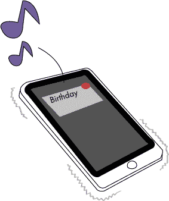
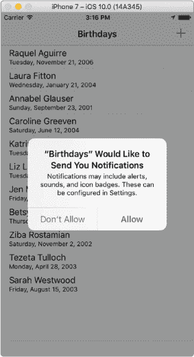
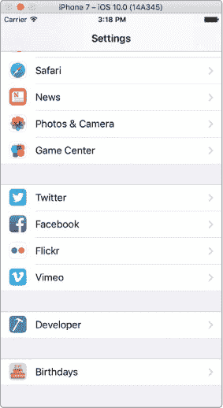
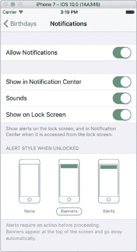
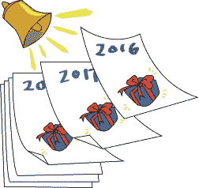
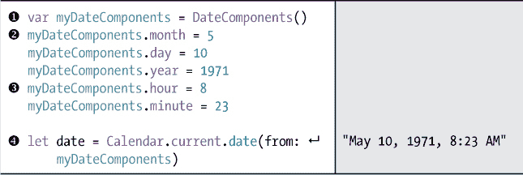
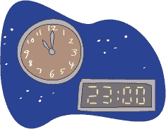
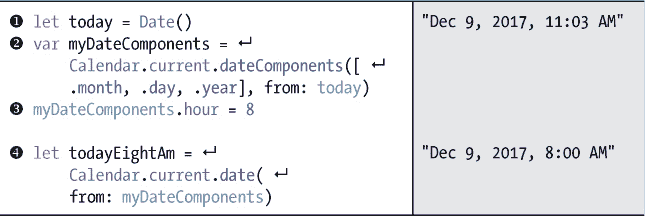
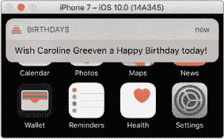
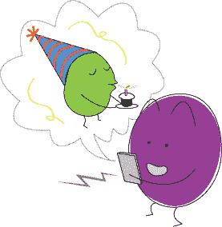

## 第十三章：## 获取生日通知


现在，让我们通过添加*本地通知*来完善 BirthdayTracker 应用。本地通知是一种从应用程序发送到你手机的提醒，即使应用程序没有运行。BirthdayTracker 应用将使用本地通知来提醒用户何时祝朋友生日快乐。

### 用户通知框架

就像你使用苹果的 Core Data 框架将生日信息保存在手机的数据库中一样，你将使用苹果的用户通知框架向用户发送通知。使用这个框架非常简单！你只需要在处理用户通知的任何类的顶部添加一条 import 语句，如下所示：

```
import
 UserNotifications
```

我们将在三个文件中使用这个框架——*AddBirthdayViewController.swift，AppDelegate.swift*，和*BirthdaysTableViewController.swift*——因此请在每个文件中添加 import UserNotifications 语句，放在其他 import 语句下面。

#### 注册本地通知

接下来，你需要让你的应用在某人生日时向用户请求发送通知的权限。如果没有通知权限，通知将不会发送。你可以通过让应用在应用委托中请求通知授权来获取权限。这需要在应用启动时进行，也就是应用完成启动时。幸运的是，AppDelegate 类中有一个叫做 application(_:didFinishLaunchingWithOptions:)的方法，我们可以利用它来完成这一操作。

首先，确保你在*AppDelegate.swift*文件的顶部添加了 import UserNotifications 语句。接下来，在 application(_:didFinishLaunchingWithOptions:)方法中添加以下代码行，以请求权限发送本地通知。

*AppDelegate.swift*

```
func application(_ application: UIApplication, didFinishLaunchingWithOptions

    launchOptions: [UIApplicationLaunchOptionsKey: Any]?) -> Bool {

  ➊
 let
 center = UNUserNotificationCenter
 .current
 ()

  ➋
 center.requestAuthorization
 (options: ➌
 [.alert
 , .sound
 ], 

        completionHandler: ➍
 { (granted, error) in

      ➎
 if
 granted {

            print
 ("Permission for notifications granted!"
 )

        } else
 {

            print
 ("Permission for notifications denied."
 )

        }

    })

    return true

}

```

第➊行获取当前的 UNUserNotificationCenter 并将其存储在一个名为 center 的常量中。*通知中心*用于安排和管理从应用程序发送的通知。在本章中，我们将使用 UNUserNotificationCenter 类中的三种方法：

requestAuthorization(options:completionHandler:)用于请求用户授权发送通知。

add(_:withCompletionHandler:)请求添加一个新的通知以发送给用户。

removePendingNotificationRequests(withIdentifiers:)用于移除已存在的通知。

我们在➋处使用这些方法中的第一个，向用户请求授权让应用程序发送通知。我们将在本章后面使用其他两个方法。

方法 requestAuthorization(options:completionHandler:) 有两个参数：options 和 completionHandler。在 options 参数中，你传入一个 UNAuthorizationOptions 数组，表示你希望在通知中使用的选项。你可以为通知使用四种 UNAuthorizationOptions：badge、sound、alert 和 carPlay。badge 选项会在应用图标上添加一个徽标，方便用户快速看到应用中是否有新内容。通常这是一个数字，表示应用中有多少个新的或待处理的通知。sound 选项会在通知发送到手机时播放声音。alert 选项会将通知显示为屏幕中央弹出的警报或从屏幕顶部滑下的横幅。作为应用开发者，你无法决定通知的显示方式或用户是否会为通知开启声音。这是用户在设置应用中控制的。第四个选项 carPlay，允许在支持 CarPlay 的设备上显示通知。



我们希望将通知显示为警报并在每个通知到来时播放声音，因此我们传入[.alert, .sound]作为我们的选项 ➌。completionHandler 参数是一个闭包，在用户授予或拒绝允许应用发送通知后会被调用。completionHandler 闭包有两个参数，granted 和 error ➍。granted 参数是一个布尔值，用来告诉你是否授予了权限（在这种情况下为 true）或拒绝了权限（false）。如果用户拒绝让我们发送通知，我们不会改变应用的行为，但我们会在控制台打印一条语句 ➎，这样你就可以看到在测试应用时权限是否被授予或拒绝。第二个参数 error 是 Error 类类型，用来告诉你是否发生了某种错误。

现在你已经请求了通知授权，用户第一次运行应用时，系统会显示一个警告对话框，询问他们是否允许应用发送通知，如图 13-1 所示。



*图 13-1：应用会向用户请求发送通知的权限。*

如果用户在此选择“不允许”选项，他们将不会收到任何关于生日的通知。如果他们选择“允许”，则会收到通知。用户只会在首次安装应用后运行时被询问此问题。但他们可以随时在设置应用中更改通知设置。

当用户打开设置应用并滚动到应用程序部分时，他们会看到底部列出了 BirthdayTracker 应用，标签为*Birthdays*（图 13-2）。你也可以在模拟器中看到这个。

深入查看 BirthdayTracker 应用的设置将引导用户进入通知设置屏幕（图 13-3）。



*图 13-2：在设置应用中，用户可以深入选择他们应用的通知设置。*



*图 13-3：我们应用的通知设置*

在这个界面上，用户可以指定是否希望看到应用的通知，以及他们希望看到什么类型的通知（横幅或警报）。

#### 安排通知

每次我们创建一个生日时，都希望安排一个通知，每年在生日人的生日当天发送。为了实现这一点，我们将在`AddBirthdayViewController`类的`saveTapped(_:)`方法中添加一些代码。

在这个方法中，首先我们需要创建一个消息字符串，用于发送通知。我们的消息将是一个字符串，内容为：“祝 firstName lastName 今天生日快乐！”在生日保存后，在`saveTapped(_:)`方法中，在*AddBirthdayViewController.swift*文件中添加以下代码：

*AddBirthdayViewController.swift*

```
do {

    try context.save()

    let
 message = "Wish
 \(
 firstName)
 \(
 lastName) a Happy Birthday today!"

} catch let error {

    print ("Could not save because of \(error).")

}

```

现在我们已经有了消息内容，接下来需要创建并安排一条通知，这条通知将在用户朋友的生日时发送到用户的设备。首先，确保在文件顶部导入了 UserNotifications。然后，在你刚写的消息常量下方添加以下代码：

```
   let message = "Wish \(firstName) + \(lastName) a Happy Birthday today!"

 ➊
 let
 content = UNMutableNotificationContent
 ()

 ➋
 content.body
 = message

 ➌
 content.sound
 = UNNotificationSound
 .default
 ()

} catch let error {

    print("Could not save because of \(error).")

}

```

➊处的代码创建了一个`UNMutableNotificationContent`，并将其存储到一个名为`content`的常量中。`UNMutableNotificationContent`包含了用户通知的数据，比如消息或声音。➋处，我们将`content.body`属性设置为生日提醒消息`message`。然后在➌处，我们将`content.sound`设置为默认的通知声音，这个声音与接收到短信时的声音相同。

在创建了通知内容之后，我们需要创建通知的*触发器*。触发器属于`UNCalendarNotificationTrigger`类，用于告诉应用何时以及多频繁地发送通知。我们将安排在每年生日时早上 8 点发送生日通知。Swift 允许我们使用`Calendar`和`DateComponents`类获取触发日期的月份和日期。

添加以下代码，在设置 content.sound 之后创建一个触发器：

```
   let content = UNMutableNotificationContent()

   content.body = message

   content.sound = UNNotificationSound.default()

 ➊
 var
 dateComponents = Calendar
 .current
 .dateComponents
 ([.month
 , .day
 ], 

       from: birthdate)

 ➋
 dateComponents.hour
 = 8

 ➌
 let
 trigger = UNCalendarNotificationTrigger
 (dateMatching: dateComponents, 

        repeats: true
 )

} catch let error {

```

为了实现这一点，首先我们通过使用 Calendar 方法`dateComponents(_:from:)`从 birthDate 中获取月份和日期的 DateComponents。我们传入的是[.month, .day]作为组件➊，而不是年份。这是因为我们希望触发器每年都触发，而不仅仅是触发在那个人出生的年份——毕竟这个年份已经过去了，所以根本不可能触发！我们希望在早上 8 点发送生日通知，所以接下来我们将`dateComponents.hour`设置为 8➋。

在 ➌ 处，我们使用初始化器创建 UNCalendarNotificationTrigger。这个初始化器有两个参数：日期组件和一个布尔值，表示是否希望触发器重复。我们希望触发器每年重复一次，因此传入 true。Swift 会智能地处理触发器的重复频率。例如，如果你传入的 DateComponents 只有小时和分钟，它会在每天的相同小时和分钟触发通知。因为我们传入了月份和日期，触发器将每年重复一次。



**日历和 DateComponents 类**

日历和 DateComponents 类使创建日期和时间变得非常简单。DateComponents 具有可以设置的整数属性，用于日期和时间的年份、月份、日期、小时、分钟和秒，或者时间间隔。Calendar 类有方法可以将 DateComponents 转换为 Date，或者将 Date 转换为 DateComponents。要尝试创建一个日期，请打开你的 Swift playground。我们将创建一个日期和时间，表示 1971 年 5 月 10 日，上午 8:23：



首先，我们创建一个变量叫做 myDateComponents ➊ ，它将用于创建我们的日期。在创建 myDateComponents 后，我们可以为其各种属性设置整数值。一年的月份都用数字表示，从 1 表示一月到 12 表示十二月。对于五月，我们将 myDateComponents.month 设置为 5 ➋ 。对于上午 8 点，我们将 myDateComponents.hour 设置为 8 ➌ 。myDateComponents 的属性使用 24 小时制，因此一天中的每个小时都按数字顺序标记，从 0 表示午夜开始。所以中午之前的小时数和 12 小时制相同，但对于下午 2 点，我们会在中午过后加上两小时，将 myDateComponents 设置为 14。另一个例子，晚上 11 点应该是 23 。最后，我们可以通过在 Calendar 类中使用 date(from:) 方法从 myDateComponents 创建一个日期 ➍ 。使用此方法之前，我们需要一个 Calendar 实例。我们使用 Calendar.current，它返回设备正在使用的日历类型。在大多数西方国家，这是公历（格里高利历），它有 12 个月和 7 天一周。



要从 Date 获取 DateComponents，我们使用 Calendar 方法 myDateComponents(_:from:)。此方法有两个参数：第一个是你想从 Date 中提取的 DateComponents 数组，第二个是 Date 本身。如果你想创建一个新的 Date 对象，例如表示今天 8 AM 的日期，该方法非常有用。

在你的 playground 中编写以下代码：



➊ 这一行创建了当前的日期和时间，并将其分配给一个名为 today 的常量。接下来，我们从 today ➋ 中获取用于表示月份、日期和年份的 myDateComponents。注意，我们只传入了我们关心的 DateComponents 属性。例如，我们不需要小时、分钟或秒。我们将 myDateComponents 设置为变量而不是常量，因为我们将设置小时属性，这一操作发生在 ➌ 处。最后，我们使用 myDateComponents 创建了一个新的日期，名为 todayEightAm ➍。你应该会看到，新的日期与 today 相同，只是时间是早上 8:00。

现在我们已经有了通知内容和触发条件，我们几乎准备好创建一个 UNNotificationRequest 对象来调度通知了。但要创建 UNNotificationRequest，首先我们需要一个标识符。这个标识符是一个字符串，可以用来标识通知。

我们还将使用这个标识符来移除已经调度的通知，如果我们从应用中删除了一个生日。毕竟，你不想收到已删除的生日的通知！

在第十二章中，我们为 Birthday 添加了一个 birthdayId 属性，因此我们将使用 birthdayId 作为通知的标识符。首先，我们需要解包可选的 birthdayId 属性，并将其存储在一个名为 identifier 的常量中。然后，我们可以使用 identifier 和 trigger 创建一个通知请求。将以下代码添加到创建 trigger 后：

*AddBirthdayViewController.swift*

```
do {

    --
 *snip* 
 --

    let trigger = UNCalendarNotificationTrigger(dateMatching: dateComponents,

        repeats: true)

    if let
 identifier = newBirthday.birthdayId
 {

     ➊
 let
 request = UNNotificationRequest
 (identifier: identifier,

           content: content, trigger: trigger)

     ➋
 let
 center = UNUserNotificationCenter
 .current
 ()

     ➌
 center.add
 (request, withCompletionHandler: nil
 )

    }

} catch let error {

```

在 ➊ 处，我们使用 identifier、content 和 trigger 创建了 UNNotificationRequest。创建 request 后，它必须被添加到 UNUserNotificationCenter 中。为此，我们创建了一个名为 center 的常量 ➋，它表示应用的当前 UNUserNotificationCenter。接着，我们使用方法 add(_:withCompletionHandler:) 将请求添加到我们调度的通知 ➌ 中。这个方法有两个参数，一个是 UNNotificationRequest，另一个是一个闭包作为 completionHandler，用于在通知添加后执行某些操作。我们将 request 作为第一个参数传入，由于我们不需要在请求添加后做任何操作，我们将 nil 传给 completionHandler。

呼！我们刚刚完成了编写调度通知的方法！现在，如果你运行你的应用并创建生日对象，当有人的生日时，你将收到通知！

为了测试你的通知，你需要为第二天添加一个生日，并等待直到早上 8 点才能看到通知出现。但等待一天来测试你的代码太长了！为了立即测试你的代码，修改它使得通知更早触发。将 myDateComponents 的小时和分钟设置为当前时间的 10 分钟后。所以如果现在是下午 1:35，修改你刚才写的代码如下：

```
var dateComponents = Calendar.current.dateComponents([.month, .day],

    from: birthDate)

dateComponents.hour
 = 13

dateComponents.minute
 = 45

let trigger = UNCalendarNotificationTrigger(dateMatching: dateComponents,

    repeats: true)

--
 *snip* 
 --

}

```

运行应用程序，添加一个今天日期的生日，通过点击停止按钮关闭应用（但保持模拟的 iPhone 窗口打开），然后等待 10 分钟。你应该会看到像图 13-4 中那样的通知出现。测试完成后，别忘了将代码改回原样，以便通知在早上第一时间弹出！



*图 13-4：一个横幅样式的生日通知*

#### 移除通知

当我们从应用中删除生日时，我们还希望取消其对应的通知，这可以通过在 BirthdaysTableViewController 中添加一些代码来实现。一个好地方是在用户选择要删除的生日后，`tableView(_:commitEditingStyle:forRowAtIndexPath:)` 方法内。向该方法添加以下几行代码：

*BirthdaysTableViewController.swift*

```
  let birthday = birthdays[indexPath.row]

  // Remove notification

➊
 if let
 identifier = birthday.birthdayId
 {

    ➋
 let
 center = UNUserNotificationCenter
 .current
 ()

    ➌
 center.removePendingNotificationRequests
 (withIdentifiers: [identifier])

   }

  let appDelegate = UIApplication.sharedApplication().delegate as! AppDelegate

  let context = appDelegate.managedObjectContext

```

要移除生日的通知，首先我们解包 birthdayId 以便用它作为标识符 ➊ 。接下来，我们获取 UNUserNotificationCenter ➋ 并移除通知 ➌ 。remove 方法接受一个标识符数组，这样你可以一次移除多个通知，但由于我们只想移除一个，我们传入 [identifier]，这是一个数组，但只有一个值。

**注意**

*BirthdayTracker 应用现在已经完成！记住，最终的项目文件可以从* [`www.nostarch.com/iphoneappsforkids/`](https://www.nostarch.com/iphoneappsforkids/) *下载，因此你可以将你的项目与其对比，确保一切都在正确的位置。*

### 你学到了什么

在这一章中，我们向你展示了如何使用用户通知框架，向用户发送他们朋友生日的提醒。你学习了如何添加一个通知，它会在每年的特定时间发送，还学习了如何在用户从应用中删除生日时移除该通知。

在第三部分中，你将构建另一个令人兴奋的应用——一个名为 Schoolhouse Skateboarder 的游戏，它包含图形、声音等更多功能！



## 获取生日通知


现在，让我们通过添加*本地通知*来完成 BirthdayTracker。本地通知是从应用发送到手机的提醒，即使应用没有在运行。BirthdayTracker 应用将使用本地通知来提醒用户何时祝朋友生日快乐。

### 用户通知框架

就像你使用 Apple 的 Core Data 框架在手机上保存生日信息一样，你将使用 Apple 的 User Notifications 框架来向用户发送通知。使用这个框架很简单！你只需在任何处理用户通知的类的顶部添加一个导入语句，如下所示：

```
import
 UserNotifications
```

我们将在三个文件中使用该框架——*AddBirthdayViewController.swift, AppDelegate.swift,* 和 *BirthdaysTableViewController.swift* ——所以要在它们每个文件中添加 `import UserNotifications`，并放在其他导入语句下面。

#### 注册本地通知

接下来，你需要让应用请求用户的权限，以便在有人过生日时发送通知。如果没有权限，通知将无法发送。你可以通过让应用在应用委托中请求通知授权来获得权限。这需要在应用启动时尽早完成，也就是在应用完成启动的时刻。幸运的是，AppDelegate 类中有一个叫做 application(_:didFinishLaunchingWithOptions:) 的方法，我们可以用来实现这一点。

首先，确保你在 *AppDelegate.swift* 文件的顶部添加了 import UserNotifications。接着，在 application(_:didFinishLaunchingWithOptions:) 中添加以下代码来请求发送本地通知的权限。

*AppDelegate.swift*

```
func application(_ application: UIApplication, didFinishLaunchingWithOptions

    launchOptions: [UIApplicationLaunchOptionsKey: Any]?) -> Bool {

  ➊
 let
 center = UNUserNotificationCenter
 .current
 ()

  ➋
 center.requestAuthorization
 (options: ➌
 [.alert
 , .sound
 ], 

        completionHandler: ➍
 { (granted, error) in

      ➎
 if
 granted {

            print
 ("Permission for notifications granted!"
 )

        } else
 {

            print
 ("Permission for notifications denied."
 )

        }

    })

    return true

}

```

➊ 处的代码获取当前的 UNUserNotificationCenter 并将其存储在一个名为 center 的常量中。*通知中心* 用来调度和管理你从应用发送的通知。在本章中，我们将使用 UNUserNotificationCenter 类的三个方法：

requestAuthorization(options:completionHandler:) 会请求用户授权发送通知。

add(_:withCompletionHandler:) 请求将新的通知添加到用户设备中。

removePendingNotificationRequests(withIdentifiers:) 用于移除已存在的通知。

我们在 ➋ 处使用第一个方法请求用户授权应用发送通知。我们将在本章后面使用另外两个方法。

requestAuthorization(options:completionHandler:) 方法有两个参数：options 和 completionHandler。在 options 参数中，你传入一个包含你希望在通知中可用的 UNAuthorizationOptions 的数组。你可以为通知使用四种 UNAuthorizationOptions 类型：badge、sound、alert 和 carPlay。badge 选项会在应用图标上添加一个徽章，用户可以快速看到应用中是否有新内容。通常这是一个数字，表示应用中有多少新的或待处理的通知。sound 选项会在发送通知时播放一个声音。alert 选项会显示一个通知，可以是一个弹出的警告框，或者一个从屏幕顶部滑入的横幅。作为开发者，你无法决定通知如何显示，或者用户是否会开启通知声音。这个控制权在用户的设置应用中。第四个选项 carPlay 允许在支持 CarPlay 的设备中显示通知。


我们希望将通知作为提醒显示给用户，并在每次收到通知时播放声音，因此我们将[.alert, .sound]作为选项传入➌。completionHandler 参数是一个闭包，传入并在用户授予或拒绝应用发送通知的权限后被调用。completionHandler 闭包有两个参数：granted 和 error ➍。granted 参数是一个布尔值，告诉你是否已获得授权（如果是，则为 true），如果被拒绝，则为 false。我们不会更改应用程序的行为，如果用户拒绝允许我们发送通知，但我们会在控制台打印一条信息➎，这样你可以在测试应用时查看是否获得了授权。第二个参数 error 是 Error 类类型，告知你是否发生了某种错误。

现在你已经请求了通知授权，当用户第一次运行应用时，它会显示一个提醒对话框，询问用户是否允许它发送通知，如图 13-1 所示。


*图 13-1：应用将请求用户授权发送通知。*

如果用户在这里选择“不允许”，他们将不会收到生日通知。如果选择“允许”，他们将收到通知。用户只会在应用首次运行（安装后首次启动时）时被询问此问题。然而，他们可以随时在设置应用中更改通知设置。

当用户打开设置应用并滚动到应用部分时，他们会在列表底部看到名为*Birthdays*的 BirthdayTracker 应用（见图 13-2）。你也可以在模拟器中看到这一点。

深入 BirthdayTracker 应用设置将引导用户进入通知设置界面（见图 13-3）。


*图 13-2：从设置应用中，用户可以深入设置应用的通知选项。*


*图 13-3：我们应用的通知设置*

在这个界面上，用户可以指定是否希望看到应用的通知以及他们希望收到哪种类型的通知（横幅或提醒）。

#### 安排通知

每次我们创建一个生日时，我们希望安排每年在该生日人物的生日那天向我们发送通知。为此，我们将在 AddBirthdayViewController 类中的 saveTapped(_:)方法中添加一些代码。

在这个方法中，首先我们需要创建一个要发送的通知消息字符串。我们的消息将是一个字符串，内容为：“祝 firstName lastName 今天生日快乐！”在*AddBirthdayViewController.swift*中的 saveTapped(_:)方法保存生日后，添加以下代码：

*AddBirthdayViewController.swift*

```
do {

    try context.save()

    let
 message = "Wish
 \(
 firstName)
 \(
 lastName) a Happy Birthday today!"

} catch let error {

    print ("Could not save because of \(error).")

}

```

现在我们已经有了消息，接下来需要创建并安排通知，以便在朋友的生日当天发送到用户的设备。首先，确保在文件的顶部导入了 UserNotifications。然后，在你刚刚写的 message 常量下方添加以下代码：

```
   let message = "Wish \(firstName) + \(lastName) a Happy Birthday today!"

 ➊
 let
 content = UNMutableNotificationContent
 ()

 ➋
 content.body
 = message

 ➌
 content.sound
 = UNNotificationSound
 .default
 ()

} catch let error {

    print("Could not save because of \(error).")

}

```

在 ➊ 处的代码创建了一个 UNMutableNotificationContent，并将其存储到名为 content 的常量中。UNMutableNotificationContent 包含用户通知的数据，如消息或声音。在 ➋ 处，我们将 content.body 属性设置为名为 message 的生日提醒消息。然后，在 ➌ 处，我们将 content.sound 设置为默认的通知声音，这与接收到短信时的声音相同。

在我们创建通知内容后，需要创建通知的 *触发器*。触发器属于 UNCalendarNotificationTrigger 类，告诉应用程序何时以及多频繁地发送通知。我们将安排生日通知在每年的个人生日早上 8 点发送。Swift 让我们通过使用 Calendar 和 DateComponents 类，只获取触发日期的月和日。

在设置 content.sound 后，添加以下代码来创建触发器：

```
   let content = UNMutableNotificationContent()

   content.body = message

   content.sound = UNNotificationSound.default()

 ➊
 var
 dateComponents = Calendar
 .current
 .dateComponents
 ([.month
 , .day
 ], 

       from: birthdate)

 ➋
 dateComponents.hour
 = 8

 ➌
 let
 trigger = UNCalendarNotificationTrigger
 (dateMatching: dateComponents, 

        repeats: true
 )

} catch let error {

```

为了实现这一点，首先我们通过使用 Calendar 方法 `dateComponents(_:from:)` 从 birthDate 获取月和日的 DateComponents。我们只传入 [.month, .day] 作为组件 ➊ ，而不包括年份。这是因为我们希望触发器每年都能触发，而不是只在个人出生的那一年触发——那已经是过去的事情，所以根本不会发生！我们希望在早上 8 点发送生日通知，所以接下来我们将 dateComponents .hour 设置为 8 ➋ 。

在 ➌ 处，我们使用其初始化器创建了 UNCalendarNotificationTrigger。这个初始化器需要两个参数：dateComponents 和一个布尔值，表示是否希望触发器重复。我们希望触发器每年都重复，所以传入了 true。Swift 会智能地处理触发器的重复频率。例如，如果你传入的 DateComponents 只包含小时和分钟，它会每天在该小时和分钟触发通知。因为我们传入的是月份和日期，所以触发器每年都会重复一次。


**CALENDAR 和 DATECOMPONENTS 类**

Calendar 和 DateComponents 类使得创建日期和时间变得非常容易。DateComponents 拥有可设置年份、月份、日期、小时、分钟和秒等整数属性，表示日期和时间，或者表示时间间隔。Calendar 类有方法将 DateComponents 转换为 Date 或反之亦然。要尝试创建一个日期，可以打开你的 Swift Playground。我们将创建一个 1971 年 5 月 10 日，早上 8:23 的日期和时间：


首先，我们创建一个名为 myDateComponents 的变量 ➊，它将用于创建我们的日期。创建 myDateComponents 后，我们可以为其各个属性设置整数。每年的月份都用整数表示，按数字顺序排列，从 1 代表一月到 12 代表十二月。对于五月，我们将 myDateComponents.month 设置为 5 ➋。对于早上 8 点，我们将 myDateComponents.hour 设置为 8 ➌。myDateComponents 的属性使用的是 24 小时制，因此每个小时都按数字顺序标记，午夜为 0。所以，所有中午之前的时间与 12 小时制相同，但对于下午 2 点，我们将设置 myDateComponents 为 14，因为它是中午后的第二个小时。举个例子，晚上 11 点是 23。最后，我们可以通过使用 Calendar 类的 date(from:) 方法从 myDateComponents 创建一个日期 ➍。为了使用这个方法，我们首先需要一个 Calendar 实例。我们使用 Calendar.current，它返回设备当前使用的日历类型。在大多数西方国家，使用的是公历，它有 12 个月和 7 天一周。


要从一个 Date 中获取 DateComponents，我们使用 Calendar 方法 myDateComponents(_:from:)。该方法接受两个参数：第一个是你想从 Date 中提取的 DateComponents 数组，第二个是 Date 本身。如果你想创建一个新的 Date 对象，表示今天的日期但时间为早上 8 点，例如，myDateComponents(_:from:) 方法会非常有用。

在你的 playground 中写下以下代码：


➊ 这一行创建了当前的日期和时间，并将其赋值给一个名为 today 的常量。接下来，我们从 today 中提取出月、日和年的 myDateComponents ➋。注意，我们只传入我们关心的 DateComponents 属性。例如，我们不需要小时、分钟或秒。我们将 myDateComponents 设置为变量而不是常量，因为我们接下来会设置小时属性，这个操作发生在 ➌ 处。最后，我们使用 myDateComponents 创建一个名为 todayEightAm 的新日期 ➍。你应该看到，新的 Date 与今天相同，只不过时间是早上 8 点。

现在我们已经准备好了通知内容和触发器，差不多可以创建一个 UNNotificationRequest 对象来安排通知了。但是，要创建 UNNotificationRequest，首先我们需要一个标识符。这是一个字符串，用来标识这个通知。

我们还将使用这个标识符，在我们从应用程序中删除生日时，移除已安排的通知。毕竟，你肯定不想为已经删除的生日接收到通知！

在 第十二章 中，我们为 Birthday 添加了一个 birthdayId 属性，所以我们将使用 birthdayId 作为通知的标识符。首先，我们需要解包可选的 birthdayId 属性，并将其存储在一个名为 identifier 的常量中。然后，我们可以使用 identifier 和 trigger 来创建通知请求。创建 trigger 后，立即添加以下代码：

*AddBirthdayViewController.swift*

```
do {

    --
 *snip* 
 --

    let trigger = UNCalendarNotificationTrigger(dateMatching: dateComponents,

        repeats: true)

    if let
 identifier = newBirthday.birthdayId
 {

     ➊
 let
 request = UNNotificationRequest
 (identifier: identifier,

           content: content, trigger: trigger)

     ➋
 let
 center = UNUserNotificationCenter
 .current
 ()

     ➌
 center.add
 (request, withCompletionHandler: nil
 )

    }

} catch let error {

```

在 ➊ 处，我们使用标识符、内容和触发器来创建 UNNotificationRequest。创建请求后，它必须添加到 UNUserNotificationCenter 中。为此，我们创建一个名为 center ➋ 的常量，它是应用程序当前的 UNUserNotificationCenter。然后，我们使用方法 add(_:withCompletionHandler:) 将请求添加到我们计划的通知 ➌ 中。这个方法接受两个参数，一个是 UNNotificationRequest，另一个是一个闭包作为 completionHandler，它会在通知添加后执行某些操作。我们将请求作为第一个参数传入，由于我们不需要在请求添加后执行任何操作，所以将 nil 作为 completionHandler 传入。

呼！我们刚刚完成了编写调度通知的方法！现在，如果你运行应用并创建生日对象，当是某人的生日时，你就会收到通知！

要测试你的通知，你需要为第二天添加一个生日，并等待到早上 8 点才能看到通知。然而，等待整整一天来测试代码太长了！为了立刻测试代码，可以调整代码使得通知更早触发。将 myDateComponents 的小时和分钟设置为当前时间后的 10 分钟。所以，如果现在是下午 1:35，将你刚写的代码修改如下：

```
var dateComponents = Calendar.current.dateComponents([.month, .day],

    from: birthDate)

dateComponents.hour
 = 13

dateComponents.minute
 = 45

let trigger = UNCalendarNotificationTrigger(dateMatching: dateComponents,

    repeats: true)

--
 *snip* 
 --

}

```

然后运行应用，添加一个今天的生日，点击停止按钮关闭应用（但保持模拟的 iPhone 窗口开启），等待 10 分钟。你应该会看到像 图 13-4 中的通知出现在屏幕上。测试完成后，别忘了将代码改回去，以确保通知在早上第一时间触发！


*图 13-4：生日通知的横幅样式*

#### 删除通知

当我们从应用中删除一个生日时，我们也希望取消其相应的通知，这可以在 BirthdaysTableViewController 中通过添加一些代码来实现。一个合适的位置是在用户选择删除生日后，在 tableView(_:commitEditingStyle:forRowAtIndexPath:) 中。向该方法添加以下几行代码：

*BirthdaysTableViewController.swift*

```
  let birthday = birthdays[indexPath.row]

  // Remove notification

➊
 if let
 identifier = birthday.birthdayId
 {

    ➋
 let
 center = UNUserNotificationCenter
 .current
 ()

    ➌
 center.removePendingNotificationRequests
 (withIdentifiers: [identifier])

   }

  let appDelegate = UIApplication.sharedApplication().delegate as! AppDelegate

  let context = appDelegate.managedObjectContext

```

要删除生日通知，首先我们解包 birthdayId 并将其用作标识符 ➊。接下来，我们获取 UNUserNotificationCenter ➋ 并删除通知 ➌。remove 方法接受一个标识符数组，因此你可以一次删除多个通知，但由于我们只想删除一个通知，所以我们传入 [identifier]，它是一个数组，但只有一个值。

**注意**

*BirthdayTracker 应用现在已经完成！记住，最终的项目文件可以从* [`www.nostarch.com/iphoneappsforkids/`](https://www.nostarch.com/iphoneappsforkids/) *获取，因此你可以与自己的文件进行对比，确保一切都在正确的位置。*

### 你学到了什么

在本章中，我们向你展示了如何使用用户通知框架，在用户朋友的生日时提醒他们。你学会了如何添加一个将在每年特定时间发送的通知，并且如果用户从应用中删除生日信息时，如何删除该通知。

在第三部分中，你将构建另一个令人兴奋的应用——一款名为 *Schoolhouse Skateboarder* 的游戏，具有图形、声音等多种功能！


现在让我们通过添加*本地通知*来完成 BirthdayTracker。一个本地通知是从应用程序发送到你手机的提醒，即使应用程序没有运行。BirthdayTracker 应用将使用本地通知来提醒用户何时给朋友送上生日祝福。

### 用户通知框架

就像你使用 Apple 的 Core Data 框架在手机上保存生日信息一样，你将使用 Apple 的 User Notifications 框架来向用户发送通知。使用这个框架非常简单！你只需要在任何涉及用户通知的类的顶部添加一个导入语句，如下所示：

```
import
 UserNotifications
```

我们将在三个文件中使用该框架——*AddBirthdayViewController.swift、AppDelegate.swift* 和 *BirthdaysTableViewController.swift*——因此在每个文件中，需在其他导入语句下方添加 `import UserNotifications`。

#### 注册本地通知

接下来，你需要让你的应用请求用户授权，在别人生日时发送通知。如果没有获得通知权限，通知将不会发送。你可以通过在应用程序代理中请求通知授权来获取权限。这需要在应用启动时完成，也就是应用启动完成时。幸运的是，在 AppDelegate 类中有一个方法叫做 `application(_:didFinishLaunchingWithOptions:)`，我们可以使用它来实现这一点。

首先，确保你在 *AppDelegate.swift* 文件的顶部添加了 `import UserNotifications` 语句。接着，在 `application(_:didFinishLaunchingWithOptions:)` 方法中添加以下代码，以请求授权发送本地通知。

*AppDelegate.swift*

```
func application(_ application: UIApplication, didFinishLaunchingWithOptions

    launchOptions: [UIApplicationLaunchOptionsKey: Any]?) -> Bool {

  ➊
 let
 center = UNUserNotificationCenter
 .current
 ()

  ➋
 center.requestAuthorization
 (options: ➌
 [.alert
 , .sound
 ], 

        completionHandler: ➍
 { (granted, error) in

      ➎
 if
 granted {

            print
 ("Permission for notifications granted!"
 )

        } else
 {

            print
 ("Permission for notifications denied."
 )

        }

    })

    return true

}

```

➊ 这一行获取当前的 `UNUserNotificationCenter` 并将其存储在一个名为 `center` 的常量中。*通知中心* 用于调度和管理你从应用中发送的通知。在本章中，我们将使用 `UNUserNotificationCenter` 类的三个方法：

`requestAuthorization(options:completionHandler:)` 请求用户授权发送通知。

`add(_:withCompletionHandler:)` 请求向用户发送一个新的通知。

`removePendingNotificationRequests(withIdentifiers:)`用于移除已存在的通知。

我们在➋使用了这些方法中的第一个，要求用户授予应用发送通知的权限。我们将在本章后面使用其他两个方法。

方法`requestAuthorization(options:completionHandler:)`接受两个参数：options 和 completionHandler。在 options 参数中，您传入一个 UNAuthorizationOptions 数组，用于指定希望在通知中使用的选项。您可以为通知使用四种 UNAuthorizationOptions：badge、sound、alert 和 carPlay。badge 选项会在应用图标上添加一个徽章，用户可以快速看到应用中是否有新内容。通常这是一个数字，表示应用中有多少条新的或待处理的通知。sound 选项会在发送通知到手机时播放声音。alert 选项会将通知以警告的形式弹出在屏幕中央或以横幅的形式从屏幕顶部滑入。作为应用开发者，您无法决定通知的显示方式或用户是否开启通知声音，这些设置由用户在“设置”应用中控制。第四个选项 carPlay 允许在支持 CarPlay 的车载设备上显示通知。


我们希望将通知显示为警告并在每次通知到来时播放声音，因此我们为 options 传入了[.alert, .sound] ➌。completionHandler 参数是一个闭包，在用户授予或拒绝应用发送通知的权限后调用。completionHandler 闭包有两个参数，granted 和 error ➍。granted 参数是一个布尔值，指示是否授予了权限（如果为 true，则表示授权；如果为 false，则表示拒绝）。如果用户拒绝了通知权限，我们不会改变应用的行为，但我们会在控制台中打印一条信息 ➎，以便在测试应用时查看权限是否被授予或拒绝。第二个参数 error 是 Error 类类型，指示是否发生了某种错误。

既然你已经请求了通知授权，当用户第一次运行应用程序时，它会显示一个提示对话框，询问用户是否允许应用发送通知，如图 13-1 所示。


*图 13-1：应用将请求用户允许发送通知的权限。*

如果用户在这里选择了“拒绝”选项，他们将不会收到关于人们生日的任何通知。如果选择“允许”，他们将收到通知。用户只会在应用程序第一次安装并运行时被问到这个问题。然而，他们可以随时在“设置”应用中更改通知设置。

当用户打开设置应用并滚动到应用程序部分时，他们会看到一个名为*Birthdays*的生日追踪器应用程序列表项，位于列表底部（图 13-2）。你也可以在模拟器中看到这个。

深入到`BirthdayTracker`应用设置后，用户将进入通知设置界面（图 13-3）。


*图 13-2：在设置应用中，用户可以逐步设置他们的应用通知设置。*


*图 13-3：我们的应用的通知设置*

在这个界面上，用户可以指定是否希望查看应用的通知，以及他们希望收到什么类型的通知（横幅或提醒）。

#### 调度通知

每次我们创建一个生日时，都希望安排一个通知，每年在生日人的生日当天发送通知。为此，我们将在`AddBirthdayViewController`类的`saveTapped(_:)`方法中添加一些代码。

在该方法中，首先我们需要创建一个要发送到通知中的消息字符串。我们的消息将是一个字符串：“今天祝 firstName lastName 生日快乐！”在`saveTapped(_:)`方法中，保存生日后，紧接着添加以下代码：

*AddBirthdayViewController.swift*

```
do {

    try context.save()

    let
 message = "Wish
 \(
 firstName)
 \(
 lastName) a Happy Birthday today!"

} catch let error {

    print ("Could not save because of \(error).")

}

```

现在我们已经有了消息，接下来需要创建并安排一个通知，发送到用户设备上，在他们朋友的生日当天。首先，确保在文件顶部已经导入了`UserNotifications`。然后，在你刚写的消息常量下面添加以下代码：

```
   let message = "Wish \(firstName) + \(lastName) a Happy Birthday today!"

 ➊
 let
 content = UNMutableNotificationContent
 ()

 ➋
 content.body
 = message

 ➌
 content.sound
 = UNNotificationSound
 .default
 ()

} catch let error {

    print("Could not save because of \(error).")

}

```

第➊行创建了一个`UNMutableNotificationContent`，并将其存储到一个名为 content 的常量中。`UNMutableNotificationContent`包含用户通知的数据，例如消息或声音。在➋行，我们将 content.body 属性设置为名为 message 的生日提醒消息。然后，在➌行，我们将 content.sound 设置为默认通知声音，这与接收到短信时的声音相同。

在创建通知内容后，我们需要创建通知的*触发器*。触发器属于`UNCalendarNotificationTrigger`类，能够让应用知道何时以及多频繁地发送通知。我们将把生日通知安排为每年在生日当天的早上 8 点发送。Swift 允许我们通过使用`Calendar`和`DateComponents`类，仅获取触发日期的月份和日期。

在设置`content.sound`后，添加以下代码来创建一个触发器：

```
   let content = UNMutableNotificationContent()

   content.body = message

   content.sound = UNNotificationSound.default()

 ➊
 var
 dateComponents = Calendar
 .current
 .dateComponents
 ([.month
 , .day
 ], 

       from: birthdate)

 ➋
 dateComponents.hour
 = 8

 ➌
 let
 trigger = UNCalendarNotificationTrigger
 (dateMatching: dateComponents, 

        repeats: true
 )

} catch let error {

```

为此，首先我们通过使用日历方法 `dateComponents(_:from:)` 从 `birthDate` 获取月和日的 `DateComponents`。我们只传入 [.month, .day] 作为组件 ➊ ，而不包括年份。这是因为我们希望每年都触发，而不仅仅是触发在那个人出生的年份——因为那是过去的年份，反正也不会发生！我们希望在早上 8 点发送生日通知，所以接下来我们将 `dateComponents.hour` 设置为 8 ➋ 。

在 ➌ ，我们使用 `UNCalendarNotificationTrigger` 的初始化方法创建触发器。这个初始化方法接受两个参数：`dateComponents` 和一个布尔值，表示是否希望触发器重复。我们希望触发器每年都重复，因此我们传入 `true`。Swift 会智能处理触发器的重复频率。如果你传入的只是小时和分钟的 `DateComponents`，例如，它会在每天的那个小时和分钟触发通知。因为我们传入了月份和日期，所以触发器将每年重复一次。


**CALENDAR 和 DATECOMPONENTS 类**

`Calendar` 和 `DateComponents` 类使得创建日期和时间变得非常简单。`DateComponents` 有整数类型的属性，你可以为日期和时间的年份、月份、日期、小时、分钟和秒数设置这些属性，或者设置时间间隔。`Calendar` 类有方法将 `DateComponents` 转换为 `Date`，或者反之亦然。要尝试创建一个日期，可以打开你的 Swift Playground。我们将创建一个 1971 年 5 月 10 日，早上 8:23 的日期和时间：


首先，我们创建一个名为 `myDateComponents` 的变量 ➊ ，我们将用它来创建日期。在创建了 `myDateComponents` 后，我们可以为其各种属性设置整数值。一年的月份都用按数字顺序排列的整数表示，从 1 表示 1 月到 12 表示 12 月。对于 5 月，我们将 `myDateComponents.month` 设置为 5 ➋ 。对于早上 8 点，我们将 `myDateComponents.hour` 设置为 8 ➌ 。`myDateComponents` 的属性使用 24 小时制，因此一天 24 小时的每个小时都按数字顺序标记，从午夜 0 点开始。所以中午之前的小时和 12 小时制一样，但对于下午 2 点，这是中午之后的两个小时，我们将其计为 14 。再比如，晚上 11 点会是 23 。最后，我们可以使用 `Calendar` 类的 `date(from:)` 方法根据 `myDateComponents` 创建一个日期 ➍ 。要使用这个方法，我们首先需要一个 `Calendar` 实例。我们使用 `Calendar.current`，它返回设备当前使用的日历类型。在大多数西方国家，使用的是公历（格里历），它有 12 个月和 7 天一周。


要从 Date 中获取 DateComponents，我们使用 Calendar 方法 myDateComponents(_:from:)。此方法接受两个参数：第一个是你希望从 Date 中提取的 DateComponents 数组，第二个是 Date 本身。myDateComponents(_:from:)方法非常有用，如果你想创建一个新的 Date 对象，它表示今天的日期，但例如是在早上 8 点。

在你的 playground 中写下以下内容：


➊处的代码创建了当前的日期和时间，并将其分配给名为 today 的常量。接下来，我们从 today 中获取月份、日期和年份的 myDateComponents➋。注意，我们只传入了我们关心的 DateComponents 属性。例如，我们不需要小时、分钟或秒。我们将 myDateComponents 设置为变量而不是常量，因为我们将设置小时属性，这在➌处完成。最后，我们使用 myDateComponents 创建了一个新的日期对象 todayEightAm ➍。你应该看到，新的 Date 与今天相同，唯一不同的是时间是早上 8:00。

现在我们有了通知内容和触发器，我们几乎准备好创建一个 UNNotificationRequest 对象来调度通知了。但是在创建 UNNotificationRequest 之前，我们首先需要一个标识符。这是一个可以用来标识通知的字符串。

如果我们从应用中删除生日，我们还将使用这个标识符来移除已调度的通知。毕竟，你不想收到已删除生日的通知！

在第十二章中，我们向 Birthday 添加了一个 birthdayId 属性，因此我们将使用 birthdayId 作为通知的标识符。首先，我们需要解包可选的 birthdayId 属性，并将其存储在一个名为 identifier 的常量中。然后，我们可以使用 identifier 和 trigger 创建一个通知请求。在 trigger 创建后，添加以下代码：

*AddBirthdayViewController.swift*

```
do {

    --
 *snip* 
 --

    let trigger = UNCalendarNotificationTrigger(dateMatching: dateComponents,

        repeats: true)

    if let
 identifier = newBirthday.birthdayId
 {

     ➊
 let
 request = UNNotificationRequest
 (identifier: identifier,

           content: content, trigger: trigger)

     ➋
 let
 center = UNUserNotificationCenter
 .current
 ()

     ➌
 center.add
 (request, withCompletionHandler: nil
 )

    }

} catch let error {

```

在➊处，我们使用 identifier、content 和 trigger 创建 UNNotificationRequest。创建 request 后，它必须添加到 UNUserNotificationCenter 中。为此，我们创建一个名为 center 的常量➋，它是应用程序的当前 UNUserNotificationCenter。然后，我们使用方法 add(_:withCompletionHandler:)将请求添加到我们的已调度通知中➌。此方法接受两个参数，一个是 UNNotificationRequest，另一个是一个闭包作为 completionHandler，在通知添加后执行某些操作。我们将 request 作为第一个参数传入，既然我们在通知添加后不需要执行任何操作，我们将 completionHandler 传入 nil。

呼！我们刚刚完成了编写调度通知的方法！现在，如果你运行应用并创建 Birthday 对象，当某人过生日时，你会收到通知！

为了测试你的通知，你需要为第二天添加一个生日，并等到早上 8 点，等待通知出现。但等待整整一天来测试代码太长了！为了立刻测试代码，可以调整代码，让通知尽早弹出。将 `myDateComponents` 的小时和分钟设置为距离当前时间 10 分钟。如果现在是下午 1:35，就将你刚才写的代码改为如下：

```
var dateComponents = Calendar.current.dateComponents([.month, .day],

    from: birthDate)

dateComponents.hour
 = 13

dateComponents.minute
 = 45

let trigger = UNCalendarNotificationTrigger(dateMatching: dateComponents,

    repeats: true)

--
 *snip* 
 --

}

```

然后运行应用，添加一个今天的生日，点击停止按钮关闭应用（但保持模拟 iPhone 窗口开启），并等待 10 分钟。你应该会看到一个像 图 13-4 中的通知出现。测试完后，别忘了将代码改回，以便通知在早晨第一时间弹出！


*图 13-4：横幅式生日通知*

#### 移除通知

当我们从应用中移除一个生日时，我们也想取消其对应的通知，这可以通过在 BirthdaysTableViewController 中添加一些代码来实现。一个合适的地方是在用户选择删除生日后，即在 `tableView(_:commitEditingStyle:forRowAtIndexPath:)` 方法中。将以下代码添加到该方法中：

*BirthdaysTableViewController.swift*

```
  let birthday = birthdays[indexPath.row]

  // Remove notification

➊
 if let
 identifier = birthday.birthdayId
 {

    ➋
 let
 center = UNUserNotificationCenter
 .current
 ()

    ➌
 center.removePendingNotificationRequests
 (withIdentifiers: [identifier])

   }

  let appDelegate = UIApplication.sharedApplication().delegate as! AppDelegate

  let context = appDelegate.managedObjectContext

```

要移除生日的通知，首先我们解包 `birthdayId` 以将其作为标识符 ➊。接着，我们获取 UNUserNotificationCenter ➋ 并移除该通知 ➌。`remove` 方法接受一个标识符数组，这样你可以一次性移除多个通知，但由于我们只想移除一个，所以传入 `[identifier]`，这是一个数组，但只有一个值。

**注意**

*BirthdayTracker 应用现在已经完成！记住，最终的项目文件可以从* [`www.nostarch.com/iphoneappsforkids/`](https://www.nostarch.com/iphoneappsforkids/) *下载，你可以与自己的项目进行对比，确保一切都在正确的位置。*

### 你学到了什么

在本章中，我们向你展示了如何使用用户通知框架来提醒用户朋友的生日。你学会了如何添加一个每年特定时间发送的通知，也学会了如何在用户从应用中删除生日时移除该通知。

在 第三部分 中，你将构建另一个令人兴奋的应用——一款名为 Schoolhouse Skateboarder 的游戏，其中包含图形、声音等更多内容！


现在让我们完成 BirthdayTracker，通过添加 *本地通知*。本地通知是一种由应用发送到手机的提醒，即使应用没有在运行。BirthdayTracker 应用将使用本地通知来提醒用户何时祝朋友生日快乐。

### 用户通知框架

就像你使用苹果的 Core Data 框架将生日数据保存在手机的数据库中一样，你将使用苹果的 User Notifications 框架发送通知给用户。使用这个框架非常简单！你只需要在处理用户通知的任何类的顶部添加一个 import 语句，像这样：

```
import
 UserNotifications
```

我们将在三个文件中使用这个框架——*AddBirthdayViewController.swift, AppDelegate.swift,* 和 *BirthdaysTableViewController.swift* ——所以在每个文件的其他 import 语句下面添加 `import UserNotifications`。

#### 注册本地通知

接下来，你需要让你的应用在有人过生日时请求用户许可发送通知。如果没有获得通知权限，通知将不会被发送。你可以通过在应用程序委托中请求授权来获得通知权限。这个操作需要在应用启动时进行，也就是应用完成启动后。幸运的是，AppDelegate 类中有一个方法叫做 application(_:didFinishLaunchingWithOptions:) 我们可以用它来完成这个操作。

首先，确保你在 *AppDelegate.swift* 文件的顶部添加了 `import UserNotifications`。接下来，在 application(_:didFinishLaunchingWithOptions:) 中添加以下几行代码，请求发送本地通知的权限。

*AppDelegate.swift*

```
func application(_ application: UIApplication, didFinishLaunchingWithOptions

    launchOptions: [UIApplicationLaunchOptionsKey: Any]?) -> Bool {

  ➊
 let
 center = UNUserNotificationCenter
 .current
 ()

  ➋
 center.requestAuthorization
 (options: ➌
 [.alert
 , .sound
 ], 

        completionHandler: ➍
 { (granted, error) in

      ➎
 if
 granted {

            print
 ("Permission for notifications granted!"
 )

        } else
 {

            print
 ("Permission for notifications denied."
 )

        }

    })

    return true

}

```

➊ 处的代码获取当前的 UNUserNotificationCenter，并将其存储在名为 center 的常量中。*通知中心* 用于安排和管理你从应用发送的通知。在本章中，我们将使用 UNUserNotificationCenter 类中的三个方法：

requestAuthorization(options:completionHandler:) 请求用户授权发送通知。

add(_:withCompletionHandler:) 请求添加一个新的通知，发送给用户。

removePendingNotificationRequests(withIdentifiers:) 移除一个已存在的通知。

我们在 ➋ 处使用第一个方法，请求用户授权应用发送通知。我们将在本章稍后使用另外两个方法。

方法 requestAuthorization(options:completionHandler:)有两个参数：options 和 completionHandler。在 options 参数中，您传入一个包含所需通知选项的 UNAuthorizationOptions 数组。您可以为通知使用四种类型的 UNAuthorizationOptions：badge、sound、alert 和 carPlay。badge 选项会在应用图标上添加一个徽章，用户可以快速看到应用中是否有新内容。通常这是一个数字，表示应用中有多少个新的或等待的通知。sound 选项会在通知发送到手机时播放声音。alert 选项会以弹出警告的形式，或者以横幅的形式显示通知。作为应用开发者，您无法决定通知如何显示或用户是否打开通知的声音。这个由用户在“设置”应用中控制。第四个选项 carPlay 允许在支持 CarPlay 的设备上显示通知。


我们希望将通知显示为警告，并在每个通知到达时播放声音，因此我们为我们的选项传递[.alert, .sound]➌。completionHandler 参数是一个闭包，传入后会在用户授予或拒绝应用发送通知的权限时被调用。completionHandler 闭包有两个参数，granted 和 error ➍。granted 参数是一个布尔值，表示权限是否被授予（如果为 true）或拒绝（如果为 false）。如果用户拒绝让我们发送通知，我们不会改变应用的行为，但我们会在控制台打印一条语句➎，这样在测试应用时，您可以看到权限是否被授予或拒绝。第二个参数 error 是错误类类型，用于表示是否发生了某种错误。

现在您已经请求了通知授权，用户首次运行应用时，它会显示一个弹出对话框，询问是否允许应用发送通知，如图 13-1 所示。


*图 13-1：应用会请求用户授权以发送通知。*

如果用户在此处选择“不允许”选项，他们将不会收到关于他人生日的任何通知。如果他们选择“允许”，则会收到通知。用户仅在应用首次安装并运行时被询问此问题。然而，他们可以随时在“设置”应用中更改通知设置。

当用户打开“设置”应用并滚动到应用部分时，他们会看到列表底部有一个名为*Birthdays*的 BirthdayTracker 应用条目（参见图 13-2）。您也可以在模拟器中看到这一点。

进入 BirthdayTracker 应用的设置会将用户引导到通知设置屏幕（图 13-3）。


*图 13-2：在“设置”应用中，用户可以深入设置应用的通知选项。*


*图 13-3：我们的应用通知设置*

在此屏幕上，用户可以指定他们是否希望查看该应用的通知以及他们想要的通知类型（横幅或警报）。

#### 安排通知

每次创建生日时，我们都希望每年在生日人的生日当天安排一个通知发送给我们。为此，我们将在 *AddBirthdayViewController* 类中的 saveTapped(_:) 方法中添加一些代码。

在该方法中，首先我们需要创建一个消息字符串，将在通知中发送。我们的消息将是一个字符串：“祝 firstName lastName 今天生日快乐！”在 *AddBirthdayViewController.swift* 的 saveTapped(_:) 方法中，生日保存后，立即添加以下代码：

*AddBirthdayViewController.swift*

```
do {

    try context.save()

    let
 message = "Wish
 \(
 firstName)
 \(
 lastName) a Happy Birthday today!"

} catch let error {

    print ("Could not save because of \(error).")

}

```

现在我们已经有了消息，需要创建并安排通知，在朋友的生日那天发送到用户的设备。首先，确保在文件顶部导入 UserNotifications。然后，在刚才写的消息常量下方添加以下代码：

```
   let message = "Wish \(firstName) + \(lastName) a Happy Birthday today!"

 ➊
 let
 content = UNMutableNotificationContent
 ()

 ➋
 content.body
 = message

 ➌
 content.sound
 = UNNotificationSound
 .default
 ()

} catch let error {

    print("Could not save because of \(error).")

}

```

➊ 处的代码创建了一个 UNMutableNotificationContent，并将其存储到名为 content 的常量中。UNMutableNotificationContent 包含用户通知的数据，例如消息或声音。在 ➋ 处，我们将 content.body 属性设置为名为 message 的生日提醒消息。然后，在 ➌ 处，我们将 content.sound 设置为默认通知声音，这与接收短信时的声音相同。

在创建通知内容之后，我们需要创建通知的*触发器*。触发器属于 UNCalendarNotificationTrigger 类，能够告诉应用程序何时以及多久发送一次通知。我们将安排每年在生日人生日当天早上 8 点发送生日通知。Swift 让我们通过使用 Calendar 和 DateComponents 类获取触发日期的月和日。

添加以下代码以在设置 content.sound 后创建触发器：

```
   let content = UNMutableNotificationContent()

   content.body = message

   content.sound = UNNotificationSound.default()

 ➊
 var
 dateComponents = Calendar
 .current
 .dateComponents
 ([.month
 , .day
 ], 

       from: birthdate)

 ➋
 dateComponents.hour
 = 8

 ➌
 let
 trigger = UNCalendarNotificationTrigger
 (dateMatching: dateComponents, 

        repeats: true
 )

} catch let error {

```

为此，首先我们使用 Calendar 方法 dateComponents(_:from:) 从 birthDate 获取月和日的 DateComponents。我们仅传入 [.month, .day] 作为组件 ➊，而不包括年份。因为我们希望触发器每年都生效，而不仅仅是触发年份——那已经是过去的年份了，不管怎样也不会触发！我们希望在早上 8 点发送生日通知，所以接下来我们将 dateComponents.hour 设置为 8 ➋。

在 ➌ 处，我们使用其初始化器创建 UNCalendarNotificationTrigger。此初始化器接受两个参数：dateComponents 和一个布尔值，用于说明您是否希望重复触发器。我们希望每年重复触发器，因此我们传入 true。Swift 在您希望重复触发器的频率方面非常智能。例如，如果您传入的 DateComponents 只是一个小时和一个分钟，它将每天在该小时和分钟触发通知。因为我们传入了一个月和一天，所以触发器将每年重复。


**日历和日期组件类**

Calendar 和 DateComponents 类使得创建日期和时间变得非常容易。DateComponents 具有整数属性，您可以为日期和时间的年、月、日、小时、分钟和秒或时间间隔设置这些属性。Calendar 类具有将 DateComponents 转换为 Date 或反之的方法。要尝试创建日期，请打开您的 Swift playground。我们将创建一个 1971 年 5 月 10 日上午 8:23 的日期和时间：


首先，我们创建一个名为 myDateComponents ➊ 的变量，我们将使用它来创建我们的日期。创建 myDateComponents 后，我们可以为其各种属性设置整数。一年中的月份都用数字顺序的整数表示，从 1 月的 1 到 12 月的 12。对于 5 月，我们将 myDateComponents.month 设置为 5 ➋。对于上午 8 点，我们对 myDateComponents.hour 使用 8 ➌。myDateComponents 属性使用 24 小时制时钟，以便 24 小时中的每个小时都按数字顺序标记，午夜从 0 开始。因此，中午之前的所有小时都与 12 小时制时钟上的小时相同，但对于下午 2 点（中午后两小时），我们将计算超过 12 小时的两小时，并将 myDateComponents 设置为 14。再举一个例子，晚上 11 点将是 23。最后，我们可以通过在 Calendar 类 ➍ 上使用 date(from:) 方法从 myDateComponents 创建一个日期。要使用此方法，我们首先需要一个 Calendar 实例。我们使用 Calendar.current，它返回设备正在使用的日历类型。在大多数西方国家，这是公历，它有 12 个月和 7 天的星期。


要从 Date 中获取 DateComponents，我们使用 Calendar 方法 myDateComponents(_:from:)。此方法接受两个参数：第一个是您想要从 Date 中获取的 DateComponents 数组，第二个是 Date 本身。如果您想创建一个新的 Date 对象，该对象是今天的日期，但例如在上午 8 点，myDateComponents(_:from:) 方法非常有用。

在您的 playground 中编写以下内容：


➊ 这一行创建了当前的日期和时间，并将其赋值给名为 `today` 的常量。接着，我们从 `today` 中获取 `myDateComponents` 的月、日和年份 ➋。请注意，我们只传入了我们关心的 `DateComponents` 属性。例如，我们不需要小时、分钟或秒数。我们将 `myDateComponents` 声明为变量，而不是常量，因为我们需要设置小时属性，操作发生在 ➌ 处。最后，我们使用 `myDateComponents` 创建了一个新的日期，命名为 `todayEightAm` ➍。你应该能看到，新的日期与今天相同，唯一不同的是时间为早上 8:00。

现在我们已经有了通知的内容和触发器，几乎可以创建一个 UNNotificationRequest 对象来计划通知了。但在创建 UNNotificationRequest 之前，我们首先需要一个标识符。这个标识符是一个字符串，用于标识该通知。

我们还将使用此标识符来删除已删除的生日记录所对应的计划通知。毕竟，你不希望在删除生日后还收到相关的通知！

在 第十二章 中，我们为 Birthday 类添加了一个 `birthdayId` 属性，因此我们将使用 `birthdayId` 作为通知的标识符。首先，我们需要解包可选的 `birthdayId` 属性，并将其存储在名为 `identifier` 的常量中。然后，我们可以使用标识符和触发器来创建通知请求。请在触发器创建后立即添加以下代码：

*AddBirthdayViewController.swift*

```
do {

    --
 *snip* 
 --

    let trigger = UNCalendarNotificationTrigger(dateMatching: dateComponents,

        repeats: true)

    if let
 identifier = newBirthday.birthdayId
 {

     ➊
 let
 request = UNNotificationRequest
 (identifier: identifier,

           content: content, trigger: trigger)

     ➋
 let
 center = UNUserNotificationCenter
 .current
 ()

     ➌
 center.add
 (request, withCompletionHandler: nil
 )

    }

} catch let error {

```

在 ➊ 处，我们使用标识符、内容和触发器创建 UNNotificationRequest。请求创建后，必须将其添加到 UNUserNotificationCenter 中。为此，我们创建了一个常量 `center` ➋，它是应用程序当前的 UNUserNotificationCenter。然后，我们使用方法 `add(_:withCompletionHandler:)` 来添加我们计划的通知请求 ➌。此方法需要两个参数，一个是 UNNotificationRequest，另一个是作为 completionHandler 的闭包，在通知添加后执行某些操作。我们将请求作为第一个参数传入，由于我们在请求添加后不需要做任何事情，所以将 nil 作为 completionHandler 传入。

呼！我们刚刚完成了编写调度通知的方法！现在，如果你运行你的应用并创建 Birthday 对象，你将在生日时收到通知！

要测试你的通知，你需要为第二天添加一个生日，并等待到早上 8 点，才能看到通知。但等待整整一天来测试代码太长了！为了现在就测试代码，可以调整代码使得通知更早触发。将 `myDateComponents` 的小时和分钟设置为从当前时间起 10 分钟。假设现在是下午 1:35，将你刚刚写的代码改成以下内容：

```
var dateComponents = Calendar.current.dateComponents([.month, .day],

    from: birthDate)

dateComponents.hour
 = 13

dateComponents.minute
 = 45

let trigger = UNCalendarNotificationTrigger(dateMatching: dateComponents,

    repeats: true)

--
 *snip* 
 --

}

```

然后运行应用，添加一个今天的生日，点击停止按钮关闭应用（但保持模拟的 iPhone 窗口打开），等待 10 分钟。您应该会看到一个像图 13-4 那样的通知出现。测试完毕后，别忘了把代码改回来，这样通知就会在早晨第一时间触发！


*图 13-4：横幅样式的生日通知*

#### 删除通知

当我们从应用中删除一个生日时，我们还需要取消其对应的通知，这可以通过在`BirthdaysTableViewController`中添加一些代码来完成。一个合适的地方是在用户选择删除生日后，在`tableView(_:commitEditingStyle:forRowAtIndexPath:)`方法中。将以下代码添加到该方法中：

*BirthdaysTableViewController.swift*

```
  let birthday = birthdays[indexPath.row]

  // Remove notification

➊
 if let
 identifier = birthday.birthdayId
 {

    ➋
 let
 center = UNUserNotificationCenter
 .current
 ()

    ➌
 center.removePendingNotificationRequests
 (withIdentifiers: [identifier])

   }

  let appDelegate = UIApplication.sharedApplication().delegate as! AppDelegate

  let context = appDelegate.managedObjectContext

```

要删除某个生日的通知，首先我们解包`birthdayId`来用作标识符 ➊。接着，我们获取`UNUserNotificationCenter` ➋并删除该通知 ➌。`remove`方法接受一个标识符数组，这样您可以一次删除多个通知，但由于我们只想删除一个，所以传入`[identifier]`，这虽然是一个数组，但只有一个值。

**注意**

*BirthdayTracker 应用现在已经完成！请记住，最终的项目文件可以从* [`www.nostarch.com/iphoneappsforkids/`](https://www.nostarch.com/iphoneappsforkids/) *获取，您可以将自己的项目与其进行对比，确保一切都放在正确的位置。*

### 你学到了什么

在本章中，我们展示了如何使用用户通知框架在朋友生日时向用户发送提醒。您学会了如何添加一个在每年特定时间发送的通知，并且也学会了如何在用户从应用中删除生日时删除该通知。

在第三部分，您将构建另一个激动人心的应用——一款名为“Schoolhouse Skateboarder”的游戏，具有图形、声音等功能！


### 用户通知框架

就像您使用 Apple 的 Core Data 框架将生日保存在手机的数据库中一样，您将使用 Apple 的用户通知框架向用户发送通知。使用这个框架非常简单！您只需要在任何处理用户通知的类顶部添加一个`import`语句，如下所示：

```
import
 UserNotifications
```

我们将在三个文件中使用框架——*AddBirthdayViewController.swift, AppDelegate.swift* 和 *BirthdaysTableViewController.swift* ——因此，在每个文件中添加 `import UserNotifications`，放在其他 `import` 语句的下面。

#### 注册本地通知

接下来，你需要让应用在某人过生日时请求用户授权发送通知。如果没有通知权限，就无法发送通知。你可以通过在应用委托中请求通知授权来获取权限。这需要在应用启动时完成，也就是在应用完成启动时。幸运的是，AppDelegate 类中有一个名为 application(_:didFinishLaunchingWithOptions:)的方法可以用来完成这项工作。

首先，确保你在*AppDelegate.swift*文件的顶部添加了这一行`import UserNotifications`。接下来，在 application(_:didFinishLaunchingWithOptions:)方法中添加以下代码行，以请求发送本地通知的权限。

*AppDelegate.swift*

```
func application(_ application: UIApplication, didFinishLaunchingWithOptions

    launchOptions: [UIApplicationLaunchOptionsKey: Any]?) -> Bool {

  ➊
 let
 center = UNUserNotificationCenter
 .current
 ()

  ➋
 center.requestAuthorization
 (options: ➌
 [.alert
 , .sound
 ], 

        completionHandler: ➍
 { (granted, error) in

      ➎
 if
 granted {

            print
 ("Permission for notifications granted!"
 )

        } else
 {

            print
 ("Permission for notifications denied."
 )

        }

    })

    return true

}

```

➊这一行代码获取当前的 UNUserNotificationCenter 并将其存储在一个常量 center 中。*通知中心*用于调度和管理从你的应用发送的通知。在本章中，我们将使用 UNUserNotificationCenter 类中的三个方法：

requestAuthorization(options:completionHandler:)方法向用户请求授权发送通知。

add(_:withCompletionHandler:)请求将一个新的通知添加到发送给用户的通知队列中。

removePendingNotificationRequests(withIdentifiers:)移除已存在的通知。

我们在➋使用这些方法中的第一个，向用户请求授权让应用程序发送通知。接下来，我们会在本章中使用另外两种方法。

requestAuthorization(options:completionHandler:)方法有两个参数：options 和 completionHandler。在 options 参数中，你需要传递一个包含所需通知选项的 UNAuthorizationOptions 数组。你可以为通知选择四种类型的 UNAuthorizationOptions：badge、sound、alert 和 carPlay。badge 选项在你的应用图标上添加一个徽章，以便用户快速查看应用中是否有新内容。这通常是一个数字，表示应用中有多少个新通知或等待中的通知。sound 选项在发送通知到手机时会播放声音。alert 选项会以弹窗或横幅的形式显示通知，弹窗会出现在屏幕中央，横幅则会从屏幕顶部滑入。作为开发者，你不能决定通知如何显示，也不能决定用户是否打开通知的声音设置。这个设置是由用户在其设置应用中控制的。第四个选项，carPlay，允许在支持 CarPlay 的设备上显示通知。


我们希望将通知作为警报显示给用户，并在每次收到通知时播放声音，因此我们传入[.alert, .sound]作为选项 ➌。completionHandler 参数是一个闭包，它在用户授予或拒绝应用程序发送通知权限后被调用。completionHandler 闭包有两个参数：granted 和 error ➍。granted 参数是一个布尔值，告诉你权限是否被授予（如果是 true）或拒绝（false）。如果用户拒绝让我们发送通知，我们不会改变应用程序的行为，但我们会在控制台打印一条语句 ➎，以便在测试应用程序时查看权限是被授予还是拒绝。第二个参数 error 是 Error 类类型，告知你是否出现了某种错误。

现在，既然你已经请求了通知授权，用户第一次运行应用程序时，它将显示一个提示框，询问是否允许应用程序发送通知，如图 13-1 所示。


*图 13-1：应用程序会请求用户授权发送通知。*

如果用户在此选择“不允许”，他们将不会收到任何生日通知。如果他们选择“允许”，则会收到通知。用户只会在应用程序首次安装后运行时被询问一次这个问题。然而，他们可以随时在设置应用中更改通知设置。

当用户打开设置应用并滚动到应用程序部分时，他们会看到一个名为*Birthdays* 的 BirthdayTracker 应用程序条目，位于列表底部（图 13-2）。你也可以在模拟器中看到这一点。

深入到 BirthdayTracker 应用的设置中，将引导用户到通知设置界面（图 13-3）。


*图 13-2：在设置应用中，用户可以深入指定他们的应用程序通知设置。*


*图 13-3：我们应用程序的通知设置*

在此界面上，用户可以指定是否希望查看应用程序的通知，以及希望看到何种类型的通知（横幅或警报）。

#### 安排通知

每次创建生日时，我们都希望安排一个通知，在每年生日当天向我们发送提醒。为此，我们将在 AddBirthdayViewController 类的 saveTapped(_:)方法中添加一些代码。

在这个方法中，我们首先需要创建一个消息字符串，作为通知发送。我们的消息将是一个字符串：“祝 firstName lastName 今天生日快乐！” 在*AddBirthdayViewController.swift* 的 saveTapped(_:)方法中，生日保存后添加以下代码：

*AddBirthdayViewController.swift*

```
do {

    try context.save()

    let
 message = "Wish
 \(
 firstName)
 \(
 lastName) a Happy Birthday today!"

} catch let error {

    print ("Could not save because of \(error).")

}

```

现在我们有了消息，我们需要创建并安排将在朋友生日时发送到用户设备的通知。首先，确保在文件顶部有 import UserNotifications。然后在你刚写的 message 常量下面添加以下内容：

```
   let message = "Wish \(firstName) + \(lastName) a Happy Birthday today!"

 ➊
 let
 content = UNMutableNotificationContent
 ()

 ➋
 content.body
 = message

 ➌
 content.sound
 = UNNotificationSound
 .default
 ()

} catch let error {

    print("Could not save because of \(error).")

}

```

➊这一行创建了一个存储在常量 content 中的 UNMutableNotificationContent。UNMutableNotificationContent 包含用户通知的数据，比如消息或声音。在➋处，我们将 content.body 属性设置为名为 message 的生日提醒消息。然后在➌处，我们将 content.sound 设置为默认的通知声音，这与收到短信时的声音相同。

在我们创建通知内容后，我们需要创建通知的*触发器*。触发器是 UNCalendarNotificationTrigger 类的一部分，让应用程序知道何时以及多久发送一次通知。我们将安排在每年某人的生日的早上 8 点发送生日通知。Swift 允许我们通过使用 Calendar 和 DateComponents 类，仅获取触发日期的月份和日期。

添加以下代码来创建在设置 content.sound 后触发的触发器：

```
   let content = UNMutableNotificationContent()

   content.body = message

   content.sound = UNNotificationSound.default()

 ➊
 var
 dateComponents = Calendar
 .current
 .dateComponents
 ([.month
 , .day
 ], 

       from: birthdate)

 ➋
 dateComponents.hour
 = 8

 ➌
 let
 trigger = UNCalendarNotificationTrigger
 (dateMatching: dateComponents, 

        repeats: true
 )

} catch let error {

```

为此，首先我们通过使用 Calendar 方法 dateComponents(_:from:)从 birthDate 中获取月份和日期的 DateComponents。我们只传递[.month, .day]作为组件 ➊，而不传递年份。这是因为我们希望触发器每年都触发，而不是仅在某人出生的那一年触发——那已经是过去的事了，所以根本不可能发生！我们希望在生日的早上 8 点发送生日通知，因此接下来我们将 dateComponents.hour 设置为 8 ➋。

在➌处，我们使用其初始化器创建 UNCalendarNotificationTrigger。这个初始化器有两个参数：dateComponents 和一个布尔值，表示是否希望触发器重复。我们希望触发器每年都重复，因此我们传入 true。Swift 智能地处理你希望触发器重复的频率。例如，如果你只传入了小时和分钟的 DateComponents，它将每天在该小时和分钟触发通知。因为我们传入的是月份和日期，触发器将每年重复一次。


**Calendar 和 DateComponents 类**

Calendar 和 DateComponents 类使得创建日期和时间变得非常简单。DateComponents 具有可以为日期和时间或时间间隔设置的整数属性，包括年份、月份、日期、小时、分钟和秒。Calendar 类具有将 DateComponents 转换为 Date 或反向转换的方法。要尝试创建日期，请打开你的 Swift Playground。我们将创建一个日期和时间：1971 年 5 月 10 日，上午 8:23：


首先，我们创建一个名为 myDateComponents ➊ 的变量，用于创建我们的日期。创建了 myDateComponents 后，我们可以为它的各个属性设置整数。每年的月份都用数字顺序表示，从 1 表示一月到 12 表示十二月。对于五月，我们将 myDateComponents.month 设置为 5 ➋ 。对于早上 8 点，我们将 myDateComponents.hour 设置为 8 ➌ 。myDateComponents 的属性使用 24 小时制，所以一天中的每个小时都按数字顺序标记，从 0 表示午夜开始。因此，所有中午之前的小时与 12 小时制相同，但对于下午 2 点，它是在中午之后两小时，所以我们将 myDateComponents 设置为 14。再比如，晚上 11 点则是 23。最后，我们可以通过在 Calendar 类上使用 date(from:)方法来从 myDateComponents 创建一个日期 ➍ 。使用这个方法之前，我们需要一个 Calendar 实例。我们使用 Calendar.current，它返回设备正在使用的日历类型。在大多数西方国家，这通常是公历，具有 12 个月和 7 天一周。


要从 Date 中获取 DateComponents，我们使用 Calendar 的 myDateComponents(_:from:)方法。这个方法需要两个参数：第一个是你想从 Date 中提取的 DateComponents 数组，第二个是 Date 本身。如果你想创建一个新的 Date 对象，表示今天的日期，但时间是早上 8 点，例如，这个方法非常有用。

在你的游乐场中写下以下内容：


➊ 这一行创建了当前的日期和时间，并将其分配给一个名为 today 的常量。接下来，我们从 today 中提取 myDateComponents 的月、日和年 ➋ 。注意，我们只传入我们关心的 DateComponents 属性。例如，我们不需要小时、分钟或秒数。我们将 myDateComponents 设为变量，而不是常量，因为我们要设置小时属性，这个操作在➌处完成。最后，我们使用 myDateComponents 创建一个新的日期，命名为 todayEightAm ➍ 。你应该能看到，新的 Date 与今天相同，唯一的不同是时间是早上 8:00。

现在我们已经有了通知内容和触发器，我们几乎准备好创建一个 UNNotificationRequest 对象来调度通知了。但是，在创建 UNNotificationRequest 之前，我们首先需要一个标识符。这个标识符是一个字符串，用于标识这个通知。

我们还将使用这个标识符来删除一个计划的通知，如果我们从应用程序中删除一个生日。毕竟，你可不想收到已删除生日的通知！

在第十二章中，我们为 Birthday 添加了一个 birthdayId 属性，因此我们将使用 birthdayId 作为通知的标识符。首先，我们需要解包 optional 类型的 birthdayId 属性，并将其存储在一个名为 identifier 的常量中。然后，我们可以使用标识符和触发器来创建通知请求。在创建 trigger 后，添加以下代码：

*AddBirthdayViewController.swift*

```
do {

    --
 *snip* 
 --

    let trigger = UNCalendarNotificationTrigger(dateMatching: dateComponents,

        repeats: true)

    if let
 identifier = newBirthday.birthdayId
 {

     ➊
 let
 request = UNNotificationRequest
 (identifier: identifier,

           content: content, trigger: trigger)

     ➋
 let
 center = UNUserNotificationCenter
 .current
 ()

     ➌
 center.add
 (request, withCompletionHandler: nil
 )

    }

} catch let error {

```

在➊处，我们使用标识符、内容和触发器创建 UNNotificationRequest。创建请求后，它必须添加到 UNUserNotificationCenter。为此，我们创建一个常量 center ➋，它是应用程序当前的 UNUserNotificationCenter。然后，我们使用方法 add(_:withCompletionHandler:)将请求添加到我们预定的通知中 ➌。该方法需要两个参数，一个是 UNNotificationRequest，另一个是作为 completionHandler 的闭包，用于在通知添加后执行某些操作。我们传入请求作为第一个参数，由于我们不需要在请求添加后执行任何操作，因此将 completionHandler 设置为 nil。

呼！我们刚刚完成了编写计划通知的方法！现在如果你运行应用程序并创建 Birthday 对象，当有人的生日时，你会收到通知！

要测试你的通知，你需要为第二天添加一个生日，并等待到早上 8 点查看通知的出现。但是等待一天来测试代码太长了！为了立即测试代码，可以调整代码使通知更早触发。将 myDateComponents 的小时和分钟设置为距离当前时间 10 分钟。如果现在是下午 1:35，修改你刚才写的代码，改成如下：

```
var dateComponents = Calendar.current.dateComponents([.month, .day],

    from: birthDate)

dateComponents.hour
 = 13

dateComponents.minute
 = 45

let trigger = UNCalendarNotificationTrigger(dateMatching: dateComponents,

    repeats: true)

--
 *snip* 
 --

}

```

然后运行应用程序，添加一个今天的生日，点击停止按钮关闭应用程序（但保持模拟器的 iPhone 窗口打开），并等待 10 分钟。你应该会看到像图 13-4 中的通知一样弹出。测试后，别忘了把代码改回去，这样通知会在早晨第一时间弹出！


*图 13-4：横幅样式的生日通知*

#### 移除通知

当我们从应用程序中移除一个生日时，我们还需要取消其对应的通知，这可以通过在 BirthdaysTableViewController 中添加一些代码来实现。一个好的位置是在用户选择删除生日后，在 tableView(_:commitEditingStyle:forRowAtIndexPath:)方法中。向该方法添加以下行：

*BirthdaysTableViewController.swift*

```
  let birthday = birthdays[indexPath.row]

  // Remove notification

➊
 if let
 identifier = birthday.birthdayId
 {

    ➋
 let
 center = UNUserNotificationCenter
 .current
 ()

    ➌
 center.removePendingNotificationRequests
 (withIdentifiers: [identifier])

   }

  let appDelegate = UIApplication.sharedApplication().delegate as! AppDelegate

  let context = appDelegate.managedObjectContext

```

要移除一个生日的通知，首先我们解包 birthdayId 并将其用作标识符 ➊。接下来，我们获取 UNUserNotificationCenter ➋并移除通知 ➌。remove 方法接受一个标识符数组，允许你一次移除多个通知，但由于我们只想移除一个，所以传入[identifier]，这是一个包含一个值的数组。

**注意**

**BirthdayTracker 应用现已完成！记住，最终的项目文件可以从** [`www.nostarch.com/iphoneappsforkids/`](https://www.nostarch.com/iphoneappsforkids/) **下载，因此您可以与您的文件进行对比，确保一切都在正确的位置。**

### 您学到了什么

在本章中，我们向您展示了如何使用用户通知框架，在朋友的生日时提醒您的用户。您学会了如何添加一个每年在特定时间发送的通知，并且也学会了如何在用户从应用中删除生日时删除该通知。

在第三部分，您将构建另一个令人兴奋的应用——一个名为 *Schoolhouse Skateboarder* 的游戏，游戏中包含图形、声音等内容！


就像您使用苹果的 Core Data 框架将生日保存在手机的数据库中一样，您将使用苹果的 User Notifications 框架向用户发送通知。使用这个框架很简单！您只需在任何涉及用户通知的类顶部添加一行 import 语句，像这样：

```
import
 UserNotifications
```

我们将在三个文件中使用该框架——*AddBirthdayViewController.swift、AppDelegate.swift* 和 *BirthdaysTableViewController.swift*——因此请在每个文件的其他 import 语句下方添加 import UserNotifications。

#### 注册本地通知

接下来，您需要让您的应用在某人生日时请求用户授权发送通知。如果没有通知权限，就无法发送通知。您可以通过让应用请求通知权限来获得授权，授权请求应该在应用启动时（即应用完成启动后）进行。幸运的是，AppDelegate 类中有一个名为 application(_:didFinishLaunchingWithOptions:) 的方法，我们可以利用它来实现这一点。

首先，确保您在 *AppDelegate.swift* 文件的顶部添加了 import UserNotifications 这一行。接下来，在 application(_:didFinishLaunchingWithOptions:) 中添加以下行，以请求授权发送本地通知。

*AppDelegate.swift*

```
func application(_ application: UIApplication, didFinishLaunchingWithOptions

    launchOptions: [UIApplicationLaunchOptionsKey: Any]?) -> Bool {

  ➊
 let
 center = UNUserNotificationCenter
 .current
 ()

  ➋
 center.requestAuthorization
 (options: ➌
 [.alert
 , .sound
 ], 

        completionHandler: ➍
 { (granted, error) in

      ➎
 if
 granted {

            print
 ("Permission for notifications granted!"
 )

        } else
 {

            print
 ("Permission for notifications denied."
 )

        }

    })

    return true

}

```

➊ 这一行获取当前的 UNUserNotificationCenter，并将其存储在名为 center 的常量中。*通知中心* 用于调度和管理您从应用发送的通知。在本章中，我们将使用 UNUserNotificationCenter 类中的三个方法：

requestAuthorization(options:completionHandler:) 请求用户授权发送通知。

add(_:withCompletionHandler:) 请求添加一个新的通知以发送给用户。

removePendingNotificationRequests(withIdentifiers:) 删除一个已存在的通知。

我们在➋使用第一种方法，要求用户授予应用发送通知的权限。我们将在本章稍后使用其他两种方法。

方法 requestAuthorization(options:completionHandler:)接受两个参数：options 和 completionHandler。在 options 参数中，你传入一个 UNAuthorizationOptions 数组，表示你希望在通知中使用的选项。有四种 UNAuthorizationOptions 可以用于通知：badge、sound、alert 和 carPlay。badge 选项会在你的应用图标上添加一个徽章，用户可以快速查看应用中是否有新内容。这通常是一个数字，表示应用中有多少条新的或等待的通知。sound 选项会在通知发送到手机时播放声音。alert 选项会以警报形式显示通知，警报会弹出在屏幕中间，或者以横幅的形式出现在屏幕顶部。作为应用开发者，你无法决定通知如何显示，或是否开启通知声音。这些都由用户在“设置”应用中控制。第四个选项 carPlay 允许在支持 CarPlay 的设备上接收通知。


我们希望将通知以警报的形式展示给用户，并且在每次通知到来时播放声音，因此我们传入了[.alert, .sound]作为我们的选项 ➌。completionHandler 参数是一个闭包，在用户授权或拒绝授权应用发送通知后被调用。completionHandler 闭包有两个参数，granted 和 error ➍。granted 参数是一个布尔值，表示是否授权（如果授权则为 true，否则为 false）。如果用户拒绝允许我们发送通知，我们不会改变应用的行为，但会在控制台中打印一条语句 ➎，这样你就可以在测试应用时看到是否授予了通知权限。第二个参数 error 是 Error 类类型，表示是否发生了某种错误。

现在你已经请求了通知授权，用户首次运行应用时，它会显示一个提示对话框，询问是否允许发送通知，如图 13-1 所示。


*图 13-1：应用会请求用户授权发送通知的权限。*

如果用户在此选择“不允许”选项，他们将不会收到任何关于他人生日的通知。如果选择“允许”，他们将会收到通知。用户只会在应用程序首次安装并运行后被询问此问题。然而，他们可以随时在“设置”应用中更改通知设置。

当用户打开“设置”应用并滚动到应用程序部分时，他们会看到列表底部有一个名为*Birthdays*的 BirthdayTracker 应用项（见图 13-2）。你也可以在模拟器中看到这个。

深入到 BirthdayTracker 应用的设置将引导用户到通知设置界面（图 13-3）。


*图 13-2：用户可以通过设置应用进入详细界面来指定其应用的通知设置。*


*图 13-3：我们应用的通知设置*

在这个界面上，用户可以指定是否希望看到应用的通知，以及他们希望接收什么类型的通知（横幅或警报）。

#### 安排通知

每次创建一个生日时，我们都希望安排一个通知，在每年的生日当天发送给我们。为此，我们将在 AddBirthdayViewController 类中的 saveTapped(_:)方法中添加一些代码。

在该方法中，首先我们需要创建一个消息字符串，以便在通知中发送。我们的消息将是一个字符串，内容为：“祝 firstName lastName 今天生日快乐！”在*AddBirthdayViewController.swift*的 saveTapped(_:)方法中，保存生日之后，添加以下代码：

*AddBirthdayViewController.swift*

```
do {

    try context.save()

    let
 message = "Wish
 \(
 firstName)
 \(
 lastName) a Happy Birthday today!"

} catch let error {

    print ("Could not save because of \(error).")

}

```

现在我们有了消息内容，我们需要创建并安排将在用户朋友生日时发送到其设备上的通知。首先，确保在文件顶部导入了 UserNotifications。然后，在你刚写的消息常量下方添加以下内容：

```
   let message = "Wish \(firstName) + \(lastName) a Happy Birthday today!"

 ➊
 let
 content = UNMutableNotificationContent
 ()

 ➋
 content.body
 = message

 ➌
 content.sound
 = UNNotificationSound
 .default
 ()

} catch let error {

    print("Could not save because of \(error).")

}

```

➊ 这一行创建了一个 UNMutableNotificationContent，并将其存储在一个名为 content 的常量中。UNMutableNotificationContent 包含用户通知的数据，例如消息或声音。在➋，我们将 content.body 属性设置为名为 message 的生日提醒消息。然后，在➌，我们将 content.sound 设置为默认通知声音，这与收到短信时的声音相同。

在创建了通知的内容后，我们需要创建通知的*触发器*。触发器属于 UNCalendarNotificationTrigger 类，它告诉应用何时以及多频繁地发送通知。我们将安排生日通知每年在某人生日的早上 8 点发送。Swift 通过使用 Calendar 和 DateComponents 类，允许我们仅获取触发日期的月份和日期。

在设置 content.sound 之后，添加以下代码以创建一个触发器：

```
   let content = UNMutableNotificationContent()

   content.body = message

   content.sound = UNNotificationSound.default()

 ➊
 var
 dateComponents = Calendar
 .current
 .dateComponents
 ([.month
 , .day
 ], 

       from: birthdate)

 ➋
 dateComponents.hour
 = 8

 ➌
 let
 trigger = UNCalendarNotificationTrigger
 (dateMatching: dateComponents, 

        repeats: true
 )

} catch let error {

```

为此，首先我们通过使用 Calendar 方法 dateComponents(_:from:)从 birthDate 获取月份和日期的 DateComponents。我们只传入[.month, .day]作为组件 ➊，而不传入年份。因为我们希望触发器每年都能触发，而不是仅在某人出生的年份触发——那是过去的年份，所以它反正永远也不会触发！我们希望在早上 8 点发送生日通知，因此接下来我们将 dateComponents.hour 设置为 8 ➋。

在 ➌ 处，我们使用其初始化器创建 UNCalendarNotificationTrigger。这个初始化器接受两个参数：dateComponents 和一个布尔值，表示是否希望触发器重复执行。我们希望触发器每年重复一次，因此传入 true。Swift 会智能地判断你希望触发器重复的频率。例如，如果你传入的只是一个小时和分钟，它会在每天的同一时间触发通知。因为我们传入了月份和日期，所以触发器将每年重复一次。


**日历和日期组件类**

日历和日期组件类让创建日期和时间变得非常简单。DateComponents 拥有可以设置日期和时间或时间间隔的整数属性，分别对应年、月、日、小时、分钟和秒。Calendar 类有方法可以将 DateComponents 转换为 Date，或反之亦然。为了尝试创建一个日期，打开你的 Swift Playground。我们将创建一个 1971 年 5 月 10 日，上午 8:23 的日期和时间：


首先，我们创建一个名为 myDateComponents ➊ 的变量，用于创建我们的日期。在创建 myDateComponents 后，我们可以为它的各个属性设置整数值。每年的月份都用数字顺序表示，从 1 代表一月到 12 代表十二月。对于五月，我们将 myDateComponents.month 设置为 5 ➋。对于上午 8 点，我们将 myDateComponents.hour 设置为 8 ➌。myDateComponents 的属性使用 24 小时制，因此一天中的每一小时都按数字顺序标记，从 0 代表午夜开始。所以，所有中午之前的小时数和 12 小时制一样，但对于下午 2 点，它是中午后两个小时，我们会将 myDateComponents 设置为 14。另一个例子是，晚上 11 点是 23。最后，我们可以通过在 Calendar 类上使用 date(from:) 方法来从 myDateComponents 创建一个日期 ➍。要使用这个方法，我们首先需要一个 Calendar 实例。我们使用 Calendar.current，它返回设备所使用的日历类型。在大多数西方国家，这是公历，包含 12 个月和 7 天一周。


要从一个 Date 中获取 DateComponents，我们使用 Calendar 方法 myDateComponents(_:from:)。这个方法接受两个参数：第一个是你想从 Date 中提取的 DateComponents 数组，第二个是 Date 本身。myDateComponents(_:from:) 方法非常有用，比如你想创建一个新的 Date 对象，它是今天的日期，但时间是上午 8 点。

在你的 Playground 中写入以下内容：


➊ 行创建了当前的日期和时间，并将其赋值给名为 today 的常量。接下来，我们从 today 中提取出 myDateComponents 的月、日和年 ➋。请注意，我们只传入了我们关心的 DateComponents 属性。例如，我们不需要小时、分钟或秒。我们将 myDateComponents 设为变量而非常量，因为我们要设置小时属性，这个操作在 ➌ 处完成。最后，我们使用 myDateComponents 创建一个新的日期，命名为 todayEightAm ➍。你会看到新日期与 today 相同，唯一不同的是时间是早上 8 点。

现在我们已经有了通知内容和触发条件，我们几乎可以创建一个 UNNotificationRequest 对象来安排通知了。但是在创建 UNNotificationRequest 之前，我们首先需要一个标识符。这是一个字符串，可以用来标识该通知。

如果我们从应用中删除生日，我们还会使用这个标识符来移除已安排的通知。毕竟，你可不想收到已删除生日的通知！

在第十二章中，我们为 Birthday 添加了一个 birthdayId 属性，因此我们将使用 birthdayId 作为通知的标识符。首先，我们需要解包可选的 birthdayId 属性，并将其存储在一个名为 identifier 的常量中。然后，我们可以使用 identifier 和 trigger 创建通知请求。在 trigger 创建之后，添加以下代码：

*AddBirthdayViewController.swift*

```
do {

    --
 *snip* 
 --

    let trigger = UNCalendarNotificationTrigger(dateMatching: dateComponents,

        repeats: true)

    if let
 identifier = newBirthday.birthdayId
 {

     ➊
 let
 request = UNNotificationRequest
 (identifier: identifier,

           content: content, trigger: trigger)

     ➋
 let
 center = UNUserNotificationCenter
 .current
 ()

     ➌
 center.add
 (request, withCompletionHandler: nil
 )

    }

} catch let error {

```

在 ➊ 处，我们使用 identifier、content 和 trigger 创建了 UNNotificationRequest。在 request 创建后，必须将其添加到 UNUserNotificationCenter。为此，我们创建了一个名为 center 的常量 ➋，它是应用当前的 UNUserNotificationCenter。接着，我们使用 add(_:withCompletionHandler:) 方法将通知请求添加到已安排的通知中 ➌。这个方法接受两个参数，一个是 UNNotificationRequest，另一个是 closure 类型的 completionHandler，它在通知添加后执行某些操作。我们将请求作为第一个参数传入，由于我们不需要在请求添加后执行任何操作，因此我们将 nil 传入 completionHandler。

呼！我们刚刚完成了编写安排通知的方法！现在，如果你运行你的应用并创建生日对象，当有人过生日时，你就会收到通知！

为了测试你的通知，你需要为第二天添加一个生日，并等待直到早上 8 点才会看到通知。但是，等待整整一天来测试你的代码太长了！为了现在就能测试你的代码，调整代码让通知提前触发。将 myDateComponents 的小时和分钟设置为比当前时间晚 10 分钟。所以，如果现在是下午 1:35，将你刚刚写的代码改成如下：

```
var dateComponents = Calendar.current.dateComponents([.month, .day],

    from: birthDate)

dateComponents.hour
 = 13

dateComponents.minute
 = 45

let trigger = UNCalendarNotificationTrigger(dateMatching: dateComponents,

    repeats: true)

--
 *snip* 
 --

}

```

然后运行应用程序，添加今天的生日日期，点击停止按钮关闭应用（但保持模拟的 iPhone 窗口打开），等待 10 分钟。您应该会看到一个通知出现，类似于图 13-4 中的样式。测试完成后，别忘了将代码改回来，让通知在早晨第一时间触发！


*图 13-4：横幅风格的生日通知*

#### 移除通知

当我们从应用程序中移除一个生日时，我们还需要取消其对应的通知。这可以在 `BirthdaysTableViewController` 中通过添加一些代码来完成。一个合适的地方是在用户选择删除生日之后，方法 `tableView(_:commitEditingStyle:forRowAtIndexPath:)` 中。将以下代码添加到该方法中：

*BirthdaysTableViewController.swift*

```
  let birthday = birthdays[indexPath.row]

  // Remove notification

➊
 if let
 identifier = birthday.birthdayId
 {

    ➋
 let
 center = UNUserNotificationCenter
 .current
 ()

    ➌
 center.removePendingNotificationRequests
 (withIdentifiers: [identifier])

   }

  let appDelegate = UIApplication.sharedApplication().delegate as! AppDelegate

  let context = appDelegate.managedObjectContext

```

要移除生日通知，首先我们需要解包 `birthdayId`，将其作为标识符 ➊。接下来，我们获取 `UNUserNotificationCenter` ➋ 并移除通知 ➌。`remove` 方法接受一个标识符数组，这样您可以一次移除多个通知，但由于我们只想移除一个，所以传递给它 `[identifier]`，这虽然是一个数组，但只有一个值。

**注意**

*BirthdayTracker 应用程序现已完成！请记住，最终的项目文件可以从* [`www.nostarch.com/iphoneappsforkids/`](https://www.nostarch.com/iphoneappsforkids/) *获取，您可以对比一下，确保一切都放在正确的位置。*

### 你学到了什么

在本章中，我们向您展示了如何使用用户通知框架，在朋友的生日时提醒您的用户。您学习了如何添加一个每年特定时间发送的通知，以及如果用户从应用中移除生日时，如何移除该通知。

在第三部分，您将构建另一个令人兴奋的应用程序——一个名为《Schoolhouse Skateboarder》的游戏，里面包含图形、声音等内容！


```
import
 UserNotifications
```

我们将在三个文件中使用该框架——*AddBirthdayViewController.swift，AppDelegate.swift* 和 *BirthdaysTableViewController.swift* ——因此，请在每个文件中，在其他 `import` 语句下添加 `import UserNotifications`。

#### 注册本地通知

接下来，您需要让应用程序请求用户允许在他人生日时发送通知。如果没有获得通知权限，则通知将无法发送。您可以通过在应用程序委托中请求授权来获得通知权限。此操作需要在应用程序启动时完成，也就是在应用程序启动结束时。幸运的是，`AppDelegate` 类中有一个名为 `application(_:didFinishLaunchingWithOptions:)` 的方法可以用来完成这个操作。

首先，确保在你的 *AppDelegate.swift* 文件顶部添加了 import UserNotifications 这一行。接着，在 application(_:didFinishLaunchingWithOptions:) 中添加以下几行代码，请求发送本地通知的权限。

*AppDelegate.swift*

```
func application(_ application: UIApplication, didFinishLaunchingWithOptions

    launchOptions: [UIApplicationLaunchOptionsKey: Any]?) -> Bool {

  ➊
 let
 center = UNUserNotificationCenter
 .current
 ()

  ➋
 center.requestAuthorization
 (options: ➌
 [.alert
 , .sound
 ], 

        completionHandler: ➍
 { (granted, error) in

      ➎
 if
 granted {

            print
 ("Permission for notifications granted!"
 )

        } else
 {

            print
 ("Permission for notifications denied."
 )

        }

    })

    return true

}

```

➊ 这一行获取当前的 UNUserNotificationCenter 并将其存储在一个名为 center 的常量中。*通知中心*用于安排和管理你从应用发送的通知。在本章中，我们将使用 UNUserNotificationCenter 类的三种方法：

requestAuthorization(options:completionHandler:) 请求用户授权发送通知。

add(_:withCompletionHandler:) 请求向用户发送新的通知。

removePendingNotificationRequests(withIdentifiers:) 移除已存在的通知。

我们在 ➋ 使用了这些方法中的第一个，请求用户授予应用发送通知的权限。我们将在本章后面使用其他两个方法。

方法 requestAuthorization(options:completionHandler:) 接受两个参数：options 和 completionHandler。在 options 参数中，你传入一个包含你希望在通知中可用的 UNAuthorizationOptions 的数组。你可以为通知使用四种类型的 UNAuthorizationOptions：badge、sound、alert 和 carPlay。badge 选项会在你的应用图标上添加一个徽章，用户可以快速查看应用中是否有新内容。通常这是一个数字，表示应用中有多少个新的或待处理的通知。sound 选项会在通知发送到手机时播放声音。alert 选项会将通知显示为警报，通常是弹出在屏幕中间，或者是从屏幕顶部滑入的横幅。作为应用开发者，你无法决定通知如何显示，或者用户是否会开启通知的声音。这是用户在设置应用中控制的。第四个选项，carPlay，允许在启用 CarPlay 的设备上接收通知。


我们希望将通知显示为警报，并在每个通知到达时播放声音，因此我们传入[.alert, .sound]作为我们的选项 ➌。completionHandler 参数是一个闭包，它会在用户授予或拒绝应用发送通知的权限后被调用。completionHandler 闭包有两个参数，granted 和 error ➍。granted 参数是一个布尔值，告诉你权限是否被授予（在这种情况下为 true）或被拒绝（false）。如果用户拒绝让我们发送通知，我们不会改变应用的行为，但会在控制台中打印一条语句 ➎，这样你就可以在测试应用时查看权限是被授予还是被拒绝。第二个参数 error 是 Error 类类型，告诉你是否发生了某种错误。

现在你已经请求了通知授权，第一次运行应用时，系统会显示一个提示框，询问是否允许应用发送通知，如 图 13-1 所示。


*图 13-1：应用将请求用户授权发送通知。*

如果用户在此选择“不允许”选项，他们将无法收到关于他人生日的任何通知。如果选择“允许”，他们将收到通知。此提示仅在应用程序安装后第一次运行时显示一次，用户可以随时在设置应用中更改通知设置。

当用户打开设置应用并滚动到应用程序部分时，他们会看到列出名为 *Birthdays* 的 BirthdayTracker 应用，位于列表底部 (图 13-2)。你也可以在模拟器中看到这一点。

进入 BirthdayTracker 应用的设置后，用户将看到通知设置屏幕 (图 13-3)。


*图 13-2：从设置应用中，用户可以深入指定应用的通知设置。*


*图 13-3：我们应用的通知设置*

在此屏幕上，用户可以指定是否希望看到该应用的通知，以及他们希望收到何种类型的通知（横幅或提醒）。

#### 安排通知

每次创建一个生日时，我们都希望在每年生日时向我们发送一条通知。为此，我们将在 `AddBirthdayViewController` 类的 `saveTapped(_:)` 方法中添加一些代码。

在这个方法中，我们首先需要创建一个消息字符串，该字符串将通过通知发送。我们的消息是一个字符串，内容为“祝 firstName lastName 今天生日快乐！”在 *AddBirthdayViewController.swift* 文件的 saveTapped(_:) 方法中保存生日后，添加以下代码：

*AddBirthdayViewController.swift*

```
do {

    try context.save()

    let
 message = "Wish
 \(
 firstName)
 \(
 lastName) a Happy Birthday today!"

} catch let error {

    print ("Could not save because of \(error).")

}

```

现在我们已经有了消息内容，需要创建并安排通知，确保它在朋友的生日当天发送到用户的设备。首先，确保在文件顶部导入 `UserNotifications`。然后在刚刚写的消息常量下方添加以下代码：

```
   let message = "Wish \(firstName) + \(lastName) a Happy Birthday today!"

 ➊
 let
 content = UNMutableNotificationContent
 ()

 ➋
 content.body
 = message

 ➌
 content.sound
 = UNNotificationSound
 .default
 ()

} catch let error {

    print("Could not save because of \(error).")

}

```

➊ 处的代码创建了一个 `UNMutableNotificationContent`，并将其存储在一个名为 `content` 的常量中。`UNMutableNotificationContent` 包含用户通知的数据，例如消息或声音。在 ➋ 处，我们将 `content.body` 属性设置为名为 `message` 的生日提醒消息。然后，在 ➌ 处，我们将 `content.sound` 设置为默认的通知声音，这与收到短信时的声音相同。

在创建通知内容后，我们需要创建通知的*触发器*。触发器属于 UNCalendarNotificationTrigger 类，它让应用知道何时以及多久发送一次通知。我们将安排在每年的生日早上 8 点发送生日通知。Swift 通过使用 Calendar 和 DateComponents 类，让我们能够仅获取触发日期的月份和日期。

添加以下代码，以在设置 content.sound 后创建触发器：

```
   let content = UNMutableNotificationContent()

   content.body = message

   content.sound = UNNotificationSound.default()

 ➊
 var
 dateComponents = Calendar
 .current
 .dateComponents
 ([.month
 , .day
 ], 

       from: birthdate)

 ➋
 dateComponents.hour
 = 8

 ➌
 let
 trigger = UNCalendarNotificationTrigger
 (dateMatching: dateComponents, 

        repeats: true
 )

} catch let error {

```

为此，首先我们通过使用 Calendar 方法`dateComponents(_:from:)`从 birthDate 中获取月份和日期的 DateComponents。我们仅传入[.month, .day]作为组件➊，而不传入年份。这是因为我们希望触发器每年都触发，而不仅仅是在那个人出生的年份——那个年份已经过去，所以无论如何都不会触发！我们希望在早上 8 点发送生日通知，因此接下来我们将 dateComponents.hour 设置为 8➋。

在➌处，我们通过其初始化器创建 UNCalendarNotificationTrigger。该初始化器有两个参数：dateComponents 和一个布尔值，用于表示是否希望触发器重复。我们希望触发器每年重复，因此传入 true。Swift 很聪明，它会根据你希望触发器重复的频率来处理。例如，如果你传入的 DateComponents 只有小时和分钟，它会每天在该小时和分钟触发通知。因为我们传入了月份和日期，触发器会每年重复。


**日历和 DateComponents 类**

日历和 DateComponents 类使得创建日期和时间变得非常简单。DateComponents 具有整数属性，你可以设置日期和时间的年份、月份、日期、小时、分钟和秒，或者设置时间间隔。Calendar 类具有方法，可以将 DateComponents 转换为 Date，反之亦然。为了尝试创建日期，可以打开你的 Swift playground。我们将创建一个 1971 年 5 月 10 日早上 8:23 的日期和时间：


首先，我们创建一个名为 myDateComponents 的变量 ➊，我们将用它来创建日期。创建 myDateComponents 后，我们可以为它的各种属性设置整数。年度的月份都是按数字顺序表示的，从 1 表示 1 月，到 12 表示 12 月。对于 5 月，我们将 myDateComponents.month 设置为 5 ➋。对于早上 8 点，我们将 myDateComponents.hour 设置为 8 ➌。myDateComponents 的属性使用 24 小时制，因此每个 24 小时的小时数都按数字顺序标记，从 0 表示午夜开始。所以中午之前的小时与 12 小时制一样，但下午 2 点（即中午后的两个小时）我们将 myDateComponents 设置为 14。再举个例子，晚上 11 点就是 23。最后，我们可以通过使用 Calendar 类的 date(from:)方法从 myDateComponents 创建一个日期 ➍。为了使用这个方法，我们首先需要一个 Calendar 实例。我们使用 Calendar.current，它返回设备正在使用的日历类型。在大多数西方国家，这通常是格里历日历，它有 12 个月和 7 天一周。


要从 Date 中获取 DateComponents，我们使用 Calendar 方法 myDateComponents(_:from:)。这个方法有两个参数：第一个是你想从 Date 中提取的 DateComponents 数组，第二个是 Date 本身。如果你想创建一个新的日期对象，比如今天的日期，但时间为早上 8 点，myDateComponents(_:from:)方法会非常有用。

在你的 Playground 中写入以下内容：


➊行创建了当前的日期和时间，并将其赋值给一个名为 today 的常量。接下来，我们从 today 中获取 myDateComponents，以提取月份、日期和年份 ➋。请注意，我们只传入了我们关心的 DateComponents 属性。例如，我们不需要小时、分钟或秒。我们将 myDateComponents 定义为变量，而不是常量，因为我们将设置小时属性，这在➌处完成。最后，我们使用 myDateComponents 创建一个新的日期，命名为 todayEightAm ➍。你应该会看到这个新的日期与今天相同，唯一不同的是时间是早上 8:00。

现在我们已经有了通知内容和触发条件，我们几乎可以创建一个 UNNotificationRequest 对象来安排通知了。但是在创建 UNNotificationRequest 之前，我们首先需要一个标识符。这是一个字符串，用于标识通知。

我们还将使用这个标识符，在我们从应用程序中删除生日时，删除已安排的通知。毕竟，你肯定不希望收到已删除生日的通知！

在第十二章中，我们为 Birthday 添加了一个 birthdayId 属性，因此我们将使用 birthdayId 作为通知的标识符。首先，我们需要解包 optional 的 birthdayId 属性，并将其存储在一个名为 identifier 的常量中。然后，我们可以使用 identifier 和 trigger 创建一个通知请求。在 trigger 创建后，添加以下代码：

*AddBirthdayViewController.swift*

```
do {

    --
 *snip* 
 --

    let trigger = UNCalendarNotificationTrigger(dateMatching: dateComponents,

        repeats: true)

    if let
 identifier = newBirthday.birthdayId
 {

     ➊
 let
 request = UNNotificationRequest
 (identifier: identifier,

           content: content, trigger: trigger)

     ➋
 let
 center = UNUserNotificationCenter
 .current
 ()

     ➌
 center.add
 (request, withCompletionHandler: nil
 )

    }

} catch let error {

```

在 ➊ 处，我们使用 identifier、content 和 trigger 创建 UNNotificationRequest。在创建 request 后，必须将其添加到 UNUserNotificationCenter。为此，我们创建一个名为 center 的常量 ➋，它是应用当前的 UNUserNotificationCenter。然后，我们使用 add(_:withCompletionHandler:)方法将请求添加到我们调度的通知中 ➌。此方法接受两个参数，一个是 UNNotificationRequest，另一个是一个 closure 作为 completionHandler，在通知添加后执行某些操作。我们将我们的 request 作为第一个参数传递，既然我们不需要在请求添加后执行任何操作，所以我们为 completionHandler 传递 nil。

哇！我们刚刚完成了写入调度通知的方法！现在如果你运行你的应用并创建生日对象，当某人过生日时，你将收到通知！

为了测试你的通知，你需要为第二天添加一个生日，并等到早上 8 点让通知出现。但等待整整一天来测试代码太长了！要立刻测试代码，可以调整代码，让通知更早地触发。将 myDateComponents 的小时和分钟设置为当前时间的 10 分钟后。所以，如果现在是下午 1:35，可以将你刚才写的代码改成以下内容：

```
var dateComponents = Calendar.current.dateComponents([.month, .day],

    from: birthDate)

dateComponents.hour
 = 13

dateComponents.minute
 = 45

let trigger = UNCalendarNotificationTrigger(dateMatching: dateComponents,

    repeats: true)

--
 *snip* 
 --

}

```

然后运行应用，添加一个今天的生日，点击停止按钮关闭应用（但保持模拟的 iPhone 窗口打开），等待 10 分钟。你应该会看到像图 13-4 中那样的通知。测试后，别忘了将代码改回，让通知在早晨一开始就触发！


*图 13-4：横幅式生日通知*

#### 移除通知

当我们从应用中移除一个生日时，我们也想取消它对应的通知，我们可以通过在 BirthdaysTableViewController 中添加一些代码来实现。一个合适的位置是在用户选择删除某个生日后，即在 tableView(_:commitEditingStyle:forRowAtIndexPath:)方法中。将以下代码添加到该方法中：

*BirthdaysTableViewController.swift*

```
  let birthday = birthdays[indexPath.row]

  // Remove notification

➊
 if let
 identifier = birthday.birthdayId
 {

    ➋
 let
 center = UNUserNotificationCenter
 .current
 ()

    ➌
 center.removePendingNotificationRequests
 (withIdentifiers: [identifier])

   }

  let appDelegate = UIApplication.sharedApplication().delegate as! AppDelegate

  let context = appDelegate.managedObjectContext

```

要移除生日通知，首先我们解包 birthdayId 以将其用作标识符 ➊。接下来，我们获取 UNUserNotificationCenter ➋并移除通知 ➌。remove 方法接受一个标识符数组，以便一次移除多个通知，但由于我们只想移除一个通知，所以我们传递[identifier]，它是一个数组，但只有一个值。

**注意**

*BirthdayTracker 应用现在已经完成！记住，最终的项目文件可以从* [`www.nostarch.com/iphoneappsforkids/`](https://www.nostarch.com/iphoneappsforkids/) *下载，方便你对照检查，确保一切都在正确的位置。*

### 你学到了什么

在本章中，我们向你展示了如何使用用户通知框架，在朋友过生日时提醒用户。你学会了如何添加一条会在每年某个特定时间发送的通知，也学会了如何在用户删除应用中的生日时移除该通知。

在第三部分，你将构建另一个令人兴奋的应用程序——一款名为 Schoolhouse Skateboarder 的游戏，游戏包含图形、声音等内容！


我们将在三个文件中使用这个框架——*AddBirthdayViewController.swift, AppDelegate.swift,* 和 *BirthdaysTableViewController.swift*——因此，在每个文件的其他 import 语句下，添加 import UserNotifications。

#### 本地通知注册

接下来，你需要让你的应用在别人过生日时请求用户许可发送通知。如果没有获得通知权限，通知将无法发送。你可以通过在应用委托中请求授权来获得通知权限。这需要在应用启动时完成，即应用完成启动后。幸运的是，AppDelegate 类中有一个名为 application(_:didFinishLaunchingWithOptions:) 的方法，我们可以用它来实现这个功能。

首先，确保在你的*AppDelegate.swift*文件顶部添加了 import UserNotifications。接下来，在 application(_:didFinishLaunchingWithOptions:) 中添加以下代码行，申请发送本地通知的权限。

*AppDelegate.swift*

```
func application(_ application: UIApplication, didFinishLaunchingWithOptions

    launchOptions: [UIApplicationLaunchOptionsKey: Any]?) -> Bool {

  ➊
 let
 center = UNUserNotificationCenter
 .current
 ()

  ➋
 center.requestAuthorization
 (options: ➌
 [.alert
 , .sound
 ], 

        completionHandler: ➍
 { (granted, error) in

      ➎
 if
 granted {

            print
 ("Permission for notifications granted!"
 )

        } else
 {

            print
 ("Permission for notifications denied."
 )

        }

    })

    return true

}

```

➊ 处的代码获取当前的 UNUserNotificationCenter，并将其存储在一个名为 center 的常量中。*通知中心* 用于安排和管理你从应用发送的通知。在本章中，我们将使用 UNUserNotificationCenter 类中的三种方法：

requestAuthorization(options:completionHandler:) 请求用户允许发送通知。

add(_:withCompletionHandler:) 请求添加一条新通知以发送给用户。

removePendingNotificationRequests(withIdentifiers:) 移除一个已存在的通知。

我们在➋使用了第一个方法，向用户请求授权，让应用能够发送通知。我们将在本章稍后使用其他两个方法。

方法 requestAuthorization(options:completionHandler:) 接受两个参数：options 和 completionHandler。在 options 参数中，您传入一个数组，包含您希望在通知中可用的 UNAuthorizationOptions。有四种类型的 UNAuthorizationOptions 可供您用于通知：badge、sound、alert 和 carPlay。badge 选项会在您的应用图标上添加一个徽章，用户可以快速看到应用中是否有新内容。通常这是一个数字，表示应用中有多少新通知或待处理通知。sound 选项会在发送通知到手机时播放声音。alert 选项会以警报或横幅的形式显示通知，警报会在屏幕中央弹出，横幅则会从屏幕顶部滑入。作为开发者，您无法决定通知的显示方式或用户是否启用通知声音。这是用户在设置应用中控制的内容。第四个选项 carPlay 允许在支持 CarPlay 的汽车设备上显示通知。


我们希望将通知作为警报显示给用户，并在每个通知到达时播放声音，因此我们在选项中传入[.alert, .sound] ➌。completionHandler 参数是一个闭包，传入并在用户允许或拒绝应用发送通知权限后调用。completionHandler 闭包有两个参数，granted 和 error ➍。granted 参数是一个布尔值，用来告知您权限是否已授予（如果是，则为 true）或被拒绝（false）。如果用户拒绝我们发送通知，我们不会改变应用的行为，但会在控制台打印一条语句 ➎，这样您在测试应用时就能看到权限是被授予还是被拒绝。第二个参数 error 是 Error 类类型，告诉您是否发生了某种错误。

现在您已经请求了通知授权，当用户第一次运行应用时，应用将显示一个警报对话框，询问他们是否希望允许应用发送通知，如图 13-1 所示。


*图 13-1：应用将请求用户授权以发送通知。*

如果用户在这里选择“不允许”选项，他们将不会收到任何关于生日的通知。如果选择“允许”，他们将收到通知。用户仅会在首次安装应用后第一次运行时看到这个提示。不过，他们可以随时在设置应用中更改通知设置。

当用户打开设置应用并滚动到应用程序部分时，他们会看到一个名为 *Birthdays* 的 BirthdayTracker 应用条目，位于列表底部（图 13-2）。您也可以在模拟器中看到这个。

深入到 BirthdayTracker 应用设置中，用户将进入通知设置屏幕（图 13-3）。


*图 13-2：在设置应用中，用户可以深入指定他们应用的通知设置。*


*图 13-3：我们应用的通知设置*

在这个屏幕上，用户可以指定是否希望看到应用的通知，以及他们希望看到何种类型的通知（横幅通知或警告通知）。

#### 调度通知

每次我们创建一个生日时，我们都需要安排一个通知，每年在生日人的生日当天发送给我们。为了实现这一点，我们将在 AddBirthdayViewController 类的 saveTapped(_:) 方法中添加一些代码。

在该方法中，首先我们需要创建一个消息字符串，该消息将发送到通知中。我们的消息内容是：“祝 firstName lastName 今天生日快乐！”在 *AddBirthdayViewController.swift* 中的 saveTapped(_:) 方法保存生日后，立即添加以下代码：

*AddBirthdayViewController.swift*

```
do {

    try context.save()

    let
 message = "Wish
 \(
 firstName)
 \(
 lastName) a Happy Birthday today!"

} catch let error {

    print ("Could not save because of \(error).")

}

```

现在我们有了消息内容，接下来需要创建并调度通知，以便在朋友的生日那天发送到用户的设备上。首先，确保在文件顶部导入 UserNotifications。然后，在刚才写的 message 常量下方添加以下代码：

```
   let message = "Wish \(firstName) + \(lastName) a Happy Birthday today!"

 ➊
 let
 content = UNMutableNotificationContent
 ()

 ➋
 content.body
 = message

 ➌
 content.sound
 = UNNotificationSound
 .default
 ()

} catch let error {

    print("Could not save because of \(error).")

}

```

➊ 处的代码创建了一个 UNMutableNotificationContent，并将其存储在名为 content 的常量中。UNMutableNotificationContent 包含用户通知的数据，如消息或声音。➋ 处，我们将 content.body 属性设置为生日提醒消息 message。接着，➌ 处，我们将 content.sound 设置为默认通知声音，也就是接收到短信时的声音。

在创建通知内容之后，我们需要创建通知的*触发器*。触发器属于 UNCalendarNotificationTrigger 类，告诉应用程序何时以及多久发送一次通知。我们将安排在每年生日的当天早上 8 点发送生日通知。Swift 允许我们使用 Calendar 和 DateComponents 类仅获取触发日期的月份和日期。

在设置 content.sound 后，添加以下代码以创建一个触发器：

```
   let content = UNMutableNotificationContent()

   content.body = message

   content.sound = UNNotificationSound.default()

 ➊
 var
 dateComponents = Calendar
 .current
 .dateComponents
 ([.month
 , .day
 ], 

       from: birthdate)

 ➋
 dateComponents.hour
 = 8

 ➌
 let
 trigger = UNCalendarNotificationTrigger
 (dateMatching: dateComponents, 

        repeats: true
 )

} catch let error {

```

为了实现这一点，首先我们通过使用 Calendar 方法 dateComponents(_:from:) 从 birthDate 获取月份和日期的 DateComponents。我们仅传入 [.month, .day] 作为组件 ➊，而不传入年份。原因是我们希望每年都触发，而不仅仅是在出生的年份——毕竟出生年份已经过去了，所以它根本不会再发生！我们希望在早上 8 点发送生日通知，因此接下来我们将 dateComponents.hour 设置为 8 ➋。

在 ➌ 处，我们使用其初始化器创建 UNCalendarNotificationTrigger。该初始化器有两个参数：dateComponents 和一个布尔值，表示你是否希望触发器重复。我们希望触发器每年都重复一次，所以传入 true。Swift 会智能地处理你希望触发器多久重复一次。如果你传入的 DateComponents 只有小时和分钟，它将会每天在那个小时和分钟触发通知。因为我们传入了月份和日期，触发器将每年重复一次。


**日历和 DateComponents 类**

Calendar 和 DateComponents 类使得创建日期和时间变得非常简单。DateComponents 有可以设置年份、月份、日期、小时、分钟和秒数等属性，用来表示日期和时间，或者时间间隔。Calendar 类有方法可以将 DateComponents 转换为 Date，或者反向操作。为了尝试创建一个日期，打开你的 Swift playground。我们将创建一个 1971 年 5 月 10 日上午 8:23 的日期和时间：


首先，我们创建一个名为 myDateComponents ➊ 的变量，我们将用它来创建日期。创建 myDateComponents 后，我们可以为其各种属性设置整数值。一年的月份都用按数字顺序排列的整数表示，从 1 代表 1 月到 12 代表 12 月。对于 5 月，我们将 myDateComponents.month 设置为 5 ➋。对于上午 8 点，我们使用 8 为 myDateComponents.hour ➌。myDateComponents 属性使用 24 小时制，因此一天中的每个小时都会按数字顺序标记，从 0 代表午夜开始。因此，所有中午之前的时间与 12 小时制的时间相同，但对于下午 2 点，它是中午之后的两小时，我们需要把 12 点之后的两个小时算作 14。所以，晚上 11 点会是 23。最后，我们可以通过 Calendar 类的 date(from:) 方法来创建日期 ➍。为了使用此方法，我们首先需要一个 Calendar 实例。我们使用 Calendar.current，它返回设备正在使用的日历类型。在大多数西方国家，这通常是公历，它有 12 个月和 7 天一周。


要从一个日期中获取 DateComponents，我们使用日历方法 myDateComponents(_:from:)。该方法有两个参数：第一个是你希望从日期中提取的 DateComponents 数组，第二个是日期本身。myDateComponents(_:from:) 方法非常有用，假如你想创建一个新的日期对象，例如今天的日期，但设置为上午 8 点。

在你的 playground 中编写以下代码：


➊行代码创建了当前的日期和时间，并将其赋值给一个名为 today 的常量。接下来，我们从 today 中提取出 myDateComponents，以获得月份、日期和年份 ➋。注意，我们只传递我们关心的 DateComponents 属性。例如，我们不需要小时、分钟或秒。我们将 myDateComponents 设为变量而不是常量，因为我们接下来会设置小时属性，这一步在➌完成。最后，我们使用 myDateComponents 创建了一个名为 todayEightAm 的新日期 ➍。你会看到，新创建的日期与今天相同，唯一的不同是时间是早上 8:00。

现在我们已经有了通知内容和触发条件，离创建 UNNotificationRequest 对象来安排通知已经差不多了。但在创建 UNNotificationRequest 之前，我们首先需要一个 identifier。这个 identifier 是一个字符串，用于标识通知。

我们还将使用这个 identifier 来删除已安排的通知，如果我们从应用中删除了生日。毕竟，你可不希望收到已经删除的生日的通知！

在第十二章中，我们向 Birthday 添加了一个 birthdayId 属性，因此我们将使用 birthdayId 作为通知的标识符。首先，我们需要解包可选的 birthdayId 属性，并将其存储在一个名为 identifier 的常量中。然后，我们可以使用 identifier 和 trigger 创建通知请求。在 trigger 创建后，添加以下代码：

*AddBirthdayViewController.swift*

```
do {

    --
 *snip* 
 --

    let trigger = UNCalendarNotificationTrigger(dateMatching: dateComponents,

        repeats: true)

    if let
 identifier = newBirthday.birthdayId
 {

     ➊
 let
 request = UNNotificationRequest
 (identifier: identifier,

           content: content, trigger: trigger)

     ➋
 let
 center = UNUserNotificationCenter
 .current
 ()

     ➌
 center.add
 (request, withCompletionHandler: nil
 )

    }

} catch let error {

```

在➊，我们创建了 UNNotificationRequest，使用了 identifier、content 和 trigger。当 request 创建完成后，必须将其添加到 UNUserNotificationCenter 中。为此，我们创建了一个名为 center 的常量 ➋，它代表当前应用的 UNUserNotificationCenter。接着，我们使用方法 add(_:withCompletionHandler:)将请求添加到我们计划的通知中 ➌。该方法有两个参数，一个是 UNNotificationRequest，另一个是作为 completionHandler 的闭包，用于在通知被添加后执行一些操作。我们将请求作为第一个参数传入，因为我们不需要在请求添加后做任何事情，所以将 completionHandler 传入 nil。

呼，终于完成了安排通知的方法！现在，如果你运行应用并创建生日对象，当有人的生日时，你会收到通知！

要测试你的通知，你需要为第二天添加一个生日，并等到早上 8 点才会看到通知出现。但是，等待一天来测试代码太长了！要立即测试代码，可以调整它让通知提前触发。将 myDateComponents 的小时和分钟设置为距离当前时间 10 分钟。如果现在是下午 1:35，修改你刚写的代码如下：

```
var dateComponents = Calendar.current.dateComponents([.month, .day],

    from: birthDate)

dateComponents.hour
 = 13

dateComponents.minute
 = 45

let trigger = UNCalendarNotificationTrigger(dateMatching: dateComponents,

    repeats: true)

--
 *snip* 
 --

}

```

然后运行应用，添加一个今天日期的生日，点击停止按钮关闭应用（但保持模拟 iPhone 的窗口开启），等待 10 分钟。你应该会看到一个类似于图 13-4 中的通知弹出。测试后，别忘了把代码改回，让通知在早上第一时间发送！


*图 13-4：生日通知横幅*

#### 移除通知

当我们从应用中移除一个生日时，我们还需要取消对应的通知，这可以通过在 BirthdaysTableViewController 中添加一些代码来完成。一个合适的位置是在用户选择删除生日后，即在 tableView(_:commitEditingStyle:forRowAtIndexPath:)方法中。向该方法中添加以下代码：

*BirthdaysTableViewController.swift*

```
  let birthday = birthdays[indexPath.row]

  // Remove notification

➊
 if let
 identifier = birthday.birthdayId
 {

    ➋
 let
 center = UNUserNotificationCenter
 .current
 ()

    ➌
 center.removePendingNotificationRequests
 (withIdentifiers: [identifier])

   }

  let appDelegate = UIApplication.sharedApplication().delegate as! AppDelegate

  let context = appDelegate.managedObjectContext

```

要移除一个生日的通知，首先我们解包 birthdayId，作为标识符使用➊。接着，获取 UNUserNotificationCenter ➋并移除通知 ➌。remove 方法接受一个标识符数组，这样你可以一次移除多个通知，但由于我们只想移除一个通知，所以传入[identifier]，这是一个数组，里面只有一个值。

**注意**

*BirthdayTracker 应用已经完成！记得最终项目文件可以在* [`www.nostarch.com/iphoneappsforkids/`](https://www.nostarch.com/iphoneappsforkids/) *上下载，你可以对照一下，确保你的代码一切正确。*

### 你学到了什么

在本章中，我们展示了如何使用 User Notifications 框架，在朋友生日时提醒用户。你学会了如何添加一个在每年特定时间发送的通知，以及如何在用户从应用中删除生日时移除该通知。

在第三部分，你将构建另一个令人兴奋的应用——一款名为 Schoolhouse Skateboarder 的游戏，它包含了图形、声音等元素！


#### 注册本地通知

接下来，你需要让应用请求用户授权，在朋友的生日时发送通知。如果没有通知权限，就无法发送通知。你可以通过在应用委托中请求通知授权来获取权限。这个请求需要在应用启动时立即完成，也就是在应用启动完成后。幸运的是，AppDelegate 类中有一个方法叫做 application(_:didFinishLaunchingWithOptions:)，我们可以利用它来完成这个操作。

首先，确保你在*AppDelegate.swift*文件的顶部添加了 import UserNotifications 语句。接下来，在 application(_:didFinishLaunchingWithOptions:)方法中添加以下代码，来请求发送本地通知的权限。

*AppDelegate.swift*

```
func application(_ application: UIApplication, didFinishLaunchingWithOptions

    launchOptions: [UIApplicationLaunchOptionsKey: Any]?) -> Bool {

  ➊
 let
 center = UNUserNotificationCenter
 .current
 ()

  ➋
 center.requestAuthorization
 (options: ➌
 [.alert
 , .sound
 ], 

        completionHandler: ➍
 { (granted, error) in

      ➎
 if
 granted {

            print
 ("Permission for notifications granted!"
 )

        } else
 {

            print
 ("Permission for notifications denied."
 )

        }

    })

    return true

}

```

第 ➊ 行获取当前的 UNUserNotificationCenter 并将其存储在一个名为 center 的常量中。*通知中心* 用于安排和管理从应用发送的通知。在本章中，我们将使用 UNUserNotificationCenter 类的三个方法：

requestAuthorization(options:completionHandler:) 请求用户授权发送通知。

add(_:withCompletionHandler:) 请求添加一条新的通知以发送给用户。

removePendingNotificationRequests(withIdentifiers:) 移除已存在的通知。

我们在 ➋ 使用第一个方法请求用户授权应用发送通知。我们将在本章稍后使用另外两个方法。

方法 requestAuthorization(options:completionHandler:) 接受两个参数：options 和 completionHandler。在 options 参数中，你传入一个包含所需通知选项的 UNAuthorizationOptions 数组。你可以为通知使用四种类型的 UNAuthorizationOptions：badge、sound、alert 和 carPlay。badge 选项会在应用图标上添加一个徽章，用户可以快速看到应用中是否有新内容。通常这是一个数字，表示应用中有多少条新通知或等待通知。sound 选项会在发送通知时播放声音。alert 选项会以弹出警报或顶部横幅的形式显示通知。作为开发者，你无法决定通知的显示方式或用户是否开启通知声音。这是用户在设置应用中控制的内容。第四个选项 carPlay 允许在支持 CarPlay 的汽车设备上显示通知。


我们希望将通知显示为警报，并在每次通知到达时播放声音，因此我们传入[.alert, .sound]作为我们的选项 ➌。completionHandler 参数是一个闭包，在用户授权或拒绝应用发送通知后被调用。completionHandler 闭包有两个参数，granted 和 error ➍。granted 参数是一个布尔值，告诉你是否获得授权（如果是 true）或被拒绝（如果是 false）。如果用户拒绝我们发送通知，我们不会改变应用的行为，但我们会在控制台中打印一条语句 ➎，这样你可以在测试应用时查看是否获得了授权。第二个参数 error 是 Error 类类型，它告诉你是否出现了某种错误。

现在你已经请求了通知授权，当用户第一次运行应用时，它会显示一个提示框，询问是否允许发送通知，如图 13-1 所示。


*图 13-1：应用将请求用户允许发送通知。*

如果用户在这里选择“不允许”选项，他们将不会收到任何生日通知。如果选择“允许”，则会收到通知。用户只会在应用首次安装后启动时被询问此问题，之后他们可以随时在设置应用中更改通知设置。

当用户打开设置应用并滚动到应用部分时，他们将看到 BirthdayTracker 应用的列表项，标记为*Birthdays*，并位于列表底部（图 13-2）。你也可以在模拟器中看到这一点。

深入到 BirthdayTracker 应用的设置将引导用户进入通知设置屏幕（图 13-3）。


*图 13-2：用户可以从设置应用中深入指定应用的通知设置。*


*图 13-3：我们应用的通知设置*

在此屏幕上，用户可以指定是否希望查看应用的通知以及他们希望看到的通知类型（横幅或警报）。

#### 安排通知

每次我们创建生日时，我们都希望安排一个通知，在每年的生日那天发送给我们。为此，我们将在*AddBirthdayViewController* 类中的 saveTapped(_:)方法中添加一些代码。

在该方法中，首先我们需要创建一个消息字符串，用于发送通知。我们的消息将是一个字符串：“祝 firstName lastName 今天生日快乐！” 在*AddBirthdayViewController.swift* 中保存生日后，紧接着添加以下代码：

*AddBirthdayViewController.swift*

```
do {

    try context.save()

    let
 message = "Wish
 \(
 firstName)
 \(
 lastName) a Happy Birthday today!"

} catch let error {

    print ("Could not save because of \(error).")

}

```

现在我们有了消息内容，我们需要创建并安排将在朋友生日时发送到用户设备的通知。首先，确保在文件顶部导入了 UserNotifications。然后，在你刚写的消息常量下方添加以下代码：

```
   let message = "Wish \(firstName) + \(lastName) a Happy Birthday today!"

 ➊
 let
 content = UNMutableNotificationContent
 ()

 ➋
 content.body
 = message

 ➌
 content.sound
 = UNNotificationSound
 .default
 ()

} catch let error {

    print("Could not save because of \(error).")

}

```

➊行创建了一个 UNMutableNotificationContent，并将其存储到名为 content 的常量中。UNMutableNotificationContent 包含用户通知的数据，例如消息或声音。➋行中，我们将 content.body 属性设置为名为 message 的生日提醒消息。然后，在➌行中，我们将 content.sound 设置为默认的通知声音，即当收到短信时的相同声音。

在创建通知内容后，我们需要创建通知的*触发器*。触发器属于 UNCalendarNotificationTrigger 类，它让应用知道何时以及多频繁地发送通知。我们将安排在每年生日的早上 8 点发送生日通知。Swift 通过使用 Calendar 和 DateComponents 类，允许我们仅获取触发日期的月份和日期。

在设置 content.sound 后，添加以下代码以创建触发器：

```
   let content = UNMutableNotificationContent()

   content.body = message

   content.sound = UNNotificationSound.default()

 ➊
 var
 dateComponents = Calendar
 .current
 .dateComponents
 ([.month
 , .day
 ], 

       from: birthdate)

 ➋
 dateComponents.hour
 = 8

 ➌
 let
 trigger = UNCalendarNotificationTrigger
 (dateMatching: dateComponents, 

        repeats: true
 )

} catch let error {

```

为此，首先我们通过使用 Calendar 方法 dateComponents(_:from:)从 birthDate 中获取月份和日期的 DateComponents。我们传入仅包含[.month, .day]的组件➊，而不传入年份。这是因为我们希望触发器每年都触发，而不是仅在某人出生的年份（已经过去的年份，反正也不会发生！）。我们希望在早上 8 点发送生日通知，所以接下来我们将 dateComponents.hour 设置为 8➋。

在➌处，我们使用其初始化方法创建 UNCalendarNotificationTrigger。该初始化方法有两个参数：dateComponents 和一个布尔值，表示是否希望触发器重复。我们希望触发器每年都重复，因此我们传入 true。Swift 会智能地处理触发器的重复频率。例如，如果你传入仅包含小时和分钟的 DateComponents，它将每天在该小时和分钟触发通知。因为我们传入了月份和日期，所以触发器将每年重复。


**日历和 DateComponents 类**

Calendar 和 DateComponents 类使得创建日期和时间变得非常简单。DateComponents 具有整数属性，可以设置日期和时间的年份、月份、日期、小时、分钟和秒钟，或者时间间隔。Calendar 类有方法将 DateComponents 转换为 Date 或反之。要尝试创建日期，请打开你的 Swift playground。我们将创建一个 1971 年 5 月 10 日早上 8:23 的日期和时间：


首先，我们创建一个名为 myDateComponents 的变量➊，用于创建我们的日期。在创建 myDateComponents 之后，我们可以为它的各种属性设置整数值。一年的月份都用数字按顺序表示，从 1 表示一月到 12 表示十二月。对于五月，我们将 myDateComponents.month 设置为 5➋。对于早上 8 点，我们将 myDateComponents.hour 设置为 8➌。myDateComponents 的属性使用 24 小时制，因此每个 24 小时制的小时数都是按数字顺序标记的，从 0 表示午夜开始。所以中午之前的小时数与 12 小时制的小时数相同，但对于下午 2 点，这是中午后的两个小时，我们将 myDateComponents 设置为 14。再举一个例子，晚上 11 点将是 23。最后，我们可以通过使用 Calendar 类的 date(from:)方法来从 myDateComponents 创建日期➍。要使用此方法，我们首先需要一个 Calendar 实例。我们使用 Calendar.current，它返回设备正在使用的日历类型。在大多数西方国家，这是公历，它有 12 个月和一个 7 天的星期。


要从 Date 中获取 DateComponents，我们使用 Calendar 方法 myDateComponents(_:from:)。该方法接受两个参数：第一个是你想从 Date 中提取的 DateComponents 数组，第二个是 Date 本身。myDateComponents(_:from:)方法在你想创建一个新的 Date 对象，例如今天的日期，但设置为上午 8 点时非常有用。

在你的 playground 中写入以下内容：


➊行创建了当前的日期和时间，并将其赋值给一个名为 today 的常量。接下来，我们从 today 中获取月份、日期和年份的 myDateComponents ➋。注意，我们只传入了我们关心的 DateComponents 属性。例如，我们不需要小时、分钟或秒。我们将 myDateComponents 设置为变量而不是常量，因为我们将设置小时属性，这在➌行完成。最后，我们使用 myDateComponents 创建了一个名为 todayEightAm 的新日期 ➍。你应该会看到新的 Date 与今天相同，唯一不同的是时间是上午 8:00。

现在我们已经有了通知内容和触发器，我们几乎准备好创建一个 UNNotificationRequest 对象来调度通知了。但在创建 UNNotificationRequest 之前，我们首先需要一个标识符。这是一个字符串，可以用来标识通知。

我们还将使用这个标识符来删除已调度的通知，如果我们从应用中删除一个生日。毕竟，你不希望收到已删除生日的通知！

在第十二章中，我们向 Birthday 类添加了一个 birthdayId 属性，因此我们将使用 birthdayId 作为通知的标识符。首先，我们需要解包可选的 birthdayId 属性，并将其存储在一个名为 identifier 的常量中。然后，我们可以使用 identifier 和 trigger 创建一个通知请求。请在创建 trigger 后添加以下代码：

*AddBirthdayViewController.swift*

```
do {

    --
 *snip* 
 --

    let trigger = UNCalendarNotificationTrigger(dateMatching: dateComponents,

        repeats: true)

    if let
 identifier = newBirthday.birthdayId
 {

     ➊
 let
 request = UNNotificationRequest
 (identifier: identifier,

           content: content, trigger: trigger)

     ➋
 let
 center = UNUserNotificationCenter
 .current
 ()

     ➌
 center.add
 (request, withCompletionHandler: nil
 )

    }

} catch let error {

```

在➊行，我们使用 identifier、content 和 trigger 创建了 UNNotificationRequest。创建请求后，它必须添加到 UNUserNotificationCenter 中。为此，我们创建了一个名为 center 的常量 ➋，它是应用程序当前的 UNUserNotificationCenter。然后，我们使用 add(_:withCompletionHandler:)方法来添加我们已调度通知的请求 ➌。该方法接受两个参数，一个是 UNNotificationRequest，另一个是一个闭包作为 completionHandler，在通知添加后执行一些操作。我们将我们的请求传递给第一个参数，由于我们不需要在请求添加后做任何事，我们将 nil 传递给 completionHandler。

呼！我们刚刚完成了编写调度通知的方法！现在，如果你运行你的应用并创建 Birthday 对象，当有人过生日时，你将收到通知！

要测试通知，你需要为第二天添加一个生日，并等待直到早上 8 点，才能看到通知出现。但是，等一天来测试代码太长了！要立即测试代码，可以调整它，让通知提前很短的时间就触发。将 myDateComponents 的小时和分钟设置为距离当前时间 10 分钟。因此，如果现在是下午 1:35，修改你刚才写的代码如下：

```
var dateComponents = Calendar.current.dateComponents([.month, .day],

    from: birthDate)

dateComponents.hour
 = 13

dateComponents.minute
 = 45

let trigger = UNCalendarNotificationTrigger(dateMatching: dateComponents,

    repeats: true)

--
 *snip* 
 --

}

```

然后运行应用，添加一个今天的生日，点击停止按钮关闭应用（但保持模拟 iPhone 窗口打开），并等待 10 分钟。你应该会看到一个类似 图 13-4 中的通知。测试后，别忘了将代码改回去，以确保通知在早上第一时间触发！


*图 13-4：横幅式生日通知*

#### 删除通知

当我们从应用中删除一个生日时，我们也希望取消其对应的通知，我们可以通过在 BirthdaysTableViewController 中添加一些代码来实现这一点。一个好的位置是在用户选择要删除的生日后，在 tableView(_:commitEditingStyle:forRowAtIndexPath:) 中添加以下代码：

*BirthdaysTableViewController.swift*

```
  let birthday = birthdays[indexPath.row]

  // Remove notification

➊
 if let
 identifier = birthday.birthdayId
 {

    ➋
 let
 center = UNUserNotificationCenter
 .current
 ()

    ➌
 center.removePendingNotificationRequests
 (withIdentifiers: [identifier])

   }

  let appDelegate = UIApplication.sharedApplication().delegate as! AppDelegate

  let context = appDelegate.managedObjectContext

```

要删除生日通知，首先我们解包 birthdayId 以将其用作标识符 ➊。接下来，我们获取 UNUserNotificationCenter ➋ 并删除该通知 ➌。remove 方法接受一个标识符数组，以便你可以一次删除多个通知，但由于我们只想删除一个，所以传入 [identifier]，它是一个数组，但只有一个值。

**注意**

*BirthdayTracker 应用现在完成了！记得，最终的项目文件可以从* [`www.nostarch.com/iphoneappsforkids/`](https://www.nostarch.com/iphoneappsforkids/) *下载，因此你可以对照自己的代码，确保一切就位。*

### 你学到了什么

在本章中，我们向你展示了如何使用用户通知框架，在用户朋友的生日时提醒他们。你学会了如何添加一个每年特定时间发送的通知，以及如何在用户从应用中移除生日时，删除该通知。

在 第三部分 中，你将构建另一个令人兴奋的应用——一款名为 Schoolhouse Skateboarder 的游戏，具有图形、声音等功能！


接下来，你需要让应用在某人生日时请求用户授权发送通知。如果没有通知权限，通知将无法发送。你可以通过在应用委托中请求通知授权来获取权限。这个操作需要在应用启动时进行，也就是在应用完成启动时。幸运的是，AppDelegate 类中有一个叫做 application(_:didFinishLaunchingWithOptions:) 的方法，我们可以用它来完成这项操作。

首先，确保你在*AppDelegate.swift*文件的顶部添加了 import UserNotifications。接下来，在 application(_:didFinishLaunchingWithOptions:)方法中添加以下代码来请求授权发送本地通知。

*AppDelegate.swift*

```
func application(_ application: UIApplication, didFinishLaunchingWithOptions

    launchOptions: [UIApplicationLaunchOptionsKey: Any]?) -> Bool {

  ➊
 let
 center = UNUserNotificationCenter
 .current
 ()

  ➋
 center.requestAuthorization
 (options: ➌
 [.alert
 , .sound
 ], 

        completionHandler: ➍
 { (granted, error) in

      ➎
 if
 granted {

            print
 ("Permission for notifications granted!"
 )

        } else
 {

            print
 ("Permission for notifications denied."
 )

        }

    })

    return true

}

```

第➊行获取当前的 UNUserNotificationCenter 并将其存储在一个名为 center 的常量中。*通知中心*用于安排和管理你从应用程序发送的通知。在本章中，我们将使用 UNUserNotificationCenter 类中的三个方法：

requestAuthorization(options:completionHandler:)方法请求用户授权发送通知。

add(_:withCompletionHandler:)方法请求添加一个新的通知来发送给用户。

removePendingNotificationRequests(withIdentifiers:)方法移除现有的通知。

我们在第➋行使用了第一个方法来请求用户授权应用程序发送通知。我们将在本章后面使用其他两个方法。

requestAuthorization(options:completionHandler:)方法接受两个参数：options 和 completionHandler。在 options 参数中，你传递一个包含希望在通知中使用的 UNAuthorizationOptions 的数组。你可以为通知使用四种类型的 UNAuthorizationOptions：badge、sound、alert 和 carPlay。badge 选项会在应用图标上添加一个徽章，以便用户可以快速看到应用中是否有新的内容。通常，这是一个表示有多少新通知或等待通知的数字。sound 选项会在通知发送到手机时播放声音。alert 选项将通知显示为屏幕中间弹出的警报或从屏幕顶部出现的横幅。你，作为应用开发者，无法决定通知的显示方式，或者用户是否会开启通知声音。这个设置由用户在其“设置”应用中控制。第四个选项 carPlay 允许在支持 CarPlay 的设备上显示通知。


我们希望将通知显示为警报，并在每个通知到来时播放声音，因此我们将[.alert, .sound]作为选项传递给➌。completionHandler 参数是一个闭包，它在用户授予或拒绝应用程序发送通知的权限后被调用。completionHandler 闭包有两个参数，granted 和 error ➍。granted 参数是一个布尔值，指示是否授予了权限（如果授予则为 true），否则为拒绝（false）。如果用户拒绝让我们发送通知，我们不会改变应用程序的行为，但我们会在控制台中打印一条语句➎，这样你在测试应用时就能看到是否已授予或拒绝权限。第二个参数 error 是 Error 类类型，表示是否发生了某种错误。

现在您已请求通知授权，当用户首次运行应用时，将弹出一个提示框询问是否允许应用发送通知，如图 13-1 所示。


*图 13-1：应用将请求用户允许发送通知。*

如果用户在这里选择“不允许”，他们将不会在朋友的生日时收到任何通知。如果他们选择“允许”，则会收到通知。用户仅会在首次安装应用并运行时被询问此问题。然而，他们可以随时在设置应用中更改通知设置。

当用户打开“设置”应用并滚动到应用部分时，他们会看到列表底部有一个标记为 *Birthdays* 的 BirthdayTracker 应用（图 13-2）。您也可以在模拟器中看到这一点。

深入了解 BirthdayTracker 应用的设置将引导用户进入通知设置界面（图 13-3）。


*图 13-2：在“设置”应用中，用户可以深入指定其应用的通知设置。*


*图 13-3：我们应用的通知设置*

在这个界面上，用户可以指定是否希望接收应用的通知，以及他们希望收到什么类型的通知（横幅通知或提示通知）。

#### 安排通知

每次创建生日时，我们都希望安排一个通知，在每年生日当天发送到我们设备上。为此，我们将在 AddBirthdayViewController 类中的 saveTapped(_:) 方法中添加一些代码。

在该方法中，我们首先需要创建一个要在通知中发送的消息字符串。我们的消息将是“祝 firstName lastName 今天生日快乐！”。在 *AddBirthdayViewController.swift* 的 saveTapped(_:) 方法中，生日保存后添加以下代码：

*AddBirthdayViewController.swift*

```
do {

    try context.save()

    let
 message = "Wish
 \(
 firstName)
 \(
 lastName) a Happy Birthday today!"

} catch let error {

    print ("Could not save because of \(error).")

}

```

既然我们已经有了消息内容，接下来需要创建并安排在朋友生日当天发送给用户设备的通知。首先，确保在文件顶部导入 UserNotifications。然后在你刚写的消息常量下方添加以下内容：

```
   let message = "Wish \(firstName) + \(lastName) a Happy Birthday today!"

 ➊
 let
 content = UNMutableNotificationContent
 ()

 ➋
 content.body
 = message

 ➌
 content.sound
 = UNNotificationSound
 .default
 ()

} catch let error {

    print("Could not save because of \(error).")

}

```

➊ 这一行创建了一个 UNMutableNotificationContent，并将其存储在名为 content 的常量中。UNMutableNotificationContent 包含用户通知的数据，如消息或声音。➋ 在这里，我们将 content.body 属性设置为生日提醒消息，即之前的 message。然后，在 ➌ 处，我们将 content.sound 设置为默认通知声音，这与收到短信时的声音相同。

在创建通知内容后，我们需要创建通知的*触发器*。触发器属于 UNCalendarNotificationTrigger 类，它让应用知道何时以及多久发送一次通知。我们将设置在每年某人的生日当天上午 8 点发送生日通知。Swift 允许我们使用 Calendar 和 DateComponents 类只获取触发日期的月份和日期。

添加以下代码，在设置 content.sound 后创建一个触发器：

```
   let content = UNMutableNotificationContent()

   content.body = message

   content.sound = UNNotificationSound.default()

 ➊
 var
 dateComponents = Calendar
 .current
 .dateComponents
 ([.month
 , .day
 ], 

       from: birthdate)

 ➋
 dateComponents.hour
 = 8

 ➌
 let
 trigger = UNCalendarNotificationTrigger
 (dateMatching: dateComponents, 

        repeats: true
 )

} catch let error {

```

为了做到这一点，首先我们通过 Calendar 方法 dateComponents(_:from:) 从 birthDate 获取月份和日期的 DateComponents。我们仅传入 [.month, .day] 作为组件 ➊，而不传入年份。这是因为我们希望触发器每年都触发，而不是仅在某人出生的年份（已经是过去的年份，所以无论如何都不会发生！）。我们希望在上午 8 点发送生日通知，因此接下来我们将 dateComponents.hour 设置为 8 ➋。

在 ➌，我们通过初始化器创建 UNCalendarNotificationTrigger。这个初始化器接受两个参数：一个是 dateComponents，另一个是布尔值，表示你是否希望触发器重复。我们希望触发器每年重复一次，所以我们传入 true。Swift 会智能地处理触发器重复的频率。例如，如果你传入的 DateComponents 只有小时和分钟，它将每天在那个时间触发通知。因为我们传入了月份和日期，所以触发器将每年重复一次。


**日历和 DateComponents 类**

日历和 DateComponents 类使得创建日期和时间变得非常容易。DateComponents 有整数属性，可以设置日期和时间的年份、月份、日期、小时、分钟和秒数，或者时间间隔。Calendar 类有方法可以将 DateComponents 转换为 Date，反之亦然。为了尝试创建日期，打开你的 Swift playground。我们将创建一个 1971 年 5 月 10 日 8:23 AM 的日期和时间：


首先，我们创建一个名为 myDateComponents 的变量 ➊，它将用来创建我们的日期。创建 myDateComponents 后，我们可以为它的各个属性设置整数。年度中的月份都用数字表示，从 1（代表 1 月）到 12（代表 12 月）。例如，对于 5 月，我们将 myDateComponents.month 设置为 5 ➋。对于早上 8 点，我们将 myDateComponents.hour 设置为 8 ➌。myDateComponents 的属性使用 24 小时制，因此一天中的每个小时都以数字顺序标记，从午夜 0 点开始。例如，中午之前的所有小时和 12 小时制相同，但对于下午 2 点，它比中午多了两小时，因此我们将 myDateComponents 设置为 14。另一个例子是，晚上 11 点将是 23。最后，我们可以通过在 Calendar 类上使用 date(from:) 方法，使用 myDateComponents 创建一个日期 ➍。为了使用这个方法，我们首先需要一个 Calendar 实例。我们使用 Calendar.current，它返回设备正在使用的日历类型。在大多数西方国家，这是公历，它有 12 个月和一个 7 天的周。


要从一个 Date 中获取 DateComponents，我们使用 Calendar 方法 myDateComponents(_:from:)。此方法接受两个参数：第一个是你想从 Date 中获取的 DateComponents 数组，第二个是 Date 本身。如果你想创建一个新的 Date 对象，它表示今天的日期，但例如是早上 8 点，myDateComponents(_:from:) 方法非常有用。

在你的 playground 中写入以下内容：


➊ 这一行创建了当前的日期和时间，并将其赋值给一个名为 today 的常量。接下来，我们从 today 中获取月份、日期和年份的 myDateComponents ➋。请注意，我们只传入我们关心的 DateComponents 属性。例如，我们不需要小时、分钟或秒数。我们将 myDateComponents 设为变量，而不是常量，因为我们要设置小时属性，这一操作在 ➌ 处进行。最后，我们使用 myDateComponents ➍ 创建了一个名为 todayEightAm 的新日期。你应该能看到这个新日期与今天相同，唯一不同的是时间是早上 8 点。

现在我们已经有了通知内容和触发条件，我们几乎准备好创建一个 UNNotificationRequest 对象来安排通知了。但是，要创建 UNNotificationRequest，首先我们需要一个标识符。这个标识符是一个字符串，可以用来标识该通知。

如果我们从应用中删除一个生日，我们还将使用这个标识符来删除已安排的通知。毕竟，你不会希望收到已删除生日的通知！

在第十二章中，我们为生日对象添加了一个 birthdayId 属性，所以我们将使用 birthdayId 作为通知的标识符。首先，我们需要解包可选的 birthdayId 属性，并将其存储在名为 identifier 的常量中。然后，我们可以使用 identifier 和 trigger 创建一个通知请求。在创建 trigger 后，添加以下代码：

*AddBirthdayViewController.swift*

```
do {

    --
 *snip* 
 --

    let trigger = UNCalendarNotificationTrigger(dateMatching: dateComponents,

        repeats: true)

    if let
 identifier = newBirthday.birthdayId
 {

     ➊
 let
 request = UNNotificationRequest
 (identifier: identifier,

           content: content, trigger: trigger)

     ➋
 let
 center = UNUserNotificationCenter
 .current
 ()

     ➌
 center.add
 (request, withCompletionHandler: nil
 )

    }

} catch let error {

```

在 ➊ 处，我们使用 identifier、content 和 trigger 创建 UNNotificationRequest。请求创建后，必须将其添加到 UNUserNotificationCenter 中。为此，我们创建一个名为 center 的常量 ➋，它是当前应用程序的 UNUserNotificationCenter。然后，我们使用方法 add(_:withCompletionHandler:) 来添加我们调度的通知请求 ➌。该方法需要两个参数，一个是 UNNotificationRequest，另一个是一个闭包作为 completionHandler，在通知被添加后执行一些操作。我们将请求作为第一个参数传入，由于我们在请求添加后不需要做任何操作，因此传入 nil 作为 completionHandler。

呼！我们刚刚完成了编写调度通知的方法！现在，如果你运行应用程序并创建生日对象，当某人过生日时，你就会收到通知！

要测试你的通知，你需要为第二天添加一个生日，并等到早上 8 点通知才会出现。但是等待整整一天来测试代码太长了！为了立即测试代码，将其调整为让通知更快触发。将 myDateComponents 的小时和分钟设置为从当前时间起 10 分钟后。如果现在是下午 1:35，将刚才写的代码更改为以下内容：

```
var dateComponents = Calendar.current.dateComponents([.month, .day],

    from: birthDate)

dateComponents.hour
 = 13

dateComponents.minute
 = 45

let trigger = UNCalendarNotificationTrigger(dateMatching: dateComponents,

    repeats: true)

--
 *snip* 
 --

}

```

然后运行应用程序，添加一个今天日期的生日，点击停止按钮关闭应用程序（但保持模拟 iPhone 窗口打开），然后等待 10 分钟。你应该会看到一个像图 13-4 中的通知出现。测试后，别忘了将代码改回去，这样通知就会在早晨一开始时触发！


*图 13-4：一种横幅样式的生日通知*

#### 移除通知

当我们从应用中删除一个生日时，我们还需要取消其对应的通知，这可以通过在 BirthdaysTableViewController 中添加一些代码来实现。一个合适的位置是在用户选择要删除的生日后，放在 tableView(_:commitEditingStyle:forRowAtIndexPath:) 方法中。向该方法添加以下几行代码：

*BirthdaysTableViewController.swift*

```
  let birthday = birthdays[indexPath.row]

  // Remove notification

➊
 if let
 identifier = birthday.birthdayId
 {

    ➋
 let
 center = UNUserNotificationCenter
 .current
 ()

    ➌
 center.removePendingNotificationRequests
 (withIdentifiers: [identifier])

   }

  let appDelegate = UIApplication.sharedApplication().delegate as! AppDelegate

  let context = appDelegate.managedObjectContext

```

要移除某个生日的通知，首先我们解包 birthdayId 以便将其用作标识符 ➊。接下来，我们获取 UNUserNotificationCenter ➋，并移除通知 ➌。remove 方法接受一个标识符数组，这样你可以一次移除多个通知，但由于我们只想移除一个，所以传入 [identifier]，它是一个包含一个值的数组。

**注意**

*BirthdayTracker 应用程序现在已经完成！请记住，最终的项目文件可以从* [`www.nostarch.com/iphoneappsforkids/`](https://www.nostarch.com/iphoneappsforkids/) *获取，因此你可以将你的项目与其进行对比，确保一切都在正确的位置。*

### 你学到的内容

在本章中，我们向你展示了如何使用用户通知框架，在朋友的生日时提醒用户。你学习了如何添加一个每年在特定时间发送的通知，以及如何在用户从应用中删除生日时移除该通知。

在第三部分，你将构建另一个令人兴奋的应用——一个名为“Schoolhouse Skateboarder”的游戏，游戏中包含图形、声音等元素！


首先，确保你在 *AppDelegate.swift* 文件的顶部添加了 `import UserNotifications` 这一行。接下来，在 application(_:didFinishLaunchingWithOptions:) 中添加以下代码行，以请求发送本地通知的权限。

*AppDelegate.swift*

```
func application(_ application: UIApplication, didFinishLaunchingWithOptions

    launchOptions: [UIApplicationLaunchOptionsKey: Any]?) -> Bool {

  ➊
 let
 center = UNUserNotificationCenter
 .current
 ()

  ➋
 center.requestAuthorization
 (options: ➌
 [.alert
 , .sound
 ], 

        completionHandler: ➍
 { (granted, error) in

      ➎
 if
 granted {

            print
 ("Permission for notifications granted!"
 )

        } else
 {

            print
 ("Permission for notifications denied."
 )

        }

    })

    return true

}

```

➊处的代码获取当前的 UNUserNotificationCenter，并将其存储在一个名为 center 的常量中。*通知中心* 用于调度和管理你从应用发送的通知。在本章中，我们将使用 UNUserNotificationCenter 类中的三个方法：

requestAuthorization(options:completionHandler:) 请求用户授权以发送通知。

add(_:withCompletionHandler:) 请求添加一个新的通知以发送给用户。

removePendingNotificationRequests(withIdentifiers:) 移除现有的通知。

我们在➋处使用这些方法中的第一个，要求用户授予应用发送通知的权限。我们将在本章后续部分使用其他两个方法。

方法 requestAuthorization(options:completionHandler:) 有两个参数：options 和 completionHandler。在 options 参数中，你传入一个 UNAuthorizationOptions 数组，用于指定你希望在通知中可用的选项。你可以为通知使用四种类型的 UNAuthorizationOptions：badge、sound、alert 和 carPlay。badge 选项会在应用图标上添加一个徽章，方便用户快速查看是否有新的通知或待处理的通知。通常，这个徽章会显示一个数字，表示应用中有多少新的或待处理的通知。sound 选项会在通知发送到手机时播放一个声音。alert 选项会以弹出警告框或顶部横幅的形式显示通知。作为应用开发者，你无法决定通知如何显示或用户是否开启通知声音。这些设置由用户在其设置应用中控制。第四个选项 carPlay 允许在支持 CarPlay 的汽车设备上显示通知。


我们希望将通知显示为警报，并在每个通知到来时播放声音，因此我们传入[.alert, .sound]作为我们的选项➌。completionHandler 参数是一个闭包，它在用户授权或拒绝应用发送通知后被调用。completionHandler 闭包有两个参数，granted 和 error ➍。granted 参数是一个布尔值，表示是否授予了权限（如果是，则为 true；如果否，则为 false）。如果用户拒绝允许我们发送通知，我们不会更改应用的行为，但我们会在控制台打印一条语句➎，以便在测试应用时查看权限是否被授予或拒绝。第二个参数 error 是 Error 类类型，表示是否发生了某种错误。

现在您已经请求了通知权限，用户第一次运行应用时，会显示一个警报对话框，询问是否允许应用发送通知，如图 13-1 所示。


*图 13-1：应用会询问用户是否允许发送通知。*

如果用户在这里选择“不允许”，他们将不会收到任何关于生日的通知。如果选择“允许”，他们将会收到通知。用户只会在应用首次安装并运行时被询问此权限。但他们可以随时在设置应用中更改通知设置。

当用户打开设置应用并滚动到应用程序部分时，他们将在列表底部看到一个名为*Birthdays*的 BirthdayTracker 应用条目(图 13-2)。在模拟器中也可以看到这一点。

深入到 BirthdayTracker 应用的设置中，将引导用户到通知设置屏幕(图 13-3)。


*图 13-2：在设置应用中，用户可以深入设置各个应用的通知设置。*


*图 13-3：我们的应用的通知设置*

在此屏幕上，用户可以指定是否希望接收应用的通知，以及他们希望接收哪种类型的通知（横幅或警报）。

#### 安排通知

每次我们创建一个生日时，都希望安排一个通知，在每年生日那天发送提醒。为此，我们将在 AddBirthdayViewController 类的 saveTapped(_:)方法中添加一些代码。

在这个方法中，首先我们需要创建一个消息字符串，以便在通知中发送。我们的消息将是一个字符串，内容是：“祝 firstName lastName 今天生日快乐！” 在*AddBirthdayViewController.swift*文件的 saveTapped(_:)方法中，保存生日信息后，添加以下代码：

*AddBirthdayViewController.swift*

```
do {

    try context.save()

    let
 message = "Wish
 \(
 firstName)
 \(
 lastName) a Happy Birthday today!"

} catch let error {

    print ("Could not save because of \(error).")

}

```

现在我们已经有了消息内容，我们需要创建并安排通知，以便在朋友的生日那天将通知发送到用户的设备。首先，确保在文件顶部导入了 UserNotifications。然后，在刚刚写好的 message 常量下面添加以下内容：

```
   let message = "Wish \(firstName) + \(lastName) a Happy Birthday today!"

 ➊
 let
 content = UNMutableNotificationContent
 ()

 ➋
 content.body
 = message

 ➌
 content.sound
 = UNNotificationSound
 .default
 ()

} catch let error {

    print("Could not save because of \(error).")

}

```

在 ➊ 处的代码创建了一个 UNMutableNotificationContent，并将其存储在一个名为 content 的常量中。UNMutableNotificationContent 包含用户通知的数据，如消息或声音。在 ➋ 处，我们将 content.body 属性设置为生日提醒消息，消息的名称为 message。然后，在 ➌ 处，我们将 content.sound 设置为默认的通知声音，即你收到短信时播放的声音。

在创建通知的内容后，我们需要创建通知的 *触发器*。触发器属于 UNCalendarNotificationTrigger 类，它让应用程序知道何时以及多频繁地发送通知。我们将安排每年在那个人的生日的 8 点发送生日通知。Swift 让我们通过使用 Calendar 和 DateComponents 类仅获取触发日期的月份和日期。

添加以下代码来设置 content.sound 后创建触发器：

```
   let content = UNMutableNotificationContent()

   content.body = message

   content.sound = UNNotificationSound.default()

 ➊
 var
 dateComponents = Calendar
 .current
 .dateComponents
 ([.month
 , .day
 ], 

       from: birthdate)

 ➋
 dateComponents.hour
 = 8

 ➌
 let
 trigger = UNCalendarNotificationTrigger
 (dateMatching: dateComponents, 

        repeats: true
 )

} catch let error {

```

为了做到这一点，首先我们通过使用 Calendar 方法 dateComponents(_:from:) 从 birthDate 获取月份和日期的 DateComponents。我们传入 [.month, .day] 作为组件 ➊，而不传入年份。这是因为我们希望每年都触发这个通知，而不仅仅是在那个人出生的年份——而那已经是过去的事情，所以无论如何都不会发生！我们希望在早上 8 点发送生日通知，所以接下来我们将 dateComponents 的 .hour 设置为 8 ➋。

在 ➌ 处，我们使用其初始化器创建 UNCalendarNotificationTrigger。该初始化器接受两个参数：dateComponents 和一个布尔值，表示你是否希望触发器重复。我们希望触发器每年重复一次，因此传入 true。Swift 很聪明，知道你希望触发器多长时间重复一次。例如，如果你传入的只是小时和分钟的 DateComponents，它会在每天的那个小时和分钟触发通知。因为我们传入的是月份和日期，触发器将每年重复一次。


**Calendar 和 DateComponents 类**

Calendar 和 DateComponents 类使得创建日期和时间变得非常简单。DateComponents 具有整数属性，可以设置日期和时间的年份、月份、日期、小时、分钟和秒数，或者设置时间间隔。Calendar 类有方法可以将 DateComponents 转换为 Date，反之亦然。为了尝试创建一个日期，请打开你的 Swift playground。我们将创建一个 1971 年 5 月 10 日 8:23 AM 的日期和时间：


首先，我们创建一个名为 myDateComponents 的变量 ➊ ，我们将用它来创建我们的日期。创建 myDateComponents 后，我们可以为它的各个属性设置整数。每年的月份都由数字表示，从 1 代表 1 月到 12 代表 12 月。对于 5 月，我们将 myDateComponents.month 设置为 5 ➋ 。对于上午 8 点，我们将 myDateComponents.hour 设置为 8 ➌ 。myDateComponents 的属性使用 24 小时制，因此每小时都按照数字顺序标记，一天中的每小时从午夜 0 点开始计算。所以，中午之前的所有小时与 12 小时制一样，但对于下午 2 点，它是在中午后两小时，我们将 myDateComponents 设置为 14。另一个例子是，晚上 11 点就是 23。最后，我们可以使用 Calendar 类的 date(from:)方法 ➍ 来从 myDateComponents 生成日期。要使用这个方法，我们首先需要一个 Calendar 实例。我们使用 Calendar.current，它返回设备正在使用的日历类型。在大多数西方国家，这是公历，它有 12 个月和 7 天一周。


要从 Date 中获取 DateComponents，我们使用 Calendar 方法 myDateComponents(_:from:)。这个方法有两个参数：第一个是你想从 Date 中提取的 DateComponents 数组，第二个是 Date 本身。myDateComponents(_:from:)方法很有用，如果你想创建一个新的 Date 对象，表示今天的日期，但比如说是上午 8 点。

在你的 playground 中写下以下内容：


第➊行创建了当前的日期和时间，并将其赋值给一个名为 today 的常量。接下来，我们从 today 中获取 myDateComponents 的月份、日期和年份 ➋ 。请注意，我们只传入我们关心的 DateComponents 属性。例如，我们不需要小时、分钟或秒。我们将 myDateComponents 设为变量而不是常量，因为我们将设置小时属性，这将在➌处进行。最后，我们使用 myDateComponents 创建一个新的日期，命名为 todayEightAm ➍ 。你应该会看到，这个新的 Date 与今天相同，唯一不同的是时间是上午 8 点。

现在我们已经有了通知内容和触发条件，我们几乎可以创建一个 UNNotificationRequest 对象来安排通知了。但要创建 UNNotificationRequest，首先我们需要一个标识符。这个标识符是一个字符串，用于标识该通知。

我们还将使用这个标识符，在从应用中删除生日时，移除已安排的通知。毕竟，你可不想收到已删除生日的通知！

在第十二章中，我们为 Birthday 添加了一个 birthdayId 属性，因此我们将使用 birthdayId 作为通知的标识符。首先，我们需要解包可选的 birthdayId 属性，并将其存储在一个名为 identifier 的常量中。然后，我们可以使用 identifier 和 trigger 来创建一个通知请求。在创建 trigger 之后，添加以下代码：

*AddBirthdayViewController.swift*

```
do {

    --
 *snip* 
 --

    let trigger = UNCalendarNotificationTrigger(dateMatching: dateComponents,

        repeats: true)

    if let
 identifier = newBirthday.birthdayId
 {

     ➊
 let
 request = UNNotificationRequest
 (identifier: identifier,

           content: content, trigger: trigger)

     ➋
 let
 center = UNUserNotificationCenter
 .current
 ()

     ➌
 center.add
 (request, withCompletionHandler: nil
 )

    }

} catch let error {

```

在➊处，我们使用 identifier、content 和 trigger 创建 UNNotificationRequest。创建请求后，必须将其添加到 UNUserNotificationCenter 中。为此，我们创建一个常量叫做 center ➋，它是当前应用的 UNUserNotificationCenter。然后，我们使用 add(_:withCompletionHandler:)方法将请求添加到已调度的通知中 ➌。此方法需要两个参数，一个是 UNNotificationRequest，另一个是一个闭包作为 completionHandler，用于在通知添加后执行某些操作。我们将请求传递给第一个参数，因为我们在通知添加后不需要执行任何操作，所以将 completionHandler 传递为 nil。

呼，终于完成了编写调度通知的方法！现在，如果你运行应用并创建生日对象，当有人的生日时，你会收到通知！

要测试你的通知，你需要为第二天添加一个生日，并等到早上 8 点，才能看到通知。但是等待整整一天来测试代码太长了！为了立即测试你的代码，稍微修改它，让通知更早触发。将 myDateComponents 的小时和分钟设置为当前时间的 10 分钟后。所以，如果现在是下午 1:35，修改你刚刚写的代码如下：

```
var dateComponents = Calendar.current.dateComponents([.month, .day],

    from: birthDate)

dateComponents.hour
 = 13

dateComponents.minute
 = 45

let trigger = UNCalendarNotificationTrigger(dateMatching: dateComponents,

    repeats: true)

--
 *snip* 
 --

}

```

然后运行应用，添加一个今天的生日，点击停止按钮关闭应用（但保持模拟的 iPhone 窗口打开），等待 10 分钟。你应该会看到类似图 13-4 中的通知出现。测试完成后，别忘了将代码改回去，使通知在早晨第一时间触发！


*图 13-4：横幅样式的生日通知*

#### 删除通知

当我们从应用中删除一个生日时，我们还需要取消其相应的通知，我们可以在 BirthdaysTableViewController 中添加一些代码来实现。一个合适的位置是在用户选择要删除的生日之后，在 tableView(_:commitEditingStyle:forRowAtIndexPath:)方法中。向该方法中添加以下几行：

*BirthdaysTableViewController.swift*

```
  let birthday = birthdays[indexPath.row]

  // Remove notification

➊
 if let
 identifier = birthday.birthdayId
 {

    ➋
 let
 center = UNUserNotificationCenter
 .current
 ()

    ➌
 center.removePendingNotificationRequests
 (withIdentifiers: [identifier])

   }

  let appDelegate = UIApplication.sharedApplication().delegate as! AppDelegate

  let context = appDelegate.managedObjectContext

```

要删除生日通知，首先我们解包 birthdayId 以将其用作标识符 ➊。接着，我们获取 UNUserNotificationCenter ➋并删除通知 ➌。remove 方法接受一个标识符数组，这样你就可以一次删除多个通知，但由于我们只想删除一个，因此我们传递[identifier]，它是一个只有一个值的数组。

**注意**

*BirthdayTracker 应用现在已经完成！记得最终的项目文件可以在* [`www.nostarch.com/iphoneappsforkids/`](https://www.nostarch.com/iphoneappsforkids/) *上找到，所以你可以对照检查，确保一切都在正确的位置。*

### 你学到的内容

在这一章中，我们向你展示了如何使用用户通知框架在朋友的生日时提醒用户。你学会了如何添加一个每年特定时间发送的通知，以及如何在用户从应用中删除生日时移除该通知。

在第三部分中，你将构建另一个令人兴奋的应用——一个名为 Schoolhouse Skateboarder 的游戏，里面有图形、声音等内容！


*AppDelegate.swift*

```
func application(_ application: UIApplication, didFinishLaunchingWithOptions

    launchOptions: [UIApplicationLaunchOptionsKey: Any]?) -> Bool {

  ➊
 let
 center = UNUserNotificationCenter
 .current
 ()

  ➋
 center.requestAuthorization
 (options: ➌
 [.alert
 , .sound
 ], 

        completionHandler: ➍
 { (granted, error) in

      ➎
 if
 granted {

            print
 ("Permission for notifications granted!"
 )

        } else
 {

            print
 ("Permission for notifications denied."
 )

        }

    })

    return true

}

```

在➊的那行代码中，获取当前的 UNUserNotificationCenter 并将其存储在名为 center 的常量中。*通知中心* 用于安排和管理你从应用发送的通知。在本章中，我们将使用 UNUserNotificationCenter 类的三种方法：

requestAuthorization(options:completionHandler:) 请求用户授权发送通知。

add(_:withCompletionHandler:) 请求添加一条新的通知发送给用户。

removePendingNotificationRequests(withIdentifiers:) 移除一个现有的通知。

我们在➋使用这些方法中的第一个，要求用户授权允许应用发送通知。我们将在本章后面使用另外两种方法。

requestAuthorization(options:completionHandler:) 方法接受两个参数：options 和 completionHandler。在 options 参数中，你传入一个 UNAuthorizationOptions 数组，表示你希望在通知中使用的选项。你可以为通知使用四种 UNAuthorizationOptions：badge、sound、alert 和 carPlay。badge 选项在你的应用图标上添加一个徽标，让用户能快速看到应用内是否有新内容。通常这是一个数字，表示应用中有多少新通知或待处理通知。sound 选项在发送通知时播放声音。alert 选项将通知以弹窗或横幅的形式展示，弹窗会出现在屏幕中央，横幅会从屏幕顶部滑入。作为应用开发者，你无法决定通知的显示方式或是否启用通知声音，这些由用户在设置应用中控制。第四个选项 carPlay 允许在启用 CarPlay 的汽车设备上显示通知。


我们希望将通知显示为警告，并且每当通知到来时播放声音，因此我们传入 [.alert, .sound] 作为我们的选项 ➌ 。completionHandler 参数是一个闭包，它会在用户授予或拒绝应用发送通知的权限后被调用。completionHandler 闭包有两个参数，granted 和 error ➍ 。granted 参数是一个布尔值，表示是否授予了权限（如果为 true 表示允许，false 表示拒绝）。如果用户拒绝我们发送通知，我们不会更改应用的行为，但我们会在控制台打印一条语句 ➎ ，这样你就可以在测试应用时查看是否已授予或拒绝权限。第二个参数 error 是 Error 类类型，用于通知你是否发生了某种错误。

现在你已经请求了通知权限，当用户第一次运行应用时，它将显示一个提示框，询问是否允许应用发送通知，如图 13-1 所示。


*图 13-1：应用将请求用户允许发送通知。*

如果用户在这里选择“不允许”选项，他们将不会在他人的生日时收到任何通知。如果他们选择“允许”，他们将会收到通知。此设置仅会在应用首次安装后运行时询问用户一次，但他们可以随时在设置应用中更改通知设置。

当用户打开设置应用并滚动到应用程序部分时，他们会看到名为*Birthdays*的 BirthdayTracker 应用程序设置，位于列表底部（图 13-2）。在模拟器中也可以看到这一点。

通过深入进入 BirthdayTracker 应用的设置，用户将看到通知设置界面（图 13-3）。


*图 13-2：在设置应用中，用户可以深入设置各个应用的通知设置。*


*图 13-3：我们的应用通知设置*

在这个页面上，用户可以指定他们是否希望看到应用的通知以及他们希望接收哪种类型的通知（横幅或警告）。

#### 安排通知

每次我们创建一个生日时，我们都希望安排一个通知，在生日那个人的出生日期每年提醒我们。为此，我们将在 AddBirthdayViewController 类中的 saveTapped(_:) 方法中添加一些代码。

在这个方法中，我们首先需要创建一条消息字符串，作为通知发送。我们的消息将是一个字符串，内容是：“祝愿 firstName lastName 今天生日快乐！”将以下代码添加到 saveTapped(_:) 方法中，紧跟在保存生日操作之后，在 *AddBirthdayViewController.swift* 文件中：

*AddBirthdayViewController.swift*

```
do {

    try context.save()

    let
 message = "Wish
 \(
 firstName)
 \(
 lastName) a Happy Birthday today!"

} catch let error {

    print ("Could not save because of \(error).")

}

```

现在我们有了消息，我们需要创建并安排一个通知，在朋友的生日那天发送到用户的设备。首先，确保在文件顶部导入了 UserNotifications。然后在刚才写的 message 常量下面添加以下内容：

```
   let message = "Wish \(firstName) + \(lastName) a Happy Birthday today!"

 ➊
 let
 content = UNMutableNotificationContent
 ()

 ➋
 content.body
 = message

 ➌
 content.sound
 = UNNotificationSound
 .default
 ()

} catch let error {

    print("Could not save because of \(error).")

}

```

在 ➊ 处，我们创建了一个 UNMutableNotificationContent，并将其存储在一个名为 content 的常量中。UNMutableNotificationContent 包含用户通知的数据，例如消息或声音。在 ➋ 处，我们将 content.body 属性设置为名为 message 的生日提醒消息。然后，在 ➌ 处，我们将 content.sound 设置为默认的通知声音，这与接收到短信时的声音相同。

在创建完通知内容后，我们需要创建通知的 *触发器*。触发器属于 UNCalendarNotificationTrigger 类，它让应用知道何时以及多频繁地发送通知。我们将安排每年在朋友生日的早上 8 点发送生日通知。Swift 让我们通过使用 Calendar 和 DateComponents 类来获取触发日期的月份和日期。

添加以下代码，在设置 content.sound 后创建一个触发器：

```
   let content = UNMutableNotificationContent()

   content.body = message

   content.sound = UNNotificationSound.default()

 ➊
 var
 dateComponents = Calendar
 .current
 .dateComponents
 ([.month
 , .day
 ], 

       from: birthdate)

 ➋
 dateComponents.hour
 = 8

 ➌
 let
 trigger = UNCalendarNotificationTrigger
 (dateMatching: dateComponents, 

        repeats: true
 )

} catch let error {

```

为此，首先我们通过使用 Calendar 方法 dateComponents(_:from:) 从 birthDate 获取月份和日期的 DateComponents。我们仅传入 [.month, .day] 作为组件 ➊，而不传入年份。这是因为我们希望触发器每年都能触发，而不仅仅是在出生年份（那已经是过去的年份了，根本不会发生！）。我们希望在早上 8 点发送生日通知，因此接下来我们将 dateComponents.hour 设置为 8 ➋。

在 ➌ 处，我们使用其初始化器创建 UNCalendarNotificationTrigger。这个初始化器接受两个参数：dateComponents 和一个布尔值，表示是否希望触发器重复。我们希望触发器每年重复，因此传入 true。Swift 会根据你希望触发器重复的频率进行智能处理。例如，如果你传入的只是小时和分钟的 DateComponents，它会每天在那个时间触发通知。由于我们传入了月份和日期，触发器将每年重复。


**日历和 DateComponents 类**

Calendar 和 DateComponents 类使得创建日期和时间变得非常简单。DateComponents 具有整数属性，可以设置日期和时间的年份、月份、日期、小时、分钟和秒，或时间间隔。Calendar 类具有将 DateComponents 转换为 Date 或反之的功能。要尝试创建一个日期，请打开你的 Swift Playground。我们将创建一个 1971 年 5 月 10 日早上 8:23 的日期和时间：


首先，我们创建一个叫做 myDateComponents 的变量 ➊，用来创建我们的日期。创建完 myDateComponents 后，我们可以为它的各个属性设置整数值。每个月份都用整数来表示，按数字顺序排列，从 1 代表一月到 12 代表十二月。例如，五月我们将 myDateComponents.month 设为 5 ➋。对于早上 8 点，我们将 myDateComponents.hour 设为 8 ➌。myDateComponents 的属性使用 24 小时制，因此每个 24 小时制的小时数都用数字表示，从 0 表示午夜开始。所以中午之前的时间和 12 小时制的一样，但例如下午 2 点（即中午之后的两小时），我们会将 myDateComponents 的小时数设置为 14。再举个例子，晚上 11 点会是 23。最后，我们可以通过在 Calendar 类上使用 date(from:)方法来根据 myDateComponents 创建一个日期 ➍。使用这个方法之前，我们首先需要一个 Calendar 实例。我们使用 Calendar.current，它返回设备正在使用的日历类型。在大多数西方国家，这是公历，它有 12 个月和 7 天一周。


要从一个日期（Date）中提取 DateComponents，我们使用日历方法 myDateComponents(_:from:)。这个方法接受两个参数：第一个是你希望从日期中提取的 DateComponents 数组，第二个是日期本身。如果你想创建一个新的日期对象，表示今天的日期，但比如在早上 8 点钟，这个 myDateComponents(_:from:)方法就非常有用。

在你的 Playground 中编写以下内容：


第➊行创建了当前的日期和时间，并将其赋值给一个常量叫做 today。接下来，我们从 today 中获取 myDateComponents，包括月份、日期和年份 ➋。注意，我们只传入了我们关心的 DateComponents 属性。例如，我们不需要小时、分钟或秒。我们将 myDateComponents 设为变量，而不是常量，因为我们将设置小时属性，这在第➌行进行。最后，我们使用 myDateComponents 创建一个新的日期，叫做 todayEightAm ➍。你会发现，新的日期与 today 相同，唯一的区别是时间是早上 8 点。

现在我们已经有了通知内容和触发条件，几乎准备好创建一个 UNNotificationRequest 对象来安排通知了。但在创建 UNNotificationRequest 之前，我们首先需要一个标识符。这个标识符是一个字符串，用于标识这个通知。

我们还将使用这个标识符来移除已安排的通知，如果我们从应用中删除了一个生日。毕竟，你不会希望收到已删除生日的通知！

在第十二章中，我们为 Birthday 添加了一个 birthdayId 属性，因此我们将使用 birthdayId 作为通知的标识符。首先，我们需要解包可选的 birthdayId 属性，并将其存储在一个名为 identifier 的常量中。然后，我们可以使用 identifier 和 trigger 创建一个通知请求。请在创建 trigger 之后立即添加以下代码：

*AddBirthdayViewController.swift*

```
do {

    --
 *snip* 
 --

    let trigger = UNCalendarNotificationTrigger(dateMatching: dateComponents,

        repeats: true)

    if let
 identifier = newBirthday.birthdayId
 {

     ➊
 let
 request = UNNotificationRequest
 (identifier: identifier,

           content: content, trigger: trigger)

     ➋
 let
 center = UNUserNotificationCenter
 .current
 ()

     ➌
 center.add
 (request, withCompletionHandler: nil
 )

    }

} catch let error {

```

在➊处，我们使用 identifier、content 和 trigger 创建了 UNNotificationRequest。创建完 request 后，必须将其添加到 UNUserNotificationCenter。为此，我们创建一个名为 center 的常量➋，它是应用程序当前的 UNUserNotificationCenter。然后我们使用 add(_:withCompletionHandler:)方法将请求添加到我们计划的通知中➌。该方法接受两个参数，一个是 UNNotificationRequest，另一个是一个闭包作为 completionHandler，在通知添加后执行某些操作。我们将我们的请求作为第一个参数传入，由于我们不需要在请求添加后执行任何操作，所以我们将 nil 传入 completionHandler。

呼！我们刚刚完成了编写计划通知的方法！现在，如果你运行你的应用程序并创建 Birthday 对象，当某人过生日时，你将收到通知！

要测试你的通知，你需要添加一个第二天的生日，并等到早上 8 点才能看到通知。但等一天才能测试代码太久了！为了立即测试你的代码，可以调整它让通知更早触发。将 myDateComponents 的小时和分钟设置为当前时间的 10 分钟后。因此，如果现在是下午 1:35，修改你刚才写的代码如下：

```
var dateComponents = Calendar.current.dateComponents([.month, .day],

    from: birthDate)

dateComponents.hour
 = 13

dateComponents.minute
 = 45

let trigger = UNCalendarNotificationTrigger(dateMatching: dateComponents,

    repeats: true)

--
 *snip* 
 --

}

```

然后运行应用程序，添加今天的生日，点击停止按钮关闭应用程序（但保持模拟的 iPhone 窗口打开），并等待 10 分钟。你应该能看到像图 13-4 中的通知那样的通知出现。测试完成后，不要忘记将代码改回，以便通知在早晨第一时间触发！


*图 13-4：生日通知的横幅样式*

#### 删除通知

当我们从应用程序中删除一个生日时，我们还需要取消其对应的通知，我们可以通过在 BirthdaysTableViewController 中添加一些代码来实现。一个合适的位置是在用户选择删除生日后，tableView(_:commitEditingStyle:forRowAtIndexPath:)方法内。将以下代码行添加到该方法中：

*BirthdaysTableViewController.swift*

```
  let birthday = birthdays[indexPath.row]

  // Remove notification

➊
 if let
 identifier = birthday.birthdayId
 {

    ➋
 let
 center = UNUserNotificationCenter
 .current
 ()

    ➌
 center.removePendingNotificationRequests
 (withIdentifiers: [identifier])

   }

  let appDelegate = UIApplication.sharedApplication().delegate as! AppDelegate

  let context = appDelegate.managedObjectContext

```

要删除生日的通知，首先我们解包 birthdayId 作为标识符➊。接下来，我们获取 UNUserNotificationCenter➋并移除通知➌。remove 方法接受一个标识符数组，这样你可以一次删除多个通知，但由于我们只想删除一个，所以我们传入[identifier]，这是一个包含单个值的数组。

**注意**

*BirthdayTracker 应用现在已经完成！请记得最终的项目文件可以在* [`www.nostarch.com/iphoneappsforkids/`](https://www.nostarch.com/iphoneappsforkids/) *下载，您可以对比您的文件，确保一切都在正确的位置。*

### 你学到了什么

在本章中，我们展示了如何使用用户通知框架，在朋友生日时提醒用户。您学习了如何添加一个每年在特定时间发送的通知，以及如果用户删除了某个生日，如何移除该通知。

在 Part 3 中，您将构建另一个令人兴奋的应用——一款名为 Schoolhouse Skateboarder 的游戏，包含图形、声音等内容！


```
func application(_ application: UIApplication, didFinishLaunchingWithOptions

    launchOptions: [UIApplicationLaunchOptionsKey: Any]?) -> Bool {

  ➊
 let
 center = UNUserNotificationCenter
 .current
 ()

  ➋
 center.requestAuthorization
 (options: ➌
 [.alert
 , .sound
 ], 

        completionHandler: ➍
 { (granted, error) in

      ➎
 if
 granted {

            print
 ("Permission for notifications granted!"
 )

        } else
 {

            print
 ("Permission for notifications denied."
 )

        }

    })

    return true

}

```

➊处的代码获取当前的 UNUserNotificationCenter 并将其存储在一个名为 center 的常量中。*通知中心* 用于调度和管理从您的应用发送的通知。在本章中，我们将使用 UNUserNotificationCenter 类的三个方法：

requestAuthorization(options:completionHandler:) 请求用户授权发送通知。

add(_:withCompletionHandler:) 请求向用户添加一个新通知。

removePendingNotificationRequests(withIdentifiers:) 移除一个现有的通知。

我们在➋处使用了第一个方法，要求用户授权应用发送通知。我们将在本章后面使用其他两个方法。

方法 requestAuthorization(options:completionHandler:) 接受两个参数：options 和 completionHandler。在 options 参数中，您传入一个 UNAuthorizationOptions 数组，指定您希望在通知中使用的选项。您可以使用四种类型的 UNAuthorizationOptions 来配置通知：badge、sound、alert 和 carPlay。badge 选项会在应用图标上添加一个徽标，用户可以快速看到应用中是否有新内容。通常情况下，这个徽标是一个数字，表示应用中有多少个新通知或等待通知。sound 选项会在发送通知时播放一个声音。alert 选项会在屏幕中间弹出一个通知或在屏幕顶部显示一个横幅通知。作为应用开发者，您无法决定通知的显示方式，也无法决定用户是否启用通知声音。这是用户在其设置应用中控制的内容。第四个选项，carPlay，允许在支持 CarPlay 的设备上显示通知。


我们希望将通知显示为警报，并在每次收到通知时播放声音，因此我们将[.alert, .sound]作为我们的选项传入 ➌。completionHandler 参数是一个闭包，传入并在用户授权或拒绝应用发送通知后被调用。completionHandler 闭包有两个参数，granted 和 error ➍。granted 参数是一个布尔值，告诉你是否获得了许可（如果获得许可，则为 true；如果拒绝，则为 false）。如果用户拒绝让我们发送通知，我们不会改变应用的行为，但我们会在控制台打印一条语句 ➎，这样你可以在测试应用时看到权限是被授予还是拒绝的。第二个参数，error，是 Error 类类型，告诉你是否发生了某种错误。

现在你已经请求了通知授权，当用户首次运行应用时，应用将显示一个提示框，询问是否允许发送通知，如图 13-1 所示。


*图 13-1：应用将请求用户授权以发送通知。*

如果用户在这里选择“不允许”选项，他们将不会收到任何关于生日人的通知。如果他们选择“允许”，他们将收到通知。用户只会在应用首次安装后第一次运行时被询问这个问题。然而，他们可以随时在设置应用中更改通知设置。

当用户打开设置应用并滚动到应用部分时，他们会在列表底部看到一个名为*Birthdays*的 BirthdayTracker 应用列表项（见图 13-2）。你也可以在模拟器中看到这个设置。

深入到 BirthdayTracker 应用的设置将引导用户到通知设置界面（见图 13-3）。


*图 13-2：在设置应用中，用户可以深入指定各个应用的通知设置。*


*图 13-3：我们的应用的通知设置*

在这个界面上，用户可以指定是否希望看到应用的通知，以及他们希望看到什么类型的通知（横幅或警报）。

#### 安排通知

每次创建生日时，我们都希望安排每年在生日当天向我们发送通知。为此，我们将在 *AddBirthdayViewController* 类的 saveTapped(_:) 方法中添加一些代码。

在该方法中，首先我们需要创建一个消息字符串，将其发送到通知中。我们的消息将是一个字符串，内容为：“祝 firstName lastName 今天生日快乐！”在 *AddBirthdayViewController.swift* 中的 saveTapped(_:) 方法中，生日保存后立即添加以下代码：

*AddBirthdayViewController.swift*

```
do {

    try context.save()

    let
 message = "Wish
 \(
 firstName)
 \(
 lastName) a Happy Birthday today!"

} catch let error {

    print ("Could not save because of \(error).")

}

```

现在我们已经有了消息内容，接下来需要创建并安排通知，以便在朋友的生日时发送给用户的设备。首先，确保文件顶部导入了 `UserNotifications`。然后在你刚刚写的 message 常量下面添加以下内容：

```
   let message = "Wish \(firstName) + \(lastName) a Happy Birthday today!"

 ➊
 let
 content = UNMutableNotificationContent
 ()

 ➋
 content.body
 = message

 ➌
 content.sound
 = UNNotificationSound
 .default
 ()

} catch let error {

    print("Could not save because of \(error).")

}

```

➊ 处的代码创建了一个 `UNMutableNotificationContent`，并将其存储到一个名为 content 的常量中。`UNMutableNotificationContent` 包含用户通知的数据，如消息或声音。➋ 处，我们将 content.body 属性设置为名为 message 的生日提醒信息。然后，➌ 处，我们将 content.sound 设置为默认通知声音，这与接收到短信时发出的声音相同。

创建好通知的内容后，我们需要创建通知的 *触发器*。触发器属于 `UNCalendarNotificationTrigger` 类，它让应用知道何时以及多长时间发送一次通知。我们将安排生日通知每年在朋友的生日当天早上 8 点发送。Swift 让我们通过使用 `Calendar` 和 `DateComponents` 类获取触发日期的月份和日期。

在设置完 content.sound 后，添加以下代码来创建触发器：

```
   let content = UNMutableNotificationContent()

   content.body = message

   content.sound = UNNotificationSound.default()

 ➊
 var
 dateComponents = Calendar
 .current
 .dateComponents
 ([.month
 , .day
 ], 

       from: birthdate)

 ➋
 dateComponents.hour
 = 8

 ➌
 let
 trigger = UNCalendarNotificationTrigger
 (dateMatching: dateComponents, 

        repeats: true
 )

} catch let error {

```

为此，首先我们通过使用 Calendar 方法 `dateComponents(_:from:)` 从 birthDate 获取月份和日期的 `DateComponents`。我们仅传入 [.month, .day] 作为组件 ➊，而不包含年份。这是因为我们希望触发器每年都触发，而不是仅在出生年份（即已经过去的年份）触发！我们希望在早上 8 点发送生日通知，所以接下来我们将 `dateComponents.hour` 设置为 8 ➋。

➌ 处，我们使用其初始化方法创建了 `UNCalendarNotificationTrigger`。这个初始化方法接受两个参数：`dateComponents` 和一个布尔值，用于指定是否希望触发器重复触发。我们希望触发器每年重复一次，所以传入 `true`。Swift 在你指定触发器重复频率时非常智能。例如，如果你传入的是仅包含小时和分钟的 `DateComponents`，它会每天在这个小时和分钟触发通知。因为我们传入的是月份和日期，所以触发器会每年重复一次。


**日历（CALENDAR）和日期组件（DATECOMPONENTS）类**

日历（Calendar）和日期组件（DateComponents）类使得创建日期和时间变得非常简单。`DateComponents` 有可以设置的整数属性，表示日期和时间的年份、月份、日期、小时、分钟和秒，或时间间隔。`Calendar` 类有方法可以将 `DateComponents` 转换为 `Date`，反之亦然。为了尝试创建一个日期，打开你的 Swift playground。我们将创建一个 1971 年 5 月 10 日，早上 8:23 的日期和时间：


首先，我们创建一个名为 myDateComponents ➊ 的变量，用于创建我们的日期。创建完 myDateComponents 后，我们可以为它的各个属性设置整数值。每年的月份都用按数字顺序排列的整数表示，从 1 代表一月到 12 代表十二月。对于五月，我们将 myDateComponents.month 设置为 5 ➋。对于早上 8 点，我们将 myDateComponents.hour 设置为 8 ➌。myDateComponents 的属性使用 24 小时制，这样一天的每个小时都会按数字顺序标注，从午夜的 0 开始。所以，所有中午之前的小时数与 12 小时制一样，但对于下午 2 点，它比中午晚了两小时，我们将 myDateComponents 设置为 14。再比如，晚上 11 点应该是 23。最后，我们可以通过在 Calendar 类上使用 date(from:) 方法来从 myDateComponents 创建一个日期 ➍。要使用这个方法，我们首先需要一个 Calendar 实例。我们使用 Calendar.current，它返回设备正在使用的日历类型。在大多数西方国家，这是公历，它有 12 个月和 7 天的一周。


要从一个 Date 中获取 DateComponents，我们使用 Calendar 方法 myDateComponents(_:from:)。这个方法接受两个参数：第一个是你想从 Date 中提取的 DateComponents 数组，第二个是 Date 本身。如果你想创建一个新的 Date 对象，例如今天的日期，但设置为早上 8 点，myDateComponents(_:from:) 方法会非常有用。

在你的 playground 中写下以下代码：


➊ 这一行创建了当前的日期和时间，并将其赋值给一个名为 today 的常量。接下来，我们从 today 中提取出 month、day 和 year 的 myDateComponents ➋。注意，我们只传入了我们关心的 DateComponents 属性。比如，我们不需要小时、分钟或秒。我们将 myDateComponents 设置为变量而非常量，因为我们要设置 hour 属性，这在 ➌ 处进行。最后，我们使用 myDateComponents 创建了一个名为 todayEightAm 的新日期 ➍。你应该会看到新创建的日期与今天相同，只不过时间是早上 8:00。

现在我们已经有了通知的内容和触发条件，我们几乎可以准备好创建一个 UNNotificationRequest 对象来安排通知。但在创建 UNNotificationRequest 之前，我们首先需要一个标识符。这个标识符是一个字符串，可以用来标识该通知。

我们还会使用这个标识符来删除如果我们从应用中删除生日时已安排的通知。毕竟，你肯定不希望收到已删除生日的通知！

在第十二章中，我们向 Birthday 添加了一个 birthdayId 属性，因此我们将使用 birthdayId 作为通知的标识符。首先，我们需要解包可选的 birthdayId 属性，并将其存储在一个名为 identifier 的常量中。然后，我们可以使用 identifier 和 trigger 创建一个通知请求。在创建 trigger 之后，添加以下代码：

*AddBirthdayViewController.swift*

```
do {

    --
 *snip* 
 --

    let trigger = UNCalendarNotificationTrigger(dateMatching: dateComponents,

        repeats: true)

    if let
 identifier = newBirthday.birthdayId
 {

     ➊
 let
 request = UNNotificationRequest
 (identifier: identifier,

           content: content, trigger: trigger)

     ➋
 let
 center = UNUserNotificationCenter
 .current
 ()

     ➌
 center.add
 (request, withCompletionHandler: nil
 )

    }

} catch let error {

```

在➊处，我们使用 identifier、content 和 trigger 创建 UNNotificationRequest。请求创建后，必须将其添加到 UNUserNotificationCenter 中。为此，我们创建一个名为 center 的常量➋，它是当前应用程序的 UNUserNotificationCenter。然后，我们使用 add(_:withCompletionHandler:)方法将请求添加到我们计划的通知中➌。该方法接受两个参数，一个是 UNNotificationRequest，另一个是闭包 completionHandler，用于在通知添加后执行某些操作。我们将请求作为第一个参数传入，由于我们不需要在请求添加后执行任何操作，因此我们将 completionHandler 设置为 nil。

呼！我们刚刚完成了编写调度通知的方法！现在，如果你运行应用并创建 Birthday 对象，当某人的生日到来时，你将会收到通知！

要测试你的通知，你需要为第二天添加一个生日并等到早上 8 点，等待你的通知出现。但等待一天来测试代码实在太长了！为了立即测试代码，调整它，让通知更早触发。将 myDateComponents 的小时和分钟设置为当前时间后的 10 分钟。因此，如果现在是下午 1:35，修改你刚写的代码如下：

```
var dateComponents = Calendar.current.dateComponents([.month, .day],

    from: birthDate)

dateComponents.hour
 = 13

dateComponents.minute
 = 45

let trigger = UNCalendarNotificationTrigger(dateMatching: dateComponents,

    repeats: true)

--
 *snip* 
 --

}

```

然后运行应用程序，添加一个今天的生日，点击停止按钮关闭应用程序（但保持模拟的 iPhone 窗口打开），并等待 10 分钟。你应该能看到一个像图 13-4 中的通知一样的内容出现。测试完后，别忘了将代码改回去，以便通知在早晨第一时间触发！


*图 13-4：生日通知的横幅样式*

#### 移除通知

当我们从应用程序中移除生日时，我们还需要取消其对应的通知，这可以通过在 BirthdaysTableViewController 中添加一些代码来实现。一个合适的位置是在用户选择要删除的生日后，即在 tableView(_:commitEditingStyle:forRowAtIndexPath:)方法中。将以下代码添加到该方法中：

*BirthdaysTableViewController.swift*

```
  let birthday = birthdays[indexPath.row]

  // Remove notification

➊
 if let
 identifier = birthday.birthdayId
 {

    ➋
 let
 center = UNUserNotificationCenter
 .current
 ()

    ➌
 center.removePendingNotificationRequests
 (withIdentifiers: [identifier])

   }

  let appDelegate = UIApplication.sharedApplication().delegate as! AppDelegate

  let context = appDelegate.managedObjectContext

```

要移除生日的通知，首先我们解包 birthdayId 并将其作为标识符使用➊。接下来，我们获取 UNUserNotificationCenter➋并移除通知➌。remove 方法接受一个标识符数组，这样你可以一次性移除多个通知，但由于我们只需要移除一个通知，我们传入[identifier]，这是一个数组，但只有一个值。

**注意**

*BirthdayTracker 应用现在已经完成！记得，最终的项目文件可以从* [`www.nostarch.com/iphoneappsforkids/`](https://www.nostarch.com/iphoneappsforkids/) *获取，因此你可以与自己的文件进行对比，确保一切都在正确的位置。*

### 你学到的知识

在本章中，我们展示了如何使用用户通知框架，在用户朋友的生日时提醒他们。你学会了如何添加一个每年在特定时间发送的通知，以及如何在用户从应用中删除生日时移除该通知。

在 第三部分 中，你将构建另一个激动人心的应用——一款名为 Schoolhouse Skateboarder 的游戏，包含图形、声音等元素！


➊处的代码获取当前的 UNUserNotificationCenter，并将其存储在一个名为 center 的常量中。*通知中心* 用于调度和管理你从应用发送的通知。在本章中，我们将使用 UNUserNotificationCenter 类中的三种方法：

requestAuthorization(options:completionHandler:) 请求用户授权发送通知。

add(_:withCompletionHandler:) 请求添加一个新的通知以发送给用户。

removePendingNotificationRequests(withIdentifiers:) 用于移除现有的通知。

我们在➋处使用了第一个方法，向用户请求允许应用发送通知。我们将在本章后续部分使用其他两个方法。

方法 requestAuthorization(options:completionHandler:) 需要两个参数：options 和 completionHandler。在 options 参数中，你需要传入一个 UNAuthorizationOptions 数组，表示你希望在通知中使用的选项。你可以为通知选择四种类型的 UNAuthorizationOptions：badge、sound、alert 和 carPlay。badge 选项会在你的应用图标上添加一个徽章，用户可以快速看到应用中是否有新内容。这通常是一个数字，表示有多少新通知或待处理通知。sound 选项会在发送通知时播放声音。alert 选项会将通知以弹窗或横幅的形式展示在屏幕中间或顶部。作为应用开发者，你无法决定通知的显示方式或用户是否开启通知声音，这由用户在设置应用中控制。第四个选项，carPlay，允许在支持 CarPlay 的汽车设备上显示通知。


我们希望将通知显示为警报，并在每次通知到达时播放声音，因此我们为我们的选项传入[.alert, .sound] ➌。completionHandler 参数是一个闭包，当用户授予或拒绝应用发送通知的权限后，它会被调用。completionHandler 闭包有两个参数，granted 和 error ➍。granted 参数是一个布尔值，表示是否获得权限（如果是 true，则表示已授权；如果是 false，则表示已拒绝）。如果用户拒绝我们发送通知，我们不会改变应用行为，但会在控制台打印一条语句 ➎，以便你在测试应用时查看权限是否被授予或拒绝。第二个参数 error 是 Error 类类型，它告诉你是否发生了某种错误。

现在你已经请求了通知权限，第一次用户运行应用时，系统会弹出一个对话框询问是否允许发送通知，如图 13-1 所示。


*图 13-1：应用会请求用户授权发送通知。*

如果用户在此处选择“不允许”选项，他们将不会收到任何生日通知。如果他们选择“允许”，他们将会收到通知。用户仅会在应用第一次运行且进行全新安装后被询问此问题，但他们可以随时在设置应用中更改通知设置。

当用户打开设置应用并滚动到应用程序部分时，他们会看到列出了 BirthdayTracker 应用，并标注为*Birthdays*，位于列表的底部（图 13-2）。你也可以在模拟器中看到这个。

进入 BirthdayTracker 应用的设置页面会引导用户进入通知设置屏幕（图 13-3）。


*图 13-2：在设置应用中，用户可以进一步设置他们的应用通知选项。*


*图 13-3：我们应用的通知设置*

在这个屏幕上，用户可以指定是否希望接收应用的通知，以及他们希望接收什么类型的通知（横幅或警报）。

#### 安排通知

每次我们创建一个生日时，我们都希望安排一个通知，在每年的生日当天向我们发送通知。为此，我们将在 AddBirthdayViewController 类的 saveTapped(_:)方法中添加一些代码。

在这种方法中，首先我们需要创建一个消息字符串，用于发送通知。我们的消息字符串内容是：“祝 firstName lastName 今天生日快乐！” 在*AddBirthdayViewController.swift*的 saveTapped(_:)方法中，生日保存后，添加以下代码：

*AddBirthdayViewController.swift*

```
do {

    try context.save()

    let
 message = "Wish
 \(
 firstName)
 \(
 lastName) a Happy Birthday today!"

} catch let error {

    print ("Could not save because of \(error).")

}

```

现在我们有了消息内容，我们需要创建并安排一个将在朋友生日当天发送到用户设备的通知。首先，确保在文件顶部导入 UserNotifications。然后在你刚写的消息常量下面添加以下内容：

```
   let message = "Wish \(firstName) + \(lastName) a Happy Birthday today!"

 ➊
 let
 content = UNMutableNotificationContent
 ()

 ➋
 content.body
 = message

 ➌
 content.sound
 = UNNotificationSound
 .default
 ()

} catch let error {

    print("Could not save because of \(error).")

}

```

➊ 这一行创建了一个 UNMutableNotificationContent，并将其存储在名为 content 的常量中。UNMutableNotificationContent 包含用户通知的数据，例如消息或声音。在 ➋ 处，我们将 content.body 属性设置为名为 message 的生日提醒消息。然后在 ➌ 处，我们将 content.sound 设置为默认的通知声音，即收到短信时发出的声音。

创建完通知的内容后，我们需要创建通知的 *触发器*。触发器属于 UNCalendarNotificationTrigger 类，并让应用知道何时以及多久发送一次通知。我们将安排每年在某人生日当天早上 8 点发送生日通知。Swift 让我们通过使用 Calendar 和 DateComponents 类仅获取触发日期的月份和日期。

在设置完 content.sound 后，添加以下代码来创建一个触发器：

```
   let content = UNMutableNotificationContent()

   content.body = message

   content.sound = UNNotificationSound.default()

 ➊
 var
 dateComponents = Calendar
 .current
 .dateComponents
 ([.month
 , .day
 ], 

       from: birthdate)

 ➋
 dateComponents.hour
 = 8

 ➌
 let
 trigger = UNCalendarNotificationTrigger
 (dateMatching: dateComponents, 

        repeats: true
 )

} catch let error {

```

为此，首先我们通过使用 Calendar 方法 dateComponents(_:from:) 从 birthDate 获取月份和日期的 DateComponents。我们仅传入 [.month, .day] 作为组件 ➊ ，而不传入年份。这是因为我们希望触发器每年都触发，而不仅仅是在那个人出生的年份——那是过去的年份，反正也不会发生！我们希望在早上 8 点发送生日通知，所以接下来我们将 dateComponents 的 .hour 设置为 8 ➋ 。

在 ➌ 处，我们使用初始化器创建 UNCalendarNotificationTrigger。这个初始化器接受两个参数：dateComponents 和一个布尔值，表示是否希望触发器重复执行。我们希望触发器每年重复，所以我们传入 true。Swift 会根据你希望触发器多久重复一次做出智能判断。例如，如果你只传入了小时和分钟的 DateComponents，它会每天在那个小时和分钟触发通知。因为我们传入了月份和日期，触发器会每年重复执行。


**Calendar 和 DateComponents 类**

Calendar 和 DateComponents 类让创建日期和时间变得非常简单。DateComponents 拥有整数属性，可以设置日期和时间的年份、月份、日期、小时、分钟和秒，或者时间间隔。Calendar 类有方法将 DateComponents 转换为 Date，反之亦然。要尝试创建一个日期，请打开你的 Swift playground。我们将创建一个 1971 年 5 月 10 日，上午 8:23 的日期和时间：


首先，我们创建了一个名为 myDateComponents 的变量 ➊，我们将用它来创建日期。在创建 myDateComponents 之后，我们可以为其不同的属性设置整数值。每年的月份都由整数按数字顺序表示，从 1（代表一月）到 12（代表十二月）。对于五月，我们将 myDateComponents.month 设置为 5 ➋。对于早上 8 点，我们将 myDateComponents.hour 设置为 8 ➌。myDateComponents 属性使用 24 小时制，因此每个 24 小时制的一天中的小时都会按数字顺序标记，从午夜的 0 点开始。因此，所有中午之前的小时数与 12 小时制相同，但对于下午 2 点（即中午后的两个小时），我们会将时间设置为 14。再举个例子，晚上 11 点会是 23。最后，我们可以通过使用 Calendar 类的 date(from:) 方法来根据 myDateComponents 创建日期 ➍。要使用此方法，我们首先需要一个 Calendar 实例。我们使用 Calendar.current，它返回设备正在使用的日历类型。在大多数西方国家，这就是公历，它有 12 个月和 7 天一周。


要从 Date 中获取 DateComponents，我们使用 Calendar 方法 myDateComponents(_:from:)。该方法需要两个参数：第一个是你希望从 Date 中获取的 DateComponents 数组，第二个是 Date 本身。myDateComponents(_:from:) 方法在你想要创建一个新的日期对象（例如今天的日期，但在早上 8 点）时非常有用。

在你的 playground 中写下以下内容：


➊ 这一行创建了当前的日期和时间，并将其赋值给一个名为 today 的常量。接下来，我们从 today 中提取出月份、日期和年份的 myDateComponents ➋。请注意，我们只传入了我们关心的 DateComponents 属性。例如，我们不需要小时、分钟或秒数。我们将 myDateComponents 设置为变量而不是常量，因为我们将要设置小时属性，这一步在 ➌ 进行。最后，我们使用 myDateComponents 创建了一个新的日期，名为 todayEightAm ➍。你应该能看到，新的日期与今天相同，唯一的不同是时间是早上 8:00。

现在我们已经有了通知内容和触发条件，我们几乎准备好创建一个 UNNotificationRequest 对象来调度通知了。但是，在创建 UNNotificationRequest 之前，我们首先需要一个标识符。这个标识符是一个字符串，可以用来识别通知。

我们还将使用这个标识符来删除一个已调度的通知，如果我们从应用中删除一个生日的话。毕竟，你可不想收到已经删除的生日的通知！

在第十二章中，我们为 Birthday 添加了一个 birthdayId 属性，所以我们将使用 birthdayId 作为通知的标识符。首先，我们需要解包可选的 birthdayId 属性，并将其存储在一个名为 identifier 的常量中。然后，我们可以使用 identifier 和 trigger 创建一个通知请求。在 trigger 创建之后，添加以下代码：

*AddBirthdayViewController.swift*

```
do {

    --
 *snip* 
 --

    let trigger = UNCalendarNotificationTrigger(dateMatching: dateComponents,

        repeats: true)

    if let
 identifier = newBirthday.birthdayId
 {

     ➊
 let
 request = UNNotificationRequest
 (identifier: identifier,

           content: content, trigger: trigger)

     ➋
 let
 center = UNUserNotificationCenter
 .current
 ()

     ➌
 center.add
 (request, withCompletionHandler: nil
 )

    }

} catch let error {

```

在 ➊ 处，我们使用 identifier、content 和 trigger 创建 UNNotificationRequest。创建 request 后，必须将其添加到 UNUserNotificationCenter 中。为此，我们创建一个名为 center 的常量 ➋，它是应用当前的 UNUserNotificationCenter。然后我们使用方法 add(_:withCompletionHandler:)将我们的通知请求添加到已安排的通知中 ➌。此方法接受两个参数，一个 UNNotificationRequest 和一个闭包作为 completionHandler，当通知被添加后执行某些操作。我们将请求作为第一个参数传入，由于我们不需要在请求添加后执行任何操作，所以将 nil 传给 completionHandler。

呼！我们刚刚完成了写定时通知的方法！现在，如果你运行应用并创建生日对象，当某人过生日时，你会收到通知！

要测试你的通知，你需要为第二天添加一个生日，并等到早上 8 点通知才会出现。但等一天测试代码实在太长了！为了现在就能测试你的代码，可以调整代码让通知更早出现。将 myDateComponents 的小时和分钟设置为当前时间的 10 分钟后。所以如果现在是下午 1:35，修改你刚刚写的代码如下：

```
var dateComponents = Calendar.current.dateComponents([.month, .day],

    from: birthDate)

dateComponents.hour
 = 13

dateComponents.minute
 = 45

let trigger = UNCalendarNotificationTrigger(dateMatching: dateComponents,

    repeats: true)

--
 *snip* 
 --

}

```

然后运行应用，添加一个今天日期的生日，点击停止按钮关闭应用（但保持模拟 iPhone 的窗口打开），等待 10 分钟。你应该能看到像图 13-4 一样的通知出现。测试完成后，别忘了把代码改回，让通知在早晨第一时间触发！


*图 13-4：一种横幅式生日通知*

#### 移除通知

当我们从应用中删除生日时，我们还需要取消其相应的通知，可以通过在 BirthdaysTableViewController 中添加一些代码来实现。在用户选择要删除的生日后，表格视图方法 tableView(_:commitEditingStyle:forRowAtIndexPath:)是个合适的地方。向该方法添加以下几行代码：

*BirthdaysTableViewController.swift*

```
  let birthday = birthdays[indexPath.row]

  // Remove notification

➊
 if let
 identifier = birthday.birthdayId
 {

    ➋
 let
 center = UNUserNotificationCenter
 .current
 ()

    ➌
 center.removePendingNotificationRequests
 (withIdentifiers: [identifier])

   }

  let appDelegate = UIApplication.sharedApplication().delegate as! AppDelegate

  let context = appDelegate.managedObjectContext

```

要移除生日的通知，首先我们解包 birthdayId 并将其作为标识符 ➊。接着，我们获取 UNUserNotificationCenter ➋并移除通知 ➌。remove 方法接受一个标识符数组，这样你可以一次删除多个通知，但因为我们只想删除一个，所以传入[identifier]，它是一个数组，但只有一个值。

**注意**

*BirthdayTracker 应用程序现在已经完成！请记住，最终的项目文件可以从* [`www.nostarch.com/iphoneappsforkids/`](https://www.nostarch.com/iphoneappsforkids/) *获取，因此您可以对比自己的文件，确保一切都在正确的位置。*

### 您学到了什么

在本章中，我们向您展示了如何使用 User Notifications 框架在朋友的生日时提醒用户。您学会了如何添加一个每年特定时间发送的通知，并且还学会了如何在用户从应用中删除生日时移除该通知。

在 Part 3 中，您将构建另一个令人兴奋的应用——一款名为 Schoolhouse Skateboarder 的游戏，其中包含图形、音效等元素！


requestAuthorization(options:completionHandler:) 请求用户授权发送通知。

add(_:withCompletionHandler:) 请求添加一个新的通知以发送给用户。

removePendingNotificationRequests(withIdentifiers:) 删除现有的通知。

我们在➋处使用了这些方法中的第一种，要求用户授权应用程序发送通知。我们将在本章后续部分使用其他两种方法。

方法 requestAuthorization(options:completionHandler:) 接受两个参数：options 和 completionHandler。在 options 参数中，您需要传入一个 UNAuthorizationOptions 数组，指定希望在通知中启用的选项。UNAuthorizationOptions 有四种类型，您可以为通知使用：badge、sound、alert 和 carPlay。badge 选项会在应用图标上添加一个徽章，以便用户快速查看应用中是否有新内容。通常，这个徽章是一个数字，表示应用中有多少条新的或待处理的通知。sound 选项会在发送通知到手机时播放一个声音。alert 选项会以弹出警告的形式显示通知，或以横幅的形式出现在屏幕顶部。作为应用开发者，您无法决定通知的显示方式或是否启用通知声音，这是用户在设置应用中控制的。第四个选项 carPlay 允许在支持 CarPlay 的设备上接收通知。


我们希望将通知作为警报显示给用户，并在每个通知到来时播放声音，因此我们传入了[.alert, .sound]作为我们的选项 ➌。completionHandler 参数是一个闭包，它在用户授予或拒绝应用发送通知的权限后被传入并调用。completionHandler 闭包有两个参数，granted 和 error ➍。granted 参数是一个布尔值，用来告诉你是否授予了权限（如果是，则为 true），否则为拒绝（false）。如果用户拒绝让我们发送通知，我们不会改变应用的行为，但我们会在控制台打印一条语句 ➎，这样你就可以在测试应用时看到是否授予了权限或被拒绝。第二个参数 error 是 Error 类类型，它告诉你是否发生了某种错误。

现在你已经请求了通知授权，当用户第一次运行应用时，它会显示一个警报对话框，询问他们是否希望允许应用发送通知，如 图 13-1 所示。


*图 13-1：应用会询问用户是否允许其发送通知。*

如果用户在此选择“不允许”选项，他们将无法接收到关于生日的任何通知。如果选择“允许”，他们将接收到通知。用户仅在首次运行应用（新安装后）时被询问此权限。然而，他们可以随时在设置应用中更改通知设置。

当用户打开设置应用并滚动到应用程序部分时，他们会看到底部列出了 BirthdayTracker 应用，标注为 *Birthdays*（如 图 13-2 所示）。你也可以在模拟器中看到这一点。

深入到 BirthdayTracker 应用设置将引导用户到通知设置屏幕（如 图 13-3 所示）。


*图 13-2：在设置应用中，用户可以深入指定他们应用的通知设置。*


*图 13-3：我们应用的通知设置*

在此屏幕上，用户可以指定是否希望看到该应用的通知以及他们想要什么类型的通知（横幅或警报）。

#### 调度通知

每次我们创建一个生日时，我们希望安排一个通知，在每年生日当天向我们发送通知。为此，我们将在 AddBirthdayViewController 类的 saveTapped(_:) 方法中添加一些代码。

在这个方法中，首先我们需要创建一条将要发送的通知消息字符串。我们的消息将是一个字符串，内容为：“今天祝 firstName lastName 生日快乐！” 在 *AddBirthdayViewController.swift* 的 saveTapped(_:) 方法中生日保存后，添加以下代码：

*AddBirthdayViewController.swift*

```
do {

    try context.save()

    let
 message = "Wish
 \(
 firstName)
 \(
 lastName) a Happy Birthday today!"

} catch let error {

    print ("Could not save because of \(error).")

}

```

现在我们有了消息内容，我们需要创建并安排一个通知，以便在朋友的生日时发送到用户的设备。首先，确保在文件顶部导入 UserNotifications。然后在刚才写的 message 常量下面添加以下代码：

```
   let message = "Wish \(firstName) + \(lastName) a Happy Birthday today!"

 ➊
 let
 content = UNMutableNotificationContent
 ()

 ➋
 content.body
 = message

 ➌
 content.sound
 = UNNotificationSound
 .default
 ()

} catch let error {

    print("Could not save because of \(error).")

}

```

第➊行创建了一个 UNMutableNotificationContent 并将其存储到一个名为 content 的常量中。UNMutableNotificationContent 包含用户通知的数据，例如消息或声音。在第➋行，我们将 content.body 属性设置为名为 message 的生日提醒消息。然后，在第➌行，我们将 content.sound 设置为默认通知声音，也就是收到短信时的相同声音。

在创建完通知内容后，我们需要创建通知的*触发器*。触发器属于 UNCalendarNotificationTrigger 类，告诉应用何时以及多频繁地发送通知。我们将安排每年在朋友的生日早上 8 点发送生日通知。Swift 让我们通过使用 Calendar 和 DateComponents 类，仅获取触发日期的月份和日期。

在设置 content.sound 之后，添加以下代码来创建触发器：

```
   let content = UNMutableNotificationContent()

   content.body = message

   content.sound = UNNotificationSound.default()

 ➊
 var
 dateComponents = Calendar
 .current
 .dateComponents
 ([.month
 , .day
 ], 

       from: birthdate)

 ➋
 dateComponents.hour
 = 8

 ➌
 let
 trigger = UNCalendarNotificationTrigger
 (dateMatching: dateComponents, 

        repeats: true
 )

} catch let error {

```

为了实现这一点，首先我们通过使用 Calendar 方法 dateComponents(_:from:)从 birthDate 中获取月和日的 DateComponents。我们只传入[.month, .day]作为组件➊，而不传入年份。这是因为我们希望触发器每年都触发，而不仅仅是生日的年份——那是在过去的年份，所以根本不会触发！我们希望在早上 8 点发送生日通知，所以接下来我们将 dateComponents.hour 设置为 8➋。

在第➌行，我们使用 UNCalendarNotificationTrigger 的初始化器创建触发器。该初始化器接受两个参数：dateComponents 和一个布尔值，用于指示是否希望触发器重复。我们希望触发器每年重复，所以我们传入 true。Swift 会智能地处理你希望触发器重复的频率。例如，如果你传入的 DateComponents 只有小时和分钟，它会每天在那个小时和分钟触发通知。因为我们传入了月和日，触发器会每年重复一次。


**日历和 DateComponents 类**

日历和 DateComponents 类使得创建日期和时间变得非常简单。DateComponents 具有整数属性，可以设置日期和时间的年份、月份、日期、小时、分钟和秒，或者时间间隔。Calendar 类具有将 DateComponents 转换为 Date 的方法，反之亦然。为了尝试创建日期，打开你的 Swift Playground。我们将创建一个 1971 年 5 月 10 日早上 8:23 的日期和时间：


首先，我们创建一个名为 myDateComponents ➊ 的变量，用于创建我们的日期。创建 myDateComponents 后，我们可以为它的各种属性设置整数值。一年中的月份都用数字按顺序表示，从 1 表示一月到 12 表示十二月。对于五月，我们将 myDateComponents.month 设置为 5 ➋ 。对于早上 8 点，我们使用 8 赋值给 myDateComponents.hour ➌ 。myDateComponents 的属性使用 24 小时制，因此一天 24 小时中的每个小时按数字顺序标记，从 0 表示午夜开始。所以中午之前的每个小时与 12 小时制相同，但对于下午 2 点，即中午过后的两小时，我们会在 12 的基础上加上 2 并将 myDateComponents 设置为 14。再举个例子，晚上 11 点会是 23。最后，我们可以通过使用 Calendar 类的 date(from:)方法从 myDateComponents 创建一个日期 ➍ 。要使用这个方法，我们首先需要一个 Calendar 实例。我们使用 Calendar.current，它返回设备使用的日历类型。在大多数西方国家，这是公历，它有 12 个月和 7 天一周。


要从 Date 中获取 DateComponents，我们使用 Calendar 方法 myDateComponents(_:from:)。这个方法有两个参数：第一个是你想从 Date 中获取的 DateComponents 数组，第二个是 Date 本身。myDateComponents(_:from:)方法在你想创建一个新的 Date 对象，表示今天的日期但时间是早上 8 点时非常有用。

在你的 playground 中编写以下内容：


➊ 这一行创建了当前的日期和时间，并将其赋值给一个名为 today 的常量。接下来，我们从 today 中获取 myDateComponents 的月份、日期和年份 ➋ 。请注意，我们仅传递我们关心的 DateComponents 属性。例如，我们不需要小时、分钟或秒数。我们将 myDateComponents 定义为一个变量，而不是常量，因为我们要设置小时属性，这个操作在➌ 进行。最后，我们使用 myDateComponents 创建一个新的日期，命名为 todayEightAm ➍ 。你应该看到，新的日期与 today 相同，唯一不同的是时间是早上 8 点。

现在我们已经有了通知内容和触发器，我们几乎准备好创建一个 UNNotificationRequest 对象来调度通知了。但是在创建 UNNotificationRequest 之前，我们首先需要一个标识符。这个标识符是一个字符串，用于标识通知。

我们还将使用这个标识符来移除已调度的通知，如果我们从应用程序中删除了生日。毕竟，你可不希望收到已经删除的生日的通知！

在第十二章中，我们向`Birthday`添加了一个`birthdayId`属性，所以我们将使用`birthdayId`作为通知的标识符。首先，我们需要解包可选的`birthdayId`属性，并将其存储在一个常量`identifier`中。接下来，我们可以使用`identifier`和`trigger`创建一个通知请求。创建完`trigger`后，添加以下代码：

*AddBirthdayViewController.swift*

```
do {

    --
 *snip* 
 --

    let trigger = UNCalendarNotificationTrigger(dateMatching: dateComponents,

        repeats: true)

    if let
 identifier = newBirthday.birthdayId
 {

     ➊
 let
 request = UNNotificationRequest
 (identifier: identifier,

           content: content, trigger: trigger)

     ➋
 let
 center = UNUserNotificationCenter
 .current
 ()

     ➌
 center.add
 (request, withCompletionHandler: nil
 )

    }

} catch let error {

```

在 ➊ 处，我们使用`identifier`、`content`和`trigger`创建`UNNotificationRequest`。创建完请求后，必须将其添加到`UNUserNotificationCenter`。为此，我们创建一个常量`center` ➋ ，它是应用当前的`UNUserNotificationCenter`。然后，我们使用`add(_:withCompletionHandler:)`方法来添加我们的已调度通知请求 ➌ 。该方法有两个参数，第一个是`UNNotificationRequest`，第二个是一个闭包`completionHandler`，它在通知被添加后执行某些操作。我们将请求传入第一个参数，由于我们不需要在请求添加后执行任何操作，因此将`nil`传入`completionHandler`。

哇！我们刚刚完成了调度通知的方法！现在，如果你运行应用并创建生日对象，当有人过生日时，你就会收到通知！

为了测试你的通知，你需要为第二天添加一个生日，并等到早上 8 点让通知出现。但等待整整一天来测试代码实在是太久了！为了现在就能测试代码，可以调整它，使通知尽早触发。将`myDateComponents`的小时和分钟设置为距离当前时间 10 分钟。如果现在是下午 1:35，就将你刚写的代码改为如下：

```
var dateComponents = Calendar.current.dateComponents([.month, .day],

    from: birthDate)

dateComponents.hour
 = 13

dateComponents.minute
 = 45

let trigger = UNCalendarNotificationTrigger(dateMatching: dateComponents,

    repeats: true)

--
 *snip* 
 --

}

```

然后运行应用程序，添加一个今天的生日，点击停止按钮关闭应用（但保持模拟的 iPhone 窗口打开），并等待 10 分钟。你应该会看到像图 13-4 中的通知一样出现。测试后，别忘了把代码改回去，以便通知能在早晨第一时间弹出！


*图 13-4：一种横幅样式的生日通知*

#### 移除通知

当我们从应用中移除一个生日时，我们也想要取消其对应的通知，可以通过在`BirthdaysTableViewController`中添加一些代码来实现。一个好地方是当用户选择删除某个生日时，在`tableView(_:commitEditingStyle:forRowAtIndexPath:)`方法中。向该方法添加以下代码：

*BirthdaysTableViewController.swift*

```
  let birthday = birthdays[indexPath.row]

  // Remove notification

➊
 if let
 identifier = birthday.birthdayId
 {

    ➋
 let
 center = UNUserNotificationCenter
 .current
 ()

    ➌
 center.removePendingNotificationRequests
 (withIdentifiers: [identifier])

   }

  let appDelegate = UIApplication.sharedApplication().delegate as! AppDelegate

  let context = appDelegate.managedObjectContext

```

要移除生日通知，首先我们解包`birthdayId`并将其作为标识符 ➊ 。接下来，我们获取`UNUserNotificationCenter` ➋ 并移除通知 ➌ 。`remove`方法接受一个标识符数组，这样你可以一次性移除多个通知，但由于我们只想移除一个通知，我们传入的是[identifier]，这是一个包含单个值的数组。

**注意**

*BirthdayTracker 应用程序现在已经完成！记住，最终的项目文件可以从* [`www.nostarch.com/iphoneappsforkids/`](https://www.nostarch.com/iphoneappsforkids/) *获得，所以你可以将自己的版本与其进行比较，确保一切都在正确的位置。*

### 你学到了什么

在本章中，我们展示了如何使用用户通知框架，在用户朋友的生日时提醒他们。你学会了如何添加一个每年在特定时间发送的通知，并且如何在用户从应用中删除生日时移除该通知。

在第三部分中，你将构建另一个令人兴奋的应用程序——一个名为 Schoolhouse Skateboarder 的游戏，包含图形、声音等功能！


add(_:withCompletionHandler:) 请求添加一个新的通知，发送给用户。

removePendingNotificationRequests(withIdentifiers:) 移除现有的通知。

我们在 ➋ 处使用了这些方法中的第一个，请求用户授权应用发送通知。我们将在本章稍后使用其他两个方法。

方法 requestAuthorization(options:completionHandler:) 接受两个参数：options 和 completionHandler。在 options 参数中，你传入一个 UNAuthorizationOptions 数组，表示你希望在通知中使用的选项。你可以使用四种类型的 UNAuthorizationOptions：badge、sound、alert 和 carPlay。badge 选项在应用程序图标上添加一个徽章，用户可以快速查看应用中是否有新内容。这通常是一个数字，表示应用中有多少新通知或等待通知。sound 选项在通知发送到手机时播放一个声音。alert 选项以弹出警报或顶部横幅的形式显示通知。你作为开发者不能决定通知的显示方式，也不能控制用户是否启用通知的声音。这由用户在设置应用中控制。第四个选项，carPlay，允许在支持 CarPlay 的车载设备上接收通知。


我们希望将通知作为警报显示给用户，并在每次通知到达时播放声音，因此我们传入[.alert, .sound]作为我们的选项 ➌。completionHandler 参数是一个闭包，会在用户授予或拒绝允许应用发送通知后调用。completionHandler 闭包有两个参数，granted 和 error ➍。granted 参数是一个布尔值，告诉你是否授权（如果是授权，则为 true；如果是拒绝，则为 false）。如果用户拒绝允许我们发送通知，我们不会改变应用的行为，但我们会在控制台打印一条语句 ➎，这样你在测试应用时可以看到是否授权。第二个参数 error 是 Error 类类型，告诉你是否发生了某种错误。

现在你已请求授权接收通知，当用户第一次运行应用时，它会显示一个弹窗，询问是否允许应用发送通知，如图 13-1 所示。


*图 13-1：应用会请求用户授权发送通知。*

如果用户在这里选择“不允许”，他们将不会接收到关于生日人物的任何通知。如果选择“允许”，他们将接收到通知。用户仅在应用首次安装并运行时被询问此问题。然而，他们可以随时在“设置”应用中更改通知设置。

当用户打开“设置”应用并滚动到应用程序部分时，他们会在列表底部看到一个名为*Birthdays*的 BirthdayTracker 应用列表项（见图 13-2）。你也可以在模拟器中看到这个设置。

深入到 BirthdayTracker 应用的设置将引导用户到通知设置屏幕（见图 13-3）。


*图 13-2：在“设置”应用中，用户可以深入指定他们应用的通知设置。*


*图 13-3：我们应用的通知设置*

在这个屏幕上，用户可以指定是否希望接收应用的通知，以及希望接收哪种类型的通知（横幅或警报）。

#### 调度通知

每次我们创建一个生日时，我们都希望在每年该人生日的当天发送通知。为此，我们将在 AddBirthdayViewController 类的 saveTapped(_:)方法中添加一些代码。

在这种方法中，首先我们需要创建一个将要发送的通知消息字符串。我们的消息将是一个字符串，内容为：“祝 firstName lastName 今天生日快乐！”在*AddBirthdayViewController.swift*中的 saveTapped(_:)方法保存生日后，添加以下代码：

*AddBirthdayViewController.swift*

```
do {

    try context.save()

    let
 message = "Wish
 \(
 firstName)
 \(
 lastName) a Happy Birthday today!"

} catch let error {

    print ("Could not save because of \(error).")

}

```

现在我们已经有了消息，需要创建并安排通知，以便在朋友的生日那天将通知发送到用户的设备。首先，确保在文件顶部导入了 UserNotifications。然后，在你刚刚编写的 message 常量下方添加以下内容：

```
   let message = "Wish \(firstName) + \(lastName) a Happy Birthday today!"

 ➊
 let
 content = UNMutableNotificationContent
 ()

 ➋
 content.body
 = message

 ➌
 content.sound
 = UNNotificationSound
 .default
 ()

} catch let error {

    print("Could not save because of \(error).")

}

```

第➊行创建了一个 UNMutableNotificationContent，并将其存储到一个名为 content 的常量中。UNMutableNotificationContent 包含了用户通知的数据，例如消息或声音。在➋行，我们将 content.body 属性设置为名为 message 的生日提醒消息。接着，在➌行，我们将 content.sound 设置为默认的通知声音，也就是你收到短信时的声音。

在创建完通知的内容后，我们需要创建通知的*触发器*。触发器属于 UNCalendarNotificationTrigger 类，并让应用知道何时以及多频繁地发送通知。我们将安排生日通知在每年朋友生日的早上 8 点发送。Swift 允许我们通过使用 Calendar 和 DateComponents 类仅获取触发日期的月和日。

在设置完 content.sound 之后，添加以下代码来创建触发器：

```
   let content = UNMutableNotificationContent()

   content.body = message

   content.sound = UNNotificationSound.default()

 ➊
 var
 dateComponents = Calendar
 .current
 .dateComponents
 ([.month
 , .day
 ], 

       from: birthdate)

 ➋
 dateComponents.hour
 = 8

 ➌
 let
 trigger = UNCalendarNotificationTrigger
 (dateMatching: dateComponents, 

        repeats: true
 )

} catch let error {

```

为此，首先我们通过使用 Calendar 方法 dateComponents(_:from:)从 birthDate 中获取月和日的 DateComponents。我们只传入[.month, .day]作为 components➊，而不包括年份。这是因为我们希望触发器每年都生效，而不是仅仅在这个人出生的年份（那已经是过去的事情，所以不可能发生！）。我们希望在每年生日的早上 8 点发送生日通知，因此接下来我们将 dateComponents.hour 设置为 8➋。

在➌行，我们使用其初始化器创建 UNCalendarNotificationTrigger。这个初始化器有两个参数：dateComponents 和一个布尔值，表示是否希望触发器重复。我们希望触发器每年都重复一次，因此传入 true。Swift 会智能地处理触发器的重复频率。例如，如果你传入的是只包含小时和分钟的 DateComponents，它会每天在那个小时和分钟触发通知。因为我们传入的是月和日，触发器将每年重复一次。


**日历和 DateComponents 类**

日历（Calendar）和 DateComponents 类使得创建日期和时间变得非常简单。DateComponents 具有可以设置日期和时间的年份、月份、日期、小时、分钟和秒数的整数属性，或者设置时间间隔。Calendar 类有方法可以将 DateComponents 转换为 Date，或者反之。要尝试创建一个日期，请打开你的 Swift Playground。我们将创建一个 1971 年 5 月 10 日，上午 8:23 的日期和时间：


首先，我们创建一个名为 myDateComponents ➊ 的变量，用来生成我们的日期。在创建 myDateComponents 后，我们可以为其各种属性设置整数值。年度的月份都用数字表示，按顺序排列，从 1 表示 1 月到 12 表示 12 月。对于 5 月，我们将 myDateComponents.month 设置为 5 ➋ 。对于上午 8 点，我们将 myDateComponents.hour 设置为 8 ➌ 。myDateComponents 使用 24 小时制，因此一天中的每个小时都按数字顺序标记，从午夜的 0 点开始。所以，正午之前的所有小时与 12 小时制时钟相同，但对于下午 2 点，这是正午之后的两个小时，我们将其设置为 14。另一个例子是，晚上 11 点应该是 23。最后，我们可以使用 Calendar 类的 date(from:)方法通过 myDateComponents 创建一个日期 ➍ 。要使用此方法，我们首先需要一个 Calendar 实例。我们使用 Calendar.current，它返回设备当前使用的日历类型。在大多数西方国家，这是公历（格里高利历），它有 12 个月和 7 天一周。


要从 Date 中获取 DateComponents ，我们使用 Calendar 方法 myDateComponents(_:from:) 。该方法需要两个参数：第一个是你想从 Date 中提取的 DateComponents 数组，第二个是 Date 本身。如果你想创建一个新的 Date 对象，比如今天的日期，但时间设为上午 8 点，这个 myDateComponents(_:from:)方法就很有用。

在你的 playground 中写下以下代码：


➊ 这一行创建了当前的日期和时间，并将其赋值给一个名为 today 的常量。接下来，我们从 today 中获取 myDateComponents 的月份、日期和年份 ➋ 。注意，我们只传入我们关心的 DateComponents 属性。例如，我们不需要小时、分钟或秒。我们将 myDateComponents 设置为变量而不是常量，因为我们将要设置小时属性，这一操作发生在 ➌ 。最后，我们使用 myDateComponents 创建一个新的日期对象，命名为 todayEightAm ➍ 。你应该会看到这个新的日期和 today 相同，唯一不同的是时间是早上 8 点。

现在我们已经有了通知内容和触发器，我们几乎准备好创建一个 UNNotificationRequest 对象来安排通知了。但在创建 UNNotificationRequest 之前，我们首先需要一个标识符。这是一个字符串，用于标识该通知。

我们还将使用这个标识符来删除一个已安排的通知，如果我们从应用程序中删除了一个生日通知。毕竟，你不会希望收到已删除的生日通知！

在第十二章中，我们向 Birthday 添加了一个 birthdayId 属性，因此我们将使用 birthdayId 作为通知的标识符。首先，我们需要解包可选的 birthdayId 属性，并将其存储在名为`identifier`的常量中。然后，我们可以使用 identifier 和 trigger 来创建通知请求。添加以下代码，在 trigger 创建后紧接着执行：

*AddBirthdayViewController.swift*

```
do {

    --
 *snip* 
 --

    let trigger = UNCalendarNotificationTrigger(dateMatching: dateComponents,

        repeats: true)

    if let
 identifier = newBirthday.birthdayId
 {

     ➊
 let
 request = UNNotificationRequest
 (identifier: identifier,

           content: content, trigger: trigger)

     ➋
 let
 center = UNUserNotificationCenter
 .current
 ()

     ➌
 center.add
 (request, withCompletionHandler: nil
 )

    }

} catch let error {

```

在 ➊ 处，我们使用 identifier、content 和 trigger 创建 UNNotificationRequest。创建请求后，它必须被添加到 UNUserNotificationCenter 中。为此，我们创建一个名为`center`的常量 ➋ ，它是应用程序当前的 UNUserNotificationCenter。然后，我们使用`add(_:withCompletionHandler:)`方法将请求添加到我们计划的通知 ➌ 中。该方法接受两个参数，一个是 UNNotificationRequest，另一个是闭包`completionHandler`，它在通知添加后执行某些操作。我们将请求作为第一个参数传入，由于我们在请求添加后不需要执行任何操作，我们将`nil`传给`completionHandler`。

呼！我们刚刚完成了调度通知的方法！现在，如果你运行应用程序并创建 Birthday 对象，你将在某人生日时收到通知！

要测试你的通知，你需要为第二天添加一个生日并等待直到上午 8 点，看看通知是否出现。但等待整整一天来测试代码太久了！为了立即测试代码，修改它，让通知尽早触发。将`myDateComponents`的小时和分钟设置为距离当前时间 10 分钟。所以如果现在是下午 1:35，修改你刚刚写的代码如下：

```
var dateComponents = Calendar.current.dateComponents([.month, .day],

    from: birthDate)

dateComponents.hour
 = 13

dateComponents.minute
 = 45

let trigger = UNCalendarNotificationTrigger(dateMatching: dateComponents,

    repeats: true)

--
 *snip* 
 --

}

```

然后运行应用程序，添加一个今天的生日，点击停止按钮关闭应用（但保持模拟的 iPhone 窗口开启），并等待 10 分钟。你应该会看到一个像图 13-4 中的通知一样的弹出通知。测试完毕后，别忘了将代码改回去，让通知在早晨第一时间触发！


*图 13-4：一种横幅样式的生日通知*

#### 移除通知

当我们从应用程序中移除一个生日时，我们也希望取消其对应的通知，我们可以通过在 BirthdaysTableViewController 中添加一些代码来实现。一个合适的位置是在用户选择删除一个生日之后，在`tableView(_:commitEditingStyle:forRowAtIndexPath:)`方法中。将以下几行代码添加到该方法中：

*BirthdaysTableViewController.swift*

```
  let birthday = birthdays[indexPath.row]

  // Remove notification

➊
 if let
 identifier = birthday.birthdayId
 {

    ➋
 let
 center = UNUserNotificationCenter
 .current
 ()

    ➌
 center.removePendingNotificationRequests
 (withIdentifiers: [identifier])

   }

  let appDelegate = UIApplication.sharedApplication().delegate as! AppDelegate

  let context = appDelegate.managedObjectContext

```

要移除生日通知，首先我们解包`birthdayId`并将其用作标识符 ➊ 。接下来，我们获取 UNUserNotificationCenter ➋ 并移除通知 ➌ 。remove 方法接受一个标识符数组，因此你可以一次性移除多个通知，但由于我们只想移除一个通知，我们传入`[identifier]`，这是一个包含单个值的数组。

**注意**

*BirthdayTracker 应用程序现已完成！请记住，最终的项目文件可以从* [`www.nostarch.com/iphoneappsforkids/`](https://www.nostarch.com/iphoneappsforkids/) *获取，因此你可以将自己的项目与其对比，确保一切都在正确的位置。*

### 你学到的内容

在本章中，我们展示了如何使用用户通知框架来提醒用户朋友的生日。你学会了如何添加每年在特定时间发送的通知，也学会了如何在用户从应用中删除生日时移除该通知。

在第三部分中，你将构建另一个令人兴奋的应用程序——一款名为 Schoolhouse Skateboarder 的游戏，包含图形、声音等更多内容！


removePendingNotificationRequests(withIdentifiers:) 用于移除现有的通知。

我们在➋处使用这些方法中的第一个来请求用户授予应用程序发送通知的权限。我们将在本章后面使用另外两种方法。

方法 requestAuthorization(options:completionHandler:) 接受两个参数：options 和 completionHandler。在 options 参数中，你传入一个包含所需通知权限的 UNAuthorizationOptions 数组。你可以为通知使用四种类型的 UNAuthorizationOptions：badge、sound、alert 和 carPlay。badge 选项会在应用图标上添加一个徽章，用户可以快速查看应用中是否有新内容。通常，这个徽章是一个数字，表示应用中有多少个新的或等待的通知。sound 选项会在发送通知时播放声音。alert 选项会以警告框的形式在屏幕中央弹出通知，或者以横幅的形式从屏幕顶部出现。作为应用开发者，你不能决定通知的展示方式，也不能决定用户是否会开启通知声音。这些都是用户在其设置应用中控制的内容。第四个选项 carPlay 允许在支持 CarPlay 的汽车设备上显示通知。


我们希望将通知以提醒的形式展示给用户，并在每个通知到来时播放声音，因此我们传入[.alert, .sound]作为我们的选项 ➌。completionHandler 参数是一个闭包，在用户授予或拒绝权限后被调用。completionHandler 闭包有两个参数，granted 和 error ➍。granted 参数是一个布尔值，告诉你权限是否被授予（如果是，则为 true），或被拒绝（false）。如果用户拒绝让我们发送通知，我们不会改变应用的行为，但我们会在控制台中打印一条语句 ➎，这样你在测试应用时就可以看到权限是被授予还是被拒绝。第二个参数，error，是 Error 类类型，用于告诉你是否发生了某种错误。

现在你已经请求了通知授权，用户第一次运行应用时，它会显示一个提醒对话框，询问他们是否希望允许发送通知，如图 13-1 所示。


*图 13-1：应用会请求用户允许发送通知的权限。*

如果用户在此处选择“不允许”，他们将不会收到任何关于生日人物的通知。如果选择“允许”，他们将接收通知。此提示仅在应用首次安装后运行时出现。然而，他们可以随时在设置应用中更改通知设置。

当用户打开设置应用并滚动到应用部分时，他们会在列表底部看到一个名为*生日*的 BirthdayTracker 应用条目（图 13-2）。在模拟器中也可以看到这一点。

深入到 BirthdayTracker 应用的设置会将用户引导到通知设置界面（图 13-3）。


*图 13-2：在设置应用中，用户可以深入设置他们应用的通知选项。*


*图 13-3：我们应用的通知设置*

在这个界面上，用户可以指定是否希望看到应用的通知，并选择他们希望接收的通知类型（横幅或提醒）。

#### 安排通知

每次我们创建生日时，我们都希望安排一个通知，在每年的生日那天提醒我们。为此，我们将在 AddBirthdayViewController 类的 saveTapped(_:)方法中添加一些代码。

在该方法中，首先我们需要创建一个要发送的通知消息字符串。我们的消息内容将是：“祝 firstName lastName 今天生日快乐！”在*AddBirthdayViewController.swift*中的 saveTapped(_:)方法保存生日之后，添加以下代码：

*AddBirthdayViewController.swift*

```
do {

    try context.save()

    let
 message = "Wish
 \(
 firstName)
 \(
 lastName) a Happy Birthday today!"

} catch let error {

    print ("Could not save because of \(error).")

}

```

现在我们已经有了消息内容，接下来需要创建并安排通知，确保在用户朋友的生日时发送到用户的设备。首先，确保在文件顶部导入了 UserNotifications。然后在你刚才写的消息常量下方添加以下内容：

```
   let message = "Wish \(firstName) + \(lastName) a Happy Birthday today!"

 ➊
 let
 content = UNMutableNotificationContent
 ()

 ➋
 content.body
 = message

 ➌
 content.sound
 = UNNotificationSound
 .default
 ()

} catch let error {

    print("Could not save because of \(error).")

}

```

➊这一行创建了一个 UNMutableNotificationContent，并将其存储在名为 content 的常量中。UNMutableNotificationContent 包含用户通知的数据，如消息或声音。➋处，我们将 content.body 属性设置为名为 message 的生日提醒消息。然后，在➌处，我们将 content.sound 设置为默认的通知声音，这个声音与接收到短信时的声音相同。

在创建通知内容后，我们需要创建通知的*触发器*。触发器属于 UNCalendarNotificationTrigger 类，告诉应用何时以及多频繁地发送通知。我们将安排生日通知，在每年朋友的生日当天早上 8 点发送。Swift 允许我们通过使用 Calendar 和 DateComponents 类，仅获取触发日期的月和日。

在设置了 content.sound 后，添加以下代码来创建一个触发器：

```
   let content = UNMutableNotificationContent()

   content.body = message

   content.sound = UNNotificationSound.default()

 ➊
 var
 dateComponents = Calendar
 .current
 .dateComponents
 ([.month
 , .day
 ], 

       from: birthdate)

 ➋
 dateComponents.hour
 = 8

 ➌
 let
 trigger = UNCalendarNotificationTrigger
 (dateMatching: dateComponents, 

        repeats: true
 )

} catch let error {

```

为此，首先我们通过使用 Calendar 方法`dateComponents(_:from:)`从 birthDate 获取月和日的 DateComponents。我们传入`[.month, .day]`作为组件 ➊，而不包含年份。因为我们希望触发器每年都能触发，而不仅仅是在朋友的出生年份（那是过去的年份，所以即使设置了也永远不会触发！）。我们希望在早上 8 点发送生日通知，所以下一步将`dateComponents.hour`设置为 8 ➋。

在➌处，我们使用初始化器创建 UNCalendarNotificationTrigger。这个初始化器需要两个参数：dateComponents 和一个布尔值，用于指示是否希望触发器重复。我们希望触发器每年都能重复，因此我们传入 true。Swift 非常智能，能够根据你希望触发器重复的频率来处理。例如，如果你传入的 DateComponents 只有小时和分钟，它会每天在这个时间触发通知。由于我们传入的是月份和日期，触发器将每年重复一次。


**日历和 DateComponents 类**

Calendar 和 DateComponents 类使创建日期和时间变得非常简单。DateComponents 有整数属性，可以设置日期和时间的年份、月份、日期、小时、分钟和秒，或者时间间隔。Calendar 类有方法可以将 DateComponents 转换为 Date，反之亦然。为了尝试创建一个日期，请打开你的 Swift playground。我们将创建一个 1971 年 5 月 10 日早上 8:23 的日期和时间：


首先，我们创建一个名为 myDateComponents ➊ 的变量，用来创建我们的日期。在创建 myDateComponents 后，我们可以为其各个属性设置整数值。年份的月份都由数字表示，按照从 1 代表一月到 12 代表十二月的顺序。对于五月份，我们将 myDateComponents.month 设置为 5 ➋ 。对于早上 8 点，我们将 myDateComponents.hour 设置为 8 ➌ 。myDateComponents 的属性使用的是 24 小时制，因此一天的每个小时都按数字顺序标记，从午夜 0 点开始。所以中午之前的所有小时与 12 小时制相同，但对于下午 2 点，12 点后两小时，我们将 myDateComponents 设置为 14。另一个例子，晚上 11 点将是 23。最后，我们可以通过使用 Calendar 类的 date(from:)方法从 myDateComponents 创建日期 ➍ 。要使用这个方法，我们首先需要一个 Calendar 实例。我们使用 Calendar.current，它返回设备正在使用的日历类型。在大多数西方国家，这是公历，公历有 12 个月和 7 天一周。


要从日期中提取 DateComponents，我们使用 Calendar 方法 myDateComponents(_:from:)。这个方法有两个参数：第一个是你想从日期中提取的 DateComponents 数组，第二个是日期本身。如果你想创建一个新的 Date 对象，比如今天的日期，但时间为早上 8 点，这个 myDateComponents(_:from:)方法非常有用。

在你的 playground 中写下以下代码：


➊ 这一行创建了当前的日期和时间，并将其赋值给一个名为 today 的常量。接下来，我们从 today 中提取出月份、日期和年份的 myDateComponents ➋ 。注意，我们只传入了我们关心的 DateComponents 属性。比如说，我们不需要小时、分钟或秒。我们将 myDateComponents 定义为变量而非常量，因为我们将要设置小时属性，这就是我们在➌ 处所做的。最后，我们使用 myDateComponents 创建一个新的日期对象，命名为 todayEightAm ➍ 。你应该会看到，这个新的日期与 today 相同，只是时间为早上 8:00。

现在，我们已经有了通知内容和触发器，我们几乎准备好创建一个 UNNotificationRequest 对象来安排通知了。但要创建 UNNotificationRequest，首先我们需要一个标识符。它是一个字符串，用来标识这个通知。

我们还将使用这个标识符来移除计划的通知，如果我们从应用中删除了生日。毕竟，你肯定不希望收到你删除了的生日的通知！

在第十二章中，我们为`Birthday`添加了一个`birthdayId`属性，因此我们将使用`birthdayId`作为通知的标识符。首先，我们需要解包可选类型的`birthdayId`属性，并将其存储在一个常量`identifier`中。然后，我们可以使用`identifier`和`trigger`来创建一个通知请求。将以下代码添加到`trigger`创建后：

*AddBirthdayViewController.swift*

```
do {

    --
 *snip* 
 --

    let trigger = UNCalendarNotificationTrigger(dateMatching: dateComponents,

        repeats: true)

    if let
 identifier = newBirthday.birthdayId
 {

     ➊
 let
 request = UNNotificationRequest
 (identifier: identifier,

           content: content, trigger: trigger)

     ➋
 let
 center = UNUserNotificationCenter
 .current
 ()

     ➌
 center.add
 (request, withCompletionHandler: nil
 )

    }

} catch let error {

```

在 ➊，我们使用`identifier`、`content`和`trigger`来创建`UNNotificationRequest`。创建`request`后，必须将其添加到`UNUserNotificationCenter`中。为此，我们创建一个常量`center` ➋，它是应用当前的`UNUserNotificationCenter`。然后，我们使用`add(_:withCompletionHandler:)`方法将我们的通知请求添加到调度中 ➌。这个方法接受两个参数，一个是`UNNotificationRequest`，另一个是一个闭包`completionHandler`，它会在通知添加后执行某些操作。我们将请求传给第一个参数，且由于我们不需要在请求添加后做任何事情，我们传入`nil`作为`completionHandler`。

呼！我们刚刚写完了调度通知的方法！现在，如果你运行你的应用并创建`Birthday`对象，当某人过生日时，你会收到通知！

要测试通知，你需要为第二天添加一个生日，并等待直到早上 8 点，看看通知是否出现。但要等一整天来测试代码太长了！为了立刻测试代码，可以调整它让通知提前触发。将`myDateComponents`的小时和分钟设置为从当前时间起 10 分钟后。所以，如果现在是下午 1:35，修改你刚才写的代码如下：

```
var dateComponents = Calendar.current.dateComponents([.month, .day],

    from: birthDate)

dateComponents.hour
 = 13

dateComponents.minute
 = 45

let trigger = UNCalendarNotificationTrigger(dateMatching: dateComponents,

    repeats: true)

--
 *snip* 
 --

}

```

然后运行应用，添加一个今天日期的生日，点击停止按钮关闭应用（但保持模拟的 iPhone 窗口打开），等待 10 分钟。你应该会看到像图 13-4 那样的通知出现在屏幕上。测试完毕后，别忘了将代码改回，使得通知在早晨第一时间触发！


*图 13-4：横幅式生日通知*

#### 删除通知

当我们从应用中删除一个生日时，我们还需要取消其对应的通知。我们可以在`BirthdaysTableViewController`中添加一些代码来实现这一点。一个合适的地方是在用户选择删除某个生日之后，位于 tableView(_:commitEditingStyle:forRowAtIndexPath:)方法中。将以下几行代码添加到该方法中：

*BirthdaysTableViewController.swift*

```
  let birthday = birthdays[indexPath.row]

  // Remove notification

➊
 if let
 identifier = birthday.birthdayId
 {

    ➋
 let
 center = UNUserNotificationCenter
 .current
 ()

    ➌
 center.removePendingNotificationRequests
 (withIdentifiers: [identifier])

   }

  let appDelegate = UIApplication.sharedApplication().delegate as! AppDelegate

  let context = appDelegate.managedObjectContext

```

要删除某个生日的通知，首先我们需要解包`birthdayId`，以便将其作为标识符 ➊。接着，我们获取`UNUserNotificationCenter` ➋并删除该通知 ➌。`remove`方法接收一个标识符数组，因此你可以一次删除多个通知，但由于我们只想删除一个通知，我们传入的是[identifier]，这是一个数组，但只有一个值。

**注意**

*BirthdayTracker 应用现在完成了！请记住，最终的项目文件可以从* [`www.nostarch.com/iphoneappsforkids/`](https://www.nostarch.com/iphoneappsforkids/) *获取，因此你可以与自己的代码进行比较，确保一切都在正确的位置。*

### 你学到了什么

在本章中，我们向你展示了如何使用用户通知框架，在朋友的生日时提醒你的用户。你学会了如何添加一个每年在特定时间发送的通知，并且如何在用户从应用中删除生日时移除该通知。

在第三部分，你将构建另一个令人兴奋的应用程序——一款名为《学校滑板》的游戏，其中包含图形、声音等内容！


我们在➋使用这些方法中的第一个，请求用户授予应用程序发送通知的权限。我们将在本章后面使用另外两种方法。

方法 requestAuthorization(options:completionHandler:) 接受两个参数：options 和 completionHandler。在 options 参数中，你传入一个 UNAuthorizationOptions 数组，这些选项将适用于你的通知。你可以为通知使用四种类型的 UNAuthorizationOptions：badge、sound、alert 和 carPlay。badge 选项会在应用图标上添加一个徽章，用户可以快速看到应用中是否有新的内容。通常这是一个数字，表示应用中有多少条新通知或待处理的通知。sound 选项会在通知发送到手机时播放声音。alert 选项会以警报形式显示通知，警报会出现在屏幕中央，或者以横幅形式显示在屏幕顶部。作为应用开发者，你无法决定通知的显示方式或用户是否打开通知的声音。这是由用户在设置应用中控制的。第四个选项，carPlay，允许在支持 CarPlay 的汽车设备上显示通知。


我们希望将通知显示为用户的警报，并在每个通知到达时播放声音，因此我们为选项➌传入[.alert, .sound]。completionHandler 参数是一个闭包，在用户授权或拒绝应用发送通知权限后被调用。completionHandler 闭包有两个参数，granted 和 error ➍。granted 参数是一个布尔值，告诉你是否授予了权限（如果是的话为 true），如果被拒绝则为 false。当用户拒绝允许我们发送通知时，我们不会改变应用的行为，但我们会在控制台中打印一条语句➎，这样你在测试应用时可以看到权限是被授予还是被拒绝。第二个参数 error 是 Error 类类型，告诉你是否发生了某种错误。

现在，您已经请求了通知权限，用户第一次运行应用时，应用将显示一个警告对话框，询问是否允许发送通知，如图 13-1 所示。


*图 13-1：应用会请求用户授权发送通知。*

如果用户在此选择“不允许”选项，他们将不会收到任何生日通知。如果选择“允许”，他们将收到通知。应用在首次安装后运行时只会询问用户一次此权限。然而，用户可以随时在“设置”应用中更改通知设置。

当用户打开“设置”应用并滚动到应用部分时，他们会看到一个名为*Birthdays*的 BirthdayTracker 应用列在列表底部（图 13-2）。在模拟器中也可以看到这个选项。

深入到 BirthdayTracker 应用设置中，用户可以进入通知设置界面（图 13-3）。


*图 13-2：在设置应用中，用户可以深入到指定他们应用的通知设置。*


*图 13-3：我们应用的通知设置*

在此界面上，用户可以指定是否希望看到该应用的通知，以及希望看到何种类型的通知（横幅或提醒）。

#### 安排通知

每次我们创建一个生日时，都希望安排一个通知，每年在该生日人的生日当天向我们发送通知。为此，我们将在`AddBirthdayViewController`类的`saveTapped(_:)`方法中添加一些代码。

在该方法中，首先我们需要创建一个将在通知中发送的消息字符串。我们的消息将是一个字符串，内容为：“祝`firstName` `lastName` 今天生日快乐！”请在`saveTapped(_:)`方法保存生日后，立即添加以下代码到`AddBirthdayViewController.swift`：

*AddBirthdayViewController.swift*

```
do {

    try context.save()

    let
 message = "Wish
 \(
 firstName)
 \(
 lastName) a Happy Birthday today!"

} catch let error {

    print ("Could not save because of \(error).")

}

```

现在我们已经有了消息内容，我们需要创建并安排通知，在朋友生日时发送到用户的设备。首先，确保在文件顶部已经导入了`UserNotifications`。然后，在刚刚写的消息常量下方添加以下代码：

```
   let message = "Wish \(firstName) + \(lastName) a Happy Birthday today!"

 ➊
 let
 content = UNMutableNotificationContent
 ()

 ➋
 content.body
 = message

 ➌
 content.sound
 = UNNotificationSound
 .default
 ()

} catch let error {

    print("Could not save because of \(error).")

}

```

➊ 这一行创建了一个`UNMutableNotificationContent`，并将其存储在一个名为`content`的常量中。`UNMutableNotificationContent`包含用户通知的数据，比如消息或声音。接着在 ➋ 处，我们将`content.body`属性设置为生日提醒消息（称为`message`）。然后，在 ➌ 处，我们将`content.sound`设置为默认通知声音，这个声音与收到短信时的声音相同。

在创建完通知内容后，我们需要创建通知的 *触发器*。触发器属于 UNCalendarNotificationTrigger 类，并告诉应用程序何时以及多频繁地发送通知。我们将安排每年在生日当天的早上 8 点发送生日通知。Swift 通过使用 Calendar 和 DateComponents 类，让我们仅获取触发日期的月份和日期。

添加以下代码来创建一个触发器，设置 `content.sound` 后：

```
   let content = UNMutableNotificationContent()

   content.body = message

   content.sound = UNNotificationSound.default()

 ➊
 var
 dateComponents = Calendar
 .current
 .dateComponents
 ([.month
 , .day
 ], 

       from: birthdate)

 ➋
 dateComponents.hour
 = 8

 ➌
 let
 trigger = UNCalendarNotificationTrigger
 (dateMatching: dateComponents, 

        repeats: true
 )

} catch let error {

```

为了实现这一点，首先我们通过使用 Calendar 方法 `dateComponents(_:from:)` 从 `birthDate` 获取月和日的 DateComponents。我们传入的是 [.month, .day] 作为组成部分 ➊ ，而不是年份。这是因为我们希望触发器每年都会触发，而不仅仅是出生年份（那已经是过去的年份了，因此无论如何都不会发生！）。我们希望在早上 8 点发送生日通知，所以接下来我们将 `dateComponents.hour` 设置为 8 ➋ 。

在 ➌ 处，我们使用其初始化器创建了 UNCalendarNotificationTrigger。这个初始化器接受两个参数：dateComponents 和一个布尔值，表示你是否希望触发器重复。我们希望触发器每年重复一次，所以我们传入 `true`。Swift 会智能地判断触发器的重复频率。例如，如果你传入的 DateComponents 只有小时和分钟，它会每天在该小时和分钟触发通知。因为我们传入了月份和日期，触发器将每年重复。


**日历和 DateComponents 类**

日历和 DateComponents 类使创建日期和时间变得非常简单。DateComponents 具有整数属性，可以设置日期和时间的年份、月份、日期、小时、分钟和秒，或者时间间隔。Calendar 类具有将 DateComponents 转换为 Date 或反之的函数。要尝试创建日期，请打开你的 Swift Playground。我们将创建一个 1971 年 5 月 10 日，上午 8:23 的日期和时间：


首先，我们创建一个名为 myDateComponents 的变量 ➊，我们将使用它来创建我们的日期。在创建 myDateComponents 后，我们可以为它的各个属性设置整数。每年的月份都用按数字顺序排列的整数表示，从 1 代表 1 月，到 12 代表 12 月。例如，对于 5 月，我们将 myDateComponents.month 设置为 5 ➋。对于早上 8 点，我们将 myDateComponents.hour 设置为 8 ➌。myDateComponents 的属性使用 24 小时制，所以每小时的标签按数字顺序排列，从 0 代表午夜开始。因此，所有中午之前的小时数与 12 小时制相同，但对于下午 2 点，它是在中午之后的两小时，我们将 myDateComponents 设置为 14。另一个例子，晚上 11 点将是 23。最后，我们可以通过在 Calendar 类上使用 date(from:) 方法来从 myDateComponents 创建一个日期 ➍。使用这个方法时，我们首先需要一个 Calendar 实例。我们使用 Calendar.current，它返回设备正在使用的日历类型。在大多数西方国家，使用的是公历，它有 12 个月和 7 天一周。


要从一个 Date 中获取 DateComponents ，我们使用日历方法 myDateComponents(_:from:)。这个方法有两个参数：第一个是你想从 Date 中提取的 DateComponents 数组，第二个是 Date 本身。如果你想创建一个新的日期对象，比如今天的日期，但时间是早上 8 点，这个方法会非常有用。

在你的 Playground 中写下以下内容：


➊ 这一行创建了当前的日期和时间，并将其赋值给一个名为 today 的常量。接下来，我们从 today 中提取出月份、日期和年份的 myDateComponents ➋。请注意，我们只传入了我们关心的 DateComponents 属性。例如，我们不需要小时、分钟或秒。我们将 myDateComponents 设置为变量而不是常量，因为我们将要设置小时属性，这一操作在 ➌ 进行。最后，我们使用 myDateComponents 创建一个新的日期，命名为 todayEightAm ➍。你应该会看到，新的日期与今天相同，唯一的不同是时间为早上 8:00。

现在我们已经有了通知内容和触发条件，我们几乎准备好创建一个 UNNotificationRequest 对象来安排通知了。但在创建 UNNotificationRequest 之前，我们首先需要一个标识符。这是一个字符串，可以用来标识该通知。

我们还将使用这个标识符，如果我们从应用中删除了一个生日，就可以移除已安排的通知。毕竟，你不会希望接收到已经删除的生日通知！

在第十二章中，我们为生日对象添加了一个 birthdayId 属性，因此我们将使用 birthdayId 作为通知的标识符。首先，我们需要解包可选的 birthdayId 属性，并将其存储在名为 identifier 的常量中。然后，我们可以使用 identifier 和 trigger 创建一个通知请求。请在 trigger 创建后添加以下代码：

*AddBirthdayViewController.swift*

```
do {

    --
 *snip* 
 --

    let trigger = UNCalendarNotificationTrigger(dateMatching: dateComponents,

        repeats: true)

    if let
 identifier = newBirthday.birthdayId
 {

     ➊
 let
 request = UNNotificationRequest
 (identifier: identifier,

           content: content, trigger: trigger)

     ➋
 let
 center = UNUserNotificationCenter
 .current
 ()

     ➌
 center.add
 (request, withCompletionHandler: nil
 )

    }

} catch let error {

```

在 ➊ 处，我们使用 identifier、content 和 trigger 创建 UNNotificationRequest。创建请求后，必须将其添加到 UNUserNotificationCenter。为此，我们创建一个常量 center ➋，它是应用当前的 UNUserNotificationCenter。然后，我们使用 add(_:withCompletionHandler:) 方法将请求添加到已调度的通知 ➌。该方法接受两个参数，一个是 UNNotificationRequest，另一个是 closure 类型的 completionHandler，用于在通知添加后执行某些操作。我们传入我们的请求作为第一个参数，由于我们不需要在请求添加后执行任何操作，我们将 completionHandler 设为 nil。

呼！我们刚刚完成了编写调度通知的方法！现在，如果你运行应用并创建生日对象，当有人过生日时，你将收到通知！

为了测试通知，你需要为第二天添加一个生日，并等待直到早上 8 点，通知才会出现。但等待一天来测试代码太长了！为了现在就能测试代码，可以稍微调整代码，让通知提前触发。将 myDateComponents 的小时和分钟设置为当前时间的 10 分钟后。因此，如果现在是下午 1:35，修改你刚刚写的代码如下：

```
var dateComponents = Calendar.current.dateComponents([.month, .day],

    from: birthDate)

dateComponents.hour
 = 13

dateComponents.minute
 = 45

let trigger = UNCalendarNotificationTrigger(dateMatching: dateComponents,

    repeats: true)

--
 *snip* 
 --

}

```

然后运行应用，添加一个今天的生日，点击停止按钮关闭应用（但保持模拟的 iPhone 窗口打开），等待 10 分钟。你应该会看到一个类似图 13-4 中的通知。测试后，别忘了修改你的代码，以确保通知在早晨第一时间触发！


*图 13-4：横幅式生日通知*

#### 移除通知

当我们从应用中移除一个生日时，我们也希望取消其相应的通知，这可以通过在 BirthdaysTableViewController 中添加一些代码来完成。一个合适的地方是在用户选择删除生日后，即在 tableView(_:commitEditingStyle:forRowAtIndexPath:) 中。请在该方法中添加以下代码：

*BirthdaysTableViewController.swift*

```
  let birthday = birthdays[indexPath.row]

  // Remove notification

➊
 if let
 identifier = birthday.birthdayId
 {

    ➋
 let
 center = UNUserNotificationCenter
 .current
 ()

    ➌
 center.removePendingNotificationRequests
 (withIdentifiers: [identifier])

   }

  let appDelegate = UIApplication.sharedApplication().delegate as! AppDelegate

  let context = appDelegate.managedObjectContext

```

要移除生日的通知，首先我们解包 birthdayId 以用作标识符 ➊。接下来，我们获取 UNUserNotificationCenter ➋ 并移除该通知 ➌。remove 方法接受一个标识符数组，以便一次性移除多个通知，但由于我们只想移除一个通知，所以我们传递 [identifier]，它是一个数组，但只有一个值。

**注意**

*BirthdayTracker 应用现在完成了！记住，最终的项目文件可以从* [`www.nostarch.com/iphoneappsforkids/`](https://www.nostarch.com/iphoneappsforkids/) *下载，这样你就可以与自己的代码进行对比，确保一切都在正确的位置。*

### 你学到了什么

在这一章中，我们向你展示了如何使用用户通知框架在朋友的生日时提醒用户。你学会了如何添加一个将在每年特定时间发送的通知，还学会了如何在用户从应用中删除生日时移除该通知。

在第三部分中，你将构建另一个令人兴奋的应用——一款名为 Schoolhouse Skateboarder 的游戏，游戏中有图形、声音等多种功能！


方法 requestAuthorization(options:completionHandler:)有两个参数：options 和 completionHandler。在 options 参数中，你传入一个 UNAuthorizationOptions 数组，表示你希望在通知中使用的选项。有四种类型的 UNAuthorizationOptions 可以用于通知：badge、sound、alert 和 carPlay。badge 选项会在应用图标上添加一个徽章，让用户可以快速看到应用中是否有新内容。通常这是一个数字，表示应用中有多少条新的或待处理的通知。sound 选项会在通知发送到手机时播放声音。alert 选项会将通知显示为警报，通常是出现在屏幕中间的弹出窗口，或者是出现在屏幕顶部的横幅。作为开发者，你不能决定通知的显示方式，也无法决定用户是否开启通知的声音。这些是由用户在“设置”应用中控制的。第四个选项 carPlay 允许在启用了 CarPlay 的设备上显示通知。


我们希望将通知作为警报显示给用户，并且在每次通知到达时播放声音，因此我们为选项传入[.alert, .sound] ➌。completionHandler 参数是一个闭包，在用户授权或拒绝授权应用发送通知后被调用。completionHandler 闭包有两个参数，granted 和 error ➍。granted 参数是一个布尔值，表示是否获得了权限（如果是，值为 true；如果是拒绝，值为 false）。如果用户拒绝允许我们发送通知，我们不会改变应用的行为，但我们会在控制台打印一条语句 ➎，这样你就可以看到在测试应用时权限是被授予还是被拒绝。第二个参数 error 是 Error 类类型，用于表示是否发生了某种错误。

现在你已经请求了通知授权，当用户第一次运行应用时，它会显示一个警告对话框，询问他们是否允许应用发送通知，如图 13-1 所示。


*图 13-1：应用程序会请求用户允许发送通知。*

如果用户在这里选择“不允许”选项，他们将不会收到任何关于生日的通知。如果选择“允许”，则会收到通知。此请求只会在应用程序首次安装并运行时询问用户一次。但是，他们可以随时在“设置”应用中更改通知设置。

当用户打开“设置”应用并滚动到应用程序部分时，他们会在列表底部看到 BirthdayTracker 应用的列表项，标签为*Birthdays*（图 13-2）。你也可以在模拟器中看到这个。

进入 BirthdayTracker 应用的设置后，用户将进入通知设置屏幕（图 13-3）。


*图 13-2：用户可以从“设置”应用中深入设置他们的应用通知设置。*


*图 13-3：我们应用的通知设置*

在这个屏幕上，用户可以指定他们是否希望看到该应用的通知以及他们想要的通知类型（横幅或警报）。

#### 安排通知

每次创建生日时，我们都希望安排一条通知，每年在生日当天发送给我们。为此，我们将向 AddBirthdayViewController 类中的 saveTapped(_:)方法中添加一些代码。

在这个方法中，首先我们需要创建一个要在通知中发送的消息字符串。我们的消息内容将是“今天祝 firstName lastName 生日快乐！”。在保存生日之后，立即在 saveTapped(_:)方法中添加以下代码，在*AddBirthdayViewController.swift*中：

*AddBirthdayViewController.swift*

```
do {

    try context.save()

    let
 message = "Wish
 \(
 firstName)
 \(
 lastName) a Happy Birthday today!"

} catch let error {

    print ("Could not save because of \(error).")

}

```

现在我们已经有了消息，接下来需要创建并安排通知，让它在用户朋友的生日时发送到用户的设备上。首先，确保在文件顶部导入了 UserNotifications。然后，在你刚才写的消息常量下方添加以下内容：

```
   let message = "Wish \(firstName) + \(lastName) a Happy Birthday today!"

 ➊
 let
 content = UNMutableNotificationContent
 ()

 ➋
 content.body
 = message

 ➌
 content.sound
 = UNNotificationSound
 .default
 ()

} catch let error {

    print("Could not save because of \(error).")

}

```

➊处的代码创建了一个 UNMutableNotificationContent，并将其存储在名为 content 的常量中。UNMutableNotificationContent 包含用户通知的数据，如消息或声音。在➋处，我们将 content.body 属性设置为生日提醒消息，称为 message。然后，在➌处，我们将 content.sound 设置为默认的通知声音，这与接收短信时的声音相同。

创建完通知内容后，我们需要创建通知的*触发器*。触发器属于 UNCalendarNotificationTrigger 类，告诉应用何时以及多长时间发送通知。我们将安排在每年的生日当天早上 8 点发送生日通知。Swift 允许我们通过使用 Calendar 和 DateComponents 类，只获取触发日期的月份和日期。

在设置 content.sound 后，添加以下代码以创建触发器：

```
   let content = UNMutableNotificationContent()

   content.body = message

   content.sound = UNNotificationSound.default()

 ➊
 var
 dateComponents = Calendar
 .current
 .dateComponents
 ([.month
 , .day
 ], 

       from: birthdate)

 ➋
 dateComponents.hour
 = 8

 ➌
 let
 trigger = UNCalendarNotificationTrigger
 (dateMatching: dateComponents, 

        repeats: true
 )

} catch let error {

```

为此，首先我们通过使用 Calendar 的方法 dateComponents(_:from:) 从 birthDate 获取月份和日期的 DateComponents。我们只传入 [.month, .day] 作为组件 ➊ ，而不包括年份。因为我们希望触发器每年都触发，而不仅仅是触发出生年份的通知——那样的话它已经过去了，根本不会发生！我们希望在早上 8 点发送生日通知，因此接下来我们将 dateComponents.hour 设置为 8 ➋ 。

在 ➌ 处，我们使用其初始化方法创建 UNCalendarNotificationTrigger。该初始化方法有两个参数：dateComponents 和一个布尔值，指示您是否希望触发器重复。我们希望触发器每年重复一次，所以我们传入 true 。Swift 会智能地处理您希望触发器多长时间重复一次。例如，如果您传入的 DateComponents 只是小时和分钟，它将每天在该小时和分钟触发通知。因为我们传入了月份和日期，所以触发器将每年重复。


**日历和 DateComponents 类**

日历和 DateComponents 类使得创建日期和时间变得非常简单。DateComponents 拥有整数属性，您可以为日期和时间（或时间间隔）设置年份、月份、日期、小时、分钟和秒数。Calendar 类则有方法可以将 DateComponents 转换为 Date 或反之亦然。为了尝试创建一个日期，打开您的 Swift playground。我们将创建一个日期和时间：1971 年 5 月 10 日，上午 8:23：


首先，我们创建一个名为 myDateComponents ➊ 的变量，我们将用它来创建日期。在创建 myDateComponents 之后，我们可以为它的各种属性设置整数。年份的月份由整数按顺序表示，从 1（1 月）到 12（12 月）。对于 5 月，我们将 myDateComponents.month 设置为 5 ➋ 。对于上午 8 点，我们将 myDateComponents.hour 设置为 8 ➌ 。myDateComponents 的属性使用 24 小时制，所以 24 小时制的一天中的每小时都按数字顺序标记，从午夜 0 点开始。因此，中午之前的所有小时和 12 小时制中的相同，但对于下午 2 点（即中午之后两小时），我们会计数到 14 点。另一个例子是晚上 11 点则是 23 点。最后，我们可以通过在 Calendar 类上使用 date(from:) 方法来从 myDateComponents 创建一个日期 ➍ 。要使用这个方法，我们首先需要一个 Calendar 实例。我们使用 Calendar.current，它返回设备当前使用的日历类型。在大多数西方国家，这是公历，它有 12 个月和 7 天的一个星期。


要从 Date 中获取 DateComponents，我们使用日历方法 myDateComponents(_:from:)。这个方法接受两个参数：第一个是你想从 Date 中获取的 DateComponents 数组，第二个是 Date 对象本身。如果你想创建一个新的 Date 对象，它代表今天的日期，但时间是早上 8 点，myDateComponents(_:from:)方法会非常有用。

在你的开发环境中写下以下内容：


➊行创建当前的日期和时间，并将其赋值给一个名为 today 的常量。接着，我们从 today 中获取 myDateComponents，提取出月份、日期和年份 ➋。请注意，我们只传入我们关心的 DateComponents 属性。例如，我们不需要小时、分钟或秒。我们将 myDateComponents 设置为变量而非常量，因为我们要在 ➌ 设置小时属性。最后，我们使用 myDateComponents 创建一个新的日期，名为 todayEightAm ➍。你应该会看到，新的日期与今天相同，唯一的区别是时间是早上 8:00。

现在我们已经有了通知内容和触发器，我们几乎准备好创建 UNNotificationRequest 对象来调度通知了。但在创建 UNNotificationRequest 之前，我们首先需要一个标识符。这是一个字符串，可以用来标识通知。

如果我们从应用中删除了生日，我们还会使用这个标识符来移除已调度的通知。毕竟，你可不希望收到已删除的生日通知！

在第十二章中，我们向 Birthday 类添加了一个 birthdayId 属性，因此我们将使用 birthdayId 作为通知的标识符。首先，我们需要解包可选的 birthdayId 属性，并将其存储在名为 identifier 的常量中。然后，我们可以使用 identifier 和 trigger 来创建通知请求。请在 trigger 创建后添加以下代码：

*AddBirthdayViewController.swift*

```
do {

    --
 *snip* 
 --

    let trigger = UNCalendarNotificationTrigger(dateMatching: dateComponents,

        repeats: true)

    if let
 identifier = newBirthday.birthdayId
 {

     ➊
 let
 request = UNNotificationRequest
 (identifier: identifier,

           content: content, trigger: trigger)

     ➋
 let
 center = UNUserNotificationCenter
 .current
 ()

     ➌
 center.add
 (request, withCompletionHandler: nil
 )

    }

} catch let error {

```

在 ➊ 行，我们使用 identifier、content 和 trigger 创建 UNNotificationRequest。创建请求后，它必须被添加到 UNUserNotificationCenter 中。为此，我们创建一个名为 center 的常量 ➋，它是应用当前的 UNUserNotificationCenter。然后，我们使用 add(_:withCompletionHandler:)方法将我们的通知请求添加到调度通知中 ➌。这个方法接受两个参数，一个是 UNNotificationRequest，另一个是一个 closure 作为 completionHandler，执行一些在通知添加后需要完成的操作。我们将请求作为第一个参数传入，因为我们不需要在请求添加后做任何操作，因此 completionHandler 传入 nil。

呼！我们刚刚写完了用于调度通知的方法！现在，如果你运行你的应用程序并创建生日对象，当某人过生日时，你将收到通知！

为了测试你的通知，你需要添加第二天的生日，并等到早上 8 点看通知是否弹出。但等整整一天来测试代码太久了！要立即测试代码，可以调整它，让通知更早弹出。将 myDateComponents 的小时和分钟设置为距离当前时间 10 分钟。如果现在是下午 1:35，修改你刚才写的代码如下：

```
var dateComponents = Calendar.current.dateComponents([.month, .day],

    from: birthDate)

dateComponents.hour
 = 13

dateComponents.minute
 = 45

let trigger = UNCalendarNotificationTrigger(dateMatching: dateComponents,

    repeats: true)

--
 *snip* 
 --

}

```

然后运行应用程序，添加一个今天日期的生日，通过点击停止按钮关闭应用程序（但保持模拟的 iPhone 窗口打开），并等待 10 分钟。你应该会看到像图 13-4 中那样的通知出现。测试后，不要忘记将代码改回，以便通知在早晨第一时间弹出！


*图 13-4：一种横幅风格的生日通知*

#### 移除通知

当我们从应用程序中移除生日时，我们还需要取消对应的通知，这可以通过在 BirthdaysTableViewController 中添加一些代码来完成。一个好的位置是在用户选择删除生日后，方法 tableView(_:commitEditingStyle:forRowAtIndexPath:)中。将以下几行代码添加到该方法中：

*BirthdaysTableViewController.swift*

```
  let birthday = birthdays[indexPath.row]

  // Remove notification

➊
 if let
 identifier = birthday.birthdayId
 {

    ➋
 let
 center = UNUserNotificationCenter
 .current
 ()

    ➌
 center.removePendingNotificationRequests
 (withIdentifiers: [identifier])

   }

  let appDelegate = UIApplication.sharedApplication().delegate as! AppDelegate

  let context = appDelegate.managedObjectContext

```

为了移除生日的通知，首先我们解包 birthdayId 以将其用作标识符 ➊。接着，我们获取 UNUserNotificationCenter ➋并移除通知 ➌。remove 方法接受一个标识符数组，这样你可以一次移除多个通知，但由于我们只需要移除一个通知，因此我们传递[identifier]，它是一个包含单一值的数组。

**注意**

*BirthdayTracker 应用程序现在已经完成！记得最终的项目文件可以从* [`www.nostarch.com/iphoneappsforkids/`](https://www.nostarch.com/iphoneappsforkids/) *下载，这样你就可以对照检查，确保一切都在正确的位置。*

### 你学到了什么

在这一章中，我们向你展示了如何使用用户通知框架在朋友生日时提醒用户。你学会了如何添加一个每年特定时间发送的通知，并且如何在用户从应用程序中移除生日时移除该通知。

在第三部分中，你将构建另一个令人兴奋的应用程序——一个名为 Schoolhouse Skateboarder 的游戏，其中包含图形、声音等内容！


我们希望将通知以提醒的形式展示给用户，并在每个通知到达时播放声音，因此我们为选项传入[.alert, .sound] ➌ 。completionHandler 参数是一个闭包，它会在用户授予或拒绝应用发送通知权限后被调用。completionHandler 闭包有两个参数，granted 和 error ➍ 。granted 参数是一个布尔值，表示是否授予了权限（如果是 true 则表示授予，false 则表示拒绝）。如果用户拒绝我们发送通知，我们不会改变应用的行为，但我们会在控制台打印一条语句 ➎ ，以便你在测试应用时看到权限是否被授予或拒绝。第二个参数，error，是 Error 类类型，表示是否发生了某种错误。

现在你已经请求了通知授权，当用户首次运行应用时，它将显示一个提醒对话框，询问是否允许应用发送通知，如图 13-1 所示。


*图 13-1：应用会询问用户是否允许发送通知。*

如果用户在此处选择“不允许”选项，他们将不会收到任何与生日相关的通知。如果选择“允许”，他们将会收到通知。用户只有在应用首次安装并运行时才会被询问此问题。但他们可以随时在设置应用中更改通知设置。

当用户打开设置应用并滚动到应用程序部分时，他们会在列表底部看到一个名为*Birthdays*的 BirthdayTracker 应用条目（图 13-2）。你也可以在模拟器中看到这个。

进入 BirthdayTracker 应用设置后，用户将看到通知设置屏幕（图 13-3）。


*图 13-2：在设置应用中，用户可以逐层深入，指定其应用的通知设置。*


*图 13-3：我们应用的通知设置*

在此屏幕上，用户可以指定是否希望查看该应用的通知，以及他们希望看到哪种类型的通知（横幅或提醒）。

#### 安排通知

每次我们创建一个生日时，我们都希望安排一个每年在生日当天发送的通知。为此，我们将在 AddBirthdayViewController 类中的 saveTapped(_:)方法中添加一些代码。

在该方法中，我们首先需要创建一个消息字符串，用于发送通知。我们的消息将是一个字符串，内容为：“祝 firstName lastName 今天生日快乐！”在*AddBirthdayViewController.swift*的 saveTapped(_:)方法中保存生日之后，添加以下代码：

*AddBirthdayViewController.swift*

```
do {

    try context.save()

    let
 message = "Wish
 \(
 firstName)
 \(
 lastName) a Happy Birthday today!"

} catch let error {

    print ("Could not save because of \(error).")

}

```

现在我们有了消息内容，需要创建并安排通知，将其发送到用户的设备上，通知用户其朋友的生日。首先，确保在文件顶部添加了 `import UserNotifications`。然后，在你刚写的消息常量下方添加以下代码：

```
   let message = "Wish \(firstName) + \(lastName) a Happy Birthday today!"

 ➊
 let
 content = UNMutableNotificationContent
 ()

 ➋
 content.body
 = message

 ➌
 content.sound
 = UNNotificationSound
 .default
 ()

} catch let error {

    print("Could not save because of \(error).")

}

```

在 ➊ 处的那行代码创建了一个 UNMutableNotificationContent，并将其存储到名为 content 的常量中。UNMutableNotificationContent 包含用户通知的数据，如消息或声音。在 ➋ 处，我们将 content.body 属性设置为名为 message 的生日提醒消息。然后，在 ➌ 处，我们将 content.sound 设置为默认的通知声音，这个声音与接收到短信时的声音相同。

在我们创建了通知内容之后，需要创建通知的 *触发器*。触发器属于 UNCalendarNotificationTrigger 类，它让应用知道何时以及多久发送一次通知。我们将每年在那个人的生日当天早上 8 点发送生日通知。Swift 让我们通过使用 Calendar 和 DateComponents 类轻松获取触发日期的月份和日期。

在设置 content.sound 后，添加以下代码来创建触发器：

```
   let content = UNMutableNotificationContent()

   content.body = message

   content.sound = UNNotificationSound.default()

 ➊
 var
 dateComponents = Calendar
 .current
 .dateComponents
 ([.month
 , .day
 ], 

       from: birthdate)

 ➋
 dateComponents.hour
 = 8

 ➌
 let
 trigger = UNCalendarNotificationTrigger
 (dateMatching: dateComponents, 

        repeats: true
 )

} catch let error {

```

为了实现这一点，首先我们使用 Calendar 方法 dateComponents(_:from:) 从 birthDate 中获取月份和日期的 DateComponents。我们只传入 [.month, .day] 作为组件 ➊，而不包含年份。这是因为我们希望触发器每年都能触发，而不仅仅是在那个人出生的年份——因为那个年份已经过去，所以根本不会发生！我们希望在早上 8 点发送生日通知，因此接下来我们将 dateComponents .hour 设置为 8 ➋。

在 ➌ 处，我们通过其初始化器创建了 UNCalendarNotificationTrigger。这个初始化器有两个参数：dateComponents 和一个布尔值，表示是否希望触发器重复执行。我们希望触发器每年都能重复执行，因此我们传入了 true 。Swift 很聪明，会根据你希望触发器重复的频率来处理。例如，如果你传入的 DateComponents 只是小时和分钟，它会在每天的那个小时和分钟触发通知。因为我们传入的是月份和日期，所以触发器将每年重复执行。


**日历和 DateComponents 类**

Calendar 和 DateComponents 类让创建日期和时间变得超级简单。DateComponents 具有可以设置的整数属性，用于表示日期和时间的年份、月份、日期、小时、分钟和秒钟，或者一个时间间隔。Calendar 类提供方法可以将 DateComponents 转换为 Date，或者将 Date 转换为 DateComponents。要尝试创建一个日期，请打开你的 Swift playground。我们将创建一个 1971 年 5 月 10 日早上 8:23 的日期和时间：


首先，我们创建一个名为 myDateComponents 的变量 ➊，我们将用它来创建日期。在创建 myDateComponents 之后，我们可以为它的各个属性设置整数。年份的月份都是通过数字顺序表示的，从 1 代表一月到 12 代表十二月。对于五月，我们将 myDateComponents.month 设置为 5 ➋。对于早上 8 点，我们使用 8 来设置 myDateComponents.hour ➌。myDateComponents 的属性使用的是 24 小时制，因此 24 小时制中的每个小时都按数字顺序标记，从 0 表示午夜开始。所以所有中午之前的小时和 12 小时制一样，但对于下午 2 点（即中午后两小时），我们将 myDateComponents 设置为 14。另一个例子，晚上 11 点就是 23。最后，我们可以通过在 Calendar 类上使用 date(from:)方法来从 myDateComponents 创建一个日期 ➍。为了使用这个方法，我们首先需要一个 Calendar 实例。我们使用 Calendar.current，它返回设备正在使用的日历类型。在大多数西方国家，这是公历，它有 12 个月和一个 7 天的星期。


要从 Date 中获取 DateComponents，我们使用 Calendar 方法 myDateComponents(_:from:)。这个方法有两个参数：第一个是你希望从 Date 中获取的 DateComponents 数组，第二个是 Date 本身。myDateComponents(_:from:)方法很有用，如果你想创建一个新的 Date 对象，例如今天的日期，但时间是早上 8 点。

在你的 playground 中写下以下代码：


第➊行创建了当前的日期和时间，并将其赋值给一个名为 today 的常量。接下来，我们从 today 中获取 myDateComponents 的月份、日期和年份 ➋。请注意，我们仅传入我们关心的 DateComponents 属性。例如，我们不需要小时、分钟或秒。我们将 myDateComponents 设为变量而非常量，因为我们将设置小时属性，这一点在➌处完成。最后，我们使用 myDateComponents 创建一个名为 todayEightAm 的新日期 ➍。你会看到，新的日期与今天相同，唯一不同的是时间为早上 8:00。

现在，我们已经有了通知内容和触发条件，几乎可以准备好创建 UNNotificationRequest 对象来调度通知。但是在创建 UNNotificationRequest 之前，我们需要一个标识符。这个标识符是一个字符串，可以用来标识通知。

我们还将使用这个标识符来移除已调度的通知，如果我们从应用中删除了生日。毕竟，你不会希望收到已删除生日的通知！

在第十二章中，我们为 Birthday 添加了一个 birthdayId 属性，因此我们将使用 birthdayId 作为通知的标识符。首先，我们需要解包可选的 birthdayId 属性，并将其存储在一个名为 identifier 的常量中。然后，我们可以使用 identifier 和 trigger 创建一个通知请求。请在创建 trigger 之后添加以下代码：

*AddBirthdayViewController.swift*

```
do {

    --
 *snip* 
 --

    let trigger = UNCalendarNotificationTrigger(dateMatching: dateComponents,

        repeats: true)

    if let
 identifier = newBirthday.birthdayId
 {

     ➊
 let
 request = UNNotificationRequest
 (identifier: identifier,

           content: content, trigger: trigger)

     ➋
 let
 center = UNUserNotificationCenter
 .current
 ()

     ➌
 center.add
 (request, withCompletionHandler: nil
 )

    }

} catch let error {

```

在➊处，我们使用 identifier、content 和 trigger 创建了 UNNotificationRequest。在创建 request 后，必须将其添加到 UNUserNotificationCenter 中。为此，我们创建了一个名为 center 的常量➋，它是当前应用的 UNUserNotificationCenter。然后我们使用 add(_:withCompletionHandler:)方法将请求添加到我们预定的通知中➌。该方法接受两个参数，一个是 UNNotificationRequest，另一个是闭包作为 completionHandler，用于在通知添加后执行一些操作。我们传入我们的请求作为第一个参数，由于我们不需要在请求添加后做任何事情，因此 completionHandler 传入 nil。

呼！我们刚刚完成了编写调度通知的方法！现在，如果你运行你的应用并创建 Birthday 对象，当某人生日时，你将收到通知！

为了测试通知，你需要为第二天添加一个生日，并等到早上 8 点查看通知是否出现。但等待整整一天来测试代码太长了！为了立即测试代码，可以调整代码，让通知在更早的时间触发。将 myDateComponents 的小时和分钟设置为当前时间的 10 分钟后。因此，如果现在是下午 1:35，修改你刚才写的代码如下：

```
var dateComponents = Calendar.current.dateComponents([.month, .day],

    from: birthDate)

dateComponents.hour
 = 13

dateComponents.minute
 = 45

let trigger = UNCalendarNotificationTrigger(dateMatching: dateComponents,

    repeats: true)

--
 *snip* 
 --

}

```

然后运行应用，添加一个今天的生日，点击停止按钮关闭应用（但保持模拟的 iPhone 窗口打开），并等待 10 分钟。你应该会看到一个像图 13-4 中的生日通知一样的通知弹出。测试完成后，别忘了将代码改回去，以确保通知早上第一时间触发！


*图 13-4：横幅风格的生日通知*

#### 移除通知

当我们从应用中删除一个生日时，我们也需要取消相应的通知，这可以通过在 BirthdaysTableViewController 中添加一些代码来实现。一个合适的位置是在用户选择删除生日之后，放在 tableView(_:commitEditingStyle:forRowAtIndexPath:)方法中。在该方法中添加以下代码：

*BirthdaysTableViewController.swift*

```
  let birthday = birthdays[indexPath.row]

  // Remove notification

➊
 if let
 identifier = birthday.birthdayId
 {

    ➋
 let
 center = UNUserNotificationCenter
 .current
 ()

    ➌
 center.removePendingNotificationRequests
 (withIdentifiers: [identifier])

   }

  let appDelegate = UIApplication.sharedApplication().delegate as! AppDelegate

  let context = appDelegate.managedObjectContext

```

要移除一个生日的通知，首先我们解包 birthdayId，作为标识符使用➊。接着，我们获取 UNUserNotificationCenter➋并移除该通知➌。remove 方法接受一个标识符数组，这样你可以一次移除多个通知，但由于我们只想移除一个通知，我们传入[identifier]，这是一个数组，但只包含一个值。

**注意**

*BirthdayTracker 应用现已完成！请记得，最终的项目文件可以在* [`www.nostarch.com/iphoneappsforkids/`](https://www.nostarch.com/iphoneappsforkids/) *下载，因此你可以对照文件，确保一切都在正确的位置。*

### 你所学到的

在本章中，我们展示了如何使用用户通知框架在朋友的生日时向用户发送通知。你学习了如何添加一个每年在特定时间发送的通知，也学会了如果用户从应用中移除生日，如何删除该通知。

在第三部分，你将构建另一个令人兴奋的应用——名为“Schoolhouse Skateboarder”的游戏，游戏中包含图形、声音等更多内容！


我们希望将通知以警报的形式展示给用户，并在每次通知到来时播放声音，因此我们将[.alert, .sound]作为选项传入 ➌。completionHandler 参数是一个闭包，它会在用户授予或拒绝应用发送通知的权限后被调用。completionHandler 闭包有两个参数，granted 和 error ➍。granted 参数是一个布尔值，告诉你是否授予了权限（如果是，则为 true；如果拒绝，则为 false）。如果用户拒绝允许我们发送通知，我们不会改变应用的行为，但我们会在控制台打印一条语句 ➎，以便在测试应用时查看权限是否已被授予或拒绝。第二个参数 error 是错误类类型，告诉你是否发生了某种错误。

现在你已请求了通知授权，当用户第一次运行应用时，应用会显示一个对话框，询问他们是否希望允许发送通知，如图 13-1 所示。


*图 13-1：应用会请求用户授权发送通知。*

如果用户在此处选择“不允许”选项，他们将不会收到关于朋友生日的任何通知。如果选择“允许”，则会收到通知。此设置仅会在应用程序安装后的首次运行时询问用户。然而，用户可以随时在“设置”应用中更改通知设置。

当用户打开“设置”应用并滚动到应用程序部分时，他们会在列表底部看到一个标记为*Birthdays*的 BirthdayTracker 应用项（图 13-2）。你也可以在模拟器中看到这一点。

进入 BirthdayTracker 应用设置将引导用户进入通知设置页面（图 13-3）。


*图 13-2：用户可以从设置应用中进一步设置他们的应用的通知设置。*


*图 13-3：我们应用的通知设置*

在这个屏幕上，用户可以指定是否希望看到该应用的通知，以及他们希望收到何种类型的通知（横幅或警报）。

#### 安排通知

每次我们创建一个生日时，我们都希望每年在生日那天给我们发送一个通知。为此，我们将在*AddBirthdayViewController.swift*中的 saveTapped(_:)方法中添加一些代码。

在这个方法中，首先我们需要创建一个消息字符串，作为通知内容发送。我们的消息将是一个字符串，内容为：“祝 firstName lastName 今天生日快乐！”在*AddBirthdayViewController.swift*的 saveTapped(_:)方法中，生日保存之后，添加以下代码：

*AddBirthdayViewController.swift*

```
do {

    try context.save()

    let
 message = "Wish
 \(
 firstName)
 \(
 lastName) a Happy Birthday today!"

} catch let error {

    print ("Could not save because of \(error).")

}

```

现在我们已经有了消息内容，我们需要创建并安排通知，让它在用户朋友的生日当天发送到用户的设备上。首先，确保在文件的顶部导入了 UserNotifications。然后，在你刚写的消息常量下面添加以下内容：

```
   let message = "Wish \(firstName) + \(lastName) a Happy Birthday today!"

 ➊
 let
 content = UNMutableNotificationContent
 ()

 ➋
 content.body
 = message

 ➌
 content.sound
 = UNNotificationSound
 .default
 ()

} catch let error {

    print("Could not save because of \(error).")

}

```

在➊处的那行代码创建了一个 UNMutableNotificationContent，并将其存储在一个名为 content 的常量中。UNMutableNotificationContent 包含用户通知的数据，例如消息或声音。在➋处，我们将 content.body 属性设置为生日提醒消息，即消息内容。然后，在➌处，我们将 content.sound 设置为默认通知声音，这与接收到短信时的声音相同。

在创建完通知的内容后，我们需要创建通知的*触发器*。触发器属于 UNCalendarNotificationTrigger 类，它告诉应用何时以及多频繁地发送通知。我们将安排每年在朋友的生日当天上午 8 点发送生日通知。Swift 通过使用 Calendar 和 DateComponents 类，允许我们仅获取触发日期的月和日。

在设置完 content.sound 后，添加以下代码以创建一个触发器：

```
   let content = UNMutableNotificationContent()

   content.body = message

   content.sound = UNNotificationSound.default()

 ➊
 var
 dateComponents = Calendar
 .current
 .dateComponents
 ([.month
 , .day
 ], 

       from: birthdate)

 ➋
 dateComponents.hour
 = 8

 ➌
 let
 trigger = UNCalendarNotificationTrigger
 (dateMatching: dateComponents, 

        repeats: true
 )

} catch let error {

```

为此，首先我们使用 Calendar 方法 dateComponents(_:from:)从 birthDate 中获取月和日的 DateComponents。我们仅传入[.month, .day]作为组件➊，而不包括年份。这是因为我们希望触发器每年都触发，而不仅仅是在某人出生的那一年——那已经是过去的年份，因此根本不会发生！我们希望在上午 8 点发送生日通知，因此接下来我们将 dateComponents.hour 设置为 8➋。

在➌处，我们使用其初始化器创建 UNCalendarNotificationTrigger。这个初始化器有两个参数：dateComponents 和一个布尔值，表示是否希望触发器重复触发。我们希望触发器每年重复，因此我们传入 true。Swift 会根据你希望触发器重复的频率智能处理。如果你只传入了小时和分钟的 DateComponents，它会每天在该小时和分钟触发通知。因为我们传入了月和日，触发器将每年重复。


**日历和 DateComponents 类**

Calendar 和 DateComponents 类使得创建日期和时间变得非常简单。DateComponents 具有整数属性，你可以设置日期和时间的年份、月份、日期、小时、分钟和秒，或者时间间隔。Calendar 类具有将 DateComponents 转换为 Date 或反向转换的方法。为了尝试创建一个日期，请打开你的 Swift playground。我们将创建一个 1971 年 5 月 10 日，上午 8:23 的日期和时间：


首先，我们创建一个名为 myDateComponents 的变量➊，我们将用它来创建我们的日期。在创建 myDateComponents 后，我们可以为其各种属性设置整数值。一年的月份都用整数按顺序表示，从 1 表示 1 月到 12 表示 12 月。对于 5 月，我们将 myDateComponents.month 设置为 5➋。对于上午 8 点，我们将 myDateComponents.hour 设置为 8➌。myDateComponents 的属性使用 24 小时制，因此一天中的每个小时按顺序用数字表示，从午夜的 0 开始。因此，所有中午之前的小时与 12 小时制一样，但对于下午 2 点，这是中午之后的两个小时，我们将其计为 12 点后的两小时，并将 myDateComponents 设置为 14。再举个例子，晚上 11 点将是 23。最后，我们可以通过在 Calendar 类上使用 date(from:)方法来从 myDateComponents 创建一个日期➍。为了使用这个方法，我们首先需要一个 Calendar 实例。我们使用 Calendar.current，它返回设备使用的日历类型。在大多数西方国家，这是公历（Gregorian calendar），它有 12 个月和 7 天一周。


要从 Date 中获取 DateComponents，我们使用 Calendar 方法 myDateComponents(_:from:)。这个方法有两个参数：第一个是你希望从 Date 中提取的 DateComponents 数组，第二个是 Date 本身。myDateComponents(_:from:)方法很有用，如果你想创建一个新的 Date 对象，比如今天的日期，但时间为上午 8 点。

在你的 playground 中写入以下内容：


➊这一行创建了当前的日期和时间，并将其赋值给一个名为 today 的常量。接下来，我们从 today 中提取 myDateComponents 的月份、日期和年份➋。注意，我们只传入我们关心的 DateComponents 属性。例如，我们不需要小时、分钟或秒。我们将 myDateComponents 设为变量，而不是常量，因为我们将要设置小时属性，这一点在➌处完成。最后，我们使用 myDateComponents 创建一个新的日期，名为 todayEightAm➍。你应该能看到，新的 Date 与 today 相同，只是时间为上午 8:00。

现在我们已经有了通知内容和触发器，几乎准备好创建一个 UNNotificationRequest 对象来安排通知。但是，在创建 UNNotificationRequest 之前，我们首先需要一个标识符。这个标识符是一个字符串，可以用来识别这个通知。

如果我们从应用中删除一个生日，我们还将使用这个标识符来删除已调度的通知。毕竟，你肯定不希望收到已删除的生日的通知！

在第十二章中，我们为 Birthday 添加了一个 birthdayId 属性，因此我们将使用 birthdayId 作为通知的标识符。首先，我们需要解包可选的 birthdayId 属性并将其存储在一个名为 identifier 的常量中。然后，我们可以使用 identifier 和 trigger 创建一个通知请求。在创建 trigger 之后，添加以下代码：

*AddBirthdayViewController.swift*

```
do {

    --
 *snip* 
 --

    let trigger = UNCalendarNotificationTrigger(dateMatching: dateComponents,

        repeats: true)

    if let
 identifier = newBirthday.birthdayId
 {

     ➊
 let
 request = UNNotificationRequest
 (identifier: identifier,

           content: content, trigger: trigger)

     ➋
 let
 center = UNUserNotificationCenter
 .current
 ()

     ➌
 center.add
 (request, withCompletionHandler: nil
 )

    }

} catch let error {

```

在➊处，我们使用 identifier、content 和 trigger 创建 UNNotificationRequest。请求创建后，必须将其添加到 UNUserNotificationCenter 中。为此，我们创建一个名为 center 的常量➋，它是应用当前的 UNUserNotificationCenter。然后，我们使用方法 add(_:withCompletionHandler:)来添加已调度的通知请求➌。此方法有两个参数，第一个是 UNNotificationRequest，第二个是一个闭包作为 completionHandler，用于在通知添加后执行某些操作。我们将请求传递给第一个参数，由于我们在请求添加后不需要做任何操作，所以将 nil 传递给 completionHandler。

呼！我们刚刚完成了调度通知的方法！现在如果你运行应用并创建 Birthday 对象，当某人过生日时，你将会收到通知！

为了测试通知，你需要添加一个明天的生日，并等到早上 8 点才能看到通知出现。但等整整一天来测试代码太长了！为了现在就测试代码，调整它使通知更早触发。将 myDateComponents 的小时和分钟设置为从当前时间起 10 分钟后。所以，如果现在是下午 1:35，修改你刚刚写的代码如下：

```
var dateComponents = Calendar.current.dateComponents([.month, .day],

    from: birthDate)

dateComponents.hour
 = 13

dateComponents.minute
 = 45

let trigger = UNCalendarNotificationTrigger(dateMatching: dateComponents,

    repeats: true)

--
 *snip* 
 --

}

```

然后运行应用，添加一个今天日期的生日，通过点击停止按钮关闭应用（但保持模拟的 iPhone 窗口打开），并等待 10 分钟。你应该会看到一个像图 13-4 中那样的通知出现。测试后，别忘了将代码改回，确保通知在早上第一时间触发！


*图 13-4：横幅样式的生日通知*

#### 移除通知

当我们从应用中删除一个生日时，我们也希望取消其相应的通知，这可以在 BirthdaysTableViewController 中通过添加一些代码来实现。一个合适的地方是在用户选择删除生日之后，即在 tableView(_:commitEditingStyle:forRowAtIndexPath:)中。将以下几行代码添加到该方法中：

*BirthdaysTableViewController.swift*

```
  let birthday = birthdays[indexPath.row]

  // Remove notification

➊
 if let
 identifier = birthday.birthdayId
 {

    ➋
 let
 center = UNUserNotificationCenter
 .current
 ()

    ➌
 center.removePendingNotificationRequests
 (withIdentifiers: [identifier])

   }

  let appDelegate = UIApplication.sharedApplication().delegate as! AppDelegate

  let context = appDelegate.managedObjectContext

```

要删除生日的通知，首先我们解包 birthdayId 并将其作为标识符 ➊。接下来，我们获取 UNUserNotificationCenter ➋并删除通知 ➌。remove 方法接受一个标识符数组，因此你可以一次删除多个通知，但由于我们只想删除一个通知，因此传入[identifier]，这是一个只有一个值的数组。

**注意**

*BirthdayTracker 应用现在完成了！记住，最终项目文件可以从* [`www.nostarch.com/iphoneappsforkids/`](https://www.nostarch.com/iphoneappsforkids/) *获取，你可以对照检查，确保一切就绪。*

### 你学到了什么

在本章中，我们向你展示了如何使用用户通知框架在朋友的生日时提醒用户。你学会了如何添加一个每年在特定时间发送的通知，以及如何在用户从应用中删除生日时删除该通知。

在第三部分中，你将构建另一个令人兴奋的应用程序——一个名为 Schoolhouse Skateboarder 的游戏，具有图形、声音等功能！


现在你已经请求了通知授权，第一次用户运行该应用时，它会显示一个警告对话框，询问是否允许发送通知，如图 13-1 所示。


*图 13-1：该应用将请求用户允许发送通知。*

如果用户在这里选择“不允许”，他们将不会收到关于人们生日的任何通知。如果他们选择“允许”，则会收到通知。用户只有在应用初次安装后首次运行时会被问及此问题。不过，他们可以随时在设置应用中更改通知设置。

当用户打开“设置”应用并滚动到应用程序部分时，他们会看到一个列出 BirthdayTracker 应用的条目，标签为*Birthdays*，并位于列表的底部（见图 13-2）。你也可以在模拟器中看到这一点。

深入进入 BirthdayTracker 应用的设置将引导用户到通知设置屏幕（见图 13-3）。


*图 13-2：从设置应用中，用户可以深入设置他们的应用通知设置。*


*图 13-3：我们应用的通知设置*

在这个屏幕上，用户可以指定是否希望看到该应用的通知，以及他们希望看到哪种类型的通知（横幅或警报）。

#### 安排通知

每次我们创建一个生日时，我们希望在每年生日那天给我们发送一个通知。为此，我们需要在 AddBirthdayViewController 类的 saveTapped(_:)方法中添加一些代码。

在这个方法中，首先我们需要创建一个消息字符串，用于在通知中发送。我们的消息将是一个字符串，内容是：“祝**firstName lastName**今天生日快乐！”在*AddBirthdayViewController.swift* 中的 saveTapped(_:)方法中，生日保存之后，添加以下代码：

*AddBirthdayViewController.swift*

```
do {

    try context.save()

    let
 message = "Wish
 \(
 firstName)
 \(
 lastName) a Happy Birthday today!"

} catch let error {

    print ("Could not save because of \(error).")

}

```

现在我们已经有了消息，接下来需要创建并安排一个通知，将其发送到用户设备上的朋友生日时。首先，确保在文件顶部有`import UserNotifications`。然后，在你刚才写的消息常量下面添加以下代码：

```
   let message = "Wish \(firstName) + \(lastName) a Happy Birthday today!"

 ➊
 let
 content = UNMutableNotificationContent
 ()

 ➋
 content.body
 = message

 ➌
 content.sound
 = UNNotificationSound
 .default
 ()

} catch let error {

    print("Could not save because of \(error).")

}

```

在 ➊ 处的代码创建了一个 UNMutableNotificationContent，并将其存储到一个名为 content 的常量中。UNMutableNotificationContent 包含了用户通知的数据，比如消息或者声音。在 ➋ 处，我们将 content.body 属性设置为名为 message 的生日提醒消息。然后，在 ➌ 处，我们将 content.sound 设置为默认的通知声音，这与接收到短信时的声音相同。

创建完通知的内容后，我们需要创建通知的*触发器*。触发器是 UNCalendarNotificationTrigger 类的一部分，它告诉应用何时以及多频繁地发送通知。我们将安排每年在某人生日的早上 8 点发送生日通知。Swift 允许我们仅使用 Calendar 和 DateComponents 类来获取触发日期的月份和日期。

在设置完 content.sound 后，添加以下代码来创建触发器：

```
   let content = UNMutableNotificationContent()

   content.body = message

   content.sound = UNNotificationSound.default()

 ➊
 var
 dateComponents = Calendar
 .current
 .dateComponents
 ([.month
 , .day
 ], 

       from: birthdate)

 ➋
 dateComponents.hour
 = 8

 ➌
 let
 trigger = UNCalendarNotificationTrigger
 (dateMatching: dateComponents, 

        repeats: true
 )

} catch let error {

```

为此，首先我们通过使用 Calendar 方法 dateComponents(_:from:)从 birthDate 中获取月份和日期的 DateComponents。我们只传入[.month, .day]作为组件 ➊ ，而不传入年份。这是因为我们希望触发器每年都会触发，而不是仅在某人出生的年份——那个年份已经过去，因此它本来也不会触发！我们希望在生日的早上 8 点发送通知，因此接下来我们将 dateComponents.hour 设置为 8 ➋ 。

在 ➌ 处，我们使用其初始化器创建了 UNCalendarNotificationTrigger。这个初始化器接受两个参数：dateComponents 和一个布尔值，用来表示是否希望触发器重复执行。我们希望触发器每年都重复，所以我们传入了 true。Swift 会根据你希望触发器重复的频率进行智能判断。例如，如果你传入的 DateComponents 只是小时和分钟，它将每天在那个小时和分钟触发通知。因为我们传入了月份和日期，触发器将每年重复。


**CALENDAR 和 DATECOMPONENTS 类**

Calendar 和 DateComponents 类使得创建日期和时间变得非常简单。DateComponents 有整数属性，你可以设置日期和时间的年份、月份、日期、小时、分钟和秒数，或者设置时间间隔。Calendar 类有方法将 DateComponents 转换为 Date，或将 Date 转换为 DateComponents。要尝试创建一个日期，打开你的 Swift 游乐场。我们将创建一个日期和时间：1971 年 5 月 10 日，早上 8 点 23 分：


首先，我们创建一个名为 myDateComponents 的变量➊，我们将用它来创建日期。在创建 myDateComponents 之后，我们可以为其各种属性设置整数值。一年的月份都由整数表示，从 1 表示一月到 12 表示十二月。对于五月，我们将 myDateComponents.month 设置为 5➋。对于早上 8 点，我们将 myDateComponents.hour 设置为 8➌。myDateComponents 的属性使用 24 小时制，这样一天中的每个小时都会按数字顺序标记，从 0 表示午夜开始。所以，所有中午之前的小时数和 12 小时制是一样的，但对于下午 2 点，我们将计数为 12 点之后的两个小时，并将 myDateComponents 设置为 14。另一个例子是，晚上 11 点会是 23。最后，我们可以使用 Calendar 类的 date(from:)方法从 myDateComponents 创建一个日期➹。为了使用这个方法，我们首先需要一个 Calendar 实例。我们使用 Calendar.current，它返回设备当前使用的日历类型。在大多数西方国家，这通常是公历，它有 12 个月和 7 天一周。


要从 Date 中获取 DateComponents，我们使用日历方法 myDateComponents(_:from:)。这个方法需要两个参数：第一个是你希望从 Date 中提取的 DateComponents 的数组，第二个是 Date 本身。如果你想创建一个新的日期对象，表示今天的日期，但时间是早上 8 点，例如，myDateComponents(_:from:)方法会很有用。

在你的游乐场中写下以下内容：


➊这一行创建了当前的日期和时间，并将其赋值给一个名为 today 的常量。接下来，我们从 today 中提取出 myDateComponents 的月份、日期和年份➋。注意，我们只传入我们关心的 DateComponents 属性。例如，我们不需要小时、分钟或秒数。我们将 myDateComponents 设为变量，而不是常量，因为我们将要设置小时属性，这一操作发生在➌。最后，我们使用 myDateComponents 创建一个新的日期 todayEightAm➹。你应该看到，新的日期与 today 相同，唯一区别是时间为早上 8 点。

现在我们已经有了通知内容和触发器，我们几乎准备好创建一个 UNNotificationRequest 对象来安排通知。但是，在创建 UNNotificationRequest 之前，我们首先需要一个标识符。这是一个可以用来标识通知的字符串。

我们还将使用这个标识符来移除已调度的通知，如果我们从应用中删除一个生日。毕竟，你肯定不希望收到已删除的生日通知！

在第十二章中，我们为 `Birthday` 添加了一个 `birthdayId` 属性，所以我们将使用 `birthdayId` 作为通知的标识符。首先，我们需要解包可选的 `birthdayId` 属性，并将其存储在一个名为 `identifier` 的常量中。然后，我们可以使用 `identifier` 和 `trigger` 来创建一个通知请求。在创建 `trigger` 后，紧接着添加以下代码：

*AddBirthdayViewController.swift*

```
do {

    --
 *snip* 
 --

    let trigger = UNCalendarNotificationTrigger(dateMatching: dateComponents,

        repeats: true)

    if let
 identifier = newBirthday.birthdayId
 {

     ➊
 let
 request = UNNotificationRequest
 (identifier: identifier,

           content: content, trigger: trigger)

     ➋
 let
 center = UNUserNotificationCenter
 .current
 ()

     ➌
 center.add
 (request, withCompletionHandler: nil
 )

    }

} catch let error {

```

在 ➊ 处，我们使用 `identifier`、`content` 和 `trigger` 创建 `UNNotificationRequest`。创建完 `request` 后，它必须被添加到 `UNUserNotificationCenter`。为此，我们创建一个名为 `center` 的常量 ➋，它表示应用当前的 `UNUserNotificationCenter`。然后，我们使用 `add(_:withCompletionHandler:)` 方法将请求添加到我们的调度通知中 ➌。此方法需要两个参数，一个是 `UNNotificationRequest`，另一个是 `completionHandler` 的闭包，用来在通知被添加后执行某些操作。我们将请求作为第一个参数传入，由于我们不需要在请求添加后做任何操作，所以将 `completionHandler` 设为 `nil`。

哇！我们刚刚完成了编写调度通知的方法！现在，如果你运行应用并创建生日对象，当有人的生日时，你将会收到通知！

为了测试你的通知，你需要为第二天添加一个生日，并等到早上 8 点才能看到通知出现。但是等整整一天来测试代码实在太久了！为了立即测试代码，可以调整它让通知更早触发。将 `myDateComponents` 的小时和分钟设置为距离当前时间 10 分钟。如果现在是下午 1:35，将你刚刚写的代码修改为如下：

```
var dateComponents = Calendar.current.dateComponents([.month, .day],

    from: birthDate)

dateComponents.hour
 = 13

dateComponents.minute
 = 45

let trigger = UNCalendarNotificationTrigger(dateMatching: dateComponents,

    repeats: true)

--
 *snip* 
 --

}

```

然后运行应用，添加一个今天的生日，点击停止按钮关闭应用（但保持模拟 iPhone 的窗口打开），等 10 分钟。你应该能看到像图 13-4 中那样的通知出现。测试后，别忘了将代码改回去，以便通知在早上第一时间触发！


*图 13-4：横幅样式的生日通知*

#### 移除通知

当我们从应用中移除一个生日时，我们还需要取消对应的通知，这可以通过在 `BirthdaysTableViewController` 中添加一些代码来实现。一个合适的位置是在用户选择删除某个生日后，位于 `tableView(_:commitEditingStyle:forRowAtIndexPath:)` 方法中。在该方法中添加以下几行代码：

*BirthdaysTableViewController.swift*

```
  let birthday = birthdays[indexPath.row]

  // Remove notification

➊
 if let
 identifier = birthday.birthdayId
 {

    ➋
 let
 center = UNUserNotificationCenter
 .current
 ()

    ➌
 center.removePendingNotificationRequests
 (withIdentifiers: [identifier])

   }

  let appDelegate = UIApplication.sharedApplication().delegate as! AppDelegate

  let context = appDelegate.managedObjectContext

```

要移除生日的通知，首先我们解包 birthdayId 以用作标识符 ➊ 。接下来，我们获取 UNUserNotificationCenter ➋ 并移除通知 ➌ 。remove 方法接受一个标识符数组，因此您可以一次移除多个通知，但由于我们只想移除一个通知，我们传递 [identifier] ，这是一个数组但只有一个值。

**注意**

*BirthdayTracker 应用程序现已完成！记得可以从* [`www.nostarch.com/iphoneappsforkids/`](https://www.nostarch.com/iphoneappsforkids/) *下载最终的项目文件，这样你可以与自己的文件进行对比，确保一切都在正确的位置。*

### 你学到了什么

在本章中，我们向你展示了如何使用用户通知框架，在朋友的生日时向用户发送提醒。你学会了如何添加一个每年特定时间发送的通知，也学会了如何在用户从应用中删除生日时移除该通知。

在第三部分中，你将构建另一个令人兴奋的应用——一款名为 Schoolhouse Skateboarder 的游戏，包含图形、声音等功能！


*图 13-1：应用程序将请求用户允许发送通知。*

如果用户在此处选择“不允许”选项，他们将不会收到关于人们生日的任何通知。如果他们选择“允许”，他们将会收到通知。用户仅会在应用程序首次运行时（安装后）被询问此问题。然而，他们可以随时在设置应用中更改通知设置。

当用户打开设置应用并滚动到应用程序部分时，他们会看到一个名为 *Birthdays* 的 BirthdayTracker 应用程序列表项，位于列表的底部（图 13-2）。在模拟器中也可以看到这个。

深入到 BirthdayTracker 应用的设置将引导用户到通知设置屏幕（图 13-3）。


*图 13-2：用户可以从设置应用深入指定他们应用的通知设置。*


*图 13-3：我们应用程序的通知设置*

在此屏幕上，用户可以指定是否希望接收应用程序的通知，以及他们希望接收哪种类型的通知（横幅或警告）。

#### 安排通知

每次我们创建一个生日时，我们都希望安排每年在生日那天发送通知。为此，我们将在 AddBirthdayViewController 类中的 saveTapped(_:) 方法中添加一些代码。

在该方法中，首先我们需要创建一个消息字符串，以便在通知中发送。我们的消息将是一个字符串，内容是“祝 firstName lastName 今天生日快乐！”在 saveTapped(_:) 方法中，生日保存后，添加以下代码到 *AddBirthdayViewController.swift* 。

*AddBirthdayViewController.swift*

```
do {

    try context.save()

    let
 message = "Wish
 \(
 firstName)
 \(
 lastName) a Happy Birthday today!"

} catch let error {

    print ("Could not save because of \(error).")

}

```

现在我们已经有了消息内容，我们需要创建并安排一个通知，发送到用户设备上，提醒他们朋友的生日。首先，确保在文件的顶部导入 `UserNotifications`。然后，在你刚才写的消息常量下面添加以下内容：

```
   let message = "Wish \(firstName) + \(lastName) a Happy Birthday today!"

 ➊
 let
 content = UNMutableNotificationContent
 ()

 ➋
 content.body
 = message

 ➌
 content.sound
 = UNNotificationSound
 .default
 ()

} catch let error {

    print("Could not save because of \(error).")

}

```

➊ 处的代码创建了一个 `UNMutableNotificationContent`，并将其存储在一个名为 `content` 的常量中。`UNMutableNotificationContent` 包含用户通知的数据，如消息或声音。在 ➋ 处，我们将 `content.body` 属性设置为名为 `message` 的生日提醒消息。然后，在 ➌ 处，我们将 `content.sound` 设置为默认的通知声音，即收到短信时的声音。

在我们创建通知内容之后，需要创建通知的*触发器*。触发器是 `UNCalendarNotificationTrigger` 类的对象，它让应用知道何时以及多频繁地发送通知。我们将安排每年在某人生日的早上 8 点发送生日通知。Swift 通过使用 `Calendar` 和 `DateComponents` 类让我们能够获取触发日期的月份和日期。

在设置 `content.sound` 后，添加以下代码来创建触发器：

```
   let content = UNMutableNotificationContent()

   content.body = message

   content.sound = UNNotificationSound.default()

 ➊
 var
 dateComponents = Calendar
 .current
 .dateComponents
 ([.month
 , .day
 ], 

       from: birthdate)

 ➋
 dateComponents.hour
 = 8

 ➌
 let
 trigger = UNCalendarNotificationTrigger
 (dateMatching: dateComponents, 

        repeats: true
 )

} catch let error {

```

为了做到这一点，我们首先通过使用 `Calendar` 方法 `dateComponents(_:from:)` 从 `birthDate` 中获取月份和日期的 `DateComponents`。我们传入的只是[.month, .day]作为组件 ➊，而不包括年份。原因是我们希望触发器每年都能触发，而不仅仅是在这个人出生的年份——因为那个年份已经过去，所以其实根本不会发生！我们希望在每年早上 8 点发送生日通知，所以接下来我们将 `dateComponents.hour` 设置为 8 ➋。

在 ➌ 处，我们通过其初始化方法创建了一个 `UNCalendarNotificationTrigger`。该初始化方法接受两个参数：`dateComponents` 和一个布尔值，表示是否希望触发器重复。我们希望触发器每年重复一次，因此我们传入 `true`。Swift 很聪明地知道你希望触发器多久重复一次。例如，如果你传入的是仅包含小时和分钟的 `DateComponents`，它会每天在那个小时和分钟触发通知。由于我们传入了月份和日期，触发器将每年重复一次。


**日历和日期组件类**

`Calendar` 和 `DateComponents` 类使得创建日期和时间变得非常容易。`DateComponents` 有整数属性，可以设置日期和时间的年份、月份、日期、小时、分钟和秒，或者时间间隔。`Calendar` 类提供了将 `DateComponents` 转换为 `Date` 或反之的方式。要尝试创建一个日期，可以打开你的 Swift playground。我们将创建一个 1971 年 5 月 10 日，早上 8:23 的日期和时间：


首先，我们创建一个名为 myDateComponents ➊ 的变量，用它来创建我们的日期。创建 myDateComponents 后，我们可以为它的各个属性设置整数。每年的月份都用数字表示，1 代表一月，12 代表十二月。例如，5 月，我们将 myDateComponents.month 设置为 5 ➋。对于上午 8 点，我们使用 8 设置 myDateComponents.hour ➌。myDateComponents 属性使用 24 小时制，因此一天的每个小时都按数字顺序标记，从 0 代表午夜开始。所以，所有中午之前的小时数与 12 小时制相同，但对于下午 2 点（中午后两小时），我们将其设置为 14。另一个例子是，晚上 11 点应该是 23。最后，我们可以通过在 Calendar 类上使用 date(from:) 方法，从 myDateComponents 创建一个日期 ➍。要使用此方法，我们首先需要一个 Calendar 实例。我们使用 Calendar.current，它返回设备正在使用的日历类型。在大多数西方国家，这是公历，它有 12 个月和 7 天的一周。


要从一个 Date 获取 DateComponents，我们使用日历方法 myDateComponents(_:from:)。这个方法接受两个参数：第一个是你想从 Date 中提取的 DateComponents 数组，第二个是 Date 本身。如果你想创建一个新的 Date 对象，表示今天的日期，但时间是上午 8 点，比如说，myDateComponents(_:from:) 方法非常有用。

在你的 Playground 中写下以下内容：


➊ 这一行创建了当前的日期和时间，并将其赋值给名为 today 的常量。接下来，我们从 today 获取 myDateComponents 中的月份、日期和年份 ➋。注意，我们只传入我们关心的 DateComponents 属性。例如，我们不需要小时、分钟或秒。我们将 myDateComponents 设为变量而非常量，因为我们将设置它的小时属性，这一点在 ➌ 处完成。最后，我们使用 myDateComponents 创建一个新的日期，名为 todayEightAm ➍。你应该能看到这个新日期与今天相同，唯一不同的是时间是上午 8:00。

现在我们已经有了通知内容和触发器，几乎可以创建一个 UNNotificationRequest 对象来安排通知了。但是要创建 UNNotificationRequest，首先我们需要一个标识符。这个标识符是一个字符串，可以用来识别该通知。

我们还将使用这个标识符，在从应用中删除生日时移除已安排的通知。毕竟，你不希望收到已删除生日的通知！

在第十二章中，我们为 Birthday 类添加了一个 birthdayId 属性，因此我们将使用 birthdayId 作为通知的标识符。首先，我们需要解包可选的 birthdayId 属性，并将其存储在一个名为 identifier 的常量中。然后，我们可以使用 identifier 和 trigger 来创建一个通知请求。在 trigger 创建后，添加以下代码：

*AddBirthdayViewController.swift*

```
do {

    --
 *snip* 
 --

    let trigger = UNCalendarNotificationTrigger(dateMatching: dateComponents,

        repeats: true)

    if let
 identifier = newBirthday.birthdayId
 {

     ➊
 let
 request = UNNotificationRequest
 (identifier: identifier,

           content: content, trigger: trigger)

     ➋
 let
 center = UNUserNotificationCenter
 .current
 ()

     ➌
 center.add
 (request, withCompletionHandler: nil
 )

    }

} catch let error {

```

在➊处，我们使用 identifier、content 和 trigger 来创建 UNNotificationRequest。请求创建后，必须将其添加到 UNUserNotificationCenter 中。为此，我们创建一个名为 center 的常量➋，它是应用程序当前的 UNUserNotificationCenter。然后，我们使用 add(_:withCompletionHandler:)方法将我们的通知请求添加到计划通知中➌。此方法有两个参数，一个是 UNNotificationRequest，另一个是 closure 作为 completionHandler，在通知添加后执行某些操作。我们将请求传递给第一个参数，由于我们在请求添加后不需要做任何事情，所以传递 nil 给 completionHandler。

呼，通知调度的方法我们刚刚写好了！现在，如果你运行你的应用并创建生日对象，当是某人生日时，你就会收到通知！

要测试你的通知，你需要为第二天添加一个生日，并等到早上 8 点通知才会出现。但是，等待整整一天来测试你的代码太长了！要立刻测试你的代码，可以调整它，使通知更早出现。将 myDateComponents 的小时和分钟设置为当前时间之后的 10 分钟。所以，如果现在是下午 1:35，就把你刚才写的代码修改为以下内容：

```
var dateComponents = Calendar.current.dateComponents([.month, .day],

    from: birthDate)

dateComponents.hour
 = 13

dateComponents.minute
 = 45

let trigger = UNCalendarNotificationTrigger(dateMatching: dateComponents,

    repeats: true)

--
 *snip* 
 --

}

```

然后运行应用，添加一个今天的生日，点击停止按钮关闭应用（但保持模拟的 iPhone 窗口打开），等待 10 分钟。你应该会看到一个类似于图 13-4 中的通知出现。测试完成后，别忘了将代码改回来，以便通知在早晨第一时间触发！


*图 13-4：横幅样式的生日通知*

#### 移除通知

当我们从应用中删除一个生日时，我们还需要取消其对应的通知，这可以通过在 BirthdaysTableViewController 中添加一些代码来实现。一个好的地方是在用户选择删除生日后，tableView(_:commitEditingStyle:forRowAtIndexPath:)方法中。将以下代码添加到这个方法中：

*BirthdaysTableViewController.swift*

```
  let birthday = birthdays[indexPath.row]

  // Remove notification

➊
 if let
 identifier = birthday.birthdayId
 {

    ➋
 let
 center = UNUserNotificationCenter
 .current
 ()

    ➌
 center.removePendingNotificationRequests
 (withIdentifiers: [identifier])

   }

  let appDelegate = UIApplication.sharedApplication().delegate as! AppDelegate

  let context = appDelegate.managedObjectContext

```

要移除生日的通知，首先我们解包 birthdayId 并将其用作标识符➊。接下来，我们获取 UNUserNotificationCenter➋并移除通知➌。remove 方法接受一个标识符数组，这样你可以一次移除多个通知，但由于我们只想移除一个，所以我们传递[identifier]，它是一个只有一个值的数组。

**注意**

*BirthdayTracker 应用程序现在完成了！请记住，最终的项目文件可以从* [`www.nostarch.com/iphoneappsforkids/`](https://www.nostarch.com/iphoneappsforkids/) *下载，你可以与自己的文件进行对比，确保一切都在正确的位置。*

### 你学到了什么

在本章中，我们向你展示了如何使用用户通知框架，在朋友的生日时提醒用户。你学会了如何添加一条将在每年特定时间发送的通知，也学会了如果用户从应用程序中删除生日，如何移除该通知。

在第三部分，你将构建另一个令人兴奋的应用程序——一款名为 Schoolhouse Skateboarder 的游戏，包含图形、声音等！


*图 13-1：应用程序将请求用户允许发送通知。*

如果用户在此选择“不允许”选项，他们将不会收到关于生日的通知。如果选择“允许”，他们将会收到通知。此请求仅在应用程序首次安装并运行时出现。用户可以随时在设置应用程序中更改通知设置。

当用户打开设置应用程序并滚动到应用程序部分时，他们将看到 BirthdayTracker 应用程序的列表，标签为*Birthdays*，位于列表底部（图 13-2）。你也可以在模拟器中看到这个。

深入进入 BirthdayTracker 应用程序设置，用户将被引导到通知设置屏幕（图 13-3）。


*图 13-2：从设置应用程序，用户可以进一步指定应用程序的通知设置。*


*图 13-3：我们的应用程序的通知设置*

在此屏幕上，用户可以指定是否希望看到应用程序的通知，以及希望接收何种类型的通知（横幅或警报）。

#### 安排通知

每次创建生日时，我们都希望安排一条通知，每年在生日者的生日当天发送给我们。为了实现这一点，我们将在 AddBirthdayViewController 类的 saveTapped(_:)方法中添加一些代码。

在这个方法中，我们首先需要创建一个消息字符串，将其发送到通知中。我们的消息将是一个字符串，内容为：“祝 firstName lastName 今天生日快乐！”在*AddBirthdayViewController.swift*中的 saveTapped(_:)方法保存生日后，立即添加以下代码：

*AddBirthdayViewController.swift*

```
do {

    try context.save()

    let
 message = "Wish
 \(
 firstName)
 \(
 lastName) a Happy Birthday today!"

} catch let error {

    print ("Could not save because of \(error).")

}

```

现在我们已经有了消息内容，接下来需要创建并安排一条通知，在用户朋友的生日时发送到他们的设备。首先，确保在文件顶部导入了 UserNotifications。然后，在你刚刚写的消息常量下方添加以下内容：

```
   let message = "Wish \(firstName) + \(lastName) a Happy Birthday today!"

 ➊
 let
 content = UNMutableNotificationContent
 ()

 ➋
 content.body
 = message

 ➌
 content.sound
 = UNNotificationSound
 .default
 ()

} catch let error {

    print("Could not save because of \(error).")

}

```

➊ 处的代码创建了一个 UNMutableNotificationContent，并将其存储在一个名为 content 的常量中。UNMutableNotificationContent 包含用户通知的数据，例如消息或声音。➋ 处，我们将 content.body 属性设置为名为 message 的生日提醒消息。然后，➌ 处，我们将 content.sound 设置为默认通知声音，这与收到短信时的声音相同。

在创建了通知的内容之后，我们需要创建通知的 *触发器*。触发器属于 UNCalendarNotificationTrigger 类，它告知应用何时以及多频繁地发送通知。我们将设置生日通知，每年在某人生日的早上 8 点发送。Swift 让我们通过使用 Calendar 和 DateComponents 类获取触发日期的月份和日期。

在设置 content.sound 后，添加以下代码以创建一个触发器：

```
   let content = UNMutableNotificationContent()

   content.body = message

   content.sound = UNNotificationSound.default()

 ➊
 var
 dateComponents = Calendar
 .current
 .dateComponents
 ([.month
 , .day
 ], 

       from: birthdate)

 ➋
 dateComponents.hour
 = 8

 ➌
 let
 trigger = UNCalendarNotificationTrigger
 (dateMatching: dateComponents, 

        repeats: true
 )

} catch let error {

```

为了做到这一点，首先我们通过使用 Calendar 方法 dateComponents(_:from:) 从 birthDate 中获取月份和日期的 DateComponents。我们传入 [.month, .day] 作为组件 ➊，而不传入年份。原因是我们希望每年都触发，而不仅仅是在某人出生的年份（那已经是过去的事情了，因此它永远不会发生！）。我们希望在早上 8 点发送生日通知，所以接下来我们将 dateComponents 的 .hour 设置为 8 ➋。

在 ➌ 处，我们使用初始化器创建了 UNCalendarNotificationTrigger。这个初始化器需要两个参数：dateComponents 和一个布尔值，用来表示是否希望触发器重复。我们希望触发器每年都重复，所以我们传入 true。Swift 在如何处理触发器的重复频率方面非常智能。例如，如果你传入的 DateComponents 只包含小时和分钟，它会在每天的那个小时和分钟触发通知。由于我们传入的是月份和日期，这样触发器每年都会重复。


**日历和日期组件类**

日历（Calendar）和日期组件（DateComponents）类使得创建日期和时间变得非常简单。DateComponents 具有可以设置年份、月份、日期、小时、分钟和秒数等整数属性，可以用于日期、时间或时间间隔的表示。Calendar 类有方法可以将 DateComponents 转换为 Date 或反之亦然。要尝试创建一个日期，请打开你的 Swift playground。我们将创建一个 1971 年 5 月 10 日，早上 8:23 的日期和时间：


首先，我们创建一个变量叫做 myDateComponents ➊ ，我们将用它来创建日期。创建 myDateComponents 后，我们可以为它的各个属性设置整数。年份的月份都是用数字表示的，从 1 代表一月，到 12 代表十二月。对于五月，我们将 myDateComponents.month 设置为 5 ➋ 。对于早上 8 点，我们将 myDateComponents.hour 设置为 8 ➌ 。myDateComponents 属性使用的是 24 小时制，因此一天的每个小时都按数字顺序标记，从 0 代表午夜开始。因此，所有中午前的小时与 12 小时制相同，但对于下午 2 点，我们将其视为超过中午 2 小时，设置 myDateComponents 为 14。再举个例子，晚上 11 点就是 23。最后，我们可以通过使用 Calendar 类的 date(from:) 方法来从 myDateComponents 创建日期 ➍ 。为了使用这个方法，我们首先需要一个 Calendar 实例。我们使用 Calendar.current，它返回设备当前使用的日历类型。在大多数西方国家，这是公历，它有 12 个月和 7 天一周。


要从 Date 获取 DateComponents，我们使用 Calendar 的方法 myDateComponents(_:from:)。这个方法需要两个参数：第一个是我们想从 Date 中提取的 DateComponents 数组，第二个是 Date 本身。如果你想创建一个新的 Date 对象，例如今天的日期，但时间是早上 8 点，那么 myDateComponents(_:from:) 方法就很有用。

在你的 playground 中写下以下内容：


在 ➊ 处的代码创建了当前的日期和时间，并将其赋值给一个常量叫做 today。接下来，我们从 today 中提取出 myDateComponents 的月份、日期和年份 ➋ 。注意，我们仅传入了我们关心的 DateComponents 属性。比如，我们不需要小时、分钟或秒数。我们将 myDateComponents 设为变量而不是常量，因为我们将要设置小时属性，这一操作发生在 ➌ 处。最后，我们使用 myDateComponents 创建一个新的日期，命名为 todayEightAm ➍ 。你应该会看到，新的日期与今天相同，唯一不同的是时间是早上 8 点。

现在我们已经有了通知内容和触发器，我们几乎准备好创建一个 UNNotificationRequest 对象来安排通知了。但是要创建 UNNotificationRequest ，首先我们需要一个标识符。这个标识符是一个字符串，用来识别通知。

我们还将使用这个标识符来删除一个已安排的通知，如果我们从应用中删除一个生日。毕竟，你不会希望收到已删除生日的通知！

在第十二章中，我们向 Birthday 添加了一个 birthdayId 属性，所以我们将使用 birthdayId 作为通知的标识符。首先，我们需要解包 optional 的 birthdayId 属性，并将其存储在一个名为 identifier 的常量中。然后，我们可以使用 identifier 和 trigger 创建一个通知请求。把以下代码添加到 trigger 创建后面：

*AddBirthdayViewController.swift*

```
do {

    --
 *snip* 
 --

    let trigger = UNCalendarNotificationTrigger(dateMatching: dateComponents,

        repeats: true)

    if let
 identifier = newBirthday.birthdayId
 {

     ➊
 let
 request = UNNotificationRequest
 (identifier: identifier,

           content: content, trigger: trigger)

     ➋
 let
 center = UNUserNotificationCenter
 .current
 ()

     ➌
 center.add
 (request, withCompletionHandler: nil
 )

    }

} catch let error {

```

在 ➊ 处，我们使用 identifier、content 和 trigger 创建 UNNotificationRequest。在创建 request 后，它必须添加到 UNUserNotificationCenter 中。为此，我们创建一个名为 center 的常量 ➋，它是应用当前的 UNUserNotificationCenter。然后，我们使用 add(_:withCompletionHandler:) 方法将我们的通知请求添加到调度通知中 ➌。这个方法有两个参数，第一个是 UNNotificationRequest，第二个是一个 closure，它是一个完成处理程序，在通知添加后执行一些操作。我们将请求传递给第一个参数，因为我们不需要在请求添加后做任何操作，所以为 completionHandler 传递 nil。

呼！我们刚刚完成了编写调度通知的方法！现在，如果你运行你的应用并创建生日对象，当有人过生日时，你会收到通知！

要测试你的通知，你需要为第二天添加一个生日，并等到早上 8 点通知才会出现。但是，等待整整一天来测试代码太长了！要立即测试你的代码，可以调整它，让通知更早出现。将 myDateComponents 的小时和分钟设置为距离当前时间 10 分钟。所以，如果现在是下午 1:35，修改你刚刚写的代码如下：

```
var dateComponents = Calendar.current.dateComponents([.month, .day],

    from: birthDate)

dateComponents.hour
 = 13

dateComponents.minute
 = 45

let trigger = UNCalendarNotificationTrigger(dateMatching: dateComponents,

    repeats: true)

--
 *snip* 
 --

}

```

然后运行应用，添加一个今天的生日，点击停止按钮关闭应用（但保持模拟的 iPhone 窗口打开），并等待 10 分钟。你应该会看到像图 13-4 那样的通知出现。测试完成后，别忘了将代码恢复到早上第一时间触发通知的状态！


*图 13-4：横幅样式的生日通知*

#### 移除通知

当我们从应用中移除一个生日时，我们还需要取消其相应的通知，这可以通过在 BirthdaysTableViewController 中添加一些代码来实现。一个好的地方是在用户选择要删除的生日后，在 tableView(_:commitEditingStyle:forRowAtIndexPath:) 方法中添加。将以下代码行添加到该方法中：

*BirthdaysTableViewController.swift*

```
  let birthday = birthdays[indexPath.row]

  // Remove notification

➊
 if let
 identifier = birthday.birthdayId
 {

    ➋
 let
 center = UNUserNotificationCenter
 .current
 ()

    ➌
 center.removePendingNotificationRequests
 (withIdentifiers: [identifier])

   }

  let appDelegate = UIApplication.sharedApplication().delegate as! AppDelegate

  let context = appDelegate.managedObjectContext

```

要移除生日的通知，首先我们解包 birthdayId 以将其作为标识符 ➊。接下来，我们获取 UNUserNotificationCenter ➋ 并移除通知 ➌。remove 方法接受一个标识符数组，以便你可以一次移除多个通知，但由于我们只想移除一个通知，我们传递 [identifier]，它是一个数组，但只有一个值。

**注意**

*BirthdayTracker 应用现在已完成！请记住，最终项目文件可以从* [`www.nostarch.com/iphoneappsforkids/`](https://www.nostarch.com/iphoneappsforkids/) *下载，你可以对照自己的代码，确保一切都放在正确的位置。*

### 你学到了什么

在本章中，我们展示了如何使用用户通知框架，在朋友的生日时提醒用户。你学会了如何添加一个通知，该通知每年在特定时间发送，还学会了如何在用户从应用中删除生日时移除该通知。

在第三部分，你将构建另一个令人兴奋的应用——一款名为《学校滑板手》的游戏，游戏中包含图形、声音等元素！


如果用户在此处选择“禁止”选项，他们将不会收到任何关于生日的通知。如果他们选择“允许”，则会收到通知。用户仅在应用首次安装并运行后被询问此设置。然而，他们可以随时在“设置”应用中更改通知设置。

当用户打开“设置”应用并滚动到应用部分时，他们会看到一个名为*Birthdays*的 BirthdayTracker 应用列表项，位于列表底部（图 13-2）。你也可以在模拟器中看到这一点。

深入到 BirthdayTracker 应用设置中，将引导用户进入通知设置屏幕（图 13-3）。


*图 13-2：从“设置”应用中，用户可以深入到指定应用的通知设置。*


*图 13-3：我们的应用通知设置*

在这个屏幕上，用户可以指定是否希望接收应用的通知，以及他们想接收哪种类型的通知（横幅或提醒）。

#### 安排通知

每次我们创建一个生日时，我们都希望安排一个通知，每年在该生日人的生日那天发送给我们。为此，我们将在 AddBirthdayViewController 类的 saveTapped(_:) 方法中添加一些代码。

在该方法中，首先我们需要创建一条将通过通知发送的消息字符串。我们的消息将是一条字符串：“祝 firstName lastName 今天生日快乐！”在*AddBirthdayViewController.swift* 中的 saveTapped(_:) 方法保存生日信息后，添加以下代码：

*AddBirthdayViewController.swift*

```
do {

    try context.save()

    let
 message = "Wish
 \(
 firstName)
 \(
 lastName) a Happy Birthday today!"

} catch let error {

    print ("Could not save because of \(error).")

}

```

现在我们有了消息，我们需要创建并安排通知，以便在朋友的生日时发送给用户的设备。首先，确保在文件顶部包含 import UserNotifications。然后，在你刚写的消息常量下方添加以下代码：

```
   let message = "Wish \(firstName) + \(lastName) a Happy Birthday today!"

 ➊
 let
 content = UNMutableNotificationContent
 ()

 ➋
 content.body
 = message

 ➌
 content.sound
 = UNNotificationSound
 .default
 ()

} catch let error {

    print("Could not save because of \(error).")

}

```

在➊处，我们创建了一个 UNMutableNotificationContent，并将其存储在一个名为 content 的常量中。UNMutableNotificationContent 包含用户通知的数据，如消息或声音。在➋处，我们将 content.body 属性设置为名为 message 的生日提醒消息。然后，在➌处，我们将 content.sound 设置为默认的通知声音，这个声音与接收到短信时的声音相同。

创建通知内容后，我们需要创建通知的*触发器*。触发器属于 UNCalendarNotificationTrigger 类，并通知应用何时以及多频繁地发送通知。我们将安排每年在某人的生日的上午 8 点发送生日通知。Swift 让我们通过使用 Calendar 和 DateComponents 类，仅获取触发日期的月份和日期。

在设置 content.sound 之后，添加以下代码以创建触发器：

```
   let content = UNMutableNotificationContent()

   content.body = message

   content.sound = UNNotificationSound.default()

 ➊
 var
 dateComponents = Calendar
 .current
 .dateComponents
 ([.month
 , .day
 ], 

       from: birthdate)

 ➋
 dateComponents.hour
 = 8

 ➌
 let
 trigger = UNCalendarNotificationTrigger
 (dateMatching: dateComponents, 

        repeats: true
 )

} catch let error {

```

为此，首先，我们通过使用 Calendar 方法 dateComponents(_:from:)从 birthDate 获取月份和日期的 DateComponents。我们只传入[.month, .day]作为组件➊，而不包括年份。这是因为我们希望触发器每年触发，而不是仅仅在该人出生的年份（那已经过去了，反正永远不会发生！）。我们希望在上午 8 点发送生日通知，因此接下来我们将 dateComponents.hour 设置为 8➋。

在➌处，我们使用其初始化器创建 UNCalendarNotificationTrigger。该初始化器接受两个参数：dateComponents 和一个布尔值，表示是否希望触发器重复。我们希望触发器每年重复一次，因此传入 true。Swift 会智能地处理触发器的重复频率。例如，如果传入的 DateComponents 只有小时和分钟，它将每天在该小时和分钟触发通知。因为我们传入了月份和日期，所以触发器将每年重复一次。


**日历和日期组件类**

日历和日期组件类使得创建日期和时间变得非常容易。DateComponents 具有可以设置的整数属性，用于表示日期和时间的年份、月份、日期、小时、分钟和秒，或者一个时间间隔。Calendar 类具有将 DateComponents 转换为 Date 或反向转换的方法。为了尝试创建日期，请打开你的 Swift Playground。我们将创建一个日期和时间，设定为 1971 年 5 月 10 日，上午 8:23：


首先，我们创建一个名为 myDateComponents ➊ 的变量，我们将用它来创建日期。在创建 myDateComponents 之后，我们可以为其各种属性设置整数值。年份的月份都由数字表示，1 代表一月，12 代表十二月。对于五月，我们将 myDateComponents.month 设置为 5 ➋ 。对于早上 8 点，我们将 myDateComponents.hour 设置为 8 ➌ 。myDateComponents 属性使用 24 小时制，这样一天中的每个小时都按数字顺序标记，从午夜的 0 开始。所以中午之前的所有小时数与 12 小时制相同，但对于下午 2 点，2 小时后就是 12 点之后的 2 小时，因此我们将 myDateComponents 设置为 14。再举个例子，晚上 11 点则是 23。最后，我们可以使用 Calendar 类的 date(from:)方法根据 myDateComponents 创建一个日期 ➍ 。使用此方法前，我们首先需要一个 Calendar 实例。我们使用 Calendar.current，它返回设备当前使用的日历类型。在大多数西方国家，这是公历，它有 12 个月和 7 天一周。


要从一个 Date 对象中获取 DateComponents，我们使用 Calendar 的 myDateComponents(_:from:)方法。该方法接受两个参数：第一个是你希望从 Date 中获取的 DateComponents 数组，第二个是 Date 对象本身。如果你想创建一个新的 Date 对象，比如今天的日期但时间为早上 8 点，myDateComponents(_:from:)方法就非常有用了。

在你的 playground 中写下以下代码：


➊行创建了当前的日期和时间，并将其分配给一个名为 today 的常量。接下来，我们从 today 中获取 myDateComponents，包括月份、日期和年份 ➋ 。注意，我们只传入了我们关心的 DateComponents 属性。例如，我们不需要小时、分钟或秒。我们将 myDateComponents 定义为变量而非常量，因为我们要设置它的小时属性，这将在➌处进行。最后，我们使用 myDateComponents 创建一个名为 todayEightAm 的新日期 ➍ 。你会看到，这个新的日期和 today 相同，除了时间是早上 8:00。

现在我们已经有了通知内容和触发条件，我们几乎准备好创建一个 UNNotificationRequest 对象来安排通知了。但在创建 UNNotificationRequest 之前，我们首先需要一个标识符。这是一个字符串，可以用来标识通知。

我们还将使用这个标识符来删除如果我们从应用中删除一个生日时的计划通知。毕竟，你可不想收到已删除生日的通知！

在第十二章中，我们向 Birthday 添加了一个 birthdayId 属性，因此我们将使用 birthdayId 作为通知的标识符。首先，我们需要解包可选的 birthdayId 属性并将其存储在一个名为 identifier 的常量中。然后，我们可以使用 identifier 和 trigger 创建一个通知请求。在创建 trigger 后，添加以下代码：

*AddBirthdayViewController.swift*

```
do {

    --
 *snip* 
 --

    let trigger = UNCalendarNotificationTrigger(dateMatching: dateComponents,

        repeats: true)

    if let
 identifier = newBirthday.birthdayId
 {

     ➊
 let
 request = UNNotificationRequest
 (identifier: identifier,

           content: content, trigger: trigger)

     ➋
 let
 center = UNUserNotificationCenter
 .current
 ()

     ➌
 center.add
 (request, withCompletionHandler: nil
 )

    }

} catch let error {

```

在➊处，我们使用 identifier、content 和 trigger 创建 UNNotificationRequest。创建请求后，必须将其添加到 UNUserNotificationCenter 中。为此，我们创建一个名为 center 的常量➋，它是应用程序当前的 UNUserNotificationCenter。然后，我们使用方法 add(_:withCompletionHandler:)将请求添加到已调度的通知中➌。该方法接受两个参数，一个是 UNNotificationRequest，另一个是闭包作为 completionHandler，用于在通知添加后执行某些操作。我们将请求传入第一个参数，并且由于我们不需要在请求添加后执行任何操作，因此将 nil 传入 completionHandler。

呼，终于完成了安排通知的函数！现在如果你运行应用并创建 Birthday 对象，当某人的生日到来时，你将收到通知！

为了测试你的通知，你需要为第二天添加一个生日，并等到早上 8 点才能看到通知。但等待整整一天来测试代码实在太久了！为了立即测试你的代码，修改它使得通知能在更短的时间内触发。将 myDateComponents 的小时和分钟设置为从当前时间开始 10 分钟后的时间。所以如果现在是下午 1:35，修改你刚写的代码如下：

```
var dateComponents = Calendar.current.dateComponents([.month, .day],

    from: birthDate)

dateComponents.hour
 = 13

dateComponents.minute
 = 45

let trigger = UNCalendarNotificationTrigger(dateMatching: dateComponents,

    repeats: true)

--
 *snip* 
 --

}

```

然后运行应用程序，添加今天日期的生日，点击停止按钮关闭应用程序（但保持模拟的 iPhone 窗口打开），等待 10 分钟。你应该看到像图 13-4 中那样的通知出现。测试后，别忘了将代码改回原样，这样通知就会在早上第一时间触发！


*图 13-4：横幅样式的生日通知*

#### 移除通知

当我们从应用中删除一个生日时，我们也希望取消其相应的通知，这可以通过在 BirthdaysTableViewController 中添加一些代码来实现。一个合适的位置是在用户选择删除一个生日后，在 tableView(_:commitEditingStyle:forRowAtIndexPath:)方法中。将以下代码添加到该方法中：

*BirthdaysTableViewController.swift*

```
  let birthday = birthdays[indexPath.row]

  // Remove notification

➊
 if let
 identifier = birthday.birthdayId
 {

    ➋
 let
 center = UNUserNotificationCenter
 .current
 ()

    ➌
 center.removePendingNotificationRequests
 (withIdentifiers: [identifier])

   }

  let appDelegate = UIApplication.sharedApplication().delegate as! AppDelegate

  let context = appDelegate.managedObjectContext

```

要移除某个生日的通知，首先我们解包 birthdayId 并将其作为标识符使用➊。接着，我们获取 UNUserNotificationCenter➋并移除该通知➌。remove 方法接受一个标识符数组，因此你可以一次移除多个通知，但由于我们只想移除一个通知，所以传入[identifier]，这是一个数组，但只有一个值。

**注意**

*BirthdayTracker 应用现已完成！请记住，最终项目文件可以从* [`www.nostarch.com/iphoneappsforkids/`](https://www.nostarch.com/iphoneappsforkids/) *获取，因此你可以将自己的项目与其进行对比，确保一切都在正确的位置。*

### 你学到了什么

在本章中，我们向你展示了如何使用用户通知框架，在朋友的生日时提醒用户。你学习了如何添加每年在特定时间发送的通知，以及如果用户从应用中删除生日，如何删除该通知。

在 第三部分 中，你将构建另一个令人兴奋的应用——一款名为 Schoolhouse Skateboarder 的游戏，游戏包含图形、声音等内容！


当用户打开设置应用并向下滚动到应用程序部分时，他们会看到一个名为 *Birthdays* 的 BirthdayTracker 应用条目，位于列表的底部（图 13-2）。你也可以在模拟器中看到这一点。

深入到 BirthdayTracker 应用的设置将引导用户进入通知设置界面（图 13-3）。


*图 13-2：从设置应用中，用户可以进一步指定他们应用的通知设置。*


*图 13-3：我们应用的通知设置*

在此界面上，用户可以指定是否希望查看应用的通知，以及他们希望看到的通知类型（横幅或提醒）。

#### 安排通知

每次我们创建一个生日时，都希望安排每年在生日人的生日当天发送通知。为此，我们将在 AddBirthdayViewController 类的 saveTapped(_:) 方法中添加一些代码。

在该方法中，首先我们需要创建一个消息字符串，用于发送通知。我们的消息将是一个字符串，内容为：“今天祝 firstName lastName 生日快乐！”在 *AddBirthdayViewController.swift* 中的 saveTapped(_:) 方法保存生日后，添加以下代码：

*AddBirthdayViewController.swift*

```
do {

    try context.save()

    let
 message = "Wish
 \(
 firstName)
 \(
 lastName) a Happy Birthday today!"

} catch let error {

    print ("Could not save because of \(error).")

}

```

现在我们有了消息，接下来需要创建并安排通知，在朋友的生日当天发送到用户的设备。首先，确保在文件顶部导入了 UserNotifications。然后，在你刚写的 message 常量下面添加以下内容：

```
   let message = "Wish \(firstName) + \(lastName) a Happy Birthday today!"

 ➊
 let
 content = UNMutableNotificationContent
 ()

 ➋
 content.body
 = message

 ➌
 content.sound
 = UNNotificationSound
 .default
 ()

} catch let error {

    print("Could not save because of \(error).")

}

```

➊ 处的代码创建了一个 UNMutableNotificationContent，并将其存储在一个名为 content 的常量中。UNMutableNotificationContent 包含用户通知的数据，如消息或声音。在 ➋ 处，我们将 content.body 属性设置为名为 message 的生日提醒消息。接着，在 ➌ 处，我们将 content.sound 设置为默认通知声音，这与接收到短信时的声音相同。

在创建完通知内容之后，我们需要创建通知的*触发器*。触发器是`UNCalendarNotificationTrigger`类的实例，告诉应用程序何时以及多久发送一次通知。我们将安排在每年早上 8 点发送生日通知。Swift 允许我们通过使用日历和日期组件类，只获取触发日期的月和日。

添加以下代码来创建触发器，设置`content.sound`之后：

```
   let content = UNMutableNotificationContent()

   content.body = message

   content.sound = UNNotificationSound.default()

 ➊
 var
 dateComponents = Calendar
 .current
 .dateComponents
 ([.month
 , .day
 ], 

       from: birthdate)

 ➋
 dateComponents.hour
 = 8

 ➌
 let
 trigger = UNCalendarNotificationTrigger
 (dateMatching: dateComponents, 

        repeats: true
 )

} catch let error {

```

要做到这一点，首先我们通过使用日历方法`dateComponents(_:from:)`从`birthDate`中获取月和日的`DateComponents`。我们只传入[.month, .day]作为组件 ➊ ，而不传入年份。这是因为我们希望触发器每年都能触发，而不仅仅是触发在出生年份——那个年份已经过去了，触发也不会发生！我们希望在每天早上 8 点发送生日通知，因此接下来我们将`dateComponents.hour`设置为 8 ➋ 。

在 ➌ 处，我们使用它的初始化方法创建`UNCalendarNotificationTrigger`。这个初始化方法有两个参数：`dateComponents`和一个布尔值，表示你是否希望触发器重复。我们希望触发器每年重复一次，因此传入`true`。Swift 智能地根据你希望触发器重复的频率来处理。如果你传入的`DateComponents`只有小时和分钟，例如，它会每天在那个小时和分钟触发通知。因为我们传入了月份和日期，触发器将每年重复一次。


**日历和日期组件类**

日历和日期组件类使得创建日期和时间变得非常简单。`DateComponents`有整数属性，可以为日期和时间，或者时间间隔设置年份、月份、日期、小时、分钟和秒数。`Calendar`类有方法将`DateComponents`转换为`Date`，反之亦然。要尝试创建日期，请打开你的 Swift playground。我们将创建一个日期和时间，表示 1971 年 5 月 10 日早上 8:23：


首先，我们创建一个名为 myDateComponents ➊ 的变量，稍后我们将使用它来创建日期。在创建 myDateComponents 后，我们可以为它的各个属性设置整数值。每年的月份都由按数字顺序排列的整数表示，从 1 表示一月，到 12 表示十二月。对于五月，我们将 myDateComponents.month 设置为 5 ➋ 。对于早上 8 点，我们使用 8 为 myDateComponents.hour ➌ 。myDateComponents 的属性使用 24 小时制，所以一天的每个小时都按数字顺序标记，从午夜的 0 点开始。因此，所有中午之前的时间与 12 小时制的时钟相同，但对于下午 2 点（即中午后 2 小时），我们将时间设为 14。另一个例子是，晚上 11 点会是 23。最后，我们可以通过使用 Calendar 类的 date(from:) 方法来从 myDateComponents 创建一个日期 ➍ 。为了使用这个方法，我们首先需要一个 Calendar 实例。我们使用 Calendar.current，它返回设备正在使用的日历类型。在大多数西方国家，这是公历（格里历），它有 12 个月和一个 7 天的星期。


要从一个 Date 中获取 DateComponents，我们使用 Calendar 方法 myDateComponents(_:from:) 。这个方法接受两个参数：第一个是你希望从 Date 中获取的 DateComponents 数组，第二个是 Date 本身。myDateComponents(_:from:) 方法如果你想创建一个新的 Date 对象，比如今天的日期，但是时间是早上 8 点时，非常有用。

在你的 Playground 中编写以下内容：


第 ➊ 行创建了当前的日期和时间，并将其赋值给一个名为 today 的常量。接下来，我们从 today 中获取 myDateComponents 的月、日和年 ➋ 。请注意，我们只传入我们关心的 DateComponents 属性。例如，我们不需要小时、分钟或秒。我们将 myDateComponents 设置为变量而不是常量，因为我们接下来要设置小时属性，这一操作在 ➌ 进行。最后，我们使用 myDateComponents 创建一个新的日期，命名为 todayEightAm ➍ 。你应该会看到，新的日期与今天相同，唯一不同的是时间是早上 8 点。

现在我们有了通知内容和触发器，我们几乎准备好创建一个 UNNotificationRequest 对象来安排通知了。但是在创建 UNNotificationRequest 之前，我们首先需要一个标识符。这是一个字符串，用于标识该通知。

我们还将使用这个标识符来移除如果我们从应用中删除一个生日的已安排通知。毕竟，你不希望收到已删除生日的通知！

在第十二章中，我们为 Birthday 添加了一个 birthdayId 属性，因此我们将使用 birthdayId 作为通知的标识符。首先，我们需要解包 optional 类型的 birthdayId 属性，并将其存储在名为 identifier 的常量中。然后，我们可以使用 identifier 和 trigger 创建通知请求。请在创建 trigger 后添加以下代码：

*AddBirthdayViewController.swift*

```
do {

    --
 *snip* 
 --

    let trigger = UNCalendarNotificationTrigger(dateMatching: dateComponents,

        repeats: true)

    if let
 identifier = newBirthday.birthdayId
 {

     ➊
 let
 request = UNNotificationRequest
 (identifier: identifier,

           content: content, trigger: trigger)

     ➋
 let
 center = UNUserNotificationCenter
 .current
 ()

     ➌
 center.add
 (request, withCompletionHandler: nil
 )

    }

} catch let error {

```

在 ➊，我们创建了一个 UNNotificationRequest，使用 identifier、content 和 trigger。创建 request 后，必须将其添加到 UNUserNotificationCenter 中。为此，我们创建一个名为 center 的常量 ➋，它表示应用的当前 UNUserNotificationCenter。然后，我们使用 add(_:withCompletionHandler:) 方法添加我们的通知请求 ➌。此方法接受两个参数，一个是 UNNotificationRequest，另一个是 closure 作为 completionHandler，用于在通知添加后执行某些操作。我们将请求传入第一个参数，并且由于添加请求后我们不需要执行任何操作，因此将 completionHandler 设为 nil。

呼！我们刚刚完成了编写调度通知的方法！现在，如果你运行你的应用并创建 Birthday 对象，当是某人生日时，你会收到通知！

为了测试你的通知，你需要添加一个明天的生日，并等到早上 8 点等待通知出现。但等待整整一天来测试代码实在是太长了！为了立即测试代码，请调整它，使通知更快地弹出。将 myDateComponents 的小时和分钟设置为当前时间的 10 分钟后。因此，如果现在是下午 1:35，修改你刚刚写的代码如下：

```
var dateComponents = Calendar.current.dateComponents([.month, .day],

    from: birthDate)

dateComponents.hour
 = 13

dateComponents.minute
 = 45

let trigger = UNCalendarNotificationTrigger(dateMatching: dateComponents,

    repeats: true)

--
 *snip* 
 --

}

```

然后运行应用程序，添加一个今天日期的生日，点击停止按钮关闭应用程序（但保持模拟 iPhone 窗口打开），等待 10 分钟。你应该会看到一个类似于图 13-4 中的通知弹出。测试完后，别忘了将代码改回来，这样通知就会在早晨第一时间响起！


*图 13-4：一种横幅式的生日通知*

#### 移除通知

当我们从应用中移除一个生日时，我们也需要取消与之对应的通知，我们可以在 BirthdaysTableViewController 中通过添加一些代码来实现。一个合适的地方是用户选择删除生日后，紧接着在 tableView(_:commitEditingStyle:forRowAtIndexPath:) 方法中。向该方法添加以下几行代码：

*BirthdaysTableViewController.swift*

```
  let birthday = birthdays[indexPath.row]

  // Remove notification

➊
 if let
 identifier = birthday.birthdayId
 {

    ➋
 let
 center = UNUserNotificationCenter
 .current
 ()

    ➌
 center.removePendingNotificationRequests
 (withIdentifiers: [identifier])

   }

  let appDelegate = UIApplication.sharedApplication().delegate as! AppDelegate

  let context = appDelegate.managedObjectContext

```

要移除某个生日的通知，首先我们解包 birthdayId 以将其作为标识符 ➊。接下来，我们获取 UNUserNotificationCenter ➋并移除通知 ➌。remove 方法接受一个标识符数组，因此你可以一次移除多个通知，但由于我们只想移除一个通知，我们传入的是 [identifier]，这是一个数组，但只有一个值。

**注意**

*BirthdayTracker 应用现在已经完成！记得，最终的项目文件可以从* [`www.nostarch.com/iphoneappsforkids/`](https://www.nostarch.com/iphoneappsforkids/) *下载，所以你可以对比检查，确保一切都在正确的位置。*

### 你学到的内容

在本章中，我们向你展示了如何使用用户通知框架，在朋友生日时向用户发送提醒。你学习了如何添加一个每年在特定时间发送的通知，并且还学习了如何在用户从应用中移除生日时，删除该通知。

在第三部分，你将构建另一个令人兴奋的应用程序——一款名为《Schoolhouse Skateboarder》的游戏，游戏中包含图形、声音等内容！


深入 BirthdayTracker 应用的设置将引导用户进入通知设置屏幕（图 13-3）。


*图 13-2：从设置应用中，用户可以深入设置他们的应用通知设置。*


*图 13-3：我们应用的通知设置*

在此屏幕上，用户可以指定是否希望看到应用的通知，以及他们希望看到哪种类型的通知（横幅或提醒）。

#### 安排通知

每次我们创建一个生日时，我们希望安排一个通知，每年在生日那天发送给我们。为此，我们将在 AddBirthdayViewController 类的 saveTapped(_:)方法中添加一些代码。

在该方法中，首先我们需要创建一个消息字符串，在通知中发送。我们的消息字符串将是：“祝 firstName lastName 今天生日快乐！”在*AddBirthdayViewController.swift*中的 saveTapped(_:)方法保存生日后，添加以下代码：

*AddBirthdayViewController.swift*

```
do {

    try context.save()

    let
 message = "Wish
 \(
 firstName)
 \(
 lastName) a Happy Birthday today!"

} catch let error {

    print ("Could not save because of \(error).")

}

```

现在我们有了消息，我们需要创建并安排通知，通知将在朋友的生日当天发送到用户的设备。首先，确保在文件顶部导入了 UserNotifications。然后，在你刚写的消息常量下方添加以下内容：

```
   let message = "Wish \(firstName) + \(lastName) a Happy Birthday today!"

 ➊
 let
 content = UNMutableNotificationContent
 ()

 ➋
 content.body
 = message

 ➌
 content.sound
 = UNNotificationSound
 .default
 ()

} catch let error {

    print("Could not save because of \(error).")

}

```

➊ 这一行创建了一个 UNMutableNotificationContent，并将其存储在一个名为 content 的常量中。UNMutableNotificationContent 包含用户通知的数据，如消息或声音。在➋，我们将 content.body 属性设置为生日提醒消息 message。然后，在➌，我们将 content.sound 设置为默认通知声音，也就是你收到短信时的声音。

在创建通知的内容后，我们需要创建通知的*触发器*。触发器属于 UNCalendarNotificationTrigger 类，能让应用程序知道何时以及多久发送一次通知。我们将把生日通知安排在每年早上 8 点发送。Swift 允许我们通过使用 Calendar 和 DateComponents 类来仅获取触发日期的月份和日期。

添加以下代码，在设置 content.sound 后创建触发器：

```
   let content = UNMutableNotificationContent()

   content.body = message

   content.sound = UNNotificationSound.default()

 ➊
 var
 dateComponents = Calendar
 .current
 .dateComponents
 ([.month
 , .day
 ], 

       from: birthdate)

 ➋
 dateComponents.hour
 = 8

 ➌
 let
 trigger = UNCalendarNotificationTrigger
 (dateMatching: dateComponents, 

        repeats: true
 )

} catch let error {

```

为此，首先我们通过使用 Calendar 方法 dateComponents(_:from:) 从 birthDate 获取月份和日期的 DateComponents。我们传入 [.month, .day] 作为组件 ➊，而不包括年份。因为我们希望触发器每年都能触发，而不仅仅是在那个人出生的年份——那是过去的年份，反正是不会发生的！我们希望在早上 8 点发送生日通知，因此接下来我们将 dateComponents 的 .hour 设置为 8 ➋。

在 ➌，我们使用初始化器创建 UNCalendarNotificationTrigger。这个初始化器需要两个参数：dateComponents 和一个布尔值，表示是否希望触发器重复。我们希望触发器每年都重复，所以我们传入 true。Swift 会智能地处理触发器重复的频率。例如，如果你传入的是只有小时和分钟的 DateComponents，它会在每天的那个小时和分钟触发通知。因为我们传入了月份和日期，触发器会每年重复。


**日历和 DateComponents 类**

Calendar 和 DateComponents 类使得创建日期和时间变得非常简单。DateComponents 有整数属性，可以设置日期和时间的年份、月份、日期、小时、分钟和秒数，或者时间间隔。Calendar 类有方法可以将 DateComponents 转换为 Date，反之亦然。要尝试创建一个日期，请打开你的 Swift Playground。我们将创建一个日期和时间，表示 1971 年 5 月 10 日早上 8:23：


首先，我们创建一个名为 myDateComponents 的变量 ➊，我们将用它来创建日期。创建 myDateComponents 后，我们可以为它的各种属性设置整数值。一年的月份都由整数按数字顺序表示，从 1 代表一月到 12 代表十二月。对于五月，我们将 myDateComponents.month 设置为 5 ➋。对于早上 8 点，我们将 myDateComponents.hour 设置为 8 ➌。myDateComponents 的属性使用 24 小时制，因此一天的每个小时都按数字顺序标记，从 0 代表午夜开始。所以，上午的所有小时和 12 小时制的时钟是一样的，但对于下午 2 点（即中午后两小时），我们会计算从中午 12 点开始的两小时，并将 myDateComponents 设置为 14。另一个例子是，晚上 11 点应该设置为 23。最后，我们可以通过在 Calendar 类上使用 date(from:) 方法来根据 myDateComponents 创建一个日期 ➍。要使用这个方法，我们首先需要一个 Calendar 实例。我们使用 Calendar.current，它返回设备使用的日历类型。在大多数西方国家，这就是公历，它有 12 个月和一个 7 天的星期。


要从一个 Date 中提取 DateComponents，我们使用 Calendar 方法 myDateComponents(_:from:)。这个方法接受两个参数：第一个是你想从 Date 中提取的 DateComponents 数组，第二个是 Date 本身。如果你想创建一个新的 Date 对象，它是今天的日期，但例如在早上 8 点，这时 myDateComponents(_:from:) 方法会非常有用。

在你的 playground 中写下以下代码：


➊ 这一行创建了当前的日期和时间，并将其赋值给一个名为 today 的常量。接下来，我们从 today 中提取出月份、日期和年份的 myDateComponents ➋。请注意，我们只传入我们关心的 DateComponents 属性。例如，我们不需要小时、分钟或秒数。我们将 myDateComponents 定义为一个变量而非常量，因为我们打算设置小时属性，这一操作在 ➌ 完成。最后，我们使用 myDateComponents 创建了一个新的日期，命名为 todayEightAm ➍。你应该看到，新的 Date 和 today 一样，只是时间是早上 8 点。

现在我们已经有了通知内容和触发器，我们几乎准备好创建一个 UNNotificationRequest 对象来安排通知。但在创建 UNNotificationRequest 之前，我们首先需要一个标识符。这是一个字符串，用来标识通知。

如果我们从应用中删除了某个生日，我们还会使用这个标识符来删除已安排的通知。毕竟，你可不想收到已删除生日的通知！

在第十二章中，我们向 Birthday 添加了一个 birthdayId 属性，因此我们将使用 birthdayId 作为通知的标识符。首先，我们需要解包可选的 birthdayId 属性，并将其存储在一个名为 identifier 的常量中。然后，我们可以使用 identifier 和 trigger 创建一个通知请求。触发器创建后，添加以下代码：

*AddBirthdayViewController.swift*

```
do {

    --
 *snip* 
 --

    let trigger = UNCalendarNotificationTrigger(dateMatching: dateComponents,

        repeats: true)

    if let
 identifier = newBirthday.birthdayId
 {

     ➊
 let
 request = UNNotificationRequest
 (identifier: identifier,

           content: content, trigger: trigger)

     ➋
 let
 center = UNUserNotificationCenter
 .current
 ()

     ➌
 center.add
 (request, withCompletionHandler: nil
 )

    }

} catch let error {

```

在➊，我们使用 identifier、content 和 trigger 创建 UNNotificationRequest。请求创建后，必须将其添加到 UNUserNotificationCenter。为此，我们创建一个名为 center 的常量➋，它是当前应用程序的 UNUserNotificationCenter。然后我们使用方法 add(_:withCompletionHandler:)将请求添加到计划通知中➌。该方法接受两个参数，一个是 UNNotificationRequest，另一个是 completionHandler 的闭包，用于在通知添加后执行某些操作。我们将请求作为第一个参数传入，因为在请求添加后我们不需要执行任何操作，所以将 completionHandler 设置为 nil。

呼！我们刚刚完成了编写调度通知的方法！现在，如果你运行应用程序并创建生日对象，当有人的生日时，你将收到通知！

要测试你的通知，你需要为第二天添加一个生日，并等到早上 8 点才能看到通知。但是等待整整一天来测试代码实在太长了！为了现在就能测试代码，你可以修改它，让通知更早地触发。将 myDateComponents 的小时和分钟设置为当前时间之后 10 分钟。因此，如果现在是下午 1:35，修改你刚刚写的代码如下：

```
var dateComponents = Calendar.current.dateComponents([.month, .day],

    from: birthDate)

dateComponents.hour
 = 13

dateComponents.minute
 = 45

let trigger = UNCalendarNotificationTrigger(dateMatching: dateComponents,

    repeats: true)

--
 *snip* 
 --

}

```

然后运行应用程序，添加一个今天的生日，点击停止按钮关闭应用程序（但保持模拟 iPhone 窗口打开），等待 10 分钟。你应该会看到像图 13-4 中那样的通知出现。测试完成后，别忘了将代码改回，使通知在早晨第一时间触发！


*图 13-4：一种横幅式的生日通知*

#### 移除通知

当我们从应用中删除一个生日时，我们也需要取消对应的通知，这可以通过在 BirthdaysTableViewController 中添加一些代码来实现。一个好的位置是在用户选择删除生日之后，在 tableView(_:commitEditingStyle:forRowAtIndexPath:)方法中。向该方法添加以下几行代码：

*BirthdaysTableViewController.swift*

```
  let birthday = birthdays[indexPath.row]

  // Remove notification

➊
 if let
 identifier = birthday.birthdayId
 {

    ➋
 let
 center = UNUserNotificationCenter
 .current
 ()

    ➌
 center.removePendingNotificationRequests
 (withIdentifiers: [identifier])

   }

  let appDelegate = UIApplication.sharedApplication().delegate as! AppDelegate

  let context = appDelegate.managedObjectContext

```

要移除生日通知，首先我们解包 birthdayId 并将其用作标识符➊。接下来，我们获取 UNUserNotificationCenter➋并移除通知➌。remove 方法接受一个标识符数组，这样你就可以一次性移除多个通知，但是因为我们只想移除一个，所以我们传入[identifier]，这是一个数组，但只有一个值。

**注意**

*BirthdayTracker 应用程序现在已经完成！记得最终的项目文件可以从* [`www.nostarch.com/iphoneappsforkids/`](https://www.nostarch.com/iphoneappsforkids/) *下载，所以你可以对照检查，确保一切都在正确的位置。*

### 你学到了什么

在本章中，我们向你展示了如何使用用户通知框架，在朋友的生日时提醒用户。你学会了如何添加一个将在每年特定时间发送的通知，并且如果用户从应用中删除了生日信息，如何移除该通知。

在第三部分，你将构建另一个令人兴奋的应用程序——一个叫做 Schoolhouse Skateboarder 的游戏，游戏包含图形、声音等元素！


*图 13-2：在设置应用中，用户可以深入指定其应用的通知设置。*


*图 13-3：我们应用的通知设置*

在此屏幕上，用户可以指定是否希望看到该应用的通知，以及他们希望看到什么类型的通知（横幅或警告）。

#### 安排通知

每次创建一个生日时，我们都希望安排一个通知，每年在生日当天发送给我们。为此，我们将在 AddBirthdayViewController 类的 saveTapped(_:) 方法中添加一些代码。

在该方法中，首先我们需要创建一个消息字符串来发送通知。我们的消息将是一个字符串，内容为“今天祝 firstName lastName 生日快乐！”。在 *AddBirthdayViewController.swift* 中的 saveTapped(_:) 方法中，生日保存后，添加以下代码：

*AddBirthdayViewController.swift*

```
do {

    try context.save()

    let
 message = "Wish
 \(
 firstName)
 \(
 lastName) a Happy Birthday today!"

} catch let error {

    print ("Could not save because of \(error).")

}

```

现在我们已经有了消息，接下来需要创建并安排在朋友生日时发送到用户设备的通知。首先，确保在文件顶部导入了 UserNotifications。然后，在你刚写的消息常量下面添加以下内容：

```
   let message = "Wish \(firstName) + \(lastName) a Happy Birthday today!"

 ➊
 let
 content = UNMutableNotificationContent
 ()

 ➋
 content.body
 = message

 ➌
 content.sound
 = UNNotificationSound
 .default
 ()

} catch let error {

    print("Could not save because of \(error).")

}

```

➊ 处的代码创建了一个 UNMutableNotificationContent，并将其存储到一个名为 content 的常量中。UNMutableNotificationContent 包含用户通知的数据，如消息或声音。在 ➋ 处，我们将 content.body 属性设置为名为 message 的生日提醒消息。然后，在 ➌ 处，我们将 content.sound 设置为默认的通知声音，这与接收到短信时的声音相同。

创建通知内容后，我们需要创建通知的 *触发器*。触发器属于 UNCalendarNotificationTrigger 类，可以让应用知道何时以及多频繁地发送通知。我们将安排生日通知每年在生日当天早上 8 点发送。Swift 允许我们使用 Calendar 和 DateComponents 类，仅获取触发日期的月份和日期。

添加以下代码，在设置 content.sound 后创建触发器：

```
   let content = UNMutableNotificationContent()

   content.body = message

   content.sound = UNNotificationSound.default()

 ➊
 var
 dateComponents = Calendar
 .current
 .dateComponents
 ([.month
 , .day
 ], 

       from: birthdate)

 ➋
 dateComponents.hour
 = 8

 ➌
 let
 trigger = UNCalendarNotificationTrigger
 (dateMatching: dateComponents, 

        repeats: true
 )

} catch let error {

```

为此，首先我们通过使用 Calendar 方法 dateComponents(_:from:) 从 birthDate 中获取月份和日期的 DateComponents。我们只传入 [.month, .day] 作为组件 ➊ ，而不传入年份。这是因为我们希望触发器每年都触发，而不仅仅是在那个人出生的年份——那是过去的年份，因此它根本不会发生！我们希望在早上 8 点发送生日通知，所以接下来我们将 dateComponents.hour 设置为 8 ➋ 。

在 ➌ ，我们通过初始化器创建 UNCalendarNotificationTrigger。这个初始化器需要两个参数：dateComponents 和一个布尔值，指示是否希望触发器重复。我们希望触发器每年重复一次，所以传入 true。Swift 很聪明，能够根据你希望触发器重复的频率进行处理。例如，如果你传入的 DateComponents 只有小时和分钟，它将每天在该小时和分钟触发通知。因为我们传入了月份和日期，触发器将每年重复。


**日历和 DateComponents 类**

Calendar 和 DateComponents 类让创建日期和时间变得非常简单。DateComponents 具有整数属性，可以设置日期和时间的年份、月份、日期、小时、分钟和秒，或者时间间隔。Calendar 类有方法将 DateComponents 转换为 Date，反之亦然。要尝试创建一个日期，打开你的 Swift playground。我们将创建一个日期和时间，1971 年 5 月 10 日，上午 8:23：


首先，我们创建一个变量，名为 myDateComponents ➊ ，它将用于创建我们的日期。在创建 myDateComponents 后，我们可以为其不同的属性设置整数值。每年的月份都用数字顺序表示，从 1 代表一月到 12 代表十二月。对于五月，我们将 myDateComponents.month 设置为 5 ➋ 。对于早上 8 点，我们将 myDateComponents.hour 设置为 8 ➌ 。myDateComponents 的属性使用 24 小时制，因此一天中的每个小时都按数字顺序标记，从午夜 0 点开始。因此，中午之前的所有小时与 12 小时制相同，但对于下午 2 点，下午两点相当于中午之后的两小时，所以我们将 myDateComponents 设置为 14。再举个例子，晚上 11 点就是 23。最后，我们可以使用 Calendar 类的 date(from:) 方法，通过 myDateComponents 创建一个日期 ➍ 。要使用这个方法，我们首先需要一个 Calendar 实例。我们使用 Calendar.current，它返回设备正在使用的日历类型。在大多数西方国家，这就是公历，它有 12 个月和一个 7 天的星期。


要从 Date 获取 DateComponents，我们使用 Calendar 的 myDateComponents(_:from:) 方法。这个方法有两个参数：第一个是你想从 Date 中提取的 DateComponents 数组，第二个是 Date 本身。myDateComponents(_:from:) 方法非常有用，比如当你想创建一个新的 Date 对象，该对象是今天的日期，但时间是早上 8 点。

在你的 playground 中编写以下代码：


➊ 处的代码创建了当前的日期和时间，并将其赋值给名为 today 的常量。接着，我们从 today 中提取出月、日和年的 myDateComponents ➋。注意，我们只传入我们关心的 DateComponents 属性。例如，我们不需要小时、分钟或秒。我们将 myDateComponents 设置为变量而非常量，因为我们将在 ➌ 处设置小时属性。最后，我们使用 myDateComponents 创建一个新的日期，命名为 todayEightAm ➍。你应该会看到新的日期与今天相同，只是时间是早上 8 点。

现在我们已经有了通知内容和触发条件，差不多可以创建一个 UNNotificationRequest 对象来安排通知了。但在创建 UNNotificationRequest 之前，我们需要一个标识符。这是一个字符串，可以用来唯一标识通知。

如果我们删除应用中的生日信息，我们也会使用这个标识符来移除已安排的通知。毕竟，你肯定不希望收到已删除的生日通知！

在第十二章中，我们向 Birthday 添加了一个 birthdayId 属性，因此我们将使用 birthdayId 作为通知的标识符。首先，我们需要解开可选的 birthdayId 属性，并将其存储在一个名为 identifier 的常量中。然后，我们可以使用标识符和触发条件创建通知请求。在创建触发条件后，添加以下代码：

*AddBirthdayViewController.swift*

```
do {

    --
 *snip* 
 --

    let trigger = UNCalendarNotificationTrigger(dateMatching: dateComponents,

        repeats: true)

    if let
 identifier = newBirthday.birthdayId
 {

     ➊
 let
 request = UNNotificationRequest
 (identifier: identifier,

           content: content, trigger: trigger)

     ➋
 let
 center = UNUserNotificationCenter
 .current
 ()

     ➌
 center.add
 (request, withCompletionHandler: nil
 )

    }

} catch let error {

```

在 ➊ 处，我们使用标识符、内容和触发条件创建 UNNotificationRequest 对象。创建请求后，它必须添加到 UNUserNotificationCenter 中。为此，我们创建了一个名为 center 的常量 ➋，它代表应用程序当前的 UNUserNotificationCenter。然后，我们使用 add(_:withCompletionHandler:) 方法将请求添加到已安排的通知中 ➌。这个方法有两个参数，一个是 UNNotificationRequest，另一个是闭包作为 completionHandler，在通知添加后执行某些操作。我们将请求作为第一个参数传入，由于我们不需要在请求添加后做任何事情，所以我们传入 nil 作为 completionHandler。

哇！我们刚刚完成了安排通知的方法！现在，如果你运行应用并创建生日对象，当某人的生日到来时，你将会收到通知！

要测试通知，你需要为第二天添加一个生日，并等待直到早上 8 点才能看到通知出现。但是，等待一天来测试代码实在太长了！为了立即测试代码，可以调整代码，让通知尽早触发。将 myDateComponents 的小时和分钟设置为当前时间的 10 分钟后。如果现在是下午 1:35，将你刚刚写的代码更改为如下：

```
var dateComponents = Calendar.current.dateComponents([.month, .day],

    from: birthDate)

dateComponents.hour
 = 13

dateComponents.minute
 = 45

let trigger = UNCalendarNotificationTrigger(dateMatching: dateComponents,

    repeats: true)

--
 *snip* 
 --

}

```

然后运行应用程序，添加一个今天日期的生日，点击停止按钮关闭应用（但保持模拟的 iPhone 窗口打开），并等待 10 分钟。你应该会看到一个像图 13-4 中的通知出现。测试后，别忘了将代码改回，这样通知就会在早晨第一时间弹出！


*图 13-4：一种横幅样式的生日通知*

#### 删除通知

当我们从应用中删除一个生日时，我们还需要取消其对应的通知，我们可以在 BirthdaysTableViewController 中添加一些代码来实现。一个好的做法是，在用户选择删除生日后，立即执行此操作，在 tableView(_:commitEditingStyle:forRowAtIndexPath:) 中。将以下几行代码添加到该方法中：

*BirthdaysTableViewController.swift*

```
  let birthday = birthdays[indexPath.row]

  // Remove notification

➊
 if let
 identifier = birthday.birthdayId
 {

    ➋
 let
 center = UNUserNotificationCenter
 .current
 ()

    ➌
 center.removePendingNotificationRequests
 (withIdentifiers: [identifier])

   }

  let appDelegate = UIApplication.sharedApplication().delegate as! AppDelegate

  let context = appDelegate.managedObjectContext

```

要删除生日的通知，首先我们解包 birthdayId 用作标识符 ➊。接下来，我们获取 UNUserNotificationCenter ➋ 并删除通知 ➌。remove 方法接受一个标识符数组，这样你可以一次删除多个通知，但由于我们只想删除一个，我们传入 [identifier]，这是一个数组，但只有一个值。

**注意**

*BirthdayTracker 应用程序现在已经完成！记得最终的项目文件可以从* [`www.nostarch.com/iphoneappsforkids/`](https://www.nostarch.com/iphoneappsforkids/) *下载，你可以对照检查确保一切都在正确的位置。*

### 你学到了什么

在这一章中，我们向你展示了如何使用 User Notifications 框架在朋友的生日时提醒用户。你学会了如何添加一个每年特定时间发送的通知，也学会了如何在用户从应用中删除生日时删除该通知。

在第三部分，你将构建另一个令人兴奋的应用——一个叫做 Schoolhouse Skateboarder 的游戏，具有图形、声音等功能！


*图 13-2：从设置应用，用户可以深入指定他们的应用的通知设置。*


*图 13-3：我们应用的通知设置*

在这个屏幕上，用户可以指定是否希望看到该应用的通知，以及他们希望看到什么类型的通知（横幅或警报）。

#### 调度通知

每次创建一个生日时，我们都希望安排一个通知，在每年生日当天发送给我们。为此，我们将在 AddBirthdayViewController 类的 saveTapped(_:) 方法中添加一些代码。

在这种方法中，我们首先需要创建一个要在通知中发送的消息字符串。我们的消息将是一个字符串，内容为“祝愿 firstName lastName 今天生日快乐！”。在*AddBirthdayViewController.swift* 中生日保存到 saveTapped(_:) 方法后，添加以下代码：

*AddBirthdayViewController.swift*

```
do {

    try context.save()

    let
 message = "Wish
 \(
 firstName)
 \(
 lastName) a Happy Birthday today!"

} catch let error {

    print ("Could not save because of \(error).")

}

```

现在我们有了消息，接下来需要创建并安排一个通知，以便在朋友的生日那天将其发送到用户的设备上。首先，确保在文件顶部导入了 UserNotifications。然后，在刚才写的消息常量下方添加以下代码：

```
   let message = "Wish \(firstName) + \(lastName) a Happy Birthday today!"

 ➊
 let
 content = UNMutableNotificationContent
 ()

 ➋
 content.body
 = message

 ➌
 content.sound
 = UNNotificationSound
 .default
 ()

} catch let error {

    print("Could not save because of \(error).")

}

```

➊ 处的代码创建了一个 UNMutableNotificationContent，并将其存储在一个名为 content 的常量中。UNMutableNotificationContent 包含用户通知的数据，如消息或声音。➋ 处，我们将 content.body 属性设置为生日提醒消息，称为 message 。然后，在 ➌ 处，我们将 content.sound 设置为默认的通知声音，这与收到短信时的声音相同。

在我们创建了通知的内容后，我们需要创建通知的*触发器*。触发器是 UNCalendarNotificationTrigger 类的一部分，告诉应用程序何时以及多久发送一次通知。我们会安排生日通知每年在人的生日那天的早上 8 点发送。Swift 让我们通过使用 Calendar 和 DateComponents 类，获取触发日期的月份和日期。

添加以下代码来创建一个触发器，在设置 content.sound 后触发：

```
   let content = UNMutableNotificationContent()

   content.body = message

   content.sound = UNNotificationSound.default()

 ➊
 var
 dateComponents = Calendar
 .current
 .dateComponents
 ([.month
 , .day
 ], 

       from: birthdate)

 ➋
 dateComponents.hour
 = 8

 ➌
 let
 trigger = UNCalendarNotificationTrigger
 (dateMatching: dateComponents, 

        repeats: true
 )

} catch let error {

```

为了实现这一点，首先我们使用 Calendar 方法 dateComponents(_:from:) 从 birthDate 获取月和日的 DateComponents 。我们仅传入 [.month, .day] 作为组件 ➊ ，而不传入年份。这是因为我们希望触发器每年都触发，而不仅仅是在出生年份——毕竟出生年份已经过去，所以无论如何都不会发生！我们希望在早上 8 点发送生日通知，所以接下来我们将 dateComponents.hour 设置为 8 ➋ 。

在 ➌ ，我们使用初始化器创建 UNCalendarNotificationTrigger。这个初始化器接受两个参数：dateComponents 和一个布尔值，表示是否希望触发器重复。我们希望触发器每年都重复一次，所以传入 true 。Swift 能智能地处理触发器的重复频率。例如，如果你传入的是只包含小时和分钟的 DateComponents ，它会每天在那个小时和分钟触发通知。由于我们传入的是月和日，触发器将每年重复。


**CALENDAR 和 DATECOMPONENTS 类**

Calendar 和 DateComponents 类使得创建日期和时间变得非常简单。DateComponents 具有可以设置的整数属性，用于指定日期和时间的年份、月份、日期、小时、分钟和秒，或者时间间隔。Calendar 类有方法可以将 DateComponents 转换为 Date，或者反过来。要尝试创建一个日期，打开你的 Swift playground。我们将创建一个 1971 年 5 月 10 日，早上 8:23 的日期和时间：


首先，我们创建一个名为 myDateComponents 的变量 ➊，它将用于创建我们的日期。创建 myDateComponents 后，我们可以为其各个属性设置整数值。一年的月份用数字顺序表示，从 1 表示一月到 12 表示十二月。对于五月，我们将 myDateComponents.month 设置为 5 ➋。对于早上 8 点，我们将 myDateComponents.hour 设置为 8 ➌。myDateComponents 属性使用 24 小时制，因此一天中的每个小时都以数字顺序标记，从午夜 0 点开始。因此，午前的所有小时与 12 小时制相同，但对于下午 2 点，它是从中午起两小时后，所以我们将 myDateComponents 设置为 14。例如，晚上 11 点会是 23。最后，我们可以通过在 Calendar 类上使用 date(from:) 方法从 myDateComponents 创建一个日期 ➍。使用此方法时，我们首先需要一个 Calendar 实例。我们使用 Calendar.current，它返回设备正在使用的日历类型。在大多数西方国家，这是公历，它有 12 个月和 7 天一周。


要从一个 Date 中提取 DateComponents，我们使用 Calendar 方法 myDateComponents(_:from:)。这个方法接受两个参数：第一个是你希望从 Date 中提取的 DateComponents 数组，第二个是 Date 本身。如果你想创建一个新的 Date 对象，它代表今天的日期，但例如是早上 8 点，myDateComponents(_:from:) 方法就非常有用。

在你的 playground 中写入以下内容：


第 ➊ 行创建了当前的日期和时间，并将其赋值给一个名为 today 的常量。接下来，我们从 today 中提取月份、日期和年份的 myDateComponents ➋。请注意，我们只传入了我们关心的 DateComponents 属性。例如，我们不需要小时、分钟或秒。我们将 myDateComponents 定义为变量而非常量，因为我们将设置小时属性，这在第 ➌ 行完成。最后，我们使用 myDateComponents 创建了一个名为 todayEightAm 的新日期 ➍。你应该能看到，新的 Date 与今天相同，唯一不同的是时间是早上 8:00。

现在我们已经有了通知内容和触发器，我们几乎准备好创建一个 UNNotificationRequest 对象来安排通知了。但在创建 UNNotificationRequest 之前，我们需要一个标识符。这是一个字符串，可以用来标识该通知。

我们还将使用这个标识符来移除计划中的通知，如果我们从应用中删除了某个生日。毕竟，你肯定不希望收到已删除生日的通知！

在第十二章中，我们向 `Birthday` 类添加了一个 `birthdayId` 属性，因此我们将使用 `birthdayId` 作为通知的标识符。首先，我们需要解包可选的 `birthdayId` 属性并将其存储在名为 `identifier` 的常量中。然后，我们可以使用 `identifier` 和 `trigger` 创建通知请求。在创建 `trigger` 后，立即添加以下代码：

*AddBirthdayViewController.swift*

```
do {

    --
 *snip* 
 --

    let trigger = UNCalendarNotificationTrigger(dateMatching: dateComponents,

        repeats: true)

    if let
 identifier = newBirthday.birthdayId
 {

     ➊
 let
 request = UNNotificationRequest
 (identifier: identifier,

           content: content, trigger: trigger)

     ➋
 let
 center = UNUserNotificationCenter
 .current
 ()

     ➌
 center.add
 (request, withCompletionHandler: nil
 )

    }

} catch let error {

```

在 ➊ ，我们使用 `identifier`、`content` 和 `trigger` 创建 `UNNotificationRequest`。创建请求后，它必须被添加到 `UNUserNotificationCenter` 中。为此，我们创建了一个名为 `center` 的常量 ➋，它表示应用当前的 `UNUserNotificationCenter`。然后，我们使用 `add(_:withCompletionHandler:)` 方法将我们的计划通知请求 ➌ 添加到中心。此方法需要两个参数，一个是 `UNNotificationRequest`，另一个是一个闭包 `completionHandler`，它会在通知添加后执行某些操作。我们将请求作为第一个参数传入，由于添加请求后不需要执行任何操作，我们将 `nil` 传给 `completionHandler`。

呼！我们刚刚完成了编写调度通知的方法！现在，如果你运行应用并创建生日对象，当有人的生日时，你会收到通知！

为了测试你的通知，你需要为第二天添加一个生日，并等到早上 8 点时通知才会出现。但等一天来测试代码太长了！为了立即测试你的代码，调整代码让通知尽快触发。将 `myDateComponents` 的小时和分钟设置为距离当前时间 10 分钟。例如，如果现在是下午 1:35，把你刚才写的代码改成如下：

```
var dateComponents = Calendar.current.dateComponents([.month, .day],

    from: birthDate)

dateComponents.hour
 = 13

dateComponents.minute
 = 45

let trigger = UNCalendarNotificationTrigger(dateMatching: dateComponents,

    repeats: true)

--
 *snip* 
 --

}

```

然后运行应用，添加今天的生日，点击停止按钮关闭应用（但保持模拟 iPhone 窗口打开），等待 10 分钟。你应该会看到如图 13-4 所示的通知。在测试结束后，别忘了将代码改回去，让通知在早上第一时间触发！


*图 13-4：横幅样式的生日通知*

#### 移除通知

当我们从应用中删除一个生日时，我们还需要取消其对应的通知，这可以通过在 `BirthdaysTableViewController` 中添加一些代码来实现。一个合适的做法是在用户选择删除某个生日后，即在 `tableView(_:commitEditingStyle:forRowAtIndexPath:)` 方法中进行。请将以下代码添加到该方法中：

*BirthdaysTableViewController.swift*

```
  let birthday = birthdays[indexPath.row]

  // Remove notification

➊
 if let
 identifier = birthday.birthdayId
 {

    ➋
 let
 center = UNUserNotificationCenter
 .current
 ()

    ➌
 center.removePendingNotificationRequests
 (withIdentifiers: [identifier])

   }

  let appDelegate = UIApplication.sharedApplication().delegate as! AppDelegate

  let context = appDelegate.managedObjectContext

```

要删除生日通知，首先我们解包 birthdayId 并将其作为标识符使用 ➊。接下来，我们获取 UNUserNotificationCenter ➋并删除通知 ➌。remove 方法接受一个标识符数组，因此你可以一次删除多个通知，但由于我们只想删除一个通知，所以传递[identifier]，这是一个只有一个值的数组。

**注意**

*BirthdayTracker 应用现在已经完成！请记住，最终的项目文件可以从* [`www.nostarch.com/iphoneappsforkids/`](https://www.nostarch.com/iphoneappsforkids/) *下载，因此你可以将你的文件与之对比，确保一切都在正确的位置。*

### 你学到了什么

在本章中，我们向你展示了如何使用用户通知框架在朋友生日时提醒用户。你学会了如何添加一个每年特定时间发送的通知，也学会了如何在用户从应用中删除生日时删除该通知。

在第三部分，你将构建另一个令人兴奋的应用——一个名为 Schoolhouse Skateboarder 的游戏，其中包含图形、声音等更多内容！


*图 13-3：我们应用的通知设置*

在此屏幕上，用户可以指定他们是否希望看到应用的通知，以及他们希望收到哪种类型的通知（横幅或警报）。

#### 安排通知

每次创建生日时，我们都希望安排一个通知，在生日那天每年发送给我们。为此，我们将在 AddBirthdayViewController 类的 saveTapped(_:)方法中添加一些代码。

在该方法中，首先我们需要创建一个消息字符串，用于发送通知。我们的消息将是一个字符串：“祝 firstName lastName 今天生日快乐！”在*AddBirthdayViewController.swift*中的 saveTapped(_:)方法保存生日之后，添加以下代码：

*AddBirthdayViewController.swift*

```
do {

    try context.save()

    let
 message = "Wish
 \(
 firstName)
 \(
 lastName) a Happy Birthday today!"

} catch let error {

    print ("Could not save because of \(error).")

}

```

现在我们已经有了消息，需要创建并安排在朋友的生日当天发送到用户设备的通知。首先，确保在文件顶部有 import UserNotifications。然后在你刚刚写的消息常量下面添加以下内容：

```
   let message = "Wish \(firstName) + \(lastName) a Happy Birthday today!"

 ➊
 let
 content = UNMutableNotificationContent
 ()

 ➋
 content.body
 = message

 ➌
 content.sound
 = UNNotificationSound
 .default
 ()

} catch let error {

    print("Could not save because of \(error).")

}

```

➊行创建了一个 UNMutableNotificationContent，并将其存储在一个名为 content 的常量中。UNMutableNotificationContent 包含用户通知的数据，例如消息或声音。在➋处，我们将 content.body 属性设置为名为 message 的生日提醒消息。然后，在➌处，我们将 content.sound 设置为默认的通知声音，这是接收到短信时相同的声音。

在创建通知内容后，我们需要创建通知的*触发器*。触发器属于 UNCalendarNotificationTrigger 类，能够告知应用何时以及多频繁地发送通知。我们将安排每年在某人生日的早上 8 点发送生日通知。Swift 让我们通过使用 Calendar 和 DateComponents 类，仅获取触发日期的月份和日期。

在设置 content.sound 后，添加以下代码来创建触发器：

```
   let content = UNMutableNotificationContent()

   content.body = message

   content.sound = UNNotificationSound.default()

 ➊
 var
 dateComponents = Calendar
 .current
 .dateComponents
 ([.month
 , .day
 ], 

       from: birthdate)

 ➋
 dateComponents.hour
 = 8

 ➌
 let
 trigger = UNCalendarNotificationTrigger
 (dateMatching: dateComponents, 

        repeats: true
 )

} catch let error {

```

为此，我们首先通过使用 Calendar 方法 dateComponents(_:from:)从 birthDate 中获取月份和日期的 DateComponents。我们仅传入[.month, .day]作为组件➊，而不传入年份。这是因为我们希望触发器每年都触发，而不仅仅是在出生年份——因为出生年份已经过去，所以根本不可能触发！我们希望在早上 8 点发送生日通知，所以接下来我们将 dateComponents.hour 设置为 8➋。

在➌处，我们通过它的初始化器创建 UNCalendarNotificationTrigger。这个初始化器接受两个参数：dateComponents 和一个布尔值，用来指示你是否希望触发器重复。我们希望触发器每年重复，所以传入 true。Swift 智能地处理你希望触发器重复的频率。例如，如果你只传入了小时和分钟的 DateComponents，它会每天在那个小时和分钟触发通知。因为我们传入了月份和日期，触发器将每年重复一次。


**日历和 DateComponents 类**

Calendar 和 DateComponents 类使得创建日期和时间变得非常简单。DateComponents 具有整型属性，你可以设置日期和时间的年份、月份、日期、小时、分钟和秒，或者设置时间间隔。Calendar 类提供了将 DateComponents 转换为 Date，或者将 Date 转换为 DateComponents 的方法。为了尝试创建日期，可以打开你的 Swift playground。我们将创建一个 1971 年 5 月 10 日，早上 8:23 的日期和时间：


首先，我们创建一个名为`myDateComponents`的变量 ➊，我们将使用它来创建我们的日期。创建`myDateComponents`之后，我们可以为它的各个属性设置整数值。一年的各个月份都用数字顺序表示，从 1 代表一月，到 12 代表十二月。例如，对于五月，我们将`myDateComponents.month`设置为 5 ➋。对于早上 8 点，我们将`myDateComponents.hour`设置为 8 ➌。`myDateComponents`属性使用 24 小时制，所以一天 24 小时的每个小时都用数字顺序标记，从午夜 0 点开始。例如，中午之前的所有小时与 12 小时制相同，但对于下午 2 点，它比中午晚 2 个小时，我们将`myDateComponents`设置为 14。另一个例子是，晚上 11 点是 23。最后，我们可以通过`Calendar`类的`date(from:)`方法使用`myDateComponents`来创建一个日期 ➍。要使用这个方法，我们首先需要一个`Calendar`实例。我们使用`Calendar.current`，它返回设备正在使用的日历类型。在大多数西方国家，这是公历（格里历），它有 12 个月和 7 天一周。


要从一个日期中获取日期组件，我们使用日历方法`myDateComponents(_:from:)`。这个方法接受两个参数：第一个是你想从日期中提取的`DateComponents`数组，第二个是日期本身。如果你想创建一个新的日期对象，例如今天的日期，但时间是早上 8 点，`myDateComponents(_:from:)`方法非常有用。

在你的 playground 中编写以下内容：


➊ 这一行创建了当前的日期和时间，并将其赋值给一个常量`today`。接下来，我们从`today`中提取出月份、日期和年份的`myDateComponents` ➋。注意，我们只传入了我们关心的`DateComponents`属性。例如，我们不需要小时、分钟或秒。我们将`myDateComponents`设置为变量而不是常量，因为我们将设置小时属性，这一操作在 ➌ 处完成。最后，我们使用`myDateComponents`创建一个新的日期对象，命名为`todayEightAm` ➍。你应该会看到这个新日期与今天相同，唯一不同的是时间是早上 8:00。

现在我们已经有了通知内容和触发器，几乎可以创建一个 UNNotificationRequest 对象来安排通知了。但在创建 UNNotificationRequest 之前，我们需要一个标识符。这个标识符是一个字符串，用来标识该通知。

我们还将使用这个标识符，在从应用程序中删除生日时移除已安排的通知。毕竟，你可不想收到已删除生日的通知！

在第十二章中，我们为 Birthday 添加了一个 birthdayId 属性，所以我们将使用 birthdayId 作为通知的标识符。首先，我们需要解包可选的 birthdayId 属性并将其存储在一个常量 identifier 中。然后，我们可以使用 identifier 和 trigger 来创建通知请求。将以下代码添加到 trigger 创建后：

*AddBirthdayViewController.swift*

```
do {

    --
 *snip* 
 --

    let trigger = UNCalendarNotificationTrigger(dateMatching: dateComponents,

        repeats: true)

    if let
 identifier = newBirthday.birthdayId
 {

     ➊
 let
 request = UNNotificationRequest
 (identifier: identifier,

           content: content, trigger: trigger)

     ➋
 let
 center = UNUserNotificationCenter
 .current
 ()

     ➌
 center.add
 (request, withCompletionHandler: nil
 )

    }

} catch let error {

```

在➊处，我们使用 identifier、content 和 trigger 来创建 UNNotificationRequest。请求创建后，必须将其添加到 UNUserNotificationCenter。为此，我们创建了一个常量 center➋，它是应用程序当前的 UNUserNotificationCenter。然后，我们使用 add(_:withCompletionHandler:)方法将请求添加到我们预定的通知中➌。这个方法有两个参数，第一个是 UNNotificationRequest，第二个是 closure 类型的 completionHandler，表示在通知被添加后执行的操作。我们传入我们的请求作为第一个参数，由于我们在请求添加后不需要执行任何操作，所以我们传入 nil 作为 completionHandler。

呼！我们刚刚完成了编写安排通知的方法！现在，如果你运行应用并创建 Birthday 对象，当是某人的生日时，你会收到通知！

要测试你的通知，你需要为第二天添加一个生日，并等待直到早上 8 点，通知才会出现。但是等待整整一天来测试代码太长了！为了立即测试代码，可以调整它，使通知尽早触发。将 myDateComponents 的小时和分钟设置为距离当前时间 10 分钟。如果现在是下午 1:35，修改你刚才写的代码如下：

```
var dateComponents = Calendar.current.dateComponents([.month, .day],

    from: birthDate)

dateComponents.hour
 = 13

dateComponents.minute
 = 45

let trigger = UNCalendarNotificationTrigger(dateMatching: dateComponents,

    repeats: true)

--
 *snip* 
 --

}

```

然后运行应用，添加一个今天的生日，点击停止按钮关闭应用（但保持模拟的 iPhone 窗口打开），等待 10 分钟。你应该会看到类似图 13-4 中的通知出现。测试完成后，别忘了将代码改回，以确保通知在早晨一开始就能触发！


*图 13-4：生日通知的横幅样式*

#### 移除通知

当我们从应用中删除生日时，我们还想取消相应的通知，这可以在 BirthdaysTableViewController 中通过添加一些代码来实现。一个合适的地方是在用户选择删除某个生日后，在 tableView(_:commitEditingStyle:forRowAtIndexPath:)方法中。将以下几行代码添加到该方法中：

*BirthdaysTableViewController.swift*

```
  let birthday = birthdays[indexPath.row]

  // Remove notification

➊
 if let
 identifier = birthday.birthdayId
 {

    ➋
 let
 center = UNUserNotificationCenter
 .current
 ()

    ➌
 center.removePendingNotificationRequests
 (withIdentifiers: [identifier])

   }

  let appDelegate = UIApplication.sharedApplication().delegate as! AppDelegate

  let context = appDelegate.managedObjectContext

```

要移除生日的通知，首先我们解包 birthdayId 来作为标识符➊。接下来，我们获取 UNUserNotificationCenter➋并移除通知➌。remove 方法接受一个标识符数组，这样你可以一次移除多个通知，但因为我们只想移除一个，所以传入[identifier]，它是一个包含一个值的数组。

**注意**

*BirthdayTracker 应用程序现在已经完成！请记住，最终的项目文件可以在* [`www.nostarch.com/iphoneappsforkids/`](https://www.nostarch.com/iphoneappsforkids/) *下载，因此你可以将你的项目与其进行对比，确保一切都放在正确的位置。*

### 你学到了什么

在本章中，我们向你展示了如何使用用户通知框架，在朋友的生日时提醒用户。你学会了如何添加一个通知，它会在每年某个特定的时间发送，并且还学会了如何在用户从应用中移除生日时，删除该通知。

在 第三部分 中，你将构建另一个令人兴奋的应用——一个名为 Schoolhouse Skateboarder 的游戏，其中包括图形、声音等！


*图 13-3：我们应用的通知设置*

在这个界面中，用户可以指定是否希望接收该应用的通知，以及他们希望接收哪种类型的通知（横幅或警告）。

#### 安排通知

每次创建一个生日时，我们都希望安排一个通知，每年在该生日的日期向我们发送提醒。为了实现这一点，我们将在 AddBirthdayViewController 类的 saveTapped(_:) 方法中添加一些代码。

在该方法中，首先我们需要创建一个要在通知中发送的消息字符串。我们的消息将是一个字符串，内容是“祝 firstName lastName 今天生日快乐！”。在 saveTapped(_:) 方法中保存生日后，添加以下代码：

*AddBirthdayViewController.swift*

```
do {

    try context.save()

    let
 message = "Wish
 \(
 firstName)
 \(
 lastName) a Happy Birthday today!"

} catch let error {

    print ("Could not save because of \(error).")

}

```

现在我们有了消息，我们需要创建并安排发送到用户设备的通知，通知的内容是朋友的生日。首先，确保在文件顶部有 `import UserNotifications`。然后，在你刚刚写的 message 常量下面添加以下代码：

```
   let message = "Wish \(firstName) + \(lastName) a Happy Birthday today!"

 ➊
 let
 content = UNMutableNotificationContent
 ()

 ➋
 content.body
 = message

 ➌
 content.sound
 = UNNotificationSound
 .default
 ()

} catch let error {

    print("Could not save because of \(error).")

}

```

在 ➊ 这一行中，我们创建了一个 UNMutableNotificationContent，并将其存储在一个名为 content 的常量中。UNMutableNotificationContent 包含用户通知的数据，例如消息或声音。在 ➋ ，我们将 content.body 属性设置为名为 message 的生日提醒信息。然后，在 ➌ ，我们将 content.sound 设置为默认的通知声音，这与接收到短信时的声音相同。

在我们创建了通知内容后，需要创建通知的 *触发器*。触发器属于 UNCalendarNotificationTrigger 类，它让应用知道何时以及多频繁地发送通知。我们将安排在每年朋友生日的 8 点 AM 发送生日通知。Swift 让我们通过使用 Calendar 和 DateComponents 类仅获取触发日期的月份和日期。

在设置 content.sound 后，添加以下代码来创建触发器：

```
   let content = UNMutableNotificationContent()

   content.body = message

   content.sound = UNNotificationSound.default()

 ➊
 var
 dateComponents = Calendar
 .current
 .dateComponents
 ([.month
 , .day
 ], 

       from: birthdate)

 ➋
 dateComponents.hour
 = 8

 ➌
 let
 trigger = UNCalendarNotificationTrigger
 (dateMatching: dateComponents, 

        repeats: true
 )

} catch let error {

```

为此，首先我们通过使用 Calendar 方法 dateComponents(_:from:) 从 birthDate 中获取月份和日期的 DateComponents。我们只传入 [.month, .day] 作为组件 ➊ ，而不传入年份。这是因为我们希望触发器每年都执行，而不仅仅是在出生年份——那已经是过去的年份，所以无论如何也不会发生！我们希望在早上 8 点发送生日通知，因此接下来我们将 dateComponents.hour 设置为 8 ➋ 。

在 ➌ 处，我们使用初始化器创建了 UNCalendarNotificationTrigger。这个初始化器需要两个参数：一个是 dateComponents，另一个是一个布尔值，表示是否希望触发器重复执行。我们希望触发器每年重复一次，因此我们传入了 true。Swift 会根据你希望触发器重复的频率智能判断。例如，如果你传入的 DateComponents 只包含小时和分钟，它会每天在那个小时和分钟触发通知。由于我们传入了月份和日期，触发器将每年重复一次。


**日历和日期组件类**

Calendar 和 DateComponents 类使得创建日期和时间变得非常简单。DateComponents 有整数属性，可以设置日期和时间的年份、月份、日期、小时、分钟和秒，或者设置时间间隔。Calendar 类有方法可以将 DateComponents 转换为 Date，或者反向操作。为了尝试创建一个日期，可以打开你的 Swift Playground。我们将创建一个 1971 年 5 月 10 日上午 8:23 的日期和时间：


首先，我们创建一个名为 myDateComponents 的变量 ➊ ，我们将用它来创建我们的日期。创建 myDateComponents 后，我们可以为它的各个属性设置整数。每个月份都用数字顺序表示，从 1 代表一月到 12 代表十二月。对于五月，我们将 myDateComponents.month 设置为 5 ➋ 。对于早上 8 点，我们将 myDateComponents.hour 设置为 8 ➌ 。myDateComponents 的属性使用 24 小时制，因此一天中的每个小时都会按数字顺序标记，从 0 代表午夜开始。所以中午之前的小时和 12 小时制一样，但对于下午 2 点，它是在中午之后的两个小时，所以我们将 myDateComponents 设置为 14。另一个例子是，晚上 11 点会是 23。最后，我们可以使用 Calendar 类的 date(from:) 方法通过 myDateComponents 创建日期 ➍ 。为了使用这个方法，我们首先需要一个 Calendar 实例。我们使用 Calendar.current，它返回设备所使用的日历类型。在大多数西方国家，这就是公历，它有 12 个月和 7 天一周。


要从 Date 中获取 DateComponents，我们使用日历方法 myDateComponents(_:from:)。这个方法需要两个参数：第一个是你希望从 Date 中获取的 DateComponents 数组，第二个是 Date 本身。如果你想创建一个新的 Date 对象，表示今天的日期，但时间是早上 8 点，这时 myDateComponents(_:from:) 方法就非常有用。

在你的 playground 中写入以下内容：


➊ 这一行创建了当前的日期和时间，并将其赋值给一个名为 today 的常量。接下来，我们从 today 中提取出月份、日期和年份的 myDateComponents ➋。注意，我们只传入了我们关心的 DateComponents 属性。例如，我们不需要小时、分钟或秒。我们将 myDateComponents 设置为变量而非常量，因为我们将要设置小时属性，这在 ➌ 中完成。最后，我们使用 myDateComponents 创建一个新的日期，命名为 todayEightAm ➍。你应该会看到这个新的日期与今天相同，唯一不同的是时间是早上 8 点。

现在我们已经有了通知内容和触发器，几乎准备好创建一个 UNNotificationRequest 对象来安排通知了。但在创建 UNNotificationRequest 之前，我们首先需要一个标识符。这是一个可以用来标识通知的字符串。

我们还将使用这个标识符来删除已经安排的通知，如果我们从应用中删除了一个生日。毕竟，你可不想收到已删除生日的通知！

在第十二章中，我们向 Birthday 添加了一个 birthdayId 属性，因此我们将使用 birthdayId 作为我们通知的标识符。首先，我们需要解包可选的 birthdayId 属性，并将其存储在一个名为 identifier 的常量中。然后，我们可以使用标识符和触发器创建一个通知请求。请在触发器创建后立即添加以下代码：

*AddBirthdayViewController.swift*

```
do {

    --
 *snip* 
 --

    let trigger = UNCalendarNotificationTrigger(dateMatching: dateComponents,

        repeats: true)

    if let
 identifier = newBirthday.birthdayId
 {

     ➊
 let
 request = UNNotificationRequest
 (identifier: identifier,

           content: content, trigger: trigger)

     ➋
 let
 center = UNUserNotificationCenter
 .current
 ()

     ➌
 center.add
 (request, withCompletionHandler: nil
 )

    }

} catch let error {

```

在 ➊ 处，我们使用标识符、内容和触发器创建 UNNotificationRequest。请求创建后，必须将其添加到 UNUserNotificationCenter。为此，我们创建一个名为 center 的常量 ➋，它是应用的当前 UNUserNotificationCenter。然后，我们使用 add(_:withCompletionHandler:) 方法将请求添加到我们的已安排通知 ➌。这个方法需要两个参数，第一个是 UNNotificationRequest，第二个是一个闭包作为 completionHandler，它在通知被添加后执行一些操作。我们将请求传入第一个参数，由于我们在请求添加后不需要执行任何操作，因此我们将 nil 传入 completionHandler。

呼！我们刚刚完成了编写用于安排通知的方法！现在，如果你运行应用并创建生日对象，当有人过生日时，你会收到通知！

要测试你的通知，你需要为第二天添加一个生日并等到早上 8 点让通知出现。但等一天才能测试代码太久了！为了立刻测试代码，可以修改它让通知更快触发。将 myDateComponents 的小时和分钟设置为离当前时间 10 分钟。如果现在是下午 1:35，就将你刚写的代码修改为以下内容：

```
var dateComponents = Calendar.current.dateComponents([.month, .day],

    from: birthDate)

dateComponents.hour
 = 13

dateComponents.minute
 = 45

let trigger = UNCalendarNotificationTrigger(dateMatching: dateComponents,

    repeats: true)

--
 *snip* 
 --

}

```

然后运行应用，添加今天日期的生日，点击停止按钮关闭应用（但保持模拟的 iPhone 窗口打开），等待 10 分钟。你应该看到像图 13-4 中的通知一样出现。测试完成后，别忘了将代码改回去，这样通知就会在早晨一开始就弹出了！


*图 13-4：一种横幅样式的生日通知*

#### 移除通知

当我们从应用中删除一个生日时，我们还需要取消相应的通知，这可以通过在 BirthdaysTableViewController 中添加代码来完成。一个合适的地方是在用户选择删除生日后，即在 tableView(_:commitEditingStyle:forRowAtIndexPath:)方法中。将以下代码添加到该方法中：

*BirthdaysTableViewController.swift*

```
  let birthday = birthdays[indexPath.row]

  // Remove notification

➊
 if let
 identifier = birthday.birthdayId
 {

    ➋
 let
 center = UNUserNotificationCenter
 .current
 ()

    ➌
 center.removePendingNotificationRequests
 (withIdentifiers: [identifier])

   }

  let appDelegate = UIApplication.sharedApplication().delegate as! AppDelegate

  let context = appDelegate.managedObjectContext

```

要移除生日的通知，首先我们需要解包 birthdayId，将其作为标识符使用 ➊。接下来，我们获取 UNUserNotificationCenter ➋并移除通知 ➌。remove 方法接受一个标识符数组，因此你可以一次删除多个通知，但因为我们只想删除一个通知，所以传入[identifier]，这虽然是一个数组，但只有一个值。

**注意**

*BirthdayTracker 应用已经完成！记住，最终的项目文件可以从* [`www.nostarch.com/iphoneappsforkids/`](https://www.nostarch.com/iphoneappsforkids/) *下载，因此你可以与自己的项目进行对比，确认一切是否正确。*

### 你学到了什么

在本章中，我们向你展示了如何使用用户通知框架在朋友的生日时提醒用户。你学会了如何添加一个每年在特定时间发送的通知，以及如果用户删除生日时如何移除该通知。

在第三部分中，你将构建另一个令人兴奋的应用——一个名为 Schoolhouse Skateboarder 的游戏，包含图形、音效等内容！


在这个屏幕上，用户可以指定他们是否希望看到应用的通知，以及他们希望收到哪种类型的通知（横幅或警告）。

#### 调度通知

每次创建一个生日时，我们都希望调度一个通知，在每年生日那天发送给我们。为了实现这一点，我们将在 AddBirthdayViewController 类的 saveTapped(_:)方法中添加一些代码。

在这个方法中，首先我们需要创建一个消息字符串以便发送到通知中。我们的消息将是一个字符串，内容为：“祝 firstName lastName 今天生日快乐！”在*AddBirthdayViewController.swift*中的 saveTapped(_:)方法保存生日信息后，添加以下代码：

*AddBirthdayViewController.swift*

```
do {

    try context.save()

    let
 message = "Wish
 \(
 firstName)
 \(
 lastName) a Happy Birthday today!"

} catch let error {

    print ("Could not save because of \(error).")

}

```

现在我们已经有了消息内容，接下来需要创建并安排通知，在朋友的生日当天发送到用户的设备上。首先，确保在文件顶部导入了 UserNotifications。然后，在你刚刚写的消息常量下面添加以下内容：

```
   let message = "Wish \(firstName) + \(lastName) a Happy Birthday today!"

 ➊
 let
 content = UNMutableNotificationContent
 ()

 ➋
 content.body
 = message

 ➌
 content.sound
 = UNNotificationSound
 .default
 ()

} catch let error {

    print("Could not save because of \(error).")

}

```

➊行创建了一个 UNMutableNotificationContent 并将其存储到一个名为 content 的常量中。UNMutableNotificationContent 包含用户通知的数据，如消息或声音。➋行中，我们将 content.body 属性设置为名为 message 的生日提醒消息。然后，在➌行中，我们将 content.sound 设置为默认的通知声音，这与接收到短信时的声音相同。

在创建通知的内容后，我们需要创建通知的*触发器*。触发器属于 UNCalendarNotificationTrigger 类，它让应用知道何时以及多频繁地发送通知。我们将安排在每年朋友生日的上午 8 点发送生日通知。Swift 让我们通过使用 Calendar 和 DateComponents 类来仅获取触发日期的月份和日期。

添加以下代码来创建触发器，位置在设置 content.sound 之后：

```
   let content = UNMutableNotificationContent()

   content.body = message

   content.sound = UNNotificationSound.default()

 ➊
 var
 dateComponents = Calendar
 .current
 .dateComponents
 ([.month
 , .day
 ], 

       from: birthdate)

 ➋
 dateComponents.hour
 = 8

 ➌
 let
 trigger = UNCalendarNotificationTrigger
 (dateMatching: dateComponents, 

        repeats: true
 )

} catch let error {

```

为了实现这一点，首先我们使用 Calendar 方法 dateComponents(_:from:)从 birthDate 获取月份和日期的 DateComponents。我们仅传入[.month, .day]作为 components ➊，而不包含年份。这是因为我们希望触发器每年都触发，而不是仅在人的出生年份触发——那已经是过去的事情了，反正也不会发生！我们希望在早上 8 点发送生日通知，因此接下来将 dateComponents.hour 设置为 8 ➋。

在➌行中，我们通过其初始化器创建 UNCalendarNotificationTrigger。这个初始化器需要两个参数：dateComponents 和一个布尔值，表示是否希望触发器重复。我们希望触发器每年重复一次，因此传入 true。Swift 会智能处理你希望触发器重复的频率。例如，如果你传入了仅包含小时和分钟的 DateComponents，它会每天在该小时和分钟触发通知。因为我们传入了月份和日期，触发器会每年重复一次。


**CALENDAR 和 DATECOMPONENTS 类**

Calendar 和 DateComponents 类使得创建日期和时间变得非常简单。DateComponents 具有可以设置的整数属性，用于表示日期和时间的年份、月份、日期、小时、分钟和秒数，或者一个时间间隔。Calendar 类有方法将 DateComponents 转换为 Date 或反之亦然。为了尝试创建一个日期，请打开你的 Swift playground。我们将创建一个 1971 年 5 月 10 日早上 8:23 的日期和时间：


首先，我们创建一个名为 myDateComponents ➊ 的变量，用于创建我们的日期。在创建 myDateComponents 后，我们可以为其各种属性设置整数。每年的月份都由数字按顺序表示，从 1 表示 1 月到 12 表示 12 月。对于 5 月，我们将 myDateComponents.month 设置为 5 ➋。对于早上 8 点，我们将 myDateComponents.hour 设置为 8 ➌。myDateComponents 的属性使用 24 小时制，因此一天的每一小时都按数字顺序标记，从午夜的 0 开始。因此，所有中午之前的小时数与 12 小时制相同，但对于下午 2 点，超过中午 2 小时，我们将 myDateComponents 设置为 14。再比如，晚上 11 点会是 23。最后，我们可以通过在 Calendar 类中使用 date(from:)方法来创建一个日期 ➍。为了使用这个方法，我们首先需要一个 Calendar 实例。我们使用 Calendar.current，它返回设备正在使用的日历类型。在大多数西方国家，这是公历，它有 12 个月和 7 天一周。


要从 Date 中获取 DateComponents，我们使用 Calendar 方法 myDateComponents(_:from:)。这个方法有两个参数：第一个是你想从 Date 中提取的 DateComponents 数组，第二个是 Date 本身。如果你想创建一个新的 Date 对象，例如今天的日期，但时间是早上 8 点，myDateComponents(_:from:)方法就非常有用了。

在你的 playground 中写下以下内容：


➊这一行创建了当前的日期和时间，并将其赋值给一个名为 today 的常量。接下来，我们从 today 中获取 myDateComponents 的月份、日期和年份 ➋。注意，我们只传递了我们关心的 DateComponents 属性。例如，我们不需要小时、分钟或秒数。我们将 myDateComponents 设为变量而不是常量，因为我们将设置小时属性，操作发生在 ➌。最后，我们使用 myDateComponents 创建一个名为 todayEightAm 的新日期 ➍。你应该看到，新的日期与 today 相同，唯一不同的是时间是早上 8 点。

现在我们已经有了通知内容和触发器，我们几乎准备好创建一个 UNNotificationRequest 对象来安排通知了。但是要创建 UNNotificationRequest，首先我们需要一个标识符。这是一个字符串，可以用来标识该通知。

我们还将使用这个标识符来删除已经安排的通知，如果我们从应用中删除了一个生日。毕竟，你肯定不想收到已删除生日的通知！

在第十二章中，我们为 Birthday 添加了一个 birthdayId 属性，因此我们将使用 birthdayId 作为通知的标识符。首先，我们需要解包 optional 类型的 birthdayId 属性，并将其存储在一个名为 identifier 的常量中。然后，我们可以使用 identifier 和 trigger 创建一个通知请求。在 trigger 创建后，添加以下代码：

*AddBirthdayViewController.swift*

```
do {

    --
 *snip* 
 --

    let trigger = UNCalendarNotificationTrigger(dateMatching: dateComponents,

        repeats: true)

    if let
 identifier = newBirthday.birthdayId
 {

     ➊
 let
 request = UNNotificationRequest
 (identifier: identifier,

           content: content, trigger: trigger)

     ➋
 let
 center = UNUserNotificationCenter
 .current
 ()

     ➌
 center.add
 (request, withCompletionHandler: nil
 )

    }

} catch let error {

```

在➊处，我们使用 identifier、content 和 trigger 创建 UNNotificationRequest。在创建 request 之后，它必须被添加到 UNUserNotificationCenter 中。为此，我们创建一个名为 center 的常量➋，它是应用的当前 UNUserNotificationCenter。然后我们使用 add(_:withCompletionHandler:)方法将我们的通知请求添加到计划的通知中➌。这个方法有两个参数，第一个是 UNNotificationRequest，第二个是闭包作为 completionHandler，在通知添加完成后执行某些操作。我们将 request 传给第一个参数，因为我们不需要在请求添加后执行任何操作，所以将 nil 传给 completionHandler。

呼！我们刚刚完成了编写调度通知的方法！现在，如果你运行应用并创建 Birthday 对象，当是某人生日时，你就会收到通知！

要测试你的通知，你需要添加一个第二天的生日，并等到早上 8 点，直到通知出现。但等待一天来测试代码实在太长了！要立刻测试代码，可以调整它让通知更早触发。将 myDateComponents 的小时和分钟设置为从当前时间起 10 分钟后的时间。所以，如果现在是下午 1:35，把你刚写的代码改成以下内容：

```
var dateComponents = Calendar.current.dateComponents([.month, .day],

    from: birthDate)

dateComponents.hour
 = 13

dateComponents.minute
 = 45

let trigger = UNCalendarNotificationTrigger(dateMatching: dateComponents,

    repeats: true)

--
 *snip* 
 --

}

```

然后运行应用，添加一个今天的生日，点击停止按钮关闭应用（但保持模拟的 iPhone 窗口打开），然后等待 10 分钟。你应该会看到一个像图 13-4 中那样的通知出现。测试完后，别忘了把代码改回去，这样通知会在早晨第一时间触发！


*图 13-4：一种横幅样式的生日通知*

#### 删除通知

当我们从应用中删除一个生日时，我们也想取消其对应的通知，这可以通过在 BirthdaysTableViewController 中添加一些代码来实现。一个合适的地方是在用户选择要删除的生日后，即在 tableView(_:commitEditingStyle:forRowAtIndexPath:)方法中。向该方法添加以下几行代码：

*BirthdaysTableViewController.swift*

```
  let birthday = birthdays[indexPath.row]

  // Remove notification

➊
 if let
 identifier = birthday.birthdayId
 {

    ➋
 let
 center = UNUserNotificationCenter
 .current
 ()

    ➌
 center.removePendingNotificationRequests
 (withIdentifiers: [identifier])

   }

  let appDelegate = UIApplication.sharedApplication().delegate as! AppDelegate

  let context = appDelegate.managedObjectContext

```

要移除某个生日的通知，首先我们解包 birthdayId，将其作为标识符使用➊。接着，我们获取 UNUserNotificationCenter➋并移除通知➌。remove 方法接受一个标识符数组，以便一次移除多个通知，但由于我们只想移除一个通知，所以我们传入[identifier]，它是一个数组，但只有一个值。

**注意**

*BirthdayTracker 应用现在已经完成！记住，最终的项目文件可以从* [`www.nostarch.com/iphoneappsforkids/`](https://www.nostarch.com/iphoneappsforkids/) *获取，因此你可以对照检查，确保一切都放在正确的位置。*

### 你学到的内容

在本章中，我们向你展示了如何使用 User Notifications 框架在朋友的生日时提醒用户。你学会了如何添加一个将在每年特定时间发送的通知，以及如何在用户从应用中移除生日时删除该通知。

在第三部分，你将构建另一个令人兴奋的应用程序——一款名为 Schoolhouse Skateboarder 的游戏，包含图形、声音等内容！


#### 安排通知

每次创建一个生日时，我们都希望安排一个每年在生日那天发送的通知。为此，我们将向 AddBirthdayViewController 类中的 saveTapped(_:)方法添加一些代码。

在该方法中，首先我们需要创建一个消息字符串，用于在通知中发送。我们的消息字符串将是“祝 firstName lastName 今天生日快乐！”在*AddBirthdayViewController.swift*中的 saveTapped(_:)方法保存生日后，添加以下代码：

*AddBirthdayViewController.swift*

```
do {

    try context.save()

    let
 message = "Wish
 \(
 firstName)
 \(
 lastName) a Happy Birthday today!"

} catch let error {

    print ("Could not save because of \(error).")

}

```

现在我们有了消息内容，需要创建并安排将发送到用户设备上的通知，通知内容是朋友的生日。首先，确保在文件顶部有`import UserNotifications`。然后，在你刚写的消息常量下方添加以下内容：

```
   let message = "Wish \(firstName) + \(lastName) a Happy Birthday today!"

 ➊
 let
 content = UNMutableNotificationContent
 ()

 ➋
 content.body
 = message

 ➌
 content.sound
 = UNNotificationSound
 .default
 ()

} catch let error {

    print("Could not save because of \(error).")

}

```

➊行创建了一个 UNMutableNotificationContent，并将其存储到一个名为 content 的常量中。UNMutableNotificationContent 包含用户通知的数据，如消息或声音。在➋处，我们将 content.body 属性设置为名为 message 的生日提醒消息。然后，在➌处，我们将 content.sound 设置为默认的通知声音，也就是接收到短信时的声音。

创建通知内容后，我们需要创建通知的*触发器*。触发器属于 UNCalendarNotificationTrigger 类，并告知应用何时以及多频繁发送通知。我们将把生日通知安排在每年生日当天早上 8 点发送。Swift 通过使用 Calendar 和 DateComponents 类，允许我们只获取触发日期的月份和日期。

添加以下代码，在设置 content.sound 后创建触发器：

```
   let content = UNMutableNotificationContent()

   content.body = message

   content.sound = UNNotificationSound.default()

 ➊
 var
 dateComponents = Calendar
 .current
 .dateComponents
 ([.month
 , .day
 ], 

       from: birthdate)

 ➋
 dateComponents.hour
 = 8

 ➌
 let
 trigger = UNCalendarNotificationTrigger
 (dateMatching: dateComponents, 

        repeats: true
 )

} catch let error {

```

为了做到这一点，首先我们使用 Calendar 方法 dateComponents(_:from:) 从 birthDate 获取月份和日期的 DateComponents。我们仅传入 [.month, .day] 作为组件 ➊ ，而不包括年份。这是因为我们希望触发器每年都能触发，而不是仅仅在那个人出生的年份（那已经是过去的事情了，根本不会发生！）。我们希望在早上 8 点发送生日通知，因此接下来我们将 dateComponents.hour 设置为 8 ➋ 。

在 ➌ 处，我们使用 UNCalendarNotificationTrigger 的初始化方法创建触发器。这个初始化方法需要两个参数：dateComponents 和一个布尔值，表示是否希望触发器重复。我们希望触发器每年重复，因此我们传入 true。Swift 会智能处理触发器的重复频率。例如，如果你传入的是只包含小时和分钟的 DateComponents，它会在每天的该小时和分钟触发通知。由于我们传入了月份和日期，因此触发器会每年重复一次。


**日历和日期组件类**

Calendar 和 DateComponents 类使得创建日期和时间变得非常简单。DateComponents 具有整数属性，您可以为日期和时间或时间间隔设置年份、月份、日期、小时、分钟和秒。Calendar 类提供了将 DateComponents 转换为 Date 或反向转换的方法。为了尝试创建一个日期，打开您的 Swift playground。我们将创建一个 1971 年 5 月 10 日，早上 8:23 的日期和时间：


首先，我们创建一个名为 myDateComponents ➊ 的变量，用来生成我们的日期。创建 myDateComponents 后，我们可以为它的各个属性设置整数。每年的月份都由数字按顺序表示，从 1 表示一月到 12 表示十二月。对于五月，我们将 myDateComponents.month 设置为 5 ➋ 。对于早上 8 点，我们将 myDateComponents.hour 设置为 8 ➌ 。myDateComponents 使用的是 24 小时制，因此一天的每个小时都会按数字顺序标记，从 0 表示午夜开始。所以所有中午之前的小时与 12 小时制相同，但对于下午 2 点，它是中午后两小时，我们将 myDateComponents 设置为 14。再举个例子，晚上 11 点则为 23。最后，我们可以通过在 Calendar 类中使用 date(from:) 方法从 myDateComponents 创建一个日期 ➍ 。使用此方法时，我们首先需要一个 Calendar 实例。我们使用 Calendar.current，它返回设备正在使用的日历类型。在大多数西方国家，使用的是格里历，它有 12 个月和 7 天一周。


要从 Date 中获取 DateComponents，我们使用 Calendar 方法 myDateComponents(_:from:)。该方法接受两个参数：第一个是你想从 Date 中提取的 DateComponents 数组，第二个是 Date 本身。如果你想创建一个新的 Date 对象，它是今天的日期，但时间是早上 8 点，例如，myDateComponents(_:from:)方法会非常有用。

在你的 playground 中写下以下内容：


➊处的代码创建了当前的日期和时间，并将其赋值给名为 today 的常量。接下来，我们从 today 中获取 myDateComponents，提取月份、日期和年份➋。请注意，我们只传入了我们关心的 DateComponents 属性。例如，我们不需要小时、分钟或秒数。我们将 myDateComponents 设为变量而不是常量，因为我们接下来要设置小时属性，这将在➌处完成。最后，我们使用 myDateComponents 创建一个名为 todayEightAm 的新日期➿。你应该会看到，新的日期与今天相同，唯一不同的是时间为早上 8:00。

现在我们已经有了通知内容和触发器，几乎准备好创建 UNNotificationRequest 对象来安排通知了。但在创建 UNNotificationRequest 之前，我们首先需要一个标识符。这个标识符是一个字符串，用于标识通知。

如果我们从应用中删除了生日，我们还会使用这个标识符来删除已安排的通知。毕竟，你不希望收到已经删除的生日通知！

在第十二章中，我们为 Birthday 添加了一个 birthdayId 属性，因此我们将使用 birthdayId 作为通知的标识符。首先，我们需要解包可选的 birthdayId 属性，并将其存储在名为 identifier 的常量中。然后，我们可以使用 identifier 和 trigger 创建通知请求。请在创建 trigger 后立即添加以下代码：

*AddBirthdayViewController.swift*

```
do {

    --
 *snip* 
 --

    let trigger = UNCalendarNotificationTrigger(dateMatching: dateComponents,

        repeats: true)

    if let
 identifier = newBirthday.birthdayId
 {

     ➊
 let
 request = UNNotificationRequest
 (identifier: identifier,

           content: content, trigger: trigger)

     ➋
 let
 center = UNUserNotificationCenter
 .current
 ()

     ➌
 center.add
 (request, withCompletionHandler: nil
 )

    }

} catch let error {

```

在➊处，我们使用标识符、内容和触发器创建 UNNotificationRequest。创建请求后，它必须添加到 UNUserNotificationCenter。为此，我们创建了一个名为 center 的常量➋，它是当前应用程序的 UNUserNotificationCenter。然后我们使用方法 add(_:withCompletionHandler:)将请求添加到我们计划的通知中➌。该方法接受两个参数，一个是 UNNotificationRequest，另一个是闭包作为 completionHandler，用于在通知添加后执行某些操作。我们将请求传入第一个参数，由于我们在请求添加后不需要做任何事情，因此将 nil 传入 completionHandler。

呼！我们刚刚完成了编写安排通知的方法！现在，如果你运行应用程序并创建 Birthday 对象，当有人的生日时，你会收到通知！

要测试你的通知，你需要添加一个明天的生日并等到早上 8 点时才能看到通知。但是等整整一天来测试代码实在太久了！为了立刻测试代码，可以调整它，让通知提前更快触发。将 myDateComponents 的小时和分钟设置为距离当前时间 10 分钟。因此，如果现在是下午 1:35，可以将你刚写的代码更改为以下内容：

```
var dateComponents = Calendar.current.dateComponents([.month, .day],

    from: birthDate)

dateComponents.hour
 = 13

dateComponents.minute
 = 45

let trigger = UNCalendarNotificationTrigger(dateMatching: dateComponents,

    repeats: true)

--
 *snip* 
 --

}

```

然后运行应用，添加一个今天的生日，点击停止按钮关闭应用（但保持模拟的 iPhone 窗口打开），并等待 10 分钟。你应该会看到一个像图 13-4 中的通知。测试完后，别忘了将代码改回去，让通知在早上第一时间触发！


*图 13-4：横幅风格的生日通知*

#### 移除通知

当我们从应用中删除一个生日时，我们还需要取消其对应的通知，这可以通过在 BirthdaysTableViewController 中添加一些代码来实现。一个好的位置是在用户选择要删除的生日后，即在 tableView(_:commitEditingStyle:forRowAtIndexPath:) 方法中。将以下代码添加到该方法中：

*BirthdaysTableViewController.swift*

```
  let birthday = birthdays[indexPath.row]

  // Remove notification

➊
 if let
 identifier = birthday.birthdayId
 {

    ➋
 let
 center = UNUserNotificationCenter
 .current
 ()

    ➌
 center.removePendingNotificationRequests
 (withIdentifiers: [identifier])

   }

  let appDelegate = UIApplication.sharedApplication().delegate as! AppDelegate

  let context = appDelegate.managedObjectContext

```

要移除生日的通知，首先我们解包 birthdayId 以将其用作标识符 ➊。接着，我们获取 UNUserNotificationCenter ➋ 并移除通知 ➌。remove 方法接受一个标识符数组，以便一次移除多个通知，但由于我们只想移除一个，因此传入 [identifier]，这是一个只有一个值的数组。

**注意**

*BirthdayTracker 应用现在已经完成！记得，最终的项目文件可以从* [`www.nostarch.com/iphoneappsforkids/`](https://www.nostarch.com/iphoneappsforkids/) *获取，这样你可以对比你的文件，确保一切都在正确的位置。*

### 你学到了什么

在本章中，我们向你展示了如何使用用户通知框架，在朋友的生日时提醒用户。你学会了如何添加一个每年在特定时间发送的通知，以及如何在用户从应用中删除生日时移除该通知。

在第三部分中，你将构建另一个令人兴奋的应用——一个名为 Schoolhouse Skateboarder 的游戏，里面有图形、声音等！


每次我们创建一个生日时，都希望安排一个通知，提醒我们每年在生日人的生日那天发送通知。为此，我们需要在 AddBirthdayViewController 类的 saveTapped(_:) 方法中添加一些代码。

在这个方法中，首先我们需要创建一个消息字符串，用于发送通知。我们的消息将是一个字符串，内容是：“祝 firstName lastName 今天生日快乐！”将以下代码添加到 saveTapped(_:) 方法中，在保存生日之后的*AddBirthdayViewController.swift* 中：

*AddBirthdayViewController.swift*

```
do {

    try context.save()

    let
 message = "Wish
 \(
 firstName)
 \(
 lastName) a Happy Birthday today!"

} catch let error {

    print ("Could not save because of \(error).")

}

```

现在我们有了消息，接下来需要创建并安排通知，在朋友的生日那天发送到用户的设备。首先，确保在文件顶部导入了 `UserNotifications`。然后，在你刚刚编写的 `message` 常量下方添加以下代码：

```
   let message = "Wish \(firstName) + \(lastName) a Happy Birthday today!"

 ➊
 let
 content = UNMutableNotificationContent
 ()

 ➋
 content.body
 = message

 ➌
 content.sound
 = UNNotificationSound
 .default
 ()

} catch let error {

    print("Could not save because of \(error).")

}

```

➊ 处的代码创建了一个 UNMutableNotificationContent，并将其存储在名为 `content` 的常量中。UNMutableNotificationContent 包含用户通知的数据，比如消息或声音。➋ 处，我们将 `content.body` 属性设置为名为 `message` 的生日提醒消息。然后，在 ➌ 处，我们将 `content.sound` 设置为默认的通知声音，这个声音与收到短信时的声音相同。

在创建了通知内容后，我们需要创建通知的 *触发器*。触发器属于 UNCalendarNotificationTrigger 类，它让应用知道何时以及多频繁地发送通知。我们将安排生日通知，每年在朋友的生日那天早上 8 点发送。Swift 让我们可以通过使用 Calendar 和 DateComponents 类，仅获取触发日期的月和日。

添加以下代码来创建触发器，并在设置 `content.sound` 后执行：

```
   let content = UNMutableNotificationContent()

   content.body = message

   content.sound = UNNotificationSound.default()

 ➊
 var
 dateComponents = Calendar
 .current
 .dateComponents
 ([.month
 , .day
 ], 

       from: birthdate)

 ➋
 dateComponents.hour
 = 8

 ➌
 let
 trigger = UNCalendarNotificationTrigger
 (dateMatching: dateComponents, 

        repeats: true
 )

} catch let error {

```

为了做到这一点，首先我们通过使用 Calendar 方法 `dateComponents(_:from:)` 从 birthDate 获取月和日的 DateComponents 。我们只传入 [.month, .day] 作为组件 ➊，而不包括年份。这样做是因为我们希望每年触发，而不是仅仅在出生年份触发——出生年份已经过去，因此实际上永远不会触发！我们希望在早上 8 点发送生日通知，所以接下来我们将 `dateComponents.hour` 设置为 8 ➋。

在 ➌ 处，我们通过初始化器创建了 UNCalendarNotificationTrigger。这个初始化器有两个参数：`dateComponents` 和一个布尔值，用来表示是否希望触发器重复。我们希望触发器每年都重复一次，所以我们传入了 `true`。Swift 会根据你希望触发器重复的频率自动调整。如果你传入的只是小时和分钟的 `DateComponents`，例如，它会在每天的那个小时和分钟触发通知。由于我们传入了月和日，所以触发器将每年重复。


**日历和 DateComponents 类**

Calendar 和 DateComponents 类使得创建日期和时间变得非常简单。DateComponents 拥有整数属性，可以设置日期和时间的年份、月份、日期、小时、分钟和秒，或者时间间隔。Calendar 类有方法可以将 DateComponents 转换为 Date，反之亦然。为了尝试创建日期，打开你的 Swift playground。我们将创建一个 1971 年 5 月 10 日，早上 8:23 的日期和时间：


首先，我们创建一个名为 myDateComponents 的变量➊，我们将用它来创建日期。创建 myDateComponents 之后，我们可以为它的各个属性设置整数。每年的月份都用整数表示，从 1 表示 1 月到 12 表示 12 月。例如，对于 5 月，我们将 myDateComponents.month 设置为 5➋。对于早上 8 点，我们将 myDateComponents.hour 设置为 8➌。myDateComponents 的属性使用 24 小时制，因此每小时在 24 小时制的一天中按数字顺序标记，从 0 表示午夜开始。所以，中午之前的所有小时与 12 小时制时钟上的小时相同，但对于下午 2 点，它是中午后的两个小时，我们会计算 12 点后的两小时，将 myDateComponents 设置为 14。另一个例子是，晚上 11 点应该是 23。最后，我们可以通过在 Calendar 类上使用 date(from:)方法来从 myDateComponents 创建一个日期➍。要使用此方法，我们首先需要一个 Calendar 实例。我们使用 Calendar.current，它返回设备正在使用的日历类型。在大多数西方国家，这是公历，它有 12 个月和 7 天一周。


要从一个日期中获取 DateComponents，我们使用 Calendar 方法 myDateComponents(_:from:)。该方法接受两个参数：第一个是你想从日期中获取的 DateComponents 数组，第二个是日期本身。如果你想创建一个新的日期对象，比如今天的日期，但时间是早上 8 点，myDateComponents(_:from:)方法非常有用。

在你的 playground 中写下以下代码：


➊处的代码创建了当前的日期和时间，并将其赋值给名为 today 的常量。接下来，我们从 today 中获取 myDateComponents，提取月份、日期和年份➋。注意，我们只传入我们关心的 DateComponents 属性。例如，我们不需要小时、分钟或秒。我们将 myDateComponents 设置为变量而非常量，因为我们将设置小时属性，这个操作在➌处完成。最后，我们使用 myDateComponents 在➍处创建一个名为 todayEightAm 的新日期。你会看到这个新日期与 today 相同，只是时间是早上 8 点。

现在我们已经有了通知内容和触发器，我们几乎可以创建一个 UNNotificationRequest 对象来安排通知了。但是在创建 UNNotificationRequest 之前，我们需要一个标识符。这个标识符是一个字符串，用于标识通知。

我们还将使用这个标识符，在从应用程序中删除生日时，删除已安排的通知。毕竟，你不想收到已经删除的生日的通知！

在第十二章中，我们为 Birthday 添加了 birthdayId 属性，因此我们将使用 birthdayId 作为通知的标识符。首先，我们需要解包可选的 birthdayId 属性，并将其存储在一个名为 identifier 的常量中。然后，我们可以使用 identifier 和 trigger 创建通知请求。在创建 trigger 后，添加以下代码：

*AddBirthdayViewController.swift*

```
do {

    --
 *snip* 
 --

    let trigger = UNCalendarNotificationTrigger(dateMatching: dateComponents,

        repeats: true)

    if let
 identifier = newBirthday.birthdayId
 {

     ➊
 let
 request = UNNotificationRequest
 (identifier: identifier,

           content: content, trigger: trigger)

     ➋
 let
 center = UNUserNotificationCenter
 .current
 ()

     ➌
 center.add
 (request, withCompletionHandler: nil
 )

    }

} catch let error {

```

在➊，我们使用 identifier、content 和 trigger 创建 UNNotificationRequest。在创建请求后，它必须被添加到 UNUserNotificationCenter。为此，我们创建一个名为 center 的常量➋，它是应用当前的 UNUserNotificationCenter。然后我们使用方法 add(_:withCompletionHandler:)将请求添加到我们的调度通知中➌。该方法接受两个参数，一个是 UNNotificationRequest，另一个是一个 closure 作为 completionHandler，在通知添加后执行某些操作。我们将请求作为第一个参数传入，由于我们不需要在请求添加后执行任何操作，因此将 completionHandler 传入 nil。

呼！我们刚刚完成了编写调度通知的方法！现在，如果你运行应用并创建生日对象，当有人的生日时，你将收到通知！

要测试通知，你需要为第二天添加一个生日，并等到早上 8 点再看通知。但等一天的时间来测试代码太长了！要立即测试代码，可以调整它，让通知尽早触发。将 myDateComponents 的小时和分钟设置为比当前时间晚 10 分钟。因此，如果现在是下午 1:35，将你刚写的代码修改如下：

```
var dateComponents = Calendar.current.dateComponents([.month, .day],

    from: birthDate)

dateComponents.hour
 = 13

dateComponents.minute
 = 45

let trigger = UNCalendarNotificationTrigger(dateMatching: dateComponents,

    repeats: true)

--
 *snip* 
 --

}

```

然后运行应用，添加一个今天的生日，点击停止按钮关闭应用（但保持模拟的 iPhone 窗口打开），并等待 10 分钟。你应该能看到一个像图 13-4 中的通知出现。测试后，不要忘记将代码改回，以便通知在早晨一开始就响起！


*图 13-4：一种横幅样式的生日通知*

#### 移除通知

当我们从应用中移除一个生日时，我们也想取消其对应的通知，这可以通过在 BirthdaysTableViewController 中添加一些代码来实现。一个合适的地方是用户选择删除生日后，tableView(_:commitEditingStyle:forRowAtIndexPath:)方法内。将以下代码添加到该方法中：

*BirthdaysTableViewController.swift*

```
  let birthday = birthdays[indexPath.row]

  // Remove notification

➊
 if let
 identifier = birthday.birthdayId
 {

    ➋
 let
 center = UNUserNotificationCenter
 .current
 ()

    ➌
 center.removePendingNotificationRequests
 (withIdentifiers: [identifier])

   }

  let appDelegate = UIApplication.sharedApplication().delegate as! AppDelegate

  let context = appDelegate.managedObjectContext

```

要移除一个生日的通知，首先我们解包 birthdayId 并将其作为标识符➊。接下来，我们获取 UNUserNotificationCenter➋并移除该通知➌。remove 方法接受一个标识符数组，因此你可以一次移除多个通知，但由于我们只想移除一个通知，我们传入[identifier]，这是一个数组，但只有一个值。

**注意**

*BirthdayTracker 应用程序现在已经完成！请记住，最终的项目文件可以从* [`www.nostarch.com/iphoneappsforkids/`](https://www.nostarch.com/iphoneappsforkids/) *获取，因此你可以将自己的项目与其进行对比，确保一切都在正确的位置。*

### 你学到了什么

在这一章中，我们向你展示了如何使用用户通知框架在朋友的生日时提醒用户。你学会了如何添加一个将在每年特定时间发送的通知，并且还学会了如何在用户从应用中删除生日时移除该通知。

在第三部分中，你将构建另一个令人兴奋的应用——一个名为 Schoolhouse Skateboarder 的游戏，游戏中包含图形、声音等内容！


在这个方法中，首先我们需要创建一个将要发送的消息字符串。我们的消息将是这样的一串文本：“祝 firstName lastName 今天生日快乐！”在*AddBirthdayViewController.swift*的 saveTapped(_:)方法中，在保存生日之后，添加以下代码：

*AddBirthdayViewController.swift*

```
do {

    try context.save()

    let
 message = "Wish
 \(
 firstName)
 \(
 lastName) a Happy Birthday today!"

} catch let error {

    print ("Could not save because of \(error).")

}

```

现在我们已经有了消息内容，接下来需要创建并安排在朋友生日时发送到用户设备的通知。首先，确保在文件的顶部导入了 UserNotifications。然后，在你刚写的消息常量下方添加以下内容：

```
   let message = "Wish \(firstName) + \(lastName) a Happy Birthday today!"

 ➊
 let
 content = UNMutableNotificationContent
 ()

 ➋
 content.body
 = message

 ➌
 content.sound
 = UNNotificationSound
 .default
 ()

} catch let error {

    print("Could not save because of \(error).")

}

```

➊行创建了一个 UNMutableNotificationContent，并将其存储在名为 content 的常量中。UNMutableNotificationContent 包含用户通知的数据，比如消息或声音。➋行中，我们将 content.body 属性设置为名为 message 的生日提醒消息。然后，在➌行，我们将 content.sound 设置为默认的通知声音，这个声音和你收到短信时的声音相同。

在我们创建了通知内容之后，我们需要创建通知的*触发器*。触发器属于 UNCalendarNotificationTrigger 类，能够告诉应用何时以及多频繁地发送通知。我们将安排在每年朋友的生日当天早上 8 点发送生日通知。Swift 通过使用 Calendar 和 DateComponents 类，让我们仅获取触发日期的月份和日期。

在设置了 content.sound 之后，添加以下代码以创建触发器：

```
   let content = UNMutableNotificationContent()

   content.body = message

   content.sound = UNNotificationSound.default()

 ➊
 var
 dateComponents = Calendar
 .current
 .dateComponents
 ([.month
 , .day
 ], 

       from: birthdate)

 ➋
 dateComponents.hour
 = 8

 ➌
 let
 trigger = UNCalendarNotificationTrigger
 (dateMatching: dateComponents, 

        repeats: true
 )

} catch let error {

```

为此，首先我们通过使用 Calendar 方法 dateComponents(_:from:)从 birthDate 中获取月份和日期的 DateComponents。我们传入仅包含[.month, .day]的 components ➊，而不包含年份。这是因为我们希望触发器每年都触发，而不仅仅是在某人出生的年份——因为那已经过去了，根本不会发生！我们希望在早上 8 点发送生日通知，所以接下来我们将 dateComponents.hour 设置为 8 ➋。

在 ➌ ，我们通过它的初始化方法创建 UNCalendarNotificationTrigger。这个初始化方法接受两个参数：一个是 dateComponents，另一个是一个布尔值，表示是否希望触发器重复。我们希望触发器每年重复一次，所以传入 true。Swift 会智能地判断触发器的重复频率。例如，如果你传入的 DateComponents 只有小时和分钟，那么它将每天在那个小时和分钟触发通知。因为我们传入了月份和日期，触发器将每年重复。


**日历和 DateComponents 类**

日历和 DateComponents 类使得创建日期和时间变得非常简单。DateComponents 拥有整数属性，你可以设置这些属性来表示日期和时间的年、月、日、小时、分钟和秒，或者表示一个时间间隔。Calendar 类有方法可以将 DateComponents 转换成 Date 或者反过来。如果你想尝试创建一个日期，打开你的 Swift playground。我们将创建一个 1971 年 5 月 10 日，早上 8:23 的日期和时间：


首先，我们创建一个变量叫做 myDateComponents ➊ ，用来创建我们的日期。在创建了 myDateComponents 后，我们可以为其各种属性设置整数值。一年中的月份都由数字顺序表示，从 1 表示 1 月到 12 表示 12 月。对于 5 月，我们将 myDateComponents.month 设置为 5 ➋ 。对于早上 8 点，我们使用 8 来设置 myDateComponents.hour ➌ 。myDateComponents 的属性使用 24 小时制，因此一天中的每个小时都按数字顺序标记，从 0 表示午夜开始。所以中午之前的时间与 12 小时制一样，但是对于下午 2 点，它比中午晚了两小时，我们将 myDateComponents 设置为 14。再举个例子，晚上 11 点就是 23。最后，我们可以通过使用 Calendar 类的 date(from:) 方法从 myDateComponents 创建一个日期 ➍ 。要使用此方法，我们首先需要一个 Calendar 实例。我们使用 Calendar.current，它返回设备正在使用的日历类型。在大多数西方国家，这是公历，拥有 12 个月和一个 7 天的星期制。


要从一个日期中获取 DateComponents，我们使用 Calendar 方法 myDateComponents(_:from:)。此方法接受两个参数：第一个是你希望从日期中提取的 DateComponents 数组，第二个是日期本身。myDateComponents(_:from:) 方法非常有用，如果你想创建一个新的日期对象，比如今天的日期，但设定为早上 8 点。

在你的 playground 中写下以下内容：


➊ 这一行创建了当前的日期和时间，并将其赋值给一个名为 today 的常量。接下来，我们从 today 中获取 myDateComponents 的月份、日期和年份 ➋ 。注意，我们只传入我们关心的 DateComponents 属性。例如，我们不需要小时、分钟或秒钟。我们将 myDateComponents 设置为变量而不是常量，因为我们要设置小时属性，这一点在➌处完成。最后，我们使用 myDateComponents 创建一个新的日期 todayEightAm ➍ 。你应该看到，新的 Date 与今天相同，唯一不同的是时间是早上 8:00。

现在我们已经有了通知内容和触发器，几乎可以创建一个 UNNotificationRequest 对象来安排通知了。但要创建 UNNotificationRequest，首先我们需要一个标识符。这个标识符是一个字符串，用来唯一标识该通知。

如果我们从应用程序中删除一个生日，我们也会使用这个标识符来删除计划的通知。毕竟，你可不想收到已删除生日的通知！

在第十二章中，我们向 Birthday 类添加了一个 birthdayId 属性，所以我们将使用 birthdayId 作为通知的标识符。首先，我们需要解包可选的 birthdayId 属性，并将其存储在一个名为 identifier 的常量中。然后，我们可以使用 identifier 和 trigger 创建一个通知请求。在 trigger 创建后，添加以下代码：

*AddBirthdayViewController.swift*

```
do {

    --
 *snip* 
 --

    let trigger = UNCalendarNotificationTrigger(dateMatching: dateComponents,

        repeats: true)

    if let
 identifier = newBirthday.birthdayId
 {

     ➊
 let
 request = UNNotificationRequest
 (identifier: identifier,

           content: content, trigger: trigger)

     ➋
 let
 center = UNUserNotificationCenter
 .current
 ()

     ➌
 center.add
 (request, withCompletionHandler: nil
 )

    }

} catch let error {

```

在➊处，我们使用 identifier、content 和 trigger 创建 UNNotificationRequest。创建完 request 后，它必须添加到 UNUserNotificationCenter。为此，我们创建一个名为 center 的常量 ➋ ，它表示应用程序的当前 UNUserNotificationCenter。然后我们使用 add(_:withCompletionHandler:)方法将请求添加到我们的计划通知中 ➌ 。该方法需要两个参数，一个是 UNNotificationRequest，另一个是一个闭包作为 completionHandler，用于在通知添加后执行某些操作。我们将请求传入第一个参数，因我们在通知添加后不需要做任何事，所以将 nil 传入 completionHandler。

呼！我们刚刚完成了编写计划通知的方法！现在，如果你运行你的应用并创建 Birthday 对象，当是某个人的生日时，你会收到通知！

要测试你的通知，你需要为第二天添加一个生日，并等待直到早上 8 点通知才会出现。但等待整整一天来测试代码太长了！要立即测试代码，可以调整它，让通知更早触发。将 myDateComponents 的小时和分钟设置为从当前时间起 10 分钟。如果现在是下午 1:35，将你刚刚写的代码修改为以下内容：

```
var dateComponents = Calendar.current.dateComponents([.month, .day],

    from: birthDate)

dateComponents.hour
 = 13

dateComponents.minute
 = 45

let trigger = UNCalendarNotificationTrigger(dateMatching: dateComponents,

    repeats: true)

--
 *snip* 
 --

}

```

然后运行应用，添加今天的生日日期，点击停止按钮关闭应用（但保持模拟的 iPhone 窗口开启），等待 10 分钟。您应该会看到一个类似图 13-4 中的通知出现。测试后，别忘了将代码改回去，让通知在早晨一开始就响起！


*图 13-4：一个横幅式的生日通知*

#### 删除通知

当我们从应用中删除生日时，我们还希望取消其对应的通知，这可以通过在 BirthdaysTableViewController 中添加一些代码来实现。一个合适的位置是在用户选择删除生日后，在 tableView(_:commitEditingStyle:forRowAtIndexPath:)方法中。向该方法添加以下几行：

*BirthdaysTableViewController.swift*

```
  let birthday = birthdays[indexPath.row]

  // Remove notification

➊
 if let
 identifier = birthday.birthdayId
 {

    ➋
 let
 center = UNUserNotificationCenter
 .current
 ()

    ➌
 center.removePendingNotificationRequests
 (withIdentifiers: [identifier])

   }

  let appDelegate = UIApplication.sharedApplication().delegate as! AppDelegate

  let context = appDelegate.managedObjectContext

```

要删除生日的通知，首先我们解包 birthdayId 以便将其作为标识符使用 ➊。接着，我们获取 UNUserNotificationCenter ➋并删除通知 ➌。删除方法接受一个标识符数组，因此您可以一次删除多个通知，但由于我们只想删除一个，因此传递[identifier]，它是一个数组，但只有一个值。

**注意**

*BirthdayTracker 应用现已完成！记得，最终的项目文件可以从* [`www.nostarch.com/iphoneappsforkids/`](https://www.nostarch.com/iphoneappsforkids/) *下载，所以您可以对照检查，确保一切都在正确的位置。*

### 你学到了什么

在本章中，我们向您展示了如何使用用户通知框架，在用户朋友的生日时向他们发送提醒。您学习了如何添加一个每年在特定时间发送的通知，并且如果用户从应用中删除了生日，如何删除该通知。

在第三部分，您将构建另一个令人兴奋的应用——一款名为 Schoolhouse Skateboarder 的游戏，包含图形、声音等内容！


*AddBirthdayViewController.swift*

```
do {

    try context.save()

    let
 message = "Wish
 \(
 firstName)
 \(
 lastName) a Happy Birthday today!"

} catch let error {

    print ("Could not save because of \(error).")

}

```

现在我们已经有了消息，接下来需要创建并安排通知，确保它能在朋友的生日时发送到用户的设备上。首先，确保在文件顶部导入了 UserNotifications。然后，在您刚刚写的消息常量下方添加以下内容：

```
   let message = "Wish \(firstName) + \(lastName) a Happy Birthday today!"

 ➊
 let
 content = UNMutableNotificationContent
 ()

 ➋
 content.body
 = message

 ➌
 content.sound
 = UNNotificationSound
 .default
 ()

} catch let error {

    print("Could not save because of \(error).")

}

```

➊行创建了一个 UNMutableNotificationContent，并将其存储在一个名为 content 的常量中。UNMutableNotificationContent 包含用户通知的数据，例如消息或声音。➋处，我们将 content.body 属性设置为名为 message 的生日提醒消息。然后，在➌处，我们将 content.sound 设置为默认通知声音，即收到短信时的声音。

在我们创建完通知的内容后，我们需要创建通知的 *触发器*。触发器属于 `UNCalendarNotificationTrigger` 类，让应用知道何时以及多久触发一次通知。我们将把生日通知安排在每年早上 8 点发送，发送时间是根据人的生日来设定的。Swift 让我们通过使用 `Calendar` 和 `DateComponents` 类来仅获取触发日期的月和日。

在设置 `content.sound` 后，添加以下代码以创建触发器：

```
   let content = UNMutableNotificationContent()

   content.body = message

   content.sound = UNNotificationSound.default()

 ➊
 var
 dateComponents = Calendar
 .current
 .dateComponents
 ([.month
 , .day
 ], 

       from: birthdate)

 ➋
 dateComponents.hour
 = 8

 ➌
 let
 trigger = UNCalendarNotificationTrigger
 (dateMatching: dateComponents, 

        repeats: true
 )

} catch let error {

```

为了实现这一点，首先我们通过使用日历方法 `dateComponents(_:from:)` 从 `birthDate` 中获取月和日的 `DateComponents` 。我们只传入 [.month, .day] 作为组件 ➊，而不传入年份。这是因为我们希望触发器每年都会触发，而不是仅仅在人的出生年份触发——那已经是过去的年份，所以反正永远不会发生！我们希望在早上 8 点发送生日通知，因此接下来我们将 `dateComponents.hour` 设置为 8 ➋。

在 ➌ 处，我们通过其初始化器创建了 `UNCalendarNotificationTrigger`。这个初始化器有两个参数：`dateComponents` 和一个布尔值，用来表示是否希望触发器重复。我们希望触发器每年都重复一次，所以我们传入 `true`。Swift 会智能地处理触发器重复的频率。例如，如果你传入的 `DateComponents` 只有小时和分钟，它会每天在该小时和分钟触发通知。由于我们传入了月和日，触发器将每年重复一次。


**CALENDAR 和 DATECOMPONENTS 类**

`Calendar` 和 `DateComponents` 类使得创建日期和时间变得非常简单。`DateComponents` 有整数类型的属性，可以设置日期和时间的年份、月份、日期、小时、分钟和秒，或者时间间隔。`Calendar` 类有方法将 `DateComponents` 转换为 `Date` 或反之。为了尝试创建一个日期，可以打开你的 Swift Playground。我们将创建一个日期和时间：1971 年 5 月 10 日，早上 8 点 23 分：


首先，我们创建一个名为 myDateComponents 的变量 ➊，它将用来创建我们的日期。创建 myDateComponents 后，我们可以为它的各种属性设置整数。每年的月份都由整数按数字顺序表示，从 1 代表一月到 12 代表十二月。对于五月，我们将 myDateComponents.month 设置为 5 ➋。对于早上 8 点，我们将 myDateComponents.hour 设置为 8 ➌。myDateComponents 的属性使用 24 小时制，所以一天的每个小时都按数字顺序标记，从午夜的 0 点开始。这样，正午之前的所有小时数就与 12 小时制相同，但对于下午 2 点，12 点之后的两个小时，我们会将 myDateComponents 设置为 14。再举个例子，晚上 11 点将是 23。最后，我们可以通过使用 Calendar 类的 date(from:) 方法，从 myDateComponents 创建一个日期 ➍。为了使用这个方法，我们首先需要一个 Calendar 实例。我们使用 Calendar.current，它返回设备当前使用的日历类型。在大多数西方国家，这通常是公历，公历有 12 个月和一个 7 天的星期制。


要从一个 Date 获取 DateComponents，我们使用 Calendar 方法 myDateComponents(_:from:)。这个方法有两个参数：第一个是你想从 Date 中提取的 DateComponents 数组，第二个是 Date 本身。如果你想创建一个新的 Date 对象，表示今天的日期，但时间是早上 8 点，比如说，myDateComponents(_:from:) 方法会很有用。

在你的 playground 中写下以下代码：


➊ 这一行创建了当前日期和时间，并将其赋值给一个名为 today 的常量。接下来，我们从 today 获取 myDateComponents，以提取月份、日期和年份 ➋。请注意，我们仅传递我们关心的 DateComponents 属性。例如，我们不需要小时、分钟或秒。我们将 myDateComponents 设置为变量而不是常量，因为我们将要设置小时属性，这一步在 ➌ 完成。最后，我们使用 myDateComponents 创建一个新的日期 todayEightAm ➍。你应该能看到，新的日期与今天相同，唯一不同的是时间是早上 8 点。

现在我们已经有了通知内容和触发器，几乎可以创建一个 UNNotificationRequest 对象来安排通知了。但是，在创建 UNNotificationRequest 之前，我们首先需要一个标识符。这是一个可以用来标识通知的字符串。

我们还会使用这个标识符来删除已安排的通知，如果我们从应用中删除了一个生日。毕竟，你肯定不希望收到已经删除的生日通知！

在第十二章中，我们为 Birthday 添加了一个 `birthdayId` 属性，因此我们将使用 `birthdayId` 作为通知的标识符。首先，我们需要解包可选的 `birthdayId` 属性，并将其存储在一个名为 `identifier` 的常量中。然后，我们可以使用 `identifier` 和 `trigger` 创建一个通知请求。在创建 `trigger` 后，添加以下代码：

*AddBirthdayViewController.swift*

```
do {

    --
 *snip* 
 --

    let trigger = UNCalendarNotificationTrigger(dateMatching: dateComponents,

        repeats: true)

    if let
 identifier = newBirthday.birthdayId
 {

     ➊
 let
 request = UNNotificationRequest
 (identifier: identifier,

           content: content, trigger: trigger)

     ➋
 let
 center = UNUserNotificationCenter
 .current
 ()

     ➌
 center.add
 (request, withCompletionHandler: nil
 )

    }

} catch let error {

```

在 ➊ 处，我们使用 `identifier`、`content` 和 `trigger` 创建 `UNNotificationRequest`。创建 `request` 后，它必须添加到 `UNUserNotificationCenter` 中。为此，我们创建一个名为 `center` 的常量 ➋，它是当前应用的 `UNUserNotificationCenter`。然后，我们使用 `add(_:withCompletionHandler:)` 方法添加我们为通知安排的请求 ➌。此方法接受两个参数，一个是 `UNNotificationRequest`，另一个是 `completionHandler` 闭包，用于在通知被添加后执行一些操作。我们将我们的 `request` 作为第一个参数传入，由于我们不需要在请求添加后执行任何操作，我们将 `nil` 作为 `completionHandler` 传入。

呼！我们刚刚写完了安排通知的方法！现在，如果你运行应用并创建生日对象，你将在某人生日时收到通知！

要测试你的通知功能，你需要为第二天添加一个生日，并等到早上 8 点以便看到通知。然而，等待整整一天来测试代码实在太长了！为了立即测试代码，可以调整它，使通知尽早触发。将 `myDateComponents` 的小时和分钟设置为当前时间的 10 分钟后。所以，如果现在是下午 1:35，将你刚刚写的代码改成以下内容：

```
var dateComponents = Calendar.current.dateComponents([.month, .day],

    from: birthDate)

dateComponents.hour
 = 13

dateComponents.minute
 = 45

let trigger = UNCalendarNotificationTrigger(dateMatching: dateComponents,

    repeats: true)

--
 *snip* 
 --

}

```

然后运行应用，添加一个今天的生日，点击停止按钮关闭应用（但保持模拟 iPhone 窗口开启），等待 10 分钟。你应该会看到像图 13-4 中的通知那样弹出通知。测试完成后，别忘了把代码改回来，让通知在早上第一时间触发！


*图 13-4：一个横幅样式的生日通知*

#### 移除通知

当我们从应用中移除一个生日时，我们也希望取消其相应的通知，这可以通过在 `BirthdaysTableViewController` 中添加一些代码来实现。一个合适的位置是在用户选择删除生日后，`tableView(_:commitEditingStyle:forRowAtIndexPath:)` 方法中。向该方法中添加以下代码：

*BirthdaysTableViewController.swift*

```
  let birthday = birthdays[indexPath.row]

  // Remove notification

➊
 if let
 identifier = birthday.birthdayId
 {

    ➋
 let
 center = UNUserNotificationCenter
 .current
 ()

    ➌
 center.removePendingNotificationRequests
 (withIdentifiers: [identifier])

   }

  let appDelegate = UIApplication.sharedApplication().delegate as! AppDelegate

  let context = appDelegate.managedObjectContext

```

要移除某个生日的通知，首先我们解包 `birthdayId` 以便将其用作标识符 ➊。接下来，我们获取 `UNUserNotificationCenter` ➋ 并移除通知 ➌。`remove` 方法接受一个标识符数组，这样你可以一次移除多个通知，但由于我们只想移除一个通知，所以传入 `[identifier]`，它是一个数组，但只有一个值。

**注意**

*BirthdayTracker 应用程序现在已经完成！记住，最终的项目文件可以在* [`www.nostarch.com/iphoneappsforkids/`](https://www.nostarch.com/iphoneappsforkids/) *找到，你可以将自己的文件与之对比，确保一切都在正确的位置。*

### 你学到了什么

在本章中，我们向你展示了如何使用用户通知框架在朋友的生日时提醒用户。你学会了如何添加一个通知，使其在每年特定的时间发送，并且如果用户从应用中删除生日，你也学会了如何移除这个通知。

在第三部分中，你将构建另一个令人兴奋的应用程序——一个名为 Schoolhouse Skateboarder 的游戏，它包含图形、声音等内容！


```
do {

    try context.save()

    let
 message = "Wish
 \(
 firstName)
 \(
 lastName) a Happy Birthday today!"

} catch let error {

    print ("Could not save because of \(error).")

}

```

现在我们已经有了消息，接下来我们需要创建并安排通知，使其在朋友的生日时发送到用户的设备。首先，确保在文件顶部有 import UserNotifications。然后，在你刚刚写的 message 常量下方添加以下代码：

```
   let message = "Wish \(firstName) + \(lastName) a Happy Birthday today!"

 ➊
 let
 content = UNMutableNotificationContent
 ()

 ➋
 content.body
 = message

 ➌
 content.sound
 = UNNotificationSound
 .default
 ()

} catch let error {

    print("Could not save because of \(error).")

}

```

➊行创建了一个 UNMutableNotificationContent，并将其存储到一个名为 content 的常量中。UNMutableNotificationContent 包含用户通知的数据，如消息或声音。在➋行，我们将 content.body 属性设置为名为 message 的生日提醒消息。接着，在➌行，我们将 content.sound 设置为默认的通知声音，即接收短信时发出的声音。

在我们创建通知内容之后，我们需要创建通知的*触发器*。触发器属于 UNCalendarNotificationTrigger 类，它让应用知道何时以及多久发送一次通知。我们将安排每年在某人生日的早上 8 点发送生日通知。Swift 允许我们通过使用 Calendar 和 DateComponents 类，仅获取触发日期的月份和日期。

添加以下代码来在设置 content.sound 后创建触发器：

```
   let content = UNMutableNotificationContent()

   content.body = message

   content.sound = UNNotificationSound.default()

 ➊
 var
 dateComponents = Calendar
 .current
 .dateComponents
 ([.month
 , .day
 ], 

       from: birthdate)

 ➋
 dateComponents.hour
 = 8

 ➌
 let
 trigger = UNCalendarNotificationTrigger
 (dateMatching: dateComponents, 

        repeats: true
 )

} catch let error {

```

要做到这一点，首先我们通过使用 Calendar 方法 dateComponents(_:from:)从 birthDate 中获取月和日的 DateComponents。我们只传入[.month, .day]作为组件➊，而不传入年份。这是因为我们希望触发器每年都触发，而不仅仅是在某人出生的年份——那样的话，它永远不会发生！我们希望在每年早上 8 点发送生日通知，所以接下来我们将 dateComponents.hour 设置为 8➋。

在 ➌ 处，我们使用其初始化方法创建 UNCalendarNotificationTrigger。这个初始化方法需要两个参数：dateComponents 和一个布尔值，表示你是否希望触发器重复。我们希望触发器每年重复，因此我们传入 true。Swift 会智能地处理你希望触发器重复的频率。例如，如果你传入的只是一个小时和一分钟的 DateComponents，它会在每天的同一时刻触发通知。由于我们传入了月份和日期，这个触发器将每年重复。


**日历和 DateComponents 类**

Calendar 和 DateComponents 类使得创建日期和时间变得非常简单。DateComponents 拥有可以设置年份、月份、日期、小时、分钟和秒钟的整数属性，用于表示一个日期和时间，或者一个时间间隔。Calendar 类提供了将 DateComponents 转换为 Date 或反向转换的方法。要尝试创建一个日期，请打开你的 Swift playground。我们将创建一个日期和时间：1971 年 5 月 10 日，上午 8:23：


首先，我们创建一个名为 myDateComponents ➊ 的变量，用于创建我们的日期。创建 myDateComponents 后，我们可以为其各种属性设置整数。每年的月份都是通过整数按数字顺序表示的，从 1 代表 1 月到 12 代表 12 月。对于 5 月，我们将 myDateComponents.month 设置为 5 ➋。对于上午 8 点，我们使用 8 来设置 myDateComponents.hour ➌。myDateComponents 的属性使用 24 小时制，因此一天中的每个小时都按数字顺序标记，从 0 代表午夜开始。因此，上午 12 点之前的小时数与 12 小时制相同，但对于下午 2 点，它是 12 点之后两小时，所以我们将 myDateComponents 设置为 14。另一个例子是，晚上 11 点会是 23。最后，我们可以通过在 Calendar 类上使用 date(from:) 方法从 myDateComponents 创建一个日期 ➍。使用这个方法前，我们需要一个 Calendar 实例。我们使用 Calendar.current，它返回设备当前使用的日历类型。在大多数西方国家，这就是公历，包含 12 个月和 7 天一周。


要从 Date 获取 DateComponents，我们使用 Calendar 方法 myDateComponents(_:from:)。这个方法有两个参数：第一个是你希望从 Date 中获取的 DateComponents 数组，第二个是 Date 本身。如果你想创建一个新的 Date 对象，表示今天的日期，但时间是上午 8 点，myDateComponents(_:from:) 方法会很有用。

在你的 playground 中写下以下内容：


➊ 这一行创建了当前的日期和时间，并将其赋值给一个名为 today 的常量。接下来，我们从 today 中提取出月份、日期和年份的 myDateComponents ➋ 。请注意，我们只传入我们关心的 DateComponents 属性。例如，我们不需要小时、分钟或秒数。我们将 myDateComponents 定义为变量而非常量，因为我们需要设置小时属性，这一步是在 ➌ 完成的。最后，我们使用 myDateComponents 创建了一个新的日期对象，名为 todayEightAm ➍ 。你应该能看到，新的日期与 today 相同，唯一的区别是时间是早上 8:00。

现在我们已经有了通知的内容和触发器，几乎可以创建一个 UNNotificationRequest 对象来调度通知了。但在创建 UNNotificationRequest 之前，我们需要一个标识符。这个标识符是一个字符串，用于唯一标识通知。

我们还将使用这个标识符，在从应用中删除生日时移除已调度的通知。毕竟，你不希望收到已删除的生日通知！

在第十二章中，我们给 Birthday 添加了一个 birthdayId 属性，因此我们将使用 birthdayId 作为通知的标识符。首先，我们需要解包可选的 birthdayId 属性，并将其存储在一个名为 identifier 的常量中。然后，我们可以使用 identifier 和触发器创建一个通知请求。在触发器创建后，添加以下代码：

*AddBirthdayViewController.swift*

```
do {

    --
 *snip* 
 --

    let trigger = UNCalendarNotificationTrigger(dateMatching: dateComponents,

        repeats: true)

    if let
 identifier = newBirthday.birthdayId
 {

     ➊
 let
 request = UNNotificationRequest
 (identifier: identifier,

           content: content, trigger: trigger)

     ➋
 let
 center = UNUserNotificationCenter
 .current
 ()

     ➌
 center.add
 (request, withCompletionHandler: nil
 )

    }

} catch let error {

```

在 ➊ 处，我们使用 identifier、content 和 trigger 创建了 UNNotificationRequest。请求创建后，必须将其添加到 UNUserNotificationCenter。为此，我们创建了一个名为 center 的常量 ➋ ，它表示当前应用的 UNUserNotificationCenter。然后我们使用 add(_:withCompletionHandler:) 方法将我们的通知请求添加到调度队列 ➌ 。这个方法需要两个参数，一个是 UNNotificationRequest，另一个是一个闭包作为 completionHandler，用来在通知添加后执行一些操作。我们传入我们的请求作为第一个参数，由于我们不需要在请求添加后做任何事情，所以传入 nil 作为 completionHandler。

呼，终于完成了调度通知的方法编写！现在，如果你运行应用并创建生日对象，当某人生日时，你将收到通知！

要测试通知，你需要添加一个明天的生日，并等到早上 8 点查看通知。但等待一天的时间来测试代码太长了！为了立即测试代码，你可以调整时间，让通知更早触发。将 myDateComponents 的小时和分钟设置为距离当前时间 10 分钟。比如，如果现在是下午 1:35，将刚才写的代码改成以下内容：

```
var dateComponents = Calendar.current.dateComponents([.month, .day],

    from: birthDate)

dateComponents.hour
 = 13

dateComponents.minute
 = 45

let trigger = UNCalendarNotificationTrigger(dateMatching: dateComponents,

    repeats: true)

--
 *snip* 
 --

}

```

然后运行应用，添加一个日期为今天的生日，通过点击停止按钮来关闭应用（但保持模拟 iPhone 的窗口打开），并等待 10 分钟。你应该会看到一个通知出现，类似于图 13-4 中的通知。测试完成后，别忘了将代码改回去，以便通知在早晨一开始就触发！


*图 13-4：横幅式的生日通知*

#### 移除通知

当我们从应用中移除一个生日时，我们还需要取消其对应的通知，这可以通过在 `BirthdaysTableViewController` 中添加一些代码来实现。一个合适的做法是在用户选择删除生日之后，即在 `tableView(_:commitEditingStyle:forRowAtIndexPath:)` 方法中执行。将以下代码添加到该方法中：

*BirthdaysTableViewController.swift*

```
  let birthday = birthdays[indexPath.row]

  // Remove notification

➊
 if let
 identifier = birthday.birthdayId
 {

    ➋
 let
 center = UNUserNotificationCenter
 .current
 ()

    ➌
 center.removePendingNotificationRequests
 (withIdentifiers: [identifier])

   }

  let appDelegate = UIApplication.sharedApplication().delegate as! AppDelegate

  let context = appDelegate.managedObjectContext

```

要移除生日的通知，首先我们解包 `birthdayId` 以将其用作标识符 ➊。接着，我们获取 `UNUserNotificationCenter` ➋ 并移除通知 ➌。`remove` 方法接受一个标识符数组，以便你可以一次移除多个通知，但由于我们只想移除一个，因此我们传入了 `[identifier]`，它是一个数组，但只有一个值。

**注意**

*BirthdayTracker 应用现在已经完成！记得最终的项目文件可以从* [`www.nostarch.com/iphoneappsforkids/`](https://www.nostarch.com/iphoneappsforkids/) *下载，这样你可以对比一下，确保一切都在正确的位置。*

### 你学到了什么

在本章中，我们向你展示了如何使用用户通知框架，在朋友的生日时提醒用户。你学会了如何添加一个每年在特定时间发送的通知，以及如果用户从应用中移除生日，如何移除该通知。

在第三部分中，你将构建另一个令人兴奋的应用——一个名为“Schoolhouse Skateboarder”的游戏，游戏中有图形、声音等更多功能！


现在我们有了消息内容，接下来需要创建并安排通知，以便在用户朋友的生日时发送到用户的设备。首先，确保在文件顶部导入 `UserNotifications`。然后，在你刚刚编写的消息常量下方添加以下代码：

```
   let message = "Wish \(firstName) + \(lastName) a Happy Birthday today!"

 ➊
 let
 content = UNMutableNotificationContent
 ()

 ➋
 content.body
 = message

 ➌
 content.sound
 = UNNotificationSound
 .default
 ()

} catch let error {

    print("Could not save because of \(error).")

}

```

➊ 处的代码创建了一个 `UNMutableNotificationContent`，并将其存储在名为 `content` 的常量中。`UNMutableNotificationContent` 包含用户通知的数据，例如消息或声音。在 ➋ 处，我们将 `content.body` 属性设置为名为 `message` 的生日提醒消息。接着，在 ➌ 处，我们将 `content.sound` 设置为默认的通知声音，它与接收短信时的声音相同。

在创建完通知内容后，我们需要创建通知的 *触发器*。触发器属于 `UNCalendarNotificationTrigger` 类，用于告诉应用程序何时以及多频繁地发送通知。我们将安排每年在生日当天早上 8 点发送生日通知。Swift 让我们可以通过使用 `Calendar` 和 `DateComponents` 类，获取触发日期的月份和日期。

添加以下代码来设置触发器，前提是你已经设置了 `content.sound`：

```
   let content = UNMutableNotificationContent()

   content.body = message

   content.sound = UNNotificationSound.default()

 ➊
 var
 dateComponents = Calendar
 .current
 .dateComponents
 ([.month
 , .day
 ], 

       from: birthdate)

 ➋
 dateComponents.hour
 = 8

 ➌
 let
 trigger = UNCalendarNotificationTrigger
 (dateMatching: dateComponents, 

        repeats: true
 )

} catch let error {

```

为了实现这个功能，首先我们通过使用 `Calendar` 方法 `dateComponents(_:from:)` 从 `birthDate` 获取月份和日期的 `DateComponents`。我们仅传入 [.month, .day] 作为组成部分 ➊，而不包括年份。这是因为我们希望触发器每年都生效，而不仅仅是在出生的那一年（那一年已经过去了，所以根本不会触发！）我们希望在每天早上 8 点发送生日通知，因此接下来我们将 `dateComponents.hour` 设置为 8 ➋。

在 ➌ 处，我们通过其初始化方法创建了 `UNCalendarNotificationTrigger`。这个初始化方法接受两个参数：`dateComponents` 和一个布尔值，用来指定是否希望触发器重复。我们希望每年都触发一次，所以我们传入 `true`。Swift 会智能地判断触发器的重复频率。例如，如果你只传入了小时和分钟的 `DateComponents`，它会每天在那个小时和分钟触发通知。因为我们传入了月份和日期，触发器将会每年重复一次。


**日历和 DateComponents 类**

`Calendar` 和 `DateComponents` 类使得创建日期和时间变得非常简单。`DateComponents` 有可以设置年份、月份、日期、小时、分钟和秒数的整数属性，或者设置时间间隔。`Calendar` 类有方法可以将 `DateComponents` 转换为 `Date`，或者反向转换。要尝试创建一个日期，请打开你的 Swift playground。我们将创建一个 1971 年 5 月 10 日，上午 8:23 的日期和时间：


首先，我们创建一个名为 myDateComponents ➊ 的变量，用于创建日期。在创建 myDateComponents 后，我们可以为其不同的属性设置整数。年份的月份都用数字表示，从 1 表示一月，到 12 表示十二月。对于五月，我们将 myDateComponents.month 设置为 5 ➋ 。对于上午 8 点，我们将 myDateComponents.hour 设置为 8 ➌ 。myDateComponents 的属性使用 24 小时制，因此每个 24 小时制的小时都用数字顺序表示，从 0 代表午夜开始。所以所有中午之前的小时和 12 小时制相同，但对于下午 2 点，它是中午后两小时，因此我们将 myDateComponents 设置为 14。再举一个例子，晚上 11 点应该是 23。最后，我们可以通过使用 Calendar 类的 date(from:) 方法，从 myDateComponents 创建一个日期 ➍ 。要使用这个方法，我们首先需要一个 Calendar 实例。我们使用 Calendar.current，它返回设备当前使用的日历类型。在大多数西方国家，这是公历，它有 12 个月和 7 天一周。


要从 Date 中获取 DateComponents，我们使用 Calendar 的 myDateComponents(_:from:) 方法。此方法有两个参数：第一个是你希望从 Date 中提取的 DateComponents 数组，第二个是 Date 本身。如果你想创建一个新的 Date 对象，它是今天的日期，但时间是 8 AM，例如，这个方法非常有用。

在你的 playground 中写下以下内容：


➊ 这一行创建了当前的日期和时间，并将其赋值给名为 today 的常量。接下来，我们从 today 中获取月份、日期和年份的 myDateComponents ➋ 。请注意，我们只传递我们关心的 DateComponents 属性。例如，我们不需要小时、分钟或秒。我们将 myDateComponents 定义为变量而不是常量，因为我们将设置小时属性，这在 ➌ 处完成。最后，我们使用 myDateComponents 创建一个新的日期，名为 todayEightAm ➍ 。你应该看到新的日期与今天相同，除了时间是上午 8:00。

现在我们已经有了通知内容和触发条件，我们几乎准备好创建一个 UNNotificationRequest 对象来安排通知了。但是，要创建 UNNotificationRequest，首先我们需要一个标识符。这是一个字符串，用于标识通知。

我们还将使用这个标识符，在从应用程序中删除生日时，移除已安排的通知。毕竟，你可不想收到已删除生日的通知！

在 第十二章 中，我们为 `Birthday` 类添加了一个 `birthdayId` 属性，因此我们将使用 `birthdayId` 作为通知的标识符。首先，我们需要解包可选的 `birthdayId` 属性，并将其存储在一个名为 `identifier` 的常量中。接着，我们可以使用 `identifier` 和 `trigger` 创建一个通知请求。在 `trigger` 创建后，立即添加以下代码：

*AddBirthdayViewController.swift*

```
do {

    --
 *snip* 
 --

    let trigger = UNCalendarNotificationTrigger(dateMatching: dateComponents,

        repeats: true)

    if let
 identifier = newBirthday.birthdayId
 {

     ➊
 let
 request = UNNotificationRequest
 (identifier: identifier,

           content: content, trigger: trigger)

     ➋
 let
 center = UNUserNotificationCenter
 .current
 ()

     ➌
 center.add
 (request, withCompletionHandler: nil
 )

    }

} catch let error {

```

在 ➊ 处，我们使用 `identifier`、`content` 和 `trigger` 创建 `UNNotificationRequest`。创建请求后，它必须添加到 `UNUserNotificationCenter` 中。为此，我们创建一个名为 `center` 的常量 ➋，它是应用程序当前的 `UNUserNotificationCenter`。然后我们使用 `add(_:withCompletionHandler:)` 方法将请求添加到我们的计划通知中 ➌。这个方法接受两个参数，一个是 `UNNotificationRequest`，另一个是 `completionHandler` 闭包，执行通知添加后的某些操作。我们将请求传入第一个参数，由于我们在通知添加后不需要执行任何操作，因此将 `nil` 传入 `completionHandler`。

呼，刚才我们已经完成了安排通知的方法！现在如果你运行你的应用程序并创建生日对象，当某人过生日时，你会收到通知！

要测试你的通知，你需要为第二天添加一个生日，并等到早上 8 点钟通知才会出现。但是，等待整整一天来测试代码太久了！为了立即测试代码，可以稍微调整，使通知尽早触发。将 `myDateComponents` 的小时和分钟设置为离当前时间 10 分钟。举例来说，如果现在是下午 1:35，修改你刚才编写的代码如下：

```
var dateComponents = Calendar.current.dateComponents([.month, .day],

    from: birthDate)

dateComponents.hour
 = 13

dateComponents.minute
 = 45

let trigger = UNCalendarNotificationTrigger(dateMatching: dateComponents,

    repeats: true)

--
 *snip* 
 --

}

```

然后运行应用程序，添加一个今天的生日，通过点击停止按钮关闭应用程序（但保持模拟 iPhone 的窗口打开），然后等待 10 分钟。你应该能看到一个像 图 13-4 中那样的通知。在测试完后，别忘了将代码恢复，使通知在早上第一时间触发！


*图 13-4：横幅风格的生日通知*

#### 移除通知

当我们从应用程序中移除一个生日时，我们还需要取消其对应的通知，这可以通过在 `BirthdaysTableViewController` 中添加一些代码来实现。一个合适的位置是在用户选择删除某个生日后，在 `tableView(_:commitEditingStyle:forRowAtIndexPath:)` 方法中。将以下代码添加到该方法中：

*BirthdaysTableViewController.swift*

```
  let birthday = birthdays[indexPath.row]

  // Remove notification

➊
 if let
 identifier = birthday.birthdayId
 {

    ➋
 let
 center = UNUserNotificationCenter
 .current
 ()

    ➌
 center.removePendingNotificationRequests
 (withIdentifiers: [identifier])

   }

  let appDelegate = UIApplication.sharedApplication().delegate as! AppDelegate

  let context = appDelegate.managedObjectContext

```

要移除某个生日的通知，首先我们解包 `birthdayId` 以将其用作标识符 ➊。接下来，我们获取 `UNUserNotificationCenter` ➋ 并移除通知 ➌。`remove` 方法接受一个标识符数组，这样你可以一次性移除多个通知，但由于我们只想移除一个，所以传入 `[identifier]`，它是一个数组但只有一个值。

**注意**

*BirthdayTracker 应用现在已经完成！请记住，最终的项目文件可以从* [`www.nostarch.com/iphoneappsforkids/`](https://www.nostarch.com/iphoneappsforkids/) *下载，你可以与自己的代码对比，确保一切都在正确的位置。*

### 你学到了什么

在本章中，我们向你展示了如何使用用户通知框架在朋友的生日时提醒用户。你学习了如何添加一个每年在特定时间发送的通知，也学会了如何在用户从应用中删除生日时删除该通知。

在 第三部分 中，你将构建另一个令人兴奋的应用——一款名为《Schoolhouse Skateboarder》的游戏，其中包含图形、声音等更多内容！


```
   let message = "Wish \(firstName) + \(lastName) a Happy Birthday today!"

 ➊
 let
 content = UNMutableNotificationContent
 ()

 ➋
 content.body
 = message

 ➌
 content.sound
 = UNNotificationSound
 .default
 ()

} catch let error {

    print("Could not save because of \(error).")

}

```

➊ 处的代码创建了一个 UNMutableNotificationContent，并将其存储在名为 content 的常量中。UNMutableNotificationContent 包含用户通知的数据，例如消息或声音。➋ 处，我们将 content.body 属性设置为名为 message 的生日提醒消息。然后，在 ➌ 处，我们将 content.sound 设置为默认的通知声音，这与收到短信时的声音相同。

在创建了通知的内容后，我们需要创建通知的 *触发器*。触发器属于 UNCalendarNotificationTrigger 类，让应用知道何时以及多频繁地发送通知。我们将安排生日通知在每年 8 AM 时发送，届时会提醒某人过生日。Swift 让我们可以通过使用 Calendar 和 DateComponents 类来获取触发日期的月和日。

在设置 content.sound 后，添加以下代码以创建触发器：

```
   let content = UNMutableNotificationContent()

   content.body = message

   content.sound = UNNotificationSound.default()

 ➊
 var
 dateComponents = Calendar
 .current
 .dateComponents
 ([.month
 , .day
 ], 

       from: birthdate)

 ➋
 dateComponents.hour
 = 8

 ➌
 let
 trigger = UNCalendarNotificationTrigger
 (dateMatching: dateComponents, 

        repeats: true
 )

} catch let error {

```

为了做到这一点，首先我们通过使用 Calendar 方法 dateComponents(_:from:) 从 birthDate 获取月和日的 DateComponents。我们只传入 [.month, .day] 作为组件 ➊，而不包括年份。这是因为我们希望触发器每年触发一次，而不仅仅是在那个人出生的年份（这已经是过去的年份，所以根本不会触发！）。我们希望在每年 8 AM 时发送生日通知，所以接下来我们将 dateComponents.hour 设置为 8 ➋。

在 ➌ 处，我们通过其初始化方法创建了 UNCalendarNotificationTrigger。这个初始化方法接受两个参数：dateComponents 和一个布尔值，表示你是否希望触发器重复。我们希望触发器每年重复一次，所以传入了 true。Swift 会根据你希望触发器重复的频率做出智能处理。例如，如果你传入的是仅包含小时和分钟的 DateComponents，它将每天在那个小时和分钟触发通知。因为我们传入的是月和日，触发器将每年重复。


**日历和日期组件类**

Calendar 和 DateComponents 类使得创建日期和时间变得非常简单。DateComponents 具有整数属性，可以设置日期和时间的年份、月份、日期、小时、分钟和秒，或者时间间隔。Calendar 类有方法可以将 DateComponents 转换为 Date 或反之。要尝试创建一个日期，打开你的 Swift playground。我们将创建一个 1971 年 5 月 10 日，早上 8:23 的日期和时间：


首先，我们创建一个名为 myDateComponents 的变量 ➊ ，我们将用它来创建日期。创建 myDateComponents 后，我们可以为它的各个属性设置整数。每年的月份都由数字按顺序表示，从 1 代表一月到 12 代表十二月。对于五月，我们将 myDateComponents.month 设置为 5 ➋ 。对于早上 8 点，我们将 myDateComponents.hour 设置为 8 ➌ 。myDateComponents 属性使用 24 小时制，因此一天中的每个小时都按数字顺序标记，从 0 代表午夜开始。所以，正午之前的所有小时数与 12 小时制相同，但对于下午 2 点，这是中午后的两个小时，我们将从 12 点开始算，设置 myDateComponents 为 14。再举个例子，晚上 11 点将是 23。最后，我们可以通过 Calendar 类的 date(from:) 方法，从 myDateComponents 创建一个日期 ➍ 。使用此方法之前，我们首先需要一个 Calendar 实例。我们使用 Calendar.current，它返回设备正在使用的日历类型。在大多数西方国家，这是公历，它有 12 个月和一个 7 天的周。


要从 Date 中获取 DateComponents，我们使用 Calendar 方法 myDateComponents(_:from:) 。此方法有两个参数：第一个是你想从 Date 中提取的 DateComponents 数组，第二个是 Date 本身。如果你想创建一个新的日期对象，例如今天的日期，但时间是早上 8 点，这时 myDateComponents(_:from:) 方法非常有用。

在你的 playground 中写下以下内容：


➊ 这行代码创建当前的日期和时间，并将其赋值给一个名为 today 的常量。接下来，我们从 today 中提取出月、日和年的 myDateComponents ➋ 。注意，我们只传入关心的 DateComponents 属性。例如，我们不需要小时、分钟或秒。我们将 myDateComponents 设置为变量，而不是常量，因为我们将设置小时属性，这个操作是在 ➌ 处完成的。最后，我们使用 myDateComponents 创建一个新的日期，命名为 todayEightAm ➍ 。你会发现，新的日期和今天相同，只是时间是早上 8:00。

现在我们已经有了通知内容和触发器，我们几乎准备好创建一个 UNNotificationRequest 对象来安排通知了。但在创建 UNNotificationRequest 之前，我们需要一个标识符。这个标识符是一个字符串，可以用来标识通知。

我们还将使用这个标识符来删除已调度的通知，如果我们从应用程序中删除了一个生日。毕竟，你不希望收到已删除生日的通知！

在第十二章中，我们为 Birthday 添加了一个 birthdayId 属性，因此我们将使用 birthdayId 作为通知的标识符。首先，我们需要解包 optional 的 birthdayId 属性，并将其存储在一个名为 identifier 的常量中。然后，我们可以使用 identifier 和 trigger 创建通知请求。创建 trigger 后，立即添加以下代码：

*AddBirthdayViewController.swift*

```
do {

    --
 *snip* 
 --

    let trigger = UNCalendarNotificationTrigger(dateMatching: dateComponents,

        repeats: true)

    if let
 identifier = newBirthday.birthdayId
 {

     ➊
 let
 request = UNNotificationRequest
 (identifier: identifier,

           content: content, trigger: trigger)

     ➋
 let
 center = UNUserNotificationCenter
 .current
 ()

     ➌
 center.add
 (request, withCompletionHandler: nil
 )

    }

} catch let error {

```

在➊处，我们使用 identifier、content 和 trigger 创建 UNNotificationRequest。创建 request 后，它必须添加到 UNUserNotificationCenter 中。为此，我们创建了一个名为 center 的常量➋，它是应用程序当前的 UNUserNotificationCenter。然后，我们使用 add(_:withCompletionHandler:)方法将通知请求添加到已调度的通知中➌。此方法接受两个参数，一个是 UNNotificationRequest，另一个是 completionHandler 闭包，表示在通知添加后执行的某个操作。我们传入我们的 request 作为第一个参数，并且由于我们不需要在请求添加后执行任何操作，因此传入 nil 作为 completionHandler。

呼！我们刚刚写完了调度通知的方法！现在，如果你运行应用程序并创建 Birthday 对象，当有人的生日时，你将收到通知！

要测试通知，你需要添加明天的生日并等待到早上 8 点才能看到通知。但等待整整一天来测试代码实在太长了！为了立即测试代码，可以稍微修改它，让通知尽快触发。将 myDateComponents 的小时和分钟设置为当前时间之后的 10 分钟。因此，如果现在是下午 1:35，请将你刚才写的代码更改为以下内容：

```
var dateComponents = Calendar.current.dateComponents([.month, .day],

    from: birthDate)

dateComponents.hour
 = 13

dateComponents.minute
 = 45

let trigger = UNCalendarNotificationTrigger(dateMatching: dateComponents,

    repeats: true)

--
 *snip* 
 --

}

```

然后运行应用程序，添加一个今天的生日，点击停止按钮关闭应用程序（但保持模拟 iPhone 窗口打开），然后等待 10 分钟。你应该会看到像图 13-4 中那样的通知出现。测试完成后，别忘了将代码恢复，使得通知在早晨一开始就会触发！


*图 13-4：横幅风格的生日通知*

#### 移除通知

当我们从应用程序中删除一个生日时，我们还想取消它相应的通知，这可以通过在 BirthdaysTableViewController 中添加一些代码来实现。一个好的位置是在用户选择删除一个生日后，即在 tableView(_:commitEditingStyle:forRowAtIndexPath:)方法中。向该方法添加以下代码行：

*BirthdaysTableViewController.swift*

```
  let birthday = birthdays[indexPath.row]

  // Remove notification

➊
 if let
 identifier = birthday.birthdayId
 {

    ➋
 let
 center = UNUserNotificationCenter
 .current
 ()

    ➌
 center.removePendingNotificationRequests
 (withIdentifiers: [identifier])

   }

  let appDelegate = UIApplication.sharedApplication().delegate as! AppDelegate

  let context = appDelegate.managedObjectContext

```

要移除生日的通知，首先我们解包 birthdayId，以便将其用作标识符 ➊。接着，我们获取 UNUserNotificationCenter ➋并移除通知 ➌。remove 方法接收一个标识符数组，这样你可以一次移除多个通知，但由于我们只想移除一个，所以我们传入[identifier]，这是一个数组，但只有一个值。

**注意**

*BirthdayTracker 应用程序现在完成了！请记住，最终项目文件可以从* [`www.nostarch.com/iphoneappsforkids/`](https://www.nostarch.com/iphoneappsforkids/) *获取，因此你可以将自己的项目与之对比，确保一切都在正确的位置。*

### 你学到了什么

在本章中，我们向你展示了如何使用用户通知框架，在朋友生日时提醒用户。你学会了如何添加一个每年特定时间发送的通知，以及如何在用户从应用程序中移除生日时删除该通知。

在第三部分，你将构建另一个令人兴奋的应用——一款名为 Schoolhouse Skateboarder 的游戏，包含图形、声音等内容！


➊处的代码创建了一个存储在常量 content 中的 UNMutableNotificationContent。UNMutableNotificationContent 包含用户通知的数据，例如消息或声音。在➋处，我们将 content.body 属性设置为生日提醒消息，消息名为 message。然后，在➌处，我们将 content.sound 设置为默认的通知声音，这与收到短信时的声音相同。

在创建通知内容后，我们需要创建通知的*触发器*。触发器属于 UNCalendarNotificationTrigger 类，能够告知应用程序何时以及多久发送一次通知。我们将安排在每年某个人的生日当天早上 8 点发送生日通知。Swift 允许我们通过使用 Calendar 和 DateComponents 类，获取触发日期中的月份和日期。

在设置 content.sound 之后，添加以下代码来创建触发器：

```
   let content = UNMutableNotificationContent()

   content.body = message

   content.sound = UNNotificationSound.default()

 ➊
 var
 dateComponents = Calendar
 .current
 .dateComponents
 ([.month
 , .day
 ], 

       from: birthdate)

 ➋
 dateComponents.hour
 = 8

 ➌
 let
 trigger = UNCalendarNotificationTrigger
 (dateMatching: dateComponents, 

        repeats: true
 )

} catch let error {

```

为了实现这一点，首先我们通过使用 Calendar 方法 dateComponents(_:from:)从 birthDate 中获取月份和日期的 DateComponents。我们仅传入[.month, .day]作为组件 ➊，而不传入年份。这是因为我们希望触发器每年都会触发，而不仅仅是在人的出生年份——因为那个已经过去了，反正也不会发生！我们希望在生日当天早上 8 点发送生日通知，因此接下来我们将 dateComponents.hour 设置为 8 ➋。

在 ➌ 处，我们使用其初始化器创建 UNCalendarNotificationTrigger。这个初始化器接受两个参数：dateComponents 和一个布尔值，用于指示是否希望触发器重复。我们希望触发器每年重复一次，因此我们传入 true。Swift 会智能地处理触发器的重复频率。例如，如果你传入的 DateComponents 仅包含小时和分钟，它会在每天的那个小时和分钟触发通知。由于我们传入了月份和日期，触发器将每年重复。


**Calendar 和 DateComponents 类**

Calendar 和 DateComponents 类使得创建日期和时间变得非常简单。DateComponents 具有可以设置日期和时间的年份、月份、日期、小时、分钟和秒钟的整数属性，或者设置时间间隔。Calendar 类提供了方法，可以将 DateComponents 转换为 Date 或反之亦然。为了尝试创建一个日期，请打开你的 Swift playground。我们将创建一个 1971 年 5 月 10 日，早上 8:23 的日期和时间：


首先，我们创建一个名为 myDateComponents 的变量 ➊，它将用于创建我们的日期。在创建 myDateComponents 后，我们可以为其各种属性设置整数。年份中的月份都用按数字顺序排列的整数表示，从 1 表示 1 月到 12 表示 12 月。对于 5 月，我们将 myDateComponents.month 设置为 5 ➋。对于早上 8 点，我们将 myDateComponents.hour 设置为 8 ➌。myDateComponents 的属性使用 24 小时制，所以一天的每个小时都按数字顺序标记，从 0 表示午夜开始。所以中午之前的小时与 12 小时制相同，但对于下午 2 点，我们会计算从中午开始的两小时，并将 myDateComponents 设置为 14。再举一个例子，晚上 11 点是 23。最后，我们可以使用 Calendar 类的 date(from:) 方法从 myDateComponents 创建一个日期 ➍。要使用这个方法，我们首先需要一个 Calendar 实例。我们使用 Calendar.current，它返回设备当前使用的日历类型。在大多数西方国家，这是公历，它有 12 个月和 7 天一周。


要从 Date 获取 DateComponents，我们使用 Calendar 方法 myDateComponents(_:from:)。此方法接受两个参数：第一个是你想从 Date 中提取的 DateComponents 数组，第二个是 Date 本身。myDateComponents(_:from:) 方法非常有用，如果你想创建一个新的 Date 对象，例如今天的日期，但时间设置为早上 8 点。

在你的 playground 中写下以下代码：


➊ 行创建当前日期和时间，并将其赋值给名为`today`的常量。接下来，我们从`today`中获取月份、日期和年份的`myDateComponents` ➋。注意，我们只传入我们关心的`DateComponents`属性。例如，我们不需要小时、分钟或秒。我们将`myDateComponents`设置为变量，而不是常量，因为我们将要设置小时属性，这是在 ➌ 处完成的。最后，我们使用`myDateComponents`创建一个新的日期，命名为`todayEightAm` ➍。你应该看到新日期与今天相同，唯一不同的是时间是早上 8 点。

现在我们已经有了通知的内容和触发条件，我们几乎可以创建一个`UNNotificationRequest`对象来安排通知了。但要创建`UNNotificationRequest`，首先我们需要一个标识符。这是一个字符串，可以用来标识该通知。

我们还将使用这个标识符，在从应用中删除生日时取消已安排的通知。毕竟，你可不想因为删除的生日继续收到通知！

在第十二章中，我们为`Birthday`添加了一个`birthdayId`属性，因此我们将使用`birthdayId`作为通知的标识符。首先，我们需要解包可选的`birthdayId`属性，并将其存储在一个名为`identifier`的常量中。然后，我们可以使用该标识符和触发条件来创建通知请求。请在创建触发条件后立即添加以下代码：

*AddBirthdayViewController.swift*

```
do {

    --
 *snip* 
 --

    let trigger = UNCalendarNotificationTrigger(dateMatching: dateComponents,

        repeats: true)

    if let
 identifier = newBirthday.birthdayId
 {

     ➊
 let
 request = UNNotificationRequest
 (identifier: identifier,

           content: content, trigger: trigger)

     ➋
 let
 center = UNUserNotificationCenter
 .current
 ()

     ➌
 center.add
 (request, withCompletionHandler: nil
 )

    }

} catch let error {

```

在 ➊ 处，我们使用标识符、内容和触发条件创建了`UNNotificationRequest`。创建请求后，必须将其添加到`UNUserNotificationCenter`。为此，我们创建一个名为`center`的常量 ➋，它是应用程序的当前`UNUserNotificationCenter`。然后，我们使用`add(_:withCompletionHandler:)`方法将我们的通知请求添加到已安排的通知中 ➌。该方法接受两个参数，一个是`UNNotificationRequest`，另一个是闭包作为`completionHandler`，在通知添加后执行某些操作。我们将请求作为第一个参数传入，由于添加请求后我们不需要做任何事情，因此将`nil`传入`completionHandler`。

呼！我们刚刚完成了编写安排通知的方法！现在，如果你运行应用并创建生日对象，当某人过生日时，你将收到通知！

要测试你的通知，你需要为第二天添加一个生日，并等到早上 8 点通知才会出现。但等待整整一天来测试代码太长了！为了立即测试你的代码，调整它让通知更早触发。将我的`myDateComponents`的小时和分钟设置为当前时间的 10 分钟后。因此，如果现在是下午 1:35，修改你刚刚写的代码如下：

```
var dateComponents = Calendar.current.dateComponents([.month, .day],

    from: birthDate)

dateComponents.hour
 = 13

dateComponents.minute
 = 45

let trigger = UNCalendarNotificationTrigger(dateMatching: dateComponents,

    repeats: true)

--
 *snip* 
 --

}

```

然后运行应用程序，添加一个今天的生日，点击停止按钮关闭应用程序（但保持模拟 iPhone 窗口打开），等待 10 分钟。你应该能看到像图 13-4 中那样的通知出现。测试后，别忘了把代码改回来，让通知在早晨第一时间弹出！


*图 13-4：横幅式生日通知*

#### 移除通知

当我们从应用程序中删除一个生日时，我们也需要取消对应的通知，可以通过在 BirthdaysTableViewController 中添加一些代码来实现。一个好的位置是在用户选择删除某个生日后，tableView(_:commitEditingStyle:forRowAtIndexPath:) 方法中。将以下几行代码添加到该方法：

*BirthdaysTableViewController.swift*

```
  let birthday = birthdays[indexPath.row]

  // Remove notification

➊
 if let
 identifier = birthday.birthdayId
 {

    ➋
 let
 center = UNUserNotificationCenter
 .current
 ()

    ➌
 center.removePendingNotificationRequests
 (withIdentifiers: [identifier])

   }

  let appDelegate = UIApplication.sharedApplication().delegate as! AppDelegate

  let context = appDelegate.managedObjectContext

```

要移除生日通知，首先我们解包 birthdayId，将其用作标识符 ➊。接下来，我们获取 UNUserNotificationCenter ➋ 并移除通知 ➌。remove 方法接受一个标识符数组，这样你可以一次删除多个通知，但由于我们只想删除一个，因此传入 [identifier]，这是一个数组，但只有一个值。

**注意**

*BirthdayTracker 应用程序现在完成了！记住，最终的项目文件可以从* [`www.nostarch.com/iphoneappsforkids/`](https://www.nostarch.com/iphoneappsforkids/) *获取，因此你可以与自己的代码对比，确保一切都在正确的位置。*

### 你学到了什么

在本章中，我们展示了如何使用 User Notifications 框架，在朋友的生日时提醒用户。你学会了如何添加一个每年特定时间发送的通知，并且如果用户删除了应用中的生日，如何移除该通知。

在第三部分中，你将构建另一个令人兴奋的应用程序——一个名为 Schoolhouse Skateboarder 的游戏，包含图形、声音等内容！


在创建通知内容后，我们需要创建通知的*触发器*。触发器属于 UNCalendarNotificationTrigger 类，它告诉应用程序何时以及多久发送一次通知。我们将设置生日通知，在每年的生日早上 8 点发送。Swift 通过使用 Calendar 和 DateComponents 类，让我们只获取触发日期的月和日。

在设置 content.sound 后，添加以下代码来创建一个触发器：

```
   let content = UNMutableNotificationContent()

   content.body = message

   content.sound = UNNotificationSound.default()

 ➊
 var
 dateComponents = Calendar
 .current
 .dateComponents
 ([.month
 , .day
 ], 

       from: birthdate)

 ➋
 dateComponents.hour
 = 8

 ➌
 let
 trigger = UNCalendarNotificationTrigger
 (dateMatching: dateComponents, 

        repeats: true
 )

} catch let error {

```

为此，首先我们通过使用 Calendar 方法 dateComponents(_:from:) 从 birthDate 获取月和日的 DateComponents。我们仅传入 [.month, .day] 作为组件 ➊，而不传入年份。这是因为我们希望每年触发，而不仅仅是在那个人的出生年份（那已经是过去的年份，所以根本不会发生！）。我们希望在早上 8 点发送生日通知，所以接下来我们将 dateComponents.hour 设置为 8 ➋。

在 ➌ 处，我们使用其初始化器创建 UNCalendarNotificationTrigger。此初始化器接受两个参数：dateComponents 和一个布尔值，表示你是否希望触发器重复。我们希望触发器每年都重复，因此传入 true。Swift 很智能，知道你希望触发器多久重复一次。例如，如果你传入的仅是小时和分钟，它会每天在该小时和分钟触发通知。由于我们传入了月份和日期，触发器会每年重复一次。


**日历和日期组件类**

日历和日期组件类使得创建日期和时间变得非常简单。DateComponents 具有可以设置的整数属性，表示日期和时间的年、月、日、小时、分钟和秒，或者表示时间间隔。Calendar 类具有将 DateComponents 转换为 Date 或将 Date 转换为 DateComponents 的方法。要尝试创建日期，打开你的 Swift playground。我们将创建一个 1971 年 5 月 10 日 8:23 AM 的日期和时间：


首先，我们创建一个名为 myDateComponents ➊ 的变量，用于生成日期。在创建 myDateComponents 后，我们可以为其各个属性设置整数值。一年的月份由数字顺序表示，从 1 代表一月到 12 代表十二月。对于五月，我们将 myDateComponents.month 设置为 5 ➋ 。对于早上 8 点，我们将 myDateComponents.hour 设置为 8 ➌ 。myDateComponents 的属性使用 24 小时制，因此一天的每个小时都按数字顺序标记，从 0 代表午夜开始。所以中午之前的所有小时与 12 小时制的时钟相同，但对于下午 2 点，这是中午之后的两小时，我们会把 myDateComponents 设置为 14。再举个例子，晚上 11 点就是 23。最后，我们可以通过在 Calendar 类上使用 date(from:) 方法从 myDateComponents 创建一个日期 ➍ 。使用此方法之前，我们需要一个 Calendar 实例。我们使用 Calendar.current，它返回设备正在使用的日历类型。在大多数西方国家，这通常是公历（格里历），它有 12 个月和 7 天一周。


若要从 Date 中获取 DateComponents，我们使用 Calendar 方法 myDateComponents(_:from:)。此方法接受两个参数：第一个是你想从 Date 中提取的 DateComponents 数组，第二个是 Date 本身。如果你想创建一个新的 Date 对象，例如今天的日期，但时间为早上 8 点，这时 myDateComponents(_:from:) 方法非常有用。

在你的 playground 中写下以下代码：


在 ➊ 这一行，我们创建了当前的日期和时间，并将其赋值给名为 today 的常量。接下来，我们从 today 中提取出 myDateComponents 中的月份、日期和年份 ➋。请注意，我们只传入了我们关心的 DateComponents 属性。例如，我们不需要小时、分钟或秒。我们将 myDateComponents 设置为变量而不是常量，因为我们将要设置小时属性，这一点我们在 ➌ 处完成。最后，我们使用 myDateComponents 创建了一个新的日期对象 todayEightAm ➔。你会发现，这个新日期与 today 相同，除了时间是早上 8:00。

现在我们已经有了通知内容和触发条件，我们几乎可以创建一个 UNNotificationRequest 对象来安排通知了。但在创建 UNNotificationRequest 之前，我们首先需要一个标识符。这是一个字符串，用于标识该通知。

我们还会使用这个标识符来删除已安排的通知，如果我们从应用中删除了一个生日。毕竟，你肯定不想收到那些已经删除的生日通知！

在第十二章中，我们向 Birthday 类添加了一个 birthdayId 属性，因此我们将使用 birthdayId 作为通知的标识符。首先，我们需要解包 optional 类型的 birthdayId 属性，并将其存储在一个名为 identifier 的常量中。然后，我们可以使用 identifier 和 trigger 创建通知请求。在创建 trigger 后，添加以下代码：

*AddBirthdayViewController.swift*

```
do {

    --
 *snip* 
 --

    let trigger = UNCalendarNotificationTrigger(dateMatching: dateComponents,

        repeats: true)

    if let
 identifier = newBirthday.birthdayId
 {

     ➊
 let
 request = UNNotificationRequest
 (identifier: identifier,

           content: content, trigger: trigger)

     ➋
 let
 center = UNUserNotificationCenter
 .current
 ()

     ➌
 center.add
 (request, withCompletionHandler: nil
 )

    }

} catch let error {

```

在 ➊ 处，我们使用 identifier、content 和 trigger 创建了 UNNotificationRequest。创建 request 后，它必须被添加到 UNUserNotificationCenter 中。为此，我们创建了一个名为 center 的常量 ➋，它代表应用的当前 UNUserNotificationCenter。然后，我们使用 add(_:withCompletionHandler:) 方法将我们的通知请求添加到已安排的通知中 ➌。该方法接受两个参数，一个是 UNNotificationRequest，另一个是完成闭包 completionHandler，在通知添加后执行某些操作。我们将请求传入第一个参数，并且由于我们在通知添加后不需要执行任何操作，因此将 nil 传入 completionHandler。

呼！我们刚刚完成了编写安排通知的方法！现在，如果你运行应用并创建生日对象，当有人过生日时，你就会收到通知！

要测试你的通知，你需要添加一个第二天的生日并等待直到早上 8 点，直到通知出现。但等待一天来测试代码太长了！为了立刻测试你的代码，可以调整它，使得通知在更短的时间内触发。将 myDateComponents 的小时和分钟设置为当前时间的 10 分钟后。所以，如果现在是下午 1:35，就将你刚刚写的代码修改为如下：

```
var dateComponents = Calendar.current.dateComponents([.month, .day],

    from: birthDate)

dateComponents.hour
 = 13

dateComponents.minute
 = 45

let trigger = UNCalendarNotificationTrigger(dateMatching: dateComponents,

    repeats: true)

--
 *snip* 
 --

}

```

然后运行应用，添加一个今天日期的生日，点击停止按钮关闭应用（但保持模拟的 iPhone 窗口打开），等待 10 分钟。你应该能看到一个像 图 13-4 中那样的通知弹出。测试后，别忘了把代码改回去，以便通知能在早晨第一时间发送！


*图 13-4：横幅式生日通知*

#### 移除通知

当我们从应用中移除一个生日时，我们也需要取消相应的通知，这可以通过在 BirthdaysTableViewController 中添加一些代码来实现。一个合适的位置是在用户选择删除生日后，即 tableView(_:commitEditingStyle:forRowAtIndexPath:) 中。将以下代码添加到该方法：

*BirthdaysTableViewController.swift*

```
  let birthday = birthdays[indexPath.row]

  // Remove notification

➊
 if let
 identifier = birthday.birthdayId
 {

    ➋
 let
 center = UNUserNotificationCenter
 .current
 ()

    ➌
 center.removePendingNotificationRequests
 (withIdentifiers: [identifier])

   }

  let appDelegate = UIApplication.sharedApplication().delegate as! AppDelegate

  let context = appDelegate.managedObjectContext

```

要移除生日通知，首先我们解包 birthdayId，将其作为标识符使用 ➊。接下来，我们获取 UNUserNotificationCenter ➋ 并移除通知 ➌。remove 方法接受一个标识符数组，这样你就可以一次移除多个通知，但由于我们只想移除一个，所以传入 [identifier]，这是一个数组，但只有一个值。

**注意**

*BirthdayTracker 应用现在完成了！记得最终项目文件可以从* [`www.nostarch.com/iphoneappsforkids/`](https://www.nostarch.com/iphoneappsforkids/) *获取，这样你可以对照检查，确保一切就位。*

### 你学到了什么

在本章中，我们展示了如何使用用户通知框架，在朋友的生日时提醒用户。你学会了如何添加一个每年在特定时间发送的通知，以及如果用户从应用中删除了生日，如何移除该通知。

在 第三部分 中，你将构建另一个激动人心的应用——一个名为 Schoolhouse Skateboarder 的游戏，具有图形、声音等更多功能！


添加以下代码，在设置 content.sound 后创建触发器：

```
   let content = UNMutableNotificationContent()

   content.body = message

   content.sound = UNNotificationSound.default()

 ➊
 var
 dateComponents = Calendar
 .current
 .dateComponents
 ([.month
 , .day
 ], 

       from: birthdate)

 ➋
 dateComponents.hour
 = 8

 ➌
 let
 trigger = UNCalendarNotificationTrigger
 (dateMatching: dateComponents, 

        repeats: true
 )

} catch let error {

```

为了做到这一点，首先我们通过使用 Calendar 方法 dateComponents(_:from:) 获取来自 birthDate 的月和日 DateComponents。我们只传入 [.month, .day] 作为组件 ➊，而不传入年份。因为我们希望通知每年都触发，而不仅仅是在某人出生的年份——那是在过去的年份，所以根本不会发生！我们希望在早上 8 点发送生日通知，所以接下来我们将 dateComponents.hour 设置为 8 ➋。

在➌处，我们使用其初始化器创建了 UNCalendarNotificationTrigger。这个初始化器接受两个参数：dateComponents 和一个布尔值，表示是否希望触发器重复。我们希望触发器每年重复，因此我们传入了 true。Swift 会智能地处理触发器的重复频率。例如，如果你传入的 DateComponents 只包含小时和分钟，它会每天在那个小时和分钟触发通知。因为我们传入了月份和日期，所以触发器每年会重复一次。


**日历和 DateComponents 类**

Calendar 和 DateComponents 类使得创建日期和时间变得非常简单。DateComponents 具有可以设置日期和时间的年、月、日、小时、分钟和秒的整数属性，或者时间间隔。Calendar 类有方法可以将 DateComponents 转换为 Date，或将 Date 转换为 DateComponents。为了尝试创建一个日期，打开你的 Swift playground。我们将创建一个日期和时间，表示 1971 年 5 月 10 日，早上 8:23：


首先，我们创建一个名为 myDateComponents 的变量➊，用来创建我们的日期。在创建了 myDateComponents 之后，我们可以为它的各个属性设置整数。每年的月份都用整数表示，从 1 表示 1 月到 12 表示 12 月。对于 5 月，我们将 myDateComponents.month 设置为 5➋。对于早上 8 点，我们使用 8 设置 myDateComponents.hour➌。myDateComponents 的属性使用 24 小时制，所以一天的每个小时都会按数字顺序标记，从 0 代表午夜开始。所以，所有中午之前的时间和 12 小时制相同，但对于下午 2 点（即中午之后的两个小时），我们会把 12 点之后的 2 个小时计算为 14，设置 myDateComponents 为 14。另一个例子是，晚上 11 点会是 23。最后，我们可以使用 Calendar 类的 date(from:)方法通过 myDateComponents 来创建日期➍。要使用这个方法，我们首先需要一个 Calendar 实例。我们使用 Calendar.current，它返回设备正在使用的日历类型。在大多数西方国家，这是格里历，包含 12 个月和 7 天一周。


要从 Date 获取 DateComponents，我们使用 Calendar 方法 myDateComponents(_:from:)。这个方法接受两个参数：第一个是你想从 Date 中提取的 DateComponents 数组，第二个是 Date 本身。myDateComponents(_:from:)方法非常有用，如果你想创建一个新的 Date 对象，比如今天的日期，但设定为早上 8 点。

在你的 playground 中写入以下内容：


➊行创建了当前的日期和时间，并将其赋值给一个名为 today 的常量。接下来，我们从 today 中获取 myDateComponents 对象，用于表示月份、日期和年份➋。请注意，我们只传入了我们关心的 DateComponents 属性。例如，我们不需要小时、分钟或秒。我们将 myDateComponents 设置为一个变量，而不是常量，因为我们将设置小时属性，这在➌完成。最后，我们使用 myDateComponents 创建一个新的日期，命名为 todayEightAm ➍。你应该能看到，新的 Date 与 today 相同，唯一不同的是时间是早上 8 点。

现在我们已经有了通知内容和触发器，几乎准备好创建一个 UNNotificationRequest 对象来安排通知了。但是，要创建一个 UNNotificationRequest ，首先我们需要一个标识符。这个标识符是一个字符串，用于唯一标识通知。

我们还将使用这个标识符来移除已安排的通知，如果我们从应用程序中删除了某个生日。毕竟，你肯定不想收到已经删除的生日的通知！

在第十二章中，我们给 Birthday 类添加了一个 birthdayId 属性，因此我们将使用 birthdayId 作为通知的标识符。首先，我们需要解包可选的 birthdayId 属性，并将其存储在一个名为 identifier 的常量中。然后，我们可以使用 identifier 和 trigger 来创建一个通知请求。请在创建 trigger 后添加以下代码：

*AddBirthdayViewController.swift*

```
do {

    --
 *snip* 
 --

    let trigger = UNCalendarNotificationTrigger(dateMatching: dateComponents,

        repeats: true)

    if let
 identifier = newBirthday.birthdayId
 {

     ➊
 let
 request = UNNotificationRequest
 (identifier: identifier,

           content: content, trigger: trigger)

     ➋
 let
 center = UNUserNotificationCenter
 .current
 ()

     ➌
 center.add
 (request, withCompletionHandler: nil
 )

    }

} catch let error {

```

在➊，我们使用 identifier、content 和 trigger 来创建 UNNotificationRequest 。创建请求后，它必须被添加到 UNUserNotificationCenter 中。为此，我们创建一个名为 center 的常量➋，它是应用程序当前的 UNUserNotificationCenter。然后，我们使用方法 add(_:withCompletionHandler:) 来添加我们安排的通知请求➌。这个方法有两个参数，一个是 UNNotificationRequest，另一个是一个闭包作为 completionHandler，它会在通知被添加后执行某些操作。我们将请求作为第一个参数传入，由于我们在请求添加后不需要做任何操作，所以我们将 nil 传入 completionHandler。

呼！我们刚刚完成了编写安排通知的方法！现在，如果你运行你的应用并创建生日对象，当某人的生日到来时，你会收到通知！

为了测试你的通知，你需要为第二天添加一个生日，并等待直到早上 8 点，才能看到通知。但等待整整一天来测试代码太长了！为了立即测试你的代码，调整它让通知提前触发。将 myDateComponents 的小时和分钟设置为距离当前时间 10 分钟。如果现在是下午 1:35，修改你刚刚写的代码，变成如下：

```
var dateComponents = Calendar.current.dateComponents([.month, .day],

    from: birthDate)

dateComponents.hour
 = 13

dateComponents.minute
 = 45

let trigger = UNCalendarNotificationTrigger(dateMatching: dateComponents,

    repeats: true)

--
 *snip* 
 --

}

```

然后运行应用程序，添加一个今天日期的生日，点击停止按钮关闭应用程序（但保持模拟的 iPhone 窗口打开），并等待 10 分钟。你应该会看到一个通知出现，像图 13-4 中所示的那样。测试结束后，别忘了将代码改回来，这样通知就会在早晨第一时间响起！


*图 13-4：横幅样式的生日通知*

#### 删除通知

当我们从应用中删除生日时，我们也想取消其对应的通知，这可以通过在 BirthdaysTableViewController 中添加一些代码来实现。一个好位置是在用户选择删除生日之后，即在 tableView(_:commitEditingStyle:forRowAtIndexPath:) 方法中。将以下几行代码添加到该方法中：

*BirthdaysTableViewController.swift*

```
  let birthday = birthdays[indexPath.row]

  // Remove notification

➊
 if let
 identifier = birthday.birthdayId
 {

    ➋
 let
 center = UNUserNotificationCenter
 .current
 ()

    ➌
 center.removePendingNotificationRequests
 (withIdentifiers: [identifier])

   }

  let appDelegate = UIApplication.sharedApplication().delegate as! AppDelegate

  let context = appDelegate.managedObjectContext

```

要删除生日的通知，首先我们解包 birthdayId 以将其作为标识符使用 ➊。接下来，我们获取 UNUserNotificationCenter ➋ 并删除通知 ➌。remove 方法接受一个标识符数组，因此你可以一次删除多个通知，但因为我们只想删除一个，所以我们传入 [identifier]，它是一个数组，但只有一个值。

**注意**

*BirthdayTracker 应用现在完成了！记得最终项目文件可以在* [`www.nostarch.com/iphoneappsforkids/`](https://www.nostarch.com/iphoneappsforkids/) *找到，你可以将自己的代码与之对比，确保一切都在正确的位置。*

### 你学到了什么

在本章中，我们向你展示了如何使用用户通知框架在朋友的生日时提醒用户。你学会了如何添加一个每年特定时间发送的通知，也学会了如果用户从应用中删除一个生日，如何删除该通知。

在第三部分中，你将构建另一个令人兴奋的应用程序——一个名为 Schoolhouse Skateboarder 的游戏，其中包含图形、声音等元素！


```
   let content = UNMutableNotificationContent()

   content.body = message

   content.sound = UNNotificationSound.default()

 ➊
 var
 dateComponents = Calendar
 .current
 .dateComponents
 ([.month
 , .day
 ], 

       from: birthdate)

 ➋
 dateComponents.hour
 = 8

 ➌
 let
 trigger = UNCalendarNotificationTrigger
 (dateMatching: dateComponents, 

        repeats: true
 )

} catch let error {

```

要做到这一点，首先我们通过使用 Calendar 方法 dateComponents(_:from:) 从 birthDate 中获取月和日的 DateComponents。我们只传入 [.month, .day] 作为组件 ➊ ，而不传入年份。这是因为我们希望触发器每年都会生效，而不仅仅是某人出生的年份——那年已经过去了，因此无论如何都不会触发！我们希望在早上 8 点发送生日通知，因此接下来我们将 dateComponents .hour 设置为 8 ➋。

在 ➌ 处，我们使用其初始化器创建 UNCalendarNotificationTrigger。这个初始化器需要两个参数：一个是 dateComponents，另一个是一个布尔值，表示是否希望触发器重复。我们希望触发器每年都重复，因此我们传入 true。Swift 很智能，能够根据你希望触发器重复的频率来处理。例如，如果你传入的 DateComponents 只有一个小时和一分钟，它会每天在那个小时和分钟触发通知。因为我们传入了月和日，所以触发器会每年重复。


**日历和 DateComponents 类**

Calendar 和 DateComponents 类使得创建日期和时间变得非常容易。DateComponents 有一些整数属性，可以设置日期和时间，或时间间隔的年份、月份、日期、小时、分钟和秒数。Calendar 类有一些方法，可以将 DateComponents 转换为 Date 或反向操作。为了尝试创建一个日期，打开你的 Swift playground。我们将创建一个日期和时间：1971 年 5 月 10 日，上午 8:23：


首先，我们创建一个名为 myDateComponents ➊ 的变量，用来创建我们的日期。在创建 myDateComponents 后，我们可以为其各种属性设置整数。每年的月份都由数字顺序表示，从 1 表示 1 月到 12 表示 12 月。对于 5 月，我们将 myDateComponents.month 设置为 5 ➋。对于上午 8 点，我们将 myDateComponents.hour 设置为 8 ➌。myDateComponents 属性使用 24 小时制，所以每小时的编号是按 24 小时一天的顺序排列的，从 0 代表午夜开始。所以中午前的时间与 12 小时制相同，但例如下午 2 点，会是 12 点过 2 小时，即设置 myDateComponents 为 14。再举个例子，晚上 11 点会是 23。最后，我们可以使用 Calendar 类的 date(from:) 方法从 myDateComponents 创建一个日期 ➍。使用这个方法时，我们首先需要一个 Calendar 实例。我们使用 Calendar.current，它返回设备使用的日历类型。在大多数西方国家，这是公历，它有 12 个月和 7 天一周。


要从 Date 获取 DateComponents，我们使用 Calendar 方法 myDateComponents(_:from:)。这个方法需要两个参数：第一个是你想从 Date 中提取的 DateComponents 数组，第二个是 Date 本身。如果你想创建一个新的 Date 对象，它是今天的日期，但比如说在上午 8 点，可以使用 myDateComponents(_:from:) 方法。

在你的 playground 中写入以下代码：


➊行创建了当前的日期和时间，并将其赋值给一个名为 today 的常量。接下来，我们从 today 中提取出 myDateComponents 的月份、日期和年份➋。注意，我们只传入我们关心的 DateComponents 属性。例如，我们不需要小时、分钟或秒。我们将 myDateComponents 设为变量而不是常量，因为我们将要设置小时属性，这一步在➌完成。最后，我们使用 myDateComponents 创建一个新的日期 todayEightAm ➍。你应该看到新日期与今天相同，只是时间是早上 8 点。

现在我们已经有了通知内容和触发条件，差不多可以创建一个 UNNotificationRequest 对象来安排通知了。但在创建 UNNotificationRequest 之前，我们需要一个标识符。这个标识符是一个字符串，可以用来识别该通知。

我们还将使用这个标识符来删除计划中的通知，如果我们从应用程序中删除一个生日。毕竟，你不希望收到已删除生日的通知！

在第十二章中，我们给 Birthday 添加了一个 birthdayId 属性，所以我们将使用 birthdayId 作为通知的标识符。首先，我们需要解包可选的 birthdayId 属性，并将其存储在一个名为 identifier 的常量中。然后，我们可以使用 identifier 和 trigger 来创建通知请求。在创建 trigger 之后，添加以下代码：

*AddBirthdayViewController.swift*

```
do {

    --
 *snip* 
 --

    let trigger = UNCalendarNotificationTrigger(dateMatching: dateComponents,

        repeats: true)

    if let
 identifier = newBirthday.birthdayId
 {

     ➊
 let
 request = UNNotificationRequest
 (identifier: identifier,

           content: content, trigger: trigger)

     ➋
 let
 center = UNUserNotificationCenter
 .current
 ()

     ➌
 center.add
 (request, withCompletionHandler: nil
 )

    }

} catch let error {

```

在➊，我们使用 identifier、content 和 trigger 创建 UNNotificationRequest。创建 request 之后，必须将其添加到 UNUserNotificationCenter 中。为此，我们创建了一个名为 center 的常量➋，它是应用程序当前的 UNUserNotificationCenter。接着我们使用方法 add(_:withCompletionHandler:)将我们的通知请求添加到计划中➌。该方法有两个参数，一个是 UNNotificationRequest，另一个是一个 closure，作为 completionHandler，在通知被添加后执行一些操作。我们将 request 作为第一个参数传入，由于我们在添加请求后不需要做任何事，因此将 completionHandler 设为 nil。

哇！我们刚刚完成了安排通知的方法！现在如果你运行应用程序并创建生日对象，当有人过生日时，你将会收到通知！

为了测试你的通知，你需要为第二天添加一个生日，并等到早上 8 点，通知才会出现。但等待整整一天来测试你的代码实在太久了！为了立刻测试代码，可以调整代码让通知更早触发。将我的`myDateComponents`中的小时和分钟设置为距离当前时间 10 分钟。如果现在是下午 1:35，修改你刚才写的代码如下：

```
var dateComponents = Calendar.current.dateComponents([.month, .day],

    from: birthDate)

dateComponents.hour
 = 13

dateComponents.minute
 = 45

let trigger = UNCalendarNotificationTrigger(dateMatching: dateComponents,

    repeats: true)

--
 *snip* 
 --

}

```

然后运行应用，添加一个今天日期的生日，点击停止按钮关闭应用（但保持模拟 iPhone 窗口打开），等待 10 分钟。你应该会看到一个像图 13-4 中那样的通知出现。测试完成后，别忘了将代码恢复，以确保通知在早晨第一时间弹出！


*图 13-4：一种横幅式的生日通知*

#### 删除通知

当我们从应用中删除生日时，我们还需要取消对应的通知，这可以通过在 `BirthdaysTableViewController` 中添加一些代码来完成。一个合适的地方是在用户选择删除生日后，立即在 `tableView(_:commitEditingStyle:forRowAtIndexPath:)` 方法中进行操作。将以下几行代码添加到该方法中：

*BirthdaysTableViewController.swift*

```
  let birthday = birthdays[indexPath.row]

  // Remove notification

➊
 if let
 identifier = birthday.birthdayId
 {

    ➋
 let
 center = UNUserNotificationCenter
 .current
 ()

    ➌
 center.removePendingNotificationRequests
 (withIdentifiers: [identifier])

   }

  let appDelegate = UIApplication.sharedApplication().delegate as! AppDelegate

  let context = appDelegate.managedObjectContext

```

要删除生日的通知，首先我们解包 `birthdayId`，以便将其用作标识符 ➊。接下来，我们获取 `UNUserNotificationCenter` ➋ 并移除通知 ➌。`remove` 方法接受一个标识符数组，以便你可以一次删除多个通知，但由于我们只想删除一个通知，我们传递 `[identifier]`，这是一个数组，但只有一个值。

**注意**

*BirthdayTracker 应用现在已完成！请记住，最终的项目文件可以在* [`www.nostarch.com/iphoneappsforkids/`](https://www.nostarch.com/iphoneappsforkids/) *找到，这样你可以对照检查，确保一切就位。*

### 你学到了什么

在本章中，我们展示了如何使用用户通知框架，在朋友的生日时提醒用户。你学习了如何添加一个通知，使其每年在特定时间发送，同时也学会了如何在用户从应用中删除生日时移除该通知。

在第三部分，你将构建另一个令人兴奋的应用——一款名为 *Schoolhouse Skateboarder* 的游戏，包含图形、声音等内容！


为此，首先我们使用 `Calendar` 方法 `dateComponents(_:from:)` 从 `birthDate` 中获取月份和日期的 `DateComponents`。我们只传入 `[.month, .day]` 作为组件 ➊，而不包括年份。这是因为我们希望触发通知每年都发生，而不仅仅是在某个人出生的年份——那个年份已经过去，所以无论如何都不会发生！我们希望在上午 8 点发送生日通知，因此接下来我们将 `dateComponents.hour` 设置为 8 ➋。

在 ➌ 处，我们使用其初始化器创建了 UNCalendarNotificationTrigger。这个初始化器有两个参数：dateComponents 和一个布尔值，用于指示是否希望触发器重复。我们希望触发器每年重复一次，因此传入了 true。Swift 会智能地处理你希望触发器重复的频率。例如，如果你传入的 DateComponents 仅包含小时和分钟，它将每天在那个小时和分钟触发通知。由于我们传入了月和日，触发器将每年重复一次。


**Calendar 和 DateComponents 类**

Calendar 和 DateComponents 类使得创建日期和时间变得非常简单。DateComponents 具有可以设置日期和时间或时间间隔的年、月、日、小时、分钟和秒等整数属性。Calendar 类则提供了将 DateComponents 转换为 Date 或反向转换的方法。要尝试创建一个日期，打开你的 Swift playground。我们将创建一个 1971 年 5 月 10 日上午 8:23 的日期和时间：


首先，我们创建了一个名为 myDateComponents ➊ 的变量，用于创建我们的日期。在创建 myDateComponents 后，我们可以设置其各种属性的整数值。每年的月份都用数字表示，1 表示一月，12 表示十二月。对于五月，我们将 myDateComponents.month 设置为 5 ➋。对于早上 8 点，我们将 myDateComponents.hour 设置为 8 ➌。myDateComponents 的属性使用 24 小时制，这样一天中的每个小时都会按数字顺序标记，从 0（午夜）开始。因此，所有中午前的小时与 12 小时制时钟相同，但对于下午 2 点，即中午过后两小时，我们会设置 myDateComponents 为 14。再举个例子，晚上 11 点会是 23。最后，我们可以使用 Calendar 类的 date(from:) 方法从 myDateComponents 创建一个日期 ➍。要使用此方法，我们首先需要一个 Calendar 实例。我们使用 Calendar.current，它返回设备所使用的日历类型。在大多数西方国家，这是格里历，它有 12 个月和 7 天一周。


要从 Date 中获取 DateComponents，我们使用 Calendar 方法 myDateComponents(_:from:)。这个方法有两个参数：第一个是你希望从 Date 中获取的 DateComponents 数组，第二个是 Date 本身。如果你想创建一个新的 Date 对象，它是今天的日期，但例如在早上 8 点，这个方法非常有用。

在你的 Playground 中写下以下内容：


第➊行创建了当前的日期和时间，并将其分配给一个名为 today 的常量。接下来，我们从 today 中提取出 myDateComponents，用于获取月份、日期和年份➋。请注意，我们仅传入我们关心的 DateComponents 属性。例如，我们不需要小时、分钟或秒。我们将 myDateComponents 定义为变量，而不是常量，因为我们要设置小时属性，这一步在➌进行。最后，我们使用 myDateComponents 创建一个名为 todayEightAm 的新日期➹。你应该会看到这个新日期与 today 相同，唯一不同的是时间是早上 8 点。

现在我们已经有了通知内容和触发条件，几乎可以创建一个 UNNotificationRequest 对象来调度通知了。但在创建 UNNotificationRequest 之前，我们首先需要一个标识符。这是一个字符串，用于标识该通知。

我们还将使用这个标识符来删除已调度的通知，如果我们从应用中删除了生日。毕竟，你不希望继续收到已删除生日的通知！

在第十二章中，我们为 Birthday 类添加了一个 birthdayId 属性，因此我们将使用 birthdayId 作为通知的标识符。首先，我们需要解包可选的 birthdayId 属性，并将其存储在一个名为 identifier 的常量中。然后，我们可以使用 identifier 和触发条件来创建通知请求。在创建触发条件后，添加以下代码：

*AddBirthdayViewController.swift*

```
do {

    --
 *snip* 
 --

    let trigger = UNCalendarNotificationTrigger(dateMatching: dateComponents,

        repeats: true)

    if let
 identifier = newBirthday.birthdayId
 {

     ➊
 let
 request = UNNotificationRequest
 (identifier: identifier,

           content: content, trigger: trigger)

     ➋
 let
 center = UNUserNotificationCenter
 .current
 ()

     ➌
 center.add
 (request, withCompletionHandler: nil
 )

    }

} catch let error {

```

在➊，我们使用 identifier、content 和 trigger 创建 UNNotificationRequest。创建请求后，必须将其添加到 UNUserNotificationCenter 中。为此，我们创建了一个名为 center 的常量➋，它是当前应用的 UNUserNotificationCenter。然后，我们使用 add(_:withCompletionHandler:)方法来添加已调度通知的请求➌。此方法接受两个参数，一个是 UNNotificationRequest，另一个是 completionHandler 闭包，在通知添加后执行某些操作。我们将我们的请求作为第一个参数传入，既然我们在请求添加后不需要做任何事情，我们为 completionHandler 传入 nil。

呼！我们刚刚完成了编写调度通知的方法！现在，如果你运行你的应用并创建生日对象，当有人过生日时，你将会收到通知！

为了测试你的通知，你需要添加第二天的生日，并等到早上 8 点查看通知。然而，等整整一天来测试你的代码实在太长了！为了立即测试你的代码，可以稍微修改它，让通知更快触发。将 myDateComponents 的小时和分钟设置为从当前时间开始的 10 分钟后。所以如果现在是下午 1:35，修改你刚刚写的代码如下：

```
var dateComponents = Calendar.current.dateComponents([.month, .day],

    from: birthDate)

dateComponents.hour
 = 13

dateComponents.minute
 = 45

let trigger = UNCalendarNotificationTrigger(dateMatching: dateComponents,

    repeats: true)

--
 *snip* 
 --

}

```

然后运行应用，添加一个今天的生日，点击停止按钮关闭应用（但保持模拟的 iPhone 窗口打开），并等待 10 分钟。你应该能看到像图 13-4 中那样的通知出现。测试完成后，别忘了将代码改回去，以便让通知在早晨第一时间触发！


*图 13-4：横幅风格的生日通知*

#### 删除通知

当我们从应用中删除一个生日时，我们还需要取消其对应的通知，这可以通过在 BirthdaysTableViewController 中添加一些代码来完成。一个合适的位置是在用户选择删除生日后，tableView(_:commitEditingStyle:forRowAtIndexPath:) 方法中。将以下几行代码添加到该方法：

*BirthdaysTableViewController.swift*

```
  let birthday = birthdays[indexPath.row]

  // Remove notification

➊
 if let
 identifier = birthday.birthdayId
 {

    ➋
 let
 center = UNUserNotificationCenter
 .current
 ()

    ➌
 center.removePendingNotificationRequests
 (withIdentifiers: [identifier])

   }

  let appDelegate = UIApplication.sharedApplication().delegate as! AppDelegate

  let context = appDelegate.managedObjectContext

```

要删除生日的通知，首先我们解包 birthdayId 以将其用作标识符 ➊。接下来，我们获取 UNUserNotificationCenter ➋ 并删除通知 ➌。remove 方法接受一个标识符数组，因此你可以一次删除多个通知，但由于我们只想删除一个，所以传入 [identifier]，这是一个只有一个值的数组。

**注意**

*BirthdayTracker 应用现在已经完成！记住，最终的项目文件可以在* [`www.nostarch.com/iphoneappsforkids/`](https://www.nostarch.com/iphoneappsforkids/) *找到，你可以与自己的项目进行对比，确保一切都在正确的位置。*

### 你学到了什么

在本章中，我们向你展示了如何使用用户通知框架在朋友的生日时提醒用户。你学会了如何添加一个将在每年特定时间发送的通知，以及如何在用户删除生日时移除该通知。

在第三部分中，你将构建另一个令人兴奋的应用——一款名为 Schoolhouse Skateboarder 的游戏，包含图形、声音等内容！


在 ➌ 处，我们使用其初始化器创建了 UNCalendarNotificationTrigger。这个初始化器接受两个参数：dateComponents 和一个布尔值，用来表示是否希望触发器重复。我们希望触发器每年重复一次，因此传入了 true。Swift 会智能地判断你希望触发器重复的频率。例如，如果你传入的 DateComponents 只有小时和分钟，它会每天在那个小时和分钟触发通知。因为我们传入了月份和日期，触发器将每年重复一次。


**日历和日期组件类**

Calendar 和 DateComponents 类使得创建日期和时间变得非常简单。DateComponents 具有可以设置的整数属性，用于表示日期和时间的年、月、日、小时、分钟和秒，或者表示时间间隔。Calendar 类具有将 DateComponents 转换为 Date 或反向转换的方法。要尝试创建一个日期，打开你的 Swift playground。我们将创建一个日期和时间，设定为 1971 年 5 月 10 日早上 8 点 23 分：


首先，我们创建一个名为 myDateComponents 的变量➊，它将用于创建我们的日期。创建 myDateComponents 之后，我们可以为它的各个属性设置整数值。每年的月份都用整数按数字顺序表示，从 1 代表一月到 12 代表十二月。对于五月，我们将 myDateComponents.month 设置为 5➋。对于早上 8 点，我们将 myDateComponents.hour 设置为 8➌。myDateComponents 的属性使用 24 小时制，所以一天的每个小时都按数字顺序标记，从 0 表示午夜开始。因此，中午之前的所有小时数与 12 小时制相同，但对于下午 2 点，它是中午之后的两小时，因此我们将 myDateComponents 设置为 14。再比如，晚上 11 点则是 23。最后，我们可以通过在 Calendar 类上使用 date(from:)方法来从 myDateComponents 创建一个日期➍。要使用此方法，首先需要一个 Calendar 实例。我们使用 Calendar.current，它返回设备所使用的日历类型。在大多数西方国家，这是公历，它有 12 个月和 7 天一周。


要从 Date 中获取 DateComponents，我们使用 Calendar 方法 myDateComponents(_:from:)。此方法有两个参数：第一个是你想从 Date 中提取的 DateComponents 数组，第二个是 Date 本身。myDateComponents(_:from:)方法非常有用，如果你想创建一个新的 Date 对象，比如今天的日期，但时间是早上 8 点。

在你的 playground 中写下以下代码：


第➊行创建当前的日期和时间，并将其赋值给名为 today 的常量。接下来，我们从 today 中获取 myDateComponents 中的月、日和年➋。请注意，我们只传递了我们关心的 DateComponents 属性。例如，我们不需要小时、分钟或秒。我们将 myDateComponents 设为变量而非常量，因为我们将要设置小时属性，这一步在➌进行。最后，我们使用 myDateComponents 创建一个名为 todayEightAm 的新日期➍。你应该会看到这个新日期与 today 相同，只是时间是早上 8:00。

现在我们已经有了通知内容和触发条件，几乎可以创建一个 UNNotificationRequest 对象来安排通知了。但在创建 UNNotificationRequest 之前，我们首先需要一个标识符。这是一个字符串，用于标识通知。

如果我们从应用中删除了一个生日，我们也将使用此标识符来删除已安排的通知。毕竟，你肯定不想收到已删除的生日的通知！

在第十二章中，我们向 Birthday 添加了一个 birthdayId 属性，因此我们将使用 birthdayId 作为我们通知的标识符。首先，我们需要解包可选的 birthdayId 属性，并将其存储在名为 identifier 的常量中。然后，我们可以使用标识符和触发器创建通知请求。将以下代码添加到触发器创建后：

*AddBirthdayViewController.swift*

```
do {

    --
 *snip* 
 --

    let trigger = UNCalendarNotificationTrigger(dateMatching: dateComponents,

        repeats: true)

    if let
 identifier = newBirthday.birthdayId
 {

     ➊
 let
 request = UNNotificationRequest
 (identifier: identifier,

           content: content, trigger: trigger)

     ➋
 let
 center = UNUserNotificationCenter
 .current
 ()

     ➌
 center.add
 (request, withCompletionHandler: nil
 )

    }

} catch let error {

```

在➊处，我们使用标识符、内容和触发器创建 UNNotificationRequest。请求创建后，必须将其添加到 UNUserNotificationCenter。为此，我们创建了一个名为 center 的常量➋，它是当前应用的 UNUserNotificationCenter。然后，我们使用方法 add(_:withCompletionHandler:)来添加我们计划的通知请求➌。该方法接受两个参数，一个 UNNotificationRequest 和一个闭包作为 completionHandler，在通知添加后执行某些操作。我们将请求作为第一个参数传入，由于我们在请求添加后不需要执行任何操作，因此将 nil 传递给 completionHandler。

呼！我们刚刚完成了写入安排通知的方法！现在，如果你运行应用并创建 Birthday 对象，当有人过生日时，你将收到通知！

为了测试你的通知，你需要为第二天添加一个生日，并等待直到早上 8 点看通知。但是，等待整整一天来测试代码实在太长了！为了现在就能测试代码，可以调整它，使通知更早触发。将 myDateComponents 的小时和分钟设置为从当前时间开始的 10 分钟。所以，如果现在是下午 1:35，修改你刚刚写的代码如下：

```
var dateComponents = Calendar.current.dateComponents([.month, .day],

    from: birthDate)

dateComponents.hour
 = 13

dateComponents.minute
 = 45

let trigger = UNCalendarNotificationTrigger(dateMatching: dateComponents,

    repeats: true)

--
 *snip* 
 --

}

```

然后运行应用，添加一个今天的生日，点击停止按钮关闭应用（但保持模拟的 iPhone 窗口打开），然后等待 10 分钟。你应该能看到像图 13-4 中那样的通知出现。测试后，别忘了将代码改回，这样通知就会在早晨第一时间弹出！


*图 13-4：一种横幅样式的生日通知*

#### 移除通知

当我们从应用中删除一个生日时，我们还需要取消其对应的通知，我们可以通过在 BirthdaysTableViewController 中添加一些代码来实现这一点。一个合适的位置是在用户选择删除某个生日后，位于 tableView(_:commitEditingStyle:forRowAtIndexPath:)方法中。将以下代码添加到该方法中：

*BirthdaysTableViewController.swift*

```
  let birthday = birthdays[indexPath.row]

  // Remove notification

➊
 if let
 identifier = birthday.birthdayId
 {

    ➋
 let
 center = UNUserNotificationCenter
 .current
 ()

    ➌
 center.removePendingNotificationRequests
 (withIdentifiers: [identifier])

   }

  let appDelegate = UIApplication.sharedApplication().delegate as! AppDelegate

  let context = appDelegate.managedObjectContext

```

要删除生日通知，首先我们解包 birthdayId 并将其用作标识符 ➊。接下来，我们获取 UNUserNotificationCenter ➋ 并删除通知 ➌。remove 方法接受一个标识符数组，这样你可以一次性删除多个通知，但由于我们只想删除一个通知，因此传入的是 [identifier]，这是一个只有一个值的数组。

**注意**

*BirthdayTracker 应用程序现在已经完成！记得最终的项目文件可以从* [`www.nostarch.com/iphoneappsforkids/`](https://www.nostarch.com/iphoneappsforkids/) *获取，您可以与自己的项目进行对比，确保一切都在正确的位置。*

### 你学到了什么

在这一章中，我们向你展示了如何使用 User Notifications 框架来在用户朋友的生日时提醒他们。你学会了如何添加一个会在每年特定时间发送的通知，也学会了如果用户从应用中删除生日，如何删除该通知。

在 第三部分 中，你将构建另一个令人兴奋的应用——一个名为 Schoolhouse Skateboarder 的游戏，它包含图形、声音等内容！


**CALENDAR 和 DATECOMPONENTS 类**

Calendar 和 DateComponents 类使得创建日期和时间变得非常容易。DateComponents 具有可以设置的整数属性，包括日期和时间的年份、月份、日期、小时、分钟和秒，或者是时间间隔。Calendar 类有方法可以将 DateComponents 转换为 Date 或反之。要尝试创建日期，请打开你的 Swift playground。我们将创建一个日期和时间，设置为 1971 年 5 月 10 日上午 8:23：


首先，我们创建一个名为 myDateComponents 的变量 ➊，用于创建日期。创建 myDateComponents 后，我们可以为其各种属性设置整数。年份中的每个月都用整数表示，按数字顺序排列，从 1 代表一月到 12 代表十二月。对于五月，我们将 myDateComponents.month 设置为 5 ➋。对于早上 8 点，我们将 myDateComponents.hour 设置为 8 ➌。myDateComponents 的属性使用 24 小时制，这样一天中的每个小时都会按数字顺序标记，从午夜的 0 开始。所以，所有中午之前的小时数与 12 小时制相同，但对于下午 2 点，表示中午过后的两个小时，我们将其设置为 14。另一个例子是，晚上 11 点会是 23。最后，我们可以通过使用 Calendar 类的 date(from:) 方法来创建一个日期 ➍。要使用这个方法，我们首先需要一个 Calendar 实例。我们使用 Calendar.current，它返回设备正在使用的日历类型。在大多数西方国家，这是公历，它有 12 个月和 7 天一周。


要从 Date 中获取 DateComponents，我们使用 Calendar 的 myDateComponents(_:from:) 方法。该方法有两个参数：第一个是你希望从 Date 中提取的 DateComponents 数组，第二个是 Date 本身。myDateComponents(_:from:) 方法非常有用，如果你想创建一个新的 Date 对象，它是今天的日期，但例如是上午 8 点。

在你的 playground 中写下以下内容：


➊ 这一行创建了当前的日期和时间，并将其赋值给一个名为 today 的常量。接下来，我们从 today 中获取 month、day 和 year 的 myDateComponents ➋。请注意，我们只传入我们关心的 DateComponents 属性。例如，我们不需要小时、分钟或秒。我们将 myDateComponents 声明为变量，而不是常量，因为我们将设置小时属性，这一步在 ➌ 处完成。最后，我们使用 myDateComponents ➔ 创建一个名为 todayEightAm 的新日期。你会看到，新的 Date 与 today 相同，唯一的区别是时间是上午 8 点。

现在，我们有了通知的内容和触发器，快要准备好创建一个 UNNotificationRequest 对象来调度通知了。但是，在创建 UNNotificationRequest 之前，我们首先需要一个标识符。这是一个字符串，可以用来标识该通知。

我们还将使用这个标识符来删除计划的通知，如果我们从应用中删除了生日。毕竟，你不会希望收到已删除生日的通知！

在第十二章中，我们向 Birthday 添加了一个 birthdayId 属性，因此我们将使用 birthdayId 作为通知的标识符。首先，我们需要解包可选的 birthdayId 属性，并将其存储在一个名为 identifier 的常量中。然后，我们可以使用标识符和触发器创建一个通知请求。将以下代码添加到 trigger 创建后：

*AddBirthdayViewController.swift*

```
do {

    --
 *snip* 
 --

    let trigger = UNCalendarNotificationTrigger(dateMatching: dateComponents,

        repeats: true)

    if let
 identifier = newBirthday.birthdayId
 {

     ➊
 let
 request = UNNotificationRequest
 (identifier: identifier,

           content: content, trigger: trigger)

     ➋
 let
 center = UNUserNotificationCenter
 .current
 ()

     ➌
 center.add
 (request, withCompletionHandler: nil
 )

    }

} catch let error {

```

在 ➊ 处，我们使用标识符、内容和触发器创建 UNNotificationRequest。创建请求后，它必须添加到 UNUserNotificationCenter 中。为此，我们创建一个名为 center ➋ 的常量，它是应用程序当前的 UNUserNotificationCenter。然后，我们使用方法 add(_:withCompletionHandler:) 将请求添加到我们的计划通知 ➌ 中。此方法有两个参数，一个是 UNNotificationRequest，另一个是作为 completionHandler 的闭包，在通知添加后执行某些操作。我们将请求传入第一个参数，由于我们不需要在请求添加后执行任何操作，所以我们将 nil 传入 completionHandler。

呼，终于写完了调度通知的方法！现在，如果你运行你的应用并创建生日对象，你将在某人过生日时收到通知！

为了测试你的通知，你需要添加一个明天的生日，并等到早上 8 点才会看到通知。但等待整整一天来测试代码实在太长了！为了现在就能测试你的代码，调整它，让通知更早触发。将 myDateComponents 的小时和分钟设置为距离当前时间 10 分钟。所以如果现在是下午 1:35，改变你刚才写的代码如下：

```
var dateComponents = Calendar.current.dateComponents([.month, .day],

    from: birthDate)

dateComponents.hour
 = 13

dateComponents.minute
 = 45

let trigger = UNCalendarNotificationTrigger(dateMatching: dateComponents,

    repeats: true)

--
 *snip* 
 --

}

```

然后运行应用，添加一个今天的生日，点击停止按钮关闭应用（但保持模拟 iPhone 的窗口打开），等待 10 分钟。你应该能看到像 图 13-4 中那样的通知出现。测试完后，别忘了将代码改回，使通知在早上第一时间触发！


*图 13-4：横幅式生日通知*

#### 移除通知

当我们从应用中移除一个生日时，我们还需要取消其相应的通知，可以在 BirthdaysTableViewController 中添加一些代码来实现。一个好的位置是在用户选择删除一个生日之后，即 tableView(_:commitEditingStyle:forRowAtIndexPath:) 方法中。将以下几行代码添加到该方法中：

*BirthdaysTableViewController.swift*

```
  let birthday = birthdays[indexPath.row]

  // Remove notification

➊
 if let
 identifier = birthday.birthdayId
 {

    ➋
 let
 center = UNUserNotificationCenter
 .current
 ()

    ➌
 center.removePendingNotificationRequests
 (withIdentifiers: [identifier])

   }

  let appDelegate = UIApplication.sharedApplication().delegate as! AppDelegate

  let context = appDelegate.managedObjectContext

```

要移除生日的通知，首先我们解包 birthdayId 以将其用作标识符 ➊。接下来，我们获取 UNUserNotificationCenter ➋ 并移除通知 ➌。remove 方法接受一个标识符数组，这样你可以一次性移除多个通知，但因为我们只想移除一个，所以传递 [identifier]，这是一个数组，但只有一个值。

**注意**

*BirthdayTracker 应用现在完成了！请记住，最终的项目文件可以从* [`www.nostarch.com/iphoneappsforkids/`](https://www.nostarch.com/iphoneappsforkids/) *下载，这样你可以与自己的项目进行对比，确保一切都在正确的位置。*

### 你学到了什么

在本章中，我们向你展示了如何使用用户通知框架来提醒用户朋友的生日。你学会了如何添加一个每年在特定时间发送的通知，以及如何在用户从应用中移除生日时删除该通知。

在 第三部分，你将构建另一个令人兴奋的应用——一款名为 Schoolhouse Skateboarder 的游戏，包含图形、声音等！


**日历和 DateComponents 类**

Calendar 和 DateComponents 类使得创建日期和时间变得非常容易。DateComponents 具有整数属性，可以设置日期和时间的年份、月份、日期、小时、分钟和秒钟，或者设置时间间隔。Calendar 类提供方法将 DateComponents 转换为 Date，反之亦然。为了尝试创建一个日期，打开你的 Swift playground。我们将创建一个 1971 年 5 月 10 日 8:23 AM 的日期和时间：


首先，我们创建一个名为 myDateComponents 的变量 ➊，我们将用它来创建日期。创建 myDateComponents 后，我们可以为其各个属性设置整数。年份的月份用整数按数字顺序表示，从 1 表示一月到 12 表示十二月。对于五月，我们将 myDateComponents.month 设置为 5 ➋。对于早上 8 点，我们将 myDateComponents.hour 设置为 8 ➌。myDateComponents 的属性使用 24 小时制，所以一天中的每个小时都是按数字顺序标记的，从 0 表示午夜开始。因此，中午之前的所有小时与 12 小时制相同，但对于下午 2 点，表示中午之后的两个小时，我们将其设置为 14。另一个例子是晚上 11 点，应该设置为 23。最后，我们可以使用 Calendar 类的 date(from:) 方法从 myDateComponents 创建一个日期 ➍。要使用此方法，我们首先需要一个 Calendar 实例。我们使用 Calendar.current，它返回设备所使用的日历类型。在大多数西方国家，这通常是公历，它有 12 个月和 7 天的周。


要从 Date 中获取 DateComponents，我们使用日历方法 myDateComponents(_:from:)。这个方法接受两个参数：第一个是你想从 Date 中获取的 DateComponents 数组，第二个是 Date 本身。如果你想创建一个新的日期对象，表示今天的日期但时间是早上 8 点，例如，可以使用 myDateComponents(_:from:) 方法。

在你的 playground 中写下以下内容：


➊ 这一行创建了当前的日期和时间，并将其赋值给一个名为 today 的常量。接下来，我们从 today 中提取出 myDateComponents 以获取月份、日期和年份 ➋。注意，我们只传入我们关心的 DateComponents 属性。例如，我们不需要小时、分钟或秒数。我们将 myDateComponents 设为变量而不是常量，因为我们将要设置小时属性，这一步在 ➌ 进行。最后，我们使用 myDateComponents 创建一个名为 todayEightAm 的新日期 ➍。你应该看到这个新日期与 today 相同，唯一的不同是时间是早上 8 点。

现在我们已经有了通知内容和触发器，我们几乎准备好创建一个 UNNotificationRequest 对象来安排通知。但是，在创建 UNNotificationRequest 之前，我们首先需要一个标识符。这个标识符是一个字符串，用于标识该通知。

我们还将使用这个标识符来删除已安排的通知，如果我们从应用中删除了生日。毕竟，你不希望在删除了生日之后，仍然收到关于该生日的通知！

在第十二章中，我们为 Birthday 添加了一个 birthdayId 属性，因此我们将使用 birthdayId 作为通知的标识符。首先，我们需要解包可选的 birthdayId 属性并将其存储在一个名为 identifier 的常量中。然后，我们可以使用 identifier 和 trigger 创建一个通知请求。请在创建 trigger 后立即添加以下代码：

*AddBirthdayViewController.swift*

```
do {

    --
 *snip* 
 --

    let trigger = UNCalendarNotificationTrigger(dateMatching: dateComponents,

        repeats: true)

    if let
 identifier = newBirthday.birthdayId
 {

     ➊
 let
 request = UNNotificationRequest
 (identifier: identifier,

           content: content, trigger: trigger)

     ➋
 let
 center = UNUserNotificationCenter
 .current
 ()

     ➌
 center.add
 (request, withCompletionHandler: nil
 )

    }

} catch let error {

```

在➊处，我们使用 identifier、content 和 trigger 创建 UNNotificationRequest。在请求创建后，它必须被添加到 UNUserNotificationCenter 中。为此，我们创建一个名为 center 的常量➋，它是应用程序当前的 UNUserNotificationCenter。然后，我们使用 add(_:withCompletionHandler:)方法将请求添加到我们的计划通知中➌。此方法接受两个参数，一个 UNNotificationRequest 和一个闭包作为 completionHandler，在通知添加后执行一些操作。我们将请求作为第一个参数传入，由于我们不需要在请求添加后执行任何操作，因此将 nil 传入 completionHandler。

呼！我们刚刚完成了编写调度通知的方法！现在，如果您运行应用程序并创建生日对象，当是某人的生日时，您将收到通知！

要测试您的通知，您需要为第二天添加一个生日，并等到早上 8 点钟您的通知才会出现。但等待整整一天来测试代码太长了！为了立即测试代码，您可以调整它，让通知尽早触发。将 myDateComponents 的小时和分钟设置为从当前时间起 10 分钟。所以如果是下午 1:35，修改您刚刚编写的代码如下：

```
var dateComponents = Calendar.current.dateComponents([.month, .day],

    from: birthDate)

dateComponents.hour
 = 13

dateComponents.minute
 = 45

let trigger = UNCalendarNotificationTrigger(dateMatching: dateComponents,

    repeats: true)

--
 *snip* 
 --

}

```

然后运行应用程序，添加一个今天的生日，点击停止按钮关闭应用程序（但保持模拟的 iPhone 窗口打开），等待 10 分钟。您应该会看到像图 13-4 中那样的通知出现。测试完成后，别忘了将代码改回去，这样通知就会在早晨第一时间触发！


*图 13-4：一个横幅样式的生日通知*

#### 删除通知

当我们从应用程序中删除一个生日时，我们还希望取消其对应的通知，这可以通过在 BirthdaysTableViewController 中添加一些代码来完成。一个合适的地方是在用户选择要删除的生日后，即在 tableView(_:commitEditingStyle:forRowAtIndexPath:)中。将以下几行代码添加到该方法中：

*BirthdaysTableViewController.swift*

```
  let birthday = birthdays[indexPath.row]

  // Remove notification

➊
 if let
 identifier = birthday.birthdayId
 {

    ➋
 let
 center = UNUserNotificationCenter
 .current
 ()

    ➌
 center.removePendingNotificationRequests
 (withIdentifiers: [identifier])

   }

  let appDelegate = UIApplication.sharedApplication().delegate as! AppDelegate

  let context = appDelegate.managedObjectContext

```

要删除生日的通知，首先我们解包 birthdayId 以将其用作标识符➊。接下来，我们获取 UNUserNotificationCenter➋并删除通知➌。remove 方法接受一个标识符数组，因此您可以一次删除多个通知，但由于我们只想删除一个，所以我们传入[identifier]，它是一个数组，但只有一个值。

**注意**

*BirthdayTracker 应用现在已经完成！请记住，最终的项目文件可以从* [`www.nostarch.com/iphoneappsforkids/`](https://www.nostarch.com/iphoneappsforkids/) *获取，因此您可以与自己的代码进行对比，确保一切都在正确的位置。*

### 您学到的内容

在本章中，我们向您展示了如何使用用户通知框架，在用户朋友的生日时提醒他们。您学习了如何添加一个每年在特定时间发送的通知，并且如果用户从应用中删除生日，如何移除该通知。

在第三部分，您将构建另一个令人兴奋的应用——一款名为《校园滑板高手》的游戏，包含图形、声音等多种元素！


现在我们已经有了通知内容和触发器，我们几乎准备好创建一个 UNNotificationRequest 对象来安排通知。但在创建 UNNotificationRequest 之前，我们首先需要一个标识符。这是一个字符串，用于标识该通知。

我们还将使用这个标识符来移除计划的通知，如果我们从应用中删除了生日。毕竟，您可不希望收到已经删除的生日的通知！

在第十二章，我们向 Birthday 中添加了一个 birthdayId 属性，因此我们将使用 birthdayId 作为通知的标识符。首先，我们需要解包可选的 birthdayId 属性，并将其存储在一个常量 identifier 中。然后，我们可以使用 identifier 和 trigger 创建一个通知请求。请在创建 trigger 后添加以下代码：

*AddBirthdayViewController.swift*

```
do {

    --
 *snip* 
 --

    let trigger = UNCalendarNotificationTrigger(dateMatching: dateComponents,

        repeats: true)

    if let
 identifier = newBirthday.birthdayId
 {

     ➊
 let
 request = UNNotificationRequest
 (identifier: identifier,

           content: content, trigger: trigger)

     ➋
 let
 center = UNUserNotificationCenter
 .current
 ()

     ➌
 center.add
 (request, withCompletionHandler: nil
 )

    }

} catch let error {

```

在 ➊ 处，我们使用 identifier、content 和 trigger 创建了 UNNotificationRequest。创建 request 后，必须将其添加到 UNUserNotificationCenter 中。为此，我们创建了一个名为 center ➋ 的常量，它是应用的当前 UNUserNotificationCenter。然后，我们使用方法 add(_:withCompletionHandler:)将请求添加到我们的计划通知中 ➌。此方法有两个参数，一个是 UNNotificationRequest，另一个是闭包 completionHandler，用于在通知被添加后执行某些操作。我们将请求传递给第一个参数，由于添加通知后我们不需要执行任何操作，所以传递 nil 作为 completionHandler。

呼！我们刚刚完成了写出安排通知的方法！现在，如果您运行应用并创建 Birthday 对象，您将在朋友的生日时收到通知！

要测试您的通知，您需要为第二天添加一个生日，并等到早上 8 点才能看到通知。然而，等待一天测试代码太久了！为了立即测试您的代码，您可以稍微调整代码，让通知更早触发。将 myDateComponents 的小时和分钟设置为离当前时间 10 分钟。如果现在是下午 1:35，您可以将刚才写的代码更改为以下内容：

```
var dateComponents = Calendar.current.dateComponents([.month, .day],

    from: birthDate)

dateComponents.hour
 = 13

dateComponents.minute
 = 45

let trigger = UNCalendarNotificationTrigger(dateMatching: dateComponents,

    repeats: true)

--
 *snip* 
 --

}

```

然后运行应用，添加一个今天日期的生日，点击停止按钮关闭应用（但保持模拟的 iPhone 窗口打开），并等待 10 分钟。你应该会看到一个像图 13-4 中那样的通知弹出。测试完后，别忘了将代码改回去，让通知在清晨第一时间响起！


*图 13-4：横幅风格的生日通知*

#### 移除通知

当我们从应用中移除一个生日时，我们还需要取消其对应的通知，可以在 BirthdaysTableViewController 中通过添加代码来完成这一操作。一个好的位置是在用户选择删除生日之后，在`tableView(_:commitEditingStyle:forRowAtIndexPath:)`方法内。将以下代码行添加到该方法中：

*BirthdaysTableViewController.swift*

```
  let birthday = birthdays[indexPath.row]

  // Remove notification

➊
 if let
 identifier = birthday.birthdayId
 {

    ➋
 let
 center = UNUserNotificationCenter
 .current
 ()

    ➌
 center.removePendingNotificationRequests
 (withIdentifiers: [identifier])

   }

  let appDelegate = UIApplication.sharedApplication().delegate as! AppDelegate

  let context = appDelegate.managedObjectContext

```

要移除生日通知，首先我们需要解包`birthdayId`，将其作为标识符使用 ➊。接下来，我们获取 UNUserNotificationCenter ➋并移除通知 ➌。remove 方法接收一个标识符数组，这样你可以一次性移除多个通知，但由于我们只需要移除一个，因此传入`[identifier]`，这是一个包含单个值的数组。

**注意**

*BirthdayTracker 应用程序现在已经完成！记住，最终的项目文件可以从* [`www.nostarch.com/iphoneappsforkids/`](https://www.nostarch.com/iphoneappsforkids/) *下载，你可以对照自己的文件确保一切就位。*

### 你学到了什么

在本章中，我们向你展示了如何使用用户通知框架，在朋友生日时提醒用户。你学会了如何添加一个将在每年特定时间发送的通知，以及如何在用户从应用中移除生日时删除该通知。

在第三部分，你将构建另一个令人兴奋的应用——一款名为《Schoolhouse Skateboarder》的游戏，包含图形、声音等更多内容！


如果我们从应用中删除一个生日，也会使用这个标识符来移除已安排的通知。毕竟，你可不想收到已删除生日的通知！

在第十二章，我们向 Birthday 类添加了`birthdayId`属性，因此我们将使用`birthdayId`作为通知的标识符。首先，我们需要解包可选的`birthdayId`属性，并将其存储在一个名为`identifier`的常量中。然后，我们可以使用该标识符和触发器创建一个通知请求。在创建触发器之后，添加以下代码：

*AddBirthdayViewController.swift*

```
do {

    --
 *snip* 
 --

    let trigger = UNCalendarNotificationTrigger(dateMatching: dateComponents,

        repeats: true)

    if let
 identifier = newBirthday.birthdayId
 {

     ➊
 let
 request = UNNotificationRequest
 (identifier: identifier,

           content: content, trigger: trigger)

     ➋
 let
 center = UNUserNotificationCenter
 .current
 ()

     ➌
 center.add
 (request, withCompletionHandler: nil
 )

    }

} catch let error {

```

在 ➊ 处，我们使用 identifier、content 和 trigger 创建 UNNotificationRequest。请求创建后，必须将其添加到 UNUserNotificationCenter 中。为此，我们创建一个常量叫做 center ➋，它是应用程序当前的 UNUserNotificationCenter。然后我们使用方法 add(_:withCompletionHandler:) 将请求添加到我们的已安排通知中 ➌。该方法接受两个参数，一个是 UNNotificationRequest，另一个是 closure 作为 completionHandler，在通知添加后执行某些操作。我们将请求传递给第一个参数，因为我们在请求添加后不需要执行任何操作，所以将 nil 传递给 completionHandler。

呼！我们刚刚写完了安排通知的方法！现在，如果您运行应用并创建生日对象，当某人过生日时，您将收到通知！

要测试通知，您需要为第二天添加一个生日，并等待到早上 8 点，以便通知出现。但等待整整一天来测试代码太长了！要立即测试代码，请调整它，使通知更早弹出。将 myDateComponents 的小时和分钟设置为从当前时间起 10 分钟后。例如，如果现在是下午 1:35，请将您刚刚写的代码更改为以下内容：

```
var dateComponents = Calendar.current.dateComponents([.month, .day],

    from: birthDate)

dateComponents.hour
 = 13

dateComponents.minute
 = 45

let trigger = UNCalendarNotificationTrigger(dateMatching: dateComponents,

    repeats: true)

--
 *snip* 
 --

}

```

然后运行应用程序，添加一个今天日期的生日，通过点击停止按钮关闭应用（但保持模拟的 iPhone 窗口打开），并等待 10 分钟。您应该能看到像 图 13-4 中那样的通知出现。测试后，别忘了将代码改回去，以确保通知在早上第一时间弹出！


*图 13-4：横幅样式的生日通知*

#### 移除通知

当我们从应用程序中移除生日时，我们还需要取消其对应的通知，这可以通过在 BirthdaysTableViewController 中添加一些代码来实现。一个合适的位置是在用户选择要删除的生日后，即在 tableView(_:commitEditingStyle:forRowAtIndexPath:) 方法中。请在该方法中添加以下代码：

*BirthdaysTableViewController.swift*

```
  let birthday = birthdays[indexPath.row]

  // Remove notification

➊
 if let
 identifier = birthday.birthdayId
 {

    ➋
 let
 center = UNUserNotificationCenter
 .current
 ()

    ➌
 center.removePendingNotificationRequests
 (withIdentifiers: [identifier])

   }

  let appDelegate = UIApplication.sharedApplication().delegate as! AppDelegate

  let context = appDelegate.managedObjectContext

```

要移除某个生日的通知，首先我们解包 birthdayId 以将其用作标识符 ➊。接下来，我们获取 UNUserNotificationCenter ➋ 并移除通知 ➌。remove 方法接受一个标识符数组，这样您可以一次删除多个通知，但由于我们只想移除一个通知，我们传递了 [identifier]，这是一个数组，但只有一个值。

**注意**

*BirthdayTracker 应用程序现在已经完成！记得最终的项目文件可以从* [`www.nostarch.com/iphoneappsforkids/`](https://www.nostarch.com/iphoneappsforkids/) *获取，您可以将您的文件与其进行比较，以确保一切都在正确的位置。*

### 你学到的知识

在本章中，我们展示了如何使用用户通知框架在朋友的生日时提醒用户。你学会了如何添加一个每年在特定时间发送的通知，以及如何在用户从应用中删除生日时移除该通知。

在第三部分中，你将构建另一个令人兴奋的应用程序——一个名为“Schoolhouse Skateboarder”的游戏，其中包含图形、声音等更多内容！


在第十二章中，我们为 Birthday 添加了一个 birthdayId 属性，因此我们将使用 birthdayId 作为通知的标识符。首先，我们需要解包可选的 birthdayId 属性，并将其存储在一个名为 identifier 的常量中。然后，我们可以使用标识符和触发器创建通知请求。在创建触发器后，添加以下代码：

*AddBirthdayViewController.swift*

```
do {

    --
 *snip* 
 --

    let trigger = UNCalendarNotificationTrigger(dateMatching: dateComponents,

        repeats: true)

    if let
 identifier = newBirthday.birthdayId
 {

     ➊
 let
 request = UNNotificationRequest
 (identifier: identifier,

           content: content, trigger: trigger)

     ➋
 let
 center = UNUserNotificationCenter
 .current
 ()

     ➌
 center.add
 (request, withCompletionHandler: nil
 )

    }

} catch let error {

```

在 ➊，我们使用 identifier、content 和 trigger 创建 UNNotificationRequest。请求创建后，必须将其添加到 UNUserNotificationCenter。为此，我们创建一个名为 center ➋ 的常量，它是当前应用的 UNUserNotificationCenter。然后，我们使用 add(_:withCompletionHandler:) 方法添加我们调度的通知请求 ➌。该方法接受两个参数，一个是 UNNotificationRequest，另一个是 closure 类型的 completionHandler，用于在通知添加后执行某些操作。我们将请求作为第一个参数传入，由于我们在请求添加后不需要做任何事情，因此将 completionHandler 设为 nil。

呼！我们刚刚完成了调度通知的方法！现在，如果你运行应用程序并创建生日对象，当有人的生日时，你将收到通知！

为了测试你的通知，你需要为第二天添加一个生日，并等到早上 8 点查看通知是否出现。但是等待整整一天来测试代码太长了！为了立刻测试代码，可以调整代码，使通知尽快触发。将 myDateComponents 的小时和分钟设置为距离当前时间 10 分钟。所以，如果现在是下午 1:35，就将你刚刚编写的代码修改为以下内容：

```
var dateComponents = Calendar.current.dateComponents([.month, .day],

    from: birthDate)

dateComponents.hour
 = 13

dateComponents.minute
 = 45

let trigger = UNCalendarNotificationTrigger(dateMatching: dateComponents,

    repeats: true)

--
 *snip* 
 --

}

```

然后运行应用程序，添加一个今天日期的生日，通过点击停止按钮关闭应用程序（但保持模拟的 iPhone 窗口打开），等待 10 分钟。你应该会看到一个类似图 13-4 的通知弹出。测试后，别忘了修改代码，以确保通知在早上第一时间响起！


*图 13-4：生日通知的横幅样式*

#### 移除通知

当我们从应用中删除生日时，我们也需要取消对应的通知，这可以通过在`BirthdaysTableViewController`中添加一些代码来实现。一个合适的做法是，在用户选择删除一个生日之后，立刻在`tableView(_:commitEditingStyle:forRowAtIndexPath:)`方法中添加以下代码：

*BirthdaysTableViewController.swift*

```
  let birthday = birthdays[indexPath.row]

  // Remove notification

➊
 if let
 identifier = birthday.birthdayId
 {

    ➋
 let
 center = UNUserNotificationCenter
 .current
 ()

    ➌
 center.removePendingNotificationRequests
 (withIdentifiers: [identifier])

   }

  let appDelegate = UIApplication.sharedApplication().delegate as! AppDelegate

  let context = appDelegate.managedObjectContext

```

要移除生日的通知，首先我们解包`birthdayId`，将其作为标识符使用 ➊。接下来，我们获取`UNUserNotificationCenter` ➋并移除通知 ➌。`remove`方法接受一个标识符数组，因此你可以一次移除多个通知，但由于我们只想移除一个，所以传入的是`[identifier]`，这是一个只有一个值的数组。

**注意**

*现在，BirthdayTracker 应用已经完成！记得最终的项目文件可以在* [`www.nostarch.com/iphoneappsforkids/`](https://www.nostarch.com/iphoneappsforkids/) *上找到，因此你可以对照检查，确保一切都在正确的位置。*

### 你学到了什么

在本章中，我们向你展示了如何使用用户通知框架，在用户朋友的生日时提醒他们。你学会了如何添加一个每年在特定时间发送的通知，并且还学会了如何在用户从应用中删除生日时移除该通知。

在第三部分，你将开发另一个令人兴奋的应用——一个名为 Schoolhouse Skateboarder 的游戏，游戏中有图形、声音等内容！


*AddBirthdayViewController.swift*

```
do {

    --
 *snip* 
 --

    let trigger = UNCalendarNotificationTrigger(dateMatching: dateComponents,

        repeats: true)

    if let
 identifier = newBirthday.birthdayId
 {

     ➊
 let
 request = UNNotificationRequest
 (identifier: identifier,

           content: content, trigger: trigger)

     ➋
 let
 center = UNUserNotificationCenter
 .current
 ()

     ➌
 center.add
 (request, withCompletionHandler: nil
 )

    }

} catch let error {

```

在 ➊ ，我们使用`identifier`、`content`和`trigger`创建了`UNNotificationRequest`。创建完请求后，必须将其添加到`UNUserNotificationCenter`中。为此，我们创建了一个常量`center` ➋，它是应用当前的`UNUserNotificationCenter`。然后，我们使用`add(_:withCompletionHandler:)`方法将我们的通知请求添加到已调度通知中 ➌。这个方法接受两个参数，一个是`UNNotificationRequest`，另一个是完成处理的闭包`completionHandler`，它在通知被添加后执行某些操作。我们将请求作为第一个参数传入，由于我们不需要在请求添加后执行任何操作，因此将`completionHandler`传入`nil`。

哇！我们刚刚完成了调度通知的方法！现在如果你运行应用并创建生日对象，当某人过生日时，你会收到通知！

为了测试你的通知，你需要为第二天添加一个生日，并等到早上 8 点才能看到通知。但是，等待整整一天来测试代码太长了！为了立刻测试代码，可以修改它，让通知尽早触发。将`myDateComponents`的小时和分钟设置为当前时间的 10 分钟后。所以如果现在是下午 1:35，修改你刚才写的代码如下：

```
var dateComponents = Calendar.current.dateComponents([.month, .day],

    from: birthDate)

dateComponents.hour
 = 13

dateComponents.minute
 = 45

let trigger = UNCalendarNotificationTrigger(dateMatching: dateComponents,

    repeats: true)

--
 *snip* 
 --

}

```

然后运行应用，添加一个今天的生日，点击停止按钮关闭应用（但保持模拟的 iPhone 窗口打开），并等待 10 分钟。您应该会看到一个类似 图 13-4 的通知出现。测试完成后，别忘了将代码改回去，这样通知就会在早晨第一时间发送了！


*图 13-4：一种横幅式的生日通知*

#### 删除通知

当我们从应用中删除一个生日时，我们还需要取消其对应的通知，您可以通过在 `BirthdaysTableViewController` 中添加一些代码来实现这一点。一个合适的位置是在用户选择删除生日后，`tableView(_:commitEditingStyle:forRowAtIndexPath:)` 方法中。请在该方法中添加以下代码：

*BirthdaysTableViewController.swift*

```
  let birthday = birthdays[indexPath.row]

  // Remove notification

➊
 if let
 identifier = birthday.birthdayId
 {

    ➋
 let
 center = UNUserNotificationCenter
 .current
 ()

    ➌
 center.removePendingNotificationRequests
 (withIdentifiers: [identifier])

   }

  let appDelegate = UIApplication.sharedApplication().delegate as! AppDelegate

  let context = appDelegate.managedObjectContext

```

要删除一个生日的通知，首先我们解包 birthdayId 并将其用作标识符 ➊。接下来，我们获取 UNUserNotificationCenter ➋ 并删除该通知 ➌。remove 方法接受一个标识符数组，这样您可以一次删除多个通知，但由于我们只想删除一个通知，所以传入 [identifier]，这是一个数组，但只有一个值。

**注意**

*BirthdayTracker 应用现已完成！请记住，最终的项目文件可以在* [`www.nostarch.com/iphoneappsforkids/`](https://www.nostarch.com/iphoneappsforkids/) *获取，因此您可以与自己的项目进行对比，确保一切都放在正确的位置。*

### 你学到了什么

在本章中，我们向您展示了如何使用用户通知框架在朋友的生日时提醒用户。您学习了如何添加一个每年在特定时间发送的通知，也学会了如果用户从应用中删除生日时，如何删除该通知。

在第三部分，您将构建另一个令人兴奋的应用——一款名为 Schoolhouse Skateboarder 的游戏，游戏中包含图形、声音等多种内容！


```
do {

    --
 *snip* 
 --

    let trigger = UNCalendarNotificationTrigger(dateMatching: dateComponents,

        repeats: true)

    if let
 identifier = newBirthday.birthdayId
 {

     ➊
 let
 request = UNNotificationRequest
 (identifier: identifier,

           content: content, trigger: trigger)

     ➋
 let
 center = UNUserNotificationCenter
 .current
 ()

     ➌
 center.add
 (request, withCompletionHandler: nil
 )

    }

} catch let error {

```

在 ➊，我们使用 identifier、content 和 trigger 创建 UNNotificationRequest。创建 request 后，它必须添加到 UNUserNotificationCenter 中。为此，我们创建一个名为 center 的常量 ➋，它表示应用的当前 UNUserNotificationCenter。然后我们使用方法 `add(_:withCompletionHandler:)` 将我们的定时通知请求添加进去 ➌。该方法接受两个参数，一个是 UNNotificationRequest，另一个是闭包 completionHandler，用于在通知添加后执行某些操作。我们将请求传入第一个参数，由于我们在通知添加后不需要执行任何操作，因此将 nil 传入 completionHandler。

哇！我们刚刚完成了编写安排通知的方法！现在，如果您运行应用并创建生日对象，当某人的生日到来时，您将收到通知！

要测试你的通知，你需要添加明天的生日并等待直到早上 8 点以查看通知出现。但等待整整一天来测试代码太长了！为了立即测试代码，可以调整代码，使通知提前触发。将 myDateComponents 的小时和分钟设置为当前时间之后 10 分钟。所以如果现在是下午 1:35，修改你刚写的代码如下：

```
var dateComponents = Calendar.current.dateComponents([.month, .day],

    from: birthDate)

dateComponents.hour
 = 13

dateComponents.minute
 = 45

let trigger = UNCalendarNotificationTrigger(dateMatching: dateComponents,

    repeats: true)

--
 *snip* 
 --

}

```

然后运行应用，添加一个今天的生日，通过点击停止按钮关闭应用（但保持模拟 iPhone 的窗口开启），等待 10 分钟。你应该会看到一个类似图 13-4 中的通知出现。测试完成后，别忘了将代码改回，以确保通知在早晨第一时间触发！


*图 13-4：横幅样式的生日通知*

#### 移除通知

当我们从应用中删除一个生日时，我们还需要取消其对应的通知，这可以在 BirthdaysTableViewController 中通过添加一些代码来实现。一个合适的地方是在用户选择删除一个生日后，位于 tableView(_:commitEditingStyle:forRowAtIndexPath:) 中。将以下代码行添加到该方法中：

*BirthdaysTableViewController.swift*

```
  let birthday = birthdays[indexPath.row]

  // Remove notification

➊
 if let
 identifier = birthday.birthdayId
 {

    ➋
 let
 center = UNUserNotificationCenter
 .current
 ()

    ➌
 center.removePendingNotificationRequests
 (withIdentifiers: [identifier])

   }

  let appDelegate = UIApplication.sharedApplication().delegate as! AppDelegate

  let context = appDelegate.managedObjectContext

```

要移除生日通知，首先我们解包 birthdayId 以将其用作标识符 ➊。接下来，我们获取 UNUserNotificationCenter ➋ 并移除通知 ➌。remove 方法接受一个标识符数组，因此你可以一次性移除多个通知，但由于我们只想移除一个，所以传入 [identifier]，它是一个数组，但只有一个值。

**注意**

*BirthdayTracker 应用现在已完成！请记住，最终项目文件可以从* [`www.nostarch.com/iphoneappsforkids/`](https://www.nostarch.com/iphoneappsforkids/) *获取，你可以对照检查确保所有内容都放在正确的位置。*

### 你学到了什么

在本章中，我们向你展示了如何使用用户通知框架在朋友生日时提醒用户。你学会了如何添加一个每年特定时间发送的通知，以及如何在用户从应用中删除生日时移除该通知。

在第三部分，你将构建另一个令人兴奋的应用——一款名为 Schoolhouse Skateboarder 的游戏，包含图形、声音等内容！


在 ➊ 处，我们使用标识符、内容和触发器创建了 UNNotificationRequest。在请求创建后，它必须被添加到 UNUserNotificationCenter 中。为此，我们创建了一个常量，命名为 center ➋，它是应用当前的 UNUserNotificationCenter。然后，我们使用方法 add(_:withCompletionHandler:) 来添加我们计划的通知请求 ➌。此方法接受两个参数，一个是 UNNotificationRequest，另一个是一个闭包作为 completionHandler，用于在通知被添加后执行某些操作。我们将请求作为第一个参数传入，由于我们在请求添加后不需要做任何事情，因此将 nil 传入 completionHandler。

呼，终于完成了写调度通知的方法！现在，如果您运行应用并创建生日对象，当有人过生日时，您就会收到通知！

要测试您的通知，您需要为第二天添加一个生日，并等待直到早上 8 点以查看通知出现。但等待整整一天来测试代码太长了！为了立即测试代码，您可以调整代码，使通知更早地触发。将 myDateComponents 的小时和分钟设置为距离当前时间 10 分钟。如果现在是下午 1:35，您可以将刚才编写的代码更改为以下内容：

```
var dateComponents = Calendar.current.dateComponents([.month, .day],

    from: birthDate)

dateComponents.hour
 = 13

dateComponents.minute
 = 45

let trigger = UNCalendarNotificationTrigger(dateMatching: dateComponents,

    repeats: true)

--
 *snip* 
 --

}

```

然后运行应用，添加一个今天的生日，通过点击停止按钮关闭应用（但保持模拟 iPhone 的窗口打开），等待 10 分钟。您应该会看到一个像 图 13-4 中一样的通知。测试完成后，别忘了将代码改回去，以确保通知在早晨第一时间触发！


*图 13-4：一种横幅样式的生日通知*

#### 移除通知

当我们从应用中删除生日时，我们还希望取消其相应的通知，我们可以通过在 BirthdaysTableViewController 中添加一些代码来实现。一个好的做法是在用户选择删除生日后，在 tableView(_:commitEditingStyle:forRowAtIndexPath:) 方法中添加以下几行代码：

*BirthdaysTableViewController.swift*

```
  let birthday = birthdays[indexPath.row]

  // Remove notification

➊
 if let
 identifier = birthday.birthdayId
 {

    ➋
 let
 center = UNUserNotificationCenter
 .current
 ()

    ➌
 center.removePendingNotificationRequests
 (withIdentifiers: [identifier])

   }

  let appDelegate = UIApplication.sharedApplication().delegate as! AppDelegate

  let context = appDelegate.managedObjectContext

```

要移除生日通知，首先我们解包 birthdayId 以将其用作标识符 ➊。接下来，我们获取 UNUserNotificationCenter ➋ 并移除通知 ➌。remove 方法接受一个标识符数组，以便您可以一次移除多个通知，但由于我们只想移除一个，所以我们传入 [identifier]，这是一个数组，但只有一个值。

**注意**

*BirthdayTracker 应用现在已经完成！记得最终的项目文件可以在* [`www.nostarch.com/iphoneappsforkids/`](https://www.nostarch.com/iphoneappsforkids/) *找到，您可以将自己的代码与其进行对比，确保一切都在正确的位置。*

### 你学到的知识

在这一章中，我们展示了如何使用用户通知框架，在朋友的生日时提醒用户。你学会了如何添加一个每年在特定时间发送的通知，以及当用户从应用中删除生日时，如何移除该通知。

在第三部分中，你将构建另一个令人兴奋的应用——一个叫做 Schoolhouse Skateboarder 的游戏，里面有图形、声音等更多内容！


呼！我们刚刚写完了调度通知的方法！现在，如果你运行应用并创建生日对象，当有人过生日时，你将收到通知！

要测试你的通知，你需要添加一个明天的生日，并等到早上 8 点时通知出现。但等待整整一天来测试代码太长了！为了立即测试代码，可以修改它，使通知更快触发。将 myDateComponents 的小时和分钟设置为距离当前时间 10 分钟。如果现在是下午 1:35，将你刚刚写的代码修改为如下：

```
var dateComponents = Calendar.current.dateComponents([.month, .day],

    from: birthDate)

dateComponents.hour
 = 13

dateComponents.minute
 = 45

let trigger = UNCalendarNotificationTrigger(dateMatching: dateComponents,

    repeats: true)

--
 *snip* 
 --

}

```

然后运行应用，添加一个今天的生日，点击停止按钮关闭应用（但保持模拟的 iPhone 窗口打开），然后等待 10 分钟。你应该会看到类似于图 13-4 中的通知出现。测试完成后，别忘了将代码改回来，这样通知就会在早上第一时间触发！


*图 13-4：一种横幅样式的生日通知*

#### 移除通知

当我们从应用中移除生日时，我们还需要取消其对应的通知，这可以通过在 BirthdaysTableViewController 中添加一些代码来完成。一个好的位置是在用户选择删除某个生日后，即在 tableView(_:commitEditingStyle:forRowAtIndexPath:) 方法中。向该方法添加以下代码：

*BirthdaysTableViewController.swift*

```
  let birthday = birthdays[indexPath.row]

  // Remove notification

➊
 if let
 identifier = birthday.birthdayId
 {

    ➋
 let
 center = UNUserNotificationCenter
 .current
 ()

    ➌
 center.removePendingNotificationRequests
 (withIdentifiers: [identifier])

   }

  let appDelegate = UIApplication.sharedApplication().delegate as! AppDelegate

  let context = appDelegate.managedObjectContext

```

要移除某个生日的通知，首先我们解包 birthdayId 并将其作为标识符使用 ➊。接下来，我们获取 UNUserNotificationCenter ➋ 并移除通知 ➌。remove 方法接受一个标识符数组，以便你可以一次移除多个通知，但由于我们只想移除一个，因此我们传入 [identifier]，它是一个数组，但只有一个值。

**注意**

*BirthdayTracker 应用现在已经完成！记住，最终的项目文件可以在* [`www.nostarch.com/iphoneappsforkids/`](https://www.nostarch.com/iphoneappsforkids/) *上找到，您可以对照检查，确保一切都在正确的位置。*

### 你学到的内容

在这一章中，我们展示了如何使用用户通知框架，在朋友的生日时提醒用户。你学会了如何添加一个每年在特定时间发送的通知，以及当用户从应用中删除生日时，如何移除该通知。

在第三部分中，你将构建另一个令人兴奋的应用——一款名为 Schoolhouse Skateboarder 的游戏，具有图形、音效等多种功能！


要测试通知，你需要为第二天添加一个生日，并等待直到早上 8 点，才能看到通知。但等待整整一天来测试代码太久了！为了立刻测试代码，修改它让通知更早触发。将 myDateComponents 的小时和分钟设置为比当前时间晚 10 分钟。因此，如果现在是下午 1:35，修改你刚刚写的代码为以下内容：

```
var dateComponents = Calendar.current.dateComponents([.month, .day],

    from: birthDate)

dateComponents.hour
 = 13

dateComponents.minute
 = 45

let trigger = UNCalendarNotificationTrigger(dateMatching: dateComponents,

    repeats: true)

--
 *snip* 
 --

}

```

然后运行应用，添加一个今天日期的生日，点击停止按钮关闭应用（但保持模拟的 iPhone 窗口打开），并等待 10 分钟。你应该看到一个像图 13-4 中的通知弹出。测试完后，别忘了将代码改回去，让通知在早晨第一时间触发！


*图 13-4：横幅样式的生日通知*

#### 移除通知

当我们从应用中移除生日时，我们还需要取消相应的通知，这可以通过在 BirthdaysTableViewController 中添加一些代码来完成。一个好的位置是在用户选择删除生日后，调用 tableView(_:commitEditingStyle:forRowAtIndexPath:)方法时。将以下代码添加到该方法中：

*BirthdaysTableViewController.swift*

```
  let birthday = birthdays[indexPath.row]

  // Remove notification

➊
 if let
 identifier = birthday.birthdayId
 {

    ➋
 let
 center = UNUserNotificationCenter
 .current
 ()

    ➌
 center.removePendingNotificationRequests
 (withIdentifiers: [identifier])

   }

  let appDelegate = UIApplication.sharedApplication().delegate as! AppDelegate

  let context = appDelegate.managedObjectContext

```

要移除生日通知，首先我们解包 birthdayId 并将其作为标识符使用➊。接着，我们获取 UNUserNotificationCenter ➋并移除通知 ➌。remove 方法接受一个标识符数组，这样你可以一次移除多个通知，但由于我们只想移除一个，所以传入[identifier]，它是一个数组，但只有一个值。

**注意**

*BirthdayTracker 应用已经完成！记住，最终的项目文件可以从*[`www.nostarch.com/iphoneappsforkids/`](https://www.nostarch.com/iphoneappsforkids/) *下载，你可以对比你的代码，确保一切就位。*

### 你学到了什么

在本章中，我们向你展示了如何使用用户通知框架，在朋友的生日时提醒用户。你学会了如何添加一个每年特定时间发送的通知，并且如果用户从应用中移除了生日，如何删除该通知。

在第三部分中，你将构建另一个令人兴奋的应用——一款名为 Schoolhouse Skateboarder 的游戏，具有图形、音效等多种功能！


```
var dateComponents = Calendar.current.dateComponents([.month, .day],

    from: birthDate)

dateComponents.hour
 = 13

dateComponents.minute
 = 45

let trigger = UNCalendarNotificationTrigger(dateMatching: dateComponents,

    repeats: true)

--
 *snip* 
 --

}

```

然后运行应用，添加一个今天日期的生日，点击停止按钮关闭应用（但保持模拟的 iPhone 窗口打开），并等待 10 分钟。你应该看到一个像图 13-4 中的通知弹出。测试完后，别忘了将代码改回去，让通知在早晨第一时间触发！


*图 13-4：一种横幅样式的生日通知*

#### 移除通知

当我们从应用中移除一个生日时，我们还需要取消其对应的通知，这可以通过在 BirthdaysTableViewController 中添加一些代码来实现。一个好的位置是在用户选择删除某个生日之后，在 tableView(_:commitEditingStyle:forRowAtIndexPath:) 中。将以下代码添加到该方法中：

*BirthdaysTableViewController.swift*

```
  let birthday = birthdays[indexPath.row]

  // Remove notification

➊
 if let
 identifier = birthday.birthdayId
 {

    ➋
 let
 center = UNUserNotificationCenter
 .current
 ()

    ➌
 center.removePendingNotificationRequests
 (withIdentifiers: [identifier])

   }

  let appDelegate = UIApplication.sharedApplication().delegate as! AppDelegate

  let context = appDelegate.managedObjectContext

```

要移除生日通知，首先我们解包 birthdayId 以将其用作标识符 ➊ 。接着，我们获取 UNUserNotificationCenter ➋ 并移除通知 ➌ 。remove 方法接受一个标识符数组，因此你可以一次移除多个通知，但由于我们只想移除一个，我们传入 [identifier]，它是一个数组，但只有一个值。

**注意**

*BirthdayTracker 应用现在已经完成！请记住，最终的项目文件可以从* [`www.nostarch.com/iphoneappsforkids/`](https://www.nostarch.com/iphoneappsforkids/) *下载，因此你可以将自己的项目与其进行对比，以确保一切都在正确的位置。*

### 你学到了什么

在本章中，我们展示了如何使用用户通知框架在朋友的生日时提醒用户。你学习了如何添加一个每年特定时间发送的通知，并且如果用户从应用中删除了生日，如何移除该通知。

在 第三部分 中，你将构建另一个令人兴奋的应用——一款名为 Schoolhouse Skateboarder 的游戏，里面有图形、声音等内容！


然后运行应用，添加一个今天的生日，点击停止按钮关闭应用（但保持模拟的 iPhone 窗口打开），等待 10 分钟。你应该会看到一个像 图 13-4 中那样的通知出现。测试完成后，不要忘记将代码改回，这样通知就会在早上第一时间弹出！


*图 13-4：一种横幅样式的生日通知*

#### 移除通知

当我们从应用中移除一个生日时，我们还需要取消其对应的通知，这可以通过在 BirthdaysTableViewController 中添加一些代码来实现。一个好的位置是在用户选择删除某个生日之后，在 tableView(_:commitEditingStyle:forRowAtIndexPath:) 中。将以下代码添加到该方法中：

*BirthdaysTableViewController.swift*

```
  let birthday = birthdays[indexPath.row]

  // Remove notification

➊
 if let
 identifier = birthday.birthdayId
 {

    ➋
 let
 center = UNUserNotificationCenter
 .current
 ()

    ➌
 center.removePendingNotificationRequests
 (withIdentifiers: [identifier])

   }

  let appDelegate = UIApplication.sharedApplication().delegate as! AppDelegate

  let context = appDelegate.managedObjectContext

```

要移除生日的通知，首先我们解包 birthdayId 以将其用作标识符 ➊ 。接着，我们获取 UNUserNotificationCenter ➋ 并移除通知 ➌ 。remove 方法接受一个标识符数组，因此你可以一次移除多个通知，但由于我们只想移除一个，我们传入 [identifier]，它是一个数组，但只有一个值。

**注意**

*BirthdayTracker 应用现已完成！记得可以从* [`www.nostarch.com/iphoneappsforkids/`](https://www.nostarch.com/iphoneappsforkids/) *获取最终的项目文件，这样你就可以将你的项目与之对比，确保一切都在正确的位置。*

### 你所学到的

在本章中，我们向你展示了如何使用用户通知框架，在朋友的生日时提醒用户。你学会了如何添加一个每年在特定时间发送的通知，也学会了如何在用户从应用中移除生日时删除该通知。

在第三部分中，你将构建另一个令人兴奋的应用——一款名为 Schoolhouse Skateboarder 的游戏，它包含图形、声音等内容！


*图 13-4：横幅式生日通知*

#### 移除通知

当我们从应用中移除一个生日时，我们还需要取消其对应的通知，这可以通过在 `BirthdaysTableViewController` 中添加一些代码来完成。一个合适的位置是在用户选择删除某个生日后，即在 `tableView(_:commitEditingStyle:forRowAtIndexPath:)` 方法内。将以下代码添加到该方法中：

*BirthdaysTableViewController.swift*

```
  let birthday = birthdays[indexPath.row]

  // Remove notification

➊
 if let
 identifier = birthday.birthdayId
 {

    ➋
 let
 center = UNUserNotificationCenter
 .current
 ()

    ➌
 center.removePendingNotificationRequests
 (withIdentifiers: [identifier])

   }

  let appDelegate = UIApplication.sharedApplication().delegate as! AppDelegate

  let context = appDelegate.managedObjectContext

```

要移除生日的通知，首先我们需要解包 `birthdayId` 以便用作标识符 ➊。接下来，我们获取 `UNUserNotificationCenter` ➋ 并移除通知 ➌。`remove` 方法接受一个标识符数组，这样你可以一次移除多个通知，但由于我们只需要移除一个通知，我们传入的是 `[identifier]`，它是一个包含单个值的数组。

**注意**

*BirthdayTracker 应用现已完成！记得可以从* [`www.nostarch.com/iphoneappsforkids/`](https://www.nostarch.com/iphoneappsforkids/) *获取最终的项目文件，这样你就可以将你的项目与之对比，确保一切都在正确的位置。*

### 你所学到的

在本章中，我们向你展示了如何使用用户通知框架，在朋友的生日时提醒用户。你学会了如何添加一个每年在特定时间发送的通知，也学会了如何在用户从应用中移除生日时删除该通知。

在第三部分中，你将构建另一个令人兴奋的应用——一款名为 Schoolhouse Skateboarder 的游戏，它包含图形、声音等内容！


*图 13-4：横幅式生日通知*

#### 移除通知

当我们从应用中移除一个生日时，我们还需要取消其对应的通知，这可以通过在 `BirthdaysTableViewController` 中添加一些代码来完成。一个合适的位置是在用户选择删除某个生日后，即在 `tableView(_:commitEditingStyle:forRowAtIndexPath:)` 方法内。将以下代码添加到该方法中：

*BirthdaysTableViewController.swift*

```
  let birthday = birthdays[indexPath.row]

  // Remove notification

➊
 if let
 identifier = birthday.birthdayId
 {

    ➋
 let
 center = UNUserNotificationCenter
 .current
 ()

    ➌
 center.removePendingNotificationRequests
 (withIdentifiers: [identifier])

   }

  let appDelegate = UIApplication.sharedApplication().delegate as! AppDelegate

  let context = appDelegate.managedObjectContext

```

要删除生日通知，首先我们解包 birthdayId 并将其用作标识符➊。接下来，我们获取 UNUserNotificationCenter ➋并删除该通知➌。remove 方法接受一个标识符数组，因此你可以一次性删除多个通知，但由于我们只想删除一个，所以我们传递[identifier]，它是一个数组，但只有一个值。

**注意**

*BirthdayTracker 应用程序现在已经完成！请记住，最终的项目文件可以从* [`www.nostarch.com/iphoneappsforkids/`](https://www.nostarch.com/iphoneappsforkids/) *下载，所以你可以与自己的代码进行对比，确保一切都在正确的位置。*

### 你学到了什么

在本章中，我们向你展示了如何使用用户通知框架来在朋友的生日时提醒用户。你学习了如何添加一个每年在特定时间发送的通知，并且如果用户删除了某个生日，如何删除该通知。

在第三部分，你将构建另一个令人兴奋的应用——一款名为 Schoolhouse Skateboarder 的游戏，游戏中包含图形、声音等元素！


#### 删除通知

当我们从应用中删除一个生日时，我们还希望取消其对应的通知，这可以在 BirthdaysTableViewController 中通过添加一些代码来实现。一个合适的位置是在用户选择要删除的生日之后，在 tableView(_:commitEditingStyle:forRowAtIndexPath:)方法中。将以下代码添加到该方法：

*BirthdaysTableViewController.swift*

```
  let birthday = birthdays[indexPath.row]

  // Remove notification

➊
 if let
 identifier = birthday.birthdayId
 {

    ➋
 let
 center = UNUserNotificationCenter
 .current
 ()

    ➌
 center.removePendingNotificationRequests
 (withIdentifiers: [identifier])

   }

  let appDelegate = UIApplication.sharedApplication().delegate as! AppDelegate

  let context = appDelegate.managedObjectContext

```

要删除生日通知，首先我们解包 birthdayId 并将其用作标识符➊。接下来，我们获取 UNUserNotificationCenter ➋并删除该通知➌。remove 方法接受一个标识符数组，因此你可以一次性删除多个通知，但由于我们只想删除一个，所以我们传递[identifier]，它是一个数组，但只有一个值。

**注意**

*BirthdayTracker 应用程序现在已经完成！请记住，最终的项目文件可以从* [`www.nostarch.com/iphoneappsforkids/`](https://www.nostarch.com/iphoneappsforkids/) *下载，所以你可以与自己的代码进行对比，确保一切都在正确的位置。*

### 你学到了什么

在本章中，我们向你展示了如何使用用户通知框架来在朋友的生日时提醒用户。你学习了如何添加一个每年在特定时间发送的通知，并且如果用户删除了某个生日，如何删除该通知。

在第三部分，你将构建另一个令人兴奋的应用——一款名为 Schoolhouse Skateboarder 的游戏，游戏中包含图形、声音等元素！


当我们从应用中移除一个生日时，我们还需要取消其对应的通知，这可以通过在 BirthdaysTableViewController 中添加代码来实现。一个合适的做法是在用户选择要删除的生日之后，在 tableView(_:commitEditingStyle:forRowAtIndexPath:) 方法中添加以下代码：

*BirthdaysTableViewController.swift*

```
  let birthday = birthdays[indexPath.row]

  // Remove notification

➊
 if let
 identifier = birthday.birthdayId
 {

    ➋
 let
 center = UNUserNotificationCenter
 .current
 ()

    ➌
 center.removePendingNotificationRequests
 (withIdentifiers: [identifier])

   }

  let appDelegate = UIApplication.sharedApplication().delegate as! AppDelegate

  let context = appDelegate.managedObjectContext

```

要移除生日的通知，首先我们解包 birthdayId 以用作标识符 ➊。接着，我们获取 UNUserNotificationCenter ➋ 并移除通知 ➌。remove 方法接受一个标识符数组，这样你可以一次性移除多个通知，但由于我们只想移除一个，所以传入 [identifier]，这是一个包含单个值的数组。

**注意**

*BirthdayTracker 应用现已完成！请记住，最终项目文件可以从* [`www.nostarch.com/iphoneappsforkids/`](https://www.nostarch.com/iphoneappsforkids/) *下载，因此你可以对照项目文件，确保一切都在正确的位置。*

### 你学到了什么

在本章中，我们向你展示了如何使用用户通知框架，在朋友生日时提醒用户。你学会了如何添加一个每年在特定时间发送的通知，以及如何在用户从应用中移除生日时删除该通知。

在第三部分，你将构建另一个令人兴奋的应用——一个名为 Schoolhouse Skateboarder 的游戏，里面有图形、声音等元素！


*BirthdaysTableViewController.swift*

```
  let birthday = birthdays[indexPath.row]

  // Remove notification

➊
 if let
 identifier = birthday.birthdayId
 {

    ➋
 let
 center = UNUserNotificationCenter
 .current
 ()

    ➌
 center.removePendingNotificationRequests
 (withIdentifiers: [identifier])

   }

  let appDelegate = UIApplication.sharedApplication().delegate as! AppDelegate

  let context = appDelegate.managedObjectContext

```

要移除生日的通知，首先我们解包 birthdayId 以用作标识符 ➊。接着，我们获取 UNUserNotificationCenter ➋ 并移除通知 ➌。remove 方法接受一个标识符数组，这样你可以一次性移除多个通知，但由于我们只想移除一个，所以传入 [identifier]，这是一个包含单个值的数组。

**注意**

*BirthdayTracker 应用现已完成！请记住，最终项目文件可以从* [`www.nostarch.com/iphoneappsforkids/`](https://www.nostarch.com/iphoneappsforkids/) *下载，因此你可以对照项目文件，确保一切都在正确的位置。*

### 你学到了什么

在本章中，我们向你展示了如何使用用户通知框架，在朋友生日时提醒用户。你学会了如何添加一个每年在特定时间发送的通知，以及如何在用户从应用中移除生日时删除该通知。

在第三部分，你将构建另一个令人兴奋的应用——一个名为 Schoolhouse Skateboarder 的游戏，里面有图形、声音等元素！


```
  let birthday = birthdays[indexPath.row]

  // Remove notification

➊
 if let
 identifier = birthday.birthdayId
 {

    ➋
 let
 center = UNUserNotificationCenter
 .current
 ()

    ➌
 center.removePendingNotificationRequests
 (withIdentifiers: [identifier])

   }

  let appDelegate = UIApplication.sharedApplication().delegate as! AppDelegate

  let context = appDelegate.managedObjectContext

```

要删除生日的通知，首先我们解包`birthdayId`并将其作为标识符使用 ➊。接下来，我们获取`UNUserNotificationCenter` ➋并删除通知 ➌。删除方法接受一个标识符数组，因此你可以一次删除多个通知，但由于我们只想删除一个，因此传递`[identifier]`，这是一个数组，但只有一个值。

**注意**

*BirthdayTracker 应用现已完成！请记住，最终的项目文件可以从* [`www.nostarch.com/iphoneappsforkids/`](https://www.nostarch.com/iphoneappsforkids/) *下载，因此你可以对照文件确保一切就位。*

### 你学到了什么

在本章中，我们向你展示了如何使用用户通知框架在朋友的生日时提醒用户。你学会了如何添加一个每年在特定时间发送的通知，以及如果用户从应用中移除生日时如何删除该通知。

在第三部分中，你将构建另一个令人兴奋的应用——一个名为 Schoolhouse Skateboarder 的游戏，包含图形、声音等功能！


要删除生日的通知，首先我们解包`birthdayId`并将其作为标识符使用 ➊。接下来，我们获取`UNUserNotificationCenter` ➋并删除通知 ➌。删除方法接受一个标识符数组，因此你可以一次删除多个通知，但由于我们只想删除一个，因此传递`[identifier]`，这是一个数组，但只有一个值。

**注意**

*BirthdayTracker 应用现已完成！请记住，最终的项目文件可以从* [`www.nostarch.com/iphoneappsforkids/`](https://www.nostarch.com/iphoneappsforkids/) *下载，因此你可以对照文件确保一切就位。*

### 你学到了什么

在本章中，我们向你展示了如何使用用户通知框架在朋友的生日时提醒用户。你学会了如何添加一个每年在特定时间发送的通知，以及如果用户从应用中移除生日时如何删除该通知。

在第三部分中，你将构建另一个令人兴奋的应用——一个名为 Schoolhouse Skateboarder 的游戏，包含图形、声音等功能！


**注意**

*BirthdayTracker 应用现已完成！请记住，最终的项目文件可以从* [`www.nostarch.com/iphoneappsforkids/`](https://www.nostarch.com/iphoneappsforkids/) *下载，因此你可以对照文件确保一切就位。*

### 你学到了什么

在本章中，我们向你展示了如何使用用户通知框架在朋友的生日时提醒用户。你学会了如何添加一个每年在特定时间发送的通知，以及如果用户从应用中移除生日时如何删除该通知。

在第三部分，你将构建另一个令人兴奋的应用程序——一款名为“学校滑板者”的游戏，其中包含图形、声音等内容！


### 你学到了什么

在本章中，我们向你展示了如何使用用户通知框架，在朋友的生日时提醒你的用户。你学习了如何添加一个将在每年特定时间发送的通知，并且还学习了如何在用户从应用中删除生日时移除该通知。

在第三部分，你将构建另一个令人兴奋的应用程序——一款名为“学校滑板者”的游戏，其中包含图形、声音等内容！


在本章中，我们向你展示了如何使用用户通知框架，在朋友的生日时提醒你的用户。你学习了如何添加一个将在每年特定时间发送的通知，并且还学习了如何在用户从应用中删除生日时移除该通知。

在第三部分，你将构建另一个令人兴奋的应用程序——一款名为“学校滑板者”的游戏，其中包含图形、声音等内容！


在第三部分，你将构建另一个令人兴奋的应用程序——一款名为“学校滑板者”的游戏，其中包含图形、声音等内容！


