## 第十四章：## 设置舞台


在接下来的几章中，我们将运用你新学到的技能，制作一个名为 *Schoolhouse Skateboarder* 的游戏，在这个游戏中，玩家控制一个滑板车手，必须跳过障碍并收集宝石。

在本章中，你将设置 Xcode 项目文件，添加玩家图像，并展示一个学校背景。图 14-1 是游戏在 iPhone 上的预览。玩家需要尽可能长时间地生存，通过点击跳过障碍物、收集宝石并沿途得分。若玩家翻倒或掉进洞里，则游戏失败。

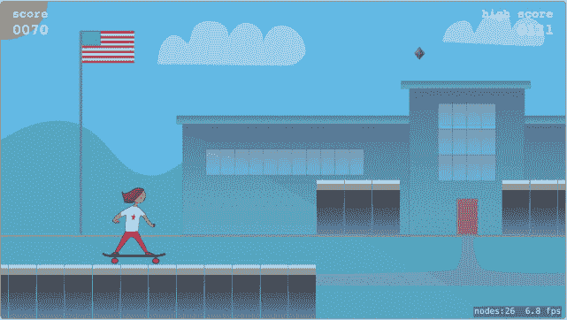

*图 14-1：完成的游戏*

### 我从哪里获得艺术和音效？

我们已经创建了制作《Schoolhouse Skateboarder》所需的所有艺术和音效（可以从 *[`www.nostarch.com/iphoneappsforkids/`](https://www.nostarch.com/iphoneappsforkids/)* 获得）。你不需要其他资源就能继续跟随。如果你想自定义，可以通过将滑板车手图像替换为你自己选择的角色，或者让某人代替收集宝石改为收集汉堡包来制作属于你的游戏。

希望到本书结束时，你会受到启发，设计出属于自己的游戏。独立制作整个游戏，包括艺术和音效，能够带来非常有成就感。你可以完全掌控*你*的游戏的每个方面。

网络上还有很多可以找到免费游戏艺术资源的地方：

***[`opengameart.org/`](http://opengameart.org/)*** 免费游戏艺术、音效和音乐

***[`freetems.net/`](http://freetems.net/)*** 免费游戏艺术和音乐

***[`www.bfxr.net/`](http://www.bfxr.net/)*** 免费的复古游戏音效制作工具

### 使用 Xcode 的 SpriteKit 制作游戏

SpriteKit 是 iOS 内建的游戏引擎，用于制作二维（2D）游戏。*游戏引擎* 是一套工具，帮助你快速轻松地制作动画、使用音频和音效、创建菜单系统等。程序员使用游戏引擎，以便可以专注于真正重要的部分——让游戏变得有趣。

通常，游戏由许多精灵（sprites）组成。*精灵* 是游戏中的 2D 图像。精灵可以是全屏图像，用来作为游戏的背景，或者是较小的图像，随着游戏进行而移动并执行某些动作。背景精灵设定了舞台。例如，在一款太空射击游戏中，背景精灵可能展示星空和行星的场景，而会有更小的精灵代表玩家的飞船、敌机、子弹、小行星和能量包。

就游戏引擎而言，SpriteKit 是顶级的。其他游戏引擎需要写很多代码才能完成的任务，在 SpriteKit 中只需一两行代码就能实现，而且使用起来非常有趣！

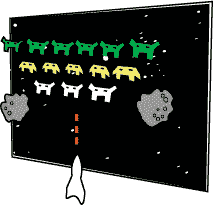

**注意**

*iOS 还提供了一个名为 SceneKit 的 3D 游戏引擎，但由于我们制作的是 2D 游戏，所以我们将继续使用 SpriteKit。*

### 创建游戏项目

我们首先需要做的是为我们的游戏创建一个新的 SpriteKit 项目。打开 Xcode，选择 **文件** ▸ **新建** ▸ **项目…**。在项目模板对话框中，选择 **iOS**，选择 **游戏** 模板，然后点击 **下一步**。

现在，在产品名称字段中输入项目名称 SchoolhouseSkateboarder。选择 **SpriteKit** 作为游戏技术。由于我们的游戏仅会在 iPhone（和 iPod touch）上运行，选择 **iPhone** 作为设备设置。然后点击 **下一步** 来创建你的游戏项目。

即使什么都不改，你也可以运行这个项目，看到一个黑色的屏幕和一个写着 *Hello, World!* 的标签。每当你在模拟器中点击鼠标时，屏幕上会出现一个旋转的盒子（见 图 14-2），标签会缩小一秒钟。如果标签是横着显示的，你可以通过选择模拟器菜单中的 **硬件** ▸ **左旋转** 来旋转模拟器窗口。

每次使用游戏模板创建新项目时，Xcode 会添加这个简单的互动功能，让你确保一切正常。

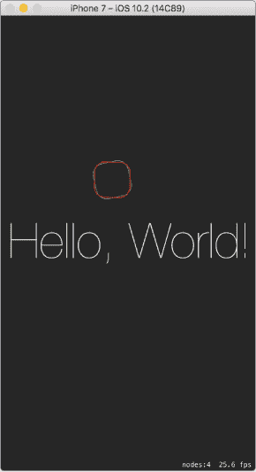

*图 14-2：在未做任何更改之前运行游戏模板创建的项目*

由于我们不希望在游戏中出现一个巨大的 *Hello, World!* 标签，首先我们来删除它。这个标签存在于 *场景编辑器* 中，场景编辑器是一个用于可视化设计 SpriteKit 场景的工具，类似于使用故事板设计 UIKit 视图的方式。你可以将物体拖入场景编辑器，移动它们，调整它们的大小、颜色和其他属性。这个工具很有用，但与代码中能做到的相比，它有很多限制。因此，除了删除 *Hello, World!* 标签外，我们在 Schoolhouse Skateboarder 游戏中将不再使用场景编辑器。要打开场景编辑器，点击项目导航器中的 *GameScene.sks* 文件。加载后，你应该看到一个黑色的场景和 *Hello, World!* 标签。点击标签，然后按 DELETE 键。参见 图 14-3。

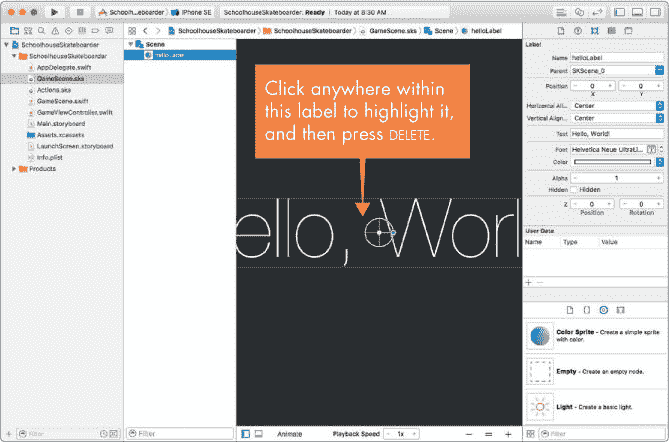

*图 14-3：删除游戏模板中的* Hello, World! *标签*

现在我们已经创建了项目并删除了 *Hello, World!* 标签，我们可以开始工作了——也就是开始享受游戏的乐趣！

### 添加图像

首先，你需要将所有的图像作为资源添加到你的项目中。（资源只是你游戏中的一个元素，比如精灵或音效。）

从 *[`www.nostarch.com/iphoneappsforkids/`](https://www.nostarch.com/iphoneappsforkids/)* 下载 ZIP 文件。下载完成后，你会在 *Downloads* 文件夹中看到一个名为 *ch14-images* 的文件夹，里面包含了你所需的所有图像文件。

要将图片文件添加到你的项目中，你需要从 Finder 中将它们拖入 Xcode，并将它们放入资源目录中。（资源目录是 Xcode 项目中的一种特殊文件夹，用来存放和组织项目资源，如图片文件和图标。）它对于图片来说非常有用，因为它将相关的图片文件组织在一起。文件添加到资源目录后，你可以通过引用它们的文件名在代码中随时使用它们。我们使用的游戏模板已经包含了一个资源目录，名为 *Assets.xcassets* ，这就是我们将要使用的目录。


在项目导航器中点击 *Assets.xcassets*。你应该能看到现有的资源，如 AppIcon 和飞船图片。你可以删除飞船图片，因为我们不会使用它。点击该图片，然后按 DELETE 键。

现在打开 Finder 并导航到图片文件下载的文件夹。按 ⌘ -A 选择所有文件。文件选中后，将它们拖入 Xcode 资源目录，如 图 14-4 所示。

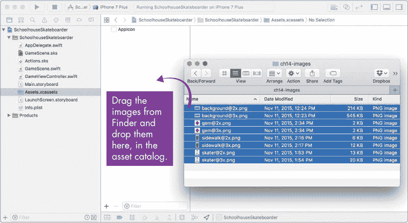

*图 14-4：将图片文件添加到项目的资源目录中*

你可能已经注意到所有的图片文件都是 *.png* 文件。*PNG* 代表 *可移植网络图形*，它是 iOS 应用中最常用的图片文件类型，因为它在保持最佳图像质量的同时，文件大小最小。你也可以使用 *.jpg* 文件，但推荐使用 *.png* 文件。

### 场景：显示背景图片

现在你已经将所有的图片添加到项目中，让我们编写一些代码在应用中显示背景图片。

当你使用游戏模板创建新项目时，一些有用的代码已经自动添加到你的项目中了。在项目导航器中点击名为 *GameScene.swift* 的文件。你应该能看到已经存在的一些代码。这段代码有两个目的。首先，它给你展示了如何创建一个形状（旋转的方块）以及如何执行一个动作（让方块旋转）。其次，它让你可以立即运行新项目，确保一切都设置妥当。

这时，我们将删除大部分代码并添加我们自己的代码。请删除 *GameScene.swift* 中的所有内容，除了 didMove(to:) 函数和 update(_:) 函数的声明，使其看起来像这样：

*GameScene.swift*

```
import
 SpriteKit

class
 GameScene: SKScene
 {

    override
 func
 didMove(to view: SKView
 ) {

    }

    override
 func
 update(_
 currentTime: TimeInterval
 ) {

        // Called before each frame is rendered

    }

}
```

我们游戏中的大部分逻辑都将在 GameScene 类中实现。可以将场景看作是应用中的一个视图或屏幕。GameScene 类将管理场景中发生的一切——如何显示精灵，玩家如何与游戏互动，以及如何进行得分。复杂的游戏可能有许多不同的场景——例如，一个标题场景，一个菜单场景，一个游戏场景和一个设置场景。我们的游戏只有一个场景：游戏场景。

场景类通常会有设置函数（只会发生一次的操作）、游戏循环或更新函数（游戏过程中反复发生的操作）以及用户交互函数（只有在用户点击或滑动时发生的操作）。

setup 函数 didMove(to:)会在游戏首次启动时被调用。它非常适合设置场景的代码，例如添加初始精灵或设置玩家的分数和生命值的代码。它类似于你在第十章中用来设置 AddBirthdayViewController 中的日期选择器的 viewDidLoad()方法，并且只会被调用一次。

在将背景图片添加到场景之前，我们必须先设置场景的 anchorPoint。将这行代码添加到 didMove(to:)方法中（灰色的代码行表示一些已有的代码，用于布局）：

```
override func didMove(to view: SKView) {

    anchorPoint
 = CGPoint
 .zero

}

```

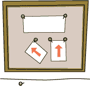

设置场景的锚点决定了精灵在场景中的定位方式。当你用图钉将一张纸钉在软木板上时，图钉就是锚点。纸张将定位在图钉所在的位置，并且如果纸张旋转，它将围绕图钉旋转。这与 SpriteKit 中锚点属性对精灵和场景的作用完全相同。游戏模板中的 GameScene 场景的锚点位于场景的中央，但我们希望将锚点设置在场景的左下角，因此我们将其设置为 CGPoint.zero，或(0, 0)。对于一些游戏，例如太空射击游戏，最好将锚点设置在场景的中间。但对于我们的游戏，地面位于屏幕底部，将锚点移到左下角会更方便操作。请参见图 14-5，该图展示了不同锚点的位置。

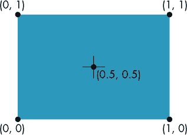

*图 14-5：锚点从(0, 0)到(1, 1)的不同位置*

在我们的场景中，当我们将一个精灵放置在 x 坐标为 0 的位置时，它会位于屏幕的左边缘。当我们将精灵放置在 y 坐标为 0 的位置时，它会位于屏幕的底部边缘。

**注意**

*我们将逐步构建每个项目的代码文件。最终版本可以从* [`www.nostarch.com/iphoneappsforkids/`](https://www.nostarch.com/iphoneappsforkids/) *获取。*

**精灵的锚点**

你还可以设置精灵的锚点，从而改变精灵的位置和旋转方式。请参见图 14-6，该图展示了使用不同锚点旋转精灵的示例。

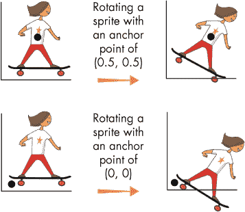

*图 14-6：精灵的锚点决定了它如何旋转。*

精灵通常将锚点设置在中心。我们不会改变任何精灵的锚点，因此我们将始终使用它们的中心点来定位精灵。

现在，为了加载我们的背景图片，向 didMove(to:)函数中添加以下代码行：

```
override func didMove(to view: SKView) {

    anchorPoint = CGPoint.zero

 ➊
 let
 background = SKSpriteNode
 (imageNamed: "background"
 )

 ➋
 let
 xMid = frame
 .midX

 ➌
 let
 yMid = frame
 .midY

 ➍
 background.position
 = CGPoint
 (x: xMid, y: yMid)

 ➎
 addChild(background)

}

```

让我们逐步解释一下我们刚才添加的五行代码。➊行创建了一个名为 background 的精灵，使用的是* background@2x.png *文件或* background@3x.png *文件。两个文件之前已经添加到资源目录，Xcode 会自动选择正确的文件。你只需要在代码中引用它，称为“background”或“background.png”。要了解 Xcode 如何选择正确的文件，参见《为不同屏幕分辨率调整图片大小》，以及第 213 页。请注意，变量名不必与图像名匹配——你可以为变量名选择任何名称。但是，图像名必须与项目资源目录中添加的文件名匹配。SKSpriteNode 是 SpriteKit 中的精灵类，因此当我们在游戏中创建一个精灵时，我们将创建一个 SKSpriteNode，就像我们在这里所做的那样。

➋和➌行创建了常量 xMid 和 yMid，它们将表示屏幕的中间位置。frame 是 GameScene 的一个属性——它是一个 CGRect（矩形），表示整个屏幕。每个场景和精灵都有一个 frame，描述它在屏幕上的位置。frame 有一个 x 位置、一个 y 位置、一个宽度和一个高度（参见图 14-7）。midX 属性给我们提供屏幕 frame 的中间 x 位置，midY 则给我们提供屏幕 frame 的中间 y 位置。


*图 14-7：一个框架描述了精灵的位置和大小。*

➋行设置了我们的背景图像位置，使其居中显示在屏幕上，方法是使用 xMid 和 yMid 创建一个 CGPoint，并将其赋值给精灵的位置属性。

CGPoint 是一个结构体，包含两个 CGFloat 值，表示 x 和 y 坐标。当处理屏幕坐标时，通常使用 CGFloat 作为数据类型，而不是 Float 或 Double。一个 CGPoint 可以保存两个值，一个是*x*，另一个是*y*，这使得它在处理 2D 游戏中的屏幕坐标时非常方便，因为游戏中的所有内容都使用 x 和 y 位置来定位。

**注意**

*任何以* CG *开头的内容都来自* Core Graphics 框架*，这是一个苹果用于图形处理的框架。你会在 Swift 中经常看到这种命名方式——类或结构体的前两三个字母通常能告诉你这个对象的用途或来源。例如，所有 SpriteKit 类，如* SKSpriteNode *，都以* SK *开头。 

第➎行通过调用函数 addChild(_:)将背景图像添加到场景中。这个精灵现在是场景的*子元素*，意味着它被附加到了这个场景上。例如，如果场景发生变化，无论是变大、变小还是消失，这个子精灵也会随之变化。在 SpriteKit 游戏中，场景始终是父对象，每个精灵都作为场景的子元素或另一个精灵的子元素添加。每次添加精灵时，重要的是要考虑这个精灵的父对象应该是什么。例如，滑板手精灵是场景的子元素，但如果我们想为滑板手添加可互换的帽子，我们会使用一个作为滑板手精灵子元素的帽子精灵。这样，每当滑板手跳跃时，帽子就会留在滑板手头上，我们就不需要单独移动帽子。

### 游戏的玩法：屏幕方向

创建一个同时支持竖屏和横屏模式的游戏需要更多的工作，因此通常最好决定哪种方向最适合你的游戏，并选择其中一种。由于我们的游戏是一个横向滚动的动作游戏，横屏方向（设备横着放，如图 14-8 所示）最为合适。

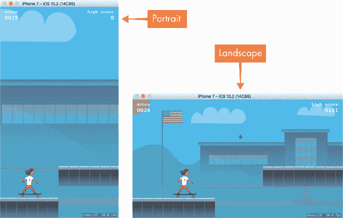

*图 14-8：我们的游戏在竖屏与横屏方向下的显示效果*

现在尝试使用 iPhone 7 模拟器运行该项目，你会注意到它可能默认以竖屏方向显示。让我们更改项目设置，使游戏仅在横屏模式下运行。进入项目导航器，点击**SchoolhouseSkateboarder**项目——它位于项目导航器的顶部，旁边有一个蓝色图标，如图 14-9 所示。

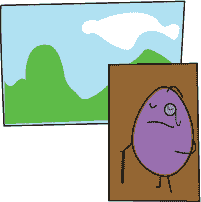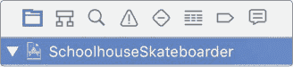

*图 14-9：通过点击项目导航器中的项目条目访问项目设置。*

在图 14-10 中，你可以看到一个项目和目标的列表。

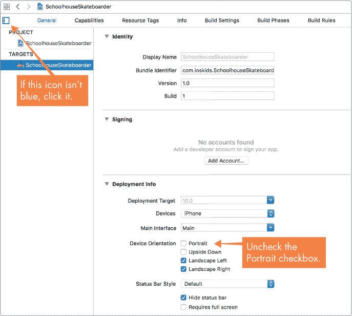

*图 14-10：取消选中 Portrait 选项，同时保留两个横屏方向选项被选中。*

如果你在屏幕上看不到项目和目标列表，点击窗口左上角的方形图标，如图 14-10 所示。此列表将出现，图标将变为蓝色，表示列表区域已显示。确保选择了**SchoolhouseSkateboarder**目标。接下来，找到**Portrait**复选框并取消选中。保留横屏方向选项为选中状态。

再次运行游戏，你会看到它以横屏方向启动。我们离目标更近了，但背景图像还没有填满整个屏幕。稍后我们将看看如何解决这个问题。

在游戏现在以横屏方向运行时，你需要确保模拟器也处于横屏方向。要旋转它，从模拟器菜单中选择**硬件** ▸ **右旋**，如图 14-11 所示。

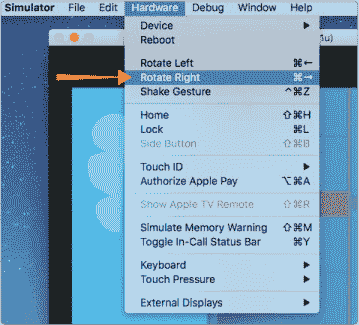

*图 14-11：旋转模拟器的方向以匹配游戏*

### 为不同屏幕分辨率调整图像大小

在我们深入研究代码之前，我们应该决定支持哪些设备和屏幕分辨率。支持的设备越多，你就需要处理更多不同的屏幕尺寸，这意味着你需要做额外的工作，以确保你创建的艺术作品资源在每个设备上都能正确显示。与基于 UIKit 的应用程序（如我们的生日追踪器）相比，游戏在这一方面通常需要更多的工作，因为如果你只是简单地缩放图像，游戏艺术作品可能会显得被拉伸。为了避免这个问题，你需要为每个要支持的设备使用不同的图像集。

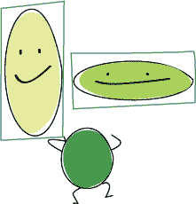

Xcode 提供了一种命名图像文件的系统，帮助你分辨哪些图像是为哪些设备准备的。例如，假设你想在游戏中添加一张滑板手的图像，而你有一张滑板手的图像文件，尺寸为 100 像素宽和 100 像素高（100×100）。你应该将这张图像命名为 *skater.png*。你还需要创建一张名为 *skater@2x.png* 的图像，尺寸为 200×200 像素，另一个名为 *skater@3x.png* 的图像，尺寸为 300×300 像素。这三张文件应该是同一图像的三种不同尺寸。如果游戏在 iPhone 4 上运行，带有 *@2x* 后缀的文件会自动被使用。如果游戏在 iPhone 6 Plus 上运行，带有 *@3x* 后缀的文件会自动被使用。在你的代码中，你只需引用图像文件名 skater，只要你在项目中正确命名了图像，Xcode 会自动显示正确的图像。

对于《学校滑板》，我们将支持从 iPhone 4 开始的所有设备。这意味着我们需要支持以下四种屏幕分辨率：960×640、1136×640、1334×750 和 1920×1080。

**注意**

*我们使用的所有图像都有一个后缀，如* @2x *或* @3x*。没有后缀的图像，如* skater.png*，被认为是 1x 图像。你只需要为老款设备（如 iPhone 3GS 或第一代 iPad mini）提供 1x 尺寸的图像，这些设备没有视网膜显示屏。因此，我们所有的图像文件都会带有* @2x *或* @3x *后缀。*

我们的背景图像文件命名为 *background@2x.png* 和 *background@3x.png*。如果你查看 *Assets.xcassets* 资源目录，你会注意到 Xcode 将这两张图像分组在一起。如果你同时将尺寸不同的图像拖放到 Xcode 的资源目录中，Xcode 会根据它们的命名自动识别它们是同一图像的不同尺寸并将它们分组在一起。见 图 14-12。

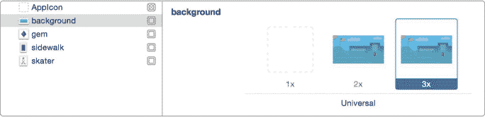

*图 14-12：具有多个尺寸的图像在资源目录中被分组在一起。*

在继续之前，我们还有最后一个准备工作要处理，涉及背景图像。您可能已经注意到，当您使用 iPhone 7 模拟器运行游戏时，背景图像没有填满整个屏幕，如图 14-13 所示。这是因为游戏模板处理游戏场景尺寸的方式。游戏场景的大小将基于包含在我们项目中的*GameScene.sks*场景编辑器文件中的设置。我们在这个项目中不使用场景编辑器，因此需要添加代码来确保我们的场景大小正确。


*图 14-13：背景图像没有填满整个屏幕。*

在项目导航器中点击 *GameViewController.swift* 文件，找到 viewDidLoad() 方法。添加以下几行代码来设置场景的大小：

*GameViewController.swift*

```
override func viewDidLoad() {

    --
 *snip* 
 --

            scene.scaleMode = .aspectFill

            // Adjust the size of the scene to match the view

            let
 width = view.bounds
 .width

            let
 height = view.bounds
 .height

            scene.size
 = CGSize
 (width: width, height: height)

            // Present the scene

            view.presentScene(scene)

    --
 *snip* 
 --

}

```

viewDidLoad() 方法中的代码创建了一个 GameScene 类的实例并将其显示出来。由于 GameScene 是我们游戏的主要场景，我们希望它始终填满整个屏幕。我们在这里添加的代码确定了正在显示的视图的大小（宽度和高度），并设置了新场景的大小，使其填满整个视图。

再次运行项目。现在背景图像应该填满整个屏幕。

### 您学到了什么

在本章中，您开始制作 *Schoolhouse Skateboarder* 游戏并学习了 SpriteKit。您学习了如何在 Xcode 中创建游戏项目并将资源（如图像）导入到项目中。您还学习了如何通过标准文件命名实践来支持各种设备的屏幕分辨率，以及如何选择游戏中需要的图像类型。最后，您创建并显示了一个背景图像精灵。

现在我们已经设置了一个包含所需资源的 SpriteKit 游戏项目，并解决了屏幕方向和分辨率的问题，接下来就该编程实现一些动作了。在第十五章中，我们将添加我们的英雄和她滑行的地面，让一切动起来，并让玩家点击屏幕让她跳跃。

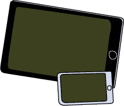

## 设置场景


在接下来的几章中，我们将充分利用您的新技能，构建一款名为*Schoolhouse Skateboarder*的游戏，在这款游戏中，玩家控制一名滑板手，必须跳过障碍并收集宝石。

在本章中，您将设置 Xcode 项目文件，添加玩家图像，并显示一个学校操场背景。图 14-1 是游戏在 iPhone 上显示的预览。玩家通过点击跳过障碍、收集宝石并得分，尽可能长时间生存。当玩家倾斜或掉进洞里时就会失败。


*图 14-1：完成的游戏*

### 我从哪里获取艺术和音效？

我们已经创建了你制作《Schoolhouse Skateboarder》所需的所有艺术和音效（可从 *[`www.nostarch.com/iphoneappsforkids/`](https://www.nostarch.com/iphoneappsforkids/)* 获取）。你不需要其他任何东西来跟随本书的内容。如果你想自定义游戏，可以通过将滑板手图像替换成你选择的角色，或者让某人抓取汉堡而不是宝石，来定制你的游戏。

希望在本书的结尾，你会受到启发，设计自己的游戏。独立创作整个游戏，包括艺术和音效，可以是非常有成就感的。你将完全控制 *你* 的游戏的每一个方面。

网络上也有许多地方可以找到免费游戏艺术资源：

***[`opengameart.org/`](http://opengameart.org/)*** 免费游戏艺术、音效和音乐

***[`freetems.net/`](http://freetems.net/)*** 免费游戏艺术和音乐

***[`www.bfxr.net/`](http://www.bfxr.net/)*** 免费复古游戏音效创建工具

### 使用 Xcode 的 SpriteKit 制作游戏

SpriteKit 是 iOS 内置的游戏引擎，用于制作二维（2D）游戏。*游戏引擎* 是一组工具，能够让你快速轻松地制作动画、使用音频和音效、创建菜单系统等。程序员使用游戏引擎是为了能够集中精力做真正重要的事情——让游戏有趣。

通常，一个游戏由许多精灵组成。*精灵*是游戏中使用的二维图像。精灵可以是提供游戏背景的全屏图像，也可以是移动并执行各种动作的小图像。背景精灵设置了舞台。例如，在一款太空射击游戏中，背景精灵可能会展示一幅包含星星和行星的太空场景，同时还会有小精灵表示玩家的飞船、敌方飞船、子弹、陨石和能量补给。

在所有游戏引擎中，SpriteKit 是一流的。在其他游戏引擎中需要多行代码才能完成的任务，在 SpriteKit 中只需一两行代码就能完成，而且使用起来非常有趣！


**注意**

*iOS 也有一个名为 SceneKit 的 3D 游戏引擎，但由于我们要构建的是一款 2D 游戏，所以我们将坚持使用 SpriteKit。*

### 创建游戏项目

我们需要做的第一件事是为我们的游戏创建一个新的 SpriteKit 项目。打开 Xcode，选择 **File** ▸ **New** ▸ **Project…** 。在项目模板对话框中，选择 **iOS**，选择 **Game** 模板，然后点击 **Next**。

现在，在产品名称字段中为你的项目命名为 SchoolhouseSkateboarder。选择 **SpriteKit** 作为游戏技术。由于我们的游戏将仅在 iPhone（和 iPod touch）上运行，因此在设备设置中选择 **iPhone**。然后点击 **Next** 创建你的游戏项目。

在不做任何更改的情况下，你可以运行这个项目，你会看到一个黑色的屏幕，上面有一个写着 *Hello, World!* 的标签。每当你在模拟器中点击鼠标，屏幕上会出现一个旋转的盒子（参见 图 14-2），标签会缩小一秒钟。如果标签显示侧向，你可以通过在模拟器菜单中选择 **硬件** ▸ **向左旋转** 来旋转模拟器窗口。

每当你使用游戏模板创建一个新项目时，Xcode 会添加这个简单的交互，以便你确保一切正常工作。


*图 14-2：在对游戏模板创建的项目进行任何更改之前运行项目*

由于我们不想在游戏中有一个巨大的 *Hello, World!* 标签，所以首先将其移除。这个标签存在于 *场景编辑器* 中，这是一个用于可视化设计 SpriteKit 场景的工具，类似于在设计 UIKit 视图时使用的故事板。你可以将物体拖放到场景编辑器中，移动它们，调整大小、颜色和其他属性。这个工具很有用，但相比代码中的操作，它有很多限制。因此，除了删除 *Hello, World!* 标签外，我们在 Schoolhouse Skateboarder 中不会使用场景编辑器。要打开场景编辑器，点击项目导航器中的 *GameScene.sks* 文件。加载完成后，你应该能看到一个黑色的场景，并带有 *Hello, World!* 标签。点击标签，然后按 DELETE 键。参见 图 14-3。


*图 14-3：删除游戏模板中的* Hello, World! *标签*

现在我们已经创建了项目并删除了 *Hello, World!* 标签，我们可以开始进入正题——也就是进入有趣的部分！

### 添加图片

首先，你需要将所有图片添加到你的项目中作为资源。（资源是你游戏中的任何东西，例如精灵或音效。）

从 *[`www.nostarch.com/iphoneappsforkids/`](https://www.nostarch.com/iphoneappsforkids/)* 下载 ZIP 文件。下载完成后，你会在 *Downloads* 文件夹内看到一个名为 *ch14-images* 的文件夹，其中包含你所需的所有图片文件。

要将图片文件添加到项目中，你需要将它们从 Finder 拖到 Xcode 中，并将其放入资源目录中。（资源目录是 Xcode 项目中的一种特殊文件夹，用于存储和组织项目资源，如图片文件和图标。）它对图片非常有用，因为它将相关的图片文件分组在一起。一旦文件进入资源目录，你就可以在代码中通过引用文件名来使用它们。我们使用的游戏模板已经带有一个资源目录，名为 *Assets.xcassets*，我们将使用这个目录。


在项目导航器中点击 *Assets.xcassets*。你应该能看到现有的资源，包括 AppIcon 和飞船图片。你可以删除飞船图片，因为我们不打算使用它。点击该图片，然后按 DELETE 键。

现在打开 Finder，导航到图像文件下载的文件夹。按⌘-A 选择所有文件。选中文件后，将它们拖入 Xcode 的资源目录，如图 14-4 所示。


*图 14-4：将图像文件添加到项目的资源目录*

你可能已经注意到，所有的图像文件都是*.png*文件。*PNG*代表*可移植网络图形*，它是 iOS 应用中最常用的图像文件类型，因为它在保持最佳图像质量的同时，文件大小最小。你可以使用*.jpg*文件，但推荐使用*.png*文件。

### 场景：显示背景图像

现在你已经将所有图像添加到项目中，让我们编写一些代码，在应用中显示背景图像。

当你使用 Game 模板创建一个新项目时，一些有用的代码会自动添加到你的项目中。点击项目导航器中名为*GameScene.swift*的文件。你应该会看到一些已经存在的代码。这个代码有两个目的。首先，它给了你一个创建形状（旋转的盒子）并执行动作（使盒子旋转）的示例。其次，它让你可以立即运行一个新项目，确保一切设置正确。

到此为止，我们将删除大部分代码，并添加我们自己的代码。继续删除*GameScene.swift*中的所有内容，除了 didMove(to:)函数和 update(_:)函数的声明，使其看起来像这样：

*GameScene.swift*

```
import
 SpriteKit

class
 GameScene: SKScene
 {

    override
 func
 didMove(to view: SKView
 ) {

    }

    override
 func
 update(_
 currentTime: TimeInterval
 ) {

        // Called before each frame is rendered

    }

}
```

我们游戏中的大部分逻辑将会在 GameScene 类中。可以把场景看作是应用中的一个视图或屏幕。GameScene 类将管理场景中发生的一切——如何显示精灵，玩家如何与游戏互动，得分如何计算。复杂的游戏可能有许多独立的场景——例如，标题场景、菜单场景、游戏场景和设置场景。我们的游戏将只有一个场景：游戏场景。

场景类通常会有设置函数（一些只执行一次的操作），游戏循环或更新函数（游戏中反复执行的操作），以及用户交互函数（仅在用户点击或滑动时执行的操作）。

设置函数 didMove(to:)会在游戏首次启动时被调用。它非常适合用来设置场景的代码，例如添加初始精灵或设置玩家的分数和生命值。这类似于你在第十章中用来设置 AddBirthdayViewController 中的日期选择器的 viewDidLoad()方法，并且它只会调用一次。

在我们将背景图像添加到场景之前，我们需要设置场景的 anchorPoint。将这行代码添加到 didMove(to:)方法中（灰色的行表示一些现有的代码，用于放置）：

```
override func didMove(to view: SKView) {

    anchorPoint
 = CGPoint
 .zero

}

```


设置场景的锚点决定了精灵在场景中的位置。当你用大头针将一张纸固定在软木板上时，大头针就是锚点。纸张将定位在你放置大头针的位置，如果纸张旋转，它将围绕大头针旋转。这正是精灵和场景在 SpriteKit 中如何使用 anchorPoint 属性的方式。游戏模板中的 GameScene 场景锚点位于场景的中心，但我们希望将锚点设置在场景的左下角，因此我们将其设置为 CGPoint.zero，或者 (0, 0)。对于一些游戏，比如太空射击游戏，将锚点放在场景的中心更为合适。但对于我们的游戏，地面位于屏幕的底部，将锚点移到左下角会让工作更加方便。请参见图 14-5 了解各种锚点的位置示例。


*图 14-5：从(0, 0)到(1, 1)的各种锚点位置*

在我们的场景中，当我们将一个精灵放置在 x 轴位置为 0 时，它会位于屏幕的左边缘。而当我们将一个精灵放置在 y 轴位置为 0 时，它会位于屏幕的底边缘。

**注意**

*我们将按步骤逐步构建每个项目的代码文件。最终版本可以从* [`www.nostarch.com/iphoneappsforkids/`](https://www.nostarch.com/iphoneappsforkids/) *获得。*

**精灵的锚点**

你还可以设置精灵的锚点，改变精灵的位置和旋转方式。查看图 14-6，了解如何通过不同的锚点旋转精灵的示例。


*图 14-6：精灵的锚点决定了它的旋转方式。*

精灵通常将锚点设置在中心。我们不会更改任何精灵的锚点，因此我们将始终使用它们的中心点来定位精灵。

现在，为了加载我们的背景图像，请将以下代码行添加到 didMove(to:) 函数中：

```
override func didMove(to view: SKView) {

    anchorPoint = CGPoint.zero

 ➊
 let
 background = SKSpriteNode
 (imageNamed: "background"
 )

 ➋
 let
 xMid = frame
 .midX

 ➌
 let
 yMid = frame
 .midY

 ➍
 background.position
 = CGPoint
 (x: xMid, y: yMid)

 ➎
 addChild(background)

}

```

让我们逐步解析刚才添加的五行代码。第 ➊ 行创建了一个名为 background 的精灵，使用的是* background@2x.png* 文件或* background@3x.png* 文件。这两个文件之前已经添加到资产目录中，Xcode 会自动选择正确的文件。你只需在代码中引用它为 "background" 或 "background.png"。要了解 Xcode 如何选择正确的文件，请参见 “为不同屏幕分辨率调整图像大小” 页 213。请注意，变量名不必与图像名匹配——你可以随意使用任何变量名。然而，图像名必须与项目中添加到资产目录中的文件名一致。SKSpriteNode 是 SpriteKit 中的精灵类，因此，当我们在游戏中创建一个精灵时，我们会创建一个 SKSpriteNode，就像我们在这里做的那样。

位于➋和➌的代码创建了常量 xMid 和 yMid，它们代表屏幕的中间位置。frame 是 GameScene 的一个属性——它是一个 CGRect（矩形），表示整个屏幕。每个场景和精灵都有一个 frame，描述它们在屏幕上的位置。frame 有 x 坐标、y 坐标、宽度和高度（见图 14-7）。midX 属性给我们提供了屏幕 frame 的中间 x 坐标，midY 则给出了中间 y 坐标。


*图 14-7：frame 描述了精灵的位置和大小。*

位于➍的代码通过使用 xMid 和 yMid 创建一个 CGPoint 并将其分配给精灵的位置属性，将背景图像的位置设置为屏幕的中央。

CGPoint 是一个结构体，包含两个 CGFloat 值，分别表示 x 坐标和 y 坐标。当你处理屏幕坐标时，通常会使用 CGFloat 作为数据类型，而不是 Float 或 Double。一个 CGPoint 可以包含两个值，一个是*x*，一个是*y*，这使得在 2D 游戏中处理屏幕坐标非常方便，因为所有内容都是通过 x 和 y 位置来定位的。

**注意**

*任何以* CG *开头的都来自* Core Graphics 框架*，这是苹果公司用于图形处理的框架。你会在 Swift 中看到这种命名系统，类或结构体的前两到三个字母通常会告诉你该对象的用途或来源。例如，所有 SpriteKit 类，如* SKSpriteNode *，都以* SK *开头。*

位于➎的代码通过调用 addChild(_:)函数将背景图像添加到场景中。这个精灵现在是场景的*子对象*，这意味着它被附加到了这个场景。例如，如果场景发生变化，增大、缩小或消失，这个子精灵也会随之变化。在 SpriteKit 游戏中，场景始终是父对象，而每个精灵都作为场景的子对象或另一个精灵的子对象添加。当你添加一个精灵时，重要的是要考虑这个精灵的父对象应该是谁。例如，滑冰精灵是场景的子对象，但如果我们想给滑冰者添加可互换的帽子，我们会使用一个帽子精灵，它是滑冰者精灵的子对象。这样，每当滑冰者跳跃时，帽子会跟着滑冰者一起移动，我们就不需要单独移动帽子。

### 游戏的玩法：屏幕方向

创建一个同时适应纵向和横向模式运行的游戏需要更多的工作，因此通常最好决定哪种方向最适合你的游戏，然后只选择那个方向。由于我们的游戏是一个水平滚动的动作游戏，因此横向模式（设备侧放，如图 14-8 所示）是最合适的。


*图 14-8：我们的游戏在纵向和横向模式下的显示效果*

现在尝试运行该项目，使用 iPhone 7 模拟器，你会注意到它可能默认是纵向显示。让我们修改项目设置，使游戏仅在横屏模式下运行。打开项目导航器，点击 **SchoolhouseSkateboarder** 项目——它位于项目导航器的顶部，旁边有一个蓝色图标，如 图 14-9 所示。


*图 14-9：通过点击项目导航器中的项目条目访问项目设置。*

在 图 14-10 中，你可以看到项目和目标的列表。


*图 14-10：取消选中纵向选项，保留两个横向选项勾选。*

如果你在屏幕上看不到项目和目标列表，点击窗口左上角的方形图标，如 图 14-10 所示。此时列表会出现，图标会变蓝，表示该列表区域已显示。确保选中了 **SchoolhouseSkateboarder** 目标。现在找到 **纵向** 复选框并取消勾选，保留横向模式选项勾选。

再次运行游戏，你会看到它在横屏模式下启动。我们已经越来越接近目标，但背景图像还没有填满屏幕。稍后我们将看到如何解决这个问题。

游戏现在以横屏模式运行，你需要确保模拟器也处于横屏模式。要旋转模拟器，选择 **硬件** ▸ **向右旋转**，如 图 14-11 所示。


*图 14-11：将模拟器旋转方向与游戏匹配*

### 为不同屏幕分辨率调整图像大小

在我们深入研究代码之前，我们应该决定支持哪些设备和屏幕分辨率。支持的设备越多，你就需要处理不同的屏幕尺寸，这意味着你需要额外的工作来确保你创建的艺术资源能够在每个设备上正确显示。相比于像我们的生日追踪器那样基于 UIKit 的应用，游戏通常需要在这方面付出更多努力，因为如果你只是简单地放大或缩小，游戏艺术作品会看起来被拉伸。为了避免这个问题，你需要为每个想要支持的设备使用不同的图像集。


Xcode 有一个命名图像文件的系统，帮助你识别不同设备的图像。例如，假设你想在游戏中添加一张滑板人物的图像，并且你有一张宽 100 像素、高 100 像素（100×100）的滑板人物图像文件。你会将这张图像命名为*skater.png*。你还需要创建一张名为*skater@2x.png*、尺寸为 200×200 像素的图像，以及另一张名为*skater@3x.png*、尺寸为 300×300 像素的图像。这三张文件应该是同一张图像的不同尺寸。如果游戏在 iPhone 4 上运行，带有* @2x*后缀的文件会自动被使用。如果游戏在 iPhone 6 Plus 上运行，带有* @3x*后缀的文件会自动被使用。在你的代码中，你只需要引用文件名 skater，Xcode 会根据你在项目中正确命名的图像自动显示正确的图像。

对于《Schoolhouse Skateboarder》游戏，我们将支持从 iPhone 4 开始的所有设备。这意味着我们需要支持以下四种屏幕分辨率：960×640、1136×640、1334×750 和 1920×1080。

**注意**

*我们使用的所有图像都有一个后缀，如* @2x *或* @3x*。没有后缀的图像，如* skater.png*，被视为 1x 图像。你只需要为那些有非视网膜显示屏的旧设备（如 iPhone 3GS 或第一代 iPad mini）提供 1x 大小的图像。因此，我们所有的图像文件都会有* @2x *或* @3x *后缀。*

我们的背景图像文件命名为*background@2x.png*和*background@3x.png*。如果你查看*Assets.xcassets*资源目录，你会发现 Xcode 将这两张图像分组在一起。如果你同时将这些图像拖入 Xcode 资源目录，Xcode 会自动识别它们是相同图像的不同尺寸，并将它们分组。见图 14-12。


*图 14-12：多个尺寸的图像在资源目录中被分组在一起。*

在我们从背景图像的处理过渡之前，还有最后一项准备工作需要完成。你可能已经注意到，当你使用 iPhone 7 模拟器运行游戏时，背景图像并没有填满整个屏幕，如图 14-13 所示。这是因为 Game 模板在处理游戏场景尺寸时的方式。游戏场景的大小将根据包含在我们项目中的*GameScene.sks*场景编辑器文件中的设置来确定。我们在这个项目中不会使用场景编辑器，因此我们需要添加代码，以确保场景的尺寸正确。


*图 14-13：背景图像没有填满整个屏幕。*

在项目导航器中点击*GameViewController.swift*文件，并找到 viewDidLoad()方法。添加以下代码行以设置场景的大小：

*GameViewController.swift*

```
override func viewDidLoad() {

    --
 *snip* 
 --

            scene.scaleMode = .aspectFill

            // Adjust the size of the scene to match the view

            let
 width = view.bounds
 .width

            let
 height = view.bounds
 .height

            scene.size
 = CGSize
 (width: width, height: height)

            // Present the scene

            view.presentScene(scene)

    --
 *snip* 
 --

}

```

`viewDidLoad()` 方法中的代码创建了一个 GameScene 类的实例并显示它。由于 GameScene 是我们游戏的主要场景，我们希望它始终充满整个屏幕。我们在这里添加的代码决定了正在显示的视图的大小（宽度和高度），并设置了新场景的大小，以便它充满整个视图。

再次运行项目。背景图像现在应该填充整个屏幕。

### 你学到了什么

在本章中，你开始制作 *Schoolhouse Skateboarder* 游戏并学习了 SpriteKit。你学会了如何在 Xcode 中创建一个游戏项目并将资源（如图像）导入项目。你还学会了如何通过标准的文件命名实践支持各种设备的屏幕分辨率，并学会了如何选择游戏中需要的图像类型。最后，你创建并显示了一个背景图像精灵。

现在，我们已经设置好了一个包含所需资源的 SpriteKit 游戏项目，并解决了屏幕方向和分辨率的问题，是时候编写一些动作代码了。在 第十五章 中，我们将添加我们的英雄和她滑行的地面，让一切动起来，并允许玩家点击屏幕让她跳跃。


在接下来的几章中，我们将充分利用你新学到的技能，制作一款名为 *Schoolhouse Skateboarder* 的游戏，在游戏中，玩家控制一个滑板少年，必须跳过障碍物并收集宝石。

在本章中，你将设置 Xcode 项目文件，添加玩家的图像，并显示一个学校院子背景。图 14-1 是游戏在 iPhone 上显示的预览。玩家通过点击屏幕跳过障碍物、收集宝石并得分，尽量生存更长时间。玩家摔倒或掉进洞里时游戏结束。


*图 14-1：完成的游戏*

### 我在哪里可以获取艺术作品和音效？

我们已经创建了制作 *Schoolhouse Skateboarder* 游戏所需的所有艺术作品和音效（可从 *[`www.nostarch.com/iphoneappsforkids/`](https://www.nostarch.com/iphoneappsforkids/)* 获取）。你不需要其他任何东西来继续操作。如果你想定制它，可以通过替换滑板少年的图像来让游戏更具个性，或者你可以让角色抓汉堡而不是宝石。

希望在本书结束时，你会受到启发，设计你自己的游戏。亲自制作整个游戏，包括艺术作品和音效，能带来极大的成就感。你对 *你的* 游戏的每一个方面都有完全的控制权。

网络上也有许多地方可以找到免费的游戏艺术资源：

***[`opengameart.org/`](http://opengameart.org/)*** 免费的游戏艺术、音效和音乐

***[`freetems.net/`](http://freetems.net/)*** 免费的游戏艺术和音乐

***[`www.bfxr.net/`](http://www.bfxr.net/)*** 免费的复古游戏音效创建工具

### 使用 Xcode 的 SpriteKit 制作游戏

SpriteKit 是 iOS 内建的游戏引擎，用于制作二维（2D）游戏。*游戏引擎*是一套工具，能够让你快速轻松地制作动画、使用音频和音效、创建菜单系统等等。程序员使用游戏引擎是为了专注于真正重要的事情——让游戏变得有趣。

通常，游戏由许多精灵组成。*精灵*是游戏中使用的二维图像。精灵可以是全屏的图像，用于提供游戏背景，或者是可以移动并执行某些操作的较小图像。背景精灵设定了场景。例如，在一款太空射击游戏中，背景精灵可能显示星空和行星，而玩家的宇宙飞船、敌方飞船、子弹、小行星和强化物则由较小的精灵呈现。

就游戏引擎而言，SpriteKit 是一流的。其他游戏引擎中需要许多行代码的任务，在 SpriteKit 中只需一两行代码就能完成，而且使用起来非常有趣！


**注意**

*iOS 还有一个名为 SceneKit 的 3D 游戏引擎，但由于我们正在制作的是 2D 游戏，所以我们将继续使用 SpriteKit。*

### 创建游戏项目

我们需要做的第一件事是为我们的游戏创建一个新的 SpriteKit 项目。打开 Xcode，选择 **文件** ▸ **新建** ▸ **项目...**。在项目模板对话框中，选择 **iOS**，选择 **游戏** 模板，然后点击 **下一步**。

现在，在产品名称字段中将项目命名为 SchoolhouseSkateboarder。选择 **SpriteKit** 作为游戏技术。由于我们的游戏仅在 iPhone（和 iPod touch）上运行，选择 **iPhone** 作为设备设置。然后点击 **下一步** 来创建你的游戏项目。

不进行任何更改，你可以运行这个项目，你将看到一个黑屏，上面有一个显示 *Hello, World!* 的标签。每次你在模拟器中点击鼠标的任何位置，屏幕上都会出现一个旋转的框（见 图 14-2），并且标签会缩小一秒钟。如果标签出现侧向显示，你可以通过从模拟器的菜单中选择 **硬件** ▸ **左旋转** 来旋转模拟器窗口。

每当你使用游戏模板创建新项目时，Xcode 会添加这个简单的交互功能，让你可以确保一切正常工作。


*图 14-2：在进行任何修改之前运行通过游戏模板创建的项目*

由于我们不希望在游戏中出现一个巨大的*Hello, World!*标签，所以我们先把它移除。这个标签存在于*场景编辑器*中，场景编辑器是一个用于可视化设计 SpriteKit 场景的工具，类似于在 UIKit 中使用故事板来设计视图。你可以将对象拖入场景编辑器，移动它们，调整它们的大小、颜色以及其他属性。这是一个非常有用的工具，但与代码中可以完成的功能相比，它有很多限制。因此，除了移除*Hello, World!*标签外，我们在 Schoolhouse Skateboarder 项目中将不再使用场景编辑器。要打开场景编辑器，点击项目导航器中的名为*GameScene.sks*的文件。加载完成后，你应该能看到一个黑色的场景和*Hello, World!*标签。点击该标签，然后按 DELETE 键。见图 14-3。


*图 14-3：删除游戏模板的* Hello, World! *标签*

现在我们已经创建了项目并移除了*Hello, World!*标签，接下来就可以进入正题——也就是进入有趣的部分了！

### 添加图片

首先，你需要将所有图片文件添加为项目的资源。（资源就是你游戏中的元素，例如精灵或音效。）

从*[`www.nostarch.com/iphoneappsforkids/`](https://www.nostarch.com/iphoneappsforkids/)*下载 ZIP 文件。下载完成后，你会在*Downloads*文件夹中看到一个名为*ch14-images*的文件夹，里面包含了你所需要的所有图片文件。

要将图片文件添加到项目中，你需要将它们从 Finder 中拖动到 Xcode，并放入资源目录中。（资源目录是 Xcode 项目中的一种特殊文件夹，用于存储和组织项目资源，如图片文件和图标。）它对于图片非常有用，因为它将相关的图片文件组合在一起。一旦文件被放入资源目录，你可以在代码中通过引用它们的文件名来使用它们。我们使用的游戏模板已经包含了一个资源目录，名为*Assets.xcassets*，我们将使用这个目录。


点击项目导航器中的*Assets.xcassets*。你应该能看到现有的资源，AppIcon 和飞船图片。你可以删除飞船图片，因为我们不打算使用它。点击它，然后按 DELETE 键。

现在打开 Finder，导航到图片文件下载的文件夹。按⌘-A 选择所有文件。选中后，将它们拖入 Xcode 的资源目录，如图 14-4 所示。


*图 14-4：将图片文件添加到项目的资源目录中*

你可能注意到，所有的图片文件都是*.png*格式的。*PNG*代表*便携式网络图形*，它是 iOS 应用中最常用的图片文件类型，因为它提供了最佳质量图像的最小文件大小。你也可以使用*.jpg*文件，但推荐使用*.png*文件。

### 场景：显示背景图片

现在你已经将所有图像添加到项目中，接下来让我们写一些代码在应用中显示背景图像。

当你使用 Game 模板创建新项目时，一些有用的代码会自动添加到你的项目中。点击项目导航器中名为*GameScene.swift*的文件，你应该会看到已经有了一些代码。这些代码有两个目的。首先，它为你提供了如何创建一个形状（旋转的盒子）和如何执行一个动作（让盒子旋转）的示例。其次，它让你可以立即运行新项目，确保一切设置正确。

在这一点上，我们将删除大部分代码并添加自己的代码。请删除*GameScene.swift*中除 didMove(to:)函数声明和 update(_:)函数外的所有内容，使其看起来像这样：

*GameScene.swift*

```
import
 SpriteKit

class
 GameScene: SKScene
 {

    override
 func
 didMove(to view: SKView
 ) {

    }

    override
 func
 update(_
 currentTime: TimeInterval
 ) {

        // Called before each frame is rendered

    }

}
```

我们游戏中的大部分逻辑将位于 GameScene 类中。可以把场景想象成你应用中的一个视图或屏幕。GameScene 类将管理场景中的一切——精灵的显示方式、玩家如何与游戏互动以及如何进行得分。复杂的游戏可能会有多个独立的场景——例如，标题场景、菜单场景、游戏场景和设置场景。我们的游戏只有一个场景：游戏场景。

场景类通常会有设置函数（只执行一次的事情）、游戏循环或更新函数（在游戏过程中反复执行的事情）和用户交互函数（只有当用户点击或滑动时才会执行的事情）。

当你的游戏首次启动时，setup 函数 didMove(to:)会被调用。这非常适合用于设置场景的代码，比如添加初始精灵或设置玩家的分数和生命值。这与第十章中用于设置 AddBirthdayViewController 里日期选择器的 viewDidLoad()方法类似，并且只会调用一次。

在将背景图像添加到场景之前，我们必须设置场景的 anchorPoint。将这行代码添加到 didMove(to:)方法中（灰色的行表示一些现有的代码，便于放置）：

```
override func didMove(to view: SKView) {

    anchorPoint
 = CGPoint
 .zero

}

```


设置场景的锚点决定了精灵在场景中的位置。当你用大头针把一张纸钉在软木板上时，大头针就是锚点。纸张的位置就是你放置大头针的地方，如果纸张旋转，它将围绕大头针旋转。这正是 `anchorPoint` 属性在 SpriteKit 中与精灵和场景配合使用的方式。游戏模板中的 `GameScene` 其锚点位于场景的中央，但我们希望将锚点设置在场景的左下角，因此我们将其设置为 `CGPoint.zero`，即 (0, 0)。对于一些游戏，例如太空射击游戏，锚点设置在场景的中央更好。但对于我们的游戏来说，由于地面位于屏幕的底部，将锚点移动到左下角会让我们更容易操作。有关各种锚点的示意图，请参见 图 14-5。


*图 14-5：锚点位置的不同，从 (0, 0) 到 (1, 1)*

在我们的场景中，当我们将一个精灵放置在 x 位置为 0 时，它会位于屏幕的左边缘。当我们将一个精灵放置在 y 位置为 0 时，它会位于屏幕的底边缘。

**注意**

*我们将一步一步地构建每个项目的代码文件。最终版本可以从* [`www.nostarch.com/iphoneappsforkids/`](https://www.nostarch.com/iphoneappsforkids/) *获取。*

**精灵的锚点**

你还可以设置精灵的锚点，从而改变该精灵的位置和旋转方式。有关使用不同锚点旋转精灵的示例，请参见 图 14-6。


*图 14-6：精灵的锚点决定它的旋转方式。*

精灵的锚点通常位于中心。我们不会更改任何精灵的锚点，因此我们将始终使用精灵的中心点来定位精灵。

现在，为了加载我们的背景图像，向 `didMove(to:)` 函数中添加以下几行代码：

```
override func didMove(to view: SKView) {

    anchorPoint = CGPoint.zero

 ➊
 let
 background = SKSpriteNode
 (imageNamed: "background"
 )

 ➋
 let
 xMid = frame
 .midX

 ➌
 let
 yMid = frame
 .midY

 ➍
 background.position
 = CGPoint
 (x: xMid, y: yMid)

 ➎
 addChild(background)

}

```

让我们逐行分析我们刚刚添加的五行代码。➊ 这一行创建了一个名为 `background` 的精灵，使用的是 *background@2x.png* 文件或 *background@3x.png* 文件。这两个文件之前已经添加到资产目录中，Xcode 会自动选择合适的文件。你只需要在代码中引用它为 "background" 或 "background.png"。要了解 Xcode 如何选择正确的文件，请参阅 “针对不同屏幕分辨率调整图片大小” 第 213 页。注意，变量名不必与图像名称相匹配——你可以随意为变量命名。但是，图像名称必须与项目中添加到资产目录的文件名匹配。`SKSpriteNode` 是 SpriteKit 中的精灵类，因此当我们在游戏中创建精灵时，我们将创建一个 `SKSpriteNode`，就像我们在这里做的那样。

位置在➋和➌行的代码创建了常量 xMid 和 yMid，分别表示屏幕的中间位置。frame 是 GameScene 的一个属性——它是一个 CGRect（矩形），表示整个屏幕。每个场景和精灵都有一个框架，描述它在屏幕上的位置。一个框架有 x 位置、y 位置、宽度和高度（见图 14-7）。midX 属性给出了屏幕框架的中间 x 位置，而 midY 给出了屏幕框架的中间 y 位置。


*图 14-7：框架描述了精灵的位置和大小。*

位置在➍行的代码通过创建一个使用 xMid 和 yMid 的 CGPoint，并将其赋值给精灵的位置属性，将背景图像的位置设置为屏幕的中间。

CGPoint 是一个结构体，包含两个 CGFloat 值，分别表示 x 和 y 坐标。当你处理屏幕坐标时，通常会使用 CGFloat 作为数据类型，而不是 Float 或 Double。一个 CGPoint 可以包含两个值，一个表示* x *，一个表示* y *，这使得它在处理 2D 游戏中的屏幕坐标时非常方便，因为游戏中的所有物体都是通过 x 和 y 坐标来定位的。

**注意**

*任何以* CG *开头的东西都来自* Core Graphics 框架*，这是苹果公司用于图形处理的框架。你会在 Swift 中经常看到这种命名系统——一个类或结构体的前两到三个字母通常会告诉你该对象的用途或来源。例如，所有的 SpriteKit 类，比如* SKSpriteNode *，都以* SK *开头。*

位置在➎行的代码通过调用函数 addChild(_:)将背景图像添加到场景中。这个精灵现在是场景的*子对象*，意味着它与该场景绑定在一起。例如，如果场景扩大、缩小或消失，这个子精灵也会发生相应变化。在 SpriteKit 游戏中，场景始终是父对象，每个精灵都作为场景的子对象或其他精灵的子对象被添加。每当你添加一个精灵时，重要的是要考虑它的父对象应该是什么。例如，滑雪者精灵是场景的子对象，但如果我们想要在滑雪者身上加上可以更换的帽子，我们会使用一个帽子精灵，作为滑雪者精灵的子对象。这样，当滑雪者跳跃时，帽子就会跟着滑雪者一起移动，我们不必单独移动帽子。

### 游戏如何进行：屏幕方向

创建一个同时支持竖屏和横屏模式的游戏需要更多的工作，因此最好是决定哪种方向最适合你的游戏，然后选择那个方向。由于我们的游戏是一个水平滚动的动作游戏，因此横屏模式（设备横置，如图 14-8 所示）最为合适。


*图 14-8：我们的游戏在竖屏和横屏模式下的显示效果*

现在尝试使用 iPhone 7 模拟器运行项目，你会注意到它可能默认以竖屏模式启动。让我们更改项目设置，使游戏只在横屏模式下运行。进入项目导航器，点击**SchoolhouseSkateboarder**项目—它位于项目导航器顶部，并且旁边有一个蓝色图标，如图 14-9 所示。


*图 14-9：通过点击项目条目进入项目设置。*

在图 14-10 中，你可以看到一个项目和目标的列表。


*图 14-10：取消选中 Portrait 选项，保持两个 Landscape 方向选项选中。*

如果你在屏幕上看不到项目和目标列表，点击窗口左上角的方形图标，如图 14-10 所示。此列表将会出现，并且图标会变成蓝色，表示列表区域现在正在显示。确保选择了**SchoolhouseSkateboarder**目标。现在找到**Portrait**复选框并取消选中。保持横向方向选项选中。

再次运行游戏，你会看到它以横向模式启动。我们越来越接近目标了，但背景图像仍然没有填满整个屏幕。稍后我们将讨论如何解决这个问题。

游戏现在以横屏模式运行，你需要确保模拟器也处于横屏模式。要旋转它，选择模拟器菜单中的**Hardware** ▸ **Rotate Right**，如图 14-11 所示。


*图 14-11：旋转模拟器方向以匹配游戏*

### 为不同屏幕分辨率调整图像大小

在我们深入代码之前，我们应该决定支持哪些设备和屏幕分辨率。你支持的设备越多，你就需要处理不同的屏幕尺寸，这意味着你需要做更多的工作，以确保你创建的艺术资源能够在每个设备上正确显示。与像我们的生日追踪器这样的基于 UIKit 的应用程序相比，游戏通常在这方面需要更多的努力，因为如果你只是简单地放大或缩小，游戏的艺术资源会看起来被拉伸。为避免这个问题，你需要为每个要支持的设备使用一组不同的图像。


Xcode 有一套命名图像文件的系统，帮助你区分哪些图像是针对哪些设备的。例如，假设你想在游戏中添加一个滑板车图像，且你有一个宽 100 像素、高 100 像素（100×100）的滑板车图像文件。你会将该图像命名为*skater.png*。你还需要创建一个名为*skater@2x.png*的图像，大小为 200×200 像素，另外再创建一个名为*skater@3x.png*的图像，大小为 300×300 像素。这三张文件应该是相同图像的三种不同尺寸。如果游戏在 iPhone 4 上运行，带有 *@2x* 后缀的文件会自动被使用。如果游戏在 iPhone 6 Plus 上运行，带有 *@3x* 后缀的文件会自动被使用。在你的代码中，你只需要引用该文件名为 skater，只要你在项目中正确命名了这些图像，Xcode 就会显示正确的图像。

对于《校园滑板车》，我们将支持从 iPhone 4 开始的所有设备。这意味着我们需要支持以下四种屏幕分辨率：960×640，1136×640，1334×750 和 1920×1080。

**注意**

*我们使用的所有图像都有一个后缀，比如* @2x *或* @3x*。没有后缀的图像，例如*skater.png*，被视为 1x 图像。你只需要为老旧设备（如 iPhone 3GS 或第一代 iPad mini，具有非视网膜显示屏的设备）提供 1x 大小的图像。因此，我们所有的图像文件都会有* @2x *或* @3x *后缀。*

我们的背景图像文件名为*background@2x.png*和*background@3x.png*。如果你查看*Assets.xcassets*资产目录，你会注意到 Xcode 将这两张图像分组在一起。如果你同时将不同尺寸的图像拖入 Xcode 资产目录，Xcode 会根据命名规则自动识别它们是同一图像的不同尺寸，并将它们分组在一起。请参见图 14-12。


*图 14-12：具有多种尺寸的图像在资产目录中被分组在一起。*

在继续处理背景图像之前，我们还有最后一点准备工作要做。你可能已经注意到，当你使用 iPhone 7 模拟器运行游戏时，背景图像并没有填满整个屏幕，如图 14-13 所示。这是因为游戏模板处理游戏场景大小的方式。游戏场景的大小将基于我们项目中包含的*GameScene.sks*场景编辑器文件中的设置。由于我们在这个项目中不会使用场景编辑器，因此我们需要添加代码，确保我们的场景大小合适。


*图 14-13：背景图像没有填满整个屏幕。*

点击项目导航器中的*GameViewController.swift*文件，找到 viewDidLoad()方法。添加以下几行代码来设置场景的大小：

*GameViewController.swift*

```
override func viewDidLoad() {

    --
 *snip* 
 --

            scene.scaleMode = .aspectFill

            // Adjust the size of the scene to match the view

            let
 width = view.bounds
 .width

            let
 height = view.bounds
 .height

            scene.size
 = CGSize
 (width: width, height: height)

            // Present the scene

            view.presentScene(scene)

    --
 *snip* 
 --

}

```

viewDidLoad() 方法中的代码创建了一个 GameScene 类的实例并显示它。由于 GameScene 是我们游戏的主要场景，因此我们希望它始终填满整个屏幕。我们在此添加的代码确定了显示视图的大小（宽度和高度），并设置新场景的大小，使其填满整个视图。

再次运行项目。背景图像现在应该填满整个屏幕。

### 您学到了什么

在本章中，您开始制作《Schoolhouse Skateboarder》游戏并学习了 SpriteKit。您学会了如何在 Xcode 中创建一个游戏项目，并将资产（如图像）导入到项目中。您还学习了如何通过标准的文件命名方式支持各种设备屏幕分辨率，并了解了如何选择游戏中需要的图像类型。最后，您创建并显示了一个背景图像精灵。

现在我们已经设置了一个包含所需资源的 SpriteKit 游戏项目，并解决了屏幕方向和分辨率的问题，接下来是编程实现一些动作。在 第十五章 中，我们将添加我们的英雄和她滑行的地面，让一切开始移动，并让玩家点击屏幕让她跳跃。


在接下来的几章中，我们将充分利用您的新技能，制作一款名为 *Schoolhouse Skateboarder* 的游戏，在这款游戏中，玩家控制一名滑板手，必须跳过障碍物并收集宝石。

在本章中，您将设置 Xcode 项目文件，添加玩家图像，并显示一个操场背景。图 14-1 展示了游戏在 iPhone 上的预览。玩家通过点击跳跃避开障碍物，收集宝石并得分，尽可能长时间生存。当他们翻倒或掉进坑里时就失败了。


*图 14-1：完成的游戏*

### 我从哪里获取艺术和音效？

我们已经为您创建了制作《Schoolhouse Skateboarder》游戏所需的所有艺术和音效（可通过 *[`www.nostarch.com/iphoneappsforkids/`](https://www.nostarch.com/iphoneappsforkids/)* 获取）。您不需要其他任何东西来跟着教程做。如果您想定制，您可以通过替换滑板手图像来使游戏独具个性，或者您可以让角色抓取汉堡包而不是宝石。

希望通过本书的学习，您将激发设计自己游戏的灵感。自己制作整个游戏，包括艺术作品和音效，是一件非常有成就感的事。您将完全掌控*您的*游戏的每个方面。

网络上还有许多地方可以找到免费游戏艺术资源供您使用：

***[`opengameart.org/`](http://opengameart.org/)*** 免费游戏艺术、音效和音乐

***[`freetems.net/`](http://freetems.net/)*** 免费游戏艺术和音乐

***[`www.bfxr.net/`](http://www.bfxr.net/)*** 免费复古游戏音效制作工具

### 使用 Xcode 的 SpriteKit 创建游戏

SpriteKit 是 iOS 内置的游戏引擎，用于制作二维（2D）游戏。*游戏引擎* 是一组工具，允许你快速轻松地制作动画，使用音频和音效，创建菜单系统等。程序员使用游戏引擎是为了能够专注于真正重要的事情——让游戏有趣。

通常情况下，一个游戏由许多精灵组成。*精灵* 是游戏中使用的二维图像。精灵可以是提供游戏背景的全屏图像，也可以是移动并执行某些操作的小图像。背景精灵设置了场景。例如，在一款太空射击游戏中，背景精灵可能展示一个星空和行星的场景，而玩家的宇宙飞船、敌方飞船、子弹、小行星和能量补给等则会由更小的精灵表示。

就游戏引擎而言，SpriteKit 是顶尖的。其他游戏引擎中需要写很多行代码才能完成的任务，在 SpriteKit 中只需要一两行代码就能实现，而且使用起来很有趣！


**注意**

*iOS 还有一个 3D 游戏引擎，叫做 SceneKit，但由于我们正在制作 2D 游戏，所以我们将继续使用 SpriteKit。*

### 创建游戏项目

我们首先需要做的是为我们的游戏创建一个新的 SpriteKit 项目。打开 Xcode，选择 **文件** ▸ **新建** ▸ **项目…**。在项目模板对话框中，选择 **iOS**，选择 **游戏** 模板，然后点击 **下一步**。

现在，在“产品名称”字段中输入你的项目名称 SchoolhouseSkateboarder。选择 **SpriteKit** 作为游戏技术。由于我们的游戏只会在 iPhone（和 iPod touch）上运行，因此在设备设置中选择 **iPhone**。然后点击 **下一步** 来创建你的游戏项目。

在不做任何更改的情况下，你可以运行这个项目，屏幕上会显示一个黑色背景，标签上写着*Hello, World!*。每次你在模拟器中点击鼠标的任何地方，屏幕上会出现一个旋转的框（见图 14-2），标签会缩小一秒钟。如果标签显示是横向的，你可以通过选择模拟器菜单中的**硬件** ▸ **左旋转**来旋转模拟器窗口。

每当你使用游戏模板创建一个新项目时，Xcode 会添加这个简单的交互功能，让你确保一切正常工作。


*图 14-2：在进行任何更改之前运行由游戏模板创建的项目*

由于我们不想在游戏中显示一个巨大的*Hello, World!*标签，所以先将其移除。这个标签存在于*场景编辑器*中，场景编辑器是一个用于可视化设计 SpriteKit 场景的工具，类似于在 UIKit 中使用 storyboard 设计视图。你可以将对象拖入场景编辑器，移动它们，调整它们的大小、颜色和其他属性。这个工具非常有用，但与在代码中可以做的事情相比，它有很多限制。因此，除了移除*Hello, World!*标签外，我们在《Schoolhouse Skateboarder》项目中不会再使用场景编辑器。要打开场景编辑器，点击项目导航器中的名为 *GameScene.sks* 的文件。加载后，你应该会看到一个黑色场景和*Hello, World!*标签。点击标签，然后按 DELETE 键。见图 14-3。


*图 14-3：删除游戏模板中的* Hello, World! *标签*

现在我们已经创建了项目并移除了*Hello, World!*标签，我们可以开始正式的工作——也就是有趣的部分！

### 添加图片

首先，你需要将所有的图片作为资源添加到你的项目中。（资源就是游戏中的一个元素，比如精灵或音效。）

从 *[`www.nostarch.com/iphoneappsforkids/`](https://www.nostarch.com/iphoneappsforkids/)* 下载 ZIP 文件。下载完成后，你会在 *Downloads* 文件夹中看到一个名为 *ch14-images* 的文件夹，里面包含了你所需要的所有图片文件。

要将图片文件添加到你的项目中，你需要从 Finder 中拖动它们到 Xcode，并将它们放入一个资源目录中。（资源目录是 Xcode 项目中的一种特殊文件夹，用于存放和组织项目资源，如图片文件和图标。）它对图片非常有用，因为它会将相关的图片文件分组。文件进入资源目录后，你可以通过引用文件名在代码中使用它们。我们使用的游戏模板已经自带了一个资源目录，名为 *Assets.xcassets*，我们将使用这个目录。


在项目导航器中点击*Assets.xcassets*。你应该能看到现有的资源、AppIcon 和飞船图片。你可以删除飞船图片，因为我们不会用到它。点击它，然后按 DELETE 键。

现在打开 Finder，导航到下载的图片文件夹。按下 ⌘ -A 选择所有文件。选中后，将它们拖入 Xcode 的资源目录，如图 14-4 所示。


*图 14-4：将图片文件添加到项目的资源目录中*

你可能已经注意到所有的图片文件都是 *.png* 文件。*PNG* 代表 *便携式网络图形*，它是 iOS 应用中最常见的图片文件类型，因为它以最小的文件大小提供最佳质量的图像。你也可以使用 *.jpg* 文件，但推荐使用 *.png* 文件。

### 背景：显示背景图片

现在你已经将所有的图像添加到项目中，接下来让我们编写一些代码，在我们的应用中显示背景图像。

当你使用游戏模板创建一个新项目时，一些有用的代码会自动添加到你的项目中。在项目导航器中点击名为*GameScene.swift*的文件。你应该会看到已经存在的代码。这段代码有两个目的。首先，它给你展示了如何创建一个形状（旋转的盒子）以及如何执行一个动作（让盒子旋转）。其次，它让你可以立即运行新项目，并确保一切都设置正确。

到这一点，我们将删除大部分代码并添加我们自己的代码。请继续删除*GameScene.swift*中的所有内容，除了 didMove(to:)函数和 update(_:)函数的声明，使其看起来像这样：

*GameScene.swift*

```
import
 SpriteKit

class
 GameScene: SKScene
 {

    override
 func
 didMove(to view: SKView
 ) {

    }

    override
 func
 update(_
 currentTime: TimeInterval
 ) {

        // Called before each frame is rendered

    }

}
```

我们游戏中的大部分逻辑都将在 GameScene 类中处理。你可以把一个场景看作是你应用中的一个视图或屏幕。GameScene 类将管理场景内发生的一切——精灵的显示方式、玩家与游戏的互动方式以及得分方式。复杂的游戏可能会有多个独立的场景——例如，标题场景、菜单场景、游戏场景和设置场景。我们的游戏只有一个场景：游戏场景。

场景类通常会有设置函数（一次性发生的事情）、游戏循环或更新函数（游戏过程中反复发生的事情）和用户交互函数（只有在用户点击或滑动时发生的事情）。

setup 函数 didMove(to:)会在游戏首次启动时被调用。它非常适合用来设置场景的代码，比如添加初始精灵或设置玩家的分数和生命值。这与你在第十章中用来设置日期选择器的 viewDidLoad()方法类似，并且它只会被调用一次。

在我们将背景图像添加到场景之前，必须先设置场景的 anchorPoint。将以下代码行添加到 didMove(to:)方法中（灰色的行表示一些现有代码，供参考）：

```
override func didMove(to view: SKView) {

    anchorPoint
 = CGPoint
 .zero

}

```


设置场景的锚点决定了精灵在场景中的位置。当你用图钉把一张纸钉在软木板上时，图钉就是锚点。纸张将被定位在你放置图钉的地方，如果纸张旋转，它将围绕图钉旋转。这正是 SpriteKit 中锚点属性如何与精灵和场景一起工作的方式。游戏模板中的 GameScene 将锚点设置在场景的中心，但我们希望将锚点设置在场景的左下角，因此我们将其设置为 CGPoint.zero，或(0, 0)。对于某些游戏，比如太空射击游戏，将锚点设置在场景的中心更为合适。但对于我们的游戏来说，因为地面位于屏幕的底部，将锚点移到左下角将使操作更加方便。有关不同锚点位置的插图，请参见图 14-5。


*图 14-5：锚点的不同位置，从(0, 0)到(1, 1)*

在我们的场景中，当我们将一个精灵放置在 x 位置为 0 时，它将位于屏幕的左边缘。当我们将一个精灵放置在 y 位置为 0 时，它将位于屏幕的下边缘。

**注意**

*我们将一步步构建项目的每个代码文件。最终版本可以从* [`www.nostarch.com/iphoneappsforkids/`](https://www.nostarch.com/iphoneappsforkids/) *获取。*

**精灵的锚点**

你还可以设置精灵的锚点，改变精灵的定位方式以及它如何旋转。有关使用不同锚点旋转精灵的示例，请参见图 14-6。


*图 14-6：精灵的锚点决定了它如何旋转。*

精灵通常将其锚点设置在中心。我们不会更改任何精灵的锚点，因此我们将始终使用其中心点来定位精灵。

现在，为了加载我们的背景图像，将以下代码行添加到 didMove(to:)函数中：

```
override func didMove(to view: SKView) {

    anchorPoint = CGPoint.zero

 ➊
 let
 background = SKSpriteNode
 (imageNamed: "background"
 )

 ➋
 let
 xMid = frame
 .midX

 ➌
 let
 yMid = frame
 .midY

 ➍
 background.position
 = CGPoint
 (x: xMid, y: yMid)

 ➎
 addChild(background)

}

```

让我们逐步分析我们刚刚添加的五行代码。第➊行创建了一个名为 background 的精灵，使用的是* background@2x.png *文件或* background@3x.png *文件。这两个文件早些时候已添加到资源目录中，Xcode 会自动选择正确的文件。你只需在代码中引用它为“background”或“background.png”。要了解 Xcode 如何选择正确的文件，请参见“为不同屏幕分辨率调整图像大小”第 213 页。请注意，变量名不需要与图像名匹配——你可以为变量名选择任何你喜欢的名称。然而，图像名称必须与项目中资源目录中添加的文件匹配。SKSpriteNode 是 SpriteKit 中的精灵类，因此当我们在游戏中创建精灵时，我们将创建一个 SKSpriteNode，就像这里做的一样。*

第➋行和➌行创建了常量 xMid 和 yMid，它们表示屏幕的中间位置。frame 是 GameScene 的一个属性——它是一个 CGRect（矩形），表示整个屏幕。每个场景和精灵都有一个 frame，描述它在屏幕上的位置。一个 frame 有一个 x 位置、一个 y 位置、一个宽度和一个高度（见图 14-7）。midX 属性给出了屏幕 frame 的中间 x 位置，而 midY 给出了中间的 y 位置。


*图 14-7：frame 描述了精灵的位置和大小。*

第➍行通过使用 xMid 和 yMid 创建一个 CGPoint，并将其赋值给精灵的 position 属性，从而将背景图片的位置设置为屏幕的中间。

CGPoint 是一个结构体，它包含两个 CGFloat 值，分别表示 x 和 y 坐标。在处理屏幕坐标时，通常使用 CGFloat 作为数据类型，而不是 Float 或 Double。一个 CGPoint 可以存储两个值，一个代表*x*，另一个代表*y*，这使得它在 2D 游戏中处理屏幕坐标时非常方便，因为在这种游戏中，一切都通过 x 和 y 位置来定位。

**注意**

*以* CG *开头的所有内容都来自*Core Graphics 框架*，这是一个用于图形处理的苹果框架。你会在 Swift 中经常看到这种命名方式——类或结构体的前两三个字母通常告诉你该对象的用途或来源。例如，所有的 SpriteKit 类，如*SKSpriteNode*，都以*SK*开头。*

第➎行通过调用函数 addChild(_:)将背景图片添加到场景中。这个精灵现在是场景的一个*子节点*，意味着它被附加到这个场景中。例如，如果场景发生变化（如缩放或消失），这个子精灵也会随之变化。在 SpriteKit 游戏中，场景始终是父对象，所有精灵都是作为子对象添加到场景中，或者作为其他精灵的子对象。每次添加精灵时，考虑它的父对象非常重要。例如，滑冰精灵是场景的子对象，但如果我们想为滑冰者添加可更换的帽子，我们会使用一个帽子精灵，作为滑冰精灵的子对象。这样，当滑冰者跳跃时，帽子就会保持在滑冰者头上，我们就不需要单独移动帽子了。

### 游戏的显示方式：屏幕方向

创建一个同时支持竖屏和横屏模式的游戏需要更多的工作，因此通常最好决定哪个方向最适合你的游戏，然后选择那个方向。由于我们的游戏是一个横向滚动的动作游戏，因此横屏模式（设备侧放，如图 14-8 所示）最为合适。


*图 14-8：我们的游戏在竖屏与横屏模式下的显示效果*

现在尝试使用 iPhone 7 模拟器运行项目，你会注意到它可能默认使用竖屏模式。让我们修改项目设置，让游戏仅在横屏模式下运行。进入项目导航器，点击**SchoolhouseSkateboarder**项目——它位于项目导航器顶部，旁边有一个蓝色图标，如图 14-9 所示。


*图 14-9：通过点击项目条目访问项目设置。*

在图 14-10 中，你可以看到项目和目标的列表。


*图 14-10：取消选中“竖屏”选项，保留两个横屏方向选项选中。*

如果你在屏幕上看不到项目和目标的列表，点击窗口左上角的方形图标，如图 14-10 所示。此列表将出现，并且图标会变成蓝色，表示列表区域现在正在显示。确保选择了**SchoolhouseSkateboarder**目标。然后找到**竖屏**复选框并取消选中，保留横屏方向选项选中。

再次运行游戏，你会看到它以横屏方向启动。我们已经接近了，但背景图像还没有填满整个屏幕。稍后我们将看到如何解决这个问题。

游戏现在已运行在横屏方向，你需要确保模拟器也处于横屏模式。要旋转它，请从模拟器的菜单中选择**硬件** ▸ **右旋**，如图 14-11 所示。


*图 14-11：旋转模拟器方向以匹配游戏*

### 为不同屏幕分辨率调整图像大小

在我们进入代码之前，我们应该决定支持哪些设备和屏幕分辨率。你支持的设备越多，就需要处理不同的屏幕尺寸，这意味着你需要额外的工作来确保你创建的艺术资源能在每个设备上正确显示。游戏在这方面比基于 UIKit 的应用（如我们的生日追踪器）需要更多的努力，因为如果你只是简单地放大或缩小，游戏的艺术作品可能会变得拉伸。为了解决这个问题，你需要为每个你想要支持的设备使用一套不同的图像。


Xcode 有一个命名图像文件的系统，帮助你区分哪些图像适用于哪些设备。例如，假设你想在游戏中添加一个滑板运动员的图像，并且你有一个 100×100 像素（100×100）的滑板运动员图像文件。你应该将该图像命名为*skater.png*。你还需要创建一个命名为*skater@2x.png*的 200×200 像素图像，另一个命名为*skater@3x.png*的 300×300 像素图像。这三张文件应该是同一图像的三个不同尺寸。如果游戏在 iPhone 4 上运行，带有*@2x*后缀的文件将自动被使用。如果游戏在 iPhone 6 Plus 上运行，带有*@3x*后缀的文件将自动被使用。在你的代码中，你只需将文件名写为 skater，只要你在项目中正确命名了这些图像，Xcode 会显示正确的图像。

对于《Schoolhouse Skateboarder》游戏，我们将支持 iPhone 4 及以后的所有设备。这意味着我们需要支持以下四种屏幕分辨率：960×640、1136×640、1334×750 和 1920×1080。

**注意**

*我们使用的所有图片都有一个后缀，例如* @2x *或* @3x*。没有后缀的图片，例如* skater.png*，被认为是 1x 图像。你只需要为旧设备（如 iPhone 3GS 或第一代 iPad mini）提供 1x 大小的图像，这些设备没有视网膜显示屏。因此，我们所有的图像文件都将带有* @2x *或* @3x *后缀。*

我们的背景图像文件命名为*background@2x.png* 和 *background@3x.png*。如果你查看*Assets.xcassets*资源目录，你会注意到 Xcode 将这两张图片分组在一起。如果你同时将图像拖入 Xcode 的资源目录，Xcode 会根据图像的命名自动识别它们是同一图像的不同尺寸，并将它们分组。见图 14-12。


*图 14-12：具有多个尺寸的图像在资源目录中被分组在一起。*

在我们继续处理背景图像之前，还有最后一项准备工作需要完成。你可能注意到，当你使用 iPhone 7 模拟器运行游戏时，背景图像没有填满整个屏幕，如图 14-13 所示。这是因为游戏模板处理游戏场景尺寸的方式。游戏场景的大小将基于包含在我们项目中的*GameScene.sks*场景编辑文件中的设置进行调整。我们在这个项目中不会使用场景编辑器，因此我们需要添加代码以确保我们的场景大小正确。


*图 14-13：背景图像没有填满整个屏幕。*

点击项目导航器中的*GameViewController.swift*文件，找到 viewDidLoad()方法。添加以下代码行来设置场景的大小：

*GameViewController.swift*

```
override func viewDidLoad() {

    --
 *snip* 
 --

            scene.scaleMode = .aspectFill

            // Adjust the size of the scene to match the view

            let
 width = view.bounds
 .width

            let
 height = view.bounds
 .height

            scene.size
 = CGSize
 (width: width, height: height)

            // Present the scene

            view.presentScene(scene)

    --
 *snip* 
 --

}

```

viewDidLoad() 方法中的代码创建了 GameScene 类的一个实例并展示它。由于 GameScene 是我们游戏的主要场景，我们希望它始终填满整个屏幕。我们在这里添加的代码确定了显示的视图的大小（宽度和高度），并设置新场景的大小，使其填充整个视图。

再次运行项目。背景图像现在应该填满整个屏幕。

### 你学到了什么

在本章中，你开始制作 Schoolhouse Skateboarder 游戏，并学习了 SpriteKit。你学会了如何在 Xcode 中创建一个游戏项目并导入资产，如图像等。你还了解了如何通过标准文件命名实践来支持各种设备的屏幕分辨率，以及如何选择在游戏中需要的图像类型。最后，你创建并展示了一个背景图像精灵。

现在我们已经设置了一个包含所需资源的 SpriteKit 游戏项目，并解决了屏幕方向和分辨率的问题，是时候编写一些动作了。在第十五章中，我们将添加我们的英雄和她滑行的地面，让一切动起来，并允许玩家点击屏幕让她跳跃。


在本章中，你将设置你的 Xcode 项目文件，为玩家添加图片，并展示一个操场背景。图 14-1 是游戏在 iPhone 上的预览。玩家通过点击屏幕跳过障碍、收集宝石并沿途得分，尽可能长时间生存。当玩家翻倒或掉进洞里时就会失败。


*图 14-1：完成的游戏*

### 我从哪里获得艺术和音效？

我们已经创建了制作 Schoolhouse Skateboarder 所需的所有艺术和音效资源（可从 *[`www.nostarch.com/iphoneappsforkids/`](https://www.nostarch.com/iphoneappsforkids/)* 下载）。你不需要其他任何东西来跟随本书。如果你想定制游戏，你可以通过将滑板手的图像替换为你选择的角色，或者让某个人拿着汉堡而不是宝石，来使游戏成为你自己的。

希望到本书结束时，你会受到启发，设计自己的游戏。独立制作整个游戏，包括艺术作品和音效，能够带来很大的成就感。你将完全控制*你的*游戏的各个方面。

网络上也有很多地方可以找到免费的游戏艺术资源：

***[`opengameart.org/`](http://opengameart.org/)*** 免费游戏艺术、声音和音乐

***[`freetems.net/`](http://freetems.net/)*** 免费游戏艺术和音乐

***[`www.bfxr.net/`](http://www.bfxr.net/)*** 免费复古游戏音效制作工具

### 使用 Xcode 的 SpriteKit 制作游戏

SpriteKit 是 iOS 内建的游戏引擎，用于制作二维（2D）游戏。*游戏引擎*是一组工具，可以让你快速且轻松地制作动画、使用音频和音效、创建菜单系统等。程序员使用游戏引擎是为了能专注于真正重要的事情——让游戏更有趣。

通常情况下，游戏由许多精灵（sprites）组成。*精灵*是游戏中使用的 2D 图像。精灵可以是全屏图像，作为游戏的背景，也可以是较小的图像，移动并执行某些操作。背景精灵设置了游戏的舞台。例如，在一款太空射击游戏中，背景精灵可能会展示一个星空和行星的场景，而较小的精灵则用来表示玩家的飞船、敌方飞船、子弹、小行星和增强物。

就游戏引擎而言，SpriteKit 非常优秀。其他游戏引擎中需要多行代码才能完成的任务，在 SpriteKit 中只需要一两行代码，而且使用起来很有趣！


**注意**

*iOS 还有一个名为 SceneKit 的 3D 游戏引擎，但由于我们正在构建一个 2D 游戏，所以我们会坚持使用 SpriteKit。*

### 创建游戏项目

我们需要做的第一件事是为我们的游戏创建一个新的 SpriteKit 项目。打开 Xcode，选择 **文件** ▸ **新建** ▸ **项目...** 。在项目模板对话框中，选择 **iOS**，选择 **游戏** 模板，然后点击 **下一步**。

现在，在“产品名称”字段中将你的项目命名为 SchoolhouseSkateboarder。选择 **SpriteKit** 作为游戏技术。由于我们的游戏将只在 iPhone（和 iPod touch）上运行，因此选择 **iPhone** 作为设备设置。然后点击 **下一步** 来创建你的游戏项目。

在不做任何更改的情况下，你可以运行这个项目，你会看到一个黑色屏幕，上面有一个写着*Hello, World!*的标签。每当你在模拟器中点击鼠标的任何地方，屏幕上会出现一个旋转的框（见图 14-2），并且标签会缩小一秒钟。如果标签显示的是横向的，你可以通过选择模拟器菜单中的**硬件** ▸ **旋转左侧**来旋转模拟器窗口。

每当你使用游戏模板创建一个新项目时，Xcode 会添加这个简单的互动功能，以确保一切正常工作。


*图 14-2：在进行任何更改之前运行通过游戏模板创建的项目*

由于我们不希望在游戏中看到一个巨大的 *Hello, World!* 标签，首先将其移除。该标签存在于 *场景编辑器* 中，场景编辑器是一个用于可视化设计 SpriteKit 场景的工具，类似于 UIKit 中用来设计视图的 storyboard。你可以将对象拖入场景编辑器，移动它们，改变大小、颜色及其他属性。这是一个有用的工具，但相比于代码中的实现，它有许多限制。因此，除了移除 *Hello, World!* 标签外，我们不会在《Schoolhouse Skateboarder》项目中使用场景编辑器。要打开场景编辑器，请在项目导航器中点击名为 *GameScene.sks* 的文件。加载后，你应该会看到一个黑色的场景，并且有 *Hello, World!* 标签。点击标签，然后按 DELETE。参见 图 14-3。


*图 14-3：删除游戏模板中的* Hello, World! *标签*

现在我们已经创建了项目并移除了*Hello, World!* 标签，我们可以开始正式的工作了——那就是，享受其中的乐趣！

### 添加图像

首先，你需要将所有图像添加到项目中作为资源。（资源只是你游戏中的一些元素，比如精灵或音效。）

从 *[`www.nostarch.com/iphoneappsforkids/`](https://www.nostarch.com/iphoneappsforkids/)* 下载 ZIP 文件。下载完成后，你会在 *Downloads* 文件夹内看到一个名为 *ch14-images* 的文件夹，其中包含所有所需的图像文件。

要将图像文件添加到项目中，你需要从 Finder 中将它们拖到 Xcode，并将它们放入资源目录中。（资源目录是 Xcode 项目中的一种特殊文件夹，用来存放和组织项目资源，如图像文件和图标。）它对于图像非常有用，因为它将相关的图像文件分组在一起。将文件放入资源目录后，你可以通过引用文件名在代码中随时使用它们。我们使用的游戏模板已经包含了一个资源目录，名为 *Assets.xcassets*，我们将使用这个目录。


在项目导航器中点击 *Assets.xcassets*。你应该能看到现有的资源，AppIcon 和飞船图像。由于我们不会使用飞船图像，你可以删除它。点击图像，然后按 DELETE。

现在打开 Finder 并导航到图像文件下载所在的文件夹。按 ⌘ -A 选择所有文件。一旦文件被高亮显示，像 图 14-4 所示，将它们拖入 Xcode 资源目录中。


*图 14-4：将图像文件添加到项目的资源目录中*

你可能已经注意到，所有的图像文件都是 *.png* 文件。*PNG* 代表 *可移植网络图形*，它是 iOS 应用中最常用的图像文件格式，因为它在保持最佳质量的同时，文件大小最小。你可以使用 *.jpg* 文件，但推荐使用 *.png* 文件。

### 场景：显示背景图像

现在你已将所有图片添加到项目中，让我们编写代码在应用程序中显示背景图片。

当你使用游戏模板创建一个新项目时，一些有用的代码会自动添加到你的项目中。点击项目导航器中名为*GameScene.swift*的文件，你应该能看到已经存在的一些代码。这些代码有两个目的。首先，它给你一个如何创建形状（旋转的盒子）以及如何执行动作（让盒子旋转）的示例。其次，它让你能够立即运行一个新项目，并确保一切都已正确设置。

现在，我们将删除大部分代码并添加我们自己的代码。请删除*GameScene.swift*中的所有内容，除了 didMove(to:)函数和 update(_:)函数的声明，代码应如下所示：

*GameScene.swift*

```
import
 SpriteKit

class
 GameScene: SKScene
 {

    override
 func
 didMove(to view: SKView
 ) {

    }

    override
 func
 update(_
 currentTime: TimeInterval
 ) {

        // Called before each frame is rendered

    }

}
```

我们游戏中的大多数逻辑都将在 GameScene 类中。可以把场景想象成你应用程序中的一个视图或屏幕。GameScene 类将管理场景内发生的一切——如何显示精灵，玩家如何与游戏互动，以及如何进行得分。复杂的游戏可能会有许多独立的场景——例如，标题场景、菜单场景、游戏场景和设置场景。我们的游戏将只有一个场景：游戏场景。

场景类通常会有设置函数（执行一次的操作）、游戏循环或更新函数（在游戏过程中反复执行的操作），以及用户交互函数（仅在用户点击或滑动时执行的操作）。

设置函数 didMove(to:)会在游戏开始时被调用。它非常适合用于设置场景的代码，例如添加初始精灵或设置玩家的得分和生命值。这与第十章中你用来设置 AddBirthdayViewController 中日期选择器的 viewDidLoad()方法类似，且只会被调用一次。

在将背景图片添加到场景之前，我们必须设置场景的 anchorPoint。将这行代码添加到 didMove(to:)方法中（灰色行表示一些现有的代码，仅用于参考）：

```
override func didMove(to view: SKView) {

    anchorPoint
 = CGPoint
 .zero

}

```


设置场景的锚点决定了精灵在场景中的定位方式。当你用大头针将一张纸固定在软木板上时，大头针就是锚点。纸张将根据你放置大头针的位置进行定位，如果纸张旋转，它将围绕大头针旋转。这正是锚点属性在 SpriteKit 中与精灵和场景一起工作的方式。游戏模板的 GameScene 的锚点位于场景的中心，但我们希望将锚点设置在场景的左下角，因此我们将其设置为 CGPoint.zero，或者 (0, 0)。对于某些游戏，例如太空射击游戏，将锚点设置在场景中心更为合适。但对于我们的游戏，地面位于屏幕底部，将锚点移到左下角会使操作更加简便。有关不同锚点的插图，请参见图 14-5。


*图 14-5：锚点的不同位置，从(0, 0)到(1, 1)*

在我们的场景中，当我们将精灵放置在 x 位置为 0 时，它将位于屏幕的左边缘。当我们将精灵放置在 y 位置为 0 时，它将位于屏幕的下边缘。

**注意**

*我们将逐步构建每个项目的代码文件。最终版本可以从* [`www.nostarch.com/iphoneappsforkids/`](https://www.nostarch.com/iphoneappsforkids/) *获得。*

**精灵的锚点**

你还可以设置精灵的锚点，改变精灵的定位方式和旋转方式。有关使用不同锚点旋转精灵的示例，请参见图 14-6。


*图 14-6：精灵的锚点决定了它的旋转方式。*

精灵通常将锚点设置在中心。我们不会改变任何精灵的锚点，因此我们将始终使用它们的中心点来定位精灵。

现在，要加载背景图像，向 didMove(to:) 函数中添加以下几行代码：

```
override func didMove(to view: SKView) {

    anchorPoint = CGPoint.zero

 ➊
 let
 background = SKSpriteNode
 (imageNamed: "background"
 )

 ➋
 let
 xMid = frame
 .midX

 ➌
 let
 yMid = frame
 .midY

 ➍
 background.position
 = CGPoint
 (x: xMid, y: yMid)

 ➎
 addChild(background)

}

```

让我们逐行查看刚才添加的五行代码。➊ 处的代码创建了一个名为 background 的精灵，使用的是 *background@2x.png* 文件或 *background@3x.png* 文件。这两个文件之前已经添加到资产目录中，Xcode 会自动选择合适的文件。你只需要在代码中引用它为 "background" 或 "background.png"。要理解 Xcode 如何选择合适的文件，请参见 “为不同屏幕分辨率调整图像大小” 在第 213 页。注意，变量名不需要与图像名匹配——你可以为变量命名任何你想要的名称。然而，图像名必须与项目中添加到资产目录中的文件匹配。SKSpriteNode 是 SpriteKit 中的精灵类，因此，当我们在游戏中创建精灵时，我们将创建一个 SKSpriteNode，就像我们这里做的那样。

第 ➋ 和 ➌ 行创建了常量 xMid 和 yMid，它们表示屏幕的中间位置。frame 是 GameScene 的一个属性——它是一个 CGRect（矩形），表示整个屏幕。每个场景和精灵都有一个框架，描述它在屏幕上的位置。框架有一个 x 坐标、一个 y 坐标、一个宽度和一个高度（见图 14-7）。midX 属性给出屏幕框架的中间 x 坐标，midY 给出屏幕框架的中间 y 坐标。


*图 14-7：一个框架描述了精灵的位置和大小。*

第 ➍ 行通过创建一个使用 xMid 和 yMid 的 CGPoint，并将其赋值给精灵的 position 属性，设置了背景图像的位置，使其处于屏幕的中央。

CGPoint 是一个结构体，包含两个 CGFloat 值，分别表示 x 和 y 坐标。当你处理屏幕坐标时，通常会使用 CGFloat 数据类型，而不是 Float 或 Double。一个 CGPoint 可以包含两个值，一个是 *x* 坐标，另一个是 *y* 坐标，这使得在处理二维游戏中的屏幕坐标时非常方便，因为所有的东西都使用 x 和 y 坐标进行定位。

**注意**

*以* CG *开头的任何内容都来自于* Core Graphics 框架*，这是苹果用于图形处理的框架。你会在 Swift 中经常看到这种命名系统——类或结构体的前两个或三个字母通常会告诉你该对象的用途或来源。例如，所有的 SpriteKit 类，比如* SKSpriteNode *，都以* SK *开头。*

第 ➎ 行通过调用函数 addChild(_:) 向场景中添加背景图像。这个精灵现在是场景的*子对象*，意味着它附属于这个场景。例如，如果场景发生变化（变大、变小或消失），这个子精灵也会发生相应变化。在 SpriteKit 游戏中，场景始终是父对象，每个精灵都是场景的子对象或另一个精灵的子对象。每次添加精灵时，都要考虑这个精灵应该属于哪个父对象。例如，滑冰精灵是场景的子对象，但如果我们想给滑冰精灵添加可更换的帽子，我们会使用帽子精灵，它是滑冰精灵的子对象。这样，无论滑冰精灵跳跃时，帽子都会保持在滑冰精灵上，我们就不需要单独移动帽子了。

### 如何播放：屏幕方向

创建一个同时支持纵向和横向模式的游戏需要更多的工作，因此通常最好决定哪种方向最适合你的游戏，然后只选择那一个方向。由于我们的游戏是一个横向滚动的动作游戏，所以横向方向（设备侧放，如图 14-8 所示）最为合适。


*图 14-8：我们的游戏在纵向与横向方向下的表现*

现在尝试使用 iPhone 7 模拟器运行项目，你会发现它可能默认使用纵向方向。让我们修改项目设置，使得游戏仅在横向方向运行。前往项目导航器，点击**SchoolhouseSkateboarder**项目—它位于项目导航器的顶部，旁边有一个蓝色图标，如图 14-9 所示。


*图 14-9：通过点击项目导航器中的项目条目来访问项目设置。*

在图 14-10 中，你可以看到一个项目和目标的列表。


*图 14-10：取消选中“纵向”选项，保留两个“横向”方向选项被选中。*

如果你在屏幕上没有看到“项目”和“目标”列表，点击窗口左上角的方形图标，如图 14-10 所示。这个列表将会出现，图标会变成蓝色，表示现在正在显示列表区域。确保选择了**SchoolhouseSkateboarder**目标。然后找到**纵向**复选框，取消选中它。保留横向方向选项被选中。

再次运行游戏，你会看到它以横向方向启动。我们离目标更近了，但背景图像还没有填满屏幕。稍后我们将看到如何解决这个问题。

在游戏现在以横向方向运行的情况下，你需要确保模拟器也处于横向方向。要旋转模拟器，选择模拟器菜单中的**硬件** ▸ **右旋**，如图 14-11 所示。


*图 14-11：旋转模拟器方向以匹配游戏*

### 为不同屏幕分辨率调整图片大小

在深入了解代码之前，我们应该决定支持哪些设备和屏幕分辨率。你支持的设备越多，就需要处理更多不同的屏幕尺寸，这意味着你需要额外的工作来确保你创建的艺术资源能够在每个设备上正确显示。与像我们的生日追踪器这样的基于 UIKit 的应用相比，游戏在这方面通常需要更多的努力，因为如果你只是将游戏艺术作品放大或缩小，它会显得被拉伸。为避免这个问题，你需要为每个想要支持的设备使用一组不同的图像。


Xcode 有一套命名图像文件的规则，帮助你判断哪些图像适用于哪些设备。例如，假设你想在游戏中添加一张滑板图片，并且你有一张宽 100 像素、高 100 像素的滑板图像文件（100×100）。你会将这张图像命名为 *skater.png*。你还需要创建一张命名为 *skater@2x.png* 的图像，尺寸为 200×200 像素，另一张命名为 *skater@3x.png* 的图像，尺寸为 300×300 像素。这三张文件应该是同一图像的三种不同尺寸。如果游戏在 iPhone 4 上运行，带有 *@2x* 后缀的文件将自动被使用。如果游戏在 iPhone 6 Plus 上运行，带有 *@3x* 后缀的文件将自动被使用。在你的代码中，你只需引用图像文件名为 skater，Xcode 会根据你在项目中正确命名的图像自动显示正确的图像。

对于 Schoolhouse Skateboarder，我们将支持从 iPhone 4 开始的所有设备。这意味着我们需要支持以下四种屏幕分辨率：960×640、1136×640、1334×750 和 1920×1080。

**注意**

*我们使用的所有图像都有一个后缀，如* @2x *或* @3x*。没有后缀的图像，例如* skater.png*，被认为是 1x 图像。你只需要为那些具有非视网膜显示屏的旧设备（如 iPhone 3GS 或第一代 iPad mini）包含 1x 大小的图像。因此，我们所有的图像文件都会有* @2x *或* @3x *的后缀。*

我们的背景图像文件命名为 *background@2x.png* 和 *background@3x.png*。如果你查看 *Assets.xcassets* 资源目录，你会发现 Xcode 将这两张图像归类在一起。如果你同时将图像拖入 Xcode 资源目录，Xcode 会自动识别这些图像是同一图像的不同尺寸，因为它们的命名方式，并将它们归类在一起。请参见 图 14-12。


*图 14-12：具有多个尺寸的图像在资源目录中被归类在一起。*

在我们继续处理背景图像之前，还需要做最后的准备工作。你可能已经注意到，当你使用 iPhone 7 模拟器运行游戏时，背景图像并没有填满整个屏幕，如 图 14-13 所示。这是因为游戏模板处理游戏场景大小的方式。游戏场景的大小将根据我们项目中包含的 *GameScene.sks* 场景编辑器文件中的设置来确定。在本项目中我们不会使用场景编辑器，因此我们需要添加代码以确保场景的大小正确。


*图 14-13：背景图像未填满整个屏幕。*

在项目导航器中点击 *GameViewController.swift* 文件并找到 viewDidLoad() 方法。添加以下代码行以设置场景的大小：

*GameViewController.swift*

```
override func viewDidLoad() {

    --
 *snip* 
 --

            scene.scaleMode = .aspectFill

            // Adjust the size of the scene to match the view

            let
 width = view.bounds
 .width

            let
 height = view.bounds
 .height

            scene.size
 = CGSize
 (width: width, height: height)

            // Present the scene

            view.presentScene(scene)

    --
 *snip* 
 --

}

```

viewDidLoad()方法中的代码创建了一个 GameScene 类的实例并将其显示出来。由于 GameScene 是我们游戏的主场景，我们希望它始终填满整个屏幕。我们在这里添加的代码决定了所显示视图的大小（宽度和高度），并设置了新场景的大小，使其填充整个视图。

再次运行项目。现在背景图像应该填充整个屏幕。

### 你学到了什么

在本章中，你开始制作《Schoolhouse Skateboarder》游戏，并了解了 SpriteKit。你学习了如何在 Xcode 中创建一个游戏项目并将资产（例如图像）导入到项目中。你还了解了如何通过标准文件命名规范支持各种设备的屏幕分辨率，以及如何选择在游戏中需要的图像类型。最后，你创建并显示了一个背景图像精灵。

现在我们已经设置好了一个包含所需资源的 SpriteKit 游戏项目，并解决了屏幕方向和分辨率的问题，接下来是编写一些动作代码。在第十五章中，我们将加入我们的英雄角色和她滑行的地面，让一切动起来，并允许玩家点击屏幕让她跳跃。


*图 14-1：完成的游戏*

### 我从哪里获得艺术和音效？

我们已经为你制作了制作《Schoolhouse Skateboarder》所需的所有艺术和音效素材（可以从* [`www.nostarch.com/iphoneappsforkids/`](https://www.nostarch.com/iphoneappsforkids/) *获取）。你不需要其他素材就可以继续学习。如果你想定制它，你可以通过将滑板车手的图像替换为你选择的角色，或者让某个角色抓取汉堡而不是宝石，来让游戏变得独一无二。

希望到本书结束时，你能受到启发，设计你自己的游戏。独立制作整个游戏，包括艺术作品和音效，能够带来成就感。你将完全掌控*你*的游戏的每个方面。

还有许多地方你可以在网上找到免费的游戏艺术素材：

***[`opengameart.org/`](http://opengameart.org/)** 免费游戏艺术、音效和音乐

***[`freetems.net/`](http://freetems.net/)** 免费游戏艺术和音乐

***[`www.bfxr.net/`](http://www.bfxr.net/)** 免费复古游戏音效制作工具

### 使用 Xcode 的 SpriteKit 制作游戏

SpriteKit 是 iOS 内建的游戏引擎，用于制作二维（2D）游戏。*游戏引擎*是一组工具，能够让你快速轻松地制作动画、使用音频和音效、创建菜单系统等等。程序员使用游戏引擎，让他们能够专注于最重要的事情——让游戏变得有趣。

通常，一个游戏由许多精灵组成。*精灵*是游戏中使用的二维图像。精灵可以是提供游戏背景的全屏图像，也可以是小型图像，它们在游戏中移动并执行各种操作。背景精灵设置了舞台。例如，在一个太空射击游戏中，背景精灵可能展示一个星空和行星的场景，而玩家的飞船、敌方飞船、子弹、小行星和能量道具等则是较小的精灵。

就游戏引擎而言，SpriteKit 是一流的。其他游戏引擎需要很多行代码才能完成的任务，在 SpriteKit 中只需一两行代码就能实现，而且使用起来很有趣！


**注意**

*iOS 还有一个名为 SceneKit 的 3D 游戏引擎，但由于我们正在开发一款 2D 游戏，因此我们将继续使用 SpriteKit。*

### 创建游戏项目

我们需要做的第一件事是为我们的游戏创建一个新的 SpriteKit 项目。打开 Xcode 并选择**文件** ▸ **新建** ▸ **项目…**。在项目模板对话框中，选择**iOS**，选择**游戏**模板，然后点击**下一步**。

现在，在产品名称字段中将你的项目命名为 SchoolhouseSkateboarder。选择**SpriteKit**作为游戏技术。由于我们的游戏只会在 iPhone（和 iPod touch）上运行，选择**iPhone**作为设备设置。然后点击**下一步**来创建你的游戏项目。

在不做任何更改的情况下，你可以运行这个项目，并且你会看到一个黑色的屏幕，屏幕上有一个写着*Hello, World!*的标签。每当你在模拟器中点击鼠标时，屏幕上会出现一个旋转的盒子（见图 14-2），并且标签会缩小一秒钟。如果标签显示为侧向，你可以通过选择模拟器菜单中的**硬件** ▸ **旋转左侧**来旋转模拟器窗口。

每当你使用游戏模板创建新项目时，Xcode 会添加一个简单的交互功能，以确保一切正常运行。


*图 14-2：在进行任何更改之前运行由游戏模板创建的项目*

由于我们不希望游戏中出现一个巨大的*Hello, World!*标签，首先让我们删除它。该标签存在于*场景编辑器*中，这是一个用于可视化设计 SpriteKit 场景的工具，类似于在 UIKit 中使用故事板设计视图。你可以将对象拖入场景编辑器，移动它们，调整大小、颜色和其他属性。这个工具非常有用，但与代码中可以实现的功能相比，它有许多限制。因此，除了删除*Hello, World!*标签之外，我们不会在《Schoolhouse Skateboarder》游戏中使用场景编辑器。要打开场景编辑器，请在项目导航器中点击名为*GameScene.sks*的文件。加载后，你应该能看到一个黑色的场景，里面有*Hello, World!*标签。点击该标签，然后按 DELETE 键。参见图 14-3。


*图 14-3：删除游戏模板中的*Hello, World!*标签*

现在我们已经创建了项目并删除了*Hello, World!*标签，我们可以开始真正的工作了——也就是有趣的部分！

### 添加图像

首先，你需要将所有图像作为资源添加到项目中。（资源就是你游戏中的元素，例如精灵或音效。）

从*[`www.nostarch.com/iphoneappsforkids/`](https://www.nostarch.com/iphoneappsforkids/)*下载 ZIP 文件。下载完成后，你将在*Downloads*文件夹中找到一个名为*ch14-images*的文件夹，里面包含了所有需要的图像文件。

要将图像文件添加到项目中，你需要将它们从 Finder 中拖到 Xcode，并放入资源目录中。（资源目录是 Xcode 项目中的一种特殊文件夹，用来存储和组织项目资源，如图像文件和图标。）对于图像来说，它很有用，因为它将相关的图像文件归类在一起。一旦文件进入资源目录，你就可以在代码中通过引用它们的文件名来使用它们。我们使用的游戏模板已经有一个名为*Assets.xcassets*的资源目录，我们将使用这个目录。


在项目导航器中点击*Assets.xcassets*。你应该能看到现有的资源，如 AppIcon 和飞船图像。你可以删除飞船图像，因为我们不会使用它。点击它然后按 DELETE 键。

现在打开 Finder，导航到下载图像文件的文件夹。按⌘-A 全选所有文件。选中它们后，将它们拖入 Xcode 资源目录，如图 14-4 所示。


*图 14-4：将图像文件添加到项目的资源目录*

你可能已经注意到，所有的图像文件都是*.png*文件。*PNG*代表*便携式网络图形*，它是 iOS 应用中最常用的图像文件类型，因为它具有最小的文件大小和最佳的图像质量。你也可以使用*.jpg*文件，但推荐使用*.png*文件。

### 场景：显示背景图像

现在你已经将所有图像添加到项目中，让我们写一些代码在应用中显示背景图像。

当你使用游戏模板创建新项目时，一些有用的代码已经自动添加到你的项目中了。点击项目导航器中名为*GameScene.swift*的文件。你应该能看到已经存在的一些代码。这些代码有两个目的。首先，它给你一个如何创建形状（旋转的盒子）和如何执行动作（让盒子旋转）的示例。其次，它让你能够立即运行新项目，确保一切设置正常。

到此为止，我们将移除大部分代码并添加我们自己的代码。请删除*GameScene.swift*中的所有内容，除了 didMove(to:)函数的声明和 update(_:)函数，这样它看起来应如下所示：

*GameScene.swift*

```
import
 SpriteKit

class
 GameScene: SKScene
 {

    override
 func
 didMove(to view: SKView
 ) {

    }

    override
 func
 update(_
 currentTime: TimeInterval
 ) {

        // Called before each frame is rendered

    }

}
```

我们游戏中的大部分逻辑都将位于 GameScene 类中。可以把场景看作是应用中的一个视图或屏幕。GameScene 类将管理场景内发生的所有事情——比如精灵的显示方式、玩家与游戏的互动方式以及得分的方式。复杂的游戏可能有多个独立的场景——例如，标题场景、菜单场景、游戏场景和设置场景。而我们的游戏只有一个场景：游戏场景。

场景类通常会有设置函数（一次性操作），游戏循环或更新函数（在游戏过程中反复执行的操作），以及用户交互函数（只有在用户点击或滑动时执行的操作）。

setup 函数 didMove(to:) 在游戏首次启动时调用。它非常适合用于设置场景的代码，比如添加初始精灵或设置玩家的得分和生命值的代码。它类似于你在 第十章 中使用的 viewDidLoad() 方法，用于在 AddBirthdayViewController 中设置日期选择器，并且只会调用一次。

在我们将背景图像添加到场景之前，我们必须先设置场景的 anchorPoint。将这行代码添加到 didMove(to:) 方法中（灰色行表示现有代码的位置）：

```
override func didMove(to view: SKView) {

    anchorPoint
 = CGPoint
 .zero

}

```


设置场景的 anchorPoint 决定了精灵在场景中的位置。当你用图钉把纸张钉到软木板上时，图钉就是锚点。纸张将被定位在你放置图钉的位置，如果纸张旋转，它将围绕图钉旋转。这正是 anchorPoint 属性在 SpriteKit 中处理精灵和场景的方式。Game 模板的 GameScene 场景将锚点设置在场景的中央，但我们希望将锚点设置在场景的左下角，所以我们将其设置为 CGPoint.zero，或 (0, 0)。对于一些游戏，比如太空射击游戏，最好将锚点设置在场景的中央。但对于我们的游戏来说，因为地面位于屏幕底部，将锚点移到左下角会更容易操作。请参见 图 14-5，查看不同锚点位置的示意图。


*图 14-5：锚点的不同位置，从 (0, 0) 到 (1, 1)*

在我们的场景中，当我们将精灵放置在 x 位置为 0 时，它将位于屏幕的左边缘。当我们将精灵放置在 y 位置为 0 时，它将位于屏幕的底部边缘。

**注意**

*我们将一步步构建项目的每一个代码文件。最终版本可以从* [`www.nostarch.com/iphoneappsforkids/`](https://www.nostarch.com/iphoneappsforkids/) *获取。*

**精灵的锚点**

你也可以设置精灵的锚点，从而改变精灵的位置和旋转方式。请参见 图 14-6，了解使用不同锚点旋转精灵的示例。


*图 14-6：精灵的锚点决定了它的旋转方式。*

精灵通常将其锚点设置在中心。我们不会改变任何精灵的锚点，因此我们将始终使用精灵的中心点来定位精灵。

现在，为了加载我们的背景图像，将以下代码行添加到 `didMove(to:)` 函数中：

```
override func didMove(to view: SKView) {

    anchorPoint = CGPoint.zero

 ➊
 let
 background = SKSpriteNode
 (imageNamed: "background"
 )

 ➋
 let
 xMid = frame
 .midX

 ➌
 let
 yMid = frame
 .midY

 ➍
 background.position
 = CGPoint
 (x: xMid, y: yMid)

 ➎
 addChild(background)

}

```

让我们逐行分析刚才添加的五行代码。➊ 这一行创建了一个名为 `background` 的精灵，使用 `*background@2x.png*` 文件或 `*background@3x.png*` 文件。两个文件都已经添加到资源目录中，Xcode 会自动选择正确的文件。你只需要在代码中引用它们为 "background" 或 "background.png"。要了解 Xcode 如何选择正确的文件，请参阅 “为不同屏幕分辨率调整图像尺寸” 第 213 页。请注意，变量名不必与图像名匹配—你可以随便给变量命名。然而，图像名必须与项目中资源目录中的文件匹配。`SKSpriteNode` 是 SpriteKit 中的精灵类，因此，当我们在游戏中创建精灵时，我们将创建一个 `SKSpriteNode`，就像这里一样。

➋ 和 ➌ 这两行创建了常量 `xMid` 和 `yMid`，它们表示屏幕的中间位置。`frame` 是 `GameScene` 的一个属性，它是一个 `CGRect`（矩形），表示整个屏幕。每个场景和精灵都有一个框架，用于描述它们在屏幕上的位置。一个框架有一个 x 位置、一个 y 位置、一个宽度和一个高度（参见 图 14-7）。`midX` 属性给我们提供了屏幕框架的中间 x 位置，`midY` 给我们提供了中间的 y 位置。


*图 14-7：一个框架描述了精灵的位置和大小。*

➌ 这行代码将我们的背景图像位置设置为屏幕的中央，方法是使用 `xMid` 和 `yMid` 创建一个 `CGPoint`，并将其分配给精灵的 `position` 属性。

`CGPoint` 是一个结构体，用于存储两个 `CGFloat` 值，分别表示 x 和 y 坐标。当处理屏幕坐标时，通常使用 `CGFloat` 作为数据类型，而不是 `Float` 或 `Double`。一个 `CGPoint` 可以存储两个值，一个表示 *x* 坐标，一个表示 *y* 坐标，这使得它在 2D 游戏中处理屏幕坐标变得方便，因为在游戏中，一切都需要使用 x 和 y 位置来定位。

**注意**

*以* CG *开头的任何内容都来自* Core Graphics 框架*，这是一个用于图形的苹果框架。你会在 Swift 中经常看到这种命名方式——类或结构体的前两到三个字母通常会告诉你这个对象的用途或来源。例如，所有的 SpriteKit 类，如* SKSpriteNode *，都以* SK *开头。*

➎这一行通过调用函数 addChild(_:)将背景图像添加到场景中。这个精灵现在是场景的*子节点*，意味着它附加在这个场景上。例如，如果场景变大、变小或消失，这个子精灵也会随之变化。在 SpriteKit 游戏中，场景始终是父对象，每个精灵都是作为场景的子对象或另一个精灵的子对象添加的。每次添加精灵时，重要的是要考虑这个精灵的父对象应该是什么。例如，溜冰者精灵是场景的子节点，但如果我们想给溜冰者加上可更换的帽子，我们会使用一个帽子精灵，它是溜冰者精灵的子节点。这样，每当溜冰者跳跃时，帽子就会留在溜冰者身上，我们就不需要单独移动帽子了。

### 游戏播放方式：屏幕方向

创建一个能在竖屏和横屏模式下都能运行的游戏需要更多的工作，因此通常最好决定哪种方向最适合你的游戏，并选择那个方向。由于我们的游戏是一个横向滚动的动作游戏，横屏方向（设备侧放，如图 14-8 所示）最为合适。


*图 14-8：我们的游戏在竖屏和横屏方向下的样子*

现在尝试使用 iPhone 7 模拟器运行项目，你会注意到它可能默认是竖屏方向。我们来更改项目设置，让游戏只在横屏模式下运行。转到项目导航器并点击**SchoolhouseSkateboarder**项目——它位于项目导航器顶部，旁边有一个蓝色图标，如图 14-9 所示。


*图 14-9：通过点击项目导航器中的项目条目访问项目设置。*

在图 14-10 中，你可以看到一个项目和目标的列表。


*图 14-10：取消勾选竖屏选项，保留勾选横屏方向的两个选项。*

如果你在屏幕上没有看到项目和目标的列表，请点击窗口左上角的方形图标，如图 14-10 所示。这个列表将会出现，图标会变为蓝色，表示现在显示了列表区域。确保**SchoolhouseSkateboarder**目标已被选中。然后找到**Portrait**复选框并取消勾选。保持横屏方向选项已勾选。

重新运行游戏，你会看到它以横屏模式启动。我们越来越接近目标了，但背景图像仍然没有填满整个屏幕。稍后我们将看到如何解决这个问题。

现在游戏已经以横屏模式运行，你需要确保模拟器也处于横屏模式。要旋转模拟器，请从模拟器菜单中选择**硬件** ▸ **向右旋转**，如图 14-11 所示。


*图 14-11：旋转模拟器方向以匹配游戏*

### 为不同屏幕分辨率调整图像尺寸

在深入代码之前，我们应该决定支持哪些设备和屏幕分辨率。支持的设备越多，你需要处理的屏幕尺寸就越多，这意味着你需要额外工作，确保你创建的艺术资源能够在每个设备上正确显示。游戏在这方面通常比基于 UIKit 的应用程序（如我们的生日追踪器）需要更多的工作，因为如果你只是简单地缩放艺术资源，游戏的图像会显得拉伸。为避免这个问题，你必须为每个要支持的设备准备不同的图像。


Xcode 有一套命名图像文件的规则，帮助你区分不同设备的图像。例如，假设你想要为游戏添加一张滑冰者的图片，而你的滑冰者图像文件是 100 像素宽、100 像素高（100×100）。你会将该图像命名为*skater.png*。你还需要创建一个名为* skater@2x.png *的图像，尺寸为 200×200 像素，以及另一个名为* skater@3x.png *的图像，尺寸为 300×300 像素。这三张文件应该是同一张图片的三种不同尺寸。如果游戏在 iPhone 4 上运行，带有* @2x *后缀的文件会自动使用。如果游戏在 iPhone 6 Plus 上运行，带有* @3x *后缀的文件会自动使用。在你的代码中，你只需引用文件名为 skater ，只要你在项目中正确命名了图像，Xcode 将显示正确的图像。

对于《滑板学校》，我们将支持从 iPhone 4 开始的所有设备。这意味着我们需要支持以下四种屏幕分辨率：960×640、1136×640、1334×750 和 1920×1080。

**注意**

*我们使用的所有图像都有一个后缀，例如* @2x *或* @3x*。没有后缀的图像，例如* skater.png*，被认为是 1x 图像。你只需要为旧设备（如 iPhone 3GS 或第一代 iPad mini）包含 1x 大小的图像，因为这些设备没有视网膜显示屏。因此，我们所有的图像文件都会有* @2x *或* @3x *后缀。*

我们的背景图像文件命名为*background@2x.png*和*background@3x.png*。如果你查看*Assets.xcassets*资源目录，你会注意到 Xcode 将这两张图像分组在一起。如果你同时将两张不同尺寸的图像拖入 Xcode 的资源目录，Xcode 会根据它们的命名自动识别它们是同一图像的不同尺寸，并将它们分组在一起。请参见图 14-12。


*图 14-12：具有多个尺寸的图像在资源目录中被分组。*

在继续处理背景图像之前，我们还有最后一项准备工作需要完成。你可能注意到，当你使用 iPhone 7 模拟器运行游戏时，背景图像没有填满整个屏幕，如图 14-13 所示。这是因为游戏模板处理游戏场景大小的方式。游戏场景的大小将根据包含在我们项目中的*GameScene.sks*场景编辑器文件中的设置来确定。我们在这个项目中不会使用场景编辑器，所以需要添加代码来确保场景的大小设置正确。


*图 14-13：背景图像没有填满整个屏幕。*

在项目导航器中点击*GameViewController.swift*文件，找到 viewDidLoad()方法。添加以下代码行来设置场景的大小：

*GameViewController.swift*

```
override func viewDidLoad() {

    --
 *snip* 
 --

            scene.scaleMode = .aspectFill

            // Adjust the size of the scene to match the view

            let
 width = view.bounds
 .width

            let
 height = view.bounds
 .height

            scene.size
 = CGSize
 (width: width, height: height)

            // Present the scene

            view.presentScene(scene)

    --
 *snip* 
 --

}

```

viewDidLoad()方法中的代码创建了 GameScene 类的一个实例并显示它。由于 GameScene 是我们游戏的主场景，我们希望它始终填满整个屏幕。我们在这里添加的代码决定了显示视图的大小（宽度和高度），并设置新场景的大小，使其填充整个视图。

再次运行项目。现在背景图像应该填满整个屏幕了。

### 你学到了什么

在本章中，你开始制作《Schoolhouse Skateboarder》游戏，并了解了 SpriteKit。你学会了如何在 Xcode 中创建游戏项目并导入资源，例如图像。你还学会了如何通过标准的文件命名规则来支持不同设备的屏幕分辨率，以及如何选择游戏中需要的图像类型。最后，你创建并显示了一个背景图像精灵。

现在我们已经设置好了 SpriteKit 游戏项目，并准备好了所需的资源，解决了屏幕方向和分辨率的问题，接下来该编程一些动作了。在第十五章中，我们将添加我们的英雄和她滑行的地面，使一切动起来，并让玩家点击屏幕让她跳跃。


*图 14-1：完成的游戏*

### 我在哪里可以获得艺术和音效？

我们已经创建了制作 Schoolhouse Skateboarder 所需的所有艺术和音效（可从 *[`www.nostarch.com/iphoneappsforkids/`](https://www.nostarch.com/iphoneappsforkids/)* 获取）。你不需要其他任何东西就可以继续跟进。如果你想自定义，你可以通过将滑板手的图像替换为你选择的角色，或者你也可以让某个角色抓取汉堡而不是宝石，将游戏变得更加个性化。

希望在本书结束时，你会受到启发，设计你自己的游戏。独自制作整个游戏，包括艺术作品和音效，是一项非常有意义的工作。你可以完全掌控*你*的游戏的每一个方面。

网络上也有很多地方可以找到免费的游戏艺术资源：

***[`opengameart.org/`](http://opengameart.org/)*** 免费游戏艺术、声音和音乐

***[`freetems.net/`](http://freetems.net/)*** 免费的游戏艺术和音乐

***[`www.bfxr.net/`](http://www.bfxr.net/)*** 免费复古游戏音效制作工具

### 使用 XCODE 的 SPRITEKIT 制作游戏

SpriteKit 是 iOS 内置的游戏引擎，用于制作二维（2D）游戏。*游戏引擎*是一组工具，可以让你快速且轻松地制作动画、使用音频和音效、创建菜单系统等等。程序员使用游戏引擎是为了让他们专注于真正重要的部分——让游戏更有趣。

通常，一个游戏由许多精灵组成。*精灵*是游戏中使用的 2D 图像。精灵可以是提供游戏背景的全屏图像，也可以是四处移动并执行任务的较小图像。背景精灵设定了舞台。例如，在一款太空射击游戏中，背景精灵可能展示了星空和行星的场景，而玩家的飞船、敌舰、子弹、小行星和能量提升物可能就是较小的精灵。

就游戏引擎而言，SpriteKit 是顶级的。在其他游戏引擎中需要许多行代码才能完成的任务，在 SpriteKit 中只需一两行就能完成，而且使用起来非常有趣！


**注意**

*iOS 也有一个名为 SceneKit 的 3D 游戏引擎，但由于我们正在制作一个 2D 游戏，我们将坚持使用 SpriteKit。*

### 创建游戏项目

我们需要做的第一件事是为我们的游戏创建一个新的 SpriteKit 项目。打开 Xcode，选择 **File** ▸ **New** ▸ **Project…** 。在项目模板对话框中，选择 **iOS** ，选择 **Game** 模板，然后点击 **Next** 。

现在，在产品名称字段中输入项目名称 SchoolhouseSkateboarder。选择 **SpriteKit** 作为游戏技术。由于我们的游戏仅在 iPhone（和 iPod touch）上运行，选择 **iPhone** 作为设备设置。然后点击 **Next** 创建你的游戏项目。

在不做任何更改的情况下，你可以运行这个项目，看到一个黑色的屏幕，上面有一个写着*Hello, World!*的标签。每次你在模拟器中点击鼠标时，屏幕上会出现一个旋转的框（见图 14-2），标签会瞬间缩小。如果标签是横着显示的，你可以通过从模拟器的菜单中选择**硬件** ▸ **左旋**来旋转模拟器窗口。

每当你使用游戏模板创建一个新项目时，Xcode 都会添加这个简单的交互功能，以确保一切正常运行。


*图 14-2：在做任何更改之前运行由游戏模板创建的项目*

由于我们不希望在游戏中有一个巨大的*Hello, World!*标签，首先让我们删除它。这个标签存在于*场景编辑器*中，这是一个用来可视化设计 SpriteKit 场景的工具，类似于用来设计 UIKit 视图的 storyboards。你可以将对象拖入场景编辑器，移动它们，调整大小、颜色和其他属性。这个工具非常有用，但与通过代码可以实现的功能相比，它有很多局限性。因此，除了删除*Hello, World!*标签外，我们不会在《Schoolhouse Skateboarder》中使用场景编辑器。要打开场景编辑器，点击项目导航器中名为*GameScene.sks*的文件。加载后，你应该能看到一个黑色的场景和*Hello, World!*标签。点击标签，然后按 DELETE 键。请参见图 14-3。


*图 14-3：删除游戏模板的* Hello, World! *标签*

现在我们已经创建了项目并删除了*Hello, World!*标签，我们可以开始真正的工作了——也就是享受乐趣！

### 添加图像

首先，你需要将所有图像添加到项目中作为资源。（资源就是游戏中的一个元素，比如精灵或音效。）

从*[`www.nostarch.com/iphoneappsforkids/`](https://www.nostarch.com/iphoneappsforkids/)*下载 ZIP 文件。下载完成后，你会在*Downloads*文件夹中看到一个名为*ch14-images*的文件夹，里面包含了所有需要的图像文件。

要将图像文件添加到你的项目中，你需要从 Finder 将它们拖动到 Xcode 中，并将它们放入资源目录中。（资源目录是 Xcode 项目中的一种特殊文件夹，用来存储和组织项目资源，如图像文件和图标。）它对图像特别有用，因为它将相关的图像文件归为一组。一旦文件进入资源目录，你就可以通过引用文件名在代码中使用它们。我们使用的游戏模板已经包含了一个资源目录，名为*Assets.xcassets*，我们将使用这个目录。


在项目导航器中点击*Assets.xcassets*。你应该能看到现有的资源，如 AppIcon 和宇宙飞船图像。你可以删除宇宙飞船图像，因为我们不打算使用它。点击它，然后按 DELETE 键。

现在打开 Finder，导航到下载图像文件的文件夹。按⌘-A 全选它们。一旦它们被高亮显示，拖动它们到 Xcode 的资源目录中，如图 14-4 所示。


*图 14-4：将图像文件添加到项目的资源目录中*

你可能已经注意到，所有的图像文件都是*.png*文件。*PNG*代表*可移植网络图形*，它是 iOS 应用程序中最常用的图像文件类型，因为它提供了最佳质量图像且文件大小最小。你也可以使用*.jpg*文件，但推荐使用*.png*文件。

### 场景：显示背景图像

现在你已经将所有图片添加到项目中，让我们写一些代码来在我们的应用程序中显示背景图像。

当你使用游戏模板创建新项目时，一些有用的代码会自动添加到你的项目中。点击项目导航器中的*GameScene.swift*文件。你应该能看到已经存在的一些代码。这些代码有两个目的。首先，它给了你一个如何创建形状（旋转的方块）和如何执行动作（让方块旋转）的示例。其次，它让你可以立即运行一个新项目，确保一切设置正确。

目前，我们将删除大部分代码并添加我们自己的代码。请删除*GameScene.swift*中的所有内容，除了 didMove(to:)函数和 update(_:)函数的声明，最终应该像这样：

*GameScene.swift*

```
import
 SpriteKit

class
 GameScene: SKScene
 {

    override
 func
 didMove(to view: SKView
 ) {

    }

    override
 func
 update(_
 currentTime: TimeInterval
 ) {

        // Called before each frame is rendered

    }

}
```

我们游戏中的大部分逻辑将位于 GameScene 类中。可以把一个场景看作你应用中的一个视图或屏幕。GameScene 类将管理场景中的所有内容——如何显示精灵，玩家如何与游戏互动，以及如何进行计分。复杂的游戏可能有多个独立的场景——例如，标题场景、菜单场景、游戏场景和设置场景。我们的游戏将只有一个场景：游戏场景。

场景类通常会有设置函数（执行一次的操作）、游戏循环或更新函数（在游戏过程中反复执行的操作），以及用户交互函数（仅在用户点击或滑动时执行的操作）。

setup 函数 didMove(to:)会在你的游戏第一次启动时被调用。它非常适合放置初始化场景的代码，例如添加初始精灵或设置玩家的得分和生命。它类似于你在第十章中用于设置日期选择器的 viewDidLoad()方法，并且只会被调用一次。

在我们将背景图像添加到场景之前，必须设置场景的 anchorPoint。将以下代码行添加到 didMove(to:)方法中（灰色的行表示一些现有的代码，用于放置）：

```
override func didMove(to view: SKView) {

    anchorPoint
 = CGPoint
 .zero

}

```


设置场景的锚点决定了精灵在场景中的定位方式。当你用图钉将一张纸钉在软木板上时，图钉就是锚点。纸张将被放置在图钉的位置，如果纸张旋转，它将围绕图钉旋转。这正是 anchorPoint 属性在 SpriteKit 中如何与精灵和场景一起工作的方式。游戏模板中的 GameScene 的锚点位于场景的中央，但我们希望锚点位于场景的左下角，因此我们将其设置为 CGPoint.zero，或者 (0, 0)。对于一些游戏，比如太空射击游戏，将锚点设置在场景中央会更好。但对于我们的游戏，其中地面位于屏幕底部，将锚点移到左下角会更方便。有关各种锚点位置的说明，请参见 图 14-5。


*图 14-5：从 (0, 0) 到 (1, 1) 的锚点不同位置*

在我们的场景中，当我们将精灵放置在 x 坐标为 0 的位置时，它将位于屏幕的左边缘。而当我们将精灵放置在 y 坐标为 0 的位置时，它将位于屏幕的下边缘。

**注意**

*我们将逐步构建每个项目的代码文件。最终版本可以从* [`www.nostarch.com/iphoneappsforkids/`](https://www.nostarch.com/iphoneappsforkids/) *下载。*

**精灵的锚点**

你还可以设置精灵的锚点，改变精灵的定位方式以及它的旋转方式。有关通过不同锚点旋转精灵的示例，请参见 图 14-6。


*图 14-6：精灵的锚点决定了它如何旋转。*

精灵通常将其锚点设置在中心。我们不会更改任何精灵的锚点，因此我们将始终使用其中心点来定位精灵。

现在，为了加载我们的背景图片，将以下代码行添加到 didMove(to:) 函数中：

```
override func didMove(to view: SKView) {

    anchorPoint = CGPoint.zero

 ➊
 let
 background = SKSpriteNode
 (imageNamed: "background"
 )

 ➋
 let
 xMid = frame
 .midX

 ➌
 let
 yMid = frame
 .midY

 ➍
 background.position
 = CGPoint
 (x: xMid, y: yMid)

 ➎
 addChild(background)

}

```

让我们逐步讲解刚刚添加的五行代码。➊ 这一行创建了一个名为 background 的精灵，使用的是 *background@2x.png* 文件或 *background@3x.png* 文件。这两个文件已经添加到资产目录中，Xcode 会自动选择正确的文件。你只需在代码中引用它们为 "background" 或 "background.png"。要了解 Xcode 如何选择正确的文件，请参见 “为不同屏幕分辨率调整图片大小” 第 213 页。请注意，变量名不必与图片名匹配——你可以为变量名使用任何你喜欢的名称。然而，图片名必须与项目中添加到资产目录中的文件匹配。SKSpriteNode 是 SpriteKit 中的精灵类，因此当我们在游戏中创建精灵时，我们将创建一个 SKSpriteNode，正如我们在这里所做的那样。

➋和➌处的代码创建了常量 xMid 和 yMid，它们代表屏幕的中央位置。frame 是 GameScene 的一个属性，它是一个 CGRect（矩形），表示整个屏幕。每个场景和精灵都有一个 frame，用来描述它在屏幕上的位置。frame 包含一个 x 位置、一个 y 位置、一个宽度和一个高度（见图 14-7）。midX 属性给出屏幕 frame 的中间 x 位置，midY 给出屏幕 frame 的中间 y 位置。


*图 14-7：frame 描述了精灵的位置和大小。*

➍处的代码通过创建一个使用 xMid 和 yMid 的 CGPoint，将背景图片的位置设置为屏幕的中央，并将其赋值给精灵的位置属性。

CGPoint 是一个结构体，包含两个 CGFloat 值，分别表示 x 和 y 坐标。当你处理屏幕坐标时，通常使用 CGFloat 作为数据类型，而不是 Float 或 Double。一个 CGPoint 可以包含两个值，一个用于*x*，另一个用于*y*，这使得它在 2D 游戏中处理屏幕坐标时非常方便，因为在这种游戏中，所有的物体都使用 x 和 y 坐标来定位。

**注意**

*任何以* CG *开头的东西都来自* Core Graphics 框架*，这是 Apple 用于图形的一个框架。你会在 Swift 中经常看到这种命名系统——类或结构体的前两三个字母通常告诉你这个对象的用途或来源。例如，所有的 SpriteKit 类，如* SKSpriteNode *，都以* SK *开头。*

➎处的代码通过调用函数 addChild(_:)将背景图片添加到场景中。这个精灵现在是场景的*子对象*，意味着它附属于这个场景。例如，如果场景发生变化、缩小或消失，这个子精灵也会发生变化。在 SpriteKit 游戏中，场景始终是父对象，每个精灵都作为该场景的子对象或另一个精灵的子对象进行添加。每当你添加一个精灵时，重要的是要考虑这个精灵的父对象应该是什么。例如，溜冰精灵是场景的子对象，但如果我们想要给溜冰者添加可以交换的帽子，我们会使用一个作为溜冰精灵子对象的帽子精灵。这样，每当溜冰者跳跃时，帽子会留在溜冰者头上，我们就不需要单独移动帽子。

### 游戏玩法：屏幕方向

创建一个能够同时在纵向和横向模式下运行的游戏需要更多的工作，因此通常最好决定哪种方向最适合你的游戏，并选择这一种。由于我们的游戏是一个水平滚动的动作游戏，横屏模式（设备横向放置，如图 14-8 所示）最为合适。


*图 14-8：我们的游戏在纵向和横向模式下的表现*

现在尝试使用 iPhone 7 模拟器运行该项目，你会发现它可能默认是竖屏模式。让我们修改项目设置，使游戏仅在横屏模式下运行。前往项目导航器，点击**SchoolhouseSkateboarder**项目——它位于项目导航器顶部，旁边有一个蓝色图标，正如你在图 14-9 中看到的那样。


*图 14-9：通过点击项目导航器中的项目条目来访问项目设置。*

在图 14-10 中，你可以看到项目和目标的列表。


*图 14-10：取消选中竖屏选项，保留选中两个横屏选项。*

如果你没有看到屏幕上的项目和目标列表，请点击窗口左上角的方形图标，如图 14-10 所示。此列表将会显示，且图标会变为蓝色，表示列表区域已经显示。确保选中了**SchoolhouseSkateboarder**目标。现在找到**竖屏**复选框并取消勾选，保持横屏选项选中。

再次运行游戏，你会看到它以横屏模式启动。我们已经接近了，但背景图像还没有填充整个屏幕。稍后我们将看到如何解决这个问题。

游戏现在运行在横屏模式下，你需要确保模拟器也处于横屏模式。要旋转它，请从模拟器的菜单中选择**硬件** ▸ **向右旋转**，如图 14-11 所示。


*图 14-11：旋转模拟器方向以匹配游戏*

### 为不同屏幕分辨率调整图像大小

在我们深入研究代码之前，首先需要决定支持哪些设备和屏幕分辨率。支持的设备越多，你就需要处理更多的屏幕尺寸，这意味着你需要额外的工作来确保你创建的艺术资源在每个设备上都能正确显示。游戏在这方面的要求通常比基于 UIKit 的应用程序（例如我们的生日追踪器）更多，因为如果你仅仅将游戏艺术资源放大或缩小，它们会显得被拉伸。为了解决这个问题，你需要为每个想要支持的设备准备一组不同的图像。


Xcode 有一种命名图像文件的系统，帮助你识别哪些图像是用于哪些设备。例如，假设你想在游戏中添加一个滑板手的图像，并且你有一个 100 像素宽和 100 像素高的滑板手图像文件（100×100）。你将命名该图像为 *skater.png*。你还需要创建一个名为 *skater@2x.png* 的图像，尺寸为 200×200 像素，以及另一个名为 *skater@3x.png* 的图像，尺寸为 300×300 像素。这三张文件应该是同一张图像的三种不同尺寸。如果游戏在 iPhone 4 上运行，带有 *@2x* 后缀的文件将自动被使用。如果游戏在 iPhone 6 Plus 上运行，则会自动使用带有 *@3x* 后缀的文件。在你的代码中，你只需要引用文件名 skater ，只要你在项目中正确命名了这些图像，Xcode 会自动显示正确的图像。

对于《Schoolhouse Skateboarder》，我们将支持从 iPhone 4 开始的所有设备。这意味着我们需要支持以下四种屏幕分辨率：960×640、1136×640、1334×750 和 1920×1080。

**注意**

*我们使用的所有图像都有一个后缀，如* @2x *或* @3x*。没有后缀的图像，例如 *skater.png*，被视为 1x 图像。你只需要为那些没有视网膜显示屏的旧设备（如 iPhone 3GS 或第一代 iPad mini）包含 1x 大小的图像。因此，我们所有的图像文件将都带有 *@2x* 或 *@3x* 后缀。*

我们的背景图像文件命名为 *background@2x.png* 和 *background@3x.png*。如果你查看 *Assets.xcassets* 资源目录，你会注意到 Xcode 将这两张图片分组在一起。如果你同时将这两张图像拖入 Xcode 资源目录，Xcode 会根据图像命名的方式自动识别它们是同一张图像的不同尺寸并将它们分组。请参见 图 14-12。


*图 14-12：具有多个尺寸的图像在资源目录中被分组。*

在我们从背景图像部分继续之前，还有最后一个准备工作需要处理。你可能注意到，当你使用 iPhone 7 模拟器运行游戏时，背景图像并没有填满整个屏幕，如 图 14-13 所示。这是因为游戏模板处理游戏场景大小的方式。游戏场景的大小将基于我们项目中包含的 *GameScene.sks* 场景编辑器文件中的设置。由于我们在这个项目中不使用场景编辑器，因此我们需要添加代码，确保场景的大小正确。


*图 14-13：背景图像未能填满整个屏幕。*

点击项目导航器中的 *GameViewController.swift* 文件，并找到 viewDidLoad() 方法。添加以下几行代码来设置场景的大小：

*GameViewController.swift*

```
override func viewDidLoad() {

    --
 *snip* 
 --

            scene.scaleMode = .aspectFill

            // Adjust the size of the scene to match the view

            let
 width = view.bounds
 .width

            let
 height = view.bounds
 .height

            scene.size
 = CGSize
 (width: width, height: height)

            // Present the scene

            view.presentScene(scene)

    --
 *snip* 
 --

}

```

viewDidLoad() 方法中的代码创建了一个 GameScene 类的实例并显示它。由于 GameScene 是我们游戏的主场景，我们希望它始终填满整个屏幕。我们在这里添加的代码确定了显示视图的大小（宽度和高度），并设置了新场景的大小，使其填满整个视图。

再次运行项目。背景图像现在应该填满整个屏幕。

### 你学到了什么

在这一章中，你开始制作《Schoolhouse Skateboarder》游戏并学习了 SpriteKit。你学会了如何在 Xcode 中创建游戏项目并将资源（如图像）导入项目。你还了解了如何通过标准的文件命名规范来支持各种设备屏幕分辨率，以及如何选择游戏中需要的图像类型。最后，你创建并显示了一个背景图像精灵。

现在我们已经设置了一个带有所需资源的 SpriteKit 游戏项目，并解决了屏幕方向和分辨率的问题，是时候编程一些动作了。在第十五章中，我们将添加我们的主角和她滑行的地面，让所有元素开始移动，并允许玩家点击屏幕让她跳跃。


### 我从哪里获取艺术素材和音效？

我们已经创建了制作《Schoolhouse Skateboarder》所需的所有艺术素材和音效（可从*[`www.nostarch.com/iphoneappsforkids/`](https://www.nostarch.com/iphoneappsforkids/) 获取）。你无需其他任何东西来继续学习。如果你想自定义它，你可以通过替换滑板手的图像，将游戏改成你自己的风格，或者让某个角色抓住汉堡而不是宝石。

希望在本书结束时，你能受到启发，设计自己的游戏。自己完成整个游戏的制作，包括艺术作品和音效，可能是非常有成就感的。你可以完全控制*你*的游戏的每个方面。

网络上也有很多地方可以找到免费的游戏艺术素材：

***[`opengameart.org/`](http://opengameart.org/)*** 免费游戏艺术、音效和音乐

***[`freetems.net/`](http://freetems.net/)*** 免费游戏艺术和音乐

***[`www.bfxr.net/`](http://www.bfxr.net/)*** 免费复古游戏声音创作工具

### 使用 Xcode 的 SpriteKit 制作游戏

SpriteKit 是 iOS 内置的游戏引擎，用于制作二维（2D）游戏。*游戏引擎*是一套工具，能让你快速轻松地制作动画、使用音频和音效、创建菜单系统等。程序员使用游戏引擎是为了能专注于真正重要的事情——让游戏更有趣。

通常来说，一款游戏由许多精灵组成。*精灵* 是游戏中使用的 2D 图像。精灵可以是全屏的图像，作为游戏的背景，也可以是较小的图像，移动并执行各种操作。背景精灵设定了舞台。例如，在一个太空射击游戏中，背景精灵可能会展示一个有星星和行星的太空场景，玩家的飞船、敌人的飞船、子弹、小行星和能量提升物品等则会有更小的精灵。

就游戏引擎而言，SpriteKit 是顶级的。其他游戏引擎需要写很多行代码才能完成的任务，在 SpriteKit 中只需一两行代码即可完成，而且它非常好玩！


**注意**

*iOS 还拥有一个名为 SceneKit 的 3D 游戏引擎，但由于我们正在制作一个 2D 游戏，我们将继续使用 SpriteKit。*

### 创建游戏项目

首先我们需要做的是为我们的游戏创建一个新的 SpriteKit 项目。打开 Xcode，选择 **文件** ▸ **新建** ▸ **项目…** 。在项目模板对话框中，选择 **iOS**，选择 **游戏** 模板，然后点击 **下一步**。

现在，在产品名称字段中为你的项目命名为 SchoolhouseSkateboarder。选择 **SpriteKit** 作为游戏技术。由于我们的游戏仅在 iPhone（和 iPod touch）上运行，所以选择 **iPhone** 作为设备设置。然后点击 **下一步** 来创建你的游戏项目。

如果什么都不改，你可以直接运行这个项目，看到一个黑色屏幕，上面有一个写着 *Hello, World!* 的标签。每次你在模拟器中点击鼠标的任何位置，屏幕上都会出现一个旋转的盒子（见 图 14-2），并且标签会瞬间缩小。如果标签出现横向显示，你可以通过选择模拟器菜单中的 **硬件** ▸ **旋转左侧** 来旋转模拟器窗口。

每当你使用游戏模板创建一个新项目时，Xcode 会自动添加这个简单的交互，确保一切正常运行。


*图 14-2: 在做任何修改之前运行由游戏模板创建的项目*

因为我们不希望在游戏中出现一个巨大的 *Hello, World!* 标签，所以先把它移除。这个标签存在于 *场景编辑器* 中，场景编辑器是一个用来可视化设计 SpriteKit 场景的工具，类似于在 UIKit 中使用故事板来设计视图。你可以将对象拖入场景编辑器，移动它们，改变它们的大小、颜色和其他属性。这是一个非常有用的工具，但与代码中能够做到的相比，它有许多限制。因此，除了移除 *Hello, World!* 标签，我们在《Schoolhouse Skateboarder》项目中不会使用场景编辑器。要打开场景编辑器，点击项目导航器中的 *GameScene.sks* 文件。加载完成后，你应该能看到一个黑色的场景和 *Hello, World!* 标签。点击标签，然后按 DELETE 键。见 图 14-3。


*图 14-3: 删除游戏模板中的* Hello, World! *标签*

现在我们已经创建了项目并移除了 *Hello, World!* 标签，接下来可以开始我们的工作——当然，是与乐趣相关的工作！

### 添加图像

首先，你需要将所有图像作为资源添加到项目中。（资源就是你游戏中的物品，比如精灵或音效。）

从 *[`www.nostarch.com/iphoneappsforkids/`](https://www.nostarch.com/iphoneappsforkids/)* 下载 ZIP 文件。下载完成后，你会在 *Downloads* 文件夹中得到一个名为 *ch14-images* 的文件夹，里面包含了所有你需要的图像文件。

要将图像文件添加到项目中，你需要从 Finder 拖动它们到 Xcode 中，并将它们放入资源目录中。（资源目录是 Xcode 项目中的一种特殊文件夹，用于存放和组织项目资源，如图像文件和图标。）它对图像特别有用，因为它将相关的图像文件组合在一起。一旦文件放入资源目录中，你可以通过引用它们的文件名在代码中任何地方使用它们。我们使用的游戏模板已经包含了一个名为 *Assets.xcassets* 的资源目录，我们将使用这个目录。


点击项目导航器中的 *Assets.xcassets*。你应该能看到现有的资源，AppIcon 和飞船图像。你可以删除飞船图像，因为我们不再使用它。点击它，然后按 DELETE 键。

现在打开 Finder 并导航到下载了图像文件的文件夹。按 ⌘ -A 选择所有文件。一旦它们被高亮显示，拖动它们到 Xcode 资源目录中，如 图 14-4 所示。


*图 14-4：将图像文件添加到项目的资源目录中*

你可能已经注意到，所有的图像文件都是 *.png* 文件。*PNG* 代表 *便携式网络图形*，它是 iOS 应用程序中最常用的图像文件类型，因为它在保持最佳图像质量的同时，文件大小最小。你可以使用 *.jpg* 文件，但建议使用 *.png* 文件。

### 场景：显示背景图像

现在你已经将所有图像添加到项目中，让我们编写一些代码在应用中显示背景图像。

当你使用游戏模板创建一个新项目时，某些有用的代码会自动添加到项目中。点击项目导航器中的名为 *GameScene.swift* 的文件。你应该能看到里面已经有一些代码。这些代码存在有两个原因。首先，它给了你一个如何创建形状（旋转盒子）和如何执行操作（让盒子旋转）的示例。其次，它让你能够立即运行新项目，确保一切都设置正确。

此时，我们将删除大部分代码并添加我们自己的代码。请删除 *GameScene.swift* 中的所有内容，除了 didMove(to:) 函数和 update(_:) 函数的声明，最终应该是这样的：

*GameScene.swift*

```
import
 SpriteKit

class
 GameScene: SKScene
 {

    override
 func
 didMove(to view: SKView
 ) {

    }

    override
 func
 update(_
 currentTime: TimeInterval
 ) {

        // Called before each frame is rendered

    }

}
```

我们游戏的大部分逻辑将集中在 GameScene 类中。可以把场景看作是你应用中的一个视图或屏幕。GameScene 类将管理场景中发生的一切——如何显示精灵、玩家如何与游戏互动、以及如何进行计分。复杂的游戏可能会有多个独立的场景——例如，标题场景、菜单场景、游戏场景和设置场景。而我们的游戏只有一个场景：游戏场景。

场景类通常会有设置函数（一次性执行的操作）、游戏循环或更新函数（在游戏过程中反复执行的操作），以及用户交互函数（只有当用户点击或滑动时才会触发的操作）。

设置函数 didMove(to:) 会在游戏首次启动时被调用。这对于设置场景的代码非常有用，例如添加初始精灵或设置玩家的分数和生命值。这与你在第十章中用来设置 AddBirthdayViewController 中日期选择器的 viewDidLoad() 方法类似，并且只会调用一次。

在我们将背景图像添加到场景之前，我们必须先设置场景的 anchorPoint。将这行代码添加到 didMove(to:) 方法中（灰色的行表示现有代码，仅供放置参考）：

```
override func didMove(to view: SKView) {

    anchorPoint
 = CGPoint
 .zero

}

```


设置场景的锚点决定了精灵在场景中的位置。当你用图钉把一张纸钉在软木板上时，图钉就是锚点。纸张将被放置在图钉所在的位置，如果纸张旋转，它将围绕图钉旋转。这就是锚点属性在 SpriteKit 中如何与精灵和场景一起工作的方式。Game 模板中的 GameScene 类的锚点位于场景的中央，但我们希望将锚点设置在场景的左下角，因此我们将其设置为 CGPoint.zero 或 (0, 0)。对于一些游戏，比如太空射击游戏，将锚点设置在场景的中心更为合适。但对于我们的游戏来说，地面位于屏幕的底部，将锚点移动到左下角将使工作更为方便。请参见图 14-5 以查看各种锚点的示意图。


*图 14-5：锚点在 (0, 0) 到 (1, 1) 之间的各种位置*

在我们的场景中，当我们把精灵放在 x 轴位置为 0 时，它会位于屏幕的左边缘。当我们把精灵放在 y 轴位置为 0 时，它会位于屏幕的底部边缘。

**注意**

*我们将一步步构建项目的每个代码文件，最终版本可以从* [`www.nostarch.com/iphoneappsforkids/`](https://www.nostarch.com/iphoneappsforkids/) *获取。*

**精灵的锚点**

你还可以设置精灵的锚点，改变精灵的位置和旋转方式。请参见图 14-6，了解如何使用不同的锚点旋转精灵。


*图 14-6：精灵的锚点决定了它如何旋转。*

精灵通常将锚点设置在中心。我们不会改变任何精灵的锚点，因此我们将始终使用精灵的中心点来定位它们。

现在，为了加载我们的背景图像，向 didMove(to:)函数中添加以下代码：

```
override func didMove(to view: SKView) {

    anchorPoint = CGPoint.zero

 ➊
 let
 background = SKSpriteNode
 (imageNamed: "background"
 )

 ➋
 let
 xMid = frame
 .midX

 ➌
 let
 yMid = frame
 .midY

 ➍
 background.position
 = CGPoint
 (x: xMid, y: yMid)

 ➎
 addChild(background)

}

```

让我们逐行分析我们刚刚添加的五行代码。第➊行创建了一个名为 background 的精灵，使用* background@2x.png *文件或* background@3x.png *文件。两个文件都已经提前添加到资源目录中，Xcode 会自动选择合适的文件。你只需在代码中引用它，命名为“background”或“background.png”。要了解 Xcode 如何选择合适的文件，请参阅“不同屏幕分辨率下的图片尺寸调整”以及第 213 页。请注意，变量名不必与图片名匹配——你可以使用任何你想要的变量名。但图片名必须与项目中添加到资源目录中的文件名一致。SKSpriteNode 是 SpriteKit 中的精灵类，因此当我们在游戏中创建一个精灵时，我们将创建一个 SKSpriteNode，就像我们在这里做的那样。

第➋和➌行创建了常量 xMid 和 yMid，它们代表屏幕的中间位置。frame 是 GameScene 的一个属性——它是一个 CGRect（矩形），表示整个屏幕。每个场景和精灵都有一个描述其在屏幕上位置的 frame。frame 有一个 x 坐标、一个 y 坐标、一个宽度和一个高度（参见图 14-7）。midX 属性给我们屏幕 frame 的中间 x 位置，midY 给我们屏幕 frame 的中间 y 位置。


*图 14-7：一个框架描述了精灵的位置和大小。*

第➍行通过创建一个使用 xMid 和 yMid 的 CGPoint 并将其赋值给精灵的位置属性，将背景图像的位置设置为屏幕的中间。

CGPoint 是一个结构体，包含两个 CGFloat 值，表示 x 和 y 坐标。当你处理屏幕坐标时，通常使用 CGFloat 作为数据类型，而不是 Float 或 Double。一个 CGPoint 可以包含两个值，一个表示*x*，另一个表示*y*，这使得它在处理 2D 游戏中的屏幕坐标时非常方便，因为游戏中的一切都是基于 x 和 y 坐标来定位的。

**注意**

*以* CG *开头的任何东西都来自* Core Graphics 框架*，这是一个用于图形的苹果框架。你会注意到这种命名方式在 Swift 中非常常见—类或结构体的前两个或三个字母通常会告诉你这个对象的用途或它来自哪里。例如，所有 SpriteKit 类，如* SKSpriteNode *，都以* SK *开头。*

第➎行通过调用函数 addChild(_:)将背景图像添加到场景中。这个精灵现在是场景的*子对象*，意味着它与这个场景是绑定的。例如，如果场景发生变化，变大、缩小或消失，这个子精灵也会受到影响。在 SpriteKit 游戏中，场景始终是父对象，每个精灵作为该场景的子对象或者作为另一个精灵的子对象被添加。每次添加精灵时，重要的是要思考这个精灵的父对象应该是什么。例如，滑板精灵是场景的子对象，但如果我们想为滑板精灵添加可互换的帽子，我们会使用一个帽子精灵，它是滑板精灵的子对象。这样，每当滑板精灵跳跃时，帽子会一直保持在滑板精灵身上，我们就不需要单独移动帽子了。

### 游戏玩法：屏幕方向

创建一个同时支持竖屏和横屏模式的游戏需要更多的工作，因此通常最好决定哪种方向最适合你的游戏，并只选择那一种。由于我们的游戏是一个横向滚动的动作游戏，横屏方向（即设备侧卧，如图 14-8 所示）最为合适。


*图 14-8：我们的游戏在竖屏与横屏模式下的表现*

现在尝试运行项目，使用 iPhone 7 模拟器，你会注意到它可能默认是竖屏模式。让我们更改项目设置，使得游戏只在横屏模式下运行。进入项目导航器并点击**SchoolhouseSkateboarder**项目—它位于项目导航器的顶部，旁边有一个蓝色图标，正如在图 14-9 中所见。


*图 14-9：通过点击项目导航器中的项目条目访问项目设置。*

在图 14-10 中，你可以看到项目和目标的列表。


*图 14-10：取消选中竖屏选项，保持两个横屏方向选项被选中。*

如果你在屏幕上看不到项目和目标的列表，请点击窗口左上角的方形图标，如图 14-10 所示。此时，列表将会出现，图标会变为蓝色，表示该列表区域已显示。确保选择了**SchoolhouseSkateboarder**目标。接下来，找到**Portrait**复选框并取消选中它。保持横屏方向选项被选中。

再次运行游戏，你会看到它以横屏模式启动。我们已经接近完成了，但背景图像还没有完全填充屏幕。稍后我们会看到如何解决这个问题。

现在游戏以横屏模式运行，你需要确保模拟器也处于横屏模式。要旋转模拟器，选择模拟器菜单中的 **硬件** ▸ **右旋**，如图 14-11 所示。


*图 14-11：旋转模拟器方向以匹配游戏*

### 为不同屏幕分辨率调整图像大小

在我们深入代码之前，应该先决定我们要支持哪些设备和屏幕分辨率。你支持的设备越多，就需要处理的屏幕尺寸就越多，这意味着你需要额外的工作来确保你创建的艺术资源在每个设备上都能正确显示。游戏通常比基于 UIKit 的应用（例如我们的生日跟踪器）需要更多的工作，因为如果你只是简单地缩放艺术资源，游戏的图像会看起来被拉伸。为了避免这个问题，你需要为每个你想支持的设备准备一套不同的图像。


Xcode 有一套图像文件命名系统，帮助你区分哪些图像适用于哪些设备。例如，假设你想为你的游戏添加一张滑冰者的图像，并且你有一张宽 100 像素、高 100 像素（100×100）的滑冰者图像文件。你应该将这张图像命名为 *skater.png*。你还需要创建一张名为 *skater@2x.png* 的图像，尺寸为 200×200 像素，另再创建一张名为 *skater@3x.png* 的图像，尺寸为 300×300 像素。这三张文件应该是同一张图像，只不过大小不同。如果游戏运行在 iPhone 4 上，带有 *@2x* 后缀的文件会自动被使用。若游戏运行在 iPhone 6 Plus 上，带有 *@3x* 后缀的文件会自动被使用。在代码中，你只需要引用文件名 skater，只要你在项目中正确命名了图像，Xcode 就会显示正确的图像。

对于《滑板学校》这款游戏，我们将支持从 iPhone 4 开始的所有设备。这意味着我们需要支持以下四种屏幕分辨率：960×640、1136×640、1334×750 和 1920×1080。

**注意**

*我们使用的所有图像都有一个后缀，例如* @2x *或* @3x*。没有后缀的图像，如* skater.png*，被认为是 1x 图像。你只需要为旧设备提供 1x 大小的图像，这些设备没有视网膜显示屏，比如 iPhone 3GS 或第一代 iPad mini。因此，我们所有的图像文件都会带有* @2x *或* @3x *后缀。*

我们的背景图像文件命名为 *background@2x.png* 和 *background@3x.png*。如果你查看 *Assets.xcassets* 资源目录，你会发现 Xcode 将这两张图像分组在一起。如果你同时将多个图像拖入 Xcode 资源目录，Xcode 会根据图像的命名自动识别它们是同一图像的不同尺寸，并将它们分组在一起。请参见 图 14-12。


*图 14-12：具有多种尺寸的图像在资源目录中被分组在一起。*

在继续处理背景图像之前，我们还有最后一项准备工作要完成。你可能已经注意到，当你使用 iPhone 7 模拟器运行游戏时，背景图像并没有填满整个屏幕，如 图 14-13 所示。这是因为游戏模板处理游戏场景大小的方式。游戏场景的大小将基于我们项目中包含的 *GameScene.sks* 场景编辑器文件中的设置。由于我们在本项目中不会使用场景编辑器，因此我们需要添加代码来确保场景的大小正确。


*图 14-13：背景图像没有填满整个屏幕。*

在项目导航器中点击 *GameViewController.swift* 文件并找到 viewDidLoad() 方法。添加以下代码行来设置场景的大小：

*GameViewController.swift*

```
override func viewDidLoad() {

    --
 *snip* 
 --

            scene.scaleMode = .aspectFill

            // Adjust the size of the scene to match the view

            let
 width = view.bounds
 .width

            let
 height = view.bounds
 .height

            scene.size
 = CGSize
 (width: width, height: height)

            // Present the scene

            view.presentScene(scene)

    --
 *snip* 
 --

}

```

viewDidLoad() 方法中的代码创建了 GameScene 类的一个实例并显示它。由于 GameScene 是我们游戏的主场景，我们希望它始终填满整个屏幕。我们在这里添加的代码确定了显示视图的大小（宽度和高度），并设置新场景的大小，使其填充整个视图。

再次运行项目。现在背景图像应该已经填满整个屏幕了。

### 你学到了什么

在本章中，你开始制作《Schoolhouse Skateboarder》游戏，并学习了关于 SpriteKit 的知识。你学习了如何在 Xcode 中创建一个游戏项目并将资源（如图片）导入到项目中。你还了解了通过标准文件命名惯例来支持各种设备屏幕分辨率，以及如何选择游戏中需要的图像类型。最后，你创建并显示了一个背景图像精灵。

现在我们已经设置了一个包含所需资源的 SpriteKit 游戏项目，并解决了屏幕方向和分辨率的问题，接下来是编写一些动作代码。在 第十五章 中，我们将添加我们的英雄角色和她滑行的地面，让一切动起来，并让玩家点击屏幕让她跳跃。


我们已经创建了制作 Schoolhouse Skateboarder 所需的所有艺术作品和音效（可从 *[`www.nostarch.com/iphoneappsforkids/`](https://www.nostarch.com/iphoneappsforkids/)* 获得）。你无需其他任何内容即可跟随本书进行。如果你想自定义，可以通过替换滑板手的图像为你选择的角色，或者让某个角色抓取汉堡而不是宝石，来让游戏更具个性。

希望在本书结束时，你会受到启发，设计自己的游戏。自己制作整个游戏，包括艺术作品和音效，是一项很有成就感的工作。你将完全掌控 *你* 的游戏的每个方面。

网上也有很多地方可以找到免费的游戏艺术资源：

***[`opengameart.org/`](http://opengameart.org/)*** 免费的游戏艺术、音效和音乐

***[`freetems.net/`](http://freetems.net/)*** 免费的游戏艺术和音乐

***[`www.bfxr.net/`](http://www.bfxr.net/)*** 免费的复古游戏音效创建工具

### 使用 Xcode 的 SpriteKit 制作游戏

SpriteKit 是 iOS 内置的游戏引擎，用于制作二维（2D）游戏。*游戏引擎* 是一组工具，允许你快速轻松地制作动画，使用音频和音效，创建菜单系统等。程序员使用游戏引擎，以便他们能够专注于真正重要的事情——让游戏有趣。

通常，游戏由许多精灵组成。*精灵* 是游戏中使用的 2D 图像。精灵可以是全屏图像，为游戏提供背景，或者它们可以是较小的图像，移动并执行一些动作。背景精灵设置了游戏的舞台。例如，在一款太空射击游戏中，背景精灵可能显示带有星星和行星的太空场景，而会有较小的精灵代表玩家的宇宙飞船、敌舰、子弹、小行星和能量道具。

就游戏引擎而言，SpriteKit 是一流的。其他游戏引擎中需要多行代码才能完成的任务，在 SpriteKit 中只需一两行代码即可实现，而且使用起来非常有趣！


**注意**

*iOS 还有一个名为 SceneKit 的 3D 游戏引擎，但由于我们要构建的是 2D 游戏，我们将继续使用 SpriteKit。*

### 创建游戏项目

我们需要做的第一件事是为我们的游戏创建一个新的 SpriteKit 项目。打开 Xcode，选择 **文件** ▸ **新建** ▸ **项目...**。在项目模板对话框中，选择 **iOS**，选择 **游戏** 模板，然后点击 **下一步**。

现在，在“产品名称”字段中命名你的项目为 SchoolhouseSkateboarder。选择 **SpriteKit** 作为游戏技术。由于我们的游戏只会在 iPhone（和 iPod touch）上运行，选择 **iPhone** 作为设备设置。然后点击 **下一步** 来创建你的游戏项目。

在不做任何更改的情况下，你可以运行这个项目，你会看到一个黑屏，屏幕上有一个标签显示 *Hello, World!*。每次你在模拟器中点击鼠标，屏幕上会出现一个旋转的框（参见图 14-2），标签会缩小一秒钟。如果标签显示成侧面的，你可以通过在模拟器菜单中选择 **硬件** ▸ **向左旋转** 来旋转模拟器窗口。

每次使用游戏模板创建新项目时，Xcode 都会添加这个简单的交互，以便你确保一切正常运行。


*图 14-2：运行通过游戏模板创建的项目，在进行任何更改之前*

由于我们不希望游戏中有一个巨大的 *Hello, World!* 标签，让我们先去除它。这个标签存在于 *场景编辑器* 中，这是一个用于可视化设计 SpriteKit 场景的工具，类似于在 UIKit 中使用故事板设计视图。你可以将对象拖入场景编辑器，移动它们，改变它们的大小、颜色和其他属性。这是一个有用的工具，但与在代码中能做到的事情相比，它有很多限制。因此，除了删除 *Hello, World!* 标签，我们不会在《学校滑板》项目中使用场景编辑器。要打开场景编辑器，点击项目导航器中名为 *GameScene.sks* 的文件。加载后，你应该能看到一个黑色的场景，里面有 *Hello, World!* 标签。点击标签，然后按 DELETE 键。参见图 14-3。


*图 14-3：删除游戏模板中的* Hello, World! *标签*

现在我们已经创建了项目并删除了 *Hello, World!* 标签，我们可以开始正式工作——也就是开始享受乐趣！

### 添加图片

首先，你需要将所有图片添加到项目中作为资源。（资源就是你游戏中的元素，比如精灵或音效。）

从 *[`www.nostarch.com/iphoneappsforkids/`](https://www.nostarch.com/iphoneappsforkids/)* 下载 ZIP 文件。下载完成后，你会在 *Downloads* 文件夹中看到一个名为 *ch14-images* 的文件夹，里面包含了所有你需要的图片文件。

要将图片文件添加到项目中，你需要从 Finder 中将它们拖入 Xcode，并将它们放入资源目录中。（资源目录是 Xcode 项目中的一种特殊文件夹，用于存放和组织项目资源，如图片文件和图标。）这对于图片来说非常有用，因为它将相关的图片文件分组在一起。一旦文件放入资源目录，你可以通过引用它们的文件名在代码中使用它们。我们使用的游戏模板已经自带了一个资源目录，名为 *Assets.xcassets*，我们将使用这个目录。


在项目导航器中点击 *Assets.xcassets*。你应该能看到现有的资源，AppIcon 和太空船图片。你可以删除太空船图片，因为我们不会使用它。点击它，然后按 DELETE 键。

现在打开 Finder，导航到图片文件下载的文件夹。按 ⌘ -A 选择所有文件。文件高亮后，将它们拖入 Xcode 的资源目录中，如 图 14-4 所示。


*图 14-4：将图片文件添加到项目的资源目录中*

你可能注意到所有的图片文件都是 *.png* 文件。*PNG* 代表 *便携式网络图形*，它是 iOS 应用中最常用的图片文件类型，因为它在保持最佳质量的同时文件大小最小。你可以使用 *.jpg* 文件，但推荐使用 *.png* 文件。

### 风景：显示背景图片

现在你已经将所有的图片添加到项目中，接下来我们编写一些代码在应用中显示背景图片。

当你使用游戏模板创建新项目时，一些有用的代码会自动添加到项目中。点击项目导航器中的 *GameScene.swift* 文件，你应该能看到一些现有的代码。这些代码有两个目的。首先，它为你提供了如何创建一个形状（旋转的盒子）以及如何执行一个动作（让盒子旋转）的示例。其次，它让你能立即运行新项目并确保一切设置正确。

到这个阶段，我们将删除大部分代码，并添加我们自己的代码。请删除 *GameScene.swift* 中的所有内容，除了 didMove(to:) 函数和 update(_:) 函数的声明，代码应该像这样：

*GameScene.swift*

```
import
 SpriteKit

class
 GameScene: SKScene
 {

    override
 func
 didMove(to view: SKView
 ) {

    }

    override
 func
 update(_
 currentTime: TimeInterval
 ) {

        // Called before each frame is rendered

    }

}
```

我们游戏中的大部分逻辑都将在 GameScene 类中处理。可以把场景看作是应用中的一个视图或屏幕。GameScene 类将管理场景中发生的一切——如何显示精灵，玩家如何与游戏互动，以及如何计算得分。复杂的游戏可能会有多个独立的场景——例如标题场景、菜单场景、游戏场景和设置场景。而我们的游戏只有一个场景：游戏场景。

场景类通常会有设置函数（只执行一次的操作），游戏循环或更新函数（在游戏过程中反复执行的操作），以及用户交互函数（只有在用户点击或滑动时才会执行的操作）。

设置函数 didMove(to:) 会在游戏第一次启动时调用。它非常适合用来编写一些设置场景的代码，例如添加初始精灵或设置玩家的分数和生命值。它类似于你在 第十章 中用来设置 AddBirthdayViewController 中日期选择器的 viewDidLoad() 方法，而且只会调用一次。

在我们向场景中添加背景图片之前，我们需要设置场景的 anchorPoint。将以下代码行添加到 didMove(to:) 方法中（灰色行表示现有代码的占位符）：

```
override func didMove(to view: SKView) {

    anchorPoint
 = CGPoint
 .zero

}

```


设置场景的锚点决定了精灵在场景中的位置。当你用图钉将一张纸钉在软木板上时，图钉就是锚点。纸张将放置在你放置图钉的位置，并且如果纸张旋转，它将围绕图钉旋转。这与 SpriteKit 中锚点属性如何作用于精灵和场景完全一致。游戏模板中的 GameScene 将锚点设置在场景的中心，但我们希望锚点位于场景的左下角，因此我们将其设置为 CGPoint.zero，或(0, 0)。对于某些游戏，如太空射击游戏，将锚点设置在场景中央会更好。但是对于我们的游戏，地面位于屏幕底部，将锚点移动到左下角会使操作更为便捷。参见图 14-5 以查看不同锚点的示意图。


*图 14-5：从(0, 0)到(1, 1)的锚点位置示意图*

在我们的场景中，当我们将精灵放置在 x 坐标为 0 的位置时，它会位于屏幕的左边缘。当我们将精灵放置在 y 坐标为 0 的位置时，它会位于屏幕的底边缘。

**注意**

*我们将逐步构建每个项目的代码文件，最终版本可以从* [`www.nostarch.com/iphoneappsforkids/`](https://www.nostarch.com/iphoneappsforkids/) *下载。*

**精灵的锚点**

你还可以设置精灵的锚点，改变精灵的定位方式和旋转方式。参见图 14-6，查看不同锚点旋转精灵的示例。


*图 14-6：精灵的锚点决定了它的旋转方式。*

精灵通常将其锚点设置在中心。我们不会改变任何精灵的锚点，因此我们将始终使用其中心点来定位精灵。

现在，为了加载我们的背景图像，请在 didMove(to:)函数中添加以下代码行：

```
override func didMove(to view: SKView) {

    anchorPoint = CGPoint.zero

 ➊
 let
 background = SKSpriteNode
 (imageNamed: "background"
 )

 ➋
 let
 xMid = frame
 .midX

 ➌
 let
 yMid = frame
 .midY

 ➍
 background.position
 = CGPoint
 (x: xMid, y: yMid)

 ➎
 addChild(background)

}

```

让我们逐行解析刚刚添加的五行代码。第➊行创建了一个名为 background 的精灵，使用的是* background@2x.png *文件或* background@3x.png *文件。这两个文件之前已经添加到资源目录中，Xcode 会自动选择正确的文件。你只需在代码中引用它为“background”或“background.png”。要了解 Xcode 如何选择正确的文件，请参见“为不同屏幕分辨率调整图像大小”在第 213 页的内容。请注意，变量名不必与图像名匹配——你可以随意为变量命名。然而，图像名必须与项目中资源目录中添加的文件相匹配。SKSpriteNode 是 SpriteKit 中的精灵类，因此当我们在游戏中创建精灵时，我们将创建一个 SKSpriteNode，就像我们在这里所做的那样。

第➋行和第➌行创建了常量 xMid 和 yMid，它们代表屏幕的中间位置。frame 是 GameScene 的一个属性——它是一个 CGRect（矩形），表示整个屏幕。每个场景和精灵都有一个描述其在屏幕上位置的 frame。frame 有 x 坐标、y 坐标、宽度和高度（见图 14-7）。midX 属性给出屏幕 frame 的中间 x 坐标，midY 给出中间 y 坐标。


*图 14-7：frame 描述了精灵的位置和大小。*

第➍行通过使用 xMid 和 yMid 创建一个 CGPoint，并将其分配给精灵的位置属性，从而将背景图像的位置设置为屏幕中央。

CGPoint 是一个结构体，包含两个 CGFloat 值，分别表示 x 和 y 坐标。在处理屏幕坐标时，通常使用 CGFloat 作为数据类型，而不是 Float 或 Double。一个 CGPoint 可以容纳两个值，一个表示*x*，一个表示*y*，这使得它在处理 2D 游戏中的屏幕坐标时非常方便，因为在 2D 游戏中，所有的元素都通过 x 和 y 坐标来定位。

**注意**

*任何以* CG *开头的东西都来自* Core Graphics framework*，这是苹果公司用于图形处理的框架。你会在 Swift 中经常看到这种命名方式——类或结构体的前两个或三个字母通常会告诉你这个对象的用途或来源。例如，所有的 SpriteKit 类，如* SKSpriteNode *，都以* SK *开头。*

第➎行通过调用函数 addChild(_:) 将背景图像添加到场景中。这个精灵现在是场景的*子对象*，意味着它附属于这个场景。例如，如果场景扩展、缩小或消失，这个子精灵也会跟着变化。在 SpriteKit 游戏中，场景始终是父对象，每个精灵都是场景或其他精灵的子对象。每当你添加一个精灵时，重要的是要考虑该精灵的父对象应该是什么。例如，滑雪精灵是场景的子对象，但如果我们想要给滑雪精灵加上可替换的帽子，我们会使用一个帽子精灵，它是滑雪精灵的子对象。这样，每当滑雪精灵跳跃时，帽子会跟着一起动，我们就不需要单独移动帽子了。

### 游戏玩法：屏幕方向

创建一个既能在竖屏又能在横屏模式下运行的游戏需要更多的工作，因此通常最好决定哪种方向最适合你的游戏，并选择这一种。由于我们的游戏是一个水平滚动的动作游戏，横屏模式（设备横向放置，如图 14-8 所示）最为合适。


*图 14-8：我们的游戏在竖屏与横屏模式下的显示效果*

现在尝试使用 iPhone 7 模拟器运行项目，你会注意到它可能会默认进入竖屏模式。让我们更改项目设置，使游戏仅以横屏模式运行。转到项目导航器并点击**SchoolhouseSkateboarder**项目——它位于项目导航器的顶部，旁边有一个蓝色图标，正如图 14-9 所示。


*图 14-9：通过点击项目导航器中的项目条目来访问项目设置。*

在图 14-10 中，你可以看到一个项目和目标的列表。


*图 14-10：取消选中“竖屏”选项，保留两个横屏方向选项被选中。*

如果你没有看到项目和目标的列表，点击窗口左上角的方形图标，如图 14-10 所示。这个列表将会出现，图标会变蓝，表示列表区域现在已显示。确保选择了**SchoolhouseSkateboarder**目标。然后找到**竖屏**复选框并取消选中。保留横屏方向选项被选中。

再次运行游戏，你会看到它以横屏模式启动。我们离目标更近了，但背景图像还没有完全填充屏幕。我们稍后会看到如何修复这个问题。

现在游戏已经以横屏模式运行，你需要确保模拟器也处于横屏模式。要旋转它，从模拟器菜单中选择**硬件** ▸ **向右旋转**，如图 14-11 所示。


*图 14-11：旋转模拟器方向以匹配游戏*

### 为不同屏幕分辨率调整图像大小

在我们深入代码之前，首先应该决定支持哪些设备和屏幕分辨率。支持的设备越多，你就需要处理更多的屏幕尺寸，这意味着你需要做额外的工作，确保你创建的艺术资源能够在每个设备上正确显示。与像我们的生日跟踪器这样的基于 UIKit 的应用相比，游戏在这方面需要更多的工作，因为如果仅仅将艺术资源放大或缩小，游戏画面会显得拉伸。为了避免这个问题，你需要为每个你想支持的设备使用一组不同的图像。


Xcode 提供了一个图像文件命名系统，帮助你区分哪些图像适用于哪些设备。例如，假设你想在游戏中添加一张滑冰者的图像，而你有一张宽 100 像素、高 100 像素（100×100）的滑冰者图像文件，你可以将该图像命名为 *skater.png*。你还需要创建一个名为 *skater@2x.png* 的图像，大小为 200×200 像素，另外还需要一个名为 *skater@3x.png* 的图像，大小为 300×300 像素。这三张文件应该是同一张图像的三种不同大小。如果游戏在 iPhone 4 上运行，带有 *@2x* 后缀的文件将自动被使用。如果游戏在 iPhone 6 Plus 上运行，带有 *@3x* 后缀的文件将自动被使用。在你的代码中，你只需要引用文件名 skater，只要你在项目中正确命名了图像，Xcode 会自动显示正确的图像。

对于 Schoolhouse Skateboarder，我们将支持从 iPhone 4 开始的所有设备。这意味着我们需要支持以下四种屏幕分辨率：960×640、1136×640、1334×750 和 1920×1080。

**注意**

*我们使用的所有图像都有一个后缀，例如* @2x *或* @3x*。没有后缀的图像，例如* skater.png*，被认为是 1x 图像。你只需要为那些没有 Retina 显示屏的老旧设备（例如 iPhone 3GS 或第一代 iPad mini）提供 1x 大小的图像。因此，我们所有的图像文件都会有* @2x *或* @3x* 后缀。*

我们的背景图像文件命名为 *background@2x.png* 和 *background@3x.png*。如果你查看 *Assets.xcassets* 资源目录，你会注意到 Xcode 将这两张图像组合在一起。如果你同时将多张图像拖入 Xcode 资源目录，Xcode 会根据它们的命名规则自动识别它们是同一图像的不同大小，并将它们分组在一起。请参见 图 14-12。


*图 14-12：多个尺寸的图像在资源目录中被组合在一起。*

在继续处理背景图像之前，我们还有最后一点准备工作需要完成。你可能已经注意到，当你使用 iPhone 7 模拟器运行游戏时，背景图像没有填满整个屏幕，如 图 14-13 所示。这是因为游戏模板在处理游戏场景的大小时的方式。游戏场景的大小将基于我们项目中包含的 *GameScene.sks* 场景编辑器文件中的设置进行设置。我们在这个项目中不会使用场景编辑器，因此需要添加代码来确保我们的场景大小正确。


*图 14-13：背景图像没有填满整个屏幕。*

点击项目导航器中的 *GameViewController.swift* 文件，找到 viewDidLoad() 方法。添加以下几行代码来设置场景的大小：

*GameViewController.swift*

```
override func viewDidLoad() {

    --
 *snip* 
 --

            scene.scaleMode = .aspectFill

            // Adjust the size of the scene to match the view

            let
 width = view.bounds
 .width

            let
 height = view.bounds
 .height

            scene.size
 = CGSize
 (width: width, height: height)

            // Present the scene

            view.presentScene(scene)

    --
 *snip* 
 --

}

```

viewDidLoad() 方法中的代码创建了一个 GameScene 类的实例并将其显示出来。由于 GameScene 是我们游戏的主要场景，我们希望它始终填充整个屏幕。我们在这里添加的代码决定了显示视图的大小（宽度和高度），并设置了新场景的大小，使其填充整个视图。

再次运行项目，背景图像现在应该填充整个屏幕。

### 你学到了什么

在这一章中，你开始制作 Schoolhouse Skateboarder 游戏并了解了 SpriteKit。你学习了如何在 Xcode 中创建游戏项目并导入资源，如图像。你还了解了如何通过标准文件命名规则支持不同设备的屏幕分辨率，并学习了如何选择在游戏中需要的图像类型。最后，你创建并显示了一个背景图像精灵。

现在，我们已经设置了一个包含所需资源的 SpriteKit 游戏项目，并解决了屏幕方向和分辨率的问题，接下来是时候编写一些动作代码了。在第十五章中，我们将添加我们的英雄角色和她滑行的地面，让所有元素开始移动，并让玩家点击屏幕使她跳跃。


希望到本书结束时，你会受到启发，设计你自己的游戏。自己制作整个游戏，包括艺术作品和音效，会是一种非常有成就感的体验。你对*你*的游戏的每个方面都拥有完全的控制权。

网上也有很多地方可以找到免费游戏艺术供你使用：

***[`opengameart.org/`](http://opengameart.org/)*** 免费游戏艺术、音效和音乐

***[`freetems.net/`](http://freetems.net/)*** 免费游戏艺术和音乐

***[`www.bfxr.net/`](http://www.bfxr.net/)*** 免费复古游戏音效制作工具

### 使用 XCODE 的 SPRITEKIT 制作游戏

SpriteKit 是 iOS 内建的游戏引擎，用于制作二维（2D）游戏。*游戏引擎* 是一套工具，可以让你快速轻松地制作动画、使用音频和音效、创建菜单系统等。程序员使用游戏引擎是为了专注于真正重要的事情——让游戏有趣。

通常，一个游戏由许多精灵组成。*精灵* 是游戏中使用的 2D 图像。精灵可以是为游戏提供背景的全屏图像，或者是可以移动并执行操作的小图像。背景精灵设定了舞台。例如，在一款太空射击游戏中，背景精灵可能显示一幅有星星和行星的太空场景，而小精灵则代表玩家的宇宙飞船、敌方飞船、子弹、陨石和能量包。

就游戏引擎而言，SpriteKit 是顶级的。其他游戏引擎中需要许多行代码才能完成的任务，在 SpriteKit 中只需一两行代码就能实现，而且使用起来非常有趣！


**注意**

*iOS 还有一个名为 SceneKit 的 3D 游戏引擎，但由于我们正在制作一个 2D 游戏，所以我们将继续使用 SpriteKit。*

### 创建游戏项目

我们需要做的第一件事是为我们的游戏创建一个新的 SpriteKit 项目。打开 Xcode 并选择**文件** ▸ **新建** ▸ **项目…**。在项目模板对话框中，选择**iOS**，选择**游戏**模板，然后点击**下一步**。

现在，在产品名称字段中将您的项目命名为 SchoolhouseSkateboarder。选择**SpriteKit**作为游戏技术。由于我们的游戏仅在 iPhone（和 iPod touch）上运行，请选择**iPhone**作为设备设置。然后点击**下一步**以创建您的游戏项目。

在不做任何更改的情况下，您可以运行此项目，您将看到一个黑色屏幕，上面有一个显示 *Hello, World!* 的标签。每次在模拟器中点击鼠标时，屏幕上会出现一个旋转的框（见图 14-2），标签会缩小一秒钟。如果标签出现横着的情况，您可以通过从模拟器菜单中选择**硬件** ▸ **旋转左**来旋转模拟器窗口。

每当使用游戏模板创建新项目时，Xcode 会添加这个简单的交互功能，以便您确保一切正常工作。


*图 14-2：在进行任何更改之前运行由游戏模板创建的项目*

由于我们不希望游戏中有一个巨大的 *Hello, World!* 标签，首先让我们删除它。这个标签存在于*场景编辑器*中，场景编辑器是一个用于可视化设计 SpriteKit 场景的工具，类似于 UIKit 视图的 storyboard 设计方式。您可以将对象拖入场景编辑器中，移动它们，改变它们的大小、颜色和其他属性。这个工具非常有用，但与代码中能做的相比，它有许多局限性。因此，除了删除 *Hello, World!* 标签外，我们在 Schoolhouse Skateboarder 中不会使用场景编辑器。要打开场景编辑器，请点击项目导航器中的名为 *GameScene.sks* 的文件。加载完成后，您应该看到一个黑色场景，上面有 *Hello, World!* 标签。点击标签，然后按 DELETE 键。见图 14-3。


*图 14-3：删除游戏模板中的* Hello, World! *标签*

现在我们已经创建了项目并删除了 *Hello, World!* 标签，我们可以开始正式的工作——也就是好玩的工作了！

### 添加图像

首先，您需要将所有图像添加到项目中作为资源。（资源就是游戏中的一个元素，比如精灵或音效。）

从 *[`www.nostarch.com/iphoneappsforkids/`](https://www.nostarch.com/iphoneappsforkids/)* 下载 ZIP 文件。下载完成后，您将在 *Downloads* 文件夹内找到一个名为 *ch14-images* 的文件夹，里面包含所有您需要的图像文件。

要将图片文件添加到项目中，您需要从 Finder 中将它们拖到 Xcode 中并放入资产目录中。（资产目录是 Xcode 项目中的一种特殊文件夹，用于存储和组织项目资源，如图片文件和图标。）它对图片文件非常有帮助，因为它将相关的图片文件组合在一起。一旦文件被放入资产目录中，您就可以通过引用它们的文件名在代码中的任何位置使用它们。我们使用的游戏模板已经带有一个资产目录，名为*Assets.xcassets*，我们将使用这个目录。


点击项目导航器中的 *Assets.xcassets*。您应该能看到现有的资产，AppIcon 和飞船图片。您可以删除飞船图片，因为我们不会使用它。点击它然后按 DELETE 删除。

现在打开 Finder 并导航到图片文件下载的文件夹。按 ⌘ -A 选择所有文件。选中后，将它们拖入 Xcode 资产目录，如 图 14-4 所示。


*图 14-4：将图片文件添加到项目的资产目录中*

您可能已经注意到所有图片文件都是 *.png* 文件。*PNG* 代表 *Portable Network Graphics*，它是 iOS 应用中最常用的图片文件类型，因为它提供了最小的文件大小和最佳的图像质量。您可以使用 *.jpg* 文件，但推荐使用 *.png* 文件。

### 场景：显示背景图片

现在，您已经将所有图片添加到项目中，接下来让我们编写一些代码，在应用中显示背景图片。

当您使用游戏模板创建一个新项目时，一些有用的代码会自动添加到您的项目中。点击项目导航器中的 *GameScene.swift* 文件。您应该会看到一些已经写好的代码。这些代码存在有两个原因。首先，它给您展示了如何创建一个形状（旋转的方块）以及如何执行一个动作（让方块旋转）。其次，它允许您立即运行一个新项目，确保一切都已正确设置。

在这一点上，我们将删除大部分代码，并添加我们自己的代码。请继续删除 *GameScene.swift* 中的所有内容，除了 didMove(to:) 函数和 update(_:) 函数的声明，使其看起来像这样：

*GameScene.swift*

```
import
 SpriteKit

class
 GameScene: SKScene
 {

    override
 func
 didMove(to view: SKView
 ) {

    }

    override
 func
 update(_
 currentTime: TimeInterval
 ) {

        // Called before each frame is rendered

    }

}
```

我们游戏中的大部分逻辑都将在 GameScene 类中实现。可以将场景视为应用中的一个视图或屏幕。GameScene 类将管理场景中的所有内容——如何显示精灵，玩家如何与游戏互动，以及如何进行得分。复杂的游戏可能有许多独立的场景——例如，一个标题场景、一个菜单场景、一个游戏场景和一个设置场景。我们的游戏只有一个场景：游戏场景。

场景类通常会有设置函数（一次性执行的操作）、游戏循环或更新函数（游戏过程中反复执行的操作），以及用户交互函数（仅在用户点击或滑动时执行的操作）。

当游戏首次启动时，setup 函数 didMove(to:)会被调用。它非常适合设置场景的代码，比如添加初始精灵或设置玩家的分数和生命值。这类似于你在第十章中用于设置 AddBirthdayViewController 中的日期选择器的 viewDidLoad()方法，并且它只会被调用一次。

在我们将背景图像添加到场景之前，必须先设置场景的 anchorPoint。将以下代码行添加到 didMove(to:)方法中（灰色行表示部分现有代码，用于说明位置）：

```
override func didMove(to view: SKView) {

    anchorPoint
 = CGPoint
 .zero

}

```


设置场景的锚点决定了精灵在场景中的位置。当你用图钉把一张纸钉在软木板上时，图钉就是锚点。纸张会被放置在图钉的位置，如果纸张旋转，它就会围绕图钉旋转。这正是 anchorPoint 属性在 SpriteKit 中与精灵和场景配合使用的方式。Game 模板中的 GameScene 将锚点设置在场景的中间，但我们希望将锚点设置在场景的左下角，所以我们将其设置为 CGPoint.zero，或者(0, 0)。对于一些游戏，比如太空射击游戏，将锚点放在场景的中间更好。但对于我们的游戏，地面位于屏幕底部，将锚点移到左下角会让操作更加方便。请参见图 14-5 查看各种锚点的示意图。


*图 14-5：锚点位置的不同，范围从(0, 0)到(1, 1)*

在我们的场景中，当我们将精灵放置在 x 坐标为 0 的位置时，它将位于屏幕的左边缘。而当我们将精灵放置在 y 坐标为 0 的位置时，它将位于屏幕的下边缘。

**注意**

*我们将一步步构建每个项目的代码文件，最终版本可以从* [`www.nostarch.com/iphoneappsforkids/`](https://www.nostarch.com/iphoneappsforkids/) *获取。*

**精灵的锚点**

你也可以设置精灵的锚点，改变该精灵的定位方式以及它的旋转方式。请参见图 14-6 查看通过不同锚点旋转精灵的示例。


*图 14-6：精灵的锚点决定了它的旋转方式。*

精灵通常会将其锚点设置在中心。我们不会更改任何精灵的锚点，因此我们将始终使用它们的中心点来定位精灵。

现在，为了加载我们的背景图像，向 didMove(to:)函数中添加以下代码行：

```
override func didMove(to view: SKView) {

    anchorPoint = CGPoint.zero

 ➊
 let
 background = SKSpriteNode
 (imageNamed: "background"
 )

 ➋
 let
 xMid = frame
 .midX

 ➌
 let
 yMid = frame
 .midY

 ➍
 background.position
 = CGPoint
 (x: xMid, y: yMid)

 ➎
 addChild(background)

}

```

让我们逐行讲解刚刚添加的五行代码。第➊行创建了一个名为 background 的精灵，使用的是*【background@2x.png】(mailto:background@2x.png)*文件或*【background@3x.png】(mailto:background@3x.png)*文件。这两个文件在之前已被添加到资源目录中，Xcode 会自动选择正确的文件。你只需在代码中引用它为"background"或"background.png"。要了解 Xcode 如何选择正确的文件，请参阅“为不同屏幕分辨率调整图像大小”第 213 页。请注意，变量名不需要与图像名匹配——你可以使用任何你想要的变量名。但图像名必须与项目中资源目录中添加的文件名匹配。SKSpriteNode 是 SpriteKit 中的精灵类，因此当我们在游戏中创建精灵时，我们将创建一个 SKSpriteNode，就像我们在这里做的那样。

第➋和➌行创建了常量 xMid 和 yMid，它们将表示屏幕的中间位置。frame 是 GameScene 的一个属性——它是一个 CGRect（矩形），表示整个屏幕。每个场景和精灵都有一个框架，用于描述它在屏幕上的位置。框架有 x 位置、y 位置、宽度和高度（参见图 14-7）。midX 属性给我们提供了屏幕框架的中间 x 位置，midY 属性给我们提供了中间 y 位置。


*图 14-7：一个框架描述了精灵的位置和大小。*

第➍行通过创建一个使用 xMid 和 yMid 的 CGPoint 并将其分配给精灵的 position 属性，将背景图像的位置设置为屏幕的中间。

CGPoint 是一个结构体，它包含两个 CGFloat 值，表示 x 坐标和 y 坐标。当你处理屏幕坐标时，通常使用 CGFloat 作为数据类型，而不是 Float 或 Double。一个 CGPoint 可以包含两个值，一个表示*x*，一个表示*y*，这使得在 2D 游戏中处理屏幕坐标非常方便，因为在 2D 游戏中，所有位置都使用 x 和 y 坐标来定位。

**注意**

*以 CG 开头的任何东西* 都来自*Core Graphics 框架*，这是 Apple 用于图形的框架。你会在 Swift 中经常看到这种命名系统——类或结构体的前两个或三个字母通常会告诉你该对象的用途或它来自哪里。例如，所有 SpriteKit 的类，如*SKSpriteNode*，都以*SK*开头。

➎行通过调用函数 addChild(_:)将背景图片添加到场景中。这个精灵现在是场景的*子对象*，这意味着它附属于这个场景。例如，如果场景变大、缩小或消失，这个子精灵也会发生相应变化。在 SpriteKit 游戏中，场景始终是父对象，每个精灵都作为该场景的子对象或另一个精灵的子对象添加。每次添加精灵时，考虑该精灵的父对象非常重要。例如，滑冰精灵是场景的子对象，但如果我们想为滑冰者添加可更换的帽子，我们将使用一个帽子精灵，它是滑冰精灵的子对象。这样，每当滑冰者跳跃时，帽子会保持在滑冰者头上，我们就不需要单独移动帽子了。

### 如何播放：屏幕方向

创建一个同时支持竖屏和横屏模式的游戏需要更多的工作，因此通常最好决定哪个方向最适合你的游戏，并仅选择那个方向。由于我们的游戏是一个水平滚动的动作游戏，因此横屏方向（设备侧放，如图 14-8 所示）最为合适。


*图 14-8：我们的游戏在竖屏和横屏方向下的样子*

现在尝试运行项目，使用 iPhone 7 模拟器，你会注意到它可能默认以竖屏方向运行。让我们更改项目设置，使游戏仅在横屏模式下运行。进入项目导航器，点击**SchoolhouseSkateboarder**项目——它位于项目导航器的顶部，旁边有一个蓝色图标，如图 14-9 所示。


*图 14-9：通过点击项目导航器中的项目条目来访问项目设置。*

在图 14-10 中，你可以看到一个项目和目标的列表。


*图 14-10：取消选中竖屏选项，保留两个横屏方向选项被选中。*

如果你在屏幕上看不到项目和目标的列表，请点击窗口左上角的方形图标，如图 14-10 所示。该列表将出现，图标会变为蓝色，表示列表区域现在已显示。确保选中**SchoolhouseSkateboarder**目标。现在找到**Portrait**复选框并取消选中。保留横屏方向选项被选中。

再次运行游戏，你会看到它以横屏方向启动。我们已经接近完成，但背景图片还没有填满整个屏幕。稍后我们会看到如何解决这个问题。

游戏现在已经在横屏方向运行，你需要确保模拟器也处于横屏方向。要旋转它，选择模拟器菜单中的**Hardware** ▸ **Rotate Right**，如图 14-11 所示。


*图 14-11：旋转模拟器方向以匹配游戏*

### 为不同屏幕分辨率调整图片尺寸

在深入了解代码之前，我们需要决定支持哪些设备和屏幕分辨率。你支持的设备越多，你需要处理的屏幕尺寸就越多，这意味着你需要额外的工作来确保你创建的艺术作品资源在每个设备上都能正确显示。与基于 UIKit 的应用程序（例如我们的生日追踪器）相比，游戏通常在这方面需要更多的努力，因为如果仅仅通过缩放来调整大小，游戏的艺术作品会显得被拉伸。为了避免这个问题，你需要为每个要支持的设备准备一组不同的图片。


Xcode 有一种命名图片文件的系统，帮助你识别哪些图片适用于哪些设备。例如，假设你想向游戏中添加一张滑板者的图片，且你的滑板者图片文件宽 100 像素，高 100 像素（100×100）。你会将该图片命名为 *skater.png*。你还需要创建一张名为 *skater@2x.png* 的图片，大小为 200×200 像素，另一个名为 *skater@3x.png* 的图片，大小为 300×300 像素。这三张文件应为同一张图片的三种不同尺寸。如果游戏在 iPhone 4 上运行，带有 *@2x* 后缀的文件会自动被使用。如果游戏在 iPhone 6 Plus 上运行，带有 *@3x* 后缀的文件会自动被使用。在你的代码中，你只需要引用文件名 skater，只要你在项目中正确命名了这些图片，Xcode 会显示正确的图片。

对于 Schoolhouse Skateboarder，我们将支持从 iPhone 4 开始的所有设备。这意味着我们需要支持以下四种屏幕分辨率：960×640、1136×640、1334×750 和 1920×1080。

**注意**

*我们使用的所有图片文件都有一个后缀，比如* @2x *或* @3x*。没有后缀的图片文件，如* skater.png*，被视为 1x 图片。你只需要为旧设备（如 iPhone 3GS 或第一代 iPad mini）提供 1x 尺寸的图片，因为它们没有视网膜显示屏。因此，我们所有的图片文件都会带有* @2x *或* @3x *后缀。*

我们的背景图片文件名为 *background@2x.png* 和 *background@3x.png*。如果你查看 *Assets.xcassets* 资产目录，你会注意到 Xcode 将这两张图片组合在一起。如果你同时将不同尺寸的图片拖入 Xcode 资产目录，Xcode 会自动识别它们是同一张图片的不同尺寸，并将它们组合在一起，因为它们的命名方式。请参见 图 14-12。


*图 14-12：多个尺寸的图片被组合在资产目录中。*

在我们继续进行背景图像之前，还需要做最后一点准备。你可能注意到，当使用 iPhone 7 模拟器运行游戏时，背景图像没有填满整个屏幕，如图 14-13 所示。这是因为游戏模板在设置游戏场景的大小时的处理方式。游戏场景的大小将基于我们项目中包含的 *GameScene.sks* 场景编辑器文件中的设置。我们在这个项目中不会使用场景编辑器，因此我们需要添加代码以确保我们的场景大小正确。


*图 14-13：背景图像没有填满整个屏幕。*

在项目导航器中点击 *GameViewController.swift* 文件，找到 viewDidLoad() 方法。添加以下几行代码来设置场景的大小：

*GameViewController.swift*

```
override func viewDidLoad() {

    --
 *snip* 
 --

            scene.scaleMode = .aspectFill

            // Adjust the size of the scene to match the view

            let
 width = view.bounds
 .width

            let
 height = view.bounds
 .height

            scene.size
 = CGSize
 (width: width, height: height)

            // Present the scene

            view.presentScene(scene)

    --
 *snip* 
 --

}

```

viewDidLoad() 方法中的代码创建了一个 GameScene 类的实例并将其显示出来。由于 GameScene 是我们游戏的主场景，我们希望它始终填满整个屏幕。我们在这里添加的代码确定了正在显示的视图的大小（宽度和高度），并设置新场景的大小，使其填满整个视图。

再次运行项目。现在，背景图像应该填满整个屏幕了。

### 你学到了什么

在本章中，你开始制作《Schoolhouse Skateboarder》游戏，并了解了 SpriteKit。你学习了如何在 Xcode 中创建游戏项目并将资源（如图片）导入项目。你还学习了通过标准的文件命名方法来支持不同设备屏幕分辨率，以及如何选择在游戏中需要的图片类型。最后，你创建并显示了一个背景图像精灵。

现在我们已经设置了一个带有所需资源的 SpriteKit 游戏项目，并解决了屏幕方向和分辨率的问题，接下来就是编程一些动作了。在第十五章中，我们将添加我们的英雄和她滑行的地面，让一切动起来，并允许玩家点击屏幕让她跳跃。


网上也有很多地方可以找到免费游戏艺术供你使用：

***[`opengameart.org/`](http://opengameart.org/)*** 免费游戏艺术、音效和音乐

***[`freetems.net/`](http://freetems.net/)*** 免费游戏艺术和音乐

***[`www.bfxr.net/`](http://www.bfxr.net/)*** 免费复古游戏音效制作工具

### 使用 Xcode 的 SpriteKit 制作游戏

SpriteKit 是 iOS 内建的游戏引擎，用于制作二维（2D）游戏。*游戏引擎*是一组工具，可以让你快速轻松地制作动画、使用音频和音效、创建菜单系统等等。程序员使用游戏引擎是为了专注于真正重要的事情——让游戏变得有趣。

通常，一个游戏由许多精灵（sprites）组成。一个*精灵*是游戏中使用的二维图像。精灵可以是全屏图像，用于提供游戏的背景，或者是较小的图像，用于移动和执行某些动作。背景精灵设置了游戏的舞台。例如，在一个太空射击游戏中，背景精灵可能会显示星空和行星的太空场景，而会有更小的精灵来表示玩家的飞船、敌人的飞船、子弹、陨石和能量补给。

就游戏引擎而言，SpriteKit 是顶尖的。其他游戏引擎中需要多行代码才能完成的任务，在 SpriteKit 中只需一两行代码就能完成，而且使用起来非常有趣！


**注意**

*iOS 还拥有一个名为 SceneKit 的 3D 游戏引擎，但由于我们正在构建一个 2D 游戏，我们将继续使用 SpriteKit。*

### 创建游戏项目

我们需要做的第一件事是为我们的游戏创建一个新的 SpriteKit 项目。打开 Xcode 并选择**文件** ▸ **新建** ▸ **项目...** 在项目模板对话框中，选择**iOS**，选择**游戏**模板，然后点击**下一步**。

现在，在产品名称字段中为你的项目命名为 SchoolhouseSkateboarder。选择**SpriteKit**作为游戏技术。由于我们的游戏只会在 iPhone（和 iPod touch）上运行，因此选择**iPhone**作为设备设置。然后点击**下一步**以创建你的游戏项目。

不做任何更改，你可以运行这个项目，你会看到一个黑色的屏幕，显示一个*Hello, World!*标签。每次你在模拟器中点击鼠标的任何位置，屏幕上都会出现一个旋转框（见图 14-2），而标签会在一秒钟内缩小。如果标签显示成横向的，你可以通过选择模拟器菜单中的**硬件** ▸ **向左旋转**来旋转模拟器窗口。

每当你使用游戏模板创建一个新项目时，Xcode 都会添加这个简单的交互，以确保一切正常运行。


*图 14-2：在做任何更改之前运行由游戏模板创建的项目*

由于我们不希望在游戏中看到一个巨大的*Hello, World!*标签，首先让我们把它删除掉。这个标签存在于*场景编辑器*中，场景编辑器是一个用于可视化设计 SpriteKit 场景的工具，类似于使用故事板设计 UIKit 视图的方式。你可以将物体拖入场景编辑器，移动它们，改变它们的大小、颜色和其他属性。这是一个有用的工具，但与在代码中能够完成的工作相比，它有许多限制。因此，除了删除*Hello, World!*标签外，我们不会在《Schoolhouse Skateboarder》中使用场景编辑器。要打开场景编辑器，点击项目导航器中名为*GameScene.sks*的文件。加载完成后，你应该会看到一个黑色的场景，里面有*Hello, World!*标签。点击该标签，然后按 DELETE 键。见图 14-3。


*图 14-3：删除游戏模板中的*Hello, World!*标签*

现在我们已经创建了项目并删除了*Hello, World!*标签，我们可以开始正式的工作——也就是有趣的部分！

### 添加图像

首先，你需要将所有图像添加为项目的资源。（资源就是你游戏中的某个物品，比如精灵或音效。）

从*[`www.nostarch.com/iphoneappsforkids/`](https://www.nostarch.com/iphoneappsforkids/)*下载 ZIP 文件。下载完成后，你将在*下载*文件夹内得到一个名为*ch14-images*的文件夹，里面包含了你需要的所有图像文件。

要将图像文件添加到你的项目中，你需要将它们从 Finder 拖入 Xcode 并放入资产目录。（资产目录是 Xcode 项目中的一种特殊文件夹，用于存放和组织项目资源，如图像文件和图标。）它对于图像来说非常有用，因为它将相关的图像文件分组在一起。一旦文件进入资产目录，你可以通过引用文件名在代码中随时使用它们。我们使用的游戏模板已经包含了一个名为*Assets.xcassets*的资产目录，我们将使用这个目录。


点击项目导航器中的*Assets.xcassets*。你应该会看到现有的资源，AppIcon 和飞船图像。由于我们不使用飞船图像，你可以删除它。点击它然后按 DELETE。

现在打开 Finder 并导航到下载图像文件的文件夹。按⌘-A 选择所有文件。文件高亮后，将它们拖入 Xcode 的资产目录，如图 14-4 所示。


*图 14-4：将图像文件添加到项目的资产目录中*

你可能已经注意到所有的图像文件都是*.png*文件。*PNG*代表*可移植网络图形*，它是 iOS 应用程序中最常用的图像文件类型，因为它以最小的文件大小提供最佳的图像质量。你可以使用*.jpg*文件，但建议使用*.png*文件。

### 场景：显示背景图像

现在你已经将所有图像添加到项目中，接下来我们编写一些代码来显示背景图像。

当你使用游戏模板创建一个新项目时，一些有用的代码会自动添加到你的项目中。点击项目导航器中名为*GameScene.swift*的文件。你应该会看到那里已经有了一些代码。这个代码有两个目的。首先，它给你一个如何创建形状（旋转的盒子）和如何执行操作（让盒子旋转）的示例。其次，它让你可以立即运行新项目，并确保一切设置正确。

到目前为止，我们将删除大部分代码并添加我们自己的代码。去掉*GameScene.swift*中的所有内容，除了 didMove(to:)函数和 update(_:)函数的声明，使其看起来像这样：

*GameScene.swift*

```
import
 SpriteKit

class
 GameScene: SKScene
 {

    override
 func
 didMove(to view: SKView
 ) {

    }

    override
 func
 update(_
 currentTime: TimeInterval
 ) {

        // Called before each frame is rendered

    }

}
```

我们游戏中的大部分逻辑将位于 `GameScene` 类中。可以将场景看作是应用中的一个视图或屏幕。`GameScene` 类将管理场景中的一切内容——如何显示精灵、玩家如何与游戏互动以及如何进行计分。复杂的游戏可能有多个独立的场景——例如，标题场景、菜单场景、游戏场景和设置场景。我们的游戏将只有一个场景：游戏场景。

场景类通常会有设置函数（一次性执行的代码）、游戏循环或更新函数（游戏过程中反复执行的代码）以及用户交互函数（只有当用户点击或滑动时才会执行的代码）。

设置函数 `didMove(to:)` 会在游戏首次启动时被调用。它非常适合用于设置场景的代码，比如添加初始精灵、设置玩家的分数和生命值等。它类似于你在第十章中用来设置 `AddBirthdayViewController` 中日期选择器的 `viewDidLoad()` 方法，并且只会被调用一次。

在我们将背景图像添加到场景之前，我们必须先设置场景的 `anchorPoint`。将这行代码添加到 `didMove(to:)` 方法中（灰色的行表示一些现有代码，仅作位置参考）：

```
override func didMove(to view: SKView) {

    anchorPoint
 = CGPoint
 .zero

}

```


设置场景的锚点决定了精灵如何在场景中定位。就像你用图钉将一张纸钉在软木板上一样，图钉就是锚点。纸张将会被定位在你放置图钉的位置，并且如果纸张旋转，它会围绕图钉旋转。这正是 `anchorPoint` 属性在 SpriteKit 中如何与精灵和场景配合使用的方式。游戏模板中的 `GameScene` 将它的锚点设置在场景的中央，但我们希望将锚点放在场景的左下角，因此我们将其设置为 `CGPoint.zero` 或 (0, 0)。对于一些游戏，比如太空射击游戏，将锚点放在场景中心可能更好。但是对于我们的游戏来说，由于地面位于屏幕底部，将锚点移动到左下角将使得操作更加简便。请参见图 14-5，其中展示了各种锚点的位置。


*图 14-5：锚点从(0, 0)到(1, 1)的各种位置*

在我们的场景中，当我们将精灵放置在 x 坐标为 0 的位置时，它将位于屏幕的左边缘。当我们将精灵放置在 y 坐标为 0 的位置时，它将位于屏幕的底边缘。

**注意**

*我们将一步步构建每个项目的代码文件。最终版本可以从* [`www.nostarch.com/iphoneappsforkids/`](https://www.nostarch.com/iphoneappsforkids/) *获取。*

**精灵的锚点**

你还可以设置精灵的锚点，改变精灵的位置和旋转方式。有关使用不同锚点旋转精灵的示例，请参见图 14-6。


*图 14-6：精灵的锚点决定了它如何旋转。*

精灵通常将锚点设置在中心。我们不会改变任何精灵的锚点，因此我们将始终使用精灵的中心点来定位精灵。

现在，为了加载背景图片，向 didMove(to:) 函数中添加以下几行代码：

```
override func didMove(to view: SKView) {

    anchorPoint = CGPoint.zero

 ➊
 let
 background = SKSpriteNode
 (imageNamed: "background"
 )

 ➋
 let
 xMid = frame
 .midX

 ➌
 let
 yMid = frame
 .midY

 ➍
 background.position
 = CGPoint
 (x: xMid, y: yMid)

 ➎
 addChild(background)

}

```

让我们逐行解析刚才添加的五行代码。➊ 处的代码创建了一个名为 background 的精灵，使用 *background@2x.png* 文件或 *background@3x.png* 文件。两个文件之前已添加到资源目录，Xcode 会自动选择正确的文件。你只需要在代码中引用它们，使用 "background" 或 "background.png" 即可。要了解 Xcode 如何选择正确的文件，请参见 “为不同屏幕分辨率调整图片大小” 章节，位于 第 213 页。请注意，变量名不需要与图片名匹配——你可以随意为变量命名。然而，图片名必须与项目中资源目录中添加的文件名一致。SKSpriteNode 是 SpriteKit 中的精灵类，因此当我们在游戏中创建精灵时，我们将创建一个 SKSpriteNode，就像我们在这里所做的那样。

➋ 和 ➌ 处的代码创建了常量 xMid 和 yMid ，它们表示屏幕的中间位置。frame 是 GameScene 的一个属性 —— 它是一个 CGRect（矩形），表示整个屏幕。每个场景和精灵都有一个框架，用来描述它在屏幕上的位置。一个框架有 x 坐标、y 坐标、宽度和高度（见图 14-7）。midX 属性给我们屏幕框架的中间 x 坐标，而 midY 给我们屏幕框架的中间 y 坐标。


*图 14-7：框架描述了精灵的位置和大小。*

➌ 处的代码通过创建一个 CGPoint，使用 xMid 和 yMid，并将其赋值给精灵的 position 属性，从而将背景图像的位置设置为屏幕中央。

CGPoint 是一个结构体，包含两个 CGFloat 值，分别表示 x 和 y 坐标。当处理屏幕坐标时，通常使用 CGFloat 作为数据类型，而不是 Float 或 Double。一个 CGPoint 可以保存两个值，一个用于 *x* ，另一个用于 *y* ，这使得它在处理 2D 游戏中使用 x 和 y 坐标定位屏幕元素时非常方便。

**注意**

*以* CG *开头的任何东西都来自于*Core Graphics 框架*，这是苹果公司用于图形的框架。你会在 Swift 中经常看到这种命名系统——一个类或结构体的前两个或三个字母通常告诉你这个对象的用途或来源。例如，所有的 SpriteKit 类，比如*SKSpriteNode*，都以*SK*开头。*

第➎行通过调用函数 addChild(_:)将背景图像添加到场景中。这个精灵现在是场景的*子对象*，这意味着它被附加到这个场景上。例如，如果场景发生变化（变大、变小或消失），这个子精灵也会发生相应的变化。在 SpriteKit 游戏中，场景总是父对象，每个精灵都作为场景的子对象或另一个精灵的子对象被添加。每当你添加一个精灵时，考虑它的父对象应该是什么是很重要的。例如，滑板精灵是场景的子对象，但如果我们想为滑板手添加可更换的帽子，我们可以使用一个帽子精灵，它是滑板手精灵的子对象。这样，每当滑板手跳跃时，帽子会保持在滑板手的头上，而我们不需要单独移动帽子。

### 游戏玩法：屏幕方向

创建一个在竖屏和横屏模式下都能运行的游戏需要更多工作，因此通常最好决定哪种方向最适合你的游戏，然后选择其中之一。由于我们的游戏是一个横向滚动的动作游戏，横屏方向（设备横放，如图 14-8 所示）最为合适。


*图 14-8：我们的游戏在竖屏和横屏方向下的显示效果*

现在尝试运行项目，使用 iPhone 7 模拟器，你会注意到它可能默认处于竖屏方向。让我们更改项目设置，使游戏只在横屏模式下运行。进入项目导航器，点击**SchoolhouseSkateboarder**项目——它位于项目导航器的顶部，旁边有一个蓝色图标，正如你在图 14-9 中看到的。


*图 14-9：通过点击项目条目来访问项目设置。*

在图 14-10 中，你可以看到一个项目和目标的列表。


*图 14-10：取消选中竖屏选项，保留两个横屏方向选项被选中。*

如果你在屏幕上看不到项目和目标的列表，点击窗口左上角的方形图标，如图 14-10 所示。这个列表会出现，图标会变蓝，表示现在已显示列表区域。确保选中了**SchoolhouseSkateboarder**目标。然后找到**Portrait**复选框，取消选中它。保持横屏方向选项被选中。

再次运行游戏，你会看到它以横屏模式启动。我们已经接近完成，但背景图片还没有填满整个屏幕。稍后我们会看看如何解决这个问题。

游戏现在处于横屏模式，你需要确保模拟器也处于横屏模式。要旋转它，可以从模拟器菜单中选择 **硬件** ▸ **右旋**，如 图 14-11 所示。


*图 14-11：旋转模拟器方向以匹配游戏*

### 为不同屏幕分辨率调整图片大小

在深入代码之前，我们应该先决定要支持哪些设备和屏幕分辨率。支持的设备越多，你就需要处理的屏幕尺寸也越多，这意味着你需要额外的工作来确保你创建的艺术资源在每个设备上都能正确显示。相比像我们的生日追踪器那样的 UIKit 应用，游戏通常在这方面需要更多的工作，因为如果你只是简单地放大或缩小，游戏的艺术作品会看起来被拉伸变形。为了解决这个问题，你需要为每个要支持的设备准备一套不同的图片资源。


Xcode 有一套命名图片文件的系统，帮助你区分不同设备的图片。例如，假设你想在游戏中添加一张滑冰者的图片，且你有一张宽 100 像素、高 100 像素（100×100）的滑冰者图片文件。你会将这张图片命名为 *skater.png*。你还需要创建一张命名为 *skater@2x.png* 的图片，尺寸为 200×200 像素，另外还需要一张命名为 *skater@3x.png* 的图片，尺寸为 300×300 像素。这三张文件应该是同一张图片的不同尺寸。如果游戏在 iPhone 4 上运行，带有 *@2x* 后缀的文件会自动被使用。如果游戏在 iPhone 6 Plus 上运行，带有 *@3x* 后缀的文件会自动被使用。在你的代码中，你只需引用文件名 skater，只要你在项目中正确命名了图片，Xcode 会自动显示正确的图片。

对于 Schoolhouse Skateboarder，我们将支持从 iPhone 4 开始的所有设备。这意味着我们需要支持以下四种屏幕分辨率：960×640、1136×640、1334×750 和 1920×1080。

**注意**

*我们使用的所有图片都有后缀，比如* @2x *或* @3x*。没有后缀的图片，如* skater.png*，被认为是 1x 图像。你只需要为旧设备（如 iPhone 3GS 或第一代 iPad mini，具有非 Retina 显示屏的设备）提供 1x 大小的图片。因此，我们所有的图片文件都会有* @2x *或* @3x *后缀。*

我们的背景图片文件名为*background@2x.png*和*background@3x.png*。如果你查看*Assets.xcassets*资源目录，你会注意到 Xcode 将这两张图片分组在一起。如果你同时将图片拖入 Xcode 资源目录，Xcode 会自动识别它们是同一张图片的不同尺寸，因为它们的命名方式，并将它们分组在一起。请参见图 14-12。


*图 14-12：具有多个尺寸的图片在资源目录中被分组。*

在继续处理背景图像之前，我们还有最后一步准备工作要做。你可能注意到，当你使用 iPhone 7 模拟器运行游戏时，背景图片并没有填满整个屏幕，如图 14-13 所示。这是因为游戏模板处理游戏场景大小的方式。游戏场景的大小将根据包含在我们项目中的*GameScene.sks*场景编辑器文件中的设置来确定。我们在这个项目中不会使用场景编辑器，因此我们需要添加代码来确保我们的场景尺寸正确。


*图 14-13：背景图片没有填满整个屏幕。*

点击项目导航器中的*GameViewController.swift*文件，找到 viewDidLoad()方法。添加以下代码行来设置场景的大小：

*GameViewController.swift*

```
override func viewDidLoad() {

    --
 *snip* 
 --

            scene.scaleMode = .aspectFill

            // Adjust the size of the scene to match the view

            let
 width = view.bounds
 .width

            let
 height = view.bounds
 .height

            scene.size
 = CGSize
 (width: width, height: height)

            // Present the scene

            view.presentScene(scene)

    --
 *snip* 
 --

}

```

viewDidLoad()方法中的代码创建了一个 GameScene 类的实例并显示它。由于 GameScene 是我们游戏的主要场景，我们希望它始终填满整个屏幕。我们在这里添加的代码确定了正在显示的视图的大小（宽度和高度），并设置新场景的大小，以使它填满整个视图。

重新运行项目。现在背景图片应该填满整个屏幕。

### 你学到了什么

在这一章，你开始制作《滑板学校》游戏，并学习了 SpriteKit。你学会了如何在 Xcode 中创建游戏项目并将资源（例如图片）导入项目中。你还学习了通过标准的文件命名实践来支持不同设备的屏幕分辨率，并了解如何选择游戏中所需的图片类型。最后，你创建并展示了一个背景图片精灵。

现在，我们已经设置了一个包含所需资源的 SpriteKit 游戏项目，并解决了屏幕方向和分辨率的问题，接下来是编程一些动作。在第十五章中，我们将添加我们的英雄和她滑行的地面，使一切动起来，并让玩家点击屏幕让她跳跃。


***[`opengameart.org/`](http://opengameart.org/)** 免费游戏美术、音效和音乐

***[`freetems.net/`](http://freetems.net/)** 免费游戏美术和音乐

***[`www.bfxr.net/`](http://www.bfxr.net/)** 免费复古游戏音效创建工具

### 使用 Xcode 的 SpriteKit 制作游戏

SpriteKit 是 iOS 内置的游戏引擎，用于制作二维（2D）游戏。*游戏引擎*是一组工具，可以让你快速且轻松地制作动画，使用音频和音效，创建菜单系统等等。程序员使用游戏引擎，以便专注于真正重要的事情——让游戏更有趣。

通常，一个游戏由许多精灵组成。*精灵*是游戏中使用的二维图像。精灵可以是提供游戏背景的全屏图像，也可以是较小的图像，移动并执行某些操作。背景精灵设置了游戏的舞台。例如，在一款太空射击游戏中，背景精灵可能会显示一个包含星星和行星的太空场景，而会有较小的精灵代表玩家的宇宙飞船、敌方飞船、子弹、陨石和能量提升。

就游戏引擎而言，SpriteKit 处于顶尖水平。其他游戏引擎中需要写很多行代码的任务，在 SpriteKit 中只需一两行代码就能完成，而且使用起来非常有趣！


**注意**

*iOS 还有一个 3D 游戏引擎叫做 SceneKit，但由于我们要制作的是一个 2D 游戏，我们将坚持使用 SpriteKit。*

### 创建游戏项目

我们需要做的第一件事是为我们的游戏创建一个新的 SpriteKit 项目。打开 Xcode，选择**文件** ▸ **新建** ▸ **项目...**。在项目模板对话框中，选择**iOS**，选择**游戏**模板，然后点击**下一步**。

现在，在“产品名称”字段中命名你的项目为 SchoolhouseSkateboarder。选择**SpriteKit**作为游戏技术。由于我们的游戏将只在 iPhone（和 iPod touch）上运行，因此在“设备”设置中选择**iPhone**。然后点击**下一步**以创建你的游戏项目。

在不做任何更改的情况下，你可以运行此项目，你会看到一个黑色屏幕，上面有一个标签写着*Hello, World!*。每当你在模拟器中点击鼠标时，屏幕上会出现一个旋转的框（见图 14-2），标签会缩小一秒钟。如果标签显示横着的，你可以通过在模拟器菜单中选择**硬件** ▸ **左旋**来旋转模拟器窗口。

每次你使用游戏模板创建新项目时，Xcode 都会添加这个简单的交互，以确保一切正常工作。


*图 14-2：在未做任何更改之前运行游戏模板创建的项目*

由于我们不想在游戏中看到一个巨大的*Hello, World!*标签，首先我们要将其删除。这个标签存在于*场景编辑器*中，它是一个用于可视化设计 SpriteKit 场景的工具，类似于在 UIKit 中使用故事板来设计视图。你可以将对象拖入场景编辑器，移动它们，调整它们的大小、颜色和其他属性。虽然这是一个有用的工具，但与在代码中可以完成的工作相比，它有很多限制。因此，除了删除*Hello, World!*标签外，我们在《Schoolhouse Skateboarder》中不会使用场景编辑器。要打开场景编辑器，请点击项目导航器中的名为*GameScene.sks*的文件。一旦加载完成，你应该能看到一个黑色的场景和*Hello, World!*标签。点击标签，然后按 DELETE。见图 14-3。


*图 14-3：删除游戏模板的*Hello, World!*标签*

现在我们已经创建了项目并删除了*Hello, World!*标签，接下来我们就可以开始正事了——也就是开始享受乐趣！

### 添加图像

首先，你需要将所有的图像文件添加为项目的资产。（资产指的是你游戏中的元素，比如精灵或音效。）

从*[`www.nostarch.com/iphoneappsforkids/`](https://www.nostarch.com/iphoneappsforkids/)*下载 ZIP 文件。下载完成后，你将在*Downloads*文件夹中找到一个名为*ch14-images*的文件夹，里面包含所有需要的图像文件。

要将图像文件添加到项目中，你需要从 Finder 中将它们拖放到 Xcode 中，并放入资产目录中。（资产目录是 Xcode 项目中的一种特殊类型的文件夹，用于存放和组织项目资源，如图像文件和图标。）它对于图像很有用，因为它将相关的图像文件组合在一起。一旦文件放入资产目录，你可以通过引用它们的文件名在代码中随时使用它们。我们使用的 Game 模板自带一个资产目录，名为*Assets.xcassets*，我们将使用这个目录。


在项目导航器中点击*Assets.xcassets*。你应该能看到现有的资产，如 AppIcon 和飞船图像。由于我们不会使用飞船图像，可以将其删除。点击它然后按 DELETE。

现在打开 Finder，导航到图像文件下载的文件夹。按⌘ -A 全选文件。选中后，将它们拖入 Xcode 的资产目录，如图 14-4 所示。


*图 14-4：将图像文件添加到项目的资产目录中*

你可能已经注意到，所有的图像文件都是*.png*格式的。*PNG*代表*便携式网络图形*，它是 iOS 应用程序中最常用的图像文件类型，因为它在提供最佳质量图像的同时，文件大小最小。你也可以使用*.jpg*格式的文件，但推荐使用*.png*格式的文件。

### 场景：显示背景图像

现在你已经将所有的图像添加到项目中，让我们写一些代码，在应用程序中显示背景图像。

当你使用游戏模板创建一个新项目时，一些有用的代码会自动添加到你的项目中。点击项目导航器中的*GameScene.swift*文件，你应该会看到一些已经存在的代码。这些代码有两个目的。首先，它给你一个如何创建形状（旋转的盒子）和如何执行动作（让盒子旋转）的示例。其次，它让你能够立即运行新项目，并确保一切设置正确。

到这个阶段，我们将删除大部分代码并添加我们自己的代码。去掉*GameScene.swift*中的所有内容，除了 didMove(to:)函数和 update(_:)函数的声明，代码应该是这样的：

*GameScene.swift*

```
import
 SpriteKit

class
 GameScene: SKScene
 {

    override
 func
 didMove(to view: SKView
 ) {

    }

    override
 func
 update(_
 currentTime: TimeInterval
 ) {

        // Called before each frame is rendered

    }

}
```

我们游戏中的大部分逻辑将会在 GameScene 类中。可以把场景看作是应用中的一个视图或屏幕。GameScene 类将管理场景内发生的所有事情——精灵如何显示，玩家如何与游戏互动，得分如何进行。复杂的游戏可能会有多个独立的场景，例如标题场景、菜单场景、游戏场景和设置场景。而我们的游戏只有一个场景：游戏场景。

场景类通常会有设置函数（一次性操作），游戏循环或更新函数（游戏过程中反复发生的操作），以及用户交互函数（只有用户点击或滑动时才会发生的操作）。

当你的游戏第一次启动时，setup 函数 didMove(to:)会被调用。它非常适合用来设置场景的代码，比如添加初始精灵或设置玩家的得分和生命值。它类似于你在第十章中用于设置日期选择器的 viewDidLoad()方法，并且它只会被调用一次。

在我们将背景图像添加到场景之前，我们必须设置场景的 anchorPoint。将以下代码添加到 didMove(to:)方法中（灰色行表示一些现有代码，用于位置设置）：

```
override func didMove(to view: SKView) {

    anchorPoint
 = CGPoint
 .zero

}

```


设置场景的锚点决定了精灵在场景中的定位方式。当你用图钉把一张纸钉到软木板上时，图钉就是锚点。纸张会被定位在你放置图钉的位置，如果纸张旋转，它会围绕图钉旋转。这正是 SpriteKit 中的 anchorPoint 属性在精灵和场景中的工作方式。游戏模板的 GameScene 将其锚点设置在场景的中间，但我们希望将锚点设置在场景的左下角，因此我们将其设置为 CGPoint.zero，或者 (0, 0)。对于某些游戏，如太空射击游戏，最好将锚点设置在场景的中间。但对于我们的游戏，其中地面位于屏幕底部，将锚点移到左下角将使得操作更加方便。请参见图 14-5 了解各种锚点的示意图。


*图 14-5：锚点的不同位置，从(0, 0)到(1, 1)*

在我们的场景中，当我们将一个精灵放置在 x 坐标为 0 的位置时，它将位于屏幕的左边缘。当我们将精灵放置在 y 坐标为 0 的位置时，它将位于屏幕的下边缘。

**注意**

*我们将一步步地构建每个项目的代码文件。最终版本可以从* [`www.nostarch.com/iphoneappsforkids/`](https://www.nostarch.com/iphoneappsforkids/) *获取。*

**精灵的锚点**

你还可以设置精灵的锚点，改变精灵的定位方式以及旋转方式。请参见图 14-6 了解如何通过不同的锚点旋转精灵的示例。


*图 14-6：精灵的锚点决定了它的旋转方式。*

精灵通常将其锚点设置在中心。我们不会改变任何精灵的锚点，因此我们将始终使用它们的中心点来定位精灵。

现在，为了加载我们的背景图片，向 didMove(to:) 函数中添加以下代码行：

```
override func didMove(to view: SKView) {

    anchorPoint = CGPoint.zero

 ➊
 let
 background = SKSpriteNode
 (imageNamed: "background"
 )

 ➋
 let
 xMid = frame
 .midX

 ➌
 let
 yMid = frame
 .midY

 ➍
 background.position
 = CGPoint
 (x: xMid, y: yMid)

 ➎
 addChild(background)

}

```

让我们逐行分析我们刚刚添加的五行代码。第➊行创建了一个名为 background 的精灵，使用 *background@2x.png* 文件或 *background@3x.png* 文件。两个文件之前已经添加到资产目录中，Xcode 会自动选择正确的文件。你只需要在代码中将其引用为“background”或“background.png”。要了解 Xcode 如何选择正确的文件，请参阅“为不同屏幕分辨率调整图像大小”第 213 页。注意，变量名不必与图像名匹配——你可以随意为变量命名。然而，图像名必须与在项目的资产目录中添加的文件匹配。SKSpriteNode 是 SpriteKit 中的精灵类，因此当我们在游戏中创建精灵时，我们将创建一个 SKSpriteNode，如同这里所做的那样。

第➋和➌行创建了常量 xMid 和 yMid，它们代表屏幕的中间位置。frame 是 GameScene 的一个属性——它是一个 CGRect（矩形），表示整个屏幕。每个场景和精灵都有一个 frame，描述它在屏幕上的位置。frame 有一个 x 位置、一个 y 位置、一个宽度和一个高度（参见图 14-7）。midX 属性给出了屏幕 frame 的中间 x 位置，midY 给出了屏幕 frame 的中间 y 位置。


*图 14-7：frame 描述了精灵的位置和大小。*

第➍行通过使用 xMid 和 yMid 创建一个 CGPoint，并将其赋值给精灵的位置属性，从而将背景图像的位置设置为屏幕的中间。

CGPoint 是一个结构体，包含两个 CGFloat 值，分别表示 x 和 y 坐标。在处理屏幕坐标时，通常使用 CGFloat 作为数据类型，而不是 Float 或 Double。一个 CGPoint 可以保存两个值，一个表示*x*，另一个表示*y*，这使得在 2D 游戏中处理屏幕坐标变得非常方便，因为所有内容都使用 x 和 y 坐标来定位。

**注意**

*以* CG *开头的东西来自* Core Graphics 框架*，这是苹果用于图形的框架。你会在 Swift 中经常看到这种命名系统——类或结构体的前两个或三个字母通常告诉你该对象的用途或它来自哪里。例如，所有 SpriteKit 的类，如* SKSpriteNode *，都以* SK *开头。*

第➎行通过调用 addChild(_:)函数将背景图片添加到场景中。这个精灵现在是场景的*子节点*，意味着它附属于这个场景。例如，如果场景发生变化，增大、缩小或消失，那么这个子节点精灵也会发生相应的变化。在 SpriteKit 游戏中，场景始终是父对象，每个精灵都作为场景的子节点或其他精灵的子节点添加。当你添加一个精灵时，考虑它应该归属于哪个父对象是非常重要的。例如，滑冰者精灵是场景的子节点，但如果我们想给滑冰者加上可更换的帽子，我们会使用帽子精灵，帽子精灵会成为滑冰者精灵的子节点。这样，当滑冰者跳跃时，帽子会跟着滑冰者一起移动，而不需要单独移动帽子。

### 游戏如何进行：屏幕方向

创建一个同时在竖屏和横屏模式下运行的游戏需要更多的工作，因此通常最好决定哪种方向最适合你的游戏，然后选择那一个。由于我们的游戏是一个水平滚动的动作游戏，横屏模式（即设备横放，如图 14-8 所示）最为合适。


*图 14-8：我们的游戏在竖屏和横屏模式下的显示效果*

现在尝试使用 iPhone 7 模拟器运行项目，你会注意到它可能会默认进入竖屏方向。让我们更改项目设置，使游戏只在横屏模式下运行。进入项目导航器，点击**SchoolhouseSkateboarder**项目——它位于项目导航器的顶部，旁边有一个蓝色图标，正如图 14-9 所示。


*图 14-9：通过点击项目导航器中的项目条目来访问项目设置。*

在图 14-10 中，你可以看到项目和目标的列表。


*图 14-10：取消选中“Portrait”选项，保留两个横屏方向选项被选中。*

如果你在屏幕上没有看到项目和目标的列表，点击窗口左上角的方形图标，如图 14-10 所示。此时列表会出现，并且该图标会变为蓝色，表示列表区域已经显示出来。确保选中了**SchoolhouseSkateboarder**目标。接下来找到**Portrait**复选框并取消选中，保持横屏方向选项选中。

再次运行游戏，你会看到它以横屏方向启动。我们已经接近了，但背景图片仍未填满屏幕。稍后我们将看到如何修复这个问题。

游戏现在以横屏方向运行，你需要确保模拟器也处于横屏方向。要旋转它，请从模拟器菜单中选择**硬件** ▸ **右旋**，如图 14-11 所示。


*图 14-11：旋转模拟器方向以匹配游戏*

### 为不同屏幕分辨率调整图片大小

在进入代码之前，我们需要决定支持哪些设备和屏幕分辨率。支持的设备越多，你就需要处理更多不同的屏幕尺寸，这意味着你需要额外的工作，确保你创建的艺术资源能在每个设备上正确显示。相比于基于 UIKit 的应用程序（例如我们的生日追踪器），游戏在这方面通常需要更多的努力，因为如果仅仅放大或缩小，游戏的艺术作品会看起来被拉伸。为了避免这个问题，你需要为每个你想要支持的设备准备一组不同的图片。


Xcode 有一个命名图片文件的系统，帮助你区分不同设备的图片。例如，假设你想要向游戏中添加一张滑板图片，你有一张宽 100 像素、高 100 像素（100×100）的滑板图片文件。你会将这张图片命名为*skater.png*。你还需要创建一张命名为*skater@2x.png*的图片，大小为 200×200 像素，再创建一张命名为*skater@3x.png*的图片，大小为 300×300 像素。这三张文件应该是相同的图片，只是尺寸不同。如果游戏运行在 iPhone 4 上，带有*@2x*后缀的文件会自动被使用。如果游戏运行在 iPhone 6 Plus 上，带有*@3x*后缀的文件会自动被使用。在你的代码中，你只需引用文件名 skater，确保你在项目中正确命名了图片，Xcode 会显示正确的图片。

对于 Schoolhouse Skateboarder，我们将支持从 iPhone 4 开始的所有设备。这意味着我们需要支持以下四种屏幕分辨率：960×640，1136×640，1334×750，以及 1920×1080。

**注意**

*我们使用的所有图片都有一个后缀，比如* @2x *或* @3x*。没有后缀的图片，如*skater.png*，被认为是 1x 图片。你只需要为旧设备（如 iPhone 3GS 或第一代 iPad mini）提供 1x 尺寸的图片，因为这些设备没有视网膜显示屏。因此，我们所有的图片文件都会带有*@2x*或*@3x*后缀。*

我们的背景图片文件名为*background@2x.png*和*background@3x.png*。如果你查看*Assets.xcassets*资源目录，你会注意到 Xcode 将这两张图片归为一组。如果你同时将图片拖入 Xcode 资源目录，Xcode 会根据文件名自动识别它们是同一张图片的不同尺寸，并将它们分组在一起。见图 14-12。


*图 14-12：具有多个尺寸的图片在资源目录中被分组在一起。*

在我们继续处理背景图片之前，还有最后一步准备工作。你可能注意到，当你使用 iPhone 7 模拟器运行游戏时，背景图片没有填满整个屏幕，正如图 14-13 所示。这是因为 Game 模板在处理游戏场景大小时的方式。游戏场景的大小将根据*GameScene.sks*场景编辑文件中的设置来确定，而该文件已包含在我们的项目中。我们在这个项目中不会使用场景编辑器，因此需要添加代码来确保我们的场景大小正确。


*图 14-13：背景图片没有填满整个屏幕。*

在项目导航器中点击*GameViewController.swift*文件，找到 viewDidLoad()方法。添加以下几行代码来设置场景的大小：

*GameViewController.swift*

```
override func viewDidLoad() {

    --
 *snip* 
 --

            scene.scaleMode = .aspectFill

            // Adjust the size of the scene to match the view

            let
 width = view.bounds
 .width

            let
 height = view.bounds
 .height

            scene.size
 = CGSize
 (width: width, height: height)

            // Present the scene

            view.presentScene(scene)

    --
 *snip* 
 --

}

```

viewDidLoad() 方法中的代码创建了一个 GameScene 类的实例并将其显示出来。由于 GameScene 是我们游戏的主场景，我们希望它始终填满整个屏幕。我们在这里添加的代码决定了显示视图的大小（宽度和高度），并设置新场景的大小，使其填满整个视图。

再次运行项目。背景图片现在应该会填满整个屏幕。

### 你学到了什么

在本章中，你开始制作《Schoolhouse Skateboarder》游戏，并了解了 SpriteKit。你学会了如何在 Xcode 中创建一个游戏项目并将资源（如图片）导入项目。你还了解了通过标准文件命名方法支持各种设备屏幕分辨率，以及如何选择游戏中需要的图像类型。最后，你创建并显示了一个背景图片精灵。

现在我们已经设置好了一个带有所需资源的 SpriteKit 游戏项目，并解决了屏幕方向和分辨率的问题，是时候编写一些动作代码了。在第十五章中，我们将添加我们的英雄和她滑行的地面，让一切动起来，并允许玩家点击屏幕让她跳跃。


***[`freetems.net/`](http://freetems.net/)*** 免费游戏艺术和音乐

***[`www.bfxr.net/`](http://www.bfxr.net/)*** 免费复古游戏音效创作工具

### 使用 XCODE 的 SPRITEKIT 制作游戏

SpriteKit 是 iOS 内置的游戏引擎，用于制作二维（2D）游戏。*游戏引擎* 是一组工具，可以让你快速轻松地制作动画、使用音频和音效、创建菜单系统等等。程序员使用游戏引擎是为了能专注于真正重要的事情——让游戏变得有趣。

通常，一款游戏由许多精灵组成。*精灵* 是游戏中使用的 2D 图像。精灵可以是全屏图像，为游戏提供背景，或者是可以移动并执行操作的小图像。背景精灵设置了舞台。例如，在一款太空射击游戏中，背景精灵可能展示一个带有星星和行星的太空场景，而会有更小的精灵表示玩家的宇宙飞船、敌人飞船、子弹、小行星和能量补给。

在游戏引擎方面，SpriteKit 是顶级的。其他游戏引擎可能需要多行代码来完成的任务，在 SpriteKit 中只需一两行代码就能实现，而且使用起来非常有趣！


**注意**

*iOS 还有一个名为 SceneKit 的 3D 游戏引擎，但由于我们正在制作一款 2D 游戏，我们将继续使用 SpriteKit。*

### 创建游戏项目

我们需要做的第一件事是为我们的游戏创建一个新的 SpriteKit 项目。打开 Xcode，选择 **文件** ▸ **新建** ▸ **项目...**。在项目模板对话框中，选择 **iOS**，选择 **游戏** 模板，然后点击 **下一步**。

现在，在“产品名称”字段中将你的项目命名为 SchoolhouseSkateboarder。选择**SpriteKit**作为游戏技术。由于我们的游戏将只在 iPhone（和 iPod touch）上运行，选择**iPhone**作为设备设置。然后点击**下一步**来创建你的游戏项目。

在不做任何更改的情况下，你可以运行这个项目，你会看到一个黑色屏幕和一个写着*Hello, World!*的标签。每次你在模拟器中点击鼠标的任何地方，屏幕上都会出现一个旋转的框（见图 14-2），而标签会缩小一秒钟。如果标签显示横向，你可以通过选择模拟器菜单中的**硬件** ▸ **向左旋转**来旋转模拟器窗口。

每当你使用游戏模板创建一个新项目时，Xcode 会添加这个简单的互动，以确保一切正常运行。


*图 14-2：在做任何更改之前运行由游戏模板创建的项目*

因为我们不希望游戏中有一个巨大的*Hello, World!*标签，所以先把它移除。这个标签存在于*场景编辑器*中，场景编辑器是一个用来直观设计 SpriteKit 场景的工具，类似于用来设计 UIKit 视图的故事板。你可以将物体拖入场景编辑器，移动它们，改变它们的大小、颜色及其他属性。这个工具很有用，但相较于代码中能做的事情，它有很多局限性。因此，除了移除*Hello, World!*标签之外，我们不会在 Schoolhouse Skateboarder 中使用场景编辑器。要打开场景编辑器，点击项目导航器中的名为*GameScene.sks*的文件。加载完成后，你应该看到一个黑色的场景和*Hello, World!*标签。点击标签，然后按 DELETE 键。参见图 14-3。


*图 14-3：删除游戏模板中的*Hello, World!* *标签*

现在我们已经创建了项目并移除了*Hello, World!*标签，我们可以开始正式的工作——也就是娱乐的工作！

### 添加图片

首先，你需要将所有的图片作为资源添加到你的项目中。（资源就是游戏中的任何物品，比如精灵或音效。）

从* [`www.nostarch.com/iphoneappsforkids/`](https://www.nostarch.com/iphoneappsforkids/)* 下载 ZIP 文件。下载完成后，你会在*下载*文件夹中找到一个名为*ch14-images*的文件夹，里面包含了你需要的所有图片文件。

要将图片文件添加到项目中，您需要将它们从 Finder 拖到 Xcode 中，并将它们放入资源目录中。（资源目录是 Xcode 项目中的一种特殊文件夹，用于存储和组织项目资源，如图片文件和图标。）它对于图片很有帮助，因为它将相关的图片文件分组在一起。一旦文件被添加到资源目录中，您可以通过引用它们的文件名在代码中的任何位置使用它们。我们使用的游戏模板已经附带了一个资源目录，名为 *Assets.xcassets*，我们将使用这个目录。


点击项目导航器中的 *Assets.xcassets*。您应该能看到现有的资源，如 AppIcon 和飞船图片。您可以删除飞船图片，因为我们不会使用它。点击它然后按 DELETE 键。

现在打开 Finder，导航到下载图片文件的文件夹。按 ⌘ -A 选择所有文件。选中后，将它们拖到 Xcode 资源目录中，如图 14-4 所示。


*图 14-4：将图片文件添加到项目的资源目录中*

您可能已经注意到，所有图片文件都是 *.png* 文件。*PNG* 代表 *便携式网络图形*，它是 iOS 应用中使用最广泛的图片文件类型，因为它以最小的文件大小提供最佳的图片质量。您可以使用 *.jpg* 文件，但推荐使用 *.png* 文件。

### 景观：显示背景图片

现在，您已经将所有图片添加到项目中，让我们编写一些代码来在我们的应用中显示背景图片。

当您使用游戏模板创建一个新项目时，一些有用的代码会自动添加到您的项目中。点击项目导航器中的 *GameScene.swift* 文件。您应该会看到已经存在的代码。这段代码有两个作用。首先，它向您展示了如何创建一个形状（旋转的盒子）以及如何执行一个动作（让盒子旋转）。其次，它允许您立即运行一个新项目并确保一切设置正确。

目前，我们将删除大部分代码并添加我们自己的代码。请删除 *GameScene.swift* 中的所有内容，除了 didMove(to:) 函数和 update(_:) 函数的声明，最终代码应如下所示：

*GameScene.swift*

```
import
 SpriteKit

class
 GameScene: SKScene
 {

    override
 func
 didMove(to view: SKView
 ) {

    }

    override
 func
 update(_
 currentTime: TimeInterval
 ) {

        // Called before each frame is rendered

    }

}
```

我们游戏的大部分逻辑都将在 GameScene 类中。可以将场景看作是应用中的一个视图或屏幕。GameScene 类将管理场景中发生的所有事情——如何显示精灵、玩家如何与游戏互动以及如何进行计分。复杂的游戏可能有多个独立的场景——例如，标题场景、菜单场景、游戏场景和设置场景。我们的游戏只有一个场景：游戏场景。

场景类通常会有设置函数（一次性执行的任务）、游戏循环或更新函数（在游戏过程中反复执行的任务）以及用户交互函数（仅在用户点击或滑动时执行的任务）。

设置函数 didMove(to:) 在游戏开始时调用。它非常适合用于设置场景的代码，例如添加初始精灵或设置玩家的分数和生命。它类似于你在第十章中用于设置 AddBirthdayViewController 中的日期选择器的 viewDidLoad() 方法，并且只会调用一次。

在将背景图像添加到场景之前，我们需要设置场景的 anchorPoint。在 didMove(to:) 方法中添加这行代码（灰色行表示部分现有代码，用于位置参考）：

```
override func didMove(to view: SKView) {

    anchorPoint
 = CGPoint
 .zero

}

```


设置场景的锚点决定了精灵在场景中的定位方式。当你用图钉将一张纸固定在软木板上时，图钉就是锚点。纸张会定位在图钉的位置，如果纸张旋转，它会围绕图钉旋转。这正是 SpriteKit 中的 anchorPoint 属性在精灵和场景中的工作原理。游戏模板中的 GameScene 场景的锚点位于场景的中间，但我们希望将锚点设置在场景的左下角，因此我们将其设置为 CGPoint.zero，即 (0, 0)。对于一些游戏，例如太空射击游戏，将锚点放在场景的中间更为合适。但对于我们的游戏，其中地面位于屏幕底部，将锚点移到左下角会更方便。查看图 14-5，了解不同锚点的插图。


*图 14-5：从 (0, 0) 到 (1, 1) 的锚点位置变化*

在我们的场景中，当我们将一个精灵放置在 x 坐标为 0 时，它将位于屏幕的左边缘。当我们将一个精灵放置在 y 坐标为 0 时，它将位于屏幕的底边缘。

**注意**

*我们将逐步为项目构建每个代码文件。最终版本可以从* [`www.nostarch.com/iphoneappsforkids/`](https://www.nostarch.com/iphoneappsforkids/) *获取。*

**精灵的锚点**

你还可以设置精灵的锚点，改变精灵的定位方式和旋转方式。查看图 14-6，了解使用不同锚点旋转精灵的示例。


*图 14-6：精灵的锚点决定了它如何旋转。*

精灵通常将其锚点设置在中心。我们不会更改任何精灵的锚点，因此我们将始终使用它们的中心点来定位精灵。

现在，要加载背景图像，请在 didMove(to:) 函数中添加以下代码行：

```
override func didMove(to view: SKView) {

    anchorPoint = CGPoint.zero

 ➊
 let
 background = SKSpriteNode
 (imageNamed: "background"
 )

 ➋
 let
 xMid = frame
 .midX

 ➌
 let
 yMid = frame
 .midY

 ➍
 background.position
 = CGPoint
 (x: xMid, y: yMid)

 ➎
 addChild(background)

}

```

让我们逐行解析我们刚刚添加的五行代码。位于 ➊ 的代码行创建了一个名为 background 的精灵，使用的是* background@2x.png* 文件或* background@3x.png* 文件。这两个文件之前已被添加到资源目录，Xcode 会自动选择正确的文件。你只需在代码中引用它为 "background" 或 "background.png"。要了解 Xcode 如何选择正确的文件，请参见 “不同屏幕分辨率下的图像大小调整” 以及 第 213 页。请注意，变量名不必与图像名匹配——你可以随意为变量命名。然而，图像名称必须与添加到项目资源目录中的文件相匹配。SKSpriteNode 是 SpriteKit 中的精灵类，因此当我们在游戏中创建精灵时，我们将创建一个 SKSpriteNode，就像我们在这里所做的那样。

位于 ➋ 和 ➌ 的代码行创建了常量 xMid 和 yMid，这将表示屏幕的中间位置。frame 是 GameScene 的一个属性——它是一个 CGRect（矩形），表示整个屏幕。每个场景和精灵都有一个框架，用于描述它在屏幕上的位置。一个框架具有 x 位置、y 位置、宽度和高度（见 图 14-7）。midX 属性给我们提供了屏幕框架的中间 x 位置，midY 给我们提供了屏幕框架的中间 y 位置。


*图 14-7：框架描述了精灵的位置和大小。*

位于 ➍ 的代码行通过创建一个使用 xMid 和 yMid 的 CGPoint 并将其分配给精灵的 position 属性，将背景图像的位置设置为屏幕的中间。

一个 CGPoint 是一个结构体，保存两个 CGFloat 值，分别表示 x 和 y 坐标。当你处理屏幕坐标时，通常使用 CGFloat 作为数据类型，而不是 Float 或 Double。一个 CGPoint 可以保存两个值，一个用于 *x*，一个用于 *y*，这使得在 2D 游戏中处理屏幕坐标变得方便，因为在这个游戏中，一切都是使用 x 和 y 位置来定位的。

**注意**

*任何以* CG *开头的都来自* Core Graphics 框架*，这是一个用于图形的 Apple 框架。你会在 Swift 中经常看到这种命名系统——类或结构体的前两个或三个字母通常会告诉你该对象的用途或来源。例如，所有的 SpriteKit 类，如* SKSpriteNode *，都以* SK *开头。*

➎行代码通过调用函数 addChild(_:)将背景图像添加到场景中。这个精灵现在是场景的*子对象*，这意味着它已经附加到场景上。例如，如果场景变大、变小或消失，这个子精灵也会随之变化。在 SpriteKit 游戏中，场景始终是父对象，每个精灵都作为该场景的子对象或另一个精灵的子对象被添加。每次添加精灵时，重要的是要考虑这个精灵的父对象应该是什么。例如，滑板精灵是场景的子对象，但如果我们想给滑板精灵加上可互换的帽子，我们会使用帽子精灵，它是滑板精灵的子对象。这样，无论滑板精灵跳跃与否，帽子都会留在滑板精灵身上，而我们就不需要单独移动帽子了。

### 游戏玩法：屏幕方向

创建一个同时支持竖屏和横屏模式的游戏需要更多的工作，因此通常最好决定哪种屏幕方向最适合你的游戏，并选择那个方向。由于我们的游戏是一个横向滚动的动作游戏，因此横屏模式（设备横放，如图 14-8 所示）最为合适。


*图 14-8：我们的游戏在竖屏与横屏模式下的显示效果*

现在尝试运行项目，使用 iPhone 7 模拟器，你会注意到它可能默认是竖屏模式。让我们更改项目设置，使游戏仅在横屏模式下运行。进入项目导航器，点击**SchoolhouseSkateboarder**项目——它位于项目导航器的顶部，旁边有一个蓝色图标，如图 14-9 所示。


*图 14-9：通过点击项目导航器中的项目条目来访问项目设置。*

在图 14-10 中，你可以看到项目和目标的列表。


*图 14-10：取消勾选竖屏选项，保留勾选两个横屏选项。*

如果你在屏幕上看不到项目和目标列表，点击窗口左上角的方形图标，如图 14-10 所示。此列表将显示，并且图标会变为蓝色，表示列表区域已经显示。确保选中**SchoolhouseSkateboarder**目标。现在找到**竖屏**复选框并取消勾选，保留横屏选项勾选。

再次运行游戏，你会看到它以横屏模式启动。我们已经接近完成，但背景图像还没有填满整个屏幕。稍后我们将看到如何解决这个问题。

现在游戏已在横屏模式下运行，你需要确保模拟器也设置为横屏模式。要旋转模拟器，从模拟器的菜单中选择**硬件** ▸ **右旋**，如图 14-11 所示。


*图 14-11：旋转模拟器方向以匹配游戏*

### 为不同屏幕分辨率调整图像尺寸

在深入研究代码之前，我们应该决定支持哪些设备和屏幕分辨率。你支持的设备越多，你就需要处理更多不同的屏幕尺寸，这意味着你需要额外的工作来确保你创建的艺术资源能够在每个设备上正确显示。相比于基于 UIKit 的应用（如我们的生日追踪器），游戏在这方面通常需要更多的努力，因为如果你只是简单地缩放图像，它可能会看起来被拉伸。为避免这个问题，你需要为每个你想支持的设备使用一组不同的图像。


Xcode 提供了一种图像文件命名系统，帮助你区分哪些图像是为哪些设备准备的。例如，假设你想在游戏中添加一张滑冰者的图像，且你有一张宽度为 100 像素，高度为 100 像素（100×100）的滑冰者图像文件。你应该将该图像命名为 *skater.png*。你还需要创建一张命名为 *skater@2x.png* 的 200×200 像素的图像，和另一张命名为 *skater@3x.png* 的 300×300 像素图像。这三张文件应该是同一张图像的三种不同尺寸。如果游戏在 iPhone 4 上运行，带有 *@2x* 后缀的文件会自动被使用。如果游戏在 iPhone 6 Plus 上运行，带有 *@3x* 后缀的文件会自动被使用。在你的代码中，你只需引用文件名 skater，只要你在项目中正确命名了图像，Xcode 就会显示正确的图像。

对于《Schoolhouse Skateboarder》，我们将支持从 iPhone 4 起的所有设备。这意味着我们需要支持以下四种屏幕分辨率：960×640、1136×640、1334×750 和 1920×1080。

**注意**

*我们使用的所有图像都有一个后缀，如* @2x *或* @3x*。没有后缀的图像，如* skater.png*，被视为 1x 图像。你只需要为旧设备（例如 iPhone 3GS 或第一代 iPad mini）包含 1x 尺寸的图像，这些设备没有 Retina 屏幕。因此，我们所有的图像文件都会有* @2x *或* @3x *后缀。*

我们的背景图像文件命名为 *background@2x.png* 和 *background@3x.png*。如果你查看 *Assets.xcassets* 资产目录，你会注意到 Xcode 将这两张图像分组在一起。如果你同时将图像拖入 Xcode 资产目录，Xcode 会自动识别它们是同一张图像的不同尺寸，并根据它们的命名将它们分组在一起。参见 图 14-12。


*图 14-12：具有多个尺寸的图像会在资产目录中分组。*

在继续处理背景图像之前，我们还有最后一点准备工作。你可能注意到，当你使用 iPhone 7 模拟器运行游戏时，背景图像并没有填满整个屏幕，如图 14-13 所示。这是因为 Game 模板处理游戏场景大小的方式。游戏场景的大小将根据项目中包含的 *GameScene.sks* 场景编辑器文件中的设置来确定。我们在这个项目中不会使用场景编辑器，所以需要添加代码来确保我们的场景大小设置正确。


*图 14-13：背景图像没有填满整个屏幕。*

在项目导航器中点击 *GameViewController.swift* 文件，找到 viewDidLoad() 方法。添加以下代码行，设置场景的大小：

*GameViewController.swift*

```
override func viewDidLoad() {

    --
 *snip* 
 --

            scene.scaleMode = .aspectFill

            // Adjust the size of the scene to match the view

            let
 width = view.bounds
 .width

            let
 height = view.bounds
 .height

            scene.size
 = CGSize
 (width: width, height: height)

            // Present the scene

            view.presentScene(scene)

    --
 *snip* 
 --

}

```

viewDidLoad() 方法中的代码创建了 GameScene 类的一个实例并显示它。由于 GameScene 是我们游戏的主场景，我们希望它始终填充整个屏幕。我们在这里添加的代码确定了正在显示的视图的大小（宽度和高度），并设置了新场景的大小，以便它填充整个视图。

再次运行项目。现在背景图片应该填充整个屏幕。

### 你学到了什么

在本章中，你开始制作《Schoolhouse Skateboarder》游戏并了解了 SpriteKit。你学会了如何在 Xcode 中创建一个游戏项目并导入资源，例如图像。你还学会了通过标准的文件命名规范来支持不同设备的屏幕分辨率，以及如何选择在游戏中需要使用的图像类型。最后，你创建并显示了一个背景图像精灵。

现在我们已经设置好了一个包含所需资源的 SpriteKit 游戏项目，并解决了屏幕方向和分辨率的问题，接下来该编写一些动作代码了。在第十五章中，我们将添加我们的英雄和她滑行的地面，让一切动起来，并允许玩家点击屏幕让她跳跃。


***[`www.bfxr.net/`](http://www.bfxr.net/)*** 免费的复古游戏音效创建工具

### 使用 XCODE 的 SPRITEKIT 制作游戏

SpriteKit 是 iOS 内置的游戏引擎，用于制作二维（2D）游戏。*游戏引擎* 是一组工具，可以让你快速轻松地制作动画、使用音频和音效、创建菜单系统等。程序员使用游戏引擎是为了能够专注于真正重要的事情——让游戏变得有趣。

通常，游戏由许多精灵组成。*精灵* 是游戏中使用的 2D 图像。精灵可以是提供游戏背景的全屏图像，也可以是移动并执行某些动作的小图像。背景精灵设定了场景。例如，在一款太空射击游戏中，背景精灵可能会显示一个包含星星和行星的太空场景，而玩家的飞船、敌人飞船、子弹、小行星和强化道具都会是较小的精灵。

就游戏引擎而言，SpriteKit 是顶级的。其他游戏引擎中需要编写多行代码的任务，在 SpriteKit 中只需一两行代码就能完成，而且使用起来非常有趣！


**注意**

*iOS 还拥有一个名为 SceneKit 的 3D 游戏引擎，但由于我们正在制作一个 2D 游戏，我们将坚持使用 SpriteKit。*

### 创建游戏项目

我们需要做的第一件事是为我们的游戏创建一个新的 SpriteKit 项目。打开 Xcode，选择 **文件** ▸ **新建** ▸ **项目...** 。在项目模板对话框中，选择 **iOS**，选择 **游戏** 模板，然后点击 **下一步**。

现在，在产品名称字段中将你的项目命名为 SchoolhouseSkateboarder。选择 **SpriteKit** 作为游戏技术。由于我们的游戏只在 iPhone（和 iPod touch）上运行，选择 **iPhone** 作为设备设置。然后点击 **下一步** 创建你的游戏项目。

你可以在不做任何更改的情况下运行这个项目，你会看到一个黑色的屏幕，显示一个写着 *Hello, World!* 的标签。每次你在模拟器中点击鼠标时，屏幕上都会出现一个旋转的方框（见 图 14-2），而标签会缩小一秒钟。如果标签显示是横着的，你可以通过选择模拟器菜单中的 **硬件** ▸ **向左旋转** 来旋转模拟器窗口。

每当你使用游戏模板创建一个新项目时，Xcode 会添加这个简单的交互，以便你确保一切正常工作。


*图 14-2：在进行任何更改之前，运行由游戏模板创建的项目*

由于我们不希望在游戏中出现一个巨大的 *Hello, World!* 标签，首先让我们移除它。这个标签存在于 *场景编辑器* 中，场景编辑器是一个用于可视化设计 SpriteKit 场景的工具，类似于 UIKit 用于设计视图的故事板。你可以将对象拖入场景编辑器，移动它们，改变它们的大小、颜色和其他属性。这个工具非常有用，但与代码中能够实现的功能相比，它有很多限制。因此，除了移除 *Hello, World!* 标签之外，我们不会在《Schoolhouse Skateboarder》中使用场景编辑器。要打开场景编辑器，请在项目导航器中点击名为 *GameScene.sks* 的文件。加载完成后，你应该能看到一个黑色的场景，并且有一个 *Hello, World!* 标签。点击标签，然后按 DELETE 键。见 图 14-3。


*图 14-3：删除游戏模板中的* Hello, World! *标签*

现在我们已经创建了项目并移除了*Hello, World!*标签，接下来我们可以开始正事了——也就是乐趣的开始！

### 添加图像

首先，你需要将所有图像作为资源添加到你的项目中。（资源就是你游戏中的物体，比如精灵或音效。）

从*[`www.nostarch.com/iphoneappsforkids/`](https://www.nostarch.com/iphoneappsforkids/)*下载 ZIP 文件。下载完成后，你将在*Downloads*文件夹中看到一个名为*ch14-images*的文件夹，里面包含了所有你需要的图像文件。

要将图像文件添加到你的项目中，你需要将它们从 Finder 拖到 Xcode 中，并将它们放入资源目录。（资源目录是 Xcode 项目中的一种特殊类型的文件夹，用于存放和组织项目资源，如图像文件和图标。）它对于图像非常有用，因为它将相关的图像文件分组在一起。图像文件进入资源目录后，你可以通过引用它们的文件名，在代码中随时使用它们。我们使用的游戏模板已经包含了一个资源目录，名为*Assets.xcassets*，我们将使用这个目录。


在项目导航器中点击*Assets.xcassets*。你应该能看到现有的资源，包括 AppIcon 和飞船图像。由于我们不会使用飞船图像，你可以删除它。点击它，然后按 DELETE 键。

现在打开 Finder，导航到下载图像文件的文件夹。按⌘-A 选择所有文件。选中后，将它们拖入 Xcode 的资源目录，如图 14-4 所示。


*图 14-4：将图像文件添加到项目的资源目录*

你可能已经注意到所有的图像文件都是*.png*文件。*PNG*代表*可移植网络图形*，它是 iOS 应用中最常用的图像文件类型，因为它在提供最佳质量图像的同时，文件大小也最小。你可以使用*.jpg*文件，但推荐使用*.png*文件。

### 场景：显示背景图像

现在你已经将所有图像添加到项目中，让我们编写一些代码，在应用中显示背景图像。

当你使用游戏模板创建一个新项目时，一些有用的代码会自动添加到你的项目中。在项目导航器中点击名为*GameScene.swift*的文件。你应该会看到一些已经存在的代码。这个代码有两个目的。首先，它给你展示了如何创建一个形状（旋转的方块）以及如何执行一个动作（让方块旋转）。其次，它让你可以立刻运行新项目，确保一切设置正确。

到这个步骤，我们将删除大部分代码并添加我们自己的代码。请删除*GameScene.swift*中的所有内容，除了 didMove(to:)函数的声明和 update(_:)函数，使其看起来像这样：

*GameScene.swift*

```
import
 SpriteKit

class
 GameScene: SKScene
 {

    override
 func
 didMove(to view: SKView
 ) {

    }

    override
 func
 update(_
 currentTime: TimeInterval
 ) {

        // Called before each frame is rendered

    }

}
```

我们游戏中的大部分逻辑将会在 GameScene 类中。可以将场景看作是应用中的一个视图或屏幕。GameScene 类将管理场景中发生的所有事情——精灵如何显示、玩家如何与游戏互动，以及如何计算得分。复杂的游戏可能会有多个独立的场景——例如一个标题场景、一个菜单场景、一个游戏场景和一个设置场景。我们的游戏将只有一个场景：游戏场景。

场景类通常会有设置函数（一次性执行的操作）、游戏循环或更新函数（在游戏过程中反复执行的操作），以及用户交互函数（仅在用户点击或滑动时触发的操作）。

设置函数 didMove(to:)在游戏首次启动时被调用。它非常适合用于设置场景的代码，例如添加初始精灵或设置玩家的分数和生命值的代码。它类似于你在第十章中用于设置 AddBirthdayViewController 中的日期选择器的 viewDidLoad()方法，并且只会调用一次。

在我们将背景图片添加到场景之前，我们需要设置场景的 anchorPoint。将这行代码添加到 didMove(to:)方法中（灰色的行表示一些现有代码，仅用于位置展示）：

```
override func didMove(to view: SKView) {

    anchorPoint
 = CGPoint
 .zero

}

```


设置场景的锚点决定了精灵在场景中的位置。当你用图钉将一张纸钉在软木板上时，图钉就是锚点。纸张将被定位在图钉所在的位置，如果纸张旋转，它将围绕图钉旋转。这正是 SpriteKit 中锚点属性如何与精灵和场景一起工作的方式。游戏模板中的 GameScene 将其锚点设置在场景的中间，但我们希望锚点位于场景的左下角，因此我们将其设置为 CGPoint.zero，即(0, 0)。对于一些游戏，例如太空射击游戏，锚点设置在场景的中间可能更好。但对于我们的游戏，地面位于屏幕底部，将锚点移到左下角会使操作更加方便。有关各种锚点位置的示意图，请参见图 14-5。


*图 14-5：锚点的不同位置，从(0, 0)到(1, 1)*

在我们的场景中，当我们将一个精灵放置在 x 位置为 0 时，它会位于屏幕的左边缘。当我们将一个精灵放置在 y 位置为 0 时，它会位于屏幕的底部边缘。

**注意**

*我们将一步步地构建每个代码文件。最终版本可以从* [`www.nostarch.com/iphoneappsforkids/`](https://www.nostarch.com/iphoneappsforkids/) *下载。*

**精灵的锚点**

你还可以设置精灵的锚点，改变精灵的定位方式以及旋转方式。有关使用不同锚点旋转精灵的示例，请参见图 14-6。


*图 14-6：精灵的锚点决定了它如何旋转。*

精灵通常将其锚点设置在中心。我们不会更改任何精灵的锚点，因此我们将始终使用精灵的中心点来定位它们。

现在，为了加载我们的背景图片，请将以下代码行添加到 `didMove(to:)` 函数中：

```
override func didMove(to view: SKView) {

    anchorPoint = CGPoint.zero

 ➊
 let
 background = SKSpriteNode
 (imageNamed: "background"
 )

 ➋
 let
 xMid = frame
 .midX

 ➌
 let
 yMid = frame
 .midY

 ➍
 background.position
 = CGPoint
 (x: xMid, y: yMid)

 ➎
 addChild(background)

}

```

让我们来逐行解析我们刚刚添加的五行代码。➊ 处的代码创建了一个名为 `background` 的精灵，使用的是 *background@2x.png* 文件或 *background@3x.png* 文件。这两个文件之前已添加到资源目录中，Xcode 会自动选择正确的文件。你只需要在代码中引用它为 "background" 或 "background.png"。要了解 Xcode 如何选择正确的文件，请参见 “为不同屏幕分辨率调整图像大小” 章节，第 213 页。请注意，变量名不需要与图像名称匹配——你可以使用任何你想要的变量名。然而，图像名称必须与项目中添加到资源目录中的文件名一致。`SKSpriteNode` 是 SpriteKit 中的精灵类，所以当我们在游戏中创建一个精灵时，我们会创建一个 `SKSpriteNode`，就像我们在这里做的那样。

➋ 和 ➌ 处的代码创建了常量 `xMid` 和 `yMid`，它们表示屏幕的中间位置。`frame` 是 `GameScene` 的一个属性，它是一个 `CGRect`（矩形），表示整个屏幕。每个场景和精灵都有一个框架，描述它在屏幕上的位置。框架有一个 x 位置、一个 y 位置、一个宽度和一个高度（请参见图 14-7）。`midX` 属性给出了屏幕框架的中间 x 位置，而 `midY` 给出了屏幕框架的中间 y 位置。


*图 14-7：框架描述了精灵的位置和大小。*

➊ 处的代码将背景图像的位置设置为屏幕的中间，通过使用 `xMid` 和 `yMid` 创建一个 `CGPoint` 并将其分配给精灵的 `position` 属性。

`CGPoint` 是一个结构体，它包含两个 `CGFloat` 值，分别表示 x 和 y 坐标。当你处理屏幕坐标时，通常使用 `CGFloat` 作为数据类型，而不是 `Float` 或 `Double`。一个 `CGPoint` 可以存储两个值，一个是 *x*，另一个是 *y*，这使得它在处理 2D 游戏中的屏幕坐标时非常方便，因为一切都通过 x 和 y 坐标来定位。

**注意**

*以* CG *开头的任何内容都来自于* Core Graphics 框架*，这是苹果公司用于图形的框架。你会注意到，在 Swift 中，许多类或结构的前两个或三个字母通常会告诉你这个对象的用途或它的来源。例如，所有 SpriteKit 类，如*SKSpriteNode*，都以*SK*开头。*

➎处的代码通过调用 addChild(_:)函数将背景图像添加到场景中。这个精灵现在是场景的*子对象*，意味着它被附加到这个场景中。例如，如果场景发生变动（如放大、缩小或消失），这个子精灵也会随之变化。在 SpriteKit 游戏中，场景始终是父对象，每个精灵都作为场景的子对象或其他精灵的子对象被添加。每次添加精灵时，重要的是要考虑这个精灵的父对象应该是什么。例如，滑冰者精灵是场景的子对象，但如果我们想要在滑冰者上添加可更换的帽子，我们可以使用一个帽子精灵，它是滑冰者精灵的子对象。这样，每当滑冰者跳跃时，帽子就会跟着滑冰者一起移动，我们就不需要单独移动帽子了。

### 游戏玩法：屏幕方向

创建一个同时支持竖屏和横屏模式运行的游戏需要更多的工作，因此通常最好决定哪种方向最适合你的游戏，然后只选择那个方向。由于我们的游戏是一个水平滚动的动作游戏，横屏模式（设备侧放，如图 14-8 所示）最为合适。


*图 14-8：我们的游戏在竖屏和横屏模式下的显示效果*

现在尝试使用 iPhone 7 模拟器运行项目，你会注意到它可能默认使用竖屏模式。让我们更改项目设置，让游戏只在横屏模式下运行。进入项目导航器，点击**SchoolhouseSkateboarder**项目——它位于项目导航器的顶部，旁边有一个蓝色图标，如图 14-9 所示。


*图 14-9：通过点击项目导航器中的项目条目来访问项目设置。*

在图 14-10 中，你可以看到项目和目标的列表。


*图 14-10：取消勾选竖屏选项，保留勾选横屏选项。*

如果你在屏幕上看不到项目和目标的列表，请点击窗口左上角的方形图标，如图 14-10 所示。该列表会显示出来，图标会变成蓝色，表示列表区域现在正在显示。确保选中了**SchoolhouseSkateboarder**目标。然后找到**竖屏**复选框并取消选中它。保持勾选横屏选项。

再次运行游戏，你会看到它以横屏模式启动。我们越来越接近了，但背景图像尚未填满整个屏幕。稍后我们将看到如何修复这个问题。

现在游戏已在横屏模式下运行，你需要确保模拟器也处于横屏模式。要旋转它，可以从模拟器的菜单中选择 **硬件** ▸ **右旋**，如 图 14-11 所示。


*图 14-11：旋转模拟器方向以匹配游戏*

### 为不同屏幕分辨率调整图像尺寸

在我们深入代码之前，我们应该决定支持哪些设备和屏幕分辨率。你支持的设备越多，你就需要处理的屏幕尺寸差异就越大，这意味着你需要额外的工作来确保你创建的艺术资源能在每个设备上正确显示。与像我们的生日追踪器这样的 UIKit 应用程序相比，游戏在这方面往往需要更多的努力，因为如果你只是简单地缩放图像，它会看起来被拉伸。为了避免这个问题，你必须为每个你想支持的设备准备一套不同的图像。


Xcode 为图像文件命名提供了一个系统，帮助你区分哪些图像是为哪些设备准备的。例如，假设你想在游戏中添加一张滑冰者的图片，并且你有一张宽 100 像素、高 100 像素的滑冰者图像文件（100×100）。你应该将这张图片命名为 *skater.png*。你还需要创建一张名为 *skater@2x.png* 的图像，大小为 200×200 像素，以及另一张名为 *skater@3x.png* 的图像，大小为 300×300 像素。这三张文件应该是同一张图像的三种不同尺寸。如果游戏在 iPhone 4 上运行，带有 *@2x* 后缀的文件将自动使用。如果游戏在 iPhone 6 Plus 上运行，带有 *@3x* 后缀的文件将自动使用。在你的代码中，你只需要引用文件名 skater，只要你在项目中正确命名了这些图像，Xcode 就会显示正确的图像。

对于 Schoolhouse Skateboarder，我们将支持从 iPhone 4 开始的所有设备。这意味着我们需要支持以下四种屏幕分辨率：960×640、1136×640、1334×750 和 1920×1080。

**注意**

*我们使用的所有图像都有一个后缀，比如* @2x *或* @3x*。没有后缀的图像，比如* skater.png*，被认为是 1x 图像。你只需要为那些没有视网膜显示屏的旧设备提供 1x 尺寸的图像，比如 iPhone 3GS 或第一代 iPad mini。因此，我们所有的图像文件都会有* @2x *或* @3x *后缀。*

我们的背景图像文件分别命名为*background@2x.png*和*background@3x.png*。如果你查看*Assets.xcassets*资产目录，你会注意到 Xcode 将这两张图像归为一组。如果你同时将图像拖入 Xcode 资产目录，Xcode 会自动识别它们是同一张图像的不同尺寸，并根据它们的命名将它们分组。参见图 14-12。


*图 14-12：具有多种尺寸的图像在资产目录中被归为一组。*

在继续处理背景图像之前，我们还有最后一步准备工作需要完成。你可能注意到，当你使用 iPhone 7 模拟器运行游戏时，背景图像并没有填满整个屏幕，如图 14-13 所示。这是因为 Game 模板在处理游戏场景大小时的方式。游戏场景的大小将基于我们项目中包含的*GameScene.sks*场景编辑器文件中的设置来确定。在这个项目中，我们不会使用场景编辑器，因此需要添加代码来确保我们的场景大小正确。


*图 14-13：背景图像没有填满整个屏幕。*

点击项目导航器中的*GameViewController.swift*文件，找到 viewDidLoad()方法。添加以下代码行以设置场景的大小：

*GameViewController.swift*

```
override func viewDidLoad() {

    --
 *snip* 
 --

            scene.scaleMode = .aspectFill

            // Adjust the size of the scene to match the view

            let
 width = view.bounds
 .width

            let
 height = view.bounds
 .height

            scene.size
 = CGSize
 (width: width, height: height)

            // Present the scene

            view.presentScene(scene)

    --
 *snip* 
 --

}

```

viewDidLoad()方法中的代码创建了一个 GameScene 类的实例并显示它。由于 GameScene 是我们游戏的主要场景，我们希望它始终填满整个屏幕。我们在这里添加的代码确定了正在显示的视图的大小（宽度和高度），并设置新场景的大小，使其填满整个视图。

再次运行项目。现在背景图像应该能够填满整个屏幕。

### 你学到了什么

在本章中，你开始制作《Schoolhouse Skateboarder》游戏，并学习了 SpriteKit。你学会了如何在 Xcode 中创建游戏项目并导入资产，如图像到项目中。你还了解了如何通过标准文件命名实践支持不同设备的屏幕分辨率，并且学会了如何选择游戏中需要的图像类型。最后，你创建并显示了一个背景图像精灵。

现在我们已经设置好了一个 SpriteKit 游戏项目，并且准备好了所需的资源，同时解决了屏幕方向和分辨率的问题，接下来该编程实现一些动作了。在第十五章中，我们将加入我们的英雄角色和她滑行的地面，让一切开始动起来，并让玩家点击屏幕让她跳跃。


### 使用 Xcode 的 SpriteKit 制作游戏

SpriteKit 是 iOS 内建的游戏引擎，用于制作二维（2D）游戏。*游戏引擎* 是一组工具，可以让你快速轻松地制作动画，使用音频和音效，创建菜单系统等等。程序员使用游戏引擎是为了能够专注于真正重要的事情——让游戏有趣。

通常，一款游戏由许多精灵组成。*精灵* 是游戏中使用的二维图像。精灵可以是提供游戏背景的全屏图像，也可以是移动并执行操作的较小图像。背景精灵设定了舞台。例如，在一款太空射击游戏中，背景精灵可能展示一幅星空和行星的场景，而还有更小的精灵代表玩家的飞船、敌方飞船、子弹、小行星和能量提升。

就游戏引擎而言，SpriteKit 是一流的。在其他游戏引擎中需要多行代码才能完成的任务，在 SpriteKit 中只需一两行代码即可完成，而且使用起来非常有趣！


**注意**

*iOS 还有一个名为 SceneKit 的 3D 游戏引擎，但由于我们要制作的是 2D 游戏，因此我们将继续使用 SpriteKit。*

### 创建游戏项目

我们需要做的第一件事是为我们的游戏创建一个新的 SpriteKit 项目。打开 Xcode，选择 **文件** ▸ **新建** ▸ **项目…**。在项目模板对话框中，选择 **iOS**，选择 **游戏** 模板，然后点击 **下一步**。

现在，在产品名称字段中为你的项目命名为 SchoolhouseSkateboarder。选择 **SpriteKit** 作为游戏技术。由于我们的游戏仅在 iPhone（和 iPod touch）上运行，请选择 **iPhone** 作为设备设置。然后点击 **下一步** 来创建你的游戏项目。

在不做任何更改的情况下，你可以运行这个项目，你将看到一个黑屏，上面有一个写着 *Hello, World!* 的标签。每次你在模拟器中点击鼠标，屏幕上就会出现一个旋转的框（见 图 14-2），标签会缩小一秒钟。如果标签显示为横向，你可以通过选择模拟器菜单中的 **硬件** ▸ **旋转左侧** 来旋转模拟器窗口。

每当你使用游戏模板创建新项目时，Xcode 会添加这个简单的交互，确保一切正常工作。


*图 14-2：在未做任何更改之前运行由游戏模板创建的项目*

由于我们不希望游戏中出现一个巨大的*Hello, World!*标签，首先让我们移除它。该标签存在于*场景编辑器*中，这是一个用于可视化设计 SpriteKit 场景的工具，类似于在 UIKit 中使用的 storyboard 来设计视图。你可以将对象拖入场景编辑器，移动它们，调整它们的大小、颜色及其他属性。虽然这个工具非常有用，但与代码中可以实现的功能相比，它有许多局限性。因此，除了删除*Hello, World!*标签外，我们在《Schoolhouse Skateboarder》项目中将不会使用场景编辑器。要打开场景编辑器，点击项目导航器中的*GameScene.sks*文件。加载完成后，你应该能看到一个黑色场景和*Hello, World!*标签。点击该标签，然后按 DELETE。参见图 14-3。


*图 14-3：删除游戏模板中的*Hello, World!*标签*

现在我们已经创建了项目并移除了*Hello, World!*标签，我们可以开始正事——也就是好玩的事情了！

### 添加图片

首先，你需要将所有图片添加到项目中作为资源。（资源就是你游戏中的一些元素，例如精灵或音效。）

从*[`www.nostarch.com/iphoneappsforkids/`](https://www.nostarch.com/iphoneappsforkids/)*下载 ZIP 文件。下载完成后，你将在*Downloads*文件夹中看到一个名为*ch14-images*的文件夹，里面包含了所有你需要的图片文件。

要将图片文件添加到项目中，你需要从 Finder 拖动它们到 Xcode，并将它们放入资源目录中。（资源目录是 Xcode 项目中的一种特殊文件夹，用于存放和组织项目资源，如图片文件和图标。）它对于图片很有帮助，因为它将相关的图片文件放在一起。一旦文件被放入资源目录，你可以通过引用文件名在代码中任何地方使用它们。我们使用的游戏模板已经带有一个资源目录，名为*Assets.xcassets*，我们将使用这个目录。


在项目导航器中点击*Assets.xcassets*。你应该能看到现有的资源，如 AppIcon 和飞船图片。由于我们不会使用飞船图片，你可以删除它。点击它，然后按 DELETE。

现在打开 Finder，并导航到下载图片文件的文件夹。按 ⌘ -A 选择所有文件。一旦它们被高亮显示，拖动它们到 Xcode 资源目录中，如图 14-4 所示。


*图 14-4：将图片文件添加到项目的资源目录中*

你可能已经注意到，所有图片文件都是*.png*格式的。*PNG*代表*可移植网络图形*，它是 iOS 应用中最常用的图片格式，因为它在提供最佳图像质量的同时，文件大小最小。你也可以使用*.jpg*格式的文件，但推荐使用*.png*格式。

### 场景：显示背景图片

现在你已经将所有图片添加到项目中，接下来我们将编写代码在应用中显示背景图像。

当你使用 Game 模板创建新项目时，一些有用的代码会自动添加到项目中。点击项目导航器中的*GameScene.swift*文件，你应该能看到一些已经存在的代码。这段代码有两个目的。首先，它给你提供了如何创建形状（旋转的盒子）和执行操作（让盒子旋转）的示例。其次，它让你能够立即运行新项目，并确保一切设置正确。

在这一阶段，我们将删除大部分现有代码，并添加我们自己的代码。请删除*GameScene.swift*中的所有内容，除了 didMove(to:)函数和 update(_:)函数的声明，最终应该像这样：

*GameScene.swift*

```
import
 SpriteKit

class
 GameScene: SKScene
 {

    override
 func
 didMove(to view: SKView
 ) {

    }

    override
 func
 update(_
 currentTime: TimeInterval
 ) {

        // Called before each frame is rendered

    }

}
```

我们游戏中的大部分逻辑将会在 GameScene 类中。可以将场景视为应用中的一个视图或屏幕。GameScene 类将管理场景中的所有内容——如何显示精灵，玩家如何与游戏互动，以及如何进行计分。复杂的游戏可能有多个独立的场景——例如标题场景、菜单场景、游戏场景和设置场景。我们的游戏只有一个场景：游戏场景。

场景类通常会有设置函数（一次性操作），游戏循环或更新函数（在游戏过程中反复执行的操作），以及用户交互函数（只有当用户点击或滑动时才会执行的操作）。

设置函数 didMove(to:)在游戏启动时会被调用。它非常适合用于设置场景的代码，比如添加初始精灵，或者设置玩家的得分和生命值。这类似于你在第十章中用于设置 AddBirthdayViewController 中的日期选择器的 viewDidLoad()方法，并且它只会被调用一次。

在我们将背景图像添加到场景之前，我们必须先设置场景的 anchorPoint。将这一行代码添加到 didMove(to:)方法中（灰色的行表示一些现有代码，供参考）：

```
override func didMove(to view: SKView) {

    anchorPoint
 = CGPoint
 .zero

}

```


设置场景的锚点决定了精灵在场景中的定位方式。当你用图钉将一张纸钉在软木板上时，图钉就是锚点。纸张将定位在图钉的位置，如果纸张旋转，它将围绕图钉旋转。这正是 SpriteKit 中 anchorPoint 属性如何与精灵和场景一起工作的方式。游戏模板中的 GameScene 的锚点位于场景的中央，但我们希望将锚点设置在场景的左下角，因此我们将其设置为 CGPoint.zero，即(0, 0)。对于某些游戏，比如太空射击游戏，最好将锚点设置在场景的中央。但对于我们的游戏，由于地面位于屏幕底部，将锚点移至左下角将使操作更容易。请参见图 14-5 了解各种锚点的示意图。


*图 14-5：从(0, 0)到(1, 1)的各种锚点位置*

在我们的场景中，当我们将一个精灵放置在 x 位置为 0 时，它将位于屏幕的左边缘。当我们将精灵放置在 y 位置为 0 时，它将位于屏幕的下边缘。

**注意**

*我们将逐步构建每个项目的代码文件。最终版本可以在* [`www.nostarch.com/iphoneappsforkids/`](https://www.nostarch.com/iphoneappsforkids/) *获取。*

**精灵的锚点**

你还可以设置精灵的锚点，改变精灵的定位方式和旋转方式。请参见图 14-6 了解使用不同锚点旋转精灵的示例。


*图 14-6：精灵的锚点决定了它如何旋转。*

精灵通常将锚点放在中心。我们不会更改任何精灵的锚点，因此我们总是使用精灵的中心点来定位精灵。

现在，为了加载我们的背景图片，将以下代码行添加到 didMove(to:)函数中：

```
override func didMove(to view: SKView) {

    anchorPoint = CGPoint.zero

 ➊
 let
 background = SKSpriteNode
 (imageNamed: "background"
 )

 ➋
 let
 xMid = frame
 .midX

 ➌
 let
 yMid = frame
 .midY

 ➍
 background.position
 = CGPoint
 (x: xMid, y: yMid)

 ➎
 addChild(background)

}

```

让我们逐行分析刚才添加的五行代码。➊行创建了一个名为 background 的精灵，使用* background@2x.png *文件或* background@3x.png *文件。这两个文件之前已经添加到资产目录中，Xcode 会自动选择正确的文件。你只需在代码中引用它为“background”或“background.png”。要了解 Xcode 如何选择正确的文件，请参见“为不同屏幕分辨率调整图片大小”以及第 213 页。注意，变量名不需要与图像名匹配——你可以随意为变量命名。然而，图像名必须与项目中资产目录中添加的文件名匹配。SKSpriteNode 是 SpriteKit 中的精灵类，因此，当我们在游戏中创建精灵时，我们将创建一个 SKSpriteNode，正如我们在这里所做的那样。

第➋和➌行创建了常量 xMid 和 yMid，它们表示屏幕的中间位置。frame 是 GameScene 的一个属性——它是一个 CGRect（矩形），表示整个屏幕。每个场景和精灵都有一个描述其在屏幕上位置的 frame。frame 包含 x 位置、y 位置、宽度和高度（参见图 14-7）。midX 属性给出了屏幕 frame 的中间 x 位置，midY 给出了屏幕 frame 的中间 y 位置。


*图 14-7：frame 描述了精灵的位置和大小。*

第➍行通过使用 xMid 和 yMid 创建一个 CGPoint 并将其赋值给精灵的位置属性，从而将背景图像的位置设置为屏幕的中间。

CGPoint 是一个结构体，它包含两个 CGFloat 值，表示 x 和 y 坐标。在处理屏幕坐标时，通常使用 CGFloat 作为数据类型，而不是 Float 或 Double。一个单独的 CGPoint 可以保存两个值，一个表示*x*坐标，另一个表示*y*坐标，这使得在 2D 游戏中处理屏幕坐标时非常方便，因为游戏中的一切位置都需要使用 x 和 y 坐标。

**注意**

*任何以*CG*开头的东西都来自*Core Graphics 框架*，这是 Apple 用于图形处理的框架。你会在 Swift 中经常看到这种命名系统——类或结构体的前两到三个字母通常告诉你这个对象的用途或来源。例如，所有的 SpriteKit 类，如*SKSpriteNode*，都以*SK*开头。*

第➎行通过调用函数 addChild(_:)将背景图像添加到场景中。这个精灵现在是场景的*子对象*，意味着它与该场景相连。例如，如果场景发生变化（如扩大、缩小或消失），这个子精灵也会随之变化。在 SpriteKit 游戏中，场景始终是父对象，每个精灵都作为该场景的子对象或另一个精灵的子对象被添加。每当你添加一个精灵时，重要的是要考虑这个精灵的父对象应该是谁。例如，溜冰者精灵是场景的子对象，但如果我们想为溜冰者添加可更换的帽子，我们会使用一个帽子精灵，它是溜冰者精灵的子对象。这样，当溜冰者跳跃时，帽子会保持在溜冰者头上，我们就不需要单独移动帽子了。

### 游戏的呈现方式：屏幕方向

创建一个既能在竖屏又能在横屏模式下运行的游戏需要更多的工作，因此通常最好决定哪种方向最适合你的游戏，并选择这一种。由于我们的游戏是一个横向滚动的动作游戏，因此横屏模式（设备横置，如图 14-8 所示）最为适合。


*图 14-8：我们的游戏在竖屏与横屏模式下的显示效果。*

现在尝试使用 iPhone 7 模拟器运行项目，你会注意到它可能默认以纵向方向运行。让我们更改项目设置，使游戏只在横向模式下运行。转到项目导航器并点击**SchoolhouseSkateboarder**项目——它位于项目导航器顶部，旁边有一个蓝色图标，正如图 14-9 所示。


*图 14-9：通过点击项目导航器中的项目条目访问项目设置。*

在图 14-10 中，你可以看到一个项目和目标的列表。


*图 14-10：取消勾选纵向选项，保留两个横向方向选项选中。*

如果你在屏幕上看不到项目和目标列表，请点击窗口左上角的方形图标，如图 14-10 所示。此列表将出现，图标将变为蓝色，表示列表区域现在已显示。确保选中**SchoolhouseSkateboarder**目标。现在找到**Portrait（纵向）**复选框并取消勾选。保留横向方向选项选中。

重新运行游戏，你会发现它以横向方向启动。我们越来越接近目标，但背景图像还没有完全填满屏幕。稍后我们将看到如何解决这个问题。

现在游戏已经在横向方向运行，你需要确保模拟器也处于横向模式。要旋转模拟器，请选择**硬件** ▸ **向右旋转**，如图 14-11 所示。


*图 14-11：旋转模拟器方向以匹配游戏。*

### 为不同屏幕分辨率调整图像大小

在深入研究代码之前，我们应该决定支持哪些设备和屏幕分辨率。你支持的设备越多，就必须处理更多不同的屏幕尺寸，这意味着你需要做额外的工作，确保你创建的艺术资源能在每个设备上正确显示。游戏比像我们这个《生日追踪器》这样的基于 UIKit 的应用程序需要更多的工作，因为如果你只是简单地放大或缩小图像，游戏的艺术作品会显得拉伸。为了避免这个问题，你必须为每个要支持的设备使用一套不同的图像。


Xcode 有一个图像文件命名系统，可以帮助你区分不同设备对应的图像。例如，假设你想在游戏中添加一个滑冰者的图像，且你有一个宽 100 像素、高 100 像素（100×100）的滑冰者图像文件。你会将这个图像命名为 *skater.png*。你还需要创建一个名为 *skater@2x.png* 的图像，大小为 200×200 像素，再创建一个名为 *skater@3x.png* 的图像，大小为 300×300 像素。这三个文件应该是同一图像的三种不同尺寸。如果游戏在 iPhone 4 上运行，带有 *@2x* 后缀的文件将自动被使用。如果游戏在 iPhone 6 Plus 上运行，带有 *@3x* 后缀的文件将自动被使用。在你的代码中，你只需引用图像文件名 skater，只要你在项目中正确命名了图像文件，Xcode 就会显示正确的图像。

对于《Schoolhouse Skateboarder》游戏，我们将支持从 iPhone 4 开始的所有设备。这意味着我们需要支持以下四种屏幕分辨率：960×640、1136×640、1334×750 和 1920×1080。

**注意**

*我们使用的所有图像都有后缀，例如* @2x *或* @3x*。没有后缀的图像，例如* skater.png*，被视为 1x 图像。你只需要为具有非视网膜显示屏的旧设备（例如 iPhone 3GS 或第一代 iPad mini）提供 1x 尺寸的图像。因此，我们所有的图像文件都会有* @2x *或* @3x *后缀。*

我们的背景图像文件命名为 *background@2x.png* 和 *background@3x.png*。如果你查看 *Assets.xcassets* 资源目录，你会注意到 Xcode 将这两张图像分组在一起。如果你同时将不同尺寸的图像拖入 Xcode 资源目录，Xcode 会根据它们的命名规则自动识别它们是同一图像的不同尺寸，并将它们分组。请参见 图 14-12。


*图 14-12：具有多种尺寸的图像在资源目录中被分组在一起。*

在继续进行背景图像处理之前，我们还有最后一项准备工作要做。你可能注意到，当你使用 iPhone 7 模拟器运行游戏时，背景图像没有填满整个屏幕，正如 图 14-13 所示。这是因为游戏模板处理游戏场景大小的方式。游戏场景的大小将根据项目中包含的 *GameScene.sks* 场景编辑文件中的设置来确定。在这个项目中我们不会使用场景编辑器，所以我们需要添加代码来确保场景的大小正确。


*图 14-13：背景图像没有填满整个屏幕。*

在项目导航器中点击 *GameViewController.swift* 文件，找到 viewDidLoad() 方法。添加以下代码行来设置场景的大小：

*GameViewController.swift*

```
override func viewDidLoad() {

    --
 *snip* 
 --

            scene.scaleMode = .aspectFill

            // Adjust the size of the scene to match the view

            let
 width = view.bounds
 .width

            let
 height = view.bounds
 .height

            scene.size
 = CGSize
 (width: width, height: height)

            // Present the scene

            view.presentScene(scene)

    --
 *snip* 
 --

}

```

viewDidLoad() 方法中的代码创建了一个 GameScene 类的实例并显示它。由于 GameScene 是我们游戏的主要场景，我们希望它始终填满整个屏幕。我们在这里添加的代码确定了显示的视图的大小（宽度和高度），并设置了新场景的大小，使其填充整个视图。

再次运行项目。背景图像现在应该填满整个屏幕。

### 你学到了什么

在本章中，你开始制作 Schoolhouse Skateboarder 游戏，并了解了 SpriteKit。你学会了如何在 Xcode 中创建一个游戏项目，并将资源（例如图片）导入项目中。你还了解了如何通过标准的文件命名惯例来支持不同设备的屏幕分辨率，并学会了如何选择在游戏中需要的图片类型。最后，你创建并显示了一个背景图片精灵。

现在我们已经设置好了一个包含所需资源的 SpriteKit 游戏项目，并解决了屏幕方向和分辨率的问题，接下来是编写一些动作代码。在第十五章中，我们将添加我们的主角和她滑行的地面，让一切动起来，并让玩家点击屏幕让她跳跃。


SpriteKit 是 iOS 内置的 2D 游戏引擎。*游戏引擎*是一组工具，可以让你快速轻松地制作动画、使用音频和音效、创建菜单系统等等。程序员使用游戏引擎是为了能够专注于真正重要的事情——让游戏更有趣。

通常，一个游戏包含许多精灵。*精灵*是游戏中使用的 2D 图像。精灵可以是提供游戏背景的全屏图像，也可以是移动并执行某些动作的较小图像。背景精灵设置了舞台。例如，在一款太空射击游戏中，背景精灵可能展示带有星星和行星的太空场景，而较小的精灵则是玩家的宇宙飞船、敌方飞船、子弹、小行星和能量包。

就游戏引擎而言，SpriteKit 是一流的。其他游戏引擎中需要编写很多行代码才能完成的任务，在 SpriteKit 中只需一两行代码就能实现，而且使用起来非常有趣！


**注意**

*iOS 还有一个名为 SceneKit 的 3D 游戏引擎，但由于我们正在制作的是一款 2D 游戏，所以我们将坚持使用 SpriteKit。*

### 创建游戏项目

我们需要做的第一件事是为我们的游戏创建一个新的 SpriteKit 项目。打开 Xcode，选择 **文件** ▸ **新建** ▸ **项目…**。在项目模板对话框中，选择 **iOS**，选择 **游戏** 模板，然后点击 **下一步**。

现在，在产品名称字段中将项目命名为 SchoolhouseSkateboarder。选择 **SpriteKit** 作为游戏技术。由于我们的游戏只会在 iPhone（和 iPod touch）上运行，选择 **iPhone** 作为设备设置。然后点击 **下一步** 来创建你的游戏项目。

不做任何更改，你可以运行该项目，屏幕上会显示一个黑色背景，标签上写着 *Hello, World!* 。每次你在模拟器中点击鼠标，屏幕上会出现一个旋转的框（见 图 14-2），标签会缩小一秒钟。如果标签显示为横向，你可以通过从模拟器菜单中选择 **硬件** ▸ **向左旋转** 来旋转模拟器窗口。

每当你使用游戏模板创建新项目时，Xcode 会添加这个简单的交互功能，以确保一切正常工作。


*图 14-2：在进行任何更改之前运行游戏模板创建的项目*

由于我们不希望在游戏中看到一个巨大的 *Hello, World!* 标签，首先就将其删除。该标签存在于 *场景编辑器* 中，场景编辑器是一种用于可视化设计 SpriteKit 场景的工具，类似于使用故事板设计 UIKit 视图的方式。你可以将对象拖入场景编辑器，移动它们，改变它们的大小、颜色及其他属性。虽然这是一个有用的工具，但它与代码中可以实现的功能相比有很多局限性。因此，除了删除 *Hello, World!* 标签外，我们不会在 Schoolhouse Skateboarder 中使用场景编辑器。要打开场景编辑器，点击项目导航器中的 *GameScene.sks* 文件。加载后，你应该能看到一个黑色场景，里面有 *Hello, World!* 标签。点击标签，然后按 DELETE 删除。见 图 14-3。


*图 14-3：删除游戏模板中的* Hello, World! *标签*

现在我们已经创建了项目并删除了 *Hello, World!* 标签，接下来就可以开始真正的工作了——也就是好玩的部分！

### 添加图像

首先，你需要将所有图像作为资源添加到项目中。（资源就是你游戏中的任何物品，比如精灵或音效。）

从 *[`www.nostarch.com/iphoneappsforkids/`](https://www.nostarch.com/iphoneappsforkids/)* 下载 ZIP 文件。下载完成后，你会在 *Downloads* 文件夹中看到一个名为 *ch14-images* 的文件夹，里面包含了所有需要的图像文件。

要将图像文件添加到项目中，你需要从 Finder 中将它们拖动到 Xcode 中，并将其放入资源目录中。（资源目录是 Xcode 项目中一种特殊类型的文件夹，用于存放和组织项目资源，如图像文件和图标。）它对图像特别有帮助，因为它将相关的图像文件归类在一起。文件放入资源目录后，你可以在代码中通过引用文件名来使用它们。我们使用的游戏模板已经带有一个名为 *Assets.xcassets* 的资源目录，这就是我们要使用的目录。


在项目导航器中点击 *Assets.xcassets*。你应该能看到现有的资源，包括 AppIcon 和飞船图像。由于我们不会使用飞船图像，你可以删除它。点击该图像，然后按 DELETE 删除。

现在打开 Finder，导航到图像文件下载的文件夹。按⌘ -A 选择所有文件。一旦文件被选中，拖动它们到 Xcode 的资源目录中，如图 14-4 所示。


*图 14-4：将图像文件添加到项目的资源目录中*

你可能已经注意到所有的图像文件都是*.png*文件。*PNG*代表*便携式网络图形*，它是 iOS 应用程序中最常用的图像文件类型，因为它在保证最佳图像质量的同时，文件大小最小。你也可以使用*.jpg*文件，但推荐使用*.png*文件。

### 景观：显示背景图像

现在你已经将所有图像添加到项目中，接下来我们编写代码，在应用程序中显示背景图片。

当你使用游戏模板创建新项目时，一些有用的代码已经自动添加到你的项目中。点击项目导航器中的*GameScene.swift*文件，你应该会看到一些已有的代码。这些代码有两个目的。首先，它为你提供了如何创建一个形状（旋转的盒子）以及如何执行一个动作（使盒子旋转）的示例。其次，它让你可以立即运行新项目，并确保一切设置正确。

到目前为止，我们将删除大部分代码并添加我们自己的代码。请删除*GameScene.swift*中的所有内容，除了 didMove(to:)函数和 update(_:)函数的声明，这样它看起来像这样：

*GameScene.swift*

```
import
 SpriteKit

class
 GameScene: SKScene
 {

    override
 func
 didMove(to view: SKView
 ) {

    }

    override
 func
 update(_
 currentTime: TimeInterval
 ) {

        // Called before each frame is rendered

    }

}
```

我们游戏中的大部分逻辑都将在 GameScene 类中完成。可以将场景看作是应用程序中的一个视图或屏幕。GameScene 类将管理场景中的所有内容——如何显示精灵，玩家如何与游戏互动，以及如何进行得分。复杂的游戏可能会有许多不同的场景——例如标题场景、菜单场景、游戏场景和设置场景。我们的游戏只有一个场景：游戏场景。

场景类通常会有设置函数（一次性执行的操作）、游戏循环或更新函数（在游戏中反复执行的操作）以及用户交互函数（仅在用户点击或滑动时执行的操作）。

设置函数 didMove(to:)在游戏开始时被调用。它非常适合用于设置场景的代码，例如添加初始精灵或设置玩家的分数和生命。这与第十章中你用于设置日期选择器的 viewDidLoad()方法类似，且它只会被调用一次。

在我们将背景图片添加到场景之前，我们必须设置场景的 anchorPoint。将这一行代码添加到 didMove(to:)方法中（灰色的代码行表示一些已存在的代码，供放置使用）：

```
override func didMove(to view: SKView) {

    anchorPoint
 = CGPoint
 .zero

}

```


设置场景的锚点决定了精灵在场景中的位置方式。当你用图钉将一张纸固定在软木板上时，图钉就是锚点。纸张将定位在图钉的位置，如果纸张旋转，它将围绕图钉旋转。这正是 SpriteKit 中 anchorPoint 属性在精灵和场景中的作用。游戏模板的 GameScene 场景的锚点在场景的中央，但我们希望锚点位于场景的左下角，因此我们将其设置为 CGPoint.zero ，即 (0, 0)。对于某些游戏，比如太空射击游戏，将锚点放在场景中央更为合适。但对于我们的游戏来说，地面位于屏幕底部，将锚点移到左下角会使得操作更为方便。请参见图 14-5 了解不同锚点位置的示意图。


*图 14-5：锚点从 (0, 0) 到 (1, 1) 的各种位置*

在我们的场景中，当我们将一个精灵放置在 x 位置为 0 时，它将位于屏幕的左边缘。当我们将一个精灵放置在 y 位置为 0 时，它将位于屏幕的下边缘。

**注意**

*我们将一步步构建项目的每个代码文件。最终版本可以从* [`www.nostarch.com/iphoneappsforkids/`](https://www.nostarch.com/iphoneappsforkids/) *获取。*

**精灵的锚点**

你还可以设置精灵的锚点，改变精灵的定位方式和旋转方式。请参见图 14-6 了解不同锚点位置下精灵旋转的示例。


*图 14-6：精灵的锚点决定了它如何旋转。*

精灵通常将其锚点设置在中心。我们不会更改任何精灵的锚点，因此我们将始终使用它们的中心点来定位精灵。

现在，为了加载我们的背景图像，向 didMove(to:) 函数中添加以下代码行：

```
override func didMove(to view: SKView) {

    anchorPoint = CGPoint.zero

 ➊
 let
 background = SKSpriteNode
 (imageNamed: "background"
 )

 ➋
 let
 xMid = frame
 .midX

 ➌
 let
 yMid = frame
 .midY

 ➍
 background.position
 = CGPoint
 (x: xMid, y: yMid)

 ➎
 addChild(background)

}

```

让我们逐步了解我们刚刚添加的五行代码。➊ 这一行创建了一个名为 background 的精灵，使用 *background@2x.png* 文件或 *background@3x.png* 文件。这两个文件之前已经添加到资源目录中，Xcode 会自动选择合适的文件。你只需在代码中将其引用为 "background" 或 "background.png"。要了解 Xcode 如何选择合适的文件，请参阅“不同屏幕分辨率的图像尺寸调整”第 213 页。请注意，变量名不必与图像名称匹配—你可以为变量名使用任何你喜欢的名称。然而，图像名称必须与添加到项目资源目录中的文件名匹配。SKSpriteNode 是 SpriteKit 中的精灵类，因此当我们在游戏中创建精灵时，我们将创建一个 SKSpriteNode，正如我们在这里所做的。

➋ 和 ➌ 这两行创建了常量 xMid 和 yMid，它们表示屏幕的中间位置。frame 是 GameScene 的一个属性——它是一个 CGRect（矩形），表示整个屏幕。每个场景和精灵都有一个框架，描述它在屏幕上的位置。一个框架有 x 位置、y 位置、宽度和高度（见图 14-7）。midX 属性给我们提供了屏幕框架中 x 方向的中间位置，midY 给我们提供了屏幕框架中 y 方向的中间位置。


*图 14-7：一个框架描述了精灵的位置和大小。*

➍ 这一行通过使用 xMid 和 yMid 创建一个 CGPoint，将背景图像的位置设置为屏幕中央，并将其分配给精灵的位置属性。

CGPoint 是一个结构体，包含两个 CGFloat 值，表示 x 和 y 坐标。当你处理屏幕坐标时，通常会使用 CGFloat 数据类型，而不是 Float 或 Double。一个 CGPoint 可以存储两个值，一个是*x*，一个是*y*，这使得它在 2D 游戏中处理屏幕坐标时非常方便，因为游戏中的每个元素都需要使用 x 和 y 坐标来定位。

**注意**

*以* CG *开头的任何东西都来自* Core Graphics 框架*，这是一个 Apple 用于图形处理的框架。在 Swift 中，你会经常看到这种命名方式——类或结构体的前两个或三个字母通常告诉你这个对象的用途或来源。例如，所有 SpriteKit 类，如* SKSpriteNode *，都以* SK *开头。

➎ 这一行通过调用函数 addChild(_:) 向场景中添加背景图像。这个精灵现在是场景的*子节点*，意味着它与这个场景绑定在一起。例如，如果场景发生缩放、改变或消失，这个子精灵也会受到影响。在 SpriteKit 游戏中，场景始终是父对象，每个精灵都作为场景的子节点或另一个精灵的子节点添加。当你添加精灵时，考虑它的父节点应该是什么是很重要的。例如，滑冰者精灵是场景的子节点，但如果我们想要为滑冰者添加可更换的帽子，我们会使用帽子精灵，它是滑冰者精灵的子节点。这样，滑冰者跳跃时，帽子会一直留在滑冰者身上，我们就不需要单独移动帽子了。

### 游戏如何播放：屏幕方向

创建一个同时支持竖屏和横屏模式的游戏需要更多的工作，因此通常最好决定哪种方向最适合你的游戏，然后选择其中一种。由于我们的游戏是一个横向滚动的动作游戏，因此横屏（设备横置，如图 14-8 所示）是最合适的选择。


*图 14-8：我们的游戏在竖屏与横屏模式下的显示效果*

现在尝试运行项目，使用 iPhone 7 模拟器，你会注意到它可能默认处于竖屏模式。让我们更改项目设置，使游戏只在横屏模式下运行。进入项目导航器，点击**SchoolhouseSkateboarder**项目—它位于项目导航器的顶部，旁边有一个蓝色图标，如图 14-9 所示。


*图 14-9：通过点击项目导航器中的项目条目访问项目设置。*

在图 14-10 中，你可以看到一份项目和目标的列表。


*图 14-10：取消选中竖屏选项，同时保留两个横屏方向选项选中。*

如果你没有在屏幕上看到项目和目标列表，点击窗口左上角的方形图标，如图 14-10 所示。此时，列表将会显示出来，图标会变成蓝色，表示列表区域现在可见。确保选择了**SchoolhouseSkateboarder**目标。然后找到**竖屏**复选框并取消选中。保留横屏方向选项选中。

再次运行游戏，你会看到它在横屏模式下启动。我们越来越接近目标，但背景图像还没有完全填充屏幕。稍后我们会看到如何解决这个问题。

游戏现在在横屏模式下运行，你需要确保模拟器也处于横屏模式。要旋转模拟器，可以在模拟器的菜单中选择**硬件** ▸ **向右旋转**，如图 14-11 所示。


*图 14-11：旋转模拟器方向以匹配游戏*

### 为不同屏幕分辨率调整图像大小

在我们开始编写代码之前，我们需要决定支持哪些设备和屏幕分辨率。你支持的设备越多，你就需要处理更多不同的屏幕尺寸，这意味着你需要额外的工作来确保你创建的艺术资源能够在每个设备上正确显示。与基于 UIKit 的应用（如我们的生日追踪器）相比，游戏在这方面通常需要更多的努力，因为如果只是简单地缩放，游戏艺术图像可能会显得拉伸变形。为避免这个问题，你需要为每个支持的设备准备一组不同的图像。


Xcode 有一套命名图像文件的系统，帮助你区分不同设备使用的图像。例如，假设你想在游戏中加入一个滑冰者的图像，并且你有一个宽 100 像素、高 100 像素（100×100）的滑冰者图像文件。你会将这个图像命名为 *skater.png* 。你还需要创建一个名为 *skater@2x.png* 的图像文件，尺寸为 200×200 像素，另一个名为 *skater@3x.png* 的图像文件，尺寸为 300×300 像素。这三个文件应该是同一张图像的不同尺寸。如果游戏在 iPhone 4 上运行，带有 *@2x* 后缀的文件会自动被使用。如果游戏在 iPhone 6 Plus 上运行，则会自动使用带有 *@3x* 后缀的文件。在你的代码中，你只需要引用文件名 skater ，只要你在项目中正确命名了图像，Xcode 就会显示正确的图像。

对于 Schoolhouse Skateboarder，我们将支持从 iPhone 4 开始的所有设备。这意味着我们需要支持以下四种屏幕分辨率：960×640、1136×640、1334×750 和 1920×1080。

**注意**

*我们使用的所有图像都有一个后缀，如* @2x *或* @3x*。没有后缀的图像，如* skater.png*，被视为 1x 图像。你只需要为那些不支持视网膜显示的旧设备（如 iPhone 3GS 或第一代 iPad mini）包含 1x 大小的图像。因此，我们所有的图像文件都会带有* @2x *或* @3x *后缀。*

我们的背景图像文件分别命名为 *background@2x.png* 和 *background@3x.png* 。如果你查看 *Assets.xcassets* 资源目录，你会注意到 Xcode 将这两个图像归为一类。如果你同时将尺寸不同的图像拖入 Xcode 资源目录，Xcode 会自动识别它们是同一张图像的不同尺寸，并将它们归在一起，这主要是因为它们的命名方式。请参见 图 14-12 。


*图 14-12：多个尺寸的图像被归类在资源目录中。*

在我们从背景图像部分继续之前，还有一件事需要准备好。你可能已经注意到，当你使用 iPhone 7 模拟器运行游戏时，背景图像并没有填满整个屏幕，正如在 图 14-13 中所示。这是因为 Game 模板处理游戏场景尺寸的方式。游戏场景的大小将基于我们项目中包含的 *GameScene.sks* 场景编辑文件中的设置。由于我们在这个项目中不会使用场景编辑器，所以我们需要添加代码以确保场景的大小正确。


*图 14-13：背景图像没有填满整个屏幕。*

在项目导航器中点击 *GameViewController.swift* 文件，找到 viewDidLoad() 方法。添加以下代码行来设置场景的大小：

*GameViewController.swift*

```
override func viewDidLoad() {

    --
 *snip* 
 --

            scene.scaleMode = .aspectFill

            // Adjust the size of the scene to match the view

            let
 width = view.bounds
 .width

            let
 height = view.bounds
 .height

            scene.size
 = CGSize
 (width: width, height: height)

            // Present the scene

            view.presentScene(scene)

    --
 *snip* 
 --

}

```

viewDidLoad()方法中的代码创建了一个 GameScene 类的实例并将其显示出来。由于 GameScene 是我们游戏的主场景，我们希望它始终填充整个屏幕。我们在这里添加的代码确定了正在显示的视图的大小（宽度和高度），并设置了新场景的大小，以便它填充整个视图。

再次运行项目。背景图像现在应该填充整个屏幕。

### 你学到了什么

在这一章中，你开始制作“学校滑板手”游戏，并了解了 SpriteKit。你学会了如何在 Xcode 中创建一个游戏项目并导入资源，如图像。你还学习了如何通过标准的文件命名惯例来支持各种设备的屏幕分辨率，以及如何选择游戏中需要的图像类型。最后，你创建并展示了一个背景图像精灵。

现在我们已经设置好了 SpriteKit 游戏项目，包含了所需的资源，并解决了屏幕方向和分辨率的问题，是时候编写一些动作代码了。在第十五章中，我们将添加我们的英雄和她滑行的地面，让一切开始运动，并允许玩家点击屏幕让她跳跃。


通常，一个游戏由许多精灵组成。*精灵*是游戏中使用的 2D 图像。精灵可以是充满屏幕的图像，为游戏提供背景，或者是较小的图像，能够移动并执行各种动作。背景精灵为游戏设置舞台。例如，在一个太空射击游戏中，背景精灵可能会显示一个有星星和行星的太空场景，而玩家的飞船、敌人飞船、子弹、小行星和能量补给等则是较小的精灵。

就游戏引擎而言，SpriteKit 是顶级的。其他游戏引擎需要很多行代码才能完成的任务，在 SpriteKit 中只需要一两行代码就能实现，而且使用起来非常有趣！


**注意**

*iOS 还有一个名为 SceneKit 的 3D 游戏引擎，但由于我们正在制作一个 2D 游戏，我们将继续使用 SpriteKit。*

### 创建游戏项目

我们需要做的第一件事是为我们的游戏创建一个新的 SpriteKit 项目。打开 Xcode 并选择**文件** ▸ **新建** ▸ **项目...**。在项目模板对话框中，选择**iOS**，选择**游戏**模板，然后点击**下一步**。

现在，在“产品名称”字段中为你的项目命名为 SchoolhouseSkateboarder。选择**SpriteKit**作为游戏技术。由于我们的游戏仅在 iPhone（和 iPod touch）上运行，请选择**iPhone**作为设备设置。然后点击**下一步**来创建你的游戏项目。

在不做任何更改的情况下，你可以运行这个项目，你将看到一个黑色屏幕，上面有一个标签显示*Hello, World!*。每次你在模拟器中点击鼠标时，屏幕上会出现一个旋转的框（见图 14-2），标签会缩小一秒钟。如果标签显示的是横向的，你可以通过选择模拟器菜单中的**硬件** ▸ **向左旋转**来旋转模拟器窗口。

每当你使用游戏模板创建新项目时，Xcode 都会添加这种简单的交互，以确保一切正常工作。


*图 14-2：在进行任何更改之前运行由游戏模板创建的项目*

由于我们不希望游戏中出现一个巨大的*Hello, World!*标签，让我们先删除它。这个标签存在于*场景编辑器*中，这是一个用于可视化设计 SpriteKit 场景的工具，类似于用故事板设计 UIKit 视图的方式。你可以将物体拖入场景编辑器，移动它们，改变它们的大小、颜色和其他属性。这是一个有用的工具，但与代码中能够做到的相比，它有很多局限性。因此，除了删除*Hello, World!*标签外，我们不会在《Schoolhouse Skateboarder》中使用场景编辑器。要打开场景编辑器，点击项目导航器中名为*GameScene.sks*的文件。加载后，你应该能看到一个黑色的场景，里面有*Hello, World!*标签。点击标签，然后按下 DELETE 键。见图 14-3。


*图 14-3：删除游戏模板中的*Hello, World!*标签*

现在我们已经创建了项目并删除了*Hello, World!*标签，我们可以开始正式工作了——是的，就是开始有趣的工作！

### 添加图像

首先，你需要将所有图像添加到你的项目中作为资源。（资源只是游戏中的某个物品，例如精灵或音效。）

从*[`www.nostarch.com/iphoneappsforkids/`](https://www.nostarch.com/iphoneappsforkids/)*下载 ZIP 文件。下载完成后，你会在*Downloads*文件夹中找到一个名为*ch14-images*的文件夹，里面包含了所有你需要的图像文件。

要将图像文件添加到你的项目中，你需要从 Finder 中拖动它们到 Xcode 中，并将它们放入资源目录中。（资源目录是 Xcode 项目中一种特殊类型的文件夹，用于存放和组织项目资源，如图像文件和图标。）它对于图像非常有用，因为它将相关的图像文件组织在一起。一旦文件放入资源目录，你可以在代码中通过引用它们的文件名来使用它们。我们使用的游戏模板已经包含了一个资源目录，名为*Assets.xcassets*，我们将使用这个目录。


在项目导航器中点击*Assets.xcassets*。你应该能看到现有的资源，AppIcon 和飞船图像。你可以删除飞船图像，因为我们不再使用它。点击它，然后按下 DELETE 键。

现在打开 Finder，导航到图像文件下载的文件夹。按 ⌘ -A 选择所有文件。一旦它们被高亮显示，将它们拖到 Xcode 的资产目录中，如 图 14-4 所示。


*图 14-4：将图像文件添加到项目的资产目录中*

你可能已经注意到，所有的图像文件都是 *.png* 文件。*PNG* 代表 *Portable Network Graphics*，它是 iOS 应用程序中最常用的图像文件类型，因为它在保证最佳质量图像的同时，具有最小的文件大小。你可以使用 *.jpg* 文件，但推荐使用 *.png* 文件。

### 场景：显示背景图像

现在你已经将所有图像添加到项目中，让我们写一些代码在应用程序中显示背景图像。

当你使用游戏模板创建一个新项目时，某些有用的代码会自动添加到你的项目中。点击项目导航器中名为 *GameScene.swift* 的文件，你应该会看到一些已经存在的代码。这些代码有两个目的。首先，它为你提供了如何创建形状（旋转的方块）和如何执行动作（使方块旋转）的示例。其次，它让你可以立即运行新项目，确保一切设置正确。

到这个步骤，我们将删除大部分代码并添加我们自己的代码。请删除 *GameScene.swift* 中的所有内容，除了 didMove(to:) 函数和 update(_:) 函数的声明，使其看起来像这样：

*GameScene.swift*

```
import
 SpriteKit

class
 GameScene: SKScene
 {

    override
 func
 didMove(to view: SKView
 ) {

    }

    override
 func
 update(_
 currentTime: TimeInterval
 ) {

        // Called before each frame is rendered

    }

}
```

我们游戏中的大部分逻辑将位于 GameScene 类中。可以把场景看作是应用程序中的一个视图或屏幕。GameScene 类将管理场景中的所有内容——如何显示精灵，玩家如何与游戏互动，以及如何进行得分。复杂的游戏可能有多个独立的场景——例如，标题场景、菜单场景、游戏场景和设置场景。我们的游戏将只有一个场景：游戏场景。

场景类通常会有设置函数（执行一次的操作），游戏循环或更新函数（游戏过程中反复执行的操作），以及用户交互函数（仅在用户点击或滑动时执行的操作）。

设置函数 didMove(to:) 会在你的游戏首次启动时被调用。它非常适合用于设置场景的代码，比如添加初始精灵或设置玩家的得分和生命。它类似于你在 第十章 中用来设置 AddBirthdayViewController 中日期选择器的 viewDidLoad() 方法，并且只会调用一次。

在将背景图像添加到场景之前，我们必须设置场景的 anchorPoint。将以下代码添加到 didMove(to:) 方法中（灰色行表示现有代码，仅供放置参考）：

```
override func didMove(to view: SKView) {

    anchorPoint
 = CGPoint
 .zero

}

```


设置场景的锚点决定了精灵在场景中的定位方式。当你用图钉把一张纸固定在软木板上时，图钉就是锚点。纸张将会根据你放置图钉的位置来定位，如果纸张旋转，它将围绕图钉旋转。这正是 SpriteKit 中的锚点属性如何与精灵和场景一起工作的方式。游戏模板的 GameScene 将锚点设置在场景的中央，但我们希望锚点位于场景的左下角，因此我们将其设置为 CGPoint.zero，或 (0, 0)。对于一些游戏，比如太空射击类游戏，将锚点放置在场景中央会更合适。但对于我们的游戏，地面位于屏幕的底部，将锚点移至左下角会使得操作更加方便。请参阅 图 14-5 查看不同锚点位置的示例。


*图 14-5：锚点位置的不同范围，从 (0, 0) 到 (1, 1)*

在我们的场景中，当我们将精灵放置在 x 位置为 0 时，它将位于屏幕的左边缘。而当我们将精灵放置在 y 位置为 0 时，它将位于屏幕的下边缘。

**注意**

*我们将一步步地构建每个代码文件，最终版本可以从* [`www.nostarch.com/iphoneappsforkids/`](https://www.nostarch.com/iphoneappsforkids/) *获取。*

**精灵的锚点**

你还可以设置精灵的锚点，改变该精灵的位置和旋转方式。请参阅 图 14-6 查看旋转不同锚点的精灵的示例。


*图 14-6：精灵的锚点决定了它如何旋转。*

精灵通常将锚点设置在中心。我们不会改变任何精灵的锚点，因此我们将始终使用其中心点来定位精灵。

现在，为了加载我们的背景图片，请将以下代码行添加到 didMove(to:) 函数中：

```
override func didMove(to view: SKView) {

    anchorPoint = CGPoint.zero

 ➊
 let
 background = SKSpriteNode
 (imageNamed: "background"
 )

 ➋
 let
 xMid = frame
 .midX

 ➌
 let
 yMid = frame
 .midY

 ➍
 background.position
 = CGPoint
 (x: xMid, y: yMid)

 ➎
 addChild(background)

}

```

让我们逐行解析刚刚添加的五行代码。第 ➊ 行创建了一个名为 background 的精灵，使用 *background@2x.png* 文件或 *background@3x.png* 文件。两个文件都已添加到资源目录中，Xcode 会自动选择正确的文件。你只需在代码中引用它为 "background" 或 "background.png"。要了解 Xcode 如何选择正确的文件，请参阅 “为不同屏幕分辨率调整图像大小” 在 第 213 页。请注意，变量名不必与图像名匹配——你可以为变量名选择任何你喜欢的名称。然而，图像名必须与项目中添加到资源目录的文件名匹配。SKSpriteNode 是 SpriteKit 中的精灵类，因此当我们在游戏中创建精灵时，我们将创建一个 SKSpriteNode，正如我们在这里所做的那样。

第➋和➌行创建了常量 xMid 和 yMid，它们代表屏幕的中间位置。frame 是 GameScene 的一个属性——它是一个 CGRect（矩形），表示整个屏幕。每个场景和精灵都有一个 frame，描述它在屏幕上的位置。frame 有一个 x 坐标、一个 y 坐标、一个宽度和一个高度（见图 14-7）。midX 属性给我们屏幕 frame 的中间 x 坐标，midY 给我们屏幕 frame 的中间 y 坐标。


*图 14-7：一个 frame 描述了精灵的位置和大小。*

第➍行通过使用 xMid 和 yMid 创建一个 CGPoint 并将其赋值给精灵的位置属性，从而将背景图像的位置设置为屏幕的中间。

CGPoint 是一个结构体，包含两个 CGFloat 值，分别表示 x 和 y 坐标。当你处理屏幕坐标时，通常会使用 CGFloat 数据类型，而不是 Float 或 Double。一个 CGPoint 可以保存两个值，一个用于*x*，另一个用于*y*，这使得它在 2D 游戏中处理屏幕坐标非常方便，因为在 2D 游戏中，所有的物体都是通过 x 和 y 坐标来定位的。

**注意**

*以* CG *开头的任何内容都来自*Core Graphics 框架*，这是一个用于图形处理的 Apple 框架。在 Swift 中你会经常看到这种命名规则——类或结构体的前两到三个字母通常会告诉你该对象的用途或来源。例如，所有的 SpriteKit 类，如*SKSpriteNode*，都以*SK*开头。*

第➎行通过调用 addChild(_:)函数将背景图像添加到场景中。这个精灵现在是场景的*子节点*，这意味着它被附加到这个场景中。例如，如果场景发生变化（扩大、缩小或消失），这个子精灵也会随之变化。在 SpriteKit 游戏中，场景始终是父对象，每个精灵都作为该场景的子节点或作为另一个精灵的子节点添加。每当你添加一个精灵时，重要的是要考虑该精灵的父节点应该是谁。例如，滑冰精灵是场景的子节点，但如果我们想给滑冰精灵添加可交换的帽子，我们会使用一个帽子精灵，它是滑冰精灵的子节点。这样，每当滑冰精灵跳跃时，帽子就会保持在滑冰精灵头上，我们就不需要单独移动帽子了。

### 游戏玩法：屏幕方向

创建一个能够同时适应竖屏和横屏模式的游戏需要更多的工作，因此通常最好决定哪种方向最适合你的游戏，然后选择那个方向。由于我们的游戏是一个横向滚动的动作游戏，横屏模式（即设备侧着放置，如图 14-8 所示）最为合适。


*图 14-8：我们的游戏在竖屏和横屏模式下的显示效果*

现在尝试运行项目，使用 iPhone 7 模拟器，你会注意到它可能默认是竖屏模式。让我们更改项目设置，使游戏只在横屏模式下运行。前往项目导航器并点击 **SchoolhouseSkateboarder** 项目——它位于项目导航器的顶部，旁边有一个蓝色的图标，正如你在图 14-9 中看到的那样。


*图 14-9：通过点击项目导航器中的项目条目访问项目设置。*

在图 14-10 中，你可以看到一个项目和目标的列表。


*图 14-10：取消勾选竖屏选项，保持横屏模式的两个选项被选中。*

如果你没有看到项目和目标的列表，点击窗口左上角的方形图标，正如你在图 14-10 中看到的那样。这个列表将会出现，图标会变蓝，表示该列表区域现在已显示。确保选择了 **SchoolhouseSkateboarder** 目标。然后找到 **Portrait** 复选框并取消勾选。保持横屏方向选项被选中。

再次运行游戏，你会看到它在横屏模式下启动。我们已经越来越接近了，但背景图像还没有填满屏幕。稍后我们将看看如何解决这个问题。

现在游戏已在横屏模式下运行，你需要确保模拟器也是横屏模式。要旋转它，从模拟器的菜单中选择 **Hardware** ▸ **Rotate Right**，正如你在图 14-11 中看到的那样。


*图 14-11：旋转模拟器方向以匹配游戏*

### 为不同屏幕分辨率调整图像大小

在我们深入代码之前，我们应该决定支持哪些设备和屏幕分辨率。你支持的设备越多，就需要处理更多不同的屏幕尺寸，这意味着你需要额外的工作来确保你创建的艺术资源能够在每个设备上正确显示。与像我们的生日追踪器这样的基于 UIKit 的应用程序相比，游戏在这方面往往需要更多的努力，因为如果只是简单地缩放图像，它会显得拉伸失真。为了避免这个问题，你需要为每个想要支持的设备使用一套不同的图像。


Xcode 有一套命名图片文件的系统，帮助你区分哪些图片是用于哪些设备。例如，假设你想要将一张滑板手的图片添加到你的游戏中，你有一张滑板手图片文件，宽度为 100 像素，高度为 100 像素（100×100）。你将这张图片命名为*skater.png*。你还需要创建一张命名为*skater@2x.png*的图片，大小为 200×200 像素，再创建一张命名为*skater@3x.png*的图片，大小为 300×300 像素。这三张文件应是同一张图片的三种不同尺寸。如果游戏在 iPhone 4 上运行，带有*@2x*后缀的文件将自动被使用。如果游戏在 iPhone 6 Plus 上运行，带有*@3x*后缀的文件将自动被使用。在你的代码中，你只需要引用文件名 skater，只要你在项目中正确命名了图片，Xcode 会显示正确的图片。

对于 Schoolhouse Skateboarder，我们将支持从 iPhone 4 开始的所有设备。这意味着我们需要支持以下四种屏幕分辨率：960×640、1136×640、1334×750 和 1920×1080。

**注意**

*我们使用的所有图片都有一个后缀，比如* @2x *或* @3x*。没有后缀的图片，例如*skater.png*，被认为是 1x 图片。你只需要为较旧的设备（例如 iPhone 3GS 或第一代 iPad mini）提供 1x 尺寸的图片，因为它们没有视网膜显示屏。因此，我们所有的图片文件都会有* @2x *或* @3x *的后缀。*

我们的背景图片文件命名为*background@2x.png*和*background@3x.png*。如果你查看*Assets.xcassets*资产目录，你会注意到 Xcode 将这两张图片分组在一起。如果你同时将图片拖入 Xcode 资产目录，Xcode 会根据它们的命名自动识别它们是同一张图片的不同尺寸，并将它们分组在一起。请参见图 14-12。


*图 14-12：具有多种尺寸的图片在资产目录中被分组。*

在继续处理背景图片之前，我们还需要做最后一项准备工作。你可能已经注意到，当你使用 iPhone 7 模拟器运行游戏时，背景图片没有填满整个屏幕，如图 14-13 所示。这是因为游戏模板处理游戏场景大小的方式。游戏场景的大小将根据我们项目中包含的*GameScene.sks*场景编辑器文件中的设置来确定。由于我们在这个项目中不会使用场景编辑器，因此我们需要添加代码来确保我们的场景大小正确。


*图 14-13：背景图片未填满整个屏幕。*

在项目导航器中点击*GameViewController.swift*文件，找到 viewDidLoad()方法。添加以下代码行以设置场景的大小：

*GameViewController.swift*

```
override func viewDidLoad() {

    --
 *snip* 
 --

            scene.scaleMode = .aspectFill

            // Adjust the size of the scene to match the view

            let
 width = view.bounds
 .width

            let
 height = view.bounds
 .height

            scene.size
 = CGSize
 (width: width, height: height)

            // Present the scene

            view.presentScene(scene)

    --
 *snip* 
 --

}

```

`viewDidLoad()`方法中的代码创建了一个 GameScene 类的实例并将其显示出来。由于 GameScene 是我们游戏的主场景，我们希望它始终填满整个屏幕。我们在这里添加的代码确定了所显示视图的大小（宽度和高度），并设置新场景的大小，以使其填满整个视图。

再次运行项目。背景图像现在应该填满整个屏幕。

### 你学到了什么

在本章中，你开始制作《学校滑板游戏》，并学习了 SpriteKit。你了解了如何在 Xcode 中创建一个游戏项目并导入资源，比如图片。你还学习了通过标准的文件命名方式来支持各种设备的屏幕分辨率，以及如何选择游戏中需要的图像类型。最后，你创建并显示了一个背景图片精灵。

现在我们已经设置好了一个包含所需资源的 SpriteKit 游戏项目，并解决了屏幕方向和分辨率的问题，接下来是编写一些动作程序。在第十五章中，我们将添加我们的主角和她滑行的地面，使一切都能动起来，并让玩家点击屏幕让她跳跃。


就游戏引擎而言，SpriteKit 是一流的。其他游戏引擎需要很多行代码才能完成的任务，在 SpriteKit 中只需一两行代码就能实现，而且它非常好用！


**注意**

*iOS 还有一个名为 SceneKit 的 3D 游戏引擎，但由于我们正在制作 2D 游戏，我们将继续使用 SpriteKit。*

### 创建游戏项目

我们需要做的第一件事是为我们的游戏创建一个新的 SpriteKit 项目。打开 Xcode，选择**文件** ▸ **新建** ▸ **项目…**。在项目模板对话框中，选择**iOS**，选择**游戏**模板，然后点击**下一步**。

现在，在产品名称字段中将你的项目命名为 SchoolhouseSkateboarder。选择**SpriteKit**作为游戏技术。由于我们的游戏只会在 iPhone（和 iPod touch）上运行，所以选择**iPhone**作为设备设置。然后点击**下一步**来创建你的游戏项目。

在不做任何修改的情况下，你可以运行这个项目，你将看到一个黑色屏幕，上面有一个写着*Hello, World!*的标签。每次你在模拟器中点击鼠标的任意位置，一个旋转的盒子会出现在屏幕上（见图 14-2），并且标签会缩小一秒钟。如果标签显示横着，你可以通过从模拟器菜单中选择**硬件** ▸ **向左旋转**来旋转模拟器窗口。

每当你使用“游戏”模板创建新项目时，Xcode 会自动添加这个简单的交互，确保一切正常工作。


*图 14-2：在进行任何更改之前运行由游戏模板创建的项目*

由于我们不想在游戏中看到一个巨大的*Hello, World!*标签，所以先将其删除。该标签位于*场景编辑器*中，场景编辑器是一个用于可视化设计 SpriteKit 场景的工具，类似于用于设计 UIKit 视图的故事板。你可以将对象拖入场景编辑器，调整位置、大小、颜色等属性。这个工具很有用，但相比代码，它有很多局限性。因此，除了删除*Hello, World!*标签，我们不会在 Schoolhouse Skateboarder 中使用场景编辑器。要打开场景编辑器，点击项目导航器中的*GameScene.sks*文件。加载后，你应该能看到一个黑色的场景和*Hello, World!*标签。点击该标签，然后按 DELETE 键。参见图 14-3。


*图 14-3：删除游戏模板中的*Hello, World!*标签*

现在我们已经创建了项目并移除了*Hello, World!*标签，接下来可以开始正式的工作了——也就是有趣的部分！

### 添加图片

首先，你需要将所有图片作为资源添加到你的项目中。（资源就是游戏中的某个物品，比如精灵图或音效。）

从*[`www.nostarch.com/iphoneappsforkids/`](https://www.nostarch.com/iphoneappsforkids/)*下载 ZIP 文件。下载完成后，你将在*下载*文件夹中看到一个名为*ch14-images*的文件夹，里面包含了所有需要的图片文件。

要将图片文件添加到项目中，你需要将它们从 Finder 中拖入 Xcode 并放入资源目录中。（资源目录是 Xcode 项目中的一种特殊文件夹，用来存放和组织项目资源，如图片文件和图标。）它对于图片文件非常有用，因为它将相关的图片文件集中在一起。将文件放入资源目录后，你可以在代码中通过文件名引用它们。我们使用的游戏模板已经有一个名为*Assets.xcassets*的资源目录，这也是我们将要使用的目录。


在项目导航器中点击*Assets.xcassets*，你应该能看到现有的资源，AppIcon 和飞船图像。由于我们不再使用飞船图像，可以删除它。点击它并按 DELETE 键。

现在打开 Finder，找到下载的图片文件所在的文件夹。按⌘-A 选择所有文件。当它们被选中后，将它们拖入 Xcode 的资源目录，如图 14-4 所示。


*图 14-4：将图片文件添加到项目的资源目录*

你可能注意到所有的图片文件都是*.png*文件。*PNG*代表*可移植网络图形*，它是 iOS 应用中最常用的图片文件类型，因为它具有最佳质量和最小的文件大小。你也可以使用*.jpg*文件，但推荐使用*.png*文件。

### 背景图像的显示：展示背景图像

现在你已经将所有图片添加到项目中，接下来我们写一些代码来显示我们应用中的背景图片。

当你使用 Game 模板创建一个新项目时，项目中会自动添加一些有用的代码。点击项目导航器中的*GameScene.swift*文件，你应该会看到里面已经有一堆代码。这些代码有两个目的。首先，它为你提供了如何创建一个形状（旋转的方块）和如何执行一个动作（让方块旋转）的示例。其次，它让你可以立即运行一个新项目，并确保所有设置都正确。

到这个时候，我们将移除大部分代码并添加我们自己的代码。现在请删除*GameScene.swift*中的所有内容，除了 didMove(to:)函数和 update(_:)函数的声明，确保文件看起来像这样：

*GameScene.swift*

```
import
 SpriteKit

class
 GameScene: SKScene
 {

    override
 func
 didMove(to view: SKView
 ) {

    }

    override
 func
 update(_
 currentTime: TimeInterval
 ) {

        // Called before each frame is rendered

    }

}
```

我们游戏的大部分逻辑将会在 GameScene 类中实现。可以将场景看作是你应用中的一个视图或屏幕。GameScene 类将管理场景中发生的一切——比如精灵如何显示，玩家如何与游戏互动，以及如何计算得分。复杂的游戏可能会有多个独立的场景——例如，标题场景、菜单场景、游戏场景和设置场景。我们的游戏只有一个场景：游戏场景。

场景类通常会有 setup 函数（一次性操作）、游戏循环或更新函数（游戏过程中不断发生的操作）以及用户交互函数（只有当用户点击或滑动时才会发生的操作）。

setup 函数 didMove(to:)在游戏首次启动时被调用。它非常适合用于设置场景的代码，比如添加初始精灵或设置玩家的得分和生命数。这与你在第十章中使用的 viewDidLoad()方法相似，后者用于在 AddBirthdayViewController 中设置日期选择器，它只会被调用一次。

在我们将背景图片添加到场景之前，我们必须先设置场景的 anchorPoint。将这行代码添加到 didMove(to:)方法中（灰色的代码行表示已有代码，方便定位）：

```
override func didMove(to view: SKView) {

    anchorPoint
 = CGPoint
 .zero

}

```


设置场景的锚点决定了精灵在场景中的位置方式。当你用图钉将纸张钉在软木板上时，图钉就是锚点。纸张将被放置在图钉的位置，如果纸张旋转，它将围绕图钉旋转。这正是锚点属性在 SpriteKit 中与精灵和场景的工作方式。游戏模板中的 GameScene 将其锚点设置在场景的中心，但我们希望将锚点设置在场景的左下角，因此我们将其设置为 CGPoint.zero，即(0, 0)。对于某些游戏，例如太空射击游戏，将锚点设置在场景的中心会更好。但对于我们的游戏，其中地面位于屏幕底部，将锚点移动到左下角会使工作更加便捷。查看图 14-5，了解不同锚点的位置示意图。


*图 14-5：锚点位置的不同，从(0, 0)到(1, 1)*

在我们的场景中，当我们将精灵放置在 x 位置为 0 时，它将位于屏幕的左边缘。当我们将精灵放置在 y 位置为 0 时，它将位于屏幕的底部边缘。

**注意**

*我们将逐步为项目构建每个代码文件。最终版本可从* [`www.nostarch.com/iphoneappsforkids/`](https://www.nostarch.com/iphoneappsforkids/) *获取。*

**精灵的锚点**

你还可以设置精灵的锚点，从而改变该精灵的位置和旋转方式。查看图 14-6，了解通过不同锚点旋转精灵的示例。


*图 14-6：精灵的锚点决定了它的旋转方式。*

精灵通常将其锚点设置在中心。我们不会改变任何精灵的锚点，因此我们将始终使用精灵的中心点来定位精灵。

现在，为了加载我们的背景图像，将以下代码行添加到 didMove(to:)函数中：

```
override func didMove(to view: SKView) {

    anchorPoint = CGPoint.zero

 ➊
 let
 background = SKSpriteNode
 (imageNamed: "background"
 )

 ➋
 let
 xMid = frame
 .midX

 ➌
 let
 yMid = frame
 .midY

 ➍
 background.position
 = CGPoint
 (x: xMid, y: yMid)

 ➎
 addChild(background)

}

```

让我们逐行解析刚刚添加的五行代码。第➊行创建了一个名为 background 的精灵，使用的是* background@2x.png *文件或* background@3x.png *文件。这两个文件之前已经添加到资源目录中，Xcode 会自动选择正确的文件。你只需要在代码中引用它为“background”或“background.png”。要了解 Xcode 是如何选择正确文件的，查看“为不同屏幕分辨率调整图像大小”一节，见第 213 页。请注意，变量名不必与图像名相同——你可以为变量名使用任何名称。然而，图像名必须与项目中资源目录里添加的文件名匹配。SKSpriteNode 是 SpriteKit 中的精灵类，因此，当我们在游戏中创建精灵时，我们将创建一个 SKSpriteNode，就像我们在这里做的那样。

第 ➋ 和 ➌ 行创建了常量 xMid 和 yMid，表示屏幕的中间位置。`frame` 是 `GameScene` 的一个属性，它是一个 `CGRect`（矩形），表示整个屏幕。每个场景和精灵都有一个描述其在屏幕上位置的 `frame`。一个框架有 x 坐标、y 坐标、宽度和高度（见 图 14-7）。`midX` 属性给我们屏幕框架的中间 x 坐标，`midY` 给我们屏幕框架的中间 y 坐标。


*图 14-7：一个框架描述了精灵的位置和大小。*

第 ➍ 行通过创建一个 `CGPoint`，使用 xMid 和 yMid 来设置背景图像的位置为屏幕的中央，并将其赋值给精灵的 `position` 属性。

`CGPoint` 是一个结构体，包含两个 `CGFloat` 值，分别表示 x 和 y 坐标。当你处理屏幕坐标时，通常使用 `CGFloat` 作为数据类型，而不是 `Float` 或 `Double`。一个 `CGPoint` 可以包含两个值，一个表示 *x* ，一个表示 *y* ，这使得在 2D 游戏中处理屏幕坐标变得方便，因为在这种游戏中，一切都是通过 x 和 y 坐标来定位的。

**注意**

*任何以* CG *开头的东西都来自* Core Graphics 框架*，这是一个用于图形处理的 Apple 框架。你会在 Swift 中看到很多这种命名方式——类或结构体的前两三个字母通常会告诉你这个对象的用途或来源。例如，所有的 SpriteKit 类，如* SKSpriteNode *，都以* SK *开头。*

第 ➎ 行通过调用函数 `addChild(_:)` 将背景图像添加到场景中。这个精灵现在是场景的 *子节点*，意味着它与这个场景是关联的。例如，如果场景发生缩放、移动或消失，这个子节点精灵也会随之变化。在 SpriteKit 游戏中，场景始终是父对象，每个精灵都作为场景的子对象或者另一个精灵的子对象添加。每次添加精灵时，必须考虑该精灵的父对象应该是什么。例如，滑雪者精灵是场景的子节点，但如果我们想给滑雪者添加可更换的帽子，我们会使用一个帽子精灵，它是滑雪者精灵的子节点。这样，每当滑雪者跳跃时，帽子会一直留在滑雪者头上，我们就不需要单独移动帽子了。

### 游戏如何播放：屏幕方向

创建一个能同时在纵向和横向模式下运行的游戏需要更多的工作，因此通常最好决定哪种方向最适合你的游戏，并选择那个方向。由于我们的游戏是一个横向滚动的动作游戏，横向模式（设备横着放，如 图 14-8 所示）最为合适。


*图 14-8：我们的游戏在纵向和横向模式下的显示效果*

现在尝试使用 iPhone 7 模拟器运行项目，您会注意到它可能会默认为纵向方向。我们来更改项目设置，让游戏仅在横向模式下运行。打开项目导航器并点击**SchoolhouseSkateboarder**项目——它位于项目导航器的顶部，旁边有一个蓝色的图标，如图 14-9 所示。


*图 14-9：通过点击项目导航器中的项目条目访问项目设置。*

在图 14-10 中，您可以看到一个项目和目标的列表。


*图 14-10：取消勾选“纵向”选项，同时保留两个“横向”方向选项被勾选。*

如果您的屏幕上看不到项目和目标的列表，请点击窗口左上角的方形图标，如图 14-10 所示。该列表将出现，并且图标会变蓝，表示当前列表区域已经显示。确保选择了**SchoolhouseSkateboarder**目标。接下来找到**Portrait**复选框并取消勾选，保留横向方向选项勾选。

再次运行游戏，您会看到它以横向方向启动。我们越来越接近目标了，但背景图像仍未完全填充屏幕。我们稍后会看到如何修复这个问题。

既然游戏已经在横向模式下运行，您还需要确保模拟器也处于横向模式。要旋转它，请在模拟器菜单中选择**硬件** ▸ **向右旋转**，如图 14-11 所示。


*图 14-11：旋转模拟器的方向以匹配游戏*

### 为不同屏幕分辨率调整图像大小

在我们深入代码之前，应该决定支持哪些设备和屏幕分辨率。支持的设备越多，您将需要处理更多不同的屏幕大小，这意味着您需要额外的工作来确保您创建的艺术资源在每个设备上能够正确显示。与基于 UIKit 的应用程序（如我们的生日追踪器）相比，游戏通常在这一方面需要更多的努力，因为如果只是简单地缩放图像，游戏的艺术效果可能会被拉伸。为了解决这个问题，您必须为每个要支持的设备使用不同的图像集。


Xcode 有一套命名图像文件的系统，帮助你识别哪些图像是针对哪些设备的。例如，假设你想在游戏中添加一张滑板车手的图像，并且你有一张宽度为 100 像素、高度为 100 像素（100×100）的滑板车手图像。你会将这张图像命名为 *skater.png*。你还需要创建一张命名为 *skater@2x.png* 的图像，尺寸为 200×200 像素，另一张命名为 *skater@3x.png* 的图像，尺寸为 300×300 像素。这三张文件应该是相同图像的三种不同尺寸。如果游戏在 iPhone 4 上运行，带有 *@2x* 后缀的文件将自动被使用。如果游戏在 iPhone 6 Plus 上运行，带有 *@3x* 后缀的文件将自动被使用。在你的代码中，你只需引用文件名 skater，只要你在项目中正确命名了图像，Xcode 就会显示正确的图像。

对于《滑板学校》，我们将支持从 iPhone 4 开始的所有设备。这意味着我们需要支持以下四种屏幕分辨率：960×640，1136×640，1334×750，和 1920×1080。

**注意**

*我们使用的所有图像都有一个后缀，例如* @2x *或* @3x*。没有后缀的图像，例如* skater.png*，被视为 1x 图像。你只需要为旧设备（如 iPhone 3GS 或第一代 iPad mini）提供 1x 大小的图像，这些设备没有视网膜显示屏。因此，我们所有的图像文件都会有 *@2x* 或 *@3x* 后缀。*

我们的背景图像文件名为 *background@2x.png* 和 *background@3x.png*。如果你查看 *Assets.xcassets* 资源目录，你会发现 Xcode 将这两张图片分组在一起。如果你同时将图像拖入 Xcode 资源目录，Xcode 会根据它们的命名自动识别它们是相同图像的不同尺寸，并将它们分组。请参见图 14-12。


*图 14-12：具有多种尺寸的图像在资源目录中被分组在一起。*

在继续处理背景图像之前，我们还需要做最后一部分准备工作。你可能已经注意到，当你使用 iPhone 7 模拟器运行游戏时，背景图像并没有填满整个屏幕，如图 14-13 所示。这是因为 Game 模板处理游戏场景大小的方式。游戏场景的大小将根据包含在我们项目中的 *GameScene.sks* 场景编辑器文件中的设置来确定。我们在这个项目中不会使用场景编辑器，因此我们需要添加代码来确保我们的场景大小合适。


*图 14-13：背景图像没有填满整个屏幕。*

在项目导航器中点击 *GameViewController.swift* 文件，找到 viewDidLoad() 方法。添加以下几行代码来设置场景的大小：

*GameViewController.swift*

```
override func viewDidLoad() {

    --
 *snip* 
 --

            scene.scaleMode = .aspectFill

            // Adjust the size of the scene to match the view

            let
 width = view.bounds
 .width

            let
 height = view.bounds
 .height

            scene.size
 = CGSize
 (width: width, height: height)

            // Present the scene

            view.presentScene(scene)

    --
 *snip* 
 --

}

```

viewDidLoad() 方法中的代码创建了一个 GameScene 类的实例并显示出来。由于 GameScene 是我们游戏的主要场景，我们希望它始终填满整个屏幕。我们在这里添加的代码确定了正在显示的视图的大小（宽度和高度），并设置新场景的大小，使其填满整个视图。

再次运行项目。背景图片现在应该填满整个屏幕。

### 你学到了什么

在本章中，你开始制作 Schoolhouse Skateboarder 游戏，并学习了关于 SpriteKit 的知识。你学会了如何在 Xcode 中创建游戏项目并导入资源，例如图片到项目中。你还了解了如何通过标准的文件命名方法支持各种设备屏幕分辨率，以及如何选择游戏中所需的图片类型。最后，你创建并显示了一个背景图片精灵。

现在我们已经设置了一个包含所需资源的 SpriteKit 游戏项目，并解决了屏幕方向和分辨率的问题，接下来是时候编程一些动作了。在 第十五章 中，我们将添加我们的英雄和她滑行的地面，让一切开始移动，并让玩家点击屏幕让她跳跃。


**注意**

*iOS 还拥有一个名为 SceneKit 的 3D 游戏引擎，但由于我们正在构建一个 2D 游戏，因此我们将使用 SpriteKit。*

### 创建游戏项目

我们需要做的第一件事是为我们的游戏创建一个新的 SpriteKit 项目。打开 Xcode，选择 **文件** ▸ **新建** ▸ **项目…**。在项目模板对话框中，选择 **iOS**，选择 **游戏** 模板，然后点击 **下一步**。

现在，在产品名称字段中将你的项目命名为 SchoolhouseSkateboarder。选择 **SpriteKit** 作为游戏技术。由于我们的游戏将只在 iPhone（和 iPod touch）上运行，因此选择 **iPhone** 作为设备设置。然后点击 **下一步** 来创建你的游戏项目。

不改变任何设置，你可以运行这个项目，看到一个黑色的屏幕，屏幕上有一个显示 *Hello, World!* 的标签。每次你在模拟器中点击鼠标的任何位置，屏幕上会出现一个旋转的盒子（见 图 14-2），标签会缩小一秒钟。如果标签显示侧向，你可以通过在模拟器菜单中选择 **硬件** ▸ **左旋转** 来旋转模拟器窗口。

每当你使用游戏模板创建一个新项目时，Xcode 会添加这个简单的交互功能，确保一切正常运行。


*图 14-2：在做任何更改之前运行游戏模板创建的项目*

因为我们不希望游戏中有一个巨大的*Hello, World!*标签，首先我们要移除它。这个标签存在于*场景编辑器*中，这是一个用于视觉设计 SpriteKit 场景的工具，类似于使用 Storyboard 设计 UIKit 视图的方式。你可以将对象拖入场景编辑器，移动它们，改变它们的大小、颜色和其他属性。这个工具很有用，但与代码中能做的相比，它有很多局限性。因此，除了删除*Hello, World!*标签外，我们不会在 Schoolhouse Skateboarder 项目中使用场景编辑器。要打开场景编辑器，点击项目导航器中的*GameScene.sks*文件。加载完成后，你应该看到一个黑色的场景和*Hello, World!*标签。点击标签，然后按 DELETE。见图 14-3。


*图 14-3：删除游戏模板中的* Hello, World! *标签*

现在我们已经创建了项目并移除了*Hello, World!*标签，我们可以开始正事了——也就是，开始享受乐趣！

### 添加图像

首先，你需要将所有图像添加到项目的资源中。（资源就是你游戏中的任何物品，例如精灵或音效。）

从* [`www.nostarch.com/iphoneappsforkids/`](https://www.nostarch.com/iphoneappsforkids/)* 下载 ZIP 文件。下载完成后，你将在*Downloads*文件夹中找到一个名为*ch14-images*的文件夹，里面包含所有需要的图像文件。

要将图像文件添加到项目中，你需要从 Finder 将它们拖到 Xcode 并放入资源目录中。（资源目录是 Xcode 项目中一种特殊类型的文件夹，用于保存和组织项目资源，如图像文件和图标。）它对图像特别有用，因为它将相关的图像文件组合在一起。一旦文件被添加到资源目录中，你可以通过引用它们的文件名在代码中的任何地方使用它们。我们使用的游戏模板已经有一个资源目录，叫做*Assets.xcassets*，这就是我们将使用的目录。


在项目导航器中点击*Assets.xcassets*。你应该能看到现有的资源，包括 AppIcon 和飞船图像。你可以删除飞船图像，因为我们不会使用它。点击它，然后按 DELETE。

现在打开 Finder 并导航到下载图像文件的文件夹。按⌘ -A 选择所有文件。选中后，将它们拖到 Xcode 的资源目录中，如图 14-4 所示。


*图 14-4：将图像文件添加到项目的资源目录*

你可能已经注意到，所有的图像文件都是*.png*文件。*PNG*代表*可移植网络图形*，它是 iOS 应用程序中最常用的图像文件类型，因为它提供最佳质量的图像，同时文件大小最小。你也可以使用*.jpg*文件，但建议使用*.png*文件。

### 场景：显示背景图像

现在你已经将所有图像添加到项目中，接下来让我们编写一些代码来在应用中显示背景图像。

当你使用 Game 模板创建新项目时，一些有用的代码会自动添加到你的项目中。点击项目导航器中名为*GameScene.swift*的文件，你应该会看到已经存在的一些代码。这段代码有两个目的。首先，它给你一个如何创建形状（旋转的方块）和如何执行动作（让方块旋转）的示例。其次，它让你能够立即运行一个新项目，并确保一切设置正确。

在这一点上，我们将删除大部分代码并添加我们自己的代码。继续删除*GameScene.swift*中的所有内容，除了 didMove(to:)函数和 update(_:)函数的声明，直到它看起来像这样：

*GameScene.swift*

```
import
 SpriteKit

class
 GameScene: SKScene
 {

    override
 func
 didMove(to view: SKView
 ) {

    }

    override
 func
 update(_
 currentTime: TimeInterval
 ) {

        // Called before each frame is rendered

    }

}
```

我们游戏中的大部分逻辑将在 GameScene 类中。可以将场景看作是应用中的一个视图或屏幕。GameScene 类将管理场景内发生的一切——如何显示精灵，玩家如何与游戏互动，以及得分如何进行。复杂的游戏可能有许多独立的场景，例如标题场景、菜单场景、游戏场景和设置场景。我们的游戏只有一个场景：游戏场景。

场景类通常会有设置函数（一次性发生的事情）、游戏循环或更新函数（游戏过程中反复发生的事情）以及用户交互函数（仅在用户点击或滑动时发生的事情）。

setup 函数 didMove(to:)在游戏首次启动时被调用。它非常适合用于设置场景的代码，例如添加初始精灵或设置玩家的得分和生命值的代码。它类似于你在第十章中用于设置 AddBirthdayViewController 中的日期选择器的 viewDidLoad()方法，并且只调用一次。

在我们将背景图像添加到场景之前，必须设置场景的 anchorPoint。将以下代码行添加到 didMove(to:)方法中（灰色行表示一些现有代码，用于放置位置）：

```
override func didMove(to view: SKView) {

    anchorPoint
 = CGPoint
 .zero

}

```


设置场景的锚点决定了精灵在场景中的位置。当你用大头针将一张纸钉在软木板上时，大头针就是锚点。纸张将被定位在你放置大头针的位置，并且如果纸张旋转，它将围绕大头针旋转。这正是锚点属性在 SpriteKit 中如何与精灵和场景一起工作的方式。游戏模板中的 GameScene 将其锚点设置在场景的中央，但我们希望将锚点设置在场景的左下角，因此我们将其设置为 CGPoint.zero 或 (0, 0)。对于某些游戏，如太空射击游戏，将锚点设置在场景中央更为合适。但对于我们的游戏来说，因为地面位于屏幕的底部，将锚点移动到左下角会更容易操作。请参阅 图 14-5 以了解各种锚点的插图。


*图 14-5：锚点的各种位置，从(0, 0)到(1, 1)*

在我们的场景中，当我们将精灵放置在 x 位置为 0 时，它将位于屏幕的左边缘。而当我们将精灵放置在 y 位置为 0 时，它将位于屏幕的下边缘。

**注意**

*我们将逐步为项目构建每个代码文件。最终版本可以从* [`www.nostarch.com/iphoneappsforkids/`](https://www.nostarch.com/iphoneappsforkids/) *获取。*

**精灵的锚点**

你也可以设置精灵的锚点，改变精灵的位置和旋转方式。请参阅 图 14-6 以查看不同锚点下旋转精灵的示例。


*图 14-6：精灵的锚点决定了它将如何旋转。*

精灵的锚点通常位于中心。我们不会更改任何精灵的锚点，所以我们将始终使用精灵的中心点来定位精灵。

现在，为了加载我们的背景图像，请将以下代码行添加到 didMove(to:) 函数中：

```
override func didMove(to view: SKView) {

    anchorPoint = CGPoint.zero

 ➊
 let
 background = SKSpriteNode
 (imageNamed: "background"
 )

 ➋
 let
 xMid = frame
 .midX

 ➌
 let
 yMid = frame
 .midY

 ➍
 background.position
 = CGPoint
 (x: xMid, y: yMid)

 ➎
 addChild(background)

}

```

让我们逐行查看刚才添加的五行代码。第 ➊ 行创建了一个名为 background 的精灵，使用 *background@2x.png* 文件或 *background@3x.png* 文件。这两个文件之前已经添加到资源目录中，Xcode 会自动选择正确的文件。你只需要在代码中引用它为 "background" 或 "background.png"。要了解 Xcode 如何选择正确的文件，请参阅 “为不同屏幕分辨率调整图像大小” 第 213 页 page 213。请注意，变量名不必与图像名称匹配——你可以随意选择变量名。然而，图像名称必须与项目中添加到资源目录中的文件匹配。SKSpriteNode 是 SpriteKit 中的精灵类，所以当我们在游戏中创建一个精灵时，我们将创建一个 SKSpriteNode，就像这里所做的那样。

➋ 和 ➌ 这两行代码创建了常量 xMid 和 yMid，它们将表示屏幕的中间位置。frame 是 GameScene 的一个属性——它是一个 CGRect（矩形），表示整个屏幕。每个场景和精灵都有一个 frame，用来描述它在屏幕上的位置。一个 frame 包含 x 位置、y 位置、宽度和高度（见 图 14-7）。midX 属性给出了屏幕框架的中间 x 位置，而 midY 给出了中间的 y 位置。


*图 14-7：一个 frame 描述了精灵的位置和大小。*

➌ 行代码通过创建一个使用 xMid 和 yMid 的 CGPoint，并将其赋值给精灵的 position 属性，将我们的背景图像的位置设置为屏幕的中央。

CGPoint 是一个结构体，包含两个 CGFloat 值，分别表示 x 和 y 坐标。当你处理屏幕坐标时，通常使用 CGFloat 作为数据类型，而不是 Float 或 Double。一个单独的 CGPoint 可以包含两个值，一个是 *x*，一个是 *y*，这使得它在处理 2D 游戏中的屏幕坐标时非常方便，因为所有元素都使用 x 和 y 坐标来定位。

**注意**

*以* CG *开头的任何东西都来自* Core Graphics framework*，这是苹果用于图形的框架。你会在 Swift 中经常看到这种命名系统——一个类或结构的前两个或三个字母通常告诉你该对象的用途或来源。例如，所有 SpriteKit 类，如* SKSpriteNode*，都以* SK* 开头。

➎ 行代码通过调用函数 addChild(_:) 将背景图像添加到场景中。这个精灵现在是场景的*子对象*，意味着它附加在这个场景上。例如，如果场景变大、变小或消失，这个子精灵也会随之改变。在 SpriteKit 游戏中，场景始终是父对象，而每个精灵都是作为该场景的子对象或另一个精灵的子对象添加的。每次添加精灵时，重要的是要考虑这个精灵的父对象应该是谁。例如，滑冰精灵是场景的子对象，但如果我们想在滑冰精灵上添加可互换的帽子，我们会使用帽子精灵，它是滑冰精灵的子对象。这样，每当滑冰精灵跳跃时，帽子就会留在滑冰精灵身上，我们就不需要单独移动帽子了。

### 游戏如何进行：屏幕方向

创建一个既能在竖屏又能在横屏模式下运行的游戏需要更多的工作，因此最好决定哪个方向最适合你的游戏，然后只选择那个方向。由于我们的游戏是一个水平滚动的动作游戏，横屏模式（设备侧放，如 图 14-8 所示）最为合适。


*图 14-8：我们的游戏在竖屏与横屏模式下的显示效果。*

现在尝试使用 iPhone 7 模拟器运行项目，你会注意到它可能默认以纵屏模式启动。让我们更改项目设置，使游戏仅在横屏模式下运行。前往项目导航器，点击**SchoolhouseSkateboarder**项目——它位于项目导航器顶部，旁边有一个蓝色图标，如图 14-9 所示。


*图 14-9：点击项目导航器中的项目条目访问项目设置。*

在图 14-10 中，你可以看到项目和目标的列表。


*图 14-10：取消勾选纵向选项，保留横屏方向的两个选项勾选。*

如果你在屏幕上看不到项目和目标列表，请点击窗口左上角的方形图标，如图 14-10 所示。此列表将出现，图标会变为蓝色，表示列表区域已显示。确保选中了**SchoolhouseSkateboarder**目标。然后找到**纵向**复选框并取消勾选，保留横屏方向选项勾选。

再次运行游戏，你会看到它以横屏模式启动。我们已经接近完成，但背景图像还没有填满屏幕。稍后我们将解决这个问题。

现在游戏以横屏模式运行，你需要确保模拟器也处于横屏模式。要旋转模拟器，选择模拟器菜单中的**硬件** ▸ **向右旋转**，如图 14-11 所示。


*图 14-11：旋转模拟器方向以匹配游戏*

### 为不同屏幕分辨率调整图像大小

在我们深入代码之前，我们应该决定支持哪些设备和屏幕分辨率。支持的设备越多，你就需要处理不同的屏幕尺寸，这意味着你需要额外的工作，确保你创建的艺术资源能在每个设备上正确显示。游戏在这方面比像我们的生日跟踪器这样的基于 UIKit 的应用需要更多的工作，因为如果你只是缩放图像，游戏的艺术效果会显得被拉伸。为了避免这个问题，你需要为每个想要支持的设备使用一组不同的图像。


Xcode 有一个命名图像文件的系统，帮助你识别哪些图像适用于哪些设备。例如，假设你想为游戏添加一张滑板车图像，你有一张宽 100 像素、高 100 像素的图像（100×100）。你会将这张图像命名为 *skater.png*。你还需要创建一张命名为 *skater@2x.png* 的图像，大小为 200×200 像素，再创建一张命名为 *skater@3x.png* 的图像，大小为 300×300 像素。这三张文件应该是同一张图像的三种不同尺寸。如果游戏在 iPhone 4 上运行，带有 *@2x* 后缀的文件将自动使用。如果游戏在 iPhone 6 Plus 上运行，带有 *@3x* 后缀的文件将自动使用。在你的代码中，你只需要引用图像文件名 skater，只要你正确命名了项目中的图像，Xcode 会显示正确的图像。

对于 Schoolhouse Skateboarder，我们将支持从 iPhone 4 开始的所有设备。这意味着我们需要支持以下四种屏幕分辨率：960×640，1136×640，1334×750 和 1920×1080。

**注意**

*我们使用的所有图像都有后缀，例如* @2x *或* @3x*。没有后缀的图像，例如* skater.png*，被认为是 1x 图像。你只需要为较旧的设备（如 iPhone 3GS 或第一代 iPad mini）提供 1x 大小的图像，因为这些设备没有 Retina 显示屏。因此，我们所有的图像文件都会带有* @2x *或* @3x *后缀。*

我们的背景图像文件命名为 *background@2x.png* 和 *background@3x.png*。如果你查看 *Assets.xcassets* 资源目录，你会注意到 Xcode 已将这两张图像归类在一起。如果你同时将图像拖放到 Xcode 资源目录中，Xcode 会自动识别它们是同一图像的不同尺寸，因为它们的命名方式，并将它们分组在一起。见 图 14-12。


*图 14-12：具有多个尺寸的图像被归类到资源目录中。*

在处理背景图像之前，我们还需要做最后一点准备工作。你可能已经注意到，当使用 iPhone 7 模拟器运行游戏时，背景图像并没有填满整个屏幕，如 图 14-13 所示。这是因为游戏模板处理游戏场景大小的方式。游戏场景的大小将基于 *GameScene.sks* 场景编辑器文件中的设置，该文件已包含在我们的项目中。我们在这个项目中不会使用场景编辑器，因此需要添加代码来确保我们的场景大小正确。


*图 14-13：背景图像没有填满整个屏幕。*

在项目导航器中点击 *GameViewController.swift* 文件，找到 viewDidLoad() 方法。添加以下代码行以设置场景的大小：

*GameViewController.swift*

```
override func viewDidLoad() {

    --
 *snip* 
 --

            scene.scaleMode = .aspectFill

            // Adjust the size of the scene to match the view

            let
 width = view.bounds
 .width

            let
 height = view.bounds
 .height

            scene.size
 = CGSize
 (width: width, height: height)

            // Present the scene

            view.presentScene(scene)

    --
 *snip* 
 --

}

```

viewDidLoad() 方法中的代码创建了一个 GameScene 类的实例并显示它。由于 GameScene 是我们游戏的主场景，我们希望它始终填满整个屏幕。我们在这里添加的代码决定了正在显示的视图的大小（宽度和高度），并设置新场景的大小，使其填满整个视图。

再次运行项目。背景图片现在应该填满整个屏幕。

### 你学到了什么

在本章中，你开始制作 Schoolhouse Skateboarder 游戏并了解了 SpriteKit。你学会了如何在 Xcode 中创建一个游戏项目并将资源（如图像）导入项目。你还了解了通过标准文件命名规则来支持各种设备屏幕分辨率，以及如何选择游戏中需要的图像类型。最后，你创建并显示了一个背景图像精灵。

现在我们已经设置好了一个包含所需资源的 SpriteKit 游戏项目，并解决了屏幕方向和分辨率的问题，是时候编写一些动作代码了。在 第十五章 中，我们将添加我们的英雄和她滑行的地面，让一切动起来，并允许玩家点击屏幕让她跳跃。


**注意**

*iOS 还有一个名为 SceneKit 的 3D 游戏引擎，但由于我们正在构建一个 2D 游戏，我们将坚持使用 SpriteKit。*

### 创建游戏项目

我们需要做的第一件事是为我们的游戏创建一个新的 SpriteKit 项目。打开 Xcode，选择 **文件** ▸ **新建** ▸ **项目…**。在项目模板对话框中，选择 **iOS**，选择 **游戏** 模板，然后点击 **下一步**。

现在，在产品名称字段中为你的项目命名为 SchoolhouseSkateboarder。选择 **SpriteKit** 作为游戏技术。由于我们的游戏将仅在 iPhone（和 iPod touch）上运行，选择 **iPhone** 作为设备设置。然后点击 **下一步** 来创建你的游戏项目。

在不做任何修改的情况下，你可以运行这个项目，你会看到一个黑色的屏幕，上面有一个显示 *Hello, World!* 的标签。每当你在模拟器中点击鼠标的任何位置时，屏幕上会出现一个旋转的框（见 图 14-2），并且标签会缩小一秒钟。如果标签是横向显示的，你可以通过选择模拟器菜单中的 **硬件** ▸ **左旋** 来旋转模拟器窗口。

每当你使用 Game 模板创建新项目时，Xcode 会添加这个简单的交互功能，以确保一切正常工作。


*图 14-2：在进行任何更改之前运行由 Game 模板创建的项目*

由于我们不希望在游戏中显示一个巨大的*Hello, World!*标签，首先将其删除。该标签存在于*场景编辑器*中，这是一个用于可视化设计 SpriteKit 场景的工具，类似于用来设计 UIKit 视图的故事板。你可以将对象拖放到场景编辑器中，移动它们，改变它们的大小、颜色和其他属性。这个工具很有用，但与代码中能做的事情相比，它有许多局限性。因此，除了删除*Hello, World!*标签外，我们在*Schoolhouse Skateboarder*项目中不会再使用场景编辑器。要打开场景编辑器，点击项目导航器中的名为*GameScene.sks*的文件。一旦加载完成，你应该会看到一个黑色的场景和*Hello, World!*标签。点击该标签，然后按 DELETE 键。参见图 14-3。


*图 14-3：删除游戏模板中的*Hello, World!*标签*

现在我们已经创建了项目并删除了*Hello, World!*标签，我们可以开始正式的工作——也就是有趣的工作了！

### 添加图片

首先，你需要将所有的图片作为资源添加到你的项目中。（资源就是你游戏中的某个元素，比如精灵或音效。）

从*[`www.nostarch.com/iphoneappsforkids/`](https://www.nostarch.com/iphoneappsforkids/)*下载 ZIP 文件。下载完成后，你会在*Downloads*文件夹内看到一个名为*ch14-images*的文件夹，里面包含了你需要的所有图片文件。

要将图片文件添加到你的项目中，你需要从 Finder 中拖动它们到 Xcode 并将它们放入资源目录中。（资源目录是 Xcode 项目中的一种特殊文件夹，用于存储和组织项目资源，如图片文件和图标。）它对图片很有帮助，因为它将相关的图片文件归类在一起。文件被放入资源目录后，你可以通过引用它们的文件名在代码中的任何地方使用它们。我们使用的游戏模板已经包含了一个名为*Assets.xcassets*的资源目录，我们将使用这个目录。


在项目导航器中点击*Assets.xcassets*。你应该能看到现有的资源，包括 AppIcon 和飞船图片。由于我们不再使用飞船图片，可以删除它。点击它，然后按 DELETE 键。

现在打开 Finder，导航到下载图片文件的文件夹。按⌘ -A 选择所有文件。一旦文件被高亮显示，拖动它们到 Xcode 的资源目录中，如图 14-4 所示。


*图 14-4：将图片文件添加到项目的资源目录中*

你可能已经注意到所有的图片文件都是*.png*文件。*PNG*代表*便携式网络图形*，它是 iOS 应用中最常用的图片文件类型，因为它具有最小的文件大小和最佳的图像质量。你可以使用*.jpg*文件，但推荐使用*.png*文件。

### 场景：显示背景图片

现在你已经将所有图片添加到项目中，让我们写一些代码来显示应用中的背景图片。

当你使用 Game 模板创建新项目时，一些有用的代码会自动添加到你的项目中。点击项目导航器中的*GameScene.swift*文件，你应该会看到已经存在的一些代码。这段代码有两个目的。首先，它给了你一个关于如何创建形状（旋转的盒子）以及如何执行动作（让盒子旋转）的示例。其次，它让你可以立即运行一个新项目，并确保一切设置正确。

在这一点上，我们将删除大部分代码并添加我们自己的代码。请删除*GameScene.swift*中的所有内容，除了 didMove(to:)函数和 update(_:)函数的声明，使其看起来像这样：

*GameScene.swift*

```
import
 SpriteKit

class
 GameScene: SKScene
 {

    override
 func
 didMove(to view: SKView
 ) {

    }

    override
 func
 update(_
 currentTime: TimeInterval
 ) {

        // Called before each frame is rendered

    }

}
```

我们游戏中的大部分逻辑将位于 GameScene 类中。可以把一个场景看作是应用中的一个视图或屏幕。GameScene 类将管理场景中的所有内容——如何显示精灵，玩家如何与游戏互动，以及如何进行得分。复杂的游戏可能会有多个独立的场景——例如标题场景、菜单场景、游戏场景和设置场景。我们的游戏只有一个场景：游戏场景。

场景类通常会有设置函数（一次性发生的事情）、游戏循环或更新函数（游戏过程中反复发生的事情），以及用户交互函数（只有在用户点击或滑动时才会发生的事情）。

setup 函数 didMove(to:)在游戏首次启动时调用。它非常适合用于设置场景的代码，比如添加初始精灵或者设置玩家的分数和生命。它类似于你在第十章中用来设置 AddBirthdayViewController 中的日期选择器的 viewDidLoad()方法，并且只会被调用一次。

在我们将背景图片添加到场景之前，我们必须设置场景的 anchorPoint。将以下代码行添加到 didMove(to:)方法中（灰色行表示一些现有的代码，供参考）：

```
override func didMove(to view: SKView) {

    anchorPoint
 = CGPoint
 .zero

}

```


设置场景的锚点决定了精灵在场景中的位置。当你用图钉把一张纸钉在软木板上时，图钉就是锚点。纸张将被放置在图钉的位置，如果纸张旋转，它将围绕图钉旋转。这正是锚点属性在 SpriteKit 中与精灵和场景配合使用的方式。游戏模板中的 GameScene 将锚点设置在场景的中间，但我们希望将锚点设置在场景的左下角，所以我们将其设置为 CGPoint.zero，或者 (0, 0)。对于某些游戏，比如太空射击游戏，将锚点放在场景中央可能更好。但对于我们的游戏，地面位于屏幕底部，将锚点移到左下角会更容易操作。请参见 图 14-5 了解不同锚点位置的示意图。


*图 14-5：从 (0, 0) 到 (1, 1) 的锚点位置*

在我们的场景中，当我们将一个精灵放置在 x 轴位置为 0 时，它将位于屏幕的左边缘。当我们将一个精灵放置在 y 轴位置为 0 时，它将位于屏幕的底边缘。

**注意**

*我们将逐步构建每个项目的代码文件。最终版本可以在* [`www.nostarch.com/iphoneappsforkids/`](https://www.nostarch.com/iphoneappsforkids/) *找到。*

**精灵的锚点**

你还可以设置精灵的锚点，改变精灵的位置和旋转方式。请参见 图 14-6，了解使用不同锚点旋转精灵的示例。


*图 14-6：精灵的锚点决定了它如何旋转。*

精灵通常将锚点放在中心。我们不会更改任何精灵的锚点，所以我们将始终使用精灵的中心点来定位精灵。

现在，为了加载我们的背景图像，请将以下代码行添加到 didMove(to:) 函数中：

```
override func didMove(to view: SKView) {

    anchorPoint = CGPoint.zero

 ➊
 let
 background = SKSpriteNode
 (imageNamed: "background"
 )

 ➋
 let
 xMid = frame
 .midX

 ➌
 let
 yMid = frame
 .midY

 ➍
 background.position
 = CGPoint
 (x: xMid, y: yMid)

 ➎
 addChild(background)

}

```

让我们逐行解释一下我们刚刚添加的五行代码。➊ 这一行创建了一个名为 background 的精灵，使用的是 *background@2x.png* 文件或 *background@3x.png* 文件。两个文件都已经提前添加到资产目录中，Xcode 会自动选择正确的文件。你只需要在代码中引用它，名称为“background”或“background.png”。要了解 Xcode 如何选择正确的文件，请参阅 “为不同屏幕分辨率调整图像大小” 第 213 页的内容。请注意，变量名不必与图像名称匹配——你可以为变量使用任何名称。但是，图像名称必须与项目中资产目录里添加的文件匹配。SKSpriteNode 是 SpriteKit 中的精灵类，因此当我们在游戏中创建一个精灵时，我们将创建一个 SKSpriteNode，就像我们在这里所做的一样。

➋和➌处的代码创建了常量 xMid 和 yMid，它们代表屏幕的中间位置。frame 是 GameScene 的一个属性——它是一个 CGRect（矩形），表示整个屏幕。每个场景和精灵都有一个 frame，描述了它在屏幕上的位置。frame 有一个 x 坐标、y 坐标、宽度和高度（见图 14-7）。midX 属性给我们屏幕 frame 的中间 x 位置，而 midY 给我们屏幕 frame 的中间 y 位置。


*图 14-7：frame 描述了精灵的位置和大小。*

➍处的代码通过使用 xMid 和 yMid 创建一个 CGPoint，并将其赋值给精灵的 position 属性，从而将背景图像的位置设置到屏幕的中央。

CGPoint 是一个结构体，包含两个 CGFloat 值，分别表示 x 和 y 坐标。当处理屏幕坐标时，通常使用 CGFloat 作为数据类型，而不是 Float 或 Double。一个 CGPoint 可以包含两个值，一个用于*x*，另一个用于*y*，这使得在 2D 游戏中处理屏幕坐标非常方便，因为所有的元素都是通过 x 和 y 坐标来定位的。

**注意**

*任何以* CG *开头的内容都来自于* Core Graphics 框架*，这是苹果公司用于图形的框架。你会在 Swift 中经常看到这种命名方式——类或结构的前两三个字母通常告诉你该对象的用途或来源。例如，所有 SpriteKit 类，如* SKSpriteNode *，都以* SK *开头。*

➎处的代码通过调用函数 addChild(_:)将背景图像添加到场景中。这个精灵现在是场景的*子对象*，意味着它附加在这个场景上。例如，如果场景发生变化——扩展、收缩或消失——这个子精灵也会随之变化。在 SpriteKit 游戏中，场景始终是父对象，每个精灵都作为场景的子对象或其他精灵的子对象添加。当你添加一个精灵时，思考一下它应该有一个什么样的父对象是非常重要的。例如，滑冰者精灵是场景的子对象，但如果我们想给滑冰者加上可替换的帽子，我们可以使用一个帽子精灵，它是滑冰者精灵的子对象。这样，每当滑冰者跳跃时，帽子会留在滑冰者身上，我们就不必单独移动帽子了。

### 游戏玩法：屏幕方向

创建一个可以在纵向和横向模式下运行的游戏需要更多的工作，因此通常最好决定哪种方向最适合你的游戏，并选择那个方向。由于我们的游戏是一个横向滚动的动作游戏，横向模式（设备侧着放，如图 14-8 所示）是最合适的。


*图 14-8：我们的游戏在纵向与横向模式下的样子*

现在尝试使用 iPhone 7 模拟器运行项目，你会注意到它可能默认显示为竖屏方向。让我们修改项目设置，让游戏只在横屏模式下运行。前往项目导航器并点击**SchoolhouseSkateboarder**项目——它位于项目导航器的顶部，旁边有一个蓝色图标，正如图 14-9 所示。


*图 14-9：通过点击项目导航器中的项目条目访问项目设置。*

在图 14-10 中，你可以看到项目和目标的列表。


*图 14-10：取消选中竖屏选项，保持两个横屏方向选项被选中。*

如果你没有看到屏幕上的项目和目标列表，点击窗口左上角的方形图标，如图 14-10 所示。列表会出现，并且图标会变蓝，表示当前显示了列表区域。确保**SchoolhouseSkateboarder**目标被选中。现在找到**Portrait（竖屏）**复选框并取消选中它。保持横屏方向选项被选中。

再次运行游戏，你会看到它以横屏模式启动。我们已经越来越接近目标了，但背景图像还没有填满屏幕。稍后我们将解决这个问题。

游戏现在已经在横屏模式下运行，你还需要确保模拟器也处于横屏模式。要旋转它，可以从模拟器菜单中选择**硬件** ▸ **向右旋转**，如图 14-11 所示。


*图 14-11：旋转模拟器方向以匹配游戏*

### 为不同屏幕分辨率调整图像大小

在我们深入研究代码之前，我们应该先决定支持哪些设备和屏幕分辨率。你支持的设备越多，就需要处理更多的屏幕尺寸，这意味着你需要做额外的工作来确保你创建的艺术资产能够在每个设备上正确显示。与基于 UIKit 的应用程序（如我们的生日跟踪器）相比，游戏在这方面通常需要更多的工作，因为如果你仅仅放大或缩小，游戏的艺术图像看起来会被拉伸。为避免这个问题，你需要为每个想要支持的设备准备一组不同的图像。


Xcode 有一个命名图像文件的系统，可以帮助你识别每个图像适用于哪些设备。例如，假设你想在游戏中添加一张滑冰者的图片，并且你有一张宽 100 像素、高 100 像素（100×100）的滑冰者图像文件。你将把这张图像命名为 *skater.png*。你还需要创建一张名为 *skater@2x.png* 的图像，大小为 200×200 像素，另外还有一张名为 *skater@3x.png* 的图像，大小为 300×300 像素。这三张文件应该是同一张图像的三个不同尺寸。如果游戏在 iPhone 4 上运行，带有 *@2x* 后缀的文件将自动被使用。若游戏在 iPhone 6 Plus 上运行，则会自动使用带有 *@3x* 后缀的文件。在代码中，你只需引用文件名 skater，只要你在项目中正确命名了这些图像，Xcode 将自动显示正确的图像。

对于《滑板学校》，我们将支持从 iPhone 4 开始的所有设备。这意味着我们需要支持以下四个屏幕分辨率：960×640，1136×640，1334×750 和 1920×1080。

**注意**

*我们使用的所有图像都有后缀，比如* @2x *或* @3x*。没有后缀的图像，比如* skater.png*，被认为是 1x 图像。你只需要为没有视网膜显示屏的旧设备（如 iPhone 3GS 或第一代 iPad mini）包含 1x 尺寸的图像。因此，我们所有的图像文件将具有* @2x *或* @3x *后缀。*

我们的背景图像文件命名为 *background@2x.png* 和 *background@3x.png*。如果你查看 *Assets.xcassets* 资源目录，你会发现 Xcode 将这两张图像分组在一起。如果你同时将图像拖放到 Xcode 资源目录中，Xcode 会根据图像的命名自动识别它们是同一张图像的不同尺寸，并将它们分组在一起。见 图 14-12。


*图 14-12：具有多种尺寸的图像会在资源目录中分组在一起。*

在处理背景图像之后，我们还有最后一项准备工作需要完成。你可能已经注意到，当你使用 iPhone 7 模拟器运行游戏时，背景图像并没有填满整个屏幕，如 图 14-13 所示。这是因为游戏模板处理游戏场景大小的方式。游戏场景的大小将基于项目中包含的 *GameScene.sks* 场景编辑器文件中的设置来确定。我们在这个项目中不会使用场景编辑器，因此需要添加代码以确保我们的场景尺寸正确。


*图 14-13：背景图像没有填满整个屏幕。*

在项目导航器中点击 *GameViewController.swift* 文件并找到 viewDidLoad() 方法。添加以下代码行来设置场景的大小：

*GameViewController.swift*

```
override func viewDidLoad() {

    --
 *snip* 
 --

            scene.scaleMode = .aspectFill

            // Adjust the size of the scene to match the view

            let
 width = view.bounds
 .width

            let
 height = view.bounds
 .height

            scene.size
 = CGSize
 (width: width, height: height)

            // Present the scene

            view.presentScene(scene)

    --
 *snip* 
 --

}

```

viewDidLoad()方法中的代码创建了一个 GameScene 类的实例并显示它。由于 GameScene 是我们游戏的主要场景，我们希望它始终填充整个屏幕。我们在这里添加的代码确定了正在显示的视图的大小（宽度和高度），并设置新场景的大小，使其填满整个视图。

再次运行项目。现在背景图像应该填满整个屏幕。

### 你学到了什么

在本章中，你开始制作《Schoolhouse Skateboarder》游戏并学习了 SpriteKit。你学习了如何在 Xcode 中创建一个游戏项目并将资源（如图像）导入到项目中。你还学习了通过标准的文件命名规范来支持不同设备的屏幕分辨率，以及如何选择游戏中所需的图像类型。最后，你创建并展示了一个背景图像精灵。

现在我们已经设置好了 SpriteKit 游戏项目，准备好了所需的资源，并解决了屏幕方向和分辨率的问题，是时候编写一些动作代码了。在第十五章中，我们将添加我们的英雄和她滑行的地面，让一切动起来，并让玩家点击屏幕使她跳跃。


### 创建游戏项目

首先，我们需要为我们的游戏创建一个新的 SpriteKit 项目。打开 Xcode，选择**文件** ▸ **新建** ▸ **项目...**。在项目模板对话框中，选择**iOS**，选择**游戏**模板，然后点击**下一步**。

现在，在产品名称字段中将你的项目命名为 SchoolhouseSkateboarder。选择**SpriteKit**作为游戏技术。由于我们的游戏将只在 iPhone（和 iPod touch）上运行，选择**iPhone**作为设备设置。然后点击**下一步**来创建你的游戏项目。

不做任何更改，你可以运行这个项目，你会看到一个黑色屏幕，上面有一个标签写着*Hello, World!*。每次你在模拟器中点击鼠标，屏幕上都会出现一个旋转的框（见图 14-2），标签会缩小一秒钟。如果标签显示侧着，你可以通过从模拟器的菜单中选择**硬件** ▸ **向左旋转**来旋转模拟器窗口。

每次使用游戏模板创建新项目时，Xcode 都会添加这种简单的交互功能，以确保一切正常工作。


*图 14-2：运行通过游戏模板创建的项目，尚未进行任何更改*

由于我们不希望在游戏中出现一个巨大的 *Hello, World!* 标签，我们先把它移除。这个标签存在于 *场景编辑器* 中，这是一个用于可视化设计 SpriteKit 场景的工具，类似于 UIKit 视图的故事板设计方式。你可以将对象拖入场景编辑器，移动它们，调整大小、颜色和其他属性。这个工具很有用，但与代码中能做到的相比，它有许多局限性。因此，除了移除 *Hello, World!* 标签外，我们不会在 Schoolhouse Skateboarder 中使用场景编辑器。要打开场景编辑器，点击项目导航器中的 *GameScene.sks* 文件。加载后，你应该能看到一个黑色的场景，里面有 *Hello, World!* 标签。点击标签，然后按 DELETE 键。见 图 14-3。


*图 14-3：删除游戏模板中的* Hello, World! *标签*

现在我们已经创建了项目并移除了 *Hello, World!* 标签，我们可以开始正事了——也就是开始玩得开心了！

### 添加图像

首先，你需要将所有图像添加到项目中作为资源。(资源就是游戏中的任何物品，比如精灵或音效。)

从 *[`www.nostarch.com/iphoneappsforkids/`](https://www.nostarch.com/iphoneappsforkids/)* 下载 ZIP 文件。下载完成后，你会在 *Downloads* 文件夹内看到一个名为 *ch14-images* 的文件夹，里面包含你需要的所有图像文件。

要将图像文件添加到项目中，你需要将它们从 Finder 拖到 Xcode 并放入资源目录。(资源目录是 Xcode 项目中的一种特殊文件夹，用来存储和组织项目资源，如图像文件和图标。) 它对于图像非常有用，因为它将相关的图像文件组合在一起。一旦文件进入资源目录，你可以通过引用文件名在代码中随处使用它们。我们使用的游戏模板已经有了一个资源目录，名为 *Assets.xcassets*，我们将使用这个目录。


在项目导航器中点击 *Assets.xcassets*。你应该能看到现有的资源，包括 AppIcon 和飞船图像。你可以删除飞船图像，因为我们不再使用它。点击它然后按 DELETE 键。

现在打开 Finder，找到图像文件下载的文件夹。按 ⌘ -A 全选它们。选中后，将它们拖入 Xcode 资源目录，如 图 14-4 所示。


*图 14-4：将图像文件添加到项目的资源目录中*

你可能已经注意到，所有的图像文件都是 *.png* 文件。*PNG* 代表 *便携式网络图形*，它是 iOS 应用中最常用的图像文件类型，因为它在提供最佳质量图像的同时，文件大小最小。你也可以使用 *.jpg* 文件，但推荐使用 *.png* 文件。

### 场景：显示背景图片

现在你已经将所有图像添加到项目中，接下来我们写一些代码来在应用中显示背景图像。

当你使用游戏模板创建新项目时，一些有用的代码已经自动添加到项目中。点击项目导航器中的*GameScene.swift*文件，你应该能看到里面已有一大段代码。这些代码有两个目的。首先，它为你提供了如何创建一个形状（旋转的方块）以及如何执行一个动作（让方块旋转）的示例。其次，它让你可以立即运行新项目，确保一切都已正确设置。

在这一步，我们将删除大部分代码并添加我们自己的代码。请删除*GameScene.swift*中的所有内容，除了 didMove(to:)函数和 update(_:)函数的声明，最终代码应该如下所示：

*GameScene.swift*

```
import
 SpriteKit

class
 GameScene: SKScene
 {

    override
 func
 didMove(to view: SKView
 ) {

    }

    override
 func
 update(_
 currentTime: TimeInterval
 ) {

        // Called before each frame is rendered

    }

}
```

我们游戏中的大多数逻辑都将在 GameScene 类中完成。可以将一个场景看作是应用中的一个视图或屏幕。GameScene 类将管理场景中的一切——如何显示精灵、玩家如何与游戏互动、以及如何计算分数。复杂的游戏可能会有多个独立的场景——例如，标题场景、菜单场景、游戏场景和设置场景。我们的游戏将只有一个场景：游戏场景。

场景类通常会有设置函数（一次性执行的操作），游戏循环或更新函数（在游戏过程中反复执行的操作），以及用户交互函数（只有当用户点击或滑动时才会执行的操作）。

setup 函数 didMove(to:)会在游戏首次启动时被调用。它适合用于设置场景的代码，比如添加初始精灵或设置玩家的分数和生命值。它类似于你在第十章的 AddBirthdayViewController 中用来设置日期选择器的 viewDidLoad()方法，并且只会调用一次。

在我们将背景图像添加到场景之前，我们需要设置场景的 anchorPoint。将以下代码添加到 didMove(to:)方法中（灰色部分是一些现有代码，表示位置）：

```
override func didMove(to view: SKView) {

    anchorPoint
 = CGPoint
 .zero

}

```


设置场景的锚点决定了精灵在场景中的位置。当你用图钉将一张纸钉在软木板上时，图钉就是锚点。纸张将被固定在图钉的位置，如果纸张旋转，它将围绕图钉旋转。这正是 `anchorPoint` 属性在 SpriteKit 中如何与精灵和场景一起工作的方式。游戏模板中的 `GameScene` 的锚点在场景的中心，但我们希望锚点位于场景的左下角，所以我们将其设置为 `CGPoint.zero` 或 (0, 0)。对于一些游戏，比如太空射击游戏，将锚点放在场景的中心更好。但对于我们的游戏，其中地面位于屏幕底部，将锚点移到左下角会更容易操作。有关不同锚点位置的示意图，请参见 图 14-5。


*图 14-5：锚点的不同位置，从 (0, 0) 到 (1, 1)*

在我们的场景中，当我们将精灵放置在 x 位置为 0 时，它将位于屏幕的左边缘。当我们将精灵放置在 y 位置为 0 时，它将位于屏幕的底部边缘。

**注意**

*我们将一步步构建每个项目的代码文件。最终版本可以从* [`www.nostarch.com/iphoneappsforkids/`](https://www.nostarch.com/iphoneappsforkids/) *获取。*

**精灵的锚点**

你还可以设置精灵的锚点，改变精灵的位置和旋转方式。请参见 图 14-6 了解不同锚点旋转精灵的示例。


*图 14-6：精灵的锚点决定了它的旋转方式。*

精灵通常将锚点设置在中心。我们不会更改任何精灵的锚点，因此我们将始终使用它们的中心点来定位精灵。

现在，要加载我们的背景图像，请在 `didMove(to:)` 函数中添加以下几行代码：

```
override func didMove(to view: SKView) {

    anchorPoint = CGPoint.zero

 ➊
 let
 background = SKSpriteNode
 (imageNamed: "background"
 )

 ➋
 let
 xMid = frame
 .midX

 ➌
 let
 yMid = frame
 .midY

 ➍
 background.position
 = CGPoint
 (x: xMid, y: yMid)

 ➎
 addChild(background)

}

```

让我们逐步解析刚刚添加的五行代码。➊ 这一行创建了一个名为 `background` 的精灵，使用的是 *background@2x.png* 文件或 *background@3x.png* 文件。这两个文件早已添加到资源目录中，Xcode 会自动选择正确的文件。你只需在代码中引用它为 "background" 或 "background.png"。要了解 Xcode 如何选择正确的文件，请参见 “为不同屏幕分辨率调整图片大小” 第 213 页。请注意，变量名不必与图像名称相匹配——你可以为变量名使用任何名称。然而，图像名称必须与添加到项目资源目录中的文件匹配。`SKSpriteNode` 是 SpriteKit 中的精灵类，因此当我们在游戏中创建精灵时，我们会创建一个 `SKSpriteNode`，就像我们在这里所做的那样。

第➋和➌行创建了常量 xMid 和 yMid，它们表示屏幕的中间位置。frame 是 GameScene 的一个属性——它是一个 CGRect（矩形），表示整个屏幕。每个场景和精灵都有一个框架，描述它在屏幕上的位置。一个框架有 x 位置、y 位置、宽度和高度（参见图 14-7）。midX 属性给出了屏幕框架的中间 x 位置，而 midY 给出了中间 y 位置。

  

*图 14-7：一个框架描述了精灵的位置和大小。*  

第➍行通过创建一个 CGPoint，使用 xMid 和 yMid 来设置背景图像的位置，使其位于屏幕的中间，并将其分配给精灵的位置属性。  

CGPoint 是一个结构体，包含两个 CGFloat 值，表示 x 和 y 坐标。当你处理屏幕坐标时，通常使用 CGFloat 作为数据类型，而不是 Float 或 Double。一个 CGPoint 可以包含两个值，一个用于 *x*，另一个用于 *y*，这使得在 2D 游戏中处理屏幕坐标变得方便，因为在这些游戏中，所有东西都是通过 x 和 y 坐标来定位的。  

**注意**  

*以* CG *开头的任何内容都来自* Core Graphics 框架*，这是一个用于图形处理的苹果框架。你会在 Swift 中经常看到这种命名系统——一个类或结构体的前两到三个字母通常会告诉你该对象的用途或来源。例如，所有 SpriteKit 类，如* SKSpriteNode *，都以* SK *开头。  

第➎行通过调用 addChild(_:) 函数将背景图像添加到场景中。这个精灵现在是场景的*子节点*，意味着它附加在这个场景上。例如，如果场景发生了变化（如增大、缩小或消失），这个子精灵也会随之变化。在 SpriteKit 游戏中，场景始终是父对象，每个精灵都是该场景的子节点或其他精灵的子节点。每次添加一个精灵时，重要的是要考虑该精灵的父节点应该是什么。例如，滑冰者精灵是场景的子节点，但如果我们想给滑冰者加上可更换的帽子，我们可以使用一个帽子精灵，它是滑冰者精灵的子节点。这样，无论滑冰者跳跃，帽子都会随滑冰者一起移动，我们就不需要单独移动帽子。  

### 游戏如何播放：屏幕方向  

创建一个在竖屏和横屏模式下都能运行的游戏需要更多的工作，因此通常最好选择最适合你游戏的方向。由于我们的游戏是一个横向滚动的动作游戏，横屏（设备侧放，如图 14-8 所示）最为合适。  

  

*图 14-8：我们的游戏在竖屏和横屏方向下的表现*  

现在尝试运行该项目，使用 iPhone 7 模拟器，你会发现它可能默认是纵向模式。让我们修改项目设置，使得游戏仅在横向模式下运行。进入项目导航器，点击**SchoolhouseSkateboarder**项目——它位于项目导航器的顶部，旁边有一个蓝色图标，如图 14-9 所示。


*图 14-9：通过点击项目导航器中的项目条目来访问项目设置。*

在图 14-10 中，你可以看到项目和目标的列表。


*图 14-10：取消选中纵向选项，同时保留两个横向方向选项的勾选。*

如果你没有在屏幕上看到项目和目标的列表，请点击窗口左上角的方形图标，如图 14-10 所示。此列表将显示出来，图标会变成蓝色，表示列表区域现在已显示。确保选择了**SchoolhouseSkateboarder**目标。然后找到**纵向**复选框并取消勾选。保留横向方向选项的勾选。

再次运行游戏，你会看到它以横向模式启动。我们已经接近了，但背景图像还没有填充整个屏幕。稍后我们会看到如何解决这个问题。

现在游戏已在横向模式下运行，你需要确保你的模拟器也处于横向模式。要旋转它，选择模拟器菜单中的**硬件** ▸ **右旋**，如图 14-11 所示。


*图 14-11：旋转模拟器方向以匹配游戏*

### 为不同屏幕分辨率调整图像大小

在我们深入研究代码之前，我们应该决定支持哪些设备和屏幕分辨率。支持的设备越多，你需要处理的屏幕大小差异也就越大，这意味着你需要额外的工作来确保你创建的艺术资源在每个设备上都能正确显示。与我们基于 UIKit 的应用程序（如生日追踪器）相比，游戏在这方面往往需要更多的努力，因为如果你只是简单地缩放，游戏的艺术图像会显得拉伸。为了避免这个问题，你必须为每个你想支持的设备使用一套不同的图像资源。


Xcode 有一套命名图像文件的规则，可以帮助你区分不同设备的图片。例如，假设你想在游戏中加入一个滑板者的图片，并且你有一张宽 100 像素，高 100 像素（100×100）的滑板者图片。你会将这张图片命名为*skater.png*。你还需要创建一张命名为*skater@2x.png*的 200×200 像素图片，以及一张命名为*skater@3x.png*的 300×300 像素图片。这三张文件应该是同一张图片的三种不同尺寸。如果游戏在 iPhone 4 上运行，带有*@2x*后缀的文件将会自动使用。如果游戏在 iPhone 6 Plus 上运行，带有*@3x*后缀的文件会自动使用。在你的代码中，你只需要引用文件名 skater，只要你正确命名了项目中的图片，Xcode 将显示正确的图片。

对于 Schoolhouse Skateboarder，我们将支持从 iPhone 4 开始的所有设备。这意味着我们需要支持以下四种屏幕分辨率：960×640、1136×640、1334×750 和 1920×1080。

**注意**

*我们使用的所有图片都有一个后缀，例如*@2x*或*@3x*。没有后缀的图片，例如*skater.png*，被视为 1x 图片。你只需要为那些具有非视网膜显示屏的旧设备（如 iPhone 3GS 或第一代 iPad mini）提供 1x 大小的图片。因此，我们所有的图片文件都会有*@2x*或*@3x*后缀。*

我们的背景图片文件分别命名为*background@2x.png*和*background@3x.png*。如果你查看*Assets.xcassets*资源目录，你会注意到 Xcode 将这两张图片归为一组。如果你同时将图片拖入 Xcode 的资源目录，Xcode 会根据图片的命名自动识别它们是同一张图片的不同尺寸，并将它们分组在一起。见图 14-12。


*图 14-12：具有多种尺寸的图片在资源目录中被归为一组。*

在继续处理背景图片之前，我们还有最后一项准备工作要做。你可能已经注意到，当你使用 iPhone 7 模拟器运行游戏时，背景图片没有填满整个屏幕，如图 14-13 所示。这是因为 Game 模板处理游戏场景大小的方式。游戏场景的大小将基于我们项目中包含的*GameScene.sks*场景编辑器文件中的设置来确定。我们在这个项目中不会使用场景编辑器，所以我们需要添加代码来确保我们的场景大小正确。


*图 14-13：背景图片没有填满整个屏幕。*

在项目导航器中点击*GameViewController.swift*文件，找到 viewDidLoad()方法。添加以下代码行来设置场景的大小：

*GameViewController.swift*

```
override func viewDidLoad() {

    --
 *snip* 
 --

            scene.scaleMode = .aspectFill

            // Adjust the size of the scene to match the view

            let
 width = view.bounds
 .width

            let
 height = view.bounds
 .height

            scene.size
 = CGSize
 (width: width, height: height)

            // Present the scene

            view.presentScene(scene)

    --
 *snip* 
 --

}

```

viewDidLoad() 方法中的代码创建了一个 GameScene 类的实例并显示它。由于 GameScene 是我们游戏的主要场景，我们希望它始终填满整个屏幕。我们在这里添加的代码决定了显示的视图的大小（宽度和高度），并设置新场景的大小，使其填满整个视图。

再次运行项目。背景图片现在应该填满整个屏幕。

### 你学到了什么

在本章中，你开始制作 Schoolhouse Skateboarder 游戏，并了解了 SpriteKit。你学会了如何在 Xcode 中创建游戏项目并将资源（例如图片）导入项目中。你还学会了通过标准的文件命名实践支持不同设备的屏幕分辨率，并了解了如何选择游戏中所需的图像类型。最后，你创建并显示了一个背景图像精灵。

现在我们已经设置好了一个包含所需资源的 SpriteKit 游戏项目，并解决了屏幕方向和分辨率的问题，是时候编写一些动作代码了。在 第十五章 中，我们将添加我们的英雄和她滑行的地面，使一切开始动起来，并让玩家点击屏幕让她跳跃。


我们需要做的第一件事是为我们的游戏创建一个新的 SpriteKit 项目。打开 Xcode，选择 **文件** ▸ **新建** ▸ **项目...**。在项目模板对话框中，选择 **iOS**，选择 **游戏** 模板，然后点击 **下一步**。

现在，在产品名称字段中输入你的项目名称 SchoolhouseSkateboarder。选择 **SpriteKit** 作为游戏技术。由于我们的游戏只会在 iPhone（和 iPod touch）上运行，因此选择 **iPhone** 作为设备设置。然后点击 **下一步** 来创建你的游戏项目。

在不做任何更改的情况下，你可以运行这个项目，你会看到一个黑色的屏幕，上面有一个标签写着 *Hello, World!*。每次你在模拟器中点击鼠标的任何地方，屏幕上都会出现一个旋转的框（见 图 14-2），而标签会缩小一秒钟。如果标签显示为侧着的，你可以通过选择模拟器菜单中的 **硬件** ▸ **左旋转** 来旋转模拟器窗口。

每当你使用游戏模板创建新项目时，Xcode 会自动添加这个简单的交互功能，确保一切正常运行。


*图 14-2：运行游戏模板创建的项目，在进行任何更改之前*

由于我们不希望在游戏中看到一个巨大的*Hello, World!*标签，让我们先去掉它。这个标签存在于*场景编辑器*中，场景编辑器是一个用于可视化设计 SpriteKit 场景的工具，类似于使用故事板来设计 UIKit 视图。你可以将对象拖入场景编辑器，移动它们，改变它们的大小、颜色和其他属性。这个工具很有用，但与代码中能做的事情相比，它有许多局限性。因此，除了去除*Hello, World!*标签外，我们不会在《Schoolhouse Skateboarder》中使用场景编辑器。要打开场景编辑器，点击项目导航器中名为*GameScene.sks*的文件。加载完成后，你应该看到一个黑色的场景，里面有*Hello, World!*标签。点击该标签，然后按 DELETE。见图 14-3。


*图 14-3：删除游戏模板中的*Hello, World!*标签*

现在我们已经创建了项目并去除了*Hello, World!*标签，我们可以开始进入正题——也就是玩得开心！

### 添加图片

首先，你需要将所有图片添加到项目中作为资源。（资源就是你游戏中的任何物品，比如精灵或音效。）

从*[`www.nostarch.com/iphoneappsforkids/`](https://www.nostarch.com/iphoneappsforkids/)*下载 ZIP 文件。下载完成后，你将在*Downloads*文件夹中看到一个名为*ch14-images*的文件夹，里面包含了你需要的所有图片文件。

要将图片文件添加到项目中，你需要将它们从 Finder 中拖到 Xcode 中，并将其放入一个资源目录中。（资源目录是 Xcode 项目中的一种特殊文件夹，用于保存和组织项目资源，如图片文件和图标。）它对于图片非常有帮助，因为它将相关的图片文件组合在一起。一旦文件放入资源目录，你就可以通过引用它们的文件名在代码中随时使用它们。我们使用的游戏模板已经包含了一个资源目录，名为*Assets.xcassets*，我们将使用这个目录。


点击项目导航器中的*Assets.xcassets*。你应该会看到现有的资源，包括 AppIcon 和宇宙飞船图像。你可以删除宇宙飞船图像，因为我们不会使用它。点击它然后按 DELETE。

现在打开 Finder，进入图片文件下载的文件夹。按⌘ -A 全选它们。一旦它们被高亮显示，将它们拖入 Xcode 资源目录，如图 14-4 所示。


*图 14-4：将图片文件添加到项目的资源目录中*

你可能已经注意到，所有图片文件都是*.png*文件。*PNG*代表*可移植网络图形*，它是 iOS 应用程序中最常用的图片文件类型，因为它具有最小的文件大小，同时还能提供最佳的图像质量。你也可以使用*.jpg*文件，但推荐使用*.png*文件。

### 场景：显示背景图片

现在你已经将所有图像添加到项目中，接下来让我们写一些代码在应用程序中显示背景图像。

当你使用游戏模板创建新项目时，一些有用的代码会自动添加到你的项目中。点击项目导航器中名为 *GameScene.swift* 的文件，你应该能看到已经存在的代码。这段代码有两个目的。首先，它为你提供了如何创建一个形状（旋转的方块）以及如何执行一个动作（让方块旋转）的示例。其次，它让你可以立即运行新项目，并确保一切已正确设置。

此时，我们将删除大部分代码并添加我们自己的代码。请删除*GameScene.swift*中的所有内容，除了 `didMove(to:)` 函数和 `update(_:)` 函数的声明，最终代码应该如下所示：

*GameScene.swift*

```
import
 SpriteKit

class
 GameScene: SKScene
 {

    override
 func
 didMove(to view: SKView
 ) {

    }

    override
 func
 update(_
 currentTime: TimeInterval
 ) {

        // Called before each frame is rendered

    }

}
```

我们游戏的大部分逻辑将会在 `GameScene` 类中。你可以把场景看作是应用程序中的一个视图或屏幕。`GameScene` 类将管理场景中发生的一切——精灵如何显示、玩家如何与游戏互动、以及如何进行得分。复杂的游戏可能有多个独立的场景——例如，标题场景、菜单场景、游戏场景和设置场景。我们的游戏只有一个场景：游戏场景。

场景类通常会有设置函数（只执行一次的操作）、游戏循环或更新函数（游戏过程中不断发生的操作），以及用户交互函数（只有当用户点击或滑动时才会发生的操作）。

`didMove(to:)` 设置函数在你的游戏首次启动时被调用。它非常适合用于设置场景的代码，比如添加初始精灵或设置玩家的分数和生命值的代码。它类似于你在第十章中用来设置日期选择器的 `viewDidLoad()` 方法，而且它只会被调用一次。

在我们将背景图像添加到场景之前，必须设置场景的 `anchorPoint`。请将以下代码添加到 `didMove(to:)` 方法中（灰色的代码行表示一些现有代码，供参考）：

```
override func didMove(to view: SKView) {

    anchorPoint
 = CGPoint
 .zero

}

```


设置场景的锚点决定了精灵在场景中的位置。当你用图钉把一张纸钉到软木板上时，图钉就是锚点。纸张将定位在你放置图钉的位置，如果纸张旋转，它会围绕图钉旋转。这正是`anchorPoint`属性在 SpriteKit 中与精灵和场景的作用方式。游戏模板中的`GameScene`的锚点位于场景的中间，但我们希望将锚点设置为场景的左下角，所以我们将它设置为`CGPoint.zero`，即（0，0）。对于某些游戏，例如太空射击游戏，将锚点放在场景中央会更好。但对于我们的游戏，地面位于屏幕底部，将锚点移至左下角会更方便。有关各种锚点位置的示意图，请参见图 14-5。


*图 14-5：从(0, 0)到(1, 1)的锚点位置示例*

在我们的场景中，当我们将精灵放置在 x 坐标为 0 的位置时，它将位于屏幕的左边缘。当我们将精灵放置在 y 坐标为 0 的位置时，它将位于屏幕的下边缘。

**注意**

*我们将逐步构建每个项目的代码文件。最终版本可以从* [`www.nostarch.com/iphoneappsforkids/`](https://www.nostarch.com/iphoneappsforkids/) *获取。*

**精灵的锚点**

你还可以设置精灵的锚点，从而改变精灵的定位方式和旋转方式。有关使用不同锚点旋转精灵的示例，请参见图 14-6。


*图 14-6：精灵的锚点决定了它如何旋转。*

精灵通常将锚点设置在中心。我们不会更改任何精灵的锚点，因此我们将始终使用它们的中心点来定位精灵。

现在，为了加载背景图像，请在`didMove(to:)`函数中添加以下几行代码：

```
override func didMove(to view: SKView) {

    anchorPoint = CGPoint.zero

 ➊
 let
 background = SKSpriteNode
 (imageNamed: "background"
 )

 ➋
 let
 xMid = frame
 .midX

 ➌
 let
 yMid = frame
 .midY

 ➍
 background.position
 = CGPoint
 (x: xMid, y: yMid)

 ➎
 addChild(background)

}

```

让我们逐行分析我们刚刚添加的五行代码。➊ 这一行创建了一个名为`background`的精灵，使用的是*`background@2x.png`*文件或*`background@3x.png`*文件。这两个文件之前已添加到资源目录中，Xcode 会自动选择正确的文件。你只需要在代码中引用它为“background”或“background.png”。要了解 Xcode 如何选择正确的文件，请参见“不同屏幕分辨率的图片大小设置”第 213 页。请注意，变量名不必与图像名称匹配——你可以使用任何你想要的变量名。然而，图像名称必须与在项目的资源目录中添加的文件匹配。`SKSpriteNode`是 SpriteKit 中的精灵类，因此当我们在游戏中创建精灵时，我们将创建一个`SKSpriteNode`，就像这里做的一样。

位置在 ➋ 和 ➌ 的那两行创建了常量 xMid 和 yMid，这两个值将表示屏幕的中心位置。frame 是 GameScene 的一个属性——它是一个 CGRect（矩形），表示整个屏幕。每个场景和精灵都有一个框架，描述它在屏幕上的位置。一个框架有一个 x 坐标，一个 y 坐标，宽度和高度（见图 14-7）。midX 属性给我们提供屏幕框架的中间 x 坐标，midY 则给我们提供中间的 y 坐标。


*图 14-7：一个框架描述了精灵的位置和大小。*

位置在 ➍ 的那一行通过使用 xMid 和 yMid 创建一个 CGPoint，并将其赋值给精灵的位置属性，从而将背景图像的位置设置为屏幕的中央。

CGPoint 是一个结构体，包含两个 CGFloat 值，分别表示 x 坐标和 y 坐标。当处理屏幕坐标时，通常使用 CGFloat 数据类型，而不是 Float 或 Double。一个 CGPoint 可以包含两个值，一个用于 *x* ，一个用于 *y* ，这使得它在处理 2D 游戏中屏幕坐标时非常方便，因为在这种游戏中，一切都使用 x 和 y 坐标进行定位。

**注意**

*任何以* CG *开头的内容都来自* Core Graphics 框架*，这是 Apple 提供的一个用于图形处理的框架。你会在 Swift 中经常看到这种命名方式——类或结构体的前两个或三个字母通常会告诉你该对象的用途或来源。例如，所有 SpriteKit 类，如* SKSpriteNode *，都以* SK *开头。*

位置在 ➎ 的那一行通过调用函数 addChild(_:) 将背景图像添加到场景中。这个精灵现在是场景的*子节点*，意味着它附加在这个场景上。例如，如果场景发生变化（比如放大、缩小或消失），这个子精灵也会随之变化。在 SpriteKit 游戏中，场景始终是父节点，而每个精灵都作为子节点被添加到场景中或另一个精灵中。每当你添加一个精灵时，必须考虑这个精灵的父节点应该是什么。例如，滑冰者精灵是场景的子节点，但如果我们想给滑冰者添加可更换的帽子，就需要使用一个帽子精灵，并将其设置为滑冰者精灵的子节点。这样，每当滑冰者跳跃时，帽子就会保持在滑冰者头上，我们也不需要单独移动帽子。

### 游戏玩法：屏幕方向

创建一个可以同时在竖屏和横屏模式下运行的游戏需要更多的工作，因此通常最好选择一个适合你游戏的屏幕方向，并仅使用那个方向。由于我们的游戏是一个横向滚动的动作游戏，因此横屏模式（如图 14-8 所示）是最合适的。


*图 14-8：我们的游戏在竖屏和横屏模式下的显示效果*

现在尝试运行该项目，使用 iPhone 7 模拟器，你会发现它可能默认是纵向方向。让我们更改项目设置，使游戏仅以横向运行。进入项目导航器，点击**SchoolhouseSkateboarder**项目—它位于项目导航器的顶部，旁边有一个蓝色图标，如图 14-9 所示。


*图 14-9：通过点击项目导航器中的项目条目访问项目设置。*

在图 14-10 中，你可以看到一个项目和目标的列表。


*图 14-10：取消选中“纵向”选项，保留两个“横向”方向选项勾选。*

如果你没有看到屏幕上列出的项目和目标，点击窗口左上角的方形图标，如图 14-10 所示。此时列表将会出现，图标会变为蓝色，表示列表区域已显示。确保选择了**SchoolhouseSkateboarder**目标。然后找到**纵向**复选框并取消勾选，保持横向方向选项勾选。

再次运行游戏，你会看到它以横向方向启动。我们已经接近完成，但背景图像还没有填充整个屏幕。稍后我们将看看如何解决这个问题。

游戏现在以横向方向运行，你需要确保模拟器也处于横向方向。要旋转它，请从模拟器的菜单中选择**硬件** ▸ **右旋**，如图 14-11 所示。


*图 14-11：旋转模拟器方向以匹配游戏*

### 为不同屏幕分辨率调整图像尺寸

在我们深入代码之前，我们应该决定支持哪些设备和屏幕分辨率。你支持的设备越多，你需要处理的不同屏幕尺寸就越多，这意味着你需要额外的工作来确保你创建的图像资源在每个设备上都能正确显示。与基于 UIKit 的应用程序（如我们的生日追踪器）相比，游戏在这方面通常需要更多的工作，因为如果你只是缩放图像，游戏的艺术作品可能会被拉伸。为避免这个问题，你需要为每个设备使用一组不同的图像。


Xcode 有一个命名图片文件的系统，可以帮助你区分哪些图片适用于哪些设备。例如，假设你想在游戏中添加一个滑冰者的图片，并且你有一个宽度为 100 像素、高度为 100 像素（100×100）的滑冰者图片文件。你可以将这个图片命名为 *skater.png*。你还需要创建一个名为 *skater@2x.png* 的图片，尺寸为 200×200 像素，另一个名为 *skater@3x.png* 的图片，尺寸为 300×300 像素。这三张图片应该是同一张图片的三种不同尺寸。如果游戏在 iPhone 4 上运行，带有 *@2x* 后缀的文件将自动被使用。若游戏在 iPhone 6 Plus 上运行，则会自动使用 *@3x* 文件。在你的代码中，你只需要引用图片文件名 skater，只要你在项目中正确命名了图片，Xcode 会自动显示正确的图片。

对于 Schoolhouse Skateboarder 游戏，我们将支持从 iPhone 4 起的所有设备。这意味着我们需要支持以下四种屏幕分辨率：960×640、1136×640、1334×750 和 1920×1080。

**注意**

*我们使用的所有图片都有一个后缀，例如* @2x *或* @3x*。没有后缀的图片，例如* skater.png*，被认为是 1x 图片。你只需要为那些具有非 Retina 显示的旧设备（如 iPhone 3GS 或第一代 iPad mini）包含 1x 大小的图片。因此，我们所有的图片文件都会带有* @2x *或* @3x *后缀。*

我们的背景图片文件命名为 *background@2x.png* 和 *background@3x.png*。如果你查看 *Assets.xcassets* 资源目录，你会注意到 Xcode 将这两张图片分组在一起。如果你同时将图片拖动到 Xcode 资源目录，Xcode 会自动识别它们是同一张图片的不同尺寸，并将它们分组在一起，这得益于它们的命名方式。参见 图 14-12。


*图 14-12：具有多个尺寸的图片在资源目录中被分组在一起。*

在继续处理背景图片之前，我们还有最后一项准备工作需要完成。你可能注意到，当你使用 iPhone 7 模拟器运行游戏时，背景图片没有填满整个屏幕，如 图 14-13 所示。这是因为 Game 模板处理游戏场景大小的方式。游戏场景的大小将基于我们项目中包含的 *GameScene.sks* 场景编辑器文件中的设置。我们在这个项目中不会使用场景编辑器，因此我们需要添加代码来确保我们的场景大小设置正确。


*图 14-13：背景图片没有填满整个屏幕。*

点击项目导航器中的 *GameViewController.swift* 文件，找到 viewDidLoad() 方法。添加以下几行代码来设置场景的大小：

*GameViewController.swift*

```
override func viewDidLoad() {

    --
 *snip* 
 --

            scene.scaleMode = .aspectFill

            // Adjust the size of the scene to match the view

            let
 width = view.bounds
 .width

            let
 height = view.bounds
 .height

            scene.size
 = CGSize
 (width: width, height: height)

            // Present the scene

            view.presentScene(scene)

    --
 *snip* 
 --

}

```

viewDidLoad()方法中的代码创建了一个 GameScene 类的实例并显示出来。由于 GameScene 是我们游戏的主场景，我们希望它始终填满整个屏幕。我们在这里添加的代码确定了正在显示的视图的大小（宽度和高度），并设置了新场景的大小，使其填满整个视图。

再次运行项目。现在背景图像应该已经填满整个屏幕了。

### 你学到了什么

在这一章中，你开始制作《校园滑板》游戏并学习了 SpriteKit。你学习了如何在 Xcode 中创建一个游戏项目并导入资源，例如图像。你还了解了如何通过标准的文件命名方式来支持各种设备的屏幕分辨率，并学习了如何选择在游戏中需要使用的图像类型。最后，你创建并显示了一个背景图像精灵。

现在我们已经设置好了一个包含所需资源的 SpriteKit 游戏项目，并解决了屏幕方向和分辨率的问题，接下来就该编写一些动作了。在第十五章中，我们将添加我们的英雄和她滑行的地面，让一切开始动起来，并让玩家点击屏幕使她跳跃。


现在，在“产品名称”字段中将你的项目命名为 SchoolhouseSkateboarder。选择**SpriteKit**作为游戏技术。由于我们的游戏仅在 iPhone（和 iPod touch）上运行，选择**iPhone**作为设备设置。然后点击**下一步**来创建你的游戏项目。

你可以不做任何修改直接运行这个项目，你会看到一个黑屏，上面有一个写着*Hello, World!*的标签。每当你在模拟器中点击鼠标时，屏幕上会出现一个旋转的框（见图 14-2），标签会缩小一秒钟。如果标签显示侧面朝上，你可以通过从模拟器菜单中选择**硬件** ▸ **向左旋转**来旋转模拟器窗口。

每当你使用游戏模板创建一个新项目时，Xcode 会自动添加这种简单的交互方式，让你确保一切正常工作。


*图 14-2：在做任何修改之前运行由游戏模板创建的项目*

因为我们不想在游戏中看到一个巨大的 *Hello, World!* 标签，先将其移除。这个标签存在于 *场景编辑器* 中，场景编辑器是一个用来直观设计 SpriteKit 场景的工具，类似于使用 storyboard 来设计 UIKit 视图。你可以将对象拖入场景编辑器，移动它们，调整它们的大小、颜色以及其他属性。这个工具很有用，但相比于代码，它有许多限制。因此，除了删除 *Hello, World!* 标签之外，我们在 Schoolhouse Skateboarder 中不会使用场景编辑器。要打开场景编辑器，点击项目导航器中的 *GameScene.sks* 文件。加载后，你应该能看到一个黑色的场景和 *Hello, World!* 标签。点击标签，然后按 DELETE 键。参见 图 14-3。


*图 14-3：删除游戏模板中的* Hello, World!* 标签*

现在我们已经创建了项目并删除了 *Hello, World!* 标签，可以开始正式的工作了——也就是有趣的部分！

### 添加图像

首先，你需要将所有图像添加到项目中作为资源。（资源就是游戏中的元素，比如精灵或音效。）

从 *[`www.nostarch.com/iphoneappsforkids/`](https://www.nostarch.com/iphoneappsforkids/)* 下载 ZIP 文件。下载完成后，你会在 *Downloads* 文件夹中看到一个名为 *ch14-images* 的文件夹，里面包含了所有需要的图像文件。

要将图像文件添加到项目中，你需要从 Finder 中将它们拖放到 Xcode 中，并放入资源目录。（资源目录是 Xcode 项目中的一种特殊文件夹，用于存放和组织项目资源，如图像文件和图标。）对于图像来说，它非常有用，因为它将相关的图像文件组合在一起。一旦文件进入资源目录，你就可以通过引用文件名在代码中随处使用它们。我们使用的游戏模板已经附带了一个资源目录，名为 *Assets.xcassets* ，我们将使用这个目录。


在项目导航器中点击 *Assets.xcassets* 。你应该能看到现有的资源，包括 AppIcon 和太空船图像。你可以删除太空船图像，因为我们不会使用它。点击它，然后按 DELETE 键。

现在打开 Finder，找到下载图像文件的文件夹。按 ⌘ -A 选择所有文件。一旦文件被选中，将它们拖入 Xcode 的资源目录，如 图 14-4 所示。


*图 14-4：将图像文件添加到项目的资源目录*

你可能已经注意到，所有图像文件都是 *.png* 格式。*PNG* 代表 *可移植网络图形*，它是 iOS 应用程序中最常用的图像文件类型，因为它在提供最佳图像质量的同时，文件大小最小。你也可以使用 *.jpg* 格式的文件，但推荐使用 *.png* 格式。

### 场景：显示背景图像

现在你已经将所有图像添加到项目中，让我们编写一些代码，在我们的应用中显示背景图像。

当你使用 Game 模板创建一个新项目时，某些有用的代码会自动添加到你的项目中。点击项目导航器中名为 *GameScene.swift* 的文件。你应该能看到已经存在的一些代码。这些代码有两个目的。首先，它给你一个如何创建形状（旋转的方块）以及如何执行动作（让方块旋转）的示例。其次，它让你能够立即运行一个新项目，并确保一切设置正确。

在这个阶段，我们将删除大部分代码并添加我们自己的代码。请继续删除 *GameScene.swift* 中的所有内容，除了 `didMove(to:)` 函数和 `update(_:)` 函数的声明，使其看起来像这样：

*GameScene.swift*

```
import
 SpriteKit

class
 GameScene: SKScene
 {

    override
 func
 didMove(to view: SKView
 ) {

    }

    override
 func
 update(_
 currentTime: TimeInterval
 ) {

        // Called before each frame is rendered

    }

}
```

我们游戏中的大部分逻辑都将在 GameScene 类中完成。你可以把场景看作是你应用中的一个视图或屏幕。GameScene 类将管理场景中的所有内容——如何显示精灵、玩家如何与游戏互动、如何进行得分。复杂的游戏可能有许多独立的场景——例如，标题场景、菜单场景、游戏场景和设置场景。我们的游戏将只有一个场景：游戏场景。

场景类通常会有设置函数（一次性发生的事情），游戏循环或更新函数（在游戏中反复发生的事情），以及用户交互函数（只有当用户点击或滑动时才会发生的事情）。

当你的游戏首次启动时，setup 函数 `didMove(to:)` 会被调用。它非常适合用于设置场景的代码，比如添加初始精灵或设置玩家的得分和生命值的代码。它类似于你在第十章中用于设置 AddBirthdayViewController 中日期选择器的 `viewDidLoad()` 方法，并且只会调用一次。

在我们将背景图像添加到场景之前，我们必须设置场景的 `anchorPoint`。在 `didMove(to:)` 方法中添加这一行代码（灰色的行表示现有的一些代码，仅供参考）：

```
override func didMove(to view: SKView) {

    anchorPoint
 = CGPoint
 .zero

}

```


设置场景的锚点决定了精灵在场景中的定位方式。当你用图钉将纸张钉在软木板上时，图钉就是锚点。纸张将被定位到你放置图钉的位置，如果纸张旋转，它将围绕图钉旋转。这正是 anchorPoint 属性在 SpriteKit 中与精灵和场景一起工作的方式。游戏模板的 GameScene 的锚点位于场景的中央，但我们希望将锚点设置在场景的左下角，因此我们将其设置为 CGPoint.zero，或者 (0, 0)。对于一些游戏，例如太空射击游戏，将锚点放置在场景中心更为合适。但是对于我们的游戏来说，由于地面位于屏幕底部，将锚点移到左下角会更方便。有关不同锚点的示意图，请参见图 14-5。


*图 14-5：锚点的不同位置，从 (0, 0) 到 (1, 1)*

在我们的场景中，当我们将精灵放置在 x 坐标为 0 时，它将位于屏幕的左边缘。而当我们将精灵放置在 y 坐标为 0 时，它将位于屏幕的底边缘。

**注意**

*我们将逐步构建每个代码文件，项目的最终版本可以从* [`www.nostarch.com/iphoneappsforkids/`](https://www.nostarch.com/iphoneappsforkids/) *下载。*

**精灵的锚点**

你也可以设置精灵的锚点，从而改变该精灵的定位方式和旋转方式。有关使用不同锚点旋转精灵的示例，请参见图 14-6。


*图 14-6：精灵的锚点决定了它的旋转方式。*

精灵通常将其锚点放在中心。我们不会更改任何精灵的锚点，因此我们将始终使用精灵的中心点来定位它们。

现在，为了加载我们的背景图像，向 didMove(to:) 函数添加以下代码行：

```
override func didMove(to view: SKView) {

    anchorPoint = CGPoint.zero

 ➊
 let
 background = SKSpriteNode
 (imageNamed: "background"
 )

 ➋
 let
 xMid = frame
 .midX

 ➌
 let
 yMid = frame
 .midY

 ➍
 background.position
 = CGPoint
 (x: xMid, y: yMid)

 ➎
 addChild(background)

}

```

让我们逐行分析刚刚添加的五行代码。➊ 这一行创建了一个名为 background 的精灵，使用的是 *background@2x.png* 文件或 *background@3x.png* 文件。这两个文件之前已添加到资源目录，Xcode 会自动选择正确的文件。你只需在代码中引用它为 "background" 或 "background.png"。要了解 Xcode 如何选择正确的文件，请参见 “为不同屏幕分辨率调整图像大小” 和 第 213 页。请注意，变量名不必与图像名称匹配——你可以使用任何你想要的变量名。但是，图像名称必须与添加到项目资源目录中的文件匹配。SKSpriteNode 是 SpriteKit 中的精灵类，因此当我们在游戏中创建精灵时，我们会创建一个 SKSpriteNode，就像我们在这里所做的那样。

第➋和第➌行创建了常量 xMid 和 yMid，表示屏幕的中间位置。frame 是 GameScene 的一个属性，它是一个 CGRect（矩形），表示整个屏幕。每个场景和精灵都有一个 frame，描述它们在屏幕上的位置。frame 包含 x 位置、y 位置、宽度和高度（参见图 14-7）。midX 属性给出了屏幕 frame 的中间 x 位置，midY 给出了中间 y 位置。


*图 14-7：frame 描述了精灵的位置和大小。*

第➍行通过使用 xMid 和 yMid 创建一个 CGPoint，并将其赋值给精灵的 position 属性，从而将背景图像的位置设置为屏幕的中间。

CGPoint 是一个结构体，它包含两个 CGFloat 值，分别表示 x 和 y 坐标。当处理屏幕坐标时，通常使用 CGFloat 数据类型，而不是 Float 或 Double。一个 CGPoint 可以保存两个值，一个表示*x*，一个表示*y*，这使得它在处理 2D 游戏中使用 x 和 y 坐标来定位对象时非常方便。

**注意**

*任何以* CG *开头的东西都来自*Core Graphics 框架*，这是 Apple 用于图形的框架。你会经常在 Swift 中看到这种命名方式——类或结构体的前两个或前三个字母通常告诉你该对象的用途或来源。例如，所有 SpriteKit 类（如*SKSpriteNode*）都以*SK*开头。*

第➎行通过调用函数 addChild(_:)将背景图像添加到场景中。这个精灵现在是场景的*子节点*，这意味着它附加到该场景上。例如，如果场景发生变化、缩放或消失，这个子精灵也会随之变化。在 SpriteKit 游戏中，场景始终是父对象，每个精灵都作为场景的子节点或另一个精灵的子节点添加。每次添加精灵时，都需要考虑该精灵的父节点应该是谁。例如，滑冰精灵是场景的子节点，但如果我们想为滑冰精灵添加可替换的帽子，可以使用一个帽子精灵，将它作为滑冰精灵的子节点。这样，每当滑冰精灵跳跃时，帽子会始终保持在精灵头上，我们就不需要单独移动帽子了。

### 游戏玩法：屏幕方向

创建一个同时支持竖屏和横屏模式的游戏需要更多的工作，因此通常最好决定哪种方向最适合你的游戏，并选择那个方向。由于我们的游戏是一个水平滚动的动作游戏，横屏模式（设备侧放，如图 14-8 所示）最为合适。


*图 14-8：我们的游戏在竖屏和横屏模式下的表现*

现在尝试运行项目，使用 iPhone 7 模拟器，你会注意到它可能默认是竖屏模式。让我们修改项目设置，使游戏仅在横屏模式下运行。前往项目导航器，点击**SchoolhouseSkateboarder**项目——它位于项目导航器的顶部，旁边有一个蓝色图标，正如在图 14-9 中所示。


*图 14-9：通过点击项目导航器中的项目条目来访问项目设置。*

在图 14-10 中，你可以看到项目和目标的列表。


*图 14-10：取消选中竖屏选项，保留两个横屏选项被选中。*

如果你在屏幕上看不到项目和目标的列表，请点击窗口左上角的方形图标，如在图 14-10 中所示。这个列表将会显示出来，图标会变成蓝色，表示列表区域已显示。确保选中了**SchoolhouseSkateboarder**目标。现在找到**竖屏**复选框并取消选中它。保持横屏选项被选中。

再次运行游戏，你会看到它已在横屏模式下启动。我们离目标更近了，但背景图像仍然没有填满屏幕。稍后我们将看到如何解决这个问题。

现在游戏已在横屏模式下运行，你需要确保模拟器也处于横屏模式。要旋转它，请从模拟器菜单中选择**硬件** ▸ **右旋转**，如在图 14-11 中所示。


*图 14-11：旋转模拟器方向以匹配游戏*

### 为不同屏幕分辨率调整图像大小

在我们深入代码之前，我们应该决定支持哪些设备和屏幕分辨率。支持的设备越多，你就需要处理更多不同的屏幕尺寸，这意味着你需要额外工作，以确保你创建的艺术资源能在每个设备上正确显示。游戏通常比基于 UIKit 的应用程序（如我们的生日追踪器）需要更多的工作，因为如果你仅仅将游戏艺术图像缩放上下，它们会看起来被拉伸。为避免这个问题，你需要为每个你想支持的设备准备不同的图像资源。


Xcode 有一套命名图像文件的系统，帮助你区分哪些图像适用于哪些设备。例如，假设你想在游戏中添加一张滑板图像，并且你有一个尺寸为 100 像素宽、100 像素高（100×100）的滑板图像文件，你将把这个文件命名为 *skater.png*。你还需要创建一张名为 *skater@2x.png* 的 200×200 像素图像，以及一张名为 *skater@3x.png* 的 300×300 像素图像。这三张文件应该是同一张图像的不同尺寸。如果游戏在 iPhone 4 上运行，带有 *@2x* 后缀的文件将自动被使用。如果游戏在 iPhone 6 Plus 上运行，带有 *@3x* 后缀的文件将自动被使用。在你的代码中，你只需引用文件名 skater，只要你在项目中正确命名了图像，Xcode 将显示正确的图像。

对于 Schoolhouse Skateboarder，我们将支持从 iPhone 4 开始的所有设备。这意味着我们需要支持以下四种屏幕分辨率：960×640、1136×640、1334×750 和 1920×1080。

**注意**

*我们使用的所有图像都有一个后缀，如* @2x *或* @3x*。没有后缀的图像，如* skater.png*，被认为是 1x 图像。你只需要为那些没有 Retina 显示屏的旧设备（如 iPhone 3GS 或第一代 iPad mini）提供 1x 尺寸的图像。因此，我们所有的图像文件都会带有* @2x *或* @3x *后缀。*

我们的背景图像文件分别命名为 *background@2x.png* 和 *background@3x.png*。如果你查看 *Assets.xcassets* 资源目录，你会注意到 Xcode 将这两张图像分组在一起。如果你同时将图像拖入 Xcode 资源目录，Xcode 会自动识别它们是同一张图像的不同尺寸，并将它们分组在一起，这得益于它们的命名方式。参见 图 14-12。


*图 14-12：具有多种尺寸的图像在资源目录中被分组在一起。*

在我们继续处理背景图像之前，还有最后一步准备工作。你可能注意到，当你使用 iPhone 7 模拟器运行游戏时，背景图像没有填满整个屏幕，如 图 14-13 所示。这是因为 Game 模板处理游戏场景大小的方式。游戏场景的大小将根据我们项目中包含的 *GameScene.sks* 场景编辑器文件中的设置来确定。我们在这个项目中不会使用场景编辑器，因此我们需要添加代码以确保我们的场景大小正确。


*图 14-13：背景图像没有填满整个屏幕。*

点击项目导航器中的 *GameViewController.swift* 文件，找到 viewDidLoad() 方法。添加以下几行代码，设置场景的大小：

*GameViewController.swift*

```
override func viewDidLoad() {

    --
 *snip* 
 --

            scene.scaleMode = .aspectFill

            // Adjust the size of the scene to match the view

            let
 width = view.bounds
 .width

            let
 height = view.bounds
 .height

            scene.size
 = CGSize
 (width: width, height: height)

            // Present the scene

            view.presentScene(scene)

    --
 *snip* 
 --

}

```

viewDidLoad()方法中的代码创建了一个 GameScene 类的实例并将其显示出来。由于 GameScene 是我们游戏的主要场景，我们希望它始终填满整个屏幕。我们在这里添加的代码决定了显示视图的大小（宽度和高度），并设置新场景的大小，以便它填满整个视图。

再次运行项目。现在，背景图片应该会填满整个屏幕。

### 你学到了什么

在本章中，你开始制作《Schoolhouse Skateboarder》游戏，并学习了 SpriteKit。你学会了如何在 Xcode 中创建游戏项目并导入资源，如图像等。你还了解了通过标准文件命名规则支持各种设备屏幕分辨率，并学习了如何选择游戏中所需的图像类型。最后，你创建并显示了一个背景图片精灵。

现在我们已经设置了一个 SpriteKit 游戏项目，包含了所需的资源，并解决了屏幕方向和分辨率的问题，接下来是时候编写一些动作代码了。在第十五章，我们将添加我们的英雄角色以及她滑行的地面，制作移动效果，并允许玩家点击屏幕让她跳跃。


在不做任何更改的情况下，你可以运行这个项目，并看到一个黑屏，屏幕上有一个*Hello, World!* 标签。每当你在模拟器中点击鼠标时，屏幕上会出现一个旋转的框（参见图 14-2），并且标签会缩小一秒钟。如果标签显示横向，你可以通过在模拟器菜单中选择**硬件** ▸ **左旋转**来旋转模拟器窗口。

每当你使用游戏模板创建一个新项目时，Xcode 会添加这个简单的交互，确保一切正常工作。


*图 14-2：在进行任何更改之前运行由游戏模板创建的项目*

由于我们不想在游戏中显示一个巨大的*Hello, World!* 标签，首先将其移除。这个标签存在于*场景编辑器*中，这是一个用于可视化设计 SpriteKit 场景的工具，类似于 UIKit 视图设计中使用的 Storyboard。你可以将对象拖入场景编辑器，移动它们，调整大小、颜色和其他属性。这个工具可以很有用，但与通过代码能做的事情相比，它有许多局限性。因此，除了删除*Hello, World!* 标签外，我们在《Schoolhouse Skateboarder》游戏中不会使用场景编辑器。要打开场景编辑器，点击项目导航器中的*GameScene.sks*文件。加载完成后，你应该看到一个黑色的场景和*Hello, World!* 标签。点击标签，然后按 DELETE 键。参见图 14-3。


*图 14-3：删除游戏模板的* Hello, World! *标签*

既然我们已经创建了项目并移除了*Hello, World!* 标签，我们可以开始正事了——也就是有趣的事情！

### 添加图片

首先，你需要将所有图片作为资源添加到你的项目中。（资源就是你游戏中的一些元素，比如精灵或音效。）

从*[`www.nostarch.com/iphoneappsforkids/`](https://www.nostarch.com/iphoneappsforkids/)*下载 ZIP 文件。下载完成后，你将在*Downloads*文件夹中看到一个名为*ch14-images*的文件夹，里面包含你需要的所有图片文件。

要将图片文件添加到项目中，你需要将它们从 Finder 拖到 Xcode 中，并放入一个资源目录。（资源目录是 Xcode 项目中的一种特殊文件夹，用于存放和组织项目资源，比如图片文件和图标。）它对于图片非常有帮助，因为它将相关的图片文件归类在一起。一旦文件进入资源目录，你可以在代码中通过引用它们的文件名来使用它们。我们使用的游戏模板已经自带了一个名为*Assets.xcassets*的资源目录，这就是我们将使用的目录。


在项目导航器中点击*Assets.xcassets*。你应该能看到现有的资源，比如 AppIcon 和飞船图像。你可以删除飞船图像，因为我们不再使用它。点击它，然后按 DELETE 键。

现在打开 Finder，导航到下载图片文件的文件夹。按 ⌘ -A 全选它们。选中后，将它们拖入 Xcode 的资源目录，如图 14-4 所示。


*图 14-4：将图片文件添加到项目的资源目录中*

你可能注意到，所有图片文件都是*.png*格式的。*PNG*代表*可移植网络图形*，它是 iOS 应用中最常用的图片文件类型，因为它在保证最佳图像质量的同时，具有最小的文件大小。你可以使用*.jpg*文件，但推荐使用*.png*格式。

### 场景：显示背景图片

现在你已经将所有图片添加到项目中，让我们编写一些代码在应用中显示背景图片。

当你使用游戏模板创建新项目时，一些有用的代码会自动添加到你的项目中。在项目导航器中点击名为*GameScene.swift*的文件。你应该能看到已经存在的一些代码。这些代码有两个目的。首先，它给了你一个如何创建形状（旋转的盒子）以及如何执行动作（让盒子旋转）的示例。其次，它让你能够立即运行新项目，确保一切设置正常。

到目前为止，我们将删除大部分代码，并添加我们自己的代码。继续删除*GameScene.swift*中的所有内容，除了 didMove(to:)函数和 update(_:)函数的声明，直到它看起来像这样：

*GameScene.swift*

```
import
 SpriteKit

class
 GameScene: SKScene
 {

    override
 func
 didMove(to view: SKView
 ) {

    }

    override
 func
 update(_
 currentTime: TimeInterval
 ) {

        // Called before each frame is rendered

    }

}
```

我们游戏中的大部分逻辑将会在 GameScene 类中。可以把一个场景想象成你应用中的一个视图或屏幕。GameScene 类将管理场景内发生的所有事情——如何显示精灵、玩家如何与游戏互动，以及如何进行得分。复杂的游戏可能有许多不同的场景，例如标题场景、菜单场景、游戏场景和设置场景。我们的游戏将只有一个场景：游戏场景。

场景类通常会有设置函数（一次性发生的事情）、游戏循环或更新函数（在游戏过程中反复发生的事情），以及用户交互函数（仅在用户点击或滑动时发生的事情）。

设置函数 didMove(to:) 在游戏首次启动时被调用。它非常适合用于设置场景的代码，例如添加初始精灵或设置玩家的得分和生命值的代码。它类似于你在第十章中用来设置 AddBirthdayViewController 中日期选择器的 viewDidLoad() 方法，并且它只会被调用一次。

在我们将背景图片添加到场景之前，我们需要设置场景的锚点。将这行代码添加到 didMove(to:) 方法中（灰色的代码行表示已有代码，仅用于放置）：

```
override func didMove(to view: SKView) {

    anchorPoint
 = CGPoint
 .zero

}

```


设置场景的锚点决定了精灵在场景中的位置。当你用图钉将一张纸固定在软木板上时，图钉就是锚点。纸张将被固定在你放置图钉的位置，并且如果纸张旋转，它将围绕图钉旋转。这正是锚点属性在 SpriteKit 中与精灵和场景的作用方式。游戏模板的 GameScene 场景将其锚点设置在场景的中间，但我们希望将锚点设置在场景的左下角，因此我们将其设置为 CGPoint.zero，或者 (0, 0)。对于某些游戏，例如太空射击游戏，将锚点放置在场景的中间可能更好。但对于我们的游戏，地面位于屏幕底部，将锚点移动到左下角会更容易操作。有关各种锚点位置的示意图，请参见图 14-5。


*图 14-5：锚点的各种位置，从 (0, 0) 到 (1, 1)*

在我们的场景中，当我们将精灵放置在 x 位置为 0 时，它将位于屏幕的左边缘。当我们将精灵放置在 y 位置为 0 时，它将位于屏幕的底边缘。

**注意**

*我们将一步步构建每个项目的代码文件。最终版本可以从* [`www.nostarch.com/iphoneappsforkids/`](https://www.nostarch.com/iphoneappsforkids/) *获取。*

**精灵的锚点**

你还可以设置精灵的锚点，改变精灵的位置和旋转方式。请参见图 14-6，了解如何通过不同的锚点来旋转精灵。


*图 14-6：精灵的锚点决定了它的旋转方式。*

精灵通常将锚点设置在中心。我们不会改变任何精灵的锚点，因此我们总是使用它们的中心点来定位精灵。

现在，为了加载背景图像，将以下代码添加到 didMove(to:)函数中：

```
override func didMove(to view: SKView) {

    anchorPoint = CGPoint.zero

 ➊
 let
 background = SKSpriteNode
 (imageNamed: "background"
 )

 ➋
 let
 xMid = frame
 .midX

 ➌
 let
 yMid = frame
 .midY

 ➍
 background.position
 = CGPoint
 (x: xMid, y: yMid)

 ➎
 addChild(background)

}

```

让我们逐行分析一下刚才添加的五行代码。第➊行创建了一个名为 background 的精灵，使用的是* background@2x.png*文件或* background@3x.png*文件。两个文件之前已经添加到资源目录中，Xcode 会自动选择正确的文件。你只需在代码中引用它，名称可以是“background”或“background.png”。要了解 Xcode 如何选择正确的文件，请参见“为不同屏幕分辨率调整图像大小”一节，位于第 213 页。注意，变量名不必与图像名称匹配——你可以为变量命名任何你喜欢的名字。但图像名称必须与项目中资源目录中的文件名匹配。SKSpriteNode 是 SpriteKit 中的精灵类，因此当我们在游戏中创建精灵时，我们实际上是在创建一个 SKSpriteNode，正如我们在这里所做的那样。

第➋和➌行创建了常量 xMid 和 yMid，它们代表屏幕的中间位置。frame 是 GameScene 的一个属性——它是一个 CGRect（矩形），表示整个屏幕。每个场景和精灵都有一个 frame，用来描述它在屏幕上的位置。一个 frame 包含 x 位置、y 位置、宽度和高度（见图 14-7）。midX 属性给我们提供屏幕 frame 的中间 x 位置，而 midY 则给我们提供中间的 y 位置。


*图 14-7：frame 描述了精灵的位置和大小。*

第➍行将我们的背景图像位置设置为屏幕的中央，通过使用 xMid 和 yMid 创建一个 CGPoint，并将其赋值给精灵的 position 属性。

CGPoint 是一个结构体，包含两个 CGFloat 值，分别表示 x 坐标和 y 坐标。当处理屏幕坐标时，通常使用 CGFloat 作为数据类型，而不是 Float 或 Double。一个 CGPoint 可以存储两个值，一个是*x*，一个是*y*，这使得在 2D 游戏中处理屏幕坐标变得非常方便，因为游戏中的所有位置都使用 x 和 y 坐标来描述。

**注意**

*以* CG *开头的任何东西都来自* Core Graphics 框架*，这是一个用于图形处理的苹果框架。你会注意到，在 Swift 中这种命名方式很常见——一个类或结构的前两三个字母通常告诉你这个对象是做什么的，或者它来自哪里。例如，所有的 SpriteKit 类，比如* SKSpriteNode*，都以* SK *开头。*

➎ 这一行通过调用函数 `addChild(_:)` 向场景中添加了背景图像。这个精灵现在是场景的*子对象*，这意味着它被附加到这个场景上。例如，如果场景发生变化，比如变大、变小或者消失，这个子精灵也会随之变化。在 SpriteKit 游戏中，场景始终是父对象，每个精灵都作为场景的子对象或者作为另一个精灵的子对象添加进去。每当你添加一个精灵时，重要的是要考虑这个精灵的父对象应该是谁。例如，滑板精灵是场景的子对象，但如果我们想要在滑板精灵上添加可更换的帽子，我们就会使用一个帽子精灵，它是滑板精灵的子对象。这样，每当滑板精灵跳跃时，帽子就会跟着滑板精灵一起移动，我们就不需要单独移动帽子了。

### 如何播放：屏幕方向

创建一个同时支持竖屏和横屏模式的游戏需要更多的工作，因此通常最好决定哪种方向最适合你的游戏，然后选择那个方向。由于我们的游戏是一个横向滚动的动作游戏，横屏模式（设备侧放，如图 14-8 所示）最为合适。


*图 14-8：我们的游戏在竖屏和横屏模式下的显示效果*

现在尝试运行项目，使用 iPhone 7 模拟器，你会注意到它可能会默认使用竖屏模式。让我们修改项目设置，使得游戏只能在横屏模式下运行。进入项目导航器，点击**SchoolhouseSkateboarder**项目——它位于项目导航器的顶部，旁边有一个蓝色的图标，如图 14-9 所示。


*图 14-9：通过点击项目导航器中的项目条目来访问项目设置。*

在图 14-10 中，你可以看到项目和目标的列表。


*图 14-10：取消勾选竖屏选项，保持两个横屏方向选项已勾选。*

如果你在屏幕上看不到项目和目标的列表，请点击窗口左上角的方形图标，如图 14-10 所示。此时列表会出现，图标会变为蓝色，表示现在已经显示了该列表区域。确保选中**SchoolhouseSkateboarder**目标。然后找到**Portrait**复选框并取消勾选。保持横屏方向选项已勾选。

再次运行游戏，你会看到它以横屏方向启动。我们离目标更近了，但背景图片仍然没有填满屏幕。稍后我们会看看如何解决这个问题。

游戏现在以横屏方向运行，你需要确保模拟器也处于横屏方向。要旋转它，请从模拟器的菜单中选择 **硬件** ▸ **右旋**，如图 14-11 所示。


*图 14-11：旋转模拟器方向以匹配游戏*

### 不同屏幕分辨率的图片尺寸调整

在我们深入研究代码之前，我们应该决定支持哪些设备和屏幕分辨率。你支持的设备越多，就需要处理更多不同的屏幕尺寸，这意味着你需要额外的工作来确保你创建的艺术素材能够在每个设备上正确显示。与基于 UIKit 的应用（如我们的生日追踪器）相比，游戏在这方面通常需要更多的工作，因为如果只是简单地缩放，游戏的艺术作品会看起来被拉伸。为了避免这个问题，你需要为每个要支持的设备准备一组不同的图像。


Xcode 有一个系统，用于命名图像文件，帮助你区分哪些图像适用于哪些设备。例如，假设你想在游戏中添加一张滑冰者的图片，并且你有一张宽 100 像素、高 100 像素的滑冰者图像文件（100×100）。你可以将这张图片命名为 *skater.png*。你还需要创建一张名为 *skater@2x.png* 的图片，尺寸为 200×200 像素，以及另一张名为 *skater@3x.png* 的图片，尺寸为 300×300 像素。这三张文件应该是同一张图片的三种不同尺寸。如果游戏在 iPhone 4 上运行，带有 *@2x* 后缀的文件将自动被使用。如果游戏在 iPhone 6 Plus 上运行，带有 *@3x* 后缀的文件将自动被使用。在你的代码中，你可以仅引用文件名 skater，Xcode 会根据你在项目中正确命名的图像文件来显示正确的图像。

对于 Schoolhouse Skateboarder，我们将支持从 iPhone 4 开始的所有设备。这意味着我们需要支持以下四种屏幕分辨率：960×640、1136×640、1334×750 和 1920×1080。

**注意**

*我们使用的所有图像都有一个后缀，例如* @2x *或* @3x*。没有后缀的图像，例如* skater.png*，被视为 1x 图像。你只需要为旧设备（如 iPhone 3GS 或第一代 iPad mini）包含 1x 大小的图像，因为这些设备没有视网膜显示屏。因此，我们所有的图像文件都会带有* @2x *或* @3x *后缀。*

我们的背景图像文件命名为*background@2x.png*和*background@3x.png*。如果你查看*Assets.xcassets*资源目录，你会注意到 Xcode 将这两张图像分组在一起。如果你同时将不同尺寸的图像拖入 Xcode 的资源目录，Xcode 会根据它们的命名方式自动识别它们是同一图像的不同尺寸并将它们分组在一起。见图 14-12。


*图 14-12：具有多种尺寸的图像在资源目录中被分组在一起。*

在继续之前，我们还有最后一点准备工作要做。你可能已经注意到，当你使用 iPhone 7 模拟器运行游戏时，背景图像没有填满整个屏幕，如图 14-13 所示。这是因为 Game 模板处理游戏场景大小的方式。游戏场景的大小将根据包含在我们项目中的*GameScene.sks*场景编辑文件中的设置来确定。由于我们在本项目中不会使用场景编辑器，因此我们需要添加代码来确保我们的场景尺寸正确。


*图 14-13：背景图像没有填满整个屏幕。*

点击项目导航中的*GameViewController.swift*文件，找到 viewDidLoad()方法。添加以下几行代码来设置场景的大小：

*GameViewController.swift*

```
override func viewDidLoad() {

    --
 *snip* 
 --

            scene.scaleMode = .aspectFill

            // Adjust the size of the scene to match the view

            let
 width = view.bounds
 .width

            let
 height = view.bounds
 .height

            scene.size
 = CGSize
 (width: width, height: height)

            // Present the scene

            view.presentScene(scene)

    --
 *snip* 
 --

}

```

viewDidLoad()方法中的代码创建了一个 GameScene 类的实例并显示它。由于 GameScene 是我们游戏的主要场景，我们希望它始终填满整个屏幕。我们在这里添加的代码决定了所显示视图的大小（宽度和高度），并设置了新场景的大小，使其填满整个视图。

再次运行项目。现在，背景图片应该填充整个屏幕。

### 你学到了什么

在这一章中，你开始制作《Schoolhouse Skateboarder》游戏，并了解了 SpriteKit。你学会了如何在 Xcode 中创建游戏项目，并将图像等资源导入项目中。你还了解了如何通过标准的文件命名方法支持不同设备的屏幕分辨率，以及如何选择游戏中需要的图像类型。最后，你创建并显示了一个背景图像精灵。

现在我们已经设置好了一个包含所需资源的 SpriteKit 游戏项目，并解决了屏幕方向和分辨率的问题，接下来是时候编写一些动作代码了。在第十五章中，我们将添加我们的英雄角色和她滑行的地面，让一切开始移动，并让玩家点击屏幕让她跳跃。


每次使用 Game 模板创建新项目时，Xcode 都会添加这个简单的交互功能，以便你确保一切正常。


*图 14-2：在进行任何更改之前运行由 Game 模板创建的项目*

既然我们不想在游戏中看到一个巨大的 *Hello, World!* 标签，那就先把它移除。这个标签存在于 *场景编辑器* 中，这是一个用来可视化设计 SpriteKit 场景的工具，类似于 UIKit 用来设计视图的 storyboard。你可以将对象拖入场景编辑器，移动它们，改变它们的大小、颜色以及其他属性。这个工具很有用，但相比于代码，它有很多局限性。因此，除了删除 *Hello, World!* 标签外，我们在 Schoolhouse Skateboarder 中不会再使用场景编辑器。要打开场景编辑器，请点击项目导航栏中的 *GameScene.sks* 文件。加载后，你应该会看到一个黑色的场景，并且有 *Hello, World!* 标签。点击标签，然后按 DELETE 键。见图 14-3。


*图 14-3：删除游戏模板中的* Hello, World! *标签*

现在我们已经创建了项目并删除了 *Hello, World!* 标签，我们可以开始正式的工作——也就是娱乐工作！

### 添加图像

首先，你需要将所有图像添加到项目中作为资源。（资源就是你游戏中的物品，比如精灵或音效。）

从 *[`www.nostarch.com/iphoneappsforkids/`](https://www.nostarch.com/iphoneappsforkids/)* 下载 ZIP 文件。下载完成后，你将在 *Downloads* 文件夹内得到一个名为 *ch14-images* 的文件夹，里面包含了所有需要的图像文件。

要将图像文件添加到项目中，你需要将它们从 Finder 拖到 Xcode 中，并将其放入资源目录。（资源目录是 Xcode 项目中的一种特殊文件夹，用来保存和组织项目资源，如图像文件和图标。）它对图像特别有用，因为它将相关的图像文件分组在一起。文件进入资源目录后，你可以通过引用文件名在代码中随时使用它们。我们使用的游戏模板已经包含一个名为 *Assets.xcassets* 的资源目录，我们将使用这个目录。


在项目导航栏中点击 *Assets.xcassets*。你应该能看到现有的资源：AppIcon 和飞船图像。由于我们不会使用飞船图像，你可以将其删除。点击它，然后按 DELETE 键。

现在打开 Finder，导航到下载图像文件的文件夹。按 ⌘ -A 选择所有文件。选中后，将它们拖动到 Xcode 的资源目录中，如图 14-4 所示。


*图 14-4：将图像文件添加到项目的资源目录中*

你可能已经注意到所有图像文件都是*.png* 文件。*PNG* 代表 *便携式网络图形*，它是 iOS 应用中最常用的图像文件类型，因为它在保证最佳图像质量的同时，文件大小最小。你也可以使用*.jpg* 文件，但推荐使用*.png* 文件。

### 场景：显示背景图像

现在你已经将所有图片添加到项目中，接下来我们编写一些代码来在应用中显示背景图片。

当你使用 Game 模板创建新项目时，一些有用的代码会自动添加到项目中。点击项目导航器中的 *GameScene.swift* 文件，你应该会看到一些已经写好的代码。这段代码有两个目的。首先，它给你一个创建形状（旋转的盒子）和执行动作（让盒子旋转）的示例。其次，它让你能够立即运行新项目，并确保一切设置正常。

在这一点上，我们将删除大部分代码并添加我们自己的代码。继续删除 *GameScene.swift* 中的所有内容，除了 didMove(to:) 函数和 update(_:) 函数的声明，使其看起来像这样：

*GameScene.swift*

```
import
 SpriteKit

class
 GameScene: SKScene
 {

    override
 func
 didMove(to view: SKView
 ) {

    }

    override
 func
 update(_
 currentTime: TimeInterval
 ) {

        // Called before each frame is rendered

    }

}
```

我们游戏中的大部分逻辑都将在 GameScene 类中。可以把一个场景看作是你应用中的一个视图或屏幕。GameScene 类将管理场景中发生的一切——如何显示精灵，玩家如何与游戏互动，以及如何进行得分。复杂的游戏可能会有多个独立的场景——例如，一个标题场景，一个菜单场景，一个游戏场景和一个设置场景。我们的游戏只有一个场景：游戏场景。

场景类通常会有设置函数（只会执行一次的操作）、游戏循环或更新函数（在游戏过程中反复执行的操作），以及用户交互函数（只有当用户点击或滑动时才会执行的操作）。

setup 函数 didMove(to:) 会在游戏首次启动时被调用。它非常适合放置初始化场景的代码，例如添加初始精灵或设置玩家的分数和生命。它类似于你在 第十章 中用于设置 AddBirthdayViewController 中日期选择器的 viewDidLoad() 方法，并且只会被调用一次。

在将背景图片添加到场景之前，我们需要设置场景的 anchorPoint。将这行代码添加到 didMove(to:) 方法中（灰色的代码行表示现有的代码，供参考）：

```
override func didMove(to view: SKView) {

    anchorPoint
 = CGPoint
 .zero

}

```


设置场景的锚点决定了精灵在场景中的定位方式。当你用大头针将一张纸钉在软木板上时，大头针就是锚点。纸张将被放置在大头针的位置，如果纸张旋转，它将围绕大头针旋转。这正是 SpriteKit 中锚点属性在精灵和场景中的作用。游戏模板中的 GameScene 将其锚点设置在场景的中央，但我们希望将锚点设置在场景的左下角，因此我们将其设置为 CGPoint.zero ，即 (0, 0)。对于某些游戏，比如太空射击游戏，将锚点设置在场景中央会更好。但对于我们的游戏来说，由于地面位于屏幕底部，将锚点移动到左下角会更方便操作。查看图 14-5 以了解各种锚点的示意图。


*图 14-5：从 (0, 0) 到 (1, 1) 的各种锚点位置。*

在我们的场景中，当我们将一个精灵放置在 x 位置为 0 时，它会位于屏幕的左边缘。当我们将一个精灵放置在 y 位置为 0 时，它会位于屏幕的底部边缘。

**注意**

*我们将一步步地构建项目的每个代码文件。最终版本可以从* [`www.nostarch.com/iphoneappsforkids/`](https://www.nostarch.com/iphoneappsforkids/) *下载。*

**精灵的锚点**

你还可以设置精灵的锚点，改变精灵的定位和旋转方式。查看图 14-6 了解使用不同锚点旋转精灵的示例。


*图 14-6：精灵的锚点决定了它的旋转方式。*

精灵通常将锚点设置在中心。我们不会改变任何精灵的锚点，因此我们将始终使用它们的中心点来定位精灵。

现在，为了加载背景图片，请在 didMove(to:) 函数中添加以下代码行：

```
override func didMove(to view: SKView) {

    anchorPoint = CGPoint.zero

 ➊
 let
 background = SKSpriteNode
 (imageNamed: "background"
 )

 ➋
 let
 xMid = frame
 .midX

 ➌
 let
 yMid = frame
 .midY

 ➍
 background.position
 = CGPoint
 (x: xMid, y: yMid)

 ➎
 addChild(background)

}

```

让我们逐行分析刚才添加的五行代码。第 ➊ 行创建了一个名为 background 的精灵，使用 *background@2x.png* 文件或 *background@3x.png* 文件。两个文件都已经添加到资源目录中，Xcode 会自动选择正确的文件。你只需要在代码中引用它为“background”或“background.png”。要了解 Xcode 如何选择正确的文件，请参阅 “为不同屏幕分辨率调整图像大小” 在第 213 页。请注意，变量名不需要与图像名匹配——你可以使用任何你想要的变量名。然而，图像名必须与添加到项目资源目录中的文件名匹配。SKSpriteNode 是 SpriteKit 中的精灵类，因此当我们在游戏中创建精灵时，我们会创建一个 SKSpriteNode，正如我们在这里所做的那样。

第➋和➌行创建了常量 xMid 和 yMid，它们代表屏幕的中间位置。frame 是 GameScene 的一个属性——它是一个 CGRect（矩形），表示整个屏幕。每个场景和精灵都有一个 frame，描述了它们在屏幕上的位置。一个 frame 有 x 位置、y 位置、宽度和高度（见图 14-7）。midX 属性给出了屏幕 frame 的中间 x 位置，midY 给出了中间 y 位置。


*图 14-7：一个 frame 描述了精灵的位置和大小。*

第➍行通过使用 xMid 和 yMid 创建一个 CGPoint，并将其分配给精灵的 position 属性，从而将背景图像的位置设置为屏幕的中间。

CGPoint 是一个结构体，包含两个 CGFloat 值，分别表示 x 和 y 坐标。在处理屏幕坐标时，通常使用 CGFloat 作为数据类型，而不是 Float 或 Double。一个 CGPoint 可以包含两个值，一个用于*x*，一个用于*y*，这使得它在 2D 游戏中处理屏幕坐标非常方便，因为所有元素的定位都使用 x 和 y 坐标。

**注意**

*任何以*CG*开头的内容都来自*Core Graphics 框架*，这是 Apple 用于图形的框架。你会经常在 Swift 中看到这种命名系统——类或结构体的前两到三个字母通常能告诉你该对象的用途或来源。例如，所有 SpriteKit 类，如*SKSpriteNode*，都以*SK*开头。*

第➎行通过调用函数 addChild(_:)将背景图像添加到场景中。这个精灵现在是场景的*子对象*，这意味着它被附加到这个场景中。例如，如果场景发生增长、缩小或消失，子精灵也会随之变化。在 SpriteKit 游戏中，场景始终是父对象，所有精灵都作为该场景的子对象或其他精灵的子对象被添加。每当你添加一个精灵时，重要的是要考虑该精灵的父对象应该是什么。例如，滑冰者精灵是场景的子对象，但如果我们想为滑冰者添加可更换的帽子，我们会使用一个帽子精灵，它是滑冰者精灵的子对象。这样，每当滑冰者跳跃时，帽子就会保持在滑冰者头上，我们就不需要单独移动帽子了。

### 游戏玩法：屏幕方向

创建一个同时支持竖屏和横屏模式的游戏需要更多的工作，因此通常最好决定哪种方向最适合你的游戏，并选择那一个。由于我们的游戏是一个水平滚动的动作游戏，横屏模式（设备侧着放置，如图 14-8 所示）最为合适。


*图 14-8：我们的游戏在竖屏和横屏模式下的显示效果*

现在尝试使用 iPhone 7 模拟器运行项目，您会注意到它可能默认使用竖屏方向。我们来更改项目设置，让游戏仅在横屏下运行。进入项目导航器并点击**SchoolhouseSkateboarder**项目——它位于项目导航器的顶部，并且旁边有一个蓝色图标，正如图 14-9 所示。


*图 14-9：通过点击项目导航器中的项目条目来访问项目设置。*

在图 14-10 中，您可以看到项目和目标的列表。


*图 14-10：取消勾选竖屏选项，保持两个横屏方向选项被选中。*

如果您在屏幕上看不到项目和目标的列表，请点击窗口左上角的方形图标，如图 14-10 所示。该列表将会出现，并且图标会变为蓝色，表示该列表区域现在正在显示。确保选中**SchoolhouseSkateboarder**目标。现在找到**Portrait**复选框并取消勾选。保持横屏方向选项被选中。

再次运行游戏，您会看到它在横屏方向启动。我们越来越接近了，但背景图像还没有填满屏幕。稍后我们将看到如何修复这个问题。

由于游戏现在在横屏方向运行，您需要确保模拟器也处于横屏方向。要旋转模拟器，请从模拟器菜单中选择**硬件** ▸ **右旋转**，如图 14-11 所示。


*图 14-11：旋转模拟器方向以匹配游戏*

### 为不同屏幕分辨率调整图像大小

在我们深入代码之前，我们应该决定支持哪些设备和屏幕分辨率。您支持的设备越多，就需要处理的屏幕大小就越多，这意味着您需要额外的工作来确保您创建的艺术资源能在每个设备上正确显示。与我们基于 UIKit 的应用程序（例如生日追踪器）相比，游戏在这方面通常需要更多的努力，因为如果仅仅放大或缩小，游戏艺术图像会显得被拉伸。为了避免这个问题，您必须为每个想要支持的设备使用一组不同的图像。


Xcode 有一套命名图像文件的系统，帮助你判断哪些图像适用于哪些设备。例如，假设你想在游戏中添加一个滑板手的图像，并且你有一个宽 100 像素、高 100 像素（100×100）的滑板手图像文件。你可以将该图像命名为 *skater.png*。你还需要创建一个名为 *skater@2x.png* 的图像文件，尺寸为 200×200 像素，以及一个名为 *skater@3x.png* 的图像文件，尺寸为 300×300 像素。这三张文件应该是同一图像的三种不同尺寸。如果游戏运行在 iPhone 4 上，带有 *@2x* 后缀的文件会自动被使用。如果游戏在 iPhone 6 Plus 上运行，带有 *@3x* 后缀的文件会自动被使用。在你的代码中，你只需引用文件名 skater ，只要你正确命名了项目中的图像，Xcode 会显示正确的图像。

对于 Schoolhouse Skateboarder 游戏，我们将支持从 iPhone 4 开始的所有设备。这意味着我们需要支持以下四种屏幕分辨率：960×640，1136×640，1334×750 和 1920×1080。

**注意**

*我们使用的所有图像都有一个后缀，比如* @2x *或* @3x*。没有后缀的图像，例如* skater.png*，被认为是 1x 图像。你只需要为那些具有非视网膜显示屏的旧设备（例如 iPhone 3GS 或第一代 iPad mini）提供 1x 大小的图像。因此，我们所有的图像文件都会带有 *@2x* 或 *@3x* 后缀。*

我们的背景图片文件名为*background@2x.png* 和 *background@3x.png*。如果你查看 *Assets.xcassets* 资源目录，你会注意到 Xcode 将这两张图片归为一组。如果你同时将这些图片拖入 Xcode 的资源目录，Xcode 会自动识别它们是同一张图片的不同尺寸，并将它们分组在一起，这要归功于它们的命名方式。请参见 图 14-12。


*图 14-12：具有多种尺寸的图像在资源目录中被分组在一起。*

在继续处理背景图像之前，我们还有最后一项准备工作需要完成。你可能已经注意到，当你使用 iPhone 7 模拟器运行游戏时，背景图像并没有填满整个屏幕，如 图 14-13 所示。这是因为游戏模板在处理游戏场景的大小时采用了某种方式。游戏场景的大小将基于我们项目中包含的 *GameScene.sks* 场景编辑器文件中的设置来确定。由于在这个项目中我们不会使用场景编辑器，因此我们需要添加代码，以确保我们的场景大小正确。


*图 14-13：背景图像没有填满整个屏幕。*

在项目导航器中点击 *GameViewController.swift* 文件，找到 viewDidLoad() 方法。添加以下代码行来设置场景的大小：

*GameViewController.swift*

```
override func viewDidLoad() {

    --
 *snip* 
 --

            scene.scaleMode = .aspectFill

            // Adjust the size of the scene to match the view

            let
 width = view.bounds
 .width

            let
 height = view.bounds
 .height

            scene.size
 = CGSize
 (width: width, height: height)

            // Present the scene

            view.presentScene(scene)

    --
 *snip* 
 --

}

```

viewDidLoad()方法中的代码创建了一个**GameScene**类的实例并显示它。由于**GameScene**是我们游戏的主场景，我们希望它始终填充整个屏幕。我们在这里添加的代码确定了显示视图的大小（宽度和高度），并设置新场景的大小，使其填满整个视图。

再次运行项目。背景图片现在应该填充整个屏幕。

### 你学到了什么

在本章中，你开始制作**Schoolhouse Skateboarder**游戏，并学习了 SpriteKit。你学习了如何在 Xcode 中创建一个游戏项目并导入资源，例如图片，进入项目。你还学习了如何通过标准的文件命名方式支持各种设备的屏幕分辨率，以及如何选择游戏中需要使用的图片类型。最后，你创建并显示了一个背景图片精灵。

现在我们已经设置好了 SpriteKit 游戏项目，并准备好了所需的资源，解决了屏幕方向和分辨率的问题，是时候编写一些动作了。在第十五章中，我们将添加我们的英雄角色和她滑行的地面，使一切动起来，并让玩家点击屏幕让她跳跃。


*图 14-2：在进行任何更改之前运行由 Game 模板创建的项目*

由于我们不希望游戏中有一个巨大的*Hello, World!*标签，让我们先把它去掉。这个标签存在于*场景编辑器*中，这是一个用于可视化设计 SpriteKit 场景的工具，类似于 UIKit 视图的故事板设计方式。你可以将对象拖入场景编辑器，移动它们，改变它们的大小、颜色和其他属性。这个工具可以很有用，但与代码中可以实现的功能相比，它有很多限制。因此，除了移除*Hello, World!*标签之外，我们不会在**Schoolhouse Skateboarder**中使用场景编辑器。要打开场景编辑器，点击项目导航器中名为*GameScene.sks*的文件。加载后，你应该能看到一个黑色的场景和*Hello, World!*标签。点击标签，然后按 DELETE 键。请参见图 14-3。


*图 14-3：删除 Game 模板中的*Hello, World!*标签*

既然我们已经创建了项目并移除了*Hello, World!*标签，我们可以开始进入正题了——也就是进入娱乐的世界！

### 添加图片

首先，你需要将所有的图片作为资源添加到项目中。（资源就是你游戏中的某个物品，比如精灵或音效。）

从*[`www.nostarch.com/iphoneappsforkids/`](https://www.nostarch.com/iphoneappsforkids/)*下载 ZIP 文件。下载完成后，你会在*下载*文件夹中得到一个名为*ch14-images*的文件夹，其中包含你所需的所有图片文件。

要将图像文件添加到你的项目中，你需要将它们从 Finder 中拖动到 Xcode，并放入资源目录中。（资源目录是 Xcode 项目中的一种特殊文件夹，用于存储和组织项目资源，如图像文件和图标。）对于图像来说，这非常有帮助，因为它将相关的图像文件组合在一起。将文件放入资源目录后，你可以通过引用文件名在代码中的任何地方使用它们。我们使用的 Game 模板自带一个名为*Assets.xcassets*的资源目录，我们将使用这个目录。


点击项目导航器中的*Assets.xcassets*。你应该能看到现有的资源，AppIcon 和飞船图像。你可以删除飞船图像，因为我们不会使用它。点击它，然后按 DELETE 键。

现在打开 Finder，导航到下载图像文件的文件夹。按⌘-A 选择所有文件。选中后，将它们拖入 Xcode 资源目录，如图 14-4 所示。


*图 14-4：将图像文件添加到项目的资源目录中*

你可能注意到所有的图像文件都是*.png*格式的。*PNG*代表*可移植网络图形*，它是 iOS 应用中最常用的图像文件类型，因为它在保证最佳图像质量的同时，具有最小的文件大小。你也可以使用*.jpg*文件，但建议使用*.png*文件。

### 场景：显示背景图像

现在你已经将所有图像添加到项目中，接下来让我们编写一些代码，在应用中显示背景图像。

当你使用 Game 模板创建新项目时，一些有用的代码会自动添加到项目中。点击项目导航器中的*GameScene.swift*文件，你应该会看到一些已经存在的代码。这些代码有两个目的。首先，它展示了如何创建一个形状（旋转的方块）以及如何执行一个动作（让方块旋转）。其次，它让你可以立即运行一个新项目，并确保一切设置正确。

目前，我们将删除大部分代码，并添加我们自己的代码。请删除*GameScene.swift*中的所有内容，除了 didMove(to:)函数和 update(_:)函数的声明，使其看起来像这样：

*GameScene.swift*

```
import
 SpriteKit

class
 GameScene: SKScene
 {

    override
 func
 didMove(to view: SKView
 ) {

    }

    override
 func
 update(_
 currentTime: TimeInterval
 ) {

        // Called before each frame is rendered

    }

}
```

我们游戏中的大部分逻辑都将在 GameScene 类中完成。可以把场景想象成你应用中的一个视图或屏幕。GameScene 类将管理场景中的所有内容——如何显示精灵，玩家如何与游戏互动，以及如何进行计分。复杂的游戏可能有多个独立的场景——例如，标题场景、菜单场景、游戏场景和设置场景。我们的游戏只有一个场景：游戏场景。

场景类通常会有设置函数（一次性执行的操作）、游戏循环或更新函数（游戏过程中不断执行的操作）以及用户交互函数（仅在用户点击或滑动时执行的操作）。

setup 函数 didMove(to:)会在游戏开始时被调用。它非常适合用于设置场景的代码，比如添加初始精灵或设置玩家的分数和生命值的代码。它类似于你在第十章中用于设置 AddBirthdayViewController 中的日期选择器的 viewDidLoad()方法，并且只会调用一次。

在我们向场景中添加背景图片之前，我们必须设置场景的 anchorPoint。将以下代码行添加到 didMove(to:)方法中（灰色行表示现有代码的部分，供参考）：

```
override func didMove(to view: SKView) {

    anchorPoint
 = CGPoint
 .zero

}

```


设置场景的锚点决定了精灵在场景中的定位方式。当你用图钉将一张纸钉在软木板上时，图钉就是锚点。纸张将位于你放置图钉的位置，如果纸张旋转，它将围绕图钉旋转。这正是 SpriteKit 中 anchorPoint 属性与精灵和场景的工作方式。游戏模板中的 GameScene 的锚点位于场景的中心，但我们希望锚点位于场景的左下角，因此我们将其设置为 CGPoint.zero，即(0, 0)。对于某些游戏，如太空射击游戏，最好将锚点设置在场景的中央。但对于我们的游戏，由于地面位于屏幕底部，将锚点移至左下角将使操作更加便捷。请参见图 14-5 以了解不同锚点的示意图。


*图 14-5：锚点的不同位置，从(0, 0)到(1, 1)*

在我们的场景中，当我们将一个精灵放置在 x 坐标为 0 的位置时，它将位于屏幕的左边缘。当我们将一个精灵放置在 y 坐标为 0 的位置时，它将位于屏幕的底边缘。

**注意**

*我们将一步一步地构建每个项目的代码文件。最终版本可以从* [`www.nostarch.com/iphoneappsforkids/`](https://www.nostarch.com/iphoneappsforkids/) *下载。*

**精灵的锚点**

你也可以设置精灵的锚点，改变该精灵的定位方式及旋转方式。请参见图 14-6 以了解不同锚点下旋转精灵的示例。


*图 14-6：精灵的锚点决定了它如何旋转。*

精灵通常将锚点设置在中心。我们不会改变任何精灵的锚点，因此我们将始终使用它们的中心点来定位精灵。

现在，为了加载我们的背景图像，将以下代码行添加到 didMove(to:)函数中：

```
override func didMove(to view: SKView) {

    anchorPoint = CGPoint.zero

 ➊
 let
 background = SKSpriteNode
 (imageNamed: "background"
 )

 ➋
 let
 xMid = frame
 .midX

 ➌
 let
 yMid = frame
 .midY

 ➍
 background.position
 = CGPoint
 (x: xMid, y: yMid)

 ➎
 addChild(background)

}

```

让我们逐行分析刚才添加的五行代码。第➊行创建了一个名为 background 的精灵，使用* background@2x.png*文件或* background@3x.png*文件。两个文件都已提前添加到资产目录中，Xcode 会自动选择正确的文件。你只需在代码中引用它，使用“background”或“background.png”。要了解 Xcode 如何选择正确的文件，请参见“为不同屏幕分辨率调整图像大小”第 213 页。请注意，变量名不必与图像名匹配——你可以根据需要选择任何变量名。然而，图像名称必须与您在项目中的资产目录中添加的文件名匹配。SKSpriteNode 是 SpriteKit 中的精灵类，所以当我们在游戏中创建一个精灵时，我们实际上是在创建一个 SKSpriteNode，正如我们这里所做的那样。

第➋和➌行创建了常量 xMid 和 yMid，它们表示屏幕的中间位置。frame 是 GameScene 的一个属性——它是一个 CGRect（矩形），表示整个屏幕。每个场景和精灵都有一个框架，描述它在屏幕上的位置。一个框架具有 x 位置、y 位置、宽度和高度（参见图 14-7）。midX 属性给出了屏幕框架的中间 x 位置，midY 给出了屏幕框架的中间 y 位置。


*图 14-7：一个框架描述了精灵的位置和大小。*

第➍行将我们的背景图像位置设置为屏幕的中间，方法是创建一个使用 xMid 和 yMid 的 CGPoint，并将其赋值给精灵的位置属性。

CGPoint 是一个结构体，包含两个 CGFloat 值，表示 x 和 y 坐标。当你处理屏幕坐标时，通常使用 CGFloat 作为数据类型，而不是 Float 或 Double。一个 CGPoint 可以包含两个值，一个用于*x*，一个用于*y*，这使得在二维游戏中处理屏幕坐标变得方便，因为一切都是通过 x 和 y 坐标来定位的。

**注意**

*以* CG *开头的任何内容都来自* Core Graphics 框架*，这是苹果公司用于图形处理的框架。你会在 Swift 中经常看到这种命名系统——一个类或结构体的前两三个字母通常会告诉你该对象的用途或来源。例如，所有的 SpriteKit 类，如* SKSpriteNode *，都以* SK *开头。*

➎处的这一行通过调用函数 addChild(_:)将背景图像添加到场景中。这个精灵现在是场景的*子对象*，这意味着它附属于这个场景。例如，如果场景发生变化，比如变大、变小或消失，这个子精灵也会随之变化。在 SpriteKit 游戏中，场景始终是父对象，每个精灵都会作为场景的子对象或另一个精灵的子对象添加。每次添加精灵时，重要的是要考虑这个精灵的父对象应该是谁。例如，滑板精灵是场景的子对象，但如果我们想给滑板精灵加上一顶可更换的帽子，我们会使用一个帽子精灵作为滑板精灵的子对象。这样，每当滑板精灵跳跃时，帽子就会留在滑板精灵上，而我们不需要单独移动帽子。

### 如何进行播放：屏幕方向

创建一个同时支持纵向和横向模式的游戏需要更多工作，因此通常最好决定哪种方向最适合你的游戏，并选择其中一种。由于我们的游戏是一个横向滚动的动作游戏，因此横屏方向（设备侧放，如图 14-8 所示）是最合适的。


*图 14-8：我们的游戏在纵向和横向方向下的表现*

现在尝试运行项目，使用 iPhone 7 模拟器，你会注意到它可能默认是纵向方向。让我们更改项目设置，使游戏只在横屏模式下运行。进入项目导航器，点击**SchoolhouseSkateboarder**项目——它位于项目导航器的顶部，旁边有一个蓝色图标，如图 14-9 所示。


*图 14-9：通过点击项目导航器中的项目条目来访问项目设置。*

在图 14-10 中，你可以看到项目和目标的列表。


*图 14-10：取消勾选“纵向”选项，保留两个横向方向选项勾选。*

如果你在屏幕上看不到项目和目标的列表，点击窗口左上角的方形图标，如图 14-10 所示。这个列表将会出现，并且图标会变蓝，表示列表区域现在正在显示。确保选择了**SchoolhouseSkateboarder**目标。然后找到**纵向**复选框并取消勾选，保留横向方向选项勾选。

再次运行游戏，你会看到它以横向方向启动。我们已经越来越接近了，但背景图像还没有填满屏幕。稍后我们会看到如何解决这个问题。

现在游戏运行在横屏方向下，你需要确保模拟器也处于横屏方向。要旋转模拟器，从模拟器的菜单中选择**硬件** ▸ **向右旋转**，如图 14-11 所示。


*图 14-11：旋转模拟器方向以匹配游戏*

### 为不同屏幕分辨率调整图片大小

在深入探讨代码之前，我们应该先决定支持哪些设备和屏幕分辨率。支持的设备越多，你需要处理的不同屏幕尺寸就越多，这意味着你需要额外的工作来确保你创建的艺术资源能够在每个设备上正确显示。游戏在这方面往往比基于 UIKit 的应用（比如我们的生日追踪器）需要更多的努力，因为如果你只是简单地放大或缩小，游戏的艺术作品会显得拉伸变形。为了避免这个问题，你需要为每个你想要支持的设备使用一套不同的图片。


Xcode 有一个系统用于命名图片文件，帮助你区分哪些图片是用于哪些设备的。例如，假设你想在游戏中添加一张滑冰者的图片，并且你有一张宽 100 像素、高 100 像素（100×100）的滑冰者图片文件。你会将该图片命名为 *skater.png*。你还需要创建一个名为 *skater@2x.png* 的图片，它的尺寸为 200×200 像素，再创建一个名为 *skater@3x.png* 的图片，尺寸为 300×300 像素。这三张文件应该是同一张图片的三种不同尺寸。如果游戏在 iPhone 4 上运行，带有 *@2x* 后缀的文件会自动被使用。如果游戏在 iPhone 6 Plus 上运行，带有 *@3x* 后缀的文件会自动被使用。在你的代码中，你只需引用文件名 skater ，只要你正确命名了项目中的图片，Xcode 会显示正确的图片。

对于《学校滑板者》游戏，我们将支持从 iPhone 4 开始的所有设备。这意味着我们需要支持以下四种屏幕分辨率：960×640、1136×640、1334×750 和 1920×1080。

**注意**

*我们使用的所有图片都有后缀，如* @2x *或* @3x*。没有后缀的图片，例如* skater.png*，被认为是 1x 图片。你只需要为那些没有视网膜显示的旧设备（如 iPhone 3GS 或第一代 iPad mini）包含 1x 尺寸的图片。因此，我们所有的图片文件都会有 *@2x* 或 *@3x* 后缀。*

我们的背景图片文件命名为 *background@2x.png* 和 *background@3x.png*。如果你查看 *Assets.xcassets* 资源目录，你会注意到 Xcode 将这两张图片分组在一起。如果你同时将图片拖入 Xcode 资源目录，Xcode 会自动识别它们是同一张图片的不同尺寸，并根据命名规则将它们分组。参见 图 14-12。


*图 14-12：具有多种尺寸的图片在资源目录中被分组。*

在继续处理背景图像之前，我们还有最后一点准备工作。你可能已经注意到，当你使用 iPhone 7 模拟器运行游戏时，背景图像并没有填满整个屏幕，如图 14-13 所示。这是因为 Game 模板在处理游戏场景的大小时的方式。游戏场景的大小将基于包含在我们项目中的*GameScene.sks*场景编辑器文件中的设置来确定。由于我们在这个项目中不使用场景编辑器，因此我们需要添加代码，以确保场景的大小正确。


*图 14-13：背景图片没有填满整个屏幕。*

点击项目导航中的*GameViewController.swift*文件，找到 viewDidLoad()方法。添加以下代码行以设置场景的大小：

*GameViewController.swift*

```
override func viewDidLoad() {

    --
 *snip* 
 --

            scene.scaleMode = .aspectFill

            // Adjust the size of the scene to match the view

            let
 width = view.bounds
 .width

            let
 height = view.bounds
 .height

            scene.size
 = CGSize
 (width: width, height: height)

            // Present the scene

            view.presentScene(scene)

    --
 *snip* 
 --

}

```

viewDidLoad()方法中的代码创建了一个 GameScene 类的实例并显示它。由于 GameScene 是我们游戏的主场景，我们希望它始终填满整个屏幕。我们在这里添加的代码确定了正在显示的视图的大小（宽度和高度），并设置了新场景的大小，使其填满整个视图。

再次运行项目。现在背景图片应该填满整个屏幕了。

### 你学到了什么

在本章中，你开始制作 Schoolhouse Skateboarder 游戏，并学习了 SpriteKit。你学习了如何在 Xcode 中创建游戏项目并导入资源（例如图像）。你还了解了如何通过标准的文件命名惯例支持不同设备的屏幕分辨率，以及如何选择在游戏中需要的图像类型。最后，你创建并显示了一个背景图像精灵。

现在我们已经设置好了一个包含所需资源的 SpriteKit 游戏项目，并解决了屏幕方向和分辨率的问题，接下来是编写一些动作代码。第十五章中，我们将添加我们的英雄角色和她滑行的地面，使所有内容动起来，并让玩家点击屏幕让她跳跃。


*图 14-2：运行由 Game 模板创建的项目，未进行任何更改之前的状态*

由于我们不想在游戏中显示一个巨大的*Hello, World!*标签，让我们先移除它。这个标签存在于*场景编辑器*中，这是一个用于可视化设计 SpriteKit 场景的工具，类似于在 UIKit 中使用的故事板设计视图。你可以将对象拖入场景编辑器，移动它们，改变它们的大小、颜色以及其他属性。这是一个有用的工具，但与在代码中能做的事情相比，它有很多局限性。因此，除了移除*Hello, World!*标签之外，我们不会在《Schoolhouse Skateboarder》游戏中使用场景编辑器。要打开场景编辑器，点击项目导航器中名为*GameScene.sks*的文件。一旦加载，你应该会看到一个黑色的场景，其中有*Hello, World!*标签。点击标签，然后按 DELETE。见图 14-3。


*图 14-3：删除游戏模板中的* Hello, World! *标签*

现在我们已经创建了项目并移除了*Hello, World!*标签，我们可以开始真正的工作了——也就是有趣的部分！

### 添加图片

首先，你需要将所有图片添加到项目中作为资源。（资源就是你游戏中的一个元素，比如精灵或音效。）

从*[`www.nostarch.com/iphoneappsforkids/`](https://www.nostarch.com/iphoneappsforkids/)*下载 ZIP 文件。下载完成后，你会在*Downloads*文件夹中看到一个名为*ch14-images*的文件夹，其中包含了所有需要的图片文件。

要将图片文件添加到项目中，你需要从 Finder 将它们拖动到 Xcode 中，并放入一个资源目录中。（资源目录是 Xcode 项目中的一种特殊文件夹，用于存放和组织项目资源，如图片文件和图标。）它对图片非常有帮助，因为它将相关的图片文件分组在一起。一旦文件进入资源目录，你可以通过引用它们的文件名，在代码的任何地方使用这些图片。我们使用的游戏模板已经包含了一个名为*Assets.xcassets*的资源目录，这就是我们将要使用的目录。


在项目导航器中点击*Assets.xcassets*。你应该能看到现有的资源，包括 AppIcon 和太空船图片。你可以删除太空船图片，因为我们不会使用它。点击它，然后按 DELETE。

现在打开 Finder，导航到下载图片文件的文件夹。按 ⌘ -A 选择所有文件。选中后，将它们拖入 Xcode 的资源目录，如图 14-4 所示。


*图 14-4：将图片文件添加到项目的资源目录中*

你可能注意到，所有的图片文件都是*.png*格式的。*PNG*代表*可移植网络图形*，它是 iOS 应用程序中最常用的图片文件类型，因为它在保证最佳质量的同时，文件大小最小。你可以使用*.jpg*格式的文件，但推荐使用*.png*格式。

### 场景：显示背景图片

现在你已经将所有图片添加到项目中，让我们编写一些代码在应用中显示背景图片。

当你使用游戏模板创建新项目时，一些有用的代码会自动添加到你的项目中。点击项目导航器中的名为 *GameScene.swift* 的文件。你应该会看到里面已经有了一些代码。这些代码有两个目的。首先，它展示了如何创建一个形状（旋转的盒子）以及如何执行一个动作（让盒子旋转）。其次，它让你可以立即运行一个新项目，确保一切设置正确。

现在，我们将删除大部分代码并添加我们自己的代码。请删除 *GameScene.swift* 中的所有内容，除了 didMove(to:) 函数的声明和 update(_:) 函数，使其看起来像这样：

*GameScene.swift*

```
import
 SpriteKit

class
 GameScene: SKScene
 {

    override
 func
 didMove(to view: SKView
 ) {

    }

    override
 func
 update(_
 currentTime: TimeInterval
 ) {

        // Called before each frame is rendered

    }

}
```

我们游戏中的大部分逻辑将会在 GameScene 类中。可以把场景想象成你应用中的一个视图或屏幕。GameScene 类将管理场景中的所有内容——精灵如何显示、玩家如何与游戏互动，以及如何进行得分。复杂的游戏可能会有多个独立的场景——例如，标题场景、菜单场景、游戏场景和设置场景。我们的游戏只有一个场景：游戏场景。

场景类通常会有设置函数（一次性执行的操作），游戏循环或更新函数（游戏中反复执行的操作），以及用户交互函数（只有当用户点击或滑动时才会执行的操作）。

设置函数 didMove(to:) 会在你的游戏首次启动时被调用。它非常适合用来设置场景的代码，例如添加初始精灵或设置玩家的得分和生命值的代码。它类似于你在 第十章 中使用的 viewDidLoad() 方法，用来设置 AddBirthdayViewController 中的日期选择器，并且只会被调用一次。

在我们将背景图片添加到场景之前，必须先设置场景的 anchorPoint。将以下代码添加到 didMove(to:) 方法中（灰色行表示一些现有的代码，用于定位）：

```
override func didMove(to view: SKView) {

    anchorPoint
 = CGPoint
 .zero

}

```


设置场景的锚点会决定精灵在场景中的位置。当你用图钉将一张纸钉在软木板上时，图钉就是锚点。纸张将被定位在你放置图钉的位置，如果纸张旋转，它将围绕图钉旋转。这正是 SpriteKit 中锚点属性如何与精灵和场景一起工作的方式。游戏模板中的 GameScene 的锚点位于场景的中央，但我们希望将锚点设置在场景的左下角，因此我们将其设置为 CGPoint.zero，或 (0, 0)。对于某些游戏，如太空射击游戏，将锚点设置在场景的中央可能更合适。但对于我们的游戏，由于地面位于屏幕底部，将锚点移动到左下角将使其更易于操作。请参见 图 14-5 了解各种锚点位置的插图。


*图 14-5：锚点的不同位置，从 (0, 0) 到 (1, 1)*

在我们的场景中，当我们将精灵放置在 x 坐标为 0 时，它将位于屏幕的左边缘。当我们将精灵放置在 y 坐标为 0 时，它将位于屏幕的底边缘。

**注意**

*我们将逐步构建项目的每个代码文件。最终版本可以从* [`www.nostarch.com/iphoneappsforkids/`](https://www.nostarch.com/iphoneappsforkids/) *获取。*

**精灵的锚点**

你还可以设置精灵的锚点，从而改变该精灵的位置和旋转方式。请参见 图 14-6 了解使用不同锚点旋转精灵的示例。


*图 14-6：精灵的锚点决定了它如何旋转。*

精灵通常将其锚点设置在中心。我们不会改变任何精灵的锚点，因此我们将始终使用它们的中心点来定位精灵。

现在，为了加载我们的背景图像，请将以下代码行添加到 didMove(to:) 函数中：

```
override func didMove(to view: SKView) {

    anchorPoint = CGPoint.zero

 ➊
 let
 background = SKSpriteNode
 (imageNamed: "background"
 )

 ➋
 let
 xMid = frame
 .midX

 ➌
 let
 yMid = frame
 .midY

 ➍
 background.position
 = CGPoint
 (x: xMid, y: yMid)

 ➎
 addChild(background)

}

```

让我们逐行分析刚刚添加的五行代码。➊ 这一行创建了一个名为 background 的精灵，使用的是 *background@2x.png* 文件或 *background@3x.png* 文件。两个文件之前已经添加到资产目录中，Xcode 会自动选择合适的文件。你只需要在代码中将其引用为 "background" 或 "background.png"。要了解 Xcode 如何选择合适的文件，请参见 “为不同屏幕分辨率调整图像大小” ，该内容位于 第 213 页。请注意，变量名不必与图像名匹配——你可以随意为变量命名。但图像名必须与已添加到项目资产目录中的文件匹配。SKSpriteNode 是 SpriteKit 中的精灵类，因此当我们在游戏中创建精灵时，我们会创建一个 SKSpriteNode，正如我们在这里所做的那样。

➋和➌这两行创建了常量 xMid 和 yMid，它们将表示屏幕的中间位置。frame 是 GameScene 的一个属性——它是一个 CGRect（矩形），表示整个屏幕。每个场景和精灵都有一个 frame，描述它在屏幕上的位置。frame 有 x 位置、y 位置、宽度和高度（见图 14-7）。midX 属性给我们提供了屏幕 frame 的中间 x 位置，而 midY 给我们提供了屏幕 frame 的中间 y 位置。


*图 14-7：一个框架描述了精灵的位置和大小。*

➎这行代码通过使用 xMid 和 yMid 创建一个 CGPoint，并将其分配给精灵的 position 属性，从而将背景图像的位置设置为屏幕的中央。

CGPoint 是一个结构体，包含两个 CGFloat 值，表示 x 和 y 坐标。当你处理屏幕坐标时，通常使用 CGFloat 作为数据类型，而不是 Float 或 Double。一个 CGPoint 可以保存两个值，一个是*x*，另一个是*y*，这使得它在 2D 游戏中处理屏幕坐标变得非常方便，因为一切都使用 x 和 y 位置来定位。

**注意**

*任何以* CG *开头的内容都来自* Core Graphics framework*，这是一个苹果公司用于图形的框架。你会在 Swift 中经常看到这种命名系统——类或结构体的前两三个字母通常会告诉你该对象的用途或来源。例如，所有 SpriteKit 类，如* SKSpriteNode*，都以* SK *开头。*

➏这行代码通过调用函数 addChild(_:)将背景图像添加到场景中。这个精灵现在是场景的*子对象*，意味着它被附加到这个场景上。例如，如果场景发生变化（变大、变小或消失），这个子精灵也会随之变化。在 SpriteKit 游戏中，场景始终是父对象，而每个精灵都作为场景的子对象或其他精灵的子对象添加。每当你添加一个精灵时，重要的是要考虑它的父对象应该是什么。例如，滑冰者精灵是场景的子对象，但如果我们想在滑冰者上添加可更换的帽子，我们会使用一个帽子精灵，它是滑冰者精灵的子对象。这样，每当滑冰者跳跃时，帽子就会停留在滑冰者头上，而不需要单独移动帽子。

### 如何进行游戏：屏幕方向

创建一个同时支持竖屏和横屏模式的游戏需要更多的工作，因此通常最好决定哪种方向最适合你的游戏，然后选择其中一种。由于我们的游戏是一个横向滚动的动作游戏，横屏模式（设备横置，如图 14-8 所示）是最合适的。


*图 14-8：我们的游戏在竖屏和横屏模式下的显示效果*

现在尝试使用 iPhone 7 模拟器运行该项目，你会注意到它可能默认处于纵向模式。让我们更改项目设置，以便游戏仅在横屏模式下运行。前往项目导航器并点击**SchoolhouseSkateboarder**项目—它位于项目导航器的顶部，旁边有一个蓝色图标，正如图 14-9 中所示。


*图 14-9：通过点击项目导航器中的项目条目来访问项目设置。*

在图 14-10 中，你可以看到项目和目标列表。


*图 14-10：取消选中纵向选项，保持勾选两个横向方向选项。*

如果你没有看到项目和目标列表，点击窗口左上角的方形图标，如图 14-10 所示。列表将会出现，图标会变成蓝色，表示该列表区域现在已显示。确保已选择**SchoolhouseSkateboarder**目标。然后找到**纵向**复选框并取消选中，保持横向方向选项处于勾选状态。

再次运行游戏，你会发现它已在横屏模式下启动。我们越来越接近了，但背景图像尚未填充整个屏幕。稍后我们将看看如何解决这个问题。

由于游戏现在是横屏模式运行，你需要确保模拟器也处于横屏模式。要旋转它，请从模拟器的菜单中选择**硬件** ▸ **右旋**，如图 14-11 所示。


*图 14-11：旋转模拟器方向以匹配游戏*

### 为不同屏幕分辨率调整图像尺寸

在我们深入代码之前，应该先决定支持哪些设备和屏幕分辨率。支持的设备越多，你需要处理的不同屏幕尺寸也越多，这意味着你需要做额外的工作来确保你创建的艺术资源能够在每个设备上正确显示。与基于 UIKit 的应用程序（例如我们的生日追踪器）相比，游戏在这一领域需要更多的工作，因为如果你只是简单地放大或缩小，游戏的艺术资源会显得拉伸变形。为了避免这个问题，你必须为每个支持的设备准备不同的图像资源。


Xcode 有一个命名图片文件的系统，帮助你区分哪些图片是针对哪些设备的。例如，假设你想为你的游戏添加一张滑冰者的图片，而你有一张宽 100 像素、高 100 像素（100×100）的滑冰者图片文件。你可以将这张图片命名为 *skater.png*。你还需要创建一张名为 *skater@2x.png* 的图片，尺寸为 200×200 像素，再创建一张名为 *skater@3x.png* 的图片，尺寸为 300×300 像素。这三张文件应该是同一张图片的三种不同尺寸。如果游戏在 iPhone 4 上运行，带有 *@2x* 后缀的文件会自动被使用。如果游戏在 iPhone 6 Plus 上运行，带有 *@3x* 后缀的文件会自动被使用。在你的代码中，你只需要引用文件名 skater，只要你在项目中正确命名了图片，Xcode 会显示正确的图片。

对于《学校滑板车手》游戏，我们将支持从 iPhone 4 开始的所有设备。这意味着我们需要支持以下四种屏幕分辨率：960×640、1136×640、1334×750 和 1920×1080。

**注意**

*我们使用的所有图片都有一个后缀，例如* @2x *或* @3x*。没有后缀的图片，例如* skater.png*，被认为是 1x 图片。你只需要为那些没有视网膜显示屏的旧设备（如 iPhone 3GS 或第一代 iPad mini）包含 1x 大小的图片。因此，我们所有的图片文件都会带有 *@2x* 或 *@3x* 后缀。*

我们的背景图片文件命名为 *background@2x.png* 和 *background@3x.png*。如果你查看 *Assets.xcassets* 资源目录，你会发现 Xcode 已经将这两张图片分组在一起。如果你同时将同一张图片的不同尺寸拖入 Xcode 资源目录，Xcode 会自动识别这些图片是同一张图片的不同尺寸，并根据它们的命名方式将它们分组在一起。参见 图 14-12。


*图 14-12：具有多种尺寸的图片在资源目录中分组显示。*

在处理完背景图片后，我们还有最后一项准备工作要完成。你可能已经注意到，当你使用 iPhone 7 模拟器运行游戏时，背景图片并没有填满整个屏幕，如 图 14-13 所示。这是因为 Game 模板在处理游戏场景大小时的方式。游戏场景的大小将根据我们项目中包含的 *GameScene.sks* 场景编辑器文件中的设置来确定。由于我们在本项目中不会使用场景编辑器，因此我们需要添加代码以确保我们的场景大小正确。


*图 14-13：背景图片没有填满整个屏幕。*

在项目导航器中点击 *GameViewController.swift* 文件，找到 viewDidLoad() 方法。添加以下几行代码来设置场景的大小：

*GameViewController.swift*

```
override func viewDidLoad() {

    --
 *snip* 
 --

            scene.scaleMode = .aspectFill

            // Adjust the size of the scene to match the view

            let
 width = view.bounds
 .width

            let
 height = view.bounds
 .height

            scene.size
 = CGSize
 (width: width, height: height)

            // Present the scene

            view.presentScene(scene)

    --
 *snip* 
 --

}

```

viewDidLoad()方法中的代码创建了一个 GameScene 类的实例并显示它。由于 GameScene 是我们游戏的主场景，我们希望它始终填满整个屏幕。我们在这里添加的代码确定了所显示视图的大小（宽度和高度），并设置新场景的大小以使其填充整个视图。

重新运行项目。现在背景图片应该填满整个屏幕。

### 你学到了什么

在这一章中，你开始制作《Schoolhouse Skateboarder》游戏，并了解了 SpriteKit。你学会了如何在 Xcode 中创建一个游戏项目并导入资源，比如图片。你还了解了通过标准文件命名实践支持各种设备屏幕分辨率，并学会了如何选择游戏中需要的图片类型。最后，你创建并显示了一个背景图片精灵。

现在我们已经设置了一个带有所需资源的 SpriteKit 游戏项目，并解决了屏幕方向和分辨率的问题，接下来是时候编写一些动作代码了。在第十五章中，我们将添加我们的英雄和她滑行的地面，使一切开始运动，并让玩家点击屏幕让她跳跃。


由于我们不希望游戏中有一个巨大的*Hello, World!*标签，所以我们先把它移除。这个标签存在于*场景编辑器*中，场景编辑器是一个用来可视化设计 SpriteKit 场景的工具，类似于使用故事板来设计 UIKit 视图。你可以将对象拖入场景编辑器，移动它们，改变它们的大小、颜色和其他属性。这个工具很有用，但相比代码，它有许多限制。因此，除了移除*Hello, World!*标签外，我们在《Schoolhouse Skateboarder》中不会使用场景编辑器。要打开场景编辑器，点击项目导航器中的*GameScene.sks*文件。一旦加载，你应该会看到一个黑色的场景和*Hello, World!*标签。点击标签，然后按 DELETE 键。参见图 14-3。


*图 14-3：删除游戏模板中的* Hello, World! *标签*

现在我们已经创建了项目并移除了*Hello, World!*标签，接下来我们可以开始进入正题——也就是玩得开心！

### 添加图片

首先，你需要将所有图片作为资源添加到你的项目中。（资源就是游戏中的元素，比如精灵或音效。）

从*[`www.nostarch.com/iphoneappsforkids/`](https://www.nostarch.com/iphoneappsforkids/)*下载 ZIP 文件。下载完成后，你会在*Downloads*文件夹中看到一个名为*ch14-images*的文件夹，里面包含了所有需要的图片文件。

要将图像文件添加到你的项目中，你需要将它们从 Finder 拖到 Xcode，并将它们放入资源目录中。（资源目录是 Xcode 项目中的一种特殊文件夹，用于存储和组织项目资源，如图像文件和图标。）它对图像文件非常有帮助，因为它将相关的图像文件归类在一起。一旦文件进入资源目录，你可以通过引用它们的文件名在代码中的任何地方使用它们。我们使用的游戏模板已经自带一个资源目录，叫做 *Assets.xcassets*，这就是我们将使用的目录。


在项目导航器中点击 *Assets.xcassets*。你应该看到现有的资源，包括 AppIcon 和飞船图像。你可以删除飞船图像，因为我们不会使用它。点击它，然后按 DELETE 键。

现在打开 Finder，导航到下载图像文件的文件夹。按下 ⌘ -A 选择所有文件。一旦它们被高亮显示，将它们拖到 Xcode 的资源目录中，如图 14-4 所示。


*图 14-4：将图像文件添加到项目的资源目录*

你可能已经注意到，所有的图像文件都是*.png*文件。*PNG*代表*可移植网络图形*，它是 iOS 应用中最常用的图像文件类型，因为它在提供最佳图像质量的同时，文件大小最小。你可以使用*.jpg*文件，但推荐使用*.png*文件。

### 场景：显示背景图像

现在你已经将所有图像添加到项目中，接下来我们编写一些代码来在应用中显示背景图像。

当你使用游戏模板创建新项目时，一些有用的代码会自动添加到你的项目中。点击项目导航器中的 *GameScene.swift* 文件。你应该能看到已经存在的一些代码。这段代码有两个目的。首先，它给你提供了如何创建形状（旋转的盒子）以及如何执行动作（让盒子旋转）的示例。其次，它让你可以立即运行新项目，确保一切都设置正确。

到了这个阶段，我们将删除大部分代码，并添加我们自己的代码。请删除 *GameScene.swift* 中的所有内容，除了 didMove(to:) 函数和 update(_:) 函数的声明，使其看起来像这样：

*GameScene.swift*

```
import
 SpriteKit

class
 GameScene: SKScene
 {

    override
 func
 didMove(to view: SKView
 ) {

    }

    override
 func
 update(_
 currentTime: TimeInterval
 ) {

        // Called before each frame is rendered

    }

}
```

我们游戏中的大部分逻辑将会在 GameScene 类中。可以将场景视为应用中的一个视图或屏幕。GameScene 类将管理场景内发生的一切——例如精灵如何显示，玩家如何与游戏互动，以及如何进行得分。复杂的游戏可能有许多独立的场景——例如标题场景、菜单场景、游戏场景和设置场景。我们的游戏只有一个场景：游戏场景。

场景类通常会有设置函数（一次性执行的任务）、游戏循环或更新函数（在游戏过程中反复执行的任务）以及用户交互函数（仅在用户点击或滑动时执行的任务）。

当你的游戏首次启动时，`didMove(to:)` 设置函数会被调用。它非常适合用于设置场景的代码，比如添加初始精灵或设置玩家的分数和生命值。这类似于你在第十章中用于设置 AddBirthdayViewController 中日期选择器的 `viewDidLoad()` 方法，而且它只会被调用一次。

在将背景图像添加到场景之前，我们必须设置场景的 `anchorPoint`。将以下代码行添加到 `didMove(to:)` 方法中（灰色行表示一些已有代码，便于定位）：

```
override func didMove(to view: SKView) {

    anchorPoint
 = CGPoint
 .zero

}

```


设置场景的锚点决定了精灵在场景中的位置。当你用图钉将一张纸钉在软木板上时，图钉就是锚点。纸张会被放置在你放置图钉的位置，如果纸张旋转，它将围绕图钉旋转。这与 `anchorPoint` 属性在 SpriteKit 中如何与精灵和场景交互完全一致。游戏模板中的 GameScene 的锚点位于场景的中心，但我们希望将锚点放在场景的左下角，因此我们将其设置为 `CGPoint.zero`，即 (0, 0)。对于某些游戏，例如太空射击游戏，将锚点放在场景中心会更好。但对于我们的游戏，地面位于屏幕的底部，将锚点移到左下角会使操作更方便。请参见图 14-5 了解不同锚点位置的示例。


*图 14-5：锚点的不同位置，从 (0, 0) 到 (1, 1)*

在我们的场景中，当我们将精灵放置在 x 坐标为 0 时，它会位于屏幕的左边缘。而当我们将精灵放置在 y 坐标为 0 时，它会位于屏幕的底边缘。

**注意**

*我们将一步步构建每个代码文件，项目的最终版本可以从* [`www.nostarch.com/iphoneappsforkids/`](https://www.nostarch.com/iphoneappsforkids/) *获取。*

**精灵的锚点**

你还可以设置精灵的锚点，改变精灵的定位方式和旋转方式。请参见图 14-6 了解旋转精灵的不同锚点示例。


*图 14-6：精灵的锚点决定了它如何旋转。*

精灵通常将锚点放置在中心。我们不会更改任何精灵的锚点，因此我们将始终使用它们的中心点来定位精灵。

现在，为了加载我们的背景图像，将以下代码行添加到 `didMove(to:)` 函数中：

```
override func didMove(to view: SKView) {

    anchorPoint = CGPoint.zero

 ➊
 let
 background = SKSpriteNode
 (imageNamed: "background"
 )

 ➋
 let
 xMid = frame
 .midX

 ➌
 let
 yMid = frame
 .midY

 ➍
 background.position
 = CGPoint
 (x: xMid, y: yMid)

 ➎
 addChild(background)

}

```

让我们逐行分析我们刚刚添加的五行代码。➊ 处的代码创建了一个名为 background 的精灵，使用的是 *background@2x.png* 文件或 *background@3x.png* 文件。这两个文件之前已经添加到资源目录中，Xcode 会自动选择正确的文件。你只需要在代码中引用它，使用 "background" 或 "background.png" 即可。要了解 Xcode 如何选择正确的文件，请参阅 “为不同屏幕分辨率调整图像大小” 在 第 213 页。请注意，变量名不必与图像名匹配——你可以为变量名使用任何你想要的名称。然而，图像名必须与项目中资源目录中添加的文件匹配。SKSpriteNode 是 SpriteKit 中的精灵类，因此当我们在游戏中创建精灵时，我们实际上是在创建一个 SKSpriteNode，就像我们在这里所做的那样。

➋ 和 ➌ 处的代码创建了常量 xMid 和 yMid，它们代表屏幕的中间位置。frame 是 GameScene 的一个属性——它是一个 CGRect（矩形），表示整个屏幕。每个场景和精灵都有一个框架，用来描述它在屏幕上的位置。一个框架具有 x 位置、y 位置、宽度和高度（参见 图 14-7）。midX 属性提供屏幕框架的中间 x 位置，而 midY 提供屏幕框架的中间 y 位置。


*图 14-7：一个框架描述了精灵的位置和大小。*

➍ 处的代码通过使用 xMid 和 yMid 创建一个 CGPoint，并将其赋值给精灵的位置属性，从而将背景图像的位置设置为屏幕的中心。

CGPoint 是一个结构体，包含两个 CGFloat 值，表示 x 和 y 坐标。当你处理屏幕坐标时，通常使用 CGFloat 作为数据类型，而不是 Float 或 Double。一个 CGPoint 可以容纳两个值，一个表示 *x* ，一个表示 *y* ，这使得它在处理 2D 游戏中的屏幕坐标时非常方便，因为游戏中的所有物体都是基于 x 和 y 位置来定位的。

**注意**

*任何以* CG *开头的东西都来自于* Core Graphics 框架*，这是苹果公司用于图形处理的框架。你会在 Swift 中经常看到这种命名系统——类或结构体的前两三个字母通常会告诉你该对象的用途或来源。例如，所有 SpriteKit 类，如* SKSpriteNode *，都以* SK *开头。*

第➎行通过调用函数 addChild(_:)将背景图像添加到场景中。这个精灵现在是场景的*子*节点，这意味着它被附加到这个场景上。例如，如果场景发生变化，增大、缩小或消失，这个子精灵也会发生相应变化。在 SpriteKit 游戏中，场景始终是父对象，每个精灵都会作为场景的子节点或另一个精灵的子节点被添加。每当你添加一个精灵时，重要的是要考虑这个精灵的父对象应该是什么。例如，滑冰者精灵是场景的子节点，但如果我们想给滑冰者添加可更换的帽子，我们就会使用一个帽子精灵，它是滑冰者精灵的子节点。这样，无论滑冰者跳跃，帽子都会留在滑冰者身上，我们也不需要单独移动帽子。

### 游戏如何进行：屏幕方向

创建一个既能在纵向也能在横向模式下运行的游戏需要更多的工作，因此通常最好决定哪个方向最适合你的游戏，然后只选择那个方向。由于我们的游戏是一个水平滚动的动作游戏，因此横屏模式（设备侧放，如图 14-8 所示）最为合适。


*图 14-8：我们的游戏在纵向与横向模式下的表现*

现在尝试使用 iPhone 7 模拟器运行项目，你会注意到它可能默认是纵向模式。让我们更改项目设置，使游戏仅在横屏模式下运行。进入项目导航器并点击**SchoolhouseSkateboarder**项目——它位于项目导航器的顶部，旁边有一个蓝色图标，如图 14-9 所示。


*图 14-9：通过点击项目导航器中的项目条目访问项目设置。*

在图 14-10 中，你可以看到项目和目标的列表。


*图 14-10：取消勾选纵向选项，保留横向两个方向选项勾选。*

如果你在屏幕上看不到项目和目标的列表，点击窗口左上角的方形图标，如图 14-10 所示。此列表会出现，图标会变蓝，表示列表区域已显示。确保选择了**SchoolhouseSkateboarder**目标。接下来找到**Portrait**复选框并取消勾选。保留横屏选项勾选。

再次运行游戏，你会看到它以横屏模式启动。我们离目标越来越近了，但背景图像还没有填满屏幕。稍后我们会看到如何修复这个问题。

现在游戏已经在横屏模式下运行，你需要确保模拟器也处于横屏模式。要旋转模拟器，请在模拟器的菜单中选择**硬件** ▸ **右旋**，如图 14-11 所示。


*图 14-11：旋转模拟器的方向以匹配游戏*

### 为不同屏幕分辨率调整图像大小

在我们深入代码之前，应该先决定我们将支持哪些设备和屏幕分辨率。支持的设备越多，你就需要处理的不同屏幕尺寸越多，这意味着你需要额外工作，以确保你创建的图像资源在每个设备上都能正确显示。与 UIKit 基础的应用程序（例如我们的生日追踪器）相比，游戏通常在这方面需要更多的工作，因为如果你只是简单地将游戏艺术作品缩放，上下拉伸会使其看起来不正常。为避免这种问题，你必须为每个想要支持的设备使用不同的图像集。


Xcode 有一套命名图像文件的系统，帮助你识别不同设备所使用的图像。例如，假设你想在游戏中添加一张滑冰者的图像，并且你有一张宽度为 100 像素、高度为 100 像素（100×100）的滑冰者图像文件。你可以将这张图像命名为 *skater.png*。你还需要创建一张名为 *skater@2x.png*、大小为 200×200 像素的图像，和另一张名为 *skater@3x.png*、大小为 300×300 像素的图像。这三张文件应该是相同的图像，只是大小不同。如果游戏在 iPhone 4 上运行，带有 *@2x* 后缀的文件会自动被使用。若游戏在 iPhone 6 Plus 上运行，则会自动使用带有 *@3x* 后缀的文件。在你的代码中，你只需引用文件名 skater，只要你正确命名了项目中的图像，Xcode 会显示正确的图像。

对于《学校滑板选手》，我们将支持从 iPhone 4 开始的所有设备。这意味着我们需要支持以下四种屏幕分辨率：960×640、1136×640、1334×750 和 1920×1080。

**注意**

*我们使用的所有图像都有一个后缀，比如* @2x *或* @3x*。没有后缀的图像，如* skater.png*，被认为是 1x 图像。你只需要为那些没有视网膜显示屏的旧设备（如 iPhone 3GS 或第一代 iPad mini）提供 1x 大小的图像。因此，我们所有的图像文件都将带有* @2x *或* @3x *后缀。*

我们的背景图像文件名为 *background@2x.png* 和 *background@3x.png*。如果你查看 *Assets.xcassets* 资源目录，你会注意到 Xcode 已将这两张图像分组在一起。如果你同时将图像拖入 Xcode 资源目录，Xcode 会自动识别它们是同一图像的不同尺寸，并将它们分组在一起，正是因为它们的命名方式。请参见 图 14-12。


*图 14-12：具有多种尺寸的图像在资源目录中分组。*

在继续处理背景图像之前，我们还有最后一项准备工作。你可能已经注意到，当你使用 iPhone 7 模拟器运行游戏时，背景图像并没有填满整个屏幕，正如图 14-13 所示。这是因为游戏模板处理游戏场景大小的方式。游戏场景的大小将基于我们项目中包含的*GameScene.sks*场景编辑器文件中的设置来确定。由于我们在这个项目中不使用场景编辑器，所以需要添加代码来确保场景的大小正确。


*图 14-13：背景图像没有填满整个屏幕。*

在项目导航器中点击*GameViewController.swift*文件，并找到 viewDidLoad()方法。添加以下代码行来设置场景的大小：

*GameViewController.swift*

```
override func viewDidLoad() {

    --
 *snip* 
 --

            scene.scaleMode = .aspectFill

            // Adjust the size of the scene to match the view

            let
 width = view.bounds
 .width

            let
 height = view.bounds
 .height

            scene.size
 = CGSize
 (width: width, height: height)

            // Present the scene

            view.presentScene(scene)

    --
 *snip* 
 --

}

```

viewDidLoad()方法中的代码创建了一个 GameScene 类的实例并显示它。由于 GameScene 是我们游戏的主要场景，我们希望它始终填满整个屏幕。我们在这里添加的代码决定了正在显示的视图的大小（宽度和高度），并设置新场景的大小，使其填满整个视图。

再次运行项目。现在背景图像应该已经填满整个屏幕。

### 你学到了什么

在本章中，你开始制作《Schoolhouse Skateboarder》游戏，并学习了 SpriteKit。你学会了如何在 Xcode 中创建游戏项目并将资源（如图像）导入项目中。你还了解了如何通过标准的文件命名规范支持不同设备的屏幕分辨率，以及如何选择游戏中需要的图像类型。最后，你创建并显示了一个背景图像精灵。

现在我们已经设置了一个 SpriteKit 游戏项目，拥有了所需的资源，并解决了屏幕方向和分辨率的问题，接下来是编写一些动作代码。在第十五章中，我们将添加我们的英雄和她滑行的地面，使所有元素动起来，并让玩家通过点击屏幕让她跳跃。


*图 14-3：删除游戏模板中的*Hello, World!* *标签*

现在我们已经创建了项目并删除了*Hello, World!*标签，接下来就可以开始动手了——当然是指有趣的部分！

### 添加图像

首先，你需要将所有图像添加到项目中作为资源。（资源就是游戏中的各种元素，例如精灵或音效。）

从*[`www.nostarch.com/iphoneappsforkids/`](https://www.nostarch.com/iphoneappsforkids/)*下载 ZIP 文件。下载完成后，你会在*Downloads*文件夹中得到一个名为*ch14-images*的文件夹，里面包含了所有需要的图像文件。

要将图像文件添加到你的项目中，你需要从 Finder 拖动它们到 Xcode 中，并将它们放入资源目录。（资源目录是 Xcode 项目中的一种特殊类型的文件夹，用来存储和组织项目资源，如图像文件和图标。）它对图像有帮助，因为它将相关的图像文件分组在一起。一旦文件放入资源目录中，你可以通过引用它们的文件名，在代码中任何地方使用它们。我们使用的游戏模板已经带有一个资源目录，名为*Assets.xcassets*，我们将使用这个目录。


在项目导航器中点击*Assets.xcassets*。你应该能看到现有的资源，AppIcon 和飞船图像。你可以删除飞船图像，因为我们不会使用它。点击它然后按 DELETE 键删除。

现在打开 Finder，导航到图像文件下载的文件夹。按⌘ -A 选择所有文件。一旦它们被选中，将它们拖入 Xcode 资源目录，如图 14-4 所示。


*图 14-4：将图像文件添加到项目的资源目录中*

你可能注意到所有的图像文件都是*.png*文件。*PNG*代表*可移植网络图形*，它是 iOS 应用中最常用的图像文件类型，因为它具有最佳质量图像的最小文件大小。你也可以使用*.jpg*文件，但推荐使用*.png*文件。

### 场景：显示背景图像

现在你已经将所有图像添加到项目中，让我们编写一些代码在我们的应用中显示背景图像。

当你使用游戏模板创建新项目时，一些有用的代码会自动添加到你的项目中。在项目导航器中点击名为*GameScene.swift*的文件。你应该已经看到一堆代码。这段代码有两个目的。首先，它给你提供了如何创建一个形状（旋转的方块）和如何执行一个动作（让方块旋转）的示例。其次，它让你能够立刻运行一个新项目，并确保一切设置正确。

到此为止，我们将移除大部分代码并添加我们自己的代码。请删除*GameScene.swift*中的所有内容，除了 didMove(to:)函数的声明和 update(_:)函数，使其看起来像这样：

*GameScene.swift*

```
import
 SpriteKit

class
 GameScene: SKScene
 {

    override
 func
 didMove(to view: SKView
 ) {

    }

    override
 func
 update(_
 currentTime: TimeInterval
 ) {

        // Called before each frame is rendered

    }

}
```

我们游戏中的大部分逻辑将集中在 GameScene 类中。可以把场景想象成应用中的一个视图或屏幕。GameScene 类将管理场景中发生的所有事情——精灵应该如何显示，玩家如何与游戏互动，得分如何进行。复杂的游戏可能有多个独立的场景——例如，标题场景、菜单场景、游戏场景和设置场景。我们的游戏将只有一个场景：游戏场景。

场景类通常会有设置函数（只发生一次的事情）、游戏循环或更新函数（在游戏中反复发生的事情）以及用户交互函数（只有在用户点击或滑动时发生的事情）。

`didMove(to:)` 函数在你的游戏首次启动时被调用。它非常适合用来设置场景的代码，例如添加初始精灵或设置玩家的分数和生命值的代码。它类似于你在 第十章 中用来设置 AddBirthdayViewController 中日期选择器的 `viewDidLoad()` 方法，并且它只会被调用一次。

在将背景图片添加到场景之前，我们必须设置场景的 `anchorPoint`。将以下代码行添加到 `didMove(to:)` 方法中（灰色的行表示一些现有的代码，仅为摆放之用）：

```
override func didMove(to view: SKView) {

    anchorPoint
 = CGPoint
 .zero

}

```


设置场景的锚点决定了精灵在场景中的位置。当你用图钉把一张纸钉在软木板上时，图钉就是锚点。纸张会被放置在你放置图钉的位置，如果纸张旋转，它会围绕图钉旋转。这正是 `anchorPoint` 属性在 SpriteKit 中如何与精灵和场景一起工作的方式。游戏模板中的 GameScene 的锚点在场景的中央，但我们希望锚点位于场景的左下角，因此我们将其设置为 `CGPoint.zero`，即 (0, 0)。对于一些游戏，比如太空射击游戏，将锚点放在场景的中央会更好。但对于我们的游戏来说，由于地面在屏幕底部，将锚点移到左下角会使得操作更为方便。有关不同锚点位置的示意图，请参见 图 14-5。


*图 14-5：锚点位置的不同，从 (0, 0) 到 (1, 1)*

在我们的场景中，当我们将精灵放置在 x 位置为 0 时，它会位于屏幕的左边缘。而当我们将精灵放置在 y 位置为 0 时，它会位于屏幕的底部边缘。

**注意**

*我们将一步步构建每个项目的代码文件。最终版本可以从* [`www.nostarch.com/iphoneappsforkids/`](https://www.nostarch.com/iphoneappsforkids/) *获得。*

**精灵的锚点**

你也可以设置精灵的锚点，改变该精灵的位置和旋转方式。有关使用不同锚点旋转精灵的示例，请参见 图 14-6。


*图 14-6：精灵的锚点决定了它如何旋转。*

精灵通常将锚点放在中心。我们不会更改任何精灵的锚点，因此我们将始终使用精灵的中心点来定位精灵。

现在，为了加载我们的背景图片，请将以下代码添加到 `didMove(to:)` 函数中：

```
override func didMove(to view: SKView) {

    anchorPoint = CGPoint.zero

 ➊
 let
 background = SKSpriteNode
 (imageNamed: "background"
 )

 ➋
 let
 xMid = frame
 .midX

 ➌
 let
 yMid = frame
 .midY

 ➍
 background.position
 = CGPoint
 (x: xMid, y: yMid)

 ➎
 addChild(background)

}

```

让我们逐行解析一下刚才添加的五行代码。第➊行创建了一个名为`background`的精灵，使用*`background@2x.png`*文件或*`background@3x.png`*文件。两个文件都已提前添加到资源目录中，Xcode 会自动选择正确的文件。你只需在代码中将其引用为“background”或“background.png”。要了解 Xcode 如何选择正确的文件，请参见“为不同屏幕分辨率调整图片大小”第 213 页。请注意，变量名不需要与图像名匹配——你可以为变量名使用任何你想要的名称。然而，图像名必须与项目中添加到资源目录的文件名匹配。`SKSpriteNode`是 SpriteKit 中的精灵类，因此，当我们在游戏中创建一个精灵时，我们实际上是在创建一个`SKSpriteNode`，就像这里做的那样。

第➋行和第➌行创建了常量`xMid`和`yMid`，它们表示屏幕的中间位置。`frame`是`GameScene`的一个属性——它是一个`CGRect`（矩形），表示整个屏幕。每个场景和精灵都有一个`frame`，用来描述它们在屏幕上的位置。一个`frame`有 x 位置、y 位置、宽度和高度（见图 14-7）。`midX`属性给我们提供了屏幕`frame`的中间 x 位置，而`midY`则给出中间的 y 位置。


*图 14-7：一个`frame`描述了精灵的位置和大小。*

第➍行通过使用`xMid`和`yMid`创建一个 CGPoint，并将其分配给精灵的位置属性，从而将背景图像的位置设置为屏幕的中间。

`CGPoint`是一个结构体，包含两个`CGFloat`值，分别表示 x 和 y 坐标。当你处理屏幕坐标时，通常使用`CGFloat`作为数据类型，而不是`Float`或`Double`。一个`CGPoint`可以存储两个值，一个是*x*，一个是*y*，这使得它在 2D 游戏中处理屏幕坐标变得非常方便，因为在 2D 游戏中，一切都使用 x 和 y 的位置来定位。

**注意**

*任何以*CG*开头的东西都来自*Core Graphics 框架*，这是一个用于图形的 Apple 框架。你会在 Swift 中经常看到这种命名方式——类或结构体的前两个或三个字母通常告诉你该对象的用途或来源。例如，所有的 SpriteKit 类，如*SKSpriteNode*，都以*SK*开头。*

位于➎的那一行通过调用函数 addChild(_)将背景图像添加到场景中。这个精灵现在是场景的*子对象*，这意味着它被附加到该场景上。例如，如果场景发生扩展、收缩或消失，这个子精灵也会发生相应变化。在 SpriteKit 游戏中，场景始终是父对象，每个精灵都作为场景的子对象或另一个精灵的子对象被添加。每当你添加一个精灵时，重要的是要考虑这个精灵的父对象应该是什么。例如，滑板精灵是场景的子对象，但如果我们想要为滑板精灵添加可互换的帽子，我们会使用一个帽子精灵，它是滑板精灵的子对象。这样，当滑板精灵跳跃时，帽子会保持在滑板精灵上，我们就不需要单独移动帽子了。

### 如何播放：屏幕方向

创建一个可以在竖屏和横屏模式下运行的游戏需要更多的工作，因此通常最好决定哪种方向最适合你的游戏，并仅选择这一种。由于我们的游戏是一个横向滚动的动作游戏，横屏模式（即设备侧着放，如图 14-8 所示）最为合适。


*图 14-8：我们的游戏在竖屏和横屏模式下的样子*

现在尝试运行项目，使用 iPhone 7 模拟器，你会注意到它可能默认处于竖屏模式。让我们更改项目设置，使游戏仅在横屏模式下运行。进入项目导航器并点击**SchoolhouseSkateboarder**项目—它位于项目导航器的顶部，旁边有一个蓝色图标，如图 14-9 所示。


*图 14-9：通过点击项目导航器中的项目条目来访问项目设置。*

在图 14-10 中，你可以看到一个项目和目标的列表。


*图 14-10：取消勾选竖屏选项，保持横屏方向的两个选项勾选。*

如果你在屏幕上看不到项目和目标的列表，点击窗口左上角的方形图标，如图 14-10 所示。该列表会出现，图标也会变为蓝色，表示列表区域现在正在显示。确保选中了**SchoolhouseSkateboarder**目标。然后找到**Portrait**复选框并取消勾选。保持横屏方向选项选中。

再次运行游戏，你会看到它以横屏模式启动。我们离目标更近了，但背景图像还没有填满屏幕。稍后我们会看到如何解决这个问题。

由于游戏现在运行在横屏模式下，你需要确保模拟器也处于横屏模式。要旋转模拟器，请从模拟器的菜单中选择**硬件** ▸ **右旋**，如图 14-11 所示。


*图 14-11：旋转模拟器的方向以匹配游戏*

### 为不同屏幕分辨率调整图片大小

在我们深入代码之前，我们应该决定支持哪些设备和屏幕分辨率。你支持的设备越多，你需要处理的不同屏幕尺寸就越多，这意味着你需要额外工作以确保你创建的艺术资源能够在每个设备上正确显示。游戏比像我们的生日追踪器这样的 UIKit 应用程序更需要在这方面付出更多努力，因为如果你只是简单地放大或缩小，游戏的艺术作品看起来会被拉伸。为避免这个问题，你需要为每个支持的设备使用不同的一组图片。


Xcode 有一个命名图片文件的系统，帮助你区分不同设备的图片。例如，假设你想在游戏中添加一个滑板运动员的图片，你有一张宽 100 像素，高 100 像素（100×100）的滑板运动员图片。你会将该图片命名为*skater.png*。你还需要创建一张命名为*skater@2x.png*，大小为 200×200 像素的图片，另一个命名为*skater@3x.png*，大小为 300×300 像素的图片。这三张文件应该是相同图片的三种不同尺寸。如果游戏在 iPhone 4 上运行，*@2x*文件会自动被使用，因为它有方便的*@2x*后缀。如果游戏在 iPhone 6 Plus 上运行，*@3x*文件会自动被使用。在你的代码中，你只需引用文件名 skater，Xcode 会根据你在项目中正确命名的图片显示正确的图片。

对于 Schoolhouse Skateboarder 游戏，我们将支持从 iPhone 4 开始的所有设备。这意味着我们需要支持以下四种屏幕分辨率：960×640、1136×640、1334×750 和 1920×1080。

**注意**

*我们使用的所有图片都有一个后缀，例如* @2x *或* @3x*。没有后缀的图片，例如* skater.png*，被认为是 1x 图片。你只需要为旧设备（如 iPhone 3GS 或第一代 iPad mini）包含 1x 大小的图片，这些设备没有视网膜显示屏。因此，我们所有的图片文件都会有* @2x *或* @3x *后缀。*

我们的背景图片文件分别命名为*background@2x.png* 和 *background@3x.png*。如果你查看*Assets.xcassets*资源目录，你会注意到 Xcode 将这两张图片组合在一起。如果你同时将图片拖入 Xcode 资源目录，Xcode 会自动识别它们是同一张图片的不同尺寸，并将它们组合在一起，原因就在于它们的命名方式。参见图 14-12。


*图 14-12：具有多种尺寸的图片被组合在资源目录中。*

在继续处理背景图片之前，我们还有一项最后的准备工作需要完成。你可能注意到，当你使用 iPhone 7 模拟器运行游戏时，背景图片没有填满整个屏幕，如图 14-13 所示。这是因为游戏模板处理游戏场景大小的方式。游戏场景的大小将基于我们项目中包含的*GameScene.sks*场景编辑器文件中的设置。我们在这个项目中不会使用场景编辑器，因此需要添加代码来确保我们的场景大小正确。


*图 14-13：背景图片没有填满整个屏幕。*

在项目导航器中点击*GameViewController.swift*文件，找到`viewDidLoad()`方法。添加以下几行代码来设置场景的大小：

*GameViewController.swift*

```
override func viewDidLoad() {

    --
 *snip* 
 --

            scene.scaleMode = .aspectFill

            // Adjust the size of the scene to match the view

            let
 width = view.bounds
 .width

            let
 height = view.bounds
 .height

            scene.size
 = CGSize
 (width: width, height: height)

            // Present the scene

            view.presentScene(scene)

    --
 *snip* 
 --

}

```

`viewDidLoad()`方法中的代码创建了一个`GameScene`类的实例并将其显示出来。由于`GameScene`是我们游戏的主场景，我们希望它始终填满整个屏幕。我们在这里添加的代码决定了正在显示的视图的大小（宽度和高度），并设置新场景的大小，使其填满整个视图。

再次运行项目。现在背景图片应该已经填满整个屏幕了。

### 你学到了什么

在这一章中，你开始制作《学校滑板者》游戏并学习了 SpriteKit。你学会了如何在 Xcode 中创建一个游戏项目并将资源（如图片）导入项目中。你还了解了如何通过标准的文件命名实践来支持各种设备的屏幕分辨率，以及如何选择游戏中需要的图片类型。最后，你创建并显示了一个背景图片精灵。

现在我们已经设置好了一个包含所需资源的 SpriteKit 游戏项目，并解决了屏幕方向和分辨率的问题，接下来该编写一些动作代码了。在第十五章中，我们将添加我们的英雄角色和她滑行的地面，让一切开始运动，并允许玩家点击屏幕让她跳跃。


*图 14-3：删除游戏模板中的* Hello, World! *标签*

现在我们已经创建了项目并移除了*Hello, World!*标签，接下来可以开始正事了——也就是好玩的事情！

### 添加图片

首先，你需要将所有图片作为资源添加到项目中。（资源就是你游戏中的元素，比如精灵或音效。）

从*[`www.nostarch.com/iphoneappsforkids/`](https://www.nostarch.com/iphoneappsforkids/)*下载 ZIP 文件。下载完成后，你将在*Downloads*文件夹中找到一个名为*ch14-images*的文件夹，里面包含了所有你需要的图片文件。

要将图像文件添加到项目中，你需要从 Finder 中将它们拖入 Xcode，并将它们放入资源目录中。（资源目录是 Xcode 项目中的一种特殊文件夹，用于存储和组织项目资源，如图像文件和图标。）它对图像很有帮助，因为它将相关的图像文件归类在一起。一旦文件进入资源目录，你可以通过引用它们的文件名在代码中的任何地方使用它们。我们使用的游戏模板已经带有一个资源目录，名为 *Assets.xcassets*，我们将使用这个目录。


在项目导航器中点击 *Assets.xcassets*。你应该会看到现有的资源，包括 AppIcon 和飞船图像。你可以删除飞船图像，因为我们不会使用它。点击它然后按 DELETE 删除。

现在打开 Finder，导航到下载图像文件的文件夹。按下⌘-A 选择所有文件。一旦它们被选中，将它们拖入 Xcode 资源目录，如图 14-4 所示。


*图 14-4：将图像文件添加到你的项目资源目录*

你可能注意到所有图像文件都是 *.png* 文件。*PNG* 代表 *可移植网络图形*，它是 iOS 应用中最常用的图像文件类型，因为它以最小的文件大小提供最佳的图像质量。你也可以使用 *.jpg* 文件，但推荐使用 *.png* 文件。

### 场景：显示背景图片

现在你已经将所有图像添加到项目中，让我们写一些代码来在我们的应用中显示背景图像。

当你使用游戏模板创建新项目时，一些有用的代码会自动添加到你的项目中。点击项目导航器中的 *GameScene.swift* 文件。你应该能看到已经存在的一些代码。这些代码有两个目的。首先，它为你提供了如何创建一个形状（旋转的盒子）以及如何执行一个动作（让盒子旋转）的示例。其次，它让你能够立即运行一个新项目并确保一切设置正确。

此时，我们将删除大部分代码并添加我们自己的代码。去掉 *GameScene.swift* 中的所有内容，除了 didMove(to:) 函数和 update(_:) 函数的声明，让它看起来像这样：

*GameScene.swift*

```
import
 SpriteKit

class
 GameScene: SKScene
 {

    override
 func
 didMove(to view: SKView
 ) {

    }

    override
 func
 update(_
 currentTime: TimeInterval
 ) {

        // Called before each frame is rendered

    }

}
```

我们游戏中的大部分逻辑将会在 GameScene 类中。可以把场景看作是你应用中的一个视图或屏幕。GameScene 类将管理场景内发生的一切——如何显示精灵，玩家如何与游戏互动，以及如何进行得分。复杂的游戏可能有许多独立的场景——例如，标题场景、菜单场景、游戏场景和设置场景。我们的游戏只有一个场景：游戏场景。

场景类通常会有设置函数（一次性执行的操作）、游戏循环或更新函数（在游戏过程中反复执行的操作）以及用户交互函数（只有当用户点击或滑动时才会执行的操作）。

setup 函数 didMove(to:)在游戏开始时被调用。它非常适合用于设置场景的代码，比如添加初始精灵或者设置玩家的得分和生命值。它类似于你在第十章中用来设置日期选择器的 viewDidLoad()方法，并且只会调用一次。

在我们将背景图片添加到场景之前，我们需要设置场景的 anchorPoint。将这行代码添加到 didMove(to:)方法中（灰色的代码行表示一些现有的代码，仅用于位置说明）：

```
override func didMove(to view: SKView) {

    anchorPoint
 = CGPoint
 .zero

}

```


设置场景的锚点决定了精灵在场景中的位置。当你用图钉将一张纸钉在软木板上时，图钉就是锚点。纸张将根据你放置图钉的位置定位，并且如果纸张旋转，它会围绕图钉旋转。这正是 anchorPoint 属性在 SpriteKit 中的工作方式。游戏模板的 GameScene 的锚点位于场景的中间，但我们希望将锚点设置在场景的左下角，所以我们将它设置为 CGPoint.zero，或者(0, 0)。对于一些游戏，比如太空射击游戏，将锚点设置在场景的中间更为合适。但对于我们的游戏，因为地面位于屏幕底部，将锚点移到左下角会更容易处理。参见图 14-5 了解不同锚点的示意图。


*图 14-5：锚点位置从(0, 0)到(1, 1)的不同位置*

在我们的场景中，当我们将精灵放置在 x 位置为 0 时，它将位于屏幕的左边缘。当我们将精灵放置在 y 位置为 0 时，它将位于屏幕的底边缘。

**注意**

*我们将逐步构建每个项目的代码文件。最终版本可以从* [`www.nostarch.com/iphoneappsforkids/`](https://www.nostarch.com/iphoneappsforkids/) *获取。*

**精灵的锚点**

你还可以设置精灵的锚点，改变精灵的位置和旋转方式。参见图 14-6 了解不同锚点下精灵旋转的示例。


*图 14-6：精灵的锚点决定了它的旋转方式。*

精灵通常将锚点设置在中心。我们不会改变任何精灵的锚点，所以我们将始终使用精灵的中心点来定位精灵。

现在，为了加载我们的背景图片，向 didMove(to:)函数添加以下代码行：

```
override func didMove(to view: SKView) {

    anchorPoint = CGPoint.zero

 ➊
 let
 background = SKSpriteNode
 (imageNamed: "background"
 )

 ➋
 let
 xMid = frame
 .midX

 ➌
 let
 yMid = frame
 .midY

 ➍
 background.position
 = CGPoint
 (x: xMid, y: yMid)

 ➎
 addChild(background)

}

```

让我们来逐行讲解刚才添加的五行代码。➊处的代码行创建了一个名为 background 的精灵，使用* background@2x.png *文件或* background@3x.png *文件。这两个文件之前已经添加到资源目录中，Xcode 会自动选择正确的文件。你只需要在代码中引用它为“background”或“background.png”。要了解 Xcode 如何选择正确的文件，请参阅“为不同屏幕分辨率调整图像大小”第 213 页。请注意，变量名不必与图像名匹配——你可以随意命名变量名。但图像名必须与项目中资源目录中添加的文件名匹配。SKSpriteNode 是 SpriteKit 中的精灵类，因此当我们在游戏中创建精灵时，我们会创建一个 SKSpriteNode，正如我们在这里所做的。

➋和➌处的代码行创建了常量 xMid 和 yMid，它们将代表屏幕的中间位置。frame 是 GameScene 的一个属性——它是一个 CGRect（矩形），表示整个屏幕。每个场景和精灵都有一个框架，描述它在屏幕上的位置。一个框架有 x 位置、y 位置、宽度和高度（见图 14-7）。midX 属性给出屏幕框架的中间 x 位置，而 midY 给出中间 y 位置。


*图 14-7：一个框架描述了精灵的位置和大小。*

➍处的代码行通过使用 xMid 和 yMid 创建一个 CGPoint，并将其分配给精灵的位置属性，从而将背景图像的位置设置为屏幕的中间。

CGPoint 是一个结构体，包含两个 CGFloat 值，分别表示 x 和 y 坐标。当你处理屏幕坐标时，通常使用 CGFloat 作为数据类型，而不是 Float 或 Double。一个 CGPoint 可以保存两个值，一个用于*x*，一个用于*y*，这使得它在 2D 游戏中处理屏幕坐标时非常方便，因为所有内容都通过 x 和 y 的位置来定位。

**注意**

*任何以* CG *开头的内容都来自* Core Graphics 框架*，这是一个用于图形的 Apple 框架。你会在 Swift 中经常看到这种命名系统——类或结构体的前两三个字母通常会告诉你该对象的用途或来源。例如，所有的 SpriteKit 类，如* SKSpriteNode *，都以* SK *开头。*

第➎行通过调用函数 addChild(_:)将背景图像添加到场景中。这个精灵现在是场景的*子对象*，这意味着它附加到这个场景上。例如，如果场景变大、变小或消失，这个子精灵也会跟着变化。在 SpriteKit 游戏中，场景始终是父对象，每个精灵都是该场景的子对象或另一个精灵的子对象。每当你添加一个精灵时，重要的是要考虑该精灵的父对象应该是什么。例如，滑冰者精灵是场景的子对象，但如果我们想为滑冰者添加可更换的帽子，我们会使用一个帽子精灵，它是滑冰者精灵的子对象。这样，每当滑冰者跳跃时，帽子会留在滑冰者头上，我们就不需要单独移动帽子了。

### 游戏的播放方式：屏幕方向

创建一个既能在竖屏又能在横屏模式下运行的游戏需要更多的工作，因此通常最好决定哪种方向最适合你的游戏，然后只选择那一种。由于我们的游戏是一个水平滚动的动作游戏，因此横屏模式（设备侧置，如图 14-8 所示）最为合适。


*图 14-8：我们的游戏在竖屏与横屏模式下的表现*

现在尝试使用 iPhone 7 模拟器运行项目，你会注意到它可能默认是竖屏模式。让我们更改项目设置，使得游戏只在横屏模式下运行。进入项目导航器并点击**SchoolhouseSkateboarder**项目——它位于项目导航器顶部，旁边有一个蓝色图标，如你在图 14-9 中看到的那样。


*图 14-9：通过点击项目导航器中的项目条目来访问项目设置。*

在图 14-10 中，你可以看到一个项目和目标的列表。


*图 14-10：取消选中“Portrait”选项，保留两个横屏方向选项勾选。*

如果你在屏幕上没有看到项目和目标列表，点击窗口左上角的方形图标，如图 14-10 所示。这个列表将会出现，并且图标会变成蓝色，表示列表区域现在正在显示。确保选中了**SchoolhouseSkateboarder**目标。然后找到**Portrait**复选框并取消选中，保持横屏方向选项勾选。

再次运行游戏，你会看到它以横屏模式启动。我们已经越来越接近了，但背景图像还没有填满整个屏幕。稍后我们会看到如何修复这个问题。

现在游戏已在横屏模式下运行，你需要确保模拟器也处于横屏模式。要旋转模拟器，选择**Hardware** ▸ **Rotate Right**，如图 14-11 所示。


*图 14-11: 旋转模拟器的方向以匹配游戏*

### 为不同屏幕分辨率调整图像尺寸

在我们深入研究代码之前，我们应该决定支持哪些设备和屏幕分辨率。支持的设备越多，你就需要处理不同的屏幕尺寸，这意味着你需要额外的工作来确保你创建的图像资源能够在每个设备上正确显示。游戏在这方面通常需要比基于 UIKit 的应用程序（如我们的生日追踪器）更多的工作，因为如果你只是缩放图像，游戏的艺术作品看起来会被拉伸。为避免这个问题，你必须为每个支持的设备准备不同的图像集。


Xcode 有一套命名规则来帮助你判断图像适用于哪些设备。例如，假设你想为游戏添加一张滑板手的图像，并且你有一张宽度为 100 像素、高度为 100 像素（100×100）的滑板手图像。你会将这张图像命名为 *skater.png*。你还需要创建一张命名为 *skater@2x.png* 的图像，它的尺寸是 200×200 像素，另外再创建一张命名为 *skater@3x.png* 的图像，尺寸为 300×300 像素。这三张文件应该是同一张图像的三种不同尺寸。如果游戏运行在 iPhone 4 上，带有 *@2x* 后缀的文件将自动被使用。如果游戏运行在 iPhone 6 Plus 上，则会自动使用带有 *@3x* 后缀的文件。在你的代码中，你只需引用图像名为 skater，Xcode 会根据你在项目中正确命名的图像来显示正确的图片。

对于 Schoolhouse Skateboarder，我们将支持从 iPhone 4 开始的所有设备。这意味着我们需要支持以下四种屏幕分辨率：960×640，1136×640，1334×750，和 1920×1080。

**注意**

*我们使用的所有图像都有一个后缀，例如* @2x *或* @3x*。没有后缀的图像，例如* skater.png*，被认为是 1x 图像。你只需要为旧设备（例如 iPhone 3GS 或第一代 iPad mini）包含 1x 尺寸的图像，因为这些设备没有视网膜显示屏。因此，我们所有的图像文件都会有* @2x *或* @3x *后缀。*

我们的背景图片文件分别命名为 *background@2x.png* 和 *background@3x.png*。如果你查看 *Assets.xcassets* 资产目录，你会注意到 Xcode 将这两张图片分组在一起。如果你同时将这两张图片拖入 Xcode 资产目录，Xcode 会自动识别它们是同一张图片的不同尺寸，因为它们的命名方式，并将它们分组在一起。见 图 14-12。


*图 14-12: 具有多个尺寸的图像在资产目录中被分组在一起。*

在继续处理背景图像之前，我们还有最后一项准备工作需要完成。你可能已经注意到，当你使用 iPhone 7 模拟器运行游戏时，背景图像并没有填满整个屏幕，如图 14-13 所示。这是因为 Game 模板在处理游戏场景大小时的方式。游戏场景的大小将根据我们项目中包含的*GameScene.sks*场景编辑器文件中的设置来确定。由于我们在这个项目中不会使用场景编辑器，所以需要添加代码来确保场景大小正确。


*图 14-13：背景图像没有填充整个屏幕。*

在项目导航器中点击*GameViewController.swift*文件并找到 viewDidLoad()方法。添加以下代码行来设置场景的大小：

*GameViewController.swift*

```
override func viewDidLoad() {

    --
 *snip* 
 --

            scene.scaleMode = .aspectFill

            // Adjust the size of the scene to match the view

            let
 width = view.bounds
 .width

            let
 height = view.bounds
 .height

            scene.size
 = CGSize
 (width: width, height: height)

            // Present the scene

            view.presentScene(scene)

    --
 *snip* 
 --

}

```

viewDidLoad()方法中的代码创建了一个 GameScene 类的实例并将其显示出来。由于 GameScene 是我们游戏的主要场景，我们希望它始终填满整个屏幕。我们在此添加的代码确定了正在显示的视图的大小（宽度和高度），并设置了新场景的大小，使其填充整个视图。

再次运行项目。现在背景图像应该填满整个屏幕了。

### 你学到了什么

在这一章中，你开始制作*Schoolhouse Skateboarder*游戏，并学习了 SpriteKit。你学习了如何在 Xcode 中创建游戏项目并导入资源，比如图像。你还了解了通过标准文件命名惯例来支持不同设备的屏幕分辨率，并学会了如何选择游戏中所需的图像类型。最后，你创建并显示了一个背景图像精灵。

现在我们已经设置好了 SpriteKit 游戏项目，并且处理了屏幕方向和分辨率的问题，是时候编写一些动作了。在第十五章中，我们将添加我们的英雄和她滑行的地面，使所有元素移动起来，并允许玩家点击屏幕让她跳跃。


现在我们已经创建了项目并移除了*Hello, World!*标签，我们可以开始真正的工作了——当然是有趣的工作！

### 添加图像

首先，你需要将所有图片添加到项目的资源中。（资源就是游戏中的各种物品，比如精灵或音效。）

从*[`www.nostarch.com/iphoneappsforkids/`](https://www.nostarch.com/iphoneappsforkids/)*下载 ZIP 文件。下载完成后，你将在*Downloads*文件夹中得到一个名为*ch14-images*的文件夹，其中包含所有所需的图像文件。

要将图像文件添加到项目中，你需要将它们从 Finder 拖到 Xcode，并放入资源目录中。（资源目录是 Xcode 项目中的一种特殊文件夹，用于存放和组织项目资源，如图像文件和图标。）它对于图像非常有用，因为它将相关的图像文件归类在一起。一旦文件添加到资源目录中，你就可以通过引用它们的文件名在代码中使用它们。我们使用的游戏模板已经带有一个资源目录，叫做*Assets.xcassets*，这就是我们将要使用的目录。


点击项目导航中的*Assets.xcassets*，你应该能看到现有的资源，AppIcon 和飞船图像。你可以删除飞船图像，因为我们不再使用它。点击它，然后按 DELETE 键。

现在打开 Finder，导航到图像文件下载的文件夹。按⌘-A 选择所有文件。一旦它们被高亮显示，拖动它们到 Xcode 的资源目录中，如图 14-4 所示。


*图 14-4：将图像文件添加到项目的资源目录中*

你可能注意到所有图像文件都是*.png*文件。*PNG*代表*便携式网络图形*，它是 iOS 应用中最常用的图像文件类型，因为它在保证最佳图像质量的同时具有最小的文件大小。你也可以使用*.jpg*文件，但推荐使用*.png*文件。

### 场景：显示背景图像

现在你已经将所有图像添加到项目中，我们来写一些代码，在我们的应用中显示背景图像。

当你使用游戏模板创建新项目时，一些有用的代码会自动添加到项目中。点击项目导航中的名为*GameScene.swift*的文件，你应该能看到一些已经存在的代码。这里的代码有两个目的。首先，它给你一个如何创建形状（旋转的盒子）和如何执行动作（让盒子旋转）的示例。其次，它让你能够立即运行新项目，确保一切设置正确。

到目前为止，我们将删除大部分代码并添加我们自己的代码。现在去掉*GameScene.swift*中的所有内容，除了 didMove(to:)函数和 update(_:)函数的声明，使其看起来像这样：

*GameScene.swift*

```
import
 SpriteKit

class
 GameScene: SKScene
 {

    override
 func
 didMove(to view: SKView
 ) {

    }

    override
 func
 update(_
 currentTime: TimeInterval
 ) {

        // Called before each frame is rendered

    }

}
```

我们游戏中的大部分逻辑将位于 GameScene 类中。可以将场景看作是应用中的一个视图或屏幕。GameScene 类将管理场景内发生的一切——如何显示精灵，玩家如何与游戏互动，以及如何进行得分。复杂的游戏可能会有许多独立的场景——例如，一个标题场景、一个菜单场景、一个游戏场景和一个设置场景。我们的游戏将只有一个场景：游戏场景。

场景类通常会有设置函数（一次性执行的操作）、游戏循环或更新函数（在游戏过程中反复执行的操作）以及用户交互函数（只有在用户点击或滑动时才会执行的操作）。

设置函数 didMove(to:)会在游戏首次启动时调用。它非常适合用来设置场景的代码，比如添加初始精灵或设置玩家的得分和生命数。它类似于你在第十章中用来设置 AddBirthdayViewController 中日期选择器的 viewDidLoad()方法，并且只会调用一次。

在我们将背景图像添加到场景之前，我们必须先设置场景的 anchorPoint。请在 didMove(to:)方法中添加以下代码行（灰色行表示现有的代码，用于放置）：

```
override func didMove(to view: SKView) {

    anchorPoint
 = CGPoint
 .zero

}

```


设置场景的锚点决定了精灵在场景中的位置。当你用图钉将一张纸钉在软木板上时，图钉就是锚点。纸张将被定位在图钉所在的位置，如果纸张旋转，它将围绕图钉旋转。这正是 SpriteKit 中 anchorPoint 属性与精灵和场景的作用方式。游戏模板的 GameScene 将锚点设置在场景的中间，但我们希望锚点位于场景的左下角，所以我们将其设置为 CGPoint.zero，或者(0, 0)。对于一些游戏，比如太空射击游戏，将锚点设置在场景的中间会更好。但对于我们的游戏，地面位于屏幕底部，将锚点移到左下角会更方便使用。请参见图 14-5，了解各种锚点的位置示意图。


*图 14-5：锚点的不同位置，范围从(0, 0)到(1, 1)*

在我们的场景中，当我们将精灵放置在 x 坐标为 0 的位置时，它将位于屏幕的左边缘。而当我们将精灵放置在 y 坐标为 0 的位置时，它将位于屏幕的底部边缘。

**注意**

*我们将一步一步地构建每个代码文件用于这些项目。最终版本可从* [`www.nostarch.com/iphoneappsforkids/`](https://www.nostarch.com/iphoneappsforkids/) *下载。*

**精灵的锚点**

你还可以设置精灵的锚点，从而改变精灵的位置和旋转方式。请参见图 14-6，其中展示了使用不同锚点旋转精灵的示例。


*图 14-6：精灵的锚点决定了它如何旋转。*

精灵通常将锚点设置在中心。我们不会改变任何精灵的锚点，因此我们将始终使用其中心点来定位精灵。

现在，要加载我们的背景图像，请在 didMove(to:)函数中添加以下代码行：

```
override func didMove(to view: SKView) {

    anchorPoint = CGPoint.zero

 ➊
 let
 background = SKSpriteNode
 (imageNamed: "background"
 )

 ➋
 let
 xMid = frame
 .midX

 ➌
 let
 yMid = frame
 .midY

 ➍
 background.position
 = CGPoint
 (x: xMid, y: yMid)

 ➎
 addChild(background)

}

```

让我们来逐行解析我们刚刚添加的五行代码。第➊行创建了一个名为 background 的精灵，使用的是* background@2x.png *文件或* background@3x.png *文件。这两个文件之前已经添加到资源目录中，Xcode 会自动选择合适的文件。你只需要在代码中将其引用为"background"或"background.png"。要了解 Xcode 如何选择正确的文件，请参见“为不同屏幕分辨率调整图像大小”一节，第 213 页。请注意，变量名不必与图像名相同——你可以使用任何你喜欢的变量名。然而，图像名必须与项目中添加到资源目录的文件名匹配。SKSpriteNode 是 SpriteKit 中的精灵类，因此当我们在游戏中创建精灵时，我们会创建一个 SKSpriteNode，正如我们在这里所做的那样。

第➋和➌行创建了常量 xMid 和 yMid，表示屏幕的中心位置。frame 是 GameScene 的一个属性——它是一个 CGRect（矩形），表示整个屏幕。每个场景和精灵都有一个 frame，描述了它在屏幕上的位置。frame 有一个 x 位置，一个 y 位置，宽度和高度（见图 14-7）。midX 属性给出了屏幕 frame 的中间 x 位置，midY 给出了中间 y 位置。


*图 14-7：框架描述了精灵的位置和大小。*

第➍行通过使用 xMid 和 yMid 创建一个 CGPoint，并将其赋值给精灵的位置属性，将我们的背景图像位置设置为屏幕的中央。

CGPoint 是一个结构体，包含两个 CGFloat 值，分别表示 x 和 y 坐标。在处理屏幕坐标时，通常使用 CGFloat 作为数据类型，而不是 Float 或 Double。一个 CGPoint 可以存储两个值，一个代表*x*，一个代表*y*，这使得在 2D 游戏中处理屏幕坐标时非常方便，因为所有物体的位置都是通过 x 和 y 坐标来确定的。

**注意**

*以* CG *开头的任何东西都来自* Core Graphics 框架*，这是苹果公司用于图形处理的一个框架。你会在 Swift 中经常看到这种命名系统——类或结构体的前两个或三个字母通常会告诉你该对象的用途或来源。例如，所有 SpriteKit 类，如* SKSpriteNode *，都以* SK *开头。*

第➎行通过调用函数 addChild(_:) 将背景图像添加到场景中。这个精灵现在是场景的*子节点*，这意味着它附加在这个场景上。例如，如果场景发生变化，大小缩放或消失，这个子精灵也会发生变化。在 SpriteKit 游戏中，场景始终是父对象，每个精灵都作为该场景的子节点或作为另一个精灵的子节点添加。每次添加精灵时，重要的是要考虑这个精灵的父节点应该是什么。例如，滑板精灵是场景的子节点，但如果我们想给滑板手加上一顶可以更换的帽子，我们会使用一个帽子精灵，它是滑板精灵的子节点。这样，每当滑板手跳跃时，帽子就会留在滑板手身上，我们也不必单独移动帽子。

### 游戏如何进行：屏幕方向

创建一个能够同时支持竖屏和横屏模式的游戏需要更多的工作，因此通常最好决定哪种方向最适合你的游戏，然后只选择其中一种。由于我们的游戏是一个横向滚动的动作游戏，横屏模式（即设备侧放，如图 14-8 所示）最为合适。


*图 14-8：我们的游戏在竖屏和横屏方向下的显示效果*

现在尝试使用 iPhone 7 模拟器运行项目，你会注意到它可能默认是竖屏模式。让我们更改项目设置，使游戏只在横屏模式下运行。打开项目导航器，点击 **SchoolhouseSkateboarder** 项目——它位于项目导航器的顶部，旁边有一个蓝色图标，正如你在图 14-9 中看到的那样。


*图 14-9：通过点击项目导航器中的项目条目来访问项目设置。*

在图 14-10 中，你可以看到项目和目标的列表。


*图 14-10：取消选中竖屏选项，保留两个横屏方向选项勾选。*

如果你没有看到项目和目标的列表，请点击窗口左上角的方形图标，如图 14-10 所示。这个列表会出现，图标会变成蓝色，表示列表区域已经显示出来。确保选择了 **SchoolhouseSkateboarder** 目标。现在找到 **竖屏** 复选框并取消勾选。保留横屏方向选项勾选。

再次运行游戏，你会看到它以横屏模式启动。我们越来越接近目标，但背景图像仍然没有填满屏幕。稍后我们将看到如何修复这个问题。

现在游戏已经以横屏模式运行，你需要确保模拟器也处于横屏模式。要旋转它，请从模拟器菜单中选择 **硬件** ▸ **向右旋转**，如图 14-11 所示。


*图 14-11：旋转模拟器的方向以匹配游戏*

### 为不同屏幕分辨率调整图片大小

在我们深入代码之前，我们应该决定支持哪些设备和屏幕分辨率。你支持的设备越多，你就需要处理不同的屏幕尺寸，这意味着你需要额外的工作来确保你创建的艺术资源能够在每个设备上正确显示。与像我们生日追踪器这样的基于 UIKit 的应用程序相比，游戏在这方面通常需要更多的工作，因为如果你只是简单地放大或缩小，游戏的艺术作品会显得拉伸。为了避免这个问题，你必须为每个想要支持的设备使用不同的图片集。


Xcode 有一种系统来命名图片文件，帮助你区分不同设备使用的图片。例如，假设你想为游戏添加一张滑板图片，并且你有一个宽 100 像素，高 100 像素（100×100）的滑板图片文件，你会将该图片命名为 *skater.png*。你还需要创建一张命名为 *skater@2x.png*，尺寸为 200×200 像素的图片，再创建一张命名为 *skater@3x.png*，尺寸为 300×300 像素的图片。这三张图片应该是同一张图片的三种不同尺寸。如果游戏在 iPhone 4 上运行，带有 *@2x* 后缀的文件会自动被使用。如果游戏在 iPhone 6 Plus 上运行，带有 *@3x* 后缀的文件会自动被使用。在你的代码中，你只需要引用文件名 skater ，只要你在项目中正确命名了图片，Xcode 就会显示正确的图片。

对于《Schoolhouse Skateboarder》游戏，我们将支持从 iPhone 4 开始的所有设备。这意味着我们需要支持以下四种屏幕分辨率：960×640，1136×640，1334×750 和 1920×1080。

**注意**

*我们使用的所有图片都有一个后缀，例如* @2x *或* @3x*。没有后缀的图片，例如* skater.png*，被认为是 1x 图片。你只需要为那些没有视网膜显示屏的旧设备（如 iPhone 3GS 或第一代 iPad mini）包含 1x 大小的图片。因此，我们所有的图片文件都会带有* @2x *或* @3x *后缀。*

我们的背景图片文件命名为 *background@2x.png* 和 *background@3x.png*。如果你查看 *Assets.xcassets* 资源目录，你会注意到 Xcode 将这两张图片分组在一起。如果你同时将图片拖入 Xcode 资源目录，Xcode 会自动识别它们是同一张图片的不同大小，并将它们分组在一起，这是由于它们的命名方式。参见 图 14-12。


*图 14-12：多种尺寸的图片在资源目录中分组在一起。*

在继续处理背景图片之前，我们还有最后一件准备工作要做。你可能已经注意到，当你使用 iPhone 7 模拟器运行游戏时，背景图片并没有填满整个屏幕，如图 14-13 所示。这是因为 Game 模板处理游戏场景大小的方式。游戏场景的大小将根据我们项目中包含的 *GameScene.sks* 场景编辑器文件中的设置来决定。我们在这个项目中不会使用场景编辑器，所以我们需要添加代码，以确保我们的场景大小正确。


*图 14-13：背景图片没有填满整个屏幕。*

在项目导航器中点击 *GameViewController.swift* 文件，找到 viewDidLoad() 方法。添加以下代码行来设置场景的大小：

*GameViewController.swift*

```
override func viewDidLoad() {

    --
 *snip* 
 --

            scene.scaleMode = .aspectFill

            // Adjust the size of the scene to match the view

            let
 width = view.bounds
 .width

            let
 height = view.bounds
 .height

            scene.size
 = CGSize
 (width: width, height: height)

            // Present the scene

            view.presentScene(scene)

    --
 *snip* 
 --

}

```

`viewDidLoad()` 方法中的代码创建了一个 GameScene 类的实例并显示它。由于 GameScene 是我们游戏的主场景，我们希望它始终填满整个屏幕。我们在这里添加的代码决定了正在显示的视图的大小（宽度和高度），并设置新场景的大小，使其填满整个视图。

再次运行项目。背景图片现在应该填满整个屏幕。

### 你学到了什么

在本章中，你开始制作《Schoolhouse Skateboarder》游戏，并学习了 SpriteKit。你学会了如何在 Xcode 中创建一个游戏项目并将资源（例如图片）导入项目。你还了解了如何通过标准的文件命名规则支持各种设备的屏幕分辨率，以及如何选择游戏中需要的图片类型。最后，你创建并显示了一个背景图片精灵。

现在我们已经设置好了一个带有所需资源的 SpriteKit 游戏项目，并解决了屏幕方向和分辨率的问题，是时候编写一些动作代码了。在第十五章中，我们将添加我们的英雄角色和她滑行的地面，让一切动起来，并让玩家点击屏幕让她跳跃。


### 添加图片

首先，你需要将所有图片添加到你的项目中作为资源。（资源就是你游戏中的某个元素，比如精灵或音效。）

从 *[`www.nostarch.com/iphoneappsforkids/`](https://www.nostarch.com/iphoneappsforkids/)* 下载 ZIP 文件。下载完成后，你将在 *Downloads* 文件夹中找到一个名为 *ch14-images* 的文件夹，里面包含了你所需的所有图片文件。

要将图像文件添加到项目中，你需要从 Finder 中将它们拖入 Xcode，并将其放入资源目录中。（资源目录是 Xcode 项目中的一种特殊文件夹，用于存放和组织项目资源，例如图像文件和图标。）它对图像非常有帮助，因为它将相关的图像文件分组在一起。一旦文件被放入资源目录中，你可以通过引用文件名在代码中任何地方使用它们。我们使用的游戏模板已经包含了一个资源目录，名为*Assets.xcassets*，我们将使用这个目录。


在项目导航器中点击*Assets.xcassets*，你应该会看到现有的资源，包括 AppIcon 和飞船图像。你可以删除飞船图像，因为我们不会使用它。点击它然后按 DELETE 键。

现在打开 Finder，导航到图像文件下载的文件夹。按⌘-A 选择所有文件。一旦它们被高亮显示，将它们拖动到 Xcode 资源目录中，如图 14-4 所示。


*图 14-4：将图像文件添加到项目的资源目录中*

你可能已经注意到所有图像文件都是*.png*文件。*PNG*代表*可移植网络图形*，它是 iOS 应用中最常用的图像文件类型，因为它提供了最小的文件大小和最佳的图像质量。你也可以使用*.jpg*文件，但推荐使用*.png*文件。

### 场景：显示背景图像

现在你已经将所有图像添加到项目中，让我们编写一些代码，在应用中显示背景图像。

当你使用游戏模板创建一个新项目时，一些有用的代码会自动添加到你的项目中。在项目导航器中点击名为*GameScene.swift*的文件，你应该会看到已经存在的一堆代码。这段代码有两个目的。首先，它向你展示了如何创建一个形状（旋转的盒子）以及如何执行一个动作（让盒子旋转）。其次，它让你可以立即运行新项目，并确保一切设置正确。

到此为止，我们将删除大部分代码并添加我们自己的代码。请删除*GameScene.swift*中的所有内容，除了 didMove(to:)函数和 update(_:)函数的声明，使其看起来像这样：

*GameScene.swift*

```
import
 SpriteKit

class
 GameScene: SKScene
 {

    override
 func
 didMove(to view: SKView
 ) {

    }

    override
 func
 update(_
 currentTime: TimeInterval
 ) {

        // Called before each frame is rendered

    }

}
```

我们游戏的大部分逻辑将位于 GameScene 类中。可以将场景视为应用中的一个视图或屏幕。GameScene 类将管理场景中发生的所有事情——如何显示精灵，玩家如何与游戏互动，以及如何进行得分。复杂的游戏可能有许多独立的场景，例如标题场景、菜单场景、游戏场景和设置场景。我们的游戏只有一个场景：游戏场景。

场景类通常会有设置函数（执行一次的操作）、游戏循环或更新函数（在游戏中不断执行的操作），以及用户交互函数（仅当用户点击或滑动时执行的操作）。

`didMove(to:)`设置函数在游戏开始时调用。它非常适合用来设置场景的代码，比如添加初始精灵或设置玩家的得分和生命值。它类似于你在第十章中使用的`viewDidLoad()`方法，用来设置`AddBirthdayViewController`中的日期选择器，并且它只会调用一次。

在将背景图片添加到场景之前，我们必须设置场景的`anchorPoint`。在`didMove(to:)`方法中添加这行代码（灰色的行表示已有代码，仅用于位置参考）：

```
override func didMove(to view: SKView) {

    anchorPoint
 = CGPoint
 .zero

}

```


设置场景的锚点决定了精灵在场景中的定位方式。当你用图钉把一张纸钉在软木板上时，图钉就是锚点。纸张将定位在你放置图钉的位置，如果纸张旋转，它将围绕图钉旋转。这正是`anchorPoint`属性在 SpriteKit 中与精灵和场景的工作方式。游戏模板中的 GameScene 的锚点在场景的中央，但我们希望锚点位于场景的左下角，因此我们将其设置为 CGPoint.zero，或(0, 0)。对于一些游戏，比如太空射击游戏，最好将锚点设置在场景的中央。但对于我们的游戏，地面位于屏幕底部，将锚点移到左下角将更容易操作。有关不同锚点位置的示意图，请参见图 14-5。


*图 14-5：锚点的不同位置，从(0, 0)到(1, 1)*

在我们的场景中，当我们将精灵放置在 x 位置为 0 时，它将位于屏幕的左边缘。而当我们将精灵放置在 y 位置为 0 时，它将位于屏幕的下边缘。

**注意**

*我们将一步步构建每个代码文件，最终版本可以从* [`www.nostarch.com/iphoneappsforkids/`](https://www.nostarch.com/iphoneappsforkids/) *获取。*

**精灵的锚点**

你也可以设置精灵的锚点，从而改变精灵的定位方式和旋转方式。有关使用不同锚点旋转精灵的示例，请参见图 14-6。


*图 14-6：精灵的锚点决定了它如何旋转。*

精灵通常会将其锚点放在中心。我们不会更改任何精灵的锚点，因此我们将始终使用精灵的中心点来定位精灵。

现在，为了加载我们的背景图片，在`didMove(to:)`函数中添加以下代码行：

```
override func didMove(to view: SKView) {

    anchorPoint = CGPoint.zero

 ➊
 let
 background = SKSpriteNode
 (imageNamed: "background"
 )

 ➋
 let
 xMid = frame
 .midX

 ➌
 let
 yMid = frame
 .midY

 ➍
 background.position
 = CGPoint
 (x: xMid, y: yMid)

 ➎
 addChild(background)

}

```

让我们逐行查看我们刚刚添加的五行代码。第 ➊ 行创建了一个名为 background 的精灵，使用* background@2x.png* 文件或* background@3x.png* 文件。两个文件都已添加到资源目录中，Xcode 会自动选择正确的文件。你只需在代码中引用它，写作 "background" 或 "background.png"。要了解 Xcode 如何选择正确的文件，请参阅 “不同屏幕分辨率下的图片大小调整” 第 213 页。请注意，变量名不需要与图片名相匹配——你可以为变量名选择任何你喜欢的名称。然而，图片名必须与项目中资源目录中添加的文件名匹配。SKSpriteNode 是 SpriteKit 中的精灵类，因此当我们在游戏中创建精灵时，我们会创建一个 SKSpriteNode，正如我们在这里所做的那样。

第 ➋ 和 ➌ 行创建了常量 xMid 和 yMid，它们将表示屏幕的中间位置。frame 是 GameScene 的一个属性，它是一个 CGRect（矩形），表示整个屏幕。每个场景和精灵都有一个框架，描述它们在屏幕上的位置。框架包含 x 位置、y 位置、宽度和高度（参见 图 14-7）。midX 属性提供了屏幕框架的中间 x 位置，而 midY 则提供了屏幕框架的中间 y 位置。


*图 14-7：一个框架描述了精灵的位置和大小。*

第 ➍ 行通过创建一个使用 xMid 和 yMid 的 CGPoint 并将其赋值给精灵的 position 属性，设置了背景图片的位置，使其处于屏幕的中央。

CGPoint 是一个结构体，包含两个 CGFloat 值，表示 x 和 y 坐标。在处理屏幕坐标时，通常使用 CGFloat 作为数据类型，而不是 Float 或 Double。一个 CGPoint 可以包含两个值，一个是 *x*，另一个是 *y*，这使得在 2D 游戏中处理屏幕坐标时非常方便，因为所有的位置都需要用到 x 和 y 坐标。

**注意**

*任何以* CG *开头的东西都来自于* Core Graphics framework*，这是一个用于图形的苹果框架。你会在 Swift 中经常看到这种命名系统——一个类或结构体的前两到三个字母通常会告诉你这个对象的用途或来源。例如，所有的 SpriteKit 类，比如* SKSpriteNode *，都以* SK *开头。*

第➎行通过调用函数 addChild(_:)将背景图像添加到场景中。这个精灵现在是场景的*子对象*，意味着它与场景绑定在一起。例如，如果场景变大、变小或消失，这个子精灵也会随之变化。在 SpriteKit 游戏中，场景始终是父对象，所有精灵都作为该场景的子对象或另一个精灵的子对象被添加。每当你添加一个精灵时，重要的是要思考该精灵的父对象应该是什么。例如，滑板者精灵是场景的子对象，但如果我们想要在滑板者上添加可互换的帽子，我们会使用帽子精灵，作为滑板者精灵的子对象。这样，每当滑板者跳跃时，帽子就会跟着滑板者，不需要单独移动帽子。

### 游戏玩法：屏幕方向

创建一个支持竖屏和横屏模式的游戏需要更多的工作，因此通常最好决定哪种方向最适合你的游戏，然后选择那个方向。由于我们的游戏是一个横向滚动的动作游戏，横屏模式（即设备侧放，如图 14-8 所示）最为合适。


*图 14-8：我们的游戏在竖屏和横屏模式下的效果对比*

现在尝试运行项目，使用 iPhone 7 模拟器，你会注意到它可能默认是竖屏模式。让我们更改项目设置，让游戏仅以横屏模式运行。进入项目导航器，点击**SchoolhouseSkateboarder**项目—它在项目导航器的顶部，并有一个蓝色图标，如图 14-9 所示。


*图 14-9：通过点击项目导航器中的项目条目访问项目设置。*

在图 14-10 中，你可以看到一个项目和目标的列表。


*图 14-10：取消选中竖屏选项，保留两个横屏方向选项勾选。*

如果你没有看到项目和目标列表，可以点击窗口左上角的方形图标，如图 14-10 所示。列表会出现，图标会变蓝，表示该列表区域现在正在显示。确保**SchoolhouseSkateboarder**目标被选中。现在找到**Portrait**复选框，并取消选中它。保持横屏方向选项勾选。

再次运行游戏，你会看到它以横屏模式启动。我们离目标越来越近，但背景图像还没有填满屏幕。稍后我们会看到如何解决这个问题。

现在游戏以横屏模式运行，你还需要确保模拟器也处于横屏模式。要旋转它，请在模拟器菜单中选择**硬件** ▸ **向右旋转**，如图 14-11 所示。


*图 14-11：旋转模拟器方向以匹配游戏*

### 为不同屏幕分辨率调整图像大小

在我们深入代码之前，我们应该决定支持哪些设备和屏幕分辨率。支持的设备越多，你就需要处理更多的屏幕尺寸，这意味着你需要额外的工作来确保你创建的艺术资源在每个设备上都能正确显示。与基于 UIKit 的应用程序（如我们的生日追踪器）相比，游戏通常在这方面需要更多的工作，因为如果你只是将艺术资源进行简单的放大或缩小，游戏的艺术图像会显得拉伸变形。为了避免这个问题，你需要为每个想要支持的设备准备不同的图像集。


Xcode 有一个命名图像文件的系统，可以帮助你区分哪些图像适用于哪些设备。例如，假设你想要在游戏中添加一个滑板运动员的图像，并且你有一个宽度和高度都为 100 像素（100×100）的滑板运动员图像文件。你会将该图像命名为 *skater.png*。你还需要创建一个命名为 *skater@2x.png* 的图像，它的尺寸为 200×200 像素，另一个命名为 *skater@3x.png* 的图像，尺寸为 300×300 像素。这三张文件应该是同一张图像的三种不同大小。如果游戏在 iPhone 4 上运行，系统会自动使用 *@2x* 文件，得益于便捷的 *@2x* 后缀。如果游戏在 iPhone 6 Plus 上运行，则会自动使用 *@3x* 文件。在你的代码中，你只需要引用图像文件名 skater，Xcode 会根据你项目中正确命名的图像显示正确的图像。

对于 Schoolhouse Skateboarder，我们将支持 iPhone 4 及以后的所有设备。这意味着我们需要支持以下四种屏幕分辨率：960×640、1136×640、1334×750 和 1920×1080。

**注意**

*我们使用的所有图像都有一个后缀，例如* @2x *或* @3x*。没有后缀的图像，例如* skater.png*，被认为是 1x 图像。你只需要为那些没有视网膜显示屏的旧设备（如 iPhone 3GS 或第一代 iPad mini）包含 1x 大小的图像。因此，我们所有的图像文件都会有* @2x *或* @3x *后缀。*

我们的背景图像文件命名为 *background@2x.png* 和 *background@3x.png*。如果你查看 *Assets.xcassets* 资源目录，你会注意到 Xcode 将这两张图像分组在一起。如果你同时将不同尺寸的图像拖入 Xcode 的资源目录，Xcode 会自动识别它们是同一图像的不同大小，并将它们分组在一起，这是因为它们的命名方式。请参见 图 14-12。


*图 14-12：具有多种尺寸的图像在资源目录中被分组在一起。*

在我们继续处理背景图片之前，还有最后一点准备工作需要完成。你可能已经注意到，当你使用 iPhone 7 模拟器运行游戏时，背景图片没有填满整个屏幕，如 图 14-13 所示。这是因为 Game 模板处理游戏场景大小的方式。游戏场景的大小将根据我们项目中包含的 *GameScene.sks* 场景编辑器文件中的设置来确定。由于我们在本项目中不会使用场景编辑器，所以我们需要添加代码来确保场景的大小正确。


*图 14-13：背景图片没有填满整个屏幕。*

在项目导航器中点击 *GameViewController.swift* 文件，找到 viewDidLoad() 方法。添加以下几行代码来设置场景的大小：

*GameViewController.swift*

```
override func viewDidLoad() {

    --
 *snip* 
 --

            scene.scaleMode = .aspectFill

            // Adjust the size of the scene to match the view

            let
 width = view.bounds
 .width

            let
 height = view.bounds
 .height

            scene.size
 = CGSize
 (width: width, height: height)

            // Present the scene

            view.presentScene(scene)

    --
 *snip* 
 --

}

```

`viewDidLoad()` 方法中的代码创建了一个 GameScene 类的实例并显示它。由于 GameScene 是我们游戏的主要场景，我们希望它始终填满整个屏幕。我们在这里添加的代码决定了显示的视图的大小（宽度和高度），并设置新场景的大小，使其填充整个视图。

再次运行项目。现在，背景图片应该填满整个屏幕。

### 你学到了什么

在这一章中，你开始制作 Schoolhouse Skateboarder 游戏，并学习了 SpriteKit。你学习了如何在 Xcode 中创建一个游戏项目并将图像等资源导入项目中。你还了解了如何通过标准的文件命名惯例支持各种设备屏幕分辨率，并且学会了如何选择游戏中需要的图片类型。最后，你创建并显示了一个背景图片精灵。

现在，我们已经设置了一个包含所需资源的 SpriteKit 游戏项目，并解决了屏幕方向和分辨率的问题，接下来是编写一些动作代码。在 第十五章 中，我们将添加我们的英雄角色和她滑行的地面，让所有物体开始移动，并让玩家点击屏幕使她跳跃。


首先，你需要将所有图像作为资源添加到项目中。（资源就是游戏中的元素，如精灵或音效。）

从 *[`www.nostarch.com/iphoneappsforkids/`](https://www.nostarch.com/iphoneappsforkids/)* 下载 ZIP 文件。下载完成后，你将在 *Downloads* 文件夹内看到一个名为 *ch14-images* 的文件夹，里面包含了所有你需要的图像文件。

要将图像文件添加到你的项目中，你需要从 Finder 中将它们拖入 Xcode，并将它们放入资源目录中。（资源目录是 Xcode 项目中的一种特殊文件夹，用于存放和组织项目资源，如图像文件和图标。）它对于图像来说非常有用，因为它将相关的图像文件分组在一起。文件放入资源目录后，你可以通过引用文件名在代码中随时使用它们。我们使用的游戏模板已经自带了一个资源目录，名为*Assets.xcassets*，我们将使用这个目录。


在项目导航器中点击*Assets.xcassets*。你应该能看到现有的资源，AppIcon 和飞船图像。你可以删除飞船图像，因为我们不会使用它。点击它，然后按 DELETE 键。

现在打开 Finder，导航到图像文件下载的文件夹。按⌘-A 选择所有文件。选中后，将它们拖入 Xcode 资源目录，如图 14-4 所示。


*图 14-4：将图像文件添加到项目的资源目录中*

你可能已经注意到，所有的图像文件都是*.png*格式的。*PNG*代表*可移植网络图形*，它是 iOS 应用中最常用的图像文件类型，因为它具有最佳质量的同时文件大小最小。你也可以使用*.jpg*文件，但推荐使用*.png*文件。

### 场景：显示背景图像

现在你已经将所有图像添加到项目中，接下来让我们编写一些代码，在应用中显示背景图像。

当你使用游戏模板创建一个新项目时，一些有用的代码会自动添加到项目中。点击项目导航器中的*GameScene.swift*文件，你应该会看到里面已经有一堆代码。这些代码有两个目的。首先，它给了你一个如何创建形状（旋转的方块）和如何执行动作（让方块旋转）的示例。其次，它让你可以立即运行新项目，确保一切设置正确。

现在，我们将删除大部分代码并添加我们自己的代码。请删除*GameScene.swift*中的所有内容，除了 didMove(to:)函数和 update(_:)函数的声明，最终代码应该是这样的：

*GameScene.swift*

```
import
 SpriteKit

class
 GameScene: SKScene
 {

    override
 func
 didMove(to view: SKView
 ) {

    }

    override
 func
 update(_
 currentTime: TimeInterval
 ) {

        // Called before each frame is rendered

    }

}
```

我们游戏中的大部分逻辑将位于 GameScene 类中。可以把场景看作是你应用中的一个视图或屏幕。GameScene 类将管理场景中发生的所有事情——比如精灵如何显示，玩家如何与游戏互动，得分如何计算。复杂的游戏可能有多个独立的场景——例如标题场景、菜单场景、游戏场景和设置场景。我们的游戏只有一个场景：游戏场景。

场景类通常会有设置函数（只执行一次的操作）、游戏循环或更新函数（游戏过程中反复执行的操作），以及用户交互函数（仅在用户点击或滑动时执行的操作）。

设置函数 didMove(to:)会在游戏首次启动时调用。它适用于设置场景的代码，例如添加初始精灵或设置玩家的分数和生命值。它类似于你在第十章的 AddBirthdayViewController 中用于设置日期选择器的 viewDidLoad()方法，并且只调用一次。

在我们将背景图片添加到场景之前，我们必须设置场景的 anchorPoint。请在 didMove(to:)方法中添加这一行代码（灰色行表示现有代码的某些部分，用于放置）：

```
override func didMove(to view: SKView) {

    anchorPoint
 = CGPoint
 .zero

}

```


设置场景的锚点决定了精灵在场景中的位置。当你用图钉将一张纸固定在软木板上时，图钉就是锚点。纸张会放置在你放置图钉的位置，如果纸张旋转，它会围绕图钉旋转。这正是 anchorPoint 属性在 SpriteKit 中如何与精灵和场景配合工作的方式。游戏模板的 GameScene 的锚点位于场景的中央，但我们希望将锚点设置在场景的左下角，因此我们将其设置为 CGPoint.zero，或(0, 0)。对于一些游戏，例如太空射击游戏，将锚点放置在场景中央会更好。但对于我们的游戏，由于地面位于屏幕底部，将锚点移到左下角会使操作更方便。请参见图 14-5，了解各种锚点的示意图。


*图 14-5：从(0, 0)到(1, 1)的锚点位置示意图*

在我们的场景中，当我们将精灵放置在 x 位置为 0 时，它将位于屏幕的左边缘。而当我们将精灵放置在 y 位置为 0 时，它将位于屏幕的底部边缘。

**注意**

*我们将一步步构建每个项目的代码文件。最终版本可以从* [`www.nostarch.com/iphoneappsforkids/`](https://www.nostarch.com/iphoneappsforkids/) *获取。*

**精灵的锚点**

你还可以设置精灵的锚点，改变精灵的位置和旋转方式。请参见图 14-6，其中展示了使用不同锚点旋转精灵的示例。


*图 14-6：精灵的锚点决定了它的旋转方式。*

精灵通常将其锚点设置在中心。我们不会改变任何精灵的锚点，因此我们将始终使用它们的中心点来定位精灵。

现在，要加载我们的背景图片，请在 didMove(to:)函数中添加以下代码行：

```
override func didMove(to view: SKView) {

    anchorPoint = CGPoint.zero

 ➊
 let
 background = SKSpriteNode
 (imageNamed: "background"
 )

 ➋
 let
 xMid = frame
 .midX

 ➌
 let
 yMid = frame
 .midY

 ➍
 background.position
 = CGPoint
 (x: xMid, y: yMid)

 ➎
 addChild(background)

}

```

让我们来逐行分析我们刚刚添加的五行代码。第➊行创建了一个名为 background 的精灵，使用 *background@2x.png* 文件或 *background@3x.png* 文件。这两个文件之前已经添加到资源目录中，Xcode 会自动选择合适的文件。你只需要在代码中引用它为 "background" 或 "background.png" 。要了解 Xcode 如何选择合适的文件，请参阅 “为不同屏幕分辨率调整图像大小” 在第 213 页。请注意，变量名不需要与图像名称匹配——你可以为变量名使用任何你想要的名称。然而，图像名称必须与项目中添加到资源目录的文件匹配。SKSpriteNode 是 SpriteKit 中的精灵类，因此当我们在游戏中创建一个精灵时，我们将创建一个 SKSpriteNode，如这里所做的那样。

第➋行和第➌行创建了常量 xMid 和 yMid，它们代表屏幕的中间位置。frame 是 GameScene 的一个属性——它是一个 CGRect（矩形），表示整个屏幕。每个场景和精灵都有一个框架，描述它们在屏幕上的位置。框架有一个 x 位置、一个 y 位置、一个宽度和一个高度（参见图 14-7）。midX 属性给我们屏幕框架的中间 x 位置，midY 给我们屏幕框架的中间 y 位置。


*图 14-7：框架描述了精灵的位置和大小。*

第➍行通过使用 xMid 和 yMid 创建一个 CGPoint，并将其赋值给精灵的位置属性，将背景图像的位置设置为屏幕的中间。

CGPoint 是一个结构体，包含两个 CGFloat 值，分别表示 x 和 y 坐标。当你处理屏幕坐标时，通常使用 CGFloat 作为数据类型，而不是 Float 或 Double。一个 CGPoint 可以存储两个值，一个是 *x* ，另一个是 *y* ，这使得它在处理 2D 游戏中的屏幕坐标时非常方便，因为一切都通过 x 和 y 的位置来定位。

**注意**

*以* CG *开头的任何东西都来自* Core Graphics framework*，这是一个用于图形的苹果框架。你会在 Swift 中经常看到这种命名系统——一个类或结构体的前两三个字母通常告诉你该对象的用途或来源。例如，所有的 SpriteKit 类，如* SKSpriteNode *，都以* SK *开头。 

第➎行通过调用函数 addChild(_:)将背景图像添加到场景中。这个精灵现在是场景的*子节点*，这意味着它与场景绑定在一起。例如，如果场景发生变化，增大、缩小或消失，这个子精灵也会随之变化。在 SpriteKit 游戏中，场景始终是父对象，每个精灵都会作为场景的子节点或另一个精灵的子节点被添加。每次添加精灵时，考虑清楚这个精灵的父节点应该是什么很重要。例如，滑板精灵是场景的子节点，但如果我们想为滑板精灵添加可替换的帽子，我们会使用一个帽子精灵，作为滑板精灵的子节点。这样，每当滑板精灵跳跃时，帽子会保持在滑板精灵上，而我们不需要单独移动帽子。

### 游戏的操作方式：屏幕方向

创建一个同时支持竖屏和横屏模式的游戏需要更多的工作，因此最好决定哪种方向最适合你的游戏，然后只选择那个方向。由于我们的游戏是一个横向滚动的动作游戏，因此横屏方向（设备横置，正如图 14-8 所示）最为合适。


*图 14-8：我们的游戏在竖屏与横屏方向下的显示效果*

现在尝试运行项目，使用 iPhone 7 模拟器，你会发现它可能会默认显示为竖屏。让我们更改项目设置，让游戏只在横屏下运行。进入项目导航器，点击**SchoolhouseSkateboarder**项目—它位于项目导航器的顶部，旁边有一个蓝色图标，正如图 14-9 所示。


*图 14-9：点击项目条目访问项目设置，在项目导航器中查看。*

在图 14-10 中，你可以看到项目和目标的列表。


*图 14-10：取消勾选竖屏选项，保留横屏方向的两个选项勾选。*

如果你在屏幕上看不到项目和目标的列表，点击窗口左上角的方形图标，如图 14-10 所示。这个列表会出现，图标会变蓝，表示列表区域现在已显示。确保选择了**SchoolhouseSkateboarder**目标。接下来找到**Portrait**复选框并取消勾选。保留横屏方向的选项勾选。

再次运行游戏，你会看到它已经在横屏方向启动了。我们越来越接近完成了，但背景图像还没有完全填充屏幕。稍后我们会讲解如何解决这个问题。

游戏现在已在横屏方向运行，你需要确保模拟器也处于横屏方向。要旋转它，选择**Hardware** ▸ **Rotate Right**，正如图 14-11 所示。


*图 14-11：旋转模拟器方向以匹配游戏*

### 为不同屏幕分辨率调整图像大小

在深入了解代码之前，我们应该先决定要支持哪些设备和屏幕分辨率。支持的设备越多，涉及到的屏幕尺寸就越多，这意味着你需要额外的工作来确保你创建的图像资源能够在每个设备上正确显示。与基于 UIKit 的应用（例如我们的生日追踪器）相比，游戏在这方面通常需要更多的努力，因为如果只是简单地将图像缩放，游戏中的艺术作品可能会显得被拉伸。为避免这种问题，你需要为每个想要支持的设备准备一组不同的图像。


Xcode 有一个命名图像文件的系统，帮助你区分不同设备的图像。例如，假设你想在游戏中添加一张滑板车手的图片，并且你有一张宽 100 像素、高 100 像素（100×100）的滑板车手图片文件，你会将该图片命名为* skater.png*。你还需要创建一张命名为*skater@2x.png*的图像，尺寸为 200×200 像素，以及另一张命名为*skater@3x.png*的图像，尺寸为 300×300 像素。这三张文件应该是同一张图片的三种不同尺寸。如果游戏运行在 iPhone 4 上，带有*@2x*后缀的文件会自动被使用。如果游戏在 iPhone 6 Plus 上运行，则会自动使用带有*@3x*后缀的文件。在你的代码中，你只需要引用文件名为 skater，Xcode 会根据你在项目中正确命名的图像来显示正确的图像。

对于《Schoolhouse Skateboarder》，我们将支持从 iPhone 4 开始的所有设备。这意味着我们需要支持以下四种屏幕分辨率：960×640、1136×640、1334×750 和 1920×1080。

**注意**

*我们使用的所有图像都有一个后缀，比如* @2x *或* @3x*。没有后缀的图像，如* skater.png*，被认为是 1x 图像。对于那些拥有非视网膜显示屏的旧设备，如 iPhone 3GS 或第一代 iPad mini，你只需要包含 1x 大小的图像。因此，我们所有的图像文件都会带有* @2x *或* @3x *后缀。*

我们的背景图像文件名为*background@2x.png*和*background@3x.png*。如果你查看*Assets.xcassets*资产目录，你会注意到 Xcode 将这两张图像归在了一起。如果你同时将多张图像拖入 Xcode 资产目录，Xcode 会根据它们的命名自动识别它们是同一图像的不同尺寸，并将它们归在一起。见图 14-12。


*图 14-12：具有多个尺寸的图像在资产目录中被归类在一起。*

在我们从背景图像的处理步骤中继续之前，还有最后一些准备工作。你可能已经注意到，当使用 iPhone 7 模拟器运行游戏时，背景图像并没有填满整个屏幕，如图 14-13 所示。这是因为 Game 模板处理游戏场景大小的方式。游戏场景的大小将根据包含在我们项目中的 *GameScene.sks* 场景编辑器文件中的设置来确定。我们在这个项目中不会使用场景编辑器，因此我们需要添加代码，确保我们的场景大小正确。


*图 14-13：背景图像未填满整个屏幕。*

点击项目导航器中的 *GameViewController.swift* 文件，找到 viewDidLoad() 方法。添加以下几行代码来设置场景的大小：

*GameViewController.swift*

```
override func viewDidLoad() {

    --
 *snip* 
 --

            scene.scaleMode = .aspectFill

            // Adjust the size of the scene to match the view

            let
 width = view.bounds
 .width

            let
 height = view.bounds
 .height

            scene.size
 = CGSize
 (width: width, height: height)

            // Present the scene

            view.presentScene(scene)

    --
 *snip* 
 --

}

```

viewDidLoad() 方法中的代码创建了一个 GameScene 类的实例并将其显示出来。由于 GameScene 是我们游戏的主要场景，我们希望它始终填满整个屏幕。我们在此添加的代码确定了显示视图的大小（宽度和高度），并设置新场景的大小，使其填满整个视图。

再次运行项目。现在背景图像应该填满整个屏幕了。

### 你学到了什么

在本章中，你开始制作 Schoolhouse Skateboarder 游戏，并学习了 SpriteKit。你学习了如何在 Xcode 中创建一个游戏项目，并将资产（如图像）导入项目中。你还了解了如何通过标准的文件命名方法支持不同设备的屏幕分辨率，以及如何选择游戏中需要的图像类型。最后，你创建并显示了一个背景图像精灵。

现在我们已经设置了一个包含所需资源的 SpriteKit 游戏项目，并解决了屏幕方向和分辨率的问题，是时候编写一些动作代码了。在第十五章中，我们将添加我们的主角和她滑行的地面，让一切开始运动，并允许玩家点击屏幕使她跳跃。


从 *[`www.nostarch.com/iphoneappsforkids/`](https://www.nostarch.com/iphoneappsforkids/)* 下载 ZIP 文件。下载完成后，你会在 *Downloads* 文件夹中看到一个名为 *ch14-images* 的文件夹，里面包含你所需的所有图像文件。

要将图像文件添加到你的项目中，你需要将它们从 Finder 拖动到 Xcode 中并将其放入资产目录中。（资产目录是 Xcode 项目中的一种特殊文件夹，用于存储和组织项目资源，如图像文件和图标。）它对图像文件非常有帮助，因为它将相关的图像文件分组在一起。一旦文件进入资产目录，你就可以通过引用文件名在代码中的任何地方使用它们。我们使用的 Game 模板已经自带了一个名为 *Assets.xcassets* 的资产目录，我们将使用这个目录。


在项目导航器中点击*Assets.xcassets*。你应该能看到现有的资源，如 AppIcon 和飞船图像。你可以删除飞船图像，因为我们不会使用它。点击它，然后按 DELETE 键。

现在打开 Finder 并导航到下载图像文件的文件夹。按⌘ -A 全选它们。一旦它们被选中，将它们拖到 Xcode 的资源目录中，如图 14-4 所示。


*图 14-4：将图像文件添加到项目的资源目录中*

你可能注意到所有的图像文件都是*.png*格式的。*PNG*代表*可移植网络图形*，它是 iOS 应用中最常用的图像文件类型，因为它在提供最佳质量图像的同时，文件大小最小。你可以使用*.jpg*文件，但推荐使用*.png*文件。

### 场景：显示背景图像

现在你已经将所有图片添加到项目中，接下来我们编写一些代码来在应用中显示背景图片。

当你使用游戏模板创建新项目时，一些有用的代码会自动添加到你的项目中。点击项目导航器中名为*GameScene.swift*的文件。你应该能看到一大段已经存在的代码。这段代码存在有两个原因。首先，它给你提供了如何创建一个形状（旋转的盒子）以及如何执行一个动作（让盒子旋转）的示例。其次，它让你能够立即运行新项目并确保所有内容都已正确设置。

到目前为止，我们将删除大部分代码并添加我们自己的代码。请删除*GameScene.swift*中的所有内容，除了 didMove(to:)函数和 update(_:)函数的声明，使其看起来像这样：

*GameScene.swift*

```
import
 SpriteKit

class
 GameScene: SKScene
 {

    override
 func
 didMove(to view: SKView
 ) {

    }

    override
 func
 update(_
 currentTime: TimeInterval
 ) {

        // Called before each frame is rendered

    }

}
```

我们游戏的大部分逻辑将会在 GameScene 类中。可以将场景看作是应用中的一个视图或屏幕。GameScene 类将管理场景中发生的一切——如何显示精灵，玩家如何与游戏互动，以及如何进行得分。复杂的游戏可能有多个独立的场景——例如标题场景、菜单场景、游戏场景和设置场景。我们的游戏只有一个场景：游戏场景。

场景类通常会有设置函数（执行一次的操作）、游戏循环或更新函数（在游戏过程中反复执行的操作），以及用户交互函数（只有在用户点击或滑动时才会执行的操作）。

设置函数 didMove(to:)会在游戏开始时被调用。它非常适合用来编写设置场景的代码，例如添加初始精灵或设置玩家的分数和生命值。它类似于你在第十章中用于设置日期选择器的 viewDidLoad()方法，并且只会被调用一次。

在我们将背景图像添加到场景之前，必须设置场景的锚点。将以下代码行添加到 didMove(to:) 方法中（灰色行表示一些现有代码，供参考）：

```
override func didMove(to view: SKView) {

    anchorPoint
 = CGPoint
 .zero

}

```


设置场景的锚点决定了精灵在场景中的位置。当你用图钉将一张纸钉在软木板上时，图钉就是锚点。纸张会被定位在图钉所在的位置，如果纸张旋转，它会围绕图钉旋转。这正是锚点属性在 SpriteKit 中与精灵和场景的作用方式。游戏模板中的 GameScene 将锚点设置在场景的中间，但我们希望锚点位于场景的左下角，因此我们将其设置为 CGPoint.zero，或 (0, 0)。对于一些游戏，比如太空射击游戏，最好将锚点放在场景的中间。但对于我们的游戏，地面位于屏幕底部，将锚点移到左下角会更容易操作。有关不同锚点位置的示意图，请参见图 14-5。


*图 14-5：锚点的不同位置，从 (0, 0) 到 (1, 1)*

在我们的场景中，当我们将精灵放置在 x 位置为 0 时，它将位于屏幕的左边缘。当我们将精灵放置在 y 位置为 0 时，它将位于屏幕的底部边缘。

**注意**

*我们将逐步为项目构建每个代码文件。最终版本可以在* [`www.nostarch.com/iphoneappsforkids/`](https://www.nostarch.com/iphoneappsforkids/) *获取。*

**精灵的锚点**

你还可以设置精灵的锚点，改变精灵的位置和旋转方式。有关使用不同锚点旋转精灵的示例，请参见图 14-6。


*图 14-6：精灵的锚点决定了它如何旋转。*

精灵通常将其锚点设置在中心。我们不会更改任何精灵的锚点，因此我们将始终使用其中心点来定位精灵。

现在，要加载我们的背景图像，将以下代码行添加到 didMove(to:) 函数中：

```
override func didMove(to view: SKView) {

    anchorPoint = CGPoint.zero

 ➊
 let
 background = SKSpriteNode
 (imageNamed: "background"
 )

 ➋
 let
 xMid = frame
 .midX

 ➌
 let
 yMid = frame
 .midY

 ➍
 background.position
 = CGPoint
 (x: xMid, y: yMid)

 ➎
 addChild(background)

}

```

让我们逐行查看刚才添加的五行代码。➊ 处的代码创建了一个名为 `background` 的精灵，使用的是* background@2x.png* 文件或 *background@3x.png* 文件。这两个文件早些时候已经添加到资产目录中，Xcode 会自动选择合适的文件。你只需在代码中引用它为 "background" 或 "background.png"。要了解 Xcode 如何选择合适的文件，请参见 “为不同屏幕分辨率调整图像大小” 在 第 213 页。注意，变量名不必与图像名匹配——你可以自由选择变量名。然而，图像名称必须与项目中资产目录中添加的文件名匹配。`SKSpriteNode` 是 `SpriteKit` 中的精灵类，因此当我们在游戏中创建精灵时，我们将创建一个 `SKSpriteNode`，正如我们在这里所做的那样。

➋ 和 ➌ 处的代码创建了常量 `xMid` 和 `yMid`，它们将代表屏幕的中间位置。`frame` 是 `GameScene` 的一个属性——它是一个 `CGRect`（矩形），代表整个屏幕。每个场景和精灵都有一个框架，描述了它在屏幕上的位置。框架有 x 位置、y 位置、宽度和高度（参见 图 14-7）。`midX` 属性提供了屏幕框架的中间 x 位置，而 `midY` 给出了屏幕的中间 y 位置。


*图 14-7：框架描述了精灵的位置和大小。*

➌ 处的代码通过使用 `xMid` 和 `yMid` 创建一个 `CGPoint`，并将其赋值给精灵的 `position` 属性，从而将我们的背景图像位置设置为屏幕的中间。

`CGPoint` 是一个结构体，它包含两个 `CGFloat` 值，分别表示 x 和 y 坐标。当你处理屏幕坐标时，通常使用 `CGFloat` 作为数据类型，而不是 `Float` 或 `Double`。一个 `CGPoint` 可以包含两个值，一个代表 *x*，另一个代表 *y*，这使得它在 2D 游戏中处理屏幕坐标变得非常方便，因为所有内容的位置都是通过 x 和 y 坐标来确定的。

**注意**

*任何以* CG *开头的内容都来自* Core Graphics 框架*，这是一个苹果公司用于图形处理的框架。你会在 Swift 中经常看到这种命名方式——类或结构体的前两个或前三个字母通常告诉你这个对象的用途或来源。例如，所有的 `SpriteKit` 类，如* SKSpriteNode *，都以* SK *开头。*

➎这一行通过调用函数 addChild(_:)将背景图像添加到场景中。这个精灵现在是场景的*子对象*，这意味着它附加在这个场景上。例如，如果场景发生变化（如变大、变小或消失），这个子精灵也会发生相应变化。在 SpriteKit 游戏中，场景始终是父对象，每个精灵都会作为场景的子对象或另一个精灵的子对象添加。每次添加精灵时，考虑这个精灵的父对象应该是什么非常重要。例如，滑板精灵是场景的子对象，但如果我们想给滑板精灵添加可更换的帽子，我们会使用一个帽子精灵，它是滑板精灵的子对象。这样，每当滑板精灵跳跃时，帽子就会留在滑板精灵身上，我们就不需要单独移动帽子。

### 游戏玩法：屏幕方向

创建一个同时支持纵屏和横屏模式的游戏需要更多的工作，因此通常最好决定哪种方向最适合您的游戏，并仅选择这一种。由于我们的游戏是一个水平滚动的动作游戏，横屏模式（设备侧放，如图 14-8 所示）最为合理。


*图 14-8：我们的游戏在纵屏和横屏模式下的显示效果*

现在尝试使用 iPhone 7 模拟器运行项目，您会注意到它可能默认以纵屏模式启动。让我们更改项目设置，使游戏仅在横屏模式下运行。前往项目导航器，点击**SchoolhouseSkateboarder**项目—它位于项目导航器的顶部，旁边有一个蓝色图标，如图 14-9 所示。


*图 14-9：通过点击项目导航器中的项目条目访问项目设置。*

在图 14-10 中，您可以看到项目和目标的列表。


*图 14-10：取消勾选纵屏选项，保持两个横屏方向选项勾选。*

如果您没有在屏幕上看到项目和目标的列表，请点击窗口左上角的方形图标，如图 14-10 所示。这个列表会出现，图标会变成蓝色，表示列表区域现在正在显示。确保选择了**SchoolhouseSkateboarder**目标。然后找到**纵屏**复选框并取消勾选。保持横屏方向选项被选中。

再次运行游戏，您会看到它以横屏模式启动。我们离目标更近了，但背景图像还没有填满整个屏幕。稍后我们将看到如何修复这个问题。

由于游戏现在以横屏模式运行，您需要确保模拟器也处于横屏模式。要旋转它，请从模拟器的菜单中选择**硬件** ▸ **向右旋转**，如图 14-11 所示。


*图 14-11：旋转模拟器方向以匹配游戏*

### 为不同屏幕分辨率调整图像大小

在我们开始编写代码之前，我们应该决定支持哪些设备和屏幕分辨率。支持的设备越多，你就需要处理更多不同的屏幕尺寸，这意味着你需要额外的工作来确保你创建的艺术资源在每个设备上都能正确显示。与像我们的生日追踪器这样的 UIKit 应用程序相比，游戏通常需要更多的工作，因为如果你只是简单地缩放图像，它会看起来被拉伸。因此，为了避免这个问题，你必须为每个你想支持的设备使用一组不同的图像。


Xcode 有一套命名图像文件的系统，可以帮助你辨别哪些图像是用于哪些设备的。例如，假设你想在游戏中添加一张滑板车的图像，且你有一张 100 像素宽和 100 像素高的滑板车图像文件（100×100）。你应该将该图像命名为 *skater.png* 。你还需要创建一个名为 *skater@2x.png* 的图像，大小为 200×200 像素，再创建一个名为 *skater@3x.png* 的图像，大小为 300×300 像素。这三张文件应为相同的图像，只是尺寸不同。如果游戏在 iPhone 4 上运行，带有 *@2x* 后缀的文件会自动被使用。如果游戏在 iPhone 6 Plus 上运行，则会自动使用带有 *@3x* 后缀的文件。在你的代码中，你只需引用文件名 skater ，只要你在项目中正确命名了图像，Xcode 就会显示正确的图像。

对于《滑板学校》，我们将支持从 iPhone 4 开始的所有设备。这意味着我们需要支持以下四种屏幕分辨率：960×640，1136×640，1334×750，和 1920×1080。

**注意**

*我们使用的所有图像都有一个后缀，如* @2x *或* @3x*。没有后缀的图像，如* skater.png*，被认为是 1x 图像。你只需要为那些具有非视网膜显示屏的旧设备（如 iPhone 3GS 或第一代 iPad mini）包含 1x 尺寸的图像。因此，我们所有的图像文件都将带有* @2x *或* @3x *后缀。*

我们的背景图像文件命名为 *background@2x.png* 和 *background@3x.png* 。如果你查看 *Assets.xcassets* 资产目录，你会注意到 Xcode 将这两张图像分组在一起。如果你同时将这些图像拖入 Xcode 资产目录，Xcode 会自动识别它们是同一图像的不同尺寸，并将它们分组在一起，因为它们的命名方式。请参见 图 14-12。


*图 14-12：多个尺寸的图像在资产目录中分组。*

在继续处理背景图像之前，我们还有最后一点准备工作要做。你可能注意到，当你使用 iPhone 7 模拟器运行游戏时，背景图像没有填满整个屏幕，如图 14-13 所示。这是因为游戏模板处理游戏场景大小的方式。游戏场景的大小将根据我们项目中包含的*GameScene.sks*场景编辑器文件中的设置来决定。由于我们在本项目中不会使用场景编辑器，因此我们需要添加代码，以确保场景的大小正确。


*图 14-13：背景图像没有填满整个屏幕。*

在项目导航栏中点击*GameViewController.swift*文件，找到 viewDidLoad()方法。添加以下几行代码来设置场景的大小：

*GameViewController.swift*

```
override func viewDidLoad() {

    --
 *snip* 
 --

            scene.scaleMode = .aspectFill

            // Adjust the size of the scene to match the view

            let
 width = view.bounds
 .width

            let
 height = view.bounds
 .height

            scene.size
 = CGSize
 (width: width, height: height)

            // Present the scene

            view.presentScene(scene)

    --
 *snip* 
 --

}

```

viewDidLoad()方法中的代码创建了 GameScene 类的一个实例并将其显示出来。由于 GameScene 是我们游戏的主场景，我们希望它始终填满整个屏幕。我们在这里添加的代码确定了显示的视图的大小（宽度和高度），并设置了新场景的大小，使其填满整个视图。

再次运行项目。现在，背景图像应该填满整个屏幕了。

### 你学到了什么

在本章中，你开始制作《Schoolhouse Skateboarder》游戏并学习了 SpriteKit。你学习了如何在 Xcode 中创建游戏项目并将资源（如图像）导入项目。你还学习了如何通过标准的文件命名实践来支持不同设备的屏幕分辨率，并了解了在游戏中选择所需图像类型的方法。最后，你创建并显示了一个背景图像精灵。

现在，我们已经设置好了 SpriteKit 游戏项目，并准备好了所需的资源，解决了屏幕方向和分辨率的问题，是时候编写一些动作代码了。在第十五章中，我们将添加我们的英雄和她滑行的地面，让一切动起来，并让玩家点击屏幕让她跳跃。


要将图像文件添加到你的项目中，你需要将它们从 Finder 拖入 Xcode，并将它们放入一个资源目录中。（资源目录是 Xcode 项目中的一种特殊类型文件夹，用于存放和组织项目资源，如图像文件和图标。）它对图像非常有用，因为它将相关的图像文件分组在一起。一旦文件进入资源目录，你就可以通过引用文件名在代码中随处使用它们。我们使用的游戏模板已经自带一个资源目录，名为*Assets.xcassets*，我们将使用这个目录。


在项目导航栏中点击*Assets.xcassets*。你应该能看到现有的资源，包括 AppIcon 和飞船图像。你可以删除飞船图像，因为我们不会使用它。点击它，然后按 DELETE。

现在打开 Finder，导航到图像文件下载的文件夹。按 ⌘ -A 选择所有文件。选中后，将它们拖入 Xcode 的资源目录中，如图 14-4 所示。


*图 14-4：将图像文件添加到项目的资源目录中*

你可能注意到所有的图像文件都是 *.png* 格式的。*PNG* 代表 *可移植网络图形*，它是 iOS 应用中最常用的图像文件类型，因为它具有最佳质量的最小文件大小。你可以使用 *.jpg* 文件，但推荐使用 *.png* 文件。

### 场景：显示背景图像

现在你已经将所有图像添加到项目中，接下来让我们编写一些代码，在我们的应用中显示背景图像。

当你使用 Game 模板创建新项目时，系统会自动向你的项目中添加一些有用的代码。点击项目导航器中的 *GameScene.swift* 文件，你应该会看到一些已经存在的代码。这段代码有两个目的。首先，它向你展示如何创建一个形状（旋转的盒子）以及如何执行一个动作（让盒子旋转）。其次，它让你能够立即运行新项目，并确保一切设置正确。

到这个阶段，我们将删除大部分现有代码，并添加我们自己的代码。删除 *GameScene.swift* 文件中的所有内容，除了 didMove(to:) 函数和 update(_:) 函数的声明，使其看起来像这样：

*GameScene.swift*

```
import
 SpriteKit

class
 GameScene: SKScene
 {

    override
 func
 didMove(to view: SKView
 ) {

    }

    override
 func
 update(_
 currentTime: TimeInterval
 ) {

        // Called before each frame is rendered

    }

}
```

我们游戏中的大部分逻辑将集中在 GameScene 类中。可以将场景视为应用中的一个视图或屏幕。GameScene 类将管理场景中发生的一切——如何显示精灵，玩家如何与游戏互动，以及如何进行得分。复杂的游戏可能有多个独立的场景——例如标题场景、菜单场景、游戏场景和设置场景。我们的游戏只有一个场景：游戏场景。

场景类通常包含设置函数（一次性执行的代码）、游戏循环或更新函数（在游戏过程中反复执行的代码）以及用户交互函数（仅在用户点击或滑动时执行的代码）。

setup 函数 didMove(to:) 会在游戏启动时被调用。它非常适合用来编写设置场景的代码，比如添加初始精灵或设置玩家的分数和生命。它类似于 第十章 中用于设置 AddBirthdayViewController 的日期选择器的 viewDidLoad() 方法，并且只会调用一次。

在我们将背景图像添加到场景之前，必须设置场景的 anchorPoint。将这行代码添加到 didMove(to:) 方法中（灰色的行表示一些现有代码，仅供参考）：

```
override func didMove(to view: SKView) {

    anchorPoint
 = CGPoint
 .zero

}

```


设置场景的锚点决定了精灵在场景中的位置。当你用图钉将一张纸钉到软木板上时，图钉就是锚点。纸张将定位在你放置图钉的位置，如果纸张旋转，它将围绕图钉旋转。这正是 SpriteKit 中 anchorPoint 属性如何与精灵和场景一起工作的方式。游戏模板中的 GameScene 将其锚点设置在场景的中央，但我们希望将锚点设置在场景的左下角，因此我们将其设置为 CGPoint.zero，或者(0, 0)。对于某些游戏，比如太空射击游戏，将锚点设置在场景的中央会更好。但对于我们的游戏来说，由于地面在屏幕底部，将锚点移到左下角将使得操作更加简便。请参见图 14-5 了解各种锚点的位置示意。


*图 14-5：锚点的不同位置，从(0, 0)到(1, 1)*

在我们的场景中，当我们将精灵放置在 x 位置为 0 时，它将位于屏幕的左边缘。当我们将精灵放置在 y 位置为 0 时，它将位于屏幕的底边缘。

**注意**

*我们将逐步构建每个项目的代码文件。最终版本可从* [`www.nostarch.com/iphoneappsforkids/`](https://www.nostarch.com/iphoneappsforkids/) *获取。*

**精灵的锚点**

你还可以设置精灵的锚点，改变精灵的位置和旋转方式。请参见图 14-6 了解使用不同锚点旋转精灵的示例。


*图 14-6：精灵的锚点决定了它的旋转方式。*

精灵通常将其锚点设置在中心。我们不会改变任何精灵的锚点，因此我们将始终使用它们的中心点来定位精灵。

现在，为了加载我们的背景图像，向 didMove(to:)函数中添加以下几行代码：

```
override func didMove(to view: SKView) {

    anchorPoint = CGPoint.zero

 ➊
 let
 background = SKSpriteNode
 (imageNamed: "background"
 )

 ➋
 let
 xMid = frame
 .midX

 ➌
 let
 yMid = frame
 .midY

 ➍
 background.position
 = CGPoint
 (x: xMid, y: yMid)

 ➎
 addChild(background)

}

```

让我们逐行解释一下我们刚刚添加的五行代码。➊行创建了一个名为 background 的精灵，使用的是* background@2x.png *文件或* background@3x.png *文件。两个文件之前已添加到资源目录中，Xcode 会自动选择合适的文件。你只需要在代码中引用它，使用"background"或"background.png"即可。要了解 Xcode 如何选择正确的文件，请参见“为不同屏幕分辨率调整图像大小”在第 213 页的内容。请注意，变量名不必与图像名匹配——你可以为变量名使用任何你喜欢的名称。然而，图像名必须与项目中已添加到资源目录的文件名匹配。SKSpriteNode 是 SpriteKit 中的精灵类，因此当我们在游戏中创建精灵时，我们将创建一个 SKSpriteNode，正如我们在这里所做的那样。

第➋和➌行创建了常量 xMid 和 yMid，它们表示屏幕的中间位置。frame 是 GameScene 的一个属性——它是一个 CGRect（矩形），表示整个屏幕。每个场景和精灵都有一个框架，用来描述它在屏幕上的位置。框架包含 x 坐标、y 坐标、宽度和高度（见图 14-7）。midX 属性给我们提供了屏幕框架的中间 x 坐标，而 midY 属性给我们提供了屏幕框架的中间 y 坐标。


*图 14-7：一个框架描述了精灵的位置和大小。*

第➍行通过使用 xMid 和 yMid 创建一个 CGPoint，并将其赋值给精灵的位置属性，从而将背景图像的位置设置为屏幕的中央。

CGPoint 是一个结构体，包含两个 CGFloat 值，分别表示 x 坐标和 y 坐标。当处理屏幕坐标时，通常使用 CGFloat 作为数据类型，而不是 Float 或 Double。一个单一的 CGPoint 可以包含两个值，一个是*x*，一个是*y*，这使得在 2D 游戏中使用 x 和 y 坐标定位非常方便。

**注意**

*任何以* CG *开头的内容都来自*Core Graphics 框架*，这是苹果公司用于图形的框架。你会发现这种命名系统在 Swift 中非常常见——一个类或结构体的前两个或三个字母通常告诉你该对象的用途或来源。例如，所有 SpriteKit 类，如*SKSpriteNode*，都以*SK*开头。*

第➎行通过调用 addChild(_:)函数将背景图像添加到场景中。这个精灵现在是场景的*子对象*，意味着它附加在这个场景上。例如，如果场景发生变化（例如放大、缩小或消失），这个子精灵也会发生变化。在 SpriteKit 游戏中，场景始终是父对象，而每个精灵都会作为该场景的子对象或者作为另一个精灵的子对象添加进去。每当你添加一个精灵时，必须考虑该精灵的父对象应该是什么。例如，滑冰精灵是场景的子对象，但如果我们想为滑冰精灵添加可更换的帽子，我们可以使用一个帽子精灵，作为滑冰精灵的子对象。这样，当滑冰精灵跳跃时，帽子会保持在滑冰精灵的头上，我们就不必单独移动帽子了。

### 游戏玩法：屏幕方向

创建一个同时适用于竖屏和横屏模式的游戏需要更多的工作，因此通常最好决定哪种方向最适合你的游戏，并选择其中一种。由于我们的游戏是一个横向滚动的动作游戏，因此横屏方向（设备横置，如图 14-8 所示）最为合适。


*图 14-8：我们的游戏在竖屏和横屏方向下的显示效果*

现在尝试运行项目，使用 iPhone 7 模拟器，你会注意到它可能会默认竖屏显示。让我们修改项目设置，使游戏仅在横屏模式下运行。前往项目导航器并点击**SchoolhouseSkateboarder**项目—它位于项目导航器的顶部，旁边有一个蓝色图标，正如图 14-9 所示。


*图 14-9：点击项目导航器中的项目条目以访问项目设置。*

在图 14-10 中，你可以看到项目和目标的列表。


*图 14-10：取消选中 Portrait 选项，保留两个横屏方向选项选中。*

如果你在屏幕上看不到项目和目标列表，点击窗口左上角的方形图标，如图 14-10 所示。此时列表会显示出来，图标会变蓝，表示列表区域现在已显示。确保选择了**SchoolhouseSkateboarder**目标。现在找到**Portrait**复选框并取消选中它。保持横屏模式选项已选中。

再次运行游戏，你会看到它在横屏模式下启动。我们已经接近目标了，但背景图像还没有填满整个屏幕。稍后我们将看看如何解决这个问题。

游戏现在以横屏模式运行，你需要确保模拟器也处于横屏模式。要旋转模拟器，选择**硬件** ▸ **右旋**，如图 14-11 所示。


*图 14-11：旋转模拟器的方向以匹配游戏*

### 为不同屏幕分辨率调整图像大小

在我们进入代码之前，我们应该决定要支持哪些设备和屏幕分辨率。你支持的设备越多，你就需要处理不同的屏幕尺寸，这意味着你需要额外工作，确保你创建的艺术资源在每个设备上都能正确显示。与像我们的《生日跟踪器》这种基于 UIKit 的应用相比，游戏在这方面通常需要更多的工作，因为如果你只是简单地放大或缩小，游戏的艺术作品会显得拉伸。为了避免这个问题，你必须为每个要支持的设备准备一组不同的图像。


Xcode 有一个系统用于命名图像文件，以帮助你识别图像适用于哪些设备。例如，假设你想在游戏中添加一个滑冰者的图像，并且你有一个宽 100 像素、高 100 像素（100×100）的滑冰者图像文件。你会将该图像命名为*skater.png*。你还需要创建一个命名为*skater@2x.png*的图像，大小为 200×200 像素，再创建另一个命名为*skater@3x.png*的图像，大小为 300×300 像素。这三张文件应该是相同图像的三种不同大小。如果游戏在 iPhone 4 上运行，带有*@2x*后缀的文件会自动被使用。如果游戏在 iPhone 6 Plus 上运行，带有*@3x*后缀的文件会自动被使用。在代码中，你只需要将图像文件名写为 skater，只要你在项目中正确命名了图像，Xcode 就会显示正确的图像。

对于《Schoolhouse Skateboarder》，我们将支持从 iPhone 4 开始的所有设备。这意味着我们需要支持以下四种屏幕分辨率：960×640、1136×640、1334×750 和 1920×1080。

**注意**

*我们使用的所有图像都有一个后缀，如* @2x *或* @3x*。没有后缀的图像，如* skater.png*，被认为是 1x 图像。你只需要为老款设备（如 iPhone 3GS 或第一代 iPad mini）包含 1x 大小的图像，这些设备没有视网膜显示屏。因此，我们所有的图像文件都会有* @2x *或* @3x *后缀。*

我们的背景图像文件命名为*background@2x.png*和*background@3x.png*。如果你查看*Assets.xcassets*资源目录，你会注意到 Xcode 将这两张图像分组在一起。如果你同时将不同大小的图像拖入 Xcode 资源目录，Xcode 会根据它们的命名自动识别这些图像是同一图像的不同大小，并将它们分组在一起。请参见图 14-12。


*图 14-12：具有多种尺寸的图像在资源目录中被分组在一起。*

在处理背景图像之前，我们还有一件事需要准备好。你可能已经注意到，当你使用 iPhone 7 模拟器运行游戏时，背景图像并没有填满整个屏幕，如图 14-13 所示。这是因为游戏模板处理游戏场景大小的方式。游戏场景的大小将根据我们项目中包含的*GameScene.sks*场景编辑器文件中的设置来确定。由于我们在此项目中不使用场景编辑器，因此我们需要添加代码以确保我们的场景大小正确。


*图 14-13：背景图像没有填满整个屏幕。*

点击项目导航器中的*GameViewController.swift*文件，找到 viewDidLoad()方法。添加以下几行代码来设置场景的大小：

*GameViewController.swift*

```
override func viewDidLoad() {

    --
 *snip* 
 --

            scene.scaleMode = .aspectFill

            // Adjust the size of the scene to match the view

            let
 width = view.bounds
 .width

            let
 height = view.bounds
 .height

            scene.size
 = CGSize
 (width: width, height: height)

            // Present the scene

            view.presentScene(scene)

    --
 *snip* 
 --

}

```

viewDidLoad()方法中的代码创建了一个 GameScene 类的实例并显示它。由于 GameScene 是我们游戏的主要场景，我们希望它始终填充整个屏幕。我们在这里添加的代码决定了显示视图的大小（宽度和高度），并设置新场景的大小，使其填充整个视图。

再次运行项目。背景图像现在应该填充整个屏幕。

### 你学到了什么

在本章中，你开始制作 Schoolhouse Skateboarder 游戏，并学习了 SpriteKit。你学会了如何在 Xcode 中创建游戏项目并将资源（如图像）导入项目中。你还了解了如何通过标准文件命名实践支持各种设备屏幕分辨率，以及如何选择游戏中需要的图像类型。最后，你创建并显示了一个背景图像精灵。

现在我们已经设置了一个包含所需资源的 SpriteKit 游戏项目，并解决了屏幕方向和分辨率的问题，接下来该编写一些动作程序了。在第十五章中，我们将添加我们的英雄角色和她滑行的地面，让一切动起来，并允许玩家点击屏幕让她跳跃。


在项目导航器中点击*Assets.xcassets*。你应该能看到现有的资产，如 AppIcon 和飞船图像。你可以删除飞船图像，因为我们不会使用它。点击它然后按 DELETE 删除。

现在打开 Finder，导航到下载图片文件的文件夹。按⌘-A 全选文件。选中后，将它们拖入 Xcode 的资产目录中，如图 14-4 所示。


*图 14-4：将图像文件添加到项目的资产目录中*

你可能注意到所有的图片文件都是*.png*文件。*PNG*代表*便携式网络图形*，它是 iOS 应用中最常用的图像文件类型，因为它以最小的文件大小提供最佳质量的图像。你也可以使用*.jpg*文件，但推荐使用*.png*文件。

### 场景：显示背景图像

现在你已将所有图片添加到项目中，让我们编写一些代码在我们的应用中显示背景图像。

当你使用游戏模板创建新项目时，一些有用的代码会自动添加到你的项目中。点击项目导航器中的*GameScene.swift*文件。你应该看到已经存在的代码。这些代码有两个目的。首先，它给你一个示例，展示如何创建一个形状（旋转的盒子）以及如何执行一个动作（让盒子旋转）。其次，它让你可以立即运行一个新项目，确保一切设置正确。

到这一步，我们将删除大部分代码并添加我们自己的代码。请删除*GameScene.swift*中的所有内容，除了 didMove(to:)函数和 update(_:)函数的声明，使其看起来像这样：

*GameScene.swift*

```
import
 SpriteKit

class
 GameScene: SKScene
 {

    override
 func
 didMove(to view: SKView
 ) {

    }

    override
 func
 update(_
 currentTime: TimeInterval
 ) {

        // Called before each frame is rendered

    }

}
```

我们游戏中的大部分逻辑都将在 GameScene 类中。可以把场景看作是你应用中的一个视图或屏幕。GameScene 类将管理场景内发生的一切——精灵应该如何显示，玩家如何与游戏互动，分数如何计算。复杂的游戏可能有多个独立的场景——例如，标题场景、菜单场景、游戏场景和设置场景。我们的游戏将只有一个场景：游戏场景。

场景类通常会有设置函数（一些只发生一次的操作）、游戏循环或更新函数（游戏过程中不断发生的操作）以及用户交互函数（只有当用户点击或滑动时才会发生的操作）。

设置函数 didMove(to:)会在游戏启动时调用。它非常适合用来设置场景的代码，例如添加初始精灵或设置玩家的得分和生命数。它类似于你在第十章中用于设置 AddBirthdayViewController 中日期选择器的 viewDidLoad()方法，并且只会调用一次。

在我们将背景图片添加到场景之前，必须设置场景的 anchorPoint。将这行代码添加到 didMove(to:)方法中（灰色的行表示一些现有代码，供参考）：

```
override func didMove(to view: SKView) {

    anchorPoint
 = CGPoint
 .zero

}

```


设置场景的锚点决定了精灵在场景中的位置。就像你用图钉把一张纸钉在软木板上一样，图钉就是锚点。纸张将被放置在你放置图钉的位置，如果纸张旋转，它将围绕图钉旋转。这正是 anchorPoint 属性在 SpriteKit 中与精灵和场景配合工作的方式。Game 模板的 GameScene 的锚点位于场景的中央，但我们希望将锚点设置在场景的左下角，因此我们将其设置为 CGPoint.zero，即(0, 0)。对于一些游戏，例如太空射击游戏，将锚点设置在场景中央会更好。但对于我们的游戏，因为地面位于屏幕底部，将锚点移到左下角会使得操作更方便。请参阅图 14-5，查看各种锚点位置的示意图。


*图 14-5：从(0, 0)到(1, 1)的各种锚点位置*

在我们的场景中，当我们将精灵放置在 x 位置为 0 时，它将位于屏幕的左边缘。当我们将精灵放置在 y 位置为 0 时，它将位于屏幕的底边缘。

**注意**

*我们将一步一步构建项目的每个代码文件。最终版本可以从* [`www.nostarch.com/iphoneappsforkids/`](https://www.nostarch.com/iphoneappsforkids/) *获得。*

**精灵的锚点**

你还可以设置精灵的锚点，改变精灵的定位方式以及旋转方式。请参阅图 14-6 来查看如何使用不同的锚点旋转精灵的示例。


*图 14-6：精灵的锚点决定了它的旋转方式。*

精灵通常将其锚点放置在中心。我们不会改变任何精灵的锚点，因此我们将始终使用精灵的中心点来定位精灵。

现在，为了加载我们的背景图像，请将以下代码行添加到 didMove(to:)函数中：

```
override func didMove(to view: SKView) {

    anchorPoint = CGPoint.zero

 ➊
 let
 background = SKSpriteNode
 (imageNamed: "background"
 )

 ➋
 let
 xMid = frame
 .midX

 ➌
 let
 yMid = frame
 .midY

 ➍
 background.position
 = CGPoint
 (x: xMid, y: yMid)

 ➎
 addChild(background)

}

```

让我们逐行查看刚才添加的五行代码。第➊行创建了一个名为 background 的精灵，使用的是* background@2x.png* 文件或 *background@3x.png* 文件。两个文件都已提前添加到资产目录中，Xcode 会自动选择正确的文件。你只需要在代码中引用它为“background”或“background.png”。要了解 Xcode 如何选择正确的文件，请参阅“为不同屏幕分辨率调整图像大小”一节，见第 213 页。请注意，变量名不必与图像名匹配——你可以为变量名使用任何你想要的名称。然而，图像名必须与项目中资产目录中添加的文件名匹配。SKSpriteNode 是 SpriteKit 中的精灵类，因此当我们在游戏中创建精灵时，我们实际上是在创建一个 SKSpriteNode，就像我们在这里所做的那样。

第➋行和第➌行创建了常量 xMid 和 yMid，它们表示屏幕的中间位置。frame 是 GameScene 的一个属性——它是一个 CGRect（矩形），表示整个屏幕。每个场景和精灵都有一个 frame，用于描述它在屏幕上的位置。frame 有一个 x 位置、一个 y 位置、一个宽度和一个高度（见图 14-7）。midX 属性给出了屏幕 frame 的中间 x 位置，midY 给出了中间 y 位置。


*图 14-7：frame 描述了精灵的位置和大小。*

第➍行通过创建一个 CGPoint，并使用 xMid 和 yMid 将其位置设置为屏幕的中央，然后将其分配给精灵的 position 属性，从而设置了背景图像的位置。

CGPoint 是一个结构体，包含两个 CGFloat 值，表示 x 和 y 坐标。在处理屏幕坐标时，通常使用 CGFloat 作为数据类型，而不是 Float 或 Double。一个 CGPoint 可以包含两个值，一个表示*x*，一个表示*y*，这使得它在处理二维游戏中的屏幕坐标时非常方便，因为在二维游戏中，所有内容的位置都是通过 x 和 y 坐标来定位的。

**注意**

*任何以* CG *开头的内容都来自* Core Graphics framework*，这是一个用于图形处理的苹果框架。你会在 Swift 中经常看到这种命名系统——类或结构体的前两到三个字母通常会告诉你该对象的用途或来源。例如，所有的 SpriteKit 类，如* SKSpriteNode *，都以* SK *开头。*

➎这一行通过调用函数 addChild(_:) 将背景图像添加到场景中。这个精灵现在是场景的*子节点*，意味着它附加在这个场景上。例如，如果场景扩展、缩小或消失，这个子精灵也会如此。在 SpriteKit 游戏中，场景始终是父对象，每个精灵都作为该场景的子节点或作为另一个精灵的子节点添加。每当你添加一个精灵时，重要的是要考虑这个精灵的父对象应该是什么。例如，滑板精灵是场景的子节点，但如果我们想为滑板精灵添加可更换的帽子，我们会使用一个帽子精灵，它是滑板精灵的子节点。这样，每当滑板精灵跳跃时，帽子会保持在滑板精灵上，我们就不需要单独移动帽子了。

### 如何播放：屏幕方向

创建一个同时支持竖屏和横屏模式的游戏需要更多的工作，因此通常最好决定哪种方向最适合你的游戏，然后只选择那个方向。由于我们的游戏是一个水平滚动的动作游戏，横屏方向（设备侧放，如图 14-8 所示）是最合适的。


*图 14-8：我们的游戏在竖屏与横屏方向下的显示效果*

现在尝试使用 iPhone 7 模拟器运行该项目，你会注意到它可能默认是竖屏方向。我们来更改项目设置，使游戏只能在横屏下运行。前往项目导航器并点击**SchoolhouseSkateboarder**项目——它位于项目导航器的顶部，旁边有一个蓝色的图标，正如你在图 14-9 中看到的那样。


*图 14-9：通过点击项目条目访问项目设置。*

在图 14-10 中，你可以看到项目和目标的列表。


*图 14-10：取消选中竖屏选项，同时保持两个横屏方向选项被选中。*

如果你在屏幕上看不到项目和目标的列表，点击窗口左上角的方形图标，如图 14-10 所示。此时，列表会出现，图标会变成蓝色，表示列表区域现在已显示。确保**SchoolhouseSkateboarder**目标已选中。现在找到**Portrait**复选框并取消选中它。保持横屏方向的选项被选中。

再次运行游戏，你会看到它以横屏模式启动。我们已经接近完成，但背景图片还没有完全填满屏幕。稍后我们会看到如何解决这个问题。

现在游戏已经以横屏模式运行，你需要确保模拟器也处于横屏模式。要旋转模拟器，请从模拟器的菜单中选择 **硬件** ▸ **向右旋转**，如 图 14-11 所示。


*图 14-11：旋转模拟器方向以匹配游戏*

### 为不同屏幕分辨率调整图片大小

在我们开始编写代码之前，我们应该决定支持哪些设备和屏幕分辨率。你支持的设备越多，就需要处理的屏幕尺寸也越多，这意味着你需要额外的工作来确保你创建的艺术资源在每个设备上都能正确显示。与基于 UIKit 的应用程序（如我们的生日跟踪器）相比，游戏在这方面通常需要更多的工作，因为如果你只是简单地缩放，游戏的艺术资源会显得拉伸变形。为了避免这个问题，你需要为每个你想支持的设备准备一组不同的图片资源。


Xcode 有一个系统来命名图片文件，帮助你识别哪些图片适用于哪些设备。例如，假设你想将一个滑板人物的图片添加到游戏中，且你有一张宽 100 像素、高 100 像素（100×100）的滑板人物图片文件。你应该将这张图片命名为 *skater.png*。你还需要创建一张名为 *skater@2x.png* 的图片，尺寸为 200×200 像素，以及一张名为 *skater@3x.png* 的图片，尺寸为 300×300 像素。这三张文件应该是同一张图片的三种不同大小。如果游戏在 iPhone 4 上运行，带有 *@2x* 后缀的文件将自动被使用。如果游戏在 iPhone 6 Plus 上运行，则会自动使用带有 *@3x* 后缀的文件。在你的代码中，你只需要引用文件名 skater ，只要你正确命名了项目中的图片，Xcode 会自动显示正确的图片。

对于《Schoolhouse Skateboarder》，我们将支持从 iPhone 4 开始的所有设备。这意味着我们需要支持以下四种屏幕分辨率：960×640、1136×640、1334×750 和 1920×1080。

**注意**

*我们使用的所有图片文件都有后缀，如* @2x *或* @3x*。没有后缀的图片文件，如* skater.png*，被视为 1x 图片。你只需要为旧设备（如 iPhone 3GS 或第一代 iPad mini，这些设备没有视网膜显示屏）提供 1x 大小的图片。因此，我们所有的图片文件都会有* @2x *或* @3x *后缀。*

我们的背景图像文件名分别为*background@2x.png*和*background@3x.png*。如果你查看*Assets.xcassets*资源目录，你会发现 Xcode 将这两张图片分到了一起。如果你同时将多个图像拖入 Xcode 资源目录，Xcode 会根据它们的命名自动识别它们是同一张图片的不同大小，并将它们分组。见图 14-12。


*图 14-12：具有多种尺寸的图像在资源目录中被分组在一起。*

在我们继续处理背景图像之前，仍有最后一点准备工作需要完成。你可能已经注意到，当你使用 iPhone 7 模拟器运行游戏时，背景图像并没有填满整个屏幕，如图 14-13 所示。这是因为游戏模板处理游戏场景大小的方式。游戏场景的大小将根据我们项目中包含的*GameScene.sks*场景编辑器文件中的设置来确定。我们在这个项目中不会使用场景编辑器，所以我们需要添加代码来确保场景的大小正确。


*图 14-13：背景图像没有填满整个屏幕。*

点击项目导航器中的*GameViewController.swift*文件，找到 viewDidLoad()方法。添加以下代码行来设置场景的大小：

*GameViewController.swift*

```
override func viewDidLoad() {

    --
 *snip* 
 --

            scene.scaleMode = .aspectFill

            // Adjust the size of the scene to match the view

            let
 width = view.bounds
 .width

            let
 height = view.bounds
 .height

            scene.size
 = CGSize
 (width: width, height: height)

            // Present the scene

            view.presentScene(scene)

    --
 *snip* 
 --

}

```

viewDidLoad()方法中的代码创建了一个 GameScene 类的实例并将其显示出来。由于 GameScene 是我们游戏的主要场景，我们希望它始终填满整个屏幕。我们在这里添加的代码决定了正在显示的视图的大小（宽度和高度），并设置新场景的大小，使其填满整个视图。

再次运行项目。现在背景图像应该填满整个屏幕了。

### 你学到了什么

在本章中，你开始制作《Schoolhouse Skateboarder》游戏，并了解了 SpriteKit。你学会了如何在 Xcode 中创建游戏项目并将图像等资源导入项目中。你还学会了通过标准的文件命名惯例来支持各种设备屏幕分辨率，并了解了如何选择游戏中需要的图像类型。最后，你创建并显示了一个背景图像精灵。

现在我们已经设置好了包含所需资源的 SpriteKit 游戏项目，并解决了屏幕方向和分辨率的问题，接下来该编写一些动作代码了。在第十五章中，我们将添加我们的英雄角色和她滑行的地面，让一切动起来，并让玩家通过点击屏幕让她跳跃。


点击项目导航器中的*Assets.xcassets*。你应该能看到现有的资源，如应用图标和宇宙飞船图像。你可以删除宇宙飞船图像，因为我们不会使用它。点击它，然后按 DELETE 键。

现在打开 Finder 并导航到下载图像文件的文件夹。按⌘ -A 选择所有文件。一旦它们被高亮显示，拖动它们到 Xcode 的资源目录中，如图 14-4 所示。


*图 14-4：将图像文件添加到你的项目资源目录*

你可能已经注意到，所有的图像文件都是*.png*文件。*PNG*代表*可移植网络图形*，它是 iOS 应用中最常用的图像文件类型，因为它在提供最佳图像质量的同时具有最小的文件大小。你也可以使用*.jpg*文件，但推荐使用*.png*文件。

### 场景：显示背景图像

现在你已经将所有图像添加到项目中，接下来我们编写一些代码来在应用中显示背景图像。

当你使用游戏模板创建一个新项目时，某些有用的代码会自动添加到你的项目中。点击项目导航器中的*GameScene.swift*文件，你应该会看到已有一些代码。这些代码有两个目的。首先，它给你一个创建形状（旋转的盒子）和执行动作（让盒子旋转）的示例。其次，它让你可以立即运行一个新项目，确保所有内容都设置正确。

现在，我们将删除大部分代码并添加我们自己的代码。请删除*GameScene.swift* 中的所有内容，除了 didMove(to:)函数和 update(_:)函数的声明，使其看起来像这样：

*GameScene.swift*

```
import
 SpriteKit

class
 GameScene: SKScene
 {

    override
 func
 didMove(to view: SKView
 ) {

    }

    override
 func
 update(_
 currentTime: TimeInterval
 ) {

        // Called before each frame is rendered

    }

}
```

我们游戏中的大部分逻辑都将在 GameScene 类中。可以将一个场景看作你应用中的一个视图或屏幕。GameScene 类将管理场景中发生的所有事情——如何显示精灵，玩家如何与游戏互动，以及如何进行得分。复杂的游戏可能有多个独立的场景——例如，标题场景、菜单场景、游戏场景和设置场景。我们的游戏将只有一个场景：游戏场景。

场景类通常会包含设置函数（一次性执行的内容）、游戏循环或更新函数（在游戏过程中反复执行的内容）以及用户交互函数（仅在用户点击或滑动时执行的内容）。

didMove(to:) 设置函数在游戏首次启动时被调用。它非常适合用于设置场景的代码，比如添加初始精灵的代码，或者设置玩家的得分和生命值。这类似于你在第十章中用于设置 AddBirthdayViewController 中的日期选择器的 viewDidLoad()方法，并且它只会被调用一次。

在我们将背景图像添加到场景之前，我们必须设置场景的 anchorPoint。将以下代码添加到 didMove(to:)方法中（灰色行表示现有代码的位置）：

```
override func didMove(to view: SKView) {

    anchorPoint
 = CGPoint
 .zero

}

```


设置场景的锚点决定了精灵在场景中的定位方式。当你用图钉将一张纸钉在软木板上时，图钉就是锚点。纸张将被定位在图钉的位置，并且如果纸张旋转，它将围绕图钉旋转。这正是 SpriteKit 中的 anchorPoint 属性如何在精灵和场景中工作。游戏模板的 GameScene 将锚点设置在场景的中心，但我们希望将锚点设置在场景的左下角，因此我们将其设置为 CGPoint.zero 或 (0, 0)。对于一些游戏，比如太空射击游戏，将锚点设置在场景的中心会更好。但对于我们的游戏，由于地面位于屏幕底部，将锚点移至左下角会更方便操作。有关各种锚点的说明，请参见图 14-5。


*图 14-5：从 (0, 0) 到 (1, 1) 的不同锚点位置*

在我们的场景中，当我们将精灵放置在 x 位置为 0 时，它将位于屏幕的左边缘。而当我们将精灵放置在 y 位置为 0 时，它将位于屏幕的下边缘。

**注意**

*我们将一步一步构建每个项目的代码文件。最终版本可从* [`www.nostarch.com/iphoneappsforkids/`](https://www.nostarch.com/iphoneappsforkids/) *获取。*

**精灵的锚点**

你也可以设置精灵的锚点，改变精灵的定位方式以及旋转方式。有关不同锚点旋转精灵的示例，请参见图 14-6。


*图 14-6：精灵的锚点决定了它的旋转方式。*

精灵通常将其锚点设置在中心。我们不会更改任何精灵的锚点，因此我们将始终使用精灵的中心点来定位它们。

现在，为了加载我们的背景图片，请在 didMove(to:) 函数中添加以下代码行：

```
override func didMove(to view: SKView) {

    anchorPoint = CGPoint.zero

 ➊
 let
 background = SKSpriteNode
 (imageNamed: "background"
 )

 ➋
 let
 xMid = frame
 .midX

 ➌
 let
 yMid = frame
 .midY

 ➍
 background.position
 = CGPoint
 (x: xMid, y: yMid)

 ➎
 addChild(background)

}

```

让我们逐行查看刚刚添加的五行代码。➊ 这一行创建了一个名为 background 的精灵，使用 *background@2x.png* 文件或 *background@3x.png* 文件。这两个文件之前已经添加到资源目录中，Xcode 会自动选择正确的文件。你只需在代码中引用它为 "background" 或 "background.png"。要了解 Xcode 如何选择正确的文件，请参阅 “为不同屏幕分辨率调整图像大小” 章节，见 第 213 页。请注意，变量名不必与图像名称匹配——你可以为变量名使用任何你喜欢的名称。然而，图像名称必须与项目中添加到资源目录的文件匹配。SKSpriteNode 是 SpriteKit 中的精灵类，因此当我们在游戏中创建一个精灵时，我们将创建一个 SKSpriteNode，就像这里所做的那样。

➋ 和 ➌ 这两行创建了常量 xMid 和 yMid，它们将表示屏幕的中间位置。frame 是 GameScene 的一个属性——它是一个 CGRect（矩形），表示整个屏幕。每个场景和精灵都有一个框架，描述它在屏幕上的位置。一个框架有一个 x 位置、一个 y 位置、一个宽度和一个高度（见 图 14-7）。midX 属性给出屏幕框架的中间 x 位置，midY 给出屏幕框架的中间 y 位置。


*图 14-7：一个框架描述了精灵的位置和大小。*

➍ 这行代码通过创建一个 CGPoint，使用 xMid 和 yMid 并将其赋值给精灵的位置属性，将背景图像的位置设置为屏幕的中心。

CGPoint 是一个结构体，包含两个 CGFloat 值，分别表示 x 和 y 坐标。当处理屏幕坐标时，通常使用 CGFloat 作为数据类型，而不是 Float 或 Double。一个 CGPoint 可以容纳两个值，一个表示 *x*，一个表示 *y*，这使得它在处理二维游戏中的屏幕坐标时非常方便，因为游戏中的一切都是基于 x 和 y 位置进行定位的。

**注意**

*以 CG 开头的任何东西都来自 Core Graphics 框架*，这是一个用于图形的苹果框架。你会经常看到这种命名方式，Swift 中的类或结构体的前两三个字母通常会告诉你这个对象是用来做什么的，或者它来自哪里。例如，所有 SpriteKit 类，如 *SKSpriteNode*，都以 *SK* 开头。

➎ 这行代码通过调用函数 addChild(_:) 将背景图像添加到场景中。这个精灵现在是场景的一个 *子节点*，这意味着它附属于这个场景。例如，如果场景发生变化（如扩大、缩小或消失），这个子精灵也会随之变化。在 SpriteKit 游戏中，场景始终是父对象，每个精灵都作为该场景的子对象或另一个精灵的子对象添加。每当你添加一个精灵时，重要的是要考虑这个精灵的父对象应该是谁。例如，滑雪者精灵是场景的子对象，但如果我们想为滑雪者添加可更换的帽子，我们将使用一个帽子精灵，它是滑雪者精灵的子对象。这样，每当滑雪者跳跃时，帽子会保持在滑雪者的头上，我们就不必单独移动帽子了。

### 游戏如何进行：屏幕方向

创建一个在竖屏和横屏模式下都能运行的游戏需要更多的工作，因此通常最好决定哪个方向最适合你的游戏，然后只选择那个方向。由于我们的游戏是一个横向滚动的动作游戏，横屏模式（设备侧放，如 图 14-8 所示）最为合适。


*图 14-8：我们的游戏在竖屏和横屏模式下的展示效果*

现在尝试运行项目，使用 iPhone 7 模拟器，你会注意到它可能默认以竖屏方向启动。让我们更改项目设置，使游戏仅以横屏方向运行。转到项目导航器并点击**SchoolhouseSkateboarder**项目——它位于项目导航器的顶部，旁边有一个蓝色图标，正如你在图 14-9 中看到的那样。


*图 14-9：通过点击项目导航器中的项目条目访问项目设置。*

在图 14-10 中，你可以看到一个项目和目标的列表。


*图 14-10：取消勾选 Portrait 选项，保持两个横屏方向选项被选中。*

如果你在屏幕上看不到项目和目标的列表，请点击窗口左上角的方形图标，如图 14-10 所示。此时，列表会出现，并且图标会变为蓝色，表示列表区域已经显示。确保选择了**SchoolhouseSkateboarder**目标。现在找到**Portrait**复选框并取消勾选。保持横屏方向选项为选中状态。

再次运行游戏，你会看到它以横屏方向启动。我们已经接近完成，但背景图片还没有填充整个屏幕。稍后我们会看到如何解决这个问题。

现在游戏已经以横屏方向运行，你需要确保模拟器也处于横屏方向。要旋转模拟器，请从模拟器菜单中选择**Hardware** ▸ **Rotate Right**，如图 14-11 所示。


*图 14-11：旋转模拟器方向以匹配游戏*

### 为不同屏幕分辨率调整图像大小

在进入代码之前，我们应该决定支持哪些设备和屏幕分辨率。支持的设备越多，你就需要处理不同的屏幕尺寸，这意味着你需要额外工作来确保你创建的艺术资源能在每个设备上正确显示。与我们基于 UIKit 的应用程序（如生日追踪器）相比，游戏在这方面通常需要更多的工作，因为如果你只是简单地缩放图像，游戏的艺术资源会显得拉伸。为了避免这个问题，你需要为每个你想支持的设备使用不同的图像集。


Xcode 有一个系统，用于命名图像文件，以帮助你区分哪些图像是针对哪些设备的。例如，假设你想要在游戏中添加一张滑冰者的图片，且你有一张宽 100 像素、高 100 像素（100×100）的滑冰者图像文件。你应该将该图像命名为 *skater.png* 。你还需要创建一张名为 *skater@2x.png* 的图像，尺寸为 200×200 像素，另需创建一张名为 *skater@3x.png* 的图像，尺寸为 300×300 像素。这三张文件应该是同一张图像的三个不同尺寸。如果游戏在 iPhone 4 上运行，带有 *@2x* 后缀的文件将会自动使用。若游戏在 iPhone 6 Plus 上运行，带有 *@3x* 后缀的文件将会自动使用。在你的代码中，你只需要引用图像文件名 skater，只要你在项目中正确命名了图像，Xcode 将自动显示正确的图像。

对于 Schoolhouse Skateboarder，我们将支持从 iPhone 4 开始的所有设备。这意味着我们需要支持以下四种屏幕分辨率：960×640、1136×640、1334×750 和 1920×1080。

**注意**

*我们使用的所有图像都有一个后缀，如* @2x *或* @3x*。没有后缀的图像，如* skater.png*，被视为 1x 图像。你只需要为老旧设备（如 iPhone 3GS 或第一代 iPad mini）包含 1x 尺寸的图像，这些设备没有视网膜显示屏。因此，我们所有的图像文件将都带有* @2x *或* @3x *后缀。*

我们的背景图像文件命名为 *background@2x.png* 和 *background@3x.png* 。如果你查看 *Assets.xcassets* 资源目录，你会注意到 Xcode 已将这两张图像分组在一起。如果你同时将图像拖放到 Xcode 资源目录中，Xcode 会自动识别它们是同一张图像的不同尺寸，并根据命名规则将它们分组在一起。参见 图 14-12。


*图 14-12：具有多个尺寸的图像在资源目录中被分组在一起。*

在我们继续处理背景图像之前，还有一项最后的准备工作需要完成。你可能已经注意到，当你使用 iPhone 7 模拟器运行游戏时，背景图像没有填满整个屏幕，如 图 14-13 所示。这是因为游戏模板在处理游戏场景的大小时的方式。游戏场景的大小将根据我们项目中包含的 *GameScene.sks* 场景编辑器文件中的设置来确定。在这个项目中我们不会使用场景编辑器，因此我们需要添加代码以确保我们的场景大小合适。


*图 14-13：背景图像未填满整个屏幕。*

点击项目导航器中的 *GameViewController.swift* 文件，并找到 viewDidLoad() 方法。添加以下几行代码来设置场景的大小：

*GameViewController.swift*

```
override func viewDidLoad() {

    --
 *snip* 
 --

            scene.scaleMode = .aspectFill

            // Adjust the size of the scene to match the view

            let
 width = view.bounds
 .width

            let
 height = view.bounds
 .height

            scene.size
 = CGSize
 (width: width, height: height)

            // Present the scene

            view.presentScene(scene)

    --
 *snip* 
 --

}

```

viewDidLoad() 方法中的代码创建了一个 GameScene 类的实例并显示它。由于 GameScene 是我们游戏的主场景，我们希望它始终填满整个屏幕。我们在这里添加的代码确定了显示视图的大小（宽度和高度），并设置了新场景的大小，使其填满整个视图。

再次运行项目。现在背景图片应该填满整个屏幕。

### 你学到了什么

在本章中，你开始制作 Schoolhouse Skateboarder 游戏并学习了 SpriteKit。你学会了如何在 Xcode 中创建游戏项目并将资源（例如图片）导入到项目中。你还了解了通过标准的文件命名方式支持各种设备屏幕分辨率，以及如何选择游戏中需要的图片类型。最后，你创建并显示了一个背景图片精灵。

现在我们已经设置了一个包含所需资源的 SpriteKit 游戏项目，并解决了屏幕方向和分辨率的问题，是时候编写一些动作了。在第十五章中，我们将添加我们的英雄和她滑行的地面，让一切开始移动，并让玩家点击屏幕让她跳跃。


现在打开 Finder，导航到下载图片文件的文件夹。按 ⌘ -A 选择所有文件。一旦它们被高亮显示，拖动它们到 Xcode 资源目录中，如图 14-4 所示。


*图 14-4：将图片文件添加到项目的资源目录中*

你可能已经注意到，所有的图片文件都是 *.png* 文件。*PNG* 代表 *可移植网络图形*，它是 iOS 应用中最常用的图片文件类型，因为它具有最小的文件大小和最佳的图像质量。你也可以使用 *.jpg* 文件，但推荐使用 *.png* 文件。

### 场景：显示背景图片

现在你已将所有图片添加到项目中，让我们编写一些代码来在我们的应用中显示背景图片。

当你使用游戏模板创建一个新项目时，一些有用的代码会自动添加到你的项目中。点击项目导航器中名为 *GameScene.swift* 的文件。你应该会看到那里已经有一堆代码。这段代码有两个目的。首先，它给你一个创建形状（旋转盒子）并执行动作（让盒子旋转）的示例。其次，它让你可以立即运行新项目并确保一切设置正确。

在此阶段，我们将删除大部分现有的代码并添加我们自己的代码。请删除 *GameScene.swift* 中的所有内容，除了 didMove(to:) 函数和 update(_:) 函数的声明，使其看起来像这样：

*GameScene.swift*

```
import
 SpriteKit

class
 GameScene: SKScene
 {

    override
 func
 didMove(to view: SKView
 ) {

    }

    override
 func
 update(_
 currentTime: TimeInterval
 ) {

        // Called before each frame is rendered

    }

}
```

我们游戏中的大部分逻辑将会在 GameScene 类中。可以将一个场景看作是你应用中的一个视图或屏幕。GameScene 类将管理场景中发生的所有事情——例如精灵的显示方式、玩家如何与游戏互动以及如何进行计分。复杂的游戏可能会有多个独立的场景——例如标题场景、菜单场景、游戏场景和设置场景。我们的游戏将只有一个场景：游戏场景。

场景类通常会有设置函数（只执行一次的操作）、游戏循环或更新函数（在游戏过程中反复执行的操作）和用户交互函数（仅在用户点击或滑动时执行的操作）。

当你的游戏首次启动时，setup 函数 didMove(to:)会被调用。它非常适合用于设置场景的代码，例如添加初始精灵或设置玩家的分数和生命值的代码。它类似于你在第十章中用来设置 AddBirthdayViewController 中的日期选择器的 viewDidLoad()方法，并且只会调用一次。

在我们向场景添加背景图像之前，我们必须先设置场景的锚点。将以下代码行添加到 didMove(to:)方法中（灰色行表示一些现有代码，用于位置）：

```
override func didMove(to view: SKView) {

    anchorPoint
 = CGPoint
 .zero

}

```


设置场景的锚点决定了精灵在场景中的位置。当你用图钉把一张纸固定在软木板上时，图钉就是锚点。纸张会被固定在你放置图钉的位置，如果纸张旋转，它会围绕图钉旋转。这正是 SpriteKit 中锚点属性与精灵和场景的工作原理。Game 模板的 GameScene 的锚点位于场景的中心，但我们希望锚点位于场景的左下角，因此我们将其设置为 CGPoint.zero，或(0, 0)。对于某些游戏，例如太空射击游戏，最好将锚点设置在场景的中心。但对于我们的游戏，地面位于屏幕底部，将锚点移到左下角会更容易操作。请参见图 14-5 查看不同锚点位置的示意图。


*图 14-5：从(0, 0)到(1, 1)的不同锚点位置*

在我们的场景中，当我们将一个精灵放置在 x 位置为 0 时，它将位于屏幕的左边缘。当我们将一个精灵放置在 y 位置为 0 时，它将位于屏幕的底部边缘。

**注意**

*我们将一步步构建每个项目的代码文件。最终版本可以从* [`www.nostarch.com/iphoneappsforkids/`](https://www.nostarch.com/iphoneappsforkids/) *下载。*

**精灵的锚点**

你还可以设置精灵的锚点，改变该精灵的定位方式和旋转方式。请参见图 14-6，了解如何使用不同的锚点旋转精灵的示例。


*图 14-6：精灵的锚点决定了它如何旋转。*

精灵通常将锚点设置在中心位置。我们不会改变任何精灵的锚点，因此我们将始终使用它们的中心点来定位精灵。

现在，为了加载我们的背景图像，在 didMove(to:)函数中添加以下代码行：

```
override func didMove(to view: SKView) {

    anchorPoint = CGPoint.zero

 ➊
 let
 background = SKSpriteNode
 (imageNamed: "background"
 )

 ➋
 let
 xMid = frame
 .midX

 ➌
 let
 yMid = frame
 .midY

 ➍
 background.position
 = CGPoint
 (x: xMid, y: yMid)

 ➎
 addChild(background)

}

```

让我们逐行解析刚刚添加的五行代码。➊处的代码创建了一个名为 background 的精灵，使用*背景@2x.png*文件或*背景@3x.png*文件。两个文件之前已被添加到资源目录中，Xcode 会自动选择正确的文件。你只需在代码中引用它，命名为"background"或"background.png"。要了解 Xcode 如何选择正确的文件，请参阅“为不同屏幕分辨率调整图像尺寸”章节，第 213 页。请注意，变量名不必与图像名匹配——你可以为变量名选择任何你喜欢的名称。但是，图像名必须与添加到项目资源目录中的文件名匹配。SKSpriteNode 是 SpriteKit 中的精灵类，因此，当我们在游戏中创建精灵时，我们将创建一个 SKSpriteNode，就像我们在这里所做的那样。

➋和➌处的代码创建了常量 xMid 和 yMid，它们代表屏幕的中间位置。frame 是 GameScene 的一个属性——它是一个 CGRect（矩形），表示整个屏幕。每个场景和精灵都有一个 frame，用来描述它在屏幕上的位置。frame 有一个 x 位置、y 位置、宽度和高度（见图 14-7）。midX 属性给出了屏幕 frame 的中间 x 位置，midY 给出了屏幕 frame 的中间 y 位置。


*图 14-7：一个 frame 描述了精灵的位置和大小。*

➎处的代码通过创建一个使用 xMid 和 yMid 的 CGPoint，并将其赋值给精灵的 position 属性，来将背景图像的位置设置为屏幕的中央。

CGPoint 是一个结构体，包含两个 CGFloat 值，表示 x 和 y 坐标。当处理屏幕坐标时，通常使用 CGFloat 作为数据类型，而不是 Float 或 Double。一个 CGPoint 可以保存两个值，一个用于*x*，另一个用于*y*，这使得在 2D 游戏中处理屏幕坐标非常方便，因为所有内容都是通过 x 和 y 坐标来定位的。

**注意**

*任何以* CG *开头的东西都来自* Core Graphics 框架*，这是一个用于图形的苹果框架。你会在 Swift 中经常看到这种命名系统——类或结构的前两三个字母通常会告诉你该对象的用途或来源。例如，所有的 SpriteKit 类，如* SKSpriteNode *，都以* SK *开头。*

第➎行通过调用函数 addChild(_:)将背景图片添加到场景中。这个精灵现在是场景的*子节点*，这意味着它附加在这个场景上。例如，如果场景放大、缩小或消失，这个子节点精灵也会随之变化。在 SpriteKit 游戏中，场景始终是父对象，所有精灵都是作为场景的子节点或另一个精灵的子节点添加的。每当你添加一个精灵时，重要的是要考虑该精灵的父节点应该是什么。例如，滑板精灵是场景的子节点，但如果我们想为滑板精灵添加可更换的帽子，我们将使用帽子精灵，帽子精灵是滑板精灵的子节点。这样，每当滑板精灵跳跃时，帽子就会保持在滑板精灵上，我们就不需要单独移动帽子了。

### 如何播放：屏幕方向

创建一个同时支持纵向和横向模式运行的游戏需要更多的工作，因此通常最好决定哪种方向最适合你的游戏，然后选择那一个。由于我们的游戏是一个横向滚动的动作游戏，横向模式（设备侧放，如图 14-8 所示）最为合适。


*图 14-8：我们的游戏在纵向和横向方向下的显示效果*

现在尝试使用 iPhone 7 模拟器运行该项目，你会注意到它可能会默认进入纵向模式。让我们修改项目设置，使游戏只在横向模式下运行。转到项目导航器，点击**SchoolhouseSkateboarder**项目——它位于项目导航器的顶部，旁边有一个蓝色图标，如图 14-9 所示。


*图 14-9：通过点击项目条目在项目导航器中访问项目设置*

在图 14-10 中，你可以看到项目和目标的列表。


*图 14-10：取消勾选“纵向”选项，同时保留两个“横向”方向选项的勾选。*

如果你在屏幕上看不到“项目”和“目标”列表，请点击窗口左上角的方形图标，如图 14-10 所示。这个列表会出现，图标会变蓝，表示列表区域现在已显示。确保选中**SchoolhouseSkateboarder**目标。现在找到**纵向**复选框并取消勾选。保持横向方向选项被勾选。

再次运行游戏，你会看到它以横屏模式启动。我们越来越接近目标，但背景图像还没有完全填充屏幕。稍后我们会看到如何修复这个问题。

现在游戏已经以横屏模式运行，你需要确保模拟器也处于横屏模式。要旋转模拟器，从模拟器菜单中选择**硬件** ▸ **向右旋转**，如图 14-11 所示。


*图 14-11：旋转模拟器的方向以匹配游戏*

### 为不同屏幕分辨率调整图像大小

在我们开始编写代码之前，我们应该决定支持哪些设备和屏幕分辨率。你支持的设备越多，你就需要处理更多不同的屏幕尺寸，这意味着你需要额外的工作来确保你创建的艺术资源能在每个设备上正确显示。游戏在这方面通常比基于 UIKit 的应用程序（如我们的生日追踪器）需要更多的工作，因为如果你只是简单地放大或缩小，游戏的艺术作品会显得拉伸。为了避免这个问题，你必须为每个你想支持的设备使用一套不同的图像。


Xcode 有一个命名图片文件的系统，可以帮助你区分不同设备使用的图片。例如，假设你想在游戏中添加一个滑冰者的图像，且你有一个 100 像素宽、100 像素高（100×100）的滑冰者图像文件。你可以将该图片命名为*skater.png*。你还需要创建一张命名为*skater@2x.png*的图片，尺寸为 200×200 像素，另外再创建一张命名为*skater@3x.png*的图片，尺寸为 300×300 像素。这三张文件应该是相同的图片，只是大小不同。如果游戏在 iPhone 4 上运行，带有*@2x*后缀的文件会自动被使用。如果游戏在 iPhone 6 Plus 上运行，带有*@3x*后缀的文件会自动被使用。在你的代码中，你只需要引用文件名 skater，Xcode 会根据你项目中正确命名的图片来显示相应的图片。

对于《Schoolhouse Skateboarder》，我们将支持从 iPhone 4 开始的所有设备。这意味着我们需要支持以下四种屏幕分辨率：960×640，1136×640，1334×750，和 1920×1080。

**注意**

*我们使用的所有图片都有后缀，如* @2x *或* @3x*。没有后缀的图片，例如*skater.png*，被认为是 1x 图像。你只需要为那些较旧的设备（例如 iPhone 3GS 或第一代 iPad mini，这些设备没有视网膜显示屏）包含 1x 大小的图片。因此，我们所有的图像文件都将有* @2x *或* @3x *的后缀。*

我们的背景图像文件名为 *background@2x.png* 和 *background@3x.png*。如果你查看 *Assets.xcassets* 资源目录，你会注意到 Xcode 将这两张图片分组在一起。如果你同时将不同尺寸的图片拖入 Xcode 资源目录，Xcode 会根据它们的命名方式自动识别它们是同一张图片的不同尺寸，并将它们分组在一起。见 图 14-12。


*图 14-12：多尺寸的图像被分组在资源目录中。*

在继续进行背景图像之前，我们还有最后一步准备工作。你可能注意到，当你使用 iPhone 7 模拟器运行游戏时，背景图像没有填满整个屏幕，如 图 14-13 所示。这是因为游戏模板处理游戏场景大小的方式。游戏场景的大小将基于我们项目中包含的 *GameScene.sks* 场景编辑器文件中的设置。我们在这个项目中不会使用场景编辑器，所以我们需要添加代码，以确保场景的大小正确。


*图 14-13：背景图像没有填满整个屏幕。*

在项目导航器中点击 *GameViewController.swift* 文件，并找到 viewDidLoad() 方法。添加以下代码行来设置场景的大小：

*GameViewController.swift*

```
override func viewDidLoad() {

    --
 *snip* 
 --

            scene.scaleMode = .aspectFill

            // Adjust the size of the scene to match the view

            let
 width = view.bounds
 .width

            let
 height = view.bounds
 .height

            scene.size
 = CGSize
 (width: width, height: height)

            // Present the scene

            view.presentScene(scene)

    --
 *snip* 
 --

}

```

viewDidLoad() 方法中的代码创建了一个 GameScene 类的实例并将其显示出来。由于 GameScene 是我们游戏的主要场景，我们希望它始终填满整个屏幕。我们在这里添加的代码决定了所显示视图的大小（宽度和高度），并设置新场景的大小，使其填满整个视图。

再次运行项目。背景图像现在应该填满整个屏幕。

### 你学到了什么

在本章中，你开始制作 Schoolhouse Skateboarder 游戏，并学习了 SpriteKit。你学习了如何在 Xcode 中创建游戏项目并导入资源，如图片。你还了解了如何通过标准的文件命名惯例支持不同设备的屏幕分辨率，以及如何选择游戏中需要的图片类型。最后，你创建并显示了一个背景图像精灵。

现在我们已经设置好了一个包含所需资源的 SpriteKit 游戏项目，并解决了屏幕方向和分辨率的问题，接下来是编程一些动作。在 第十五章 中，我们将添加我们的英雄和她滑行的地面，让一切动起来，并让玩家点击屏幕让她跳跃。


*图 14-4：将图像文件添加到项目的资源目录*

你可能注意到所有的图像文件都是*.png*文件。*PNG*代表*便携式网络图形*，它是 iOS 应用程序中使用最广泛的图像文件类型，因为它具有最小的文件大小和最佳的图像质量。你也可以使用*.jpg*文件，但推荐使用*.png*文件。

### 背景：显示背景图像

现在你已经将所有图像添加到项目中，让我们写一些代码将背景图像显示在我们的应用中。

当你使用游戏模板创建一个新项目时，一些有用的代码会自动添加到你的项目中。点击项目导航器中名为*GameScene.swift*的文件，你应该能看到里面已经有一堆代码。这些代码有两个目的。首先，它给你展示了如何创建一个形状（旋转的方块）以及如何执行一个动作（让方块旋转）。其次，它让你能够立即运行新项目并确保一切配置正确。

到这个步骤，我们将删除大部分代码并添加我们自己的代码。请删除*GameScene.swift*中的所有内容，除了 didMove(to:)函数和 update(_:)函数的声明，使它看起来像这样：

*GameScene.swift*

```
import
 SpriteKit

class
 GameScene: SKScene
 {

    override
 func
 didMove(to view: SKView
 ) {

    }

    override
 func
 update(_
 currentTime: TimeInterval
 ) {

        // Called before each frame is rendered

    }

}
```

我们游戏中的大部分逻辑将在 GameScene 类中。可以把一个场景想象成你应用中的一个视图或屏幕。GameScene 类将管理场景中发生的所有事情——如何显示精灵，玩家如何与游戏互动，以及如何进行得分。复杂的游戏可能会有许多独立的场景——例如，标题场景、菜单场景、游戏场景和设置场景。我们的游戏只有一个场景：游戏场景。

场景类通常会有初始化函数（只执行一次的操作）、游戏循环或更新函数（在游戏过程中反复执行的操作）以及用户交互函数（仅在用户点击或滑动时执行的操作）。

didMove(to:)初始化函数会在你的游戏首次启动时调用。它非常适合用于设置场景的代码，例如添加初始精灵或设置玩家的分数和生命。它类似于你在第十章中用于设置 AddBirthdayViewController 中日期选择器的 viewDidLoad()方法，并且它只会被调用一次。

在我们为场景添加背景图像之前，必须先设置场景的 anchorPoint。将这一行代码添加到 didMove(to:)方法中（灰色行表示一些现有代码，用于放置）：

```
override func didMove(to view: SKView) {

    anchorPoint
 = CGPoint
 .zero

}

```


设置场景的锚点决定了精灵在场景中的定位方式。当你用图钉将一张纸固定在软木板上时，图钉就是锚点。纸张会根据你放置图钉的位置进行定位，如果纸张旋转，它会围绕图钉旋转。这正是 SpriteKit 中锚点属性在精灵和场景中的工作方式。游戏模板的 GameScene 将锚点设置在场景的中央，但我们希望锚点位于场景的左下角，因此我们将其设置为 CGPoint.zero，即(0, 0)。对于一些游戏，例如太空射击游戏，将锚点放在场景的中央可能更合适。但对于我们的游戏，地面位于屏幕底部，将锚点移动到左下角会让操作更方便。请参见图 14-5 查看不同锚点位置的示例。


*图 14-5：锚点的不同位置，从(0, 0)到(1, 1)*

在我们的场景中，当我们将精灵放置在 x 位置为 0 时，它将位于屏幕的左边缘。而当我们将精灵放置在 y 位置为 0 时，它将位于屏幕的底部边缘。

**注意**

*我们将一步步构建项目的每个代码文件。最终版本可从* [`www.nostarch.com/iphoneappsforkids/`](https://www.nostarch.com/iphoneappsforkids/) *获取。*

**精灵的锚点**

你还可以设置精灵的锚点，改变精灵的位置和旋转方式。查看图 14-6，了解如何通过不同的锚点旋转精灵的示例。


*图 14-6：精灵的锚点决定了它如何旋转。*

精灵通常将其锚点设置在中心。我们不会更改任何精灵的锚点，因此我们将始终使用它们的中心点来定位精灵。

现在，为了加载我们的背景图像，在 didMove(to:)函数中添加以下代码行：

```
override func didMove(to view: SKView) {

    anchorPoint = CGPoint.zero

 ➊
 let
 background = SKSpriteNode
 (imageNamed: "background"
 )

 ➋
 let
 xMid = frame
 .midX

 ➌
 let
 yMid = frame
 .midY

 ➍
 background.position
 = CGPoint
 (x: xMid, y: yMid)

 ➎
 addChild(background)

}

```

让我们一起看一下我们刚刚添加的五行代码。➊这一行创建了一个名为 background 的精灵，使用的是* background@2x.png*文件或* background@3x.png*文件。这两个文件之前已添加到资源目录中，Xcode 会自动选择正确的文件。你只需在代码中引用它为“background”或“background.png”即可。要了解 Xcode 如何选择正确的文件，请参阅“为不同屏幕分辨率调整图片大小”第 213 页。请注意，变量名不必与图片名匹配——你可以使用任何你喜欢的变量名。但图片名必须与项目中资源目录中添加的文件名匹配。SKSpriteNode 是 SpriteKit 中的精灵类，因此当我们在游戏中创建精灵时，我们将创建一个 SKSpriteNode，正如我们在这里所做的那样。

线条 ➋ 和 ➌ 创建了常量 xMid 和 yMid，它们代表屏幕的中间位置。frame 是 GameScene 的一个属性——它是一个 CGRect（矩形），表示整个屏幕。每个场景和精灵都有一个 frame，描述了它在屏幕上的位置。一个 frame 包含 x 坐标、y 坐标、宽度和高度（见图 14-7）。midX 属性给出屏幕框架的中间 x 坐标，而 midY 给出屏幕框架的中间 y 坐标。


*图 14-7：frame 描述了精灵的位置和大小。*

线条 ➍ 通过使用 xMid 和 yMid 创建一个 CGPoint，并将其分配给精灵的位置属性，从而将背景图像的位置设置为屏幕的中央。

CGPoint 是一个结构体，包含两个 CGFloat 值，分别表示 x 和 y 坐标。在处理屏幕坐标时，通常使用 CGFloat 作为数据类型，而不是 Float 或 Double。一个单独的 CGPoint 可以存储两个值，一个是 *x* 坐标，一个是 *y* 坐标，这使得它在处理 2D 游戏中的屏幕坐标时非常方便，因为游戏中的所有物体都使用 x 和 y 坐标来定位。

**注意**

*任何以* CG *开头的东西都来自* Core Graphics 框架*，这是一个用于图形的苹果框架。你会注意到在 Swift 中这种命名系统的使用很普遍——类或结构体的前两三个字母通常能告诉你该对象的用途或来源。例如，所有 SpriteKit 类，如* SKSpriteNode *，都以* SK *开头。*

线条 ➎ 通过调用函数 addChild(_:) 将背景图像添加到场景中。这个精灵现在是场景的*子节点*，这意味着它附属于这个场景。例如，如果场景发生变化（增大、缩小或消失），这个子精灵也会随之变化。在 SpriteKit 游戏中，场景始终是父对象，每个精灵都是该场景的子对象，或者是另一个精灵的子对象。每当你添加一个精灵时，重要的是要考虑该精灵的父节点应该是什么。例如，滑冰者精灵是场景的子节点，但如果我们想在滑冰者身上加上可更换的帽子，我们会使用一个帽子精灵，它是滑冰者精灵的子节点。这样，每当滑冰者跳跃时，帽子就会保持在滑冰者头上，我们就不需要单独移动帽子了。

### 游戏玩法：屏幕方向

创建一个既能在竖屏又能在横屏模式下运行的游戏需要更多的工作，因此通常最好决定哪个方向最适合你的游戏，然后只选择那个方向。由于我们的游戏是一个横向滚动的动作游戏，所以横屏模式（设备侧放，如图 14-8 所示）最为合适。


*图 14-8：我们的游戏在竖屏和横屏模式下的显示效果*

现在尝试运行项目，使用 iPhone 7 模拟器，你会注意到它可能默认以竖屏模式启动。让我们更改项目设置，使游戏仅在横屏模式下运行。进入项目导航器，点击**SchoolhouseSkateboarder**项目——它位于项目导航器的顶部，旁边有一个蓝色图标，正如图 14-9 所示。


*图 14-9：通过点击项目导航器中的项目条目来访问项目设置。*

在图 14-10 中，你可以看到一个项目和目标的列表。


*图 14-10：取消选中竖屏选项，保留选中两个横屏方向选项。*

如果你在屏幕上没有看到项目和目标的列表，请点击窗口左上角的方形图标，如图 14-10 所示。此列表会出现，并且图标会变蓝，表示该列表区域现在被显示。确保选中了**SchoolhouseSkateboarder**目标。然后找到**竖屏**复选框并取消选中它。保留横屏方向选项被选中。

再次运行游戏，你会发现它以横屏模式启动。我们离目标更近了，但背景图片还没有填满整个屏幕。稍后我们会看到如何解决这个问题。

现在游戏已在横屏模式下运行，你需要确保模拟器也处于横屏模式。要旋转它，从模拟器的菜单中选择**硬件** ▸ **向右旋转**，正如图 14-11 所示。


*图 14-11：旋转模拟器的方向以匹配游戏的方向*

### 为不同屏幕分辨率调整图像大小

在我们开始编写代码之前，我们应该决定支持哪些设备和屏幕分辨率。支持的设备越多，你需要处理的屏幕尺寸就越多，这意味着你需要额外的工作来确保你创建的艺术资源在每个设备上都能正确显示。与基于 UIKit 的应用程序（如我们的生日追踪器）相比，游戏在这一方面通常需要更多的努力，因为如果你只是简单地放大或缩小，游戏的艺术作品会显得拉伸变形。为了解决这个问题，你必须为每个想要支持的设备使用一组不同的图像。


Xcode 为图片文件命名提供了一种系统，帮助你区分哪些图片适用于哪些设备。例如，假设你想要为游戏添加一张滑板选手的图片，且你有一张宽 100 像素，高 100 像素（100×100）的图片文件，你会将该图片命名为 *skater.png*。你还需要创建一张命名为 *skater@2x.png* 的图片，尺寸为 200×200 像素，另外创建一张命名为 *skater@3x.png* 的图片，尺寸为 300×300 像素。这三张图片应是同一张图片的不同尺寸。如果游戏在 iPhone 4 上运行，带有 *@2x* 后缀的图片会自动被使用；如果游戏在 iPhone 6 Plus 上运行，带有 *@3x* 后缀的图片会自动被使用。在你的代码中，你只需要引用文件名 skater，只要你正确命名了项目中的图片，Xcode 就会显示正确的图片。

对于《Schoolhouse Skateboarder》游戏，我们将支持从 iPhone 4 及之后的设备。这意味着我们需要支持以下四种屏幕分辨率：960×640、1136×640、1334×750 和 1920×1080。

**注意**

*我们使用的所有图片都有一个后缀，比如* @2x *或* @3x*。没有后缀的图片，比如* skater.png*，被认为是 1x 图片。你只需要为旧设备（如 iPhone 3GS 或第一代 iPad mini）提供 1x 尺寸的图片，因为这些设备没有视网膜显示屏。因此，我们所有的图片文件都会带有 *@2x* 或 *@3x* 后缀。*

我们的背景图片文件分别命名为 *background@2x.png* 和 *background@3x.png*。如果查看 *Assets.xcassets* 资源目录，你会注意到 Xcode 将这两张图片分组在一起。如果你同时将这两张不同大小的图片拖入 Xcode 资源目录，Xcode 会自动识别它们是同一张图片的不同尺寸，并根据命名规则将它们分组在一起。参见 图 14-12。


*图 14-12：具有多种尺寸的图片在资源目录中被分组在一起。*

在继续处理背景图片之前，我们还有最后一项准备工作需要完成。你可能已经注意到，当你使用 iPhone 7 模拟器运行游戏时，背景图片没有填充整个屏幕，如 图 14-13 所示。这是因为游戏模板处理游戏场景尺寸的方式。游戏场景的大小会根据项目中包含的 *GameScene.sks* 场景编辑器文件中的设置来确定。我们在这个项目中不会使用场景编辑器，所以我们需要添加代码来确保我们的场景尺寸正确。


*图 14-13：背景图片没有填充整个屏幕。*

在项目导航器中点击 *GameViewController.swift* 文件，找到 viewDidLoad() 方法。添加以下代码行来设置场景的尺寸：

*GameViewController.swift*

```
override func viewDidLoad() {

    --
 *snip* 
 --

            scene.scaleMode = .aspectFill

            // Adjust the size of the scene to match the view

            let
 width = view.bounds
 .width

            let
 height = view.bounds
 .height

            scene.size
 = CGSize
 (width: width, height: height)

            // Present the scene

            view.presentScene(scene)

    --
 *snip* 
 --

}

```

viewDidLoad() 方法中的代码创建了一个 GameScene 类的实例并显示它。由于 GameScene 是我们游戏的主要场景，我们希望它始终填满整个屏幕。我们在这里添加的代码决定了正在显示的视图的大小（宽度和高度），并设置了新场景的大小，以便它填满整个视图。

再次运行项目。背景图像现在应该填满整个屏幕。

### 你学到了什么

在本章中，你开始制作 Schoolhouse Skateboarder 游戏，并学习了 SpriteKit。你学习了如何在 Xcode 中创建一个游戏项目，并将图像等资源导入到项目中。你还了解了如何通过标准的文件命名方法支持不同设备的屏幕分辨率，以及如何选择游戏中所需的图像类型。最后，你创建并显示了一个背景图像精灵。

现在我们已经设置好了一个包含所需资源的 SpriteKit 游戏项目，并解决了屏幕方向和分辨率的问题，是时候编写一些动作代码了。在 第十五章 中，我们将添加我们的英雄和她滑行的地面，让一切开始运动，并允许玩家点击屏幕让她跳跃。


*图 14-4：将图像文件添加到项目的资源目录中*

你可能注意到所有的图像文件都是 *.png* 格式的。*PNG* 代表 *便携式网络图形*，它是 iOS 应用中最常用的图像文件格式，因为它在保证最佳图像质量的同时，文件大小最小。你可以使用 *.jpg* 文件，但推荐使用 *.png* 文件。

### 场景：显示背景图像

现在你已经将所有图像添加到项目中，接下来我们写一些代码来显示应用中的背景图像。

当你使用 Game 模板创建一个新项目时，一些有用的代码会自动添加到你的项目中。点击项目导航器中的 *GameScene.swift* 文件，你应该能看到已经有一堆代码。这些代码有两个目的。首先，它给你展示了如何创建一个形状（旋转的盒子）以及如何执行一个动作（让盒子旋转）。其次，它让你可以立即运行一个新项目，确保一切设置正确。

现在，我们将删除大部分代码，并添加我们自己的代码。请删除 *GameScene.swift* 中的所有内容，除了 didMove(to:) 函数的声明和 update(_:) 函数，这样它应该看起来像这样：

*GameScene.swift*

```
import
 SpriteKit

class
 GameScene: SKScene
 {

    override
 func
 didMove(to view: SKView
 ) {

    }

    override
 func
 update(_
 currentTime: TimeInterval
 ) {

        // Called before each frame is rendered

    }

}
```

我们游戏中的大部分逻辑将会在 GameScene 类中。可以把一个场景看作是你应用程序中的一个视图或屏幕。GameScene 类将管理场景内发生的所有事情——精灵的显示方式、玩家如何与游戏互动以及如何进行计分。复杂的游戏可能有许多独立的场景——例如，标题场景、菜单场景、游戏场景和设置场景。我们的游戏只有一个场景：游戏场景。

场景类通常会有设置函数（只执行一次的操作）、游戏循环或更新函数（在游戏中反复执行的操作）以及用户交互函数（只有在用户点击或滑动时才会执行的操作）。

设置函数 didMove(to:)会在游戏启动时被调用。它非常适合用于设置场景的代码，比如添加初始精灵或设置玩家的分数和生命值的代码。这与你在第十章的 AddBirthdayViewController 中使用的 viewDidLoad()方法类似，并且它只会被调用一次。

在我们将背景图像添加到场景之前，必须设置场景的 anchorPoint。将这行代码添加到 didMove(to:)方法中（灰色的行表示现有代码的位置）：

```
override func didMove(to view: SKView) {

    anchorPoint
 = CGPoint
 .zero

}

```


设置场景的锚点决定了精灵在场景中的定位。当你用图钉把纸片钉在软木板上时，图钉就是锚点。纸片将会定位在你放置图钉的位置，如果纸片旋转，它会围绕图钉旋转。这与 SpriteKit 中精灵和场景的 anchorPoint 属性的工作原理完全一样。游戏模板中的 GameScene 的锚点位于场景的中间，但我们希望锚点位于场景的左下角，因此我们将其设置为 CGPoint.zero，即(0, 0)。对于某些游戏，比如太空射击游戏，最好将锚点放在场景的中间。但对于我们的游戏，因为地面位于屏幕的底部，将锚点移到左下角会更容易操作。有关各种锚点的示意图，请参见图 14-5。


*图 14-5：锚点的各种位置，从(0, 0)到(1, 1)*

在我们的场景中，当我们将一个精灵放置在 x 坐标为 0 的位置时，它将位于屏幕的左边缘。而当我们将一个精灵放置在 y 坐标为 0 的位置时，它将位于屏幕的底部边缘。

**注意**

*我们将一步步构建每个项目的代码文件。最终版本可以从* [`www.nostarch.com/iphoneappsforkids/`](https://www.nostarch.com/iphoneappsforkids/) *获取。*

**精灵的锚点**

你还可以设置精灵的锚点，从而改变精灵的位置和旋转方式。查看图 14-6，了解如何通过不同的锚点旋转精灵的示例。


*图 14-6：精灵的锚点决定了它如何旋转。*

精灵通常将锚点设置在中心。我们不会更改任何精灵的锚点，因此我们将始终使用它们的中心点来定位精灵。

现在，要加载我们的背景图像，将以下代码添加到 didMove(to:) 函数中：

```
override func didMove(to view: SKView) {

    anchorPoint = CGPoint.zero

 ➊
 let
 background = SKSpriteNode
 (imageNamed: "background"
 )

 ➋
 let
 xMid = frame
 .midX

 ➌
 let
 yMid = frame
 .midY

 ➍
 background.position
 = CGPoint
 (x: xMid, y: yMid)

 ➎
 addChild(background)

}

```

让我们逐行讲解刚刚添加的五行代码。➊ 行创建了一个名为 background 的精灵，使用 *background@2x.png* 文件或 *background@3x.png* 文件。两个文件都已提前添加到资源目录中，Xcode 会自动选择正确的文件。你只需在代码中将其引用为 "background" 或 "background.png"。要了解 Xcode 如何选择正确的文件，请参阅 “为不同屏幕分辨率调整图片大小” 章节，第 213 页。请注意，变量名不需要与图像名匹配——你可以为变量名选择任何名称。然而，图像名必须与项目中资源目录中添加的文件名匹配。SKSpriteNode 是 SpriteKit 中的精灵类，因此当我们在游戏中创建精灵时，我们将创建一个 SKSpriteNode，如此处所示。

➋ 和 ➌ 行创建了常量 xMid 和 yMid，分别表示屏幕的中间位置。frame 是 GameScene 的一个属性——它是一个 CGRect（矩形），表示整个屏幕。每个场景和精灵都有一个框架，描述它在屏幕上的位置。框架有一个 x 位置、一个 y 位置、一个宽度和一个高度（见图 14-7）。midX 属性给我们屏幕框架的中间 x 位置，midY 属性给我们屏幕框架的中间 y 位置。


*图 14-7：一个框架描述了精灵的位置和大小。*

➍ 行通过使用 xMid 和 yMid 创建一个 CGPoint，并将其赋值给精灵的位置属性，从而将我们的背景图像定位到屏幕中央。

CGPoint 是一个结构体，包含两个 CGFloat 值，分别表示 x 和 y 坐标。当你处理屏幕坐标时，通常使用 CGFloat 数据类型，而不是 Float 或 Double。一个 CGPoint 可以保存两个值，一个用于 *x*，一个用于 *y*，这使得它在处理 2D 游戏中的屏幕坐标时非常方便，在这种游戏中，一切都使用 x 和 y 坐标来定位。

**注意**

*任何以* CG *开头的内容都来自* Core Graphics 框架*，这是一个用于图形处理的 Apple 框架。在 Swift 中，你会经常看到这种命名系统——一个类或结构的前两个或三个字母通常会告诉你这个对象的用途或来源。例如，所有的 SpriteKit 类，如* SKSpriteNode *，都以* SK *开头。*

第➎行通过调用函数 addChild(_:)将背景图像添加到场景中。这个精灵现在是场景的*子对象*，意味着它附属于这个场景。例如，如果场景发生增长、缩小或消失，这个子精灵也会随之变化。在 SpriteKit 游戏中，场景始终是父对象，每个精灵都是该场景或另一个精灵的子对象。每当你添加一个精灵时，重要的是要考虑它的父对象应该是什么。例如，溜冰精灵是场景的子对象，但如果我们想给溜冰精灵添加可以更换的帽子，我们会使用一个帽子精灵，并将其设置为溜冰精灵的子对象。这样，每当溜冰精灵跳跃时，帽子会保持在溜冰精灵头上，我们就不需要单独移动帽子了。

### 如何播放：屏幕方向

创建一个既能在竖屏又能在横屏模式下运行的游戏需要更多的工作，因此通常最好决定哪种方向最适合你的游戏，并选择其中一种。由于我们的游戏是一个横向滚动的动作游戏，横屏方向（设备侧放，如图 14-8 所示）最为合适。


*图 14-8：我们的游戏在竖屏与横屏方向下的表现*

现在尝试运行项目，使用 iPhone 7 模拟器，你会发现它可能会默认进入竖屏模式。让我们更改项目设置，使游戏仅在横屏模式下运行。进入项目导航器并点击**SchoolhouseSkateboarder**项目——它位于项目导航器的顶部，旁边有一个蓝色图标，正如图 14-9 所示。


*图 14-9：通过点击项目导航器中的项目条目访问项目设置。*

在图 14-10 中，你可以看到项目和目标的列表。


*图 14-10：取消选中竖屏选项，保持勾选横屏方向的两个选项。*

如果你没有在屏幕上看到项目和目标的列表，点击窗口左上角的方形图标，如图 14-10 所示。此时，列表将显示出来，并且图标会变成蓝色，表示列表区域现在正在显示。确保选择了**SchoolhouseSkateboarder**目标。然后找到**Portrait**复选框并取消选中。保持横屏方向的选项勾选。

再次运行游戏，您会看到它以横屏模式启动。我们越来越接近目标了，但背景图像还没有完全填充屏幕。稍后我们将看到如何修复这个问题。

由于游戏现在以横屏模式运行，您需要确保模拟器也处于横屏模式。要旋转它，请从模拟器的菜单中选择**硬件** ▸ **右旋**，如图 14-11 所示。


*图 14-11：旋转模拟器的方向以匹配游戏*

### 为不同屏幕分辨率调整图像大小

在我们深入代码之前，应该决定支持哪些设备和屏幕分辨率。支持的设备越多，您就需要处理不同的屏幕大小，这意味着您需要额外的工作来确保您创建的艺术资源在每个设备上都能正确显示。与像我们的生日追踪器这样的 UIKit 应用相比，游戏在这一领域需要更多的工作，因为如果只是简单地缩放，游戏艺术作品可能会看起来拉伸变形。为了避免这个问题，您需要为每个您想要支持的设备准备一组不同的图像。


Xcode 有一个图像文件命名系统，可以帮助您区分哪些图像适用于哪些设备。例如，假设您想在游戏中添加一个滑板车图像，并且您有一个 100 像素宽、100 像素高（100×100）的滑板车图像文件。您会将该图像命名为*skater.png*。您还需要创建一个名为*skater@2x.png*的图像，尺寸为 200×200 像素，以及另一个名为*skater@3x.png*的图像，尺寸为 300×300 像素。这三个文件应该是相同的图像，只有大小不同。如果游戏在 iPhone 4 上运行，带有*@2x*后缀的文件将自动被使用。如果游戏在 iPhone 6 Plus 上运行，则会自动使用带有*@3x*后缀的文件。在代码中，您只需引用文件名 skater，只要您在项目中正确命名了图像，Xcode 将显示正确的图像。

对于《学校滑板车手》，我们将支持从 iPhone 4 开始的所有设备。这意味着我们需要支持以下四种屏幕分辨率：960×640、1136×640、1334×750 和 1920×1080。

**注意**

*我们使用的所有图像都有一个后缀，例如* @2x *或* @3x*。没有后缀的图像，例如* skater.png*，被视为 1x 图像。您只需要为旧设备提供 1x 大小的图像，这些设备没有视网膜显示屏，例如 iPhone 3GS 或第一代 iPad mini。因此，我们所有的图像文件都会有* @2x *或* @3x *后缀。*

我们的背景图片文件分别命名为*background@2x.png*和*background@3x.png*。如果你查看*Assets.xcassets*资源目录，你会发现 Xcode 把这两张图片分组在一起。如果你同时将多张图片拖入 Xcode 的资源目录，Xcode 会根据它们的命名自动识别它们是同一张图片的不同尺寸，并将它们分组在一起。请参见图 14-12。


*图 14-12：具有多种尺寸的图片在资源目录中被分组在一起。*

在我们从背景图片的设置中继续之前，还有最后一部分准备工作需要处理。你可能已经注意到，当你使用 iPhone 7 模拟器运行游戏时，背景图片并没有填满整个屏幕，如图 14-13 所示。这是因为 Game 模板在设置游戏场景大小时的处理方式。游戏场景的大小将基于我们项目中包含的*GameScene.sks*场景编辑器文件中的设置进行调整。由于我们在这个项目中不会使用场景编辑器，因此我们需要添加代码，确保我们的场景尺寸正确。


*图 14-13：背景图片没有填满整个屏幕。*

在项目导航器中点击*GameViewController.swift*文件，找到 viewDidLoad()方法。添加以下几行代码来设置场景的大小：

*GameViewController.swift*

```
override func viewDidLoad() {

    --
 *snip* 
 --

            scene.scaleMode = .aspectFill

            // Adjust the size of the scene to match the view

            let
 width = view.bounds
 .width

            let
 height = view.bounds
 .height

            scene.size
 = CGSize
 (width: width, height: height)

            // Present the scene

            view.presentScene(scene)

    --
 *snip* 
 --

}

```

viewDidLoad()方法中的代码创建了一个 GameScene 类的实例并显示它。由于 GameScene 是我们游戏的主场景，我们希望它始终填满整个屏幕。我们在这里添加的代码决定了正在显示的视图的大小（宽度和高度），并设置了新场景的大小，以使它填满整个视图。

再次运行项目。现在背景图片应该会填满整个屏幕。

### 你学到了什么

在本章中，你开始制作《Schoolhouse Skateboarder》游戏并学习了 SpriteKit。你学习了如何在 Xcode 中创建游戏项目并导入资源，比如图片。你还学习了如何通过标准文件命名惯例支持各种设备屏幕分辨率，以及如何选择游戏中需要的图片类型。最后，你创建并显示了一个背景图片精灵。

现在我们已经设置好了一个包含所需资源的 SpriteKit 游戏项目，并解决了屏幕方向和分辨率的问题，接下来是编写一些动作代码。我们将在第十五章中，添加我们的英雄角色和她滑行的地面，让所有物体移动，并允许玩家点击屏幕让她跳跃。


你可能已经注意到，所有的图像文件都是*.png*格式的。*PNG*代表*便携式网络图形*，它是 iOS 应用程序中最常用的图像文件类型，因为它以最小的文件大小提供最佳的图像质量。你可以使用*.jpg*文件，但推荐使用*.png*文件。

### 场景：显示背景图像

现在你已经将所有的图像添加到项目中，让我们写一些代码来显示应用中的背景图像。

当你使用游戏模板创建新项目时，一些有用的代码会自动添加到项目中。点击项目导航器中的*GameScene.swift*文件，你应该可以看到已有的一些代码。这些代码存在有两个原因。首先，它给你一个如何创建形状（旋转的方块）和如何执行动作（让方块旋转）的示例。其次，它让你能够立即运行一个新项目，确保所有内容都已正确设置。

在这一部分，我们将删除大部分代码并添加我们自己的代码。去掉*GameScene.swift*中的所有内容，除了`didMove(to:)`函数的声明和`update(_:)`函数，代码应该变成这样：

*GameScene.swift*

```
import
 SpriteKit

class
 GameScene: SKScene
 {

    override
 func
 didMove(to view: SKView
 ) {

    }

    override
 func
 update(_
 currentTime: TimeInterval
 ) {

        // Called before each frame is rendered

    }

}
```

我们游戏的大部分逻辑都将在 GameScene 类中实现。可以把场景看作你应用中的一个视图或屏幕。GameScene 类将管理场景内发生的所有事情——精灵的显示方式，玩家如何与游戏互动，以及如何进行得分。复杂的游戏可能有多个独立的场景——例如标题场景、菜单场景、游戏场景和设置场景。我们的游戏只有一个场景：游戏场景。

场景类通常会有设置函数（只执行一次的操作），游戏循环或更新函数（在游戏过程中反复执行的操作），以及用户交互函数（只有在用户点击或滑动时才会执行的操作）。

setup 函数`didMove(to:)`在游戏开始时被调用。它非常适合用于设置场景的代码，例如添加初始精灵或设置玩家的分数和生命值的代码。它类似于你在第十章中用于设置 AddBirthdayViewController 中日期选择器的 viewDidLoad()方法，并且只会被调用一次。

在我们将背景图像添加到场景之前，我们需要设置场景的 anchorPoint。将这一行代码添加到`didMove(to:)`方法中（灰色的行表示一些已有的代码，方便定位）：

```
override func didMove(to view: SKView) {

    anchorPoint
 = CGPoint
 .zero

}

```


设置场景的锚点决定了精灵在场景中的位置。当你用图钉将一张纸钉在软木板上时，图钉就是锚点。纸张会放置在图钉的位置，并且如果纸张旋转，它将围绕图钉旋转。这正是`anchorPoint`属性在 SpriteKit 中与精灵和场景的工作原理。游戏模板中的 GameScene 的锚点位于场景的中央，但我们希望锚点位于场景的左下角，因此我们将其设置为 CGPoint.zero，或者(0, 0)。对于一些游戏，例如太空射击游戏，最好将锚点设置在场景的中央。但对于我们的游戏来说，地面位于屏幕底部，将锚点移到左下角会使工作更加方便。请参见图 14-5，了解各种锚点位置的示例。


*图 14-5：锚点的不同位置，从(0, 0)到(1, 1)*

在我们的场景中，当我们将一个精灵放置在 x 位置为 0 时，它将位于屏幕的左边缘。当我们将精灵放置在 y 位置为 0 时，它将位于屏幕的底部边缘。

**注意**

*我们将一步一步构建每个代码文件。最终版本可以在* [`www.nostarch.com/iphoneappsforkids/`](https://www.nostarch.com/iphoneappsforkids/) *获得。*

**精灵的锚点**

你还可以设置精灵的锚点，改变精灵的位置和旋转方式。请参见图 14-6，了解使用不同锚点旋转精灵的示例。


*图 14-6：精灵的锚点决定了它如何旋转。*

精灵通常将它们的锚点放置在中心。我们不会更改任何精灵的锚点，因此我们将始终使用精灵的中心点来定位它们。

现在，为了加载我们的背景图像，将以下代码行添加到`didMove(to:)`函数中：

```
override func didMove(to view: SKView) {

    anchorPoint = CGPoint.zero

 ➊
 let
 background = SKSpriteNode
 (imageNamed: "background"
 )

 ➋
 let
 xMid = frame
 .midX

 ➌
 let
 yMid = frame
 .midY

 ➍
 background.position
 = CGPoint
 (x: xMid, y: yMid)

 ➎
 addChild(background)

}

```

让我们一步步讲解我们刚刚添加的五行代码。➊行创建了一个名为`background`的精灵，使用的是* background@2x.png *文件或* background@3x.png *文件。这两个文件之前已经添加到资源目录中，Xcode 会自动选择合适的文件。你只需要在代码中引用它为"background"或"background.png"。要了解 Xcode 如何选择正确的文件，请参见“为不同屏幕分辨率调整图像大小”一节，位于第 213 页。请注意，变量名不需要与图像名匹配——你可以为变量名选择任何名称。但是，图像名称必须与项目中资源目录中添加的文件名匹配。`SKSpriteNode`是 SpriteKit 中的精灵类，因此当我们在游戏中创建精灵时，我们将创建一个`SKSpriteNode`，就像这里一样。

第➋和➌行创建了常量 xMid 和 yMid，它们表示屏幕的中心位置。frame 是 GameScene 的一个属性——它是一个 CGRect（矩形），表示整个屏幕。每个场景和精灵都有一个 frame，用于描述它在屏幕上的位置。frame 具有 x 位置、y 位置、宽度和高度（见图 14-7）。midX 属性给我们提供了屏幕 frame 的中间 x 位置，midY 则给我们提供了屏幕 frame 的中间 y 位置。


*图 14-7：一个框架描述了精灵的位置和大小。*

第➍行通过创建一个使用 xMid 和 yMid 的 CGPoint 并将其赋值给精灵的 position 属性，从而将背景图像的位置设置为屏幕的中央。

CGPoint 是一个结构体，包含两个 CGFloat 值，分别表示 x 和 y 坐标。当处理屏幕坐标时，通常使用 CGFloat 数据类型，而不是 Float 或 Double。一个 CGPoint 可以存储两个值，一个是*x*坐标，一个是*y*坐标，这使得它在处理 2D 游戏中的屏幕坐标时非常方便，因为游戏中的一切都是通过 x 和 y 坐标来定位的。

**注意**

*以* CG *开头的任何内容都来自*Core Graphics 框架*，这是一个用于图形的 Apple 框架。你会在 Swift 中经常看到这种命名方式——一个类或结构体的前两三个字母通常会告诉你该对象的用途或来源。例如，所有 SpriteKit 类，例如* SKSpriteNode *，都以* SK *开头。*

第➎行通过调用函数 addChild(_:)将背景图像添加到场景中。这个精灵现在是场景的*子节点*，意味着它与这个场景绑定在一起。例如，如果场景发生变化（变大、变小或消失），这个子节点精灵也会随之改变。在 SpriteKit 游戏中，场景始终是父对象，而每个精灵都是场景的子节点或另一个精灵的子节点。每当你添加一个精灵时，重要的是要考虑这个精灵的父节点应该是什么。例如，溜冰者精灵是场景的子节点，但如果我们想给溜冰者添加可更换的帽子，我们会使用一个帽子精灵，它是溜冰者精灵的子节点。这样，每当溜冰者跳跃时，帽子就会跟随溜冰者，而无需单独移动帽子。

### 如何播放：屏幕方向

创建一个同时支持竖屏和横屏模式的游戏需要更多工作，因此通常最好决定哪种方向最适合你的游戏，并选择那一个。由于我们的游戏是一个横向滚动的动作游戏，因此横屏模式（设备横向放置，如图 14-8 所示）最为合适。


*图 14-8：我们的游戏在竖屏和横屏模式下的展示效果*

现在尝试使用 iPhone 7 模拟器运行项目，你会注意到它可能默认以竖屏方向启动。让我们更改项目设置，使游戏仅以横屏方式运行。进入项目导航器并点击**SchoolhouseSkateboarder**项目——它位于项目导航器的顶部，旁边有一个蓝色图标，正如图 14-9 所示。


*图 14-9：点击项目导航器中的项目条目访问项目设置。*

在图 14-10 中，你可以看到一个项目和目标的列表。


*图 14-10：取消选中竖屏选项，保留两个横屏方向选项的勾选。*

如果你没有看到屏幕上的项目和目标列表，请点击窗口左上角的方形图标，如图 14-10 所示。列表将出现，图标变蓝，表示列表区域现在显示出来了。确保选择了**SchoolhouseSkateboarder**目标。然后找到**竖屏**复选框并取消选中。保留横屏方向选项的勾选。

再次运行游戏，你会看到它以横屏方向启动。我们离目标更近了，但背景图像还没有完全填充屏幕。稍后我们将看到如何解决这个问题。

游戏现在以横屏方向运行，你需要确保模拟器也设置为横屏方向。要旋转它，选择模拟器菜单中的**硬件** ▸ **向右旋转**，如图 14-11 所示。


*图 14-11：旋转模拟器方向以匹配游戏*

### 为不同屏幕分辨率调整图像大小

在深入代码之前，我们应该决定支持哪些设备和屏幕分辨率。你支持的设备越多，你就需要处理更多不同的屏幕尺寸，这意味着你需要额外的工作来确保你创建的艺术资源在每个设备上都能正确显示。相比像我们的生日追踪器那样基于 UIKit 的应用，游戏通常在这方面需要更多的工作，因为如果你仅仅放大或缩小，游戏艺术作品会看起来拉伸变形。为避免这个问题，你需要为每个支持的设备准备一组不同的图像。


Xcode 有一套命名图像文件的系统，帮助你区分哪些图像适用于哪些设备。例如，假设你想在游戏中添加一张滑板运动员的图像，而你有一张宽 100 像素，高 100 像素（100×100）的图像文件。你可以将该图像命名为 *skater.png*。你还需要创建一个名为 *skater@2x.png* 的图像，尺寸为 200×200 像素，以及另一个名为 *skater@3x.png* 的图像，尺寸为 300×300 像素。这三个文件应该是同一张图像的三种不同尺寸。如果游戏在 iPhone 4 上运行，带有 *@2x* 后缀的文件将自动被使用。若游戏在 iPhone 6 Plus 上运行，则会自动使用带有 *@3x* 后缀的文件。在代码中，你只需引用该文件名为 skater，只要你在项目中正确命名了图像，Xcode 会显示正确的图像。

对于《Schoolhouse Skateboarder》，我们将支持从 iPhone 4 开始的所有设备。这意味着我们需要支持以下四种屏幕分辨率：960×640、1136×640、1334×750 和 1920×1080。

**注意**

*我们使用的所有图像文件都有后缀，例如* @2x *或* @3x*。没有后缀的图像文件，如* skater.png*，被认为是 1x 图像。你只需要为较旧的设备（如 iPhone 3GS 或第一代 iPad mini，它们的显示屏不支持 Retina 分辨率）提供 1x 尺寸的图像。因此，我们所有的图像文件都会带有* @2x *或* @3x *后缀。*

我们的背景图像文件分别命名为 *background@2x.png* 和 *background@3x.png*。如果你查看 *Assets.xcassets* 资源目录，你会注意到 Xcode 将这两张图像组合在一起。如果你同时将图像拖入 Xcode 资源目录，Xcode 会自动识别它们是同一图像的不同尺寸，因为它们的命名方式，并将它们组合在一起。参见图 14-12。


*图 14-12：具有多种尺寸的图像被组合在资源目录中。*

在继续处理背景图像之前，我们还有最后一点准备工作要做。你可能已经注意到，当你使用 iPhone 7 模拟器运行游戏时，背景图像并没有填满整个屏幕，如图 14-13 所示。这是因为游戏模板在处理游戏场景大小时的方式所致。游戏场景的大小将基于我们项目中包含的 *GameScene.sks* 场景编辑器文件中的设置来确定。我们在这个项目中不会使用场景编辑器，因此我们需要添加代码来确保场景的大小正确。


*图 14-13：背景图像没有填满整个屏幕。*

点击项目导航器中的 *GameViewController.swift* 文件，找到 viewDidLoad() 方法。添加以下几行代码来设置场景的大小：

*GameViewController.swift*

```
override func viewDidLoad() {

    --
 *snip* 
 --

            scene.scaleMode = .aspectFill

            // Adjust the size of the scene to match the view

            let
 width = view.bounds
 .width

            let
 height = view.bounds
 .height

            scene.size
 = CGSize
 (width: width, height: height)

            // Present the scene

            view.presentScene(scene)

    --
 *snip* 
 --

}

```

viewDidLoad()方法中的代码创建了 GameScene 类的一个实例并将其显示出来。由于 GameScene 是我们游戏的主要场景，我们希望它始终填满整个屏幕。我们在这里添加的代码确定了正在显示的视图的大小（宽度和高度），并设置新场景的大小，以使其填满整个视图。

再次运行项目。背景图像现在应该会填满整个屏幕。

### 你学到了什么

在本章中，你开始制作《Schoolhouse Skateboarder》游戏，并学习了 SpriteKit。你学习了如何在 Xcode 中创建一个游戏项目并导入资源，例如图像。你还学习了如何通过标准文件命名规范来支持不同设备的屏幕分辨率，并了解了如何选择游戏中需要的图像类型。最后，你创建并显示了一个背景图像精灵。

现在我们已经设置了一个带有所需资源的 SpriteKit 游戏项目，并解决了屏幕方向和分辨率的问题，是时候编写一些动作代码了。在第十五章中，我们将添加我们的英雄和她滑行的地面，让一切动起来，并让玩家点击屏幕使她跳跃。


### 场景：显示背景图像

现在你已经将所有图像添加到项目中，让我们编写一些代码在应用程序中显示背景图像。

当你使用游戏模板创建一个新项目时，一些有用的代码会自动添加到你的项目中。点击项目导航器中的文件*GameScene.swift*，你应该会看到已经存在的一些代码。这些代码有两个目的。首先，它给你提供了如何创建一个形状（旋转的盒子）和如何执行一个动作（让盒子旋转）的示例。其次，它让你能够立刻运行一个新项目，并确保一切设置正确。

到这一步，我们将删除大部分代码并添加自己的代码。请删除*GameScene.swift*中的所有内容，除了 didMove(to:)函数和 update(_:)函数的声明，最终它应该是这样的：

*GameScene.swift*

```
import
 SpriteKit

class
 GameScene: SKScene
 {

    override
 func
 didMove(to view: SKView
 ) {

    }

    override
 func
 update(_
 currentTime: TimeInterval
 ) {

        // Called before each frame is rendered

    }

}
```

我们游戏中的大部分逻辑将在 GameScene 类中实现。可以把一个场景看作是你应用中的一个视图或屏幕。GameScene 类将管理场景内发生的所有事情——精灵如何显示，玩家如何与游戏互动，以及如何进行计分。复杂的游戏可能有多个独立的场景——例如标题场景、菜单场景、游戏场景和设置场景。我们的游戏将只有一个场景：游戏场景。

场景类通常会有设置函数（只执行一次的操作），游戏循环或更新函数（在游戏中不断执行的操作），以及用户交互函数（只有当用户点击或滑动时才会执行的操作）。

`didMove(to:)`设置函数在你的游戏首次启动时调用。它非常适合用于设置场景的代码，例如添加初始精灵或设置玩家的分数和生命值的代码。它类似于你在第十章中用于设置日期选择器的`viewDidLoad()`方法，并且只会调用一次。

在我们将背景图像添加到场景之前，必须先设置场景的`anchorPoint`。将以下代码添加到`didMove(to:)`方法中（灰色的行表示已有的代码，供参考）：

```
override func didMove(to view: SKView) {

    anchorPoint
 = CGPoint
 .zero

}

```


设置场景的锚点决定了精灵在场景中的位置。当你用图钉将一张纸固定在软木板上时，图钉就是锚点。纸张会被定位到图钉的位置，如果纸张旋转，它将围绕图钉旋转。这正是`anchorPoint`属性在 SpriteKit 中如何作用于精灵和场景的方式。游戏模板中的 GameScene 的锚点位于场景的中央，但我们希望将锚点设置在场景的左下角，因此我们将其设置为 CGPoint.zero，即(0, 0)。对于某些游戏，比如太空射击游戏，将锚点设置在场景的中心会更好。但对于我们的游戏来说，地面位于屏幕底部，将锚点移到左下角会更方便操作。有关各种锚点位置的示例，请参见图 14-5。


*图 14-5：锚点的不同位置，从(0, 0)到(1, 1)*

在我们的场景中，当我们将一个精灵放置在 x 坐标为 0 的位置时，它将位于屏幕的左边缘。当我们将一个精灵放置在 y 坐标为 0 的位置时，它将位于屏幕的下边缘。

**注意**

*我们将逐步构建每个项目的代码文件。最终版本可以从* [`www.nostarch.com/iphoneappsforkids/`](https://www.nostarch.com/iphoneappsforkids/) *获得。*

**精灵的锚点**

你还可以设置精灵的锚点，改变精灵的位置和旋转方式。有关不同锚点旋转精灵的示例，请参见图 14-6。


*图 14-6：精灵的锚点决定了它的旋转方式。*

精灵通常将它们的锚点设置在中心。我们不会更改任何精灵的锚点，因此我们将始终使用它们的中心点来定位精灵。

现在，为了加载我们的背景图像，向`didMove(to:)`函数中添加以下代码：

```
override func didMove(to view: SKView) {

    anchorPoint = CGPoint.zero

 ➊
 let
 background = SKSpriteNode
 (imageNamed: "background"
 )

 ➋
 let
 xMid = frame
 .midX

 ➌
 let
 yMid = frame
 .midY

 ➍
 background.position
 = CGPoint
 (x: xMid, y: yMid)

 ➎
 addChild(background)

}

```

让我们逐行查看刚刚添加的五行代码。➊ 这一行创建了一个名为 background 的精灵，使用的是* background@2x.png* 文件或* background@3x.png* 文件。这两个文件之前已被添加到资源目录中，Xcode 会自动选择正确的文件。你只需在代码中将其引用为 "background" 或 "background.png"。要了解 Xcode 如何选择正确的文件，请参见“为不同屏幕分辨率调整图像大小”以及第 213 页。请注意，变量名不必与图像名称匹配——你可以为变量名使用任何你喜欢的名称。然而，图像名称必须与项目中添加到资源目录的文件匹配。SKSpriteNode 是 SpriteKit 中的精灵类，因此，当我们在游戏中创建精灵时，我们会创建一个 SKSpriteNode，正如我们在这里所做的那样。

➋ 和 ➌ 这两行代码创建了常量 xMid 和 yMid，它们将表示屏幕的中间位置。frame 是 GameScene 的一个属性——它是一个 CGRect（矩形），代表整个屏幕。每个场景和精灵都有一个框架，用来描述它在屏幕上的位置。一个框架有一个 x 坐标，一个 y 坐标，一个宽度和一个高度（见图 14-7）。midX 属性给出屏幕框架的中间 x 坐标，而 midY 给出屏幕框架的中间 y 坐标。


*图 14-7：一个框架描述了精灵的位置和大小。*

➎ 这一行代码通过创建一个使用 xMid 和 yMid 的 CGPoint，并将其赋值给精灵的 position 属性，从而将背景图像的位置设置为屏幕的中间。

一个 CGPoint 是一个结构体，包含两个 CGFloat 值，分别代表 x 和 y 坐标。在处理屏幕坐标时，通常使用 CGFloat 作为数据类型，而不是 Float 或 Double。一个 CGPoint 可以保存两个值，一个用于 *x*，另一个用于 *y*，这使得它在处理 2D 游戏中的屏幕坐标时非常方便，因为所有内容的定位都需要同时使用 x 和 y 坐标。

**注意**

*任何以* CG *开头的内容都来自* Core Graphics 框架*，这是 Apple 用于图形处理的一个框架。你会在 Swift 中经常看到这种命名方式——类或结构体的前两个或三个字母通常会告诉你该对象的用途或来源。例如，所有的 SpriteKit 类，如* SKSpriteNode *，都以* SK *开头。

➎处的代码通过调用函数 addChild(_:)将背景图像添加到场景中。这个精灵现在是场景的*子项*，意味着它附加在这个场景上。例如，如果场景变大、变小或消失，这个子精灵也会随之变化。在 SpriteKit 游戏中，场景始终是父对象，每个精灵都是作为场景的子对象或者作为另一个精灵的子对象添加的。每次添加精灵时，都需要考虑该精灵的父对象应该是什么。例如，滑板者精灵是场景的子对象，但如果我们想在滑板者上添加可更换的帽子，我们将使用一个帽子精灵作为滑板者精灵的子对象。这样，每当滑板者跳跃时，帽子就会保持在滑板者身上，我们就不需要单独移动帽子了。

### 游戏如何进行：屏幕方向

创建一个同时支持纵向和横向模式运行的游戏需要更多的工作，因此通常最好决定哪种方向最适合你的游戏，然后只选择这一种。由于我们的游戏是一个横向滚动的动作游戏，因此横向模式（设备侧放，如图 14-8 所示）是最合适的选择。


*图 14-8：我们的游戏在纵向与横向模式下的外观对比*

现在试着使用 iPhone 7 模拟器运行项目，你会发现它可能默认进入纵向模式。让我们更改项目设置，使游戏仅在横向模式下运行。前往项目导航器，点击**SchoolhouseSkateboarder**项目——它位于项目导航器的顶部，并且旁边有一个蓝色图标，如图 14-9 所示。


*图 14-9：通过点击项目导航器中的项目条目访问项目设置。*

在图 14-10 中，你可以看到一个项目和目标的列表。


*图 14-10：取消勾选“纵向”选项，保留两个“横向”方向选项被勾选。*

如果你在屏幕上看不到项目和目标列表，点击窗口左上角的方形图标，如图 14-10 所示。此时，列表会显示出来，图标会变蓝，表示列表区域现在被显示。确保选择了**SchoolhouseSkateboarder**目标。然后找到**纵向**复选框并取消勾选。保留横向方向选项被勾选。

再次运行游戏，你会看到它以横向模式启动。我们已经接近完成，但背景图片还没有填满屏幕。接下来我们会看到如何修复这个问题。

游戏现在以横向模式运行，你需要确保模拟器也设置为横向模式。要旋转它，选择**硬件** ▸ **向右旋转**，如图 14-11 所示。


*图 14-11：旋转模拟器方向以匹配游戏*

### 为不同屏幕分辨率调整图像尺寸

在深入代码之前，我们应当决定支持哪些设备和屏幕分辨率。你支持的设备越多，就需要处理更多不同的屏幕尺寸，这意味着你需要做更多的工作来确保你创建的艺术资产能够在每个设备上正确显示。与像我们的生日追踪器这样的基于 UIKit 的应用程序相比，游戏在这方面通常需要更多的工作，因为如果你仅仅放大或缩小图像，游戏艺术作品可能会显得拉伸变形。为了避免这个问题，你必须为每个想要支持的设备准备一组不同的图像。


Xcode 有一个图像文件命名系统，帮助你分辨哪些图像是为哪些设备准备的。例如，假设你想在游戏中添加一张滑冰者的图像，并且你有一张宽 100 像素、高 100 像素（100×100）的滑冰者图像。你会将这张图像命名为*skater.png*。你还需要创建一张命名为*skater@2x.png*的 200×200 像素图像，另一个命名为*skater@3x.png*的 300×300 像素图像。这三张图像应该是同一图像的三个不同尺寸。如果游戏在 iPhone 4 上运行，带有*@2x*后缀的文件会自动被使用。如果游戏在 iPhone 6 Plus 上运行，则会自动使用带有*@3x*后缀的文件。在你的代码中，你只需引用图像文件名为 skater，Xcode 会根据你在项目中正确命名的图像来显示正确的图像。

对于《滑板学校》游戏，我们将支持从 iPhone 4 开始的所有设备。这意味着我们需要支持以下四种屏幕分辨率：960×640、1136×640、1334×750 和 1920×1080。

**注意**

*我们使用的所有图像都有后缀，例如* @2x *或* @3x*。没有后缀的图像，如*skater.png*，被视为 1x 图像。你只需要为具有非视网膜显示屏的旧设备（如 iPhone 3GS 或第一代 iPad mini）包含 1x 大小的图像。因此，我们所有的图像文件都会有*@2x*或*@3x*后缀。*

我们的背景图像文件命名为*background@2x.png*和*background@3x.png*。如果你查看*Assets.xcassets*资源目录，你会注意到 Xcode 将这两张图像分组在一起。如果你同时将图像拖放到 Xcode 资源目录中，Xcode 会自动识别它们是同一图像的不同尺寸，因为它们的命名方式，并将它们分组在一起。请参见图 14-12。


*图 14-12：具有多个尺寸的图像在资源目录中被分组在一起。*

在我们离开背景图片之前，还有最后一项准备工作需要处理。你可能已经注意到，当你使用 iPhone 7 模拟器运行游戏时，背景图片没有填满整个屏幕，如图 14-13 所示。这是因为 Game 模板处理游戏场景大小的方式。游戏场景的大小将根据我们项目中包含的*GameScene.sks*场景编辑器文件中的设置来确定。我们在这个项目中不会使用场景编辑器，因此我们需要添加代码来确保场景的大小正确。


*图 14-13：背景图片没有填满整个屏幕。*

点击项目导航器中的*GameViewController.swift*文件，找到 viewDidLoad()方法。添加以下代码行来设置场景的大小：

*GameViewController.swift*

```
override func viewDidLoad() {

    --
 *snip* 
 --

            scene.scaleMode = .aspectFill

            // Adjust the size of the scene to match the view

            let
 width = view.bounds
 .width

            let
 height = view.bounds
 .height

            scene.size
 = CGSize
 (width: width, height: height)

            // Present the scene

            view.presentScene(scene)

    --
 *snip* 
 --

}

```

viewDidLoad()方法中的代码创建了一个 GameScene 类的实例并显示它。由于 GameScene 是我们游戏的主场景，我们希望它始终填满整个屏幕。我们在这里添加的代码确定了正在显示的视图的大小（宽度和高度），并设置了新场景的大小，使其填满整个视图。

再次运行项目，背景图片现在应该填满整个屏幕了。

### 你学到了什么

在这一章中，你开始制作 Schoolhouse Skateboarder 游戏并了解了 SpriteKit。你学习了如何在 Xcode 中创建一个游戏项目并将资源（如图片）导入项目。你还了解了通过标准文件命名实践支持各种设备屏幕分辨率，以及如何选择游戏中需要的图片类型。最后，你创建并显示了一个背景图片精灵。

现在我们已经设置好了带有所需资源的 SpriteKit 游戏项目，并解决了屏幕方向和分辨率的问题，接下来是编写一些动作代码。在第十五章中，我们将添加我们的英雄和她滑行的地面，让一切动起来，并让玩家点击屏幕让她跳跃。


现在你已经将所有图片添加到项目中，让我们编写一些代码来在应用中显示背景图片。

当你使用 Game 模板创建一个新项目时，一些有用的代码会自动添加到项目中。点击项目导航器中的*GameScene.swift*文件，你应该会看到已经有一堆代码。这些代码存在有两个原因。首先，它给你展示了如何创建一个形状（旋转的盒子）以及如何执行一个动作（让盒子旋转）。其次，它让你能够立即运行新项目并确保一切设置正确。

现在，我们将删除大部分代码并添加我们自己的代码。请删除*GameScene.swift*文件中的所有内容，除了 didMove(to:)函数和 update(_:)函数的声明，使其看起来像这样：

*GameScene.swift*

```
import
 SpriteKit

class
 GameScene: SKScene
 {

    override
 func
 didMove(to view: SKView
 ) {

    }

    override
 func
 update(_
 currentTime: TimeInterval
 ) {

        // Called before each frame is rendered

    }

}
```

我们游戏中的大部分逻辑将会在 GameScene 类中实现。可以把场景看作是你应用中的一个视图或屏幕。GameScene 类将管理场景中的一切——如何显示精灵，玩家如何与游戏互动，以及如何进行计分。复杂的游戏可能会有多个独立的场景——例如标题场景、菜单场景、游戏场景和设置场景。而我们的游戏只有一个场景：游戏场景。

场景类通常会有设置函数（仅执行一次的操作）、游戏循环或更新函数（游戏过程中反复执行的操作），以及用户交互函数（只有在用户点击或滑动时才会发生的操作）。

当你的游戏首次启动时，`didMove(to:)` 设置函数会被调用。这非常适合用于设置场景的代码，比如添加初始精灵或设置玩家的分数和生命值。这与第十章中你用于设置 AddBirthdayViewController 中日期选择器的 viewDidLoad() 方法类似，并且它只会被调用一次。

在我们将背景图像添加到场景之前，我们必须先设置场景的锚点。将以下代码行添加到 `didMove(to:)` 方法中（灰色的行表示一些已有的代码，仅供参考）：

```
override func didMove(to view: SKView) {

    anchorPoint
 = CGPoint
 .zero

}

```


设置场景的锚点决定了精灵在场景中的位置。当你用图钉把一张纸钉到软木板上时，图钉就是锚点。纸张将会放置在你钉下图钉的位置，如果纸张旋转，它会围绕图钉旋转。这正是锚点属性在 SpriteKit 中与精灵和场景的工作方式。Game 模板的 GameScene 将锚点设置在场景的中央，但我们希望将锚点放在场景的左下角，所以我们将其设置为 CGPoint.zero，或（0，0）。对于一些游戏，如太空射击游戏，最好将锚点设置在场景的中央。但对于我们的游戏，场景底部是地面，将锚点移到左下角会让工作更方便。请参见图 14-5，了解各种锚点位置的示意图。


*图 14-5：从 (0, 0) 到 (1, 1) 的各种锚点位置*

在我们的场景中，当我们把一个精灵放置在 x 位置为 0 时，它会位于屏幕的左边缘。当我们把精灵放置在 y 位置为 0 时，它会位于屏幕的底边缘。

**注意**

*我们将一步步构建每个项目的代码文件。最终版本可从* [`www.nostarch.com/iphoneappsforkids/`](https://www.nostarch.com/iphoneappsforkids/) *下载。*

**精灵的锚点**

你还可以设置精灵的锚点，改变精灵的定位方式以及它的旋转方式。参见图 14-6，了解使用不同锚点旋转精灵的示例。


*图 14-6：精灵的锚点决定了它的旋转方式。*

精灵通常将锚点设置在中心。我们不会更改任何精灵的锚点，因此我们将始终使用它们的中心点来定位精灵。

现在，为了加载我们的背景图像，请将以下代码行添加到 didMove(to:)函数中：

```
override func didMove(to view: SKView) {

    anchorPoint = CGPoint.zero

 ➊
 let
 background = SKSpriteNode
 (imageNamed: "background"
 )

 ➋
 let
 xMid = frame
 .midX

 ➌
 let
 yMid = frame
 .midY

 ➍
 background.position
 = CGPoint
 (x: xMid, y: yMid)

 ➎
 addChild(background)

}

```

让我们来逐行分析我们刚刚添加的五行代码。➊行创建了一个名为 background 的精灵，使用* background@2x.png*文件或* background@3x.png*文件。两个文件已经提前添加到资源目录中，Xcode 会自动选择正确的文件。你只需在代码中引用它为“background”或“background.png”。要了解 Xcode 如何选择正确的文件，请参见“为不同屏幕分辨率调整图像大小”，见第 213 页。注意，变量名不必与图像名匹配——你可以为变量名使用任何名称。然而，图像名必须与您在项目中添加到资源目录的文件相匹配。SKSpriteNode 是 SpriteKit 中的精灵类，因此当我们在游戏中创建精灵时，我们将创建一个 SKSpriteNode，正如我们在这里所做的那样。

➋和➌行创建了常量 xMid 和 yMid，它们将表示屏幕的中间位置。frame 是 GameScene 的一个属性——它是一个 CGRect（矩形），表示整个屏幕。每个场景和精灵都有一个 frame，描述它在屏幕上的位置。一个 frame 有一个 x 位置、一个 y 位置、一个宽度和一个高度（参见图 14-7）。midX 属性给我们屏幕 frame 的中间 x 位置，而 midY 给我们中间的 y 位置。


*图 14-7：一个 frame 描述了精灵的位置和大小。*

➌行通过使用 xMid 和 yMid 创建一个 CGPoint，将其赋值给精灵的 position 属性，从而将背景图像的位置设置为屏幕的中间。

CGPoint 是一个结构体，包含两个 CGFloat 值，分别表示 x 和 y 坐标。当你处理屏幕坐标时，通常使用 CGFloat 作为数据类型，而不是 Float 或 Double。一个单独的 CGPoint 可以存储两个值，一个表示*x*，一个表示*y*，这使得在 2D 游戏中处理屏幕坐标变得很方便，因为一切都是通过 x 和 y 位置来定位的。

**注意**

*以* CG *开头的任何东西都来自* Core Graphics 框架*，这是一个用于图形处理的苹果框架。你会在 Swift 中经常看到这种命名系统——类或结构体的前两个或三个字母通常会告诉你该对象的用途或来源。例如，所有 SpriteKit 类，比如*SKSpriteNode*，都以*SK*开头。*

➎ 这一行通过调用函数 addChild(_:)将背景图片添加到场景中。这个精灵现在是场景的*子对象*，意味着它附加在这个场景上。例如，如果场景扩展、缩小或消失，这个子精灵也会随之变化。在 SpriteKit 游戏中，场景总是父对象，每个精灵都作为该场景的子对象或者另一个精灵的子对象被添加。每当你添加一个精灵时，重要的是要考虑该精灵的父对象应该是什么。例如，滑板精灵是场景的子对象，但如果我们想为滑板精灵添加可互换的帽子，我们会使用一个帽子精灵，它是滑板精灵的子对象。这样，每当滑板精灵跳跃时，帽子会保持在滑板精灵上，我们就不必单独移动帽子。

### 游戏玩法：屏幕方向

创建一个同时支持竖屏和横屏模式的游戏需要更多的工作，因此通常最好决定哪种方向最适合你的游戏，然后只选择其中之一。由于我们的游戏是一个横向滚动的动作游戏，横屏模式（设备横向放置，如图 14-8 所示）最为合适。


*图 14-8：我们的游戏在竖屏和横屏模式下的显示效果*

现在尝试使用 iPhone 7 模拟器运行项目，你会注意到它可能默认使用竖屏方向。我们来更改项目设置，让游戏仅在横屏模式下运行。进入项目导航器，点击**SchoolhouseSkateboarder**项目—它位于项目导航器的顶部，旁边有一个蓝色图标，正如你在图 14-9 中看到的。


*图 14-9：通过点击项目导航器中的项目条目来访问项目设置。*

在图 14-10 中，你可以看到项目和目标的列表。


*图 14-10：取消勾选竖屏选项，保留横屏方向选项已勾选。*

如果你在屏幕上看不到项目和目标的列表，点击窗口左上角的方形图标，如图 14-10 所示。列表将会出现，图标会变成蓝色，表示当前已显示列表区域。确保选择了**SchoolhouseSkateboarder**目标。然后找到**Portrait**复选框并取消勾选，保留横屏方向选项已勾选。

再次运行游戏，你会看到它以横屏方向启动。我们离目标更近了，但背景图像还没有填满屏幕。稍后我们会看看如何解决这个问题。

现在游戏已经在横屏方向运行，你需要确保模拟器也是在横屏方向。要旋转它，从模拟器的菜单中选择**硬件** ▸ **向右旋转**，如图 14-11 所示。


*图 14-11：旋转模拟器方向以匹配游戏*

### 为不同屏幕分辨率调整图像大小

在我们深入了解代码之前，我们应该决定支持哪些设备和屏幕分辨率。你支持的设备越多，就需要处理不同的屏幕尺寸，这意味着你需要额外工作，以确保你创建的艺术资源能够在每个设备上正确显示。相比像我们生日跟踪器这样的基于 UIKit 的应用，游戏在这一方面通常需要更多的努力，因为如果只是简单地放大或缩小，游戏的艺术作品可能会看起来被拉伸。为避免这个问题，你需要为每个你想支持的设备使用一组不同的图像。


Xcode 有一个命名图片文件的系统，帮助你区分不同设备使用的图像。例如，假设你想在游戏中添加一个滑板运动员的图像，并且你有一个宽 100 像素、高 100 像素（100×100）的滑板运动员图像文件。你应该将该图像命名为*skater.png*。你还需要创建一个名为*skater@2x.png*的图像，大小为 200×200 像素，另一个名为*skater@3x.png*的图像，大小为 300×300 像素。这三种文件应为同一图像的不同尺寸。如果游戏在 iPhone 4 上运行，由于便捷的*@2x*后缀，*@2x*文件会自动被使用。如果游戏在 iPhone 6 Plus 上运行，*@3x*文件会自动被使用。在你的代码中，你只需引用文件名 skater，Xcode 会根据你在项目中正确命名的图像自动显示正确的图像。

对于《滑板学校》，我们将支持从 iPhone 4 起的所有设备。这意味着我们需要支持以下四个屏幕分辨率：960×640、1136×640、1334×750 和 1920×1080。

**注意**

*我们使用的所有图像都有一个后缀，比如* @2x *或* @3x*。没有后缀的图像，如*skater.png*，被认为是 1x 图像。你只需要为具有非 Retina 显示屏的旧设备（如 iPhone 3GS 或第一代 iPad mini）包含 1x 尺寸的图像。因此，我们的所有图像文件都会有* @2x *或* @3x *后缀。*

我们的背景图像文件分别命名为 *background@2x.png* 和 *background@3x.png*。如果你查看 *Assets.xcassets* 资源目录，你会发现 Xcode 将这两张图片分组在一起。如果你同时将不同大小的图像拖入 Xcode 的资源目录，Xcode 会根据图像的命名规则自动识别它们是同一张图像的不同大小，并将它们分组在一起。参见图 14-12。


*图 14-12：具有多个尺寸的图像在资源目录中被分组在一起。*

在我们继续进行背景图像的处理之前，还有最后一步准备工作需要完成。你可能已经注意到，当你使用 iPhone 7 模拟器运行游戏时，背景图像并没有填满整个屏幕，如图 14-13 所示。这是因为游戏模板在处理游戏场景的大小时的方式。游戏场景的大小将基于我们项目中包含的 *GameScene.sks* 场景编辑器文件中的设置来决定。由于我们在这个项目中不会使用场景编辑器，因此我们需要添加代码来确保我们的场景大小正确。


*图 14-13：背景图像没有填满整个屏幕。*

在项目导航器中点击 *GameViewController.swift* 文件，找到 `viewDidLoad()` 方法。添加以下代码行来设置场景的大小：

*GameViewController.swift*

```
override func viewDidLoad() {

    --
 *snip* 
 --

            scene.scaleMode = .aspectFill

            // Adjust the size of the scene to match the view

            let
 width = view.bounds
 .width

            let
 height = view.bounds
 .height

            scene.size
 = CGSize
 (width: width, height: height)

            // Present the scene

            view.presentScene(scene)

    --
 *snip* 
 --

}

```

`viewDidLoad()` 方法中的代码创建了一个 `GameScene` 类的实例并将其显示出来。由于 `GameScene` 是我们游戏的主场景，我们希望它始终填满整个屏幕。我们在此处添加的代码决定了显示视图的大小（宽度和高度），并设置了新场景的大小，以确保它填满整个视图。

再次运行项目。现在背景图像应该填满整个屏幕。

### 你所学到的

在本章中，你开始制作《Schoolhouse Skateboarder》游戏，并学习了关于 SpriteKit 的知识。你学会了如何在 Xcode 中创建游戏项目并将资源（例如图像）导入项目。你还了解了如何通过标准的文件命名实践来支持各种设备屏幕分辨率，并学习了如何选择游戏中所需的图像类型。最后，你创建并显示了一个背景图像精灵。

现在我们已经设置好了一个 SpriteKit 游戏项目，准备好了所需的资源，并解决了屏幕方向和分辨率的问题，接下来就该编程一些动作了。在第十五章中，我们将添加我们的英雄和她滑行的地面，让所有东西都动起来，并让玩家点击屏幕让她跳跃。


当你使用游戏模板创建一个新项目时，一些有用的代码会自动添加到项目中。点击项目导航器中的 *GameScene.swift* 文件，你应该能看到已经有一堆代码在里面。这段代码存在有两个原因。首先，它给了你一个如何创建形状（旋转的方块）以及如何执行动作（使方块旋转）的示例。其次，它让你可以立即运行一个新项目，并确保所有设置正确。

现在，我们将删除大部分现有代码并添加自己的代码。请删除 *GameScene.swift* 中的所有内容，除了 didMove(to:) 函数和 update(_:) 函数的声明，使其看起来像这样：

*GameScene.swift*

```
import
 SpriteKit

class
 GameScene: SKScene
 {

    override
 func
 didMove(to view: SKView
 ) {

    }

    override
 func
 update(_
 currentTime: TimeInterval
 ) {

        // Called before each frame is rendered

    }

}
```

我们游戏中的大部分逻辑将会在 GameScene 类中。可以将场景看作是你应用中的一个视图或屏幕。GameScene 类将管理场景中发生的所有事情——如何显示精灵，玩家如何与游戏互动，以及如何进行计分。复杂的游戏可能会有许多独立的场景——例如，标题场景、菜单场景、游戏场景和设置场景。我们的游戏只有一个场景：游戏场景。

场景类通常会有设置函数（仅执行一次的操作），游戏循环或更新函数（在游戏过程中反复执行的操作），以及用户交互函数（只有在用户点击或滑动时才会执行的操作）。

设置函数 didMove(to:) 会在你的游戏首次启动时调用。它非常适合用于设置场景的代码，比如添加初始精灵或设置玩家的分数和生命值。这类似于你在 第十章 中用来设置 AddBirthdayViewController 中日期选择器的 viewDidLoad() 方法，并且只会调用一次。

在我们将背景图片添加到场景之前，我们必须设置场景的 anchorPoint。将这行代码添加到 didMove(to:) 方法中（灰色的行表示一些现有代码，仅用于放置）：

```
override func didMove(to view: SKView) {

    anchorPoint
 = CGPoint
 .zero

}

```


设置场景的锚点决定了精灵在场景中的位置。当你用图钉把一张纸钉到软木板上时，图钉就是锚点。纸张会被定位到图钉所在的位置，如果纸张旋转，它会围绕图钉旋转。这正是锚点属性在 SpriteKit 中与精灵和场景的工作方式。游戏模板中的 GameScene 的锚点位于场景的中心，但我们希望将锚点设置在场景的左下角，因此我们将其设置为 CGPoint.zero，或 (0, 0)。对于某些游戏，比如太空射击游戏，将锚点放在场景的中心会更好。但对于我们的游戏来说，由于地面位于屏幕底部，将锚点移到左下角会更方便操作。有关不同锚点位置的示意图，请参见 图 14-5。


*图 14-5：锚点的不同位置，从 (0, 0) 到 (1, 1)*

在我们的场景中，当我们将精灵放置在 x 坐标为 0 的位置时，它将位于屏幕的左边缘。而当我们将精灵放置在 y 坐标为 0 的位置时，它将位于屏幕的底部边缘。

**注意**

*我们将一步一步地为项目构建每个代码文件。最终版本可以从* [`www.nostarch.com/iphoneappsforkids/`](https://www.nostarch.com/iphoneappsforkids/) *获取。*

**精灵的锚点**

你还可以设置精灵的锚点，改变精灵的定位方式和旋转方式。有关不同锚点旋转精灵的示例，请参见 图 14-6。


*图 14-6：精灵的锚点决定了它的旋转方式。*

精灵通常将其锚点设置在中心。我们不会更改任何精灵的锚点，因此我们将始终使用精灵的中心点来定位精灵。

现在，为了加载我们的背景图像，向 `didMove(to:)` 函数中添加以下代码行：

```
override func didMove(to view: SKView) {

    anchorPoint = CGPoint.zero

 ➊
 let
 background = SKSpriteNode
 (imageNamed: "background"
 )

 ➋
 let
 xMid = frame
 .midX

 ➌
 let
 yMid = frame
 .midY

 ➍
 background.position
 = CGPoint
 (x: xMid, y: yMid)

 ➎
 addChild(background)

}

```

让我们逐行分析刚才添加的五行代码。第 ➊ 行创建了一个名为 background 的精灵，使用 *background@2x.png* 文件或 *background@3x.png* 文件。两个文件之前已添加到资源目录中，Xcode 会自动选择正确的文件。你只需在代码中将其引用为 "background" 或 "background.png"。要了解 Xcode 如何选择正确的文件，请参阅 “为不同屏幕分辨率调整图像大小” 在 第 213 页的内容。请注意，变量名不必与图像名匹配——你可以为变量名使用任何名称。但图像名必须与项目中资源目录中添加的文件名匹配。SKSpriteNode 是 SpriteKit 中的精灵类，因此当我们在游戏中创建精灵时，我们会创建一个 SKSpriteNode，如同这里所做的。

第 ➋ 和 ➌ 行创建了常量 xMid 和 yMid，它们代表屏幕的中间位置。frame 是 GameScene 的一个属性——它是一个 CGRect（矩形），表示整个屏幕。每个场景和精灵都有一个框架，描述它在屏幕上的位置。框架有一个 x 位置、一个 y 位置、一个宽度和一个高度（见图 14-7）。midX 属性给出了屏幕框架的中间 x 位置，而 midY 给出了中间 y 位置。


*图 14-7：一个框架描述了精灵的位置和大小。*

第 ➍ 行通过创建一个使用 xMid 和 yMid 的 CGPoint 来设置背景图像的位置，使其位于屏幕的中央，并将其分配给精灵的位置属性。

CGPoint 是一个结构体，包含两个 CGFloat 值，表示 x 和 y 坐标。当你处理屏幕坐标时，通常使用 CGFloat 作为数据类型，而不是 Float 或 Double。一个单独的 CGPoint 可以保存两个值，一个是 *x* ，一个是 *y* ，这使得它在处理 2D 游戏中的屏幕坐标时非常方便，因为在这种游戏中，一切都通过 x 和 y 位置来定位。

**注意**

*以* CG *开头的任何东西都来自* Core Graphics 框架*，这是 Apple 用于图形的框架。你会在 Swift 中经常看到这种命名系统——一个类或结构体的前两到三个字母通常告诉你该对象的用途或来源。例如，所有 SpriteKit 类，例如* SKSpriteNode *，都以* SK *开头。*

第 ➎ 行通过调用函数 addChild(_:) 将背景图像添加到场景中。这个精灵现在是场景的*子对象*，意味着它附属于这个场景。例如，如果场景扩展、收缩或消失，这个子精灵也会随着场景变化。在 SpriteKit 游戏中，场景始终是父对象，每个精灵作为该场景的子对象或另一个精灵的子对象被添加进去。每当你添加一个精灵时，必须考虑该精灵的父对象应该是什么。例如，滑雪者精灵是场景的子对象，但如果我们想在滑雪者上添加可更换的帽子，我们会使用帽子精灵，它是滑雪者精灵的子对象。这样，每当滑雪者跳跃时，帽子就会保持在滑雪者身上，我们就不需要单独移动帽子了。

### 如何玩：屏幕方向

创建一个同时支持竖屏和横屏模式的游戏需要更多的工作，因此通常最好决定哪个方向最适合你的游戏，并选择那个方向。由于我们的游戏是一个水平滚动的动作游戏，横屏模式（设备横着放置，如图 14-8 所示）最为合适。


*图 14-8：我们的游戏在竖屏和横屏模式下的显示效果*

现在尝试运行项目，使用 iPhone 7 模拟器，您会注意到它可能会默认为竖屏模式。让我们更改项目设置，以便游戏仅在横屏模式下运行。进入项目导航器，点击**SchoolhouseSkateboarder**项目——它位于项目导航器的顶部，旁边有一个蓝色图标，如图 14-9 所示。


*图 14-9：通过点击项目导航器中的项目条目访问项目设置。*

在图 14-10 中，您可以看到项目和目标的列表。


*图 14-10：取消勾选竖屏选项，保留横屏选项的勾选状态。*

如果您的屏幕上看不到项目和目标列表，请点击窗口左上角的方形图标，如图 14-10 所示。列表将会出现，图标会变为蓝色，表示列表区域现在已显示。确保选择了**SchoolhouseSkateboarder**目标。接下来，找到**竖屏**复选框并取消勾选。保持横屏选项勾选状态。

再次运行游戏，您会看到它以横屏模式启动。我们已经接近了，但背景图像还没有填满整个屏幕。稍后我们会看到如何解决这个问题。

由于游戏现在以横屏模式运行，您需要确保模拟器也处于横屏模式。要旋转模拟器，请从模拟器菜单中选择**硬件** ▸ **向右旋转**，如图 14-11 所示。


*图 14-11：旋转模拟器的方向以匹配游戏*

### 为不同屏幕分辨率调整图像大小

在我们深入代码之前，我们应该决定支持哪些设备和屏幕分辨率。支持的设备越多，您需要处理的不同屏幕尺寸就越多，这意味着您需要额外的工作来确保您创建的艺术资源能够在每个设备上正确显示。与基于 UIKit 的应用程序（如我们的生日跟踪器）相比，游戏在这一方面需要更多的努力，因为如果只是简单地缩放，游戏中的艺术作品会看起来被拉伸。为避免这个问题，您需要为每个要支持的设备准备一组不同的图像。


Xcode 有一种命名图片文件的系统，帮助你区分不同设备的图片。例如，假设你想在游戏中添加一张滑板手的图片，你有一张宽 100 像素、高 100 像素的滑板手图片（100×100）。你将这张图片命名为 *skater.png*。你还需要创建一张命名为 *skater@2x.png* 的图片，尺寸为 200×200 像素，另外还需要创建一张命名为 *skater@3x.png* 的图片，尺寸为 300×300 像素。这三张图片应该是同一张图片的不同尺寸。如果游戏在 iPhone 4 上运行，带有 *@2x* 后缀的文件会自动被使用。如果游戏在 iPhone 6 Plus 上运行，带有 *@3x* 后缀的文件会自动被使用。在你的代码中，你只需引用图片文件名 skater，只要你在项目中正确命名了图片，Xcode 会自动显示正确的图片。

对于《滑板少年》，我们将支持从 iPhone 4 开始的所有设备。这意味着我们需要支持以下四种屏幕分辨率：960×640、1136×640、1334×750 和 1920×1080。

**注意**

*我们使用的所有图片都有后缀，如* @2x *或* @3x*。没有后缀的图片，如* skater.png*，被视为 1x 图片。你只需要为老旧设备（如 iPhone 3GS 或第一代 iPad mini）包含 1x 尺寸的图片，这些设备使用的是非 Retina 屏幕。因此，我们所有的图片文件将都带有* @2x *或* @3x *后缀。*

我们的背景图片文件名为 *background@2x.png* 和 *background@3x.png*。如果你查看 *Assets.xcassets* 资源目录，你会注意到 Xcode 将这两张图片归为一组。如果你同时将图片拖入 Xcode 资源目录，Xcode 会自动识别它们是同一张图片的不同尺寸，并将它们分组在一起，这是因为它们的命名方式。见 图 14-12。


*图 14-12：具有多种尺寸的图片在资源目录中被分组在一起。*

在我们继续进行背景图片的处理之前，还有最后一项准备工作。你可能已经注意到，当你使用 iPhone 7 模拟器运行游戏时，背景图片并没有填满整个屏幕，如 图 14-13 所示。这是因为游戏模板在处理游戏场景尺寸时的方式。游戏场景的大小将基于我们项目中包含的 *GameScene.sks* 场景编辑器文件中的设置来确定。我们在这个项目中不会使用场景编辑器，所以我们需要添加代码以确保我们的场景大小正确。


*图 14-13：背景图片没有填满整个屏幕。*

点击项目导航器中的 *GameViewController.swift* 文件，并找到 viewDidLoad() 方法。添加以下几行代码以设置场景的大小：

*GameViewController.swift*

```
override func viewDidLoad() {

    --
 *snip* 
 --

            scene.scaleMode = .aspectFill

            // Adjust the size of the scene to match the view

            let
 width = view.bounds
 .width

            let
 height = view.bounds
 .height

            scene.size
 = CGSize
 (width: width, height: height)

            // Present the scene

            view.presentScene(scene)

    --
 *snip* 
 --

}

```

`viewDidLoad()` 方法中的代码创建了一个 GameScene 类的实例并显示出来。由于 GameScene 是我们游戏的主场景，我们希望它始终充满整个屏幕。我们在这里添加的代码决定了显示视图的大小（宽度和高度），并设置新场景的大小，使其填满整个视图。

再次运行项目。背景图像现在应该填满整个屏幕。

### 你学到了什么

在本章中，你开始制作 Schoolhouse Skateboarder 游戏，并学习了 SpriteKit。你学习了如何在 Xcode 中创建一个游戏项目并将资源（如图像）导入到项目中。你还学习了通过标准文件命名规范支持不同设备的屏幕分辨率，以及如何选择游戏中需要的图像类型。最后，你创建并显示了一个背景图像精灵。

现在我们已经设置好了一个包含所需资源的 SpriteKit 游戏项目，并解决了屏幕方向和分辨率的问题，是时候编写一些动作代码了。在 第十五章 中，我们将添加我们的英雄角色和她滑行的地面，让一切动起来，并让玩家点击屏幕让她跳跃。


现在，我们将删除大部分代码并添加我们自己的代码。请删除 *GameScene.swift* 中的所有内容，除了 didMove(to:) 函数和 update(_:) 函数的声明，使其看起来像这样：

*GameScene.swift*

```
import
 SpriteKit

class
 GameScene: SKScene
 {

    override
 func
 didMove(to view: SKView
 ) {

    }

    override
 func
 update(_
 currentTime: TimeInterval
 ) {

        // Called before each frame is rendered

    }

}
```

我们游戏的大部分逻辑都将在 GameScene 类中处理。可以将一个场景视为应用中的一个视图或屏幕。GameScene 类将管理场景中发生的一切——精灵如何显示、玩家如何与游戏互动、得分如何计算。复杂的游戏可能有多个独立的场景——例如，标题场景、菜单场景、游戏场景和设置场景。我们的游戏只有一个场景：游戏场景。

场景类通常会有设置函数（一次性执行的内容）、游戏循环或更新函数（游戏过程中反复执行的内容）以及用户交互函数（只有在用户点击或滑动时才执行的内容）。

设置函数 didMove(to:) 在游戏开始时被调用。它非常适合用于设置场景的代码，例如添加初始精灵或设置玩家的得分和生命值。它类似于你在 第十章 中为 AddBirthdayViewController 中的日期选择器设置的 viewDidLoad() 方法，并且只会调用一次。

在将背景图像添加到场景之前，我们必须设置场景的 anchorPoint。将以下代码添加到 didMove(to:) 方法中（灰色行表示一些现有的代码，以便放置）：

```
override func didMove(to view: SKView) {

    anchorPoint
 = CGPoint
 .zero

}

```


设置场景的锚点决定了精灵在场景中的位置。当你用图钉把一张纸钉在软木板上时，图钉就是锚点。纸张将被放置在图钉的位置，如果纸张旋转，它将围绕图钉旋转。这正是 SpriteKit 中 anchorPoint 属性在精灵和场景中的工作方式。游戏模板中的 GameScene 场景将锚点设置在场景的中间，但我们希望将锚点设置在场景的左下角，因此我们将其设置为 CGPoint.zero 或 (0, 0)。对于一些游戏，例如太空射击游戏，将锚点放置在场景的中间会更好。但对于我们的游戏，地面位于屏幕底部，将锚点移到左下角会更容易处理。请参见 图 14-5 了解各种锚点的示例。


*图 14-5：从 (0, 0) 到 (1, 1) 不同位置的锚点*

在我们的场景中，当我们将精灵放置在 x 位置为 0 时，它会位于屏幕的左边缘。而当我们将精灵放置在 y 位置为 0 时，它会位于屏幕的底部边缘。

**注意**

*我们将一步一步地构建项目中的每个代码文件。最终版本可以从* [`www.nostarch.com/iphoneappsforkids/`](https://www.nostarch.com/iphoneappsforkids/) *获得。*

**精灵的锚点**

你还可以设置精灵的锚点，改变精灵的定位方式和旋转方式。请参见 图 14-6 中的例子，了解如何使用不同的锚点来旋转精灵。


*图 14-6：精灵的锚点决定了它的旋转方式。*

精灵通常将其锚点放置在中心。我们不会更改任何精灵的锚点，因此我们将始终使用精灵的中心点来定位它们。

现在，为了加载我们的背景图像，请将以下代码行添加到 didMove(to:) 函数中：

```
override func didMove(to view: SKView) {

    anchorPoint = CGPoint.zero

 ➊
 let
 background = SKSpriteNode
 (imageNamed: "background"
 )

 ➋
 let
 xMid = frame
 .midX

 ➌
 let
 yMid = frame
 .midY

 ➍
 background.position
 = CGPoint
 (x: xMid, y: yMid)

 ➎
 addChild(background)

}

```

让我们逐步解析刚才添加的五行代码。第 ➊ 行创建了一个名为 background 的精灵，使用 *background@2x.png* 文件或 *background@3x.png* 文件。两个文件都已提前添加到资源目录中，Xcode 会自动选择正确的文件。你只需要在代码中引用它为 "background" 或 "background.png"。要了解 Xcode 如何选择正确的文件，请参见 “为不同屏幕分辨率调整图像大小” 章节中的内容，详见 第 213 页。注意，变量名不必与图像名称匹配——你可以为变量名选择任何名称。不过，图像名称必须与项目中资源目录中添加的文件名匹配。SKSpriteNode 是 SpriteKit 中的精灵类，因此当我们在游戏中创建精灵时，我们将创建一个 SKSpriteNode，就像这里一样。

➋ 和 ➌ 这两行创建了常量 xMid 和 yMid，它们将表示屏幕的中间位置。frame 是 GameScene 的一个属性——它是一个 CGRect（矩形），表示整个屏幕。每个场景和精灵都有一个框架，描述了它们在屏幕上的位置。框架有一个 x 坐标、一个 y 坐标、一个宽度和一个高度（参见 图 14-7 ）。midX 属性给出了屏幕框架的中间 x 坐标，midY 给出了屏幕框架的中间 y 坐标。


*图 14-7：框架描述了精灵的位置和大小。*

➍ 这一行通过使用 xMid 和 yMid 创建一个 CGPoint，并将其赋值给精灵的 position 属性，将背景图像的位置设置为屏幕中央。

CGPoint 是一个结构体，用于保存两个 CGFloat 值，表示 x 和 y 坐标。当你处理屏幕坐标时，通常会使用 CGFloat 作为数据类型，而不是 Float 或 Double。一个 CGPoint 可以保存两个值，一个代表 *x* ，一个代表 *y* ，这使得在 2D 游戏中处理屏幕坐标变得很方便，因为游戏中的一切位置都由 x 和 y 坐标来确定。

**注意**

*任何以* CG *开头的内容都来自* Core Graphics 框架*，这是一个用于图形处理的苹果框架。你会在 Swift 中经常看到这种命名系统——类或结构体的前两三个字母通常能告诉你这个对象的用途或来源。例如，所有的 SpriteKit 类，如* SKSpriteNode *，都以* SK *开头。*

➎ 这一行通过调用函数 addChild(_:) 向场景中添加背景图像。这个精灵现在是场景的*子节点*，这意味着它与场景是绑定在一起的。例如，如果场景放大、缩小或消失，这个子精灵也会随之变化。在 SpriteKit 游戏中，场景始终是父对象，每个精灵都是场景的子节点，或者是另一个精灵的子节点。每次添加精灵时，考虑该精灵的父节点非常重要。例如，溜冰精灵是场景的子节点，但如果我们想给溜冰精灵添加可更换的帽子，我们就会使用一个帽子精灵，作为溜冰精灵的子节点。这样，每当溜冰精灵跳跃时，帽子就会跟随溜冰精灵，而我们就不需要单独移动帽子了。

### 游戏玩法：屏幕方向

创建一个同时支持竖屏和横屏的游戏需要更多的工作，因此通常最好决定哪个方向最适合你的游戏，然后选择那个方向。由于我们的游戏是一个水平滚动的动作游戏，因此横屏方向（设备横放，如 图 14-8 所示）最为合适。


*图 14-8：我们的游戏在竖屏与横屏模式下的显示效果*

现在尝试运行项目，使用 iPhone 7 模拟器，你会注意到它可能默认是竖屏方向。我们来修改项目设置，使游戏仅在横屏模式下运行。打开项目导航器并点击**SchoolhouseSkateboarder**项目——它位于项目导航器的顶部，旁边有一个蓝色图标，如图 14-9 所示。


*图 14-9：通过点击项目导航器中的项目条目来访问项目设置。*

在图 14-10 中，你可以看到项目和目标的列表。


*图 14-10：取消选中竖屏选项，保持选中两个横屏方向选项。*

如果你在屏幕上看不到项目和目标列表，请点击窗口左上角的方形图标，如图 14-10 所示。该列表将出现，图标会变成蓝色，表示列表区域现在已经显示。确保**SchoolhouseSkateboarder**目标被选中。现在找到**竖屏**复选框并取消选中它。保持选中横屏方向选项。

再次运行游戏，你会看到它以横屏模式启动。我们已经接近了，但背景图片还没有填满整个屏幕。稍后我们会看到如何解决这个问题。

游戏现在已在横屏模式下运行，你需要确保模拟器也处于横屏模式。要旋转它，请从模拟器的菜单中选择**硬件** ▸ **右旋转**，如图 14-11 所示。


*图 14-11：旋转模拟器的方向以匹配游戏*

### 为不同屏幕分辨率调整图片尺寸

在深入了解代码之前，我们应该决定支持哪些设备和屏幕分辨率。你支持的设备越多，就需要处理更多的屏幕尺寸，这意味着你需要额外的工作来确保你创建的艺术资源在每个设备上正确显示。与像我们的生日跟踪器这类基于 UIKit 的应用相比，游戏在这方面通常需要更多的工作，因为如果你只是简单地缩放，游戏的艺术资源看起来会被拉伸。为了避免这个问题，你必须为每个想要支持的设备使用不同的图片集。


Xcode 有一种命名图像文件的系统，帮助你识别哪些图片适用于哪些设备。例如，假设你想要在游戏中添加一张滑板手的图片，而你有一张 100 像素宽、100 像素高（100×100）的滑板手图片。你会将这张图片命名为 *skater.png*。你还需要创建一张命名为 *skater@2x.png* 的图片，尺寸为 200×200 像素，再创建一张命名为 *skater@3x.png* 的图片，尺寸为 300×300 像素。这三张文件应该是同一张图片的三种不同尺寸。如果游戏在 iPhone 4 上运行，带有 *@2x* 后缀的文件将自动被使用。如果游戏在 iPhone 6 Plus 上运行，带有 *@3x* 后缀的文件将自动被使用。在你的代码中，你只需引用该文件名为 skater ，只要你正确命名了项目中的图片，Xcode 会自动显示正确的图片。

对于 Schoolhouse Skateboarder，我们将支持从 iPhone 4 开始的所有设备。这意味着我们需要支持以下四种屏幕分辨率：960×640、1136×640、1334×750 和 1920×1080。

**注意**

*我们使用的所有图片都有一个后缀，例如* @2x *或* @3x*。没有后缀的图片，例如* skater.png*，被视为 1x 图片。你只需要为旧设备（如 iPhone 3GS 或第一代 iPad mini）提供 1x 大小的图片，因为这些设备没有视网膜显示屏。因此，我们所有的图片文件都会有* @2x *或* @3x *的后缀。*

我们的背景图片文件名为 *background@2x.png* 和 *background@3x.png*。如果你查看 *Assets.xcassets* 资源目录，你会发现 Xcode 将这两张图片分组在一起。如果你同时将图片拖入 Xcode 的资源目录，Xcode 会自动根据它们的命名方式识别出它们是同一张图片的不同尺寸，并将它们分组在一起。请参见 图 14-12。


*图 14-12：具有多种尺寸的图片被分组在资源目录中。*

在处理完背景图片后，我们还有最后一项准备工作需要完成。你可能已经注意到，当你使用 iPhone 7 模拟器运行游戏时，背景图片没有填满整个屏幕，如 图 14-13 所示。这是因为游戏模板在处理游戏场景大小时的方式。游戏场景的大小将基于包含在我们项目中的 *GameScene.sks* 场景编辑器文件中的设置。我们在这个项目中不会使用场景编辑器，因此我们需要添加代码来确保我们的场景大小正确。


*图 14-13：背景图片没有填满整个屏幕。*

点击项目导航器中的 *GameViewController.swift* 文件，找到 viewDidLoad() 方法。添加以下代码行来设置场景的大小：

*GameViewController.swift*

```
override func viewDidLoad() {

    --
 *snip* 
 --

            scene.scaleMode = .aspectFill

            // Adjust the size of the scene to match the view

            let
 width = view.bounds
 .width

            let
 height = view.bounds
 .height

            scene.size
 = CGSize
 (width: width, height: height)

            // Present the scene

            view.presentScene(scene)

    --
 *snip* 
 --

}

```

`viewDidLoad()` 方法中的代码创建了一个 GameScene 类的实例并将其显示出来。由于 GameScene 是我们游戏的主要场景，我们希望它始终填满整个屏幕。我们在这里添加的代码决定了显示视图的大小（宽度和高度），并设置新场景的大小，使其填充整个视图。

再次运行项目。现在背景图像应该会填满整个屏幕。

### 你学到了什么

在这一章中，你开始制作《滑板学校》游戏，并学习了 SpriteKit。你学会了如何在 Xcode 中创建游戏项目并将资源（如图像）导入项目中。你还了解了如何通过标准的文件命名方法来支持不同设备的屏幕分辨率，以及如何选择游戏中需要的图像类型。最后，你创建并显示了一个背景图像精灵。

现在我们已经设置好了一个带有所需资源的 SpriteKit 游戏项目，并解决了屏幕方向和分辨率的问题，是时候编写一些动作代码了。在第十五章，我们将添加我们的英雄和她滑行的地面，让一切动起来，并让玩家点击屏幕让她跳跃。


*GameScene.swift*

```
import
 SpriteKit

class
 GameScene: SKScene
 {

    override
 func
 didMove(to view: SKView
 ) {

    }

    override
 func
 update(_
 currentTime: TimeInterval
 ) {

        // Called before each frame is rendered

    }

}
```

我们游戏中的大部分逻辑都会在 GameScene 类中。你可以把一个场景看作是你应用程序中的一个视图或屏幕。GameScene 类将管理场景中发生的所有事情——如何显示精灵、玩家如何与游戏互动以及如何进行得分。复杂的游戏可能会有多个独立的场景——例如，一个标题场景、一个菜单场景、一个游戏场景和一个设置场景。我们的游戏只有一个场景：游戏场景。

场景类通常会有设置函数（只执行一次的操作）、游戏循环或更新函数（在游戏中反复执行的操作）以及用户交互函数（只有在用户点击或滑动时才会执行的操作）。

setup 函数 didMove(to:) 会在游戏开始时被调用。它非常适合用来编写设置场景的代码，例如添加初始精灵或设置玩家的分数和生命值的代码。它类似于你在第十章中用来设置 AddBirthdayViewController 中日期选择器的 viewDidLoad() 方法，并且它只会被调用一次。

在我们将背景图像添加到场景之前，我们必须设置场景的 anchorPoint。将以下代码添加到 didMove(to:) 方法中（灰色行表示一些现有代码，用于位置参考）：

```
override func didMove(to view: SKView) {

    anchorPoint
 = CGPoint
 .zero

}

```


设置场景的锚点决定了精灵在场景中的定位方式。当你用图钉把一张纸钉在软木板上时，图钉就是锚点。纸张将被定位到图钉的位置，并且如果纸张旋转，它将围绕图钉旋转。这正是 anchorPoint 属性在 SpriteKit 中与精灵和场景的工作原理。Game 模板的 GameScene 的锚点位于场景的中央，但我们希望将锚点设置在场景的左下角，因此我们将其设置为 CGPoint.zero，或 (0, 0)。对于一些游戏，例如太空射击游戏，将锚点设置在场景的中央可能更合适。但对于我们的游戏，其中地面位于屏幕底部，将锚点移到左下角将使工作更加方便。有关各种锚点的说明，请参见图 14-5。


*图 14-5：锚点的不同位置，从 (0, 0) 到 (1, 1)*

在我们的场景中，当我们将一个精灵放置在 x 坐标为 0 的位置时，它会位于屏幕的左边缘。当我们将一个精灵放置在 y 坐标为 0 的位置时，它会位于屏幕的底部边缘。

**注意**

*我们将逐步构建每个代码文件。最终版本可以在* [`www.nostarch.com/iphoneappsforkids/`](https://www.nostarch.com/iphoneappsforkids/) *获取。*

**精灵的锚点**

你还可以设置精灵的锚点，改变精灵的定位方式以及旋转方式。有关不同锚点旋转精灵的示例，请参见图 14-6。


*图 14-6：精灵的锚点决定了它的旋转方式。*

精灵通常将锚点设置在中心。我们不会更改任何精灵的锚点，因此我们将始终使用精灵的中心点来定位它们。

现在，为了加载我们的背景图像，将以下代码行添加到 didMove(to:) 函数中：

```
override func didMove(to view: SKView) {

    anchorPoint = CGPoint.zero

 ➊
 let
 background = SKSpriteNode
 (imageNamed: "background"
 )

 ➋
 let
 xMid = frame
 .midX

 ➌
 let
 yMid = frame
 .midY

 ➍
 background.position
 = CGPoint
 (x: xMid, y: yMid)

 ➎
 addChild(background)

}

```

让我们逐行解释一下我们刚刚添加的五行代码。第 ➊ 行创建了一个名为 background 的精灵，使用的是 *background@2x.png* 文件或 *background@3x.png* 文件。这两个文件之前已经添加到资产目录中，Xcode 会自动选择合适的文件。你只需在代码中引用它，命名为 "background" 或 "background.png"。要了解 Xcode 如何选择合适的文件，请参见 “不同屏幕分辨率的图像大小调整” 第 213 页的内容。请注意，变量名不必与图像名匹配——你可以随便选择变量名。然而，图像名必须与在项目的资产目录中添加的文件匹配。SKSpriteNode 是 SpriteKit 中的精灵类，因此当我们在游戏中创建一个精灵时，我们将创建一个 SKSpriteNode，就像这里一样。

第➋和第➌行创建了常量 xMid 和 yMid，它们表示屏幕的中心位置。frame 是 GameScene 的一个属性——它是一个 CGRect（矩形），表示整个屏幕。每个场景和精灵都有一个 frame，描述它们在屏幕上的位置。frame 有 x 位置、y 位置、宽度和高度（见图 14-7）。midX 属性给出了屏幕 frame 的中间 x 位置，而 midY 给出了屏幕 frame 的中间 y 位置。


*图 14-7：一个 frame 描述了精灵的位置和大小。*

第➍行通过使用 xMid 和 yMid 创建一个 CGPoint，并将其分配给精灵的位置属性，从而将背景图像的位置设置为屏幕的中央。

CGPoint 是一个结构体，包含两个 CGFloat 值，分别表示 x 和 y 坐标。当你处理屏幕坐标时，通常使用 CGFloat 作为数据类型，而不是 Float 或 Double。一个 CGPoint 可以存储两个值，一个表示*x*，另一个表示*y*，这使得在 2D 游戏中处理屏幕坐标变得方便，因为所有物体的位置都涉及到 x 和 y 坐标。

**注意**

*任何以* CG *开头的东西都来自* Core Graphics 框架*，这是苹果用于图形处理的框架。你会在 Swift 中经常看到这种命名系统——类或结构体的前两到三个字母通常会告诉你该对象的用途或来源。例如，所有的 SpriteKit 类，如* SKSpriteNode *，都以* SK *开头。*

第➎行通过调用 addChild(_:)函数将背景图像添加到场景中。这个精灵现在是场景的*子对象*，这意味着它附加在这个场景上。例如，如果场景扩展、缩小或消失，子精灵也会随之变化。在 SpriteKit 游戏中，场景始终是父对象，每个精灵都是作为该场景的子对象或另一个精灵的子对象添加的。每次添加精灵时，都需要考虑该精灵的父对象应该是什么。例如，滑冰者精灵是场景的子对象，但如果我们想在滑冰者身上添加可更换的帽子，我们会使用一个帽子精灵，它是滑冰者精灵的子对象。这样，当滑冰者跳跃时，帽子会保持在滑冰者头上，我们就不需要单独移动帽子了。

### 如何播放：屏幕方向

创建一个同时适应纵向和横向模式的游戏需要更多的工作，因此通常最好决定哪种方向最适合你的游戏，并只选择那种方向。由于我们的游戏是一个横向滚动的动作游戏，因此横向方向（设备侧放，如图 14-8 所示）最为合适。


*图 14-8：我们的游戏在纵向和横向方向上的显示效果*

现在尝试使用 iPhone 7 模拟器运行项目，你会发现它可能默认是纵向模式。让我们更改项目设置，使游戏只能在横屏模式下运行。进入项目导航器，点击**SchoolhouseSkateboarder**项目—它位于项目导航器的顶部，旁边有一个蓝色图标，正如图 14-9 所示。


*图 14-9：通过点击项目导航器中的项目条目来访问项目设置。*

在图 14-10 中，你可以看到一个项目和目标的列表。


*图 14-10：取消选中纵向选项，保留两个横向选项被选中。*

如果你没有看到屏幕上的项目和目标列表，点击窗口左上角的方形图标，如图 14-10 所示。该列表将会显示，图标会变为蓝色，表示列表区域现在已显示。确保选中了**SchoolhouseSkateboarder**目标。接下来，找到**Portrait**复选框并取消选中。保留横屏选项被选中。

再次运行游戏，你会看到它以横屏模式启动。我们离目标更近了，但背景图像还没有完全填满屏幕。稍后我们会看到如何修复这个问题。

现在游戏已在横屏模式下运行，你需要确保模拟器也处于横屏模式。要旋转它，从模拟器的菜单中选择**硬件** ▸ **右旋**，如图 14-11 所示。


*图 14-11：旋转模拟器的方向以匹配游戏*

### 为不同屏幕分辨率调整图像大小

在我们深入代码之前，我们应该先决定要支持哪些设备和屏幕分辨率。你支持的设备越多，就需要处理更多不同的屏幕尺寸，这意味着你需要做额外的工作，确保你创建的艺术资源能在每个设备上正确显示。相比于像我们的生日追踪器这种基于 UIKit 的应用，游戏通常在这方面需要更多的努力，因为如果你只是简单地缩放，游戏的艺术资源会看起来被拉伸。为了避免这个问题，你必须为每个你想要支持的设备准备一套不同的图像。


Xcode 有一套命名图像文件的系统，帮助你区分哪些图像适用于哪些设备。例如，假设你想为游戏添加一个滑板者的图像，而你有一张 100 像素宽、100 像素高（100×100）的滑板者图像。你应该将这张图像命名为*skater.png*。你还需要创建一张命名为*skater@2x.png*的图像，尺寸为 200×200 像素，再创建一张命名为*skater@3x.png*的图像，尺寸为 300×300 像素。这三张图像应是同一张图像的不同尺寸。如果游戏在 iPhone 4 上运行，带有*@2x*后缀的文件会自动被使用。如果游戏在 iPhone 6 Plus 上运行，带有*@3x*后缀的文件会自动被使用。在代码中，你只需要引用文件名 skater，Xcode 会根据项目中正确命名的图像自动显示正确的图像。

对于 Schoolhouse Skateboarder，我们将支持从 iPhone 4 开始的所有设备。这意味着我们需要支持以下四种屏幕分辨率：960×640、1136×640、1334×750 和 1920×1080。

**注意**

*我们使用的所有图像都有一个后缀，比如* @2x *或* @3x*。没有后缀的图像，如*skater.png*，被认为是 1x 图像。你只需要为老设备提供 1x 大小的图像，这些设备没有视网膜显示屏，比如 iPhone 3GS 或第一代 iPad mini。因此，我们所有的图像文件都会有* @2x *或* @3x *后缀。*

我们的背景图像文件命名为*background@2x.png*和*background@3x.png*。如果你查看*Assets.xcassets*资源目录，你会注意到 Xcode 将这两张图像归为一组。如果你同时将这些图像拖入 Xcode 的资源目录，Xcode 会根据图像的命名自动识别它们是同一图像的不同尺寸，并将它们分组在一起。见图 14-12。


*图 14-12：具有多种尺寸的图像在资源目录中被分组。*

在我们从背景图像部分继续之前，还有最后一项准备工作要完成。你可能已经注意到，当你使用 iPhone 7 模拟器运行游戏时，背景图像没有填满整个屏幕，如图 14-13 所示。这是由于游戏模板处理游戏场景大小的方式。游戏场景的大小将基于包含在我们项目中的*GameScene.sks*场景编辑文件中的设置来确定。我们在这个项目中不会使用场景编辑器，所以我们需要添加代码来确保我们的场景大小正确。


*图 14-13：背景图像没有填满整个屏幕。*

在项目导航器中点击*GameViewController.swift*文件，找到 viewDidLoad()方法。添加以下几行代码来设置场景的大小：

*GameViewController.swift*

```
override func viewDidLoad() {

    --
 *snip* 
 --

            scene.scaleMode = .aspectFill

            // Adjust the size of the scene to match the view

            let
 width = view.bounds
 .width

            let
 height = view.bounds
 .height

            scene.size
 = CGSize
 (width: width, height: height)

            // Present the scene

            view.presentScene(scene)

    --
 *snip* 
 --

}

```

viewDidLoad() 方法中的代码创建了一个 GameScene 类的实例并将其显示出来。由于 GameScene 是我们游戏的主要场景，我们希望它始终填满整个屏幕。我们在这里添加的代码决定了显示视图的大小（宽度和高度），并设置了新场景的大小，使其填充整个视图。

再次运行项目。背景图像现在应该填满整个屏幕。

### 你学到了什么

在本章中，你开始制作了 Schoolhouse Skateboarder 游戏，并学习了 SpriteKit。你学会了如何在 Xcode 中创建游戏项目并将资源（例如图像）导入项目中。你还学习了如何通过标准的文件命名规范来支持不同设备的屏幕分辨率，并且了解了在游戏中需要哪些图像类型。最后，你创建并显示了一个背景图像精灵。

现在我们已经设置好了一个包含所需资源的 SpriteKit 游戏项目，并解决了屏幕方向和分辨率的问题，是时候编写一些动作了。在第十五章中，我们将添加我们的英雄和她滑行的地面，让一切动起来，并让玩家点击屏幕让她跳跃。


```
import
 SpriteKit

class
 GameScene: SKScene
 {

    override
 func
 didMove(to view: SKView
 ) {

    }

    override
 func
 update(_
 currentTime: TimeInterval
 ) {

        // Called before each frame is rendered

    }

}
```

我们游戏中的大部分逻辑将位于 GameScene 类中。可以将一个场景看作是应用程序中的一个视图或屏幕。GameScene 类将管理场景中发生的所有事情——例如，精灵应如何显示，玩家如何与游戏互动，以及如何进行得分。复杂的游戏可能会有多个独立的场景——例如，标题场景、菜单场景、游戏场景和设置场景。我们的游戏将只有一个场景：游戏场景。

场景类通常会有设置函数（一次性执行的操作），游戏循环或更新函数（游戏过程中反复执行的操作），以及用户交互函数（仅在用户点击或滑动时执行的操作）。

设置函数 didMove(to:) 在游戏首次启动时被调用。它非常适合执行场景的初始化代码，例如添加初始精灵或设置玩家的得分和生命值。它类似于你在第十章中用来设置 AddBirthdayViewController 中日期选择器的 viewDidLoad() 方法，并且只会被调用一次。

在我们将背景图像添加到场景之前，我们必须设置场景的 anchorPoint。将以下代码添加到 didMove(to:) 方法中（灰色的代码行表示一些现有代码，用于放置位置）：

```
override func didMove(to view: SKView) {

    anchorPoint
 = CGPoint
 .zero

}

```


设置场景的锚点决定了精灵在场景中的位置。当你用图钉把一张纸钉到软木板上时，图钉就是锚点。纸张将被定位在图钉所在的位置，并且如果纸张旋转，它会围绕图钉旋转。这正是 SpriteKit 中锚点属性在精灵和场景中的工作方式。游戏模板中的 GameScene 的锚点位于场景的中心，但我们希望将锚点设置为场景的左下角，因此我们将其设置为 CGPoint.zero，即 (0, 0)。对于一些游戏，例如太空射击游戏，将锚点放在场景的中心可能更好。但对于我们的游戏来说，地面位于屏幕的底部，将锚点移到左下角会让操作更方便。请参见图 14-5，了解不同锚点的示意图。


*图 14-5：锚点的不同位置，从 (0, 0) 到 (1, 1)*

在我们的场景中，当我们将一个精灵放置在 x 坐标为 0 的位置时，它会位于屏幕的左边缘。当我们将一个精灵放置在 y 坐标为 0 的位置时，它会位于屏幕的底边缘。

**注意**

*我们将一步步地构建每个项目的代码文件。最终版本可以从* [`www.nostarch.com/iphoneappsforkids/`](https://www.nostarch.com/iphoneappsforkids/) *下载。*

**精灵的锚点**

你还可以设置精灵的锚点，改变精灵的位置和旋转方式。请参见图 14-6，了解如何使用不同的锚点旋转精灵。


*图 14-6：精灵的锚点决定了它的旋转方式。*

精灵通常将锚点放在中心位置。我们不会更改任何精灵的锚点，因此我们将始终使用它们的中心点来定位精灵。

现在，为了加载我们的背景图像，将以下代码行添加到 didMove(to:) 函数中：

```
override func didMove(to view: SKView) {

    anchorPoint = CGPoint.zero

 ➊
 let
 background = SKSpriteNode
 (imageNamed: "background"
 )

 ➋
 let
 xMid = frame
 .midX

 ➌
 let
 yMid = frame
 .midY

 ➍
 background.position
 = CGPoint
 (x: xMid, y: yMid)

 ➎
 addChild(background)

}

```

让我们逐行解析我们刚刚添加的五行代码。➊ 这一行创建了一个名为 background 的精灵，使用的是 *background@2x.png* 文件或 *background@3x.png* 文件。这两个文件早先已经添加到资源目录中，Xcode 会自动选择合适的文件。你只需在代码中引用它为“background”或“background.png”。要了解 Xcode 如何选择合适的文件，请参见“为不同屏幕分辨率调整图像大小”第 213 页。请注意，变量名不必与图像名匹配——你可以为变量名选择任何你想要的名字。然而，图像名必须与项目中添加到资源目录中的文件名一致。SKSpriteNode 是 SpriteKit 中的精灵类，因此当我们在游戏中创建精灵时，我们实际上是在创建一个 SKSpriteNode，就像这里一样。

第➋行和第➌行创建了常量 `xMid` 和 `yMid`，它们将代表屏幕的中间位置。`frame` 是 `GameScene` 的一个属性——它是一个 `CGRect`（矩形），表示整个屏幕。每个场景和精灵都有一个 `frame`，描述它们在屏幕上的位置。一个 `frame` 有 x 位置、y 位置、宽度和高度（见 图 14-7）。`midX` 属性给我们提供屏幕 `frame` 的中间 x 位置，`midY` 给我们提供中间 y 位置。


*图 14-7: 一个 `frame` 描述了精灵的位置和大小。*

第➍行通过使用 `xMid` 和 `yMid` 创建一个 `CGPoint`，并将其分配给精灵的 `position` 属性，从而将背景图像的位置设置为屏幕的中央。

`CGPoint` 是一个结构体，包含两个 `CGFloat` 值，分别表示 x 和 y 坐标。当你处理屏幕坐标时，通常使用 `CGFloat` 数据类型，而不是 `Float` 或 `Double`。一个 `CGPoint` 可以包含两个值，一个用于 *x* 坐标，另一个用于 *y* 坐标，这使得它在 2D 游戏中处理屏幕坐标时非常方便，游戏中的所有内容都使用 x 和 y 坐标来定位。

**注意**

*任何以* CG *开头的内容都来自* Core Graphics 框架*，这是 Apple 提供的一个图形框架。你会在 Swift 中经常见到这种命名方式——类或结构体的前两三个字母通常告诉你该对象的用途或来源。例如，所有的 SpriteKit 类，如* SKSpriteNode *，都以* SK *开头。*

第➎行通过调用函数 `addChild(_:)` 将背景图像添加到场景中。这个精灵现在是场景的 *子对象*，意味着它附加在这个场景上。例如，如果场景发生变化（增长、缩小或消失），这个子精灵也会随之变化。在 SpriteKit 游戏中，场景总是父对象，每个精灵都作为场景的子对象或另一个精灵的子对象添加。每当你添加一个精灵时，重要的是要考虑这个精灵的父对象应该是什么。例如，滑冰精灵是场景的子对象，但如果我们想在滑冰精灵上加上可交换的帽子，我们会使用一个帽子精灵，作为滑冰精灵的子对象。这样，每当滑冰精灵跳跃时，帽子也会保持在滑冰精灵头上，我们就不需要单独移动帽子了。

### 如何播放：屏幕方向

创建一个同时支持竖屏和横屏模式的游戏需要更多的工作，因此通常最好选择最适合你游戏的方向，并选择其中一个。由于我们的游戏是一个水平滚动的动作游戏，横屏模式（即设备处于侧放状态，如 图 14-8 所示）最为合适。


*图 14-8: 我们的游戏在竖屏与横屏模式下的显示效果*

现在尝试运行项目，使用 iPhone 7 模拟器，您会注意到它可能会默认以纵向模式启动。让我们更改项目设置，使游戏仅在横屏模式下运行。进入项目导航器并点击**SchoolhouseSkateboarder**项目—它位于项目导航器的顶部，旁边有一个蓝色图标，如图 14-9 所示。


*图 14-9：通过点击项目导航器中的项目条目访问项目设置*

在图 14-10 中，您可以看到一个项目和目标的列表。


*图 14-10：取消勾选纵向选项，保留两个横屏选项勾选。*

如果您在屏幕上看不到“项目”和“目标”列表，请点击窗口左上角的方形图标，如图 14-10 所示。该列表将出现，图标会变成蓝色，表示列表区域现在已显示。确保选择了**SchoolhouseSkateboarder**目标。接下来找到**纵向**复选框并取消勾选，保留横屏选项勾选。

再次运行游戏，您将看到它以横屏模式启动。我们已经接近完成，但背景图像尚未填满屏幕。稍后我们将看到如何修复这个问题。

由于游戏现在以横屏模式运行，您需要确保模拟器也处于横屏模式。要旋转模拟器，请从模拟器菜单中选择**硬件** ▸ **右旋**，如图 14-11 所示。


*图 14-11：旋转模拟器的方向以匹配游戏*

### 为不同屏幕分辨率调整图像大小

在我们深入代码之前，应该决定支持哪些设备和屏幕分辨率。支持的设备越多，您需要处理的屏幕尺寸差异就越大，这意味着您需要额外的工作，确保您创建的艺术资源能够在每个设备上正确显示。相比于像我们的生日追踪器这样的基于 UIKit 的应用程序，游戏在这方面需要更多的努力，因为如果只是简单地缩放，游戏艺术图像会显得拉伸变形。为避免这个问题，您需要为每个要支持的设备使用不同的图像集。


Xcode 有一个命名系统，可以帮助你区分哪些图片是为哪些设备准备的。例如，假设你想在游戏中添加一个滑板运动员的图片，并且你有一个宽 100 像素、高 100 像素（100×100）的滑板运动员图片文件。你会将这个图片命名为*skater.png*。你还需要创建一个名为*skater@2x.png*的图片，大小为 200×200 像素，另一个名为*skater@3x.png*的图片，大小为 300×300 像素。这三张文件应该是同一张图片的不同尺寸。如果游戏运行在 iPhone 4 上，带有*@2x*后缀的文件会自动被使用。如果游戏运行在 iPhone 6 Plus 上，带有*@3x*后缀的文件会自动被使用。在代码中，你只需要引用图片文件名为 skater，Xcode 会根据正确命名的图片自动显示合适的图片。

对于《Schoolhouse Skateboarder》，我们将支持从 iPhone 4 及以后型号的设备。这意味着我们需要支持以下四种屏幕分辨率：960×640、1136×640、1334×750 和 1920×1080。

**注意**

*我们使用的所有图片都有一个后缀，例如* @2x *或* @3x*。没有后缀的图片，比如*skater.png*，被认为是 1x 图片。你只需要为旧设备（如 iPhone 3GS 或第一代 iPad mini）包含 1x 大小的图片，这些设备没有视网膜显示屏。因此，我们所有的图片文件都会有* @2x *或* @3x *的后缀。*

我们的背景图片文件命名为*background@2x.png*和*background@3x.png*。如果你查看*Assets.xcassets*资源目录，你会注意到 Xcode 将这两张图片分组在一起。如果你同时将图片拖动到 Xcode 的资源目录中，Xcode 会根据图片的命名规则自动识别它们是同一张图片的不同尺寸，并将它们分组在一起。参见图 14-12。


*图 14-12：具有多个尺寸的图片在资源目录中被分组在一起。*

在处理完背景图片后，我们还有最后一项准备工作。你可能注意到，当你使用 iPhone 7 模拟器运行游戏时，背景图片没有填满整个屏幕，如图 14-13 所示。这是因为游戏模板在设置游戏场景大小时的处理方式。游戏场景的大小将根据项目中包含的*GameScene.sks*场景编辑器文件中的设置来确定。我们在这个项目中不会使用场景编辑器，因此我们需要添加代码，确保我们的场景大小合适。


*图 14-13：背景图片没有填满整个屏幕。*

点击项目导航器中的*GameViewController.swift*文件，找到 viewDidLoad()方法。添加以下代码行以设置场景的大小：

*GameViewController.swift*

```
override func viewDidLoad() {

    --
 *snip* 
 --

            scene.scaleMode = .aspectFill

            // Adjust the size of the scene to match the view

            let
 width = view.bounds
 .width

            let
 height = view.bounds
 .height

            scene.size
 = CGSize
 (width: width, height: height)

            // Present the scene

            view.presentScene(scene)

    --
 *snip* 
 --

}

```

viewDidLoad()方法中的代码创建了一个 GameScene 类的实例并显示它。由于 GameScene 是我们游戏的主要场景，我们希望它始终填满整个屏幕。我们在这里添加的代码决定了显示的视图的大小（宽度和高度），并设置新场景的大小，以便它填充整个视图。

再次运行项目。背景图像现在应该填满整个屏幕。

### 你学到了什么

在这一章中，你开始制作《学校滑板少年》游戏，并学习了 SpriteKit。你学习了如何在 Xcode 中创建一个游戏项目，并将资源（如图像）导入到项目中。你还学习了如何通过标准的文件命名方法支持各种设备屏幕分辨率，以及如何选择游戏中需要的图像类型。最后，你创建并显示了一个背景图像精灵。

现在，我们已经设置好了带有所需资源的 SpriteKit 游戏项目，并解决了屏幕方向和分辨率的问题，是时候编写一些动作了。在第十五章中，我们将添加我们的英雄和她滑行的地面，让一切开始移动，并允许玩家点击屏幕让她跳跃。


我们游戏中的大多数逻辑将位于 GameScene 类中。可以把场景看作是你应用中的一个视图或屏幕。GameScene 类将管理场景内发生的一切——如何显示精灵、玩家如何与游戏互动，以及如何进行计分。复杂的游戏可能有许多不同的场景——例如标题场景、菜单场景、游戏场景和设置场景。我们的游戏只有一个场景：游戏场景。

场景类通常会有设置函数（只执行一次的操作）、游戏循环或更新函数（在游戏过程中反复执行的操作），以及用户交互函数（只有在用户点击或滑动时才会执行的操作）。

设置函数 didMove(to:)在游戏首次启动时被调用。它非常适合用来设置场景的代码，比如添加初始精灵或设置玩家的分数和生命值。这与在第十章中用于设置 AddBirthdayViewController 中的日期选择器的 viewDidLoad()方法类似，并且它只会被调用一次。

在我们将背景图像添加到场景之前，我们必须设置场景的 anchorPoint。将这行代码添加到 didMove(to:)方法中（灰色的代码行表示一些现有的代码，供放置参考）：

```
override func didMove(to view: SKView) {

    anchorPoint
 = CGPoint
 .zero

}

```


设置场景的锚点决定了精灵在场景中的位置。当你用图钉把一张纸钉到软木板上时，图钉就是锚点。纸张会被定位在图钉所在的位置，如果纸张旋转，它会围绕图钉旋转。这正是`anchorPoint`属性在 SpriteKit 中与精灵和场景一起工作的方式。游戏模板中的 GameScene 的锚点位于场景的中央，但我们希望锚点位于场景的左下角，所以我们将其设置为 CGPoint.zero，即(0, 0)。对于某些游戏，比如太空射击游戏，最好将锚点放在场景的中间。但对于我们的游戏，由于地面位于屏幕底部，将锚点移到左下角会更方便操作。请参见图 14-5 了解各种锚点位置的示意图。


*图 14-5：锚点的各种位置，范围从(0, 0)到(1, 1)*

在我们的场景中，当我们将一个精灵放置在 x 坐标为 0 的位置时，它将位于屏幕的左边缘。而当我们将一个精灵放置在 y 坐标为 0 的位置时，它将位于屏幕的底边缘。

**注意**

*我们将逐步构建每个项目的代码文件。最终版本可以在* [`www.nostarch.com/iphoneappsforkids/`](https://www.nostarch.com/iphoneappsforkids/) *获取。*

**精灵的锚点**

你也可以设置精灵的锚点，改变精灵的定位方式以及它如何旋转。请参见图 14-6 了解不同锚点旋转精灵的示例。


*图 14-6：精灵的锚点决定了它如何旋转。*

精灵通常将锚点放在中心位置。我们不会改变任何精灵的锚点，因此我们将始终使用它们的中心点来定位精灵。

现在，为了加载我们的背景图像，将以下代码添加到 didMove(to:)函数中：

```
override func didMove(to view: SKView) {

    anchorPoint = CGPoint.zero

 ➊
 let
 background = SKSpriteNode
 (imageNamed: "background"
 )

 ➋
 let
 xMid = frame
 .midX

 ➌
 let
 yMid = frame
 .midY

 ➍
 background.position
 = CGPoint
 (x: xMid, y: yMid)

 ➎
 addChild(background)

}

```

让我们逐行分析刚才添加的五行代码。在➊这一行创建了一个名为 background 的精灵，使用的是*背景@2x.png*文件或*背景@3x.png*文件。两者都已添加到资源目录中，Xcode 会自动选择合适的文件。你只需在代码中引用它，名称为"background"或"background.png"。要了解 Xcode 如何选择正确的文件，请参见“为不同屏幕分辨率调整图像大小”一节，在第 213 页。请注意，变量名不必与图像名匹配——你可以为变量名使用任何名称。但图像名称必须与项目中添加到资源目录的文件名匹配。SKSpriteNode 是 SpriteKit 中的精灵类，因此当我们在游戏中创建精灵时，我们将创建一个 SKSpriteNode，正如我们在这里所做的那样。

第➋和➌行创建了常量 xMid 和 yMid，它们表示屏幕的中间位置。frame 是 GameScene 的一个属性——它是一个 CGRect（矩形），表示整个屏幕。每个场景和精灵都有一个 frame，用来描述它在屏幕上的位置。frame 包含 x 位置、y 位置、宽度和高度（参见图 14-7）。midX 属性给出了屏幕 frame 的中间 x 位置，midY 给出了中间 y 位置。


*图 14-7：一个框架描述了精灵的位置和大小。*

第➍行通过使用 xMid 和 yMid 创建一个 CGPoint 并将其赋值给精灵的位置属性，从而将背景图像的位置设置为屏幕的中间。

CGPoint 是一个结构体，包含两个 CGFloat 值，分别表示 x 和 y 坐标。当你处理屏幕坐标时，通常使用 CGFloat 作为数据类型，而不是 Float 或 Double。一个 CGPoint 可以包含两个值，一个表示*x*，一个表示*y*，这在处理 2D 游戏中的屏幕坐标时非常方便，因为一切都通过 x 和 y 位置来定位。

**注意**

*以* CG *开头的任何东西都来自* Core Graphics 框架*，这是一个用于图形的 Apple 框架。你会注意到这种命名系统在 Swift 中非常常见——类或结构体的前两到三个字母通常会告诉你这个对象的用途或来源。例如，所有的 SpriteKit 类，如* SKSpriteNode *，都以* SK *开头。*

第➎行通过调用 addChild(_:)函数将背景图像添加到场景中。这个精灵现在是场景的*子节点*，意味着它附属于这个场景。例如，如果场景发生变化（变大、变小或消失），这个子节点精灵也会受到影响。在 SpriteKit 游戏中，场景始终是父对象，每个精灵都作为场景的子节点或另一个精灵的子节点被添加。每当你添加一个精灵时，重要的是要考虑这个精灵的父节点应该是什么。例如，滑冰精灵是场景的子节点，但如果我们想在滑冰精灵上添加可互换的帽子，我们会使用帽子精灵，这个帽子精灵是滑冰精灵的子节点。这样，每当滑冰精灵跳跃时，帽子会跟着滑冰精灵一起动，我们就不需要单独移动帽子。

### 游戏玩法：屏幕方向

创建一个既能在竖屏模式又能在横屏模式下运行的游戏需要更多的工作，因此通常最好决定哪种方向最适合你的游戏，并选择其中一种。由于我们的游戏是一个横向滚动的动作游戏，因此横屏模式（设备侧置，如图 14-8 所示）是最合理的选择。


*图 14-8：我们的游戏在竖屏和横屏模式下的展示效果*

现在尝试使用 iPhone 7 模拟器运行项目，你会注意到它可能默认是纵向方向。让我们更改项目设置，以便游戏仅在横向模式下运行。进入项目导航器，点击**SchoolhouseSkateboarder**项目——它位于项目导航器顶部，旁边有一个蓝色图标，正如图 14-9 所示。


*图 14-9：通过点击项目导航器中的项目条目来访问项目设置。*

在图 14-10 中，你可以看到一列项目和目标的列表。


*图 14-10：取消选中“纵向”选项，保留两个横向方向选项勾选。*

如果你在屏幕上没有看到项目和目标列表，请点击窗口左上角的方形图标，如图 14-10 所示。该列表将显示，图标会变成蓝色，表示列表区域现在已显示。确保选择了**SchoolhouseSkateboarder**目标。现在找到**纵向**复选框并取消勾选，保持横向方向选项勾选。

再次运行游戏，你会看到它以横向方向启动。我们已经接近了，但背景图片仍未填满整个屏幕。稍后我们将看到如何修复这个问题。

现在游戏已经以横向方向运行，你需要确保模拟器也处于横向方向。要旋转它，从模拟器菜单中选择**硬件** ▸ **右旋**，如图 14-11 所示。


*图 14-11：旋转模拟器方向以匹配游戏*

### 为不同屏幕分辨率调整图像大小

在我们开始编写代码之前，我们需要决定支持哪些设备和屏幕分辨率。你支持的设备越多，你就需要处理更多不同的屏幕尺寸，这意味着你需要做额外的工作，以确保你创建的艺术资源能够在每个设备上正确显示。相比像我们生日追踪器这样的基于 UIKit 的应用，游戏通常在这方面需要更多的工作，因为如果你仅仅通过缩放图像，游戏的艺术资源会看起来被拉伸。为了避免这个问题，你需要为每个你想支持的设备准备不同的图像集。


Xcode 为图像文件命名提供了一个系统，帮助你区分不同设备使用的图像。例如，假设你想在游戏中添加一张滑冰者的图片，而你有一个宽 100 像素、高 100 像素（100×100）的滑冰者图像文件。你会将该图像命名为*skater.png*。你还需要创建一个名为*skater@2x.png*的图像文件，尺寸为 200×200 像素，另一个名为*skater@3x.png*的图像文件，尺寸为 300×300 像素。这三张图像应该是同一张图像的不同尺寸。如果游戏在 iPhone 4 上运行，带有 *@2x* 后缀的文件会自动被使用。如果游戏在 iPhone 6 Plus 上运行，带有 *@3x* 后缀的文件会自动被使用。在你的代码中，你只需引用图像文件名 skater，只要你在项目中正确命名了这些图像，Xcode 会自动显示正确的图像。

对于 Schoolhouse Skateboarder，我们将支持从 iPhone 4 开始的所有设备。这意味着我们需要支持以下四种屏幕分辨率：960×640、1136×640、1334×750 和 1920×1080。

**注意**

*我们使用的所有图像都有后缀，例如* @2x *或* @3x*。没有后缀的图像，如*skater.png*，被视为 1x 图像。你只需要为老旧设备（如 iPhone 3GS 或第一代 iPad mini）包含 1x 大小的图像，因为这些设备没有 Retina 屏幕。因此，我们所有的图像文件都会有* @2x *或* @3x *后缀。*

我们的背景图像文件名分别是*background@2x.png*和*background@3x.png*。如果你查看*Assets.xcassets*资源目录，你会发现 Xcode 将这两张图像分组在一起。如果你同时将图像拖入 Xcode 的资源目录，Xcode 会根据图像的命名自动识别它们是同一张图像的不同大小，并将它们分组在一起。参见图 14-12。


*图 14-12：具有多个尺寸的图像在资源目录中被分组在一起。*

在我们从背景图像部分继续之前，还有最后一项准备工作要处理。你可能已经注意到，当你使用 iPhone 7 模拟器运行游戏时，背景图像并没有填满整个屏幕，如图 14-13 所示。这是因为游戏模板处理游戏场景大小的方式。游戏场景的大小将根据我们项目中包含的*GameScene.sks*场景编辑器文件中的设置来确定。在这个项目中，我们不会使用场景编辑器，因此我们需要添加代码来确保场景的大小设置正确。


*图 14-13：背景图像未能填满整个屏幕。*

在项目导航器中点击*GameViewController.swift*文件，找到 viewDidLoad()方法。添加以下几行代码来设置场景的大小：

*GameViewController.swift*

```
override func viewDidLoad() {

    --
 *snip* 
 --

            scene.scaleMode = .aspectFill

            // Adjust the size of the scene to match the view

            let
 width = view.bounds
 .width

            let
 height = view.bounds
 .height

            scene.size
 = CGSize
 (width: width, height: height)

            // Present the scene

            view.presentScene(scene)

    --
 *snip* 
 --

}

```

viewDidLoad() 方法中的代码创建了一个 GameScene 类的实例并显示它。由于 GameScene 是我们游戏的主场景，我们希望它始终填满整个屏幕。我们在这里添加的代码确定了显示视图的大小（宽度和高度），并设置新场景的大小，使其填满整个视图。

再次运行项目。背景图像现在应该会填满整个屏幕。

### 你学到了什么

在本章中，你开始制作《Schoolhouse Skateboarder》游戏，并学习了关于 SpriteKit 的知识。你了解了如何在 Xcode 中创建游戏项目并导入资源，例如图片。你还学习了如何通过标准的文件命名规范来支持不同设备的屏幕分辨率，并了解了在游戏中选择所需图片类型的方法。最后，你创建并显示了一个背景图像精灵。

现在我们已经设置好了一个带有所需资源的 SpriteKit 游戏项目，并解决了屏幕方向和分辨率的问题，是时候编写一些动作了。在第十五章中，我们将添加我们的英雄和她滑行的地面，使一切开始移动，并允许玩家点击屏幕让她跳跃。


场景类通常会有设置函数（一次性执行的操作）、游戏循环或更新函数（在游戏过程中反复执行的操作），以及用户交互函数（仅在用户点击或滑动时执行的操作）。

设置函数 didMove(to:) 在游戏开始时调用。它非常适合用于设置场景的代码，比如添加初始精灵或设置玩家的分数和生命值。它类似于你在第十章中使用的用于设置 AddBirthdayViewController 中日期选择器的 viewDidLoad() 方法，并且只会被调用一次。

在我们将背景图像添加到场景之前，我们需要设置场景的 anchorPoint。将以下代码添加到 didMove(to:) 方法中（灰色行表示现有代码，用于放置）：

```
override func didMove(to view: SKView) {

    anchorPoint
 = CGPoint
 .zero

}

```


设置场景的锚点决定了精灵在场景中的位置。当你用图钉把一张纸钉在软木板上时，图钉就是锚点。纸张会定位在图钉的位置，如果纸张旋转，它将围绕图钉旋转。这就是 anchorPoint 属性在 SpriteKit 中的工作方式。游戏模板中的 GameScene 将其锚点设置在场景的中央，但我们希望锚点位于场景的左下角，因此我们将其设置为 CGPoint.zero，即(0, 0)。对于某些游戏，例如太空射击游戏，将锚点设置在场景中央会更好。但对于我们的游戏，地面位于屏幕底部，将锚点移到左下角会更方便。有关各种锚点的示例，请参见图 14-5。


*图 14-5：锚点从(0, 0)到(1, 1)的不同位置*

在我们的场景中，当我们将精灵放置在 x 坐标为 0 的位置时，它将位于屏幕的左边缘。当我们将精灵放置在 y 坐标为 0 的位置时，它将位于屏幕的底边缘。

**注意**

*我们将一步一步地构建每个项目的代码文件，最终版本可以从* [`www.nostarch.com/iphoneappsforkids/`](https://www.nostarch.com/iphoneappsforkids/) *获得。*

**精灵的锚点**

你还可以设置精灵的锚点，从而改变精灵的定位方式以及旋转方式。有关使用不同锚点旋转精灵的示例，请参见图 14-6。


*图 14-6：精灵的锚点决定了它的旋转方式。*

精灵通常将其锚点设置在中心。我们不会改变任何精灵的锚点，因此我们将始终使用其中心点来定位精灵。

现在，为了加载我们的背景图片，请将以下代码行添加到 didMove(to:)函数中：

```
override func didMove(to view: SKView) {

    anchorPoint = CGPoint.zero

 ➊
 let
 background = SKSpriteNode
 (imageNamed: "background"
 )

 ➋
 let
 xMid = frame
 .midX

 ➌
 let
 yMid = frame
 .midY

 ➍
 background.position
 = CGPoint
 (x: xMid, y: yMid)

 ➎
 addChild(background)

}

```

让我们逐行分析我们刚才添加的五行代码。第➊行创建了一个名为 background 的精灵，使用的是* background@2x.png* 文件或* background@3x.png* 文件。这两个文件之前已被添加到资源目录中，Xcode 会自动选择合适的文件。你只需要在代码中引用它为“background”或“background.png”。要了解 Xcode 如何选择合适的文件，请参阅“针对不同屏幕分辨率调整图片大小”在第 213 页的内容。请注意，变量名不必与图像名匹配——你可以为变量名使用任何你想要的名称。然而，图像名必须与项目中资源目录里添加的文件名匹配。SKSpriteNode 是 SpriteKit 中的精灵类，因此当我们在游戏中创建精灵时，我们会创建一个 SKSpriteNode，就像这里一样。

第➋行和第➌行创建了常量 xMid 和 yMid，它们表示屏幕的中间位置。frame 是 GameScene 的一个属性——它是一个 CGRect（矩形），表示整个屏幕。每个场景和精灵都有一个描述其在屏幕上位置的 frame。frame 有 x 位置、y 位置、宽度和高度（参见图 14-7）。midX 属性给我们屏幕框架的中间 x 位置，midY 给我们中间的 y 位置。


*图 14-7：框架描述了精灵的位置和大小。*

第➍行通过创建一个 CGPoint 并使用 xMid 和 yMid 将其设置为背景图像的中心位置，并将其赋值给精灵的 position 属性。

CGPoint 是一个结构体，它包含两个 CGFloat 值，分别表示 x 和 y 坐标。当你处理屏幕坐标时，通常使用 CGFloat 作为数据类型，而不是 Float 或 Double。一个 CGPoint 可以包含两个值，一个用于*x*，另一个用于*y*，这使得在 2D 游戏中处理屏幕坐标变得非常方便，因为所有的物体都使用 x 和 y 位置来定位。

**注意**

*以* CG *开头的任何内容都来自于* Core Graphics 框架*，这是一个用于图形处理的苹果框架。你会在 Swift 中经常看到这种命名系统——类或结构体的前两到三个字母通常告诉你该对象的用途或来源。例如，所有 SpriteKit 类，比如* SKSpriteNode *，都以* SK *开头。 

第➎行通过调用函数 addChild(_:)将背景图片添加到场景中。这个精灵现在是场景的*子节点*，这意味着它被附加到这个场景上。例如，如果场景发生增长、缩小或消失，这个子精灵也会随之变化。在 SpriteKit 游戏中，场景总是父对象，每个精灵都是场景的子节点或其他精灵的子节点。每当你添加一个精灵时，重要的是要考虑这个精灵应该归属于哪个父节点。例如，滑冰精灵是场景的子节点，但如果我们想为滑冰者添加可更换的帽子，我们会使用一个帽子精灵，并将它设为滑冰精灵的子节点。这样，滑冰者跳跃时，帽子会跟着滑冰者移动，我们就不必单独移动帽子了。

### 游戏玩法：屏幕方向

创建一个同时支持纵向和横向模式的游戏需要更多的工作，因此通常最好决定哪种方向最适合你的游戏，并选择其中一种。由于我们的游戏是一个横向滚动的动作游戏，横向模式（设备横放，如图 14-8 所示）最为合适。


*图 14-8：我们的游戏在纵向和横向模式下的外观对比* 

现在尝试运行项目，使用 iPhone 7 模拟器，你会注意到它可能默认是竖屏方向。我们需要更改项目设置，让游戏只在横屏模式下运行。进入项目导航器并点击**SchoolhouseSkateboarder**项目——它位于项目导航器的顶部，旁边有一个蓝色图标，正如你在图 14-9 中看到的那样。


*图 14-9：通过点击项目条目在项目导航器中访问项目设置。*

在图 14-10 中，你可以看到项目和目标的列表。


*图 14-10：取消勾选 Portrait 选项，保留两个横屏方向选项的勾选。*

如果你在屏幕上看不到项目和目标列表，点击窗口左上角的方形图标，如图 14-10 所示。此时列表会显示出来，图标会变成蓝色，表示列表区域已经显示。确保选择了**SchoolhouseSkateboarder**目标。然后找到**Portrait**复选框并取消勾选，保留横屏方向选项的勾选。

再次运行游戏，你会看到它以横屏模式启动。我们已经接近了，但背景图像还没有填满屏幕。稍后我们会看到如何解决这个问题。

游戏现在已在横屏方向运行，你需要确保模拟器也处于横屏方向。要旋转它，从模拟器菜单中选择**Hardware** ▸ **Rotate Right**，如图 14-11 所示。


*图 14-11：旋转模拟器方向以匹配游戏*

### 为不同屏幕分辨率调整图像大小

在我们深入代码之前，我们应该决定支持哪些设备和屏幕分辨率。你支持的设备越多，你需要处理的不同屏幕尺寸就越多，这意味着你需要额外的工作来确保你创建的艺术资源能够在每个设备上正确显示。相比基于 UIKit 的应用程序（如我们的生日追踪器），游戏通常在这方面需要更多的工作，因为如果只是简单地缩放，游戏的艺术图像会显得拉伸。为了避免这个问题，你必须为每个你想支持的设备准备一组不同的图像。


Xcode 有一个命名图像文件的系统，可以帮助你区分哪些图像适用于哪些设备。例如，假设你想在游戏中添加一个滑板手的图像，并且你有一个宽 100 像素、高 100 像素（100×100）的滑板手图像文件。你应该将这个图像命名为 *skater.png* 。你还需要创建一个名为 *skater@2x.png* 的图像，大小为 200×200 像素，以及另一个名为 *skater@3x.png* 的图像，大小为 300×300 像素。这三个文件应该是同一图像的三种不同尺寸。如果游戏在 iPhone 4 上运行，带有 *@2x* 后缀的文件将自动被使用。如果游戏在 iPhone 6 Plus 上运行，带有 *@3x* 后缀的文件将自动被使用。在你的代码中，你只需引用文件名 skater ，只要你在项目中正确命名了图像，Xcode 就会显示正确的图像。

对于 Schoolhouse Skateboarder，我们将支持从 iPhone 4 及以上的设备。这意味着我们需要支持以下四种屏幕分辨率：960×640、1136×640、1334×750 和 1920×1080。

**注意**

*我们使用的所有图像都有一个后缀，例如* @2x *或* @3x*。没有后缀的图像，如* skater.png*，被视为 1x 图像。你只需要为旧设备（如 iPhone 3GS 或第一代 iPad mini）包含 1x 大小的图像，这些设备没有 Retina 显示屏。因此，我们所有的图像文件都会有 *@2x* 或 *@3x* 后缀。*

我们的背景图像文件名为 *background@2x.png* 和 *background@3x.png* 。如果你查看 *Assets.xcassets* 资源目录，你会注意到 Xcode 将这两张图像分组在一起。如果你同时将不同尺寸的图像拖到 Xcode 的资源目录中，Xcode 会根据文件命名自动识别它们是同一图像的不同尺寸，并将它们分组在一起。见图 14-12。


*图 14-12：具有多个尺寸的图像在资源目录中被分组。*

在继续处理背景图像之前，我们还有最后一步准备工作需要完成。你可能已经注意到，当你使用 iPhone 7 模拟器运行游戏时，背景图像并没有填满整个屏幕，如图 14-13 所示。这是因为游戏模板在处理游戏场景大小时的方式。游戏场景的大小将根据我们项目中包含的 *GameScene.sks* 场景编辑器文件中的设置来确定。由于我们在这个项目中不会使用场景编辑器，因此我们需要添加代码来确保场景的大小合适。


*图 14-13：背景图像没有填满整个屏幕。*

在项目导航器中点击 *GameViewController.swift* 文件，找到 viewDidLoad() 方法。添加以下代码行来设置场景的大小：

*GameViewController.swift*

```
override func viewDidLoad() {

    --
 *snip* 
 --

            scene.scaleMode = .aspectFill

            // Adjust the size of the scene to match the view

            let
 width = view.bounds
 .width

            let
 height = view.bounds
 .height

            scene.size
 = CGSize
 (width: width, height: height)

            // Present the scene

            view.presentScene(scene)

    --
 *snip* 
 --

}

```

viewDidLoad()方法中的代码创建了 GameScene 类的一个实例并将其显示出来。由于 GameScene 是我们游戏的主要场景，我们希望它始终填满整个屏幕。我们在这里添加的代码确定了显示视图的大小（宽度和高度），并设置了新场景的大小，以便它填满整个视图。

再次运行项目。现在背景图像应该填满整个屏幕。

### 你学到了什么

在本章中，你开始制作《学园滑板》游戏，并学习了 SpriteKit。你学习了如何在 Xcode 中创建一个游戏项目并导入资产，如图像。你还了解了如何通过标准的文件命名方法支持各种设备屏幕分辨率，以及如何选择游戏中需要的图像类型。最后，你创建并显示了一个背景图像精灵。

现在我们已经设置好了一个包含所需资源的 SpriteKit 游戏项目，并解决了屏幕方向和分辨率的问题，是时候编程实现一些动作了。在第十五章中，我们将添加我们的英雄角色和她滑行的地面，使一切都开始移动，并允许玩家点击屏幕让她跳跃。


setup 函数 didMove(to:)在游戏首次启动时被调用。它非常适合设置场景的代码，比如添加初始精灵或设置玩家的分数和生命值的代码。它类似于你在第十章中用于设置 AddBirthdayViewController 中的日期选择器的 viewDidLoad()方法，并且只会调用一次。

在我们将背景图像添加到场景之前，我们必须先设置场景的 anchorPoint。将这一行代码添加到 didMove(to:)方法中（灰色的代码行表示一些现有代码，用于放置位置）：

```
override func didMove(to view: SKView) {

    anchorPoint
 = CGPoint
 .zero

}

```


设置场景的 anchorPoint 决定了精灵在场景中的位置。当你用图钉将一张纸钉在软木板上时，图钉就是 anchorPoint。纸张将被定位在你放置图钉的位置，如果纸张旋转，它将围绕图钉旋转。这正是 SpriteKit 中 anchorPoint 属性与精灵和场景的作用方式。Game 模板中的 GameScene 的 anchorPoint 位于场景的中央，但我们希望 anchorPoint 位于场景的左下角，因此我们将其设置为 CGPoint.zero，或者(0, 0)。对于某些游戏，比如太空射击游戏，将 anchorPoint 放在场景中央会更好。但对于我们的游戏，其中地面位于屏幕底部，将 anchorPoint 移至左下角将使得操作更加方便。请参见图 14-5 了解各种 anchorPoint 的插图。


*图 14-5：从(0, 0)到(1, 1)的各种 anchorPoint 位置*

在我们的场景中，当我们将精灵放置在 x 坐标为 0 的位置时，它会位于屏幕的左边缘。而当我们将精灵放置在 y 坐标为 0 的位置时，它会位于屏幕的下边缘。

**注意**

*我们将一步一步地为项目构建每个代码文件，最终版本可以在* [`www.nostarch.com/iphoneappsforkids/`](https://www.nostarch.com/iphoneappsforkids/) *获得。*

**精灵的锚点**

你还可以设置精灵的锚点，改变精灵的位置和旋转方式。请参见图 14-6，其中展示了使用不同锚点旋转精灵的示例。


*图 14-6：精灵的锚点决定了它如何旋转。*

精灵通常将其锚点设置在中心。我们不会改变任何精灵的锚点，因此我们将始终使用它们的中心点来定位精灵。

现在，为了加载背景图像，在 didMove(to:)函数中添加以下代码：

```
override func didMove(to view: SKView) {

    anchorPoint = CGPoint.zero

 ➊
 let
 background = SKSpriteNode
 (imageNamed: "background"
 )

 ➋
 let
 xMid = frame
 .midX

 ➌
 let
 yMid = frame
 .midY

 ➍
 background.position
 = CGPoint
 (x: xMid, y: yMid)

 ➎
 addChild(background)

}

```

让我们逐行解析刚才添加的五行代码。第➊行创建了一个名为 background 的精灵，使用的是*【background@2x.png】(mailto:background@2x.png)*文件或*【background@3x.png】(mailto:background@3x.png)*文件。两个文件早些时候已经被添加到资源目录中，Xcode 会自动选择合适的文件。你只需在代码中引用它，写作“background”或“background.png”。要了解 Xcode 如何选择合适的文件，请参见《针对不同屏幕分辨率调整图像大小》，并参考第 213 页。请注意，变量名不必与图像名匹配——你可以为变量选择任何名称。但是，图像名必须与项目中添加到资源目录的文件名一致。SKSpriteNode 是 SpriteKit 中的精灵类，所以当我们在游戏中创建精灵时，我们会创建一个 SKSpriteNode，就像这里做的一样。

第➋和➌行创建了常量 xMid 和 yMid，它们将表示屏幕的中间位置。frame 是 GameScene 的一个属性——它是一个 CGRect（矩形），表示整个屏幕。每个场景和精灵都有一个框架，描述它们在屏幕上的位置。框架有 x 坐标、y 坐标、宽度和高度（见图 14-7）。midX 属性给出屏幕框架的中间 x 坐标，midY 给出屏幕框架的中间 y 坐标。


*图 14-7：框架描述了精灵的位置和大小。*

第➍行通过使用 xMid 和 yMid 创建一个 CGPoint，并将其分配给精灵的位置属性，从而将背景图像的位置设置为屏幕中央。

CGPoint 是一个结构体，包含两个 CGFloat 值，分别表示 x 和 y 坐标。在处理屏幕坐标时，通常使用 CGFloat 作为数据类型，而不是 Float 或 Double。一个 CGPoint 可以容纳两个值，一个用于*x*，另一个用于*y*，这使得在 2D 游戏中处理屏幕坐标非常方便，因为在 2D 游戏中，所有物体的位置都使用 x 和 y 坐标来表示。

**注意**

*任何以* CG *开头的内容都来自于* Core Graphics framework*，这是一个用于图形处理的苹果框架。你会在 Swift 中经常看到这种命名方式——一个类或结构体的前两三个字母通常告诉你这个对象的用途或来源。例如，所有的 SpriteKit 类，如* SKSpriteNode *，都以* SK *开头。*

➎ 这一行通过调用 addChild(_:) 函数将背景图像添加到场景中。这个精灵现在是场景的*子对象*，意味着它附加在这个场景上。例如，如果场景发生变化，缩小或消失，这个子精灵也会相应变化。在 SpriteKit 游戏中，场景始终是父对象，每个精灵都是作为场景的子对象或另一个精灵的子对象添加的。每次添加精灵时，考虑它的父对象应该是什么非常重要。例如，滑板精灵是场景的子对象，但如果我们想在滑板车上添加可互换的帽子，我们会使用一个帽子精灵，它是滑板精灵的子对象。这样，每当滑板者跳跃时，帽子会保持在滑板者头上，我们就不需要单独移动帽子了。

### 如何进行游戏：屏幕方向

创建一个同时支持竖屏和横屏模式的游戏需要更多的工作，因此通常最好决定哪个方向最适合你的游戏，并选择其中一个。由于我们的游戏是一个水平滚动的动作游戏，横屏方向（设备侧放，如图 14-8 所示）最为合适。


*图 14-8：我们的游戏在竖屏和横屏模式下的展示效果。*

现在尝试运行该项目，使用 iPhone 7 模拟器，你会注意到它可能默认使用竖屏方向。我们来更改项目设置，使游戏只在横屏下运行。前往项目导航器，点击**SchoolhouseSkateboarder**项目——它位于项目导航器的顶部，旁边有一个蓝色图标，如图 14-9 所示。


*图 14-9：通过点击项目导航器中的项目条目访问项目设置。*

在图 14-10 中，你可以看到项目和目标的列表。


*图 14-10：取消勾选竖屏选项，同时保持两个横屏方向选项勾选。*

如果你在屏幕上没有看到项目和目标的列表，请点击窗口左上角的方形图标，如 图 14-10 所示。列表会出现，图标会变成蓝色，表示列表区域现在已经显示。确保选中了 **SchoolhouseSkateboarder** 目标。然后找到 **Portrait** 复选框并取消选中它。保持横屏方向的选项选中。

再次运行游戏，你会看到它以横屏方向启动。我们离目标更近了，但背景图像还没有完全填充屏幕。稍后我们将看到如何解决这个问题。

游戏现在以横屏方向运行，你需要确保模拟器也处于横屏模式。要旋转它，请从模拟器的菜单中选择 **Hardware** ▸ **Rotate Right**，如 图 14-11 所示。


*图 14-11：旋转模拟器方向以匹配游戏*

### 为不同屏幕分辨率调整图像大小

在我们深入代码之前，我们应该决定支持哪些设备和屏幕分辨率。你支持的设备越多，你需要处理的屏幕大小就越多，这意味着你需要额外的工作来确保你创建的图形资源在每个设备上都能正确显示。游戏比基于 UIKit 的应用（如我们的生日跟踪器）更需要在这方面付出努力，因为如果只是简单地缩放，游戏图像会显得拉伸变形。为避免这个问题，你需要为每个你想支持的设备准备一组不同的图像。


Xcode 有一套图像文件命名系统，帮助你区分不同设备的图像。例如，假设你想为游戏添加一张滑冰者的图片，并且你有一张宽 100 像素、高 100 像素（100×100）的滑冰者图像文件。你会将该图像命名为 *skater.png*。你还需要创建一张名为 *skater@2x.png* 的图像文件，尺寸为 200×200 像素，再创建另一张名为 *skater@3x.png* 的图像文件，尺寸为 300×300 像素。这三张文件应该是同一图像的三种不同尺寸。如果游戏在 iPhone 4 上运行，带有 *@2x* 后缀的文件会自动被使用。如果游戏在 iPhone 6 Plus 上运行，带有 *@3x* 后缀的文件会自动被使用。在你的代码中，你只需要引用文件名 skater，只要你在项目中正确命名了图像，Xcode 就会显示正确的图像。

对于 Schoolhouse Skateboarder，我们将支持从 iPhone 4 开始的所有设备。这意味着我们需要支持以下四种屏幕分辨率：960×640、1136×640、1334×750 和 1920×1080。

**注意**

*我们使用的所有图像都有一个后缀，例如* @2x *或* @3x*。没有后缀的图像，比如* skater.png*，被认为是 1x 图像。你只需要为旧设备（如 iPhone 3GS 或第一代 iPad mini，具有非视网膜显示屏的设备）提供 1x 尺寸的图像。因此，我们所有的图像文件都会有 *@2x* 或 *@3x* 后缀。*

我们的背景图像文件命名为 *background@2x.png* 和 *background@3x.png*。如果你查看 *Assets.xcassets* 资产目录，你会注意到 Xcode 将这两张图像组合在了一起。如果你同时将不同大小的图像拖入 Xcode 资产目录，Xcode 会自动识别它们是同一图像的不同尺寸，并将它们组合在一起，这是因为它们的命名方式。请参见 图 14-12。


*图 14-12：具有多种尺寸的图像在资产目录中被组合在一起。*

在继续处理背景图像之前，我们还有最后一项准备工作要做。你可能已经注意到，当你使用 iPhone 7 模拟器运行游戏时，背景图像并没有填满整个屏幕，如 图 14-13 所示。这是因为 Game 模板在设置游戏场景大小时的处理方式。游戏场景的大小将根据包含在我们项目中的 *GameScene.sks* 场景编辑器文件中的设置来确定。由于我们在这个项目中不会使用场景编辑器，因此需要添加代码，以确保我们的场景大小正确。


*图 14-13：背景图像没有填充整个屏幕。*

在项目导航器中点击 *GameViewController.swift* 文件并找到 `viewDidLoad()` 方法。添加以下代码行来设置场景的大小：

*GameViewController.swift*

```
override func viewDidLoad() {

    --
 *snip* 
 --

            scene.scaleMode = .aspectFill

            // Adjust the size of the scene to match the view

            let
 width = view.bounds
 .width

            let
 height = view.bounds
 .height

            scene.size
 = CGSize
 (width: width, height: height)

            // Present the scene

            view.presentScene(scene)

    --
 *snip* 
 --

}

```

`viewDidLoad()` 方法中的代码创建了一个 GameScene 类的实例并显示它。由于 GameScene 是我们游戏的主要场景，我们希望它始终填充整个屏幕。我们在这里添加的代码确定了正在显示的视图的大小（宽度和高度），并设置了新场景的大小，使其填充整个视图。

再次运行项目。现在背景图像应该填充整个屏幕。

### 你学到了什么

在本章中，你开始制作《学校滑板》游戏，并学习了 SpriteKit。你学习了如何在 Xcode 中创建游戏项目并导入资源，比如图像。你还学习了如何通过标准文件命名惯例来支持不同设备的屏幕分辨率，以及如何选择游戏中需要的图像类型。最后，你创建并显示了一个背景图像精灵。

现在我们已经设置好了 SpriteKit 游戏项目，并准备好所需的资源，解决了屏幕方向和分辨率的问题，接下来是编写一些动作程序。在第十五章中，我们将添加我们的英雄和她滑行的地面，使一切开始移动，并允许玩家点击屏幕让她跳跃。


在我们将背景图像添加到场景之前，我们必须设置场景的 anchorPoint。将这行代码添加到 didMove(to:)方法中（灰色的行表示一些现有的代码，便于放置）：

```
override func didMove(to view: SKView) {

    anchorPoint
 = CGPoint
 .zero

}

```


设置场景的锚点决定了精灵在场景中的位置。当你用图钉将一张纸钉在软木板上时，图钉就是锚点。纸张会根据你放置图钉的位置来定位，如果纸张旋转，它会围绕图钉旋转。这正是 anchorPoint 属性在 SpriteKit 中与精灵和场景的工作方式。Game 模板的 GameScene 将其锚点设置在场景的中央，但我们希望锚点位于场景的左下角，因此我们将其设置为 CGPoint.zero，即(0, 0)。对于一些游戏，例如太空射击游戏，将锚点放在场景中心更为合适。但对于我们的游戏，地面位于屏幕底部，将锚点移动到左下角会让操作更方便。请参见图 14-5，了解不同锚点的示意图。


*图 14-5：锚点的不同位置，从(0, 0)到(1, 1)*

在我们的场景中，当我们将一个精灵放置在 x 位置为 0 时，它将位于屏幕的左边缘。当我们将一个精灵放置在 y 位置为 0 时，它将位于屏幕的底部边缘。

**注意**

*我们将逐步构建每个项目的代码文件。最终版本可从* [`www.nostarch.com/iphoneappsforkids/`](https://www.nostarch.com/iphoneappsforkids/) *下载。*

**精灵的锚点**

你还可以设置精灵的锚点，改变精灵的定位方式以及旋转方式。请参见图 14-6，查看旋转精灵时使用不同锚点的示例。


*图 14-6：精灵的锚点决定了它的旋转方式。*

精灵通常将其锚点放在中心。我们不会改变任何精灵的锚点，因此我们将始终使用精灵的中心点来定位精灵。

现在，要加载我们的背景图像，请将以下代码行添加到 didMove(to:)函数中：

```
override func didMove(to view: SKView) {

    anchorPoint = CGPoint.zero

 ➊
 let
 background = SKSpriteNode
 (imageNamed: "background"
 )

 ➋
 let
 xMid = frame
 .midX

 ➌
 let
 yMid = frame
 .midY

 ➍
 background.position
 = CGPoint
 (x: xMid, y: yMid)

 ➎
 addChild(background)

}

```

让我们逐行解析我们刚才添加的五行代码。第 ➊ 行创建了一个名为 background 的精灵，使用的是* background@2x.png* 文件或* background@3x.png* 文件。这两个文件之前已经添加到资源目录中，Xcode 会自动选择合适的文件。你只需在代码中将其引用为 "background" 或 "background.png" 。要了解 Xcode 如何选择合适的文件，请参见 “为不同屏幕分辨率调整图像大小” 第 213 页。请注意，变量名不必与图像名匹配——你可以为变量名选择任何你喜欢的名字。但是，图像名必须与添加到项目资源目录中的文件名匹配。SKSpriteNode 是 SpriteKit 中的精灵类，因此当我们在游戏中创建精灵时，我们实际上是在创建一个 SKSpriteNode ，就像我们在这里做的那样。

第 ➋ 和 ➌ 行创建了常量 xMid 和 yMid，它们将表示屏幕的中心位置。frame 是 GameScene 的一个属性——它是一个 CGRect（矩形），表示整个屏幕。每个场景和精灵都有一个框架，描述它在屏幕上的位置。一个框架有一个 x 坐标，一个 y 坐标，一个宽度和一个高度（见 图 14-7 ）。midX 属性给我们提供了屏幕框架中 x 坐标的中间位置，midY 给我们提供了 y 坐标的中间位置。


*图 14-7：一个框架描述了精灵的位置和大小。*

第 ➍ 行通过使用 xMid 和 yMid 创建一个 CGPoint，并将其赋值给精灵的 position 属性，从而将背景图像的位置设置为屏幕的中央。

CGPoint 是一个结构体，包含两个 CGFloat 值，表示 x 和 y 坐标。在处理屏幕坐标时，通常使用 CGFloat 数据类型，而不是 Float 或 Double。一个单独的 CGPoint 可以包含两个值，一个用于 *x* ，一个用于 *y* ，这使得它在处理 2D 游戏中的屏幕坐标时非常方便，因为所有的定位都是基于 x 和 y 坐标。

**注意**

*以* CG *开头的任何内容都来自* Core Graphics framework*，这是一个用于图形处理的 Apple 框架。你会在 Swift 中经常看到这种命名系统——一个类或结构体的前两到三个字母通常能告诉你该对象的用途或来源。例如，所有的 SpriteKit 类，如* SKSpriteNode *，都以* SK *开头。 

第➎行通过调用函数 addChild(_:)将背景图像添加到场景中。这个精灵现在是场景的*子对象*，这意味着它附加在这个场景上。例如，如果场景发生变化（如变大、缩小或消失），这个子精灵也会跟随变化。在 SpriteKit 游戏中，场景始终是父对象，每个精灵都是作为该场景的子对象或另一个精灵的子对象添加的。每当你添加一个精灵时，重要的是要思考这个精灵的父对象应该是什么。例如，滑板精灵是场景的子对象，但如果我们想给滑板者加上可更换的帽子，我们会使用一个帽子精灵，它是滑板者精灵的子对象。这样，每当滑板者跳跃时，帽子会保持在滑板者头上，我们就不需要单独移动帽子了。

### 游戏玩法：屏幕方向

创建一个既能在竖屏又能在横屏模式下运行的游戏需要更多的工作，因此通常最好决定哪种方向最适合你的游戏，并选择那个方向。由于我们的游戏是一个横向滚动的动作游戏，横屏模式（设备横着放，如图 14-8 所示）是最合适的。


*图 14-8：我们的游戏在竖屏与横屏模式下的表现*

现在尝试运行项目，使用 iPhone 7 模拟器，你会发现它可能默认是竖屏模式。让我们更改项目设置，让游戏只在横屏模式下运行。进入项目导航器，点击**SchoolhouseSkateboarder**项目——它位于项目导航器的顶部，旁边有一个蓝色图标，正如图 14-9 中所示。


*图 14-9：通过点击项目导航器中的项目条目访问项目设置。*

在图 14-10 中，你可以看到一个项目和目标的列表。


*图 14-10：取消勾选纵向选项，保留横向选项勾选。*

如果你没有看到屏幕上的项目和目标列表，点击窗口左上角的方形图标，如图 14-10 所示。列表将会出现，图标会变成蓝色，表示列表区域现在已经显示。确保选中**SchoolhouseSkateboarder**目标。现在找到**纵向**复选框并取消勾选，保留横向模式选项已勾选。

再次运行游戏，你会发现它以横屏模式启动。我们越来越接近了，但背景图像仍然没有填满整个屏幕。稍后我们会看到如何解决这个问题。

现在游戏以横屏模式运行，你需要确保模拟器也处于横屏模式。要旋转它，请从模拟器的菜单中选择**硬件** ▸ **旋转右侧**，如图 14-11 所示。


*图 14-11：旋转模拟器的方向以匹配游戏*

### 为不同屏幕分辨率调整图像尺寸

在我们深入代码之前，首先应该决定支持哪些设备和屏幕分辨率。支持的设备越多，就需要处理更多不同的屏幕尺寸，这意味着你需要额外的工作来确保你创建的艺术资源能够在每个设备上正确显示。相比于像我们的生日追踪器这样基于 UIKit 的应用程序，游戏在这方面通常需要更多的努力，因为如果只是简单地缩放，游戏艺术图像会显得拉伸变形。为避免这种问题，你需要为每个想要支持的设备准备不同的图像资源。


Xcode 有一套图像文件命名系统，帮助你辨别每个图像适用于哪些设备。例如，假设你想要为游戏添加一张滑板选手的图像，并且你有一个宽 100 像素、高 100 像素（100×100）的滑板选手图像文件。你会将该图像命名为 *skater.png*。你还需要创建一张命名为 *skater@2x.png* 的 200×200 像素图像，以及一张命名为 *skater@3x.png* 的 300×300 像素图像。这三张文件应为同一图像的三种不同尺寸。如果游戏在 iPhone 4 上运行，带有 *@2x* 后缀的文件会自动被使用。如果游戏在 iPhone 6 Plus 上运行，带有 *@3x* 后缀的文件会自动被使用。在你的代码中，你只需要引用图像文件名 skater，只要你在项目中正确命名了这些图像，Xcode 会自动显示正确的图像。

对于 Schoolhouse Skateboarder，我们将支持从 iPhone 4 开始的所有设备。这意味着我们需要支持以下四种屏幕分辨率：960×640，1136×640，1334×750 和 1920×1080。

**注意**

*我们使用的所有图像都有一个后缀，例如* @2x *或* @3x*。没有后缀的图像，例如* skater.png*，被认为是 1x 图像。你只需要为那些具有非 Retina 显示屏的旧设备（例如 iPhone 3GS 或第一代 iPad mini）提供 1x 尺寸的图像。因此，我们所有的图像文件都会有* @2x *或* @3x *后缀。*

我们的背景图像文件命名为 *background@2x.png* 和 *background@3x.png*。如果你查看 *Assets.xcassets* 资源目录，你会注意到 Xcode 将这两张图像组合在一起。如果你同时将这些图像拖入 Xcode 资源目录，Xcode 会自动识别出它们是同一图像的不同尺寸，并将它们归类在一起。这是因为它们的命名规则。参见 图 14-12。


*图 14-12：多个尺寸的图像被组合在资源目录中。*

在继续处理背景图片之前，我们还有最后一点准备工作要做。你可能注意到，当你使用 iPhone 7 模拟器运行游戏时，背景图片没有填满整个屏幕，如图 14-13 所示。这是因为 Game 模板处理游戏场景大小的方式。游戏场景的大小将根据包含在我们项目中的*GameScene.sks*场景编辑器文件中的设置来确定。由于我们在这个项目中不使用场景编辑器，因此需要添加代码来确保我们的场景大小正确。


*图 14-13：背景图片没有填满整个屏幕。*

在项目导航器中点击*GameViewController.swift*文件，找到 viewDidLoad()方法。添加以下几行代码来设置场景的大小：

*GameViewController.swift*

```
override func viewDidLoad() {

    --
 *snip* 
 --

            scene.scaleMode = .aspectFill

            // Adjust the size of the scene to match the view

            let
 width = view.bounds
 .width

            let
 height = view.bounds
 .height

            scene.size
 = CGSize
 (width: width, height: height)

            // Present the scene

            view.presentScene(scene)

    --
 *snip* 
 --

}

```

viewDidLoad()方法中的代码创建了 GameScene 类的实例并显示它。由于 GameScene 是我们游戏的主要场景，我们希望它始终填满整个屏幕。我们在这里添加的代码确定了显示视图的大小（宽度和高度），并设置了新场景的大小，使其填满整个视图。

再次运行项目。背景图片现在应该填满整个屏幕了。

### 你学到的内容

在本章中，你开始制作《学校滑板手》游戏并了解了 SpriteKit。你学习了如何在 Xcode 中创建一个游戏项目，并将资产（如图片）导入项目中。你还了解了如何通过标准文件命名惯例来支持不同设备的屏幕分辨率，并学习了如何选择游戏中所需的图像类型。最后，你创建并展示了一个背景图像精灵。

现在我们已经设置好了一个 SpriteKit 游戏项目，并准备好了所需资源，同时解决了屏幕方向和分辨率的问题，接下来是编写一些动作代码。在第十五章中，我们将添加我们的英雄和她滑行的地面，让一切动起来，并让玩家点击屏幕让她跳跃。


```
override func didMove(to view: SKView) {

    anchorPoint
 = CGPoint
 .zero

}

```


设置场景的锚点决定了精灵在场景中的位置。当你用图钉将一张纸钉在软木板上时，图钉就是锚点。纸张将放置在你放置图钉的位置，如果纸张旋转，它将围绕图钉旋转。这正是 anchorPoint 属性在 SpriteKit 中如何与精灵和场景配合使用的方式。游戏模板的 GameScene 将其锚点设置在场景的中央，但我们希望锚点位于场景的左下角，因此我们将其设置为 CGPoint.zero，或者(0, 0)。对于某些游戏，例如太空射击游戏，将锚点放在场景的中央会更好。但对于我们的游戏来说，地面位于屏幕底部，将锚点移至左下角将使操作更加简便。请参见图 14-5，了解不同锚点位置的示意图。


*图 14-5：锚点的不同位置，从(0, 0)到(1, 1)*

在我们的场景中，当我们将一个精灵放置在 x 坐标为 0 的位置时，它将位于屏幕的左边缘。当我们将一个精灵放置在 y 坐标为 0 的位置时，它将位于屏幕的底部边缘。

**注意**

*我们将按步骤逐步构建每个项目的代码文件。最终版本可以从* [`www.nostarch.com/iphoneappsforkids/`](https://www.nostarch.com/iphoneappsforkids/) *获得。*

**精灵的锚点**

你还可以设置精灵的锚点，改变精灵的位置和旋转方式。请参见图 14-6，了解如何通过不同的锚点旋转精灵的示例。


*图 14-6：精灵的锚点决定了它如何旋转。*

精灵通常将其锚点设置在中心。我们不会更改任何精灵的锚点，因此我们将始终使用精灵的中心点来定位精灵。

现在，要加载我们的背景图像，请将以下代码行添加到 didMove(to:)函数中：

```
override func didMove(to view: SKView) {

    anchorPoint = CGPoint.zero

 ➊
 let
 background = SKSpriteNode
 (imageNamed: "background"
 )

 ➋
 let
 xMid = frame
 .midX

 ➌
 let
 yMid = frame
 .midY

 ➍
 background.position
 = CGPoint
 (x: xMid, y: yMid)

 ➎
 addChild(background)

}

```

让我们逐行解析刚才添加的五行代码。第➊行创建了一个名为 background 的精灵，使用* background@2x.png*文件或* background@3x.png*文件。这两个文件之前已添加到资源目录中，Xcode 会自动选择正确的文件。你只需在代码中将其引用为“background”或“background.png”。要了解 Xcode 如何选择正确的文件，请参见“为不同屏幕分辨率调整图片大小”第 213 页。请注意，变量名不必与图像名匹配——你可以随意选择变量名。然而，图像名必须与项目中添加到资源目录的文件名匹配。SKSpriteNode 是 SpriteKit 中的精灵类，因此当我们在游戏中创建精灵时，我们将创建一个 SKSpriteNode，正如我们在这里所做的那样。

第➋和➌行创建了常量 xMid 和 yMid，它们表示屏幕的中间位置。frame 是 GameScene 的一个属性——它是一个 CGRect（矩形），表示整个屏幕。每个场景和精灵都有一个 frame，描述它在屏幕上的位置。一个 frame 有 x 坐标、y 坐标、宽度和高度（见图 14-7）。midX 属性给出屏幕 frame 的中间 x 坐标，midY 则给出屏幕 frame 的中间 y 坐标。


*图 14-7：一个 frame 描述了精灵的位置和大小。*

第➍行通过创建一个使用 xMid 和 yMid 的 CGPoint，并将其赋值给精灵的 position 属性，将背景图像的位置设置为屏幕的中间。

CGPoint 是一个结构体，它包含两个 CGFloat 值，分别表示 x 和 y 坐标。当你处理屏幕坐标时，通常使用 CGFloat 作为数据类型，而不是 Float 或 Double。一个单独的 CGPoint 可以包含两个值，一个是*x*坐标，一个是*y*坐标，这使得在 2D 游戏中处理屏幕坐标变得更加方便，因为所有的物体都通过 x 和 y 坐标来定位。

**注意**

*以* CG *开头的任何东西都来自于*Core Graphics 框架*，这是 Apple 用于图形处理的框架。你会在 Swift 中经常看到这种命名方式——类或结构体的前两个或三个字母通常会告诉你该对象的用途或来源。例如，所有 SpriteKit 类，如* SKSpriteNode *，都以* SK *开头。*

第➎行通过调用函数 addChild(_:)将背景图像添加到场景中。这个精灵现在是场景的*子对象*，意味着它与这个场景绑定在一起。例如，如果场景发生变化（如变大、变小或消失），这个子精灵也会随之变化。在 SpriteKit 游戏中，场景始终是父对象，而每个精灵都是作为该场景的子对象或另一个精灵的子对象添加的。每次添加精灵时，重要的是要考虑该精灵的父对象应该是什么。例如，滑冰者精灵是场景的子对象，但如果我们想给滑冰者添加可更换的帽子，我们会使用一个作为滑冰者精灵子对象的帽子精灵。这样，每当滑冰者跳跃时，帽子会随滑冰者一起移动，而我们就不需要单独移动帽子了。

### 如何播放：屏幕方向

创建一个同时适应竖屏和横屏模式的游戏需要更多的工作，因此通常最好决定哪种方向最适合你的游戏，并选择其中一种。由于我们的游戏是一个横向滚动的动作游戏，横屏模式（设备横置，如图 14-8 所示）最为合适。


*图 14-8：我们的游戏在竖屏与横屏模式下的表现*

现在尝试使用 iPhone 7 模拟器运行项目，你会注意到它可能默认以竖屏模式启动。让我们修改项目设置，使游戏只能在横屏模式下运行。进入项目导航器，点击**SchoolhouseSkateboarder**项目——它位于项目导航器的顶部，旁边有一个蓝色图标，如图 14-9 所示。


*图 14-9：点击项目导航器中的项目条目来访问项目设置。*

在图 14-10 中，你可以看到一个项目和目标的列表。


*图 14-10：取消勾选 Portrait 选项，保持两个横屏方向选项已选中。*

如果你在屏幕上没有看到项目和目标的列表，请点击窗口左上角的方形图标，如图 14-10 所示。这个列表将会显示出来，图标会变成蓝色，表示列表区域现在已经显示。确保**SchoolhouseSkateboarder**目标已被选中。现在找到**Portrait**复选框并取消勾选。保持横屏方向选项已选中。

再次运行游戏，你会看到它以横屏模式启动。我们越来越接近目标了，但背景图像还没有填充整个屏幕。稍后我们会看看如何解决这个问题。

游戏现在已经以横屏模式运行，你需要确保模拟器也处于横屏模式。要旋转模拟器，请从模拟器菜单中选择**Hardware** ▸ **Rotate Right**，如图 14-11 所示。


*图 14-11：旋转模拟器的方向以匹配游戏*

### 为不同屏幕分辨率调整图像大小

在我们深入了解代码之前，我们应该决定支持哪些设备和屏幕分辨率。你支持的设备越多，就需要处理不同的屏幕大小，这意味着你需要额外的工作，确保你创建的艺术资源能够在每个设备上正确显示。与像我们的生日追踪器这样的 UIKit 应用程序相比，游戏通常在这一领域需要更多的工作，因为如果你只是简单地放大或缩小，游戏艺术作品看起来会被拉伸。为了避免这个问题，你必须为每个你想支持的设备使用一组不同的图像。


Xcode 有一个系统来命名图片文件，以帮助你区分不同设备的图片。例如，假设你想为游戏添加一个滑板车图像，并且你有一张宽 100 像素、高 100 像素的滑板车图片（100×100）。你会将这张图片命名为*skater.png*。你还需要创建一张名为*skater@2x.png*，尺寸为 200×200 像素的图片，以及一张名为*skater@3x.png*，尺寸为 300×300 像素的图片。这三张文件应该是同一张图片的三种不同尺寸。如果游戏在 iPhone 4 上运行，带有*@2x*后缀的文件将自动被使用。如果游戏在 iPhone 6 Plus 上运行，带有*@3x*后缀的文件将自动被使用。在你的代码中，你只需引用文件名 skater，只要你在项目中正确命名了图片，Xcode 会显示正确的图片。

对于 Schoolhouse Skateboarder，我们将支持从 iPhone 4 及以后的所有设备。这意味着我们需要支持以下四种屏幕分辨率：960×640，1136×640，1334×750，和 1920×1080。

**注意**

*我们使用的所有图片都有一个后缀，例如* @2x *或* @3x*。没有后缀的图片，如* skater.png*，被视为 1x 图片。你只需要为那些旧设备（如 iPhone 3GS 或第一代 iPad mini）提供 1x 尺寸的图片，这些设备没有视网膜显示屏。因此，我们的所有图片文件都会带有* @2x *或* @3x *的后缀。*

我们的背景图片文件名为*background@2x.png*和*background@3x.png*。如果你查看*Assets.xcassets*资源目录，你会注意到 Xcode 将这两张图片分组在一起。如果你同时将图片拖入 Xcode 资源目录，Xcode 会根据文件名自动识别它们是同一张图片的不同尺寸，并将它们归为一组。参见图 14-12。


*图 14-12：具有多种尺寸的图片在资源目录中被分组。*

在处理完背景图片后，我们还有最后一步准备工作。你可能注意到，当你在 iPhone 7 模拟器中运行游戏时，背景图片没有填满整个屏幕，如图 14-13 所示。这是因为游戏模板处理游戏场景尺寸的方式。游戏场景的尺寸将根据项目中包含的*GameScene.sks*场景编辑器文件中的设置来确定。由于我们在这个项目中不使用场景编辑器，因此需要添加代码来确保场景的尺寸正确。


*图 14-13：背景图片没有填满整个屏幕。*

点击项目导航器中的*GameViewController.swift*文件，找到 viewDidLoad()方法。添加以下代码行来设置场景的尺寸：

*GameViewController.swift*

```
override func viewDidLoad() {

    --
 *snip* 
 --

            scene.scaleMode = .aspectFill

            // Adjust the size of the scene to match the view

            let
 width = view.bounds
 .width

            let
 height = view.bounds
 .height

            scene.size
 = CGSize
 (width: width, height: height)

            // Present the scene

            view.presentScene(scene)

    --
 *snip* 
 --

}

```

viewDidLoad() 方法中的代码创建了一个 GameScene 类的实例并将其显示出来。由于 GameScene 是我们游戏的主要场景，我们希望它始终填充整个屏幕。我们在此处添加的代码确定了正在显示的视图的大小（宽度和高度），并设置了新场景的大小，使其填充整个视图。

再次运行项目，背景图像现在应该会填满整个屏幕。

### 你学到了什么

在这一章中，你开始制作《Schoolhouse Skateboarder》游戏并了解了 SpriteKit。你学会了如何在 Xcode 中创建一个游戏项目并导入资产，比如图片。你还了解了通过标准文件命名方式支持各种设备屏幕分辨率的做法，并学会了如何选择游戏中需要的图像类型。最后，你创建并显示了一个背景图像精灵。

现在我们已经设置了一个包含所需资源的 SpriteKit 游戏项目，并解决了屏幕方向和分辨率的问题，接下来是编写一些动作程序。在第十五章中，我们将添加我们的英雄和她滑行的地面，让一切动起来，并让玩家点击屏幕使她跳跃。


设置场景的锚点决定了精灵在场景中的定位方式。当你用图钉将一张纸钉在软木板上时，图钉就是锚点。纸张的位置将取决于图钉的位置，如果纸张旋转，它将围绕图钉旋转。这正是 SpriteKit 中 anchorPoint 属性与精灵和场景的作用方式。Game 模板中的 GameScene 场景的锚点位于场景的中央，但我们希望将锚点设置在场景的左下角，因此我们将其设置为 CGPoint.zero，即 (0, 0)。对于一些游戏，比如太空射击游戏，将锚点放在场景中央可能更好。但对于我们的游戏，地面位于屏幕底部，将锚点移到左下角会让操作更方便。有关各种锚点的说明，请参见图 14-5。


*图 14-5：锚点位置的各种设置，从 (0, 0) 到 (1, 1)*

在我们的场景中，当我们将精灵放置在 x 位置为 0 时，它将位于屏幕的左边缘。当我们将精灵放置在 y 位置为 0 时，它将位于屏幕的底部边缘。

**注意**

*我们将一步一步地构建每个项目的代码文件，最终版本可以从* [`www.nostarch.com/iphoneappsforkids/`](https://www.nostarch.com/iphoneappsforkids/) *下载。*

**精灵的锚点**

你还可以设置精灵的锚点，从而改变该精灵的定位方式以及旋转方式。有关不同锚点下旋转精灵的示例，请参见图 14-6。


*图 14-6：精灵的锚点决定了它将如何旋转。*

精灵通常将锚点放在中心。我们不会更改任何精灵的锚点，因此我们将始终使用精灵的中心点来定位精灵。

现在，要加载我们的背景图像，请在 didMove(to:) 函数中添加以下代码行：

```
override func didMove(to view: SKView) {

    anchorPoint = CGPoint.zero

 ➊
 let
 background = SKSpriteNode
 (imageNamed: "background"
 )

 ➋
 let
 xMid = frame
 .midX

 ➌
 let
 yMid = frame
 .midY

 ➍
 background.position
 = CGPoint
 (x: xMid, y: yMid)

 ➎
 addChild(background)

}

```

让我们逐行分析我们刚刚添加的五行代码。➊ 这一行创建了一个名为 background 的精灵，使用的是 *background@2x.png* 文件或 *background@3x.png* 文件。这两个文件之前已经添加到资源目录中，Xcode 会自动选择正确的文件。你只需在代码中引用它为 "background" 或 "background.png"。要了解 Xcode 如何选择正确的文件，请参见 “为不同屏幕分辨率调整图像大小” 在 第 213 页。请注意，变量名不需要与图像名匹配——你可以随意选择变量名。然而，图像名必须与项目中添加到资源目录的文件名匹配。SKSpriteNode 是 SpriteKit 中的精灵类，因此当我们在游戏中创建精灵时，我们将创建一个 SKSpriteNode，正如我们在这里所做的那样。

➋ 和 ➌ 这两行代码创建了常量 xMid 和 yMid，它们表示屏幕的中间位置。frame 是 GameScene 的一个属性——它是一个 CGRect（矩形），表示整个屏幕。每个场景和精灵都有一个框架，描述它在屏幕上的位置。一个框架有 x 坐标、y 坐标、宽度和高度（参见 图 14-7）。midX 属性给我们屏幕框架的中间 x 坐标，而 midY 给我们中间的 y 坐标。


*图 14-7：框架描述了精灵的位置和大小。*

➌ 这一行通过使用 xMid 和 yMid 创建一个 CGPoint，并将其赋值给精灵的 position 属性，从而将背景图像的位置设置为屏幕的中心。

CGPoint 是一个结构体，包含两个 CGFloat 值，分别表示 x 和 y 坐标。当处理屏幕坐标时，通常使用 CGFloat 数据类型，而不是 Float 或 Double。一个 CGPoint 可以保存两个值，一个是 *x*，另一个是 *y*，这使得它在 2D 游戏中处理屏幕坐标时非常方便，因为所有的定位都使用 x 和 y 坐标。

**注意**

*以* CG *开头的所有内容来自* Core Graphics 框架*，这是 Apple 用于图形的框架。你会在 Swift 中经常看到这种命名系统——类或结构体的前两到三个字母通常告诉你该对象的用途或来源。例如，所有 SpriteKit 类，如* SKSpriteNode *，都以* SK *开头。*

在➎行，通过调用函数 addChild(_:)将背景图像添加到场景中。这个精灵现在是场景的*子对象*，意味着它附加在这个场景上。例如，如果场景增长、缩小或消失，这个子精灵也会如此。在 SpriteKit 游戏中，场景始终是父对象，所有精灵都是作为该场景的子对象或另一个精灵的子对象添加的。每次添加精灵时，重要的是要考虑该精灵的父对象应该是什么。例如，滑板精灵是场景的子对象，但如果我们想在滑板上加一个可互换的帽子，我们会使用一个帽子精灵，它是滑板精灵的子对象。这样，每当滑板跳跃时，帽子就会留在滑板上，我们就不需要单独移动帽子。

### 游戏玩法：屏幕方向

创建一个同时支持纵向和横向模式的游戏需要更多的工作，因此最好决定哪个方向最适合你的游戏，并仅选择那个方向。由于我们的游戏是一个横向滚动的动作游戏，横屏方向（即设备横着放置，如图 14-8 所示）最为合适。


*图 14-8：我们的游戏在纵向和横向方向上的显示效果*

现在尝试使用 iPhone 7 模拟器运行项目，你会发现它可能默认使用纵向方向。让我们更改项目设置，让游戏只在横屏模式下运行。前往项目导航器，点击**SchoolhouseSkateboarder**项目——它位于项目导航器的顶部，旁边有一个蓝色图标，如图 14-9 所示。


*图 14-9：通过点击项目导航器中的项目条目访问项目设置。*

在图 14-10 中，你可以看到一个项目和目标的列表。


*图 14-10：取消勾选纵向选项，同时保持横向方向选项被勾选。*

如果在你的屏幕上看不到项目和目标的列表，请点击窗口左上角的方形图标，如图 14-10 所示。此列表将会显示，并且图标会变成蓝色，表示该列表区域现在已显示。确保选择了**SchoolhouseSkateboarder**目标。现在找到**Portrait**复选框并取消勾选，保持横屏方向选项被勾选。

再次运行游戏，你会发现它以横屏方向启动。我们离目标更近了，但背景图像还没有填满屏幕。稍后我们将看到如何修复这个问题。

在游戏现在以横屏方向运行时，你需要确保模拟器也处于横屏方向。要旋转它，从模拟器的菜单中选择**硬件** ▸ **向右旋转**，如图 14-11 所示。


*图 14-11：旋转模拟器的方向以匹配游戏*

### 为不同屏幕分辨率调整图片尺寸

在深入代码之前，我们需要决定支持哪些设备和屏幕分辨率。你支持的设备越多，你需要处理的屏幕尺寸就越多，这意味着你需要额外的工作来确保你创建的图像资源在每个设备上都能正确显示。游戏在这方面通常比基于 UIKit 的应用程序（如我们的生日跟踪器）需要更多的工作，因为如果只是简单地缩放图像，游戏艺术作品会看起来被拉伸。为了避免这个问题，你需要为每个你想要支持的设备使用一组不同的图像。


Xcode 有一个命名图片文件的系统，帮助你区分不同设备的图片。例如，假设你想在游戏中添加一个滑冰者的图像，并且你有一张滑冰者图片文件，宽 100 像素，高 100 像素（100×100）。你应该将这张图片命名为*skater.png*。你还需要创建一张名为*skater@2x.png*的图片，尺寸为 200×200 像素，另外还有一张名为*skater@3x.png*的图片，尺寸为 300×300 像素。这三张文件应该是相同的图片，只是尺寸不同。如果游戏在 iPhone 4 上运行，带有*@2x*后缀的文件会自动被使用。如果游戏在 iPhone 6 Plus 上运行，带有*@3x*后缀的文件会自动被使用。在你的代码中，你只需引用文件名 skater，只要你在项目中正确命名了图片，Xcode 会自动显示正确的图像。

对于《Schoolhouse Skateboarder》，我们将支持从 iPhone 4 及以上的所有设备。这意味着我们需要支持以下四种屏幕分辨率：960×640、1136×640、1334×750 和 1920×1080。

**注意**

*我们使用的所有图片都有一个后缀，例如*@2x*或*@3x*。没有后缀的图片，如*skater.png*，被认为是 1x 图像。你只需要为旧设备（如 iPhone 3GS 或第一代 iPad mini）包含 1x 尺寸的图片，因为这些设备没有 Retina 显示屏。因此，我们所有的图片文件都会有*@2x*或*@3x*后缀。*

我们的背景图像文件名为*background@2x.png*和*background@3x.png*。如果你查看*Assets.xcassets*资源目录，你会注意到 Xcode 将这两张图片归为一组。如果你同时将图片拖放到 Xcode 的资源目录中，Xcode 会根据文件命名自动识别它们是同一张图片的不同尺寸，并将它们分组在一起。参见图 14-12。


*图 14-12：具有多种尺寸的图片在资源目录中分组。*

在继续处理背景图片之前，我们还有最后一点准备工作。你可能注意到，当你使用 iPhone 7 模拟器运行游戏时，背景图片并没有填满整个屏幕，如图 14-13 所示。这是因为 Game 模板处理游戏场景大小的方式。游戏场景的大小将基于*GameScene.sks*场景编辑器文件中的设置，而该文件已包含在我们的项目中。由于我们在这个项目中不使用场景编辑器，所以需要添加代码来确保我们的场景大小正确。


*图 14-13：背景图片没有填满整个屏幕。*

点击项目导航器中的*GameViewController.swift*文件，找到 viewDidLoad()方法。添加以下代码行来设置场景的大小：

*GameViewController.swift*

```
override func viewDidLoad() {

    --
 *snip* 
 --

            scene.scaleMode = .aspectFill

            // Adjust the size of the scene to match the view

            let
 width = view.bounds
 .width

            let
 height = view.bounds
 .height

            scene.size
 = CGSize
 (width: width, height: height)

            // Present the scene

            view.presentScene(scene)

    --
 *snip* 
 --

}

```

viewDidLoad()方法中的代码创建了一个 GameScene 类的实例并将其显示出来。由于 GameScene 是我们游戏的主场景，我们希望它始终填满整个屏幕。我们在这里添加的代码决定了显示视图的大小（宽度和高度），并设置了新场景的大小，使其填满整个视图。

再次运行项目。现在背景图片应该已经填满整个屏幕。

### 你学到了什么

在本章中，你开始制作《Schoolhouse Skateboarder》游戏，并了解了 SpriteKit。你学习了如何在 Xcode 中创建游戏项目并导入资源，如图片。你还了解了通过标准文件命名实践支持不同设备的屏幕分辨率，以及如何选择游戏中需要的图片类型。最后，你创建并展示了一个背景图片精灵。

现在我们已经设置好了 SpriteKit 游戏项目并准备了所需的资源，解决了屏幕方向和分辨率的问题，是时候编写一些动作程序了。在第十五章中，我们将添加我们的主角和她滑行的地面，让一切动起来，并允许玩家点击屏幕让她跳跃。


设置场景的锚点决定了精灵在场景中的定位。当你用图钉将一张纸固定在软木板上时，图钉就是锚点。纸张将被定位在图钉的位置，如果纸张旋转，它会围绕图钉旋转。这正是锚点属性在 SpriteKit 中与精灵和场景的工作方式。游戏模板中的 GameScene 的锚点位于场景的中心，但我们希望锚点位于场景的左下角，因此我们将其设置为 CGPoint.zero，或(0, 0)。对于一些游戏，例如太空射击游戏，将锚点放在场景的中间会更好。但对于我们的游戏，地面位于屏幕底部，将锚点移到左下角会让操作更为方便。请参见图 14-5 以查看不同锚点位置的示意图。


*图 14-5：锚点位置从(0, 0)到(1, 1)的不同位置*

在我们的场景中，当我们将精灵放置在 x 位置为 0 时，它将位于屏幕的左边缘。当我们将精灵放置在 y 位置为 0 时，它将位于屏幕的底部边缘。

**注意**

*我们将一步步构建每个项目的代码文件，最终版本可以从* [`www.nostarch.com/iphoneappsforkids/`](https://www.nostarch.com/iphoneappsforkids/) *获得。*

**精灵的锚点**

你也可以设置精灵的锚点，改变精灵的位置和旋转方式。请参见图 14-6 查看使用不同锚点旋转精灵的示例。


*图 14-6：精灵的锚点决定了它的旋转方式。*

精灵的默认锚点通常位于中心。我们不会更改任何精灵的锚点，因此我们将始终使用其中心点来定位精灵。

现在，为了加载我们的背景图片，向 didMove(to:)函数中添加以下几行代码：

```
override func didMove(to view: SKView) {

    anchorPoint = CGPoint.zero

 ➊
 let
 background = SKSpriteNode
 (imageNamed: "background"
 )

 ➋
 let
 xMid = frame
 .midX

 ➌
 let
 yMid = frame
 .midY

 ➍
 background.position
 = CGPoint
 (x: xMid, y: yMid)

 ➎
 addChild(background)

}

```

让我们逐行解析我们刚才添加的五行代码。第➊行创建了一个名为 background 的精灵，使用* background@2x.png*文件或* background@3x.png*文件。之前这两个文件已添加到资源目录中，Xcode 会自动选择正确的文件。你只需在代码中引用它为"background"或"background.png"即可。要了解 Xcode 如何选择正确的文件，请参见“不同屏幕分辨率的图像尺寸调整” 第 213 页。请注意，变量名不必与图像名匹配——你可以随意命名变量名。但图像名必须与项目中已添加到资源目录中的文件匹配。SKSpriteNode 是 SpriteKit 中的精灵类，因此当我们在游戏中创建精灵时，我们将创建一个 SKSpriteNode，正如我们在这里所做的那样。

在➋和➌的代码行中创建了常量 xMid 和 yMid，它们表示屏幕的中心位置。frame 是 GameScene 的一个属性——它是一个 CGRect（矩形），表示整个屏幕。每个场景和精灵都有一个框架，用来描述它在屏幕上的位置。框架具有 x 位置、y 位置、宽度和高度（参见图 14-7）。midX 属性提供屏幕框架的中间 x 位置，midY 提供中间 y 位置。


*图 14-7：一个框架描述了精灵的位置和大小。*

在➍这一行代码中，通过使用 xMid 和 yMid 创建一个 CGPoint 并将其赋值给精灵的位置属性，将背景图像的位置设置为屏幕的中心。

CGPoint 是一个结构体，它包含两个 CGFloat 值，分别表示 x 坐标和 y 坐标。当你处理屏幕坐标时，通常使用 CGFloat 作为数据类型，而不是 Float 或 Double。一个单独的 CGPoint 可以保存两个值，一个用于*x*，一个用于*y*，这使得它在处理二维游戏中的屏幕坐标时非常方便，因为游戏中的一切都是基于 x 和 y 位置进行定位的。

**注意**

*任何以* CG *开头的都来自于* Core Graphics 框架*，这是一个苹果公司用于图形处理的框架。你会在 Swift 中经常看到这种命名规则——类或结构体的前两三个字母通常能告诉你该对象的用途或它的来源。例如，所有 SpriteKit 类，如* SKSpriteNode *，都以* SK *开头。*

在➎这一行代码中，通过调用函数 addChild(_:)将背景图像添加到场景中。这个精灵现在是场景的*子节点*，意味着它附加在这个场景上。例如，如果场景变大、变小或消失，这个子精灵也会相应地变化。在 SpriteKit 游戏中，场景始终是父对象，每个精灵都是作为该场景的子节点或作为其他精灵的子节点添加的。每当你添加一个精灵时，重要的是要考虑该精灵的父对象应该是什么。例如，滑冰者精灵是场景的子节点，但如果我们想给滑冰者加上可以互换的帽子，我们会使用一个帽子精灵，它是滑冰者精灵的子节点。这样，每当滑冰者跳跃时，帽子就会留在滑冰者身上，我们就不需要单独移动帽子了。

### 如何游戏：屏幕方向

创建一个既能在竖屏模式又能在横屏模式下运行的游戏需要更多的工作，因此通常最好决定哪种方向最适合你的游戏，然后只选择那种方向。由于我们的游戏是一个水平滚动的动作游戏，因此横屏方向（设备处于侧面，如图 14-8 所示）最为合适。


*图 14-8：我们的游戏在竖屏和横屏模式下的外观对比*

现在尝试使用 iPhone 7 模拟器运行项目，你会注意到它可能默认会进入竖屏模式。让我们更改项目设置，使游戏仅在横屏模式下运行。前往项目导航器，点击**SchoolhouseSkateboarder**项目—它位于项目导航器的顶部，旁边有一个蓝色图标，如图 14-9 所示。


*图 14-9：通过点击项目导航器中的项目条目来访问项目设置。*

在图 14-10 中，你可以看到项目和目标的列表。


*图 14-10：取消勾选 Portrait 选项，保持两个横屏方向选项被勾选。*

如果你没有看到屏幕上显示的项目和目标列表，点击窗口左上角的方形图标，如图 14-10 所示。列表将会显示出来，图标会变成蓝色，表示列表区域现在正在显示。确保选择了**SchoolhouseSkateboarder**目标。然后找到**Portrait**复选框并取消勾选。保持横屏方向选项勾选。

再次运行游戏，你会看到它以横屏模式启动。我们离目标越来越近了，但背景图片仍然没有填满整个屏幕。稍后我们会看到如何解决这个问题。

现在游戏已经以横屏模式运行，你需要确保模拟器也处于横屏模式。要旋转它，请从模拟器的菜单中选择**硬件** ▸ **向右旋转**，如图 14-11 所示。


*图 14-11：将模拟器方向旋转以匹配游戏*

### 为不同屏幕分辨率调整图片尺寸

在我们深入代码之前，我们应该决定支持哪些设备和屏幕分辨率。你支持的设备越多，就需要处理更多不同的屏幕尺寸，这意味着你需要额外的工作来确保你创建的艺术资源在每个设备上能够正确显示。相比像我们的生日追踪器这样的基于 UIKit 的应用，游戏在这方面需要更多的努力，因为如果你只是简单地缩放图像，它可能会看起来拉伸。为避免这个问题，你需要为每个你想支持的设备使用一组不同的图片。


Xcode 有一套命名图像文件的系统，帮助你区分不同设备的图像。例如，假设你想要为游戏添加一张滑板者的图片，而你有一张宽 100 像素、高 100 像素的滑板者图像文件（100×100）。你应该将这张图片命名为 *skater.png*。你还需要创建一张名为 *skater@2x.png* 的图片，尺寸为 200×200 像素，另外再创建一张名为 *skater@3x.png* 的图片，尺寸为 300×300 像素。这三张文件应该是相同的图片，只是大小不同。如果游戏运行在 iPhone 4 上，带有 *@2x* 后缀的文件会自动被使用。如果游戏运行在 iPhone 6 Plus 上，带有 *@3x* 后缀的文件会自动被使用。在你的代码中，你只需引用文件名 skater ，只要你在项目中正确命名了图片，Xcode 就会显示正确的图片。

对于 Schoolhouse Skateboarder，我们将支持从 iPhone 4 开始的所有设备。这意味着我们需要支持以下四种屏幕分辨率：960×640、1136×640、1334×750 和 1920×1080。

**注意**

*我们使用的所有图像都有后缀，如* @2x *或* @3x*。没有后缀的图像，如* skater.png*，被认为是 1x 图像。你只需要为那些较老的设备（如 iPhone 3GS 或第一代 iPad mini，它们没有视网膜显示屏）提供 1x 大小的图像。因此，我们所有的图像文件都会有 *@2x* 或 *@3x* 后缀。*

我们的背景图像文件名为 *background@2x.png* 和 *background@3x.png* 。如果你查看 *Assets.xcassets* 资源目录，你会注意到 Xcode 将这两张图片分组在一起。如果你同时将不同尺寸的图片拖入 Xcode 资源目录，Xcode 会自动识别它们是同一张图片的不同尺寸，并将它们分组在一起，依据就是它们的命名方式。请参见 图 14-12。


*图 14-12：具有多种尺寸的图像在资源目录中被分组在一起。*

在继续处理背景图像之前，我们还有最后一步准备工作需要完成。你可能注意到，当你使用 iPhone 7 模拟器运行游戏时，背景图像并没有填满整个屏幕，如 图 14-13 所示。这是因为 Game 模板处理游戏场景大小的方式。游戏场景的大小将基于包含在我们项目中的 *GameScene.sks* 场景编辑器文件中的设置来确定。由于我们在这个项目中不会使用场景编辑器，所以我们需要添加代码来确保场景的大小正确。


*图 14-13：背景图像没有填满整个屏幕。*

在项目导航器中点击 *GameViewController.swift* 文件，并找到 viewDidLoad() 方法。添加以下代码行来设置场景的大小：

*GameViewController.swift*

```
override func viewDidLoad() {

    --
 *snip* 
 --

            scene.scaleMode = .aspectFill

            // Adjust the size of the scene to match the view

            let
 width = view.bounds
 .width

            let
 height = view.bounds
 .height

            scene.size
 = CGSize
 (width: width, height: height)

            // Present the scene

            view.presentScene(scene)

    --
 *snip* 
 --

}

```

viewDidLoad() 方法中的代码创建了一个 GameScene 类的实例并显示它。由于 GameScene 是我们游戏的主要场景，我们希望它始终填充整个屏幕。我们在这里添加的代码确定了正在显示的视图的大小（宽度和高度），并设置了新场景的大小，以便它填充整个视图。

再次运行项目。现在，背景图像应该填满整个屏幕了。

### 你学到的内容

在本章中，你开始制作 Schoolhouse Skateboarder 游戏并学习了 SpriteKit。你学会了如何在 Xcode 中创建游戏项目并将资源（如图片）导入项目。你还了解了如何通过标准文件命名方法支持不同设备屏幕分辨率，以及如何选择游戏中需要的图片类型。最后，你创建并显示了一个背景图片精灵。

现在我们已经设置好了一个带有所需资源的 SpriteKit 游戏项目，并解决了屏幕方向和分辨率的问题，接下来是编写一些动作代码。在第十五章中，我们将添加我们的英雄角色和她滑行的地面，让一切动起来，并让玩家点击屏幕让她跳跃。


*图 14-5：锚点位置的不同，从 (0, 0) 到 (1, 1)*

在我们的场景中，当我们将精灵放置在 x 位置为 0 时，它将位于屏幕的左边缘。当我们将精灵放置在 y 位置为 0 时，它将位于屏幕的底边缘。

**注意**

*我们将一步步地构建每个代码文件。最终版本可以在* [`www.nostarch.com/iphoneappsforkids/`](https://www.nostarch.com/iphoneappsforkids/) *找到。*

**精灵的锚点**

你还可以设置精灵的锚点，改变精灵的位置和旋转方式。请参见图 14-6，它展示了如何通过不同的锚点旋转精灵。


*图 14-6：精灵的锚点决定了它如何旋转。*

精灵通常将其锚点设置在中心。我们不会更改任何精灵的锚点，所以我们将始终使用精灵的中心点来定位它们。

现在，为了加载我们的背景图像，向 didMove(to:) 函数中添加以下代码：

```
override func didMove(to view: SKView) {

    anchorPoint = CGPoint.zero

 ➊
 let
 background = SKSpriteNode
 (imageNamed: "background"
 )

 ➋
 let
 xMid = frame
 .midX

 ➌
 let
 yMid = frame
 .midY

 ➍
 background.position
 = CGPoint
 (x: xMid, y: yMid)

 ➎
 addChild(background)

}

```

让我们逐行分析我们刚刚添加的五行代码。➊ 处的代码行创建了一个名为 background 的精灵，使用的是 *background@2x.png* 文件或 *background@3x.png* 文件。两个文件都已添加到资源目录中，Xcode 会自动选择合适的文件。你只需要在代码中引用它，称之为 "background" 或 "background.png"。要了解 Xcode 如何选择正确的文件，参见 “为不同屏幕分辨率调整图片尺寸” 章节，位于 第 213 页。请注意，变量名不必与图片名匹配——你可以随意命名变量。但图片名必须与项目中资源目录中添加的文件名匹配。SKSpriteNode 是 SpriteKit 中的精灵类，因此当我们在游戏中创建一个精灵时，我们会创建一个 SKSpriteNode，正如我们在这里所做的那样。

➋ 和 ➌ 处的代码行创建了常量 xMid 和 yMid，它们将表示屏幕的中间位置。frame 是 GameScene 的一个属性——它是一个 CGRect（矩形），表示整个屏幕。每个场景和精灵都有一个描述其在屏幕上位置的 frame。一个 frame 包含 x 坐标、y 坐标、宽度和高度（参见 图 14-7）。midX 属性给我们提供了屏幕 frame 的中间 x 坐标，而 midY 则提供了中间的 y 坐标。


*图 14-7：一个 frame 描述了精灵的位置和大小。*

➎ 处的代码行通过创建一个 CGPoint，使用 xMid 和 yMid，并将其赋值给精灵的 position 属性，从而将背景图像的位置设置为屏幕中央。

CGPoint 是一个结构体，包含两个 CGFloat 值，分别表示 x 和 y 坐标。当你处理屏幕坐标时，通常使用 CGFloat 数据类型，而不是 Float 或 Double。一个 CGPoint 可以包含两个值，一个用于 *x*，一个用于 *y*，这使得在 2D 游戏中处理屏幕坐标非常方便，因为所有的位置都是通过 x 和 y 坐标来确定的。

**注意**

*任何以* CG *开头的东西都来自于* Core Graphics 框架*，这是苹果公司用于图形处理的框架。你会在 Swift 中经常看到这种命名方式——类或结构体的前两到三个字母通常会告诉你该对象的用途或来源。例如，所有的 SpriteKit 类，如* SKSpriteNode *，都以* SK *开头。*

第➎行通过调用`addChild(_:)`函数将背景图像添加到场景中。这个精灵现在是场景的*子对象*，意味着它与该场景相连。例如，如果场景发生增长、缩小或消失，这个子精灵也会发生相应的变化。在 SpriteKit 游戏中，场景始终是父对象，每个精灵都作为该场景的子对象或另一个精灵的子对象添加。每当你添加一个精灵时，重要的是要考虑这个精灵的父对象应该是什么。例如，滑冰者精灵是场景的子对象，但如果我们想给滑冰者添加可以更换的帽子，我们就会使用一个作为滑冰者精灵子对象的帽子精灵。这样，无论滑冰者跳跃时，帽子都会保持在滑冰者头上，我们也就不需要单独移动帽子了。

### 游戏玩法：屏幕方向

创建一个既能在竖屏又能在横屏模式下运行的游戏需要更多的工作，因此通常最好决定哪个方向最适合你的游戏，然后选择那个方向。由于我们的游戏是一个水平滚动的动作游戏，因此横屏模式（设备侧放，如图 14-8 所示）最为合理。


*图 14-8：我们的游戏在竖屏与横屏方向下的表现*

现在尝试运行该项目，使用 iPhone 7 模拟器，你会注意到它可能默认显示为竖屏模式。让我们更改项目设置，使游戏仅在横屏模式下运行。进入项目导航器，点击**SchoolhouseSkateboarder**项目——它位于项目导航器的顶部，并且旁边有一个蓝色图标，如图 14-9 所示。


*图 14-9：通过点击项目导航器中的项目条目来访问项目设置。*

在图 14-10 中，你可以看到项目和目标的列表。


*图 14-10：取消勾选竖屏选项，保留横屏方向选项选中。*

如果你没有看到项目和目标列表，请点击窗口左上角的方形图标，如图 14-10 所示。此列表将出现，并且图标会变为蓝色，表示列表区域已显示。确保选择了**SchoolhouseSkateboarder**目标。现在找到**竖屏**复选框并取消勾选。保持选中横屏方向选项。

再次运行游戏，你会看到它以横屏模式启动。我们已经接近了，但背景图像还没有填充整个屏幕。我们稍后会看到如何修复这个问题。

现在游戏已在横屏模式下运行，你需要确保模拟器也处于横屏模式。要旋转它，请从模拟器的菜单中选择**硬件** ▸ **旋转右侧**，如图 14-11 所示。


*图 14-11：旋转模拟器方向以匹配游戏*

### 为不同屏幕分辨率调整图片尺寸

在我们深入代码之前，应该先决定支持哪些设备和屏幕分辨率。你支持的设备越多，你需要处理的屏幕尺寸就越多，这意味着你需要额外的工作来确保你创建的艺术资源能够在每个设备上正确显示。游戏在这方面的工作量通常比基于 UIKit 的应用（如我们的生日追踪器）要大，因为如果你只是简单地放大或缩小，游戏的艺术资源会显得被拉伸。为了避免这个问题，你需要为每个你想支持的设备准备不同尺寸的图片。


Xcode 有一套命名图片文件的系统，帮助你辨别哪些图片是为哪些设备准备的。例如，假设你想为你的游戏添加一个滑冰者的图片，且你有一个 100 像素宽、100 像素高的滑冰者图片文件（100×100）。你应该将该图片命名为*skater.png*。你还需要创建一个名为*skater@2x.png*的图片，尺寸为 200×200 像素，以及一个名为*skater@3x.png*的图片，尺寸为 300×300 像素。这三份文件应该是同一张图片的不同尺寸。如果游戏在 iPhone 4 上运行，带有*@2x*后缀的文件会自动被使用。如果游戏在 iPhone 6 Plus 上运行，则会自动使用*@3x*文件。在你的代码中，你只需引用文件名 skater，Xcode 会根据项目中正确命名的图片显示相应的图片。

对于《学校滑板少年》这款游戏，我们将支持从 iPhone 4 开始的设备。这意味着我们需要支持以下四种屏幕分辨率：960×640、1136×640、1334×750 和 1920×1080。

**注意**

*我们使用的所有图片都有后缀，比如* @2x *或* @3x*。没有后缀的图片，如*skater.png*，被视为 1x 图片。你只需要为老设备（如 iPhone 3GS 或第一代 iPad mini）包含 1x 大小的图片，因为这些设备没有视网膜显示屏。因此，我们所有的图片文件都会有* @2x *或* @3x *的后缀。*

我们的背景图片文件命名为*background@2x.png*和*background@3x.png*。如果你查看*Assets.xcassets*资源目录，你会发现 Xcode 将这两张图片分组在一起。如果你同时将多张图片拖入 Xcode 资源目录，Xcode 会根据图片的命名自动识别它们是同一张图片的不同尺寸并将其分组。请参见图 14-12。


*图 14-12：不同尺寸的图片在资源目录中被分组。*

在继续处理背景图像之前，我们还有最后一项准备工作要完成。你可能已经注意到，当你使用 iPhone 7 模拟器运行游戏时，背景图像没有填满整个屏幕，如图 14-13 所示。这是因为游戏模板在处理游戏场景大小时的方式。游戏场景的大小将根据我们项目中包含的*GameScene.sks*场景编辑文件中的设置来确定。在本项目中我们不会使用场景编辑器，所以我们需要添加代码来确保场景的大小正确。


*图 14-13：背景图像没有填满整个屏幕。*

在项目导航器中点击*GameViewController.swift*文件，找到 viewDidLoad()方法。添加以下代码行来设置场景的大小：

*GameViewController.swift*

```
override func viewDidLoad() {

    --
 *snip* 
 --

            scene.scaleMode = .aspectFill

            // Adjust the size of the scene to match the view

            let
 width = view.bounds
 .width

            let
 height = view.bounds
 .height

            scene.size
 = CGSize
 (width: width, height: height)

            // Present the scene

            view.presentScene(scene)

    --
 *snip* 
 --

}

```

viewDidLoad()方法中的代码创建了一个 GameScene 类的实例并展示它。由于 GameScene 是我们游戏的主要场景，我们希望它始终填满整个屏幕。我们在这里添加的代码决定了正在显示的视图的大小（宽度和高度），并设置新场景的大小，使其填满整个视图。

再次运行项目。背景图像现在应该填满整个屏幕。

### 你学到了什么

在这一章中，你开始制作《Schoolhouse Skateboarder》游戏，并学习了 SpriteKit。你学习了如何在 Xcode 中创建一个游戏项目并导入资源，例如图片。你还学习了如何通过标准的文件命名规范支持各种设备的屏幕分辨率，并了解了如何选择游戏中所需的图像类型。最后，你创建并展示了一个背景图像精灵。

现在我们已经设置好了一个带有所需资源的 SpriteKit 游戏项目，并解决了屏幕方向和分辨率的问题，接下来是时候编写一些动作代码了。在第十五章中，我们将添加我们的英雄和她滑行的地面，让一切动起来，并让玩家点击屏幕使她跳跃。


*图 14-5：锚点的不同位置，范围从(0, 0)到(1, 1)*

在我们的场景中，当我们将精灵放置在 x 位置为 0 时，它将位于屏幕的左边缘。当我们将精灵放置在 y 位置为 0 时，它将位于屏幕的底部边缘。

**注意**

*我们将一步步地构建每个项目的代码文件。最终版本可以从* [`www.nostarch.com/iphoneappsforkids/`](https://www.nostarch.com/iphoneappsforkids/) *获取。*

**精灵的锚点**

你还可以设置精灵的锚点，改变精灵的位置和旋转方式。请参见图 14-6，了解不同锚点下旋转精灵的示例。


*图 14-6：精灵的锚点决定了它如何旋转。*

精灵通常将锚点设置在中心。我们不会改变任何精灵的锚点，因此我们将始终使用它们的中心点来定位精灵。

现在，为了加载我们的背景图片，请将以下代码行添加到 didMove(to:) 函数中：

```
override func didMove(to view: SKView) {

    anchorPoint = CGPoint.zero

 ➊
 let
 background = SKSpriteNode
 (imageNamed: "background"
 )

 ➋
 let
 xMid = frame
 .midX

 ➌
 let
 yMid = frame
 .midY

 ➍
 background.position
 = CGPoint
 (x: xMid, y: yMid)

 ➎
 addChild(background)

}

```

让我们逐行分析刚才添加的五行代码。第 ➊ 行创建了一个名为 background 的精灵，使用* background@2x.png* 文件或 *background@3x.png* 文件。两个文件之前已经添加到资源目录中，Xcode 会自动选择正确的文件。你只需在代码中引用它为 "background" 或 "background.png"。要了解 Xcode 如何选择正确的文件，请参见 “为不同屏幕分辨率调整图片大小” 章节中的 第 213 页。请注意，变量名不需要与图片名匹配——你可以使用任何你想要的变量名。然而，图片名必须与项目中资源目录中添加的文件相匹配。SKSpriteNode 是 SpriteKit 中的精灵类，因此当我们在游戏中创建一个精灵时，我们将创建一个 SKSpriteNode，就像这里所做的那样。

第 ➋ 和 ➌ 行创建了常量 xMid 和 yMid，它们表示屏幕的中间位置。frame 是 GameScene 的一个属性，它是一个 CGRect（矩形），表示整个屏幕。每个场景和精灵都有一个框架，描述它在屏幕上的位置。一个框架具有 x 位置、y 位置、宽度和高度（参见 图 14-7）。midX 属性给出屏幕框架的中间 x 位置，而 midY 给出中间的 y 位置。


*图 14-7：一个框架描述了精灵的位置和大小。*

第 ➍ 行通过使用 xMid 和 yMid 创建一个 CGPoint，并将其赋值给精灵的位置属性，从而将背景图片的位置设置为屏幕的中央。

CGPoint 是一个结构体，包含两个 CGFloat 值，分别表示 x 和 y 坐标。当你处理屏幕坐标时，通常使用 CGFloat 作为数据类型，而不是 Float 或 Double。一个 CGPoint 可以存储两个值，一个表示 *x* 坐标，一个表示 *y* 坐标，这使得在 2D 游戏中处理屏幕坐标时非常方便，因为一切都使用 x 和 y 坐标来定位。

**注意**

*任何以* CG *开头的内容都来自* Core Graphics 框架*，这是 Apple 用于图形处理的框架。你会在 Swift 中经常看到这种命名方式——类或结构体的前两个或三个字母通常会告诉你这个对象的用途或来源。例如，所有 SpriteKit 的类，如* SKSpriteNode *，都以* SK *开头。*

➎ 这一行通过调用 addChild(_:)函数将背景图像添加到场景中。这个精灵现在是场景的*子对象*，意味着它附属于这个场景。例如，如果场景发生变化，无论是放大、缩小，还是消失，这个子精灵也会随之变化。在 SpriteKit 游戏中，场景始终是父对象，每个精灵都作为该场景的子对象或作为另一个精灵的子对象添加。每次添加精灵时，重要的是要考虑这个精灵的父对象应该是什么。例如，滑板精灵是场景的子对象，但如果我们想在滑板手上添加可替换的帽子，我们将使用一个帽子精灵，它是滑板手精灵的子对象。这样，当滑板手跳跃时，帽子会留在滑板手身上，我们就不需要单独移动帽子了。

### 游戏的玩法：屏幕方向

创建一个能够同时在竖屏和横屏模式下运行的游戏需要更多的工作，因此通常最好决定哪种方向最适合你的游戏，并选择那个方向。由于我们的游戏是一个横向滚动的动作游戏，横屏方向（设备处于侧面，如图 14-8 所示）最为合适。


*图 14-8：我们的游戏在竖屏和横屏方向下的显示效果*

现在尝试使用 iPhone 7 模拟器运行该项目，你会注意到它可能默认处于竖屏方向。让我们更改项目设置，以便游戏仅在横屏方向运行。进入项目导航器，点击**SchoolhouseSkateboarder**项目—它位于项目导航器的顶部，旁边有一个蓝色图标，如图 14-9 所示。


*图 14-9：通过点击项目导航器中的项目条目访问项目设置。*

在图 14-10 中，你可以看到项目和目标的列表。


*图 14-10：取消选中“竖屏”选项，保留选中两个“横屏”方向选项。*

如果你在屏幕上没有看到“项目和目标”列表，请点击窗口左上角的方形图标，如图 14-10 所示。此时列表将出现，图标会变为蓝色，表示该列表区域现在可见。确保选中了**SchoolhouseSkateboarder**目标。接下来，找到**竖屏**复选框并取消勾选。保留横屏方向选项的勾选。

再次运行游戏，你会看到它以横屏方向启动。我们越来越接近目标了，但背景图片仍然没有填满整个屏幕。稍后我们将看到如何解决这个问题。

由于游戏现在以横屏方向运行，你需要确保模拟器也处于横屏方向。要旋转它，请从模拟器菜单中选择**硬件** ▸ **向右旋转**，如图 14-11 所示。


*图 14-11：旋转模拟器方向以匹配游戏*

### 针对不同屏幕分辨率调整图像大小

在进入代码之前，我们应该决定支持哪些设备和屏幕分辨率。你支持的设备越多，你需要处理的不同屏幕尺寸就越多，这意味着你需要做额外的工作，以确保你创建的艺术资源在每个设备上都能正确显示。相比于像我们的生日追踪器这样的基于 UIKit 的应用，游戏在这方面通常需要更多的工作，因为如果你仅仅缩放图像，游戏艺术会看起来拉伸失真。为了避免这个问题，你需要为每个想要支持的设备使用不同尺寸的图像。


Xcode 提供了一个命名图像文件的系统，帮助你区分不同设备对应的图像。例如，假设你想在游戏中添加一个滑冰者的图像，而你有一个宽 100 像素、高 100 像素（100×100）的滑冰者图像文件。你会将该图像命名为 *skater.png*。你还需要创建一个名为 *skater@2x.png* 的图像，大小为 200×200 像素，以及另一个名为 *skater@3x.png* 的图像，大小为 300×300 像素。这三个文件应该是同一张图像的不同尺寸。如果游戏在 iPhone 4 上运行，带有 *@2x* 后缀的文件将自动被使用。如果游戏在 iPhone 6 Plus 上运行，带有 *@3x* 后缀的文件将自动被使用。在你的代码中，你只需引用文件名 skater，Xcode 会根据你在项目中正确命名的图像文件自动显示正确的图像。

对于《滑板学校》，我们将支持从 iPhone 4 开始的所有设备。这意味着我们需要支持以下四种屏幕分辨率：960×640、1136×640、1334×750 和 1920×1080。

**注意**

*我们使用的所有图像都有一个后缀，如* @2x *或* @3x*。没有后缀的图像，如* skater.png*，被认为是 1x 图像。你只需要为那些具有非视网膜显示屏的旧设备（如 iPhone 3GS 或第一代 iPad mini）包含 1x 尺寸的图像。因此，我们所有的图像文件都将带有* @2x *或* @3x *后缀。*

我们的背景图像文件命名为 *background@2x.png* 和 *background@3x.png*。如果你查看 *Assets.xcassets* 资源目录，你会发现 Xcode 将这两张图像分组在一起。如果你同时将多个图像拖入 Xcode 资源目录，Xcode 会自动识别它们是同一图像的不同尺寸，因为它们的命名方式，并将它们分组在一起。请参见 图 14-12。


*图 14-12：多个尺寸的图像在资源目录中被分组在一起。*

在我们继续处理背景图像之前，还有最后一步准备工作需要完成。你可能已经注意到，当你使用 iPhone 7 模拟器运行游戏时，背景图像并没有填满整个屏幕，如图 14-13 所示。这是因为游戏模板处理游戏场景大小的方式所致。游戏场景的大小将根据我们项目中包含的*GameScene.sks*场景编辑器文件中的设置来确定。在本项目中我们不会使用场景编辑器，所以我们需要添加代码以确保我们的场景大小正确。


*图 14-13：背景图像没有填满整个屏幕。*

在项目导航器中点击*GameViewController.swift*文件，找到 viewDidLoad()方法。添加以下代码行来设置场景的大小：

*GameViewController.swift*

```
override func viewDidLoad() {

    --
 *snip* 
 --

            scene.scaleMode = .aspectFill

            // Adjust the size of the scene to match the view

            let
 width = view.bounds
 .width

            let
 height = view.bounds
 .height

            scene.size
 = CGSize
 (width: width, height: height)

            // Present the scene

            view.presentScene(scene)

    --
 *snip* 
 --

}

```

viewDidLoad()方法中的代码创建了一个 GameScene 类的实例并显示它。由于 GameScene 是我们游戏的主要场景，我们希望它始终填满整个屏幕。我们在这里添加的代码决定了显示视图的大小（宽度和高度），并设置新场景的大小，使其填满整个视图。

再次运行项目。现在背景图像应该会填满整个屏幕。

### 你学到了什么

在本章中，你开始制作了《Schoolhouse Skateboarder》游戏，并学习了 SpriteKit。你学会了如何在 Xcode 中创建游戏项目并将资源（例如图像）导入项目中。你还学习了通过标准文件命名规范来支持各种设备的屏幕分辨率，以及如何选择游戏中所需的图像类型。最后，你创建并展示了一个背景图像精灵。

现在我们已经设置好了一个带有所需资源的 SpriteKit 游戏项目，并解决了屏幕方向和分辨率的问题，接下来是时候编写一些动作代码了。在第十五章中，我们将添加我们的主角和她滑行的地面，使一切动起来，并让玩家点击屏幕让她跳跃。


在我们的场景中，当我们将精灵放置在 x 位置为 0 时，它会位于屏幕的左边缘。当我们将精灵放置在 y 位置为 0 时，它会位于屏幕的底边缘。

**注意**

*我们将一步步构建每个代码文件。最终版本可以从* [`www.nostarch.com/iphoneappsforkids/`](https://www.nostarch.com/iphoneappsforkids/) *下载。*

**精灵的锚点**

你还可以设置精灵的锚点，改变该精灵的位置和旋转方式。请参见图 14-6，了解不同锚点旋转精灵的示例。


*图 14-6：精灵的锚点决定了它的旋转方式。*

精灵通常将其锚点设置在中心。我们不会更改任何精灵的锚点，因此我们将始终使用其中心点来定位精灵。

现在，为了加载我们的背景图像，请将以下代码行添加到 didMove(to:)函数中：

```
override func didMove(to view: SKView) {

    anchorPoint = CGPoint.zero

 ➊
 let
 background = SKSpriteNode
 (imageNamed: "background"
 )

 ➋
 let
 xMid = frame
 .midX

 ➌
 let
 yMid = frame
 .midY

 ➍
 background.position
 = CGPoint
 (x: xMid, y: yMid)

 ➎
 addChild(background)

}

```

让我们逐行分析刚刚添加的五行代码。第➊行创建了一个名为 background 的精灵，使用的是* background@2x.png *文件或* background@3x.png *文件。这两个文件之前已添加到资源目录中，Xcode 会自动选择合适的文件。你只需要在代码中引用它为"background"或"background.png"。要了解 Xcode 如何选择正确的文件，请参见“为不同屏幕分辨率调整图像大小” ，详细内容见第 213 页。请注意，变量名不需要与图像名匹配——你可以为变量命名任意名称。但是，图像名必须与在项目的资源目录中添加的文件名一致。SKSpriteNode 是 SpriteKit 中的精灵类，因此，当我们在游戏中创建精灵时，我们将创建一个 SKSpriteNode，就像我们在这里所做的那样。

第➋和➌行创建了常量 xMid 和 yMid，它们将表示屏幕的中间位置。frame 是 GameScene 的一个属性——它是一个 CGRect（矩形），表示整个屏幕。每个场景和精灵都有一个 frame，描述它在屏幕上的位置。frame 有一个 x 位置、一个 y 位置、一个宽度和一个高度（见图 14-7）。midX 属性给出了屏幕 frame 的中间 x 位置，而 midY 给出了中间 y 位置。


*图 14-7：frame 描述了精灵的位置和大小。*

第➍行通过创建一个使用 xMid 和 yMid 的 CGPoint，并将其赋值给精灵的 position 属性，来将背景图像的位置设置为屏幕的中央。

CGPoint 是一个结构体，包含两个 CGFloat 值，表示 x 和 y 坐标。当你处理屏幕坐标时，通常使用 CGFloat 作为数据类型，而不是 Float 或 Double。单个 CGPoint 可以存储两个值，一个用于*x*，一个用于*y*，这使得在 2D 游戏中处理屏幕坐标变得非常方便，因为游戏中的所有内容都需要使用 x 和 y 位置来定位。

**注意**

*任何以* CG *开头的东西都来自* Core Graphics 框架*，这是 Apple 用于图形的框架。你会在 Swift 中经常看到这种命名系统——类或结构体的前两三个字母通常告诉你该对象的用途或来源。例如，所有 SpriteKit 类，如* SKSpriteNode *，都以* SK *开头。*

➎处的代码通过调用 addChild(_:)函数将背景图片添加到场景中。这个精灵现在是场景的*子对象*，意味着它与场景绑定在一起。例如，如果场景发生变化（如增大、缩小或消失），这个子精灵也会发生变化。在 SpriteKit 游戏中，场景始终是父对象，每个精灵都作为该场景的子对象或者作为另一个精灵的子对象添加。每当您添加一个精灵时，考虑它的父对象是什么非常重要。例如，滑板车精灵是场景的子对象，但如果我们想要在滑板车上添加可更换的帽子，我们会使用帽子精灵，它是滑板车精灵的子对象。这样，无论滑板车跳跃时，帽子都会保持在滑板车上，我们就不需要单独移动帽子了。

### 游戏玩法：屏幕方向

创建一个同时支持竖屏和横屏模式的游戏需要更多工作，因此通常最好决定哪种方向最适合您的游戏，并选择其中一种。由于我们的游戏是一个横向滚动的动作游戏，因此横屏模式（设备侧置，如图 14-8 所示）最为合适。


*图 14-8：游戏在竖屏和横屏方向下的显示效果对比*

现在尝试使用 iPhone 7 模拟器运行项目，您会注意到它可能默认以竖屏模式启动。让我们更改项目设置，以便游戏仅在横屏模式下运行。进入项目导航器并点击**SchoolhouseSkateboarder**项目——它位于项目导航器的顶部，旁边有一个蓝色图标，如图 14-9 所示。


*图 14-9：通过点击项目导航器中的项目条目访问项目设置。*

在图 14-10 中，您可以看到项目和目标的列表。


*图 14-10：取消勾选竖屏选项，保留两个横屏方向选项的勾选。*

如果您在屏幕上看不到“项目和目标”列表，请点击窗口左上角的方形图标，如图 14-10 所示。此时列表会出现，图标会变成蓝色，表示列表区域已经显示。确保选中**SchoolhouseSkateboarder**目标。然后找到**竖屏**复选框并取消勾选。保留横屏方向选项的勾选。

再次运行游戏，您将看到它以横屏模式启动。我们越来越接近目标了，但背景图片还没有填满屏幕。稍后我们会看到如何解决这个问题。

由于游戏现在以横屏模式运行，您需要确保模拟器也处于横屏模式。要旋转模拟器，请从模拟器的菜单中选择**硬件** ▸ **右旋**，如图 14-11 所示。


*图 14-11：旋转模拟器方向以匹配游戏*

### 为不同屏幕分辨率调整图像尺寸

在进入代码之前，我们应该决定支持哪些设备和屏幕分辨率。支持的设备越多，你需要处理的屏幕尺寸就越多，这意味着你需要额外的工作来确保你创建的艺术资源能够在每个设备上正确显示。游戏比基于 UIKit 的应用（如我们的《生日追踪器》）更需要在这方面付出努力，因为如果只是简单地缩放，游戏的艺术资源会显得拉伸变形。为了避免这个问题，你必须为每个要支持的设备使用不同的图像集。


Xcode 有一套命名图像文件的规则，帮助你识别哪些图像是针对哪些设备的。例如，假设你想在游戏中添加一个滑板者的图像，而你有一个宽 100 像素、高 100 像素（100×100）的滑板者图像文件。你会将该图像命名为 *skater.png*。你还需要创建一个名为 *skater@2x.png* 的图像，尺寸为 200×200 像素，再创建一个名为 *skater@3x.png* 的图像，尺寸为 300×300 像素。这三张文件应该是同一张图像的三种不同尺寸。如果游戏在 iPhone 4 上运行，系统会自动使用带有 *@2x* 后缀的文件。如果游戏在 iPhone 6 Plus 上运行，系统会自动使用带有 *@3x* 后缀的文件。在代码中，你只需要引用图像文件名 skater ，只要你在项目中正确命名了图像，Xcode 就会显示正确的图像。

对于《Schoolhouse Skateboarder》游戏，我们将支持从 iPhone 4 及以后版本的所有设备。这意味着我们需要支持以下四种屏幕分辨率：960×640、1136×640、1334×750 和 1920×1080。

**注意**

*我们使用的所有图像都有一个后缀，如* @2x *或* @3x*。没有后缀的图像，如* skater.png*，被认为是 1x 图像。你只需要为那些没有视网膜显示屏的老设备（例如 iPhone 3GS 或第一代 iPad mini）提供 1x 大小的图像。因此，我们所有的图像文件都会有* @2x *或* @3x *的后缀。*

我们的背景图像文件命名为 *background@2x.png* 和 *background@3x.png*。如果你查看 *Assets.xcassets* 资源目录，你会发现 Xcode 将这两张图像分组在一起。如果你同时将这些图像拖入 Xcode 资源目录，Xcode 会根据它们的命名自动识别这些是同一图像的不同尺寸，并将它们分组在一起。请参见 图 14-12。


*图 14-12：具有多种尺寸的图像在资源目录中被分组。*

在继续处理背景图片之前，我们还需要做最后一些准备工作。你可能注意到，当你使用 iPhone 7 模拟器运行游戏时，背景图片并没有填满整个屏幕，如图 14-13 所示。这是因为游戏模板处理游戏场景尺寸的方式所致。游戏场景的大小将基于我们项目中包含的*GameScene.sks*场景编辑器文件中的设置。由于我们在这个项目中不会使用场景编辑器，因此需要添加代码确保场景尺寸正确。


*图 14-13：背景图片没有填满整个屏幕。*

点击项目导航器中的*GameViewController.swift*文件，找到 viewDidLoad()方法。添加以下几行代码来设置场景的大小：

*GameViewController.swift*

```
override func viewDidLoad() {

    --
 *snip* 
 --

            scene.scaleMode = .aspectFill

            // Adjust the size of the scene to match the view

            let
 width = view.bounds
 .width

            let
 height = view.bounds
 .height

            scene.size
 = CGSize
 (width: width, height: height)

            // Present the scene

            view.presentScene(scene)

    --
 *snip* 
 --

}

```

viewDidLoad()方法中的代码创建了一个 GameScene 类的实例并将其显示出来。由于 GameScene 是我们游戏的主要场景，我们希望它始终填满整个屏幕。我们在这里添加的代码决定了所显示视图的大小（宽度和高度），并设置新场景的大小，使其填满整个视图。

再次运行项目。现在背景图片应该填满整个屏幕了。

### 你学到的内容

在本章中，你开始制作《学校滑板游戏》并学习了 SpriteKit。你了解了如何在 Xcode 中创建游戏项目并将资源（如图片）导入到项目中。你还学习了如何通过标准文件命名实践支持各种设备的屏幕分辨率，以及如何选择游戏中需要的图片类型。最后，你创建并显示了一个背景图片精灵。

现在我们已经设置好了 SpriteKit 游戏项目，准备好了所需的资源，并解决了屏幕方向和分辨率的问题，接下来是编写一些动作程序。在第十五章中，我们将添加我们的英雄和她滑行的地面，使一切开始移动，并让玩家点击屏幕让她跳跃。


**注意**

*我们将逐步构建每个项目的代码文件。最终版本可以从* [`www.nostarch.com/iphoneappsforkids/`](https://www.nostarch.com/iphoneappsforkids/) *下载。*

**精灵的锚点**

你还可以设置精灵的锚点，改变精灵的位置和旋转方式。请参见图 14-6，查看如何通过不同的锚点旋转精灵的示例。


*图 14-6：精灵的锚点决定了它如何旋转。*

精灵通常将其锚点设置在中心。我们不会改变任何精灵的锚点，因此我们将始终使用其中心点来定位精灵。

现在，为了加载背景图片，请在 didMove(to:)函数中添加以下几行代码：

```
override func didMove(to view: SKView) {

    anchorPoint = CGPoint.zero

 ➊
 let
 background = SKSpriteNode
 (imageNamed: "background"
 )

 ➋
 let
 xMid = frame
 .midX

 ➌
 let
 yMid = frame
 .midY

 ➍
 background.position
 = CGPoint
 (x: xMid, y: yMid)

 ➎
 addChild(background)

}

```

让我们逐行分析刚才添加的五行代码。第 ➊ 行创建了一个名为 `background` 的精灵，使用 *background@2x.png* 文件或 *background@3x.png* 文件。之前这两个文件已经添加到资源目录中，Xcode 会自动选择合适的文件。你只需要在代码中引用它为 "background" 或 "background.png"。要了解 Xcode 如何选择正确的文件，请参见 “为不同屏幕分辨率调整图片大小” 章节中的 第 213 页。请注意，变量名不需要与图片名称匹配——你可以自由选择变量名。然而，图片名称必须与在项目资源目录中添加的文件匹配。`SKSpriteNode` 是 SpriteKit 中的精灵类，因此当我们在游戏中创建一个精灵时，我们会创建一个 `SKSpriteNode`，就像在这里做的那样。

第 ➋ 和 ➌ 行创建了常量 `xMid` 和 `yMid`，它们代表屏幕的中间位置。`frame` 是 `GameScene` 的一个属性——它是一个 `CGRect`（矩形），表示整个屏幕。每个场景和精灵都有一个框架，用来描述它们在屏幕上的位置。一个框架有一个 x 位置、y 位置、宽度和高度（见 图 14-7）。`midX` 属性给出屏幕框架的中间 x 位置，而 `midY` 则给出中间的 y 位置。


*图 14-7：一个框架描述了精灵的位置和大小。*

第 ➍ 行通过使用 `xMid` 和 `yMid` 创建一个 `CGPoint`，并将其赋值给精灵的位置属性，从而将我们的背景图片位置设置为屏幕的中央。

`CGPoint` 是一个结构体，包含两个 `CGFloat` 值，分别表示 x 和 y 坐标。在处理屏幕坐标时，通常使用 `CGFloat` 作为数据类型，而不是 `Float` 或 `Double`。一个 `CGPoint` 可以存储两个值，一个是 *x*，另一个是 *y*，这使得它在处理 2D 游戏中的屏幕坐标时非常方便，因为游戏中的所有元素都需要使用 x 和 y 坐标来定位。

**注意**

*以* CG *开头的任何内容都来自* Core Graphics 框架*，这是一个用于图形处理的 Apple 框架。你会在 Swift 中看到很多这种命名系统——类或结构体的前两个或前三个字母通常会告诉你该对象的用途或来源。例如，所有的 SpriteKit 类，如* SKSpriteNode *，都以* SK *开头。*

第➎行通过调用函数 addChild(_:)将背景图片添加到场景中。这个精灵现在是场景的*子对象*，意味着它被附加到这个场景中。例如，如果场景增长、缩小或消失，这个子精灵也会随之变化。在 SpriteKit 游戏中，场景始终是父对象，每个精灵都是作为该场景的子对象或另一个精灵的子对象添加的。每次添加精灵时，重要的是要考虑该精灵的父对象应该是什么。例如，滑冰精灵是场景的子对象，但如果我们想为滑冰者添加可更换的帽子，我们会使用一个帽子精灵，它是滑冰精灵的子对象。这样，每当滑冰者跳跃时，帽子会留在滑冰者身上，我们就不需要单独移动帽子了。

### 游戏如何播放：屏幕方向

创建一个同时支持竖屏和横屏模式的游戏需要更多的工作，因此通常最好决定哪个方向最适合你的游戏，然后只选择那个方向。由于我们的游戏是一个横向滚动的动作游戏，横屏方向（设备侧放，如图 14-8 所示）是最合适的。


*图 14-8：我们的游戏在竖屏和横屏方向下的显示效果*

现在尝试运行项目，使用 iPhone 7 模拟器，你会注意到它可能默认以竖屏方向显示。让我们更改项目设置，使游戏仅在横屏模式下运行。转到项目导航器，点击**SchoolhouseSkateboarder**项目——它在项目导航器的顶部，旁边有一个蓝色图标，如图 14-9 所示。


*图 14-9：通过点击项目导航器中的项目条目访问项目设置。*

在图 14-10 中，你可以看到一个项目和目标的列表。


*图 14-10：取消勾选竖屏选项，保留勾选两个横屏方向选项。*

如果你没有看到项目和目标列表，点击窗口左上角的方形图标，如图 14-10 所示。列表会出现，并且图标会变蓝，表示列表区域现在已经显示。确保选择了**SchoolhouseSkateboarder**目标。接下来找到**竖屏**复选框并取消勾选，保留横屏方向选项勾选。

再次运行游戏，你会看到它以横屏方向启动。我们已经接近了，但背景图片还没有完全填满屏幕。稍后我们会看到如何解决这个问题。

现在游戏已经在横屏模式下运行，你需要确保你的模拟器也处于横屏模式。要旋转它，选择模拟器菜单中的**硬件** ▸ **向右旋转**，如图 14-11 所示。


*图 14-11：旋转模拟器方向以匹配游戏*

### 为不同屏幕分辨率调整图像大小

在深入代码之前，我们应该决定支持哪些设备和屏幕分辨率。你支持的设备越多，就需要处理的不同屏幕尺寸也越多，这意味着你需要额外的工作来确保你创建的艺术资源能够在每个设备上正确显示。与像我们的《生日追踪器》这样的基于 UIKit 的应用相比，游戏通常在这方面需要更多的努力，因为如果你只是将艺术作品缩放，图像会看起来被拉伸。为了避免这个问题，你需要为每个想要支持的设备使用不同的图像集。


Xcode 有一个图像文件命名系统，帮助你区分哪些图像适用于哪些设备。例如，假设你想向游戏中添加一张滑板运动员的图像，你有一张宽 100 像素、高 100 像素的滑板运动员图像（100×100）。你将该图像命名为*skater.png*。你还需要创建一张名为*skater@2x.png*，大小为 200×200 像素的图像，以及一张名为*skater@3x.png*，大小为 300×300 像素的图像。这三张文件应该是同一图像的三种不同大小。如果游戏在 iPhone 4 上运行，带有*@2x* 后缀的文件将自动被使用。如果游戏在 iPhone 6 Plus 上运行，则会自动使用带有*@3x* 后缀的文件。在你的代码中，你只需引用文件名“skater”，只要你在项目中正确命名了这些图像，Xcode 就会显示正确的图像。

对于《Schoolhouse Skateboarder》，我们将支持从 iPhone 4 开始的所有设备。这意味着我们需要支持以下四种屏幕分辨率：960×640、1136×640、1334×750 和 1920×1080。

**注意**

*我们使用的所有图像都有一个后缀，如* @2x *或* @3x*。没有后缀的图像，例如* skater.png*，被认为是一个 1x 图像。你只需要为旧设备（如 iPhone 3GS 或第一代 iPad mini，它们没有视网膜显示屏）包含 1x 大小的图像。因此，我们所有的图像文件都会带有* @2x *或* @3x* 后缀。*

我们的背景图像文件分别命名为*background@2x.png* 和*background@3x.png*。如果你查看*Assets.xcassets* 资源目录，你会发现 Xcode 将这两张图像分组在一起。如果你同时将图像拖入 Xcode 资源目录，Xcode 会根据它们的命名方式自动识别它们是同一图像的不同大小，并将它们分组在一起。请参见图 14-12。


*图 14-12：具有多个尺寸的图像在资源目录中被分组在一起。*

在处理背景图像之前，我们还有最后一件事需要处理。你可能注意到，当你使用 iPhone 7 模拟器运行游戏时，背景图像并没有填满整个屏幕，如图 14-13 所示。这是因为 Game 模板处理游戏场景大小的方式。游戏场景的大小将根据我们项目中包含的 *GameScene.sks* 场景编辑器文件的设置来决定。我们在这个项目中不会使用场景编辑器，所以我们需要添加代码来确保场景大小正确。


*图 14-13：背景图像没有填满整个屏幕。*

点击项目导航器中的 *GameViewController.swift* 文件，找到 viewDidLoad() 方法。添加以下代码行来设置场景的大小：

*GameViewController.swift*

```
override func viewDidLoad() {

    --
 *snip* 
 --

            scene.scaleMode = .aspectFill

            // Adjust the size of the scene to match the view

            let
 width = view.bounds
 .width

            let
 height = view.bounds
 .height

            scene.size
 = CGSize
 (width: width, height: height)

            // Present the scene

            view.presentScene(scene)

    --
 *snip* 
 --

}

```

viewDidLoad() 方法中的代码创建了一个 GameScene 类的实例并将其显示出来。由于 GameScene 是我们游戏的主场景，我们希望它始终填满整个屏幕。我们在这里添加的代码确定了显示视图的大小（宽度和高度），并设置了新场景的大小，使其填满整个视图。

再次运行项目。背景图像现在应该填满整个屏幕了。

### 你学到的内容

在这一章，你开始制作 Schoolhouse Skateboarder 游戏并学习了 SpriteKit。你学会了如何在 Xcode 中创建游戏项目并将资源（如图像）导入项目。你还了解了如何通过标准的文件命名规范来支持各种设备的屏幕分辨率，以及如何选择游戏中需要的图像类型。最后，你创建并显示了一个背景图像精灵。

现在我们已经设置好了 SpriteKit 游戏项目，准备好了所需的资源，并解决了屏幕方向和分辨率的问题，是时候编写一些动作了。在第十五章中，我们将添加我们的英雄和她滑行的地面，让一切动起来，并让玩家点击屏幕让她跳跃。


**精灵的锚点**

你还可以设置精灵的锚点，改变该精灵的位置和旋转方式。查看图 14-6，了解如何通过不同的锚点旋转精灵。


*图 14-6：精灵的锚点决定了它如何旋转。*

精灵通常将锚点放在中心。我们不会更改任何精灵的锚点，因此我们将始终使用其中心点来定位精灵。

现在，要加载背景图像，请将以下代码行添加到 didMove(to:) 函数中：

```
override func didMove(to view: SKView) {

    anchorPoint = CGPoint.zero

 ➊
 let
 background = SKSpriteNode
 (imageNamed: "background"
 )

 ➋
 let
 xMid = frame
 .midX

 ➌
 let
 yMid = frame
 .midY

 ➍
 background.position
 = CGPoint
 (x: xMid, y: yMid)

 ➎
 addChild(background)

}

```

让我们逐行分析刚刚添加的五行代码。第➊行创建了一个名为 background 的精灵，使用的是* background@2x.png *文件或* background@3x.png *文件。两个文件都已经添加到资源目录中，Xcode 会自动选择正确的文件。你只需在代码中引用它们，使用"background"或"background.png"即可。要了解 Xcode 如何选择正确的文件，请参阅《为不同屏幕分辨率调整图像大小》第 213 页。请注意，变量名不必与图像名匹配——你可以为变量名使用任何名称。然而，图像名必须与您在项目的资源目录中添加的文件名匹配。SKSpriteNode 是 SpriteKit 中的精灵类，因此，当我们在游戏中创建精灵时，我们将创建一个 SKSpriteNode，就像我们在这里做的那样。

第➋和➌行创建了常量 xMid 和 yMid，它们表示屏幕的中间位置。frame 是 GameScene 的一个属性——它是一个 CGRect（矩形），表示整个屏幕。每个场景和精灵都有一个 frame，用来描述它在屏幕上的位置。一个 frame 有 x 位置、y 位置、宽度和高度（见图 14-7）。midX 属性给我们屏幕 frame 的中间 x 位置，midY 给我们屏幕 frame 的中间 y 位置。


*图 14-7：一个 frame 描述了精灵的位置和大小。*

第➍行通过使用 xMid 和 yMid 创建一个 CGPoint，并将其赋值给精灵的 position 属性，将背景图像的位置设置为屏幕的中间。

CGPoint 是一个结构体，包含两个 CGFloat 值，分别表示 x 和 y 坐标。当处理屏幕坐标时，通常使用 CGFloat 作为数据类型，而不是 Float 或 Double。一个 CGPoint 可以存储两个值，一个是*x*，一个是*y*，这使得在 2D 游戏中处理屏幕坐标变得方便，因为在 2D 游戏中，所有的东西都使用 x 和 y 位置来定位。

**注意**

*任何以* CG *开头的东西都来自* Core Graphics 框架*，这是 Apple 用于图形处理的框架。你会经常看到这种命名系统出现在 Swift 中——一个类或结构体的前两个或三个字母通常能告诉你这个对象的用途或来源。例如，所有的 SpriteKit 类，如* SKSpriteNode *，都以* SK *开头。*

➎这一行通过调用 addChild(_:)函数将背景图像添加到场景中。这个精灵现在是场景的*子对象*，意味着它附加在这个场景上。例如，如果场景发生变化、缩小或消失，这个子精灵也会随之变化。在 SpriteKit 游戏中，场景始终是父对象，每个精灵都作为子对象添加到该场景或另一个精灵上。每当您添加一个精灵时，重要的是要考虑这个精灵的父对象应该是什么。例如，滑板精灵是场景的子对象，但如果我们想给滑板手添加可更换的帽子，我们会使用一个帽子精灵，它是滑板精灵的子对象。这样，无论滑板手跳跃时，帽子都会保持在滑板手身上，我们就不需要单独移动帽子了。

### 如何进行游戏：屏幕方向

创建一个可以同时在竖屏和横屏模式下运行的游戏需要更多工作，因此通常最好决定哪种方向最适合您的游戏，并选择其中一种。由于我们的游戏是一个横向滚动的动作游戏，横屏模式（设备侧放，如图 14-8 所示）最为合适。


*图 14-8：我们的游戏在竖屏和横屏模式下的显示效果对比*

现在尝试使用 iPhone 7 模拟器运行项目，您会注意到它可能默认以竖屏模式启动。让我们更改项目设置，使游戏仅在横屏模式下运行。进入项目导航器，点击**SchoolhouseSkateboarder**项目——它位于项目导航器的顶部，并且旁边有一个蓝色图标，正如图 14-9 所示。


*图 14-9：点击项目导航器中的项目条目，访问项目设置。*

在图 14-10 中，您可以看到项目和目标的列表。


*图 14-10：取消勾选竖屏选项，保持勾选横屏方向选项。*

如果您没有看到屏幕上的项目和目标列表，请点击窗口左上角的方形图标，如图 14-10 所示。此列表将出现，图标将变蓝，表示现在已显示列表区域。确保选择了**SchoolhouseSkateboarder**目标。接下来找到**竖屏**复选框并取消勾选，保持横屏方向选项勾选。

再次运行游戏，您将看到它以横屏模式启动。我们已经越来越接近了，但背景图像还没有填充整个屏幕。稍后我们会看到如何解决这个问题。

由于游戏现在以横屏模式运行，您需要确保模拟器也处于横屏模式。要旋转模拟器，请从模拟器菜单中选择**硬件** ▸ **向右旋转**，如图 14-11 所示。


*图 14-11：旋转模拟器的方向以匹配游戏*

### 为不同屏幕分辨率调整图片大小

在我们深入研究代码之前，我们应该决定支持哪些设备和屏幕分辨率。支持的设备越多，你就需要处理更多不同的屏幕尺寸，这意味着你需要额外的工作来确保你创建的艺术资源能够在每个设备上正确显示。相比基于 UIKit 的应用（如我们的生日跟踪器），游戏通常在这一方面需要更多的工作，因为如果你只是简单地放大或缩小，游戏艺术作品会显得拉伸变形。为了避免这个问题，你需要为每个支持的设备准备一组不同的图片。


Xcode 有一套命名图片文件的系统，帮助你区分哪些图片适用于哪些设备。例如，假设你想在游戏中添加一张滑板者的图片，而你有一张 100 像素宽、100 像素高（100×100）的滑板者图片文件。你会将这张图片命名为*skater.png*。你还需要创建一张名为*skater@2x.png*的图片，尺寸为 200×200 像素，以及另一张名为*skater@3x.png*的图片，尺寸为 300×300 像素。这三张文件应该是同一张图片的三种不同尺寸。如果游戏在 iPhone 4 上运行，带有*@2x*后缀的文件将自动被使用。如果游戏在 iPhone 6 Plus 上运行，带有*@3x*后缀的文件将自动被使用。在代码中，你只需引用文件名 skater，只要你在项目中正确命名了图片，Xcode 就会显示正确的图片。

对于 Schoolhouse Skateboarder，我们将支持从 iPhone 4 开始的所有设备。这意味着我们需要支持以下四种屏幕分辨率：960×640、1136×640、1334×750 和 1920×1080。

**注意**

*我们使用的所有图片文件都有一个后缀，比如*@2x*或*@3x*。没有后缀的图片，如*skater.png*，被认为是 1x 图片。你只需要为旧设备（例如 iPhone 3GS 或第一代 iPad mini，这些设备没有视网膜显示屏）包含 1x 尺寸的图片。因此，我们所有的图片文件都将带有*@2x*或*@3x*后缀。*

我们的背景图片文件分别命名为*background@2x.png*和*background@3x.png*。如果你查看*Assets.xcassets*资源目录，你会注意到 Xcode 将这两张图片分组在一起。如果你同时将图片拖入 Xcode 资源目录，Xcode 会根据图片命名自动识别它们是同一张图片的不同尺寸，并将它们分组在一起。参见图 14-12。


*图 14-12：多种尺寸的图片在资源目录中被分组在一起。*

在继续处理背景图像之前，我们还有最后一项准备工作。你可能注意到，当你使用 iPhone 7 模拟器运行游戏时，背景图像没有填充整个屏幕，如图 14-13 所示。这是因为 Game 模板处理游戏场景大小的方式。游戏场景的大小将根据包含在我们项目中的*GameScene.sks*场景编辑器文件中的设置来确定。由于我们在本项目中不使用场景编辑器，因此需要添加代码来确保我们的场景大小正确。


*图 14-13：背景图像没有填充整个屏幕。*

在项目导航器中点击*GameViewController.swift*文件，找到 viewDidLoad()方法。添加以下代码行来设置场景的大小：

*GameViewController.swift*

```
override func viewDidLoad() {

    --
 *snip* 
 --

            scene.scaleMode = .aspectFill

            // Adjust the size of the scene to match the view

            let
 width = view.bounds
 .width

            let
 height = view.bounds
 .height

            scene.size
 = CGSize
 (width: width, height: height)

            // Present the scene

            view.presentScene(scene)

    --
 *snip* 
 --

}

```

viewDidLoad()方法中的代码创建了一个 GameScene 类的实例并将其显示出来。由于 GameScene 是我们游戏的主要场景，我们希望它始终填满整个屏幕。我们在这里添加的代码确定了正在显示的视图的大小（宽度和高度），并设置新场景的大小，使其填满整个视图。

再次运行项目。现在，背景图像应该填满整个屏幕。

### 你学到的内容

在本章中，你开始制作《Schoolhouse Skateboarder》游戏，并学习了关于 SpriteKit 的知识。你学会了如何在 Xcode 中创建游戏项目并导入资源，如图片。你还了解了通过标准文件命名方法支持各种设备屏幕分辨率，以及如何选择游戏中需要的图像类型。最后，你创建并显示了一个背景图像精灵。

现在我们已经设置了一个 SpriteKit 游戏项目，包含所需的资源，并解决了屏幕方向和分辨率的问题，接下来是编写一些动作程序。在第十五章中，我们将添加我们的英雄和她滑行的地面，使一切开始移动，并允许玩家点击屏幕让她跳跃。


现在，为了加载我们的背景图像，将以下代码行添加到 didMove(to:)函数中：

```
override func didMove(to view: SKView) {

    anchorPoint = CGPoint.zero

 ➊
 let
 background = SKSpriteNode
 (imageNamed: "background"
 )

 ➋
 let
 xMid = frame
 .midX

 ➌
 let
 yMid = frame
 .midY

 ➍
 background.position
 = CGPoint
 (x: xMid, y: yMid)

 ➎
 addChild(background)

}

```

让我们逐行分析刚刚添加的五行代码。第➊行创建了一个名为 background 的精灵，使用的是* background@2x.png *文件或* background@3x.png *文件。两个文件之前已添加到资产目录中，Xcode 会自动选择正确的文件。你只需要在代码中引用它，使用"background"或"background.png"。要了解 Xcode 如何选择正确的文件，请参见 “不同屏幕分辨率下的图像尺寸调整” 第 213 页（text00026.html#page_213）。请注意，变量名不需要与图像名匹配——你可以为变量名使用任何你想要的名称。然而，图像名必须与项目中资产目录中添加的文件名匹配。SKSpriteNode 是 SpriteKit 中的精灵类，因此当我们在游戏中创建精灵时，我们会创建一个 SKSpriteNode，就像我们在这里做的那样。

第➋和➌行创建了常量 xMid 和 yMid，它们表示屏幕的中间位置。frame 是 GameScene 的一个属性——它是一个 CGRect（矩形），表示整个屏幕。每个场景和精灵都有一个 frame，描述了它在屏幕上的位置。一个 frame 有 x 位置、y 位置、宽度和高度（见图 14-7）。midX 属性给我们屏幕 frame 的中间 x 位置，midY 给我们屏幕 frame 的中间 y 位置。


*图 14-7：一个 frame 描述了精灵的位置和大小。*

第➍行通过使用 xMid 和 yMid 创建一个 CGPoint，并将其分配给精灵的位置属性，将背景图像的位置设置为屏幕的中间。

CGPoint 是一个结构体，包含两个 CGFloat 值，分别表示 x 和 y 坐标。当你处理屏幕坐标时，通常使用 CGFloat 作为数据类型，而不是 Float 或 Double。一个 CGPoint 可以保存两个值，一个是*x*，一个是*y*，这使得它在处理 2D 游戏中的屏幕坐标时非常方便，因为一切位置都依赖于 x 和 y 坐标。

**注意**

*以* CG *开头的任何东西都来自* Core Graphics 框架*，这是一个用于图形处理的 Apple 框架。你会经常在 Swift 中看到这种命名系统——类或结构体的前两到三个字母通常会告诉你该对象的用途或来源。例如，所有 SpriteKit 类，如* SKSpriteNode *，都以* SK *开头。*

第➎行通过调用函数 addChild(_)将背景图片添加到场景中。这个精灵现在是场景的*子节点*，这意味着它附加在这个场景上。例如，如果场景扩展、缩小或消失，这个子精灵也会随之变化。在 SpriteKit 游戏中，场景始终是父对象，而每个精灵都作为该场景的子精灵或另一个精灵的子精灵添加。每当你添加一个精灵时，考虑清楚它的父节点应该是什么非常重要。例如，滑板者精灵是场景的子节点，但如果我们想为滑板者添加可更换的帽子，我们会使用一个帽子精灵，它是滑板者精灵的子节点。这样，每当滑板者跳跃时，帽子就会跟着滑板者，而我们就不必单独移动帽子。

### 游戏的玩法：屏幕方向

创建一个既能在竖屏又能在横屏模式下运行的游戏需要更多的工作，因此通常最好决定哪种方向最适合你的游戏，然后只选择那个方向。由于我们的游戏是一个水平滚动的动作游戏，横屏模式（设备侧放，如图 14-8 所示）最为合理。


*图 14-8：我们的游戏在竖屏和横屏模式下的显示效果*

现在尝试使用 iPhone 7 模拟器运行项目，你会注意到它可能默认是竖屏模式。让我们更改项目设置，使得游戏只能在横屏模式下运行。进入项目导航器，点击**SchoolhouseSkateboarder**项目—它位于项目导航器的顶部，旁边有一个蓝色的图标，如图 14-9 所示。


*图 14-9：通过点击项目导航器中的项目条目来访问项目设置。*

在图 14-10 中，你可以看到一份项目和目标的列表。


*图 14-10：取消选中“竖屏”选项，保留“横屏”方向选项被选中。*

如果你没有在屏幕上看到项目和目标的列表，点击窗口左上角的方形图标，如图 14-10 所示。这个列表将会出现，图标变蓝以表示该列表区域正在显示。确保**SchoolhouseSkateboarder**目标被选中。然后找到**竖屏**复选框并取消勾选。保持横屏方向选项被选中。

再次运行游戏，你会看到它以横屏模式启动。我们离目标更近了，但背景图片还没有填充整个屏幕。稍后我们会看到如何解决这个问题。

现在游戏已经在横屏模式下运行，你需要确保模拟器也处于横屏模式。要旋转它，请从模拟器的菜单中选择**硬件** ▸ **旋转右**，如图 14-11 所示。


*图 14-11：旋转模拟器的方向以匹配游戏*

### 不同屏幕分辨率的图片尺寸调整

在我们深入代码之前，我们应该决定支持哪些设备和屏幕分辨率。你支持的设备越多，你需要处理的屏幕尺寸差异就越多，这意味着你需要额外的工作，确保你创建的艺术资源在每个设备上都能正确显示。与基于 UIKit 的应用（如我们的生日追踪器）相比，游戏在这方面通常需要更多的工作，因为如果仅仅放大或缩小，游戏的艺术资源会看起来被拉伸。为了避免这个问题，你必须为每个想要支持的设备使用不同的图片资源。


Xcode 为图片文件命名提供了一种系统，帮助你区分哪些图片是针对哪些设备的。例如，假设你想为游戏添加一张滑板运动员的图片，且你有一张宽 100 像素、高 100 像素（100×100）的滑板运动员图片，你会将该图片命名为 *skater.png*。你还需要创建一张命名为 *skater@2x.png* 的 200×200 像素图片，以及另一张命名为 *skater@3x.png* 的 300×300 像素图片。这三张文件应该是同一张图片的三种不同尺寸。如果游戏在 iPhone 4 上运行，带有 *@2x* 后缀的文件会自动被使用。如果游戏在 iPhone 6 Plus 上运行，带有 *@3x* 后缀的文件会自动被使用。在你的代码中，你只需要引用文件名 skater ，只要你在项目中正确命名了图片，Xcode 就会显示正确的图片。

对于 Schoolhouse Skateboarder，我们将支持从 iPhone 4 开始的所有设备。这意味着我们需要支持以下四种屏幕分辨率：960×640、1136×640、1334×750 和 1920×1080。

**注意**

*我们使用的所有图片都有一个后缀，如* @2x *或* @3x*。没有后缀的图片，如* skater.png*，被视为 1x 图片。你只需要为旧设备（如 iPhone 3GS 或第一代 iPad mini）提供 1x 大小的图片，这些设备没有视网膜显示屏。因此，我们所有的图片文件都会带有* @2x *或* @3x *后缀。*

我们的背景图片文件分别命名为 *background@2x.png* 和 *background@3x.png*。如果你查看 *Assets.xcassets* 资源目录，你会注意到 Xcode 将这两张图片归为一组。如果你同时将这些图片拖入 Xcode 资源目录，Xcode 会根据文件名自动识别它们是同一图片的不同尺寸，并将它们分组在一起。请参见 图 14-12。


*图 14-12：具有多种尺寸的图片在资源目录中被分组在一起。*

在我们从背景图像上移步之前，还有最后一项准备工作要处理。你可能已经注意到，当你使用 iPhone 7 模拟器运行游戏时，背景图像没有填满整个屏幕，如图 14-13 所示。这是因为游戏模板处理游戏场景大小的方式。游戏场景的大小将基于我们项目中包含的*GameScene.sks*场景编辑器文件中的设置。由于我们在这个项目中不会使用场景编辑器，所以我们需要添加代码来确保场景的大小正确。


*图 14-13：背景图像没有填满整个屏幕。*

点击项目导航中的*GameViewController.swift*文件，并找到 viewDidLoad()方法。添加以下几行代码来设置场景的大小：

*GameViewController.swift*

```
override func viewDidLoad() {

    --
 *snip* 
 --

            scene.scaleMode = .aspectFill

            // Adjust the size of the scene to match the view

            let
 width = view.bounds
 .width

            let
 height = view.bounds
 .height

            scene.size
 = CGSize
 (width: width, height: height)

            // Present the scene

            view.presentScene(scene)

    --
 *snip* 
 --

}

```

viewDidLoad()方法中的代码创建了一个 GameScene 类的实例并将其显示出来。由于 GameScene 是我们游戏的主要场景，我们希望它始终填满整个屏幕。我们在这里添加的代码确定了显示的视图的大小（宽度和高度），并设置了新场景的大小，以确保它填满整个视图。

再次运行项目。现在背景图像应该填满整个屏幕。

### 你学到的知识

在本章中，你开始制作“学校滑板”游戏，并学习了 SpriteKit。你学习了如何在 Xcode 中创建一个游戏项目并将资源（例如图片）导入项目。你还了解了如何通过标准的文件命名方式支持各种设备的屏幕分辨率，以及如何选择在游戏中需要的图片类型。最后，你创建并显示了一个背景图片精灵。

现在我们已经设置了一个包含所需资源的 SpriteKit 游戏项目，并解决了屏幕方向和分辨率的问题，是时候编写一些动作了。在第十五章中，我们将添加我们的英雄角色和她滑行的地面，让一切开始动起来，并让玩家通过点击屏幕让她跳跃。


```
override func didMove(to view: SKView) {

    anchorPoint = CGPoint.zero

 ➊
 let
 background = SKSpriteNode
 (imageNamed: "background"
 )

 ➋
 let
 xMid = frame
 .midX

 ➌
 let
 yMid = frame
 .midY

 ➍
 background.position
 = CGPoint
 (x: xMid, y: yMid)

 ➎
 addChild(background)

}

```

让我们逐行分析一下我们刚刚添加的五行代码。➊ 这一行创建了一个名为 background 的精灵，使用的是 *background@2x.png* 文件或 *background@3x.png* 文件。两个文件之前已经添加到资源目录中，Xcode 会自动选择合适的文件。你只需要在代码中引用它，命名为 "background" 或 "background.png"。要了解 Xcode 如何选择合适的文件，请参见 “针对不同屏幕分辨率调整图片大小” ，位于 第 213 页。请注意，变量名不一定要与图像名称匹配——你可以为变量命名任何你想要的名字。然而，图像名称必须与您在项目中添加到资产目录的文件名一致。SKSpriteNode 是 SpriteKit 中的精灵类，因此当我们在游戏中创建精灵时，我们将创建一个 SKSpriteNode，就像这里所做的那样。

➋ 和 ➌ 这一行创建了常量 xMid 和 yMid，它们代表屏幕的中间位置。frame 是 GameScene 的一个属性，它是一个 CGRect（矩形），表示整个屏幕。每个场景和精灵都有一个框架，描述了它在屏幕上的位置。一个框架有 x 坐标、y 坐标、宽度和高度（见 图 14-7）。midX 属性给我们提供了屏幕框架的中间 x 坐标，midY 属性给我们提供了中间的 y 坐标。


*图 14-7：一个框架描述了精灵的位置和大小。*

➍ 这一行将背景图像的位置设置为屏幕的中心，通过使用 xMid 和 yMid 创建一个 CGPoint，并将其分配给精灵的位置属性。

CGPoint 是一个结构体，它包含两个 CGFloat 值，分别表示 x 和 y 坐标。在处理屏幕坐标时，通常使用 CGFloat 作为数据类型，而不是 Float 或 Double。一个 CGPoint 可以存储两个值，一个用于 *x*，另一个用于 *y*，这使得它在处理 2D 游戏中的屏幕坐标时非常方便，因为在 2D 游戏中，所有内容都是通过 x 和 y 的位置来确定的。

**注意**

*任何以* CG *开头的东西都来自于* Core Graphics 框架*，这是 Apple 用于图形处理的一个框架。你会注意到，这种命名系统在 Swift 中很常见——类或结构体的前两个或三个字母通常会告诉你该对象的用途或它来自哪个地方。例如，所有 SpriteKit 的类，如 *SKSpriteNode*，都以 *SK* 开头。*

➎ 这一行通过调用函数 `addChild(_:)` 将背景图像添加到场景中。这个精灵现在是场景的*子对象*，这意味着它附加在该场景上。例如，如果场景发生增长、缩小或消失，这个子精灵也会相应地发生变化。在 SpriteKit 游戏中，场景始终是父对象，每个精灵都作为该场景的子对象或作为另一个精灵的子对象添加。每当你添加一个精灵时，重要的是要思考该精灵的父对象应该是什么。例如，溜冰者精灵是场景的子对象，但如果我们想要给溜冰者添加可互换的帽子，我们会使用一个帽子精灵，该帽子精灵是溜冰者精灵的子对象。这样，当溜冰者跳跃时，帽子会跟着溜冰者一起动，我们就不需要单独移动帽子了。

### 游戏如何播放：屏幕方向

创建一个同时支持竖屏和横屏模式的游戏需要更多的工作，因此通常最好决定哪个方向最适合你的游戏，然后只选择那一个。由于我们的游戏是一个横向滚动的动作游戏，横屏模式（即设备处于侧面，如图 14-8 所示）最为合适。


*图 14-8：我们的游戏在竖屏与横屏模式下的表现*

现在尝试使用 iPhone 7 模拟器运行项目，你会注意到它可能默认以竖屏模式启动。让我们修改项目设置，让游戏仅以横屏模式运行。进入项目导航器，点击**SchoolhouseSkateboarder**项目——它位于项目导航器的顶部，旁边有一个蓝色图标，正如图 14-9 所示。


*图 14-9：通过点击项目导航器中的项目条目来访问项目设置。*

在图 14-10 中，你可以看到一个项目和目标的列表。


*图 14-10：取消选中竖屏选项，同时保留两个横屏选项的勾选。*

如果你在屏幕上没有看到项目和目标的列表，点击窗口左上角的方形图标，正如图 14-10 所示。这个列表会出现，并且图标会变成蓝色，表示该列表区域现在已显示。确保选择了**SchoolhouseSkateboarder**目标。现在找到**竖屏**复选框并取消勾选，保留横屏选项的勾选。

再次运行游戏，你会看到它以横屏模式启动。我们已经越来越接近目标了，但背景图像还没有填满整个屏幕。稍后我们会看看如何解决这个问题。

现在游戏已以横屏模式运行，你还需要确保模拟器也处于横屏模式。要旋转它，请从模拟器的菜单中选择**硬件** ▸ **右旋**，正如图 14-11 所示。


*图 14-11：旋转模拟器方向以匹配游戏*

### 为不同屏幕分辨率调整图片大小

在我们深入研究代码之前，首先需要决定支持哪些设备和屏幕分辨率。支持的设备越多，你就需要处理更多不同的屏幕尺寸，这意味着你需要额外的工作来确保你创建的艺术资源在每个设备上都能正确显示。与我们的生日追踪器这样的 UIKit 应用程序相比，游戏通常在这一领域需要更多的努力，因为如果仅仅通过缩放来调整大小，游戏的艺术作品会显得拉伸变形。为了避免这个问题，你需要为每个要支持的设备使用一组不同的图片。


Xcode 有一套命名图像文件的系统，帮助你区分不同设备使用的图像。例如，假设你想为你的游戏添加一张滑板手的图片，你有一张宽 100 像素、高 100 像素（100×100）的滑板手图像文件。你将把这张图片命名为* skater.png*。你还需要创建一张命名为*skater@2x.png*的图片，尺寸为 200×200 像素，再创建一张命名为*skater@3x.png*的图片，尺寸为 300×300 像素。这三张文件应该是同一张图片的三种不同尺寸。如果游戏在 iPhone 4 上运行，带有* @2x*后缀的文件将会自动被使用。如果游戏在 iPhone 6 Plus 上运行，带有* @3x*后缀的文件将会自动被使用。在代码中，你只需要引用文件名 skater，Xcode 会根据你在项目中正确命名的图像来显示正确的图片。

对于《Schoolhouse Skateboarder》，我们将支持从 iPhone 4 开始的所有设备。这意味着我们需要支持以下四种屏幕分辨率：960×640，1136×640，1334×750，以及 1920×1080。

**注意**

*我们使用的所有图片都有一个后缀，例如* @2x *或* @3x*。没有后缀的图片，例如* skater.png*，被认为是 1x 图片。你只需要为较旧的设备（如 iPhone 3GS 或第一代 iPad mini）包含 1x 尺寸的图片，这些设备没有视网膜显示屏。因此，我们所有的图片文件都将带有* @2x *或* @3x *的后缀。*

我们的背景图片文件名为*background@2x.png*和*background@3x.png*。如果你查看*Assets.xcassets*资源目录，你会发现 Xcode 将这两张图片分组在一起。如果你同时将多个尺寸的图片拖入 Xcode 的资源目录，Xcode 会根据文件命名自动识别这些图片是同一张图片的不同尺寸，并将它们分组在一起。请参见图 14-12。


*图 14-12：具有多个尺寸的图片在资源目录中被归为一组。*

在我们继续处理背景图片之前，还有最后一项准备工作需要完成。你可能已经注意到，当你使用 iPhone 7 模拟器运行游戏时，背景图片并没有填满整个屏幕，如图 14-13 所示。这是因为 Game 模板在处理游戏场景尺寸时的方式。游戏场景的大小会根据我们项目中包含的*GameScene.sks*场景编辑器文件中的设置来决定。我们在这个项目中不会使用场景编辑器，所以我们需要添加代码，确保场景的大小正确。


*图 14-13：背景图片没有填满整个屏幕。*

点击项目导航器中的*GameViewController.swift*文件，找到 viewDidLoad()方法。添加以下几行代码来设置场景的大小：

*GameViewController.swift*

```
override func viewDidLoad() {

    --
 *snip* 
 --

            scene.scaleMode = .aspectFill

            // Adjust the size of the scene to match the view

            let
 width = view.bounds
 .width

            let
 height = view.bounds
 .height

            scene.size
 = CGSize
 (width: width, height: height)

            // Present the scene

            view.presentScene(scene)

    --
 *snip* 
 --

}

```

viewDidLoad()方法中的代码创建了一个 GameScene 类的实例并显示它。由于 GameScene 是我们游戏的主要场景，我们希望它始终填满整个屏幕。我们在这里添加的代码决定了所显示视图的大小（宽度和高度），并设置新场景的大小，使其填满整个视图。

再次运行项目。现在背景图片应该填满整个屏幕了。

### 你学到了什么

在这一章中，你开始制作《学校滑板英雄》游戏，并学习了 SpriteKit。你学习了如何在 Xcode 中创建游戏项目并将资源（如图片）导入到项目中。你还了解了通过标准文件命名方式来支持各种设备屏幕分辨率，以及如何选择在游戏中需要使用的图片类型。最后，你创建并显示了一个背景图片精灵。

现在，我们已经设置好了一个带有所需资源的 SpriteKit 游戏项目，并解决了屏幕方向和分辨率的问题，接下来该编写一些动作了。在第十五章中，我们将添加我们的英雄和她滑行的地面，让一切开始运动，并允许玩家点击屏幕让她跳跃。


让我们逐行解析我们刚刚添加的五行代码。第➊行创建了一个名为 background 的精灵，使用的是* background@2x.png *文件或* background@3x.png *文件。这两个文件之前已经添加到资源目录中，Xcode 会自动选择合适的文件。你只需要在代码中引用它为“background”或“background.png”。要了解 Xcode 如何选择合适的文件，请参见“为不同屏幕分辨率调整图像大小”在第 213 页。注意，变量名不需要与图像名称匹配——你可以随意为变量命名。然而，图像名称必须与您在项目的资源目录中添加的文件匹配。SKSpriteNode 是 SpriteKit 中的精灵类，因此当我们在游戏中创建精灵时，我们会创建一个 SKSpriteNode，正如我们在这里所做的那样。

第➋和➌行创建了常量 xMid 和 yMid，它们将表示屏幕的中间位置。frame 是 GameScene 的一个属性——它是一个 CGRect（矩形），表示整个屏幕。每个场景和精灵都有一个 frame，描述它在屏幕上的位置。frame 有一个 x 坐标、一个 y 坐标、一个宽度和一个高度（参见图 14-7）。midX 属性给出了屏幕 frame 的中间 x 位置，而 midY 给出了中间 y 位置。


*图 14-7：frame 描述了精灵的位置和大小。*

第➍行通过使用 xMid 和 yMid 创建一个 CGPoint，并将其分配给精灵的位置属性，从而将背景图像的位置设置为屏幕的中间。

CGPoint 是一个结构体，包含两个 CGFloat 值，分别表示 x 和 y 坐标。当处理屏幕坐标时，通常使用 CGFloat 作为数据类型，而不是 Float 或 Double。一个单独的 CGPoint 可以包含两个值，一个用于*x*，一个用于*y*，这使得在二维游戏中处理屏幕坐标非常方便，因为游戏中的所有内容都需要使用 x 和 y 坐标进行定位。

**注意**

*以* CG *开头的任何东西都来自* Core Graphics 框架*，这是一个用于图形处理的苹果框架。你会注意到这种命名系统在 Swift 中非常常见——类或结构体的前两个或三个字母通常告诉你该对象的用途或来源。例如，所有 SpriteKit 的类，如* SKSpriteNode *，都以* SK *开头。*

➎处的代码通过调用函数 addChild(_:)将背景图像添加到场景中。这个精灵现在是场景的*子物体*，意味着它附加在该场景上。例如，如果场景变大、缩小或消失，这个子精灵也会一起改变。在 SpriteKit 游戏中，场景始终是父物体，每个精灵都作为场景的子物体或另一个精灵的子物体被添加。每次添加精灵时，都需要考虑这个精灵的父物体应该是什么。例如，滑板精灵是场景的子物体，但如果我们想要为滑板者添加可互换的帽子，我们将使用一个帽子精灵，该帽子精灵是滑板者精灵的子物体。这样，每当滑板者跳跃时，帽子会留在滑板者身上，我们就不需要单独移动帽子了。

### 游戏玩法：屏幕方向

创建一个同时在竖屏和横屏模式下运行的游戏需要更多的工作，因此通常最好决定哪种方向最适合你的游戏，并只选择这一种。由于我们的游戏是一个横向滚动的动作游戏，横屏模式（即设备处于侧放状态，如图 14-8 所示）最为合适。


*图 14-8：我们的游戏在竖屏与横屏模式下的显示效果*

现在尝试使用 iPhone 7 模拟器运行该项目，你会注意到它可能默认处于竖屏方向。让我们更改项目设置，使得游戏仅在横屏模式下运行。转到项目导航器，点击**SchoolhouseSkateboarder**项目——它位于项目导航器的顶部，旁边有一个蓝色图标，如图 14-9 所示。


*图 14-9：通过点击项目导航器中的项目条目来访问项目设置。*

在图 14-10 中，你可以看到项目和目标的列表。


*图 14-10：取消选中 Portrait 选项，保留两个 Landscape 方向选项勾选。*

如果你在屏幕上看不到项目和目标的列表，请点击窗口左上角的方形图标，如图 14-10 所示。此列表将出现，图标会变为蓝色，表示列表区域现在已经显示。确保已选择**SchoolhouseSkateboarder**目标。现在找到**Portrait**复选框并取消选中它。保持横屏方向选项被勾选。

再次运行游戏，你会看到它以横屏模式启动。我们已经接近完成，但背景图像还没有填满整个屏幕。稍后我们会看到如何解决这个问题。

现在游戏在横屏模式下运行，你需要确保模拟器也处于横屏模式。要旋转它，请从模拟器的菜单中选择**Hardware** ▸ **Rotate Right**，如图 14-11 所示。


*图 14-11：旋转模拟器的方向以匹配游戏*

### 不同屏幕分辨率的图像尺寸设置

在进入代码之前，我们应该决定支持哪些设备和屏幕分辨率。你支持的设备越多，你需要处理的屏幕尺寸就越多，这意味着你需要额外的工作来确保你创建的图像资源在每个设备上都能正确显示。游戏往往在这方面需要比基于 UIKit 的应用程序（比如我们的生日追踪器）更多的工作，因为如果仅仅缩放图像，游戏的艺术作品会显得拉伸变形。为避免此问题，你需要为每个想要支持的设备使用一组不同的图像。


Xcode 提供了一种命名图像文件的系统，帮助你区分不同设备所使用的图像。例如，假设你想为游戏添加一张滑冰者的图像，并且你有一张宽 100 像素、高 100 像素（100×100）的滑冰者图像文件，你应该将该图像命名为 *skater.png*。你还需要创建一张命名为 *skater@2x.png*、大小为 200×200 像素的图像，以及另一张命名为 *skater@3x.png*、大小为 300×300 像素的图像。这三张文件应该是相同图像的三个不同尺寸。如果游戏在 iPhone 4 上运行，带有 *@2x* 后缀的文件会自动被使用。如果游戏在 iPhone 6 Plus 上运行，带有 *@3x* 后缀的文件会自动被使用。在你的代码中，你只需引用文件名 skater，只要你正确命名了项目中的图像，Xcode 就会显示正确的图像。

对于《滑板学校》，我们将支持从 iPhone 4 起的所有设备。这意味着我们需要支持以下四种屏幕分辨率：960×640、1136×640、1334×750 和 1920×1080。

**注意**

*我们使用的所有图像都有一个后缀，如* @2x *或* @3x*。没有后缀的图像，如* skater.png*，被视为 1x 图像。你只需要为具有非 Retina 显示屏的老旧设备（如 iPhone 3GS 或第一代 iPad mini）提供 1x 尺寸的图像。因此，我们所有的图像文件都会有* @2x *或* @3x *的后缀。*

我们的背景图像文件命名为 *background@2x.png* 和 *background@3x.png*。如果你查看 *Assets.xcassets* 资源目录，你会注意到 Xcode 将这两张图像分组在一起。如果你同时将图像拖入 Xcode 资源目录，Xcode 会根据它们的命名自动识别这些图像是同一张图像的不同尺寸，并将它们分组在一起。请参见 图 14-12。


*图 14-12：具有多种尺寸的图像在资源目录中被分组在一起。*

在继续处理背景图片之前，我们还有最后一步准备工作需要完成。你可能注意到，当你使用 iPhone 7 模拟器运行游戏时，背景图片并没有填满整个屏幕，如图 14-13 所示。这是因为游戏模板在处理游戏场景大小时的方式。游戏场景的大小将根据我们项目中包含的*GameScene.sks*场景编辑器文件中的设置来确定。由于我们在这个项目中不会使用场景编辑器，所以我们需要添加代码来确保我们的场景大小正确。


*图 14-13：背景图片没有填满整个屏幕。*

在项目导航器中点击*GameViewController.swift*文件，找到 viewDidLoad()方法。添加以下几行代码以设置场景的大小：

*GameViewController.swift*

```
override func viewDidLoad() {

    --
 *snip* 
 --

            scene.scaleMode = .aspectFill

            // Adjust the size of the scene to match the view

            let
 width = view.bounds
 .width

            let
 height = view.bounds
 .height

            scene.size
 = CGSize
 (width: width, height: height)

            // Present the scene

            view.presentScene(scene)

    --
 *snip* 
 --

}

```

viewDidLoad()方法中的代码创建了一个 GameScene 类的实例并显示它。由于 GameScene 是我们游戏的主要场景，我们希望它始终填满整个屏幕。我们在这里添加的代码确定了显示视图的大小（宽度和高度），并设置新场景的大小，以确保它填满整个视图。

再次运行项目。现在背景图片应该填满整个屏幕了。

### 你学到了什么

在本章中，你开始制作 Schoolhouse Skateboarder 游戏并学习了 SpriteKit。你学习了如何在 Xcode 中创建一个游戏项目并将资源（如图片）导入项目。你还了解了通过标准的文件命名规则来支持各种设备屏幕分辨率，以及如何选择游戏中需要的图片类型。最后，你创建并显示了一个背景图片精灵。

现在我们已经设置好了一个包含所需资源的 SpriteKit 游戏项目，并解决了屏幕方向和分辨率的问题，是时候编写一些动作程序了。在第十五章中，我们将添加我们的英雄和她滑行的地面，让一切开始运动，并允许玩家点击屏幕让她跳跃。


➋和➌行创建了常量 xMid 和 yMid，它们将表示屏幕的中间位置。frame 是 GameScene 的一个属性——它是一个 CGRect（矩形），表示整个屏幕。每个场景和精灵都有一个框架，描述了它在屏幕上的位置。框架有 x 位置、y 位置、宽度和高度（见图 14-7）。midX 属性给出了屏幕框架的中间 x 位置，midY 给出了中间 y 位置。


*图 14-7：一个框架描述了精灵的位置和大小。*

➍行通过使用 xMid 和 yMid 创建一个 CGPoint，并将其赋值给精灵的 position 属性，设置了背景图片的位置，使其位于屏幕的中央。

CGPoint 是一个结构体，包含两个 CGFloat 值，分别表示 x 和 y 坐标。当你处理屏幕坐标时，通常会使用 CGFloat 作为数据类型，而不是 Float 或 Double。一个单独的 CGPoint 可以保存两个值，一个用于 *x*，另一个用于 *y*，这使得它在 2D 游戏中处理屏幕坐标非常方便，因为在 2D 游戏中，一切都通过 x 和 y 坐标来定位。

**注意**

*以* CG *开头的任何东西都来自* Core Graphics 框架*，这是 Apple 用于图形处理的框架。你会经常在 Swift 中看到这种命名系统——类或结构体的前两个或三个字母通常会告诉你这个对象的用途或来源。例如，所有的 SpriteKit 类，如* SKSpriteNode *，都以* SK *开头。*

第 ➎ 行通过调用函数 addChild(_:) 将背景图像添加到场景中。这个精灵现在是场景的*子节点*，意味着它被附加到这个场景上。例如，如果场景变大、变小或消失，这个子精灵也会随之变化。在 SpriteKit 游戏中，场景始终是父对象，每个精灵都作为场景的子节点或另一个精灵的子节点添加。每当你添加一个精灵时，考虑它的父节点应该是什么是很重要的。例如，滑板精灵是场景的子节点，但如果我们想给滑板者添加可更换的帽子，我们会使用一个帽子精灵，作为滑板精灵的子节点。这样，每当滑板者跳跃时，帽子会保持在滑板者头上，而不需要单独移动帽子。

### 游戏玩法：屏幕方向

创建一个同时支持竖屏和横屏模式的游戏需要更多的工作，因此通常最好决定哪个方向最适合你的游戏，并只选择那个方向。由于我们的游戏是一个水平滚动的动作游戏，横屏模式（设备横置，如图 14-8 所示）最为合适。


*图 14-8：我们的游戏在竖屏和横屏模式下的显示效果*

现在尝试运行项目，使用 iPhone 7 模拟器，你会注意到它可能默认处于竖屏模式。让我们更改项目设置，使游戏仅在横屏模式下运行。进入项目导航器，点击**SchoolhouseSkateboarder**项目——它位于项目导航器的顶部，旁边有一个蓝色图标，正如图 14-9 中所看到的。


*图 14-9：通过点击项目导航器中的项目条目访问项目设置。*

在图 14-10 中，你可以看到一个项目和目标的列表。


*图 14-10：取消选中竖屏选项，保留两个横屏方向选项被选中。*

如果你在屏幕上看不到项目和目标列表，点击窗口左上角的方形图标，如图 14-10 所示。列表将会出现，图标也会变蓝，表示该列表区域现在已显示。确保选择了**SchoolhouseSkateboarder**目标。然后找到**纵向**复选框并取消选中它。保持横屏模式的选项被选中。

再次运行游戏，你会看到它以横屏模式启动。我们已经更近一步，但背景图像还没有填满整个屏幕。稍后我们会看到如何解决这个问题。

现在游戏已经在横屏模式下运行，你需要确保你的模拟器也处于横屏模式。要旋转它，选择模拟器菜单中的**硬件** ▸ **右旋**，如图 14-11 所示。


*图 14-11：旋转模拟器的方向以匹配游戏*

### 不同屏幕分辨率的图像尺寸调整

在我们深入代码之前，应该先决定我们要支持哪些设备和屏幕分辨率。支持的设备越多，你就需要处理更多不同的屏幕尺寸，这意味着你需要额外工作以确保你创建的艺术资源在每个设备上都能正确显示。游戏通常比基于 UIKit 的应用（如我们的生日追踪器）在这方面需要更多的工作，因为如果你只是简单地缩放，游戏的艺术图像会看起来被拉伸。为了避免这个问题，你必须为每个想要支持的设备使用不同的图像集。


Xcode 有一个系统来命名图像文件，帮助你区分哪些图像是为哪些设备准备的。例如，假设你想在游戏中添加一张滑板手的图片，而你有一张滑板手图像文件，大小为 100 像素宽和 100 像素高（100×100）。你应该将这个图像命名为*skater.png*。你还需要创建一张命名为*skater@2x.png*，大小为 200×200 像素的图像，另再创建一张命名为*skater@3x.png*，大小为 300×300 像素的图像。这三张文件应该是相同的图像，但大小不同。如果游戏在 iPhone 4 上运行，带有*2x*后缀的文件将会自动被使用。如果游戏在 iPhone 6 Plus 上运行，带有*3x*后缀的文件将会自动被使用。在你的代码中，你只需引用图像文件名为 skater，Xcode 会根据你在项目中正确命名的图像来显示正确的图像。

对于《Schoolhouse Skateboarder》，我们将支持从 iPhone 4 开始的所有设备。这意味着我们需要支持以下四种屏幕分辨率：960×640、1136×640、1334×750 和 1920×1080。

**注意**

*我们使用的所有图片都有一个后缀，比如* @2x *或* @3x*。没有后缀的图片，例如* skater.png*，被认为是 1x 图片。你只需要为旧设备（如 iPhone 3GS 或第一代 iPad mini，这些设备没有视网膜显示屏）包含 1x 尺寸的图片。因此，我们所有的图片文件都会带有 *@2x* 或 *@3x* 后缀。*

我们的背景图片文件名为 *background@2x.png* 和 *background@3x.png*。如果你查看 *Assets.xcassets* 资源目录，你会发现 Xcode 将这两张图片归为一组。如果你同时将这两张图片拖入 Xcode 资源目录，Xcode 会自动识别它们是同一张图片的不同尺寸，并将它们归为一组，这一切都源于它们的命名方式。请参见 图 14-12。


*图 14-12：多种尺寸的图片在资源目录中被归为一组。*

在继续处理背景图片之前，我们还有最后一步准备工作需要完成。你可能已经注意到，当你使用 iPhone 7 模拟器运行游戏时，背景图片并没有填满整个屏幕，如 图 14-13 所示。这是因为游戏模板在处理游戏场景大小时的方式。游戏场景的大小将基于包含在我们项目中的 *GameScene.sks* 场景编辑器文件的设置来决定。由于我们在这个项目中不会使用场景编辑器，所以我们需要添加代码以确保我们的场景大小正确。


*图 14-13：背景图片没有填满整个屏幕。*

在项目导航器中点击 *GameViewController.swift* 文件，找到 viewDidLoad() 方法。添加以下几行代码来设置场景的大小：

*GameViewController.swift*

```
override func viewDidLoad() {

    --
 *snip* 
 --

            scene.scaleMode = .aspectFill

            // Adjust the size of the scene to match the view

            let
 width = view.bounds
 .width

            let
 height = view.bounds
 .height

            scene.size
 = CGSize
 (width: width, height: height)

            // Present the scene

            view.presentScene(scene)

    --
 *snip* 
 --

}

```

viewDidLoad() 方法中的代码创建了一个 GameScene 类的实例并显示它。由于 GameScene 是我们游戏的主场景，我们希望它始终填充整个屏幕。我们在这里添加的代码决定了正在显示的视图的大小（宽度和高度），并设置新场景的大小，使其填满整个视图。

再次运行项目，背景图片应该现在能够填满整个屏幕。

### 你学到了什么

在这一章中，你开始制作 Schoolhouse Skateboarder 游戏，并学习了 SpriteKit。你学习了如何在 Xcode 中创建一个游戏项目并将资源（如图片）导入到项目中。你还了解了通过标准的文件命名规范来支持不同设备的屏幕分辨率，并学习了如何选择游戏中需要使用的图片类型。最后，你创建并显示了一个背景图片精灵。

现在我们已经设置了一个包含所需资源的 SpriteKit 游戏项目，并解决了屏幕方向和分辨率的问题，接下来该编写一些动作代码了。在第十五章中，我们将加入我们的主角和她滑行的地面，使一切动起来，并让玩家点击屏幕使她跳跃。


*图 14-7：框架描述了精灵的位置和大小。*

第➍行通过使用 xMid 和 yMid 创建一个 CGPoint，并将其赋值给精灵的位置属性，从而将我们的背景图像位置设置到屏幕中央。

CGPoint 是一个结构体，包含两个 CGFloat 值，分别表示 x 和 y 坐标。在处理屏幕坐标时，通常使用 CGFloat 作为数据类型，而不是 Float 或 Double。一个 CGPoint 可以存储两个值，一个表示*x*坐标，一个表示*y*坐标，这使得在 2D 游戏中处理屏幕坐标变得更加方便，因为所有物体的位置都需要同时使用 x 和 y 坐标来定位。

**注意**

*任何以* CG *开头的名称都来自*Core Graphics 框架*，这是 Apple 用于图形的框架。你会在 Swift 中经常看到这种命名方式——类或结构体的前两个或三个字母通常能告诉你该对象的用途或来源。例如，所有 SpriteKit 类，如* SKSpriteNode *，都以* SK *开头。*

第➎行通过调用函数 addChild(_:)将背景图像添加到场景中。这个精灵现在是场景的*子对象*，意味着它已附加到该场景中。例如，如果场景变大、变小或消失，这个子精灵也会跟着变化。在 SpriteKit 游戏中，场景始终是父对象，所有精灵都作为该场景的子对象或另一个精灵的子对象添加。每次添加精灵时，重要的是要考虑该精灵的父对象应该是什么。例如，滑冰者精灵是场景的子对象，但如果我们想为滑冰者添加可更换的帽子，我们将使用一个帽子精灵，它是滑冰者精灵的子对象。这样，每当滑冰者跳跃时，帽子就会跟随滑冰者一起移动，而不需要单独移动帽子。

### 游戏玩法：屏幕方向

创建一个能够在纵向和横向模式下运行的游戏需要更多的工作，因此通常最好决定哪种方向最适合你的游戏，并选择其中一种。由于我们的游戏是一个水平滚动的动作游戏，因此横向模式（设备横置，如图 14-8 所示）最为合适。


*图 14-8：我们的游戏在纵向与横向模式下的展示效果*

现在尝试运行项目，使用 iPhone 7 模拟器，你会注意到它可能默认是竖屏方向。我们来更改项目设置，使游戏仅以横屏方式运行。进入项目导航器，点击 **SchoolhouseSkateboarder** 项目——它位于项目导航器的顶部，旁边有一个蓝色图标，正如你在图 14-9 中看到的那样。


*图 14-9：通过点击项目条目访问项目设置。*

在图 14-10 中，你可以看到项目和目标列表。


*图 14-10：取消选中竖屏选项，保持选中两个横屏方向选项。*

如果你在屏幕上看不到项目和目标列表，请点击窗口左上角的方形图标，如图 14-10 所示。列表会出现，并且图标会变蓝，表示该区域正在显示。确保选中了 **SchoolhouseSkateboarder** 目标。现在找到 **竖屏** 复选框并取消选中，保持横屏方向选项被选中。

再次运行游戏，你会看到它以横屏方向启动。我们已经接近完成，但背景图片还没有完全填充屏幕。稍后我们会看到如何解决这个问题。

游戏现在已经以横屏方向运行，你需要确保模拟器也处于横屏方向。要旋转它，选择模拟器菜单中的 **硬件** ▸ **向右旋转**，如图 14-11 所示。


*图 14-11：将模拟器方向旋转以匹配游戏*

### 为不同屏幕分辨率调整图片大小

在深入代码之前，我们应该决定支持哪些设备和屏幕分辨率。你支持的设备越多，你就需要处理更多不同的屏幕尺寸，这意味着你需要额外的工作来确保你创建的艺术资源能够在每个设备上正确显示。与我们像生日追踪器这样的基于 UIKit 的应用程序相比，游戏在这方面通常需要更多的努力，因为如果你只是简单地缩放图像，它可能会看起来被拉伸。为了避免这个问题，你必须为每个你想要支持的设备准备一组不同的图片。


Xcode 有一个命名图片文件的系统，可以帮助你区分哪些图片适用于哪些设备。例如，假设你想在游戏中添加一张滑板车的图片，并且你有一张 100 像素宽，100 像素高（100×100）的滑板车图片文件。你会将该图片命名为 *skater.png*。你还需要创建一个名为 *skater@2x.png* 的图片，大小为 200×200 像素，另一个名为 *skater@3x.png* 的图片，大小为 300×300 像素。这三张文件应该是相同图片的不同大小版本。如果游戏在 iPhone 4 上运行，带有 *@2x* 后缀的文件会自动被使用。如果游戏在 iPhone 6 Plus 上运行，则会自动使用 *@3x* 后缀的文件。在你的代码中，你只需要引用图片为 skater ，只要你正确命名了项目中的图片，Xcode 会自动显示正确的图片。

对于 Schoolhouse Skateboarder，我们将支持从 iPhone 4 开始的所有设备。这意味着我们需要支持以下四种屏幕分辨率：960×640、1136×640、1334×750 和 1920×1080。

**注意**

*我们使用的所有图片都有一个后缀，比如* @2x *或* @3x*。没有后缀的图片，如* skater.png*，被认为是 1x 图片。你只需要为那些没有视网膜显示屏的旧设备（如 iPhone 3GS 或第一代 iPad mini）包含 1x 大小的图片。因此，我们所有的图片文件都会带有* @2x *或* @3x* 后缀。*

我们的背景图片文件分别命名为 *background@2x.png* 和 *background@3x.png*。如果你查看 *Assets.xcassets* 资产目录，你会注意到 Xcode 将这两张图片分组在一起。如果你同时将多个图片拖入 Xcode 的资产目录，Xcode 会根据它们的命名自动识别它们是同一图片的不同尺寸，并将它们分组在一起。参见 图 14-12。


*图 14-12：具有多种尺寸的图片在资产目录中被分组。*

在我们继续处理背景图片之前，还有最后一项准备工作需要完成。你可能已经注意到，当你使用 iPhone 7 模拟器运行游戏时，背景图片没有填满整个屏幕，如图 14-13 所示。这是因为游戏模板处理游戏场景大小的方式。游戏场景的大小将基于我们项目中包含的 *GameScene.sks* 场景编辑器文件中的设置。我们在这个项目中不会使用场景编辑器，所以我们需要添加代码以确保我们的场景大小正确。


*图 14-13：背景图片没有填满整个屏幕。*

在项目导航器中点击 *GameViewController.swift* 文件，并找到 viewDidLoad() 方法。添加以下代码行来设置场景的大小：

*GameViewController.swift*

```
override func viewDidLoad() {

    --
 *snip* 
 --

            scene.scaleMode = .aspectFill

            // Adjust the size of the scene to match the view

            let
 width = view.bounds
 .width

            let
 height = view.bounds
 .height

            scene.size
 = CGSize
 (width: width, height: height)

            // Present the scene

            view.presentScene(scene)

    --
 *snip* 
 --

}

```

viewDidLoad()方法中的代码创建了一个 GameScene 类的实例并将其显示出来。由于 GameScene 是我们游戏的主要场景，我们希望它始终填满整个屏幕。我们在这里添加的代码确定了正在显示的视图的大小（宽度和高度），并设置新场景的大小，使其填满整个视图。

再次运行项目。背景图像现在应该会填满整个屏幕。

### 你学到了什么

在这一章中，你开始制作“学校滑板游戏”，并学习了关于 SpriteKit 的知识。你学会了如何在 Xcode 中创建游戏项目并将资源（如图片）导入项目。你还学习了如何通过标准文件命名规范来支持不同设备屏幕分辨率，以及如何选择游戏中需要使用的图片类型。最后，你创建并展示了一个背景图像精灵。

现在，我们已经设置了一个 SpriteKit 游戏项目，包含了我们需要的资源，并解决了屏幕方向和分辨率的问题，接下来该编写一些动作代码了。在第十五章中，我们将加入我们的英雄角色和她滑行的地面，使一切开始移动，并让玩家点击屏幕让她跳跃。


*图 14-7：一个框架描述了精灵的位置和大小。*

④处的代码通过使用 xMid 和 yMid 创建一个 CGPoint，并将其赋值给精灵的位置属性，从而将我们的背景图像的位置设置为屏幕的中央。

CGPoint 是一个结构体，包含两个 CGFloat 值，表示 x 和 y 坐标。当你处理屏幕坐标时，通常使用 CGFloat 作为数据类型，而不是 Float 或 Double。一个 CGPoint 可以包含两个值，一个是*x*，一个是*y*，这使得它在处理 2D 游戏中的屏幕坐标时非常方便，因为在 2D 游戏中，一切都通过 x 和 y 的位置来定位。

**注意**

*以* CG *开头的任何内容都来自于* Core Graphics 框架*，这是 Apple 用于图形处理的框架。你会在 Swift 中经常看到这种命名系统——类或结构体的前两三个字母通常会告诉你该对象的用途或来源。例如，所有的 SpriteKit 类，如* SKSpriteNode *，都以* SK *开头。*

➎这一行通过调用 addChild(_:)函数将背景图片添加到场景中。这个精灵现在是场景的*子对象*，意味着它附着在这个场景上。例如，如果场景发生缩放或消失，这个子精灵也会随之变化。在 SpriteKit 游戏中，场景始终是父对象，每个精灵都是作为子对象添加到场景中，或者作为另一个精灵的子对象。每当你添加一个精灵时，重要的是要考虑该精灵的父对象应该是什么。例如，滑板精灵是场景的子对象，但如果我们想在滑板者上添加可更换的帽子，我们会使用一个帽子精灵，它是滑板者精灵的子对象。这样，每当滑板者跳跃时，帽子会保持在滑板者头上，我们就不需要单独移动帽子了。

### 游戏玩法：屏幕方向

创建一个同时支持纵向和横向模式的游戏需要更多的工作，因此通常最好决定哪个方向最适合你的游戏，然后只选择那个方向。由于我们的游戏是一个横向滚动的动作游戏，横向模式（设备侧放，如图 14-8 所示）最为合适。


*图 14-8：我们的游戏在纵向和横向模式下的显示效果*

现在尝试运行项目，使用 iPhone 7 模拟器，你会注意到它可能会默认进入纵向模式。让我们更改项目设置，使游戏仅在横向模式下运行。进入项目导航器，点击**SchoolhouseSkateboarder**项目—它位于项目导航器顶部，旁边有一个蓝色图标，如图 14-9 所示。


*图 14-9：通过点击项目导航器中的项目条目访问项目设置。*

在图 14-10 中，你可以看到项目和目标的列表。


*图 14-10：取消勾选纵向选项，保留横向模式的两个选项勾选。*

如果你没有看到屏幕上的项目和目标列表，点击窗口左上角的方形图标，如图 14-10 所示。此列表将出现，图标会变蓝，表示列表区域现在已显示。确保选择了**SchoolhouseSkateboarder**目标。现在找到**纵向**复选框并取消勾选。保留横向模式选项勾选。

再次运行游戏，你会看到它以横向模式启动。我们越来越接近目标了，但背景图片还没有填满整个屏幕。我们稍后会看到如何修复这个问题。

既然游戏现在在横向模式下运行，你需要确保模拟器也处于横向模式。要旋转它，请从模拟器菜单中选择**硬件** ▸ **向右旋转**，如图 14-11 所示。


*图 14-11：旋转模拟器方向以匹配游戏*

### 为不同屏幕分辨率调整图像大小

在深入代码之前，我们应该决定支持哪些设备和屏幕分辨率。你支持的设备越多，你就需要处理的屏幕尺寸就越多，这意味着你需要额外的工作来确保你创建的艺术作品能够在每个设备上正确显示。与基于 UIKit 的应用程序（如我们的生日跟踪器）相比，游戏在这方面通常需要更多的努力，因为如果仅仅将游戏艺术作品按比例放大或缩小，它看起来会被拉伸。为了避免这个问题，你将需要为每个你想要支持的设备使用一组不同的图像。


Xcode 有一个命名图像文件的系统，帮助你区分哪些图像适用于哪些设备。例如，假设你想要为游戏添加一张滑板车图像，而你有一张宽 100 像素、高 100 像素（100×100）的滑板车图像。你将这张图像命名为 *skater.png*。你还需要创建一张命名为 *skater@2x.png* 的图像，大小为 200×200 像素，以及另一张命名为 *skater@3x.png* 的图像，大小为 300×300 像素。这三张图像应该是同一张图像的三种不同大小。如果游戏在 iPhone 4 上运行，带有 *@2x* 后缀的文件将自动被使用。如果游戏在 iPhone 6 Plus 上运行，带有 *@3x* 后缀的文件将自动被使用。在代码中，你只需引用文件名 skater，且只要你在项目中正确命名了图像，Xcode 会显示正确的图像。

对于 Schoolhouse Skateboarder，我们将支持从 iPhone 4 开始的所有设备。这意味着我们需要支持以下四种屏幕分辨率：960×640、1136×640、1334×750 和 1920×1080。

**注意**

*我们使用的所有图像都有一个后缀，如* @2x *或* @3x*。没有后缀的图像，如* skater.png*，被视为 1x 图像。你只需要为那些没有视网膜显示屏的旧设备（例如 iPhone 3GS 或第一代 iPad mini）包含 1x 大小的图像。因此，我们所有的图像文件都会有* @2x *或* @3x *后缀。*

我们的背景图像文件命名为 *background@2x.png* 和 *background@3x.png*。如果你查看 *Assets.xcassets* 资源目录，你会注意到 Xcode 将这两张图像归在一起。如果你同时将图像拖入 Xcode 资源目录，Xcode 会根据它们的命名自动识别它们是同一图像的不同大小，并将它们分组在一起。请参见图 14-12。


*图 14-12：具有多个尺寸的图像会在资源目录中分组。*

在继续处理背景图像之前，我们还有最后一点准备工作需要做。你可能已经注意到，当你使用 iPhone 7 模拟器运行游戏时，背景图像没有填满整个屏幕，如图 14-13 所示。这是因为 Game 模板处理游戏场景大小的方式。游戏场景的大小将基于我们项目中包含的*GameScene.sks*场景编辑器文件中的设置。由于我们在这个项目中不会使用场景编辑器，所以需要添加代码来确保我们的场景大小正确。


*图 14-13：背景图像没有填满整个屏幕。*

在项目导航器中点击*GameViewController.swift*文件并找到 viewDidLoad()方法。添加以下代码行来设置场景的大小：

*GameViewController.swift*

```
override func viewDidLoad() {

    --
 *snip* 
 --

            scene.scaleMode = .aspectFill

            // Adjust the size of the scene to match the view

            let
 width = view.bounds
 .width

            let
 height = view.bounds
 .height

            scene.size
 = CGSize
 (width: width, height: height)

            // Present the scene

            view.presentScene(scene)

    --
 *snip* 
 --

}

```

viewDidLoad()方法中的代码创建了 GameScene 类的一个实例并显示它。由于 GameScene 是我们游戏的主场景，我们希望它始终填满整个屏幕。我们在这里添加的代码确定了正在显示的视图的大小（宽度和高度），并设置新场景的大小，使其填满整个视图。

再次运行项目。现在背景图像应该填满整个屏幕了。

### 你学到了什么

在这一章中，你开始制作了《Schoolhouse Skateboarder》游戏，并学习了 SpriteKit。你学会了如何在 Xcode 中创建游戏项目并将资源（如图像）导入项目。你还学习了通过标准的文件命名实践来支持各种设备的屏幕分辨率，并了解了在游戏中如何选择所需的图像类型。最后，你创建并显示了一个背景图像精灵。

现在我们已经设置好了 SpriteKit 游戏项目，并且拥有了所需的资源，解决了屏幕方向和分辨率的问题，接下来该编程一些动作了。在第十五章中，我们将添加我们的主角和她滑行的地面，使一切开始移动，并让玩家通过点击屏幕让她跳跃。


➋ 这一行通过使用 xMid 和 yMid 创建一个 CGPoint，并将其赋值给精灵的位置属性，从而将背景图像的位置设置为屏幕的中央。

CGPoint 是一个结构体，包含两个 CGFloat 值，表示 x 和 y 坐标。在处理屏幕坐标时，通常使用 CGFloat 作为数据类型，而不是 Float 或 Double。一个 CGPoint 可以容纳两个值，一个表示*x*，一个表示*y*，这使得它在 2D 游戏中处理屏幕坐标非常方便，因为所有内容的位置都需要使用 x 和 y 坐标。

**注意**

*以* CG *开头的任何东西都来自* Core Graphics 框架*，这是一个用于图形的苹果框架。您会在 Swift 中经常看到这种命名方式——类或结构的前两三个字母通常会告诉您该对象的用途或来源。例如，所有的 SpriteKit 类，如*SKSpriteNode*，都以*SK*开头。*

第➎行通过调用函数 addChild(_:)将背景图像添加到场景中。这个精灵现在是场景的*子对象*，这意味着它附加在这个场景上。例如，如果场景发生扩展、收缩或消失，这个子精灵也会随之变化。在 SpriteKit 游戏中，场景始终是父对象，每个精灵都是作为该场景的子对象或作为另一个精灵的子对象添加的。每次添加一个精灵时，考虑它的父对象应该是什么是很重要的。例如，滑冰者精灵是场景的子对象，但如果我们想要为滑冰者添加可更换的帽子，我们会使用一个帽子精灵，该帽子精灵是滑冰者精灵的子对象。这样，每当滑冰者跳跃时，帽子会留在滑冰者头上，我们就不需要单独移动帽子了。

### 游戏玩法：屏幕方向

创建一个同时支持竖屏和横屏模式的游戏需要更多的工作，因此通常最好决定哪种方向最适合您的游戏，然后只选择那个方向。由于我们的游戏是一个水平滚动的动作游戏，横屏方向（即设备侧放，如图 14-8 所示）最为合适。


*图 14-8：我们的游戏在竖屏和横屏模式下的表现*

现在尝试使用 iPhone 7 模拟器运行项目，您会注意到它可能默认使用竖屏方向。我们来修改项目设置，让游戏只在横屏下运行。进入项目导航器并点击**SchoolhouseSkateboarder**项目——它位于项目导航器顶部，旁边有一个蓝色图标，正如图 14-9 所示。


*图 14-9：通过点击项目导航器中的项目条目访问项目设置。*

在图 14-10 中，您可以看到一个项目和目标的列表。


*图 14-10：取消选中竖屏选项，保留横屏方向的两个选项已选中。*

如果您在屏幕上看不到项目和目标的列表，请点击窗口左上角的方形图标，如图 14-10 所示。列表将会出现，图标会变成蓝色，表示现在显示的是列表区域。确保选择了**SchoolhouseSkateboarder**目标。然后找到**Portrait**复选框并取消选中。保留横屏方向选项已选中。

再次运行游戏，你会看到它以横屏模式启动。我们已经接近完成，但背景图像还没有完全填满屏幕。稍后我们将看到如何修复这个问题。

由于游戏现在是横屏模式，你需要确保你的模拟器也处于横屏模式。要旋转它，请从模拟器的菜单中选择**硬件** ▸ **旋转右侧**，如图 14-11 所示。


*图 14-11：旋转模拟器的方向以匹配游戏*

### 为不同屏幕分辨率调整图片尺寸

在进入代码之前，我们应该决定支持哪些设备和屏幕分辨率。你支持的设备越多，就需要处理更多不同的屏幕尺寸，这意味着你需要额外的工作来确保你创建的艺术资源在每个设备上都能正确显示。相比基于 UIKit 的应用程序，如我们的生日追踪器，游戏在这方面通常需要更多的工作，因为如果你只是简单地放大或缩小图像，游戏的艺术作品可能会显得拉伸。为了避免这个问题，你需要为每个想要支持的设备使用一组不同的图片。


Xcode 有一套命名规则，帮助你识别不同设备对应的图像文件。例如，假设你想要在游戏中添加一张滑板运动员的图片，而你的滑板运动员图像文件是 100 像素宽，100 像素高（100×100）。你会将该图像命名为*skater.png*。你还需要创建一个名为*skater@2x.png*的 200×200 像素图像，另一个名为*skater@3x.png*的 300×300 像素图像。这三张文件应该是三种不同尺寸的相同图像。如果游戏在 iPhone 4 上运行，带有*@2x*后缀的文件将自动被使用。如果游戏在 iPhone 6 Plus 上运行，带有*@3x*后缀的文件将自动被使用。在你的代码中，你只需要引用文件名 skater，Xcode 会根据你项目中的正确命名自动显示正确的图像。

对于《Schoolhouse Skateboarder》游戏，我们将支持从 iPhone 4 开始的所有设备。这意味着我们需要支持以下四种屏幕分辨率：960×640、1136×640、1334×750 和 1920×1080。

**注意**

*我们使用的所有图片都有一个后缀，如* @2x *或* @3x*。没有后缀的图片，如*skater.png*，被视为 1x 图像。你只需要为没有视网膜显示屏的旧设备提供 1x 大小的图片，例如 iPhone 3GS 或第一代 iPad mini。因此，我们的所有图像文件都会带有* @2x *或* @3x *后缀。*

我们的背景图像文件名分别为 *background@2x.png* 和 *background@3x.png*。如果你查看 *Assets.xcassets* 资源目录，你会注意到 Xcode 将这两张图像归为一组。如果你同时将不同尺寸的图像拖入 Xcode 资源目录，Xcode 会根据它们的命名自动识别它们是同一图像的不同尺寸，并将它们归为一组。见图 14-12。


*图 14-12: 多种尺寸的图像在资源目录中被归为一组。*

在我们从背景图像部分继续之前，还有最后一项准备工作需要处理。你可能注意到，当你使用 iPhone 7 模拟器运行游戏时，背景图像没有填满整个屏幕，如图 14-13 所示。这是因为 Game 模板处理游戏场景大小的方式。游戏场景的大小将根据我们项目中包含的 *GameScene.sks* 场景编辑器文件中的设置来确定。由于我们在这个项目中不会使用场景编辑器，因此需要添加代码以确保场景的大小正确。


*图 14-13: 背景图像没有填满整个屏幕。*

在项目导航器中点击 *GameViewController.swift* 文件，并找到 viewDidLoad() 方法。添加以下代码行来设置场景的大小：

*GameViewController.swift*

```
override func viewDidLoad() {

    --
 *snip* 
 --

            scene.scaleMode = .aspectFill

            // Adjust the size of the scene to match the view

            let
 width = view.bounds
 .width

            let
 height = view.bounds
 .height

            scene.size
 = CGSize
 (width: width, height: height)

            // Present the scene

            view.presentScene(scene)

    --
 *snip* 
 --

}

```

viewDidLoad() 方法中的代码创建了 GameScene 类的一个实例并显示它。由于 GameScene 是我们游戏的主场景，我们希望它始终填满整个屏幕。我们在这里添加的代码确定了正在显示的视图的大小（宽度和高度），并设置新场景的大小，以确保它填充整个视图。

再次运行项目。此时背景图像应该填满整个屏幕。

### 你学到了什么

在这一章中，你开始制作了 Schoolhouse Skateboarder 游戏，并了解了 SpriteKit。你学习了如何在 Xcode 中创建游戏项目并导入资源，例如图像。你还了解了如何通过标准文件命名规则支持各种设备屏幕分辨率，以及如何选择在游戏中需要使用的图像类型。最后，你创建并展示了一个背景图像精灵。

现在我们已经设置好了一个包含所需资源的 SpriteKit 游戏项目，并解决了屏幕方向和分辨率的问题，是时候编写一些动作代码了。在第十五章中，我们将添加我们的英雄和她滑行的地面，让一切开始移动，并允许玩家点击屏幕让她跳跃。


CGPoint 是一个结构体，包含两个 CGFloat 值，分别表示 x 和 y 坐标。当你处理屏幕坐标时，通常使用 CGFloat 作为数据类型，而不是 Float 或 Double。一个 CGPoint 可以存储两个值，一个是*x*，另一个是*y*，这使得它在处理 2D 游戏中的屏幕坐标时非常方便，因为游戏中的一切都需要使用 x 和 y 坐标来定位。

**注意**

*以* CG *开头的任何东西都来自* Core Graphics 框架*，这是一个苹果用于图形处理的框架。你会在 Swift 中经常看到这种命名方式——一个类或结构体的前两个或三个字母通常会告诉你该对象的用途或来源。例如，所有 SpriteKit 的类，如* SKSpriteNode *，都以* SK *开头。*

➎ 这一行通过调用 addChild(_:) 函数将背景图像添加到场景中。这个精灵现在是场景的*子对象*，意味着它附着在这个场景上。例如，如果场景扩大、缩小或消失，这个子精灵也会随之变化。在 SpriteKit 游戏中，场景始终是父对象，每个精灵都作为场景的子对象或其他精灵的子对象被添加。每当你添加一个精灵时，重要的是要思考这个精灵的父对象应该是什么。例如，滑板精灵是场景的子对象，但如果我们想给滑板精灵添加可更换的帽子，我们会使用一个帽子精灵作为滑板精灵的子对象。这样，每当滑板精灵跳跃时，帽子会始终留在滑板精灵头上，我们就不需要单独移动帽子了。

### 如何进行游戏：屏幕方向

创建一个同时支持纵向和横向模式的游戏需要更多的工作，因此通常最好决定哪个方向最适合你的游戏，并选择那个方向。由于我们的游戏是一个横向滚动的动作游戏，横向模式（设备侧置，如图 14-8 所示）最为合适。


*图 14-8：我们的游戏在纵向和横向模式下的表现*

现在试着使用 iPhone 7 模拟器运行项目，你会注意到它可能默认进入纵向模式。让我们更改项目设置，使游戏仅在横向模式下运行。前往项目导航器，点击**SchoolhouseSkateboarder**项目—它位于项目导航器的顶部，旁边有一个蓝色图标，正如图 14-9 所示。


*图 14-9：通过点击项目导航器中的项目条目来访问项目设置。*

在图 14-10 中，你可以看到一份项目和目标的列表。


*图 14-10：取消选中纵向选项，保持选中横向模式选项。*

如果你在屏幕上看不到项目和目标的列表，点击窗口左上角的方形图标，如图 14-10 所示。此列表将会出现，图标会变蓝，表示列表区域现在已显示。确保选择了 **SchoolhouseSkateboarder** 目标。然后找到 **Portrait** 复选框并取消勾选，保持横屏方向选项被勾选。

再次运行游戏，你会看到它以横屏模式启动。我们已经越来越接近目标，但背景图像还没有完全填充屏幕。稍后我们将看到如何解决这个问题。

现在游戏已经以横屏模式运行，你需要确保模拟器也是横屏模式。要旋转模拟器，请从模拟器的菜单中选择 **硬件** ▸ **右旋**，如图 14-11 所示。


*图 14-11：旋转模拟器的方向以匹配游戏*

### 为不同屏幕分辨率调整图像大小

在进入代码之前，我们应该决定支持哪些设备和屏幕分辨率。你支持的设备越多，你就需要处理更多的屏幕尺寸，这意味着你需要额外的工作来确保你创建的艺术资源在每个设备上都能正确显示。与基于 UIKit 的应用（比如我们的生日追踪器）相比，游戏在这方面通常需要更多的工作，因为如果仅仅将艺术资源进行缩放，游戏的图像就会显得拉伸。为了避免这个问题，你必须为每个你想要支持的设备准备一套不同的图像。


Xcode 有一个命名规则，用于帮助你识别哪些图像是为哪些设备准备的。例如，假设你想将一个滑板者的图像添加到游戏中，并且你有一个滑板者图像文件，大小是 100 像素宽、100 像素高（100×100）。你会将这个图像命名为 *skater.png*。你还需要创建一个名为 *skater@2x.png* 的图像，大小是 200×200 像素，再创建一个名为 *skater@3x.png* 的图像，大小为 300×300 像素。这三个文件应该是同一张图像的不同尺寸。如果游戏在 iPhone 4 上运行，带有 *@2x* 后缀的文件将自动被使用。如果游戏在 iPhone 6 Plus 上运行，带有 *@3x* 后缀的文件将自动被使用。在代码中，你只需要引用文件名 skater ，只要你在项目中正确命名了图像，Xcode 就会显示正确的图像。

对于 Schoolhouse Skateboarder 游戏，我们将支持从 iPhone 4 开始的所有设备。这意味着我们需要支持以下四种屏幕分辨率：960×640、1136×640、1334×750 和 1920×1080。

**注意**

*我们使用的所有图像都有一个后缀，如* @2x *或* @3x*。没有后缀的图像，例如*skater.png*，被认为是 1x 图像。你只需要为旧设备（如 iPhone 3GS 或第一代 iPad mini，它们没有视网膜显示屏）包含 1x 大小的图像。因此，我们所有的图像文件将会有* @2x *或* @3x*后缀。*

我们的背景图像文件命名为*background@2x.png*和*background@3x.png*。如果你查看*Assets.xcassets*资源目录，你会注意到 Xcode 将这两张图像组合在了一起。如果你同时将不同尺寸的图像拖到 Xcode 的资源目录中，Xcode 会自动识别它们是同一张图像的不同尺寸，并根据它们的命名将它们组合在一起。见图 14-12。


*图 14-12：具有多个尺寸的图像在资源目录中被组合在一起。*

在我们从背景图像的部分继续进行之前，还有最后一点准备工作需要处理。你可能已经注意到，当你使用 iPhone 7 模拟器运行游戏时，背景图像并没有填满整个屏幕，正如图 14-13 所示。这是因为游戏模板处理游戏场景大小的方式。游戏场景的大小将根据我们项目中包含的*GameScene.sks*场景编辑器文件中的设置来确定。我们在这个项目中不会使用场景编辑器，因此我们需要添加代码，以确保我们的场景尺寸正确。


*图 14-13：背景图像没有填满整个屏幕。*

点击项目导航器中的*GameViewController.swift*文件，并找到 viewDidLoad()方法。添加以下代码行来设置场景的大小：

*GameViewController.swift*

```
override func viewDidLoad() {

    --
 *snip* 
 --

            scene.scaleMode = .aspectFill

            // Adjust the size of the scene to match the view

            let
 width = view.bounds
 .width

            let
 height = view.bounds
 .height

            scene.size
 = CGSize
 (width: width, height: height)

            // Present the scene

            view.presentScene(scene)

    --
 *snip* 
 --

}

```

viewDidLoad()方法中的代码创建了一个 GameScene 类的实例并将其显示出来。由于 GameScene 是我们游戏的主要场景，我们希望它始终填满整个屏幕。我们在这里添加的代码决定了所显示视图的大小（宽度和高度），并设置新场景的大小，使其填满整个视图。

再次运行项目。背景图像现在应该填满整个屏幕。

### 你所学到的

在本章中，你开始制作《Schoolhouse Skateboarder》游戏，并学习了 SpriteKit。你学习了如何在 Xcode 中创建一个游戏项目并导入资源，比如图像。你还学习了如何通过标准的文件命名规则支持各种设备的屏幕分辨率，以及如何选择游戏中需要的图像类型。最后，你创建并显示了一个背景图像精灵。

现在我们已经设置好了 SpriteKit 游戏项目，并准备好了所需的资源，解决了屏幕方向和分辨率的问题，接下来是编程一些动作。在第十五章中，我们将添加我们的主角和她滑行的地面，让一切开始运动，并让玩家点击屏幕使她跳跃。


**注意**

*任何以* CG *开头的东西都来自* Core Graphics 框架*，这是一个用于图形处理的苹果框架。你会在 Swift 中经常看到这种命名方式——类或结构体的前两三个字母通常告诉你这个对象的用途或它的来源。例如，所有的 SpriteKit 类，如*SKSpriteNode*，都以*SK*开头。*

➎处的代码通过调用函数 addChild(_)将背景图像添加到场景中。这个精灵现在是场景的*子对象*，这意味着它被附加到这个场景上。例如，如果场景变大、变小或消失，这个子精灵也会随之变化。在 SpriteKit 游戏中，场景总是父对象，每个精灵都是该场景或另一个精灵的子对象。每次添加精灵时，重要的是要考虑该精灵的父对象应该是什么。例如，滑板者精灵是场景的子对象，但如果我们想给滑板者添加可替换的帽子，我们会使用一个帽子精灵，它是滑板者精灵的子对象。这样，每当滑板者跳跃时，帽子会留在滑板者头上，我们就不需要单独移动帽子了。

### 游戏玩法：屏幕方向

创建一个可以在竖屏和横屏模式下运行的游戏需要更多工作，因此通常最好决定哪种方向最适合你的游戏，并选择那一个。由于我们的游戏是一个横向滚动的动作游戏，横屏模式（即设备侧放，如图 14-8 所示）最为合适。


*图 14-8：我们的游戏在竖屏与横屏方向下的显示效果*

现在尝试运行项目，使用 iPhone 7 模拟器，你会注意到它可能默认使用竖屏方向。让我们更改项目设置，使游戏仅在横屏模式下运行。进入项目导航器并点击**SchoolhouseSkateboarder**项目——它位于项目导航器的顶部，旁边有一个蓝色图标，如图 14-9 所示。


*图 14-9：通过点击项目导航器中的项目条目来访问项目设置。*

在图 14-10 中，你可以看到项目和目标的列表。


*图 14-10：取消选中竖屏选项，保留选中两个横屏方向选项。*

如果您没有看到项目和目标列表，请点击窗口左上角的方形图标，如图 14-10 所示。该列表将会出现，并且图标会变蓝，表示列表区域已经显示。确保选择了**SchoolhouseSkateboarder**目标。然后找到**Portrait（竖屏）**复选框并取消勾选。保持横屏模式的选项勾选。

再次运行游戏，您会看到它以横屏模式启动。我们已经接近完成了，但背景图像还没有完全填满屏幕。稍后我们会看到如何解决这个问题。

现在游戏正在横屏模式下运行，您需要确保模拟器也处于横屏模式。要旋转模拟器，请从模拟器菜单中选择**硬件** ▸ **旋转右侧**，如图 14-11 所示。


*图 14-11：将模拟器方向旋转以匹配游戏*

### 为不同屏幕分辨率调整图像大小

在我们深入研究代码之前，我们应该决定支持哪些设备和屏幕分辨率。支持的设备越多，您就需要处理更多不同的屏幕尺寸，这意味着您需要额外的工作来确保您创建的艺术资源能够在每个设备上正确显示。与像我们的生日追踪器这样的基于 UIKit 的应用程序相比，游戏通常在这方面需要更多的努力，因为如果您只是简单地放大或缩小，游戏艺术作品可能会看起来拉伸变形。为避免这个问题，您需要为每个想要支持的设备使用不同的图像集。


Xcode 有一个图像文件命名系统，帮助您区分不同设备的图像。例如，假设您想为游戏添加一个滑板手的图像，并且您有一个宽 100 像素，高 100 像素的滑板手图像文件（100×100）。您应该将该图像命名为*skater.png*。您还需要创建一个命名为*skater@2x.png*的图像，大小为 200×200 像素，另外还需要创建一个命名为*skater@3x.png*的图像，大小为 300×300 像素。这三个文件应该是同一图像的三个不同尺寸。如果游戏在 iPhone 4 上运行，带有*@2x*后缀的文件将自动被使用。如果游戏在 iPhone 6 Plus 上运行，带有*@3x*后缀的文件将自动被使用。在您的代码中，您只需引用图像文件名为 skater，Xcode 会根据您在项目中正确命名的图像来显示正确的图像。

对于《Schoolhouse Skateboarder》，我们将从 iPhone 4 开始支持所有设备。这意味着我们需要支持以下四个屏幕分辨率：960×640，1136×640，1334×750 和 1920×1080。

**注意**

*我们使用的所有图片都有一个后缀，比如* @2x *或* @3x*。没有后缀的图片，比如* skater.png*，被认为是 1x 图像。你只需要为旧设备（如 iPhone 3GS 或第一代 iPad mini）提供 1x 尺寸的图片，这些设备没有视网膜显示屏。因此，我们所有的图片文件都会带有* @2x *或* @3x *后缀。*

我们的背景图片文件命名为*background@2x.png*和*background@3x.png*。如果你查看*Assets.xcassets*资源目录，你会注意到 Xcode 将这两张图片分组在一起。如果你同时将尺寸不同的图片拖入 Xcode 的资源目录，Xcode 会自动识别它们是同一张图片的不同尺寸，并根据命名将它们分组。请参见图 14-12。


*图 14-12：具有多个尺寸的图片在资源目录中被分组在一起。*

在继续处理背景图片之前，我们还有最后一项准备工作。你可能已经注意到，当你使用 iPhone 7 模拟器运行游戏时，背景图片并没有填满整个屏幕，如图 14-13 所示。这是因为 Game 模板处理游戏场景尺寸的方式所致。游戏场景的大小将基于包含在我们项目中的*GameScene.sks*场景编辑器文件中的设置。由于我们在本项目中不会使用场景编辑器，因此我们需要添加代码来确保我们的场景尺寸正确。


*图 14-13：背景图片没有填满整个屏幕。*

点击项目导航器中的*GameViewController.swift*文件，并找到 viewDidLoad()方法。添加以下几行代码来设置场景的大小：

*GameViewController.swift*

```
override func viewDidLoad() {

    --
 *snip* 
 --

            scene.scaleMode = .aspectFill

            // Adjust the size of the scene to match the view

            let
 width = view.bounds
 .width

            let
 height = view.bounds
 .height

            scene.size
 = CGSize
 (width: width, height: height)

            // Present the scene

            view.presentScene(scene)

    --
 *snip* 
 --

}

```

`viewDidLoad()`方法中的代码创建了一个 GameScene 类的实例并将其显示出来。由于 GameScene 是我们游戏的主场景，我们希望它始终填满整个屏幕。我们在这里添加的代码决定了正在显示的视图的大小（宽度和高度），并设置了新场景的大小，使其填满整个视图。

再次运行项目。此时背景图片应该填满整个屏幕。

### 你学到了什么

在本章中，你开始制作《Schoolhouse Skateboarder》游戏，并学习了 SpriteKit。你学习了如何在 Xcode 中创建一个游戏项目并导入资源文件，比如图片。你还学习了如何通过标准文件命名规范来支持不同设备的屏幕分辨率，以及如何选择在游戏中需要的图片类型。最后，你创建并展示了一个背景图片精灵。

现在我们已经设置了一个 SpriteKit 游戏项目，包含所需的资源，并解决了屏幕方向和分辨率的问题，是时候编写一些动作代码了。在第十五章中，我们将加入我们的英雄角色和她滑行的地面，让一切动起来，并允许玩家点击屏幕让她跳跃。


第➎行通过调用 addChild(_:)函数将背景图片添加到场景中。这个精灵现在是场景的*子对象*，意味着它被附加到这个场景上。例如，如果场景扩大、缩小或消失，这个子精灵也会随之变化。在 SpriteKit 游戏中，场景始终是父对象，每个精灵作为该场景的子对象或另一个精灵的子对象添加。每次添加精灵时，重要的是要考虑该精灵的父对象应该是谁。例如，滑冰者精灵是场景的子对象，但如果我们想给滑冰者添加可更换的帽子，我们会使用一个帽子精灵，它是滑冰者精灵的子对象。这样，每当滑冰者跳跃时，帽子就会保持在滑冰者身上，我们就不需要单独移动帽子了。

### 游戏如何进行：屏幕方向

创建一个在竖屏和横屏模式下都能运行的游戏需要更多的工作，因此通常最好决定哪种方向最适合你的游戏，并选择那个方向。由于我们的游戏是一个横向滚动的动作游戏，横屏方向（设备横置，如图 14-8 所示）最为合适。


*图 14-8：我们的游戏在竖屏和横屏模式下的显示效果*

现在尝试使用 iPhone 7 模拟器运行项目，你会注意到它可能默认使用竖屏模式。我们来更改项目设置，让游戏仅在横屏模式下运行。前往项目导航器并点击**SchoolhouseSkateboarder**项目——它位于项目导航器的顶部，旁边有一个蓝色图标，如图 14-9 所示。


*图 14-9：通过点击项目导航器中的项目条目访问项目设置。*

在图 14-10 中，你可以看到项目和目标的列表。


*图 14-10：取消选中“竖屏”选项，保留两个“横屏”方向选项勾选。*

如果你没有看到项目和目标列表，请点击窗口左上角的方形图标，如图 14-10 所示。此时该列表将出现，并且图标会变为蓝色，表示该列表区域正在显示。确保选择了**SchoolhouseSkateboarder**目标。然后找到**竖屏**复选框并取消勾选，保留横屏方向选项勾选。

再次运行游戏，您会看到它以横屏模式启动。我们越来越接近目标了，但背景图像还没有填满屏幕。稍后我们将看到如何修复这个问题。

由于游戏现在以横屏模式运行，您需要确保模拟器也处于横屏模式。要旋转它，请从模拟器菜单中选择**硬件** ▸ **向右旋转**，如图 14-11 所示。


*图 14-11：旋转模拟器方向以匹配游戏*

### 为不同屏幕分辨率调整图像大小

在深入代码之前，我们应该决定支持哪些设备和屏幕分辨率。您支持的设备越多，您需要处理的不同屏幕尺寸就越多，这意味着您需要额外的工作来确保您创建的艺术资源能够在每个设备上正确显示。与基于 UIKit 的应用程序（例如我们的生日追踪器）相比，游戏在这方面通常需要更多的工作，因为如果只进行缩放，游戏的艺术作品会看起来拉伸变形。为了避免这个问题，您需要为每个要支持的设备使用不同的图像集。


Xcode 有一个图像文件命名系统，可以帮助您区分哪些图像是为哪些设备准备的。例如，假设您想将一个滑板手的图像添加到游戏中，您有一个滑板手图像文件，大小为 100 像素宽、100 像素高（100×100）。您将该图像命名为*skater.png*。您还需要创建一个命名为*skater@2x.png*的图像，大小为 200×200 像素，以及另一个命名为*skater@3x.png*的图像，大小为 300×300 像素。这三个文件应该是同一图像的三种不同尺寸。如果游戏在 iPhone 4 上运行，带有*@2x*后缀的文件将自动使用。如果游戏在 iPhone 6 Plus 上运行，带有*@3x*后缀的文件将自动使用。在您的代码中，您只需引用文件名 skater，Xcode 会根据项目中正确命名的图像自动显示正确的图像。

对于 Schoolhouse Skateboarder，我们将支持从 iPhone 4 开始的所有设备。这意味着我们需要支持以下四种屏幕分辨率：960×640，1136×640，1334×750 和 1920×1080。

**注意**

*我们使用的所有图像都有一个后缀，例如* @2x *或* @3x*。没有后缀的图像，例如* skater.png*，被视为 1x 图像。您只需为旧设备（如 iPhone 3GS 或第一代 iPad mini，具有非视网膜显示屏的设备）包含 1x 大小的图像。因此，我们的所有图像文件将具有* @2x *或* @3x *后缀。*

我们的背景图像文件命名为*background@2x.png*和*background@3x.png*。如果你查看*Assets.xcassets*资源目录，你会注意到 Xcode 将这两张图像分组在一起。如果你同时将图像拖入 Xcode 的资源目录，Xcode 会自动识别它们是同一图像的不同尺寸，并根据它们的命名将它们分组在一起。参见图 14-12。


*图 14-12：具有多个尺寸的图像在资源目录中被分组在一起。*

在继续处理背景图像之前，我们还有最后一项准备工作要做。你可能注意到，当你使用 iPhone 7 模拟器运行游戏时，背景图像没有填满整个屏幕，如图 14-13 所示。这是因为游戏模板处理游戏场景大小的方式。游戏场景的大小将基于包含在我们项目中的*GameScene.sks*场景编辑器文件中的设置。由于在这个项目中我们不会使用场景编辑器，因此我们需要添加代码以确保我们的场景尺寸正确。


*图 14-13：背景图像没有填满整个屏幕。*

点击项目导航器中的*GameViewController.swift*文件，找到 viewDidLoad()方法。添加以下几行代码来设置场景的大小：

*GameViewController.swift*

```
override func viewDidLoad() {

    --
 *snip* 
 --

            scene.scaleMode = .aspectFill

            // Adjust the size of the scene to match the view

            let
 width = view.bounds
 .width

            let
 height = view.bounds
 .height

            scene.size
 = CGSize
 (width: width, height: height)

            // Present the scene

            view.presentScene(scene)

    --
 *snip* 
 --

}

```

viewDidLoad()方法中的代码创建了一个 GameScene 类的实例并显示它。由于 GameScene 是我们游戏的主要场景，我们希望它始终填满整个屏幕。我们在这里添加的代码决定了所显示视图的大小（宽度和高度），并设置新场景的大小，使其填充整个视图。

再次运行项目。背景图像现在应该填充整个屏幕。

### 你学到了什么

在这一章中，你开始制作“学校滑板车”游戏，并了解了 SpriteKit。你学习了如何在 Xcode 中创建游戏项目并将资源（例如图像）导入项目。你还学习了通过标准文件命名规范来支持各种设备屏幕分辨率，并了解了如何选择游戏中需要的图像类型。最后，你创建并展示了一个背景图像精灵。

现在我们已经设置了一个包含所需资源的 SpriteKit 游戏项目，并解决了屏幕方向和分辨率的问题，是时候编写一些动作代码了。在第十五章中，我们将添加我们的英雄和她滑行的地面，使一切开始运动，并让玩家点击屏幕让她跳跃。


### 游戏的玩法：屏幕方向

创建一个能够在竖屏和横屏模式下都能运行的游戏需要更多的工作，因此通常最好决定哪个方向最适合你的游戏，然后只选择这个方向。由于我们的游戏是一个水平滚动的动作游戏，横屏模式（设备横置，如图 14-8 所示）最为合适。


*图 14-8：我们的游戏在竖屏与横屏方向下的显示效果*

现在尝试运行项目，使用 iPhone 7 模拟器，你会注意到它可能默认显示为竖屏方向。我们来修改项目设置，让游戏只在横屏下运行。前往项目导航器并点击**SchoolhouseSkateboarder**项目——它位于项目导航器顶部，旁边有一个蓝色图标，如图 14-9 所示。


*图 14-9：通过点击项目导航器中的项目条目访问项目设置。*

在图 14-10 中，你可以看到项目和目标的列表。


*图 14-10：取消勾选竖屏选项，保持两个横屏方向选项被勾选。*

如果你在屏幕上看不到项目和目标的列表，点击窗口左上角的方形图标，如图 14-10 所示。此列表将会显示，图标变为蓝色，表示列表区域现在已经显示。确保选择了**SchoolhouseSkateboarder**目标。现在找到**Portrait（竖屏）**复选框并取消勾选。保持横屏方向的选项被勾选。

再次运行游戏，你会看到它以横屏方向启动。我们已经接近目标，但背景图片还没有完全填充屏幕。稍后我们会看看如何解决这个问题。

现在游戏已经在横屏方向下运行，你需要确保模拟器也处于横屏方向。要旋转它，请从模拟器的菜单中选择**硬件** ▸ **右旋转**，如图 14-11 所示。


*图 14-11：旋转模拟器方向以匹配游戏*

### 为不同屏幕分辨率调整图片尺寸

在我们深入代码之前，应该决定支持哪些设备和屏幕分辨率。支持的设备越多，你就需要处理更多不同的屏幕尺寸，这意味着你需要额外的工作来确保你创建的艺术资源能够在每个设备上正确显示。与像我们的《生日追踪器》这样的基于 UIKit 的应用相比，游戏在这一方面通常需要更多的工作，因为如果你只是简单地缩放游戏艺术资源，它们会显得拉伸变形。为避免这个问题，你需要为每个想要支持的设备准备一组不同的图片。


Xcode 有一套命名规则，用于帮助你识别图片文件适用于哪些设备。例如，假设你想为你的游戏添加一张滑板车手的图片，且你有一张宽 100 像素、高 100 像素的滑板车手图片（100×100）。你会将该图片命名为 *skater.png*。你还需要创建一张命名为 *skater@2x.png* 的图片，尺寸为 200×200 像素，另外再创建一张命名为 *skater@3x.png* 的图片，尺寸为 300×300 像素。这三张文件应该是同一张图片的三种不同尺寸。如果游戏运行在 iPhone 4 上，带有 *@2x* 后缀的文件会自动被使用。如果游戏运行在 iPhone 6 Plus 上，带有 *@3x* 后缀的文件会自动被使用。在代码中，你只需要引用文件名 skater，只要你在项目中正确命名了图片，Xcode 会显示正确的图片。

对于《Schoolhouse Skateboarder》，我们将支持从 iPhone 4 开始的所有设备。这意味着我们需要支持以下四种屏幕分辨率：960×640、1136×640、1334×750 和 1920×1080。

**注意**

*我们使用的所有图片都带有后缀，如* @2x *或* @3x*。没有后缀的图片，如* skater.png*，被视为 1x 图片。你只需要为那些拥有非视网膜显示屏的旧设备（如 iPhone 3GS 或第一代 iPad mini）包含 1x 大小的图片。因此，我们所有的图片文件都将带有 *@2x* 或 *@3x* 后缀。*

我们的背景图片文件名为 *background@2x.png* 和 *background@3x.png* 。如果你查看 *Assets.xcassets* 资源目录，你会注意到 Xcode 将这两张图片分组在一起。如果你同时将图片拖入 Xcode 资源目录，Xcode 会根据图片命名自动识别它们是同一张图片的不同尺寸，并将它们归为一组。参见 图 14-12。


*图 14-12：具有多个尺寸的图片被归类到资源目录中。*

在处理完背景图片之前，我们还有最后一点准备工作需要完成。你可能注意到，当你使用 iPhone 7 模拟器运行游戏时，背景图片没有填满整个屏幕，如 图 14-13 所示。这是因为游戏模板处理游戏场景大小的方式。游戏场景的大小将基于 *GameScene.sks* 场景编辑器文件中的设置，该文件已经包含在我们的项目中。我们不会在此项目中使用场景编辑器，因此我们需要添加代码以确保我们的场景大小正确。


*图 14-13：背景图片没有填满整个屏幕。*

在项目导航器中点击 *GameViewController.swift* 文件，并找到 viewDidLoad() 方法。添加以下代码行来设置场景的大小：

*GameViewController.swift*

```
override func viewDidLoad() {

    --
 *snip* 
 --

            scene.scaleMode = .aspectFill

            // Adjust the size of the scene to match the view

            let
 width = view.bounds
 .width

            let
 height = view.bounds
 .height

            scene.size
 = CGSize
 (width: width, height: height)

            // Present the scene

            view.presentScene(scene)

    --
 *snip* 
 --

}

```

viewDidLoad()方法中的代码创建了一个 GameScene 类的实例并显示它。由于 GameScene 是我们游戏的主要场景，我们希望它始终填满整个屏幕。我们在这里添加的代码确定了显示视图的大小（宽度和高度），并设置了新场景的大小，使其填满整个视图。

再次运行项目。此时背景图像应当填满整个屏幕。

### 你学到的内容

在本章中，你开始制作《Schoolhouse Skateboarder》游戏，并了解了 SpriteKit。你学习了如何在 Xcode 中创建游戏项目并将资产（如图像）导入项目。你还了解了如何通过标准的文件命名惯例支持各种设备屏幕分辨率，以及如何选择游戏所需的图像类型。最后，你创建并显示了一个背景图像精灵。

现在我们已经设置好了一个包含所需资源的 SpriteKit 游戏项目，并解决了屏幕方向和分辨率的问题，接下来就该编写一些动作代码了。在第十五章中，我们将添加我们的英雄角色和她滑行的地面，推动一切运动，并让玩家点击屏幕让她跳跃。


创建一个同时支持竖屏和横屏模式的游戏需要更多的工作，因此通常最好决定哪种方向最适合你的游戏，然后只选择那种方向。由于我们的游戏是一个横向滚动的动作游戏，横屏模式（即设备侧放，如图 14-8 所示）最为合适。


*图 14-8：我们的游戏在竖屏和横屏模式下的显示效果*

现在尝试运行项目，使用 iPhone 7 模拟器，你会注意到它可能默认会进入竖屏模式。让我们修改项目设置，使得游戏仅在横屏下运行。进入项目导航器，点击**SchoolhouseSkateboarder**项目——它位于项目导航器的顶部，旁边有一个蓝色的图标，正如图 14-9 所示。


*图 14-9：通过点击项目导航器中的项目条目访问项目设置。*

在图 14-10 中，你可以看到一个项目和目标的列表。


*图 14-10：取消选中竖屏选项，保留两个横屏选项被选中。*

如果你在屏幕上看不到项目和目标的列表，点击窗口左上角的方形图标，如图 14-10 所示。该列表将出现，并且图标会变蓝，表示现在显示了列表区域。确保选择了**SchoolhouseSkateboarder**目标。现在找到**竖屏**复选框并取消勾选，保留横屏方向选项的勾选。

再次运行游戏，你会看到它以横屏方向启动。我们越来越接近目标了，但背景图像还没有填满屏幕。稍后我们将看到如何修复这个问题。

现在游戏已经以横屏方向运行，你需要确保模拟器也处于横屏模式。要旋转它，请从模拟器菜单中选择 **硬件** ▸ **右旋**，如图 14-11 所示。


*图 14-11：旋转模拟器方向以匹配游戏*

### 为不同屏幕分辨率调整图像大小

在我们深入代码之前，我们应该决定支持哪些设备和屏幕分辨率。你支持的设备越多，处理不同屏幕尺寸的工作就越多，这意味着你需要额外工作，以确保你创建的艺术资源能够在每个设备上正确显示。游戏在这方面通常需要比基于 UIKit 的应用程序（例如我们的生日追踪器）更多的努力，因为如果只是简单地缩放，游戏的艺术图像会看起来被拉伸。为了解决这个问题，你需要为每个想要支持的设备使用一套不同的图像。


Xcode 有一个系统来命名图像文件，帮助你区分不同设备使用的图像。例如，假设你想为你的游戏添加一张滑板选手的图像，并且你有一张宽 100 像素，高 100 像素（100×100）的滑板选手图像文件。你应该将这张图命名为 *skater.png*。你还需要创建一张名为 *skater@2x.png* 的图像，尺寸为 200×200 像素，另外再创建一张名为 *skater@3x.png* 的图像，尺寸为 300×300 像素。这三张文件应该是同一张图像的三种不同尺寸。如果游戏在 iPhone 4 上运行，带有 *@2x* 后缀的文件将会自动使用。如果游戏在 iPhone 6 Plus 上运行，带有 *@3x* 后缀的文件将自动使用。在代码中，你只需引用文件名 skater，只要你在项目中正确命名了图像，Xcode 将会显示正确的图像。

对于《Schoolhouse Skateboarder》，我们将支持从 iPhone 4 开始的所有设备。这意味着我们需要支持以下四种屏幕分辨率：960×640，1136×640，1334×750 和 1920×1080。

**注意**

*我们使用的所有图像文件都有一个后缀，比如* @2x *或* @3x*。没有后缀的图像文件，比如* skater.png*，被认为是 1x 图像。你只需要为那些显示非视网膜显示屏的旧设备（例如 iPhone 3GS 或第一代 iPad mini）包含 1x 大小的图像。因此，我们所有的图像文件将带有* @2x *或* @3x *后缀。*

我们的背景图片文件命名为*background@2x.png*和*background@3x.png*。如果你查看*Assets.xcassets*资源目录，你会注意到 Xcode 将这两张图片分组在一起。如果你同时将这些不同尺寸的图片拖入 Xcode 资源目录，Xcode 会自动识别它们是同一张图片的不同尺寸，并将它们分组在一起，这主要是通过它们的命名来识别的。参见图 14-12。


*图 14-12：具有多种尺寸的图片在资源目录中被分组在一起。*

在我们从背景图片部分继续之前，还有最后一点准备工作需要处理。你可能已经注意到，当你使用 iPhone 7 模拟器运行游戏时，背景图片并没有填满整个屏幕，如图 14-13 所示。这是因为游戏模板处理游戏场景尺寸的方式所导致的。游戏场景的尺寸将基于我们项目中包含的*GameScene.sks*场景编辑器文件中的设置。我们在这个项目中不会使用场景编辑器，因此需要添加代码，确保场景的尺寸合适。


*图 14-13：背景图片没有填满整个屏幕。*

点击项目导航器中的*GameViewController.swift*文件，找到 viewDidLoad()方法。添加以下代码来设置场景的尺寸：

*GameViewController.swift*

```
override func viewDidLoad() {

    --
 *snip* 
 --

            scene.scaleMode = .aspectFill

            // Adjust the size of the scene to match the view

            let
 width = view.bounds
 .width

            let
 height = view.bounds
 .height

            scene.size
 = CGSize
 (width: width, height: height)

            // Present the scene

            view.presentScene(scene)

    --
 *snip* 
 --

}

```

viewDidLoad()方法中的代码创建了一个 GameScene 类的实例并显示它。由于 GameScene 是我们游戏的主场景，我们希望它始终填满整个屏幕。我们在这里添加的代码确定了正在显示的视图的大小（宽度和高度），并设置新场景的大小，使其填满整个视图。

再次运行项目，背景图片应该已经填满整个屏幕。

### 你学到了什么

在本章中，你开始制作《滑板学校》游戏，并学习了 SpriteKit。你了解了如何在 Xcode 中创建游戏项目并将资源（如图片）导入到项目中。你还了解了如何通过标准的文件命名规范支持各种设备屏幕分辨率，并且知道如何选择游戏中需要的图片类型。最后，你创建并显示了一个背景图片精灵。

现在，我们已经设置好了一个包含所需资源的 SpriteKit 游戏项目，并且解决了屏幕方向和分辨率的问题，接下来就该编写一些动作了。在第十五章中，我们将添加我们的主角和她滑行的地面，使所有内容动起来，并让玩家点击屏幕让她跳跃。


*图 14-8：游戏在竖屏和横屏下的显示效果*

现在试着运行项目，使用 iPhone 7 模拟器，你会注意到它可能默认处于竖屏模式。让我们更改项目设置，使游戏仅在横屏模式下运行。进入项目导航器，点击**SchoolhouseSkateboarder**项目——它位于项目导航器顶部，旁边有一个蓝色图标，正如在图 14-9 中所示。


*图 14-9：通过点击项目导航器中的项目条目访问项目设置。*

在图 14-10 中，你可以看到项目和目标的列表。


*图 14-10：取消选中竖屏选项，保持两个横屏方向选项被选中。*

如果你没有在屏幕上看到项目和目标列表，请点击窗口左上角的方形图标，正如在图 14-10 中所示。此列表将显示出来，图标会变成蓝色，表示列表区域现在已显示。确保选中**SchoolhouseSkateboarder**目标。然后找到**竖屏**复选框，取消选中它。保持横屏方向选项被选中。

再次运行游戏，你会看到它在横屏模式下启动。我们越来越接近了，但背景图像还没有完全填充屏幕。稍后我们将看到如何修复这个问题。

现在游戏已经在横屏方向下运行，你需要确保模拟器也处于横屏模式。要旋转它，从模拟器的菜单中选择**硬件** ▸ **向右旋转**，正如在图 14-11 中所示。


*图 14-11：旋转模拟器的方向以匹配游戏*

### 为不同屏幕分辨率调整图片大小

在我们深入了解代码之前，应该决定支持哪些设备和屏幕分辨率。你支持的设备越多，你需要处理的屏幕尺寸就越多，这意味着你需要额外的工作来确保你创建的艺术作品能够在每个设备上正确显示。与像我们的生日跟踪器这样的 UIKit 应用程序相比，游戏通常在这方面需要更多的努力，因为如果你只是简单地缩放，游戏的艺术作品会显得拉伸变形。为避免这个问题，你必须为每个要支持的设备使用不同的图片集。


Xcode 有一个命名图像文件的系统，帮助你识别哪些图像是为哪些设备准备的。例如，假设你想在游戏中添加一个滑板者的图像，并且你有一个宽度为 100 像素、高度为 100 像素（100×100）的滑板者图像文件。你应该将该图像命名为*skater.png*。你还需要创建一个命名为*skater@2x.png*的图像文件，它的大小为 200×200 像素，再创建一个命名为*skater@3x.png*的图像文件，它的大小为 300×300 像素。这三张文件应该是同一图像的不同大小。如果游戏在 iPhone 4 上运行，带有@2x 后缀的文件将自动被使用。如果游戏在 iPhone 6 Plus 上运行，带有@3x 后缀的文件将自动被使用。在你的代码中，你只需要引用文件名为 skater 的文件，只要你正确命名了项目中的图像，Xcode 将自动显示正确的图像。

对于 Schoolhouse Skateboarder，我们将支持从 iPhone 4 开始的所有设备。这意味着我们需要支持以下四种屏幕分辨率：960×640、1136×640、1334×750 和 1920×1080。

**注意**

*我们使用的所有图像都有后缀，如*@2x*或*@3x*。没有后缀的图像，如*skater.png*，被视为 1x 图像。你只需要为较旧的设备（如 iPhone 3GS 或第一代 iPad mini）包含 1x 大小的图像，这些设备使用的是非 Retina 显示屏。因此，我们所有的图像文件都会有*@2x*或*@3x*后缀。*

我们的背景图像文件名为*background@2x.png*和*background@3x.png*。如果你查看*Assets.xcassets*资源目录，你会注意到 Xcode 将这两张图像归为一组。如果你同时将不同大小的图像拖入 Xcode 资源目录，Xcode 会自动根据图像的命名识别它们是同一图像的不同尺寸，并将它们分组在一起。参见图 14-12。


*图 14-12：具有多个尺寸的图像在资源目录中被分组在一起。*

在继续处理背景图像之前，我们还有最后一项准备工作需要完成。你可能已经注意到，当你使用 iPhone 7 模拟器运行游戏时，背景图像没有填满整个屏幕，如图 14-13 所示。这是因为 Game 模板在处理游戏场景的大小时的方式。游戏场景的大小将根据我们项目中包含的*GameScene.sks*场景编辑器文件中的设置来确定。由于我们在这个项目中不使用场景编辑器，因此需要添加代码来确保我们的场景正确地调整大小。


*图 14-13：背景图像没有填满整个屏幕。*

点击项目导航器中的*GameViewController.swift*文件，并找到 viewDidLoad()方法。添加以下几行代码来设置场景的大小：

*GameViewController.swift*

```
override func viewDidLoad() {

    --
 *snip* 
 --

            scene.scaleMode = .aspectFill

            // Adjust the size of the scene to match the view

            let
 width = view.bounds
 .width

            let
 height = view.bounds
 .height

            scene.size
 = CGSize
 (width: width, height: height)

            // Present the scene

            view.presentScene(scene)

    --
 *snip* 
 --

}

```

viewDidLoad()方法中的代码创建了一个 GameScene 类的实例并显示它。由于 GameScene 是我们游戏的主要场景，我们希望它始终填满整个屏幕。我们在这里添加的代码确定了正在显示的视图的大小（宽度和高度），并设置新场景的大小，使其填满整个视图。

再次运行项目。现在背景图像应该填满整个屏幕。

### 你学到了什么

在本章中，你开始制作《学校滑板手》游戏，并学习了 SpriteKit。你学习了如何在 Xcode 中创建一个游戏项目并导入资源，比如图片。你还了解了如何通过标准的文件命名实践支持各种设备屏幕分辨率，并且如何选择在游戏中需要的图片类型。最后，你创建并显示了一个背景图像精灵。

现在我们已经设置了一个 SpriteKit 游戏项目，准备好了所需的资源，并解决了屏幕方向和分辨率的问题，是时候编写一些动作了。在第十五章中，我们将添加我们的英雄和她滑行的地面，让一切开始移动，并让玩家点击屏幕让她跳跃。


*图 14-8：我们的游戏在竖屏与横屏模式下的显示效果*

现在尝试使用 iPhone 7 模拟器运行项目，你会发现它可能默认使用竖屏模式。让我们更改项目设置，使游戏仅在横屏模式下运行。进入项目导航器，点击**SchoolhouseSkateboarder**项目——它位于项目导航器的顶部，旁边有一个蓝色图标，如图 14-9 所示。


*图 14-9：通过点击项目导航器中的项目条目来访问项目设置。*

在图 14-10 中，你可以看到项目和目标的列表。


*图 14-10：取消勾选竖屏选项，保留勾选两个横屏方向选项。*

如果你没有看到项目和目标列表，点击窗口左上角的方形图标，如图 14-10 所示。这个列表将会出现，并且图标会变成蓝色，表示该列表区域现在已显示。确保选择了**SchoolhouseSkateboarder**目标。然后找到**竖屏**复选框并取消勾选，保持横屏选项为勾选状态。

再次运行游戏，你会看到它以横屏模式启动。我们离目标更近了，但背景图像还没有填满屏幕。稍后我们会看看如何修复这个问题。

现在游戏已经在横屏模式下运行，你需要确保模拟器也处于横屏模式。要旋转它，选择模拟器菜单中的**硬件** ▸ **向右旋转**，如图 14-11 所示。


*图 14-11：旋转模拟器方向以匹配游戏*

### 为不同屏幕分辨率调整图片大小

在开始编写代码之前，我们应该决定支持哪些设备和屏幕分辨率。支持的设备越多，你需要处理的屏幕尺寸就越多，这意味着你需要额外工作，确保你创建的艺术资源能够在每个设备上正确显示。游戏在这一领域的工作量通常比基于 UIKit 的应用程序（比如我们的生日追踪器）更多，因为如果你只是简单地缩放图像，游戏艺术图像会看起来被拉伸。为了避免这个问题，你必须为每个想要支持的设备使用不同的图片集。


Xcode 有一个命名图片文件的系统，可以帮助你区分图片适用于哪些设备。例如，假设你想为游戏添加一张滑板图像，并且你有一张 100 像素宽、100 像素高的滑板图像文件（100×100）。你会将该图像命名为*skater.png*。你还需要创建一张名为 *skater@2x.png* 的图像，大小为 200×200 像素，另一个名为 *skater@3x.png* 的图像，大小为 300×300 像素。这三张文件应该是同一张图像的三种不同尺寸。如果游戏在 iPhone 4 上运行，带有*@2x*后缀的文件将自动被使用。如果游戏在 iPhone 6 Plus 上运行，带有*@3x*后缀的文件将自动被使用。在你的代码中，你只需要引用文件名 skater，Xcode 会根据你项目中正确命名的图像文件来显示正确的图片。

对于《滑板学校》，我们将从 iPhone 4 开始支持。这意味着我们需要支持以下四种屏幕分辨率：960×640、1136×640、1334×750 和 1920×1080。

**注意**

*我们使用的所有图片都有一个后缀，比如* @2x *或* @3x*。没有后缀的图片，比如* skater.png*，被认为是 1x 图片。你只需要为那些没有视网膜显示屏的老设备（如 iPhone 3GS 或第一代 iPad mini）提供 1x 尺寸的图片。因此，我们所有的图片文件都会有* @2x *或* @3x *的后缀。*

我们的背景图片文件命名为*background@2x.png* 和 *background@3x.png*。如果你查看 *Assets.xcassets* 资源目录，你会注意到 Xcode 将这两张图片分组在一起。如果你同时将图片拖入 Xcode 资源目录，Xcode 会根据图片的命名自动识别它们是同一张图片的不同尺寸，并将它们分组在一起。见 图 14-12。


*图 14-12：具有多种尺寸的图片在资源目录中分组。*

在继续处理背景图像之前，我们还有最后一步准备工作要做。你可能已经注意到，当你使用 iPhone 7 模拟器运行游戏时，背景图像并没有填满整个屏幕，如 图 14-13 所示。这是因为 Game 模板在处理游戏场景大小时的方式。游戏场景的大小将根据包含在项目中的 *GameScene.sks* 场景编辑器文件的设置来决定。由于我们在这个项目中不会使用场景编辑器，所以需要添加代码来确保我们的场景大小正确。


*图 14-13：背景图像没有填满整个屏幕。*

点击项目导航器中的 *GameViewController.swift* 文件，并找到 `viewDidLoad()` 方法。添加以下几行代码来设置场景的大小：

*GameViewController.swift*

```
override func viewDidLoad() {

    --
 *snip* 
 --

            scene.scaleMode = .aspectFill

            // Adjust the size of the scene to match the view

            let
 width = view.bounds
 .width

            let
 height = view.bounds
 .height

            scene.size
 = CGSize
 (width: width, height: height)

            // Present the scene

            view.presentScene(scene)

    --
 *snip* 
 --

}

```

`viewDidLoad()` 方法中的代码创建了一个 `GameScene` 类的实例并将其显示出来。由于 `GameScene` 是我们游戏的主场景，我们希望它始终填充整个屏幕。我们在这里添加的代码确定了显示视图的大小（宽度和高度），并设置了新场景的大小，以便它填满整个视图。

再次运行项目。背景图像现在应该填满整个屏幕。

### 你学到的知识

在本章中，你开始制作了《Schoolhouse Skateboarder》游戏，并学习了 SpriteKit。你学会了如何在 Xcode 中创建游戏项目并将资源（如图像）导入项目。你还了解了通过标准文件命名规范来支持各种设备的屏幕分辨率，并学习了如何选择游戏中需要的图像类型。最后，你创建并展示了一个背景图像精灵。

现在，我们已经设置好了一个带有所需资源的 SpriteKit 游戏项目，并解决了屏幕方向和分辨率的问题，接下来是时候编写一些动作了。在 第十五章 中，我们将添加我们的英雄和她滑行的地面，让一切动起来，并允许玩家点击屏幕让她跳跃。


现在尝试使用 iPhone 7 模拟器运行项目，你会注意到它可能默认是竖屏模式。让我们更改项目设置，使得游戏只能以横屏模式运行。进入项目导航器，点击 **SchoolhouseSkateboarder** 项目——它位于项目导航器的顶部，旁边有一个蓝色图标，就像你在 图 14-9 中看到的那样。


*图 14-9：通过点击项目导航器中的项目条目访问项目设置。*

在 图 14-10 中，你可以看到项目和目标的列表。


*图 14-10：取消勾选竖屏选项，保留横屏方向选项的勾选。*

如果你在屏幕上看不到“项目和目标”列表，请点击窗口左上角的方形图标，如图 14-10 所示。此时，列表将出现，并且该图标会变蓝，表示现在显示了列表区域。确保**SchoolhouseSkateboarder**目标被选中。然后找到**纵向**复选框，并取消勾选它。保留横屏模式的选项选中。

再次运行游戏，你会看到它以横屏模式启动。我们越来越接近了，但背景图片还没有完全填充屏幕。稍后我们将看看如何修复这个问题。

现在游戏已在横屏模式下运行，你需要确保模拟器也处于横屏模式。要旋转它，请从模拟器的菜单中选择**硬件** ▸ **向右旋转**，如图 14-11 所示。


*图 14-11：旋转模拟器方向以匹配游戏*

### 为不同屏幕分辨率调整图片大小

在我们深入研究代码之前，我们应该决定支持哪些设备和屏幕分辨率。你支持的设备越多，涉及到的不同屏幕尺寸就越多，这意味着你需要额外的工作来确保你创建的艺术资源能够在每个设备上正确显示。相比基于 UIKit 的应用（如我们的生日追踪器），游戏通常需要更多的工作，因为如果你只是简单地缩放图片，游戏中的艺术作品会显得拉伸。为了避免这个问题，你需要为每个你想支持的设备使用一组不同的图片。


Xcode 有一套命名图片文件的系统，帮助你识别哪些图片适用于哪些设备。例如，假设你想在游戏中添加一张滑板运动员的图片，而你有一张宽 100 像素、高 100 像素（100×100）的滑板运动员图片文件，你应该将这张图片命名为*skater.png*。你还需要创建一个命名为*skater@2x.png*的图片，大小为 200×200 像素，以及一个命名为*skater@3x.png*的图片，大小为 300×300 像素。这三张图片应该是同一张图片的三种不同尺寸。如果游戏在 iPhone 4 上运行，带有*@2x*后缀的文件将自动被使用。如果游戏在 iPhone 6 Plus 上运行，带有*@3x*后缀的文件将自动被使用。在你的代码中，你只需引用文件名 skater，Xcode 会根据项目中正确命名的图片自动显示正确的图片。

对于《Schoolhouse Skateboarder》，我们将支持从 iPhone 4 及之后的设备。这意味着我们需要支持以下四种屏幕分辨率：960×640、1136×640、1334×750 和 1920×1080。

**注意**

*我们使用的所有图像都有一个后缀，如* @2x *或* @3x*。没有后缀的图像，如* skater.png*，被视为 1x 图像。你只需要为老设备（如 iPhone 3GS 或第一代 iPad mini）提供 1x 大小的图像，因为它们没有视网膜显示屏。因此，我们所有的图像文件都会有 *@2x* 或 *@3x* 后缀。*

我们的背景图像文件名为 *background@2x.png* 和 *background@3x.png*。如果你查看 *Assets.xcassets* 资源目录，你会注意到 Xcode 将这两张图像归为一组。如果你同时将两张图像拖入 Xcode 资源目录，Xcode 会自动识别它们是同一张图像的不同尺寸，因为它们的命名方式，并将它们归在一起。参见 图 14-12。


*图 14-12：具有多个尺寸的图像在资源目录中被归为一组。*

在继续处理背景图像之前，我们还有最后一项准备工作。你可能已经注意到，当你使用 iPhone 7 模拟器运行游戏时，背景图像没有填满整个屏幕，如 图 14-13 所示。这是因为游戏模板在处理游戏场景的大小时的方式。游戏场景的大小将根据我们项目中包含的 *GameScene.sks* 场景编辑文件中的设置来确定。我们在这个项目中不会使用场景编辑器，因此需要添加代码来确保我们的场景大小正确。


*图 14-13：背景图像没有填满整个屏幕。*

在项目导航器中点击 *GameViewController.swift* 文件，并找到 viewDidLoad() 方法。添加以下几行代码以设置场景的大小：

*GameViewController.swift*

```
override func viewDidLoad() {

    --
 *snip* 
 --

            scene.scaleMode = .aspectFill

            // Adjust the size of the scene to match the view

            let
 width = view.bounds
 .width

            let
 height = view.bounds
 .height

            scene.size
 = CGSize
 (width: width, height: height)

            // Present the scene

            view.presentScene(scene)

    --
 *snip* 
 --

}

```

viewDidLoad() 方法中的代码创建了 GameScene 类的一个实例并显示它。由于 GameScene 是我们游戏的主场景，我们希望它始终填满整个屏幕。我们在这里添加的代码决定了正在显示的视图的大小（宽度和高度），并设置新场景的大小，以确保它填满整个视图。

再次运行项目。现在背景图像应该已经填满整个屏幕。

### 你学到了什么

在本章中，你开始制作 Schoolhouse Skateboarder 游戏，并学习了 SpriteKit。你学习了如何在 Xcode 中创建游戏项目并导入资源，如图像。你还了解了通过标准文件命名方式支持各种设备屏幕分辨率，并了解如何选择游戏中需要的图像类型。最后，你创建并显示了一个背景图像精灵。

现在我们已经设置了一个带有所需资源的 SpriteKit 游戏项目，并解决了屏幕方向和分辨率的问题，接下来是编程一些动作。在第十五章中，我们将添加我们的英雄角色和她滑行的地面，让一切动起来，并允许玩家点击屏幕让她跳跃。


*图 14-9：通过点击项目导航器中的项目条目来访问项目设置。*

在图 14-10 中，你可以看到项目和目标的列表。


*图 14-10：取消选中竖屏选项，保留两个横屏方向选项选中。*

如果你在屏幕上没有看到项目和目标的列表，点击窗口左上角的方形图标，如图 14-10 所示。这个列表会出现，并且图标会变蓝，表示列表区域现在正在显示。确保选中了**SchoolhouseSkateboarder**目标。接下来找到**Portrait**复选框，并取消选中它。保留横屏方向选项为选中状态。

再次运行游戏，你会看到它以横屏方向启动。我们越来越接近目标，但背景图像仍未填满屏幕。稍后我们会看到如何解决这个问题。

现在游戏已经以横屏方向运行，你还需要确保模拟器也处于横屏方向。要旋转它，选择模拟器菜单中的**Hardware** ▸ **Rotate Right**，如图 14-11 所示。


*图 14-11：旋转模拟器方向以匹配游戏*

### 为不同屏幕分辨率调整图像大小

在我们深入代码之前，我们需要决定支持哪些设备和屏幕分辨率。支持的设备越多，你需要处理的不同屏幕尺寸就越多，这意味着你需要额外的工作来确保你创建的艺术资源能够在每个设备上正确显示。游戏通常比像我们《生日追踪器》这样的 UIKit 应用程序需要更多的努力，因为如果你只是简单地缩放图像，游戏的艺术作品看起来会被拉伸。为了避免这个问题，你必须为每个你想支持的设备准备一套不同的图像。


Xcode 有一套命名图像文件的系统，可以帮助你分辨哪些图像适用于哪些设备。例如，假设你想为游戏添加一张滑板者的图像，而你有一张宽 100 像素、高 100 像素的滑板者图像（100×100）。你将为这张图像命名为*skater.png*。你还需要创建一张名为*skater@2x.png*的图像，尺寸为 200×200 像素，再创建一张名为*skater@3x.png*的图像，尺寸为 300×300 像素。这三张图像应该是相同图像的三种不同尺寸。如果游戏在 iPhone 4 上运行，带有* @2x*后缀的文件会自动被使用。如果游戏在 iPhone 6 Plus 上运行，带有* @3x*后缀的文件会自动被使用。在代码中，你只需要引用图像文件名为 skater，Xcode 会根据你在项目中正确命名的图像来显示正确的图像。

对于 Schoolhouse Skateboarder，我们将支持从 iPhone 4 及以后的所有设备。这意味着我们需要支持以下四种屏幕分辨率：960×640、1136×640、1334×750 和 1920×1080。

**注意**

*我们使用的所有图像都有后缀，比如* @2x *或* @3x*。没有后缀的图像，例如* skater.png*，被视为 1x 图像。你只需要为旧设备（如 iPhone 3GS 或第一代 iPad mini）包含 1x 尺寸的图像，因为它们没有视网膜显示屏。因此，我们所有的图像文件都会带有* @2x *或* @3x *后缀。*

我们的背景图像文件名为*background@2x.png*和*background@3x.png*。如果你查看*Assets.xcassets*资源目录，你会发现 Xcode 将这两张图像分组在一起。如果你同时将图像拖放到 Xcode 的资源目录中，Xcode 会自动识别这些是同一图像的不同尺寸，并根据它们的命名将它们分组在一起。请参见图 14-12。


*图 14-12：多个尺寸的图像在资源目录中被分组在一起。*

在继续处理背景图像之前，我们还有最后一项准备工作需要完成。你可能注意到，当你使用 iPhone 7 模拟器运行游戏时，背景图像并没有填满整个屏幕，如图 14-13 所示。这是因为 Game 模板处理游戏场景大小的方式。游戏场景的大小将根据我们项目中包含的*GameScene.sks*场景编辑器文件中的设置来确定。由于我们在这个项目中不会使用场景编辑器，因此我们需要添加代码以确保场景的大小正确。


*图 14-13：背景图像没有填满整个屏幕。*

在项目导航器中点击*GameViewController.swift*文件，找到 viewDidLoad()方法。添加以下代码行来设置场景的大小：

*GameViewController.swift*

```
override func viewDidLoad() {

    --
 *snip* 
 --

            scene.scaleMode = .aspectFill

            // Adjust the size of the scene to match the view

            let
 width = view.bounds
 .width

            let
 height = view.bounds
 .height

            scene.size
 = CGSize
 (width: width, height: height)

            // Present the scene

            view.presentScene(scene)

    --
 *snip* 
 --

}

```

viewDidLoad()方法中的代码创建了一个 GameScene 类的实例并将其显示出来。由于 GameScene 是我们游戏的主要场景，因此我们希望它始终填充整个屏幕。我们在此添加的代码确定了显示视图的大小（宽度和高度），并设置了新场景的大小，使其填满整个视图。

再次运行项目。背景图像现在应该填充整个屏幕。

### 你所学到的

在本章中，你开始制作《Schoolhouse Skateboarder》游戏，并学习了 SpriteKit。你学习了如何在 Xcode 中创建游戏项目并导入资源，如图片等。你还了解了通过标准的文件命名惯例来支持不同设备的屏幕分辨率，以及如何选择游戏中需要的图片类型。最后，你创建并显示了一个背景图片精灵。

现在我们已经设置了一个 SpriteKit 游戏项目，并准备了所需的资源，解决了屏幕方向和分辨率的问题，是时候编写一些动作代码了。在第十五章中，我们将添加我们的英雄角色以及她滑行的地面，让一切动起来，并让玩家点击屏幕让她跳跃。


*图 14-9：通过点击项目导航器中的项目条目访问项目设置。*

在图 14-10 中，你可以看到项目和目标的列表。


*图 14-10：取消勾选纵向选项，保留两个横向方向选项被选中。*

如果你在屏幕上看不到项目和目标的列表，请点击窗口左上角的方形图标，如图 14-10 所示。此时列表会出现，图标会变成蓝色，表示该列表区域正在显示。确保选择了**SchoolhouseSkateboarder**目标。现在找到**纵向**复选框并取消勾选。保留横向方向选项被选中。

再次运行游戏，你会看到它以横向模式启动。我们离目标更近了，但背景图像还没有填满屏幕。我们稍后会看到如何解决这个问题。

现在游戏已经在横向模式下运行，你需要确保模拟器也处于横向模式。要旋转它，请从模拟器的菜单中选择**硬件** ▸ **右旋转**，如图 14-11 所示。


*图 14-11：旋转模拟器方向以匹配游戏*

### 为不同屏幕分辨率调整图片大小

在深入代码之前，我们应该决定要支持哪些设备和屏幕分辨率。你支持的设备越多，处理不同屏幕尺寸的工作就越多，这意味着你需要额外的工作，确保你创建的艺术资源能够在每个设备上正确显示。游戏通常比基于 UIKit 的应用（如我们的生日跟踪器）需要更多的精力，因为如果你只是简单地放大或缩小，游戏的艺术作品看起来会被拉伸。为了避免这个问题，你必须为每个你想支持的设备准备一套不同的图像。


Xcode 有一个命名图像文件的系统，可以帮助你判断哪些图像适用于哪些设备。例如，假设你想要为你的游戏添加一张滑冰者的图像，且你有一张宽度为 100 像素、高度为 100 像素（100×100）的滑冰者图像文件。你会将该图像命名为 *skater.png* 。你还需要创建一个名为 *skater@2x.png* 的图像，尺寸为 200×200 像素，另一个名为 *skater@3x.png* 的图像，尺寸为 300×300 像素。这三张文件应该是同一张图像的三个不同尺寸。如果游戏在 iPhone 4 上运行，带有 *@2x* 后缀的文件将会被自动使用。如果游戏在 iPhone 6 Plus 上运行，则会自动使用带有 *@3x* 后缀的文件。在你的代码中，你只需引用文件名 skater ，只要你在项目中正确命名了图像，Xcode 会显示正确的图像。

对于 Schoolhouse Skateboarder，我们将支持从 iPhone 4 开始的所有设备。这意味着我们需要支持以下四种屏幕分辨率：960×640、1136×640、1334×750 和 1920×1080。

**注意**

*我们使用的所有图像都有后缀，如* @2x *或* @3x*。没有后缀的图像，如* skater.png*，被认为是 1x 图像。你只需要为旧设备（如 iPhone 3GS 或第一代 iPad mini）提供 1x 大小的图像，这些设备没有视网膜显示屏。因此，我们所有的图像文件都会有* @2x *或* @3x *后缀。*

我们的背景图像文件分别命名为 *background@2x.png* 和 *background@3x.png* 。如果你查看 *Assets.xcassets* 资源目录，你会注意到 Xcode 将这两张图像分组在一起。如果你同时将不同尺寸的图像拖放到 Xcode 资源目录中，Xcode 会自动识别它们是同一图像的不同尺寸，并将它们分组在一起，这是因为它们的命名方式。参见 图 14-12。


*图 14-12：具有多种尺寸的图像在资源目录中被分组在一起。*

在继续处理背景图像之前，我们还有最后一项准备工作要做。你可能注意到，当你使用 iPhone 7 模拟器运行游戏时，背景图像并没有填满整个屏幕，如图 14-13 所示。这是因为游戏模板在处理游戏场景大小时的方式。游戏场景的大小将根据*GameScene.sks*场景编辑器文件中的设置来决定，而这个文件已经包含在我们的项目中。由于我们在本项目中不会使用场景编辑器，所以我们需要添加代码来确保我们的场景尺寸正确。


*图 14-13：背景图像没有填满整个屏幕。*

点击项目导航器中的*GameViewController.swift*文件，找到 viewDidLoad()方法。添加以下代码行来设置场景的大小：

*GameViewController.swift*

```
override func viewDidLoad() {

    --
 *snip* 
 --

            scene.scaleMode = .aspectFill

            // Adjust the size of the scene to match the view

            let
 width = view.bounds
 .width

            let
 height = view.bounds
 .height

            scene.size
 = CGSize
 (width: width, height: height)

            // Present the scene

            view.presentScene(scene)

    --
 *snip* 
 --

}

```

viewDidLoad()方法中的代码创建了一个 GameScene 类的实例并将其显示出来。由于 GameScene 是我们游戏的主要场景，我们希望它始终填满整个屏幕。我们在此处添加的代码确定了正在显示的视图的大小（宽度和高度），并设置新场景的大小，使其填充整个视图。

再次运行项目。背景图像现在应该填满整个屏幕。

### 你学到了什么

在本章中，你开始制作《学校滑板手》游戏并学习了 SpriteKit。你学习了如何在 Xcode 中创建游戏项目并将资源（如图像）导入项目中。你还学习了通过标准文件命名实践来支持各种设备屏幕分辨率，并了解如何选择游戏中需要的图像类型。最后，你创建并显示了一个背景图像精灵。

现在我们已经设置了一个包含所需资源的 SpriteKit 游戏项目，并解决了屏幕方向和分辨率的问题，是时候编写一些动作代码了。在第十五章中，我们将添加我们的英雄和她滑行的地面，使一切动起来，并让玩家点击屏幕让她跳跃。


*图 14-9：通过点击项目导航器中的项目条目来访问项目设置。*

在图 14-10 中，你可以看到一个项目和目标的列表。


*图 14-10：取消选中“Portrait”选项，保留两个“Landscape”方向选项选中。*

如果你没有看到项目和目标列表，请点击窗口左上角的方形图标，如图 14-10 所示。列表将出现，并且图标将变为蓝色，表示该列表区域现在已经显示。确保选择了**SchoolhouseSkateboarder**目标。现在找到**Portrait**复选框并取消选中。保持 Landscape 方向选项选中。

再次运行游戏，您将看到它以横屏模式启动。我们离目标更近了，但背景图像还没有填满屏幕。稍后我们将看到如何修复这个问题。

现在游戏已经在横屏模式下运行，您需要确保模拟器也处于横屏模式。要旋转它，请从模拟器的菜单中选择 **硬件** ▸ **右旋**，如图 14-11 所示。


*图 14-11：旋转模拟器方向以匹配游戏*

### 为不同屏幕分辨率调整图像大小

在我们深入代码之前，我们应该决定支持哪些设备和屏幕分辨率。支持的设备越多，您需要处理的不同屏幕大小也就越多，这意味着您需要额外的工作来确保您创建的艺术资源能够在每个设备上正确显示。游戏在这方面通常比像我们的生日追踪器这样的 UIKit 应用程序需要更多的工作，因为如果您只是简单地缩放游戏艺术，图像会显得被拉伸。为避免这种问题，您需要为每个想要支持的设备使用不同的图像集。


Xcode 有一个系统来命名图像文件，帮助您区分不同设备的图像。例如，假设您想在游戏中添加一个滑板者的图像，并且您有一个 100 像素宽、100 像素高（100×100）的滑板者图像文件。您应该将该图像命名为* skater.png*。您还需要创建一个命名为 *skater@2x.png* 的图像，大小为 200×200 像素，另一个命名为 *skater@3x.png* 的图像，大小为 300×300 像素。这三个文件应该是同一图像的三种不同大小。如果游戏在 iPhone 4 上运行，带有 *@2x* 后缀的文件将自动被使用。如果游戏在 iPhone 6 Plus 上运行，带有 *@3x* 后缀的文件将自动被使用。在代码中，您只需引用图像文件名 skater，只要您正确命名了项目中的图像，Xcode 会自动显示正确的图像。

对于《Schoolhouse Skateboarder》，我们将支持从 iPhone 4 开始的所有设备。这意味着我们需要支持以下四种屏幕分辨率：960×640、1136×640、1334×750 和 1920×1080。

**注意**

*我们使用的所有图像都有一个后缀，如* @2x *或* @3x*。没有后缀的图像，例如* skater.png*，被视为 1x 图像。您只需要为旧设备（如 iPhone 3GS 或第一代 iPad mini，它们没有视网膜显示屏）包含 1x 大小的图像。因此，我们所有的图像文件都会有* @2x *或* @3x *后缀。*

我们的背景图片文件命名为*background@2x.png*和*background@3x.png*。如果你查看*Assets.xcassets*资源目录，你会注意到 Xcode 将这两张图片组合在一起。如果你同时将图片拖入 Xcode 资源目录，Xcode 会自动识别它们是同一张图片的不同尺寸，并根据命名方式将它们分组在一起。请参见图 14-12。


*图 14-12：具有多个尺寸的图片在资源目录中被分组在一起。*

在继续处理背景图片之前，我们还有最后一项准备工作需要完成。你可能已经注意到，当你使用 iPhone 7 模拟器运行游戏时，背景图片没有填满整个屏幕，正如在图 14-13 中所示。这是因为游戏模板在处理游戏场景大小时的方式。游戏场景的大小将根据我们项目中包含的*GameScene.sks*场景编辑器文件中的设置来确定。由于我们在本项目中不会使用场景编辑器，因此我们需要添加代码以确保场景的大小正确设置。


*图 14-13：背景图片没有填满整个屏幕。*

点击项目导航器中的*GameViewController.swift*文件，找到 viewDidLoad()方法。添加以下几行代码来设置场景的大小：

*GameViewController.swift*

```
override func viewDidLoad() {

    --
 *snip* 
 --

            scene.scaleMode = .aspectFill

            // Adjust the size of the scene to match the view

            let
 width = view.bounds
 .width

            let
 height = view.bounds
 .height

            scene.size
 = CGSize
 (width: width, height: height)

            // Present the scene

            view.presentScene(scene)

    --
 *snip* 
 --

}

```

viewDidLoad()方法中的代码创建了一个 GameScene 类的实例并显示它。由于 GameScene 是我们游戏的主场景，我们希望它始终填满整个屏幕。我们在这里添加的代码确定了显示视图的大小（宽度和高度），并设置新场景的大小，以便它填满整个视图。

再次运行项目。现在背景图片应该已经填满整个屏幕。

### 你学到了什么

在本章中，你开始制作《Schoolhouse Skateboarder》游戏，并学习了关于 SpriteKit 的内容。你学习了如何在 Xcode 中创建游戏项目并将资源（如图片）导入项目中。你还了解了通过标准的文件命名方法支持不同设备的屏幕分辨率，并学会了如何选择游戏中需要的图片类型。最后，你创建并展示了一个背景图片精灵。

现在我们已经设置了一个 SpriteKit 游戏项目，并准备好了所需的资源，解决了屏幕方向和分辨率的问题，接下来是编写一些动作代码。在第十五章中，我们将添加我们的英雄和她滑行的地面，让一切动起来，并让玩家点击屏幕让她跳跃。


在图 14-10 中，你可以看到项目和目标的列表。


*图 14-10：取消选中“Portrait”选项，保留两个“Landscape”方向选项选中。*

如果你没有在屏幕上看到项目和目标列表，点击窗口左上角的方形图标，如图 14-10 所示。列表会出现，图标会变蓝，以表示该区域现在正在显示。确保选中了**SchoolhouseSkateboarder**目标。现在找到**纵向**复选框并取消选中。保持横屏选项已勾选。

再次运行游戏，你会看到它以横屏模式启动。我们离目标更近了，但背景图像还没有填满屏幕。稍后我们会看看如何解决这个问题。

现在游戏已以横屏模式运行，你需要确保模拟器也处于横屏模式。要旋转它，请从模拟器的菜单中选择**硬件** ▸ **右旋**，如图 14-11 所示。


*图 14-11：旋转模拟器方向以匹配游戏*

### 为不同屏幕分辨率调整图像大小

在我们深入研究代码之前，我们应该决定支持哪些设备和屏幕分辨率。支持的设备越多，你就需要处理更多的屏幕尺寸，这意味着你需要额外的工作来确保你创建的艺术资源能够在每个设备上正确显示。与像我们的《生日追踪器》这样的基于 UIKit 的应用程序相比，游戏在这方面需要更多的努力，因为如果你仅仅对艺术作品进行放大或缩小，它们会看起来被拉伸。为了避免这个问题，你必须为每个你想支持的设备准备不同的图像。


Xcode 有一套命名图像文件的系统，帮助你区分哪些图像是针对哪些设备的。例如，假设你想向游戏中添加一张滑板选手的图片，且你有一张宽 100 像素、高 100 像素（100×100）的滑板选手图片文件。你会将这个图像命名为*skater.png*。你还需要创建一个名为*skater@2x.png*的图像，尺寸为 200×200 像素，另一个名为*skater@3x.png*的图像，尺寸为 300×300 像素。这三个文件应该是同一张图像的三种不同尺寸。如果游戏在 iPhone 4 上运行，带有*@2x*后缀的文件将会自动被使用。如果游戏在 iPhone 6 Plus 上运行，带有*@3x*后缀的文件将会自动被使用。在你的代码中，你可以只引用文件名 skater，Xcode 会根据你在项目中正确命名的图像，自动显示正确的图像。

对于 Schoolhouse Skateboarder，我们将支持从 iPhone 4 开始的所有设备。这意味着我们需要支持以下四种屏幕分辨率：960×640、1136×640、1334×750 和 1920×1080。

**注意**

*我们使用的所有图像都有一个后缀，例如* @2x *或* @3x*。没有后缀的图像，例如* skater.png*，被认为是 1x 图像。你只需要为旧设备（如 iPhone 3GS 或第一代 iPad mini）包含 1x 大小的图像，这些设备没有视网膜显示屏。因此，我们所有的图像文件都会带有* @2x *或* @3x *后缀。*

我们的背景图像文件名为* background@2x.png*和* background@3x.png*。如果你查看*Assets.xcassets*资源目录，你会注意到 Xcode 将这两个图像分组在一起。如果你同时将不同大小的图像拖放到 Xcode 资源目录中，Xcode 会根据它们的命名自动识别它们是同一图像的不同尺寸，并将它们分组在一起。见图 14-12。


*图 14-12：具有多个尺寸的图像在资源目录中被分组在一起。*

在继续处理背景图像之前，我们还有一件事需要准备好。你可能已经注意到，当你使用 iPhone 7 模拟器运行游戏时，背景图像并没有填满整个屏幕，如图 14-13 所示。这是因为 Game 模板在处理游戏场景的尺寸时的方式。游戏场景的大小将根据我们项目中包含的*GameScene.sks*场景编辑器文件中的设置进行设置。我们在这个项目中不会使用场景编辑器，因此需要添加代码来确保我们的场景尺寸正确。


*图 14-13：背景图像没有填满整个屏幕。*

点击项目导航器中的*GameViewController.swift*文件，并找到 viewDidLoad()方法。添加以下代码行来设置场景的大小：

*GameViewController.swift*

```
override func viewDidLoad() {

    --
 *snip* 
 --

            scene.scaleMode = .aspectFill

            // Adjust the size of the scene to match the view

            let
 width = view.bounds
 .width

            let
 height = view.bounds
 .height

            scene.size
 = CGSize
 (width: width, height: height)

            // Present the scene

            view.presentScene(scene)

    --
 *snip* 
 --

}

```

viewDidLoad()方法中的代码创建了一个 GameScene 类的实例并显示它。由于 GameScene 是我们游戏的主要场景，我们希望它始终填满整个屏幕。我们在这里添加的代码确定了显示视图的大小（宽度和高度），并设置新场景的大小，使其填充整个视图。

再次运行项目。现在，背景图像应该填满整个屏幕了。

### 你学到了什么

在本章中，你开始制作 Schoolhouse Skateboarder 游戏，并学习了 SpriteKit。你学会了如何在 Xcode 中创建游戏项目，并将资源（例如图像）导入到项目中。你还了解了如何通过标准文件命名方式支持不同设备的屏幕分辨率，以及如何选择游戏中需要的图像类型。最后，你创建并显示了一个背景图像精灵。

现在我们已经设置了一个包含所需资源的 SpriteKit 游戏项目，并解决了屏幕方向和分辨率的问题，接下来是编写一些动作程序。在第十五章中，我们将添加我们的主角和她滑行的地面，让一切动起来，并让玩家点击屏幕让她跳跃。


*图 14-10：取消勾选 Portrait 选项，同时保留两个横屏方向选项勾选。*

如果你没有在屏幕上看到项目和目标列表，请点击窗口左上角的方形图标，如图 14-10 所示。此列表将显示出来，图标会变蓝，表示列表区域已显示。确保选择了**SchoolhouseSkateboarder**目标。然后找到**Portrait**复选框并取消勾选。保留横屏方向选项勾选。

再次运行游戏，你会看到它以横屏方向启动。我们已经接近了，但背景图像还没有填满整个屏幕。稍后我们将看到如何解决这个问题。

现在游戏以横屏方向运行，你需要确保你的模拟器也处于横屏方向。要旋转模拟器，选择模拟器菜单中的**Hardware** ▸ **Rotate Right**，如图 14-11 所示。


*图 14-11：旋转模拟器方向以匹配游戏*

### 为不同屏幕分辨率调整图像大小

在我们深入编码之前，我们应该决定支持哪些设备和屏幕分辨率。支持的设备越多，你需要处理的不同屏幕尺寸就越多，这意味着你需要额外的工作来确保你创建的艺术资源能在每个设备上正确显示。与基于 UIKit 的应用程序（如我们的生日追踪器）相比，游戏在这方面通常需要更多的工作，因为如果只是简单地放大或缩小，游戏艺术作品会显得拉伸变形。为了避免这个问题，你需要为每个你想要支持的设备准备一套不同的图像。


Xcode 有一套命名图像文件的系统，帮助你区分不同设备的图像。例如，假设你想为你的游戏添加一个滑板选手的图像，你有一张 100 像素宽和 100 像素高的滑板选手图像（100×100）。你可以将这张图像命名为 *skater.png*。你还需要创建一张命名为 *skater@2x.png* 的图像，大小为 200×200 像素，以及一张命名为 *skater@3x.png* 的图像，大小为 300×300 像素。这三张图像应该是同一图像的三种不同尺寸。如果游戏在 iPhone 4 上运行，带有 *@2x* 后缀的文件将自动被使用。如果游戏在 iPhone 6 Plus 上运行，带有 *@3x* 后缀的文件将自动被使用。在你的代码中，你只需引用文件名 skater，只要你在项目中正确命名了这些图像，Xcode 将显示正确的图像。

对于 Schoolhouse Skateboarder，我们将支持 iPhone 4 及以后的所有设备。这意味着我们需要支持以下四种屏幕分辨率：960×640，1136×640，1334×750，和 1920×1080。

**注意**

*我们使用的所有图像文件都有一个后缀，例如* @2x *或* @3x*。没有后缀的图像，例如* skater.png*，被视为 1x 图像。你只需要为旧设备（如 iPhone 3GS 或第一代 iPad mini）提供 1x 尺寸的图像，因为它们没有 Retina 显示屏。因此，我们所有的图像文件都会有 *@2x* 或 *@3x* 后缀。*

我们的背景图像文件分别命名为 *background@2x.png* 和 *background@3x.png*。如果你查看 *Assets.xcassets* 资产目录，你会注意到 Xcode 将这两张图像归类在一起。如果你同时将尺寸不同的图像拖入 Xcode 资产目录，Xcode 会根据图像的命名自动识别它们是同一图像的不同尺寸并将其归类在一起。参见图 14-12。


*图 14-12：具有多个尺寸的图像在资产目录中被归类在一起。*

在处理完背景图像后，我们还有最后一项准备工作需要完成。你可能已经注意到，当你使用 iPhone 7 模拟器运行游戏时，背景图像并没有填满整个屏幕，如图 14-13 所示。这是因为游戏模板在处理游戏场景的大小时的方式所致。游戏场景的大小将基于我们项目中包含的 *GameScene.sks* 场景编辑器文件中的设置来确定。由于我们在这个项目中不会使用场景编辑器，因此我们需要添加代码来确保我们的场景大小正确。


*图 14-13：背景图像没有填满整个屏幕。*

在项目导航器中点击 *GameViewController.swift* 文件并找到 viewDidLoad() 方法。添加以下代码行来设置场景的大小：

*GameViewController.swift*

```
override func viewDidLoad() {

    --
 *snip* 
 --

            scene.scaleMode = .aspectFill

            // Adjust the size of the scene to match the view

            let
 width = view.bounds
 .width

            let
 height = view.bounds
 .height

            scene.size
 = CGSize
 (width: width, height: height)

            // Present the scene

            view.presentScene(scene)

    --
 *snip* 
 --

}

```

viewDidLoad()方法中的代码创建了一个 GameScene 类的实例并显示它。由于 GameScene 是我们游戏的主场景，我们希望它始终填满整个屏幕。我们在这里添加的代码确定了正在显示的视图的大小（宽度和高度），并设置了新场景的大小，以便它填满整个视图。

再次运行项目。背景图片现在应该填满整个屏幕。

### 你学到了什么

在本章中，你开始制作**Schoolhouse Skateboarder**游戏，并了解了 SpriteKit。你学会了如何在 Xcode 中创建游戏项目并将资源（如图像）导入项目。你还了解了如何通过标准文件命名规则来支持不同设备的屏幕分辨率，并学会了如何选择游戏中所需的图像类型。最后，你创建并显示了一个背景图像精灵。

现在我们已经设置了一个包含所需资源的 SpriteKit 游戏项目，并解决了屏幕方向和分辨率的问题，是时候编写一些动作代码了。在第十五章中，我们将加入我们的主角和她滑行的地面，让一切开始移动，并允许玩家点击屏幕让她跳跃。


*图 14-10：取消选中 Portrait 选项，保留两个横屏方向选项被选中。*

如果你没有在屏幕上看到项目和目标的列表，请点击窗口左上角的方形图标，如图 14-10 所示。这个列表将会出现，并且图标会变蓝，表示列表区域现在已显示。确保选择了**SchoolhouseSkateboarder**目标。然后找到**Portrait**复选框并取消选中它。保留横屏方向的选项勾选。

重新运行游戏，你会看到它以横屏模式启动。我们已经接近完成，但背景图片还没有完全填满屏幕。稍后我们会看看如何修复这个问题。

现在游戏已经以横屏模式运行，你需要确保模拟器也处于横屏模式。要旋转它，请从模拟器的菜单中选择**Hardware** ▸ **Rotate Right**，如图 14-11 所示。


*图 14-11：旋转模拟器方向以匹配游戏*

### 为不同屏幕分辨率调整图像大小

在我们深入代码之前，应该决定支持哪些设备和屏幕分辨率。你支持的设备越多，你就需要处理更多的屏幕大小，这意味着你需要做额外的工作来确保你创建的艺术资源在每个设备上都能正确显示。与像我们生日追踪器那样基于 UIKit 的应用程序相比，游戏通常需要在这方面付出更多的努力，因为如果你只是简单地放大或缩小，游戏的艺术作品会显得被拉伸。为避免这个问题，你需要为每个支持的设备使用一组不同的图像。


Xcode 有一套命名图像文件的系统，可以帮助你区分不同设备所使用的图像。例如，假设你想在游戏中加入一张滑板运动员的图片，并且你有一张宽 100 像素，高 100 像素的滑板运动员图像（100×100）。你会将这张图片命名为 *skater.png*。你还需要创建一张命名为 *skater@2x.png* 的图片，尺寸为 200×200 像素，另外还需要一张命名为 *skater@3x.png* 的图片，尺寸为 300×300 像素。这三张文件应为相同的图片，不同的尺寸。如果游戏在 iPhone 4 上运行，带有 *@2x* 后缀的文件将自动被使用。如果游戏在 iPhone 6 Plus 上运行，带有 *@3x* 后缀的文件将自动被使用。在你的代码中，你只需引用文件名 skater，Xcode 会根据你项目中正确命名的图片来显示合适的图像。

对于《Schoolhouse Skateboarder》，我们将支持从 iPhone 4 开始的所有设备。这意味着我们需要支持以下四种屏幕分辨率：960×640、1136×640、1334×750 和 1920×1080。

**注意**

*我们使用的所有图像都有一个后缀，如* @2x *或* @3x*。没有后缀的图像，如* skater.png*，被视为 1x 图像。你只需要为具有非 Retina 显示屏的旧设备（例如 iPhone 3GS 或第一代 iPad mini）包含 1x 尺寸的图像。因此，我们所有的图像文件都会有* @2x *或* @3x* 后缀。*

我们的背景图片文件命名为*background@2x.png* 和 *background@3x.png*。如果你查看 *Assets.xcassets* 资产目录，你会注意到 Xcode 将这两张图片归为一组。如果你同时将不同尺寸的图像拖入 Xcode 资产目录，Xcode 会根据文件命名自动识别这些图像是同一张图片的不同尺寸，并将它们分组在一起。见图 14-12。


*图 14-12：具有多种尺寸的图像在资产目录中被归类在一起。*

在我们从背景图片部分继续之前，还有最后一项准备工作需要处理。你可能已经注意到，当你使用 iPhone 7 模拟器运行游戏时，背景图片并没有填满整个屏幕，如图 14-13 所示。这是因为游戏模板处理游戏场景大小的方式。游戏场景的大小将根据我们项目中包含的*GameScene.sks*场景编辑器文件中的设置来确定。由于我们在这个项目中不会使用场景编辑器，所以我们需要添加代码，确保场景的大小设置正确。


*图 14-13：背景图片没有填满整个屏幕。*

在项目导航器中点击 *GameViewController.swift* 文件，找到 viewDidLoad() 方法。添加以下代码来设置场景的大小：

*GameViewController.swift*

```
override func viewDidLoad() {

    --
 *snip* 
 --

            scene.scaleMode = .aspectFill

            // Adjust the size of the scene to match the view

            let
 width = view.bounds
 .width

            let
 height = view.bounds
 .height

            scene.size
 = CGSize
 (width: width, height: height)

            // Present the scene

            view.presentScene(scene)

    --
 *snip* 
 --

}

```

viewDidLoad()方法中的代码创建了一个 GameScene 类的实例并显示它。由于 GameScene 是我们游戏的主要场景，我们希望它始终填满整个屏幕。我们在这里添加的代码确定了正在显示的视图的大小（宽度和高度），并设置了新场景的大小，以便它能填满整个视图。

再次运行项目。现在背景图片应该填满整个屏幕了。

### 你学到了什么

在本章中，你开始制作《学校滑板》游戏，并学习了 SpriteKit。你学会了如何在 Xcode 中创建一个游戏项目并将资源（如图像）导入项目中。你还了解了通过标准文件命名实践来支持不同设备屏幕分辨率的方法，并学习了如何选择在游戏中需要使用的图像类型。最后，你创建并显示了一个背景图像精灵。

现在我们已经设置了一个包含所需资源的 SpriteKit 游戏项目，并解决了屏幕方向和分辨率的问题，是时候编写一些动作代码了。在第十五章中，我们将添加我们的英雄和她滑行的地面，使一切动起来，并让玩家点击屏幕让她跳跃。


如果你没有在屏幕上看到“项目和目标”列表，请点击窗口左上角的方形图标，如图 14-10 所示。此列表将会出现，并且图标会变为蓝色，表示列表区域现在正在显示。确保选择了**SchoolhouseSkateboarder**目标。现在找到**Portrait**复选框并取消选中它。保持横屏方向选项被选中。

再次运行游戏，你会看到它以横屏模式启动。我们离目标更近了，但背景图片还没有填满整个屏幕。稍后我们将看看如何解决这个问题。

游戏现在已经以横屏模式运行，你需要确保模拟器也处于横屏模式。要旋转它，请从模拟器的菜单中选择**硬件** ▸ **旋转右侧**，如图 14-11 所示。


*图 14-11：旋转模拟器方向以匹配游戏*

### 为不同屏幕分辨率调整图像大小

在我们深入代码之前，我们应该决定支持哪些设备和屏幕分辨率。你支持的设备越多，你需要处理的不同屏幕尺寸就越多，这意味着你需要做额外的工作来确保你创建的艺术资源能在每个设备上正确显示。与像《生日追踪器》这样的 UIKit 应用程序相比，游戏通常在这方面需要更多的努力，因为如果你只是简单地缩放，它们的艺术作品看起来会被拉伸。为避免这个问题，你必须为每个你想要支持的设备准备不同的图像集。


Xcode 有一个命名图片文件的系统，可以帮助你辨别哪些图片适用于哪些设备。例如，假设你想要为你的游戏添加一张滑板手的图片，并且你有一张 100 像素宽和 100 像素高的滑板手图片（100×100）。你应该将这张图片命名为 *skater.png*。你还需要创建一张名为 *skater@2x.png* 的图片，尺寸为 200×200 像素，以及一张名为 *skater@3x.png* 的图片，尺寸为 300×300 像素。这三张图片应该是同一张图片的不同尺寸。如果游戏在 iPhone 4 上运行，带有 *@2x* 后缀的文件将自动被使用。如果游戏在 iPhone 6 Plus 上运行，则会自动使用带有 *@3x* 后缀的文件。在你的代码中，你只需要引用文件名 skater，只要你在项目中正确命名了图片，Xcode 就会显示正确的图片。

对于 Schoolhouse Skateboarder，我们将支持从 iPhone 4 开始的所有设备。这意味着我们需要支持以下四种屏幕分辨率：960×640、1136×640、1334×750 和 1920×1080。

**注意**

*我们使用的所有图片都有一个后缀，例如* @2x *或* @3x*。没有后缀的图片，例如* skater.png*，被视为 1x 图片。你只需要为旧设备提供 1x 尺寸的图片，这些设备没有 Retina 显示屏，比如 iPhone 3GS 或第一代 iPad mini。因此，我们所有的图片文件都将具有* @2x *或* @3x *后缀。*

我们的背景图片文件名为 *background@2x.png* 和 *background@3x.png*。如果你查看 *Assets.xcassets* 资产目录，你会注意到 Xcode 将这两张图片分组在一起。如果你同时将不同尺寸的图片拖入 Xcode 资产目录，Xcode 会自动根据它们的命名规则识别出它们是同一张图片的不同尺寸，并将它们分组在一起。请参见 图 14-12。


*图 14-12：具有多种尺寸的图片在资产目录中分组显示。*

在继续处理背景图片之前，我们还有最后一部分准备工作需要完成。你可能已经注意到，当你使用 iPhone 7 模拟器运行游戏时，背景图片并没有填满整个屏幕，如 图 14-13 所示。这是因为游戏模板处理游戏场景尺寸的方式。游戏场景的大小将基于我们项目中包含的 *GameScene.sks* 场景编辑器文件中的设置。我们在这个项目中不会使用场景编辑器，因此我们需要添加代码来确保我们的场景尺寸正确。


*图 14-13：背景图片没有填充整个屏幕。*

点击项目导航中的 *GameViewController.swift* 文件，找到 viewDidLoad() 方法。添加以下代码行来设置场景的尺寸：

*GameViewController.swift*

```
override func viewDidLoad() {

    --
 *snip* 
 --

            scene.scaleMode = .aspectFill

            // Adjust the size of the scene to match the view

            let
 width = view.bounds
 .width

            let
 height = view.bounds
 .height

            scene.size
 = CGSize
 (width: width, height: height)

            // Present the scene

            view.presentScene(scene)

    --
 *snip* 
 --

}

```

viewDidLoad()方法中的代码创建了一个 GameScene 类的实例并显示出来。由于 GameScene 是我们游戏的主要场景，我们希望它始终填充整个屏幕。我们在这里添加的代码确定了显示视图的大小（宽度和高度），并设置了新场景的大小，使其填充整个视图。

再次运行项目。现在背景图像应该填充整个屏幕。

### 你学到了什么

在本章中，您开始制作《学校滑板手》游戏，并学习了 SpriteKit。您学会了如何在 Xcode 中创建游戏项目并将资源（如图像）导入到项目中。您还了解了通过标准文件命名实践支持各种设备屏幕分辨率，并学会了如何选择游戏中需要的图像类型。最后，您创建并显示了一个背景图像精灵。

现在我们已经设置好了一个包含所需资源的 SpriteKit 游戏项目，并解决了屏幕方向和分辨率的问题，是时候编写一些动作程序了。在第十五章中，我们将加入我们的主角和她滑行的地面，使所有东西动起来，并让玩家点击屏幕让她跳跃。


再次运行游戏，您将看到它以横屏模式启动。我们越来越接近目标了，但背景图像还没有填充整个屏幕。稍后我们将看到如何解决这个问题。

由于游戏现在以横屏模式运行，您需要确保模拟器也处于横屏模式。要旋转它，请从模拟器的菜单中选择**硬件** ▸ **右旋转**，如图 14-11 所示。


*图 14-11：旋转模拟器方向以匹配游戏*

### 为不同屏幕分辨率调整图像大小

在我们深入研究代码之前，我们应该决定支持哪些设备和屏幕分辨率。支持的设备越多，您就需要处理更多不同的屏幕尺寸，这意味着您需要额外的工作来确保您创建的艺术资源能够在每个设备上正确显示。与基于 UIKit 的应用程序（例如我们的生日追踪器）相比，游戏在这一方面通常需要更多的工作，因为如果只是简单地缩放，游戏艺术资源会显得拉伸。为避免这个问题，您必须为每个要支持的设备准备不同的图像集。


Xcode 有一个命名系统来帮助你识别哪些图像适用于哪些设备。例如，假设你想在游戏中添加一张滑板运动员的图像，你有一张 100 像素宽、100 像素高（100×100）的图像文件，你会将它命名为 *skater.png*。你还需要创建一个命名为 *skater@2x.png* 的图像，它的尺寸是 200×200 像素，另一个命名为 *skater@3x.png* 的图像，其尺寸是 300×300 像素。这三张文件应该是同一张图像的三种不同尺寸。如果游戏在 iPhone 4 上运行，带有 *@2x* 后缀的文件将会被自动使用。如果游戏在 iPhone 6 Plus 上运行，带有 *@3x* 后缀的文件将会自动使用。在你的代码中，你只需要引用文件名 skater，只要你在项目中正确命名了图像，Xcode 就会显示正确的图像。

对于 Schoolhouse Skateboarder，我们将支持 iPhone 4 及以后的所有设备。这意味着我们需要支持以下四种屏幕分辨率：960×640、1136×640、1334×750 和 1920×1080。

**注意**

*我们使用的所有图像都有后缀，如* @2x *或* @3x*。没有后缀的图像，如* skater.png*，被认为是 1x 图像。你只需要为旧设备（如 iPhone 3GS 或第一代 iPad mini）提供 1x 大小的图像，这些设备没有 Retina 显示屏。因此，我们所有的图像文件都会有* @2x *或* @3x *后缀。*

我们的背景图像文件命名为 *background@2x.png* 和 *background@3x.png*。如果你查看 *Assets.xcassets* 资产目录，你会注意到 Xcode 将这两张图像分组在一起。如果你同时将图像拖入 Xcode 资产目录，Xcode 会自动识别它们是同一张图像的不同尺寸，因为它们的命名方式，并将它们分组在一起。见图 14-12。


*图 14-12：多个尺寸的图像在资产目录中分组。*

在我们从背景图像上移步之前，还有最后一点准备工作要做。你可能已经注意到，当你使用 iPhone 7 模拟器运行游戏时，背景图像并没有填满整个屏幕，如图 14-13 所示。这是因为 Game 模板处理游戏场景大小的方式。游戏场景的大小将根据我们项目中包含的 *GameScene.sks* 场景编辑器文件的设置来确定。在这个项目中，我们不会使用场景编辑器，因此我们需要添加代码，以确保我们的场景大小设置正确。


*图 14-13：背景图像没有填满整个屏幕。*

点击项目导航器中的 *GameViewController.swift* 文件，找到 viewDidLoad() 方法。添加以下几行代码来设置场景的大小：

*GameViewController.swift*

```
override func viewDidLoad() {

    --
 *snip* 
 --

            scene.scaleMode = .aspectFill

            // Adjust the size of the scene to match the view

            let
 width = view.bounds
 .width

            let
 height = view.bounds
 .height

            scene.size
 = CGSize
 (width: width, height: height)

            // Present the scene

            view.presentScene(scene)

    --
 *snip* 
 --

}

```

viewDidLoad() 方法中的代码创建了一个 GameScene 类的实例并将其显示出来。由于 GameScene 是我们游戏的主场景，我们希望它始终填满整个屏幕。我们在这里添加的代码决定了显示视图的大小（宽度和高度），并设置新场景的大小，使其填满整个视图。

再次运行项目。背景图像现在应该填满整个屏幕。

### 你学到的内容

在这一章中，你开始制作《Schoolhouse Skateboarder》游戏，并了解了 SpriteKit。你学习了如何在 Xcode 中创建游戏项目并将资产（如图像）导入项目。你还学习了如何通过标准文件命名方法来支持各种设备屏幕分辨率，并了解了如何选择游戏所需的图像类型。最后，你创建并显示了一个背景图像精灵。

现在我们已经设置好了包含所需资源的 SpriteKit 游戏项目，并解决了屏幕方向和分辨率的问题，是时候编写一些动作代码了。在第十五章中，我们将添加我们的英雄和她滑行的地面，让一切动起来，并允许玩家点击屏幕让她跳跃。


现在游戏已在横屏模式下运行，你需要确保你的模拟器也处于横屏模式。要旋转它，请从模拟器菜单中选择 **硬件** ▸ **向右旋转**，如图 14-11 所示。


*图 14-11：旋转模拟器的方向以匹配游戏*

### 为不同屏幕分辨率调整图像大小

在深入代码之前，我们应该决定支持哪些设备和屏幕分辨率。你支持的设备越多，你需要处理的屏幕尺寸就越多，这意味着你需要额外的工作来确保你创建的艺术资产能够在每个设备上正确显示。游戏通常比基于 UIKit 的应用（如我们的生日追踪器）需要更多的工作，因为如果只是简单地放大或缩小，游戏的艺术作品会看起来被拉伸。为避免这个问题，你需要为每个想要支持的设备使用不同的图像集。


Xcode 有一套命名图片文件的系统，帮助你识别图片对应的设备。例如，假设你想在游戏中加入一个滑冰者的图片，你有一张宽 100 像素、高 100 像素（100×100）的滑冰者图片文件，你应该命名为 *skater.png*。你还需要创建一张命名为 *skater@2x.png* 的图片，尺寸为 200×200 像素，以及一张命名为 *skater@3x.png* 的图片，尺寸为 300×300 像素。这三张文件应为同一张图片的三种不同尺寸。如果游戏在 iPhone 4 上运行，带有 *@2x* 后缀的文件会自动被使用。如果游戏在 iPhone 6 Plus 上运行，带有 *@3x* 后缀的文件会自动被使用。在你的代码中，你只需引用文件名 skater ，只要你在项目中正确命名了图片，Xcode 会显示正确的图片。

对于《Schoolhouse Skateboarder》，我们将支持从 iPhone 4 起的所有设备。这意味着我们需要支持以下四种屏幕分辨率：960×640、1136×640、1334×750 和 1920×1080。

**注意**

*我们使用的所有图片都有后缀，比如* @2x *或* @3x*。没有后缀的图片，例如* skater.png*，被视为 1x 图片。你只需要为较旧的设备（如 iPhone 3GS 或第一代 iPad mini）提供 1x 尺寸的图片，这些设备没有视网膜显示屏。因此，我们所有的图片文件都会带有 *@2x* 或 *@3x* 后缀。*

我们的背景图片文件名为 *background@2x.png* 和 *background@3x.png*。如果你查看 *Assets.xcassets* 资源目录，你会注意到 Xcode 已经将这两张图片归为一组。如果你同时将图片拖入 Xcode 资源目录，Xcode 会自动识别它们是同一张图片的不同尺寸，并将它们分组在一起，这得益于它们的命名规则。请参见 图 14-12。


*图 14-12：具有多个尺寸的图片在资源目录中被分组在一起。*

在继续处理背景图片之前，我们还需要做最后一些准备工作。你可能已经注意到，当你在 iPhone 7 模拟器中运行游戏时，背景图片并没有填满整个屏幕，如 图 14-13 所示。这是因为游戏模板处理游戏场景大小的方式。游戏场景的大小将基于我们项目中包含的 *GameScene.sks* 场景编辑器文件中的设置。我们在这个项目中不使用场景编辑器，所以我们需要添加代码来确保我们的场景大小正确。


*图 14-13：背景图片没有填满整个屏幕。*

在项目导航器中点击 *GameViewController.swift* 文件，并找到 viewDidLoad() 方法。添加以下代码行来设置场景的大小：

*GameViewController.swift*

```
override func viewDidLoad() {

    --
 *snip* 
 --

            scene.scaleMode = .aspectFill

            // Adjust the size of the scene to match the view

            let
 width = view.bounds
 .width

            let
 height = view.bounds
 .height

            scene.size
 = CGSize
 (width: width, height: height)

            // Present the scene

            view.presentScene(scene)

    --
 *snip* 
 --

}

```

viewDidLoad()方法中的代码创建了 GameScene 类的一个实例并显示它。由于 GameScene 是我们游戏的主场景，我们希望它始终填满整个屏幕。我们在这里添加的代码确定了正在显示的视图的大小（宽度和高度），并设置了新场景的大小，使其填满整个视图。

再次运行项目。此时背景图像应该填满整个屏幕。

### 你学到的内容

在这一章中，你开始制作《滑板学校》游戏，并了解了 SpriteKit。你学会了如何在 Xcode 中创建游戏项目并导入资源，如图像等。你还了解了如何通过标准的文件命名规范支持各种设备的屏幕分辨率，以及如何选择在游戏中需要的图像类型。最后，你创建并显示了一个背景图像精灵。

现在我们已经设置好了一个包含所需资源的 SpriteKit 游戏项目，并解决了屏幕方向和分辨率的问题，接下来是编写一些动作代码。在第十五章中，我们将添加我们的英雄角色和她滑行的地面，让一切开始运动，并允许玩家点击屏幕让她跳跃。


*图 14-11：旋转模拟器方向以匹配游戏*

### 为不同屏幕分辨率调整图像尺寸

在深入编写代码之前，我们应该决定支持哪些设备和屏幕分辨率。你支持的设备越多，就需要处理不同屏幕尺寸的问题，这意味着你需要额外工作来确保你创建的艺术资源能够在每个设备上正确显示。与我们《生日追踪器》这类基于 UIKit 的应用相比，游戏通常需要在这一方面付出更多的努力，因为如果你仅仅通过缩放来调整图像，游戏中的艺术资源看起来会被拉伸。为了避免这个问题，你需要为每个你想要支持的设备准备一组不同的图像。


Xcode 有一个图像文件命名系统，帮助你辨别哪些图像适用于哪些设备。例如，假设你想为游戏添加一个滑板手的图像，并且你有一个宽 100 像素，高 100 像素（100×100）的滑板手图像文件。你应该将该图像命名为*skater.png*。你还需要创建一个名为*skater@2x.png*的图像，尺寸为 200×200 像素，再创建一个名为*skater@3x.png*的图像，尺寸为 300×300 像素。这三种文件应该是同一图像的三种不同尺寸。如果游戏在 iPhone 4 上运行，带有*@2x*后缀的文件将自动被使用。如果游戏在 iPhone 6 Plus 上运行，带有*@3x*后缀的文件将自动被使用。在代码中，你只需引用文件名 skater，只要你在项目中正确命名了这些图像，Xcode 将会显示正确的图像。

对于 Schoolhouse Skateboarder，我们将支持从 iPhone 4 开始的所有设备。这意味着我们需要支持以下四种屏幕分辨率：960×640、1136×640、1334×750 和 1920×1080。

**注意**

*我们使用的所有图像都有后缀，例如* @2x *或* @3x*。没有后缀的图像，例如* skater.png*，被视为 1x 图像。你只需要为旧设备（如 iPhone 3GS 或第一代 iPad mini）包含 1x 尺寸的图像，这些设备没有视网膜显示屏。因此，我们所有的图像文件都会有* @2x *或* @3x *后缀。*

我们的背景图像文件命名为*background@2x.png*和*background@3x.png*。如果你查看*Assets.xcassets*资产目录，你会注意到 Xcode 将这两张图像分组在一起。如果你同时将不同尺寸的图片拖入 Xcode 的资产目录，Xcode 会自动识别这些是同一张图片的不同尺寸，因为它们的命名方式，并将它们分组在一起。请参见图 14-12。


*图 14-12：具有多个尺寸的图像在资产目录中被分组。*

在我们继续处理背景图像之前，还有最后一项准备工作需要完成。你可能注意到，当你使用 iPhone 7 模拟器运行游戏时，背景图像没有填满整个屏幕，如图 14-13 所示。这是因为游戏模板处理游戏场景大小的方式。游戏场景的大小将根据项目中包含的*GameScene.sks*场景编辑器文件中的设置来确定。由于我们在此项目中不会使用场景编辑器，因此我们需要添加代码，以确保场景的大小正确设置。


*图 14-13：背景图像未填满整个屏幕。*

点击项目导航器中的*GameViewController.swift*文件，找到 viewDidLoad()方法。添加以下几行代码来设置场景的大小：

*GameViewController.swift*

```
override func viewDidLoad() {

    --
 *snip* 
 --

            scene.scaleMode = .aspectFill

            // Adjust the size of the scene to match the view

            let
 width = view.bounds
 .width

            let
 height = view.bounds
 .height

            scene.size
 = CGSize
 (width: width, height: height)

            // Present the scene

            view.presentScene(scene)

    --
 *snip* 
 --

}

```

viewDidLoad()方法中的代码创建了一个 GameScene 类的实例并将其显示出来。由于 GameScene 是我们游戏的主要场景，我们希望它始终填满整个屏幕。我们在这里添加的代码决定了当前显示视图的大小（宽度和高度），并设置新场景的大小，使其填满整个视图。

再次运行项目。背景图像现在应该填满整个屏幕。

### 你学到了什么

在本章中，你开始制作 Schoolhouse Skateboarder 游戏，并学习了 SpriteKit。你了解了如何在 Xcode 中创建游戏项目并将资产（如图像）导入到项目中。你还学会了通过标准文件命名规则支持不同设备的屏幕分辨率，并了解了如何选择游戏中需要的图像类型。最后，你创建并显示了一个背景图像精灵。

现在我们已经设置好了一个 SpriteKit 游戏项目，配置了所需的资源，并解决了屏幕方向和分辨率的问题，接下来就是编程实现一些动作了。在第十五章中，我们将添加我们的英雄角色和她滑行的地面，使一切开始动起来，并让玩家点击屏幕让她跳跃。


*图 14-11：旋转模拟器方向以匹配游戏*

### 不同屏幕分辨率的图片尺寸设置

在我们深入代码之前，应该先决定我们将支持哪些设备和屏幕分辨率。支持的设备越多，你就需要处理更多不同的屏幕尺寸，这意味着你需要额外的工作，确保你创建的图形资源能够在每个设备上正确显示。相比 UIKit 为基础的应用（如我们的生日追踪器），游戏在这方面通常需要更多的努力，因为如果你仅仅放大或缩小，游戏图形会看起来被拉伸。为了避免这个问题，你必须为每个想要支持的设备使用不同的图像集。


Xcode 有一套命名图片文件的规则，帮助你区分哪些图片是给哪个设备使用的。例如，假设你想为你的游戏添加一张滑板选手的图片，你有一张尺寸为 100 像素宽和 100 像素高（100×100）的滑板选手图片。你会把这张图片命名为*skater.png*。你还需要创建一张名为*skater@2x.png*的图片，尺寸为 200×200 像素，另外还需要创建一张名为*skater@3x.png*的图片，尺寸为 300×300 像素。这三张文件应该是同一张图片的三种不同尺寸。如果游戏运行在 iPhone 4 上，带有*@2x*后缀的文件会自动被使用。如果游戏运行在 iPhone 6 Plus 上，则会自动使用*@3x*文件。在代码中，你只需要引用文件名 skater，Xcode 会根据你在项目中正确命名的图片，自动显示正确的图像。

对于《滑板学校》，我们将从 iPhone 4 开始支持所有设备。这意味着我们需要支持以下四种屏幕分辨率：960×640、1136×640、1334×750 和 1920×1080。

**注意**

*我们使用的所有图片都有一个后缀，比如* @2x *或* @3x*。没有后缀的图片，比如* skater.png*，被视为 1x 图片。你只需要为那些非视网膜显示屏的旧设备（例如 iPhone 3GS 或第一代 iPad mini）提供 1x 尺寸的图片。因此，我们所有的图片文件都会有* @2x *或* @3x *后缀。*

我们的背景图像文件名为 *background@2x.png* 和 *background@3x.png*。如果你查看 *Assets.xcassets* 资源目录，你会注意到 Xcode 将这两张图像归为一组。如果你同时将图像拖入 Xcode 的资源目录，Xcode 会根据图像的命名自动识别它们是同一图像的不同尺寸，并将它们归类在一起。见 图 14-12。


*图 14-12：具有多种尺寸的图像在资源目录中被归为一组。*

在继续处理背景图像之前，我们还有最后一项准备工作需要处理。你可能已经注意到，当你使用 iPhone 7 模拟器运行游戏时，背景图像并没有填满整个屏幕，如 图 14-13 所示。这是因为 Game 模板处理游戏场景大小的方式。游戏场景的大小将根据我们项目中包含的 *GameScene.sks* 场景编辑器文件中的设置来决定。我们在这个项目中不会使用场景编辑器，因此我们需要添加代码来确保场景的大小正确。


*图 14-13：背景图像没有填满整个屏幕。*

单击项目导航器中的 *GameViewController.swift* 文件，找到 viewDidLoad() 方法。添加以下几行代码来设置场景的大小：

*GameViewController.swift*

```
override func viewDidLoad() {

    --
 *snip* 
 --

            scene.scaleMode = .aspectFill

            // Adjust the size of the scene to match the view

            let
 width = view.bounds
 .width

            let
 height = view.bounds
 .height

            scene.size
 = CGSize
 (width: width, height: height)

            // Present the scene

            view.presentScene(scene)

    --
 *snip* 
 --

}

```

viewDidLoad() 方法中的代码创建了一个 GameScene 类的实例并显示它。由于 GameScene 是我们游戏的主场景，我们希望它始终填满整个屏幕。我们在此处添加的代码决定了显示视图的大小（宽度和高度），并设置新场景的大小，使其填满整个视图。

再次运行项目。此时背景图像应该会填满整个屏幕。

### 你学到了什么

在这一章中，你开始制作《滑板学校》游戏，并学习了 SpriteKit。你了解了如何在 Xcode 中创建一个游戏项目并将资源（如图像）导入项目。你还学习了如何通过标准的文件命名规则支持各种设备屏幕分辨率，以及如何选择游戏中所需的图像类型。最后，你创建并显示了一个背景图像精灵。

现在，我们已经设置好了 SpriteKit 游戏项目，准备好了所需的资源，并解决了屏幕方向和分辨率的问题，是时候编写一些动作了。在 第十五章 中，我们将添加我们的英雄和她滑行的地面，让一切动起来，并让玩家点击屏幕让她跳跃。


### 为不同屏幕分辨率调整图像大小

在我们深入代码之前，应该决定支持哪些设备和屏幕分辨率。你支持的设备越多，就需要处理更多的屏幕尺寸，这意味着你需要额外的工作，确保你创建的艺术资源能够在每个设备上正确显示。与我们基于 UIKit 的应用程序（如生日追踪器）相比，游戏在这方面通常需要更多的努力，因为如果你只是简单地缩放图像，它们会显得被拉伸。为了解决这个问题，你必须为每个想要支持的设备准备一套不同的图像。


Xcode 有一个命名规则，帮助你识别哪些图像适用于哪些设备。例如，假设你想为游戏添加一张滑板图片，且这张图片的文件是 100 像素宽，100 像素高（100×100）。你会将这张图片命名为 *skater.png*。你还需要创建一张名为 *skater@2x.png* 的图片，尺寸为 200×200 像素，再创建一张名为 *skater@3x.png* 的图片，尺寸为 300×300 像素。这三张文件应当是同一张图片的三种不同尺寸。如果游戏在 iPhone 4 上运行，带有 *@2x* 后缀的文件将自动被使用。如果游戏在 iPhone 6 Plus 上运行，带有 *@3x* 后缀的文件将自动被使用。在你的代码中，你只需要引用该文件名为 skater，只要你在项目中正确命名了图片，Xcode 会显示正确的图像。

对于《滑板学校》，我们将支持从 iPhone 4 开始的所有设备。这意味着我们需要支持以下四种屏幕分辨率：960×640、1136×640、1334×750 和 1920×1080。

**注意**

*我们使用的所有图片都有一个后缀，比如* @2x *或* @3x*。没有后缀的图片，例如* skater.png*，被视为 1x 图像。你只需要为旧设备（如 iPhone 3GS 或第一代 iPad mini）包含 1x 尺寸的图片，因为这些设备没有视网膜显示屏。因此，我们所有的图片文件都会有* @2x *或* @3x* 后缀。*

我们的背景图片文件名为*background@2x.png* 和 *background@3x.png*。如果你查看 *Assets.xcassets* 资源目录，你会注意到 Xcode 将这两张图片归为一组。如果你同时将图片拖入 Xcode 资源目录，Xcode 会自动识别它们是同一张图片的不同尺寸，并将它们分组，因为它们的命名方式。参见 图 14-12。


*图 14-12：多尺寸的图像在资源目录中被分组。*

在我们继续处理背景图片之前，还有一项准备工作需要完成。你可能已经注意到，当你使用 iPhone 7 模拟器运行游戏时，背景图片并没有填满整个屏幕，如图 14-13 所示。这是因为游戏模板在处理游戏场景尺寸时的方式导致的。游戏场景的尺寸将根据我们项目中包含的*GameScene.sks*场景编辑文件中的设置来确定。由于我们在本项目中不会使用场景编辑器，因此需要添加代码，以确保我们的场景能够正确地设置尺寸。


*图 14-13：背景图片没有填满整个屏幕。*

在项目导航器中点击*GameViewController.swift*文件，找到 viewDidLoad()方法。添加以下几行代码来设置场景的大小：

*GameViewController.swift*

```
override func viewDidLoad() {

    --
 *snip* 
 --

            scene.scaleMode = .aspectFill

            // Adjust the size of the scene to match the view

            let
 width = view.bounds
 .width

            let
 height = view.bounds
 .height

            scene.size
 = CGSize
 (width: width, height: height)

            // Present the scene

            view.presentScene(scene)

    --
 *snip* 
 --

}

```

viewDidLoad()方法中的代码创建了一个 GameScene 类的实例并显示它。由于 GameScene 是我们游戏的主要场景，我们希望它始终填满整个屏幕。我们在这里添加的代码确定了正在显示的视图的大小（宽度和高度），并设置新场景的大小，使其填满整个视图。

再次运行项目。现在背景图片应该填满整个屏幕了。

### 你学到了什么

在这一章中，你开始制作《Schoolhouse Skateboarder》游戏，并学习了 SpriteKit。你学会了如何在 Xcode 中创建一个游戏项目，并将资源（如图片）导入到项目中。你还学习了如何通过标准的文件命名方法来支持不同设备的屏幕分辨率，并了解了在游戏中选择需要哪些图片类型。最后，你创建并显示了一个背景图片精灵。

现在我们已经设置好了一个包含所需资源的 SpriteKit 游戏项目，并解决了屏幕方向和分辨率的问题，是时候编写一些动作代码了。在第十五章中，我们将添加我们的英雄角色和她滑行的地面，让一切开始动起来，并允许玩家点击屏幕让她跳跃。


在我们深入代码之前，我们应该先决定支持哪些设备和屏幕分辨率。你支持的设备越多，就需要处理更多不同的屏幕尺寸，这意味着你需要额外工作，以确保你创建的艺术资源能够在每个设备上正确显示。相比于基于 UIKit 的应用程序（例如我们的生日追踪器应用），游戏在这方面需要更多的工作，因为如果你仅仅通过缩放来调整图像，游戏中的艺术作品会看起来被拉伸。为了避免这个问题，你需要为每个想要支持的设备准备一套不同的图像。


Xcode 有一套图像文件命名规则，帮助你区分不同设备的图像。例如，假设你想为游戏添加一张滑板少年（skater）的图像，并且你有一张 100 像素宽、100 像素高（100×100）的滑板少年图像文件。你会将该图像命名为 *skater.png* 。你还需要创建一个名为 *skater@2x.png* 的图像文件，尺寸为 200×200 像素，另一个名为 *skater@3x.png* 的图像文件，尺寸为 300×300 像素。这三张文件应该是同一图像的三种不同尺寸。如果游戏在 iPhone 4 上运行，带有 *@2x* 后缀的文件将自动被使用。如果游戏在 iPhone 6 Plus 上运行，带有 *@3x* 后缀的文件将自动被使用。在你的代码中，你只需引用文件名 skater ，只要你在项目中正确命名了这些图像，Xcode 就会显示正确的图像。

对于 Schoolhouse Skateboarder 游戏，我们将支持从 iPhone 4 开始的所有设备。这意味着我们需要支持以下四种屏幕分辨率：960×640、1136×640、1334×750 和 1920×1080。

**注意**

*我们使用的所有图像都有一个后缀，例如* @2x *或* @3x*。没有后缀的图像，例如* skater.png*，被认为是 1x 图像。你只需要为老旧设备（如 iPhone 3GS 或第一代 iPad mini）提供 1x 大小的图像，这些设备没有视网膜显示屏。因此，我们所有的图像文件都会有* @2x *或* @3x *后缀。*

我们的背景图像文件分别命名为 *background@2x.png* 和 *background@3x.png* 。如果你查看 *Assets.xcassets* 资源目录，你会注意到 Xcode 将这两张图像分组在一起。如果你同时将这些图像拖入 Xcode 资源目录，Xcode 会根据它们的命名自动识别它们是相同图像的不同大小，并将它们分组在一起。请参见 图 14-12。


*图 14-12：具有多种大小的图像在资源目录中被分组在一起。*

在继续处理背景图像之前，我们还有最后一项准备工作。你可能已经注意到，当你使用 iPhone 7 模拟器运行游戏时，背景图像并没有填满整个屏幕，如 图 14-13 所示。这是因为游戏模板在处理游戏场景的大小时的方式。游戏场景的大小将基于我们项目中包含的 *GameScene.sks* 场景编辑器文件中的设置来设定。我们在这个项目中不会使用场景编辑器，因此我们需要添加代码来确保我们的场景大小正确。


*图 14-13：背景图像没有填满整个屏幕。*

点击项目导航器中的 *GameViewController.swift* 文件，找到 viewDidLoad() 方法。添加以下代码行来设置场景的大小：

*GameViewController.swift*

```
override func viewDidLoad() {

    --
 *snip* 
 --

            scene.scaleMode = .aspectFill

            // Adjust the size of the scene to match the view

            let
 width = view.bounds
 .width

            let
 height = view.bounds
 .height

            scene.size
 = CGSize
 (width: width, height: height)

            // Present the scene

            view.presentScene(scene)

    --
 *snip* 
 --

}

```

viewDidLoad()方法中的代码创建了一个 GameScene 类的实例并显示它。由于 GameScene 是我们游戏的主要场景，我们希望它始终填充整个屏幕。我们在这里添加的代码确定了要显示的视图的大小（宽度和高度），并设置了新场景的大小，以便它填满整个视图。

再次运行项目。背景图片现在应该填充整个屏幕。

### 你学到了什么

在本章中，你开始制作《学校滑板手》游戏并学习了 SpriteKit。你学会了如何在 Xcode 中创建一个游戏项目并导入资源，例如图片。你还了解了如何通过标准的文件命名惯例支持各种设备的屏幕分辨率，以及如何选择在游戏中需要使用的图片类型。最后，你创建并展示了一个背景图片精灵。

现在我们已经设置好了需要的资源，并解决了屏幕方向和分辨率的问题，是时候编写一些动作代码了。在第十五章中，我们将添加我们的主角和她滑行的地面，让一切开始移动，并允许玩家点击屏幕让她跳跃。


Xcode 有一个命名图像文件的系统，帮助你辨别哪些图像适用于哪些设备。例如，假设你想在游戏中添加一个滑板车手的图片，并且你有一个 100×100 像素的滑板车手图像文件。你应该将这个图像命名为*skater.png*。你还需要创建一个名为*skater@2x.png*的图像，尺寸为 200×200 像素，以及一个名为*skater@3x.png*的图像，尺寸为 300×300 像素。这三张图像应该是相同图像的不同尺寸。如果游戏在 iPhone 4 上运行，系统会自动使用带有@2x 后缀的文件。如果游戏在 iPhone 6 Plus 上运行，系统会自动使用带有@3x 后缀的文件。在代码中，你只需引用图像文件名 skater，Xcode 会根据你在项目中正确命名的图像显示对应的图片。

对于《学校滑板手》，我们将支持从 iPhone 4 开始的所有设备。这意味着我们需要支持以下四种屏幕分辨率：960×640、1136×640、1334×750 和 1920×1080。

**注意**

*我们使用的所有图像文件都有一个后缀，例如* @2x *或* @3x*。没有后缀的图像，如*skater.png*，被视为 1x 图像。你只需要为旧设备（如 iPhone 3GS 或第一代 iPad mini）包含 1x 大小的图像，这些设备没有视网膜显示屏。因此，我们所有的图像文件都会带有* @2x *或* @3x *后缀。*

我们的背景图像文件名是*background@2x.png*和*background@3x.png*。如果你查看*Assets.xcassets*资源目录，你会注意到 Xcode 将这两张图片放在了一起。如果你同时将不同尺寸的图片拖入 Xcode 资源目录，Xcode 会根据图片命名规则自动识别它们是同一张图片的不同尺寸，并将它们归为一组。参见图 14-12。


*图 14-12：具有多种尺寸的图像在资源目录中被分组。*

在继续处理背景图像之前，我们还有最后一项准备工作要完成。你可能注意到，当你使用 iPhone 7 模拟器运行游戏时，背景图像并没有填满整个屏幕，如图 14-13 所示。这是因为 Game 模板处理游戏场景大小的方式。游戏场景的大小将基于项目中包含的*GameScene.sks*场景编辑器文件中的设置。由于在本项目中我们不会使用场景编辑器，因此需要添加代码以确保我们的场景大小正确。


*图 14-13：背景图像未填满整个屏幕。*

点击项目导航器中的*GameViewController.swift*文件，找到 viewDidLoad()方法。添加以下代码行来设置场景的大小：

*GameViewController.swift*

```
override func viewDidLoad() {

    --
 *snip* 
 --

            scene.scaleMode = .aspectFill

            // Adjust the size of the scene to match the view

            let
 width = view.bounds
 .width

            let
 height = view.bounds
 .height

            scene.size
 = CGSize
 (width: width, height: height)

            // Present the scene

            view.presentScene(scene)

    --
 *snip* 
 --

}

```

viewDidLoad()方法中的代码创建了 GameScene 类的实例并显示它。由于 GameScene 是我们游戏的主场景，我们希望它始终填满整个屏幕。我们在这里添加的代码确定了正在显示的视图的大小（宽度和高度），并设置新场景的大小，以便它填满整个视图。

再次运行项目。现在背景图像应该已经填满整个屏幕了。

### 你学到的内容

在本章中，你开始制作了 Schoolhouse Skateboarder 游戏，并了解了 SpriteKit。你学习了如何在 Xcode 中创建一个游戏项目，并将图像等资源导入到项目中。你还了解了如何通过标准的文件命名实践支持各种设备屏幕分辨率，以及如何选择游戏中需要使用的图像类型。最后，你创建并显示了一个背景图像精灵。

现在我们已经设置好了一个包含所需资源的 SpriteKit 游戏项目，并解决了屏幕方向和分辨率的问题，是时候编写一些动作代码了。在第十五章中，我们将添加我们的英雄角色和她滑行的地面，让一切开始移动，并允许玩家点击屏幕让她跳跃。


Xcode 有一套命名图像文件的系统，帮助你区分不同设备使用的图像。例如，假设你想为你的游戏添加一张滑冰者的图片，你有一张宽 100 像素、高 100 像素的滑冰者图片（100×100）。你可以将这张图片命名为 *skater.png*。你还需要创建一张命名为 *skater@2x.png*，尺寸为 200×200 像素的图片，以及一张命名为 *skater@3x.png*，尺寸为 300×300 像素的图片。这三张文件应该是同一张图片的不同大小版本。如果游戏在 iPhone 4 上运行，带有 *@2x* 后缀的文件会自动被使用。如果游戏在 iPhone 6 Plus 上运行，带有 *@3x* 后缀的文件会自动被使用。在你的代码中，你只需要引用文件名 skater ，只要你在项目中正确命名了图像，Xcode 会显示正确的图片。

对于 Schoolhouse Skateboarder，我们将支持从 iPhone 4 开始的所有设备。这意味着我们需要支持以下四种屏幕分辨率：960×640、1136×640、1334×750 和 1920×1080。

**注意**

*我们使用的所有图像都有一个后缀，比如* @2x *或* @3x*。没有后缀的图像，比如* skater.png*，被视为 1x 图像。你只需要为老旧设备提供 1x 尺寸的图像，这些设备没有视网膜显示屏，比如 iPhone 3GS 或第一代 iPad mini。因此，我们所有的图像文件都将有 *@2x* 或 *@3x* 后缀。*

我们的背景图像文件命名为*background@2x.png* 和 *background@3x.png*。如果你查看 *Assets.xcassets* 资源目录，你会发现 Xcode 将这两张图片分组在一起。如果你同时将图像拖入 Xcode 资源目录，Xcode 会根据它们的命名自动识别出它们是同一图像的不同大小，并将它们分组在一起。参见 图 14-12。


*图 14-12：具有多种尺寸的图像在资源目录中被分组在一起。*

在继续处理背景图像之前，我们还有最后一项准备工作需要完成。你可能已经注意到，当你使用 iPhone 7 模拟器运行游戏时，背景图像并没有填满整个屏幕，正如在 图 14-13 中所示。这是因为 Game 模板处理游戏场景大小的方式。游戏场景的大小将基于我们项目中包含的 *GameScene.sks* 场景编辑器文件中的设置。我们在这个项目中不使用场景编辑器，因此需要添加代码来确保我们的场景大小正确。


*图 14-13：背景图像没有填满整个屏幕。*

点击项目导航器中的 *GameViewController.swift* 文件，找到 viewDidLoad() 方法。添加以下几行代码来设置场景的大小：

*GameViewController.swift*

```
override func viewDidLoad() {

    --
 *snip* 
 --

            scene.scaleMode = .aspectFill

            // Adjust the size of the scene to match the view

            let
 width = view.bounds
 .width

            let
 height = view.bounds
 .height

            scene.size
 = CGSize
 (width: width, height: height)

            // Present the scene

            view.presentScene(scene)

    --
 *snip* 
 --

}

```

viewDidLoad()方法中的代码创建了一个 GameScene 类的实例并将其显示出来。由于 GameScene 是我们游戏的主场景，我们希望它始终填满整个屏幕。我们在此处添加的代码决定了显示视图的大小（宽度和高度），并设置新场景的大小，以便它填充整个视图。

再次运行项目。背景图像现在应该填满整个屏幕。

### 你学到的内容

在本章中，你开始制作《Schoolhouse Skateboarder》游戏并学习了 SpriteKit。你了解了如何在 Xcode 中创建一个游戏项目并导入资源，如图像。你还了解了如何通过标准的文件命名惯例支持各种设备的屏幕分辨率，以及如何选择游戏中需要的图像类型。最后，你创建并显示了一个背景图像精灵。

现在，我们已经设置了一个包含所需资源的 SpriteKit 游戏项目，并解决了屏幕方向和分辨率的问题，是时候编写一些动作代码了。在第十五章中，我们将加入我们的英雄角色和她滑行的地面，进行动画处理，并让玩家点击屏幕使她跳跃。


对于《Schoolhouse Skateboarder》游戏，我们将支持从 iPhone 4 开始的所有设备。这意味着我们需要支持以下四种屏幕分辨率：960×640、1136×640、1334×750 和 1920×1080。

**注意**

*我们使用的所有图像都带有后缀，例如* @2x *或* @3x*。没有后缀的图像，例如*skater.png*，被视为 1x 图像。你只需要为老旧设备（如 iPhone 3GS 或第一代 iPad mini）提供 1x 图像，因为它们没有视网膜显示屏。因此，我们所有的图像文件都将带有* @2x *或* @3x*后缀。*

我们的背景图像文件名为*background@2x.png*和*background@3x.png*。如果你查看*Assets.xcassets*资源目录，你会注意到 Xcode 将这两张图像分组在一起。如果你同时将多张图像拖入 Xcode 资源目录，Xcode 会根据图像的命名自动识别它们是相同图像的不同尺寸，并将它们分组在一起。请参见图 14-12。


*图 14-12：具有多种尺寸的图像在资源目录中被分组。*

在继续处理背景图像之前，我们还有最后一件准备工作。你可能已经注意到，当你使用 iPhone 7 模拟器运行游戏时，背景图像并没有填满整个屏幕，如图 14-13 所示。这是因为游戏模板在处理游戏场景的大小时的方式。游戏场景的大小将根据包含在我们项目中的*GameScene.sks*场景编辑器文件中的设置来确定。由于我们在这个项目中不使用场景编辑器，因此需要添加代码来确保场景的大小正确。


*图 14-13：背景图像没有填满整个屏幕。*

在项目导航器中点击*GameViewController.swift*文件，并找到 viewDidLoad()方法。添加以下代码行来设置场景的大小：

*GameViewController.swift*

```
override func viewDidLoad() {

    --
 *snip* 
 --

            scene.scaleMode = .aspectFill

            // Adjust the size of the scene to match the view

            let
 width = view.bounds
 .width

            let
 height = view.bounds
 .height

            scene.size
 = CGSize
 (width: width, height: height)

            // Present the scene

            view.presentScene(scene)

    --
 *snip* 
 --

}

```

viewDidLoad()方法中的代码创建了 GameScene 类的实例并将其显示出来。由于 GameScene 是我们游戏的主场景，我们希望它始终填满整个屏幕。我们在这里添加的代码决定了显示的视图的大小（宽度和高度），并设置了新场景的大小，使其填满整个视图。

再次运行项目。现在，背景图像应该会填满整个屏幕。

### 你学到了什么

在本章中，你开始制作《学校滑板游戏》并学习了 SpriteKit。你学会了如何在 Xcode 中创建一个游戏项目，并将资源（如图片）导入项目中。你还了解了如何通过标准的文件命名规范支持不同设备的屏幕分辨率，并学会了如何选择游戏中需要的图片类型。最后，你创建并展示了一个背景图片精灵。

现在我们已经设置了一个包含所需资源的 SpriteKit 游戏项目，并解决了屏幕方向和分辨率的问题，接下来是编写一些动作代码。在第十五章中，我们将添加我们的英雄角色和她滑行的地面，让所有东西动起来，并让玩家点击屏幕让她跳跃。


**注意**

*我们使用的所有图片都有后缀，例如* @2x *或* @3x*。没有后缀的图片，如*skater.png*，被视为 1x 图片。你只需要为那些非视网膜显示屏的旧设备（如 iPhone 3GS 或第一代 iPad mini）包含 1x 尺寸的图片。因此，我们所有的图片文件都会有* @2x *或* @3x *的后缀。*

我们的背景图像文件名分别为*background@2x.png*和*background@3x.png*。如果你查看*Assets.xcassets*资产目录，你会发现 Xcode 将这两张图像归为一组。如果你同时将不同尺寸的图像拖入 Xcode 的资产目录，Xcode 会根据它们的命名方式自动识别它们是同一图像的不同尺寸，并将它们归为一组。参见图 14-12。


*图 14-12：具有多个尺寸的图像在资产目录中被归为一组。*

在我们继续进行之前，我们还有最后一项准备工作要处理。你可能已经注意到，当你使用 iPhone 7 模拟器运行游戏时，背景图像并没有填满整个屏幕，如图 14-13 所示。这是因为游戏模板在处理游戏场景大小时的方式。游戏场景的大小将根据我们项目中包含的*GameScene.sks*场景编辑器文件中的设置来确定。由于我们在本项目中不使用场景编辑器，所以我们需要添加代码以确保场景大小正确。


*图 14-13：背景图像没有填满整个屏幕。*

在项目导航器中点击*GameViewController.swift*文件，并找到 viewDidLoad()方法。添加以下几行代码来设置场景的大小：

*GameViewController.swift*

```
override func viewDidLoad() {

    --
 *snip* 
 --

            scene.scaleMode = .aspectFill

            // Adjust the size of the scene to match the view

            let
 width = view.bounds
 .width

            let
 height = view.bounds
 .height

            scene.size
 = CGSize
 (width: width, height: height)

            // Present the scene

            view.presentScene(scene)

    --
 *snip* 
 --

}

```

viewDidLoad()方法中的代码创建了一个 GameScene 类的实例并显示它。由于 GameScene 是我们游戏的主场景，我们希望它始终填满整个屏幕。我们在此处添加的代码确定了正在显示的视图的大小（宽度和高度），并设置了新场景的大小，使其填满整个视图。

再次运行项目。现在背景图像应该会填满整个屏幕。

### 你学到了什么

在这一章中，你开始制作 Schoolhouse Skateboarder 游戏，并学习了 SpriteKit。你学会了如何在 Xcode 中创建游戏项目并导入资源，如图像。你还了解了通过标准文件命名实践支持不同设备的屏幕分辨率，并学会了如何选择游戏中所需的图像类型。最后，你创建并显示了一个背景图像精灵。

现在我们已经设置了一个包含所需资源的 SpriteKit 游戏项目，并解决了屏幕方向和分辨率的问题，接下来是编写一些动作程序。在第十五章中，我们将加入我们的英雄角色和她滑行的地面，让一切开始移动，并允许玩家点击屏幕让她跳跃。


我们的背景图片文件分别命名为*background@2x.png*和*background@3x.png*。如果你查看*Assets.xcassets*资源目录，你会注意到 Xcode 将这两张图片分组在一起。如果你同时将大小不同的图片拖入 Xcode 资源目录，Xcode 会自动识别它们是同一张图片的不同尺寸，并根据命名规则将它们分组在一起。参见图 14-12。


*图 14-12：具有多种尺寸的图片在资源目录中被分组在一起。*

在继续处理背景图片之前，我们还有最后一点准备工作。你可能已经注意到，当你使用 iPhone 7 模拟器运行游戏时，背景图片没有填满整个屏幕，如图 14-13 所示。这是因为游戏模板处理游戏场景大小的方式。游戏场景的大小将基于我们项目中包含的*GameScene.sks*场景编辑文件中的设置。我们在这个项目中不会使用场景编辑器，因此我们需要添加代码，确保我们的场景大小正确。


*图 14-13：背景图片没有填满整个屏幕。*

点击项目导航器中的*GameViewController.swift*文件，找到 viewDidLoad()方法。添加以下代码行来设置场景的大小：

*GameViewController.swift*

```
override func viewDidLoad() {

    --
 *snip* 
 --

            scene.scaleMode = .aspectFill

            // Adjust the size of the scene to match the view

            let
 width = view.bounds
 .width

            let
 height = view.bounds
 .height

            scene.size
 = CGSize
 (width: width, height: height)

            // Present the scene

            view.presentScene(scene)

    --
 *snip* 
 --

}

```

viewDidLoad()方法中的代码创建了一个 GameScene 类的实例并将其显示出来。由于 GameScene 是我们游戏的主要场景，我们希望它始终填满整个屏幕。我们在此处添加的代码决定了正在显示的视图的大小（宽度和高度），并设置新场景的大小，使其填充整个视图。

再次运行项目。现在，背景图片应该填充整个屏幕。

### 你学到了什么

在本章中，你开始制作《Schoolhouse Skateboarder》游戏，并了解了 SpriteKit。你学习了如何在 Xcode 中创建游戏项目并导入资源，如图片。你还了解了通过标准的文件命名惯例来支持各种设备的屏幕分辨率，以及如何选择游戏中需要的图片类型。最后，你创建并展示了一个背景图片精灵。

现在，我们已经设置了一个 SpriteKit 游戏项目，并准备了所需的资源，解决了屏幕方向和分辨率的问题，是时候编写一些动作代码了。在第十五章中，我们将添加我们的英雄和她滑行的地面，让所有元素动起来，并让玩家点击屏幕使她跳跃。


*图 14-12：具有多种尺寸的图片在资源目录中被分组在一起。*

在继续处理背景图像之前，我们还有最后一项准备工作需要完成。你可能已经注意到，当你使用 iPhone 7 模拟器运行游戏时，背景图像并没有填满整个屏幕，如图 14-13 所示。这是因为游戏模板处理游戏场景大小的方式。游戏场景的大小将根据包含在我们项目中的*GameScene.sks*场景编辑器文件中的设置来确定。我们在这个项目中不会使用场景编辑器，所以我们需要添加代码来确保我们的场景大小合适。


*图 14-13：背景图像没有填满整个屏幕。*

在项目导航器中点击*GameViewController.swift*文件，并找到 viewDidLoad()方法。添加以下几行代码来设置场景的大小：

*GameViewController.swift*

```
override func viewDidLoad() {

    --
 *snip* 
 --

            scene.scaleMode = .aspectFill

            // Adjust the size of the scene to match the view

            let
 width = view.bounds
 .width

            let
 height = view.bounds
 .height

            scene.size
 = CGSize
 (width: width, height: height)

            // Present the scene

            view.presentScene(scene)

    --
 *snip* 
 --

}

```

viewDidLoad()方法中的代码创建了 GameScene 类的一个实例并将其显示出来。由于 GameScene 是我们游戏的主要场景，我们希望它始终填满整个屏幕。我们在这里添加的代码确定了正在显示的视图的大小（宽度和高度），并设置新场景的大小，使其填满整个视图。

再次运行项目。现在背景图像应该填满整个屏幕了。

### 你学到了什么

在本章中，你开始制作《学校滑板侠》游戏并了解了 SpriteKit。你学会了如何在 Xcode 中创建一个游戏项目并将资源（如图像）导入到项目中。你还了解了如何通过标准的文件命名方法支持各种设备的屏幕分辨率，以及如何选择游戏中所需的图像类型。最后，你创建并显示了一个背景图像精灵。

现在我们已经设置好了 SpriteKit 游戏项目，准备好了所需的资源，并解决了屏幕方向和分辨率的问题，是时候编写一些动作了。在第十五章中，我们将添加我们的英雄和她滑行的地面，使一切开始移动，并让玩家点击屏幕让她跳跃。


*图 14-12：多尺寸的图像在资源目录中分组显示。*

在继续处理背景图像之前，我们还有最后一项准备工作需要完成。你可能已经注意到，当你使用 iPhone 7 模拟器运行游戏时，背景图像并没有填满整个屏幕，如图 14-13 所示。这是因为游戏模板处理游戏场景大小的方式。游戏场景的大小将根据包含在我们项目中的*GameScene.sks*场景编辑器文件中的设置来确定。我们在这个项目中不会使用场景编辑器，所以我们需要添加代码来确保我们的场景大小合适。


*图 14-13：背景图像没有填满整个屏幕。*

点击项目导航器中的*GameViewController.swift*文件，找到 viewDidLoad()方法。添加以下几行代码来设置场景的大小：

*GameViewController.swift*

```
override func viewDidLoad() {

    --
 *snip* 
 --

            scene.scaleMode = .aspectFill

            // Adjust the size of the scene to match the view

            let
 width = view.bounds
 .width

            let
 height = view.bounds
 .height

            scene.size
 = CGSize
 (width: width, height: height)

            // Present the scene

            view.presentScene(scene)

    --
 *snip* 
 --

}

```

viewDidLoad()方法中的代码创建了一个 GameScene 类的实例并显示它。由于 GameScene 是我们游戏的主要场景，我们希望它始终填充整个屏幕。我们在这里添加的代码确定了显示视图的大小（宽度和高度），并设置了新场景的大小，以确保它填充整个视图。

再次运行项目。背景图像现在应该填充整个屏幕。

### 你学到了什么

在本章中，你开始制作《滑板学校》游戏，并学习了 SpriteKit。你学习了如何在 Xcode 中创建游戏项目并导入资源，比如图像。你还了解了如何通过标准的文件命名实践支持不同设备的屏幕分辨率，并学习了如何选择游戏中需要的图像类型。最后，你创建并显示了一个背景图像精灵。

现在我们已经设置好了一个包含所需资源的 SpriteKit 游戏项目，并解决了屏幕方向和分辨率的问题，是时候编写一些动作代码了。在第十五章中，我们将添加我们的英雄角色和她滑行的地面，让一切动起来，并让玩家点击屏幕让她跳跃。


在我们继续处理背景图像之前，还有最后一件准备工作要做。你可能已经注意到，当你使用 iPhone 7 模拟器运行游戏时，背景图像并没有填充整个屏幕，正如图 14-13 所示。这是因为 Game 模板处理游戏场景大小的方式。游戏场景的大小将根据包含在我们项目中的*GameScene.sks*场景编辑器文件中的设置来确定。我们在这个项目中不会使用场景编辑器，因此需要添加代码以确保我们的场景大小正确。


*图 14-13：背景图像没有填充整个屏幕。*

点击项目导航器中的*GameViewController.swift*文件，找到 viewDidLoad()方法。添加以下几行代码来设置场景的大小：

*GameViewController.swift*

```
override func viewDidLoad() {

    --
 *snip* 
 --

            scene.scaleMode = .aspectFill

            // Adjust the size of the scene to match the view

            let
 width = view.bounds
 .width

            let
 height = view.bounds
 .height

            scene.size
 = CGSize
 (width: width, height: height)

            // Present the scene

            view.presentScene(scene)

    --
 *snip* 
 --

}

```

viewDidLoad()方法中的代码创建了一个 GameScene 类的实例并显示它。由于 GameScene 是我们游戏的主要场景，我们希望它始终填充整个屏幕。我们在这里添加的代码确定了显示视图的大小（宽度和高度），并设置了新场景的大小，以确保它填充整个视图。

再次运行项目。背景图像现在应该填充整个屏幕。

### 你学到了什么

在本章中，你开始制作 Schoolhouse Skateboarder 游戏并学习了 SpriteKit。你学习了如何在 Xcode 中创建一个游戏项目并导入资源，比如图像。你还学习了如何通过标准的文件命名规则来支持不同设备的屏幕分辨率，以及如何选择游戏中需要使用的图像类型。最后，你创建并显示了一个背景图像精灵。

现在我们已经设置好了一个带有所需资源的 SpriteKit 游戏项目，并解决了屏幕方向和分辨率的问题，接下来是编写一些动作。在 第十五章 中，我们将添加我们的英雄和她滑行的地面，让一切动起来，并允许玩家点击屏幕让她跳跃。


*图 14-13：背景图像没有填满整个屏幕。*

点击项目导航器中的 *GameViewController.swift* 文件，找到 viewDidLoad() 方法。添加以下代码行以设置场景的大小：

*GameViewController.swift*

```
override func viewDidLoad() {

    --
 *snip* 
 --

            scene.scaleMode = .aspectFill

            // Adjust the size of the scene to match the view

            let
 width = view.bounds
 .width

            let
 height = view.bounds
 .height

            scene.size
 = CGSize
 (width: width, height: height)

            // Present the scene

            view.presentScene(scene)

    --
 *snip* 
 --

}

```

viewDidLoad() 方法中的代码创建了一个 GameScene 类的实例并显示它。由于 GameScene 是我们游戏的主场景，我们希望它始终填满整个屏幕。我们在这里添加的代码确定了正在显示的视图的大小（宽度和高度），并设置新场景的大小，以便它填满整个视图。

再次运行项目。背景图像现在应该填满整个屏幕了。

### 你学到了什么

在本章中，你开始制作 Schoolhouse Skateboarder 游戏并学习了 SpriteKit。你学习了如何在 Xcode 中创建一个游戏项目并导入资源，比如图像。你还学习了如何通过标准的文件命名规则来支持不同设备的屏幕分辨率，以及如何选择游戏中需要使用的图像类型。最后，你创建并显示了一个背景图像精灵。

现在我们已经设置好了一个带有所需资源的 SpriteKit 游戏项目，并解决了屏幕方向和分辨率的问题，接下来是编写一些动作。在 第十五章 中，我们将添加我们的英雄和她滑行的地面，让一切动起来，并允许玩家点击屏幕让她跳跃。


*图 14-13：背景图像没有填满整个屏幕。*

点击项目导航器中的 *GameViewController.swift* 文件，找到 viewDidLoad() 方法。添加以下代码行以设置场景的大小：

*GameViewController.swift*

```
override func viewDidLoad() {

    --
 *snip* 
 --

            scene.scaleMode = .aspectFill

            // Adjust the size of the scene to match the view

            let
 width = view.bounds
 .width

            let
 height = view.bounds
 .height

            scene.size
 = CGSize
 (width: width, height: height)

            // Present the scene

            view.presentScene(scene)

    --
 *snip* 
 --

}

```

viewDidLoad() 方法中的代码创建了一个 GameScene 类的实例并显示它。由于 GameScene 是我们游戏的主场景，我们希望它始终填满整个屏幕。我们在这里添加的代码确定了正在显示的视图的大小（宽度和高度），并设置新场景的大小，以便它填满整个视图。

再次运行项目。背景图像现在应该填满整个屏幕。

### 你学到了什么

在这一章中，你开始制作《学堂滑板女孩》游戏，并学习了 SpriteKit。你学习了如何在 Xcode 中创建游戏项目并导入资源，如图像。你还学习了通过标准的文件命名规则来支持各种设备的屏幕分辨率，以及如何选择游戏中需要的图像类型。最后，你创建并展示了一个背景图像精灵。

现在，我们已经设置好了一个包含所需资源的 SpriteKit 游戏项目，并解决了屏幕方向和分辨率的问题，是时候编写一些动作代码了。在第十五章中，我们将添加我们的英雄和她滑行的地面，让一切开始移动，并让玩家通过点击屏幕让她跳跃。


点击项目导航器中的*GameViewController.swift*文件，找到`viewDidLoad()`方法。添加以下几行代码来设置场景的大小：

*GameViewController.swift*

```
override func viewDidLoad() {

    --
 *snip* 
 --

            scene.scaleMode = .aspectFill

            // Adjust the size of the scene to match the view

            let
 width = view.bounds
 .width

            let
 height = view.bounds
 .height

            scene.size
 = CGSize
 (width: width, height: height)

            // Present the scene

            view.presentScene(scene)

    --
 *snip* 
 --

}

```

`viewDidLoad()`方法中的代码创建了一个 GameScene 类的实例并显示它。由于 GameScene 是我们游戏的主要场景，我们希望它始终填满整个屏幕。我们在这里添加的代码决定了正在显示的视图的大小（宽度和高度），并设置新场景的大小，使其填满整个视图。

再次运行项目。背景图像现在应该填满整个屏幕。

### 你学到了什么

在这一章中，你开始制作《学堂滑板女孩》游戏，并学习了 SpriteKit。你学习了如何在 Xcode 中创建游戏项目并导入资源，如图像。你还学习了通过标准的文件命名规则来支持各种设备的屏幕分辨率，以及如何选择游戏中需要的图像类型。最后，你创建并展示了一个背景图像精灵。

现在，我们已经设置好了一个包含所需资源的 SpriteKit 游戏项目，并解决了屏幕方向和分辨率的问题，是时候编写一些动作代码了。在第十五章中，我们将添加我们的英雄和她滑行的地面，让一切开始移动，并让玩家通过点击屏幕让她跳跃。


*GameViewController.swift*

```
override func viewDidLoad() {

    --
 *snip* 
 --

            scene.scaleMode = .aspectFill

            // Adjust the size of the scene to match the view

            let
 width = view.bounds
 .width

            let
 height = view.bounds
 .height

            scene.size
 = CGSize
 (width: width, height: height)

            // Present the scene

            view.presentScene(scene)

    --
 *snip* 
 --

}

```

`viewDidLoad()`方法中的代码创建了一个 GameScene 类的实例并显示它。由于 GameScene 是我们游戏的主要场景，我们希望它始终填满整个屏幕。我们在这里添加的代码决定了正在显示的视图的大小（宽度和高度），并设置新场景的大小，使其填满整个视图。

再次运行项目。背景图像现在应该填满整个屏幕。

### 你学到了什么

在本章中，你开始制作《学校滑板游戏》，并学习了 SpriteKit。你学会了如何在 Xcode 中创建一个游戏项目，并将资源（如图像）导入项目中。你还了解了通过标准的文件命名规则支持各种设备屏幕分辨率，以及如何选择游戏中所需的图像类型。最后，你创建并显示了一个背景图像精灵。

现在我们已经设置好了 SpriteKit 游戏项目并准备好了所需的资源，同时解决了屏幕方向和分辨率的问题，接下来就是编程一些动作了。在第十五章中，我们将添加我们的英雄角色以及她滑行的地面，让一切动起来，并让玩家点击屏幕让她跳跃。


```
override func viewDidLoad() {

    --
 *snip* 
 --

            scene.scaleMode = .aspectFill

            // Adjust the size of the scene to match the view

            let
 width = view.bounds
 .width

            let
 height = view.bounds
 .height

            scene.size
 = CGSize
 (width: width, height: height)

            // Present the scene

            view.presentScene(scene)

    --
 *snip* 
 --

}

```

`viewDidLoad()`方法中的代码创建了一个 GameScene 类的实例并显示它。由于 GameScene 是我们游戏的主要场景，我们希望它始终填满整个屏幕。我们在这里添加的代码确定了正在显示的视图的大小（宽度和高度），并设置了新场景的大小，以便它填满整个视图。

再次运行项目。背景图像现在应该填满整个屏幕。

### 你学到了什么

在本章中，你开始制作《学校滑板游戏》，并学习了 SpriteKit。你学会了如何在 Xcode 中创建一个游戏项目，并将资源（如图像）导入项目中。你还了解了通过标准的文件命名规则支持各种设备屏幕分辨率，以及如何选择游戏中所需的图像类型。最后，你创建并显示了一个背景图像精灵。

现在我们已经设置好了 SpriteKit 游戏项目并准备好了所需的资源，同时解决了屏幕方向和分辨率的问题，接下来就是编程一些动作了。在第十五章中，我们将添加我们的英雄角色以及她滑行的地面，让一切动起来，并让玩家点击屏幕让她跳跃。


`viewDidLoad()`方法中的代码创建了一个 GameScene 类的实例并显示它。由于 GameScene 是我们游戏的主要场景，我们希望它始终填满整个屏幕。我们在这里添加的代码确定了正在显示的视图的大小（宽度和高度），并设置了新场景的大小，以便它填满整个视图。

再次运行项目。背景图像现在应该填满整个屏幕。

### 你学到了什么

在本章中，你开始制作《学校滑板游戏》，并学习了 SpriteKit。你学会了如何在 Xcode 中创建一个游戏项目，并将资源（如图像）导入项目中。你还了解了通过标准的文件命名规则支持各种设备屏幕分辨率，以及如何选择游戏中所需的图像类型。最后，你创建并显示了一个背景图像精灵。

现在我们已经设置好了一个包含所需资源的 SpriteKit 游戏项目，并解决了屏幕方向和分辨率的问题，是时候编写一些动作了。在第十五章中，我们将添加我们的英雄和她滑行的地面，使一切动起来，并让玩家点击屏幕让她跳跃。


再次运行项目。背景图像现在应该填满整个屏幕。

### 你学到了什么

在这一章中，你开始制作《Schoolhouse Skateboarder》游戏，并学习了 SpriteKit。你学习了如何在 Xcode 中创建游戏项目并将资源（如图像）导入项目。你还了解了通过标准文件命名方法支持各种设备的屏幕分辨率，以及如何选择游戏中所需的图像类型。最后，你创建并显示了一个背景图像精灵。

现在我们已经设置好了一个包含所需资源的 SpriteKit 游戏项目，并解决了屏幕方向和分辨率的问题，是时候编写一些动作了。在第十五章中，我们将添加我们的英雄和她滑行的地面，使一切动起来，并让玩家点击屏幕让她跳跃。


### 你学到了什么

在这一章中，你开始制作《Schoolhouse Skateboarder》游戏，并学习了 SpriteKit。你学习了如何在 Xcode 中创建游戏项目并将资源（如图像）导入项目。你还了解了通过标准文件命名方法支持各种设备的屏幕分辨率，以及如何选择游戏中所需的图像类型。最后，你创建并显示了一个背景图像精灵。

现在我们已经设置好了一个包含所需资源的 SpriteKit 游戏项目，并解决了屏幕方向和分辨率的问题，是时候编写一些动作了。在第十五章中，我们将添加我们的英雄和她滑行的地面，使一切动起来，并让玩家点击屏幕让她跳跃。


在这一章中，你开始制作《Schoolhouse Skateboarder》游戏，并学习了 SpriteKit。你学习了如何在 Xcode 中创建游戏项目并将资源（如图像）导入项目。你还了解了通过标准文件命名方法支持各种设备的屏幕分辨率，以及如何选择游戏中所需的图像类型。最后，你创建并显示了一个背景图像精灵。

现在我们已经设置好了一个包含所需资源的 SpriteKit 游戏项目，并解决了屏幕方向和分辨率的问题，是时候编写一些动作了。在第十五章中，我们将添加我们的英雄和她滑行的地面，使一切动起来，并让玩家点击屏幕让她跳跃。


现在我们已经设置好了一个 SpriteKit 游戏项目，准备好了所需的资源，并解决了屏幕方向和分辨率的问题，是时候编写一些动作程序了。在第十五章中，我们将加入我们的英雄角色和她滑行的地面，让一切开始移动，并允许玩家点击屏幕让她跳跃。


