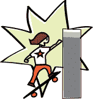
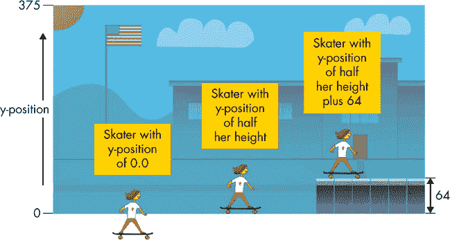
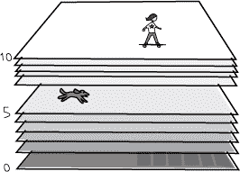
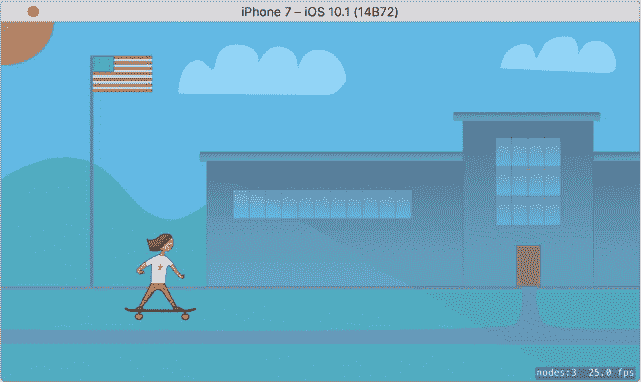
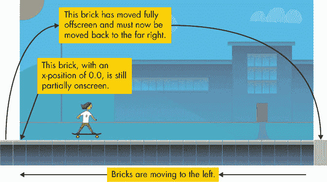
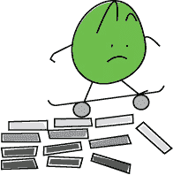
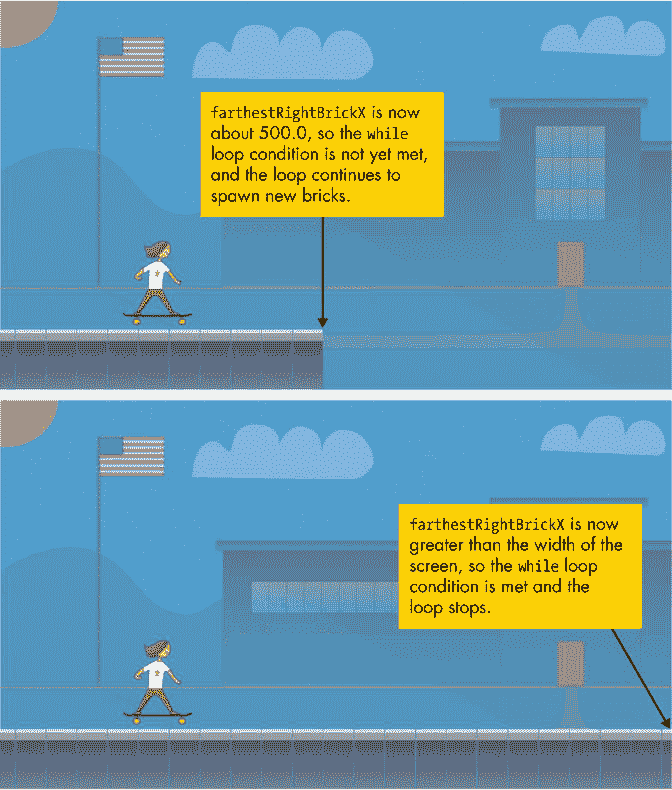
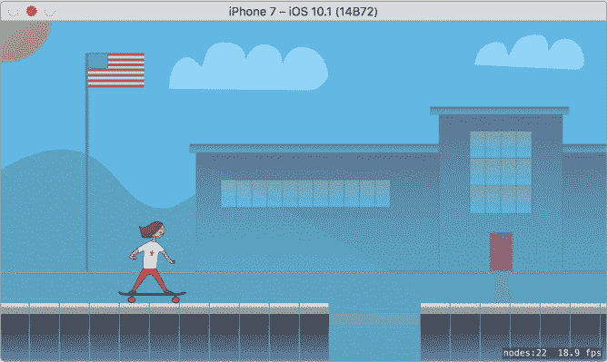
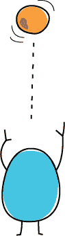
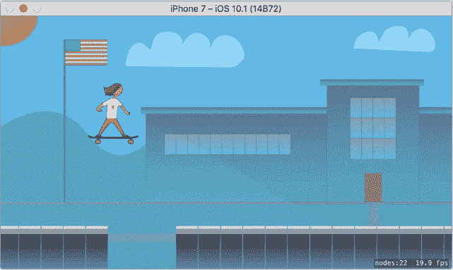

## 第十五章：## 让 *SchoolhouseSkateboarder* 成为一款真正的游戏


在本章中，我们将加入我们的英雄——滑板选手。我们将使用一个小技巧让她看起来像是在移动：我们将移动她脚下的地面。接着，我们会为游戏加入跳跃功能，这样当玩家点击屏幕时，滑板选手就会跳跃。为了实现这一切，我们将创建我们自己的自定义精灵子类，并添加一个游戏循环，让所有的动作都在其中发生。

### 我们的英雄，滑板选手

现在是时候将滑板选手加入我们的游戏了。和我们之前对背景图像所做的一样，我们将创建一个精灵，将其放置在屏幕上，然后将其添加到场景中。为了创建精灵，我们使用 SKSpriteNode 类。

我们的滑板选手需要一些额外的属性来跟踪诸如当前速度（速率）和是否在地面上的信息。由于 SKSpriteNode 没有这些属性，我们将创建一个自定义的 SKSpriteNode 子类，命名为 Skater。这样我们就可以向这个精灵添加任何额外的属性，同时保留所有内建的 SKSpriteNode 属性。

#### 创建一个滑板选手精灵类

为了创建 Skater 类，在项目导航器中右键点击 *SchoolhouseSkateboarder* 文件夹，然后选择**新建文件…**。在下一个界面中，选择 iOS 模板中的 **Cocoa Touch 类**，然后点击 **下一步**。输入 Skater 作为类名，选择 SKSpriteNode 作为我们要继承的类。

点击**下一步**，然后在最后一屏点击**创建**以确认文件位置。现在你会看到你新的 Skater 类已出现在项目导航器和编辑器面板中。

#### 导入 SpriteKit

当你创建一个 SpriteKit 类的子类时，例如 SKSpriteNode，你需要在代码顶部添加一个语句来导入 SpriteKit，而不是 UIKit。为了导入 SpriteKit 库，需要将新建的 Skater 类（*Skater.swift*）顶部这一行改成：

```
import
 UIKit
```

改成这样：

```
import
 SpriteKit
```

导入 SpriteKit 后，所有 SpriteKit 类和方法都可以在 *Skater.swift* 文件中使用。如果你在没有先导入 SpriteKit 的情况下尝试使用 SpriteKit 类或方法，你会看到类似“使用未声明类型”的错误。

#### 向滑板选手类添加自定义属性

现在我们已经导入了 SpriteKit 库，接下来让我们在现有的大括号内为新的 Skater 类添加一些属性：

*Skater.swift*

```
import SpriteKit

class Skater: SKSpriteNode {

 ➊
 var
 velocity = CGPoint
 .zero

 ➋
 var
 minimumY: CGFloat
 = 0.0

 ➌
 var
 jumpSpeed: CGFloat
 = 20.0

 ➍
 var
 isOnGround = true

}

```

很快我们将向游戏场景中添加代码，使滑板选手能够跳跃，所以我们需要这些属性来跟踪滑板选手的运动。

名为 velocity 的变量是一个 CGPoint，初始化时为 CGPoint.zero ➊。这是一个快捷方式，用来指定一个 x 和 y 值都为 0.0 的点。它等同于使用 CGPoint(x: 0.0, y: 0.0)。Velocity 代表速度，所以这个变量将用于跟踪滑板选手在 x 轴（左右）和 y 轴（上下）的速度。例如，当滑板选手跳跃时，velocity 的 y 值将决定她向上移动的速度。

变量 minimumY 是一个 CGFloat，用于指定地面的 y 坐标 ➋。所以当滑冰者跳跃时，我们就知道她在下落时应该停止的 y 坐标。

变量 jumpSpeed 是一个 CGFloat，用于指定滑冰者跳跃的速度 ➌。我们给它设置了一个初始值 20.0。目前这个值只是一个估算，如果我们发现滑冰者跳得太快或太慢，可能会调整这个值。

**注意**

*注意，当我们写出 var minimumY: CGFloat = 0.0 和 var jumpSpeed: CGFloat = 20.0 时，我们指定了类型为 CGFloat。每次创建一个 CGFloat 变量或常量时，你都需要这样做，否则 Xcode 会推断该类型为 Double*。*

最后，变量 isOnGround 是一个 Bool，用来追踪滑冰者是否当前在地面上 ➍。如果她在地面上，就可以跳跃；如果她不在地面上（也就是说，如果她已经在跳跃），她就不能再次跳跃，直到她落回地面。

#### 在场景中创建滑冰者的实例

现在是时候切换回 *GameScene.swift* 文件，并添加一个滑冰者精灵了。在 GameScene 类的花括号内，didMove(to:) 方法之前添加以下代码：

*GameScene.swift*

```
import SpriteKit

class GameScene: SKScene {

    // The hero of the game, the skater, is created here

    let
 skater = Skater
 (imageNamed: "skater"
 )

    override func didMove(to view: SKView) {

```

这一行创建了一个名为 skater 的新类属性，它是我们新类 Skater 的一个实例。它使用了图片 *skater.png*，你应该已经下载并将其添加到你的资产目录中（详见第十四章）。由于 skater 是一个类属性（在类声明内部但在任何函数外部创建），因此它可以在 GameScene 类中的任何方法内部使用。

请注意，创建一个精灵并不会让它显示在屏幕上。你总是需要将精灵作为场景的子对象或另一个精灵的子对象添加到场景中，稍后我们会这样做。你会看到精灵的常见模式：1）创建精灵，2）设置精灵的位置和初始值，3）调用 addChild() 方法将精灵添加到场景中。到目前为止，我们只创建了精灵。接下来，我们将在调用 addChild() 方法将滑冰者添加到场景之前，设置精灵的位置和值。

#### 设置滑冰者

为了设置滑冰者精灵的位置和其他初始值，我们将创建一个名为 resetSkater() 的独立方法。我们希望将这段设置代码放在一个独立的方法中，这样每当我们需要将滑冰者重置到她的初始位置（例如，当游戏需要重启时），就可以重复使用这个方法。

在现有的 didMove(to:) 方法下方编写以下方法：

*GameScene.swift*

```
  override func didMove(to view: SKView) {

  --
 *snip* 
 --

  }

  func
 resetSkater() {

      // Set the skater's starting position, zPosition, and minimumY

   ➊
 let
 skaterX = frame
 .midX
 / 2.0

   ➋
 let
 skaterY = skater
 .frame
 .height
 / 2.0
 + 64.0

   ➌
 skater
 .position
 = CGPoint
 (x: skaterX, y: skaterY)

   ➍
 skater
 .zPosition
 = 10

   ➎
 skater
 .minimumY
 = skaterY

  }

  override func update(_ currentTime: TimeInterval) {

      // Called before each frame is rendered

  }

}

```

该方法为溜冰者精灵执行了一些基本的设置。首先，我们通过使用 frame.midX 找到场景框架中间的 x 值并将其除以二来确定溜冰者的 x 位置 skaterX ➊。这样会将溜冰者放置在场景的左侧，这将给玩家时间应对来自右侧的障碍物。如果我们将溜冰者放置在屏幕的正中央，玩家可能没有足够的时间看到障碍物，然后跳跃避开。记住，溜冰者将保持在屏幕的相同 x 位置，因为我们将为她下面的地面做动画，让她看起来像是在移动。



在 ➋，我们通过将溜冰者精灵的高度的一半加上 64 来计算溜冰者的 y 位置。在 SpriteKit 中，y 位置随着屏幕向上移动而增加（与 UIKit 应用不同，后者的 y 位置为 0.0 时表示屏幕的顶部）。此外，当我们设置精灵的位置时，实际上是设置该精灵的*中心*应该在哪里。因此，如果我们将精灵放置在 y 位置为 0.0 的位置，精灵的一半会在屏幕上，另一半会在屏幕外。因此，为了将物体放置在屏幕的底部（但不让它悬挂在屏幕外），我们需要将其 y 位置设置为其高度的一半。最后，为了考虑人行道的高度（为 64），我们将 64 添加到溜冰者的 y 位置。图 15-1 显示了 SpriteKit 中 y 位置的工作方式。



*图 15-1：设置精灵的 y 位置*

现在我们已经计算了溜冰者的 x 和 y 位置，我们通过创建一个使用这些值的 CGPoint 来设置溜冰者的起始位置 ➌。

溜冰者精灵的 zPosition 设置为 10 ➍。为了理解 zPosition，想象你正在堆叠一堆纸。堆叠得越高的纸，其 zPosition 就越高，并且会*位于*任何 zPosition 较低的物体之上。两个或多个精灵可能拥有相同的 zPosition，在这种情况下，后添加的精灵会位于上方。

当我们添加背景精灵时，我们没有设置 zPosition，因此它处于默认的 zPosition 为 0（堆栈的底部）。由于我们希望溜冰者位于背景图像之上，因此我们设置了 zPosition 为 10。这样，我们仍然可以在溜冰者和背景之间放置其他物体（与将溜冰者的 ZPosition 设置为 1 时不同）。如果我们想添加一只在场景中走动的狗，我们可以将它放置在 zPosition 为 5，它将位于溜冰者的后面，但在背景图像之前。



最后，在 ➎，我们将溜冰者精灵的 minimumY 变量设置为与其 y 位置相同。在游戏过程中，溜冰者将跳跃，因此她的 y 位置会发生变化，但现在我们将始终有这个 minimumY 变量来指示她在地面上的 y 位置应该是多少。

#### 在屏幕上看到溜冰者

现在我们准备好将滑板者添加到场景中了！在 didMove(to:) 方法中，在现有代码下方添加以下几行：

```
override func didMove(to view: SKView) {

    --
 *snip* 
 --

    addChild(background)

    // Set up the skater and add her to the scene

    resetSkater
 ()

    addChild
 (skater
 )

}

```

现在，当游戏场景首次呈现时，我们的滑板精灵将被设置并作为场景的子节点添加。你的整个 GameScene 类现在应该是这样的：

*GameScene.swift*

```
import
 SpriteKit

class
 GameScene: SKScene
 {

   // The hero of the game, the skater, is created here

   let
 skater = Skater
 (imageNamed: "skater"
 )

   override
 func
 didMove(to view: SKView
 ) {

       anchorPoint
 = CGPoint
 .zero

       let
 background = SKSpriteNode
 (imageNamed: "background"
 )

       let
 xMid = frame
 .midX

       let
 yMid = frame
 .midY

       background.position
 = CGPoint
 (x: xMid, y: yMid)

       addChild
 (background)

       // Set up the skater and add her to the scene

       resetSkater
 ()

       addChild
 (skater
 )

   }

   func
 resetSkater() {

       // Set the skater's starting position, zPosition, and minimumY

       let
 skaterX = frame
 .midX
 / 2.0

       let
 skaterY = skater
 .frame
 .height
 / 2.0
 + 64.0

       skater
 .position
 = CGPoint
 (x: skaterX, y: skaterY)

       skater
 .zPosition
 = 10

       skater
 .minimumY
 = skaterY

   }

   override
 func
 update(_
 currentTime: TimeInterval
 ) {

       // Called before each frame is rendered

   }

}
```

现在，使用 iPhone 7 模拟器，通过按 ⌘ -R 来运行游戏。你应该看到类似于图 15-2 的内容。



*图 15-2：我们的主角首次亮相！*

恭喜！你已经设置好了滑板精灵和滑板者的起始位置。看起来很棒，对吧？我们很快会添加人行道并让她沿着它滑行，但首先我们先来谈谈 SpriteKit 的调试工具。

#### 理解 SpriteKit 的调试信息

注意到模拟器右下角的小字了吗？它应该显示类似于 nodes:3 25.0 fps 的内容。这些是有关游戏中发生情况的有用信息。在 SpriteKit 中，屏幕上显示的大多数内容被称为*节点*。这个显示告诉我们，目前有三个 SpriteKit 节点正在显示。这是合理的，因为我们有 GameScene 本身、背景图像和滑板精灵。

知道当前显示了多少节点，可以帮助你调试代码中的问题。例如，如果你的游戏变慢了，你可以查看调试信息，看到节点数量不断增加。这会告诉你，可能是你添加了太多精灵，并且在不需要时没有将它们移除。

显示屏还告诉我们，游戏当前以每秒 25 帧（具体数字可能因电脑速度不同而有所不同）运行。电影由许多*帧*（或图像）组成，当它们被快速播放时，就会呈现出动画或运动的效果。游戏也是如此！我们的游戏每秒更新 25 次场景及其节点。由于没有节点在移动，所以你实际上无法察觉，但每秒屏幕都会被完全重绘 25 次。当我们在下一部分加入人行道砖并让它们移动时，动画的魔力将使这一切变得非常明显。

### 撞砖块

当滑板者沿着人行道滑行时，她实际上并不会向右移动。相反，我们将不断在屏幕的右侧添加砖块，这些砖块将向左移动。这是一个巧妙的技巧，用来创造滑板者向右移动的假象。

#### 创建人行道砖

每次我们将一块砖加入场景时，我们也会将它添加到一个数组中，便于追踪所有的砖块。一旦一块砖移动到屏幕的左边缘，我们就会从数组中移除它，并从场景中删除它。移除不再需要的精灵非常重要，否则节点数量会不断增加，游戏引擎仍然会追踪场景中的每个节点，导致游戏变慢！

在 GameScene 的顶部添加创建这个类属性的代码，就在我们创建滑板车的位置上方：

*GameScene.swift*

```
class GameScene: SKScene {

    // An array that holds all the current sidewalk bricks

    var
 bricks = [SKSpriteNode
 ]()

    // The hero of the game, the skater, is created here

```

这会创建一个名为 bricks 的类变量，并将其赋值为空的精灵数组（因为我们的砖块将是精灵）。就在它下面，添加以下代码：

```
class GameScene: SKScene {

    --
 *snip* 
 --

    var bricks = [SKSpriteNode]()

    // The size of the sidewalk brick graphics used

    var
 brickSize = CGSize
 .zero

    // The hero of the game, the skater, is created here

```

这个 brickSize 变量正如它的名字所示，用来设置每个砖块的大小。当我们移动砖块时，它会非常有用。现在我们将 brickSize 设置为 CGSize.zero，因为我们还不知道实际的砖块大小是什么。一旦我们创建了砖块精灵，我们会将 brickSize 设置为这些精灵的实际大小。

我们需要另一个类属性 scrollSpeed 来跟踪砖块的移动速度。在 brickSize 声明下方添加以下代码：

```
    --
 *snip* 
 --

    var brickSize = CGSize.zero

    // Setting for how fast the game is scrolling to the right

    // This may increase as the user progresses in the game

    var
 scrollSpeed: CGFloat
 = 5.0

    // The hero of the game, the skater, is created here

```

再次提醒，记得指定 CGFloat 数据类型。否则，Xcode 会推断变量是 Double 类型。

现在我们要添加一个方法来创建一个新的街道砖块。由于我们将显示很多街道砖块，这个方法将节省时间。在游戏中，当某个新物体出现在屏幕上时，它被称为*生成*，所以我们将用这个词来指代我们的这个方法。在 resetSkater()方法下方，添加以下方法：

```
➊
 func
 spawnBrick(atPosition position: CGPoint
 ) -> SKSpriteNode
 {

      // Create a brick sprite and add it to the scene

    ➋
 let
 brick = SKSpriteNode
 (imageNamed: "sidewalk"
 )

    ➌
 brick.position
 = position

    ➍
 brick.zPosition
 = 8

    ➎
 addChild
 (brick)

      // Update our brickSize with the real brick size

    ➏
 brickSize
 = brick.size

      // Add the new brick to the array of bricks

    ➐
 bricks
 .append
 (brick)

      // Return this new brick to the caller

    ➑
 return
 brick

  }
```

在➊，我们的 spawnBrick(atPosition:)方法接受一个 CGPoint 作为输入（这样它就知道该将砖块放置在哪里），并返回新创建的砖块精灵。注意，我们为位置参数使用了自定义的参数标签 atPosition。这样，当我们调用这个方法时，代码更加可读——我们可以看到我们正在请求在特定位置生成一个砖块。

我们使用名为*sidewalk.png*的图像创建砖块精灵作为 SKSpriteNode➋。在➌，新的砖块精灵被放置在传递给方法的位置。在➍，砖块精灵被赋予一个 zPosition 值为 8。记住，我们将背景图像的 zPosition 设置为 0，滑板车精灵的 zPosition 设置为 10，因此这些街道砖块将始终位于背景图像之上，但在滑板车精灵之后。

之后，我们的砖块被添加到场景中➎（否则它不会显示）。在➏这一行，我们将 brickSize 类属性设置为这个新砖块的大小，基于*sidewalk.png*的实际大小，这在稍后的代码中会很有用。在➐，我们将我们的砖块精灵添加到之前创建的砖块数组中。最后，在➑，我们将新的砖块精灵返回给调用该方法的代码。

#### 更新街道砖块

现在我们有了一些创建砖块的代码，我们需要一个方法来遍历所有屏幕上的砖块并将它们向左移动。这个方法会被频繁调用（每秒 25 次或更多），所以它每次只需要移动砖块一点点。我们将通过传入砖块移动的量作为参数，这样当滑板车加速时可以调整移动量。（这就是我们随着时间推移使游戏变得更难的方法！）在 spawnBrick(atPosition:)方法下方添加以下方法声明：

*GameScene.swift*

```
func
 updateBricks(withScrollAmount currentScrollAmount: CGFloat
 ) {

}
```

这个方法将是我们迄今为止最大的，因此我们将逐步讲解它。在方法的大括号内，添加以下内容：

```
func updateBricks(withScrollAmount currentScrollAmount: CGFloat) {

    // Keep track of the greatest x-position of all the current bricks

    var
 farthestRightBrickX: CGFloat
 = 0.0

}

```

这是一个变量，我们将用它来追踪最右侧砖块的 x 位置。这样我们就能知道何时该在右边缘添加另一个砖块，以及该如何定位新砖块。在此之下，添加以下代码块：

```
func updateBricks(withScrollAmount currentScrollAmount: CGFloat) {

    --
 *snip* 
 --

    var farthestRightBrickX: CGFloat = 0.0

 ➊
 for
 brick in
 bricks
 {

    ➋
 let
 newX = brick.position
 .x
 - currentScrollAmount

      // If a brick has moved too far left (off the screen), remove it

    ➌
 if
 newX < -brickSize
 .width
 {

       ➍
 brick.removeFromParent
 ()

       ➎
 if
 let
 brickIndex = bricks
 .index
 (of:
 brick) {

          ➏
 bricks
 .remove
 (at:
 brickIndex)

         }

    ➐
 } else
 {

          // For a brick that is still onscreen, update its position

        ➑
 brick.position
 = CGPoint
 (x:
 newX, y:
 brick.position
 .y
 )

          // Update our farthest-right position tracker

        ➒
 if
 brick.position
 .x
 > farthestRightBrickX {

           ➓
 farthestRightBrickX = brick.position
 .x

          }

       }

     }

}

```

这段代码通过在➊处使用 for-in 循环遍历我们砖块的数组。第➋行通过从砖块的 x 位置中减去传入的 currentScrollAmount 来计算一个新的 x 位置。这个 newX 表示一个新的位置，它稍微在当前砖块位置的左侧。

接下来，在➌处，我们使用 if 语句检查这个 newX 位置是否会使砖块移出屏幕，方法是检查它是否小于砖块宽度的负值(-brickSize.width)。为什么不直接检查 newX 是否小于 0.0 呢？请记住，当你设置精灵的位置时，你是在告诉计算机将精灵的*中心*放置在哪个位置。因此，当 x 位置为 0.0 时，砖块仍然部分出现在屏幕上。检查砖块的位置是否小于-brickSize.width 可以确保砖块完全离开屏幕之后再移除它。图 15-3 展示了砖块的移动方式。



*图 15-3：砖块被向左移动，直到它们完全离开屏幕。*

不再需要的精灵应该被移除，以便应用程序不必浪费资源来追踪多余的节点。第➍行正是这样做的。要从场景中移除精灵，我们在精灵上调用 removeFromParent()方法。当精灵被从场景中移除后，它将消失。因此，我们希望在移除之前确保它完全离开了屏幕，否则它看起来就像突然消失了一样。

在移除砖块精灵时，我们还需要做一点清理工作：我们需要将它从砖块数组中移除，因为我们希望这个数组只包含仍在屏幕上的砖块。第➎行通过测试该砖块精灵在数组中的索引是否被找到，来检查该砖块精灵是否在我们的砖块数组中。接着，第➏行使用这个索引将精灵从砖块数组中移除。

现在我们已经处理了移出屏幕的砖块，接下来可以在➐处使用 else 块来处理仍然在屏幕上的砖块。第➑行通过使用我们计算得到的 newX 来创建一个 CGPoint，并为砖块精灵设置新的 x 位置。我们希望砖块仅向左移动，而不是上下移动，因此我们不会改变它们的 y 位置。

我们在 else 块中需要做的最后一件事是更新 `farthestRightBrickX` 变量。为此，我们检查当前砖块精灵的新 x 坐标是否大于 ➒ 处的 `farthestRightBrickX` 值。如果是，我们将 `farthestRightBrickX` 设置为这个砖块精灵的 x 坐标 ➓。这样，当 for-in 循环结束并且我们遍历完所有砖块时，`farthestRightBrickX` 的值将等于最右边砖块的 x 坐标。

#### 用砖块填满屏幕

在重新定位所有砖块后，我们需要检查是否是时候添加新的砖块了。由于我们的砖块是从右向左滚动的，我们会不断有砖块从左侧离开屏幕并被移除，同时新砖块需要在屏幕的右侧生成。如果我们不继续生成新的砖块，滑板者很快就会没有人行道可走了！

为了在右侧生成新的砖块，我们需要在更新方法 `Bricks(withScrollAmount:)` 中添加一段代码。在你刚刚添加的 for-in 循环下面，添加以下代码：



*GameScene.swift*

```
func updateBricks(withScrollAmount currentScrollAmount: CGFloat) {

    --
 *snip* 
 --

    for brick in bricks {

        --
 *snip* 
 --

    }

    // A while loop to ensure our screen is always full of bricks

 ➊
 while
 farthestRightBrickX < frame
 .width
 {

    ➋
 var
 brickX = farthestRightBrickX + brickSize
 .width
 + 1.0

    ➌
 let
 brickY = brickSize
 .height
 / 2.0

   }

}

```

我们已经知道最右边砖块的 x 坐标，来自我们之前的代码段。现在，我们使用一个 while 循环 ➊ 来生成砖块，每当我们发现最右边砖块的位置小于场景宽度时，就会生成一个砖块。这个循环会一直执行，直到我们有足够的砖块填满屏幕，一直延伸到右边缘。在 while 循环中，我们需要创建一个新的砖块精灵并将其添加进去。

首先，我们计算新精灵的位置。➋ 这一行通过将一个完整砖块的宽度加到当前最右边位置，再加一个额外的 1 点间隙，来确定新砖块精灵的 x 坐标。这个额外的 1 点间隙会在每个砖块之间留下一小段空隙，使得砖块的运动更容易看到。（稍后可以试试看没有 +1.0 间隙时人行道的效果。）➌ 这一行通过将砖块的高度除以 2 来计算新砖块精灵的 y 坐标。这将把砖块放置在屏幕的底部边缘。稍后我们会调整这个 y 坐标，让玩家需要跳起来才能到达更高的人行道。目前，我们只是将所有砖块放置在底部边缘，就像普通的人行道一样。

#### 留出跳跃的间隙

在我们定位砖块时，让我们让游戏对玩家来说更有趣。接下来的代码将给人行道添加一些随机的间隙，玩家需要跳过这些间隙。将以下代码添加到 while 循环中，`let brickY` 这一行下面：

*GameScene.swift*

```
     let brickY = brickSize.height / 2.0

     // Every now and then, leave a gap the player must jump over

   ➊
 let
 randomNumber = arc4random_uniform
 (99
 )

   ➋
 if
 randomNumber < 5
 {

        // There is a 5 percent chance that we will

        // leave a gap between bricks

      ➌
 let
 gap = 20.0
 * scrollSpeed

      ➍
 brickX += gap

     }

     // Spawn a new brick and update the rightmost brick

   ➎
 let
 newBrick = spawnBrick
 (atPosition: CGPoint
 (x:
 brickX, y:
 brickY))

   ➏
 farthestRightBrickX = newBrick.position
 .x

  }

}

```

在游戏中加入随机元素很重要，它能防止游戏玩法变得可预测。我们通过要求计算机生成一个随机数来实现随机性，这就像投掷骰子一样。函数 arc4random_uniform() 是创建随机整数的一个好方法，只需传入一个整数作为随机数的最大值。➊ 这一行通过这个函数生成了一个介于 0 和 99 之间的随机整数。这就像投掷一个 100 面的骰子，因为 0 到 99 之间有 100 个可能的数字。接下来，我们在 ➋ 使用 if 语句来检查这个数字是否小于 5。这意味着 if 语句内部的代码有 5% 的概率会执行。

➌ 这一行计算了要创建的间隙大小。随着滑冰者速度的增加，我们希望间隙越来越大，因此这个间隙的大小设置为 20.0 倍的滚动速度。随着速度的提高，间隙将变得更大。最后，➍ 这一行将这个间隙加到我们的 brickX 变量中。现在当我们设置砖块的位置时，它不再紧挨着前一个砖块，而是被放置得更远，形成了一个间隙。

在确定了新砖块的 x 和 y 坐标后，我们在 ➎ 创建了一个新的砖块。由于我们把这个新砖块添加在所有现有砖块的右侧，所以我们将 farthestRightBrickX 设置为这个新砖块的 x 坐标。这样我们就为 while 循环创建了退出条件。图 15-4 展示了 while 循环是如何工作的。



*图 15-4：while 循环不断添加砖块，直到填满屏幕的宽度。*

一旦足够的砖块被添加，并且 farthestRightBrickX 大于或等于场景的宽度，while 循环就会停止执行。

### 游戏循环

是时候将所有内容整合起来，编写主游戏循环了。游戏循环是一段代码，游戏引擎（SpriteKit）将在游戏运行时反复执行它。我们将在这里更新所有精灵的位置，创建游戏中的实际动画。所有的 SpriteKit 场景都有一个叫做 update(_:) 的方法，我们必须重写这个方法来更新精灵的位置。

#### 跟踪更新时间

然而，在编写主游戏循环代码之前，我们需要添加一个类属性，用来跟踪上次更新发生的时间。在 GameScene 类中，添加一个可选的 lastUpdateTime 属性，紧接着 scrollSpeed 之后：

*GameScene.swift*

```
var scrollSpeed: CGFloat = 5.0

// The timestamp of the last update method call

var
 lastUpdateTime: TimeInterval
 ?

// The hero of the game, the skater, is created here

```

我们的 update(_:) 方法将非常频繁地被调用，大约每秒 30 次。注意，我并没有说是每秒 *精确* 30 次。游戏引擎将尝试每秒调用 30 次 update(_:) 方法，但不能保证每秒确切运行这么多次。在某些设备上，实际上会瞄准每秒 60 次。所以我们需要跟踪每次更新之间 *实际* 经过的时间，以确保一切动画流畅进行。我们不希望我们的滑冰者看起来像是在不断加速和减速，仅仅因为这个方法没有在精确的时间间隔内被调用。通过跟踪已过去的时间，我们可以调整每次更新中精灵的移动量，确保它们平滑移动。

#### 计算每次更新的经过时间

当我们首次使用游戏模板创建这个项目时，系统会自动添加一个空的 update(_:) 方法。在这个方法中，添加以下代码来计算自上次更新以来已过去的时间：

*GameScene.swift*

```
override func update(_ currentTime: TimeInterval) {

    // Determine the elapsed time since the last update call

 ➊
 var
 elapsedTime: TimeInterval
 = 0.0

 ➋
 if
 let
 lastTimeStamp = lastUpdateTime
 {

    ➌
 elapsedTime = currentTime - lastTimeStamp

   }

}

```

第➊行创建了一个 TimeInterval 数据类型的 elapsedTime 变量。TimeInterval 是一种用于跟踪时间间隔（以秒为单位）的 Double 数据类型。就像创建 CGFloat 一样，我们需要指定这是一个 TimeInterval，否则 Xcode 会使用类型推断假设这是一个普通的 Double。第➋行解包 lastUpdateTime（如果存在的话）。它是一个可选类型，因为在游戏开始时不会有上次更新时间。因此，第一次调用 update(_:) 方法时，lastUpdateTime 会是 nil。如果我们能够解包它，那么第➌行将计算 elapsedTime，它表示自上次更新调用以来已过去的时间。

现在将以下行添加到 update(_:) 方法中，将 lastUpdateTime 设置为当前时间：

```
override func update(_ currentTime: TimeInterval) {

    --
 *snip* 
 --

        elapsedTime = currentTime - lastTimeStamp

    }

    lastUpdateTime
 = currentTime

}

```

这确保下次调用 update(_:) 方法时，我们的 lastUpdateTime 变量将是准确的。

#### 通过经过时间调整滚动速度

接下来，我们将计算滚动速度。将以下代码添加到你的 update(_:) 方法中：

*GameScene.swift*

```
override func update(_ currentTime: TimeInterval) {

    --
 *snip* 
 --

    lastUpdateTime = currentTime

 ➊
 let
 expectedElapsedTime: TimeInterval
 = 1.0
 / 60.0

   // Here we calculate how far everything should move in this update

 ➋
 let
 scrollAdjustment = CGFloat
 (elapsedTime / expectedElapsedTime)

 ➌
 let
 currentScrollAmount = scrollSpeed
 * scrollAdjustment

}

```

第➊行计算预期的时间间隔。由于应用程序可能在实际 iOS 设备上以每秒 60 帧的速度运行（尽管在 iOS 模拟器中可能会少于 60 帧），每次调用 update(_:) 时应该大约经过 1/60 秒。我们在这里添加的代码将确保无论使用哪种设备（或模拟器），滑冰者看起来移动的速度都相同。

第➋行通过将实际经过的时间除以预期经过的时间来计算滚动调整因子。如果经过的时间比预期的时间更长（超过 1/60 秒），该因子将大于 1.0。如果经过的时间比预期的时间更短，则该因子将小于 1.0。第➌行通过将滚动速度乘以此调整因子来确定此更新的滚动速度。

#### 更新砖块

在 update(_:) 方法中添加以下代码行：

*GameScene.swift*

```
override func update(_ currentTime: TimeInterval) {

    --
 *snip* 
 --

    let currentScrollAmount = scrollSpeed * scrollAdjustment

    updateBricks
 (withScrollAmount: currentScrollAmount)

}

```

现在我们已经计算出了这个更新的正确滚动量，我们调用 updateBricks(_:) 方法并传入计算出的滚动量。

现在是测试应用程序的好时机。按 ⌘ -R 运行应用程序并查看会发生什么！你的屏幕应该看起来像图 15-5。



*图 15-5：我们的滑冰者现在正在人行道上滑行！*

现在看起来像是滑冰者正在人行道上滑行。你可以看到人行道的砖块从右向左移动，偶尔（每次砖块生成时有 5% 的几率）会出现一个间隙。注意右下角的节点数量应该保持相对稳定，这说明我们正确地移除了已经离开屏幕的砖块。如果这个数字持续增加，那就说明我们忘记移除它们了。虽然现在看起来更像个游戏了，但滑冰者依然会直接滑过间隙。让我们赋予她跳跃的能力。

### 向上，向上，起飞——让滑冰者跳跃

我们将添加代码，当玩家轻击屏幕时，滑冰者就会跳跃。为了知道何时玩家轻击，我们将使用*轻击手势识别器*。表 15-1 显示了你可以用来识别用户进行特定操作的常见手势识别器类型。

**表 15-1：** 常见的手势识别器

| **手势** | **手势识别器** | **它检测的动作** |
| --- | --- | --- |
| 轻击 | UITapGestureRecognizer | 一根或多根手指在屏幕上轻击一次或多次 |
| 捏合 | UIPinchGestureRecognizer | 用两根手指捏合，通常用于放大或缩小 |
| 刮动 | UISwipeGestureRecognizer | 一根或多根手指在屏幕上滑动 |
| 平移 | UIPanGestureRecognizer | 一根或多根手指在屏幕上任意方向移动 |
| 长按 | UILongPressGestureRecognizer | 一根或多根手指在屏幕上按住一段时间 |

我们想要知道轻击事件，因此我们将使用 UITapGestureRecognizer。每次用户在屏幕上点击时，轻击手势识别器将调用我们选择的方法。

#### 使用轻击手势识别器

要使用手势识别器，只需创建它并将其添加到视图中。在 didMove(to:) 方法的末尾添加以下代码，以创建并添加轻击手势识别器：

*GameScene.swift*

```
override func didMove(to view: SKView) {

    --
 *snip* 
 --

    addChild(skater)

    // Add a tap gesture recognizer to know when the user tapped the screen

 ➊
 let
 tapMethod = #selector
 (GameScene
 .handleTap
 (tapGesture:))

 ➋
 let
 tapGesture = UITapGestureRecognizer
 (target: self
 , action: tapMethod)

 ➌
 view.addGestureRecognizer
 (tapGesture)

}

```

通过这段代码，用户每次轻击屏幕时，handleTap(_:) 方法将会在我们的游戏场景中被调用。首先，我们创建一个名为 tapMethod ➊ 的*选择器*。选择器是指向方法名称的引用。接下来，我们会添加一个新方法 handleTap(_:)，而这个常量 tapMethod 只是指向该方法的引用。这将允许我们告诉轻击手势识别器在用户点击屏幕时应该调用哪个方法。

在 ➋ 处，我们创建了一个点击手势识别器。它的初始化器需要一个目标和一个选择器。目标告诉手势识别器哪个类包含选择器，选择器则是要调用的方法。由于我们将在当前的 GameScene 类中添加 handleTap(_:) 方法，我们使用 self 来引用这个类。

最后，➌ 处的代码将新的手势识别器添加到场景的视图中。手势识别器必须添加到视图中，否则它将不会起作用。我们将这段代码放在 didMove(to:) 方法中，因为手势识别器只需要添加到视图一次，它会一直处理手势，直到你将其移除。

现在我们只需要添加这个 handleTap(_:) 方法！在现有的 update(_:) 方法下方添加这个新方法：

```
override func update(_ currentTime: TimeInterval) {

    --
 *snip* 
 --

}

func
 handleTap(tapGesture: UITapGestureRecognizer
 ) {

   // Make the skater jump if player taps while the skater is on the ground

 ➊
 if
 skater.isOnGround {

      // Set the skater's y-velocity to the skater's initial jump speed

    ➋
 skater.velocity = CGPoint(x: 0.0
 , y: skater.jumpSpeed)

      // Keep track of the fact that the skater is no longer on the ground

    ➌
 skater.isOnGround = false

  }

}
```

当用户点击屏幕时，我们需要确保滑冰者处于地面上，因此我们使用 if 语句在 ➊ 处进行检查。如果滑冰者已经在空中，她就不能再次跳跃（除非有喷气背包）。➋ 处的代码设置了滑冰者精灵的速度，使得 x 速度仍然为 0.0，y 速度等于精灵的 jumpSpeed（我们在 Skater 类中定义了它）。这使得滑冰者能够垂直跳跃。接下来，我们在 ➌ 处将滑冰者精灵的 isOnGround 属性设置为 false，因为一旦她开始跳跃，就不再处于地面，直到她落地之前不能再次跳跃。

#### 以简单的方式模拟重力

设置滑冰者的速度并不会让她跳跃。我们需要在 update(_:) 方法中使用这个速度来更新滑冰者的 y 位置。首先，我们需要在类的顶部，在 var scrollSpeed 的声明下方添加一个新的类属性 gravitySpeed，如下所示。

*GameScene.swift*

```
var scrollSpeed: CGFloat = 5.0

// A constant for gravity, or how fast objects will fall to Earth

let
 gravitySpeed: CGFloat
 = 1.5

// The timestamp of the last update method call

```

我们将使用这个常量来确定滑冰者跳跃时下落的速度。现在，在 updateBricks(_:) 方法下方添加以下方法声明：

```
func
 updateSkater() {

}
```

我们将使用这个方法来更新滑冰者跳跃时的位置。在这个方法中添加以下代码：

```
func updateSkater() {

 ➊
 if
 !skater.isOnGround {

      // Set the skater's new velocity as it is affected by "gravity"

    ➋
 let
 velocityY = skater
 .velocity
 .y
 - gravitySpeed

    ➌
 skater
 .velocity
 = CGPoint
 (x: skater
 .velocity
 .x
 , y: velocityY)

      // Set the skater's new y-position based on her velocity

    ➍
 let
 newSkaterY: CGFloat
 = skater
 .position
 .y
 + skater
 .velocity
 .y

    ➎
 skater
 .position
 = CGPoint
 (x: skater
 .position
 .x
 , y: newSkaterY)

   }

}

```

首先，在 ➊ 处，我们使用 if 语句确保只有在滑冰者不在地面上时，才会使她向上或向下移动。如果她不在地面上，那么她一定是在跳跃。因此，我们需要将她向上移动（如果她正在向上跳跃）或向下移动（如果重力将她拉回地面）。



➋ 处的代码通过从当前的 y 速度中减去 gravitySpeed 来计算新的 y 速度。当她跳跃时，她的初始速度会很快且为正值。然后，重力会慢慢减小这个速度，直到她到达跳跃的顶峰。之后，速度会变成负数，滑冰者将向下落回地面。想象一下把一个球垂直向上抛出：它在上升时会有一个正的速度，逐渐减慢直到在抛物线的顶端瞬间停下。然后它会向下掉落，速度逐渐加快，直到你接住它或它落地。这一行代码模拟了重力的这种效果。

接下来，➌ 这一行用这个新值更新了滑板运动员的速度（但保持她的 x 速度不变，因为这个精灵实际上并不会左右移动）。现在我们已经更新了滑板运动员的速度，我们可以通过这个速度 ➍ 计算她的新的 y 位置。我们将滑板运动员的速度加到她当前的 y 位置上，这样就得到了她的新 y 位置。➎ 这一行设置了滑板运动员的新位置。

#### 检查着陆

我们在 updateSkater() 方法中需要做的最后一件事是检查滑板运动员是否着陆。将以下代码添加到方法的末尾：

*GameScene.swift*

```
func updateSkater() {

    --
 *snip* 
 --

        skater.position = CGPoint(x: skater.position.x, y: newSkaterY)

        // Check if the skater has landed

     ➊
 if
 skater.position
 .y
 < skater.minimumY {

        ➋
 skater
 .position
 .y
 = skater
 .minimumY

        ➌
 skater
 .velocity
 = CGPoint
 .zero

        ➍
 skater
 .isOnGround
 = true

       }

   }

}

```

➊ 这一行检查滑板运动员的 y 位置是否小于她的 minimumY，我们已经在 resetSkater() 方法中为其赋了一个值。如果为真，那么她就在地面上（或者在地面以下）。

每当滑板运动员重新着陆时，我们需要做三件事。在 ➋ 处，我们将她的 y 位置设置为 her minimumY 位置，以确保她不会掉到人行道下方。在 ➌ 处，我们将她的速度设置为零，因为地面应该阻止她再继续掉落。最后，在 ➍ 处，我们将她的 isOnGround 属性设置为 true，以便她可以再次跳跃。

现在，我们只需要为新的 updateSkater() 方法添加一个方法调用。在 update(_:) 方法的最后，添加以下代码：

```
  updateBricks(withScrollAmount: currentScrollAmount)

  updateSkater()

}

```

再次通过按 ⌘ -R 运行你的游戏，并尝试点击屏幕进行跳跃（在使用 iOS 模拟器时，点击屏幕与点击鼠标是一样的）。你的滑板运动员将跳跃，如图 15-6 所示。



*图 15-6：像任何一个自尊的滑板运动员一样，我们的主角终于可以进行奥利跳了！*

现在，当你点击屏幕时，滑板运动员会跳跃！点击屏幕会触发 handleTap(_:) 方法的调用，这要归功于我们的点击手势识别器。在那个方法中，我们设置了一个正的 y 速度。接着，在接下来的游戏循环调用或 update(_:) 方法中，滑板运动员精灵的速度将用来更新她的 y 位置，直到重力将她拉回地面。

### 你学到了什么

在本章中，你让《Schoolhouse Skateboarder》应用感觉更像一个游戏。你创建了 SKSpriteNode 的一个子类，使其成为一个专门的滑板运动员精灵，然后你将滑板运动员添加到游戏场景中。接着，你添加了一堆人行道砖块，并让它们生成、移动并消失，所有这些操作都是为了呈现滑板运动员在街道上滑行的效果。最后，你学习了如何使用速度和位置更新来让滑板运动员跳跃。

你可能已经注意到，当滑冰者经过砖块之间的空隙时，她会直接滑过去。为了让她掉进空隙，我们必须检测到滑冰者经过空隙的时机，并相应地调整她的 y 轴位置。这种方法可能会变得复杂，但有一个更好的方法：SpriteKit 内建了一个物理引擎，可以为你处理速度和位置的更新。在第十六章中，我们将使用 SpriteKit 的物理引擎来让《学校滑板者》游戏变得栩栩如生。

## 让《学校滑板者》成为一个真正的游戏


在本章中，我们将添加我们的英雄——滑板者。我们将使用一个小技巧让她看起来像在移动：我们将移动她下面的地面。然后，我们将为游戏添加跳跃功能，这样当玩家点击屏幕时，滑冰者就会跳跃。为了实现这一切，我们将创建我们自己的自定义精灵子类，并添加一个游戏循环，所有的动作都在其中发生。

### 我们的英雄，滑板者

现在是时候将滑冰者添加到我们的游戏中了。像我们对背景图像所做的那样，我们将创建一个精灵，将其放置到屏幕上，然后将其添加到场景中。要创建一个精灵，我们使用 SKSpriteNode 类。

我们的滑冰者需要一些额外的属性来跟踪事物，比如她当前的速度（速度）和她是否在地面上。由于 SKSpriteNode 没有这些属性，我们将创建一个名为 Skater 的 SKSpriteNode 子类。这将允许我们在此精灵上添加任何额外的属性，同时保留所有内建的 SKSpriteNode 属性。

#### 创建滑板者精灵类

要创建 Skater 类，右键点击项目导航器中的*SchoolhouseSkateboarder*文件夹，选择**New File…**。在下一个屏幕上，选择 iOS 模板中“Source”部分的**Cocoa Touch Class**模板，然后点击**Next**。输入 Skater 作为类名，选择 SKSpriteNode 作为我们要继承的类。

点击**Next**，然后在最后的屏幕上点击**Create**确认文件位置。现在你会看到新的 Skater 类已出现在项目导航器和编辑器面板中。

#### 导入 SpriteKit

当你创建一个 SpriteKit 类的子类（比如 SKSpriteNode）时，你需要在代码顶部添加一个语句，以导入 SpriteKit 库，而不是 UIKit 库。为了导入 SpriteKit 库，你需要将新 Skater 类的顶部代码（*Skater.swift*）中的这一行：

```
import
 UIKit
```

到此为止：

```
import
 SpriteKit
```

导入 SpriteKit 使得所有的 SpriteKit 类和方法可以在*Skater.swift*文件中使用。如果你尝试在没有导入 SpriteKit 的文件中使用 SpriteKit 类或方法，你将看到诸如“使用未声明的类型”的错误。

#### 为滑冰者类添加自定义属性

现在我们已经导入了 SpriteKit 库，让我们在现有的花括号内向新的 Skater 类添加一些属性：

*Skater.swift*

```
import SpriteKit

class Skater: SKSpriteNode {

 ➊
 var
 velocity = CGPoint
 .zero

 ➋
 var
 minimumY: CGFloat
 = 0.0

 ➌
 var
 jumpSpeed: CGFloat
 = 20.0

 ➍
 var
 isOnGround = true

}

```

很快我们将在游戏场景中添加代码来使滑冰者跳跃，因此我们需要这些属性来追踪滑冰者的动作。

名为 velocity 的变量是一个 CGPoint，初始化为 CGPoint.zero ➊。这是一个快捷方式，指定一个 x 和 y 值都为 0.0 的点。这与使用 CGPoint(x: 0.0, y: 0.0)是一样的。Velocity 表示速度，因此这个变量将追踪滑冰者在 x 方向（左右）和 y 方向（上下）的速度。例如，当滑冰者跳起来时，velocity 的 y 值将决定她上升的速度。

变量 minimumY 是一个 CGFloat，用来指定地面的 y 坐标 ➋。因此，当滑冰者跳跃时，我们知道她下落时应该停止的位置。

变量 jumpSpeed 是一个 CGFloat，用来指定滑冰者跳跃的速度 ➌。我们将其初始值设为 20.0。这只是暂时的猜测。如果我们发现滑冰者跳得太快或太慢，可能需要稍后调整这个值。

**注意**

*请注意，当我们写 var minimumY: CGFloat = 0.0 和 var jumpSpeed: CGFloat = 20.0 时，我们指定了类型为 CGFloat。在创建 CGFloat 变量或常量时，你始终需要这样做，否则 Xcode 会推断其类型为 Double*。

最后，变量 isOnGround 是一个布尔值，用来追踪滑冰者当前是否在地面上 ➍。如果她在地面上，她可以跳跃。如果她不在地面上（即，她已经在跳跃），她在回到地面之前不能再次跳跃。

#### 在场景中创建滑冰者实例

现在是时候切换回我们的*GameScene.swift*文件并添加一个滑冰者精灵了。请在 GameScene 类的大括号内，在 didMove(to:)方法之前添加以下代码：

*GameScene.swift*

```
import SpriteKit

class GameScene: SKScene {

    // The hero of the game, the skater, is created here

    let
 skater = Skater
 (imageNamed: "skater"
 )

    override func didMove(to view: SKView) {

```

这一行创建了一个名为 skater 的新类属性，它是我们新类 Skater 的一个实例。它使用的是图像*skater.png*，你应该已经下载并将其添加到第十四章的资源目录中。由于 skater 是一个类属性（在类声明内部创建，但不在任何函数内部），因此它可以在 GameScene 类的任何方法中使用。

请注意，创建一个精灵并不会使它显示在屏幕上。你总是需要将精灵添加为场景的子元素，或者作为另一个精灵的子元素，我们稍后会这样做。你会看到精灵的常见模式：1）创建精灵，2）定位精灵并设置任何初始值，3）调用 addChild()方法将精灵添加到场景中。目前我们只是创建了精灵。接下来，我们将设置精灵的位置和值，然后调用 addChild()方法将滑冰者添加到场景中。

#### 设置滑冰者

为了设置滑冰者精灵的位置和其他初始值，我们将创建一个名为 resetSkater() 的独立方法。我们希望将此设置代码放在一个单独的方法中，这样每当我们需要将滑冰者重置到初始位置（例如，当游戏需要重新开始时），就可以重用该方法。

在现有的 didMove(to:) 方法下方编写以下方法：

*GameScene.swift*

```
  override func didMove(to view: SKView) {

  --
 *snip* 
 --

  }

  func
 resetSkater() {

      // Set the skater's starting position, zPosition, and minimumY

   ➊
 let
 skaterX = frame
 .midX
 / 2.0

   ➋
 let
 skaterY = skater
 .frame
 .height
 / 2.0
 + 64.0

   ➌
 skater
 .position
 = CGPoint
 (x: skaterX, y: skaterY)

   ➍
 skater
 .zPosition
 = 10

   ➎
 skater
 .minimumY
 = skaterY

  }

  override func update(_ currentTime: TimeInterval) {

      // Called before each frame is rendered

  }

}

```

该方法为滑冰者精灵执行一些基本设置。首先，我们通过使用 frame.midX 找到场景框架中间的 x 值，然后将其除以二 ➊ 来确定滑冰者的 x 坐标 skaterX。这将把滑冰者放置在场景的左侧，给玩家足够的时间应对从右侧出现的障碍物。如果我们将滑冰者准确地放在屏幕中间，玩家可能没有足够的时间在必须跳跃之前看到障碍物。请记住，滑冰者将保持在屏幕的相同 x 坐标，因为我们将对其下方的地面进行动画处理，使其看起来像是滑冰者在移动。


在 ➋ 处，我们通过将滑冰者精灵的高度的一半加上 64 来计算滑冰者的 y 坐标。在 SpriteKit 中，y 坐标随着屏幕向上而增加（与 UIKit 应用不同，在 UIKit 中，y 坐标为 0.0 表示屏幕的顶部）。此外，当我们设置精灵的位置时，实际上是在设置该精灵的*中心*位置。因此，如果我们将精灵放置在 y 坐标为 0.0 的位置，它的一半会在屏幕上，另一半会超出屏幕。因此，为了将物体放置在屏幕底部（但不超出屏幕），我们需要将其 y 坐标设置为其高度的一半。最后，为了考虑到我们人行道的高度（64），我们将 64 加到滑冰者的 y 坐标上。图 15-1 展示了 SpriteKit 中 y 坐标的工作原理。


*图 15-1：设置精灵的 y 坐标*

现在我们已经计算了滑冰者的 x 和 y 坐标，我们通过创建一个使用这些值的 CGPoint 来设置滑冰者的起始位置 ➌ 。

滑冰者精灵的 zPosition 设置为 10 ➍ 。要理解 zPosition，可以想象你在组装一堆纸张。堆叠得更高的纸张具有更高的 zPosition，并将*位于*任何 zPosition 较低的物体之上。两个或更多精灵可能具有相同的 zPosition，在这种情况下，后添加的精灵将位于上方。

当我们添加背景精灵时，我们没有设置 zPosition，所以它的 zPosition 默认为 0（栈底）。由于我们希望滑冰者在背景图像的上方，因此我们将 zPosition 设置为 10。这样，我们仍然有一些空间可以在滑冰者和背景之间放置其他物体（如果我们将滑冰者的 zPosition 仅设置为 1，则会没有多余空间）。如果我们想添加一只狗在场景中走动，可以将它的 zPosition 设置为 5，这样它会在滑冰者后面，但在背景图像前面。


最后，在➎处，我们将滑冰者精灵的 minimumY 变量设置为与她的 y 位置相同。在游戏过程中，滑冰者会跳跃，因此她的 y 位置会发生变化，但现在我们始终可以通过这个 minimumY 变量来表示滑冰者站在地面时的 y 位置。

#### 在屏幕上看到滑冰者

现在我们准备将滑冰者添加到场景中了！在 didMove(to:)方法中，现有代码的下方添加以下几行：

```
override func didMove(to view: SKView) {

    --
 *snip* 
 --

    addChild(background)

    // Set up the skater and add her to the scene

    resetSkater
 ()

    addChild
 (skater
 )

}

```

现在，当游戏场景首次呈现时，我们的滑冰者精灵将被设置并作为场景的子对象添加。你整个 GameScene 类现在应该是这样的：

*GameScene.swift*

```
import
 SpriteKit

class
 GameScene: SKScene
 {

   // The hero of the game, the skater, is created here

   let
 skater = Skater
 (imageNamed: "skater"
 )

   override
 func
 didMove(to view: SKView
 ) {

       anchorPoint
 = CGPoint
 .zero

       let
 background = SKSpriteNode
 (imageNamed: "background"
 )

       let
 xMid = frame
 .midX

       let
 yMid = frame
 .midY

       background.position
 = CGPoint
 (x: xMid, y: yMid)

       addChild
 (background)

       // Set up the skater and add her to the scene

       resetSkater
 ()

       addChild
 (skater
 )

   }

   func
 resetSkater() {

       // Set the skater's starting position, zPosition, and minimumY

       let
 skaterX = frame
 .midX
 / 2.0

       let
 skaterY = skater
 .frame
 .height
 / 2.0
 + 64.0

       skater
 .position
 = CGPoint
 (x: skaterX, y: skaterY)

       skater
 .zPosition
 = 10

       skater
 .minimumY
 = skaterY

   }

   override
 func
 update(_
 currentTime: TimeInterval
 ) {

       // Called before each frame is rendered

   }

}
```

现在，在 iPhone 7 模拟器中，按下⌘ -R 运行游戏。你应该能看到类似于图 15-2 的内容。


*图 15-2：我们的英雄首次亮相！*

恭喜！你已经设置好了滑冰者的精灵和滑冰者的起始位置。看起来很棒，对吧？我们很快会添加人行道，并让她沿着人行道滑行，但首先让我们来谈谈 SpriteKit 的调试工具。

#### 理解 SpriteKit 的调试信息

注意你模拟器右下角的小文字吗？它应该显示类似于 nodes:3 25.0 fps 的信息。这是关于你游戏中发生情况的有用信息。在 SpriteKit 中，屏幕上显示的大多数东西都被称为*节点*。这个显示告诉我们当前有三个 SpriteKit 节点正在显示。这很合理，因为我们有 GameScene 本身、背景图像和滑冰者精灵。

知道当前显示了多少个节点可以帮助你调试代码中的问题。例如，如果你的游戏变得很慢，你可以查看调试信息，发现节点的数量一直在增加。这会告诉你，可能是你添加了太多精灵，并且在用完它们之后没有将它们移除。

屏幕上还显示着游戏当前的帧率是每秒 25 帧（实际的帧率可能会根据你的电脑速度有所不同）。电影由许多*帧*，或者说图像组成，当这些帧快速播放时，它们给人一种动画或运动的效果。游戏也是如此！我们的游戏每秒更新 25 次场景及其节点。虽然没有任何节点在移动，所以你可能看不出来，但每秒屏幕会被完全重绘 25 次。当我们在下一部分添加人行道砖块并让它们移动时，动画的魔力将让这一点变得非常明显。

### 撞砖块

当滑冰者沿着人行道滑行时，她实际上并不会向右移动。相反，我们将不断在屏幕右侧添加砖块，这些砖块将向左移动。这是一个巧妙的技巧，用来创造滑冰者向右移动的假象。

#### 创建人行道砖块

每次我们将砖块添加到场景中时，我们还会把它添加到一个数组中，用来跟踪所有的砖块。一旦一个砖块移动出屏幕的左边缘，我们会从数组中删除它，并且从场景中移除它。移除不再需要的精灵非常重要，否则节点数量会不断增加。你的游戏会变慢，因为游戏引擎仍然在跟踪场景中的每个节点！

在 `GameScene` 顶部创建这个类属性的代码，紧接着我们创建 `skater` 之后的位置：

*GameScene.swift*

```
class GameScene: SKScene {

    // An array that holds all the current sidewalk bricks

    var
 bricks = [SKSpriteNode
 ]()

    // The hero of the game, the skater, is created here

```

这创建了一个名为 `bricks` 的类变量，并为其分配了一个空的精灵数组（因为我们的砖块将是精灵）。在此下面，添加以下代码：

```
class GameScene: SKScene {

    --
 *snip* 
 --

    var bricks = [SKSpriteNode]()

    // The size of the sidewalk brick graphics used

    var
 brickSize = CGSize
 .zero

    // The hero of the game, the skater, is created here

```

这个 `brickSize` 变量正如它的名字所示，设置每个砖块的大小。当我们移动砖块时，它将非常有用。我们现在将 `brickSize` 设置为 `CGSize.zero`，因为我们还不知道实际的砖块大小是多少。一旦我们创建了砖块精灵，我们将把 `brickSize` 设置为这些精灵的实际大小。

我们需要一个额外的类属性 `scrollSpeed` 来跟踪砖块移动的速度。在 `brickSize` 声明下方，添加以下代码：

```
    --
 *snip* 
 --

    var brickSize = CGSize.zero

    // Setting for how fast the game is scrolling to the right

    // This may increase as the user progresses in the game

    var
 scrollSpeed: CGFloat
 = 5.0

    // The hero of the game, the skater, is created here

```

再次提醒你，需要指定 `CGFloat` 数据类型，否则 Xcode 会推断该变量是 `Double` 类型。

现在我们将添加一个方法，用来创建一个新的砖块。由于我们将会显示大量的砖块，这个方法将节省时间。在游戏中，当某些东西出现在屏幕上时，通常说它已经*生成*，因此我们将使用这个词来指代我们的这个方法。在 `resetSkater()` 方法下方，添加以下方法：

```
➊
 func
 spawnBrick(atPosition position: CGPoint
 ) -> SKSpriteNode
 {

      // Create a brick sprite and add it to the scene

    ➋
 let
 brick = SKSpriteNode
 (imageNamed: "sidewalk"
 )

    ➌
 brick.position
 = position

    ➍
 brick.zPosition
 = 8

    ➎
 addChild
 (brick)

      // Update our brickSize with the real brick size

    ➏
 brickSize
 = brick.size

      // Add the new brick to the array of bricks

    ➐
 bricks
 .append
 (brick)

      // Return this new brick to the caller

    ➑
 return
 brick

  }
```

在 ➊ 处，我们的 spawnBrick(atPosition:) 方法接收一个 CGPoint 作为输入（这样它就知道将砖块放置在哪里），并返回新创建的砖块精灵。请注意，我们为位置参数使用了自定义的参数标签 atPosition。这样，当我们调用该方法时，更容易理解——我们可以看到我们请求在特定位置生成一个砖块。

我们创建了一个 SKSpriteNode 类型的砖块精灵，使用名为 *sidewalk.png* 的图像 ➋。在 ➌ 处，新的砖块精灵被放置在传入方法的指定位置。 在 ➍ 处，砖块精灵被赋予 zPosition 为 8。记住，我们将背景图像放在 zPosition 为 0 的位置，将滑板车精灵放在 zPosition 为 10 的位置，因此这些人行道砖块总是位于背景图像之上，但在滑板车之后。

之后，我们的砖块被添加到场景中 ➎ （否则它不会显示）。在 ➏ 处的代码将我们的 brickSize 类属性设置为这个新砖块的大小，基于 *sidewalk.png* 的实际大小，这在稍后的代码中会很有用。在 ➐ 处，我们的砖块精灵被添加到我们之前创建的砖块数组中。最后，在 ➑ 处，新的砖块精灵被返回给调用此方法的代码。

#### 更新人行道砖块

现在我们有了生成砖块的代码，我们需要一个方法来遍历所有屏幕上的砖块，并将它们向左移动。这个方法会被频繁调用（每秒 25 次或更多），因此每次只需要将砖块移动一点点。我们将把砖块移动的距离作为一个参数传递，这样它可以随着滑板车速度的增加而调整。（这就是我们随着时间推移让游戏变得更具挑战性的方式！）在 spawnBrick(atPosition:) 方法下面添加以下方法声明：

*GameScene.swift*

```
func
 updateBricks(withScrollAmount currentScrollAmount: CGFloat
 ) {

}
```

这个方法将是我们迄今为止最大的方法，因此我们将逐步解析。方法的大括号内，添加以下内容：

```
func updateBricks(withScrollAmount currentScrollAmount: CGFloat) {

    // Keep track of the greatest x-position of all the current bricks

    var
 farthestRightBrickX: CGFloat
 = 0.0

}

```

这是一个变量，我们将用它来追踪最远右边的砖块的 x 位置。这样我们就知道什么时候需要在右边缘添加另一个砖块，以及如何放置这个新砖块。在它下面，添加以下代码块：

```
func updateBricks(withScrollAmount currentScrollAmount: CGFloat) {

    --
 *snip* 
 --

    var farthestRightBrickX: CGFloat = 0.0

 ➊
 for
 brick in
 bricks
 {

    ➋
 let
 newX = brick.position
 .x
 - currentScrollAmount

      // If a brick has moved too far left (off the screen), remove it

    ➌
 if
 newX < -brickSize
 .width
 {

       ➍
 brick.removeFromParent
 ()

       ➎
 if
 let
 brickIndex = bricks
 .index
 (of:
 brick) {

          ➏
 bricks
 .remove
 (at:
 brickIndex)

         }

    ➐
 } else
 {

          // For a brick that is still onscreen, update its position

        ➑
 brick.position
 = CGPoint
 (x:
 newX, y:
 brick.position
 .y
 )

          // Update our farthest-right position tracker

        ➒
 if
 brick.position
 .x
 > farthestRightBrickX {

           ➓
 farthestRightBrickX = brick.position
 .x

          }

       }

     }

}

```

这段代码使用 for-in 循环遍历我们砖块数组中的砖块，在 ➊ 处。 ➋ 处的代码通过从砖块的 x 位置减去传入的 currentScrollAmount 计算砖块精灵的新 x 位置。这个 newX 表示一个新的位置，稍微位于当前砖块位置的左侧。

接下来，在 ➌ 处，我们使用 `if` 语句检查这个 newX 位置是否会将砖块移出屏幕，通过检查它是否小于砖块宽度的负值（-brickSize.width）。为什么不直接检查 newX 是否小于 0.0 呢？记住，当你设置精灵的位置时，你实际上是在告诉计算机放置精灵的*中心*位置。因此，在 x 位置为 0.0 时，砖块仍然部分显示在屏幕上。通过检查砖块的位置是否小于 -brickSize.width，确保砖块完全离开屏幕后才会移除它。图 15-3 展示了砖块如何移动。


*图 15-3：砖块被移动到屏幕左侧，直到它们完全离开屏幕。*

不再需要的精灵应该被移除，这样应用程序就不必浪费资源去追踪多余的节点。➍ 这一行就是这么做的。要从场景中移除任何精灵，我们调用精灵的 `removeFromParent()` 方法。当精灵从场景中移除后，它将消失。我们之所以要确保它完全离开屏幕再移除，是因为如果没有，精灵看起来就像是突然消失了。

在移除砖块精灵时，我们还需要做最后一项清理工作：从砖块数组中移除它，因为我们希望该数组仅包含当前屏幕上的砖块。➎ 这一行通过测试该砖块精灵是否存在于砖块数组中，检查它的索引是否被找到。然后，➏ 这一行使用该索引从砖块数组中移除该精灵。

现在我们已经处理了移出屏幕的砖块，我们可以在 ➐ 使用一个 `else` 块来处理仍在屏幕上的砖块。➑ 这一行通过使用我们计算出来的 newX 创建一个 CGPoint，设置砖块精灵的新 x 位置。我们希望砖块只向左移动，而不是上下移动，所以我们不会改变它们的 y 位置。

我们在 `else` 块中需要做的最后一件事是更新 farthestRightBrickX 变量。为此，我们检查当前砖块精灵的新 x 位置是否大于 ➒ 处 farthestRightBrickX 的值。如果是，我们将 farthestRightBrickX 设置为这个砖块精灵的 x 位置，位置在 ➓ 处。这样，当 `for-in` 循环结束并且我们已经遍历了数组中的所有砖块时，farthestRightBrickX 的值将等于最靠右砖块的 x 位置。

#### 填充屏幕砖块

在重新定位所有砖块后，我们需要检查是否该添加新的砖块了。由于我们的砖块是从右向左滚动的，因此会不断有砖块移出屏幕左侧并被移除，同时新的砖块需要在屏幕右侧生成。如果我们不继续生成新砖块，滑板车手很快就会没有人行道了！

为了在右侧生成新的砖块，我们需要在方法 `updateBricks(withScrollAmount:)` 中添加一段代码。在你刚刚添加的 `for-in` 循环下面添加以下内容：


*GameScene.swift*

```
func updateBricks(withScrollAmount currentScrollAmount: CGFloat) {

    --
 *snip* 
 --

    for brick in bricks {

        --
 *snip* 
 --

    }

    // A while loop to ensure our screen is always full of bricks

 ➊
 while
 farthestRightBrickX < frame
 .width
 {

    ➋
 var
 brickX = farthestRightBrickX + brickSize
 .width
 + 1.0

    ➌
 let
 brickY = brickSize
 .height
 / 2.0

   }

}

```

我们已经从前一段代码中知道了最右侧砖块的 x 坐标。现在，我们在➊处使用 while 循环，每当发现最右侧砖块的位置小于场景宽度时，就生成一个新的砖块。这个循环会持续执行，直到我们填满整个屏幕的砖块，一直到最右边。在 while 循环内部，我们需要创建一个新的砖块精灵并将其添加进去。

首先，我们计算新精灵的位置。➋处的代码通过将一个完整砖块的宽度加到当前最右侧位置，再加上一个额外的 1 点间隙来确定新砖块精灵的 x 坐标。这个额外的 1 点间隙会在每个砖块之间留下一个小空隙，使砖块的移动更容易观察到。（稍后，试着看看没有+1.0 间隙的情况下，人行道是什么样子。）➌处的代码通过将砖块的高度除以二来计算新砖块精灵的 y 坐标。这会将砖块放置在屏幕的底部边缘。稍后，我们会改变这个 y 坐标，以便玩家需要跳起来才能到达更高的人行道。现在，我们只是将所有的砖块放在底部边缘，就像正常的人行道一样。

#### 留出跳跃的间隙

在我们定位砖块的同时，让我们为玩家增加一些趣味。接下来的代码会在人行道中添加一些随机的间隙，玩家需要跳过去。将这段代码添加到 while 循环内，放在 let brickY 行下面：

*GameScene.swift*

```
     let brickY = brickSize.height / 2.0

     // Every now and then, leave a gap the player must jump over

   ➊
 let
 randomNumber = arc4random_uniform
 (99
 )

   ➋
 if
 randomNumber < 5
 {

        // There is a 5 percent chance that we will

        // leave a gap between bricks

      ➌
 let
 gap = 20.0
 * scrollSpeed

      ➍
 brickX += gap

     }

     // Spawn a new brick and update the rightmost brick

   ➎
 let
 newBrick = spawnBrick
 (atPosition: CGPoint
 (x:
 brickX, y:
 brickY))

   ➏
 farthestRightBrickX = newBrick.position
 .x

  }

}

```

向游戏中添加随机元素非常重要，这样才能避免游戏玩法变得可预测。我们通过要求计算机生成一个随机数来实现随机性，这就像掷骰子一样。函数 arc4random_uniform()是创建随机整数的好方法，只需传入一个表示最大值的整数即可。➊处的代码使用这个函数生成一个介于 0 到 99 之间的随机整数。这就像掷一个 100 面骰子，因为 0 到 99 之间有 100 个可能的数字。接下来，我们在➋处使用 if 语句检查这个数字是否小于 5。这样，if 语句内部的代码将有 5%的概率执行。

➌处的代码计算要创建多大间隙。随着滑板速度的增加，我们希望间隙变得越来越大，所以这个间隙大小被设置为 20.0 倍的滚动速度。随着速度的增加，间隙会变大。最后，➍处的代码将这个间隙添加到我们的 brickX 变量中。现在，当我们设置砖块的位置时，它将不再紧挨着前一个砖块，而是会被放置得更远一些，形成一个间隙。

在确定了新砖块的 x 和 y 坐标之后，我们在➎处生成一个新砖块。由于我们将这个新砖块添加到现有砖块的右侧，我们在➏处将 farthestRightBrickX 设置为新砖块的 x 坐标。这将为 while 循环创建我们的退出条件。图 15-4 展示了 while 循环的工作原理。


*图 15-4：while 循环持续添加砖块，直到屏幕的宽度被填满。*

一旦添加了足够的砖块，并且`farthestRightBrickX`大于或等于场景的宽度，while 循环将停止执行。

### 游戏循环

是时候将所有内容整合在一起，编写主要的游戏循环了。游戏循环是一个代码块，游戏引擎（SpriteKit）会在游戏运行时反复执行它。这里我们将更新所有精灵的位置，创建游戏中的实际动画。所有 SpriteKit 场景都有一个名为`update(_:)`的方法，我们必须重写这个方法来更新精灵的位置。

#### 跟踪更新时间

然而，在编写主要游戏循环代码之前，我们需要添加一个类属性，用来追踪上次更新时间。将一个可选的`lastUpdateTime`属性添加到`GameScene`中，紧跟在`scrollSpeed`之后：

*GameScene.swift*

```
var scrollSpeed: CGFloat = 5.0

// The timestamp of the last update method call

var
 lastUpdateTime: TimeInterval
 ?

// The hero of the game, the skater, is created here

```

我们的`update(_:)`方法会非常频繁地被调用，大约每秒 30 次。注意，我没有说每秒*准确*调用 30 次。游戏引擎会尝试每秒调用`update(_:)`方法 30 次，但并不能保证每次都准确执行这么多次。而在一些设备上，它实际上会尝试每秒调用 60 次。所以我们需要追踪每次更新之间实际经过的时间，以确保一切动画平滑进行。我们不希望我们的滑冰者看起来像是在不断加速和减速，仅仅是因为这个方法没有在准确的时间间隔内被调用。通过记录过去的时间，我们可以调整每次更新时移动精灵的距离，使它们保持流畅运动。

#### 计算每次更新的经过时间

当我们最初使用 Game 模板创建这个项目时，系统会自动添加一个空的`update(_:)`方法。在这个方法中，添加以下代码来计算自上次更新时间以来已经过去的时间：

*GameScene.swift*

```
override func update(_ currentTime: TimeInterval) {

    // Determine the elapsed time since the last update call

 ➊
 var
 elapsedTime: TimeInterval
 = 0.0

 ➋
 if
 let
 lastTimeStamp = lastUpdateTime
 {

    ➌
 elapsedTime = currentTime - lastTimeStamp

   }

}

```

➊这一行创建了一个`elapsedTime`变量，它的数据类型是 TimeInterval。TimeInterval 是一种 Double 数据类型，用来追踪以秒为单位的时间间隔。就像我们创建 CGFloat 时一样，我们需要明确指定这是一个 TimeInterval，否则 Xcode 会使用类型推断将其视为普通的 Double。➋这一行解包了`lastUpdateTime`，如果它存在的话。它是一个可选类型，因为在游戏开始时没有上次更新时间。所以，在第一次调用`update(_:)`方法时，`lastUpdateTime`会是 nil。如果我们能够解包它，那么➌这一行会计算`elapsedTime`，即自上次更新时间以来经过的时间。

现在将以下一行代码添加到`update(_:)`方法中，将`lastUpdateTime`设置为当前时间：

```
override func update(_ currentTime: TimeInterval) {

    --
 *snip* 
 --

        elapsedTime = currentTime - lastTimeStamp

    }

    lastUpdateTime
 = currentTime

}

```

这确保了下一次调用`update(_:)`方法时，`lastUpdateTime`变量将是准确的。

#### 通过经过的时间调整滚动速度

接下来，我们将计算滚动速度。将以下内容添加到`update(_:)`方法中：

*GameScene.swift*

```
override func update(_ currentTime: TimeInterval) {

    --
 *snip* 
 --

    lastUpdateTime = currentTime

 ➊
 let
 expectedElapsedTime: TimeInterval
 = 1.0
 / 60.0

   // Here we calculate how far everything should move in this update

 ➋
 let
 scrollAdjustment = CGFloat
 (elapsedTime / expectedElapsedTime)

 ➌
 let
 currentScrollAmount = scrollSpeed
 * scrollAdjustment

}

```

第 ➊ 行计算了预期的时间间隔。每次调用 update(_:) 时，大约应该有 1/60 秒的时间间隔，因为在实际的 iOS 设备上，应用可能会以每秒 60 帧的速度运行（尽管在 iOS 模拟器中，可能会低于 60 帧每秒）。我们在这里添加的代码将确保无论使用什么设备（或模拟器），溜冰者看起来都能以相同的速度移动。

第 ➋ 行通过将实际经过的时间除以预期经过的时间，计算出一个滚动调整因子。如果比预期的时间过去得更多（大于 1/60 秒），这个因子将大于 1.0。如果比预期的时间过去得少，这个因子将小于 1.0。第 ➌ 行通过将滚动速度乘以这个调整因子，确定我们此时的滚动速度。

#### 更新砖块

在 update(_:) 方法的最后添加以下一行代码：

*GameScene.swift*

```
override func update(_ currentTime: TimeInterval) {

    --
 *snip* 
 --

    let currentScrollAmount = scrollSpeed * scrollAdjustment

    updateBricks
 (withScrollAmount: currentScrollAmount)

}

```

现在我们已经计算出了这个更新的正确滚动量，我们调用 updateBricks(_:) 方法，并传入计算出的滚动量。

现在是测试应用的好时机。按 ⌘ -R 运行应用，看看会发生什么！你的屏幕应该看起来像 图 15-5。


*图 15-5: 我们的溜冰者现在正沿着人行道滑行！*

现在看起来溜冰者正沿着人行道滑行。你可以看到人行道上的砖块从右向左移动，偶尔（每次生成砖块时有 5% 的概率）会出现一个空隙。注意，右下角的节点数应该保持相对一致。这告诉我们我们已经正确地移除了离开屏幕的砖块。如果这个数字不断增加，我们就知道我们忘记移除了。现在看起来更像是一个游戏了，但溜冰者只是滑过了这些空隙。让我们给她增加跳跃的能力。

### 向上，向上，再向上——让溜冰者跳跃

我们将添加代码，使得玩家点击屏幕时，溜冰者跳跃。为了知道玩家何时点击，我们将使用*点击手势识别器*。表 15-1 展示了一些常见的手势识别器类型，你可以用来检测用户执行了某些动作。

**表 15-1:** 常见的手势识别器

| **手势** | **手势识别器** | **检测内容** |
| --- | --- | --- |
| 点击 | UITapGestureRecognizer | 一个或多个手指在屏幕上点击一次或多次 |
| 捏合 | UIPinchGestureRecognizer | 用两个手指捏合，通常用于缩放 |
| 滑动 | UISwipeGestureRecognizer | 用一个或多个手指在屏幕上滑动 |
| 平移 | UIPanGestureRecognizer | 用一个或多个手指在屏幕上任意方向移动 |
| 长按 | UILongPressGestureRecognizer | 用一个或多个手指在屏幕上按住一段时间 |

我们想要了解点击事件，因此我们将使用 UITapGestureRecognizer。每当用户在屏幕上任何位置点击时，点击手势识别器将调用我们选择的方法。

#### 使用点击手势识别器

要使用手势识别器，你只需要创建它并将其添加到视图中。在 didMove(to:)方法的底部添加以下代码来创建并添加点击手势识别器：

*GameScene.swift*

```
override func didMove(to view: SKView) {

    --
 *snip* 
 --

    addChild(skater)

    // Add a tap gesture recognizer to know when the user tapped the screen

 ➊
 let
 tapMethod = #selector
 (GameScene
 .handleTap
 (tapGesture:))

 ➋
 let
 tapGesture = UITapGestureRecognizer
 (target: self
 , action: tapMethod)

 ➌
 view.addGestureRecognizer
 (tapGesture)

}

```

有了这段代码，每当用户点击屏幕时，handleTap(_:)方法就会在我们的游戏场景中被调用。首先，我们创建一个名为 tapMethod 的*选择器*➊。选择器是指向方法名称的引用。接下来我们将添加一个名为 handleTap(_:)的新方法，而这个常量 tapMethod 就是对该方法的引用。这样我们就可以告诉点击手势识别器在用户点击屏幕时应该调用哪个方法。

在第➋行，我们创建了点击手势识别器。它的初始化器需要一个目标和一个选择器。目标告诉手势识别器选择器所在的类，而选择器是需要调用的方法。由于我们将把 handleTap(_:)方法添加到已经存在的 GameScene 类中，我们使用 self 来引用该类。

最后，第➌行将新的手势识别器添加到场景的视图中。手势识别器必须添加到视图中，否则它将无法生效。我们将这段代码放入 didMove(to:)方法中，因为手势识别器只需要添加到视图一次，然后它将持续处理手势，直到你移除它。

现在我们只需要添加 handleTap(_:)方法了！将这个新方法添加到现有的 update(_:)方法下面：

```
override func update(_ currentTime: TimeInterval) {

    --
 *snip* 
 --

}

func
 handleTap(tapGesture: UITapGestureRecognizer
 ) {

   // Make the skater jump if player taps while the skater is on the ground

 ➊
 if
 skater.isOnGround {

      // Set the skater's y-velocity to the skater's initial jump speed

    ➋
 skater.velocity = CGPoint(x: 0.0
 , y: skater.jumpSpeed)

      // Keep track of the fact that the skater is no longer on the ground

    ➌
 skater.isOnGround = false

  }

}
```

当用户点击屏幕时，我们需要确保滑冰者在地面上，因此我们在第➊行使用 if 语句来检查这一点。如果滑冰者已经在空中，她就不能再次跳跃（当然，如果没有喷气背包的话）。第➋行设置滑冰者精灵的速度，使得 x 速度仍为 0.0，而 y 速度等于精灵的 jumpSpeed（我们在 Skater 类中定义了这个值）。这使我们能够让滑冰者直线跳跃。接下来，在第➌行，我们将滑冰者精灵的 isOnGround 属性设置为 false，因为一旦她开始跳跃，她就不再在地面上，应该等她着陆后才允许她再次跳跃。

#### 以简单的方式模拟重力

设置滑冰者的速度并不会让她跳跃。我们需要在 update(_:)方法中使用这个速度来更新滑冰者的 y 坐标。首先，我们需要在类的顶部，紧接着 var scrollSpeed 的声明下方，添加一个新的类属性 gravitySpeed，代码如下。

*GameScene.swift*

```
var scrollSpeed: CGFloat = 5.0

// A constant for gravity, or how fast objects will fall to Earth

let
 gravitySpeed: CGFloat
 = 1.5

// The timestamp of the last update method call

```

我们将使用这个常量来确定滑冰者跳跃时下降的速度。现在，在 updateBricks(_:)方法下方添加以下方法声明：

```
func
 updateSkater() {

}
```

我们将使用这个方法来更新滑冰者跳跃时的位置。在这个方法中添加以下代码：

```
func updateSkater() {

 ➊
 if
 !skater.isOnGround {

      // Set the skater's new velocity as it is affected by "gravity"

    ➋
 let
 velocityY = skater
 .velocity
 .y
 - gravitySpeed

    ➌
 skater
 .velocity
 = CGPoint
 (x: skater
 .velocity
 .x
 , y: velocityY)

      // Set the skater's new y-position based on her velocity

    ➍
 let
 newSkaterY: CGFloat
 = skater
 .position
 .y
 + skater
 .velocity
 .y

    ➎
 skater
 .position
 = CGPoint
 (x: skater
 .position
 .x
 , y: newSkaterY)

   }

}

```

首先，在第➊行，我们使用 if 语句确保只有当滑板车手没有已经在地面上时，才会让她上下移动。如果她不在地面上，那么她一定是在跳跃。所以我们需要让她向上移动（如果她在向上跳跃）或向下移动（如果重力正在将她拉回）。


第➋行通过从当前 y 速度中减去重力速度，计算出新的 y 速度。当她跳跃时，她会以一个快速的正速度开始。然后，重力会慢慢减少这个速度，直到她到达跳跃的最高点。之后，速度会变为负值，因为她会向地面坠落。可以想象你把一个球直上空中投掷：它在上升时速度是正的，逐渐减慢，直到在弧顶瞬间停下。然后它会掉下来，速度加快，直到你接住它或它落地。这一行代码模拟了重力的效果。

接下来，第➌行用这个新的速度更新滑板车手的速度（但保持她的 x 速度不变，因为这个精灵并没有左右移动）。现在我们已经更新了滑板车手的速度，可以使用这个速度来计算她的新 y 位置 ➍。我们将滑板车手的速度加到她当前的 y 位置，这样就得到了她的新 y 位置。第➎行设置了滑板车手的新位置。

#### 检查是否着陆

在 updateSkater()方法中我们需要做的最后一件事是检查滑板车手是否已经着陆。将以下代码添加到方法的末尾：

*GameScene.swift*

```
func updateSkater() {

    --
 *snip* 
 --

        skater.position = CGPoint(x: skater.position.x, y: newSkaterY)

        // Check if the skater has landed

     ➊
 if
 skater.position
 .y
 < skater.minimumY {

        ➋
 skater
 .position
 .y
 = skater
 .minimumY

        ➌
 skater
 .velocity
 = CGPoint
 .zero

        ➍
 skater
 .isOnGround
 = true

       }

   }

}

```

第➊行检查滑板车手的 y 位置是否小于她的最小 y 值（minimumY），我们已经在 resetSkater()方法中为它赋了一个值。如果为真，则表示她已经着陆（或在地面以下）。

每当滑板车手重新着陆时，我们需要做三件事。在第➋行，我们将她的 y 位置设置为最小 y 位置，确保她不会穿透人行道。第➌行，我们将她的速度设置为零，因为地面应该阻止她继续下落。最后，在第➍行，我们将她的 isOnGround 属性设置为 true，以便她可以再次跳跃。

现在，我们所要做的就是为新的 updateSkater()方法添加一个方法调用。在 update(_:)方法的最后，添加以下代码：

```
  updateBricks(withScrollAmount: currentScrollAmount)

  updateSkater()

}

```

再次按下⌘ -R 运行你的游戏，尝试点击屏幕来让滑板车手跳跃（在使用 iOS 模拟器时，点击鼠标和触摸屏幕是一样的）。你的滑板车手会跳跃，正如在图 15-6 中所示。


*图 15-6：像任何一个自尊的滑板手一样，我们的英雄终于可以跳跃了！*

现在，当你点击屏幕时，滑板车手就会跳跃！点击屏幕会触发对 handleTap(_:)方法的调用，这要归功于我们的点击手势识别器。在该方法中，我们设置了一个正的 y 速度。然后，在随后的游戏循环调用中，或更新方法 update(_:)中，滑板车手精灵的速度用于更新她的 y 位置，直到重力将她拉回地球。

### 你学到了什么

在本章中，你让《Schoolhouse Skateboarder》应用更像一款游戏。你创建了一个 SKSpriteNode 的子类，使其成为一个专门的滑冰者精灵，然后你将一个滑冰者添加到游戏场景中。接着，你添加了一堆人行道砖块，并让它们生成、移动，然后消失，以此来展现滑冰者在沿着人行道滑行的样子。最后，你学习了如何使用速度和位置更新让滑冰者跳跃。

你可能已经注意到，当滑冰者滑过砖块的间隙时，她会直接滑过去。为了让她掉进间隙，我们需要检测滑冰者是否正好滑过间隙，并相应地调整她的 y 轴位置。这种方法开始可能会变得复杂，但有更好的办法：SpriteKit 自带一个物理引擎，可以为你完成速度和位置更新的复杂工作。在第十六章中，我们将使用 SpriteKit 的物理引擎让《Schoolhouse Skateboarder》游戏栩栩如生。


在本章中，我们将添加我们的英雄——滑板者。我们将使用一个小技巧让她看起来在移动：我们将移动她下方的地面。接着，我们会为游戏添加跳跃功能，当玩家点击屏幕时，滑冰者就会跳跃。为了实现这一切，我们将创建我们自己的自定义精灵子类，并添加一个游戏循环，所有的动作都会在其中发生。

### 我们的英雄，滑板者

现在是时候将滑冰者添加到我们的游戏中了。就像我们处理背景图像一样，我们将创建一个精灵，定位它的位置，然后将其添加到场景中。为了创建一个精灵，我们使用 SKSpriteNode 类。

我们的滑冰者需要一些额外的属性来跟踪一些信息，比如她的当前速度（速度）和她是否在地面上。由于 SKSpriteNode 没有这些属性，我们将创建我们自己的 SKSpriteNode 子类，称为 Skater。这将允许我们向该精灵添加我们需要的任何额外属性，除了所有内建的 SKSpriteNode 属性。

#### 创建滑冰者精灵类

为了创建 Skater 类，在项目导航栏中右键点击*SchoolhouseSkateboarder*文件夹，并选择**新建文件…**。在接下来的屏幕上，选择 iOS 模板中“源”部分的**Cocoa Touch 类**模板，然后点击**下一步**。输入 Skater 作为类名，并选择 SKSpriteNode 作为我们要继承的类。

点击**下一步**，然后在最后的屏幕上点击**创建**来确认文件位置。现在，你会看到新的滑冰者类出现在项目导航栏和编辑面板中。

#### 导入 SpriteKit

当你创建一个 SpriteKit 类的子类时，比如 SKSpriteNode，你需要在代码的顶部添加一条语句来导入 SpriteKit，而不是 UIKit。为了导入 SpriteKit 库，请将新滑冰者类(*Skater.swift*)顶部的这一行：

```
import
 UIKit
```

改为这样：

```
import
 SpriteKit
```

导入 SpriteKit 后，所有 SpriteKit 的类和方法都可以在*Skater.swift*文件中使用。如果在没有先导入 SpriteKit 的情况下尝试使用 SpriteKit 的类或方法，你会看到类似“使用未声明类型”的错误。

#### 为滑冰者类添加自定义属性

现在我们已经导入了 SpriteKit 库，接下来让我们在现有的大括号内向新的 Skater 类添加一些属性：

*Skater.swift*

```
import SpriteKit

class Skater: SKSpriteNode {

 ➊
 var
 velocity = CGPoint
 .zero

 ➋
 var
 minimumY: CGFloat
 = 0.0

 ➌
 var
 jumpSpeed: CGFloat
 = 20.0

 ➍
 var
 isOnGround = true

}

```

很快我们将向游戏场景中添加代码，让滑冰者跳跃，因此我们需要这些属性来跟踪滑冰者的动作。

名为 velocity 的变量是一个 CGPoint，初始化为 CGPoint.zero ➊。这是指定一个 x 和 y 值都等于 0.0 的快捷方式，等同于使用 CGPoint(x: 0.0, y: 0.0)。Velocity 表示速度，所以这个变量将用来跟踪滑冰者在 x 方向（左右）和 y 方向（上下）的速度。例如，当滑冰者跳起来时，velocity 的 y 值将决定她向上的速度。

变量 minimumY 是一个 CGFloat 类型，我们将用它来指定地面的 y 位置 ➋。所以当滑冰者跳跃时，我们知道她在落地时应该停在什么 y 位置。

变量 jumpSpeed 是一个 CGFloat 类型，我们将用它来指定滑冰者跳跃的速度➌。我们已将其初始值设置为 20.0，这只是一个暂时的猜测。如果发现滑冰者跳得太快或太慢，我们可能需要稍后修改这个值。

**注意**

*注意*，当我们写下 var minimumY: CGFloat = 0.0 和 var jumpSpeed: CGFloat = 20.0 时，我们指定了类型 CGFloat。创建 CGFloat 变量或常量时，你总是需要这样做，否则 Xcode 会推断类型为 Double*。

最后，变量 isOnGround 是一个 Bool 类型，我们将用它来跟踪滑冰者是否当前在地面上 ➍。如果她在地面上，她可以跳跃。如果她不在地面上（也就是说，她已经在跳跃），她在重新落地之前不能再次跳跃。

#### 在场景中创建滑冰者的实例

现在是时候切换回*GameScene.swift*文件，并添加一个滑冰者精灵了。将以下代码添加到 GameScene 类的大括号内，didMove(to:)方法之前：

*GameScene.swift*

```
import SpriteKit

class GameScene: SKScene {

    // The hero of the game, the skater, is created here

    let
 skater = Skater
 (imageNamed: "skater"
 )

    override func didMove(to view: SKView) {

```

这行代码创建了一个名为 skater 的新类属性，它是我们新类 Skater 的一个实例。它使用了图像*skater.png*，你应该已经下载并将其添加到你的资源目录中，在第十四章。由于 skater 是一个类属性（在类声明中创建，但不在任何函数内），它将在 GameScene 类中的任何方法内都可以使用。

请注意，创建一个精灵并不会让它出现在屏幕上。你总是需要将精灵添加为场景的子节点或另一个精灵的子节点，这一点我们很快就会做。你会看到精灵的常见模式：1）创建精灵，2）设置精灵的位置和任何初始值，3）调用 addChild() 方法将精灵添加到场景中。到目前为止，我们只是创建了精灵。接下来，我们将设置精灵的位置和数值，然后调用 addChild() 方法将滑冰者添加到场景中。

#### 设置滑冰者

为了设置滑冰者精灵的位置和其他初始值，我们将创建一个单独的方法叫做 resetSkater()。我们希望将这个设置代码放在一个单独的方法中，这样每当我们需要将滑冰者重置到她的初始位置时（例如当游戏需要重启时），我们可以重复使用这个方法。

在现有的 didMove(to:) 方法下方编写以下方法：

*GameScene.swift*

```
  override func didMove(to view: SKView) {

  --
 *snip* 
 --

  }

  func
 resetSkater() {

      // Set the skater's starting position, zPosition, and minimumY

   ➊
 let
 skaterX = frame
 .midX
 / 2.0

   ➋
 let
 skaterY = skater
 .frame
 .height
 / 2.0
 + 64.0

   ➌
 skater
 .position
 = CGPoint
 (x: skaterX, y: skaterY)

   ➍
 skater
 .zPosition
 = 10

   ➎
 skater
 .minimumY
 = skaterY

  }

  override func update(_ currentTime: TimeInterval) {

      // Called before each frame is rendered

  }

}

```

这个方法为滑冰者精灵执行一些基本的设置。首先，我们通过使用 frame.midX 获取场景框架中间的 x 值，并将其除以二 ➊ 来确定滑冰者的 x 位置 skaterX。这将把滑冰者放置在场景的左侧，给玩家留出时间应对从右侧出现的障碍物。如果我们将滑冰者正好放在屏幕的中间，玩家可能没有足够的时间在需要跳过障碍物之前看到它们。记住，滑冰者将保持在屏幕的同一 x 位置，因为我们将为她下面的地面添加动画，使它看起来像她在移动。


在 ➋，我们通过将滑冰者精灵的高度的一半加到 64 来计算滑冰者的 y 位置。在 SpriteKit 中，y 位置随着屏幕向上而增加（与 UIKit 应用不同，在 UIKit 中，y 位置为 0.0 表示屏幕顶部）。另外，当我们设置精灵的位置时，我们实际上是在设置该精灵的*中心*应该在哪。因此，如果我们将精灵放置在 y 位置为 0.0 处，它的一半会在屏幕上，另一半会在屏幕外。为了将物体放置在屏幕的底部（但不超出屏幕），我们需要将其 y 位置设置为它高度的一半。最后，为了考虑到人行道的高度，我们将 64 添加到滑冰者的 y 位置。图 15-1 展示了在 SpriteKit 中 y 位置的工作原理。


*图 15-1：设置精灵的 y 位置*

现在我们已经计算出了滑冰者的 x 和 y 位置，我们通过创建一个使用这些值的 CGPoint 来设置滑冰者的起始位置 ➌。

滑冰者精灵的 zPosition 被设置为 10 ➍。为了理解 zPosition，想象你正在堆积一叠纸。堆得更高的纸张具有更高的 zPosition，并且会*在上面*其他具有较低 zPosition 的物体。两个或更多精灵可以具有相同的 zPosition，这种情况下，后来添加的精灵会显示在上面。

当我们添加背景精灵时，我们没有设置 zPosition，因此它处于默认的 zPosition 0（栈底）。由于我们希望滑冰者位于背景图像的上方，因此我们将 zPosition 设置为 10。这样，我们仍然可以在滑冰者和背景之间放置其他物体（不像如果我们将滑冰者的 zPosition 设置为 1 时那样）。如果我们想要添加一只在场景中走动的狗，我们可以将它的 zPosition 设置为 5，它将位于滑冰者的下方，但在背景图像的前面。


最后，在 ➎ 处，我们将滑冰者精灵的 minimumY 变量设置为与她的 y 位置相同。在游戏过程中，滑冰者会跳跃，因此她的 y 位置会发生变化，但现在我们将始终有这个 minimumY 变量来指示滑冰者站在地面上的 y 位置。

#### 在屏幕上看到滑冰者

现在我们准备好将滑冰者添加到场景中了！在 didMove(to:) 方法中，现有代码的下方添加以下几行：

```
override func didMove(to view: SKView) {

    --
 *snip* 
 --

    addChild(background)

    // Set up the skater and add her to the scene

    resetSkater
 ()

    addChild
 (skater
 )

}

```

现在，当游戏场景首次呈现时，我们的滑冰者精灵将被设置并作为场景的子节点添加。你的整个 GameScene 类现在应该如下所示：

*GameScene.swift*

```
import
 SpriteKit

class
 GameScene: SKScene
 {

   // The hero of the game, the skater, is created here

   let
 skater = Skater
 (imageNamed: "skater"
 )

   override
 func
 didMove(to view: SKView
 ) {

       anchorPoint
 = CGPoint
 .zero

       let
 background = SKSpriteNode
 (imageNamed: "background"
 )

       let
 xMid = frame
 .midX

       let
 yMid = frame
 .midY

       background.position
 = CGPoint
 (x: xMid, y: yMid)

       addChild
 (background)

       // Set up the skater and add her to the scene

       resetSkater
 ()

       addChild
 (skater
 )

   }

   func
 resetSkater() {

       // Set the skater's starting position, zPosition, and minimumY

       let
 skaterX = frame
 .midX
 / 2.0

       let
 skaterY = skater
 .frame
 .height
 / 2.0
 + 64.0

       skater
 .position
 = CGPoint
 (x: skaterX, y: skaterY)

       skater
 .zPosition
 = 10

       skater
 .minimumY
 = skaterY

   }

   override
 func
 update(_
 currentTime: TimeInterval
 ) {

       // Called before each frame is rendered

   }

}
```

现在，使用 iPhone 7 模拟器，通过按 ⌘ -R 来运行游戏。你应该能看到类似于图 15-2 的内容。


*图 15-2：我们的主角首次登场！*

恭喜！你已经设置好了滑冰者精灵和滑冰者的起始位置。看起来不错，对吧？我们很快会添加人行道，让她在上面滑行，但首先让我们谈谈 SpriteKit 的调试工具。

#### 理解 SpriteKit 的调试信息

注意你模拟器右下角的小字吗？它应该显示类似于 nodes:3 25.0 fps 的内容。这是关于游戏当前状态的有用信息。在 SpriteKit 中，屏幕上显示的大多数内容被称为*节点*。这个显示告诉我们当前有三个 SpriteKit 节点正在显示。这个是合理的，因为我们有 GameScene 本身、背景图像和滑冰者精灵。

了解当前显示的节点数量有助于调试代码中的问题。例如，如果你的游戏变慢了，你可以查看调试信息，发现节点的数量一直在增加。这就表明，也许你添加了太多精灵，但没有在不需要时将它们移除。

显示器也告诉我们游戏当前以每秒 25 帧的速度运行（实际帧数可能因你的电脑速度不同而有所变化）。电影是由许多*帧*，即图像组成的，当这些图像快速播放时，就给人一种动画或运动的感觉。游戏也一样！我们的游戏每秒更新场景及其节点 25 次。虽然我们的节点没有移动，所以你看不出来，但每秒钟屏幕都会被重新绘制 25 次。当我们在下一节中添加人行道砖块并让它们移动时，动画的魔力将会让这一点变得非常明显。

### 撞上砖块

当滑冰者沿着人行道滑行时，她实际上不会向右移动。相反，我们会不断在屏幕的右侧添加砖块，然后让它们向左移动。这是一个很巧妙的技巧，创造出滑冰者向右移动的错觉。

#### 创建人行道砖块

每次我们将一块砖添加到场景中时，我们也会将其添加到一个数组中，这个数组将用于跟踪我们所有的砖块。一旦一块砖移动到屏幕的左边缘，我们将把它从数组中移除，并且也将其从场景中移除。移除不再需要的精灵非常重要，否则节点数量会不断增加，游戏引擎仍然会跟踪场景中的每个节点，这样会导致游戏变慢！

在 GameScene 的顶部，创建这个类属性的代码，紧接着我们创建滑冰者的位置：

*GameScene.swift*

```
class GameScene: SKScene {

    // An array that holds all the current sidewalk bricks

    var
 bricks = [SKSpriteNode
 ]()

    // The hero of the game, the skater, is created here

```

这段代码创建了一个名为 bricks 的类变量，并将一个空的精灵数组赋值给它（因为我们的砖块将是精灵）。就在这段代码下面，添加以下代码：

```
class GameScene: SKScene {

    --
 *snip* 
 --

    var bricks = [SKSpriteNode]()

    // The size of the sidewalk brick graphics used

    var
 brickSize = CGSize
 .zero

    // The hero of the game, the skater, is created here

```

这个 brickSize 变量正如其名字所示，用来设置每块砖的大小。当我们移动砖块时，它将非常有用。我们现在将 brickSize 设置为 CGSize.zero，因为我们还不知道实际砖块的大小。一旦我们创建了砖块精灵，我们将把 brickSize 设置为这些精灵的实际大小。

我们还需要一个类属性 scrollSpeed，用来跟踪砖块的移动速度。在 brickSize 声明下面添加以下代码：

```
    --
 *snip* 
 --

    var brickSize = CGSize.zero

    // Setting for how fast the game is scrolling to the right

    // This may increase as the user progresses in the game

    var
 scrollSpeed: CGFloat
 = 5.0

    // The hero of the game, the skater, is created here

```

再次提醒，记得指定 CGFloat 数据类型。否则，Xcode 会推断该变量是 Double 类型。

现在我们要添加一个方法，用来创建新的砖块。由于我们将展示很多人行道砖块，这个方法将节省大量时间。在游戏中，当某个物体出现在屏幕上时，我们通常说它已经*生成*，所以我们将使用这个词来指代我们的这个方法。就在 resetSkater()方法下面，添加以下方法：

```
➊
 func
 spawnBrick(atPosition position: CGPoint
 ) -> SKSpriteNode
 {

      // Create a brick sprite and add it to the scene

    ➋
 let
 brick = SKSpriteNode
 (imageNamed: "sidewalk"
 )

    ➌
 brick.position
 = position

    ➍
 brick.zPosition
 = 8

    ➎
 addChild
 (brick)

      // Update our brickSize with the real brick size

    ➏
 brickSize
 = brick.size

      // Add the new brick to the array of bricks

    ➐
 bricks
 .append
 (brick)

      // Return this new brick to the caller

    ➑
 return
 brick

  }
```

在 ➊ 处，我们的 spawnBrick(atPosition:) 方法接受一个 CGPoint 作为输入（这样它就知道将砖块放置在哪里），并返回新创建的砖块精灵。注意，我们为位置参数使用了一个自定义的参数标签 atPosition。这样，当我们调用这个方法时，更加易读——我们可以看到我们请求的是在特定位置生成一个砖块。

我们使用名为 *sidewalk.png* ➋ 的图片创建砖块精灵，类型为 SKSpriteNode。在 ➌ 处，新砖块精灵被放置在传递给方法的指定位置。接着在 ➍ 处，砖块精灵的 zPosition 设置为 8。记住，我们将背景图片放在 zPosition 为 0 的位置，将滑板精灵放在 zPosition 为 10 的位置，因此这些人行道砖块将始终位于背景图片的上方，但在滑板精灵的下方。

之后，我们的砖块将被添加到场景中 ➎ （否则它将不会显示）。➏ 处的代码将 brickSize 类属性设置为这个新砖块的大小，基于 *sidewalk.png* 的实际尺寸，这在稍后代码中会派上用场。在 ➐ 处，我们的砖块精灵被添加到我们之前创建的砖块数组中。最后，在 ➑ 处，新的砖块精灵被返回给调用该方法的代码。

#### 更新人行道砖块

现在我们已经有了一些用于创建砖块的代码，我们需要一个方法来遍历所有屏幕上的砖块，并将它们向左移动。这个方法将被频繁调用（每秒 25 次或更多），所以每次只需要将砖块移动一点点。我们会传递一个参数来指定砖块的移动量，以便在滑板速度增加时进行调整。（这就是我们随着时间推移让游戏变得更加困难的方式！）在 spawnBrick(atPosition:) 方法下方添加以下方法声明：

*GameScene.swift*

```
func
 updateBricks(withScrollAmount currentScrollAmount: CGFloat
 ) {

}
```

这个方法将是我们到目前为止最大的一个，所以我们将一步一步地讲解。在方法的大括号内，添加以下内容：

```
func updateBricks(withScrollAmount currentScrollAmount: CGFloat) {

    // Keep track of the greatest x-position of all the current bricks

    var
 farthestRightBrickX: CGFloat
 = 0.0

}

```

这是一个变量，我们将用它来跟踪最远右侧的砖块的 x 位置。这样我们就知道什么时候该在右侧边缘添加另一个砖块，并且知道如何定位这个新砖块。接下来，添加以下代码块：

```
func updateBricks(withScrollAmount currentScrollAmount: CGFloat) {

    --
 *snip* 
 --

    var farthestRightBrickX: CGFloat = 0.0

 ➊
 for
 brick in
 bricks
 {

    ➋
 let
 newX = brick.position
 .x
 - currentScrollAmount

      // If a brick has moved too far left (off the screen), remove it

    ➌
 if
 newX < -brickSize
 .width
 {

       ➍
 brick.removeFromParent
 ()

       ➎
 if
 let
 brickIndex = bricks
 .index
 (of:
 brick) {

          ➏
 bricks
 .remove
 (at:
 brickIndex)

         }

    ➐
 } else
 {

          // For a brick that is still onscreen, update its position

        ➑
 brick.position
 = CGPoint
 (x:
 newX, y:
 brick.position
 .y
 )

          // Update our farthest-right position tracker

        ➒
 if
 brick.position
 .x
 > farthestRightBrickX {

           ➓
 farthestRightBrickX = brick.position
 .x

          }

       }

     }

}

```

这段代码通过 ➊ 处的 for-in 循环遍历我们的砖块数组。➋ 处的代码通过从砖块的 x 位置减去传入的 currentScrollAmount 来计算砖块精灵的新 x 位置。这个 newX 表示一个新的位置，稍微偏左于当前砖块的位置。

接下来，在 ➌ 处，我们使用 if 语句来检查这个新的 x 位置是否会把砖块移出屏幕，通过检查它是否小于砖块宽度的负值（-brickSize.width）。为什么不直接检查 newX 是否小于 0.0 呢？记住，当你设置精灵的位置时，你是在告诉计算机精灵的*中心*位置。因此，在 x 位置为 0.0 时，砖块仍然部分显示在屏幕上。通过检查砖块的位置是否小于 -brickSize.width，可以确保砖块完全离开屏幕后再移除它。图 15-3 展示了砖块的移动方式。


*图 15-3：砖块向左移动，直到完全离开屏幕。*

不再需要的精灵应该被移除，以免应用程序浪费资源追踪额外的节点。位于 ➍ 处的代码正是这样做的。要从场景中移除精灵，我们调用精灵的 `removeFromParent()` 方法。当从场景中移除时，精灵会消失。这就是为什么我们要确保它完全离开屏幕后再移除它，否则它会看起来像是突然消失了。

在移除砖块精灵时，我们还需要做一个额外的清理工作：我们需要将它从我们的砖块数组中移除，因为我们希望这个数组只包含在屏幕上的砖块。位于 ➎ 处的代码通过检查该砖块精灵在砖块数组中的索引来验证它是否存在于数组中。然后，位于 ➏ 处的代码使用这个索引将精灵从砖块数组中移除。

现在我们已经处理了离开屏幕的砖块，可以在 ➐ 处使用 else 块来处理仍在屏幕上的砖块。位于 ➑ 处的代码通过使用我们计算出的 newX 创建一个新的 CGPoint 来为砖块精灵设置新的 x 位置。我们希望砖块仅向左移动，而不是上下移动，因此不会改变它们的 y 位置。

我们在 else 块中需要做的最后一件事是更新 `farthestRightBrickX` 变量。为此，我们检查当前砖块精灵的新 x 位置是否大于 ➒ 处 `farthestRightBrickX` 的值。如果是，我们将 `farthestRightBrickX` 设置为这个砖块精灵的 x 位置，位于 ➓ 处。这样，当 for-in 循环结束并且我们遍历完数组中的所有砖块时，`farthestRightBrickX` 的值将等于最远右侧砖块的 x 位置。

#### 填充屏幕的砖块

在重新定位所有砖块后，我们需要检查是否该添加新的砖块了。由于我们的砖块是从右向左滚动的，我们会不断地有砖块从左侧离开屏幕并被移除，同时需要在屏幕右侧生成新砖块。如果我们不继续生成新砖块，玩家的滑板者很快就会没地方滑了！

为了在右侧生成新的砖块，我们需要在方法 `updateBricks(withScrollAmount:)` 中添加一段代码。将以下代码添加到你刚刚添加的 for-in 循环下面：


*GameScene.swift*

```
func updateBricks(withScrollAmount currentScrollAmount: CGFloat) {

    --
 *snip* 
 --

    for brick in bricks {

        --
 *snip* 
 --

    }

    // A while loop to ensure our screen is always full of bricks

 ➊
 while
 farthestRightBrickX < frame
 .width
 {

    ➋
 var
 brickX = farthestRightBrickX + brickSize
 .width
 + 1.0

    ➌
 let
 brickY = brickSize
 .height
 / 2.0

   }

}

```

我们已经知道了最右侧砖块的 x 位置，这来自我们之前的代码块。现在，我们在➊处使用 while 循环，在每次发现最右侧砖块位置小于场景宽度时生成一个新砖块。这个循环将一直执行，直到我们有足够的砖块填满屏幕，直到最右侧边缘。在 while 循环内，我们需要创建一个新的砖块精灵并将其添加进去。

首先，我们计算新精灵的位置。➋行通过将一个完整砖块的宽度加到当前最右侧位置，并再加上一个额外的 1 点空隙来确定新砖块精灵的 x 位置。这个额外的 1 点空隙会在每个砖块之间留下一个小空隙，使砖块的移动更容易看到。（稍后，尝试看看没有+1.0 空隙时人行道的效果。）➌行通过将砖块的高度除以二来计算新砖块精灵的 y 位置，这将把砖块放置在屏幕的底边。稍后，我们会改变这个 y 位置，让玩家跳起来达到更高的人行道。现在，我们只是将所有砖块放置在底边，就像正常的人行道一样。

#### 留出跳跃的空隙

在我们定位砖块时，让我们为玩家增加一些乐趣。接下来的代码将向人行道中添加一些随机的空隙，玩家需要跳过这些空隙。将这段代码添加到 while 循环中，放在 let brickY 行之后：

*GameScene.swift*

```
     let brickY = brickSize.height / 2.0

     // Every now and then, leave a gap the player must jump over

   ➊
 let
 randomNumber = arc4random_uniform
 (99
 )

   ➋
 if
 randomNumber < 5
 {

        // There is a 5 percent chance that we will

        // leave a gap between bricks

      ➌
 let
 gap = 20.0
 * scrollSpeed

      ➍
 brickX += gap

     }

     // Spawn a new brick and update the rightmost brick

   ➎
 let
 newBrick = spawnBrick
 (atPosition: CGPoint
 (x:
 brickX, y:
 brickY))

   ➏
 farthestRightBrickX = newBrick.position
 .x

  }

}

```

向游戏中添加随机元素很重要，这样可以防止游戏玩法变得可预测。我们通过让计算机生成一个随机数来实现随机性，这就像掷骰子。函数 arc4random_uniform()是创建随机整数的好方法，只需传入一个整数，表示随机数的最大值。➊行使用这个函数生成一个 0 到 99 之间的随机整数。这就像掷一个 100 面的骰子，因为 0 到 99 之间有 100 个可能的数字。接下来，我们使用➋处的 if 语句来检查这个数字是否小于 5。这意味着 if 语句中的代码有 5%的几率执行。

➌行计算了要创建的空隙大小。随着滑板者速度的增加，我们希望空隙变得越来越大，因此这个空隙量设置为滚动速度的 20.0 倍。随着速度的增加，空隙会变大。最后，➍行将这个空隙添加到我们的 brickX 变量中。现在，当我们设置砖块的位置时，它将不会紧挨着前一个砖块，而是会被放置得远一些，从而创建一个空隙。

在确定新砖块的 x 和 y 位置后，我们在➎处生成一个新砖块。由于我们已经将这个新砖块放置在所有现有砖块的右侧，因此我们将 farthestRightBrickX 设置为➏，即这个新砖块的 x 位置。这将为我们的 while 循环创建退出条件。图 15-4 展示了 while 循环的工作原理。


*图 15-4：while 循环会继续添加砖块，直到屏幕宽度被填满。*

一旦足够的砖块被添加，并且 farthestRightBrickX 大于或等于场景的宽度，while 循环将停止执行。

### 游戏循环

现在是时候将一切整合起来，编写主要的游戏循环了。游戏循环是一段代码，游戏引擎（SpriteKit）将在游戏运行时反复执行它。这是我们更新所有精灵位置的地方，创建游戏中的实际动画。所有的 SpriteKit 场景都有一个名为 update(_:) 的方法，我们必须重写它来更新精灵的位置。

#### 跟踪更新的时间

然而，在编写主要的游戏循环代码之前，我们需要添加一个类属性来跟踪上次更新发生的时间。将一个可选的 lastUpdateTime 属性添加到 GameScene 类中，放在 scrollSpeed 下面：

*GameScene.swift*

```
var scrollSpeed: CGFloat = 5.0

// The timestamp of the last update method call

var
 lastUpdateTime: TimeInterval
 ?

// The hero of the game, the skater, is created here

```

我们的 update(_:) 方法会非常频繁地被调用，大约每秒 30 次。请注意，我没有说每秒*正好* 30 次。游戏引擎会尝试每秒调用 update(_:) 方法 30 次，但并不保证会正好执行这个次数。而且在某些设备上，它实际上会尝试每秒调用 60 次。所以，我们需要跟踪每次更新之间*实际*经过了多少时间，以确保一切动画平滑进行。我们不希望滑冰者看起来像是不断加速和减速，仅仅因为这个方法并没有在一个精确的时间间隔内被调用。通过跟踪已经过去的时间，我们可以调整每次更新时我们移动精灵的距离，使它们保持平滑运动。

#### 计算每次更新的经过时间

当我们第一次使用游戏模板创建这个项目时，系统会自动添加一个空的 update(_:) 方法。在这个方法中，添加以下代码来计算自上次更新以来经过了多少时间：

*GameScene.swift*

```
override func update(_ currentTime: TimeInterval) {

    // Determine the elapsed time since the last update call

 ➊
 var
 elapsedTime: TimeInterval
 = 0.0

 ➋
 if
 let
 lastTimeStamp = lastUpdateTime
 {

    ➌
 elapsedTime = currentTime - lastTimeStamp

   }

}

```

在 ➊ 的这一行创建了一个名为 elapsedTime 的变量，它是 TimeInterval 数据类型。TimeInterval 是一个 Double 数据类型，用来跟踪秒数的时间间隔。就像我们创建 CGFloat 时一样，我们需要指定它是 TimeInterval 类型，否则 Xcode 会使用类型推断将其视为普通的 Double。➋ 这一行解包了 lastUpdateTime（如果存在）。它是一个可选类型，因为在游戏开始时不会有上次更新的时间。因此，在第一次调用 update(_:) 方法时，lastUpdateTime 会是 nil。如果我们能够解包它，那么 ➌ 这一行会计算 elapsedTime，也就是自上次更新调用以来经过的时间。

现在，在 update(_:) 方法中添加以下代码，将 lastUpdateTime 设置为当前时间：

```
override func update(_ currentTime: TimeInterval) {

    --
 *snip* 
 --

        elapsedTime = currentTime - lastTimeStamp

    }

    lastUpdateTime
 = currentTime

}

```

这确保了下次调用 update(_:) 方法时，我们的 lastUpdateTime 变量将是准确的。

#### 使用经过的时间调整滚动速度

接下来，我们将计算滚动速度。在你的 update(_:) 方法中添加以下内容：

*GameScene.swift*

```
override func update(_ currentTime: TimeInterval) {

    --
 *snip* 
 --

    lastUpdateTime = currentTime

 ➊
 let
 expectedElapsedTime: TimeInterval
 = 1.0
 / 60.0

   // Here we calculate how far everything should move in this update

 ➋
 let
 scrollAdjustment = CGFloat
 (elapsedTime / expectedElapsedTime)

 ➌
 let
 currentScrollAmount = scrollSpeed
 * scrollAdjustment

}

```

第➊行计算了预期的时间间隔。每次调用 update(_:)时，应该经过大约 1/60 秒的时间，因为该应用程序在实际 iOS 设备上可能以每秒 60 帧的速度运行（尽管在 iOS 模拟器中可能低于 60 帧每秒）。我们在这里添加的代码将确保无论使用的是哪种设备（或模拟器），滑冰者看起来都以相同的速度移动。

第➋行通过将实际经过的时间除以预期经过的时间来计算滚动调整因子。如果经过的时间比预期的时间长（大于 1/60 秒），则该因子大于 1.0。如果经过的时间比预期的时间短，则该因子小于 1.0。第➌行通过将 scrollSpeed 乘以该调整因子来确定此次更新时我们的滚动速度。

#### 更新砖块

将以下代码行添加到 update(_:)方法中：

*GameScene.swift*

```
override func update(_ currentTime: TimeInterval) {

    --
 *snip* 
 --

    let currentScrollAmount = scrollSpeed * scrollAdjustment

    updateBricks
 (withScrollAmount: currentScrollAmount)

}

```

现在我们已经计算出了此次更新的正确滚动量，我们调用我们的 updateBricks(_:)方法，并传入计算出的滚动量。

现在正是测试应用程序的好时机。按⌘ -R 运行应用程序，看看会发生什么！你的屏幕应该像图 15-5 一样。


*图 15-5：我们的滑冰者现在正在人行道上滑行！*

现在，应该看起来滑冰者正在人行道上滑行。你可以看到人行道上的砖块从右向左移动，偶尔（每当生成一个砖块时有 5%的概率）会出现一个空隙。注意，右下角的节点数量应该保持大致一致。这告诉我们，我们正确地移除了那些已经离开屏幕的砖块。如果这个数字持续增加，我们就知道我们忘记移除它们了。现在看起来更像是一个游戏了，但滑冰者直接滑过了这些空隙。让我们给她加上跳跃的能力。

### 向上，向上，再向上——让滑冰者跳跃

我们将添加代码，使得当玩家点击屏幕时，滑冰者就跳跃。为了知道玩家何时点击，我们将使用*点击手势识别器*。表 15-1 展示了你可以用来识别用户执行某些操作的常见手势识别器类型。

**表 15-1：常见的手势识别器**

| **手势** | **手势识别器** | **它检测的内容** |
| --- | --- | --- |
| 点击 | UITapGestureRecognizer | 一根或多根手指在屏幕上点击一次或多次 |
| 捏合 | UIPinchGestureRecognizer | 用两根手指捏合，通常用于放大或缩小 |
| 滑动 | UISwipeGestureRecognizer | 用一根或多根手指在屏幕上滑动 |
| 平移 | UIPanGestureRecognizer | 一根或多根手指在屏幕上以任意方向移动 |
| 长按 | UILongPressGestureRecognizer | 一根或多根手指在屏幕上按住一段时间 |

我们想要检测点击事件，因此我们将使用`UITapGestureRecognizer`。每当用户在屏幕上任何地方点击时，点击手势识别器都会调用我们选择的方法。

#### 使用点击手势识别器

使用手势识别器的方法非常简单，只需创建它并将其添加到视图中。在`didMove(to:)`方法的底部添加这段代码以创建并添加点击手势识别器：

*GameScene.swift*

```
override func didMove(to view: SKView) {

    --
 *snip* 
 --

    addChild(skater)

    // Add a tap gesture recognizer to know when the user tapped the screen

 ➊
 let
 tapMethod = #selector
 (GameScene
 .handleTap
 (tapGesture:))

 ➋
 let
 tapGesture = UITapGestureRecognizer
 (target: self
 , action: tapMethod)

 ➌
 view.addGestureRecognizer
 (tapGesture)

}

```

有了这段代码，每当用户点击屏幕时，`handleTap(_:)`方法将会在我们的游戏场景中被调用。首先，我们创建一个名为`tapMethod`的*选择器*➊。选择器是对方法名称的引用。我们很快会添加一个新方法`handleTap(_:)`，而这个常量`tapMethod`只是对这个方法的引用。这将允许我们告诉点击手势识别器，在用户点击屏幕时应该调用哪个方法。

在➋处，我们创建了点击手势识别器。它的初始化方法需要一个目标和一个选择器。目标告诉手势识别器选择器在哪个类中，而选择器则是要调用的方法。因为我们将把`handleTap(_:)`方法添加到我们当前所在的`GameScene`类中，所以我们用`self`来引用这个类。

最后，➌处的代码将新的手势识别器添加到场景的视图中。手势识别器必须添加到视图中，否则它不会执行任何操作。我们将这段代码放入`didMove(to:)`方法中，因为手势识别器只需要添加到视图一次，之后它会一直处理手势，直到你将其移除。

现在我们只需要添加这个`handleTap(_:)`方法！将这个新方法添加到现有的`update(_:)`方法下方：

```
override func update(_ currentTime: TimeInterval) {

    --
 *snip* 
 --

}

func
 handleTap(tapGesture: UITapGestureRecognizer
 ) {

   // Make the skater jump if player taps while the skater is on the ground

 ➊
 if
 skater.isOnGround {

      // Set the skater's y-velocity to the skater's initial jump speed

    ➋
 skater.velocity = CGPoint(x: 0.0
 , y: skater.jumpSpeed)

      // Keep track of the fact that the skater is no longer on the ground

    ➌
 skater.isOnGround = false

  }

}
```

当用户点击屏幕时，我们需要确保滑冰者处于地面上，所以我们在➊处通过`if`语句进行检查。如果滑冰者已经在空中，她不能再次跳跃（除非有喷气背包）。➋处的代码将滑冰者精灵的速度设置为 x 速度仍为 0.0，y 速度则等于精灵的`jumpSpeed`（我们在`Skater`类中定义的）。这样可以使滑冰者垂直跳跃。接下来，我们在➌处将滑冰者精灵的`isOnGround`属性设置为`false`，因为一旦她开始跳跃，就不再在地面上，直到着陆前不能再次跳跃。

#### 以简单的方式模拟重力

不过，设置滑冰者的速度并不会让她跳跃。我们需要在`update(_:)`方法中使用这个速度来更新滑冰者的 y 坐标。首先，我们需要在类的顶部，`var scrollSpeed`声明下方再添加一个类属性`gravitySpeed`，如下所示。

*GameScene.swift*

```
var scrollSpeed: CGFloat = 5.0

// A constant for gravity, or how fast objects will fall to Earth

let
 gravitySpeed: CGFloat
 = 1.5

// The timestamp of the last update method call

```

我们将使用这个常量来决定滑冰者在跳跃时应该多快下落。现在，在`updateBricks(_:)`方法下方添加以下方法声明：

```
func
 updateSkater() {

}
```

我们将使用这个方法来更新滑冰者在跳跃时的位置。在这个方法中添加以下代码：

```
func updateSkater() {

 ➊
 if
 !skater.isOnGround {

      // Set the skater's new velocity as it is affected by "gravity"

    ➋
 let
 velocityY = skater
 .velocity
 .y
 - gravitySpeed

    ➌
 skater
 .velocity
 = CGPoint
 (x: skater
 .velocity
 .x
 , y: velocityY)

      // Set the skater's new y-position based on her velocity

    ➍
 let
 newSkaterY: CGFloat
 = skater
 .position
 .y
 + skater
 .velocity
 .y

    ➎
 skater
 .position
 = CGPoint
 (x: skater
 .position
 .x
 , y: newSkaterY)

   }

}

```

首先，在➊处，我们使用 if 语句来确保只有在滑冰者不在地面上时才移动她。如果她不在地面上，那她一定是在跳跃。所以我们需要将她向上移动（如果她正在跳跃）或向下移动（如果重力将她拉回）。


➋处的代码通过从当前 y 速度中减去重力速度来计算新的 y 速度。当她跳跃时，她将以较快的正速度开始。然后，重力会慢慢减少她的速度，直到她达到跳跃的最高点。之后，速度将变为负值，她会重新下落到地面。想象一下把一个球直接向空中投掷：它在上升时有一个正速度，逐渐减速，直到在弧顶的瞬间完全停下。然后它会掉回来，速度加快，直到你接住它或它落到地面。这一行代码模拟了重力的这种效果。

接下来，➌处的代码使用新值更新滑冰者的速度（但保持她的 x 速度不变，因为这个角色实际上并不左右移动）。现在，我们已经更新了滑冰者的速度，可以使用这个速度来计算她的新 y 坐标➍。我们将滑冰者的速度加到她当前的 y 坐标上，这样就得到了她的新 y 坐标。➎处的代码设置了滑冰者的新位置。

#### 检查着陆

在 updateSkater()方法中，我们需要做的最后一件事是检查滑冰者是否着陆。将以下代码添加到方法的末尾：

*GameScene.swift*

```
func updateSkater() {

    --
 *snip* 
 --

        skater.position = CGPoint(x: skater.position.x, y: newSkaterY)

        // Check if the skater has landed

     ➊
 if
 skater.position
 .y
 < skater.minimumY {

        ➋
 skater
 .position
 .y
 = skater
 .minimumY

        ➌
 skater
 .velocity
 = CGPoint
 .zero

        ➍
 skater
 .isOnGround
 = true

       }

   }

}

```

➊处的代码检查滑冰者的 y 坐标是否小于她的最小 y 坐标，这个值我们已经在 resetSkater()方法中设置了。如果是这样，那么她就在地面上（或者在地面以下）。

每当滑冰者着陆时，我们需要做三件事。在➋处，我们将她的 y 坐标设置为她的最小 y 坐标，以确保她不会掉到人行道下。在➌处，我们将她的速度设置为零，因为地面应该阻止她继续下落。最后，在➍处，我们将她的 isOnGround 属性设置为 true，这样她就可以再次跳跃。

现在，我们只需要为新的 updateSkater()方法添加一个方法调用。在 update(_:)方法内，在最后添加以下代码：

```
  updateBricks(withScrollAmount: currentScrollAmount)

  updateSkater()

}

```

再次通过按⌘-R 运行你的游戏，尝试点击屏幕进行跳跃（在使用 iOS 模拟器时，点击屏幕的鼠标操作与点击触摸屏相同）。你的滑冰者将会跳跃，如图 15-6 所示。


*图 15-6：像所有自尊的滑板手一样，我们的英雄终于可以奥利跳了！*

现在，当你点击屏幕时，滑冰者就会跳跃！点击屏幕会触发调用 handleTap(_:)方法，感谢我们的点击手势识别器。在该方法中，我们设置了一个正的 y 速度。然后，在随后的游戏循环调用或 update(_:)方法中，滑冰者精灵的速度被用来更新她的 y 坐标，直到重力将她拉回地面。

### 你学到的内容

在本章中，你让《学校滑板者》应用更像一个游戏。你创建了一个 SKSpriteNode 的子类，使它能够成为一个专门的滑冰者精灵，并将一个滑冰者添加到游戏场景中。接着，你添加了一堆人行道砖块，并让它们生成、移动，然后消失，这一切都给人一种滑冰者在沿人行道滑行的感觉。最后，你学习了如何使用速度和位置更新让滑冰者跳跃。

你可能已经注意到，当滑冰者遇到砖块之间的间隙时，她会直接滑过这些间隙。为了让她掉进间隙，我们需要检测滑冰者是否正在经过该间隙，并相应地调整她的 y 轴位置。这种方法可能会变得比较复杂，但有更好的方式：SpriteKit 自带了一个内置的物理引擎，可以为你处理速度和位置更新等复杂的工作。在第十六章中，我们将使用 SpriteKit 的物理引擎让《学校滑板者》游戏栩栩如生。

在本章中，我们将添加我们的英雄——滑板者。我们将使用一个小技巧让它看起来像她在移动：我们将移动她下面的地面。接下来，我们将为游戏添加跳跃功能，这样当玩家点击屏幕时，滑冰者就会跳跃。为了完成这一切，我们将创建自己的自定义精灵子类，并添加一个游戏循环，所有的动作都会在这里发生。

### 我们的英雄，滑板者

现在是时候将滑冰者添加到我们的游戏中了。就像我们之前做背景图像一样，我们将创建一个精灵，将它放置在屏幕上，然后将其添加到场景中。为了创建精灵，我们使用 SKSpriteNode 类。

我们的滑冰者需要一些额外的属性来跟踪某些信息，例如她当前的速度（速度）和她是否在地面上。由于 SKSpriteNode 没有这些属性，我们将创建自己的 SKSpriteNode 子类，命名为 Skater。这样，我们就可以在这个精灵中添加任何额外的属性，除了所有内置的 SKSpriteNode 属性之外。

#### 创建滑冰者精灵类

为了创建 Skater 类，右键点击项目导航器中的 *SchoolhouseSkateboarder* 文件夹，然后选择 **新建文件…**。在下一屏幕中，选择 iOS 模板中的 **Cocoa Touch Class** 模板，并点击 **下一步**。输入 Skater 作为类名，SKSpriteNode 作为我们要继承的类。

点击 **下一步**，然后在最后一屏点击 **创建** 来确认文件位置。现在，你会看到新的 Skater 类出现在项目导航器和编辑器面板中。

#### 导入 SpriteKit

当你创建一个 SpriteKit 类的子类时，例如 SKSpriteNode，你需要在代码顶部添加一条语句，以便导入 SpriteKit，而不是 UIKit。为了导入 SpriteKit 库，你需要将新滑冰者类 (*Skater.swift*) 顶部的这一行修改为：

```
import
 UIKit
```

到这里：

```
import
 SpriteKit
```

导入 SpriteKit 使得所有 SpriteKit 类和方法都可以在*Skater.swift*文件中使用。如果你尝试在没有导入 SpriteKit 的文件中使用 SpriteKit 类或方法，你会看到类似“Use of undeclared type”的错误。

#### 为滑冰者类添加自定义属性

现在我们已经导入了 SpriteKit 库，让我们在现有的大括号内为我们的新`Skater`类添加一些属性：

*Skater.swift*

```
import SpriteKit

class Skater: SKSpriteNode {

 ➊
 var
 velocity = CGPoint
 .zero

 ➋
 var
 minimumY: CGFloat
 = 0.0

 ➌
 var
 jumpSpeed: CGFloat
 = 20.0

 ➍
 var
 isOnGround = true

}

```

很快我们将为游戏场景添加代码，让滑冰者跳跃，所以我们需要这些属性来跟踪滑冰者的动作。

名为`velocity`的变量是一个`CGPoint`，它在➊处被初始化为`CGPoint.zero`。这是一个快捷方式，用于指定 x 和 y 值都为 0.0 的点。它与使用`CGPoint(x: 0.0, y: 0.0)`是一样的。Velocity 表示速度，因此这个变量将跟踪滑冰者在 x 方向（左右）和 y 方向（上下）的速度。例如，当滑冰者跳起来时，`velocity`的 y 值将决定她向上移动的速度。

变量`minimumY`是一个`CGFloat`，我们用它来指定地面的 y 位置 ➋。因此，当滑冰者跳跃时，我们知道她在重新下落时应该停在哪个 y 位置。

变量`jumpSpeed`是一个`CGFloat`，我们用它来指定滑冰者跳跃的速度 ➌。我们为它设置了初始值 20.0。这只是一个初步猜测。如果我们发现滑冰者跳得太快或太慢，我们可能会稍后更改这个值。

**注意**

*注意，当我们编写`var minimumY: CGFloat = 0.0`和`var jumpSpeed: CGFloat = 20.0`时，我们指定了类型`CGFloat`。在创建`CGFloat`变量或常量时，你总是需要这样做，否则 Xcode 将推断出类型为 Double*。

最后，变量`isOnGround`是一个布尔值，我们用它来跟踪滑冰者当前是否在地面上 ➍。如果她在地面上，她可以跳跃。如果她不在地面上（也就是说，如果她已经在跳跃中），她不能再次跳跃，直到她重新落回地面。

#### 在场景中创建滑冰者实例

现在是时候切换回我们的*GameScene.swift*文件，并添加一个滑冰者精灵。将以下代码添加到`GameScene`类的大括号内，在`didMove(to:)`方法之前：

*GameScene.swift*

```
import SpriteKit

class GameScene: SKScene {

    // The hero of the game, the skater, is created here

    let
 skater = Skater
 (imageNamed: "skater"
 )

    override func didMove(to view: SKView) {

```

这行代码创建了一个名为`skater`的新类属性，它是我们新类`Skater`的一个实例。它使用了图像*skater.png*，你应该已经下载并将其添加到你的资源目录中，参见第十四章。由于`skater`是一个类属性（在类声明内部但在任何函数外部创建），它将在`GameScene`类中的任何方法内可用。

请注意，创建一个精灵并不会使它出现在屏幕上。你总是需要将精灵作为场景的子节点或作为另一个精灵的子节点添加，这一点我们稍后会做。你将看到精灵的常见模式：1）创建精灵，2）设置精灵的位置和初始值，3）调用 addChild() 方法将精灵添加到场景中。到目前为止，我们只创建了精灵。接下来，我们将设置精灵的位置和值，然后调用 addChild() 方法将滑冰者添加到我们的场景中。

#### 设置滑冰者

为了设置滑冰者精灵的位置和其他初始值，我们将创建一个单独的方法叫做 resetSkater() 。我们希望将这个设置代码放在一个单独的方法中，这样每当我们需要将滑冰者重置到她的初始位置（例如当游戏需要重启时），我们就可以重复使用这个方法。

在现有的 didMove(to:) 方法下写入以下方法：

*GameScene.swift*

```
  override func didMove(to view: SKView) {

  --
 *snip* 
 --

  }

  func
 resetSkater() {

      // Set the skater's starting position, zPosition, and minimumY

   ➊
 let
 skaterX = frame
 .midX
 / 2.0

   ➋
 let
 skaterY = skater
 .frame
 .height
 / 2.0
 + 64.0

   ➌
 skater
 .position
 = CGPoint
 (x: skaterX, y: skaterY)

   ➍
 skater
 .zPosition
 = 10

   ➎
 skater
 .minimumY
 = skaterY

  }

  override func update(_ currentTime: TimeInterval) {

      // Called before each frame is rendered

  }

}

```

这个方法执行了一些滑冰者精灵的基本设置。首先，我们通过使用 frame.midX 获取场景框架中间的 x 值，并将其除以 2 来确定滑冰者的 x 位置 skaterX ➊ 。这将把滑冰者放置在场景的左侧，给玩家足够的时间来应对从右侧出现的障碍。如果我们将滑冰者精灵精确地放置在屏幕中央，玩家可能没有足够的时间看到障碍物，然后跳跃过去。记住，滑冰者将保持在屏幕上的相同 x 位置，因为我们将动画化她下方的地面，使她看起来像是在移动。


在 ➋ ，我们通过将滑冰者精灵的高度的一半加上 64 来计算滑冰者的 y 位置。在 SpriteKit 中，y 位置是随着屏幕向上移动而增加的（与 UIKit 应用不同，UIKit 中 y 位置为 0.0 表示屏幕的顶部）。另外，当我们设置精灵的位置时，实际上是在设置该精灵的*中心*应位于的位置。因此，如果我们将精灵放置在 y 位置为 0.0，精灵的一半将位于屏幕内，另一半将超出屏幕。所以为了将物体放置在屏幕底部（但不悬挂在屏幕外），我们需要将其 y 位置设置为其高度的一半。最后，为了考虑到人行道的高度（将为 64），我们将 64 加到滑冰者的 y 位置。 图 15-1 展示了 SpriteKit 中 y 位置的工作方式。


*图 15-1：设置精灵的 y 位置*

现在我们已经计算了滑冰者的 x 和 y 位置，我们通过创建一个使用这些值的 CGPoint 来设置滑冰者的起始位置 ➌ 。

滑冰者精灵的 zPosition 被设置为 10 ➍。要理解 zPosition，想象你正在堆叠一叠纸。堆叠中位置较高的纸张具有较高的 zPosition，并且会*在上面*，在任何具有较低 zPosition 的物体之上。两个或多个精灵可能具有相同的 zPosition，在这种情况下，后来添加的精灵会在上面。

当我们添加背景精灵时，我们没有设置 zPosition，所以它的 zPosition 默认为 0（堆叠底部）。由于我们希望滑冰者位于背景图像的上方，我们将 zPosition 设置为 10。这样，我们仍然有一些空间将其他物体放在滑冰者和背景之间（如果我们只将滑冰者的 ZPosition 设置为 1，就不行）。如果我们想添加一只在场景中走动的狗，我们可以将它放在 zPosition 为 5 的位置，它会位于滑冰者的后面，但在背景图像前面。


最后，在➎，我们将滑冰者精灵的 minimumY 变量设置为与她的 y 坐标相同。在游戏进行过程中，滑冰者会跳跃，因此她的 y 坐标会发生变化，但现在我们始终有这个 minimumY 变量来指示当她在地面上时应处于的 y 坐标。

#### 在屏幕上看到滑冰者

现在我们准备将滑冰者添加到场景中！将这些行添加到 didMove(to:)方法中，在该方法现有代码的下面：

```
override func didMove(to view: SKView) {

    --
 *snip* 
 --

    addChild(background)

    // Set up the skater and add her to the scene

    resetSkater
 ()

    addChild
 (skater
 )

}

```

现在，当游戏场景首次展示时，我们的滑冰者精灵将被设置并添加为场景的子节点。你的整个 GameScene 类现在应该是这样的：

*GameScene.swift*

```
import
 SpriteKit

class
 GameScene: SKScene
 {

   // The hero of the game, the skater, is created here

   let
 skater = Skater
 (imageNamed: "skater"
 )

   override
 func
 didMove(to view: SKView
 ) {

       anchorPoint
 = CGPoint
 .zero

       let
 background = SKSpriteNode
 (imageNamed: "background"
 )

       let
 xMid = frame
 .midX

       let
 yMid = frame
 .midY

       background.position
 = CGPoint
 (x: xMid, y: yMid)

       addChild
 (background)

       // Set up the skater and add her to the scene

       resetSkater
 ()

       addChild
 (skater
 )

   }

   func
 resetSkater() {

       // Set the skater's starting position, zPosition, and minimumY

       let
 skaterX = frame
 .midX
 / 2.0

       let
 skaterY = skater
 .frame
 .height
 / 2.0
 + 64.0

       skater
 .position
 = CGPoint
 (x: skaterX, y: skaterY)

       skater
 .zPosition
 = 10

       skater
 .minimumY
 = skaterY

   }

   override
 func
 update(_
 currentTime: TimeInterval
 ) {

       // Called before each frame is rendered

   }

}
```

现在，使用 iPhone 7 模拟器，通过按⌘ -R 运行游戏。你应该会看到类似图 15-2 的内容。


*图 15-2：我们的英雄首次亮相！*

恭喜！你已经设置好了滑冰者精灵和她的起始位置。看起来不错，对吧？我们很快会添加人行道并让她在上面滑行，但首先，让我们来谈谈 SpriteKit 的调试工具。

#### 理解 SpriteKit 的调试信息

注意你模拟器右下角的小字吗？它应该显示类似“nodes:3 25.0 fps”的信息。这是关于你游戏发生情况的有用信息。在 SpriteKit 中，屏幕上显示的大多数东西都被称为*节点*。这个显示告诉我们当前有三个 SpriteKit 节点正在显示。这是有道理的，因为我们有 GameScene 本身、背景图像和滑冰者精灵。

知道当前显示了多少个节点可以帮助你调试代码中的问题。例如，如果你的游戏变慢了，你可能会查看调试信息，发现节点的数量一直在增加。这会告诉你，也许你添加了太多精灵，并且没有在用完它们后移除它们。

显示信息还告诉我们，游戏当前的运行速度是每秒 25 帧（实际数字可能根据你的计算机速度有所不同）。电影由许多*帧*（或图像）组成，当这些图像快速播放时，给人一种动画或运动的感觉。游戏也是一样！我们的游戏每秒更新 25 次场景及其节点。虽然我们的节点并没有移动，所以你可能无法察觉，但每秒屏幕会被完全重绘 25 次。当我们在接下来的章节中添加 sidewalk bricks 并使它们移动时，动画的魔力将使这一点变得非常清晰。

### 撞上砖块

当滑板手沿着人行道滑行时，她实际上并不会向右移动。相反，我们会不断地在屏幕右侧添加砖块，并让它们向左移动。这是一个巧妙的技巧，可以制造出滑板手向右移动的假象。

#### 创建人行道砖块

每次我们将砖块添加到场景中时，我们也会将其添加到一个数组中，用于追踪所有砖块。一旦砖块从屏幕的左边缘移出，我们将从数组中移除它，并且从场景中删除它。删除不再需要的精灵非常重要，否则节点数量会不断增加，导致游戏变慢，因为游戏引擎仍在跟踪场景中的每一个节点！

在 GameScene 的顶部添加代码来创建这个类属性，位置在我们创建 skater 之前：

*GameScene.swift*

```
class GameScene: SKScene {

    // An array that holds all the current sidewalk bricks

    var
 bricks = [SKSpriteNode
 ]()

    // The hero of the game, the skater, is created here

```

这段代码创建了一个名为 bricks 的类变量，并赋予它一个空的精灵数组（因为我们的砖块将是精灵）。在此下面，添加以下代码：

```
class GameScene: SKScene {

    --
 *snip* 
 --

    var bricks = [SKSpriteNode]()

    // The size of the sidewalk brick graphics used

    var
 brickSize = CGSize
 .zero

    // The hero of the game, the skater, is created here

```

这个 brickSize 变量正如其名字所示，用来设置每个砖块的大小。当我们移动砖块时，它会派上用场。我们现在将 brickSize 设置为 CGSize.zero，因为我们还不知道实际的砖块大小。一旦我们创建了砖块精灵，我们将把 brickSize 设置为这些精灵的实际大小。

我们需要一个额外的类属性，scrollSpeed，用来追踪砖块移动的速度。在 brickSize 声明下面添加以下代码：

```
    --
 *snip* 
 --

    var brickSize = CGSize.zero

    // Setting for how fast the game is scrolling to the right

    // This may increase as the user progresses in the game

    var
 scrollSpeed: CGFloat
 = 5.0

    // The hero of the game, the skater, is created here

```

再次提醒，记得要指定 CGFloat 数据类型。否则，Xcode 会推测该变量是 Double 类型。

现在我们将添加一个方法，用来创建新的 sidewalk brick。由于我们将会显示大量的 sidewalk bricks，这个方法将大大节省时间。在游戏中，当有新的东西出现在屏幕上时，通常会说它已经*生成*，因此我们也将用这个词来指代我们的方法。在 `resetSkater()` 方法下面，添加以下方法：

```
➊
 func
 spawnBrick(atPosition position: CGPoint
 ) -> SKSpriteNode
 {

      // Create a brick sprite and add it to the scene

    ➋
 let
 brick = SKSpriteNode
 (imageNamed: "sidewalk"
 )

    ➌
 brick.position
 = position

    ➍
 brick.zPosition
 = 8

    ➎
 addChild
 (brick)

      // Update our brickSize with the real brick size

    ➏
 brickSize
 = brick.size

      // Add the new brick to the array of bricks

    ➐
 bricks
 .append
 (brick)

      // Return this new brick to the caller

    ➑
 return
 brick

  }
```

在➊处，我们的 spawnBrick(atPosition:)方法接受一个 CGPoint 作为输入（以便它知道在哪里放置砖块），并返回新创建的砖块精灵。请注意，我们为位置参数使用了自定义的参数标签 atPosition。这样，当我们调用该方法时，它更加易读——我们可以看到我们正在请求在特定位置生成一个砖块。

我们创建了一个砖块精灵作为 SKSpriteNode，使用一个名为*sidewalk.png*的图片 ➋。在➌处，新的砖块精灵被放置在传入方法的位置。在➍处，砖块精灵被赋予了 zPosition 值 8。记住，我们将背景图片的 zPosition 设置为 0，将滑行者精灵的 zPosition 设置为 10，因此这些人行道砖块总是位于背景图片之上，但在滑行者之下。

之后，我们将砖块添加到场景中 ➎（否则它不会显示）。在➏处的代码将我们的 brickSize 类属性设置为这个新砖块的大小，基于*sidewalk.png*的实际大小，这在后面的代码中会派上用场。在➐处，我们的砖块精灵被添加到之前创建的砖块数组中。最后，在➑处，新的砖块精灵被返回给调用此方法的代码。

#### 更新人行道砖块

现在我们有了一些用于创建砖块的代码，我们需要一个方法来遍历所有在屏幕上的砖块并将它们向左移动。这个方法将会被频繁调用（每秒 25 次或更多），因此每次只需要将砖块移动一点点。我们将砖块移动的量作为参数传递，以便随着滑行者的加速，这个值可以进行调整。（这就是我们如何让游戏随着时间推移变得更具挑战性！）在 spawnBrick(atPosition:)方法下方添加以下方法声明：

*GameScene.swift*

```
func
 updateBricks(withScrollAmount currentScrollAmount: CGFloat
 ) {

}
```

这个方法将是我们到目前为止最复杂的，所以我们将逐步进行。方法的大括号内部，添加以下内容：

```
func updateBricks(withScrollAmount currentScrollAmount: CGFloat) {

    // Keep track of the greatest x-position of all the current bricks

    var
 farthestRightBrickX: CGFloat
 = 0.0

}

```

这是一个变量，我们将用来跟踪最右侧的砖块的 x 位置。这样我们就知道何时该在右边缘添加另一个砖块，以及将新砖块放置的位置。接下来，添加以下代码块：

```
func updateBricks(withScrollAmount currentScrollAmount: CGFloat) {

    --
 *snip* 
 --

    var farthestRightBrickX: CGFloat = 0.0

 ➊
 for
 brick in
 bricks
 {

    ➋
 let
 newX = brick.position
 .x
 - currentScrollAmount

      // If a brick has moved too far left (off the screen), remove it

    ➌
 if
 newX < -brickSize
 .width
 {

       ➍
 brick.removeFromParent
 ()

       ➎
 if
 let
 brickIndex = bricks
 .index
 (of:
 brick) {

          ➏
 bricks
 .remove
 (at:
 brickIndex)

         }

    ➐
 } else
 {

          // For a brick that is still onscreen, update its position

        ➑
 brick.position
 = CGPoint
 (x:
 newX, y:
 brick.position
 .y
 )

          // Update our farthest-right position tracker

        ➒
 if
 brick.position
 .x
 > farthestRightBrickX {

           ➓
 farthestRightBrickX = brick.position
 .x

          }

       }

     }

}

```

这段代码在➊处使用 for-in 循环遍历我们的砖块数组。➋处的代码通过从砖块的 x 位置减去传入的 currentScrollAmount，计算出砖块精灵的新 x 位置。这个 newX 表示砖块当前位置的稍左位置。

接下来，在 ➌ 处，我们使用 if 语句检查新的 x 位置是否会将砖块移出屏幕，具体方法是检查它是否小于砖块宽度的负值（-brickSize.width）。为什么不直接检查新的 x 值是否小于 0.0 呢？记住，当你设置精灵的位置时，你是告诉计算机放置精灵的*中心*位置。因此，在 x 位置为 0.0 时，砖块仍然部分显示在屏幕上。检查砖块的位置是否小于 -brickSize.width 可以确保砖块完全移出屏幕，然后我们才会移除它。图 15-3 展示了砖块的移动情况。


*图 15-3：砖块被移到左侧，直到它们移出屏幕外。*

不再需要的精灵应该被移除，以免应用程序浪费资源来跟踪额外的节点。➍ 处的代码正是执行这项操作。要从场景中移除任何精灵，我们会调用 `removeFromParent()` 方法。当精灵从场景中移除时，它将消失。这就是为什么我们要确保它完全移出屏幕后再移除它，否则它看起来就像突然消失了一样。

在移除砖块精灵时，我们还需要做一项清理工作：我们需要将其从砖块数组中移除，因为我们希望该数组只包含屏幕上的砖块。在 ➎ 处的代码检查该砖块精灵是否在我们的砖块数组中，方法是测试它在数组中的索引是否存在。然后，➏ 处的代码使用该索引从砖块数组中移除该精灵。

现在我们已经处理了那些已经移出屏幕的砖块，可以在 ➐ 处使用 else 块来处理那些仍在屏幕上的砖块。➑ 处的代码通过创建一个使用我们计算出的 newX 的 CGPoint 来设置砖块精灵的新 x 位置。我们希望砖块只向左移动，而不是上下移动，所以我们不会改变它们的 y 位置。

在 else 块中我们需要做的最后一件事是更新 `farthestRightBrickX` 变量。为此，我们检查当前砖块精灵的新 x 位置是否大于 ➒ 处的 `farthestRightBrickX` 值。如果是，我们将 `farthestRightBrickX` 设置为该砖块精灵的 x 位置（➓）。这样，当 for-in 循环结束并且我们遍历完数组中的所有砖块时，`farthestRightBrickX` 的值将等于最右侧砖块的 x 位置。

#### 填充屏幕上的砖块

在重新定位所有砖块之后，我们需要检查是否该添加新的砖块了。由于我们的砖块是从右往左滚动的，所以我们会不断有砖块从屏幕左侧移出并被移除，同时需要在屏幕右侧生成新的砖块。如果我们不持续生成新的砖块，我们的滑行者很快就会没有人行道了！

为了在右侧生成新的砖块，我们需要在方法 `update Bricks(withScrollAmount:)` 中添加一段代码。在你刚刚添加的 for-in 循环下面，加入以下内容：


*GameScene.swift*

```
func updateBricks(withScrollAmount currentScrollAmount: CGFloat) {

    --
 *snip* 
 --

    for brick in bricks {

        --
 *snip* 
 --

    }

    // A while loop to ensure our screen is always full of bricks

 ➊
 while
 farthestRightBrickX < frame
 .width
 {

    ➋
 var
 brickX = farthestRightBrickX + brickSize
 .width
 + 1.0

    ➌
 let
 brickY = brickSize
 .height
 / 2.0

   }

}

```

我们已经从前面的代码块中知道了最右侧砖块的 x 位置。现在，我们使用 ➊ 处的 while 循环，在每次发现最右边砖块位置小于场景宽度时生成一个新砖块。这个循环将一直执行，直到我们有足够的人行道砖块填满屏幕，一直延伸到右边缘。在 while 循环内部，我们需要创建一个新的砖块精灵并将其添加进去。

首先，我们计算新精灵的位置。➋ 这一行通过将一个完整砖块的宽度加到当前最右边的位置，再加上额外的一个点的间隔来确定新砖块精灵的 x 位置。这个额外的一个点间隔会在每个砖块之间留下一个小间隙，使砖块的移动更加明显。（稍后，试试看没有 +1.0 间隔的情况，看看人行道是什么样的。）➌ 这一行通过将砖块的高度除以二来计算新砖块精灵的 y 位置，这样砖块就会位于屏幕的底部边缘。稍后，我们会改变这个 y 位置，以便玩家必须跳起来才能到达更高的人行道。现在，我们只会把所有砖块放置在底部边缘，就像一个普通的人行道。

#### 留下跳跃的间隙

在我们定位砖块的同时，让我们让游戏对玩家更有趣。接下来的一段代码会在人行道上添加一些随机的间隙，玩家必须跳过去。在 while 循环内部，在 let brickY 这一行下面添加这段代码：

*GameScene.swift*

```
     let brickY = brickSize.height / 2.0

     // Every now and then, leave a gap the player must jump over

   ➊
 let
 randomNumber = arc4random_uniform
 (99
 )

   ➋
 if
 randomNumber < 5
 {

        // There is a 5 percent chance that we will

        // leave a gap between bricks

      ➌
 let
 gap = 20.0
 * scrollSpeed

      ➍
 brickX += gap

     }

     // Spawn a new brick and update the rightmost brick

   ➎
 let
 newBrick = spawnBrick
 (atPosition: CGPoint
 (x:
 brickX, y:
 brickY))

   ➏
 farthestRightBrickX = newBrick.position
 .x

  }

}

```

向游戏中添加随机元素非常重要，以防止游戏玩法变得可预测。我们通过请求计算机生成一个随机数来实现随机性，这就像是掷骰子。函数 arc4random_uniform() 是一种生成随机整数的好方法，只需要传入一个整数，表示你的随机数的最大值。➊ 这一行使用这个函数生成一个 0 到 99 之间的随机整数。这就像是掷一个 100 面的骰子，因为 0 到 99 之间有 100 个可能的数字。接下来，我们使用 ➋ 处的 if 语句检查这个数字是否小于 5。这意味着 if 语句内部的代码有 5% 的几率会被执行。

➌ 这一行计算了要创建的间隙大小。随着滑板手速度的增加，我们希望间隙越来越大，因此这个间隙量设置为 20.0 倍的滚动速度。随着速度的增加，间隙会变得更大。最后，➍ 这一行将这个间隙添加到我们的 brickX 变量中。现在，当我们设置砖块的位置时，它不会紧挨着前一个砖块，而是会被放置得更远一些，形成一个间隙。

在确定了新砖块的 x 和 y 位置后，我们在 ➎ 位置生成一个新的砖块。由于我们将这个新砖块添加到任何现有砖块的右侧，因此我们在 ➏ 位置将 farthestRightBrickX 设置为这个新砖块的 x 位置。这将为我们的 while 循环创建退出条件。图 15-4 显示了 while 循环是如何工作的。


*图 15-4：while 循环不断添加砖块，直到填满屏幕宽度。*

一旦足够多的砖块被添加，并且`farthestRightBrickX`大于或等于场景的宽度，while 循环将停止执行。

### 游戏循环

现在是时候将所有内容结合起来，编写主游戏循环了。游戏循环是一段代码，游戏引擎（SpriteKit）将在游戏运行时反复执行。这是我们更新所有精灵位置的地方，创造我们游戏中的实际动画。所有 SpriteKit 场景都有一个名为`update(_:)`的方法，我们必须重写它来更新精灵的位置。

#### 跟踪更新的时间

然而，在我们编写主游戏循环代码之前，我们需要添加一个类属性，用于跟踪上次更新发生的时间。向`GameScene`添加一个可选的`lastUpdateTime`属性，放在`scrollSpeed`下方：

*GameScene.swift*

```
var scrollSpeed: CGFloat = 5.0

// The timestamp of the last update method call

var
 lastUpdateTime: TimeInterval
 ?

// The hero of the game, the skater, is created here

```

我们的`update(_:)`方法会非常频繁地被调用，大约每秒 30 次。注意，我并没有说每秒*正好*30 次。游戏引擎会尽力每秒调用 30 次`update(_:)`方法，但并不能保证每次都能精确执行这个次数。在某些设备上，实际上会以每秒 60 次为目标。因此，我们需要跟踪每次更新之间*实际*经过了多少时间，以确保一切动画平滑进行。我们不希望我们的滑冰者看起来总是加速和减速，仅仅因为这个方法不是在精确的时间间隔内被调用。通过跟踪经过的时间，我们可以调整每次更新时精灵的移动量，使它们保持平稳移动。

#### 计算每次更新的经过时间

当我们最初使用 Game 模板创建这个项目时，一个空的`update(_:)`方法会自动添加。在这个方法内部，添加以下代码以计算自上次更新以来已经经过的时间：

*GameScene.swift*

```
override func update(_ currentTime: TimeInterval) {

    // Determine the elapsed time since the last update call

 ➊
 var
 elapsedTime: TimeInterval
 = 0.0

 ➋
 if
 let
 lastTimeStamp = lastUpdateTime
 {

    ➌
 elapsedTime = currentTime - lastTimeStamp

   }

}

```

在➊处的代码行创建了一个`elapsedTime`变量，它的类型是`TimeInterval`。`TimeInterval`是一个`Double`数据类型，用于跟踪以秒为单位的时间间隔。就像我们创建`CGFloat`一样，我们需要指定这是一个`TimeInterval`，否则 Xcode 会使用类型推断，假设它是一个普通的`Double`。在➋处的代码行解包了`lastUpdateTime`，如果它存在的话。它是一个可选值，因为在游戏开始时不会有上次更新的时间。所以在`update(_:)`方法第一次被调用时，`lastUpdateTime`会是`nil`。如果我们能够解包它，那么➌处的代码行会计算`elapsedTime`，即自上次更新调用以来经过的时间。

现在，在`update(_:)`方法中添加以下代码行，将`lastUpdateTime`设置为`currentTime`：

```
override func update(_ currentTime: TimeInterval) {

    --
 *snip* 
 --

        elapsedTime = currentTime - lastTimeStamp

    }

    lastUpdateTime
 = currentTime

}

```

这确保了下一次调用`update(_:)`方法时，我们的`lastUpdateTime`变量将是准确的。

#### 通过经过时间调整滚动速度

接下来，我们将计算滚动速度。将以下代码添加到你的`update(_:)`方法中：

*GameScene.swift*

```
override func update(_ currentTime: TimeInterval) {

    --
 *snip* 
 --

    lastUpdateTime = currentTime

 ➊
 let
 expectedElapsedTime: TimeInterval
 = 1.0
 / 60.0

   // Here we calculate how far everything should move in this update

 ➋
 let
 scrollAdjustment = CGFloat
 (elapsedTime / expectedElapsedTime)

 ➌
 let
 currentScrollAmount = scrollSpeed
 * scrollAdjustment

}

```

第➊行计算了预期的时间间隔。由于应用在实际的 iOS 设备上可能以每秒 60 帧的速度运行（虽然在 iOS 模拟器上可能会低于 60 帧/秒），因此每次调用 `update(_:)` 时，大约应该经过 1/60 秒。我们在这里添加的代码将确保无论使用哪个设备（或模拟器），溜冰者看起来都以相同的速度移动。

第➋行通过将实际经过的时间除以预期经过的时间来计算滚动调整因子。如果经过的时间比预期的时间长（超过 1/60 秒），则此因子将大于 1.0。如果经过的时间比预期的时间短，则此因子将小于 1.0。第➌行通过将滚动速度与调整因子相乘来确定此次更新的滚动速度。

#### 更新砖块

添加以下代码行来完成 `update(_:)` 方法：

*GameScene.swift*

```
override func update(_ currentTime: TimeInterval) {

    --
 *snip* 
 --

    let currentScrollAmount = scrollSpeed * scrollAdjustment

    updateBricks
 (withScrollAmount: currentScrollAmount)

}

```

现在我们已经计算出了本次更新的正确滚动量，我们调用 `udpateBricks(_:)` 方法，并将计算出的滚动量传递进去。

现在是测试应用的好时机。按下 ⌘ -R 来运行应用并查看结果！你的屏幕应该类似于 图 15-5。


*图 15-5：我们的溜冰者现在正在人行道上滑行！*

现在应该看起来像溜冰者正在人行道上滑行。你可以看到砖块从右到左移动，并且偶尔（每次生成砖块时有 5%的概率）会出现空隙。注意，右下角的节点数量应该保持相对一致。这告诉我们我们正在正确地移除已经离开屏幕的砖块。如果这个数字一直增加，我们就知道我们忘记移除它们了。游戏开始看起来更像样了，但溜冰者只是直接滑过空隙。让我们给她添加跳跃功能。

### 向上，向上，飞起来——让溜冰者跳跃

我们将添加代码，让溜冰者在玩家点击屏幕时跳跃。为了知道玩家何时点击，我们将使用 *点击手势识别器*。表 15-1 展示了你可以使用的几种常见手势识别器，用于检测用户执行的特定操作。

**表 15-1：** 常见手势识别器

| **手势** | **手势识别器** | **它检测的内容** |
| --- | --- | --- |
| 点击 | UITapGestureRecognizer | 一根或多根手指在屏幕上点击一次或多次 |
| 捏合 | UIPinchGestureRecognizer | 用两根手指捏合，通常用于缩放 |
| 刮动 | UISwipeGestureRecognizer | 一个或多个手指在屏幕上滑动 |
| 拖动 | UIPanGestureRecognizer | 一个或多个手指在屏幕上任意方向移动 |
| 长按 | UILongPressGestureRecognizer | 用一个或多个手指按住屏幕一段时间 |

我们想要知道点击事件，因此我们将使用 UITapGestureRecognizer。每当用户在屏幕上任何地方点击时，点击手势识别器都会调用我们选择的方法。

#### 使用点击手势识别器

要使用手势识别器，只需创建它并将其添加到视图中。在 didMove(to:)方法的底部添加以下代码以创建并添加点击手势识别器：

*GameScene.swift*

```
override func didMove(to view: SKView) {

    --
 *snip* 
 --

    addChild(skater)

    // Add a tap gesture recognizer to know when the user tapped the screen

 ➊
 let
 tapMethod = #selector
 (GameScene
 .handleTap
 (tapGesture:))

 ➋
 let
 tapGesture = UITapGestureRecognizer
 (target: self
 , action: tapMethod)

 ➌
 view.addGestureRecognizer
 (tapGesture)

}

```

使用这段代码，每当用户点击屏幕时，handleTap(_:)方法将在我们的游戏场景中被调用。首先，我们创建一个名为 tapMethod ➊ 的*选择器*。选择器是指向方法名称的引用。我们将很快添加一个名为 handleTap(_:)的新方法，而这个常量 tapMethod 只是对该方法的引用。这将使我们能够告诉点击手势识别器在用户点击屏幕时应该调用哪个方法。

在➋处，我们创建了点击手势识别器。它的初始化方法需要一个目标和一个选择器。目标告诉手势识别器选择器所在的类，而选择器是要调用的方法。由于我们将把 handleTap(_:)方法添加到我们已经在其中的 GameScene 类中，因此我们使用 self 来引用这个类。

最后，➌处的代码将新的手势识别器添加到场景的视图中。手势识别器必须被添加到视图中，否则它将不起作用。我们将这段代码放入 didMove(to:)方法中，因为手势识别器只需要被添加到视图一次，它将继续处理手势，直到你将其移除。

现在我们只需要添加这个 handleTap(_:)方法！将这个新方法添加到现有的 update(_:)方法下面：

```
override func update(_ currentTime: TimeInterval) {

    --
 *snip* 
 --

}

func
 handleTap(tapGesture: UITapGestureRecognizer
 ) {

   // Make the skater jump if player taps while the skater is on the ground

 ➊
 if
 skater.isOnGround {

      // Set the skater's y-velocity to the skater's initial jump speed

    ➋
 skater.velocity = CGPoint(x: 0.0
 , y: skater.jumpSpeed)

      // Keep track of the fact that the skater is no longer on the ground

    ➌
 skater.isOnGround = false

  }

}
```

当用户点击屏幕时，我们需要确保滑板车手在地面上，因此我们在➊处使用 if 语句进行检查。如果滑板车手已经在空中，她就不能再次跳跃（没有喷气背包的话）。➋处的代码设置了滑板车手精灵的速度，使得 x 方向速度保持为 0.0，而 y 方向速度等于精灵的 jumpSpeed（这是我们在 Skater 类中定义的）。这使我们能够让滑板车手垂直跳跃。接下来，在➌处，我们将滑板车手精灵的 isOnGround 属性设置为 false，因为一旦她开始跳跃，就不再处于地面上，直到她落地之前不允许再次跳跃。

#### 以简单的方式模拟重力

然而，设置滑板车手的速度并不会让她跳跃。我们需要在 update(_:)方法中使用这个速度来更新滑板车手的 y 坐标。首先，我们需要在类的顶部、var scrollSpeed 声明的下面，添加一个新的类属性 gravitySpeed，如下所示。

*GameScene.swift*

```
var scrollSpeed: CGFloat = 5.0

// A constant for gravity, or how fast objects will fall to Earth

let
 gravitySpeed: CGFloat
 = 1.5

// The timestamp of the last update method call

```

我们将使用这个常量来确定滑板车手跳跃时应该多快落下。现在，在 updateBricks(_:)方法下面添加以下方法声明：

```
func
 updateSkater() {

}
```

我们将使用此方法来更新滑板车手跳跃时的位置。在此方法中添加以下代码：

```
func updateSkater() {

 ➊
 if
 !skater.isOnGround {

      // Set the skater's new velocity as it is affected by "gravity"

    ➋
 let
 velocityY = skater
 .velocity
 .y
 - gravitySpeed

    ➌
 skater
 .velocity
 = CGPoint
 (x: skater
 .velocity
 .x
 , y: velocityY)

      // Set the skater's new y-position based on her velocity

    ➍
 let
 newSkaterY: CGFloat
 = skater
 .position
 .y
 + skater
 .velocity
 .y

    ➎
 skater
 .position
 = CGPoint
 (x: skater
 .position
 .x
 , y: newSkaterY)

   }

}

```

首先，在➊处，我们使用 if 语句确保只有在滑冰者不在地面上时才会移动她。如果她不在地面上，那么她一定是在跳跃。因此，我们需要将她向上移动（如果她在向上跳跃）或向下移动（如果重力将她拉回地面）。


第➋行通过将重力速度从当前的 y 速度中减去来计算新的 y 速度。当她跳跃时，她会从一个快速的正速度开始。然后，重力会逐渐减小该速度，直到她到达跳跃的最高点。之后，速度将变为负值，随着她落回地面。想象一下将一个球直接抛向空中：它会以一个正速度上升，直到完全停止，瞬间停在弧顶，然后掉回到你身边，加速直到你接住它或它撞到地面。这一行代码模拟了重力的这种效果。

接下来，第➌行使用这个新值更新滑冰者的速度（但保持她的 x 速度不变，因为这个精灵实际上并不左右移动）。现在我们更新了滑冰者的速度，就可以使用这个速度计算她的新 y 坐标 ➍。我们将滑冰者的速度加到她当前的 y 坐标上，这样就得到了她的新 y 坐标。第➎行设置了滑冰者的新位置。

#### 检查着陆

在 updateSkater()方法中，最后需要做的事情是检查滑冰者是否已经着陆。将以下代码添加到方法的末尾：

*GameScene.swift*

```
func updateSkater() {

    --
 *snip* 
 --

        skater.position = CGPoint(x: skater.position.x, y: newSkaterY)

        // Check if the skater has landed

     ➊
 if
 skater.position
 .y
 < skater.minimumY {

        ➋
 skater
 .position
 .y
 = skater
 .minimumY

        ➌
 skater
 .velocity
 = CGPoint
 .zero

        ➍
 skater
 .isOnGround
 = true

       }

   }

}

```

第➊行检查滑冰者的 y 坐标是否小于她的 minimumY，我们在 resetSkater()方法中已经为其赋值。如果条件为真，则她在地面上（或低于地面）。

每当滑冰者重新落回地面时，我们需要做三件事。在➋处，我们将她的 y 坐标设置为她的 minimumY 位置，确保她不会掉到人行道下方。在➌处，我们将她的速度设置为零，因为地面应该阻止她继续下落。最后，在➍处，我们将她的 isOnGround 属性设置为 true，这样她就可以再次跳跃。

现在，我们所要做的就是为我们新的 updateSkater()方法添加一个方法调用。在 update(_:)方法中，在最后添加以下代码：

```
  updateBricks(withScrollAmount: currentScrollAmount)

  updateSkater()

}

```

再次通过按⌘ -R 运行你的游戏，并尝试点击屏幕进行跳跃（在使用 iOS 模拟器时，点击屏幕和点击鼠标是一样的）。你的滑冰者将会跳跃，如图 15-6 所示。


*图 15-6：像任何一个自尊心强的滑板者一样，我们的英雄终于能进行奥利跳了！*

现在，当你点击屏幕时，滑冰者会跳跃！点击屏幕会触发 handleTap(_:)方法的调用，这是因为我们设置了点击手势识别器。在这个方法中，我们设置了一个正的 y 速度。然后，在随后的游戏循环调用中，或者在 update(_:)方法中，滑冰者精灵的速度会用来更新她的 y 坐标，直到重力将她拉回地面。

### 你学到了什么

在本章中，你让《学校滑板》应用感觉更像一款游戏。你创建了 SKSpriteNode 的子类，使其成为一个专业的 Skater 精灵，并且将滑冰者添加到了游戏场景中。接下来，你添加了一堆人行道砖块，并让它们生成、移动然后消失，这一切都是为了让滑冰者看起来像是在滑行人行道上。最后，你学会了如何使用速度和位置更新让滑冰者跳跃。

你可能已经注意到，当滑冰者滑过砖块间隙时，她只是轻松地滑过去。为了让她掉进这个间隙，我们需要检测滑冰者是否正好经过间隙，并相应地调整她的 y 坐标。这个方法可能会变得复杂，但有一种更好的方法：SpriteKit 自带的物理引擎可以为你处理速度和位置更新的繁重工作。在第十六章，我们将使用 SpriteKit 的物理引擎让《学校滑板》游戏栩栩如生。

### 我们的英雄，滑板者

是时候将滑冰者添加到我们的游戏中了。就像我们处理背景图像一样，我们会创建一个精灵，将其定位到屏幕上，然后添加到场景中。要创建一个精灵，我们使用 SKSpriteNode 类。

我们的滑冰者需要一些额外的属性来追踪信息，比如她当前的速度（velocity）和她是否在地面上。由于 SKSpriteNode 没有这些属性，我们将创建一个自己的 SKSpriteNode 子类，命名为 Skater。这样我们就可以在这个精灵上添加任何我们想要的额外属性，同时保留 SKSpriteNode 的所有内建属性。

#### 创建 Skater 精灵类

要创建 Skater 类，在项目导航器中右键点击 *SchoolhouseSkateboarder* 文件夹，然后选择 **新建文件...**。在下一个界面中，选择 iOS 模板的“源”部分中的 **Cocoa Touch 类** 模板，然后点击 **下一步**。为类名输入 Skater，并选择 SKSpriteNode 作为我们要子类化的类。

点击 **下一步**，然后在最后一个界面点击 **创建** 以确认文件位置。现在你会看到新的 Skater 类已经出现在项目导航器和编辑器窗格中。

#### 导入 SpriteKit

当你创建 SpriteKit 类（例如 SKSpriteNode）的子类时，你需要在代码顶部添加一行语句来导入 SpriteKit，而不是 UIKit。要导入 SpriteKit 库，请将你新创建的 Skater 类（*Skater.swift*）顶部的这一行修改为：

```
import
 UIKit
```

转到这里：

```
import
 SpriteKit
```

导入 SpriteKit 会使所有的 SpriteKit 类和方法在 *Skater.swift* 文件中可用。如果你在未先导入 SpriteKit 的文件中尝试使用 SpriteKit 类或方法，你将看到类似于“使用未声明的类型”的错误。

#### 为 Skater 类添加自定义属性

现在我们已经导入了 SpriteKit 库，让我们在现有的大括号中向新的 Skater 类添加一些属性：

*Skater.swift*

```
import SpriteKit

class Skater: SKSpriteNode {

 ➊
 var
 velocity = CGPoint
 .zero

 ➋
 var
 minimumY: CGFloat
 = 0.0

 ➌
 var
 jumpSpeed: CGFloat
 = 20.0

 ➍
 var
 isOnGround = true

}

```

很快我们将向我们的游戏场景中添加代码，使滑冰者跳跃，因此我们需要这些属性来跟踪滑冰者的动作。

名为`velocity`的变量是一个`CGPoint`，它在➊处用`CGPoint.zero`进行了初始化。这是指定一个 x 和 y 值都为 0.0 的点的快捷方式。它与使用`CGPoint(x: 0.0, y: 0.0)`是一样的。速度（Velocity）意味着速度，所以这个变量将跟踪滑冰者在 x 方向（左右）和 y 方向（上下）的速度。例如，当滑冰者跳跃时，`velocity`的 y 值将决定她向上移动的速度。

变量`minimumY`是一个`CGFloat`，我们将用它来指定地面的 y 坐标位置➋。因此，当滑冰者跳跃时，我们知道她下降时应该停留在哪个 y 坐标位置。

变量`jumpSpeed`是一个`CGFloat`，我们将用它来指定滑冰者跳跃的速度➌。我们已经给它赋了一个初始值 20.0。这只是暂时的估算。如果我们发现滑冰者跳得太快或太慢，可能会稍后调整这个值。

**注意**

*注意，当我们写`var minimumY: CGFloat = 0.0`和`var jumpSpeed: CGFloat = 20.0`时，我们指定了类型`CGFloat`。你在创建`CGFloat`类型的变量或常量时，始终需要这样做，否则 Xcode 将推断类型为`Double`*。

最后，变量`isOnGround`是一个布尔值，我们将用它来跟踪滑冰者当前是否在地面上➍。如果她在地面上，她可以跳跃。如果她不在地面上（也就是说，如果她已经在跳跃），她就不能再次跳跃，直到她重新落回地面。

#### 在场景中创建滑冰者的实例

现在是时候切换回我们的*GameScene.swift*文件并添加一个滑冰者精灵了。在`GameScene`类的大括号内，`didMove(to:)`方法之前，添加以下代码：

*GameScene.swift*

```
import SpriteKit

class GameScene: SKScene {

    // The hero of the game, the skater, is created here

    let
 skater = Skater
 (imageNamed: "skater"
 )

    override func didMove(to view: SKView) {

```

这一行创建了一个名为`skater`的新类属性，它是我们新建的`Skater`类的一个实例。它使用了图片*skater.png*，你应该已经下载并将其添加到你的资源目录中（见第十四章）。由于`skater`是一个类属性（在类声明内但不在任何函数内创建），它将在`GameScene`类的任何方法中都可用。

请注意，创建一个精灵并不会使它出现在屏幕上。你始终需要将精灵作为场景的子节点或作为另一个精灵的子节点来添加，我们稍后会这样做。你会看到精灵的常见模式：1）创建精灵，2）定位精灵并设置任何初始值，3）调用`addChild()`方法将精灵添加到场景中。到目前为止，我们只是创建了精灵。接下来，我们将设置精灵的位置和属性，然后调用`addChild()`方法将滑冰者添加到场景中。

#### 设置滑冰者

为了设置滑冰者精灵的位置和其他初始值，我们将创建一个名为 `resetSkater()` 的单独方法。我们希望将这段设置代码放在一个单独的方法中，这样每当我们需要将滑冰者重置到初始位置时（例如当游戏需要重新启动时），就可以重用这个方法。

在现有的 `didMove(to:)` 方法下方编写以下方法：

*GameScene.swift*

```
  override func didMove(to view: SKView) {

  --
 *snip* 
 --

  }

  func
 resetSkater() {

      // Set the skater's starting position, zPosition, and minimumY

   ➊
 let
 skaterX = frame
 .midX
 / 2.0

   ➋
 let
 skaterY = skater
 .frame
 .height
 / 2.0
 + 64.0

   ➌
 skater
 .position
 = CGPoint
 (x: skaterX, y: skaterY)

   ➍
 skater
 .zPosition
 = 10

   ➎
 skater
 .minimumY
 = skaterY

  }

  override func update(_ currentTime: TimeInterval) {

      // Called before each frame is rendered

  }

}

```

该方法为滑冰者精灵执行一些基本设置。首先，我们通过使用 `frame.midX` 找到场景框架中间的 x 值，并将其除以二 ➊，以此来确定滑冰者的 x 坐标 `skaterX`。这将把滑冰者放置在场景的左侧，为玩家提供足够的时间来应对从右侧出现的障碍物。如果我们将滑冰者精确地放置在屏幕中央，玩家可能没有足够的时间在必须跳跃之前看到障碍物。请记住，滑冰者会保持在屏幕上的同一 x 坐标，因为我们将对她下方的地面进行动画处理，使其看起来像是她在移动。


在 ➋，我们通过将滑冰者精灵的高度的一半加上 64 来计算滑冰者的 y 坐标。在 SpriteKit 中，y 坐标随着屏幕向上增加（与 UIKit 应用不同，在 UIKit 中 y 坐标为 0.0 时表示屏幕的顶部）。另外，当我们设置精灵的位置时，实际上是设置该精灵的*中心*位置。因此，如果我们将精灵放置在 y 坐标为 0.0 的位置，它的一半会在屏幕上，另一半会超出屏幕。所以为了将一个物体放置在屏幕底部（但不让它悬出屏幕外），我们需要将其 y 坐标设置为其高度的一半。最后，为了考虑到我们人行道的高度，假设为 64，我们将 64 加到滑冰者的 y 坐标上。图 15-1 显示了 SpriteKit 中 y 坐标的工作原理。


*图 15-1：设置精灵的 y 坐标*

现在我们已经计算了滑冰者的 x 坐标和 y 坐标，我们通过创建一个 `CGPoint` 来设置滑冰者的起始位置，该 `CGPoint` 使用这些计算得到的值 ➌。

滑冰者精灵的 `zPosition` 被设置为 10 ➍。为了理解 `zPosition`，可以想象你在堆叠一叠纸。堆叠中更高的纸张拥有更高的 `zPosition`，并且会*位于*所有 `zPosition` 较低的物体之上。两个或多个精灵有相同的 `zPosition` 时，后添加的精灵会位于上面。

当我们添加背景精灵时，并没有设置 `zPosition`，因此它位于默认的 `zPosition` 0（栈的底部）。由于我们希望滑冰者位于背景图像的上方，所以我们设置了 `zPosition` 为 10。这样，我们仍然有一些空间可以将其他对象放置在滑冰者和背景之间（如果我们将滑冰者的 `zPosition` 设置为 1，则会没有这些空间）。如果我们想要添加一只狗在场景中走动，我们可以将它的 `zPosition` 设置为 5，这样它会位于滑冰者的后面，但在背景图像的前面。


最后，在 ➎ 处，我们将滑冰者精灵的 `minimumY` 变量设置为与她的 y 位置相同。在游戏过程中，滑冰者会跳跃，所以她的 y 位置会发生变化，但现在我们始终有这个 `minimumY` 变量来指示滑冰者在地面时的 y 位置。

#### 在屏幕上看到滑冰者

现在我们准备将滑冰者添加到场景中！将以下几行代码添加到 `didMove(to:)` 方法中，放在该方法中现有代码的下方：

```
override func didMove(to view: SKView) {

    --
 *snip* 
 --

    addChild(background)

    // Set up the skater and add her to the scene

    resetSkater
 ()

    addChild
 (skater
 )

}

```

现在，当游戏场景首次呈现时，我们的滑冰者精灵将被设置并作为场景的子节点添加。你的整个 `GameScene` 类现在应该是这样的：

*GameScene.swift*

```
import
 SpriteKit

class
 GameScene: SKScene
 {

   // The hero of the game, the skater, is created here

   let
 skater = Skater
 (imageNamed: "skater"
 )

   override
 func
 didMove(to view: SKView
 ) {

       anchorPoint
 = CGPoint
 .zero

       let
 background = SKSpriteNode
 (imageNamed: "background"
 )

       let
 xMid = frame
 .midX

       let
 yMid = frame
 .midY

       background.position
 = CGPoint
 (x: xMid, y: yMid)

       addChild
 (background)

       // Set up the skater and add her to the scene

       resetSkater
 ()

       addChild
 (skater
 )

   }

   func
 resetSkater() {

       // Set the skater's starting position, zPosition, and minimumY

       let
 skaterX = frame
 .midX
 / 2.0

       let
 skaterY = skater
 .frame
 .height
 / 2.0
 + 64.0

       skater
 .position
 = CGPoint
 (x: skaterX, y: skaterY)

       skater
 .zPosition
 = 10

       skater
 .minimumY
 = skaterY

   }

   override
 func
 update(_
 currentTime: TimeInterval
 ) {

       // Called before each frame is rendered

   }

}
```

现在，使用 iPhone 7 模拟器，通过按 ⌘ -R 来运行游戏。你应该会看到类似于图 15-2 的内容。


*图 15-2：我们的英雄首次亮相！*

恭喜！你已经设置了滑冰者精灵和滑冰者的起始位置。看起来不错吧？我们很快就会添加人行道，并让她沿着它滑行，但首先，让我们来谈谈 SpriteKit 的调试工具。

#### 理解 SpriteKit 的调试信息

注意你模拟器右下角的小文本吗？它应该显示类似于 `nodes:3 25.0 fps` 的内容。这是有关你游戏中发生的事情的有用信息。在 SpriteKit 中，屏幕上显示的大多数东西都叫做 *节点*。这个显示告诉我们目前有三个 SpriteKit 节点正在显示。这是有道理的，因为我们有 `GameScene` 本身、背景图像和滑冰者精灵。

了解当前显示了多少个节点可以帮助你调试代码中的问题。例如，如果你的游戏变得越来越慢，你可以查看调试信息，发现节点的数量不断增加。这会告诉你，可能是你添加了太多精灵，而在完成后没有将它们移除。

显示器还告诉我们，游戏当前以每秒 25 帧的速度运行（实际帧率可能会因计算机的速度而有所不同）。电影是由许多*帧*（或图像）组成的，当它们快速播放时，给人一种动画或运动的效果。游戏也是如此！我们的游戏每秒更新场景及其节点 25 次。虽然我们的节点没有移动，你看不出来，但每秒钟屏幕会被完全重绘 25 次。当我们在下一部分添加人行道砖块并使它们移动时，动画的魔力将使这一点变得非常明显。

### 撞上砖块

当滑冰者沿着人行道滑行时，她实际上并不会向右移动。相反，我们将不断地在屏幕右侧添加砖块，这些砖块会向左移动。这是一个巧妙的技巧，用来创造滑冰者向右移动的假象。

#### 创建人行道砖块

每次我们将一个砖块添加到场景中时，我们也会将它添加到一个数组中，用来跟踪所有砖块。一旦砖块从屏幕左边缘移出，我们会将它从数组中移除，并且也从场景中移除。重要的是要移除那些不再需要的精灵，否则节点数量会不断增加。游戏引擎仍然在跟踪场景中的每个节点，这会导致游戏变慢！

在`GameScene`顶部添加代码，创建这个类属性，位于我们创建滑冰者代码的上方：

*GameScene.swift*

```
class GameScene: SKScene {

    // An array that holds all the current sidewalk bricks

    var
 bricks = [SKSpriteNode
 ]()

    // The hero of the game, the skater, is created here

```

这会创建一个名为`bricks`的类变量，并为它分配一个空的精灵数组（因为我们的砖块将是精灵）。紧接着添加以下代码：

```
class GameScene: SKScene {

    --
 *snip* 
 --

    var bricks = [SKSpriteNode]()

    // The size of the sidewalk brick graphics used

    var
 brickSize = CGSize
 .zero

    // The hero of the game, the skater, is created here

```

这个`brickSize`变量正如其名字所示，用来设置每个砖块的大小。在我们移动砖块时，它将派上用场。我们现在将`brickSize`设置为`CGSize.zero`，因为我们还不知道实际的砖块大小。一旦我们创建了砖块精灵，我们将把`brickSize`设置为这些精灵的实际大小。

我们还需要一个类属性`scrollSpeed`，用来跟踪砖块的移动速度。将以下代码添加到`brickSize`声明的下方：

```
    --
 *snip* 
 --

    var brickSize = CGSize.zero

    // Setting for how fast the game is scrolling to the right

    // This may increase as the user progresses in the game

    var
 scrollSpeed: CGFloat
 = 5.0

    // The hero of the game, the skater, is created here

```

再次提醒，您需要指定`CGFloat`数据类型。否则，Xcode 会推断该变量为 Double 类型。

现在，我们将添加一个方法来创建新的人行道砖块。由于我们将展示大量的人行道砖块，这个方法将节省很多时间。在游戏中，当新的元素出现在屏幕上时，我们通常称它为*生成*，所以我们将使用这个词来指代我们的这个方法。将以下方法添加到`resetSkater()`方法下方：

```
➊
 func
 spawnBrick(atPosition position: CGPoint
 ) -> SKSpriteNode
 {

      // Create a brick sprite and add it to the scene

    ➋
 let
 brick = SKSpriteNode
 (imageNamed: "sidewalk"
 )

    ➌
 brick.position
 = position

    ➍
 brick.zPosition
 = 8

    ➎
 addChild
 (brick)

      // Update our brickSize with the real brick size

    ➏
 brickSize
 = brick.size

      // Add the new brick to the array of bricks

    ➐
 bricks
 .append
 (brick)

      // Return this new brick to the caller

    ➑
 return
 brick

  }
```

在 ➊，我们的 spawnBrick(atPosition:) 方法接受一个 CGPoint 作为输入（这样它知道放置砖块的位置），并返回新创建的砖块精灵。注意，我们为位置参数使用了一个自定义的参数标签 atPosition。这样当我们调用该方法时，更加易读——我们可以清楚地看到，我们正在请求在特定位置生成一个砖块。

我们通过使用名为 *sidewalk.png* 的图片，创建了一个 SKSpriteNode 类型的砖块精灵 ➋ 。在 ➌，新的砖块精灵被放置在方法传入的位置。接着在 ➍，给砖块精灵设置了一个 zPosition 为 8。记住，我们将背景图像的 zPosition 设置为 0，而滑冰者精灵的 zPosition 为 10，因此这些人行道砖块将始终位于背景图像之上，但位于滑冰者精灵之后。

之后，我们的砖块被添加到场景中 ➎（否则它不会显示出来）。➏ 这一行将我们的 brickSize 类属性设置为新砖块的大小，这个大小基于 *sidewalk.png* 的实际尺寸，这在稍后的代码中会非常有用。接着，在 ➐，我们的砖块精灵被添加到我们之前创建的砖块数组中。最后，在 ➑，我们将新的砖块精灵返回给调用此方法的代码。

#### 更新人行道砖块

现在我们已经有了一些代码来创建砖块，我们需要一个方法来遍历所有屏幕上的砖块并将它们向左移动。这个方法将会被频繁调用（每秒 25 次或更多），因此每次只需将砖块移动一点点即可。我们将传入砖块移动的距离作为参数，以便在滑冰者加速时进行调整。（这就是我们让游戏随着时间变难的方式！）在 spawnBrick(atPosition:) 方法下方添加以下方法声明：

*GameScene.swift*

```
func
 updateBricks(withScrollAmount currentScrollAmount: CGFloat
 ) {

}
```

这个方法将是我们到目前为止最大的，因此我们将分块逐步解析。在方法的花括号内，添加以下内容：

```
func updateBricks(withScrollAmount currentScrollAmount: CGFloat) {

    // Keep track of the greatest x-position of all the current bricks

    var
 farthestRightBrickX: CGFloat
 = 0.0

}

```

这是一个变量，我们将用它来跟踪最远右边砖块的 x 坐标。这样，我们就能知道什么时候该在右边缘添加另一个砖块，以及如何定位这个新砖块。接下来，添加以下代码块：

```
func updateBricks(withScrollAmount currentScrollAmount: CGFloat) {

    --
 *snip* 
 --

    var farthestRightBrickX: CGFloat = 0.0

 ➊
 for
 brick in
 bricks
 {

    ➋
 let
 newX = brick.position
 .x
 - currentScrollAmount

      // If a brick has moved too far left (off the screen), remove it

    ➌
 if
 newX < -brickSize
 .width
 {

       ➍
 brick.removeFromParent
 ()

       ➎
 if
 let
 brickIndex = bricks
 .index
 (of:
 brick) {

          ➏
 bricks
 .remove
 (at:
 brickIndex)

         }

    ➐
 } else
 {

          // For a brick that is still onscreen, update its position

        ➑
 brick.position
 = CGPoint
 (x:
 newX, y:
 brick.position
 .y
 )

          // Update our farthest-right position tracker

        ➒
 if
 brick.position
 .x
 > farthestRightBrickX {

           ➓
 farthestRightBrickX = brick.position
 .x

          }

       }

     }

}

```

这段代码在 ➊ 使用 for-in 循环遍历我们的砖块数组。➋ 这一行通过从砖块的 x 坐标中减去传入的 currentScrollAmount 来计算砖块精灵的新 x 坐标。这个 newX 代表着一个新的位置，稍微偏左于当前砖块的位置。

接下来，在 ➌ 处，我们使用 if 语句来检查新的 x 位置是否会将砖块移出屏幕，方法是检查它是否小于砖块宽度的负值（-brickSize.width）。为什么不直接检查新 x 是否小于 0.0？记住，当你设置一个精灵的位置时，你是在告诉计算机放置精灵的*中心*位置。所以在 x 位置为 0.0 时，砖块仍然部分显示在屏幕上。检查砖块的位置是否小于-brickSize.width 可以确保砖块在移除之前完全离开屏幕。图 15-3 展示了砖块是如何移动的。


*图 15-3：砖块被移动到左侧，直到它们完全离开屏幕。*

不再需要的精灵应该被移除，这样应用程序就不会浪费资源去跟踪额外的节点。第➍行正是做了这件事。为了从场景中移除任何精灵，我们在精灵上调用 removeFromParent()方法。当精灵从场景中移除时，它将消失。这就是为什么我们希望在移除精灵之前，确保它完全离开屏幕，否则它看起来就像突然消失了一样。

在移除砖块精灵时，我们还需要做一项清理工作：从我们的砖块数组中移除它，因为我们希望该数组只包含在屏幕上的砖块。第➎行通过测试该砖块精灵在数组中的索引是否存在来检查它是否在我们的砖块数组中。然后，第➏行使用该索引将精灵从砖块数组中移除。

现在我们已经处理了离开屏幕的砖块，接下来可以在 ➐ 处使用 else 块来处理仍然在屏幕上的砖块。第➑行通过使用我们计算出的 newX 创建一个 CGPoint 来设置砖块精灵的新 x 位置。我们希望砖块只向左移动，而不向上或向下移动，因此我们不会改变它们的 y 位置。

在 else 块中我们需要做的最后一件事是更新我们最右侧砖块的 x 位置变量 farthestRightBrickX。为此，我们在 ➒ 处检查当前砖块精灵的新 x 位置是否大于 farthestRightBrickX 的值。如果是，我们将 farthestRightBrickX 设置为该砖块精灵的 x 位置，位置为 ➓。这样，当 for-in 循环结束并且我们遍历完数组中的所有砖块后，farthestRightBrickX 的值就会等于最右侧砖块的 x 位置。

#### 用砖块填充屏幕

在重新定位所有砖块之后，我们需要检查是否该添加新砖块了。由于我们的砖块是从右向左滚动的，我们会不断有砖块从左侧离开屏幕并被移除，同时也需要在屏幕右侧生成新的砖块。如果我们不继续生成新砖块，我们的滑板车玩家很快就会没有人行道可走了！

为了在右侧生成新砖块，我们需要在 updateBricks(withScrollAmount:)方法中添加一段额外的代码。将以下代码添加到你刚才添加的 for-in 循环下面：


*GameScene.swift*

```
func updateBricks(withScrollAmount currentScrollAmount: CGFloat) {

    --
 *snip* 
 --

    for brick in bricks {

        --
 *snip* 
 --

    }

    // A while loop to ensure our screen is always full of bricks

 ➊
 while
 farthestRightBrickX < frame
 .width
 {

    ➋
 var
 brickX = farthestRightBrickX + brickSize
 .width
 + 1.0

    ➌
 let
 brickY = brickSize
 .height
 / 2.0

   }

}

```

我们已经知道了最右边砖块的 x 位置，这是通过之前的代码段得出的。现在，我们在➊使用 while 循环，每当我们发现最右边砖块的位置小于场景的宽度时，就会生成一个新的砖块。这个循环会一直执行，直到我们有足够的砖块填满屏幕，直到右边缘。在 while 循环内部，我们需要创建一个新的砖块精灵并添加它。

首先，我们计算新精灵的位置。在➋这一行中，我们通过将一个完整砖块的宽度加到当前最右边位置，再加上额外的一点间隙，来确定新砖块精灵的 x 位置。这个额外的一点间隙将在每个砖块之间留下一个小空隙，使砖块的移动更加容易看出。（稍后，你可以试试看没有这个+1.0 间隙的人行道效果。）在➌这一行中，我们通过将砖块的高度除以二来计算新砖块精灵的 y 位置，这样砖块就会放置在屏幕的底边。稍后，我们会改变这个 y 位置，使得玩家必须跳起来才能到达更高的人行道。现在，我们只是将所有砖块都放在屏幕的底边，就像一个普通的人行道。

#### 留出跳跃的间隙

在我们定位砖块时，接下来我们让游戏更有趣，增加了玩家需要跳跃的随机人行道间隙。将以下代码添加到 while 循环中，在 let brickY 行下方：

*GameScene.swift*

```
     let brickY = brickSize.height / 2.0

     // Every now and then, leave a gap the player must jump over

   ➊
 let
 randomNumber = arc4random_uniform
 (99
 )

   ➋
 if
 randomNumber < 5
 {

        // There is a 5 percent chance that we will

        // leave a gap between bricks

      ➌
 let
 gap = 20.0
 * scrollSpeed

      ➍
 brickX += gap

     }

     // Spawn a new brick and update the rightmost brick

   ➎
 let
 newBrick = spawnBrick
 (atPosition: CGPoint
 (x:
 brickX, y:
 brickY))

   ➏
 farthestRightBrickX = newBrick.position
 .x

  }

}

```

向游戏中添加随机元素非常重要，这样才能避免游戏玩法变得可预测。我们通过让计算机生成一个随机数来实现随机性，这就像掷骰子一样。函数 arc4random_uniform()是生成随机整数的一个好方法，只需要传入一个表示随机数最大值的整数。在➊这一行中，我们使用这个函数生成了一个 0 到 99 之间的随机整数。这就像掷一个 100 面骰子，因为 0 到 99 之间有 100 个可能的数字。接下来，我们在➋使用 if 语句来检查这个数字是否小于 5。这样，if 语句中的代码将有 5%的几率执行。

➌这一行计算出要创建多大间隙。随着滑板者速度的增加，我们希望间隙变得越来越大，因此这个间隙量被设置为滚动速度的 20.0 倍。随着速度的增加，间隙会变得更大。最后，➍这一行将这个间隙加到我们的 brickX 变量中。现在，当我们设置砖块的位置时，它不再紧挨着前一个砖块，而是会被放置得稍微远一点，形成一个间隙。

在确定了新砖块的 x 和 y 位置后，我们在➎生成一个新的砖块。由于我们将这个新砖块放置在现有砖块的右边，我们将最右边砖块的位置 farthestRightBrickX 设置为这个新砖块的 x 位置。这将为 while 循环创建退出条件。图 15-4 展示了 while 循环的工作原理。


*图 15-4：while 循环会持续添加砖块，直到屏幕的宽度被填满。*

一旦足够的砖块被添加，并且`farthestRightBrickX`大于或等于场景的宽度，`while`循环将停止执行。

### 游戏循环

现在是时候将所有代码整合起来，编写主要的游戏循环了。游戏循环是一段代码，游戏引擎（SpriteKit）会在游戏运行时反复执行。这是我们更新所有精灵位置的地方，创建游戏中的实际动画。所有 SpriteKit 场景都有一个名为`update(_:)`的方法，我们必须重写它来更新精灵的位置。

#### 跟踪更新时刻

然而，在编写主要的游戏循环代码之前，我们需要添加一个类属性来跟踪上次更新发生的时间。在`scrollSpeed`下方，添加一个可选的`lastUpdateTime`属性到`GameScene`：

*GameScene.swift*

```
var scrollSpeed: CGFloat = 5.0

// The timestamp of the last update method call

var
 lastUpdateTime: TimeInterval
 ?

// The hero of the game, the skater, is created here

```

我们的`update(_:)`方法将被频繁调用，大约每秒 30 次。请注意，我并没有说每秒*准确*30 次。游戏引擎会尝试每秒调用`update(_:)`方法 30 次，但并不能保证每次都准确地执行这么多次。在一些设备上，它实际上可能会尝试每秒调用 60 次。因此，我们需要跟踪每次更新之间*实际*经过的时间，以确保一切动画流畅进行。我们不希望我们的滑冰选手看起来像是在不断加速和减速，只因为这个方法并没有在精确的时间间隔内被调用。通过跟踪时间的流逝，我们可以调整每次更新中精灵的移动量，并保持它们的流畅运动。

#### 计算每次更新的经过时间

当我们使用游戏模板首次创建这个项目时，`update(_:)`方法会自动添加为空。在这个方法内部，添加以下代码来计算自上次更新以来已经过去的时间：

*GameScene.swift*

```
override func update(_ currentTime: TimeInterval) {

    // Determine the elapsed time since the last update call

 ➊
 var
 elapsedTime: TimeInterval
 = 0.0

 ➋
 if
 let
 lastTimeStamp = lastUpdateTime
 {

    ➌
 elapsedTime = currentTime - lastTimeStamp

   }

}

```

➊行代码创建了一个`elapsedTime`变量，数据类型为`TimeInterval`。`TimeInterval`是一个用于跟踪秒数间隔的`Double`数据类型。就像我们创建`CGFloat`一样，我们需要明确指定这是一个`TimeInterval`，否则 Xcode 会使用类型推断来默认它是一个普通的`Double`。➋行代码解包`lastUpdateTime`，如果它存在的话。它是一个可选类型，因为在游戏开始时不会有上次更新。所以，`update(_:)`方法第一次被调用时，`lastUpdateTime`将是`nil`。如果我们能够解包它，那么➌行代码计算`elapsedTime`，即自上次更新调用以来经过的时间。

现在，将以下代码添加到`update(_:)`方法中，将`lastUpdateTime`设置为当前时间：

```
override func update(_ currentTime: TimeInterval) {

    --
 *snip* 
 --

        elapsedTime = currentTime - lastTimeStamp

    }

    lastUpdateTime
 = currentTime

}

```

这确保了下次调用`update(_:)`方法时，我们的`lastUpdateTime`变量将是准确的。

#### 使用经过的时间调整滚动速度

接下来，我们将计算滚动速度。将以下代码添加到你的`update(_:)`方法中：

*GameScene.swift*

```
override func update(_ currentTime: TimeInterval) {

    --
 *snip* 
 --

    lastUpdateTime = currentTime

 ➊
 let
 expectedElapsedTime: TimeInterval
 = 1.0
 / 60.0

   // Here we calculate how far everything should move in this update

 ➋
 let
 scrollAdjustment = CGFloat
 (elapsedTime / expectedElapsedTime)

 ➌
 let
 currentScrollAmount = scrollSpeed
 * scrollAdjustment

}

```

➊行计算了预期的时间间隔。每次调用`update(_:)`时，应该大约有 1/60 秒的时间间隔，因为应用程序在实际的 iOS 设备上可能会以 60 帧每秒的速度运行（尽管在 iOS 模拟器中可能会低于 60 帧每秒）。我们在这里添加的代码将确保滑冰者在不同设备（或模拟器）上移动的速度看起来是一样的。

➋行通过将实际经过的时间除以预期经过的时间来计算滚动调整因子。如果经过的时间超过了预期（大于 1/60 秒），这个因子会大于 1.0。如果经过的时间少于预期，这个因子会小于 1.0。➌行通过将`scrollSpeed`乘以这个调整因子来确定这次更新的滚动速度。

#### 更新砖块

在`update(_:)`方法中添加以下代码行：

*GameScene.swift*

```
override func update(_ currentTime: TimeInterval) {

    --
 *snip* 
 --

    let currentScrollAmount = scrollSpeed * scrollAdjustment

    updateBricks
 (withScrollAmount: currentScrollAmount)

}

```

现在我们已经计算出了这次更新的正确滚动量，我们调用`updateBricks(_:)`方法并传入计算出的滚动量。

我们现在到了一个很好的时机来测试应用程序。按⌘ -R 运行应用程序并查看会发生什么！你的屏幕应该看起来像图 15-5。


*图 15-5：我们的滑冰者现在正在人行道上滑行！*

现在它应该看起来像滑冰者正在沿着人行道滑行。你可以看到人行道上的砖块从右向左移动，并且偶尔（每次生成砖块时有 5%的机会）会出现一个空隙。注意，右下角的节点数应该保持相对一致。这告诉我们，我们正在正确地移除已经离开屏幕的砖块。如果这个数字一直增加，我们就知道我们忘记移除它们了。现在它开始更像一个游戏了，但滑冰者只是滑过了这些空隙。让我们给她增加跳跃的能力。

### 向上，向上，飞翔—让滑冰者跳跃

我们将添加代码，使玩家点击屏幕时，滑冰者能够跳跃。为了知道玩家何时点击，我们将使用*点击手势识别器*。表 15-1 显示了你可以用来识别用户进行某些操作的常见手势识别器类型。

**表 15-1：** 常见的手势识别器

| **手势** | **手势识别器** | **它检测的内容** |
| --- | --- | --- |
| 点击 | UITapGestureRecognizer | 一根或多根手指在屏幕上点击一次或多次 |
| 捏合 | UIPinchGestureRecognizer | 用两根手指捏合，通常用于缩放 |
| 滑动 | UISwipeGestureRecognizer | 用一根或多根手指在屏幕上滑动 |
| 平移 | UIPanGestureRecognizer | 一根或多根手指在屏幕上任意方向移动 |
| 长按 | UILongPressGestureRecognizer | 用一根或多根手指在屏幕上按住一段时间 |

我们想要检测点击事件，因此我们将使用 UITapGestureRecognizer。点击手势识别器会在用户点击屏幕上的任意位置时调用我们选择的方法。

#### 使用点击手势识别器

要使用手势识别器，你只需创建它并将其添加到视图中。在 didMove(to:) 方法的底部添加以下代码来创建并添加点击手势识别器：

*GameScene.swift*

```
override func didMove(to view: SKView) {

    --
 *snip* 
 --

    addChild(skater)

    // Add a tap gesture recognizer to know when the user tapped the screen

 ➊
 let
 tapMethod = #selector
 (GameScene
 .handleTap
 (tapGesture:))

 ➋
 let
 tapGesture = UITapGestureRecognizer
 (target: self
 , action: tapMethod)

 ➌
 view.addGestureRecognizer
 (tapGesture)

}

```

有了这段代码，用户每次点击屏幕时，handleTap(_:) 方法都会在我们的游戏场景中被调用。首先，我们创建了一个 *selector*，名为 tapMethod ➊。选择器是对方法名称的引用。接下来我们将添加一个名为 handleTap(_:) 的新方法，而这个常量 tapMethod 只是对这个方法的引用。这样，我们就可以告诉点击手势识别器在用户点击屏幕时应该调用哪个方法。

在 ➋ 处，我们创建了点击手势识别器。它的初始化方法需要一个目标和一个选择器。目标告诉手势识别器选择器所属的类，而选择器则是要调用的方法。由于我们将把 handleTap(_:) 方法添加到我们当前所在的 GameScene 类中，因此我们使用 self 来引用这个类。

最后，➌ 这一行将新的手势识别器添加到场景的视图中。手势识别器必须添加到视图中，否则它不会起作用。我们将这段代码放入 didMove(to:) 方法中，因为手势识别器只需要添加到视图一次，它就会持续处理手势，直到你将其移除。

现在，我们只需添加这个 handleTap(_:) 方法！将这个新方法添加到现有的 update(_:) 方法下方：

```
override func update(_ currentTime: TimeInterval) {

    --
 *snip* 
 --

}

func
 handleTap(tapGesture: UITapGestureRecognizer
 ) {

   // Make the skater jump if player taps while the skater is on the ground

 ➊
 if
 skater.isOnGround {

      // Set the skater's y-velocity to the skater's initial jump speed

    ➋
 skater.velocity = CGPoint(x: 0.0
 , y: skater.jumpSpeed)

      // Keep track of the fact that the skater is no longer on the ground

    ➌
 skater.isOnGround = false

  }

}
```

当用户点击屏幕时，我们需要确保滑冰者在地面上，因此我们在 ➊ 使用 if 语句来检查这一点。如果滑冰者已经在空中，她就不能再次跳跃（没有喷气背包的话）。➋ 这一行将滑冰者精灵的速度设置为 x 速度仍然是 0.0，y 速度等于精灵的 jumpSpeed（这是我们在 Skater 类中定义的）。这使我们能够让滑冰者垂直跳跃。接下来，我们在 ➌ 设置滑冰者精灵的 isOnGround 属性为 false，因为一旦她开始跳跃，她就不再在地面上，直到她着陆前不应该允许再次跳跃。

#### 以简单的方式模拟重力

设置滑冰者的速度并不会让她跳跃。我们需要在 update(_:) 方法中使用这个速度，来更新滑冰者的 y 位置。首先，我们需要在类的顶部，var scrollSpeed 声明下面，再添加一个类属性 gravitySpeed，代码如下：

*GameScene.swift*

```
var scrollSpeed: CGFloat = 5.0

// A constant for gravity, or how fast objects will fall to Earth

let
 gravitySpeed: CGFloat
 = 1.5

// The timestamp of the last update method call

```

我们将使用这个常量来决定滑冰者跳跃时该以多快的速度落回地面。现在，在 updateBricks(_:) 方法下面添加以下方法声明：

```
func
 updateSkater() {

}
```

我们将使用这个方法来更新滑冰者跳跃时的位置。在这个方法中添加以下代码：

```
func updateSkater() {

 ➊
 if
 !skater.isOnGround {

      // Set the skater's new velocity as it is affected by "gravity"

    ➋
 let
 velocityY = skater
 .velocity
 .y
 - gravitySpeed

    ➌
 skater
 .velocity
 = CGPoint
 (x: skater
 .velocity
 .x
 , y: velocityY)

      // Set the skater's new y-position based on her velocity

    ➍
 let
 newSkaterY: CGFloat
 = skater
 .position
 .y
 + skater
 .velocity
 .y

    ➎
 skater
 .position
 = CGPoint
 (x: skater
 .position
 .x
 , y: newSkaterY)

   }

}

```

首先，在 ➊ 处，我们使用 if 语句确保只有在滑板手没有站在地面上的时候，才会让她向上或向下移动。如果她不在地面上，那么她肯定是在跳跃。所以我们需要让她向上移动（如果她正在向上跳）或向下移动（如果重力正在拉她下落）。


➋ 这一行通过从当前的 y 速度中减去重力速度来计算新的 y 速度。当她跳跃时，她会以一个较快的正速度开始。然后，重力会慢慢减小这个速度，直到她到达跳跃的顶点。之后，速度会变为负数，因为她开始掉落回地球。可以想象把球垂直投向空中：它上升时会有一个正速度，逐渐减慢，直到在弧线的顶端短暂停下来。然后它会掉下来，速度加快，直到你接住它或者它撞到地面。这一行代码模拟了重力的这种效果。

接下来，➌ 这一行使用这个新值更新滑板手的速度（但保持她的 x 速度不变，因为这个精灵实际上不左右移动）。现在我们更新了滑板手的速度，就可以通过这个速度计算她的新 y 位置 ➍ 。我们将滑板手的速度加到她当前的 y 位置，这样就得到了她的新 y 位置。➎ 这一行设置了滑板手的新位置。

#### 检查是否着陆

我们需要在 updateSkater() 方法中做的最后一件事是检查滑板手是否已经着陆。在方法的末尾添加以下代码：

*GameScene.swift*

```
func updateSkater() {

    --
 *snip* 
 --

        skater.position = CGPoint(x: skater.position.x, y: newSkaterY)

        // Check if the skater has landed

     ➊
 if
 skater.position
 .y
 < skater.minimumY {

        ➋
 skater
 .position
 .y
 = skater
 .minimumY

        ➌
 skater
 .velocity
 = CGPoint
 .zero

        ➍
 skater
 .isOnGround
 = true

       }

   }

}

```

➊ 这一行检查滑板手的 y 位置是否小于她的 minimumY，这个值我们已经在 resetSkater() 方法中设置过。如果条件为真，那么她就在地面上（或者已经低于地面）。

每当滑板手再次着陆时，我们需要做三件事。在 ➋ 处，我们将她的 y 位置设置为 her minimumY 位置，确保她不会穿过人行道掉下去。在 ➌ 处，我们将她的速度设置为零，因为地面应该阻止她继续下落。最后，在 ➍ 处，我们将她的 isOnGround 属性设置为 true，这样她就可以再次跳跃了。

现在，我们只需为新的 updateSkater() 方法添加一个方法调用。在 update(_:) 方法的最末尾，添加以下代码：

```
  updateBricks(withScrollAmount: currentScrollAmount)

  updateSkater()

}

```

再次运行你的游戏，按 ⌘ -R，尝试点击屏幕进行跳跃（在使用 iOS 模拟器时，点击屏幕就等于点击）。你的滑板手将会跳跃，如 图 15-6 所示。


*图 15-6：像任何一个自尊心强的滑板运动员，我们的主角终于能做奥利跳了！*

现在，当你点击屏幕时，滑板手会跳跃！点击屏幕触发对 handleTap(_:) 的调用，感谢我们的点击手势识别器。在这个方法中，我们设置了一个正的 y 速度。然后，在接下来的游戏循环调用或 update(_:) 方法中，滑板手精灵的速度被用来更新她的 y 位置，直到重力把她拉回地球。

### 你学到了什么

在这一章中，你让 Schoolhouse Skateboarder 应用更像一个游戏。你创建了一个 SKSpriteNode 的子类，使它能够成为一个特殊的 Skater 精灵，然后将滑板女孩添加到游戏场景中。接下来，你添加了一堆人行道砖块，并让它们生成、移动然后消失，从而营造出滑板女孩沿着人行道滑行的效果。最后，你学习了如何使用速度和位置更新来让滑板女孩跳跃。

你可能注意到，当滑板女孩遇到砖块之间的空隙时，她会直接滑过。为了让她掉进空隙里，我们需要检测滑板女孩是否正在滑过这个空隙，并相应地调整她的 y 坐标。这种方法可能会变得复杂，但有更好的方法：SpriteKit 自带一个内建的物理引擎，它可以为你处理速度和位置更新的繁重工作。在第十六章中，我们将使用 SpriteKit 的物理引擎让 Schoolhouse Skateboarder 游戏变得更加生动。

现在是时候将滑板女孩添加到我们的游戏中了。和背景图片一样，我们将创建一个精灵，将它定位到屏幕上，然后将它添加到场景中。为了创建精灵，我们使用 SKSpriteNode 类。

我们的滑板女孩需要一些额外的属性来跟踪她的一些情况，比如当前的速度（velocity）和她是否在地面上。由于 SKSpriteNode 并没有这些属性，我们将创建一个名为 Skater 的 SKSpriteNode 子类。这样，我们就可以在这个精灵中添加我们想要的任何额外属性，同时保留所有内置的 SKSpriteNode 属性。

#### 创建滑板女孩精灵类

要创建 Skater 类，请右键单击项目导航栏中的 *SchoolhouseSkateboarder* 文件夹，然后选择 **New File…**。在下一个界面中，选择 iOS 模板中的 **Cocoa Touch Class**，然后点击 **Next**。在类名输入框中输入 Skater，在继承的类框中选择 SKSpriteNode。

点击 **Next**，然后在最后一屏点击 **Create** 来确认文件位置。现在你会看到你的新 Skater 类已经出现在项目导航栏和编辑器面板中。

#### 导入 SpriteKit

当你创建一个 SpriteKit 类的子类时，例如 SKSpriteNode，你需要在代码的顶部添加一行语句来导入 SpriteKit，而不是 UIKit。要导入 SpriteKit 库，可以将新 Skater 类的顶部这一行（*Skater.swift*）更改为：

```
import
 UIKit
```

更改为：

```
import
 SpriteKit
```

导入 SpriteKit 会使所有的 SpriteKit 类和方法在 *Skater.swift* 文件中可用。如果你在没有先导入 SpriteKit 的文件中尝试使用 SpriteKit 的类或方法，你会看到类似“使用未声明类型”的错误。

#### 为 Skater 类添加自定义属性

现在我们已经导入了 SpriteKit 库，让我们在现有的大括号内向新 Skater 类添加一些属性：

*Skater.swift*

```
import SpriteKit

class Skater: SKSpriteNode {

 ➊
 var
 velocity = CGPoint
 .zero

 ➋
 var
 minimumY: CGFloat
 = 0.0

 ➌
 var
 jumpSpeed: CGFloat
 = 20.0

 ➍
 var
 isOnGround = true

}

```

很快我们将在游戏场景中添加代码，使滑冰者跳跃，因此我们需要这些属性来跟踪滑冰者的运动。

变量 velocity，类型为 CGPoint，在➊处被初始化为 CGPoint.zero。这是指定一个 x 和 y 值都等于 0.0 的点的快捷方式。它与使用`CGPoint(x: 0.0, y: 0.0)`是一样的。Velocity 表示速度，所以这个变量将跟踪滑冰者在 x 方向（左右）和 y 方向（上下）的速度。例如，当滑冰者跳跃时，velocity 的 y 值将决定她向上的移动速度。

变量 minimumY 是一个 CGFloat 类型，我们将用它来指定地面的 y 位置➋。所以当滑冰者跳跃时，我们可以知道她下落时应该停止的 y 位置。

变量 jumpSpeed 是一个 CGFloat 类型，我们将用它来指定滑冰者跳跃的速度➌。我们将其初始值设为 20.0。现在这个值只是一个初步的猜测。如果我们发现滑冰者跳得太快或太慢，可能需要调整这个值。

**注意**

*注意，我们在写`var minimumY: CGFloat = 0.0`和`var jumpSpeed: CGFloat = 20.0`时指定了 CGFloat 类型。每当创建 CGFloat 类型的变量或常量时，你都需要这么做，否则 Xcode 会推断类型为 Double*。

最后，变量 isOnGround 是一个 Bool 类型，我们将用它来跟踪滑冰者是否当前在地面上➍。如果她在地面上，她可以跳跃。如果她不在地面上（也就是说，如果她已经在跳跃），她在落地之前不能再跳跃。

#### 在场景中创建滑冰者实例

现在是时候切换回我们的*GameScene.swift*文件并添加滑冰者精灵了。将以下代码添加到 GameScene 类的大括号内，位于 didMove(to:)方法之前：

*GameScene.swift*

```
import SpriteKit

class GameScene: SKScene {

    // The hero of the game, the skater, is created here

    let
 skater = Skater
 (imageNamed: "skater"
 )

    override func didMove(to view: SKView) {

```

这一行创建了一个新的类属性 skater，它是我们新建的 Skater 类的一个实例。它使用了*skater.png*图像，你应该已经下载并将其添加到你的资源目录中，见第十四章。由于 skater 是一个类属性（在类声明中创建，但不在任何函数内部），它将在 GameScene 类中的任何方法中都可以使用。

请注意，创建一个精灵并不会让它显示在屏幕上。你总是需要将精灵添加为场景的子节点或另一个精灵的子节点，我们接下来会这么做。你将会看到精灵的常见模式：1）创建精灵，2）设置精灵的位置和初始值，3）调用 addChild()方法将精灵添加到场景中。到目前为止，我们只创建了精灵。接下来，我们将设置精灵的位置和属性，然后调用 addChild()方法将滑冰者添加到场景中。

#### 设置滑冰者

为了设置滑冰者精灵的位置和其他初始值，我们将创建一个名为 resetSkater() 的单独方法。我们希望将这段初始化代码放在一个单独的方法中，这样每当我们需要将滑冰者重置到初始位置时（例如，当游戏需要重新开始时），我们可以重用这个方法。

在现有的 didMove(to:) 方法下方编写以下方法：

*GameScene.swift*

```
  override func didMove(to view: SKView) {

  --
 *snip* 
 --

  }

  func
 resetSkater() {

      // Set the skater's starting position, zPosition, and minimumY

   ➊
 let
 skaterX = frame
 .midX
 / 2.0

   ➋
 let
 skaterY = skater
 .frame
 .height
 / 2.0
 + 64.0

   ➌
 skater
 .position
 = CGPoint
 (x: skaterX, y: skaterY)

   ➍
 skater
 .zPosition
 = 10

   ➎
 skater
 .minimumY
 = skaterY

  }

  override func update(_ currentTime: TimeInterval) {

      // Called before each frame is rendered

  }

}

```

这个方法为滑冰者精灵执行一些基本设置。首先，我们通过使用 frame.midX 来查找场景框架中间的 x 值，并将其除以二来确定滑冰者的 x 位置 skaterX ➊。这样就会把滑冰者放置在场景的左侧，这样玩家就有时间应对从右侧出现的障碍物。如果我们把滑冰者准确地放在屏幕中央，玩家可能没有足够的时间看到障碍物，直到必须跳跃才能避开它们。记住，滑冰者会保持在屏幕上的同一 x 位置，因为我们会为她下方的地面做动画，以便看起来像是在移动。


在 ➋ 处，我们通过将滑冰者精灵的高度的一半加上 64 来计算滑冰者的 y 位置。在 SpriteKit 中，y 位置是随着屏幕向上而增加的（与 UIKit 应用中的情况不同，在 UIKit 应用中，y 位置为 0.0 表示屏幕的顶部）。此外，当我们设置精灵的位置时，我们实际上是在设置该精灵的*中心*位置。因此，如果我们把精灵放在 y 位置为 0.0 的地方，那么它的一半会在屏幕上，另一半会在屏幕外。因此，为了将一个物体放在屏幕底部（但不悬挂在屏幕外），我们需要将其 y 位置设置为其高度的一半。最后，为了考虑我们人行道的高度，这个高度为 64，我们将 64 加到滑冰者的 y 位置。 图 15-1 显示了 y 位置在 SpriteKit 中是如何工作的。


*图 15-1：设置精灵的 y 位置*

现在我们已经计算出了滑冰者的 x 和 y 位置，我们通过创建一个使用这些值的 CGPoint 来设置滑冰者的起始位置 ➌。

滑冰者精灵的 zPosition 设置为 10 ➍。要理解 zPosition，可以想象你正在堆叠一叠纸张。堆叠中位置较高的纸张具有更高的 zPosition，并且会*位于*任何具有较低 zPosition 的物体上。两个或更多精灵也可以具有相同的 zPosition，在这种情况下，后添加的精灵会在上面。

当我们添加背景精灵时，并没有设置 `zPosition`，所以它位于默认的 `zPosition` 为 0（堆栈底部）。由于我们希望滑冰者位于背景图像之上，我们设置了 `zPosition` 为 10。这样，我们仍然可以在滑冰者和背景之间放置其他物体（而不像如果我们只将滑冰者的 `zPosition` 设置为 1）。如果我们想添加一只在场景中走动的狗，我们可以将其放在 `zPosition` 为 5，这样它会位于滑冰者的后面，但在背景图像前面。


最后，在 ➎ 处，我们将滑冰者精灵的 `minimumY` 变量设置为与她的 y 坐标相同。在游戏过程中，滑冰者会跳跃，因此她的 y 坐标会变化，但现在我们始终可以通过这个 `minimumY` 变量来指示滑冰者在地面上的 y 坐标。

#### 在屏幕上看到滑冰者

现在我们准备将滑冰者添加到场景中了！在 `didMove(to:)` 方法中，添加以下代码行，放在该方法中现有代码的下面：

```
override func didMove(to view: SKView) {

    --
 *snip* 
 --

    addChild(background)

    // Set up the skater and add her to the scene

    resetSkater
 ()

    addChild
 (skater
 )

}

```

现在，当游戏场景首次呈现时，我们的滑冰者精灵将被设置并添加为场景的子节点。你的整个 GameScene 类现在应该如下所示：

*GameScene.swift*

```
import
 SpriteKit

class
 GameScene: SKScene
 {

   // The hero of the game, the skater, is created here

   let
 skater = Skater
 (imageNamed: "skater"
 )

   override
 func
 didMove(to view: SKView
 ) {

       anchorPoint
 = CGPoint
 .zero

       let
 background = SKSpriteNode
 (imageNamed: "background"
 )

       let
 xMid = frame
 .midX

       let
 yMid = frame
 .midY

       background.position
 = CGPoint
 (x: xMid, y: yMid)

       addChild
 (background)

       // Set up the skater and add her to the scene

       resetSkater
 ()

       addChild
 (skater
 )

   }

   func
 resetSkater() {

       // Set the skater's starting position, zPosition, and minimumY

       let
 skaterX = frame
 .midX
 / 2.0

       let
 skaterY = skater
 .frame
 .height
 / 2.0
 + 64.0

       skater
 .position
 = CGPoint
 (x: skaterX, y: skaterY)

       skater
 .zPosition
 = 10

       skater
 .minimumY
 = skaterY

   }

   override
 func
 update(_
 currentTime: TimeInterval
 ) {

       // Called before each frame is rendered

   }

}
```

现在，使用 iPhone 7 模拟器，通过按 ⌘ -R 来运行游戏。你应该会看到类似于 图 15-2 的画面。


*图 15-2：我们的英雄首次登场！*

恭喜！你已经设置好了滑冰者精灵及其起始位置。看起来不错吧？接下来我们将添加人行道，并让她沿着人行道滑行，但首先让我们来谈谈 SpriteKit 的调试工具。

#### 理解 SpriteKit 的调试信息

注意你模拟器右下角的小文本吗？它应该显示类似于 `nodes:3 25.0 fps` 的内容。这是有关你游戏中发生的事情的有用信息。在 SpriteKit 中，屏幕上显示的大多数东西都被称为 *节点*。这个显示告诉我们当前有三个 SpriteKit 节点正在显示。这是合乎逻辑的，因为我们有 GameScene 本身、背景图像和滑冰者精灵。

知道当前显示了多少个节点可以帮助你调试代码中的问题。例如，如果你的游戏变得很慢，你可以查看调试信息，发现节点数量一直在增加。这就意味着你可能添加了太多的精灵，而在不再需要它们时没有将其移除。

显示屏还告诉我们，游戏当前以每秒 25 帧的速度运行（你的实际数值可能会因计算机速度的不同而有所不同）。电影是由许多 *帧* 组成的，这些帧是图像，通过快速播放给人动画或运动的感觉。游戏也是如此！我们的游戏每秒更新场景及其节点 25 次。虽然我们没有移动任何节点，所以你实际上看不出来，但每秒钟屏幕会被完全重绘 25 次。当我们在接下来的部分中添加人行道砖块并让它们移动时，动画的魔力会让这一点变得非常明显。

### 撞上砖块

当滑板者沿着人行道滑行时，她实际上不会向右移动。相反，我们将不断在屏幕右侧添加砖块，让它们向左侧移动。这是一个很棒的技巧，能创造出滑板者向右移动的假象。

#### 创建人行道砖块

每次我们将一个砖块添加到场景中时，我们还会将它添加到一个数组中，我们将用它来跟踪所有的砖块。一旦砖块从屏幕的左边缘移出，我们就会从数组中移除它，并且也会从场景中移除它。移除不再需要的精灵非常重要，否则你的节点数量会不断增加，导致游戏变慢，因为游戏引擎仍在跟踪场景中的每个节点！

在 GameScene 顶部添加代码来创建这个类属性，位于我们创建滑板者的代码之上：

*GameScene.swift*

```
class GameScene: SKScene {

    // An array that holds all the current sidewalk bricks

    var
 bricks = [SKSpriteNode
 ]()

    // The hero of the game, the skater, is created here

```

这会创建一个名为 bricks 的类变量，并为它分配一个空的精灵数组（因为我们的砖块将是精灵）。在那下面，添加以下代码：

```
class GameScene: SKScene {

    --
 *snip* 
 --

    var bricks = [SKSpriteNode]()

    // The size of the sidewalk brick graphics used

    var
 brickSize = CGSize
 .zero

    // The hero of the game, the skater, is created here

```

这个 brickSize 变量正如它的名字所示，设置了每个砖块的大小。稍后我们在移动砖块时，这个变量会非常有用。现在我们将 brickSize 设置为 CGSize.zero，因为我们还不知道实际的砖块大小是什么。一旦我们创建了砖块精灵，我们将把 brickSize 设置为这些精灵的实际大小。

我们还需要一个类属性 scrollSpeed 来跟踪砖块的移动速度。将以下代码添加到 brickSize 声明的下面：

```
    --
 *snip* 
 --

    var brickSize = CGSize.zero

    // Setting for how fast the game is scrolling to the right

    // This may increase as the user progresses in the game

    var
 scrollSpeed: CGFloat
 = 5.0

    // The hero of the game, the skater, is created here

```

再次提醒，你需要指定 CGFloat 数据类型。否则，Xcode 会推断变量是 Double 类型。

现在我们将添加一个方法，用于创建一个新的街道砖块。由于我们将显示大量街道砖块，这个方法会节省大量时间。在游戏中，当某个新物体出现在屏幕上时，它被称为 *生成*，因此我们将使用这个词来指代我们的方法。在 resetSkater() 方法下面，添加以下方法：

```
➊
 func
 spawnBrick(atPosition position: CGPoint
 ) -> SKSpriteNode
 {

      // Create a brick sprite and add it to the scene

    ➋
 let
 brick = SKSpriteNode
 (imageNamed: "sidewalk"
 )

    ➌
 brick.position
 = position

    ➍
 brick.zPosition
 = 8

    ➎
 addChild
 (brick)

      // Update our brickSize with the real brick size

    ➏
 brickSize
 = brick.size

      // Add the new brick to the array of bricks

    ➐
 bricks
 .append
 (brick)

      // Return this new brick to the caller

    ➑
 return
 brick

  }
```

在 ➊ 处，我们的 spawnBrick(atPosition:) 方法接受一个 CGPoint 作为输入（这样它就知道在哪里放置砖块），并返回新创建的砖块精灵。注意，我们使用了一个自定义的参数标签 atPosition 来表示位置参数。这样，当我们调用该方法时，它更具可读性——我们可以看到我们正在请求在特定位置生成砖块。

我们使用名为*sidewalk.png* ➋ 的图像来创建砖块精灵，方法是将其作为 SKSpriteNode 创建。在 ➌ 处，新砖块精灵被放置在传入方法的指定位置。在 ➍ 处，砖块精灵的 zPosition 被设置为 8。记住，我们将背景图像的 zPosition 设置为 0，将滑板精灵的 zPosition 设置为 10，因此这些人行道砖块将始终位于背景图像之上，但在滑板者之下。

之后，我们的砖块将被添加到场景中 ➎ （否则它不会显示）。第 ➏ 行将我们的 brickSize 类属性设置为这个新砖块的大小，该大小基于 *sidewalk.png* 的实际大小，这将在稍后的代码中非常有用。在 ➐ 处，我们的砖块精灵被添加到我们之前创建的砖块数组中。最后，在 ➑ 处，新的砖块精灵被返回给调用此方法的代码。

#### 更新人行道砖块

现在我们有了创建砖块的代码，我们需要一个方法，它将遍历所有屏幕上的砖块并将它们向左移动。这个方法将被频繁调用（每秒 25 次或更多），所以它每次只需要稍微移动砖块一点。我们将作为参数传入砖块移动的量，这样随着滑板者加速，砖块的移动量也能进行调整。（这就是我们如何让游戏随着时间变得更具挑战性！）在 spawnBrick(atPosition:) 方法下方添加以下方法声明：

*GameScene.swift*

```
func
 updateBricks(withScrollAmount currentScrollAmount: CGFloat
 ) {

}
```

这个方法将是我们目前为止最大的，所以我们将逐步讲解它。方法的花括号内，添加以下内容：

```
func updateBricks(withScrollAmount currentScrollAmount: CGFloat) {

    // Keep track of the greatest x-position of all the current bricks

    var
 farthestRightBrickX: CGFloat
 = 0.0

}

```

这是一个变量，我们将用它来跟踪最右边砖块的 x 坐标。这样我们就能知道何时需要在右边缘添加另一个砖块，以及如何定位这个新砖块。下面，添加以下代码块：

```
func updateBricks(withScrollAmount currentScrollAmount: CGFloat) {

    --
 *snip* 
 --

    var farthestRightBrickX: CGFloat = 0.0

 ➊
 for
 brick in
 bricks
 {

    ➋
 let
 newX = brick.position
 .x
 - currentScrollAmount

      // If a brick has moved too far left (off the screen), remove it

    ➌
 if
 newX < -brickSize
 .width
 {

       ➍
 brick.removeFromParent
 ()

       ➎
 if
 let
 brickIndex = bricks
 .index
 (of:
 brick) {

          ➏
 bricks
 .remove
 (at:
 brickIndex)

         }

    ➐
 } else
 {

          // For a brick that is still onscreen, update its position

        ➑
 brick.position
 = CGPoint
 (x:
 newX, y:
 brick.position
 .y
 )

          // Update our farthest-right position tracker

        ➒
 if
 brick.position
 .x
 > farthestRightBrickX {

           ➓
 farthestRightBrickX = brick.position
 .x

          }

       }

     }

}

```

这段代码使用 for-in 循环遍历我们在 ➊ 处定义的砖块数组。第 ➋ 行通过将传入的 currentScrollAmount 从砖块的 x 坐标中减去来计算砖块精灵的新 x 坐标。这个 newX 表示一个新的位置，它略微位于当前砖块位置的左侧。

接下来，在➌处，我们使用 if 语句来检查这个新的 newX 位置是否会将砖块移出屏幕，方法是检查它是否小于砖块宽度的负值（-brickSize.width）。为什么不直接检查 newX 是否小于 0.0 呢？记住，当你设置精灵的位置时，你是在告诉计算机将精灵的*中心*放在哪里。因此，当 x 坐标为 0.0 时，砖块仍然部分位于屏幕上。检查砖块的位置是否小于-brickSize.width 确保砖块完全移出屏幕后我们才将其移除。图 15-3 展示了砖块的移动过程。


*图 15-3：砖块被向左移动，直到它们完全移出屏幕。*

不再需要的精灵应该被移除，以免应用程序浪费资源去跟踪多余的节点。➍处的代码正是这么做的。要从场景中移除任何精灵，我们调用精灵的`removeFromParent()`方法。当精灵从场景中移除后，它会消失。因此，我们要确保它完全移出屏幕后再移除它，否则看起来就像它突然消失了一样。

在移除砖块精灵时，我们还需要做一个清理工作：我们需要从砖块数组中移除它，因为我们希望这个数组只包含屏幕上的砖块。➎处的代码通过测试该砖块精灵在数组中的索引来检查它是否在砖块数组中。如果它在数组中，➏处的代码使用这个索引将精灵从砖块数组中移除。

现在我们已经处理了那些移出屏幕的砖块，可以在➐处使用 else 块来处理仍在屏幕上的砖块。➑处的代码通过使用我们计算出的 newX 来创建一个 CGPoint，为砖块精灵设置了一个新的 x 坐标。我们希望砖块只向左移动，而不是向上或向下，因此我们不会改变它们的 y 坐标。

我们在 else 块中需要做的最后一件事是更新我们的 farthestRightBrickX 变量。为此，我们检查当前砖块精灵的新 x 坐标是否大于➒处的 farthestRightBrickX 值。如果是，我们将 farthestRightBrickX 设置为这个砖块精灵的 x 坐标（➓）。这样，当 for-in 循环结束，我们遍历了数组中的所有砖块后，farthestRightBrickX 的值将等于最右侧砖块的 x 坐标。

#### 用砖块填充屏幕

在重新定位所有砖块后，我们需要检查是否该添加新的砖块了。由于我们的砖块是从右向左滚动的，我们将不断有砖块从左侧移出屏幕并被移除，同时新的砖块需要在屏幕的右侧生成。如果我们不继续生成新的砖块，滑板少年很快就会没有人行道了！

要在右侧生成新的砖块，我们需要在我们的方法`updateBricks(withScrollAmount:)`中添加一段代码。在你刚刚添加的 for-in 循环下方添加以下代码：


*GameScene.swift*

```
func updateBricks(withScrollAmount currentScrollAmount: CGFloat) {

    --
 *snip* 
 --

    for brick in bricks {

        --
 *snip* 
 --

    }

    // A while loop to ensure our screen is always full of bricks

 ➊
 while
 farthestRightBrickX < frame
 .width
 {

    ➋
 var
 brickX = farthestRightBrickX + brickSize
 .width
 + 1.0

    ➌
 let
 brickY = brickSize
 .height
 / 2.0

   }

}

```

我们已经知道了最右边砖块的 x 位置，这是从我们之前的代码中得出的。现在我们在➊使用 while 循环，每次发现最右边砖块的位置小于场景宽度时，就会生成一个砖块。这个循环将持续执行，直到我们有足够的砖块填满屏幕，一直到最右边的边缘。在 while 循环内，我们需要创建一个新的砖块精灵并将其添加进去。

首先，我们计算新精灵的位置。➋这一行通过在当前最右位置加上一个完整砖块的宽度，再加上一个额外的一点间隙，来确定新砖块精灵的 x 位置。这个额外的一点间隙将在每个砖块之间留下一个小空隙，这使得砖块的移动更加明显。（稍后，你可以尝试将+1.0 间隙去掉，看看人行道会是什么样子。）➌这一行通过将砖块的高度除以 2 来计算新砖块精灵的 y 位置。这将把砖块放置在屏幕的底部边缘。稍后，我们将改变这个 y 位置，让玩家需要跳跃才能到达更高的人行道。目前，我们只是将所有砖块放在底部边缘，就像普通的人行道一样。

#### 留出跳跃间隙

在我们放置砖块的时候，来让游戏对玩家更有趣。接下来的代码在人行道上添加了一些随机的间隙，玩家需要跳过去。将这段代码添加到 while 循环内，在 let brickY 这一行下面：

*GameScene.swift*

```
     let brickY = brickSize.height / 2.0

     // Every now and then, leave a gap the player must jump over

   ➊
 let
 randomNumber = arc4random_uniform
 (99
 )

   ➋
 if
 randomNumber < 5
 {

        // There is a 5 percent chance that we will

        // leave a gap between bricks

      ➌
 let
 gap = 20.0
 * scrollSpeed

      ➍
 brickX += gap

     }

     // Spawn a new brick and update the rightmost brick

   ➎
 let
 newBrick = spawnBrick
 (atPosition: CGPoint
 (x:
 brickX, y:
 brickY))

   ➏
 farthestRightBrickX = newBrick.position
 .x

  }

}

```

向游戏中添加随机元素是非常重要的，这样可以防止游戏玩法变得可预测。我们通过让计算机生成一个随机数来实现随机性，这就像掷骰子一样。函数 arc4random_uniform()是创建随机整数的好方法，只需传入一个表示随机数最大值的整数即可。➊这一行使用该函数生成一个介于 0 和 99 之间的随机整数。这就像掷一个 100 面骰子，因为 0 到 99 之间有 100 个可能的数字。接下来，我们在➋使用 if 语句来检查这个数字是否小于 5。这意味着 if 语句中的代码有 5%的机会会被执行。

➌这一行计算了应该创建多大间隙。随着滑板车速度的增加，我们希望间隙变得越来越大，因此这个间隙的大小设置为 20.0 倍的滚动速度。随着速度的增加，间隙将变得更大。最后，➍这一行将这个间隙添加到我们的 brickX 变量中。现在，当我们设置砖块的位置时，砖块将不会紧挨着前一个砖块，而是会放置在右侧较远的位置，从而形成一个间隙。

在确定了新砖块的 x 和 y 位置之后，我们在➎生成一个新的砖块。由于我们将这个新砖块添加到所有现有砖块的右侧，我们将 farthestRightBrickX 设置为这个新砖块的 x 位置，这将为 while 循环创建一个退出条件。图 15-4 展示了 while 循环是如何工作的。


*图 15-4：while 循环不断添加砖块，直到填满屏幕的宽度。*

一旦添加了足够的砖块，并且最右侧的砖块坐标大于或等于场景的宽度，while 循环就会停止执行。

### 游戏循环

现在是时候将一切整合起来，编写主游戏循环了。游戏循环是一个代码块，游戏引擎（SpriteKit）在游戏运行时会不断执行它。这里是我们更新所有精灵位置的地方，从而创建游戏中的实际动画。所有 SpriteKit 场景都有一个名为 update(_:)的方法，我们必须重写它来更新精灵的位置。

#### 跟踪更新时长

然而，在我们编写主游戏循环代码之前，我们需要添加一个类属性来跟踪上次更新发生的时间。为 GameScene 添加一个可选的 lastUpdateTime 属性，放在 scrollSpeed 下面：

*GameScene.swift*

```
var scrollSpeed: CGFloat = 5.0

// The timestamp of the last update method call

var
 lastUpdateTime: TimeInterval
 ?

// The hero of the game, the skater, is created here

```

我们的 update(_:)方法会被非常频繁地调用，大约每秒 30 次。注意，我并没有说每秒*精确*调用 30 次。游戏引擎会尽力每秒调用 update(_:)方法 30 次，但并不保证每次都能准确执行 30 次。在某些设备上，实际上它的目标是每秒 60 次。所以我们需要跟踪每次更新之间*实际*经过了多少时间，以确保一切动画流畅。我们不希望我们的滑冰者看起来像是在不断加速和减速，仅仅因为这个方法没有在精确的时间间隔内被调用。通过跟踪经过的时间，我们可以调整每次更新时移动精灵的距离，使它们保持平滑的运动。

#### 计算每次更新的经过时间

当我们最初使用 Game 模板创建这个项目时，系统会自动添加一个空的 update(_:)方法。在这个方法中，添加以下代码来计算自上次更新以来经过的时间：

*GameScene.swift*

```
override func update(_ currentTime: TimeInterval) {

    // Determine the elapsed time since the last update call

 ➊
 var
 elapsedTime: TimeInterval
 = 0.0

 ➋
 if
 let
 lastTimeStamp = lastUpdateTime
 {

    ➌
 elapsedTime = currentTime - lastTimeStamp

   }

}

```

第➊行创建了一个名为 elapsedTime 的变量，它的类型是 TimeInterval。TimeInterval 是一个 Double 类型，用于跟踪秒数中的时间间隔。就像我们创建 CGFloat 时一样，我们需要指定这是一个 TimeInterval，否则 Xcode 会使用类型推断，假设这是一个普通的 Double。第➋行解包了 lastUpdateTime，如果它存在的话。它是一个可选类型，因为在游戏开始时没有上次更新时间。因此，在第一次调用 update(_:)方法时，lastUpdateTime 会是 nil。如果能够成功解包，那么第➌行会计算 elapsedTime，即自上次更新调用以来经过的时间。

现在，在 update(_:)方法中添加以下代码，将 lastUpdateTime 设置为当前时间：

```
override func update(_ currentTime: TimeInterval) {

    --
 *snip* 
 --

        elapsedTime = currentTime - lastTimeStamp

    }

    lastUpdateTime
 = currentTime

}

```

这确保了下次调用 update(_:)方法时，我们的 lastUpdateTime 变量会是准确的。

#### 使用经过的时间调整滚动速度

接下来，我们将计算滚动速度。在 update(_:)方法中添加以下代码：

*GameScene.swift*

```
override func update(_ currentTime: TimeInterval) {

    --
 *snip* 
 --

    lastUpdateTime = currentTime

 ➊
 let
 expectedElapsedTime: TimeInterval
 = 1.0
 / 60.0

   // Here we calculate how far everything should move in this update

 ➋
 let
 scrollAdjustment = CGFloat
 (elapsedTime / expectedElapsedTime)

 ➌
 let
 currentScrollAmount = scrollSpeed
 * scrollAdjustment

}

```

➊ 这一行计算了预期的时间间隔。每次调用 `update(_:)` 时，大约应经过 1/60 秒，因为应用程序可能会以每秒 60 帧的速度在实际 iOS 设备上运行（尽管它可能在 iOS 模拟器中以低于 60 帧的速度运行）。我们在这里添加的代码将确保滑冰者在不同设备（或模拟器）上以相同的速度移动。

➋ 这一行通过将实际经过的时间除以预期经过的时间来计算滚动调整因子。如果比预期时间过得更长（大于 1/60 秒），该因子将大于 1.0。如果时间过得比预期短，该因子将小于 1.0。 ➌ 这一行通过将滚动速度与调整因子相乘，来确定当前更新的滚动速度。

#### 更新砖块

将以下代码添加到 `update(_:)` 方法中以完成更新：

*GameScene.swift*

```
override func update(_ currentTime: TimeInterval) {

    --
 *snip* 
 --

    let currentScrollAmount = scrollSpeed * scrollAdjustment

    updateBricks
 (withScrollAmount: currentScrollAmount)

}

```

现在我们已经计算出这个更新的正确滚动量，我们调用 `updateBricks(_:)` 方法，并传入计算出的滚动量。

现在是测试应用程序的好时机。按 ⌘ -R 运行应用程序，看看会发生什么！你的屏幕应该看起来像 图 15-5 一样。


*图 15-5：我们的滑冰者现在正在人行道上滑行！*

现在，应该看起来滑冰者正在沿着人行道滑行。你可以看到人行道砖块从右到左移动，偶尔（每次砖块生成时，有 5%的几率）会出现一个间隙。注意，右下角的节点数量应该保持相对一致。这告诉我们，已经正确地移除了那些离开屏幕的砖块。如果这个数字一直增加，我们就知道我们忘记移除它们了。现在看起来更像是一个游戏了，但滑冰者只是滑过了这些间隙。让我们让她具备跳跃的能力。

### 向上，向上，再向上——让滑冰者跳跃

我们将添加代码，使玩家点击屏幕时，滑冰者会跳跃。为了知道玩家何时点击，我们将使用 *点击手势识别器*。表 15-1 展示了你可以使用的一些常见手势识别器，用于判断用户何时执行某些操作。

**表 15-1：** 常见手势识别器

| **手势** | **手势识别器** | **它检测的内容** |
| --- | --- | --- |
| 点击 | UITapGestureRecognizer | 一个或多个手指在屏幕上点击一次或多次 |
| 捏合 | UIPinchGestureRecognizer | 用两个手指捏合，通常用于缩放 |
| 滑动 | UISwipeGestureRecognizer | 用一个或多个手指在屏幕上划动 |
| 拖动 | UIPanGestureRecognizer | 用一个或多个手指在屏幕上移动，方向不限 |
| 长按 | UILongPressGestureRecognizer | 用一个或多个手指在屏幕上按住一段时间 |

我们想要了解用户的点击操作，因此将使用 UITapGestureRecognizer。点击手势识别器将在用户任何地方点击屏幕时调用我们选择的方法。

#### 使用点击手势识别器

要使用手势识别器，你只需创建它，然后将其添加到视图中。在 didMove(to:)方法的底部添加以下代码来创建并添加点击手势识别器：

*GameScene.swift*

```
override func didMove(to view: SKView) {

    --
 *snip* 
 --

    addChild(skater)

    // Add a tap gesture recognizer to know when the user tapped the screen

 ➊
 let
 tapMethod = #selector
 (GameScene
 .handleTap
 (tapGesture:))

 ➋
 let
 tapGesture = UITapGestureRecognizer
 (target: self
 , action: tapMethod)

 ➌
 view.addGestureRecognizer
 (tapGesture)

}

```

使用这段代码，任何时候用户点击屏幕，handleTap(_:)方法都会在我们的游戏场景中被调用。首先，我们创建一个*选择器*，命名为 tapMethod ➊。选择器是指向方法名称的引用。我们即将添加一个名为 handleTap(_:)的新方法，而这个常量 tapMethod 只是指向该方法的引用。这样，我们就可以告诉点击手势识别器，当用户点击屏幕时，应该调用哪个方法。

在➋处，我们创建了点击手势识别器。它的初始化方法接受一个目标和一个选择器。目标告诉手势识别器，选择器将在哪个类中，选择器是要调用的方法。因为我们要将 handleTap(_:)方法添加到当前的 GameScene 类中，所以我们使用 self 来引用这个类。

最后，➌处的代码将新的手势识别器添加到场景的视图中。手势识别器必须添加到视图中，否则它不会起作用。我们将这段代码放入 didMove(to:)方法中，因为手势识别器只需要添加到视图一次，它就会一直处理手势，直到你移除它。

现在，我们只需要添加这个 handleTap(_:)方法！将这个新方法添加到现有的 update(_:)方法下面：

```
override func update(_ currentTime: TimeInterval) {

    --
 *snip* 
 --

}

func
 handleTap(tapGesture: UITapGestureRecognizer
 ) {

   // Make the skater jump if player taps while the skater is on the ground

 ➊
 if
 skater.isOnGround {

      // Set the skater's y-velocity to the skater's initial jump speed

    ➋
 skater.velocity = CGPoint(x: 0.0
 , y: skater.jumpSpeed)

      // Keep track of the fact that the skater is no longer on the ground

    ➌
 skater.isOnGround = false

  }

}
```

当用户点击屏幕时，我们需要确保滑冰者处于地面上，因此我们在➊处使用 if 语句来检查这一点。如果滑冰者已经在空中，她不能再次跳跃（除非有喷气背包）。在➋处的代码设置了滑冰者精灵的速度，使得 x 方向速度仍为 0.0，y 方向速度等于精灵的 jumpSpeed（我们在 Skater 类中定义的）。这使得我们可以让滑冰者直上跳跃。接下来，我们在➌处将滑冰者精灵的 isOnGround 属性设置为 false，因为一旦她开始跳跃，就不再处于地面上，直到她着陆之前不允许再次跳跃。

#### 以简单的方式模拟重力

然而，设置滑冰者的速度并不会让她跳跃。我们需要在 update(_:)方法中使用这个速度来更新滑冰者的 y 轴位置。首先，我们需要在类的顶部，var scrollSpeed 的声明下方添加一个类属性 gravitySpeed，如下所示。

*GameScene.swift*

```
var scrollSpeed: CGFloat = 5.0

// A constant for gravity, or how fast objects will fall to Earth

let
 gravitySpeed: CGFloat
 = 1.5

// The timestamp of the last update method call

```

我们将使用这个常量来确定滑冰者跳跃时应该以多快的速度下降。现在将以下方法声明添加到 updateBricks(_:)方法下面：

```
func
 updateSkater() {

}
```

我们将使用这种方法来更新滑冰者的位置信息，当她跳跃时。将以下代码添加到该方法中：

```
func updateSkater() {

 ➊
 if
 !skater.isOnGround {

      // Set the skater's new velocity as it is affected by "gravity"

    ➋
 let
 velocityY = skater
 .velocity
 .y
 - gravitySpeed

    ➌
 skater
 .velocity
 = CGPoint
 (x: skater
 .velocity
 .x
 , y: velocityY)

      // Set the skater's new y-position based on her velocity

    ➍
 let
 newSkaterY: CGFloat
 = skater
 .position
 .y
 + skater
 .velocity
 .y

    ➎
 skater
 .position
 = CGPoint
 (x: skater
 .position
 .x
 , y: newSkaterY)

   }

}

```

首先，在 ➊ 处，我们使用 if 语句确保只有在滑板手不在地面上时，才会让她上下移动。如果她不在地面上，那么她一定是在跳跃。因此，我们需要让她向上移动（如果她正在跳跃向上）或者向下移动（如果重力把她拉回地面）。


➋ 处的代码通过从当前的 y 速度中减去重力速度，计算出新的 y 速度。当她跳跃时，她的速度会是一个快速的正值。然后，重力会逐渐减小这个速度，直到她达到跳跃的最高点。之后，速度会变为负值，她开始下落。想象一下把一个球直直地扔到空中：当它上升时，它会有一个正的速度，逐渐变慢，直到在弧顶停顿片刻。然后，它会掉回到你手中，速度增加，直到你接住它或它掉到地上。这行代码模拟了重力的这一效果。

接下来，➌ 处的代码使用这个新的值更新滑板手的速度（但保持她的 x 速度不变，因为这个精灵实际上并没有左右移动）。现在，我们已经更新了滑板手的速度，可以通过这个速度 ➍ 来计算她的新 y 位置。我们将滑板手的速度加到她当前的 y 位置，这样就得到了她的新 y 位置。➎ 处的代码设置了滑板手的新位置。

#### 检查着陆

我们在 updateSkater() 方法中需要做的最后一件事是检查滑板手是否已经着陆。将以下代码添加到方法的末尾：

*GameScene.swift*

```
func updateSkater() {

    --
 *snip* 
 --

        skater.position = CGPoint(x: skater.position.x, y: newSkaterY)

        // Check if the skater has landed

     ➊
 if
 skater.position
 .y
 < skater.minimumY {

        ➋
 skater
 .position
 .y
 = skater
 .minimumY

        ➌
 skater
 .velocity
 = CGPoint
 .zero

        ➍
 skater
 .isOnGround
 = true

       }

   }

}

```

➊ 处的代码检查滑板手的 y 位置是否小于她的 minimumY，我们已经在 resetSkater() 方法中为其赋值。如果条件成立，那么她就在地面上（或者低于地面）。

每当滑板手重新着陆时，我们需要做三件事。在 ➋ 处，我们将她的 y 位置设置为她的 minimumY 位置，确保她不会掉到人行道下。在 ➌ 处，我们将她的速度设置为零，因为地面应该阻止她进一步下落。最后，在 ➍ 处，我们将她的 isOnGround 属性设置为 true，这样她就可以再次跳跃。

现在，我们只需要为新的 updateSkater() 方法添加一个方法调用。在 update(_:) 方法的最后，添加以下代码：

```
  updateBricks(withScrollAmount: currentScrollAmount)

  updateSkater()

}

```

再次，通过按 ⌘ -R 来运行你的游戏，并尝试点击屏幕跳跃（在使用 iOS 模拟器时，点击屏幕的鼠标操作与点击触摸屏是一样的）。你的滑板手会跳跃，如 图 15-6 所示。


*图 15-6：像任何一个自尊的滑板手一样，我们的英雄终于能跳跃了！*

现在，当你点击屏幕时，滑板手会跳跃！点击屏幕会触发 handleTap(_:) 方法的调用，这要归功于我们的点击手势识别器。在该方法中，我们设置了一个正的 y 速度。然后，在随后的游戏循环调用或 update(_:) 方法中，滑板手精灵的速度会被用来更新她的 y 位置，直到重力将她拉回地面。

### 你学到了什么

在本章中，你让 Schoolhouse Skateboarder 应用感觉更像一个游戏。你创建了一个 SKSpriteNode 的子类，使其成为一个特殊的 Skater 精灵，然后你将滑冰者添加到了游戏场景中。接下来，你添加了一堆人行道砖，并让它们生成、移动，然后消失，这样就给人一种滑冰者正在沿着人行道滑行的感觉。最后，你学会了如何使用速度和位置更新让滑冰者跳跃。

你可能已经注意到，当滑冰者经过砖块间的空隙时，她会直接滑过空隙。为了让她掉入空隙，我们必须检测滑冰者是否正在经过它，并相应地调整她的 y 轴位置。这种方法可能会变得复杂，但有更好的方法：SpriteKit 自带了一个内建的物理引擎，可以为你处理速度和位置更新的繁重工作。在第十六章中，我们将使用 SpriteKit 的物理引擎让 Schoolhouse Skateboarder 游戏更加生动。

我们的滑冰者需要一些额外的属性来追踪她的状态，比如她当前的速度（速度）和她是否在地面上。由于 SKSpriteNode 没有这些属性，我们将创建一个自己的 SKSpriteNode 子类，名为 Skater。这样，我们就可以向这个精灵添加任何额外的属性，同时保留所有内建的 SKSpriteNode 属性。

#### 创建一个滑冰者精灵类

要创建 Skater 类，请右键点击项目导航器中的*SchoolhouseSkateboarder*文件夹，然后选择**新建文件...**。在接下来的屏幕上，选择 iOS 模板中源代码部分的**Cocoa Touch Class**模板，然后点击**下一步**。输入 Skater 作为类名，选择 SKSpriteNode 作为我们要继承的类。

点击**下一步**，然后在最后一个屏幕上点击**创建**确认文件位置。现在你会看到新的 Skater 类已经出现在项目导航器和编辑器面板中。

#### 导入 SPRITEKIT

当你创建一个 SpriteKit 类的子类，例如 SKSpriteNode 时，你需要在代码的顶部添加一个语句，导入 SpriteKit 库，而不是 UIKit 库。要导入 SpriteKit 库，将你新的 Skater 类（*Skater.swift*）顶部的这一行改为：

```
import
 UIKit
```

改为：

```
import
 SpriteKit
```

导入 SpriteKit 使得所有 SpriteKit 类和方法都可以在*Skater.swift*文件中使用。如果你没有先导入 SpriteKit 就试图在文件中使用 SpriteKit 类或方法，你会看到类似“使用未声明的类型”的错误。

#### 为 SKATER 类添加自定义属性

现在我们已经导入了 SpriteKit 库，让我们在现有的大括号内为新的 Skater 类添加一些属性：

*Skater.swift*

```
import SpriteKit

class Skater: SKSpriteNode {

 ➊
 var
 velocity = CGPoint
 .zero

 ➋
 var
 minimumY: CGFloat
 = 0.0

 ➌
 var
 jumpSpeed: CGFloat
 = 20.0

 ➍
 var
 isOnGround = true

}

```

很快我们会在游戏场景中添加代码，使滑冰者能够跳跃，所以我们需要这些属性来跟踪滑冰者的动作。

名为 velocity 的变量是一个 CGPoint，它在 ➊ 处被初始化为 CGPoint.zero。这是指定 x 和 y 值都等于 0.0 的快捷方式，等同于使用 CGPoint(x: 0.0, y: 0.0)。Velocity 代表速度，因此这个变量将跟踪滑冰者在 x 方向（左右）和 y 方向（上下）的速度。例如，当滑冰者向上跳跃时，velocity 的 y 值将决定她向上移动的速度。

变量 minimumY 是一个 CGFloat，我们将用它来指定地面的位置 ➋。这样，当滑冰者跳跃时，我们就知道她在下落时应该停止的 y 位置。

变量 jumpSpeed 是一个 CGFloat，我们将用它来指定滑冰者跳跃的速度 ➌。我们给它一个初始值 20.0。现在这是一个猜测值，如果我们发现滑冰者跳得太快或太慢，可能需要稍后调整这个值。

**注意**

*注意，当我们写出 var minimumY: CGFloat = 0.0 和 var jumpSpeed: CGFloat = 20.0 时，我们指定了类型为 CGFloat。创建 CGFloat 类型的变量或常量时，必须这样做，否则 Xcode 会推断出类型为 Double*。*

最后，变量 isOnGround 是一个 Bool，我们将用它来跟踪滑冰者是否当前在地面上 ➍。如果她在地面上，她可以跳跃。如果她不在地面上（也就是说，如果她已经在跳跃），她就不能再次跳跃，直到她重新落到地面上。

#### 在场景中创建滑冰者实例

现在是时候切换回我们的 *GameScene.swift* 文件并添加滑冰者精灵了。在 GameScene 类的大括号内，didMove(to:) 方法上方添加以下代码：

*GameScene.swift*

```
import SpriteKit

class GameScene: SKScene {

    // The hero of the game, the skater, is created here

    let
 skater = Skater
 (imageNamed: "skater"
 )

    override func didMove(to view: SKView) {

```

这一行创建了一个名为 skater 的新类属性，它是我们新类 Skater 的一个实例。它使用了图片 *skater.png*，你应该已经下载并添加到你的资源目录中，在 第十四章 中有相关内容。由于 skater 是一个类属性（在类声明中创建，但不在任何方法内），它将在 GameScene 类的任何方法中可用。

请注意，创建一个精灵并不会让它出现在屏幕上。你总是需要将精灵添加为场景的子节点，或者添加为另一个精灵的子节点，我们马上就会这样做。你会看到精灵的常见模式：1）创建精灵，2）定位精灵并设置初始值，3）调用 addChild() 方法将精灵添加到场景中。到目前为止，我们只创建了精灵。接下来，我们将在调用 addChild() 方法将滑冰者添加到场景之前，设置精灵的位置和初始值。

#### 设置滑冰者

为了设置我们的滑冰者精灵的位置和其他初始值，我们将创建一个名为 resetSkater() 的独立方法。我们希望将这段设置代码放在一个独立的方法中，这样每当我们需要将滑冰者重置到初始位置时（例如，当游戏需要重启时），我们可以重用这个方法。

在现有的 didMove(to:) 方法下面写入以下方法：

*GameScene.swift*

```
  override func didMove(to view: SKView) {

  --
 *snip* 
 --

  }

  func
 resetSkater() {

      // Set the skater's starting position, zPosition, and minimumY

   ➊
 let
 skaterX = frame
 .midX
 / 2.0

   ➋
 let
 skaterY = skater
 .frame
 .height
 / 2.0
 + 64.0

   ➌
 skater
 .position
 = CGPoint
 (x: skaterX, y: skaterY)

   ➍
 skater
 .zPosition
 = 10

   ➎
 skater
 .minimumY
 = skaterY

  }

  override func update(_ currentTime: TimeInterval) {

      // Called before each frame is rendered

  }

}

```

这个方法执行一些基本的滑冰者精灵设置。首先，我们通过使用 frame.midX 找到场景框架的中点，并将其除以二 ➊ 来确定滑冰者的 x 坐标 skaterX。这将把滑冰者放置在场景的左侧，给玩家足够的时间应对从右侧出现的障碍物。如果我们将滑冰者放置在屏幕的正中央，玩家可能没有足够的时间看到障碍物就得跳过去。记住，滑冰者将保持在屏幕的同一 x 坐标上，因为我们将动画化她下面的地面，让她看起来像是在移动。


在 ➋ 处，我们通过将滑冰者精灵的高度的一半加上 64 来计算滑冰者的 y 坐标。在 SpriteKit 中，y 坐标随着屏幕向上而增加（与 UIKit 应用程序不同，在 UIKit 中 y 坐标为 0.0 时表示屏幕的顶部）。此外，当我们设置精灵的位置时，我们实际上是在设置该精灵的*中心*应该位于哪里。因此，如果我们将一个精灵放置在 y 坐标为 0.0 的位置，它的一半将显示在屏幕上，而另一半则超出屏幕。所以，要把物体放置在屏幕底部（但不悬挂出屏幕外），我们需要将其 y 坐标设置为它高度的一半。最后，为了考虑人行道的高度（将是 64），我们将 64 加到滑冰者的 y 坐标上。图 15-1 显示了 SpriteKit 中 y 坐标的工作原理。


*图 15-1：设置精灵的 y 坐标*

现在我们已经计算了滑冰者的 x 和 y 坐标，我们通过创建一个 CGPoint 来设置滑冰者的起始位置，使用这些坐标值 ➌。

滑冰者精灵的 zPosition 被设置为 10 ➍。要理解 zPosition，想象你正在堆叠一堆纸张。堆叠中较高的纸张具有较高的 zPosition，并将会*位于*具有较低 zPosition 的任何物体之上。两个或更多的精灵可以具有相同的 zPosition，在这种情况下，最后添加的精灵会位于顶部。

当我们添加背景精灵时，并没有设置 zPosition，因此它处于默认的 zPosition 0（堆叠的底部）。由于我们希望滑冰者位于背景图像的上方，我们设置了 zPosition 为 10。这样，我们仍然可以在滑冰者和背景之间放置其他物体（如果我们将滑冰者的 zPosition 设置为 1，就没有空间了）。如果我们想在场景中添加一只狗在四处走动，我们可以将其放置在 zPosition 为 5 的位置，它将位于滑冰者后面，但在背景图像的前面。


最后，在 ➎ 处，我们将滑冰者精灵的 minimumY 变量设置为与她的 y 位置相同。在游戏过程中，滑冰者会跳跃，因此她的 y 位置会发生变化，但现在我们将始终拥有这个 minimumY 变量，表示滑冰者站在地面时的 y 位置。

#### 在屏幕上看到滑冰者

现在我们准备将滑冰者添加到场景中了！将这些代码行添加到 didMove(to:) 方法中，放在该方法现有代码的下方：

```
override func didMove(to view: SKView) {

    --
 *snip* 
 --

    addChild(background)

    // Set up the skater and add her to the scene

    resetSkater
 ()

    addChild
 (skater
 )

}

```

现在，当游戏场景首次呈现时，我们的滑冰者精灵将被设置并作为场景的子节点添加。你的整个 GameScene 类现在应该如下所示：

*GameScene.swift*

```
import
 SpriteKit

class
 GameScene: SKScene
 {

   // The hero of the game, the skater, is created here

   let
 skater = Skater
 (imageNamed: "skater"
 )

   override
 func
 didMove(to view: SKView
 ) {

       anchorPoint
 = CGPoint
 .zero

       let
 background = SKSpriteNode
 (imageNamed: "background"
 )

       let
 xMid = frame
 .midX

       let
 yMid = frame
 .midY

       background.position
 = CGPoint
 (x: xMid, y: yMid)

       addChild
 (background)

       // Set up the skater and add her to the scene

       resetSkater
 ()

       addChild
 (skater
 )

   }

   func
 resetSkater() {

       // Set the skater's starting position, zPosition, and minimumY

       let
 skaterX = frame
 .midX
 / 2.0

       let
 skaterY = skater
 .frame
 .height
 / 2.0
 + 64.0

       skater
 .position
 = CGPoint
 (x: skaterX, y: skaterY)

       skater
 .zPosition
 = 10

       skater
 .minimumY
 = skaterY

   }

   override
 func
 update(_
 currentTime: TimeInterval
 ) {

       // Called before each frame is rendered

   }

}
```

现在，使用 iPhone 7 模拟器，通过按 ⌘ -R 来运行游戏。你应该能看到类似于 图 15-2 的画面。


*图 15-2：我们的英雄首次亮相！*

恭喜！你已经设置好了滑冰者精灵和她的起始位置。看起来很棒，对吧？我们很快就会添加人行道，并让她在上面滑行，但首先，让我们来了解一下 SpriteKit 的调试工具。

#### 理解 SpriteKit 的调试信息

注意你模拟器右下角的小字吗？它应该显示类似于 nodes:3 25.0 fps 的内容。这是关于你游戏当前状态的有用信息。在 SpriteKit 中，屏幕上显示的大多数东西都被称为 *节点* 。这个显示告诉我们，目前有三个 SpriteKit 节点正在显示。这是有道理的，因为我们有 GameScene 本身、背景图像和滑冰者精灵。

知道当前显示了多少个节点，可以帮助你调试代码中的问题。例如，如果你的游戏变慢了，你可能会查看调试信息，发现节点数量一直在增加。这就告诉你，可能是你添加了太多精灵，却没有在使用完它们之后删除它们。

显示的内容还告诉我们，游戏目前以每秒 25 帧的速度运行（你实际的帧率可能因计算机的速度而有所不同）。电影是由许多 *帧* ，或者说图像组成的，当这些图像快速播放时，会给人一种动画或运动的感觉。游戏也是如此！我们的游戏每秒更新场景及其节点 25 次。虽然没有任何节点在移动，所以你可能看不出来，但每一秒，屏幕都会被完全重绘 25 次。当我们在接下来的章节中添加人行道砖块并让它们移动时，动画的魔力将使这一切变得非常清晰。

### 撞上砖块

当滑冰者沿着人行道滑行时，她实际上并不会向右移动。相反，我们会不断向屏幕的右侧添加砖块，并让它们向左移动。这是一个巧妙的技巧，用来制造滑冰者向右移动的错觉。

#### 创建人行道砖块

每次我们将一块砖块添加到场景中时，我们还会将它添加到一个数组中，用来跟踪所有的砖块。一旦砖块移出屏幕的左边缘，我们会将其从数组中移除，并且从场景中删除。重要的是要删除那些不再需要的精灵，否则节点数量会不断增加，游戏会变得越来越慢，因为游戏引擎依然在跟踪场景中的每个节点！

在 `GameScene` 顶部添加代码，创建这个类属性，紧接着我们创建滑板者的位置：

*GameScene.swift*

```
class GameScene: SKScene {

    // An array that holds all the current sidewalk bricks

    var
 bricks = [SKSpriteNode
 ]()

    // The hero of the game, the skater, is created here

```

这会创建一个名为 `bricks` 的类变量，并为其分配一个空的精灵数组（因为我们的砖块是精灵）。紧接着，在下面添加以下代码：

```
class GameScene: SKScene {

    --
 *snip* 
 --

    var bricks = [SKSpriteNode]()

    // The size of the sidewalk brick graphics used

    var
 brickSize = CGSize
 .zero

    // The hero of the game, the skater, is created here

```

这个 `brickSize` 变量正如其名字所示，用来设置每个砖块的大小。它将在稍后我们移动砖块时派上用场。现在我们将 `brickSize` 设置为 `CGSize.zero`，因为我们还不知道实际的砖块大小。一旦创建了砖块精灵，我们会将 `brickSize` 设置为这些精灵的实际大小。

我们需要一个额外的类属性 `scrollSpeed`，用来跟踪砖块的移动速度。将以下代码添加到 `brickSize` 声明下面：

```
    --
 *snip* 
 --

    var brickSize = CGSize.zero

    // Setting for how fast the game is scrolling to the right

    // This may increase as the user progresses in the game

    var
 scrollSpeed: CGFloat
 = 5.0

    // The hero of the game, the skater, is created here

```

再次提醒，您需要指定 `CGFloat` 数据类型。否则，Xcode 会推断变量是一个 Double 类型。

现在，我们将添加一个方法来创建一个新的行人道砖块。由于我们将会显示大量的砖块，这个方法将为我们节省时间。在游戏中，当某个物体出现在屏幕上时，我们称它为 *生成*，因此我们会使用这个词来表示我们的方法。将以下方法添加到 `resetSkater()` 方法的下方：

```
➊
 func
 spawnBrick(atPosition position: CGPoint
 ) -> SKSpriteNode
 {

      // Create a brick sprite and add it to the scene

    ➋
 let
 brick = SKSpriteNode
 (imageNamed: "sidewalk"
 )

    ➌
 brick.position
 = position

    ➍
 brick.zPosition
 = 8

    ➎
 addChild
 (brick)

      // Update our brickSize with the real brick size

    ➏
 brickSize
 = brick.size

      // Add the new brick to the array of bricks

    ➐
 bricks
 .append
 (brick)

      // Return this new brick to the caller

    ➑
 return
 brick

  }
```

在 ➊ 处，我们的 `spawnBrick(atPosition:)` 方法接受一个 `CGPoint` 作为输入（这样它知道将砖块放置在何处），并返回新创建的砖块精灵。注意，我们为位置参数使用了自定义的参数标签 `atPosition`。这样，当我们调用方法时，更加易于阅读——我们可以看出我们正在请求在特定位置生成一个砖块。

我们使用名为 *sidewalk.png* 的图像创建砖块精灵，作为一个 `SKSpriteNode` ➋。在 ➌ 处，新的砖块精灵被放置到传入方法的指定位置。在 ➍ 处，砖块精灵的 `zPosition` 设置为 8。记住，我们的背景图像设置了 `zPosition` 为 0，滑板者精灵的 `zPosition` 为 10，所以这些人行道砖块始终位于背景图像之上，但在滑板者精灵之后。

之后，我们将砖块添加到场景中 ➎（否则它不会显示）。在 ➏ 处，设置 `brickSize` 类属性等于新砖块的大小，这个大小基于 *sidewalk.png* 的实际大小，这在稍后的代码中会非常有用。在 ➐ 处，我们将砖块精灵添加到之前创建的砖块数组中。最后，在 ➑ 处，返回新创建的砖块精灵给调用该方法的代码。

#### 更新人行道砖块

现在我们有了一些用来创建砖块的代码，我们需要一个方法，遍历所有屏幕上的砖块，并将它们向左移动。这个方法将会被频繁调用（每秒 25 次或更多），所以每次只需要稍微移动砖块一点点。我们将砖块的移动量作为一个参数传入，这样随着滑冰者速度的增加，砖块的移动量可以调整。（这也是我们让游戏随着时间推移变得更难的方式！）在`spawnBrick(atPosition:)`方法下面添加以下方法声明：

*GameScene.swift*

```
func
 updateBricks(withScrollAmount currentScrollAmount: CGFloat
 ) {

}
```

这个方法将是我们最大的一个，所以我们会一步一步地讲解。在方法的大括号内，添加以下内容：

```
func updateBricks(withScrollAmount currentScrollAmount: CGFloat) {

    // Keep track of the greatest x-position of all the current bricks

    var
 farthestRightBrickX: CGFloat
 = 0.0

}

```

这是一个变量，用来跟踪最右侧的砖块的 x 位置。这样我们就能知道何时该在右边缘添加一个新的砖块，以及将这个新砖块放置在何处。下面，添加以下代码块：

```
func updateBricks(withScrollAmount currentScrollAmount: CGFloat) {

    --
 *snip* 
 --

    var farthestRightBrickX: CGFloat = 0.0

 ➊
 for
 brick in
 bricks
 {

    ➋
 let
 newX = brick.position
 .x
 - currentScrollAmount

      // If a brick has moved too far left (off the screen), remove it

    ➌
 if
 newX < -brickSize
 .width
 {

       ➍
 brick.removeFromParent
 ()

       ➎
 if
 let
 brickIndex = bricks
 .index
 (of:
 brick) {

          ➏
 bricks
 .remove
 (at:
 brickIndex)

         }

    ➐
 } else
 {

          // For a brick that is still onscreen, update its position

        ➑
 brick.position
 = CGPoint
 (x:
 newX, y:
 brick.position
 .y
 )

          // Update our farthest-right position tracker

        ➒
 if
 brick.position
 .x
 > farthestRightBrickX {

           ➓
 farthestRightBrickX = brick.position
 .x

          }

       }

     }

}

```

这段代码通过 ➊ 使用 for-in 循环遍历我们的砖块数组。➋ 这一行通过从砖块的 x 位置中减去传入的当前滚动量（currentScrollAmount），来计算砖块精灵的新 x 位置。这个 newX 代表了一个稍微在当前砖块位置左侧的新位置。

接下来，在 ➌ 处，我们使用 if 语句检查这个 newX 位置是否会把砖块移出屏幕，方法是检查它是否小于砖块宽度的负值（-brickSize.width）。为什么不直接检查 newX 是否小于 0.0 呢？记住，当你设置一个精灵的位置时，你是在告诉计算机放置精灵的*中心*位置。所以当 x 位置为 0.0 时，砖块仍然部分出现在屏幕上。检查砖块位置是否小于 -brickSize.width 可以确保砖块完全移出屏幕后再将其移除。图 15-3 说明了砖块的移动方式。


*图 15-3：砖块被移动到左侧，直到它们完全离开屏幕。*

不再需要的精灵应该被移除，这样应用程序就不会浪费资源来跟踪多余的节点。➍ 这一行正是做到了这一点。要从场景中移除任何精灵，我们调用该精灵的 removeFromParent() 方法。当从场景中移除时，精灵将会消失。这就是为什么我们要确保它完全离开屏幕后再移除它，否则它看起来就像是突然消失了一样。

在移除砖块精灵时，我们还需要做一个清理工作：我们需要从砖块数组中移除它，因为我们希望这个数组只包含屏幕上的砖块。➎ 这一行通过测试这个砖块精灵在数组中的索引是否存在，来检查它是否在我们的砖块数组中。然后，➏ 这一行使用该索引将精灵从砖块数组中移除。

现在我们已经处理了那些已经离开屏幕的砖块，我们可以使用➐位置的 else 代码块来处理仍在屏幕上的砖块。➑这一行通过创建一个 `CGPoint` 来设置砖块精灵的新 x 位置，使用我们计算出的 `newX`。我们希望砖块只向左移动，而不向上或向下移动，因此我们不会改变它们的 y 位置。

我们在 else 代码块中需要做的最后一件事是更新 `farthestRightBrickX` 变量。为此，我们检查当前砖块精灵的新 x 位置是否大于➒位置的 `farthestRightBrickX` 的值。如果是，我们将 `farthestRightBrickX` 设置为这个砖块精灵的 x 位置，位于➓位置。这样，当 for-in 循环结束并且我们遍历完数组中的所有砖块时，`farthestRightBrickX` 的值将等于最右侧砖块的 x 位置。

#### 用砖块填满屏幕

在重新定位所有砖块之后，我们需要检查是否该添加新砖块了。由于我们的砖块是从右向左滚动的，我们会不断有砖块从左侧离开屏幕并被移除，而新的砖块需要在屏幕的右侧生成。如果我们不继续生成新砖块，我们的滑板车玩家很快就会跑到没有人行道的地方！

要在右侧生成新砖块，我们需要在方法 `updateBricks(withScrollAmount:)` 中添加一段代码。将以下代码添加到你刚才加入的 for-in 循环下面：


*GameScene.swift*

```
func updateBricks(withScrollAmount currentScrollAmount: CGFloat) {

    --
 *snip* 
 --

    for brick in bricks {

        --
 *snip* 
 --

    }

    // A while loop to ensure our screen is always full of bricks

 ➊
 while
 farthestRightBrickX < frame
 .width
 {

    ➋
 var
 brickX = farthestRightBrickX + brickSize
 .width
 + 1.0

    ➌
 let
 brickY = brickSize
 .height
 / 2.0

   }

}

```

我们已经知道最右侧砖块的 x 位置，这来自我们之前的代码块。现在我们使用➊的 while 循环，在发现最右侧砖块位置小于场景宽度时生成一个新砖块。这个循环会一直执行，直到我们有足够的砖块填满整个屏幕，直到右边缘。在 while 循环内部，我们需要创建一个新的砖块精灵并将其添加。

首先，我们计算新的精灵位置。➋ 这一行通过将一个完整砖块的宽度加到当前最右侧位置，再加上一个额外的 1 点间隙，来确定新的砖块精灵的 x 位置。这个额外的 1 点间隙会在每个砖块之间留出一个微小的空间，这使得砖块的移动更容易被看到。（稍后，尝试去看看如果没有 + 1.0 间隙，人行道会是什么样子。）➌ 这一行通过将砖块的高度除以 2 来计算新的砖块精灵的 y 位置。这样会将砖块放置在屏幕的底边。稍后，我们会调整这个 y 位置，让玩家必须跳起来才能到达更高的人行道。目前，我们只是将所有的砖块放置在底边，像一个普通的人行道一样。

#### 留下跳跃的间隙

在我们定位砖块的同时，让我们让游戏对玩家更加有趣。接下来的代码会在人行道上添加一些随机的间隙，玩家必须跳过这些间隙。将这段代码添加到 while 循环中，在 `let brickY` 这一行下面：

*GameScene.swift*

```
     let brickY = brickSize.height / 2.0

     // Every now and then, leave a gap the player must jump over

   ➊
 let
 randomNumber = arc4random_uniform
 (99
 )

   ➋
 if
 randomNumber < 5
 {

        // There is a 5 percent chance that we will

        // leave a gap between bricks

      ➌
 let
 gap = 20.0
 * scrollSpeed

      ➍
 brickX += gap

     }

     // Spawn a new brick and update the rightmost brick

   ➎
 let
 newBrick = spawnBrick
 (atPosition: CGPoint
 (x:
 brickX, y:
 brickY))

   ➏
 farthestRightBrickX = newBrick.position
 .x

  }

}

```

向游戏中添加随机元素是很重要的，这样可以避免游戏玩法变得可预测。我们通过让计算机生成一个随机数来实现随机性，这就像掷骰子一样。函数 arc4random_uniform() 是创建随机整数的一个好方法，只需传入一个表示最大值的整数，作为随机数的上限。➊ 处的代码使用这个函数生成一个介于 0 到 99 之间的随机整数。这就像是掷一个 100 面的骰子，因为从 0 到 99 之间有 100 个可能的数字。接着，我们在 ➋ 处使用 if 语句检查这个数字是否小于 5。这意味着 if 语句中的代码有 5% 的概率会执行。

➌ 处的代码计算出要创建多大间隙。随着滑冰者速度的增加，我们希望间隙越来越大，因此这个间隙值被设置为 20.0 倍的滚动速度。随着速度的增加，间隙将变得更大。最后， ➍ 处的代码将这个间隙值添加到我们的 brickX 变量中。现在，当我们设置砖块的位置时，它将不再紧挨着前一个砖块，而是会被放置得更远一些，从而形成一个间隙。

在确定新砖块的 x 和 y 位置之后，我们在 ➎ 位置生成一个新的砖块。由于我们将这个新砖块添加到了任何现有砖块的右侧，我们将最右边砖块的 x 位置设置为 ➏，即新砖块的 x 位置。这将为我们的 while 循环创建退出条件。图 15-4 展示了 while 循环是如何工作的。


*图 15-4：while 循环不断添加砖块，直到屏幕宽度被填满。*

一旦添加了足够的砖块，且最右边砖块的 x 位置大于或等于场景的宽度，while 循环将停止执行。

### 游戏循环

现在是时候将所有内容整合在一起，编写主游戏循环了。游戏循环是游戏引擎（SpriteKit）每当游戏运行时都会重复执行的一段代码。在这里，我们将更新所有精灵的位置，从而在游戏中创建实际的动画。所有 SpriteKit 场景都有一个名为 update(_:) 的方法，我们必须重写这个方法来更新我们的精灵位置。

#### 跟踪更新的时间

然而，在我们编写主游戏循环代码之前，我们需要添加一个类属性来跟踪上次更新发生的时间。在 GameScene 中，scrollSpeed 下面添加一个可选的 lastUpdateTime 属性：

*GameScene.swift*

```
var scrollSpeed: CGFloat = 5.0

// The timestamp of the last update method call

var
 lastUpdateTime: TimeInterval
 ?

// The hero of the game, the skater, is created here

```

我们的 update(_:)方法将非常频繁地被调用，大约每秒 30 次。请注意，我没有说*确切的*每秒 30 次。游戏引擎会尝试每秒调用 update(_:)方法 30 次，但并不能保证每次都精确运行这个次数。在一些设备上，它实际上会以每秒 60 次为目标。因此，我们需要跟踪每次更新之间实际经过的时间，以确保一切动画顺畅。我们不希望我们的滑冰者看起来像是在不停加速和减速，仅仅因为这个方法没有在精确的时间间隔内被调用。通过跟踪已经过去的时间，我们可以调整每次更新时精灵的移动量，保持它们平滑运动。

#### 计算每次更新的经过时间

当我们首次使用游戏模板创建这个项目时，系统会自动添加一个空的 update(_:)方法。在这个方法内部，添加以下代码来计算自上次更新以来已经过去的时间：

*GameScene.swift*

```
override func update(_ currentTime: TimeInterval) {

    // Determine the elapsed time since the last update call

 ➊
 var
 elapsedTime: TimeInterval
 = 0.0

 ➋
 if
 let
 lastTimeStamp = lastUpdateTime
 {

    ➌
 elapsedTime = currentTime - lastTimeStamp

   }

}

```

➊行创建了一个名为 elapsedTime 的 TimeInterval 数据类型的变量。TimeInterval 是一个 Double 数据类型，用于跟踪秒为单位的时间间隔。就像创建 CGFloat 时一样，我们需要指定它是 TimeInterval 类型，否则 Xcode 会使用类型推断，将其视为普通的 Double 类型。➋行解包了 lastUpdateTime（如果它存在的话）。它是一个可选值，因为在游戏开始时不会有最后一次更新。因此，第一次调用 update(_:)方法时，lastUpdateTime 将为 nil。如果我们能够解包它，那么➌行就会计算 elapsedTime，也就是自上次更新调用以来已经过去的时间。

现在，将以下代码添加到 update(_:)方法中，以便将 lastUpdateTime 设置为当前时间：

```
override func update(_ currentTime: TimeInterval) {

    --
 *snip* 
 --

        elapsedTime = currentTime - lastTimeStamp

    }

    lastUpdateTime
 = currentTime

}

```

这确保了下次调用 update(_:)方法时，lastUpdateTime 变量将是准确的。

#### 调整滚动速度使用经过的时间

接下来，我们将计算滚动速度。将以下代码添加到你的 update(_:)方法中：

*GameScene.swift*

```
override func update(_ currentTime: TimeInterval) {

    --
 *snip* 
 --

    lastUpdateTime = currentTime

 ➊
 let
 expectedElapsedTime: TimeInterval
 = 1.0
 / 60.0

   // Here we calculate how far everything should move in this update

 ➋
 let
 scrollAdjustment = CGFloat
 (elapsedTime / expectedElapsedTime)

 ➌
 let
 currentScrollAmount = scrollSpeed
 * scrollAdjustment

}

```

➊行计算预期的时间间隔。每次调用 update(_:)时，应该大约经过 1/60 秒，因为应用程序在实际的 iOS 设备上可能会以每秒 60 帧的速度运行（尽管在 iOS 模拟器中，帧率可能低于 60 帧每秒）。我们在这里添加的代码将确保滑冰者在不同的设备（或模拟器）上看起来都以相同的速度移动。

➋行通过将实际经过的时间除以预期的经过时间来计算滚动调整因子。如果经过的时间超过预期（大于 1/60 秒），这个因子将大于 1.0。如果经过的时间少于预期，这个因子将小于 1.0。➌行通过将 scrollSpeed 乘以这个调整因子，确定我们此更新的滚动速度。

#### 更新砖块

在 update(_:)方法中添加以下代码行，以完成更新：

*GameScene.swift*

```
override func update(_ currentTime: TimeInterval) {

    --
 *snip* 
 --

    let currentScrollAmount = scrollSpeed * scrollAdjustment

    updateBricks
 (withScrollAmount: currentScrollAmount)

}

```

现在我们已经计算出了正确的滚动量，在此更新中，我们调用 updateBricks(_:)方法并传入计算出的滚动量。

我们现在已经达到了一个很好的测试时机。按下⌘ -R 运行应用程序并查看会发生什么！你的屏幕应该看起来像图 15-5。


*图 15-5：我们的滑冰者现在正在人行道上滑行！*

现在，应该看起来滑冰者正在人行道上滑行。你可以看到人行道砖块从右到左移动，而且偶尔（每次生成砖块时有 5% 的机会）会出现一个空隙。注意，右下角的节点计数应该保持相对一致。这告诉我们，正在正确地移除那些已经离开屏幕的砖块。如果这个数字不断增加，我们就知道我们忘记移除它们了。现在看起来更像一个游戏了，但滑冰者仍然可以直接滑过空隙。让我们给她增加跳跃的能力。

### 向上，向上，再向上——让滑冰者跳跃

我们将添加代码，让玩家点击屏幕时，滑冰者跳跃。为了知道玩家何时点击，我们将使用*点击手势识别器*。表 15-1 展示了一些常见的手势识别器类型，可以用来判断用户是否执行了某些操作。

**表 15-1：** 常见手势识别器

| **手势** | **手势识别器** | **它检测的内容** |
| --- | --- | --- |
| 点击 | UITapGestureRecognizer | 一个或多个手指点击屏幕一次或多次 |
| 捏合 | UIPinchGestureRecognizer | 使用两个手指捏合，通常用于放大或缩小 |
| 滑动 | UISwipeGestureRecognizer | 一个或多个手指在屏幕上滑动 |
| 平移 | UIPanGestureRecognizer | 一个或多个手指在屏幕上以任意方向移动 |
| 长按 | UILongPressGestureRecognizer | 一个或多个手指在屏幕上按住一段时间 |

我们需要知道点击事件，因此我们将使用 UITapGestureRecognizer。每当用户在屏幕上点击任何地方时，点击手势识别器都会调用我们选择的方法。

#### 使用点击手势识别器

要使用手势识别器，只需创建它并将其添加到视图中。在 didMove(to:)方法的底部添加此代码，以创建并添加点击手势识别器：

*GameScene.swift*

```
override func didMove(to view: SKView) {

    --
 *snip* 
 --

    addChild(skater)

    // Add a tap gesture recognizer to know when the user tapped the screen

 ➊
 let
 tapMethod = #selector
 (GameScene
 .handleTap
 (tapGesture:))

 ➋
 let
 tapGesture = UITapGestureRecognizer
 (target: self
 , action: tapMethod)

 ➌
 view.addGestureRecognizer
 (tapGesture)

}

```

使用这段代码，玩家每次点击屏幕时，都会调用我们的游戏场景中的 handleTap(_:)方法。首先，我们创建一个名为 tapMethod ➊ 的*选择器*。选择器是方法名称的引用。接下来，我们将添加一个名为 handleTap(_:)的新方法，这个常量 tapMethod 只是对该方法的引用。这将允许我们告诉点击手势识别器，当用户点击屏幕时应该调用哪个方法。

在 ➋ 处，我们创建了点击手势识别器。它的初始化方法需要一个目标和一个选择器。目标告诉手势识别器选择器所在的类，而选择器则是要调用的方法。由于我们将在已经处于的 GameScene 类中添加 handleTap(_:) 方法，因此我们使用 self 来引用这个类。

最后，➌ 处的代码将新的手势识别器添加到场景的视图中。必须将手势识别器添加到视图中，否则它将不会起作用。我们将这段代码放在 didMove(to:) 方法内，因为手势识别器只需要添加到视图中一次，添加后它会一直处理手势，直到你将其移除。

现在，我们只需要添加这个 handleTap(_:) 方法！在现有的 update(_:) 方法下面添加这个新方法：

```
override func update(_ currentTime: TimeInterval) {

    --
 *snip* 
 --

}

func
 handleTap(tapGesture: UITapGestureRecognizer
 ) {

   // Make the skater jump if player taps while the skater is on the ground

 ➊
 if
 skater.isOnGround {

      // Set the skater's y-velocity to the skater's initial jump speed

    ➋
 skater.velocity = CGPoint(x: 0.0
 , y: skater.jumpSpeed)

      // Keep track of the fact that the skater is no longer on the ground

    ➌
 skater.isOnGround = false

  }

}
```

当用户点击屏幕时，我们需要确保滑冰者在地面上，所以在 ➊ 处我们通过 if 语句进行检查。如果滑冰者已经在空中，她不能再次跳跃（至少没有喷气背包的话）。➋ 处的代码设置了滑冰者精灵的速度，使得 x 轴速度仍为 0.0，y 轴速度等于精灵的 jumpSpeed（我们在 Skater 类中定义的）。这使得我们能够让滑冰者直线上跳。接下来，在 ➌ 处，我们将滑冰者精灵的 isOnGround 属性设置为 false，因为一旦她开始跳跃，就不再在地面上，直到她着陆之前不能再次跳跃。

#### 以简单的方式模拟重力

设置滑冰者的速度并不能让她跳跃。我们需要在 update(_:) 方法中使用这个速度来更新滑冰者的 y 位置。首先，我们需要在类的顶部 var scrollSpeed 声明下方再添加一个类属性 gravitySpeed，如下所示。

*GameScene.swift*

```
var scrollSpeed: CGFloat = 5.0

// A constant for gravity, or how fast objects will fall to Earth

let
 gravitySpeed: CGFloat
 = 1.5

// The timestamp of the last update method call

```

我们将使用这个常量来决定滑冰者在跳跃时下落的速度。现在，在 updateBricks(_:) 方法下面添加以下方法声明：

```
func
 updateSkater() {

}
```

我们将使用这个方法来更新滑冰者在跳跃时的位置。在这个方法中添加以下代码：

```
func updateSkater() {

 ➊
 if
 !skater.isOnGround {

      // Set the skater's new velocity as it is affected by "gravity"

    ➋
 let
 velocityY = skater
 .velocity
 .y
 - gravitySpeed

    ➌
 skater
 .velocity
 = CGPoint
 (x: skater
 .velocity
 .x
 , y: velocityY)

      // Set the skater's new y-position based on her velocity

    ➍
 let
 newSkaterY: CGFloat
 = skater
 .position
 .y
 + skater
 .velocity
 .y

    ➎
 skater
 .position
 = CGPoint
 (x: skater
 .position
 .x
 , y: newSkaterY)

   }

}

```

首先，在 ➊ 处，我们使用 if 语句确保只有在滑冰者不在地面上时，才会让她上下移动。如果她不在地面上，那她一定是在跳跃。所以我们需要让她向上移动（如果她正在向上跳跃）或向下移动（如果重力将她拉回地面）。


➋ 处的代码通过从当前的 y 轴速度中减去 gravitySpeed 来计算新的 y 轴速度。当她跳跃时，y 轴速度将是一个较快的正值。然后，重力将逐渐减慢这个速度，直到她达到跳跃的最高点。之后，速度将变为负值，她将开始下落。想象一下把一个球直直地投向空中：它上升时速度是正的，减慢直到在弧顶瞬间停住。然后它会掉回来，速度增加直到你接住它或它落到地面。这一行代码模拟了这种重力效果。

接下来，➌ 处的代码使用这个新值更新滑板手的速度（但保持她的 x 速度不变，因为这个精灵实际上不会左右移动）。现在我们已经更新了滑板手的速度，我们可以通过这个速度 ➍ 计算她的新 y 位置。我们将滑板手的速度加到她当前的 y 位置，这样就得到了她的新 y 位置。➎ 处的代码设置了滑板手的新位置。

#### 检查着陆

在 updateSkater() 方法中，我们需要做的最后一件事是检查滑板手是否已经着陆。将以下代码添加到方法的末尾：

*GameScene.swift*

```
func updateSkater() {

    --
 *snip* 
 --

        skater.position = CGPoint(x: skater.position.x, y: newSkaterY)

        // Check if the skater has landed

     ➊
 if
 skater.position
 .y
 < skater.minimumY {

        ➋
 skater
 .position
 .y
 = skater
 .minimumY

        ➌
 skater
 .velocity
 = CGPoint
 .zero

        ➍
 skater
 .isOnGround
 = true

       }

   }

}

```

➊ 处的代码检查滑板手的 y 位置是否小于她的 minimumY，我们已经在 resetSkater() 方法中为其设置了值。如果为真，那么她就在地面上（或者在地面以下）。

每当滑板手重新着陆时，我们需要做三件事。在 ➋ 处，我们将她的 y 位置设置为 minimumY，以确保她不会穿过人行道。在 ➌ 处，我们将她的速度设置为零，因为地面应该阻止她进一步下落。最后，在 ➍ 处，我们将她的 isOnGround 属性设置为 true，这样她就可以再次跳跃了。

现在，我们只需要为我们新的 updateSkater() 方法添加一个方法调用。在 update(_:) 方法的末尾，添加以下代码：

```
  updateBricks(withScrollAmount: currentScrollAmount)

  updateSkater()

}

```

再次按 ⌘ -R 运行你的游戏，尝试点击屏幕进行跳跃（在使用 iOS 模拟器时，点击鼠标与点击屏幕的效果相同）。你的滑板手将跳起来，如图 15-6 所示。


*图 15-6：像所有自尊心强的滑板手一样，我们的英雄终于能跳起来了！*

现在，当你点击屏幕时，滑板手会跳起来！点击屏幕会触发对 handleTap(_:) 方法的调用，感谢我们的点击手势识别器。在这个方法中，我们设置了一个正的 y 速度。然后，在随后的游戏循环调用中，或者 update(_:) 方法中，滑板手精灵的速度会用来更新她的 y 位置，直到重力把她拉回地球。

### 你学到了什么

在本章中，你让 Schoolhouse Skateboarder 应用更像一款游戏。你创建了 SKSpriteNode 的子类，使其成为一个专门的滑板手精灵，然后将一个滑板手添加到游戏场景中。接着，你添加了一大堆人行道砖块，并让它们生成、移动并消失，从而让我们的滑板手看起来像是在人行道上滑行。最后，你学会了如何使用速度和位置更新让滑板手跳跃。

你可能已经注意到，当滑冰者滑到砖块之间的空隙时，她会直接滑过去。为了让她掉进空隙，我们需要检测滑冰者是否在空隙上方移动，并相应地调整她的 y 位置。这个方法可能会变得比较复杂，但有更好的办法：SpriteKit 带有内建的物理引擎，可以为你处理速度和位置更新等复杂工作。在第十六章中，我们将使用 SpriteKit 的物理引擎使《学校滑板》游戏栩栩如生。

#### 创建 SKATER 精灵类

要创建 Skater 类，右键点击项目导航器中的 *SchoolhouseSkateboarder* 文件夹，然后选择 **新建文件…**。在接下来的屏幕中，选择 iOS 模板的源部分中的 **Cocoa Touch 类**，然后点击 **下一步**。为类名输入 Skater，并选择 SKSpriteNode 作为我们想要继承的类。

点击 **下一步**，然后在最后一个屏幕上点击 **创建** 以确认文件位置。现在你会看到新的 Skater 类出现在项目导航器和编辑器面板中。

#### 导入 SPRITEKIT

当你创建一个 SpriteKit 类的子类时，比如 SKSpriteNode，你需要在代码的顶部添加一条语句，导入 SpriteKit，而不是 UIKit。要导入 SpriteKit 库，将你新 Skater 类 (*Skater.swift*) 顶部的这一行：

```
import
 UIKit
```

改为如下：

```
import
 SpriteKit
```

导入 SpriteKit 后，所有的 SpriteKit 类和方法都可以在 *Skater.swift* 文件中使用。如果你在没有先导入 SpriteKit 的文件中尝试使用 SpriteKit 类或方法，你会看到类似“使用未声明的类型”的错误。

#### 向 SKATER 类添加自定义属性

现在我们已经导入了 SpriteKit 库，接下来让我们在现有的大括号中向新的 Skater 类添加一些属性：

*Skater.swift*

```
import SpriteKit

class Skater: SKSpriteNode {

 ➊
 var
 velocity = CGPoint
 .zero

 ➋
 var
 minimumY: CGFloat
 = 0.0

 ➌
 var
 jumpSpeed: CGFloat
 = 20.0

 ➍
 var
 isOnGround = true

}

```

很快我们将向游戏场景中添加代码，使滑冰者跳跃，因此我们需要这些属性来跟踪滑冰者的运动。

变量 velocity 是一个 CGPoint，它在 ➊ 被初始化为 CGPoint.zero。这个是指定 x 和 y 值都等于 0.0 的快捷方式。它等同于使用 CGPoint(x: 0.0, y: 0.0)。Velocity 意味着速度，所以这个变量将跟踪滑冰者在 x 方向（左右）和 y 方向（上下）的速度。例如，当滑冰者跳起时，velocity 的 y 值将决定她向上移动的速度。

变量 minimumY 是一个 CGFloat，我们将用它来指定地面的 y 位置 ➋。这样，当滑冰者跳跃时，我们就知道她回落时应该停止在什么 y 位置。

变量 jumpSpeed 是一个 CGFloat，我们将用它来指定滑冰者跳跃的速度 ➌。我们给它设置了初始值 20.0 。这个值现在只是一个估算值。如果我们发现滑冰者跳得太快或太慢，可能需要稍后调整这个值。

**注意**

*注意，当我们写`var minimumY: CGFloat = 0.0`和`var jumpSpeed: CGFloat = 20.0`时，我们指定了类型为 CGFloat。创建 CGFloat 变量或常量时，你总是需要这样做，否则 Xcode 会推断类型为 Double*。

最后，变量 isOnGround 是一个 Bool 类型，我们将用来跟踪滑冰者是否当前在地面上 ➍。如果她在地面上，她可以跳跃。如果她不在地面上（也就是说，如果她已经在跳跃），她在落地之前不能再次跳跃。

#### 在场景中创建滑冰者实例

现在是时候切换回我们的*GameScene.swift*文件并添加一个滑冰者精灵了。在 GameScene 类的大括号内，didMove(to:)方法上方添加以下代码：

*GameScene.swift*

```
import SpriteKit

class GameScene: SKScene {

    // The hero of the game, the skater, is created here

    let
 skater = Skater
 (imageNamed: "skater"
 )

    override func didMove(to view: SKView) {

```

这一行创建了一个名为 skater 的新类属性，它是我们新建的 Skater 类的实例。它使用了图片*skater.png*，你应该已经下载并将其添加到你的资源目录中，参考第十四章。由于 skater 是一个类属性（在类声明中创建，但不在任何函数内部），它将在 GameScene 类中的任何方法中都可以使用。

请注意，创建一个精灵并不会使其显示在屏幕上。你总是需要将精灵添加为场景的子节点或另一个精灵的子节点，我们很快会这样做。你会看到精灵的常见模式：1) 创建精灵，2) 设置精灵的位置和初始值，3) 调用 addChild()方法将精灵添加到场景中。到目前为止，我们只是创建了精灵。接下来，我们将设置精灵的位置和其他值，然后调用 addChild()方法将滑冰者添加到场景中。

#### 设置滑冰者

为了设置我们的滑冰者精灵的位置和其他初始值，我们将创建一个名为 resetSkater()的单独方法。我们希望将这段初始化代码放在一个单独的方法中，这样每当我们需要将滑冰者重置到她的初始位置（例如，当游戏需要重新启动时），我们可以重用这个方法。

在现有的 didMove(to:)方法下编写以下方法：

*GameScene.swift*

```
  override func didMove(to view: SKView) {

  --
 *snip* 
 --

  }

  func
 resetSkater() {

      // Set the skater's starting position, zPosition, and minimumY

   ➊
 let
 skaterX = frame
 .midX
 / 2.0

   ➋
 let
 skaterY = skater
 .frame
 .height
 / 2.0
 + 64.0

   ➌
 skater
 .position
 = CGPoint
 (x: skaterX, y: skaterY)

   ➍
 skater
 .zPosition
 = 10

   ➎
 skater
 .minimumY
 = skaterY

  }

  override func update(_ currentTime: TimeInterval) {

      // Called before each frame is rendered

  }

}

```

该方法为滑冰者精灵执行一些基本的初始化。首先，我们通过使用 frame.midX 来确定场景框架中间的 x 值，并将其除以二来计算滑冰者的 x 位置 skaterX ➊。这会将滑冰者放在场景的左侧，从而为玩家提供足够的时间应对从右侧出现的障碍。如果我们将滑冰者精确地放在屏幕的中间，玩家可能没有足够的时间看到障碍物并跳过它们。请记住，滑冰者将保持在屏幕上的相同 x 位置，因为我们将通过动画化她下面的地面来让她看起来像是在移动。


在 ➋ 处，我们通过将滑冰者精灵的高度的一半加上 64 来计算滑冰者的 y 位置。在 SpriteKit 中，y 位置随着屏幕向上移动而增加（与 UIKit 应用不同，UIKit 中 y 位置为 0.0 时表示屏幕的顶部）。此外，当我们设置精灵的位置时，实际上是在设置该精灵的*中心*位置。因此，如果我们将精灵放置在 y 位置为 0.0 的地方，它的一半将显示在屏幕上，另一半将超出屏幕。所以为了将物体放置在屏幕底部（但不超出屏幕），我们需要将其 y 位置设置为其高度的一半。最后，为了考虑人行道的高度，这个高度为 64，我们将 64 加到滑冰者的 y 位置上。图 15-1 展示了 y 位置在 SpriteKit 中的工作方式。


*图 15-1：设置精灵的 y 位置*

现在，我们已经计算出了滑冰者的 x 和 y 位置，我们通过创建一个使用这些值的 CGPoint 来设置滑冰者的起始位置 ➌ 。

滑冰者精灵的 zPosition 被设置为 10 ➍ 。要理解 zPosition，可以想象你正在堆叠一叠纸。堆得更高的纸张具有更高的 zPosition，并且会*位于*所有 zPosition 较低的物体之上。两个或更多精灵可以拥有相同的 zPosition，在这种情况下，后添加的精灵会位于上方。

当我们添加背景精灵时，我们没有设置 zPosition，所以它处于默认的 zPosition 0（堆叠的底部）。由于我们希望滑冰者位于背景图像之上，因此我们将 zPosition 设置为 10。这样，我们仍然有足够的空间在滑冰者和背景之间放置其他物体（与如果我们将滑冰者的 zPosition 设置为仅 1 不同）。如果我们想在场景中添加一只狗，我们可以将它放在 zPosition 为 5 的位置，它将位于滑冰者后面，但在背景图像之前。


最后，在 ➎ 处，我们将滑冰者精灵的 minimumY 变量设置为与她的 y 位置相同。在游戏过程中，滑冰者会跳跃，因此她的 y 位置会变化，但现在我们始终会有这个 minimumY 变量来指示滑冰者在地面上的 y 位置应该是多少。

#### 在屏幕上看到滑冰者

现在我们准备将滑冰者添加到场景中了！在 didMove(to:) 方法中，添加这些行代码，放在该方法中现有代码的下面：

```
override func didMove(to view: SKView) {

    --
 *snip* 
 --

    addChild(background)

    // Set up the skater and add her to the scene

    resetSkater
 ()

    addChild
 (skater
 )

}

```

现在，当游戏场景首次呈现时，我们的滑冰者精灵将被设置并作为场景的子对象添加。你的整个 GameScene 类现在应该如下所示：

*GameScene.swift*

```
import
 SpriteKit

class
 GameScene: SKScene
 {

   // The hero of the game, the skater, is created here

   let
 skater = Skater
 (imageNamed: "skater"
 )

   override
 func
 didMove(to view: SKView
 ) {

       anchorPoint
 = CGPoint
 .zero

       let
 background = SKSpriteNode
 (imageNamed: "background"
 )

       let
 xMid = frame
 .midX

       let
 yMid = frame
 .midY

       background.position
 = CGPoint
 (x: xMid, y: yMid)

       addChild
 (background)

       // Set up the skater and add her to the scene

       resetSkater
 ()

       addChild
 (skater
 )

   }

   func
 resetSkater() {

       // Set the skater's starting position, zPosition, and minimumY

       let
 skaterX = frame
 .midX
 / 2.0

       let
 skaterY = skater
 .frame
 .height
 / 2.0
 + 64.0

       skater
 .position
 = CGPoint
 (x: skaterX, y: skaterY)

       skater
 .zPosition
 = 10

       skater
 .minimumY
 = skaterY

   }

   override
 func
 update(_
 currentTime: TimeInterval
 ) {

       // Called before each frame is rendered

   }

}
```

现在，使用 iPhone 7 模拟器，通过按 ⌘ -R 运行游戏。你应该看到类似于 图 15-2 的内容。


*图 15-2：我们的英雄首次亮相！*

恭喜！你已经设置了滑冰者精灵和滑冰者的起始位置。看起来不错，对吧？我们很快就会添加人行道并让她沿着人行道滑行，但首先我们来谈谈 SpriteKit 的调试工具。

#### 理解 SpriteKit 的调试信息

注意到你模拟器右下角的文字了吗？它应该显示类似 `nodes:3 25.0 fps` 的信息。这是关于你游戏中发生的事情的有用信息。在 SpriteKit 中，屏幕上显示的大多数东西都叫做*节点*。这个显示告诉我们当前有三个 SpriteKit 节点正在显示。这是有道理的，因为我们有游戏场景本身、背景图片和滑冰者精灵。

知道当前显示了多少个节点可以帮助你调试代码中的问题。例如，如果你的游戏变慢了，你可以查看调试信息，发现节点数一直在增加。这会告诉你，也许你添加了太多精灵，并且在完成它们的使用后没有移除它们。

显示信息还告诉我们，游戏当前以 25 帧每秒的速度运行（实际数字可能会根据你的电脑速度有所不同）。电影是由许多*帧*，或图像组成的，当它们快速播放时，就会呈现出动画或运动的效果。游戏也是如此！我们的游戏每秒更新 25 次场景和节点。由于我们的节点没有移动，所以你其实看不出来，但每一秒屏幕会被完全重绘 25 次。当我们在下一部分添加人行道砖块并使它们移动时，动画的魔力将使这一点变得非常明显。

### 撞上砖块

当滑冰者沿着人行道滑行时，她实际上不会向右移动。相反，我们会不断地在屏幕右侧添加砖块，这些砖块会向左移动。这是一个很好的技巧，可以创造出滑冰者向右移动的假象。

#### 创建人行道砖块

每次我们向场景中添加一个砖块时，我们还会将其添加到一个数组中，用来跟踪所有砖块。一旦砖块移出屏幕的左边缘，我们会将它从数组中移除，同时也将其从场景中移除。移除不再需要的精灵非常重要，否则你的节点计数会不断增加。你的游戏会变慢，因为游戏引擎仍在跟踪场景中的每个节点！

将代码添加到 GameScene 顶部，以便在创建滑冰者之前就定义这个类属性：

*GameScene.swift*

```
class GameScene: SKScene {

    // An array that holds all the current sidewalk bricks

    var
 bricks = [SKSpriteNode
 ]()

    // The hero of the game, the skater, is created here

```

这将创建一个名为 bricks 的类变量，并为它分配一个空的精灵数组（因为我们的砖块将是精灵）。在这一行下面，添加以下代码：

```
class GameScene: SKScene {

    --
 *snip* 
 --

    var bricks = [SKSpriteNode]()

    // The size of the sidewalk brick graphics used

    var
 brickSize = CGSize
 .zero

    // The hero of the game, the skater, is created here

```

这个 brickSize 变量正如其名字所示，设置每个砖块的大小。稍后在我们移动砖块时它会派上用场。我们现在将 brickSize 设置为 CGSize.zero，因为我们还不知道实际的砖块大小。一旦我们创建了砖块精灵，我们将把 brickSize 设置为这些精灵的实际大小。

我们需要再添加一个类属性 scrollSpeed，用来跟踪砖块的移动速度。在 brickSize 声明下方添加以下代码：

```
    --
 *snip* 
 --

    var brickSize = CGSize.zero

    // Setting for how fast the game is scrolling to the right

    // This may increase as the user progresses in the game

    var
 scrollSpeed: CGFloat
 = 5.0

    // The hero of the game, the skater, is created here

```

再次提醒，记得指定 CGFloat 数据类型，否则 Xcode 会推断该变量为 Double。

现在我们将添加一个方法，用于创建新的人行道砖。由于我们将显示很多人行道砖，这个方法将节省时间。在游戏中，当某个新元素出现在屏幕上时，我们称之为*生成*，因此我们也用这个词来指代我们的这个方法。在 resetSkater()方法下方，添加以下方法：

```
➊
 func
 spawnBrick(atPosition position: CGPoint
 ) -> SKSpriteNode
 {

      // Create a brick sprite and add it to the scene

    ➋
 let
 brick = SKSpriteNode
 (imageNamed: "sidewalk"
 )

    ➌
 brick.position
 = position

    ➍
 brick.zPosition
 = 8

    ➎
 addChild
 (brick)

      // Update our brickSize with the real brick size

    ➏
 brickSize
 = brick.size

      // Add the new brick to the array of bricks

    ➐
 bricks
 .append
 (brick)

      // Return this new brick to the caller

    ➑
 return
 brick

  }
```

在➊，我们的 spawnBrick(atPosition:)方法接受一个 CGPoint 作为输入（这样它就知道在哪里放置砖块），并返回新创建的砖块精灵。请注意，我们为位置参数使用了自定义的参数标签 atPosition。这样，在调用该方法时会更具可读性——我们可以看到我们正在请求在特定位置生成砖块。

我们使用名为*sidewalk.png*的图像创建砖块精灵作为 SKSpriteNode ➋。在➌，新砖块精灵被放置在传入方法的指定位置。在➍，砖块精灵被赋予了 zPosition 值为 8。记住，我们将背景图像放置在 zPosition 为 0 的位置，将滑行者精灵放在 zPosition 为 10 的位置，所以这些人行道砖将始终位于背景图像之上，但位于滑行者的后面。

接着，我们将砖块添加到场景中 ➎（否则它不会显示）。在➏的那一行，我们将 brickSize 类属性设置为这个新砖块的大小，基于*sidewalk.png*的实际大小，这将在稍后的代码中有所帮助。在➐，我们将砖块精灵添加到我们之前创建的砖块数组中。最后，在➑，新砖块精灵会被返回到调用这个方法的代码中。

#### 更新人行道砖

现在我们已经有了创建砖块的代码，我们需要一个方法，遍历所有屏幕上的砖块并将它们向左移动。这个方法会被频繁调用（每秒 25 次或更多），所以每次只需要移动砖块一点点。我们将移动的量作为一个参数传入，以便在滑行者加速时可以调整。（这就是我们如何让游戏随着时间推移变得更具挑战性！）在 spawnBrick(atPosition:)方法下方添加以下方法声明：

*GameScene.swift*

```
func
 updateBricks(withScrollAmount currentScrollAmount: CGFloat
 ) {

}
```

这个方法将是我们写过的最大的方法，所以我们将逐步讲解。在方法的花括号内，添加以下内容：

```
func updateBricks(withScrollAmount currentScrollAmount: CGFloat) {

    // Keep track of the greatest x-position of all the current bricks

    var
 farthestRightBrickX: CGFloat
 = 0.0

}

```

这是一个变量，用于跟踪最右边的砖块的 x 位置。这样我们就知道何时该在右边缘添加一个新的砖块，以及如何放置这个新砖块。接下来，添加以下代码块：

```
func updateBricks(withScrollAmount currentScrollAmount: CGFloat) {

    --
 *snip* 
 --

    var farthestRightBrickX: CGFloat = 0.0

 ➊
 for
 brick in
 bricks
 {

    ➋
 let
 newX = brick.position
 .x
 - currentScrollAmount

      // If a brick has moved too far left (off the screen), remove it

    ➌
 if
 newX < -brickSize
 .width
 {

       ➍
 brick.removeFromParent
 ()

       ➎
 if
 let
 brickIndex = bricks
 .index
 (of:
 brick) {

          ➏
 bricks
 .remove
 (at:
 brickIndex)

         }

    ➐
 } else
 {

          // For a brick that is still onscreen, update its position

        ➑
 brick.position
 = CGPoint
 (x:
 newX, y:
 brick.position
 .y
 )

          // Update our farthest-right position tracker

        ➒
 if
 brick.position
 .x
 > farthestRightBrickX {

           ➓
 farthestRightBrickX = brick.position
 .x

          }

       }

     }

}

```

这段代码通过在➊处使用 for-in 循环遍历我们的砖块数组。➋处的代码通过将传入的 currentScrollAmount 从砖块的 x 位置中减去，计算出砖块精灵的新 x 位置。这个 newX 表示一个新位置，稍微在当前砖块位置的左边。

接下来，在➌处，我们使用 if 语句检查这个 newX 位置是否会让砖块移出屏幕，方法是检查它是否小于砖块宽度的负值（-brickSize.width）。为什么不直接检查 newX 是否小于 0.0 呢？记住，当你设置精灵的位置时，实际上是在告诉计算机放置精灵的*中心*位置。所以在 x 位置为 0.0 时，砖块仍然部分在屏幕上。通过检查砖块的位置是否小于-brickSize.width，可以确保砖块完全移出屏幕，然后我们才移除它。Figure 15-3 展示了砖块是如何移动的。


*Figure 15-3: 砖块被向左移动，直到它们移出屏幕。*

不再需要的精灵应该被移除，这样应用就不必浪费资源来跟踪多余的节点。➍处的代码正是这样做的。为了从场景中移除任何精灵，我们调用 removeFromParent()方法。当精灵从场景中移除后，它会消失。这就是为什么我们要确保它完全离开屏幕后再移除，否则看起来像是它突然消失了。

在移除砖块精灵时，我们还需要做一项清理工作：我们需要从砖块数组中移除它，因为我们希望这个数组只包含屏幕上的砖块。➎处的代码通过检查该砖块精灵在数组中的索引是否找到，来确认它是否存在于我们的砖块数组中。然后，➏处的代码利用这个索引从砖块数组中移除该精灵。

现在我们已经处理了那些移出屏幕的砖块，可以在➐处使用 else 块来处理仍在屏幕上的砖块。➑处的代码通过使用我们计算出的 newX 来创建一个 CGPoint，为砖块精灵设置新的 x 位置。我们希望砖块只向左移动，而不是上下移动，因此我们不会改变它们的 y 位置。

在 else 块中我们需要做的最后一件事是更新我们最右边砖块的 x 位置变量 farthestRightBrickX。为此，我们检查当前砖块精灵的新 x 位置是否大于 farthestRightBrickX 的值，代码在➒处。如果是，我们将 farthestRightBrickX 设置为这个砖块精灵的 x 位置，代码在➓处。这样，当 for-in 循环结束并且我们遍历了所有砖块时，farthestRightBrickX 的值将等于最右边砖块的 x 位置。

#### 填充屏幕与砖块

在重新定位所有砖块后，我们需要检查是否是时候添加新砖块了。由于我们的砖块是从右到左滚动的，所以我们会不断有砖块从屏幕左侧消失并被移除，同时需要有新的砖块在屏幕右侧生成。如果我们不继续生成新砖块，滑板手很快就会没有人行道了！

为了在右侧生成新砖块，我们需要在方法 update Bricks(withScrollAmount:)中再添加一段代码。在你刚刚添加的 for-in 循环下方添加以下代码：


*GameScene.swift*

```
func updateBricks(withScrollAmount currentScrollAmount: CGFloat) {

    --
 *snip* 
 --

    for brick in bricks {

        --
 *snip* 
 --

    }

    // A while loop to ensure our screen is always full of bricks

 ➊
 while
 farthestRightBrickX < frame
 .width
 {

    ➋
 var
 brickX = farthestRightBrickX + brickSize
 .width
 + 1.0

    ➌
 let
 brickY = brickSize
 .height
 / 2.0

   }

}

```

我们已经知道了从前一段代码中得到的最右边砖块的 x 位置。现在，我们使用➊处的 while 循环来在每次发现最右边砖块的位置小于场景宽度时生成一块新砖块。这个循环会一直执行，直到我们有填满整个屏幕、延伸到右边缘的人行道砖块。在 while 循环内，我们需要创建一个新的砖块精灵并将其添加进去。

首先，我们计算新精灵的位置。➋处的代码通过在当前最右边位置加上一整块砖的宽度，再加上额外的 1 点空隙来确定新砖块精灵的 x 位置。这个额外的 1 点空隙将在每块砖之间留出一个小空隙，这使得砖块的移动更容易看到。（稍后，尝试看看没有+1.0 空隙时人行道的样子。）➌处的代码通过将砖块的高度除以 2 来计算新砖块精灵的 y 位置。这将把砖块放置在屏幕的底部边缘。稍后，我们会调整这个 y 位置，让玩家必须跳起来才能到达更高的人行道。现在，我们只会把所有砖块放置在底部边缘，就像普通的人行道一样。

#### 留出空隙以便跳跃

在我们定位砖块时，让我们让游戏对玩家来说更有趣。接下来的代码在人行道上添加了一些随机的空隙，玩家需要跳过去。在 while 循环内，let brickY 行下面添加这段代码：

*GameScene.swift*

```
     let brickY = brickSize.height / 2.0

     // Every now and then, leave a gap the player must jump over

   ➊
 let
 randomNumber = arc4random_uniform
 (99
 )

   ➋
 if
 randomNumber < 5
 {

        // There is a 5 percent chance that we will

        // leave a gap between bricks

      ➌
 let
 gap = 20.0
 * scrollSpeed

      ➍
 brickX += gap

     }

     // Spawn a new brick and update the rightmost brick

   ➎
 let
 newBrick = spawnBrick
 (atPosition: CGPoint
 (x:
 brickX, y:
 brickY))

   ➏
 farthestRightBrickX = newBrick.position
 .x

  }

}

```

向游戏中添加随机元素对于保持游戏性不被预测是非常重要的。我们通过让计算机生成一个随机数来实现随机性，这就像掷骰子一样。函数 arc4random_uniform()是创建随机整数的好方法，只需要传入一个表示随机数最大值的整数。➊处的代码使用该函数创建了一个 0 到 99 之间的随机整数。这就像掷一个 100 面骰子，因为 0 到 99 之间有 100 个可能的数字。接下来，在➋处我们使用 if 语句检查这个数字是否小于 5。这意味着 if 语句中的代码有 5%的几率会被执行。

➌ 处的代码计算了要创建多大间隙。随着滑冰者速度的增加，我们希望间隙变得越来越大，因此这个间隙值被设置为滚动速度的 20.0 倍。随着速度的增加，间隙会变得更大。最后，➍ 处的代码将这个间隙添加到我们的 brickX 变量中。现在，当我们设置砖块的位置时，砖块不再紧挨着前一个砖块，而是会向右放置更远的距离，从而形成一个间隙。

在确定了新砖块的 x 和 y 坐标之后，我们在 ➎ 处生成一个新砖块。由于我们将这个新砖块放置在现有砖块的右侧，我们将 ➏ 处的 farthestRightBrickX 设置为这个新砖块的 x 坐标。这将为我们的 while 循环创建退出条件。图 15-4 展示了 while 循环的工作原理。


*图 15-4：while 循环不断添加砖块，直到填满屏幕宽度。*

一旦足够多的砖块被添加并且 farthestRightBrickX 大于或等于场景的宽度，while 循环将停止执行。

### 游戏循环

现在是时候将一切汇集起来，编写主要的游戏循环代码了。游戏循环是一个代码块，游戏引擎（SpriteKit）将在游戏运行时不断执行它。在这里，我们将更新所有精灵的位置，从而实现游戏中的实际动画。所有 SpriteKit 场景都有一个叫做 update(_:) 的方法，我们必须重写这个方法来更新精灵的位置。

#### 跟踪更新时间

然而，在编写主要的游戏循环代码之前，我们需要添加一个类属性来记录上次更新发生的时间。在 GameScene 中添加一个可选的 lastUpdateTime 属性，紧跟着 scrollSpeed 后面：

*GameScene.swift*

```
var scrollSpeed: CGFloat = 5.0

// The timestamp of the last update method call

var
 lastUpdateTime: TimeInterval
 ?

// The hero of the game, the skater, is created here

```

我们的 update(_:) 方法会非常频繁地被调用，大约每秒 30 次。注意，我并没有说 *恰好* 每秒 30 次。游戏引擎会尽力每秒调用 update(_:) 方法 30 次，但不能保证每次都会准确地运行那么多次。在一些设备上，它实际上会每秒调用 60 次。因此，我们需要跟踪每次更新之间实际经过的时间，以确保一切动画平滑进行。我们不希望滑冰者看起来像是在不断加速和减速，仅仅因为这个方法没有在精确的时间间隔内被调用。通过跟踪实际经过的时间，我们可以调整每次更新中精灵的移动量，确保它们平稳移动。

#### 计算每次更新的时间

当我们首次使用游戏模板创建这个项目时，系统会自动添加一个空的 update(_:) 方法。在这个方法内部，添加以下代码来计算自上次更新以来已经过去的时间：

*GameScene.swift*

```
override func update(_ currentTime: TimeInterval) {

    // Determine the elapsed time since the last update call

 ➊
 var
 elapsedTime: TimeInterval
 = 0.0

 ➋
 if
 let
 lastTimeStamp = lastUpdateTime
 {

    ➌
 elapsedTime = currentTime - lastTimeStamp

   }

}

```

➊ 处的代码创建了一个名为 `elapsedTime` 的变量，数据类型为 `TimeInterval`。`TimeInterval` 是一个 `Double` 类型，用于跟踪时间间隔（单位为秒）。就像我们创建 `CGFloat` 时一样，我们需要指定这是一个 `TimeInterval` 类型，否则 Xcode 会使用类型推断将其假定为普通的 `Double` 类型。➋ 处的代码解包了 `lastUpdateTime`（如果存在的话）。它是一个可选类型，因为在游戏开始时不会有上次更新的时间。所以第一次调用 `update(_:)` 方法时，`lastUpdateTime` 将是 `nil`。如果我们能够解包它，➌ 处的代码将计算 `elapsedTime`，即自上次更新调用以来经过的时间。

现在，将以下行添加到 `update(_:)` 方法中，将 `lastUpdateTime` 设置为 `currentTime`：

```
override func update(_ currentTime: TimeInterval) {

    --
 *snip* 
 --

        elapsedTime = currentTime - lastTimeStamp

    }

    lastUpdateTime
 = currentTime

}

```

这确保了下次调用 `update(_:)` 方法时，我们的 `lastUpdateTime` 变量将是准确的。

#### 使用经过时间调整滚动速度

接下来，我们将计算滚动速度。将以下内容添加到 `update(_:)` 方法中：

*GameScene.swift*

```
override func update(_ currentTime: TimeInterval) {

    --
 *snip* 
 --

    lastUpdateTime = currentTime

 ➊
 let
 expectedElapsedTime: TimeInterval
 = 1.0
 / 60.0

   // Here we calculate how far everything should move in this update

 ➋
 let
 scrollAdjustment = CGFloat
 (elapsedTime / expectedElapsedTime)

 ➌
 let
 currentScrollAmount = scrollSpeed
 * scrollAdjustment

}

```

➊ 处的代码计算了预期的时间间隔。由于应用程序在实际的 iOS 设备上可能以每秒 60 帧的速度运行（尽管在 iOS 模拟器中可能低于 60 帧每秒），每次调用 `update(_:)` 时大约会经过 1/60 秒。我们在这里添加的代码将确保无论使用哪种设备（或模拟器），滑冰者都以相同的速度出现。

➋ 处的代码通过将实际经过的时间除以预期的时间，计算出滚动调整因子。如果经过的时间比预期的时间多（大于 1/60 秒），则此因子将大于 1.0。如果经过的时间比预期的时间少，则此因子将小于 1.0。➌ 处的代码通过将 `scrollSpeed` 乘以此调整因子，来确定此更新的滚动速度。

#### 更新砖块

将以下代码行添加到 `update(_:)` 方法中，以完成方法的编写：

*GameScene.swift*

```
override func update(_ currentTime: TimeInterval) {

    --
 *snip* 
 --

    let currentScrollAmount = scrollSpeed * scrollAdjustment

    updateBricks
 (withScrollAmount: currentScrollAmount)

}

```

现在我们已经计算出正确的滚动量，接下来调用 `udpateBricks(_:)` 方法并传入计算得到的滚动量。

我们现在已经到了一个很好的时机来测试应用程序。按下 ⌘ -R 来运行应用并看看会发生什么！你的屏幕应该看起来像 图 15-5 一样。


*图 15-5：我们的滑冰者现在正沿着人行道滑行！*

现在应该看起来像滑冰者正在沿人行道滑行。你可以看到人行道上的砖块从右到左移动，每当生成砖块时（每次有 5% 的几率），一个空隙会出现。注意右下角的节点数量应该保持相对一致。这告诉我们，正确地移除了已离开屏幕的砖块。如果这个数字一直增加，我们就知道我们忘记移除它们了。看起来开始更像是一个游戏了，但滑冰者只是滑过了这些空隙。让我们给她加上跳跃的能力。

### 向上，向上，再向上——让滑冰者跳跃

我们将添加代码，以便当玩家点击屏幕时，滑冰者跳跃。为了知道玩家何时点击，我们将使用一个 *点击手势识别器*。 表 15-1 显示了一些常见的手势识别器，你可以用它们来判断用户执行了哪些特定的动作。

**表 15-1:** 常见的手势识别器

| **手势** | **手势识别器** | **检测内容** |
| --- | --- | --- |
| 点击 | UITapGestureRecognizer | 一个或多个手指点击屏幕一次或多次 |
| 捏合 | UIPinchGestureRecognizer | 使用两个手指捏合，通常用于缩放 |
| 滑动 | UISwipeGestureRecognizer | 用一个或多个手指在屏幕上滑动 |
| 拖动 | UIPanGestureRecognizer | 一个或多个手指在屏幕上任意方向移动 |
| 长按 | UILongPressGestureRecognizer | 一个或多个手指按在屏幕上，持续一定时间 |

我们想要检测点击，因此我们将使用 `UITapGestureRecognizer`。每当用户在屏幕上点击任何地方时，点击手势识别器都会调用我们选择的方法。

#### 使用点击手势识别器

要使用手势识别器，你只需要创建它并将其添加到视图中。将这段代码添加到 `didMove(to:)` 方法的底部，用于创建并添加点击手势识别器：

*GameScene.swift*

```
override func didMove(to view: SKView) {

    --
 *snip* 
 --

    addChild(skater)

    // Add a tap gesture recognizer to know when the user tapped the screen

 ➊
 let
 tapMethod = #selector
 (GameScene
 .handleTap
 (tapGesture:))

 ➋
 let
 tapGesture = UITapGestureRecognizer
 (target: self
 , action: tapMethod)

 ➌
 view.addGestureRecognizer
 (tapGesture)

}

```

使用这段代码，每当用户点击屏幕时，`handleTap(_:)` 方法会在我们的游戏场景中被调用。首先，我们创建一个叫做 *selector* 的常量，名为 tapMethod ➊ 。selector 是对方法名称的引用。接下来我们将添加一个新的方法，名为 `handleTap(_:)`，而这个常量 tapMethod 仅仅是对该方法的引用。这将允许我们告诉点击手势识别器，当用户点击屏幕时，应该调用哪个方法。

在 ➋ 处，我们创建了点击手势识别器。它的初始化方法需要一个目标和一个选择器。目标告诉手势识别器，选择器的方法属于哪个类，而选择器则是需要调用的方法。由于我们将把 `handleTap(_:)` 方法添加到我们当前所在的 GameScene 类中，因此我们使用 `self` 来引用这个类。

最后，位于 ➌ 的代码行将新创建的手势识别器添加到场景的视图中。手势识别器必须添加到视图中，否则它不会起作用。我们将这段代码放入 `didMove(to:)` 方法中，因为手势识别器只需要添加到视图中一次，它就会一直处理手势，直到你将其移除。

现在我们只需要添加这个 `handleTap(_:)` 方法！将这个新方法添加到现有的 `update(_:)` 方法下方：

```
override func update(_ currentTime: TimeInterval) {

    --
 *snip* 
 --

}

func
 handleTap(tapGesture: UITapGestureRecognizer
 ) {

   // Make the skater jump if player taps while the skater is on the ground

 ➊
 if
 skater.isOnGround {

      // Set the skater's y-velocity to the skater's initial jump speed

    ➋
 skater.velocity = CGPoint(x: 0.0
 , y: skater.jumpSpeed)

      // Keep track of the fact that the skater is no longer on the ground

    ➌
 skater.isOnGround = false

  }

}
```

当用户点击屏幕时，我们需要确保滑冰者在地面上，因此我们在➊行使用`if`语句来检查。如果滑冰者已经在空中，她不能再次跳跃（当然，如果没有喷气背包的话）。➋行设置了滑冰者精灵的速度，使得 x 速度仍然为 0.0，y 速度等于精灵的`jumpSpeed`（我们在`Skater`类中定义的）。这允许滑冰者直接向上跳跃。接下来，在➌行将滑冰者精灵的`isOnGround`属性设置为`false`，因为一旦她开始跳跃，她就不再在地面上，直到着陆之前不能再次跳跃。

#### 简单方式模拟重力

设置滑冰者的速度并不会让她跳跃。我们需要在`update(_:)`方法中使用这个速度来更新滑冰者的 y 坐标。首先，我们需要在类的顶部，`var scrollSpeed`声明下方，添加一个新的类属性`gravitySpeed`，如下所示。

*GameScene.swift*

```
var scrollSpeed: CGFloat = 5.0

// A constant for gravity, or how fast objects will fall to Earth

let
 gravitySpeed: CGFloat
 = 1.5

// The timestamp of the last update method call

```

我们将使用这个常量来确定滑冰者跳跃时下落的速度。现在，在`updateBricks(_:)`方法下面添加以下方法声明：

```
func
 updateSkater() {

}
```

我们将使用这个方法来更新滑冰者的跳跃位置。在这个方法内部添加以下代码：

```
func updateSkater() {

 ➊
 if
 !skater.isOnGround {

      // Set the skater's new velocity as it is affected by "gravity"

    ➋
 let
 velocityY = skater
 .velocity
 .y
 - gravitySpeed

    ➌
 skater
 .velocity
 = CGPoint
 (x: skater
 .velocity
 .x
 , y: velocityY)

      // Set the skater's new y-position based on her velocity

    ➍
 let
 newSkaterY: CGFloat
 = skater
 .position
 .y
 + skater
 .velocity
 .y

    ➎
 skater
 .position
 = CGPoint
 (x: skater
 .position
 .x
 , y: newSkaterY)

   }

}

```

首先，在➊行，我们使用一个`if`语句来确保只有在滑冰者还未在地面上时，才会让她上下移动。如果她不在地面上，那么她一定是在跳跃。因此，我们需要让她向上移动（如果她正在向上跳）或者向下移动（如果重力将她拉回地面）。


➋行通过从当前 y 速度中减去`gravitySpeed`来计算新的 y 速度。当她跳跃时，初始的 y 速度会很快且为正值。然后重力会逐渐减小这个速度，直到她到达跳跃的最高点。之后，速度会变为负值，她开始落回地面。可以想象把一个球垂直抛向空中：它上升时会有正速度，直到停止为止，顶点是瞬间的静止。然后球会落回，速度加快，直到你接住它或者它落地。这行代码模拟了重力的这个效果。

接下来，➌行用这个新值更新滑冰者的速度（但保持她的 x 速度不变，因为这个精灵实际上不会左右移动）。现在我们已经更新了滑冰者的速度，就可以通过使用这个速度➍来计算她的新 y 坐标。我们将滑冰者的速度加到她当前的 y 坐标上，这样就得到了她的新 y 坐标应该是多少。➎行设置了滑冰者的新位置。

#### 检查是否着陆

在`updateSkater()`方法中我们需要做的最后一件事是检查滑冰者是否已经着陆。将以下代码添加到方法的末尾：

*GameScene.swift*

```
func updateSkater() {

    --
 *snip* 
 --

        skater.position = CGPoint(x: skater.position.x, y: newSkaterY)

        // Check if the skater has landed

     ➊
 if
 skater.position
 .y
 < skater.minimumY {

        ➋
 skater
 .position
 .y
 = skater
 .minimumY

        ➌
 skater
 .velocity
 = CGPoint
 .zero

        ➍
 skater
 .isOnGround
 = true

       }

   }

}

```

➊ 这一行检查滑冰者的 y 坐标是否小于她的 minimumY，我们已经在 resetSkater() 方法中为其赋了值。如果为真，则她就在地面上（或在其下方）。

每当滑冰者重新落回地面时，我们需要做三件事。在 ➋ 处，我们将她的 y 坐标设置为 her minimumY 位置，确保她不会掉到人行道下面。在 ➌ 处，我们将她的速度设置为零，因为地面应该阻止她继续下落。最后，在 ➍ 处，我们将她的 isOnGround 属性设置为 true，以便她可以再次跳跃。

现在，我们只需为新的 updateSkater() 方法添加一个方法调用。在 update(_:) 方法的最后，添加以下代码：

```
  updateBricks(withScrollAmount: currentScrollAmount)

  updateSkater()

}

```

再次通过按 ⌘ -R 来运行你的游戏，然后尝试点击屏幕跳跃（在使用 iOS 模拟器时，点击鼠标屏幕与触摸屏幕相同）。你的滑冰者会跳跃，如 图 15-6 所示。


*图 15-6：像所有有自尊的滑板者一样，我们的英雄终于可以做奥利了！*

现在，当你点击屏幕时，滑冰者就跳跃了！点击屏幕会触发 handleTap(_:) 方法的调用，这要归功于我们的点击手势识别器。在该方法中，我们设置了一个正的 y 速度。然后，在随后的游戏循环调用中，或者在 update(_:) 方法中，滑冰者精灵的速度被用来更新她的 y 坐标，直到重力将她拉回地球。

### 你学到了什么

在这一章中，你让 Schoolhouse Skateboarder 应用更像是一个游戏。你创建了一个 SKSpriteNode 的子类，使其成为一个专门的 Skater 精灵，然后将一个滑冰者添加到游戏场景中。接下来，你添加了很多人行道砖块，并让它们生成、移动，然后消失，所有这些都是为了让我们的滑冰者看起来像是在人行道上滑行。最后，你学习了如何使用速度和位置更新让滑冰者跳跃。

你可能已经注意到，当滑冰者滑过砖块中的空隙时，她只是轻松地滑过去。为了让她掉进空隙，我们需要检测滑冰者是否正在经过空隙，并相应地调整她的 y 坐标。这种方法可能会变得复杂，但有一种更好的方法：SpriteKit 自带一个内建的物理引擎，可以为你处理速度和位置更新的繁重工作。在 第十六章 中，我们将使用 SpriteKit 的物理引擎让 Schoolhouse Skateboarder 游戏更加生动。

要创建 Skater 类，右键单击项目导航器中的 *SchoolhouseSkateboarder* 文件夹，选择 **新建文件…**。在下一个屏幕中，选择 iOS 模板中的 **Cocoa Touch 类** 模板，然后点击 **下一步**。输入 Skater 作为类名，选择 SKSpriteNode 作为我们要子类化的类。

点击 **下一步**，然后在最后一个屏幕上点击 **创建** 来确认文件位置。现在你会看到新创建的 Skater 类出现在项目导航器和编辑器面板中。

#### 导入 SPRITEKIT

当你创建一个 SpriteKit 类的子类，例如 SKSpriteNode 时，你需要在代码的顶部添加一条语句来导入 SpriteKit 库，而不是 UIKit。为了导入 SpriteKit 库，将你新创建的 Skater 类（*Skater.swift*）顶部的这一行更改为：

```
import
 UIKit
```

改为以下内容：

```
import
 SpriteKit
```

导入 SpriteKit 使得所有 SpriteKit 类和方法都能在*Skater.swift*文件内使用。如果你在没有先导入 SpriteKit 的情况下尝试使用 SpriteKit 类或方法，编译器会提示类似“使用未声明的类型”的错误。

#### 为滑冰者类添加自定义属性

现在我们已经导入了 SpriteKit 库，让我们在现有的大括号内为我们的新 Skater 类添加一些属性：

*Skater.swift*

```
import SpriteKit

class Skater: SKSpriteNode {

 ➊
 var
 velocity = CGPoint
 .zero

 ➋
 var
 minimumY: CGFloat
 = 0.0

 ➌
 var
 jumpSpeed: CGFloat
 = 20.0

 ➍
 var
 isOnGround = true

}

```

很快我们将向游戏场景中添加代码，让滑冰者跳跃，因此我们需要这些属性来跟踪滑冰者的运动。

名为 velocity 的变量是一个 CGPoint 类型，在➊处初始化为 CGPoint.zero。它是指定一个 x 和 y 值都等于 0.0 的点的快捷方式。这与使用 CGPoint(x: 0.0, y: 0.0)是一样的。Velocity 表示速度，因此这个变量将跟踪滑冰者在 x 方向（左右）和 y 方向（上下）的速度。例如，当滑冰者跳跃时，velocity 的 y 值将决定她向上移动的速度。

变量 minimumY 是一个 CGFloat 类型，我们将用它来指定地面的 y 位置 ➋。这样，当滑冰者跳跃时，我们知道她回落时应该停在哪个 y 位置。

变量 jumpSpeed 是一个 CGFloat 类型，我们将用它来指定滑冰者跳跃的速度 ➌。我们给它的初始值是 20.0。现在只是一个估计值。如果我们发现滑冰者跳得太快或太慢，可能需要稍后更改这个值。

**注意**

*注意，我们在编写 var minimumY: CGFloat = 0.0 和 var jumpSpeed: CGFloat = 20.0 时指定了 CGFloat 类型。创建 CGFloat 类型的变量或常量时，你总是需要这样做，否则 Xcode 会推断类型为 Double*。

最后，变量 isOnGround 是一个 Bool 类型，我们将用它来跟踪滑冰者是否当前在地面上 ➍。如果她在地面上，她可以跳跃。如果她不在地面上（也就是说，如果她已经在跳跃），她在落地之前不能再跳跃。

#### 在场景中创建 Skater 的实例

现在是时候切换回我们的*GameScene.swift*文件并添加一个滑冰者精灵了。在 GameScene 类的大括号内，didMove(to:)方法之前添加以下代码：

*GameScene.swift*

```
import SpriteKit

class GameScene: SKScene {

    // The hero of the game, the skater, is created here

    let
 skater = Skater
 (imageNamed: "skater"
 )

    override func didMove(to view: SKView) {

```

这一行创建了一个名为 skater 的新类属性，它是我们新类 Skater 的一个实例。它使用了图像*skater.png*，你应该已经下载并将其添加到你的资源目录中（第十四章）。由于 skater 是一个类属性（在类声明中创建，但不在任何函数内），它将在 GameScene 类中的任何方法内可用。

请注意，创建精灵并不会使其出现在屏幕上。你总是需要将精灵添加为场景的子节点，或者作为另一个精灵的子节点，接下来我们将进行此操作。你会看到精灵的常见模式：1）创建精灵，2）设置精灵的位置并设置初始值，3）调用 addChild() 方法将精灵添加到场景中。到目前为止，我们只是创建了精灵。接下来，我们将设置精灵的位置和数值，然后调用 addChild() 方法将滑冰者添加到我们的场景中。

#### 设置滑冰者

为了设置滑冰者精灵的位置和其他初始值，我们将创建一个名为 resetSkater() 的单独方法。我们希望将这段设置代码放在一个单独的方法中，这样每当我们需要将滑冰者重置到初始位置时（例如当游戏需要重启时），我们可以重复使用此方法。

在现有的 didMove(to:) 方法下编写以下方法：

*GameScene.swift*

```
  override func didMove(to view: SKView) {

  --
 *snip* 
 --

  }

  func
 resetSkater() {

      // Set the skater's starting position, zPosition, and minimumY

   ➊
 let
 skaterX = frame
 .midX
 / 2.0

   ➋
 let
 skaterY = skater
 .frame
 .height
 / 2.0
 + 64.0

   ➌
 skater
 .position
 = CGPoint
 (x: skaterX, y: skaterY)

   ➍
 skater
 .zPosition
 = 10

   ➎
 skater
 .minimumY
 = skaterY

  }

  override func update(_ currentTime: TimeInterval) {

      // Called before each frame is rendered

  }

}

```

该方法为滑冰者精灵执行一些基本设置。首先，我们通过使用 frame.midX 找到场景框架中间的 x 值，并将其除以二 ➊，从而确定滑冰者的 x 坐标 skaterX。这样可以将滑冰者放置在场景的左侧，这样玩家就有时间应对从右侧出现的障碍物。如果我们将滑冰者正好放置在屏幕中央，玩家可能没有足够的时间看到障碍物，之后就必须跳过去。记住，滑冰者将在屏幕上保持相同的 x 坐标，因为我们会通过动画化她下方的地面来让她看起来像是在移动。


在 ➋，我们通过将滑冰者精灵高度的一半加上 64 来计算滑冰者的 y 坐标。在 SpriteKit 中，y 坐标随着你向上滚动屏幕而增加（这与 UIKit 应用程序不同，在 UIKit 中，y 坐标 0.0 表示屏幕的顶部）。此外，当我们设置精灵的位置时，实际上是在设置该精灵的*中心*应当位于何处。因此，如果我们将精灵放置在 y 坐标为 0.0 的位置，精灵的一半会在屏幕上，另一半会超出屏幕。所以为了将对象放置在屏幕底部（而不是悬挂在屏幕外），我们需要将其 y 坐标设置为其高度的一半。最后，为了考虑到人行道的高度为 64，我们将 64 加到滑冰者的 y 坐标上。图 15-1 显示了在 SpriteKit 中 y 坐标是如何工作的。


*图 15-1：设置精灵的 y 坐标*

现在我们已经计算出了滑冰者的 x 和 y 坐标，我们通过创建一个使用这些值的 CGPoint 来设置滑冰者的起始位置 ➌。

滑冰者精灵的 zPosition 设置为 10 ➍ 。为了理解 zPosition，想象你正在堆叠一堆纸张。堆叠中位置较高的纸张具有较高的 zPosition，并且会*位于*任何 zPosition 较低的物体之上。两个或更多精灵可以具有相同的 zPosition，在这种情况下，后添加的精灵会位于上面。

当我们添加背景精灵时，没有设置 zPosition，所以它处于默认的 zPosition 0（堆叠的底部）。由于我们希望滑冰者位于背景图像之上，因此我们将 zPosition 设置为 10。这样，我们仍然有足够的空间将其他物体放置在滑冰者和背景之间（如果我们只将滑冰者的 ZPosition 设置为 1 就不行）。如果我们想添加一只狗在场景中走动，我们可以将它的 zPosition 设置为 5，它就会位于滑冰者的后面，但在背景图像之前。


最后，在 ➎ 处，我们将滑冰者精灵的 minimumY 变量设置为与她的 y 坐标相同。在游戏进行过程中，滑冰者会跳跃，因此她的 y 坐标会发生变化，但现在我们始终可以通过 minimumY 变量来表示滑冰者在地面上的 y 坐标。

#### 在屏幕上看到滑冰者

现在我们准备好将滑冰者添加到场景中了！将以下代码行添加到 didMove(to:)方法中，放在该方法现有代码的下面：

```
override func didMove(to view: SKView) {

    --
 *snip* 
 --

    addChild(background)

    // Set up the skater and add her to the scene

    resetSkater
 ()

    addChild
 (skater
 )

}

```

现在，当游戏场景首次呈现时，我们的滑冰者精灵将被设置并作为场景的子节点添加。你的整个 GameScene 类现在应该是这样的：

*GameScene.swift*

```
import
 SpriteKit

class
 GameScene: SKScene
 {

   // The hero of the game, the skater, is created here

   let
 skater = Skater
 (imageNamed: "skater"
 )

   override
 func
 didMove(to view: SKView
 ) {

       anchorPoint
 = CGPoint
 .zero

       let
 background = SKSpriteNode
 (imageNamed: "background"
 )

       let
 xMid = frame
 .midX

       let
 yMid = frame
 .midY

       background.position
 = CGPoint
 (x: xMid, y: yMid)

       addChild
 (background)

       // Set up the skater and add her to the scene

       resetSkater
 ()

       addChild
 (skater
 )

   }

   func
 resetSkater() {

       // Set the skater's starting position, zPosition, and minimumY

       let
 skaterX = frame
 .midX
 / 2.0

       let
 skaterY = skater
 .frame
 .height
 / 2.0
 + 64.0

       skater
 .position
 = CGPoint
 (x: skaterX, y: skaterY)

       skater
 .zPosition
 = 10

       skater
 .minimumY
 = skaterY

   }

   override
 func
 update(_
 currentTime: TimeInterval
 ) {

       // Called before each frame is rendered

   }

}
```

现在，使用 iPhone 7 模拟器，按⌘ -R 运行游戏。你应该会看到类似图 15-2 的内容。


*图 15-2：我们的英雄首次亮相！*

恭喜！你已经设置了滑冰者精灵及其起始位置。看起来很棒，对吧？我们很快就会添加人行道，并让她沿着人行道滑行，但首先，让我们来谈谈 SpriteKit 的调试工具。

#### 理解 SpriteKit 的调试信息

注意到模拟器右下角的小文本了吗？它应该显示类似于 nodes:3 25.0 fps 的信息。这是关于你游戏中发生情况的有用信息。在 SpriteKit 中，屏幕上显示的大多数东西都叫做*节点*。此显示告知我们目前显示了三个 SpriteKit 节点。这是合乎逻辑的，因为我们有 GameScene 本身、背景图像和滑冰者精灵。

了解当前显示的节点数量有助于你调试代码中的问题。例如，如果你的游戏变得越来越慢，你可以查看调试信息，发现节点数量持续增加。这表明你可能添加了太多精灵，但没有在使用完后移除它们。

显示屏还告诉我们游戏当前以每秒 25 帧的速度运行（实际数字可能会根据你的计算机速度有所不同）。电影由许多*帧*（即图像）组成，通过快速播放这些帧，就能产生动画或运动的效果。游戏也是如此！我们的游戏每秒更新场景及其节点 25 次。尽管没有任何节点在移动，你实际上无法察觉，但每秒钟屏幕会被完全重绘 25 次。当我们在下一部分添加并让砖块移动时，动画的魔力会让这一切变得非常明显。

### 打砖块

当滑板车手沿着人行道滑行时，她实际上并不会向右移动。相反，我们会不断地在屏幕右侧添加砖块，它们会向左移动。这是一个很巧妙的技巧，创造出滑板车手向右移动的假象。

#### 创建人行道砖块

每次我们将一个砖块添加到场景中时，我们也会将它添加到一个数组中，用来追踪所有砖块。 一旦一个砖块移出屏幕左侧，我们将从数组中移除它，并且从场景中移除它。删除不再需要的精灵非常重要，否则你的节点数量会不断增加。游戏会变慢，因为游戏引擎仍然在跟踪场景中的每个节点！

在 GameScene 顶部添加代码来创建这个类属性，紧接着我们创建滑板车手的位置：

*GameScene.swift*

```
class GameScene: SKScene {

    // An array that holds all the current sidewalk bricks

    var
 bricks = [SKSpriteNode
 ]()

    // The hero of the game, the skater, is created here

```

这段代码创建了一个名为 bricks 的类变量，并将其赋值为空的精灵数组（因为我们的砖块将是精灵）。在此下方，添加以下代码：

```
class GameScene: SKScene {

    --
 *snip* 
 --

    var bricks = [SKSpriteNode]()

    // The size of the sidewalk brick graphics used

    var
 brickSize = CGSize
 .zero

    // The hero of the game, the skater, is created here

```

这个 brickSize 变量的作用正如它的名字所示，用于设置每个砖块的大小。稍后在我们移动砖块时，它会派上用场。我们现在将 brickSize 设置为 CGSize.zero，因为我们还不知道实际的砖块大小。一旦我们创建了砖块精灵，我们会将 brickSize 设置为这些精灵的实际大小。

我们需要一个额外的类属性 scrollSpeed，用来跟踪砖块的移动速度。在 brickSize 声明下方添加以下代码：

```
    --
 *snip* 
 --

    var brickSize = CGSize.zero

    // Setting for how fast the game is scrolling to the right

    // This may increase as the user progresses in the game

    var
 scrollSpeed: CGFloat
 = 5.0

    // The hero of the game, the skater, is created here

```

再次提醒，你需要指定 CGFloat 数据类型。否则，Xcode 会推断该变量为 Double。

现在我们将添加一个方法，用于创建一个新的人行道砖块。由于我们将显示大量的人行道砖块，这个方法将节省很多时间。在游戏中，当某个新元素出现在屏幕上时，通常称它为*生成*，因此我们将使用这个词来指代我们的这个方法。在 resetSkater()方法下方，添加以下方法：

```
➊
 func
 spawnBrick(atPosition position: CGPoint
 ) -> SKSpriteNode
 {

      // Create a brick sprite and add it to the scene

    ➋
 let
 brick = SKSpriteNode
 (imageNamed: "sidewalk"
 )

    ➌
 brick.position
 = position

    ➍
 brick.zPosition
 = 8

    ➎
 addChild
 (brick)

      // Update our brickSize with the real brick size

    ➏
 brickSize
 = brick.size

      // Add the new brick to the array of bricks

    ➐
 bricks
 .append
 (brick)

      // Return this new brick to the caller

    ➑
 return
 brick

  }
```

在 ➊ 处，我们的 `spawnBrick(atPosition:)` 方法接受一个 CGPoint 作为输入（以便知道将砖块放置在哪里）并返回新创建的砖块精灵。请注意，我们为位置参数使用了一个自定义的参数标签 `atPosition`。这样当我们调用该方法时，更加易于理解——我们可以清楚地看到我们请求在特定位置生成一个砖块。

我们使用名为 *sidewalk.png* ➋ 的图像创建了砖块精灵作为一个 SKSpriteNode。在 ➌ 处，新的砖块精灵被放置在传入方法的位置。在 ➍ 处，砖块精灵被赋予一个 zPosition 为 8。记住，我们将背景图像的 zPosition 设置为 0，滑板车精灵的 zPosition 设置为 10，所以这些人行道砖块总是位于背景图像之上，但位于滑板车后面。

之后，我们将砖块添加到场景中 ➎（否则它将不会显示）。位于 ➏ 的那一行将我们的 `brickSize` 类属性设置为新砖块的大小，基于 *sidewalk.png* 的实际大小，这在稍后的代码中会非常有用。在 ➐ 处，我们将砖块精灵添加到我们之前创建的砖块数组中。最后，在 ➑ 处，新的砖块精灵被返回给调用此方法的代码。

#### 更新人行道砖块

现在我们已经有了生成砖块的代码，我们需要一个方法来遍历所有屏幕上的砖块并将它们向左移动。这个方法会被频繁调用（每秒调用 25 次或更多），所以每次只需要将砖块移动一点点。我们将把砖块移动的量作为参数传入，这样当滑板车加速时可以调整。（这也是我们让游戏逐渐变难的方式！）在 `spawnBrick(atPosition:)` 方法下面添加以下方法声明：

*GameScene.swift*

```
func
 updateBricks(withScrollAmount currentScrollAmount: CGFloat
 ) {

}
```

这个方法将是我们迄今为止最大的方法，所以我们将一块一块地进行解析。在方法的大括号内，添加以下内容：

```
func updateBricks(withScrollAmount currentScrollAmount: CGFloat) {

    // Keep track of the greatest x-position of all the current bricks

    var
 farthestRightBrickX: CGFloat
 = 0.0

}

```

这是一个变量，我们将用来跟踪最右边的砖块的 x 位置。这样我们就能知道何时需要在右边缘添加另一个砖块，并且知道该如何定位这个新砖块。在下面添加以下代码块：

```
func updateBricks(withScrollAmount currentScrollAmount: CGFloat) {

    --
 *snip* 
 --

    var farthestRightBrickX: CGFloat = 0.0

 ➊
 for
 brick in
 bricks
 {

    ➋
 let
 newX = brick.position
 .x
 - currentScrollAmount

      // If a brick has moved too far left (off the screen), remove it

    ➌
 if
 newX < -brickSize
 .width
 {

       ➍
 brick.removeFromParent
 ()

       ➎
 if
 let
 brickIndex = bricks
 .index
 (of:
 brick) {

          ➏
 bricks
 .remove
 (at:
 brickIndex)

         }

    ➐
 } else
 {

          // For a brick that is still onscreen, update its position

        ➑
 brick.position
 = CGPoint
 (x:
 newX, y:
 brick.position
 .y
 )

          // Update our farthest-right position tracker

        ➒
 if
 brick.position
 .x
 > farthestRightBrickX {

           ➓
 farthestRightBrickX = brick.position
 .x

          }

       }

     }

}

```

这段代码使用 `for-in` 循环遍历我们在 ➊ 处的砖块数组。位于 ➋ 的这一行通过从砖块的 x 位置中减去传入的 currentScrollAmount，计算出砖块精灵的新 x 位置。这个 newX 代表一个比砖块当前所在位置稍微靠左的位置。

接下来，在 ➌ 处，我们使用 if 语句检查这个 newX 位置是否会将砖块移出屏幕，方法是检查它是否小于砖块宽度的负值（-brickSize.width）。为什么不直接检查 newX 是否小于 0.0 呢？记住，当你设置一个精灵的位置时，你是在告诉计算机放置精灵的*中心*位置。所以在 x 位置为 0.0 时，砖块仍然部分在屏幕上。检查砖块的位置是否小于 -brickSize.width 确保砖块完全离开屏幕后再将其移除。图 15-3 说明了砖块是如何移动的。


*图 15-3：砖块被移动到左侧，直到它们离开屏幕。*

不再需要的精灵应该被移除，以便应用程序不会浪费资源去跟踪多余的节点。第 ➍ 行正是这么做的。要从场景中移除精灵，我们调用精灵的 `removeFromParent()` 方法。当精灵被移除时，它会从场景中消失。因此，我们希望确保它完全离开屏幕后再移除，否则它会看起来像是突然消失了。

当移除砖块精灵时，还有一个清理的步骤：我们需要从我们的砖块数组中移除它，因为我们希望这个数组只包含屏幕上的砖块。第 ➎ 行通过检查该砖块精灵是否在数组中来判断它是否在砖块数组中，方法是测试它在数组中的索引是否存在。然后，第 ➏ 行使用这个索引将精灵从砖块数组中移除。

现在我们已经处理了离开屏幕的砖块，我们可以在 ➐ 处使用一个 else 块来处理仍在屏幕上的砖块。第 ➑ 行通过使用我们计算出的 newX 创建一个 CGPoint，为砖块精灵设置新的 x 位置。我们希望砖块只向左移动，而不是向上或向下，所以我们不会更改它们的 y 位置。

在 else 块中，我们需要做的最后一件事是更新我们的 farthestRightBrickX 变量。为此，我们检查当前砖块精灵的新 x 位置是否大于 ➒ 处 farthestRightBrickX 的值。如果是，我们将 farthestRightBrickX 设置为这个砖块精灵的 x 位置 ➓。这样，当 for-in 循环结束，我们遍历完数组中的所有砖块时，farthestRightBrickX 的值将等于最远右侧砖块的 x 位置。

#### 用砖块填满屏幕

在重新定位所有砖块后，我们需要检查是否该添加新砖块了。由于我们的砖块是从右向左滚动的，我们将不断有砖块离开左侧屏幕并被移除，同时需要在屏幕的右侧生成新的砖块。如果我们不继续生成新砖块，我们的滑板车手很快就会没有人行道了！

要在右侧生成新砖块，我们需要向我们的 `updateBricks(withScrollAmount:)` 方法中添加一块新的代码。在你刚刚添加的 for-in 循环下方添加以下代码：


*GameScene.swift*

```
func updateBricks(withScrollAmount currentScrollAmount: CGFloat) {

    --
 *snip* 
 --

    for brick in bricks {

        --
 *snip* 
 --

    }

    // A while loop to ensure our screen is always full of bricks

 ➊
 while
 farthestRightBrickX < frame
 .width
 {

    ➋
 var
 brickX = farthestRightBrickX + brickSize
 .width
 + 1.0

    ➌
 let
 brickY = brickSize
 .height
 / 2.0

   }

}

```

我们已经知道最右边砖块的 x 位置，这来自我们之前的代码块。现在我们在➊处使用一个 while 循环，当我们发现最右边砖块的位置小于场景的宽度时，就生成一个新的砖块。这个循环会一直执行，直到我们有足够的砖块填满屏幕，一直延伸到右边缘。在 while 循环内部，我们需要创建一个新的砖块精灵并将其添加。

首先，我们计算新的精灵的位置。➋行通过将一个完整砖块的宽度加到当前最右边位置，再加上一个额外的 1 点间隙来确定新的砖块精灵的 x 位置。这个额外的 1 点间隙将在每个砖块之间留下一点空隙，这使得砖块的运动更容易被看见。（稍后，试试看没有+ 1.0 间隙的街道效果。）➌行通过将砖块的高度除以二来计算新的砖块精灵的 y 位置，这将把砖块放置在屏幕的底部边缘。稍后，我们将改变这个 y 位置，让玩家必须跳起来才能到达更高的街道。现在，我们只是将所有砖块放置在底部边缘，像正常的街道一样。

#### 留下跳跃的间隙

在我们定位砖块的时候，让我们为玩家增加一些乐趣。接下来的代码将在人行道上添加一些随机间隙，玩家需要跳过去。将这段代码添加到 while 循环中，在 let brickY 行下方：

*GameScene.swift*

```
     let brickY = brickSize.height / 2.0

     // Every now and then, leave a gap the player must jump over

   ➊
 let
 randomNumber = arc4random_uniform
 (99
 )

   ➋
 if
 randomNumber < 5
 {

        // There is a 5 percent chance that we will

        // leave a gap between bricks

      ➌
 let
 gap = 20.0
 * scrollSpeed

      ➍
 brickX += gap

     }

     // Spawn a new brick and update the rightmost brick

   ➎
 let
 newBrick = spawnBrick
 (atPosition: CGPoint
 (x:
 brickX, y:
 brickY))

   ➏
 farthestRightBrickX = newBrick.position
 .x

  }

}

```

在游戏中添加随机元素很重要，这样可以避免游戏玩法变得可预测。我们通过让计算机生成一个随机数来实现随机性，这就像是掷骰子。函数 arc4random_uniform()是生成随机整数的一种好方法，只需传入一个表示随机数最大值的整数即可。➊行使用这个函数生成一个 0 到 99 之间的随机整数。这就像是掷一个 100 面的骰子，因为 0 到 99 之间有 100 个可能的数字。接下来，我们在➋处使用 if 语句检查这个数字是否小于 5。这意味着 if 语句内部的代码将有 5%的概率执行。

➌行计算了需要创建的间隙大小。随着滑板者速度的增加，我们希望间隙变得越来越大，因此这个间隙量设置为 20.0 倍的滚动速度。随着速度的增加，间隙会变得更大。最后，➍行将这个间隙加到我们的 brickX 变量中。现在，当我们设置砖块的位置时，它不会紧挨着前一个砖块，而是会被放置得更远，形成一个间隙。

确定新砖块的 x 和 y 位置后，我们在➎处生成一个新砖块。由于我们已经将这个新砖块添加到任何现有砖块的右侧，我们将最右边砖块的 x 位置设置为➏处的新砖块的 x 位置。这将为我们的 while 循环创建退出条件。图 15-4 展示了 while 循环的工作原理。


*图 15-4：while 循环会不断添加砖块，直到屏幕宽度被填满。*

一旦足够多的砖块被添加，并且 farthestRightBrickX 大于或等于场景的宽度，while 循环将停止执行。

### 游戏循环

现在是时候将所有内容整合起来，编写主要的游戏循环了。游戏循环是游戏引擎（SpriteKit）会在游戏运行时反复执行的代码块。它是我们更新所有精灵位置的地方，创建游戏中的实际动画。所有的 SpriteKit 场景都有一个名为 update(_:) 的方法，我们必须重写这个方法来更新精灵的位置。

#### 追踪更新时间

在编写主要的游戏循环代码之前，我们需要添加一个类属性来追踪最后一次更新的时间。向 GameScene 中添加一个可选的 lastUpdateTime 属性，紧接在 scrollSpeed 下面：

*GameScene.swift*

```
var scrollSpeed: CGFloat = 5.0

// The timestamp of the last update method call

var
 lastUpdateTime: TimeInterval
 ?

// The hero of the game, the skater, is created here

```

我们的 update(_:) 方法会非常频繁地被调用，大约每秒 30 次。注意，我没有说每秒*准确*调用 30 次。游戏引擎会尝试每秒调用 update(_:) 方法 30 次，但这并不保证每次都能准确执行这个次数。在某些设备上，实际上每秒的调用次数可能达到 60 次。所以我们需要追踪每次更新之间*实际*经过了多少时间，以确保所有内容都能平滑地动画化。我们不希望我们的滑板女选手看起来像是一直在加速和减速，仅仅因为这个方法没有在一个精确的时间间隔内被调用。通过追踪经过的时间，我们可以调整每次更新中精灵的移动量，保持它们平稳地运动。

#### 计算每次更新的经过时间

当我们第一次使用 Game 模板创建这个项目时，update(_:) 方法会自动被添加到代码中。在这个方法内，添加以下代码来计算自上次更新以来已经过去的时间：

*GameScene.swift*

```
override func update(_ currentTime: TimeInterval) {

    // Determine the elapsed time since the last update call

 ➊
 var
 elapsedTime: TimeInterval
 = 0.0

 ➋
 if
 let
 lastTimeStamp = lastUpdateTime
 {

    ➌
 elapsedTime = currentTime - lastTimeStamp

   }

}

```

➊ 处的代码创建了一个 elapsedTime 变量，类型为 TimeInterval。TimeInterval 是一个 Double 类型，用于跟踪以秒为单位的时间间隔。就像创建 CGFloat 时一样，我们需要指定这是一个 TimeInterval，否则 Xcode 会使用类型推断默认它是一个普通的 Double。➋ 处的代码会解包 lastUpdateTime（如果存在的话）。它是一个可选值，因为在游戏开始时不会有最后一次更新。所以，在 update(_:) 方法第一次调用时，lastUpdateTime 会是 nil。如果我们成功解包它，那么 ➌ 处的代码会计算出 elapsedTime，即从上次更新调用以来已经过去的时间。

现在将以下代码添加到 update(_:) 方法中，将 lastUpdateTime 设置为当前时间：

```
override func update(_ currentTime: TimeInterval) {

    --
 *snip* 
 --

        elapsedTime = currentTime - lastTimeStamp

    }

    lastUpdateTime
 = currentTime

}

```

这确保了下次调用 update(_:) 方法时，我们的 lastUpdateTime 变量将是准确的。

#### 使用经过的时间调整滚动速度

接下来，我们将计算滚动速度。在你的 update(_:) 方法中添加以下内容：

*GameScene.swift*

```
override func update(_ currentTime: TimeInterval) {

    --
 *snip* 
 --

    lastUpdateTime = currentTime

 ➊
 let
 expectedElapsedTime: TimeInterval
 = 1.0
 / 60.0

   // Here we calculate how far everything should move in this update

 ➋
 let
 scrollAdjustment = CGFloat
 (elapsedTime / expectedElapsedTime)

 ➌
 let
 currentScrollAmount = scrollSpeed
 * scrollAdjustment

}

```

➊ 这一行计算了预期的时间间隔。由于应用程序在实际的 iOS 设备上可能会以每秒 60 帧运行（尽管在 iOS 模拟器中可能会低于 60 帧每秒），所以每次调用 `update(_:)` 之间大约应该经过 1/60 秒。我们在这里添加的代码将确保滑冰者无论在哪个设备（或模拟器）上运行，移动速度看起来都是一致的。

➋ 这一行通过将实际经过的时间除以预期经过的时间来计算滚动调整因子。如果经过的时间比预期的时间多（大于 1/60 秒），这个因子会大于 1.0；如果经过的时间比预期的时间少，这个因子会小于 1.0。➌ 这一行通过将滚动速度乘以这个调整因子来确定本次更新的滚动速度。

#### 更新砖块

添加以下代码行以完成 `update(_:)` 方法：

*GameScene.swift*

```
override func update(_ currentTime: TimeInterval) {

    --
 *snip* 
 --

    let currentScrollAmount = scrollSpeed * scrollAdjustment

    updateBricks
 (withScrollAmount: currentScrollAmount)

}

```

现在我们已经计算出了本次更新的正确滚动量，接下来调用 `updateBricks(_:)` 方法，并传入计算出的滚动量。

现在我们已经到了一个适合测试应用的好时机。按 ⌘ -R 来运行应用并查看会发生什么！你的屏幕应该会像 图 15-5 那样。


*图 15-5：我们的滑冰者现在正在人行道上滑行！*

现在，应该看起来像滑冰者正在人行道上滑行。你可以看到人行道砖块从右到左移动，而且每隔一段时间（每次生成砖块时，有 5% 的几率）会出现一个空隙。注意右下角的节点数量应该保持相对一致。这告诉我们，我们正在正确地移除已经离开屏幕的砖块。如果这个数字一直在增加，那就说明我们忘记移除它们了。它开始看起来更像一个游戏了，但滑冰者直接滑过了这些空隙。接下来，让我们给她增加跳跃的能力。

### 向上，向上，飞跃—让滑冰者跳跃

我们将添加代码，使玩家点击屏幕时，滑冰者会跳跃。为了知道玩家何时点击，我们将使用 *点击手势识别器*。表 15-1 显示了一些常见的手势识别器类型，你可以用它们来检测用户是否执行了某些动作。

**表 15-1：** 常见的手势识别器

| **手势** | **手势识别器** | **它检测的内容** |
| --- | --- | --- |
| 点击 | UITapGestureRecognizer | 一个或多个手指在屏幕上点击一次或多次 |
| 捏合 | UIPinchGestureRecognizer | 用两根手指捏合，通常用于放大或缩小 |
| 滑动 | UISwipeGestureRecognizer | 用一个或多个手指在屏幕上滑动 |
| 拖动 | UIPanGestureRecognizer | 用一个或多个手指在屏幕上向任意方向移动 |
| 长按 | UILongPressGestureRecognizer | 用一个或多个手指在屏幕上按住一定时间 |

我们想要捕捉点击事件，所以我们将使用 `UITapGestureRecognizer`。每当用户在屏幕上任何地方点击时，点击手势识别器就会调用我们选择的方法。

#### 使用点击手势识别器

要使用手势识别器，你只需要创建它并将其添加到视图中。在 `didMove(to:)` 方法的底部添加以下代码，以创建并添加点击手势识别器：

*GameScene.swift*

```
override func didMove(to view: SKView) {

    --
 *snip* 
 --

    addChild(skater)

    // Add a tap gesture recognizer to know when the user tapped the screen

 ➊
 let
 tapMethod = #selector
 (GameScene
 .handleTap
 (tapGesture:))

 ➋
 let
 tapGesture = UITapGestureRecognizer
 (target: self
 , action: tapMethod)

 ➌
 view.addGestureRecognizer
 (tapGesture)

}

```

有了这段代码，每当用户点击屏幕时，`handleTap(_:)` 方法将在我们的游戏场景中被调用。首先，我们创建了一个名为 *tapMethod* 的选择器 ➊ 。选择器是一个指向方法名称的引用。接下来，我们将添加一个名为 `handleTap(_:)` 的新方法，而这个常量 tapMethod 只是指向该方法的引用。这样，我们就能告诉点击手势识别器，在用户点击屏幕时应该调用哪个方法。

在 ➋ 处，我们创建了点击手势识别器。它的初始化方法需要一个目标和一个选择器。目标告诉手势识别器选择器所属的类，而选择器则是要调用的方法。由于我们将向已存在的 GameScene 类中添加 `handleTap(_:)` 方法，我们使用 `self` 来引用这个类。

最后，位于 ➌ 处的代码将新的手势识别器添加到场景的视图中。手势识别器必须添加到视图中，否则它将无法工作。我们将这段代码放在 `didMove(to:)` 方法中，因为手势识别器只需添加一次，它会一直处理手势，直到你移除它。

现在我们只需要添加这个 `handleTap(_:)` 方法了！将这个新方法添加到现有的 `update(_:)` 方法下面：

```
override func update(_ currentTime: TimeInterval) {

    --
 *snip* 
 --

}

func
 handleTap(tapGesture: UITapGestureRecognizer
 ) {

   // Make the skater jump if player taps while the skater is on the ground

 ➊
 if
 skater.isOnGround {

      // Set the skater's y-velocity to the skater's initial jump speed

    ➋
 skater.velocity = CGPoint(x: 0.0
 , y: skater.jumpSpeed)

      // Keep track of the fact that the skater is no longer on the ground

    ➌
 skater.isOnGround = false

  }

}
```

当用户点击屏幕时，我们需要确保滑冰者在地面上，因此我们使用位于 ➊ 处的 if 语句来检查这一点。如果滑冰者已经在空中，她就无法再次跳跃（除非有喷气背包）。位于 ➋ 处的代码将滑冰者精灵的速度设置为 x 速度仍为 0.0，y 速度等于精灵的 `jumpSpeed`（我们在 Skater 类中定义的）。这样，我们就可以让滑冰者垂直跳跃。接下来，在 ➌ 处将滑冰者精灵的 `isOnGround` 属性设置为 `false`，因为一旦她开始跳跃，就不再在地面上，直到着陆之前不应允许她再次跳跃。

#### 以简单的方式模拟重力

设置滑冰者的速度并不会让她跳跃。我们需要在 `update(_:)` 方法中使用这个速度，更新滑冰者的 y 轴位置。首先，我们需要在类的顶部 `var scrollSpeed` 声明下方再添加一个类属性 `gravitySpeed` ，代码如下。

*GameScene.swift*

```
var scrollSpeed: CGFloat = 5.0

// A constant for gravity, or how fast objects will fall to Earth

let
 gravitySpeed: CGFloat
 = 1.5

// The timestamp of the last update method call

```

我们将使用这个常量来确定滑冰者跳跃时应该多快回到地面。现在在 `updateBricks(_:)` 方法下方添加以下方法声明：

```
func
 updateSkater() {

}
```

我们将使用这个方法在滑冰者跳跃时更新她的位置。将以下代码添加到该方法中：

```
func updateSkater() {

 ➊
 if
 !skater.isOnGround {

      // Set the skater's new velocity as it is affected by "gravity"

    ➋
 let
 velocityY = skater
 .velocity
 .y
 - gravitySpeed

    ➌
 skater
 .velocity
 = CGPoint
 (x: skater
 .velocity
 .x
 , y: velocityY)

      // Set the skater's new y-position based on her velocity

    ➍
 let
 newSkaterY: CGFloat
 = skater
 .position
 .y
 + skater
 .velocity
 .y

    ➎
 skater
 .position
 = CGPoint
 (x: skater
 .position
 .x
 , y: newSkaterY)

   }

}

```

首先，在 ➊ 处，我们使用 if 语句来确保只有在滑板者不在地面上的时候，我们才让她向上或向下移动。如果她不在地面上，那她一定是在跳跃。所以我们需要让她向上移动（如果她正在向上跳）或向下移动（如果重力把她拉回下落）。


➋ 处的这一行通过从当前的 y 速度中减去重力速度来计算一个新的 y 速度。当她跳跃时，她将以一个较快的正向速度开始。然后，重力会逐渐减缓这个速度，直到她达到跳跃的顶峰。之后，速度会变为负值，她将开始下落回地面。想象一下将一个球垂直抛向空中：它在上升时有一个正的速度，逐渐减慢直到在弧线的顶点短暂静止。然后它会掉落回你手中，速度加快，直到你接住它或者它落地。这一行代码模拟了重力的作用效果。

接下来，➌ 处的这一行使用新的值来更新滑板者的速度（但保持她的 x 速度不变，因为这个精灵实际上并不会向左或向右移动）。现在我们已经更新了滑板者的速度，我们可以使用这个速度来计算她的新 y 位置 ➍ 。我们将滑板者的速度加到她当前的 y 位置上，这就给出了她的新 y 位置应该是多少。➎ 处的这一行设置了滑板者的新位置。

#### 检测着陆

我们在 updateSkater() 方法中需要做的最后一件事是检查滑板者是否已经着陆。在方法的末尾添加以下代码：

*GameScene.swift*

```
func updateSkater() {

    --
 *snip* 
 --

        skater.position = CGPoint(x: skater.position.x, y: newSkaterY)

        // Check if the skater has landed

     ➊
 if
 skater.position
 .y
 < skater.minimumY {

        ➋
 skater
 .position
 .y
 = skater
 .minimumY

        ➌
 skater
 .velocity
 = CGPoint
 .zero

        ➍
 skater
 .isOnGround
 = true

       }

   }

}

```

➊ 处的这一行检查滑板者的 y 位置是否小于她的 minimumY 值，这是我们在 resetSkater() 方法中已经赋予的一个值。如果为真，那么她就在地面上（或低于地面）。

每当滑板者落回地面时，我们需要做三件事。首先，在 ➋ 处，我们将她的 y 位置设置为她的 minimumY 位置，以确保她不会掉进人行道下面。然后，在 ➌ 处，我们将她的速度设置为零，因为地面应该阻止她继续下落。最后，在 ➍ 处，我们将她的 isOnGround 属性设置为 true，这样她就能再次跳跃。

现在，我们所需要做的就是为新的 updateSkater() 方法添加一个方法调用。在 update(_:) 方法中，在最后加上以下代码：

```
  updateBricks(withScrollAmount: currentScrollAmount)

  updateSkater()

}

```

再次运行你的游戏，按下 ⌘ -R，并尝试点击屏幕进行跳跃（在使用 iOS 模拟器时，点击鼠标相当于点击屏幕）。你的滑板者会像 图 15-6 中所示一样跳跃。


*图 15-6：像所有自尊的滑板者一样，我们的主角终于能做 ollie 了！*

现在，当你点击屏幕时，滑板者就会跳跃！点击屏幕会触发对 handleTap(_:) 方法的调用，这得益于我们的点击手势识别器。在那个方法中，我们设置了一个正的 y 速度。然后，在随后的游戏循环调用或 update(_:) 方法中，滑板者精灵的速度被用来更新她的 y 位置，直到重力把她拉回地面。

### 你学到了什么

在这一章中，你让《学校滑板运动员》应用看起来更像是一个游戏。你创建了 SKSpriteNode 的子类，使其成为一个专门的滑板运动员精灵，并将滑板运动员添加到游戏场景中。接下来，你添加了一堆人行道砖，并让它们生成、移动，然后消失，所有这些都是为了给人一种我们的滑板运动员正在沿着人行道滑行的假象。最后，你学习了如何使用速度和位置更新使滑板运动员跳跃。

你可能注意到，当滑板运动员到达砖块之间的空隙时，她会直接滑过去。为了让她掉进空隙，我们需要检测她是否正移动过空隙，并相应地调整她的 y 位置。这种方法可能会变得复杂，但有一个更好的方法：SpriteKit 提供了内置的物理引擎，可以为你处理速度和位置更新的繁重工作。在 第十六章 中，我们将使用 SpriteKit 的物理引擎让《学校滑板运动员》游戏生动起来。

点击 **Next**，然后在最后一个屏幕上点击 **Create** 来确认文件位置。现在你会看到你的新 Skater 类已经出现在项目导航器和编辑器面板中。

#### 导入 SpriteKit

当你创建一个 SpriteKit 类的子类时，比如 SKSpriteNode，你需要在代码的顶部添加一行语句，导入 SpriteKit 而不是 UIKit。要导入 SpriteKit 库，将你新建的 Skater 类 (*Skater.swift*) 顶部的这一行改为：

```
import
 UIKit
```

改为：

```
import
 SpriteKit
```

导入 SpriteKit 后，所有的 SpriteKit 类和方法都会在 *Skater.swift* 文件中可用。如果你在没有首先导入 SpriteKit 的文件中尝试使用 SpriteKit 的类或方法，你会看到类似“使用未声明类型”的错误。

#### 向 Skater 类添加自定义属性

现在我们已经导入了 SpriteKit 库，让我们在现有的花括号内向新的 Skater 类添加一些属性：

*Skater.swift*

```
import SpriteKit

class Skater: SKSpriteNode {

 ➊
 var
 velocity = CGPoint
 .zero

 ➋
 var
 minimumY: CGFloat
 = 0.0

 ➌
 var
 jumpSpeed: CGFloat
 = 20.0

 ➍
 var
 isOnGround = true

}

```

很快我们将向游戏场景中添加代码，让滑板运动员跳跃，因此我们需要这些属性来跟踪滑板运动员的运动。

变量 velocity 是一个 CGPoint，初始化为 CGPoint.zero ➊。这是指定 x 和 y 值都等于 0.0 的快捷方式。它与使用 CGPoint(x: 0.0, y: 0.0) 是等效的。Velocity 表示速度，因此这个变量会跟踪滑板运动员在 x 方向（左右）和 y 方向（上下）的速度。例如，当滑板运动员跳跃时，velocity 的 y 值将决定她向上移动的速度。

变量 minimumY 是一个 CGFloat，用于指定地面 ➋ 的 y 位置。因此，当滑板运动员跳跃时，我们就知道她下落时应该停止的 y 位置。

变量 jumpSpeed 是一个 CGFloat，我们将用它来指定滑冰者跳跃的速度 ➌。我们给它设置了初始值 20.0。现在这只是一个估算值。如果我们发现滑冰者跳得太快或太慢，可能需要稍后调整这个值。

**注意**

*注意，当我们写出 var minimumY: CGFloat = 0.0 和 var jumpSpeed: CGFloat = 20.0 时，我们指定了类型为 CGFloat。每当创建 CGFloat 变量或常量时，你都需要这样做，否则 Xcode 会推断其类型为 Double*。

最后，变量 isOnGround 是一个 Bool 类型，我们将用它来跟踪滑冰者是否当前在地面上 ➍。如果她在地面上，她可以跳跃。如果她不在地面上（即她正在跳跃），她不能再次跳跃，直到她落回地面。

#### 在场景中创建滑冰者实例

现在是时候切换回我们的*GameScene.swift*文件并添加一个滑冰者精灵了。在 GameScene 类的大括号内，didMove(to:)方法之前添加以下代码：

*GameScene.swift*

```
import SpriteKit

class GameScene: SKScene {

    // The hero of the game, the skater, is created here

    let
 skater = Skater
 (imageNamed: "skater"
 )

    override func didMove(to view: SKView) {

```

这一行创建了一个名为 skater 的新类属性，它是我们新类 Skater 的一个实例。它使用了图像*skater.png*，你应该已经下载并将其添加到第十四章的资源目录中。由于 skater 是一个类属性（在类声明内创建，但在任何函数外部），它将在 GameScene 类中的任何方法内可用。

注意，创建精灵并不会让它显示在屏幕上。你总是需要将精灵作为场景的子节点，或者作为另一个精灵的子节点，接下来我们就要做这件事。你会看到精灵的常见模式：1) 创建精灵，2) 定位精灵并设置初始值，3) 调用 addChild()方法将精灵添加到场景中。到目前为止，我们只创建了精灵。接下来，我们将在调用 addChild()方法将滑冰者添加到场景之前，设置精灵的位置和属性值。

#### 设置滑冰者

为了设置滑冰者精灵的位置和其他初始值，我们将创建一个名为 resetSkater()的独立方法。我们希望将这段设置代码放在一个独立的方法中，这样每当我们需要将滑冰者重置到初始位置时（比如游戏需要重启时），我们就可以重复使用这个方法。

在现有的 didMove(to:)方法下面写下以下方法：

*GameScene.swift*

```
  override func didMove(to view: SKView) {

  --
 *snip* 
 --

  }

  func
 resetSkater() {

      // Set the skater's starting position, zPosition, and minimumY

   ➊
 let
 skaterX = frame
 .midX
 / 2.0

   ➋
 let
 skaterY = skater
 .frame
 .height
 / 2.0
 + 64.0

   ➌
 skater
 .position
 = CGPoint
 (x: skaterX, y: skaterY)

   ➍
 skater
 .zPosition
 = 10

   ➎
 skater
 .minimumY
 = skaterY

  }

  override func update(_ currentTime: TimeInterval) {

      // Called before each frame is rendered

  }

}

```

该方法为溜冰者精灵执行一些基本的设置。首先，我们通过使用 frame.midX 获取场景框架中间的 x 值，并将其除以二来确定溜冰者的 x 位置 skaterX ➊。这样，溜冰者就会位于场景的左侧，这样玩家就有时间应对从右侧出现的障碍。如果我们将溜冰者精确地放置在屏幕中央，玩家可能没有足够的时间看到障碍物并在它们出现之前跳过它们。请记住，溜冰者将在屏幕上保持相同的 x 位置，因为我们将为她下方的地面做动画，看起来像她在移动。


在 ➋，我们通过将溜冰者精灵的高度的一半加上 64 来计算溜冰者的 y 位置。在 SpriteKit 中，y 位置随着屏幕向上而增加（与 UIKit 应用程序中的 y 位置不同，UIKit 中 y 位置为 0.0 时表示屏幕的顶部）。此外，当我们设置精灵的位置时，实际上是在设置该精灵的*中心*位置。因此，如果我们将精灵放置在 y 位置为 0.0 的位置，它的一半会在屏幕上，另一半会超出屏幕。所以，为了将物体放置在屏幕的底部（但不超出屏幕），我们需要将其 y 位置设置为其高度的一半。最后，为了考虑到人行道的高度，设为 64，我们将 64 加到溜冰者的 y 位置上。图 15-1 展示了 SpriteKit 中 y 位置的工作原理。


*图 15-1：设置精灵的 y 位置*

现在我们已经计算了溜冰者的 x 和 y 位置，我们通过创建一个 CGPoint 来设置溜冰者的起始位置，该 CGPoint 使用这些值 ➌。

溜冰者精灵的 zPosition 设置为 10 ➍。要理解 zPosition，可以想象你在堆叠纸张。堆叠中位于更高位置的纸张具有更高的 zPosition，并且会*位于*任何 zPosition 较低的物体之上。两个或更多精灵可能拥有相同的 zPosition，在这种情况下，后来添加的精灵会位于上方。

当我们添加背景精灵时，并没有设置 zPosition，所以它处于默认的 zPosition 0（堆叠的底部）。由于我们希望溜冰者位于背景图像的上方，因此我们将 zPosition 设置为 10。这样，我们仍然有一些空间可以将其他物体放置在溜冰者和背景之间（如果我们将溜冰者的 zPosition 设置为 1，则不行）。如果我们想在场景中添加一只狗，我们可以将它的 zPosition 设置为 5，它会位于溜冰者的后面，但在背景图像之前。


最后，在 ➎，我们将溜冰者精灵的 minimumY 变量设置为与她的 y 位置相同。在游戏进行过程中，溜冰者会跳跃，因此她的 y 位置会发生变化，但现在我们始终可以通过这个 minimumY 变量来指示溜冰者站在地面时应该处于的 y 位置。

#### 在屏幕上看到溜冰者

现在我们准备好将滑冰者添加到场景中了！在 didMove(to:)方法中，现有代码的下方添加以下几行：

```
override func didMove(to view: SKView) {

    --
 *snip* 
 --

    addChild(background)

    // Set up the skater and add her to the scene

    resetSkater
 ()

    addChild
 (skater
 )

}

```

现在，当游戏场景首次呈现时，我们的滑冰者精灵将被设置并作为场景的子节点添加进去。你整个 GameScene 类现在应该看起来像这样：

*GameScene.swift*

```
import
 SpriteKit

class
 GameScene: SKScene
 {

   // The hero of the game, the skater, is created here

   let
 skater = Skater
 (imageNamed: "skater"
 )

   override
 func
 didMove(to view: SKView
 ) {

       anchorPoint
 = CGPoint
 .zero

       let
 background = SKSpriteNode
 (imageNamed: "background"
 )

       let
 xMid = frame
 .midX

       let
 yMid = frame
 .midY

       background.position
 = CGPoint
 (x: xMid, y: yMid)

       addChild
 (background)

       // Set up the skater and add her to the scene

       resetSkater
 ()

       addChild
 (skater
 )

   }

   func
 resetSkater() {

       // Set the skater's starting position, zPosition, and minimumY

       let
 skaterX = frame
 .midX
 / 2.0

       let
 skaterY = skater
 .frame
 .height
 / 2.0
 + 64.0

       skater
 .position
 = CGPoint
 (x: skaterX, y: skaterY)

       skater
 .zPosition
 = 10

       skater
 .minimumY
 = skaterY

   }

   override
 func
 update(_
 currentTime: TimeInterval
 ) {

       // Called before each frame is rendered

   }

}
```

现在，使用 iPhone 7 模拟器，按⌘-R 运行游戏。你应该会看到类似图 15-2 的内容。


*图 15-2：我们的英雄首次登场！*

恭喜你！你已经设置好了滑冰者精灵和她的起始位置。看起来很棒，对吧？我们很快就会添加人行道，让她沿着人行道滑行，但首先让我们来谈谈 SpriteKit 的调试工具。

#### 理解 SpriteKit 的调试信息

注意到模拟器右下角的小字了吗？它应该会显示类似“nodes:3 25.0 fps”之类的内容。这是关于游戏当前状态的有用信息。在 SpriteKit 中，屏幕上显示的大多数东西都叫做*节点*。这个显示告诉我们当前有三个 SpriteKit 节点正在显示。这是有道理的，因为我们有 GameScene 本身、背景图像和滑冰者精灵。

知道当前显示的节点数量可以帮助你调试代码中的问题。例如，如果你的游戏变得越来越慢，你可以查看调试信息，发现节点数量不断增加。这会告诉你，可能是你添加了太多的精灵，却没有在完成后移除它们。

显示还告诉我们游戏目前以每秒 25 帧的速度运行（实际的帧数可能因电脑速度而有所不同）。电影由许多*帧*组成，这些帧是图像，通过快速回放时会呈现出动画或运动的效果。游戏也是如此！我们的游戏每秒更新场景和节点 25 次。虽然我们的节点没有移动，所以你看不出，但每秒钟屏幕会被重新绘制 25 次。当我们在下一部分添加人行道砖块并让它们移动时，动画的魔力会让这一点变得非常明显。

### 撞上砖块

当滑冰者沿着人行道滑行时，她实际上并不会向右移动。相反，我们会不断地在屏幕的右侧添加砖块，这些砖块会向左移动。这是一个不错的技巧，可以制造出滑冰者向右移动的错觉。

#### 创建人行道砖块

每次我们向场景中添加砖块时，我们也会将它添加到一个数组中，用来跟踪所有的砖块。当一个砖块从屏幕的左边缘移出时，我们会将它从数组中移除，并且从场景中移除它。移除不再需要的精灵是很重要的，否则节点计数会不断增加，导致游戏变慢，因为游戏引擎仍然在跟踪场景中的每一个节点！

在 GameScene 顶部，创建这个类属性的代码，紧接着我们创建滑板手的代码：

*GameScene.swift*

```
class GameScene: SKScene {

    // An array that holds all the current sidewalk bricks

    var
 bricks = [SKSpriteNode
 ]()

    // The hero of the game, the skater, is created here

```

这将创建一个名为 bricks 的类变量，并将其赋值为空的精灵数组（因为我们的砖块将是精灵）。在下面添加以下代码：

```
class GameScene: SKScene {

    --
 *snip* 
 --

    var bricks = [SKSpriteNode]()

    // The size of the sidewalk brick graphics used

    var
 brickSize = CGSize
 .zero

    // The hero of the game, the skater, is created here

```

这个 brickSize 变量做的正是它名字所示的工作，设置每个砖块的大小。稍后当我们移动砖块时，它会派上用场。我们现在将 brickSize 设置为 CGSize.zero，因为我们还不知道实际的砖块大小。等我们创建砖块精灵时，会将 brickSize 设置为这些精灵的实际大小。

我们还需要一个类属性 scrollSpeed，用来追踪砖块的移动速度。在 brickSize 声明下面添加以下代码：

```
    --
 *snip* 
 --

    var brickSize = CGSize.zero

    // Setting for how fast the game is scrolling to the right

    // This may increase as the user progresses in the game

    var
 scrollSpeed: CGFloat
 = 5.0

    // The hero of the game, the skater, is created here

```

再次记住，您需要指定 CGFloat 数据类型。否则，Xcode 会推断该变量是一个 Double 类型。

现在我们要添加一个方法，用来创建一个新的街道砖块。由于我们将会展示很多街道砖块，这个方法将节省大量时间。在游戏中，当某物出现在屏幕上时，它被称为*生成*，所以我们将用这个词来指代我们的方法。在 resetSkater()方法下方，添加以下方法：

```
➊
 func
 spawnBrick(atPosition position: CGPoint
 ) -> SKSpriteNode
 {

      // Create a brick sprite and add it to the scene

    ➋
 let
 brick = SKSpriteNode
 (imageNamed: "sidewalk"
 )

    ➌
 brick.position
 = position

    ➍
 brick.zPosition
 = 8

    ➎
 addChild
 (brick)

      // Update our brickSize with the real brick size

    ➏
 brickSize
 = brick.size

      // Add the new brick to the array of bricks

    ➐
 bricks
 .append
 (brick)

      // Return this new brick to the caller

    ➑
 return
 brick

  }
```

在 ➊ 处，我们的 spawnBrick(atPosition:)方法接受一个 CGPoint 作为输入（这样它就知道把砖块放在什么位置），并返回新创建的砖块精灵。请注意，我们使用了一个自定义的参数标签 atPosition 来表示位置参数。这样，在调用方法时，代码更加可读——我们可以清楚地看到，我们要求在特定的位置生成一个砖块。

我们使用名为*sidewalk.png*的图像创建砖块精灵，类型为 SKSpriteNode ➋ 。在 ➌ 处，新的砖块精灵被放置在传入该方法的位置。在 ➍ 处，砖块精灵被设置了一个 zPosition 为 8。记住，我们将背景图像放在了 zPosition 为 0 的位置，将滑板手精灵放在了 zPosition 为 10 的位置，因此这些人行道砖块会始终位于背景图像之上，但在滑板手后面。

之后，我们的砖块被添加到场景中 ➎ （否则它不会显示出来）。在 ➏ 处的代码将我们的 brickSize 类属性设置为这个新砖块的大小，基于*sidewalk.png*的实际大小，这将在稍后的代码中非常有用。在 ➐ 处，我们将砖块精灵添加到之前创建的砖块数组中。最后，在 ➑ 处，新的砖块精灵被返回给调用此方法的代码。

#### 更新街道砖块

现在我们有了一些用于创建砖块的代码，我们需要一个方法，遍历所有屏幕上的砖块并将它们向左移动。这个方法会被频繁调用（每秒 25 次或更多），因此它每次只需要将砖块移动一点点。我们将砖块移动的量作为参数传递，这样当滑板手加速时，砖块的移动量可以进行调整。（这也是我们如何随着时间推移让游戏变得更难！）在 spawnBrick(atPosition:)方法下方添加以下方法声明：

*GameScene.swift*

```
func
 updateBricks(withScrollAmount currentScrollAmount: CGFloat
 ) {

}
```

这个方法将是我们到目前为止最大的一个，所以我们将一步步讲解。方法的大括号内部，添加以下内容：

```
func updateBricks(withScrollAmount currentScrollAmount: CGFloat) {

    // Keep track of the greatest x-position of all the current bricks

    var
 farthestRightBrickX: CGFloat
 = 0.0

}

```

这是一个我们将用来跟踪最远右侧砖块 x 位置的变量。这样我们就知道何时该在右边缘添加另一块砖块，以及如何定位那个新砖块。下面，添加以下代码块：

```
func updateBricks(withScrollAmount currentScrollAmount: CGFloat) {

    --
 *snip* 
 --

    var farthestRightBrickX: CGFloat = 0.0

 ➊
 for
 brick in
 bricks
 {

    ➋
 let
 newX = brick.position
 .x
 - currentScrollAmount

      // If a brick has moved too far left (off the screen), remove it

    ➌
 if
 newX < -brickSize
 .width
 {

       ➍
 brick.removeFromParent
 ()

       ➎
 if
 let
 brickIndex = bricks
 .index
 (of:
 brick) {

          ➏
 bricks
 .remove
 (at:
 brickIndex)

         }

    ➐
 } else
 {

          // For a brick that is still onscreen, update its position

        ➑
 brick.position
 = CGPoint
 (x:
 newX, y:
 brick.position
 .y
 )

          // Update our farthest-right position tracker

        ➒
 if
 brick.position
 .x
 > farthestRightBrickX {

           ➓
 farthestRightBrickX = brick.position
 .x

          }

       }

     }

}

```

这段代码在➊处使用 for-in 循环遍历我们的砖块数组。➋行通过从砖块的 x 位置减去传入的 currentScrollAmount 来计算砖块精灵的新 x 位置。这个 newX 表示一个新的位置，比砖块当前位置稍微偏左。

接下来，在➌处，我们使用 if 语句判断这个 newX 位置是否会将砖块移出屏幕，方法是检查它是否小于砖块宽度的负值（-brickSize.width）。为什么不直接检查 newX 是否小于 0.0 呢？记住，当你设置精灵的位置时，你是在告诉计算机放置精灵的*中心*位置。所以在 x 位置为 0.0 时，砖块仍然部分位于屏幕上。检查砖块的位置是否小于-brickSize.width 可以确保砖块完全移出屏幕，才会将其移除。图 15-3 说明了砖块如何移动。


*图 15-3：砖块被移动到左侧，直到它们完全移出屏幕。*

不再需要的精灵应该被移除，这样应用程序就不需要浪费资源来跟踪额外的节点。➍行正是这样做的。为了从场景中移除任何精灵，我们在该精灵上调用 removeFromParent()方法。当从场景中移除时，精灵会消失。这就是为什么我们要确保它完全移出屏幕再移除，否则它看起来就像是突然消失了一样。

在移除砖块精灵时，我们还需要做最后一项清理工作：我们需要将它从我们的砖块数组中移除，因为我们希望这个数组只包含在屏幕上的砖块。➎行通过检查该砖块精灵在数组中的索引是否存在，来判断该精灵是否在我们的砖块数组中。接着，➏行使用这个索引将该精灵从砖块数组中移除。

现在我们已经处理了已经移出屏幕的砖块，我们可以在➐处使用 else 块来处理仍然在屏幕上的砖块。➑处的代码通过使用我们计算出的 newX 值创建一个 CGPoint 来设置砖块精灵的新 x 位置。我们希望砖块只向左移动，而不是向上或向下，因此我们不会改变它们的 y 位置。

在 else 块内部，我们需要做的最后一件事是更新我们最右侧砖块的 x 坐标变量 `farthestRightBrickX`。为此，我们检查当前砖块精灵的新 x 位置是否大于➒处 `farthestRightBrickX` 的值。如果是这样，我们将 `farthestRightBrickX` 设置为该砖块精灵的 x 位置，位于➓处。通过这种方式，当 for-in 循环结束并且我们遍历完所有砖块后，`farthestRightBrickX` 的值将等于最右侧砖块的 x 位置。

#### 用砖块填满屏幕

在重新定位所有砖块之后，我们需要检查是否是时候添加新的砖块了。由于我们的砖块是从右向左滚动的，我们将不断有砖块从左侧屏幕外移除，同时也需要在屏幕右侧生成新的砖块。如果我们不继续生成新砖块，玩家的滑板者很快就会没有 sidewalk 可走了！

要在右侧生成新的砖块，我们需要向我们的方法 `updateBricks(withScrollAmount:)` 添加另一段代码。将以下代码添加到你刚才加入的 for-in 循环下面：


*GameScene.swift*

```
func updateBricks(withScrollAmount currentScrollAmount: CGFloat) {

    --
 *snip* 
 --

    for brick in bricks {

        --
 *snip* 
 --

    }

    // A while loop to ensure our screen is always full of bricks

 ➊
 while
 farthestRightBrickX < frame
 .width
 {

    ➋
 var
 brickX = farthestRightBrickX + brickSize
 .width
 + 1.0

    ➌
 let
 brickY = brickSize
 .height
 / 2.0

   }

}

```

我们已经知道了从前一段代码中获得的最右侧砖块的位置。现在，我们在➊使用一个 while 循环，每当发现最右侧砖块的位置小于场景宽度时，就生成一个新的砖块。这个循环会持续执行，直到我们有足够的 sidewalk 砖块填满整个屏幕，直到最右侧的边缘。在 while 循环内部，我们需要创建一个新的砖块精灵并将其添加进去。

首先，我们计算新精灵的位置。➋处的代码通过将一个完整砖块的宽度加到当前最右侧位置，并加上一个额外的 1 点间隙，来确定新砖块精灵的 x 位置。这个额外的 1 点间隙会在每个砖块之间留下微小的空隙，这样砖块的运动就更容易被看到。（稍后，试试看没有这个+ 1.0 间隙时 sidewalk 的样子。）➌处的代码通过将砖块的高度除以 2 来计算新砖块精灵的 y 位置。这样可以将砖块放置在屏幕的底部边缘。稍后，我们会改变这个 y 位置，以便玩家需要跳跃才能到达更高的 sidewalk。现在，我们暂时将所有砖块放在底部边缘，就像普通的 sidewalk 一样。

#### 留出跳跃的空隙

在定位砖块时，我们可以让游戏对玩家更有趣。接下来这段代码会在 sidewalk 上加入一些随机的空隙，玩家需要跳跃过去。将这段代码添加到 while 循环内部，放在 let brickY 行下面：

*GameScene.swift*

```
     let brickY = brickSize.height / 2.0

     // Every now and then, leave a gap the player must jump over

   ➊
 let
 randomNumber = arc4random_uniform
 (99
 )

   ➋
 if
 randomNumber < 5
 {

        // There is a 5 percent chance that we will

        // leave a gap between bricks

      ➌
 let
 gap = 20.0
 * scrollSpeed

      ➍
 brickX += gap

     }

     // Spawn a new brick and update the rightmost brick

   ➎
 let
 newBrick = spawnBrick
 (atPosition: CGPoint
 (x:
 brickX, y:
 brickY))

   ➏
 farthestRightBrickX = newBrick.position
 .x

  }

}

```

向游戏中添加随机元素是非常重要的，它可以防止游戏玩法变得可预测。我们通过请求计算机生成一个随机数来实现随机性，这就像是掷骰子。`arc4random_uniform()` 函数是一种创建随机整数的好方法，只需传入一个表示随机数最大值的整数即可。➊ 处的代码使用这个函数创建了一个 0 到 99 之间的随机整数。这就像是掷一个 100 面的骰子，因为 0 到 99 之间有 100 个可能的数字。接下来，我们在 ➋ 处使用 if 语句检查这个数字是否小于 5。这意味着 if 语句中的代码有 5% 的概率会被执行。

➌ 处的代码计算了要创建多大的间隙。随着滑冰者速度的增加，我们希望间隙变得越来越大，因此这个间隙的大小设置为 20.0 倍的滚动速度。随着速度的增加，间隙将变大。最后，➍ 处的代码将这个间隙添加到我们的 `brickX` 变量中。现在，当我们设置砖块的位置时，砖块不再紧挨着前一个砖块，而是会被放置得更远一些，从而产生一个间隙。

在确定新砖块的 x 和 y 位置后，我们在 ➎ 处生成一个新砖块。由于我们将这个新砖块放置在所有现有砖块的右侧，我们在 ➏ 处将 `farthestRightBrickX` 设置为这个新砖块的 x 位置。这将为我们的 while 循环创建退出条件。图 15-4 显示了 while 循环的工作原理。


*图 15-4：while 循环不断添加砖块，直到屏幕宽度被填满。*

一旦添加了足够的砖块，并且 `farthestRightBrickX` 大于或等于场景的宽度，while 循环将停止执行。

### 游戏循环

现在是时候将所有的内容结合起来，编写主游戏循环了。游戏循环是游戏引擎（SpriteKit）会在游戏运行时反复执行的一段代码。在这里，我们将更新所有精灵的位置，创建游戏中的实际动画。所有 SpriteKit 场景都有一个叫做 `update(_:)` 的方法，我们必须重写它以更新我们的精灵位置。

#### 跟踪更新时间

在编写主游戏循环代码之前，我们需要添加一个类属性来跟踪上次更新发生的时间。在 `GameScene` 中添加一个可选的 `lastUpdateTime` 属性，紧接着 `scrollSpeed` 之后：

*GameScene.swift*

```
var scrollSpeed: CGFloat = 5.0

// The timestamp of the last update method call

var
 lastUpdateTime: TimeInterval
 ?

// The hero of the game, the skater, is created here

```

我们的 update(_:) 方法会非常频繁地被调用，大约每秒调用 30 次。注意，我并没有说每秒*恰好*调用 30 次。游戏引擎会尝试每秒调用 30 次 update(_:) 方法，但并不能保证恰好运行这么多次。而在某些设备上，实际上会以每秒 60 次的频率调用。因此，我们需要跟踪每次更新之间*实际*经过了多少时间，以确保所有动画都流畅进行。我们不希望滑冰者看起来像是在不断加速或减速，只因为这个方法并不是在精确的时间间隔内调用的。通过跟踪已经过去的时间，我们可以调整每次更新时精灵的移动量，保持它们的平滑运动。

#### 计算每次更新的已过时间

当我们使用游戏模板创建这个项目时，系统自动添加了一个空的 update(_:) 方法。在这个方法内部，添加以下代码来计算自上次更新以来已经过去的时间：

*GameScene.swift*

```
override func update(_ currentTime: TimeInterval) {

    // Determine the elapsed time since the last update call

 ➊
 var
 elapsedTime: TimeInterval
 = 0.0

 ➋
 if
 let
 lastTimeStamp = lastUpdateTime
 {

    ➌
 elapsedTime = currentTime - lastTimeStamp

   }

}

```

第➊行创建了一个名为 elapsedTime 的变量，数据类型为 TimeInterval。TimeInterval 是一个 Double 类型，用于跟踪秒级的时间间隔。就像我们创建 CGFloat 时一样，我们需要指定这是一个 TimeInterval，否则 Xcode 会使用类型推断将其默认为普通的 Double 类型。第➋行如果 lastUpdateTime 存在，则解包它。它是一个可选值，因为在游戏开始时不会有上次更新的时间。所以，第一次调用 update(_:) 方法时，lastUpdateTime 将为 nil。如果我们能成功解包它，那么第➌行将计算 elapsedTime，即自上次更新调用以来已经过去的时间。

现在，在 update(_:) 方法中添加以下行，将 lastUpdateTime 设置为当前时间：

```
override func update(_ currentTime: TimeInterval) {

    --
 *snip* 
 --

        elapsedTime = currentTime - lastTimeStamp

    }

    lastUpdateTime
 = currentTime

}

```

这确保了下一次调用 update(_:) 方法时，我们的 lastUpdateTime 变量将是准确的。

#### 使用已过时间调整滚动速度

接下来，我们将计算滚动速度。在 update(_:) 方法中添加以下内容：

*GameScene.swift*

```
override func update(_ currentTime: TimeInterval) {

    --
 *snip* 
 --

    lastUpdateTime = currentTime

 ➊
 let
 expectedElapsedTime: TimeInterval
 = 1.0
 / 60.0

   // Here we calculate how far everything should move in this update

 ➋
 let
 scrollAdjustment = CGFloat
 (elapsedTime / expectedElapsedTime)

 ➌
 let
 currentScrollAmount = scrollSpeed
 * scrollAdjustment

}

```

第➊行计算了预期的时间间隔。由于应用程序在实际的 iOS 设备上可能以每秒 60 帧的速度运行（尽管在 iOS 模拟器中可能低于 60 帧每秒），每次调用 update(_:) 之间应该经过大约 1/60 秒。我们在这里添加的代码将确保无论使用的是哪种设备（或模拟器），滑冰者都能以相同的速度移动。

第➋行通过将实际经过的时间除以预期经过的时间来计算滚动调整因子。如果已经经过的时间超过预期（大于 1/60 秒），则该因子将大于 1.0。如果经过的时间少于预期，则该因子将小于 1.0。第➌行通过将滚动速度乘以该调整因子，来确定此次更新时应使用的滚动速度。

#### 更新砖块

添加以下代码行来完成 update(_:) 方法：

*GameScene.swift*

```
override func update(_ currentTime: TimeInterval) {

    --
 *snip* 
 --

    let currentScrollAmount = scrollSpeed * scrollAdjustment

    updateBricks
 (withScrollAmount: currentScrollAmount)

}

```

现在我们已经计算出了此次更新的正确滚动量，我们调用 updateBricks(_:) 方法并传入计算出的滚动量。

现在是测试应用程序的好时机。按 ⌘ -R 运行应用程序并看看会发生什么！你的屏幕应该看起来像 图 15-5。


*图 15-5：我们的滑冰者现在正在人行道上滑行！*

现在看起来好像滑冰者正在人行道上滑行。你可以看到人行道上的砖块从右到左移动，偶尔（每次生成砖块时，有 5%的几率）会出现一个缝隙。注意，右下角的节点计数应该保持相对一致。这告诉我们，屏幕外的砖块已被正确移除。如果这个数字一直增加，那就说明我们忘记移除它们了。现在看起来更像是一个游戏了，但滑冰者还是直接滑过了这些缝隙。接下来，让我们给她添加跳跃的能力。

### 向上，向上，飞跃——让滑冰者跳跃

我们将添加代码，使得当玩家点击屏幕时，滑冰者能够跳跃。为了检测玩家的点击，我们将使用 *点击手势识别器*。表 15-1 展示了一些常见的手势识别器，你可以使用它们来检测用户执行某些操作。

**表 15-1：** 常见的手势识别器

| **手势** | **手势识别器** | **检测的内容** |
| --- | --- | --- |
| 点击 | UITapGestureRecognizer | 一根或多根手指在屏幕上点击一次或多次 |
| 捏合 | UIPinchGestureRecognizer | 用两根手指捏合，通常用于缩放 |
| 刷动 | UISwipeGestureRecognizer | 用一个或多个手指在屏幕上滑动 |
| 平移 | UIPanGestureRecognizer | 一根或多根手指在屏幕上任意方向移动 |
| 长按 | UILongPressGestureRecognizer | 一根或多根手指在屏幕上按住一定时间 |

我们需要检测点击，所以我们将使用 UITapGestureRecognizer。点击手势识别器将在用户在屏幕上的任何地方点击时调用我们选择的方法。

#### 使用点击手势识别器

要使用手势识别器，你只需创建它并将其添加到视图中。将以下代码添加到 didMove(to:) 方法的底部，用于创建并添加点击手势识别器：

*GameScene.swift*

```
override func didMove(to view: SKView) {

    --
 *snip* 
 --

    addChild(skater)

    // Add a tap gesture recognizer to know when the user tapped the screen

 ➊
 let
 tapMethod = #selector
 (GameScene
 .handleTap
 (tapGesture:))

 ➋
 let
 tapGesture = UITapGestureRecognizer
 (target: self
 , action: tapMethod)

 ➌
 view.addGestureRecognizer
 (tapGesture)

}

```

使用这段代码，用户每次点击屏幕时，handleTap(_:) 方法都会在我们的游戏场景中被调用。首先，我们创建一个名为 tapMethod ➊ 的 *选择器*。选择器是一个对方法名称的引用。接下来，我们将添加一个新的方法 handleTap(_:)，而这个常量 tapMethod 只是对该方法的引用。这将允许我们告诉点击手势识别器，在用户点击屏幕时应该调用哪个方法。

在 ➋ 处，我们创建了 tap 手势识别器。它的初始化方法接受一个目标和一个选择器。目标告诉手势识别器选择器所在的类，而选择器是要调用的方法。由于我们将把 `handleTap(_:)` 方法添加到当前的 `GameScene` 类中，所以我们使用 `self` 来引用这个类。

最后，➌ 处的代码将新的手势识别器添加到场景的视图中。手势识别器必须添加到视图中，否则它将不会起作用。我们将这段代码放入 `didMove(to:)` 方法中，因为手势识别器只需要添加一次到视图中，之后它将持续处理手势，直到你将其移除。

现在我们只需要添加这个 `handleTap(_:)` 方法！将这个新方法添加到现有的 `update(_:)` 方法下方：

```
override func update(_ currentTime: TimeInterval) {

    --
 *snip* 
 --

}

func
 handleTap(tapGesture: UITapGestureRecognizer
 ) {

   // Make the skater jump if player taps while the skater is on the ground

 ➊
 if
 skater.isOnGround {

      // Set the skater's y-velocity to the skater's initial jump speed

    ➋
 skater.velocity = CGPoint(x: 0.0
 , y: skater.jumpSpeed)

      // Keep track of the fact that the skater is no longer on the ground

    ➌
 skater.isOnGround = false

  }

}
```

当用户点击屏幕时，我们需要确保滑冰者在地面上，因此我们在 ➊ 处使用 if 语句进行检查。如果滑冰者已经在空中，她不能再次跳跃（除非有喷气背包）。在 ➋ 处的代码设置了滑冰者精灵的速度，其中 x 速度保持为 0.0，y 速度等于精灵的 `jumpSpeed`（我们在 Skater 类中定义的）。这样就能让滑冰者垂直跳跃。接下来，在 ➌ 处，我们将滑冰者精灵的 `isOnGround` 属性设置为 false，因为一旦她开始跳跃，她就不再在地面上，直到她着陆之前，不应该再允许她跳跃。

#### 以简单的方式模拟重力

设置滑冰者的速度并不会让她跳起来。我们需要在 `update(_:)` 方法中使用这个速度来更新滑冰者的 y 位置。首先，我们需要在类的顶部 `var scrollSpeed` 声明下方，添加一个新的类属性 `gravitySpeed`，如下所示。

*GameScene.swift*

```
var scrollSpeed: CGFloat = 5.0

// A constant for gravity, or how fast objects will fall to Earth

let
 gravitySpeed: CGFloat
 = 1.5

// The timestamp of the last update method call

```

我们将使用这个常量来确定滑冰者跳跃时下落的速度。现在在 `updateBricks(_:)` 方法下方添加以下方法声明：

```
func
 updateSkater() {

}
```

我们将使用这个方法在滑冰者跳跃时更新她的位置。将以下代码添加到此方法中：

```
func updateSkater() {

 ➊
 if
 !skater.isOnGround {

      // Set the skater's new velocity as it is affected by "gravity"

    ➋
 let
 velocityY = skater
 .velocity
 .y
 - gravitySpeed

    ➌
 skater
 .velocity
 = CGPoint
 (x: skater
 .velocity
 .x
 , y: velocityY)

      // Set the skater's new y-position based on her velocity

    ➍
 let
 newSkaterY: CGFloat
 = skater
 .position
 .y
 + skater
 .velocity
 .y

    ➎
 skater
 .position
 = CGPoint
 (x: skater
 .position
 .x
 , y: newSkaterY)

   }

}

```

首先，在 ➊ 处，我们使用 if 语句确保只有当滑冰者不在地面上时，才会将她上下移动。如果她不在地面上，那么她一定是在跳跃。所以我们需要将她向上移动（如果她正在跳跃）或向下移动（如果重力将她拉回地面）。


➋ 处的代码通过从当前的 y 速度中减去 `gravitySpeed` 来计算新的 y 速度。当她跳跃时，初始速度为正，且较快。随后重力会逐渐减缓她的速度，直到她到达跳跃的顶点。之后，速度会变为负值，她开始下落。想象一下把一个球垂直向上抛：它上升时速度为正，逐渐变慢，直到在弧顶瞬间停止，然后它会掉下来，速度加快，直到你接住它或它落到地面。这一行代码模拟了重力的效果。

接下来，➌ 处的代码使用新的值更新滑板车手的速度（但保持她的 x 速度不变，因为这个角色实际上不会左右移动）。现在，滑板车手的速度已经更新，我们可以通过这个速度 ➍ 计算她的新 y 位置。我们将滑板车手的速度加到她当前的 y 位置，这样就能得到她的新 y 位置。➎ 处的代码设置了滑板车手的新位置。

#### 检查着陆情况

在 updateSkater() 方法中，我们需要做的最后一件事是检查滑板车手是否已经着陆。将以下代码添加到方法的末尾：

*GameScene.swift*

```
func updateSkater() {

    --
 *snip* 
 --

        skater.position = CGPoint(x: skater.position.x, y: newSkaterY)

        // Check if the skater has landed

     ➊
 if
 skater.position
 .y
 < skater.minimumY {

        ➋
 skater
 .position
 .y
 = skater
 .minimumY

        ➌
 skater
 .velocity
 = CGPoint
 .zero

        ➍
 skater
 .isOnGround
 = true

       }

   }

}

```

➊ 处的代码检查滑板车手的 y 位置是否小于她的 minimumY，我们在 resetSkater() 方法中已经为其赋值。如果条件为真，则表示她已经在地面上（或低于地面）。

每当滑板车手重新着陆时，我们需要做三件事。在 ➋ 处，我们将她的 y 位置设置为她的 minimumY 位置，以确保她不会掉到人行道下方。在 ➌ 处，我们将她的速度设置为零，因为地面应该阻止她进一步下落。最后，在 ➍ 处，我们将她的 isOnGround 属性设置为 true，以便她可以再次跳跃。

现在，我们只需要为新的 updateSkater() 方法添加一个方法调用。在 update(_:) 方法的最后，添加以下代码：

```
  updateBricks(withScrollAmount: currentScrollAmount)

  updateSkater()

}

```

再次运行你的游戏，按下 ⌘ -R，并尝试点击屏幕跳跃（在使用 iOS 模拟器时，点击屏幕与触摸屏幕相同）。你的滑板车手会跳跃，正如 图 15-6 中所示。


*图 15-6：像所有自尊的滑板车手一样，我们的主角终于可以起跳了！*

现在，当你点击屏幕时，滑板车手会跳跃！点击屏幕会触发对 handleTap(_:) 的调用，这要感谢我们的点击手势识别器。在该方法中，我们设置了一个正的 y 速度。然后，在后续的游戏循环或 update(_:) 方法的调用中，滑板车手的速度被用来更新她的 y 位置，直到重力将她拉回地面。

### 你学到了什么

在本章中，你让 Schoolhouse Skateboarder 应用程序更加像一个游戏。你创建了 SKSpriteNode 的子类，以便它能成为一个专业的滑板车手精灵，然后将滑板车手添加到游戏场景中。接下来，你添加了一堆人行道砖，并让它们生成、移动，然后消失，所有这些都是为了给人一种滑板车手在街道上滑行的感觉。最后，你学会了如何使用速度和位置更新来使滑板车手跳跃。

你可能已经注意到，当滑板选手到达砖块之间的空隙时，她会直接滑过去。为了让她掉进空隙，我们需要检测滑板选手是否正在越过空隙，并相应地调整她的 y 位置。这种方法可能会变得复杂，但有一个更好的方法：SpriteKit 内置了一个物理引擎，可以为你完成速度和位置更新的繁重工作。在第十六章中，我们将使用 SpriteKit 的物理引擎让 Schoolhouse Skateboarder 游戏栩栩如生。

#### 导入 SpriteKit

当你创建一个 SpriteKit 类的子类时，例如 SKSpriteNode，你需要在代码的顶部添加一条语句，导入 SpriteKit 而不是 UIKit。要导入 SpriteKit 库，只需将新 Skater 类(*Skater.swift*)顶部的这一行更改为：

```
import
 UIKit
```

到这里：

```
import
 SpriteKit
```

导入 SpriteKit 使得所有的 SpriteKit 类和方法都可以在*Skater.swift*文件中使用。如果你在没有先导入 SpriteKit 的文件中尝试使用 SpriteKit 的类或方法，你将看到类似“使用未声明的类型”的错误。

#### 为 Skater 类添加自定义属性

现在我们已经导入了 SpriteKit 库，接下来让我们在现有的大括号内为新的 Skater 类添加一些属性：

*Skater.swift*

```
import SpriteKit

class Skater: SKSpriteNode {

 ➊
 var
 velocity = CGPoint
 .zero

 ➋
 var
 minimumY: CGFloat
 = 0.0

 ➌
 var
 jumpSpeed: CGFloat
 = 20.0

 ➍
 var
 isOnGround = true

}

```

很快我们将在游戏场景中添加代码，让滑板选手跳跃，因此我们需要这些属性来跟踪滑板选手的移动。

变量 velocity 是一个 CGPoint，它在➊处初始化为 CGPoint.zero。这是一个快捷方式，表示一个 x 和 y 值都等于 0.0 的点。这与使用 CGPoint(x: 0.0, y: 0.0)是一样的。Velocity 表示速度，因此这个变量将跟踪滑板选手在 x 方向（左右）和 y 方向（上下）的速度。例如，当滑板选手向上跳跃时，velocity 的 y 值将决定她向上移动的速度。

变量 minimumY 是一个 CGFloat，我们将用它来指定地面的 y 位置 ➋ 。因此，当滑板选手跳跃时，我们知道她下落时应该停留在哪个 y 位置。

变量 jumpSpeed 是一个 CGFloat，我们将用它来指定滑板选手跳跃的速度 ➌ 。我们给它的初始值是 20.0。这只是一个暂时的估计。如果我们发现滑板选手跳得太快或太慢，可能需要稍后更改这个值。

**注意**

*注意，当我们写 var minimumY: CGFloat = 0.0 和 var jumpSpeed: CGFloat = 20.0 时，我们指定了 CGFloat 类型。在创建 CGFloat 变量或常量时，你始终需要这样做，否则 Xcode 会推断出类型为 Double*。

最后，变量 isOnGround 是一个 Bool，我们将用它来跟踪滑板选手当前是否在地面上 ➍ 。如果她在地面上，她可以跳跃。如果她不在地面上（即，她已经在跳跃），则在她落回地面之前不能再次跳跃。

#### 在场景中创建 Skater 实例

现在是时候切换回我们的*GameScene.swift*文件并添加滑冰者精灵了。在`GameScene`类的大括号内，在`didMove(to:)`方法上方添加以下代码：

*GameScene.swift*

```
import SpriteKit

class GameScene: SKScene {

    // The hero of the game, the skater, is created here

    let
 skater = Skater
 (imageNamed: "skater"
 )

    override func didMove(to view: SKView) {

```

这一行代码创建了一个新的类属性`skater`，它是我们新类`Skater`的一个实例。它使用了图像*skater.png*，你应该已经下载并将其添加到第十四章的资源目录中。由于`skater`是一个类属性（在类声明内部但函数之外创建），因此它可以在`GameScene`类中的任何方法内使用。

请注意，创建一个精灵并不会让它出现在屏幕上。你总是需要将精灵作为场景的子节点，或作为另一个精灵的子节点添加，这一点我们很快就会做到。你会看到精灵的常见模式：1）创建精灵，2）设置精灵的位置和初始值，3）调用`addChild()`方法将精灵添加到场景中。到目前为止，我们只创建了精灵。接下来，我们将设置精灵的位置和数值，然后调用`addChild()`方法将滑冰者添加到我们的场景中。

#### 设置滑冰者

为了设置滑冰者精灵的位置和其他初始值，我们将创建一个名为`resetSkater()`的单独方法。我们希望将此设置代码放在一个单独的方法中，这样每当我们需要将滑冰者重置到初始位置（例如游戏需要重新开始时），就可以重用此方法。

在现有的`didMove(to:)`方法下方写入以下方法：

*GameScene.swift*

```
  override func didMove(to view: SKView) {

  --
 *snip* 
 --

  }

  func
 resetSkater() {

      // Set the skater's starting position, zPosition, and minimumY

   ➊
 let
 skaterX = frame
 .midX
 / 2.0

   ➋
 let
 skaterY = skater
 .frame
 .height
 / 2.0
 + 64.0

   ➌
 skater
 .position
 = CGPoint
 (x: skaterX, y: skaterY)

   ➍
 skater
 .zPosition
 = 10

   ➎
 skater
 .minimumY
 = skaterY

  }

  override func update(_ currentTime: TimeInterval) {

      // Called before each frame is rendered

  }

}

```

这个方法为滑冰者精灵执行了一些基本的设置。首先，我们通过使用`frame.midX`找出场景框架中间的 x 值，并将其除以二 ➊ 来确定滑冰者的 x 位置`skaterX`。这样可以将滑冰者放置在场景的左侧，给玩家足够的时间应对从右侧来的障碍物。如果我们将滑冰者精确放置在屏幕中央，玩家可能没有足够的时间看到障碍物，便不得不跳跃。请记住，滑冰者将保持在屏幕的相同 x 位置，因为我们将动画化其下方的地面，使其看起来像是滑冰者在移动。


在 ➋ 处，我们通过将滑冰者精灵高度的一半加到 64 来计算滑冰者的 y 坐标。在 SpriteKit 中，y 坐标随着屏幕向上增加（与 UIKit 应用不同，后者的 y 坐标 0.0 代表屏幕的顶部）。另外，当我们设置精灵的位置时，实际上是在设置精灵的*中心*位置。因此，如果我们将精灵放置在 y 坐标为 0.0 的位置，那么它的一半会在屏幕上，另一半则会超出屏幕。为了将物体放置在屏幕底部（但不让它超出屏幕），我们需要将其 y 坐标设置为其高度的一半。最后，为了考虑到我们的人行道的高度，它将是 64，我们将 64 加到滑冰者的 y 坐标上。图 15-1 展示了 SpriteKit 中 y 坐标的工作方式。


*图 15-1：设置精灵的 y 坐标*

现在我们已经计算了滑冰者的 x 和 y 坐标，我们通过创建一个使用这些值的 CGPoint 来设置滑冰者的起始位置 ➌。

滑冰者精灵的 zPosition 被设置为 10 ➍。为了理解 zPosition，想象你正在堆叠一叠纸。堆叠得更高的纸张具有更高的 zPosition，并将*位于*任何具有较低 zPosition 的物体之上。两个或更多的精灵可以具有相同的 zPosition，在这种情况下，后来添加的精灵将位于顶部。

当我们添加背景精灵时，并没有设置 zPosition，因此它使用了默认的 zPosition 0（堆栈的底部）。由于我们希望滑冰者位于背景图像之上，所以我们设置了 zPosition 为 10。这样，我们仍然可以在滑冰者和背景之间放置其他物体（如果我们将滑冰者的 zPosition 设置为 1，就无法做到这一点）。如果我们想要添加一只狗在场景中走动，我们可以将它的 zPosition 设置为 5，这样它就会位于滑冰者的下方，但在背景图像之上。


最后，在 ➎ 处，我们将滑冰者精灵的 minimumY 变量设置为与她的 y 坐标相同。在游戏过程中，滑冰者会跳跃，因此她的 y 坐标会发生变化，但现在我们将始终拥有这个 minimumY 变量来指示当滑冰者在地面上时她的 y 坐标应该是多少。

#### 在屏幕上看到滑冰者

现在我们准备将滑冰者添加到场景中！在 didMove(to:) 方法中，现有代码下面添加以下行：

```
override func didMove(to view: SKView) {

    --
 *snip* 
 --

    addChild(background)

    // Set up the skater and add her to the scene

    resetSkater
 ()

    addChild
 (skater
 )

}

```

现在，当游戏场景首次呈现时，我们的滑冰者精灵将被设置并作为场景的子节点添加。你整个 GameScene 类现在应该如下所示：

*GameScene.swift*

```
import
 SpriteKit

class
 GameScene: SKScene
 {

   // The hero of the game, the skater, is created here

   let
 skater = Skater
 (imageNamed: "skater"
 )

   override
 func
 didMove(to view: SKView
 ) {

       anchorPoint
 = CGPoint
 .zero

       let
 background = SKSpriteNode
 (imageNamed: "background"
 )

       let
 xMid = frame
 .midX

       let
 yMid = frame
 .midY

       background.position
 = CGPoint
 (x: xMid, y: yMid)

       addChild
 (background)

       // Set up the skater and add her to the scene

       resetSkater
 ()

       addChild
 (skater
 )

   }

   func
 resetSkater() {

       // Set the skater's starting position, zPosition, and minimumY

       let
 skaterX = frame
 .midX
 / 2.0

       let
 skaterY = skater
 .frame
 .height
 / 2.0
 + 64.0

       skater
 .position
 = CGPoint
 (x: skaterX, y: skaterY)

       skater
 .zPosition
 = 10

       skater
 .minimumY
 = skaterY

   }

   override
 func
 update(_
 currentTime: TimeInterval
 ) {

       // Called before each frame is rendered

   }

}
```

现在，使用 iPhone 7 模拟器，通过按 ⌘ -R 运行游戏。你应该会看到类似于 图 15-2 的效果。


*图 15-2：我们的英雄首次亮相！*

恭喜！你已经设置好了滑冰者精灵和她的起始位置。看起来不错，对吧？我们很快就会添加人行道并让她沿着它滑行，但在此之前，让我们先来聊聊 SpriteKit 的调试工具。

#### 了解 SpriteKit 的调试信息

注意到模拟器右下角的小文字了吗？它应该显示类似“nodes:3 25.0 fps”的信息。这是关于游戏中发生的情况的有用信息。在 SpriteKit 中，大多数显示在屏幕上的东西都叫做*节点*。这个显示告诉我们目前有三个 SpriteKit 节点正在显示。这是合理的，因为我们有 GameScene 本身、背景图像和滑冰者精灵。

知道当前显示了多少个节点有助于你调试代码中的问题。例如，如果你的游戏变得很慢，你可以查看调试信息，发现节点数量不断增加。这会告诉你，可能是你添加了太多精灵，而且在使用完它们之后没有删除它们。

屏幕还告诉我们游戏目前以每秒 25 帧（具体数字可能会根据计算机的速度有所不同）运行。电影由许多*帧*或图像组成，当这些图像快速播放时，会呈现出动画或运动的效果。游戏也是如此！我们的游戏每秒更新场景及其节点 25 次。虽然我们没有移动任何节点，所以你看不出来，但每秒屏幕都会完全重新绘制 25 次。当我们在下一节添加人行道砖块并使它们移动时，动画的魔法将使这一点变得非常明显。

### 撞上砖块

当滑冰者沿着人行道滑行时，她实际上并不会朝右移动。相反，我们将不断在屏幕的右侧添加砖块，并让它们向左移动。这是一个巧妙的技巧，可以营造滑冰者向右移动的错觉。

#### 创建人行道砖块

每当我们向场景中添加一个砖块时，我们还会将它添加到一个数组中，用来跟踪所有的砖块。一旦砖块移出屏幕的左边缘，我们就会从数组中移除它，并且也从场景中移除它。删除不再需要的精灵非常重要，否则你的节点数量会不断增加，游戏速度也会变慢，因为游戏引擎仍然在跟踪场景中的每个节点！

在 GameScene 类的顶部添加代码来创建这个类属性，紧接着我们创建滑冰者的位置：

*GameScene.swift*

```
class GameScene: SKScene {

    // An array that holds all the current sidewalk bricks

    var
 bricks = [SKSpriteNode
 ]()

    // The hero of the game, the skater, is created here

```

这段代码创建了一个名为 bricks 的类变量，并将一个空的精灵数组赋给它（因为我们的砖块将是精灵）。在这行代码下方，添加以下代码：

```
class GameScene: SKScene {

    --
 *snip* 
 --

    var bricks = [SKSpriteNode]()

    // The size of the sidewalk brick graphics used

    var
 brickSize = CGSize
 .zero

    // The hero of the game, the skater, is created here

```

这个 brickSize 变量正如其名，设置每个砖块的大小。在我们移动砖块时，它会派上用场。我们现在将 brickSize 设置为 CGSize.zero，因为我们还不知道实际的砖块大小是多少。一旦我们创建了砖块精灵，我们会将 brickSize 设置为这些精灵的实际大小。

我们需要一个额外的类属性，scrollSpeed，用来跟踪砖块移动的速度。在 brickSize 声明下方添加以下代码：

```
    --
 *snip* 
 --

    var brickSize = CGSize.zero

    // Setting for how fast the game is scrolling to the right

    // This may increase as the user progresses in the game

    var
 scrollSpeed: CGFloat
 = 5.0

    // The hero of the game, the skater, is created here

```

再次提醒，记得要指定 CGFloat 数据类型，否则 Xcode 会推断变量为 Double。

现在我们要添加一个方法来创建一个新的行人道砖块。因为我们将显示大量的行人道砖块，所以这个方法将为我们节省时间。在游戏中，当新的东西出现在屏幕上时，它被称为*生成*，所以我们将使用这个词来指代我们的这个方法。在 resetSkater()方法下方，添加以下方法：

```
➊
 func
 spawnBrick(atPosition position: CGPoint
 ) -> SKSpriteNode
 {

      // Create a brick sprite and add it to the scene

    ➋
 let
 brick = SKSpriteNode
 (imageNamed: "sidewalk"
 )

    ➌
 brick.position
 = position

    ➍
 brick.zPosition
 = 8

    ➎
 addChild
 (brick)

      // Update our brickSize with the real brick size

    ➏
 brickSize
 = brick.size

      // Add the new brick to the array of bricks

    ➐
 bricks
 .append
 (brick)

      // Return this new brick to the caller

    ➑
 return
 brick

  }
```

在 ➊ 处，我们的 spawnBrick(atPosition:)方法接收一个 CGPoint 作为输入（以便它知道在哪里放置砖块）并返回新创建的砖块精灵。注意，我们为位置参数使用了一个自定义的参数标签 atPosition。这样当我们调用这个方法时，代码会更具可读性——我们可以清楚地看到我们是在请求在特定位置生成一个砖块。

我们使用名为*sidewalk.png* ➋ 的图像创建砖块精灵作为 SKSpriteNode。 在 ➌ 处，新的砖块精灵被放置到传入方法的指定位置。在 ➍ 处，砖块精灵被赋予了 zPosition 为 8。记住，我们将背景图像的 zPosition 设置为 0，滑板精灵的 zPosition 设置为 10，因此这些人行道砖块将始终位于背景图像之上，但在滑板精灵之后。

之后，我们将砖块添加到场景中 ➎（否则它将不会显示）。在 ➏ 处，这一行将我们的 brickSize 类属性设置为这个新砖块的大小，基于*sidewalk.png*的实际大小，这将在稍后的代码中非常有用。在 ➐ 处，我们将砖块精灵添加到我们之前创建的砖块数组中。最后，在 ➑ 处，新的砖块精灵被返回给调用此方法的代码。

#### 更新人行道砖块

现在我们有了一些代码来创建砖块，我们需要一个方法，它将遍历所有在屏幕上的砖块并将它们向左移动。这个方法将被频繁调用（每秒 25 次或更多），所以每次只需要稍微移动砖块一点点。我们将砖块移动的距离作为一个参数传递，这样当滑板者加速时，它可以调整。（这就是我们如何让游戏随着时间推移变得更难！）在 spawnBrick(atPosition:)方法下方添加以下方法声明：

*GameScene.swift*

```
func
 updateBricks(withScrollAmount currentScrollAmount: CGFloat
 ) {

}
```

这个方法将是我们到目前为止最大的方法，所以我们将逐块走过它。在方法的花括号内，添加以下内容：

```
func updateBricks(withScrollAmount currentScrollAmount: CGFloat) {

    // Keep track of the greatest x-position of all the current bricks

    var
 farthestRightBrickX: CGFloat
 = 0.0

}

```

这是一个变量，我们将用它来跟踪最远右边的砖块的 x 坐标。这样我们就能知道什么时候该在右边缘添加另一个砖块，以及该将新砖块放置在什么位置。下面，添加以下代码块：

```
func updateBricks(withScrollAmount currentScrollAmount: CGFloat) {

    --
 *snip* 
 --

    var farthestRightBrickX: CGFloat = 0.0

 ➊
 for
 brick in
 bricks
 {

    ➋
 let
 newX = brick.position
 .x
 - currentScrollAmount

      // If a brick has moved too far left (off the screen), remove it

    ➌
 if
 newX < -brickSize
 .width
 {

       ➍
 brick.removeFromParent
 ()

       ➎
 if
 let
 brickIndex = bricks
 .index
 (of:
 brick) {

          ➏
 bricks
 .remove
 (at:
 brickIndex)

         }

    ➐
 } else
 {

          // For a brick that is still onscreen, update its position

        ➑
 brick.position
 = CGPoint
 (x:
 newX, y:
 brick.position
 .y
 )

          // Update our farthest-right position tracker

        ➒
 if
 brick.position
 .x
 > farthestRightBrickX {

           ➓
 farthestRightBrickX = brick.position
 .x

          }

       }

     }

}

```

这段代码使用 for-in 循环遍历我们的砖块数组 ➊。在 ➋ 这一行，通过从砖块的 x 坐标中减去传入的 currentScrollAmount 来计算砖块精灵的新 x 坐标。这个 newX 代表一个新的位置，稍微偏左于当前砖块的位置。

接下来，在 ➌ 处，我们使用 if 语句检查这个 newX 坐标是否会将砖块移出屏幕，通过检查它是否小于砖块宽度的负值 (-brickSize.width)。为什么不直接检查 newX 是否小于 0.0 呢？记住，当你设置精灵的位置时，实际上是告诉计算机把精灵的 *中心* 放在哪里。因此，当 x 坐标为 0.0 时，砖块仍然部分位于屏幕上。检查砖块的位置是否小于 -brickSize.width 确保在我们移除它之前，砖块已经完全移出屏幕。图 15-3 展示了砖块的移动方式。


*图 15-3：砖块向左移动，直到它们完全移出屏幕。*

不再需要的精灵应该被移除，这样应用程序就不会浪费资源去追踪多余的节点。第 ➍ 行就是这么做的。要从场景中移除任何精灵，我们调用精灵的 removeFromParent() 方法。当从场景中移除时，精灵将消失。因此，我们需要确保它完全离开屏幕后再移除它，否则看起来就像它突然消失了一样。

在移除砖块精灵时，我们还需要做最后一项清理工作：我们需要将其从砖块数组中移除，因为我们希望这个数组只包含屏幕上的砖块。第 ➎ 行通过检查该砖块精灵是否在我们的砖块数组中，来确认它的索引是否存在。然后，第 ➏ 行使用这个索引从砖块数组中移除该精灵。

现在我们已经处理了那些已经移出屏幕的砖块，我们可以在 ➐ 处使用 else 语句块来处理仍在屏幕上的砖块。第 ➑ 行通过创建一个使用我们计算出的 newX 的 CGPoint 来设置砖块精灵的新 x 坐标。我们希望砖块只向左移动，而不是上下移动，因此我们不会改变它们的 y 坐标。

我们在 else 语句块中需要做的最后一件事是更新我们的 farthestRightBrickX 变量。为此，我们检查当前砖块精灵的新 x 坐标是否大于 ➒ 处 farthestRightBrickX 的值。如果是，我们将 farthestRightBrickX 设置为该砖块精灵的 x 坐标 ➓。这样，当 for-in 循环结束并且我们遍历完数组中的所有砖块时，farthestRightBrickX 的值将等于最远右边砖块的 x 坐标。

#### 填充屏幕的砖块

在重新定位所有砖块之后，我们需要看看是否该添加新的砖块了。由于我们的砖块是从右向左滚动的，我们将不断有砖块从左侧消失并被移除，同时需要在屏幕右侧生成新砖块。如果我们不持续生成新砖块，玩家的滑板者很快就会没有路面了！

为了在右侧生成新砖块，我们需要为我们的更新方法 `update Bricks(withScrollAmount:)` 添加一段额外的代码。将以下代码添加到你刚刚添加的 for-in 循环下方：


*GameScene.swift*

```
func updateBricks(withScrollAmount currentScrollAmount: CGFloat) {

    --
 *snip* 
 --

    for brick in bricks {

        --
 *snip* 
 --

    }

    // A while loop to ensure our screen is always full of bricks

 ➊
 while
 farthestRightBrickX < frame
 .width
 {

    ➋
 var
 brickX = farthestRightBrickX + brickSize
 .width
 + 1.0

    ➌
 let
 brickY = brickSize
 .height
 / 2.0

   }

}

```

我们已经知道了最右边砖块的 x 位置，来自之前的代码块。现在，我们在 ➊ 处使用一个 while 循环来生成砖块，每当我们发现最右边砖块的位置小于场景的宽度时。这个循环将一直执行，直到我们有足够的砖块填满整个屏幕，一直到最右边。在 while 循环内，我们需要创建一个新的砖块精灵并将其添加进去。

首先，我们计算新的精灵位置。➋ 处的代码通过将一整块砖的宽度加到当前最右边的位置，再加上一个额外的 1 点间隙，来确定新砖块精灵的 x 位置。这个额外的 1 点间隙将会在每块砖之间留下一个小间隙，这样砖块的移动就更容易看出来了。（稍后，试试看没有+1.0 间隙时人行道的样子。）➌ 处的代码通过将砖块的高度除以二来计算新砖块精灵的 y 位置。这样可以将砖块放置在屏幕的底边。稍后，我们会改变这个 y 位置，使玩家需要跳跃才能到达更高的路面。目前，我们只会将所有砖块放置在底边，像一个正常的人行道一样。

#### 留下跳跃的空隙

在我们定位砖块时，让我们增加一些额外的内容，使游戏更加有趣。接下来的代码片段会在人行道上添加一些随机的空隙，玩家需要跳跃过去。将这段代码添加到 while 循环内，在 let brickY 语句下面：

*GameScene.swift*

```
     let brickY = brickSize.height / 2.0

     // Every now and then, leave a gap the player must jump over

   ➊
 let
 randomNumber = arc4random_uniform
 (99
 )

   ➋
 if
 randomNumber < 5
 {

        // There is a 5 percent chance that we will

        // leave a gap between bricks

      ➌
 let
 gap = 20.0
 * scrollSpeed

      ➍
 brickX += gap

     }

     // Spawn a new brick and update the rightmost brick

   ➎
 let
 newBrick = spawnBrick
 (atPosition: CGPoint
 (x:
 brickX, y:
 brickY))

   ➏
 farthestRightBrickX = newBrick.position
 .x

  }

}

```

在游戏中加入随机元素是很重要的，这样才能避免游戏玩法变得可预测。我们通过让计算机生成一个随机数来实现随机性，这就像是掷骰子。函数 arc4random_uniform() 是一种通过简单传入一个整数来表示最大值的方式来生成随机整数的方法。➊ 处的代码使用这个函数生成一个介于 0 和 99 之间的随机整数。这就像是掷一个 100 面骰子，因为从 0 到 99 之间有 100 个可能的数字。接下来，我们在 ➋ 处使用 if 语句来检查这个数字是否小于 5，这意味着 if 语句中的代码有 5% 的几率执行。

在 ➌ 行，计算出要创建多大间隙。随着滑板运动员速度的增加，我们希望间隙越来越大，所以这个间隙量设置为 20.0 倍的滚动速度。随着速度增加，间隙会变大。最后，➍ 行将这个间隙添加到我们的 brickX 变量中。现在，当我们设置砖块的位置时，它将不再紧挨着前一个砖块，而是放置得更远一些，创造出一个间隙。

在确定新砖块的 x 和 y 坐标之后，我们在 ➎ 处生成一个新砖块。由于我们将新砖块放置在任何已有砖块的右侧，我们在 ➏ 处将 farthestRightBrickX 设置为这个新砖块的 x 坐标。这将为我们的 while 循环创建退出条件。图 15-4 显示了 while 循环是如何工作的。


*图 15-4：while 循环不断添加砖块，直到屏幕宽度被填满。*

一旦足够多的砖块被添加，并且 farthestRightBrickX 大于或等于场景的宽度，while 循环就会停止执行。

### 游戏循环

现在是时候把所有内容整合起来，编写主游戏循环了。游戏循环是一个代码块，游戏引擎（SpriteKit）会在游戏运行时反复执行它。它是我们更新所有精灵位置的地方，从而在游戏中创造实际的动画。所有的 SpriteKit 场景都有一个名为 update(_:) 的方法，我们必须重写这个方法来更新精灵的位置。

#### 跟踪更新时间

然而，在我们编写主游戏循环代码之前，我们需要添加一个类属性来跟踪上次更新发生的时间。向 GameScene 添加一个可选的 lastUpdateTime 属性，放在 scrollSpeed 下面：

*GameScene.swift*

```
var scrollSpeed: CGFloat = 5.0

// The timestamp of the last update method call

var
 lastUpdateTime: TimeInterval
 ?

// The hero of the game, the skater, is created here

```

我们的 update(_:) 方法将会被非常频繁地调用，大约每秒 30 次。注意，我并没有说每秒*精确*调用 30 次。游戏引擎会尝试每秒调用 update(_:) 方法 30 次，但并不能保证每次都精确地调用这么多次。在一些设备上，目标可能是每秒 60 次调用。所以我们需要跟踪每次更新之间*实际*经过了多少时间，以确保一切动画流畅。我们不希望我们的滑板运动员看起来总是不断加速和减速，仅仅因为这个方法不是在精确的时间间隔内被调用。通过跟踪时间的流逝，我们可以调整每次更新中精灵的移动量，并保持它们的平滑运动。

#### 计算每次更新的经过时间

当我们最初使用游戏模板创建这个项目时，系统自动添加了一个空的 update(_:) 方法。在这个方法内部，添加以下代码来计算自上次更新以来已经经过的时间：

*GameScene.swift*

```
override func update(_ currentTime: TimeInterval) {

    // Determine the elapsed time since the last update call

 ➊
 var
 elapsedTime: TimeInterval
 = 0.0

 ➋
 if
 let
 lastTimeStamp = lastUpdateTime
 {

    ➌
 elapsedTime = currentTime - lastTimeStamp

   }

}

```

第➊行创建了一个名为 elapsedTime 的变量，数据类型为 TimeInterval。TimeInterval 是一个 Double 类型，用于跟踪秒为单位的时间间隔。就像我们创建 CGFloat 时一样，我们需要指定这是一个 TimeInterval 类型，否则 Xcode 会使用类型推断假定它是一个普通的 Double 类型。第➋行解包 lastUpdateTime（如果存在）。它是一个可选类型，因为在游戏开始时没有上次更新的时间。因此，第一次调用 update(_:)方法时，lastUpdateTime 将为 nil。如果我们能够解包它，第➌行就会计算 elapsedTime，即自上次更新调用以来经过的时间。

现在在 update(_:)方法中添加以下代码，将 lastUpdateTime 设置为 currentTime：

```
override func update(_ currentTime: TimeInterval) {

    --
 *snip* 
 --

        elapsedTime = currentTime - lastTimeStamp

    }

    lastUpdateTime
 = currentTime

}

```

这确保下次调用 update(_:)方法时，我们的 lastUpdateTime 变量将是准确的。

#### 使用经过的时间调整滚动速度

接下来，我们将计算我们的滚动速度。将以下内容添加到你的 update(_:)方法中：

*GameScene.swift*

```
override func update(_ currentTime: TimeInterval) {

    --
 *snip* 
 --

    lastUpdateTime = currentTime

 ➊
 let
 expectedElapsedTime: TimeInterval
 = 1.0
 / 60.0

   // Here we calculate how far everything should move in this update

 ➋
 let
 scrollAdjustment = CGFloat
 (elapsedTime / expectedElapsedTime)

 ➌
 let
 currentScrollAmount = scrollSpeed
 * scrollAdjustment

}

```

第➊行计算预期的时间间隔。每次调用 update(_:)时，大约应该有 1/60 秒的时间间隔，因为应用在实际的 iOS 设备上大概率会以每秒 60 帧的速度运行（尽管在 iOS 模拟器中，可能会低于 60 帧）。我们在这里添加的代码将确保滑冰者无论在什么设备（或模拟器）上运行，看起来都保持相同的速度。

第➋行通过将实际经过的时间除以预期经过的时间来计算滚动调整因子。如果实际经过的时间比预期的时间长（大于 1/60 秒），这个因子会大于 1.0。如果实际经过的时间比预期的时间短，这个因子会小于 1.0。第➌行通过将 scrollSpeed 乘以这个调整因子来确定此更新的滚动速度。

#### 更新砖块

添加以下代码行以完成 update(_:)方法：

*GameScene.swift*

```
override func update(_ currentTime: TimeInterval) {

    --
 *snip* 
 --

    let currentScrollAmount = scrollSpeed * scrollAdjustment

    updateBricks
 (withScrollAmount: currentScrollAmount)

}

```

现在我们已经计算出此次更新的正确滚动量，我们调用 updateBricks(_:)方法并传入计算出的滚动量。

我们现在可以进行应用程序测试了。按⌘ -R 运行应用程序，看看会发生什么！你的屏幕应该看起来像图 15-5 一样。


*图 15-5：我们的滑冰者现在正在人行道上滑行！*

现在看起来滑冰者正沿着人行道滑行。你可以看到人行道上的砖块从右向左移动，偶尔（每次生成砖块时有 5%的概率）会出现一个间隙。注意右下角的节点数量应该保持相对一致。这告诉我们我们正确地移除了已移出屏幕的砖块。如果这个数字一直在增加，那说明我们忘记移除了它们。游戏的样子开始更像了，但滑冰者直接滑过了这些间隙。让我们给她添加跳跃的能力。

### 向上，向上，飞跃——让滑冰者跳跃

我们将添加代码，使得当玩家点击屏幕时，滑冰者跳跃。为了知道玩家何时点击，我们将使用*点击手势识别器*。表 15-1 展示了一些常见的手势识别器类型，您可以用它们来判断用户执行了哪些特定的操作。

**表 15-1：** 常见手势识别器

| **手势** | **手势识别器** | **它检测的内容** |
| --- | --- | --- |
| 点击 | `UITapGestureRecognizer` | 一只或多只手指在屏幕上点击一次或多次 |
| 捏合 | `UIPinchGestureRecognizer` | 用两根手指捏合，通常用于放大或缩小 |
| 滑动 | `UISwipeGestureRecognizer` | 一只或多只手指在屏幕上滑动 |
| 拖动 | `UIPanGestureRecognizer` | 一只或多只手指在屏幕上任何方向移动 |
| 长按 | `UILongPressGestureRecognizer` | 一只或多只手指在屏幕上按住一定时间 |

我们想了解点击事件，因此我们将使用`UITapGestureRecognizer`。每当用户在屏幕上任何位置点击时，点击手势识别器将调用我们选择的方法。

#### 使用点击手势识别器

要使用手势识别器，只需创建它并将其添加到视图中。在`didMove(to:)`方法的底部添加以下代码来创建并添加点击手势识别器：

*GameScene.swift*

```
override func didMove(to view: SKView) {

    --
 *snip* 
 --

    addChild(skater)

    // Add a tap gesture recognizer to know when the user tapped the screen

 ➊
 let
 tapMethod = #selector
 (GameScene
 .handleTap
 (tapGesture:))

 ➋
 let
 tapGesture = UITapGestureRecognizer
 (target: self
 , action: tapMethod)

 ➌
 view.addGestureRecognizer
 (tapGesture)

}

```

使用这段代码，每当用户在屏幕上点击时，`handleTap(_:)`方法将会在我们的游戏场景中被调用。首先，我们创建一个名为`tapMethod`的*选择器* ➊。选择器是对方法名称的引用。稍后我们将添加一个名为`handleTap(_:)`的新方法，而这个常量`tapMethod`只是对该方法的引用。这样，我们就可以告诉点击手势识别器，当用户点击屏幕时应该调用哪个方法。

在 ➋ 处，我们创建了点击手势识别器。它的初始化方法接受目标和选择器。目标告诉手势识别器选择器所在的类，而选择器是要调用的方法。由于我们将把`handleTap(_:)`方法添加到当前的`GameScene`类中，我们使用`self`来引用这个类。

最后，③处的代码将新的手势识别器添加到场景的视图中。手势识别器必须添加到视图中，否则它不会起作用。我们将这段代码放在`didMove(to:)`方法内部，因为手势识别器只需要添加一次到视图中，之后它将一直处理手势，直到你将其移除。

现在我们只需要添加这个`handleTap(_:)`方法！将这个新方法添加到现有的`update(_:)`方法下面：

```
override func update(_ currentTime: TimeInterval) {

    --
 *snip* 
 --

}

func
 handleTap(tapGesture: UITapGestureRecognizer
 ) {

   // Make the skater jump if player taps while the skater is on the ground

 ➊
 if
 skater.isOnGround {

      // Set the skater's y-velocity to the skater's initial jump speed

    ➋
 skater.velocity = CGPoint(x: 0.0
 , y: skater.jumpSpeed)

      // Keep track of the fact that the skater is no longer on the ground

    ➌
 skater.isOnGround = false

  }

}
```

当用户点击屏幕时，我们需要确保滑冰者已经着地，因此我们通过 ➊ 处的 if 语句进行检查。如果滑冰者已经在空中，她就不能再次跳跃（除非有喷气背包）。➋ 这一行设置了滑冰者精灵的速度，使得 x 速度仍为 0.0，而 y 速度等于精灵的 jumpSpeed（我们在 Skater 类中定义的）。这使我们能够让滑冰者直上跳跃。接下来，在 ➌ 处，我们将滑冰者精灵的 isOnGround 属性设置为 false，因为一旦她开始跳跃，就不再在地面上，直到她着陆之前不能再次跳跃。

#### 以简单的方式模拟重力

然而，设置滑冰者的速度并不会让她跳跃。我们需要在 update(_:) 方法中使用这个速度来更新滑冰者的 y 位置。首先，我们需要在类的顶部 var scrollSpeed 声明下方再添加一个类属性 gravitySpeed，如下所示。

*GameScene.swift*

```
var scrollSpeed: CGFloat = 5.0

// A constant for gravity, or how fast objects will fall to Earth

let
 gravitySpeed: CGFloat
 = 1.5

// The timestamp of the last update method call

```

我们将使用这个常量来确定滑冰者跳跃时应该多快下落。现在，在 updateBricks(_:) 方法下方添加以下方法声明：

```
func
 updateSkater() {

}
```

我们将使用此方法在滑冰者跳跃时更新她的位置。将以下代码添加到此方法中：

```
func updateSkater() {

 ➊
 if
 !skater.isOnGround {

      // Set the skater's new velocity as it is affected by "gravity"

    ➋
 let
 velocityY = skater
 .velocity
 .y
 - gravitySpeed

    ➌
 skater
 .velocity
 = CGPoint
 (x: skater
 .velocity
 .x
 , y: velocityY)

      // Set the skater's new y-position based on her velocity

    ➍
 let
 newSkaterY: CGFloat
 = skater
 .position
 .y
 + skater
 .velocity
 .y

    ➎
 skater
 .position
 = CGPoint
 (x: skater
 .position
 .x
 , y: newSkaterY)

   }

}

```

首先，在 ➊ 处，我们使用 if 语句确保只有当滑冰者还没有着地时，我们才会将她向上或向下移动。如果她没有在地面上，那么她一定是在跳跃。所以我们需要将她向上移动（如果她在向上跳跃）或向下移动（如果重力将她拉回下来）。


➋ 这一行通过从当前的 y 速度中减去 gravitySpeed 来计算新的 y 速度。当她跳跃时，她会以一个快速的正速度开始。然后，重力会慢慢减小这个速度，直到她到达跳跃的顶点。之后，速度将变为负值，随着她回落到地球。想象一下将一个球直直地扔向空中：它在上升时会有一个正速度，逐渐减速，直到在弧顶瞬间完全停下。然后它会掉回到你那里，加速直到你接住它或它落地。这一行代码模拟了重力的这种效果。

接下来，➌ 这一行用新的速度值更新滑冰者的速度（但保持她的 x 速度不变，因为这个精灵实际上不会向左或向右移动）。现在我们已经更新了滑冰者的速度，可以通过这个速度 ➍ 计算她的新的 y 位置。我们将滑冰者的速度加到她当前的 y 位置上，这样就得到了她应该的新 y 位置。➎ 这一行设置了滑冰者的新位置。

#### 检查是否着陆

在 updateSkater() 方法中我们需要做的最后一件事是检查滑冰者是否已经着陆。将以下代码添加到方法的末尾：

*GameScene.swift*

```
func updateSkater() {

    --
 *snip* 
 --

        skater.position = CGPoint(x: skater.position.x, y: newSkaterY)

        // Check if the skater has landed

     ➊
 if
 skater.position
 .y
 < skater.minimumY {

        ➋
 skater
 .position
 .y
 = skater
 .minimumY

        ➌
 skater
 .velocity
 = CGPoint
 .zero

        ➍
 skater
 .isOnGround
 = true

       }

   }

}

```

➊ 处的代码检查滑板手的 y 位置是否小于她的 minimumY，我们在 resetSkater() 方法中已经为其指定了一个值。如果条件为真，那么她就在地面上（或低于地面）。

每当滑板手落回地面时，我们需要做三件事。在 ➋ 处，我们将她的 y 位置设置为最小的 y 位置，以确保她不会穿过人行道。在 ➌ 处，我们将她的速度设置为零，因为地面应该阻止她进一步掉落。最后，在 ➍ 处，我们将她的 isOnGround 属性设置为 true，这样她就可以再次跳跃了。

现在，我们只需要添加对新 updateSkater() 方法的调用。在 update(_:) 方法的最后，添加这段代码：

```
  updateBricks(withScrollAmount: currentScrollAmount)

  updateSkater()

}

```

再次按下 ⌘ -R 运行你的游戏，尝试点击屏幕跳跃（在使用 iOS 模拟器时，点击屏幕就等同于点击）。你的滑板手将会跳跃，如 图 15-6 所示。


*图 15-6：像任何一个自尊的滑板手一样，我们的英雄终于可以做 ollie 动作了！*

现在，当你点击屏幕时，滑板手就跳起来了！点击屏幕会触发调用 handleTap(_:) 方法，这要归功于我们的点击手势识别器。在这个方法中，我们设置了一个正的 y 速度。接下来，在调用游戏循环或 update(_:) 方法时，滑板手精灵的速度将用于更新她的 y 位置，直到重力将她拉回地面。

### 你学到了什么

在本章中，你让 Schoolhouse Skateboarder 应用程序更像一个游戏。你创建了 SKSpriteNode 的子类，使其成为一个专门的滑板手精灵，然后你将滑板手添加到游戏场景中。接着，你添加了一堆人行道砖块，并让它们生成、移动并消失，所有这些都是为了让我们的滑板手看起来像是在沿着人行道滑行。最后，你学会了如何使用速度和位置更新来让滑板手跳跃。

你可能已经注意到，当滑板手经过砖块的空隙时，她会直接滑过那里。为了让她掉进空隙，我们必须检测滑板手是否正经过空隙，并相应地调整她的 y 位置。这个方法可能会变得复杂，但有一个更好的方法：SpriteKit 自带了一个内置的物理引擎，可以为你处理速度和位置的更新工作。在 第十六章 中，我们将使用 SpriteKit 的物理引擎让 Schoolhouse Skateboarder 游戏更加生动。

当你创建一个 SpriteKit 类的子类时，比如 SKSpriteNode，你需要在代码顶部添加一个语句，导入 SpriteKit 供这个类使用，而不是 UIKit。要导入 SpriteKit 库，请将新 Skater 类 (*Skater.swift*) 顶部的这一行改为：

```
import
 UIKit
```

改成这个：

```
import
 SpriteKit
```

导入 SpriteKit 使得所有的 SpriteKit 类和方法都可以在 *Skater.swift* 文件中使用。如果你在没有首先导入 SpriteKit 的情况下尝试使用 SpriteKit 类或方法，你将看到类似“使用未声明的类型”这样的错误。

#### 为 SKATER 类添加自定义属性

现在我们已经导入了 SpriteKit 库，接下来让我们在现有的花括号内为新的 Skater 类添加一些属性：

*Skater.swift*

```
import SpriteKit

class Skater: SKSpriteNode {

 ➊
 var
 velocity = CGPoint
 .zero

 ➋
 var
 minimumY: CGFloat
 = 0.0

 ➌
 var
 jumpSpeed: CGFloat
 = 20.0

 ➍
 var
 isOnGround = true

}

```

很快我们将在游戏场景中添加代码让滑冰者跳跃，因此我们需要这些属性来跟踪滑冰者的动作。

变量名为 velocity，是一个 CGPoint，初始化时使用 CGPoint.zero 在 ➊ 处设置。这是一个快捷方式，用于指定一个 x 和 y 值都等于 0.0 的点。这等同于使用 CGPoint(x: 0.0, y: 0.0)。Velocity 意味着速度，因此这个变量将跟踪滑冰者在 x 方向（左右）和 y 方向（上下）的速度。例如，当滑冰者跳起时，velocity 的 y 值将决定她向上移动的速度。

变量 minimumY 是一个 CGFloat，我们将用它来指定地面的 y 坐标 ➋。这样，当滑冰者跳跃时，我们就知道她在落地时应该停留在哪个 y 坐标。

变量 jumpSpeed 是一个 CGFloat，我们将用它来指定滑冰者跳跃的速度 ➌。我们已经将它初始化为 20.0。现在只是一个估算值。如果我们发现滑冰者跳得太快或太慢，可能需要稍后调整这个值。

**注意**

*注意，在编写 var minimumY: CGFloat = 0.0 和 var jumpSpeed: CGFloat = 20.0 时，我们指定了 CGFloat 类型。每当你创建一个 CGFloat 变量或常量时，你总是需要这么做，否则 Xcode 会推断类型为 Double*。*

最后，变量 isOnGround 是一个 Bool 类型，我们将用它来跟踪滑冰者当前是否在地面上 ➍。如果她在地面上，她可以跳跃；如果她不在地面上（也就是说，她已经在跳跃），那么她在落地之前无法再次跳跃。

#### 在场景中创建 SKATER 的实例

现在是时候切换回我们的 *GameScene.swift* 文件并添加一个滑冰者精灵了。在 GameScene 类的花括号内，didMove(to:) 方法上方添加以下代码：

*GameScene.swift*

```
import SpriteKit

class GameScene: SKScene {

    // The hero of the game, the skater, is created here

    let
 skater = Skater
 (imageNamed: "skater"
 )

    override func didMove(to view: SKView) {

```

这一行创建了一个名为 skater 的新类属性，它是我们新类 Skater 的一个实例。它使用了 *skater.png* 图像，你应该已经下载并将其添加到 第十四章 的资源目录中。由于 skater 是一个类属性（在类声明内但不在任何函数内创建），因此它将在 GameScene 类中的任何方法内可用。

请注意，创建一个精灵并不会使其显示在屏幕上。你总是需要将精灵添加为场景的子节点或另一个精灵的子节点，这一点我们很快会做。你将会看到精灵的常见模式：1) 创建精灵，2) 设置精灵的位置和任何初始值，3) 调用 addChild() 方法将精灵添加到场景中。到目前为止，我们只是创建了精灵。接下来，我们将在调用 addChild() 方法将滑冰者添加到场景之前设置精灵的位置和属性。

#### 设置 SKATER

为了设置滑冰者精灵的位置和其他初始值，我们将创建一个名为 resetSkater() 的单独方法。我们希望将这段设置代码放在一个单独的方法中，这样每当我们需要将滑冰者重置到初始位置时（例如，当游戏需要重新开始时），我们就可以重用这个方法。

在现有的 didMove(to:) 方法下方编写以下方法：

*GameScene.swift*

```
  override func didMove(to view: SKView) {

  --
 *snip* 
 --

  }

  func
 resetSkater() {

      // Set the skater's starting position, zPosition, and minimumY

   ➊
 let
 skaterX = frame
 .midX
 / 2.0

   ➋
 let
 skaterY = skater
 .frame
 .height
 / 2.0
 + 64.0

   ➌
 skater
 .position
 = CGPoint
 (x: skaterX, y: skaterY)

   ➍
 skater
 .zPosition
 = 10

   ➎
 skater
 .minimumY
 = skaterY

  }

  override func update(_ currentTime: TimeInterval) {

      // Called before each frame is rendered

  }

}

```

这个方法为滑冰者精灵执行了一些基本的设置。首先，我们通过使用 frame.midX 获取场景框架的中点，并将其值除以 2 来确定滑冰者的 x 坐标 skaterX ➊。这样，滑冰者会被放置在场景的左侧，给玩家足够的时间应对从右侧出现的障碍。如果我们将滑冰者正好放在屏幕的中间，玩家可能没有足够的时间看到障碍并跳过它们。记住，滑冰者会保持在屏幕上的相同 x 坐标，因为我们会通过动画化地面来让她看起来在移动。


在 ➋，我们通过将滑冰者精灵的高度的一半加上 64 来计算滑冰者的 y 坐标。在 SpriteKit 中，y 坐标随着向上移动屏幕而增加（与 UIKit 应用程序不同，其中 y 坐标为 0.0 时表示屏幕的顶部）。另外，当我们设置一个精灵的位置时，我们实际上是在设置该精灵的*中心*位置。因此，如果我们将精灵放置在 y 坐标为 0.0 的位置，那么它的一半会在屏幕上，另一半会超出屏幕。所以，要将一个物体放置在屏幕的底部（但不超出屏幕），我们需要将它的 y 坐标设置为它高度的一半。最后，为了考虑人行道的高度（为 64），我们将 64 加到滑冰者的 y 坐标上。图 15-1 展示了 SpriteKit 中 y 坐标的工作原理。


*图 15-1：设置精灵的 y 坐标*

现在我们已经计算出了滑冰者的 x 和 y 坐标，我们通过创建一个使用这些值的 CGPoint 来设置滑冰者的起始位置 ➌。

滑冰者精灵的 zPosition 设置为 10 ➍。为了理解 zPosition，可以想象你正在堆叠一堆纸。堆叠得越高的纸，其 zPosition 就越高，并且会*在*任何 zPosition 较低的物体之上。两个或更多的精灵可能有相同的 zPosition，这种情况下，最后添加的精灵会在上面。

当我们添加背景精灵时，并没有设置 zPosition，因此它处于默认的 zPosition 0（堆叠底部）。由于我们希望滑冰者位于背景图像的上方，我们将 zPosition 设置为 10。这样，我们仍然可以在滑冰者和背景之间放置其他物体（如果我们只将滑冰者的 ZPosition 设置为 1，就没有这种空间）。如果我们想在场景中添加一只狗，我们可以将它放置在 zPosition 为 5 的位置，这样它就会在滑冰者后面，但在背景图像前面。


最后，在 ➎ 处，我们将滑冰者精灵的 minimumY 变量设置为与她的 y 坐标相同。在游戏进行过程中，滑冰者会跳跃，因此她的 y 坐标会发生变化，但现在我们总是有这个 minimumY 变量来表示她在地面上的 y 坐标。

#### 查看屏幕上的滑冰者

现在我们准备好将滑冰者添加到场景中了！在 didMove(to:) 方法内，将这些代码添加到该方法的现有代码下面：

```
override func didMove(to view: SKView) {

    --
 *snip* 
 --

    addChild(background)

    // Set up the skater and add her to the scene

    resetSkater
 ()

    addChild
 (skater
 )

}

```

现在，当游戏场景首次呈现时，我们的滑冰者精灵会被设置并作为场景的子节点添加。你的整个 GameScene 类现在应该是这样的：

*GameScene.swift*

```
import
 SpriteKit

class
 GameScene: SKScene
 {

   // The hero of the game, the skater, is created here

   let
 skater = Skater
 (imageNamed: "skater"
 )

   override
 func
 didMove(to view: SKView
 ) {

       anchorPoint
 = CGPoint
 .zero

       let
 background = SKSpriteNode
 (imageNamed: "background"
 )

       let
 xMid = frame
 .midX

       let
 yMid = frame
 .midY

       background.position
 = CGPoint
 (x: xMid, y: yMid)

       addChild
 (background)

       // Set up the skater and add her to the scene

       resetSkater
 ()

       addChild
 (skater
 )

   }

   func
 resetSkater() {

       // Set the skater's starting position, zPosition, and minimumY

       let
 skaterX = frame
 .midX
 / 2.0

       let
 skaterY = skater
 .frame
 .height
 / 2.0
 + 64.0

       skater
 .position
 = CGPoint
 (x: skaterX, y: skaterY)

       skater
 .zPosition
 = 10

       skater
 .minimumY
 = skaterY

   }

   override
 func
 update(_
 currentTime: TimeInterval
 ) {

       // Called before each frame is rendered

   }

}
```

现在，使用 iPhone 7 模拟器，通过按 ⌘ -R 运行游戏。你应该会看到类似 图 15-2 的画面。


*图 15-2：我们的主角首次亮相！*

恭喜！你已经设置好了滑冰者精灵和滑冰者的起始位置。看起来很棒，对吧？我们很快就会添加人行道，并让她沿着人行道滑行，但首先，让我们来了解一下 SpriteKit 的调试工具。

#### 理解 SpriteKit 的调试信息

注意你模拟器右下角的小字吗？它应该会显示类似 nodes:3 25.0 fps 的信息。这是关于你游戏当前状态的有用信息。在 SpriteKit 中，屏幕上显示的大多数内容都叫做*节点*。这个显示告诉我们，目前有三个 SpriteKit 节点正在显示。这是合理的，因为我们有游戏场景本身、背景图片和滑冰者精灵。

了解当前显示了多少个节点可以帮助你调试代码中的问题。例如，如果你的游戏变慢了，你可以查看调试信息，发现节点数不断增加。这就告诉你，可能是你添加了太多精灵，而没有在用完之后将它们移除。

显示屏还告诉我们游戏当前以每秒 25 帧的速度运行（实际数字可能会根据你电脑的速度有所不同）。电影由许多*帧*，或图像组成，当这些图像快速播放时，会呈现出动画或运动的效果。游戏也是如此！我们的游戏每秒更新场景及其节点 25 次。我们的节点没有移动，所以你无法察觉，但每一秒屏幕都会被完全重绘 25 次。当我们在下一节中添加人行道砖并使它们移动时，动画的魔力会让这一切变得非常清楚。

### 砸砖

当滑板女孩沿着人行道滑行时，她实际上不会向右移动。相反，我们会不断在屏幕的右侧添加砖块，并让它们向左移动。这是一个很巧妙的技巧，可以创造出滑板女孩向右移动的假象。

#### 创建人行道砖

每次我们将一块砖块添加到场景中时，我们还会将其加入到一个数组中，用来跟踪我们所有的砖块。一旦一块砖块移动出屏幕的左边缘，我们就会从数组中移除它，并且从场景中移除它。移除不再需要的精灵非常重要，否则你的节点数量会不断增加。这样你的游戏会变得越来越慢，因为游戏引擎仍在追踪场景中的每个节点！

在 GameScene 的顶部，添加这段代码来创建这个类属性，位置在我们创建滑板女孩的位置之上：

*GameScene.swift*

```
class GameScene: SKScene {

    // An array that holds all the current sidewalk bricks

    var
 bricks = [SKSpriteNode
 ]()

    // The hero of the game, the skater, is created here

```

这段代码创建了一个名为 bricks 的类变量，并将其赋值为一个空的精灵数组（因为我们的砖块将是精灵）。在下面，添加以下代码：

```
class GameScene: SKScene {

    --
 *snip* 
 --

    var bricks = [SKSpriteNode]()

    // The size of the sidewalk brick graphics used

    var
 brickSize = CGSize
 .zero

    // The hero of the game, the skater, is created here

```

这个 brickSize 变量正如其名称所示，用来设置每块砖的大小。它在我们移动砖块时会非常有用。我们现在将 brickSize 设置为 CGSize.zero，因为我们还不知道实际的砖块大小。一旦我们创建了砖块精灵，就会将 brickSize 设置为这些精灵的实际大小。

我们需要另一个类属性，scrollSpeed，用来跟踪砖块的移动速度。在 brickSize 声明下面添加以下代码：

```
    --
 *snip* 
 --

    var brickSize = CGSize.zero

    // Setting for how fast the game is scrolling to the right

    // This may increase as the user progresses in the game

    var
 scrollSpeed: CGFloat
 = 5.0

    // The hero of the game, the skater, is created here

```

再次提醒，记得要指定 CGFloat 数据类型。否则，Xcode 会推断变量为 Double 类型。

现在我们要添加一个方法，用来创建一个新的的人行道砖。由于我们会显示很多人行道砖，这个方法会节省不少时间。在游戏中，当屏幕上出现新的物体时，我们说它已经*生成*，所以我们将用这个词来指代我们的这个方法。就在 resetSkater()方法下方，添加以下方法：

```
➊
 func
 spawnBrick(atPosition position: CGPoint
 ) -> SKSpriteNode
 {

      // Create a brick sprite and add it to the scene

    ➋
 let
 brick = SKSpriteNode
 (imageNamed: "sidewalk"
 )

    ➌
 brick.position
 = position

    ➍
 brick.zPosition
 = 8

    ➎
 addChild
 (brick)

      // Update our brickSize with the real brick size

    ➏
 brickSize
 = brick.size

      // Add the new brick to the array of bricks

    ➐
 bricks
 .append
 (brick)

      // Return this new brick to the caller

    ➑
 return
 brick

  }
```

在 ➊ 处，我们的 `spawnBrick(atPosition:)` 方法接受一个 CGPoint 作为输入（这样它就知道将砖块放置在哪里），并返回新创建的砖块精灵。注意，我们使用了一个自定义参数标签 `atPosition` 来表示位置参数。这是为了让我们调用方法时更加易读——我们可以清楚地看到，我们要求砖块在特定位置生成。

我们使用一个名为 *sidewalk.png* 的图像创建砖块精灵，类型为 SKSpriteNode ➋ 。在 ➌ 处，新的砖块精灵被放置在传递给方法的位置上。在 ➍ 处，砖块精灵的 zPosition 被设置为 8 。记住，我们的背景图像的 zPosition 是 0，滑板精灵的 zPosition 是 10 ，因此这些人行道砖块总是会显示在背景图像上方，但位于滑板精灵的后面。

之后，我们的砖块会被添加到场景中 ➎ （否则它将不会显示）。在 ➏ 的这一行中，我们将 `brickSize` 类属性设置为基于实际大小的这个新砖块的大小，实际大小取决于 *sidewalk.png* ，这将在稍后的代码中非常有用。在 ➐ 处，我们将砖块精灵添加到我们之前创建的砖块数组中。最后，在 ➑ 处，新的砖块精灵会被返回给调用此方法的代码。

#### 更新人行道砖块

现在我们有了创建砖块的代码，我们需要一个方法来遍历所有屏幕上的砖块，并将它们向左移动。这个方法将被频繁调用（每秒 25 次或更多），所以它每次只需要将砖块移动一点点。我们将传入砖块移动的量作为参数，以便随着滑板者速度的增加，可以调整这个值。（这就是我们如何随着时间推移让游戏变得更具挑战性！）在 `spawnBrick(atPosition:)` 方法下方，添加以下方法声明：

*GameScene.swift*

```
func
 updateBricks(withScrollAmount currentScrollAmount: CGFloat
 ) {

}
```

这个方法将是我们迄今为止最复杂的，因此我们将逐步讲解。在方法的大括号内，添加以下内容：

```
func updateBricks(withScrollAmount currentScrollAmount: CGFloat) {

    // Keep track of the greatest x-position of all the current bricks

    var
 farthestRightBrickX: CGFloat
 = 0.0

}

```

这是一个我们将用来跟踪最右侧砖块 x 位置的变量。这样我们就能知道什么时候该在右边缘添加另一个砖块，并且知道如何定位这个新砖块。下面，添加以下代码块：

```
func updateBricks(withScrollAmount currentScrollAmount: CGFloat) {

    --
 *snip* 
 --

    var farthestRightBrickX: CGFloat = 0.0

 ➊
 for
 brick in
 bricks
 {

    ➋
 let
 newX = brick.position
 .x
 - currentScrollAmount

      // If a brick has moved too far left (off the screen), remove it

    ➌
 if
 newX < -brickSize
 .width
 {

       ➍
 brick.removeFromParent
 ()

       ➎
 if
 let
 brickIndex = bricks
 .index
 (of:
 brick) {

          ➏
 bricks
 .remove
 (at:
 brickIndex)

         }

    ➐
 } else
 {

          // For a brick that is still onscreen, update its position

        ➑
 brick.position
 = CGPoint
 (x:
 newX, y:
 brick.position
 .y
 )

          // Update our farthest-right position tracker

        ➒
 if
 brick.position
 .x
 > farthestRightBrickX {

           ➓
 farthestRightBrickX = brick.position
 .x

          }

       }

     }

}

```

这段代码使用 for-in 循环在 ➊ 处遍历我们的砖块数组。在 ➋ 处，计算出砖块精灵的新 x 位置，通过从当前 x 位置减去传入的 `currentScrollAmount`。这个 `newX` 代表一个新的位置，比当前砖块的位置稍微向左移。

接下来，在 ➌ 处，我们使用一个 if 语句来检查新的 x 位置是否会使砖块移出屏幕，方法是检查其是否小于砖块宽度的负值（-brickSize.width）。为什么不直接检查新 x 是否小于 0.0 呢？记住，当你设置精灵的位置时，你实际上是在告诉计算机把精灵的*中心*放在哪里。所以当 x 位置为 0.0 时，砖块仍然部分显示在屏幕上。检查砖块的位置是否小于 -brickSize.width 可以确保在移除砖块之前，它已经完全移出屏幕。图 15-3 展示了砖块的移动方式。


*图 15-3：砖块被移动到屏幕左侧，直到它们完全移出屏幕。*

不再需要的精灵应当被移除，这样应用就不必浪费资源去追踪额外的节点。➍ 处的代码正是做了这件事。要从场景中移除任何精灵，我们调用精灵的 removeFromParent() 方法。当精灵被移除后，它会消失。这就是为什么我们要确保它完全移出屏幕后才移除它，否则看起来就像它突然消失了一样。

在移除砖块精灵时，我们还需要做最后一项清理工作：我们需要将其从砖块数组中移除，因为我们希望该数组只包含屏幕上的砖块。➎ 处的代码检查这个砖块精灵是否在我们的砖块数组中，方法是测试它在数组中的索引是否存在。然后，➏ 处的代码使用该索引将精灵从砖块数组中移除。

现在我们已经处理了移出屏幕的砖块，可以在 ➐ 处使用 else 语句块来处理仍在屏幕上的砖块。➑ 处的代码通过使用我们计算得到的 newX 创建一个 CGPoint，为砖块精灵设置新的 x 位置。我们希望砖块只向左移动，而不是上下移动，因此我们不会更改它们的 y 位置。

我们在 else 语句块中需要做的最后一件事是更新 farthestRightBrickX 变量。为此，我们检查当前砖块精灵的新 x 位置是否大于 ➒ 处的 farthestRightBrickX 的值。如果是，我们就在 ➓ 处将 farthestRightBrickX 设置为这个砖块精灵的 x 位置。通过这种方式，当 for-in 循环完成并遍历了我们数组中的所有砖块后，farthestRightBrickX 的值将等于最右侧砖块的 x 位置。

#### 填充屏幕与砖块

在重新定位所有砖块之后，我们需要检查是否该添加新的砖块了。由于我们的砖块是从右向左滚动的，所以我们会不断有砖块从屏幕左侧移出并被移除，同时需要在屏幕右侧生成新的砖块。如果我们不持续生成新的砖块，滑板者很快就会没有人行道可滑行了！

为了在右侧生成新的砖块，我们需要在方法 updateBricks(withScrollAmount:) 中添加一段代码。请将以下代码添加到你刚刚添加的 for-in 循环下方：


*GameScene.swift*

```
func updateBricks(withScrollAmount currentScrollAmount: CGFloat) {

    --
 *snip* 
 --

    for brick in bricks {

        --
 *snip* 
 --

    }

    // A while loop to ensure our screen is always full of bricks

 ➊
 while
 farthestRightBrickX < frame
 .width
 {

    ➋
 var
 brickX = farthestRightBrickX + brickSize
 .width
 + 1.0

    ➌
 let
 brickY = brickSize
 .height
 / 2.0

   }

}

```

我们已经知道了最右侧砖块的 x 位置，这来自我们之前的代码块。现在，我们在 ➊ 处使用 while 循环，每当我们发现最右侧砖块的位置小于场景的宽度时，就生成一个新砖块。这个循环会一直执行，直到我们用人行道砖块填满屏幕，直到右边缘。while 循环内部，我们需要创建一个新的砖块精灵并将其添加进去。

首先，我们计算新精灵的位置。➋ 处的代码通过将一个完整砖块的宽度加到当前最右侧位置，并额外加上一个 1 点的间隙，来确定新砖块精灵的 x 位置。这个额外的 1 点间隙将在每个砖块之间留下一个小空隙，使砖块的移动更加明显。（稍后，可以试试看没有 +1.0 间隙时人行道的效果。）➌ 处的代码通过将砖块的高度除以 2 来计算新砖块精灵的 y 位置。这将把砖块放置在屏幕的底边。稍后，我们将调整这个 y 位置，使玩家需要跳跃才能到达更高的人行道。现在，我们只将所有砖块放置在底边，就像普通的人行道一样。

#### 留下跳跃的间隙

在我们放置砖块的时候，让我们增加一些乐趣，让玩家更好地享受游戏。接下来的代码会在人行道上添加一些随机间隙，玩家需要跳过去。将这段代码添加到 while 循环中，在 let brickY 语句之后：

*GameScene.swift*

```
     let brickY = brickSize.height / 2.0

     // Every now and then, leave a gap the player must jump over

   ➊
 let
 randomNumber = arc4random_uniform
 (99
 )

   ➋
 if
 randomNumber < 5
 {

        // There is a 5 percent chance that we will

        // leave a gap between bricks

      ➌
 let
 gap = 20.0
 * scrollSpeed

      ➍
 brickX += gap

     }

     // Spawn a new brick and update the rightmost brick

   ➎
 let
 newBrick = spawnBrick
 (atPosition: CGPoint
 (x:
 brickX, y:
 brickY))

   ➏
 farthestRightBrickX = newBrick.position
 .x

  }

}

```

向游戏中添加随机元素非常重要，这样可以避免游戏变得可预测。我们通过让计算机生成一个随机数来实现随机性，就像掷骰子一样。函数 arc4random_uniform() 是创建随机整数的好方法，只需要传入一个整数，表示随机数的最大值。➊ 处的代码使用这个函数生成一个 0 到 99 之间的随机整数。这就像掷一个 100 面的骰子，因为从 0 到 99 有 100 个可能的数字。接下来，我们在 ➋ 处使用 if 语句检查这个数字是否小于 5。这意味着 if 语句中的代码有 5% 的机会执行。

➌ 处的代码计算了需要创建的间隙大小。随着滑板车手速度的增加，我们希望间隙变得越来越大，因此这个间隙大小被设置为滚动速度的 20.0 倍。随着速度的增加，间隙会变得更大。最后，➍ 处的代码将这个间隙值加到我们的 brickX 变量中。现在，当我们设置砖块的位置时，它将不再紧挨着前一个砖块，而是会稍微往右偏移，从而形成一个间隙。

在确定新砖块的 x 和 y 位置后，我们在➎处生成一个新砖块。由于我们已经将这个新砖块添加到了任何现有砖块的右侧，因此我们将最右侧砖块的 x 位置设置为➏，这将成为我们 while 循环的退出条件。图 15-4 展示了 while 循环的工作原理。


*图 15-4：while 循环不断添加砖块，直到屏幕宽度被填满。*

一旦添加了足够的砖块，并且 farthestRightBrickX 大于或等于场景的宽度，while 循环将停止执行。

### 游戏循环

是时候将所有代码整合在一起，编写主游戏循环了。游戏循环是游戏引擎（SpriteKit）在游戏运行时不断执行的代码块。我们将在这里更新所有精灵的位置，创建游戏中的实际动画。所有的 SpriteKit 场景都有一个叫做`update(_:)`的方法，我们必须重写这个方法来更新精灵的位置。

#### 跟踪更新的时间

然而，在编写主要的游戏循环代码之前，我们需要添加一个类属性来跟踪最后一次更新的时间。向`GameScene`添加一个可选的 lastUpdateTime 属性，放在 scrollSpeed 下面：

*GameScene.swift*

```
var scrollSpeed: CGFloat = 5.0

// The timestamp of the last update method call

var
 lastUpdateTime: TimeInterval
 ?

// The hero of the game, the skater, is created here

```

我们的`update(_:)`方法将会非常频繁地被调用，大约每秒 30 次。请注意，我并没有说*恰好*每秒 30 次。游戏引擎会尝试每秒调用`update(_:)`方法 30 次，但不能保证会精确地执行这个次数。在某些设备上，它实际上会以每秒 60 次为目标。因此，我们需要跟踪每次更新之间*实际*经过了多少时间，以确保所有动画顺畅进行。我们不希望滑冰者看起来像是在不停加速或减速，仅仅因为这个方法没有在精确的时间间隔内被调用。通过跟踪经过的时间，我们可以调整每次更新中精灵的移动量，保持它们平滑移动。

#### 计算每次更新的经过时间

当我们第一次使用游戏模板创建这个项目时，`update(_:)`方法会自动添加一个空的实现。在这个方法内部，添加以下代码来计算自上次更新以来已经过去的时间：

*GameScene.swift*

```
override func update(_ currentTime: TimeInterval) {

    // Determine the elapsed time since the last update call

 ➊
 var
 elapsedTime: TimeInterval
 = 0.0

 ➋
 if
 let
 lastTimeStamp = lastUpdateTime
 {

    ➌
 elapsedTime = currentTime - lastTimeStamp

   }

}

```

➊ 这一行创建了一个名为 elapsedTime 的变量，它的数据类型是 TimeInterval。TimeInterval 是一个 Double 类型，用于跟踪时间间隔，单位为秒。就像创建 CGFloat 时一样，我们需要指定这是一个 TimeInterval，否则 Xcode 会使用类型推断假设它是一个普通的 Double 类型。➋这一行解包了 lastUpdateTime（如果存在的话）。它是一个可选类型，因为在游戏开始时没有最后一次更新的时间。因此，`update(_:)`方法第一次被调用时，lastUpdateTime 将是 nil。如果我们成功解包它，那么➌这一行就会计算 elapsedTime，即自上次更新调用以来已经过去的时间。

现在，在`update(_:)`方法中添加以下一行代码，将 lastUpdateTime 设置为当前时间：

```
override func update(_ currentTime: TimeInterval) {

    --
 *snip* 
 --

        elapsedTime = currentTime - lastTimeStamp

    }

    lastUpdateTime
 = currentTime

}

```

这确保了下次调用`update(_:)`方法时，我们的 lastUpdateTime 变量将是准确的。

#### 使用经过的时间调整滚动速度

接下来，我们将计算滚动速度。在`update(_:)`方法中添加以下代码：

*GameScene.swift*

```
override func update(_ currentTime: TimeInterval) {

    --
 *snip* 
 --

    lastUpdateTime = currentTime

 ➊
 let
 expectedElapsedTime: TimeInterval
 = 1.0
 / 60.0

   // Here we calculate how far everything should move in this update

 ➋
 let
 scrollAdjustment = CGFloat
 (elapsedTime / expectedElapsedTime)

 ➌
 let
 currentScrollAmount = scrollSpeed
 * scrollAdjustment

}

```

第➊行计算了预期的时间间隔。在每次调用 update(_:)时，应该大约经过 1/60 秒，因为在实际的 iOS 设备上，应用程序可能以每秒 60 帧的速度运行（尽管在 iOS 模拟器中，可能会低于每秒 60 帧）。我们在这里添加的代码将确保无论使用哪种设备（或模拟器），滑冰者看起来都以相同的速度移动。

第➋行通过将实际经过的时间除以预期经过的时间来计算滚动调整因子。如果经过的时间超过了预期（大于 1/60 秒），这个因子将大于 1.0。如果经过的时间少于预期，这个因子将小于 1.0。第➌行通过将 scrollSpeed 与这个调整因子相乘来确定此次更新的滚动速度。

#### 更新砖块

添加以下代码行以完成 update(_:)方法：

*GameScene.swift*

```
override func update(_ currentTime: TimeInterval) {

    --
 *snip* 
 --

    let currentScrollAmount = scrollSpeed * scrollAdjustment

    updateBricks
 (withScrollAmount: currentScrollAmount)

}

```

现在我们已经计算出了此次更新的正确滚动量，我们调用 updateBricks(_:)方法并传入计算出的滚动量。

我们现在可以测试一下这个应用程序了。按下⌘-R 运行应用，看看会发生什么！你的屏幕应该类似于图 15-5。


*图 15-5：我们的滑冰者现在正在人行道上滑行！*

现在看起来滑冰者正在人行道上滑行。你可以看到人行道砖块从右到左移动，偶尔（每次生成砖块时，有 5%的概率）会出现一个间隙。注意，右下角的节点计数应该保持相对一致。这告诉我们，我们正在正确地移除离开屏幕的砖块。如果这个数字持续上升，我们就知道我们忘记移除它们了。游戏的感觉开始变得更强烈，但滑冰者直接滑过了这些间隙。让我们给她添加跳跃的能力。

### 向上，向上，再向上——让滑冰者跳跃

我们将添加代码，使得当玩家点击屏幕时，滑冰者会跳跃。为了知道玩家什么时候点击，我们将使用*点击手势识别器*。表 15-1 展示了你可以用来检测用户执行某些操作的常见手势识别器类型。

**表 15-1：常见的手势识别器**

| **手势** | **手势识别器** | **识别内容** |
| --- | --- | --- |
| 点击 | UITapGestureRecognizer | 一根或多根手指点击屏幕一次或多次 |
| 捏合 | UIPinchGestureRecognizer | 两根手指捏合，通常用于放大或缩小 |
| 滑动 | UISwipeGestureRecognizer | 一根或多根手指在屏幕上滑动 |
| 拖动 | UIPanGestureRecognizer | 一根或多根手指在屏幕上任意方向移动 |
| 长按 | UILongPressGestureRecognizer | 一根或多根手指在屏幕上按住一定时间 |

我们想要了解点击操作，因此我们将使用 UITapGestureRecognizer。每当用户在屏幕上的任何位置点击时，点击手势识别器都会调用我们选择的一个方法。

#### 使用点击手势识别器

要使用手势识别器，你只需创建它并将其添加到视图中。将以下代码添加到 didMove(to:)方法的底部，用于创建并添加点击手势识别器：

*GameScene.swift*

```
override func didMove(to view: SKView) {

    --
 *snip* 
 --

    addChild(skater)

    // Add a tap gesture recognizer to know when the user tapped the screen

 ➊
 let
 tapMethod = #selector
 (GameScene
 .handleTap
 (tapGesture:))

 ➋
 let
 tapGesture = UITapGestureRecognizer
 (target: self
 , action: tapMethod)

 ➌
 view.addGestureRecognizer
 (tapGesture)

}

```

通过这段代码，每当用户点击屏幕时，handleTap(_:)方法都会在我们的游戏场景中被调用。首先，我们创建了一个*选择器*，叫做 tapMethod ➊。选择器是对方法名称的引用。接下来我们将添加一个名为 handleTap(_:)的新方法，而这个常量 tapMethod 仅仅是对该方法的引用。这将使我们能够告诉点击手势识别器，在用户点击屏幕时应该调用哪个方法。

在➋处，我们创建了点击手势识别器。它的初始化方法需要一个目标和一个选择器。目标告诉手势识别器，选择器属于哪个类，而选择器则是需要调用的方法。由于我们将要把 handleTap(_:)方法添加到已经存在的 GameScene 类中，因此我们使用 self 来引用这个类。

最后，➌处的代码将新的手势识别器添加到场景的视图中。手势识别器必须添加到视图中，否则它不会执行任何操作。我们把这段代码放在 didMove(to:)方法内，因为手势识别器只需要添加到视图一次，它将一直处理手势，直到你移除它。

现在我们只需要添加这个 handleTap(_:)方法！将这个新方法添加到现有的 update(_:)方法下面：

```
override func update(_ currentTime: TimeInterval) {

    --
 *snip* 
 --

}

func
 handleTap(tapGesture: UITapGestureRecognizer
 ) {

   // Make the skater jump if player taps while the skater is on the ground

 ➊
 if
 skater.isOnGround {

      // Set the skater's y-velocity to the skater's initial jump speed

    ➋
 skater.velocity = CGPoint(x: 0.0
 , y: skater.jumpSpeed)

      // Keep track of the fact that the skater is no longer on the ground

    ➌
 skater.isOnGround = false

  }

}
```

当用户点击屏幕时，我们需要确保滑冰者站在地面上，因此我们在➊处使用 if 语句来检查。如果滑冰者已经在空中，她就不能再次跳跃（除非有喷气背包）。在➋处的代码设置了滑冰者精灵的速度，使得 x 速度仍为 0.0，y 速度等于精灵的 jumpSpeed（我们在 Skater 类中定义的）。这样我们就可以让滑冰者垂直跳跃。接着，在➌处，我们将滑冰者精灵的 isOnGround 属性设置为 false，因为一旦她开始跳跃，就不再在地面上，直到她着陆之前不能再次跳跃。

#### 简单地模拟重力

设置滑冰者的速度并不会让她跳起来。我们需要在 update(_:)方法中使用这个速度来更新滑冰者的 y 位置。首先，我们需要在类的顶部，var scrollSpeed 声明下方，添加一个新的类属性 gravitySpeed，如下所示。

*GameScene.swift*

```
var scrollSpeed: CGFloat = 5.0

// A constant for gravity, or how fast objects will fall to Earth

let
 gravitySpeed: CGFloat
 = 1.5

// The timestamp of the last update method call

```

我们将使用这个常量来决定滑冰者跳跃时应该以多快的速度落下来。现在在 updateBricks(_:)方法下方添加以下方法声明：

```
func
 updateSkater() {

}
```

我们将使用这个方法在滑冰者跳跃时更新她的位置。在这个方法内添加以下代码：

```
func updateSkater() {

 ➊
 if
 !skater.isOnGround {

      // Set the skater's new velocity as it is affected by "gravity"

    ➋
 let
 velocityY = skater
 .velocity
 .y
 - gravitySpeed

    ➌
 skater
 .velocity
 = CGPoint
 (x: skater
 .velocity
 .x
 , y: velocityY)

      // Set the skater's new y-position based on her velocity

    ➍
 let
 newSkaterY: CGFloat
 = skater
 .position
 .y
 + skater
 .velocity
 .y

    ➎
 skater
 .position
 = CGPoint
 (x: skater
 .position
 .x
 , y: newSkaterY)

   }

}

```

首先，在 ➊ 处，我们使用 if 语句确保只有在滑板运动员还没有在地面上时，才会让她上下移动。如果她不在地面上，那她肯定是在跳跃。所以我们需要让她向上移动（如果她正在向上跳跃）或者向下移动（如果重力正在把她拉回去）。


第 ➋ 行通过从当前的 y 速度中减去 gravitySpeed 来计算新的 y 速度。当她跳跃时，她的速度是一个快速的正值。然后重力会慢慢减小这个速度，直到她达到跳跃的最高点。之后，速度会变为负值，带着她落回地面。想象一下你把球垂直向上投掷：它在上升时有一个正的速度，直到速度减缓并在最高点瞬间停下。接着它会加速掉回到你手里，直到你接住它或者它落地。这一行代码模拟了重力的这种效果。

接下来，第 ➌ 行更新了滑板运动员的速度，并使用了这个新值（但保持她的 x 速度不变，因为这个精灵实际上不会左右移动）。现在我们已经更新了滑板运动员的速度，可以通过这个速度来计算她新的 y 位置 ➍。我们将滑板运动员的速度加到她当前的 y 位置上，这样就得到了她新的 y 位置。第 ➎ 行设置了滑板运动员的新位置。

#### 检查着陆

我们需要在 updateSkater() 方法中做的最后一件事是检查滑板运动员是否已经着陆。将以下代码添加到方法的末尾：

*GameScene.swift*

```
func updateSkater() {

    --
 *snip* 
 --

        skater.position = CGPoint(x: skater.position.x, y: newSkaterY)

        // Check if the skater has landed

     ➊
 if
 skater.position
 .y
 < skater.minimumY {

        ➋
 skater
 .position
 .y
 = skater
 .minimumY

        ➌
 skater
 .velocity
 = CGPoint
 .zero

        ➍
 skater
 .isOnGround
 = true

       }

   }

}

```

第 ➊ 行检查滑板运动员的 y 位置是否小于她的 minimumY，我们已经在 resetSkater() 方法中为其赋值。如果为真，那么她就处于地面（或其下方）。

每当滑板运动员回到地面时，我们需要做三件事。在 ➋ 时，我们将她的 y 位置设置为她的 minimumY 位置，以确保她不会掉进人行道。接着在 ➌ 时，我们将她的速度设置为零，因为地面应该能阻止她继续下落。最后，在 ➍ 时，我们将她的 isOnGround 属性设置为 true，这样她就可以再次跳跃。

现在，我们只需要为新的 updateSkater() 方法添加一个方法调用。在 update(_:) 方法中，最后添加以下代码：

```
  updateBricks(withScrollAmount: currentScrollAmount)

  updateSkater()

}

```

再次通过按 ⌘ -R 运行游戏，尝试点击屏幕跳跃（在使用 iOS 模拟器时，点击屏幕的鼠标操作等同于点击）。你的滑板运动员将会跳跃，如 图 15-6 所示。


*图 15-6：像所有自尊心强的滑板运动员一样，我们的英雄终于可以完成奥利跳了！*

现在，当你点击屏幕时，滑板运动员会跳跃！点击屏幕会触发调用 handleTap(_:) 方法，这要归功于我们的点击手势识别器。在这个方法中，我们设置了一个正的 y 速度。然后，在随后的游戏循环调用或 update(_:) 方法中，滑板精灵的速度被用来更新她的 y 位置，直到重力将她拉回地面。

### 你学到了什么

在本章中，你让 Schoolhouse Skateboarder 应用程序更像一个游戏。你创建了 SKSpriteNode 的子类，使其能够成为一个专门的 Skater 精灵，然后将滑板手添加到游戏场景中。接着，你添加了一堆人行道砖，并让它们生成、移动，最后消失，所有这些都是为了让我们的滑板手看起来像是在人行道上滑行。最后，你学会了如何使用速度和位置更新让滑板手跳跃。

你可能注意到，当滑板手到达砖块之间的缝隙时，她只是轻松地滑过了它们。为了让她掉进缝隙里，我们需要检测滑板手是否正在移动过该缝隙，并相应地调整她的 y 坐标。这个方法可能会变得复杂，但有一种更好的方法：SpriteKit 自带的物理引擎可以为你完成速度和位置更新的复杂工作。在第十六章中，我们将使用 SpriteKit 的物理引擎来使 Schoolhouse Skateboarder 游戏更生动。

```
import
 UIKit
```

到这里：

```
import
 SpriteKit
```

导入 SpriteKit 使得所有 SpriteKit 类和方法都可以在*Skater.swift*文件中使用。如果你没有首先导入 SpriteKit，就试图在文件中使用 SpriteKit 类或方法，你会看到类似“未声明类型”的错误。

#### 向 Skater 类添加自定义属性

现在我们已经导入了 SpriteKit 库，接下来让我们在现有的大括号中为新的 Skater 类添加一些属性：

*Skater.swift*

```
import SpriteKit

class Skater: SKSpriteNode {

 ➊
 var
 velocity = CGPoint
 .zero

 ➋
 var
 minimumY: CGFloat
 = 0.0

 ➌
 var
 jumpSpeed: CGFloat
 = 20.0

 ➍
 var
 isOnGround = true

}

```

很快我们将在游戏场景中添加代码，使滑板手跳跃，因此我们需要这些属性来追踪滑板手的动作。

变量 velocity 是一个 CGPoint，初始化为 CGPoint.zero ➊。这是一个快捷方式，用来指定一个 x 和 y 值都为 0.0 的点。它等同于使用 CGPoint(x: 0.0, y: 0.0)。Velocity 表示速度，因此这个变量将追踪滑板手在 x 方向（左右）和 y 方向（上下）的速度。例如，当滑板手跳起来时，velocity 的 y 值将决定她向上的速度。

变量 minimumY 是一个 CGFloat，我们将用它来指定地面的 y 坐标 ➋。这样，当滑板手跳跃时，我们就能知道她落下来时应该停在什么 y 坐标。

变量 jumpSpeed 是一个 CGFloat，我们将用它来指定滑板手跳跃的速度 ➌。我们已将其初始值设为 20.0。这只是暂时的估计值。如果我们发现滑板手跳得太快或太慢，可能需要稍后修改这个值。

**注意**

*注意，在编写 var minimumY: CGFloat = 0.0 和 var jumpSpeed: CGFloat = 20.0 时，我们指定了类型 CGFloat。创建 CGFloat 变量或常量时，你始终需要这样做，否则 Xcode 会推断类型为 Double*。*

最后，变量 isOnGround 是一个布尔值，我们将用它来跟踪 skater 当前是否在地面上 ➍。如果她在地面上，她可以跳跃。如果她不在地面上（也就是说，如果她已经在跳跃），她就不能再次跳跃，直到她重新落地。

#### 在场景中创建 skater 的实例

现在是时候切换回我们的*GameScene.swift* 文件并添加一个 skater 精灵了。在 GameScene 类的大括号内的 didMove(to:) 方法上方，添加以下代码：

*GameScene.swift*

```
import SpriteKit

class GameScene: SKScene {

    // The hero of the game, the skater, is created here

    let
 skater = Skater
 (imageNamed: "skater"
 )

    override func didMove(to view: SKView) {

```

这一行创建了一个名为 skater 的新类属性，它是我们新建的 Skater 类的一个实例。它使用了图像*skater.png*，你应该已经下载并将其添加到第十四章的资源目录中。由于 skater 是一个类属性（在类声明中创建，但不在任何函数内），因此它可以在 GameScene 类中的任何方法内使用。

请注意，创建一个精灵并不会让它出现在屏幕上。你总是需要将精灵作为场景的子节点或另一个精灵的子节点添加，我们很快会这样做。你会看到精灵的常见模式：1）创建精灵，2）定位精灵并设置任何初始值，3）调用 addChild() 方法将精灵添加到场景中。目前我们只创建了精灵，接下来我们将设置精灵的位置和数值，然后调用 addChild() 方法将 skater 添加到我们的场景中。

#### 设置 skater

为了设置我们的 skater 精灵的位置和其他初始值，我们将创建一个单独的方法叫做 resetSkater()。我们希望将这段设置代码放在一个单独的方法中，这样每次我们需要将 skater 重置到初始位置（例如，当游戏需要重启时），就可以重用这个方法。

在现有的 didMove(to:) 方法下方编写以下方法：

*GameScene.swift*

```
  override func didMove(to view: SKView) {

  --
 *snip* 
 --

  }

  func
 resetSkater() {

      // Set the skater's starting position, zPosition, and minimumY

   ➊
 let
 skaterX = frame
 .midX
 / 2.0

   ➋
 let
 skaterY = skater
 .frame
 .height
 / 2.0
 + 64.0

   ➌
 skater
 .position
 = CGPoint
 (x: skaterX, y: skaterY)

   ➍
 skater
 .zPosition
 = 10

   ➎
 skater
 .minimumY
 = skaterY

  }

  override func update(_ currentTime: TimeInterval) {

      // Called before each frame is rendered

  }

}

```

这个方法为 skater 精灵执行一些基本设置。首先，我们通过使用 frame.midX 查找场景框架的中间 x 值，并将其除以二 ➊ 来确定 skater 的 x 位置，skaterX。这将把 skater 放置在场景的左侧，给玩家留出时间应对从右侧出现的障碍物。如果我们将 skater 精灵正好放置在屏幕的中间，玩家可能没有足够的时间看到障碍物并及时跳跃。记住，skater 会保持在屏幕上的同一 x 位置，因为我们将会动画化她脚下的地面，让它看起来像是她在移动。


在 ➋ 处，我们通过将滑冰者精灵的高度的一半加上 64 来计算滑冰者的 y 位置。在 SpriteKit 中，y 位置随着屏幕上方的增加而增加（与 UIKit 应用不同，UIKit 中的 y 位置 0.0 表示屏幕的顶部）。此外，当我们设置精灵的位置时，实际上是设置该精灵的*中心*应该在什么位置。因此，如果我们将一个精灵放在 y 位置为 0.0，它的一半会在屏幕上，另一半会在屏幕外。因此，为了将物体放置在屏幕的底部（而不是悬挂在屏幕外），我们需要将其 y 位置设置为高度的一半。最后，为了考虑到我们的路面高度，这个值为 64，我们将 64 加到滑冰者的 y 位置上。图 15-1 展示了 SpriteKit 中 y 位置的工作方式。


*图 15-1：设置精灵的 y 位置*

现在我们已经计算出滑冰者的 x 和 y 位置，我们通过创建一个使用这些值的`CGPoint`来设置滑冰者的起始位置 ➌ 。

滑冰者精灵的`zPosition`被设置为 10 ➍ 。为了理解`zPosition`，想象你正在组装一叠纸。堆叠中较高的纸张具有更高的`zPosition`，并将会*位于*任何较低`zPosition`的物体上。两个或更多精灵可以具有相同的`zPosition`，在这种情况下，后添加的精灵会位于上面。

当我们添加背景精灵时，没有设置`zPosition`，所以它处于默认的`zPosition`值 0（堆栈的底部）。由于我们希望滑冰者位于背景图像的上方，我们将`zPosition`设置为 10。这样，我们仍然可以在滑冰者和背景之间放置其他物体（如果我们将滑冰者的`zPosition`设置为 1，情况就不一样了）。如果我们想在场景中添加一只狗在走动，我们可以将它放置在`zPosition`为 5 的位置，它会位于滑冰者的后面，但在背景图像的前面。


最后，在 ➎ 处，我们将滑冰者精灵的`minimumY`变量设置为与她的 y 位置相同。在游戏过程中，滑冰者会跳跃，因此她的 y 位置会发生变化，但现在我们始终可以使用这个`minimumY`变量来表示当她在地面时的 y 位置。

#### 在屏幕上看到滑冰者

现在我们准备将滑冰者添加到场景中！将以下代码行添加到`didMove(to:)`方法中，放在该方法现有代码的下方：

```
override func didMove(to view: SKView) {

    --
 *snip* 
 --

    addChild(background)

    // Set up the skater and add her to the scene

    resetSkater
 ()

    addChild
 (skater
 )

}

```

现在，当游戏场景首次呈现时，我们的滑冰者精灵将被设置并添加为场景的子节点。你的整个`GameScene`类现在应该如下所示：

*GameScene.swift*

```
import
 SpriteKit

class
 GameScene: SKScene
 {

   // The hero of the game, the skater, is created here

   let
 skater = Skater
 (imageNamed: "skater"
 )

   override
 func
 didMove(to view: SKView
 ) {

       anchorPoint
 = CGPoint
 .zero

       let
 background = SKSpriteNode
 (imageNamed: "background"
 )

       let
 xMid = frame
 .midX

       let
 yMid = frame
 .midY

       background.position
 = CGPoint
 (x: xMid, y: yMid)

       addChild
 (background)

       // Set up the skater and add her to the scene

       resetSkater
 ()

       addChild
 (skater
 )

   }

   func
 resetSkater() {

       // Set the skater's starting position, zPosition, and minimumY

       let
 skaterX = frame
 .midX
 / 2.0

       let
 skaterY = skater
 .frame
 .height
 / 2.0
 + 64.0

       skater
 .position
 = CGPoint
 (x: skaterX, y: skaterY)

       skater
 .zPosition
 = 10

       skater
 .minimumY
 = skaterY

   }

   override
 func
 update(_
 currentTime: TimeInterval
 ) {

       // Called before each frame is rendered

   }

}
```

现在，使用 iPhone 7 模拟器，按下⌘ -R 运行游戏。你应该会看到类似图 15-2 的效果。


*图 15-2：我们的英雄首次登场！*

恭喜！你已经设置好了滑冰者的精灵和她的起始位置。看起来很棒，对吧？我们很快会添加人行道并让她沿着它滑行，但首先，让我们来讨论一下 SpriteKit 的调试工具。

#### 理解 SpriteKit 的调试信息

注意一下模拟器右下角的小字吗？它应该会显示类似于 nodes:3 25.0 fps 的信息。这是关于你游戏中发生的事情的有用信息。在 SpriteKit 中，屏幕上显示的大多数物体都叫做 *节点*。这个显示告诉我们，目前有三个 SpriteKit 节点正在显示。这是有道理的，因为我们有游戏场景本身、背景图像和滑冰者精灵。

知道当前显示的节点数有助于你调试代码中的问题。例如，如果你的游戏变得越来越慢，你可能会查看调试信息，看到节点数不断增加。这会告诉你，也许你在添加太多的精灵，并且在用完它们后没有及时移除。

显示信息还告诉我们，游戏当前正在以 25 帧每秒（你的实际帧数可能会根据电脑的速度有所不同）的速度运行。电影由许多 *帧*（图像）组成，当这些帧快速播放时，会给人一种动画或运动的效果。游戏也是如此！我们的游戏每秒更新场景和它的节点 25 次。虽然我们的节点没有移动，所以你实际上看不出来，但每秒屏幕都会被完全重绘 25 次。当我们在下一节添加人行道砖块并让它们移动时，动画的魔力将会让这一点变得非常明显。

### 撞上砖块

当滑冰者沿着人行道滑行时，她实际上不会向右移动。相反，我们会不断在屏幕的右侧添加砖块，这些砖块会向左移动。这是一个很好的技巧，可以制造出滑冰者向右移动的错觉。

#### 创建人行道砖块

每次我们将一个砖块添加到场景中时，我们也会把它添加到一个数组中，之后我们将使用这个数组来跟踪所有的砖块。一旦一个砖块从屏幕的左边缘移出，我们就会从数组中移除它，并且也从场景中移除它。移除不再需要的精灵是很重要的，否则你的节点数会一直增加，游戏会变得越来越慢，因为游戏引擎仍然会追踪场景中的每个节点！

在 GameScene 顶部添加创建这个类属性的代码，紧接着我们创建滑冰者的代码：

*GameScene.swift*

```
class GameScene: SKScene {

    // An array that holds all the current sidewalk bricks

    var
 bricks = [SKSpriteNode
 ]()

    // The hero of the game, the skater, is created here

```

这会创建一个名为 bricks 的类变量，并为它分配一个空的精灵数组（因为我们的砖块将是精灵）。就在下面，添加以下代码：

```
class GameScene: SKScene {

    --
 *snip* 
 --

    var bricks = [SKSpriteNode]()

    // The size of the sidewalk brick graphics used

    var
 brickSize = CGSize
 .zero

    // The hero of the game, the skater, is created here

```

这个 `brickSize` 变量正如它的名字所示，用来设置每个砖块的大小。在我们移动砖块的时候，它会非常有用。我们现在将 `brickSize` 设置为 `CGSize.zero`，因为我们还不知道砖块的实际大小。一旦创建了砖块精灵，我们会将 `brickSize` 设置为这些精灵的实际大小。

我们需要一个额外的类属性 `scrollSpeed` 来跟踪砖块移动的速度。在 `brickSize` 声明下面添加以下代码：

```
    --
 *snip* 
 --

    var brickSize = CGSize.zero

    // Setting for how fast the game is scrolling to the right

    // This may increase as the user progresses in the game

    var
 scrollSpeed: CGFloat
 = 5.0

    // The hero of the game, the skater, is created here

```

再次提醒，记得指定 `CGFloat` 数据类型。否则，Xcode 会推断该变量为 `Double` 类型。

现在我们将添加一个方法来创建一个新的砖块。由于我们将展示大量的砖块，这个方法会节省很多时间。在游戏中，当某物出现在屏幕上时，通常会说它已经 *生成*，所以我们将用这个词来描述我们的方法。在 `resetSkater()` 方法下面添加以下方法：

```
➊
 func
 spawnBrick(atPosition position: CGPoint
 ) -> SKSpriteNode
 {

      // Create a brick sprite and add it to the scene

    ➋
 let
 brick = SKSpriteNode
 (imageNamed: "sidewalk"
 )

    ➌
 brick.position
 = position

    ➍
 brick.zPosition
 = 8

    ➎
 addChild
 (brick)

      // Update our brickSize with the real brick size

    ➏
 brickSize
 = brick.size

      // Add the new brick to the array of bricks

    ➐
 bricks
 .append
 (brick)

      // Return this new brick to the caller

    ➑
 return
 brick

  }
```

在 ➊ 处，我们的 `spawnBrick(atPosition:)` 方法接受一个 `CGPoint` 作为输入（它知道在哪里放置砖块），并返回新创建的砖块精灵。注意，我们使用了一个自定义的参数标签 `atPosition` 来标识位置参数。这是为了让调用这个方法时更加可读——我们可以清晰地看到我们在请求砖块在特定位置生成。

我们使用名为 *sidewalk.png* 的图像创建砖块精灵，作为一个 `SKSpriteNode` ➋。在 ➌ 处，新的砖块精灵被放置在传入方法的位置。在 ➍ 处，砖块精灵被赋予了一个 `zPosition` 值为 8。记住，我们将背景图像的 `zPosition` 设置为 0，将滑板精灵的 `zPosition` 设置为 10，因此这些人行道砖块将始终位于背景图像之上，但在滑板精灵之后。

之后，我们的砖块被添加到场景中 ➎（否则它不会显示）。在 ➏ 处的代码将 `brickSize` 类属性设置为这个新砖块的大小，这个大小基于 *sidewalk.png* 的实际尺寸，这在后面的代码中会很有帮助。在 ➐ 处，我们的砖块精灵被添加到之前创建的砖块数组中。最后，在 ➑ 处，新的砖块精灵被返回给调用该方法的代码。

#### 更新人行道砖块

现在我们有了创建砖块的代码，我们需要一个方法来遍历所有屏幕上的砖块并将它们向左移动。这个方法会被频繁调用（每秒调用 25 次或更多），所以每次只需要稍微移动砖块一点。我们将移动的距离作为参数传递，这样随着滑板者的加速，它可以调整。（这也是我们逐步增加游戏难度的方式！）在 `spawnBrick(atPosition:)` 方法下面添加以下方法声明：

*GameScene.swift*

```
func
 updateBricks(withScrollAmount currentScrollAmount: CGFloat
 ) {

}
```

这个方法将是目前为止我们写的最大的方法，所以我们将一步一步地解析。在方法的花括号内，添加以下内容：

```
func updateBricks(withScrollAmount currentScrollAmount: CGFloat) {

    // Keep track of the greatest x-position of all the current bricks

    var
 farthestRightBrickX: CGFloat
 = 0.0

}

```

这是一个变量，我们用来跟踪最右边砖块的 x 位置。这样，我们就能知道什么时候需要在右边缘添加另一块砖，并且知道该如何定位新砖块的位置。接下来，在下面添加以下代码块：

```
func updateBricks(withScrollAmount currentScrollAmount: CGFloat) {

    --
 *snip* 
 --

    var farthestRightBrickX: CGFloat = 0.0

 ➊
 for
 brick in
 bricks
 {

    ➋
 let
 newX = brick.position
 .x
 - currentScrollAmount

      // If a brick has moved too far left (off the screen), remove it

    ➌
 if
 newX < -brickSize
 .width
 {

       ➍
 brick.removeFromParent
 ()

       ➎
 if
 let
 brickIndex = bricks
 .index
 (of:
 brick) {

          ➏
 bricks
 .remove
 (at:
 brickIndex)

         }

    ➐
 } else
 {

          // For a brick that is still onscreen, update its position

        ➑
 brick.position
 = CGPoint
 (x:
 newX, y:
 brick.position
 .y
 )

          // Update our farthest-right position tracker

        ➒
 if
 brick.position
 .x
 > farthestRightBrickX {

           ➓
 farthestRightBrickX = brick.position
 .x

          }

       }

     }

}

```

这段代码通过使用 for-in 循环遍历我们在 ➊ 处的砖块数组。位于 ➋ 处的那行代码通过从砖块的 x 位置减去传入的 currentScrollAmount，计算出砖块精灵的新 x 位置。这个 newX 表示一个新的位置，稍微位于当前砖块位置的左侧。

接下来，在 ➌ 处，我们使用 if 语句检查这个新的 x 位置是否会把砖块移出屏幕，通过判断它是否小于砖块宽度的负值 (-brickSize.width)。为什么不直接检查 newX 是否小于 0.0 呢？记住，当你设置精灵的位置时，你是在告诉计算机精灵的*中心*应该放在哪个位置。因此，在 x 位置为 0.0 时，砖块仍然部分位于屏幕上。检查砖块位置是否小于 -brickSize.width 可以确保砖块完全移出屏幕后再进行移除。图 15-3 展示了砖块的移动过程。


*图 15-3：砖块被移动到左侧，直到它们移出屏幕。*

不再需要的精灵应该被移除，这样应用程序就不会浪费资源去跟踪多余的节点。第 ➍ 行正是这么做的。要从场景中移除一个精灵，我们在该精灵上调用 removeFromParent() 方法。被移除后，精灵将会消失。这就是为什么我们要确保它完全移出屏幕后再移除它，否则看起来就像是它突然消失了。

在移除砖块精灵时，我们还需要做一件清理工作：我们需要从砖块数组中移除它，因为我们希望这个数组仅包含屏幕上的砖块。第 ➎ 行通过测试该砖块精灵在数组中的索引是否存在，来检查该精灵是否在我们的砖块数组中。然后，位于 ➏ 处的那行代码使用该索引从砖块数组中移除该精灵。

现在，我们已经处理了那些已经移出屏幕的砖块，可以在 ➐ 处使用 else 块来处理仍在屏幕上的砖块。位于 ➑ 处的那行代码通过使用我们计算出的 newX 创建一个 CGPoint，来为砖块精灵设置一个新的 x 位置。我们希望砖块仅向左移动，而不改变它们的上下位置，因此不会更改它们的 y 位置。

在 else 块中我们需要做的最后一件事是更新我们的 farthestRightBrickX 变量。为此，我们在 ➒ 处检查当前砖块精灵的新 x 位置是否大于 farthestRightBrickX 的值。如果是，我们将 farthestRightBrickX 设置为这个砖块精灵的 x 位置，位置在 ➓ 处。这样，当 for-in 循环结束并且我们遍历完数组中的所有砖块时，farthestRightBrickX 的值将等于最右边砖块的 x 位置。

#### 填充屏幕的砖块

在重新定位所有砖块之后，我们需要查看是否该添加新的砖块了。由于我们的砖块是从右向左滚动的，我们会不断地有砖块从屏幕左侧消失并被移除，同时需要在屏幕右侧生成新的砖块。如果我们不持续生成新的砖块，玩家的滑板者很快就会跑到没有人行道的地方！

为了在右侧生成新的砖块，我们需要在我们的 update Bricks(withScrollAmount:)方法中添加另一段代码。将以下代码添加到你刚刚添加的 for-in 循环下面：


*GameScene.swift*

```
func updateBricks(withScrollAmount currentScrollAmount: CGFloat) {

    --
 *snip* 
 --

    for brick in bricks {

        --
 *snip* 
 --

    }

    // A while loop to ensure our screen is always full of bricks

 ➊
 while
 farthestRightBrickX < frame
 .width
 {

    ➋
 var
 brickX = farthestRightBrickX + brickSize
 .width
 + 1.0

    ➌
 let
 brickY = brickSize
 .height
 / 2.0

   }

}

```

我们已经知道最右边砖块的 x 坐标，来自之前的代码段。现在，我们在➊处使用 while 循环，每当我们发现最右边的砖块位置小于场景的宽度时，就生成一个砖块。这个循环将一直执行，直到我们拥有填满屏幕、一直延伸到右边缘的人行道砖块。在 while 循环内部，我们需要创建一个新的砖块精灵并将其添加进去。

首先，我们计算新精灵的位置。在➋这一行，通过将一个完整砖块的宽度加到当前最右边位置，再加上一个额外的 1 点间隙，来确定新的砖块精灵的 x 坐标。这个额外的 1 点间隙会在每个砖块之间留下一个小空隙，使砖块的移动更容易被看到。（稍后，可以试试去掉+ 1.0 间隙，看看人行道的效果。）在➌这一行，通过将砖块的高度除以 2 来计算新的砖块精灵的 y 坐标。这将把砖块放置在屏幕的底部边缘。稍后，我们将改变这个 y 坐标，让玩家需要跳起来才能到达更高的人行道。目前，我们只是将所有的砖块放置在底部边缘，就像普通的人行道一样。

#### 留出跳跃的间隙

在我们定位砖块时，让我们为玩家增加一些乐趣。接下来的代码段将在人行道上添加一些随机的间隙，玩家需要跳过这些间隙。将以下代码添加到 while 循环内，在 let brickY 这一行下面：

*GameScene.swift*

```
     let brickY = brickSize.height / 2.0

     // Every now and then, leave a gap the player must jump over

   ➊
 let
 randomNumber = arc4random_uniform
 (99
 )

   ➋
 if
 randomNumber < 5
 {

        // There is a 5 percent chance that we will

        // leave a gap between bricks

      ➌
 let
 gap = 20.0
 * scrollSpeed

      ➍
 brickX += gap

     }

     // Spawn a new brick and update the rightmost brick

   ➎
 let
 newBrick = spawnBrick
 (atPosition: CGPoint
 (x:
 brickX, y:
 brickY))

   ➏
 farthestRightBrickX = newBrick.position
 .x

  }

}

```

向游戏中添加随机元素对于防止游戏玩法变得可预测是非常重要的。我们通过让计算机生成一个随机数来实现随机性，这就像是掷骰子一样。函数 arc4random_uniform()是生成随机整数的好方法，只需传入一个表示最大值的整数即可生成随机数。在➊这一行使用这个函数创建了一个介于 0 和 99 之间的随机整数。这就像是掷一个 100 面骰子，因为在 0 到 99 之间有 100 个可能的数字。接下来，我们在➋处使用 if 语句来检查这个数字是否小于 5。这意味着 if 语句内部的代码有 5%的几率会执行。

➌ 处的代码计算了要创建的间隙大小。随着滑冰者速度的增加，我们希望间隙越来越大，因此这个间隙量被设置为滚动速度的 20.0 倍。随着速度的增加，间隙会变大。最后，➍ 处的代码将这个间隙添加到我们的 brickX 变量中。现在，当我们设置砖块的位置时，它不会紧挨着前一个砖块，而是会被放置得稍微远一些，从而形成一个间隙。

在确定新砖块的 x 和 y 位置后，我们在 ➎ 处生成一个新砖块。由于我们将这个新砖块添加到现有砖块的右侧，我们将 farthestRightBrickX 设置为 ➏ 处的新砖块的 x 位置。这将为 while 循环创建我们的退出条件。图 15-4 显示了 while 循环的工作方式。


*图 15-4：while 循环不断添加砖块，直到屏幕宽度被填满。*

一旦添加了足够的砖块，并且 farthestRightBrickX 大于或等于场景的宽度，while 循环将停止执行。

### 游戏循环

现在是将所有内容结合起来，编写主要的游戏循环的时候了。游戏循环是一个代码块，游戏引擎（SpriteKit）会在游戏运行时反复执行它。在这里，我们将更新所有精灵的位置，创建游戏中的实际动画。所有的 SpriteKit 场景都有一个叫做 update(_:) 的方法，我们必须重写它来更新精灵的位置。

#### 跟踪更新时长

然而，在编写主要的游戏循环代码之前，我们需要添加一个类属性来跟踪上次更新发生的时间。在 GameScene 中添加一个可选的 lastUpdateTime 属性，放在 scrollSpeed 下方：

*GameScene.swift*

```
var scrollSpeed: CGFloat = 5.0

// The timestamp of the last update method call

var
 lastUpdateTime: TimeInterval
 ?

// The hero of the game, the skater, is created here

```

我们的 update(_:) 方法将非常频繁地被调用，大约每秒 30 次。请注意，我并没有说每秒 *恰好* 30 次。游戏引擎会尝试每秒调用 update(_:) 方法 30 次，但无法保证每秒调用的次数是精确的。在某些设备上，它实际上会以每秒 60 次为目标。因此，我们需要跟踪每次更新之间实际经过的时间，以确保所有动画平滑进行。我们不希望滑冰者看起来像是不断加速和减速，仅仅因为这个方法没有在精确的时间间隔内被调用。通过跟踪时间的流逝，我们可以调整每次更新时精灵的移动量，保持它们的平滑运动。

#### 计算每次更新的经过时间

当我们第一次使用游戏模板创建这个项目时，系统自动添加了一个空的 update(_:) 方法。在这个方法中，添加以下代码来计算自上次更新以来已经经过的时间：

*GameScene.swift*

```
override func update(_ currentTime: TimeInterval) {

    // Determine the elapsed time since the last update call

 ➊
 var
 elapsedTime: TimeInterval
 = 0.0

 ➋
 if
 let
 lastTimeStamp = lastUpdateTime
 {

    ➌
 elapsedTime = currentTime - lastTimeStamp

   }

}

```

➊ 这一行创建了一个名为 `elapsedTime` 的变量，数据类型为 `TimeInterval`。`TimeInterval` 是一个 `Double` 类型，用于跟踪以秒为单位的时间间隔。就像我们创建 `CGFloat` 时一样，我们需要指定它是 `TimeInterval` 类型，否则 Xcode 会使用类型推断，假设它是一个普通的 `Double`。 ➋ 这一行解包了 `lastUpdateTime`（如果它存在）。它是一个可选值，因为在游戏开始时没有上次更新的时间。所以，当 `update(_:)` 方法第一次被调用时，`lastUpdateTime` 会是 `nil`。如果我们能够解包它，那么 ➌ 这一行会计算出 `elapsedTime`，即自上次更新调用以来经过的时间。

现在，添加以下行到 `update(_:)` 方法中，将 `lastUpdateTime` 设置为当前时间：

```
override func update(_ currentTime: TimeInterval) {

    --
 *snip* 
 --

        elapsedTime = currentTime - lastTimeStamp

    }

    lastUpdateTime
 = currentTime

}

```

这样可以确保下次调用 `update(_:)` 方法时，`lastUpdateTime` 变量将是准确的。

#### 使用经过时间调整滚动速度

接下来，我们将计算滚动速度。将以下代码添加到你的 `update(_:)` 方法中：

*GameScene.swift*

```
override func update(_ currentTime: TimeInterval) {

    --
 *snip* 
 --

    lastUpdateTime = currentTime

 ➊
 let
 expectedElapsedTime: TimeInterval
 = 1.0
 / 60.0

   // Here we calculate how far everything should move in this update

 ➋
 let
 scrollAdjustment = CGFloat
 (elapsedTime / expectedElapsedTime)

 ➌
 let
 currentScrollAmount = scrollSpeed
 * scrollAdjustment

}

```

➊ 这一行计算了预期的时间间隔。由于应用程序在真实的 iOS 设备上可能会以每秒 60 帧的速度运行（尽管在 iOS 模拟器中可能会低于 60 帧每秒），每次调用 `update(_:)` 之间大约应该经过 1/60 秒。我们这里添加的代码将确保滑冰者无论在哪个设备（或模拟器）上都能以相同的速度移动。

➋ 这一行通过将实际经过的时间除以预期经过的时间来计算滚动调整因子。如果经过的时间比预期的时间长（大于 1/60 秒），这个因子将大于 1.0。如果经过的时间比预期的时间短，这个因子将小于 1.0。 ➌ 这一行通过将 `scrollSpeed` 乘以这个调整因子来确定本次更新的滚动速度。

#### 更新砖块

将以下代码行添加到 `update(_:)` 方法中，以完成更新：

*GameScene.swift*

```
override func update(_ currentTime: TimeInterval) {

    --
 *snip* 
 --

    let currentScrollAmount = scrollSpeed * scrollAdjustment

    updateBricks
 (withScrollAmount: currentScrollAmount)

}

```

现在我们已经计算出了此次更新的正确滚动量，我们调用了 `updateBricks(_:)` 方法，并传入了计算出的滚动量。

现在是测试应用的好时机了。按 ⌘ -R 运行应用，看看会发生什么！你的屏幕应该看起来像 图 15-5 那样。


*图 15-5：我们的滑冰者现在正沿着人行道滑行！*

现在应该看起来像滑冰者正在人行道上滑行。你可以看到人行道砖块从右向左移动，并且时不时（每次生成砖块时有 5% 的机会）出现一个间隙。注意右下角的节点数应该保持相对稳定。这告诉我们砖块已经正确地从屏幕上移除。如果这个数字不断增加，那就说明我们忘记删除它们了。它看起来越来越像一个游戏了，但滑冰者仍然直接滑过这些间隙。让我们给她添加跳跃的能力。

### 向上，向上，飞起来——让滑板选手跳跃

我们将添加代码，使得当玩家点击屏幕时，滑板选手跳跃。为了知道玩家何时点击，我们将使用 *点击手势识别器*。 表 15-1 显示了几种常见的手势识别器，你可以用它们来判断用户何时执行某些操作。

**表 15-1：** 常见手势识别器

| **手势** | **手势识别器** | **检测内容** |
| --- | --- | --- |
| 点击 | UITapGestureRecognizer | 一根或多根手指在屏幕上点击一次或多次 |
| 捏合 | UIPinchGestureRecognizer | 用两根手指捏合，通常用于放大或缩小 |
| 滑动 | UISwipeGestureRecognizer | 用一根或多根手指在屏幕上滑动 |
| 平移 | UIPanGestureRecognizer | 一根或多根手指在屏幕上任意方向移动 |
| 长按 | UILongPressGestureRecognizer | 一根或多根手指在屏幕上按住一段时间 |

我们想要检测到点击，因此我们将使用 UITapGestureRecognizer。每当用户在屏幕上的任何位置点击时，点击手势识别器都会调用我们选择的方法。

#### 使用点击手势识别器

使用手势识别器非常简单，你只需要创建它并将其添加到视图中。将这段代码添加到 didMove(to:) 方法的底部来创建并添加点击手势识别器：

*GameScene.swift*

```
override func didMove(to view: SKView) {

    --
 *snip* 
 --

    addChild(skater)

    // Add a tap gesture recognizer to know when the user tapped the screen

 ➊
 let
 tapMethod = #selector
 (GameScene
 .handleTap
 (tapGesture:))

 ➋
 let
 tapGesture = UITapGestureRecognizer
 (target: self
 , action: tapMethod)

 ➌
 view.addGestureRecognizer
 (tapGesture)

}

```

通过这段代码，每当用户点击屏幕时，handleTap(_:) 方法将会在我们的游戏场景中被调用。首先，我们创建了一个名为 tapMethod ➊ 的 *选择器*。选择器是对方法名称的引用。接下来，我们将添加一个名为 handleTap(_:) 的新方法，而这个常量 tapMethod 就是对该方法的引用。这将使我们能够告诉点击手势识别器，当用户点击屏幕时应该调用哪个方法。

在 ➋ 处，我们创建了点击手势识别器。它的初始化方法接受目标和选择器。目标告诉手势识别器选择器所在的类，而选择器是要调用的方法。由于我们将把 handleTap(_:) 方法添加到已经存在的 GameScene 类中，我们使用 self 来引用这个类。

最后，位于 ➌ 处的代码将新的手势识别器添加到场景的视图中。手势识别器必须添加到视图中，否则它不会起作用。我们将这段代码放入 didMove(to:) 方法中，因为手势识别器只需要添加一次到视图，它将一直处理手势，直到你移除它。

现在我们只需要添加 handleTap(_:) 方法！将这个新方法添加到现有的 update(_:) 方法下方：

```
override func update(_ currentTime: TimeInterval) {

    --
 *snip* 
 --

}

func
 handleTap(tapGesture: UITapGestureRecognizer
 ) {

   // Make the skater jump if player taps while the skater is on the ground

 ➊
 if
 skater.isOnGround {

      // Set the skater's y-velocity to the skater's initial jump speed

    ➋
 skater.velocity = CGPoint(x: 0.0
 , y: skater.jumpSpeed)

      // Keep track of the fact that the skater is no longer on the ground

    ➌
 skater.isOnGround = false

  }

}
```

当用户点击屏幕时，我们需要确保滑冰者在地面上，因此我们使用 ➊ 处的 if 语句进行检查。如果滑冰者已经在空中，她就不能再次跳跃（至少没有喷气背包的情况下）。➋ 处的代码设置了滑冰者精灵的速度，使得 x 速度保持为 0.0，y 速度等于精灵的跳跃速度（我们在 Skater 类中定义了这个值）。这允许我们让滑冰者直上跳跃。接下来，我们在 ➌ 处将滑冰者精灵的 isOnGround 属性设置为 false，因为一旦她开始跳跃，她就不再在地面上，应该等她着陆后才能再次跳跃。

#### 以简单的方式模拟重力

设置滑冰者的速度并不会让她跳跃。我们需要在 update(_:) 方法中使用这个速度来更新滑冰者的 y 位置。首先，我们需要在类的顶部 var scrollSpeed 声明下方添加一个类属性，gravitySpeed ，如下所示。

*GameScene.swift*

```
var scrollSpeed: CGFloat = 5.0

// A constant for gravity, or how fast objects will fall to Earth

let
 gravitySpeed: CGFloat
 = 1.5

// The timestamp of the last update method call

```

我们将使用这个常量来决定滑冰者在跳跃时应该多快下落。现在，在 updateBricks(_:) 方法下方添加以下方法声明：

```
func
 updateSkater() {

}
```

我们将使用这个方法来更新滑冰者跳跃时的位置。将以下代码添加到此方法中：

```
func updateSkater() {

 ➊
 if
 !skater.isOnGround {

      // Set the skater's new velocity as it is affected by "gravity"

    ➋
 let
 velocityY = skater
 .velocity
 .y
 - gravitySpeed

    ➌
 skater
 .velocity
 = CGPoint
 (x: skater
 .velocity
 .x
 , y: velocityY)

      // Set the skater's new y-position based on her velocity

    ➍
 let
 newSkaterY: CGFloat
 = skater
 .position
 .y
 + skater
 .velocity
 .y

    ➎
 skater
 .position
 = CGPoint
 (x: skater
 .position
 .x
 , y: newSkaterY)

   }

}

```

首先，在 ➊ 处，我们使用 if 语句来确保只有在滑冰者不在地面上时，我们才会移动她上下。如果她不在地面上，那么她一定是在跳跃。所以我们需要让她向上移动（如果她在向上跳跃）或向下移动（如果重力正在将她拉回下来）。


➋ 处的代码通过从当前的 y 速度中减去重力速度来计算新的 y 速度。当她跳跃时，她会以较快的正速度开始。然后，重力会慢慢减缓这个速度，直到她达到跳跃的最高点。之后，速度会变为负值，她会落回地面。可以想象将一个球垂直向上抛：它在上升时有正速度，逐渐减慢，直到在弧线的顶点瞬间停下来。然后它会掉回到你手中，速度加快，直到你接住它或者它落到地面。这一行代码模拟了重力的这一效果。

接下来，➌ 处的代码使用这个新值更新滑冰者的速度（但保持她的 x 速度不变，因为这个精灵实际上不会左右移动）。现在我们已经更新了滑冰者的速度，我们可以使用这个速度 ➍ 来计算她的新 y 位置。我们将滑冰者的速度加到她当前的 y 位置上，这就得到了她的新 y 位置。➎ 处的代码设置了滑冰者的新位置。

#### 检查着陆

在 updateSkater() 方法中，我们需要做的最后一件事是检查滑冰者是否已经着陆。将以下代码添加到方法的末尾：

*GameScene.swift*

```
func updateSkater() {

    --
 *snip* 
 --

        skater.position = CGPoint(x: skater.position.x, y: newSkaterY)

        // Check if the skater has landed

     ➊
 if
 skater.position
 .y
 < skater.minimumY {

        ➋
 skater
 .position
 .y
 = skater
 .minimumY

        ➌
 skater
 .velocity
 = CGPoint
 .zero

        ➍
 skater
 .isOnGround
 = true

       }

   }

}

```

➊这一行检查滑板选手的 y 位置是否小于她的 minimumY，我们在 resetSkater()方法中已经给她赋了一个值。如果为真，那么她就在地面上（或者在地面以下）。

每当滑板选手重新落回地面时，我们需要做三件事。首先在➋处，我们将她的 y 位置设置为她的 minimumY 位置，确保她不会穿过人行道。接着在➌处，我们将她的速度设置为零，因为地面应该阻止她继续下落。最后在➍处，我们将她的 isOnGround 属性设置为 true，这样她就可以再次跳跃。

现在，我们只需要为新的 updateSkater()方法添加一个方法调用。在 update(_:)方法中，在最后添加这段代码：

```
  updateBricks(withScrollAmount: currentScrollAmount)

  updateSkater()

}

```

再次按下⌘ -R 运行你的游戏，尝试点击屏幕让角色跳跃（在使用 iOS 模拟器时，点击鼠标和点击屏幕是一样的）。你的滑板选手会跳跃，正如图 15-6 所示。


*图 15-6：像所有有自尊的滑板选手一样，我们的英雄终于可以做 Ollie 跳跃了！*

现在，当你点击屏幕时，滑板选手就会跳起来！点击屏幕会触发对 handleTap(_:)方法的调用，这得益于我们的点击手势识别器。在这个方法中，我们设置了一个正的 y 速度。接着，在后续调用的游戏循环或 update(_:)方法中，滑板选手的速度被用来更新她的 y 位置，直到重力将她拉回地球。

### 你学到了什么

在本章中，你让《Schoolhouse Skateboarder》应用的感觉更像一款游戏。你创建了一个 SKSpriteNode 的子类，使其成为一个专门的滑板选手精灵，然后你将一个滑板选手添加到游戏场景中。接着，你添加了很多人行道砖块，并让它们生成、移动，然后消失，所有这些是为了让我们的滑板选手看起来像是在人行道上滑行。最后，你学习了如何使用速度和位置更新来让滑板选手跳跃。

你可能已经注意到，当滑板选手到达砖块之间的缝隙时，她会直接滑过缝隙。为了让她掉进缝隙中，我们需要检测滑板选手是否正好经过缝隙，并相应地调整她的 y 位置。这种方法可能会变得复杂，但有一个更好的办法：SpriteKit 自带一个物理引擎，可以为你完成速度和位置更新的繁重工作。在第十六章中，我们将使用 SpriteKit 的物理引擎让《Schoolhouse Skateboarder》游戏更具生命力。

到这里：

```
import
 SpriteKit
```

导入 SpriteKit 让所有 SpriteKit 类和方法在*Skater.swift*文件中可用。如果你没有先导入 SpriteKit 就尝试使用 SpriteKit 的类或方法，你会看到“使用未声明的类型”之类的错误。

#### 向滑板选手类添加自定义属性

既然我们已经导入了 SpriteKit 库，那么让我们在现有的大括号内向我们的 Skater 类添加一些属性：

*Skater.swift*

```
import SpriteKit

class Skater: SKSpriteNode {

 ➊
 var
 velocity = CGPoint
 .zero

 ➋
 var
 minimumY: CGFloat
 = 0.0

 ➌
 var
 jumpSpeed: CGFloat
 = 20.0

 ➍
 var
 isOnGround = true

}

```

很快我们将在游戏场景中添加代码，让滑冰者跳跃，因此我们需要这些属性来追踪滑冰者的运动。

名为 velocity 的变量是一个 CGPoint，它在➊时初始化为 CGPoint.zero。这是一个简写方式，表示一个 x 和 y 值都为 0.0 的点。它等同于使用 CGPoint(x: 0.0, y: 0.0)。Velocity 表示速度，所以这个变量会追踪滑冰者在 x 方向（左右）和 y 方向（上下）的速度。例如，当滑冰者向上跳跃时，velocity 的 y 值将决定她上升的速度。

变量 minimumY 是一个 CGFloat，我们将用它来指定地面的 y 坐标➋。这样当滑冰者跳跃时，我们就知道她在下降时应该停留在哪个 y 坐标。

变量 jumpSpeed 是一个 CGFloat，我们将用它来指定滑冰者跳跃的速度➌。我们给它赋予了初始值 20.0。这只是一个暂时的猜测。如果我们发现滑冰者跳得太快或太慢，可能需要稍后调整这个值。

**注意**

*注意，当我们编写 var minimumY: CGFloat = 0.0 和 var jumpSpeed: CGFloat = 20.0 时，我们指定了类型为 CGFloat。每次创建 CGFloat 变量或常量时，你都需要这样做，否则 Xcode 会推断类型为 Double*。

最后，变量 isOnGround 是一个 Bool，我们将用它来追踪滑冰者当前是否在地面上 ➍。如果她在地面上，她可以跳跃。如果她不在地面上（也就是她正在跳跃），那么直到她落回地面之前，不能再次跳跃。

#### 在场景中创建滑冰者实例

现在是时候切换回我们的*GameScene.swift*文件并添加一个滑冰者精灵了。将以下代码添加到 GameScene 类的大括号内部，didMove(to:)方法之前：

*GameScene.swift*

```
import SpriteKit

class GameScene: SKScene {

    // The hero of the game, the skater, is created here

    let
 skater = Skater
 (imageNamed: "skater"
 )

    override func didMove(to view: SKView) {

```

这一行创建了一个名为 skater 的新类属性，它是我们新建类 Skater 的一个实例。它使用了图片*skater.png*，你应该已经下载并将其添加到第十四章的资源目录中。由于 skater 是一个类属性（在类声明中创建，但不在任何函数内部），它将在 GameScene 类中的任何方法内都可以使用。

请注意，创建一个精灵并不会使它出现在屏幕上。你总是需要将精灵添加为场景的子节点，或者作为另一个精灵的子节点，我们很快就会做这件事。你会看到精灵常见的操作模式：1）创建精灵，2）设置精灵的位置和初始值，3）调用 addChild()方法将精灵添加到场景中。目前我们只是创建了精灵，接下来我们会在调用 addChild()方法之前设置精灵的位置和属性，将滑冰者添加到场景中。

#### 设置滑冰者

为了设置滑冰者精灵的位置和其他初始值，我们将创建一个名为`resetSkater()`的单独方法。我们希望将这些设置代码放在一个单独的方法中，这样每当我们需要将滑冰者重置到她的初始位置时（例如当游戏需要重新开始时），我们可以重复使用这个方法。

在现有的`didMove(to:)`方法下方写入以下方法：

*GameScene.swift*

```
  override func didMove(to view: SKView) {

  --
 *snip* 
 --

  }

  func
 resetSkater() {

      // Set the skater's starting position, zPosition, and minimumY

   ➊
 let
 skaterX = frame
 .midX
 / 2.0

   ➋
 let
 skaterY = skater
 .frame
 .height
 / 2.0
 + 64.0

   ➌
 skater
 .position
 = CGPoint
 (x: skaterX, y: skaterY)

   ➍
 skater
 .zPosition
 = 10

   ➎
 skater
 .minimumY
 = skaterY

  }

  override func update(_ currentTime: TimeInterval) {

      // Called before each frame is rendered

  }

}

```

这个方法为滑冰者精灵执行一些基本的设置。首先，我们通过使用`frame.midX`来找到场景框架中间的 x 值，并将其除以二 ➊，从而确定滑冰者的 x 位置`skaterX`。这样可以将滑冰者放置在场景的左侧，给玩家足够的时间去应对从右侧来的障碍。如果我们将滑冰者精确放置在屏幕的中间，玩家可能没有足够的时间看到障碍物，然后做出跳跃反应。记住，滑冰者将保持在屏幕上的同一 x 位置，因为我们会对她下方的地面进行动画处理，使其看起来像是她在移动。


在 ➋ 处，我们通过将滑冰者精灵的高度的一半加上 64 来计算滑冰者的 y 位置。在 SpriteKit 中，y 位置随着屏幕向上移动而增大（与 UIKit 应用不同，在 UIKit 中，y 位置为 0.0 表示屏幕的顶部）。此外，当我们设置精灵的位置时，我们实际上是在设置该精灵的*中心*应该处于的位置。因此，如果我们将精灵放置在 y 位置为 0.0 的位置，精灵的一半将位于屏幕上，而另一半将位于屏幕外。所以，为了将一个物体放置在屏幕的底部（而不是悬挂在屏幕外），我们需要将它的 y 位置设置为它高度的一半。最后，为了考虑到人行道的高度为 64，我们将 64 加到滑冰者的 y 位置上。图 15-1 展示了 SpriteKit 中 y 位置的工作原理。


*图 15-1：设置精灵的 y 位置*

现在我们已经计算了滑冰者的 x 和 y 位置，我们通过创建一个使用这些值的`CGPoint`来设置滑冰者的起始位置 ➌。

滑冰者精灵的`zPosition`被设置为 10 ➍。为了理解`zPosition`，可以想象你正在堆叠一堆纸。堆叠得更高的纸张具有更高的`zPosition`，并且会*位于*任何具有较低`zPosition`的物体之上。两个或更多的精灵可能具有相同的`zPosition`，在这种情况下，后添加的精灵会位于上方。

当我们添加背景精灵时，并没有设置 zPosition，因此它处于默认的 zPosition 0（堆栈底部）。由于我们希望滑冰者位于背景图像的上方，因此我们设置了 zPosition 为 10。这样，我们仍然有空间将其他物体放在滑冰者和背景之间（与我们如果将滑冰者的 ZPosition 仅设置为 1 时不同）。如果我们想在场景中添加一只狗，它可以放在 zPosition 为 5 的位置，这样它会位于滑冰者后面，但在背景图像的前面。


最后，在➎步骤中，我们将滑冰者精灵的 minimumY 变量设置为与她的 y 位置相同。在游戏过程中，滑冰者会跳跃，因此她的 y 位置会发生变化，但现在我们始终有这个 minimumY 变量来指示当滑冰者站在地面上时，她的 y 位置应该是什么。

#### 在屏幕上看到滑冰者

现在我们准备好将滑冰者添加到场景中了！在 didMove(to:)方法内，现有代码下方添加以下几行：

```
override func didMove(to view: SKView) {

    --
 *snip* 
 --

    addChild(background)

    // Set up the skater and add her to the scene

    resetSkater
 ()

    addChild
 (skater
 )

}

```

现在，当游戏场景首次展示时，我们的滑冰者精灵将被设置并作为场景的子项添加。你整个 GameScene 类现在应该看起来像这样：

*GameScene.swift*

```
import
 SpriteKit

class
 GameScene: SKScene
 {

   // The hero of the game, the skater, is created here

   let
 skater = Skater
 (imageNamed: "skater"
 )

   override
 func
 didMove(to view: SKView
 ) {

       anchorPoint
 = CGPoint
 .zero

       let
 background = SKSpriteNode
 (imageNamed: "background"
 )

       let
 xMid = frame
 .midX

       let
 yMid = frame
 .midY

       background.position
 = CGPoint
 (x: xMid, y: yMid)

       addChild
 (background)

       // Set up the skater and add her to the scene

       resetSkater
 ()

       addChild
 (skater
 )

   }

   func
 resetSkater() {

       // Set the skater's starting position, zPosition, and minimumY

       let
 skaterX = frame
 .midX
 / 2.0

       let
 skaterY = skater
 .frame
 .height
 / 2.0
 + 64.0

       skater
 .position
 = CGPoint
 (x: skaterX, y: skaterY)

       skater
 .zPosition
 = 10

       skater
 .minimumY
 = skaterY

   }

   override
 func
 update(_
 currentTime: TimeInterval
 ) {

       // Called before each frame is rendered

   }

}
```

现在，使用 iPhone 7 模拟器，按⌘ -R 运行游戏。你应该会看到类似于图 15-2 的内容。


*图 15-2：我们的英雄首次登场！*

恭喜！你已经设置好了滑冰者精灵和她的起始位置。看起来很棒，对吧？我们很快就会添加人行道并让她沿着它滑行，但首先，让我们谈谈 SpriteKit 的调试工具。

#### 理解 SpriteKit 的调试信息

注意你模拟器右下角的小文字吗？它应该显示类似于“nodes:3 25.0 fps”的信息。这是关于游戏中发生情况的有用信息。在 SpriteKit 中，屏幕上显示的大多数东西被称为*节点*。这个显示告诉我们当前显示了三个 SpriteKit 节点。这是有道理的，因为我们有 GameScene 本身、背景图像和滑冰者精灵。

了解当前显示的节点数量可以帮助你调试代码中的问题。例如，如果你的游戏变得较慢，你可以查看调试信息，发现节点数量一直在增加。这就意味着可能是你添加了太多精灵，却没有在使用完后将它们移除。

显示器还告诉我们，游戏当前以每秒 25 帧的速度运行（你的实际帧数可能会根据计算机的速度有所不同）。电影是由许多*帧*，即图像组成的，当这些帧快速播放时，就呈现出动画或运动的效果。游戏也是如此！我们的游戏每秒更新场景及其节点 25 次。由于我们的节点没有移动，所以你无法直接察觉，但每秒钟，屏幕都会被完全重绘 25 次。当我们在接下来的部分添加并移动人行道砖块时，动画的魔力将使这一点变得非常明显。

### 撞击砖块

当滑板车手沿着人行道滑行时，她实际上不会向右移动。相反，我们将不断在屏幕的右侧添加砖块，并让它们向左移动。这是一个巧妙的技巧，能制造出滑板车手向右移动的错觉。

#### 创建人行道砖块

每次我们将一个砖块添加到场景中时，我们还会将其添加到一个数组中，用于跟踪所有的砖块。当一个砖块移动到屏幕的左侧边缘时，我们会将其从数组中移除，并且从场景中删除它。删除不再需要的精灵是很重要的，否则你的节点数会不断增加。你的游戏会变得越来越慢，因为游戏引擎仍然在跟踪场景中的每一个节点！

在 `GameScene` 顶部添加创建这个类属性的代码，紧接着我们创建滑板车手的位置：

*GameScene.swift*

```
class GameScene: SKScene {

    // An array that holds all the current sidewalk bricks

    var
 bricks = [SKSpriteNode
 ]()

    // The hero of the game, the skater, is created here

```

这段代码创建了一个名为 `bricks` 的类变量，并将其赋值为空的精灵数组（因为我们的砖块将是精灵）。在此之下，添加以下代码：

```
class GameScene: SKScene {

    --
 *snip* 
 --

    var bricks = [SKSpriteNode]()

    // The size of the sidewalk brick graphics used

    var
 brickSize = CGSize
 .zero

    // The hero of the game, the skater, is created here

```

这个 `brickSize` 变量正如其名称所示，用于设置每个砖块的大小。稍后我们在移动砖块时，它将派上用场。我们现在将 `brickSize` 设置为 `CGSize.zero`，因为我们还不知道实际的砖块大小是多少。一旦我们创建了砖块精灵，就会将 `brickSize` 设置为这些精灵的实际大小。

我们需要一个额外的类属性 `scrollSpeed` 来跟踪砖块的移动速度。在 `brickSize` 声明下方添加以下代码：

```
    --
 *snip* 
 --

    var brickSize = CGSize.zero

    // Setting for how fast the game is scrolling to the right

    // This may increase as the user progresses in the game

    var
 scrollSpeed: CGFloat
 = 5.0

    // The hero of the game, the skater, is created here

```

再次提醒，记得需要指定 `CGFloat` 数据类型，否则 Xcode 会推断变量为 `Double`。

现在我们要添加一个方法，用于创建一个新的人行道砖块。由于我们将显示很多人行道砖块，这个方法将节省大量时间。在游戏中，当某个新物体出现在屏幕上时，通常称之为*生成*，因此我们将用这个词来指代我们的方法。在 `resetSkater()` 方法下方，添加以下方法：

```
➊
 func
 spawnBrick(atPosition position: CGPoint
 ) -> SKSpriteNode
 {

      // Create a brick sprite and add it to the scene

    ➋
 let
 brick = SKSpriteNode
 (imageNamed: "sidewalk"
 )

    ➌
 brick.position
 = position

    ➍
 brick.zPosition
 = 8

    ➎
 addChild
 (brick)

      // Update our brickSize with the real brick size

    ➏
 brickSize
 = brick.size

      // Add the new brick to the array of bricks

    ➐
 bricks
 .append
 (brick)

      // Return this new brick to the caller

    ➑
 return
 brick

  }
```

在 ➊ 处，我们的 `spawnBrick(atPosition:)` 方法接受一个 `CGPoint` 作为输入（这样它就知道放置砖块的位置），并返回新创建的砖块精灵。注意，我们使用了一个自定义的参数标签 `atPosition` 来表示位置参数。这样，当我们调用该方法时，它会更具可读性——我们可以看到我们请求在特定位置生成一个砖块。

我们使用名为 *sidewalk.png* ➋ 的图像创建砖块精灵作为一个 `SKSpriteNode`。在 ➌ 处，新的砖块精灵被放置在传入方法的位置。在 ➍ 处，砖块精灵的 `zPosition` 设置为 8。记住，我们将背景图像的 `zPosition` 设置为 0，将滑行者精灵的 `zPosition` 设置为 10，因此这些人行道砖块始终会位于背景图像之上，但在滑行者之后。

之后，我们将砖块添加到场景中 ➎（否则它不会显示出来）。第 ➏ 行将我们的 `brickSize` 类属性设置为这个新砖块的大小，基于实际的 *sidewalk.png* 图像，这对于稍后代码的使用会很有帮助。在 ➐ 处，我们将砖块精灵添加到我们之前创建的砖块数组中。最后，在 ➑ 处，新的砖块精灵返回给调用该方法的代码。

#### 更新人行道砖块

现在我们已经有了一些创建砖块的代码，我们需要一个方法，遍历屏幕上的所有砖块并将它们向左移动。这个方法会被频繁调用（每秒调用 25 次或更多），所以每次只需要将砖块移动一点点。我们将把砖块移动的量作为一个参数传入，这样随着滑行者的加速，砖块的移动量也能调整。（这就是我们如何让游戏随着时间变得更具挑战性的！）在 `spawnBrick(atPosition:)` 方法下面添加以下方法声明：

*GameScene.swift*

```
func
 updateBricks(withScrollAmount currentScrollAmount: CGFloat
 ) {

}
```

这个方法将是我们写的最大的方法，所以我们将一步步解析。在方法的大括号内，添加以下内容：

```
func updateBricks(withScrollAmount currentScrollAmount: CGFloat) {

    // Keep track of the greatest x-position of all the current bricks

    var
 farthestRightBrickX: CGFloat
 = 0.0

}

```

这是一个变量，我们将用它来跟踪最右侧砖块的 x 位置。这样我们就能知道何时该在右边缘添加另一个砖块，并且知道如何放置这个新的砖块。下面添加以下代码块：

```
func updateBricks(withScrollAmount currentScrollAmount: CGFloat) {

    --
 *snip* 
 --

    var farthestRightBrickX: CGFloat = 0.0

 ➊
 for
 brick in
 bricks
 {

    ➋
 let
 newX = brick.position
 .x
 - currentScrollAmount

      // If a brick has moved too far left (off the screen), remove it

    ➌
 if
 newX < -brickSize
 .width
 {

       ➍
 brick.removeFromParent
 ()

       ➎
 if
 let
 brickIndex = bricks
 .index
 (of:
 brick) {

          ➏
 bricks
 .remove
 (at:
 brickIndex)

         }

    ➐
 } else
 {

          // For a brick that is still onscreen, update its position

        ➑
 brick.position
 = CGPoint
 (x:
 newX, y:
 brick.position
 .y
 )

          // Update our farthest-right position tracker

        ➒
 if
 brick.position
 .x
 > farthestRightBrickX {

           ➓
 farthestRightBrickX = brick.position
 .x

          }

       }

     }

}

```

这段代码使用 `for-in` 循环遍历我们在 ➊ 处创建的砖块数组。第 ➋ 行通过从砖块的 x 位置减去传入的 `currentScrollAmount` 计算砖块精灵的新 x 位置。这个 `newX` 表示这个砖块当前位置的稍微偏左的地方。

接下来，在 ➌ 位置，我们使用 if 语句来判断新的 x 坐标是否会使砖块移出屏幕，我们通过检查它是否小于砖块宽度的负值（-brickSize.width）来做到这一点。为什么不直接检查 `newX` 是否小于 0.0 呢？记住，当你设置一个精灵的位置时，你是在告诉计算机将精灵的 *中心* 放在哪里。所以在 x 坐标为 0.0 时，砖块仍然部分显示在屏幕上。检查砖块的位置是否小于 -brickSize.width 确保了砖块完全移出屏幕，然后我们才会移除它。图 15-3 展示了砖块的移动情况。


*图 15-3：砖块被移动到左边，直到它们完全移出屏幕。*

不再需要的精灵应该被移除，以便应用程序不必浪费资源来跟踪多余的节点。第 ➍ 行正是做了这一点。为了从场景中移除一个精灵，我们对该精灵调用 `removeFromParent()` 方法。当从场景中移除时，精灵会消失。这就是为什么我们要确保精灵完全移出屏幕之后再移除它，否则它看起来就像突然消失了一样。

移除砖块精灵时我们还需要进行一个清理操作：我们需要从 `bricks` 数组中移除它，因为我们希望这个数组只包含屏幕上的砖块。第 ➎ 行检查这个砖块精灵是否在我们的 `bricks` 数组中，通过测试它在数组中的索引是否存在。然后，第 ➏ 行使用该索引从 `bricks` 数组中移除精灵。

现在我们已经处理了那些已经移出屏幕的砖块，我们可以使用第 ➐ 位置的 else 块来处理仍然在屏幕上的砖块。第 ➑ 行通过创建一个使用 `newX` 计算出的 CGPoint 来为砖块精灵设置一个新的 x 坐标。我们希望砖块只向左移动，而不是上下移动，因此我们不会更改它们的 y 坐标。

我们在 else 块中需要做的最后一件事是更新我们的 `farthestRightBrickX` 变量。为此，我们检查当前砖块精灵的新 x 坐标是否大于 ➒ 位置处 `farthestRightBrickX` 的值。如果是，我们将 `farthestRightBrickX` 设置为该砖块精灵的 x 坐标 ➓ 位置。这样，当 for-in 循环完成并遍历了我们数组中的所有砖块后，`farthestRightBrickX` 的值将等于最远右侧砖块的 x 坐标。

#### 填满屏幕的砖块

在重新定位所有砖块之后，我们需要检查是否该添加新的砖块了。由于我们的砖块是从右向左滚动的，我们将不断有砖块从左边移出屏幕并被移除，同时也需要在屏幕右侧生成新的砖块。如果我们不继续生成新的砖块，滑板者很快就会没有人行道可滑行了！

为了在右边生成新的砖块，我们需要向方法 `updateBricks(withScrollAmount:)` 中添加一段代码。在你刚才添加的 for-in 循环下面添加以下代码：


*GameScene.swift*

```
func updateBricks(withScrollAmount currentScrollAmount: CGFloat) {

    --
 *snip* 
 --

    for brick in bricks {

        --
 *snip* 
 --

    }

    // A while loop to ensure our screen is always full of bricks

 ➊
 while
 farthestRightBrickX < frame
 .width
 {

    ➋
 var
 brickX = farthestRightBrickX + brickSize
 .width
 + 1.0

    ➌
 let
 brickY = brickSize
 .height
 / 2.0

   }

}

```

我们已经知道从之前的代码片段中获得的最右侧砖块的 x 位置。现在，我们在➊处使用 while 循环，在发现最右侧砖块位置小于场景宽度时生成一个砖块。这个循环将持续执行，直到我们有填满屏幕、延伸到右边缘的街道砖块。在 while 循环中，我们需要创建一个新的砖块精灵并添加它。

首先，我们计算新的精灵位置。➋行通过将一个完整的砖块宽度加到当前最右侧位置，再加上一个额外的 1 点间隙，来确定新的砖块精灵的 x 位置。这个额外的 1 点间隙将在每个砖块之间留下一个微小的空隙，使砖块的移动更加明显。（稍后，可以尝试不加+1.0 间隙，看看人行道的效果。）➌行通过将砖块的高度除以 2 来计算新的砖块精灵的 y 位置。这将把砖块放置在屏幕的底部边缘。稍后，我们将调整这个 y 位置，使玩家需要跳跃才能到达更高的人行道。目前，我们只会将所有砖块放置在底部边缘，就像普通的人行道一样。

#### 留白跳跃

在我们放置砖块的同时，让我们为玩家增加一些乐趣。接下来的代码在人行道上添加了一些随机间隙，玩家需要跳过这些间隙。将这段代码添加到 while 循环中，在 let brickY 行下面：

*GameScene.swift*

```
     let brickY = brickSize.height / 2.0

     // Every now and then, leave a gap the player must jump over

   ➊
 let
 randomNumber = arc4random_uniform
 (99
 )

   ➋
 if
 randomNumber < 5
 {

        // There is a 5 percent chance that we will

        // leave a gap between bricks

      ➌
 let
 gap = 20.0
 * scrollSpeed

      ➍
 brickX += gap

     }

     // Spawn a new brick and update the rightmost brick

   ➎
 let
 newBrick = spawnBrick
 (atPosition: CGPoint
 (x:
 brickX, y:
 brickY))

   ➏
 farthestRightBrickX = newBrick.position
 .x

  }

}

```

向游戏中添加随机元素对于防止游戏玩法变得可预测非常重要。我们通过让计算机生成一个随机数来实现随机性，这就像掷骰子一样。函数 arc4random_uniform()是生成随机整数的一个好方法，只需传入一个表示最大值的整数。➊行使用此函数生成一个 0 到 99 之间的随机整数。这就像掷一个 100 面的骰子，因为 0 到 99 之间有 100 个可能的数字。接下来，我们在➋处使用 if 语句检查这个数字是否小于 5。这意味着 if 语句中的代码有 5%的概率会执行。

➌行计算了要创建的间隙的大小。随着滑板者速度的增加，我们希望间隙变得越来越大，因此这个间隙值设置为 20.0 倍的滚动速度。随着速度的增加，间隙会变得更大。最后，➍行将这个间隙添加到我们的 brickX 变量中。现在，当我们设置砖块的位置时，它将不再紧挨着前一个砖块，而是会被放置得离右边更远，形成一个间隙。

确定了新砖块的 x 和 y 位置后，我们在➎处生成一个新的砖块。由于我们将这个新砖块放置在现有砖块的右侧，因此我们将最右侧砖块的 x 位置设置为➏处的新砖块的 x 位置。这将为 while 循环创建退出条件。图 15-4 展示了 while 循环的工作原理。


*图 15-4：while 循环不断添加砖块，直到屏幕宽度被填满。*

一旦添加了足够的砖块，并且 farthestRightBrickX 大于或等于场景的宽度，while 循环将停止执行。

### 游戏循环

现在是时候将所有内容结合起来，编写主游戏循环了。游戏循环是一个代码块，当游戏运行时，游戏引擎（SpriteKit）会不断执行它。我们将在其中更新所有精灵的位置，创建游戏中的实际动画。所有 SpriteKit 场景都有一个名为 update(_:)的方法，我们必须重写该方法来更新精灵的位置。

#### 跟踪更新时间

然而，在我们编写主游戏循环代码之前，我们需要添加一个类属性来跟踪最后一次更新发生的时间。在 GameScene 中添加一个可选的 lastUpdateTime 属性，位于 scrollSpeed 下方：

*GameScene.swift*

```
var scrollSpeed: CGFloat = 5.0

// The timestamp of the last update method call

var
 lastUpdateTime: TimeInterval
 ?

// The hero of the game, the skater, is created here

```

我们的 update(_:)方法将非常频繁地被调用，大约每秒 30 次。注意，我没有说每秒*恰好*30 次。游戏引擎会尝试每秒调用 update(_:)方法 30 次，但不能保证每次都能准确地运行该次数。在某些设备上，它实际上会目标设置为每秒 60 次。因此，我们需要跟踪每次更新之间实际经过的时间，以确保所有内容能够平滑地动画化。我们不希望我们的滑板手看起来像是在不断加速和减速，仅仅因为这个方法没有在精确的时间间隔内被调用。通过跟踪经过的时间，我们可以调整每次更新时精灵的移动量，保持它们的平滑移动。

#### 计算每次更新的经过时间

当我们第一次使用 Game 模板创建该项目时，update(_:)方法会自动添加。在这个方法中，添加以下代码来计算自上次更新以来经过的时间：

*GameScene.swift*

```
override func update(_ currentTime: TimeInterval) {

    // Determine the elapsed time since the last update call

 ➊
 var
 elapsedTime: TimeInterval
 = 0.0

 ➋
 if
 let
 lastTimeStamp = lastUpdateTime
 {

    ➌
 elapsedTime = currentTime - lastTimeStamp

   }

}

```

第➊行创建了一个类型为 TimeInterval 的数据类型变量 elapsedTime。TimeInterval 是一个 Double 类型，用于跟踪时间间隔（单位为秒）。就像我们创建 CGFloat 时一样，我们需要指定这是一个 TimeInterval，否则 Xcode 会使用类型推断来假设这是一个普通的 Double 类型。第➋行解包了 lastUpdateTime（如果它存在）。它是一个可选类型，因为在游戏开始时不会有最后的更新。因此，第一次调用 update(_:)方法时，lastUpdateTime 将为 nil。如果我们能够解包它，那么第➌行将计算 elapsedTime，即自上次更新调用以来经过的时间。

现在将以下代码行添加到 update(_:)方法中，将 lastUpdateTime 设置为 currentTime：

```
override func update(_ currentTime: TimeInterval) {

    --
 *snip* 
 --

        elapsedTime = currentTime - lastTimeStamp

    }

    lastUpdateTime
 = currentTime

}

```

这样可以确保下次调用 update(_:)方法时，我们的 lastUpdateTime 变量是准确的。

#### 通过经过时间调整滚动速度

接下来，我们将计算滚动速度。在 update(_:)方法中添加以下内容：

*GameScene.swift*

```
override func update(_ currentTime: TimeInterval) {

    --
 *snip* 
 --

    lastUpdateTime = currentTime

 ➊
 let
 expectedElapsedTime: TimeInterval
 = 1.0
 / 60.0

   // Here we calculate how far everything should move in this update

 ➋
 let
 scrollAdjustment = CGFloat
 (elapsedTime / expectedElapsedTime)

 ➌
 let
 currentScrollAmount = scrollSpeed
 * scrollAdjustment

}

```

➊行计算了预期的时间间隔。由于应用程序在实际 iOS 设备上大约每秒会运行 60 帧（尽管在 iOS 模拟器上可能少于 60 帧），因此每次调用`update(_:)`时应该大约经过 1/60 秒。我们在这里添加的代码将确保无论使用什么设备（或模拟器），滑冰者的移动速度看起来都是一样的。

➋行计算了一个滚动调整因子，通过将实际经过的时间除以预期经过的时间。如果经过的时间比预期的多（大于 1/60 秒），这个因子会大于 1.0。如果经过的时间比预期的少，这个因子会小于 1.0。➌行通过将`scrollSpeed`乘以这个调整因子，来确定此次更新的滚动速度。

#### 更新砖块

添加以下代码行以完成`update(_:)`方法：

*GameScene.swift*

```
override func update(_ currentTime: TimeInterval) {

    --
 *snip* 
 --

    let currentScrollAmount = scrollSpeed * scrollAdjustment

    updateBricks
 (withScrollAmount: currentScrollAmount)

}

```

现在我们已经计算出此次更新的正确滚动量，我们调用`updateBricks(_:)`方法，并传入计算出的滚动量。

现在是时候测试一下应用程序了。按⌘ -R 运行应用程序，看看会发生什么！你的屏幕应该看起来像图 15-5。


*图 15-5：我们的滑冰者现在在沿着人行道滑行！*

现在看起来滑冰者像是在沿着人行道滑行。你可以看到人行道上的砖块从右到左移动，而且偶尔（每次砖块生成时有 5%的概率）会出现间隙。注意，右下角的节点数应该保持相对一致。这告诉我们，我们正在正确地移除离开屏幕的砖块。如果这个数字持续增加，我们就知道忘记移除它们了。看起来已经更像一个游戏了，但滑冰者只是直接滑过这些间隙。让我们给她增加跳跃的能力。

### 起飞，起飞，再起飞——让滑冰者跳跃

我们将添加代码，使得当玩家点击屏幕时，滑冰者跳跃。为了知道玩家何时点击屏幕，我们将使用*点击手势识别器*。表 15-1 展示了一些常见的手势识别器，你可以用来检测用户执行的特定动作。

**表 15-1：** 常见的手势识别器

| **手势** | **手势识别器** | **检测内容** |
| --- | --- | --- |
| 点击 | UITapGestureRecognizer | 一根或多根手指在屏幕上点击一次或多次 |
| 捏合 | UIPinchGestureRecognizer | 用两根手指捏合，通常用于放大或缩小 |
| 划动 | UISwipeGestureRecognizer | 用一根或多根手指在屏幕上划动 |
| 平移 | UIPanGestureRecognizer | 一根或多根手指在屏幕上任何方向移动 |
| 长按 | UILongPressGestureRecognizer | 一根或多根手指在屏幕上按住一定时间 |

我们想要监听点击事件，所以我们将使用 UITapGestureRecognizer。点击手势识别器将在用户在屏幕上任意位置点击时调用我们选择的方法。

#### 使用点击手势识别器

要使用手势识别器，你只需创建它，然后将其添加到视图中。将以下代码添加到 didMove(to:) 方法的底部，用于创建并添加点击手势识别器：

*GameScene.swift*

```
override func didMove(to view: SKView) {

    --
 *snip* 
 --

    addChild(skater)

    // Add a tap gesture recognizer to know when the user tapped the screen

 ➊
 let
 tapMethod = #selector
 (GameScene
 .handleTap
 (tapGesture:))

 ➋
 let
 tapGesture = UITapGestureRecognizer
 (target: self
 , action: tapMethod)

 ➌
 view.addGestureRecognizer
 (tapGesture)

}

```

使用这段代码，每次用户点击屏幕时，handleTap(_:) 方法都会在我们的游戏场景中被调用。首先，我们创建一个名为 tapMethod ➊ 的 *选择器*。选择器是对方法名称的引用。接下来，我们将添加一个名为 handleTap(_:) 的新方法，而这个常量 tapMethod 只是指向该方法的引用。这将允许我们告诉点击手势识别器，在用户点击屏幕时它应该调用哪个方法。

在 ➋ 处，我们创建了点击手势识别器。它的初始化方法需要一个目标和一个选择器。目标告诉手势识别器选择器所在的类，而选择器是需要调用的方法。由于我们将把 handleTap(_:) 方法添加到我们已经在的 GameScene 类中，因此我们使用 self 来引用这个类。

最后，➌ 处的代码将新创建的手势识别器添加到场景的视图中。手势识别器必须被添加到视图中，否则它将无法工作。我们将这段代码放入 didMove(to:) 方法中，因为手势识别器只需要添加到视图一次，它会一直处理手势，直到你将其移除。

现在我们只需要添加这个 handleTap(_:) 方法！将这个新方法添加到现有的 update(_:) 方法下方：

```
override func update(_ currentTime: TimeInterval) {

    --
 *snip* 
 --

}

func
 handleTap(tapGesture: UITapGestureRecognizer
 ) {

   // Make the skater jump if player taps while the skater is on the ground

 ➊
 if
 skater.isOnGround {

      // Set the skater's y-velocity to the skater's initial jump speed

    ➋
 skater.velocity = CGPoint(x: 0.0
 , y: skater.jumpSpeed)

      // Keep track of the fact that the skater is no longer on the ground

    ➌
 skater.isOnGround = false

  }

}
```

当用户点击屏幕时，我们需要确保滑冰者在地面上，所以我们通过在 ➊ 处使用 if 语句来检查这一点。如果滑冰者已经在空中，她就不能再次跳跃（除非有喷气背包）。➋ 处的代码将滑冰者精灵的速度设置为 x 速度仍然是 0.0，y 速度等于精灵的 jumpSpeed（我们在 Skater 类中定义的）。这允许我们让滑冰者直接跳起来。接下来，在 ➌ 处将滑冰者精灵的 isOnGround 属性设置为 false，因为一旦她开始跳跃，就不再在地面上，直到她落地之前不应该再次跳跃。

#### 以简单的方式模拟重力

设置滑冰者的速度并不会让她跳跃。我们需要在 update(_:) 方法中使用这个速度来更新滑冰者的 y 位置。首先，我们需要在类的顶部，在 var scrollSpeed 声明下方添加一个新的类属性 gravitySpeed，如下所示。

*GameScene.swift*

```
var scrollSpeed: CGFloat = 5.0

// A constant for gravity, or how fast objects will fall to Earth

let
 gravitySpeed: CGFloat
 = 1.5

// The timestamp of the last update method call

```

我们将使用这个常量来确定滑冰者跳跃时应该多快下来。现在，将以下方法声明添加到 updateBricks(_:) 方法下方：

```
func
 updateSkater() {

}
```

我们将使用这个方法在滑冰者跳跃时更新她的位置。将以下代码添加到这个方法中：

```
func updateSkater() {

 ➊
 if
 !skater.isOnGround {

      // Set the skater's new velocity as it is affected by "gravity"

    ➋
 let
 velocityY = skater
 .velocity
 .y
 - gravitySpeed

    ➌
 skater
 .velocity
 = CGPoint
 (x: skater
 .velocity
 .x
 , y: velocityY)

      // Set the skater's new y-position based on her velocity

    ➍
 let
 newSkaterY: CGFloat
 = skater
 .position
 .y
 + skater
 .velocity
 .y

    ➎
 skater
 .position
 = CGPoint
 (x: skater
 .position
 .x
 , y: newSkaterY)

   }

}

```

首先，在③行，我们使用 if 语句来确保只有在滑冰者不在地面上的情况下才会让她向上或向下移动。如果她不在地面上，那她肯定是在跳跃。所以我们需要让她向上移动（如果她正在向上跳）或向下移动（如果重力将她拉回地面）。


④行通过从当前 y 速度中减去重力速度来计算新的 y 速度。当她跳跃时，她会从一个快速的正速度开始。然后重力会逐渐减小这个速度，直到她到达跳跃的最高点。之后，速度会变成负值，滑冰者会掉回地面。想象一下把一个球直接扔向空中：它会以正速度上升，直到完全停下来（瞬间在弧顶），然后掉回来，速度加快，直到你接住它或者它落地。这一行代码模拟了重力的效果。

接下来，③行通过更新滑冰者的速度来更新她的速度值（但保持她的 x 速度不变，因为这个角色实际上不会左右移动）。现在我们已经更新了滑冰者的速度，可以通过使用这个速度来计算她新的 y 位置 ④。我们将滑冰者的速度加到她当前的 y 位置上，这样就得到了她的新 y 位置。⑤行设置了滑冰者的新位置。

#### 检查落地

在 updateSkater()方法中，我们需要做的最后一件事是检查滑冰者是否已经落地。将以下代码添加到方法的末尾：

*GameScene.swift*

```
func updateSkater() {

    --
 *snip* 
 --

        skater.position = CGPoint(x: skater.position.x, y: newSkaterY)

        // Check if the skater has landed

     ➊
 if
 skater.position
 .y
 < skater.minimumY {

        ➋
 skater
 .position
 .y
 = skater
 .minimumY

        ➌
 skater
 .velocity
 = CGPoint
 .zero

        ➍
 skater
 .isOnGround
 = true

       }

   }

}

```

③行检查滑冰者的 y 位置是否小于她的 minimumY 值，这是我们在 resetSkater()方法中已经为她设置的值。如果条件为真，说明她已经在地面上（或地面以下）。

每当滑冰者落回地面时，我们需要做三件事。首先，在④行，我们将她的 y 位置设置为 minimumY 位置，以确保她不会穿过人行道。接着，在⑤行，我们将她的速度设置为零，因为地面应该阻止她继续下落。最后，在⑥行，我们将她的 isOnGround 属性设置为 true，这样她就可以再次跳跃。

现在，我们只需要为新的 updateSkater()方法添加一个方法调用。在 update(_:)方法的最后，添加如下代码：

```
  updateBricks(withScrollAmount: currentScrollAmount)

  updateSkater()

}

```

再次按下⌘ -R 运行游戏，试着点击屏幕让滑冰者跳跃（在 iOS 模拟器中，点击屏幕与点击鼠标相同）。如图 15-6 所示，你的滑冰者将会跳跃。


*图 15-6：像任何自尊心强的滑板手一样，我们的主角终于可以进行奥利跳了！*

现在，当你点击屏幕时，滑冰者就会跳跃！点击屏幕会触发调用 handleTap(_:)方法，感谢我们的点击手势识别器。在这个方法中，我们设置了一个正的 y 速度。然后，在随后的游戏循环调用或 update(_:)方法中，滑冰者角色的速度被用来更新她的 y 位置，直到重力将她拉回到地面。

### 你学到了什么

在本章中，你让 Schoolhouse Skateboarder 应用程序更像是一个游戏。你创建了一个 SKSpriteNode 的子类，使其成为一个专门的 Skater 精灵，然后你将滑冰者添加到游戏场景中。接下来，你添加了一大堆人行道砖块，并让它们生成、移动，然后消失，给人一种滑冰者在滑行道上滑行的假象。最后，你学会了如何使用速度和位置更新让滑冰者跳跃。

你可能注意到，当滑冰者经过砖块之间的空隙时，她会直接滑过去。为了让她掉进空隙里，我们需要检测滑冰者是否经过空隙，并相应地调整她的 y 位置。这种方法可能变得复杂，但有更好的方法：SpriteKit 自带一个物理引擎，它可以为你处理速度和位置更新等繁重工作。在第十六章中，我们将使用 SpriteKit 的物理引擎使 Schoolhouse Skateboarder 游戏栩栩如生。

```
import
 SpriteKit
```

导入 SpriteKit 使得所有 SpriteKit 类和方法在*Skater.swift*文件中都可以使用。如果你尝试在未导入 SpriteKit 的文件中使用 SpriteKit 类或方法，你将看到类似“使用未声明类型”的错误。

#### 向 Skater 类添加自定义属性

现在我们已经导入了 SpriteKit 库，接下来让我们在现有的大括号内向新的 Skater 类添加一些属性：

*Skater.swift*

```
import SpriteKit

class Skater: SKSpriteNode {

 ➊
 var
 velocity = CGPoint
 .zero

 ➋
 var
 minimumY: CGFloat
 = 0.0

 ➌
 var
 jumpSpeed: CGFloat
 = 20.0

 ➍
 var
 isOnGround = true

}

```

很快我们将在游戏场景中添加代码，让滑冰者跳跃，所以我们需要这些属性来跟踪滑冰者的动作。

名为 velocity 的变量是一个 CGPoint 类型，在➊处使用 CGPoint.zero 进行了初始化。这是一个快捷方式，用来指定一个 x 和 y 值都为 0.0 的点。这与使用 CGPoint(x: 0.0, y: 0.0)是一样的。Velocity 代表速度，因此这个变量将跟踪滑冰者在 x 轴方向（左右）和 y 轴方向（上下）的速度。例如，当滑冰者跳起来时，velocity 的 y 值将决定她向上移动的速度。

变量 minimumY 是一个 CGFloat，我们将用它来指定地面的 y 位置➋。因此，当滑冰者跳跃时，我们知道她在下落时应该停在哪里。

变量 jumpSpeed 是一个 CGFloat，我们将用它来指定滑冰者跳跃的速度➌。我们给它赋了一个初始值 20.0。现在这个值只是一个猜测。如果我们发现滑冰者跳得太快或太慢，稍后可能需要调整这个值。

**注意**

*注意，我们在编写 var minimumY: CGFloat = 0.0 和 var jumpSpeed: CGFloat = 20.0 时指定了类型为 CGFloat。当你创建 CGFloat 类型的变量或常量时，总是需要这样做，否则 Xcode 会推断类型为 Double*。*

最后，变量 isOnGround 是一个布尔值，我们将用它来跟踪滑板者当前是否在地面上 ➍。如果她在地面上，她可以跳跃。如果她不在地面上（也就是她已经在跳跃），她不能再跳跃，直到她回到地面。

#### 在场景中创建滑板者实例

现在是时候切换回我们的 *GameScene.swift* 文件并添加一个滑板者精灵了。在 GameScene 类的花括号内，didMove(to:) 方法的上方添加以下代码：

*GameScene.swift*

```
import SpriteKit

class GameScene: SKScene {

    // The hero of the game, the skater, is created here

    let
 skater = Skater
 (imageNamed: "skater"
 )

    override func didMove(to view: SKView) {

```

这一行创建了一个名为 skater 的新类属性，它是我们新类 Skater 的一个实例。它使用了图像 *skater.png*，你应该已经下载并将其添加到你的资产目录中，参见第十四章。由于 skater 是一个类属性（在类声明内但在任何函数之外创建），它将在 GameScene 类中的任何方法内都可以使用。

请注意，创建一个精灵并不会让它显示在屏幕上。你总是需要将精灵作为场景的子对象，或者作为另一个精灵的子对象，我们很快就会做这个。你会看到精灵的这个常见模式：1）创建精灵，2）定位精灵并设置初始值，3）调用 addChild() 方法将精灵添加到场景中。到目前为止，我们只是创建了精灵。接下来，我们将设置精灵的位置和数值，然后调用 addChild() 方法将滑板者添加到我们的场景中。

#### 设置滑板者

为了设置滑板者精灵的位置和其他初始值，我们将创建一个名为 resetSkater() 的单独方法。我们希望将这段设置代码放在一个单独的方法中，这样每当我们需要将滑板者重置到她的初始位置（例如当游戏需要重新开始时），我们可以重用这个方法。

在现有的 didMove(to:) 方法下方写入以下方法：

*GameScene.swift*

```
  override func didMove(to view: SKView) {

  --
 *snip* 
 --

  }

  func
 resetSkater() {

      // Set the skater's starting position, zPosition, and minimumY

   ➊
 let
 skaterX = frame
 .midX
 / 2.0

   ➋
 let
 skaterY = skater
 .frame
 .height
 / 2.0
 + 64.0

   ➌
 skater
 .position
 = CGPoint
 (x: skaterX, y: skaterY)

   ➍
 skater
 .zPosition
 = 10

   ➎
 skater
 .minimumY
 = skaterY

  }

  override func update(_ currentTime: TimeInterval) {

      // Called before each frame is rendered

  }

}

```

这个方法为滑板者精灵执行一些基本的设置。首先，我们通过使用 frame.midX 获取场景框架的中间 x 值，并将其除以二 ➊ 来确定滑板者的 x 位置 skaterX。这样，滑板者会位于场景的左侧，这样玩家有时间应对从右侧来的障碍物。如果我们将滑板者正好放在屏幕的中央，玩家可能在跳跃之前没有足够的时间看到障碍物。请记住，滑板者将在屏幕上的同一 x 位置保持不动，因为我们会让地面下方进行动画处理，给人一种她在移动的感觉。


在➋处，我们通过将滑冰者精灵的高度的一半加到 64 来计算滑冰者的 y 坐标。在 SpriteKit 中，y 坐标随着屏幕向上增加（与 UIKit 应用程序不同，在 UIKit 中 y 坐标为 0.0 表示屏幕的顶部）。另外，当我们设置精灵的位置时，我们实际上是设置该精灵的*中心*应该在哪里。因此，如果我们将精灵放置在 y 坐标为 0.0 的位置，它的一半会显示在屏幕上，而另一半会超出屏幕。所以，为了将一个对象放置在屏幕的底部（但不让它悬挂出屏幕），我们需要将它的 y 坐标设置为它高度的一半。最后，为了考虑到我们的路面高度为 64，我们将 64 加到滑冰者的 y 坐标上。图 15-1 显示了 SpriteKit 中 y 坐标的工作原理。


*图 15-1：设置精灵的 y 坐标*

现在我们已经计算出滑冰者的 x 和 y 坐标，我们通过创建一个 CGPoint 来设置滑冰者的起始位置，使用这些值 ➌。

滑冰者精灵的 zPosition 被设置为 10 ➍。要理解 zPosition，想象你正在堆叠一堆纸。堆叠得越高的纸，其 zPosition 越高，将会*位于*任何 zPosition 较低的对象上面。两个或更多精灵可以具有相同的 zPosition，在这种情况下，后添加的精灵会位于上方。

当我们添加背景精灵时，并没有设置 zPosition，因此它处于默认的 zPosition 0（栈底）。由于我们希望滑冰者位于背景图像的上方，我们将 zPosition 设置为 10。这样，我们仍然有空间将其他对象放置在滑冰者和背景之间（如果我们将滑冰者的 ZPosition 设置为 1，则不行）。如果我们想要添加一只在场景中走动的狗，我们可以将它放置在 zPosition 为 5 的位置，这样它就会位于滑冰者的后面，但在背景图像的前面。


最后，在➎处，我们将滑冰者精灵的 minimumY 变量设置为与她的 y 坐标相同。在游戏进行过程中，滑冰者会跳跃，因此她的 y 坐标会发生变化，但现在我们始终可以通过这个 minimumY 变量来指示当滑冰者在地面上时她应该处于的 y 坐标。

#### 在屏幕上看到滑冰者

现在我们准备将滑冰者添加到场景中了！在 didMove(to:)方法中，将这些行代码添加到该方法中现有代码的下方：

```
override func didMove(to view: SKView) {

    --
 *snip* 
 --

    addChild(background)

    // Set up the skater and add her to the scene

    resetSkater
 ()

    addChild
 (skater
 )

}

```

现在，当游戏场景首次呈现时，我们的滑冰者精灵将被设置并作为场景的子对象添加。你的整个 GameScene 类现在应该如下所示：

*GameScene.swift*

```
import
 SpriteKit

class
 GameScene: SKScene
 {

   // The hero of the game, the skater, is created here

   let
 skater = Skater
 (imageNamed: "skater"
 )

   override
 func
 didMove(to view: SKView
 ) {

       anchorPoint
 = CGPoint
 .zero

       let
 background = SKSpriteNode
 (imageNamed: "background"
 )

       let
 xMid = frame
 .midX

       let
 yMid = frame
 .midY

       background.position
 = CGPoint
 (x: xMid, y: yMid)

       addChild
 (background)

       // Set up the skater and add her to the scene

       resetSkater
 ()

       addChild
 (skater
 )

   }

   func
 resetSkater() {

       // Set the skater's starting position, zPosition, and minimumY

       let
 skaterX = frame
 .midX
 / 2.0

       let
 skaterY = skater
 .frame
 .height
 / 2.0
 + 64.0

       skater
 .position
 = CGPoint
 (x: skaterX, y: skaterY)

       skater
 .zPosition
 = 10

       skater
 .minimumY
 = skaterY

   }

   override
 func
 update(_
 currentTime: TimeInterval
 ) {

       // Called before each frame is rendered

   }

}
```

现在，使用 iPhone 7 模拟器，通过按⌘ -R 来运行游戏。你应该看到类似于图 15-2 的画面。


*图 15-2：我们的英雄首次登场！*

恭喜！你已经设置好了滑板角色和滑板角色的起始位置。看起来很棒，对吧？我们很快就会添加人行道并让她在上面滑行，但首先让我们来聊聊 SpriteKit 的调试工具。

#### 理解 SpriteKit 的调试信息

注意你模拟器右下角的小文字吗？它应该显示类似于 nodes:3 25.0 fps 的信息。这是关于你游戏运行情况的有用信息。在 SpriteKit 中，屏幕上显示的大多数东西都被称为*节点*。这个显示告诉我们，目前有三个 SpriteKit 节点正在显示。这很合理，因为我们有 GameScene 本身、背景图片和滑板角色精灵。

了解当前显示的节点数量可以帮助你调试代码中的问题。例如，如果你的游戏变慢了，你可以查看调试信息，发现节点数量不断增加。这会告诉你，可能是你添加了太多精灵，而且在完成后没有移除它们。

显示信息还告诉我们，游戏当前以每秒 25 帧的速度运行（实际数值可能因你电脑的速度不同而有所不同）。电影由许多*帧*（或图像）组成，当这些帧快速播放时，便会产生动画或运动的效果。游戏也是如此！我们的游戏每秒更新场景和其节点 25 次。虽然我们的节点并没有移动，你可能看不出来，但每一秒钟屏幕都会被完全重绘 25 次。当我们在下一节中添加人行道砖块并让它们移动时，动画的魔力将会使这一点变得非常明显。

### 撞击砖块

当滑板角色沿着人行道滑行时，她实际上不会向右移动。相反，我们会不断在屏幕的右侧添加砖块，然后让它们向左移动。这是一个巧妙的技巧，用来制造滑板角色向右移动的假象。

#### 创建人行道砖块

每次我们将砖块添加到场景中时，我们还会将它添加到一个数组中，用来跟踪所有的砖块。一旦一个砖块移出屏幕的左边缘，我们就会将它从数组中移除，并且从场景中移除它。移除不再需要的精灵是很重要的，否则你的节点数量会不断增加，游戏会变得越来越慢，因为游戏引擎还在追踪场景中的每一个节点！

在 GameScene 的顶部，滑板角色创建的地方上方，添加代码以创建这个类属性：

*GameScene.swift*

```
class GameScene: SKScene {

    // An array that holds all the current sidewalk bricks

    var
 bricks = [SKSpriteNode
 ]()

    // The hero of the game, the skater, is created here

```

这段代码创建了一个名为 bricks 的类变量，并为其分配了一个空的精灵数组（因为我们的砖块将是精灵）。在其下方，添加以下代码：

```
class GameScene: SKScene {

    --
 *snip* 
 --

    var bricks = [SKSpriteNode]()

    // The size of the sidewalk brick graphics used

    var
 brickSize = CGSize
 .zero

    // The hero of the game, the skater, is created here

```

这个 brickSize 变量的作用正如其名称所示，用于设置每个砖块的大小。当我们稍后移动砖块时，它将非常有用。我们现在将 brickSize 设置为 CGSize.zero，因为我们还不知道实际的砖块大小是多少。一旦我们创建了砖块精灵，我们将 brickSize 设置为这些精灵的实际大小。

我们需要一个额外的类属性 scrollSpeed，用来跟踪砖块的移动速度。在 brickSize 声明下面添加以下代码：

```
    --
 *snip* 
 --

    var brickSize = CGSize.zero

    // Setting for how fast the game is scrolling to the right

    // This may increase as the user progresses in the game

    var
 scrollSpeed: CGFloat
 = 5.0

    // The hero of the game, the skater, is created here

```

再次提醒，您需要指定 CGFloat 数据类型。否则，Xcode 会推断变量是一个 Double。

现在我们将添加一个方法，用于创建新的行人道砖块。由于我们将显示大量的行人道砖块，这个方法将节省我们很多时间。在游戏中，当某个新物体出现在屏幕上时，通常说它已经*生成*了，所以我们将使用这个词来表示我们的这个方法。在 resetSkater()方法下面，添加以下方法：

```
➊
 func
 spawnBrick(atPosition position: CGPoint
 ) -> SKSpriteNode
 {

      // Create a brick sprite and add it to the scene

    ➋
 let
 brick = SKSpriteNode
 (imageNamed: "sidewalk"
 )

    ➌
 brick.position
 = position

    ➍
 brick.zPosition
 = 8

    ➎
 addChild
 (brick)

      // Update our brickSize with the real brick size

    ➏
 brickSize
 = brick.size

      // Add the new brick to the array of bricks

    ➐
 bricks
 .append
 (brick)

      // Return this new brick to the caller

    ➑
 return
 brick

  }
```

在➊处，我们的 spawnBrick(atPosition:)方法接受一个 CGPoint 作为输入（因此它知道在哪里放置砖块），并返回新创建的砖块精灵。请注意，我们使用了一个自定义参数标签 atPosition 来表示位置参数。这样，当我们调用这个方法时，它会更加可读——我们可以清楚地看到，我们正在请求在指定位置生成一个砖块。

我们使用名为*sidewalk.png*的图像创建砖块精灵，类型为 SKSpriteNode ➋。在➌处，新的砖块精灵被放置在传递给方法的位置。到➍时，砖块精灵的 zPosition 被设置为 8。记住，我们将背景图像的 zPosition 设置为 0，滑板精灵的 zPosition 设置为 10，因此这些人行道砖块将始终位于背景图像之上，但在滑板精灵之后。

之后，我们将砖块添加到场景中 ➎（否则它将不会显示）。在➏处，代码将我们的 brickSize 类属性设置为新砖块的大小，这个大小基于*sidewalk.png*的实际大小，这将在稍后的代码中派上用场。到➐时，我们将砖块精灵添加到之前创建的砖块数组中。最后，在➑时，新的砖块精灵将返回给调用该方法的代码。

#### 更新人行道砖块

现在我们有了创建砖块的代码，我们需要一个方法，用来遍历所有在屏幕上的砖块，并将它们向左移动。这个方法将被频繁调用（每秒 25 次或更多），因此它每次只需要移动砖块一点点。我们将砖块的移动量作为参数传递，这样它就可以随着滑板速度的变化进行调整。（这也是我们逐渐增加游戏难度的方式！）在 spawnBrick(atPosition:)方法下面添加以下方法声明：

*GameScene.swift*

```
func
 updateBricks(withScrollAmount currentScrollAmount: CGFloat
 ) {

}
```

这个方法将是我们到目前为止写的最大的方法，因此我们将分段讲解。在方法的大括号内，添加以下内容：

```
func updateBricks(withScrollAmount currentScrollAmount: CGFloat) {

    // Keep track of the greatest x-position of all the current bricks

    var
 farthestRightBrickX: CGFloat
 = 0.0

}

```

这是我们用来跟踪最右边砖块的 x 位置的变量。通过这个变量，我们可以知道何时在右边缘添加另一个砖块，并确定新砖块的位置。下面，添加以下代码块：

```
func updateBricks(withScrollAmount currentScrollAmount: CGFloat) {

    --
 *snip* 
 --

    var farthestRightBrickX: CGFloat = 0.0

 ➊
 for
 brick in
 bricks
 {

    ➋
 let
 newX = brick.position
 .x
 - currentScrollAmount

      // If a brick has moved too far left (off the screen), remove it

    ➌
 if
 newX < -brickSize
 .width
 {

       ➍
 brick.removeFromParent
 ()

       ➎
 if
 let
 brickIndex = bricks
 .index
 (of:
 brick) {

          ➏
 bricks
 .remove
 (at:
 brickIndex)

         }

    ➐
 } else
 {

          // For a brick that is still onscreen, update its position

        ➑
 brick.position
 = CGPoint
 (x:
 newX, y:
 brick.position
 .y
 )

          // Update our farthest-right position tracker

        ➒
 if
 brick.position
 .x
 > farthestRightBrickX {

           ➓
 farthestRightBrickX = brick.position
 .x

          }

       }

     }

}

```

这段代码使用 for-in 循环在 ➊ 处遍历我们的砖块数组。➋ 处的代码通过从砖块的 x 位置减去传入的 currentScrollAmount，计算出砖块精灵的新 x 位置。这个 newX 表示一个新位置，稍微偏左于砖块当前的位置。

接下来，在 ➌ 处，我们使用 if 语句检查新的 x 位置是否会将砖块移出屏幕，方法是检查它是否小于砖块宽度的负值（-brickSize.width）。为什么不直接检查 newX 是否小于 0.0 呢？记住，当你设置精灵的位置时，你是在告诉计算机将精灵的*中心*放在哪个位置。所以在 x 位置为 0.0 时，砖块仍然部分位于屏幕上。检查砖块的位置是否小于 -brickSize.width 确保砖块完全移出屏幕后才会移除它。图 15-3 说明了砖块的移动方式。


*图 15-3：砖块向左移动，直到它们完全移出屏幕。*

不再需要的精灵应该被移除，以免应用程序浪费资源跟踪多余的节点。➍ 处的代码正是执行了这个操作。为了从场景中移除任何精灵，我们调用精灵的 removeFromParent() 方法。精灵从场景中移除后会消失，这就是为什么我们要确保它完全移出屏幕后再移除它，否则它看起来就像突然消失了。

当移除一个砖块精灵时，还有一点清理工作需要做：我们需要将它从 bricks 数组中移除，因为我们希望这个数组只包含屏幕上的砖块。➎ 处的代码检查这个砖块精灵是否在 bricks 数组中，通过测试其在数组中的索引是否找到。接着，➏ 处的代码使用这个索引将精灵从 bricks 数组中移除。

现在我们已经处理了那些已经移出屏幕的砖块，我们可以在 ➐ 处使用 else 块处理那些仍在屏幕上的砖块。➑ 处的代码通过使用我们计算出的 newX 创建一个 CGPoint，为砖块精灵设置一个新的 x 位置。我们希望砖块只向左移动，而不是向上或向下，因此不会改变它们的 y 位置。

在 else 块中，我们需要做的最后一件事是更新我们的 farthestRightBrickX 变量。为此，我们检查当前砖块精灵的新 x 位置是否大于➒处的 farthestRightBrickX 值。如果是，我们将 farthestRightBrickX 设置为这个砖块精灵的 x 位置，位置为➓。这样，当 for-in 循环完成，并且我们遍历完数组中的所有砖块时，farthestRightBrickX 的值将等于最右边砖块的 x 位置。

#### 填充屏幕上的砖块

在重新定位所有砖块之后，我们需要检查是否该添加新的砖块了。由于我们的砖块是从右向左滚动的，我们会不断有砖块从左侧屏幕外消失并被移除，同时需要在屏幕右侧生成新的砖块。如果我们不继续生成新的砖块，我们的滑板玩家很快就会没地方滑了！

为了在右边生成新的砖块，我们需要在方法 update Bricks(withScrollAmount:) 中添加一段代码。将以下代码添加到你刚刚添加的 for-in 循环下方：


*GameScene.swift*

```
func updateBricks(withScrollAmount currentScrollAmount: CGFloat) {

    --
 *snip* 
 --

    for brick in bricks {

        --
 *snip* 
 --

    }

    // A while loop to ensure our screen is always full of bricks

 ➊
 while
 farthestRightBrickX < frame
 .width
 {

    ➋
 var
 brickX = farthestRightBrickX + brickSize
 .width
 + 1.0

    ➌
 let
 brickY = brickSize
 .height
 / 2.0

   }

}

```

我们已经知道最右侧砖块的 x 位置，来自我们之前的代码段。现在，我们在 ➊ 处使用 while 循环，每当发现最右侧砖块位置小于场景的宽度时，就生成一个新砖块。这个循环会一直执行，直到我们拥有填满屏幕的砖块，一直到右边缘。在 while 循环内，我们需要创建一个新的砖块精灵并将其添加进去。

首先，我们计算新精灵的位置。➋ 处的代码通过将一个完整砖块的宽度加到当前最右侧的位置，再加上一个额外的 1 点间隙，来确定新砖块精灵的 x 位置。这个额外的 1 点间隙会在每个砖块之间留下一个小空隙，使砖块的移动更容易看到。（稍后可以试试看如果没有 + 1.0 间隙，街道会是什么样子。）➌ 处的代码通过将砖块的高度除以二来计算新砖块精灵的 y 位置。这会将砖块放置在屏幕的底边。稍后，我们会调整这个 y 位置，让玩家需要跳起来才能到达更高的人行道。现在，我们只是将所有的砖块放置在底边，就像一个普通的人行道。

#### 留出跳跃的间隙

在我们放置砖块的时候，让我们为玩家增加一些乐趣。接下来的代码会在人行道上添加一些随机的间隙，玩家需要跳过这些间隙。将以下代码添加到 while 循环内，放在 let brickY 行下面：

*GameScene.swift*

```
     let brickY = brickSize.height / 2.0

     // Every now and then, leave a gap the player must jump over

   ➊
 let
 randomNumber = arc4random_uniform
 (99
 )

   ➋
 if
 randomNumber < 5
 {

        // There is a 5 percent chance that we will

        // leave a gap between bricks

      ➌
 let
 gap = 20.0
 * scrollSpeed

      ➍
 brickX += gap

     }

     // Spawn a new brick and update the rightmost brick

   ➎
 let
 newBrick = spawnBrick
 (atPosition: CGPoint
 (x:
 brickX, y:
 brickY))

   ➏
 farthestRightBrickX = newBrick.position
 .x

  }

}

```

在游戏中加入随机元素很重要，这样可以避免游戏过程变得可预测。我们通过要求计算机生成一个随机数来实现随机性，这就像是掷骰子。函数 arc4random_uniform() 是生成随机整数的好方法，只需传入一个整数，表示随机数的最大值。➊ 处的代码使用这个函数生成一个介于 0 和 99 之间的随机整数。这就像掷一个 100 面骰子，因为从 0 到 99 一共有 100 个可能的数字。接下来，我们使用 ➋ 处的 if 语句来检查这个数字是否小于 5。这意味着 if 语句内的代码有 5% 的概率会执行。

➌ 处的代码计算了需要创建多大的间隙。随着滑冰者的速度增加，我们希望间隙越来越大，因此这个间隙的大小设置为滚动速度的 20.0 倍。随着速度的增加，间隙会变得更大。最后，➍ 处的代码将这个间隙添加到我们的 brickX 变量中。现在，当我们设置砖块的位置时，它将不再紧挨着前一个砖块，而是会被放置得更远一些，形成一个间隙。

在确定新砖块的 x 和 y 坐标后，我们在 ➎ 处生成一个新的砖块。由于我们将这个新砖块添加到了任何现有砖块的右侧，我们在 ➏ 处将 farthestRightBrickX 设置为这个新砖块的 x 坐标。这将为我们的 while 循环创建退出条件。图 15-4 展示了 while 循环的工作原理。


*图 15-4：while 循环不断添加砖块，直到屏幕的宽度被填满。*

一旦足够多的砖块被添加，并且 farthestRightBrickX 大于或等于场景的宽度，while 循环将停止执行。

### 游戏循环

现在是时候将所有内容结合起来，编写主要的游戏循环代码了。游戏循环是一段代码，游戏引擎（SpriteKit）会在游戏运行时不断执行。我们将在这里更新所有精灵的位置，创建游戏中的实际动画。所有的 SpriteKit 场景都有一个名为 update(_:) 的方法，我们必须重写这个方法来更新精灵的位置。

#### 跟踪更新的时间

然而，在编写主要的游戏循环代码之前，我们需要添加一个类属性来跟踪上次更新发生的时间。在 GameScene 中添加一个可选的 lastUpdateTime 属性，放在 scrollSpeed 下面：

*GameScene.swift*

```
var scrollSpeed: CGFloat = 5.0

// The timestamp of the last update method call

var
 lastUpdateTime: TimeInterval
 ?

// The hero of the game, the skater, is created here

```

我们的 update(_:) 方法将会非常频繁地被调用，大约每秒 30 次。注意，我并没有说是*精确*每秒 30 次。游戏引擎会尝试每秒调用 update(_:) 方法 30 次，但不能保证恰好是这个次数。在一些设备上，它实际上会目标设定为每秒 60 次。因此，我们需要跟踪每次更新之间*实际*经过的时间，以确保所有的动画顺畅进行。我们不希望我们的滑冰者看起来总是在加速或减速，仅仅是因为这个方法没有在一个精确的时间间隔内被调用。通过跟踪经过的时间，我们可以调整每次更新中精灵的移动量，并保持它们平滑地移动。

#### 计算每次更新的经过时间

当我们第一次使用游戏模板创建这个项目时，系统会自动添加一个空的 update(_:) 方法。在这个方法内，添加以下代码来计算自上次更新以来经过的时间：

*GameScene.swift*

```
override func update(_ currentTime: TimeInterval) {

    // Determine the elapsed time since the last update call

 ➊
 var
 elapsedTime: TimeInterval
 = 0.0

 ➋
 if
 let
 lastTimeStamp = lastUpdateTime
 {

    ➌
 elapsedTime = currentTime - lastTimeStamp

   }

}

```

➊行创建了一个类型为 TimeInterval 的 elapsedTime 变量。TimeInterval 是一个 Double 类型，用于跟踪以秒为单位的时间间隔。就像我们创建 CGFloat 时一样，我们需要指定这是一个 TimeInterval 类型，否则 Xcode 会使用类型推断来假设这是一个普通的 Double 类型。➋行解包了 lastUpdateTime（如果存在的话）。它是一个可选类型，因为在游戏开始时没有 lastUpdateTime。所以，当 update(_:)方法第一次被调用时，lastUpdateTime 将是 nil。如果我们能够解包它，那么➌行将计算 elapsedTime，也就是自上次更新调用以来经过的时间。

现在将以下代码行添加到 update(_:)方法中，将 lastUpdateTime 设置为 currentTime：

```
override func update(_ currentTime: TimeInterval) {

    --
 *snip* 
 --

        elapsedTime = currentTime - lastTimeStamp

    }

    lastUpdateTime
 = currentTime

}

```

这确保下次调用 update(_:)方法时，我们的 lastUpdateTime 变量将是准确的。

#### 使用经过的时间调整滚动速度

接下来，我们将计算滚动速度。将以下内容添加到你的 update(_:)方法中：

*GameScene.swift*

```
override func update(_ currentTime: TimeInterval) {

    --
 *snip* 
 --

    lastUpdateTime = currentTime

 ➊
 let
 expectedElapsedTime: TimeInterval
 = 1.0
 / 60.0

   // Here we calculate how far everything should move in this update

 ➋
 let
 scrollAdjustment = CGFloat
 (elapsedTime / expectedElapsedTime)

 ➌
 let
 currentScrollAmount = scrollSpeed
 * scrollAdjustment

}

```

➊行计算了预期的时间间隔。每次调用 update(_:)时，大约应该经过 1/60 秒，因为应用在实际的 iOS 设备上可能会以每秒 60 帧的速度运行（虽然在 iOS 模拟器中可能会低于 60 帧每秒）。我们在这里添加的代码将确保无论使用哪个设备（或模拟器），滑冰者看起来都以相同的速度移动。

➋行计算了一个滚动调整因子，通过将实际经过的时间除以预期经过的时间。如果经过的时间比预期时间更长（大于 1/60 秒），这个因子将大于 1.0。如果经过的时间比预期时间少，这个因子将小于 1.0。➌行确定了我们本次更新的滚动速度，方法是将 scrollSpeed 乘以这个调整因子。

#### 更新砖块

添加以下代码行以完成 update(_:)方法：

*GameScene.swift*

```
override func update(_ currentTime: TimeInterval) {

    --
 *snip* 
 --

    let currentScrollAmount = scrollSpeed * scrollAdjustment

    updateBricks
 (withScrollAmount: currentScrollAmount)

}

```

现在我们已经计算出了本次更新的正确滚动量，我们调用 updateBricks(_:)方法，并传入计算出的滚动量。

我们现在已经到了测试应用的好时机。按下⌘ -R 运行应用，看看会发生什么！你的屏幕应该类似于图 15-5。


*图 15-5：我们的滑冰者现在正在人行道上滑行！*

现在应该看起来滑冰者正在人行道上滑行。你可以看到人行道砖块从右向左移动，偶尔（每当生成一个砖块时，5%的几率）会出现一个空隙。注意右下角的节点数量应该保持相对一致。这告诉我们我们正确地移除了已经离开屏幕的砖块。如果这个数字一直增加，我们就知道我们忘记移除它们了。现在看起来更像一个游戏了，但滑冰者只是滑过了空隙。让我们给她增加跳跃的能力。

### 向上，向上，飞起来——使滑板运动员跳跃

我们将添加代码，使得玩家在屏幕上轻触时，滑板运动员会跳跃。为了知道玩家何时轻触屏幕，我们将使用一个*轻触手势识别器*。表 15-1 展示了一些常见类型的手势识别器，您可以用它们来知道用户何时执行了某些操作。

**表 15-1：** 常见的手势识别器

| **手势** | **手势识别器** | **它检测到什么** |
| --- | --- | --- |
| 轻触 | UITapGestureRecognizer | 一个或多个手指在屏幕上轻触一次或多次 |
| 捏合 | UIPinchGestureRecognizer | 用两个手指捏合，通常用于放大或缩小 |
| 滑动 | UISwipeGestureRecognizer | 一个或多个手指在屏幕上滑动 |
| 滑动 | UIPanGestureRecognizer | 一个或多个手指在屏幕上任意方向移动 |
| 长按 | UILongPressGestureRecognizer | 在屏幕上按住一个或多个手指一段时间 |

我们想知道的是轻触事件，因此我们将使用 UITapGestureRecognizer。轻触手势识别器将在用户在屏幕上轻触手指时调用我们选择的方法。

#### 使用轻触手势识别器

要使用手势识别器，您只需创建它，然后将其添加到视图中。将以下代码添加到 didMove(to:) 方法的末尾以创建并添加轻触手势识别器：

*GameScene.swift*

```
override func didMove(to view: SKView) {

    --
 *snip* 
 --

    addChild(skater)

    // Add a tap gesture recognizer to know when the user tapped the screen

 ➊
 let
 tapMethod = #selector
 (GameScene
 .handleTap
 (tapGesture:))

 ➋
 let
 tapGesture = UITapGestureRecognizer
 (target: self
 , action: tapMethod)

 ➌
 view.addGestureRecognizer
 (tapGesture)

}

```

有了这段代码，每当用户在屏幕上轻触时，我们的游戏场景将调用 handleTap(_:) 方法。首先，我们创建了一个*选择器*，名为 tapMethod ➊。选择器是对方法名称的引用。很快，我们将添加一个名为 handleTap(_:) 的新方法，而这个常量 tapMethod 只是对该方法的引用。这将允许我们告诉轻触手势识别器在用户轻触屏幕时应该调用哪个方法。

在 ➋ 处，我们创建了轻触手势识别器。它的初始化器接受一个目标和一个选择器。目标告诉手势识别器选择器将位于哪个类中，选择器则是要调用的方法。因为我们将要添加 handleTap(_:) 方法到我们已经在其中的 GameScene 类中，所以我们使用 self 来引用这个类。

最后，在 ➌ 行将新的手势识别器添加到场景的视图中。手势识别器必须添加到视图中，否则它将不起作用。我们将此代码放在 didMove(to:) 方法中，因为手势识别器只需要添加到视图一次，并且它会持续处理手势，直到您将其删除。

现在我们只需要添加 handleTap(_:) 方法了！将这个新方法添加到现有的 update(_:) 方法的下方：

```
override func update(_ currentTime: TimeInterval) {

    --
 *snip* 
 --

}

func
 handleTap(tapGesture: UITapGestureRecognizer
 ) {

   // Make the skater jump if player taps while the skater is on the ground

 ➊
 if
 skater.isOnGround {

      // Set the skater's y-velocity to the skater's initial jump speed

    ➋
 skater.velocity = CGPoint(x: 0.0
 , y: skater.jumpSpeed)

      // Keep track of the fact that the skater is no longer on the ground

    ➌
 skater.isOnGround = false

  }

}
```

当用户点击屏幕时，我们需要确保滑冰者在地面上，因此我们通过在➊使用 if 语句来检查。如果滑冰者已经在空中，她不能再次跳跃（当然没有喷气背包的话）。位于➋的那行代码设置了滑冰者精灵的速度，使得 x 速度仍然是 0.0，而 y 速度等于精灵的`jumpSpeed`（我们在 Skater 类中定义的）。这让滑冰者可以垂直跳跃。接下来，我们在➌将滑冰者精灵的`isOnGround`属性设置为`false`，因为一旦她开始跳跃，她就不再在地面上，直到着陆之前不能再跳跃。

#### 以简单的方式模拟重力

然而，设置滑冰者的速度并不会让她跳跃。我们需要在`update(_:)`方法中使用这个速度来更新滑冰者的 y 位置。首先，我们需要在类的顶部，`var scrollSpeed`声明下方再添加一个类属性`gravitySpeed`，如下所示。

*GameScene.swift*

```
var scrollSpeed: CGFloat = 5.0

// A constant for gravity, or how fast objects will fall to Earth

let
 gravitySpeed: CGFloat
 = 1.5

// The timestamp of the last update method call

```

我们将使用这个常量来确定滑冰者跳跃时应该多快地返回地面。现在，在`updateBricks(_:)`方法下方添加以下方法声明：

```
func
 updateSkater() {

}
```

我们将使用这个方法来更新滑冰者跳跃时的位置。将以下代码添加到此方法中：

```
func updateSkater() {

 ➊
 if
 !skater.isOnGround {

      // Set the skater's new velocity as it is affected by "gravity"

    ➋
 let
 velocityY = skater
 .velocity
 .y
 - gravitySpeed

    ➌
 skater
 .velocity
 = CGPoint
 (x: skater
 .velocity
 .x
 , y: velocityY)

      // Set the skater's new y-position based on her velocity

    ➍
 let
 newSkaterY: CGFloat
 = skater
 .position
 .y
 + skater
 .velocity
 .y

    ➎
 skater
 .position
 = CGPoint
 (x: skater
 .position
 .x
 , y: newSkaterY)

   }

}

```

首先，在➊处，我们使用 if 语句确保只有在滑冰者不在地面上的情况下才上下移动她。如果她不在地面上，那她一定是在跳跃。所以我们需要让她向上移动（如果她正在向上跳跃）或者向下移动（如果重力将她拉回地面）。


位于➋的那行代码通过从当前 y 速度中减去`gravitySpeed`来计算新的 y 速度。当她跳跃时，她将以一个较快的正速度开始。然后，重力会逐渐减小这个速度，直到她达到跳跃的顶点。之后，速度会变为负值，当她下落回地面时。想象一下把一个球直线抛向空中：它在上升时会有一个正速度，减慢直到在弧顶停下来，然后它会掉下来，速度加快直到你接住它或者它落地。这个代码行模拟了重力的效果。

接下来，位于➌的那行代码用这个新值更新了滑冰者的速度（但保持她的 x 速度不变，因为这个精灵实际上并没有左右移动）。现在，我们已经更新了滑冰者的速度，可以使用这个速度来计算她的新 y 位置 ➍。我们将滑冰者的速度加到她当前的 y 位置，这样就能得到她的新 y 位置。位于➎的那行代码设置了滑冰者的新位置。

#### 检查是否着陆

我们在`updateSkater()`方法中需要做的最后一件事是检查滑冰者是否着陆。将以下代码添加到方法的末尾：

*GameScene.swift*

```
func updateSkater() {

    --
 *snip* 
 --

        skater.position = CGPoint(x: skater.position.x, y: newSkaterY)

        // Check if the skater has landed

     ➊
 if
 skater.position
 .y
 < skater.minimumY {

        ➋
 skater
 .position
 .y
 = skater
 .minimumY

        ➌
 skater
 .velocity
 = CGPoint
 .zero

        ➍
 skater
 .isOnGround
 = true

       }

   }

}

```

➊处的代码检查滑板手的 y 位置是否小于她的 minimumY，我们已经在 resetSkater()方法中为其赋了值。如果为真，那么她就在地面上（或在地面以下）。

每当滑板手重新落回地面时，我们需要做三件事。在 ➋ 处，我们将她的 y 位置设置为她的 minimumY 位置，确保她不会掉到人行道下方。在 ➌ 处，我们将她的速度设置为零，因为地面应该阻止她继续下落。最后，在 ➍ 处，我们将她的 isOnGround 属性设置为 true，这样她就可以再次跳跃。

现在，我们所要做的就是调用我们新的 updateSkater()方法。在 update(_:)方法的末尾，添加以下代码：

```
  updateBricks(withScrollAmount: currentScrollAmount)

  updateSkater()

}

```

再次按下⌘ -R 运行你的游戏，尝试点击屏幕进行跳跃（在使用 iOS 模拟器时，点击鼠标就相当于点击屏幕）。你的滑板手会跳跃，如图 15-6 所示。


*图 15-6：像任何一位自尊的滑板手一样，我们的英雄终于可以完成奥利跳了！*

现在，当你点击屏幕时，滑板手会跳起来！点击屏幕会触发对 handleTap(_:)方法的调用，这要归功于我们的点击手势识别器。在这个方法中，我们设置了一个正的 y 速度。然后，在随后的游戏循环调用或 update(_:)方法中，滑板手精灵的速度用于更新她的 y 位置，直到重力将她拉回地面。

### 你学到了什么

在本章中，你让《学校滑板手》应用看起来更像一个游戏。你创建了一个 SKSpriteNode 的子类，使其成为一个专门的滑板手精灵，然后将滑板手添加到游戏场景中。接着，你添加了大量的人行道砖块，并让它们生成、移动，然后消失，所有这些都让我们的滑板手看起来像是在沿着人行道滑行。最后，你学会了如何使用速度和位置更新让滑板手跳跃。

你可能注意到，当滑板手滑过砖缝时，她会直接越过它们。为了让她掉进砖缝里，我们必须检测滑板手是否在上面移动，并相应地调整她的 y 位置。这种方法可能会变得复杂，但有一个更好的方法：SpriteKit 自带了一个内建的物理引擎，它可以为你处理速度和位置更新的繁重工作。在第十六章中，我们将使用 SpriteKit 的物理引擎让《学校滑板手》游戏栩栩如生。

导入 SpriteKit 后，所有的 SpriteKit 类和方法都可以在*Skater.swift*文件中使用。如果你在没有先导入 SpriteKit 的文件中尝试使用 SpriteKit 的类或方法，你会看到“使用未声明的类型”之类的错误。

#### 向滑板手类添加自定义属性

现在我们已经导入了 SpriteKit 库，让我们在现有的大括号内为新的 Skater 类添加一些属性：

*Skater.swift*

```
import SpriteKit

class Skater: SKSpriteNode {

 ➊
 var
 velocity = CGPoint
 .zero

 ➋
 var
 minimumY: CGFloat
 = 0.0

 ➌
 var
 jumpSpeed: CGFloat
 = 20.0

 ➍
 var
 isOnGround = true

}

```

很快，我们将向游戏场景中添加代码让滑冰者跳跃，所以我们需要这些属性来跟踪滑冰者的动作。

名为 velocity 的变量，是一个 CGPoint，初始化时值为 CGPoint.zero ➊。这是指定一个点，x 和 y 值都为 0.0 的快捷方式。它等同于使用 CGPoint(x: 0.0, y: 0.0)。Velocity 代表速度，因此这个变量将跟踪滑冰者在 x 方向（左右）和 y 方向（上下）的速度。例如，当滑冰者跳跃时，velocity 的 y 值将决定她向上移动的速度。

变量 minimumY 是一个 CGFloat，用于指定地面的 y 坐标 ➋。这样当滑冰者跳跃时，我们就知道她回落时应该停在哪里。

变量 jumpSpeed 是一个 CGFloat，用于指定滑冰者跳跃的速度 ➌。我们给它赋予了初始值 20.0。这个值暂时是猜测的。如果我们发现滑冰者跳得太快或太慢，可能需要稍后调整这个值。

**注意**

*注意，当我们编写 var minimumY: CGFloat = 0.0 和 var jumpSpeed: CGFloat = 20.0 时，我们指定了 CGFloat 类型。你在创建 CGFloat 变量或常量时总是需要这样做，否则 Xcode 会推断类型为 Double*。*

最后，变量 isOnGround 是一个 Bool 类型，用于跟踪滑冰者是否当前在地面上 ➍。如果她在地面上，就可以跳跃。如果她不在地面上（即她已经在跳跃），那么在她跳回地面之前不能再次跳跃。

#### 在场景中创建滑冰者实例

现在是时候回到我们的 *GameScene.swift* 文件，并添加一个滑冰者精灵了。将以下代码添加到 GameScene 类的括号内，didMove(to:) 方法之前：

*GameScene.swift*

```
import SpriteKit

class GameScene: SKScene {

    // The hero of the game, the skater, is created here

    let
 skater = Skater
 (imageNamed: "skater"
 )

    override func didMove(to view: SKView) {

```

这一行创建了一个新的类属性，名为 skater，它是我们新类 Skater 的一个实例。它使用了图像 *skater.png*，你应该已经下载并将其添加到你的资源目录中，在 第十四章 中进行说明。由于 skater 是一个类属性（在类声明内部但函数外部创建），它将在 GameScene 类的任何方法中都可以使用。

请注意，创建一个精灵并不会让它显示在屏幕上。你总是需要将精灵添加为场景的子节点，或者作为另一个精灵的子节点，这一点我们稍后会实现。你会在精灵操作中看到这个常见的模式：1) 创建精灵，2) 设置精灵的位置和任何初始值，3) 调用 addChild() 方法将精灵添加到场景中。到目前为止，我们只是创建了精灵。接下来，我们将在调用 addChild() 方法将滑冰者添加到场景之前，设置精灵的位置和相关值。

#### 设置滑冰者

为了设置滑冰者精灵的位置和其他初始值，我们将创建一个名为`resetSkater()`的单独方法。我们希望将这些设置代码放在一个单独的方法中，这样每当我们需要将滑冰者重置到初始位置（例如当游戏需要重启时），我们就可以重用这个方法。

在现有的`didMove(to:)`方法下方编写以下方法：

*GameScene.swift*

```
  override func didMove(to view: SKView) {

  --
 *snip* 
 --

  }

  func
 resetSkater() {

      // Set the skater's starting position, zPosition, and minimumY

   ➊
 let
 skaterX = frame
 .midX
 / 2.0

   ➋
 let
 skaterY = skater
 .frame
 .height
 / 2.0
 + 64.0

   ➌
 skater
 .position
 = CGPoint
 (x: skaterX, y: skaterY)

   ➍
 skater
 .zPosition
 = 10

   ➎
 skater
 .minimumY
 = skaterY

  }

  override func update(_ currentTime: TimeInterval) {

      // Called before each frame is rendered

  }

}

```

这个方法为滑冰者精灵执行了一些基本的设置。首先，我们通过使用`frame.midX`来确定场景框架中间的 x 值，并将其除以二 ➊，从而确定滑冰者的 x 位置`skaterX`。这将使滑冰者位于场景的左侧，从而给玩家足够的时间应对来自右侧的障碍物。如果我们将滑冰者精确地放置在屏幕的中央，玩家可能没有足够的时间在跳跃前看到障碍物。记住，滑冰者将保持相同的 x 位置在屏幕上，因为我们将对她下方的地面进行动画处理，使其看起来像是在移动。


在 ➋ 处，我们通过将滑冰者精灵高度的一半加上 64 来计算滑冰者的 y 位置。在 SpriteKit 中，y 位置随着屏幕向上增加（不同于 UIKit 应用，在 UIKit 中，y 位置为 0.0 代表屏幕的顶部）。此外，当我们设置精灵的位置时，我们实际上是在设置精灵的*中心*位置。因此，如果我们将一个精灵放置在 y 位置为 0.0 的位置，它的一半会在屏幕内，另一半会在屏幕外。所以，为了将一个物体放置在屏幕的底部（但不超出屏幕），我们需要将其 y 位置设置为高度的一半。最后，为了考虑到人行道的高度（64），我们将 64 加到滑冰者的 y 位置。 图 15-1 展示了 SpriteKit 中 y 位置的工作原理。


*图 15-1：设置精灵的 y 位置*

现在我们已经计算出了滑冰者的 x 和 y 位置，我们通过创建一个使用这些值的 CGPoint 来设置滑冰者的起始位置 ➌。

滑冰者精灵的 zPosition 被设置为 10 ➍。为了理解 zPosition，想象你正在组装一叠纸张。叠得越高的纸张具有更高的 zPosition，并且会*在*任何 zPosition 较低的物体之上。两个或多个精灵可以具有相同的 zPosition，在这种情况下，后添加的精灵会在上面。

当我们添加背景精灵时，我们没有设置`zPosition`，所以它的默认`zPosition`是 0（即堆栈的底部）。由于我们希望滑冰者位于背景图像的上方，因此我们将`zPosition`设置为 10。这样，我们仍然有空间将其他对象放置在滑冰者和背景之间（不像如果我们将滑冰者的`zPosition`设置为 1）。如果我们想在场景中添加一只狗走动，我们可以将其`zPosition`设置为 5，这样它会位于滑冰者后面，但在背景图像前面。


最后，在➎ 处，我们将滑冰者精灵的`minimumY`变量设置为与她的 y 位置相同。在游戏过程中，滑冰者会跳跃，因此她的 y 位置会发生变化，但现在我们始终可以通过`minimumY`变量来表示滑冰者在地面上的 y 位置。

#### 在屏幕上看到滑冰者

现在我们准备将滑冰者添加到场景中了！在`didMove(to:)`方法内，在现有代码下面添加以下代码：

```
override func didMove(to view: SKView) {

    --
 *snip* 
 --

    addChild(background)

    // Set up the skater and add her to the scene

    resetSkater
 ()

    addChild
 (skater
 )

}

```

现在，当游戏场景首次呈现时，我们的滑冰者精灵将会被设置并添加为场景的子节点。你的整个`GameScene`类现在应该像这样：

*GameScene.swift*

```
import
 SpriteKit

class
 GameScene: SKScene
 {

   // The hero of the game, the skater, is created here

   let
 skater = Skater
 (imageNamed: "skater"
 )

   override
 func
 didMove(to view: SKView
 ) {

       anchorPoint
 = CGPoint
 .zero

       let
 background = SKSpriteNode
 (imageNamed: "background"
 )

       let
 xMid = frame
 .midX

       let
 yMid = frame
 .midY

       background.position
 = CGPoint
 (x: xMid, y: yMid)

       addChild
 (background)

       // Set up the skater and add her to the scene

       resetSkater
 ()

       addChild
 (skater
 )

   }

   func
 resetSkater() {

       // Set the skater's starting position, zPosition, and minimumY

       let
 skaterX = frame
 .midX
 / 2.0

       let
 skaterY = skater
 .frame
 .height
 / 2.0
 + 64.0

       skater
 .position
 = CGPoint
 (x: skaterX, y: skaterY)

       skater
 .zPosition
 = 10

       skater
 .minimumY
 = skaterY

   }

   override
 func
 update(_
 currentTime: TimeInterval
 ) {

       // Called before each frame is rendered

   }

}
```

现在，使用 iPhone 7 模拟器，通过按⌘-R 运行游戏。你应该会看到类似图 15-2 的画面。


*图 15-2：我们的主角首次亮相！*

恭喜！你已经设置了滑冰者的精灵和滑冰者的起始位置。看起来很棒，对吧？我们很快就会添加人行道，并让她在上面滑行，但首先让我们来谈谈 SpriteKit 的调试工具。

#### 理解 SpriteKit 的调试信息

注意模拟器右下角的小文字吗？它应该显示类似于`nodes:3 25.0 fps`的信息。这是有关你游戏运行情况的有用信息。在 SpriteKit 中，屏幕上显示的大多数内容都被称为*节点*。这个显示告诉我们当前有三个 SpriteKit 节点被显示。这个是有道理的，因为我们有 GameScene 本身、背景图像和滑冰者精灵。

了解当前显示了多少个节点可以帮助你调试代码中的问题。例如，如果你的游戏变慢了，你可以查看调试信息，发现节点的数量在不断增加。这就意味着可能你添加了太多精灵，但在用完后没有将它们移除。

屏幕上还显示着游戏当前正在以每秒 25 帧的速度运行（你的实际数值可能会根据计算机的速度不同而有所不同）。电影由许多*帧*（图像）组成，当这些图像快速回放时，就会呈现出动画或运动的效果。游戏也一样！我们的游戏每秒更新 25 次场景和节点。虽然我们没有让节点移动，所以你无法直接看出来，但每一秒，屏幕会被完全重绘 25 次。当我们在下一节中添加街道砖块并让它们移动时，动画的魔力将会让这一切变得非常明显。

### 撞上砖块

当滑板运动员沿着人行道滑行时，她实际上不会向右移动。相反，我们会不断在屏幕的右侧添加砖块，这些砖块会向左移动。这是一个巧妙的技巧，用来创造滑板运动员向右移动的错觉。

#### 创建人行道砖块

每次我们将一个砖块添加到场景中时，我们也会将其添加到一个数组中，使用这个数组来跟踪所有砖块。一旦砖块移出屏幕的左边缘，我们将从数组中移除它，并从场景中移除它。移除不再需要的精灵是很重要的，否则节点数会不断增加，导致游戏变慢，因为游戏引擎仍在跟踪场景中的每一个节点！

在 GameScene 的顶部，刚好在我们创建滑板运动员的地方，添加用于创建这个类属性的代码：

*GameScene.swift*

```
class GameScene: SKScene {

    // An array that holds all the current sidewalk bricks

    var
 bricks = [SKSpriteNode
 ]()

    // The hero of the game, the skater, is created here

```

这会创建一个名为 bricks 的类变量，并将其赋值为一个空的精灵数组（因为我们的砖块将是精灵）。在这之后，添加以下代码：

```
class GameScene: SKScene {

    --
 *snip* 
 --

    var bricks = [SKSpriteNode]()

    // The size of the sidewalk brick graphics used

    var
 brickSize = CGSize
 .zero

    // The hero of the game, the skater, is created here

```

这个 brickSize 变量正如其名称所示，用于设置每个砖块的大小。在稍后我们移动砖块时，它将非常有用。现在我们将 brickSize 设置为 CGSize.zero，因为我们还不知道砖块的实际大小。一旦我们创建了砖块精灵，我们将 brickSize 设置为这些精灵的实际大小。

我们需要一个额外的类属性，scrollSpeed，用于跟踪砖块移动的速度。在 brickSize 声明下方添加以下代码：

```
    --
 *snip* 
 --

    var brickSize = CGSize.zero

    // Setting for how fast the game is scrolling to the right

    // This may increase as the user progresses in the game

    var
 scrollSpeed: CGFloat
 = 5.0

    // The hero of the game, the skater, is created here

```

再次提醒你，记得要指定 CGFloat 数据类型。否则，Xcode 会推断该变量是一个 Double 类型。

现在，我们将添加一个方法来创建新的街道砖块。由于我们将显示许多街道砖块，这个方法将节省时间。在游戏中，当新东西出现在屏幕上时，通常说它已经*生成*，因此我们将用这个词来指代我们的方法。在 resetSkater()方法下面，添加以下方法：

```
➊
 func
 spawnBrick(atPosition position: CGPoint
 ) -> SKSpriteNode
 {

      // Create a brick sprite and add it to the scene

    ➋
 let
 brick = SKSpriteNode
 (imageNamed: "sidewalk"
 )

    ➌
 brick.position
 = position

    ➍
 brick.zPosition
 = 8

    ➎
 addChild
 (brick)

      // Update our brickSize with the real brick size

    ➏
 brickSize
 = brick.size

      // Add the new brick to the array of bricks

    ➐
 bricks
 .append
 (brick)

      // Return this new brick to the caller

    ➑
 return
 brick

  }
```

在 ➊ 处，我们的 spawnBrick(atPosition:) 方法接受一个 CGPoint 作为输入（这样它就知道该把砖块放在哪个位置），并返回新创建的砖块精灵。请注意，我们为位置参数使用了自定义的参数标签 atPosition。这样，当我们调用这个方法时，代码更具可读性——我们可以清楚地看到我们要求在特定位置生成一个砖块。

我们使用名为 *sidewalk.png* 的图像创建砖块精灵 SKSpriteNode ➋ 。在 ➌ 处，新砖块精灵被放置在传入方法的位置。接着，在 ➍ 处，砖块精灵被赋予了 zPosition 值 8。记住，我们将背景图像放在了 zPosition 值为 0 的位置，滑行者精灵的 zPosition 值为 10，所以这些人行道砖块将始终位于背景图像之上，但会在滑行者精灵之后。

之后，我们的砖块被添加到场景中 ➎ （否则它不会显示）。在 ➏ 处的代码将我们的 brickSize 类属性设置为这个新砖块的尺寸，基于 *sidewalk.png* 的实际尺寸，这将在后面的代码中很有用。在 ➐ 处，我们的砖块精灵被添加到之前创建的砖块数组中。最后，在 ➑ 处，新的砖块精灵被返回到调用此方法的代码中。

#### 更新人行道砖块

现在我们已经有了创建砖块的代码，我们需要一个方法，它将遍历所有屏幕上的砖块并将它们向左移动。这个方法将被频繁调用（每秒 25 次或更多），所以每次只需要将砖块移动一点点。我们将传入砖块移动的量作为参数，以便在滑行者加速时调整。（这就是我们随着时间推移让游戏变得更难的方法！）在 spawnBrick(atPosition:) 方法下方添加以下方法声明：

*GameScene.swift*

```
func
 updateBricks(withScrollAmount currentScrollAmount: CGFloat
 ) {

}
```

这个方法将是我们迄今为止最大的方法，因此我们将逐步讲解。方法的花括号内，添加以下内容：

```
func updateBricks(withScrollAmount currentScrollAmount: CGFloat) {

    // Keep track of the greatest x-position of all the current bricks

    var
 farthestRightBrickX: CGFloat
 = 0.0

}

```

这是我们将用来跟踪最右侧砖块的 x 位置的变量。这样我们就能知道何时该在右侧边缘添加另一块砖块，以及如何定位这块新砖块。在下方，添加以下代码块：

```
func updateBricks(withScrollAmount currentScrollAmount: CGFloat) {

    --
 *snip* 
 --

    var farthestRightBrickX: CGFloat = 0.0

 ➊
 for
 brick in
 bricks
 {

    ➋
 let
 newX = brick.position
 .x
 - currentScrollAmount

      // If a brick has moved too far left (off the screen), remove it

    ➌
 if
 newX < -brickSize
 .width
 {

       ➍
 brick.removeFromParent
 ()

       ➎
 if
 let
 brickIndex = bricks
 .index
 (of:
 brick) {

          ➏
 bricks
 .remove
 (at:
 brickIndex)

         }

    ➐
 } else
 {

          // For a brick that is still onscreen, update its position

        ➑
 brick.position
 = CGPoint
 (x:
 newX, y:
 brick.position
 .y
 )

          // Update our farthest-right position tracker

        ➒
 if
 brick.position
 .x
 > farthestRightBrickX {

           ➓
 farthestRightBrickX = brick.position
 .x

          }

       }

     }

}

```

这段代码在 ➊ 处通过 for-in 循环遍历我们的砖块数组。在 ➋ 处的代码通过从砖块的 x 位置减去传入的 currentScrollAmount 来计算砖块精灵的新 x 位置。这个 newX 代表了砖块当前位置稍微偏左的一处新位置。

接下来，在➌处，我们使用`if`语句检查这个新的 x 位置是否会让砖块移出屏幕，方法是判断它是否小于砖块宽度的负值（-brickSize.width）。为什么不直接检查 newX 是否小于 0.0？记住，当你设置精灵的位置时，你是在告诉计算机放置精灵的*中心*位置。因此，在 x 位置为 0.0 时，砖块仍部分显示在屏幕上。检查砖块位置是否小于-砖块宽度可以确保砖块完全移出屏幕，之后我们才会将其移除。图 15-3 展示了砖块如何移动。


*图 15-3：砖块被移动到左侧，直到完全移出屏幕。*

不再需要的精灵应该被移除，这样应用就不会浪费资源来跟踪多余的节点。➌处的代码正是做这件事。要从场景中移除任何精灵，我们可以调用`removeFromParent()`方法。当精灵从场景中移除时，它将消失。这就是为什么我们要确保它完全移出屏幕之后再移除，否则看起来它就像突然消失了一样。

我们在移除砖块精灵时还需要做一件清理工作：我们需要将其从砖块数组中移除，因为我们希望这个数组只包含在屏幕上的砖块。➎处的代码检查这个砖块精灵是否在我们的砖块数组中，通过测试其在数组中的索引是否存在。接着，➏处的代码使用该索引将精灵从砖块数组中移除。

现在我们已经处理了那些移出屏幕的砖块，我们可以在➐处使用`else`块来处理仍然在屏幕上的砖块。➑处的代码通过创建一个`CGPoint`来设置砖块精灵的新 x 位置，使用我们计算出的 newX 值。我们希望砖块只向左移动，而不是上下移动，因此我们不会改变它们的 y 位置。

我们在`else`块中需要做的最后一件事是更新我们的`farthestRightBrickX`变量。为此，我们检查当前砖块精灵的新 x 位置是否大于➒处的`farthestRightBrickX`值。如果是，我们就将`farthestRightBrickX`设置为该砖块精灵的 x 位置（➓处）。这样，当`for-in`循环结束并且我们遍历了数组中的所有砖块时，`farthestRightBrickX`的值将等于最右侧砖块的 x 位置。

#### 填满屏幕的砖块

在重新定位所有砖块之后，我们需要检查是否该添加新的砖块了。由于我们的砖块是从右向左滚动的，我们会不断有砖块从屏幕左侧移出并被移除，同时需要在屏幕右侧生成新的砖块。如果我们不继续生成新的砖块，滑板者很快就会没有人行道了！

为了在右侧生成新的砖块，我们需要在方法`updateBricks(withScrollAmount:)`中添加一段代码。将以下代码添加到你刚刚加入的`for-in`循环下方：


*GameScene.swift*

```
func updateBricks(withScrollAmount currentScrollAmount: CGFloat) {

    --
 *snip* 
 --

    for brick in bricks {

        --
 *snip* 
 --

    }

    // A while loop to ensure our screen is always full of bricks

 ➊
 while
 farthestRightBrickX < frame
 .width
 {

    ➋
 var
 brickX = farthestRightBrickX + brickSize
 .width
 + 1.0

    ➌
 let
 brickY = brickSize
 .height
 / 2.0

   }

}

```

我们已经知道最右侧砖块的 x 位置，来自我们之前的代码块。现在，我们在 ➊ 位置使用 while 循环来生成砖块，每当我们发现最右侧砖块的位置小于场景的宽度时就会生成一个新的砖块。这个循环将一直执行，直到我们有足够的砖块填满屏幕，一直延伸到最右边的边缘。在 while 循环内部，我们需要创建一个新的砖块精灵并将其添加。

首先，我们计算新精灵的位置。➋ 行通过将一个完整砖块的宽度加到当前最右侧位置，并加上额外的一点空隙，来确定新砖块精灵的 x 位置。这个额外的一点空隙将使每个砖块之间留下一些小空隙，这样砖块的运动就更容易被看到。（稍后，尝试看看没有 + 1.0 空隙时人行道的样子。）➌ 行计算新砖块精灵的 y 位置，通过将砖块的高度除以 2 来确定。这样砖块将被放置在屏幕的底边。稍后，我们会改变这个 y 位置，让玩家跳起来到更高的人行道。目前，我们只将所有砖块放置在底部边缘，就像一个普通的人行道。

#### 留下跳跃的空隙

在定位砖块的同时，让我们为玩家增加一些乐趣。接下来的代码在人行道上添加了一些随机的空隙，玩家需要跳过这些空隙。将以下代码添加到 while 循环内部，在 let brickY 行之后：

*GameScene.swift*

```
     let brickY = brickSize.height / 2.0

     // Every now and then, leave a gap the player must jump over

   ➊
 let
 randomNumber = arc4random_uniform
 (99
 )

   ➋
 if
 randomNumber < 5
 {

        // There is a 5 percent chance that we will

        // leave a gap between bricks

      ➌
 let
 gap = 20.0
 * scrollSpeed

      ➍
 brickX += gap

     }

     // Spawn a new brick and update the rightmost brick

   ➎
 let
 newBrick = spawnBrick
 (atPosition: CGPoint
 (x:
 brickX, y:
 brickY))

   ➏
 farthestRightBrickX = newBrick.position
 .x

  }

}

```

向游戏中添加随机元素非常重要，这样可以防止游戏玩法变得可预测。我们通过让计算机生成一个随机数来实现随机性，这就像是掷骰子一样。arc4random_uniform() 函数是生成随机整数的好方法，只需传入一个整数，表示你随机数的最大值。➊ 行使用这个函数创建了一个介于 0 到 99 之间的随机整数。这就像掷一个 100 面的骰子，因为 0 到 99 之间有 100 个可能的数字。接下来，我们在 ➋ 行使用 if 语句检查这个数字是否小于 5。这意味着 if 语句内部的代码将有 5% 的几率被执行。

➌ 行计算要创建的空隙大小。随着滑板者速度的增加，我们希望空隙越来越大，所以这个空隙的大小设置为滚动速度的 20.0 倍。随着速度的增加，空隙将变大。最后，➍ 行将这个空隙加到我们的 brickX 变量中。现在，当我们设置砖块的位置时，它将不再紧挨前一个砖块，而是被放置得更远，从而创建了一个空隙。

在确定新砖块的 x 和 y 位置后，我们在 ➎ 位置生成一个新砖块。由于我们将这个新砖块添加到所有现有砖块的右侧，因此我们将最右边砖块的 x 位置设置为 ➏ 为新砖块的 x 位置。这将为我们的 while 循环创建退出条件。图 15-4 展示了 while 循环的工作原理。


*图 15-4：while 循环不断添加砖块，直到屏幕宽度被填满。*

一旦添加足够的砖块，并且 farthestRightBrickX 大于或等于场景的宽度，while 循环将停止执行。

### 游戏循环

现在是时候将所有内容整合起来，编写主游戏循环了。游戏循环是一段代码，游戏引擎（SpriteKit）将在游戏运行时反复执行。我们将在这里更新所有精灵的位置，创建游戏中的实际动画。所有 SpriteKit 场景都有一个名为 update(_:) 的方法，我们必须重写这个方法以更新精灵的位置。

#### 跟踪更新的时间

然而，在编写主游戏循环代码之前，我们需要添加一个类属性来跟踪上次更新发生的时间。将一个可选的 lastUpdateTime 属性添加到 GameScene 中，放在 scrollSpeed 下面：

*GameScene.swift*

```
var scrollSpeed: CGFloat = 5.0

// The timestamp of the last update method call

var
 lastUpdateTime: TimeInterval
 ?

// The hero of the game, the skater, is created here

```

我们的 update(_:) 方法会非常频繁地被调用，每秒大约 30 次。注意，我没有说每秒*正好* 30 次。游戏引擎会尝试每秒调用 update(_:) 方法 30 次，但并不保证每次都能准确执行这个次数。而在某些设备上，它实际上会以每秒 60 次为目标。因此，我们需要跟踪每次更新之间*实际*经过了多少时间，以确保一切动画平滑。我们不希望我们的滑冰者看起来总是在加速和减速，仅仅因为这个方法没有在一个精确的时间间隔内被调用。通过跟踪经过的时间，我们可以调整每次更新中精灵移动的距离，保持它们平滑移动。

#### 计算每次更新的经过时间

当我们第一次使用游戏模板创建这个项目时，一个空的 update(_:) 方法会自动添加。在这个方法内部，加入以下代码来计算自上次更新以来经过的时间：

*GameScene.swift*

```
override func update(_ currentTime: TimeInterval) {

    // Determine the elapsed time since the last update call

 ➊
 var
 elapsedTime: TimeInterval
 = 0.0

 ➋
 if
 let
 lastTimeStamp = lastUpdateTime
 {

    ➌
 elapsedTime = currentTime - lastTimeStamp

   }

}

```

➊ 这一行创建了一个名为 elapsedTime 的变量，数据类型为 TimeInterval。TimeInterval 是一种 Double 数据类型，用于跟踪时间间隔（单位为秒）。就像我们创建 CGFloat 时一样，我们需要指定这是一个 TimeInterval 类型，否则 Xcode 会通过类型推断认为这是一个普通的 Double。➋ 这一行解包 lastUpdateTime（如果存在）。它是一个可选类型，因为在游戏开始时没有上次更新的时间。因此，第一次调用 update(_:) 方法时，lastUpdateTime 将为 nil。如果能够成功解包，那么 ➌ 这一行将计算 elapsedTime，即自上次更新调用以来已经过去的时间。

现在在 update(_:) 方法中添加以下行代码，将 lastUpdateTime 设置为当前时间：

```
override func update(_ currentTime: TimeInterval) {

    --
 *snip* 
 --

        elapsedTime = currentTime - lastTimeStamp

    }

    lastUpdateTime
 = currentTime

}

```

这确保了下次调用 update(_:) 方法时，我们的 lastUpdateTime 变量将是准确的。

#### 使用经过的时间调整滚动速度

接下来，我们将计算滚动速度。在你的 update(_:) 方法中添加以下代码：

*GameScene.swift*

```
override func update(_ currentTime: TimeInterval) {

    --
 *snip* 
 --

    lastUpdateTime = currentTime

 ➊
 let
 expectedElapsedTime: TimeInterval
 = 1.0
 / 60.0

   // Here we calculate how far everything should move in this update

 ➋
 let
 scrollAdjustment = CGFloat
 (elapsedTime / expectedElapsedTime)

 ➌
 let
 currentScrollAmount = scrollSpeed
 * scrollAdjustment

}

```

第➊行计算了预期的时间间隔。每次调用 update(_:)方法时，大约应该经过 1/60 秒的时间，因为在实际的 iOS 设备上，应用程序可能会以每秒 60 帧的速度运行（尽管在 iOS 模拟器中，帧率可能会低于 60）。我们在这里添加的代码将确保滑冰者在不同设备（或模拟器）上看起来以相同的速度移动。

第➋行计算了滚动调整因子，方法是将实际经过的时间除以预期的经过时间。如果经过的时间超过了预期（大于 1/60 秒），这个因子将大于 1.0。如果经过的时间少于预期，这个因子将小于 1.0。第➌行通过将滚动速度乘以这个调整因子，确定本次更新的滚动速度。

#### 更新砖块

将以下代码添加到 update(_:)方法中，以完成该方法：

*GameScene.swift*

```
override func update(_ currentTime: TimeInterval) {

    --
 *snip* 
 --

    let currentScrollAmount = scrollSpeed * scrollAdjustment

    updateBricks
 (withScrollAmount: currentScrollAmount)

}

```

现在我们已经计算出了该更新的正确滚动量，我们调用 updateBricks(_:)方法，并传入计算出的滚动量。

现在是测试应用程序的好时机。按下⌘ -R 运行应用程序，看看会发生什么！你的屏幕应该看起来像图 15-5 一样。


*图 15-5：我们的滑冰者现在正在人行道上滑行！*

现在看起来滑冰者正沿着人行道滑行。你可以看到人行道砖块从右到左移动，并且每隔一段时间（每次生成砖块时有 5% 的几率）会出现一个空隙。请注意，右下角的节点计数应保持相对一致。这告诉我们，我们正在正确地移除那些离开屏幕的砖块。如果这个数字一直在增加，我们就知道我们忘记移除它们了。它看起来开始像一个游戏，但滑冰者只是直接滑过空隙。让我们给她添加跳跃的能力。

### 向上、向上，再向上——让滑冰者跳跃

我们将添加代码，使得玩家点击屏幕时，滑冰者跳跃。为了知道玩家何时点击屏幕，我们将使用一个*点击手势识别器*。表 15-1 显示了一些常见的手势识别器类型，您可以用来检测用户何时执行特定动作。

**表 15-1：** 常见的手势识别器

| **手势** | **手势识别器** | **检测内容** |
| --- | --- | --- |
| 点击 | UITapGestureRecognizer | 一个或多个手指在屏幕上点击一次或多次 |
| 捏合 | UIPinchGestureRecognizer | 用两个手指捏合，通常用于缩放 |
| 滑动 | UISwipeGestureRecognizer | 用一个或多个手指在屏幕上滑动 |
| 拖动 | UIPanGestureRecognizer | 一个或多个手指在屏幕上任意方向移动 |
| 长按 | UILongPressGestureRecognizer | 一个或多个手指在屏幕上按住一定时间 |

我们想要检测点击事件，因此我们将使用 UITapGestureRecognizer。每当用户在屏幕上任何位置点击时，点击手势识别器都会调用我们选择的方法。

#### 使用点击手势识别器

要使用手势识别器，你只需要创建它并将其添加到视图中。将以下代码添加到 didMove(to:) 方法的底部，来创建并添加点击手势识别器：

*GameScene.swift*

```
override func didMove(to view: SKView) {

    --
 *snip* 
 --

    addChild(skater)

    // Add a tap gesture recognizer to know when the user tapped the screen

 ➊
 let
 tapMethod = #selector
 (GameScene
 .handleTap
 (tapGesture:))

 ➋
 let
 tapGesture = UITapGestureRecognizer
 (target: self
 , action: tapMethod)

 ➌
 view.addGestureRecognizer
 (tapGesture)

}

```

使用这段代码，每当用户点击屏幕时，handleTap(_:) 方法将在我们的游戏场景中被调用。首先，我们创建一个名为 tapMethod ➊ 的 *选择器*。选择器是对方法名称的引用。很快我们将添加一个名为 handleTap(_:) 的新方法，这个常量 tapMethod 只是对该方法的引用。这样我们就可以告诉点击手势识别器，在用户点击屏幕时应该调用哪个方法。

在 ➋ 处，我们创建了点击手势识别器。它的初始化方法需要一个目标和一个选择器。目标告诉手势识别器选择器所在的类，而选择器则是要调用的方法。由于我们将把 handleTap(_:) 方法添加到我们已经在其中的 GameScene 类中，因此我们使用 self 来引用该类。

最后，在 ➌ 处的代码将新的手势识别器添加到场景的视图中。手势识别器必须添加到视图中，否则它将不会起作用。我们将这段代码放在 didMove(to:) 方法内部，因为手势识别器只需要添加到视图一次，之后它会一直处理手势，直到你将其移除。

现在我们只需要添加这个 handleTap(_:) 方法！将这个新方法添加到现有的 update(_:) 方法下面：

```
override func update(_ currentTime: TimeInterval) {

    --
 *snip* 
 --

}

func
 handleTap(tapGesture: UITapGestureRecognizer
 ) {

   // Make the skater jump if player taps while the skater is on the ground

 ➊
 if
 skater.isOnGround {

      // Set the skater's y-velocity to the skater's initial jump speed

    ➋
 skater.velocity = CGPoint(x: 0.0
 , y: skater.jumpSpeed)

      // Keep track of the fact that the skater is no longer on the ground

    ➌
 skater.isOnGround = false

  }

}
```

当用户点击屏幕时，我们需要确保滑冰者在地面上，因此我们使用在 ➊ 处的 if 语句来进行检查。如果滑冰者已经在空中，她不能再次跳跃（没有喷气背包的话）。在 ➋ 处的代码设置了滑冰者精灵的速度，使得 x 轴速度仍然为 0.0，y 轴速度等于精灵的 jumpSpeed（这是我们在 Skater 类中定义的）。这使得滑冰者能够垂直向上跳跃。接下来，在 ➌ 处我们将滑冰者精灵的 isOnGround 属性设置为 false，因为一旦她开始跳跃，她就不再在地面上，直到她着陆前不应允许再次跳跃。

#### 以简单方式模拟重力

然而，仅仅设置滑冰者的速度并不会让她跳跃。我们需要在 update(_:) 方法中使用这个速度来更新滑冰者的 y 位置。首先，我们需要在类的顶部，在 var scrollSpeed 声明下方添加一个新的类属性 gravitySpeed，如下所示。

*GameScene.swift*

```
var scrollSpeed: CGFloat = 5.0

// A constant for gravity, or how fast objects will fall to Earth

let
 gravitySpeed: CGFloat
 = 1.5

// The timestamp of the last update method call

```

我们将使用这个常量来确定滑冰者跳跃时应该多快降落。现在，将以下方法声明添加到 updateBricks(_:) 方法下面：

```
func
 updateSkater() {

}
```

我们将使用这个方法来更新滑冰者跳跃时的位置。在这个方法内部添加以下代码：

```
func updateSkater() {

 ➊
 if
 !skater.isOnGround {

      // Set the skater's new velocity as it is affected by "gravity"

    ➋
 let
 velocityY = skater
 .velocity
 .y
 - gravitySpeed

    ➌
 skater
 .velocity
 = CGPoint
 (x: skater
 .velocity
 .x
 , y: velocityY)

      // Set the skater's new y-position based on her velocity

    ➍
 let
 newSkaterY: CGFloat
 = skater
 .position
 .y
 + skater
 .velocity
 .y

    ➎
 skater
 .position
 = CGPoint
 (x: skater
 .position
 .x
 , y: newSkaterY)

   }

}

```

首先，在 ➊ 处，我们使用 if 语句确保只有在滑板选手不在地面上时，才会上下移动她。如果她不在地面上，那么她一定是在跳跃。所以我们需要让她向上移动（如果她在向上跳跃）或向下移动（如果重力将她拉回地面）。


第 ➋ 行通过从当前的 y 速度中减去重力速度来计算新的 y 速度。当她跳跃时，她会以较快的正速度开始。然后，重力会逐渐减小这个速度，直到她达到跳跃的最高点。之后，速度会变为负值，带着她落回地球。想象一下把一个球直直抛向空中：它在上升时会有一个正速度，直到它在弧顶处完全停下来，然后它会落回到你身边，速度加快，直到你接住它或它落地。这一行代码模拟了重力的效果。

接下来，第 ➌ 行用这个新值更新滑板选手的速度（但保持她的 x 速度不变，因为这个精灵实际上并没有向左或向右移动）。现在我们已经更新了滑板选手的速度，我们可以通过使用这个速度 ➍ 来计算她的新的 y 位置。我们将滑板选手的速度加到她当前的 y 位置，这样就能得出她的新 y 位置。第 ➎ 行设置了滑板选手的新位置。

#### 检测着陆

在 updateSkater() 方法中，我们需要做的最后一件事是检查滑板选手是否已经落地。将以下代码添加到方法的末尾：

*GameScene.swift*

```
func updateSkater() {

    --
 *snip* 
 --

        skater.position = CGPoint(x: skater.position.x, y: newSkaterY)

        // Check if the skater has landed

     ➊
 if
 skater.position
 .y
 < skater.minimumY {

        ➋
 skater
 .position
 .y
 = skater
 .minimumY

        ➌
 skater
 .velocity
 = CGPoint
 .zero

        ➍
 skater
 .isOnGround
 = true

       }

   }

}

```

第 ➊ 行检查滑板选手的 y 位置是否小于她的 minimumY，我们在 resetSkater() 方法中已经为此设置了一个值。如果成立，那么她就在地面上（或者在地面以下）。

每当滑板选手落地时，我们需要做三件事。在 ➋ 处，我们将她的 y 位置设置为她的 minimumY 位置，以确保她不会掉到人行道下面。在 ➌ 处，我们将她的速度设置为零，因为地面应该阻止她继续下落。最后，在 ➍ 处，我们将她的 isOnGround 属性设置为 true，这样她就可以再次跳跃。

现在，我们只需要为我们的新 updateSkater() 方法添加一个方法调用。在 update(_:) 方法的末尾，添加以下代码：

```
  updateBricks(withScrollAmount: currentScrollAmount)

  updateSkater()

}

```

再次通过按 ⌘ -R 来运行你的游戏，尝试点击屏幕进行跳跃（在使用 iOS 模拟器时，点击屏幕和触摸屏幕是一样的）。你的滑板选手会跳跃，如图 15-6 所示。


*图 15-6：像任何自尊的滑板手一样，我们的英雄终于能完成奥利跳了！*

现在，当你点击屏幕时，滑板选手会跳跃！点击屏幕触发了 handleTap(_:) 方法的调用，感谢我们的点击手势识别器。在那个方法中，我们设置了一个正的 y 速度。然后，在接下来的游戏循环调用中，或者 update(_:) 方法中，滑板选手精灵的速度会被用来更新她的 y 位置，直到重力将她拉回到地球。

### 你学到的内容

在本章中，你使得**Schoolhouse Skateboarder**应用程序更像一款游戏。你创建了一个 SKSpriteNode 的子类，使其能够成为一个专门的滑板运动员精灵，然后你将滑板运动员添加到游戏场景中。接下来，你添加了许多人行道砖块，并让它们生成、移动，然后消失，所有这些都是为了让滑板运动员看起来像是在人行道上滑行。最后，你学会了如何使用速度和位置更新使滑板运动员跳跃。

你可能注意到，当滑板运动员经过砖块间的缝隙时，她会直接滑过。为了让她掉入缝隙，我们需要检测滑板运动员是否正在移动并相应地调整她的 y 坐标。这种方法可能会变得复杂，但有一个更好的方法：SpriteKit 自带了一个内置的物理引擎，可以为你处理速度和位置更新的繁重工作。在第十六章中，我们将使用 SpriteKit 的物理引擎使 Schoolhouse Skateboarder 游戏更加生动。

#### 为滑板运动员类添加自定义属性

现在我们已经导入了 SpriteKit 库，让我们在现有的花括号内为新的 Skater 类添加一些属性：

*Skater.swift*

```
import SpriteKit

class Skater: SKSpriteNode {

 ➊
 var
 velocity = CGPoint
 .zero

 ➋
 var
 minimumY: CGFloat
 = 0.0

 ➌
 var
 jumpSpeed: CGFloat
 = 20.0

 ➍
 var
 isOnGround = true

}

```

很快我们将向游戏场景添加代码，使滑板运动员跳跃，因此我们需要这些属性来跟踪滑板运动员的运动。

变量 velocity 是一个 CGPoint，初始化时为 CGPoint.zero ➊ 。这是指定一个 x 和 y 值都为 0.0 的快捷方式。它等同于使用 CGPoint(x: 0.0, y: 0.0)。Velocity 代表速度，所以这个变量将跟踪滑板运动员在 x 方向（左右）和 y 方向（上下）的速度。例如，当滑板运动员跳跃时，velocity 的 y 值将决定她向上移动的速度。

变量 minimumY 是一个 CGFloat，我们将用它来指定地面的 y 坐标 ➋ 。因此，当滑板运动员跳跃时，我们知道她下落时应该停留在哪个 y 坐标。

变量 jumpSpeed 是一个 CGFloat，我们将用它来指定滑板运动员跳跃的速度 ➌ 。我们给它赋了一个初始值 20.0。这只是一个初步的猜测。如果我们发现滑板运动员跳得太快或太慢，可能需要稍后调整这个值。

**注意**

*注意，当我们写下 var minimumY: CGFloat = 0.0 和 var jumpSpeed: CGFloat = 20.0 时，我们指定了 CGFloat 类型。当你创建一个 CGFloat 变量或常量时，你总是需要这样做，否则 Xcode 会推断类型为 Double*。

最后，变量 isOnGround 是一个 Bool，我们将用它来跟踪滑板运动员是否目前在地面上 ➍ 。如果她在地面上，她可以跳跃。如果她不在地面上（也就是说，如果她已经在跳跃），她不能再次跳跃，直到她落回地面。

#### 在场景中创建滑板运动员的实例

现在是时候切换回我们的*GameScene.swift*文件并添加一个滑冰者精灵了。在 GameScene 类的大括号内，didMove(to:)方法之前添加以下代码：

*GameScene.swift*

```
import SpriteKit

class GameScene: SKScene {

    // The hero of the game, the skater, is created here

    let
 skater = Skater
 (imageNamed: "skater"
 )

    override func didMove(to view: SKView) {

```

这一行创建了一个新的类属性，名为 skater，它是我们新建类 Skater 的一个实例。它使用了图片*skater.png*，你应该已经下载并添加到你在第十四章中的资源目录里。由于 skater 是一个类属性（在类声明内但在任何函数之外创建），它将在 GameScene 类的任何方法中都可以使用。

请注意，创建一个精灵并不会使它出现在屏幕上。你总是需要将精灵添加为场景的子节点，或者添加为另一个精灵的子节点，这一点我们很快就会做。你会看到精灵的常见模式：1）创建精灵，2）设置精灵的位置和初始值，3）调用 addChild()方法将精灵添加到场景中。到目前为止，我们只创建了精灵。接下来，我们会设置精灵的位置和其他初始值，然后再调用 addChild()方法把滑冰者添加到我们的场景中。

#### 设置滑冰者

为了设置我们的滑冰者精灵的位置和其他初始值，我们将创建一个名为 resetSkater()的单独方法。我们希望把这个设置代码放在一个单独的方法中，以便每次我们需要将滑冰者重置到初始位置时（例如当游戏需要重新开始时），可以重用这个方法。

在现有的 didMove(to:)方法下方写下以下方法：

*GameScene.swift*

```
  override func didMove(to view: SKView) {

  --
 *snip* 
 --

  }

  func
 resetSkater() {

      // Set the skater's starting position, zPosition, and minimumY

   ➊
 let
 skaterX = frame
 .midX
 / 2.0

   ➋
 let
 skaterY = skater
 .frame
 .height
 / 2.0
 + 64.0

   ➌
 skater
 .position
 = CGPoint
 (x: skaterX, y: skaterY)

   ➍
 skater
 .zPosition
 = 10

   ➎
 skater
 .minimumY
 = skaterY

  }

  override func update(_ currentTime: TimeInterval) {

      // Called before each frame is rendered

  }

}

```

这个方法为滑冰者精灵执行一些基本的设置。首先，我们通过使用 frame.midX 来找到场景框架中间的 x 值，并将其除以二 ➊ 来确定滑冰者的 x 坐标 skaterX。这将把滑冰者放置在场景的左侧，给玩家足够的时间应对从右侧来的障碍物。如果我们把滑冰者正好放在屏幕中央，玩家可能没有足够的时间看到障碍物就得跳过去。记住，滑冰者会保持在屏幕的同一 x 位置，因为我们会为她下面的地面做动画，让她看起来像是在移动。


在➋，我们通过将滑冰者精灵的高度的一半加上 64 来计算滑冰者的 y 位置。在 SpriteKit 中，y 位置随着屏幕向上而增加（与 UIKit 应用不同，在 UIKit 中，y 位置为 0.0 表示屏幕的顶部）。此外，当我们设置精灵的位置时，我们实际上是在设置该精灵的*中心*位置。因此，如果我们将精灵放置在 y 位置为 0.0 的地方，它的一半会在屏幕上，另一半会在屏幕外。因此，为了将物体放置在屏幕的底部（但不悬挂在屏幕外），我们需要将其 y 位置设置为其高度的一半。最后，为了考虑到人行道的高度，这个高度是 64，我们将 64 加到滑冰者的 y 位置上。图 15-1 展示了在 SpriteKit 中 y 位置的工作原理。


*图 15-1：设置精灵的 y 位置*

现在我们已经计算了滑冰者的 x 和 y 位置，通过创建一个使用这些值的 CGPoint 来设置滑冰者的起始位置➌。

滑冰者精灵的 zPosition 被设置为 10 ➍。要理解 zPosition，可以想象你在堆叠纸张。堆叠得更高的纸张具有更高的 zPosition，并且会*在*任何具有较低 zPosition 的物体上面。两个或更多精灵可以具有相同的 zPosition，在这种情况下，后添加的精灵会在上面。

当我们添加背景精灵时，我们没有设置 zPosition，因此它处于默认的 zPosition 值 0（堆叠的底部）。由于我们希望滑冰者位于背景图像的上方，我们将 zPosition 设置为 10。这样，我们仍然可以在滑冰者和背景之间放置其他物体（与如果我们将滑冰者的 ZPosition 设置为 1 时不同）。如果我们想在场景中添加一只狗走动，我们可以将它的 zPosition 设置为 5，它将位于滑冰者的后面，但在背景图像的前面。


最后，在➎，我们将滑冰者精灵的 minimumY 变量设置为与她的 y 位置相同。在游戏过程中，滑冰者会跳跃，因此她的 y 位置会发生变化，但现在我们将始终拥有这个 minimumY 变量来指示当她在地面时，滑冰者的 y 位置应该是多少。

#### 在屏幕上看到滑冰者

现在我们准备将滑冰者添加到场景中！将以下代码行添加到`didMove(to:)`方法中，放在该方法现有代码的下面：

```
override func didMove(to view: SKView) {

    --
 *snip* 
 --

    addChild(background)

    // Set up the skater and add her to the scene

    resetSkater
 ()

    addChild
 (skater
 )

}

```

现在，当游戏场景首次呈现时，我们的滑冰者精灵将被设置并添加为场景的子节点。你的整个 GameScene 类现在应该是这样的：

*GameScene.swift*

```
import
 SpriteKit

class
 GameScene: SKScene
 {

   // The hero of the game, the skater, is created here

   let
 skater = Skater
 (imageNamed: "skater"
 )

   override
 func
 didMove(to view: SKView
 ) {

       anchorPoint
 = CGPoint
 .zero

       let
 background = SKSpriteNode
 (imageNamed: "background"
 )

       let
 xMid = frame
 .midX

       let
 yMid = frame
 .midY

       background.position
 = CGPoint
 (x: xMid, y: yMid)

       addChild
 (background)

       // Set up the skater and add her to the scene

       resetSkater
 ()

       addChild
 (skater
 )

   }

   func
 resetSkater() {

       // Set the skater's starting position, zPosition, and minimumY

       let
 skaterX = frame
 .midX
 / 2.0

       let
 skaterY = skater
 .frame
 .height
 / 2.0
 + 64.0

       skater
 .position
 = CGPoint
 (x: skaterX, y: skaterY)

       skater
 .zPosition
 = 10

       skater
 .minimumY
 = skaterY

   }

   override
 func
 update(_
 currentTime: TimeInterval
 ) {

       // Called before each frame is rendered

   }

}
```

现在，使用 iPhone 7 模拟器，按下⌘ -R 来运行游戏。你应该会看到类似图 15-2 的画面。


*图 15-2：我们的英雄首次亮相！*

恭喜！你已经设置好了滑冰者精灵和滑冰者的起始位置。看起来不错吧？我们很快会添加人行道并让她沿着它滑行，但首先让我们来谈谈 SpriteKit 的调试工具。

#### 理解 SpriteKit 的调试信息

注意你模拟器右下角的那段小文本吗？它应该显示类似于 nodes:3 25.0 fps 的内容。这是关于游戏中发生的事情的有用信息。在 SpriteKit 中，屏幕上显示的大多数东西都被称为 *节点*。这个显示告诉我们当前有三个 SpriteKit 节点正在显示。这是有道理的，因为我们有游戏场景本身、背景图像和滑冰者精灵。

知道当前显示了多少个节点有助于你调试代码中的问题。例如，如果你的游戏变慢了，你可以查看调试信息，看到节点的数量不断增加。这会告诉你，可能是你添加了太多精灵，但在完成使用后没有将它们移除。

该显示还告诉我们，游戏当前以每秒 25 帧的速度运行（实际数字可能会根据你的计算机速度有所不同）。电影由许多 *帧* 或图像组成，当这些图像快速播放时，给人一种动画或运动的效果。游戏也是如此！我们的游戏每秒更新场景和它的节点 25 次。虽然我们的节点并没有移动，所以你看不出来，但每秒屏幕会被完全重绘 25 次。当我们在下一节添加人行道砖块并让它们移动时，动画的魔力将让这一切变得非常清晰。

### 撞上砖块

当滑冰者沿着人行道滑行时，她实际上并不会向右移动。相反，我们会不断在屏幕右侧添加砖块，这些砖块会向左移动。这是一个巧妙的技巧，用来创造滑冰者向右移动的假象。

#### 创建人行道砖块

每次我们将一块砖块添加到场景中时，我们还会将其添加到一个数组中，这个数组用于跟踪所有的砖块。当一块砖块从屏幕左边缘移动出去时，我们将把它从数组中移除，并且也从场景中移除。移除不再需要的精灵非常重要，否则节点数目会不断增加。你的游戏将变得越来越慢，因为游戏引擎仍然在跟踪场景中的每一个节点！

在 `GameScene` 顶部，滑冰者代码创建的位置之上，添加用于创建这个类属性的代码：

*GameScene.swift*

```
class GameScene: SKScene {

    // An array that holds all the current sidewalk bricks

    var
 bricks = [SKSpriteNode
 ]()

    // The hero of the game, the skater, is created here

```

这将创建一个名为 `bricks` 的类变量，并将其赋值为空的精灵数组（因为我们的砖块将是精灵）。就在下面，添加以下代码：

```
class GameScene: SKScene {

    --
 *snip* 
 --

    var bricks = [SKSpriteNode]()

    // The size of the sidewalk brick graphics used

    var
 brickSize = CGSize
 .zero

    // The hero of the game, the skater, is created here

```

这个 brickSize 变量正如其名称所示，设置每个砖块的大小。稍后在我们移动砖块时它将非常有用。我们现在将 brickSize 设置为 CGSize.zero，因为我们还不知道砖块的实际大小。一旦我们创建了砖块精灵，我们会将 brickSize 设置为这些精灵的实际大小。

我们需要一个额外的类属性 scrollSpeed，用来跟踪砖块移动的速度。在 brickSize 声明下方添加以下代码：

```
    --
 *snip* 
 --

    var brickSize = CGSize.zero

    // Setting for how fast the game is scrolling to the right

    // This may increase as the user progresses in the game

    var
 scrollSpeed: CGFloat
 = 5.0

    // The hero of the game, the skater, is created here

```

再次提醒，您需要指定 CGFloat 数据类型。否则，Xcode 会推断该变量是一个 Double。

现在我们将添加一个方法来创建新的人行道砖块。由于我们将显示大量的人行道砖块，这个方法将节省时间。在游戏中，当新东西出现在屏幕上时，通常说它已经*生成*，因此我们将使用这个词来表示我们的方法。在 resetSkater()方法下方，添加以下方法：

```
➊
 func
 spawnBrick(atPosition position: CGPoint
 ) -> SKSpriteNode
 {

      // Create a brick sprite and add it to the scene

    ➋
 let
 brick = SKSpriteNode
 (imageNamed: "sidewalk"
 )

    ➌
 brick.position
 = position

    ➍
 brick.zPosition
 = 8

    ➎
 addChild
 (brick)

      // Update our brickSize with the real brick size

    ➏
 brickSize
 = brick.size

      // Add the new brick to the array of bricks

    ➐
 bricks
 .append
 (brick)

      // Return this new brick to the caller

    ➑
 return
 brick

  }
```

在➊，我们的 spawnBrick(atPosition:)方法接受一个 CGPoint 作为输入（以便知道将砖块放置在哪里）并返回新创建的砖块精灵。请注意，我们为位置参数使用了自定义的参数标签 atPosition。这是为了使调用该方法时更具可读性——我们可以看到我们正在请求在特定位置生成一个砖块。

我们将砖块精灵创建为一个 SKSpriteNode，使用名为*sidewalk.png*的图像➋。在➌，新的砖块精灵被放置到传入方法的位置。在➍，砖块精灵被赋予 zPosition 值为 8。记住，我们将背景图像的 zPosition 设置为 0，将滑板精灵的 zPosition 设置为 10，因此这些人行道砖块将始终位于背景图像之上，但位于滑板精灵之后。

之后，我们将砖块添加到场景中➎（否则它不会显示）。在➏的那一行中，我们将 brickSize 类属性设置为该新砖块的大小，这个大小基于*sidewalk.png*的实际尺寸，这将在稍后的代码中非常有用。在➐，我们将砖块精灵添加到我们之前创建的砖块数组中。最后，在➑，我们将新的砖块精灵返回给调用该方法的代码。

#### 更新人行道砖块

现在我们已经有了一些创建砖块的代码，我们需要一个方法来遍历所有在屏幕上的砖块，并将它们向左移动。这个方法将被频繁调用（每秒调用 25 次或更多），因此每次只需要稍微移动一点砖块。我们将砖块移动的量作为参数传递，这样当滑板车加速时就能调整（这也是我们将随着时间推移让游戏变得更具挑战性的方式！）。在 spawnBrick(atPosition:)方法下方添加以下方法声明：

*GameScene.swift*

```
func
 updateBricks(withScrollAmount currentScrollAmount: CGFloat
 ) {

}
```

这个方法将是我们到目前为止写的最大的方法，因此我们将一步步讲解。在方法的大括号内，添加以下内容：

```
func updateBricks(withScrollAmount currentScrollAmount: CGFloat) {

    // Keep track of the greatest x-position of all the current bricks

    var
 farthestRightBrickX: CGFloat
 = 0.0

}

```

这是我们用来跟踪最右侧砖块 x 位置的变量。这样，我们就能知道什么时候该在右侧边缘添加另一个砖块，并且知道如何定位这个新砖块。在下面，添加以下代码块：

```
func updateBricks(withScrollAmount currentScrollAmount: CGFloat) {

    --
 *snip* 
 --

    var farthestRightBrickX: CGFloat = 0.0

 ➊
 for
 brick in
 bricks
 {

    ➋
 let
 newX = brick.position
 .x
 - currentScrollAmount

      // If a brick has moved too far left (off the screen), remove it

    ➌
 if
 newX < -brickSize
 .width
 {

       ➍
 brick.removeFromParent
 ()

       ➎
 if
 let
 brickIndex = bricks
 .index
 (of:
 brick) {

          ➏
 bricks
 .remove
 (at:
 brickIndex)

         }

    ➐
 } else
 {

          // For a brick that is still onscreen, update its position

        ➑
 brick.position
 = CGPoint
 (x:
 newX, y:
 brick.position
 .y
 )

          // Update our farthest-right position tracker

        ➒
 if
 brick.position
 .x
 > farthestRightBrickX {

           ➓
 farthestRightBrickX = brick.position
 .x

          }

       }

     }

}

```

这段代码通过在 ➊ 使用 for-in 循环遍历我们的砖块数组。位于 ➋ 的代码通过从砖块的 x 位置中减去传入的 currentScrollAmount，计算出砖块精灵的新 x 位置。这个 newX 表示砖块当前所在位置左侧一点的新位置。

接下来，在 ➌ ，我们使用 if 语句检查这个 newX 位置是否会将砖块移出屏幕，方法是检查它是否小于砖块宽度的负值（-brickSize.width）。为什么不直接检查 newX 是否小于 0.0 呢？记住，当你设置一个精灵的位置时，你实际上是在告诉计算机精灵的*中心*应该放在哪里。所以，当 x 位置为 0.0 时，砖块仍然部分位于屏幕上。通过检查砖块的位置是否小于 -brickSize.width，我们确保砖块在移除之前完全移出了屏幕。图 15-3 展示了砖块是如何移动的。


*图 15-3：砖块被向左移动，直到它们移出屏幕。*

不再需要的精灵应该被移除，以免应用程序浪费资源来追踪额外的节点。位于 ➍ 的代码正是执行了这一操作。要从场景中移除任何精灵，我们调用精灵的 removeFromParent() 方法。当精灵从场景中移除时，它将消失。这就是我们在移除之前确保它完全移出屏幕的原因，否则它看起来像是突然消失了。

移除砖块精灵时，我们还需要做一件清理工作：我们需要从砖块数组中移除它，因为我们希望这个数组只包含在屏幕上的砖块。位于 ➎ 的代码通过测试该砖块精灵在数组中的索引是否存在，来检查该精灵是否在我们的砖块数组中。然后，位于 ➏ 的代码使用该索引从砖块数组中移除该精灵。

现在我们已经处理了那些移出屏幕的砖块，我们可以在 ➐ 使用 else 代码块来处理仍然在屏幕上的砖块。位于 ➑ 的代码通过创建一个 CGPoint 使用我们计算得到的 newX 来设置砖块精灵的新 x 位置。我们希望砖块只向左移动，而不是上下移动，因此我们不会更改它们的 y 位置。

在 else 代码块中，我们需要做的最后一件事是更新我们的 farthestRightBrickX 变量。为此，我们检查当前砖块精灵的新 x 位置是否大于 ➒ 处的 farthestRightBrickX 的值。如果是，我们将 farthestRightBrickX 设置为这个砖块精灵的 x 位置（位于 ➓）。这样，当 for-in 循环结束并且我们遍历完数组中的所有砖块时，farthestRightBrickX 的值将等于最右侧砖块的 x 位置。

#### 填满屏幕的砖块

在重新定位所有砖块之后，我们需要检查是否该添加新的砖块了。由于我们的砖块是从右向左滚动的，我们会不断有砖块从左侧出屏并被移除，同时需要在屏幕右侧生成新的砖块。如果我们不继续生成新的砖块，玩家的滑板者很快就会跑到没有人行道的地方！

要在右侧生成新的砖块，我们需要向方法 update Bricks(withScrollAmount:) 添加一段新的代码。将下面的代码添加到你刚刚加入的 for-in 循环下方：


*GameScene.swift*

```
func updateBricks(withScrollAmount currentScrollAmount: CGFloat) {

    --
 *snip* 
 --

    for brick in bricks {

        --
 *snip* 
 --

    }

    // A while loop to ensure our screen is always full of bricks

 ➊
 while
 farthestRightBrickX < frame
 .width
 {

    ➋
 var
 brickX = farthestRightBrickX + brickSize
 .width
 + 1.0

    ➌
 let
 brickY = brickSize
 .height
 / 2.0

   }

}

```

我们已经知道最远右侧砖块的 x 位置，来自之前的代码块。现在我们使用一个 while 循环在 ➊ 处生成砖块，只要我们发现最远右侧的砖块位置小于场景的宽度。这个循环将持续执行，直到我们有了填满屏幕的砖块，一直到屏幕的右边缘。在 while 循环内，我们需要创建一个新的砖块精灵并将其添加进去。

首先，我们计算新精灵的位置。在 ➋ 这一行通过将一个完整砖块的宽度加到当前最远右侧位置，再加一个额外的一个点间隙，来确定新砖块精灵的 x 位置。这个额外的一个点间隙将在每个砖块之间留出一点小空隙，这样砖块的移动更容易看出来。（稍后，可以试试看去掉 + 1.0 间隙后，人行道的效果。）在 ➌ 这一行计算新砖块精灵的 y 位置，方法是将砖块的高度除以 2。这会将砖块放置在屏幕的底边。稍后，我们会改变这个 y 位置，让玩家需要跳起来才能到达更高的人行道。现在，我们只是将所有的砖块放置在底边，就像普通的人行道一样。

#### 留下跳跃的间隙

在我们定位砖块时，来让游戏对玩家更有趣。接下来的代码在人行道中添加一些随机的间隙，玩家需要跳过这些间隙。将这段代码添加到 while 循环内，在 let brickY 这一行下方：

*GameScene.swift*

```
     let brickY = brickSize.height / 2.0

     // Every now and then, leave a gap the player must jump over

   ➊
 let
 randomNumber = arc4random_uniform
 (99
 )

   ➋
 if
 randomNumber < 5
 {

        // There is a 5 percent chance that we will

        // leave a gap between bricks

      ➌
 let
 gap = 20.0
 * scrollSpeed

      ➍
 brickX += gap

     }

     // Spawn a new brick and update the rightmost brick

   ➎
 let
 newBrick = spawnBrick
 (atPosition: CGPoint
 (x:
 brickX, y:
 brickY))

   ➏
 farthestRightBrickX = newBrick.position
 .x

  }

}

```

在游戏中添加随机元素是很重要的，它可以避免游戏变得可预测。我们通过要求计算机生成一个随机数字来实现随机性，就像掷骰子一样。函数 arc4random_uniform() 是创建随机整数的好方法，只需传入一个整数，表示随机数的最大值。 ➊ 这一行使用这个函数生成一个介于 0 和 99 之间的随机整数。这就像掷一个 100 面的骰子，因为在 0 和 99 之间有 100 个可能的数字。接下来，我们在 ➋ 使用 if 语句检查这个数字是否小于 5。这意味着 if 语句中的代码有 5% 的概率会执行。

在➌处的代码计算了需要创建多大的间隔。随着滑冰者速度的增加，我们希望间隔越来越大，因此这个间隔量设置为 20.0 倍的滚动速度。随着速度的增加，间隔会变得更大。最后，在 ➍ 处的代码将这个间隔添加到我们的 brickX 变量中。现在，当我们设置砖块的位置时，它将不再紧挨着上一个砖块，而是会被放置得更远，从而产生一个间隙。

在确定新砖块的 x 和 y 位置之后，我们在 ➎ 处生成一个新的砖块。由于我们已经将这个新砖块添加到任何现有砖块的右侧，我们在 ➏ 处将 farthestRightBrickX 设置为这个新砖块的 x 位置。这将为 while 循环创建退出条件。图 15-4 展示了 while 循环是如何工作的。


*图 15-4：while 循环会不断添加砖块，直到屏幕的宽度被填满。*

一旦添加了足够多的砖块，并且 farthestRightBrickX 大于或等于场景的宽度，while 循环将停止执行。

### 游戏循环

现在是时候将所有内容整合在一起，编写主游戏循环了。游戏循环是一个代码块，游戏引擎（SpriteKit）会在游戏运行时反复执行它。我们将在这里更新所有精灵的位置，从而创建游戏中的实际动画。所有的 SpriteKit 场景都有一个叫做 update(_:) 的方法，我们必须重写这个方法来更新我们的精灵位置。

#### 跟踪更新的时间

然而，在编写主游戏循环代码之前，我们需要添加一个类属性来跟踪上次更新发生的时间。将一个可选的 lastUpdateTime 属性添加到 GameScene 类中，放在 scrollSpeed 下面：

*GameScene.swift*

```
var scrollSpeed: CGFloat = 5.0

// The timestamp of the last update method call

var
 lastUpdateTime: TimeInterval
 ?

// The hero of the game, the skater, is created here

```

我们的 update(_:) 方法会非常频繁地被调用，大约每秒 30 次。注意，我没有说每秒*准确*调用 30 次。游戏引擎会尝试每秒调用 update(_:) 方法 30 次，但并不能保证每次都恰好是这个次数。而在某些设备上，它实际上会目标为每秒 60 次。所以我们需要跟踪每次更新之间*实际*过去了多少时间，以确保一切动画流畅。我们不希望滑冰者看起来像是在不断加速和减速，仅仅是因为这个方法没有在一个精确的时间间隔被调用。通过跟踪过去的时间，我们可以调整每次更新时精灵的移动量，保持它们平稳运动。

#### 计算每次更新的经过时间

当我们第一次使用游戏模板创建这个项目时，一个空的 update(_:) 方法会自动添加。在这个方法内部，添加以下代码来计算自上次更新以来过去的时间：

*GameScene.swift*

```
override func update(_ currentTime: TimeInterval) {

    // Determine the elapsed time since the last update call

 ➊
 var
 elapsedTime: TimeInterval
 = 0.0

 ➋
 if
 let
 lastTimeStamp = lastUpdateTime
 {

    ➌
 elapsedTime = currentTime - lastTimeStamp

   }

}

```

➊ 这一行创建了一个名为 elapsedTime 的变量，数据类型为 TimeInterval。TimeInterval 是一个 Double 类型，用来追踪以秒为单位的时间间隔。就像我们创建 CGFloat 时一样，我们需要指定这是一个 TimeInterval 类型，否则 Xcode 会使用类型推断认为这是一个普通的 Double 类型。➋ 这一行解包了 lastUpdateTime（如果存在的话）。它是一个可选类型，因为在游戏开始时没有上次更新时间。所以，第一次调用 update(_:) 方法时，lastUpdateTime 会是 nil。如果我们能够解包它，那么➌ 这一行会计算 elapsedTime，它表示自上次更新调用以来已经过去的时间。

现在将以下一行添加到 update(_:) 方法中，将 lastUpdateTime 设置为当前时间：

```
override func update(_ currentTime: TimeInterval) {

    --
 *snip* 
 --

        elapsedTime = currentTime - lastTimeStamp

    }

    lastUpdateTime
 = currentTime

}

```

这确保了下次调用 update(_:) 方法时，我们的 lastUpdateTime 变量将是准确的。

#### 使用经过时间调整滚动速度

接下来，我们将计算我们的滚动速度。将以下内容添加到你的 update(_:) 方法中：

*GameScene.swift*

```
override func update(_ currentTime: TimeInterval) {

    --
 *snip* 
 --

    lastUpdateTime = currentTime

 ➊
 let
 expectedElapsedTime: TimeInterval
 = 1.0
 / 60.0

   // Here we calculate how far everything should move in this update

 ➋
 let
 scrollAdjustment = CGFloat
 (elapsedTime / expectedElapsedTime)

 ➌
 let
 currentScrollAmount = scrollSpeed
 * scrollAdjustment

}

```

➊ 这一行计算预期的时间间隔。每次调用 update(_:) 方法时，大约应该有 1/60 秒的间隔，因为应用程序在实际的 iOS 设备上可能会以每秒 60 帧的速度运行（尽管在 iOS 模拟器中可能会低于 60 帧每秒）。我们在这里添加的代码将确保滑冰者的移动速度在任何设备（或模拟器）上看起来都一样。

➋ 这一行通过将实际经过的时间除以预期的时间来计算滚动调整因子。如果经过的时间比预期的时间长（大于 1/60 秒），那么这个因子将大于 1.0。如果经过的时间比预期的时间短，那么这个因子将小于 1.0。➌ 这一行通过将滚动速度乘以这个调整因子来确定此更新的滚动速度。

#### 更新砖块

添加以下一行代码来完成 update(_:) 方法：

*GameScene.swift*

```
override func update(_ currentTime: TimeInterval) {

    --
 *snip* 
 --

    let currentScrollAmount = scrollSpeed * scrollAdjustment

    updateBricks
 (withScrollAmount: currentScrollAmount)

}

```

现在我们已经计算出了这个更新的正确滚动量，我们调用 `udpateBricks(_)` 方法，并传入计算出的滚动量。

现在我们已经到了一个很好的时机来测试应用。按 ⌘ -R 运行应用，看看会发生什么！你的屏幕应该看起来像 图 15-5。


*图 15-5：我们的滑冰者现在正沿着人行道滑行！*

它现在应该看起来像滑冰者在沿着人行道滑行。你可以看到人行道上的砖块从右向左移动，每当（每当一个砖块生成时有 5% 的概率）会出现一个间隙。注意右下角的节点数应该保持相对一致。这告诉我们，我们正在正确地移除那些已经离开屏幕的砖块。如果这个数字一直增加，我们就知道我们忘记移除它们了。现在看起来更像一个游戏了，但滑冰者直接越过了这些间隙。让我们让她有跳跃的能力。

### 向上、向上、飞跃——让滑冰者跳跃

我们将添加代码，使得玩家点击屏幕时，滑冰者会跳跃。为了知道玩家何时点击，我们将使用 *点击手势识别器*。表 15-1 展示了一些常见的手势识别器类型，你可以用它们来检测用户执行了某些操作。

**表 15-1：** 常见手势识别器

| **手势** | **手势识别器** | **它检测的动作** |
| --- | --- | --- |
| 点击 | UITapGestureRecognizer | 一根或多根手指在屏幕上点击一次或多次 |
| 捏合 | UIPinchGestureRecognizer | 两根手指捏合，通常用于缩放 |
| 刮动 | UISwipeGestureRecognizer | 一根或多根手指在屏幕上滑动 |
| 拖动 | UIPanGestureRecognizer | 一根或多根手指在屏幕上以任意方向移动 |
| 长按 | UILongPressGestureRecognizer | 一根或多根手指在屏幕上保持一定时间 |

我们想要检测点击事件，所以我们将使用 UITapGestureRecognizer。每当用户在屏幕上点击时，点击手势识别器将调用我们选择的方法。

#### 使用点击手势识别器

要使用手势识别器，只需创建它并将其添加到视图中。将这段代码添加到 didMove(to:) 方法的底部，来创建并添加点击手势识别器：

*GameScene.swift*

```
override func didMove(to view: SKView) {

    --
 *snip* 
 --

    addChild(skater)

    // Add a tap gesture recognizer to know when the user tapped the screen

 ➊
 let
 tapMethod = #selector
 (GameScene
 .handleTap
 (tapGesture:))

 ➋
 let
 tapGesture = UITapGestureRecognizer
 (target: self
 , action: tapMethod)

 ➌
 view.addGestureRecognizer
 (tapGesture)

}

```

通过这段代码，每当用户点击屏幕时，handleTap(_:) 方法将在我们的游戏场景中被调用。首先，我们创建一个名为 tapMethod ➊ 的 *选择器*。选择器是对方法名称的引用。接下来，我们将添加一个名为 handleTap(_:) 的新方法，而这个常量 tapMethod 只是对该方法的引用。这将使我们能够告诉点击手势识别器，当用户点击屏幕时，应该调用哪个方法。

在 ➋ 处，我们创建了点击手势识别器。它的初始化方法需要一个目标和一个选择器。目标告诉手势识别器，选择器所对应的方法在哪个类中，而选择器就是要调用的方法。由于我们将要在已经存在的 GameScene 类中添加 handleTap(_:) 方法，因此我们使用 self 来引用这个类。

最后，➌ 处的代码将新的手势识别器添加到场景的视图中。手势识别器必须添加到视图中，否则它将无法起作用。我们将这段代码放在 didMove(to:) 方法内部，因为手势识别器只需要添加到视图中一次，它将继续处理手势，直到你将其移除。

现在我们只需要添加这个 handleTap(_:) 方法了！将这个新方法添加到现有的 update(_:) 方法下方：

```
override func update(_ currentTime: TimeInterval) {

    --
 *snip* 
 --

}

func
 handleTap(tapGesture: UITapGestureRecognizer
 ) {

   // Make the skater jump if player taps while the skater is on the ground

 ➊
 if
 skater.isOnGround {

      // Set the skater's y-velocity to the skater's initial jump speed

    ➋
 skater.velocity = CGPoint(x: 0.0
 , y: skater.jumpSpeed)

      // Keep track of the fact that the skater is no longer on the ground

    ➌
 skater.isOnGround = false

  }

}
```

当用户点击屏幕时，我们需要确保滑雪者处于地面上，所以我们通过➊处的 if 语句检查这一点。如果滑雪者已经在空中，她就不能再次跳跃（当然，除非有喷气背包）。➋处的代码设置滑雪者精灵的速度，使得 x 速度保持为 0.0，y 速度等于精灵的 jumpSpeed（我们在 Skater 类中定义的）。这样我们就能让滑雪者直线向上跳跃。接下来，在➌处我们将滑雪者精灵的 isOnGround 属性设置为 false，因为一旦她开始跳跃，她就不再在地面上，直到她着陆之前不应该再次跳跃。

#### 以简单的方式模拟重力

设置滑雪者的速度并不会让她跳跃。我们需要在`update(_:)`方法中使用这个速度来更新滑雪者的 y 坐标。首先，我们需要在类的顶部，`var scrollSpeed`声明下面添加一个类属性，`gravitySpeed`，如下所示。

*GameScene.swift*

```
var scrollSpeed: CGFloat = 5.0

// A constant for gravity, or how fast objects will fall to Earth

let
 gravitySpeed: CGFloat
 = 1.5

// The timestamp of the last update method call

```

我们将使用这个常量来确定滑雪者在跳跃时下落的速度。现在，在`updateBricks(_:)`方法下面添加以下方法声明：

```
func
 updateSkater() {

}
```

我们将使用这个方法来更新滑雪者跳跃时的位置。在这个方法内部添加以下代码：

```
func updateSkater() {

 ➊
 if
 !skater.isOnGround {

      // Set the skater's new velocity as it is affected by "gravity"

    ➋
 let
 velocityY = skater
 .velocity
 .y
 - gravitySpeed

    ➌
 skater
 .velocity
 = CGPoint
 (x: skater
 .velocity
 .x
 , y: velocityY)

      // Set the skater's new y-position based on her velocity

    ➍
 let
 newSkaterY: CGFloat
 = skater
 .position
 .y
 + skater
 .velocity
 .y

    ➎
 skater
 .position
 = CGPoint
 (x: skater
 .position
 .x
 , y: newSkaterY)

   }

}

```

首先，在➊处，我们使用 if 语句确保只有滑雪者不在地面时才会让她上下移动。如果她不在地面上，那么她一定是在跳跃。所以我们需要让她向上移动（如果她在向上跳跃）或者向下移动（如果重力把她拉回地面）。


➋处的代码通过从当前的 y 速度中减去重力速度来计算新的 y 速度。当她跳跃时，她将以较快的正速度开始。然后，重力会逐渐减小这个速度，直到她达到跳跃的顶点。之后，速度会变成负值，随着她跌回地面。想象一下把一个球垂直抛向空中：它上升时速度是正的，逐渐减慢，直到在最高点瞬间停止。然后它会掉回到你那里，速度加快，直到你接住它或者它撞到地面。这一行代码模拟了重力的这种效果。

接下来，➌处的代码使用这个新值更新滑雪者的速度（但保持她的 x 速度不变，因为这个精灵实际上不会向左或向右移动）。现在我们已经更新了滑雪者的速度，可以通过使用这个速度计算她的新的 y 坐标 ➍。我们将滑雪者的速度加到她当前的 y 坐标上，这样就能得到她的新 y 坐标。➎处的代码设置了滑雪者的新位置。

#### 检查是否着陆

我们需要在`updateSkater()`方法中做的最后一件事是检查滑雪者是否已经着陆。在方法的末尾添加以下代码：

*GameScene.swift*

```
func updateSkater() {

    --
 *snip* 
 --

        skater.position = CGPoint(x: skater.position.x, y: newSkaterY)

        // Check if the skater has landed

     ➊
 if
 skater.position
 .y
 < skater.minimumY {

        ➋
 skater
 .position
 .y
 = skater
 .minimumY

        ➌
 skater
 .velocity
 = CGPoint
 .zero

        ➍
 skater
 .isOnGround
 = true

       }

   }

}

```

➊ 处的代码行检查滑板车手的 y 坐标是否小于她的最低 Y 值，我们已经在 resetSkater() 方法中为其设置了值。如果为真，那么她就在地面上（或地面以下）。

每当滑板车手落回地面时，我们需要做三件事。在 ➋ 处，我们将她的 y 坐标设置为她的最低 Y 坐标，以确保她不会掉进人行道下方。在 ➌ 处，我们将她的速度设置为零，因为地面应该阻止她继续下落。最后，在 ➍ 处，我们将她的 isOnGround 属性设置为 true，这样她就可以再次跳跃。

现在，我们只需要为新的 updateSkater() 方法添加一个方法调用。在 update(_:) 方法的最后，添加以下代码：

```
  updateBricks(withScrollAmount: currentScrollAmount)

  updateSkater()

}

```

再次通过按 ⌘ -R 运行你的游戏，尝试点击屏幕来跳跃（使用 iOS 模拟器时，点击鼠标与点击屏幕是相同的）。如 图 15-6 所示，你的滑板车手会跳跃。


*图 15-6：像任何自尊的滑板车手一样，我们的英雄终于可以做奥利！（Ollie）！*

现在当你点击屏幕时，滑板车手就会跳跃！点击屏幕会触发对 handleTap(_:) 方法的调用，这要归功于我们的点击手势识别器。在这个方法中，我们设置了一个正的 y 速度。然后，在随后的游戏循环或 update(_:) 方法调用中，滑板车手精灵的速度被用来更新她的 y 坐标，直到重力将她拉回地面。

### 你学到了什么

在本章中，你让《学校滑板车手》应用程序更像是一个游戏。你创建了 SKSpriteNode 的一个子类，使其成为一个专门的滑板车手精灵，然后将滑板车手添加到游戏场景中。接下来，你添加了一堆人行道砖块，并让它们生成、移动，然后消失，所有这些操作都使得我们的滑板车手看起来像是在人行道上滑行。最后，你学会了如何使用速度和位置更新来让滑板车手跳跃。

你可能已经注意到，当滑板车手经过砖块间的空隙时，她只是滑过了这些空隙。为了让她掉进空隙，我们需要检测滑板车手是否正在移动过空隙，并相应地调整她的 y 坐标。这种方法可能会变得复杂，但有一个更好的方法：SpriteKit 自带的物理引擎可以为你完成速度和位置更新的繁重工作。在 第十六章 中，我们将使用 SpriteKit 的物理引擎，让《学校滑板车手》游戏栩栩如生。

现在我们已经导入了 SpriteKit 库，让我们在现有的大括号中为新的 Skater 类添加一些属性：

*Skater.swift*

```
import SpriteKit

class Skater: SKSpriteNode {

 ➊
 var
 velocity = CGPoint
 .zero

 ➋
 var
 minimumY: CGFloat
 = 0.0

 ➌
 var
 jumpSpeed: CGFloat
 = 20.0

 ➍
 var
 isOnGround = true

}

```

很快我们将向游戏场景添加代码，让滑板车手跳跃，因此我们需要这些属性来跟踪滑板车手的动作。

名为 velocity 的变量，类型为 CGPoint，在 ➊ 处初始化为 CGPoint.zero。这是指定一个 x 和 y 值都为 0.0 的快捷方式，它与使用 CGPoint(x: 0.0, y: 0.0) 相同。Velocity 表示速度，所以这个变量将跟踪 skater 在 x 方向（左右）和 y 方向（上下）的速度。例如，当 skater 跳起来时，velocity 的 y 值将决定她向上移动的速度。

变量 minimumY 是一个 CGFloat，我们将用它来指定地面的 y 坐标 ➋。因此，当 skater 跳跃时，我们就知道她回落时应该停止的 y 坐标。

变量 jumpSpeed 是一个 CGFloat，我们将用它来指定 skater 跳跃的速度 ➌。我们给它设定了一个初始值为 20.0，这只是暂时的猜测。如果我们发现 skater 跳得太快或太慢，可能需要稍后调整这个值。

**注意**

*请注意，当我们写 var minimumY: CGFloat = 0.0 和 var jumpSpeed: CGFloat = 20.0 时，我们指定了 CGFloat 类型。在创建 CGFloat 变量或常量时，你总是需要这么做，否则 Xcode 会推断类型为 Double*。

最后，变量 isOnGround 是一个 Bool 类型，我们将用它来跟踪 skater 当前是否在地面上 ➍。如果她在地面上，她可以跳跃；如果她不在地面上（也就是说，如果她正在跳跃），她在落地之前不能再次跳跃。

#### 在场景中创建 SKATER 实例

现在是时候回到我们的 *GameScene.swift* 文件并添加一个 skater 精灵了。在 GameScene 类的大括号内，didMove(to:) 方法之前添加以下代码：

*GameScene.swift*

```
import SpriteKit

class GameScene: SKScene {

    // The hero of the game, the skater, is created here

    let
 skater = Skater
 (imageNamed: "skater"
 )

    override func didMove(to view: SKView) {

```

这一行创建了一个新的类属性名为 skater，它是我们新类 Skater 的一个实例。它使用了图像*skater.png*，你应该已经下载并将其添加到 第十四章 的资源目录中。由于 skater 是一个类属性（在类声明内创建，但在任何函数外部），它将在 GameScene 类中的任何方法内都可以使用。

请注意，创建精灵并不会使它显示在屏幕上。你总是需要将精灵作为场景的子节点或另一个精灵的子节点添加，我们很快就会做这个操作。你会看到精灵的常见操作模式：1) 创建精灵，2) 设置精灵的位置和初始值，3) 调用 addChild() 方法将精灵添加到场景中。到目前为止，我们只是创建了精灵，接下来，我们将设置精灵的位置和数值，然后调用 addChild() 方法将 skater 添加到场景中。

#### 设置 SKATER

为了设置我们的 skater 精灵的位置和其他初始值，我们将创建一个名为 resetSkater() 的独立方法。我们希望将这些设置代码放在一个独立的方法中，这样每当我们需要将 skater 重置到初始位置时（例如当游戏需要重启时），我们可以重复使用这个方法。

在现有的 didMove(to:) 方法下方写下以下方法：

*GameScene.swift*

```
  override func didMove(to view: SKView) {

  --
 *snip* 
 --

  }

  func
 resetSkater() {

      // Set the skater's starting position, zPosition, and minimumY

   ➊
 let
 skaterX = frame
 .midX
 / 2.0

   ➋
 let
 skaterY = skater
 .frame
 .height
 / 2.0
 + 64.0

   ➌
 skater
 .position
 = CGPoint
 (x: skaterX, y: skaterY)

   ➍
 skater
 .zPosition
 = 10

   ➎
 skater
 .minimumY
 = skaterY

  }

  override func update(_ currentTime: TimeInterval) {

      // Called before each frame is rendered

  }

}

```

这个方法为滑板者精灵执行了一些基本的设置。首先，我们通过使用 frame.midX 找到场景框架中间的 x 值，并将其除以二 ➊ 来确定滑板者的 x 位置 skaterX 。这将把滑板者放置在场景的左侧，给玩家足够的时间来应对从右侧来的障碍物。如果我们将滑板者正好放置在屏幕的中间，玩家可能没有足够的时间看到障碍物，并在它们出现之前跳过去。请记住，滑板者会保持在屏幕上的相同 x 位置，因为我们将通过动画化地面来让它看起来像是在移动。


在 ➋ ，我们通过将滑板者精灵的高度的一半加到 64 来计算滑板者的 y 位置。在 SpriteKit 中，y 位置随着屏幕向上而增加（与 UIKit 应用程序不同，在 UIKit 中 y 位置为 0.0 表示屏幕的顶部）。另外，当我们设置精灵的位置时，我们实际上是在设置该精灵的*中心*位置。因此，如果我们将精灵放置在 y 位置为 0.0 的位置，它的一半会在屏幕上，另一半会在屏幕外。为了将物体放置在屏幕的底部（但不悬挂在屏幕外），我们需要将其 y 位置设置为高度的一半。最后，为了考虑人行道的高度，我们将 64 加到滑板者的 y 位置。 图 15-1 显示了在 SpriteKit 中 y 位置的工作方式。


*图 15-1: 设置精灵的 y 位置*

现在我们已经计算出了滑板者的 x 和 y 位置，我们通过创建一个使用这些值的 CGPoint 来设置滑板者的起始位置 ➌ 。

滑板者精灵的 zPosition 设置为 10 ➍ 。为了理解 zPosition，可以想象你正在堆叠一堆纸。堆叠中更高的纸张具有更高的 zPosition，并且会*位于*任何具有较低 zPosition 的物体之上。两个或多个精灵可以拥有相同的 zPosition，在这种情况下，后添加的精灵会位于上面。

当我们添加背景精灵时，并没有设置 zPosition，所以它的默认 zPosition 为 0（堆叠的底部）。由于我们希望滑板者位于背景图像之上，因此我们设置了一个 zPosition 为 10。这样，我们仍然可以在滑板者和背景之间放置其他物体（与将滑板者的 ZPosition 设置为 1 不同）。如果我们想要在场景中添加一只狗，我们可以将它的 zPosition 设置为 5，这样它会位于滑板者后面，但在背景图像的前面。


最后，在 ➎ 处，我们将滑冰者精灵的 minimumY 变量设置为与她的 y 坐标相同。在游戏进行过程中，滑冰者会跳跃，因此她的 y 坐标会发生变化，但现在我们始终有这个 minimumY 变量来指示她站在地面时的 y 坐标。

#### 在屏幕上看到滑冰者

现在我们准备将滑冰者添加到场景中了！将以下代码添加到 didMove(to:) 方法中，位于该方法现有代码的下方：

```
override func didMove(to view: SKView) {

    --
 *snip* 
 --

    addChild(background)

    // Set up the skater and add her to the scene

    resetSkater
 ()

    addChild
 (skater
 )

}

```

现在，当游戏场景首次呈现时，我们的滑冰者精灵将被设置并作为场景的子节点添加。你的整个 GameScene 类现在应该像这样：

*GameScene.swift*

```
import
 SpriteKit

class
 GameScene: SKScene
 {

   // The hero of the game, the skater, is created here

   let
 skater = Skater
 (imageNamed: "skater"
 )

   override
 func
 didMove(to view: SKView
 ) {

       anchorPoint
 = CGPoint
 .zero

       let
 background = SKSpriteNode
 (imageNamed: "background"
 )

       let
 xMid = frame
 .midX

       let
 yMid = frame
 .midY

       background.position
 = CGPoint
 (x: xMid, y: yMid)

       addChild
 (background)

       // Set up the skater and add her to the scene

       resetSkater
 ()

       addChild
 (skater
 )

   }

   func
 resetSkater() {

       // Set the skater's starting position, zPosition, and minimumY

       let
 skaterX = frame
 .midX
 / 2.0

       let
 skaterY = skater
 .frame
 .height
 / 2.0
 + 64.0

       skater
 .position
 = CGPoint
 (x: skaterX, y: skaterY)

       skater
 .zPosition
 = 10

       skater
 .minimumY
 = skaterY

   }

   override
 func
 update(_
 currentTime: TimeInterval
 ) {

       // Called before each frame is rendered

   }

}
```

现在，使用 iPhone 7 模拟器，通过按 ⌘ -R 来运行游戏。你应该看到类似 图 15-2 的画面。


*图 15-2：我们的英雄首次亮相！*

恭喜！你已经设置好了滑冰者精灵和滑冰者的起始位置。看起来很棒，对吧？我们很快就会添加人行道并让她沿着它滑行，但首先让我们谈谈 SpriteKit 的调试工具。

#### 了解 SpriteKit 的调试信息

注意一下你模拟器右下角的小文字吗？它应该显示类似“nodes:3 25.0 fps”这样的信息。这是有关游戏当前状况的有用信息。在 SpriteKit 中，屏幕上显示的大多数东西都被称为*节点*。这个显示告诉我们目前有三个 SpriteKit 节点在显示。这是有道理的，因为我们有 GameScene 本身、背景图像和滑冰者精灵。

知道当前显示了多少个节点可以帮助你调试代码中的问题。例如，如果你的游戏变慢了，你可能会查看调试信息，发现节点的数量不断增加。这将告诉你，或许你添加了太多精灵，但在完成后没有移除它们。

显示器还告诉我们游戏目前以每秒 25 帧的速度运行（你的实际帧数可能会根据计算机的速度有所不同）。电影由许多*帧*（或图像）组成，当它们快速播放时，会给人一种动画或运动的感觉。游戏也是如此！我们的游戏每秒更新场景及其节点 25 次。由于我们的节点没有移动，你可能无法察觉，但每秒屏幕都会被完全重绘 25 次。当我们在下一节中添加人行道砖块并让它们移动时，动画的魔力将使这一点变得非常清晰。

### 撞砖块

当滑冰者沿着人行道滑行时，她实际上不会向右移动。相反，我们会不断向屏幕的右侧添加砖块，这些砖块会向左移动。这是一个不错的技巧，可以创造出滑冰者向右移动的错觉。

#### 创建人行道砖块

每次我们将一个砖块添加到场景中时，我们也会将其添加到一个数组中，用来跟踪所有的砖块。一旦砖块移出屏幕的左侧，我们将把它从数组中移除，并从场景中删除它。重要的是要移除不再需要的精灵，否则你的节点数会一直增加。你的游戏会变慢，因为游戏引擎仍然在跟踪场景中的每个节点！

在 GameScene 的顶部添加代码来创建这个类属性，位置紧接着我们为滑板精灵创建的位置。

*GameScene.swift*

```
class GameScene: SKScene {

    // An array that holds all the current sidewalk bricks

    var
 bricks = [SKSpriteNode
 ]()

    // The hero of the game, the skater, is created here

```

这会创建一个名为 bricks 的类变量，并为其分配一个空的精灵数组（因为我们的砖块是精灵）。在其下方，添加以下代码：

```
class GameScene: SKScene {

    --
 *snip* 
 --

    var bricks = [SKSpriteNode]()

    // The size of the sidewalk brick graphics used

    var
 brickSize = CGSize
 .zero

    // The hero of the game, the skater, is created here

```

这个 brickSize 变量正如其名称所示，用来设置每个砖块的大小。在稍后移动砖块时，它会非常有用。我们现在将 brickSize 设置为 CGSize.zero，因为我们还不知道实际的砖块大小。一旦我们创建了砖块精灵，就会将 brickSize 设置为这些精灵的实际大小。

我们需要一个额外的类属性 scrollSpeed，用于跟踪砖块的移动速度。将以下代码添加到 brickSize 声明的下方：

```
    --
 *snip* 
 --

    var brickSize = CGSize.zero

    // Setting for how fast the game is scrolling to the right

    // This may increase as the user progresses in the game

    var
 scrollSpeed: CGFloat
 = 5.0

    // The hero of the game, the skater, is created here

```

再次提醒，记得指定 CGFloat 数据类型。否则，Xcode 会推断该变量为 Double 类型。

现在，我们要添加一个方法，用于创建一个新的“人行道砖块”。由于我们将会显示许多砖块，这个方法将节省大量时间。在游戏中，当某些新东西出现在屏幕上时，它被称为*生成*，所以我们将使用这个词来表示我们的方法。在 resetSkater()方法下方，添加以下方法：

```
➊
 func
 spawnBrick(atPosition position: CGPoint
 ) -> SKSpriteNode
 {

      // Create a brick sprite and add it to the scene

    ➋
 let
 brick = SKSpriteNode
 (imageNamed: "sidewalk"
 )

    ➌
 brick.position
 = position

    ➍
 brick.zPosition
 = 8

    ➎
 addChild
 (brick)

      // Update our brickSize with the real brick size

    ➏
 brickSize
 = brick.size

      // Add the new brick to the array of bricks

    ➐
 bricks
 .append
 (brick)

      // Return this new brick to the caller

    ➑
 return
 brick

  }
```

在➊处，我们的 spawnBrick(atPosition:)方法接受一个 CGPoint 作为输入（以确定砖块的放置位置），并返回新创建的砖块精灵。请注意，我们为位置参数使用了自定义的参数标签 atPosition。这样，当我们调用该方法时，它会更具可读性——我们可以看到我们要求在特定位置生成一个砖块。

我们通过使用名为*sidewalk.png*的图像来创建砖块精灵，类型为 SKSpriteNode➋。在➌处，新的砖块精灵被放置在传入方法的位置。在➍处，砖块精灵被赋予了 zPosition 值为 8。记住，我们将背景图像的 zPosition 设置为 0，将滑板精灵的 zPosition 设置为 10，因此这些人行道砖块将始终位于背景图像之上，但位于滑板精灵之后。

之后，我们的砖块被添加到场景中➎（否则它不会显示）。在➏处，这一行将我们的 brickSize 类属性设置为基于*sidewalk.png*实际大小的新砖块的大小，这在稍后的代码中会派上用场。在➐处，我们的砖块精灵被添加到之前创建的砖块数组中。最后，在➑处，新砖块精灵被返回给调用该方法的代码。

#### 更新人行道砖块

现在我们有了创建砖块的代码，我们需要一个方法来遍历所有在屏幕上的砖块，并将它们向左移动。这个方法会被频繁调用（每秒调用 25 次或更多），所以它每次只需要稍微移动一点点砖块。我们将砖块移动的量作为参数传入，这样就可以根据滑冰者加速的情况进行调整。（这就是我们如何随着时间推移让游戏变得更难！）在 spawnBrick(atPosition:)方法下方添加以下方法声明：

*GameScene.swift*

```
func
 updateBricks(withScrollAmount currentScrollAmount: CGFloat
 ) {

}
```

这个方法将是我们到目前为止写过的最大的方法，所以我们将一块一块地逐步讲解。方法的大括号内，添加以下内容：

```
func updateBricks(withScrollAmount currentScrollAmount: CGFloat) {

    // Keep track of the greatest x-position of all the current bricks

    var
 farthestRightBrickX: CGFloat
 = 0.0

}

```

这是一个变量，我们将用它来跟踪最右侧的砖块的 x 坐标。这样我们就知道什么时候该在右侧边缘添加另一个砖块，并且知道如何定位这个新砖块。在此之下，添加以下代码块：

```
func updateBricks(withScrollAmount currentScrollAmount: CGFloat) {

    --
 *snip* 
 --

    var farthestRightBrickX: CGFloat = 0.0

 ➊
 for
 brick in
 bricks
 {

    ➋
 let
 newX = brick.position
 .x
 - currentScrollAmount

      // If a brick has moved too far left (off the screen), remove it

    ➌
 if
 newX < -brickSize
 .width
 {

       ➍
 brick.removeFromParent
 ()

       ➎
 if
 let
 brickIndex = bricks
 .index
 (of:
 brick) {

          ➏
 bricks
 .remove
 (at:
 brickIndex)

         }

    ➐
 } else
 {

          // For a brick that is still onscreen, update its position

        ➑
 brick.position
 = CGPoint
 (x:
 newX, y:
 brick.position
 .y
 )

          // Update our farthest-right position tracker

        ➒
 if
 brick.position
 .x
 > farthestRightBrickX {

           ➓
 farthestRightBrickX = brick.position
 .x

          }

       }

     }

}

```

这段代码通过在➊位置使用 for-in 循环遍历我们的砖块数组。➋位置的代码通过从砖块的 x 坐标中减去传入的 currentScrollAmount，计算砖块精灵的新 x 坐标。这个 newX 表示一个新的位置，它稍微偏左于砖块当前的位置。

接下来，在➌位置，我们使用 if 语句判断这个 newX 位置是否会将砖块移出屏幕，通过检查它是否小于砖块宽度的负值（-brickSize.width）。为什么不直接检查 newX 是否小于 0.0 呢？记住，当你设置一个精灵的位置时，你是在告诉计算机将精灵的*中心*放置在哪里。因此，在 x 坐标为 0.0 时，砖块仍然部分位于屏幕上。通过检查砖块的位置是否小于-brickSize.width，我们可以确保砖块完全移出屏幕后再将其移除。图 15-3 展示了砖块是如何移动的。


*图 15-3：砖块向左移动，直到它们移出屏幕。*

不再需要的精灵应该被移除，这样应用就不需要浪费资源去跟踪多余的节点。➊位置的代码正是这么做的。为了从场景中移除任何精灵，我们调用 removeFromParent()方法。当从场景中移除后，精灵将消失。这就是为什么我们要确保精灵完全移出屏幕再将其移除，否则看起来就像它突然消失了一样。

移除砖块精灵时还有一点清理工作要做：我们需要将其从砖块数组中移除，因为我们希望这个数组只包含屏幕上的砖块。➎位置的代码通过检查这个砖块精灵是否在我们的砖块数组中来验证其索引是否存在。然后，➏位置的代码利用这个索引将精灵从砖块数组中移除。

现在我们已经处理了那些已经移出屏幕的砖块，我们可以在 ➐ 处使用一个 else 块来处理那些仍在屏幕上的砖块。➑ 这一行通过创建一个 `CGPoint`，使用我们计算出的 `newX`，为砖块精灵设置了一个新的 x 位置。我们希望砖块仅向左移动，而不是上下移动，因此我们不会改变它们的 y 位置。

我们在 else 块内需要做的最后一件事是更新我们的 `farthestRightBrickX` 变量。为此，我们检查当前砖块精灵的新 x 位置是否大于 ➒ 处的 `farthestRightBrickX` 值。如果是，我们就将 `farthestRightBrickX` 设置为这个砖块精灵的 x 位置，见 ➓。这样，当 for-in 循环结束，且我们已经遍历了数组中的所有砖块时，`farthestRightBrickX` 的值将等于最右侧砖块的 x 位置。

#### 填满屏幕的砖块

在重新定位所有砖块后，我们需要检查是否该添加新的砖块了。由于我们的砖块是从右向左滚动的，所以我们会不断有砖块从左边离开屏幕并被移除，同时需要在屏幕右侧生成新的砖块。如果我们不继续生成新的砖块，滑板玩家很快就会没有人行道可走了！

为了在右侧生成新的砖块，我们需要在方法 `updateBricks(withScrollAmount:)` 中再添加一块代码。在你刚刚添加的 for-in 循环下面添加以下代码：


*GameScene.swift*

```
func updateBricks(withScrollAmount currentScrollAmount: CGFloat) {

    --
 *snip* 
 --

    for brick in bricks {

        --
 *snip* 
 --

    }

    // A while loop to ensure our screen is always full of bricks

 ➊
 while
 farthestRightBrickX < frame
 .width
 {

    ➋
 var
 brickX = farthestRightBrickX + brickSize
 .width
 + 1.0

    ➌
 let
 brickY = brickSize
 .height
 / 2.0

   }

}

```

我们已经知道最右侧砖块的 x 位置，这是从前面一段代码中得出的。现在我们在 ➊ 处使用一个 while 循环，当我们发现最右侧砖块的位置小于场景的宽度时，就会生成一个新的砖块。这个循环会一直执行，直到我们有足够的砖块填满屏幕，直到屏幕的右边缘。在 while 循环内部，我们需要创建一个新的砖块精灵并将其添加进去。

首先，我们计算新精灵的位置。➋ 这一行通过将一整块砖的宽度加到当前最右侧的位置，并再加一个额外的一点间隙，来确定新砖块精灵的 x 位置。这个额外的 1.0 间隙会在每块砖之间留下一点空隙，这样砖块的移动更容易被看到。（稍后，你可以试着看看如果没有 + 1.0 间隙，马路的样子如何。）➌ 这一行通过将砖块的高度除以二，来计算新砖块精灵的 y 位置。这将把砖块放置在屏幕的底部边缘。稍后，我们会改变这个 y 位置，使玩家必须跳起来才能到达更高的人行道。现在，我们只是将所有砖块放置在底部边缘，就像普通的人行道一样。

#### 留下跳跃的间隙

在我们定位砖块的时候，让我们让游戏对玩家来说更有趣。接下来的代码会在人行道上添加一些随机的间隙，玩家需要跳过去。在 while 循环内部的 `let brickY` 下面添加这段代码：

*GameScene.swift*

```
     let brickY = brickSize.height / 2.0

     // Every now and then, leave a gap the player must jump over

   ➊
 let
 randomNumber = arc4random_uniform
 (99
 )

   ➋
 if
 randomNumber < 5
 {

        // There is a 5 percent chance that we will

        // leave a gap between bricks

      ➌
 let
 gap = 20.0
 * scrollSpeed

      ➍
 brickX += gap

     }

     // Spawn a new brick and update the rightmost brick

   ➎
 let
 newBrick = spawnBrick
 (atPosition: CGPoint
 (x:
 brickX, y:
 brickY))

   ➏
 farthestRightBrickX = newBrick.position
 .x

  }

}

```

在游戏中添加随机元素很重要，这样可以避免游戏过程过于可预测。我们通过要求计算机生成一个随机数来实现随机性，这就像掷骰子一样。函数 `arc4random_uniform()` 是创建随机整数的好方法，只需要传入一个整数，代表随机数的最大值。➊ 这一行使用该函数生成一个介于 0 到 99 之间的随机整数。这就像掷一个 100 面的骰子，因为从 0 到 99 之间有 100 个可能的数字。接下来，我们在 ➋ 使用 `if` 语句检查这个数字是否小于 5。这意味着 `if` 语句中的代码有 5% 的机会执行。

➌ 这一行计算了要创建的间隙大小。随着滑板车速度的增加，我们希望间隙越来越大，因此这个间隙大小设置为 `20.0` 倍的滚动速度。随着速度的增加，间隙会变大。最后，➍ 这一行将这个间隙添加到我们的 `brickX` 变量中。现在，当我们设置砖块的位置时，砖块将不再紧挨着前一个砖块，而是会被放置得远一些，从而创建一个间隙。

确定了新砖块的 x 和 y 位置后，我们在 ➎ 生成一个新的砖块。由于我们将这个新砖块放置在任何现有砖块的右侧，我们将 `farthestRightBrickX` 设置为这个新砖块的 x 位置，位置在 ➏。这将为我们的 `while` 循环创建退出条件。图 15-4 展示了 `while` 循环的工作方式。


*图 15-4：`while` 循环会不断添加砖块，直到屏幕的宽度被填满。*

一旦添加了足够的砖块且 `farthestRightBrickX` 大于或等于场景的宽度，`while` 循环将停止执行。

### 游戏循环

现在是时候将所有代码结合起来，编写主要的游戏循环了。游戏循环是一个代码块，游戏引擎（SpriteKit）会在游戏运行时不断执行它。在这里，我们会更新所有精灵的位置，从而在游戏中创建实际的动画。所有的 SpriteKit 场景都有一个名为 `update(_:)` 的方法，我们必须重写这个方法来更新我们的精灵位置。

#### 跟踪更新的时间

然而，在我们编写主要的游戏循环代码之前，我们需要添加一个类属性来跟踪上次更新发生的时间。将一个可选的 `lastUpdateTime` 属性添加到 `GameScene` 中，紧接在 `scrollSpeed` 下面：

*GameScene.swift*

```
var scrollSpeed: CGFloat = 5.0

// The timestamp of the last update method call

var
 lastUpdateTime: TimeInterval
 ?

// The hero of the game, the skater, is created here

```

我们的 update(_:) 方法会非常频繁地被调用，大约每秒 30 次。请注意，我没有说 *准确* 每秒 30 次。游戏引擎会尽力每秒调用 update(_:) 方法 30 次，但这并不能保证每秒调用的次数正好是 30 次。在某些设备上，它实际上会尝试每秒调用 60 次。所以我们需要跟踪每次更新之间实际经过了多少时间，以确保一切动画顺畅。我们不希望我们的滑冰者看起来像是在不停地加速和减速，只因为这个方法没有在一个精确的时间间隔内被调用。通过跟踪经过的时间，我们可以调整每次更新时移动精灵的速度，保持它们的平滑运动。

#### 计算每次更新的经过时间

当我们第一次使用 Game 模板创建这个项目时，系统会自动添加一个空的 update(_:) 方法。在这个方法内，添加以下代码来计算自上次更新以来经过的时间：

*GameScene.swift*

```
override func update(_ currentTime: TimeInterval) {

    // Determine the elapsed time since the last update call

 ➊
 var
 elapsedTime: TimeInterval
 = 0.0

 ➋
 if
 let
 lastTimeStamp = lastUpdateTime
 {

    ➌
 elapsedTime = currentTime - lastTimeStamp

   }

}

```

➊ 这一行创建了一个名为 elapsedTime 的 TimeInterval 数据类型变量。TimeInterval 是一个 Double 数据类型，用于跟踪时间间隔（单位：秒）。就像创建 CGFloat 时一样，我们需要指定这是一个 TimeInterval ，否则 Xcode 会使用类型推断假设这是一个普通的 Double。➋ 这一行解包了 lastUpdateTime（如果它存在的话）。它是一个可选类型，因为在游戏开始时没有上次更新的记录。所以，第一次调用 update(_:) 方法时，lastUpdateTime 将为 nil。如果我们能够解包它，那么➌ 这一行会计算 elapsedTime，即自上次更新调用以来经过的时间。

现在，在 update(_:) 方法中添加以下一行，将 lastUpdateTime 设置为 currentTime ：

```
override func update(_ currentTime: TimeInterval) {

    --
 *snip* 
 --

        elapsedTime = currentTime - lastTimeStamp

    }

    lastUpdateTime
 = currentTime

}

```

这确保了下次调用 update(_:) 方法时，我们的 lastUpdateTime 变量会是准确的。

#### 使用经过的时间调整滚动速度

接下来，我们将计算滚动速度。在 update(_:) 方法中添加以下代码：

*GameScene.swift*

```
override func update(_ currentTime: TimeInterval) {

    --
 *snip* 
 --

    lastUpdateTime = currentTime

 ➊
 let
 expectedElapsedTime: TimeInterval
 = 1.0
 / 60.0

   // Here we calculate how far everything should move in this update

 ➋
 let
 scrollAdjustment = CGFloat
 (elapsedTime / expectedElapsedTime)

 ➌
 let
 currentScrollAmount = scrollSpeed
 * scrollAdjustment

}

```

➊ 这一行计算了预期的时间间隔。由于该应用程序在实际 iOS 设备上可能会以每秒 60 帧的速度运行（尽管在 iOS 模拟器中通常会低于 60 帧每秒），因此每次调用 update(_:) 时大约应该经过 1/60 秒。我们在这里添加的代码将确保无论使用什么设备（或模拟器），滑冰者的移动速度看起来都相同。

➋ 这一行通过将实际经过的时间除以预期经过的时间来计算滚动调整因子。如果经过的时间比预期的时间长（大于 1/60 秒），那么这个因子将大于 1.0 。如果经过的时间比预期的时间短，那么这个因子将小于 1.0 。➌ 这一行通过将滚动速度乘以这个调整因子来确定本次更新时应使用的滚动速度。

#### 更新砖块

添加以下代码行以完成 update(_:)方法：

*GameScene.swift*

```
override func update(_ currentTime: TimeInterval) {

    --
 *snip* 
 --

    let currentScrollAmount = scrollSpeed * scrollAdjustment

    updateBricks
 (withScrollAmount: currentScrollAmount)

}

```

现在我们已经计算出正确的滚动量，为了更新，我们调用 updateBricks(_:)方法并传入计算得到的滚动量。

现在是测试应用程序的好时机。按下⌘ -R 运行应用程序并看看会发生什么！你的屏幕应该类似于图 15-5。


*图 15-5：我们的滑冰者现在正在人行道上滑行！*

现在，滑冰者看起来像是在人行道上滑行。你可以看到人行道的砖块从右向左移动，偶尔（每次砖块生成时有 5% 的几率）会出现一个空隙。注意，右下角的节点数量应该保持相对稳定。这告诉我们，我们正在正确地移除那些离开屏幕的砖块。如果这个数字不断增加，我们就知道我们忘记删除它们了。游戏看起来开始像样了，但滑冰者只是直接滑过空隙。让我们让她具备跳跃的能力。

### 向上、向上、起飞——让滑冰者跳跃

我们将添加代码，使得当玩家点击屏幕时，滑冰者会跳跃。为了知道玩家何时点击，我们将使用*点击手势识别器*。表 15-1 展示了一些常见的手势识别器类型，你可以用它们来检测用户执行了哪些动作。

**表 15-1：** 常见手势识别器

| **手势** | **手势识别器** | **识别的内容** |
| --- | --- | --- |
| 点击 | UITapGestureRecognizer | 一只或多只手指点击屏幕一次或多次 |
| 捏合 | UIPinchGestureRecognizer | 用两根手指捏合，通常用于缩放 |
| 刷动 | UISwipeGestureRecognizer | 一只或多只手指在屏幕上滑动 |
| 平移 | UIPanGestureRecognizer | 手指在屏幕上任意方向移动 |
| 长按 | UILongPressGestureRecognizer | 手指在屏幕上按住一段时间 |

我们想要知道点击事件，因此我们将使用 UITapGestureRecognizer。点击手势识别器将在用户点击屏幕上的任何地方时调用我们选择的方法。

#### 使用点击手势识别器

要使用手势识别器，你只需创建它并将其添加到视图中。在 didMove(to:)方法的底部添加这段代码，以创建并添加点击手势识别器：

*GameScene.swift*

```
override func didMove(to view: SKView) {

    --
 *snip* 
 --

    addChild(skater)

    // Add a tap gesture recognizer to know when the user tapped the screen

 ➊
 let
 tapMethod = #selector
 (GameScene
 .handleTap
 (tapGesture:))

 ➋
 let
 tapGesture = UITapGestureRecognizer
 (target: self
 , action: tapMethod)

 ➌
 view.addGestureRecognizer
 (tapGesture)

}

```

使用这段代码，每当用户点击屏幕时，handleTap(_:)方法将在我们的游戏场景中被调用。首先，我们创建一个*选择器*，叫做 tapMethod ➊。选择器是指向方法名称的引用。接下来我们将添加一个名为 handleTap(_:)的新方法，而这个常量 tapMethod 只是对该方法的引用。这样我们就能告诉点击手势识别器，当用户点击屏幕时，应该调用哪个方法。

在 ➋ 处，我们创建了 tap 手势识别器。它的初始化器接受一个目标和一个选择器。目标告诉手势识别器选择器将在哪个类中，选择器是要调用的方法。由于我们将添加 handleTap(_:) 方法到我们已经在其中的 GameScene 类中，我们使用 self 来引用这个类。

最后，在 ➌ 处的这行代码将新的手势识别器添加到场景的视图中。手势识别器必须添加到视图中，否则它将不起作用。我们将这段代码放在 didMove(to:) 方法中，因为手势识别器只需添加到视图一次，它将持续处理手势，直到您将其移除。

现在我们只需添加这个 handleTap(_:) 方法！将这个新方法添加到已有的 update(_:) 方法的下面：

```
override func update(_ currentTime: TimeInterval) {

    --
 *snip* 
 --

}

func
 handleTap(tapGesture: UITapGestureRecognizer
 ) {

   // Make the skater jump if player taps while the skater is on the ground

 ➊
 if
 skater.isOnGround {

      // Set the skater's y-velocity to the skater's initial jump speed

    ➋
 skater.velocity = CGPoint(x: 0.0
 , y: skater.jumpSpeed)

      // Keep track of the fact that the skater is no longer on the ground

    ➌
 skater.isOnGround = false

  }

}
```

当用户点击屏幕时，我们需要确保滑冰者在地面上，因此我们使用 if 语句检查这一点。如果滑冰者已经在空中，她不能再次跳跃（除非有喷气背包）。在 ➋ 处设置滑冰者精灵的速度，使得 x 速度仍为 0.0，y 速度等于精灵的 jumpSpeed（我们在 Skater 类中定义了这个值）。这允许我们使滑冰者直接向上跳跃。接下来，在 ➌ 处将滑冰者精灵的 isOnGround 属性设置为 false，因为一旦她开始跳跃，她就不再站在地面上，并且不应允许她再次跳跃，直到她着陆。

#### 以简单方式模拟重力

设置滑冰者的速度并不会使她跳跃。但我们需要在 update(_:) 方法中使用这个速度来更新滑冰者的 y 位置。首先，在类的顶部在 var scrollSpeed 的声明下面添加一个新的类属性 gravitySpeed，如下所示。

*GameScene.swift*

```
var scrollSpeed: CGFloat = 5.0

// A constant for gravity, or how fast objects will fall to Earth

let
 gravitySpeed: CGFloat
 = 1.5

// The timestamp of the last update method call

```

我们将使用这个常量来确定滑冰者跳跃时下落的速度。现在，在 updateBricks(_:) 方法的下面添加以下方法声明：

```
func
 updateSkater() {

}
```

我们将使用这个方法来在滑冰者跳跃时更新她的位置。在这个方法内添加以下代码：

```
func updateSkater() {

 ➊
 if
 !skater.isOnGround {

      // Set the skater's new velocity as it is affected by "gravity"

    ➋
 let
 velocityY = skater
 .velocity
 .y
 - gravitySpeed

    ➌
 skater
 .velocity
 = CGPoint
 (x: skater
 .velocity
 .x
 , y: velocityY)

      // Set the skater's new y-position based on her velocity

    ➍
 let
 newSkaterY: CGFloat
 = skater
 .position
 .y
 + skater
 .velocity
 .y

    ➎
 skater
 .position
 = CGPoint
 (x: skater
 .position
 .x
 , y: newSkaterY)

   }

}

```

首先，在 ➊ 处，我们使用 if 语句确保只有在滑冰者尚未站在地面上时才将她向上或向下移动。如果她不在地面上，那么她一定在跳跃。因此，我们需要将她向上移动（如果她正在向上跳跃）或向下移动（如果重力正在将她拉回地面）。


在 ➋ 处的这行代码计算通过从当前 y 速度中减去 gravitySpeed 得到新的 y 速度。当她跳跃时，她会从一个快速的正速度开始。然后，重力会慢慢减少该速度，直到她达到跳跃的最高点。之后，速度将变为负数，因为她会落回地面。想象一下把一个球直接向上扔到空中：它会在上升时有一个正的速度，然后慢慢减速，直到在弧线的顶点停止一瞬间。然后它会开始加速下落，直到你接住它或它撞到地面。这一行代码模拟了重力的这种效应。

接下来，位于➌的那行代码更新了滑板人物的速度，使用了这个新的速度值（但保持她的 x 轴速度不变，因为这个精灵实际上并不会左右移动）。现在，滑板人物的速度已更新，我们可以通过这个速度 ➍ 计算她的新 y 位置。我们将滑板人物的速度加到她当前的 y 位置上，这样就得到了她的新 y 位置。位于➎的那行代码设置了滑板人物的新位置。

#### 检查着陆

在 updateSkater()方法中，我们需要做的最后一件事就是检查滑板人物是否已经着陆。请将以下代码添加到方法的末尾：

*GameScene.swift*

```
func updateSkater() {

    --
 *snip* 
 --

        skater.position = CGPoint(x: skater.position.x, y: newSkaterY)

        // Check if the skater has landed

     ➊
 if
 skater.position
 .y
 < skater.minimumY {

        ➋
 skater
 .position
 .y
 = skater
 .minimumY

        ➌
 skater
 .velocity
 = CGPoint
 .zero

        ➍
 skater
 .isOnGround
 = true

       }

   }

}

```

位于➊的那行代码检查滑板人物的 y 位置是否小于她的最小 y 值，这个值我们已经在 resetSkater()方法中给定了。如果条件为真，那么她就已经在地面上（或在地面以下）。

每当滑板人物重新落回地面时，我们需要做三件事。在➋处，我们将她的 y 位置设置为她的最小 y 位置，以确保她不会掉穿人行道。在➌处，我们将她的速度设置为零，因为地面应该阻止她继续掉落。最后，在➍处，我们将她的 isOnGround 属性设置为 true，以便她可以再次跳跃。

现在，我们所要做的就是为新的 updateSkater()方法添加一个方法调用。在 update(_:)方法的末尾，添加以下代码：

```
  updateBricks(withScrollAmount: currentScrollAmount)

  updateSkater()

}

```

再次通过按⌘ -R 运行你的游戏，并尝试点击屏幕进行跳跃（使用 iOS 模拟器时，点击鼠标相当于点击屏幕）。你的滑板人物将会跳跃，如图 15-6 所示。


*图 15-6：就像任何一位自尊的滑板玩家一样，我们的英雄终于能够做出 Ollie 动作了！*

现在，当你点击屏幕时，滑板人物会跳跃！点击屏幕会触发调用 handleTap(_:)方法，这得益于我们的点击手势识别器。在该方法中，我们设置了一个正的 y 速度。然后，在后续的游戏循环调用中，或者在 update(_:)方法中，滑板人物的速度会被用来更新她的 y 位置，直到重力将她拉回地面。

### 你学到了什么

在这一章中，你让《Schoolhouse Skateboarder》应用程序更像一款游戏。你创建了一个 SKSpriteNode 的子类，使其能够成为一个专门的滑板人物精灵，然后你将滑板人物添加到游戏场景中。接着，你添加了一大堆人行道砖块，并让它们生成、移动，最终消失，所有这些操作的目的是让我们的滑板人物看起来像是在人行道上滑行。最后，你学习了如何使用速度和位置更新来让滑板人物跳跃。

你可能已经注意到，当滑冰者到达砖块之间的空隙时，她会直接滑过去。为了让她掉进空隙，我们需要检测滑冰者是否正在经过空隙，并相应地调整她的 y 坐标。这种方法可能会变得复杂，但有一种更好的方法：SpriteKit 自带一个内置的物理引擎，可以为你处理速度和位置更新的繁重工作。在第十六章中，我们将使用 SpriteKit 的物理引擎，让 Schoolhouse Skateboarder 游戏栩栩如生。

*Skater.swift*

```
import SpriteKit

class Skater: SKSpriteNode {

 ➊
 var
 velocity = CGPoint
 .zero

 ➋
 var
 minimumY: CGFloat
 = 0.0

 ➌
 var
 jumpSpeed: CGFloat
 = 20.0

 ➍
 var
 isOnGround = true

}

```

很快我们将在游戏场景中添加代码，让滑冰者跳跃，所以我们需要这些属性来跟踪滑冰者的移动。

名为 velocity 的变量是一个 CGPoint 类型，它在➊处初始化为 CGPoint.zero。这是一个快捷方式，用于指定一个 x 和 y 值都为 0.0 的点。它与使用 CGPoint(x: 0.0, y: 0.0)是一样的。Velocity 表示速度，因此该变量将跟踪滑冰者在 x 轴（左右方向）和 y 轴（上下方向）的速度。例如，当滑冰者向上跳跃时，velocity 的 y 值将决定她向上移动的速度。

变量 minimumY 是一个 CGFloat 类型，我们用它来指定地面的 y 坐标 ➋ 。所以当滑冰者跳跃时，我们就知道她落回地面时应该停止的 y 坐标。

变量 jumpSpeed 是一个 CGFloat 类型，我们用它来指定滑冰者的跳跃速度 ➌ 。我们给它设置了初始值 20.0。这只是一个暂时的猜测。如果我们发现滑冰者跳得太快或太慢，可能需要稍后调整这个值。

**注意**

*请注意，当我们编写 var minimumY: CGFloat = 0.0 和 var jumpSpeed: CGFloat = 20.0 时，我们指定了 CGFloat 类型。创建 CGFloat 变量或常量时，你总是需要这样做，否则 Xcode 将推断类型为 Double*。

最后，变量 isOnGround 是一个 Bool 类型，我们用它来跟踪滑冰者是否当前在地面上 ➍ 。如果她在地面上，她可以跳跃。如果她不在地面上（也就是说，如果她已经在跳跃），她就不能再次跳跃，直到她落回地面。

#### 在场景中创建滑冰者实例

现在是时候切换回我们的*GameScene.swift*文件并添加一个滑冰者精灵了。在 GameScene 类的大括号内，didMove(to:)方法之前添加以下代码：

*GameScene.swift*

```
import SpriteKit

class GameScene: SKScene {

    // The hero of the game, the skater, is created here

    let
 skater = Skater
 (imageNamed: "skater"
 )

    override func didMove(to view: SKView) {

```

这一行创建了一个名为 skater 的新类属性，它是我们新类 Skater 的一个实例。它使用了图片*skater.png*，你应该已经下载并将其添加到第十四章的资产目录中。由于 skater 是一个类属性（在类声明内但在任何函数外部创建），因此它将在 GameScene 类的任何方法中都可用。

请注意，创建一个精灵并不会使它出现在屏幕上。你总是需要将精灵作为场景的子节点或作为另一个精灵的子节点添加，这一点我们很快会做。你会看到精灵的常见模式：1）创建精灵，2）定位精灵并设置任何初始值，3）调用 addChild()方法将精灵添加到场景中。到目前为止，我们只是创建了精灵。接下来，我们将设置精灵的位置和数值，然后调用 addChild()方法将滑冰者添加到我们的场景中。

#### 设置滑冰者

为了设置滑冰者精灵的位置和其他初始值，我们将创建一个名为 resetSkater()的单独方法。我们希望将这段设置代码放在一个独立的方法中，这样每当我们需要将滑冰者重置到她的初始位置时（例如当游戏需要重启时），我们可以重用这个方法。

在现有的 didMove(to:)方法下面编写以下方法：

*GameScene.swift*

```
  override func didMove(to view: SKView) {

  --
 *snip* 
 --

  }

  func
 resetSkater() {

      // Set the skater's starting position, zPosition, and minimumY

   ➊
 let
 skaterX = frame
 .midX
 / 2.0

   ➋
 let
 skaterY = skater
 .frame
 .height
 / 2.0
 + 64.0

   ➌
 skater
 .position
 = CGPoint
 (x: skaterX, y: skaterY)

   ➍
 skater
 .zPosition
 = 10

   ➎
 skater
 .minimumY
 = skaterY

  }

  override func update(_ currentTime: TimeInterval) {

      // Called before each frame is rendered

  }

}

```

这个方法为滑冰者精灵执行一些基本的设置。首先，我们通过使用 frame.midX 找到场景框架中间的 x 值，并将其除以二来确定滑冰者的 x 位置 skaterX ➊。这将把滑冰者放在场景的左侧，这样玩家就有时间应对从右侧出现的障碍物。如果我们将滑冰者精确地放在屏幕的中间，玩家可能没有足够的时间在跳跃之前看到障碍物。记住，滑冰者将保持在屏幕上的同一 x 位置，因为我们会在她下面为地面添加动画，使其看起来像是她在移动。


在 ➋ 处，我们通过将滑冰者精灵的高度的一半加到 64 来计算滑冰者的 y 位置。在 SpriteKit 中，y 位置随着屏幕向上移动而增加（与 UIKit 应用程序不同，在 UIKit 中，y 位置为 0.0 表示屏幕的顶部）。此外，当我们设置精灵的位置时，我们实际上是在设置该精灵的*中心*位置。因此，如果我们将精灵放置在 y 位置为 0.0 的地方，它的一半会在屏幕上，另一半会在屏幕外。因此，为了将一个物体放置在屏幕的底部（但不让它悬挂在屏幕外），我们需要将其 y 位置设置为它高度的一半。最后，为了考虑到我们人行道的高度，它将是 64，我们将 64 加到滑冰者的 y 位置上。图 15-1 显示了 SpriteKit 中 y 位置的工作原理。


*图 15-1：设置精灵的 y 位置*

现在我们已经计算了滑冰者的 x 和 y 位置，我们通过创建一个使用这些值的 CGPoint 来设置滑冰者的起始位置 ➌。

滑冰者精灵的 `zPosition` 设置为 10 ➍。要理解 `zPosition`，可以想象你正在堆叠一叠纸张。堆叠得越高的纸张，它的 `zPosition` 越高，并将会在 `zPosition` 较低的物体 *上面*。两个或更多精灵可以有相同的 `zPosition`，在这种情况下，后添加的精灵将位于上方。

当我们添加背景精灵时，我们没有设置 `zPosition`，所以它处于默认的 `zPosition` 0（堆叠的底部）。由于我们希望滑冰者位于背景图像之上，因此我们将 `zPosition` 设置为 10。这样，我们仍然有一些空间可以将其他物体放在滑冰者和背景之间（不同于如果我们将滑冰者的 `zPosition` 设置为 1）。如果我们想要添加一只在场景中走动的狗，我们可以将它的 `zPosition` 设置为 5，这样它将位于滑冰者后面，但位于背景图像的前面。


最后，在 ➎ 处，我们将滑冰者精灵的 `minimumY` 变量设置为与她的 `y` 坐标相同。在游戏过程中，滑冰者会跳跃，因此她的 `y` 坐标会发生变化，但现在我们将始终保留这个 `minimumY` 变量来指示滑冰者在地面上的 `y` 坐标应该是多少。

#### 在屏幕上看到滑冰者

现在我们准备好将滑冰者添加到场景中了！在 `didMove(to:)` 方法中，将这些代码行添加到现有代码下方：

```
override func didMove(to view: SKView) {

    --
 *snip* 
 --

    addChild(background)

    // Set up the skater and add her to the scene

    resetSkater
 ()

    addChild
 (skater
 )

}

```

当游戏场景首次呈现时，我们的滑冰者精灵将被设置并作为场景的子节点添加。现在，整个 `GameScene` 类应该如下所示：

*GameScene.swift*

```
import
 SpriteKit

class
 GameScene: SKScene
 {

   // The hero of the game, the skater, is created here

   let
 skater = Skater
 (imageNamed: "skater"
 )

   override
 func
 didMove(to view: SKView
 ) {

       anchorPoint
 = CGPoint
 .zero

       let
 background = SKSpriteNode
 (imageNamed: "background"
 )

       let
 xMid = frame
 .midX

       let
 yMid = frame
 .midY

       background.position
 = CGPoint
 (x: xMid, y: yMid)

       addChild
 (background)

       // Set up the skater and add her to the scene

       resetSkater
 ()

       addChild
 (skater
 )

   }

   func
 resetSkater() {

       // Set the skater's starting position, zPosition, and minimumY

       let
 skaterX = frame
 .midX
 / 2.0

       let
 skaterY = skater
 .frame
 .height
 / 2.0
 + 64.0

       skater
 .position
 = CGPoint
 (x: skaterX, y: skaterY)

       skater
 .zPosition
 = 10

       skater
 .minimumY
 = skaterY

   }

   override
 func
 update(_
 currentTime: TimeInterval
 ) {

       // Called before each frame is rendered

   }

}
```

现在，使用 iPhone 7 模拟器，通过按 ⌘ -R 运行游戏。你应该会看到类似于 图 15-2 的内容。


*图 15-2：我们的英雄首次登场！*

恭喜！你已经设置了滑冰者精灵和滑冰者的起始位置。看起来很棒，对吧？我们很快会添加人行道，并让她沿着人行道滑行，但首先让我们来聊一聊 SpriteKit 的调试工具。

#### 理解 SpriteKit 的调试信息

注意到模拟器右下角的小文本了吗？它应该显示类似于 `nodes:3 25.0 fps` 的内容。这是关于游戏中发生情况的有用信息。在 SpriteKit 中，屏幕上显示的大多数东西都叫做 *节点*。这个显示信息告诉我们，目前有三个 SpriteKit 节点在显示。这是合理的，因为我们有 `GameScene` 本身、背景图像和滑冰者精灵。

了解当前显示的节点数量可以帮助你调试代码中的问题。例如，如果你的游戏变慢了，你可以查看调试信息，发现节点数量持续增加。这会告诉你，可能是你添加了太多精灵，却没有在完成后移除它们。

屏幕上还显示着游戏当前以每秒 25 帧的速度运行（你的实际数值可能会根据计算机的速度不同而有所不同）。电影是由许多*帧*（图像）组成的，当这些帧快速播放时，便给人一种动画或运动的感觉。游戏也是如此！我们的游戏每秒更新场景及其节点 25 次。虽然没有节点在移动，所以你看不出来，但每秒屏幕都会被完全重绘 25 次。当我们在接下来的部分添加并让人行道砖块移动时，动画的魔力会让这一点变得十分明显。

### 撞击砖块

当滑板车在人行道上滑行时，它实际上并不会向右移动。相反，我们将不断地在屏幕的右侧添加砖块，这些砖块会向左移动。这是一个不错的技巧，用来创造滑板车向右移动的错觉。

#### 创建人行道砖块

每次我们将一个砖块添加到场景中时，我们还会将它添加到一个数组中，这个数组将用于跟踪所有的砖块。一旦砖块从屏幕的左边缘移出，我们会将它从数组中移除，同时也从场景中移除。移除不再需要的精灵非常重要，否则你的节点数会不断增加。游戏引擎仍在跟踪场景中的每个节点，这样会导致游戏变慢！

在 GameScene 顶部添加代码来创建这个类属性，放在我们创建 skater 变量的上方：

*GameScene.swift*

```
class GameScene: SKScene {

    // An array that holds all the current sidewalk bricks

    var
 bricks = [SKSpriteNode
 ]()

    // The hero of the game, the skater, is created here

```

这会创建一个名为 bricks 的类变量，并为其分配一个空的精灵数组（因为我们的砖块将是精灵）。在此下面，添加以下代码：

```
class GameScene: SKScene {

    --
 *snip* 
 --

    var bricks = [SKSpriteNode]()

    // The size of the sidewalk brick graphics used

    var
 brickSize = CGSize
 .zero

    // The hero of the game, the skater, is created here

```

这个 brickSize 变量的作用正如它的名字所示，用来设置每个砖块的大小。当我们移动砖块时，它将非常有用。我们现在将 brickSize 设置为 CGSize.zero，因为我们还不知道实际的砖块大小。等我们创建了砖块精灵后，会将 brickSize 设置为这些精灵的实际大小。

我们还需要一个类属性 `scrollSpeed` 来跟踪砖块移动的速度。在 brickSize 声明下方，添加以下代码：

```
    --
 *snip* 
 --

    var brickSize = CGSize.zero

    // Setting for how fast the game is scrolling to the right

    // This may increase as the user progresses in the game

    var
 scrollSpeed: CGFloat
 = 5.0

    // The hero of the game, the skater, is created here

```

再次提醒，记得指定 `CGFloat` 数据类型。否则，Xcode 会推断该变量为 Double 类型。

现在我们要添加一个方法来创建一个新的砖块。由于我们将显示大量的砖块，这个方法将节省时间。在游戏中，当新事物出现在屏幕上时，通常说它已经*生成*，因此我们将使用这个词来指代我们的这个方法。在 resetSkater() 方法下方，添加以下方法：

```
➊
 func
 spawnBrick(atPosition position: CGPoint
 ) -> SKSpriteNode
 {

      // Create a brick sprite and add it to the scene

    ➋
 let
 brick = SKSpriteNode
 (imageNamed: "sidewalk"
 )

    ➌
 brick.position
 = position

    ➍
 brick.zPosition
 = 8

    ➎
 addChild
 (brick)

      // Update our brickSize with the real brick size

    ➏
 brickSize
 = brick.size

      // Add the new brick to the array of bricks

    ➐
 bricks
 .append
 (brick)

      // Return this new brick to the caller

    ➑
 return
 brick

  }
```

在➊处，我们的 spawnBrick(atPosition:)方法接收一个 CGPoint 作为输入（这样它就知道要将砖块放置在哪里），并返回新创建的砖块精灵。请注意，我们使用了一个自定义的参数标签 atPosition 来命名位置参数。这样当我们调用方法时，它会更具可读性——我们可以清楚地看到我们是在请求在特定位置生成一个砖块。

我们使用名为*sidewalk.png*的图像在➋处创建了一个砖块精灵（SKSpriteNode）。在➌处，新的砖块精灵被放置到传递给方法的位置。➍处，砖块精灵的 zPosition 被设为 8。记住，我们将背景图像的 zPosition 设为 0，滑板精灵的 zPosition 设为 10，因此这些人行道砖块总是会位于背景图像之上，但会在滑板精灵之后。

之后，我们的砖块会被添加到场景中➎（否则它将不会显示）。➏处的代码将我们的 brickSize 类属性设置为新砖块的大小，这个大小是根据*sidewalk.png*的实际尺寸来计算的，这将在后续代码中非常有用。➐处，我们的砖块精灵被添加到我们之前创建的砖块数组中。最后，在➑处，新的砖块精灵会被返回给调用此方法的代码。

#### 更新人行道砖块

现在我们有了创建砖块的代码，我们需要一个方法来遍历所有屏幕上的砖块并将它们向左移动。这个方法会被调用很多次（每秒 25 次或更多），因此它每次只需要将砖块移动一点点。我们将传递砖块移动的量作为参数，这样可以随着滑板者的加速进行调整。（这就是我们如何随着时间推移让游戏变得更有难度的！）在 spawnBrick(atPosition:)方法下方添加以下方法声明：

*GameScene.swift*

```
func
 updateBricks(withScrollAmount currentScrollAmount: CGFloat
 ) {

}
```

这个方法将是我们目前为止最大的，因此我们将一次讲解一个部分。在方法的大括号内，添加以下代码：

```
func updateBricks(withScrollAmount currentScrollAmount: CGFloat) {

    // Keep track of the greatest x-position of all the current bricks

    var
 farthestRightBrickX: CGFloat
 = 0.0

}

```

这是一个我们将用来追踪最远右边砖块 x 位置的变量。这样我们就能知道何时该在右边缘添加另一个砖块，以及该如何放置这个新砖块。在此下方，添加以下代码块：

```
func updateBricks(withScrollAmount currentScrollAmount: CGFloat) {

    --
 *snip* 
 --

    var farthestRightBrickX: CGFloat = 0.0

 ➊
 for
 brick in
 bricks
 {

    ➋
 let
 newX = brick.position
 .x
 - currentScrollAmount

      // If a brick has moved too far left (off the screen), remove it

    ➌
 if
 newX < -brickSize
 .width
 {

       ➍
 brick.removeFromParent
 ()

       ➎
 if
 let
 brickIndex = bricks
 .index
 (of:
 brick) {

          ➏
 bricks
 .remove
 (at:
 brickIndex)

         }

    ➐
 } else
 {

          // For a brick that is still onscreen, update its position

        ➑
 brick.position
 = CGPoint
 (x:
 newX, y:
 brick.position
 .y
 )

          // Update our farthest-right position tracker

        ➒
 if
 brick.position
 .x
 > farthestRightBrickX {

           ➓
 farthestRightBrickX = brick.position
 .x

          }

       }

     }

}

```

这段代码通过在➊处使用 for-in 循环遍历我们的砖块数组。➋处的代码通过从砖块的 x 位置中减去传入的 currentScrollAmount 来计算砖块精灵的新 x 位置。这个 newX 代表了一个新的位置，稍微位于当前砖块位置的左边。

接下来，在➌处，我们使用 if 语句检查这个新的 x 位置是否会将砖块移出屏幕，方法是检查它是否小于砖块宽度的负值（-brickSize.width）。为什么不直接检查 newX 是否小于 0.0 呢？记住，当你设置精灵的位置时，你是在告诉计算机将精灵的*中心*放置在哪里。所以在 x 位置为 0.0 时，砖块仍然部分位于屏幕上。检查砖块的位置是否小于-brickSize.width 可以确保砖块完全移出屏幕后再将其移除。图 15-3 展示了砖块的移动情况。


*图 15-3：砖块向左移动，直到它们移出屏幕。*

不再需要的精灵应该被移除，以免应用程序浪费资源跟踪额外的节点。➍行正是这样做的。要从场景中移除任何精灵，我们调用精灵的 removeFromParent()方法。当精灵从场景中移除时，它会消失。因此，我们希望确保精灵完全移出屏幕后再将其移除，否则它看起来就像是突然消失了一样。

移除砖块精灵时，我们还需要做一点清理工作：我们需要从砖块数组中将其移除，因为我们希望这个数组只包含屏幕上的砖块。➎行通过测试该砖块精灵在数组中的索引是否存在，检查它是否在砖块数组中。然后，➏行使用该索引将精灵从砖块数组中移除。

现在我们已经处理了那些移出屏幕的砖块，接下来我们可以在➐处使用 else 代码块处理仍在屏幕上的砖块。➑行通过使用我们计算得到的 newX 创建一个 CGPoint，为砖块精灵设置一个新的 x 位置。我们希望砖块只向左移动，而不是上下移动，所以我们不会改变它们的 y 位置。

在 else 代码块中我们需要做的最后一件事是更新我们最右侧砖块的 x 位置变量 farthestRightBrickX。为此，我们检查当前砖块精灵的新的 x 位置是否大于 farthestRightBrickX 的值（➒）。如果是，我们将 farthestRightBrickX 设置为该砖块精灵的 x 位置（➓）。这样，当 for-in 循环完成并遍历所有砖块时，farthestRightBrickX 的值将等于最右侧砖块的 x 位置。

#### 填充屏幕上的砖块

在重新定位所有砖块之后，我们需要检查是否该添加新的砖块了。由于我们的砖块是从右向左滚动的，我们会不断有砖块从左侧移出屏幕并被移除，同时需要在屏幕的右侧生成新的砖块。如果我们不持续生成新的砖块，滑板玩家很快就会没有路面了！

要在右侧生成新的砖块，我们需要在方法 update Bricks(withScrollAmount:)中再添加一段代码。将以下代码添加到你刚才添加的 for-in 循环下方：


*GameScene.swift*

```
func updateBricks(withScrollAmount currentScrollAmount: CGFloat) {

    --
 *snip* 
 --

    for brick in bricks {

        --
 *snip* 
 --

    }

    // A while loop to ensure our screen is always full of bricks

 ➊
 while
 farthestRightBrickX < frame
 .width
 {

    ➋
 var
 brickX = farthestRightBrickX + brickSize
 .width
 + 1.0

    ➌
 let
 brickY = brickSize
 .height
 / 2.0

   }

}

```

我们已经知道最右边砖块的 x 位置，这是从我们之前的代码块中得出的。现在，我们在 ➊ 处使用一个 while 循环，每当发现最右边的砖块位置小于场景的宽度时，就生成一个新砖块。这个循环将一直执行，直到我们有足够的砖块填满整个屏幕，直到最右边的边缘。在 while 循环内部，我们需要创建一个新的砖块精灵并将其添加。

首先，我们计算新精灵的位置。➋ 这一行通过将一整块砖的宽度加到当前最右边的位置，再加上一个额外的 1 点间隙来确定新砖块精灵的 x 位置。这个额外的 1 点间隙将在每块砖之间留出一小段空隙，使砖块的移动更加明显。（稍后，试试去掉 + 1.0 间隙，看看人行道会是什么样子。）➌ 这一行通过将砖块的高度除以 2 来计算新砖块精灵的 y 位置。这样会将砖块放置在屏幕的底边。稍后，我们将调整这个 y 位置，以便玩家必须跳起来才能到达更高的人行道。目前，我们只是将所有砖块放置在底边，像一个普通的人行道。

#### 留下跳跃的间隙

在我们放置砖块时，让我们让游戏对玩家更有趣。接下来的代码在人行道上增加了一些随机间隙，玩家必须跳过这些间隙。将以下代码添加到 while 循环中，在 let brickY 行下面：

*GameScene.swift*

```
     let brickY = brickSize.height / 2.0

     // Every now and then, leave a gap the player must jump over

   ➊
 let
 randomNumber = arc4random_uniform
 (99
 )

   ➋
 if
 randomNumber < 5
 {

        // There is a 5 percent chance that we will

        // leave a gap between bricks

      ➌
 let
 gap = 20.0
 * scrollSpeed

      ➍
 brickX += gap

     }

     // Spawn a new brick and update the rightmost brick

   ➎
 let
 newBrick = spawnBrick
 (atPosition: CGPoint
 (x:
 brickX, y:
 brickY))

   ➏
 farthestRightBrickX = newBrick.position
 .x

  }

}

```

向游戏中添加随机元素对于避免游戏玩法的可预测性非常重要。我们通过让计算机生成一个随机数来实现随机性，这就像掷骰子一样。函数 arc4random_uniform() 是创建随机整数的一种好方法，只需传入一个表示随机数最大值的整数。➊ 这一行使用该函数创建一个介于 0 和 99 之间的随机整数。这就像掷一个 100 面的骰子，因为 0 到 99 之间有 100 个可能的数字。接下来，我们在 ➋ 使用 if 语句检查这个数字是否小于 5。这意味着 if 语句内部的代码有 5% 的机会被执行。

➌ 这一行计算要创建的间隙的大小。随着滑板车速度的增加，我们希望间隙变得越来越大，因此这个间隙的大小被设置为 20.0 倍的滚动速度。随着速度的增加，间隙将变得更大。最后，➍ 这一行将这个间隙添加到我们的 brickX 变量中。现在，当我们设置砖块的位置时，它将不再紧挨着前一块砖，而是被放置得更远一些，从而产生一个间隙。

在确定新砖块的 x 和 y 位置之后，我们在 ➎ 处生成一个新砖块。由于我们将这个新砖块放置在任何现有砖块的右边，我们将 farthestRightBrickX 在 ➏ 处设置为这个新砖块的 x 位置。这将创建我们的 while 循环的退出条件。图 15-4 显示了 while 循环的工作原理。


*图 15-4: `while`循环不断添加砖块，直到屏幕的宽度被填满。*

一旦添加了足够的砖块，并且`farthestRightBrickX`大于或等于场景的宽度，`while`循环将停止执行。

### 游戏循环

是时候把所有的内容整合起来，编写主要的游戏循环了。游戏循环是游戏引擎（SpriteKit）在游戏运行时反复执行的代码块。它是我们更新所有精灵位置的地方，从而创建游戏中的实际动画。所有 SpriteKit 场景都有一个名为`update(_:)`的方法，我们必须重写这个方法来更新精灵的位置。

#### 跟踪更新时间

然而，在编写主要的游戏循环代码之前，我们需要添加一个类属性来跟踪上一次更新发生的时间。在`GameScene`中，`scrollSpeed`下方添加一个可选的`lastUpdateTime`属性：

*GameScene.swift*

```
var scrollSpeed: CGFloat = 5.0

// The timestamp of the last update method call

var
 lastUpdateTime: TimeInterval
 ?

// The hero of the game, the skater, is created here

```

我们的`update(_:)`方法会非常频繁地被调用，大约每秒调用 30 次。注意，我没有说每秒*恰好*30 次。游戏引擎会尝试每秒调用`update(_:)`方法 30 次，但不能保证每次都恰好调用这么多次。在某些设备上，它实际上可能会每秒调用 60 次。所以，我们需要跟踪每次更新之间*实际*经过了多少时间，以确保所有的动画都流畅运行。我们不希望滑板运动员看起来像是在不断加速和减速，仅仅是因为这个方法不是在一个精确的时间间隔内被调用。通过跟踪经过的时间，我们可以调整每次更新时移动精灵的距离，并保持它们平稳移动。

#### 计算每次更新的经过时间

当我们首次使用游戏模板创建这个项目时，一个空的`update(_:)`方法会自动添加。在这个方法中，添加以下代码来计算自上次更新以来经过了多少时间：

*GameScene.swift*

```
override func update(_ currentTime: TimeInterval) {

    // Determine the elapsed time since the last update call

 ➊
 var
 elapsedTime: TimeInterval
 = 0.0

 ➋
 if
 let
 lastTimeStamp = lastUpdateTime
 {

    ➌
 elapsedTime = currentTime - lastTimeStamp

   }

}

```

在➊这一行创建了一个`elapsedTime`变量，类型为`TimeInterval`。`TimeInterval`是一个`Double`类型，用来跟踪以秒为单位的时间间隔。就像创建`CGFloat`一样，我们需要指定这是一个`TimeInterval`，否则 Xcode 会使用类型推断认为这是一个普通的`Double`。在➋这一行解包`lastUpdateTime`，如果它存在的话。它是一个可选类型，因为游戏开始时没有上次更新。所以，在第一次调用`update(_:)`方法时，`lastUpdateTime`将是`nil`。如果能够解包成功，那么在➌这一行将计算`elapsedTime`，即自上次更新调用以来经过的时间。

现在在`update(_:)`方法中添加以下代码，将`lastUpdateTime`设置为`currentTime`：

```
override func update(_ currentTime: TimeInterval) {

    --
 *snip* 
 --

        elapsedTime = currentTime - lastTimeStamp

    }

    lastUpdateTime
 = currentTime

}

```

这确保了下一次调用`update(_:)`方法时，我们的`lastUpdateTime`变量将是准确的。

#### 使用经过的时间调整滚动速度

接下来，我们将计算滚动速度。将以下内容添加到你的`update(_:)`方法中：

*GameScene.swift*

```
override func update(_ currentTime: TimeInterval) {

    --
 *snip* 
 --

    lastUpdateTime = currentTime

 ➊
 let
 expectedElapsedTime: TimeInterval
 = 1.0
 / 60.0

   // Here we calculate how far everything should move in this update

 ➋
 let
 scrollAdjustment = CGFloat
 (elapsedTime / expectedElapsedTime)

 ➌
 let
 currentScrollAmount = scrollSpeed
 * scrollAdjustment

}

```

➊ 这一行计算预期的时间间隔。每次调用 `update(_:)` 方法时，应该有大约 1/60 秒的时间间隔，因为应用程序在实际的 iOS 设备上可能会以每秒 60 帧的速度运行（尽管在 iOS 模拟器中可能会低于 60 帧每秒）。我们在这里添加的代码将确保滑冰者在任何设备（或模拟器）上都能以相同的速度移动。

➋ 这一行通过将实际经过的时间除以预期经过的时间来计算滚动调整因子。如果经过的时间比预期的时间更长（大于 1/60 秒），这个因子将大于 1.0。如果经过的时间比预期的时间少，这个因子将小于 1.0。➌ 这一行通过将滚动速度乘以调整因子，来确定这个更新的滚动速度。

#### 更新砖块

在 `update(_:)` 方法中添加以下代码行以完成更新：

*GameScene.swift*

```
override func update(_ currentTime: TimeInterval) {

    --
 *snip* 
 --

    let currentScrollAmount = scrollSpeed * scrollAdjustment

    updateBricks
 (withScrollAmount: currentScrollAmount)

}

```

现在我们已经计算出了这个更新的正确滚动量，我们调用 `udpateBricks(_:)` 方法并传入计算出的滚动量。

我们现在到了一个很好的时机来测试应用程序。按 ⌘ -R 运行应用程序，看看会发生什么！你的屏幕应该像 图 15-5 一样。


*图 15-5：我们的滑冰者现在正沿着人行道滑行！*

它现在应该看起来像滑冰者正在沿着人行道滑行。你可以看到人行道砖块从右到左移动，并且每当一个砖块生成时（每次生成砖块时有 5% 的概率），就会出现一个缝隙。注意，右下角的节点计数应该保持相对稳定。这告诉我们我们正在正确地移除离开屏幕的砖块。如果这个数字不断增加，我们就知道我们忘记删除它们了。它开始看起来像一个游戏了，但滑冰者只是滑过了缝隙。让我们给她增加跳跃的能力。

### 向上，向上，再向上——让滑冰者跳跃

我们将添加代码，当玩家点击屏幕时，滑冰者就会跳跃。为了知道玩家何时点击，我们将使用 *点击手势识别器*。表 15-1 显示了几种常见的手势识别器，你可以用它们来检测用户执行了某些操作。

**表 15-1：** 常见的手势识别器

| **手势** | **手势识别器** | **它检测的内容** |
| --- | --- | --- |
| 点击 | UITapGestureRecognizer | 一只或多只手指在屏幕上点击一次或多次 |
| 捏合 | UIPinchGestureRecognizer | 用两根手指捏合，通常用于放大或缩小 |
| 滑动 | UISwipeGestureRecognizer | 一只或多只手指在屏幕上滑动 |
| 拖动 | UIPanGestureRecognizer | 一只或多只手指在屏幕上任何方向移动 |
| 长按 | UILongPressGestureRecognizer | 一只或多只手指在屏幕上按住一定时间 |

我们需要捕获点击事件，因此我们将使用 UITapGestureRecognizer。每当用户在屏幕上任何地方点击时，点击手势识别器都会调用我们选择的方法。

#### 使用点击手势识别器

要使用手势识别器，只需创建它并将其添加到视图中。将以下代码添加到 didMove(to:)方法的底部，以创建并添加点击手势识别器：

*GameScene.swift*

```
override func didMove(to view: SKView) {

    --
 *snip* 
 --

    addChild(skater)

    // Add a tap gesture recognizer to know when the user tapped the screen

 ➊
 let
 tapMethod = #selector
 (GameScene
 .handleTap
 (tapGesture:))

 ➋
 let
 tapGesture = UITapGestureRecognizer
 (target: self
 , action: tapMethod)

 ➌
 view.addGestureRecognizer
 (tapGesture)

}

```

通过这段代码，每当用户点击屏幕时，handleTap(_:)方法将在我们的游戏场景中被调用。首先，我们创建一个名为 tapMethod ➊ 的*选择器*。选择器是对方法名称的引用。我们即将添加一个新的方法 handleTap(_:)，而这个常量 tapMethod 只是对该方法的引用。这样，我们就能告诉点击手势识别器，当用户点击屏幕时应该调用哪个方法。

在 ➋ 处，我们创建了点击手势识别器。它的初始化方法接受一个目标和一个选择器。目标告诉手势识别器，选择器将属于哪个类，选择器则是要调用的方法。由于我们将在当前所在的 GameScene 类中添加 handleTap(_:)方法，因此我们使用 self 来引用这个类。

最后， ➌ 处的代码将新的手势识别器添加到场景的视图中。手势识别器必须被添加到视图中，否则它不会起作用。我们将这段代码放在 didMove(to:)方法内，因为手势识别器只需要添加到视图中一次，它将持续处理手势，直到你移除它为止。

现在我们只需要添加这个 handleTap(_:)方法！将此新方法添加到现有的 update(_:)方法下方：

```
override func update(_ currentTime: TimeInterval) {

    --
 *snip* 
 --

}

func
 handleTap(tapGesture: UITapGestureRecognizer
 ) {

   // Make the skater jump if player taps while the skater is on the ground

 ➊
 if
 skater.isOnGround {

      // Set the skater's y-velocity to the skater's initial jump speed

    ➋
 skater.velocity = CGPoint(x: 0.0
 , y: skater.jumpSpeed)

      // Keep track of the fact that the skater is no longer on the ground

    ➌
 skater.isOnGround = false

  }

}
```

当用户点击屏幕时，我们需要确保滑冰者在地面上，因此我们通过在 ➊ 处使用 if 语句来检查。如果滑冰者已经在空中，她无法再次跳跃（反正没有喷气背包的话）。在 ➋ 处的代码设置了滑冰者精灵的速度，使得 x 轴速度保持为 0.0，y 轴速度等于精灵的 jumpSpeed（我们在 Skater 类中定义的）。这样可以让滑冰者垂直向上跳跃。接下来，我们在 ➌ 处将滑冰者精灵的 isOnGround 属性设置为 false，因为一旦她开始跳跃，就不再在地面上，应该在着陆之前不允许再次跳跃。

#### 以简单的方式模拟重力

然而，设置滑冰者的速度并不会让她跳跃。我们需要在 update(_:)方法中使用这个速度来更新滑冰者的 y 轴位置。首先，我们需要在类的顶部 var scrollSpeed 声明下方添加一个新的类属性 gravitySpeed，代码如下：

*GameScene.swift*

```
var scrollSpeed: CGFloat = 5.0

// A constant for gravity, or how fast objects will fall to Earth

let
 gravitySpeed: CGFloat
 = 1.5

// The timestamp of the last update method call

```

我们将使用这个常量来确定滑冰者跳跃时应该以多快的速度返回地面。现在，将以下方法声明添加到 updateBricks(_:)方法下方：

```
func
 updateSkater() {

}
```

我们将使用此方法来更新滑冰者在跳跃时的位置。将以下代码添加到此方法内部：

```
func updateSkater() {

 ➊
 if
 !skater.isOnGround {

      // Set the skater's new velocity as it is affected by "gravity"

    ➋
 let
 velocityY = skater
 .velocity
 .y
 - gravitySpeed

    ➌
 skater
 .velocity
 = CGPoint
 (x: skater
 .velocity
 .x
 , y: velocityY)

      // Set the skater's new y-position based on her velocity

    ➍
 let
 newSkaterY: CGFloat
 = skater
 .position
 .y
 + skater
 .velocity
 .y

    ➎
 skater
 .position
 = CGPoint
 (x: skater
 .position
 .x
 , y: newSkaterY)

   }

}

```

首先，在➊行，我们使用 if 语句确保只有在滑板手不在地面上时才会上下移动。如果她不在地面上，那么她一定在跳跃。所以我们需要让她向上移动（如果她正在跳跃）或向下移动（如果重力将她拉回到地面）。


➋行通过将重力速度从当前 y 速度中减去来计算新的 y 速度。当她跳跃时，她会以一个快速的正速度开始。然后重力会逐渐减小这个速度，直到她达到跳跃的顶点。之后，速度会变成负值，她开始下落回地面。想象一下把一个球直直地扔向空中：它上升时速度是正的，逐渐减速，直到在弧顶瞬间停下。然后它会掉回来，速度逐渐加快，直到你接住它或它掉到地上。这个代码行模拟了重力的这种效果。

接下来，➌行通过这个新值更新了滑板手的速度（但保持她的 x 速度不变，因为这个精灵实际上并没有左右移动）。现在，我们已经更新了滑板手的速度，可以通过这个速度来计算她的新 y 坐标 ➍。我们将滑板手的速度加到她当前的 y 坐标上，这样就得到了她的新 y 坐标。➎行设置了滑板手的新位置。

#### 检查着陆

在 updateSkater()方法中，我们需要做的最后一件事是检查滑板手是否已经着陆。将以下代码添加到方法的末尾：

*GameScene.swift*

```
func updateSkater() {

    --
 *snip* 
 --

        skater.position = CGPoint(x: skater.position.x, y: newSkaterY)

        // Check if the skater has landed

     ➊
 if
 skater.position
 .y
 < skater.minimumY {

        ➋
 skater
 .position
 .y
 = skater
 .minimumY

        ➌
 skater
 .velocity
 = CGPoint
 .zero

        ➍
 skater
 .isOnGround
 = true

       }

   }

}

```

➊行检查滑板手的 y 坐标是否小于她的 minimumY，我们在 resetSkater()方法中已经为它赋值。如果条件为真，那么她就已经在地面上（或低于地面）。

每当滑板手重新着陆时，我们需要做三件事。在➋行，我们将她的 y 坐标设置为她的 minimumY 位置，确保她不会掉到人行道下面。在➌行，我们将她的速度设置为零，因为地面应该阻止她再继续下落。最后，在➍行，我们将她的 isOnGround 属性设置为 true，这样她就可以再次跳跃。

现在，我们需要做的就是为新的 updateSkater()方法添加一个方法调用。在 update(_:)方法的最后，添加以下代码：

```
  updateBricks(withScrollAmount: currentScrollAmount)

  updateSkater()

}

```

再次通过按⌘ -R 来运行你的游戏，尝试点击屏幕进行跳跃（在使用 iOS 模拟器时，点击屏幕的鼠标操作与点击触摸屏相同）。你的滑板手会跳跃，如图 15-6 所示。


*图 15-6：像任何一个自尊的滑板手一样，我们的英雄终于能够做出奥利跳！*

现在，当你点击屏幕时，滑板手会跳跃！点击屏幕会触发 handleTap(_:)方法的调用，这要归功于我们的点击手势识别器。在该方法中，我们设置了一个正的 y 速度。然后在后续的游戏循环或 update(_:)方法中，滑板手精灵的速度被用来更新她的 y 坐标，直到重力将她拉回地面。

### 你学到了什么

在这一章中，你让《Schoolhouse Skateboarder》应用更像一款游戏。你创建了一个 SKSpriteNode 的子类，使其成为一个专用的滑冰者精灵，然后将滑冰者添加到游戏场景中。接着，你添加了一堆人行道砖块，让它们生成、移动然后消失，所有这些操作都为了让滑冰者看起来像是在人行道上滑行。最后，你学习了如何使用速度和位置更新，让滑冰者能够跳跃。

你可能已经注意到，当滑冰者到达砖块之间的空隙时，她会直接滑过去。为了让她掉进空隙，我们需要检测滑冰者是否正移动到空隙上方，并相应地调整她的 y 轴位置。这个方法可能会变得复杂，但有更好的方法：SpriteKit 自带了一个内建的物理引擎，可以为你处理速度和位置的更新。在第十六章，我们将使用 SpriteKit 的物理引擎让《Schoolhouse Skateboarder》游戏栩栩如生。

```
import SpriteKit

class Skater: SKSpriteNode {

 ➊
 var
 velocity = CGPoint
 .zero

 ➋
 var
 minimumY: CGFloat
 = 0.0

 ➌
 var
 jumpSpeed: CGFloat
 = 20.0

 ➍
 var
 isOnGround = true

}

```

很快我们将在游戏场景中添加代码，使滑冰者可以跳跃，所以我们需要这些属性来追踪滑冰者的动作。

变量 velocity 是一个 CGPoint 类型，初始化时为 CGPoint.zero，位于 ➊ 位置。这是一个快捷方式，表示一个 x 和 y 均为 0.0 的点。它与使用 CGPoint(x: 0.0, y: 0.0) 是相同的。Velocity 代表速度，所以这个变量将追踪滑冰者在 x 轴（左右方向）和 y 轴（上下方向）的速度。例如，当滑冰者跳起来时，velocity 的 y 值将决定她上升的速度。

变量 minimumY 是一个 CGFloat 类型，用来指定地面的 y 位置 ➋。因此，当滑冰者跳跃时，我们就知道她下落时应该停留在什么 y 位置。

变量 jumpSpeed 是一个 CGFloat 类型，用来指定滑冰者跳跃的速度 ➌。我们给它设置了初始值 20.0。现在这只是一个估算值，如果我们发现滑冰者跳得太快或太慢，可能需要调整这个值。

**注意**

*注意，当我们写 var minimumY: CGFloat = 0.0 和 var jumpSpeed: CGFloat = 20.0 时，我们指定了类型 CGFloat。在创建 CGFloat 变量或常量时，你始终需要这样做，否则 Xcode 会推断类型为 Double*。

最后，变量 isOnGround 是一个 Bool 类型，用来追踪滑冰者当前是否在地面上 ➍。如果她在地面上，她可以跳跃。如果她不在地面上（即她已经在跳跃中），她在落地之前不能再次跳跃。

#### 在场景中创建滑冰者实例

现在是时候切换回 *GameScene.swift* 文件，添加一个滑冰者精灵了。将以下代码添加到 GameScene 类的大括号内，位于 didMove(to:) 方法的上方：

*GameScene.swift*

```
import SpriteKit

class GameScene: SKScene {

    // The hero of the game, the skater, is created here

    let
 skater = Skater
 (imageNamed: "skater"
 )

    override func didMove(to view: SKView) {

```

这一行创建了一个新的类属性 `skater`，它是我们新类 `Skater` 的一个实例。它使用了图像 *skater.png*，你应该已经下载并将其添加到第十四章的资源目录中。由于 `skater` 是一个类属性（在类声明内部创建，但不在任何函数内），它将在 `GameScene` 类中的任何方法中可用。

请注意，创建精灵并不会让它出现在屏幕上。你始终需要将精灵添加为场景的子节点或另一个精灵的子节点，这一点我们很快就会做到。你会看到精灵的常见模式：1) 创建精灵，2) 设置精灵的位置和初始值，3) 调用 `addChild()` 方法将精灵添加到场景中。到目前为止，我们只创建了精灵。接下来，我们将设置精灵的位置和值，然后调用 `addChild()` 方法将滑冰者添加到我们的场景中。

#### 设置滑冰者

为了设置滑冰者精灵的位置和其他初始值，我们将创建一个名为 `resetSkater()` 的单独方法。我们希望将这个初始化代码放在一个单独的方法中，这样每当我们需要重置滑冰者到她的初始位置时（例如当游戏需要重启时），我们可以重用这个方法。

在现有的 `didMove(to:)` 方法下方编写以下方法：

*GameScene.swift*

```
  override func didMove(to view: SKView) {

  --
 *snip* 
 --

  }

  func
 resetSkater() {

      // Set the skater's starting position, zPosition, and minimumY

   ➊
 let
 skaterX = frame
 .midX
 / 2.0

   ➋
 let
 skaterY = skater
 .frame
 .height
 / 2.0
 + 64.0

   ➌
 skater
 .position
 = CGPoint
 (x: skaterX, y: skaterY)

   ➍
 skater
 .zPosition
 = 10

   ➎
 skater
 .minimumY
 = skaterY

  }

  override func update(_ currentTime: TimeInterval) {

      // Called before each frame is rendered

  }

}

```

这个方法对滑冰者精灵进行了一些基本的设置。首先，我们通过使用 `frame.midX` 找到场景框架中间的 x 值，并将其除以 2 ➊ 来确定滑冰者的 x 坐标 `skaterX`。这将把滑冰者放置在场景的左侧，给玩家留出时间应对从右侧出现的障碍物。如果我们将滑冰者正好放置在屏幕的中间，玩家可能没有足够的时间在必须跳跃之前看到障碍物。记住，滑冰者将在屏幕上的同一 x 坐标位置保持不动，因为我们将为她下方的地面做动画，看起来她在移动。


在 ➋ 处，我们通过将滑冰者精灵的高度的一半加上 64 来计算滑冰者的 y 坐标。在 SpriteKit 中，y 坐标随着屏幕向上而增大（与 UIKit 应用程序中的情况不同，在 UIKit 中，y 坐标为 0.0 表示屏幕顶部）。此外，当我们设置精灵的位置时，我们实际上是在设置该精灵的*中心*位置。因此，如果我们将精灵放置在 y 坐标为 0.0 的位置，那么它的一半会在屏幕上，另一半会在屏幕外。为了将物体放置在屏幕底部（但不挂出屏幕外），我们需要将其 y 坐标设置为其高度的一半。最后，为了考虑到人行道的高度，即 64，我们将 64 加到滑冰者的 y 坐标上。图 15-1 展示了 SpriteKit 中 y 坐标的工作原理。


*图 15-1：设置精灵的 y 坐标*

现在我们已经计算了滑冰者的 x 和 y 位置，我们通过创建一个使用这些值的 CGPoint 来设置滑冰者的起始位置 ➌。

滑冰者精灵的 zPosition 被设置为 10 ➍。为了理解 zPosition，可以想象你正在堆叠纸张。堆叠得越高的纸张，zPosition 就越高，它会 *位于* 任何具有较低 zPosition 的物体上。两个或更多精灵可能有相同的 zPosition，在这种情况下，后添加的精灵会位于上方。

当我们添加背景精灵时，我们没有设置 zPosition，因此它处于默认的 zPosition 值 0（堆叠的底部）。由于我们希望滑冰者位于背景图像的上方，我们将 zPosition 设置为 10。这样，我们仍然可以在滑冰者和背景之间放置其他对象（如果我们将滑冰者的 ZPosition 设置为 1，就没有这么多空间了）。如果我们想添加一只在场景中走动的狗，我们可以将它的 zPosition 设置为 5，它会位于滑冰者的下方，但在背景图像前面。


最后，在 ➎ 处，我们将滑冰者精灵的 minimumY 变量设置为与她的 y 位置相同。游戏进行过程中，滑冰者会跳跃，因此她的 y 位置会发生变化，但现在我们始终会有这个 minimumY 变量来指示她在地面上的 y 位置。

#### 在屏幕上看到滑冰者

现在我们准备将滑冰者添加到场景中了！在 didMove(to:) 方法中，在现有代码下方添加以下几行：

```
override func didMove(to view: SKView) {

    --
 *snip* 
 --

    addChild(background)

    // Set up the skater and add her to the scene

    resetSkater
 ()

    addChild
 (skater
 )

}

```

现在，当游戏场景首次呈现时，我们的滑冰者精灵将被设置并作为场景的子节点添加。你整个 GameScene 类现在应该是这样的：

*GameScene.swift*

```
import
 SpriteKit

class
 GameScene: SKScene
 {

   // The hero of the game, the skater, is created here

   let
 skater = Skater
 (imageNamed: "skater"
 )

   override
 func
 didMove(to view: SKView
 ) {

       anchorPoint
 = CGPoint
 .zero

       let
 background = SKSpriteNode
 (imageNamed: "background"
 )

       let
 xMid = frame
 .midX

       let
 yMid = frame
 .midY

       background.position
 = CGPoint
 (x: xMid, y: yMid)

       addChild
 (background)

       // Set up the skater and add her to the scene

       resetSkater
 ()

       addChild
 (skater
 )

   }

   func
 resetSkater() {

       // Set the skater's starting position, zPosition, and minimumY

       let
 skaterX = frame
 .midX
 / 2.0

       let
 skaterY = skater
 .frame
 .height
 / 2.0
 + 64.0

       skater
 .position
 = CGPoint
 (x: skaterX, y: skaterY)

       skater
 .zPosition
 = 10

       skater
 .minimumY
 = skaterY

   }

   override
 func
 update(_
 currentTime: TimeInterval
 ) {

       // Called before each frame is rendered

   }

}
```

现在，使用 iPhone 7 模拟器，通过按 ⌘ -R 运行游戏。你应该能看到类似 图 15-2 的画面。


*图 15-2：我们的英雄首次亮相！*

恭喜！你已经设置了滑冰者精灵和她的起始位置。看起来不错吧？我们很快会添加人行道，并让她沿着它滑行，但首先我们来谈谈 SpriteKit 的调试工具。

#### 理解 SpriteKit 的调试信息

注意你模拟器右下角的小字吗？它应该显示类似 nodes:3 25.0 fps 的信息。这是关于游戏中发生的事情的有用信息。在 SpriteKit 中，屏幕上显示的大多数东西都叫做 *节点*。这个显示告诉我们当前显示了三个 SpriteKit 节点。这是合理的，因为我们有 GameScene 本身、背景图像和滑冰者精灵。

了解当前显示的节点数量可以帮助你调试代码中的问题。例如，如果你的游戏变慢了，你可以查看调试信息，发现节点数量一直在增加。这就说明你可能添加了太多精灵，但在不再需要时没有移除它们。

显示器还告诉我们，游戏当前以每秒 25 帧的速度运行（你实际看到的帧数可能会根据你电脑的速度有所不同）。电影由许多*帧*，即图像组成，当这些帧快速回放时，就会产生动画或运动的效果。游戏也是如此！我们的游戏每秒更新场景及其节点 25 次。由于我们没有让任何节点移动，所以你实际上看不出来，但每秒钟屏幕会被完全重绘 25 次。当我们在下一节中添加人行道砖块并让它们移动时，动画的魔力将使这一切变得非常清晰。

### 撞击砖块

当滑板者沿着人行道滑行时，她实际上并不会向右移动。相反，我们会不断地将砖块添加到屏幕右侧，并让它们向左移动。这是一个巧妙的技巧，用来创造滑板者向右移动的错觉。

#### 创建人行道砖块

每次我们将砖块添加到场景中时，我们还会将它添加到一个数组中，用来跟踪所有的砖块。一旦砖块移出屏幕的左侧，我们将从数组中移除它，并从场景中删除它。重要的是要移除你不再需要的精灵，否则节点数量会不断增加，导致游戏变慢，因为游戏引擎仍在追踪场景中的每个节点！

将代码添加到 GameScene 顶部，紧接着我们创建滑板者的代码之前：

*GameScene.swift*

```
class GameScene: SKScene {

    // An array that holds all the current sidewalk bricks

    var
 bricks = [SKSpriteNode
 ]()

    // The hero of the game, the skater, is created here

```

这段代码创建了一个名为 bricks 的类变量，并为其分配了一个空的精灵数组（因为我们的砖块将是精灵）。就在这段代码下方，添加以下代码：

```
class GameScene: SKScene {

    --
 *snip* 
 --

    var bricks = [SKSpriteNode]()

    // The size of the sidewalk brick graphics used

    var
 brickSize = CGSize
 .zero

    // The hero of the game, the skater, is created here

```

这个 brickSize 变量正如其名称所示，用来设置每个砖块的大小。当我们移动砖块时，它将派上用场。现在我们将 brickSize 设置为 CGSize.zero，因为我们还不知道实际的砖块大小是什么。等我们创建砖块精灵后，会将 brickSize 设置为这些精灵的实际大小。

我们还需要一个类属性 scrollSpeed，用来跟踪砖块的移动速度。在 brickSize 声明下面添加以下代码：

```
    --
 *snip* 
 --

    var brickSize = CGSize.zero

    // Setting for how fast the game is scrolling to the right

    // This may increase as the user progresses in the game

    var
 scrollSpeed: CGFloat
 = 5.0

    // The hero of the game, the skater, is created here

```

再次提醒，你需要指定 CGFloat 数据类型。否则，Xcode 会推断该变量是 Double 类型。

现在我们要添加一个方法，用于创建新的人行道砖块。由于我们将显示很多人行道砖块，这个方法将为我们节省时间。在游戏中，当某些新事物出现在屏幕上时，我们称其为*生成*，所以我们会使用这个词来表示我们的这个方法。就在 resetSkater() 方法下方，添加以下方法：

```
➊
 func
 spawnBrick(atPosition position: CGPoint
 ) -> SKSpriteNode
 {

      // Create a brick sprite and add it to the scene

    ➋
 let
 brick = SKSpriteNode
 (imageNamed: "sidewalk"
 )

    ➌
 brick.position
 = position

    ➍
 brick.zPosition
 = 8

    ➎
 addChild
 (brick)

      // Update our brickSize with the real brick size

    ➏
 brickSize
 = brick.size

      // Add the new brick to the array of bricks

    ➐
 bricks
 .append
 (brick)

      // Return this new brick to the caller

    ➑
 return
 brick

  }
```

在➊处，我们的 spawnBrick(atPosition:)方法接受一个 CGPoint 作为输入（这样它就知道在哪里放置砖块），并返回新创建的砖块精灵。请注意，我们为位置参数使用了自定义的参数标签 atPosition。这样当我们调用这个方法时，它的可读性更强——我们可以看到我们请求在特定位置生成一个砖块。

我们将砖块精灵作为一个 SKSpriteNode 创建，使用名为*sidewalk.png*的图像➋。在➌处，新的砖块精灵被放置在传入方法的坐标位置。到达➍时，砖块精灵的 zPosition 被设置为 8。记住，我们将背景图像的 zPosition 设置为 0，滑板精灵的 zPosition 设置为 10，因此这些人行道砖块将始终位于背景图像之上，但在滑板精灵之后。

然后，我们的砖块被添加到场景中➎（否则它将不会显示）。➏处的代码将我们的 brickSize 类属性设置为这个新砖块的大小，这个大小基于*sidewalk.png*的实际大小，这将在稍后的代码中派上用场。在➐处，我们的砖块精灵被添加到之前创建的砖块数组中。最后，在➑处，新的砖块精灵被返回到调用这个方法的代码中。

#### 更新人行道砖块

现在我们有了创建砖块的代码，我们需要一个方法来遍历所有在屏幕上的砖块并将它们向左移动。这个方法将会被频繁调用（每秒调用 25 次或更多），因此每次只需稍微移动砖块一点点。我们将砖块移动的距离作为参数传入，以便在滑板者加速时进行调整。（这就是我们让游戏逐渐变难的方式！）在 spawnBrick(atPosition:)方法下方添加以下方法声明：

*GameScene.swift*

```
func
 updateBricks(withScrollAmount currentScrollAmount: CGFloat
 ) {

}
```

这个方法将是我们到目前为止写的最大的方法，所以我们将逐步讲解它。方法的大括号内，添加以下内容：

```
func updateBricks(withScrollAmount currentScrollAmount: CGFloat) {

    // Keep track of the greatest x-position of all the current bricks

    var
 farthestRightBrickX: CGFloat
 = 0.0

}

```

这是一个变量，我们将用它来追踪最右边的砖块的 x 位置。这样我们就能知道什么时候该在右边缘添加另一个砖块，以及如何定位那个新砖块。接下来，添加以下代码块：

```
func updateBricks(withScrollAmount currentScrollAmount: CGFloat) {

    --
 *snip* 
 --

    var farthestRightBrickX: CGFloat = 0.0

 ➊
 for
 brick in
 bricks
 {

    ➋
 let
 newX = brick.position
 .x
 - currentScrollAmount

      // If a brick has moved too far left (off the screen), remove it

    ➌
 if
 newX < -brickSize
 .width
 {

       ➍
 brick.removeFromParent
 ()

       ➎
 if
 let
 brickIndex = bricks
 .index
 (of:
 brick) {

          ➏
 bricks
 .remove
 (at:
 brickIndex)

         }

    ➐
 } else
 {

          // For a brick that is still onscreen, update its position

        ➑
 brick.position
 = CGPoint
 (x:
 newX, y:
 brick.position
 .y
 )

          // Update our farthest-right position tracker

        ➒
 if
 brick.position
 .x
 > farthestRightBrickX {

           ➓
 farthestRightBrickX = brick.position
 .x

          }

       }

     }

}

```

这段代码在➊处使用 for-in 循环遍历砖块数组。➋处的代码通过从砖块的 x 位置减去传入的 currentScrollAmount，计算出砖块精灵的新 x 坐标。这个 newX 表示一个稍微偏左的新的位置。

接下来，在 ➌ 处，我们使用 if 语句检查这个新的 x 位置是否会将砖块移出屏幕，通过判断它是否小于砖块宽度的负值（-brickSize.width）。为什么不直接检查 newX 是否小于 0.0 呢？记住，当你设置精灵的位置时，你是在告诉计算机精灵的*中心*应该放在哪里。因此，在 x 位置为 0.0 时，砖块仍然部分显示在屏幕上。检查砖块的位置是否小于 -brickSize.width 可以确保砖块完全移出屏幕，我们才将其移除。图 15-3 展示了砖块是如何移动的。


*图 15-3：砖块被移动到屏幕左侧，直到它们完全移出屏幕。*

不再需要的精灵应该被移除，这样应用就不会浪费资源来跟踪额外的节点。➍ 行就是这么做的。要从场景中移除任何精灵，我们在精灵上调用 removeFromParent() 方法。当精灵从场景中移除时，它会消失。这就是为什么我们要确保它完全移出屏幕再移除，否则它看起来就像是突然消失了一样。

当移除一个砖块精灵时，我们还需要做一点清理工作：我们需要将它从砖块数组中移除，因为我们希望这个数组只包含屏幕上的砖块。➎ 行检查这个砖块精灵是否在我们的砖块数组中，通过测试它在数组中的索引是否存在。然后，➏ 行使用这个索引将精灵从砖块数组中移除。

现在我们已经处理了那些移出屏幕的砖块，我们可以在 ➐ 处使用 else 块来处理仍在屏幕上的砖块。➑ 行通过创建一个新的 CGPoint，使用我们计算出来的 newX 为砖块精灵设置新的 x 位置。我们希望砖块只向左移动，而不是向上或向下，所以我们不会改变它们的 y 位置。

我们需要在 else 块中做的最后一件事是更新 farthestRightBrickX 变量。为此，我们检查当前砖块精灵的新 x 位置是否大于 ➒ 处的 farthestRightBrickX 值。如果是，我们将 farthestRightBrickX 设置为这个砖块精灵的 x 位置，位于 ➓ 处。这样，当 for-in 循环完成并遍历完我们数组中的所有砖块时，farthestRightBrickX 的值将等于最远右侧砖块的 x 位置。

#### 填满屏幕的砖块

在重新定位所有砖块后，我们需要检查是否到了添加新砖块的时候。由于我们的砖块是从右到左滚动的，我们将不断有砖块从屏幕左侧移出并被移除，同时也需要在屏幕右侧生成新的砖块。如果我们不继续生成新的砖块，我们的滑板者很快就会跑到没有人行道的地方！

为了在右侧生成新的砖块，我们需要在我们的方法 updateBricks(withScrollAmount:) 中添加一段代码。在你刚刚添加的 for-in 循环下面，添加以下内容：


*GameScene.swift*

```
func updateBricks(withScrollAmount currentScrollAmount: CGFloat) {

    --
 *snip* 
 --

    for brick in bricks {

        --
 *snip* 
 --

    }

    // A while loop to ensure our screen is always full of bricks

 ➊
 while
 farthestRightBrickX < frame
 .width
 {

    ➋
 var
 brickX = farthestRightBrickX + brickSize
 .width
 + 1.0

    ➌
 let
 brickY = brickSize
 .height
 / 2.0

   }

}

```

我们已经知道最右边砖块的 x 位置，这来自之前的代码块。现在我们使用位置➊的 while 循环，每当发现最右边砖块的位置小于场景的宽度时，就生成一个新砖块。这个循环将持续执行，直到我们有足够的人行道砖块填满整个屏幕，直到右边缘。在 while 循环内部，我们需要创建一个新的砖块精灵并将其添加进去。

首先，我们计算新精灵的位置。位置➋的这一行通过将一个完整的砖块宽度加到当前最右边的位置，再加上一个额外的 1 点空隙，来确定新砖块精灵的 x 位置。这个额外的 1 点空隙会在每个砖块之间留下微小的空隙，使得砖块的移动更容易被看到。（稍后，可以试试看没有+1.0 空隙时人行道的效果。）位置➌的这一行通过将砖块的高度除以 2 来计算新砖块精灵的 y 位置。这将把砖块放置在屏幕的底边。稍后，我们将改变这个 y 位置，以便玩家必须跳起来才能到达更高的人行道。现在，我们只是将所有砖块放置在底边，就像普通的人行道一样。

#### 留下跳跃的空隙

在我们定位砖块的同时，让我们为玩家增加一些乐趣。接下来的一段代码在人行道上添加了一些随机空隙，玩家必须跳过去。将这段代码添加到 while 循环中，在 let brickY 这一行下方：

*GameScene.swift*

```
     let brickY = brickSize.height / 2.0

     // Every now and then, leave a gap the player must jump over

   ➊
 let
 randomNumber = arc4random_uniform
 (99
 )

   ➋
 if
 randomNumber < 5
 {

        // There is a 5 percent chance that we will

        // leave a gap between bricks

      ➌
 let
 gap = 20.0
 * scrollSpeed

      ➍
 brickX += gap

     }

     // Spawn a new brick and update the rightmost brick

   ➎
 let
 newBrick = spawnBrick
 (atPosition: CGPoint
 (x:
 brickX, y:
 brickY))

   ➏
 farthestRightBrickX = newBrick.position
 .x

  }

}

```

向游戏中添加随机元素是很重要的，这样可以防止游戏玩法变得可预测。我们通过让计算机生成一个随机数来实现随机性，这就像掷骰子一样。函数 arc4random_uniform()是创建随机整数的一种好方法，只需传入一个整数，表示随机数的最大值。位置➊的这一行使用该函数创建一个介于 0 到 99 之间的随机整数。这就像掷一个 100 面骰子，因为 0 到 99 之间有 100 个可能的数字。接下来，我们使用位置➋的 if 语句检查这个数字是否小于 5。意味着 if 语句中的代码有 5%的概率会执行。

位置➌的这一行计算了需要创建的空隙大小。随着滑板车速度的增加，我们希望空隙越来越大，因此空隙量设置为滚动速度的 20.0 倍。随着速度的增加，空隙会变得更大。最后，位置➍的这一行将空隙值添加到我们的 brickX 变量中。现在，当我们设置砖块的位置时，砖块将不会紧挨着前一个砖块，而是会被放置得稍微远一点，从而创建一个空隙。

在确定新砖块的 x 和 y 位置后，我们在位置➎生成一个新砖块。由于我们已将这个新砖块放置在任何现有砖块的右侧，我们将最右边砖块的 x 位置设置为➏的值，即新砖块的 x 位置。这将创建我们 while 循环的退出条件。图 15-4 展示了 while 循环的工作原理。


*图 15-4：`while`循环不断添加砖块，直到屏幕宽度被填满。*

一旦添加足够的砖块，并且`farthestRightBrickX`大于或等于场景的宽度，`while`循环将停止执行。

### 游戏循环

现在是时候将一切结合起来，编写主游戏循环了。游戏循环是一个代码块，游戏引擎（SpriteKit）会在游戏运行时反复执行它。在这里，我们将更新所有精灵的位置，创建游戏中的实际动画。所有 SpriteKit 场景都有一个名为`update(_:)`的方法，我们必须重写这个方法以更新精灵的位置。

#### 跟踪更新的时间

在编写主游戏循环代码之前，我们需要添加一个类属性来跟踪上次更新发生的时间。将一个可选的`lastUpdateTime`属性添加到`GameScene`中，放在`scrollSpeed`下面：

*GameScene.swift*

```
var scrollSpeed: CGFloat = 5.0

// The timestamp of the last update method call

var
 lastUpdateTime: TimeInterval
 ?

// The hero of the game, the skater, is created here

```

我们的`update(_:)`方法将被频繁调用，大约每秒 30 次。注意，我并没有说每秒*恰好*30 次。游戏引擎会尽力每秒调用`update(_:)`方法 30 次，但这并不能保证每秒恰好调用 30 次。在某些设备上，它实际上会瞄准每秒 60 次。因此，我们需要跟踪每次更新之间*实际*经过了多少时间，以确保一切动画流畅。我们不希望我们的滑冰者看起来像是在不断加速或减速，仅仅是因为这个方法没有在一个精确的时间间隔内被调用。通过跟踪经过的时间，我们可以调整每次更新中精灵的移动量，确保它们平稳地移动。

#### 计算每次更新的经过时间

当我们使用游戏模板首次创建此项目时，会自动添加一个空的`update(_:)`方法。在此方法中，添加以下代码来计算自上次更新以来经过了多少时间：

*GameScene.swift*

```
override func update(_ currentTime: TimeInterval) {

    // Determine the elapsed time since the last update call

 ➊
 var
 elapsedTime: TimeInterval
 = 0.0

 ➋
 if
 let
 lastTimeStamp = lastUpdateTime
 {

    ➌
 elapsedTime = currentTime - lastTimeStamp

   }

}

```

➊处的代码创建了一个`elapsedTime`变量，数据类型为`TimeInterval`。`TimeInterval`是一个`Double`数据类型，用于跟踪以秒为单位的时间间隔。就像我们创建`CGFloat`时一样，我们需要指定它是一个`TimeInterval`，否则 Xcode 会使用类型推断，假设它是一个普通的`Double`。➋处的代码解包了`lastUpdateTime`（如果存在的话）。它是一个可选类型，因为在游戏开始时没有上次更新。因此，当第一次调用`update(_:)`方法时，`lastUpdateTime`将为`nil`。如果我们能够解包它，那么➌处的代码将计算`elapsedTime`，即自上次更新调用以来经过的时间。

现在，将以下行添加到`update(_:)`方法中，将`lastUpdateTime`设置为`currentTime`：

```
override func update(_ currentTime: TimeInterval) {

    --
 *snip* 
 --

        elapsedTime = currentTime - lastTimeStamp

    }

    lastUpdateTime
 = currentTime

}

```

这确保了下次调用`update(_:)`方法时，我们的`lastUpdateTime`变量将是准确的。

#### 使用经过的时间调整滚动速度

接下来，我们将计算滚动速度。将以下代码添加到`update(_:)`方法中：

*GameScene.swift*

```
override func update(_ currentTime: TimeInterval) {

    --
 *snip* 
 --

    lastUpdateTime = currentTime

 ➊
 let
 expectedElapsedTime: TimeInterval
 = 1.0
 / 60.0

   // Here we calculate how far everything should move in this update

 ➋
 let
 scrollAdjustment = CGFloat
 (elapsedTime / expectedElapsedTime)

 ➌
 let
 currentScrollAmount = scrollSpeed
 * scrollAdjustment

}

```

➊处的代码行计算预期的时间间隔。每次调用 update(_:)时，应该经过大约 1/60 秒的时间，因为应用程序在实际的 iOS 设备上可能会以 60 帧每秒的速度运行（虽然在 iOS 模拟器中可能会低于 60 帧每秒）。我们在这里添加的代码将确保滑板者在不同设备（或模拟器）上看起来以相同的速度移动。

➋处的代码行通过将实际经过的时间除以预期的经过时间来计算滚动调整因子。如果经过的时间比预期时间长（超过 1/60 秒），这个因子将大于 1.0。如果经过的时间比预期时间短，这个因子将小于 1.0。➌处的代码行通过将 scrollSpeed 乘以这个调整因子来确定这个更新的滚动速度。

#### 更新砖块

在 update(_:)方法中添加以下代码行：

*GameScene.swift*

```
override func update(_ currentTime: TimeInterval) {

    --
 *snip* 
 --

    let currentScrollAmount = scrollSpeed * scrollAdjustment

    updateBricks
 (withScrollAmount: currentScrollAmount)

}

```

现在我们已经计算出了这个更新的正确滚动量，我们调用 updateBricks(_:)方法并传入计算出的滚动量。

现在是时候测试应用程序了。按下⌘ -R 来运行应用程序，看看会发生什么！你的屏幕应该会像图 15-5 那样。


*图 15-5：我们的滑板者现在正在人行道上滑行！*

现在它应该看起来像滑板者正在人行道上滑行。你可以看到人行道砖块从右向左移动，每当（每当一个砖块生成时有 5%的机会）会出现一个间隙。注意，右下角的节点计数应该保持相对一致。这告诉我们我们正在正确地移除那些离开屏幕的砖块。如果这个数字不断上升，我们就知道我们忘记移除它们了。它开始看起来像一个游戏了，但滑板者会直接滑过间隙。让我们给她增加跳跃的能力。

### 向上，向上，飞得更高——让滑板者跳跃

我们将添加代码，使得玩家点击屏幕时，滑板者跳跃。为了知道玩家何时点击，我们将使用*点击手势识别器*。表 15-1 展示了一些常见的手势识别器，你可以用它们来判断用户何时执行了某些操作。

**表 15-1：** 常见的手势识别器

| **手势** | **手势识别器** | **它检测的内容** |
| --- | --- | --- |
| 点击 | UITapGestureRecognizer | 一个或多个手指在屏幕上轻点一次或多次 |
| 捏合 | UIPinchGestureRecognizer | 用两个手指捏合，通常用于放大或缩小 |
| 滑动 | UISwipeGestureRecognizer | 用一个或多个手指在屏幕上滑动 |
| 拖动 | UIPanGestureRecognizer | 一个或多个手指在屏幕上任何方向移动 |
| 长按 | UILongPressGestureRecognizer | 一个或多个手指在屏幕上按住一定时间 |

我们希望能知道点击的事件，所以我们将使用 UITapGestureRecognizer。点击手势识别器将在用户任何地方点击屏幕时调用我们选择的方法。

#### 使用点击手势识别器

使用手势识别器时，你只需要创建它，然后将其添加到视图中。在 didMove(to:)方法的底部添加以下代码来创建并添加点击手势识别器：

*GameScene.swift*

```
override func didMove(to view: SKView) {

    --
 *snip* 
 --

    addChild(skater)

    // Add a tap gesture recognizer to know when the user tapped the screen

 ➊
 let
 tapMethod = #selector
 (GameScene
 .handleTap
 (tapGesture:))

 ➋
 let
 tapGesture = UITapGestureRecognizer
 (target: self
 , action: tapMethod)

 ➌
 view.addGestureRecognizer
 (tapGesture)

}

```

有了这段代码，每当用户点击屏幕时，handleTap(_:)方法就会在我们的游戏场景中被调用。首先，我们创建了一个名为 tapMethod ➊ 的*选择器*。选择器是方法名称的引用。我们很快会添加一个新的方法 handleTap(_:)，而这个常量 tapMethod 就是该方法的引用。这将使我们能够告诉点击手势识别器，在用户点击屏幕时应该调用哪个方法。

在➋，我们创建了点击手势识别器。它的初始化方法需要传入一个目标和一个选择器。目标告诉手势识别器选择器所在的类，选择器是要调用的方法。因为我们将把 handleTap(_:)方法添加到我们已经处于其中的 GameScene 类，所以我们使用 self 来引用这个类。

最后，➌处的代码将新的手势识别器添加到场景的视图中。手势识别器必须添加到视图中，否则它不会起作用。我们把这段代码放到 didMove(to:)方法中，因为手势识别器只需要添加一次到视图，它会持续处理手势，直到你将其移除。

现在我们只需要添加 handleTap(_:)方法！在现有的 update(_:)方法下方添加这个新方法：

```
override func update(_ currentTime: TimeInterval) {

    --
 *snip* 
 --

}

func
 handleTap(tapGesture: UITapGestureRecognizer
 ) {

   // Make the skater jump if player taps while the skater is on the ground

 ➊
 if
 skater.isOnGround {

      // Set the skater's y-velocity to the skater's initial jump speed

    ➋
 skater.velocity = CGPoint(x: 0.0
 , y: skater.jumpSpeed)

      // Keep track of the fact that the skater is no longer on the ground

    ➌
 skater.isOnGround = false

  }

}
```

当用户点击屏幕时，我们需要确保滑冰者已经在地面上，因此我们通过在➊处使用 if 语句来检查这一点。如果滑冰者已经在空中，她就无法再次跳跃（至少没有喷气背包的话）。➋处的代码设置了滑冰者精灵的速度，使得 x 轴速度仍为 0.0，y 轴速度等于精灵的 jumpSpeed（我们在 Skater 类中定义的）。这使得我们能够让滑冰者直线跳跃。接下来，在➌处我们将滑冰者精灵的 isOnGround 属性设置为 false，因为一旦她开始跳跃，她就不再在地面上，应该在着陆之前不允许再次跳跃。

#### 简单的模拟重力

然而，仅仅设置滑冰者的速度并不能让她跳跃。我们需要在 update(_:)方法中使用这个速度来更新滑冰者的 y 轴位置。首先，我们需要在类的顶部，var scrollSpeed 声明下方添加一个新的类属性 gravitySpeed，如下所示。

*GameScene.swift*

```
var scrollSpeed: CGFloat = 5.0

// A constant for gravity, or how fast objects will fall to Earth

let
 gravitySpeed: CGFloat
 = 1.5

// The timestamp of the last update method call

```

我们将使用这个常量来决定滑冰者跳跃时她应该多快落回地面。现在，在 updateBricks(_:)方法下方添加以下方法声明：

```
func
 updateSkater() {

}
```

我们将使用这个方法在滑冰者跳跃时更新她的位置。在此方法中添加以下代码：

```
func updateSkater() {

 ➊
 if
 !skater.isOnGround {

      // Set the skater's new velocity as it is affected by "gravity"

    ➋
 let
 velocityY = skater
 .velocity
 .y
 - gravitySpeed

    ➌
 skater
 .velocity
 = CGPoint
 (x: skater
 .velocity
 .x
 , y: velocityY)

      // Set the skater's new y-position based on her velocity

    ➍
 let
 newSkaterY: CGFloat
 = skater
 .position
 .y
 + skater
 .velocity
 .y

    ➎
 skater
 .position
 = CGPoint
 (x: skater
 .position
 .x
 , y: newSkaterY)

   }

}

```

首先，在 ➊ 处，我们使用 if 语句来确保只有在滑板运动员不在地面上时才移动她。如果她不在地面上，那么她一定是在跳跃。所以我们需要将她向上移动（如果她在向上跳）或向下移动（如果重力把她拉回地面）。


位于 ➋ 处的代码通过从当前的 y 速度中减去重力速度来计算新的 y 速度。当她跳跃时，起始速度会很快且为正。然后，重力会逐渐减缓这个速度，直到她达到跳跃的顶峰。之后，速度会变为负值，随着她下落到地面。想象一下把一个球垂直投向空中：它在上升时有一个正的速度，逐渐减速，直到在顶点瞬间停下。然后它会掉下来，速度增加，直到你接住它或者它碰到地面。这一行代码模拟了重力的效果。

接下来，位于 ➌ 处的代码会用新的值更新滑板运动员的速度（但保持她的 x 轴速度不变，因为这个精灵实际上不会左右移动）。现在，我们已经更新了滑板运动员的速度，就可以使用这个速度来计算她新的 y 位置 ➍ 。我们将滑板运动员的速度加到她当前的 y 位置，这样就得到了她应该有的新 y 位置。位于 ➎ 处的代码设置了滑板运动员的新位置。

#### 检查是否落地

在 updateSkater() 方法中我们需要做的最后一件事是检查滑板运动员是否已经落地。将以下代码添加到该方法的末尾：

*GameScene.swift*

```
func updateSkater() {

    --
 *snip* 
 --

        skater.position = CGPoint(x: skater.position.x, y: newSkaterY)

        // Check if the skater has landed

     ➊
 if
 skater.position
 .y
 < skater.minimumY {

        ➋
 skater
 .position
 .y
 = skater
 .minimumY

        ➌
 skater
 .velocity
 = CGPoint
 .zero

        ➍
 skater
 .isOnGround
 = true

       }

   }

}

```

位于 ➊ 处的代码检查滑板运动员的 y 位置是否小于她的 minimumY，我们已经在 resetSkater() 方法中为它赋了一个值。如果为真，那么她就在地面上（或其下方）。

每当滑板运动员重新落地时，我们需要做三件事。在 ➋ 处，我们将她的 y 位置设为她的 minimumY 位置，以确保她不会穿过人行道掉下来。在 ➌ 处，我们将她的速度设置为零，因为地面应该阻止她继续掉落。最后，在 ➍ 处，我们将她的 isOnGround 属性设置为 true，这样她就可以再次跳跃。

现在，我们只需为新的 updateSkater() 方法添加一个方法调用。在 update(_:) 方法的最末尾，添加以下代码：

```
  updateBricks(withScrollAmount: currentScrollAmount)

  updateSkater()

}

```

再次按下 ⌘ -R 来运行你的游戏，然后尝试点击屏幕进行跳跃（在使用 iOS 模拟器时，点击鼠标等同于触摸屏幕）。你的滑板运动员会跳跃，正如 图 15-6 所示。


*图 15-6：像所有自尊的滑板运动员一样，我们的英雄终于可以进行 ollie（滑板跳）了！*

现在，当你点击屏幕时，滑板运动员就会跳跃！点击屏幕会触发对 handleTap(_:) 的调用，这要归功于我们的点击手势识别器。在这个方法中，我们设置了一个正的 y 速度。然后，在随后的游戏循环或 update(_:) 方法的调用中，滑板运动员精灵的速度会用来更新她的 y 位置，直到重力将她拉回地面。

### 你学到了什么

在这一章中，你让《学校滑板》应用看起来更像一个游戏。你创建了一个 SKSpriteNode 的子类，使其成为一个专用的滑冰者精灵，然后将滑冰者添加到游戏场景中。接下来，你添加了一堆人行道砖块，并让它们生成、移动，最后消失，营造出滑冰者在人行道上滑行的效果。最后，你学习了如何使用速度和位置更新让滑冰者跳跃。

你可能已经注意到，当滑冰者到达砖块间隙时，她会直接滑过去。为了让她掉入间隙，我们需要检测滑冰者是否正在跨越间隙，并相应地调整她的 y 轴位置。这个方法可能会变得复杂，但有一个更好的方法：SpriteKit 内置了一个物理引擎，能够为你处理速度和位置更新等复杂工作。在第十六章中，我们将使用 SpriteKit 的物理引擎来让《学校滑板》游戏栩栩如生。

很快我们将在游戏场景中添加代码让滑冰者跳跃，所以我们需要这些属性来追踪滑冰者的运动。

名为 velocity 的变量是一个 CGPoint，在 ➊ 处初始化为 CGPoint.zero。这是指定一个 x 和 y 值都等于 0.0 的快捷方式，等同于使用 CGPoint(x: 0.0, y: 0.0)。Velocity 表示速度，因此这个变量将追踪滑冰者在 x 方向（左右）和 y 方向（上下）的速度。例如，当滑冰者跳跃时，velocity 的 y 值将决定她向上移动的速度。

变量 minimumY 是一个 CGFloat，用来指定地面的 y 轴位置 ➋。因此，当滑冰者跳跃时，我们知道她落下时应该停留的 y 轴位置。

变量 jumpSpeed 是一个 CGFloat，用来指定滑冰者跳跃的速度 ➌。我们将其初始值设置为 20.0。现在这只是一个估算值，如果我们发现滑冰者跳跃得太快或太慢，可能需要稍后调整这个值。

**注意**

*注意我们在编写 var minimumY: CGFloat = 0.0 和 var jumpSpeed: CGFloat = 20.0 时指定了 CGFloat 类型。在创建 CGFloat 变量或常量时，你总是需要这样做，否则 Xcode 会推断类型为 Double*。

最后，变量 isOnGround 是一个 Bool，用来追踪滑冰者是否当前在地面上 ➍。如果她在地面上，她可以跳跃。如果她不在地面上（即她已经跳跃），她就不能再次跳跃，直到她落回地面。

#### 在场景中创建滑冰者实例

现在是时候切换回 *GameScene.swift* 文件并添加一个滑冰者精灵了。将以下代码添加到 GameScene 类的花括号内，位于 didMove(to:) 方法之前：

*GameScene.swift*

```
import SpriteKit

class GameScene: SKScene {

    // The hero of the game, the skater, is created here

    let
 skater = Skater
 (imageNamed: "skater"
 )

    override func didMove(to view: SKView) {

```

这一行创建了一个名为 `skater` 的新类属性，它是我们新类 `Skater` 的一个实例。它使用的是图片 *skater.png*，你应该已经将其下载并添加到 第十四章 的资源目录中。由于 `skater` 是一个类属性（在类声明内部但不在任何函数内创建），它将在 `GameScene` 类的任何方法内都可以使用。

请注意，创建精灵并不会让它显示在屏幕上。你始终需要将精灵添加为场景的子节点，或者作为另一个精灵的子节点，我们很快就会这么做。你将会看到精灵的常见模式：1）创建精灵，2）设置精灵的位置并设置任何初始值，3）调用 `addChild()` 方法将精灵添加到场景中。到目前为止，我们只创建了精灵。接下来，我们将设置精灵的位置和初始值，然后调用 `addChild()` 方法将滑冰者添加到场景中。

#### 设置滑冰者

为了设置我们的滑冰者精灵的位置和其他初始值，我们将创建一个名为 `resetSkater()` 的独立方法。我们希望将这个设置代码放在一个单独的方法中，这样每次我们需要将滑冰者重置到初始位置时（例如游戏需要重启时），就可以重用这个方法。

在现有的 `didMove(to:)` 方法下方编写以下方法：

*GameScene.swift*

```
  override func didMove(to view: SKView) {

  --
 *snip* 
 --

  }

  func
 resetSkater() {

      // Set the skater's starting position, zPosition, and minimumY

   ➊
 let
 skaterX = frame
 .midX
 / 2.0

   ➋
 let
 skaterY = skater
 .frame
 .height
 / 2.0
 + 64.0

   ➌
 skater
 .position
 = CGPoint
 (x: skaterX, y: skaterY)

   ➍
 skater
 .zPosition
 = 10

   ➎
 skater
 .minimumY
 = skaterY

  }

  override func update(_ currentTime: TimeInterval) {

      // Called before each frame is rendered

  }

}

```

这个方法对滑冰者精灵进行一些基本设置。首先，我们通过使用 `frame.midX` 查找场景框架中间的 x 值，并将其除以二 ➊ 来确定滑冰者的 x 位置 `skaterX`。这将把滑冰者放置在场景的左侧，给玩家足够的时间反应来自右侧的障碍物。如果我们将滑冰者正好放在屏幕中央，玩家可能没有足够的时间看到障碍物并跳跃。请记住，滑冰者将保持在屏幕上的相同 x 位置，因为我们会为她下方的地面做动画，使她看起来像是在移动。


在 ➋ ，我们通过将滑冰者精灵的高度的一半加上 64 来计算滑冰者的 y 位置。在 SpriteKit 中，y 位置随着你向上移动屏幕而增加（这与 UIKit 应用程序不同，在 UIKit 中，y 位置为 0.0 时表示屏幕的顶部）。此外，当我们设置精灵的位置时，实际上是在设置该精灵的 *中心* 应该在哪里。因此，如果我们将精灵放在 y 位置为 0.0 的位置，它的一半会显示在屏幕上，另一半则会超出屏幕。所以，为了将一个物体放置在屏幕底部（但不让它悬挂在屏幕外），我们需要将它的 y 位置设置为它高度的一半。最后，为了考虑我们人行道的高度，即 64，我们将 64 加到滑冰者的 y 位置上。图 15-1 展示了 SpriteKit 中 y 位置的工作方式。


*图 15-1：设置精灵的 y 位置*

现在我们已经计算出滑冰者的 x 和 y 位置，通过创建一个使用这些值的 CGPoint 来设置滑冰者的起始位置 ➌。

滑冰者精灵的 zPosition 被设置为 10 ➍。为了理解 zPosition，想象你正在堆叠一堆纸。堆得越高的纸，它的 zPosition 就越高，并且会 *位于* 任何 zPosition 较低的物体之上。两个或更多精灵可以具有相同的 zPosition，在这种情况下，后来添加的精灵会位于上面。

当我们添加背景精灵时，我们没有设置 zPosition，因此它位于默认的 zPosition 为 0（堆栈底部）。由于我们希望滑冰者位于背景图像的上方，我们将 zPosition 设置为 10。这样，我们仍然有一些空间将其他对象放置在滑冰者和背景之间（不同于如果我们将滑冰者的 zPosition 设置为 1）。如果我们想在场景中添加一只狗，我们可以将它的 zPosition 设置为 5，这样它将位于滑冰者后面，但在背景图像前面。


最后，在 ➎ 处，我们将滑冰者精灵的 minimumY 变量设置为与她的 y 位置相同。在游戏过程中，滑冰者会跳跃，因此她的 y 位置会发生变化，但现在我们总是有这个 minimumY 变量来表示当她在地面上时应该处于的 y 位置。

#### 在屏幕上看到滑冰者

现在我们准备将滑冰者添加到场景中了！在 didMove(to:) 方法中，现有代码的下面添加这些行：

```
override func didMove(to view: SKView) {

    --
 *snip* 
 --

    addChild(background)

    // Set up the skater and add her to the scene

    resetSkater
 ()

    addChild
 (skater
 )

}

```

现在，当游戏场景首次呈现时，我们的滑冰者精灵将被设置并添加为场景的子节点。你的整个 GameScene 类现在应该是这样的：

*GameScene.swift*

```
import
 SpriteKit

class
 GameScene: SKScene
 {

   // The hero of the game, the skater, is created here

   let
 skater = Skater
 (imageNamed: "skater"
 )

   override
 func
 didMove(to view: SKView
 ) {

       anchorPoint
 = CGPoint
 .zero

       let
 background = SKSpriteNode
 (imageNamed: "background"
 )

       let
 xMid = frame
 .midX

       let
 yMid = frame
 .midY

       background.position
 = CGPoint
 (x: xMid, y: yMid)

       addChild
 (background)

       // Set up the skater and add her to the scene

       resetSkater
 ()

       addChild
 (skater
 )

   }

   func
 resetSkater() {

       // Set the skater's starting position, zPosition, and minimumY

       let
 skaterX = frame
 .midX
 / 2.0

       let
 skaterY = skater
 .frame
 .height
 / 2.0
 + 64.0

       skater
 .position
 = CGPoint
 (x: skaterX, y: skaterY)

       skater
 .zPosition
 = 10

       skater
 .minimumY
 = skaterY

   }

   override
 func
 update(_
 currentTime: TimeInterval
 ) {

       // Called before each frame is rendered

   }

}
```

现在，使用 iPhone 7 模拟器，通过按下 ⌘ -R 来运行游戏。你应该会看到类似于 图 15-2 的内容。


*图 15-2：我们的英雄首次登场！*

恭喜你！你已经设置好了滑冰者精灵和滑冰者的起始位置。看起来不错吧？我们很快就会添加人行道，并让她在上面滑行，但在此之前，让我们先来谈谈 SpriteKit 的调试工具。

#### 了解 SpriteKit 的调试信息

注意到模拟器右下角的小字吗？它应该显示类似于 nodes:3 25.0 fps 的信息。这是关于你游戏中发生的事情的有用信息。在 SpriteKit 中，显示在屏幕上的大多数东西被称为 *节点*。这个显示告诉我们当前有三个 SpriteKit 节点正在显示。这是有道理的，因为我们有 GameScene 本身、背景图像和滑冰者精灵。

了解当前显示的节点数量可以帮助你调试代码问题。例如，如果你的游戏变慢了，你可以查看调试信息，看到节点数量不断增加。这会告诉你，可能是你添加了太多精灵，但没有在完成后将它们移除。

显示器还告诉我们，游戏当前以每秒 25 帧运行（实际帧数可能会根据你计算机的速度有所不同）。电影由许多 *帧*（或图像）组成，当它们快速播放时，便会呈现动画或移动的效果。游戏也是如此！我们的游戏每秒更新场景和节点 25 次。虽然我们的节点没有移动，你可能察觉不到，但每秒屏幕会被完全重绘 25 次。当我们在下一部分添加人行道砖块并让它们移动时，动画的魔力将使这一点变得非常明显。

### 撞上砖块

当滑板运动员在人行道上滑行时，她实际上不会向右移动。相反，我们将不断在屏幕右侧添加砖块，让它们向左移动。这是一个很好的技巧，用来制造滑板运动员向右移动的错觉。

#### 创建人行道砖块

每次我们将砖块添加到场景中时，我们也会将其添加到一个数组中，用于跟踪所有的砖块。当砖块移出屏幕的左边缘时，我们将从数组中移除它，并从场景中移除它。移除不再需要的精灵非常重要，否则你的节点数会不断增加，游戏将变慢，因为游戏引擎仍在跟踪场景中的每个节点！

在 `GameScene` 顶部创建这个类属性，紧接着我们创建 `skater` 的地方：

*GameScene.swift*

```
class GameScene: SKScene {

    // An array that holds all the current sidewalk bricks

    var
 bricks = [SKSpriteNode
 ]()

    // The hero of the game, the skater, is created here

```

这会创建一个名为 `bricks` 的类变量，并将其赋值为空的精灵数组（因为我们的砖块将是精灵）。在此下面，添加以下代码：

```
class GameScene: SKScene {

    --
 *snip* 
 --

    var bricks = [SKSpriteNode]()

    // The size of the sidewalk brick graphics used

    var
 brickSize = CGSize
 .zero

    // The hero of the game, the skater, is created here

```

这个 `brickSize` 变量正如其名所示，设置每个砖块的大小。当我们移动砖块时，它将派上用场。我们现在将 `brickSize` 设置为 `CGSize.zero`，因为我们还不知道实际的砖块大小。一旦我们创建了砖块精灵，我们会将 `brickSize` 设置为这些精灵的实际大小。

我们需要一个额外的类属性 `scrollSpeed` 来跟踪砖块的移动速度。在 `brickSize` 声明下面添加以下代码：

```
    --
 *snip* 
 --

    var brickSize = CGSize.zero

    // Setting for how fast the game is scrolling to the right

    // This may increase as the user progresses in the game

    var
 scrollSpeed: CGFloat
 = 5.0

    // The hero of the game, the skater, is created here

```

再次提醒，你需要指定 `CGFloat` 数据类型。否则，Xcode 会推断该变量是 `Double`。

现在我们将添加一个方法，用于创建新的人行道砖块。由于我们将显示大量人行道砖块，这个方法将节省时间。在游戏中，当某些东西出现在屏幕上时，我们称它为 *生成*，所以我们将用这个词来指代我们的方法。在 `resetSkater()` 方法下面，添加以下方法：

```
➊
 func
 spawnBrick(atPosition position: CGPoint
 ) -> SKSpriteNode
 {

      // Create a brick sprite and add it to the scene

    ➋
 let
 brick = SKSpriteNode
 (imageNamed: "sidewalk"
 )

    ➌
 brick.position
 = position

    ➍
 brick.zPosition
 = 8

    ➎
 addChild
 (brick)

      // Update our brickSize with the real brick size

    ➏
 brickSize
 = brick.size

      // Add the new brick to the array of bricks

    ➐
 bricks
 .append
 (brick)

      // Return this new brick to the caller

    ➑
 return
 brick

  }
```

在 ➊ 处，我们的 `spawnBrick(atPosition:)` 方法接受一个 CGPoint 作为输入（以确定砖块的位置），并返回新创建的砖块精灵。注意，我们为位置参数使用了自定义的参数标签 `atPosition`。这样，在调用该方法时，它更具可读性——我们可以清楚地看到我们要求砖块在特定位置生成。

我们使用一个名为 *sidewalk.png* 的图像创建了砖块精灵，作为 SKSpriteNode ➋。在 ➌ 处，新的砖块精灵被放置在传递给方法的位置。在 ➍ 处，砖块精灵的 `zPosition` 被设置为 8。记住，我们将背景图像放置在 `zPosition` 为 0 的位置，将滑板手精灵放在 `zPosition` 为 10 的位置，因此这些人行道砖块将始终位于背景图像之上，但在滑板手之后。

之后，我们的砖块会被添加到场景中 ➎（否则它将不会显示）。在 ➏ 这一行中，我们将 `brickSize` 类属性设置为这个新砖块的大小，基于 *sidewalk.png* 的实际大小，这在后面的代码中会有所帮助。在 ➐ 处，我们的砖块精灵被添加到之前创建的砖块数组中。最后，在 ➑ 处，新的砖块精灵会被返回给调用这个方法的代码。

#### 更新人行道砖块

现在我们已经有了一些代码来创建砖块，我们需要一个方法来遍历所有屏幕上的砖块，并将它们向左移动。这个方法会被频繁调用（每秒 25 次或更多），所以每次只需要移动砖块一点点。我们将把砖块的移动量作为参数传递，这样随着滑板手速度的增加，可以调整这个值。（这就是我们如何随着时间推移让游戏变得更难的方式！）在 `spawnBrick(atPosition:)` 方法下面添加以下方法声明：

*GameScene.swift*

```
func
 updateBricks(withScrollAmount currentScrollAmount: CGFloat
 ) {

}
```

这个方法将是我们目前为止最大的，因此我们将一步步地讲解。方法的大括号内部，添加以下内容：

```
func updateBricks(withScrollAmount currentScrollAmount: CGFloat) {

    // Keep track of the greatest x-position of all the current bricks

    var
 farthestRightBrickX: CGFloat
 = 0.0

}

```

这是一个变量，我们用来跟踪最右边砖块的 x 坐标。这样我们就能知道何时需要在右边缘添加一个新的砖块，以及如何定位新砖块的位置。下面，添加以下代码块：

```
func updateBricks(withScrollAmount currentScrollAmount: CGFloat) {

    --
 *snip* 
 --

    var farthestRightBrickX: CGFloat = 0.0

 ➊
 for
 brick in
 bricks
 {

    ➋
 let
 newX = brick.position
 .x
 - currentScrollAmount

      // If a brick has moved too far left (off the screen), remove it

    ➌
 if
 newX < -brickSize
 .width
 {

       ➍
 brick.removeFromParent
 ()

       ➎
 if
 let
 brickIndex = bricks
 .index
 (of:
 brick) {

          ➏
 bricks
 .remove
 (at:
 brickIndex)

         }

    ➐
 } else
 {

          // For a brick that is still onscreen, update its position

        ➑
 brick.position
 = CGPoint
 (x:
 newX, y:
 brick.position
 .y
 )

          // Update our farthest-right position tracker

        ➒
 if
 brick.position
 .x
 > farthestRightBrickX {

           ➓
 farthestRightBrickX = brick.position
 .x

          }

       }

     }

}

```

这段代码使用 for-in 循环遍历我们创建的砖块数组 ➊。在 ➋ 这一行，代码通过从砖块的 x 坐标减去传入的当前滚动量来计算砖块精灵的新 x 坐标。这个 `newX` 代表砖块当前所在位置稍微左边的新位置。

接下来，在➌处，我们使用 if 语句来检查新的 x 位置是否会使砖块移出屏幕，方法是检查它是否小于砖块宽度的负值（-brickSize.width）。为什么不直接检查新的 x 是否小于 0.0 呢？记住，当你设置精灵的位置时，你是在告诉计算机放置精灵的*中心*位置。因此，在 x 位置为 0.0 时，砖块仍然部分位于屏幕上。检查砖块的位置是否小于-brickSize.width 可以确保砖块在我们移除之前完全移出屏幕。图 15-3 展示了砖块如何移动。


*图 15-3：砖块向左移动，直到它们移出屏幕。*

不再需要的精灵应该被移除，以便应用程序不必浪费资源来追踪多余的节点。第➍行正是做的这件事。要从场景中移除任何精灵，我们在精灵上调用 removeFromParent()方法。当从场景中移除后，精灵将消失。这就是为什么我们要确保它完全移出屏幕后再移除它，否则它看起来就像突然消失了一样。

移除砖块精灵时，我们还需要做一点清理工作：我们需要将它从砖块数组中移除，因为我们希望该数组只包含屏幕上的砖块。第➎行检查该砖块精灵是否在砖块数组中，方法是检查它在数组中的索引是否存在。然后，第➏行使用该索引将精灵从砖块数组中移除。

现在我们已经处理了移出屏幕的砖块，可以在➐处使用 else 块来处理仍在屏幕上的砖块。第➑行通过使用我们计算得出的 newX 创建一个 CGPoint，设置砖块精灵的新 x 位置。我们希望砖块只向左移动，而不是上下移动，因此我们不会改变它们的 y 位置。

我们在 else 代码块中需要做的最后一件事是更新我们最远右侧砖块的 x 位置变量。为此，我们在➒处检查当前砖块精灵的新 x 位置是否大于 farthestRightBrickX 的值。如果是，我们将 farthestRightBrickX 设置为该砖块精灵的 x 位置（见➓）。这样，当 for-in 循环结束并且我们遍历完数组中的所有砖块时，farthestRightBrickX 的值将等于最远右侧砖块的 x 位置。

#### 用砖块填满屏幕

在重新定位所有砖块后，我们需要检查是否该添加新的砖块了。由于我们的砖块是从右往左滚动的，砖块会不断有从屏幕左侧移出并被移除，同时需要在屏幕右侧生成新的砖块。如果我们不持续生成新的砖块，滑板少年很快就会没有人行道可走了！

为了在右侧生成新的砖块，我们需要在方法 updateBricks(withScrollAmount:)中再添加一段代码。在你刚刚添加的 for-in 循环下面添加以下代码：


*GameScene.swift*

```
func updateBricks(withScrollAmount currentScrollAmount: CGFloat) {

    --
 *snip* 
 --

    for brick in bricks {

        --
 *snip* 
 --

    }

    // A while loop to ensure our screen is always full of bricks

 ➊
 while
 farthestRightBrickX < frame
 .width
 {

    ➋
 var
 brickX = farthestRightBrickX + brickSize
 .width
 + 1.0

    ➌
 let
 brickY = brickSize
 .height
 / 2.0

   }

}

```

我们已经知道了最右砖块的 x 位置，来自之前的代码段。现在我们使用➊处的 while 循环，当我们发现最右砖块的位置小于场景宽度时，就生成一个砖块。这个循环将继续执行，直到我们填满整个屏幕的行人道砖块，一直到最右边。在 while 循环内部，我们需要创建一个新的砖块精灵并将其添加进去。

首先，我们计算新精灵的位置。➋处的代码通过将一个完整砖块的宽度加到当前最右位置，再加上一个额外的 1 点间隙来确定新砖块精灵的 x 位置。这个额外的 1 点间隙会在每个砖块之间留出一点小空隙，使砖块的移动更容易被看到。（稍后，试试看如果没有+1.0 间隙，看看人行道效果如何。）➌处的代码通过将砖块的高度除以 2 来计算新砖块精灵的 y 位置。这将把砖块放置在屏幕的底边。稍后，我们将改变这个 y 位置，使玩家必须跳起来才能到达更高的行人道。现在，我们只是将所有砖块放置在底边，就像普通的行人道一样。

#### 留有跳跃的空隙

在我们定位砖块的同时，让我们为玩家增加一些乐趣。接下来的代码段将给行人道添加一些随机间隙，玩家需要跳过这些间隙。将这段代码添加到 while 循环中，放在 let brickY 行下面：

*GameScene.swift*

```
     let brickY = brickSize.height / 2.0

     // Every now and then, leave a gap the player must jump over

   ➊
 let
 randomNumber = arc4random_uniform
 (99
 )

   ➋
 if
 randomNumber < 5
 {

        // There is a 5 percent chance that we will

        // leave a gap between bricks

      ➌
 let
 gap = 20.0
 * scrollSpeed

      ➍
 brickX += gap

     }

     // Spawn a new brick and update the rightmost brick

   ➎
 let
 newBrick = spawnBrick
 (atPosition: CGPoint
 (x:
 brickX, y:
 brickY))

   ➏
 farthestRightBrickX = newBrick.position
 .x

  }

}

```

向游戏中添加随机元素非常重要，这样可以避免游戏玩法变得可预测。我们通过让计算机生成一个随机数来实现随机性，这就像是掷骰子。函数 arc4random_uniform()是生成随机整数的一种好方法，只需要传入一个表示最大值的整数。➊处的代码使用这个函数生成一个 0 到 99 之间的随机整数。这就像掷一个 100 面的骰子，因为 0 到 99 之间有 100 个可能的数字。接下来，我们在➋处使用 if 语句检查这个数字是否小于 5。这意味着 if 语句中的代码有 5%的概率会执行。

➌处的代码计算要创建的间隙大小。随着滑板者速度的增加，我们希望间隙变得越来越大，因此这个间隙大小设置为 20.0 倍的滚动速度。随着速度的增加，间隙会变大。最后，➍处的代码将这个间隙加到我们的 brickX 变量中。现在，当我们设置砖块的位置时，砖块就不会紧挨着前一个砖块，而是会被放置得更远一些，产生一个间隙。

在确定新砖块的 x 和 y 位置后，我们在➎处生成一个新的砖块。由于我们已经将这个新砖块添加到任何现有砖块的右侧，因此我们将 farthestRightBrickX 设置为这个新砖块的 x 位置，见➏。这将为我们的 while 循环创建退出条件。图 15-4 展示了 while 循环的工作原理。


*图 15-4：while 循环不断添加砖块，直到填满屏幕的宽度。*

一旦添加了足够的砖块，并且 farthestRightBrickX 大于或等于场景的宽度，while 循环将停止执行。

### 游戏循环

现在是时候通过编写主要的游戏循环来将所有内容结合起来了。游戏循环是游戏引擎（SpriteKit）会在游戏运行时不断执行的代码块。在这里，我们会更新所有精灵的位置，从而在游戏中创建实际的动画。所有 SpriteKit 场景都有一个叫做 update(_:)的方法，我们必须重写它以更新精灵的位置。

#### 跟踪更新的时间

然而，在编写主要游戏循环代码之前，我们需要添加一个类属性来跟踪上次更新发生的时间。在 GameScene 中，scrollSpeed 下方添加一个可选的 lastUpdateTime 属性：

*GameScene.swift*

```
var scrollSpeed: CGFloat = 5.0

// The timestamp of the last update method call

var
 lastUpdateTime: TimeInterval
 ?

// The hero of the game, the skater, is created here

```

我们的 update(_:)方法会非常频繁地被调用，每秒大约调用 30 次。注意，我没有说每秒**正好**调用 30 次。游戏引擎会尝试每秒调用 update(_:)方法 30 次，但并不能保证每次都能准确执行这个次数。在某些设备上，它实际上会尝试每秒调用 60 次。所以我们需要跟踪每次更新之间实际经过了多少时间，以确保一切动画流畅。我们不希望我们的滑冰者看起来像是不断加速和减速，仅仅因为这个方法不是在精确的时间间隔内被调用。通过跟踪已经过去的时间，我们可以调整每次更新中精灵的移动量，从而保持它们平稳地移动。

#### 计算每次更新的经过时间

当我们第一次使用游戏模板创建这个项目时，系统会自动添加一个空的 update(_:)方法。在这个方法内部，添加以下代码来计算自上次更新以来已经过去了多少时间：

*GameScene.swift*

```
override func update(_ currentTime: TimeInterval) {

    // Determine the elapsed time since the last update call

 ➊
 var
 elapsedTime: TimeInterval
 = 0.0

 ➋
 if
 let
 lastTimeStamp = lastUpdateTime
 {

    ➌
 elapsedTime = currentTime - lastTimeStamp

   }

}

```

➊行代码创建了一个 elapsedTime 变量，数据类型为 TimeInterval。TimeInterval 是一个 Double 数据类型，用来跟踪以秒为单位的时间间隔。就像我们创建 CGFloat 时一样，我们需要指定这是一个 TimeInterval 类型，否则 Xcode 会通过类型推导认为它是一个普通的 Double 类型。➋行代码解包 lastUpdateTime（如果存在的话）。它是一个可选类型，因为在游戏开始时不会有上次更新的时间。所以，第一次调用 update(_:)方法时，lastUpdateTime 会是 nil。如果我们能够解包它，那么➌行代码会计算 elapsedTime，这表示自上次更新调用以来已经过去的时间。

现在在 update(_:)方法中添加以下代码，将 lastUpdateTime 设置为当前时间：

```
override func update(_ currentTime: TimeInterval) {

    --
 *snip* 
 --

        elapsedTime = currentTime - lastTimeStamp

    }

    lastUpdateTime
 = currentTime

}

```

这样可以确保下次调用 update(_:)方法时，lastUpdateTime 变量会是准确的。

#### 使用经过时间调整滚动速度

接下来，我们将计算滚动速度。在你的 update(_:)方法中添加以下内容：

*GameScene.swift*

```
override func update(_ currentTime: TimeInterval) {

    --
 *snip* 
 --

    lastUpdateTime = currentTime

 ➊
 let
 expectedElapsedTime: TimeInterval
 = 1.0
 / 60.0

   // Here we calculate how far everything should move in this update

 ➋
 let
 scrollAdjustment = CGFloat
 (elapsedTime / expectedElapsedTime)

 ➌
 let
 currentScrollAmount = scrollSpeed
 * scrollAdjustment

}

```

第➊行计算了预期的时间间隔。在每次调用`update(_:)`时，应该有大约 1/60 秒的时间间隔，因为在实际的 iOS 设备上，应用程序可能会以每秒 60 帧的速度运行（尽管在 iOS 模拟器中，可能低于 60 帧每秒）。我们在这里添加的代码将确保无论使用哪个设备（或模拟器），滑冰者的运动速度看起来都是一致的。

第➋行通过将实际经过的时间除以预期经过的时间来计算滚动调整因子。如果经过的时间比预期的时间多（超过 1/60 秒），则该因子将大于 1.0。如果经过的时间比预期的时间少，则该因子将小于 1.0。第➌行通过将滚动速度乘以此调整因子来确定这个更新的滚动速度。

#### 更新砖块

添加以下代码行来完成`update(_:)`方法：

*GameScene.swift*

```
override func update(_ currentTime: TimeInterval) {

    --
 *snip* 
 --

    let currentScrollAmount = scrollSpeed * scrollAdjustment

    updateBricks
 (withScrollAmount: currentScrollAmount)

}

```

现在我们已经计算出了这个更新的正确滚动量，我们调用`udpateBricks(_:)`方法，并传入计算出的滚动量。

我们现在进入了一个测试应用的好时机。按⌘ -R 运行应用程序，看看会发生什么！你的屏幕应该类似于图 15-5。


*图 15-5：我们的滑冰者现在正沿着人行道滑行！*

现在它应该看起来像是滑冰者正在沿着人行道滑行。你可以看到人行道上的砖块从右向左移动，偶尔（每次生成砖块时有 5%的几率）会出现一个空隙。注意，右下角的节点数量应该保持相对一致。这告诉我们我们正在正确地移除离开屏幕的砖块。如果这个数字持续增加，我们就知道我们忘记移除它们了。现在它看起来更像是一个游戏，但滑冰者只是滑过空隙。让我们给她增加跳跃的能力。

### 起飞，起飞，再起飞——让滑冰者跳跃

我们将添加代码，使得当玩家点击屏幕时，滑冰者跳跃。为了知道玩家何时点击，我们将使用*点击手势识别器*。表 15-1 展示了一些常见的手势识别器类型，你可以用它们来了解用户何时执行某些动作。

**表 15-1：常见的手势识别器**

| **手势** | **手势识别器** | **识别内容** |
| --- | --- | --- |
| 点击 | UITapGestureRecognizer | 用一个或多个手指点击屏幕一次或多次 |
| 捏合 | UIPinchGestureRecognizer | 用两个手指捏合，通常用于放大或缩小 |
| 滑动 | UISwipeGestureRecognizer | 用一个或多个手指在屏幕上滑动 |
| 平移 | UIPanGestureRecognizer | 用一个或多个手指在屏幕上任意方向移动 |
| 长按 | UILongPressGestureRecognizer | 用一个或多个手指按住屏幕一段时间 |

我们想要知道关于点击的情况，因此我们将使用 UITapGestureRecognizer。点击手势识别器将在用户在屏幕上的任何地方点击时，调用我们选择的方法。

#### 使用点击手势识别器

要使用手势识别器，只需创建它并将其添加到视图中。将以下代码添加到 didMove(to:) 方法的底部，以创建并添加点击手势识别器：

*GameScene.swift*

```
override func didMove(to view: SKView) {

    --
 *snip* 
 --

    addChild(skater)

    // Add a tap gesture recognizer to know when the user tapped the screen

 ➊
 let
 tapMethod = #selector
 (GameScene
 .handleTap
 (tapGesture:))

 ➋
 let
 tapGesture = UITapGestureRecognizer
 (target: self
 , action: tapMethod)

 ➌
 view.addGestureRecognizer
 (tapGesture)

}

```

使用这段代码，每次用户点击屏幕时，handleTap(_:) 方法将在我们的游戏场景中被调用。首先，我们创建一个名为 *tapMethod* 的选择器 ➊。选择器是指向方法名称的引用。接下来，我们会添加一个名为 handleTap(_:) 的新方法，而这个常量 tapMethod 只是指向该方法的引用。这将允许我们告诉点击手势识别器，当用户点击屏幕时，应该调用哪个方法。

在 ➋ 处，我们创建了点击手势识别器。它的初始化方法需要一个目标和一个选择器。目标告诉手势识别器选择器在哪个类中，而选择器则是要调用的方法。由于我们将向 GameScene 类中添加 handleTap(_:) 方法，而我们已经在这个类中，因此我们使用 self 来引用这个类。

最后，➌ 处的代码将新的手势识别器添加到场景的视图中。手势识别器必须添加到视图中，否则它将无法工作。我们将这段代码放在 didMove(to:) 方法内部，因为手势识别器只需要添加到视图中一次，它就会继续处理手势，直到你将其移除。

现在我们只需要添加这个 handleTap(_:) 方法！将这个新方法添加到现有的 update(_:) 方法下方：

```
override func update(_ currentTime: TimeInterval) {

    --
 *snip* 
 --

}

func
 handleTap(tapGesture: UITapGestureRecognizer
 ) {

   // Make the skater jump if player taps while the skater is on the ground

 ➊
 if
 skater.isOnGround {

      // Set the skater's y-velocity to the skater's initial jump speed

    ➋
 skater.velocity = CGPoint(x: 0.0
 , y: skater.jumpSpeed)

      // Keep track of the fact that the skater is no longer on the ground

    ➌
 skater.isOnGround = false

  }

}
```

当用户点击屏幕时，我们需要确保滑冰者在地面上，因此我们使用 ➊ 处的 if 语句来检查。如果滑冰者已经在空中，她就不能再次跳跃（当然，除非有喷气背包）。➋ 处的代码将滑冰者精灵的速度设置为 x 速度仍然为 0.0，而 y 速度等于精灵的 jumpSpeed（我们在 Skater 类中定义的速度）。这样，我们就可以让滑冰者垂直跳跃。接下来，在 ➌ 处，我们将滑冰者精灵的 isOnGround 属性设置为 false，因为一旦她开始跳跃，她就不再在地面上，直到着陆之前不应该允许她再次跳跃。

#### 以简单的方式模拟重力

但是，仅仅设置滑冰者的速度并不能让她跳跃。我们需要在 update(_:) 方法中使用这个速度来更新滑冰者的 y 位置。首先，我们需要在类顶部的 var scrollSpeed 声明下方再添加一个类属性 gravitySpeed，如下所示。

*GameScene.swift*

```
var scrollSpeed: CGFloat = 5.0

// A constant for gravity, or how fast objects will fall to Earth

let
 gravitySpeed: CGFloat
 = 1.5

// The timestamp of the last update method call

```

我们将使用这个常量来决定滑冰者在跳跃时应该多快下落。现在，将以下方法声明添加到 updateBricks(_:) 方法下方：

```
func
 updateSkater() {

}
```

我们将使用这个方法来更新滑冰者跳跃时的位置。在这个方法内部添加以下代码：

```
func updateSkater() {

 ➊
 if
 !skater.isOnGround {

      // Set the skater's new velocity as it is affected by "gravity"

    ➋
 let
 velocityY = skater
 .velocity
 .y
 - gravitySpeed

    ➌
 skater
 .velocity
 = CGPoint
 (x: skater
 .velocity
 .x
 , y: velocityY)

      // Set the skater's new y-position based on her velocity

    ➍
 let
 newSkaterY: CGFloat
 = skater
 .position
 .y
 + skater
 .velocity
 .y

    ➎
 skater
 .position
 = CGPoint
 (x: skater
 .position
 .x
 , y: newSkaterY)

   }

}

```

首先，在 ➊ 处，我们使用 if 语句来确保只有当滑板手不在地面上时，才会让她向上或向下移动。如果她不在地面上，那么她一定是在跳跃。因此，我们需要让她向上移动（如果她正在跳跃）或向下移动（如果重力将她拉回地面）。


➋ 处的代码通过从当前的 y 速度中减去重力速度来计算新的 y 速度。当她跳跃时，她将以一个快速的正速度开始。然后，重力会逐渐减小她的速度，直到她到达跳跃的顶点。之后，速度将变为负值，随着她跌落到地面。可以想象将一个球垂直向上抛：它在上升时会有一个正速度，逐渐减慢直到在弧顶瞬间停下来。然后它会掉回来，速度加快，直到你接住它或它落地。这个代码行模拟了重力的作用。

接下来，➌ 处的代码使用这个新值更新滑板手的速度（但保持她的 x 速度不变，因为这个精灵实际上不会向左或向右移动）。现在我们已经更新了滑板手的速度，我们可以通过使用这个速度 ➍ 来计算她的新 y 位置。我们将滑板手的速度加到她当前的 y 位置，这样就得到了她的新 y 位置。➎ 处的代码设置了滑板手的新位置。

#### 检查着陆

在 updateSkater() 方法中，我们需要做的最后一件事是检查滑板手是否已经着陆。将以下代码添加到方法的末尾：

*GameScene.swift*

```
func updateSkater() {

    --
 *snip* 
 --

        skater.position = CGPoint(x: skater.position.x, y: newSkaterY)

        // Check if the skater has landed

     ➊
 if
 skater.position
 .y
 < skater.minimumY {

        ➋
 skater
 .position
 .y
 = skater
 .minimumY

        ➌
 skater
 .velocity
 = CGPoint
 .zero

        ➍
 skater
 .isOnGround
 = true

       }

   }

}

```

➊ 处的代码检查滑板手的 y 位置是否小于她的 minimumY ，我们已经在 resetSkater() 方法中给了这个值。如果成立，那么她就在地面上（或低于地面）。

每当滑板手重新落回地面时，我们需要做三件事。在 ➋ 处，我们将她的 y 位置设置为最小的 y 位置，以确保她不会穿过人行道。接着，在 ➌ 处，我们将她的速度设置为零，因为地面应该阻止她继续下落。最后，在 ➍ 处，我们将她的 isOnGround 属性设置为 true，以便她可以再次跳跃。

现在，我们要做的就是为新的 updateSkater() 方法添加方法调用。在 update(_:) 方法中，在最后面添加以下代码：

```
  updateBricks(withScrollAmount: currentScrollAmount)

  updateSkater()

}

```

再次通过按 ⌘ -R 运行你的游戏，然后尝试点击屏幕跳跃（在使用 iOS 模拟器时，点击屏幕与点击鼠标是一样的）。你的滑板手会跳跃，如 图 15-6 所示。


*图 15-6：像任何一个自尊的滑板手一样，我们的英雄终于能做 ollie 了！*

现在，当你点击屏幕时，滑板手就会跳跃！点击屏幕会触发 handleTap(_:) 方法的调用，感谢我们的点击手势识别器。在该方法中，我们设置了一个正的 y 速度。然后，在随后的游戏循环调用或 update(_:) 方法中，滑板手精灵的速度用于更新她的 y 位置，直到重力将她拉回地面。

### 你学到了什么

在本章中，你让 Schoolhouse Skateboarder 应用程序更像一个游戏。你创建了 SKSpriteNode 的一个子类，使它能够成为一个专门的滑板运动员精灵，然后你将滑板运动员添加到了游戏场景中。接着，你添加了一堆人行道砖块，让它们生成、移动并消失，所有这些都让我们的滑板运动员看起来像是在沿着人行道滑行。最后，你学会了如何使用速度和位置更新让滑板运动员跳跃。

你可能注意到，当滑板运动员到达砖块间的空隙时，她只是滑过去了。为了让她掉进空隙，我们需要检测滑板运动员是否正在越过这个空隙，并相应地调整她的 y 位置。这种方法开始可能会变得复杂，但有更好的方法：SpriteKit 自带一个内置的物理引擎，可以为你处理速度和位置更新。在第十六章中，我们将使用 SpriteKit 的物理引擎让 Schoolhouse Skateboarder 游戏栩栩如生。

变量 velocity 是一个 CGPoint，在 ➊ 处初始化为 CGPoint.zero。这是指定一个坐标点 x 和 y 值都为 0.0 的快捷方式，等同于使用 CGPoint(x: 0.0, y: 0.0)。Velocity 代表速度，因此这个变量将追踪滑板运动员在 x 方向（左右）和 y 方向（上下）的速度。例如，当滑板运动员向上跳跃时，velocity 的 y 值将决定她上升的速度。

变量 minimumY 是一个 CGFloat，我们用它来指定地面的 y 位置 ➋。因此，当滑板运动员跳跃时，我们知道她落下来时应该停在什么 y 位置。

变量 jumpSpeed 是一个 CGFloat，我们将用它来指定滑板运动员跳跃的速度 ➌。我们给它设置了初始值 20.0。这只是一个初步的猜测。如果我们发现滑板运动员跳得太快或太慢，可能需要稍后修改这个值。

**注意**

*注意，我们在写 var minimumY: CGFloat = 0.0 和 var jumpSpeed: CGFloat = 20.0 时指定了类型 CGFloat。当你创建 CGFloat 变量或常量时，总是需要这么做，否则 Xcode 会推断类型为 Double*。*

最后，变量 isOnGround 是一个 Bool 类型，用来跟踪滑板运动员当前是否在地面上 ➍。如果她在地面上，她可以跳跃。如果她不在地面上（也就是说，如果她已经在跳跃），她必须等到落地后才能再次跳跃。

#### 在场景中创建滑板运动员实例

现在是时候回到我们的 *GameScene.swift* 文件，添加一个滑板运动员精灵。将以下代码添加到 GameScene 类的大括号内，位于 didMove(to:) 方法之前：

*GameScene.swift*

```
import SpriteKit

class GameScene: SKScene {

    // The hero of the game, the skater, is created here

    let
 skater = Skater
 (imageNamed: "skater"
 )

    override func didMove(to view: SKView) {

```

这行代码创建了一个名为 skater 的新类属性，它是我们新类 Skater 的一个实例。它使用了图像*skater.png*，你应该已经下载并将其添加到你的资产目录中，位于第十四章。由于 skater 是一个类属性（在类声明内但在任何函数之外创建），它将可以在 GameScene 类中的任何方法中使用。

请注意，创建一个精灵并不会让它出现在屏幕上。你始终需要将精灵作为场景的子节点或另一个精灵的子节点添加，这点我们稍后会做。你会看到精灵的常见操作模式：1）创建精灵，2）设置精灵的位置并初始化任何值，3）调用 addChild()方法将精灵添加到场景中。到目前为止，我们只是创建了精灵。接下来，我们将设置精灵的位置和值，然后调用 addChild()方法将滑冰角色添加到我们的场景中。

#### 设置滑冰角色

为了设置我们滑冰角色精灵的位置和其他初始值，我们将创建一个名为 resetSkater()的单独方法。我们希望将这段初始化代码放在一个单独的方法中，这样每次需要将滑冰角色重置到初始位置时（例如，当游戏需要重启时），我们可以重复使用这个方法。

在现有的 didMove(to:)方法下方编写以下方法：

*GameScene.swift*

```
  override func didMove(to view: SKView) {

  --
 *snip* 
 --

  }

  func
 resetSkater() {

      // Set the skater's starting position, zPosition, and minimumY

   ➊
 let
 skaterX = frame
 .midX
 / 2.0

   ➋
 let
 skaterY = skater
 .frame
 .height
 / 2.0
 + 64.0

   ➌
 skater
 .position
 = CGPoint
 (x: skaterX, y: skaterY)

   ➍
 skater
 .zPosition
 = 10

   ➎
 skater
 .minimumY
 = skaterY

  }

  override func update(_ currentTime: TimeInterval) {

      // Called before each frame is rendered

  }

}

```

这个方法为滑冰角色精灵执行了一些基本的设置。首先，我们通过使用 frame.midX 找到场景框架中间的 x 值，并将其除以二➊来确定滑冰角色的 x 坐标 skaterX。这将把滑冰角色放置在场景的左侧，这样玩家就有时间应对从右侧出现的障碍物。如果我们将滑冰角色精确地放在屏幕中间，玩家可能没有足够的时间看到障碍物，便需要跳跃。记住，滑冰角色将在屏幕上保持相同的 x 坐标，因为我们将动画化她下方的地面，使其看起来像她在移动。


在➋处，我们通过将滑冰角色精灵高度的一半加上 64 来计算滑冰角色的 y 坐标。在 SpriteKit 中，y 坐标是随着向上移动而增大的（与 UIKit 应用程序不同，在 UIKit 中，y 坐标为 0.0 表示屏幕的顶部）。另外，当我们设置精灵的位置时，实际上是设置精灵的*中心*应该在何处。因此，如果我们将精灵放置在 y 坐标为 0.0 的位置，精灵的一半会在屏幕上，另一半会在屏幕外。为了将一个物体放置在屏幕的底部（但不挂在屏幕外），我们需要将其 y 坐标设置为其高度的一半。最后，为了考虑到我们的路面高度（64），我们将 64 加到滑冰角色的 y 坐标中。图 15-1 展示了 SpriteKit 中 y 坐标的工作原理。


*图 15-1：设置精灵的 y 坐标*

现在我们已经计算了滑冰者的 x 和 y 位置，我们通过创建一个使用这些值的 CGPoint 来设置滑冰者的起始位置 ➌。

滑冰者精灵的 zPosition 设置为 10 ➍。为了理解 zPosition，想象你正在堆积一堆纸。堆得更高的纸张具有更高的 zPosition，并将 *在上面* 显示，覆盖任何具有较低 zPosition 的内容。两个或更多精灵可能具有相同的 zPosition，在这种情况下，后添加的精灵会在上面。

当我们添加背景精灵时，并没有设置 zPosition，因此它处于默认的 zPosition 0（堆栈的底部）。由于我们希望滑冰者在背景图像之上，我们设置了 zPosition 为 10。这样，我们仍然可以在滑冰者和背景之间留有空间放置其他对象（不像我们如果将滑冰者的 ZPosition 设置为 1 那样）。如果我们想添加一只狗在场景中走动，我们可以将它放在 zPosition 为 5 的位置，它将位于滑冰者后面，但在背景图像前面。


最后，在 ➎ 处，我们将滑冰者精灵的 minimumY 变量设置为与她的 y 位置相同。在游戏进行过程中，滑冰者将跳跃，所以她的 y 位置会发生变化，但现在我们始终有这个 minimumY 变量来指示她在地面上的 y 位置。

#### 在屏幕上看到滑冰者

现在我们准备将滑冰者添加到场景中了！将以下代码添加到 didMove(to:) 方法中，在该方法现有代码的下方：

```
override func didMove(to view: SKView) {

    --
 *snip* 
 --

    addChild(background)

    // Set up the skater and add her to the scene

    resetSkater
 ()

    addChild
 (skater
 )

}

```

现在，当游戏场景第一次展示时，我们的滑冰者精灵将被设置并作为场景的子节点添加。你的整个 GameScene 类现在应该像这样：

*GameScene.swift*

```
import
 SpriteKit

class
 GameScene: SKScene
 {

   // The hero of the game, the skater, is created here

   let
 skater = Skater
 (imageNamed: "skater"
 )

   override
 func
 didMove(to view: SKView
 ) {

       anchorPoint
 = CGPoint
 .zero

       let
 background = SKSpriteNode
 (imageNamed: "background"
 )

       let
 xMid = frame
 .midX

       let
 yMid = frame
 .midY

       background.position
 = CGPoint
 (x: xMid, y: yMid)

       addChild
 (background)

       // Set up the skater and add her to the scene

       resetSkater
 ()

       addChild
 (skater
 )

   }

   func
 resetSkater() {

       // Set the skater's starting position, zPosition, and minimumY

       let
 skaterX = frame
 .midX
 / 2.0

       let
 skaterY = skater
 .frame
 .height
 / 2.0
 + 64.0

       skater
 .position
 = CGPoint
 (x: skaterX, y: skaterY)

       skater
 .zPosition
 = 10

       skater
 .minimumY
 = skaterY

   }

   override
 func
 update(_
 currentTime: TimeInterval
 ) {

       // Called before each frame is rendered

   }

}
```

现在，使用 iPhone 7 模拟器，按 ⌘ -R 运行游戏。你应该会看到类似于 图 15-2 的内容。


*图 15-2：我们的英雄首次亮相！*

恭喜！你已经设置了滑冰者精灵和滑冰者的起始位置。看起来很棒，对吧？我们很快会添加人行道并让她在上面滑行，但首先让我们谈谈 SpriteKit 的调试工具。

#### 理解 SpriteKit 的调试信息

注意到模拟器右下角的小字了吗？它应该显示类似于 nodes:3 25.0 fps 的内容。这是关于游戏中发生情况的有用信息。在 SpriteKit 中，屏幕上显示的大多数内容被称为 *节点*。这个显示告诉我们目前正在显示三个 SpriteKit 节点。这很有道理，因为我们有我们的 GameScene、背景图像和滑冰者精灵。

了解当前显示了多少个节点有助于你调试代码中的问题。例如，如果你的游戏变慢了，你可以查看调试信息，发现节点数量一直在增加。这表明你可能添加了太多精灵，而且没有在不需要它们时删除它们。

显示器还告诉我们，游戏当前以每秒 25 帧的速度运行（你的实际帧数可能因计算机速度而有所不同）。电影是由许多*帧*，或图像组成的，当它们快速播放时，给人一种动画或运动的感觉。游戏也是如此！我们的游戏每秒更新场景及其节点 25 次。虽然我们的节点没有移动，你看不出来，但每秒钟屏幕会被完全重绘 25 次。当我们在下一节添加人行道砖块并让它们移动时，动画的魔力将会让这一点变得非常明显。

### 撞上砖块

当滑板手沿着人行道滑行时，她实际上不会向右移动。相反，我们会不断在屏幕右侧添加砖块，这些砖块会向左移动。这是一个很棒的技巧，可以制造出滑板手向右移动的错觉。

#### 创建人行道砖块

每次我们将砖块添加到场景时，我们还会将其添加到一个数组中，用来跟踪所有的砖块。一旦砖块移出屏幕的左边缘，我们会将其从数组中移除，并且从场景中删除。移除不再需要的精灵是非常重要的，否则你的节点数量会不断增加，导致游戏变得越来越慢，因为游戏引擎仍然在跟踪场景中的每个节点！

将代码添加到 `GameScene` 顶部，紧接着我们创建 `skater` 的位置，用来创建这个类的属性：

*GameScene.swift*

```
class GameScene: SKScene {

    // An array that holds all the current sidewalk bricks

    var
 bricks = [SKSpriteNode
 ]()

    // The hero of the game, the skater, is created here

```

这将创建一个名为 `bricks` 的类变量，并将一个空的精灵数组赋值给它（因为我们的砖块将是精灵）。在这一行下方，添加以下代码：

```
class GameScene: SKScene {

    --
 *snip* 
 --

    var bricks = [SKSpriteNode]()

    // The size of the sidewalk brick graphics used

    var
 brickSize = CGSize
 .zero

    // The hero of the game, the skater, is created here

```

这个 `brickSize` 变量正如它的名字所示，用来设置每个砖块的大小。在我们移动砖块时，这个变量会非常有用。我们现在将 `brickSize` 设置为 `CGSize.zero`，因为我们还不知道实际的砖块大小。一旦我们创建了砖块精灵，我们会将 `brickSize` 设置为这些精灵的实际大小。

我们需要一个额外的类属性 `scrollSpeed` 来跟踪砖块移动的速度。在 `brickSize` 声明下方添加以下代码：

```
    --
 *snip* 
 --

    var brickSize = CGSize.zero

    // Setting for how fast the game is scrolling to the right

    // This may increase as the user progresses in the game

    var
 scrollSpeed: CGFloat
 = 5.0

    // The hero of the game, the skater, is created here

```

同样，请记住你需要指定 `CGFloat` 数据类型，否则，Xcode 会推断该变量为 `Double`。

现在，我们将添加一个方法，用于创建新的砖块。由于我们会显示大量人行道砖块，这个方法将节省时间。在游戏中，当新的东西出现在屏幕上时，我们称其为*生成*，所以我们会用这个词来指代我们的方法。在 `resetSkater()` 方法下方，添加以下方法：

```
➊
 func
 spawnBrick(atPosition position: CGPoint
 ) -> SKSpriteNode
 {

      // Create a brick sprite and add it to the scene

    ➋
 let
 brick = SKSpriteNode
 (imageNamed: "sidewalk"
 )

    ➌
 brick.position
 = position

    ➍
 brick.zPosition
 = 8

    ➎
 addChild
 (brick)

      // Update our brickSize with the real brick size

    ➏
 brickSize
 = brick.size

      // Add the new brick to the array of bricks

    ➐
 bricks
 .append
 (brick)

      // Return this new brick to the caller

    ➑
 return
 brick

  }
```

在 ➊ 处，我们的 spawnBrick(atPosition:)方法接受一个 CGPoint 作为输入（以便知道砖块应该放置的位置），并返回新创建的砖块精灵。注意，我们使用了一个自定义的参数标签 atPosition 来表示位置参数。这样，当我们调用这个方法时，它会更加易读——我们可以看到我们正在要求在一个特定位置生成砖块。

我们通过使用名为*sidewalk.png* 的图像创建了一个砖块精灵 SKSpriteNode ➋。在 ➌ 处，新创建的砖块精灵被放置到传入方法的位置。在 ➍ 处，砖块精灵的 zPosition 被设为 8。记住，我们把背景图像的 zPosition 设为 0，把滑板角色的 zPosition 设为 10，因此这些人行道砖块会始终位于背景图像之上，但会在滑板角色的后面。

此后，我们将砖块添加到场景中 ➎（否则它不会显示）。第 ➏ 行将我们的 brickSize 类属性设置为这个新砖块的大小，基于*sidewalk.png* 的实际大小，这在稍后的代码中会很有用。在 ➐ 处，我们将砖块精灵添加到之前创建的砖块数组中。最后，在 ➑ 处，新的砖块精灵返回到调用此方法的代码中。

#### 更新人行道砖块

现在我们已经有了创建砖块的代码，我们需要一个方法来遍历所有在屏幕上的砖块并将它们向左移动。这个方法会被调用很多次（每秒 25 次或更多），因此它每次只需要稍微移动一点砖块。我们将砖块移动的量作为参数传入，以便随着滑板角色的加速进行调整。（这就是我们如何随着时间推移让游戏变得更具挑战性的方式！）在 spawnBrick(atPosition:)方法下方，添加以下方法声明：

*GameScene.swift*

```
func
 updateBricks(withScrollAmount currentScrollAmount: CGFloat
 ) {

}
```

这个方法将是我们迄今为止最大的一次，因此我们将逐步进行讲解。在方法的大括号内，添加以下内容：

```
func updateBricks(withScrollAmount currentScrollAmount: CGFloat) {

    // Keep track of the greatest x-position of all the current bricks

    var
 farthestRightBrickX: CGFloat
 = 0.0

}

```

这是我们用来跟踪最右边砖块 x 位置的变量。这样我们就能知道什么时候该在右边缘添加另一个砖块，并且知道如何定位这个新砖块。接下来，添加以下代码块：

```
func updateBricks(withScrollAmount currentScrollAmount: CGFloat) {

    --
 *snip* 
 --

    var farthestRightBrickX: CGFloat = 0.0

 ➊
 for
 brick in
 bricks
 {

    ➋
 let
 newX = brick.position
 .x
 - currentScrollAmount

      // If a brick has moved too far left (off the screen), remove it

    ➌
 if
 newX < -brickSize
 .width
 {

       ➍
 brick.removeFromParent
 ()

       ➎
 if
 let
 brickIndex = bricks
 .index
 (of:
 brick) {

          ➏
 bricks
 .remove
 (at:
 brickIndex)

         }

    ➐
 } else
 {

          // For a brick that is still onscreen, update its position

        ➑
 brick.position
 = CGPoint
 (x:
 newX, y:
 brick.position
 .y
 )

          // Update our farthest-right position tracker

        ➒
 if
 brick.position
 .x
 > farthestRightBrickX {

           ➓
 farthestRightBrickX = brick.position
 .x

          }

       }

     }

}

```

这段代码在 ➊ 处通过 for-in 循环遍历了我们的砖块数组。第 ➋ 行通过从 x 位置减去传入的 currentScrollAmount，计算出砖块精灵的新 x 位置。这个 newX 表示一个比当前砖块位置稍微靠左的新位置。

接下来，在➌处，我们使用 if 语句来判断这个新 X 位置是否会将砖块移出屏幕，通过检查它是否小于砖块宽度的负值（-brickSize.width）。为什么不直接检查 newX 是否小于 0.0 呢？记住，当你设置精灵的位置时，你是在告诉计算机精灵的*中心*应该放在哪里。所以在 X 位置为 0.0 时，砖块仍然部分显示在屏幕上。检查砖块的位置是否小于-砖块宽度确保砖块完全移出屏幕后再移除它。Figure 15-3 展示了砖块是如何移动的。


*Figure 15-3: 砖块向左移动，直到它们完全移出屏幕。*

不再需要的精灵应该被移除，这样应用程序就不会浪费资源来追踪额外的节点。第➍行正是做了这件事。为了从场景中移除任何精灵，我们在该精灵上调用 removeFromParent()方法。当精灵从场景中移除时，它会消失。这就是为什么我们要确保它完全移出屏幕后再移除它，否则它看起来就像突然消失了一样。

移除砖块精灵时还有一个清理工作要做：我们需要将它从砖块数组中移除，因为我们希望这个数组只包含在屏幕上的砖块。➎行通过测试该砖块精灵在数组中的索引是否找到，来检查该砖块精灵是否在我们的砖块数组中。接着，➏行利用这个索引从砖块数组中移除该精灵。

现在我们已经处理了那些已经移出屏幕的砖块，我们可以在➐处使用 else 语句块来处理那些仍然在屏幕上的砖块。➑行通过创建一个 CGPoint 来设置砖块精灵的新 X 位置，使用我们计算出的 newX。我们希望砖块仅向左移动，而不是上下移动，所以我们不会更改它们的 Y 位置。

我们在 else 语句块中需要做的最后一件事是更新我们的 farthestRightBrickX 变量。为此，我们检查当前砖块精灵的新 X 位置是否大于➒处的 farthestRightBrickX 的值。如果是，我们就将 farthestRightBrickX 设置为该砖块精灵的 X 位置➓。这样，当 for-in 循环结束并且我们遍历完数组中的所有砖块时，farthestRightBrickX 的值将等于找到的最右侧砖块的 X 位置。

#### 填满屏幕的砖块

在重新定位所有砖块后，我们需要检查是否该添加新的砖块了。由于我们的砖块是从右向左滚动的，我们将不断地有砖块从左侧移出屏幕并被移除，同时需要在屏幕的右侧生成新的砖块。如果我们不继续生成新砖块，滑行者很快就会没地方滑了！

为了在右侧生成新砖块，我们需要在我们的 update Bricks(withScrollAmount:)方法中添加一段代码。在你刚刚添加的 for-in 循环下面添加以下内容：


*GameScene.swift*

```
func updateBricks(withScrollAmount currentScrollAmount: CGFloat) {

    --
 *snip* 
 --

    for brick in bricks {

        --
 *snip* 
 --

    }

    // A while loop to ensure our screen is always full of bricks

 ➊
 while
 farthestRightBrickX < frame
 .width
 {

    ➋
 var
 brickX = farthestRightBrickX + brickSize
 .width
 + 1.0

    ➌
 let
 brickY = brickSize
 .height
 / 2.0

   }

}

```

我们已经知道了从之前的代码块中获得的最右侧砖块的 x 位置。现在，我们在➊处使用一个 while 循环，在每次发现最右侧砖块的位置小于场景的宽度时生成一个新的砖块。这个循环会一直执行，直到我们填满整个屏幕，所有人行道砖块都排到右边缘。while 循环内，我们需要创建一个新的砖块精灵并添加它。

首先，我们计算新精灵的位置。➋处的这一行通过将一个完整砖块的宽度加到当前最右侧的位置，再加上一个额外的 1 点间隙，来确定新砖块精灵的 x 位置。这个额外的 1 点间隙会在每个砖块之间留出一个微小的空隙，这样可以更容易看到砖块的移动。（稍后，试试看如果没有+ 1.0 间隙，看看人行道的效果。）➌处的这一行通过将砖块的高度除以二来计算新砖块精灵的 y 位置。这样可以将砖块放置在屏幕的底边。稍后，我们将改变这个 y 位置，让玩家必须跳跃才能到达更高的人行道。现在，我们只将所有的砖块放置在底边，就像普通的人行道一样。

#### 留出跳跃间隙

在我们定位砖块的同时，让我们为玩家增加一些乐趣。接下来的一段代码为人行道添加了一些随机的间隙，玩家需要跳过这些间隙。在 while 循环内的 let brickY 行下面添加此代码：

*GameScene.swift*

```
     let brickY = brickSize.height / 2.0

     // Every now and then, leave a gap the player must jump over

   ➊
 let
 randomNumber = arc4random_uniform
 (99
 )

   ➋
 if
 randomNumber < 5
 {

        // There is a 5 percent chance that we will

        // leave a gap between bricks

      ➌
 let
 gap = 20.0
 * scrollSpeed

      ➍
 brickX += gap

     }

     // Spawn a new brick and update the rightmost brick

   ➎
 let
 newBrick = spawnBrick
 (atPosition: CGPoint
 (x:
 brickX, y:
 brickY))

   ➏
 farthestRightBrickX = newBrick.position
 .x

  }

}

```

向游戏中添加随机元素很重要，这样可以避免游戏玩法变得可预测。我们通过让计算机生成一个随机数来实现随机性，这就像是掷骰子。函数 arc4random_uniform()是一种生成随机整数的好方法，方法是简单地传入一个整数，表示你的随机数的最大值。在➊处的这一行使用该函数生成了一个介于 0 和 99 之间的随机整数。这就像掷一个 100 面的骰子，因为从 0 到 99 之间有 100 个可能的数字。接下来，我们在➋处使用一个 if 语句来检查这个数字是否小于 5。意味着 if 语句内部的代码将有 5%的几率执行。

➌处的这一行计算了要创建的间隙的大小。随着滑板者速度的增加，我们希望间隙变得越来越大，所以这个间隙值被设置为 20.0 乘以滚动速度。随着速度的增加，间隙会变大。最后，➍处的这一行将这个间隙添加到我们的 brickX 变量中。现在，当我们设置砖块的位置时，它不再紧挨着前一个砖块，而是会被放置得更远，创建出一个间隙。

确定新砖块的 x 和 y 位置后，我们在➎处生成一个新的砖块。由于我们将这个新砖块放置在任何现有砖块的右侧，我们将最右侧砖块的 x 位置设置为➏，这样就为 while 循环提供了退出条件。图 15-4 展示了 while 循环的工作原理。


*图 15-4：`while`循环会不断添加砖块，直到填满屏幕的宽度。*

一旦足够多的砖块被添加并且`farthestRightBrickX`大于或等于场景的宽度，`while`循环将停止执行。

### 游戏循环

是时候通过编写主游戏循环将一切整合起来了。游戏循环是游戏引擎（SpriteKit）在游戏运行时会反复执行的代码块。我们将在这里更新所有精灵的位置，从而在游戏中创建实际的动画。所有 SpriteKit 场景都有一个名为`update(_:)`的方法，我们必须重写这个方法来更新精灵的位置。

#### 跟踪更新的时间

然而，在编写主游戏循环代码之前，我们需要添加一个类属性来跟踪最后一次更新发生的时间。将一个可选的`lastUpdateTime`属性添加到`GameScene`中，紧接在`scrollSpeed`后面：

*GameScene.swift*

```
var scrollSpeed: CGFloat = 5.0

// The timestamp of the last update method call

var
 lastUpdateTime: TimeInterval
 ?

// The hero of the game, the skater, is created here

```

我们的`update(_:)`方法将会非常频繁地被调用，大约每秒 30 次。注意，我并没有说每秒*恰好*30 次。游戏引擎会尽量每秒调用`update(_:)`方法 30 次，但无法保证每次都准确地执行这个次数。在某些设备上，它实际上会以每秒 60 次为目标。因此，我们需要跟踪每次更新之间实际经过了多少时间，以确保一切动画流畅进行。我们不希望我们的滑冰者看起来像是不断加速和减速，仅仅是因为这个方法没有在精确的时间间隔内被调用。通过跟踪时间的流逝，我们可以调整每次更新时移动精灵的距离，使它们保持平滑运动。

#### 计算每次更新的已过去时间

当我们第一次使用游戏模板创建这个项目时，一个空的`update(_:)`方法会自动添加。在这个方法内部，添加以下代码来计算自上次更新以来经过了多少时间：

*GameScene.swift*

```
override func update(_ currentTime: TimeInterval) {

    // Determine the elapsed time since the last update call

 ➊
 var
 elapsedTime: TimeInterval
 = 0.0

 ➋
 if
 let
 lastTimeStamp = lastUpdateTime
 {

    ➌
 elapsedTime = currentTime - lastTimeStamp

   }

}

```

第➊行创建了一个`elapsedTime`变量，类型为 TimeInterval。TimeInterval 是一个 Double 数据类型，用于跟踪秒数中的时间间隔。就像创建一个 CGFloat 时，我们需要指定它是 TimeInterval 类型，否则 Xcode 会使用类型推断认为它是一个普通的 Double 类型。第➋行解包了`lastUpdateTime`（如果它存在）。它是一个可选类型，因为在游戏开始时没有最后一次更新时间。所以，在第一次调用`update(_:)`方法时，`lastUpdateTime`会是 nil。如果我们能够解包它，第➌行会计算`elapsedTime`，即自上次更新时间调用以来经过的时间。

现在，向`update(_:)`方法中添加以下一行代码，将`lastUpdateTime`设置为当前时间：

```
override func update(_ currentTime: TimeInterval) {

    --
 *snip* 
 --

        elapsedTime = currentTime - lastTimeStamp

    }

    lastUpdateTime
 = currentTime

}

```

这确保了下次调用`update(_:)`方法时，`lastUpdateTime`变量将是准确的。

#### 使用已过去的时间调整滚动速度

接下来，我们将计算滚动速度。将以下代码添加到你的`update(_:)`方法中：

*GameScene.swift*

```
override func update(_ currentTime: TimeInterval) {

    --
 *snip* 
 --

    lastUpdateTime = currentTime

 ➊
 let
 expectedElapsedTime: TimeInterval
 = 1.0
 / 60.0

   // Here we calculate how far everything should move in this update

 ➋
 let
 scrollAdjustment = CGFloat
 (elapsedTime / expectedElapsedTime)

 ➌
 let
 currentScrollAmount = scrollSpeed
 * scrollAdjustment

}

```

➊这一行计算预期的时间间隔。每次调用 update(_:) 时，大约应该经过 1/60 秒，因为该应用程序在实际的 iOS 设备上可能会以 60 帧每秒运行（尽管在 iOS 模拟器中可能会低于 60 帧每秒）。我们在这里添加的代码将确保滑冰者的移动速度在不同设备（或模拟器）上看起来保持一致。

➋这一行通过将实际经过的时间除以预期经过的时间来计算滚动调整因子。如果实际经过的时间比预期的多（超过 1/60 秒），这个因子就会大于 1.0。如果实际经过的时间比预期的少，这个因子就会小于 1.0。➌这一行通过将滚动速度乘以这个调整因子来确定此次更新的滚动速度。

#### 更新砖块

将以下代码行添加到 update(_:) 方法中：

*GameScene.swift*

```
override func update(_ currentTime: TimeInterval) {

    --
 *snip* 
 --

    let currentScrollAmount = scrollSpeed * scrollAdjustment

    updateBricks
 (withScrollAmount: currentScrollAmount)

}

```

现在我们已经计算出了正确的滚动量，接下来我们调用 updateBricks(_:) 方法，并传入计算得到的滚动量。

现在是时候测试一下应用程序了。按⌘ -R 运行应用程序并查看发生了什么！你的屏幕应该类似于图 15-5。


*图 15-5：我们的滑冰者现在正在沿着人行道滑行！*

现在看起来滑冰者正沿着人行道滑行。你可以看到人行道的砖块从右向左移动，并且每隔一段时间（每次砖块生成时有 5%的几率）会出现一个间隙。注意右下角的节点数应该保持相对一致。这告诉我们我们正在正确地移除已离开屏幕的砖块。如果这个数字不断增加，我们就知道我们忘记移除它们了。看起来越来越像一个游戏了，但滑冰者会直接滑过这些间隙。让我们给她添加跳跃的能力。

### 向上，向上，飞得更高——让滑冰者跳跃

我们将添加代码，让玩家在点击屏幕时滑冰者能够跳跃。为了知道玩家何时点击，我们将使用*轻点手势识别器*。表 15-1 显示了你可以使用的一些常见手势识别器，用来判断用户何时执行某些动作。

**表 15-1：常见手势识别器**

| **手势** | **手势识别器** | **它检测到的内容** |
| --- | --- | --- |
| 轻点 | UITapGestureRecognizer | 一根或多根手指在屏幕上点击一次或多次 |
| 捏合 | UIPinchGestureRecognizer | 用两根手指捏合，通常用于缩放 |
| 刮动 | UISwipeGestureRecognizer | 一根或多根手指在屏幕上滑动 |
| 平移 | UIPanGestureRecognizer | 一根或多根手指在屏幕上任意方向移动 |
| 长按 | UILongPressGestureRecognizer | 一根或多根手指在屏幕上按住一段时间 |

我们想要处理点击事件，因此我们将使用 UITapGestureRecognizer。每当用户在屏幕上的任何地方点击时，点击手势识别器将调用我们选择的方法。

#### 使用点击手势识别器

要使用手势识别器，您只需创建它并将其添加到视图中。在 didMove(to:)方法的底部添加此代码，以创建并添加点击手势识别器：

*GameScene.swift*

```
override func didMove(to view: SKView) {

    --
 *snip* 
 --

    addChild(skater)

    // Add a tap gesture recognizer to know when the user tapped the screen

 ➊
 let
 tapMethod = #selector
 (GameScene
 .handleTap
 (tapGesture:))

 ➋
 let
 tapGesture = UITapGestureRecognizer
 (target: self
 , action: tapMethod)

 ➌
 view.addGestureRecognizer
 (tapGesture)

}

```

使用这段代码，每当用户点击屏幕时，handleTap(_:)方法都会在我们的游戏场景中被调用。首先，我们创建了一个名为 tapMethod 的*选择器*➊。选择器是方法名称的引用。我们将要添加一个名为 handleTap(_:)的新方法，而这个常量 tapMethod 只是对该方法的引用。这将允许我们告诉点击手势识别器，在用户点击屏幕时应该调用哪个方法。

在➋处，我们创建了一个点击手势识别器。它的初始化器需要一个目标和一个选择器。目标告诉手势识别器选择器所在的类，而选择器是要调用的方法。由于我们将要把 handleTap(_:)方法添加到当前的 GameScene 类中，我们使用 self 来引用这个类。

最后，➌处的代码将新的手势识别器添加到场景的视图中。手势识别器必须被添加到视图中，否则它不会起作用。我们将这段代码放在 didMove(to:)方法内，因为手势识别器只需要添加到视图一次，它就会一直处理手势，直到你将其移除。

现在我们只需要添加这个 handleTap(_:)方法了！将这个新方法添加到现有的 update(_:)方法下方：

```
override func update(_ currentTime: TimeInterval) {

    --
 *snip* 
 --

}

func
 handleTap(tapGesture: UITapGestureRecognizer
 ) {

   // Make the skater jump if player taps while the skater is on the ground

 ➊
 if
 skater.isOnGround {

      // Set the skater's y-velocity to the skater's initial jump speed

    ➋
 skater.velocity = CGPoint(x: 0.0
 , y: skater.jumpSpeed)

      // Keep track of the fact that the skater is no longer on the ground

    ➌
 skater.isOnGround = false

  }

}
```

当用户点击屏幕时，我们需要确保滑冰者在地面上，所以我们通过在➊处使用 if 语句来进行检查。如果滑冰者已经在空中，她就不能再跳跃（除非她有喷气背包）。➋处的代码设置了滑冰者精灵的速度，使得 x 速度仍为 0.0，而 y 速度等于精灵的 jumpSpeed（我们在 Skater 类中定义的）。这样我们就能让滑冰者向上跳跃。接下来，我们在➌处将滑冰者精灵的 isOnGround 属性设置为 false，因为一旦她开始跳跃，她就不再在地面上，直到她着陆之前不能再跳跃。

#### 以简单的方式模拟重力

然而，设置滑冰者的速度并不会让她跳跃。我们需要在 update(_:)方法中使用这个速度来更新滑冰者的 y 坐标。首先，我们需要在类的顶部 var scrollSpeed 声明下面添加一个类属性 gravitySpeed，代码如下所示。

*GameScene.swift*

```
var scrollSpeed: CGFloat = 5.0

// A constant for gravity, or how fast objects will fall to Earth

let
 gravitySpeed: CGFloat
 = 1.5

// The timestamp of the last update method call

```

我们将使用这个常量来确定滑冰者跳跃时应该以多快的速度回到地面。现在在 updateBricks(_:)方法下方添加以下方法声明：

```
func
 updateSkater() {

}
```

我们将使用这个方法来更新滑冰者跳跃时的位置。在这个方法中添加以下代码：

```
func updateSkater() {

 ➊
 if
 !skater.isOnGround {

      // Set the skater's new velocity as it is affected by "gravity"

    ➋
 let
 velocityY = skater
 .velocity
 .y
 - gravitySpeed

    ➌
 skater
 .velocity
 = CGPoint
 (x: skater
 .velocity
 .x
 , y: velocityY)

      // Set the skater's new y-position based on her velocity

    ➍
 let
 newSkaterY: CGFloat
 = skater
 .position
 .y
 + skater
 .velocity
 .y

    ➎
 skater
 .position
 = CGPoint
 (x: skater
 .position
 .x
 , y: newSkaterY)

   }

}

```

首先，在➊处，我们使用 if 语句确保只有在滑板运动员不在地面上时，才会让她上下移动。如果她不在地面上，那么她一定是在跳跃。所以我们需要让她往上跳（如果她在跳跃）或往下跳（如果重力把她拉回地面）。


➋处的代码通过从当前 y 轴速度中减去重力速度来计算新的 y 轴速度。当她跳跃时，她将以一个快速的正速度开始。然后，重力会逐渐减小这个速度，直到她达到跳跃的顶点。之后，速度将变为负数，她会掉落回地面。想象一下把一个球直接扔向空中：它上升时会有一个正速度，减速直到在弧顶瞬间停止，然后它会掉下来，加速直到你接住它或它落地。这行代码模拟了重力的这种效果。

接下来，➌处的代码使用新的值更新滑板运动员的速度（但保持她的 x 轴速度不变，因为这个精灵实际上并不会左右移动）。现在，我们更新了滑板运动员的速度，就可以使用这个速度来计算她新的 y 坐标了➍。我们将滑板运动员的速度加到她当前的 y 坐标上，这样就得到了她新的 y 坐标。➎处的代码设置了滑板运动员的新位置。

#### 检查着陆

我们在 updateSkater()方法中需要做的最后一件事是检查滑板运动员是否着陆。将以下代码添加到该方法的末尾：

*GameScene.swift*

```
func updateSkater() {

    --
 *snip* 
 --

        skater.position = CGPoint(x: skater.position.x, y: newSkaterY)

        // Check if the skater has landed

     ➊
 if
 skater.position
 .y
 < skater.minimumY {

        ➋
 skater
 .position
 .y
 = skater
 .minimumY

        ➌
 skater
 .velocity
 = CGPoint
 .zero

        ➍
 skater
 .isOnGround
 = true

       }

   }

}

```

➊处的代码检查滑板运动员的 y 坐标是否小于她的最小 y 坐标，我们已经在 resetSkater()方法中为其设置了值。如果为真，那么她就在地面上（或者说在地面以下）。

每当滑板运动员重新着陆时，我们需要做三件事。在➋处，我们将她的 y 坐标设置为她的最小 y 坐标，以确保她不会穿过人行道。在➌处，我们将她的速度设置为零，因为地面应该阻止她继续下落。最后，在➍处，我们将她的 isOnGround 属性设置为 true，以便她可以再次跳跃。

现在，我们所要做的就是为新的 updateSkater()方法添加一个方法调用。在 update(_:)方法的最后，添加如下代码：

```
  updateBricks(withScrollAmount: currentScrollAmount)

  updateSkater()

}

```

再次按⌘ -R 运行你的游戏，并尝试点击屏幕来让她跳跃（在使用 iOS 模拟器时，点击屏幕就相当于点击）。你的滑板运动员会跳跃，如图 15-6 所示。


*图 15-6：像所有自尊的滑板运动员一样，我们的主角终于可以进行奥利跳了！*

现在，当你点击屏幕时，滑板运动员就会跳起来！点击屏幕会触发调用 handleTap(_:)方法，这要归功于我们的点击手势识别器。在该方法中，我们设置了一个正的 y 轴速度。然后，在随后的游戏循环或 update(_:)方法调用中，滑板运动员的速度会用来更新她的 y 坐标，直到重力将她拉回地面。

### 你学到了什么

在这一章中，你让《学校滑板》应用感觉更像一款游戏。你创建了 SKSpriteNode 的一个子类，使它能够成为一个专门的滑冰者精灵，然后你将一个滑冰者添加到游戏场景中。接下来，你添加了一大堆人行道砖块，并让它们生成、移动，然后消失，所有这些都给人一种滑冰者在沿着人行道滑行的感觉。最后，你学会了如何使用速度和位置更新让滑冰者跳跃。

你可能已经注意到，当滑冰者到达砖块之间的间隙时，她会直接滑过这些间隙。为了让她在间隙中摔倒，我们需要检测滑冰者是否正在越过这个间隙，并相应地调整她的 y 坐标。这种方法可能会变得复杂，但有一个更好的方法：SpriteKit 自带了一个内置的物理引擎，它可以为你完成速度和位置更新的繁重工作。在第十六章中，我们将使用 SpriteKit 的物理引擎让《学校滑板》游戏栩栩如生。

变量 minimumY 是一个 CGFloat 类型，我们将用它来指定地面的 y 坐标 ➋。因此，当滑冰者跳跃时，我们知道她在下降时应该停在哪个 y 坐标。

变量 jumpSpeed 是一个 CGFloat 类型，我们将用它来指定滑冰者跳跃的速度 ➌。我们为它设置了初始值 20.0。现在这只是一个猜测。如果我们发现滑冰者跳得太快或太慢，可能需要稍后调整这个值。

**注意**

*注意，我们在编写 var minimumY: CGFloat = 0.0 和 var jumpSpeed: CGFloat = 20.0 时，指定了 CGFloat 类型。每当你创建 CGFloat 变量或常量时，都需要这样做，否则 Xcode 会推断类型为 Double*。

最后，变量 isOnGround 是一个 Bool 类型，我们将用它来跟踪滑冰者当前是否在地面上 ➍。如果她在地面上，就可以跳跃。如果她不在地面上（也就是说，她已经在跳跃），那么她在落地之前不能再次跳跃。

#### 在场景中创建滑冰者的实例

现在是时候切换回我们的*GameScene.swift*文件并添加一个滑冰者精灵了。将以下代码添加到 GameScene 类的大括号内，didMove(to:)方法之前：

*GameScene.swift*

```
import SpriteKit

class GameScene: SKScene {

    // The hero of the game, the skater, is created here

    let
 skater = Skater
 (imageNamed: "skater"
 )

    override func didMove(to view: SKView) {

```

这一行创建了一个名为 skater 的新类属性，它是我们新类 Skater 的一个实例。它使用了图片*skater.png*，你应该已经在第十四章中下载并添加到了你的资源目录中。由于 skater 是一个类属性（在类声明中创建，但在任何函数外部），它将在 GameScene 类中的任何方法中都可以使用。

请注意，创建精灵并不会使其出现在屏幕上。你总是需要将精灵作为场景的子节点，或者作为另一个精灵的子节点，我们马上就会这么做。你会看到精灵的常见模式：1）创建精灵，2）定位精灵并设置任何初始值，3）调用 `addChild()` 方法将精灵添加到场景中。到目前为止，我们只创建了精灵。接下来，我们将在调用 `addChild()` 方法将滑板人物添加到场景之前，设置精灵的位置和初始值。

#### 设置滑板人物

为了设置滑板人物精灵的位置和其他初始值，我们将创建一个名为 `resetSkater()` 的单独方法。我们希望将这些设置代码放在一个单独的方法中，这样每当我们需要将滑板人物重置到她的初始位置时（比如游戏需要重启时），我们可以重复使用这个方法。

在现有的 `didMove(to:)` 方法下方编写以下方法：

*GameScene.swift*

```
  override func didMove(to view: SKView) {

  --
 *snip* 
 --

  }

  func
 resetSkater() {

      // Set the skater's starting position, zPosition, and minimumY

   ➊
 let
 skaterX = frame
 .midX
 / 2.0

   ➋
 let
 skaterY = skater
 .frame
 .height
 / 2.0
 + 64.0

   ➌
 skater
 .position
 = CGPoint
 (x: skaterX, y: skaterY)

   ➍
 skater
 .zPosition
 = 10

   ➎
 skater
 .minimumY
 = skaterY

  }

  override func update(_ currentTime: TimeInterval) {

      // Called before each frame is rendered

  }

}

```

这个方法为滑板人物精灵执行一些基本的设置。首先，我们通过使用 `frame.midX` 找到场景框架中间的 x 值，并将其除以二 ➊ 来确定滑板人物的 x 坐标 `skaterX`。这样会将滑板人物放置在场景的左侧，给玩家时间去应对从右侧来的障碍物。如果我们将滑板人物正好放在屏幕中央，玩家可能没有足够的时间看到障碍物并跳跃。记住，滑板人物将保持在屏幕的同一 x 坐标上，因为我们会在她的下面动画化地面，让她看起来像在移动。


在 ➋，我们通过将滑板人物精灵高度的一半加到 64 上来计算滑板人物的 y 坐标。在 SpriteKit 中，y 坐标随着向上移动而增加（与 UIKit 应用程序不同，在 UIKit 中，y 坐标为 0.0 表示屏幕的顶部）。此外，当我们设置精灵的位置时，我们实际上是在设置精灵的*中心*应该在哪里。因此，如果我们将精灵放置在 y 坐标为 0.0 的位置，它的一半会在屏幕上，另一半会在屏幕外。所以，为了将物体放置在屏幕的底部（但不超出屏幕），我们需要将它的 y 坐标设置为它高度的一半。最后，为了考虑到人行道的高度为 64，我们将 64 加到滑板人物的 y 坐标上。图 15-1 展示了 SpriteKit 中 y 坐标的工作原理。


*图 15-1：设置精灵的 y 坐标*

既然我们已经计算了滑板人物的 x 坐标和 y 坐标，我们通过创建一个 `CGPoint` 来设置滑板人物的起始位置，该 `CGPoint` 使用了这些值 ➌。

滑冰者精灵的 zPosition 被设置为 10 ➍ 。要理解 zPosition，想象你正在组装一堆纸张。堆叠中更高的纸张具有更高的 zPosition，并且会*位于*所有具有较低 zPosition 的纸张之上。两个或更多精灵可能具有相同的 zPosition，在这种情况下，后添加的精灵会位于顶部。

当我们添加背景精灵时，我们没有设置 zPosition，所以它处于默认的 zPosition 值 0（堆叠的底部）。由于我们希望滑冰者位于背景图像之上，我们设置了 zPosition 为 10。这样，我们仍然有一些空间在滑冰者和背景之间放置其他对象（不像如果我们将滑冰者的 zPosition 设置为 1 那样）。如果我们想在场景中添加一只狗，我们可以将它的 zPosition 设置为 5，这样它会在滑冰者后面，但在背景图像前面。


最后，在➎ 处，我们将滑冰者精灵的 minimumY 变量设置为与她的 y 坐标相同。在游戏过程中，滑冰者会跳跃，因此她的 y 坐标会发生变化，但现在我们始终有这个 minimumY 变量来指示滑冰者在地面时应该处于的 y 坐标。

#### 在屏幕上看到滑冰者

现在我们准备将滑冰者添加到场景中了！在 didMove(to:) 方法中，在现有代码下面添加这些行：

```
override func didMove(to view: SKView) {

    --
 *snip* 
 --

    addChild(background)

    // Set up the skater and add her to the scene

    resetSkater
 ()

    addChild
 (skater
 )

}

```

现在，当游戏场景首次呈现时，我们的滑冰者精灵将被设置并作为场景的子节点添加。你整个 GameScene 类现在应该看起来像这样：

*GameScene.swift*

```
import
 SpriteKit

class
 GameScene: SKScene
 {

   // The hero of the game, the skater, is created here

   let
 skater = Skater
 (imageNamed: "skater"
 )

   override
 func
 didMove(to view: SKView
 ) {

       anchorPoint
 = CGPoint
 .zero

       let
 background = SKSpriteNode
 (imageNamed: "background"
 )

       let
 xMid = frame
 .midX

       let
 yMid = frame
 .midY

       background.position
 = CGPoint
 (x: xMid, y: yMid)

       addChild
 (background)

       // Set up the skater and add her to the scene

       resetSkater
 ()

       addChild
 (skater
 )

   }

   func
 resetSkater() {

       // Set the skater's starting position, zPosition, and minimumY

       let
 skaterX = frame
 .midX
 / 2.0

       let
 skaterY = skater
 .frame
 .height
 / 2.0
 + 64.0

       skater
 .position
 = CGPoint
 (x: skaterX, y: skaterY)

       skater
 .zPosition
 = 10

       skater
 .minimumY
 = skaterY

   }

   override
 func
 update(_
 currentTime: TimeInterval
 ) {

       // Called before each frame is rendered

   }

}
```

现在，使用 iPhone 7 模拟器，通过按 ⌘ -R 来运行游戏。你应该看到类似于图 15-2 的内容。


*图 15-2：我们的英雄首次登场！*

恭喜你！你已经设置好了滑冰者精灵和滑冰者的起始位置。看起来不错吧？我们很快就会添加人行道，让她在上面滑行，但首先让我们来谈谈 SpriteKit 的调试工具。

#### 理解 SpriteKit 的调试信息

注意到你模拟器右下角的小字了吗？它应该显示类似“nodes:3 25.0 fps”的信息。这是关于你游戏中发生的事情的有用信息。在 SpriteKit 中，屏幕上显示的大多数东西都被称为*节点*。这个显示告诉我们当前有三个 SpriteKit 节点正在显示。这是合理的，因为我们有 GameScene 本身、背景图像和滑冰者精灵。

了解当前显示了多少个节点可以帮助你调试代码中的问题。例如，如果你的游戏变慢了，你可以查看调试信息，发现节点数量不断增加。这会告诉你，可能是你添加了太多精灵，但没有在用完后移除它们。

显示器还告诉我们游戏当前以每秒 25 帧的速度运行（实际帧数可能根据你的计算机速度有所不同）。电影由许多*帧*（或图像）组成，当它们快速播放时，会呈现动画或运动的效果。游戏也是如此！我们的游戏每秒更新场景及其节点 25 次。我们的节点并没有移动，所以你可能看不出来，但每秒屏幕会被完全重绘 25 次。当我们在下一节中添加人行道砖块并让它们移动时，动画的魔力会让这一切变得非常清楚。

### 撞上砖块

当滑板车手沿着人行道滑行时，她实际上不会向右移动。相反，我们会不断在屏幕的右侧添加砖块，让它们向左移动。这是一个巧妙的技巧，可以创造出滑板车手向右移动的错觉。

#### 创建人行道砖块

每次我们向场景中添加砖块时，我们还会将其添加到一个数组中，这个数组用于跟踪所有的砖块。一旦砖块从屏幕左边缘移出，我们就会从数组中移除它，并且从场景中移除它。移除不再需要的精灵非常重要，否则你的节点数量会不断增加。你的游戏将会变慢，因为游戏引擎仍然在追踪场景中的每个节点！

将代码添加到 GameScene 顶部，紧接在创建 skater 的位置上方，用于创建这个类属性：

*GameScene.swift*

```
class GameScene: SKScene {

    // An array that holds all the current sidewalk bricks

    var
 bricks = [SKSpriteNode
 ]()

    // The hero of the game, the skater, is created here

```

这会创建一个名为 bricks 的类变量，并将一个空的精灵数组分配给它（因为我们的砖块是精灵）。在此之下，添加以下代码：

```
class GameScene: SKScene {

    --
 *snip* 
 --

    var bricks = [SKSpriteNode]()

    // The size of the sidewalk brick graphics used

    var
 brickSize = CGSize
 .zero

    // The hero of the game, the skater, is created here

```

这个 brickSize 变量正如其名字所示，设置每个砖块的大小。它在稍后我们移动砖块时会派上用场。我们现在将 brickSize 设置为 CGSize.zero，因为我们还不知道实际的砖块大小。一旦我们创建了砖块精灵，我们将把 brickSize 设置为这些精灵的实际大小。

我们还需要一个类属性 scrollSpeed 来跟踪砖块的移动速度。在 brickSize 声明下方添加以下代码：

```
    --
 *snip* 
 --

    var brickSize = CGSize.zero

    // Setting for how fast the game is scrolling to the right

    // This may increase as the user progresses in the game

    var
 scrollSpeed: CGFloat
 = 5.0

    // The hero of the game, the skater, is created here

```

再次提醒，你需要指定 CGFloat 数据类型，否则 Xcode 会推断出该变量是 Double 类型。

现在，我们将添加一个方法来创建新的砖块。由于我们会显示大量的砖块，这个方法将节省大量时间。在游戏中，当屏幕上出现新的东西时，通常会说它已经*生成*了，所以我们将使用这个词来指代我们的这个方法。在 resetSkater()方法下方，添加以下方法：

```
➊
 func
 spawnBrick(atPosition position: CGPoint
 ) -> SKSpriteNode
 {

      // Create a brick sprite and add it to the scene

    ➋
 let
 brick = SKSpriteNode
 (imageNamed: "sidewalk"
 )

    ➌
 brick.position
 = position

    ➍
 brick.zPosition
 = 8

    ➎
 addChild
 (brick)

      // Update our brickSize with the real brick size

    ➏
 brickSize
 = brick.size

      // Add the new brick to the array of bricks

    ➐
 bricks
 .append
 (brick)

      // Return this new brick to the caller

    ➑
 return
 brick

  }
```

在➊位置，我们的 spawnBrick(atPosition:)方法接受一个 CGPoint 作为输入（这样它就知道在哪里放置砖块），并返回新创建的砖块精灵。注意，我们使用了一个自定义的参数标签 atPosition 来表示位置参数。这是为了在调用该方法时让代码更具可读性——我们可以清楚地看到我们请求在特定位置生成一个砖块。

我们创建一个砖块精灵作为 SKSpriteNode，使用名为*sidewalk.png*的图片➋。在➌位置，新的砖块精灵被放置在传入方法的那个位置。在➍位置，砖块精灵被赋予 zPosition 值 8。记住，我们将背景图像的 zPosition 设置为 0，滑板车精灵的 zPosition 设置为 10，因此这些人行道砖块将始终位于背景图像之上，但在滑板车的后面。

之后，我们的砖块被添加到场景中➎（否则它不会显示）。➏位置的代码将我们的 brickSize 类属性设置为这个新砖块的大小，大小依据*sidewalk.png*的实际大小，这对我们后续代码会很有帮助。在➐位置，我们将砖块精灵添加到我们之前创建的砖块数组中。最后，在➑位置，新的砖块精灵会被返回给调用此方法的代码。

#### 更新人行道砖块

现在我们已经有了一些代码来创建砖块，我们需要一个方法，遍历所有屏幕上的砖块并将它们向左移动。这个方法会被调用很多次（每秒 25 次或更多），所以每次只需要将砖块移动一点点。我们将砖块移动的距离作为参数传入，这样可以根据滑板车的速度来调整。（这就是我们随着时间推移让游戏难度逐渐增加的方式！）在 spawnBrick(atPosition:)方法下方添加以下方法声明：

*GameScene.swift*

```
func
 updateBricks(withScrollAmount currentScrollAmount: CGFloat
 ) {

}
```

这个方法将是我们目前为止最大的，所以我们将一步一步地讲解它。在方法的大括号内，添加以下内容：

```
func updateBricks(withScrollAmount currentScrollAmount: CGFloat) {

    // Keep track of the greatest x-position of all the current bricks

    var
 farthestRightBrickX: CGFloat
 = 0.0

}

```

这是一个变量，我们用来跟踪最右侧砖块的 x 位置。这样我们就知道什么时候该在右边缘添加一个新砖块，并确定新砖块的位置。下面添加以下代码块：

```
func updateBricks(withScrollAmount currentScrollAmount: CGFloat) {

    --
 *snip* 
 --

    var farthestRightBrickX: CGFloat = 0.0

 ➊
 for
 brick in
 bricks
 {

    ➋
 let
 newX = brick.position
 .x
 - currentScrollAmount

      // If a brick has moved too far left (off the screen), remove it

    ➌
 if
 newX < -brickSize
 .width
 {

       ➍
 brick.removeFromParent
 ()

       ➎
 if
 let
 brickIndex = bricks
 .index
 (of:
 brick) {

          ➏
 bricks
 .remove
 (at:
 brickIndex)

         }

    ➐
 } else
 {

          // For a brick that is still onscreen, update its position

        ➑
 brick.position
 = CGPoint
 (x:
 newX, y:
 brick.position
 .y
 )

          // Update our farthest-right position tracker

        ➒
 if
 brick.position
 .x
 > farthestRightBrickX {

           ➓
 farthestRightBrickX = brick.position
 .x

          }

       }

     }

}

```

这段代码使用 for-in 循环在➊位置遍历我们的砖块数组。➋位置的代码通过从砖块的 x 位置减去传入的 currentScrollAmount，计算出砖块精灵的新 x 位置。这个 newX 表示一个新的位置，稍微在当前砖块位置的左边。

接下来，在第➌行，我们使用 `if` 语句检查这个新的 x 位置是否会将砖块移出屏幕，我们通过检查它是否小于砖块宽度的负值（-brickSize.width）来判断。为什么不直接检查新的 x 值是否小于 0.0 呢？记住，当你设置精灵的位置时，实际上是告诉计算机放置精灵的*中心*位置。所以在 x 位置为 0.0 时，砖块仍然部分显示在屏幕上。检查砖块的位置是否小于 -brickSize.width 确保砖块在我们移除之前完全移出屏幕。图 15-3 展示了砖块如何移动。


*图 15-3：砖块向左移动，直到它们移出屏幕。*

不再需要的精灵应该被移除，这样应用程序就不会浪费资源来追踪多余的节点。第➍行正是做了这件事。为了从场景中移除精灵，我们在精灵上调用 `removeFromParent()` 方法。精灵从场景中移除后，它将消失。因此，我们希望确保它完全移出屏幕之后再移除，否则看起来就像是精灵突然消失了。

在移除砖块精灵时，我们还需要做一点清理工作：我们需要将其从砖块数组中移除，因为我们希望这个数组只包含屏幕上的砖块。第➎行检查这个砖块精灵是否在我们的砖块数组中，方法是测试它在数组中的索引是否被找到。接着，第➏行利用这个索引将精灵从砖块数组中移除。

现在我们已经处理了那些移出屏幕的砖块，接下来可以使用第➐行的 else 块来处理仍在屏幕上的砖块。第➑行通过创建一个使用我们计算出的 newX 的 CGPoint，为砖块精灵设置新的 x 位置。我们希望砖块只向左移动，而不上下移动，因此我们不会改变它们的 y 位置。

我们在 else 块中需要做的最后一件事是更新 `farthestRightBrickX` 变量。为此，我们检查当前砖块精灵的新 x 位置是否大于第➒行的 `farthestRightBrickX` 值。如果是，我们将 `farthestRightBrickX` 设置为该砖块精灵的 x 位置（第➓行）。这样，当 for-in 循环结束并且我们遍历完数组中的所有砖块时，`farthestRightBrickX` 的值将等于最远右侧砖块的 x 位置。

#### 填充屏幕上的砖块

在重新定位所有砖块之后，我们需要检查是否该添加新的砖块了。由于我们的砖块是从右向左滚动的，我们将持续有砖块从左侧移出屏幕并被移除，同时需要在屏幕右侧生成新的砖块。如果我们不继续生成新砖块，我们的滑板玩家很快就会跑到没有人行道的地方！

要在右侧生成新的砖块，我们需要向方法 `updateBricks(withScrollAmount:)` 中添加一段代码。将以下内容添加到你刚刚添加的 for-in 循环下面：


*GameScene.swift*

```
func updateBricks(withScrollAmount currentScrollAmount: CGFloat) {

    --
 *snip* 
 --

    for brick in bricks {

        --
 *snip* 
 --

    }

    // A while loop to ensure our screen is always full of bricks

 ➊
 while
 farthestRightBrickX < frame
 .width
 {

    ➋
 var
 brickX = farthestRightBrickX + brickSize
 .width
 + 1.0

    ➌
 let
 brickY = brickSize
 .height
 / 2.0

   }

}

```

我们已经知道最远右侧砖块的位置，这是通过之前的代码得出的。现在，我们在➊使用一个 while 循环，每当发现最远右侧砖块的位置小于场景宽度时，就生成一个新的砖块。这个循环将持续执行，直到我们有足够的路面砖块填满整个屏幕，直到右侧边缘。在 while 循环内部，我们需要创建一个新的砖块精灵并将其添加进去。

首先，我们计算新精灵的位置。➋这一行通过将一个完整砖块的宽度加到当前最远右侧的位置，再加上额外的一个点间隙，来确定新砖块的 x 位置。这个额外的一个点间隙将在每个砖块之间留下一个小空隙，使砖块的移动更加明显可见。（稍后，尝试去掉 +1.0 的间隙，看看人行道会是什么样子。）➌这一行通过将砖块的高度除以 2 来计算新砖块的 y 位置，这样砖块就会被放置在屏幕的底部边缘。稍后我们将调整这个 y 位置，使玩家需要跳起来才能到达更高的人行道。现在，我们暂时将所有砖块放置在底部边缘，像普通的人行道一样。

#### 留下跳跃的间隙

在我们定位砖块的同时，让我们为玩家增加一些游戏乐趣。接下来的代码将为人行道添加一些随机间隙，玩家需要跳过这些间隙。将此代码添加到 while 循环内，放在 let brickY 这一行下面：

*GameScene.swift*

```
     let brickY = brickSize.height / 2.0

     // Every now and then, leave a gap the player must jump over

   ➊
 let
 randomNumber = arc4random_uniform
 (99
 )

   ➋
 if
 randomNumber < 5
 {

        // There is a 5 percent chance that we will

        // leave a gap between bricks

      ➌
 let
 gap = 20.0
 * scrollSpeed

      ➍
 brickX += gap

     }

     // Spawn a new brick and update the rightmost brick

   ➎
 let
 newBrick = spawnBrick
 (atPosition: CGPoint
 (x:
 brickX, y:
 brickY))

   ➏
 farthestRightBrickX = newBrick.position
 .x

  }

}

```

为游戏添加随机元素很重要，因为这样可以避免游戏变得过于可预测。我们通过让计算机生成一个随机数来实现随机性，这就像是掷骰子一样。函数 arc4random_uniform() 是生成随机整数的一种好方法，只需要传入一个整数作为随机数的最大值即可。➊这一行使用这个函数生成一个在 0 到 99 之间的随机整数。这就像掷一个 100 面骰子，因为 0 到 99 之间有 100 个可能的数字。接下来，我们在➋使用 if 语句检查这个数字是否小于 5。这样，if 语句中的代码将有 5%的几率执行。

➌这一行计算了要创建的间隙大小。随着滑板手速度的增加，我们希望间隙变得越来越大，因此这个间隙量被设置为 20.0 倍的滚动速度。随着速度的提高，间隙将变得更大。最后，➍这一行将这个间隙加到 brickX 变量中。现在，当我们设置砖块的位置时，它将不会直接紧挨着前一个砖块，而是会被放置得更远一些，从而创造一个间隙。

在确定了新砖块的 x 和 y 位置后，我们在➎生成一个新的砖块。由于我们已经将这个新砖块添加到任何现有砖块的右侧，我们在➏将 farthestRightBrickX 设置为这个新砖块的 x 位置。这将为 while 循环创建我们的退出条件。图 15-4 显示了 while 循环是如何工作的。


*图 15-4：while 循环不断添加砖块，直到屏幕宽度填满为止。*

一旦添加了足够的砖块，并且 `farthestRightBrickX` 大于或等于场景的宽度，while 循环将停止执行。

### 游戏循环

现在是时候将所有内容整合在一起，编写主游戏循环了。游戏循环是游戏引擎（SpriteKit）在游戏运行时反复执行的一段代码。在这里，我们会更新所有精灵的位置，创造游戏中的实际动画。所有的 SpriteKit 场景都有一个叫做 update(_:) 的方法，我们必须重写它来更新精灵的位置。

#### 跟踪更新时长

然而，在编写主游戏循环代码之前，我们需要添加一个类属性来跟踪上次更新发生的时间。向 GameScene 添加一个可选的 `lastUpdateTime` 属性，放在 `scrollSpeed` 下方：

*GameScene.swift*

```
var scrollSpeed: CGFloat = 5.0

// The timestamp of the last update method call

var
 lastUpdateTime: TimeInterval
 ?

// The hero of the game, the skater, is created here

```

我们的 update(_:) 方法会非常频繁地被调用，大约每秒 30 次。注意，我说的不是每秒 *精确* 的 30 次。游戏引擎会尽力每秒调用 update(_:) 方法 30 次，但并不能保证每秒恰好调用 30 次。在某些设备上，实际上目标是每秒调用 60 次。因此，我们需要跟踪每次更新之间实际经过了多少时间，以确保所有动画流畅进行。我们不希望滑冰者看起来总是在加速和减速，仅仅因为该方法没有在精确的时间间隔内被调用。通过跟踪经过的时间，我们可以调整每次更新中精灵的移动量，使其保持平稳运动。

#### 计算每次更新的经过时间

当我们第一次使用游戏模板创建这个项目时，`update(_:)` 方法会自动添加进去。在该方法内，添加以下代码以计算自上次更新以来已经过去的时间：

*GameScene.swift*

```
override func update(_ currentTime: TimeInterval) {

    // Determine the elapsed time since the last update call

 ➊
 var
 elapsedTime: TimeInterval
 = 0.0

 ➋
 if
 let
 lastTimeStamp = lastUpdateTime
 {

    ➌
 elapsedTime = currentTime - lastTimeStamp

   }

}

```

在 ➊ 这一行创建了一个 `elapsedTime` 变量，类型为 `TimeInterval`。`TimeInterval` 是一个用于跟踪时间间隔（以秒为单位）的 `Double` 类型。就像我们创建 `CGFloat` 一样，我们需要指定这是一个 `TimeInterval`，否则 Xcode 会通过类型推导默认认为它是一个普通的 `Double`。在 ➋ 这一行，我们解包了 `lastUpdateTime`，如果它存在的话。它是一个可选类型，因为在游戏开始时是没有上次更新的。因此，当 `update(_:)` 方法第一次被调用时，`lastUpdateTime` 会是 `nil`。如果我们能够解包它，接下来在 ➌ 这一行会计算 `elapsedTime`，即自上次更新调用以来已过去的时间。

现在，向 `update(_:)` 方法中添加以下一行代码，将 `lastUpdateTime` 设置为 `currentTime`：

```
override func update(_ currentTime: TimeInterval) {

    --
 *snip* 
 --

        elapsedTime = currentTime - lastTimeStamp

    }

    lastUpdateTime
 = currentTime

}

```

这确保了下次调用 `update(_:)` 方法时，`lastUpdateTime` 变量将是准确的。

#### 使用经过的时间调整滚动速度

接下来，我们将计算滚动速度。向 `update(_:)` 方法中添加以下代码：

*GameScene.swift*

```
override func update(_ currentTime: TimeInterval) {

    --
 *snip* 
 --

    lastUpdateTime = currentTime

 ➊
 let
 expectedElapsedTime: TimeInterval
 = 1.0
 / 60.0

   // Here we calculate how far everything should move in this update

 ➋
 let
 scrollAdjustment = CGFloat
 (elapsedTime / expectedElapsedTime)

 ➌
 let
 currentScrollAmount = scrollSpeed
 * scrollAdjustment

}

```

➊ 这一行计算预期的时间间隔。每次调用 update(_:) 时，应该大约经过 1/60 秒，因为应用程序在实际的 iOS 设备上可能以 60 帧每秒运行（尽管在 iOS 模拟器中可能会低于 60 帧每秒）。我们在这里添加的代码将确保滑冰者在任何设备（或模拟器）上都以相同的速度移动。

➋ 这一行通过将实际经过的时间除以预期经过的时间来计算滚动调整因子。如果经过的时间比预期的时间长（超过 1/60 秒），则该因子将大于 1.0。如果经过的时间比预期的时间短，则该因子将小于 1.0。➌ 这一行通过将滚动速度乘以该调整因子来确定此更新的滚动速度。

#### 更新砖块

添加以下代码行来完成 update(_:) 方法：

*GameScene.swift*

```
override func update(_ currentTime: TimeInterval) {

    --
 *snip* 
 --

    let currentScrollAmount = scrollSpeed * scrollAdjustment

    updateBricks
 (withScrollAmount: currentScrollAmount)

}

```

现在我们已经计算出了此更新的正确滚动量，我们调用 updateBricks(_:) 方法并传入计算出的滚动量。

我们现在已经到了一个很好的时机来测试应用程序。按 ⌘ -R 来运行应用，看看会发生什么！你的屏幕应该看起来像 图 15-5。


*图 15-5：我们的滑冰者现在正在人行道上滑行！*

现在它应该看起来像滑冰者正在人行道上滑行。你可以看到人行道砖块从右向左移动，每当一个砖块被生成时（每次生成时有 5% 的概率），就会出现一个缝隙。注意右下角的节点计数应该保持相对一致。这告诉我们，我们正在正确地移除离开屏幕的砖块。如果这个数字不断增加，我们就知道我们忘记移除它们了。现在看起来更像一个游戏了，但滑冰者只是轻松滑过这些缝隙。让我们给她增加跳跃的能力。

### 向上，向上，再向上——让滑冰者跳跃

我们将添加代码，使得当玩家点击屏幕时，滑冰者会跳跃。为了知道玩家何时点击，我们将使用一个 *点击手势识别器*。 表 15-1 显示了你可以用来识别用户执行特定操作的常见手势识别器类型。

**表 15-1：** 常见手势识别器

| **手势** | **手势识别器** | **它检测到的内容** |
| --- | --- | --- |
| 点按 | UITapGestureRecognizer | 一根或多根手指在屏幕上点击一次或多次 |
| 捏合 | UIPinchGestureRecognizer | 用两根手指捏合，通常用于放大或缩小 |
| 滑动 | UISwipeGestureRecognizer | 用一根或多根手指在屏幕上滑动 |
| 拖动 | UIPanGestureRecognizer | 一根或多根手指在屏幕上任意方向移动 |
| 长按 | UILongPressGestureRecognizer | 一根或多根手指在屏幕上按住一段时间 |

我们希望能够捕捉到点击事件，所以我们将使用 UITapGestureRecognizer。每当用户在屏幕上任何地方点击时，点击手势识别器将调用我们选择的方法。

#### 使用点击手势识别器

使用手势识别器时，只需创建它，然后将其添加到视图中。在 didMove(to:) 方法的底部添加这段代码来创建并添加点击手势识别器：

*GameScene.swift*

```
override func didMove(to view: SKView) {

    --
 *snip* 
 --

    addChild(skater)

    // Add a tap gesture recognizer to know when the user tapped the screen

 ➊
 let
 tapMethod = #selector
 (GameScene
 .handleTap
 (tapGesture:))

 ➋
 let
 tapGesture = UITapGestureRecognizer
 (target: self
 , action: tapMethod)

 ➌
 view.addGestureRecognizer
 (tapGesture)

}

```

使用这段代码，每当用户点击屏幕时，handleTap(_:) 方法就会在我们的游戏场景中被调用。首先，我们创建了一个名为 tapMethod ➊ 的 *选择器*。选择器是一个指向方法名称的引用。我们将很快添加一个名为 handleTap(_:) 的新方法，而这个常量 tapMethod 就是对该方法的引用。这将允许我们告诉点击手势识别器，在用户点击屏幕时它应该调用哪个方法。

在 ➋ 处，我们创建了点击手势识别器。它的初始化方法需要一个目标和一个选择器。目标告诉手势识别器选择器所在的类，而选择器则是要调用的方法。由于我们将把 handleTap(_:) 方法添加到当前的 GameScene 类中，所以我们使用 self 来引用这个类。

最后，➌ 处的代码将新的手势识别器添加到场景的视图中。手势识别器必须添加到视图中，否则它不会起作用。我们将这段代码放在 didMove(to:) 方法中，因为手势识别器只需要添加到视图一次，它就会持续处理手势，直到你将其移除。

现在我们只需要添加这个 handleTap(_:) 方法！将这个新方法添加到现有的 update(_:) 方法下面：

```
override func update(_ currentTime: TimeInterval) {

    --
 *snip* 
 --

}

func
 handleTap(tapGesture: UITapGestureRecognizer
 ) {

   // Make the skater jump if player taps while the skater is on the ground

 ➊
 if
 skater.isOnGround {

      // Set the skater's y-velocity to the skater's initial jump speed

    ➋
 skater.velocity = CGPoint(x: 0.0
 , y: skater.jumpSpeed)

      // Keep track of the fact that the skater is no longer on the ground

    ➌
 skater.isOnGround = false

  }

}
```

当用户点击屏幕时，我们需要确保滑冰者在地面上，所以我们在 ➊ 处使用 if 语句检查这一点。如果滑冰者已经在空中，她就不能再跳（没有喷气背包的话，反正是无法再次跳跃的）。➋ 处的代码设置了滑冰者精灵的速度，使得 x 轴速度仍为 0.0，y 轴速度等于精灵的 jumpSpeed（我们在 Skater 类中定义的）。这使得滑冰者能够垂直跳跃。接下来，我们在 ➌ 处将滑冰者精灵的 isOnGround 属性设置为 false，因为一旦她开始跳跃，就不再处于地面上，直到她着陆前都不应该允许再次跳跃。

#### 以简单的方式模拟重力

然而，仅仅设置滑冰者的速度并不会使她跳跃。我们需要在 update(_:) 方法中使用这个速度来更新滑冰者的 y 位置。首先，我们需要在类的顶部，在 var scrollSpeed 声明下面添加一个新的类属性 gravitySpeed，如下所示。

*GameScene.swift*

```
var scrollSpeed: CGFloat = 5.0

// A constant for gravity, or how fast objects will fall to Earth

let
 gravitySpeed: CGFloat
 = 1.5

// The timestamp of the last update method call

```

我们将使用这个常量来决定滑冰者在跳跃时应该以多快的速度回落。现在将以下方法声明添加到 updateBricks(_:) 方法下面：

```
func
 updateSkater() {

}
```

我们将使用这个方法在滑冰者跳跃时更新她的位置。在这个方法中添加以下代码：

```
func updateSkater() {

 ➊
 if
 !skater.isOnGround {

      // Set the skater's new velocity as it is affected by "gravity"

    ➋
 let
 velocityY = skater
 .velocity
 .y
 - gravitySpeed

    ➌
 skater
 .velocity
 = CGPoint
 (x: skater
 .velocity
 .x
 , y: velocityY)

      // Set the skater's new y-position based on her velocity

    ➍
 let
 newSkaterY: CGFloat
 = skater
 .position
 .y
 + skater
 .velocity
 .y

    ➎
 skater
 .position
 = CGPoint
 (x: skater
 .position
 .x
 , y: newSkaterY)

   }

}

```

首先，在 ➊ 处，我们使用 if 语句来确保只有当滑板运动员不在地面上时，我们才会让她上下移动。如果她不在地面上，那么她一定是在跳跃。因此，我们需要让她向上移动（如果她正在向上跳跃）或向下移动（如果重力正在将她拉回地面）。


➋ 这一行通过从当前的 y 速度中减去 gravitySpeed 来计算新的 y 速度。当她跳跃时，她的初始速度将是一个快速的正值。之后，重力会逐渐减小这个速度，直到她达到跳跃的最高点。之后，速度会变为负数，随着她向地面落下。想象一下把球垂直扔向空中：它在上升时会有一个正速度，逐渐减速直到在弧顶瞬间停下。然后它会掉下来，速度加快，直到你接住它或它落地。这一行代码模拟了重力的效果。

接下来，➌ 这一行用新的值更新了滑板运动员的速度（但保持她的 x 速度不变，因为这个角色其实没有左右移动）。现在我们已经更新了滑板运动员的速度，我们可以通过使用这个速度 ➍ 来计算她的新 y 坐标。我们将滑板运动员的速度加到她当前的 y 坐标上，这样就得到了她的新 y 坐标。➎ 这一行设置了滑板运动员的新位置。

#### 检查着陆

在 updateSkater() 方法中，我们需要做的最后一件事是检查滑板运动员是否着陆。将以下代码添加到该方法的末尾：

*GameScene.swift*

```
func updateSkater() {

    --
 *snip* 
 --

        skater.position = CGPoint(x: skater.position.x, y: newSkaterY)

        // Check if the skater has landed

     ➊
 if
 skater.position
 .y
 < skater.minimumY {

        ➋
 skater
 .position
 .y
 = skater
 .minimumY

        ➌
 skater
 .velocity
 = CGPoint
 .zero

        ➍
 skater
 .isOnGround
 = true

       }

   }

}

```

➊ 这一行检查滑板运动员的 y 坐标是否小于她的 minimumY 值，我们已经在 resetSkater() 方法中为其赋了值。如果成立，那么她就在地面上（或地面以下）。

每当滑板运动员着陆时，我们需要做三件事。在 ➋ 处，我们将她的 y 坐标设置为她的 minimumY 值，以确保她不会穿过人行道。然后在 ➌ 处，我们将她的速度设置为零，因为地面应该阻止她进一步下落。最后，在 ➍ 处，我们将她的 isOnGround 属性设置为 true，这样她就可以再次跳跃。

现在，我们所要做的就是为我们的 updateSkater() 方法添加一个方法调用。在 update(_:) 方法内部，在最末尾添加以下代码：

```
  updateBricks(withScrollAmount: currentScrollAmount)

  updateSkater()

}

```

再次通过按 ⌘ -R 运行你的游戏，然后尝试点击屏幕进行跳跃（在使用 iOS 模拟器时，点击鼠标在屏幕上与点击相同）。如图 15-6 所示，你的滑板运动员将会跳跃。


*图 15-6：像所有自尊心强的滑板手一样，我们的英雄终于可以跳起来了！*

现在，当你点击屏幕时，滑板运动员就会跳跃！点击屏幕触发了对 handleTap(_:) 的调用，这要感谢我们的点击手势识别器。在该方法中，我们设置了一个正的 y 速度。然后在接下来的游戏循环调用，或 update(_:) 方法中，滑板运动员的速度被用来更新她的 y 坐标，直到重力将她拉回到地面。

### 你学到了什么

在本章中，你让 Schoolhouse Skateboarder 应用更像一个游戏。你创建了一个 SKSpriteNode 的子类，使其成为一个专门的滑冰者精灵，然后你将滑冰者添加到了游戏场景中。接着，你添加了一堆人行道砖，并让它们生成、移动并消失，所有这些都为了表现滑冰者在街道上滑行的样子。最后，你学会了如何使用速度和位置更新让滑冰者跳跃。

你可能注意到，当滑冰者到达砖块间的缝隙时，她会直接滑过去。为了让她掉入缝隙，我们需要检测滑冰者是否正经过缝隙，并相应地调整她的 y 位置。这个方法可能会变得复杂，但有一个更好的方法：SpriteKit 自带一个内建的物理引擎，它可以为你完成速度和位置更新的繁重工作。在第十六章，我们将使用 SpriteKit 的物理引擎让 Schoolhouse Skateboarder 游戏栩栩如生。

变量 jumpSpeed 是一个 CGFloat 类型，我们将用它来指定滑冰者跳跃的速度 ➌。我们给它赋了初始值 20.0。现在这个值只是一个猜测。如果我们发现滑冰者跳得太快或太慢，可能需要稍后调整这个值。

**注意**

*注意到当我们写 var minimumY: CGFloat = 0.0 和 var jumpSpeed: CGFloat = 20.0 时，我们指定了类型为 CGFloat。每当创建 CGFloat 类型的变量或常量时，你都需要这么做，否则 Xcode 会推断类型为 Double*。

最后，变量 isOnGround 是一个 Bool 类型，我们用它来追踪滑冰者是否当前在地面上 ➍。如果她在地面上，她可以跳跃。如果她不在地面上（也就是她正在跳跃），她必须等到落地后才能再次跳跃。

#### 在场景中创建滑冰者实例

现在是时候切换回我们的*GameScene.swift*文件并添加一个滑冰者精灵了。在 GameScene 类的大括号内，在 didMove(to:)方法上方添加以下代码：

*GameScene.swift*

```
import SpriteKit

class GameScene: SKScene {

    // The hero of the game, the skater, is created here

    let
 skater = Skater
 (imageNamed: "skater"
 )

    override func didMove(to view: SKView) {

```

这一行创建了一个名为 skater 的新类属性，它是我们新建的类 Skater 的一个实例。它使用了图片*skater.png*，你应该已经下载并添加到你的资源目录中，在第十四章。由于 skater 是一个类属性（在类声明中创建，但不在任何函数内），它可以在 GameScene 类的任何方法中使用。

请注意，创建精灵并不会使它显示在屏幕上。你总是需要将精灵添加为场景的子节点或另一个精灵的子节点，这一点我们很快会做。你会看到精灵的常见模式：1) 创建精灵，2) 设置精灵的位置和初始值，3) 调用 addChild() 方法将精灵添加到场景中。到目前为止，我们只是创建了精灵。接下来，我们将设置精灵的位置和数值，然后调用 addChild() 方法将滑冰者添加到我们的场景中。

#### 设置滑冰者

为了设置我们的滑冰精灵的位置和其他初始值，我们将创建一个名为 resetSkater() 的单独方法。我们希望将这个设置代码放在一个单独的方法中，这样每当我们需要将滑冰者重置到她的初始位置时（例如当游戏需要重新启动时），我们就可以重用这个方法。

在现有的 didMove(to:) 方法下编写以下方法：

*GameScene.swift*

```
  override func didMove(to view: SKView) {

  --
 *snip* 
 --

  }

  func
 resetSkater() {

      // Set the skater's starting position, zPosition, and minimumY

   ➊
 let
 skaterX = frame
 .midX
 / 2.0

   ➋
 let
 skaterY = skater
 .frame
 .height
 / 2.0
 + 64.0

   ➌
 skater
 .position
 = CGPoint
 (x: skaterX, y: skaterY)

   ➍
 skater
 .zPosition
 = 10

   ➎
 skater
 .minimumY
 = skaterY

  }

  override func update(_ currentTime: TimeInterval) {

      // Called before each frame is rendered

  }

}

```

这个方法为滑冰精灵执行一些基本的设置。首先，我们通过使用 frame.midX 获取场景框架中间的 x 值，并将其除以二 ➊，来确定滑冰者的 x 位置 skaterX。这将把滑冰者放置在场景的左侧，这样玩家就有时间应对从右侧来的障碍物。如果我们将滑冰者正好放在屏幕的中间，玩家可能没有足够的时间看到障碍物就必须跳过去。记住，滑冰者会保持在屏幕上的相同 x 位置，因为我们将动画化她下面的地面，使她看起来像是在移动。


在 ➋ 处，我们通过将滑冰者精灵的高度的一半加上 64 来计算滑冰者的 y 位置。在 SpriteKit 中，y 位置随着屏幕向上而增加（与 UIKit 应用程序不同，在 UIKit 中，y 位置为 0.0 表示屏幕顶部）。另外，当我们设置精灵的位置时，实际上是在设置该精灵的*中心*位置。因此，如果我们将一个精灵放置在 y 位置为 0.0 的位置，它的一半将位于屏幕上，另一半将超出屏幕。所以，为了将一个物体放置在屏幕底部（但不悬挂出屏幕），我们需要将它的 y 位置设置为它高度的一半。最后，为了考虑我们人行道的高度（它将是 64），我们将 64 加到滑冰者的 y 位置上。图 15-1 展示了 SpriteKit 中 y 位置的工作方式。


*图 15-1：设置精灵的 y 位置*

现在我们已经计算了滑冰者的 x 和 y 位置，我们通过创建一个 CGPoint 来设置滑冰者的起始位置，该 CGPoint 使用这些值 ➌。

滑冰者精灵的 zPosition 被设置为 10 ➍ 。为了理解 zPosition，想象你正在堆叠一堆纸张。堆叠中位置较高的纸张具有较高的 zPosition，并且会*在任何具有较低 zPosition*的物体上方。两个或多个精灵可以具有相同的 zPosition，在这种情况下，后来添加的精灵会显示在上方。

当我们添加背景精灵时，我们没有设置 zPosition，所以它使用了默认的 zPosition 值 0（堆叠的最底部）。由于我们希望滑冰者位于背景图像上方，因此我们设置了 zPosition 为 10。这样，我们仍然可以在滑冰者和背景之间放置其他物体（与如果我们将滑冰者的 zPosition 设置为 1 就不同了）。如果我们想添加一只在场景中走动的狗，我们可以将它放在 zPosition 为 5 的位置，它将位于滑冰者的后面，但在背景图像的前面。


最后，在➎处，我们将滑冰者精灵的 minimumY 变量设置为与她的 y 位置相同。在游戏进行过程中，滑冰者会跳跃，因此她的 y 位置会发生变化，但现在我们始终有这个 minimumY 变量来表示当滑冰者在地面上时，她的 y 位置应该是什么。

#### 在屏幕上看到滑冰者

现在我们准备将滑冰者添加到场景中了！将以下代码行添加到 didMove(to:)方法内部，位于该方法现有代码的下方：

```
override func didMove(to view: SKView) {

    --
 *snip* 
 --

    addChild(background)

    // Set up the skater and add her to the scene

    resetSkater
 ()

    addChild
 (skater
 )

}

```

现在，当游戏场景首次呈现时，我们的滑冰者精灵将被设置并作为场景的子节点添加。你整个 GameScene 类现在应该如下所示：

*GameScene.swift*

```
import
 SpriteKit

class
 GameScene: SKScene
 {

   // The hero of the game, the skater, is created here

   let
 skater = Skater
 (imageNamed: "skater"
 )

   override
 func
 didMove(to view: SKView
 ) {

       anchorPoint
 = CGPoint
 .zero

       let
 background = SKSpriteNode
 (imageNamed: "background"
 )

       let
 xMid = frame
 .midX

       let
 yMid = frame
 .midY

       background.position
 = CGPoint
 (x: xMid, y: yMid)

       addChild
 (background)

       // Set up the skater and add her to the scene

       resetSkater
 ()

       addChild
 (skater
 )

   }

   func
 resetSkater() {

       // Set the skater's starting position, zPosition, and minimumY

       let
 skaterX = frame
 .midX
 / 2.0

       let
 skaterY = skater
 .frame
 .height
 / 2.0
 + 64.0

       skater
 .position
 = CGPoint
 (x: skaterX, y: skaterY)

       skater
 .zPosition
 = 10

       skater
 .minimumY
 = skaterY

   }

   override
 func
 update(_
 currentTime: TimeInterval
 ) {

       // Called before each frame is rendered

   }

}
```

现在，使用 iPhone 7 模拟器，通过按⌘ -R 运行游戏。你应该会看到类似于图 15-2 的画面。


*图 15-2：我们的英雄首次亮相！*

恭喜！你已经设置好了滑冰者精灵和滑冰者的起始位置。看起来不错，对吧？我们很快就会添加人行道并让她沿着它滑行，但首先我们来谈谈 SpriteKit 的调试工具。

#### 理解 SpriteKit 的调试信息

注意你模拟器右下角的小文本吗？它应该显示类似于 nodes:3 25.0 fps 的内容。这是有关你游戏状态的有用信息。在 SpriteKit 中，屏幕上显示的大多数物体被称为*节点*。这个显示告诉我们，目前有三个 SpriteKit 节点正在显示。这是合理的，因为我们有我们的 GameScene 本身、背景图像和滑冰者精灵。

知道当前显示了多少个节点可以帮助你调试代码中的问题。例如，如果你的游戏变慢了，你可以查看调试信息，发现节点的数量不断增加。这就意味着你可能添加了太多精灵，却没有在用完之后将它们移除。

显示器还告诉我们游戏当前以每秒 25 帧的速度运行（实际帧数可能会根据你的计算机速度有所不同）。电影是由许多*帧*，或者说图像组成的，当这些图像快速播放时，就会呈现出动画或运动的效果。游戏也是如此！我们的游戏每秒更新场景及其节点 25 次。虽然我们的节点没有移动，你实际上并无法察觉，但每秒屏幕会被完全重绘 25 次。当我们在下一节添加人行道砖块并让它们移动时，动画的魔力将使这一点变得非常明显。

### 撞上砖块

当滑板手沿着人行道滑行时，她并不会真正向右移动。相反，我们会不断在屏幕右侧添加砖块，并让它们向左移动。这是一个巧妙的技巧，用来制造滑板手向右移动的错觉。

#### 创建街道砖块

每次我们将一个砖块添加到场景中时，我们也会将它添加到一个数组中，供我们跟踪所有的砖块。一旦砖块移出屏幕的左边缘，我们将从数组中移除它，并且也会从场景中移除它。移除不再需要的精灵非常重要，否则你的节点数量将不断增加，游戏会变得越来越慢，因为游戏引擎仍然在追踪场景中的每一个节点！

将代码添加到 GameScene 顶部，创建这个类属性，紧接着我们创建 skater 的地方：

*GameScene.swift*

```
class GameScene: SKScene {

    // An array that holds all the current sidewalk bricks

    var
 bricks = [SKSpriteNode
 ]()

    // The hero of the game, the skater, is created here

```

这会创建一个名为 bricks 的类变量，并赋值为空的精灵数组（因为我们的砖块将是精灵）。在那下面，添加以下代码：

```
class GameScene: SKScene {

    --
 *snip* 
 --

    var bricks = [SKSpriteNode]()

    // The size of the sidewalk brick graphics used

    var
 brickSize = CGSize
 .zero

    // The hero of the game, the skater, is created here

```

这个 brickSize 变量正如其名字所示，设置了每个砖块的大小。在我们后续移动砖块时，它会派上用场。我们现在将 brickSize 设置为 CGSize.zero，因为我们还不知道实际的砖块大小是多少。一旦创建了砖块精灵，我们会将 brickSize 设置为这些精灵的实际大小。

我们还需要一个类属性 scrollSpeed，用来跟踪砖块的移动速度。将以下代码添加到 brickSize 声明下面：

```
    --
 *snip* 
 --

    var brickSize = CGSize.zero

    // Setting for how fast the game is scrolling to the right

    // This may increase as the user progresses in the game

    var
 scrollSpeed: CGFloat
 = 5.0

    // The hero of the game, the skater, is created here

```

再次提醒，记得要指定 CGFloat 数据类型。否则，Xcode 会推测该变量是 Double 类型。

现在，我们将添加一个方法来创建一个新的街道砖块。由于我们将显示许多街道砖块，这个方法将节省时间。在游戏中，当新内容出现在屏幕上时，通常说它已经*生成*，所以我们将使用这个词来描述我们的这个方法。在 resetSkater()方法下面，添加以下方法：

```
➊
 func
 spawnBrick(atPosition position: CGPoint
 ) -> SKSpriteNode
 {

      // Create a brick sprite and add it to the scene

    ➋
 let
 brick = SKSpriteNode
 (imageNamed: "sidewalk"
 )

    ➌
 brick.position
 = position

    ➍
 brick.zPosition
 = 8

    ➎
 addChild
 (brick)

      // Update our brickSize with the real brick size

    ➏
 brickSize
 = brick.size

      // Add the new brick to the array of bricks

    ➐
 bricks
 .append
 (brick)

      // Return this new brick to the caller

    ➑
 return
 brick

  }
```

在 ➊ 处，我们的 spawnBrick(atPosition:) 方法接受一个 CGPoint 作为输入（以便它知道将砖块放置在哪里）并返回新创建的砖块精灵。注意，我们为 position 参数使用了一个自定义的参数标签 atPosition。这是为了让我们调用方法时更加易读——我们可以清楚地看到我们是在请求在特定位置生成砖块。

我们使用名为 *sidewalk.png* ➋ 的图像创建一个 SKSpriteNode 作为砖块精灵。在 ➌ 处，新的砖块精灵被放置在传入方法的指定位置。➍ 处，砖块精灵被赋予了 zPosition 值为 8。记住，我们将背景图像放置在 zPosition 为 0 的位置，滑行者精灵放置在 zPosition 为 10 的位置，因此这些人行道砖块会始终位于背景图像之上，但位于滑行者精灵之后。

之后，我们的砖块会被添加到场景中 ➎（否则它不会显示）。➏ 处的代码将我们的 brickSize 类属性设置为新砖块的大小，基于 *sidewalk.png* 的实际尺寸，这在我们稍后的代码中会有所帮助。在 ➐ 处，我们的砖块精灵被添加到我们之前创建的砖块数组中。最后，在 ➑ 处，新的砖块精灵被返回到调用该方法的代码中。

#### 更新人行道砖块

现在我们有了一些创建砖块的代码，接下来需要一个方法，它会遍历所有屏幕上的砖块并将它们向左移动。这个方法会被频繁调用（每秒 25 次或更多），因此每次只需要将砖块移动一点点。我们会将砖块移动的距离作为参数传入，以便在滑行者加速时进行调整。（这也是我们随着时间推移让游戏变得更具挑战性的方式！）在 spawnBrick(atPosition:) 方法下方添加以下方法声明：

*GameScene.swift*

```
func
 updateBricks(withScrollAmount currentScrollAmount: CGFloat
 ) {

}
```

这个方法将是我们到目前为止最复杂的一个，因此我们将一步步地进行解析。在方法的大括号内，添加以下内容：

```
func updateBricks(withScrollAmount currentScrollAmount: CGFloat) {

    // Keep track of the greatest x-position of all the current bricks

    var
 farthestRightBrickX: CGFloat
 = 0.0

}

```

这是一个变量，我们将用它来跟踪最远右侧砖块的 x 位置。这样我们就能知道何时需要在右边缘添加另一个砖块，以及如何定位该新砖块。下面，添加以下代码块：

```
func updateBricks(withScrollAmount currentScrollAmount: CGFloat) {

    --
 *snip* 
 --

    var farthestRightBrickX: CGFloat = 0.0

 ➊
 for
 brick in
 bricks
 {

    ➋
 let
 newX = brick.position
 .x
 - currentScrollAmount

      // If a brick has moved too far left (off the screen), remove it

    ➌
 if
 newX < -brickSize
 .width
 {

       ➍
 brick.removeFromParent
 ()

       ➎
 if
 let
 brickIndex = bricks
 .index
 (of:
 brick) {

          ➏
 bricks
 .remove
 (at:
 brickIndex)

         }

    ➐
 } else
 {

          // For a brick that is still onscreen, update its position

        ➑
 brick.position
 = CGPoint
 (x:
 newX, y:
 brick.position
 .y
 )

          // Update our farthest-right position tracker

        ➒
 if
 brick.position
 .x
 > farthestRightBrickX {

           ➓
 farthestRightBrickX = brick.position
 .x

          }

       }

     }

}

```

这段代码使用 for-in 循环在 ➊ 遍历我们的砖块数组。➋ 处的代码通过从砖块的 x 位置减去传入的当前滚动量，计算出砖块精灵的新 x 位置。这个 newX 代表的是砖块当前所在位置稍左的一新位置。

接下来，在➌，我们使用 if 语句检查新的 x 位置是否会将砖块移出屏幕，方法是判断它是否小于砖块宽度的负值（-brickSize.width）。为什么不直接检查新的 x 是否小于 0.0？记住，当你设置精灵的位置时，你是在告诉计算机将精灵的*中心*放在哪里。所以，在 x 位置为 0.0 时，砖块仍然部分位于屏幕上。检查砖块的位置是否小于-brickSize.width 可以确保砖块完全移出屏幕，之后我们才会移除它。图 15-3 展示了砖块的移动方式。


*图 15-3：砖块被移到左侧直到它们完全移出屏幕。*

不再需要的精灵应该被移除，这样应用程序就不会浪费资源来追踪多余的节点。➍行代码正是做了这件事。要从场景中移除任何精灵，我们调用精灵的`removeFromParent()`方法。精灵从场景中移除后将消失。这就是为什么我们要确保它完全移出屏幕再移除它，否则它看起来就像突然消失了一样。

在移除砖块精灵时，我们还需要做一个清理操作：我们需要从砖块数组中移除它，因为我们希望这个数组只包含屏幕上的砖块。➎行代码检查这个砖块精灵是否在砖块数组中，通过测试它在数组中的索引是否存在。然后，➏行代码使用这个索引将精灵从砖块数组中移除。

现在我们已经处理了移出屏幕的砖块，接下来可以在➐处使用 else 块处理仍然在屏幕上的砖块。➑行代码通过使用我们计算出的 newX 来创建一个 CGPoint，为砖块精灵设置新的 x 位置。我们希望砖块只向左移动，而不是向上或向下，因此我们不会改变它们的 y 位置。

在 else 块中，我们需要做的最后一件事是更新`farthestRightBrickX`变量。为此，我们在➒处检查当前砖块精灵的新 x 位置是否大于`farthestRightBrickX`的值。如果是，我们将`farthestRightBrickX`设置为该砖块精灵的 x 位置（➓）。这样，当 for-in 循环结束并且我们遍历了数组中的所有砖块后，`farthestRightBrickX`的值将等于最右侧砖块的 x 位置。

#### 填充屏幕与砖块

在重新定位所有砖块之后，我们需要检查是否该添加新的砖块了。由于我们的砖块是从右向左滚动的，屏幕左侧会不断有砖块移出并被移除，而右侧则需要生成新的砖块。如果我们不持续生成新的砖块，滑板手很快就会没地方滑了！

要在右侧生成新的砖块，我们需要在方法`updateBricks(withScrollAmount:)`中添加一段新的代码。将以下代码添加到你刚刚添加的 for-in 循环之后：


*GameScene.swift*

```
func updateBricks(withScrollAmount currentScrollAmount: CGFloat) {

    --
 *snip* 
 --

    for brick in bricks {

        --
 *snip* 
 --

    }

    // A while loop to ensure our screen is always full of bricks

 ➊
 while
 farthestRightBrickX < frame
 .width
 {

    ➋
 var
 brickX = farthestRightBrickX + brickSize
 .width
 + 1.0

    ➌
 let
 brickY = brickSize
 .height
 / 2.0

   }

}

```

我们已经知道最远右侧砖块的 x 位置，来自之前的代码块。现在我们在➊处使用`while`循环，当我们发现最远右侧砖块的位置小于场景的宽度时，就会生成一块砖。这段循环会一直执行，直到我们的人行道砖块填满整个屏幕，直到右边缘。在`while`循环内部，我们需要创建一个新的砖块精灵并将其添加。

首先，我们计算新精灵的位置。➋那一行通过将一个完整砖块的宽度加到当前最远右侧的位置，再加上一个额外的一点间隙，来确定新砖块精灵的 x 位置。这个额外的一点间隙将在每个砖块之间留下微小的空隙，使砖块的移动更加明显。（稍后，可以尝试去掉`+ 1.0`间隙，看看人行道会是什么样。）➌这一行通过将砖块的高度除以 2 来计算新砖块精灵的 y 位置。这将把砖块放置在屏幕的底部边缘。稍后，我们会改变这个 y 位置，让玩家需要跳起来才能到达更高的人行道。目前，我们将所有砖块都放在底部边缘，就像一个正常的人行道。

#### 留下跳跃的间隙

在我们摆放砖块的同时，让我们为玩家增添一些游戏乐趣。接下来的这段代码将在人行道上添加一些随机的间隙，玩家需要跳过去。在`while`循环内部，`let brickY`那一行的下面添加这段代码：

*GameScene.swift*

```
     let brickY = brickSize.height / 2.0

     // Every now and then, leave a gap the player must jump over

   ➊
 let
 randomNumber = arc4random_uniform
 (99
 )

   ➋
 if
 randomNumber < 5
 {

        // There is a 5 percent chance that we will

        // leave a gap between bricks

      ➌
 let
 gap = 20.0
 * scrollSpeed

      ➍
 brickX += gap

     }

     // Spawn a new brick and update the rightmost brick

   ➎
 let
 newBrick = spawnBrick
 (atPosition: CGPoint
 (x:
 brickX, y:
 brickY))

   ➏
 farthestRightBrickX = newBrick.position
 .x

  }

}

```

在游戏中添加随机元素很重要，因为这可以防止游戏玩法变得可预测。我们通过要求计算机生成一个随机数来实现随机性，这就像掷骰子一样。`arc4random_uniform()`函数是一种生成随机整数的好方法，只需传入一个表示随机数最大值的整数即可。在➊这一行使用这个函数生成了一个介于 0 到 99 之间的随机整数。这就像掷一个 100 面骰子，因为 0 到 99 之间有 100 个可能的数字。接下来我们在➋使用`if`语句来检查这个数字是否小于 5。这意味着`if`语句中的代码有 5%的机会会执行。

➌这一行计算了需要创建多大的间隙。随着滑板车速度的增加，我们希望间隙变得越来越大，因此这个间隙大小被设置为滚动速度的 20 倍。随着速度增加，间隙会变得更大。最后，➍这一行将这个间隙值加到我们的`brickX`变量中。现在，当我们设置砖块的位置时，它将不再紧挨着前一个砖块，而是会稍微向右偏移，形成一个间隙。

在确定了新砖块的 x 和 y 位置之后，我们在➎处生成了一个新的砖块。由于我们把这块新砖放置在任何现有砖块的右侧，我们将`farthestRightBrickX`在➏处设置为新砖块的 x 位置。这将为`while`循环提供退出条件。图 15-4 展示了`while`循环的工作原理。


*图 15-4：while 循环不断添加砖块，直到屏幕的宽度被填满。*

一旦添加了足够的砖块，并且 farthestRightBrickX 大于或等于场景的宽度，while 循环将停止执行。

### 游戏循环

现在是时候将所有内容结合起来，编写主要的游戏循环了。游戏循环是游戏引擎（SpriteKit）在游戏运行时反复执行的代码块。在这里，我们会更新所有精灵的位置，从而在游戏中创建实际的动画。所有的 SpriteKit 场景都有一个名为 update(_:)的方法，我们必须重写这个方法来更新精灵的位置。

#### 跟踪更新的时间

然而，在编写主要的游戏循环代码之前，我们需要添加一个类属性来跟踪上次更新发生的时间。在 GameScene 中，scrollSpeed 下方添加一个可选的 lastUpdateTime 属性：

*GameScene.swift*

```
var scrollSpeed: CGFloat = 5.0

// The timestamp of the last update method call

var
 lastUpdateTime: TimeInterval
 ?

// The hero of the game, the skater, is created here

```

我们的 update(_:)方法会被非常频繁地调用，每秒大约 30 次。请注意，我并没有说是每秒*精确*30 次。游戏引擎会尝试每秒调用 update(_:)方法 30 次，但并不能保证正好执行这个次数。在一些设备上，它实际上会每秒调用 60 次。因此，我们需要跟踪每次更新之间实际经过了多少时间，以确保一切动画顺畅进行。我们不希望我们的滑冰者看起来像是不断加速和减速，仅仅因为这个方法没有在精确的时间间隔内被调用。通过跟踪已经过去的时间，我们可以调整每次更新中精灵的移动量，使它们平稳移动。

#### 计算每次更新的经过时间

当我们首次使用游戏模板创建这个项目时，系统会自动添加一个空的 update(_:)方法。在这个方法内部，添加以下代码来计算自上次更新以来经过了多少时间：

*GameScene.swift*

```
override func update(_ currentTime: TimeInterval) {

    // Determine the elapsed time since the last update call

 ➊
 var
 elapsedTime: TimeInterval
 = 0.0

 ➋
 if
 let
 lastTimeStamp = lastUpdateTime
 {

    ➌
 elapsedTime = currentTime - lastTimeStamp

   }

}

```

➊处的代码创建了一个名为 elapsedTime 的变量，类型为 TimeInterval。TimeInterval 是一个 Double 类型的数据，用于跟踪时间间隔（秒）。就像创建 CGFloat 一样，我们需要指定它是 TimeInterval，否则 Xcode 会使用类型推断默认将其视为普通的 Double 类型。➋处的代码会解包 lastUpdateTime（如果存在）。它是一个可选类型，因为在游戏开始时不会有上次更新的时间。因此，在第一次调用 update(_:)方法时，lastUpdateTime 会是 nil。如果我们能够解包它，那么➌处的代码将计算 elapsedTime，即自上次更新调用以来经过的时间。

现在，向 update(_:)方法中添加以下代码，将 lastUpdateTime 设置为当前时间：

```
override func update(_ currentTime: TimeInterval) {

    --
 *snip* 
 --

        elapsedTime = currentTime - lastTimeStamp

    }

    lastUpdateTime
 = currentTime

}

```

这确保下次调用 update(_:)方法时，lastUpdateTime 变量将是准确的。

#### 使用经过时间调整滚动速度

接下来，我们将计算滚动速度。在 update(_:)方法中添加以下代码：

*GameScene.swift*

```
override func update(_ currentTime: TimeInterval) {

    --
 *snip* 
 --

    lastUpdateTime = currentTime

 ➊
 let
 expectedElapsedTime: TimeInterval
 = 1.0
 / 60.0

   // Here we calculate how far everything should move in this update

 ➋
 let
 scrollAdjustment = CGFloat
 (elapsedTime / expectedElapsedTime)

 ➌
 let
 currentScrollAmount = scrollSpeed
 * scrollAdjustment

}

```

➊ 这一行计算预期的时间间隔。每次调用 update(_:) 时，大约应该有 1/60 秒的时间间隔，因为该应用程序在实际 iOS 设备上可能以 60 帧每秒运行（尽管在 iOS 模拟器中可能低于 60 帧每秒）。我们在这里添加的代码将确保滑冰者在任何设备（或模拟器）上看起来以相同的速度移动。

➋ 这一行通过将实际经过的时间除以预期经过的时间来计算滚动调整因子。如果经过的时间比预期的时间长（大于 1/60 秒），这个因子将大于 1.0。如果经过的时间比预期的时间短，这个因子将小于 1.0。➌ 这一行通过将滚动速度（scrollSpeed）乘以这个调整因子来确定我们当前更新的滚动速度。

#### 更新砖块

添加以下代码行来完成 update(_:) 方法：

*GameScene.swift*

```
override func update(_ currentTime: TimeInterval) {

    --
 *snip* 
 --

    let currentScrollAmount = scrollSpeed * scrollAdjustment

    updateBricks
 (withScrollAmount: currentScrollAmount)

}

```

现在我们已经计算出了这个更新的正确滚动量，我们调用我们的 updateBricks(_:) 方法，并传入计算得到的滚动量。

我们现在已经到了一个很好的时机来测试这个应用。按下 ⌘ -R 来运行应用，看看会发生什么！你的屏幕应该看起来像 图 15-5。


*图 15-5：我们的滑冰者现在正在人行道上滑行！*

现在应该看起来像是滑冰者正在人行道上滑行。你可以看到人行道砖块从右向左移动，偶尔（每次砖块生成时有 5% 的几率）会出现一个间隙。注意，右下角的节点数量应该保持相对一致。这告诉我们，我们正在正确地移除那些离开屏幕的砖块。如果这个数字一直增加，我们就知道是忘记移除它们了。现在它开始看起来像一个游戏了，但滑冰者直接越过了间隙。让我们让她具备跳跃的能力。

### 向上，向上，再向上——让滑冰者跳跃

我们将添加代码，使得当玩家点击屏幕时，滑冰者会跳跃。为了知道玩家什么时候点击，我们将使用 *点击手势识别器*。 表 15-1 显示了你可以使用的一些常见手势识别器，以便知道用户执行了某些操作。

**表 15-1：** 常见的手势识别器

| **手势** | **手势识别器** | **它识别的动作** |
| --- | --- | --- |
| 点击 | UITapGestureRecognizer | 一根或多根手指点击屏幕一次或多次 |
| 捏合 | UIPinchGestureRecognizer | 用两根手指捏合，通常用于放大或缩小 |
| 滑动 | UISwipeGestureRecognizer | 用一根或多根手指在屏幕上滑动 |
| 拖动 | UIPanGestureRecognizer | 一根或多根手指在屏幕上任何方向上移动 |
| 长按 | UILongPressGestureRecognizer | 一根或多根手指在屏幕上按住一段时间 |

我们想要知道点击事件，所以我们将使用 UITapGestureRecognizer。点击手势识别器会在用户任何时候在屏幕上点击时调用我们选择的方法。

#### 使用点击手势识别器

要使用手势识别器，你只需创建它，然后将其添加到视图中。在 didMove(to:)方法的底部添加以下代码来创建并添加点击手势识别器：

*GameScene.swift*

```
override func didMove(to view: SKView) {

    --
 *snip* 
 --

    addChild(skater)

    // Add a tap gesture recognizer to know when the user tapped the screen

 ➊
 let
 tapMethod = #selector
 (GameScene
 .handleTap
 (tapGesture:))

 ➋
 let
 tapGesture = UITapGestureRecognizer
 (target: self
 , action: tapMethod)

 ➌
 view.addGestureRecognizer
 (tapGesture)

}

```

有了这段代码，每次用户点击屏幕时，handleTap(_:)方法就会在我们的游戏场景中被调用。首先，我们创建一个叫做 tapMethod 的*选择器* ➊。选择器是指向方法名称的引用。我们将很快添加一个名为 handleTap(_:)的新方法，而这个常量 tapMethod 正是这个方法的引用。这样我们就可以告诉点击手势识别器在用户点击屏幕时应该调用哪个方法。

在➋处，我们创建了点击手势识别器。它的初始化器需要一个目标和一个选择器。目标告诉手势识别器选择器所在的类，而选择器是要调用的方法。由于我们打算将 handleTap(_:)方法添加到当前的 GameScene 类中，我们使用 self 来引用这个类。

最后，➌处的代码将新的手势识别器添加到场景的视图中。手势识别器必须添加到视图中，否则它不会做任何事情。我们将这段代码放在 didMove(to:)方法内部，因为手势识别器只需要添加到视图一次，它就会继续处理手势，直到你移除它。

现在我们只需要添加这个 handleTap(_:)方法了！将这个新方法添加到现有的 update(_:)方法下方：

```
override func update(_ currentTime: TimeInterval) {

    --
 *snip* 
 --

}

func
 handleTap(tapGesture: UITapGestureRecognizer
 ) {

   // Make the skater jump if player taps while the skater is on the ground

 ➊
 if
 skater.isOnGround {

      // Set the skater's y-velocity to the skater's initial jump speed

    ➋
 skater.velocity = CGPoint(x: 0.0
 , y: skater.jumpSpeed)

      // Keep track of the fact that the skater is no longer on the ground

    ➌
 skater.isOnGround = false

  }

}
```

当用户点击屏幕时，我们需要确保滑冰者在地面上，因此我们在➊处使用 if 语句来检查这一点。如果滑冰者已经在空中，她就不能再跳跃了（至少没有喷气背包的情况下）。➋处的代码设置了滑冰者精灵的速度，使得 x 轴速度保持为 0.0，而 y 轴速度等于精灵的 jumpSpeed（我们在 Skater 类中定义的速度）。这使我们能够让滑冰者直线跳起。接下来，在➌处我们将滑冰者精灵的 isOnGround 属性设置为 false，因为一旦她开始跳跃，就不再处于地面上，直到她着陆之前不能再次跳跃。

#### 以简单的方式模拟重力

然而，设置滑冰者的速度并不能让她跳跃。我们需要在 update(_:)方法中使用这个速度来更新滑冰者的 y 轴位置。首先，我们需要在类的顶部，在 var scrollSpeed 声明下方，添加一个新的类属性 gravitySpeed，代码如下：

*GameScene.swift*

```
var scrollSpeed: CGFloat = 5.0

// A constant for gravity, or how fast objects will fall to Earth

let
 gravitySpeed: CGFloat
 = 1.5

// The timestamp of the last update method call

```

我们将使用这个常量来确定滑冰者跳跃时应该多快下落。现在，在 updateBricks(_:)方法下方添加以下方法声明：

```
func
 updateSkater() {

}
```

我们将使用这个方法来更新滑冰者在跳跃时的位置。在这个方法内部添加以下代码：

```
func updateSkater() {

 ➊
 if
 !skater.isOnGround {

      // Set the skater's new velocity as it is affected by "gravity"

    ➋
 let
 velocityY = skater
 .velocity
 .y
 - gravitySpeed

    ➌
 skater
 .velocity
 = CGPoint
 (x: skater
 .velocity
 .x
 , y: velocityY)

      // Set the skater's new y-position based on her velocity

    ➍
 let
 newSkaterY: CGFloat
 = skater
 .position
 .y
 + skater
 .velocity
 .y

    ➎
 skater
 .position
 = CGPoint
 (x: skater
 .position
 .x
 , y: newSkaterY)

   }

}

```

首先，在 ➊ 处，我们使用 if 语句确保只有在滑板手还没有在地面上时才移动她。如果她不在地面上，那么她一定是在跳跃。因此，我们需要将她向上移动（如果她正在向上跳跃）或向下移动（如果重力把她拉回地面）。


➋ 处的代码通过从当前的 y 速度中减去重力速度来计算新的 y 速度。当她跳跃时，她会以较快的正速度开始。然后，重力会逐渐减小这个速度，直到她到达跳跃的最高点。之后，速度会变为负值，随着她向地面坠落。可以想象把一个球直抛向空中：它上升时速度为正，逐渐减慢，直到在弧顶处瞬间停下。然后它会掉下来，速度逐渐加快，直到你接住它或它落地。这一行代码模拟了重力的效果。

接下来，➌ 处的代码使用新的值更新滑板手的速度（但保持她的 x 速度不变，因为这个精灵实际上不会向左或向右移动）。现在我们更新了滑板手的速度，就可以通过使用这个速度 ➍ 计算她的新 y 位置。我们将滑板手的速度加到她当前的 y 位置上，从而得出她的新 y 位置。➎ 处的代码设置了滑板手的新位置。

#### 检查着陆

我们需要在 updateSkater() 方法中做的最后一件事是检查滑板手是否着陆。将以下代码添加到方法的末尾：

*GameScene.swift*

```
func updateSkater() {

    --
 *snip* 
 --

        skater.position = CGPoint(x: skater.position.x, y: newSkaterY)

        // Check if the skater has landed

     ➊
 if
 skater.position
 .y
 < skater.minimumY {

        ➋
 skater
 .position
 .y
 = skater
 .minimumY

        ➌
 skater
 .velocity
 = CGPoint
 .zero

        ➍
 skater
 .isOnGround
 = true

       }

   }

}

```

➊ 处的代码检查滑板手的 y 位置是否小于她的 minimumY，我们已经在 resetSkater() 方法中为其赋了值。如果条件成立，则说明她在地面上（或在地面以下）。

每当滑板手重新落回地面时，我们需要做三件事。首先在 ➋ 处，我们将她的 y 位置设置为她的 minimumY 位置，确保她不会穿过人行道。接着在 ➌ 处，我们将她的速度设置为零，因为地面应该阻止她继续下落。最后，在 ➍ 处，我们将她的 isOnGround 属性设置为 true，以便她可以再次跳跃。

现在，我们需要做的就是为我们的新 updateSkater() 方法添加一个方法调用。在 update(_:) 方法内部，最后添加以下代码：

```
  updateBricks(withScrollAmount: currentScrollAmount)

  updateSkater()

}

```

再次通过按 ⌘ -R 来运行你的游戏，并尝试点击屏幕进行跳跃（在使用 iOS 模拟器时，点击屏幕就相当于触摸）。你的滑板手将跳跃，正如 图 15-6 中所示。


*图 15-6：像任何一位自尊的滑板手一样，我们的英雄终于能够完成奥利跳！*

现在，当你点击屏幕时，滑板手会跳跃！点击屏幕会触发调用 handleTap(_:) 方法，感谢我们的点击手势识别器。在这个方法中，我们设置了一个正的 y 速度。然后，在随后的游戏循环调用或 update(_:) 方法中，滑板手精灵的速度被用来更新她的 y 位置，直到重力将她拉回地面。

### 你学到了什么

在这一章中，你让 Schoolhouse Skateboarder 应用程序看起来更像一个游戏。你创建了一个 SKSpriteNode 的子类，使它成为一个专门的滑板运动员精灵，然后你将一个滑板运动员添加到游戏场景中。接着，你添加了一堆人行道砖，并让它们生成、移动，然后消失，这样就给人一种滑板运动员沿着人行道滑行的感觉。最后，你学会了如何使用速度和位置更新让滑板运动员跳跃。

你可能注意到，当滑板运动员到达砖块之间的空隙时，她会直接滑过去。为了让她掉进空隙，我们需要检测滑板运动员是否移动到空隙上方，并相应地调整她的 y 轴位置。这个方法可能会变得复杂，但有更好的方法：SpriteKit 自带一个物理引擎，可以为你处理速度和位置更新的复杂工作。在第十六章中，我们将使用 SpriteKit 的物理引擎让 Schoolhouse Skateboarder 游戏栩栩如生。

**注意**

*注意，我们在编写 var minimumY: CGFloat = 0.0 和 var jumpSpeed: CGFloat = 20.0 时指定了 CGFloat 类型。在创建 CGFloat 变量或常量时，你总是需要这么做，否则 Xcode 将推断出它的类型是 Double*。

最后，变量 isOnGround 是一个布尔值，我们将用它来跟踪滑板运动员是否目前在地面上➍。如果她在地面上，她可以跳跃。如果她不在地面上（也就是说，如果她已经在跳跃），她不能再次跳跃，直到她落地。

#### 在场景中创建滑板运动员的实例

现在是时候切换回*GameScene.swift*文件并添加一个滑板运动员精灵了。在 GameScene 类的大括号内，didMove(to:)方法上方，添加以下代码：

*GameScene.swift*

```
import SpriteKit

class GameScene: SKScene {

    // The hero of the game, the skater, is created here

    let
 skater = Skater
 (imageNamed: "skater"
 )

    override func didMove(to view: SKView) {

```

这一行创建了一个新的类属性 skater，它是我们新类 Skater 的一个实例。它使用了*skater.png*图像，应该已经被你下载并添加到第十四章的资源目录中。由于 skater 是一个类属性（在类声明内部但在任何函数外部创建），它将在 GameScene 类中的任何方法内可用。

请注意，创建一个精灵并不会让它出现在屏幕上。你总是需要将精灵添加为场景的子节点或另一个精灵的子节点，我们很快就会做到这一点。你将会看到精灵的常见模式：1) 创建精灵，2) 设置精灵的位置和初始值，3) 调用 addChild()方法将精灵添加到场景中。到目前为止，我们只创建了精灵。接下来，我们将在调用 addChild()方法将滑板运动员添加到场景之前，设置精灵的位置和属性。

#### 设置滑板运动员

为了设置滑冰精灵的位置和其他初始值，我们将创建一个名为 resetSkater() 的单独方法。我们希望将这些设置代码放在一个单独的方法中，以便每次需要将滑冰者重置到初始位置时（例如，当游戏需要重启时），我们可以重用该方法。

在现有的 didMove(to:) 方法下方编写以下方法：

*GameScene.swift*

```
  override func didMove(to view: SKView) {

  --
 *snip* 
 --

  }

  func
 resetSkater() {

      // Set the skater's starting position, zPosition, and minimumY

   ➊
 let
 skaterX = frame
 .midX
 / 2.0

   ➋
 let
 skaterY = skater
 .frame
 .height
 / 2.0
 + 64.0

   ➌
 skater
 .position
 = CGPoint
 (x: skaterX, y: skaterY)

   ➍
 skater
 .zPosition
 = 10

   ➎
 skater
 .minimumY
 = skaterY

  }

  override func update(_ currentTime: TimeInterval) {

      // Called before each frame is rendered

  }

}

```

该方法对滑冰精灵进行了一些基本的设置。首先，我们通过使用 frame.midX 来找到场景框架的中点，并将该值除以二 ➊ 来确定滑冰者的 x 位置 skaterX。这样，滑冰者将位于场景的左侧，这样玩家就有时间应对从右侧来的障碍物。如果我们将滑冰者精确放置在屏幕的正中间，玩家可能没有足够的时间看到障碍物，便不得不跳过去。请记住，滑冰者将保持在屏幕上的相同 x 位置，因为我们会对其下方的地面进行动画处理，让它看起来像是滑冰者在移动。


在 ➋ 处，我们通过将滑冰精灵高度的一半加上 64 来计算滑冰者的 y 位置。在 SpriteKit 中，y 位置随着向上移动而增加（与 UIKit 应用不同，在 UIKit 中，y 位置为 0.0 表示屏幕的顶部）。此外，当我们设置精灵的位置时，实际上是设置该精灵的*中心*位置。因此，如果我们将精灵放置在 y 位置为 0.0 的地方，它的一半会在屏幕上，另一半会在屏幕外。所以，要将一个物体放置在屏幕的底部（但不悬挂在屏幕外），我们需要将其 y 位置设置为其高度的一半。最后，为了考虑人行道的高度，它将是 64，我们将 64 加到滑冰者的 y 位置上。图 15-1 显示了 SpriteKit 中 y 位置的工作原理。


*图 15-1：设置精灵的 y 位置*

现在我们已经计算了滑冰者的 x 和 y 位置，通过创建一个使用这些值的 CGPoint 来设置滑冰者的起始位置 ➌。

滑冰精灵的 zPosition 被设置为 10 ➍。要理解 zPosition，可以想象你在堆叠一叠纸。堆叠中位置较高的纸张具有更高的 zPosition，并将*位于*所有 zPosition 较低的物体之上。如果两个或更多精灵具有相同的 zPosition，则最后添加的精灵将位于顶部。

当我们添加背景精灵时，并没有设置 zPosition，因此它位于默认的 zPosition 值 0（堆叠的底部）。由于我们希望滑冰者位于背景图像的上方，因此我们设置了 zPosition 为 10。这样，我们仍然有一些空间可以在滑冰者和背景之间放置其他物体（如果我们将滑冰者的 zPosition 设置为 1，则不行）。如果我们想要添加一只在场景中走动的狗，我们可以将其 zPosition 设置为 5，这样它就会位于滑冰者后面，但在背景图像前面。


最后，在 ➎ 处，我们将滑冰者精灵的 minimumY 变量设置为与她的 y 坐标相同。在游戏进行过程中，滑冰者将跳跃，因此她的 y 坐标会变化，但现在我们始终可以通过这个 minimumY 变量来指示滑冰者在地面上的 y 坐标。

#### 在屏幕上看到滑冰者

现在我们准备将滑冰者添加到场景中了！在 didMove(to:) 方法中，在现有代码下方添加这些代码：

```
override func didMove(to view: SKView) {

    --
 *snip* 
 --

    addChild(background)

    // Set up the skater and add her to the scene

    resetSkater
 ()

    addChild
 (skater
 )

}

```

现在，当游戏场景首次呈现时，我们的滑冰者精灵将被设置并作为场景的子节点添加。你的整个 GameScene 类现在应该如下所示：

*GameScene.swift*

```
import
 SpriteKit

class
 GameScene: SKScene
 {

   // The hero of the game, the skater, is created here

   let
 skater = Skater
 (imageNamed: "skater"
 )

   override
 func
 didMove(to view: SKView
 ) {

       anchorPoint
 = CGPoint
 .zero

       let
 background = SKSpriteNode
 (imageNamed: "background"
 )

       let
 xMid = frame
 .midX

       let
 yMid = frame
 .midY

       background.position
 = CGPoint
 (x: xMid, y: yMid)

       addChild
 (background)

       // Set up the skater and add her to the scene

       resetSkater
 ()

       addChild
 (skater
 )

   }

   func
 resetSkater() {

       // Set the skater's starting position, zPosition, and minimumY

       let
 skaterX = frame
 .midX
 / 2.0

       let
 skaterY = skater
 .frame
 .height
 / 2.0
 + 64.0

       skater
 .position
 = CGPoint
 (x: skaterX, y: skaterY)

       skater
 .zPosition
 = 10

       skater
 .minimumY
 = skaterY

   }

   override
 func
 update(_
 currentTime: TimeInterval
 ) {

       // Called before each frame is rendered

   }

}
```

现在，使用 iPhone 7 模拟器，通过按 ⌘ -R 运行游戏。你应该会看到类似 图 15-2 的画面。


*图 15-2：我们的英雄首次登场！*

恭喜！你已经设置好了滑冰者精灵和她的起始位置。看起来很棒，对吧？我们很快会添加人行道并让她沿着它滑行，但首先让我们来聊聊 SpriteKit 的调试工具。

#### 理解 SpriteKit 的调试信息

注意到模拟器右下角的小字吗？它应该显示类似 nodes:3 25.0 fps 的信息。这是关于你游戏运行情况的有用信息。在 SpriteKit 中，屏幕上显示的大多数东西都被称为 *节点* 。这个显示告诉我们，目前屏幕上有三个 SpriteKit 节点在显示。这是有道理的，因为我们有 GameScene 本身、背景图像和滑冰者精灵。

了解当前显示了多少节点有助于你调试代码中的问题。例如，如果你的游戏运行变慢，你可以查看调试信息，发现节点数不断增加。这会告诉你，也许是你添加了太多精灵，而在完成后没有移除它们。

显示的内容还告诉我们，游戏当前以每秒 25 帧的速度运行（你的实际帧数可能会根据计算机的速度有所不同）。电影由许多*帧*或图像组成，当这些图像以快速速度播放时，就呈现出动画或运动的效果。游戏也是如此！我们的游戏每秒更新场景及其节点 25 次。虽然我们没有任何节点在移动，所以你可能察觉不到，但每秒钟屏幕都会被完全重绘 25 次。当我们在下一部分添加行人道砖块并使其移动时，动画的魔力将让这一点变得非常明显。

### 撞上砖块

当滑板少年沿着人行道滑行时，她实际上不会向右移动。相反，我们会不断地在屏幕的右侧添加砖块，这些砖块会向左移动。这是一个巧妙的技巧，用来制造滑板少年向右移动的错觉。

#### 创建行人道砖块

每次我们将砖块添加到场景中时，我们还会将它添加到一个数组中，这个数组将用来跟踪我们所有的砖块。一旦一个砖块移出屏幕的左边缘，我们就会将它从数组中移除，并且从场景中移除它。删除不再需要的精灵非常重要，否则你的节点数会不断增加，游戏将变得越来越慢，因为游戏引擎仍在跟踪场景中的每一个节点！

在`GameScene`的顶部添加代码以创建这个类属性，紧接着我们创建滑板少年的位置：

*GameScene.swift*

```
class GameScene: SKScene {

    // An array that holds all the current sidewalk bricks

    var
 bricks = [SKSpriteNode
 ]()

    // The hero of the game, the skater, is created here

```

这段代码创建了一个名为`bricks`的类变量，并赋予它一个空的精灵数组（因为我们的砖块将是精灵）。紧接着，在这段代码下方添加以下代码：

```
class GameScene: SKScene {

    --
 *snip* 
 --

    var bricks = [SKSpriteNode]()

    // The size of the sidewalk brick graphics used

    var
 brickSize = CGSize
 .zero

    // The hero of the game, the skater, is created here

```

这个`brickSize`变量正如其名称所示，用来设置每个砖块的大小。稍后当我们移动砖块时，它将非常有用。我们现在将`brickSize`设置为`CGSize.zero`，因为我们还不知道实际的砖块大小是什么。一旦我们创建了砖块精灵，我们将把`brickSize`设置为这些精灵的实际大小。

我们还需要一个类属性`scrollSpeed`，用来跟踪砖块移动的速度。在`brickSize`声明下方添加以下代码：

```
    --
 *snip* 
 --

    var brickSize = CGSize.zero

    // Setting for how fast the game is scrolling to the right

    // This may increase as the user progresses in the game

    var
 scrollSpeed: CGFloat
 = 5.0

    // The hero of the game, the skater, is created here

```

再次提醒你需要指定`CGFloat`数据类型，否则 Xcode 会推断该变量是`Double`类型。

现在我们要添加一个方法，用来创建一个新的行人道砖块。由于我们会显示很多行人道砖块，这个方法将大大节省时间。在游戏中，当新事物出现在屏幕上时，我们通常说它已经*生成*，所以我们将使用这个词来指代我们的方法。在`resetSkater()`方法下方，添加以下方法：

```
➊
 func
 spawnBrick(atPosition position: CGPoint
 ) -> SKSpriteNode
 {

      // Create a brick sprite and add it to the scene

    ➋
 let
 brick = SKSpriteNode
 (imageNamed: "sidewalk"
 )

    ➌
 brick.position
 = position

    ➍
 brick.zPosition
 = 8

    ➎
 addChild
 (brick)

      // Update our brickSize with the real brick size

    ➏
 brickSize
 = brick.size

      // Add the new brick to the array of bricks

    ➐
 bricks
 .append
 (brick)

      // Return this new brick to the caller

    ➑
 return
 brick

  }
```

在 ➊ 处，我们的 spawnBrick(atPosition:)方法接收一个 CGPoint 作为输入（因此它知道将砖块放置在哪里），并返回新创建的砖块精灵。请注意，我们为位置参数使用了自定义的参数标签 atPosition。这是为了在调用该方法时使其更具可读性——我们可以清楚地看到我们要求砖块在特定位置生成。

我们通过使用名为*sidewalk.png*的图像创建一个 SKSpriteNode 类型的砖块精灵 ➋。在 ➌ 处，新砖块精灵被放置在传入方法的指定位置。到 ➍ 时，砖块精灵被赋予了 zPosition 值为 8。记住，我们将背景图像的 zPosition 设为 0，滑板精灵的 zPosition 设为 10，因此这些人行道砖块始终会位于背景图像的上方，但在滑板精灵的下方。

之后，我们将砖块添加到场景中 ➎（否则它将无法显示）。在 ➏ 处，这一行将 brickSize 类属性设为这个新砖块的实际大小，基于*sidewalk.png*的尺寸，这将在稍后的代码中非常有用。在 ➐ 处，我们将砖块精灵添加到我们之前创建的砖块数组中。最后，在 ➑ 处，新的砖块精灵被返回给调用此方法的代码。

#### 更新人行道砖块

现在我们有了创建砖块的代码，我们需要一个方法来遍历所有屏幕上的砖块，并将它们向左移动。这个方法会被频繁调用（每秒调用 25 次或更多），所以每次只需要稍微移动砖块一点。我们将砖块的移动量作为参数传入，以便随着滑板手加速而进行调整。（这就是我们如何随着时间的推移让游戏变得更难的！）在 spawnBrick(atPosition:)方法下面添加以下方法声明：

*GameScene.swift*

```
func
 updateBricks(withScrollAmount currentScrollAmount: CGFloat
 ) {

}
```

这个方法将是我们迄今为止最复杂的，因此我们将逐步讲解。方法的大括号内部，添加以下内容：

```
func updateBricks(withScrollAmount currentScrollAmount: CGFloat) {

    // Keep track of the greatest x-position of all the current bricks

    var
 farthestRightBrickX: CGFloat
 = 0.0

}

```

这是一个变量，我们用它来跟踪最远右侧的砖块的 x 位置。这样，我们就能知道什么时候该在右边缘添加另一个砖块，并确定新砖块的位置。下面，添加以下代码块：

```
func updateBricks(withScrollAmount currentScrollAmount: CGFloat) {

    --
 *snip* 
 --

    var farthestRightBrickX: CGFloat = 0.0

 ➊
 for
 brick in
 bricks
 {

    ➋
 let
 newX = brick.position
 .x
 - currentScrollAmount

      // If a brick has moved too far left (off the screen), remove it

    ➌
 if
 newX < -brickSize
 .width
 {

       ➍
 brick.removeFromParent
 ()

       ➎
 if
 let
 brickIndex = bricks
 .index
 (of:
 brick) {

          ➏
 bricks
 .remove
 (at:
 brickIndex)

         }

    ➐
 } else
 {

          // For a brick that is still onscreen, update its position

        ➑
 brick.position
 = CGPoint
 (x:
 newX, y:
 brick.position
 .y
 )

          // Update our farthest-right position tracker

        ➒
 if
 brick.position
 .x
 > farthestRightBrickX {

           ➓
 farthestRightBrickX = brick.position
 .x

          }

       }

     }

}

```

这段代码使用 for-in 循环在 ➊ 处遍历我们的砖块数组。在 ➋ 处的这一行通过从砖块的 x 位置减去传入的 currentScrollAmount 来计算新的 x 位置。这个 newX 表示一个新的位置，稍微偏左于当前砖块的位置。

接下来，在 ➌ 处，我们使用 if 语句来检查这个 newX 位置是否会将砖块移出屏幕，通过检查它是否小于砖块宽度的负值（-brickSize.width）。为什么不直接检查 newX 是否小于 0.0 呢？记住，当你设置精灵的位置时，你是在告诉计算机放置精灵的*中心*位置。因此，在 x 位置为 0.0 时，砖块仍然部分显示在屏幕上。检查砖块的位置是否小于 -brickSize.width 确保砖块完全离开屏幕后我们才会移除它。图 15-3 展示了砖块是如何移动的。


*图 15-3：砖块被移动到屏幕左侧，直到它们完全离开屏幕。*

不再需要的精灵应该被移除，以免应用程序浪费资源追踪多余的节点。第 ➍ 行就是在做这件事。要从场景中移除任何精灵，我们调用精灵的 removeFromParent() 方法。当从场景中移除时，精灵会消失。因此我们要确保它完全离开屏幕后再移除，否则它看起来就像突然消失了。

在移除砖块精灵时，我们还需要做一项清理工作：需要将它从砖块数组中移除，因为我们希望这个数组只包含屏幕上的砖块。第 ➎ 行通过检查砖块精灵在数组中的索引来判断它是否在砖块数组中。如果找到了该索引，第 ➏ 行将使用该索引从砖块数组中移除精灵。

现在我们已经处理完了那些已经离开屏幕的砖块，我们可以在 ➐ 处使用一个 else 块来处理仍然在屏幕上的砖块。第 ➑ 行通过使用我们计算出的 newX 值来为砖块精灵设置新的 x 位置。我们希望砖块只向左移动，而不是上下移动，所以我们不会改变它们的 y 位置。

在 else 块中我们需要做的最后一件事是更新 farthestRightBrickX 变量。为此，我们会检查当前砖块精灵的新 x 位置是否大于 farthestRightBrickX 的值，如 ➒ 所示。如果是，我们将 farthestRightBrickX 设置为该砖块精灵的 x 位置，如 ➓ 所示。这样，当 for-in 循环完成并遍历了我们数组中的所有砖块时，farthestRightBrickX 的值将等于最右侧砖块的 x 位置。

#### 填满屏幕的砖块

在重新定位所有砖块之后，我们需要检查是否该添加新的砖块了。由于我们的砖块是从右向左滚动的，所以会不断有砖块从左侧离开屏幕并被移除，同时也会有新的砖块在屏幕右侧生成。如果我们不继续生成新砖块，我们的滑板者很快就会跑完人行道！

为了在右侧生成新的砖块，我们需要在方法 update Bricks(withScrollAmount:) 中再添加一块代码。在你刚刚添加的 for-in 循环下面添加以下代码：


*GameScene.swift*

```
func updateBricks(withScrollAmount currentScrollAmount: CGFloat) {

    --
 *snip* 
 --

    for brick in bricks {

        --
 *snip* 
 --

    }

    // A while loop to ensure our screen is always full of bricks

 ➊
 while
 farthestRightBrickX < frame
 .width
 {

    ➋
 var
 brickX = farthestRightBrickX + brickSize
 .width
 + 1.0

    ➌
 let
 brickY = brickSize
 .height
 / 2.0

   }

}

```

我们已经知道了最右侧砖块的 x 坐标，这是从之前的代码段中得到的。现在，我们在 ➊ 使用一个 while 循环，每当我们发现最右侧砖块的位置小于场景宽度时，就会生成一个砖块。这个循环会持续执行，直到我们有了填满整个屏幕的砖块，一直到右边缘。在 while 循环内部，我们需要创建一个新的砖块精灵并将其添加。

首先，我们计算新的精灵位置。➋ 这一行通过将一个完整砖块的宽度加到当前最右边的位置，并再加上一个额外的 1 点间隙来确定新的砖块精灵的 x 坐标。这个额外的 1 点间隙将在每个砖块之间留下微小的空隙，这样可以更清楚地看到砖块的移动。（稍后尝试去掉 + 1.0 间隙，看看人行道的效果。）➌ 这一行通过将砖块的高度除以 2 来计算新的砖块精灵的 y 坐标。这将把砖块放置在屏幕的底部边缘。稍后，我们将改变这个 y 坐标，让玩家必须跳跃才能到达更高的人行道。目前，我们只是将所有的砖块放置在底部边缘，就像普通的人行道一样。

#### 留下跳跃的间隙

在我们为砖块定位时，让我们为玩家增加一些乐趣。接下来的代码在人行道上增加一些随机的间隙，玩家必须跳过这些间隙。将以下代码添加到 while 循环中，在 let brickY 这一行下面：

*GameScene.swift*

```
     let brickY = brickSize.height / 2.0

     // Every now and then, leave a gap the player must jump over

   ➊
 let
 randomNumber = arc4random_uniform
 (99
 )

   ➋
 if
 randomNumber < 5
 {

        // There is a 5 percent chance that we will

        // leave a gap between bricks

      ➌
 let
 gap = 20.0
 * scrollSpeed

      ➍
 brickX += gap

     }

     // Spawn a new brick and update the rightmost brick

   ➎
 let
 newBrick = spawnBrick
 (atPosition: CGPoint
 (x:
 brickX, y:
 brickY))

   ➏
 farthestRightBrickX = newBrick.position
 .x

  }

}

```

向游戏中添加随机元素是非常重要的，这样才能避免游戏玩法过于可预测。我们通过让计算机生成一个随机数来实现随机性，就像掷骰子一样。函数 arc4random_uniform() 是生成随机整数的一种好方法，只需传入一个整数，表示随机数的最大值。➊ 这一行使用此函数生成一个介于 0 和 99 之间的随机整数。这就像是掷一个 100 面的骰子，因为 0 到 99 之间有 100 个可能的数字。接下来，我们在 ➋ 使用 if 语句检查这个数字是否小于 5。这意味着 if 语句内部的代码有 5% 的几率执行。

➌ 这一行计算了要创建多大间隙。当滑冰者的速度增加时，我们希望间隙越来越大，因此这个间隙量设置为滚动速度的 20.0 倍。随着速度的增加，间隙将变得更大。最后，➍ 这一行将这个间隙加到我们的 brickX 变量中。现在，当我们设置砖块的位置时，它不会紧挨着前一个砖块，而是会被放置在右侧较远的位置，形成一个间隙。

在确定新砖块的 x 和 y 坐标后，我们在 ➎ 生成一个新砖块。由于我们已将这个新砖块放置在任何现有砖块的右侧，我们在 ➏ 将 farthestRightBrickX 设置为这个新砖块的 x 坐标。这将为 while 循环提供退出条件。图 15-4 显示了 while 循环的工作原理。


*图 15-4：while 循环会不断添加砖块，直到屏幕宽度被填满。*

一旦足够多的砖块被添加，并且 farthestRightBrickX 大于或等于场景的宽度，while 循环将停止执行。

### 游戏循环

现在是时候把一切整合在一起，编写主要的游戏循环了。游戏循环是一段代码，当游戏运行时，游戏引擎（SpriteKit）会反复执行这段代码。我们将在这里更新所有精灵的位置，创建游戏中的实际动画。所有的 SpriteKit 场景都有一个名为 update(_:) 的方法，我们必须重写它来更新精灵的位置。

#### 追踪更新的时间

然而，在编写主要的游戏循环代码之前，我们需要添加一个类属性来追踪上次更新发生的时间。在 GameScene 中的 scrollSpeed 下面，添加一个可选的 lastUpdateTime 属性：

*GameScene.swift*

```
var scrollSpeed: CGFloat = 5.0

// The timestamp of the last update method call

var
 lastUpdateTime: TimeInterval
 ?

// The hero of the game, the skater, is created here

```

我们的 update(_:) 方法会被非常频繁地调用，大约每秒 30 次。注意，我并没有说每秒*恰好*30 次。游戏引擎会尝试每秒调用 update(_:) 方法 30 次，但并不能保证恰好运行这么多次。在某些设备上，它实际上可能是每秒 60 次。因此，我们需要追踪每次更新之间*实际*经过的时间，以确保一切动画流畅。我们不希望我们的滑冰者看起来像是总是在不断加速或减速，仅仅因为这个方法没有在精确的时间间隔内被调用。通过追踪经过的时间，我们可以调整每次更新时精灵的移动量，使其保持流畅。

#### 计算每次更新的耗时

当我们使用游戏模板创建这个项目时，一个空的 update(_:) 方法会被自动添加。在这个方法内部，添加以下代码来计算自上次更新以来经过了多少时间：

*GameScene.swift*

```
override func update(_ currentTime: TimeInterval) {

    // Determine the elapsed time since the last update call

 ➊
 var
 elapsedTime: TimeInterval
 = 0.0

 ➋
 if
 let
 lastTimeStamp = lastUpdateTime
 {

    ➌
 elapsedTime = currentTime - lastTimeStamp

   }

}

```

➊ 处的代码创建了一个名为 elapsedTime 的变量，数据类型为 TimeInterval。TimeInterval 是一种用于跟踪秒数时间间隔的 Double 数据类型。就像创建 CGFloat 一样，我们需要指定这是 TimeInterval 类型，否则 Xcode 会使用类型推断假设它是一个普通的 Double。➋ 处的代码解包了 lastUpdateTime（如果它存在）。它是一个可选类型，因为在游戏开始时没有上次更新的时间。所以，当 update(_:) 方法第一次被调用时，lastUpdateTime 将为 nil。如果我们能解包它，➌ 处的代码就会计算出 elapsedTime，也就是自上次更新调用以来已经过去的时间。

现在在 update(_:) 方法中添加以下代码，将 lastUpdateTime 设置为当前时间：

```
override func update(_ currentTime: TimeInterval) {

    --
 *snip* 
 --

        elapsedTime = currentTime - lastTimeStamp

    }

    lastUpdateTime
 = currentTime

}

```

这确保了在下次调用 update(_:) 方法时，我们的 lastUpdateTime 变量是准确的。

#### 使用经过的时间调整滚动速度

接下来，我们将计算滚动速度。在 update(_:) 方法中添加以下代码：

*GameScene.swift*

```
override func update(_ currentTime: TimeInterval) {

    --
 *snip* 
 --

    lastUpdateTime = currentTime

 ➊
 let
 expectedElapsedTime: TimeInterval
 = 1.0
 / 60.0

   // Here we calculate how far everything should move in this update

 ➋
 let
 scrollAdjustment = CGFloat
 (elapsedTime / expectedElapsedTime)

 ➌
 let
 currentScrollAmount = scrollSpeed
 * scrollAdjustment

}

```

第➊行计算预期的时间间隔。每次调用 update(_:)时，应该有大约 1/60 秒的时间间隔，因为在实际的 iOS 设备上，应用可能以每秒 60 帧的速度运行（尽管在 iOS 模拟器中可能会低于 60 帧每秒）。我们在这里添加的代码将确保滑冰者在不同的设备（或模拟器）上以相同的速度移动。

第➋行通过将实际经过的时间除以预期的经过时间来计算滚动调整因子。如果经过的时间比预期时间多（超过 1/60 秒），这个因子将大于 1.0。如果经过的时间比预期时间少，这个因子将小于 1.0。第➌行通过将滚动速度乘以这个调整因子来确定本次更新的滚动速度。

#### 更新砖块

在 update(_:)方法中添加以下代码行：

*GameScene.swift*

```
override func update(_ currentTime: TimeInterval) {

    --
 *snip* 
 --

    let currentScrollAmount = scrollSpeed * scrollAdjustment

    updateBricks
 (withScrollAmount: currentScrollAmount)

}

```

现在我们已经计算出了本次更新的正确滚动量，我们调用我们的 updateBricks(_:)方法，并传入计算出来的滚动量。

我们现在可以进行应用测试了。按⌘-R 运行应用并查看发生了什么！你的屏幕应该类似于图 15-5。


*图 15-5：我们的滑冰者现在正在沿着人行道滑行！*

现在看起来像是滑冰者正在沿着人行道滑行。你可以看到人行道上的砖块从右向左移动，并且时不时（每次生成砖块时，有 5%的概率）会出现一个空隙。注意，右下角的节点数应该保持相对一致。这告诉我们，我们正确地移除了屏幕外的砖块。如果这个数字不断增加，我们就知道我们忘记移除它们了。现在它看起来更像是一个游戏，但滑冰者直接越过了这些空隙。让我们赋予她跳跃的能力。

### 向上，向上，飞向天际——让滑冰者跳跃

我们将添加代码，使得当玩家点击屏幕时，滑冰者会跳跃。为了知道玩家什么时候点击，我们将使用*点击手势识别器*。表 15-1 展示了一些常见的手势识别器，你可以用它们来判断用户是否执行了某些操作。

**表 15-1：** 常见的手势识别器

| **手势** | **手势识别器** | **检测内容** |
| --- | --- | --- |
| 点击 | UITapGestureRecognizer | 一根或多根手指在屏幕上点击一次或多次 |
| 捏合 | UIPinchGestureRecognizer | 用两根手指捏合，通常用于缩放 |
| 刮动 | UISwipeGestureRecognizer | 一根或多根手指在屏幕上划过 |
| 拖动 | UIPanGestureRecognizer | 一根或多根手指在屏幕上任意方向滑动 |
| 长按 | UILongPressGestureRecognizer | 一根或多根手指在屏幕上按住一定时间 |

我们希望知道点击事件，因此我们将使用 `UITapGestureRecognizer`。每当用户在屏幕上的任何地方点击时，点击手势识别器会调用我们选择的一个方法。

#### 使用点击手势识别器

要使用手势识别器，你只需创建它并将其添加到视图中。在 `didMove(to:)` 方法的底部添加以下代码来创建并添加点击手势识别器：

*GameScene.swift*

```
override func didMove(to view: SKView) {

    --
 *snip* 
 --

    addChild(skater)

    // Add a tap gesture recognizer to know when the user tapped the screen

 ➊
 let
 tapMethod = #selector
 (GameScene
 .handleTap
 (tapGesture:))

 ➋
 let
 tapGesture = UITapGestureRecognizer
 (target: self
 , action: tapMethod)

 ➌
 view.addGestureRecognizer
 (tapGesture)

}

```

使用这段代码，每当用户点击屏幕时，`handleTap(_:)` 方法将在我们的游戏场景中被调用。首先，我们创建一个叫做 `tapMethod` ➊ 的 *选择器*。选择器是对方法名称的引用。很快我们将添加一个名为 `handleTap(_:)` 的新方法，而这个常量 `tapMethod` 只是对该方法的引用。这将使我们能够告诉点击手势识别器，当用户点击屏幕时应该调用哪个方法。

在 ➋ 处，我们创建了点击手势识别器。它的初始化器需要一个目标和一个选择器。目标告诉手势识别器选择器所在的类，而选择器则是要调用的方法。因为我们将把 `handleTap(_:)` 方法添加到已经存在的 `GameScene` 类中，所以我们使用 `self` 来引用这个类。

最后，在 ➌ 处的代码将新的手势识别器添加到场景的视图中。手势识别器必须添加到视图中，否则它不会起作用。我们把这段代码放在 `didMove(to:)` 方法内部，因为手势识别器只需要添加一次到视图，它就会一直处理手势，直到你将其移除。

现在我们只需添加这个 `handleTap(_:)` 方法！在现有的 `update(_:)` 方法下面添加这个新方法：

```
override func update(_ currentTime: TimeInterval) {

    --
 *snip* 
 --

}

func
 handleTap(tapGesture: UITapGestureRecognizer
 ) {

   // Make the skater jump if player taps while the skater is on the ground

 ➊
 if
 skater.isOnGround {

      // Set the skater's y-velocity to the skater's initial jump speed

    ➋
 skater.velocity = CGPoint(x: 0.0
 , y: skater.jumpSpeed)

      // Keep track of the fact that the skater is no longer on the ground

    ➌
 skater.isOnGround = false

  }

}
```

当用户点击屏幕时，我们需要确保滑行者处于地面上，因此我们在 ➊ 处使用 `if` 语句进行检查。如果滑行者已经在空中，她就不能再次跳跃（没有喷气背包的话）。在 ➋ 处的代码设置了滑行者精灵的速度，使得 x 轴速度保持为 0.0，y 轴速度等于精灵的 `jumpSpeed`（我们在 `Skater` 类中定义了这个值）。这允许我们让滑行者垂直跳跃。接下来，在 ➌ 处，我们将滑行者精灵的 `isOnGround` 属性设置为 `false`，因为一旦她开始跳跃，她就不再在地面上，直到着陆之前不能再次跳跃。

#### 以简单方式模拟重力

设置滑行者的速度并不会让她跳跃。我们需要在 `update(_:)` 方法中使用这个速度来更新滑行者的 y 位置。首先，我们需要在类的顶部，`var scrollSpeed` 的声明下方，添加一个类属性 `gravitySpeed`，代码如下：

*GameScene.swift*

```
var scrollSpeed: CGFloat = 5.0

// A constant for gravity, or how fast objects will fall to Earth

let
 gravitySpeed: CGFloat
 = 1.5

// The timestamp of the last update method call

```

我们将使用这个常量来确定滑行者在跳跃时下落的速度。现在在 `updateBricks(_:)` 方法的下方添加以下方法声明：

```
func
 updateSkater() {

}
```

我们将使用这个方法在滑行者跳跃时更新她的位置。在此方法内部添加以下代码：

```
func updateSkater() {

 ➊
 if
 !skater.isOnGround {

      // Set the skater's new velocity as it is affected by "gravity"

    ➋
 let
 velocityY = skater
 .velocity
 .y
 - gravitySpeed

    ➌
 skater
 .velocity
 = CGPoint
 (x: skater
 .velocity
 .x
 , y: velocityY)

      // Set the skater's new y-position based on her velocity

    ➍
 let
 newSkaterY: CGFloat
 = skater
 .position
 .y
 + skater
 .velocity
 .y

    ➎
 skater
 .position
 = CGPoint
 (x: skater
 .position
 .x
 , y: newSkaterY)

   }

}

```

首先，在➊，我们使用 if 语句来确保只有在滑冰者不在地面上时才会让她上下移动。如果她不在地面上，那她一定在跳跃。所以我们需要让她向上移动（如果她在向上跳）或向下移动（如果重力将她拉回地面）。


➋ 这一行通过从当前的 y 速度中减去重力速度来计算新的 y 速度。当她跳跃时，她会以快速的正速度开始。然后，重力会慢慢减小这个速度，直到她到达跳跃的最高点。之后，速度会变成负数，因为她会向下掉落到地面。想象一下把球垂直向上投掷：它会以正速度上升，直到在弧顶处暂时停下来。然后，它会掉下来，速度逐渐加快，直到你接住它或它落到地面。这一行代码模拟了重力的这种效果。

接下来，➌ 这一行使用新的速度值更新滑冰者的速度（但保持她的 x 轴速度不变，因为这个精灵并不会左右移动）。现在，我们已经更新了滑冰者的速度，可以通过这个速度来计算她的新 y 坐标 ➍。我们将滑冰者的速度加到她当前的 y 坐标上，这样就得到了她的新 y 坐标。➎ 这一行设置了滑冰者的新位置。

#### 检测着陆

在 updateSkater()方法中，我们需要做的最后一件事是检查滑冰者是否已经着陆。将以下代码添加到方法的末尾：

*GameScene.swift*

```
func updateSkater() {

    --
 *snip* 
 --

        skater.position = CGPoint(x: skater.position.x, y: newSkaterY)

        // Check if the skater has landed

     ➊
 if
 skater.position
 .y
 < skater.minimumY {

        ➋
 skater
 .position
 .y
 = skater
 .minimumY

        ➌
 skater
 .velocity
 = CGPoint
 .zero

        ➍
 skater
 .isOnGround
 = true

       }

   }

}

```

➊ 这一行检查滑冰者的 y 坐标是否小于她的最小 y 坐标，这个值我们已经在 resetSkater()方法中给定了。如果条件成立，那么她就处于地面上（或者在地面以下）。

每当滑冰者重新落回地面时，我们需要做三件事。在➋，我们将她的 y 坐标设置为最小 y 坐标，以确保她不会穿过人行道。在➌，我们将她的速度设置为零，因为地面应该阻止她继续下落。最后，在➍，我们将她的 isOnGround 属性设置为 true，以便她可以再次跳跃。

现在，我们所要做的就是为新的 updateSkater()方法添加一个方法调用。在 update(_:)方法中，在最后加上这段代码：

```
  updateBricks(withScrollAmount: currentScrollAmount)

  updateSkater()

}

```

再次按下⌘ -R 来运行你的游戏，然后尝试点击屏幕让滑冰者跳跃（在 iOS 模拟器中，点击屏幕与点击鼠标是一样的）。你的滑冰者会跳跃，如图 15-6 所示。


*图 15-6：像所有有自尊的滑板手一样，我们的英雄终于能够进行奥利跳！*

现在，当你点击屏幕时，滑冰者会跳跃！点击屏幕会触发对 handleTap(_:)方法的调用，这要归功于我们的点击手势识别器。在这个方法中，我们设置了一个正的 y 速度。然后，在随后的游戏循环调用或 update(_:)方法中，滑冰者精灵的速度会用来更新她的 y 坐标，直到重力将她拉回地面。

### 你学到了什么

在本章中，你让“Schoolhouse Skateboarder”应用程序更像一款游戏。你创建了一个 SKSpriteNode 的子类，使其成为一个专门的滑板运动员精灵，然后你将滑板运动员添加到了游戏场景中。接下来，你添加了一堆人行道砖块，让它们生成、移动，然后消失，所有这些操作都为的是让我们的滑板运动员看起来像是在沿着人行道滑行。最后，你学习了如何使用速度和位置更新来让滑板运动员跳跃。

你可能注意到，当滑板运动员到达砖块之间的缝隙时，她只是轻松地滑过去。为了让她掉进缝隙里，我们需要检测滑板运动员是否正在越过它，并相应地调整她的 y 坐标。这种方法可能会变得复杂，但有一种更好的方法：SpriteKit 自带一个内置的物理引擎，可以为你完成速度和位置更新的繁重工作。在第十六章中，我们将使用 SpriteKit 的物理引擎让“Schoolhouse Skateboarder”游戏更加生动。

最后，变量 isOnGround 是一个布尔值，我们将用它来跟踪滑板运动员是否当前处于地面上➍。如果她在地面上，她就可以跳跃。如果她不在地面上（也就是说，她已经在跳跃了），她就不能再次跳跃，直到她落回地面。

#### 在场景中创建滑板运动员的实例

现在是时候切换回我们的*GameScene.swift*文件并添加一个滑板运动员精灵了。将以下代码添加到 GameScene 类的花括号内，位于 didMove(to:)方法之前：

*GameScene.swift*

```
import SpriteKit

class GameScene: SKScene {

    // The hero of the game, the skater, is created here

    let
 skater = Skater
 (imageNamed: "skater"
 )

    override func didMove(to view: SKView) {

```

这一行创建了一个名为 skater 的新类属性，它是我们新类 Skater 的一个实例。它使用了图像*skater.png*，你应该已经下载并将其添加到你在第十四章中的资源目录中。由于 skater 是一个类属性（在类声明内但不在任何函数内创建），它将在 GameScene 类中的任何方法内都可以使用。

注意，创建一个精灵并不会让它出现在屏幕上。你总是需要将精灵作为场景的子节点，或者作为另一个精灵的子节点，我们很快会做到这一点。你会看到精灵的常见模式：1）创建精灵，2）设置精灵的位置和初始值，3）调用 addChild()方法将精灵添加到场景中。到目前为止，我们只创建了精灵。接下来，我们将设置精灵的位置和数值，然后调用 addChild()方法将滑板运动员添加到我们的场景中。

#### 设置滑板运动员

为了设置滑板运动员精灵的位置和其他初始值，我们将创建一个名为 resetSkater()的单独方法。我们希望将这段设置代码放在一个单独的方法中，这样每当我们需要将滑板运动员重置到初始位置（例如当游戏需要重启时），我们就可以重用这个方法。

在现有的 didMove(to:)方法下面编写以下方法：

*GameScene.swift*

```
  override func didMove(to view: SKView) {

  --
 *snip* 
 --

  }

  func
 resetSkater() {

      // Set the skater's starting position, zPosition, and minimumY

   ➊
 let
 skaterX = frame
 .midX
 / 2.0

   ➋
 let
 skaterY = skater
 .frame
 .height
 / 2.0
 + 64.0

   ➌
 skater
 .position
 = CGPoint
 (x: skaterX, y: skaterY)

   ➍
 skater
 .zPosition
 = 10

   ➎
 skater
 .minimumY
 = skaterY

  }

  override func update(_ currentTime: TimeInterval) {

      // Called before each frame is rendered

  }

}

```

这个方法为滑冰者精灵执行了一些基本的设置。首先，我们通过使用 frame.midX 找到场景框架中间的 x 值，并将其除以 2 来确定滑冰者的 x 位置 skaterX ➊。这样可以将滑冰者放在场景的左侧，从而为玩家提供足够的时间来应对从右侧来的障碍物。如果我们将滑冰者精确放置在屏幕的中间，玩家可能没有足够的时间看到障碍物，然后跳跃过去。记住，滑冰者会保持在屏幕上的相同 x 位置，因为我们会通过动画化她下方的地面，使她看起来在移动。


在➋处，我们通过将滑冰者精灵的高度的一半加到 64 来计算滑冰者的 y 位置。在 SpriteKit 中，y 位置随着屏幕向上增加（与 UIKit 应用程序不同，在 UIKit 中，y 位置为 0.0 表示屏幕的顶部）。此外，当我们设置精灵的位置时，实际上是在设置该精灵的*中心*应该位于哪里。因此，如果我们将精灵放置在 y 位置为 0.0 的地方，它的一半会在屏幕上，另一半会在屏幕外。所以，为了将物体放置在屏幕的底部（但不悬挂在屏幕外），我们需要将它的 y 位置设置为它高度的一半。最后，为了考虑人行道的高度（它将是 64），我们将 64 加到滑冰者的 y 位置上。图 15-1 展示了 y 位置在 SpriteKit 中的工作原理。


*图 15-1：设置精灵的 y 位置*

现在我们已经计算了滑冰者的 x 和 y 位置，我们通过创建一个使用这些值的 CGPoint 来设置滑冰者的起始位置 ➌。

滑冰者精灵的 zPosition 设置为 10 ➍。要理解 zPosition，想象你在组装一堆纸张。堆叠中更高的纸张具有更高的 zPosition，并且将*位于*任何具有较低 zPosition 的物体之上。两个或多个精灵可能具有相同的 zPosition，在这种情况下，稍后添加的精灵将位于上方。

当我们添加背景精灵时，我们没有设置 zPosition，因此它位于默认的 zPosition 0（堆栈的底部）。由于我们希望滑冰者位于背景图像的上方，我们将 zPosition 设置为 10。这样，我们仍然可以在滑冰者和背景之间放置其他物体（不同于如果我们将滑冰者的 zPosition 设置为 1）。如果我们想在场景中添加一只狗走动，我们可以将它放置在 zPosition 为 5 的位置，它将位于滑冰者的后面，但在背景图像之前。


最后，在➎处，我们将滑冰者精灵的 minimumY 变量设置为与她的 y 位置相同。在游戏进行过程中，滑冰者会跳跃，因此她的 y 位置会发生变化，但现在我们将始终拥有这个 minimumY 变量来指示滑冰者在地面上的 y 位置应该是什么。

#### 在屏幕上看到滑冰者

现在我们准备好将滑冰者添加到场景中了！在 `didMove(to:)` 方法中，现有代码的下面添加以下几行：

```
override func didMove(to view: SKView) {

    --
 *snip* 
 --

    addChild(background)

    // Set up the skater and add her to the scene

    resetSkater
 ()

    addChild
 (skater
 )

}

```

现在，当游戏场景首次展示时，我们的滑冰者精灵将被设置并作为场景的子节点添加进去。你整个 GameScene 类现在应该像这样：

*GameScene.swift*

```
import
 SpriteKit

class
 GameScene: SKScene
 {

   // The hero of the game, the skater, is created here

   let
 skater = Skater
 (imageNamed: "skater"
 )

   override
 func
 didMove(to view: SKView
 ) {

       anchorPoint
 = CGPoint
 .zero

       let
 background = SKSpriteNode
 (imageNamed: "background"
 )

       let
 xMid = frame
 .midX

       let
 yMid = frame
 .midY

       background.position
 = CGPoint
 (x: xMid, y: yMid)

       addChild
 (background)

       // Set up the skater and add her to the scene

       resetSkater
 ()

       addChild
 (skater
 )

   }

   func
 resetSkater() {

       // Set the skater's starting position, zPosition, and minimumY

       let
 skaterX = frame
 .midX
 / 2.0

       let
 skaterY = skater
 .frame
 .height
 / 2.0
 + 64.0

       skater
 .position
 = CGPoint
 (x: skaterX, y: skaterY)

       skater
 .zPosition
 = 10

       skater
 .minimumY
 = skaterY

   }

   override
 func
 update(_
 currentTime: TimeInterval
 ) {

       // Called before each frame is rendered

   }

}
```

现在，使用 iPhone 7 模拟器，通过按下 ⌘ -R 运行游戏。你应该看到类似 图 15-2 的内容。


*图 15-2：我们的英雄首次登场！*

恭喜！你已经设置好了滑冰者精灵和滑冰者的起始位置。看起来很棒吧？我们很快就会添加人行道并让她在上面滑行，但首先，让我们来讨论一下 SpriteKit 的调试工具。

#### 理解 SpriteKit 的调试信息

注意模拟器右下角的小字吗？它应该显示类似“nodes:3 25.0 fps”的内容。这是关于你游戏中正在发生的事情的有用信息。在 SpriteKit 中，显示在屏幕上的大部分内容都被称为*节点*。这显示告诉我们，当前屏幕上显示了三个 SpriteKit 节点。这是有道理的，因为我们有 GameScene 本身、背景图像和滑冰者精灵。

知道当前显示了多少节点可以帮助你调试代码中的问题。例如，如果你的游戏变慢了，你可以查看调试信息，发现节点数不断增加。这会告诉你，也许你添加了太多的精灵，并且没有在用完它们后将其移除。

屏幕上还显示了游戏当前以每秒 25 帧的速度运行（实际帧数可能会根据你电脑的速度有所不同）。电影由许多*帧*（或图像）组成，当这些帧快速播放时，会产生动画或运动的效果。游戏也是如此！我们的游戏每秒更新场景和节点 25 次。虽然我们的节点没有移动，所以你可能察觉不到，但每秒屏幕都会被完全重绘 25 次。等到我们在下一部分添加人行道砖并让它们移动时，动画的魔力会让这一切变得非常清晰。

### 撞上砖块

当滑冰者在的人行道上滑行时，她实际上不会向右移动。相反，我们会继续在屏幕的右侧添加砖块，这些砖块会向左移动。这是一个不错的技巧，能创造出滑冰者向右移动的错觉。

#### 创建人行道砖块

每次我们向场景中添加一块砖时，我们还会把它加入一个数组，利用这个数组来追踪所有的砖块。当一块砖移动到屏幕的左边缘时，我们将从数组中删除它，并且从场景中移除它。移除不再需要的精灵非常重要，否则节点数量会不断增加。游戏会变得越来越慢，因为游戏引擎仍然会追踪场景中的每个节点！

在 GameScene 顶部添加代码来创建这个类属性，紧接在我们创建滑板精灵的代码上方：

*GameScene.swift*

```
class GameScene: SKScene {

    // An array that holds all the current sidewalk bricks

    var
 bricks = [SKSpriteNode
 ]()

    // The hero of the game, the skater, is created here

```

这创建了一个名为 bricks 的类变量，并将其赋值为一个空的精灵数组（因为我们的砖块将是精灵）。就在它下面，添加以下代码：

```
class GameScene: SKScene {

    --
 *snip* 
 --

    var bricks = [SKSpriteNode]()

    // The size of the sidewalk brick graphics used

    var
 brickSize = CGSize
 .zero

    // The hero of the game, the skater, is created here

```

这个 brickSize 变量正如它的名字所示，负责设置每个砖块的大小。它在稍后我们移动砖块时会派上用场。我们现在将 brickSize 设置为 CGSize.zero，因为我们还不知道实际的砖块大小是多少。一旦我们创建了砖块精灵，我们将把 brickSize 设置为这些精灵的实际大小。

我们还需要一个类属性，scrollSpeed，用于跟踪砖块的移动速度。添加以下代码到 brickSize 声明下面：

```
    --
 *snip* 
 --

    var brickSize = CGSize.zero

    // Setting for how fast the game is scrolling to the right

    // This may increase as the user progresses in the game

    var
 scrollSpeed: CGFloat
 = 5.0

    // The hero of the game, the skater, is created here

```

再次提醒，您需要指定 CGFloat 数据类型，否则 Xcode 会推断该变量为 Double 类型。

现在我们将添加一个方法，用来创建一个新的街道砖块。由于我们将会显示很多街道砖块，这个方法将节省大量时间。在游戏中，当某个新物体出现在屏幕上时，我们通常会说它已被 *生成*，所以我们将使用这个词来表示我们的方法。在 resetSkater() 方法下面，添加以下方法：

```
➊
 func
 spawnBrick(atPosition position: CGPoint
 ) -> SKSpriteNode
 {

      // Create a brick sprite and add it to the scene

    ➋
 let
 brick = SKSpriteNode
 (imageNamed: "sidewalk"
 )

    ➌
 brick.position
 = position

    ➍
 brick.zPosition
 = 8

    ➎
 addChild
 (brick)

      // Update our brickSize with the real brick size

    ➏
 brickSize
 = brick.size

      // Add the new brick to the array of bricks

    ➐
 bricks
 .append
 (brick)

      // Return this new brick to the caller

    ➑
 return
 brick

  }
```

在 ➊ ，我们的 spawnBrick(atPosition:) 方法接受一个 CGPoint 作为输入（这样它就知道在哪里放置砖块），并返回新创建的砖块精灵。请注意，我们使用了一个自定义的参数标签 atPosition 来表示位置参数。这是为了在调用方法时，让代码更加易读——我们可以清楚地看到我们是在请求在特定位置生成一个砖块。

我们使用名为 *sidewalk.png* 的图像创建一个 SKSpriteNode 作为砖块精灵 ➋ 。在 ➌ ，新的砖块精灵被放置在传递给方法的位置。在 ➍ ，砖块精灵被赋予一个 zPosition 值为 8。记住，我们将背景图像放置在 zPosition 为 0 的位置，滑板精灵放置在 zPosition 为 10 的位置，因此这些人行道砖块将始终位于背景图像之上，但在滑板精灵之后。

之后，我们将砖块添加到场景中 ➎ （否则它将无法显示）。在 ➏ 处的代码将 brickSize 类属性设置为新砖块的实际大小，该大小基于 *sidewalk.png* 的实际大小，这将在我们代码的稍后部分时派上用场。在 ➐ 处，我们的砖块精灵被添加到之前创建的砖块数组中。最后，在 ➑ 处，新的砖块精灵被返回到调用该方法的代码中。

#### 更新人行道砖块

现在我们有了创建砖块的代码，我们需要一个方法来遍历所有在屏幕上的砖块并将它们向左移动。这个方法将会被频繁调用（每秒 25 次或更多），因此每次只需要稍微移动砖块一点。我们将砖块移动的量作为参数传入，这样当滑板速度加快时，砖块移动的速度也可以调整。（这也是我们随着时间推移让游戏变得更难的方法！）在 spawnBrick(atPosition:) 方法下面，添加以下方法声明：

*GameScene.swift*

```
func
 updateBricks(withScrollAmount currentScrollAmount: CGFloat
 ) {

}
```

这个方法将是我们最大的方法，所以我们将分块逐步进行讲解。在方法的大括号内，添加以下内容：

```
func updateBricks(withScrollAmount currentScrollAmount: CGFloat) {

    // Keep track of the greatest x-position of all the current bricks

    var
 farthestRightBrickX: CGFloat
 = 0.0

}

```

这是一个变量，我们将用它来跟踪最远右侧的砖块的 x 坐标。这样我们就能知道何时该在右边缘添加一个新的砖块，以及如何定位该砖块。接下来，添加以下代码块：

```
func updateBricks(withScrollAmount currentScrollAmount: CGFloat) {

    --
 *snip* 
 --

    var farthestRightBrickX: CGFloat = 0.0

 ➊
 for
 brick in
 bricks
 {

    ➋
 let
 newX = brick.position
 .x
 - currentScrollAmount

      // If a brick has moved too far left (off the screen), remove it

    ➌
 if
 newX < -brickSize
 .width
 {

       ➍
 brick.removeFromParent
 ()

       ➎
 if
 let
 brickIndex = bricks
 .index
 (of:
 brick) {

          ➏
 bricks
 .remove
 (at:
 brickIndex)

         }

    ➐
 } else
 {

          // For a brick that is still onscreen, update its position

        ➑
 brick.position
 = CGPoint
 (x:
 newX, y:
 brick.position
 .y
 )

          // Update our farthest-right position tracker

        ➒
 if
 brick.position
 .x
 > farthestRightBrickX {

           ➓
 farthestRightBrickX = brick.position
 .x

          }

       }

     }

}

```

这段代码通过在 ➊ 使用 for-in 循环遍历我们的砖块数组。第 ➋ 行通过将传入的 currentScrollAmount 从砖块的 x 坐标中减去，计算出一个新的 x 坐标。这个 newX 表示一个新的位置，略微位于当前砖块位置的左侧。

接下来，在 ➌，我们使用 if 语句检查这个 newX 坐标是否会将砖块移出屏幕，方法是判断它是否小于砖块宽度的负值（-brickSize.width）。为什么不直接检查 newX 是否小于 0.0 呢？请记住，当你设置一个精灵的位置时，实际上是告诉计算机该精灵的*中心*位置在哪里。因此，在 x 坐标为 0.0 时，砖块仍然部分显示在屏幕上。检查砖块的位置是否小于 -brickSize.width 能确保砖块完全离开屏幕，我们才会移除它。图 15-3 展示了砖块的移动过程。


*图 15-3：砖块被移动到屏幕左侧，直到它们完全离开屏幕。*

不再需要的精灵应该被移除，这样应用就不必浪费资源来跟踪额外的节点。第 ➍ 行正是这样做的。要从场景中移除任何精灵，我们会调用精灵的 removeFromParent() 方法。当从场景中移除时，精灵会消失。这就是为什么我们要确保它完全离开屏幕后再移除它，否则看起来它就像是突然消失了一样。

在移除砖块精灵时，我们还需要做最后一项清理工作：我们需要将其从我们的砖块数组中移除，因为我们希望这个数组只包含当前屏幕上的砖块。第 ➎ 行通过测试该砖块精灵在数组中的索引是否存在来检查它是否在我们的砖块数组中。然后，第 ➏ 行使用这个索引将该精灵从砖块数组中移除。

现在我们已经处理了离开屏幕的砖块，我们可以在 ➐ 使用一个 else 块来处理仍然在屏幕上的砖块。➑ 这一行通过使用我们计算出来的 newX 来创建一个 CGPoint，从而为砖块精灵设置了一个新的 x 坐标。我们希望砖块仅向左移动，而不是上下移动，所以我们不会改变它们的 y 坐标。

在 else 块内我们需要做的最后一件事是更新我们的 farthestRightBrickX 变量。为此，我们检查当前砖块精灵的新 x 位置是否大于 ➒ 处的 farthestRightBrickX 值。如果是，我们将 farthestRightBrickX 设置为此砖块精灵的 x 位置，位于 ➓ 处。这样，当 for-in 循环结束，并且我们已经遍历了数组中的所有砖块时，farthestRightBrickX 的值将等于最远右侧砖块的 x 位置。

#### 填充屏幕上的砖块

在重新定位所有砖块后，我们需要查看是否该添加新砖块了。由于我们的砖块是从右向左滚动的，我们会不断有砖块从屏幕左侧移出并被移除，同时也需要在屏幕右侧生成新砖块。如果我们不不断生成新砖块，玩家的滑板角色很快就会没有人行道！

要在右侧生成新砖块，我们需要在方法 update Bricks(withScrollAmount:) 中再添加一段代码。将以下代码添加到你刚刚加入的 for-in 循环下面：


*GameScene.swift*

```
func updateBricks(withScrollAmount currentScrollAmount: CGFloat) {

    --
 *snip* 
 --

    for brick in bricks {

        --
 *snip* 
 --

    }

    // A while loop to ensure our screen is always full of bricks

 ➊
 while
 farthestRightBrickX < frame
 .width
 {

    ➋
 var
 brickX = farthestRightBrickX + brickSize
 .width
 + 1.0

    ➌
 let
 brickY = brickSize
 .height
 / 2.0

   }

}

```

我们已经知道最右侧砖块的 x 位置，来自前面那段代码。现在我们使用 ➊ 处的 while 循环，每当我们发现最右侧砖块的位置小于场景宽度时，就生成一个新的砖块。这个循环会一直执行，直到我们有足够的砖块填满屏幕，直到最右侧边缘。在 while 循环内部，我们需要创建一个新的砖块精灵并添加它。

首先，我们计算新精灵的位置。➋ 处的代码通过将一个完整的砖块宽度加到当前最右侧位置，再加上额外的 1 点间隙来确定新砖块精灵的 x 位置。这个额外的 1 点间隙会在每个砖块之间留下一个小间隙，这样可以使砖块的移动更加明显可见。（稍后，你可以尝试将 + 1.0 间隙去掉，看看人行道效果如何。）➌ 处的代码通过将砖块的高度除以 2 来计算新砖块精灵的 y 位置，这样就会将砖块放置在屏幕的底边。以后，我们会改变这个 y 位置，让玩家必须跳起来才能到达更高的人行道。现在，我们暂时把所有砖块放在底边，就像普通的人行道一样。

#### 留下跳跃的空隙

在我们定位砖块时，让我们让游戏对玩家更有趣。接下来的代码会在人行道上添加一些随机的空隙，玩家需要跳过去。将这段代码添加到 while 循环内部，let brickY 行下面：

*GameScene.swift*

```
     let brickY = brickSize.height / 2.0

     // Every now and then, leave a gap the player must jump over

   ➊
 let
 randomNumber = arc4random_uniform
 (99
 )

   ➋
 if
 randomNumber < 5
 {

        // There is a 5 percent chance that we will

        // leave a gap between bricks

      ➌
 let
 gap = 20.0
 * scrollSpeed

      ➍
 brickX += gap

     }

     // Spawn a new brick and update the rightmost brick

   ➎
 let
 newBrick = spawnBrick
 (atPosition: CGPoint
 (x:
 brickX, y:
 brickY))

   ➏
 farthestRightBrickX = newBrick.position
 .x

  }

}

```

向游戏中添加随机元素非常重要，以避免游戏玩法变得可预测。我们通过让计算机生成一个随机数来实现随机性，就像掷骰子一样。函数 arc4random_uniform()是生成随机整数的一种好方法，只需传入一个整数，表示随机数的最大值。第➊行使用这个函数生成一个 0 到 99 之间的随机整数。这就像是掷一个 100 面的骰子，因为 0 到 99 之间有 100 个可能的数字。接下来，我们在第➋处使用 if 语句检查这个数字是否小于 5。这意味着 if 语句中的代码有 5%的几率会执行。

第➌行计算要创建的间隔大小。随着滑冰者速度的增加，我们希望间隔越来越大，因此该间隔设置为滚动速度的 20.0 倍。随着速度的增加，间隔会变大。最后，第➍行将这个间隔加到我们的 brickX 变量中。现在，当我们设置砖块的位置时，它将不再紧挨着前一个砖块，而是会放置得更远一些，创造一个间隔。

确定新砖块的 x 和 y 位置后，我们在第➎处生成一个新砖块。由于我们将这个新砖块添加到了所有现有砖块的右侧，我们在第➏处将最右边砖块的 x 位置设置为这个新砖块的 x 位置。这将为 while 循环创建退出条件。图 15-4 展示了 while 循环的工作原理。


*图 15-4：while 循环会一直添加砖块，直到屏幕宽度被填满。*

一旦添加了足够的砖块，并且最右边砖块的 x 位置（farthestRightBrickX）大于或等于场景的宽度，while 循环将停止执行。

### 游戏循环

现在是时候将所有内容整合起来，编写主要的游戏循环了。游戏循环是游戏引擎（SpriteKit）在游戏运行时会反复执行的一段代码。它是我们更新所有精灵位置的地方，从而在游戏中创建实际的动画。所有 SpriteKit 场景都有一个叫做 update(_:)的方法，我们必须重写它以更新精灵位置。

#### 跟踪更新时间

然而，在编写主要游戏循环代码之前，我们需要添加一个类属性来跟踪上次更新的时间。在 GameScene 类中，scrollSpeed 下面添加一个可选的 lastUpdateTime 属性：

*GameScene.swift*

```
var scrollSpeed: CGFloat = 5.0

// The timestamp of the last update method call

var
 lastUpdateTime: TimeInterval
 ?

// The hero of the game, the skater, is created here

```

我们的`update(_:)`方法将被非常频繁地调用，大约每秒调用 30 次。注意，我没有说每秒*精确*调用 30 次。游戏引擎会尝试每秒调用`update(_:)`方法 30 次，但不能保证每次都精确调用。而在某些设备上，它的目标实际上是每秒调用 60 次。因此，我们需要跟踪每次更新之间实际上经过了多少时间，以确保一切动画流畅。我们不希望滑冰者看起来像是在不断加速和减速，仅仅因为这个方法没有在精确的时间间隔内被调用。通过跟踪实际经过的时间，我们可以调整每次更新时移动精灵的距离，保持它们的平滑移动。

#### 计算每次更新的已过时间

当我们第一次使用游戏模板创建此项目时，系统会自动添加一个空的`update(_:)`方法。在此方法内部，添加以下代码来计算自上次更新以来经过的时间：

*GameScene.swift*

```
override func update(_ currentTime: TimeInterval) {

    // Determine the elapsed time since the last update call

 ➊
 var
 elapsedTime: TimeInterval
 = 0.0

 ➋
 if
 let
 lastTimeStamp = lastUpdateTime
 {

    ➌
 elapsedTime = currentTime - lastTimeStamp

   }

}

```

第➊行创建了一个`elapsedTime`变量，数据类型为 TimeInterval。TimeInterval 是一个 Double 类型，用于跟踪时间间隔，单位为秒。就像创建 CGFloat 时一样，我们需要指定这是一个 TimeInterval，否则 Xcode 会通过类型推断认为它是一个普通的 Double。第➋行解包了`lastUpdateTime`，如果它存在的话。它是一个可选类型，因为游戏开始时没有上次更新的时间。因此，当`update(_:)`方法第一次被调用时，`lastUpdateTime`将为 nil。如果我们能够解包它，那么第➌行就会计算`elapsedTime`，即自上次更新调用以来经过的时间。

现在将以下行添加到`update(_:)`方法中，将`lastUpdateTime`设置为`currentTime`：

```
override func update(_ currentTime: TimeInterval) {

    --
 *snip* 
 --

        elapsedTime = currentTime - lastTimeStamp

    }

    lastUpdateTime
 = currentTime

}

```

这确保了下次调用`update(_:)`方法时，我们的`lastUpdateTime`变量将是准确的。

#### 使用已过时间调整滚动速度

接下来，我们将计算滚动速度。将以下代码添加到`update(_:)`方法中：

*GameScene.swift*

```
override func update(_ currentTime: TimeInterval) {

    --
 *snip* 
 --

    lastUpdateTime = currentTime

 ➊
 let
 expectedElapsedTime: TimeInterval
 = 1.0
 / 60.0

   // Here we calculate how far everything should move in this update

 ➋
 let
 scrollAdjustment = CGFloat
 (elapsedTime / expectedElapsedTime)

 ➌
 let
 currentScrollAmount = scrollSpeed
 * scrollAdjustment

}

```

第➊行计算预期的时间间隔。每次调用`update(_:)`时，应该大约经过 1/60 秒的时间，因为该应用程序在实际的 iOS 设备上可能以每秒 60 帧的速度运行（尽管在 iOS 模拟器上可能会低于每秒 60 帧）。我们在这里添加的代码将确保滑冰者无论使用哪个设备（或模拟器），都能以相同的速度移动。

第➋行通过将实际经过的时间除以预期的经过时间，计算一个滚动调整因子。如果经过的时间超过预期（大于 1/60 秒），这个因子将大于 1.0。如果经过的时间少于预期，这个因子将小于 1.0。第➌行通过将`scrollSpeed`乘以该调整因子，确定这次更新应该使用的滚动速度。

#### 更新砖块

在 update(_:) 方法中添加以下代码行以完成更新：

*GameScene.swift*

```
override func update(_ currentTime: TimeInterval) {

    --
 *snip* 
 --

    let currentScrollAmount = scrollSpeed * scrollAdjustment

    updateBricks
 (withScrollAmount: currentScrollAmount)

}

```

现在我们已经计算出了本次更新的正确滚动量，我们调用我们的 updateBricks(_:) 方法并传入计算出的滚动量。

现在是时候测试一下应用程序了。按下 ⌘ -R 来运行应用程序，看看会发生什么！你的屏幕应该会像 图 15-5 那样。


*图 15-5：我们的滑冰者现在正在人行道上滑行！*

现在应该看起来像是滑冰者正在人行道上滑行。你可以看到人行道上的砖块从右向左移动，偶尔（每当一个砖块生成时有 5% 的几率）会出现一个空隙。注意右下角的节点计数应该保持相对一致。这告诉我们，我们正在正确地移除那些已经离开屏幕的砖块。如果这个数字不断增加，我们就知道是忘记移除了它们。它开始看起来更像一个游戏了，但滑冰者会直接越过这些空隙。我们来给她增加跳跃的能力。

### 向上，向上，再向上——让滑冰者跳跃

我们将添加代码，使得当玩家点击屏幕时，滑冰者会跳跃。为了知道玩家何时点击，我们将使用 *点击手势识别器*。 表 15-1 显示了一些常见的手势识别器类型，你可以用它们来知道用户何时执行某些操作。

**表 15-1：** 常见的手势识别器

| **手势** | **手势识别器** | **它检测的内容** |
| --- | --- | --- |
| 点击 | UITapGestureRecognizer | 一根或多根手指在屏幕上点击一次或多次 |
| 捏合 | UIPinchGestureRecognizer | 用两根手指捏合，通常用于缩放 |
| 刮动 | UISwipeGestureRecognizer | 用一根或多根手指在屏幕上滑动 |
| 平移 | UIPanGestureRecognizer | 一根或多根手指在屏幕上任何方向移动 |
| 长按 | UILongPressGestureRecognizer | 一根或多根手指在屏幕上按住一段时间 |

我们想知道点击事件，因此我们将使用 UITapGestureRecognizer。点击手势识别器会在用户在屏幕上点击手指时调用我们选择的方法。

#### 使用点击手势识别器

要使用手势识别器，只需创建它并将其添加到视图中。在 didMove(to:) 方法的底部添加以下代码以创建并添加点击手势识别器：

*GameScene.swift*

```
override func didMove(to view: SKView) {

    --
 *snip* 
 --

    addChild(skater)

    // Add a tap gesture recognizer to know when the user tapped the screen

 ➊
 let
 tapMethod = #selector
 (GameScene
 .handleTap
 (tapGesture:))

 ➋
 let
 tapGesture = UITapGestureRecognizer
 (target: self
 , action: tapMethod)

 ➌
 view.addGestureRecognizer
 (tapGesture)

}

```

使用这段代码，每当用户点击屏幕时，handleTap(_:) 方法会在我们的游戏场景中被调用。首先，我们创建一个叫做 tapMethod ➊ 的 *选择器*。选择器是指向方法名称的引用。很快我们将添加一个名为 handleTap(_:) 的新方法，这个常量 tapMethod 只是对该方法的引用。这样，我们就可以告诉点击手势识别器，在用户点击屏幕时应该调用哪个方法。

在 ➋ 这一行，我们创建了点击手势识别器。它的初始化器需要一个目标和一个选择器。目标告诉手势识别器选择器所在的类，而选择器则是要调用的方法。因为我们要将`handleTap(_:)`方法添加到当前的`GameScene`类中，所以我们使用`self`来引用这个类。

最后，➌ 这一行代码将新的手势识别器添加到场景的视图中。必须将手势识别器添加到视图，否则它不会起作用。我们将这段代码放在`didMove(to:)`方法中，因为手势识别器只需添加一次到视图中，它会一直处理手势，直到你将其移除。

现在我们只需要添加这个`handleTap(_:)`方法了！将这个新方法添加到现有的`update(_:)`方法下面：

```
override func update(_ currentTime: TimeInterval) {

    --
 *snip* 
 --

}

func
 handleTap(tapGesture: UITapGestureRecognizer
 ) {

   // Make the skater jump if player taps while the skater is on the ground

 ➊
 if
 skater.isOnGround {

      // Set the skater's y-velocity to the skater's initial jump speed

    ➋
 skater.velocity = CGPoint(x: 0.0
 , y: skater.jumpSpeed)

      // Keep track of the fact that the skater is no longer on the ground

    ➌
 skater.isOnGround = false

  }

}
```

当用户点击屏幕时，我们需要确保滑冰者在地面上，因此我们通过在 ➊ 使用`if`语句来检查这一点。如果滑冰者已经在空中，她就不能再跳跃（除非有喷气背包）。在 ➋ 的那行代码中，我们设置了滑冰者精灵的速度，使得 x 速度仍然是 0.0，而 y 速度等于精灵的`jumpSpeed`（我们在`Skater`类中定义的）。这样就可以让滑冰者向上跳跃。接下来，我们在 ➌ 设置滑冰者精灵的`isOnGround`属性为`false`，因为一旦她开始跳跃，就不再处于地面上，应该等她着陆后才能再次跳跃。

#### 以简单方式模拟重力

设置滑冰者的速度并不会让她跳跃。我们需要在`update(_:)`方法中使用这个速度来更新滑冰者的 y 坐标。首先，我们需要在类的顶部声明`var scrollSpeed`下方再添加一个类属性`gravitySpeed`，如下所示。

*GameScene.swift*

```
var scrollSpeed: CGFloat = 5.0

// A constant for gravity, or how fast objects will fall to Earth

let
 gravitySpeed: CGFloat
 = 1.5

// The timestamp of the last update method call

```

我们将使用这个常量来确定滑冰者在跳跃时应以多快的速度回到地面。现在，在`updateBricks(_:)`方法下面添加以下方法声明：

```
func
 updateSkater() {

}
```

我们将使用这个方法来更新滑冰者在跳跃时的位置。将以下代码添加到该方法中：

```
func updateSkater() {

 ➊
 if
 !skater.isOnGround {

      // Set the skater's new velocity as it is affected by "gravity"

    ➋
 let
 velocityY = skater
 .velocity
 .y
 - gravitySpeed

    ➌
 skater
 .velocity
 = CGPoint
 (x: skater
 .velocity
 .x
 , y: velocityY)

      // Set the skater's new y-position based on her velocity

    ➍
 let
 newSkaterY: CGFloat
 = skater
 .position
 .y
 + skater
 .velocity
 .y

    ➎
 skater
 .position
 = CGPoint
 (x: skater
 .position
 .x
 , y: newSkaterY)

   }

}

```

首先，在 ➊ 处，我们使用`if`语句确保只有在滑冰者不再地面上时才会让她上下移动。如果她不在地面上，那她肯定在跳跃。因此，我们需要让她向上移动（如果她在向上跳跃），或向下移动（如果重力把她拉回来）。


➋ 这一行代码通过从当前的 y 速度中减去`gravitySpeed`来计算新的 y 速度。当她跳跃时，起初她的速度会很快且为正。然后，重力会逐渐减小这个速度，直到她到达跳跃的最高点。之后，速度会变为负数，她开始向地面下落。想象一下把球直接抛向空中：它在上升时会有一个正速度，逐渐减速直到在弧顶处停下来片刻。然后它会掉回来，速度增加，直到你接住它或它落地。这一行代码模拟了重力的这种效果。

接下来，第 ➌ 行更新了滑板手的速度，并给它赋予了这个新值（但保持她的 x 速度不变，因为这个精灵实际上并没有左右移动）。现在，我们已经更新了滑板手的速度，可以通过这个速度来计算她的新的 y 位置 ➍ 。我们将滑板手的速度加到她当前的 y 位置，这样就得到了她新的 y 位置。第 ➎ 行设置了滑板手的新位置。

#### 检查着陆

在 `updateSkater()` 方法中，我们需要做的最后一件事是检查滑板手是否已经着陆。将以下代码添加到方法的末尾：

*GameScene.swift*

```
func updateSkater() {

    --
 *snip* 
 --

        skater.position = CGPoint(x: skater.position.x, y: newSkaterY)

        // Check if the skater has landed

     ➊
 if
 skater.position
 .y
 < skater.minimumY {

        ➋
 skater
 .position
 .y
 = skater
 .minimumY

        ➌
 skater
 .velocity
 = CGPoint
 .zero

        ➍
 skater
 .isOnGround
 = true

       }

   }

}

```

第 ➊ 行检查滑板手的 y 位置是否小于她的 `minimumY`，我们已经在 `resetSkater()` 方法中给它赋了一个值。如果成立，那么她就在地面上（或者低于地面）。

每当滑板手重新着陆时，我们需要做三件事。首先，在 ➋ 处，我们将她的 y 位置设置为她的 `minimumY` 位置，以确保她不会掉进人行道。接着，在 ➌ 处，我们将她的速度设置为零，因为地面应该阻止她继续下落。最后，在 ➍ 处，我们将她的 `isOnGround` 属性设置为 `true`，以便她能够再次跳跃。

现在，我们只需要为新的 `updateSkater()` 方法添加一个方法调用。在 `update(_:)` 方法的最后，添加以下代码：

```
  updateBricks(withScrollAmount: currentScrollAmount)

  updateSkater()

}

```

再次通过按 ⌘ -R 运行你的游戏，并尝试点击屏幕跳跃（在使用 iOS 模拟器时，点击屏幕就相当于点击鼠标）。你的滑板手会跳跃，正如 图 15-6 所示。


*图 15-6：像任何自尊的滑板手一样，我们的英雄终于能够起跳了！*

现在，当你点击屏幕时，滑板手就会跳跃！点击屏幕会触发 `handleTap(_:)` 方法的调用，感谢我们的点击手势识别器。在这个方法中，我们设置了一个正的 y 速度。接着，在接下来的游戏循环调用或 `update(_:)` 方法中，滑板手精灵的速度将用来更新她的 y 位置，直到重力将她拉回地面。

### 你学到了什么

在本章中，你让《滑板学校》应用看起来更像一个游戏。你创建了一个 `SKSpriteNode` 的子类，使其成为一个专门的滑板手精灵，然后你将一个滑板手添加到游戏场景中。接着，你添加了一大堆人行道砖块，并让它们生成、移动，然后消失，所有这些都给人一种滑板手正在沿着人行道滑行的感觉。最后，你学会了如何使用速度和位置更新让滑板手跳跃。

你可能已经注意到，当滑冰者经过砖块之间的空隙时，她会直接滑过去。为了让她掉进空隙，我们需要检测滑冰者是否正在越过空隙，并相应地调整她的 y 位置。这个方法可能会变得复杂，但有一个更好的办法：SpriteKit 自带一个内建的物理引擎，可以为你完成速度和位置更新的繁重工作。在第十六章中，我们将使用 SpriteKit 的物理引擎让《学校滑板游戏》栩栩如生。

#### 在场景中创建滑冰者实例

现在是时候切换回我们的*GameScene.swift*文件，并添加一个滑冰者精灵。在 GameScene 类的花括号内，在 didMove(to:)方法之前添加以下代码：

*GameScene.swift*

```
import SpriteKit

class GameScene: SKScene {

    // The hero of the game, the skater, is created here

    let
 skater = Skater
 (imageNamed: "skater"
 )

    override func didMove(to view: SKView) {

```

这一行创建了一个名为 skater 的新类属性，它是我们新建的 Skater 类的一个实例。它使用了*skater.png*图片，你应该已经在第十四章中下载并添加到你的资源目录里了。由于 skater 是一个类属性（在类声明内但不在任何函数内创建），它将在 GameScene 类中的任何方法内都可以使用。

请注意，创建精灵并不会让它出现在屏幕上。你始终需要将精灵添加为场景的子节点或另一个精灵的子节点，这点我们很快就会做到。你会看到这个常见的精灵创建模式：1）创建精灵，2）设置精灵的位置和初始值，3）调用 addChild()方法将精灵添加到场景中。到目前为止，我们只创建了精灵。接下来，我们将设置精灵的位置和其他值，然后调用 addChild()方法将滑冰者添加到场景中。

#### 设置滑冰者

为了设置滑冰者精灵的位置和其他初始值，我们将创建一个名为 resetSkater()的单独方法。我们希望将这段设置代码放在一个单独的方法中，这样每当我们需要将滑冰者重置到初始位置时（例如当游戏需要重新开始时），我们就可以重用这个方法。

在现有的 didMove(to:)方法下方编写以下方法：

*GameScene.swift*

```
  override func didMove(to view: SKView) {

  --
 *snip* 
 --

  }

  func
 resetSkater() {

      // Set the skater's starting position, zPosition, and minimumY

   ➊
 let
 skaterX = frame
 .midX
 / 2.0

   ➋
 let
 skaterY = skater
 .frame
 .height
 / 2.0
 + 64.0

   ➌
 skater
 .position
 = CGPoint
 (x: skaterX, y: skaterY)

   ➍
 skater
 .zPosition
 = 10

   ➎
 skater
 .minimumY
 = skaterY

  }

  override func update(_ currentTime: TimeInterval) {

      // Called before each frame is rendered

  }

}

```

这个方法为滑冰者精灵执行了一些基本设置。首先，我们通过使用 frame.midX 获取场景框架中间的 x 值，并将其除以二来确定滑冰者的 x 位置 skaterX ➊。这会把滑冰者放置在场景的左侧，从而给玩家留出时间应对来自右侧的障碍物。如果我们将滑冰者精确地放置在屏幕的中央，玩家可能没有足够的时间看到障碍物，然后就必须跳过它们。记住，滑冰者会保持在屏幕的相同 x 位置，因为我们会在她下面做地面动画，让它看起来像是她在移动。


在➋，我们通过将滑冰者精灵的高度的一半加到 64 来计算滑冰者的 y 坐标。在 SpriteKit 中，y 坐标随着向上移动屏幕而增加（与 UIKit 应用程序不同，后者的 y 坐标 0.0 表示屏幕的顶部）。此外，当我们设置精灵的位置时，实际上是在设置该精灵的*中心*应该在的位置。因此，如果我们将精灵放置在 y 坐标为 0.0 的位置，它的一半会在屏幕上，另一半会超出屏幕。所以，为了将物体放置在屏幕的底部（但不悬挂出屏幕），我们需要将其 y 坐标设置为其高度的一半。最后，为了考虑我们人行道的高度（64），我们将 64 加到滑冰者的 y 坐标上。图 15-1 显示了在 SpriteKit 中 y 坐标的工作方式。


*图 15-1：设置精灵的 y 坐标*

现在我们已经计算了滑冰者的 x 和 y 坐标，我们通过创建一个使用这些值的 CGPoint 来设置滑冰者的起始位置 ➌。

滑冰者精灵的 zPosition 设置为 10 ➍。为了理解 zPosition，想象你正在组装一叠纸。堆得更高的纸张具有更高的 zPosition，并将*位于*任何具有较低 zPosition 的物体之上。两个或更多的精灵可以具有相同的 zPosition，在这种情况下，后添加的精灵将位于上方。

当我们添加背景精灵时，我们没有设置 zPosition，因此它位于默认的 zPosition 0（堆叠的底部）。由于我们希望滑冰者位于背景图像之上，我们将 zPosition 设置为 10。这样，我们仍然可以在滑冰者和背景之间放置其他物体（不像如果我们将滑冰者的 zPosition 仅设置为 1）。如果我们想在场景中添加一只狗散步，我们可以将其放置在 zPosition 为 5 的位置，它将位于滑冰者的后面，但位于背景图像的前面。


最后，在➎，我们将滑冰者精灵的 minimumY 变量设置为与她的 y 坐标相同。在游戏过程中，滑冰者将跳跃，因此她的 y 坐标会发生变化，但现在我们将始终拥有这个 minimumY 变量来指示滑冰者在地面上的 y 坐标应该是多少。

#### 在屏幕上看到滑冰者

现在我们准备将滑冰者添加到场景中了！在 didMove(to:)方法中，在现有代码下方添加这些行：

```
override func didMove(to view: SKView) {

    --
 *snip* 
 --

    addChild(background)

    // Set up the skater and add her to the scene

    resetSkater
 ()

    addChild
 (skater
 )

}

```

现在，当游戏场景首次呈现时，我们的滑冰者精灵将被设置并作为场景的子对象添加。您的整个 GameScene 类现在应该如下所示：

*GameScene.swift*

```
import
 SpriteKit

class
 GameScene: SKScene
 {

   // The hero of the game, the skater, is created here

   let
 skater = Skater
 (imageNamed: "skater"
 )

   override
 func
 didMove(to view: SKView
 ) {

       anchorPoint
 = CGPoint
 .zero

       let
 background = SKSpriteNode
 (imageNamed: "background"
 )

       let
 xMid = frame
 .midX

       let
 yMid = frame
 .midY

       background.position
 = CGPoint
 (x: xMid, y: yMid)

       addChild
 (background)

       // Set up the skater and add her to the scene

       resetSkater
 ()

       addChild
 (skater
 )

   }

   func
 resetSkater() {

       // Set the skater's starting position, zPosition, and minimumY

       let
 skaterX = frame
 .midX
 / 2.0

       let
 skaterY = skater
 .frame
 .height
 / 2.0
 + 64.0

       skater
 .position
 = CGPoint
 (x: skaterX, y: skaterY)

       skater
 .zPosition
 = 10

       skater
 .minimumY
 = skaterY

   }

   override
 func
 update(_
 currentTime: TimeInterval
 ) {

       // Called before each frame is rendered

   }

}
```

现在，使用 iPhone 7 模拟器，通过按⌘-R 运行游戏。你应该看到类似于图 15-2 的内容。


*图 15-2：我们的英雄首次亮相！*

恭喜你！你已经设置好了滑板精灵和滑板起始位置。看起来很棒吧？我们很快会添加人行道并让她沿着它滑行，但首先让我们来谈谈 SpriteKit 的调试工具。

#### 理解 SpriteKit 的调试信息

注意你模拟器右下角的小字吗？它应该显示类似“nodes:3 25.0 fps”的内容。这是关于游戏发生情况的有用信息。在 SpriteKit 中，屏幕上显示的大多数东西都被称为*节点*。这个显示告诉我们，目前有三个 SpriteKit 节点正在显示。这是合理的，因为我们有 GameScene 本身、背景图像和滑板精灵。

了解当前显示了多少个节点，有助于你调试代码中的问题。例如，如果你的游戏变慢了，你可以查看调试信息，发现节点数量不断增加。这会告诉你，也许你添加了太多精灵，而没有在不需要它们时移除它们。

屏幕显示还告诉我们，游戏目前以每秒 25 帧的速度运行（你的实际帧数可能会根据计算机的速度有所不同）。电影由许多*帧*（或图像）组成，当它们快速播放时，给人一种动画或运动的感觉。游戏也是如此！我们的游戏每秒更新场景及其节点 25 次。虽然我们的节点没有移动，因此你无法真正察觉，但每秒屏幕会被完全重绘 25 次。当我们在下一节中添加人行道砖块并让它们移动时，动画的魔力会让这一点变得非常明显。

### 撞砖块

当滑板者沿着人行道滑行时，她实际上并不会向右移动。相反，我们会不断在屏幕的右侧添加砖块，这些砖块会向左移动。这是一个巧妙的技巧，创造出滑板者向右移动的错觉。

#### 创建人行道砖块

每次我们在场景中添加一个砖块时，我们还会将它添加到一个数组中，我们将使用这个数组来跟踪所有的砖块。一旦一个砖块移动到屏幕的左边缘之外，我们就会将它从数组中移除，并且也从场景中移除。移除不再需要的精灵是很重要的，否则你的节点数量会不断增加。游戏的速度会变慢，因为游戏引擎仍在跟踪场景中的每个节点！

在 GameScene 顶部创建这类属性的代码，紧接着我们创建滑板精灵的代码：

*GameScene.swift*

```
class GameScene: SKScene {

    // An array that holds all the current sidewalk bricks

    var
 bricks = [SKSpriteNode
 ]()

    // The hero of the game, the skater, is created here

```

这会创建一个名为`bricks`的类变量，并将一个空的精灵数组赋值给它（因为我们的砖块将是精灵）。就在这下面，添加以下代码：

```
class GameScene: SKScene {

    --
 *snip* 
 --

    var bricks = [SKSpriteNode]()

    // The size of the sidewalk brick graphics used

    var
 brickSize = CGSize
 .zero

    // The hero of the game, the skater, is created here

```

这个 brickSize 变量正如其名字所示，设置了每个砖块的大小。在我们移动砖块时，它会派上用场。我们现在将 brickSize 设置为 CGSize.zero，因为我们还不知道实际的砖块大小。一旦我们创建了砖块精灵，我们将把 brickSize 设置为这些精灵的实际大小。

我们需要一个额外的类属性 scrollSpeed 来跟踪砖块移动的速度。在 brickSize 声明下方添加以下代码：

```
    --
 *snip* 
 --

    var brickSize = CGSize.zero

    // Setting for how fast the game is scrolling to the right

    // This may increase as the user progresses in the game

    var
 scrollSpeed: CGFloat
 = 5.0

    // The hero of the game, the skater, is created here

```

再次提醒，你需要指定 CGFloat 数据类型。否则，Xcode 会推断变量是一个 Double 类型。

现在我们要添加一个方法，用于创建新的 sidewalk brick。由于我们将会显示很多 sidewalk bricks，这个方法将节省大量时间。在游戏中，当某样新东西出现在屏幕上时，我们通常称它为*生成*（spawned），所以我们也用这个词来指代我们的方法。在 resetSkater() 方法下方，添加以下方法：

```
➊
 func
 spawnBrick(atPosition position: CGPoint
 ) -> SKSpriteNode
 {

      // Create a brick sprite and add it to the scene

    ➋
 let
 brick = SKSpriteNode
 (imageNamed: "sidewalk"
 )

    ➌
 brick.position
 = position

    ➍
 brick.zPosition
 = 8

    ➎
 addChild
 (brick)

      // Update our brickSize with the real brick size

    ➏
 brickSize
 = brick.size

      // Add the new brick to the array of bricks

    ➐
 bricks
 .append
 (brick)

      // Return this new brick to the caller

    ➑
 return
 brick

  }
```

在 ➊ 处，我们的 spawnBrick(atPosition:) 方法接受一个 CGPoint 作为输入（这样它就知道在哪里放置砖块），并返回新创建的砖块精灵。请注意，我们在位置参数上使用了一个自定义的参数标签 atPosition。这是为了在调用方法时能让代码更加易读——我们可以清楚地看到我们是在请求在特定位置生成一个砖块。

我们使用名为 *sidewalk.png* 的图片创建砖块精灵作为 SKSpriteNode ➋ 。在 ➌ 处，新创建的砖块精灵被放置在传入的方法的位置上。在 ➍ 处，砖块精灵被赋予了 zPosition 为 8。记住，我们将背景图像放在 zPosition 为 0 处，滑行者精灵放在 zPosition 为 10 处，所以这些人行道砖块将始终位于背景图像之上，但在滑行者精灵之后。

之后，我们的砖块被添加到场景中 ➎（否则它将不会显示）。在 ➏ 的那一行，将我们的 brickSize 类属性设置为这个新砖块的大小，基于 *sidewalk.png* 的实际大小，这将在稍后的代码中派上用场。在 ➐ 处，我们的砖块精灵被添加到之前创建的砖块数组中。最后，在 ➑ 处，新的砖块精灵被返回给调用这个方法的代码。

#### 更新人行道砖块

现在我们已经有了用于创建砖块的代码，我们需要一个方法，遍历所有屏幕上的砖块，并将它们向左移动。这个方法将被频繁调用（每秒 25 次或更多），所以它每次只需要稍微移动砖块一点点。我们将移动的距离作为参数传入，这样可以根据滑行者的速度来调整。（这就是我们随着时间推移让游戏变得更难的方式！）在 spawnBrick(atPosition:) 方法下方添加以下方法声明：

*GameScene.swift*

```
func
 updateBricks(withScrollAmount currentScrollAmount: CGFloat
 ) {

}
```

这个方法将是我们写过的最大的方法，所以我们将分块讲解。方法的大括号内部，添加以下内容：

```
func updateBricks(withScrollAmount currentScrollAmount: CGFloat) {

    // Keep track of the greatest x-position of all the current bricks

    var
 farthestRightBrickX: CGFloat
 = 0.0

}

```

这是一个变量，我们用来追踪最右侧的砖块 x 位置。这样我们就能知道什么时候该在右边缘添加另一个砖块，以及如何定位这个新的砖块。接下来，添加以下代码块：

```
func updateBricks(withScrollAmount currentScrollAmount: CGFloat) {

    --
 *snip* 
 --

    var farthestRightBrickX: CGFloat = 0.0

 ➊
 for
 brick in
 bricks
 {

    ➋
 let
 newX = brick.position
 .x
 - currentScrollAmount

      // If a brick has moved too far left (off the screen), remove it

    ➌
 if
 newX < -brickSize
 .width
 {

       ➍
 brick.removeFromParent
 ()

       ➎
 if
 let
 brickIndex = bricks
 .index
 (of:
 brick) {

          ➏
 bricks
 .remove
 (at:
 brickIndex)

         }

    ➐
 } else
 {

          // For a brick that is still onscreen, update its position

        ➑
 brick.position
 = CGPoint
 (x:
 newX, y:
 brick.position
 .y
 )

          // Update our farthest-right position tracker

        ➒
 if
 brick.position
 .x
 > farthestRightBrickX {

           ➓
 farthestRightBrickX = brick.position
 .x

          }

       }

     }

}

```

这段代码通过第➊行的 for-in 循环遍历我们的砖块数组。第➋行通过从砖块的 x 位置中减去传入的 currentScrollAmount，计算出新的 x 位置。这个 newX 表示一个新的位置，稍微偏左于当前砖块的位置。

接下来，在第➌行，我们使用 if 语句来检查新的 x 位置是否会将砖块移出屏幕，通过检查它是否小于砖块宽度的负值（-brickSize.width）。为什么不直接检查 newX 是否小于 0.0 呢？请记住，当你设置一个精灵的位置时，你实际上是在告诉计算机放置精灵的*中心*位置。因此，当 x 位置为 0.0 时，砖块仍部分在屏幕上。检查砖块的位置是否小于-brickSize.width 确保砖块在完全移出屏幕后再被移除。图 15-3 展示了砖块如何移动。


*图 15-3：砖块被移到左侧，直到它们完全移出屏幕。*

不再需要的精灵应该被移除，以便应用程序不会浪费资源来跟踪多余的节点。第➍行正是做了这件事。要从场景中移除任何精灵，我们调用精灵的 removeFromParent()方法。精灵从场景中移除后，它将消失。这就是为什么我们要确保精灵完全移出屏幕后再将其移除，否则它看起来就像突然消失了一样。

当我们移除一个砖块精灵时，还需要做一些清理工作：我们需要将它从我们的砖块数组中移除，因为我们希望这个数组只包含屏幕上的砖块。第➎行通过测试该砖块在数组中的索引是否存在，来检查这个砖块精灵是否在我们的砖块数组中。然后，第➏行使用这个索引将精灵从砖块数组中移除。

现在我们已经处理了那些移出屏幕的砖块，我们可以在第➐行使用 else 块来处理仍在屏幕上的砖块。第➑行通过使用我们计算出的 newX 创建一个 CGPoint，为砖块精灵设置一个新的 x 位置。我们希望砖块只向左移动，而不是上下移动，所以我们不会改变它们的 y 位置。

在 else 块中我们需要做的最后一件事是更新我们的 farthestRightBrickX 变量。为此，我们检查当前砖块精灵的新 x 位置是否大于第➒行的 farthestRightBrickX 值。如果是，我们将 farthestRightBrickX 设置为这个砖块精灵的 x 位置，第➓行实现这一点。这样，当 for-in 循环结束并且我们遍历了数组中的所有砖块后，farthestRightBrickX 的值将等于最右侧砖块的 x 位置。

#### 填充屏幕的砖块

在重新定位所有砖块之后，我们需要查看是否该添加新砖块了。由于我们的砖块是从右向左滚动的，因此我们会不断地有砖块从屏幕左侧消失并被移除，同时也有新砖块需要在屏幕的右侧生成。如果我们不继续生成新砖块，我们的滑板少年很快就会没有人行道了！

要在右侧生成新砖块，我们需要为我们的方法 update Bricks(withScrollAmount:) 添加一个新的代码块。将以下内容添加到你刚刚加入的 for-in 循环下面：


*GameScene.swift*

```
func updateBricks(withScrollAmount currentScrollAmount: CGFloat) {

    --
 *snip* 
 --

    for brick in bricks {

        --
 *snip* 
 --

    }

    // A while loop to ensure our screen is always full of bricks

 ➊
 while
 farthestRightBrickX < frame
 .width
 {

    ➋
 var
 brickX = farthestRightBrickX + brickSize
 .width
 + 1.0

    ➌
 let
 brickY = brickSize
 .height
 / 2.0

   }

}

```

我们已经知道从之前的代码块中得知最右侧砖块的 x 位置。现在我们使用 ➊ 的 while 循环，每当发现最右侧砖块的位置小于场景宽度时，就生成一个新砖块。这个循环将持续执行，直到我们的砖块填满整个屏幕的右侧边缘。在 while 循环内部，我们需要创建一个新的砖块精灵并将其添加进去。

首先，我们计算新精灵的位置。➋ 这一行通过将当前最右侧位置加上一个完整砖块的宽度，再加上一个额外的一点间隙来确定新砖块精灵的 x 位置。这个额外的一点间隙将在每个砖块之间留下一个微小的空隙，使砖块的移动更加清晰可见。（稍后，尝试去掉 + 1.0 间隙，看看人行道的效果。）➌ 这一行通过将砖块的高度除以二来计算新砖块精灵的 y 位置。这将把砖块放置在屏幕的底边。稍后，我们会调整这个 y 位置，以便玩家需要跳起来才能到达更高的人行道。现在，我们先把所有砖块都放在底边，就像正常的人行道一样。

#### 留下跳跃的间隙

在我们定位砖块时，让我们为玩家增加一些趣味性。接下来的代码段在人行道上添加了一些随机间隙，玩家需要跳过这些间隙。将这段代码添加到 while 循环中，在 let brickY 这一行下面：

*GameScene.swift*

```
     let brickY = brickSize.height / 2.0

     // Every now and then, leave a gap the player must jump over

   ➊
 let
 randomNumber = arc4random_uniform
 (99
 )

   ➋
 if
 randomNumber < 5
 {

        // There is a 5 percent chance that we will

        // leave a gap between bricks

      ➌
 let
 gap = 20.0
 * scrollSpeed

      ➍
 brickX += gap

     }

     // Spawn a new brick and update the rightmost brick

   ➎
 let
 newBrick = spawnBrick
 (atPosition: CGPoint
 (x:
 brickX, y:
 brickY))

   ➏
 farthestRightBrickX = newBrick.position
 .x

  }

}

```

向游戏中添加随机元素很重要，以防止游戏玩法变得可预测。我们通过要求计算机生成一个随机数来实现随机性，这就像是掷骰子一样。函数 arc4random_uniform() 是生成随机整数的好方法，只需传入一个整数来表示随机数的最大值。➊ 这一行使用此函数创建一个介于 0 和 99 之间的随机整数。这就像掷一个 100 面的骰子，因为 0 到 99 之间有 100 个可能的数字。接下来，我们在 ➋ 使用 if 语句检查这个数字是否小于 5。这意味着 if 语句中的代码将有 5% 的几率被执行。

位于➌的这一行计算了要创建的间隔大小。随着滑冰者速度的增加，我们希望间隔越来越大，因此这个间隔值被设置为 20.0 倍的滚动速度。随着速度的增加，间隔会变大。最后，位于➍的这一行将这个间隔值加到我们的 brickX 变量中。现在，当我们设置砖块的位置时，砖块不再紧挨着前一个砖块，而是被放置得远一些，创造了一个间隔。

在确定新砖块的 x 和 y 位置之后，我们在位置➎生成一个新的砖块。由于我们将这个新砖块放置在所有现有砖块的右侧，因此我们将最右边砖块的 x 坐标（farthestRightBrickX）设置为该新砖块的 x 坐标。这样就为我们的 while 循环创建了退出条件。图 15-4 展示了 while 循环的工作方式。


*图 15-4：while 循环不断添加砖块，直到屏幕的宽度被填满。*

一旦足够多的砖块被添加，并且 farthestRightBrickX 大于或等于场景的宽度，while 循环将停止执行。

### 游戏循环

现在是时候将所有代码整合起来，编写主游戏循环了。游戏循环是一段代码，游戏引擎（SpriteKit）将在游戏运行时反复执行。它是我们更新所有精灵位置的地方，从而在游戏中实现实际的动画。所有 SpriteKit 场景都有一个名为 update(_:)的方法，我们必须重写这个方法来更新我们的精灵位置。

#### 跟踪更新时间

然而，在编写主游戏循环代码之前，我们需要添加一个类属性来跟踪上次更新发生的时间。在 GameScene 中，scrollSpeed 下面添加一个可选的 lastUpdateTime 属性：

*GameScene.swift*

```
var scrollSpeed: CGFloat = 5.0

// The timestamp of the last update method call

var
 lastUpdateTime: TimeInterval
 ?

// The hero of the game, the skater, is created here

```

我们的 update(_:)方法将非常频繁地被调用，大约每秒 30 次。请注意，我没有说是*精确的*30 次每秒。游戏引擎会尝试每秒调用 update(_:)方法 30 次，但并不能保证每次都会精确执行这个次数。在某些设备上，它实际上会目标每秒 60 次调用。所以我们需要跟踪每次更新之间*实际*经过的时间，以确保一切动画流畅进行。我们不希望我们的滑冰者看起来像是一直在加速和减速，只是因为这个方法没有在一个精确的时间间隔内被调用。通过跟踪实际经过的时间，我们可以调整每次更新中精灵的移动量，保持其平滑运动。

#### 计算每次更新的经过时间

当我们第一次使用游戏模板创建这个项目时，update(_:)方法会自动添加为空。在这个方法中，添加以下代码来计算自上次更新以来经过的时间：

*GameScene.swift*

```
override func update(_ currentTime: TimeInterval) {

    // Determine the elapsed time since the last update call

 ➊
 var
 elapsedTime: TimeInterval
 = 0.0

 ➋
 if
 let
 lastTimeStamp = lastUpdateTime
 {

    ➌
 elapsedTime = currentTime - lastTimeStamp

   }

}

```

➊ 这一行创建了一个 `elapsedTime` 变量，数据类型为 TimeInterval。TimeInterval 是一个 Double 类型，用于跟踪时间间隔（单位：秒）。就像我们创建 `CGFloat` 时需要指定类型一样，这里我们需要明确声明它是 TimeInterval 类型，否则 Xcode 会通过类型推断将其认为是普通的 Double。➋ 这一行解包 `lastUpdateTime`（如果存在的话）。它是一个可选值，因为在游戏开始时并没有最后一次更新时间。因此，在第一次调用 `update(_:)` 方法时，`lastUpdateTime` 会是 nil。如果解包成功，那么➌ 这一行计算 `elapsedTime`，即自上次更新调用以来所经过的时间。

现在在 `update(_:)` 方法中添加以下行，将 `lastUpdateTime` 设置为当前时间：

```
override func update(_ currentTime: TimeInterval) {

    --
 *snip* 
 --

        elapsedTime = currentTime - lastTimeStamp

    }

    lastUpdateTime
 = currentTime

}

```

这确保了下次调用 `update(_:)` 方法时，`lastUpdateTime` 变量的值是准确的。

#### 使用经过时间调整滚动速度

接下来，我们将计算滚动速度。在 `update(_:)` 方法中添加以下内容：

*GameScene.swift*

```
override func update(_ currentTime: TimeInterval) {

    --
 *snip* 
 --

    lastUpdateTime = currentTime

 ➊
 let
 expectedElapsedTime: TimeInterval
 = 1.0
 / 60.0

   // Here we calculate how far everything should move in this update

 ➋
 let
 scrollAdjustment = CGFloat
 (elapsedTime / expectedElapsedTime)

 ➌
 let
 currentScrollAmount = scrollSpeed
 * scrollAdjustment

}

```

➊ 这一行计算了预期的时间间隔。每次调用 `update(_:)` 方法时，应该大约有 1/60 秒的时间间隔，因为在真实的 iOS 设备上，应用大概会以 60 帧每秒的速度运行（尽管在 iOS 模拟器中，帧数可能少于 60）。我们在这里添加的代码将确保无论使用的是哪种设备（或模拟器），滑冰者的移动速度看起来都保持一致。

➋ 这一行通过将实际经过的时间除以预期经过的时间来计算滚动调整因子。如果经过的时间超过了预期（大于 1/60 秒），这个因子将大于 1.0。如果经过的时间少于预期，这个因子将小于 1.0。➌ 这一行通过将 `scrollSpeed` 乘以这个调整因子来确定本次更新的滚动速度。

#### 更新砖块

在 `update(_:)` 方法中添加以下代码行以完成方法的编写：

*GameScene.swift*

```
override func update(_ currentTime: TimeInterval) {

    --
 *snip* 
 --

    let currentScrollAmount = scrollSpeed * scrollAdjustment

    updateBricks
 (withScrollAmount: currentScrollAmount)

}

```

现在我们已经计算出了本次更新的正确滚动量，接下来调用 `updateBricks(_:)` 方法，并传入计算出的滚动量。

现在是时候测试一下应用了。按下 ⌘ -R 运行应用并查看会发生什么！你的屏幕应该会像 图 15-5 一样。


*图 15-5：我们的滑冰者现在正在人行道上滑行！*

现在看起来滑冰者就像是在人行道上滑行一样。你可以看到人行道砖块从右到左移动，偶尔（每次生成砖块时有 5% 的概率）会出现一个空隙。注意，右下角的节点数量应该保持相对一致。这告诉我们，我们已经正确地移除了超出屏幕的砖块。如果这个数字持续增加，我们就知道是忘记移除它们了。现在游戏看起来越来越像样了，但是滑冰者直接滑过了空隙。让我们给她增加跳跃的能力。

### 起飞，起飞，飞得更高——让滑冰者跳跃

我们将添加代码，使得玩家点击屏幕时，滑冰者会跳跃。为了知道玩家何时点击，我们将使用*点击手势识别器*。表 15-1 显示了你可以用来识别用户执行某些操作的常见手势识别器类型。

**表 15-1：** 常见的手势识别器

| **手势** | **手势识别器** | **它检测的内容** |
| --- | --- | --- |
| 点击 | UITapGestureRecognizer | 一根或多根手指在屏幕上点击一次或多次 |
| 捏合 | UIPinchGestureRecognizer | 用两根手指捏合，通常用于放大或缩小 |
| 滑动 | UISwipeGestureRecognizer | 用一根或多根手指在屏幕上滑动 |
| 拖动 | UIPanGestureRecognizer | 一根或多根手指在屏幕上任意方向移动 |
| 长按 | UILongPressGestureRecognizer | 一根或多根手指在屏幕上按住一定时间 |

我们想要监听点击事件，因此我们将使用`UITapGestureRecognizer`。每当用户在屏幕上点击时，点击手势识别器将调用我们选择的方法。

#### 使用点击手势识别器

要使用手势识别器，你只需要创建它并将其添加到视图中。在`didMove(to:)`方法的底部添加以下代码来创建并添加点击手势识别器：

*GameScene.swift*

```
override func didMove(to view: SKView) {

    --
 *snip* 
 --

    addChild(skater)

    // Add a tap gesture recognizer to know when the user tapped the screen

 ➊
 let
 tapMethod = #selector
 (GameScene
 .handleTap
 (tapGesture:))

 ➋
 let
 tapGesture = UITapGestureRecognizer
 (target: self
 , action: tapMethod)

 ➌
 view.addGestureRecognizer
 (tapGesture)

}

```

使用这段代码，每次用户点击屏幕时，`handleTap(_:)`方法都会在我们的游戏场景中被调用。首先，我们创建一个名为`tapMethod`的*选择器* ➊。选择器是指向方法名称的引用。很快我们将添加一个名为`handleTap(_:)`的新方法，而这个常量`tapMethod`仅仅是对该方法的引用。这将允许我们告诉点击手势识别器，当用户点击屏幕时，应该调用哪个方法。

在 ➋ 处，我们创建了点击手势识别器。它的初始化方法需要一个目标和一个选择器。目标告诉手势识别器选择器所在的类，选择器是要调用的方法。由于我们将把`handleTap(_:)`方法添加到我们已经在其中的`GameScene`类中，因此我们使用`self`来引用这个类。

最后，第 ➌ 行将新的手势识别器添加到场景的视图中。手势识别器必须添加到视图中，否则它不会执行任何操作。我们将这段代码放在`didMove(to:)`方法中，因为手势识别器只需要添加到视图一次，它就会一直处理手势，直到你将其移除。

现在我们只需要添加`handleTap(_:)`方法！将这个新方法添加到现有的`update(_:)`方法下方：

```
override func update(_ currentTime: TimeInterval) {

    --
 *snip* 
 --

}

func
 handleTap(tapGesture: UITapGestureRecognizer
 ) {

   // Make the skater jump if player taps while the skater is on the ground

 ➊
 if
 skater.isOnGround {

      // Set the skater's y-velocity to the skater's initial jump speed

    ➋
 skater.velocity = CGPoint(x: 0.0
 , y: skater.jumpSpeed)

      // Keep track of the fact that the skater is no longer on the ground

    ➌
 skater.isOnGround = false

  }

}
```

当用户点击屏幕时，我们需要确保滑冰者已经在地面上，因此我们通过 ➊ 处的 if 语句进行检查。如果滑冰者已经在空中，她就不能再次跳跃（除非有喷气背包）。➋ 这一行设置了滑冰者精灵的速度，使得 x 速度仍为 0.0，y 速度等于精灵的 jumpSpeed（我们在 Skater 类中定义的）。这使得我们可以让滑冰者直接向上跳跃。接下来，在 ➌ 处，我们将滑冰者精灵的 isOnGround 属性设置为 false，因为一旦她开始跳跃，就不再在地面上，直到她着陆才能再次跳跃。

#### 以简单的方式模拟重力

设置滑冰者的速度并不会让她跳跃。我们需要在 update(_:) 方法中使用这个速度来更新滑冰者的 y 坐标。首先，我们需要在类的顶部 var scrollSpeed 声明下面添加一个新的类属性 gravitySpeed，如下所示。

*GameScene.swift*

```
var scrollSpeed: CGFloat = 5.0

// A constant for gravity, or how fast objects will fall to Earth

let
 gravitySpeed: CGFloat
 = 1.5

// The timestamp of the last update method call

```

我们将使用这个常量来确定滑冰者跳跃时应该多快地下降。现在，在 updateBricks(_:) 方法下方添加以下方法声明：

```
func
 updateSkater() {

}
```

我们将使用这个方法来更新滑冰者跳跃时的位置。在这个方法中添加以下代码：

```
func updateSkater() {

 ➊
 if
 !skater.isOnGround {

      // Set the skater's new velocity as it is affected by "gravity"

    ➋
 let
 velocityY = skater
 .velocity
 .y
 - gravitySpeed

    ➌
 skater
 .velocity
 = CGPoint
 (x: skater
 .velocity
 .x
 , y: velocityY)

      // Set the skater's new y-position based on her velocity

    ➍
 let
 newSkaterY: CGFloat
 = skater
 .position
 .y
 + skater
 .velocity
 .y

    ➎
 skater
 .position
 = CGPoint
 (x: skater
 .position
 .x
 , y: newSkaterY)

   }

}

```

首先，在 ➊ 处，我们使用 if 语句确保只有当滑冰者不在地面上时才移动她。 如果她不在地面上，那么她一定是在跳跃。所以我们需要将她向上移动（如果她正在向上跳跃）或向下移动（如果重力将她拉回来）。


➋ 这一行通过从当前的 y 速度中减去 gravitySpeed 来计算新的 y 速度。当她跳跃时，她会以较快的正速度开始。然后重力会逐渐减小这个速度，直到她达到跳跃的最高点。之后，当她回落到地面时，速度会变成负值。想象一下把一个球直直地扔向空中：它在上升时会有正速度，逐渐减慢直到在顶点瞬间停下。然后它会掉回到你手里，速度逐渐增加，直到你接住它或者它落地。这一行代码模拟了重力的这种效果。

接下来，➌ 这一行使用这个新值更新了滑冰者的速度（但保持她的 x 速度不变，因为这个精灵实际上不会左右移动）。现在我们已经更新了滑冰者的速度，可以通过这个速度 ➍ 计算她的新 y 坐标。我们将滑冰者的速度加到她当前的 y 坐标上，这样就得到了她的新 y 坐标。➎ 这一行设置了滑冰者的新位置。

#### 检查是否着陆

我们在 updateSkater() 方法中需要做的最后一件事是检查滑冰者是否已经着陆。在方法的末尾添加以下代码：

*GameScene.swift*

```
func updateSkater() {

    --
 *snip* 
 --

        skater.position = CGPoint(x: skater.position.x, y: newSkaterY)

        // Check if the skater has landed

     ➊
 if
 skater.position
 .y
 < skater.minimumY {

        ➋
 skater
 .position
 .y
 = skater
 .minimumY

        ➌
 skater
 .velocity
 = CGPoint
 .zero

        ➍
 skater
 .isOnGround
 = true

       }

   }

}

```

➊处的代码检查滑冰者的 y 坐标是否小于她的 minimumY，这个值我们已经在 resetSkater()方法中给定了。如果条件为真，那么她就在地面上（或者在地面以下）。

每当滑冰者落回地面时，我们需要做三件事。在➋处，我们将她的 y 坐标设置为她的 minimumY 位置，以确保她不会掉进人行道下方。在➌处，我们将她的速度设置为零，因为地面应该阻止她再往下掉。最后，在➍处，我们将她的 isOnGround 属性设置为 true，这样她就可以再次跳跃了。

现在，我们只需要为我们新的 updateSkater()方法添加一个方法调用。在 update(_:)方法内，最末尾添加以下代码：

```
  updateBricks(withScrollAmount: currentScrollAmount)

  updateSkater()

}

```

再次通过按⌘ -R 运行你的游戏，尝试点击屏幕进行跳跃（在使用 iOS 模拟器时，点击鼠标相当于触摸屏幕）。你的滑冰者将跳跃，如图 15-6 所示。


*图 15-6：像任何一个自尊心强的滑板手一样，我们的英雄终于能做奥利！*

现在，当你点击屏幕时，滑冰者会跳跃！点击屏幕会触发调用 handleTap(_:)方法，这要归功于我们的点击手势识别器。在这个方法中，我们设置了一个正的 y 速度。然后在随后的游戏循环或 update(_:)方法调用中，滑冰者精灵的速度被用来更新她的 y 坐标，直到重力将她拉回地面。

### 你学到了什么

在本章中，你让《Schoolhouse Skateboarder》应用更像是一个游戏。你创建了一个 SKSpriteNode 的子类，使其能够成为一个专门的滑冰者精灵，然后你将一个滑冰者添加到游戏场景中。接着，你添加了一堆人行道砖块，并让它们生成、移动，然后消失，给人一种滑冰者正在沿着人行道滑行的感觉。最后，你学会了如何使用速度和位置更新让滑冰者跳跃。

你可能已经注意到，当滑冰者到达砖块间隙时，她会直接滑过它们。为了让她掉进间隙，我们需要检测滑冰者何时滑过它，并相应地调整她的 y 坐标。这个方法可能会变得复杂，但有更好的方法：SpriteKit 自带了一个物理引擎，可以为你处理速度和位置更新。在第十六章中，我们将使用 SpriteKit 的物理引擎让《Schoolhouse Skateboarder》游戏更具生命力。

现在是时候切换回我们的*GameScene.swift*文件并添加一个滑冰者精灵了。将以下代码添加到 GameScene 类的大括号内，didMove(to:)方法之前：

*GameScene.swift*

```
import SpriteKit

class GameScene: SKScene {

    // The hero of the game, the skater, is created here

    let
 skater = Skater
 (imageNamed: "skater"
 )

    override func didMove(to view: SKView) {

```

这一行创建了一个新的类属性 skater，它是我们新类 Skater 的一个实例。它使用了图像*skater.png*，你应该已经下载并将其添加到你的资产目录中，第十四章中有相关说明。由于 skater 是一个类属性（在类声明内部但在任何函数之外创建），它将在 GameScene 类中的任何方法内都可用。

请注意，创建一个精灵并不会让它出现在屏幕上。你总是需要将精灵作为场景的子节点或另一个精灵的子节点添加，这一点我们稍后会做。你会看到精灵的常见模式：1）创建精灵，2）设置精灵的位置和初始值，3）调用 addChild()方法将精灵添加到场景中。到目前为止，我们只是创建了精灵。接下来，我们将设置精灵的位置和其他值，然后调用 addChild()方法将滑冰者添加到我们的场景中。

#### 设置滑冰者

为了设置滑冰者精灵的位置和其他初始值，我们将创建一个名为 resetSkater()的单独方法。我们希望将这些设置代码放在一个单独的方法中，这样每当我们需要将滑冰者重置到她的初始位置（例如，当游戏需要重新开始时），我们就可以重用这个方法。

在现有的 didMove(to:)方法下方写入以下方法：

*GameScene.swift*

```
  override func didMove(to view: SKView) {

  --
 *snip* 
 --

  }

  func
 resetSkater() {

      // Set the skater's starting position, zPosition, and minimumY

   ➊
 let
 skaterX = frame
 .midX
 / 2.0

   ➋
 let
 skaterY = skater
 .frame
 .height
 / 2.0
 + 64.0

   ➌
 skater
 .position
 = CGPoint
 (x: skaterX, y: skaterY)

   ➍
 skater
 .zPosition
 = 10

   ➎
 skater
 .minimumY
 = skaterY

  }

  override func update(_ currentTime: TimeInterval) {

      // Called before each frame is rendered

  }

}

```

这个方法为滑冰者精灵执行一些基本设置。首先，我们通过使用 frame.midX 找到场景框架中间的 x 值，并将其除以二来确定滑冰者的 x 坐标 skaterX ➊。这将把滑冰者放置在场景的左侧，这样玩家就有时间应对从右侧来的障碍物。如果我们将滑冰者放在屏幕正中间，玩家可能没有足够的时间在跳跃前看到障碍物。记住，滑冰者会保持在屏幕上的相同 x 坐标位置，因为我们将通过动画化她下方的地面来让她看起来像是在移动。


在➋处，我们通过将滑冰者精灵的高度的一半加上 64 来计算滑冰者的 y 坐标。在 SpriteKit 中，y 坐标值随着屏幕向上而增加（与 UIKit 应用中不同，后者的 y 坐标 0.0 表示屏幕顶部）。此外，当我们设置精灵的位置时，实际上是在设置精灵的*中心*位置。因此，如果我们将精灵放置在 y 坐标为 0.0 的位置，它的一半会在屏幕上，另一半会超出屏幕。所以，为了将物体放置在屏幕底部（但不让它超出屏幕），我们需要将 y 坐标设置为其高度的一半。最后，为了考虑到人行道的高度，它将是 64，我们将 64 加到滑冰者的 y 坐标上。图 15-1 展示了 SpriteKit 中 y 坐标的工作原理。


*图 15-1：设置精灵的 y 坐标*

现在我们已经计算了滑冰者的 x 和 y 位置，我们通过创建一个 CGPoint 来设置滑冰者的起始位置，使用这些值 ➌。

滑冰者精灵的 zPosition 被设置为 10 ➍。为了理解 zPosition，可以想象你正在堆叠一堆纸张。堆得越高的纸张，zPosition 越高，并且会*位于*所有 zPosition 较低的物体之上。两个或更多精灵可以拥有相同的 zPosition，在这种情况下，后添加的精灵会在上面。

当我们添加背景精灵时，并没有设置 zPosition，所以它使用的是默认的 zPosition，即 0（堆栈底部）。由于我们希望滑冰者位于背景图像之上，我们将 zPosition 设置为 10。这样，我们仍然可以在滑冰者和背景之间放置其他对象（如果我们将滑冰者的 ZPosition 设置为 1，就没有这样的空间了）。如果我们想在场景中添加一只狗走来走去，可以将它的 zPosition 设置为 5，它会在滑冰者后面，但在背景图像前面。


最后，在 ➎ 处，我们将滑冰者精灵的 minimumY 变量设置为与她的 y 位置相同。在游戏过程中，滑冰者会跳跃，所以她的 y 位置会发生变化，但现在我们始终会有这个 minimumY 变量来表示她在地面上的 y 位置应该是多少。

#### 在屏幕上看到滑冰者

现在我们准备将滑冰者添加到场景中了！在 didMove(to:) 方法中，现有代码下面添加这些行：

```
override func didMove(to view: SKView) {

    --
 *snip* 
 --

    addChild(background)

    // Set up the skater and add her to the scene

    resetSkater
 ()

    addChild
 (skater
 )

}

```

现在，当游戏场景首次呈现时，我们的滑冰者精灵将被设置并作为场景的子节点添加。你的整个 GameScene 类现在应该是这样的：

*GameScene.swift*

```
import
 SpriteKit

class
 GameScene: SKScene
 {

   // The hero of the game, the skater, is created here

   let
 skater = Skater
 (imageNamed: "skater"
 )

   override
 func
 didMove(to view: SKView
 ) {

       anchorPoint
 = CGPoint
 .zero

       let
 background = SKSpriteNode
 (imageNamed: "background"
 )

       let
 xMid = frame
 .midX

       let
 yMid = frame
 .midY

       background.position
 = CGPoint
 (x: xMid, y: yMid)

       addChild
 (background)

       // Set up the skater and add her to the scene

       resetSkater
 ()

       addChild
 (skater
 )

   }

   func
 resetSkater() {

       // Set the skater's starting position, zPosition, and minimumY

       let
 skaterX = frame
 .midX
 / 2.0

       let
 skaterY = skater
 .frame
 .height
 / 2.0
 + 64.0

       skater
 .position
 = CGPoint
 (x: skaterX, y: skaterY)

       skater
 .zPosition
 = 10

       skater
 .minimumY
 = skaterY

   }

   override
 func
 update(_
 currentTime: TimeInterval
 ) {

       // Called before each frame is rendered

   }

}
```

现在，使用 iPhone 7 模拟器，通过按 ⌘ -R 来运行游戏。你应该看到类似于 图 15-2 的内容。


*图 15-2：我们的英雄首次登场！*

恭喜！你已经设置好了滑冰者精灵和滑冰者的起始位置。看起来不错吧？我们很快就会添加人行道并让她滑行在上面，但首先让我们来谈谈 SpriteKit 的调试工具。

#### 理解 SpriteKit 的调试信息

注意你模拟器右下角的那个小文本吗？它应该显示类似“nodes:3 25.0 fps”这样的信息。这是关于你游戏中发生的事情的有用信息。在 SpriteKit 中，显示在屏幕上的大多数东西都被称为*节点*。这个显示告诉我们，目前有三个 SpriteKit 节点正在显示。这个是有道理的，因为我们有 GameScene 本身、背景图片和滑冰者精灵。

了解当前显示了多少节点可以帮助你调试代码中的问题。例如，如果你的游戏变慢了，你可能会查看调试信息，发现节点数量不断增加。这会告诉你，也许你添加了太多精灵，但没有在用完后移除它们。

显示屏还告诉我们，游戏当前以每秒 25 帧的速度运行（你的实际数字可能会有所不同，取决于你计算机的速度）。电影由许多*帧*（即图像）组成，当这些图像快速播放时，给人一种动画或运动的感觉。游戏也是如此！我们的游戏每秒更新场景及其节点 25 次。尽管我们的节点没有移动，你实际上看不出来，但每秒屏幕会被完全重绘 25 次。当我们在下一节中添加 sidewalk bricks 并让它们移动时，动画的魔力将会非常明显。

### 撞击砖块

当 skater 在人行道上滑行时，她实际上不会向右移动。相反，我们将不断在屏幕的右侧添加砖块，它们会向左移动。这是一个很棒的技巧，用来创造 skater 向右移动的错觉。

#### 创建人行道砖块

每次我们向场景中添加一个砖块时，我们也会将其添加到一个数组中，用于跟踪所有的砖块。一旦一个砖块移动到屏幕的左边缘，我们将从数组中移除它，并且从场景中移除它。移除不再需要的精灵非常重要，否则节点数量会不断增加。你的游戏会变得更慢，因为游戏引擎仍在跟踪场景中的每一个节点！

在 GameScene 的顶部，创建这个类属性的代码，紧接着我们创建 skater 的位置：

*GameScene.swift*

```
class GameScene: SKScene {

    // An array that holds all the current sidewalk bricks

    var
 bricks = [SKSpriteNode
 ]()

    // The hero of the game, the skater, is created here

```

这会创建一个名为 bricks 的类变量，并将一个空的精灵数组赋给它（因为我们的砖块将是精灵）。在这之后，添加以下代码：

```
class GameScene: SKScene {

    --
 *snip* 
 --

    var bricks = [SKSpriteNode]()

    // The size of the sidewalk brick graphics used

    var
 brickSize = CGSize
 .zero

    // The hero of the game, the skater, is created here

```

这个 brickSize 变量正如它的名字所示，设置每个砖块的大小。在我们移动砖块时，它将非常有用。我们现在将 brickSize 设置为 CGSize.zero，因为我们还不知道实际的砖块大小。当我们创建砖块精灵后，我们会将 brickSize 设置为这些精灵的实际大小。

我们需要一个额外的类属性 `scrollSpeed` 来跟踪砖块的移动速度。将以下代码添加到 brickSize 声明之后：

```
    --
 *snip* 
 --

    var brickSize = CGSize.zero

    // Setting for how fast the game is scrolling to the right

    // This may increase as the user progresses in the game

    var
 scrollSpeed: CGFloat
 = 5.0

    // The hero of the game, the skater, is created here

```

再次提醒，记得指定 CGFloat 数据类型。否则，Xcode 会推断该变量为 Double 类型。

现在我们将添加一个方法，创建一个新的 sidewalk brick。由于我们会显示很多 sidewalk bricks，这个方法将节省大量时间。在游戏中，当新东西出现在屏幕上时，通常说它已经*生成*，所以我们也会使用这个词来指代我们的方法。在 resetSkater() 方法下面，添加以下方法：

```
➊
 func
 spawnBrick(atPosition position: CGPoint
 ) -> SKSpriteNode
 {

      // Create a brick sprite and add it to the scene

    ➋
 let
 brick = SKSpriteNode
 (imageNamed: "sidewalk"
 )

    ➌
 brick.position
 = position

    ➍
 brick.zPosition
 = 8

    ➎
 addChild
 (brick)

      // Update our brickSize with the real brick size

    ➏
 brickSize
 = brick.size

      // Add the new brick to the array of bricks

    ➐
 bricks
 .append
 (brick)

      // Return this new brick to the caller

    ➑
 return
 brick

  }
```

在 ➊ 处，我们的 spawnBrick(atPosition:)方法接受一个 CGPoint 作为输入（这样它就知道砖块应该放置的位置），并返回新创建的砖块精灵。请注意，我们使用了一个自定义的参数标签 atPosition 来表示位置参数。这样，当我们调用该方法时，它会更具可读性——我们可以清楚地看到我们要求在特定位置生成一个砖块。

我们使用名为*sidewalk.png*的图像创建砖块精灵，类型为 SKSpriteNode ➋ 。在 ➌ 处，新的砖块精灵被放置在传入方法的指定位置。在 ➍ 处，给砖块精灵设置 zPosition 为 8。记住，我们将背景图像的 zPosition 设置为 0，滑冰者精灵的 zPosition 设置为 10，所以这些人行道砖块将始终位于背景图像之上，但在滑冰者精灵的后面。

之后，我们的砖块被添加到场景中 ➎ （否则它将不会显示）。在 ➏ 处，设置我们的 brickSize 类属性等于新砖块的大小，该大小是基于*sidewalk.png*的实际尺寸，这在后面的代码中会很有用。在 ➐ 处，我们的砖块精灵被添加到之前创建的砖块数组中。最后，在 ➑ 处，新的砖块精灵被返回给调用该方法的代码。

#### 更新人行道砖块

现在我们有了一些代码来创建砖块，我们需要一个方法来遍历所有屏幕上的砖块并将它们向左移动。这个方法会被调用很多次（每秒 25 次或更多），所以每次只需要稍微移动砖块一点点即可。我们将传入砖块移动的距离作为参数，以便随着滑冰者速度的变化进行调整。（这也是我们如何让游戏随着时间推移变得更难的！）在 spawnBrick(atPosition:)方法下面添加以下方法声明：

*GameScene.swift*

```
func
 updateBricks(withScrollAmount currentScrollAmount: CGFloat
 ) {

}
```

这个方法将是我们目前最大的，因此我们将分块逐步讲解。在方法的花括号内，添加以下内容：

```
func updateBricks(withScrollAmount currentScrollAmount: CGFloat) {

    // Keep track of the greatest x-position of all the current bricks

    var
 farthestRightBrickX: CGFloat
 = 0.0

}

```

这是一个变量，我们将用它来跟踪最右侧砖块的 x 位置。这样我们就能知道何时该在右边缘添加另一个砖块，并且知道新砖块应该放置的位置。在下面添加以下代码块：

```
func updateBricks(withScrollAmount currentScrollAmount: CGFloat) {

    --
 *snip* 
 --

    var farthestRightBrickX: CGFloat = 0.0

 ➊
 for
 brick in
 bricks
 {

    ➋
 let
 newX = brick.position
 .x
 - currentScrollAmount

      // If a brick has moved too far left (off the screen), remove it

    ➌
 if
 newX < -brickSize
 .width
 {

       ➍
 brick.removeFromParent
 ()

       ➎
 if
 let
 brickIndex = bricks
 .index
 (of:
 brick) {

          ➏
 bricks
 .remove
 (at:
 brickIndex)

         }

    ➐
 } else
 {

          // For a brick that is still onscreen, update its position

        ➑
 brick.position
 = CGPoint
 (x:
 newX, y:
 brick.position
 .y
 )

          // Update our farthest-right position tracker

        ➒
 if
 brick.position
 .x
 > farthestRightBrickX {

           ➓
 farthestRightBrickX = brick.position
 .x

          }

       }

     }

}

```

这段代码通过一个 for-in 循环在 ➊ 处遍历我们的砖块数组。在 ➋ 处的代码计算出一个新的 x 位置，通过将传入的 currentScrollAmount 从砖块的 x 位置中减去。这个 newX 代表一个新的位置，比当前砖块的位置稍微向左。

接下来，在 ➌ 处，我们使用一个 if 语句来检查这个新位置 newX 是否会把砖块移出屏幕，方法是检查它是否小于砖块宽度的负值（-brickSize.width）。为什么不直接检查 newX 是否小于 0.0 呢？记住，当你设置精灵的位置时，你是在告诉计算机放置精灵的*中心*位置。因此，在 x 位置为 0.0 时，砖块仍然部分位于屏幕上。检查砖块位置是否小于 -brickSize.width 确保砖块完全移出屏幕后才会被移除。图 15-3 说明了砖块的移动方式。


*图 15-3：砖块向左移动，直到它们移出屏幕。*

不再需要的精灵应该被移除，以免应用程序浪费资源跟踪额外的节点。➍ 这一行正是做了这件事。要从场景中移除任何精灵，我们会调用精灵的 `removeFromParent()` 方法。当精灵从场景中移除时，它会消失。这就是为什么我们要确保精灵完全移出屏幕后再移除它，否则它看起来像是突然消失了一样。

当移除砖块精灵时，我们还需要进行一项清理工作：我们需要从砖块数组中删除它，因为我们希望这个数组仅包含屏幕上的砖块。➎ 这一行检查这个砖块精灵是否在我们的砖块数组中，通过测试它在数组中的索引是否存在。然后，➏ 这一行使用这个索引将精灵从砖块数组中移除。

现在我们已经处理了那些移出屏幕的砖块，可以在 ➐ 处使用 else 块来处理仍在屏幕上的砖块。➑ 这一行通过创建一个新的 CGPoint 并使用我们计算得到的 newX 设置砖块精灵的新 x 位置。我们希望砖块仅向左移动，而不是向上或向下移动，所以我们不会改变它们的 y 位置。

我们在 else 块中需要做的最后一件事是更新我们的 `farthestRightBrickX` 变量。为此，我们在 ➒ 处检查当前砖块精灵的新 x 位置是否大于 `farthestRightBrickX` 的值。如果是，我们将 `farthestRightBrickX` 设置为这个砖块精灵的 x 位置，位置见 ➓。这样，当 `for-in` 循环结束并且我们遍历完数组中的所有砖块时，`farthestRightBrickX` 的值就会等于最右边砖块的 x 位置。

#### 填满屏幕的砖块

重新定位所有砖块后，我们需要检查是否该添加新的砖块了。由于我们的砖块是从右向左滚动的，因此我们会不断有砖块从屏幕左侧消失并被移除，同时有新的砖块需要在屏幕的右侧生成。如果我们不继续生成新的砖块，滑板运动员很快就会没有人行道了！

要在右侧生成新的砖块，我们需要在方法 `update Bricks(withScrollAmount:)` 中添加一块新的代码。在你刚刚添加的 `for-in` 循环下方添加以下代码：


*GameScene.swift*

```
func updateBricks(withScrollAmount currentScrollAmount: CGFloat) {

    --
 *snip* 
 --

    for brick in bricks {

        --
 *snip* 
 --

    }

    // A while loop to ensure our screen is always full of bricks

 ➊
 while
 farthestRightBrickX < frame
 .width
 {

    ➋
 var
 brickX = farthestRightBrickX + brickSize
 .width
 + 1.0

    ➌
 let
 brickY = brickSize
 .height
 / 2.0

   }

}

```

我们已经知道最右侧砖块的 x 位置，来自之前的代码块。现在，我们在 ➊ 使用一个 while 循环，每当发现最右侧砖块的位置小于场景宽度时，就生成一个新的砖块。这个循环会一直执行，直到我们有足够的街道砖块填满整个屏幕，直到最右边的位置。在 while 循环内，我们需要创建一个新的砖块精灵并添加它。

首先，我们计算新精灵的位置。➋ 这一行通过将一个完整的砖块宽度加到当前最右侧位置，并加上额外的一点空隙，来确定新砖块精灵的 x 位置。这个额外的一点空隙会在每个砖块之间留下一个小空隙，使砖块的移动更加容易看见。（稍后，尝试去掉 + 1.0 空隙，看人行道效果如何。）➌ 这一行通过将砖块的高度除以二，计算出新砖块精灵的 y 位置。这会将砖块放置在屏幕的底部。稍后，我们会调整这个 y 位置，让玩家必须跳起来才能到达更高的人行道。现在，我们暂时将所有砖块都放在底部，就像普通的人行道一样。

#### 留下跳跃的空隙

在我们定位砖块时，让我们为玩家增加一些趣味。接下来的代码会在人行道上添加一些随机的空隙，玩家需要跳过这些空隙。将这段代码添加到 while 循环内，位于 let brickY 这一行下面：

*GameScene.swift*

```
     let brickY = brickSize.height / 2.0

     // Every now and then, leave a gap the player must jump over

   ➊
 let
 randomNumber = arc4random_uniform
 (99
 )

   ➋
 if
 randomNumber < 5
 {

        // There is a 5 percent chance that we will

        // leave a gap between bricks

      ➌
 let
 gap = 20.0
 * scrollSpeed

      ➍
 brickX += gap

     }

     // Spawn a new brick and update the rightmost brick

   ➎
 let
 newBrick = spawnBrick
 (atPosition: CGPoint
 (x:
 brickX, y:
 brickY))

   ➏
 farthestRightBrickX = newBrick.position
 .x

  }

}

```

向游戏中添加随机元素非常重要，可以避免游戏玩法变得可预测。我们通过让计算机生成一个随机数来实现随机性，这就像掷骰子一样。arc4random_uniform() 函数是创建随机整数的好方法，只需传入一个表示最大值的整数即可生成随机数。➊ 这一行使用这个函数生成一个 0 到 99 之间的随机整数。这就像掷一个 100 面的骰子，因为 0 到 99 之间有 100 个可能的数字。接下来，我们在 ➋ 使用 if 语句检查这个数字是否小于 5。这意味着 if 语句中的代码有 5% 的机会执行。

➌ 这一行计算出要创建多大空隙。随着滑板车速度的增加，我们希望空隙越来越大，因此这个空隙的大小设置为 20.0 倍的滚动速度。随着速度的增加，空隙会变大。最后，➍ 这一行将这个空隙添加到我们的 brickX 变量中。现在，当我们设置砖块位置时，它不会紧挨着前一个砖块，而是会稍微偏右放置，从而产生一个空隙。

在确定新砖块的 x 和 y 位置后，我们在 ➎ 生成一个新的砖块。由于我们已经将这个新砖块放在任何现有砖块的右侧，我们将最右侧砖块的 x 位置设置为 ➏ 新砖块的 x 位置。这将为 while 循环创建退出条件。图 15-4 展示了 while 循环的工作原理。


*图 15-4：`while` 循环持续添加砖块，直到屏幕宽度被填满。*

一旦添加了足够的砖块，并且 `farthestRightBrickX` 大于或等于场景的宽度，`while` 循环将停止执行。

### 游戏循环

现在是时候把所有内容结合起来，编写主要的游戏循环了。游戏循环是一个代码块，游戏引擎（SpriteKit）会在游戏运行时反复执行它。在这里，我们将更新所有精灵的位置，创建游戏中的实际动画。所有的 SpriteKit 场景都有一个名为 `update(_:)` 的方法，我们必须重写它以更新精灵的位置。

#### 跟踪更新的时间

然而，在编写主要的游戏循环代码之前，我们需要添加一个类属性来跟踪上次更新发生的时间。向 `GameScene` 中添加一个可选的 `lastUpdateTime` 属性，紧接在 `scrollSpeed` 之后：

*GameScene.swift*

```
var scrollSpeed: CGFloat = 5.0

// The timestamp of the last update method call

var
 lastUpdateTime: TimeInterval
 ?

// The hero of the game, the skater, is created here

```

我们的 `update(_:)` 方法会非常频繁地被调用，大约每秒 30 次。请注意，我并没有说每秒*精确*调用 30 次。游戏引擎会尝试每秒调用 30 次 `update(_:)` 方法，但并不能保证每秒精确调用 30 次。在某些设备上，它实际上会目标是每秒 60 次调用。因此，我们需要跟踪每次更新之间已经*实际*经过的时间，以确保一切动画流畅。我们不希望我们的滑冰者看起来像是一直在加速和减速，仅仅是因为这个方法不是在精确的时间间隔内被调用。通过跟踪已经过去的时间，我们可以调整每次更新时移动精灵的距离，保持它们的流畅移动。

#### 计算每次更新的经过时间

当我们第一次使用 Game 模板创建这个项目时，`update(_:)` 方法会自动添加一个空方法。在这个方法内部，添加以下代码来计算自上次更新以来经过的时间：

*GameScene.swift*

```
override func update(_ currentTime: TimeInterval) {

    // Determine the elapsed time since the last update call

 ➊
 var
 elapsedTime: TimeInterval
 = 0.0

 ➋
 if
 let
 lastTimeStamp = lastUpdateTime
 {

    ➌
 elapsedTime = currentTime - lastTimeStamp

   }

}

```

➊ 这一行创建了一个 `elapsedTime` 变量，数据类型为 `TimeInterval`。`TimeInterval` 是一种 Double 类型，用来跟踪时间间隔（单位：秒）。就像我们创建 `CGFloat` 一样，我们需要指定这是一个 `TimeInterval`，否则 Xcode 会使用类型推断假设它是普通的 `Double` 类型。➋ 这一行解包 `lastUpdateTime`，如果它存在的话。它是一个可选类型，因为在游戏开始时没有上次更新的时间。因此，第一次调用 `update(_:)` 方法时，`lastUpdateTime` 会是 `nil`。如果能够解包它，那么 ➌ 这一行计算 `elapsedTime`，即自上次更新调用以来经过的时间。

现在，将以下代码添加到 `update(_:)` 方法中，将 `lastUpdateTime` 设置为当前时间：

```
override func update(_ currentTime: TimeInterval) {

    --
 *snip* 
 --

        elapsedTime = currentTime - lastTimeStamp

    }

    lastUpdateTime
 = currentTime

}

```

这确保了下次调用 `update(_:)` 方法时，我们的 `lastUpdateTime` 变量将是准确的。

#### 使用经过的时间调整滚动速度

接下来，我们将计算滚动速度。将以下代码添加到 `update(_:)` 方法中：

*GameScene.swift*

```
override func update(_ currentTime: TimeInterval) {

    --
 *snip* 
 --

    lastUpdateTime = currentTime

 ➊
 let
 expectedElapsedTime: TimeInterval
 = 1.0
 / 60.0

   // Here we calculate how far everything should move in this update

 ➋
 let
 scrollAdjustment = CGFloat
 (elapsedTime / expectedElapsedTime)

 ➌
 let
 currentScrollAmount = scrollSpeed
 * scrollAdjustment

}

```

➊行计算了预期的时间间隔。每次调用`update(_:)`时，大约应该有 1/60 秒的时间间隔，因为在实际的 iOS 设备上，应用可能会以每秒 60 帧的速度运行（尽管在 iOS 模拟器中，可能会低于 60 帧）。我们在这里添加的代码将确保滑冰者在不同设备（或模拟器）上看起来以相同的速度移动。

➋行通过将实际经过时间除以预期经过时间来计算滚动调整因子。如果实际经过的时间比预期的时间长（大于 1/60 秒），那么这个因子将大于 1.0。如果实际经过的时间比预期的时间短，那么这个因子将小于 1.0。➌行通过将滚动速度乘以这个调整因子来确定本次更新的滚动速度。

#### 更新砖块

添加以下代码行来完成`update(_:)`方法：

*GameScene.swift*

```
override func update(_ currentTime: TimeInterval) {

    --
 *snip* 
 --

    let currentScrollAmount = scrollSpeed * scrollAdjustment

    updateBricks
 (withScrollAmount: currentScrollAmount)

}

```

现在我们已经计算出本次更新的正确滚动量，我们调用`updateBricks(_:)`方法并传入计算出的滚动量。

现在是测试应用程序的好时机。按⌘-R 运行应用程序，看看会发生什么！你的屏幕应该看起来像图 15-5。


*图 15-5：我们的滑冰者现在正在沿着人行道滑行！*

现在看起来滑冰者正在沿着人行道滑行。你可以看到人行道上的砖块从右到左移动，偶尔（每当生成一个砖块时，有 5%的机会）会出现一个空隙。注意，右下角的节点数量应该保持相对一致。这告诉我们，已经正确地移除了离开屏幕的砖块。如果这个数字不断增加，我们就知道忘记移除它们了。游戏的样子开始出现了，但滑冰者直接滑过了空隙。让我们让她具备跳跃的能力。

### 向上，向上，再向上——让滑冰者跳跃

我们将添加代码，使得当玩家点击屏幕时，滑冰者会跳跃。为了知道玩家什么时候点击屏幕，我们将使用一个*点击手势识别器*。表 15-1 展示了一些常见的手势识别器类型，可以用来检测用户何时执行某些操作。

**表 15-1：** 常见手势识别器

| **手势** | **手势识别器** | **识别的内容** |
| --- | --- | --- |
| 点击 | UITapGestureRecognizer | 一根或多根手指在屏幕上点击一次或多次 |
| 捏合 | UIPinchGestureRecognizer | 用两个手指捏合，通常用于放大或缩小 |
| 滑动 | UISwipeGestureRecognizer | 用一根或多根手指在屏幕上滑动 |
| 拖动 | UIPanGestureRecognizer | 一根或多根手指在屏幕上任意方向移动 |
| 长按 | UILongPressGestureRecognizer | 一根或多根手指在屏幕上按住一定时间 |

我们想要知道点击事件，所以我们将使用 `UITapGestureRecognizer`。点击手势识别器将在用户点击屏幕上任意地方时调用我们选择的方法。

#### 使用点击手势识别器

要使用手势识别器，你只需要创建它并将其添加到视图中。在 `didMove(to:)` 方法的底部添加这段代码来创建并添加点击手势识别器：

*GameScene.swift*

```
override func didMove(to view: SKView) {

    --
 *snip* 
 --

    addChild(skater)

    // Add a tap gesture recognizer to know when the user tapped the screen

 ➊
 let
 tapMethod = #selector
 (GameScene
 .handleTap
 (tapGesture:))

 ➋
 let
 tapGesture = UITapGestureRecognizer
 (target: self
 , action: tapMethod)

 ➌
 view.addGestureRecognizer
 (tapGesture)

}

```

通过这段代码，每当用户点击屏幕时，`handleTap(_:)` 方法将在我们的游戏场景中被调用。首先，我们创建了一个名为 `tapMethod` ➊ 的 *选择器*。选择器是方法名称的引用。接下来我们会添加一个名为 `handleTap(_:)` 的新方法，而这个常量 `tapMethod` 只是该方法的引用。这将允许我们告诉点击手势识别器，用户点击屏幕时它应该调用哪个方法。

在 ➋ 处，我们创建了点击手势识别器。它的初始化方法接受一个目标和一个选择器。目标告诉手势识别器选择器将在哪个类中，而选择器是要调用的方法。因为我们将把 `handleTap(_:)` 方法添加到已经存在的 `GameScene` 类中，所以我们使用 `self` 来引用这个类。

最后，➌ 处的代码将新的手势识别器添加到场景的视图中。必须将手势识别器添加到视图，否则它将无法执行任何操作。我们将这段代码放在 `didMove(to:)` 方法中，因为手势识别器只需要添加到视图中一次，它将持续处理手势，直到你将其移除。

现在我们只需要添加这个 `handleTap(_:)` 方法了！将这个新方法添加到现有的 `update(_:)` 方法下面：

```
override func update(_ currentTime: TimeInterval) {

    --
 *snip* 
 --

}

func
 handleTap(tapGesture: UITapGestureRecognizer
 ) {

   // Make the skater jump if player taps while the skater is on the ground

 ➊
 if
 skater.isOnGround {

      // Set the skater's y-velocity to the skater's initial jump speed

    ➋
 skater.velocity = CGPoint(x: 0.0
 , y: skater.jumpSpeed)

      // Keep track of the fact that the skater is no longer on the ground

    ➌
 skater.isOnGround = false

  }

}
```

当用户点击屏幕时，我们需要确保滑冰者在地面上，所以我们在 ➊ 处使用 `if` 语句进行检查。如果滑冰者已经在空中，她不能再次跳跃（至少没有喷气背包的话）。➋ 处的代码设置了滑冰者精灵的速度，使得 x 速度保持为 0.0，y 速度等于精灵的 `jumpSpeed`（这是我们在 Skater 类中定义的）。这样，我们就能让滑冰者垂直跳跃。接下来，我们在 ➌ 处将滑冰者精灵的 `isOnGround` 属性设置为 `false`，因为一旦她开始跳跃，她就不再在地面上，直到她着陆之前不应允许再次跳跃。

#### 以简单的方式模拟重力

然而，设置滑冰者的速度并不能使她跳跃。我们需要在 `update(_:)` 方法中使用这个速度来更新滑冰者的 y 坐标。首先，我们需要在类的顶部，`var scrollSpeed` 声明下方，再添加一个类属性 `gravitySpeed`，如下所示。

*GameScene.swift*

```
var scrollSpeed: CGFloat = 5.0

// A constant for gravity, or how fast objects will fall to Earth

let
 gravitySpeed: CGFloat
 = 1.5

// The timestamp of the last update method call

```

我们将使用这个常量来确定滑冰者跳跃时应该多快下落。现在，在 `updateBricks(_:)` 方法下面添加以下方法声明：

```
func
 updateSkater() {

}
```

我们将使用这个方法来更新滑冰者在跳跃时的位置。将以下代码添加到此方法中：

```
func updateSkater() {

 ➊
 if
 !skater.isOnGround {

      // Set the skater's new velocity as it is affected by "gravity"

    ➋
 let
 velocityY = skater
 .velocity
 .y
 - gravitySpeed

    ➌
 skater
 .velocity
 = CGPoint
 (x: skater
 .velocity
 .x
 , y: velocityY)

      // Set the skater's new y-position based on her velocity

    ➍
 let
 newSkaterY: CGFloat
 = skater
 .position
 .y
 + skater
 .velocity
 .y

    ➎
 skater
 .position
 = CGPoint
 (x: skater
 .position
 .x
 , y: newSkaterY)

   }

}

```

首先，在第➊行，我们使用 if 语句确保只有当滑板手不在地面上时才会移动她的上下位置。如果她不在地面上，那她一定在跳跃。所以我们需要让她向上移动（如果她正在向上跳跃）或向下移动（如果重力把她拉回地面）。


第➋行通过从当前的 y 速度中减去 gravitySpeed 来计算新的 y 速度。当她跳跃时，她会以一个快速的正速度开始。然后，重力会慢慢减小这个速度，直到她达到跳跃的最高点。之后，速度会变为负值，随着她重新落回地面。想象一下把一个球垂直抛向空中：它会以正速度上升，减速直到在弧顶处瞬间停下来。然后它会掉回来，直到你接住它或它落地。这一行代码模拟了重力的效果。

接下来，第➌行用这个新值更新滑板手的速度（但保持她的 x 速度不变，因为这个精灵实际上不会左右移动）。现在，我们已经更新了滑板手的速度，我们可以通过使用这个速度来计算她的新 y 位置 ➍。我们将滑板手的速度加到她当前的 y 位置，这样就得到了她的新 y 位置。第➎行设置了滑板手的新位置。

#### 检查着陆

在 updateSkater()方法中，我们需要做的最后一件事就是检查滑板手是否已经着陆。在方法的末尾添加以下代码：

*GameScene.swift*

```
func updateSkater() {

    --
 *snip* 
 --

        skater.position = CGPoint(x: skater.position.x, y: newSkaterY)

        // Check if the skater has landed

     ➊
 if
 skater.position
 .y
 < skater.minimumY {

        ➋
 skater
 .position
 .y
 = skater
 .minimumY

        ➌
 skater
 .velocity
 = CGPoint
 .zero

        ➍
 skater
 .isOnGround
 = true

       }

   }

}

```

第➊行检查滑板手的 y 位置是否小于她的 minimumY，这个值我们已经在 resetSkater()方法中给定了。如果成立，那么她就在地面上（或者在地面以下）。

每当滑板手落回地面时，我们需要做三件事。在第➋行，我们将她的 y 位置设置为她的 minimumY 位置，确保她不会掉到人行道下面。在第➌行，我们将她的速度设置为零，因为地面应该阻止她继续下落。最后，在第➍行，我们将她的 isOnGround 属性设置为 true，这样她就可以再次跳跃了。

现在，我们所需要做的就是为我们新的 updateSkater()方法添加一个方法调用。在 update(_)方法的最后，添加以下代码：

```
  updateBricks(withScrollAmount: currentScrollAmount)

  updateSkater()

}

```

再次，通过按下⌘ -R 运行你的游戏，并尝试点击屏幕让滑板手跳跃（在使用 iOS 模拟器时，点击鼠标和触摸屏幕是一样的）。你的滑板手将会跳跃，如图 15-6 所示。


*图 15-6：像任何一个自尊的滑板手一样，我们的英雄终于可以进行奥利跳了！*

现在，当你点击屏幕时，滑板手会跳起来！点击屏幕触发了对 handleTap(_)方法的调用，这要归功于我们的点击手势识别器。在这个方法中，我们设置了一个正的 y 速度。然后，在接下来的游戏循环调用中，或者在 update(_)方法中，滑板手精灵的速度用于更新她的 y 位置，直到重力将她拉回地面。

### 你学到了什么

在本章中，你让《Schoolhouse Skateboarder》应用程序更像一款游戏。你创建了 SKSpriteNode 的一个子类，使其能够成为一个专门的滑冰者精灵，然后你将滑冰者添加到了游戏场景中。接下来，你添加了一大堆人行道砖块，并让它们生成、移动然后消失，所有这些都是为了让滑冰者看起来像是在沿着人行道滑行。最后，你学会了如何使用速度和位置更新让滑冰者跳跃。

你可能注意到，当滑冰者经过砖块的空隙时，她会直接滑过去。为了让她掉进空隙，我们需要检测滑冰者是否正在经过空隙，并相应地调整她的 y 坐标。这个方法可能会变得复杂，但有更好的方式：SpriteKit 自带一个内置的物理引擎，可以为你完成速度和位置更新的繁重工作。在第十六章中，我们将使用 SpriteKit 的物理引擎让《Schoolhouse Skateboarder》游戏更加生动。

*GameScene.swift*

```
import SpriteKit

class GameScene: SKScene {

    // The hero of the game, the skater, is created here

    let
 skater = Skater
 (imageNamed: "skater"
 )

    override func didMove(to view: SKView) {

```

这一行创建了一个名为 skater 的新类属性，它是我们新建的 Skater 类的一个实例。它使用了图片*skater.png*，你应该已经下载并将其添加到第十四章的资源目录中。由于 skater 是一个类属性（在类声明中创建，但不在任何函数内），它将在 GameScene 类中的任何方法中可用。

请注意，创建精灵并不会让它显示在屏幕上。你总是需要将精灵添加为场景的子节点或另一个精灵的子节点，稍后我们会这么做。你会看到精灵的常见模式：1）创建精灵，2）设置精灵的位置和任何初始值，3）调用 addChild()方法将精灵添加到场景中。到目前为止，我们只是创建了精灵。接下来，我们将设置精灵的位置和数值，然后调用 addChild()方法将滑冰者添加到场景中。

#### 设置滑冰者

为了设置滑冰者精灵的位置和其他初始值，我们将创建一个名为 resetSkater()的单独方法。我们希望将这段设置代码放在一个单独的方法中，这样每当我们需要将滑冰者重置到初始位置时（例如当游戏需要重启时），我们可以重用这个方法。

在现有的 didMove(to:)方法下方编写以下方法：

*GameScene.swift*

```
  override func didMove(to view: SKView) {

  --
 *snip* 
 --

  }

  func
 resetSkater() {

      // Set the skater's starting position, zPosition, and minimumY

   ➊
 let
 skaterX = frame
 .midX
 / 2.0

   ➋
 let
 skaterY = skater
 .frame
 .height
 / 2.0
 + 64.0

   ➌
 skater
 .position
 = CGPoint
 (x: skaterX, y: skaterY)

   ➍
 skater
 .zPosition
 = 10

   ➎
 skater
 .minimumY
 = skaterY

  }

  override func update(_ currentTime: TimeInterval) {

      // Called before each frame is rendered

  }

}

```

该方法对滑冰者精灵执行了一些基本设置。首先，我们通过使用 frame.midX 查找场景框架中间的 x 值，并将其除以 2 来确定滑冰者的 x 坐标 skaterX ➊ 。这将把滑冰者放置在场景的左侧，从而给玩家足够的时间来应对从右侧来的障碍物。如果我们将滑冰者精确放在屏幕中间，玩家可能没有足够的时间看到障碍物，直到它们必须跳过去为止。请记住，滑冰者将保持在屏幕上的相同 x 坐标，因为我们将通过对其下方的地面进行动画处理，让它看起来像是在移动。


在 ➋ 处，我们通过将滑冰者精灵的高度的一半加到 64 来计算滑冰者的 y 坐标。在 SpriteKit 中，y 坐标随着屏幕向上增加（不同于 UIKit 应用中，y 坐标为 0.0 表示屏幕的顶部）。另外，当我们设置精灵的位置时，实际上是在设置该精灵的*中心*应该放置的位置。因此，如果我们将精灵放置在 y 坐标为 0.0 的位置，它的一半会在屏幕上，另一半则会超出屏幕。因此，为了将物体放置在屏幕底部（但不超出屏幕），我们需要将它的 y 坐标设置为其高度的一半。最后，为了考虑到人行道的高度（64），我们将 64 加到滑冰者的 y 坐标中。图 15-1 显示了在 SpriteKit 中 y 坐标的工作原理。


*图 15-1：设置精灵的 y 坐标*

现在我们已经计算出了滑冰者的 x 坐标和 y 坐标，我们通过创建一个使用这些值的 CGPoint 来设置滑冰者的起始位置 ➌ 。

滑冰者精灵的 zPosition 被设置为 10 ➍ 。为了理解 zPosition，想象你正在堆叠一叠纸张。堆叠中较高的纸张具有较高的 zPosition，并且会*位于*所有具有较低 zPosition 的物体之上。两个或更多的精灵可能具有相同的 zPosition，在这种情况下，后添加的精灵会位于上面。

当我们添加背景精灵时，我们没有设置 zPosition，因此它处于默认的 zPosition 0（堆叠的最底部）。由于我们希望滑冰者位于背景图像的上方，所以我们设置了一个 zPosition 为 10 。这样，我们仍然有空间将其他物体放置在滑冰者和背景之间（不同于如果我们将滑冰者的 ZPosition 设置为 1）。如果我们想在场景中加入一只狗，我们可以将它的 zPosition 设置为 5，这样它就会位于滑冰者后面，但在背景图像前面。


最后，在 ➎ 处，我们将滑冰者精灵的 minimumY 变量设置为与她的 y 坐标相同。在游戏进行过程中，滑冰者会跳跃，因此她的 y 坐标会发生变化，但现在我们始终会有这个 minimumY 变量来指示滑冰者在地面上的 y 坐标应该是什么。

#### 在屏幕上看到滑冰者

现在我们准备将滑冰者添加到场景中了！在 didMove(to:) 方法中，在现有代码的下面添加以下几行：

```
override func didMove(to view: SKView) {

    --
 *snip* 
 --

    addChild(background)

    // Set up the skater and add her to the scene

    resetSkater
 ()

    addChild
 (skater
 )

}

```

现在，当游戏场景首次呈现时，我们的滑冰者精灵将被设置并作为场景的子节点添加。你的整个 GameScene 类现在应该是这样的：

*GameScene.swift*

```
import
 SpriteKit

class
 GameScene: SKScene
 {

   // The hero of the game, the skater, is created here

   let
 skater = Skater
 (imageNamed: "skater"
 )

   override
 func
 didMove(to view: SKView
 ) {

       anchorPoint
 = CGPoint
 .zero

       let
 background = SKSpriteNode
 (imageNamed: "background"
 )

       let
 xMid = frame
 .midX

       let
 yMid = frame
 .midY

       background.position
 = CGPoint
 (x: xMid, y: yMid)

       addChild
 (background)

       // Set up the skater and add her to the scene

       resetSkater
 ()

       addChild
 (skater
 )

   }

   func
 resetSkater() {

       // Set the skater's starting position, zPosition, and minimumY

       let
 skaterX = frame
 .midX
 / 2.0

       let
 skaterY = skater
 .frame
 .height
 / 2.0
 + 64.0

       skater
 .position
 = CGPoint
 (x: skaterX, y: skaterY)

       skater
 .zPosition
 = 10

       skater
 .minimumY
 = skaterY

   }

   override
 func
 update(_
 currentTime: TimeInterval
 ) {

       // Called before each frame is rendered

   }

}
```

现在，使用 iPhone 7 模拟器，通过按 ⌘ -R 运行游戏。你应该会看到类似于图 15-2 的内容。


*图 15-2：我们的英雄首次亮相！*

恭喜！你已经设置好了滑冰者精灵和滑冰者的起始位置。看起来很棒，对吧？我们很快就会添加人行道并让她在上面滑行，但首先让我们来讨论一下 SpriteKit 的调试工具。

#### 理解 SPRITEKIT 的调试信息

注意模拟器右下角的小文字了吗？它应该显示类似“nodes:3 25.0 fps”的内容。这是有关游戏中发生的事情的有用信息。在 SpriteKit 中，屏幕上显示的大多数东西都被称为*节点*。这个显示告诉我们当前有三个 SpriteKit 节点被显示出来。这很有道理，因为我们有 GameScene 本身、背景图像和滑冰者精灵。

了解当前显示的节点数有助于你调试代码中的问题。例如，如果你的游戏变得越来越慢，你可以查看调试信息，看到节点数不断增加。这就说明可能是你添加了太多精灵，却在用完它们后没有删除。

显示器还告诉我们，游戏当前以每秒 25 帧的速度运行（实际帧数可能会根据你的电脑速度有所不同）。电影是由许多*帧*（即图像）组成的，当它们快速播放时，会呈现出动画或运动的效果。游戏也是如此！我们的游戏每秒更新 25 次场景及其节点。尽管我们的节点没有移动，因此你无法实际感知，但每秒屏幕会被完全重绘 25 次。当我们在下一部分添加人行道砖并让它们移动时，动画的魔力将让这一点变得非常明显。

### 撞砖块

当滑冰者沿着人行道滑行时，她实际上不会向右移动。相反，我们将不断地在屏幕的右侧添加砖块，这些砖块将向左移动。这是一个巧妙的技巧，创造出滑冰者向右移动的错觉。

#### 创建人行道砖

每次我们将砖块添加到场景中时，我们还会将其添加到一个数组中，用来跟踪所有的砖块。一旦砖块从屏幕的左侧移出，我们会从数组中删除它，并从场景中移除它。移除不再需要的精灵非常重要，否则节点数量会不断增加。你的游戏会变慢，因为游戏引擎仍在追踪场景中的每个节点！

在 GameScene 的顶部创建该类属性的代码，位于我们创建滑板人物（skater）代码的上方：

*GameScene.swift*

```
class GameScene: SKScene {

    // An array that holds all the current sidewalk bricks

    var
 bricks = [SKSpriteNode
 ]()

    // The hero of the game, the skater, is created here

```

这会创建一个名为 `bricks` 的类变量，并将一个空的精灵数组赋给它（因为我们的砖块将是精灵）。就在下面，添加以下代码：

```
class GameScene: SKScene {

    --
 *snip* 
 --

    var bricks = [SKSpriteNode]()

    // The size of the sidewalk brick graphics used

    var
 brickSize = CGSize
 .zero

    // The hero of the game, the skater, is created here

```

这个 `brickSize` 变量正如其名所示，用来设置每个砖块的大小。稍后当我们移动砖块时，它会派上用场。我们现在将 `brickSize` 设置为 `CGSize.zero`，因为我们还不知道实际的砖块大小。等到我们创建砖块精灵后，我们会将 `brickSize` 设置为这些精灵的实际大小。

我们还需要一个类属性 `scrollSpeed` 来跟踪砖块移动的速度。在 `brickSize` 声明下方添加以下代码：

```
    --
 *snip* 
 --

    var brickSize = CGSize.zero

    // Setting for how fast the game is scrolling to the right

    // This may increase as the user progresses in the game

    var
 scrollSpeed: CGFloat
 = 5.0

    // The hero of the game, the skater, is created here

```

再次提醒，记得要指定 `CGFloat` 数据类型。否则，Xcode 会推断变量为 `Double` 类型。

现在我们要添加一个方法来创建一个新的砖块。由于我们将会显示很多人行道砖块，这个方法会节省时间。在游戏中，当某样新物体出现在屏幕上时，通常说它已经*生成*，所以我们将使用这个词来指代我们的方法。在 `resetSkater()` 方法下方添加以下方法：

```
➊
 func
 spawnBrick(atPosition position: CGPoint
 ) -> SKSpriteNode
 {

      // Create a brick sprite and add it to the scene

    ➋
 let
 brick = SKSpriteNode
 (imageNamed: "sidewalk"
 )

    ➌
 brick.position
 = position

    ➍
 brick.zPosition
 = 8

    ➎
 addChild
 (brick)

      // Update our brickSize with the real brick size

    ➏
 brickSize
 = brick.size

      // Add the new brick to the array of bricks

    ➐
 bricks
 .append
 (brick)

      // Return this new brick to the caller

    ➑
 return
 brick

  }
```

在 ➊ 处，我们的 `spawnBrick(atPosition:)` 方法接受一个 CGPoint 作为输入（以便知道砖块应该放置的位置），并返回新创建的砖块精灵。请注意，我们为位置参数使用了自定义参数标签 `atPosition`，这样当我们调用方法时，它更具可读性——我们可以看到我们在要求在特定位置生成砖块。

我们使用名为 *sidewalk.png* 的图片创建砖块精灵，类型为 SKSpriteNode ➋。在 ➌ 处，新创建的砖块精灵被放置到传递给方法的位置。在 ➍ 处，砖块精灵被赋予了一个 zPosition 值为 8。记住，我们将背景图像的 zPosition 设置为 0，滑板人物精灵的 zPosition 设置为 10，因此这些人行道砖块将始终位于背景图像之上，但位于滑板人物之后。

接下来，我们将砖块添加到场景 ➎（否则它不会显示）。在 ➏ 这一行，我们将砖块的大小设置为基于*sidewalk.png*的实际大小，这个类属性会对接下来的代码有所帮助。在 ➐ 处，我们将砖块精灵添加到之前创建的砖块数组中。最后，在 ➑ 处，将新创建的砖块精灵返回给调用该方法的代码。

#### 更新人行道砖块

现在我们有了创建砖块的代码，我们需要一个方法来遍历所有在屏幕上的砖块，并将它们向左移动。这个方法会被频繁调用（每秒 25 次或更多），所以每次只需要移动砖块一点点。我们将砖块移动的量作为参数传入，以便随着滑板人物速度的增加而进行调整。（这就是我们如何让游戏逐渐变得更具挑战性！）在 `spawnBrick(atPosition:)` 方法下方添加以下方法声明：

*GameScene.swift*

```
func
 updateBricks(withScrollAmount currentScrollAmount: CGFloat
 ) {

}
```

这个方法是我们到目前为止最复杂的，所以我们将逐步讲解。首先，在方法的大括号内添加以下内容：

```
func updateBricks(withScrollAmount currentScrollAmount: CGFloat) {

    // Keep track of the greatest x-position of all the current bricks

    var
 farthestRightBrickX: CGFloat
 = 0.0

}

```

这是一个变量，用来跟踪最右侧的砖块的 x 位置。这样我们就知道何时需要在右边缘添加另一个砖块，以及如何定位这个新砖块。下面，添加以下代码块：

```
func updateBricks(withScrollAmount currentScrollAmount: CGFloat) {

    --
 *snip* 
 --

    var farthestRightBrickX: CGFloat = 0.0

 ➊
 for
 brick in
 bricks
 {

    ➋
 let
 newX = brick.position
 .x
 - currentScrollAmount

      // If a brick has moved too far left (off the screen), remove it

    ➌
 if
 newX < -brickSize
 .width
 {

       ➍
 brick.removeFromParent
 ()

       ➎
 if
 let
 brickIndex = bricks
 .index
 (of:
 brick) {

          ➏
 bricks
 .remove
 (at:
 brickIndex)

         }

    ➐
 } else
 {

          // For a brick that is still onscreen, update its position

        ➑
 brick.position
 = CGPoint
 (x:
 newX, y:
 brick.position
 .y
 )

          // Update our farthest-right position tracker

        ➒
 if
 brick.position
 .x
 > farthestRightBrickX {

           ➓
 farthestRightBrickX = brick.position
 .x

          }

       }

     }

}

```

这段代码在 ➊ 处通过 for-in 循环遍历我们的砖块数组。➋ 处的代码通过从砖块的 x 位置减去传入的 currentScrollAmount 计算砖块精灵的新 x 位置。这个新的 x 位置表示砖块当前位置的稍微左侧位置。

接下来，在 ➌ 处，我们使用 if 语句检查新的 x 位置是否会将砖块移出屏幕，方法是检查它是否小于砖块宽度的负值（-brickSize.width）。为什么不直接检查新的 x 是否小于 0.0 呢？记住，当你设置精灵的位置时，你是在告诉计算机放置精灵的*中心*位置。所以在 x 位置为 0.0 时，砖块仍然部分位于屏幕上。检查砖块的位置是否小于 -brickSize.width 可以确保砖块完全移出屏幕，然后我们再将其移除。图 15-3 展示了砖块的移动方式。


*图 15-3：砖块向左移动，直到它们完全移出屏幕。*

不再需要的精灵应该被移除，以免应用程序浪费资源来追踪额外的节点。➍ 处的代码就是这样做的。要从场景中移除任何精灵，我们调用该精灵的 removeFromParent() 方法。当精灵从场景中移除后，它将消失。因此，我们要确保它完全移出屏幕后再将其移除，否则它看起来就像是突然消失了一样。

当移除砖块精灵时，我们还需要做一件清理工作：我们需要将它从我们的砖块数组中移除，因为我们希望这个数组只包含屏幕上的砖块。➎ 处的代码通过检查该砖块精灵在数组中的索引是否存在，来判断它是否在砖块数组中。然后，➏ 处的代码使用该索引将精灵从砖块数组中移除。

现在我们已经处理了那些移出屏幕的砖块，可以在 ➐ 处使用 else 块来处理仍在屏幕上的砖块。➑ 处的代码通过使用我们计算得出的 newX 创建一个 CGPoint 来设置砖块精灵的新 x 位置。我们希望砖块只向左移动，而不是上下移动，因此我们不会改变它们的 y 位置。

在 else 块内部需要做的最后一件事情是更新我们的 `farthestRightBrickX` 变量。为此，我们检查当前砖块精灵的新 x 位置是否大于 ➒ 处 `farthestRightBrickX` 的值。如果是，我们将 `farthestRightBrickX` 设置为此砖块精灵的 x 位置，如➓处所示。这样，当 for-in 循环结束并且我们遍历了数组中的所有砖块时，`farthestRightBrickX` 的值将等于最右边的砖块的 x 位置。

#### 用砖块填满屏幕

重新定位所有砖块后，我们需要看看是否需要添加新的砖块。由于我们的砖块从右向左滚动，我们会不断地有砖块从屏幕左侧滚出并被移除，同时需要在屏幕右侧生成新的砖块。如果我们不断生成新的砖块，我们的滑板手将很快就没有人行道可走！

要在右侧生成新的砖块，我们需要在我们的方法 `updateBricks(withScrollAmount:)` 中添加更多代码块。在刚刚添加的 for-in 循环下面添加以下内容：


*GameScene.swift*

```
func updateBricks(withScrollAmount currentScrollAmount: CGFloat) {

    --
 *snip* 
 --

    for brick in bricks {

        --
 *snip* 
 --

    }

    // A while loop to ensure our screen is always full of bricks

 ➊
 while
 farthestRightBrickX < frame
 .width
 {

    ➋
 var
 brickX = farthestRightBrickX + brickSize
 .width
 + 1.0

    ➌
 let
 brickY = brickSize
 .height
 / 2.0

   }

}

```

我们已经从前面的代码块中知道了最右边砖块的 x 位置。现在我们在 ➊ 处使用一个 while 循环，每当发现我们最右边的砖块位置小于场景的宽度时，就生成一个新的砖块。这个循环将一直执行，直到我们的人行道砖块填满整个屏幕，一直到右边的边缘。在 while 循环内部，我们需要创建一个新的砖块精灵并添加进去。

首先，我们计算新精灵的位置。在 ➋ 处，通过将一个完整砖块的宽度加到当前最右位置，并加上额外的一点间隙，确定了新砖块精灵的 x 位置。这个额外的一点间隙将在每个砖块之间留下一个微小空间，使得砖块的移动更易于观察。（稍后，尝试看看没有 + 1.0 间隙的人行道会是什么样子。）在 ➌ 处，通过将砖块的高度除以二来计算新砖块精灵的 y 位置。这将把砖块放置在屏幕的底边。稍后，我们将根据需要变化这个 y 位置，使玩家必须跳起来到达更高的人行道。现在，我们只是将所有砖块放在底边，就像普通的人行道一样。

#### 留出跳跃间隙

在我们定位砖块时，让我们为玩家增加更多乐趣。下面的代码段在 while 循环内部，在 `let brickY` 行下面，添加了一些随机间隙到人行道中，玩家需要跳过这些间隙。

*GameScene.swift*

```
     let brickY = brickSize.height / 2.0

     // Every now and then, leave a gap the player must jump over

   ➊
 let
 randomNumber = arc4random_uniform
 (99
 )

   ➋
 if
 randomNumber < 5
 {

        // There is a 5 percent chance that we will

        // leave a gap between bricks

      ➌
 let
 gap = 20.0
 * scrollSpeed

      ➍
 brickX += gap

     }

     // Spawn a new brick and update the rightmost brick

   ➎
 let
 newBrick = spawnBrick
 (atPosition: CGPoint
 (x:
 brickX, y:
 brickY))

   ➏
 farthestRightBrickX = newBrick.position
 .x

  }

}

```

向游戏中添加随机元素很重要，这样才能避免游戏玩法变得可预测。我们通过让计算机生成一个随机数来实现随机性，就像掷骰子一样。函数 arc4random_uniform()是生成随机整数的好方法，只需要传入一个整数，表示你想要的最大随机值。➊处的代码行使用这个函数生成一个 0 到 99 之间的随机整数。这就像掷一个 100 面的骰子，因为 0 到 99 之间有 100 个可能的数字。接下来，我们在➋处使用 if 语句来检查这个数字是否小于 5。这意味着 if 语句中的代码有 5%的机会被执行。

➌处的代码行计算出需要创建的间隔大小。随着滑冰者速度的增加，我们希望间隔也逐渐增大，因此这个间隔的大小被设置为 20.0 倍的滚动速度。随着速度的增加，间隔将变得更大。最后，➍处的代码将这个间隔值添加到 brickX 变量中。现在，当我们设置砖块的位置时，它将不再紧挨着前一个砖块，而是放置在更远的位置，从而形成一个间隔。

确定了新砖块的 x 和 y 坐标后，我们在➎处生成一个新砖块。由于我们将这个新砖块放置在任何现有砖块的右侧，因此我们在➏处将 farthestRightBrickX 设置为这个新砖块的 x 坐标。这将为我们的 while 循环创建一个退出条件。图 15-4 展示了 while 循环是如何工作的。


*图 15-4：while 循环不断添加砖块，直到屏幕宽度填满。*

一旦添加了足够的砖块，且 farthestRightBrickX 大于或等于场景的宽度，while 循环将停止执行。

### 游戏循环

现在是时候将所有内容整合在一起，编写主游戏循环了。游戏循环是游戏引擎（SpriteKit）在游戏运行时不断执行的代码块。在这个循环中，我们将更新所有精灵的位置，实际实现游戏中的动画效果。所有的 SpriteKit 场景都有一个叫做 update(_:)的方法，我们必须重写这个方法来更新精灵的位置。

#### 跟踪更新的时间

然而，在我们编写主游戏循环代码之前，我们需要添加一个类属性来跟踪上次更新的时间。将一个可选的 lastUpdateTime 属性添加到 GameScene 中，放在 scrollSpeed 下方：

*GameScene.swift*

```
var scrollSpeed: CGFloat = 5.0

// The timestamp of the last update method call

var
 lastUpdateTime: TimeInterval
 ?

// The hero of the game, the skater, is created here

```

我们的`update(_:)`方法将非常频繁地被调用，大约每秒 30 次。注意，我没有说每秒*精确*30 次。游戏引擎会尽力每秒调用 30 次`update(_:)`方法，但并不能保证每次都精确执行 30 次。在某些设备上，它的目标实际上是每秒 60 次。因此，我们需要追踪每次`update`之间*实际*经过了多少时间，以确保一切动画平滑。我们不希望滑冰者看起来因为该方法没有在精确的时间间隔内调用，而让她看起来总是在加速或减速。通过追踪经过的时间，我们可以调整每次更新时精灵的移动量，保持平滑的动画。

#### 计算每次更新的经过时间

当我们第一次使用游戏模板创建该项目时，`update(_:)`方法会自动添加一个空的代码块。在这个方法内，添加以下代码以计算自上次更新以来经过的时间：

*GameScene.swift*

```
override func update(_ currentTime: TimeInterval) {

    // Determine the elapsed time since the last update call

 ➊
 var
 elapsedTime: TimeInterval
 = 0.0

 ➋
 if
 let
 lastTimeStamp = lastUpdateTime
 {

    ➌
 elapsedTime = currentTime - lastTimeStamp

   }

}

```

第➊行创建了一个`elapsedTime`变量，数据类型为`TimeInterval`。`TimeInterval`是一个用于表示秒数的`Double`数据类型。就像我们创建`CGFloat`时一样，我们需要明确指定这是一个`TimeInterval`类型，否则 Xcode 会使用类型推断，将其当作普通的`Double`。第➋行解包了`lastUpdateTime`（如果它存在）。它是一个可选类型，因为游戏开始时没有上一次更新。因此，第一次调用`update(_:)`方法时，`lastUpdateTime`将为`nil`。如果我们能够解包它，第➌行会计算`elapsedTime`，即自上次更新调用以来经过的时间。

现在在`update(_:)`方法中添加以下代码，将`lastUpdateTime`设置为当前时间：

```
override func update(_ currentTime: TimeInterval) {

    --
 *snip* 
 --

        elapsedTime = currentTime - lastTimeStamp

    }

    lastUpdateTime
 = currentTime

}

```

这确保了下次调用`update(_:)`方法时，我们的`lastUpdateTime`变量将是准确的。

#### 使用经过的时间调整滚动速度

接下来，我们将计算我们的滚动速度。将以下代码添加到你的`update(_:)`方法中：

*GameScene.swift*

```
override func update(_ currentTime: TimeInterval) {

    --
 *snip* 
 --

    lastUpdateTime = currentTime

 ➊
 let
 expectedElapsedTime: TimeInterval
 = 1.0
 / 60.0

   // Here we calculate how far everything should move in this update

 ➋
 let
 scrollAdjustment = CGFloat
 (elapsedTime / expectedElapsedTime)

 ➌
 let
 currentScrollAmount = scrollSpeed
 * scrollAdjustment

}

```

第➊行计算了预期的时间间隔。在每次调用`update(_:)`时，应该经过约 1/60 秒的时间，因为应用程序在实际的 iOS 设备上可能以每秒 60 帧的速度运行（尽管在 iOS 模拟器中可能低于 60 帧每秒）。我们在这里添加的代码将确保无论使用哪种设备（或模拟器），滑冰者看起来移动的速度始终一致。

第➋行通过将实际经过的时间除以预期的经过时间来计算滚动调整因子。如果经过的时间比预期的时间长（大于 1/60 秒），则该因子将大于 1.0。如果经过的时间比预期的时间短，该因子将小于 1.0。第➌行通过将`scrollSpeed`乘以这个调整因子来确定本次更新的滚动速度。

#### 更新砖块

添加以下代码行以完成`update(_:)`方法：

*GameScene.swift*

```
override func update(_ currentTime: TimeInterval) {

    --
 *snip* 
 --

    let currentScrollAmount = scrollSpeed * scrollAdjustment

    updateBricks
 (withScrollAmount: currentScrollAmount)

}

```

现在我们已经计算出了此次更新的正确滚动量，我们调用`udpateBricks(_:)`方法，并传入计算出的滚动量。

我们现在可以测试应用程序了。按⌘-R 运行应用并查看会发生什么！你的屏幕应该像图 15-5 一样。


*图 15-5：我们的滑冰者现在正在人行道上滑行！*

现在看起来滑冰者正沿着人行道滑行。你可以看到人行道砖块从右到左移动，每当生成砖块时（每次生成砖块时有 5%的机会）会出现一个空隙。注意，右下角的节点计数应该保持一致。这告诉我们我们正在正确地移除离开屏幕的砖块。如果这个数字不断增加，我们就知道我们忘记移除它们了。它看起来开始像一个游戏，但滑冰者只是滑过了这些空隙。让我们给她增加跳跃的能力。

### 向上，向上，飞起来——让滑冰者跳跃

我们将添加代码，使得玩家点击屏幕时，滑冰者可以跳跃。为了知道玩家何时点击，我们将使用*点击手势识别器*。表 15-1 显示了一些常见的手势识别器类型，你可以用它们来知道用户执行了哪些操作。

**表 15-1：** 常见的手势识别器

| **手势** | **手势识别器** | **检测的内容** |
| --- | --- | --- |
| 点击 | UITapGestureRecognizer | 一根或多根手指点击屏幕一次或多次 |
| 捏合 | UIPinchGestureRecognizer | 用两个手指捏合，通常用于放大或缩小 |
| 滑动 | UISwipeGestureRecognizer | 一根或多根手指在屏幕上滑动 |
| 平移 | UIPanGestureRecognizer | 一根或多根手指在屏幕上任意方向移动 |
| 长按 | UILongPressGestureRecognizer | 一根或多根手指在屏幕上按住一段时间 |

我们想要了解点击事件，所以我们将使用`UITapGestureRecognizer`。每当用户在屏幕上的任何地方点击时，点击手势识别器将调用我们选择的方法。

#### 使用点击手势识别器

要使用手势识别器，你只需创建它，然后将它添加到视图中。在`didMove(to:)`方法的底部添加以下代码来创建并添加点击手势识别器：

*GameScene.swift*

```
override func didMove(to view: SKView) {

    --
 *snip* 
 --

    addChild(skater)

    // Add a tap gesture recognizer to know when the user tapped the screen

 ➊
 let
 tapMethod = #selector
 (GameScene
 .handleTap
 (tapGesture:))

 ➋
 let
 tapGesture = UITapGestureRecognizer
 (target: self
 , action: tapMethod)

 ➌
 view.addGestureRecognizer
 (tapGesture)

}

```

通过这段代码，每当用户在屏幕上点击时，`handleTap(_:)`方法将在我们的游戏场景中被调用。首先，我们创建一个名为`tapMethod`的*选择器* ➊。选择器是方法名称的引用。我们接下来会添加一个新方法`handleTap(_:)`，而这个常量`tapMethod`只是对该方法的引用。这将使我们能够告诉点击手势识别器，当用户点击屏幕时应该调用哪个方法。

在 ➋ 处，我们创建了点击手势识别器。它的初始化方法需要一个目标和一个选择器。目标告诉手势识别器选择器会在哪个类中，选择器则是要调用的方法。由于我们要将 `handleTap(_:)` 方法添加到我们已经在其中的 `GameScene` 类中，因此我们使用 `self` 来引用这个类。

最后，在 ➌ 这一行将新的手势识别器添加到场景视图中。手势识别器必须添加到视图中，否则它不会起作用。我们将这段代码放在 `didMove(to:)` 方法中，因为手势识别器只需要添加到视图一次，之后它会一直处理手势，直到你将其移除。

现在我们只需要添加这个 `handleTap(_:)` 方法！将这个新方法添加到现有的 `update(_:)` 方法下面：

```
override func update(_ currentTime: TimeInterval) {

    --
 *snip* 
 --

}

func
 handleTap(tapGesture: UITapGestureRecognizer
 ) {

   // Make the skater jump if player taps while the skater is on the ground

 ➊
 if
 skater.isOnGround {

      // Set the skater's y-velocity to the skater's initial jump speed

    ➋
 skater.velocity = CGPoint(x: 0.0
 , y: skater.jumpSpeed)

      // Keep track of the fact that the skater is no longer on the ground

    ➌
 skater.isOnGround = false

  }

}
```

当用户点击屏幕时，我们需要确保滑冰者在地面上，因此我们在 ➊ 处使用 if 语句进行检查。如果滑冰者已经在空中，她就不能再跳跃了（没有喷气背包的话）。在 ➋ 这一行，我们将滑冰者精灵的速度设置为 x 速度仍然是 0.0，y 速度等于精灵的 `jumpSpeed`（这是我们在 `Skater` 类中定义的）。这使得滑冰者可以垂直跳跃。接着，在 ➌ 处，我们将滑冰者精灵的 `isOnGround` 属性设置为 `false`，因为一旦她开始跳跃，她就不再在地面上，直到她着陆之前不允许再次跳跃。

#### 以简单的方式模拟重力

设置滑冰者的速度并不会让她跳跃。我们需要在 `update(_:)` 方法中使用这个速度来更新滑冰者的 y 坐标。首先，我们需要在类的顶部的 `var scrollSpeed` 声明下面再添加一个类属性，`gravitySpeed`，如下所示。

*GameScene.swift*

```
var scrollSpeed: CGFloat = 5.0

// A constant for gravity, or how fast objects will fall to Earth

let
 gravitySpeed: CGFloat
 = 1.5

// The timestamp of the last update method call

```

我们将使用这个常量来决定滑冰者跳跃时应该多快落回地面。现在，在 `updateBricks(_:)` 方法下面添加以下方法声明：

```
func
 updateSkater() {

}
```

我们将使用这个方法来更新滑冰者在跳跃时的位置。在此方法中添加以下代码：

```
func updateSkater() {

 ➊
 if
 !skater.isOnGround {

      // Set the skater's new velocity as it is affected by "gravity"

    ➋
 let
 velocityY = skater
 .velocity
 .y
 - gravitySpeed

    ➌
 skater
 .velocity
 = CGPoint
 (x: skater
 .velocity
 .x
 , y: velocityY)

      // Set the skater's new y-position based on her velocity

    ➍
 let
 newSkaterY: CGFloat
 = skater
 .position
 .y
 + skater
 .velocity
 .y

    ➎
 skater
 .position
 = CGPoint
 (x: skater
 .position
 .x
 , y: newSkaterY)

   }

}

```

首先，在 ➊ 处，我们使用一个 if 语句来确保只有在滑冰者不在地面时，我们才会让她上下移动。如果她不在地面上，那么她一定是在跳跃。因此，我们需要让她向上移动（如果她正在跳跃）或者向下移动（如果重力将她拉回地面）。


➋ 这一行通过从当前的 y 速度中减去 `gravitySpeed` 来计算新的 y 速度。当她跳跃时，她的速度会是快速的正值。然后重力会慢慢减小这个速度，直到她到达跳跃的最高点。之后，速度会变成负值，因为她开始下落回到地面。想象一下将一个球直抛到空中：它在上升时有正速度，逐渐减速，直到在弧线的顶端完全停止，停顿片刻。然后它会回落，速度逐渐加快，直到你接住它或它落地。这一行代码模拟了重力的效果。

接下来，➌处的代码使用这个新值更新滑板手的速度（但保持她的 x 速度不变，因为这个精灵实际上并没有左右移动）。现在，我们已经更新了滑板手的速度，就可以通过使用这个速度来计算她的新 y 位置 ➍ 。我们将滑板手的速度加到她当前的 y 位置，这样就得到了她的新 y 位置。➎处的代码设置了滑板手的新位置。

#### 检查是否着陆

我们需要在 updateSkater()方法中做的最后一件事是检查滑板手是否已经着陆。将以下代码添加到该方法的末尾：

*GameScene.swift*

```
func updateSkater() {

    --
 *snip* 
 --

        skater.position = CGPoint(x: skater.position.x, y: newSkaterY)

        // Check if the skater has landed

     ➊
 if
 skater.position
 .y
 < skater.minimumY {

        ➋
 skater
 .position
 .y
 = skater
 .minimumY

        ➌
 skater
 .velocity
 = CGPoint
 .zero

        ➍
 skater
 .isOnGround
 = true

       }

   }

}

```

➊处的代码检查滑板手的 y 位置是否小于她的最小 y 值，这个值我们已经在 resetSkater()方法中给定了。如果成立，那么她就在地面上（或者在其下方）。

每当滑板手落回地面时，我们需要做三件事。在 ➋ 处，我们将她的 y 位置设置为她的最小 y 位置，以确保她不会穿过人行道。 在 ➌ 处，我们将她的速度设置为零，因为地面应该阻止她继续掉落。最后，在 ➍ 处，我们将她的 isOnGround 属性设置为 true，这样她就可以再次跳跃了。

现在，我们要做的就是为我们新的 updateSkater()方法添加一个方法调用。在 update(_:)方法中，最末尾添加以下代码：

```
  updateBricks(withScrollAmount: currentScrollAmount)

  updateSkater()

}

```

再次通过按⌘-R 运行你的游戏，尝试点击屏幕进行跳跃（在使用 iOS 模拟器时，点击鼠标和点击屏幕是一样的）。你的滑板手将会跳跃，如图 15-6 所示。


*图 15-6：像任何一个自尊的滑板手一样，我们的英雄终于能够进行奥利跳了！*

现在，当你点击屏幕时，滑板手就会跳跃！点击屏幕会触发对 handleTap(_:)的调用，这要归功于我们的点击手势识别器。在这个方法中，我们设置了一个正的 y 速度。然后，在随后的游戏循环或 update(_:)方法调用中，滑板手精灵的速度用于更新她的 y 位置，直到重力将她拉回到地面。

### 你学到了什么

在本章中，你让《Schoolhouse Skateboarder》应用更像一款游戏。你创建了 SKSpriteNode 的一个子类，使其成为一个专门的滑板手精灵，接着你将一个滑板手添加到了游戏场景中。接下来，你添加了一大堆人行道砖，并让它们生成、移动然后消失，所有这些都为了让我们的滑板手看起来像是在人行道上滑行。最后，你学会了如何使用速度和位置更新让滑板手跳跃。

您可能已经注意到，当滑板运动员到达砖块中的间隙时，她会轻松地越过它们。要使她掉入间隙中，我们必须检测滑板运动员何时移动到上面并相应调整她的 y 位置。这种方法可能开始变得复杂，但有一个更好的方法：SpriteKit 自带一个内置的物理引擎，可以为您执行速度和位置更新的艰苦工作。在 第十六章 中，我们将使用 SpriteKit 的物理引擎使《学校滑板小子》游戏生动起来。

```
import SpriteKit

class GameScene: SKScene {

    // The hero of the game, the skater, is created here

    let
 skater = Skater
 (imageNamed: "skater"
 )

    override func didMove(to view: SKView) {

```

此行创建一个名为 skater 的新类属性，它是我们新类 Skater 的一个实例。它使用图像 *skater.png* ，您应该已经下载并添加到 第十四章 的资源目录中。由于 skater 是一个类属性（在类声明内部但在任何函数外部创建），它将在 GameScene 类中的任何方法内都可用。

请注意，创建精灵并不会使其显示在屏幕上。您始终需要将精灵作为场景的子节点或其他精灵的子节点添加，我们将很快执行此操作。您将在精灵中看到这种常见模式：1）创建精灵，2）定位精灵并设置任何初始值，以及 3）调用 addChild() 方法将精灵添加到场景中。到目前为止，我们只是创建了精灵。接下来，我们将设置精灵的位置和值，然后调用 addChild() 方法将滑板运动员添加到我们的场景中。

#### 设置滑板运动员

为了设置我们的滑板运动员精灵的位置和其他初始值，我们将创建一个名为 resetSkater() 的单独方法。我们希望将此设置代码放在一个单独的方法中，以便在需要重置滑板运动员到初始位置时（例如当游戏需要重新开始时），我们可以重复使用此方法。

将以下方法写在现有的 didMove(to:) 方法下面：

*GameScene.swift*

```
  override func didMove(to view: SKView) {

  --
 *snip* 
 --

  }

  func
 resetSkater() {

      // Set the skater's starting position, zPosition, and minimumY

   ➊
 let
 skaterX = frame
 .midX
 / 2.0

   ➋
 let
 skaterY = skater
 .frame
 .height
 / 2.0
 + 64.0

   ➌
 skater
 .position
 = CGPoint
 (x: skaterX, y: skaterY)

   ➍
 skater
 .zPosition
 = 10

   ➎
 skater
 .minimumY
 = skaterY

  }

  override func update(_ currentTime: TimeInterval) {

      // Called before each frame is rendered

  }

}

```

这个方法为滑板运动员精灵进行一些基本设置。首先，我们通过 frame.midX 找到场景帧中间的 x 值并除以二 ➊ 来确定滑板运动员的 x 位置 skaterX 。这会将滑板运动员放在场景的左侧，使玩家有时间应对从右侧出现的障碍物。如果我们将滑板运动员定位在屏幕中间，玩家可能没有足够的时间在必须跳过障碍物之前看到它们。记住，由于我们将对她下方的地面进行动画处理以使其看起来像在移动，所以滑板运动员将保持在屏幕上相同的 x 位置。


在 ➋ 处，我们通过将滑冰者精灵高度的一半加上 64 来计算滑冰者的 y 位置。在 SpriteKit 中，y 位置是随着屏幕向上而增加的（与 UIKit 应用不同，后者的 y 位置为 0.0 时表示屏幕顶部）。此外，当我们设置精灵的位置时，实际上是设置该精灵的 *中心* 应该位于哪里。因此，如果我们将精灵放在 y 位置为 0.0 时，精灵的一半会在屏幕上，另一半会在屏幕外。所以，为了将一个物体放在屏幕底部（但不悬挂在屏幕外），我们需要将其 y 位置设置为其高度的一半。最后，为了考虑到人行道的高度，这里是 64，我们将 64 加到滑冰者的 y 位置上。图 15-1 展示了 SpriteKit 中 y 位置的运作方式。


*图 15-1：设置精灵的 y 位置*

现在我们已经计算了滑冰者的 x 和 y 位置，我们通过创建一个使用这些值的 CGPoint 来设置滑冰者的起始位置 ➌。

滑冰者精灵的 zPosition 设置为 10 ➍。要理解 zPosition，可以想象你正在堆叠一堆纸张。堆得越高的纸张，它的 zPosition 就越高，且会处于 *在上面* 的位置，覆盖住任何 zPosition 较低的物体。两个或多个精灵可以有相同的 zPosition，这时，后添加的精灵会显示在上面。

当我们添加背景精灵时，没有设置 zPosition，因此它位于默认的 zPosition 0（堆叠的最底层）。由于我们希望滑冰者位于背景图像的上面，因此我们将 zPosition 设置为 10。这样，我们仍然有一些空间将其他物体放置在滑冰者和背景之间（如果我们将滑冰者的 zPosition 设置为 1，就没有这个空间了）。如果我们想在场景中添加一只狗在四处走动，我们可以将它的 zPosition 设置为 5，这样它就会位于滑冰者的下方，但在背景图像的前面。


最后，在 ➎ 处，我们将滑冰者精灵的 minimumY 变量设置为与她的 y 位置相同。在游戏过程中，滑冰者会跳跃，因此她的 y 位置会发生变化，但现在我们总是会有这个 minimumY 变量来指示当滑冰者处于地面时，她的 y 位置应该是多少。

#### 在屏幕上看到滑冰者

现在我们准备将滑冰者添加到场景中了！将这些代码行添加到 didMove(to:) 方法中，位于该方法中现有代码的下方：

```
override func didMove(to view: SKView) {

    --
 *snip* 
 --

    addChild(background)

    // Set up the skater and add her to the scene

    resetSkater
 ()

    addChild
 (skater
 )

}

```

现在，当游戏场景首次呈现时，我们的滑冰者精灵将被设置并作为场景的子节点添加。你的整个 GameScene 类现在应该如下所示：

*GameScene.swift*

```
import
 SpriteKit

class
 GameScene: SKScene
 {

   // The hero of the game, the skater, is created here

   let
 skater = Skater
 (imageNamed: "skater"
 )

   override
 func
 didMove(to view: SKView
 ) {

       anchorPoint
 = CGPoint
 .zero

       let
 background = SKSpriteNode
 (imageNamed: "background"
 )

       let
 xMid = frame
 .midX

       let
 yMid = frame
 .midY

       background.position
 = CGPoint
 (x: xMid, y: yMid)

       addChild
 (background)

       // Set up the skater and add her to the scene

       resetSkater
 ()

       addChild
 (skater
 )

   }

   func
 resetSkater() {

       // Set the skater's starting position, zPosition, and minimumY

       let
 skaterX = frame
 .midX
 / 2.0

       let
 skaterY = skater
 .frame
 .height
 / 2.0
 + 64.0

       skater
 .position
 = CGPoint
 (x: skaterX, y: skaterY)

       skater
 .zPosition
 = 10

       skater
 .minimumY
 = skaterY

   }

   override
 func
 update(_
 currentTime: TimeInterval
 ) {

       // Called before each frame is rendered

   }

}
```

现在，使用 iPhone 7 模拟器，通过按 ⌘ -R 来运行游戏。你应该能看到类似于 图 15-2 的内容。


*图 15-2：我们的英雄首次登场！*

恭喜！你已经设置好了滑冰者精灵和滑冰者的起始位置。看起来很棒，对吧？我们很快就会添加人行道，并让她沿着人行道滑行，但首先让我们来谈谈 SpriteKit 的调试工具。

#### 理解 SpriteKit 的调试信息

注意模拟器右下角的那个小字吗？它应该显示类似“nodes:3 25.0 fps”的信息。这是关于你游戏中发生的事情的有用信息。在 SpriteKit 中，大多数显示在屏幕上的东西都叫做*节点*。这个显示告诉我们当前有三个 SpriteKit 节点正在显示。这是有道理的，因为我们有 GameScene 本身、背景图像和滑冰者精灵。

了解当前显示了多少节点可以帮助你调试代码中的问题。例如，如果你的游戏变得很慢，你可以查看调试信息，看到节点的数量不断增加。这会告诉你，可能是你添加了太多精灵，但没有在完成后移除它们。

显示器还告诉我们游戏当前正在以每秒 25 帧的速度运行（你的实际数字可能会有所不同，取决于你的计算机速度）。电影由许多*帧*（或图像）组成，当它们快速播放时，会呈现动画或运动的效果。游戏也是如此！我们的游戏每秒更新场景及其节点 25 次。由于我们的节点没有移动，因此你无法直接感知，但每秒钟屏幕会被完全重绘 25 次。当我们在下一部分添加人行道砖块并让它们移动时，动画的魔力会让这一点变得非常明显。

### 撞上砖块

当滑冰者沿着人行道滑行时，她实际上并不会向右移动。相反，我们将不断在屏幕的右侧添加砖块，并让它们向左移动。这是一个巧妙的技巧，用来创造滑冰者向右移动的错觉。

#### 创建人行道砖块

每次我们在场景中添加一块砖块时，我们还会将其添加到一个数组中，用来跟踪所有的砖块。一旦砖块移动到屏幕的左边缘，我们就会将其从数组中移除，并同时从场景中移除它。移除不再需要的精灵非常重要，否则你的节点数量会不断增加，游戏也会变得越来越慢，因为游戏引擎仍在跟踪场景中的每一个节点！

将代码添加到 GameScene 顶部，紧接着我们创建滑冰者的位置：

*GameScene.swift*

```
class GameScene: SKScene {

    // An array that holds all the current sidewalk bricks

    var
 bricks = [SKSpriteNode
 ]()

    // The hero of the game, the skater, is created here

```

这创建了一个名为 bricks 的类变量，并将其赋值为空的精灵数组（因为我们的砖块将是精灵）。在此下面，添加以下代码：

```
class GameScene: SKScene {

    --
 *snip* 
 --

    var bricks = [SKSpriteNode]()

    // The size of the sidewalk brick graphics used

    var
 brickSize = CGSize
 .zero

    // The hero of the game, the skater, is created here

```

这个 brickSize 变量正如其名所示，设置每个砖块的大小。在我们移动砖块时，它将派上用场。我们现在将 brickSize 设置为 CGSize.zero，因为我们还不知道实际的砖块大小。等到创建砖块精灵后，我们将把 brickSize 设置为这些精灵的实际大小。

我们需要一个额外的类属性 scrollSpeed 来跟踪砖块的移动速度。在 brickSize 声明下方添加以下代码：

```
    --
 *snip* 
 --

    var brickSize = CGSize.zero

    // Setting for how fast the game is scrolling to the right

    // This may increase as the user progresses in the game

    var
 scrollSpeed: CGFloat
 = 5.0

    // The hero of the game, the skater, is created here

```

再次提醒，您需要指定 CGFloat 数据类型。否则，Xcode 将推断该变量为 Double 类型。

现在我们将添加一个方法，用于创建一个新的街道砖块。由于我们将会显示很多街道砖块，这个方法将节省大量时间。在游戏中，当有新的物体出现在屏幕上时，我们称它为*生成*，所以我们会使用这个词来指代我们的这个方法。在 resetSkater() 方法下方，添加以下方法：

```
➊
 func
 spawnBrick(atPosition position: CGPoint
 ) -> SKSpriteNode
 {

      // Create a brick sprite and add it to the scene

    ➋
 let
 brick = SKSpriteNode
 (imageNamed: "sidewalk"
 )

    ➌
 brick.position
 = position

    ➍
 brick.zPosition
 = 8

    ➎
 addChild
 (brick)

      // Update our brickSize with the real brick size

    ➏
 brickSize
 = brick.size

      // Add the new brick to the array of bricks

    ➐
 bricks
 .append
 (brick)

      // Return this new brick to the caller

    ➑
 return
 brick

  }
```

在 ➊ 处，我们的 spawnBrick(atPosition:) 方法接受一个 CGPoint 作为输入（以便它知道将砖块放置的位置），并返回新创建的砖块精灵。注意，我们为位置参数使用了自定义的参数标签 atPosition。这样，当我们调用这个方法时，它更具可读性——我们可以清楚地看到我们是在请求在特定位置生成一个砖块。

我们使用名为*sidewalk.png*的图像创建了砖块精灵，作为一个 SKSpriteNode ➋。在 ➌ 处，新的砖块精灵被放置在传递给方法的位置。在 ➍ 处，砖块精灵的 zPosition 被设置为 8。记住，我们将背景图像的 zPosition 设置为 0，滑冰精灵的 zPosition 设置为 10，因此这些街道砖块将始终位于背景图像之上，但在滑冰者之后。

在那之后，我们将砖块添加到场景 ➎（否则它将不会显示）。在 ➏ 的这一行中，将砖块大小（brickSize）类属性设置为这个新砖块的大小，基于*sidewalk.png*的实际大小，这在稍后的代码中会非常有用。在 ➐ 处，我们将砖块精灵添加到之前创建的砖块数组中。最后，在 ➑ 处，新的砖块精灵被返回给调用此方法的代码。

#### 更新街道砖块

现在我们有了一些创建砖块的代码，我们需要一个方法来遍历所有在屏幕上的砖块，并将它们向左移动。这个方法将被调用很多次（每秒 25 次或更多），所以每次只需要将砖块移动一点点。我们将把砖块移动的量作为参数传递，这样可以随着滑冰者加速而调整（这也是我们让游戏随着时间推移变得更难的方式！）。在 spawnBrick(atPosition:) 方法下方添加以下方法声明：

*GameScene.swift*

```
func
 updateBricks(withScrollAmount currentScrollAmount: CGFloat
 ) {

}
```

这个方法将是我们写过的最大的一个，所以我们将一步一步地走过它。在方法的花括号内，添加以下内容：

```
func updateBricks(withScrollAmount currentScrollAmount: CGFloat) {

    // Keep track of the greatest x-position of all the current bricks

    var
 farthestRightBrickX: CGFloat
 = 0.0

}

```

这是一个变量，我们将用它来跟踪最右边砖块的 x 位置。这样，我们就能知道什么时候该在右边缘添加一个新的砖块，以及如何定位这个新砖块。下面添加以下代码块：

```
func updateBricks(withScrollAmount currentScrollAmount: CGFloat) {

    --
 *snip* 
 --

    var farthestRightBrickX: CGFloat = 0.0

 ➊
 for
 brick in
 bricks
 {

    ➋
 let
 newX = brick.position
 .x
 - currentScrollAmount

      // If a brick has moved too far left (off the screen), remove it

    ➌
 if
 newX < -brickSize
 .width
 {

       ➍
 brick.removeFromParent
 ()

       ➎
 if
 let
 brickIndex = bricks
 .index
 (of:
 brick) {

          ➏
 bricks
 .remove
 (at:
 brickIndex)

         }

    ➐
 } else
 {

          // For a brick that is still onscreen, update its position

        ➑
 brick.position
 = CGPoint
 (x:
 newX, y:
 brick.position
 .y
 )

          // Update our farthest-right position tracker

        ➒
 if
 brick.position
 .x
 > farthestRightBrickX {

           ➓
 farthestRightBrickX = brick.position
 .x

          }

       }

     }

}

```

这段代码使用一个 for-in 循环遍历我们在 ➊ 处的砖块数组。第 ➋ 行通过从砖块的 x 位置减去传入的 currentScrollAmount 来计算砖块精灵的新 x 位置。这个 newX 代表了一个新的位置，稍微位于当前砖块位置的左边。

接下来，在 ➌ 处，我们使用 if 语句判断这个 newX 位置是否会把砖块移出屏幕，方法是检查它是否小于砖块宽度的负值（-brickSize.width）。为什么不直接检查 newX 是否小于 0.0 呢？记住，当你设置精灵的位置时，你实际上是在告诉计算机放置精灵的*中心*位置。因此，在 x 位置为 0.0 时，砖块仍然部分位于屏幕上。检查砖块的位置是否小于 -brickSize.width 确保砖块在被移除之前完全离开屏幕。图 15-3 展示了砖块是如何移动的。


*图 15-3：砖块向左移动，直到它们离开屏幕。*

不再需要的精灵应该被移除，这样应用程序就不会浪费资源来跟踪多余的节点。第 ➍ 行正是做了这一点。为了从场景中移除任何精灵，我们对该精灵调用 removeFromParent() 方法。当精灵被从场景中移除后，它将消失。这就是我们要确保它完全离开屏幕后再移除的原因，否则它看起来就像是突然消失了。

在移除砖块精灵时，我们还需要做一个额外的清理工作：我们需要将其从砖块数组中移除，因为我们希望这个数组只包含屏幕上的砖块。第 ➎ 行通过测试该砖块精灵在数组中的索引是否存在，来检查这个精灵是否在我们的砖块数组中。然后，第 ➏ 行使用这个索引将精灵从砖块数组中移除。

现在我们已经处理了离开屏幕的砖块，我们可以在 ➐ 处使用一个 else 块来处理仍在屏幕上的砖块。第 ➑ 行通过创建一个使用我们计算出的 newX 的 CGPoint 来为砖块精灵设置一个新的 x 位置。我们希望砖块只向左移动，而不是向上或向下，所以我们不会更改它们的 y 位置。

在 else 块中我们需要做的最后一件事是更新 farthestRightBrickX 变量。为此，我们检查当前砖块精灵的新 x 位置是否大于第 ➒ 行处 farthestRightBrickX 的值。如果是的话，我们将 farthestRightBrickX 设置为这个砖块精灵的 x 位置，第 ➓ 行做了这件事。这样，当 for-in 循环结束，我们遍历完数组中的所有砖块时，farthestRightBrickX 的值将等于最右侧砖块的 x 位置。

#### 填充屏幕上的砖块

在重新定位所有砖块后，我们需要检查是否该添加新的砖块了。由于我们的砖块是从右向左滚动的，所以我们将不断有砖块从屏幕左侧消失并被移除，同时需要在屏幕右侧生成新的砖块。如果我们不不断生成新的砖块，我们的滑板车手很快就会没地方滑行了！

为了在右侧生成新的砖块，我们需要向方法 update Bricks(withScrollAmount:)中添加一段代码。将以下代码添加到你刚才添加的 for-in 循环下方：


*GameScene.swift*

```
func updateBricks(withScrollAmount currentScrollAmount: CGFloat) {

    --
 *snip* 
 --

    for brick in bricks {

        --
 *snip* 
 --

    }

    // A while loop to ensure our screen is always full of bricks

 ➊
 while
 farthestRightBrickX < frame
 .width
 {

    ➋
 var
 brickX = farthestRightBrickX + brickSize
 .width
 + 1.0

    ➌
 let
 brickY = brickSize
 .height
 / 2.0

   }

}

```

我们已经知道最远右侧砖块的 x 位置，来自前一部分的代码。现在，我们使用➊处的 while 循环，每当我们发现最远右侧砖块的位置小于场景的宽度时，就会生成一个新砖块。这个循环将持续执行，直到我们有足够的砖块填满整个屏幕，直到最右边。while 循环内部，我们需要创建一个新的砖块精灵并将其添加进去。

首先，我们计算新精灵的位置。➋行通过将一个完整砖块的宽度加到当前最远右侧的位置，再加上一个额外的 1 点间隙来确定新砖块精灵的 x 位置。这个额外的 1 点间隙会在每个砖块之间留下一个微小的空间，这使得砖块的移动更加明显。（稍后，试试看没有+ 1.0 间隙时人行道的效果。）➌行通过将砖块的高度除以 2 来计算新砖块精灵的 y 位置。这样可以将砖块放置在屏幕的底边。稍后我们会调整这个 y 位置，让玩家跳起来才能到达更高的人行道。现在，我们只是将所有砖块放在底边，就像普通的人行道一样。

#### 留出跳跃的间隙

在定位砖块的同时，让我们为玩家增添一些乐趣。接下来的代码将在人行道中添加一些随机的间隙，玩家需要跳跃过去。将这段代码添加到 while 循环内，let brickY 行下方：

*GameScene.swift*

```
     let brickY = brickSize.height / 2.0

     // Every now and then, leave a gap the player must jump over

   ➊
 let
 randomNumber = arc4random_uniform
 (99
 )

   ➋
 if
 randomNumber < 5
 {

        // There is a 5 percent chance that we will

        // leave a gap between bricks

      ➌
 let
 gap = 20.0
 * scrollSpeed

      ➍
 brickX += gap

     }

     // Spawn a new brick and update the rightmost brick

   ➎
 let
 newBrick = spawnBrick
 (atPosition: CGPoint
 (x:
 brickX, y:
 brickY))

   ➏
 farthestRightBrickX = newBrick.position
 .x

  }

}

```

向游戏中添加随机元素非常重要，这样才能防止游戏玩法变得可预测。我们通过让计算机生成一个随机数来实现随机性，这就像掷骰子。函数 arc4random_uniform()是一种通过传入一个整数来表示随机数的最大值，生成随机整数的好方法。➊行通过这个函数生成一个 0 到 99 之间的随机整数，这就像掷一个 100 面的骰子，因为 0 到 99 之间有 100 个可能的数字。接下来，我们在➋处使用 if 语句检查这个数字是否小于 5。这意味着 if 语句中的代码将有 5%的概率执行。

➌处的行计算创建间隙的大小。随着滑板运动员的速度增加，我们希望间隙变得越来越大，因此将此间隙量设置为 20.0 乘以滚动速度。随着速度增加，间隙将变得更大。最后，➍处的行将此间隙添加到我们的 brickX 变量中。现在，当设置砖块的位置时，它将被放置得比前一个砖块更远，从而创建一个间隙。

在确定新砖块的 x 和 y 位置之后，我们在➎处生成一个新的砖块。由于我们将此新砖块添加到任何现有砖块的右侧，所以将 farthestRightBrickX 在➏处设置为此新砖块的 x 位置。这将成为我们退出 while 循环的条件。图 15-4 展示了 while 循环的工作原理。


*图 15-4：当循环一直添加砖块直到屏幕宽度填满时。*

一旦添加了足够的砖块并且 farthestRightBrickX 大于或等于场景的宽度，while 循环将停止执行。

### 游戏循环

现在是时候通过编写主游戏循环来将所有内容整合起来了。游戏循环是游戏引擎（SpriteKit）在游戏运行时一遍又一遍执行的代码块。在这里，我们将更新所有精灵的位置，从而在游戏中实现实际的动画效果。所有的 SpriteKit 场景都有一个叫做 update(_:)的方法，我们必须重写此方法以更新精灵的位置。

#### 跟踪更新时间

但是，在编写主游戏循环代码之前，我们需要添加一个类属性来跟踪上次更新的时间。在 scrollSpeed 的正下方，将一个可选的 lastUpdateTime 属性添加到 GameScene 中：

*GameScene.swift*

```
var scrollSpeed: CGFloat = 5.0

// The timestamp of the last update method call

var
 lastUpdateTime: TimeInterval
 ?

// The hero of the game, the skater, is created here

```

我们的 update(_:)方法会非常频繁地被调用，大约每秒 30 次。请注意，我没有说*确切*每秒 30 次。游戏引擎会尝试每秒调用 update(_:)方法 30 次，但不能保证确切的次数。在某些设备上，实际目标是每秒 60 次。因此，我们需要跟踪每次更新之间实际经过的时间，以确保一切动画顺畅。我们不希望我们的滑板运动员看起来因为方法未按精确的时间间隔调用而时快时慢。通过跟踪经过的时间，我们可以调整每次更新中我们移动精灵的量，并保持它们平稳移动。

#### 计算每次更新的经过时间

当我们首次使用游戏模板创建此项目时，自动添加了一个空的 update(_:)方法。在此方法内部，添加以下代码来计算自上次更新以来经过的时间：

*GameScene.swift*

```
override func update(_ currentTime: TimeInterval) {

    // Determine the elapsed time since the last update call

 ➊
 var
 elapsedTime: TimeInterval
 = 0.0

 ➋
 if
 let
 lastTimeStamp = lastUpdateTime
 {

    ➌
 elapsedTime = currentTime - lastTimeStamp

   }

}

```

第➊行创建了一个 elapsedTime 变量，它的类型是 TimeInterval。TimeInterval 是一个 Double 类型，用于跟踪以秒为单位的时间间隔。就像创建 CGFloat 时一样，我们需要指定这是一个 TimeInterval 类型，否则 Xcode 会通过类型推断认为这是一个普通的 Double 类型。第➋行解包 lastUpdateTime（如果它存在）。它是一个可选值，因为在游戏开始时没有上次更新。因此，第一次调用 update(_:)方法时，lastUpdateTime 将是 nil。如果我们能够解包它，第➌行将计算 elapsedTime，即自上次更新调用以来经过的时间。

现在在 update(_:)方法中添加以下代码行，将 lastUpdateTime 设置为 currentTime：

```
override func update(_ currentTime: TimeInterval) {

    --
 *snip* 
 --

        elapsedTime = currentTime - lastTimeStamp

    }

    lastUpdateTime
 = currentTime

}

```

这样可以确保下次调用 update(_:)方法时，我们的 lastUpdateTime 变量将是准确的。

#### 使用经过时间调整滚动速度

接下来，我们将计算滚动速度。将以下代码添加到你的 update(_:)方法中：

*GameScene.swift*

```
override func update(_ currentTime: TimeInterval) {

    --
 *snip* 
 --

    lastUpdateTime = currentTime

 ➊
 let
 expectedElapsedTime: TimeInterval
 = 1.0
 / 60.0

   // Here we calculate how far everything should move in this update

 ➋
 let
 scrollAdjustment = CGFloat
 (elapsedTime / expectedElapsedTime)

 ➌
 let
 currentScrollAmount = scrollSpeed
 * scrollAdjustment

}

```

第➊行计算预期的时间间隔。由于应用程序在实际的 iOS 设备上可能会以 60 帧每秒的速度运行（尽管在 iOS 模拟器中可能会少于 60 帧每秒），每次调用 update(_:)方法时大约应该经过 1/60 秒。我们在这里添加的代码将确保滑冰者无论在什么设备（或模拟器）上运行，都以相同的速度移动。

第➋行通过将实际经过的时间除以预期的经过时间来计算滚动调整因子。如果经过的时间比预期的时间多（大于 1/60 秒），这个因子将大于 1.0。如果经过的时间比预期的时间少，这个因子将小于 1.0。第➌行通过将滚动速度乘以这个调整因子，来确定此次更新的滚动速度。

#### 更新砖块

添加以下代码行以完成 update(_:)方法：

*GameScene.swift*

```
override func update(_ currentTime: TimeInterval) {

    --
 *snip* 
 --

    let currentScrollAmount = scrollSpeed * scrollAdjustment

    updateBricks
 (withScrollAmount: currentScrollAmount)

}

```

现在我们已经计算出此次更新的正确滚动量，我们调用 updateBricks(_:)方法并传入计算出的滚动量。

现在是测试应用程序的好时机。按下⌘-R 运行应用程序，看看会发生什么！你的屏幕应该会像图 15-5 那样显示。


*图 15-5：我们的滑冰者现在正在人行道上滑行！*

现在应该看起来滑冰者正在人行道上滑行。你可以看到人行道上的砖块从右到左移动，并且偶尔（每次生成砖块时有 5%的几率）会出现一个空隙。注意，右下角的节点数应该保持相对稳定。这告诉我们，我们正在正确地移除那些已经离开屏幕的砖块。如果这个数字一直增加，我们就知道忘记移除了。它开始看起来像一个游戏了，但滑冰者只是直接滑过这些空隙。让我们给她增加跳跃能力。

### 向上，向上，再向上——让滑冰者跳跃

我们将添加代码，使得当玩家点击屏幕时，滑冰者会跳跃。为了知道玩家何时点击，我们将使用 *点击手势识别器*。 表 15-1 显示了你可以用来检测用户执行某些动作的常见手势识别器类型。

**表 15-1：** 常见的手势识别器

| **手势** | **手势识别器** | **它检测的内容** |
| --- | --- | --- |
| 点击 | UITapGestureRecognizer | 一个或多个手指点击屏幕一次或多次 |
| 捏合 | UIPinchGestureRecognizer | 用两根手指捏合，通常用于放大或缩小 |
| 滑动 | UISwipeGestureRecognizer | 用一个或多个手指在屏幕上滑动 |
| 平移 | UIPanGestureRecognizer | 用一个或多个手指在屏幕上任意方向移动 |
| 长按 | UILongPressGestureRecognizer | 用一个或多个手指在屏幕上按住一段时间 |

我们想要检测点击事件，所以我们将使用 `UITapGestureRecognizer`。点击手势识别器将在用户在屏幕上点击时调用我们选择的方法。

#### 使用点击手势识别器

要使用手势识别器，你只需创建它并将其添加到视图中。将这段代码添加到 `didMove(to:)` 方法的底部，以创建并添加点击手势识别器：

*GameScene.swift*

```
override func didMove(to view: SKView) {

    --
 *snip* 
 --

    addChild(skater)

    // Add a tap gesture recognizer to know when the user tapped the screen

 ➊
 let
 tapMethod = #selector
 (GameScene
 .handleTap
 (tapGesture:))

 ➋
 let
 tapGesture = UITapGestureRecognizer
 (target: self
 , action: tapMethod)

 ➌
 view.addGestureRecognizer
 (tapGesture)

}

```

使用这段代码，每次用户点击屏幕时，`handleTap(_:)` 方法将在我们的游戏场景中被调用。首先，我们创建一个叫做 *selector* 的常量，命名为 tapMethod ➊。selector 是对方法名称的引用。接下来我们将添加一个名为 `handleTap(_:)` 的新方法，而这个常量 tapMethod 就是对该方法的引用。这样，我们就可以告诉点击手势识别器在用户点击屏幕时应该调用哪个方法。

在 ➋ 处，我们创建了点击手势识别器。它的初始化方法需要一个目标和一个 selector。目标告诉手势识别器 selector 所在的类，selector 是要调用的方法。由于我们将在当前所在的 GameScene 类中添加 `handleTap(_:)` 方法，因此我们使用 `self` 来指代这个类。

最后，➌ 处的代码将新的手势识别器添加到场景的视图中。手势识别器必须被添加到视图中，否则它不会起作用。我们将这段代码放在 `didMove(to:)` 方法内部，因为手势识别器只需要添加到视图一次，之后它会一直处理手势，直到你将其移除。

现在我们只需添加 `handleTap(_:)` 方法！将这个新方法添加到现有的 `update(_:)` 方法下方：

```
override func update(_ currentTime: TimeInterval) {

    --
 *snip* 
 --

}

func
 handleTap(tapGesture: UITapGestureRecognizer
 ) {

   // Make the skater jump if player taps while the skater is on the ground

 ➊
 if
 skater.isOnGround {

      // Set the skater's y-velocity to the skater's initial jump speed

    ➋
 skater.velocity = CGPoint(x: 0.0
 , y: skater.jumpSpeed)

      // Keep track of the fact that the skater is no longer on the ground

    ➌
 skater.isOnGround = false

  }

}
```

当用户点击屏幕时，我们需要确保滑冰者在地面上，因此我们在 ➊ 使用 if 语句进行检查。如果滑冰者已经在空中，她就不能再次跳跃（除非有喷气背包）。位于 ➋ 的代码行设置滑冰者精灵的速度，使得 x 速度仍然为 0.0，y 速度等于精灵的 jumpSpeed（这是我们在 Skater 类中定义的）。这样可以使滑冰者垂直跳跃。接下来，我们在 ➌ 将滑冰者精灵的 isOnGround 属性设置为 false，因为一旦她开始跳跃，她就不再在地面上，直到她着陆之前不允许再次跳跃。

#### 以简单的方式模拟重力

设置滑冰者的速度并不会让她跳跃。我们需要在 update(_:) 方法中使用这个速度来更新滑冰者的 y 位置。首先，我们需要在类的顶部，var scrollSpeed 声明下方，添加一个新的类属性 gravitySpeed，如下所示。

*GameScene.swift*

```
var scrollSpeed: CGFloat = 5.0

// A constant for gravity, or how fast objects will fall to Earth

let
 gravitySpeed: CGFloat
 = 1.5

// The timestamp of the last update method call

```

我们将使用这个常量来决定滑冰者跳跃时下落的速度。现在，在 updateBricks(_:) 方法下方添加以下方法声明：

```
func
 updateSkater() {

}
```

我们将使用这个方法来更新滑冰者跳跃时的位置。在这个方法中添加以下代码：

```
func updateSkater() {

 ➊
 if
 !skater.isOnGround {

      // Set the skater's new velocity as it is affected by "gravity"

    ➋
 let
 velocityY = skater
 .velocity
 .y
 - gravitySpeed

    ➌
 skater
 .velocity
 = CGPoint
 (x: skater
 .velocity
 .x
 , y: velocityY)

      // Set the skater's new y-position based on her velocity

    ➍
 let
 newSkaterY: CGFloat
 = skater
 .position
 .y
 + skater
 .velocity
 .y

    ➎
 skater
 .position
 = CGPoint
 (x: skater
 .position
 .x
 , y: newSkaterY)

   }

}

```

首先，在 ➊，我们使用 if 语句来确保只有在滑冰者不在地面上时，才会让她向上或向下移动。如果她不在地面上，那么她一定是在跳跃。因此，我们需要让她向上移动（如果她正在向上跳跃）或向下移动（如果重力将她拉回地面）。


位于 ➋ 的代码行通过从当前的 y 速度中减去 gravitySpeed 来计算新的 y 速度。当她跳跃时，她会以一个快速的正速度开始。然后，重力会慢慢减小这个速度，直到她到达跳跃的顶点。之后，速度会变为负值，她将回落到地面。可以想象一下，向上扔一个球：当它上升时，它会有一个正速度，减慢直到完全停止，在弧顶瞬间停留。然后它会再次掉下来，速度加快，直到你接住它或者它撞击地面。这个代码行模拟了重力的效果。

接下来，位于 ➌ 的代码行使用这个新值更新滑冰者的速度（但保持她的 x 速度不变，因为这个精灵实际上不会左右移动）。现在，我们已经更新了滑冰者的速度，可以通过这个速度来计算她的新 y 位置 ➍。我们将滑冰者的速度加到她当前的 y 位置上，这样就能得到她的新 y 位置。位于 ➎ 的代码行设置滑冰者的新位置。

#### 检查着陆

我们在 updateSkater() 方法中需要做的最后一件事是检查滑冰者是否已经着陆。将以下代码添加到方法的末尾：

*GameScene.swift*

```
func updateSkater() {

    --
 *snip* 
 --

        skater.position = CGPoint(x: skater.position.x, y: newSkaterY)

        // Check if the skater has landed

     ➊
 if
 skater.position
 .y
 < skater.minimumY {

        ➋
 skater
 .position
 .y
 = skater
 .minimumY

        ➌
 skater
 .velocity
 = CGPoint
 .zero

        ➍
 skater
 .isOnGround
 = true

       }

   }

}

```

➊处的代码检查滑板者的 y 轴位置是否小于她的`minimumY`，我们已经在`resetSkater()`方法中为其设置了值。如果条件为真，那么她就在地面上（或低于地面）。

每当滑板者落回地面时，我们需要做三件事。在➋处，我们将她的 y 轴位置设置为她的`minimumY`，确保她不会掉进人行道下方。在➌处，我们将她的速度设置为零，因为地面应该阻止她继续下落。最后，在➍处，我们将她的`isOnGround`属性设置为`true`，以便她可以再次跳跃。

现在，我们只需要为新的`updateSkater()`方法添加一个方法调用。在`update(_:)`方法的最后，添加以下代码：

```
  updateBricks(withScrollAmount: currentScrollAmount)

  updateSkater()

}

```

再次，通过按下⌘-R 来运行你的游戏，并尝试点击屏幕进行跳跃（在使用 iOS 模拟器时，点击鼠标相当于触摸）。如图 15-6 所示，你的滑板者会跳跃。


*图 15-6：像任何有自尊的滑板者一样，我们的英雄终于能做个 Ollie 跳了！*

现在，当你点击屏幕时，滑板者会跳跃！点击屏幕会触发`handleTap(_:)`方法，这是因为我们设置了点击手势识别器。在该方法中，我们设置了一个正的 y 轴速度。然后，在随后的游戏循环调用或`update(_:)`方法中，滑板者精灵的速度被用来更新她的 y 轴位置，直到重力把她拉回地面。

### 你学到了什么

在本章中，你让《Schoolhouse Skateboarder》应用更像一款游戏。你创建了`SKSpriteNode`的一个子类，使其成为一个专门的滑板者精灵，然后你将滑板者添加到游戏场景中。接着，你添加了一堆人行道砖块，并让它们生成、移动并消失，从而呈现出滑板者在街道上滑行的效果。最后，你学会了如何使用速度和位置更新来使滑板者跳跃。

你可能已经注意到，当滑板者遇到砖块之间的间隙时，她会直接滑过去。为了让她掉进间隙，我们必须检测滑板者是否正在经过它，并相应地调整她的 y 轴位置。这种方法可能会变得复杂，但有更好的方法：SpriteKit 自带一个内建的物理引擎，可以为你处理速度和位置更新的复杂工作。在第十六章中，我们将使用 SpriteKit 的物理引擎使《Schoolhouse Skateboarder》游戏更加生动。

这一行创建了一个新的类属性`skater`，它是我们新类`Skater`的一个实例。它使用了图片*skater.png*，你应该已经下载并将其添加到第十四章中的资源目录里。由于`skater`是一个类属性（在类声明内但在任何函数外创建），因此它可以在`GameScene`类中的任何方法内使用。

请注意，创建一个精灵并不会让它出现在屏幕上。你总是需要将精灵添加为场景的子节点或另一个精灵的子节点，这一点我们很快就会做。你会看到精灵的常见模式：1）创建精灵，2）设置精灵的位置和任何初始值，3）调用 addChild()方法将精灵添加到场景中。到目前为止，我们只是创建了精灵。接下来，我们将设置精灵的位置和值，然后调用 addChild()方法将滑冰者添加到我们的场景中。

#### 设置滑冰者

为了设置滑冰者精灵的位置和其他初始值，我们将创建一个名为 resetSkater()的单独方法。我们希望将这个设置代码放在一个单独的方法中，这样每当我们需要将滑冰者重置到初始位置（例如当游戏需要重新开始时），我们就可以重用这个方法。

在现有的 didMove(to:)方法下方写入以下方法：

*GameScene.swift*

```
  override func didMove(to view: SKView) {

  --
 *snip* 
 --

  }

  func
 resetSkater() {

      // Set the skater's starting position, zPosition, and minimumY

   ➊
 let
 skaterX = frame
 .midX
 / 2.0

   ➋
 let
 skaterY = skater
 .frame
 .height
 / 2.0
 + 64.0

   ➌
 skater
 .position
 = CGPoint
 (x: skaterX, y: skaterY)

   ➍
 skater
 .zPosition
 = 10

   ➎
 skater
 .minimumY
 = skaterY

  }

  override func update(_ currentTime: TimeInterval) {

      // Called before each frame is rendered

  }

}

```

这个方法对滑冰者精灵进行一些基本的设置。首先，我们通过使用 frame.midX 找到场景框架中间的 x 值，并将其除以二来确定滑冰者的 x 坐标 skaterX ➊ 。这将把滑冰者放在场景的左侧，给玩家足够的时间反应来自右侧的障碍物。如果我们将滑冰者精确地放在屏幕中间，玩家可能没有足够的时间看到障碍物就必须跳过它们。记住，滑冰者将保持在屏幕上的相同 x 坐标，因为我们将为她下方的地面做动画，让它看起来像她在移动。


在➋处，我们通过将滑冰者精灵的高度的一半加上 64 来计算滑冰者的 y 坐标。在 SpriteKit 中，y 坐标随着屏幕向上增加（与 UIKit 应用不同，UIKit 中的 y 坐标 0.0 代表屏幕的顶部）。另外，当我们设置精灵的位置时，我们实际上是在设置精灵的*中心*位置。因此，如果我们将精灵放置在 y 坐标 0.0 的位置，它的一半会出现在屏幕上，另一半会在屏幕外面。所以，为了将物体放置在屏幕底部（但不悬挂在屏幕外），我们需要将它的 y 坐标设置为它高度的一半。最后，为了考虑人行道的高度，我们将人行道的高度 64 加到滑冰者的 y 坐标上。图 15-1 展示了 SpriteKit 中 y 坐标的工作原理。


*图 15-1：设置精灵的 y 坐标*

现在我们已经计算了滑冰者的 x 坐标和 y 坐标，我们通过创建一个使用这些值的 CGPoint 来设置滑冰者的起始位置 ➌ 。

滑冰者精灵的 zPosition 设置为 10 ➍。为了理解 zPosition，想象你在堆叠一叠纸。堆叠中较高的纸张具有更高的 zPosition，并且会*位于*任何较低 zPosition 的物体之上。两个或多个精灵可能具有相同的 zPosition，在这种情况下，后添加的精灵会位于上面。

当我们添加背景精灵时，我们没有设置 zPosition，因此它使用了默认的 zPosition 0（堆叠的底部）。由于我们希望滑冰者位于背景图像之上，所以我们将 zPosition 设置为 10。这样，我们仍然有一些空间可以将其他物体放置在滑冰者和背景之间（不像如果我们将滑冰者的 ZPosition 设置为 1）。如果我们想添加一只在场景中走动的狗，我们可以将它放在 zPosition 为 5 的位置，它会在滑冰者后面，但在背景图像之前。


最后，在 ➎ 处，我们将滑冰者精灵的 minimumY 变量设置为与她的 y 坐标相同。在游戏过程中，滑冰者会跳跃，因此她的 y 坐标会发生变化，但现在我们始终拥有这个 minimumY 变量来指示滑冰者在地面上的 y 坐标。

#### 在屏幕上看到滑冰者

现在我们准备将滑冰者添加到场景中了！在 didMove(to:) 方法中现有代码的下方添加这些行：

```
override func didMove(to view: SKView) {

    --
 *snip* 
 --

    addChild(background)

    // Set up the skater and add her to the scene

    resetSkater
 ()

    addChild
 (skater
 )

}

```

现在，当游戏场景首次呈现时，我们的滑冰者精灵将被设置并作为场景的子节点添加。你的整个 GameScene 类现在应该像这样：

*GameScene.swift*

```
import
 SpriteKit

class
 GameScene: SKScene
 {

   // The hero of the game, the skater, is created here

   let
 skater = Skater
 (imageNamed: "skater"
 )

   override
 func
 didMove(to view: SKView
 ) {

       anchorPoint
 = CGPoint
 .zero

       let
 background = SKSpriteNode
 (imageNamed: "background"
 )

       let
 xMid = frame
 .midX

       let
 yMid = frame
 .midY

       background.position
 = CGPoint
 (x: xMid, y: yMid)

       addChild
 (background)

       // Set up the skater and add her to the scene

       resetSkater
 ()

       addChild
 (skater
 )

   }

   func
 resetSkater() {

       // Set the skater's starting position, zPosition, and minimumY

       let
 skaterX = frame
 .midX
 / 2.0

       let
 skaterY = skater
 .frame
 .height
 / 2.0
 + 64.0

       skater
 .position
 = CGPoint
 (x: skaterX, y: skaterY)

       skater
 .zPosition
 = 10

       skater
 .minimumY
 = skaterY

   }

   override
 func
 update(_
 currentTime: TimeInterval
 ) {

       // Called before each frame is rendered

   }

}
```

现在，使用 iPhone 7 模拟器，通过按 ⌘ -R 来运行游戏。你应该会看到类似于图 15-2 的内容。


*图 15-2：我们的英雄首次亮相！*

恭喜！你已经设置好了滑冰者精灵和滑冰者的起始位置。看起来很棒，对吧？我们很快就会添加人行道并让她沿着人行道滑行，但首先让我们来谈谈 SpriteKit 的调试工具。

#### 理解 SpriteKit 的调试信息

注意你模拟器右下角的小字吗？它应该显示类似于 nodes:3 25.0 fps 的信息。这是有关你游戏中发生事情的有用信息。在 SpriteKit 中，屏幕上显示的大多数内容被称为*节点*。这个显示告诉我们当前有三个 SpriteKit 节点正在显示。这是有道理的，因为我们有 GameScene 本身、背景图像和滑冰者精灵。

知道当前显示了多少节点可以帮助你调试代码中的问题。例如，如果你的游戏变慢了，你可以查看调试信息，发现节点数量不断增加。这表明你可能添加了太多精灵，但没有在不需要时将其移除。

显示器还告诉我们，游戏当前以每秒 25 帧的速度运行（你实际看到的帧数可能会因计算机速度的不同而有所差异）。电影是由许多*帧*，或图像组成的，当这些图像快速播放时，会呈现出动画或运动的效果。游戏也一样！我们的游戏每秒更新场景和节点 25 次。由于我们的节点并没有移动，所以你实际上看不出来，但每秒屏幕会被完全重新绘制 25 次。当我们在下一部分添加人行道砖块并让它们移动时，动画的魔力会让这一点变得非常明显。

### 撞上砖块

当滑板角色沿着人行道滑行时，她实际上并不会向右移动。相反，我们会不断地在屏幕右侧添加砖块，砖块会向左移动。这是一个巧妙的技巧，用来制造滑板角色向右移动的错觉。

#### 创建人行道砖块

每次我们将一个砖块添加到场景中时，我们还会将它添加到一个数组中，用来追踪我们所有的砖块。一旦一个砖块移动到屏幕左侧，我们就会将它从数组中移除，并且也会从场景中移除。删除不再需要的精灵非常重要，否则你的节点数会不断增加，游戏也会变慢，因为游戏引擎仍然在跟踪场景中的每一个节点！

在 GameScene 的顶部，刚好在我们创建滑板角色的地方，添加创建此类属性的代码：

*GameScene.swift*

```
class GameScene: SKScene {

    // An array that holds all the current sidewalk bricks

    var
 bricks = [SKSpriteNode
 ]()

    // The hero of the game, the skater, is created here

```

这会创建一个名为 bricks 的类变量，并将一个空的精灵数组赋给它（因为我们的砖块将是精灵）。在这之下，添加以下代码：

```
class GameScene: SKScene {

    --
 *snip* 
 --

    var bricks = [SKSpriteNode]()

    // The size of the sidewalk brick graphics used

    var
 brickSize = CGSize
 .zero

    // The hero of the game, the skater, is created here

```

这个 brickSize 变量正如它的名字所示，设置每个砖块的大小。在我们移动砖块的时候，这个变量会派上用场。我们现在将 brickSize 设置为 CGSize.zero，因为我们还不知道砖块的实际大小。一旦我们创建了砖块精灵，我们将把 brickSize 设置为这些精灵的实际大小。

我们需要一个额外的类属性 scrollSpeed，用来跟踪砖块的移动速度。在 brickSize 声明的下面，添加以下代码：

```
    --
 *snip* 
 --

    var brickSize = CGSize.zero

    // Setting for how fast the game is scrolling to the right

    // This may increase as the user progresses in the game

    var
 scrollSpeed: CGFloat
 = 5.0

    // The hero of the game, the skater, is created here

```

再次提醒，记得指定 CGFloat 数据类型。否则，Xcode 会推断该变量为 Double 类型。

现在我们要添加一个方法，用来创建新的人行道砖块。由于我们将会显示大量的人行道砖块，这个方法将为我们节省时间。在游戏中，当新事物出现在屏幕上时，我们通常说它已经*生成*，因此我们将使用这个词来指代我们的方法。在 resetSkater()方法下方，添加以下方法：

```
➊
 func
 spawnBrick(atPosition position: CGPoint
 ) -> SKSpriteNode
 {

      // Create a brick sprite and add it to the scene

    ➋
 let
 brick = SKSpriteNode
 (imageNamed: "sidewalk"
 )

    ➌
 brick.position
 = position

    ➍
 brick.zPosition
 = 8

    ➎
 addChild
 (brick)

      // Update our brickSize with the real brick size

    ➏
 brickSize
 = brick.size

      // Add the new brick to the array of bricks

    ➐
 bricks
 .append
 (brick)

      // Return this new brick to the caller

    ➑
 return
 brick

  }
```

在 ➊ 处，我们的 `spawnBrick(atPosition:)` 方法接收一个 CGPoint 作为输入（这样它就知道在哪里放置砖块），并返回新创建的砖块精灵。请注意，我们在位置参数上使用了一个自定义的参数标签 `atPosition`。这样，当我们调用这个方法时，它会更具可读性——我们可以清楚地看到我们是在要求在特定位置生成一个砖块。

我们创建砖块精灵作为一个 SKSpriteNode，使用一个名为 *sidewalk.png* 的图像 ➋。在 ➌ 处，新的砖块精灵被放置到方法传入的位置。在 ➍ 处，砖块精灵被赋予了一个 zPosition 为 8。记住，我们将背景图像的 zPosition 设置为 0，滑板精灵的 zPosition 设置为 10，所以这些人行道砖块将始终位于背景图像之上，但会在滑板精灵的下方。

之后，我们的砖块被添加到场景中 ➎（否则它将不会显示）。在 ➏ 处，设置我们的砖块大小类属性为这个新砖块的大小，这个大小是基于实际的 *sidewalk.png* 图像的，这在稍后的代码中会很有用。在 ➐ 处，我们的砖块精灵被添加到我们之前创建的砖块数组中。最后，在 ➑ 处，新的砖块精灵被返回给调用此方法的代码。

#### 更新人行道砖块

现在我们已经有了一些创建砖块的代码，我们需要一个方法来遍历所有屏幕上的砖块并将它们向左移动。这个方法会被频繁调用（每秒 25 次或更多），所以每次移动砖块的距离应该非常小。我们会将砖块移动的距离作为参数传入，这样随着滑板速度的加快可以调整移动距离。（这就是我们如何逐步提高游戏难度的方式！）在`spawnBrick(atPosition:)`方法下面添加以下方法声明：

*GameScene.swift*

```
func
 updateBricks(withScrollAmount currentScrollAmount: CGFloat
 ) {

}
```

这个方法将是我们迄今为止最大的，所以我们将一步一步地讲解它。在方法的花括号内部，添加以下内容：

```
func updateBricks(withScrollAmount currentScrollAmount: CGFloat) {

    // Keep track of the greatest x-position of all the current bricks

    var
 farthestRightBrickX: CGFloat
 = 0.0

}

```

这是一个我们用来跟踪最右侧砖块的 x 位置的变量。这样我们就知道何时需要在右边缘添加另一个砖块，并且知道如何定位这个新的砖块。接下来，添加以下代码块：

```
func updateBricks(withScrollAmount currentScrollAmount: CGFloat) {

    --
 *snip* 
 --

    var farthestRightBrickX: CGFloat = 0.0

 ➊
 for
 brick in
 bricks
 {

    ➋
 let
 newX = brick.position
 .x
 - currentScrollAmount

      // If a brick has moved too far left (off the screen), remove it

    ➌
 if
 newX < -brickSize
 .width
 {

       ➍
 brick.removeFromParent
 ()

       ➎
 if
 let
 brickIndex = bricks
 .index
 (of:
 brick) {

          ➏
 bricks
 .remove
 (at:
 brickIndex)

         }

    ➐
 } else
 {

          // For a brick that is still onscreen, update its position

        ➑
 brick.position
 = CGPoint
 (x:
 newX, y:
 brick.position
 .y
 )

          // Update our farthest-right position tracker

        ➒
 if
 brick.position
 .x
 > farthestRightBrickX {

           ➓
 farthestRightBrickX = brick.position
 .x

          }

       }

     }

}

```

这段代码在 ➊ 使用 for-in 循环遍历我们砖块数组。在 ➋ 处，通过从砖块的 x 位置中减去传入的当前滚动量来计算砖块的新 x 位置。这个 `newX` 代表了一个新的位置，这个位置略微位于当前砖块位置的左侧。

接下来，在 ➌ 处，我们使用一个 if 语句来检查这个新的 x 位置是否会将砖块移出屏幕，通过检查它是否小于砖块宽度的负值（-brickSize.width）。为什么不直接检查 newX 是否小于 0.0 呢？记住，当你设置精灵的位置时，你是在告诉计算机把精灵的*中心*放在哪里。所以在 x 位置为 0.0 时，砖块仍然部分在屏幕上。检查砖块的位置是否小于 -brickSize.width 可以确保砖块完全移出屏幕后我们才会将其移除。图 15-3 说明了砖块是如何移动的。


*图 15-3：砖块向左移动直到它们离开屏幕。*

不再需要的精灵应该被移除，以免应用程序浪费资源来跟踪额外的节点。第 ➍ 行正是做的这一点。要从场景中移除任何精灵，我们调用该精灵的 `removeFromParent()` 方法。被移除的精灵会从场景中消失。这就是为什么我们要确保它完全移出屏幕再移除它，否则看起来就像它突然消失了一样。

移除砖块精灵时，我们还有一项清理工作需要做：我们需要将其从我们的砖块数组中移除，因为我们希望这个数组只包含仍在屏幕上的砖块。第 ➎ 行通过测试该精灵在数组中的索引是否存在来检查它是否在我们的砖块数组中。然后，第 ➏ 行使用这个索引从砖块数组中移除精灵。

现在我们已经处理了已经移出屏幕的砖块，我们可以在 ➐ 处使用一个 else 块来处理仍在屏幕上的砖块。在 ➑ 处的这一行通过创建一个使用我们计算的 newX 的 CGPoint，为砖块精灵设置了一个新的 x 位置。我们希望砖块只向左移动，而不是上下移动，所以我们不会改变它们的 y 位置。

在 else 块中我们需要做的最后一件事是更新我们的 `farthestRightBrickX` 变量。为此，我们检查当前砖块精灵的新 x 位置是否大于 ➒ 处 `farthestRightBrickX` 的值。如果是，我们将 `farthestRightBrickX` 设置为这个砖块精灵的 x 位置，位于 ➓ 处。这样，当 for-in 循环完成并遍历完数组中的所有砖块后，`farthestRightBrickX` 的值将等于找到的最右边的砖块的 x 位置。

#### 用砖块填满屏幕

在重新定位所有砖块之后，我们需要查看是否该添加新的砖块了。由于我们的砖块是从右到左滚动的，我们会不断有砖块从左侧离开屏幕并被移除，同时需要在屏幕的右侧生成新的砖块。如果我们不继续生成新的砖块，我们的滑板者很快就会没有人行道可滑了！

为了在右侧生成新的砖块，我们需要在我们的方法 `updateBricks(withScrollAmount:)` 中再添加一段代码。将以下内容添加到你刚才添加的 for-in 循环下面：


*GameScene.swift*

```
func updateBricks(withScrollAmount currentScrollAmount: CGFloat) {

    --
 *snip* 
 --

    for brick in bricks {

        --
 *snip* 
 --

    }

    // A while loop to ensure our screen is always full of bricks

 ➊
 while
 farthestRightBrickX < frame
 .width
 {

    ➋
 var
 brickX = farthestRightBrickX + brickSize
 .width
 + 1.0

    ➌
 let
 brickY = brickSize
 .height
 / 2.0

   }

}

```

我们已经知道了最右边砖块的 x 坐标，来自我们之前的代码块。现在我们在 ➊ 使用一个 while 循环，每当我们发现最右边砖块的位置小于场景的宽度时，就生成一个砖块。这个循环会一直执行，直到我们有足够的 sidewalk 砖块填满屏幕，直到右边缘。在 while 循环内部，我们需要创建一个新的砖块精灵并添加它。

首先，我们计算新精灵的位置。➋ 这一行通过将一个完整砖块的宽度加到当前最右边的位置，并额外加上一个 1 点的间隙，来确定新砖块精灵的 x 坐标。这个额外的 1 点间隙会在每个砖块之间留下一小段空隙，这样砖块的运动就更容易看到。（稍后，可以尝试看看没有 +1.0 间隙的 sidewalk 会是什么样。）➌ 这一行通过将砖块的高度除以 2 来计算新砖块精灵的 y 坐标。这样就将砖块放置在屏幕的底部边缘。稍后，我们将改变这个 y 坐标，以便玩家必须跳起来才能到达更高的 sidewalk。目前，我们只是将所有砖块放在底部边缘，就像一个普通的 sidewalk。

#### 留下跳跃的间隙

在定位砖块的同时，让我们让游戏更有趣。接下来的代码段将在 sidewalk 中添加一些随机间隙，玩家必须跳过这些间隙。将这段代码添加到 while 循环中，let brickY 这一行之后：

*GameScene.swift*

```
     let brickY = brickSize.height / 2.0

     // Every now and then, leave a gap the player must jump over

   ➊
 let
 randomNumber = arc4random_uniform
 (99
 )

   ➋
 if
 randomNumber < 5
 {

        // There is a 5 percent chance that we will

        // leave a gap between bricks

      ➌
 let
 gap = 20.0
 * scrollSpeed

      ➍
 brickX += gap

     }

     // Spawn a new brick and update the rightmost brick

   ➎
 let
 newBrick = spawnBrick
 (atPosition: CGPoint
 (x:
 brickX, y:
 brickY))

   ➏
 farthestRightBrickX = newBrick.position
 .x

  }

}

```

向游戏中添加随机元素对于避免游戏玩法的可预测性非常重要。我们通过让计算机生成一个随机数来实现随机性，这就像是掷骰子一样。函数 arc4random_uniform() 是创建随机整数的好方法，只需传入一个表示随机数最大值的整数。➊ 这一行使用此函数生成一个 0 到 99 之间的随机整数。这就像是掷一个 100 面的骰子，因为 0 到 99 之间有 100 个可能的数字。接下来，我们在 ➋ 使用 if 语句来检查这个数字是否小于 5。意味着 if 语句中的代码将有 5% 的几率执行。

➌ 这一行计算了需要创建的间隙大小。随着滑板者速度的增加，我们希望间隙越来越大，因此这个间隙量被设置为 20.0 倍的滚动速度。随着速度的增加，间隙会变得更大。最后，➔ 这一行将这个间隙添加到我们的 brickX 变量中。现在，当我们设置砖块的位置时，砖块将不再紧挨着前一个砖块，而是会放得更远，从而创造一个间隙。

在确定了新砖块的 x 和 y 坐标后，我们在 ➎ 生成一个新砖块。由于我们将这个新砖块添加到任何现有砖块的右侧，我们在 ➏ 将 farthestRightBrickX 设置为这个新砖块的 x 坐标。这将为 while 循环创建退出条件。图 15-4 展示了 while 循环是如何工作的。


*图 15-4：while 循环不断添加砖块，直到屏幕宽度填满。*

一旦足够的砖块被添加，且 farthestRightBrickX 大于或等于场景的宽度，while 循环将停止执行。

### 游戏循环

现在是时候通过编写主游戏循环将一切整合在一起了。游戏循环是一个代码块，游戏引擎（SpriteKit）将在游戏运行时反复执行它。这是我们更新所有精灵位置的地方，从而在游戏中创建实际的动画。所有 SpriteKit 场景都有一个叫做 update(_:)的方法，我们必须重写它以更新精灵的位置。

#### 跟踪更新的时间

然而，在编写主游戏循环代码之前，我们需要添加一个类属性来跟踪上次更新发生的时间。在 GameScene 中添加一个可选的 lastUpdateTime 属性，紧接在 scrollSpeed 下方：

*GameScene.swift*

```
var scrollSpeed: CGFloat = 5.0

// The timestamp of the last update method call

var
 lastUpdateTime: TimeInterval
 ?

// The hero of the game, the skater, is created here

```

我们的 update(_:)方法将非常频繁地被调用，大约每秒 30 次。注意，我没有说每秒*精确*30 次。游戏引擎将尝试每秒调用 30 次 update(_:)方法，但不能保证会正好执行这个次数。在某些设备上，实际上可能会目标每秒调用 60 次。所以我们需要跟踪每次更新之间实际经过的时间，以确保一切动画流畅。我们不希望我们的滑冰者看起来像是一直在加速和减速，仅仅因为这个方法没有在一个精确的时间间隔内被调用。通过跟踪经过的时间，我们可以调整每次更新时精灵的移动量，并保持它们的平滑运动。

#### 计算每次更新的经过时间

当我们第一次使用游戏模板创建这个项目时，系统自动添加了一个空的 update(_:)方法。在这个方法中，添加以下代码来计算自上次更新以来已经过去的时间：

*GameScene.swift*

```
override func update(_ currentTime: TimeInterval) {

    // Determine the elapsed time since the last update call

 ➊
 var
 elapsedTime: TimeInterval
 = 0.0

 ➋
 if
 let
 lastTimeStamp = lastUpdateTime
 {

    ➌
 elapsedTime = currentTime - lastTimeStamp

   }

}

```

➊这一行创建了一个 elapsedTime 变量，类型为 TimeInterval。TimeInterval 是一种 Double 数据类型，用于跟踪以秒为单位的时间间隔。就像我们创建 CGFloat 时一样，我们需要指定这是一个 TimeInterval 类型，否则 Xcode 会通过类型推断假设它是一个普通的 Double 类型。➋这一行解包了 lastUpdateTime，如果它存在的话。它是一个可选值，因为在游戏开始时不会有上次更新的时间。所以，第一次调用 update(_:)方法时，lastUpdateTime 将为 nil。如果我们能够解包它，那么➌这一行会计算 elapsedTime，也就是从上次更新调用到现在已经经过的时间。

现在，将以下代码添加到 update(_:)方法中，以将 lastUpdateTime 设置为 currentTime：

```
override func update(_ currentTime: TimeInterval) {

    --
 *snip* 
 --

        elapsedTime = currentTime - lastTimeStamp

    }

    lastUpdateTime
 = currentTime

}

```

这确保了下次调用 update(_:)方法时，我们的 lastUpdateTime 变量将是准确的。

#### 使用经过的时间调整滚动速度

接下来，我们将计算滚动速度。将以下代码添加到你的 update(_:)方法中：

*GameScene.swift*

```
override func update(_ currentTime: TimeInterval) {

    --
 *snip* 
 --

    lastUpdateTime = currentTime

 ➊
 let
 expectedElapsedTime: TimeInterval
 = 1.0
 / 60.0

   // Here we calculate how far everything should move in this update

 ➋
 let
 scrollAdjustment = CGFloat
 (elapsedTime / expectedElapsedTime)

 ➌
 let
 currentScrollAmount = scrollSpeed
 * scrollAdjustment

}

```

➊行计算了预期的时间间隔。每次调用`update(_:)`时，应该大约经过 1/60 秒，因为应用程序在实际的 iOS 设备上可能会以每秒 60 帧的速度运行（尽管在 iOS 模拟器中可能低于 60 帧每秒）。我们在这里添加的代码将确保滑冰者在不同的设备（或模拟器）上看起来以相同的速度移动。

➋行通过将实际经过时间除以预期经过时间来计算滚动调整因子。如果经过的时间比预期的时间长（大于 1/60 秒），则该因子将大于 1.0。如果经过的时间比预期的时间短，则该因子将小于 1.0。➌行通过将滚动速度乘以此调整因子来确定此更新的滚动速度。

#### 更新砖块

添加以下代码行以完成`update(_:)`方法：

*GameScene.swift*

```
override func update(_ currentTime: TimeInterval) {

    --
 *snip* 
 --

    let currentScrollAmount = scrollSpeed * scrollAdjustment

    updateBricks
 (withScrollAmount: currentScrollAmount)

}

```

现在我们已经计算出了此次更新的正确滚动量，我们调用`updateBricks(_:)`方法并传入计算出的滚动量。

我们现在可以测试一下这个应用程序了。按⌘ -R 运行应用程序并查看发生了什么！你的屏幕应该像图 15-5 那样显示。


*图 15-5：我们的滑冰者现在正在人行道上滑行！*

现在看起来应该像滑冰者正在人行道上滑行。你可以看到人行道上的砖块从右到左移动，而且每隔一段时间（每次生成砖块时有 5%的概率）会出现一个空隙。注意右下角的节点数应该保持相对一致。这告诉我们我们正在正确地移除那些离开屏幕的砖块。如果这个数字一直在增加，我们就知道我们忘记移除它们了。它开始看起来更像一个游戏了，但滑冰者只是滑过了这些空隙。让我们给她添加跳跃的功能。

### 起飞，起飞，飞起来——让滑冰者跳跃

我们将添加代码，使得当玩家点击屏幕时，滑冰者会跳跃。为了知道玩家何时点击，我们将使用*点击手势识别器*。表 15-1 显示了一些常见的手势识别器类型，你可以使用它们来知道用户何时执行了特定的操作。

**表 15-1：** 常见的手势识别器

| **手势** | **手势识别器** | **检测内容** |
| --- | --- | --- |
| 点击 | UITapGestureRecognizer | 一根或多根手指在屏幕上点击一次或多次 |
| 捏合 | UIPinchGestureRecognizer | 用两根手指捏合，通常用于缩放 |
| 刷动 | UISwipeGestureRecognizer | 用一根或多根手指在屏幕上滑动 |
| 拖动 | UIPanGestureRecognizer | 一根或多根手指在屏幕上朝任意方向移动 |
| 长按 | UILongPressGestureRecognizer | 一根或多根手指在屏幕上按住一定时间 |

我们希望捕捉到点击事件，所以我们将使用 UITapGestureRecognizer。每当用户在屏幕上的任意地方点击时，点击手势识别器都会调用我们选择的方法。

#### 使用点击手势识别器

要使用手势识别器，你只需要创建它并将其添加到视图中。将以下代码添加到 didMove(to:) 方法的底部，以创建并添加点击手势识别器：

*GameScene.swift*

```
override func didMove(to view: SKView) {

    --
 *snip* 
 --

    addChild(skater)

    // Add a tap gesture recognizer to know when the user tapped the screen

 ➊
 let
 tapMethod = #selector
 (GameScene
 .handleTap
 (tapGesture:))

 ➋
 let
 tapGesture = UITapGestureRecognizer
 (target: self
 , action: tapMethod)

 ➌
 view.addGestureRecognizer
 (tapGesture)

}

```

使用这段代码，每当用户点击屏幕时，handleTap(_:) 方法就会在我们的游戏场景中被调用。首先，我们创建了一个 *选择器*，名为 tapMethod ➊。选择器是对方法名称的引用。很快我们将添加一个名为 handleTap(_:) 的新方法，而这个常量 tapMethod 仅仅是对该方法的引用。这将允许我们告诉点击手势识别器在用户点击屏幕时应该调用哪个方法。

在 ➋ 处，我们创建了点击手势识别器。它的初始化器需要一个目标和一个选择器。目标告诉手势识别器选择器所在的类，而选择器则是要调用的方法。由于我们将在当前所在的 GameScene 类中添加 handleTap(_:) 方法，所以我们使用 self 来引用这个类。

最后， ➌ 处的代码将新的手势识别器添加到场景的视图中。手势识别器必须被添加到视图中，否则它将不会起作用。我们将这段代码放入 didMove(to:) 方法中，因为手势识别器只需要被添加到视图一次，它会持续处理手势，直到你将其移除。

现在，我们只需要添加 handleTap(_:) 方法了！在现有的 update(_:) 方法下方添加这个新的方法：

```
override func update(_ currentTime: TimeInterval) {

    --
 *snip* 
 --

}

func
 handleTap(tapGesture: UITapGestureRecognizer
 ) {

   // Make the skater jump if player taps while the skater is on the ground

 ➊
 if
 skater.isOnGround {

      // Set the skater's y-velocity to the skater's initial jump speed

    ➋
 skater.velocity = CGPoint(x: 0.0
 , y: skater.jumpSpeed)

      // Keep track of the fact that the skater is no longer on the ground

    ➌
 skater.isOnGround = false

  }

}
```

当用户点击屏幕时，我们需要确保滑冰者处于地面上，因此我们通过在 ➊ 处使用 if 语句进行检查。如果滑冰者已经在空中，她无法再次跳跃（反正没有喷气背包的话）。在 ➋ 处的代码设置了滑冰者精灵的速度，使得 x 速度仍为 0.0，而 y 速度等于精灵的 jumpSpeed（我们在 Skater 类中定义的）。这让我们能够让滑冰者垂直跳跃。接下来，我们在 ➌ 处将滑冰者精灵的 isOnGround 属性设置为 false，因为一旦她开始跳跃，她就不再处于地面上，直到她着陆之前不应允许再次跳跃。

#### 以简单方式模拟重力

然而，设置滑冰者的速度并不会让她跳跃。我们需要在 update(_:) 方法中使用这个速度来更新滑冰者的 y 位置。首先，我们需要在类的顶部 var scrollSpeed 声明下方添加一个新的类属性 gravitySpeed，代码如下：

*GameScene.swift*

```
var scrollSpeed: CGFloat = 5.0

// A constant for gravity, or how fast objects will fall to Earth

let
 gravitySpeed: CGFloat
 = 1.5

// The timestamp of the last update method call

```

我们将使用这个常量来决定滑冰者跳跃时应该多快降落。现在，在 updateBricks(_:) 方法下方添加以下方法声明：

```
func
 updateSkater() {

}
```

我们将使用这个方法来更新滑冰者跳跃时的位置。将以下代码添加到此方法中：

```
func updateSkater() {

 ➊
 if
 !skater.isOnGround {

      // Set the skater's new velocity as it is affected by "gravity"

    ➋
 let
 velocityY = skater
 .velocity
 .y
 - gravitySpeed

    ➌
 skater
 .velocity
 = CGPoint
 (x: skater
 .velocity
 .x
 , y: velocityY)

      // Set the skater's new y-position based on her velocity

    ➍
 let
 newSkaterY: CGFloat
 = skater
 .position
 .y
 + skater
 .velocity
 .y

    ➎
 skater
 .position
 = CGPoint
 (x: skater
 .position
 .x
 , y: newSkaterY)

   }

}

```

首先，在➊行，我们使用 if 语句确保只有在滑板手不在地面上时才会让她向上或向下移动。如果她不在地面上，那她一定是在跳跃。因此我们需要将她向上移动（如果她正在向上跳跃），或者向下移动（如果重力将她拉回地面）。


第➋行通过从当前 y 速度中减去 gravitySpeed 来计算新的 y 速度。当她跳跃时，她的初始速度是正的，且较快。然后重力会逐渐减缓她的速度，直到她达到跳跃的最高点。之后，速度会变为负数，她会再次落回地面。可以想象将一个球垂直投向空中：它上升时速度为正，并逐渐减速直到达到最高点，停留片刻；然后它会掉回来，速度加快，直到你接住它或它掉到地面。这行代码模拟了重力的效果。

接下来，第➌行使用新的值更新了滑板手的速度（但保持她的 x 方向速度不变，因为这个精灵并不会真正向左或向右移动）。现在我们已经更新了滑板手的速度，我们可以通过使用这个速度来计算她的新 y 坐标 ➍。我们将滑板手的速度加到她当前的 y 坐标上，这样就得到了她的新 y 坐标。第➎行设置了滑板手的新位置。

#### 检查着陆

在 updateSkater()方法中，我们需要做的最后一件事是检查滑板手是否着陆。将以下代码添加到方法的末尾：

*GameScene.swift*

```
func updateSkater() {

    --
 *snip* 
 --

        skater.position = CGPoint(x: skater.position.x, y: newSkaterY)

        // Check if the skater has landed

     ➊
 if
 skater.position
 .y
 < skater.minimumY {

        ➋
 skater
 .position
 .y
 = skater
 .minimumY

        ➌
 skater
 .velocity
 = CGPoint
 .zero

        ➍
 skater
 .isOnGround
 = true

       }

   }

}

```

第➊行检查滑板手的 y 坐标是否小于她的 minimumY，这个值我们已经在 resetSkater()方法中设置过了。如果成立，那么她就在地面上（或者在地面以下）。

每当滑板手着陆时，我们需要做三件事。在➋行，我们将她的 y 坐标设置为 minimumY 位置，以确保她不会穿过人行道。在➌行，我们将她的速度设置为零，因为地面应该阻止她继续下落。最后，在➍行，我们将她的 isOnGround 属性设置为 true，这样她就可以再次跳跃了。

现在，我们只需要为新的 updateSkater()方法添加一个方法调用。在 update(_:)方法中，在最后添加以下代码：

```
  updateBricks(withScrollAmount: currentScrollAmount)

  updateSkater()

}

```

再次按下⌘ -R 运行游戏，并尝试轻触屏幕来跳跃（在使用 iOS 模拟器时，点击屏幕上的鼠标和轻触是一样的）。如图 Figure 15-6 所示，你的滑板手会跳跃。


*图 15-6：像任何自尊心强的滑板者一样，我们的主角终于能够进行 Ollie 跳跃！*

现在，当你轻触屏幕时，滑板手会跳跃！轻触屏幕会触发 handleTap(_:)方法的调用，这要归功于我们的点击手势识别器。在这个方法中，我们设置了一个正的 y 速度。然后，在随后的游戏循环调用或 update(_:)方法中，滑板手精灵的速度会用来更新她的 y 坐标，直到重力将她拉回地面。

### 你学到了什么

在这一章中，你让《Schoolhouse Skateboarder》应用程序更像一个游戏。你创建了一个 SKSpriteNode 的子类，使其成为一个专门的滑板手精灵，然后将滑板手添加到游戏场景中。接下来，你添加了很多人行道砖块并让它们生成、移动，然后消失，从而给人一种滑板手正在沿着人行道滑行的感觉。最后，你学会了如何使用速度和位置更新让滑板手跳跃。

你可能已经注意到，当滑板手经过砖块间的空隙时，她只是滑过了空隙。为了让她掉进空隙里，我们需要检测滑板手是否经过该空隙，并相应地调整她的 y 坐标。这个方法可能会变得比较复杂，但有更好的方式：SpriteKit 自带的物理引擎可以为你处理速度和位置更新的繁重工作。在第十六章中，我们将使用 SpriteKit 的物理引擎为《Schoolhouse Skateboarder》游戏增添活力。

请注意，创建一个精灵并不会使它出现在屏幕上。你总是需要将精灵作为场景的子节点或另一个精灵的子节点来添加，我们很快就会这么做。你将会看到精灵常用的模式：1）创建精灵，2）设置精灵的位置和初始值，3）调用 addChild() 方法将精灵添加到场景中。到目前为止，我们只是创建了精灵。接下来，我们会在调用 addChild() 方法将滑板手添加到场景之前，设置精灵的位置和一些值。

#### 设置滑板手

为了设置我们的滑板手精灵的位置和其他初始值，我们将创建一个单独的方法，名为 resetSkater()。我们希望将这些设置代码放在一个独立的方法中，这样每当我们需要将滑板手重置到初始位置时（例如，当游戏需要重新开始时），我们就可以重用这个方法。

在现有的 didMove(to:) 方法下方编写以下方法：

*GameScene.swift*

```
  override func didMove(to view: SKView) {

  --
 *snip* 
 --

  }

  func
 resetSkater() {

      // Set the skater's starting position, zPosition, and minimumY

   ➊
 let
 skaterX = frame
 .midX
 / 2.0

   ➋
 let
 skaterY = skater
 .frame
 .height
 / 2.0
 + 64.0

   ➌
 skater
 .position
 = CGPoint
 (x: skaterX, y: skaterY)

   ➍
 skater
 .zPosition
 = 10

   ➎
 skater
 .minimumY
 = skaterY

  }

  override func update(_ currentTime: TimeInterval) {

      // Called before each frame is rendered

  }

}

```

该方法对滑板手精灵进行一些基本的设置。首先，我们通过使用场景框架的中点 `frame.midX` 来确定滑板手的 x 坐标 `skaterX`，然后将其除以二 ➊ 。这样可以将滑板手放置在场景的左侧，这样玩家就能有时间应对从右侧出现的障碍。如果我们将滑板手精确放置在屏幕中央，玩家可能没有足够的时间看到障碍物，便必须跳过它们。记住，滑板手将保持在同一 x 坐标位置上，因为我们会通过动画效果让地面看起来像是她在移动。


在 ➋，我们通过将滑冰者精灵高度的一半加到 64 来计算滑冰者的 y 位置。在 SpriteKit 中，y 位置随着向上滚动屏幕而增加（与 UIKit 应用不同，后者的 y 位置为 0.0 时代表屏幕顶部）。此外，当我们设置精灵的位置时，我们实际上是在设置该精灵*中心*的位置。因此，如果我们将精灵放置在 y 位置为 0.0 的地方，它的一半会在屏幕上，另一半会超出屏幕。为了将一个物体放置在屏幕底部（但不悬挂出屏幕），我们需要将其 y 位置设置为其高度的一半。最后，为了考虑到人行道的高度，这里为 64，我们将 64 加到滑冰者的 y 位置。 图 15-1 展示了 SpriteKit 中 y 位置的工作原理。


*图 15-1：设置精灵的 y 位置*

现在我们已经计算出了滑冰者的 x 和 y 位置，通过创建一个使用这些值的 CGPoint 来设置滑冰者的起始位置 ➌。

滑冰者精灵的 zPosition 设置为 10 ➍。为了理解 zPosition，可以想象你正在堆放一堆纸。堆叠中位置较高的纸张具有较高的 zPosition，并且会*位于*任何具有较低 zPosition 的物体之上。两个或更多的精灵可以有相同的 zPosition，在这种情况下，后添加的精灵会在上面。

当我们添加背景精灵时，我们没有设置 zPosition，因此它处于默认的 zPosition 0（堆叠的底部）。由于我们希望滑冰者位于背景图像的上方，我们设置了 zPosition 为 10。这样，我们仍然可以在滑冰者和背景之间放置其他物体（不像如果我们将滑冰者的 zPosition 设置为 1）。如果我们想要在场景中添加一只四处走动的狗，我们可以将它的 zPosition 设置为 5，这样它就会在滑冰者的后面，但在背景图像的前面。


最后，在 ➎，我们将滑冰者精灵的 minimumY 变量设置为与她的 y 位置相同。在游戏过程中，滑冰者会跳跃，因此她的 y 位置会发生变化，但现在我们总是有这个 minimumY 变量来指示滑冰者在地面上的 y 位置应该是多少。

#### 在屏幕上看到滑冰者

现在我们准备将滑冰者添加到场景中了！在 didMove(to:) 方法内，在现有代码下方添加这些行：

```
override func didMove(to view: SKView) {

    --
 *snip* 
 --

    addChild(background)

    // Set up the skater and add her to the scene

    resetSkater
 ()

    addChild
 (skater
 )

}

```

现在，当游戏场景首次展示时，我们的滑冰者精灵将被设置并作为场景的子节点添加。你的整个 GameScene 类现在应该是这样的：

*GameScene.swift*

```
import
 SpriteKit

class
 GameScene: SKScene
 {

   // The hero of the game, the skater, is created here

   let
 skater = Skater
 (imageNamed: "skater"
 )

   override
 func
 didMove(to view: SKView
 ) {

       anchorPoint
 = CGPoint
 .zero

       let
 background = SKSpriteNode
 (imageNamed: "background"
 )

       let
 xMid = frame
 .midX

       let
 yMid = frame
 .midY

       background.position
 = CGPoint
 (x: xMid, y: yMid)

       addChild
 (background)

       // Set up the skater and add her to the scene

       resetSkater
 ()

       addChild
 (skater
 )

   }

   func
 resetSkater() {

       // Set the skater's starting position, zPosition, and minimumY

       let
 skaterX = frame
 .midX
 / 2.0

       let
 skaterY = skater
 .frame
 .height
 / 2.0
 + 64.0

       skater
 .position
 = CGPoint
 (x: skaterX, y: skaterY)

       skater
 .zPosition
 = 10

       skater
 .minimumY
 = skaterY

   }

   override
 func
 update(_
 currentTime: TimeInterval
 ) {

       // Called before each frame is rendered

   }

}
```

现在，使用 iPhone 7 模拟器，通过按 ⌘ -R 来运行游戏。你应该能看到类似于图 15-2 的内容。


*图 15-2：我们的英雄首次亮相！*

恭喜！你已经设置好了滑板车手精灵和她的起始位置。看起来很棒，对吧？我们很快会添加人行道并让她沿着人行道滑行，但首先让我们谈谈 SpriteKit 的调试工具。

#### 理解 SpriteKit 的调试信息

注意你模拟器右下角的小文本吗？它应该显示类似 "nodes:3 25.0 fps" 的内容。这是有关你游戏中发生的情况的有用信息。在 SpriteKit 中，显示在屏幕上的大多数东西都叫做 *节点*。这个显示告诉我们目前正在显示三个 SpriteKit 节点。这很合理，因为我们有 GameScene 本身、背景图像和滑板车手精灵。

知道当前显示了多少个节点可以帮助你调试代码中的问题。例如，如果你的游戏变慢了，你可以查看调试信息，发现节点数量一直在增加。这说明你可能添加了太多精灵，却没有在完成后将它们移除。

显示信息还告诉我们游戏当前运行在每秒 25 帧（你的实际帧数可能会根据电脑速度有所不同）。电影由许多 *帧*，或图像组成，当这些图像快速播放时就呈现出动画或运动的效果。游戏也是如此！我们的游戏每秒更新场景及其节点 25 次。虽然没有任何节点在移动，所以你无法直接察觉，但每一秒钟屏幕会被完全重绘 25 次。当我们在下一部分添加人行道砖块并让它们移动时，动画的神奇效果会让这一点变得非常明显。

### 击中砖块

当滑板车手沿着人行道滑行时，她实际上不会向右移动。相反，我们会不断向屏幕右侧添加砖块，这些砖块向左移动。这是一个巧妙的技巧，制造出滑板车手向右移动的错觉。

#### 创建人行道砖块

每次我们将砖块添加到场景中时，我们还会将它添加到一个数组中，用来跟踪所有的砖块。一旦砖块从屏幕的左边缘移出，我们就会将它从数组中移除，并且从场景中移除它。移除不再需要的精灵非常重要，否则节点数量会不断增加。游戏会变慢，因为游戏引擎依然在追踪场景中的每个节点！

将代码添加到 GameScene 顶部，用于创建这个类属性，就在我们创建滑板车手的代码上方：

*GameScene.swift*

```
class GameScene: SKScene {

    // An array that holds all the current sidewalk bricks

    var
 bricks = [SKSpriteNode
 ]()

    // The hero of the game, the skater, is created here

```

这将创建一个名为 bricks 的类变量，并将其赋值为空的精灵数组（因为我们的砖块是精灵）。在这之后，添加以下代码：

```
class GameScene: SKScene {

    --
 *snip* 
 --

    var bricks = [SKSpriteNode]()

    // The size of the sidewalk brick graphics used

    var
 brickSize = CGSize
 .zero

    // The hero of the game, the skater, is created here

```

这个 brickSize 变量正如它的名字所示，设置了每个砖块的大小。当我们开始移动砖块时，它会派上用场。我们现在将 brickSize 设置为 CGSize.zero，因为我们还不知道实际的砖块大小。一旦我们创建了砖块精灵，我们会将 brickSize 设置为这些精灵的实际大小。

我们需要一个额外的类属性 scrollSpeed，用来跟踪砖块的移动速度。在 brickSize 声明下面添加以下代码：

```
    --
 *snip* 
 --

    var brickSize = CGSize.zero

    // Setting for how fast the game is scrolling to the right

    // This may increase as the user progresses in the game

    var
 scrollSpeed: CGFloat
 = 5.0

    // The hero of the game, the skater, is created here

```

再次提醒，您需要指定 CGFloat 数据类型。否则，Xcode 会推断该变量为 Double。

现在我们将添加一个方法来创建一个新的街道砖块。由于我们将显示大量的街道砖块，这个方法将节省时间。在游戏中，当某些新东西出现在屏幕上时，它被称为*生成*，所以我们将使用这个词来描述我们的方法。在 resetSkater()方法下面，添加以下方法：

```
➊
 func
 spawnBrick(atPosition position: CGPoint
 ) -> SKSpriteNode
 {

      // Create a brick sprite and add it to the scene

    ➋
 let
 brick = SKSpriteNode
 (imageNamed: "sidewalk"
 )

    ➌
 brick.position
 = position

    ➍
 brick.zPosition
 = 8

    ➎
 addChild
 (brick)

      // Update our brickSize with the real brick size

    ➏
 brickSize
 = brick.size

      // Add the new brick to the array of bricks

    ➐
 bricks
 .append
 (brick)

      // Return this new brick to the caller

    ➑
 return
 brick

  }
```

在➊时，我们的 spawnBrick(atPosition:)方法接受一个 CGPoint 作为输入（这样它就知道在哪里放置砖块），并返回新创建的砖块精灵。注意，我们为位置参数使用了一个自定义的参数标签 atPosition。这样当我们调用方法时，代码更具可读性——我们可以看到我们要求在特定位置生成一个砖块。

我们使用名为*sidewalk.png*的图像创建了一个砖块精灵，作为一个 SKSpriteNode ➋。在➌时，新创建的砖块精灵被放置在传入方法的位置上。到➍时，砖块精灵的 zPosition 被设置为 8。记住，我们将背景图像的 zPosition 设置为 0，将滑冰者精灵的 zPosition 设置为 10，因此这些人行道砖块总是位于背景图像之上，但在滑冰者的背后。

之后，我们将砖块添加到场景中➎（否则它将不会显示）。在➏这一行，我们将 brickSize 类属性设置为这个新砖块的实际大小，它基于*sidewalk.png*的实际大小，这将在稍后的代码中非常有用。在➐时，我们将砖块精灵添加到我们之前创建的砖块数组中。最后，在➑时，新的砖块精灵将被返回给调用该方法的代码。

#### 更新人行道砖块

现在我们已经有了一些用来创建砖块的代码，我们需要一个方法，它可以遍历所有屏幕上的砖块并将它们向左移动。这个方法将会被频繁调用（每秒 25 次或更多），所以每次只需要将砖块移动一点点。我们将移动的距离作为一个参数传入，这样随着滑冰者的加速，它可以进行调整。（这也是我们如何让游戏随着时间变得更加困难！）在 spawnBrick(atPosition:)方法下面添加以下方法声明：

*GameScene.swift*

```
func
 updateBricks(withScrollAmount currentScrollAmount: CGFloat
 ) {

}
```

这个方法将是我们到目前为止最大的方法，所以我们会逐步讲解它。方法的花括号内，添加以下内容：

```
func updateBricks(withScrollAmount currentScrollAmount: CGFloat) {

    // Keep track of the greatest x-position of all the current bricks

    var
 farthestRightBrickX: CGFloat
 = 0.0

}

```

这是一个我们将用来跟踪最右侧砖块 x 位置的变量。这样我们就会知道何时需要在右边缘添加另一个砖块，以及在哪里放置这个新砖块。在下面，添加以下代码块：

```
func updateBricks(withScrollAmount currentScrollAmount: CGFloat) {

    --
 *snip* 
 --

    var farthestRightBrickX: CGFloat = 0.0

 ➊
 for
 brick in
 bricks
 {

    ➋
 let
 newX = brick.position
 .x
 - currentScrollAmount

      // If a brick has moved too far left (off the screen), remove it

    ➌
 if
 newX < -brickSize
 .width
 {

       ➍
 brick.removeFromParent
 ()

       ➎
 if
 let
 brickIndex = bricks
 .index
 (of:
 brick) {

          ➏
 bricks
 .remove
 (at:
 brickIndex)

         }

    ➐
 } else
 {

          // For a brick that is still onscreen, update its position

        ➑
 brick.position
 = CGPoint
 (x:
 newX, y:
 brick.position
 .y
 )

          // Update our farthest-right position tracker

        ➒
 if
 brick.position
 .x
 > farthestRightBrickX {

           ➓
 farthestRightBrickX = brick.position
 .x

          }

       }

     }

}

```

这段代码使用 for-in 循环在 ➊ 处遍历我们的砖块数组。➋ 处的这行代码通过从其 x 位置减去传入的 currentScrollAmount 来计算砖块精灵的新 x 位置。这个 newX 代表一个新的位置，稍微偏左于当前砖块的位置。

接下来，在 ➌ 处，我们使用一个 if 语句来查看这个 newX 位置是否会将砖块移出屏幕，方法是检查它是否小于砖块宽度的负值（-brickSize.width）。为什么不只检查 newX 是否小于 0.0？请记住，当你设置精灵的位置时，你告诉计算机将精灵的*中心*放在哪里。因此，在 x 位置为 0.0 时，砖块仍然部分在屏幕上。检查砖块位置是否小于 -brickSize.width 确保在我们移除它之前，砖块完全移出屏幕。图 15-3 说明了砖块的移动方式。


*图 15-3：砖块向左移动，直到完全移出屏幕。*

不再需要的精灵应该被移除，这样应用程序就不必浪费资源来跟踪额外的节点。➍ 处的这行代码就是这样做的。要从场景中移除任何精灵，我们在精灵上调用 removeFromParent() 方法。当从场景中移除时，精灵将消失。这就是为什么我们要确保它完全移出屏幕才将其移除，否则看起来就像它突然消失了。

当移除砖块精灵时，我们还需要做一些清理工作：我们需要将其从砖块数组中移除，因为我们希望该数组只包含在屏幕上的砖块。➎ 处的这行代码检查这个砖块精灵是否在我们的砖块数组中，方法是测试其在数组中的索引是否被找到。然后，➏ 处的这行代码使用这个索引从砖块数组中移除精灵。

现在我们已经处理了移出屏幕的砖块，我们可以在 ➐ 处使用 else 块来处理仍然在屏幕上的砖块。➑ 处的这行代码通过使用我们计算出的 newX 创建一个 CGPoint 来为砖块精灵设置新的 x 位置。我们希望砖块只向左移动，不向上或向下移动，因此我们不会改变它们的 y 位置。

在 else 块内我们需要做的最后一件事是更新我们的 farthestRightBrickX 变量。为此，我们检查当前砖块精灵的新 x 位置是否大于 ➒ 处 farthestRightBrickX 的值。如果是，我们将 farthestRightBrickX 设置为这个砖块精灵的 x 位置，即 ➓ 处。这样，当 for-in 循环结束并且我们已经遍历了数组中的所有砖块时，farthestRightBrickX 的值将等于找到最右侧的砖块的 x 位置。

#### 用砖块填充屏幕

重新定位所有砖块后，我们需要检查是否该添加新的砖块。由于我们的砖块从右向左滚动，我们会不断有砖块从屏幕左侧消失并被移除，同时需要在屏幕右侧生成新的砖块。如果我们不持续生成新的砖块，我们的滑板玩家很快就会没有人行道可滑了！

为了在右侧生成新的砖块，我们需要在方法 update Bricks(withScrollAmount:) 中添加一段代码。将以下代码添加到你刚刚添加的 for-in 循环下面：


*GameScene.swift*

```
func updateBricks(withScrollAmount currentScrollAmount: CGFloat) {

    --
 *snip* 
 --

    for brick in bricks {

        --
 *snip* 
 --

    }

    // A while loop to ensure our screen is always full of bricks

 ➊
 while
 farthestRightBrickX < frame
 .width
 {

    ➋
 var
 brickX = farthestRightBrickX + brickSize
 .width
 + 1.0

    ➌
 let
 brickY = brickSize
 .height
 / 2.0

   }

}

```

我们已经知道从之前的代码中得到了最右边砖块的 x 坐标。现在，我们在 ➊ 处使用 while 循环，当我们发现最右边砖块的位置小于场景的宽度时，就会生成一个新的砖块。这个循环将持续执行，直到我们有足够的砖块填满整个屏幕，直到屏幕的右边缘。在 while 循环内部，我们需要创建一个新的砖块精灵并将其添加到场景中。

首先，我们计算新精灵的位置。➋ 处的代码通过将一个完整砖块的宽度加到当前最右边的位置，再加上一个额外的 1 点间隙来确定新砖块精灵的 x 坐标。这个额外的 1 点间隙会在每个砖块之间留下微小的空隙，使砖块的移动更容易看清。（稍后，试着看看如果没有 + 1.0 的间隙，是什么效果。）➌ 处的代码通过将砖块的高度除以 2 来计算新砖块精灵的 y 坐标。这样可以将砖块放置在屏幕的底部边缘。稍后我们会调整这个 y 坐标，使玩家需要跳跃才能到达更高的人行道。现在，我们暂时将所有砖块放置在底部边缘，就像普通的人行道一样。

#### 留下跳跃的间隙

在我们定位砖块的同时，让我们为玩家增加一些乐趣。接下来的代码在人行道中添加了一些随机间隙，玩家需要跳过去。将这段代码添加到 while 循环内，放在 let brickY 语句下面：

*GameScene.swift*

```
     let brickY = brickSize.height / 2.0

     // Every now and then, leave a gap the player must jump over

   ➊
 let
 randomNumber = arc4random_uniform
 (99
 )

   ➋
 if
 randomNumber < 5
 {

        // There is a 5 percent chance that we will

        // leave a gap between bricks

      ➌
 let
 gap = 20.0
 * scrollSpeed

      ➍
 brickX += gap

     }

     // Spawn a new brick and update the rightmost brick

   ➎
 let
 newBrick = spawnBrick
 (atPosition: CGPoint
 (x:
 brickX, y:
 brickY))

   ➏
 farthestRightBrickX = newBrick.position
 .x

  }

}

```

在游戏中加入随机元素非常重要，这样可以避免游戏玩法变得可预测。我们通过让计算机生成一个随机数来实现随机性，这就像掷骰子。函数 arc4random_uniform() 是创建随机整数的好方法，只需传入表示随机数最大值的整数即可。➊ 处的代码使用这个函数生成一个 0 到 99 之间的随机整数。这就像掷一个 100 面的骰子，因为 0 到 99 之间有 100 个可能的数字。接下来，我们在 ➋ 处使用 if 语句检查这个数字是否小于 5。这样，if 语句内部的代码就有 5% 的概率执行。

第➌行计算了要创建的间隙的大小。随着滑冰选手速度的增加，我们希望间隙越来越大，因此这个间隙的大小被设置为滚动速度的 20.0 倍。随着速度的增加，间隙将变得更大。最后，第➍行将这个间隙添加到我们的 brickX 变量中。现在，当我们设置砖块的位置时，它将不再紧挨着上一个砖块，而是放置在右侧较远的位置，从而创建一个间隙。

在确定新砖块的 x 和 y 位置后，我们在➎处生成一个新砖块。由于我们将这个新砖块添加到所有现有砖块的右侧，因此在➏处将 farthestRightBrickX 设置为新砖块的 x 位置。这将创建我们 while 循环的退出条件。图 15-4 展示了 while 循环是如何工作的。


*图 15-4：while 循环不断添加砖块，直到屏幕宽度被填满。*

一旦添加了足够的砖块，并且 farthestRightBrickX 大于或等于场景的宽度，while 循环将停止执行。

### 游戏循环

现在是时候将所有内容整合起来，编写主要的游戏循环了。游戏循环是一个代码块，每当游戏运行时，游戏引擎（SpriteKit）会不断执行它。这是我们更新所有精灵位置的地方，从而在游戏中创建实际的动画。所有 SpriteKit 场景都有一个名为 update(_:)的方法，我们必须重写它来更新精灵的位置。

#### 跟踪更新的时间

然而，在我们编写主要的游戏循环代码之前，我们需要添加一个类属性来跟踪上次更新发生的时间。在 GameScene 中，scrollSpeed 下方添加一个可选的 lastUpdateTime 属性：

*GameScene.swift*

```
var scrollSpeed: CGFloat = 5.0

// The timestamp of the last update method call

var
 lastUpdateTime: TimeInterval
 ?

// The hero of the game, the skater, is created here

```

我们的 update(_:)方法将非常频繁地被调用，大约每秒 30 次。注意，我并没有说*精确*每秒 30 次。游戏引擎会尝试每秒调用 update(_:)方法 30 次，但并不能保证每次都准确执行这个次数。在某些设备上，它的目标可能是每秒 60 次。因此，我们需要跟踪每次更新之间*实际*经过的时间，以确保一切动画顺畅。我们不希望我们的滑冰选手看起来总是在不断加速和减速，仅仅因为这个方法没有在精确的时间间隔内被调用。通过跟踪时间的流逝，我们可以调整每次更新时移动精灵的距离，使它们保持流畅的移动。

#### 计算每次更新的经过时间

当我们最初使用游戏模板创建这个项目时，update(_:)方法会自动添加一个空的方法。在这个方法中，添加以下代码来计算自上次更新以来经过了多少时间：

*GameScene.swift*

```
override func update(_ currentTime: TimeInterval) {

    // Determine the elapsed time since the last update call

 ➊
 var
 elapsedTime: TimeInterval
 = 0.0

 ➋
 if
 let
 lastTimeStamp = lastUpdateTime
 {

    ➌
 elapsedTime = currentTime - lastTimeStamp

   }

}

```

➊ 这一行创建了一个 elapsedTime 变量，数据类型是 TimeInterval。TimeInterval 是一种 Double 类型，用于跟踪时间间隔（单位为秒）。就像我们创建 CGFloat 时一样，我们需要指定这是一个 TimeInterval，否则 Xcode 会使用类型推断将其假定为普通的 Double。➋ 这一行解包了 lastUpdateTime（如果存在的话）。它是一个可选值，因为在游戏开始时没有最后更新时间。所以，当 update(_:) 方法第一次被调用时，lastUpdateTime 将为 nil。如果我们能够解包它，那么➌ 这一行会计算 elapsedTime，即自上次更新调用以来经过的时间。

现在将以下代码添加到 update(_:) 方法中，以便将 lastUpdateTime 设置为当前时间：

```
override func update(_ currentTime: TimeInterval) {

    --
 *snip* 
 --

        elapsedTime = currentTime - lastTimeStamp

    }

    lastUpdateTime
 = currentTime

}

```

这确保了下次调用 update(_:) 方法时，我们的 lastUpdateTime 变量将是准确的。

#### 使用经过的时间调整滚动速度

接下来，我们将计算滚动速度。将以下代码添加到你的 update(_:) 方法中：

*GameScene.swift*

```
override func update(_ currentTime: TimeInterval) {

    --
 *snip* 
 --

    lastUpdateTime = currentTime

 ➊
 let
 expectedElapsedTime: TimeInterval
 = 1.0
 / 60.0

   // Here we calculate how far everything should move in this update

 ➋
 let
 scrollAdjustment = CGFloat
 (elapsedTime / expectedElapsedTime)

 ➌
 let
 currentScrollAmount = scrollSpeed
 * scrollAdjustment

}

```

➊ 这一行计算了预期的时间间隔。每次调用 update(_:) 时大约应该经过 1/60 秒，因为应用程序可能在实际的 iOS 设备上以每秒 60 帧的速度运行（尽管它在 iOS 模拟器中可能低于 60 帧每秒）。我们在这里添加的代码将确保滑冰者看起来以相同的速度移动，无论使用的是哪种设备（或模拟器）。

➋ 这一行通过将实际经过的时间除以预期的经过时间来计算滚动调整因子。如果经过的时间比预期的时间长（超过 1/60 秒），这个因子将大于 1.0。如果经过的时间比预期的时间短，这个因子将小于 1.0。➌ 这一行通过将滚动速度乘以这个调整因子来确定此更新的滚动速度。

#### 更新砖块

将以下代码行添加到 update(_:) 方法中，以完成该方法：

*GameScene.swift*

```
override func update(_ currentTime: TimeInterval) {

    --
 *snip* 
 --

    let currentScrollAmount = scrollSpeed * scrollAdjustment

    updateBricks
 (withScrollAmount: currentScrollAmount)

}

```

现在我们已经计算出这个更新的正确滚动量，我们调用 updateBricks(_:) 方法，并传入计算出的滚动量。

现在是时候测试应用程序了。按下 ⌘ -R 来运行应用程序并查看会发生什么！你的屏幕应该看起来像 图 15-5。


*图 15-5：我们的滑冰者现在正在人行道上滑行！*

现在看起来像是滑冰者在滑行在人行道上。你可以看到人行道上的砖块从右向左移动，而且偶尔（每当一个砖块生成时，5%的概率）会出现一个空隙。注意右下角的节点数量应该保持相对一致。这告诉我们我们正在正确地移除已经离开屏幕的砖块。如果这个数字一直上升，我们就知道我们忘记移除它们了。现在看起来更像是一个游戏了，但滑冰者还是直接滑过了空隙。让我们给她一个跳跃的能力。

### 向上，向上，再飞起来——让滑冰者跳跃

我们将添加代码，使得当玩家点击屏幕时，滑冰者会跳跃。为了知道玩家何时点击屏幕，我们将使用*点击手势识别器*。表 15-1 展示了一些常见的手势识别器类型，你可以用它们来判断用户何时执行了某些操作。

**表 15-1：** 常见的手势识别器

| **手势** | **手势识别器** | **识别的动作** |
| --- | --- | --- |
| 点击 | UITapGestureRecognizer | 一次或多次用一个或多个手指点击屏幕 |
| 捏合 | UIPinchGestureRecognizer | 用两根手指捏合，通常用于放大或缩小 |
| 滑动 | UISwipeGestureRecognizer | 用一个或多个手指在屏幕上滑动 |
| 平移 | UIPanGestureRecognizer | 一个或多个手指在屏幕上向任意方向移动 |
| 长按 | UILongPressGestureRecognizer | 一根或多根手指在屏幕上保持一段时间 |

我们想要知道点击动作，因此我们将使用`UITapGestureRecognizer`。点击手势识别器将调用我们选择的方法，每当用户用手指点击屏幕的任何地方时。

#### 使用点击手势识别器

要使用手势识别器，你只需创建它，并将其添加到视图中。将以下代码添加到`didMove(to:)`方法的底部，以创建并添加点击手势识别器：

*GameScene.swift*

```
override func didMove(to view: SKView) {

    --
 *snip* 
 --

    addChild(skater)

    // Add a tap gesture recognizer to know when the user tapped the screen

 ➊
 let
 tapMethod = #selector
 (GameScene
 .handleTap
 (tapGesture:))

 ➋
 let
 tapGesture = UITapGestureRecognizer
 (target: self
 , action: tapMethod)

 ➌
 view.addGestureRecognizer
 (tapGesture)

}

```

通过这段代码，每当用户点击屏幕时，`handleTap(_:)`方法将在我们的游戏场景中被调用。首先，我们创建一个名为`tapMethod`的*选择器* ➊。选择器是方法名称的引用。接下来，我们将添加一个新方法`handleTap(_:)`，而这个常量`tapMethod`只是对这个方法的引用。这将使我们能够告诉点击手势识别器，当用户点击屏幕时，它应该调用哪个方法。

在第➋行，我们创建了点击手势识别器。它的初始化方法需要一个目标和一个选择器。目标告诉手势识别器选择器在哪个类中，选择器则是要调用的方法。由于我们将把`handleTap(_:)`方法添加到我们当前所在的`GameScene`类中，所以我们使用`self`来引用这个类。

最后，第➌行将新手势识别器添加到场景的视图中。手势识别器必须添加到视图中，否则它不会起作用。我们将这段代码放在`didMove(to:)`方法中，因为手势识别器只需要添加到视图一次，它会一直处理手势，直到你移除它。

现在我们只需要添加这个`handleTap(_:)`方法！将这个新方法添加到现有的`update(_:)`方法下面：

```
override func update(_ currentTime: TimeInterval) {

    --
 *snip* 
 --

}

func
 handleTap(tapGesture: UITapGestureRecognizer
 ) {

   // Make the skater jump if player taps while the skater is on the ground

 ➊
 if
 skater.isOnGround {

      // Set the skater's y-velocity to the skater's initial jump speed

    ➋
 skater.velocity = CGPoint(x: 0.0
 , y: skater.jumpSpeed)

      // Keep track of the fact that the skater is no longer on the ground

    ➌
 skater.isOnGround = false

  }

}
```

当用户点击屏幕时，我们需要确保滑冰者在地面上，因此我们使用➊处的 if 语句来检查这一点。如果滑冰者已经在空中，她就不能再次跳跃（至少没有喷气背包的话）。➋处的这一行设置了滑冰者精灵的速度，使得 x 速度仍然为 0.0，而 y 速度等于精灵的`jumpSpeed`（这是我们在`Skater`类中定义的）。这使得我们能够让滑冰者直接向上跳跃。接下来，我们在➌处将滑冰者精灵的`isOnGround`属性设置为 false，因为一旦她开始跳跃，她就不再在地面上，直到她落地之前都不应该再跳跃。

#### 以简单的方式模拟重力

设置滑冰者的速度并不会让她跳跃。我们需要在`update(_:)`方法中使用这个速度来更新滑冰者的 y 坐标。首先，我们需要在类的顶部，`var scrollSpeed`声明下面，添加一个新的类属性`gravitySpeed`，如下所示。

*GameScene.swift*

```
var scrollSpeed: CGFloat = 5.0

// A constant for gravity, or how fast objects will fall to Earth

let
 gravitySpeed: CGFloat
 = 1.5

// The timestamp of the last update method call

```

我们将使用这个常量来决定滑冰者跳跃时下落的速度。现在，在`updateBricks(_:)`方法下方添加以下方法声明：

```
func
 updateSkater() {

}
```

我们将使用这个方法来更新滑冰者跳跃时的位置。将以下代码添加到此方法内部：

```
func updateSkater() {

 ➊
 if
 !skater.isOnGround {

      // Set the skater's new velocity as it is affected by "gravity"

    ➋
 let
 velocityY = skater
 .velocity
 .y
 - gravitySpeed

    ➌
 skater
 .velocity
 = CGPoint
 (x: skater
 .velocity
 .x
 , y: velocityY)

      // Set the skater's new y-position based on her velocity

    ➍
 let
 newSkaterY: CGFloat
 = skater
 .position
 .y
 + skater
 .velocity
 .y

    ➎
 skater
 .position
 = CGPoint
 (x: skater
 .position
 .x
 , y: newSkaterY)

   }

}

```

首先，在➊处，我们使用一个 if 语句来确保只有在滑冰者不在地面上时，才会使她向上或向下移动。如果她不在地面上，那么她一定是在跳跃。因此，我们需要将她向上移动（如果她在向上跳跃）或向下移动（如果重力把她拉回地面）。


➋处的这一行通过从当前 y 速度中减去`gravitySpeed`来计算新的 y 速度。当她跳跃时，初始速度为正且较快。然后重力会逐渐减小这个速度，直到她到达跳跃的最高点。之后，速度会变为负值，她会开始下落。想象一下把一个球直上抛：它上升时速度为正，逐渐减速，直到在弧顶瞬间完全停下来。然后它会掉回来，加速直到你接住它或它落到地面。这一行代码模拟了重力的效果。

接下来，➌处的这一行用这个新值更新滑冰者的速度（但保持她的 x 速度不变，因为这个精灵实际上并不会左右移动）。现在我们已经更新了滑冰者的速度，可以通过使用这个速度来计算她的新 y 坐标 ➍。我们将滑冰者的速度加到她当前的 y 坐标上，这样就得到了她的新 y 坐标。➎处的这一行设置了滑冰者的新位置。

#### 检查落地

在`updateSkater()`方法中我们需要做的最后一件事是检查滑冰者是否已经落地。将以下代码添加到方法的末尾：

*GameScene.swift*

```
func updateSkater() {

    --
 *snip* 
 --

        skater.position = CGPoint(x: skater.position.x, y: newSkaterY)

        // Check if the skater has landed

     ➊
 if
 skater.position
 .y
 < skater.minimumY {

        ➋
 skater
 .position
 .y
 = skater
 .minimumY

        ➌
 skater
 .velocity
 = CGPoint
 .zero

        ➍
 skater
 .isOnGround
 = true

       }

   }

}

```

第 ➊ 行检查滑板手的 y 位置是否小于她的 minimumY，我们已经在 resetSkater() 方法中为其赋值。如果为真，说明她在地面上（或在地面以下）。

每当滑板手重新落回地面时，我们需要做三件事。在 ➋ 处，我们将她的 y 位置设置为她的 minimumY 位置，以确保她不会掉进人行道下方。在 ➌ 处，我们将她的速度设置为零，因为地面应该阻止她继续掉落。最后，在 ➍ 处，我们将她的 isOnGround 属性设置为 true，这样她就可以再次跳跃。

现在，我们只需为新的 updateSkater() 方法添加一个方法调用。在 update(_:) 方法的最后，添加以下代码：

```
  updateBricks(withScrollAmount: currentScrollAmount)

  updateSkater()

}

```

再次通过按下 ⌘ -R 来运行游戏，并尝试点击屏幕以进行跳跃（在使用 iOS 模拟器时，点击屏幕与点击鼠标相同）。如图 15-6 所示，你的滑板手会跳跃。


*图 15-6：像任何一位自尊的滑板手一样，我们的英雄终于能完成奥利跳！*

现在，当你点击屏幕时，滑板手会跳跃！点击屏幕会触发对 handleTap(_:) 方法的调用，感谢我们的点击手势识别器。在该方法中，我们设置了一个正的 y 速度。然后，在随后的游戏循环或 update(_:) 方法调用中，滑板手精灵的速度被用来更新她的 y 位置，直到重力把她拉回地面。

### 你学到的

在本章中，你让 Schoolhouse Skateboarder 应用更像一款游戏。你创建了 SKSpriteNode 的子类，使其成为一个专用的滑板手精灵，并将滑板手添加到游戏场景中。接下来，你添加了一大堆人行道砖块，并让它们生成、移动，然后消失，从而让滑板手看起来像是在沿着人行道滑行。最后，你学习了如何使用速度和位置更新让滑板手跳跃。

你可能已经注意到，当滑板手到达砖块的空隙时，她会直接滑过这些空隙。为了让她掉入空隙，我们需要检测滑板手是否经过空隙并相应调整她的 y 位置。这种方法可能会变得复杂，但有一个更好的方法：SpriteKit 配备了一个内置的物理引擎，可以为你处理速度和位置更新的繁重工作。在第十六章中，我们将使用 SpriteKit 的物理引擎让 Schoolhouse Skateboarder 游戏栩栩如生。

#### 设置滑板手

为了设置滑板手精灵的位置和其他初始值，我们将创建一个名为 resetSkater() 的单独方法。我们希望将这段设置代码放在一个单独的方法中，这样每当我们需要重置滑板手的位置（例如游戏重启时），就可以重用这个方法。

在现有的 didMove(to:) 方法下方写下以下方法：

*GameScene.swift*

```
  override func didMove(to view: SKView) {

  --
 *snip* 
 --

  }

  func
 resetSkater() {

      // Set the skater's starting position, zPosition, and minimumY

   ➊
 let
 skaterX = frame
 .midX
 / 2.0

   ➋
 let
 skaterY = skater
 .frame
 .height
 / 2.0
 + 64.0

   ➌
 skater
 .position
 = CGPoint
 (x: skaterX, y: skaterY)

   ➍
 skater
 .zPosition
 = 10

   ➎
 skater
 .minimumY
 = skaterY

  }

  override func update(_ currentTime: TimeInterval) {

      // Called before each frame is rendered

  }

}

```

这个方法为滑冰者精灵执行了一些基本的设置。首先，我们通过使用 frame.midX 获取场景框架中间的 x 值，并将其除以 2 来确定滑冰者的 x 坐标 skaterX ➊。这样可以将滑冰者放置在场景的左侧，这样玩家就有足够的时间应对从右侧来的障碍物。如果我们将滑冰者精确地放在屏幕的中央，玩家可能没有足够的时间在必须跳跃前看到障碍物。请记住，滑冰者将保持在屏幕上的同一 x 坐标位置，因为我们将通过动画让地面看起来在她下面移动。


在➋处，我们通过将滑冰者精灵的高度的一半加上 64 来计算滑冰者的 y 坐标。在 SpriteKit 中，y 坐标是随着你向上移动屏幕而增加的（与 UIKit 应用不同，在 UIKit 应用中，y 坐标为 0.0 表示屏幕的顶部）。此外，当我们设置一个精灵的位置时，我们实际上是在设置该精灵的*中心*位置。因此，如果我们将精灵放置在 y 坐标为 0.0 的位置，精灵的一半将显示在屏幕上，另一半将超出屏幕。所以，为了将一个物体放置在屏幕的底部（但不让它超出屏幕），我们需要将它的 y 坐标设置为它高度的一半。最后，为了考虑人行道的高度，即 64，我们将 64 加到滑冰者的 y 坐标上。图 15-1 展示了在 SpriteKit 中 y 坐标的工作方式。


*图 15-1：设置精灵的 y 坐标*

现在我们已经计算出滑冰者的 x 和 y 坐标，我们通过创建一个 CGPoint 来设置滑冰者的起始位置，使用这些值 ➌。

滑冰者精灵的 zPosition 被设置为 10 ➍。为了理解 zPosition，想象你在堆叠纸张。堆叠中较高的纸张具有较高的 zPosition，并且会*位于*具有较低 zPosition 的任何物体之上。两个或多个精灵可能具有相同的 zPosition，在这种情况下，最后添加的精灵会位于上面。

当我们添加背景精灵时，我们没有设置 zPosition，因此它处于默认的 zPosition 0（堆栈的底部）。由于我们希望滑冰者位于背景图像的上方，我们将 zPosition 设置为 10。这样，我们仍然可以在滑冰者和背景之间放置其他对象（如果我们将滑冰者的 ZPosition 设置为 1，则就没有空间了）。如果我们想要添加一只在场景中走动的狗，可以将它放置在 zPosition 为 5 的位置，它会位于滑冰者的后面，但在背景图像的前面。


最后，在➎处，我们将滑冰者精灵的 minimumY 变量设置为与她的 y 坐标相同。在游戏过程中，滑冰者会跳跃，因此她的 y 坐标会发生变化，但现在我们始终可以通过这个 minimumY 变量来指示当滑冰者在地面时，她的 y 坐标应该是多少。

#### 在屏幕上看到滑冰者

现在我们准备将滑冰者添加到场景中了！在 didMove(to:) 方法中，现有代码下面添加以下几行：

```
override func didMove(to view: SKView) {

    --
 *snip* 
 --

    addChild(background)

    // Set up the skater and add her to the scene

    resetSkater
 ()

    addChild
 (skater
 )

}

```

现在，当游戏场景首次呈现时，我们的滑冰者精灵将被设置并作为场景的子节点添加。你的整个 GameScene 类现在应该如下所示：

*GameScene.swift*

```
import
 SpriteKit

class
 GameScene: SKScene
 {

   // The hero of the game, the skater, is created here

   let
 skater = Skater
 (imageNamed: "skater"
 )

   override
 func
 didMove(to view: SKView
 ) {

       anchorPoint
 = CGPoint
 .zero

       let
 background = SKSpriteNode
 (imageNamed: "background"
 )

       let
 xMid = frame
 .midX

       let
 yMid = frame
 .midY

       background.position
 = CGPoint
 (x: xMid, y: yMid)

       addChild
 (background)

       // Set up the skater and add her to the scene

       resetSkater
 ()

       addChild
 (skater
 )

   }

   func
 resetSkater() {

       // Set the skater's starting position, zPosition, and minimumY

       let
 skaterX = frame
 .midX
 / 2.0

       let
 skaterY = skater
 .frame
 .height
 / 2.0
 + 64.0

       skater
 .position
 = CGPoint
 (x: skaterX, y: skaterY)

       skater
 .zPosition
 = 10

       skater
 .minimumY
 = skaterY

   }

   override
 func
 update(_
 currentTime: TimeInterval
 ) {

       // Called before each frame is rendered

   }

}
```

现在，使用 iPhone 7 模拟器，按 ⌘ -R 来运行游戏。你应该会看到类似于 图 15-2 的画面。


*图 15-2：我们的英雄首次登场！*

恭喜！你已经设置好了滑冰者精灵和她的起始位置。看起来不错，对吧？我们很快就会添加人行道，并让她沿着它滑行，但首先让我们谈谈 SpriteKit 的调试工具。

#### 理解 SpriteKit 的调试信息

注意到模拟器右下角的小文本了吗？它应该显示类似于节点数：3 25.0 fps 这样的信息。这是关于你游戏中发生的事情的有用信息。在 SpriteKit 中，屏幕上显示的大多数东西被称为*节点*。这个显示告诉我们，目前有三个 SpriteKit 节点正在显示。这个很有道理，因为我们有我们的 GameScene 本身、背景图像和滑冰者精灵。

知道当前显示了多少个节点可以帮助你调试代码中的问题。例如，如果你的游戏变慢了，你可能会查看调试信息，发现节点数在不断增加。这会告诉你，也许你添加了太多精灵，而没有在使用完后将它们移除。

显示信息还告诉我们，游戏当前以 25 帧每秒的速度运行（实际数值可能会根据你的计算机速度有所不同）。电影是由许多*帧*（图像）组成的，通过快速播放这些帧，就能给人一种动画或移动的感觉。游戏也是一样的！我们的游戏每秒更新场景和节点 25 次。由于我们的节点没有移动，所以你无法察觉，但每秒屏幕会被重新绘制 25 次。当我们在下一部分添加人行道砖块并让它们移动时，动画的魔力将让这一切变得非常清晰。

### 撞上砖块

当滑冰者沿着人行道滑行时，她实际上并不会向右移动。相反，我们会不断地在屏幕的右侧添加砖块，它们会向左移动。这是一个不错的技巧，可以创造出滑冰者向右移动的错觉。

#### 创建人行道砖块

每次我们向场景中添加一块砖时，我们还会将它添加到一个数组中，使用这个数组来跟踪所有的砖块。一旦一块砖块移动到屏幕的左边缘，我们会从数组中移除它，并从场景中移除它。移除不再需要的精灵是很重要的，否则你的节点数会不断增加。你的游戏会变慢，因为游戏引擎仍在跟踪场景中的每一个节点！

在 `GameScene` 顶部创建这段代码，紧接着我们创建滑板车精灵的位置：

*GameScene.swift*

```
class GameScene: SKScene {

    // An array that holds all the current sidewalk bricks

    var
 bricks = [SKSpriteNode
 ]()

    // The hero of the game, the skater, is created here

```

这会创建一个名为 `bricks` 的类变量，并将其赋值为空的精灵数组（因为我们的砖块是精灵）。在这之后，添加以下代码：

```
class GameScene: SKScene {

    --
 *snip* 
 --

    var bricks = [SKSpriteNode]()

    // The size of the sidewalk brick graphics used

    var
 brickSize = CGSize
 .zero

    // The hero of the game, the skater, is created here

```

这个 `brickSize` 变量正如其名字所示，设置每个砖块的大小。在我们移动砖块时，它会派上用场。我们现在将 `brickSize` 设置为 `CGSize.zero`，因为我们还不知道实际的砖块尺寸是多少。等到我们创建了砖块精灵后，我们会将 `brickSize` 设置为这些精灵的实际尺寸。

我们需要一个额外的类属性 `scrollSpeed` 来跟踪砖块的移动速度。在 `brickSize` 声明下方添加以下代码：

```
    --
 *snip* 
 --

    var brickSize = CGSize.zero

    // Setting for how fast the game is scrolling to the right

    // This may increase as the user progresses in the game

    var
 scrollSpeed: CGFloat
 = 5.0

    // The hero of the game, the skater, is created here

```

再次提醒，你需要指定 CGFloat 数据类型。否则，Xcode 会推断该变量为 Double 类型。

现在我们要添加一个方法，用来创建新的街道砖块。由于我们将显示大量的街道砖块，这个方法将节省不少时间。在游戏中，当某个物体出现在屏幕上时，我们称它为 *生成*，所以我们也会用这个词来指代我们的这个方法。在 `resetSkater()` 方法下方添加以下方法：

```
➊
 func
 spawnBrick(atPosition position: CGPoint
 ) -> SKSpriteNode
 {

      // Create a brick sprite and add it to the scene

    ➋
 let
 brick = SKSpriteNode
 (imageNamed: "sidewalk"
 )

    ➌
 brick.position
 = position

    ➍
 brick.zPosition
 = 8

    ➎
 addChild
 (brick)

      // Update our brickSize with the real brick size

    ➏
 brickSize
 = brick.size

      // Add the new brick to the array of bricks

    ➐
 bricks
 .append
 (brick)

      // Return this new brick to the caller

    ➑
 return
 brick

  }
```

在 ➊ 处，我们的 `spawnBrick(atPosition:)` 方法接受一个 CGPoint 作为输入（以确定砖块的位置），并返回新创建的砖块精灵。请注意，我们使用了自定义的参数标签 `atPosition` 来表示位置参数。这是为了让我们调用方法时更具可读性——我们可以清楚地看到我们是在要求在特定位置生成一个砖块。

我们通过使用名为 *sidewalk.png* 的图像创建一个砖块精灵作为 SKSpriteNode ➋。在 ➌ 处，新砖块精灵会被放置到传入方法的指定位置。在 ➍ 处，砖块精灵被赋予了 zPosition 为 8。记住，我们将背景图像的 zPosition 设置为 0，滑板车精灵的 zPosition 设置为 10，因此这些人行道砖块总会位于背景图像之上，但会在滑板车的后面。

然后，我们的砖块会被添加到场景中 ➎（否则它不会显示出来）。在 ➏ 处的代码将 `brickSize` 类属性设置为新砖块的实际大小，基于 *sidewalk.png* 的实际尺寸，这对于稍后的代码会很有帮助。在 ➐ 处，我们的砖块精灵被添加到之前创建的砖块数组中。最后，在 ➑ 处，新的砖块精灵会返回给调用这个方法的代码。

#### 更新人行道砖块

现在我们有了创建砖块的代码，我们需要一个方法，它会遍历所有屏幕上的砖块并将它们向左移动。这个方法会被频繁调用（每秒调用 25 次或更多），因此每次只需要将砖块移动一点点。我们将砖块移动的距离作为参数传入，这样当滑板车加速时就能进行调整。（这也是我们让游戏随着时间推移变得更加困难的方式！）在 `spawnBrick(atPosition:)` 方法下方添加以下方法声明：

*GameScene.swift*

```
func
 updateBricks(withScrollAmount currentScrollAmount: CGFloat
 ) {

}
```

这个方法将是我们目前为止最大的，所以我们会逐步讲解它。在方法的花括号内，添加以下内容：

```
func updateBricks(withScrollAmount currentScrollAmount: CGFloat) {

    // Keep track of the greatest x-position of all the current bricks

    var
 farthestRightBrickX: CGFloat
 = 0.0

}

```

这是我们用来追踪最右边砖块 x 坐标的变量。这样我们就能知道什么时候该在右边缘添加另一个砖块，以及如何定位这个新砖块。下面添加以下代码块：

```
func updateBricks(withScrollAmount currentScrollAmount: CGFloat) {

    --
 *snip* 
 --

    var farthestRightBrickX: CGFloat = 0.0

 ➊
 for
 brick in
 bricks
 {

    ➋
 let
 newX = brick.position
 .x
 - currentScrollAmount

      // If a brick has moved too far left (off the screen), remove it

    ➌
 if
 newX < -brickSize
 .width
 {

       ➍
 brick.removeFromParent
 ()

       ➎
 if
 let
 brickIndex = bricks
 .index
 (of:
 brick) {

          ➏
 bricks
 .remove
 (at:
 brickIndex)

         }

    ➐
 } else
 {

          // For a brick that is still onscreen, update its position

        ➑
 brick.position
 = CGPoint
 (x:
 newX, y:
 brick.position
 .y
 )

          // Update our farthest-right position tracker

        ➒
 if
 brick.position
 .x
 > farthestRightBrickX {

           ➓
 farthestRightBrickX = brick.position
 .x

          }

       }

     }

}

```

这段代码通过使用 for-in 循环遍历我们存储砖块的数组，在➊处执行。➋处的代码通过从砖块的 x 坐标中减去传入的 currentScrollAmount，计算出砖块精灵的新 x 坐标。这个 newX 表示一个略微偏左的位置，刚好位于当前砖块位置的左侧。

接下来，在➌处，我们使用 if 语句来检查这个新的 x 坐标是否会将砖块移出屏幕，方法是检查它是否小于砖块宽度的负值（-brickSize.width）。为什么不直接检查 newX 是否小于 0.0 呢？记住，当你设置精灵的位置时，你是在告诉计算机将精灵的*中心*放在哪里。因此，当 x 坐标为 0.0 时，砖块仍然部分位于屏幕上。检查砖块的坐标是否小于-brickSize.width，确保砖块完全移出屏幕，然后我们再将其移除。图 15-3 展示了砖块是如何移动的。


*图 15-3：砖块向左移动，直到它们移出屏幕。*

不再需要的精灵应该被移除，以避免应用程序浪费资源来跟踪多余的节点。➍处的代码正是实现这一点。要从场景中移除任何精灵，我们调用精灵的 removeFromParent()方法。当精灵从场景中移除后，它将消失。这就是我们需要确保它完全移出屏幕再移除的原因，否则它看起来就像突然消失了一样。

在移除砖块精灵时，我们还需要做一个清理操作：我们需要将它从砖块数组中移除，因为我们希望这个数组只包含屏幕上的砖块。➎处的代码通过测试该砖块在数组中的索引是否存在，来检查这个砖块精灵是否在砖块数组中。然后，➏处的代码使用这个索引将该精灵从数组中移除。

现在我们已经处理了那些移出屏幕的砖块，我们可以在➐处使用一个 else 语句块来处理仍然在屏幕上的砖块。➑处的代码通过使用我们计算出的 newX 值来创建一个 CGPoint，为砖块精灵设置新的 x 坐标。我们希望砖块只向左移动，而不是向上或向下，因此我们不会更改它们的 y 坐标。

我们需要在 else 块内做的最后一件事是更新我们的 `farthestRightBrickX` 变量。为此，我们需要检查当前砖块精灵的新 x 位置是否大于 `farthestRightBrickX` 的值（见 ➒）。如果是的话，我们就将 `farthestRightBrickX` 设置为这个砖块精灵的 x 位置（见 ➓）。通过这种方式，当 for-in 循环完成并且我们遍历完所有砖块时，`farthestRightBrickX` 的值将等于最右侧砖块的 x 位置。

#### 填充屏幕上的砖块

在重新定位所有砖块后，我们需要检查是否该添加新的砖块了。由于我们的砖块是从右向左滚动的，我们将不断有砖块从左侧消失并被移除，同时有新的砖块需要在屏幕右侧生成。如果我们不持续生成新砖块，我们的滑板玩家很快就会没有人行道可走！

为了在右侧生成新的砖块，我们需要在方法 `updateBricks(withScrollAmount:)` 中添加一段额外的代码。将以下代码添加到你刚刚加入的 for-in 循环下面：


*GameScene.swift*

```
func updateBricks(withScrollAmount currentScrollAmount: CGFloat) {

    --
 *snip* 
 --

    for brick in bricks {

        --
 *snip* 
 --

    }

    // A while loop to ensure our screen is always full of bricks

 ➊
 while
 farthestRightBrickX < frame
 .width
 {

    ➋
 var
 brickX = farthestRightBrickX + brickSize
 .width
 + 1.0

    ➌
 let
 brickY = brickSize
 .height
 / 2.0

   }

}

```

我们已经知道了最右侧砖块的 x 位置，来自于我们之前的代码块。现在，我们在 ➊ 处使用一个 while 循环，任何时候如果最右侧砖块的位置小于场景的宽度，就会生成一个砖块。这个循环会一直执行，直到我们有足够的砖块填满屏幕，直到屏幕的右边缘。在 while 循环内部，我们需要创建一个新的砖块精灵并将其添加进去。

首先，我们计算新精灵的位置。第 ➋ 行通过将一个完整的砖块宽度加到当前最右边的位置，并加上一个额外的一点间隙，来确定新砖块精灵的 x 位置。这个额外的间隙会在每个砖块之间留下一个小空隙，使砖块的移动更容易看见。（稍后可以试试看如果去掉 `+1.0` 间隙，看看人行道的效果。）第 ➌ 行通过将砖块的高度除以二来计算新砖块精灵的 y 位置。这将把砖块放置在屏幕的底边。以后我们会改变这个 y 位置，让玩家需要跳跃才能到达更高的路面。现在，我们只需要将所有砖块放置在底边，就像普通的人行道一样。

#### 留出跳跃的空隙

在我们定位砖块时，让我们为玩家增添一些乐趣。接下来的代码会在人行道上添加一些随机的空隙，玩家需要跳过去。将以下代码添加到 while 循环内，`let brickY` 这一行下面：

*GameScene.swift*

```
     let brickY = brickSize.height / 2.0

     // Every now and then, leave a gap the player must jump over

   ➊
 let
 randomNumber = arc4random_uniform
 (99
 )

   ➋
 if
 randomNumber < 5
 {

        // There is a 5 percent chance that we will

        // leave a gap between bricks

      ➌
 let
 gap = 20.0
 * scrollSpeed

      ➍
 brickX += gap

     }

     // Spawn a new brick and update the rightmost brick

   ➎
 let
 newBrick = spawnBrick
 (atPosition: CGPoint
 (x:
 brickX, y:
 brickY))

   ➏
 farthestRightBrickX = newBrick.position
 .x

  }

}

```

向游戏中添加随机元素非常重要，以避免游戏玩法变得可预测。我们通过要求计算机生成一个随机数来实现随机性，这就像掷骰子一样。arc4random_uniform()函数是生成随机整数的好方法，只需传入一个整数表示随机数的最大值即可。➊行使用这个函数生成一个介于 0 到 99 之间的随机整数。这就像掷一个 100 面的骰子，因为 0 到 99 之间有 100 个可能的数字。接下来，我们在➋行使用 if 语句检查这个数字是否小于 5。这意味着 if 语句中的代码有 5%的几率会执行。

➌行计算了要创建的间隔大小。随着滑板手的速度增加，我们希望间隔越来越大，所以这个间隔量设置为滚动速度的 20.0 倍。随着速度的增加，间隔会变得更大。最后，➍行将这个间隔添加到我们的 brickX 变量中。现在，当我们设置砖块的位置时，它将不会紧挨着前一个砖块，而是会被放置得远离前一个砖块，创建出一个间隔。

在确定新砖块的 x 和 y 位置后，我们在➎的位置生成一个新的砖块。由于我们已经将这个新砖块放置在现有砖块的右侧，我们将最右边砖块的 x 坐标设置为➏，即新砖块的 x 位置。这将创建我们 while 循环的退出条件。图 15-4 展示了 while 循环的工作原理。


*图 15-4：while 循环不断添加砖块，直到屏幕的宽度被填满。*

一旦添加了足够的砖块，并且最右边砖块的 x 坐标大于或等于场景的宽度，while 循环将停止执行。

### 游戏循环

现在是时候将一切结合起来，编写主游戏循环了。游戏循环是游戏引擎（SpriteKit）在游戏运行时反复执行的一段代码。在这里，我们将更新所有精灵的位置，创建游戏中的实际动画。所有 SpriteKit 场景都有一个名为 update(_:)的方法，我们必须重写这个方法来更新精灵的位置。

#### 跟踪更新时间

然而，在编写主游戏循环代码之前，我们需要添加一个类属性来跟踪上次更新时间。将一个可选的 lastUpdateTime 属性添加到 GameScene 类中，放在 scrollSpeed 属性的下方：

*GameScene.swift*

```
var scrollSpeed: CGFloat = 5.0

// The timestamp of the last update method call

var
 lastUpdateTime: TimeInterval
 ?

// The hero of the game, the skater, is created here

```

我们的 update(_:)方法会非常频繁地被调用，大约每秒 30 次。注意，我没有说每秒*恰好*30 次。游戏引擎会尝试每秒调用 update(_:)方法 30 次，但并不能保证确切地调用那么多次。而在一些设备上，它实际上会以每秒 60 次为目标。因此，我们需要跟踪每次更新之间*实际*经过的时间，以确保动画流畅。我们不希望滑冰者看起来像是在不断加速和减速，仅仅是因为这个方法没有在准确的时间间隔内被调用。通过跟踪经过的时间，我们可以调整每次更新时精灵的移动量，保持它们的流畅运动。

#### 计算每次更新的经过时间

当我们最初使用 Game 模板创建该项目时，系统自动添加了一个空的 update(_:)方法。在这个方法内，添加以下代码来计算自上次更新以来已经过去的时间：

*GameScene.swift*

```
override func update(_ currentTime: TimeInterval) {

    // Determine the elapsed time since the last update call

 ➊
 var
 elapsedTime: TimeInterval
 = 0.0

 ➋
 if
 let
 lastTimeStamp = lastUpdateTime
 {

    ➌
 elapsedTime = currentTime - lastTimeStamp

   }

}

```

➊行创建了一个 elapsedTime 变量，它的数据类型是 TimeInterval。TimeInterval 是一个用于跟踪秒级时间间隔的 Double 类型。就像我们创建 CGFloat 时一样，我们需要指定这是一个 TimeInterval，否则 Xcode 会使用类型推断将其当作普通的 Double 类型。➋行解包了 lastUpdateTime（如果存在的话）。它是一个可选类型，因为在游戏开始时并没有 lastUpdateTime。所以下第一次调用 update(_:)方法时，lastUpdateTime 将为 nil。如果我们能够解包它，那么➌行将计算 elapsedTime，即自上次更新调用以来已经过去的时间。

现在将以下一行代码添加到 update(_:)方法中，将 lastUpdateTime 设置为 currentTime：

```
override func update(_ currentTime: TimeInterval) {

    --
 *snip* 
 --

        elapsedTime = currentTime - lastTimeStamp

    }

    lastUpdateTime
 = currentTime

}

```

这样可以确保下次调用 update(_:)方法时，我们的 lastUpdateTime 变量是准确的。

#### 使用经过的时间调整滚动速度

接下来，我们将计算滚动速度。将以下内容添加到你的 update(_:)方法中：

*GameScene.swift*

```
override func update(_ currentTime: TimeInterval) {

    --
 *snip* 
 --

    lastUpdateTime = currentTime

 ➊
 let
 expectedElapsedTime: TimeInterval
 = 1.0
 / 60.0

   // Here we calculate how far everything should move in this update

 ➋
 let
 scrollAdjustment = CGFloat
 (elapsedTime / expectedElapsedTime)

 ➌
 let
 currentScrollAmount = scrollSpeed
 * scrollAdjustment

}

```

➊行计算了预期的时间间隔。每次调用 update(_:)时，应该有大约 1/60 秒的时间间隔，因为应用程序在实际的 iOS 设备上大概会以每秒 60 帧的速度运行（虽然在 iOS 模拟器中可能低于 60 帧每秒）。我们在这里添加的代码将确保滑冰者在不同的设备（或模拟器）上看起来都以相同的速度移动。

➋行计算了一个滚动调整因子，通过将实际经过的时间除以预期的经过时间。如果经过的时间比预期的时间更长（超过了 1/60 秒），这个因子将大于 1.0。如果经过的时间比预期的时间更短，这个因子将小于 1.0。➌行通过将滚动速度乘以这个调整因子，确定了当前更新的滚动速度。

#### 更新砖块

向 update(_:) 方法添加以下一行代码：

*GameScene.swift*

```
override func update(_ currentTime: TimeInterval) {

    --
 *snip* 
 --

    let currentScrollAmount = scrollSpeed * scrollAdjustment

    updateBricks
 (withScrollAmount: currentScrollAmount)

}

```

现在我们已经计算出了正确的滚动量，接下来调用我们的 updateBricks(_:) 方法，并传入计算出的滚动量。

我们现在正好到了测试应用程序的好时机。按 ⌘ -R 来运行应用程序，看看会发生什么！你的屏幕应该看起来像图 15-5。


*图 15-5: 我们的滑冰者现在正在人行道上滑行！*

现在看起来，滑冰者就像是在人行道上滑行。你可以看到人行道的砖块从右到左移动，偶尔（每次生成砖块时有 5%的机会）会出现一个空隙。注意右下角的节点计数应该保持相对一致。这告诉我们，已经正确地移除了离开屏幕的砖块。如果这个数字持续上升，我们就知道我们忘记移除它们了。它开始更像一个游戏了，但滑冰者会直接滑过这些空隙。让我们赋予她跳跃的能力。

### 向上、向上，再飞—让滑冰者跳跃

我们将添加代码，让滑冰者在玩家点击屏幕时跳跃。为了知道玩家什么时候点击，我们将使用*轻击手势识别器*。表 15-1 展示了一些常见的手势识别器，你可以用它们来检测用户执行的特定操作。

**表 15-1:** 常见手势识别器

| **手势** | **手势识别器** | **检测内容** |
| --- | --- | --- |
| 轻击 | UITapGestureRecognizer | 一根或多根手指在屏幕上点击一次或多次 |
| 捏合 | UIPinchGestureRecognizer | 用两根手指捏合，通常用于缩放 |
| 滑动 | UISwipeGestureRecognizer | 用一根或多根手指在屏幕上滑动 |
| 平移 | UIPanGestureRecognizer | 一根或多根手指在屏幕上任何方向的移动 |
| 长按 | UILongPressGestureRecognizer | 一根或多根手指在屏幕上按住一段时间 |

我们想要知道轻击操作，因此我们将使用 UITapGestureRecognizer。每当用户在屏幕上点击任何地方时，轻击手势识别器都会调用我们选择的方法。

#### 使用轻击手势识别器

要使用手势识别器，你只需要创建它并将其添加到视图中。在 didMove(to:) 方法的底部添加以下代码，来创建并添加轻击手势识别器：

*GameScene.swift*

```
override func didMove(to view: SKView) {

    --
 *snip* 
 --

    addChild(skater)

    // Add a tap gesture recognizer to know when the user tapped the screen

 ➊
 let
 tapMethod = #selector
 (GameScene
 .handleTap
 (tapGesture:))

 ➋
 let
 tapGesture = UITapGestureRecognizer
 (target: self
 , action: tapMethod)

 ➌
 view.addGestureRecognizer
 (tapGesture)

}

```

使用这段代码，每当用户点击屏幕时，handleTap(_:) 方法将在我们的游戏场景中被调用。首先，我们创建一个名为 tapMethod ➊ 的*选择器*。选择器是方法名称的引用。接下来，我们将添加一个新的方法叫做 handleTap(_:)，而这个常量 tapMethod 只是对该方法的引用。这将使我们能够告诉轻击手势识别器，当用户点击屏幕时应该调用哪个方法。

在 ➋ 处，我们创建了一个点击手势识别器。它的初始化方法接受一个目标和一个选择器。目标告诉手势识别器选择器所在的类，选择器是要调用的方法。由于我们将把 handleTap(_:) 方法添加到我们当前所在的 GameScene 类中，所以我们使用 self 来引用这个类。

最后，➌ 这一行将新的手势识别器添加到场景的视图中。手势识别器必须添加到视图中，否则它不会执行任何操作。我们将这段代码放在 didMove(to:) 方法中，因为手势识别器只需要添加到视图一次，并且它会一直处理手势，直到你将其移除。

现在我们只需要添加这个 handleTap(_:) 方法！在现有的 update(_:) 方法下方添加这个新方法：

```
override func update(_ currentTime: TimeInterval) {

    --
 *snip* 
 --

}

func
 handleTap(tapGesture: UITapGestureRecognizer
 ) {

   // Make the skater jump if player taps while the skater is on the ground

 ➊
 if
 skater.isOnGround {

      // Set the skater's y-velocity to the skater's initial jump speed

    ➋
 skater.velocity = CGPoint(x: 0.0
 , y: skater.jumpSpeed)

      // Keep track of the fact that the skater is no longer on the ground

    ➌
 skater.isOnGround = false

  }

}
```

当用户点击屏幕时，我们需要确保滑冰者在地面上，因此我们通过 ➊ 的 if 语句来检查。如果滑冰者已经在空中，她就不能再次跳跃（除非有喷气背包）。➋ 这一行设置了滑冰者精灵的速度，使得 x 速度仍为 0.0，y 速度等于精灵的跳跃速度（我们在 Skater 类中定义的）。这样我们就能让滑冰者直线跳跃。接下来，在 ➌，我们将滑冰者精灵的 isOnGround 属性设置为 false，因为一旦她开始跳跃，她就不再处于地面上，并且在着陆前不能再次跳跃。

#### 以简单的方式模拟重力

设置滑冰者的速度并不会让她跳跃。我们需要在 update(_:) 方法中使用这个速度来更新滑冰者的 y 坐标。首先，我们需要在类的顶部，在 var scrollSpeed 的声明下方，添加一个新的类属性 gravitySpeed，如下所示。

*GameScene.swift*

```
var scrollSpeed: CGFloat = 5.0

// A constant for gravity, or how fast objects will fall to Earth

let
 gravitySpeed: CGFloat
 = 1.5

// The timestamp of the last update method call

```

我们将使用这个常量来决定滑冰者在跳跃时应该以多快的速度下降。现在，在 updateBricks(_:) 方法下方添加以下方法声明：

```
func
 updateSkater() {

}
```

我们将使用这个方法在滑冰者跳跃时更新她的位置。在此方法中添加以下代码：

```
func updateSkater() {

 ➊
 if
 !skater.isOnGround {

      // Set the skater's new velocity as it is affected by "gravity"

    ➋
 let
 velocityY = skater
 .velocity
 .y
 - gravitySpeed

    ➌
 skater
 .velocity
 = CGPoint
 (x: skater
 .velocity
 .x
 , y: velocityY)

      // Set the skater's new y-position based on her velocity

    ➍
 let
 newSkaterY: CGFloat
 = skater
 .position
 .y
 + skater
 .velocity
 .y

    ➎
 skater
 .position
 = CGPoint
 (x: skater
 .position
 .x
 , y: newSkaterY)

   }

}

```

首先，在 ➊ 处，我们使用 if 语句来确保只有在滑冰者不在地面上时才会让她上下移动。如果她不在地面上，那她肯定在跳跃。因此，我们需要让她向上移动（如果她在跳跃）或向下移动（如果重力将她拉回）。


➋ 这一行通过从当前的 y 速度中减去重力速度来计算新的 y 速度。当她跳跃时，初始速度是较快且为正的。然后，重力会慢慢减小该速度，直到她到达跳跃的顶点。之后，速度会变为负值，随着她向地球坠落。想象一下将一个球垂直投向空中：它在上升时会有正的速度，减速直到完全停下来，瞬间停留在弧顶。然后它会再次落下来，速度加快，直到你接住它或它撞到地面。这一行代码模拟了重力的效果。

接下来，第➌行更新了滑板者的速度，使用了这个新值（但保持她的 x 轴速度不变，因为这个精灵实际上并没有向左或向右移动）。现在我们更新了滑板者的速度，我们可以通过使用这个速度来计算她的新 y 轴位置➍。我们将滑板者的速度加到她当前的 y 轴位置，这样就得到了她的新 y 轴位置。第➎行设置了滑板者的新位置。

#### 检查着陆

在`updateSkater()`方法中，我们需要做的最后一件事是检查滑板者是否已经着陆。将以下代码添加到方法的末尾：

*GameScene.swift*

```
func updateSkater() {

    --
 *snip* 
 --

        skater.position = CGPoint(x: skater.position.x, y: newSkaterY)

        // Check if the skater has landed

     ➊
 if
 skater.position
 .y
 < skater.minimumY {

        ➋
 skater
 .position
 .y
 = skater
 .minimumY

        ➌
 skater
 .velocity
 = CGPoint
 .zero

        ➍
 skater
 .isOnGround
 = true

       }

   }

}

```

第➊行检查滑板者的 y 轴位置是否小于她的`minimumY`，这个值我们已经在`resetSkater()`方法中设置过。如果条件为真，说明她已经着陆（或在地面以下）。

每当滑板者重新着陆时，我们需要做三件事。在第➋行，我们将她的 y 轴位置设置为她的`minimumY`位置，以确保她不会掉到人行道下方。在第➌行，我们将她的速度设置为零，因为地面应该阻止她进一步下落。最后，在第➍行，我们将她的`isOnGround`属性设置为`true`，这样她就可以再次跳跃。

现在，我们只需要为新的`updateSkater()`方法添加一个方法调用。在`update(_:)`方法中，在最后添加以下代码：

```
  updateBricks(withScrollAmount: currentScrollAmount)

  updateSkater()

}

```

再次运行你的游戏，按下⌘ -R，尝试点击屏幕让滑板者跳跃（在使用 iOS 模拟器时，点击屏幕的鼠标操作等同于触摸）。你的滑板者会跳跃，如图 15-6 所示。


*图 15-6：就像任何一个自尊心强的滑板者一样，我们的英雄终于能完成 ollie 动作了！*

现在，当你点击屏幕时，滑板者会跳跃！点击屏幕会触发调用`handleTap(_:)`，这得益于我们的点击手势识别器。在那个方法中，我们设置了一个正的 y 轴速度。然后，在随后的游戏循环调用中，或者在`update(_:)`方法中，滑板者精灵的速度用于更新她的 y 轴位置，直到重力将她拉回地面。

### 你学到了什么

在本章中，你让 Schoolhouse Skateboarder 应用程序更像一个游戏。你创建了一个 SKSpriteNode 的子类，使其能够作为一个专门的滑板者精灵，然后你将一个滑板者添加到游戏场景中。接着，你添加了许多人行道砖块，让它们生成、移动，然后消失，所有这些都让我们的滑板者看起来像是在人行道上滑行。最后，你学会了如何使用速度和位置更新来让滑板者跳跃。

你可能已经注意到，当滑冰者滑过砖块中的空隙时，她会直接滑过去。为了让她掉进空隙，我们需要检测滑冰者是否正好越过空隙，并相应地调整她的 y 坐标。这种方法可能会变得复杂，但有更好的方法：SpriteKit 提供了一个内建的物理引擎，能够为你处理速度和位置的更新工作。在 第十六章 中，我们将使用 SpriteKit 的物理引擎让《滑板学校》游戏栩栩如生。

为了设置滑冰者精灵的位置和其他初始值，我们将创建一个名为 `resetSkater()` 的单独方法。我们希望将这个设置代码放在一个独立的方法中，这样每当我们需要将滑冰者重置到她的初始位置时（例如当游戏需要重新启动时），我们可以重复使用这个方法。

在现有的 `didMove(to:)` 方法下方编写以下方法：

*GameScene.swift*

```
  override func didMove(to view: SKView) {

  --
 *snip* 
 --

  }

  func
 resetSkater() {

      // Set the skater's starting position, zPosition, and minimumY

   ➊
 let
 skaterX = frame
 .midX
 / 2.0

   ➋
 let
 skaterY = skater
 .frame
 .height
 / 2.0
 + 64.0

   ➌
 skater
 .position
 = CGPoint
 (x: skaterX, y: skaterY)

   ➍
 skater
 .zPosition
 = 10

   ➎
 skater
 .minimumY
 = skaterY

  }

  override func update(_ currentTime: TimeInterval) {

      // Called before each frame is rendered

  }

}

```

该方法为滑冰者精灵执行一些基本的设置。首先，我们通过使用 `frame.midX` 查找场景框架中间的 x 值，并将其除以二 ➊，来确定滑冰者的 x 坐标 `skaterX`。这将把滑冰者放在场景的左侧，为玩家提供足够的时间来应对从右侧出现的障碍物。如果我们将滑冰者正好放在屏幕中央，玩家可能没有足够的时间看到障碍物并跳跃过去。记住，滑冰者将保持在相同的 x 坐标位置，因为我们会在她下面动画化地面，让她看起来像是在移动。


在 ➋ 处，我们通过将滑冰者精灵的高度的一半加上 64 来计算滑冰者的 y 坐标。在 SpriteKit 中，y 坐标随着向上移动屏幕而增加（与 UIKit 应用不同，在 UIKit 中，y 坐标为 0.0 表示屏幕的顶部）。此外，当我们设置精灵的位置时，我们实际上是在设置该精灵的 *中心* 应该位于何处。因此，如果我们将精灵放置在 y 坐标为 0.0 的位置，精灵的一半将位于屏幕上，另一半则超出屏幕。为了将一个物体放置在屏幕底部（但不悬挂在屏幕外），我们需要将其 y 坐标设置为其高度的一半。最后，为了考虑到我们的人行道的高度（64），我们将 64 加到滑冰者的 y 坐标上。图 15-1 展示了 SpriteKit 中 y 坐标的工作原理。


*图 15-1：设置精灵的 y 坐标*

现在我们已经计算了滑冰者的 x 和 y 坐标，我们通过创建一个使用这些值的 `CGPoint` 来设置滑冰者的起始位置 ➌。

滑冰者精灵的 zPosition 设置为 10 ➍。要理解 zPosition，可以想象你正在堆叠一堆纸。堆得越高，zPosition 就越高，*在上面*的纸会覆盖掉 zPosition 较低的纸。两个或多个精灵也可能有相同的 zPosition，在这种情况下，后添加的精灵会在上面。

当我们添加背景精灵时，没有设置 zPosition，因此它的 zPosition 为默认值 0（堆叠底部）。由于我们希望滑冰者位于背景图片的上方，我们将 zPosition 设置为 10。这样，我们仍然有空间可以在滑冰者和背景之间放置其他对象（如果我们将滑冰者的 zPosition 设置为 1，就不可能这么做了）。如果我们想在场景中添加一只狗在四处走动，可以将它放置在 zPosition 为 5 的位置，它会在滑冰者后面，但在背景图片前面。


最后，在➎，我们将滑冰者精灵的 minimumY 变量设置为与她的 y 位置相同。在游戏进行过程中，滑冰者会跳跃，因此她的 y 位置会发生变化，但现在我们始终可以通过 minimumY 变量来指示滑冰者位于地面时应该处于的 y 位置。

#### 在屏幕上看到滑冰者

现在我们准备将滑冰者添加到场景中了！将这些代码行添加到 didMove(to:)方法中，放在该方法中现有代码的下面：

```
override func didMove(to view: SKView) {

    --
 *snip* 
 --

    addChild(background)

    // Set up the skater and add her to the scene

    resetSkater
 ()

    addChild
 (skater
 )

}

```

现在，当游戏场景首次呈现时，我们的滑冰者精灵将被设置并作为场景的子节点添加。此时，你的整个 GameScene 类应该如下所示：

*GameScene.swift*

```
import
 SpriteKit

class
 GameScene: SKScene
 {

   // The hero of the game, the skater, is created here

   let
 skater = Skater
 (imageNamed: "skater"
 )

   override
 func
 didMove(to view: SKView
 ) {

       anchorPoint
 = CGPoint
 .zero

       let
 background = SKSpriteNode
 (imageNamed: "background"
 )

       let
 xMid = frame
 .midX

       let
 yMid = frame
 .midY

       background.position
 = CGPoint
 (x: xMid, y: yMid)

       addChild
 (background)

       // Set up the skater and add her to the scene

       resetSkater
 ()

       addChild
 (skater
 )

   }

   func
 resetSkater() {

       // Set the skater's starting position, zPosition, and minimumY

       let
 skaterX = frame
 .midX
 / 2.0

       let
 skaterY = skater
 .frame
 .height
 / 2.0
 + 64.0

       skater
 .position
 = CGPoint
 (x: skaterX, y: skaterY)

       skater
 .zPosition
 = 10

       skater
 .minimumY
 = skaterY

   }

   override
 func
 update(_
 currentTime: TimeInterval
 ) {

       // Called before each frame is rendered

   }

}
```

现在，使用 iPhone 7 模拟器，通过按⌘ -R 来运行游戏。你应该会看到类似于图 15-2 的画面。


*图 15-2：我们的英雄首次亮相！*

恭喜！你已经设置好了滑冰者精灵和滑冰者的起始位置。看起来很棒，对吧？我们很快就会添加人行道并让她沿着它滑行，但首先让我们来谈谈 SpriteKit 的调试工具。

#### 理解 SpriteKit 的调试信息

注意到模拟器右下角的小字了吗？它应该显示类似“nodes:3 25.0 fps”的信息。这是关于游戏当前状态的有用信息。在 SpriteKit 中，屏幕上显示的大多数元素都被称为*节点*。这个显示告诉我们，目前有三个 SpriteKit 节点在屏幕上显示。这是有道理的，因为我们有游戏场景本身、背景图片和滑冰者精灵。

知道当前显示了多少个节点有助于调试你的代码。例如，如果游戏变得很慢，你可以查看调试信息，发现节点数量不断增加。这会告诉你，可能是你添加了太多精灵，而在不再需要它们时没有将它们移除。

显示还告诉我们游戏目前以每秒 25 帧的速度运行（你的实际数值可能会根据电脑的速度有所不同）。电影由许多*帧*（或图像）组成，当这些帧以快速的速度播放时，会给人一种动画或运动的感觉。游戏也是如此！我们的游戏每秒更新场景和其节点 25 次。由于我们的节点没有移动，所以你无法察觉，但每秒钟屏幕会被完全重新绘制 25 次。当我们在下一节中添加人行道砖块并使其移动时，动画的魔力会让这一点变得非常明显。

### 撞击砖块

当滑板手沿着人行道滑行时，她实际上不会向右移动。相反，我们会不断在屏幕右侧添加砖块，这些砖块会向左移动。这是一个很巧妙的技巧，创造了滑板手向右移动的错觉。

#### 创建人行道砖块

每次我们向场景中添加一个砖块时，我们还会将它添加到一个数组中，用来跟踪所有砖块。一旦一个砖块移动到屏幕的左边缘，我们会将它从数组中移除，并从场景中移除它。移除不再需要的精灵非常重要，否则你的节点数量会不断增加，游戏会变得越来越慢，因为游戏引擎仍在跟踪场景中的每一个节点！

在`GameScene`顶部创建这个类属性的代码，位置应在我们创建滑板手的代码上方：

*GameScene.swift*

```
class GameScene: SKScene {

    // An array that holds all the current sidewalk bricks

    var
 bricks = [SKSpriteNode
 ]()

    // The hero of the game, the skater, is created here

```

这会创建一个名为`bricks`的类变量，并将其赋值为一个空的精灵数组（因为我们的砖块将是精灵）。在它下面，添加以下代码：

```
class GameScene: SKScene {

    --
 *snip* 
 --

    var bricks = [SKSpriteNode]()

    // The size of the sidewalk brick graphics used

    var
 brickSize = CGSize
 .zero

    // The hero of the game, the skater, is created here

```

这个`brickSize`变量正如它的名字所示，设置每个砖块的大小。它将在我们移动砖块时派上用场。我们现在将`brickSize`设置为`CGSize.zero`，因为我们还不知道实际的砖块大小。当我们创建砖块精灵时，我们会将`brickSize`设置为这些精灵的实际大小。

我们需要一个额外的类属性`scrollSpeed`，用来跟踪砖块的移动速度。在`brickSize`声明下方添加以下代码：

```
    --
 *snip* 
 --

    var brickSize = CGSize.zero

    // Setting for how fast the game is scrolling to the right

    // This may increase as the user progresses in the game

    var
 scrollSpeed: CGFloat
 = 5.0

    // The hero of the game, the skater, is created here

```

再次提醒，你需要指定`CGFloat`数据类型，否则 Xcode 会推断该变量为`Double`。

现在我们要添加一个方法，用于创建新的路边砖块。由于我们会显示很多路边砖块，这个方法会节省很多时间。在游戏中，当新的元素出现在屏幕上时，我们说它已经*生成*，所以我们将使用这个词来指代我们的这个方法。在`resetSkater()`方法下面，添加以下方法：

```
➊
 func
 spawnBrick(atPosition position: CGPoint
 ) -> SKSpriteNode
 {

      // Create a brick sprite and add it to the scene

    ➋
 let
 brick = SKSpriteNode
 (imageNamed: "sidewalk"
 )

    ➌
 brick.position
 = position

    ➍
 brick.zPosition
 = 8

    ➎
 addChild
 (brick)

      // Update our brickSize with the real brick size

    ➏
 brickSize
 = brick.size

      // Add the new brick to the array of bricks

    ➐
 bricks
 .append
 (brick)

      // Return this new brick to the caller

    ➑
 return
 brick

  }
```

在 ➊ 处，我们的 spawnBrick(atPosition:) 方法接受一个 CGPoint 作为输入（这样它就知道将砖块放置在哪里）并返回新创建的砖块精灵。请注意，我们使用了一个自定义的参数标签 atPosition 来标记位置参数。这是为了让我们调用该方法时更具可读性——我们可以清楚地看到我们要求在特定位置生成砖块。

我们通过使用名为 *sidewalk.png* 的图像来创建砖块精灵 SKSpriteNode ➋。在 ➌ 处，新的砖块精灵被放置在传入方法的位置信息中。在 ➍ 处，砖块精灵的 zPosition 被设置为 8。记住，我们将背景图像的 zPosition 设置为 0，将滑行者精灵的 zPosition 设置为 10，因此这些人行道砖块将始终位于背景图像之上，但在滑行者精灵之下。

之后，我们的砖块被添加到场景中 ➎（否则它将不会显示）。➏ 处的代码将我们的 brickSize 类属性设置为这个新砖块的大小，基于 *sidewalk.png* 的实际大小，这将在稍后的代码中非常有用。到 ➐ 时，我们的砖块精灵被添加到我们之前创建的砖块数组中。最后，在 ➑ 处，新的砖块精灵被返回给调用此方法的代码。

#### 更新人行道砖块

现在我们有了用来创建砖块的代码，我们需要一个方法来遍历所有屏幕上的砖块并将它们向左移动。这个方法将被频繁调用（每秒 25 次或更多），所以每次只需要稍微移动砖块一点点。我们将砖块的移动量作为参数传入，这样随着滑行者的加速，它可以进行调整。（这就是我们随着时间推移让游戏变得更难的方法！）在 spawnBrick(atPosition:) 方法下方添加以下方法声明：

*GameScene.swift*

```
func
 updateBricks(withScrollAmount currentScrollAmount: CGFloat
 ) {

}
```

这个方法将是我们最大的一个，因此我们将分块讲解。方法的大括号内，添加以下内容：

```
func updateBricks(withScrollAmount currentScrollAmount: CGFloat) {

    // Keep track of the greatest x-position of all the current bricks

    var
 farthestRightBrickX: CGFloat
 = 0.0

}

```

这是一个变量，我们将用它来跟踪最右侧砖块的 x 位置。这样我们就知道什么时候该在右边缘添加另一个砖块，以及如何定位这个新砖块。在下面，添加以下代码块：

```
func updateBricks(withScrollAmount currentScrollAmount: CGFloat) {

    --
 *snip* 
 --

    var farthestRightBrickX: CGFloat = 0.0

 ➊
 for
 brick in
 bricks
 {

    ➋
 let
 newX = brick.position
 .x
 - currentScrollAmount

      // If a brick has moved too far left (off the screen), remove it

    ➌
 if
 newX < -brickSize
 .width
 {

       ➍
 brick.removeFromParent
 ()

       ➎
 if
 let
 brickIndex = bricks
 .index
 (of:
 brick) {

          ➏
 bricks
 .remove
 (at:
 brickIndex)

         }

    ➐
 } else
 {

          // For a brick that is still onscreen, update its position

        ➑
 brick.position
 = CGPoint
 (x:
 newX, y:
 brick.position
 .y
 )

          // Update our farthest-right position tracker

        ➒
 if
 brick.position
 .x
 > farthestRightBrickX {

           ➓
 farthestRightBrickX = brick.position
 .x

          }

       }

     }

}

```

这段代码使用 for-in 循环遍历我们在 ➊ 处的砖块数组。➋ 处的代码通过从砖块的 x 位置减去传入的 currentScrollAmount，计算砖块精灵的新 x 位置。这个 newX 代表了一个新的位置，它位于当前砖块位置的左边一些地方。

接下来，在➌处，我们使用 if 语句来检查这个新的 x 坐标是否会将砖块移出屏幕，具体方法是检查它是否小于砖块宽度的负值（-brickSize.width）。为什么不直接检查 newX 是否小于 0.0 呢？记住，当你设置精灵的位置时，你是在告诉计算机放置精灵的*中心*位置。所以，在 x 坐标为 0.0 时，砖块仍然部分位于屏幕上。通过检查砖块的位置是否小于-brickSize.width，我们可以确保砖块完全移出屏幕，才会将其移除。图 15-3 展示了砖块的移动情况。


*图 15-3：砖块向左移动，直到它们完全移出屏幕。*

不再需要的精灵应该被移除，这样应用程序就不会浪费资源去跟踪多余的节点。第➍行就是在做这件事。为了从场景中移除任何精灵，我们对该精灵调用 removeFromParent()方法。精灵被移除后，它将从场景中消失。这就是为什么我们需要确保它完全移出屏幕后再移除它，否则它会看起来像是突然消失了一样。

当移除砖块精灵时，还有一项清理工作需要做：我们需要从砖块数组中移除它，因为我们希望这个数组只包含屏幕上的砖块。第➎行通过测试该砖块精灵在数组中的索引是否存在，来检查它是否在砖块数组中。然后，第➏行使用该索引将精灵从砖块数组中移除。

现在我们已经处理了那些移出屏幕的砖块，我们可以在➐处使用 else 块来处理那些仍然在屏幕上的砖块。➑行通过使用我们计算得到的新 X 值，创建一个 CGPoint 来为砖块精灵设置新的 x 坐标。我们希望砖块只向左移动，而不是向上或向下，所以我们不会改变它们的 y 坐标。

在 else 块中我们需要做的最后一件事是更新我们的 farthestRightBrickX 变量。为此，我们会检查当前砖块精灵的新 x 坐标是否大于第➒行中的 farthestRightBrickX 的值。如果是的话，我们就将 farthestRightBrickX 设置为这个砖块精灵的 x 坐标（第➓行）。这样，当 for-in 循环结束并且我们遍历了数组中的所有砖块时，farthestRightBrickX 的值将等于最右侧砖块的 x 坐标。

#### 填充屏幕的砖块

在重新定位所有砖块之后，我们需要查看是否该添加新的砖块了。由于我们的砖块是从右往左滚动的，我们会不断有砖块从屏幕左侧移出并被移除，同时需要在屏幕右侧生成新的砖块。如果我们不继续生成新的砖块，我们的滑板车手很快就会没有人行道了！

为了在右侧生成新的砖块，我们需要在我们的 update Bricks(withScrollAmount:)方法中添加一段代码。将以下代码添加到你刚刚添加的 for-in 循环下方：


*GameScene.swift*

```
func updateBricks(withScrollAmount currentScrollAmount: CGFloat) {

    --
 *snip* 
 --

    for brick in bricks {

        --
 *snip* 
 --

    }

    // A while loop to ensure our screen is always full of bricks

 ➊
 while
 farthestRightBrickX < frame
 .width
 {

    ➋
 var
 brickX = farthestRightBrickX + brickSize
 .width
 + 1.0

    ➌
 let
 brickY = brickSize
 .height
 / 2.0

   }

}

```

我们已经知道最右侧砖块的 x 位置，来自之前的代码段。现在，我们使用 while 循环在➊处生成砖块，只要我们发现最右侧砖块的位置小于场景的宽度。这个循环会一直执行，直到我们有足够的砖块填满整个屏幕，一直到右边缘。在 while 循环内部，我们需要创建一个新的砖块精灵并添加它。

首先，我们计算新精灵的位置。➋行通过将一个完整砖块的宽度加到当前最右侧的位置，并额外加上一个一点的间隙来确定新砖块精灵的 x 位置。这个额外的一点间隙会在每个砖块之间留出一点小空间，这样砖块的移动更容易看出。（稍后尝试去掉+ 1.0 间隙，看看人行道的效果。）➌行通过将砖块的高度除以 2 来计算新砖块精灵的 y 位置。这会将砖块放置在屏幕的底边。稍后，我们会调整这个 y 位置，使得玩家必须跳起来才能到达更高的人行道。现在，我们只是将所有砖块放在底边，就像普通的人行道一样。

#### 留出跳跃的间隙

在我们定位砖块时，让我们为玩家增加一些乐趣。接下来的代码会在人行道上随机增加一些间隙，玩家必须跳过这些间隙。将这段代码添加到 while 循环中，放在 let brickY 行下面：

*GameScene.swift*

```
     let brickY = brickSize.height / 2.0

     // Every now and then, leave a gap the player must jump over

   ➊
 let
 randomNumber = arc4random_uniform
 (99
 )

   ➋
 if
 randomNumber < 5
 {

        // There is a 5 percent chance that we will

        // leave a gap between bricks

      ➌
 let
 gap = 20.0
 * scrollSpeed

      ➍
 brickX += gap

     }

     // Spawn a new brick and update the rightmost brick

   ➎
 let
 newBrick = spawnBrick
 (atPosition: CGPoint
 (x:
 brickX, y:
 brickY))

   ➏
 farthestRightBrickX = newBrick.position
 .x

  }

}

```

在游戏中加入随机元素很重要，这样可以防止游戏玩法变得可预测。我们通过要求计算机生成一个随机数来实现随机性，这就像掷骰子一样。函数 arc4random_uniform()是创建随机整数的一种好方法，只需传入一个表示最大值的整数。➊行使用这个函数生成了一个 0 到 99 之间的随机整数。这就像掷一个 100 面骰子，因为 0 到 99 之间有 100 个可能的数字。接下来，我们在➋处使用 if 语句检查这个数字是否小于 5。这意味着 if 语句内部的代码有 5%的几率会执行。

➌行计算了要创建的间隙大小。随着滑板车速度的增加，我们希望间隙变得越来越大，因此这个间隙大小设置为滚动速度的 20.0 倍。随着速度的增加，间隙会变大。最后，➍行将这个间隙添加到我们的 brickX 变量中。现在，当我们设置砖块的位置时，它不再紧挨着前一个砖块，而是被放置得更远一些，创建出一个间隙。

在确定新砖块的 x 和 y 位置之后，我们在➎处生成一个新的砖块。由于我们将这个新砖块添加到所有现有砖块的右侧，因此我们将最右侧砖块的 x 位置设置为➏，即该新砖块的 x 位置。这将为我们的 while 循环创建退出条件。图 15-4 展示了 while 循环的工作原理。


*图 15-4：while 循环不断添加砖块，直到屏幕宽度被填满。*

一旦足够多的砖块被添加，并且`farthestRightBrickX`大于或等于场景的宽度，while 循环将停止执行。

### 游戏循环

现在是时候将所有部分结合起来，编写主游戏循环了。游戏循环是一个代码块，每当游戏运行时，游戏引擎（SpriteKit）将反复执行它。我们将在这里更新所有精灵的位置，从而创建游戏中的实际动画。所有 SpriteKit 场景都有一个叫做`update(_:)`的方法，我们必须重写它来更新精灵的位置。

#### 跟踪更新时间

然而，在编写主游戏循环代码之前，我们需要添加一个类属性来跟踪上次更新发生的时间。将一个可选的`lastUpdateTime`属性添加到 GameScene 中，放在`scrollSpeed`下方：

*GameScene.swift*

```
var scrollSpeed: CGFloat = 5.0

// The timestamp of the last update method call

var
 lastUpdateTime: TimeInterval
 ?

// The hero of the game, the skater, is created here

```

我们的`update(_:)`方法将非常频繁地被调用，大约每秒 30 次。请注意，我没有说*恰好*每秒 30 次。游戏引擎将尝试每秒调用 30 次`update(_:)`方法，但并不能保证会精确执行这个次数。在某些设备上，它实际上会目标每秒 60 次。因此，我们需要跟踪每次更新之间实际经过了多少时间，以确保所有的动画流畅进行。我们不希望我们的滑冰者看起来像是在不断加速和减速，仅仅因为这个方法并不是在精确的时间间隔内被调用。通过跟踪已经过去的时间，我们可以调整每次更新中精灵的移动量，保持它们平滑移动。

#### 计算每次更新的经过时间

当我们最初使用游戏模板创建这个项目时，系统会自动添加一个空的`update(_:)`方法。在这个方法中，添加以下代码来计算自上次更新以来经过了多少时间：

*GameScene.swift*

```
override func update(_ currentTime: TimeInterval) {

    // Determine the elapsed time since the last update call

 ➊
 var
 elapsedTime: TimeInterval
 = 0.0

 ➋
 if
 let
 lastTimeStamp = lastUpdateTime
 {

    ➌
 elapsedTime = currentTime - lastTimeStamp

   }

}

```

➊行创建了一个`elapsedTime`变量，类型为 TimeInterval。TimeInterval 是一个 Double 数据类型，用于追踪秒数的时间间隔。就像创建`CGFloat`一样，我们需要指定这是一个 TimeInterval，否则 Xcode 会使用类型推断来假设它是一个普通的 Double。➋行解包`lastUpdateTime`，如果它存在的话。它是一个可选类型，因为在游戏开始时没有上次更新。因此，`update(_:)`方法第一次被调用时，`lastUpdateTime`将为 nil。如果我们能够解包它，那么➌行会计算`elapsedTime`，即自上次更新调用以来经过的时间。

现在在`update(_:)`方法中添加以下代码，将 lastUpdateTime 设置为当前时间：

```
override func update(_ currentTime: TimeInterval) {

    --
 *snip* 
 --

        elapsedTime = currentTime - lastTimeStamp

    }

    lastUpdateTime
 = currentTime

}

```

这确保了下一次调用`update(_:)`方法时，我们的`lastUpdateTime`变量将是准确的。

#### 使用经过的时间调整滚动速度

接下来，我们将计算滚动速度。将以下代码添加到`update(_:)`方法中：

*GameScene.swift*

```
override func update(_ currentTime: TimeInterval) {

    --
 *snip* 
 --

    lastUpdateTime = currentTime

 ➊
 let
 expectedElapsedTime: TimeInterval
 = 1.0
 / 60.0

   // Here we calculate how far everything should move in this update

 ➋
 let
 scrollAdjustment = CGFloat
 (elapsedTime / expectedElapsedTime)

 ➌
 let
 currentScrollAmount = scrollSpeed
 * scrollAdjustment

}

```

➊行计算了预期的时间间隔。每次调用 update(_:)时，大约应该经过 1/60 秒，因为应用程序可能在实际 iOS 设备上以每秒 60 帧的速度运行（尽管在 iOS 模拟器中，可能会低于每秒 60 帧）。我们在这里添加的代码将确保滑冰者在不同的设备（或模拟器）上看起来以相同的速度移动。

➋行计算了滚动调整因子，方法是将实际经过的时间除以预期经过的时间。如果经过的时间超过预期（大于 1/60 秒），这个因子将大于 1.0。如果经过的时间少于预期，这个因子将小于 1.0。➌行通过将 scrollSpeed 乘以这个调整因子来确定此次更新的滚动速度。

#### 更新砖块

在 update(_:)方法中添加以下代码行：

*GameScene.swift*

```
override func update(_ currentTime: TimeInterval) {

    --
 *snip* 
 --

    let currentScrollAmount = scrollSpeed * scrollAdjustment

    updateBricks
 (withScrollAmount: currentScrollAmount)

}

```

现在我们已经计算出了正确的滚动量，我们调用 updateBricks(_:)方法并传入计算得到的滚动量。

现在是测试应用程序的好时机。按⌘ -R 运行应用程序，看看会发生什么！你的屏幕应该类似于图 15-5。


*图 15-5：我们的滑冰者现在正在人行道上滑行！*

现在应该看起来像是滑冰者正在人行道上滑行。你可以看到人行道的砖块从右到左移动，而且每隔一段时间（每次生成砖块时有 5%的几率）会出现一个空隙。注意，右下角的节点计数应该保持相对一致。这告诉我们，我们正在正确地移除那些已经移出屏幕的砖块。如果这个数字不断增加，我们就知道我们忘记移除它们了。游戏的感觉已经更强烈了，但滑冰者只是滑过了这些空隙。接下来，我们给她增加跳跃的能力。

### 向上，向上，再向上——让滑冰者跳跃

我们将添加代码，当玩家点击屏幕时，滑冰者会跳跃。为了知道玩家何时点击，我们将使用*点击手势识别器*。表 15-1 显示了一些常见的手势识别器类型，你可以使用它们来判断用户是否执行了某些操作。

**表 15-1：** 常见手势识别器

| **手势** | **手势识别器** | **它检测的内容** |
| --- | --- | --- |
| 点击 | UITapGestureRecognizer | 一只或多只手指在屏幕上点击一次或多次 |
| 捏合 | UIPinchGestureRecognizer | 使用两只手指捏合，通常用于放大或缩小 |
| 滑动 | UISwipeGestureRecognizer | 一只或多只手指在屏幕上滑动 |
| 平移 | UIPanGestureRecognizer | 一只或多只手指在屏幕上任意方向移动 |
| 长按 | UILongPressGestureRecognizer | 一只或多只手指在屏幕上按住一定时间 |

我们需要监听点击操作，因此我们将使用`UITapGestureRecognizer`。当用户在屏幕上点击任意位置时，点击手势识别器会调用我们指定的方法。

#### 使用点击手势识别器

要使用手势识别器，你只需要创建它并将其添加到视图中。将以下代码添加到`didMove(to:)`方法的底部，以创建并添加点击手势识别器：

*GameScene.swift*

```
override func didMove(to view: SKView) {

    --
 *snip* 
 --

    addChild(skater)

    // Add a tap gesture recognizer to know when the user tapped the screen

 ➊
 let
 tapMethod = #selector
 (GameScene
 .handleTap
 (tapGesture:))

 ➋
 let
 tapGesture = UITapGestureRecognizer
 (target: self
 , action: tapMethod)

 ➌
 view.addGestureRecognizer
 (tapGesture)

}

```

通过这段代码，每当用户点击屏幕时，`handleTap(_:)`方法将在我们的游戏场景中被调用。首先，我们创建一个叫做`tapMethod`的*选择器* ➊。选择器是方法名称的引用。很快我们会添加一个新的方法叫`handleTap(_:)`，而这个常量`tapMethod`只是对那个方法的引用。这样我们就可以告诉点击手势识别器在用户点击屏幕时应该调用哪个方法。

在 ➋ 处，我们创建了点击手势识别器。它的初始化器需要一个目标和一个选择器。目标告诉手势识别器选择器所在的类，而选择器就是要调用的方法。由于我们将把`handleTap(_:)`方法添加到当前的`GameScene`类中，所以我们使用`self`来引用这个类。

最后，第 ➌ 行将新的手势识别器添加到场景的视图中。必须将手势识别器添加到视图中，否则它将不起作用。我们把这段代码放在`didMove(to:)`方法内部，因为手势识别器只需添加到视图一次，之后它会持续处理手势，直到你移除它。

现在我们只需要添加这个`handleTap(_:)`方法！将这个新方法添加到现有的`update(_:)`方法下方：

```
override func update(_ currentTime: TimeInterval) {

    --
 *snip* 
 --

}

func
 handleTap(tapGesture: UITapGestureRecognizer
 ) {

   // Make the skater jump if player taps while the skater is on the ground

 ➊
 if
 skater.isOnGround {

      // Set the skater's y-velocity to the skater's initial jump speed

    ➋
 skater.velocity = CGPoint(x: 0.0
 , y: skater.jumpSpeed)

      // Keep track of the fact that the skater is no longer on the ground

    ➌
 skater.isOnGround = false

  }

}
```

当用户点击屏幕时，我们需要确保滑冰者站在地面上，因此在 ➊ 处使用`if`语句进行检查。如果滑冰者已经在空中，她就无法再次跳跃（当然，除非有喷气背包）。第 ➋ 行设置滑冰者精灵的速度，使得 x 速度仍为 0.0，y 速度等于精灵的`jumpSpeed`（我们在`Skater`类中定义了它）。这使得我们可以让滑冰者直线上升。接下来，在 ➌ 处将滑冰者精灵的`isOnGround`属性设置为`false`，因为一旦她开始跳跃，她就不再站在地面上，直到她着陆前不能再跳跃。

#### 以简单方式模拟重力

然而，设置滑冰者的速度并不会使她跳跃。我们需要在`update(_:)`方法中使用这个速度来更新滑冰者的 y 坐标。首先，我们需要在类的顶部`var scrollSpeed`声明下方添加另一个类属性`gravitySpeed`，如下所示。

*GameScene.swift*

```
var scrollSpeed: CGFloat = 5.0

// A constant for gravity, or how fast objects will fall to Earth

let
 gravitySpeed: CGFloat
 = 1.5

// The timestamp of the last update method call

```

我们将使用这个常量来确定滑冰者跳跃时下落的速度。现在，在`updateBricks(_:)`方法下方添加以下方法声明：

```
func
 updateSkater() {

}
```

我们将使用这个方法来更新滑冰者跳跃时的位置。在这个方法内部添加以下代码：

```
func updateSkater() {

 ➊
 if
 !skater.isOnGround {

      // Set the skater's new velocity as it is affected by "gravity"

    ➋
 let
 velocityY = skater
 .velocity
 .y
 - gravitySpeed

    ➌
 skater
 .velocity
 = CGPoint
 (x: skater
 .velocity
 .x
 , y: velocityY)

      // Set the skater's new y-position based on her velocity

    ➍
 let
 newSkaterY: CGFloat
 = skater
 .position
 .y
 + skater
 .velocity
 .y

    ➎
 skater
 .position
 = CGPoint
 (x: skater
 .position
 .x
 , y: newSkaterY)

   }

}

```

首先，在 ➊ 处，我们使用 if 语句确保只有在滑冰者没有在地面上时，才会让她上下移动。如果她不在地面上，那么她一定是在跳跃。所以我们需要让她向上移动（如果她在向上跳跃）或向下移动（如果重力把她拉下来）。


➋ 这一行通过从当前的 y 速度中减去 gravitySpeed 来计算新的 y 速度。当她跳跃时，她将以快速的正速度开始。然后重力会慢慢减小这个速度，直到她到达跳跃的最高点。之后，速度会变为负数，随着她回落到地面。想象一下将一个球垂直抛向空中：它上升时速度为正，逐渐减慢，直到在抛物线的顶端瞬间停止。然后它会掉下来，速度加快，直到你接住它或者它撞到地面。这一行代码模拟了重力的效果。

接下来，➌ 这一行用新的速度值更新滑冰者的速度（但保持她的 x 速度不变，因为这个角色实际上不向左或向右移动）。现在我们更新了滑冰者的速度，可以使用这个速度来计算她新的 y 位置 ➍。我们将滑冰者的速度加到她当前的 y 位置上，这样就得到了她的新 y 位置。➎ 这一行设置了滑冰者的新位置。

#### 检测着陆

我们在 updateSkater() 方法中需要做的最后一件事是检查滑冰者是否已经着陆。将以下代码添加到方法的末尾：

*GameScene.swift*

```
func updateSkater() {

    --
 *snip* 
 --

        skater.position = CGPoint(x: skater.position.x, y: newSkaterY)

        // Check if the skater has landed

     ➊
 if
 skater.position
 .y
 < skater.minimumY {

        ➋
 skater
 .position
 .y
 = skater
 .minimumY

        ➌
 skater
 .velocity
 = CGPoint
 .zero

        ➍
 skater
 .isOnGround
 = true

       }

   }

}

```

➊ 这一行检查滑冰者的 y 位置是否小于她的 minimumY，这个值我们已经在 resetSkater() 方法中给定了。如果为真，那么她就在地面上（或低于地面）。

每当滑冰者重新着陆时，我们需要做三件事。在 ➋ 处，我们将她的 y 位置设置为她的 minimumY 位置，以确保她不会掉进人行道下。在 ➌ 处，我们将她的速度设置为零，因为地面应该阻止她进一步下落。最后，在 ➍ 处，我们将她的 isOnGround 属性设置为 true，以便她可以再次跳跃。

现在，我们只需为我们的新 updateSkater() 方法添加一个方法调用。在 update(_:) 方法中，在最后添加以下代码：

```
  updateBricks(withScrollAmount: currentScrollAmount)

  updateSkater()

}

```

再次通过按 ⌘ -R 运行游戏，并尝试点击屏幕进行跳跃（在使用 iOS 模拟器时，点击屏幕就相当于触摸）。你的滑冰者将会跳跃，正如 图 15-6 中所示。


*图 15-6：像任何一个有自尊的滑板手一样，我们的英雄终于可以跳跃了！*

现在，当你点击屏幕时，滑冰者就会跳跃！点击屏幕会触发调用 handleTap(_:)，这是由于我们的点击手势识别器。在该方法中，我们设置了一个正的 y 速度。然后，在随后的游戏循环调用中，或者在 update(_:) 方法中，滑冰者的速度会被用来更新她的 y 位置，直到重力把她拉回地面。

### 你学到了什么

在这一章中，你让《学校滑板者》应用看起来更像是一个游戏。你创建了一个 SKSpriteNode 的子类，使它可以成为一个专门的滑冰者精灵，并将滑冰者添加到游戏场景中。接下来，你添加了一堆人行道砖块，并让它们生成、移动，然后消失，从而让滑冰者看起来是在沿着人行道滑行。最后，你学会了如何使用速度和位置更新让滑冰者跳跃。

你可能已经注意到，当滑冰者经过砖块之间的空隙时，她会直接滑过。为了让她掉进空隙，我们需要检测滑冰者是否正在经过空隙，并相应地调整她的 y 坐标。这个方法可能会变得比较复杂，但有一种更好的方法：SpriteKit 自带一个内置的物理引擎，可以为你处理速度和位置更新的繁重工作。在第十六章中，我们将使用 SpriteKit 的物理引擎来使《学校滑板者》游戏变得栩栩如生。

在现有的 didMove(to:)方法下方写入以下方法：

*GameScene.swift*

```
  override func didMove(to view: SKView) {

  --
 *snip* 
 --

  }

  func
 resetSkater() {

      // Set the skater's starting position, zPosition, and minimumY

   ➊
 let
 skaterX = frame
 .midX
 / 2.0

   ➋
 let
 skaterY = skater
 .frame
 .height
 / 2.0
 + 64.0

   ➌
 skater
 .position
 = CGPoint
 (x: skaterX, y: skaterY)

   ➍
 skater
 .zPosition
 = 10

   ➎
 skater
 .minimumY
 = skaterY

  }

  override func update(_ currentTime: TimeInterval) {

      // Called before each frame is rendered

  }

}

```

这个方法为滑冰者精灵执行了一些基本的设置。首先，我们通过使用 frame.midX 找出场景框架中间的 x 值，并将其除以 2 来确定滑冰者的 x 坐标 skaterX➊。这将把滑冰者放置在场景的左侧，这样玩家就有时间应对从右侧出现的障碍物。如果我们把滑冰者正好放在屏幕中央，玩家可能没有足够的时间看到障碍物就必须跳过去。记住，由于我们会通过动画化滑冰者下方的地面来让它看起来像是在移动，所以滑冰者将保持在同一个 x 坐标位置上。


在➋处，我们通过将滑冰者精灵高度的一半加上 64 来计算滑冰者的 y 坐标。在 SpriteKit 中，y 坐标随着屏幕向上移动而增加（与 UIKit 应用程序不同，在 UIKit 中，y 坐标为 0.0 代表屏幕的顶部）。另外，当我们设置精灵的位置时，实际上是在设置该精灵的*中心*应该处于何处。因此，如果我们将精灵放置在 y 坐标为 0.0 的位置，那么它的一半将位于屏幕内，另一半则会超出屏幕。所以，为了将一个物体放置在屏幕的底部（但不悬挂在屏幕外），我们需要将它的 y 坐标设置为其高度的一半。最后，为了考虑到人行道的高度，我们将 64 加到滑冰者的 y 坐标上。图 15-1 展示了在 SpriteKit 中 y 坐标的工作原理。


*图 15-1：设置精灵的 y 坐标*

现在我们已经计算了滑冰者的 x 和 y 坐标，通过创建一个使用这些值的 CGPoint 来设置滑冰者的起始位置➌。

滑冰者精灵的 `zPosition` 被设置为 10 ➍。要理解 `zPosition`，你可以想象自己在堆叠纸张。堆叠中位于上层的纸张具有更高的 `zPosition`，并且会*位于*所有 `zPosition` 更低的对象之上。两个或多个精灵也可能具有相同的 `zPosition`，在这种情况下，后添加的精灵会位于上面。

当我们添加背景精灵时，我们没有设置 `zPosition`，所以它位于默认的 `zPosition` 0（堆栈底部）。由于我们希望滑冰者位于背景图像的上方，我们将 `zPosition` 设置为 10。这样，我们仍然有空间将其他物体放置在滑冰者和背景之间（与我们仅将滑冰者的 `zPosition` 设置为 1 时不同）。如果我们想在场景中加入一只狗走动，我们可以将它的 `zPosition` 设置为 5，这样它就会位于滑冰者的后面，但在背景图像的前面。


最后，在 ➎ 处，我们将滑冰者精灵的 `minimumY` 变量设置为与她的 y 位置相同。在游戏过程中，滑冰者会跳跃，所以她的 y 位置会发生变化，但现在我们始终可以通过这个 `minimumY` 变量来指示她在地面上的 y 位置。

#### 在屏幕上看到滑冰者

现在我们准备好将滑冰者添加到场景中了！将以下代码添加到 `didMove(to:)` 方法中，放在该方法现有代码的下面：

```
override func didMove(to view: SKView) {

    --
 *snip* 
 --

    addChild(background)

    // Set up the skater and add her to the scene

    resetSkater
 ()

    addChild
 (skater
 )

}

```

现在，当游戏场景首次呈现时，我们的滑冰者精灵会被设置并作为场景的子节点添加。你的整个 GameScene 类现在应该是这样的：

*GameScene.swift*

```
import
 SpriteKit

class
 GameScene: SKScene
 {

   // The hero of the game, the skater, is created here

   let
 skater = Skater
 (imageNamed: "skater"
 )

   override
 func
 didMove(to view: SKView
 ) {

       anchorPoint
 = CGPoint
 .zero

       let
 background = SKSpriteNode
 (imageNamed: "background"
 )

       let
 xMid = frame
 .midX

       let
 yMid = frame
 .midY

       background.position
 = CGPoint
 (x: xMid, y: yMid)

       addChild
 (background)

       // Set up the skater and add her to the scene

       resetSkater
 ()

       addChild
 (skater
 )

   }

   func
 resetSkater() {

       // Set the skater's starting position, zPosition, and minimumY

       let
 skaterX = frame
 .midX
 / 2.0

       let
 skaterY = skater
 .frame
 .height
 / 2.0
 + 64.0

       skater
 .position
 = CGPoint
 (x: skaterX, y: skaterY)

       skater
 .zPosition
 = 10

       skater
 .minimumY
 = skaterY

   }

   override
 func
 update(_
 currentTime: TimeInterval
 ) {

       // Called before each frame is rendered

   }

}
```

现在，使用 iPhone 7 模拟器，按 ⌘ -R 运行游戏。你应该看到类似于 图 15-2 的画面。


*图 15-2：我们的英雄首次亮相！*

恭喜！你已经设置了滑冰者精灵和滑冰者的起始位置。看起来不错，对吧？我们很快就会添加人行道，让她在上面滑行，但首先让我们谈谈 SpriteKit 的调试工具。

#### 理解 SpriteKit 的调试信息

注意你模拟器右下角的文字吗？它应该显示类似 "nodes:3 25.0 fps" 这样的信息。这是关于游戏中发生的事情的有用信息。在 SpriteKit 中，屏幕上显示的大多数东西被称为*节点*。这个显示告诉我们目前有三个 SpriteKit 节点正在被显示。这是合理的，因为我们有我们的 GameScene、本地背景图像和滑冰者精灵。

知道当前显示了多少个节点可以帮助你调试代码中的问题。例如，如果游戏变慢了，你可以查看调试信息，看到节点数量不断增加。这就告诉你，也许你添加了太多精灵，却没有在完成后删除它们。

屏幕还显示了当前游戏的帧率为每秒 25 帧（你的实际数字可能会根据计算机的速度有所不同）。电影由许多*帧*（或图像）组成，当这些帧被快速播放时，给人一种动画或运动的效果。游戏也一样！我们的游戏每秒更新场景及其节点 25 次。尽管目前我们没有节点在移动，因此你无法察觉，但每秒钟屏幕会被重新绘制 25 次。当我们在下一部分中添加人行道砖并使其移动时，动画的魔力将会使这一点变得非常明显。

### 击中砖块

当滑板者沿着人行道滑行时，她实际上并不会向右移动。相反，我们会不断在屏幕的右侧添加砖块，让它们向左移动。这是一个巧妙的技巧，用来制造滑板者向右移动的错觉。

#### 创建人行道砖

每次我们将砖块添加到场景中时，还会将其添加到一个数组中，用来跟踪所有的砖块。当砖块移出屏幕的左侧时，我们会将其从数组中移除，并从场景中移除。删除不再需要的精灵非常重要，否则节点数量会不断增加。游戏会变得越来越慢，因为游戏引擎仍在追踪场景中的每个节点！

在 GameScene 的顶部添加代码来创建这个类属性，放在我们创建滑板者的位置之上：

*GameScene.swift*

```
class GameScene: SKScene {

    // An array that holds all the current sidewalk bricks

    var
 bricks = [SKSpriteNode
 ]()

    // The hero of the game, the skater, is created here

```

这段代码创建了一个名为 bricks 的类变量，并将其赋值为空数组（因为我们的砖块将会是精灵）。在此下面，添加以下代码：

```
class GameScene: SKScene {

    --
 *snip* 
 --

    var bricks = [SKSpriteNode]()

    // The size of the sidewalk brick graphics used

    var
 brickSize = CGSize
 .zero

    // The hero of the game, the skater, is created here

```

这个 brickSize 变量正如其名字所示，设置每个砖块的大小。它将在稍后移动砖块时派上用场。我们现在将 brickSize 设置为 CGSize.zero，因为我们还不知道实际砖块的大小。等到我们创建了砖块精灵后，再将 brickSize 设置为这些精灵的实际大小。

我们需要一个额外的类属性 scrollSpeed，用来跟踪砖块的移动速度。在 brickSize 声明下面添加以下代码：

```
    --
 *snip* 
 --

    var brickSize = CGSize.zero

    // Setting for how fast the game is scrolling to the right

    // This may increase as the user progresses in the game

    var
 scrollSpeed: CGFloat
 = 5.0

    // The hero of the game, the skater, is created here

```

再次提醒，记得需要指定 CGFloat 数据类型。否则，Xcode 会推断该变量为 Double。

现在我们要添加一个方法，用来创建新的 sidewalk brick。由于我们会显示很多 sidewalk brick，这个方法将节省大量时间。在游戏中，当有新内容出现在屏幕上时，我们通常称其为*生成*，因此我们将使用这个词来指代我们的方法。在 resetSkater()方法下面，添加以下方法：

```
➊
 func
 spawnBrick(atPosition position: CGPoint
 ) -> SKSpriteNode
 {

      // Create a brick sprite and add it to the scene

    ➋
 let
 brick = SKSpriteNode
 (imageNamed: "sidewalk"
 )

    ➌
 brick.position
 = position

    ➍
 brick.zPosition
 = 8

    ➎
 addChild
 (brick)

      // Update our brickSize with the real brick size

    ➏
 brickSize
 = brick.size

      // Add the new brick to the array of bricks

    ➐
 bricks
 .append
 (brick)

      // Return this new brick to the caller

    ➑
 return
 brick

  }
```

在➊处，我们的 spawnBrick(atPosition:)方法接受一个 CGPoint 作为输入（这样它就知道在哪里放置砖块），并返回新创建的砖块精灵。注意，我们为位置参数使用了自定义的参数标签`atPosition`。这样，当我们调用该方法时，代码更具可读性——我们可以看到我们在要求在特定位置生成一个砖块。

我们通过使用名为*sidewalk.png*的图像在➋处创建了一个 SKSpriteNode 类型的砖块精灵。在➌处，新的砖块精灵被放置在传入方法的指定位置。在➍处，砖块精灵被赋予一个 zPosition 值为 8。记住，我们把背景图像的 zPosition 设置为 0，把滑板精灵的 zPosition 设置为 10，所以这些人行道砖块总是会位于背景图像之上，但在滑板精灵之后。

在那之后，我们的砖块被添加到场景中➎（否则它不会显示出来）。在➏处的代码将我们的 brickSize 类属性设置为新砖块的大小，这个大小基于*sidewalk.png*的实际大小，这在稍后的代码中会非常有用。在➐处，我们的砖块精灵被添加到我们之前创建的砖块数组中。最后，在➑处，新的砖块精灵被返回给调用此方法的代码。

#### 更新人行道砖块

现在我们有了一些代码来创建砖块，我们需要一个方法来遍历所有屏幕上的砖块并将它们向左移动。这个方法会被频繁调用（每秒 25 次或更多），因此它每次只需要稍微移动一点砖块。我们将砖块的移动量作为一个参数传入，这样就可以随着滑板精灵的加速进行调整。（这就是我们随着时间推移让游戏变得更难的方式！）在 spawnBrick(atPosition:)方法下方，添加以下方法声明：

*GameScene.swift*

```
func
 updateBricks(withScrollAmount currentScrollAmount: CGFloat
 ) {

}
```

这个方法将是我们迄今为止最大的一个，因此我们将一步步地讲解它。在方法的大括号内，添加以下内容：

```
func updateBricks(withScrollAmount currentScrollAmount: CGFloat) {

    // Keep track of the greatest x-position of all the current bricks

    var
 farthestRightBrickX: CGFloat
 = 0.0

}

```

这是一个变量，我们将用来跟踪最右侧砖块的 x 位置。这样，我们就能知道何时该在右边缘添加另一个砖块，并确定新砖块的位置。接下来，添加以下代码块：

```
func updateBricks(withScrollAmount currentScrollAmount: CGFloat) {

    --
 *snip* 
 --

    var farthestRightBrickX: CGFloat = 0.0

 ➊
 for
 brick in
 bricks
 {

    ➋
 let
 newX = brick.position
 .x
 - currentScrollAmount

      // If a brick has moved too far left (off the screen), remove it

    ➌
 if
 newX < -brickSize
 .width
 {

       ➍
 brick.removeFromParent
 ()

       ➎
 if
 let
 brickIndex = bricks
 .index
 (of:
 brick) {

          ➏
 bricks
 .remove
 (at:
 brickIndex)

         }

    ➐
 } else
 {

          // For a brick that is still onscreen, update its position

        ➑
 brick.position
 = CGPoint
 (x:
 newX, y:
 brick.position
 .y
 )

          // Update our farthest-right position tracker

        ➒
 if
 brick.position
 .x
 > farthestRightBrickX {

           ➓
 farthestRightBrickX = brick.position
 .x

          }

       }

     }

}

```

这段代码在➊处通过一个 for-in 循环遍历了我们的砖块数组。在➋处的代码通过从砖块精灵的 x 位置中减去传入的 currentScrollAmount，计算出砖块精灵的新 x 位置。这个 newX 代表的是一个新的位置，稍微位于当前砖块位置的左侧。

接下来，在➌ 处，我们使用 if 语句来检查这个新 X 位置是否会把砖块移出屏幕，通过检查它是否小于砖块宽度的负值（-brickSize.width）。为什么不直接检查新 X 是否小于 0.0 呢？记住，当你设置精灵的位置时，你是在告诉计算机把精灵的*中心*放在哪里。所以在 x 位置为 0.0 时，砖块仍然部分位于屏幕上。检查砖块的位置是否小于 -brickSize.width 确保砖块完全离开屏幕后才会移除它。图 15-3 展示了砖块如何移动。


*图 15-3：砖块向左移动，直到它们离开屏幕。*

不再需要的精灵应该被移除，这样应用程序就不必浪费资源来跟踪多余的节点。➍ 行正是做了这一点。要从场景中移除任何精灵，我们在精灵上调用 `removeFromParent()` 方法。当精灵被移除时，它将从场景中消失。这就是为什么我们要确保它完全离开屏幕后再移除它，否则它会看起来像是突然消失了。

当移除一个砖块精灵时，还有一件清理工作需要做：我们需要将其从砖块数组中移除，因为我们希望这个数组只包含屏幕上的砖块。➎ 行通过检查这个砖块精灵是否在砖块数组中，测试它在数组中的索引是否存在。然后，➏ 行利用这个索引将精灵从砖块数组中移除。

现在我们已经处理了离开屏幕的砖块，接下来可以在➐ 处使用 else 语句块来处理仍在屏幕上的砖块。➑ 行通过使用我们计算出来的 newX 创建一个 `CGPoint` 来为砖块精灵设置新的 x 位置。我们希望砖块只向左移动，而不是上下移动，所以我们不会改变它们的 y 位置。

在 else 语句块中，我们需要做的最后一件事是更新 `farthestRightBrickX` 变量。为此，我们检查当前砖块精灵的新 x 位置是否大于在➒ 处的 `farthestRightBrickX` 的值。如果是，我们将 `farthestRightBrickX` 设置为这个砖块精灵的 x 位置，位置在➓ 处。这样，当 for-in 循环完成并且我们遍历完所有砖块时，`farthestRightBrickX` 的值将等于最右侧砖块的 x 位置。

#### 填满屏幕的砖块

重新定位所有砖块后，我们需要查看是否该添加新的砖块了。由于我们的砖块是从右向左滚动的，我们会不断有砖块移出屏幕左侧并被移除，同时需要在屏幕右侧生成新的砖块。如果我们不继续生成新的砖块，我们的滑板玩家很快就会没有人行道可滑了！

要在右侧生成新的砖块，我们需要在方法 `update Bricks(withScrollAmount:)` 中添加一段代码。在你刚刚添加的 for-in 循环下方添加以下内容：


*GameScene.swift*

```
func updateBricks(withScrollAmount currentScrollAmount: CGFloat) {

    --
 *snip* 
 --

    for brick in bricks {

        --
 *snip* 
 --

    }

    // A while loop to ensure our screen is always full of bricks

 ➊
 while
 farthestRightBrickX < frame
 .width
 {

    ➋
 var
 brickX = farthestRightBrickX + brickSize
 .width
 + 1.0

    ➌
 let
 brickY = brickSize
 .height
 / 2.0

   }

}

```

我们已经知道最右边砖块的 x 坐标来自我们之前的代码块。现在，我们在 ➊ 使用一个 while 循环，每当发现最右边砖块的位置小于场景的宽度时，就生成一个砖块。这个循环将一直执行，直到我们有足够的街道砖块填满屏幕，直到右边缘。在 while 循环内部，我们需要创建一个新的砖块精灵并将其添加进去。

首先，我们计算新精灵的位置。➋ 这一行通过将一个完整砖块的宽度加到当前最右侧位置，再加上一个额外的 1 点间隙，来确定新砖块精灵的 x 坐标。这个额外的 1 点间隙会在每个砖块之间留下一个微小的空间，使得砖块的移动更容易看到。（稍后，尝试看看没有 + 1.0 间隙的街道会是什么样子。）➌ 这一行通过将砖块的高度除以 2 来计算新砖块精灵的 y 坐标。这将把砖块放置在屏幕的底边。之后，我们将调整这个 y 坐标，让玩家需要跳跃才能到达更高的街道。目前，我们将所有砖块放置在底边，就像正常的街道一样。

#### 留出跳跃的间隙

在我们定位砖块的同时，让我们为玩家增添一些乐趣。接下来的代码片段为街道添加了一些随机间隙，玩家需要跳跃过去。在 while 循环内部，let brickY 这一行下面添加这段代码：

*GameScene.swift*

```
     let brickY = brickSize.height / 2.0

     // Every now and then, leave a gap the player must jump over

   ➊
 let
 randomNumber = arc4random_uniform
 (99
 )

   ➋
 if
 randomNumber < 5
 {

        // There is a 5 percent chance that we will

        // leave a gap between bricks

      ➌
 let
 gap = 20.0
 * scrollSpeed

      ➍
 brickX += gap

     }

     // Spawn a new brick and update the rightmost brick

   ➎
 let
 newBrick = spawnBrick
 (atPosition: CGPoint
 (x:
 brickX, y:
 brickY))

   ➏
 farthestRightBrickX = newBrick.position
 .x

  }

}

```

向游戏中添加随机元素很重要，这样可以避免游戏玩法过于单调。我们通过要求计算机生成一个随机数来实现随机性，这就像掷骰子一样。函数 arc4random_uniform() 是创建随机整数的一个好方法，只需传入一个表示最大值的整数即可。➊ 这一行使用这个函数生成一个介于 0 和 99 之间的随机整数。这就像掷一个 100 面的骰子，因为 0 到 99 之间有 100 个可能的数字。接下来，我们在 ➋ 使用一个 if 语句检查这个数字是否小于 5。这样，if 语句中的代码就有 5% 的机会执行。

➌ 这一行计算要创建多大的间隙。随着滑板者速度的增加，我们希望间隙越来越大，因此这个间隙大小被设置为 20.0 倍的滚动速度。随着速度的增加，间隙将变得更大。最后，➍ 这一行将这个间隙添加到我们的 brickX 变量中。现在，当我们设置砖块的位置时，它将不会紧挨着前一个砖块，而是放置得更远一些，形成一个间隙。

在确定新砖块的 x 和 y 坐标后，我们在 ➎ 生成一个新砖块。由于我们已将新砖块放在任何现有砖块的右侧，我们将 farthestRightBrickX 设置为这个新砖块的 x 坐标。这样就创建了 while 循环的退出条件。Figure 15-4 展示了 while 循环的工作原理。


*图 15-4：while 循环不断添加砖块，直到屏幕宽度被填满。*

一旦足够的砖块被添加，并且`farthestRightBrickX`大于或等于场景的宽度，while 循环将停止执行。

### 游戏循环

现在是时候将所有的内容结合起来，编写主游戏循环了。游戏循环是一个代码块，游戏引擎（SpriteKit）将在游戏运行时不断执行它。我们将在这里更新所有精灵的位置，创建游戏中的实际动画。所有 SpriteKit 场景都有一个叫做`update(_:)`的方法，我们必须重写这个方法来更新我们的精灵位置。

#### 追踪更新时间

然而，在编写主游戏循环代码之前，我们需要添加一个类属性来追踪最后一次更新的时间。在`GameScene`中，`scrollSpeed`下方添加一个可选的`lastUpdateTime`属性：

*GameScene.swift*

```
var scrollSpeed: CGFloat = 5.0

// The timestamp of the last update method call

var
 lastUpdateTime: TimeInterval
 ?

// The hero of the game, the skater, is created here

```

我们的`update(_:)`方法将会非常频繁地被调用，大约每秒 30 次。注意我并没有说*精确地*每秒 30 次。游戏引擎会尝试每秒调用`update(_:)`方法 30 次，但并不能保证精确执行这一次数。有些设备实际上会以每秒 60 次为目标。所以我们需要追踪每次更新之间*实际*经过了多少时间，以确保一切动画流畅。我们不希望我们的滑冰者看起来像是一直在加速和减速，仅仅因为这个方法没有在精确的时间间隔内被调用。通过追踪经过的时间，我们可以调整每次更新中精灵的移动量，使它们保持流畅运动。

#### 计算每次更新的经过时间

当我们使用游戏模板首次创建这个项目时，一个空的`update(_:)`方法会自动添加到代码中。在这个方法内部，添加以下代码来计算自上次更新以来已经过去了多少时间：

*GameScene.swift*

```
override func update(_ currentTime: TimeInterval) {

    // Determine the elapsed time since the last update call

 ➊
 var
 elapsedTime: TimeInterval
 = 0.0

 ➋
 if
 let
 lastTimeStamp = lastUpdateTime
 {

    ➌
 elapsedTime = currentTime - lastTimeStamp

   }

}

```

第➊行创建了一个`elapsedTime`变量，它是`TimeInterval`数据类型。`TimeInterval`是一个`Double`数据类型，用来追踪秒级时间间隔。就像创建`CGFloat`一样，我们需要明确指定这是一个`TimeInterval`，否则 Xcode 会通过类型推断假设这是一个普通的`Double`。第➋行解包了`lastUpdateTime`，如果它存在的话。它是一个可选类型，因为游戏开始时没有最后的更新时间。所以，当`update(_:)`方法第一次被调用时，`lastUpdateTime`将为`nil`。如果我们能够解包它，那么第➌行就会计算`elapsedTime`，即自上次更新调用以来经过的时间。

现在，将以下代码添加到`update(_:)`方法中，将`lastUpdateTime`设置为当前时间：

```
override func update(_ currentTime: TimeInterval) {

    --
 *snip* 
 --

        elapsedTime = currentTime - lastTimeStamp

    }

    lastUpdateTime
 = currentTime

}

```

这确保了下次`update(_:)`方法被调用时，我们的`lastUpdateTime`变量将是准确的。

#### 使用经过的时间调整滚动速度

接下来，我们将计算滚动速度。将以下代码添加到你的`update(_:)`方法中：

*GameScene.swift*

```
override func update(_ currentTime: TimeInterval) {

    --
 *snip* 
 --

    lastUpdateTime = currentTime

 ➊
 let
 expectedElapsedTime: TimeInterval
 = 1.0
 / 60.0

   // Here we calculate how far everything should move in this update

 ➋
 let
 scrollAdjustment = CGFloat
 (elapsedTime / expectedElapsedTime)

 ➌
 let
 currentScrollAmount = scrollSpeed
 * scrollAdjustment

}

```

➊ 这一行计算了预期的时间间隔。每次调用 `update(_:)` 时，应该有大约 1/60 秒的时间间隔，因为该应用在实际的 iOS 设备上大概以每秒 60 帧的速度运行（虽然在 iOS 模拟器中可能会低于 60 帧每秒）。我们在这里添加的代码将确保无论使用哪个设备（或模拟器），滑冰者看起来都以相同的速度移动。

➋ 这一行通过将实际经过的时间除以预期经过的时间来计算滚动调整因子。如果经过的时间比预期的时间长（大于 1/60 秒），这个因子将大于 1.0。如果经过的时间比预期的时间短，这个因子将小于 1.0。➌ 这一行通过将 `scrollSpeed` 乘以这个调整因子，来确定这次更新的滚动速度。

#### 更新砖块

向 `update(_:)` 方法中添加以下代码行：

*GameScene.swift*

```
override func update(_ currentTime: TimeInterval) {

    --
 *snip* 
 --

    let currentScrollAmount = scrollSpeed * scrollAdjustment

    updateBricks
 (withScrollAmount: currentScrollAmount)

}

```

现在我们已经计算出了这个更新的正确滚动量，我们调用 `udpateBricks(_:)` 方法并传入计算出的滚动量。

现在我们已经到了测试应用的好时机。按 ⌘ -R 运行应用并查看会发生什么！你的屏幕应该看起来像 图 15-5 一样。


*图 15-5：我们的滑冰者现在正在人行道上滑行！*

现在看起来像是滑冰者正在人行道上滑行。你可以看到人行道上的砖块从右向左移动，并且偶尔（每次生成砖块时有 5% 的机会）会出现一个缝隙。注意右下角的节点数量应该保持相对一致。这告诉我们我们正在正确地移除已经离开屏幕的砖块。如果这个数字不断增加，我们就知道是忘记移除砖块了。现在游戏看起来更像是游戏了，但滑冰者只是在缝隙上滑过。让我们给她添加跳跃功能。

### 向上、向上，再向上——让滑冰者跳跃

我们将添加代码，使得当玩家点击屏幕时，滑冰者会跳跃。为了知道玩家何时点击，我们将使用 *轻点手势识别器*。表 15-1 显示了一些常见的手势识别器，你可以用它们来识别用户执行了哪些动作。

**表 15-1：** 常见的手势识别器

| **手势** | **手势识别器** | **它检测的内容** |
| --- | --- | --- |
| 轻点 | UITapGestureRecognizer | 一根或多根手指在屏幕上点击一次或多次 |
| 捏合 | UIPinchGestureRecognizer | 用两根手指捏合，通常用于放大或缩小 |
| 刷动 | UISwipeGestureRecognizer | 用一根或多根手指在屏幕上滑动 |
| 平移 | UIPanGestureRecognizer | 一根或多根手指在屏幕上任意方向移动 |
| 长按 | UILongPressGestureRecognizer | 一根或多根手指在屏幕上保持一定时间 |

我们想要了解点击事件，因此我们将使用 UITapGestureRecognizer。点击手势识别器将在用户在屏幕上任何地方点击时调用我们选择的方法。

#### 使用点击手势识别器

要使用手势识别器，只需创建它并将其添加到视图中。在 didMove(to:) 方法的底部添加这段代码来创建并添加点击手势识别器：

*GameScene.swift*

```
override func didMove(to view: SKView) {

    --
 *snip* 
 --

    addChild(skater)

    // Add a tap gesture recognizer to know when the user tapped the screen

 ➊
 let
 tapMethod = #selector
 (GameScene
 .handleTap
 (tapGesture:))

 ➋
 let
 tapGesture = UITapGestureRecognizer
 (target: self
 , action: tapMethod)

 ➌
 view.addGestureRecognizer
 (tapGesture)

}

```

有了这段代码，每当用户点击屏幕时，handleTap(_:) 方法将会在我们的游戏场景中被调用。首先，我们创建了一个名为 tapMethod ➊ 的 *选择器*。选择器是对方法名称的引用。接下来我们将添加一个名为 handleTap(_:) 的新方法，而这个常量 tapMethod 只是对该方法的引用。这样，我们就可以告诉点击手势识别器，当用户点击屏幕时应该调用哪个方法。

在 ➋ 处，我们创建了点击手势识别器。它的初始化方法需要一个目标和一个选择器。目标告诉手势识别器选择器所在的类，而选择器是要调用的方法。由于我们将把 handleTap(_:) 方法添加到我们当前所在的 GameScene 类中，因此我们使用 self 来引用这个类。

最后，位于 ➌ 的那行代码将新的手势识别器添加到场景的视图中。必须将手势识别器添加到视图中，否则它不会起作用。我们将这段代码放在 didMove(to:) 方法中，因为手势识别器只需要被添加一次，之后它将持续处理手势，直到你将其移除。

现在我们只需要添加这个 handleTap(_:) 方法！在现有的 update(_:) 方法下方添加这个新方法：

```
override func update(_ currentTime: TimeInterval) {

    --
 *snip* 
 --

}

func
 handleTap(tapGesture: UITapGestureRecognizer
 ) {

   // Make the skater jump if player taps while the skater is on the ground

 ➊
 if
 skater.isOnGround {

      // Set the skater's y-velocity to the skater's initial jump speed

    ➋
 skater.velocity = CGPoint(x: 0.0
 , y: skater.jumpSpeed)

      // Keep track of the fact that the skater is no longer on the ground

    ➌
 skater.isOnGround = false

  }

}
```

当用户点击屏幕时，我们需要确保滑冰者已经在地面上，因此我们在 ➊ 使用 if 语句进行检查。如果滑冰者已经在空中，她无法再次跳跃（当然，除非有喷气背包）。位于 ➋ 的那行代码设置了滑冰者精灵的速度，使得 x 速度仍为 0.0，y 速度等于精灵的 jumpSpeed（我们在 Skater 类中定义的）。这使得滑冰者可以垂直跳跃。接下来，我们在 ➌ 将滑冰者精灵的 isOnGround 属性设置为 false，因为一旦她开始跳跃，她就不再在地面上，直到她着陆之前，不允许再次跳跃。

#### 以简单方式模拟重力

然而，仅设置滑冰者的速度并不会让她跳跃。我们需要在 update(_:) 方法中使用这个速度来更新滑冰者的 y 坐标。首先，我们需要在类的顶部，var scrollSpeed 声明下方，添加另一个类属性 gravitySpeed，如下所示。

*GameScene.swift*

```
var scrollSpeed: CGFloat = 5.0

// A constant for gravity, or how fast objects will fall to Earth

let
 gravitySpeed: CGFloat
 = 1.5

// The timestamp of the last update method call

```

我们将使用这个常量来决定滑冰者跳跃时应该多快落下来。现在，在 updateBricks(_:) 方法下方添加以下方法声明：

```
func
 updateSkater() {

}
```

我们将使用这个方法来更新滑冰者跳跃时的位置。在这个方法中添加以下代码：

```
func updateSkater() {

 ➊
 if
 !skater.isOnGround {

      // Set the skater's new velocity as it is affected by "gravity"

    ➋
 let
 velocityY = skater
 .velocity
 .y
 - gravitySpeed

    ➌
 skater
 .velocity
 = CGPoint
 (x: skater
 .velocity
 .x
 , y: velocityY)

      // Set the skater's new y-position based on her velocity

    ➍
 let
 newSkaterY: CGFloat
 = skater
 .position
 .y
 + skater
 .velocity
 .y

    ➎
 skater
 .position
 = CGPoint
 (x: skater
 .position
 .x
 , y: newSkaterY)

   }

}

```

首先，在第 ➊ 行，我们使用了一个 `if` 语句来确保只有在滑板手不在地面上时，才会将她向上或向下移动。如果她不在地面上，那么她一定是在跳跃。因此，我们需要把她向上移动（如果她在跳跃上升），或者向下移动（如果重力把她拉下来了）。


第 ➋ 行通过从当前的 y 速度中减去 `gravitySpeed` 来计算一个新的 y 速度。当她跳跃时，她会以一个较快的正速度开始。然后，重力会慢慢减小这个速度，直到她到达跳跃的顶点。之后，速度会变成负数，随着她落回地面。想象一下把一个球直直抛向空中：它在上升时有一个正速度，逐渐减慢，直到在弧顶瞬间完全停下。然后，它会掉回来，速度增加，直到你接住它或它撞到地面。这一行代码模拟了重力的这种效果。

接下来，第 ➌ 行用这个新值更新了滑板手的速度（但保持她的 x 速度不变，因为这个精灵实际上不会向左或向右移动）。现在，我们已经更新了滑板手的速度，可以通过这个速度 ➍ 计算她的新 y 位置。我们将滑板手的速度加到她当前的 y 位置上，这就得到了她的新 y 位置。第 ➎ 行设置了滑板手的新位置。

#### 检查着陆

在 `updateSkater()` 方法中，我们需要做的最后一件事是检查滑板手是否已经着陆。将以下代码添加到方法的末尾：

*GameScene.swift*

```
func updateSkater() {

    --
 *snip* 
 --

        skater.position = CGPoint(x: skater.position.x, y: newSkaterY)

        // Check if the skater has landed

     ➊
 if
 skater.position
 .y
 < skater.minimumY {

        ➋
 skater
 .position
 .y
 = skater
 .minimumY

        ➌
 skater
 .velocity
 = CGPoint
 .zero

        ➍
 skater
 .isOnGround
 = true

       }

   }

}

```

第 ➊ 行检查滑板手的 y 位置是否小于她的 minimumY，这个值我们已经在 `resetSkater()` 方法中为她设置过了。如果为真，那么她就已经着陆（或者在地面以下）。

每当滑板手重新着陆时，我们需要做三件事。在第 ➋ 行，我们将她的 y 位置设置为她的 minimumY 位置，以确保她不会穿过人行道。第 ➌ 行，我们将她的速度设置为零，因为地面应该阻止她继续下落。最后，在第 ➍ 行，我们将她的 `isOnGround` 属性设置为 `true`，以便她可以再次跳跃。

现在，我们要做的就是为新的 `updateSkater()` 方法添加一个方法调用。在 `update(_:)` 方法中，最后添加这段代码：

```
  updateBricks(withScrollAmount: currentScrollAmount)

  updateSkater()

}

```

再次按下 ⌘ -R 运行你的游戏，并尝试点击屏幕跳跃（在使用 iOS 模拟器时，点击屏幕上的鼠标就等同于点击）。如 图 15-6 所示，滑板手会跳跃。


*图 15-6：像所有自尊的滑板手一样，我们的英雄终于可以做奥利跳了！*

现在，当你点击屏幕时，滑板手就会跳跃！点击屏幕会触发对 `handleTap(_:)` 的调用，这得益于我们的点击手势识别器。在那个方法中，我们设置了一个正的 y 速度。然后，在接下来的游戏循环调用或 `update(_:)` 方法中，滑板手精灵的速度被用来更新她的 y 位置，直到重力将她拉回地面。

### 你学到了什么

在本章中，你让《学校滑板车》应用程序更加像一款游戏。你创建了一个 SKSpriteNode 的子类，使其成为一个专门的滑冰者精灵，然后将滑冰者添加到游戏场景中。接下来，你添加了一堆人行道砖块，并让它们生成、移动并消失，所有这些都是为了让我们的滑冰者看起来像是在沿着人行道滑行。最后，你学会了如何使用速度和位置更新来让滑冰者跳跃。

你可能已经注意到，当滑冰者遇到砖块间的缝隙时，她会直接滑过去。为了让她掉进缝隙里，我们必须检测滑冰者是否移动到缝隙上方，并相应地调整她的 y 位置。这个方法可能会变得复杂，但有一种更好的方法：SpriteKit 自带一个内建的物理引擎，可以为你处理速度和位置更新的繁重工作。在第十六章中，我们将使用 SpriteKit 的物理引擎让《学校滑板车》游戏栩栩如生。

*GameScene.swift*

```
  override func didMove(to view: SKView) {

  --
 *snip* 
 --

  }

  func
 resetSkater() {

      // Set the skater's starting position, zPosition, and minimumY

   ➊
 let
 skaterX = frame
 .midX
 / 2.0

   ➋
 let
 skaterY = skater
 .frame
 .height
 / 2.0
 + 64.0

   ➌
 skater
 .position
 = CGPoint
 (x: skaterX, y: skaterY)

   ➍
 skater
 .zPosition
 = 10

   ➎
 skater
 .minimumY
 = skaterY

  }

  override func update(_ currentTime: TimeInterval) {

      // Called before each frame is rendered

  }

}

```

这个方法为滑冰者精灵执行了一些基本的设置。首先，我们通过使用 frame.midX 找到场景框架中间的 x 值，并将其除以 2 ➊ 来确定滑冰者的 x 位置 skaterX。这将把滑冰者放置在场景的左侧，给玩家足够的时间反应来自右侧的障碍物。如果我们将滑冰者精确地放在屏幕中间，玩家可能没有足够的时间在必须跳跃前看到障碍物。记住，滑冰者将在屏幕上保持相同的 x 位置，因为我们会在她下面为地面添加动画，营造她在移动的效果。


在 ➋ ，我们通过将滑冰者精灵的高度的一半加到 64 来计算滑冰者的 y 位置。在 SpriteKit 中，y 位置随着屏幕向上而增加（不同于 UIKit 应用，其中 y 位置为 0.0 表示屏幕顶部）。另外，当我们设置精灵的位置时，我们实际上是在设置精灵的*中心*应该在何处。因此，如果我们将精灵放置在 y 位置为 0.0 的位置，它的一半会显示在屏幕上，而另一半会超出屏幕。所以，要将一个物体放置在屏幕底部（但不悬挂在屏幕外），我们需要将其 y 位置设置为其高度的一半。最后，为了考虑到人行道的高度，我们将 64 加到滑冰者的 y 位置上。图 15-1 展示了 SpriteKit 中 y 位置的工作原理。


*图 15-1：设置精灵的 y 位置*

现在我们已经计算了滑冰者的 x 和 y 位置，我们通过创建一个使用这些值的 CGPoint 来设置滑冰者的起始位置 ➌。

滑冰者精灵的 zPosition 设置为 10 ➍。要理解 zPosition，可以想象你在堆叠纸张。堆叠得越高的纸张，zPosition 越高，且会 *位于* 任何 zPosition 较低的物体上。如果两个或更多的精灵具有相同的 zPosition，那么后添加的精灵将位于上方。

当我们添加背景精灵时，并没有设置 zPosition，因此它位于默认的 zPosition 0（即堆叠的底部）。由于我们希望滑冰者位于背景图像的上方，因此我们设置了 zPosition 为 10。这样，我们仍然可以在滑冰者和背景之间放置其他物体（如果我们将滑冰者的 zPosition 设置为 1，情况就不同了）。如果我们想添加一只在场景中走动的狗，可以将它的 zPosition 设置为 5，它将位于滑冰者的下方，但在背景图像的上方。


最后，在➎处，我们将滑冰者精灵的 minimumY 变量设置为与她的 y 位置相同。在游戏过程中，滑冰者会跳跃，因此她的 y 位置会发生变化，但现在我们始终会有这个 minimumY 变量来指示滑冰者在地面上的 y 位置。

#### 在屏幕上看到滑冰者

现在我们准备好将滑冰者添加到场景中！在 didMove(to:) 方法中，在现有代码下方添加这些行：

```
override func didMove(to view: SKView) {

    --
 *snip* 
 --

    addChild(background)

    // Set up the skater and add her to the scene

    resetSkater
 ()

    addChild
 (skater
 )

}

```

现在，当游戏场景首次呈现时，我们的滑冰者精灵会被设置并作为场景的子节点添加。你的整个 GameScene 类现在应该是这样的：

*GameScene.swift*

```
import
 SpriteKit

class
 GameScene: SKScene
 {

   // The hero of the game, the skater, is created here

   let
 skater = Skater
 (imageNamed: "skater"
 )

   override
 func
 didMove(to view: SKView
 ) {

       anchorPoint
 = CGPoint
 .zero

       let
 background = SKSpriteNode
 (imageNamed: "background"
 )

       let
 xMid = frame
 .midX

       let
 yMid = frame
 .midY

       background.position
 = CGPoint
 (x: xMid, y: yMid)

       addChild
 (background)

       // Set up the skater and add her to the scene

       resetSkater
 ()

       addChild
 (skater
 )

   }

   func
 resetSkater() {

       // Set the skater's starting position, zPosition, and minimumY

       let
 skaterX = frame
 .midX
 / 2.0

       let
 skaterY = skater
 .frame
 .height
 / 2.0
 + 64.0

       skater
 .position
 = CGPoint
 (x: skaterX, y: skaterY)

       skater
 .zPosition
 = 10

       skater
 .minimumY
 = skaterY

   }

   override
 func
 update(_
 currentTime: TimeInterval
 ) {

       // Called before each frame is rendered

   }

}
```

现在，使用 iPhone 7 模拟器，通过按 ⌘-R 来运行游戏。你应该能看到类似 图 15-2 的画面。


*图 15-2: 我们的英雄首次亮相！*

恭喜！你已经设置好了滑冰者精灵和滑冰者的起始位置。看起来不错吧？我们很快就会添加人行道，让她在上面滑行，但首先让我们讨论一下 SpriteKit 的调试工具。

#### 理解 SpriteKit 的调试信息

注意模拟器右下角的小字吗？它应该显示类似 "nodes:3 25.0 fps" 的信息。这是有关你游戏中发生事情的有用信息。在 SpriteKit 中，屏幕上显示的大多数物体都被称为 *节点*。这个显示告诉我们当前有三个 SpriteKit 节点正在显示。这是合理的，因为我们有 GameScene 本身、背景图像和滑冰者精灵。

了解当前显示的节点数量可以帮助你调试代码中的问题。例如，如果你的游戏变得越来越慢，你可以查看调试信息，发现节点数量一直在增加。这说明可能是你添加了太多的精灵，且在使用完之后没有移除它们。

显示器还告诉我们游戏当前以每秒 25 帧的速度运行（实际的帧数可能会根据你电脑的速度有所不同）。电影由许多*帧*（画面）组成，当这些画面快速播放时，会产生动画或运动的效果。游戏也是如此！我们的游戏每秒更新 25 次场景及其节点。虽然我们的节点并没有移动，你无法察觉，但每秒屏幕都会完全重绘 25 次。当我们在下一节添加人行道砖并让它们移动时，动画的魔力将让这一点变得非常明显。

### 撞上砖块

当滑板选手沿着人行道滑行时，她实际上并不会向右移动。相反，我们会不断地在屏幕右侧添加砖块，并让它们向左移动。这是一个不错的技巧，能够制造出滑板选手向右移动的错觉。

#### 创建人行道砖

每次我们向场景中添加一个砖块时，也会把它添加到一个数组中，用来追踪我们所有的砖块。一旦砖块移动到屏幕的左边缘，我们就会从数组中移除它，并且从场景中移除它。重要的是要删除不再需要的精灵，否则节点数会不断增加，游戏会变得越来越慢，因为游戏引擎仍然在追踪场景中的每个节点！

在 GameScene 顶部添加创建这个类属性的代码，就在我们创建滑板选手的位置上方：

*GameScene.swift*

```
class GameScene: SKScene {

    // An array that holds all the current sidewalk bricks

    var
 bricks = [SKSpriteNode
 ]()

    // The hero of the game, the skater, is created here

```

这会创建一个名为 bricks 的类变量，并将其赋值为空的精灵数组（因为我们的砖块是精灵）。在下面添加以下代码：

```
class GameScene: SKScene {

    --
 *snip* 
 --

    var bricks = [SKSpriteNode]()

    // The size of the sidewalk brick graphics used

    var
 brickSize = CGSize
 .zero

    // The hero of the game, the skater, is created here

```

这个 brickSize 变量正如它的名字所示，设置每个砖块的大小。稍后我们在移动砖块时，它会派上用场。我们现在将 brickSize 设置为 CGSize.zero，因为我们还不知道实际的砖块大小。等到我们创建砖块精灵后，我们会把 brickSize 设置为这些精灵的实际大小。

我们需要再添加一个类属性，scrollSpeed，用来追踪砖块的移动速度。将以下代码添加到 brickSize 声明下方：

```
    --
 *snip* 
 --

    var brickSize = CGSize.zero

    // Setting for how fast the game is scrolling to the right

    // This may increase as the user progresses in the game

    var
 scrollSpeed: CGFloat
 = 5.0

    // The hero of the game, the skater, is created here

```

再次提醒，你需要指定 CGFloat 数据类型。否则，Xcode 会推断该变量是 Double 类型。

现在我们要添加一个方法，用来创建新的 sidewalk brick（人行道砖）。由于我们会显示很多人行道砖，这个方法将节省大量时间。在游戏中，当新的物体出现在屏幕上时，通常会说它已经*生成*，所以我们会用这个词来指代我们的这个方法。在 resetSkater() 方法下面，添加以下方法：

```
➊
 func
 spawnBrick(atPosition position: CGPoint
 ) -> SKSpriteNode
 {

      // Create a brick sprite and add it to the scene

    ➋
 let
 brick = SKSpriteNode
 (imageNamed: "sidewalk"
 )

    ➌
 brick.position
 = position

    ➍
 brick.zPosition
 = 8

    ➎
 addChild
 (brick)

      // Update our brickSize with the real brick size

    ➏
 brickSize
 = brick.size

      // Add the new brick to the array of bricks

    ➐
 bricks
 .append
 (brick)

      // Return this new brick to the caller

    ➑
 return
 brick

  }
```

在 ➊ 这一行，我们的 spawnBrick(atPosition:) 方法接受一个 CGPoint 作为输入（以便知道砖块应该放置在哪里），并返回新创建的砖块精灵。请注意，我们使用了一个自定义参数标签 atPosition 来表示位置参数。这样，当我们调用该方法时，它会更具可读性——我们可以看到我们请求在特定位置生成砖块。

我们使用名为 *sidewalk.png* 的图片创建砖块精灵，类型为 SKSpriteNode ➋。在 ➌ 这一行，新的砖块精灵被放置到传递给方法的位置。在 ➍ 这一行，砖块精灵被赋予 zPosition 为 8。记住，我们将背景图像放置在 zPosition 为 0，滑板手精灵放置在 zPosition 为 10，所以这些人行道砖块总是会位于背景图像之上，但位于滑板手之后。

接下来，我们将砖块添加到场景中 ➎（否则它不会显示）。在 ➏ 这一行中，将我们的 brickSize 类属性设置为基于 *sidewalk.png* 的实际大小的新砖块大小，这将在后续的代码中有所帮助。在 ➐ 这一行，我们将砖块精灵添加到之前创建的砖块数组中。最后，在 ➑ 这一行，新的砖块精灵被返回给调用该方法的代码。

#### 更新人行道砖块

现在我们已经有了创建砖块的代码，我们需要一个方法来遍历所有屏幕上的砖块，并将它们向左移动。这个方法会被频繁调用（每秒 25 次或更多），因此每次只需要稍微移动砖块一点点。我们将砖块移动的量作为参数传入，这样就可以在滑板手加速时进行调整。（这就是我们随着时间推移让游戏变得更难的方式！）在 spawnBrick(atPosition:) 方法下面添加以下方法声明：

*GameScene.swift*

```
func
 updateBricks(withScrollAmount currentScrollAmount: CGFloat
 ) {

}
```

这个方法将是我们迄今为止最大的方法，因此我们将分块讲解。在方法的花括号内，添加以下内容：

```
func updateBricks(withScrollAmount currentScrollAmount: CGFloat) {

    // Keep track of the greatest x-position of all the current bricks

    var
 farthestRightBrickX: CGFloat
 = 0.0

}

```

这是一个变量，用于追踪最远右边的砖块 x 位置。这样我们就知道什么时候需要在右侧边缘添加另一块砖，并且知道如何放置新的砖块。在这之后，添加以下代码块：

```
func updateBricks(withScrollAmount currentScrollAmount: CGFloat) {

    --
 *snip* 
 --

    var farthestRightBrickX: CGFloat = 0.0

 ➊
 for
 brick in
 bricks
 {

    ➋
 let
 newX = brick.position
 .x
 - currentScrollAmount

      // If a brick has moved too far left (off the screen), remove it

    ➌
 if
 newX < -brickSize
 .width
 {

       ➍
 brick.removeFromParent
 ()

       ➎
 if
 let
 brickIndex = bricks
 .index
 (of:
 brick) {

          ➏
 bricks
 .remove
 (at:
 brickIndex)

         }

    ➐
 } else
 {

          // For a brick that is still onscreen, update its position

        ➑
 brick.position
 = CGPoint
 (x:
 newX, y:
 brick.position
 .y
 )

          // Update our farthest-right position tracker

        ➒
 if
 brick.position
 .x
 > farthestRightBrickX {

           ➓
 farthestRightBrickX = brick.position
 .x

          }

       }

     }

}

```

这段代码在 ➊ 通过 for-in 循环遍历我们的砖块数组。在 ➋ 这一行，计算砖块精灵的新 x 位置，方法是将传入的 currentScrollAmount 从其 x 位置中减去。这个 newX 代表一个新位置，它稍微偏左于当前砖块所在的位置。

接下来，在 ➌ 处，我们使用 if 语句来检查这个 newX 坐标是否会使砖块移出屏幕，通过检查它是否小于砖块宽度的负值 (-brickSize.width)。为什么不直接检查 newX 是否小于 0.0 呢？请记住，当你设置精灵的位置时，你是在告诉计算机放置精灵的*中心*位置。因此，在 x 坐标为 0.0 时，砖块仍然部分显示在屏幕上。检查砖块位置是否小于 -brickSize.width 可以确保砖块完全移出屏幕后再进行移除。图 15-3 展示了砖块的移动过程。


*图 15-3：砖块被移动到左侧，直到它们消失在屏幕外。*

不再需要的精灵应该被移除，这样应用程序就不会浪费资源来跟踪额外的节点。 ➍ 这一行正是做了这个操作。要从场景中移除任何精灵，我们需要调用精灵的 removeFromParent() 方法。当精灵被移除后，它将消失。因此，我们需要确保它完全移出屏幕再进行移除，否则它看起来就像是突然消失了。

当移除砖块精灵时，我们还需要做一件清理工作：我们需要从砖块数组中移除它，因为我们希望这个数组只包含屏幕上的砖块。 ➎ 这一行通过测试砖块精灵在数组中的索引来检查它是否在砖块数组中。然后，➏ 这一行使用这个索引从砖块数组中移除该精灵。

现在我们已经处理了那些移出屏幕的砖块，我们可以在 ➐ 使用一个 else 块来处理仍然在屏幕上的砖块。 ➑ 这一行通过使用我们计算出的 newX 来创建一个 CGPoint，从而设置砖块精灵的新 x 坐标。我们希望砖块只向左移动，而不是上下移动，因此我们不会更改它们的 y 坐标。

我们在 else 块中需要做的最后一件事是更新我们最右侧砖块的 farthestRightBrickX 变量。为此，我们检查当前砖块精灵的新 x 坐标是否大于 ➒ 处 farthestRightBrickX 的值。如果是，我们就把 farthestRightBrickX 设置为这个砖块精灵的 x 坐标 ➓。这样，当 for-in 循环完成并且我们遍历了数组中的所有砖块时，farthestRightBrickX 的值将等于最右侧砖块的 x 坐标。

#### 填充屏幕的砖块

在重新定位所有砖块之后，我们需要检查是否该添加新的砖块了。由于我们的砖块是从右向左滚动的，我们会不断有砖块从左侧屏幕外消失并被移除，同时需要在屏幕右侧生成新的砖块。如果我们不继续生成新的砖块，滑板车就会很快跑出人行道！

要在右侧生成新的砖块，我们需要在方法 update Bricks(withScrollAmount:) 中添加一块代码。在你刚刚添加的 for-in 循环下方添加以下代码：


*GameScene.swift*

```
func updateBricks(withScrollAmount currentScrollAmount: CGFloat) {

    --
 *snip* 
 --

    for brick in bricks {

        --
 *snip* 
 --

    }

    // A while loop to ensure our screen is always full of bricks

 ➊
 while
 farthestRightBrickX < frame
 .width
 {

    ➋
 var
 brickX = farthestRightBrickX + brickSize
 .width
 + 1.0

    ➌
 let
 brickY = brickSize
 .height
 / 2.0

   }

}

```

我们已经知道了最右侧砖块的位置，这是通过我们之前的代码块得出的。现在，我们在 ➊ 处使用一个 while 循环，每当我们发现最右侧砖块的位置小于场景的宽度时，就生成一个新的砖块。这个循环将一直执行，直到我们有足够的砖块填满屏幕，一直延伸到右边缘。在 while 循环内部，我们需要创建一个新的砖块精灵并添加它。

首先，我们计算新精灵的位置。➋ 处的代码通过将一个完整的砖块宽度加到当前最右侧的位置，并再加上一个额外的 1 点间隙来确定新砖块精灵的 x 坐标。这个额外的 1 点间隙将在每个砖块之间留下一点小空隙，使砖块的移动更加明显。（稍后尝试去掉 + 1.0 间隙，看人行道效果如何。）➌ 处的代码通过将砖块的高度除以 2 来计算新砖块精灵的 y 坐标。这样可以将砖块放置在屏幕的底部边缘。以后，我们会调整这个 y 坐标，使得玩家必须跳起来才能到达更高的人行道。现在，我们暂时将所有砖块放在底部边缘，就像普通的人行道一样。

#### 留下跳跃的间隙

在我们调整砖块位置时，来让游戏对玩家更加有趣。接下来的代码将为人行道添加一些随机的间隙，玩家需要跳过去。在 while 循环内部的 let brickY 代码行下方添加这段代码：

*GameScene.swift*

```
     let brickY = brickSize.height / 2.0

     // Every now and then, leave a gap the player must jump over

   ➊
 let
 randomNumber = arc4random_uniform
 (99
 )

   ➋
 if
 randomNumber < 5
 {

        // There is a 5 percent chance that we will

        // leave a gap between bricks

      ➌
 let
 gap = 20.0
 * scrollSpeed

      ➍
 brickX += gap

     }

     // Spawn a new brick and update the rightmost brick

   ➎
 let
 newBrick = spawnBrick
 (atPosition: CGPoint
 (x:
 brickX, y:
 brickY))

   ➏
 farthestRightBrickX = newBrick.position
 .x

  }

}

```

向游戏中添加随机元素是非常重要的，这样可以避免游戏玩法变得可预测。我们通过要求计算机生成一个随机数来实现随机性，这就像是掷骰子。函数 arc4random_uniform() 是生成随机整数的一种好方法，只需传入一个表示最大值的整数即可。 ➊ 处的代码使用此函数生成一个介于 0 和 99 之间的随机整数。这就像掷一个 100 面的骰子，因为 0 和 99 之间有 100 个可能的数字。接下来，我们在 ➋ 处使用一个 if 语句检查这个数字是否小于 5。这样，if 语句内的代码就有 5% 的机会被执行。

➌ 处的代码计算要创建多大的间隙。随着滑行者速度的增加，我们希望间隙变得越来越大，因此这个间隙的大小设置为 20.0 倍的滚动速度。随着速度的增加，间隙会变得更大。最后，➍ 处的代码将这个间隙添加到我们的 brickX 变量中。现在，当我们设置砖块的位置时，砖块将不再紧挨前一个砖块，而是会被放置得更远一些，从而创造出一个间隙。

在确定新砖块的 x 和 y 坐标之后，我们在 ➎ 处生成一个新砖块。由于我们将这个新砖块添加到了现有砖块的右边，我们在 ➏ 处将 farthestRightBrickX 设置为这个新砖块的 x 坐标。这将为 while 循环创建退出条件。图 15-4 显示了 while 循环的工作原理。


*图 15-4：while 循环不断添加砖块，直到屏幕宽度被填满。*

一旦足够的砖块被添加，并且最远右侧的砖块 X 值大于或等于场景的宽度，while 循环将停止执行。

### 游戏循环

现在是时候将所有内容汇集在一起，编写主要的游戏循环了。游戏循环是游戏引擎（SpriteKit）在游戏运行时反复执行的一段代码。在这里，我们将更新所有精灵的位置，从而在游戏中创建实际的动画。所有的 SpriteKit 场景都有一个叫做 update(_:)的方法，我们必须重写这个方法来更新精灵的位置。

#### 追踪更新时间

然而，在我们编写主要的游戏循环代码之前，我们需要添加一个类属性来跟踪上次更新发生的时间。向 GameScene 类添加一个可选的 lastUpdateTime 属性，放在 scrollSpeed 下面：

*GameScene.swift*

```
var scrollSpeed: CGFloat = 5.0

// The timestamp of the last update method call

var
 lastUpdateTime: TimeInterval
 ?

// The hero of the game, the skater, is created here

```

我们的 update(_:)方法将会非常频繁地被调用，大约每秒 30 次。注意，我说的不是每秒*精确*30 次。游戏引擎会尝试每秒调用 update(_:)方法 30 次，但这并不能保证每次都能精确执行这个次数。在某些设备上，它实际上会瞄准每秒 60 次。因此，我们需要追踪每次更新之间实际经过了多少时间，以确保一切动画流畅。我们不希望我们的滑冰者看起来像是在不断加速和减速，只是因为这个方法没有在精确的时间间隔内被调用。通过追踪已经经过的时间，我们可以调整每次更新时精灵的移动量，保持精灵的平滑运动。

#### 计算每次更新的经过时间

当我们使用游戏模板创建这个项目时，一个空的 update(_:)方法会自动添加到代码中。在这个方法里，添加以下代码来计算自上次更新以来经过了多少时间：

*GameScene.swift*

```
override func update(_ currentTime: TimeInterval) {

    // Determine the elapsed time since the last update call

 ➊
 var
 elapsedTime: TimeInterval
 = 0.0

 ➋
 if
 let
 lastTimeStamp = lastUpdateTime
 {

    ➌
 elapsedTime = currentTime - lastTimeStamp

   }

}

```

➊处的代码创建了一个 elapsedTime 变量，类型为 TimeInterval。TimeInterval 是一个 Double 类型，用来追踪秒级的时间间隔。就像我们创建 CGFloat 一样，我们需要指定这是一个 TimeInterval 类型，否则 Xcode 会使用类型推断将其认为是一个普通的 Double 类型。➋处的代码解包了 lastUpdateTime（如果它存在的话）。它是一个可选类型，因为游戏开始时不会有上次更新的时间。因此，当 update(_:)方法首次调用时，lastUpdateTime 将为 nil。如果我们能解包它，那么➌处的代码就会计算 elapsedTime，表示自上次更新调用以来经过了多少时间。

现在，在 update(_:)方法中添加以下行代码，将 lastUpdateTime 设置为 currentTime：

```
override func update(_ currentTime: TimeInterval) {

    --
 *snip* 
 --

        elapsedTime = currentTime - lastTimeStamp

    }

    lastUpdateTime
 = currentTime

}

```

这确保了下次调用 update(_:)方法时，我们的 lastUpdateTime 变量将是准确的。

#### 使用经过的时间调整滚动速度

接下来，我们将计算滚动速度。将以下代码添加到你的 update(_:)方法中：

*GameScene.swift*

```
override func update(_ currentTime: TimeInterval) {

    --
 *snip* 
 --

    lastUpdateTime = currentTime

 ➊
 let
 expectedElapsedTime: TimeInterval
 = 1.0
 / 60.0

   // Here we calculate how far everything should move in this update

 ➋
 let
 scrollAdjustment = CGFloat
 (elapsedTime / expectedElapsedTime)

 ➌
 let
 currentScrollAmount = scrollSpeed
 * scrollAdjustment

}

```

➊ 行计算期望的时间间隔。每次调用 update(_:) 之间大约应该有 1/60 秒的间隔，因为该应用程序在实际的 iOS 设备上可能以每秒 60 帧的速度运行（尽管在 iOS 模拟器中可能会低于 60 帧每秒）。我们在这里添加的代码将确保滑冰者无论在什么设备（或模拟器）上看起来都以相同的速度移动。

➋ 行通过将实际经过的时间除以期望的经过时间来计算滚动调整因子。如果经过的时间比预期的时间长（大于 1/60 秒），则此因子大于 1.0。如果经过的时间比预期的时间短，则此因子小于 1.0。➌ 行通过将 scrollSpeed 乘以该调整因子来确定此更新时的滚动速度。

#### 更新砖块

添加以下代码行以完成 update(_:) 方法：

*GameScene.swift*

```
override func update(_ currentTime: TimeInterval) {

    --
 *snip* 
 --

    let currentScrollAmount = scrollSpeed * scrollAdjustment

    updateBricks
 (withScrollAmount: currentScrollAmount)

}

```

现在我们已经计算出了这个更新的正确滚动量，我们调用 udpateBricks(_:) 方法并传入计算出的滚动量。

我们现在可以测试应用程序了。按 ⌘ -R 运行应用程序并看看会发生什么！你的屏幕应该看起来像图 15-5。


*图 15-5：我们的滑冰者现在正在人行道上滑行！*

现在看起来滑冰者正在人行道上滑行。你可以看到人行道上的砖块从右向左移动，并且偶尔（每次生成砖块时有 5% 的概率）会出现间隙。注意，右下角的节点数应该保持相对一致。这告诉我们我们正在正确地移除已离开屏幕的砖块。如果这个数字一直在增加，我们就知道我们忘记移除它们了。看起来越来越像一个游戏了，但滑冰者只是直接滑过了间隙。让我们给她加上跳跃的能力。

### 向上、向上、腾空而起——让滑冰者跳跃

我们将添加代码，使得玩家点击屏幕时，滑冰者可以跳跃。为了知道玩家何时点击屏幕，我们将使用 *tap 手势识别器*。表 15-1 显示了几种常见的手势识别器，你可以用它们来知道用户何时执行了某些操作。

**表 15-1：** 常见手势识别器

| **手势** | **手势识别器** | **检测内容** |
| --- | --- | --- |
| 点击 | UITapGestureRecognizer | 一根或多根手指在屏幕上点击一次或多次 |
| 捏合 | UIPinchGestureRecognizer | 用两根手指捏合，通常用于放大或缩小 |
| 滑动 | UISwipeGestureRecognizer | 用一根或多根手指在屏幕上滑动 |
| 平移 | UIPanGestureRecognizer | 一根或多根手指在屏幕上任意方向移动 |
| 长按 | UILongPressGestureRecognizer | 一根或多根手指在屏幕上按住一段时间 |

我们想要识别点击，因此我们将使用 UITapGestureRecognizer。每当用户在屏幕上的任何位置点击时，点击手势识别器将调用我们选择的一个方法。

#### 使用点击手势识别器

要使用手势识别器，你只需要创建它并将其添加到视图中。在 didMove(to:)方法的底部添加这段代码来创建并添加点击手势识别器：

*GameScene.swift*

```
override func didMove(to view: SKView) {

    --
 *snip* 
 --

    addChild(skater)

    // Add a tap gesture recognizer to know when the user tapped the screen

 ➊
 let
 tapMethod = #selector
 (GameScene
 .handleTap
 (tapGesture:))

 ➋
 let
 tapGesture = UITapGestureRecognizer
 (target: self
 , action: tapMethod)

 ➌
 view.addGestureRecognizer
 (tapGesture)

}

```

通过这段代码，每当用户点击屏幕时，handleTap(_:)方法将被调用到我们的游戏场景中。首先，我们创建一个名为 tapMethod ➊ 的*选择器*。选择器是一个方法名称的引用。接下来，我们将添加一个名为 handleTap(_:)的新方法，而这个常量 tapMethod 只是该方法的引用。这将允许我们告诉点击手势识别器，当用户点击屏幕时应该调用哪个方法。

在➋处，我们创建了点击手势识别器。它的初始化方法需要一个目标和一个选择器。目标告诉手势识别器选择器所在的类，选择器是要调用的方法。由于我们将把 handleTap(_:)方法添加到已经存在的 GameScene 类中，所以我们使用 self 来引用这个类。

最后，第➌行将新的手势识别器添加到场景的视图中。手势识别器必须添加到视图中，否则它将无法执行任何操作。我们将这段代码放入 didMove(to:)方法中，因为手势识别器只需要添加到视图一次，它将一直处理手势，直到你将其移除。

现在，我们只需要添加这个 handleTap(_:)方法！在现有的 update(_:)方法下面添加这个新方法：

```
override func update(_ currentTime: TimeInterval) {

    --
 *snip* 
 --

}

func
 handleTap(tapGesture: UITapGestureRecognizer
 ) {

   // Make the skater jump if player taps while the skater is on the ground

 ➊
 if
 skater.isOnGround {

      // Set the skater's y-velocity to the skater's initial jump speed

    ➋
 skater.velocity = CGPoint(x: 0.0
 , y: skater.jumpSpeed)

      // Keep track of the fact that the skater is no longer on the ground

    ➌
 skater.isOnGround = false

  }

}
```

当用户点击屏幕时，我们需要确保滑冰者在地面上，因此我们在➊处使用 if 语句来检查这一点。如果滑冰者已经在空中，她就不能再次跳跃（除非有喷气背包）。第➋行将滑冰者精灵的速度设置为 x 方向速度仍为 0.0，y 方向速度等于精灵的 jumpSpeed（我们在 Skater 类中定义的）。这样就能让滑冰者垂直跳跃。接下来，在➌处我们将滑冰者精灵的 isOnGround 属性设置为 false，因为一旦她开始跳跃，就不再处于地面上，直到她着陆之前不允许再次跳跃。

#### 以简单的方式模拟重力

然而，设置滑冰者的速度并不会让她跳跃。我们需要在 update(_:)方法中使用这个速度来更新滑冰者的 y 位置。首先，我们需要在类的顶部，`var scrollSpeed`声明下方添加一个类属性`gravitySpeed`，如下所示。

*GameScene.swift*

```
var scrollSpeed: CGFloat = 5.0

// A constant for gravity, or how fast objects will fall to Earth

let
 gravitySpeed: CGFloat
 = 1.5

// The timestamp of the last update method call

```

我们将使用这个常量来确定滑冰者跳跃时应该多快回落。现在，在 updateBricks(_:)方法下面添加以下方法声明：

```
func
 updateSkater() {

}
```

我们将使用这个方法在滑冰者跳跃时更新她的位置。在这个方法内添加以下代码：

```
func updateSkater() {

 ➊
 if
 !skater.isOnGround {

      // Set the skater's new velocity as it is affected by "gravity"

    ➋
 let
 velocityY = skater
 .velocity
 .y
 - gravitySpeed

    ➌
 skater
 .velocity
 = CGPoint
 (x: skater
 .velocity
 .x
 , y: velocityY)

      // Set the skater's new y-position based on her velocity

    ➍
 let
 newSkaterY: CGFloat
 = skater
 .position
 .y
 + skater
 .velocity
 .y

    ➎
 skater
 .position
 = CGPoint
 (x: skater
 .position
 .x
 , y: newSkaterY)

   }

}

```

首先，在➊处，我们使用`if`语句来确保只有在滑冰者不在地面上时才会将她向上或向下移动。如果她不在地面上，那么她一定是在跳跃。所以我们需要将她向上移动（如果她正在向上跳）或向下移动（如果重力将她拉回地面）。


➋处的代码通过从当前的 y 轴速度中减去`gravitySpeed`来计算新的 y 轴速度。当她跳跃时，她将从一个较快的正速度开始。然后，重力会逐渐减小这个速度，直到她达到跳跃的最高点。之后，速度会变为负数，她将开始下落。想象一下将一个球直接投向空中：当它上升时，它有一个正速度，逐渐减慢，直到它在弧线的最高点停下来，停留一个瞬间。然后，它会掉回来，速度加快，直到你接住它或者它落到地面。这一行代码模拟了重力的效果。

接下来，➌处的代码更新了滑冰者的速度，使用了新的速度值（但保持她的 x 轴速度不变，因为这个精灵实际上不会左右移动）。现在，我们已经更新了滑冰者的速度，可以使用这个速度➍来计算她的新的 y 轴位置。我们将滑冰者的速度加到她当前的 y 轴位置上，这样就得到了她的新 y 轴位置。➎处的代码设置了滑冰者的新位置。

#### 检查是否着陆

我们需要在`updateSkater()`方法的最后一步检查滑冰者是否已经着陆。将以下代码添加到方法的末尾：

*GameScene.swift*

```
func updateSkater() {

    --
 *snip* 
 --

        skater.position = CGPoint(x: skater.position.x, y: newSkaterY)

        // Check if the skater has landed

     ➊
 if
 skater.position
 .y
 < skater.minimumY {

        ➋
 skater
 .position
 .y
 = skater
 .minimumY

        ➌
 skater
 .velocity
 = CGPoint
 .zero

        ➍
 skater
 .isOnGround
 = true

       }

   }

}

```

➊处的代码检查滑冰者的 y 轴位置是否小于她的`minimumY`，我们已经在`resetSkater()`方法中给出了这个值。如果为真，说明她在地面上（或者在地面以下）。

每当滑冰者着陆时，我们需要做三件事。首先，在➋处，我们将她的 y 轴位置设置为她的`minimumY`位置，确保她不会掉出人行道。接着，在➌处，我们将她的速度设置为零，因为地面应该阻止她继续下落。最后，在➍处，我们将她的`isOnGround`属性设置为`true`，以便她可以再次跳跃。

现在，我们只需添加对新`updateSkater()`方法的调用。在`update(_:)`方法的末尾，添加以下代码：

```
  updateBricks(withScrollAmount: currentScrollAmount)

  updateSkater()

}

```

再次运行你的游戏，按⌘ -R，并尝试点击屏幕进行跳跃（在使用 iOS 模拟器时，点击鼠标与点击屏幕是相同的）。你的滑冰者会跳跃，如图 15-6 所示。


*图 15-6：像任何一位自尊的滑板者，我们的英雄终于能够做出奥利跳！*

现在，当你点击屏幕时，滑冰者会跳跃！点击屏幕触发了`handleTap(_:)`方法的调用，感谢我们的点击手势识别器。在这个方法中，我们设置了一个正的 y 轴速度。然后，在后续的游戏循环调用或`update(_:)`方法中，滑冰者精灵的速度被用来更新她的 y 轴位置，直到重力将她拉回地面。

### 你学到了什么

在本章中，你让 Schoolhouse Skateboarder 应用程序更像一个游戏。你创建了一个 SKSpriteNode 的子类，使其成为一个专门的滑板运动员精灵，然后将滑板运动员添加到游戏场景中。接下来，你添加了一堆人行道砖，并让它们生成、移动，然后消失，所有这些都为我们的滑板运动员在行人道上滑行营造了效果。最后，你学会了如何使用速度和位置更新来让滑板运动员跳跃。

你可能注意到，当滑板运动员到达砖块间隙时，她只是直接滑过它们。为了让她掉进间隙，我们需要检测滑板运动员是否正在越过它，并相应地调整她的 y 位置。这种方法可能变得有些复杂，但有一个更好的方法：SpriteKit 提供了一个内置的物理引擎，可以为你处理速度和位置更新的复杂工作。在第十六章中，我们将使用 SpriteKit 的物理引擎让 Schoolhouse Skateboarder 游戏栩栩如生。

```
  override func didMove(to view: SKView) {

  --
 *snip* 
 --

  }

  func
 resetSkater() {

      // Set the skater's starting position, zPosition, and minimumY

   ➊
 let
 skaterX = frame
 .midX
 / 2.0

   ➋
 let
 skaterY = skater
 .frame
 .height
 / 2.0
 + 64.0

   ➌
 skater
 .position
 = CGPoint
 (x: skaterX, y: skaterY)

   ➍
 skater
 .zPosition
 = 10

   ➎
 skater
 .minimumY
 = skaterY

  }

  override func update(_ currentTime: TimeInterval) {

      // Called before each frame is rendered

  }

}

```

这个方法为滑板运动员精灵执行了一些基本设置。首先，我们通过使用 frame.midX 找到场景框架中间的 x 值，并将其除以二 ➊ 来确定滑板运动员的 x 位置 skaterX。这会将滑板运动员放置在场景的左侧，这样玩家就有时间对来自右侧的障碍物做出反应。如果我们将滑板运动员正好放在屏幕的中央，玩家可能没有足够的时间看到障碍物，便需要跳过去。记住，滑板运动员将保持在屏幕上的相同 x 位置，因为我们将动画化她下面的地面，让它看起来像她在移动。


在 ➋ 处，我们通过将滑板运动员精灵高度的一半加到 64 来计算滑板运动员的 y 位置。在 SpriteKit 中，y 位置是随着屏幕向上而增加的（与 UIKit 应用程序不同，在 UIKit 中，y 位置为 0.0 代表屏幕的顶部）。此外，当我们设置精灵的位置时，我们实际上是在设置该精灵的*中心*位置。因此，如果我们将精灵放置在 y 位置为 0.0 的位置，它的一半会在屏幕上，另一半会在屏幕外。为了将物体放置在屏幕的底部（但不悬挂在屏幕外），我们需要将其 y 位置设置为其高度的一半。最后，为了考虑人行道的高度（64），我们将 64 加到滑板运动员的 y 位置上。图 15-1 显示了 SpriteKit 中 y 位置的工作方式。


*图 15-1：设置精灵的 y 位置*

现在我们已经计算了滑板运动员的 x 和 y 位置，我们通过创建一个 CGPoint 来设置滑板运动员的起始位置，该 CGPoint 使用这些值 ➌。

滑冰者精灵的 zPosition 被设置为 10 ➍。要理解 zPosition，可以想象你正在堆叠一堆纸。堆得更高的纸有更高的 zPosition，并且会*在*任何 zPosition 较低的物体上面。两个或多个精灵的 zPosition 可能相同，这种情况下，后添加的精灵会被放在上面。

当我们添加背景精灵时，我们没有设置 zPosition，所以它位于默认的 zPosition 0（堆栈底部）。由于我们希望滑冰者位于背景图像的上方，因此我们设置了 zPosition 为 10。这样，我们仍然有一些空间可以在滑冰者和背景之间放置其他物体（如果我们只将滑冰者的 ZPosition 设置为 1，情况就不一样了）。如果我们想要添加一只在场景中走动的狗，我们可以将其设置为 zPosition 为 5，它将位于滑冰者的后面，但在背景图像的前面。


最后，在➎时，我们将滑冰者精灵的 minimumY 变量设置为与她的 y 位置相同。在游戏进行过程中，滑冰者会跳跃，所以她的 y 位置会发生变化，但现在我们将始终有这个 minimumY 变量来指示当她在地面时应该处于什么 y 位置。

#### 在屏幕上看到滑冰者

现在我们准备将滑冰者添加到场景中了！在 didMove(to:)方法内部的现有代码下方添加这些行：

```
override func didMove(to view: SKView) {

    --
 *snip* 
 --

    addChild(background)

    // Set up the skater and add her to the scene

    resetSkater
 ()

    addChild
 (skater
 )

}

```

现在，当游戏场景首次呈现时，我们的滑冰者精灵会被设置并添加为场景的子节点。你的整个 GameScene 类现在应该如下所示：

*GameScene.swift*

```
import
 SpriteKit

class
 GameScene: SKScene
 {

   // The hero of the game, the skater, is created here

   let
 skater = Skater
 (imageNamed: "skater"
 )

   override
 func
 didMove(to view: SKView
 ) {

       anchorPoint
 = CGPoint
 .zero

       let
 background = SKSpriteNode
 (imageNamed: "background"
 )

       let
 xMid = frame
 .midX

       let
 yMid = frame
 .midY

       background.position
 = CGPoint
 (x: xMid, y: yMid)

       addChild
 (background)

       // Set up the skater and add her to the scene

       resetSkater
 ()

       addChild
 (skater
 )

   }

   func
 resetSkater() {

       // Set the skater's starting position, zPosition, and minimumY

       let
 skaterX = frame
 .midX
 / 2.0

       let
 skaterY = skater
 .frame
 .height
 / 2.0
 + 64.0

       skater
 .position
 = CGPoint
 (x: skaterX, y: skaterY)

       skater
 .zPosition
 = 10

       skater
 .minimumY
 = skaterY

   }

   override
 func
 update(_
 currentTime: TimeInterval
 ) {

       // Called before each frame is rendered

   }

}
```

现在，使用 iPhone 7 模拟器，通过按⌘ -R 运行游戏。你应该能看到类似图 15-2 的内容。


*图 15-2：我们的英雄首次亮相！*

恭喜你！你已经设置好了滑冰者精灵和她的起始位置。看起来很棒，对吧？我们很快会添加人行道并让她沿着人行道滑行，但首先让我们来谈谈 SpriteKit 的调试工具。

#### 理解 SpriteKit 的调试信息

注意到模拟器右下角的小字了吗？它应该显示类似“nodes:3 25.0 fps”的内容。这是关于你游戏发生情况的有用信息。在 SpriteKit 中，大多数显示在屏幕上的东西被称为*节点*。这个显示告诉我们当前有三个 SpriteKit 节点在屏幕上显示。这是有道理的，因为我们有 GameScene 本身、背景图像和滑冰者精灵。

了解当前显示的节点数量有助于你调试代码中的问题。例如，如果你的游戏变得很慢，你可以查看调试信息，看到节点数量不断增加。这会告诉你，也许你添加了太多精灵，却没有在完成后将它们移除。

显示器还告诉我们游戏目前以每秒 25 帧的速度运行（实际帧数可能因计算机速度的不同而有所差异）。电影由许多*帧*，或图像组成，当它们快速播放时，就呈现出动画或运动的效果。游戏也是如此！我们的游戏每秒更新场景及其节点 25 次。由于我们的节点没有移动，所以你实际上无法察觉，但每一秒屏幕会被完全重绘 25 次。当我们在下一部分添加人行道砖块并让它们移动时，动画的魔力将使这一点变得非常清晰。

### 打砖块

当滑板手沿着人行道滑行时，她实际上不会向右移动。相反，我们将不断地在屏幕右侧添加砖块，它们向左移动。这是一个很巧妙的技巧，能创造出滑板手向右移动的错觉。

#### 创建人行道砖块

每次我们在场景中添加一个砖块时，我们还会将其添加到一个数组中，用来跟踪我们所有的砖块。一旦砖块移出屏幕的左边缘，我们就会将其从数组中移除，并且也会从场景中移除它。移除不再需要的精灵非常重要，否则你的节点数量会不断增加。你的游戏会变慢，因为游戏引擎仍然在追踪场景中的每个节点！

在 GameScene 的顶部，创建这个类属性的代码，放在我们创建 skater 的代码上面：

*GameScene.swift*

```
class GameScene: SKScene {

    // An array that holds all the current sidewalk bricks

    var
 bricks = [SKSpriteNode
 ]()

    // The hero of the game, the skater, is created here

```

这段代码创建了一个名为 bricks 的类变量，并将一个空的精灵数组赋给它（因为我们的砖块将是精灵）。在这下面，添加以下代码：

```
class GameScene: SKScene {

    --
 *snip* 
 --

    var bricks = [SKSpriteNode]()

    // The size of the sidewalk brick graphics used

    var
 brickSize = CGSize
 .zero

    // The hero of the game, the skater, is created here

```

这个 brickSize 变量正如它的名字所示，设置了每个砖块的大小。当我们移动砖块时，它将派上用场。现在我们将 brickSize 设置为 CGSize.zero，因为我们还不知道实际的砖块大小。等到我们创建了砖块精灵之后，我们将把 brickSize 设置为这些精灵的实际大小。

我们需要一个额外的类属性，scrollSpeed，用来跟踪砖块的移动速度。将以下代码添加到 brickSize 声明的下面：

```
    --
 *snip* 
 --

    var brickSize = CGSize.zero

    // Setting for how fast the game is scrolling to the right

    // This may increase as the user progresses in the game

    var
 scrollSpeed: CGFloat
 = 5.0

    // The hero of the game, the skater, is created here

```

再次提醒，您需要指定 CGFloat 数据类型，否则 Xcode 将推断该变量为 Double。

现在我们将添加一个方法来创建一个新的街道砖块。由于我们会显示很多街道砖块，这个方法将为我们节省时间。在游戏中，当屏幕上出现新的东西时，它被称为*生成*，所以我们也用这个词来表示我们的方法。在 resetSkater()方法下方，添加以下方法：

```
➊
 func
 spawnBrick(atPosition position: CGPoint
 ) -> SKSpriteNode
 {

      // Create a brick sprite and add it to the scene

    ➋
 let
 brick = SKSpriteNode
 (imageNamed: "sidewalk"
 )

    ➌
 brick.position
 = position

    ➍
 brick.zPosition
 = 8

    ➎
 addChild
 (brick)

      // Update our brickSize with the real brick size

    ➏
 brickSize
 = brick.size

      // Add the new brick to the array of bricks

    ➐
 bricks
 .append
 (brick)

      // Return this new brick to the caller

    ➑
 return
 brick

  }
```

在 ➊ 处，我们的 spawnBrick(atPosition:) 方法接受一个 CGPoint 作为输入（这样它就知道该将砖块放置在哪里），并返回新创建的砖块精灵。请注意，我们使用了自定义的参数标签 atPosition 来表示位置参数。这样，当我们调用该方法时，它更具可读性——我们可以看到我们正在要求在特定位置生成一个砖块。

我们使用名为 *sidewalk.png* 的图像创建砖块精灵，方法是通过 SKSpriteNode 创建它 ➋ 。在 ➌ 处，新的砖块精灵被放置在传入方法的位置。 在 ➍ 处，砖块精灵被赋予一个 zPosition 值为 8。记住，我们将背景图像的 zPosition 设置为 0，将滑板车精灵的 zPosition 设置为 10，因此这些人行道砖块将始终位于背景图像之上，但在滑板车精灵之下。

之后，我们将砖块添加到场景中 ➎（否则它将不会显示）。第 ➏ 行将我们的 brickSize 类属性设置为这个新砖块的实际大小，基于 *sidewalk.png* 的大小，这将在稍后的代码中非常有用。 在 ➐ 处，我们将砖块精灵添加到我们之前创建的砖块数组中。最后，在 ➑ 处，新的砖块精灵被返回到调用此方法的代码中。

#### 更新人行道砖块

现在我们已经有了一些创建砖块的代码，我们需要一个方法来遍历所有屏幕上的砖块，并将它们向左移动。这个方法会被调用很多次（每秒 25 次或更多），因此每次只需要将砖块移动一点点。我们将砖块移动的量作为一个参数传入，这样随着滑板车速度的提高，它可以进行调整。（这就是我们让游戏随着时间推移变得更难的方法！）在 spawnBrick(atPosition:) 方法下方添加以下方法声明：

*GameScene.swift*

```
func
 updateBricks(withScrollAmount currentScrollAmount: CGFloat
 ) {

}
```

这个方法将是我们目前为止最大的，因此我们将一步步地解析它。在方法的花括号内，添加以下内容：

```
func updateBricks(withScrollAmount currentScrollAmount: CGFloat) {

    // Keep track of the greatest x-position of all the current bricks

    var
 farthestRightBrickX: CGFloat
 = 0.0

}

```

这是一个我们将用来跟踪最右边砖块 x 位置的变量。这样我们就能知道何时该在右边缘添加另一个砖块，并知道如何定位这个新砖块。在下面，添加以下代码块：

```
func updateBricks(withScrollAmount currentScrollAmount: CGFloat) {

    --
 *snip* 
 --

    var farthestRightBrickX: CGFloat = 0.0

 ➊
 for
 brick in
 bricks
 {

    ➋
 let
 newX = brick.position
 .x
 - currentScrollAmount

      // If a brick has moved too far left (off the screen), remove it

    ➌
 if
 newX < -brickSize
 .width
 {

       ➍
 brick.removeFromParent
 ()

       ➎
 if
 let
 brickIndex = bricks
 .index
 (of:
 brick) {

          ➏
 bricks
 .remove
 (at:
 brickIndex)

         }

    ➐
 } else
 {

          // For a brick that is still onscreen, update its position

        ➑
 brick.position
 = CGPoint
 (x:
 newX, y:
 brick.position
 .y
 )

          // Update our farthest-right position tracker

        ➒
 if
 brick.position
 .x
 > farthestRightBrickX {

           ➓
 farthestRightBrickX = brick.position
 .x

          }

       }

     }

}

```

这段代码在 ➊ 处使用 for-in 循环遍历我们砖块的数组。第 ➋ 行通过从砖块的 x 位置中减去传入的 currentScrollAmount 计算出新的 x 位置。这个 newX 表示一个新的位置，略微偏左于当前砖块的位置。

接下来，在➌行，我们使用 if 语句来检查新的 x 位置是否会把砖块移出屏幕，方法是检查它是否小于砖块宽度的负值（-brickSize.width）。为什么不直接检查 newX 是否小于 0.0 呢？记住，当你设置精灵的位置时，你实际上是在告诉计算机精灵的*中心*应该放在哪儿。所以，在 x 位置为 0.0 时，砖块仍然部分位于屏幕上。检查砖块的位置是否小于-brickSize.width 能确保砖块完全移出屏幕，然后再移除它。图 15-3 展示了砖块是如何移动的。


*图 15-3：砖块被移动到左侧，直到它们离开屏幕。*

不再需要的精灵应该被移除，这样应用程序就不必浪费资源来跟踪多余的节点。第➍行正是这样做的。要从场景中移除任何精灵，我们在精灵上调用 removeFromParent()方法。当从场景中移除时，精灵会消失。这就是为什么我们要确保它完全离开屏幕再移除，否则它看起来就像是突然消失了。

移除砖块精灵时，我们还需要做一件清理工作：我们需要将它从砖块数组中移除，因为我们希望该数组仅包含屏幕上的砖块。第➎行检查此砖块精灵是否在我们的砖块数组中，通过测试它在数组中的索引是否被找到。然后，➏行使用这个索引从砖块数组中移除该精灵。

现在我们已经处理了那些移出屏幕的砖块，我们可以在➐行使用 else 块来处理仍在屏幕上的砖块。第➑行为砖块精灵设置了一个新的 x 位置，通过创建一个使用我们计算出的 newX 的 CGPoint。我们希望砖块只向左移动，而不是向上或向下移动，所以我们不会改变它们的 y 位置。

我们需要在 else 块中做的最后一件事是更新我们的 farthestRightBrickX 变量。为此，我们检查当前砖块精灵的新 x 位置是否大于 farthestRightBrickX 的值，在➒行。如果是，我们将 farthestRightBrickX 设置为此砖块精灵的 x 位置，在➓行。这样，当 for-in 循环结束并且我们遍历了数组中的所有砖块时，farthestRightBrickX 的值将等于最右侧砖块的 x 位置。

#### 填充屏幕砖块

在重新定位所有砖块之后，我们需要检查是否该添加新的砖块了。由于我们的砖块是从右向左滚动的，我们将不断有砖块向左移出屏幕并被移除，同时新砖块需要在屏幕的右侧生成。如果我们不继续生成新砖块，我们的滑板车手很快就会没有人行道可滑！

为了在右侧生成新的砖块，我们需要在方法 updateBricks(withScrollAmount:)中添加一段代码。在你刚才添加的 for-in 循环下面加入以下代码：


*GameScene.swift*

```
func updateBricks(withScrollAmount currentScrollAmount: CGFloat) {

    --
 *snip* 
 --

    for brick in bricks {

        --
 *snip* 
 --

    }

    // A while loop to ensure our screen is always full of bricks

 ➊
 while
 farthestRightBrickX < frame
 .width
 {

    ➋
 var
 brickX = farthestRightBrickX + brickSize
 .width
 + 1.0

    ➌
 let
 brickY = brickSize
 .height
 / 2.0

   }

}

```

我们已经知道了最右边砖块的 x 坐标，来自之前的代码片段。现在，我们在➊行使用一个 while 循环，每当发现最右边砖块的位置小于场景的宽度时，就会生成一个新的砖块。这个循环会一直执行，直到我们有足够的路面砖块填满屏幕，直到最右边的边缘。在 while 循环中，我们需要创建一个新的砖块精灵并添加它。

首先，我们计算新精灵的位置。➋行通过将一个完整的砖块宽度加到当前最右边的位置，再加上一个额外的一点间隙来确定新砖块的 x 坐标。这个额外的一点间隙将在每个砖块之间留出一个小空隙，这使得砖块的移动更容易观察到。（稍后，尝试去掉+1.0 的间隙，看看路面会是什么样。）➌行通过将砖块的高度除以二来计算新砖块精灵的 y 坐标，这样砖块就会被放置在屏幕的底部边缘。稍后，我们会改变这个 y 坐标，让玩家需要跳跃才能到达更高的路面。目前，我们只是将所有砖块放在底部边缘，就像一条普通的人行道。

#### 留出跳跃间隙

在我们为砖块定位的同时，让我们为玩家增加一些乐趣。接下来的代码会在人行道中添加一些随机间隙，玩家需要跳过这些间隙。在 while 循环中，在 let brickY 行下面添加这段代码：

*GameScene.swift*

```
     let brickY = brickSize.height / 2.0

     // Every now and then, leave a gap the player must jump over

   ➊
 let
 randomNumber = arc4random_uniform
 (99
 )

   ➋
 if
 randomNumber < 5
 {

        // There is a 5 percent chance that we will

        // leave a gap between bricks

      ➌
 let
 gap = 20.0
 * scrollSpeed

      ➍
 brickX += gap

     }

     // Spawn a new brick and update the rightmost brick

   ➎
 let
 newBrick = spawnBrick
 (atPosition: CGPoint
 (x:
 brickX, y:
 brickY))

   ➏
 farthestRightBrickX = newBrick.position
 .x

  }

}

```

在游戏中加入随机元素很重要，这样可以避免游戏过程过于可预测。我们通过让计算机生成一个随机数来实现随机性，就像掷骰子一样。函数 arc4random_uniform()是生成随机整数的好方法，只需传入一个表示随机数最大值的整数即可。➊行使用这个函数生成一个介于 0 和 99 之间的随机整数。这就像是掷一个 100 面的骰子，因为 0 到 99 之间有 100 个可能的数字。接下来，我们在➋行使用 if 语句检查这个数字是否小于 5，这意味着 if 语句中的代码有 5%的概率会执行。

➌行计算了要创建多大的间隙。随着滑冰者速度的增加，我们希望间隙越来越大，因此这个间隙值设置为滚动速度的 20.0 倍。随着速度增加，间隙会变得更大。最后，➍行将这个间隙添加到我们的 brickX 变量中。现在，当我们设置砖块的位置时，砖块不会紧挨着前一个砖块，而是会被放置得稍微远一些，形成一个间隙。

在确定了新砖块的 x 坐标和 y 坐标后，我们在➎行生成一个新的砖块。由于我们将新砖块放置在任何现有砖块的右侧，我们在➏行将 farthestRightBrickX 设置为新砖块的 x 坐标。这将为 while 循环创建退出条件。Figure 15-4 展示了 while 循环的工作原理。


*图 15-4：while 循环不断添加砖块，直到屏幕宽度被填满。*

一旦足够多的砖块被添加，并且 farthestRightBrickX 大于或等于场景的宽度，while 循环将停止执行。

### 游戏循环

是时候把所有内容整合起来，编写主游戏循环了。游戏循环是一个代码块，游戏引擎（SpriteKit）在游戏运行时会反复执行它。在这里，我们将更新所有精灵的位置，创建我们游戏中的实际动画。所有 SpriteKit 场景都有一个名为 update(_:)的方法，我们必须重写这个方法来更新精灵的位置。

#### 跟踪更新时间

然而，在编写主游戏循环代码之前，我们需要添加一个类属性来记录上次更新的时间。将一个可选的 lastUpdateTime 属性添加到 GameScene 类中，放在 scrollSpeed 下方：

*GameScene.swift*

```
var scrollSpeed: CGFloat = 5.0

// The timestamp of the last update method call

var
 lastUpdateTime: TimeInterval
 ?

// The hero of the game, the skater, is created here

```

我们的 update(_:)方法将会非常频繁地被调用，大约每秒 30 次。注意，我并没有说是*精确*的每秒 30 次。游戏引擎会尽力每秒调用 update(_:)方法 30 次，但不能保证每次都正好调用 30 次。在某些设备上，它实际上会以每秒 60 次为目标。因此，我们需要跟踪每次更新之间*实际*经过了多少时间，以确保一切动画流畅。我们不希望我们的滑冰选手看起来像是不断加速或减速，仅仅是因为这个方法没有在精确的时间间隔内被调用。通过跟踪经过的时间，我们可以调整每次更新中精灵的移动量，并保持它们平滑运动。

#### 计算每次更新的经过时间

当我们使用游戏模板创建这个项目时，update(_:)方法已经被自动添加了。请在这个方法中添加以下代码，以计算自上次更新以来经过了多少时间：

*GameScene.swift*

```
override func update(_ currentTime: TimeInterval) {

    // Determine the elapsed time since the last update call

 ➊
 var
 elapsedTime: TimeInterval
 = 0.0

 ➋
 if
 let
 lastTimeStamp = lastUpdateTime
 {

    ➌
 elapsedTime = currentTime - lastTimeStamp

   }

}

```

➊这一行创建了一个 elapsedTime 变量，类型为 TimeInterval。TimeInterval 是一个 Double 数据类型，用于跟踪秒级的时间间隔。就像创建 CGFloat 时一样，我们需要指定它是 TimeInterval 类型，否则 Xcode 会通过类型推断假设它是一个普通的 Double。➋这一行解包了 lastUpdateTime，如果它存在的话。它是一个可选值，因为在游戏开始时，lastUpdateTime 并不存在。因此，当 update(_:)方法第一次被调用时，lastUpdateTime 将是 nil。如果我们能够解包它，那么➌这一行将计算 elapsedTime，也就是自上次更新调用以来经过的时间。

现在，向 update(_:)方法中添加以下一行代码，将 lastUpdateTime 设置为当前时间：

```
override func update(_ currentTime: TimeInterval) {

    --
 *snip* 
 --

        elapsedTime = currentTime - lastTimeStamp

    }

    lastUpdateTime
 = currentTime

}

```

这样可以确保下次调用 update(_:)方法时，我们的 lastUpdateTime 变量将是准确的。

#### 使用经过的时间调整滚动速度

接下来，我们将计算滚动速度。将以下内容添加到你的 update(_:)方法中：

*GameScene.swift*

```
override func update(_ currentTime: TimeInterval) {

    --
 *snip* 
 --

    lastUpdateTime = currentTime

 ➊
 let
 expectedElapsedTime: TimeInterval
 = 1.0
 / 60.0

   // Here we calculate how far everything should move in this update

 ➋
 let
 scrollAdjustment = CGFloat
 (elapsedTime / expectedElapsedTime)

 ➌
 let
 currentScrollAmount = scrollSpeed
 * scrollAdjustment

}

```

➊这一行计算了预期的时间间隔。每次调用 update(_:)时，大约应该经过 1/60 秒，因为该应用在实际的 iOS 设备上可能会以每秒 60 帧的速度运行（尽管在 iOS 模拟器中可能会低于 60 帧每秒）。我们在这里添加的代码将确保滑冰者在不同设备（或模拟器）上看起来以相同的速度移动。

➋这一行通过将实际经过的时间除以预期的时间来计算滚动调整因子。如果经过的时间比预期的时间长（大于 1/60 秒），则该因子将大于 1.0。如果经过的时间比预期的时间短，则该因子将小于 1.0。➌这一行通过将滚动速度乘以此调整因子来确定本次更新的滚动速度。

#### 更新砖块

添加以下代码行以完成 update(_:)方法：

*GameScene.swift*

```
override func update(_ currentTime: TimeInterval) {

    --
 *snip* 
 --

    let currentScrollAmount = scrollSpeed * scrollAdjustment

    updateBricks
 (withScrollAmount: currentScrollAmount)

}

```

现在我们已经计算出这次更新的正确滚动量，我们调用 updateBricks(_:)方法并传入计算出的滚动量。

我们现在到了测试应用的好时机。按下⌘ -R 运行应用并查看会发生什么！你的屏幕应该看起来像图 15-5 一样。


*图 15-5：我们的滑冰者现在正在人行道上滑行！*

现在应该看起来像滑冰者正在沿着人行道滑行。你可以看到人行道砖块从右向左移动，偶尔（每次生成砖块时有 5%的几率）会出现一个空隙。注意，右下角的节点计数应该保持相对一致。这告诉我们我们正在正确地移除已经离开屏幕的砖块。如果这个数字不断增加，我们就知道我们忘记删除它们了。它开始看起来像一个游戏了，但滑冰者直接滑过了空隙。让我们给她一个跳跃的能力。

### 向上，向上，飞得更高——让滑冰者跳跃

我们将添加代码，让滑冰者在玩家点击屏幕时跳跃。为了知道玩家何时点击，我们将使用*点击手势识别器*。表 15-1 显示了一些常见的手势识别器，你可以用它们来知道用户何时执行了某些操作。

**表 15-1：** 常见的手势识别器

| **手势** | **手势识别器** | **检测内容** |
| --- | --- | --- |
| 点击 | UITapGestureRecognizer | 一根或多根手指在屏幕上点击一次或多次 |
| 捏合 | UIPinchGestureRecognizer | 使用两根手指捏合，通常用于放大或缩小 |
| 划动 | UISwipeGestureRecognizer | 一根或多根手指在屏幕上划动 |
| 平移 | UIPanGestureRecognizer | 一根或多根手指在屏幕上任何方向滑动 |
| 长按 | UILongPressGestureRecognizer | 一根或多根手指在屏幕上按住一定时间 |

我们想了解点击事件，因此将使用 UITapGestureRecognizer。点击手势识别器将在用户在屏幕上的任意位置点击时调用我们选择的方法。

#### 使用点击手势识别器

要使用手势识别器，你只需创建它并将其添加到视图中。在 didMove(to:)方法的末尾添加以下代码来创建并添加点击手势识别器：

*GameScene.swift*

```
override func didMove(to view: SKView) {

    --
 *snip* 
 --

    addChild(skater)

    // Add a tap gesture recognizer to know when the user tapped the screen

 ➊
 let
 tapMethod = #selector
 (GameScene
 .handleTap
 (tapGesture:))

 ➋
 let
 tapGesture = UITapGestureRecognizer
 (target: self
 , action: tapMethod)

 ➌
 view.addGestureRecognizer
 (tapGesture)

}

```

使用这段代码，每当用户点击屏幕时，handleTap(_:)方法将被调用。首先，我们创建一个名为 tapMethod 的*选择器* ➊。选择器是对方法名称的引用。接下来我们将添加一个名为 handleTap(_:)的新方法，而这个常量 tapMethod 只是对该方法的引用。这样我们就能告诉点击手势识别器，用户点击屏幕时它应该调用哪个方法。

在➋处，我们创建了点击手势识别器。它的初始化器需要一个目标和一个选择器。目标告诉手势识别器选择器所在的类，而选择器是要调用的方法。由于我们将在已经存在的 GameScene 类中添加 handleTap(_:)方法，因此我们使用 self 来引用这个类。

最后，➌处的代码将新的手势识别器添加到场景的视图中。手势识别器必须添加到视图中，否则它将无法工作。我们将这段代码放在 didMove(to:)方法内，因为手势识别器只需要被添加到视图一次，它会一直处理手势，直到你将其移除。

现在我们只需要添加这个 handleTap(_:)方法！在现有的 update(_:)方法下方添加这个新方法：

```
override func update(_ currentTime: TimeInterval) {

    --
 *snip* 
 --

}

func
 handleTap(tapGesture: UITapGestureRecognizer
 ) {

   // Make the skater jump if player taps while the skater is on the ground

 ➊
 if
 skater.isOnGround {

      // Set the skater's y-velocity to the skater's initial jump speed

    ➋
 skater.velocity = CGPoint(x: 0.0
 , y: skater.jumpSpeed)

      // Keep track of the fact that the skater is no longer on the ground

    ➌
 skater.isOnGround = false

  }

}
```

当用户点击屏幕时，我们需要确保滑冰者在地面上，因此在➊处我们通过 if 语句进行检查。如果滑冰者已经在空中，她不能再次跳跃（没有喷气背包的话）。➋处的代码设置滑冰者精灵的速度，使得 x 方向的速度保持为 0.0，y 方向的速度等于精灵的 jumpSpeed（我们在 Skater 类中定义的速度）。这样我们就可以让滑冰者垂直跳跃。接下来，在➌处我们将滑冰者精灵的 isOnGround 属性设置为 false，因为一旦她开始跳跃，就不再处于地面上，直到她着陆之前不能再次跳跃。

#### 以简单的方式模拟重力

设置滑冰者的速度并不能让她跳跃。我们需要在 update(_:)方法中使用这个速度来更新滑冰者的 y 坐标。首先，我们需要在类的顶部，var scrollSpeed 声明下方，添加一个新的类属性 gravitySpeed，如下所示。

*GameScene.swift*

```
var scrollSpeed: CGFloat = 5.0

// A constant for gravity, or how fast objects will fall to Earth

let
 gravitySpeed: CGFloat
 = 1.5

// The timestamp of the last update method call

```

我们将使用这个常量来决定滑冰者跳跃时应该以多快的速度降落。现在，在 updateBricks(_:)方法下方添加以下方法声明：

```
func
 updateSkater() {

}
```

我们将使用这种方法来更新滑冰者在跳跃时的位置。在此方法内部添加以下代码：

```
func updateSkater() {

 ➊
 if
 !skater.isOnGround {

      // Set the skater's new velocity as it is affected by "gravity"

    ➋
 let
 velocityY = skater
 .velocity
 .y
 - gravitySpeed

    ➌
 skater
 .velocity
 = CGPoint
 (x: skater
 .velocity
 .x
 , y: velocityY)

      // Set the skater's new y-position based on her velocity

    ➍
 let
 newSkaterY: CGFloat
 = skater
 .position
 .y
 + skater
 .velocity
 .y

    ➎
 skater
 .position
 = CGPoint
 (x: skater
 .position
 .x
 , y: newSkaterY)

   }

}

```

首先，在➊，我们使用一个`if`语句确保只有在滑冰者不在地面时，我们才会让她上下移动。如果她不在地面上，那么她肯定是在跳跃。因此，我们需要让她往上跳（如果她正在向上跳）或往下掉（如果重力正在把她拉下去）。


➋这一行通过从当前 y 轴速度中减去`gravitySpeed`来计算新的 y 轴速度。当她跳跃时，她将以一个较快的正速度开始。然后，重力会慢慢减小这个速度，直到她到达跳跃的最高点。之后，速度会变为负数，随着她回落到地面。想象一下把一个球直直地扔向空中：当它上升时，它会有一个正的速度，逐渐减慢直到在弧顶时暂时停止。然后，它会掉回来，速度加快直到你接住它或者它落地。这一行代码模拟了这种重力的效果。

接下来，➌这一行使用这个新值更新滑冰者的速度（但保持她的 x 轴速度不变，因为这个精灵并不会实际左右移动）。现在我们更新了滑冰者的速度，我们可以使用这个速度来计算她的新 y 轴位置 ➍。我们将滑冰者的速度加到她当前的 y 轴位置上，这样就得到了她的新 y 轴位置。➎这一行设置了滑冰者的新位置。

#### 检查着陆情况

在`updateSkater()`方法中，我们需要做的最后一件事就是检查滑冰者是否已经着陆。将以下代码添加到方法的末尾：

*GameScene.swift*

```
func updateSkater() {

    --
 *snip* 
 --

        skater.position = CGPoint(x: skater.position.x, y: newSkaterY)

        // Check if the skater has landed

     ➊
 if
 skater.position
 .y
 < skater.minimumY {

        ➋
 skater
 .position
 .y
 = skater
 .minimumY

        ➌
 skater
 .velocity
 = CGPoint
 .zero

        ➍
 skater
 .isOnGround
 = true

       }

   }

}

```

➊这一行检查滑冰者的 y 轴位置是否小于她的`minimumY`，我们已经在`resetSkater()`方法中为其指定了一个值。如果为真，说明她已经着陆（或在地面以下）。

每当滑冰者重新着陆时，我们需要做三件事。在➋，我们将她的 y 轴位置设置为她的`minimumY`位置，以确保她不会穿透人行道。在➌，我们将她的速度设置为零，因为地面应该阻止她继续下落。最后，在➍，我们将她的`isOnGround`属性设置为`true`，这样她就可以再次跳跃。

现在，我们所要做的就是为我们的新`updateSkater()`方法添加一个方法调用。在`update(_:)`方法的最后，添加以下代码：

```
  updateBricks(withScrollAmount: currentScrollAmount)

  updateSkater()

}

```

再次通过按下⌘ -R 运行你的游戏，试着点击屏幕让滑冰者跳跃（在使用 iOS 模拟器时，点击屏幕就相当于触摸）。你的滑冰者会跳跃，如图 15-6 所示。


*图 15-6：像任何自尊心强的滑板运动员一样，我们的英雄终于可以进行奥利跳了！*

现在，当你点击屏幕时，滑冰者会跳跃！点击屏幕会触发`handleTap(_:)`方法的调用，这要归功于我们的点击手势识别器。在该方法中，我们设置了一个正的 y 轴速度。然后，在接下来的游戏循环调用中，或者在`update(_:)`方法中，滑冰者精灵的速度将用于更新她的 y 轴位置，直到重力把她拉回地球。

### 你学到了什么

在这一章中，你让 Schoolhouse Skateboarder 应用程序更像是一个游戏。你创建了一个 SKSpriteNode 的子类，使其成为一个专用的滑板运动员精灵，然后你将滑板运动员添加到游戏场景中。接着，你添加了很多人行道砖，并让它们生成、移动然后消失，所有这些操作使得滑板运动员看起来像是在街道上滑行。最后，你学会了如何使用速度和位置更新来让滑板运动员跳跃。

你可能注意到，当滑板运动员遇到砖块之间的空隙时，她只是滑过了这些空隙。为了让她掉进空隙，我们必须检测滑板运动员是否正好经过该空隙，并相应地调整她的 y 位置。这种方法可能会变得复杂，但有一种更好的方法：SpriteKit 自带了一个内置的物理引擎，可以为你处理速度和位置的更新。在第十六章中，我们将使用 SpriteKit 的物理引擎来让 Schoolhouse Skateboarder 游戏更具生命力。

该方法对滑板运动员的精灵进行了一些基本设置。首先，我们通过使用`frame.midX`来查找场景框架中间的 x 值，然后将其除以二 ➊ 来确定滑板运动员的 x 位置（skaterX）。这样会将滑板运动员放置在场景的左侧，这样玩家就有时间应对从右侧出现的障碍物。如果我们将滑板运动员精确地放在屏幕中央，玩家可能没有足够的时间看到障碍物，就必须跳过它们。请记住，滑板运动员会保持在屏幕上的同一 x 位置，因为我们将动画化她下方的地面，使她看起来像在移动。


在 ➋ 处，我们通过将滑板运动员精灵的高度的一半加上 64 来计算滑板运动员的 y 位置。在 SpriteKit 中，y 位置随着向上移动屏幕而增加（与 UIKit 应用程序不同，在 UIKit 中，y 位置为 0.0 表示屏幕的顶部）。此外，当我们设置一个精灵的位置时，实际上是在设置该精灵的*中心*位置。因此，如果我们将精灵放置在 y 位置为 0.0 的位置，它的一半将位于屏幕上，另一半将位于屏幕外。因此，为了将一个物体放置在屏幕底部（而不是悬挂在屏幕外），我们需要将其 y 位置设置为其高度的一半。最后，为了考虑我们的人行道高度（为 64），我们将 64 加到滑板运动员的 y 位置上。图 15-1 展示了 SpriteKit 中 y 位置的工作原理。


*图 15-1：设置精灵的 y 位置*

现在我们已经计算了滑板运动员的 x 和 y 位置，我们通过创建一个使用这些值的`CGPoint`来设置滑板运动员的起始位置 ➌ 。

滑冰者精灵的 `zPosition` 设置为 10 ➍。要理解 `zPosition`，可以想象你在组装一堆纸张。堆叠中位于更高位置的纸张有更高的 `zPosition`，它将会 *在* 任何具有较低 `zPosition` 的物体上面。两个或更多的精灵可以有相同的 `zPosition`，在这种情况下，后添加的精灵会显示在上面。

当我们添加背景精灵时，我们没有设置 `zPosition`，所以它位于默认的 `zPosition` 0（堆栈底部）。由于我们希望滑冰者位于背景图像的上面，因此我们将 `zPosition` 设置为 10。这样，我们就还有空间可以在滑冰者和背景之间放置其他物体（而不像将滑冰者的 `zPosition` 设置为 1 那样）。如果我们想添加一只狗在场景中走动，可以将它放置在 `zPosition` 为 5 的位置，这样它就会位于滑冰者的后面，但在背景图像的前面。


最后，在 ➎ 处，我们将滑冰者精灵的 `minimumY` 变量设置为与她的 `y` 位置相同。在游戏进行过程中，滑冰者会跳跃，因此她的 `y` 位置会变化，但现在我们始终有这个 `minimumY` 变量来表示滑冰者在地面上的 `y` 位置应该是多少。

#### 在屏幕上看到滑冰者

现在我们准备将滑冰者添加到场景中！将以下代码添加到 `didMove(to:)` 方法中，位于该方法现有代码的下方：

```
override func didMove(to view: SKView) {

    --
 *snip* 
 --

    addChild(background)

    // Set up the skater and add her to the scene

    resetSkater
 ()

    addChild
 (skater
 )

}

```

现在，当游戏场景首次呈现时，我们的滑冰者精灵将被设置并作为场景的子对象添加。你的整个 `GameScene` 类现在应该如下所示：

*GameScene.swift*

```
import
 SpriteKit

class
 GameScene: SKScene
 {

   // The hero of the game, the skater, is created here

   let
 skater = Skater
 (imageNamed: "skater"
 )

   override
 func
 didMove(to view: SKView
 ) {

       anchorPoint
 = CGPoint
 .zero

       let
 background = SKSpriteNode
 (imageNamed: "background"
 )

       let
 xMid = frame
 .midX

       let
 yMid = frame
 .midY

       background.position
 = CGPoint
 (x: xMid, y: yMid)

       addChild
 (background)

       // Set up the skater and add her to the scene

       resetSkater
 ()

       addChild
 (skater
 )

   }

   func
 resetSkater() {

       // Set the skater's starting position, zPosition, and minimumY

       let
 skaterX = frame
 .midX
 / 2.0

       let
 skaterY = skater
 .frame
 .height
 / 2.0
 + 64.0

       skater
 .position
 = CGPoint
 (x: skaterX, y: skaterY)

       skater
 .zPosition
 = 10

       skater
 .minimumY
 = skaterY

   }

   override
 func
 update(_
 currentTime: TimeInterval
 ) {

       // Called before each frame is rendered

   }

}
```

现在，使用 iPhone 7 模拟器，通过按下 ⌘ -R 来运行游戏。你应该能看到类似于 图 15-2 的画面。


*图 15-2：我们的主角首次亮相！*

恭喜！你已经设置了滑冰者精灵和滑冰者的起始位置。看起来不错，对吧？我们很快会添加人行道，并让她沿着人行道滑行，但首先让我们来了解一下 SpriteKit 的调试工具。

#### 理解 SpriteKit 的调试信息

注意你模拟器右下角的小字吗？它应该显示类似“nodes:3 25.0 fps”的信息。这是关于游戏中正在发生的事情的有用信息。在 SpriteKit 中，屏幕上显示的大多数东西都被称为 *节点*。这个显示告诉我们，目前有三个 SpriteKit 节点正在显示。这是合乎逻辑的，因为我们有游戏场景本身、背景图像和滑冰者精灵。

了解当前显示了多少个节点，可以帮助你调试代码中的问题。例如，如果游戏变慢了，你可以查看调试信息，发现节点数量一直在增加。这就说明你可能添加了过多的精灵，而在完成后没有将其移除。

屏幕上还显示着游戏当前以每秒 25 帧（具体数字可能因计算机速度不同而有所差异）的速度运行。电影是由许多*帧*（或图像）组成的，当这些帧快速播放时，就会产生动画或运动的效果。游戏也同样如此！我们的游戏每秒更新 25 次场景及其节点。虽然我们的节点并没有移动，因此你可能看不出来，但每秒屏幕会被完全重绘 25 次。当我们在下一节中添加人行道砖块并让它们移动时，动画的魔力将使这一点变得非常清晰。

### 撞砖头

当滑板选手沿着人行道滑行时，她实际上并不会向右移动。相反，我们会不断地在屏幕右侧添加砖块，并让它们向左移动。这是一个不错的技巧，用来创造出滑板选手向右移动的错觉。

#### 创建人行道砖块

每次我们将一块砖块添加到场景中时，我们还会将它添加到一个数组中，用来追踪所有的砖块。一旦砖块移动到屏幕的左边缘，我们会从数组中移除它，并将其从场景中移除。重要的是要移除不再需要的精灵，否则节点数会不断增加。游戏会变慢，因为游戏引擎仍在追踪场景中的每个节点！

在 GameScene 顶部添加代码来创建这个类属性，紧接着我们创建滑板选手的位置：

*GameScene.swift*

```
class GameScene: SKScene {

    // An array that holds all the current sidewalk bricks

    var
 bricks = [SKSpriteNode
 ]()

    // The hero of the game, the skater, is created here

```

这段代码创建了一个名为 `bricks` 的类变量，并赋予它一个空的精灵数组（因为我们的砖块将是精灵）。在这之后，添加以下代码：

```
class GameScene: SKScene {

    --
 *snip* 
 --

    var bricks = [SKSpriteNode]()

    // The size of the sidewalk brick graphics used

    var
 brickSize = CGSize
 .zero

    // The hero of the game, the skater, is created here

```

这个 `brickSize` 变量正如它的名字所示，设定了每块砖的大小。在我们移动砖块时，它将派上用场。现在我们将 `brickSize` 设置为 `CGSize.zero`，因为我们还不知道实际的砖块大小。等我们创建砖块精灵后，再将 `brickSize` 设置为这些精灵的实际大小。

我们需要一个额外的类属性 `scrollSpeed` 来追踪砖块的移动速度。在 `brickSize` 声明下方添加以下代码：

```
    --
 *snip* 
 --

    var brickSize = CGSize.zero

    // Setting for how fast the game is scrolling to the right

    // This may increase as the user progresses in the game

    var
 scrollSpeed: CGFloat
 = 5.0

    // The hero of the game, the skater, is created here

```

再次提醒，记得指定 `CGFloat` 数据类型。否则，Xcode 会推断该变量为 `Double` 类型。

现在，我们将添加一个方法来创建新的街道砖块。由于我们将会显示许多街道砖块，这个方法将节省大量时间。在游戏中，当某样新东西出现在屏幕上时，通常说它已*生成*，因此我们也用这个词来指代我们的方法。在 `resetSkater()` 方法下方，添加以下方法：

```
➊
 func
 spawnBrick(atPosition position: CGPoint
 ) -> SKSpriteNode
 {

      // Create a brick sprite and add it to the scene

    ➋
 let
 brick = SKSpriteNode
 (imageNamed: "sidewalk"
 )

    ➌
 brick.position
 = position

    ➍
 brick.zPosition
 = 8

    ➎
 addChild
 (brick)

      // Update our brickSize with the real brick size

    ➏
 brickSize
 = brick.size

      // Add the new brick to the array of bricks

    ➐
 bricks
 .append
 (brick)

      // Return this new brick to the caller

    ➑
 return
 brick

  }
```

在➊处，我们的 spawnBrick(atPosition:) 方法接受一个 CGPoint 作为输入（因此它知道放置砖块的位置），并返回新创建的砖块精灵。请注意，我们为位置参数使用了自定义的参数标签 atPosition。这样，当我们调用该方法时，代码会更具可读性——我们可以看到我们正在请求在特定位置生成一个砖块。

我们使用名为 *sidewalk.png* 的图像创建砖块精灵，类型为 SKSpriteNode ➋。在➌处，新的砖块精灵被放置到传递给方法的位置。➍处，砖块精灵被设置为 zPosition 为 8。记住，我们将背景图像放置在 zPosition 为 0，滑板精灵放置在 zPosition 为 10，因此这些人行道砖块将始终位于背景图像之上，但位于滑板者之下。

之后，我们的砖块被添加到场景中 ➎（否则它不会显示）。➏处的那行代码将我们的 brickSize 类属性设置为这个新砖块的大小，基于 *sidewalk.png* 的实际大小，这在稍后的代码中将非常有用。➐处，我们的砖块精灵被添加到我们之前创建的砖块数组中。最后，在➑处，新的砖块精灵被返回给调用此方法的代码。

#### 更新人行道砖块

现在我们有了创建砖块的代码，我们需要一个方法遍历所有屏幕上的砖块并将它们向左移动。这个方法将被频繁调用（每秒 25 次或更多），因此每次只需要移动砖块一点点。我们将砖块移动的距离作为参数传递，这样可以随着滑板者加速而调整（这就是我们如何让游戏逐渐变得更具挑战性！）。在 spawnBrick(atPosition:) 方法下方添加以下方法声明：

*GameScene.swift*

```
func
 updateBricks(withScrollAmount currentScrollAmount: CGFloat
 ) {

}
```

这个方法将是我们到目前为止最大的方法，因此我们将逐步解析它。在方法的花括号内，添加以下内容：

```
func updateBricks(withScrollAmount currentScrollAmount: CGFloat) {

    // Keep track of the greatest x-position of all the current bricks

    var
 farthestRightBrickX: CGFloat
 = 0.0

}

```

这是一个变量，我们将用来跟踪最右侧砖块的 x 坐标。这样，我们就能知道何时该在右侧边缘添加另一个砖块，以及该如何定位这个新砖块。下面，添加以下代码块：

```
func updateBricks(withScrollAmount currentScrollAmount: CGFloat) {

    --
 *snip* 
 --

    var farthestRightBrickX: CGFloat = 0.0

 ➊
 for
 brick in
 bricks
 {

    ➋
 let
 newX = brick.position
 .x
 - currentScrollAmount

      // If a brick has moved too far left (off the screen), remove it

    ➌
 if
 newX < -brickSize
 .width
 {

       ➍
 brick.removeFromParent
 ()

       ➎
 if
 let
 brickIndex = bricks
 .index
 (of:
 brick) {

          ➏
 bricks
 .remove
 (at:
 brickIndex)

         }

    ➐
 } else
 {

          // For a brick that is still onscreen, update its position

        ➑
 brick.position
 = CGPoint
 (x:
 newX, y:
 brick.position
 .y
 )

          // Update our farthest-right position tracker

        ➒
 if
 brick.position
 .x
 > farthestRightBrickX {

           ➓
 farthestRightBrickX = brick.position
 .x

          }

       }

     }

}

```

这段代码使用 for-in 循环遍历我们在➊处的砖块数组。➋处的那行代码通过从砖块的 x 坐标中减去传入的 currentScrollAmount 来计算砖块精灵的新 x 坐标。这个 newX 代表一个新的位置，稍微偏左于当前砖块的位置。

接下来，在➌处，我们使用 if 语句检查新的 x 位置是否会使砖块移出屏幕，方法是判断其是否小于砖块宽度的负值（-brickSize.width）。为什么不直接检查 newX 是否小于 0.0 呢？记住，当你设置精灵的位置时，你是告诉计算机放置精灵的*中心*位置。因此，在 x 位置为 0.0 时，砖块仍然部分在屏幕上。通过检查砖块的位置是否小于-brickSize.width，我们可以确保砖块在移除之前完全离开屏幕。图 15-3 展示了砖块是如何移动的。


*图 15-3：砖块向左移动，直到它们完全离开屏幕。*

不再需要的精灵应该被移除，这样应用程序就不需要浪费资源来跟踪多余的节点。➌处的代码正是做了这件事。为了从场景中移除一个精灵，我们调用该精灵的 removeFromParent()方法。被移除后，精灵会消失。这就是为什么我们要确保它完全离开屏幕，才会移除它，否则它看起来就像是突然消失了一样。

在移除砖块精灵时，我们还需要做一件清理工作：我们需要从砖块数组中移除它，因为我们希望这个数组只包含在屏幕上的砖块。➎处的代码通过检查该砖块精灵是否存在于砖块数组中来判断它的索引是否被找到。然后，➏处的代码使用这个索引将该精灵从砖块数组中移除。

既然我们已经处理了已经移出屏幕的砖块，我们可以在➐处使用 else 块来处理仍然在屏幕上的砖块。➑处的代码通过使用我们计算出的 newX 值创建一个 CGPoint，来为砖块精灵设置新的 x 位置。我们希望砖块仅向左移动，而不是向上或向下移动，因此我们不会改变它们的 y 位置。

在 else 块中的最后一件事是更新我们名为 farthestRightBrickX 的变量。为此，我们检查当前砖块精灵的新 x 位置是否大于➒处 farthestRightBrickX 的值。如果是，我们将 farthestRightBrickX 的值设置为这个砖块精灵的 x 位置（➓处）。这样，当 for-in 循环结束并且我们遍历完砖块数组中的所有砖块时，farthestRightBrickX 的值就等于最右侧砖块的 x 位置。

#### 用砖块填满屏幕

在重新定位所有砖块之后，我们需要检查是否该添加新的砖块了。由于我们的砖块是从右向左滚动的，我们将不断有砖块从屏幕左侧移出并被移除，同时需要在屏幕右侧生成新的砖块。如果我们不持续生成新的砖块，我们的滑板玩家很快就会没有路面可滑了！

为了在右侧生成新的砖块，我们需要在 updateBricks(withScrollAmount:)方法中再添加一块代码。请将以下代码添加到你刚刚添加的 for-in 循环下面：


*GameScene.swift*

```
func updateBricks(withScrollAmount currentScrollAmount: CGFloat) {

    --
 *snip* 
 --

    for brick in bricks {

        --
 *snip* 
 --

    }

    // A while loop to ensure our screen is always full of bricks

 ➊
 while
 farthestRightBrickX < frame
 .width
 {

    ➋
 var
 brickX = farthestRightBrickX + brickSize
 .width
 + 1.0

    ➌
 let
 brickY = brickSize
 .height
 / 2.0

   }

}

```

我们已经从之前的代码块中知道了最右边砖块的 x 位置。现在，我们使用➊处的 while 循环来生成砖块，只要我们发现最右边砖块的位置小于场景的宽度。这段循环会一直执行，直到我们有足够的砖块填充整个屏幕，直到最右边。while 循环内部，我们需要创建一个新的砖块精灵并将其添加进去。

首先，我们计算新精灵的位置。➋这一行通过将一个完整砖块的宽度加到当前最右边的位置，并再加一个额外的一点间隙，来确定新砖块精灵的 x 位置。这个额外的一点间隙将在每个砖块之间留出一点小空隙，这使得砖块的移动更加明显。（稍后，试试看如果去掉+ 1.0 间隙，人行道会是什么样子。）➌这一行通过将砖块的高度除以 2 来计算新砖块精灵的 y 位置，这样砖块就会放置在屏幕的底部边缘。稍后，我们将改变这个 y 位置，以便玩家必须跳跃才能到达更高的人行道。目前，我们只是将所有砖块放置在底部边缘，就像一个普通的人行道。

#### 留出跳跃的间隙

在我们设置砖块位置时，让我们为玩家增加一些乐趣。接下来这段代码会在人行道上添加一些随机间隙，玩家必须跳跃过去。将这段代码添加到 while 循环中，在 let brickY 行下方：

*GameScene.swift*

```
     let brickY = brickSize.height / 2.0

     // Every now and then, leave a gap the player must jump over

   ➊
 let
 randomNumber = arc4random_uniform
 (99
 )

   ➋
 if
 randomNumber < 5
 {

        // There is a 5 percent chance that we will

        // leave a gap between bricks

      ➌
 let
 gap = 20.0
 * scrollSpeed

      ➍
 brickX += gap

     }

     // Spawn a new brick and update the rightmost brick

   ➎
 let
 newBrick = spawnBrick
 (atPosition: CGPoint
 (x:
 brickX, y:
 brickY))

   ➏
 farthestRightBrickX = newBrick.position
 .x

  }

}

```

向游戏中添加随机元素对于防止游戏玩法过于可预测非常重要。我们通过让计算机生成一个随机数来实现随机性，这就像掷骰子一样。函数 arc4random_uniform()是创建随机整数的一个好方法，只需传入一个表示最大随机数的整数即可。➊这一行通过此函数创建了一个介于 0 和 99 之间的随机整数。这就像掷一个 100 面骰子，因为 0 到 99 之间有 100 个可能的数字。接下来，我们在➋处使用 if 语句检查这个数字是否小于 5。这意味着 if 语句内部的代码将有 5%的几率执行。

➌这一行计算了要创建的间隙大小。随着滑冰者速度的增加，我们希望间隙变得越来越大，因此该间隙大小被设置为 20.0 倍的滚动速度。随着速度的增加，间隙会变大。最后，➍这一行将此间隙加到我们的 brickX 变量中。现在，当我们设置砖块的位置时，砖块不会紧挨着前一个砖块，而是会被放置在右侧较远的位置，从而形成间隙。

在确定新砖块的 x 和 y 位置之后，我们在➎处生成一个新砖块。由于我们已将这个新砖块放置在任何现有砖块的右侧，我们将 farthestRightBrickX 设置为这个新砖块的 x 位置，见➏。这将为我们的 while 循环创建退出条件。图 15-4 展示了 while 循环的工作原理。


*图 15-4：while 循环不断添加砖块，直到屏幕宽度被填满。*

一旦足够的砖块被添加，并且 farthestRightBrickX 大于或等于场景的宽度，while 循环将停止执行。

### 游戏循环

现在是时候将所有内容汇聚在一起，编写主游戏循环了。游戏循环是一个代码块，游戏引擎（SpriteKit）将在游戏运行时反复执行它。在这里，我们将更新所有精灵的位置，创建我们游戏中的实际动画。所有 SpriteKit 场景都有一个名为 update(_:) 的方法，我们必须重写它以更新精灵的位置。

#### 跟踪更新时的时间

然而，在编写主游戏循环代码之前，我们需要添加一个类属性来跟踪上次更新的时间。在 GameScene 中的 scrollSpeed 下方添加一个可选的 lastUpdateTime 属性：

*GameScene.swift*

```
var scrollSpeed: CGFloat = 5.0

// The timestamp of the last update method call

var
 lastUpdateTime: TimeInterval
 ?

// The hero of the game, the skater, is created here

```

我们的 update(_:) 方法会非常频繁地被调用，大约每秒 30 次。请注意，我没有说每秒*精确* 30 次。游戏引擎会尝试每秒调用 update(_:) 方法 30 次，但并不能保证每秒正好调用 30 次。在某些设备上，它实际上会瞄准每秒 60 次。因此，我们需要跟踪每次更新之间*实际*经过的时间，以确保一切动画流畅。我们不希望我们的滑板女孩看起来像是不断加速和减速，仅仅因为这个方法没有在一个精确的时间间隔内被调用。通过跟踪经过的时间，我们可以调整每次更新时精灵的移动量，使其平滑移动。

#### 计算每次更新的经过时间

当我们第一次使用游戏模板创建这个项目时，一个空的 update(_:) 方法会自动添加。在这个方法中，添加以下代码来计算自上次更新以来已经过去的时间：

*GameScene.swift*

```
override func update(_ currentTime: TimeInterval) {

    // Determine the elapsed time since the last update call

 ➊
 var
 elapsedTime: TimeInterval
 = 0.0

 ➋
 if
 let
 lastTimeStamp = lastUpdateTime
 {

    ➌
 elapsedTime = currentTime - lastTimeStamp

   }

}

```

➊ 这一行创建了一个 TimeInterval 数据类型的 elapsedTime 变量。TimeInterval 是 Double 数据类型，用于跟踪以秒为单位的时间间隔。就像我们创建 CGFloat 一样，我们需要指定这是一个 TimeInterval，否则 Xcode 会使用类型推断来假设这是一个普通的 Double。➋ 这一行解包 lastUpdateTime（如果存在）。它是一个可选类型，因为在游戏开始时没有 lastUpdateTime。所以第一次调用 update(_:) 方法时，lastUpdateTime 会是 nil。如果我们能够解包它，那么➌ 这一行将计算 elapsedTime，即自上次更新调用以来已经过去的时间。

现在，向 update(_:) 方法中添加以下代码，将 lastUpdateTime 设置为当前时间：

```
override func update(_ currentTime: TimeInterval) {

    --
 *snip* 
 --

        elapsedTime = currentTime - lastTimeStamp

    }

    lastUpdateTime
 = currentTime

}

```

这确保了下次调用 update(_:) 方法时，我们的 lastUpdateTime 变量将是准确的。

#### 使用经过的时间调整滚动速度

接下来，我们将计算滚动速度。在你的 update(_:) 方法中添加以下代码：

*GameScene.swift*

```
override func update(_ currentTime: TimeInterval) {

    --
 *snip* 
 --

    lastUpdateTime = currentTime

 ➊
 let
 expectedElapsedTime: TimeInterval
 = 1.0
 / 60.0

   // Here we calculate how far everything should move in this update

 ➋
 let
 scrollAdjustment = CGFloat
 (elapsedTime / expectedElapsedTime)

 ➌
 let
 currentScrollAmount = scrollSpeed
 * scrollAdjustment

}

```

➊处的代码计算了预计的时间间隔。由于应用程序在实际的 iOS 设备上可能会以每秒 60 帧的速度运行（尽管在 iOS 模拟器中可能会低于 60 帧），每次调用 update(_:)时，大约应经过 1/60 秒。我们在这里添加的代码将确保滑冰者在不同的设备（或模拟器）上看起来以相同的速度移动。

➋处的代码通过将实际经过的时间除以预计经过的时间来计算滚动调整因子。如果经过的时间比预期的时间长（大于 1/60 秒），这个因子将大于 1.0。如果经过的时间比预期的时间短，这个因子将小于 1.0。➌处的代码通过将滚动速度乘以该调整因子来确定此更新的滚动速度。

#### 更新砖块

添加以下代码行来完成 update(_:)方法：

*GameScene.swift*

```
override func update(_ currentTime: TimeInterval) {

    --
 *snip* 
 --

    let currentScrollAmount = scrollSpeed * scrollAdjustment

    updateBricks
 (withScrollAmount: currentScrollAmount)

}

```

现在我们已经计算出了此更新的正确滚动量，我们调用 updateBricks(_:)方法并传入计算出的滚动量。

现在我们已经到了一个很好的时机来测试应用程序。按⌘ -R 运行应用程序，看看会发生什么！你的屏幕应该看起来像图 15-5。


*图 15-5：我们的滑冰者现在正在人行道上滑行！*

现在看起来好像滑冰者正在人行道上滑行。你可以看到人行道砖块从右向左移动，偶尔（每次生成砖块时有 5%的几率）会出现一个空隙。注意，右下角的节点数量应该保持相对一致。这告诉我们我们正在正确地移除离开屏幕的砖块。如果这个数字一直增加，我们就知道我们忘记移除它们了。现在它开始看起来像一个游戏了，但滑冰者只是直接滑过空隙。让我们给她增加跳跃的能力。

### 向上，向上，再向上——让滑冰者跳跃

我们将添加代码，使得当玩家点击屏幕时，滑冰者跳跃。为了知道玩家何时点击，我们将使用一个*点击手势识别器*。表 15-1 展示了你可以用来检测用户执行某些操作的常见手势识别器类型。

**表 15-1：** 常见的手势识别器

| **手势** | **手势识别器** | **检测内容** |
| --- | --- | --- |
| 点击 | UITapGestureRecognizer | 一只或多只手指在屏幕上点击一次或多次 |
| 捏合 | UIPinchGestureRecognizer | 用两根手指捏合，通常用于放大或缩小 |
| 滑动 | UISwipeGestureRecognizer | 一只或多只手指在屏幕上滑动 |
| 平移 | UIPanGestureRecognizer | 一只或多只手指在屏幕上任意方向移动 |
| 长按 | UILongPressGestureRecognizer | 一只或多只手指在屏幕上按住一段时间 |

我们需要了解点击事件，因此我们将使用`UITapGestureRecognizer`。点击手势识别器将在用户在屏幕上任何地方点击手指时调用我们选择的一个方法。

#### 使用点击手势识别器

要使用手势识别器，你只需创建它并将其添加到视图中。在`didMove(to:)`方法的底部添加以下代码来创建并添加点击手势识别器：

*GameScene.swift*

```
override func didMove(to view: SKView) {

    --
 *snip* 
 --

    addChild(skater)

    // Add a tap gesture recognizer to know when the user tapped the screen

 ➊
 let
 tapMethod = #selector
 (GameScene
 .handleTap
 (tapGesture:))

 ➋
 let
 tapGesture = UITapGestureRecognizer
 (target: self
 , action: tapMethod)

 ➌
 view.addGestureRecognizer
 (tapGesture)

}

```

使用这段代码，每当用户点击屏幕时，`handleTap(_:)`方法将在我们的游戏场景中被调用。首先，我们创建一个名为`tapMethod`的*选择器* ➊。选择器是方法名称的引用。很快我们将添加一个名为`handleTap(_:)`的新方法，这个常量`tapMethod`就是对这个方法的引用。这样，我们就可以告诉点击手势识别器，当用户点击屏幕时应该调用哪个方法。

在 ➋ 处，我们创建了点击手势识别器。它的初始化方法需要一个目标和一个选择器。目标告诉手势识别器选择器将属于哪个类，选择器就是要调用的方法。因为我们将把`handleTap(_:)`方法添加到当前所在的`GameScene`类中，所以我们使用`self`来引用这个类。

最后，➌ 处的代码将新的手势识别器添加到场景的视图中。手势识别器必须添加到视图中，否则它将不会做任何事情。我们将这段代码放入`didMove(to:)`方法中，因为手势识别器只需要添加到视图一次，它就会一直处理手势，直到你移除它。

现在我们只需添加这个`handleTap(_:)`方法！在现有的`update(_:)`方法下方添加这个新方法：

```
override func update(_ currentTime: TimeInterval) {

    --
 *snip* 
 --

}

func
 handleTap(tapGesture: UITapGestureRecognizer
 ) {

   // Make the skater jump if player taps while the skater is on the ground

 ➊
 if
 skater.isOnGround {

      // Set the skater's y-velocity to the skater's initial jump speed

    ➋
 skater.velocity = CGPoint(x: 0.0
 , y: skater.jumpSpeed)

      // Keep track of the fact that the skater is no longer on the ground

    ➌
 skater.isOnGround = false

  }

}
```

当用户点击屏幕时，我们需要确保滑冰者在地面上，因此我们通过在 ➊ 处使用`if`语句来进行检查。如果滑冰者已经在空中，她就不能再次跳跃（除非有喷气背包）。在 ➋ 处的代码将滑冰者精灵的速度设置为 x 轴速度仍为 0.0，y 轴速度等于精灵的`jumpSpeed`（我们在`Skater`类中定义了这个速度）。这让我们能够让滑冰者直接跳起。接下来，在 ➌ 处，我们将滑冰者精灵的`isOnGround`属性设置为`false`，因为一旦她开始跳跃，她就不再在地面上，直到着陆前不应该再允许她跳跃。

#### 以简单方式模拟重力

然而，仅设置滑冰者的速度并不会让她跳跃。我们需要在`update(_:)`方法中使用这个速度来更新滑冰者的 y 轴位置。首先，我们需要在类的顶部，在`var scrollSpeed`声明下方添加一个新的类属性`gravitySpeed`，如下所示。

*GameScene.swift*

```
var scrollSpeed: CGFloat = 5.0

// A constant for gravity, or how fast objects will fall to Earth

let
 gravitySpeed: CGFloat
 = 1.5

// The timestamp of the last update method call

```

我们将使用这个常量来决定滑冰者跳跃时应以多快的速度下落。现在，在`updateBricks(_:)`方法下方添加以下方法声明：

```
func
 updateSkater() {

}
```

我们将使用这个方法来更新滑冰者的跳跃位置。在这个方法内部添加以下代码：

```
func updateSkater() {

 ➊
 if
 !skater.isOnGround {

      // Set the skater's new velocity as it is affected by "gravity"

    ➋
 let
 velocityY = skater
 .velocity
 .y
 - gravitySpeed

    ➌
 skater
 .velocity
 = CGPoint
 (x: skater
 .velocity
 .x
 , y: velocityY)

      // Set the skater's new y-position based on her velocity

    ➍
 let
 newSkaterY: CGFloat
 = skater
 .position
 .y
 + skater
 .velocity
 .y

    ➎
 skater
 .position
 = CGPoint
 (x: skater
 .position
 .x
 , y: newSkaterY)

   }

}

```

首先，在➊处，我们使用 if 语句确保只有当滑板手没有在地面上时，我们才会让她上下移动。如果她不在地面上，那么她一定是在跳跃。因此，我们需要让她向上移动（如果她正在向上跳跃）或者向下移动（如果重力将她拉回地面）。


➋处的代码通过从当前 y 速度中减去 gravitySpeed 来计算新的 y 速度。当她跳跃时，她会以一个较快的正速度开始。然后，重力会慢慢减小她的速度，直到她达到跳跃的最高点。之后，她的速度会变成负数，随着她落回地面。想象一下把一个球垂直投向空中：它在上升时有一个正速度，直到它在弧顶停下来，然后开始掉落并加速，直到你接住它或者它落到地面。这行代码模拟了重力的这个效果。

接下来，➌处的代码用这个新值更新滑板手的速度（但保持她的 x 速度不变，因为这个精灵实际上并不左右移动）。现在，我们已经更新了滑板手的速度，可以通过这个速度来计算她的新的 y 坐标 ➍。我们将滑板手的速度加到她当前的 y 坐标上，这样就得到了她的新 y 坐标。➎处的代码设置了滑板手的新位置。

#### 检查着陆

在 updateSkater()方法中，我们需要做的最后一件事是检查滑板手是否着陆。将以下代码添加到方法的末尾：

*GameScene.swift*

```
func updateSkater() {

    --
 *snip* 
 --

        skater.position = CGPoint(x: skater.position.x, y: newSkaterY)

        // Check if the skater has landed

     ➊
 if
 skater.position
 .y
 < skater.minimumY {

        ➋
 skater
 .position
 .y
 = skater
 .minimumY

        ➌
 skater
 .velocity
 = CGPoint
 .zero

        ➍
 skater
 .isOnGround
 = true

       }

   }

}

```

➊处的代码检查滑板手的 y 坐标是否小于她的 minimumY 值，我们已经在 resetSkater()方法中为其设置了一个值。如果条件成立，那么她就在地面上（或者低于地面）。

每当滑板手重新落到地面时，我们需要做三件事。在➋处，我们将她的 y 坐标设置为她的 minimumY 位置，以确保她不会穿过人行道。接着在➌处，我们将她的速度设置为零，因为地面应该阻止她继续下落。最后，在➍处，我们将她的 isOnGround 属性设置为 true，以便她可以再次跳跃。

现在，我们所要做的就是为我们新的 updateSkater()方法添加一个方法调用。在 update(_:)方法中，最后添加这段代码：

```
  updateBricks(withScrollAmount: currentScrollAmount)

  updateSkater()

}

```

再次通过按下⌘ -R 运行你的游戏，并尝试点击屏幕跳跃（当使用 iOS 模拟器时，点击屏幕就相当于触摸）。你的滑板手会跳跃，如图 15-6 所示。


*图 15-6：就像任何自尊心强的滑板手一样，我们的英雄终于能够完成奥利！（Ollie）*

现在，当你点击屏幕时，滑板手会跳起来！点击屏幕触发了对 handleTap(_:)方法的调用，这要归功于我们的点击手势识别器。在这个方法中，我们设置了一个正的 y 速度。然后，在随后的游戏循环调用中，或者说 update(_:)方法中，滑板手精灵的速度被用来更新她的 y 坐标，直到重力将她拉回地面。

### 你学到了什么

在这一章中，你让《学校滑板车手》应用程序更像一款游戏。你创建了一个 SKSpriteNode 的子类，使其成为一个专门的滑板车手精灵，然后你将滑板车手添加到游戏场景中。接着，你添加了一大堆人行道砖块，让它们出现、移动，然后消失，所有这些操作的目的是让滑板车手看起来像是在人行道上滑行。最后，你学习了如何使用速度和位置更新让滑板车手跳跃。

你可能注意到，当滑板车手经过砖块间隙时，她会直接滑过去。为了让她掉入间隙，我们需要检测滑板车手何时经过该间隙，并相应地调整她的 y 位置。这个方法可能会变得复杂，但有一个更好的方法：SpriteKit 自带一个内建的物理引擎，可以为你处理速度和位置更新的难题。在第十六章中，我们将使用 SpriteKit 的物理引擎让《学校滑板车手》游戏生动起来。


在➋处，我们通过将滑板车手精灵高度的一半加上 64 来计算滑板车手的 y 位置。在 SpriteKit 中，y 位置会随着屏幕向上移动而增加（这与 UIKit 应用程序中的情况不同，在 UIKit 中，y 位置为 0.0 表示屏幕的顶部）。此外，当我们设置精灵的位置时，我们实际上是在设置该精灵的*中心*应该位于哪里。因此，如果我们将精灵放置在 y 位置为 0.0 的位置，它的一半会在屏幕上，另一半会超出屏幕。为了将物体放置在屏幕底部（但不超出屏幕），我们需要将其 y 位置设置为其高度的一半。最后，为了考虑到我们的人行道高度为 64，我们将 64 添加到滑板车手的 y 位置。 图 15-1 展示了 SpriteKit 中 y 位置的工作原理。


*图 15-1：设置精灵的 y 位置*

现在我们已经计算了滑板车手的 x 和 y 位置，我们通过创建一个使用这些值的 CGPoint 来设置滑板车手的起始位置 ➌。

滑板车手精灵的 zPosition 设置为 10 ➍。为了理解 zPosition，想象你正在堆叠纸张。堆叠中较高的纸张具有较高的 zPosition，并且会*位于*任何具有较低 zPosition 的纸张之上。两个或更多精灵可能具有相同的 zPosition，在这种情况下，后添加的精灵会位于上面。

当我们添加背景精灵时，我们没有设置 zPosition，所以它位于默认的 zPosition 为 0 的位置（即栈的底部）。由于我们希望滑板车手位于背景图像的上方，所以我们将 zPosition 设置为 10。这样，我们仍然有一些空间可以在滑板车手和背景之间放置其他物体（如果我们将滑板车手的 zPosition 设置为 1，就没有这个空间了）。如果我们想在场景中添加一只狗，它可以放置在 zPosition 为 5 的位置，这样它将位于滑板车手的后面，但在背景图像的前面。


最后，在 ➎ 处，我们将滑板女孩精灵的 minimumY 变量设置为与她的 y 坐标相同。在游戏进行过程中，滑板女孩会跳跃，所以她的 y 坐标会发生变化，但现在我们始终有这个 minimumY 变量来指示她在地面上的 y 坐标应该是什么。

#### 在屏幕上看到滑板女孩

现在我们准备将滑板女孩添加到场景中了！将以下代码添加到 didMove(to:) 方法中，放在该方法的现有代码下方：

```
override func didMove(to view: SKView) {

    --
 *snip* 
 --

    addChild(background)

    // Set up the skater and add her to the scene

    resetSkater
 ()

    addChild
 (skater
 )

}

```

现在，当游戏场景首次呈现时，我们的滑板女孩精灵将被设置并作为场景的子节点添加。你现在的整个 GameScene 类应该像这样：

*GameScene.swift*

```
import
 SpriteKit

class
 GameScene: SKScene
 {

   // The hero of the game, the skater, is created here

   let
 skater = Skater
 (imageNamed: "skater"
 )

   override
 func
 didMove(to view: SKView
 ) {

       anchorPoint
 = CGPoint
 .zero

       let
 background = SKSpriteNode
 (imageNamed: "background"
 )

       let
 xMid = frame
 .midX

       let
 yMid = frame
 .midY

       background.position
 = CGPoint
 (x: xMid, y: yMid)

       addChild
 (background)

       // Set up the skater and add her to the scene

       resetSkater
 ()

       addChild
 (skater
 )

   }

   func
 resetSkater() {

       // Set the skater's starting position, zPosition, and minimumY

       let
 skaterX = frame
 .midX
 / 2.0

       let
 skaterY = skater
 .frame
 .height
 / 2.0
 + 64.0

       skater
 .position
 = CGPoint
 (x: skaterX, y: skaterY)

       skater
 .zPosition
 = 10

       skater
 .minimumY
 = skaterY

   }

   override
 func
 update(_
 currentTime: TimeInterval
 ) {

       // Called before each frame is rendered

   }

}
```

现在，使用 iPhone 7 模拟器，按 ⌘ -R 运行游戏。你应该会看到类似 图 15-2 的内容。


*图 15-2：我们的主角首次亮相！*

恭喜！你已经设置好了滑板女孩精灵和她的起始位置。看起来很棒吧？我们很快会添加人行道并让她滑行在上面，但在此之前，让我们先来了解一下 SpriteKit 的调试工具。

#### 理解 SpriteKit 的调试信息

注意模拟器右下角的小文字吗？它应该显示类似于 nodes:3 25.0 fps 的内容。这是有关游戏运行情况的有用信息。在 SpriteKit 中，大多数显示在屏幕上的内容被称为*节点*。这个显示告诉我们当前有三个 SpriteKit 节点正在显示。这是合理的，因为我们有 GameScene 本身、背景图像和滑板女孩精灵。

知道当前显示了多少个节点，可以帮助你调试代码中的问题。例如，如果游戏变慢，你可能会查看调试信息，发现节点数量不断增加。这可能告诉你，或许你添加了太多精灵，并且在不需要时没有将它们移除。

显示屏还告诉我们游戏当前以每秒 25 帧的速度运行（你的实际帧数可能会根据电脑的速度有所不同）。电影是由许多*帧*（即图像）组成的，当这些图像快速播放时，便呈现出动画或运动的效果。游戏也是如此！我们的游戏每秒更新场景和节点 25 次。由于没有节点在移动，因此你无法察觉，但实际上每秒屏幕会被完全重绘 25 次。当我们在下一部分中添加人行道砖块并使其移动时，动画的魔力将使这一点变得非常明显。

### 砸砖

当滑板女孩滑行在人行道上时，她实际上不会向右移动。相反，我们将继续在屏幕的右侧添加砖块，并让它们向左移动。这是一个不错的技巧，能够制造出滑板女孩向右移动的错觉。

#### 创建人行道砖块

每次我们将砖块添加到场景中时，我们还会将其添加到一个数组中，这个数组将用来跟踪所有砖块。一旦砖块移动到屏幕左边缘外，我们就会将其从数组中移除，并且从场景中移除它。重要的是要移除不再需要的精灵，否则你的节点数量会不断增加。你的游戏将变得越来越慢，因为游戏引擎仍在追踪场景中的每个节点！

将代码添加到 GameScene 的顶部，创建这个类属性，紧接着我们创建滑板精灵的位置：

*GameScene.swift*

```
class GameScene: SKScene {

    // An array that holds all the current sidewalk bricks

    var
 bricks = [SKSpriteNode
 ]()

    // The hero of the game, the skater, is created here

```

这创建了一个名为 bricks 的类变量，并将一个空的精灵数组赋给它（因为我们的砖块将是精灵）。在下面添加以下代码：

```
class GameScene: SKScene {

    --
 *snip* 
 --

    var bricks = [SKSpriteNode]()

    // The size of the sidewalk brick graphics used

    var
 brickSize = CGSize
 .zero

    // The hero of the game, the skater, is created here

```

这个 brickSize 变量正如其名字所示，设置了每个砖块的大小。在我们移动砖块时，它会派上用场。我们现在将 brickSize 设置为 CGSize.zero，因为我们还不知道实际的砖块大小。等我们创建了砖块精灵后，我们将 brickSize 设置为这些精灵的实际大小。

我们需要另一个类属性 scrollSpeed，用于跟踪砖块的移动速度。在 brickSize 声明下方添加以下代码：

```
    --
 *snip* 
 --

    var brickSize = CGSize.zero

    // Setting for how fast the game is scrolling to the right

    // This may increase as the user progresses in the game

    var
 scrollSpeed: CGFloat
 = 5.0

    // The hero of the game, the skater, is created here

```

再次提醒，你需要指定 CGFloat 数据类型，否则 Xcode 会推断变量是 Double 类型。

现在我们要添加一个方法来创建一个新的街道砖块。由于我们会展示很多街道砖块，这个方法将节省大量时间。在游戏中，当新的物体出现在屏幕上时，通常说它已经*生成*，所以我们将使用这个词来指代我们的方法。就在 resetSkater()方法下面，添加以下方法：

```
➊
 func
 spawnBrick(atPosition position: CGPoint
 ) -> SKSpriteNode
 {

      // Create a brick sprite and add it to the scene

    ➋
 let
 brick = SKSpriteNode
 (imageNamed: "sidewalk"
 )

    ➌
 brick.position
 = position

    ➍
 brick.zPosition
 = 8

    ➎
 addChild
 (brick)

      // Update our brickSize with the real brick size

    ➏
 brickSize
 = brick.size

      // Add the new brick to the array of bricks

    ➐
 bricks
 .append
 (brick)

      // Return this new brick to the caller

    ➑
 return
 brick

  }
```

在➊处，我们的 spawnBrick(atPosition:)方法接受一个 CGPoint 作为输入（这样它知道在哪里放置砖块），并返回新创建的砖块精灵。注意，我们使用了一个自定义的参数标签 atPosition 来表示位置参数。这样当我们调用该方法时，它更具可读性——我们可以看到我们在请求在特定位置生成一个砖块。

我们将砖块精灵作为 SKSpriteNode 创建，使用一个名为*sidewalk.png*的图片➋。在➌处，新的砖块精灵被放置在传入方法的位置。到➍时，砖块精灵被赋予了 zPosition 为 8。记住，我们将背景图片放置在 zPosition 为 0 的位置，而滑板精灵的 zPosition 是 10，所以这些人行道砖块将始终位于背景图片之上，但在滑板精灵之后。

之后，我们的砖块被添加到场景中➎（否则它将不会显示）。在➏处的代码将我们的 brickSize 类属性设置为这个新砖块的实际大小，基于*sidewalk.png*的实际尺寸，这在后续代码中会非常有用。在➐处，我们的砖块精灵被添加到之前创建的砖块数组中。最后，在➑处，新的砖块精灵返回给调用此方法的代码。

#### 更新人行道砖块

现在我们有了一些代码来创建砖块，我们需要一个方法来遍历所有屏幕上的砖块并将它们向左移动。这个方法将会被频繁调用（每秒 25 次或更多），所以每次只需要稍微移动砖块一点。我们将移动的距离作为参数传递，以便在滑冰者加速时可以调整。（这也是我们随着时间推移让游戏变得更难的方式！）在 spawnBrick(atPosition:)方法下方添加以下方法声明：

*GameScene.swift*

```
func
 updateBricks(withScrollAmount currentScrollAmount: CGFloat
 ) {

}
```

这个方法将是我们最大的一个，因此我们将一块一块地讲解它。在方法的大括号内，添加以下代码：

```
func updateBricks(withScrollAmount currentScrollAmount: CGFloat) {

    // Keep track of the greatest x-position of all the current bricks

    var
 farthestRightBrickX: CGFloat
 = 0.0

}

```

这是一个变量，我们将用来跟踪最右边的砖块的 x 位置。这样我们就能知道什么时候该在右边缘添加另一个砖块，以及该将新砖块放置在哪里。在下面添加以下代码块：

```
func updateBricks(withScrollAmount currentScrollAmount: CGFloat) {

    --
 *snip* 
 --

    var farthestRightBrickX: CGFloat = 0.0

 ➊
 for
 brick in
 bricks
 {

    ➋
 let
 newX = brick.position
 .x
 - currentScrollAmount

      // If a brick has moved too far left (off the screen), remove it

    ➌
 if
 newX < -brickSize
 .width
 {

       ➍
 brick.removeFromParent
 ()

       ➎
 if
 let
 brickIndex = bricks
 .index
 (of:
 brick) {

          ➏
 bricks
 .remove
 (at:
 brickIndex)

         }

    ➐
 } else
 {

          // For a brick that is still onscreen, update its position

        ➑
 brick.position
 = CGPoint
 (x:
 newX, y:
 brick.position
 .y
 )

          // Update our farthest-right position tracker

        ➒
 if
 brick.position
 .x
 > farthestRightBrickX {

           ➓
 farthestRightBrickX = brick.position
 .x

          }

       }

     }

}

```

这段代码使用 for-in 循环在 ➊ 处遍历我们的砖块数组。第➋行通过从砖块的 x 位置减去传入的 currentScrollAmount 来计算砖块精灵的新 x 位置。这个 newX 代表砖块当前所在位置稍微偏左的一个新位置。

接下来，在 ➌ 处，我们使用 if 语句来检查这个新的 x 位置是否会将砖块移出屏幕，通过检查它是否小于砖块宽度的负值（-brickSize.width）。为什么不直接检查新 x 是否小于 0.0 呢？记住，当你设置精灵的位置时，你是在告诉计算机放置精灵的*中心*位置。所以在 x 位置为 0.0 时，砖块仍然部分显示在屏幕上。检查砖块的位置是否小于 -brickSize.width 确保砖块在我们移除它之前完全离开了屏幕。图 15-3 展示了砖块如何移动。


*图 15-3：砖块向左移动，直到它们完全离开屏幕。*

不再需要的精灵应该被移除，以便应用程序不必浪费资源跟踪额外的节点。第➍行正是这么做的。要从场景中移除任何精灵，我们在精灵上调用 removeFromParent()方法。精灵从场景中移除后，它将消失。这就是为什么我们要确保它完全离开屏幕再移除它，否则它看起来就像突然消失了。

在移除砖块精灵时，我们还需要做一个清理：我们需要从砖块数组中移除它，因为我们希望这个数组只包含屏幕上的砖块。第➎行检查该砖块精灵是否在我们的砖块数组中，通过测试它在数组中的索引是否存在。然后，第➏行使用这个索引将精灵从砖块数组中移除。

现在我们已经处理了移出屏幕的砖块，我们可以使用 ➐ 处的 else 块来处理仍然在屏幕上的砖块。➑ 这一行通过使用我们计算出的 newX 创建一个 CGPoint 来设置砖块精灵的新 x 坐标。我们希望砖块只向左移动，而不是上下移动，所以我们不会更改它们的 y 坐标。

在 else 块中，我们需要做的最后一件事是更新我们的 farthestRightBrickX 变量。为此，我们检查当前砖块精灵的新 x 坐标是否大于 ➒ 处的 farthestRightBrickX 的值。如果是，我们将 farthestRightBrickX 设置为这个砖块精灵的 x 坐标 ➓。这样，当 for-in 循环结束并且我们遍历完数组中的所有砖块时，farthestRightBrickX 的值将等于最右边砖块的 x 坐标。

#### 用砖块填满屏幕

在重新定位所有砖块后，我们需要检查是否是时候添加新砖块了。由于我们的砖块是从右到左滚动的，我们将不断有砖块移出屏幕左侧并被移除，同时需要在屏幕右侧生成新的砖块。如果我们不继续生成新的砖块，玩家的滑板者很快就会没有人行道可走了！

为了在右侧生成新的砖块，我们需要在方法 `update Bricks(withScrollAmount:)` 中添加一段代码。将以下内容添加到你刚才加入的 for-in 循环下方：


*GameScene.swift*

```
func updateBricks(withScrollAmount currentScrollAmount: CGFloat) {

    --
 *snip* 
 --

    for brick in bricks {

        --
 *snip* 
 --

    }

    // A while loop to ensure our screen is always full of bricks

 ➊
 while
 farthestRightBrickX < frame
 .width
 {

    ➋
 var
 brickX = farthestRightBrickX + brickSize
 .width
 + 1.0

    ➌
 let
 brickY = brickSize
 .height
 / 2.0

   }

}

```

我们已经知道最右侧砖块的 x 坐标，来自我们之前的代码。现在，我们在 ➊ 处使用一个 while 循环，每当我们发现最右侧砖块的位置小于场景的宽度时，就会生成一个新的砖块。这个循环将持续执行，直到屏幕右边缘填满了人行道砖块。在 while 循环内，我们需要创建一个新的砖块精灵并将其添加到场景中。

首先，我们计算新的精灵位置。➋ 这一行通过将一个完整砖块的宽度加到当前最右侧位置，再加上一个额外的一点间隙，来确定新的砖块精灵的 x 坐标。这一额外的间隙将在每个砖块之间留下微小的空隙，使砖块的移动更容易观察到。（稍后，你可以尝试去掉 + 1.0 间隙，看看人行道的效果。）➌ 这一行通过将砖块的高度除以二来计算新的砖块精灵的 y 坐标，这样可以将砖块放置在屏幕的底部边缘。稍后，我们会改变这个 y 坐标，使玩家必须跳起来才能到达更高的人行道。目前，我们只会将所有砖块放置在底部边缘，就像普通的人行道一样。

#### 留下跳跃的间隙

在我们定位砖块的同时，让我们让游戏对玩家更有趣。下一段代码在人行道中加入了一些随机的间隙，玩家必须跳跃过去。将以下代码添加到 while 循环内，在 `let brickY` 这一行下方：

*GameScene.swift*

```
     let brickY = brickSize.height / 2.0

     // Every now and then, leave a gap the player must jump over

   ➊
 let
 randomNumber = arc4random_uniform
 (99
 )

   ➋
 if
 randomNumber < 5
 {

        // There is a 5 percent chance that we will

        // leave a gap between bricks

      ➌
 let
 gap = 20.0
 * scrollSpeed

      ➍
 brickX += gap

     }

     // Spawn a new brick and update the rightmost brick

   ➎
 let
 newBrick = spawnBrick
 (atPosition: CGPoint
 (x:
 brickX, y:
 brickY))

   ➏
 farthestRightBrickX = newBrick.position
 .x

  }

}

```

向游戏中添加随机元素很重要，它可以避免游戏玩法变得可预测。我们通过让计算机生成一个随机数来实现随机性，这就像是掷骰子一样。函数 arc4random_uniform()是创建随机整数的好方法，只需传入一个表示随机数最大值的整数。在第➊行，这个函数用来创建一个介于 0 和 99 之间的随机整数。这就像是掷一个 100 面骰子，因为在 0 到 99 之间有 100 个可能的数字。接着，我们在第➋行使用 if 语句检查这个数字是否小于 5。这意味着 if 语句中的代码将有 5%的几率被执行。

第➌行计算了需要创建的间隙大小。随着滑冰者速度的增加，我们希望间隙变得越来越大，因此将这个间隙量设置为滚动速度的 20.0 倍。随着速度的增加，间隙将变得更大。最后，第➍行将这个间隙添加到我们的 brickX 变量中。现在，当我们设置砖块的位置时，它将不再紧挨着前一个砖块，而是向右偏移较远的距离，形成一个间隙。

在确定新砖块的 x 和 y 位置之后，我们在第➎行生成一个新的砖块。由于我们将这个新砖块添加到所有现有砖块的右侧，因此我们在第➏行将 farthestRightBrickX 设置为这个新砖块的 x 位置。这将为 while 循环创建退出条件。图 15-4 展示了 while 循环是如何工作的。


*图 15-4：while 循环不断添加砖块，直到屏幕宽度填满为止。*

一旦添加了足够的砖块，并且 farthestRightBrickX 大于或等于场景的宽度，while 循环将停止执行。

### 游戏循环

现在是将所有内容结合在一起编写主游戏循环的时刻了。游戏循环是一段代码，游戏引擎（SpriteKit）将在游戏运行时反复执行它。在这里，我们将更新所有精灵的位置，创建游戏中的实际动画。所有的 SpriteKit 场景都有一个名为 update(_:)的方法，我们必须重写这个方法来更新精灵的位置。

#### 跟踪更新的时间

然而，在编写主游戏循环代码之前，我们需要添加一个类属性来跟踪上次更新的时间。将一个可选的 lastUpdateTime 属性添加到 GameScene 类中，放在 scrollSpeed 下方：

*GameScene.swift*

```
var scrollSpeed: CGFloat = 5.0

// The timestamp of the last update method call

var
 lastUpdateTime: TimeInterval
 ?

// The hero of the game, the skater, is created here

```

我们的 `update(_:)` 方法会被非常频繁地调用，大约每秒 30 次。注意，我并没有说 *精确* 每秒 30 次。游戏引擎会尝试每秒调用 30 次 `update(_:)` 方法，但并不能保证每秒正好调用那么多次。而在某些设备上，目标帧率实际上可能是每秒 60 次。因此，我们需要追踪每次更新之间实际经过的时间，以确保所有动画流畅进行。我们不希望滑冰者看起来像是不断地加速和减速，只是因为这个方法没有在精确的时间间隔内被调用。通过追踪已经过去的时间，我们可以调整每次更新时精灵的移动量，并保持它们的平滑移动。

#### 计算每次更新的时间间隔

当我们第一次使用游戏模板创建这个项目时，系统会自动添加一个空的 `update(_:)` 方法。在这个方法内部，添加以下代码来计算自上次更新以来经过的时间：

*GameScene.swift*

```
override func update(_ currentTime: TimeInterval) {

    // Determine the elapsed time since the last update call

 ➊
 var
 elapsedTime: TimeInterval
 = 0.0

 ➋
 if
 let
 lastTimeStamp = lastUpdateTime
 {

    ➌
 elapsedTime = currentTime - lastTimeStamp

   }

}

```

➊ 这一行创建了一个 `elapsedTime` 变量，数据类型为 `TimeInterval`。`TimeInterval` 是一个 `Double` 类型，用来追踪秒为单位的时间间隔。就像创建 `CGFloat` 时一样，我们需要指定这是一个 `TimeInterval`，否则 Xcode 会通过类型推断认为它是一个普通的 `Double` 类型。➋ 这一行解包了 `lastUpdateTime`，如果它存在的话。它是一个可选类型，因为游戏开始时没有上次更新的时间。因此，第一次调用 `update(_:)` 方法时，`lastUpdateTime` 会是 `nil`。如果我们能够成功解包它，那么 ➌ 这一行就会计算 `elapsedTime`，即自上次更新调用以来经过的时间。

现在在 `update(_:)` 方法中添加以下代码，将 `lastUpdateTime` 设置为当前时间：

```
override func update(_ currentTime: TimeInterval) {

    --
 *snip* 
 --

        elapsedTime = currentTime - lastTimeStamp

    }

    lastUpdateTime
 = currentTime

}

```

这确保了下次调用 `update(_:)` 方法时，我们的 `lastUpdateTime` 变量会是准确的。

#### 使用经过的时间调整滚动速度

接下来，我们将计算滚动速度。在你的 `update(_:)` 方法中添加以下内容：

*GameScene.swift*

```
override func update(_ currentTime: TimeInterval) {

    --
 *snip* 
 --

    lastUpdateTime = currentTime

 ➊
 let
 expectedElapsedTime: TimeInterval
 = 1.0
 / 60.0

   // Here we calculate how far everything should move in this update

 ➋
 let
 scrollAdjustment = CGFloat
 (elapsedTime / expectedElapsedTime)

 ➌
 let
 currentScrollAmount = scrollSpeed
 * scrollAdjustment

}

```

➊ 这一行计算了预期的时间间隔。每次调用 `update(_:)` 方法时，应该有大约 1/60 秒的时间间隔，因为应用程序在实际的 iOS 设备上大概会以每秒 60 帧的速度运行（尽管在 iOS 模拟器中，可能会低于每秒 60 帧）。我们在这里添加的代码将确保无论使用的是哪个设备（或模拟器），滑冰者看起来都以相同的速度移动。

➋ 这一行通过将实际经过的时间除以预期的经过时间来计算滚动调整因子。如果经过的时间比预期的时间更长（大于 1/60 秒），这个因子会大于 1.0。如果经过的时间比预期的时间少，这个因子会小于 1.0。 ➌ 这一行通过将滚动速度乘以调整因子来确定此次更新时应有的滚动速度。

#### 更新砖块

添加以下代码行以完成 `update(_:)` 方法：

*GameScene.swift*

```
override func update(_ currentTime: TimeInterval) {

    --
 *snip* 
 --

    let currentScrollAmount = scrollSpeed * scrollAdjustment

    updateBricks
 (withScrollAmount: currentScrollAmount)

}

```

现在我们已经计算出此次更新的正确滚动量，我们调用了 `updateBricks(_:)` 方法并传入了计算出来的滚动量。

现在是时候测试一下应用程序了。按下 ⌘ -R 运行应用程序，看看会发生什么！你的屏幕应该类似于图 15-5。


*图 15-5：我们的滑冰者现在正在人行道上滑行！*

现在应该看起来像滑冰者正在人行道上滑行。你可以看到人行道砖块从右向左移动，每隔一段时间（每次砖块生成时有 5% 的几率）会出现一个间隙。注意右下角的节点计数应该保持相对一致。这告诉我们我们正在正确地移除离开屏幕的砖块。如果这个数字一直在增加，那我们就知道忘记移除砖块了。现在看起来更像是一个游戏了，但滑冰者只是直接滑过了间隙。让我们赋予她跳跃的能力。

### 起飞，起飞，再起飞——让滑冰者跳跃

我们将添加代码，让玩家点击屏幕时滑冰者跳跃。为了知道玩家何时点击屏幕，我们将使用*点击手势识别器*。表 15-1 展示了你可以使用的几种常见手势识别器，以便知道用户何时执行某些操作。

**表 15-1：** 常见的手势识别器

| **手势** | **手势识别器** | **检测内容** |
| --- | --- | --- |
| 点击 | UITapGestureRecognizer | 一根或多根手指在屏幕上点击一次或多次 |
| 捏合 | UIPinchGestureRecognizer | 用两根手指捏合，通常用于缩放 |
| 滑动 | UISwipeGestureRecognizer | 用一根或多根手指在屏幕上滑动 |
| 平移 | UIPanGestureRecognizer | 一根或多根手指在屏幕上任意方向移动 |
| 长按 | UILongPressGestureRecognizer | 一根或多根手指在屏幕上按住一段时间 |

我们想要知道点击事件，所以我们将使用 `UITapGestureRecognizer`。每当用户在屏幕上点击时，点击手势识别器将调用我们选择的方法。

#### 使用点击手势识别器

要使用手势识别器，你只需创建它并将其添加到视图中。将以下代码添加到 `didMove(to:)` 方法的底部，来创建并添加点击手势识别器：

*GameScene.swift*

```
override func didMove(to view: SKView) {

    --
 *snip* 
 --

    addChild(skater)

    // Add a tap gesture recognizer to know when the user tapped the screen

 ➊
 let
 tapMethod = #selector
 (GameScene
 .handleTap
 (tapGesture:))

 ➋
 let
 tapGesture = UITapGestureRecognizer
 (target: self
 , action: tapMethod)

 ➌
 view.addGestureRecognizer
 (tapGesture)

}

```

通过这段代码，每当用户点击屏幕时，`handleTap(_:)` 方法将在我们的游戏场景中被调用。首先，我们创建一个叫做 `tapMethod` 的*选择器* ➊。选择器是对方法名称的引用。很快我们将添加一个名为 `handleTap(_:)` 的新方法，而这个常量 `tapMethod` 就是对该方法的引用。这将使我们能够告诉点击手势识别器，当用户点击屏幕时应该调用哪个方法。

在 ➋ ，我们创建了点击手势识别器。它的初始化器需要一个目标和一个选择器。目标告诉手势识别器，选择器所在的类是什么，选择器是要调用的方法。由于我们将把 handleTap(_:) 方法添加到我们当前所在的 GameScene 类中，因此我们使用 self 来引用这个类。

最后，➌ 这一行将新的手势识别器添加到场景的视图中。必须将手势识别器添加到视图中，否则它将不起作用。我们将这段代码放在 didMove(to:) 方法内，因为手势识别器只需要添加一次，它就会持续处理手势，直到你将其移除。

现在我们只需要添加这个 handleTap(_:) 方法！将这个新方法添加到现有的 update(_:) 方法下面：

```
override func update(_ currentTime: TimeInterval) {

    --
 *snip* 
 --

}

func
 handleTap(tapGesture: UITapGestureRecognizer
 ) {

   // Make the skater jump if player taps while the skater is on the ground

 ➊
 if
 skater.isOnGround {

      // Set the skater's y-velocity to the skater's initial jump speed

    ➋
 skater.velocity = CGPoint(x: 0.0
 , y: skater.jumpSpeed)

      // Keep track of the fact that the skater is no longer on the ground

    ➌
 skater.isOnGround = false

  }

}
```

当用户点击屏幕时，我们需要确保滑冰者在地面上，因此我们通过 ➊ 的 if 语句进行检查。如果滑冰者已经在空中，她不能再次跳跃（除非有喷气背包）。在 ➋ 这一行设置滑冰者精灵的速度，使得 x 方向的速度仍然为 0.0，y 方向的速度等于精灵的 jumpSpeed（我们在 Skater 类中定义的速度）。这样，我们就可以让滑冰者垂直跳跃。接下来，在 ➌ 设置滑冰者精灵的 isOnGround 属性为 false，因为一旦她开始跳跃，就不再在地面上，直到着陆之前不允许再次跳跃。

#### 以简单的方式模拟重力

设置滑冰者的速度并不会让她跳跃。我们需要在 update(_:) 方法中使用这个速度来更新滑冰者的 y 位置。首先，我们需要在类的顶部的 var scrollSpeed 声明下方添加另一个类属性 gravitySpeed，如下所示。

*GameScene.swift*

```
var scrollSpeed: CGFloat = 5.0

// A constant for gravity, or how fast objects will fall to Earth

let
 gravitySpeed: CGFloat
 = 1.5

// The timestamp of the last update method call

```

我们将使用这个常量来确定滑冰者跳跃时应该多快下降。现在在 updateBricks(_:) 方法下面添加以下方法声明：

```
func
 updateSkater() {

}
```

我们将使用这个方法在滑冰者跳跃时更新她的位置。将以下代码添加到这个方法中：

```
func updateSkater() {

 ➊
 if
 !skater.isOnGround {

      // Set the skater's new velocity as it is affected by "gravity"

    ➋
 let
 velocityY = skater
 .velocity
 .y
 - gravitySpeed

    ➌
 skater
 .velocity
 = CGPoint
 (x: skater
 .velocity
 .x
 , y: velocityY)

      // Set the skater's new y-position based on her velocity

    ➍
 let
 newSkaterY: CGFloat
 = skater
 .position
 .y
 + skater
 .velocity
 .y

    ➎
 skater
 .position
 = CGPoint
 (x: skater
 .position
 .x
 , y: newSkaterY)

   }

}

```

首先，在 ➊ ，我们使用 if 语句确保只有当滑冰者不在地面上时才会移动她的位置。如果她不在地面上，那么她一定是在跳跃。因此，我们需要将她向上移动（如果她正在向上跳跃）或向下移动（如果重力把她拉回地面）。


➋ 这一行通过从当前的 y 速度中减去 gravitySpeed 来计算新的 y 速度。当她跳跃时，初始速度为快速的正值。然后重力会慢慢减少这个速度，直到她到达跳跃的顶点。之后，速度会变为负值，随着她回落到地球。想象一下把一个球直直地扔到空中：它在上升时有正速度，逐渐减慢，直到在弧顶处停顿片刻。然后它会掉下来，速度逐渐加快，直到你接住它或它撞到地面。这一行代码模拟了重力的效果。

接下来，位于 ➌ 的那一行用这个新值更新了滑冰者的速度（但保持她的 x 速度不变，因为这个精灵实际上并不左右移动）。现在我们已经更新了滑冰者的速度，我们可以通过这个速度 ➍ 计算她的新 y 位置。我们将滑冰者的速度加到她当前的 y 位置上，这样就得到了她的新 y 位置。位于 ➎ 的那一行设置了滑冰者的新位置。

#### 检查着陆

在 `updateSkater()` 方法中，我们需要做的最后一件事是检查滑冰者是否已经着陆。将以下代码添加到方法的末尾：

*GameScene.swift*

```
func updateSkater() {

    --
 *snip* 
 --

        skater.position = CGPoint(x: skater.position.x, y: newSkaterY)

        // Check if the skater has landed

     ➊
 if
 skater.position
 .y
 < skater.minimumY {

        ➋
 skater
 .position
 .y
 = skater
 .minimumY

        ➌
 skater
 .velocity
 = CGPoint
 .zero

        ➍
 skater
 .isOnGround
 = true

       }

   }

}

```

位于 ➊ 的那一行检查滑冰者的 y 位置是否小于她的 minimumY，我们已经在 `resetSkater()` 方法中为其赋了一个值。如果为真，那么她就在地面上（或其下方）。

每当滑冰者重新着陆时，我们需要做三件事。在 ➋ 处，我们将她的 y 位置设置为她的 minimumY 位置，以确保她不会穿过人行道。然后在 ➌ 处，我们将她的速度设置为零，因为地面应该阻止她进一步下落。最后，在 ➍ 处，我们将她的 `isOnGround` 属性设置为 true，这样她就可以再次跳跃。

现在，我们要做的就是为新的 `updateSkater()` 方法添加一个方法调用。在 `update(_:)` 方法内部，在最末尾添加这段代码：

```
  updateBricks(withScrollAmount: currentScrollAmount)

  updateSkater()

}

```

再次通过按 ⌘ -R 来运行你的游戏，并尝试点击屏幕跳跃（在使用 iOS 模拟器时，点击鼠标与点击屏幕是一样的）。你的滑冰者会跳跃，如 图 15-6 所示。


*图 15-6：像任何一个自尊心强的滑板手一样，我们的英雄终于能够做奥利跳了！*

现在，当你点击屏幕时，滑冰者会跳跃！点击屏幕触发对 `handleTap(_:)` 方法的调用，这要归功于我们的点击手势识别器。在那个方法中，我们设置了一个正的 y 速度。然后，在随后的游戏循环调用中，或者 `update(_:)` 方法中，滑冰者精灵的速度将被用来更新她的 y 位置，直到重力将她拉回地面。

### 你学到了什么

在本章中，你让《学校滑板手》应用程序更像是一个游戏。你创建了 SKSpriteNode 的一个子类，使其成为一个专门的滑冰者精灵，然后你将一个滑冰者添加到游戏场景中。接着，你添加了一堆人行道砖块，并让它们生成、移动，然后消失，这一切都让我们的滑冰者看起来像是在人行道上滑行。最后，你学会了如何使用速度和位置更新来让滑冰者跳跃。

你可能已经注意到，当滑板者经过砖块间的空隙时，她会直接滑过去。为了让她掉进空隙，我们需要检测滑板者是否经过空隙并相应调整她的 y 位置。这种方法可能会变得复杂，但有一个更好的方法：SpriteKit 自带一个内置的物理引擎，可以为你处理速度和位置更新的繁重工作。在第十六章中，我们将使用 SpriteKit 的物理引擎让《Schoolhouse Skateboarder》游戏变得生动起来。

在➋处，我们通过将滑板者精灵高度的一半加到 64 来计算滑板者的 y 位置。在 SpriteKit 中，y 位置随着屏幕向上增加（与 UIKit 应用程序不同，UIKit 中 y 位置为 0.0 表示屏幕的顶部）。此外，当我们设置精灵的位置时，我们实际上是在设置该精灵的*中心*应该放在哪里。因此，如果我们将精灵放在 y 位置为 0.0 的地方，那么它的一半会在屏幕上，另一半会在屏幕外。所以，要将物体放置在屏幕底部（但不让它悬挂在屏幕外），我们需要将它的 y 位置设置为其高度的一半。最后，为了考虑我们人行道的高度，这个高度将是 64，我们将 64 加到滑板者的 y 位置。图 15-1 展示了在 SpriteKit 中 y 位置的工作原理。


*图 15-1：设置精灵的 y 位置*

现在我们已经计算了滑板者的 x 和 y 位置，我们通过创建一个使用这些值的 CGPoint 来设置滑板者的起始位置➌。

滑板者精灵的 zPosition 被设置为 10 ➍。为了理解 zPosition，可以想象你正在组装一叠纸。位于叠顶的纸张具有更高的 zPosition，并且会*位于*任何具有较低 zPosition 的物体之上。如果两个或更多精灵具有相同的 zPosition，则后添加的精灵将位于顶部。

当我们添加背景精灵时，并没有设置 zPosition，所以它位于默认的 zPosition 0（堆叠的底部）。由于我们希望滑板者位于背景图像之上，我们将 zPosition 设置为 10。这样，我们仍然有空间将其他物体放置在滑板者和背景之间（而不是像如果我们将滑板者的 zPosition 仅设置为 1 时那样）。如果我们想在场景中添加一只狗，我们可以将它的 zPosition 设置为 5，这样它就会在滑板者的后面，但在背景图像的前面。


最后，在➎处，我们将滑板者精灵的 minimumY 变量设置为与她的 y 位置相同。在游戏过程中，滑板者会跳跃，因此她的 y 位置会发生变化，但现在我们始终有这个 minimumY 变量来指示滑板者在地面上的 y 位置。

#### 在屏幕上看到滑板者

现在我们准备将滑板者添加到场景中了！在 didMove(to:)方法中，现有代码的下方添加这些行：

```
override func didMove(to view: SKView) {

    --
 *snip* 
 --

    addChild(background)

    // Set up the skater and add her to the scene

    resetSkater
 ()

    addChild
 (skater
 )

}

```

现在，当游戏场景首次呈现时，我们的滑板精灵会被设置并作为场景的子节点添加。你的整个 GameScene 类现在应该看起来像这样：

*GameScene.swift*

```
import
 SpriteKit

class
 GameScene: SKScene
 {

   // The hero of the game, the skater, is created here

   let
 skater = Skater
 (imageNamed: "skater"
 )

   override
 func
 didMove(to view: SKView
 ) {

       anchorPoint
 = CGPoint
 .zero

       let
 background = SKSpriteNode
 (imageNamed: "background"
 )

       let
 xMid = frame
 .midX

       let
 yMid = frame
 .midY

       background.position
 = CGPoint
 (x: xMid, y: yMid)

       addChild
 (background)

       // Set up the skater and add her to the scene

       resetSkater
 ()

       addChild
 (skater
 )

   }

   func
 resetSkater() {

       // Set the skater's starting position, zPosition, and minimumY

       let
 skaterX = frame
 .midX
 / 2.0

       let
 skaterY = skater
 .frame
 .height
 / 2.0
 + 64.0

       skater
 .position
 = CGPoint
 (x: skaterX, y: skaterY)

       skater
 .zPosition
 = 10

       skater
 .minimumY
 = skaterY

   }

   override
 func
 update(_
 currentTime: TimeInterval
 ) {

       // Called before each frame is rendered

   }

}
```

现在，使用 iPhone 7 模拟器，通过按下 ⌘ -R 来运行游戏。你应该能看到类似于 图 15-2 的内容。


*图 15-2：我们的主角首次登场！*

恭喜！你已经设置好了滑板精灵及其起始位置。看起来很棒吧？我们很快就会添加人行道，并让她在上面滑行，但首先让我们来谈谈 SpriteKit 的调试工具。

#### 了解 SpriteKit 的调试信息

注意你模拟器右下角的小文字了吗？它应该显示类似于 nodes:3 25.0 fps 的内容。这是关于游戏中发生的事情的有用信息。在 SpriteKit 中，屏幕上显示的大多数东西都被称为*节点*。这个显示信息告诉我们，当前有三个 SpriteKit 节点正在显示。这是合理的，因为我们有 GameScene 本身、背景图像和滑板精灵。

了解当前显示了多少节点可以帮助你调试代码中的问题。例如，如果你的游戏变慢了，你可以查看调试信息，发现节点数不断增加。这告诉你，可能是你添加了太多精灵，却没有在完成后将它们移除。

屏幕上显示的信息还告诉我们，游戏目前正在以每秒 25 帧的速度运行（你的实际数字可能会根据电脑的速度有所不同）。电影由许多*帧*，或图像组成，当它们快速播放时，会产生动画或运动的效果。游戏也是如此！我们的游戏每秒更新场景和节点 25 次。虽然我们的节点并没有移动，所以你可能看不出来，但每秒钟屏幕都会被完全重新绘制 25 次。当我们在接下来的部分添加人行道砖并让它们移动时，动画的魔力将使这一点变得非常明显。

### 撞上砖块

当滑板女孩沿着人行道滑行时，她实际上并不会向右移动。相反，我们将不断在屏幕的右侧添加砖块，并让它们向左移动。这是一个巧妙的技巧，可以创造出滑板女孩向右移动的假象。

#### 创建人行道砖

每次我们将一块砖添加到场景中时，我们还会将它添加到一个数组中，用来跟踪所有的砖块。一旦砖块移出屏幕的左侧，我们就会从数组中移除它，并且从场景中移除它。移除不再需要的精灵是非常重要的，否则节点数量会不断增加。你的游戏会变慢，因为游戏引擎仍在跟踪场景中的每一个节点！

在 GameScene 顶部添加代码以创建这个类属性，就在我们创建滑板精灵的地方：

*GameScene.swift*

```
class GameScene: SKScene {

    // An array that holds all the current sidewalk bricks

    var
 bricks = [SKSpriteNode
 ]()

    // The hero of the game, the skater, is created here

```

这创建了一个名为 bricks 的类变量，并将一个空的精灵数组赋给它（因为我们的砖块将是精灵）。就在这之后，添加以下代码：

```
class GameScene: SKScene {

    --
 *snip* 
 --

    var bricks = [SKSpriteNode]()

    // The size of the sidewalk brick graphics used

    var
 brickSize = CGSize
 .zero

    // The hero of the game, the skater, is created here

```

这个 brickSize 变量正如它的名字所示，设置每个砖块的大小。当我们稍后移动砖块时，它会派上用场。我们现在将 brickSize 设置为 CGSize.zero，因为我们还不知道砖块的实际大小。一旦我们创建了砖块精灵，我们会将 brickSize 设置为这些精灵的实际大小。

我们还需要一个类属性 scrollSpeed，用于追踪砖块的移动速度。在 brickSize 声明下方，添加以下代码：

```
    --
 *snip* 
 --

    var brickSize = CGSize.zero

    // Setting for how fast the game is scrolling to the right

    // This may increase as the user progresses in the game

    var
 scrollSpeed: CGFloat
 = 5.0

    // The hero of the game, the skater, is created here

```

再次提醒，你需要指定 CGFloat 数据类型，否则 Xcode 会推断该变量为 Double 类型。

现在我们将添加一个方法，用于创建新的人行道砖。由于我们将显示大量人行道砖，这个方法将节省大量时间。在游戏中，当某个新物体出现在屏幕上时，通常说它已经*生成*，所以我们将使用这个词来指代我们的方法。在 resetSkater()方法下方，添加以下方法：

```
➊
 func
 spawnBrick(atPosition position: CGPoint
 ) -> SKSpriteNode
 {

      // Create a brick sprite and add it to the scene

    ➋
 let
 brick = SKSpriteNode
 (imageNamed: "sidewalk"
 )

    ➌
 brick.position
 = position

    ➍
 brick.zPosition
 = 8

    ➎
 addChild
 (brick)

      // Update our brickSize with the real brick size

    ➏
 brickSize
 = brick.size

      // Add the new brick to the array of bricks

    ➐
 bricks
 .append
 (brick)

      // Return this new brick to the caller

    ➑
 return
 brick

  }
```

在➊处，我们的 spawnBrick(atPosition:)方法接受一个 CGPoint 作为输入（这样它就知道将砖块放置在哪里），并返回新创建的砖块精灵。注意，我们使用了一个自定义的参数标签 atPosition 来指代位置参数。这样在调用方法时，代码会更具可读性——我们可以看到我们是在请求在特定位置生成一个砖块。

我们使用名为*sidewalk.png*的图像创建砖块精灵，类型为 SKSpriteNode ➋。在➌处，新的砖块精灵被放置在传入方法的那个位置。在➍处，砖块精灵被赋予 zPosition 值为 8。记住，我们将背景图像放在 zPosition 为 0 的位置，将滑板精灵放在 zPosition 为 10 的位置，所以这些人行道砖将始终位于背景图像之上，但在滑板精灵之后。

之后，我们的砖块被添加到场景中 ➎（否则它不会显示）。在➏处的代码将我们的 brickSize 类属性设置为新砖块的大小，这个大小基于*sidewalk.png*的实际尺寸，这在稍后的代码中会很有用。在➐处，我们将砖块精灵添加到我们之前创建的砖块数组中。最后，在➑处，新的砖块精灵被返回给调用此方法的代码。

#### 更新人行道砖

现在我们有了一些代码来创建砖块，我们需要一个方法来遍历所有屏幕上的砖块并将它们向左移动。这个方法会被频繁调用（每秒调用 25 次或更多），所以每次它只需要将砖块移动一点点。我们将砖块移动的量作为参数传入，这样当滑板速度加快时可以调整（这就是我们如何随着时间推移让游戏变得更难！）。在 spawnBrick(atPosition:)方法下方，添加以下方法声明：

*GameScene.swift*

```
func
 updateBricks(withScrollAmount currentScrollAmount: CGFloat
 ) {

}
```

这个方法将是我们迄今为止最复杂的，所以我们会一步步地讲解。首先，在方法的大括号内部，添加以下内容：

```
func updateBricks(withScrollAmount currentScrollAmount: CGFloat) {

    // Keep track of the greatest x-position of all the current bricks

    var
 farthestRightBrickX: CGFloat
 = 0.0

}

```

这是一个变量，用来追踪最右边的砖块的 x 位置。这样我们就能知道什么时候该在右边缘添加新的砖块，以及如何定位这个新砖块。接下来，添加以下代码块：

```
func updateBricks(withScrollAmount currentScrollAmount: CGFloat) {

    --
 *snip* 
 --

    var farthestRightBrickX: CGFloat = 0.0

 ➊
 for
 brick in
 bricks
 {

    ➋
 let
 newX = brick.position
 .x
 - currentScrollAmount

      // If a brick has moved too far left (off the screen), remove it

    ➌
 if
 newX < -brickSize
 .width
 {

       ➍
 brick.removeFromParent
 ()

       ➎
 if
 let
 brickIndex = bricks
 .index
 (of:
 brick) {

          ➏
 bricks
 .remove
 (at:
 brickIndex)

         }

    ➐
 } else
 {

          // For a brick that is still onscreen, update its position

        ➑
 brick.position
 = CGPoint
 (x:
 newX, y:
 brick.position
 .y
 )

          // Update our farthest-right position tracker

        ➒
 if
 brick.position
 .x
 > farthestRightBrickX {

           ➓
 farthestRightBrickX = brick.position
 .x

          }

       }

     }

}

```

这段代码在第 ➊ 行使用 for-in 循环遍历我们的砖块数组。第 ➋ 行通过从砖块的当前 x 位置减去传入的 currentScrollAmount 来计算新的 x 位置。这个 newX 代表一个新位置，稍微比当前砖块的位置向左。

接下来，在 ➌ 处，我们使用 if 语句来检查这个新的 x 位置是否会把砖块移出屏幕，通过检查它是否小于砖块宽度的负值（-brickSize.width）。为什么不直接检查 newX 是否小于 0.0 呢？记住，当你设置精灵的位置时，你实际上是在告诉计算机放置精灵的*中心*位置。所以在 x 位置为 0.0 时，砖块仍然部分显示在屏幕上。检查砖块位置是否小于 -brickSize.width 可以确保砖块完全离开屏幕，才会将其移除。图 15-3 展示了砖块是如何移动的。


*图 15-3：砖块被移动到屏幕左侧，直到完全离开屏幕。*

不再需要的精灵应该被移除，以便应用程序不必浪费资源来跟踪多余的节点。第 ➍ 行正是做了这件事。要从场景中移除任何精灵，我们调用精灵的 removeFromParent() 方法。当精灵从场景中移除后，它会消失。因此，我们要确保它完全离开屏幕后再将其移除，否则它看起来就像是突然消失了。

在移除砖块精灵时，我们还需要做一个清理工作：我们需要从砖块数组中移除它，因为我们希望这个数组只包含当前在屏幕上的砖块。第 ➎ 行通过检查这个砖块精灵的索引是否在数组中找到，来判断它是否在砖块数组中。然后，第 ➏ 行使用这个索引从砖块数组中移除该精灵。

现在我们已经处理完了那些移出屏幕的砖块，我们可以在 ➐ 处使用 else 语句来处理仍然在屏幕上的砖块。第 ➑ 行通过创建一个包含我们计算出的 newX 的 CGPoint 来设置砖块精灵的新 x 位置。我们希望砖块只向左移动，而不是上下移动，所以我们不会改变它们的 y 位置。

在 else 块中，我们需要做的最后一件事是更新我们的`farthestRightBrickX`变量。为此，我们检查当前砖块精灵的新 x 位置是否大于➒处的`farthestRightBrickX`的值。如果是，我们将`farthestRightBrickX`设置为这个砖块精灵的 x 位置，位于➓处。这样，当 for-in 循环结束并且我们遍历了数组中的所有砖块后，`farthestRightBrickX`的值将等于最右边的砖块的 x 位置。

#### 填满屏幕的砖块

在重新定位所有砖块之后，我们需要检查是否该添加新的砖块了。由于我们的砖块是从右向左滚动的，因此会不断有砖块离开屏幕的左侧并被移除，同时也有新的砖块需要从屏幕右侧生成。如果我们不继续生成新砖块，我们的滑板车手很快就会跑到没有人行道的地方！

为了在右侧生成新的砖块，我们需要在方法`updateBricks(withScrollAmount:)`中添加一段新的代码。在你刚才添加的 for-in 循环下面，加入以下代码：


*GameScene.swift*

```
func updateBricks(withScrollAmount currentScrollAmount: CGFloat) {

    --
 *snip* 
 --

    for brick in bricks {

        --
 *snip* 
 --

    }

    // A while loop to ensure our screen is always full of bricks

 ➊
 while
 farthestRightBrickX < frame
 .width
 {

    ➋
 var
 brickX = farthestRightBrickX + brickSize
 .width
 + 1.0

    ➌
 let
 brickY = brickSize
 .height
 / 2.0

   }

}

```

我们已经知道了从之前的代码块中获取到的最右边砖块的 x 位置。现在，我们在➊处使用 while 循环来生成一个砖块，每次我们发现最右边砖块的位置小于场景的宽度时，就会生成一个新砖块。这个循环将持续执行，直到屏幕被填满砖块，直到最右边的边缘。在 while 循环内部，我们需要创建一个新的砖块精灵并将其添加到场景中。

首先，我们计算新的砖块精灵的位置。➋处的代码通过将一个完整砖块的宽度加到当前最右侧的位置，并再加上一个额外的一点空隙，来确定新砖块精灵的 x 位置。这个额外的空隙将使每个砖块之间留出一点小空隙，从而让砖块的移动更加容易被看到。（稍后，试试看如果去掉这个+1.0 的空隙，人行道会是什么样子。）➌处的代码通过将砖块的高度除以二，来计算新的砖块精灵的 y 位置，这会将砖块放置在屏幕的底部。稍后，我们会变更这个 y 位置，让玩家需要跳跃才能到达更高的人行道。现在，我们先将所有砖块都放在底边，就像一个普通的人行道。

#### 留下跳跃的空隙

在我们定位砖块的同时，让我们为玩家增加一些乐趣。接下来的这段代码会在人行道上随机留下一些空隙，玩家必须跳过这些空隙。将以下代码添加到 while 循环中，位于`let brickY`那行下面：

*GameScene.swift*

```
     let brickY = brickSize.height / 2.0

     // Every now and then, leave a gap the player must jump over

   ➊
 let
 randomNumber = arc4random_uniform
 (99
 )

   ➋
 if
 randomNumber < 5
 {

        // There is a 5 percent chance that we will

        // leave a gap between bricks

      ➌
 let
 gap = 20.0
 * scrollSpeed

      ➍
 brickX += gap

     }

     // Spawn a new brick and update the rightmost brick

   ➎
 let
 newBrick = spawnBrick
 (atPosition: CGPoint
 (x:
 brickX, y:
 brickY))

   ➏
 farthestRightBrickX = newBrick.position
 .x

  }

}

```

向游戏中添加随机元素非常重要，以避免游戏玩法变得可预测。我们通过要求计算机生成一个随机数来实现随机性，这就像掷骰子一样。函数 arc4random_uniform()是创建随机整数的一个好方法，只需传入一个整数，表示随机数的最大值。➊行使用这个函数生成一个在 0 到 99 之间的随机整数。这就像掷一个 100 面的骰子，因为 0 到 99 之间有 100 个可能的数字。接下来，在➋行，我们使用 if 语句检查这个数字是否小于 5。这意味着 if 语句中的代码有 5%的概率被执行。

➌行计算了创建间隙的大小。随着滑板车速度的增加，我们希望间隙越来越大，因此这个间隙量设置为 20.0 倍的滚动速度。随着速度的增加，间隙将变大。最后，➍行将这个间隙加到我们的 brickX 变量中。现在，当我们设置砖块的位置时，它将不再紧挨着前一个砖块，而是被放置得更远一些，形成一个间隙。

在确定新砖块的 x 和 y 位置后，我们在➎处生成一个新砖块。由于我们将这个新砖块添加到任何现有砖块的右侧，我们在➏处将 farthestRightBrickX 设置为这个新砖块的 x 位置。这将为我们的 while 循环创建退出条件。图 15-4 展示了 while 循环是如何工作的。


*图 15-4：while 循环不断添加砖块，直到填满屏幕的宽度。*

一旦添加了足够多的砖块，且 farthestRightBrickX 大于或等于场景的宽度，while 循环将停止执行。

### 游戏循环

是时候将所有内容整合起来，编写主要的游戏循环了。游戏循环是一段代码，当游戏运行时，游戏引擎（SpriteKit）会不断执行它。这是我们更新所有精灵位置的地方，从而在游戏中创建实际的动画。所有的 SpriteKit 场景都有一个名为 update(_:)的方法，我们必须重写这个方法来更新精灵的位置。

#### 跟踪更新时间

然而，在编写主游戏循环代码之前，我们需要添加一个类属性来跟踪上次更新的时间。在 GameScene 中添加一个可选的 lastUpdateTime 属性，放在 scrollSpeed 下面：

*GameScene.swift*

```
var scrollSpeed: CGFloat = 5.0

// The timestamp of the last update method call

var
 lastUpdateTime: TimeInterval
 ?

// The hero of the game, the skater, is created here

```

我们的 update(_:)方法将会非常频繁地被调用，大约每秒 30 次。请注意，我没有说*每秒*精确调用 30 次。游戏引擎会尝试每秒调用 update(_:)方法 30 次，但并不能保证准确运行这个次数。在一些设备上，它实际上会以每秒 60 次为目标运行。因此，我们需要跟踪每次更新之间实际经过的时间，以确保一切动画流畅进行。我们不希望滑冰者看起来像是不断加速和减速，仅仅因为这个方法没有在精确的时间间隔内被调用。通过跟踪已经过去的时间，我们可以调整每次更新时移动精灵的距离，保持它们平滑运动。

#### 计算每次更新的经过时间

当我们第一次使用游戏模板创建该项目时，系统会自动添加一个空的 update(_:)方法。在这个方法内，添加以下代码来计算自上次更新以来经过了多少时间：

*GameScene.swift*

```
override func update(_ currentTime: TimeInterval) {

    // Determine the elapsed time since the last update call

 ➊
 var
 elapsedTime: TimeInterval
 = 0.0

 ➋
 if
 let
 lastTimeStamp = lastUpdateTime
 {

    ➌
 elapsedTime = currentTime - lastTimeStamp

   }

}

```

第➊行创建了一个 elapsedTime 变量，类型为 TimeInterval。TimeInterval 是一个 Double 数据类型，用于追踪以秒为单位的时间间隔。就像创建 CGFloat 时一样，我们需要明确指定这是一个 TimeInterval 类型，否则 Xcode 会通过类型推断认为它是一个普通的 Double 类型。第➋行解包了 lastUpdateTime（如果它存在的话）。它是一个可选类型，因为游戏开始时不会有上次更新时间。因此，第一次调用 update(_:)方法时，lastUpdateTime 将为 nil。如果我们能够解包它，第➌行将计算 elapsedTime，也就是自上次更新调用以来经过的时间。

现在在 update(_:)方法中添加以下行，将 lastUpdateTime 设置为当前时间：

```
override func update(_ currentTime: TimeInterval) {

    --
 *snip* 
 --

        elapsedTime = currentTime - lastTimeStamp

    }

    lastUpdateTime
 = currentTime

}

```

这确保下次调用 update(_:)方法时，我们的 lastUpdateTime 变量将是准确的。

#### 使用经过的时间调整滚动速度

接下来，我们将计算滚动速度。将以下代码添加到你的 update(_:)方法中：

*GameScene.swift*

```
override func update(_ currentTime: TimeInterval) {

    --
 *snip* 
 --

    lastUpdateTime = currentTime

 ➊
 let
 expectedElapsedTime: TimeInterval
 = 1.0
 / 60.0

   // Here we calculate how far everything should move in this update

 ➋
 let
 scrollAdjustment = CGFloat
 (elapsedTime / expectedElapsedTime)

 ➌
 let
 currentScrollAmount = scrollSpeed
 * scrollAdjustment

}

```

第➊行计算预期的时间间隔。由于应用程序在实际的 iOS 设备上可能以每秒 60 帧的速度运行（虽然在 iOS 模拟器中可能低于 60 帧每秒），每次调用 update(_:)时应该大约经过 1/60 秒。我们添加的这段代码将确保无论使用哪种设备（或模拟器），滑冰者的移动速度看起来都是一致的。

第➋行通过将实际经过的时间除以预期的经过时间来计算滚动调整因子。如果经过的时间比预期时间长（大于 1/60 秒），则该因子大于 1.0。如果经过的时间比预期时间短，则该因子小于 1.0。第➌行通过将 scrollSpeed 与此调整因子相乘，确定这次更新的滚动速度。

#### 更新砖块

在`update(_:)`方法中添加以下一行代码来完成更新：

*GameScene.swift*

```
override func update(_ currentTime: TimeInterval) {

    --
 *snip* 
 --

    let currentScrollAmount = scrollSpeed * scrollAdjustment

    updateBricks
 (withScrollAmount: currentScrollAmount)

}

```

现在我们已经计算出这个更新的正确滚动量，我们调用`updateBricks(_:)`方法，并传入计算出来的滚动量。

我们现在可以测试一下这个应用了。按下⌘ -R 运行应用，看看会发生什么！你的屏幕应该会像图 15-5 一样。


*图 15-5：我们的滑冰者现在在沿着人行道滑行！*

现在应该看起来像滑冰者正在人行道上滑行。你可以看到人行道上的砖块从右到左移动，而且每隔一段时间（每次生成砖块时有 5%的概率）就会出现一个空隙。注意右下角的节点数量应该保持相对一致。这告诉我们我们正在正确地移除离开屏幕的砖块。如果这个数字不断增加，我们就知道我们忘记移除它们了。现在看起来更像一个游戏了，但滑冰者还是能直接滑过空隙。我们来给她添加跳跃功能。

### 向上，向上，再向上——让滑冰者跳跃

我们将添加代码，使得当玩家点击屏幕时，滑冰者能够跳跃。为了知道玩家何时点击屏幕，我们将使用*点击手势识别器*。表 15-1 展示了一些常见的手势识别器类型，可以用来识别用户执行某些动作的时机。

**表 15-1：** 常见的手势识别器

| **手势** | **手势识别器** | **识别的动作** |
| --- | --- | --- |
| 点击 | UITapGestureRecognizer | 一只或多只手指在屏幕上点击一次或多次 |
| 捏合 | UIPinchGestureRecognizer | 用两个手指捏合，通常用于放大或缩小 |
| 滑动 | UISwipeGestureRecognizer | 用一个或多个手指在屏幕上滑动 |
| 平移 | UIPanGestureRecognizer | 一个或多个手指在屏幕上以任何方向移动 |
| 长按 | UILongPressGestureRecognizer | 一只或多只手指在屏幕上按住一定时间 |

我们需要知道点击事件，因此我们将使用`UITapGestureRecognizer`。每当用户在屏幕上点击手指时，点击手势识别器将调用我们选择的方法。

#### 使用点击手势识别器

要使用手势识别器，只需创建它并将其添加到视图中。在`didMove(to:)`方法的底部添加以下代码，来创建并添加点击手势识别器：

*GameScene.swift*

```
override func didMove(to view: SKView) {

    --
 *snip* 
 --

    addChild(skater)

    // Add a tap gesture recognizer to know when the user tapped the screen

 ➊
 let
 tapMethod = #selector
 (GameScene
 .handleTap
 (tapGesture:))

 ➋
 let
 tapGesture = UITapGestureRecognizer
 (target: self
 , action: tapMethod)

 ➌
 view.addGestureRecognizer
 (tapGesture)

}

```

使用这段代码，每次用户点击屏幕时，`handleTap(_:)`方法都会在我们的游戏场景中被调用。首先，我们创建一个名为`tapMethod`的*选择器* ➊。选择器是方法名称的引用。我们将要添加一个新的方法，叫做`handleTap(_:)`，而这个常量`tapMethod`只是对这个方法的引用。这将使我们能够告诉点击手势识别器在用户点击屏幕时应该调用哪个方法。

在➋处，我们创建了轻触手势识别器。它的初始化方法接受一个目标和一个选择器。目标告诉手势识别器选择器所在的类，而选择器则是要调用的方法。由于我们将把 handleTap(_:)方法添加到当前所在的 GameScene 类中，所以我们使用 self 来引用这个类。

最后，➌处的代码将新的手势识别器添加到场景的视图中。手势识别器必须添加到视图中，否则它不会起作用。我们将这段代码放在 didMove(to:)方法内，因为手势识别器只需要添加到视图一次，它会一直处理手势，直到你将其移除。

现在我们只需要添加这个 handleTap(_:)方法！将这个新方法添加到现有的 update(_:)方法下方：

```
override func update(_ currentTime: TimeInterval) {

    --
 *snip* 
 --

}

func
 handleTap(tapGesture: UITapGestureRecognizer
 ) {

   // Make the skater jump if player taps while the skater is on the ground

 ➊
 if
 skater.isOnGround {

      // Set the skater's y-velocity to the skater's initial jump speed

    ➋
 skater.velocity = CGPoint(x: 0.0
 , y: skater.jumpSpeed)

      // Keep track of the fact that the skater is no longer on the ground

    ➌
 skater.isOnGround = false

  }

}
```

当用户点击屏幕时，我们需要确保滑冰者在地面上，因此我们在➊处使用 if 语句检查这一点。如果滑冰者已经在空中，她就不能再次跳跃（反正没有喷气背包的话）。➋处的代码设置了滑冰者精灵的速度，使得 x 速度仍然为 0.0，y 速度等于精灵的 jumpSpeed（我们在 Skater 类中定义的）。这让我们可以让滑冰者直线向上跳跃。接下来，在➌处，我们将滑冰者精灵的 isOnGround 属性设置为 false，因为一旦她开始跳跃，她就不再在地面上，直到她着陆之前不允许再次跳跃。

#### 以简单的方式模拟重力

设置滑冰者的速度并不会让她跳跃。我们需要在 update(_:)方法中使用这个速度来更新滑冰者的 y 坐标。首先，我们需要在类的顶部，var scrollSpeed 声明下方再添加一个类属性 gravitySpeed，如下所示。

*GameScene.swift*

```
var scrollSpeed: CGFloat = 5.0

// A constant for gravity, or how fast objects will fall to Earth

let
 gravitySpeed: CGFloat
 = 1.5

// The timestamp of the last update method call

```

我们将使用这个常量来确定滑冰者在跳跃时下落的速度。现在，将以下方法声明添加到 updateBricks(_:)方法的下方：

```
func
 updateSkater() {

}
```

我们将使用此方法来更新滑冰者在跳跃时的位置。将以下代码添加到该方法内部：

```
func updateSkater() {

 ➊
 if
 !skater.isOnGround {

      // Set the skater's new velocity as it is affected by "gravity"

    ➋
 let
 velocityY = skater
 .velocity
 .y
 - gravitySpeed

    ➌
 skater
 .velocity
 = CGPoint
 (x: skater
 .velocity
 .x
 , y: velocityY)

      // Set the skater's new y-position based on her velocity

    ➍
 let
 newSkaterY: CGFloat
 = skater
 .position
 .y
 + skater
 .velocity
 .y

    ➎
 skater
 .position
 = CGPoint
 (x: skater
 .position
 .x
 , y: newSkaterY)

   }

}

```

首先，在➊处，我们使用 if 语句确保只有在滑冰者不在地面上时才会移动她。如果她不在地面上，那她一定是在跳跃。因此，我们需要让她向上移动（如果她正在向上跳跃），或者向下移动（如果重力将她拉回地面）。


➋处的代码通过从当前 y 速度中减去 gravitySpeed 来计算一个新的 y 速度。当她跳跃时，她会以一个较快的正速度开始。然后，重力会逐渐减小这个速度，直到她达到跳跃的最高点。之后，速度将变为负值，随着她返回地面而加速。想象一下把球直接扔向空中：它上升时会有一个正速度，逐渐减慢，直到在弧线的顶端停顿片刻。然后它会掉下来，速度逐渐加快，直到你接住它或它撞到地面。这一行代码模拟了重力的这种效果。

接下来，➌处的代码用新的值更新滑冰者的速度（但保持她的 x 速度不变，因为这个精灵并不会左右移动）。现在我们更新了滑冰者的速度，我们可以使用这个速度来计算她的新 y 坐标➍。我们将滑冰者的速度加到她当前的 y 坐标，这就得到了她的新 y 坐标。➎处的代码设置了滑冰者的新位置。

#### 检查着陆

在 updateSkater()方法中，我们需要做的最后一件事是检查滑冰者是否着陆。将以下代码添加到该方法的末尾：

*GameScene.swift*

```
func updateSkater() {

    --
 *snip* 
 --

        skater.position = CGPoint(x: skater.position.x, y: newSkaterY)

        // Check if the skater has landed

     ➊
 if
 skater.position
 .y
 < skater.minimumY {

        ➋
 skater
 .position
 .y
 = skater
 .minimumY

        ➌
 skater
 .velocity
 = CGPoint
 .zero

        ➍
 skater
 .isOnGround
 = true

       }

   }

}

```

在➊处的代码检查滑冰者的 y 坐标是否小于她的 minimumY，我们已经在 resetSkater()方法中为其赋值。如果为真，那么她就处于地面上（或者低于地面）。

每当滑冰者重新落到地面时，我们需要做三件事。在➋处，我们将她的 y 坐标设为她的 minimumY 位置，以确保她不会掉进人行道下。在➌处，我们将她的速度设为零，因为地面应该阻止她继续下落。最后，在➍处，我们将她的 isOnGround 属性设为 true，这样她就可以再次跳跃。

现在，我们只需要为我们的新 updateSkater()方法添加一个方法调用。在 update(_:)方法的最后，添加以下代码：

```
  updateBricks(withScrollAmount: currentScrollAmount)

  updateSkater()

}

```

再次通过按⌘ -R 来运行你的游戏，并尝试点击屏幕进行跳跃（在使用 iOS 模拟器时，点击屏幕就相当于点击鼠标）。你的滑冰者会跳跃，如图 15-6 所示。


*图 15-6：像任何自尊的滑板者一样，我们的英雄终于能够做奥利跳了！*

现在，当你点击屏幕时，滑冰者会跳跃！点击屏幕会触发对 handleTap(_:)的调用，这要感谢我们的点击手势识别器。在这个方法中，我们设置了一个正的 y 速度。然后在随后的游戏循环调用中，或者说在 update(_:)方法中，滑冰者精灵的速度被用来更新她的 y 坐标，直到重力将她拉回地面。

### 你学到了什么

在本章中，你让《Schoolhouse Skateboarder》应用程序更像一个游戏。你创建了 SKSpriteNode 的子类，使其成为一个专门的滑冰者精灵，然后你将滑冰者添加到游戏场景中。接下来，你添加了一堆人行道砖，并让它们生成、移动，然后消失，这一切都让滑冰者看起来像是在人行道上滑行。最后，你学会了如何使用速度和位置更新让滑冰者跳跃。

你可能注意到，当滑冰者到达砖块的缝隙时，她会直接滑过去。为了让她掉进缝隙，我们需要检测滑冰者是否经过该缝隙，并相应地调整她的 y 位置。这种方法可能会变得复杂，但有更好的方法：SpriteKit 自带一个内置的物理引擎，可以为你处理速度和位置更新的繁重工作。在第十六章中，我们将使用 SpriteKit 的物理引擎让《学校滑板滑冰者》游戏栩栩如生。


*图 15-1：设置精灵的 y 位置*

现在我们已经计算了滑冰者的 x 和 y 位置，我们通过创建一个使用这些值的 CGPoint 来设置滑冰者的起始位置 ➌。

滑冰者精灵的 zPosition 被设置为 10 ➍。为了理解 zPosition，想象一下你正在堆叠一堆纸张。堆叠得更高的纸张具有更高的 zPosition，并且会*位于*任何具有较低 zPosition 的物体之上。两个或更多精灵可能具有相同的 zPosition，在这种情况下，后添加的精灵会位于上面。

当我们添加背景精灵时，我们没有设置 zPosition，因此它位于默认的 zPosition 为 0（堆叠底部）。因为我们希望滑冰者位于背景图像的上方，所以我们将 zPosition 设置为 10。这样，我们仍然有空间可以在滑冰者和背景之间放置其他物体（不同于如果我们将滑冰者的 zPosition 设置为 1）。如果我们想在场景中加入一只狗散步，我们可以将它放置在 zPosition 为 5 的位置，它会位于滑冰者的后面，但在背景图像的前面。


最后，在➎，我们将滑冰者精灵的 minimumY 变量设置为与她的 y 位置相同。在游戏进行过程中，滑冰者会跳跃，因此她的 y 位置会发生变化，但现在我们将始终拥有这个 minimumY 变量，以指示滑冰者在地面上的 y 位置。

#### 在屏幕上看到滑冰者

现在我们准备好将滑冰者添加到场景中了！在 didMove(to:)方法中，在现有代码下方添加以下几行：

```
override func didMove(to view: SKView) {

    --
 *snip* 
 --

    addChild(background)

    // Set up the skater and add her to the scene

    resetSkater
 ()

    addChild
 (skater
 )

}

```

现在，当游戏场景首次呈现时，我们的滑冰者精灵将被设置并作为场景的子节点添加。你的整个 GameScene 类现在应该如下所示：

*GameScene.swift*

```
import
 SpriteKit

class
 GameScene: SKScene
 {

   // The hero of the game, the skater, is created here

   let
 skater = Skater
 (imageNamed: "skater"
 )

   override
 func
 didMove(to view: SKView
 ) {

       anchorPoint
 = CGPoint
 .zero

       let
 background = SKSpriteNode
 (imageNamed: "background"
 )

       let
 xMid = frame
 .midX

       let
 yMid = frame
 .midY

       background.position
 = CGPoint
 (x: xMid, y: yMid)

       addChild
 (background)

       // Set up the skater and add her to the scene

       resetSkater
 ()

       addChild
 (skater
 )

   }

   func
 resetSkater() {

       // Set the skater's starting position, zPosition, and minimumY

       let
 skaterX = frame
 .midX
 / 2.0

       let
 skaterY = skater
 .frame
 .height
 / 2.0
 + 64.0

       skater
 .position
 = CGPoint
 (x: skaterX, y: skaterY)

       skater
 .zPosition
 = 10

       skater
 .minimumY
 = skaterY

   }

   override
 func
 update(_
 currentTime: TimeInterval
 ) {

       // Called before each frame is rendered

   }

}
```

现在，使用 iPhone 7 模拟器，按⌘-R 运行游戏。你应该看到类似图 15-2 的内容。


*图 15-2：我们的英雄首次亮相！*

恭喜！你已经设置好了滑冰者精灵和滑冰者的起始位置。看起来很棒，对吧？我们很快就会添加人行道，让她在上面滑行，不过首先让我们来谈谈 SpriteKit 的调试工具。

#### 理解 SpriteKit 的调试信息

注意模拟器右下角的那段小文字吗？它应该显示类似 "nodes:3 25.0 fps" 的信息。这是有关游戏当前状态的有用信息。在 SpriteKit 中，屏幕上显示的大多数内容被称为 *节点*。这段显示信息告诉我们目前有三个 SpriteKit 节点正在显示。这是合理的，因为我们有 GameScene 本身、背景图像和滑冰者精灵。

知道当前显示了多少个节点有助于调试代码问题。例如，如果你的游戏变慢了，你可能会查看调试信息，发现节点数量持续增加。这会告诉你，可能是你添加了太多精灵，却没有在完成后将它们移除。

显示信息还告诉我们游戏目前以每秒 25 帧的速度运行（实际数字可能因计算机速度不同而有所差异）。电影由许多 *帧* 或图像组成，当这些图像快速播放时，就会产生动画或移动的效果。游戏也是如此！我们的游戏每秒更新场景及其节点 25 次。尽管我们的节点没有移动，你是看不出来的，但每秒钟屏幕都会被完全重新绘制 25 次。当我们在接下来的部分中添加人行道砖块并让它们移动时，动画的魔力将使这一点变得非常明显。

### 撞上砖块

当滑冰者沿人行道滑行时，她实际上不会向右移动。相反，我们会不断在屏幕的右侧添加砖块，这些砖块会向左移动。这是一个不错的技巧，可以创造出滑冰者向右移动的错觉。

#### 创建人行道砖块

每次我们将一块砖添加到场景中时，我们也会将它添加到一个数组中，以便跟踪所有砖块。一旦砖块从屏幕的左边缘移出，我们会将其从数组中移除，同时也从场景中移除它。移除不再需要的精灵很重要，否则你的节点数量会不断增加。游戏引擎会继续跟踪场景中的每个节点，导致游戏变慢！

将用于创建此类属性的代码添加到 GameScene 顶部，紧接着我们创建滑冰者的位置：

*GameScene.swift*

```
class GameScene: SKScene {

    // An array that holds all the current sidewalk bricks

    var
 bricks = [SKSpriteNode
 ]()

    // The hero of the game, the skater, is created here

```

这段代码创建了一个名为 `bricks` 的类变量，并将一个空的精灵数组分配给它（因为我们的砖块将是精灵）。紧接着，添加以下代码：

```
class GameScene: SKScene {

    --
 *snip* 
 --

    var bricks = [SKSpriteNode]()

    // The size of the sidewalk brick graphics used

    var
 brickSize = CGSize
 .zero

    // The hero of the game, the skater, is created here

```

这个 `brickSize` 变量正如其名字所示，设置了每块砖的大小。稍后当我们移动砖块时，它会派上用场。现在我们将 `brickSize` 设置为 `CGSize.zero`，因为我们还不知道实际砖块的大小。一旦我们创建了砖块精灵，我们会将 `brickSize` 设置为这些精灵的实际大小。

我们需要一个额外的类属性 `scrollSpeed` 来跟踪砖块移动的速度。在 `brickSize` 声明下方添加以下代码：

```
    --
 *snip* 
 --

    var brickSize = CGSize.zero

    // Setting for how fast the game is scrolling to the right

    // This may increase as the user progresses in the game

    var
 scrollSpeed: CGFloat
 = 5.0

    // The hero of the game, the skater, is created here

```

再次提醒，记得指定 CGFloat 数据类型，否则 Xcode 会推断该变量是 Double 类型。

现在我们要添加一个方法，用来创建一个新的人行道砖。由于我们将显示许多人行道砖，这个方法将节省大量时间。在游戏中，当某个新物体出现在屏幕上时，通常会说它已经*生成*，因此我们也使用这个词来指代我们的方法。请在 resetSkater()方法下面添加以下方法：

```
➊
 func
 spawnBrick(atPosition position: CGPoint
 ) -> SKSpriteNode
 {

      // Create a brick sprite and add it to the scene

    ➋
 let
 brick = SKSpriteNode
 (imageNamed: "sidewalk"
 )

    ➌
 brick.position
 = position

    ➍
 brick.zPosition
 = 8

    ➎
 addChild
 (brick)

      // Update our brickSize with the real brick size

    ➏
 brickSize
 = brick.size

      // Add the new brick to the array of bricks

    ➐
 bricks
 .append
 (brick)

      // Return this new brick to the caller

    ➑
 return
 brick

  }
```

在➊处，我们的 spawnBrick(atPosition:)方法接受一个 CGPoint 作为输入（以便知道砖块的放置位置），并返回新创建的砖块精灵。请注意，我们使用了一个自定义的参数标签 atPosition 来表示位置参数。这是为了让我们调用方法时更加易读——我们可以明确看到我们请求在特定位置生成一个砖块。

我们使用名为*sidewalk.png*的图像创建一个砖块精灵，类型为 SKSpriteNode➋。在➌，新砖块精灵被放置在传入方法的指定位置。到➍时，砖块精灵被赋予了一个 zPosition 值 8。记住，我们把背景图像放在 zPosition 值为 0 的位置，而滑板精灵放在 zPosition 值为 10 的位置，所以这些人行道砖总是会显示在背景图像之上，但在滑板精灵之后。

之后，我们将砖块添加到场景中➎（否则它不会显示）。在➏那一行，设置我们的 brickSize 类属性等于这个新砖块的实际大小，这个大小是根据*sidewalk.png*的实际尺寸来确定的，这将在稍后的代码中派上用场。在➐时，我们将砖块精灵添加到之前创建的砖块数组中。最后，在➑时，新的砖块精灵将返回给调用此方法的代码。

#### 更新人行道砖块

现在我们已经有了创建砖块的代码，我们需要一个方法，用来遍历所有屏幕上的砖块并将它们向左移动。这个方法将被频繁调用（每秒 25 次或更多），所以每次只需要将砖块移动一点点。我们将砖块移动的距离作为参数传入，这样随着滑板手速度的加快，可以调整这个值。（这就是我们如何随着时间推移让游戏变得更具挑战性！）在 spawnBrick(atPosition:)方法下方添加以下方法声明：

*GameScene.swift*

```
func
 updateBricks(withScrollAmount currentScrollAmount: CGFloat
 ) {

}
```

这个方法将是我们到目前为止写的最大的方法，所以我们将一块一块地讲解。在方法的大括号内，添加以下内容：

```
func updateBricks(withScrollAmount currentScrollAmount: CGFloat) {

    // Keep track of the greatest x-position of all the current bricks

    var
 farthestRightBrickX: CGFloat
 = 0.0

}

```

这是一个变量，我们将用它来跟踪最右侧的砖块的 x 位置。这样我们就能知道什么时候该在右边缘添加另一个砖块，以及如何定位这个新的砖块。接下来添加以下代码块：

```
func updateBricks(withScrollAmount currentScrollAmount: CGFloat) {

    --
 *snip* 
 --

    var farthestRightBrickX: CGFloat = 0.0

 ➊
 for
 brick in
 bricks
 {

    ➋
 let
 newX = brick.position
 .x
 - currentScrollAmount

      // If a brick has moved too far left (off the screen), remove it

    ➌
 if
 newX < -brickSize
 .width
 {

       ➍
 brick.removeFromParent
 ()

       ➎
 if
 let
 brickIndex = bricks
 .index
 (of:
 brick) {

          ➏
 bricks
 .remove
 (at:
 brickIndex)

         }

    ➐
 } else
 {

          // For a brick that is still onscreen, update its position

        ➑
 brick.position
 = CGPoint
 (x:
 newX, y:
 brick.position
 .y
 )

          // Update our farthest-right position tracker

        ➒
 if
 brick.position
 .x
 > farthestRightBrickX {

           ➓
 farthestRightBrickX = brick.position
 .x

          }

       }

     }

}

```

这段代码在➊处使用 for-in 循环遍历我们的砖块数组。➋处的代码通过从砖块的 x 位置减去传入的 currentScrollAmount 来计算砖块精灵的新 x 位置。这个 newX 表示一个新的位置，它比砖块当前的位置稍微往左移动一些。

接下来，在➌位置，我们使用 if 语句检查这个 newX 位置是否会把砖块移出屏幕，通过判断它是否小于砖块宽度的负值（-brickSize.width）。为什么不直接检查 newX 是否小于 0.0 呢？记住，当你设置精灵的位置时，你是在告诉计算机放置精灵的*中心*位置。所以，在 x 位置为 0.0 时，砖块仍然部分位于屏幕上。检查砖块的位置是否小于-brickSize.width 确保砖块在我们移除之前完全离开屏幕。图 15-3 展示了砖块是如何移动的。


*图 15-3：砖块被移向左侧，直到它们离开屏幕。*

不再需要的精灵应当被移除，这样应用程序就不必浪费资源来追踪多余的节点。第➍行正是做了这件事。要从场景中移除精灵，我们调用 removeFromParent()方法。当从场景中移除时，精灵将消失。这就是为什么我们要确保精灵完全离开屏幕后再移除它，否则它看起来就像是突然消失了。

我们在移除砖块精灵时还需要做一件清理工作：我们需要将其从砖块数组中移除，因为我们希望这个数组只包含屏幕上的砖块。第➎行通过测试该砖块精灵在数组中的索引是否存在，检查它是否在砖块数组中。然后，第➏行使用这个索引将该精灵从砖块数组中移除。

现在我们已经处理了离开屏幕的砖块，接下来可以在➐位置使用 else 代码块来处理仍然在屏幕上的砖块。第➑行通过创建一个 CGPoint 并使用我们计算得到的 newX 来为砖块精灵设置一个新的 x 位置。我们希望砖块只向左移动，而不向上或向下移动，因此我们不会改变它们的 y 位置。

在 else 代码块中我们需要做的最后一件事是更新我们的 farthestRightBrickX 变量。为此，我们检查当前砖块精灵的新 x 位置是否大于 farthestRightBrickX 的值，见➒。如果是，我们就把 farthestRightBrickX 设置为该砖块精灵的 x 位置，见➓。这样，当 for-in 循环完成并且我们遍历了数组中的所有砖块时，farthestRightBrickX 的值将等于最靠右的砖块的 x 位置。

#### 填充屏幕的砖块

在重新定位所有砖块后，我们需要查看是否该添加新的砖块。由于我们的砖块是从右向左滚动的，我们会不断有砖块从屏幕左侧消失并被移除，同时也有新的砖块需要在屏幕右侧生成。如果我们不继续生成新的砖块，我们的滑板者很快就会没有人行道了！

为了在右侧生成新的砖块，我们需要在方法 update Bricks(withScrollAmount:)中添加一段代码。请在刚刚添加的 for-in 循环下方加入以下内容：


*GameScene.swift*

```
func updateBricks(withScrollAmount currentScrollAmount: CGFloat) {

    --
 *snip* 
 --

    for brick in bricks {

        --
 *snip* 
 --

    }

    // A while loop to ensure our screen is always full of bricks

 ➊
 while
 farthestRightBrickX < frame
 .width
 {

    ➋
 var
 brickX = farthestRightBrickX + brickSize
 .width
 + 1.0

    ➌
 let
 brickY = brickSize
 .height
 / 2.0

   }

}

```

我们已经知道了从前一段代码中得出的最右侧砖块的 x 位置。现在，我们在➊处使用一个 while 循环，每当我们发现最右侧砖块的位置小于场景的宽度时，就生成一个砖块。这个循环将持续执行，直到我们的路缘砖块填满整个屏幕，一直延伸到右边缘。在 while 循环内部，我们需要创建一个新的砖块精灵并将其添加。

首先，我们计算新的精灵位置。➋处的代码通过将一个完整砖块的宽度加到当前最右侧的位置，并加上一个额外的 1 点间隙，来确定新的砖块精灵的 x 位置。这个额外的 1 点间隙将在每个砖块之间留出一个小空隙，这样砖块的移动就更容易被看到。（稍后，试着看看如果没有+1.0 间隙，路缘会是什么样子。）➌处的代码通过将砖块的高度除以 2 来计算新的砖块精灵的 y 位置。这将把砖块放置在屏幕的底边。稍后，我们会变化这个 y 位置，以便玩家需要跳起来才能到达更高的路缘。现在，我们只是将所有砖块放置在底边，就像一个正常的路缘。

#### 留出跳跃的间隙

在我们定位砖块时，让我们为玩家增加一些乐趣。接下来的代码段在路缘上加入了一些随机间隙，玩家需要跳过去。将这段代码添加到 while 循环中，在 let brickY 行下面：

*GameScene.swift*

```
     let brickY = brickSize.height / 2.0

     // Every now and then, leave a gap the player must jump over

   ➊
 let
 randomNumber = arc4random_uniform
 (99
 )

   ➋
 if
 randomNumber < 5
 {

        // There is a 5 percent chance that we will

        // leave a gap between bricks

      ➌
 let
 gap = 20.0
 * scrollSpeed

      ➍
 brickX += gap

     }

     // Spawn a new brick and update the rightmost brick

   ➎
 let
 newBrick = spawnBrick
 (atPosition: CGPoint
 (x:
 brickX, y:
 brickY))

   ➏
 farthestRightBrickX = newBrick.position
 .x

  }

}

```

在游戏中添加随机元素是很重要的，这样可以防止游戏过程变得可预测。我们通过让计算机生成一个随机数来实现随机性，这就像掷骰子一样。arc4random_uniform()函数是生成随机整数的一个好方法，只需传入一个表示随机数最大值的整数即可。➊处的代码使用这个函数生成一个 0 到 99 之间的随机整数。这就像掷一个 100 面骰子，因为 0 到 99 之间有 100 个可能的数字。接下来，我们使用➋处的 if 语句检查这个数字是否小于 5。这意味着 if 语句内部的代码有 5%的几率会执行。

➌处的代码计算出需要创建多大间隙。随着滑板车的速度增加，我们希望间隙变得越来越大，因此这个间隙的大小被设置为滚动速度的 20.0 倍。随着速度的提高，间隙将变得更大。最后，➍处的代码将这个间隙添加到我们的 brickX 变量中。现在，当我们设置砖块的位置时，它将不会紧挨着前一个砖块，而是会被放置得更远，形成一个间隙。

在确定了新砖块的 x 和 y 位置之后，我们在➎处生成一个新的砖块。由于我们已将新砖块添加到所有现有砖块的右侧，因此我们将 farthestRightBrickX 设置为新砖块的 x 位置，正如➏处所示。这将为 while 循环创建一个退出条件。图 15-4 展示了 while 循环的工作原理。


*图 15-4：`while`循环不断添加砖块，直到屏幕宽度被填满。*

一旦足够多的砖块被添加，并且`farthestRightBrickX`大于或等于场景的宽度，`while`循环将停止执行。

### 游戏循环

现在是时候将所有内容整合起来，编写主游戏循环了。游戏循环是一个代码块，游戏引擎（SpriteKit）将在游戏运行时不断执行。我们将在这里更新所有精灵的位置，创造我们游戏中的实际动画。所有 SpriteKit 场景都有一个叫做`update(_:)`的方法，我们必须重写它来更新精灵的位置。

#### 跟踪更新时长

但是，在编写主游戏循环代码之前，我们需要添加一个类属性来跟踪上次更新发生的时间。在`GameScene`中添加一个可选的`lastUpdateTime`属性，位于`scrollSpeed`下方：

*GameScene.swift*

```
var scrollSpeed: CGFloat = 5.0

// The timestamp of the last update method call

var
 lastUpdateTime: TimeInterval
 ?

// The hero of the game, the skater, is created here

```

我们的`update(_:)`方法会非常频繁地被调用，大约每秒 30 次。注意，我没有说每秒*精确*30 次。游戏引擎会尝试每秒调用`update(_:)`方法 30 次，但并不保证确切运行这个次数。在某些设备上，它实际上会目标设定为每秒 60 次。因此，我们需要跟踪每次更新之间*实际*经过的时间，以确保一切动画流畅。我们不希望我们的滑冰者看起来总是加速或减速，仅仅因为这个方法没有在精确的时间间隔被调用。通过跟踪经过的时间，我们可以调整每次更新时精灵的移动量，并保持它们的平滑运动。

#### 计算每次更新的经过时间

当我们第一次使用游戏模板创建这个项目时，一个空的`update(_:)`方法会自动添加。在这个方法内，添加以下代码来计算自上次更新以来经过了多少时间：

*GameScene.swift*

```
override func update(_ currentTime: TimeInterval) {

    // Determine the elapsed time since the last update call

 ➊
 var
 elapsedTime: TimeInterval
 = 0.0

 ➋
 if
 let
 lastTimeStamp = lastUpdateTime
 {

    ➌
 elapsedTime = currentTime - lastTimeStamp

   }

}

```

➊这一行创建了一个`elapsedTime`变量，数据类型为`TimeInterval`。`TimeInterval`是一个`Double`类型的数据，用于追踪以秒为单位的时间间隔。就像创建`CGFloat`一样，我们需要指定这是一个`TimeInterval`，否则 Xcode 会使用类型推断认为这是一个普通的`Double`。➋这一行解包`lastUpdateTime`，如果它存在的话。它是一个可选类型，因为在游戏开始时没有上次更新。所以，`update(_:)`方法第一次被调用时，`lastUpdateTime`将是`nil`。如果我们能解包它，那么➌这一行就会计算`elapsedTime`，即自上次更新调用以来的时间。

现在，在`update(_:)`方法中添加以下代码行，将`lastUpdateTime`设置为当前时间：

```
override func update(_ currentTime: TimeInterval) {

    --
 *snip* 
 --

        elapsedTime = currentTime - lastTimeStamp

    }

    lastUpdateTime
 = currentTime

}

```

这可以确保下次调用`update(_:)`方法时，我们的`lastUpdateTime`变量是准确的。

#### 使用经过时间调整滚动速度

接下来，我们将计算滚动速度。将以下代码添加到`update(_:)`方法中：

*GameScene.swift*

```
override func update(_ currentTime: TimeInterval) {

    --
 *snip* 
 --

    lastUpdateTime = currentTime

 ➊
 let
 expectedElapsedTime: TimeInterval
 = 1.0
 / 60.0

   // Here we calculate how far everything should move in this update

 ➋
 let
 scrollAdjustment = CGFloat
 (elapsedTime / expectedElapsedTime)

 ➌
 let
 currentScrollAmount = scrollSpeed
 * scrollAdjustment

}

```

➊ 这一行计算了预期的时间间隔。每次调用 update(_:) 时，大约应经过 1/60 秒，因为应用程序在实际的 iOS 设备上可能以每秒 60 帧的速度运行（尽管在 iOS 模拟器中可能低于 60 帧每秒）。我们在这里添加的代码将确保无论使用哪种设备（或模拟器），滑冰者的移动速度看起来是一样的。

➋ 这一行通过将实际经过的时间除以预期经过的时间来计算滚动调整因子。如果经过的时间比预期时间长（大于 1/60 秒），则该因子将大于 1.0。如果经过的时间比预期时间短，则该因子将小于 1.0。➌ 这一行通过将滚动速度乘以该调整因子来确定此更新时我们应该设置的滚动速度。

#### 更新砖块

添加以下代码行以完成 update(_:) 方法：

*GameScene.swift*

```
override func update(_ currentTime: TimeInterval) {

    --
 *snip* 
 --

    let currentScrollAmount = scrollSpeed * scrollAdjustment

    updateBricks
 (withScrollAmount: currentScrollAmount)

}

```

现在我们已经计算出了此次更新的正确滚动量，我们调用 updateBricks(_:) 方法并传入计算出的滚动量。

现在是测试应用程序的好时机。按下 ⌘ -R 运行应用程序，看看会发生什么！你的屏幕应该类似于图 15-5。


*图 15-5：我们的滑冰者现在正在人行道上滑行！*

现在，滑冰者看起来正在沿着人行道滑行。你可以看到人行道上的砖块从右到左移动，偶尔（每次生成砖块时有 5% 的机会）会出现一个空隙。注意，右下角的节点数应该保持相对一致。这告诉我们，我们正在正确地移除已离开屏幕的砖块。如果这个数字不断增加，我们就知道忘记移除它们了。游戏看起来开始有些样子了，但滑冰者直接滑过了空隙。让我们让她能够跳跃。

### 向上，向上，飞跃——让滑冰者跳跃

我们将添加代码，当玩家点击屏幕时，滑冰者会跳跃。为了知道玩家何时点击，我们将使用*点击手势识别器*。表 15-1 显示了一些常见的手势识别器类型，你可以使用它们来知道用户何时执行了某些操作。

**表 15-1：** 常见的手势识别器

| **手势** | **手势识别器** | **它检测的动作** |
| --- | --- | --- |
| 点击 | UITapGestureRecognizer | 一根或多根手指在屏幕上点击一次或多次 |
| 捏合 | UIPinchGestureRecognizer | 用两根手指捏合，通常用于缩放 |
| 刷动 | UISwipeGestureRecognizer | 用一根或多根手指在屏幕上刷动 |
| 滑动 | UIPanGestureRecognizer | 一根或多根手指在屏幕上向任意方向移动 |
| 长按 | UILongPressGestureRecognizer | 一根或多根手指在屏幕上按住一定时间 |

我们需要监听点击事件，所以我们将使用`UITapGestureRecognizer`。每当用户在屏幕上点击时，点击手势识别器将调用我们选择的方法。

#### 使用点击手势识别器

要使用手势识别器，你只需要创建它并将其添加到视图中。将以下代码添加到`didMove(to:)`方法的底部，以创建并添加点击手势识别器：

*GameScene.swift*

```
override func didMove(to view: SKView) {

    --
 *snip* 
 --

    addChild(skater)

    // Add a tap gesture recognizer to know when the user tapped the screen

 ➊
 let
 tapMethod = #selector
 (GameScene
 .handleTap
 (tapGesture:))

 ➋
 let
 tapGesture = UITapGestureRecognizer
 (target: self
 , action: tapMethod)

 ➌
 view.addGestureRecognizer
 (tapGesture)

}

```

有了这段代码，每当用户点击屏幕时，`handleTap(_:)`方法将在我们的游戏场景中被调用。首先，我们创建一个名为`tapMethod`的*选择器*➊。选择器是对方法名称的引用。很快我们将添加一个名为`handleTap(_:)`的新方法，而这个常量`tapMethod`只是对该方法的引用。这将允许我们告诉点击手势识别器，当用户点击屏幕时，应该调用哪个方法。

在➋处，我们创建了点击手势识别器。它的初始化方法需要一个目标和一个选择器。目标告诉手势识别器选择器所在的类，而选择器是要调用的方法。由于我们要在已经存在的`GameScene`类中添加`handleTap(_:)`方法，我们使用`self`来引用这个类。

最后，在➌处的代码将新的手势识别器添加到场景的视图中。手势识别器必须添加到视图中，否则它不会起作用。我们将这段代码放在`didMove(to:)`方法中，因为手势识别器只需要添加到视图一次，它就会一直处理手势，直到你将其移除。

现在我们只需要添加`handleTap(_:)`方法！在现有的`update(_:)`方法下方添加这个新方法：

```
override func update(_ currentTime: TimeInterval) {

    --
 *snip* 
 --

}

func
 handleTap(tapGesture: UITapGestureRecognizer
 ) {

   // Make the skater jump if player taps while the skater is on the ground

 ➊
 if
 skater.isOnGround {

      // Set the skater's y-velocity to the skater's initial jump speed

    ➋
 skater.velocity = CGPoint(x: 0.0
 , y: skater.jumpSpeed)

      // Keep track of the fact that the skater is no longer on the ground

    ➌
 skater.isOnGround = false

  }

}
```

当用户点击屏幕时，我们需要确保滑冰者在地面上，因此在➊处我们通过 if 语句来检查这一点。如果滑冰者已经在空中，她就不能再跳跃（除非有喷气背包）。在➋处的代码设置了滑冰者精灵的速度，使得 x 轴速度为 0.0，y 轴速度等于精灵的`jumpSpeed`（我们在`Skater`类中定义的）。这使得我们能够让滑冰者垂直跳跃。接下来，在➌处将滑冰者精灵的`isOnGround`属性设置为`false`，因为一旦她开始跳跃，就不再处于地面上，直到她落地之前，不应该再允许她跳跃。

#### 以简单方式模拟重力

设置滑冰者的速度并不会让她跳跃。我们需要在`update(_:)`方法中使用这个速度来更新滑冰者的 y 轴位置。首先，我们需要在类的顶部的`var scrollSpeed`声明下方，添加一个新的类属性`gravitySpeed`，如下所示。

*GameScene.swift*

```
var scrollSpeed: CGFloat = 5.0

// A constant for gravity, or how fast objects will fall to Earth

let
 gravitySpeed: CGFloat
 = 1.5

// The timestamp of the last update method call

```

我们将使用这个常量来确定滑冰者跳跃时应该多快下落。现在，在`updateBricks(_:)`方法下方添加以下方法声明：

```
func
 updateSkater() {

}
```

我们将使用这个方法来更新滑冰者跳跃时的位置。在这个方法中添加以下代码：

```
func updateSkater() {

 ➊
 if
 !skater.isOnGround {

      // Set the skater's new velocity as it is affected by "gravity"

    ➋
 let
 velocityY = skater
 .velocity
 .y
 - gravitySpeed

    ➌
 skater
 .velocity
 = CGPoint
 (x: skater
 .velocity
 .x
 , y: velocityY)

      // Set the skater's new y-position based on her velocity

    ➍
 let
 newSkaterY: CGFloat
 = skater
 .position
 .y
 + skater
 .velocity
 .y

    ➎
 skater
 .position
 = CGPoint
 (x: skater
 .position
 .x
 , y: newSkaterY)

   }

}

```

首先，在➊处，我们使用 if 语句确保只有在滑冰者不在地面上时，才会让她向上或向下移动。如果她不在地面上，那么她一定是在跳跃。因此，我们需要将她向上移动（如果她正在向上跳）或向下移动（如果重力将她拉回）。


在➋处的代码计算了新的 y 速度，通过从当前的 y 速度中减去重力速度。当她跳跃时，初始速度是快速的、正值的。然后，重力会慢慢地减小这个速度，直到她达到跳跃的顶峰。之后，速度会变为负值，她会开始下落。可以想象一下把一个球垂直投向空中：它上升时速度是正值的，并且逐渐减慢，直到在其轨迹的顶点瞬间停止。接着它会开始下落，速度会逐渐加快，直到你接住它或它落地。这一行代码模拟了重力的效果。

接下来，➌处的代码使用新的值更新滑冰者的速度（但保持她的 x 速度不变，因为这个精灵不会左右移动）。现在我们已经更新了滑冰者的速度，我们可以使用这个速度计算她的新 y 坐标 ➍。我们将滑冰者的速度加到她当前的 y 坐标上，这样就能得到她的新 y 坐标。➎处的代码设置了滑冰者的新位置。

#### 检查着陆

在 updateSkater()方法中，我们最后需要做的事情是检查滑冰者是否着陆。将以下代码添加到该方法的末尾：

*GameScene.swift*

```
func updateSkater() {

    --
 *snip* 
 --

        skater.position = CGPoint(x: skater.position.x, y: newSkaterY)

        // Check if the skater has landed

     ➊
 if
 skater.position
 .y
 < skater.minimumY {

        ➋
 skater
 .position
 .y
 = skater
 .minimumY

        ➌
 skater
 .velocity
 = CGPoint
 .zero

        ➍
 skater
 .isOnGround
 = true

       }

   }

}

```

在➊处的代码检查滑冰者的 y 坐标是否小于她的最小 y 坐标，我们已经在 resetSkater()方法中为此设置了一个值。如果为真，那么她就处于地面上（或者低于地面）。

每当滑冰者重新落回地面时，我们需要做三件事。在➋处，我们将她的 y 坐标设置为她的最小 y 坐标，以确保她不会穿透人行道。在➌处，我们将她的速度设置为零，因为地面应该阻止她继续下落。最后，在➍处，我们将她的 isOnGround 属性设置为 true，这样她就可以再次跳跃了。

现在，我们只需要为新的 updateSkater()方法添加一个方法调用。在 update(_:)方法中，最后添加以下代码：

```
  updateBricks(withScrollAmount: currentScrollAmount)

  updateSkater()

}

```

再次按下⌘ -R 运行游戏，然后尝试点击屏幕让滑冰者跳跃（在使用 iOS 模拟器时，点击鼠标等同于点击屏幕）。你的滑冰者会像图 15-6 中所示一样跳跃。


*图 15-6：像所有自尊的滑板者一样，我们的英雄终于能做奥利跳了！*

现在，当你点击屏幕时，滑冰者就会跳跃！点击屏幕会触发 handleTap(_:)方法的调用，这得益于我们的点击手势识别器。在这个方法中，我们设置了一个正的 y 速度。接下来，在随后的游戏循环调用或 update(_:)方法中，滑冰者精灵的速度被用来更新她的 y 坐标，直到重力将她拉回地面。

### 你学到了什么

在这一章中，你让 Schoolhouse Skateboarder 应用看起来更像一个游戏。你创建了 SKSpriteNode 的子类，使其成为一个专门的滑冰者精灵，然后你将滑冰者添加到游戏场景中。接下来，你添加了一大堆人行道砖块，并让它们生成、移动并消失，以便让滑冰者看起来像是在人行道上滑行。最后，你学习了如何使用速度和位置更新来让滑冰者跳跃。

你可能注意到，当滑冰者到达砖块的缝隙时，她会直接滑过它们。为了让她掉进缝隙，我们需要检测滑冰者是否正经过缝隙，并相应调整她的 y 位置。这种方法可能会变得复杂，但有一个更好的方法：SpriteKit 带有一个内置的物理引擎，可以为你处理速度和位置更新的繁重工作。在第十六章中，我们将使用 SpriteKit 的物理引擎让 Schoolhouse Skateboarder 游戏更生动。

*图 15-1：设置精灵的 y 位置*

现在我们已经计算出了滑冰者的 x 和 y 位置，我们通过创建一个使用这些值的 CGPoint 来设置滑冰者的起始位置 ➌ 。

滑冰者精灵的 zPosition 被设置为 10 ➍ 。为了理解 zPosition，想象你正在堆叠一堆纸张。堆叠中位置较高的纸张具有较高的 zPosition，它们将会*位于*那些 zPosition 较低的物体之上。两个或更多精灵有相同的 zPosition 时，后添加的精灵会位于上方。

当我们添加背景精灵时，我们没有设置 zPosition，所以它位于默认的 zPosition 为 0（堆叠底部）。由于我们希望滑冰者位于背景图像的上方，因此我们将 zPosition 设置为 10。这样，我们仍然有空间可以将其他物体放在滑冰者和背景之间（与将滑冰者的 zPosition 设置为 1 时不同）。如果我们想要添加一只在场景中走动的狗，我们可以将它放置在 zPosition 为 5 的位置，它将位于滑冰者后面，但在背景图像前面。


最后，在 ➎ 处，我们将滑冰者精灵的 minimumY 变量设置为与她的 y 位置相同。在游戏进行过程中，滑冰者将跳跃，因此她的 y 位置会发生变化，但现在我们将始终拥有这个 minimumY 变量，以指示当她在地面上时的 y 位置。

#### 在屏幕上看到滑冰者

现在我们准备将滑冰者添加到场景中！将这些行添加到 didMove(to:)方法内，在该方法的现有代码下方：

```
override func didMove(to view: SKView) {

    --
 *snip* 
 --

    addChild(background)

    // Set up the skater and add her to the scene

    resetSkater
 ()

    addChild
 (skater
 )

}

```

现在，当游戏场景首次呈现时，我们的滑冰者精灵将被设置并添加为场景的子节点。你的整个 GameScene 类现在应该如下所示：

*GameScene.swift*

```
import
 SpriteKit

class
 GameScene: SKScene
 {

   // The hero of the game, the skater, is created here

   let
 skater = Skater
 (imageNamed: "skater"
 )

   override
 func
 didMove(to view: SKView
 ) {

       anchorPoint
 = CGPoint
 .zero

       let
 background = SKSpriteNode
 (imageNamed: "background"
 )

       let
 xMid = frame
 .midX

       let
 yMid = frame
 .midY

       background.position
 = CGPoint
 (x: xMid, y: yMid)

       addChild
 (background)

       // Set up the skater and add her to the scene

       resetSkater
 ()

       addChild
 (skater
 )

   }

   func
 resetSkater() {

       // Set the skater's starting position, zPosition, and minimumY

       let
 skaterX = frame
 .midX
 / 2.0

       let
 skaterY = skater
 .frame
 .height
 / 2.0
 + 64.0

       skater
 .position
 = CGPoint
 (x: skaterX, y: skaterY)

       skater
 .zPosition
 = 10

       skater
 .minimumY
 = skaterY

   }

   override
 func
 update(_
 currentTime: TimeInterval
 ) {

       // Called before each frame is rendered

   }

}
```

现在，使用 iPhone 7 模拟器，通过按下⌘ -R 运行游戏。你应该会看到类似于图 15-2 的内容。


*图 15-2：我们的英雄首次亮相！*

恭喜你！你已经设置好了滑冰者精灵和她的起始位置。看起来很棒，对吧？我们很快就会添加人行道，让她沿着人行道滑行，但首先，让我们谈谈 SpriteKit 的调试工具。

#### 理解 SpriteKit 的调试信息

注意你模拟器右下角的小字吗？它应该显示类似“nodes:3 25.0 fps”这样的内容。这是有关游戏中发生情况的有用信息。在 SpriteKit 中，屏幕上显示的大多数东西被称为*节点*。这个显示告诉我们当前有三个 SpriteKit 节点正在显示。这个很合理，因为我们有游戏场景本身、背景图片和滑冰者精灵。

了解当前显示的节点数量有助于你调试代码中的问题。例如，如果你的游戏变慢了，你可以查看调试信息，发现节点数量不断增加。这会告诉你，可能是你添加了太多精灵，却没有在不需要它们时将它们移除。

显示信息还告诉我们，游戏目前以每秒 25 帧的速度运行（你的实际帧数可能因计算机速度而异）。电影是由许多*帧*或图像组成的，当这些图像快速播放时，便呈现出动画或运动的效果。游戏也是如此！我们的游戏每秒更新场景和节点 25 次。由于我们的节点没有移动，所以你无法察觉，但每秒屏幕会被完全重绘 25 次。当我们在下一节中添加人行道砖块并让它们移动时，动画的魔力将清晰地呈现。

### 撞砖块

当滑冰者沿着人行道滑行时，她实际上不会向右移动。相反，我们会不断在屏幕右侧添加砖块，让它们向左移动。这是一个很好的技巧，能够创造出滑冰者向右移动的错觉。

#### 创建人行道砖块

每次我们向场景中添加一个砖块时，我们也会将它添加到一个数组中，用来跟踪所有的砖块。一旦砖块从屏幕的左侧移出，我们将把它从数组中移除，并从场景中移除它。移除不再需要的精灵非常重要，否则你的节点数量会不断增加，游戏会变慢，因为游戏引擎仍在跟踪场景中的每个节点！

在 GameScene 的顶部添加代码来创建这个类属性，紧接着我们创建滑冰者的代码：

*GameScene.swift*

```
class GameScene: SKScene {

    // An array that holds all the current sidewalk bricks

    var
 bricks = [SKSpriteNode
 ]()

    // The hero of the game, the skater, is created here

```

这将创建一个名为 bricks 的类变量，并将一个空的精灵数组赋值给它（因为我们的砖块将是精灵）。在下面添加以下代码：

```
class GameScene: SKScene {

    --
 *snip* 
 --

    var bricks = [SKSpriteNode]()

    // The size of the sidewalk brick graphics used

    var
 brickSize = CGSize
 .zero

    // The hero of the game, the skater, is created here

```

这个 brickSize 变量正如其名字所示，用来设置每个砖块的大小。在我们移动砖块时，它将派上用场。我们现在将 brickSize 设置为 CGSize.zero，因为我们还不知道实际的砖块大小。等我们创建了砖块精灵后，我们会将 brickSize 设置为这些精灵的实际大小。

我们需要一个额外的类属性 scrollSpeed 来追踪砖块的移动速度。在 brickSize 声明下方添加以下代码：

```
    --
 *snip* 
 --

    var brickSize = CGSize.zero

    // Setting for how fast the game is scrolling to the right

    // This may increase as the user progresses in the game

    var
 scrollSpeed: CGFloat
 = 5.0

    // The hero of the game, the skater, is created here

```

再次提醒，记得指定 CGFloat 数据类型，否则 Xcode 会推断变量为 Double。

现在我们将添加一个方法来创建一个新的街道砖块。由于我们将显示很多街道砖块，这个方法将节省大量时间。在游戏中，当某个新东西出现在屏幕上时，通常说它已经*生成*，因此我们将用这个词来描述我们的方法。在 resetSkater()方法下方，添加以下方法：

```
➊
 func
 spawnBrick(atPosition position: CGPoint
 ) -> SKSpriteNode
 {

      // Create a brick sprite and add it to the scene

    ➋
 let
 brick = SKSpriteNode
 (imageNamed: "sidewalk"
 )

    ➌
 brick.position
 = position

    ➍
 brick.zPosition
 = 8

    ➎
 addChild
 (brick)

      // Update our brickSize with the real brick size

    ➏
 brickSize
 = brick.size

      // Add the new brick to the array of bricks

    ➐
 bricks
 .append
 (brick)

      // Return this new brick to the caller

    ➑
 return
 brick

  }
```

在➊处，我们的 spawnBrick(atPosition:)方法接收一个 CGPoint 作为输入（这样它就知道在哪里放置砖块），并返回新创建的砖块精灵。请注意，我们为位置参数使用了自定义的参数标签 atPosition。这样当我们调用该方法时，它更加易于理解——我们可以看出我们在请求在特定位置生成一个砖块。

我们使用一个名为*sidewalk.png*的图像创建砖块精灵，作为一个 SKSpriteNode➋。在➌处，新的砖块精灵被放置在传入方法中的位置。在➍处，砖块精灵的 zPosition 被设置为 8。记住，我们将背景图像的 zPosition 设置为 0，滑板精灵的 zPosition 设置为 10，因此这些街道砖块总是会显示在背景图像的上方，但在滑板精灵的下方。

之后，我们将砖块添加到场景中➎（否则它不会显示）。在➏处的代码将我们的 brickSize 类属性设置为这个新砖块的大小，基于*sidewalk.png*的实际大小，这将在后面的代码中派上用场。在➐处，我们的砖块精灵被添加到我们之前创建的砖块数组中。最后，在➑处，新的砖块精灵被返回给调用这个方法的代码。

#### 更新人行道砖块

现在我们有了创建砖块的代码，我们需要一个方法来遍历所有屏幕上的砖块，并将它们向左移动。这个方法将会被频繁调用（每秒 25 次或更多），所以每次只需要将砖块移动一点点。我们将传入砖块移动的距离作为参数，这样可以随着滑板速度的变化进行调整。（这也是我们随着时间推移让游戏变得更难的方式！）在 spawnBrick(atPosition:)方法下方，添加以下方法声明：

*GameScene.swift*

```
func
 updateBricks(withScrollAmount currentScrollAmount: CGFloat
 ) {

}
```

这个方法将是我们到目前为止写的最大的方法，因此我们将分块逐步讲解。在方法的花括号内，添加以下内容：

```
func updateBricks(withScrollAmount currentScrollAmount: CGFloat) {

    // Keep track of the greatest x-position of all the current bricks

    var
 farthestRightBrickX: CGFloat
 = 0.0

}

```

这是一个我们用来跟踪最远右侧砖块 x 坐标的变量。这样我们就能知道什么时候该在右边缘添加另一块砖块，以及如何定位新的砖块。下面添加以下代码块：

```
func updateBricks(withScrollAmount currentScrollAmount: CGFloat) {

    --
 *snip* 
 --

    var farthestRightBrickX: CGFloat = 0.0

 ➊
 for
 brick in
 bricks
 {

    ➋
 let
 newX = brick.position
 .x
 - currentScrollAmount

      // If a brick has moved too far left (off the screen), remove it

    ➌
 if
 newX < -brickSize
 .width
 {

       ➍
 brick.removeFromParent
 ()

       ➎
 if
 let
 brickIndex = bricks
 .index
 (of:
 brick) {

          ➏
 bricks
 .remove
 (at:
 brickIndex)

         }

    ➐
 } else
 {

          // For a brick that is still onscreen, update its position

        ➑
 brick.position
 = CGPoint
 (x:
 newX, y:
 brick.position
 .y
 )

          // Update our farthest-right position tracker

        ➒
 if
 brick.position
 .x
 > farthestRightBrickX {

           ➓
 farthestRightBrickX = brick.position
 .x

          }

       }

     }

}

```

这段代码通过 for-in 循环在第 ➊ 行遍历我们的砖块数组。第 ➋ 行通过从砖块的 x 坐标中减去传入的 currentScrollAmount 来计算砖块精灵的新 x 坐标。这个 newX 代表一个新的位置，比当前砖块所在的位置稍微向左。

接下来，在 ➌ 处，我们使用 if 语句检查这个 newX 坐标是否会使砖块移出屏幕，方法是检查它是否小于砖块宽度的负值（-brickSize.width）。为什么不直接检查 newX 是否小于 0.0 呢？记住，当你设置精灵的坐标时，你实际上是在告诉计算机把精灵的*中心*放在哪里。所以在 x 坐标为 0.0 时，砖块仍然部分位于屏幕上。通过检查砖块的坐标是否小于 -brickSize.width，确保砖块完全移出屏幕后才移除它。图 15-3 说明了砖块如何移动。


*图 15-3：砖块被向左移动，直到它们完全移出屏幕。*

不再需要的精灵应该被移除，这样应用就不需要浪费资源来追踪多余的节点。第 ➍ 行正是这样做的。要从场景中移除任何精灵，我们调用精灵的 removeFromParent() 方法。当从场景中移除后，精灵将消失。这就是为什么我们要确保精灵完全移出屏幕后再移除它，否则它会看起来像是突然消失了。

在移除砖块精灵时，我们还需要做一个清理工作：我们需要从砖块数组中移除它，因为我们希望这个数组只包含屏幕上的砖块。第 ➎ 行通过测试砖块精灵在数组中的索引是否找到，检查该精灵是否在砖块数组中。然后，第 ➏ 行使用该索引从砖块数组中移除精灵。

现在我们已经处理了那些已经移出屏幕的砖块，我们可以在 ➐ 处使用 else 块来处理那些仍然在屏幕上的砖块。第 ➑ 行通过创建一个 CGPoint 来设置砖块精灵的新 x 坐标，使用我们计算得到的 newX。我们希望砖块仅向左移动，而不是上下移动，因此我们不会改变它们的 y 坐标。

在 else 块中，我们需要做的最后一件事是更新 farthestRightBrickX 变量。为此，我们检查当前砖块精灵的新 x 坐标是否大于 ➒ 处的 farthestRightBrickX 值。如果是，我们将 farthestRightBrickX 设置为该砖块精灵的 x 坐标 ➓ 。这样，当 for-in 循环结束并且我们遍历完数组中的所有砖块时，farthestRightBrickX 的值将等于最远右侧砖块的 x 坐标。

#### 填充屏幕上的砖块

在重新定位所有砖块后，我们需要检查是否是时候添加新的砖块了。由于我们的砖块是从右到左滚动的，我们会不断有砖块离开屏幕左侧并被移除，同时需要在屏幕右侧生成新的砖块。如果我们不继续生成新的砖块，滑板玩家很快就会没地方可走了！

为了在右边生成新的砖块，我们需要向`updateBricks(withScrollAmount:)`方法添加一段代码。在你刚才添加的`for-in`循环下面添加以下代码：


*GameScene.swift*

```
func updateBricks(withScrollAmount currentScrollAmount: CGFloat) {

    --
 *snip* 
 --

    for brick in bricks {

        --
 *snip* 
 --

    }

    // A while loop to ensure our screen is always full of bricks

 ➊
 while
 farthestRightBrickX < frame
 .width
 {

    ➋
 var
 brickX = farthestRightBrickX + brickSize
 .width
 + 1.0

    ➌
 let
 brickY = brickSize
 .height
 / 2.0

   }

}

```

我们已经知道了最远右侧砖块的 x 坐标，来自于我们之前的代码。现在，我们在➊处使用`while`循环，每次发现最远右侧的砖块位置小于场景的宽度时，就生成一个新的砖块。这个循环会一直执行，直到我们有足够的砖块填满屏幕，直到屏幕的右边缘。在`while`循环内，我们需要创建一个新的砖块精灵并将其添加进去。

首先，我们计算新精灵的位置。在➋处的代码通过将当前最远右侧的位置加上一个完整砖块的宽度，再加上一个额外的 1 点间隙，来确定新砖块精灵的 x 坐标。这个额外的 1 点间隙会在每个砖块之间留下一个小空隙，使得砖块的移动更加明显可见。（稍后可以尝试去掉`+ 1.0`的间隙，看看人行道会是什么样子。）在➌处的代码通过将砖块的高度除以 2 来计算新砖块精灵的 y 坐标，这样就可以将砖块放置在屏幕的底部边缘。稍后，我们会改变这个 y 坐标，让玩家跳起来去到更高的地方。现在，我们暂时将所有砖块都放在屏幕底部，就像普通的人行道一样。

#### 留出跳跃的空隙

在我们放置砖块的时候，来让游戏对玩家更加有趣。下一段代码会在人行道上添加一些随机的空隙，玩家需要跳过去。在`while`循环内，在`let brickY`这一行下面添加以下代码：

*GameScene.swift*

```
     let brickY = brickSize.height / 2.0

     // Every now and then, leave a gap the player must jump over

   ➊
 let
 randomNumber = arc4random_uniform
 (99
 )

   ➋
 if
 randomNumber < 5
 {

        // There is a 5 percent chance that we will

        // leave a gap between bricks

      ➌
 let
 gap = 20.0
 * scrollSpeed

      ➍
 brickX += gap

     }

     // Spawn a new brick and update the rightmost brick

   ➎
 let
 newBrick = spawnBrick
 (atPosition: CGPoint
 (x:
 brickX, y:
 brickY))

   ➏
 farthestRightBrickX = newBrick.position
 .x

  }

}

```

向游戏中添加随机元素是很重要的，这样可以避免游戏玩法变得可预测。我们通过让计算机生成一个随机数字来实现随机性，这就像掷骰子一样。`arc4random_uniform()`函数是生成随机整数的好方法，只需要传入一个整数作为最大值，就能获得一个随机数。➊处的代码使用这个函数生成了一个 0 到 99 之间的随机整数。这就像掷一个 100 面的骰子，因为从 0 到 99 有 100 个可能的数字。接下来，我们在➋处使用`if`语句检查这个数字是否小于 5，这意味着`if`语句内的代码有 5%的概率会被执行。

➌行计算了需要创建多大的间隙。随着滑冰选手速度的增加，我们希望间隙越来越大，因此这个间隙的大小设置为`20.0`倍的滚动速度。随着速度的增加，间隙会变大。最后，➍行将这个间隙加到`brickX`变量中。现在，当我们设置砖块的位置时，砖块不会紧挨着前一个砖块，而是会被放置得更远一点，从而创建一个间隙。

在确定新砖块的 x 和 y 位置后，我们会在➎位置生成一个新的砖块。由于我们已将这块新砖块添加到现有砖块的右侧，我们将把`farthestRightBrickX`设置为这个新砖块的 x 位置。这样就为 while 循环创建了退出条件。图 15-4 展示了 while 循环的工作方式。


*图 15-4：while 循环会不断添加砖块，直到填满屏幕的宽度。*

一旦添加了足够多的砖块，并且`farthestRightBrickX`大于或等于场景的宽度，while 循环就会停止执行。

### 游戏循环

现在是时候通过编写主游戏循环将所有内容结合起来了。游戏循环是一个代码块，游戏引擎（SpriteKit）会在游戏运行时反复执行。它是我们更新所有精灵位置的地方，从而在游戏中创建实际的动画。所有 SpriteKit 场景都有一个名为`update(_:)`的方法，我们必须重写这个方法以更新精灵的位置。

#### 跟踪更新的时间

然而，在编写主游戏循环代码之前，我们需要添加一个类属性来跟踪上次更新发生的时间。在`GameScene`类中，`scrollSpeed`下方添加一个可选的`lastUpdateTime`属性：

*GameScene.swift*

```
var scrollSpeed: CGFloat = 5.0

// The timestamp of the last update method call

var
 lastUpdateTime: TimeInterval
 ?

// The hero of the game, the skater, is created here

```

我们的`update(_:)`方法会非常频繁地被调用，大约每秒 30 次。注意，我并没有说每秒*确切*调用 30 次。游戏引擎会尝试每秒调用`update(_:)`方法 30 次，但并不能保证每次都正好是这个次数。在某些设备上，它实际上会目标达到每秒 60 次。因此，我们需要跟踪每次更新之间*实际*经过了多少时间，以确保所有动画都能平滑进行。我们不希望我们的滑冰选手看起来像是在不断加速或减速，只因为这个方法没有在一个精确的时间间隔内被调用。通过跟踪经过的时间，我们可以调整每次更新时精灵的移动量，确保它们平滑地移动。

#### 计算每次更新的经过时间

当我们首次使用游戏模板创建这个项目时，系统会自动添加一个空的`update(_:)`方法。在这个方法中，添加以下代码来计算自上次更新以来经过了多少时间：

*GameScene.swift*

```
override func update(_ currentTime: TimeInterval) {

    // Determine the elapsed time since the last update call

 ➊
 var
 elapsedTime: TimeInterval
 = 0.0

 ➋
 if
 let
 lastTimeStamp = lastUpdateTime
 {

    ➌
 elapsedTime = currentTime - lastTimeStamp

   }

}

```

➊ 这一行创建了一个 `elapsedTime` 变量，其数据类型为 `TimeInterval`。`TimeInterval` 是一个 `Double` 数据类型，用于跟踪秒数中的时间间隔。就像我们创建 `CGFloat` 时一样，我们需要指定这是 `TimeInterval`，否则 Xcode 会使用类型推断来认为它是一个普通的 `Double`。➋ 这一行解包 `lastUpdateTime`（如果它存在）。它是一个可选值，因为在游戏开始时不会有上次更新。因此，在第一次调用 `update(_:)` 方法时，`lastUpdateTime` 将为 `nil`。如果我们能够解包它，那么 ➌ 这一行会计算出 `elapsedTime`，即自上次更新调用以来经过的时间。

现在添加以下代码行到 `update(_:)` 方法中，将 `lastUpdateTime` 设置为 `currentTime`：

```
override func update(_ currentTime: TimeInterval) {

    --
 *snip* 
 --

        elapsedTime = currentTime - lastTimeStamp

    }

    lastUpdateTime
 = currentTime

}

```

这确保了下次调用 `update(_:)` 方法时，我们的 `lastUpdateTime` 变量将是准确的。

#### 使用经过时间调整滚动速度

接下来，我们将计算滚动速度。在你的 `update(_:)` 方法中添加以下内容：

*GameScene.swift*

```
override func update(_ currentTime: TimeInterval) {

    --
 *snip* 
 --

    lastUpdateTime = currentTime

 ➊
 let
 expectedElapsedTime: TimeInterval
 = 1.0
 / 60.0

   // Here we calculate how far everything should move in this update

 ➋
 let
 scrollAdjustment = CGFloat
 (elapsedTime / expectedElapsedTime)

 ➌
 let
 currentScrollAmount = scrollSpeed
 * scrollAdjustment

}

```

➊ 这一行计算了预期的时间间隔。每次调用 `update(_:)` 时，应该大约经过 1/60 秒，因为应用程序在实际的 iOS 设备上大概会以 60 帧每秒的速度运行（尽管在 iOS 模拟器中可能会低于 60 帧每秒）。我们这里添加的代码将确保无论使用的是哪种设备（或模拟器），滑冰者看起来都以相同的速度移动。

➋ 这一行通过将实际经过时间除以预期经过时间来计算滚动调整因子。如果经过的时间比预期的时间长（大于 1/60 秒），则该因子将大于 1.0。如果经过的时间比预期的时间短，则该因子将小于 1.0。➌ 这一行通过将 `scrollSpeed` 乘以该调整因子来确定本次更新的滚动速度。

#### 更新砖块

在 `update(_:)` 方法中添加以下代码行：

*GameScene.swift*

```
override func update(_ currentTime: TimeInterval) {

    --
 *snip* 
 --

    let currentScrollAmount = scrollSpeed * scrollAdjustment

    updateBricks
 (withScrollAmount: currentScrollAmount)

}

```

现在我们已经计算出了本次更新的正确滚动量，我们调用 `updateBricks(_:)` 方法并传入计算出的滚动量。

我们现在到了测试应用程序的好时机。按 ⌘ -R 运行应用程序并查看会发生什么！你的屏幕应该看起来像 图 15-5。


*图 15-5：我们的滑冰者现在正在人行道上滑行！*

现在看起来像是滑冰者正在人行道上滑行。你可以看到人行道砖块从右向左移动，并且每隔一段时间（每次砖块生成时有 5% 的概率）会出现一个间隙。注意右下角的节点数应该保持相对稳定。这告诉我们，我们正在正确地移除离开屏幕的砖块。如果这个数字不断增加，我们就知道我们忘记移除它们了。现在它看起来更像一个游戏了，但滑冰者只是直接滑过了那些间隙。让我们赋予她跳跃的能力。

### 起飞，起飞，再起飞——让滑冰者跳跃

我们将添加代码，使得当玩家点击屏幕时，滑冰者会跳跃。为了知道玩家何时点击屏幕，我们将使用一个 *轻击手势识别器*。表 15-1 展示了一些常用的手势识别器，你可以使用它们来识别用户执行的某些动作。

**表 15-1：** 常见手势识别器

| **手势** | **手势识别器** | **检测内容** |
| --- | --- | --- |
| 轻击 | UITapGestureRecognizer | 一根或多根手指点击屏幕一次或多次 |
| 捏合 | UIPinchGestureRecognizer | 用两根手指捏合，通常用于放大或缩小 |
| 刷动 | UISwipeGestureRecognizer | 一根或多根手指在屏幕上滑动 |
| 拖动 | UIPanGestureRecognizer | 一根或多根手指在屏幕上任意方向移动 |
| 长按 | UILongPressGestureRecognizer | 一根或多根手指在屏幕上按住一定时间 |

我们希望知道用户的轻击，所以我们将使用 `UITapGestureRecognizer`。轻击手势识别器会在用户在屏幕上任何地方点击时调用我们选择的方法。

#### 使用轻击手势识别器

要使用手势识别器，你只需创建它并将其添加到视图中。在 `didMove(to:)` 方法的底部添加以下代码来创建并添加轻击手势识别器：

*GameScene.swift*

```
override func didMove(to view: SKView) {

    --
 *snip* 
 --

    addChild(skater)

    // Add a tap gesture recognizer to know when the user tapped the screen

 ➊
 let
 tapMethod = #selector
 (GameScene
 .handleTap
 (tapGesture:))

 ➋
 let
 tapGesture = UITapGestureRecognizer
 (target: self
 , action: tapMethod)

 ➌
 view.addGestureRecognizer
 (tapGesture)

}

```

在这段代码中，每当用户点击屏幕时，`handleTap(_:)` 方法就会在我们的游戏场景中被调用。首先，我们创建一个名为 tapMethod ➊ 的 *选择器*。选择器是对方法名称的引用。接下来我们将添加一个新的方法 `handleTap(_:)`，这个常量 tapMethod 只是对该方法的引用。这样我们就可以告诉轻击手势识别器，当用户点击屏幕时，它应该调用哪个方法。

在 ➋ 处，我们创建了轻击手势识别器。它的初始化方法需要一个目标和一个选择器。目标告诉手势识别器选择器所在的类，而选择器则是要调用的方法。由于我们将在已经存在的 `GameScene` 类中添加 `handleTap(_:)` 方法，所以我们使用 `self` 来指代这个类。

最后，位于 ➌ 的代码将新的手势识别器添加到场景的视图中。手势识别器必须添加到视图中，否则它不会执行任何操作。我们将这段代码放入 `didMove(to:)` 方法中，因为手势识别器只需要添加到视图中一次，它就会继续处理手势，直到你将其移除。

现在我们只需要添加 `handleTap(_:)` 方法！将这个新方法添加到现有的 `update(_:)` 方法下方：

```
override func update(_ currentTime: TimeInterval) {

    --
 *snip* 
 --

}

func
 handleTap(tapGesture: UITapGestureRecognizer
 ) {

   // Make the skater jump if player taps while the skater is on the ground

 ➊
 if
 skater.isOnGround {

      // Set the skater's y-velocity to the skater's initial jump speed

    ➋
 skater.velocity = CGPoint(x: 0.0
 , y: skater.jumpSpeed)

      // Keep track of the fact that the skater is no longer on the ground

    ➌
 skater.isOnGround = false

  }

}
```

当用户点击屏幕时，我们需要确保滑冰者已经着陆，因此我们在 ➊ 使用 if 语句来检查。如果滑冰者已经在空中，她不能再次跳跃（至少没有喷气背包的话）。➋ 这一行设置了滑冰者精灵的速度，使得 x 轴速度保持为 0.0，y 轴速度等于精灵的`jumpSpeed`（这是我们在`Skater`类中定义的）。这样我们就能让滑冰者直接向上跳跃。接下来，在 ➌ 设置滑冰者精灵的`isOnGround`属性为`false`，因为一旦她开始跳跃，就不再在地面上，直到她着陆之前不能再次跳跃。

#### 以简单的方式模拟重力

然而，仅仅设置滑冰者的速度并不会让她跳跃。我们需要在`update(_:)`方法中使用这个速度来更新滑冰者的 y 轴位置。首先，我们需要在类的顶部`var scrollSpeed`声明下方添加一个新的类属性`gravitySpeed`，代码如下。

*GameScene.swift*

```
var scrollSpeed: CGFloat = 5.0

// A constant for gravity, or how fast objects will fall to Earth

let
 gravitySpeed: CGFloat
 = 1.5

// The timestamp of the last update method call

```

我们将使用这个常量来确定滑冰者在跳跃时应该多快下落。现在，将以下方法声明添加到`updateBricks(_:)`方法下方：

```
func
 updateSkater() {

}
```

我们将使用这个方法来更新滑冰者在跳跃时的位置。将以下代码添加到此方法内部：

```
func updateSkater() {

 ➊
 if
 !skater.isOnGround {

      // Set the skater's new velocity as it is affected by "gravity"

    ➋
 let
 velocityY = skater
 .velocity
 .y
 - gravitySpeed

    ➌
 skater
 .velocity
 = CGPoint
 (x: skater
 .velocity
 .x
 , y: velocityY)

      // Set the skater's new y-position based on her velocity

    ➍
 let
 newSkaterY: CGFloat
 = skater
 .position
 .y
 + skater
 .velocity
 .y

    ➎
 skater
 .position
 = CGPoint
 (x: skater
 .position
 .x
 , y: newSkaterY)

   }

}

```

首先，在 ➊ ，我们使用 if 语句确保只有在滑冰者不再地面上的情况下，才会移动她向上或向下。如果她不在地面上，那么她必定是在跳跃。所以我们需要把她向上移动（如果她正在向上跳跃），或者向下移动（如果重力正在拉她下来）。


➋ 这一行通过从当前的 y 轴速度中减去`gravitySpeed`来计算新的 y 轴速度。当她跳跃时，她将以快速的正速度开始。然后，重力会慢慢减小这个速度，直到她达到跳跃的顶点。之后，速度会变为负值，随着她落回地面。可以想象把一个球垂直向上抛：它上升时有一个正速度，减速直到在弧顶处停下来片刻。然后它会掉下来，速度逐渐增加，直到你接住它或它落地。这一行代码模拟了重力的效果。

接下来，➌ 这一行用这个新值更新了滑冰者的速度（但保持她的 x 轴速度不变，因为这个精灵实际上不会左右移动）。现在我们已经更新了滑冰者的速度，可以通过使用这个速度 ➍ 来计算她的新的 y 轴位置。我们将滑冰者的速度加到她当前的 y 轴位置上，这样就得到了她的新 y 轴位置。➎ 这一行设置了滑冰者的新位置。

#### 检查着陆

在`updateSkater()`方法中，我们需要做的最后一件事是检查滑冰者是否已经着陆。将以下代码添加到方法的末尾：

*GameScene.swift*

```
func updateSkater() {

    --
 *snip* 
 --

        skater.position = CGPoint(x: skater.position.x, y: newSkaterY)

        // Check if the skater has landed

     ➊
 if
 skater.position
 .y
 < skater.minimumY {

        ➋
 skater
 .position
 .y
 = skater
 .minimumY

        ➌
 skater
 .velocity
 = CGPoint
 .zero

        ➍
 skater
 .isOnGround
 = true

       }

   }

}

```

➊ 这一行检查滑板选手的 y 位置是否小于她的最小 y 值，我们已经在`resetSkater()`方法中给它赋了值。如果条件成立，那么她就在地面上（或者在地面以下）。

每当滑板选手重新落到地面时，我们需要做三件事。在➋处，我们将她的 y 位置设置为最小 y 值，以确保她不会掉到人行道下。在➌处，我们将她的速度设置为零，因为地面应该阻止她再继续下落。最后，在➍处，我们将她的`isOnGround`属性设置为`true`，这样她就可以再次跳跃。

现在，我们只需为我们的新`updateSkater()`方法添加一个方法调用。在`update(_:)`方法的最后，添加以下代码：

```
  updateBricks(withScrollAmount: currentScrollAmount)

  updateSkater()

}

```

再次运行你的游戏，通过按下⌘-R，然后尝试点击屏幕让滑板选手跳跃（在使用 iOS 模拟器时，点击屏幕和点击鼠标是一样的）。你的滑板选手会跳跃，如图 15-6 所示。


*图 15-6：像任何一个自豪的滑板选手一样，我们的英雄终于能做奥利跳了！*

现在，当你点击屏幕时，滑板选手会跳跃！点击屏幕触发了对`handleTap(_:)`方法的调用，这得益于我们的点击手势识别器。在该方法中，我们设置了一个正的 y 速度。然后，在随后的游戏循环调用或`update(_:)`方法中，滑板选手的速度被用来更新她的 y 位置，直到重力将她拉回地面。

### 你学到了什么

在这一章中，你让《学校滑板游戏》感觉更像一个游戏。你创建了一个`SKSpriteNode`的子类，使其成为一个专门的滑板选手精灵，然后你将滑板选手添加到了游戏场景中。接着，你添加了一堆人行道砖块，并让它们生成、移动，然后消失，给人一种滑板选手在滑行的人行道上的错觉。最后，你学习了如何使用速度和位置更新让滑板选手跳跃。

你可能已经注意到，当滑板选手到达砖块间的空隙时，她会直接滑过去。为了让她掉进空隙，我们需要检测滑板选手是否正好滑过这个空隙，并相应地调整她的 y 位置。这个方法可能会变得复杂，但有更好的方式：SpriteKit 自带一个物理引擎，可以为你完成速度和位置更新的繁重工作。在第十六章中，我们将使用 SpriteKit 的物理引擎让《学校滑板游戏》更加生动。

现在我们已经计算了滑板选手的 x 和 y 位置，我们通过创建一个 CGPoint 来设置她的起始位置，该 CGPoint 使用了这些值 ➌。

滑板选手精灵的`zPosition`被设置为 10 ➍。要理解`zPosition`，你可以想象你正在堆叠一堆纸张。堆得更高的纸张具有更高的`zPosition`，并会*位于*任何`zPosition`较低的物体之上。两个或更多的精灵可以有相同的`zPosition`，在这种情况下，后添加的精灵会位于上面。

当我们添加背景精灵时，并没有设置 zPosition，因此它处于默认的 zPosition 值 0（堆叠的最底部）。由于我们希望滑冰者在背景图像的上方，所以我们设置了 zPosition 为 10。这样，我们仍然有空间将其他对象放置在滑冰者和背景之间（不像如果我们将滑冰者的 ZPosition 设置为 1）。如果我们想要在场景中添加一只狗四处走动，我们可以将它放在 zPosition 为 5 的位置，这样它会在滑冰者后面，但在背景图像前面。


最后，在 ➎ 处，我们将滑冰者精灵的 minimumY 变量设置为与她的 y 位置相同。随着游戏的进行，滑冰者将会跳跃，因此她的 y 位置会发生变化，但现在我们总是有这个 minimumY 变量来指示当滑冰者在地面上时，她的 y 位置应该是多少。

#### 在屏幕上看到滑冰者

现在，我们准备将滑冰者添加到场景中了！将以下代码添加到 didMove(to:) 方法内，现有代码下方：

```
override func didMove(to view: SKView) {

    --
 *snip* 
 --

    addChild(background)

    // Set up the skater and add her to the scene

    resetSkater
 ()

    addChild
 (skater
 )

}

```

现在，当游戏场景首次呈现时，我们的滑冰者精灵将被设置并作为场景的子元素添加。你整个 GameScene 类现在应该是这样的：

*GameScene.swift*

```
import
 SpriteKit

class
 GameScene: SKScene
 {

   // The hero of the game, the skater, is created here

   let
 skater = Skater
 (imageNamed: "skater"
 )

   override
 func
 didMove(to view: SKView
 ) {

       anchorPoint
 = CGPoint
 .zero

       let
 background = SKSpriteNode
 (imageNamed: "background"
 )

       let
 xMid = frame
 .midX

       let
 yMid = frame
 .midY

       background.position
 = CGPoint
 (x: xMid, y: yMid)

       addChild
 (background)

       // Set up the skater and add her to the scene

       resetSkater
 ()

       addChild
 (skater
 )

   }

   func
 resetSkater() {

       // Set the skater's starting position, zPosition, and minimumY

       let
 skaterX = frame
 .midX
 / 2.0

       let
 skaterY = skater
 .frame
 .height
 / 2.0
 + 64.0

       skater
 .position
 = CGPoint
 (x: skaterX, y: skaterY)

       skater
 .zPosition
 = 10

       skater
 .minimumY
 = skaterY

   }

   override
 func
 update(_
 currentTime: TimeInterval
 ) {

       // Called before each frame is rendered

   }

}
```

现在，使用 iPhone 7 模拟器，通过按 ⌘ -R 来运行游戏。你应该会看到类似 图 15-2 的内容。


*图 15-2：我们的英雄首次亮相！*

恭喜！你已经设置好了滑冰者精灵和她的起始位置。看起来很棒，对吧？我们很快就会添加人行道，并让她沿着它滑行，但首先让我们来谈谈 SpriteKit 的调试工具。

#### 理解 SpriteKit 的调试信息

注意到模拟器右下角的小字了吗？它应该显示类似 “nodes:3 25.0 fps” 的内容。这是一些关于你游戏中发生情况的有用信息。在 SpriteKit 中，屏幕上显示的大多数东西被称为 *节点*。这个显示告诉我们目前有三个 SpriteKit 节点正在显示。这是有道理的，因为我们有 GameScene 本身、背景图像和滑冰者精灵。

知道当前显示了多少个节点可以帮助你调试代码中的问题。例如，如果你的游戏变得很慢，你可以查看调试信息，发现节点数量不断增加。这会告诉你，也许你添加了太多精灵，却没有在完成后将它们移除。

显示的内容还告诉我们，游戏当前以每秒 25 帧的速度运行（你的实际帧率可能会因计算机速度而有所不同）。电影是由许多*帧*或图像组成的，当它们快速播放时，会呈现出动画或运动的效果。游戏也是如此！我们的游戏每秒更新场景及其节点 25 次。虽然没有节点在移动，因此你无法察觉，但每一秒，屏幕会被完全重绘 25 次。当我们在下一部分添加人行道砖并让它们移动时，动画的魔力会让这一点变得非常明显。

### 砸砖

当滑冰者沿着人行道滑行时，她实际上并不会向右移动。相反，我们会不断在屏幕的右侧添加砖块，这些砖块会向左移动。这是一个巧妙的技巧，可以制造出滑冰者正在向右移动的错觉。

#### 创建人行道砖块

每次我们向场景中添加一块砖时，我们也会将其添加到一个数组中，这个数组用于跟踪我们所有的砖。一旦一块砖从屏幕的左边缘移动出去，我们就会从数组中移除它，并且也会从场景中移除它。移除不再需要的精灵是非常重要的，否则你的节点数量会不断增加，导致游戏变慢，因为游戏引擎仍然在跟踪场景中的每一个节点！

在 GameScene 的顶部创建这个类属性的代码，位置位于我们创建滑冰者代码的上方：

*GameScene.swift*

```
class GameScene: SKScene {

    // An array that holds all the current sidewalk bricks

    var
 bricks = [SKSpriteNode
 ]()

    // The hero of the game, the skater, is created here

```

这将创建一个名为 bricks 的类变量，并为它分配一个空的精灵数组（因为我们的砖块将是精灵）。就在这之后，添加以下代码：

```
class GameScene: SKScene {

    --
 *snip* 
 --

    var bricks = [SKSpriteNode]()

    // The size of the sidewalk brick graphics used

    var
 brickSize = CGSize
 .zero

    // The hero of the game, the skater, is created here

```

这个 brickSize 变量正如其名字所示，设置了每个砖块的大小。在稍后的代码中，当我们移动砖块时，这个变量会派上用场。现在我们将 brickSize 设置为 CGSize.zero，因为我们还不知道实际的砖块大小。一旦我们创建了砖块精灵，我们将把 brickSize 设置为这些精灵的实际大小。

我们需要一个额外的类属性 scrollSpeed，用来跟踪砖块的移动速度。请在 brickSize 声明下方添加以下代码：

```
    --
 *snip* 
 --

    var brickSize = CGSize.zero

    // Setting for how fast the game is scrolling to the right

    // This may increase as the user progresses in the game

    var
 scrollSpeed: CGFloat
 = 5.0

    // The hero of the game, the skater, is created here

```

再次提醒，你需要指定 CGFloat 数据类型，否则 Xcode 会推断该变量为 Double。

现在我们要添加一个方法，用来创建新的砖块。由于我们会显示大量的人行道砖块，这个方法将节省大量时间。在游戏中，当屏幕上出现新的物体时，通常称其为*生成*，因此我们将用这个词来指代我们的这个方法。在 resetSkater()方法下方，添加以下方法：

```
➊
 func
 spawnBrick(atPosition position: CGPoint
 ) -> SKSpriteNode
 {

      // Create a brick sprite and add it to the scene

    ➋
 let
 brick = SKSpriteNode
 (imageNamed: "sidewalk"
 )

    ➌
 brick.position
 = position

    ➍
 brick.zPosition
 = 8

    ➎
 addChild
 (brick)

      // Update our brickSize with the real brick size

    ➏
 brickSize
 = brick.size

      // Add the new brick to the array of bricks

    ➐
 bricks
 .append
 (brick)

      // Return this new brick to the caller

    ➑
 return
 brick

  }
```

在 ➊ 处，我们的 spawnBrick(atPosition:) 方法接收一个 CGPoint 作为输入（这样它就知道在哪里放置砖块），并返回新创建的砖块精灵。注意，我们为位置参数使用了自定义的参数标签 atPosition。这样在调用该方法时，它更加易读——我们可以看到我们是在请求在特定位置生成一个砖块。

我们通过使用名为*sidewalk.png*的图像来创建砖块精灵，作为 SKSpriteNode ➋。在 ➌ 处，新砖块精灵被放置在传入方法的位置。在 ➍ 处，给砖块精灵设置 zPosition 为 8。记住，我们将背景图像的 zPosition 设置为 0，滑板精灵的 zPosition 设置为 10，因此这些人行道砖块始终会在背景图像之上，但位于滑板者之后。

之后，我们将砖块添加到场景中 ➎（否则它将不会显示）。在 ➏ 处的代码将我们的 brickSize 类属性设置为这个新砖块的大小，基于 *sidewalk.png* 的实际大小，这在稍后的代码中会派上用场。在 ➐ 处，我们的砖块精灵被添加到我们之前创建的砖块数组中。最后，在 ➑ 处，新的砖块精灵被返回给调用此方法的代码。

#### 更新人行道砖块

现在我们有了一些创建砖块的代码，我们需要一个方法，遍历所有屏幕上的砖块并将它们向左移动。这个方法会被调用很多次（每秒 25 次或更多），所以每次只需要移动砖块一点点。我们将砖块移动的量作为一个参数传入，以便在滑板者加速时调整。（这就是我们让游戏随着时间推移变得更具挑战性的方法！）在 spawnBrick(atPosition:) 方法下方添加以下方法声明：

*GameScene.swift*

```
func
 updateBricks(withScrollAmount currentScrollAmount: CGFloat
 ) {

}
```

这个方法将是我们到目前为止最大的方法，所以我们将一步步讲解。在方法的大括号内，添加以下内容：

```
func updateBricks(withScrollAmount currentScrollAmount: CGFloat) {

    // Keep track of the greatest x-position of all the current bricks

    var
 farthestRightBrickX: CGFloat
 = 0.0

}

```

这是我们用来跟踪最远右边砖块的 x 坐标的变量。这样我们就能知道何时该在右边缘添加另一个砖块，以及如何定位那个新砖块。下面添加以下代码块：

```
func updateBricks(withScrollAmount currentScrollAmount: CGFloat) {

    --
 *snip* 
 --

    var farthestRightBrickX: CGFloat = 0.0

 ➊
 for
 brick in
 bricks
 {

    ➋
 let
 newX = brick.position
 .x
 - currentScrollAmount

      // If a brick has moved too far left (off the screen), remove it

    ➌
 if
 newX < -brickSize
 .width
 {

       ➍
 brick.removeFromParent
 ()

       ➎
 if
 let
 brickIndex = bricks
 .index
 (of:
 brick) {

          ➏
 bricks
 .remove
 (at:
 brickIndex)

         }

    ➐
 } else
 {

          // For a brick that is still onscreen, update its position

        ➑
 brick.position
 = CGPoint
 (x:
 newX, y:
 brick.position
 .y
 )

          // Update our farthest-right position tracker

        ➒
 if
 brick.position
 .x
 > farthestRightBrickX {

           ➓
 farthestRightBrickX = brick.position
 .x

          }

       }

     }

}

```

这段代码通过 ➊ 处的 for-in 循环遍历我们的砖块数组。 ➋ 处的代码通过从砖块的 x 坐标中减去传入的 currentScrollAmount，计算出砖块精灵的新 x 坐标。这个 newX 代表砖块当前位置稍微向左移的位置。

接下来，在 ➌ 处，我们使用 if 语句来检查这个 newX 位置是否会将砖块移出屏幕，方法是检查它是否小于砖块宽度的负值（-brickSize.width）。为什么不直接检查 newX 是否小于 0.0 呢？记住，当你设置精灵的位置时，你是在告诉计算机将精灵的*中心*放在哪里。因此，在 x 位置为 0.0 时，砖块仍然部分出现在屏幕上。检查砖块的位置是否小于 -brickSize.width 可以确保砖块完全移出屏幕后再将其移除。图 15-3 展示了砖块的移动方式。


*图 15-3：砖块向左移动，直到它们完全移出屏幕。*

不再需要的精灵应该被移除，以免应用浪费资源追踪额外的节点。➍ 处的代码正是做了这件事。要从场景中移除任何精灵，我们在精灵上调用 removeFromParent() 方法。当精灵被移除后，它将从场景中消失。因此，我们要确保它完全移出屏幕后再移除它，否则看起来就像它突然消失了一样。

还有一项清理工作需要在移除砖块精灵时完成：我们需要将它从砖块数组中移除，因为我们希望该数组只包含屏幕上的砖块。➎ 处的代码检查该砖块精灵是否在我们的砖块数组中，通过测试它在数组中的索引是否存在。然后，➏ 处的代码使用该索引从砖块数组中移除该精灵。

现在我们已经处理了已经移出屏幕的砖块，我们可以在 ➐ 使用一个 else 块来处理仍在屏幕上的砖块。➑ 处的代码通过创建一个 CGPoint 来设置砖块精灵的新 x 位置，使用我们计算出来的 newX。我们希望砖块只向左移动，而不是上下移动，因此我们不会改变它们的 y 位置。

我们在 else 块中需要做的最后一件事是更新我们的 farthestRightBrickX 变量。为此，我们检查当前砖块精灵的新 x 位置是否大于 ➒ 处 farthestRightBrickX 的值。如果是，我们将 farthestRightBrickX 设置为这个砖块精灵的 x 位置，在 ➓ 处进行设置。这样，当 for-in 循环完成并且我们遍历完数组中的所有砖块时，farthestRightBrickX 的值将等于最右边砖块的 x 位置。

#### 填充屏幕的砖块

在重新定位所有砖块后，我们需要检查是否该添加新的砖块了。由于我们的砖块是从右向左滚动的，我们会不断有砖块从屏幕左侧移出并被移除，同时需要在屏幕右侧生成新的砖块。如果我们不持续生成新砖块，我们的滑板者很快就会没有人行道了！

为了在右侧生成新的砖块，我们需要在方法 update Bricks(withScrollAmount:) 中添加一段代码。将以下代码添加到你刚刚添加的 for-in 循环下方：


*GameScene.swift*

```
func updateBricks(withScrollAmount currentScrollAmount: CGFloat) {

    --
 *snip* 
 --

    for brick in bricks {

        --
 *snip* 
 --

    }

    // A while loop to ensure our screen is always full of bricks

 ➊
 while
 farthestRightBrickX < frame
 .width
 {

    ➋
 var
 brickX = farthestRightBrickX + brickSize
 .width
 + 1.0

    ➌
 let
 brickY = brickSize
 .height
 / 2.0

   }

}

```

我们已经知道最右边砖块的 x 位置，来自我们之前的代码块。现在，我们在➊行使用一个 while 循环来生成砖块，只要我们发现最右边的砖块位置小于场景的宽度。这个循环将一直执行，直到我们有足够的砖块填充整个屏幕，直到右边缘。在 while 循环内部，我们需要创建一个新的砖块精灵并添加它。

首先，我们计算新精灵的位置。➋行通过将一个完整的砖块宽度加到当前最右边的位置，再加上一个额外的 1 点间隙，来确定新的砖块精灵的 x 位置。这个额外的 1 点间隙会在每个砖块之间留下一点小空隙，这使得砖块的运动更加明显可见。（稍后可以尝试去看没有+1.0 间隙时人行道的效果。）➌行通过将砖块的高度除以 2 来计算新砖块精灵的 y 位置。这将把砖块放置在屏幕的底部边缘。稍后，我们将调整这个 y 位置，以便玩家需要跳跃才能到达更高的人行道。目前，我们将所有砖块放置在底部边缘，就像一个普通的人行道。

#### 留下跳跃的间隙

在我们定位砖块时，让我们为玩家带来更多乐趣。接下来的代码会在人行道上添加一些随机的间隙，玩家需要跳过去。将以下代码添加到 while 循环中，在 let brickY 行下面：

*GameScene.swift*

```
     let brickY = brickSize.height / 2.0

     // Every now and then, leave a gap the player must jump over

   ➊
 let
 randomNumber = arc4random_uniform
 (99
 )

   ➋
 if
 randomNumber < 5
 {

        // There is a 5 percent chance that we will

        // leave a gap between bricks

      ➌
 let
 gap = 20.0
 * scrollSpeed

      ➍
 brickX += gap

     }

     // Spawn a new brick and update the rightmost brick

   ➎
 let
 newBrick = spawnBrick
 (atPosition: CGPoint
 (x:
 brickX, y:
 brickY))

   ➏
 farthestRightBrickX = newBrick.position
 .x

  }

}

```

在游戏中添加随机元素非常重要，以防止游戏玩法变得可预测。我们通过要求计算机生成一个随机数来实现随机性，这就像掷骰子一样。arc4random_uniform()函数是创建随机整数的好方法，只需传入一个表示最大值的整数即可。➊行使用此函数生成一个介于 0 和 99 之间的随机整数。这就像掷一个 100 面的骰子，因为 0 到 99 之间有 100 个可能的数字。接下来，我们在➋行使用 if 语句来检查这个数字是否小于 5。也就是说，if 语句内部的代码将有 5%的几率被执行。

第➌行计算了需要创建的间隙大小。随着滑冰者的速度增加，我们希望间隙变得越来越大，因此这个间隙的大小被设置为滚动速度的 20.0 倍。随着速度的增加，间隙会变得更大。最后，➍行将这个间隙加到我们的 brickX 变量中。现在，当我们设置砖块的位置时，它将不再紧挨着前一个砖块，而是会被放置得更远一些，形成一个间隙。

在确定新砖块的 x 和 y 位置后，我们在➎处生成一个新砖块。由于我们将这个新砖块放置在所有现有砖块的右侧，我们将 fartherRightBrickX 设置为这个新砖块的 x 位置，位于➏。这将创建我们退出 while 循环的条件。图 15-4 展示了 while 循环的工作原理。


*图 15-4：while 循环不断添加砖块，直到屏幕的宽度被填满。*

一旦添加足够的砖块，并且 farthestRightBrickX 大于或等于场景的宽度，while 循环将停止执行。

### 游戏循环

现在是时候将所有内容结合起来编写主游戏循环了。游戏循环是一个代码块，游戏引擎（SpriteKit）在游戏运行时会不断执行它。在这里，我们会更新所有精灵的位置，创建游戏中的实际动画。所有 SpriteKit 场景都有一个叫做 update(_:) 的方法，我们必须重写它以更新精灵的位置。

#### 跟踪更新时间

然而，在编写主游戏循环代码之前，我们需要添加一个类属性来跟踪上次更新发生的时间。为 GameScene 添加一个可选的 lastUpdateTime 属性，紧接着 scrollSpeed 下面：

*GameScene.swift*

```
var scrollSpeed: CGFloat = 5.0

// The timestamp of the last update method call

var
 lastUpdateTime: TimeInterval
 ?

// The hero of the game, the skater, is created here

```

我们的 update(_:) 方法将会非常频繁地被调用，大约每秒 30 次。请注意，我并没有说是每秒*精确* 30 次。游戏引擎会尝试每秒调用 update(_:) 方法 30 次，但不能保证每秒正好调用 30 次。而且在某些设备上，目标帧率实际上是每秒 60 次。所以我们需要跟踪每次更新之间实际经过了多少时间，以确保所有的动画都能顺畅播放。我们不希望滑冰者看起来像是不断加速和减速，仅仅因为这个方法没有在精确的时间间隔内被调用。通过跟踪经过的时间，我们可以调整每次更新时精灵的移动量，从而使它们平滑移动。

#### 计算每次更新的经过时间

当我们第一次使用游戏模板创建这个项目时，update(_:) 方法会自动添加为空。在这个方法内部，添加以下代码来计算自上次更新以来经过了多少时间：

*GameScene.swift*

```
override func update(_ currentTime: TimeInterval) {

    // Determine the elapsed time since the last update call

 ➊
 var
 elapsedTime: TimeInterval
 = 0.0

 ➋
 if
 let
 lastTimeStamp = lastUpdateTime
 {

    ➌
 elapsedTime = currentTime - lastTimeStamp

   }

}

```

➊ 这一行创建了一个名为 elapsedTime 的变量，数据类型为 TimeInterval。TimeInterval 是一种 Double 数据类型，用于跟踪秒级的时间间隔。就像我们创建 CGFloat 时一样，我们需要指定这是一个 TimeInterval，否则 Xcode 会通过类型推导假设它是一个普通的 Double。➋ 这一行解包了 lastUpdateTime（如果存在）。它是一个可选类型，因为在游戏开始时没有上次更新的时间。因此，第一次调用 update(_:) 方法时，lastUpdateTime 将为 nil。如果能够解包，它将在 ➌ 这一行计算经过的时间，即自上次更新调用以来的时间。

现在，向 update(_:) 方法中添加以下行，将 lastUpdateTime 设置为当前时间：

```
override func update(_ currentTime: TimeInterval) {

    --
 *snip* 
 --

        elapsedTime = currentTime - lastTimeStamp

    }

    lastUpdateTime
 = currentTime

}

```

这样可以确保下次调用 update(_:) 方法时，lastUpdateTime 变量是准确的。

#### 使用经过时间调整滚动速度

接下来，我们将计算滚动速度。将以下内容添加到你的 update(_:) 方法中：

*GameScene.swift*

```
override func update(_ currentTime: TimeInterval) {

    --
 *snip* 
 --

    lastUpdateTime = currentTime

 ➊
 let
 expectedElapsedTime: TimeInterval
 = 1.0
 / 60.0

   // Here we calculate how far everything should move in this update

 ➋
 let
 scrollAdjustment = CGFloat
 (elapsedTime / expectedElapsedTime)

 ➌
 let
 currentScrollAmount = scrollSpeed
 * scrollAdjustment

}

```

第➊行计算了预期的时间间隔。每次调用 update(_:)时，应该大约有 1/60 秒的时间间隔，因为应用程序在实际的 iOS 设备上可能以每秒 60 帧的速度运行（虽然在 iOS 模拟器中可能低于每秒 60 帧）。我们在这里添加的代码将确保滑冰者无论在哪个设备（或模拟器）上运行，都能以相同的速度移动。

第➋行通过将实际经过的时间除以预期经过的时间来计算滚动调整因子。如果经过的时间比预期的时间长（超过 1/60 秒），该因子将大于 1.0。如果经过的时间比预期的时间短，则该因子将小于 1.0。第➌行通过将滚动速度与此调整因子相乘，来确定此次更新的滚动速度。

#### 更新砖块

将以下代码行添加到 update(_:)方法中，以完成更新：

*GameScene.swift*

```
override func update(_ currentTime: TimeInterval) {

    --
 *snip* 
 --

    let currentScrollAmount = scrollSpeed * scrollAdjustment

    updateBricks
 (withScrollAmount: currentScrollAmount)

}

```

现在我们已经计算出此次更新的正确滚动量，我们调用 updateBricks(_:)方法并传入计算出的滚动量。

我们现在可以测试应用程序了。按⌘-R 运行应用程序并看看会发生什么！你的屏幕应该类似于图 15-5。


*图 15-5：我们的滑冰者现在正沿着人行道滑行！*

现在，滑冰者应该看起来像是沿着人行道滑行。你可以看到人行道砖块从右向左移动，并且偶尔（每当生成一个砖块时，有 5%的机会）会出现一个间隙。注意，右下角的节点数应该保持相对一致。这告诉我们，我们正在正确地移除已经离开屏幕的砖块。如果这个数字不断增加，我们就知道忘记移除它们了。现在看起来更像是一个游戏了，但滑冰者直接从间隙上滑过去了。让我们给她增加跳跃的能力。

### 向上，向上，再向上——让滑冰者跳跃

我们将添加代码，以便当玩家点击屏幕时，滑冰者可以跳跃。为了知道玩家何时点击，我们将使用一个*点击手势识别器*。表 15-1 展示了几种常见的手势识别器，你可以用它们来识别用户执行的特定操作。

**表 15-1：** 常见的手势识别器

| **手势** | **手势识别器** | **它检测的内容** |
| --- | --- | --- |
| 点按 | UITapGestureRecognizer | 一根或多根手指在屏幕上点击一次或多次 |
| 捏合 | UIPinchGestureRecognizer | 使用两根手指捏合，通常用于放大或缩小 |
| 滑动 | UISwipeGestureRecognizer | 一根或多根手指在屏幕上滑动 |
| 平移 | UIPanGestureRecognizer | 一根或多根手指在屏幕上向任何方向移动 |
| 长按 | UILongPressGestureRecognizer | 一根或多根手指在屏幕上按住一定时间 |

我们想要知道用户的点击事件，因此我们将使用`UITapGestureRecognizer`。点击手势识别器将在用户点击屏幕上的任何地方时调用我们选择的方法。

#### 使用点击手势识别器

要使用手势识别器，您只需要创建它并将其添加到视图中。在`didMove(to:)`方法的底部添加这段代码来创建并添加点击手势识别器：

*GameScene.swift*

```
override func didMove(to view: SKView) {

    --
 *snip* 
 --

    addChild(skater)

    // Add a tap gesture recognizer to know when the user tapped the screen

 ➊
 let
 tapMethod = #selector
 (GameScene
 .handleTap
 (tapGesture:))

 ➋
 let
 tapGesture = UITapGestureRecognizer
 (target: self
 , action: tapMethod)

 ➌
 view.addGestureRecognizer
 (tapGesture)

}

```

有了这段代码，每当用户点击屏幕时，`handleTap(_:)`方法就会在我们的游戏场景中被调用。首先，我们创建了一个名为`tapMethod`的*选择器* ➊。选择器是方法名称的引用。很快我们将添加一个名为`handleTap(_:)`的新方法，而这个常量`tapMethod`仅仅是对该方法的引用。这将允许我们告诉点击手势识别器，当用户点击屏幕时，它应该调用哪个方法。

在 ➋ 处，我们创建了点击手势识别器。它的初始化方法需要一个目标和一个选择器。目标告诉手势识别器选择器在哪个类中，而选择器则是需要调用的方法。由于我们将把`handleTap(_:)`方法添加到我们当前所在的`GameScene`类中，因此我们使用`self`来引用这个类。

最后，位于 ➌ 处的这一行将新的手势识别器添加到场景的视图中。必须将手势识别器添加到视图中，否则它不会起作用。我们将这段代码放在`didMove(to:)`方法内部，因为手势识别器只需要添加到视图一次，它会一直处理手势，直到你将其移除。

现在我们只需要添加这个`handleTap(_:)`方法！在现有的`update(_:)`方法下方添加这个新方法：

```
override func update(_ currentTime: TimeInterval) {

    --
 *snip* 
 --

}

func
 handleTap(tapGesture: UITapGestureRecognizer
 ) {

   // Make the skater jump if player taps while the skater is on the ground

 ➊
 if
 skater.isOnGround {

      // Set the skater's y-velocity to the skater's initial jump speed

    ➋
 skater.velocity = CGPoint(x: 0.0
 , y: skater.jumpSpeed)

      // Keep track of the fact that the skater is no longer on the ground

    ➌
 skater.isOnGround = false

  }

}
```

当用户点击屏幕时，我们需要确保滑冰者已经在地面上，因此我们使用一个`if`语句在 ➊ 处进行检查。如果滑冰者已经在空中，她不能再次跳跃（除非有喷气背包）。在 ➋ 处的代码设置了滑冰者精灵的速度，使得 x 速度仍然为 0.0，而 y 速度则等于精灵的`jumpSpeed`（这是我们在`Skater`类中定义的）。这样我们就可以让滑冰者垂直跳跃。接下来，在 ➌ 处，我们将滑冰者精灵的`isOnGround`属性设置为`false`，因为一旦她开始跳跃，就不再处于地面上，直到她着陆之前不应该再跳跃。

#### 以简单的方式模拟重力

然而，设置滑冰者的速度并不能让她跳跃。我们需要在`update(_:)`方法中使用这个速度来更新滑冰者的 y 轴位置。首先，我们需要在类顶部`var scrollSpeed`声明下方添加一个新的类属性`gravitySpeed`，如下所示。

*GameScene.swift*

```
var scrollSpeed: CGFloat = 5.0

// A constant for gravity, or how fast objects will fall to Earth

let
 gravitySpeed: CGFloat
 = 1.5

// The timestamp of the last update method call

```

我们将使用这个常量来决定滑冰者在跳跃时应该多快地返回地面。现在，在`updateBricks(_:)`方法下方添加以下方法声明：

```
func
 updateSkater() {

}
```

我们将使用这个方法在滑冰者跳跃时更新她的位置。在这个方法中添加以下代码：

```
func updateSkater() {

 ➊
 if
 !skater.isOnGround {

      // Set the skater's new velocity as it is affected by "gravity"

    ➋
 let
 velocityY = skater
 .velocity
 .y
 - gravitySpeed

    ➌
 skater
 .velocity
 = CGPoint
 (x: skater
 .velocity
 .x
 , y: velocityY)

      // Set the skater's new y-position based on her velocity

    ➍
 let
 newSkaterY: CGFloat
 = skater
 .position
 .y
 + skater
 .velocity
 .y

    ➎
 skater
 .position
 = CGPoint
 (x: skater
 .position
 .x
 , y: newSkaterY)

   }

}

```

首先，在 ➊ 处，我们使用 if 语句确保只有当滑板手不在地面上时才会让她上下移动。如果她不在地面上，那么她一定是在跳跃。所以我们需要将她向上移动（如果她在向上跳跃）或向下移动（如果重力把她拉回下来）。


位于 ➋ 的那行代码通过从当前的 y 速度中减去 gravitySpeed 来计算新的 y 速度。当她跳跃时，她会以一个较快的正速度开始。然后重力会逐渐减小这个速度，直到她到达跳跃的最高点。之后，速度会变为负值，随着她掉落到地面。想象一下把球垂直投向空中：它会有一个正的速度向上运动，逐渐减速直到完全停下来，在顶点短暂停留。然后它会掉下来，速度逐渐加快，直到你接住它或它落到地面。这个代码行模拟了重力的效果。

接下来，位于 ➌ 的那行代码用新的值更新滑板手的速度（但保持她的 x 速度不变，因为这个精灵实际上不会左右移动）。现在我们已经更新了滑板手的速度，可以通过这个速度来计算她新的 y 位置 ➍。我们将滑板手的速度加到她当前的 y 位置，这样就得到了她新的 y 位置。位于 ➎ 的那行代码设置了滑板手的新位置。

#### 检查是否落地

在 updateSkater() 方法中，我们需要做的最后一件事是检查滑板手是否已经落地。在方法的末尾添加以下代码：

*GameScene.swift*

```
func updateSkater() {

    --
 *snip* 
 --

        skater.position = CGPoint(x: skater.position.x, y: newSkaterY)

        // Check if the skater has landed

     ➊
 if
 skater.position
 .y
 < skater.minimumY {

        ➋
 skater
 .position
 .y
 = skater
 .minimumY

        ➌
 skater
 .velocity
 = CGPoint
 .zero

        ➍
 skater
 .isOnGround
 = true

       }

   }

}

```

位于 ➊ 的那行代码检查滑板手的 y 位置是否小于她的 minimumY，这个值我们已经在 resetSkater() 方法中设置过。如果条件成立，那么她就在地面上（或在地面以下）。

每当滑板手落回地面时，我们需要做三件事。在 ➋ 处，我们将她的 y 位置设置为她的 minimumY 位置，以确保她不会穿过人行道。 在 ➌ 处，我们将她的速度设置为零，因为地面应该阻止她继续下落。最后，在 ➍ 处，我们将她的 isOnGround 属性设置为 true，这样她就可以再次跳跃。

现在，我们要做的就是为新的 updateSkater() 方法添加一个方法调用。在 update(_:) 方法的最后，添加以下代码：

```
  updateBricks(withScrollAmount: currentScrollAmount)

  updateSkater()

}

```

再次按下 ⌘ -R 来运行你的游戏，然后尝试点击屏幕来跳跃（在使用 iOS 模拟器时，点击屏幕就等同于轻触）。如图 15-6 所示，你的滑板手将会跳跃。


*图 15-6：像所有自尊的滑板手一样，我们的英雄终于能完成奥利动作！*

现在，当你点击屏幕时，滑板手就会跳跃！点击屏幕会触发对 handleTap(_:) 的调用，这要归功于我们的点击手势识别器。在这个方法中，我们设置了一个正的 y 速度。接下来的游戏循环或 update(_:) 方法调用中，滑板手精灵的速度被用来更新她的 y 位置，直到重力将她拉回到地面。

### 你学到了什么

在本章中，你让《Schoolhouse Skateboarder》应用程序更像是一个游戏。你创建了一个 SKSpriteNode 的子类，使其成为一个专门的滑板手精灵，并将滑板手添加到游戏场景中。接着，你添加了一堆人行道砖块，并让它们生成、移动，然后消失，所有这些操作都是为了让滑板手看起来像是在人行道上滑行。最后，你学习了如何使用速度和位置更新来让滑板手跳跃。

你可能注意到，当滑板手到达砖块的缝隙时，她只是直接滑过去了。为了让她掉进缝隙里，我们需要检测滑板手是否正在越过缝隙，并相应地调整她的 y 位置。这个方法可能会变得复杂，但有一个更好的方法：SpriteKit 提供了一个内置的物理引擎，可以为你处理速度和位置更新的难题。在第十六章中，我们将使用 SpriteKit 的物理引擎来让《Schoolhouse Skateboarder》游戏栩栩如生。

滑板手精灵的 zPosition 被设置为 10 ➍。为了理解 zPosition，想象你在堆叠纸张。堆叠得更高的纸张有更高的 zPosition，并且会*在上面*，在 zPosition 较低的物体之上。两张或更多精灵可能有相同的 zPosition，在这种情况下，最后添加的精灵会位于上面。

当我们添加背景精灵时，并没有设置 zPosition，因此它位于默认的 zPosition 0（栈底）。由于我们希望滑板手在背景图像之上，所以我们将 zPosition 设置为 10。这样，我们仍然有空间在滑板手和背景之间放置其他对象（不像如果我们把滑板手的 ZPosition 设置为 1）。如果我们想添加一只狗在场景中走动，我们可以把它放在 zPosition 5，这样它就会在滑板手后面，但在背景图像前面。


最后，在 ➎，我们将滑板手精灵的 minimumY 变量设置为与她的 y 位置相同。在游戏过程中，滑板手会跳跃，因此她的 y 位置会发生变化，但现在我们总是有这个 minimumY 变量来表示她站在地面时的 y 位置。

#### 在屏幕上看到滑板手

现在我们准备将滑板手添加到场景中了！在 didMove(to:) 方法内，现有代码下面，添加以下几行代码：

```
override func didMove(to view: SKView) {

    --
 *snip* 
 --

    addChild(background)

    // Set up the skater and add her to the scene

    resetSkater
 ()

    addChild
 (skater
 )

}

```

现在，当游戏场景首次呈现时，我们的滑板手精灵将被设置并添加为场景的子节点。你的整个 GameScene 类现在应该是这样的：

*GameScene.swift*

```
import
 SpriteKit

class
 GameScene: SKScene
 {

   // The hero of the game, the skater, is created here

   let
 skater = Skater
 (imageNamed: "skater"
 )

   override
 func
 didMove(to view: SKView
 ) {

       anchorPoint
 = CGPoint
 .zero

       let
 background = SKSpriteNode
 (imageNamed: "background"
 )

       let
 xMid = frame
 .midX

       let
 yMid = frame
 .midY

       background.position
 = CGPoint
 (x: xMid, y: yMid)

       addChild
 (background)

       // Set up the skater and add her to the scene

       resetSkater
 ()

       addChild
 (skater
 )

   }

   func
 resetSkater() {

       // Set the skater's starting position, zPosition, and minimumY

       let
 skaterX = frame
 .midX
 / 2.0

       let
 skaterY = skater
 .frame
 .height
 / 2.0
 + 64.0

       skater
 .position
 = CGPoint
 (x: skaterX, y: skaterY)

       skater
 .zPosition
 = 10

       skater
 .minimumY
 = skaterY

   }

   override
 func
 update(_
 currentTime: TimeInterval
 ) {

       // Called before each frame is rendered

   }

}
```

现在，使用 iPhone 7 模拟器，按 ⌘ -R 运行游戏。你应该会看到类似于 图 15-2 的内容。


*图 15-2：我们的英雄首次亮相！*

恭喜！你已经设置了滑板手精灵以及她的起始位置。看起来不错，对吧？我们很快就会添加人行道并让她沿着它滑行，但首先我们来谈谈 SpriteKit 的调试工具。

#### 理解 SpriteKit 的调试信息

注意到模拟器右下角的小字了吗？它应该显示类似 nodes:3 25.0 fps 这样的信息。这是关于游戏当前状态的有用信息。在 SpriteKit 中，屏幕上显示的大多数东西都被称为 *节点*。这个显示告诉我们，目前有三个 SpriteKit 节点正在显示。这很合理，因为我们有 GameScene 本身、背景图像和滑板手精灵。

了解当前显示了多少节点有助于你调试代码中的问题。例如，如果你的游戏变得越来越慢，你可以查看调试信息，发现节点的数量一直在增加。这会告诉你，可能是你添加了太多的精灵，并且在不再需要它们时没有移除它们。

显示信息还告诉我们，游戏当前的帧率为 25 帧每秒（实际的帧率可能会根据你的电脑速度有所不同）。电影是由许多 *帧*（或图像）组成的，当它们被快速播放时，就会产生动画或运动的效果。游戏也是一样！我们的游戏每秒更新场景和它的节点 25 次。尽管我们的节点没有移动，你无法直接看到，但每秒屏幕会被完全重绘 25 次。当我们在下一部分添加人行道砖块并让它们移动时，动画的魔力会让这一点变得非常明显。

### 撞击砖块

当滑板手沿着人行道滑行时，她实际上不会向右移动。相反，我们会持续向屏幕的右侧添加砖块，它们会向左移动。这是一个很棒的技巧，可以制造出滑板手向右移动的错觉。

#### 创建人行道砖块

每次我们将一块砖添加到场景中时，我们还会将其添加到一个数组中，用于追踪所有的砖块。一旦一块砖从屏幕的左边缘移出，我们将从数组中删除它，并且也从场景中删除它。移除不再需要的精灵非常重要，否则你的节点数量将不断增加，游戏的性能会下降，因为游戏引擎仍然在追踪场景中的每个节点！

在 GameScene 顶部创建此类属性的代码，紧接着我们创建滑板手的位置：

*GameScene.swift*

```
class GameScene: SKScene {

    // An array that holds all the current sidewalk bricks

    var
 bricks = [SKSpriteNode
 ]()

    // The hero of the game, the skater, is created here

```

这会创建一个名为 bricks 的类变量，并将一个空的精灵数组分配给它（因为我们的砖块将是精灵）。在下面添加以下代码：

```
class GameScene: SKScene {

    --
 *snip* 
 --

    var bricks = [SKSpriteNode]()

    // The size of the sidewalk brick graphics used

    var
 brickSize = CGSize
 .zero

    // The hero of the game, the skater, is created here

```

这个 brickSize 变量正如其名所示，设置了每个砖块的大小。稍后在移动砖块时它会派上用场。现在我们将 brickSize 设置为 CGSize.zero，因为我们还不知道实际的砖块大小。一旦创建了砖块精灵，我们会将 brickSize 设置为这些精灵的实际大小。

我们需要一个额外的类属性 scrollSpeed，用来追踪砖块的移动速度。在 brickSize 声明下方添加以下代码：

```
    --
 *snip* 
 --

    var brickSize = CGSize.zero

    // Setting for how fast the game is scrolling to the right

    // This may increase as the user progresses in the game

    var
 scrollSpeed: CGFloat
 = 5.0

    // The hero of the game, the skater, is created here

```

再次提醒你需要指定 CGFloat 数据类型。否则，Xcode 会推断该变量为 Double 类型。

现在我们将添加一个方法来创建新的街道砖块。由于我们将显示大量的街道砖块，这个方法将节省大量时间。在游戏中，当某物出现在屏幕上时，通常会说它被*生成*了，所以我们将使用这个词来指代我们的这个方法。在 resetSkater()方法下方，添加以下方法：

```
➊
 func
 spawnBrick(atPosition position: CGPoint
 ) -> SKSpriteNode
 {

      // Create a brick sprite and add it to the scene

    ➋
 let
 brick = SKSpriteNode
 (imageNamed: "sidewalk"
 )

    ➌
 brick.position
 = position

    ➍
 brick.zPosition
 = 8

    ➎
 addChild
 (brick)

      // Update our brickSize with the real brick size

    ➏
 brickSize
 = brick.size

      // Add the new brick to the array of bricks

    ➐
 bricks
 .append
 (brick)

      // Return this new brick to the caller

    ➑
 return
 brick

  }
```

在 ➊ 处，我们的 spawnBrick(atPosition:)方法接受一个 CGPoint 作为输入（以确定砖块放置的位置），并返回新创建的砖块精灵。请注意，我们使用了自定义的参数标签 atPosition 来标识位置参数。这是为了在调用方法时，使代码更具可读性——我们可以看到我们要求在特定位置生成一个砖块。

我们使用一个名为*sidewalk.png*的图像来创建砖块精灵，类型为 SKSpriteNode，位于 ➋ 。在 ➌ 处，新创建的砖块精灵被放置在传递给方法的位置。到 ➍ 处，砖块精灵被赋予一个 zPosition 值为 8。记住，我们将背景图像的 zPosition 设置为 0，滑板精灵的 zPosition 设置为 10，因此这些人行道砖块将始终位于背景图像之上，但在滑板者后面。

之后，我们的砖块会被添加到场景中 ➎ （否则它将不会显示）。在 ➏ 处的代码将 brickSize 类属性设置为新砖块的大小，基于*sidewalk.png*的实际大小，这在稍后的代码中会非常有用。在 ➐ 处，我们的砖块精灵被添加到之前创建的砖块数组中。最后，在 ➑ 处，新砖块精灵被返回给调用此方法的代码。

#### 更新人行道砖块

现在我们有了生成砖块的代码，我们需要一个方法来遍历所有屏幕上的砖块，并将它们向左移动。这个方法将被频繁调用（每秒调用 25 次或更多），所以每次它只需要移动砖块一点点。我们将砖块移动的量作为参数传入，这样当滑板者加速时，它可以被调整。（这就是我们如何随着时间推移让游戏变得更难！）在 spawnBrick(atPosition:)方法下方添加以下方法声明：

*GameScene.swift*

```
func
 updateBricks(withScrollAmount currentScrollAmount: CGFloat
 ) {

}
```

这个方法将是我们迄今为止最大的一个，所以我们将逐步讲解它。在方法的大括号内，添加以下内容：

```
func updateBricks(withScrollAmount currentScrollAmount: CGFloat) {

    // Keep track of the greatest x-position of all the current bricks

    var
 farthestRightBrickX: CGFloat
 = 0.0

}

```

这是一个变量，我们将用来跟踪最右侧砖块的 x 位置。这样我们就知道何时该在右边缘添加另一个砖块，并且确定新砖块的位置。下面，添加以下代码块：

```
func updateBricks(withScrollAmount currentScrollAmount: CGFloat) {

    --
 *snip* 
 --

    var farthestRightBrickX: CGFloat = 0.0

 ➊
 for
 brick in
 bricks
 {

    ➋
 let
 newX = brick.position
 .x
 - currentScrollAmount

      // If a brick has moved too far left (off the screen), remove it

    ➌
 if
 newX < -brickSize
 .width
 {

       ➍
 brick.removeFromParent
 ()

       ➎
 if
 let
 brickIndex = bricks
 .index
 (of:
 brick) {

          ➏
 bricks
 .remove
 (at:
 brickIndex)

         }

    ➐
 } else
 {

          // For a brick that is still onscreen, update its position

        ➑
 brick.position
 = CGPoint
 (x:
 newX, y:
 brick.position
 .y
 )

          // Update our farthest-right position tracker

        ➒
 if
 brick.position
 .x
 > farthestRightBrickX {

           ➓
 farthestRightBrickX = brick.position
 .x

          }

       }

     }

}

```

这段代码通过一个 for-in 循环在 ➊ 遍历我们的砖块数组。➋ 这一行通过从砖块的 x 位置减去传入的 currentScrollAmount 来计算砖块精灵的新 x 位置。这个新 x 位置表示砖块当前位置稍微向左的一个新位置。

接下来，在 ➌ 处，我们使用 if 语句检查这个新 x 位置是否会使砖块移出屏幕，方法是检查它是否小于砖块宽度的负值（-brickSize.width）。为什么不直接检查新 x 是否小于 0.0 呢？记住，当你设置精灵的位置时，你是在告诉计算机放置精灵的 *中心*。因此，当 x 位置为 0.0 时，砖块仍然部分显示在屏幕上。检查砖块的位置是否小于 -brickSize.width 确保砖块完全移出屏幕后再移除它。图 15-3 展示了砖块如何移动。


*图 15-3：砖块被移动到屏幕左侧，直到它们完全离开屏幕。*

不再需要的精灵应当被移除，以避免应用程序浪费资源跟踪额外的节点。➘ 这一行正是做的这件事。要从场景中移除任何精灵，我们调用精灵的 removeFromParent() 方法。当从场景中移除后，精灵会消失。这就是为什么我们要确保它完全离开屏幕后才移除它，否则它看起来就像是突然消失了。

移除砖块精灵时，我们还需要做一点清理工作：我们需要从砖块数组中移除它，因为我们希望这个数组只包含屏幕上的砖块。➎ 这一行通过测试该砖块在数组中的索引是否存在来检查该砖块精灵是否在我们的砖块数组中。然后，➏ 这一行使用该索引从砖块数组中移除该精灵。

现在我们已经处理了那些已经移出屏幕的砖块，我们可以在 ➐ 处使用 else 块来处理仍在屏幕上的砖块。➑ 这一行通过创建一个包含我们计算的新 x 位置的 CGPoint 来为砖块精灵设置一个新的 x 位置。我们希望砖块仅向左移动，而不是上下移动，因此我们不会改变它们的 y 位置。

我们需要在 else 块中做的最后一件事是更新我们的 farthestRightBrickX 变量。为此，我们检查当前砖块精灵的新 x 位置是否大于 ➒ 处 farthestRightBrickX 的值。如果是，我们将 farthestRightBrickX 设置为该砖块精灵的 x 位置，位置为 ➓ 。这样，当 for-in 循环完成并且我们遍历了数组中的所有砖块时，farthestRightBrickX 的值将等于最右侧砖块的 x 位置。

#### 填满屏幕的砖块

在重新定位所有砖块之后，我们需要判断是否该添加新的砖块了。由于我们的砖块是从右往左滚动的，我们将不断有砖块从屏幕左侧消失并被移除，同时也需要在屏幕右侧生成新的砖块。如果我们不持续生成新砖块，滑板选手很快就会没有人行道可走了！

为了在右侧生成新的砖块，我们需要在 `update Bricks(withScrollAmount:)` 方法中添加一段代码。将以下代码添加到你刚才加入的 `for-in` 循环下面：


*GameScene.swift*

```
func updateBricks(withScrollAmount currentScrollAmount: CGFloat) {

    --
 *snip* 
 --

    for brick in bricks {

        --
 *snip* 
 --

    }

    // A while loop to ensure our screen is always full of bricks

 ➊
 while
 farthestRightBrickX < frame
 .width
 {

    ➋
 var
 brickX = farthestRightBrickX + brickSize
 .width
 + 1.0

    ➌
 let
 brickY = brickSize
 .height
 / 2.0

   }

}

```

我们已经知道最右侧砖块的 x 坐标，这是通过之前的代码段得到的。现在，我们在 ➊ 使用 `while` 循环，每当发现最右侧砖块的位置小于场景的宽度时，就会生成一个新的砖块。这个循环会持续执行，直到我们填满整个屏幕的砖块，直到最右边。`while` 循环内部，我们需要创建一个新的砖块精灵并将其添加进去。

首先，我们计算新精灵的位置。➋ 这一行通过将一个完整砖块的宽度加到当前最右侧的位置，再加上一个额外的 1 点间隙，来确定新砖块精灵的 x 坐标。这个额外的 1 点间隙会在每个砖块之间留下一个小空隙，从而让砖块的移动更容易观察到。（稍后，试试看没有 `+ 1.0` 间隙时人行道的效果。）➌ 这一行通过将砖块的高度除以 2 来计算新砖块精灵的 y 坐标，这会将砖块放置在屏幕的底部边缘。稍后我们会调整这个 y 坐标，以便玩家必须跳跃才能到达更高的人行道。现在，我们只是将所有的砖块放置在底部边缘，像普通的人行道一样。

#### 留出跳跃的间隙

在我们布置砖块时，让我们为玩家增加一些趣味。接下来的代码在人行道上添加了一些随机间隙，玩家需要跳过这些间隙。将以下代码添加到 `while` 循环中，在 `let brickY` 这一行下面：

*GameScene.swift*

```
     let brickY = brickSize.height / 2.0

     // Every now and then, leave a gap the player must jump over

   ➊
 let
 randomNumber = arc4random_uniform
 (99
 )

   ➋
 if
 randomNumber < 5
 {

        // There is a 5 percent chance that we will

        // leave a gap between bricks

      ➌
 let
 gap = 20.0
 * scrollSpeed

      ➍
 brickX += gap

     }

     // Spawn a new brick and update the rightmost brick

   ➎
 let
 newBrick = spawnBrick
 (atPosition: CGPoint
 (x:
 brickX, y:
 brickY))

   ➏
 farthestRightBrickX = newBrick.position
 .x

  }

}

```

向游戏中添加随机元素很重要，这样才能避免游戏过程变得可预测。我们通过让计算机生成一个随机数字来实现随机性，这就像是掷骰子一样。`arc4random_uniform()` 函数是创建随机整数的好方法，只需传入一个整数，表示你希望生成的随机数字的最大值。➊ 这一行使用这个函数生成一个 0 到 99 之间的随机整数。这就像掷一个 100 面的骰子，因为 0 到 99 之间有 100 个可能的数字。接下来，我们使用 ➋ 处的 `if` 语句检查这个数字是否小于 5，这意味着 `if` 语句中的代码有 5% 的概率会执行。

➌ 这一行计算了需要创建多大间隙。随着滑冰者速度的增加，我们希望间隙越来越大，因此这个间隙大小设置为滚动速度的 20.0 倍。随着速度的增加，间隙会变大。最后，➍ 这一行将这个间隙添加到我们的 `brickX` 变量中。现在，当我们设置砖块的位置时，它不再紧挨着前一个砖块，而是被放置在右边较远的位置，从而创建了一个间隙。

在确定新砖块的 x 和 y 位置后，我们在 ➎ 创建一个新砖块。由于我们已经将这个新砖块添加到所有现有砖块的右侧，因此我们将 `farthestRightBrickX` 设置为这个新砖块的 x 位置，如 ➏ 所示。这将为 while 循环创建退出条件。图 15-4 展示了 while 循环的工作原理。


*图 15-4：while 循环继续添加砖块，直到屏幕宽度被填满。*

一旦足够多的砖块被添加，并且 `farthestRightBrickX` 大于或等于场景的宽度，while 循环将停止执行。

### 游戏循环

是时候将所有部分整合在一起，编写主游戏循环了。游戏循环是一个代码块，游戏引擎（SpriteKit）将在游戏运行时不断执行它。它是我们更新所有精灵位置的地方，创建游戏中的实际动画。所有 SpriteKit 场景都有一个名为 `update(_:)` 的方法，我们必须重写它来更新精灵的位置。

#### 跟踪更新的时间

然而，在我们编写主游戏循环代码之前，我们需要添加一个类属性来跟踪上次更新发生的时间。将一个可选的 `lastUpdateTime` 属性添加到 `GameScene`，并放在 `scrollSpeed` 下面：

*GameScene.swift*

```
var scrollSpeed: CGFloat = 5.0

// The timestamp of the last update method call

var
 lastUpdateTime: TimeInterval
 ?

// The hero of the game, the skater, is created here

```

我们的 `update(_:)` 方法将会被非常频繁地调用，大约每秒 30 次。请注意，我并没有说每秒*恰好* 30 次。游戏引擎将尝试每秒调用 `update(_:)` 方法 30 次，但并不保证每次都精确执行这个次数。在某些设备上，它实际上会针对每秒 60 次进行优化。因此，我们需要跟踪每次更新之间实际经过了多少时间，以确保所有动画平滑进行。我们不希望滑冰者看起来像是在不断加速和减速，只是因为这个方法没有在精确的时间间隔内被调用。通过跟踪已经过去的时间，我们可以调整每次更新中精灵的移动量，使它们持续平滑移动。

#### 计算每次更新所经历的时间

当我们第一次使用游戏模板创建这个项目时，`update(_:)` 方法会自动添加。我们需要在这个方法中添加以下代码来计算自上次更新以来已经过去了多少时间：

*GameScene.swift*

```
override func update(_ currentTime: TimeInterval) {

    // Determine the elapsed time since the last update call

 ➊
 var
 elapsedTime: TimeInterval
 = 0.0

 ➋
 if
 let
 lastTimeStamp = lastUpdateTime
 {

    ➌
 elapsedTime = currentTime - lastTimeStamp

   }

}

```

第➊行创建了一个 elapsedTime 变量，它的数据类型是 TimeInterval。TimeInterval 是一个 Double 类型，用于跟踪以秒为单位的时间间隔。就像我们创建 CGFloat 时一样，我们需要指定这是一个 TimeInterval 类型，否则 Xcode 会使用类型推断假设它是一个普通的 Double。第➋行解包 lastUpdateTime（如果存在）。它是一个可选类型，因为游戏开始时没有上次更新。所以，第一次调用 update(_:) 方法时，lastUpdateTime 将是 nil。如果我们能够解包它，第➌行计算 elapsedTime，它表示自上次更新调用以来经过的时间。

现在在 update(_:) 方法中添加以下代码行，将 lastUpdateTime 设置为 currentTime：

```
override func update(_ currentTime: TimeInterval) {

    --
 *snip* 
 --

        elapsedTime = currentTime - lastTimeStamp

    }

    lastUpdateTime
 = currentTime

}

```

这确保了下次调用 update(_:) 方法时，我们的 lastUpdateTime 变量将是准确的。

#### 使用经过的时间调整滚动速度

接下来，我们将计算我们的滚动速度。在 update(_:) 方法中添加以下代码：

*GameScene.swift*

```
override func update(_ currentTime: TimeInterval) {

    --
 *snip* 
 --

    lastUpdateTime = currentTime

 ➊
 let
 expectedElapsedTime: TimeInterval
 = 1.0
 / 60.0

   // Here we calculate how far everything should move in this update

 ➋
 let
 scrollAdjustment = CGFloat
 (elapsedTime / expectedElapsedTime)

 ➌
 let
 currentScrollAmount = scrollSpeed
 * scrollAdjustment

}

```

第➊行计算了预期的时间间隔。由于应用程序在实际的 iOS 设备上可能以每秒 60 帧的速度运行（虽然在 iOS 模拟器中可能低于每秒 60 帧），每次调用 update(_:) 方法之间应该经过大约 1/60 秒。我们在这里添加的代码将确保无论使用什么设备（或模拟器），滑冰者看起来都以相同的速度移动。

第➋行通过将实际经过的时间除以预期经过的时间来计算滚动调整因子。如果经过的时间比预期的多（超过 1/60 秒），这个因子将大于 1.0。如果经过的时间比预期的少，这个因子将小于 1.0。第➌行通过将滚动速度乘以此调整因子，确定此更新的滚动速度。

#### 更新砖块

在 update(_:) 方法中添加以下代码行以完成更新：

*GameScene.swift*

```
override func update(_ currentTime: TimeInterval) {

    --
 *snip* 
 --

    let currentScrollAmount = scrollSpeed * scrollAdjustment

    updateBricks
 (withScrollAmount: currentScrollAmount)

}

```

现在我们已经计算出了这次更新的正确滚动量，我们调用 updateBricks(_:) 方法，并传入计算出的滚动量。

现在是测试应用程序的好时机。按 ⌘ -R 运行应用程序，看看会发生什么！你的屏幕应该像 图 15-5 中显示的那样。


*图 15-5：我们的滑冰者现在在人行道上滑行！*

现在应该看起来像是滑冰者在滑行道上滑行。你可以看到人行道上的砖块从右到左移动，而且时不时地（每次生成砖块时有 5% 的机会）出现一个间隙。注意，右下角的节点数量应该保持相对一致。这告诉我们，已经正确地移除了离开屏幕的砖块。如果这个数字一直上升，我们就知道我们忘记移除它们了。现在看起来更像是一个游戏了，但滑冰者会直接滑过这些间隙。让我们给她添加跳跃的能力。

### 向上，向上，飞起来——让滑冰者跳跃

我们将添加代码，以便当玩家点击屏幕时，滑冰者跳跃。为了检测玩家的点击，我们将使用*点击手势识别器*。表 15-1 展示了可以用来检测用户执行特定操作的常见手势识别器类型。

**表 15-1：** 常见手势识别器

| **手势** | **手势识别器** | **它检测的内容** |
| --- | --- | --- |
| 点击 | UITapGestureRecognizer | 一次或多次手指点击屏幕 |
| 捏合 | UIPinchGestureRecognizer | 用两根手指捏合，通常用于缩放 |
| 滑动 | UISwipeGestureRecognizer | 用一根或多根手指在屏幕上滑动 |
| 拖动 | UIPanGestureRecognizer | 一根或多根手指在屏幕上任意方向移动 |
| 长按 | UILongPressGestureRecognizer | 一根或多根手指在屏幕上按住一定时间 |

我们需要检测点击事件，因此我们将使用 UITapGestureRecognizer。每当用户在屏幕上的任何地方点击时，点击手势识别器都会调用我们选择的方法。

#### 使用点击手势识别器

使用手势识别器时，只需创建它并将其添加到视图中。在 didMove(to:)方法的底部添加以下代码以创建并添加点击手势识别器：

*GameScene.swift*

```
override func didMove(to view: SKView) {

    --
 *snip* 
 --

    addChild(skater)

    // Add a tap gesture recognizer to know when the user tapped the screen

 ➊
 let
 tapMethod = #selector
 (GameScene
 .handleTap
 (tapGesture:))

 ➋
 let
 tapGesture = UITapGestureRecognizer
 (target: self
 , action: tapMethod)

 ➌
 view.addGestureRecognizer
 (tapGesture)

}

```

通过这段代码，每当用户点击屏幕时，handleTap(_:)方法将在我们的游戏场景中被调用。首先，我们创建了一个名为 tapMethod 的*选择器* ➊。选择器是对方法名称的引用。稍后我们会添加一个名为 handleTap(_:)的新方法，这个常量 tapMethod 就是对该方法的引用。这样我们就可以告诉点击手势识别器，当用户点击屏幕时应该调用哪个方法。

在➋处，我们创建了点击手势识别器。它的初始化方法接受一个目标和一个选择器。目标告诉手势识别器选择器所在的类，而选择器就是要调用的方法。由于我们要将 handleTap(_:)方法添加到已经存在的 GameScene 类中，所以我们使用 self 来引用这个类。

最后，➌处的代码将新的手势识别器添加到场景的视图中。手势识别器必须添加到视图中，否则它将无法发挥作用。我们将这段代码放在 didMove(to:)方法内部，因为手势识别器只需添加到视图中一次，它将继续处理手势，直到你移除它。

现在我们只需要添加这个 handleTap(_:)方法！将这个新方法添加到现有的 update(_:)方法下方：

```
override func update(_ currentTime: TimeInterval) {

    --
 *snip* 
 --

}

func
 handleTap(tapGesture: UITapGestureRecognizer
 ) {

   // Make the skater jump if player taps while the skater is on the ground

 ➊
 if
 skater.isOnGround {

      // Set the skater's y-velocity to the skater's initial jump speed

    ➋
 skater.velocity = CGPoint(x: 0.0
 , y: skater.jumpSpeed)

      // Keep track of the fact that the skater is no longer on the ground

    ➌
 skater.isOnGround = false

  }

}
```

当用户点击屏幕时，我们需要确保滑冰者在地面上，所以我们通过在 ➊ 处使用 if 语句来检查这一点。如果滑冰者已经在空中，她不能再跳跃（至少没有喷气背包的情况下）。➋ 这一行将滑冰者精灵的速度设置为：x 速度仍为 0.0，y 速度等于精灵的 `jumpSpeed`（我们在 Skater 类中定义的）。这样，我们就能让滑冰者垂直向上跳跃。接下来，我们在 ➌ 处将滑冰者精灵的 `isOnGround` 属性设置为 false，因为一旦她开始跳跃，她就不再处于地面上，直到她着陆之前都不允许再跳跃。

#### 以简单的方式模拟重力

设置滑冰者的速度并不会让她跳跃。我们需要在 `update(_:)` 方法中使用这个速度来更新滑冰者的 y 位置。首先，我们需要在类顶部的 `var scrollSpeed` 声明下面再添加一个类属性 `gravitySpeed`，如下所示。

*GameScene.swift*

```
var scrollSpeed: CGFloat = 5.0

// A constant for gravity, or how fast objects will fall to Earth

let
 gravitySpeed: CGFloat
 = 1.5

// The timestamp of the last update method call

```

我们将使用这个常量来确定滑冰者在跳跃时应该以多快的速度回落。现在将以下方法声明添加到 `updateBricks(_:)` 方法下面：

```
func
 updateSkater() {

}
```

我们将使用这个方法来更新滑冰者跳跃时的位置。将以下代码添加到这个方法内：

```
func updateSkater() {

 ➊
 if
 !skater.isOnGround {

      // Set the skater's new velocity as it is affected by "gravity"

    ➋
 let
 velocityY = skater
 .velocity
 .y
 - gravitySpeed

    ➌
 skater
 .velocity
 = CGPoint
 (x: skater
 .velocity
 .x
 , y: velocityY)

      // Set the skater's new y-position based on her velocity

    ➍
 let
 newSkaterY: CGFloat
 = skater
 .position
 .y
 + skater
 .velocity
 .y

    ➎
 skater
 .position
 = CGPoint
 (x: skater
 .position
 .x
 , y: newSkaterY)

   }

}

```

首先，在 ➊ 处，我们使用 if 语句来确保只有当滑冰者不在地面上时，我们才会让她向上或向下移动。如果她不在地面上，那么她一定是在跳跃。所以我们需要让她向上移动（如果她正在向上跳跃）或者向下移动（如果重力把她拉回地面）。


➋ 这一行通过从当前的 y 速度中减去重力速度，计算出一个新的 y 速度。当她跳跃时，起初她的速度会很快，且为正值。然后重力会逐渐减小这个速度，直到她到达跳跃的最高点。之后，速度将变为负值，因为她开始下落。可以想象把一个球垂直投向空中：它会以一个正速度上升，逐渐减速，直到在最高点瞬间停下来。然后它会掉下来，速度加快，直到你接住它或它落地。这一行代码模拟了这种重力效果。

接下来，➌ 这一行使用新的值更新滑冰者的速度（但保持她的 x 轴速度不变，因为这个精灵实际上并不会向左或向右移动）。现在我们已经更新了滑冰者的速度，我们可以使用这个速度 ➍ 来计算她的新 y 位置。我们将滑冰者的速度加到她当前的 y 位置上，这样就得到了她的新 y 位置。➎ 这一行设置了滑冰者的新位置。

#### 检查着陆

在 `updateSkater()` 方法中，我们需要做的最后一件事是检查滑冰者是否已经着陆。将以下代码添加到方法的末尾：

*GameScene.swift*

```
func updateSkater() {

    --
 *snip* 
 --

        skater.position = CGPoint(x: skater.position.x, y: newSkaterY)

        // Check if the skater has landed

     ➊
 if
 skater.position
 .y
 < skater.minimumY {

        ➋
 skater
 .position
 .y
 = skater
 .minimumY

        ➌
 skater
 .velocity
 = CGPoint
 .zero

        ➍
 skater
 .isOnGround
 = true

       }

   }

}

```

➊ 处的代码检查滑冰者的 y 坐标是否小于她的 `minimumY`，这个值我们已经在 `resetSkater()` 方法中设置过了。如果条件成立，那么她就在地面上（或低于地面）。

每当滑冰者重新落回地面时，我们需要做三件事。在 ➋ 处，我们将她的 y 坐标设置为 `minimumY`，确保她不会穿透人行道。在 ➌ 处，我们将她的速度设置为零，因为地面应该阻止她继续下落。最后，在 ➍ 处，我们将她的 `isOnGround` 属性设置为 `true`，这样她就可以再次跳跃。

现在，我们只需要为新的 `updateSkater()` 方法添加一个方法调用。在 `update(_:)` 方法的最末尾，加入这段代码：

```
  updateBricks(withScrollAmount: currentScrollAmount)

  updateSkater()

}

```

再次按下 ⌘ -R 运行你的游戏，并尝试点击屏幕让滑冰者跳跃（在使用 iOS 模拟器时，点击鼠标就等同于点击屏幕）。如图 15-6 所示，你的滑冰者将跳跃。


*图 15-6：像任何自尊心强的滑板手一样，我们的主角终于可以进行奥利跳了！*

现在，当你点击屏幕时，滑冰者就会跳跃！点击屏幕会触发对 `handleTap(_:)` 方法的调用，这多亏了我们的点击手势识别器。在这个方法中，我们设置了一个正的 y 速度。然后，在接下来的游戏循环调用或 `update(_:)` 方法中，滑冰者精灵的速度会用来更新她的 y 坐标，直到重力将她拉回地面。

### 你学到了什么

在本章中，你让《学校滑板》应用更像一个游戏。你创建了一个 SKSpriteNode 的子类，使它成为一个专门的滑冰者精灵，并将滑冰者添加到游戏场景中。接下来，你添加了一堆人行道砖块，让它们生成、移动并消失，从而给人一种滑冰者在滑行道上滑行的感觉。最后，你学会了如何使用速度和位置更新来让滑冰者跳跃。

你可能已经注意到，当滑冰者滑过砖块的空隙时，她会直接滑过去。为了让她掉进空隙里，我们需要检测滑冰者是否正经过空隙，并相应调整她的 y 坐标。这个方法可能会变得复杂，但有更好的办法：SpriteKit 带有一个内建的物理引擎，可以为你处理速度和位置更新的繁重工作。在第十六章中，我们将使用 SpriteKit 的物理引擎让《学校滑板》游戏栩栩如生。

当我们添加背景精灵时，并没有设置 `zPosition`，所以它处于默认的 `zPosition` 0（堆叠的底部）。由于我们希望滑冰者在背景图像之上，我们设置了一个 `zPosition` 为 10。这样，我们仍然可以在滑冰者和背景之间放置其他物体（与如果我们只将滑冰者的 `zPosition` 设置为 1 的情况不同）。如果我们想在场景中添加一只狗在走动，我们可以把它放在 `zPosition` 为 5，这样它会位于滑冰者后面，但在背景图像之前。


最后，在➎处，我们将滑冰者精灵的 minimumY 变量设置为与她的 y 位置相同。在游戏进行过程中，滑冰者会跳跃，因此她的 y 位置会发生变化，但现在我们将始终拥有这个 minimumY 变量来指示滑冰者在地面上的 y 位置应该是多少。

#### 在屏幕上看到滑冰者

现在我们准备好将滑冰者添加到场景中了！在 didMove(to:)方法内，在现有代码的下方添加这些行：

```
override func didMove(to view: SKView) {

    --
 *snip* 
 --

    addChild(background)

    // Set up the skater and add her to the scene

    resetSkater
 ()

    addChild
 (skater
 )

}

```

现在，当游戏场景首次呈现时，我们的滑冰者精灵将被设置并添加为场景的子节点。你的整个 GameScene 类现在应该如下所示：

*GameScene.swift*

```
import
 SpriteKit

class
 GameScene: SKScene
 {

   // The hero of the game, the skater, is created here

   let
 skater = Skater
 (imageNamed: "skater"
 )

   override
 func
 didMove(to view: SKView
 ) {

       anchorPoint
 = CGPoint
 .zero

       let
 background = SKSpriteNode
 (imageNamed: "background"
 )

       let
 xMid = frame
 .midX

       let
 yMid = frame
 .midY

       background.position
 = CGPoint
 (x: xMid, y: yMid)

       addChild
 (background)

       // Set up the skater and add her to the scene

       resetSkater
 ()

       addChild
 (skater
 )

   }

   func
 resetSkater() {

       // Set the skater's starting position, zPosition, and minimumY

       let
 skaterX = frame
 .midX
 / 2.0

       let
 skaterY = skater
 .frame
 .height
 / 2.0
 + 64.0

       skater
 .position
 = CGPoint
 (x: skaterX, y: skaterY)

       skater
 .zPosition
 = 10

       skater
 .minimumY
 = skaterY

   }

   override
 func
 update(_
 currentTime: TimeInterval
 ) {

       // Called before each frame is rendered

   }

}
```

现在，使用 iPhone 7 模拟器，通过按⌘-R 运行游戏。你应该会看到类似图 15-2 的内容。


*图 15-2：我们的英雄首次亮相！*

恭喜！你已经设置好了滑冰者精灵以及滑冰者的起始位置。看起来不错，对吧？我们很快就会添加人行道并让她在上面滑行，但首先，让我们先来了解一下 SpriteKit 的调试工具。

#### 理解 SpriteKit 的调试信息

注意到你模拟器右下角的小字了吗？它应该显示类似“nodes:3 25.0 fps”这样的内容。这是关于你游戏中发生情况的有用信息。在 SpriteKit 中，屏幕上显示的大多数内容被称为*节点*。这个显示告诉我们，目前屏幕上显示了三个 SpriteKit 节点。这是有道理的，因为我们有 GameScene 本身、背景图片和滑冰者精灵。

了解当前显示了多少个节点可以帮助你调试代码中的问题。例如，如果你的游戏变得很慢，你可以查看调试信息，发现节点数量不断增加。这会告诉你，可能是你添加了太多精灵，并且在不需要时没有将它们移除。

显示还告诉我们，游戏目前的帧率是每秒 25 帧（你的实际数字可能会根据电脑的速度有所不同）。电影是由许多*帧*，即图像组成的，快速播放时会呈现动画或运动的效果。游戏也是如此！我们的游戏每秒更新场景及其节点 25 次。由于没有任何节点在移动，因此你实际上无法察觉，但每秒钟屏幕会被完全重绘 25 次。当我们在下一部分添加人行道砖并让它们移动时，动画的魔力会让这一切变得非常明显。

### 敲砖块

当滑冰者沿着人行道滑行时，她实际上并不会向右移动。相反，我们会不断地在屏幕右侧添加砖块，然后让它们移动到左侧。这是一个很巧妙的技巧，创造了滑冰者向右移动的错觉。

#### 创建人行道砖块

每次我们将一个砖块添加到场景中时，我们还会将它添加到一个数组中，以便跟踪所有的砖块。一旦砖块从屏幕的左边缘移出，我们将从数组中删除它，并且也从场景中删除它。重要的是要移除不再需要的 sprite，否则你的节点数量会不断增加。你的游戏会变慢，因为游戏引擎仍然在跟踪场景中的每个节点！

将代码添加到 GameScene 顶部以创建这个类属性，紧接着我们创建 skater 的位置：

*GameScene.swift*

```
class GameScene: SKScene {

    // An array that holds all the current sidewalk bricks

    var
 bricks = [SKSpriteNode
 ]()

    // The hero of the game, the skater, is created here

```

这会创建一个名为 bricks 的类变量，并将其赋值为空的 sprite 数组（因为我们的 brick 会是 sprite）。在此之后，添加以下代码：

```
class GameScene: SKScene {

    --
 *snip* 
 --

    var bricks = [SKSpriteNode]()

    // The size of the sidewalk brick graphics used

    var
 brickSize = CGSize
 .zero

    // The hero of the game, the skater, is created here

```

这个 brickSize 变量正如它的名字所示，设置每个砖块的大小。在我们移动砖块时，它会非常有用。我们现在将 brickSize 设置为 CGSize.zero，因为我们还不知道实际的砖块大小是什么。一旦我们创建了砖块 sprite，我们将 brickSize 设置为这些 sprite 的实际大小。

我们还需要一个类属性 scrollSpeed 来跟踪砖块的移动速度。在 brickSize 声明下面，添加以下代码：

```
    --
 *snip* 
 --

    var brickSize = CGSize.zero

    // Setting for how fast the game is scrolling to the right

    // This may increase as the user progresses in the game

    var
 scrollSpeed: CGFloat
 = 5.0

    // The hero of the game, the skater, is created here

```

再次提醒，记得需要指定 CGFloat 数据类型。否则，Xcode 会推断出该变量是一个 Double 类型。

现在我们要添加一个方法，用于创建新的 sidewalk brick。由于我们将显示很多 sidewalk brick，这个方法将节省很多时间。在游戏中，当新物体出现在屏幕上时，通常会说它已经*生成*，所以我们将使用这个词来指代我们的这个方法。在 resetSkater() 方法下面，添加以下方法：

```
➊
 func
 spawnBrick(atPosition position: CGPoint
 ) -> SKSpriteNode
 {

      // Create a brick sprite and add it to the scene

    ➋
 let
 brick = SKSpriteNode
 (imageNamed: "sidewalk"
 )

    ➌
 brick.position
 = position

    ➍
 brick.zPosition
 = 8

    ➎
 addChild
 (brick)

      // Update our brickSize with the real brick size

    ➏
 brickSize
 = brick.size

      // Add the new brick to the array of bricks

    ➐
 bricks
 .append
 (brick)

      // Return this new brick to the caller

    ➑
 return
 brick

  }
```

在 ➊ 处，我们的 spawnBrick(atPosition:) 方法接受一个 CGPoint 类型的输入（因此它知道在哪里放置砖块）并返回新创建的砖块 sprite。注意，我们为位置参数使用了自定义的参数标签 atPosition。这样，在调用这个方法时会更加易读——我们可以清楚地看到我们要求在特定位置生成一个砖块。

我们通过使用名为 *sidewalk.png* 的图像来创建砖块 sprite，类型为 SKSpriteNode ➋。在 ➌ 处，新的砖块 sprite 被放置在传入方法的那个位置。在 ➍ 处，砖块 sprite 的 zPosition 被设置为 8。记住，我们将背景图像的 zPosition 设置为 0，将滑板运动员的 sprite 的 zPosition 设置为 10，所以这些 sidewalk brick 会始终位于背景图像之上，但在滑板运动员的 sprite 之后。

之后，我们的砖块被添加到场景中 ➎（否则它不会显示）。在 ➏ 处的代码将我们的 brickSize 类属性设置为新砖块的实际大小，这基于 *sidewalk.png* 的实际大小，这在稍后的代码中会非常有用。在 ➐ 处，我们的砖块 sprite 被添加到我们之前创建的 bricks 数组中。最后，在 ➑ 处，新的砖块 sprite 被返回给调用这个方法的代码。

#### 更新 sidewalk brick

现在我们已经有了一些创建砖块的代码，我们需要一个方法来遍历所有屏幕上的砖块，并将它们向左移动。这个方法会被频繁调用（每秒 25 次或更多），所以它每次只需要移动砖块一点点。我们会将砖块的移动量作为参数传递，这样随着滑板者的加速，可以调整这个移动量。（这也是我们让游戏逐渐变难的方式！）在 spawnBrick(atPosition:) 方法下方，添加以下方法声明：

*GameScene.swift*

```
func
 updateBricks(withScrollAmount currentScrollAmount: CGFloat
 ) {

}
```

这个方法将是我们目前最大的一个，所以我们将分步进行讲解。在方法的花括号内，添加以下内容：

```
func updateBricks(withScrollAmount currentScrollAmount: CGFloat) {

    // Keep track of the greatest x-position of all the current bricks

    var
 farthestRightBrickX: CGFloat
 = 0.0

}

```

这是一个变量，我们将用来跟踪最右边的砖块的 x 坐标。这样我们就能知道何时该在右边缘添加一个新的砖块，并且知道如何设置新砖块的位置。下面，添加以下代码块：

```
func updateBricks(withScrollAmount currentScrollAmount: CGFloat) {

    --
 *snip* 
 --

    var farthestRightBrickX: CGFloat = 0.0

 ➊
 for
 brick in
 bricks
 {

    ➋
 let
 newX = brick.position
 .x
 - currentScrollAmount

      // If a brick has moved too far left (off the screen), remove it

    ➌
 if
 newX < -brickSize
 .width
 {

       ➍
 brick.removeFromParent
 ()

       ➎
 if
 let
 brickIndex = bricks
 .index
 (of:
 brick) {

          ➏
 bricks
 .remove
 (at:
 brickIndex)

         }

    ➐
 } else
 {

          // For a brick that is still onscreen, update its position

        ➑
 brick.position
 = CGPoint
 (x:
 newX, y:
 brick.position
 .y
 )

          // Update our farthest-right position tracker

        ➒
 if
 brick.position
 .x
 > farthestRightBrickX {

           ➓
 farthestRightBrickX = brick.position
 .x

          }

       }

     }

}

```

这段代码使用一个 for-in 循环遍历我们在 ➊ 处的砖块数组。位于 ➋ 处的代码通过从砖块的 x 坐标中减去传入的 currentScrollAmount 来计算砖块精灵的新 x 位置。这个 newX 代表了一个新的位置，稍微位于当前砖块位置的左侧。

接下来，在 ➌ 处，我们使用 if 语句检查这个 newX 位置是否会使砖块移出屏幕，通过检查它是否小于砖块宽度的负值（-brickSize.width）。为什么不直接检查 newX 是否小于 0.0 呢？记住，当你设置精灵的位置时，你实际上是在告诉计算机放置精灵的*中心*位置。所以，在 x 位置为 0.0 时，砖块仍然部分位于屏幕上。通过检查砖块的位置是否小于 -brickSize.width，可以确保砖块完全移出屏幕后再将其移除。图 15-3 展示了砖块如何移动。


*图 15-3：砖块被向左移动，直到它们完全离开屏幕。*

不再需要的精灵应该被移除，这样应用程序就不会浪费资源去跟踪多余的节点。位于 ➍ 处的代码正是做了这件事。要从场景中移除任何精灵，我们会调用精灵的 removeFromParent() 方法。当从场景中移除后，精灵会消失。这就是为什么我们在移除它之前需要确保它完全不在屏幕上，否则它看起来就像突然消失了一样。

当移除砖块精灵时，我们还需要做一件清理工作：我们需要将其从砖块数组中移除，因为我们希望这个数组只包含屏幕上的砖块。位于 ➎ 处的代码通过检查该砖块精灵是否在砖块数组中，来判断它的索引是否存在。然后，位于 ➏ 处的代码使用该索引将精灵从砖块数组中移除。

现在我们已经处理了离开屏幕的砖块，可以在 ➐ 处使用 else 块来处理仍然在屏幕上的砖块。➑ 处的代码通过创建一个 CGPoint 来设置砖块精灵的新 x 位置，使用我们计算的 newX。我们希望砖块只向左移动，而不是上下移动，因此我们不会改变它们的 y 位置。

在 else 块中，我们需要做的最后一件事是更新我们的 farthestRightBrickX 变量。为此，我们检查当前砖块精灵的新 x 位置是否大于 ➒ 处的 farthestRightBrickX 的值。如果是，我们将 farthestRightBrickX 设置为该砖块精灵的 x 位置 ➓。这样，当 for-in 循环结束并且我们遍历了数组中的所有砖块时，farthestRightBrickX 的值将等于最右侧砖块的 x 位置。

#### 用砖块填满屏幕

在重新定位所有砖块之后，我们需要检查是否该添加新的砖块了。由于我们的砖块是从右向左滚动的，我们将不断有砖块从左侧屏幕移出并被移除，同时需要在屏幕的右侧生成新的砖块。如果我们不持续生成新的砖块，玩家的滑板者很快就会跑到没有路面的地方！

要在右侧生成新的砖块，我们需要在方法 update Bricks(withScrollAmount:) 中再添加一段代码。将以下代码添加到刚才你添加的 for-in 循环下方：


*GameScene.swift*

```
func updateBricks(withScrollAmount currentScrollAmount: CGFloat) {

    --
 *snip* 
 --

    for brick in bricks {

        --
 *snip* 
 --

    }

    // A while loop to ensure our screen is always full of bricks

 ➊
 while
 farthestRightBrickX < frame
 .width
 {

    ➋
 var
 brickX = farthestRightBrickX + brickSize
 .width
 + 1.0

    ➌
 let
 brickY = brickSize
 .height
 / 2.0

   }

}

```

我们已经知道最右侧砖块的 x 位置，这来自我们之前的代码块。现在，我们在 ➊ 处使用 while 循环，每当发现最右侧砖块的位置小于场景的宽度时，就生成一个新的砖块。这个循环将一直执行，直到我们有足够的路面砖块填满屏幕，直到右边缘。在 while 循环中，我们需要创建一个新的砖块精灵并将其添加进去。

首先，我们计算新精灵的位置。在 ➋ 处的代码通过将一个完整砖块的宽度加到当前最右侧位置，并额外加上 1 点的间隙，来确定新砖块精灵的 x 位置。这个额外的 1 点间隙会在每个砖块之间留下一点空隙，使得砖块的移动更容易观察到。（稍后可以尝试去掉 + 1.0 间隙，看看路面的效果。）在 ➌ 处的代码通过将砖块的高度除以二来计算新砖块精灵的 y 位置。这会将砖块放置在屏幕的底部边缘。稍后，我们会调整这个 y 位置，使玩家必须跳跃才能到达更高的路面。目前，我们只是将所有砖块放置在底部边缘，像正常的路面一样。

#### 留下跳跃的间隙

在我们定位砖块时，让我们为玩家增添一些乐趣。接下来的代码段会在路面上添加一些随机间隙，玩家必须跳过这些间隙。将这段代码添加到 while 循环中，在 let brickY 行的下面：

*GameScene.swift*

```
     let brickY = brickSize.height / 2.0

     // Every now and then, leave a gap the player must jump over

   ➊
 let
 randomNumber = arc4random_uniform
 (99
 )

   ➋
 if
 randomNumber < 5
 {

        // There is a 5 percent chance that we will

        // leave a gap between bricks

      ➌
 let
 gap = 20.0
 * scrollSpeed

      ➍
 brickX += gap

     }

     // Spawn a new brick and update the rightmost brick

   ➎
 let
 newBrick = spawnBrick
 (atPosition: CGPoint
 (x:
 brickX, y:
 brickY))

   ➏
 farthestRightBrickX = newBrick.position
 .x

  }

}

```

向游戏中添加随机元素非常重要，这样可以避免游戏玩法变得可预测。我们通过让计算机生成一个随机数来实现随机性，这就像掷骰子一样。函数 arc4random_uniform()是一个很好的方法，通过简单地传入一个表示随机数最大值的整数，就可以创建随机整数。➊处的代码使用这个函数生成一个 0 到 99 之间的随机整数。这就像掷一个 100 面骰子，因为 0 到 99 之间有 100 个可能的数字。接下来，在➋处我们使用 if 语句检查这个数字是否小于 5。这意味着 if 语句中的代码有 5%的概率会执行。

➌处的代码计算出要创建多大间隔。随着滑冰者速度的增加，我们希望间隔越来越大，因此这个间隔值设置为 20.0 倍的滚动速度。随着速度的增加，间隔会变得更大。最后，➍处的代码将这个间隔加到我们的 brickX 变量上。现在，当我们设置砖块的位置时，它将不再紧挨着前一个砖块，而是会被放置得更远一些，创建一个间隔。

在确定了新砖块的 x 和 y 位置之后，我们在➎处生成一个新的砖块。由于我们将这个新砖块添加到任何现有砖块的右侧，我们在➏处将 farthestRightBrickX 设置为这个新砖块的 x 位置。这将为我们的 while 循环创建退出条件。图 15-4 展示了 while 循环是如何工作的。


*图 15-4：while 循环会不断添加砖块，直到填满屏幕的宽度。*

一旦添加了足够的砖块，并且 farthestRightBrickX 大于或等于场景的宽度，while 循环将停止执行。

### 游戏循环

现在是时候将所有内容结合起来，编写主游戏循环了。游戏循环是一个代码块，游戏引擎（SpriteKit）会在游戏运行时反复执行它。这是我们更新所有精灵位置的地方，从而在游戏中创建实际的动画。所有 SpriteKit 场景都有一个名为 update(_:)的方法，我们必须重写这个方法来更新我们的精灵位置。

#### 跟踪更新时间

然而，在编写主游戏循环代码之前，我们需要添加一个类属性来跟踪上次更新发生的时间。将一个可选的 lastUpdateTime 属性添加到 GameScene 类中，放在 scrollSpeed 下面：

*GameScene.swift*

```
var scrollSpeed: CGFloat = 5.0

// The timestamp of the last update method call

var
 lastUpdateTime: TimeInterval
 ?

// The hero of the game, the skater, is created here

```

我们的 update(_:) 方法将非常频繁地被调用，每秒大约 30 次。请注意，我并没有说每秒*准确*调用 30 次。游戏引擎会尝试每秒调用 update(_:) 方法 30 次，但并不能保证每次都会精确地执行这个次数。在某些设备上，它实际上会目标设为每秒 60 次。所以我们需要跟踪每次更新之间*实际*过去了多少时间，以确保一切动画平滑。我们不希望我们的滑冰者看起来像是在不断加速和减速，仅仅因为这个方法不是在精确的时间间隔内调用的。通过跟踪已经过去的时间，我们可以调整每次更新时移动精灵的距离，并保持它们平滑地移动。

#### 计算每次更新的经过时间

当我们第一次使用游戏模板创建这个项目时，update(_:) 方法会自动添加一个空方法。在这个方法中，添加以下代码来计算自上次更新以来已经过去了多少时间：

*GameScene.swift*

```
override func update(_ currentTime: TimeInterval) {

    // Determine the elapsed time since the last update call

 ➊
 var
 elapsedTime: TimeInterval
 = 0.0

 ➋
 if
 let
 lastTimeStamp = lastUpdateTime
 {

    ➌
 elapsedTime = currentTime - lastTimeStamp

   }

}

```

➊ 这一行创建了一个 TimeInterval 数据类型的 elapsedTime 变量。TimeInterval 是一种用于跟踪时间间隔（秒为单位）的 Double 数据类型。就像我们创建 CGFloat 时一样，我们需要指定这是一个 TimeInterval，否则 Xcode 会使用类型推断来假定这是一个普通的 Double。➋ 这一行解包了 lastUpdateTime（如果存在的话）。它是一个可选值，因为在游戏开始时不会有最后一次更新的时间。所以，第一次调用 update(_:) 方法时，lastUpdateTime 将是 nil。如果我们能够解包它，那么 ➌ 这一行将计算出 elapsedTime，即自上次更新调用以来经过的时间。

现在在 update(_:) 方法中添加以下一行，将 lastUpdateTime 设置为当前时间：

```
override func update(_ currentTime: TimeInterval) {

    --
 *snip* 
 --

        elapsedTime = currentTime - lastTimeStamp

    }

    lastUpdateTime
 = currentTime

}

```

这确保下次调用 update(_:) 方法时，我们的 lastUpdateTime 变量会是准确的。

#### 使用经过的时间调整滚动速度

接下来，我们将计算滚动速度。在你的 update(_:) 方法中添加以下内容：

*GameScene.swift*

```
override func update(_ currentTime: TimeInterval) {

    --
 *snip* 
 --

    lastUpdateTime = currentTime

 ➊
 let
 expectedElapsedTime: TimeInterval
 = 1.0
 / 60.0

   // Here we calculate how far everything should move in this update

 ➋
 let
 scrollAdjustment = CGFloat
 (elapsedTime / expectedElapsedTime)

 ➌
 let
 currentScrollAmount = scrollSpeed
 * scrollAdjustment

}

```

➊ 这一行计算了预期的时间间隔。每次调用 update(_:) 方法时，应该有大约 1/60 秒的时间过去，因为在实际的 iOS 设备上，应用可能以每秒 60 帧的速度运行（尽管在 iOS 模拟器中可能会低于 60 帧每秒）。我们在这里添加的代码将确保无论使用什么设备（或模拟器），滑冰者看起来都以相同的速度移动。

➋ 这一行通过将实际经过的时间除以预期的经过时间，计算出一个滚动调整因子。如果经过的时间比预期的时间长（超过 1/60 秒），这个因子将大于 1.0。如果经过的时间比预期的时间短，这个因子将小于 1.0。➌ 这一行通过将滚动速度乘以这个调整因子，确定本次更新时我们的滚动速度应该是多少。

#### 更新砖块

在`update(_:)`方法中添加以下代码行：

*GameScene.swift*

```
override func update(_ currentTime: TimeInterval) {

    --
 *snip* 
 --

    let currentScrollAmount = scrollSpeed * scrollAdjustment

    updateBricks
 (withScrollAmount: currentScrollAmount)

}

```

现在我们已经计算出该更新的正确滚动量，我们调用`updateBricks(_:)`方法并传入计算出的滚动量。

我们现在到了一个很好的时机来测试应用。按下⌘ -R 来运行应用，看看会发生什么！你的屏幕应该看起来像图 15-5 一样。


*图 15-5：我们的滑冰者现在正在人行道上滑行！*

现在看起来滑冰者正在沿着人行道滑行。你可以看到人行道砖从右向左移动，每当一个砖块生成时（每生成一个砖块时有 5%的概率）会出现一个空隙。注意右下角的节点计数应该保持相对稳定。这告诉我们我们正确地移除了离开屏幕的砖块。如果这个数字不断增加，我们就知道是忘记删除它们了。现在看起来更像是一个游戏了，但滑冰者只是直接滑过了空隙。让我们让她具备跳跃的能力。

### 向上，向上，飞翔——让滑冰者跳跃

我们将添加代码，以便玩家在屏幕上点击时，滑冰者会跳跃。为了知道玩家何时点击，我们将使用*点击手势识别器*。表 15-1 展示了你可以使用的一些常见手势识别器，用来判断用户何时执行某些操作。

**表 15-1：** 常见的手势识别器

| **手势** | **手势识别器** | **它检测的内容** |
| --- | --- | --- |
| 点击 | UITapGestureRecognizer | 一根或多根手指点击屏幕一次或多次 |
| 捏合 | UIPinchGestureRecognizer | 用两根手指捏合，通常用于放大或缩小 |
| 滑动 | UISwipeGestureRecognizer | 一根或多根手指在屏幕上滑动 |
| 平移 | UIPanGestureRecognizer | 一根或多根手指在屏幕上任意方向移动 |
| 长按 | UILongPressGestureRecognizer | 一根或多根手指在屏幕上保持按压一定时间 |

我们想知道点击事件，所以我们将使用 UITapGestureRecognizer。每当用户在屏幕上的任何地方点击时，点击手势识别器将调用我们选择的方法。

#### 使用点击手势识别器

要使用手势识别器，你只需创建它并将其添加到视图中。在`didMove(to:)`方法的底部添加以下代码来创建并添加点击手势识别器：

*GameScene.swift*

```
override func didMove(to view: SKView) {

    --
 *snip* 
 --

    addChild(skater)

    // Add a tap gesture recognizer to know when the user tapped the screen

 ➊
 let
 tapMethod = #selector
 (GameScene
 .handleTap
 (tapGesture:))

 ➋
 let
 tapGesture = UITapGestureRecognizer
 (target: self
 , action: tapMethod)

 ➌
 view.addGestureRecognizer
 (tapGesture)

}

```

通过这段代码，每当用户点击屏幕时，`handleTap(_:)`方法将会在我们的游戏场景中被调用。首先，我们创建了一个名为`tapMethod`的*选择器* ➊。选择器是对方法名称的引用。接下来我们将添加一个名为`handleTap(_:)`的新方法，而这个常量`tapMethod`只是对该方法的引用。这样，我们就可以告诉点击手势识别器，在用户点击屏幕时应该调用哪个方法。

在 ➋ 处，我们创建了点击手势识别器。它的初始化方法需要一个目标和一个选择器。目标告诉手势识别器选择器所在的类，而选择器是要调用的方法。由于我们将要将 handleTap(_:) 方法添加到我们已经在其中的 GameScene 类中，因此我们使用 self 来引用这个类。

最后，在 ➌ 处的这一行将新的手势识别器添加到场景的视图中。必须将手势识别器添加到视图中，否则它不会起作用。我们将这段代码放入 didMove(to:) 方法中，因为手势识别器只需添加到视图一次，它将持续处理手势，直到你将其移除。

现在我们只需要添加这个 handleTap(_:) 方法！将这个新方法添加到现有的 update(_:) 方法下方：

```
override func update(_ currentTime: TimeInterval) {

    --
 *snip* 
 --

}

func
 handleTap(tapGesture: UITapGestureRecognizer
 ) {

   // Make the skater jump if player taps while the skater is on the ground

 ➊
 if
 skater.isOnGround {

      // Set the skater's y-velocity to the skater's initial jump speed

    ➋
 skater.velocity = CGPoint(x: 0.0
 , y: skater.jumpSpeed)

      // Keep track of the fact that the skater is no longer on the ground

    ➌
 skater.isOnGround = false

  }

}
```

当用户点击屏幕时，我们需要确保滑冰者处于地面上，因此我们在 ➊ 处使用 if 语句进行检查。如果滑冰者已经在空中，她就不能再次跳跃（至少没有喷气背包的话）。在 ➋ 处的这一行设置了滑冰者精灵的速度，使得 x 轴的速度仍为 0.0，y 轴的速度等于精灵的 jumpSpeed（我们在 Skater 类中定义的）。这允许我们让滑冰者向上跳跃。接下来，在 ➌ 处将滑冰者精灵的 isOnGround 属性设置为 false，因为一旦她开始跳跃，她就不再处于地面上，直到着陆前她不应再允许跳跃。

#### 以简单的方式模拟重力

然而，设置滑冰者的速度并不会让她跳跃。我们需要在 update(_:) 方法中使用这个速度来更新滑冰者的 y 位置。首先，我们需要在类的顶部，var scrollSpeed 声明的下面添加一个新的类属性 gravitySpeed，如下所示。

*GameScene.swift*

```
var scrollSpeed: CGFloat = 5.0

// A constant for gravity, or how fast objects will fall to Earth

let
 gravitySpeed: CGFloat
 = 1.5

// The timestamp of the last update method call

```

我们将使用这个常量来决定滑冰者跳跃时应该多快回到地面。现在，在 updateBricks(_:) 方法下面添加以下方法声明：

```
func
 updateSkater() {

}
```

我们将使用这个方法来更新滑冰者跳跃时的位置。将以下代码添加到此方法中：

```
func updateSkater() {

 ➊
 if
 !skater.isOnGround {

      // Set the skater's new velocity as it is affected by "gravity"

    ➋
 let
 velocityY = skater
 .velocity
 .y
 - gravitySpeed

    ➌
 skater
 .velocity
 = CGPoint
 (x: skater
 .velocity
 .x
 , y: velocityY)

      // Set the skater's new y-position based on her velocity

    ➍
 let
 newSkaterY: CGFloat
 = skater
 .position
 .y
 + skater
 .velocity
 .y

    ➎
 skater
 .position
 = CGPoint
 (x: skater
 .position
 .x
 , y: newSkaterY)

   }

}

```

首先，在 ➊ 处，我们使用 if 语句确保只有在滑冰者不再处于地面上时才会让她上下移动。如果她不在地面上，那么她一定是在跳跃。因此，我们需要将她向上移动（如果她正在向上跳跃），或者向下移动（如果重力将她拉回地面）。


在 ➋ 处的这一行通过从当前的 y 速度中减去 gravitySpeed 来计算新的 y 速度。当她跳跃时，她将以较快的正速度开始。然后，重力会逐渐减少这个速度，直到她达到跳跃的最高点。之后，速度将变为负数，开始下落回地面。想象一下把球直抛向空中：它在上升时有一个正速度，逐渐减慢，直到在弧顶的瞬间停下来。然后它会掉下来，速度加快，直到你接住它或它落地。这一行代码模拟了重力的这种效果。

接下来，➌ 处的这一行使用新的值更新了滑板运动员的速度（但保持她的 x 速度不变，因为这个精灵实际上并不会左右移动）。现在我们已经更新了滑板运动员的速度，我们可以使用这个速度 ➍ 来计算她新的 y 位置。我们将滑板运动员的速度加到她当前的 y 位置，这样就得到了她新的 y 位置。➎ 处的这一行设置了滑板运动员的新位置。

#### 检查着陆

在 updateSkater() 方法中，我们需要做的最后一件事是检查滑板运动员是否已经着陆。将以下代码添加到该方法的末尾：

*GameScene.swift*

```
func updateSkater() {

    --
 *snip* 
 --

        skater.position = CGPoint(x: skater.position.x, y: newSkaterY)

        // Check if the skater has landed

     ➊
 if
 skater.position
 .y
 < skater.minimumY {

        ➋
 skater
 .position
 .y
 = skater
 .minimumY

        ➌
 skater
 .velocity
 = CGPoint
 .zero

        ➍
 skater
 .isOnGround
 = true

       }

   }

}

```

➊ 这一行检查滑板运动员的 y 位置是否小于她的 minimumY，我们已经在 resetSkater() 方法中为其赋了值。如果为真，那么她就在地面上（或低于地面）。

每当滑板运动员重新落到地面时，我们需要做三件事。➋ 处，我们将她的 y 位置设置为她的 minimumY 位置，确保她不会穿过人行道。➌ 处，我们将她的速度设置为零，因为地面应该阻止她继续掉落。最后，➍ 处，我们将她的 isOnGround 属性设置为 true，这样她就可以再次跳跃。

现在，我们只需要为新的 updateSkater() 方法添加一个方法调用。在 update(_:) 方法中，在最后添加以下代码：

```
  updateBricks(withScrollAmount: currentScrollAmount)

  updateSkater()

}

```

再次通过按 ⌘ -R 来运行你的游戏，尝试点击屏幕跳跃（在使用 iOS 模拟器时，点击屏幕与点击鼠标相同）。如 图 15-6 所示，滑板运动员会跳跃。


*图 15-6：像所有自尊的滑板运动员一样，我们的英雄终于可以做奥利跳了！*

现在，当你点击屏幕时，滑板运动员就会跳跃！点击屏幕会触发调用 handleTap(_:)，感谢我们的点击手势识别器。在该方法中，我们设置了一个正的 y 速度。然后，在后续的游戏循环调用或 update(_:) 方法中，滑板运动员精灵的速度被用来更新她的 y 位置，直到重力将她拉回地面。

### 你学到的

在本章中，你让 Schoolhouse Skateboarder 应用程序更像一个游戏。你创建了一个 SKSpriteNode 的子类，使其成为一个专门的滑板运动员精灵，然后你将滑板运动员添加到游戏场景中。接下来，你添加了一堆人行道砖块，并让它们生成、移动并消失，所有这些操作都使得我们的滑板运动员看起来像是在人行道上滑行。最后，你学会了如何使用速度和位置更新让滑板运动员跳跃。

你可能已经注意到，当滑冰者到达砖块之间的空隙时，她会直接滑过去。为了让她掉进空隙，我们需要检测滑冰者是否正在跨越空隙，并相应地调整她的 y 轴位置。这种方法可能开始变得复杂，但有一种更好的方法：SpriteKit 带有一个内置的物理引擎，可以为你处理速度和位置更新的繁重工作。在第十六章中，我们将使用 SpriteKit 的物理引擎将 Schoolhouse Skateboarder 游戏带入生活。


最后，在 ➎ 处，我们将滑冰者精灵的 minimumY 变量设置为与她的 y 位置相同。在游戏过程中，滑冰者将跳跃，所以她的 y 位置会发生变化，但现在我们将始终拥有这个 minimumY 变量来表示滑冰者在地面上的 y 位置应该是多少。

#### 在屏幕上看到滑冰者

现在我们准备将滑冰者添加到场景中！在 didMove(to:) 方法中，现有代码下方添加以下行：

```
override func didMove(to view: SKView) {

    --
 *snip* 
 --

    addChild(background)

    // Set up the skater and add her to the scene

    resetSkater
 ()

    addChild
 (skater
 )

}

```

当游戏场景首次呈现时，我们的滑冰者精灵将被设置并添加为场景的子节点。你整个 GameScene 类现在应该如下所示：

*GameScene.swift*

```
import
 SpriteKit

class
 GameScene: SKScene
 {

   // The hero of the game, the skater, is created here

   let
 skater = Skater
 (imageNamed: "skater"
 )

   override
 func
 didMove(to view: SKView
 ) {

       anchorPoint
 = CGPoint
 .zero

       let
 background = SKSpriteNode
 (imageNamed: "background"
 )

       let
 xMid = frame
 .midX

       let
 yMid = frame
 .midY

       background.position
 = CGPoint
 (x: xMid, y: yMid)

       addChild
 (background)

       // Set up the skater and add her to the scene

       resetSkater
 ()

       addChild
 (skater
 )

   }

   func
 resetSkater() {

       // Set the skater's starting position, zPosition, and minimumY

       let
 skaterX = frame
 .midX
 / 2.0

       let
 skaterY = skater
 .frame
 .height
 / 2.0
 + 64.0

       skater
 .position
 = CGPoint
 (x: skaterX, y: skaterY)

       skater
 .zPosition
 = 10

       skater
 .minimumY
 = skaterY

   }

   override
 func
 update(_
 currentTime: TimeInterval
 ) {

       // Called before each frame is rendered

   }

}
```

现在，使用 iPhone 7 模拟器，通过按 ⌘ -R 运行游戏。你应该看到类似图 15-2 的内容。


*图 15-2：我们的英雄首次亮相！*

恭喜！你已经设置了滑冰者精灵和滑冰者的起始位置。看起来很棒，对吧？我们很快会添加人行道，让她在上面滑行，但首先，让我们先谈谈 SpriteKit 的调试工具。

#### 理解 SpriteKit 的调试信息

注意你模拟器右下角的小文本吗？它应该显示类似“nodes:3 25.0 fps”这样的内容。这是关于你游戏发生了什么的有用信息。在 SpriteKit 中，显示在屏幕上的大多数物体被称为*节点*。这个显示告诉我们，目前屏幕上显示了三个 SpriteKit 节点。这是有道理的，因为我们有 GameScene 本身、背景图像和滑冰者精灵。

知道当前显示了多少个节点可以帮助你调试代码中的问题。例如，如果你的游戏变慢了，你可能会查看调试信息，看到节点数量不断增加。这告诉你，或许你添加了太多精灵，而且没有在完成后将它们移除。

显示的内容还告诉我们，游戏当前的帧率是每秒 25 帧（你的实际数字可能会根据计算机的速度有所不同）。电影由许多*帧*（或图像）组成，当它们被快速播放时，给人一种动画或运动的感觉。游戏也是如此！我们的游戏每秒更新场景和节点 25 次。尽管我们的节点没有移动，但实际上每秒屏幕都会被重新绘制 25 次。当我们在下一节中添加人行道砖块并让它们移动时，动画的魔力将使这一点变得非常明显。

### 撞上砖块

当滑板运动员沿着人行道滑行时，她实际上并不会向右移动。相反，我们会不断在屏幕的右侧添加砖块，并让它们向左移动。这是一个不错的技巧，用来制造滑板运动员向右移动的错觉。

#### 创建人行道砖块

每次我们将一个砖块添加到场景中时，我们也会将其添加到一个数组中，用于跟踪所有的砖块。当一个砖块移动到屏幕的左边缘时，我们将把它从数组中移除，并且从场景中删除它。删除不再需要的精灵非常重要，否则你的节点数量会不断增加。你的游戏会变得越来越慢，因为游戏引擎仍然在跟踪场景中的每个节点！

在 GameScene 顶部添加创建这个类属性的代码，就在我们创建滑板运动员的地方上方：

*GameScene.swift*

```
class GameScene: SKScene {

    // An array that holds all the current sidewalk bricks

    var
 bricks = [SKSpriteNode
 ]()

    // The hero of the game, the skater, is created here

```

这行代码创建了一个名为 bricks 的类变量，并将一个空的精灵数组赋给它（因为我们的砖块将是精灵）。就在这一行下面，添加以下代码：

```
class GameScene: SKScene {

    --
 *snip* 
 --

    var bricks = [SKSpriteNode]()

    // The size of the sidewalk brick graphics used

    var
 brickSize = CGSize
 .zero

    // The hero of the game, the skater, is created here

```

这个 brickSize 变量正如其名字所示，用来设置每个砖块的大小。它在稍后我们移动砖块时会非常有用。现在我们将 brickSize 设置为 CGSize.zero，因为我们还不知道实际的砖块大小。一旦我们创建了砖块精灵，我们将把 brickSize 设置为这些精灵的实际大小。

我们还需要一个类属性 scrollSpeed，用于跟踪砖块的移动速度。在 brickSize 声明下面，添加以下代码：

```
    --
 *snip* 
 --

    var brickSize = CGSize.zero

    // Setting for how fast the game is scrolling to the right

    // This may increase as the user progresses in the game

    var
 scrollSpeed: CGFloat
 = 5.0

    // The hero of the game, the skater, is created here

```

再次提醒，记得要指定 CGFloat 数据类型。否则，Xcode 会推断变量是 Double 类型。

现在我们将添加一个方法，用于创建新的人行道砖块。由于我们会展示很多人行道砖块，这个方法将为我们节省时间。在游戏中，当新的物体出现在屏幕上时，我们通常称之为*生成*，所以我们会使用这个词来指代我们的这个方法。就在 resetSkater()方法下面，添加以下方法：

```
➊
 func
 spawnBrick(atPosition position: CGPoint
 ) -> SKSpriteNode
 {

      // Create a brick sprite and add it to the scene

    ➋
 let
 brick = SKSpriteNode
 (imageNamed: "sidewalk"
 )

    ➌
 brick.position
 = position

    ➍
 brick.zPosition
 = 8

    ➎
 addChild
 (brick)

      // Update our brickSize with the real brick size

    ➏
 brickSize
 = brick.size

      // Add the new brick to the array of bricks

    ➐
 bricks
 .append
 (brick)

      // Return this new brick to the caller

    ➑
 return
 brick

  }
```

在 ➊，我们的 `spawnBrick(atPosition:)` 方法接受一个 CGPoint 作为输入（因此它知道在哪里放置砖块）并返回新创建的砖块精灵。请注意，我们为位置参数使用了自定义的参数标签 `atPosition`。这样当我们调用这个方法时，更容易阅读——我们可以看到我们正在请求在特定位置生成一个砖块。

我们使用名为 *sidewalk.png* 的图片创建砖块精灵作为 SKSpriteNode ➋。在 ➌ 处，新的砖块精灵被放置在传入方法的位置。在 ➍，砖块精灵被赋予了 zPosition 值 8。记住，我们将背景图像放在 zPosition 为 0 的位置，滑板者精灵放在 zPosition 为 10 的位置，所以这些人行道砖块总是会显示在背景图像之上，但会位于滑板者精灵的后面。

在此之后，我们将砖块添加到场景 ➎（否则它不会显示出来）。在 ➏ 这一行中，我们将砖块的大小属性 `brickSize` 设置为基于 *sidewalk.png* 实际大小的这个新砖块的大小，这在后续的代码中会派上用场。到 ➐ 时，我们将新创建的砖块精灵添加到之前创建的砖块数组中。最后，在 ➑ 处，新的砖块精灵会被返回给调用该方法的代码。

#### 更新人行道砖块

现在我们有了一些代码来创建砖块，我们需要一个方法来遍历所有屏幕上的砖块并将它们向左移动。这个方法会被频繁调用（每秒调用 25 次或更多），所以每次只需要稍微移动砖块一点点。我们将砖块移动的距离作为参数传递进去，这样就可以根据滑板者的速度调整它。（这就是我们随着时间推移让游戏变得更加困难的方式！）在 `spawnBrick(atPosition:)` 方法下方添加以下方法声明：

*GameScene.swift*

```
func
 updateBricks(withScrollAmount currentScrollAmount: CGFloat
 ) {

}
```

这个方法将是我们迄今为止最大的，所以我们将逐块讲解。在方法的花括号内，添加以下内容：

```
func updateBricks(withScrollAmount currentScrollAmount: CGFloat) {

    // Keep track of the greatest x-position of all the current bricks

    var
 farthestRightBrickX: CGFloat
 = 0.0

}

```

这是一个我们用来追踪最右边砖块 x 位置的变量。这样我们就能知道什么时候该在右边缘添加另一块砖块，并确定新砖块的位置。在此下面，添加以下代码块：

```
func updateBricks(withScrollAmount currentScrollAmount: CGFloat) {

    --
 *snip* 
 --

    var farthestRightBrickX: CGFloat = 0.0

 ➊
 for
 brick in
 bricks
 {

    ➋
 let
 newX = brick.position
 .x
 - currentScrollAmount

      // If a brick has moved too far left (off the screen), remove it

    ➌
 if
 newX < -brickSize
 .width
 {

       ➍
 brick.removeFromParent
 ()

       ➎
 if
 let
 brickIndex = bricks
 .index
 (of:
 brick) {

          ➏
 bricks
 .remove
 (at:
 brickIndex)

         }

    ➐
 } else
 {

          // For a brick that is still onscreen, update its position

        ➑
 brick.position
 = CGPoint
 (x:
 newX, y:
 brick.position
 .y
 )

          // Update our farthest-right position tracker

        ➒
 if
 brick.position
 .x
 > farthestRightBrickX {

           ➓
 farthestRightBrickX = brick.position
 .x

          }

       }

     }

}

```

这段代码使用 for-in 循环遍历我们在 ➊ 创建的砖块数组。在 ➋ 这一行，代码通过从砖块的 x 位置减去传入的 `currentScrollAmount` 来计算砖块精灵的新 x 位置。这个 `newX` 代表一个比当前砖块位置稍微左侧的新位置。

接下来，在 ➌ 处，我们使用一个 `if` 语句检查这个新的 x 坐标是否会让砖块移出屏幕，方法是检查它是否小于砖块宽度的负值（`-brickSize.width`）。为什么不直接检查 `newX` 是否小于 0.0 呢？记住，当你设置一个精灵的位置时，你实际上是在告诉计算机放置精灵的 *中心* 位置。所以，当 x 坐标为 0.0 时，砖块仍然部分在屏幕上。检查砖块的位置是否小于 `-brickSize.width` 可以确保砖块完全离开屏幕之后再将其移除。Figure 15-3 展示了砖块的移动过程。


*Figure 15-3: 砖块向左移动，直到它们完全移出屏幕。*

不再需要的精灵应该被移除，以免应用程序浪费资源来追踪多余的节点。 ➍ 这一行正是执行了这个操作。要从场景中移除任何精灵，我们调用精灵的 `removeFromParent()` 方法。当精灵从场景中移除时，它将消失。因此，我们要确保它完全离开屏幕后再移除，否则看起来就像它突然消失了一样。

当移除一个砖块精灵时，我们还需要做一些清理工作：我们需要将它从砖块数组中移除，因为我们希望这个数组只包含屏幕上的砖块。在 ➎ 这一行，代码检查这个砖块精灵是否在我们的砖块数组中，通过测试它在数组中的索引是否存在。然后， ➏ 这一行使用该索引从砖块数组中移除该精灵。

现在我们已经处理了那些已经移出屏幕的砖块，可以在 ➐ 处使用一个 `else` 块来处理仍在屏幕上的砖块。 ➑ 这一行通过使用我们计算出的 `newX` 创建一个 `CGPoint` 来为砖块精灵设置一个新的 x 坐标。我们希望砖块只向左移动，而不是上下移动，因此我们不会改变它们的 y 坐标。

在 `else` 块内我们需要做的最后一件事是更新 `farthestRightBrickX` 变量。为此，我们检查当前砖块精灵的新 x 坐标是否大于 ➒ 处的 `farthestRightBrickX` 值。如果是，我们将 `farthestRightBrickX` 设置为该砖块精灵的 x 坐标（➓）。这样，当 `for-in` 循环结束，我们遍历完数组中的所有砖块后，`farthestRightBrickX` 的值将等于最远右侧砖块的 x 坐标。

#### 填充屏幕上的砖块

在重新定位所有砖块之后，我们需要检查是否该添加新的砖块了。由于我们的砖块是从右向左滚动的，我们会不断有砖块移出屏幕左侧并被移除，同时也需要在屏幕右侧生成新的砖块。如果我们不持续生成新的砖块，我们的滑板者很快就会没有人行道可走了！

为了在右侧生成新的砖块，我们需要在方法 `updateBricks(withScrollAmount:)` 中添加一段代码。将以下代码添加到你刚刚加入的 `for-in` 循环下面：


*GameScene.swift*

```
func updateBricks(withScrollAmount currentScrollAmount: CGFloat) {

    --
 *snip* 
 --

    for brick in bricks {

        --
 *snip* 
 --

    }

    // A while loop to ensure our screen is always full of bricks

 ➊
 while
 farthestRightBrickX < frame
 .width
 {

    ➋
 var
 brickX = farthestRightBrickX + brickSize
 .width
 + 1.0

    ➌
 let
 brickY = brickSize
 .height
 / 2.0

   }

}

```

我们已经知道最右边砖块的 x 位置，来自于我们之前的代码片段。现在，我们在➊使用 while 循环，在发现最右边砖块的位置小于场景宽度时生成一个砖块。这个循环会持续执行，直到我们有足够的人行道砖块填满屏幕，一直延伸到右边缘。在 while 循环内部，我们需要创建一个新的砖块精灵并添加它。

首先，我们计算新的精灵位置。在➋这一行，通过将一个完整砖块的宽度加到当前最右边的位置，再加上一个额外的一点间隙来确定新的砖块精灵的 x 位置。这个额外的一点间隙将在每个砖块之间留出一个小空隙，使砖块的移动更加容易观察。（稍后，试试看如果没有+ 1.0 间隙，人行道会是什么样子。）在➌这一行，我们通过将砖块的高度除以二来计算新的砖块精灵的 y 位置。这样会将砖块放置在屏幕的底部边缘。稍后，我们会改变这个 y 位置，以便玩家必须跳跃才能到达更高的人行道。目前，我们只是将所有砖块放置在底部边缘，像普通的人行道一样。

#### 留下跳跃的间隙

在我们设置砖块位置时，让我们让游戏对玩家来说更有趣。接下来的代码为人行道添加了一些随机间隙，玩家需要跳跃才能越过。将这段代码添加到 while 循环内，在 let brickY 行下面：

*GameScene.swift*

```
     let brickY = brickSize.height / 2.0

     // Every now and then, leave a gap the player must jump over

   ➊
 let
 randomNumber = arc4random_uniform
 (99
 )

   ➋
 if
 randomNumber < 5
 {

        // There is a 5 percent chance that we will

        // leave a gap between bricks

      ➌
 let
 gap = 20.0
 * scrollSpeed

      ➍
 brickX += gap

     }

     // Spawn a new brick and update the rightmost brick

   ➎
 let
 newBrick = spawnBrick
 (atPosition: CGPoint
 (x:
 brickX, y:
 brickY))

   ➏
 farthestRightBrickX = newBrick.position
 .x

  }

}

```

向游戏中添加随机元素非常重要，以保持游戏玩法不被预测。我们通过让计算机生成一个随机数来实现随机性，这就像是掷骰子。函数 arc4random_uniform()是创建随机整数的好方法，只需传入一个表示随机数最大值的整数即可。在➊这一行，我们使用这个函数生成一个 0 到 99 之间的随机整数。这就像是掷一个 100 面骰子，因为 0 到 99 之间有 100 个可能的数字。接着，我们在➋使用 if 语句检查这个数字是否小于 5。这意味着 if 语句内的代码将有 5%的几率执行。

在➌这一行，我们计算需要创建的间隙大小。随着滑板车速度的增加，我们希望间隙变得越来越大，因此这个间隙的大小设置为滚动速度的 20.0 倍。随着速度的增加，间隙会变得更大。最后，在➍这一行，我们将这个间隙添加到我们的 brickX 变量中。现在，当我们设置砖块的位置时，它不再紧挨着前一个砖块，而是会被放置得更远一点，形成一个间隙。

在确定新的砖块的 x 和 y 位置后，我们在➎处生成一个新的砖块。由于我们将这个新砖块放置在任何现有砖块的右侧，我们将 fartherRightBrickX 设置为➏处的这个新砖块的 x 位置。这将为我们的 while 循环创建退出条件。图 15-4 展示了 while 循环是如何工作的。


*图 15-4：while 循环不断添加砖块，直到填满屏幕宽度。*

一旦添加了足够的砖块，且最右边的砖块坐标（farthestRightBrickX）大于或等于场景的宽度，while 循环将停止执行。

### 游戏循环

现在是时候将所有内容整合在一起，编写主游戏循环了。游戏循环是一个代码块，游戏引擎（SpriteKit）将在游戏运行时反复执行它。这是我们更新所有精灵位置的地方，创造出游戏中的实际动画。所有 SpriteKit 场景都有一个叫做 update(_:)的方法，我们必须重写它来更新精灵的位置。

#### 跟踪更新的时间

然而，在编写主游戏循环代码之前，我们需要添加一个类属性来跟踪上次更新发生的时间。向 GameScene 中添加一个可选的 lastUpdateTime 属性，放在 scrollSpeed 下方：

*GameScene.swift*

```
var scrollSpeed: CGFloat = 5.0

// The timestamp of the last update method call

var
 lastUpdateTime: TimeInterval
 ?

// The hero of the game, the skater, is created here

```

我们的 update(_:)方法将会被非常频繁地调用，大约每秒 30 次。请注意，我没有说*准确*每秒 30 次。游戏引擎会尝试每秒调用 update(_:)方法 30 次，但并不能保证恰好运行这么多次。在一些设备上，它实际上会尝试每秒调用 60 次。所以，我们需要跟踪每次更新之间*实际*经过了多少时间，以确保一切动画流畅。我们不希望我们的滑冰者看起来像是在不断地加速和减速，仅仅因为这个方法没有在精确的时间间隔内被调用。通过跟踪已经经过的时间，我们可以调整每次更新中精灵的移动量，并保持它们平滑移动。

#### 计算每次更新的经过时间

当我们第一次使用 Game 模板创建这个项目时，系统自动添加了一个空的 update(_:)方法。在这个方法中，添加以下代码来计算自上次更新以来已经经过的时间：

*GameScene.swift*

```
override func update(_ currentTime: TimeInterval) {

    // Determine the elapsed time since the last update call

 ➊
 var
 elapsedTime: TimeInterval
 = 0.0

 ➋
 if
 let
 lastTimeStamp = lastUpdateTime
 {

    ➌
 elapsedTime = currentTime - lastTimeStamp

   }

}

```

➊这一行创建了一个 TimeInterval 数据类型的 elapsedTime 变量。TimeInterval 是一个 Double 数据类型，用来跟踪秒数的时间间隔。就像我们创建 CGFloat 一样，我们需要指定这是一个 TimeInterval 类型，否则 Xcode 会通过类型推断假设这是一个普通的 Double 类型。➋这一行解包了 lastUpdateTime，如果它存在的话。它是一个可选类型，因为在游戏开始时并没有上次更新的时间。所以，当 update(_:)方法第一次被调用时，lastUpdateTime 会是 nil。如果我们成功解包它，那么➌这一行会计算 elapsedTime，即自上次更新调用以来经过的时间。

现在，在 update(_:)方法中添加以下一行代码，将 lastUpdateTime 设置为 currentTime：

```
override func update(_ currentTime: TimeInterval) {

    --
 *snip* 
 --

        elapsedTime = currentTime - lastTimeStamp

    }

    lastUpdateTime
 = currentTime

}

```

这确保了下一次调用 update(_:)方法时，我们的 lastUpdateTime 变量将是准确的。

#### 使用经过的时间调整滚动速度

接下来，我们将计算滚动速度。向你的 update(_:)方法中添加以下内容：

*GameScene.swift*

```
override func update(_ currentTime: TimeInterval) {

    --
 *snip* 
 --

    lastUpdateTime = currentTime

 ➊
 let
 expectedElapsedTime: TimeInterval
 = 1.0
 / 60.0

   // Here we calculate how far everything should move in this update

 ➋
 let
 scrollAdjustment = CGFloat
 (elapsedTime / expectedElapsedTime)

 ➌
 let
 currentScrollAmount = scrollSpeed
 * scrollAdjustment

}

```

第 ➊ 行计算了预期的时间间隔。每次调用 `update(_:)` 时，应该大约经过 1/60 秒，因为应用程序在实际的 iOS 设备上可能以每秒 60 帧的速度运行（虽然在 iOS 模拟器中可能低于 60 帧每秒）。我们在这里添加的代码将确保无论使用何种设备（或模拟器），滑板者看起来都以相同的速度移动。

第 ➋ 行计算了滚动调整因子，方法是将实际经过的时间除以预期的经过时间。如果经过的时间比预期的时间长（大于 1/60 秒），这个因子将大于 1.0。如果经过的时间比预期的时间短，这个因子将小于 1.0。第 ➌ 行确定了我们该次更新的滚动速度，方法是将滚动速度乘以这个调整因子。

#### 更新砖块

添加以下代码来完成 `update(_:)` 方法：

*GameScene.swift*

```
override func update(_ currentTime: TimeInterval) {

    --
 *snip* 
 --

    let currentScrollAmount = scrollSpeed * scrollAdjustment

    updateBricks
 (withScrollAmount: currentScrollAmount)

}

```

现在我们已经计算出了正确的滚动量来进行此更新，我们调用 `udpateBricks(_:)` 方法并传递计算出的滚动量。

我们现在已经到了一个很好的时机来测试应用程序。按下⌘ -R 运行应用程序，看看会发生什么！你的屏幕应该看起来像是图 15-5。


*图 15-5：我们的滑板者现在正沿着人行道滑行！*

现在看起来滑板者就像是在沿着人行道滑行。你可以看到人行道上的砖块从右向左移动，并且偶尔（每次生成砖块时有 5% 的几率）会出现一个空隙。注意，右下角的节点数量应该保持相对一致。这告诉我们，我们正在正确地移除离开屏幕的砖块。如果这个数字不断增加，我们就知道我们忘记移除它们了。它开始看起来更像是一个游戏了，但滑板者还是直接滑过了空隙。让我们给她增加跳跃的功能。

### 向上，向上，再向上——让滑板者跳跃

我们将添加代码，使得当玩家点击屏幕时，滑板者跳跃。为了知道玩家何时点击，我们将使用*点击手势识别器*。表 15-1 展示了几种常见的手势识别器，你可以用它们来检测用户执行的某些操作。

**表 15-1：** 常见手势识别器

| **手势** | **手势识别器** | **检测内容** |
| --- | --- | --- |
| 轻点 | UITapGestureRecognizer | 一只或多只手指在屏幕上轻点一次或多次 |
| 捏合 | UIPinchGestureRecognizer | 用两根手指捏合，通常用于放大或缩小 |
| 滑动 | UISwipeGestureRecognizer | 用一只或多只手指在屏幕上滑动 |
| 平移 | UIPanGestureRecognizer | 一只或多只手指在屏幕上任意方向移动 |
| 长按 | UILongPressGestureRecognizer | 一只或多只手指在屏幕上按住一段时间 |

我们想要了解点击事件，所以我们将使用 UITapGestureRecognizer。每当用户在屏幕上的任何位置点击时，点击手势识别器就会调用我们选择的方法。

#### 使用点击手势识别器

要使用手势识别器，你只需要创建它，然后将它添加到视图中。在 didMove(to:)方法的底部添加这段代码来创建并添加点击手势识别器：

*GameScene.swift*

```
override func didMove(to view: SKView) {

    --
 *snip* 
 --

    addChild(skater)

    // Add a tap gesture recognizer to know when the user tapped the screen

 ➊
 let
 tapMethod = #selector
 (GameScene
 .handleTap
 (tapGesture:))

 ➋
 let
 tapGesture = UITapGestureRecognizer
 (target: self
 , action: tapMethod)

 ➌
 view.addGestureRecognizer
 (tapGesture)

}

```

有了这段代码，每当用户点击屏幕时，handleTap(_:)方法就会在我们的游戏场景中被调用。首先，我们创建了一个名为 tapMethod 的*选择器* ➊。选择器是指向方法名称的引用。接下来我们将添加一个新的方法，叫做 handleTap(_:)，而这个常量 tapMethod 只是对该方法的引用。这样我们就能告诉点击手势识别器，当用户点击屏幕时，它应该调用哪个方法。

在➋，我们创建了点击手势识别器。它的初始化方法需要一个目标和一个选择器。目标告诉手势识别器选择器在哪个类中，选择器则是要调用的方法。因为我们要将 handleTap(_:)方法添加到我们已经在其中的 GameScene 类中，所以我们使用 self 来引用这个类。

最后，位于➌的代码将新的手势识别器添加到场景的视图中。手势识别器必须添加到视图中，否则它将不会起作用。我们将这段代码放入 didMove(to:)方法中，因为手势识别器只需要被添加到视图一次，并且它会持续处理手势，直到你将其移除。

现在我们只需要添加这个 handleTap(_:)方法！在现有的 update(_:)方法下方添加这个新方法：

```
override func update(_ currentTime: TimeInterval) {

    --
 *snip* 
 --

}

func
 handleTap(tapGesture: UITapGestureRecognizer
 ) {

   // Make the skater jump if player taps while the skater is on the ground

 ➊
 if
 skater.isOnGround {

      // Set the skater's y-velocity to the skater's initial jump speed

    ➋
 skater.velocity = CGPoint(x: 0.0
 , y: skater.jumpSpeed)

      // Keep track of the fact that the skater is no longer on the ground

    ➌
 skater.isOnGround = false

  }

}
```

当用户点击屏幕时，我们需要确保滑冰者在地面上，因此我们在➊使用 if 语句进行检查。如果滑冰者已经在空中，她就无法再次跳跃（没有喷气背包的话）。位于➋的代码设置了滑冰者精灵的速度，使得 x 速度保持为 0.0，而 y 速度则等于精灵的 jumpSpeed（我们在 Skater 类中定义的）。这样可以使滑冰者垂直跳跃。接下来，我们在➌将滑冰者精灵的 isOnGround 属性设置为 false，因为一旦她开始跳跃，她就不再在地面上，应该等她着陆后才能再次跳跃。

#### 以简单的方式模拟重力

然而，设置滑冰者的速度并不会让她跳跃。我们需要在 update(_:)方法中使用这个速度来更新滑冰者的 y 位置。首先，我们需要在类的顶部 var scrollSpeed 声明下方再添加一个类属性 gravitySpeed，如下所示。

*GameScene.swift*

```
var scrollSpeed: CGFloat = 5.0

// A constant for gravity, or how fast objects will fall to Earth

let
 gravitySpeed: CGFloat
 = 1.5

// The timestamp of the last update method call

```

我们将使用这个常量来确定滑冰者跳跃时应该以多快的速度下降。现在，在 updateBricks(_:)方法下面添加以下方法声明：

```
func
 updateSkater() {

}
```

我们将使用这个方法来更新滑冰者在跳跃时的位置。在这个方法中添加以下代码：

```
func updateSkater() {

 ➊
 if
 !skater.isOnGround {

      // Set the skater's new velocity as it is affected by "gravity"

    ➋
 let
 velocityY = skater
 .velocity
 .y
 - gravitySpeed

    ➌
 skater
 .velocity
 = CGPoint
 (x: skater
 .velocity
 .x
 , y: velocityY)

      // Set the skater's new y-position based on her velocity

    ➍
 let
 newSkaterY: CGFloat
 = skater
 .position
 .y
 + skater
 .velocity
 .y

    ➎
 skater
 .position
 = CGPoint
 (x: skater
 .position
 .x
 , y: newSkaterY)

   }

}

```

首先，在 ➊ 处，我们使用 if 语句确保只有在她不在地面上时才移动滑板车。如果她不在地面上，那她一定是在跳跃。所以我们需要让她向上移动（如果她正在向上跳）或向下移动（如果重力正在把她拉回地面）。


➋ 这一行通过从当前的 y 速度中减去 gravitySpeed 来计算新的 y 速度。当她跳跃时，她会以一个较快的正速度开始。然后，重力会逐渐减慢这个速度，直到她到达跳跃的顶点。之后，速度将变为负值，当她开始回落时。想象一下把一个球直直抛向空中：它在上升时有一个正速度，逐渐减速直到停在弧线的顶部，短暂地静止片刻。然后它会落回地面，速度加快，直到你接住它或者它落地。这一行代码模拟了重力的效果。

接下来，➌ 这一行使用这个新值更新滑板车的速度（但保持她的 x 速度不变，因为这个精灵实际上并没有左右移动）。现在我们已经更新了滑板车的速度，就可以通过这个速度来计算她的新 y 位置 ➍。我们将滑板车的速度加到她当前的 y 位置上，这样就能得出她的新 y 位置。➎ 这一行设置了滑板车的新位置。

#### 检查是否落地

在 updateSkater() 方法中，我们需要做的最后一件事是检查滑板车是否已经落地。将以下代码添加到方法的末尾：

*GameScene.swift*

```
func updateSkater() {

    --
 *snip* 
 --

        skater.position = CGPoint(x: skater.position.x, y: newSkaterY)

        // Check if the skater has landed

     ➊
 if
 skater.position
 .y
 < skater.minimumY {

        ➋
 skater
 .position
 .y
 = skater
 .minimumY

        ➌
 skater
 .velocity
 = CGPoint
 .zero

        ➍
 skater
 .isOnGround
 = true

       }

   }

}

```

➊ 这一行检查滑板车的 y 位置是否小于她的 minimumY，我们已经在 resetSkater() 方法中给它赋了一个值。如果成立，那么她就在地面上（或其下方）。

每当滑板车落回地面时，我们需要做三件事。在 ➋ 处，我们将她的 y 位置设置为她的 minimumY 位置，确保她不会掉进人行道下面。在 ➌ 处，我们将她的速度设置为零，因为地面应该阻止她再掉得更低。最后，在 ➍ 处，我们将她的 isOnGround 属性设置为 true，这样她就可以再次跳跃了。

现在，我们只需要在我们的新的 updateSkater() 方法中添加一个方法调用。在 update(_:) 方法的最后，添加以下代码：

```
  updateBricks(withScrollAmount: currentScrollAmount)

  updateSkater()

}

```

再次通过按 ⌘ -R 运行你的游戏，试着点击屏幕来跳跃（在使用 iOS 模拟器时，点击鼠标相当于点击屏幕）。你的滑板车会跳跃，如 图 15-6 所示。


*图 15-6：像任何自尊的滑板车手一样，我们的英雄终于能进行奥利（Ollie）跳跃了！*

现在，当你点击屏幕时，滑板车会跳跃！点击屏幕会触发对 handleTap(_:) 方法的调用，这要归功于我们的点击手势识别器。在那个方法里，我们设置了一个正的 y 速度。然后在接下来的游戏循环调用或 update(_:) 方法中，滑板车精灵的速度会用来更新她的 y 位置，直到重力把她拉回地面。

### 你学到了什么

在这一章中，你让“学校滑板运动员”应用更像一个游戏。你创建了一个`SKSpriteNode`的子类，使它能够成为一个专门的滑板运动员精灵，接着你将一个滑板运动员添加到了游戏场景中。接下来，你添加了一堆人行道砖块，并让它们生成、移动，然后消失，所有这些都给人一种滑板运动员沿着人行道滑行的感觉。最后，你学会了如何使用速度和位置更新让滑板运动员跳跃。

你可能已经注意到，当滑板运动员经过砖缝时，她会直接滑过去。为了让她掉进缝隙，我们需要检测滑板运动员是否在缝隙上方，并相应调整她的 y 坐标。这种方法可能会变得复杂，但有更好的方法：SpriteKit 自带了一个内置的物理引擎，可以为你处理速度和位置更新的繁重工作。在第十六章中，我们将使用 SpriteKit 的物理引擎，让“学校滑板运动员”游戏更加生动。

最后，在➎处，我们将滑板运动员精灵的`minimumY`变量设置为与她的 y 坐标相同。在游戏过程中，滑板运动员将会跳跃，所以她的 y 坐标会发生变化，但现在我们始终会有这个`minimumY`变量来表示她在地面上的 y 坐标应该是多少。

#### 在屏幕上看到滑板运动员

现在我们准备将滑板运动员添加到场景中了！在`didMove(to:)`方法中，现有代码的下面添加这些行：

```
override func didMove(to view: SKView) {

    --
 *snip* 
 --

    addChild(background)

    // Set up the skater and add her to the scene

    resetSkater
 ()

    addChild
 (skater
 )

}

```

现在，当游戏场景首次呈现时，我们的滑板运动员精灵将会被设置并作为场景的子节点添加。你的整个`GameScene`类现在应该是这样的：

*GameScene.swift*

```
import
 SpriteKit

class
 GameScene: SKScene
 {

   // The hero of the game, the skater, is created here

   let
 skater = Skater
 (imageNamed: "skater"
 )

   override
 func
 didMove(to view: SKView
 ) {

       anchorPoint
 = CGPoint
 .zero

       let
 background = SKSpriteNode
 (imageNamed: "background"
 )

       let
 xMid = frame
 .midX

       let
 yMid = frame
 .midY

       background.position
 = CGPoint
 (x: xMid, y: yMid)

       addChild
 (background)

       // Set up the skater and add her to the scene

       resetSkater
 ()

       addChild
 (skater
 )

   }

   func
 resetSkater() {

       // Set the skater's starting position, zPosition, and minimumY

       let
 skaterX = frame
 .midX
 / 2.0

       let
 skaterY = skater
 .frame
 .height
 / 2.0
 + 64.0

       skater
 .position
 = CGPoint
 (x: skaterX, y: skaterY)

       skater
 .zPosition
 = 10

       skater
 .minimumY
 = skaterY

   }

   override
 func
 update(_
 currentTime: TimeInterval
 ) {

       // Called before each frame is rendered

   }

}
```

现在，使用 iPhone 7 模拟器，通过按下⌘ -R 来运行游戏。你应该能看到类似图 15-2 的画面。


*图 15-2: 我们的英雄首次亮相！*

恭喜！你已经设置好了滑板运动员精灵和她的起始位置。看起来不错吧？我们很快就会添加人行道并让她在上面滑行，不过首先，让我们聊聊 SpriteKit 的调试工具。

#### 了解 SpriteKit 的调试信息

注意你模拟器右下角的小字吗？它应该显示类似“nodes:3 25.0 fps”的信息。这是关于游戏当前状态的有用信息。在 SpriteKit 中，屏幕上显示的大部分东西都被称为*节点*。这个显示告诉我们，目前有三个 SpriteKit 节点正在显示。这是有道理的，因为我们有`GameScene`本身、背景图像和滑板运动员精灵。

了解当前显示了多少节点可以帮助你调试代码中的问题。例如，如果你的游戏变得很慢，你可以查看调试信息，发现节点的数量一直在增加。这可能意味着你添加了太多精灵，但没有在用完它们之后移除它们。

显示还告诉我们，游戏当前以每秒 25 帧的速度运行（实际数字可能因计算机速度而异）。电影由许多*帧*或图像组成，在快速播放时会产生动画或运动的外观。游戏也是如此！我们的游戏每秒更新场景及其节点 25 次。因为我们在下一节将添加人行道砖块并使它们移动，所以动画的魔力将变得非常明显。

### 投入砖块

当滑板滑过人行道时，她实际上不会向右移动。相反，我们将在屏幕的右侧不断添加向左移动的砖块。这是一个很好的技巧，用来制造滑板手向右移动的错觉。

#### 创建人行道砖块

每次我们将一块砖块添加到场景中，我们也会将其添加到一个数组中，以便跟踪所有砖块。一旦一块砖块移动到屏幕的左边缘，我们将从数组中删除它并从场景中删除它。移除不再需要的精灵非常重要，否则节点计数将不断增加。你的游戏会因为游戏引擎仍在追踪场景中的每个节点而变得缓慢！

在 GameScene 的顶部创建此类属性的代码，就在我们创建滑板手的地方上面：

*GameScene.swift*

```
class GameScene: SKScene {

    // An array that holds all the current sidewalk bricks

    var
 bricks = [SKSpriteNode
 ]()

    // The hero of the game, the skater, is created here

```

这创建了一个名为 bricks 的类变量，并为其赋予了一个空的精灵数组（因为我们的砖块将是精灵）。在那之下，添加以下代码：

```
class GameScene: SKScene {

    --
 *snip* 
 --

    var bricks = [SKSpriteNode]()

    // The size of the sidewalk brick graphics used

    var
 brickSize = CGSize
 .zero

    // The hero of the game, the skater, is created here

```

这个 brickSize 变量完全符合其名称的含义，并设置了每个砖块的大小。稍后移动砖块时，这将非常有用。现在我们将 brickSize 设置为 CGSize.zero，因为我们还不知道实际的砖块大小。一旦我们创建砖块精灵，我们将 brickSize 设置为这些精灵的实际大小。

我们需要另一个类属性，scrollSpeed，来跟踪砖块的移动速度。在 brickSize 声明下面添加以下代码：

```
    --
 *snip* 
 --

    var brickSize = CGSize.zero

    // Setting for how fast the game is scrolling to the right

    // This may increase as the user progresses in the game

    var
 scrollSpeed: CGFloat
 = 5.0

    // The hero of the game, the skater, is created here

```

再次记住，你需要指定 CGFloat 数据类型。否则，Xcode 会推断该变量为 Double 类型。

现在我们要添加一个方法来创建一个新的人行道砖块。因为我们将显示许多人行道砖块，所以这个方法将节省时间。在 resetSkater()方法的下方，添加以下方法：

```
➊
 func
 spawnBrick(atPosition position: CGPoint
 ) -> SKSpriteNode
 {

      // Create a brick sprite and add it to the scene

    ➋
 let
 brick = SKSpriteNode
 (imageNamed: "sidewalk"
 )

    ➌
 brick.position
 = position

    ➍
 brick.zPosition
 = 8

    ➎
 addChild
 (brick)

      // Update our brickSize with the real brick size

    ➏
 brickSize
 = brick.size

      // Add the new brick to the array of bricks

    ➐
 bricks
 .append
 (brick)

      // Return this new brick to the caller

    ➑
 return
 brick

  }
```

在➊时，我们的 spawnBrick(atPosition:)方法接受一个 CGPoint 作为输入（以便它知道将砖块放置的位置），并返回新创建的砖块精灵。请注意，我们为位置参数使用了自定义参数标签 atPosition。这是为了在调用方法时让代码更具可读性——我们可以清楚地看到，我们要求在特定位置生成一个砖块。

我们通过使用名为*sidewalk.png* ➋的图像，创建了一个作为 SKSpriteNode 的砖块精灵。到➌时，新的砖块精灵被放置在方法传入的位置。到➍时，砖块精灵的 zPosition 被设置为 8。记住，我们将背景图像的 zPosition 设置为 0，将滑板精灵的 zPosition 设置为 10，因此这些人行道砖块总是位于背景图像的上方，但在滑板精灵的后面。

之后，我们将砖块添加到场景中➎（否则它将不会显示）。在➏的那一行，我们将 brickSize 类属性设置为这个新砖块的大小，基于*sidewalk.png*的实际大小，这对稍后在代码中非常有帮助。到➐时，我们将砖块精灵添加到之前创建的砖块数组中。最后，在➑时，新的砖块精灵被返回给调用该方法的代码。

#### 更新人行道砖块

现在我们已经有了创建砖块的代码，我们需要一个方法来遍历所有屏幕上的砖块，并将它们向左移动。这个方法会被频繁调用（每秒 25 次或更多），所以每次只需要将砖块移动一点点。我们将砖块的移动量作为一个参数传入，这样它可以随着滑板精灵的加速而调整。（这就是我们如何随着时间推移让游戏变得更难的方式！）在 spawnBrick(atPosition:)方法下方添加以下方法声明：

*GameScene.swift*

```
func
 updateBricks(withScrollAmount currentScrollAmount: CGFloat
 ) {

}
```

这个方法将是我们目前为止最大的，所以我们将分块逐步讲解。在方法的大括号内，添加以下内容：

```
func updateBricks(withScrollAmount currentScrollAmount: CGFloat) {

    // Keep track of the greatest x-position of all the current bricks

    var
 farthestRightBrickX: CGFloat
 = 0.0

}

```

这是我们将用来跟踪最右侧砖块的 x 位置的变量。这样我们就能知道何时该在右边缘添加另一个砖块，并且知道如何放置那个新的砖块。在下面，添加以下代码块：

```
func updateBricks(withScrollAmount currentScrollAmount: CGFloat) {

    --
 *snip* 
 --

    var farthestRightBrickX: CGFloat = 0.0

 ➊
 for
 brick in
 bricks
 {

    ➋
 let
 newX = brick.position
 .x
 - currentScrollAmount

      // If a brick has moved too far left (off the screen), remove it

    ➌
 if
 newX < -brickSize
 .width
 {

       ➍
 brick.removeFromParent
 ()

       ➎
 if
 let
 brickIndex = bricks
 .index
 (of:
 brick) {

          ➏
 bricks
 .remove
 (at:
 brickIndex)

         }

    ➐
 } else
 {

          // For a brick that is still onscreen, update its position

        ➑
 brick.position
 = CGPoint
 (x:
 newX, y:
 brick.position
 .y
 )

          // Update our farthest-right position tracker

        ➒
 if
 brick.position
 .x
 > farthestRightBrickX {

           ➓
 farthestRightBrickX = brick.position
 .x

          }

       }

     }

}

```

这段代码在➊时通过 for-in 循环遍历我们的砖块数组。在➋那一行，通过从砖块的 x 位置中减去传入的 currentScrollAmount 来计算砖块精灵的新 x 位置。这个 newX 代表一个新的位置，稍微偏左于当前砖块所在的位置。

接下来，在 ➌ 处，我们使用 if 语句判断这个新的 x 位置是否会把砖块移出屏幕，方法是检查它是否小于砖块宽度的负值（-brickSize.width）。为什么不直接检查 newX 是否小于 0.0 呢？记住，当你设置精灵的位置时，实际上是告诉计算机放置精灵的*中心*。所以当 x 位置为 0.0 时，砖块仍然部分在屏幕上。检查砖块的位置是否小于 -brickSize.width 可以确保砖块完全离开屏幕后再进行移除。图 15-3 说明了砖块是如何移动的。


*图 15-3：砖块向左移动，直到它们完全离开屏幕。*

不再需要的精灵应该被移除，以免应用程序浪费资源来追踪多余的节点。➍ 这一行正是执行这个操作。要从场景中移除任何精灵，我们在精灵上调用 removeFromParent() 方法。当精灵从场景中移除时，它会消失。因此，我们要确保它完全离开屏幕后再移除它，否则看起来就像它突然消失了。

在移除砖块精灵时，我们还需要做一点清理工作：需要将其从砖块数组中移除，因为我们希望这个数组仅包含屏幕上的砖块。➎ 这一行通过检查砖块在数组中的索引是否存在来判断这个砖块精灵是否在我们的砖块数组中。接着，➏ 这一行使用这个索引将精灵从砖块数组中移除。

现在我们已经处理了那些移出屏幕的砖块，可以在 ➐ 处使用 else 块来处理那些仍在屏幕上的砖块。➑ 这一行通过使用我们计算出的 newX 创建一个 CGPoint，为砖块精灵设置新的 x 位置。我们希望砖块只向左移动，而不是上下移动，因此我们不会改变它们的 y 位置。

在 else 块中我们需要做的最后一件事是更新我们的 farthestRightBrickX 变量。为此，我们检查当前砖块精灵的新 x 位置是否大于 farthestRightBrickX 的值，位置在 ➒。如果是，我们将 farthestRightBrickX 设置为这个砖块精灵的 x 位置，位置在 ➓。这样，当 for-in 循环结束并且我们遍历了数组中的所有砖块后，farthestRightBrickX 的值将等于最右边砖块的 x 位置。

#### 填满屏幕的砖块

在重新定位所有砖块后，我们需要查看是否该添加新的砖块了。由于我们的砖块是从右向左滚动的，所以我们会不断有砖块从左侧移出屏幕并被移除，而需要在屏幕右侧生成新的砖块。如果我们不继续生成新的砖块，滑板少年很快就会跑完人行道！

为了在右侧生成新的砖块，我们需要在方法 updateBricks(withScrollAmount:) 中添加一段新的代码。在你刚刚添加的 for-in 循环下方，加入以下代码：


*GameScene.swift*

```
func updateBricks(withScrollAmount currentScrollAmount: CGFloat) {

    --
 *snip* 
 --

    for brick in bricks {

        --
 *snip* 
 --

    }

    // A while loop to ensure our screen is always full of bricks

 ➊
 while
 farthestRightBrickX < frame
 .width
 {

    ➋
 var
 brickX = farthestRightBrickX + brickSize
 .width
 + 1.0

    ➌
 let
 brickY = brickSize
 .height
 / 2.0

   }

}

```

我们已经知道了最右边砖块的 x 坐标，这来自之前的代码块。现在，我们在➊使用 while 循环，每当发现最右边砖块的位置小于场景的宽度时，就生成一个新砖块。这个循环将一直执行，直到我们的人行道砖块填满整个屏幕，直到最右边的位置。while 循环内部，我们需要创建一个新的砖块精灵并将其添加进去。

首先，我们计算新精灵的位置。➋这一行通过在当前最右端的位置上加上一个完整砖块的宽度，再加上一个额外的 1 点间隙来确定新砖块精灵的 x 坐标。这个额外的 1 点间隙将让每块砖之间留下一点小空隙，使砖块的移动更容易被看见。（稍后，可以尝试去看没有+1.0 间隙的人行道效果。）➌这一行通过将砖块的高度除以 2 来计算新砖块精灵的 y 坐标，这样砖块就会被放置在屏幕的底边。稍后，我们会调整这个 y 坐标，使玩家必须跳起来才能到达更高的人行道。现在，我们只会将所有砖块放置在底边，就像普通的人行道一样。

#### 留空隙让玩家跳跃

在我们定位砖块的同时，让我们为玩家增加一些趣味。下一段代码在人行道上添加了一些随机的间隙，玩家必须跳过这些间隙。将这段代码添加到 while 循环中，在 let brickY 这一行下面：

*GameScene.swift*

```
     let brickY = brickSize.height / 2.0

     // Every now and then, leave a gap the player must jump over

   ➊
 let
 randomNumber = arc4random_uniform
 (99
 )

   ➋
 if
 randomNumber < 5
 {

        // There is a 5 percent chance that we will

        // leave a gap between bricks

      ➌
 let
 gap = 20.0
 * scrollSpeed

      ➍
 brickX += gap

     }

     // Spawn a new brick and update the rightmost brick

   ➎
 let
 newBrick = spawnBrick
 (atPosition: CGPoint
 (x:
 brickX, y:
 brickY))

   ➏
 farthestRightBrickX = newBrick.position
 .x

  }

}

```

向游戏中添加随机元素对于防止游戏玩法变得可预测非常重要。我们通过要求计算机生成一个随机数来实现随机性，这就像掷骰子一样。函数 arc4random_uniform()是一个生成随机整数的好方法，只需要传入一个表示最大随机数值的整数。➊这一行使用这个函数生成一个介于 0 到 99 之间的随机整数。这就像掷一个 100 面骰子，因为 0 到 99 之间有 100 个可能的数字。接下来，我们在➋使用一个 if 语句检查这个数字是否小于 5。这意味着 if 语句中的代码有 5%的几率会被执行。

➌这一行计算要创建多大间隙。随着滑板车速度的增加，我们希望间隙越来越大，因此这个间隙大小设置为 20.0 倍的滚动速度。随着速度的增加，间隙会变得更大。最后，➍这一行将这个间隙添加到我们的 brickX 变量中。现在，当我们设置砖块的位置时，它将不再紧挨着前一个砖块，而是会被放置得更远一些，形成一个间隙。

在确定了新砖块的 x 和 y 位置后，我们在➎生成一个新砖块。由于我们将这个新砖块放置在任何现有砖块的右侧，我们将 fartherRightBrickX 设置为这个新砖块的 x 位置。这样就为 while 循环提供了退出条件。图 15-4 展示了 while 循环是如何工作的。


*图 15-4：while 循环会不断添加砖块，直到屏幕的宽度被填满。*

一旦添加了足够的砖块，并且 farthestRightBrickX 大于或等于场景的宽度，while 循环将停止执行。

### 游戏循环

现在是时候将所有内容整合起来，编写主游戏循环了。游戏循环是一个代码块，游戏引擎（SpriteKit）将在游戏运行时反复执行它。在这个循环中，我们会更新所有精灵的位置，创建游戏中的实际动画。所有 SpriteKit 场景都有一个名为 update(_:)的方法，我们必须重写这个方法来更新精灵的位置。

#### 跟踪更新的时间

然而，在我们编写主游戏循环代码之前，我们需要添加一个类属性来跟踪上次更新发生的时间。向 GameScene 添加一个可选的 lastUpdateTime 属性，放在 scrollSpeed 下方：

*GameScene.swift*

```
var scrollSpeed: CGFloat = 5.0

// The timestamp of the last update method call

var
 lastUpdateTime: TimeInterval
 ?

// The hero of the game, the skater, is created here

```

我们的 update(_:)方法将非常频繁地被调用，大约每秒 30 次。注意，我没有说是每秒*恰好*30 次。游戏引擎会尝试每秒调用 update(_:)方法 30 次，但这并不能保证每秒执行恰好 30 次。在某些设备上，它实际上会目标定为每秒 60 次。所以我们需要跟踪每次更新之间实际经过的时间，以确保一切动画流畅。我们不希望我们的滑板女选手看起来总是加速和减速，只是因为这个方法没有在准确的时间间隔内被调用。通过跟踪经过的时间，我们可以调整每次更新中移动精灵的距离，保持精灵的平滑运动。

#### 计算每次更新的经过时间

当我们第一次使用 Game 模板创建这个项目时，系统会自动添加一个空的 update(_:)方法。在这个方法中，添加以下代码来计算自上次更新以来经过的时间：

*GameScene.swift*

```
override func update(_ currentTime: TimeInterval) {

    // Determine the elapsed time since the last update call

 ➊
 var
 elapsedTime: TimeInterval
 = 0.0

 ➋
 if
 let
 lastTimeStamp = lastUpdateTime
 {

    ➌
 elapsedTime = currentTime - lastTimeStamp

   }

}

```

➊处的代码创建了一个名为 elapsedTime 的变量，它的数据类型是 TimeInterval。TimeInterval 是一个 Double 类型，用于跟踪以秒为单位的时间间隔。就像我们创建 CGFloat 一样，我们需要指定这是一个 TimeInterval，否则 Xcode 会使用类型推断来认为这是一个普通的 Double。➋处的代码解包了 lastUpdateTime（如果存在的话）。它是一个可选类型，因为游戏开始时没有最后一次更新。所以，当 update(_:)方法第一次被调用时，lastUpdateTime 将是 nil。如果我们能够解包它，那么➌处的代码会计算 elapsedTime，也就是自上次更新调用以来经过的时间。

现在在 update(_:)方法中添加以下代码，将 lastUpdateTime 设置为当前时间：

```
override func update(_ currentTime: TimeInterval) {

    --
 *snip* 
 --

        elapsedTime = currentTime - lastTimeStamp

    }

    lastUpdateTime
 = currentTime

}

```

这确保下次调用 update(_:)方法时，lastUpdateTime 变量会是准确的。

#### 使用经过的时间调整滚动速度

接下来，我们将计算滚动速度。在 update(_:)方法中添加以下代码：

*GameScene.swift*

```
override func update(_ currentTime: TimeInterval) {

    --
 *snip* 
 --

    lastUpdateTime = currentTime

 ➊
 let
 expectedElapsedTime: TimeInterval
 = 1.0
 / 60.0

   // Here we calculate how far everything should move in this update

 ➋
 let
 scrollAdjustment = CGFloat
 (elapsedTime / expectedElapsedTime)

 ➌
 let
 currentScrollAmount = scrollSpeed
 * scrollAdjustment

}

```

➊ 这一行计算了预期的时间间隔。每次调用`update(_:)`时，大约应该经过 1/60 秒，因为这个应用程序在实际的 iOS 设备上大概会以 60 帧每秒的速度运行（尽管在 iOS 模拟器中可能会低于 60 帧每秒）。我们在这里添加的代码将确保无论使用哪种设备（或模拟器），滑冰者看起来都以相同的速度移动。

➋ 这一行通过将实际经过的时间除以预期的时间来计算滚动调整因子。如果经过的时间比预期的时间长（超过 1/60 秒），这个因子将大于 1.0。如果经过的时间比预期的时间短，这个因子将小于 1.0。➌ 这一行通过将滚动速度乘以这个调整因子来确定此次更新中的滚动速度。

#### 更新砖块

在`update(_:)`方法中添加以下代码行：

*GameScene.swift*

```
override func update(_ currentTime: TimeInterval) {

    --
 *snip* 
 --

    let currentScrollAmount = scrollSpeed * scrollAdjustment

    updateBricks
 (withScrollAmount: currentScrollAmount)

}

```

现在我们已经计算出正确的滚动量，在此更新中，我们调用了`udpateBricks(_:)`方法，并传入计算出的滚动量。

我们现在到了一个很好的时机来测试应用程序。按下⌘ -R 运行应用程序，看看会发生什么！你的屏幕应该看起来像是图 15-5 那样。


*图 15-5：我们的滑冰者现在正在人行道上滑行！*

现在看起来像是滑冰者正在人行道上滑行。你可以看到人行道砖块从右到左移动，偶尔（每次砖块生成时有 5%的概率）出现一个空隙。注意右下角的节点数量应该保持相对一致。这告诉我们我们正在正确地移除那些离开屏幕的砖块。如果这个数字持续增加，我们就知道是忘记移除了它们。现在看起来更像是一个游戏，但滑冰者直接滑过了空隙。让我们让她具备跳跃的能力。

### 向上，向上，再向上——让滑冰者跳跃

我们将添加代码，使得当玩家点击屏幕时，滑冰者跳跃。为了知道玩家何时点击，我们将使用一个*点击手势识别器*。表 15-1 展示了你可以用来识别用户执行某些操作的常见手势识别器类型。

**表 15-1：** 常见的手势识别器

| **手势** | **手势识别器** | **识别的内容** |
| --- | --- | --- |
| 点击 | UITapGestureRecognizer | 一根或多根手指在屏幕上点击一次或多次 |
| 捏合 | UIPinchGestureRecognizer | 用两个手指捏合，通常用于缩放 |
| 滑动 | UISwipeGestureRecognizer | 用一根或多根手指在屏幕上滑动 |
| 拖动 | UIPanGestureRecognizer | 一根或多根手指在屏幕上任意方向移动 |
| 长按 | UILongPressGestureRecognizer | 一根或多根手指在屏幕上按住一定时间 |

我们想要了解点击操作，所以我们将使用 `UITapGestureRecognizer`。每当用户在屏幕上任何地方点击时，点击手势识别器会调用我们指定的方法。

#### 使用点击手势识别器

要使用手势识别器，你只需要创建它并将其添加到视图中。在 `didMove(to:)` 方法的底部添加这段代码，来创建并添加点击手势识别器：

*GameScene.swift*

```
override func didMove(to view: SKView) {

    --
 *snip* 
 --

    addChild(skater)

    // Add a tap gesture recognizer to know when the user tapped the screen

 ➊
 let
 tapMethod = #selector
 (GameScene
 .handleTap
 (tapGesture:))

 ➋
 let
 tapGesture = UITapGestureRecognizer
 (target: self
 , action: tapMethod)

 ➌
 view.addGestureRecognizer
 (tapGesture)

}

```

有了这段代码，每次用户点击屏幕时，`handleTap(_:)` 方法都会在我们的游戏场景中被调用。首先，我们创建了一个名为 *tapMethod* ➊ 的 *选择器*。选择器是对方法名称的引用。很快我们将要添加一个名为 `handleTap(_:)` 的新方法，而这个常量 `tapMethod` 只是该方法的引用。这将允许我们告诉点击手势识别器在用户点击屏幕时应该调用哪个方法。

在 ➋ 处，我们创建了点击手势识别器。它的初始化方法需要一个目标和一个选择器。目标告诉手势识别器选择器所在的类，而选择器则是要调用的方法。由于我们将要在已经存在的 `GameScene` 类中添加 `handleTap(_:)` 方法，所以我们使用 `self` 来引用这个类。

最后，➌ 处的代码将新的手势识别器添加到场景的视图中。手势识别器必须添加到视图中，否则它不会做任何事情。我们将这段代码放在 `didMove(to:)` 方法内部，因为手势识别器只需要添加到视图一次，它将持续处理手势，直到你将其移除。

现在我们只需要添加这个 `handleTap(_:)` 方法！将这个新方法添加到现有的 `update(_:)` 方法下方：

```
override func update(_ currentTime: TimeInterval) {

    --
 *snip* 
 --

}

func
 handleTap(tapGesture: UITapGestureRecognizer
 ) {

   // Make the skater jump if player taps while the skater is on the ground

 ➊
 if
 skater.isOnGround {

      // Set the skater's y-velocity to the skater's initial jump speed

    ➋
 skater.velocity = CGPoint(x: 0.0
 , y: skater.jumpSpeed)

      // Keep track of the fact that the skater is no longer on the ground

    ➌
 skater.isOnGround = false

  }

}
```

当用户点击屏幕时，我们需要确保滑行者在地面上，所以我们使用 if 语句在 ➊ 处进行检查。如果滑行者已经在空中，她就不能再次跳跃（反正没有喷气背包）。在 ➋ 处的代码将滑行者精灵的速度设置为 x 速度仍然为 0.0，y 速度等于精灵的 `jumpSpeed`（我们在 `Skater` 类中定义的）。这样我们就能让滑行者垂直跳跃。接下来，在 ➌ 处我们将滑行者精灵的 `isOnGround` 属性设置为 `false`，因为一旦她开始跳跃，就不再在地面上，直到着陆前她不应允许再次跳跃。

#### 以简单的方式模拟重力

设置滑行者的速度并不会使她跳跃。我们需要在 `update(_:)` 方法中使用这个速度来更新滑行者的 y 位置。首先，我们需要在类的顶部，`var scrollSpeed` 声明下方添加一个新的类属性 `gravitySpeed`，代码如下：

*GameScene.swift*

```
var scrollSpeed: CGFloat = 5.0

// A constant for gravity, or how fast objects will fall to Earth

let
 gravitySpeed: CGFloat
 = 1.5

// The timestamp of the last update method call

```

我们将使用这个常量来决定滑行者跳跃时下落的速度。现在，在 `updateBricks(_:)` 方法下方添加以下方法声明：

```
func
 updateSkater() {

}
```

我们将使用这个方法在滑行者跳跃时更新她的位置。将以下代码添加到这个方法中：

```
func updateSkater() {

 ➊
 if
 !skater.isOnGround {

      // Set the skater's new velocity as it is affected by "gravity"

    ➋
 let
 velocityY = skater
 .velocity
 .y
 - gravitySpeed

    ➌
 skater
 .velocity
 = CGPoint
 (x: skater
 .velocity
 .x
 , y: velocityY)

      // Set the skater's new y-position based on her velocity

    ➍
 let
 newSkaterY: CGFloat
 = skater
 .position
 .y
 + skater
 .velocity
 .y

    ➎
 skater
 .position
 = CGPoint
 (x: skater
 .position
 .x
 , y: newSkaterY)

   }

}

```

首先，在 ➊ 处，我们使用 if 语句确保只有当滑板车手不在地面上时，我们才会让她向上或向下移动。如果她不在地面上，那么她一定在跳跃。所以我们需要让她向上移动（如果她正在向上跳跃），或者向下移动（如果重力把她拉回地面）。


➋ 这一行通过从当前的 y 速度中减去重力速度来计算新的 y 速度。当她跳跃时，她的初速度会是一个快速的正值。然后，重力会慢慢减小这个速度，直到她到达跳跃的最高点。之后，速度将变为负值，随着她回落到地面。可以想象将一个球垂直向上投掷：它上升时有正速度，逐渐减慢直到在弧顶停下来，然后它会掉下来，速度加快，直到你接住它或它击中地面。这一行代码模拟了这种重力效果。

接下来，➌ 这一行使用这个新值更新了滑板车手的速度（但保持她的 x 速度不变，因为这个精灵实际上并不会向左或向右移动）。现在我们已经更新了滑板车手的速度，可以通过使用这个速度 ➍ 来计算她的新 y 位置。我们将滑板车手的速度加到她当前的 y 位置上，这样就得到了她的新 y 位置。➎ 这一行设置了滑板车手的新位置。

#### 检查着陆

在 updateSkater() 方法中我们需要做的最后一件事是检查滑板车手是否已经着陆。将以下代码添加到该方法的末尾：

*GameScene.swift*

```
func updateSkater() {

    --
 *snip* 
 --

        skater.position = CGPoint(x: skater.position.x, y: newSkaterY)

        // Check if the skater has landed

     ➊
 if
 skater.position
 .y
 < skater.minimumY {

        ➋
 skater
 .position
 .y
 = skater
 .minimumY

        ➌
 skater
 .velocity
 = CGPoint
 .zero

        ➍
 skater
 .isOnGround
 = true

       }

   }

}

```

➊ 这一行检查滑板车手的 y 位置是否小于她的 minimumY，我们已经在 resetSkater() 方法中为此设置了值。如果条件为真，说明她已经在地面上（或低于地面）。

每当滑板车手重新着陆时，我们需要做三件事。首先，在 ➋ 处，我们将她的 y 位置设为 minimumY 位置，确保她不会穿透人行道。然后，在 ➌ 处，我们将她的速度设为零，因为地面应该阻止她继续下落。最后，在 ➍ 处，我们将她的 isOnGround 属性设置为 true，这样她就可以再次跳跃。

现在，我们要做的就是为新的 updateSkater() 方法添加一个方法调用。在 update(_) 方法的最后，添加以下代码：

```
  updateBricks(withScrollAmount: currentScrollAmount)

  updateSkater()

}

```

再次运行你的游戏，按 ⌘ -R，并尝试点击屏幕跳跃（在使用 iOS 模拟器时，点击鼠标与点击屏幕相同）。如 图 15-6 所示，你的滑板车手会跳跃。


*图 15-6：像所有自尊心强的滑板运动员一样，我们的英雄终于可以完成 ollie 动作！*

现在，当你点击屏幕时，滑板车手会跳起来！点击屏幕会触发 handleTap(_) 的调用，这要感谢我们的点击手势识别器。在那个方法中，我们设置了一个正的 y 速度。然后，在后续的游戏循环调用或 update(_) 方法中，滑板车手精灵的速度被用来更新她的 y 位置，直到重力把她拉回地面。

### 你学到了什么

在这一章中，你让《Schoolhouse Skateboarder》应用看起来更像一款游戏。你创建了 SKSpriteNode 的子类，使其成为一个专门的滑板女孩精灵，接着你将滑板女孩添加到游戏场景中。然后，你添加了一大堆人行道砖块，让它们生成、移动并消失，所有这些都让我们看到滑板女孩似乎正在人行道上滑行。最后，你学会了如何使用速度和位置更新让滑板女孩跳跃。

你可能注意到，当滑板女孩滑过砖块之间的空隙时，她会直接滑过去。为了让她掉进空隙，我们需要检测到滑板女孩是否正在经过这个空隙，并相应地调整她的 y 位置。这种方法可能会变得有些复杂，但有更好的方法：SpriteKit 带有一个内置的物理引擎，它可以为你处理速度和位置更新的繁重工作。在第十六章中，我们将使用 SpriteKit 的物理引擎来让《Schoolhouse Skateboarder》游戏更加生动。

#### 在屏幕上看到滑板女孩

现在，我们准备好将滑板女孩添加到场景中了！在 didMove(to:) 方法内，现有代码的下面，添加以下这些行：

```
override func didMove(to view: SKView) {

    --
 *snip* 
 --

    addChild(background)

    // Set up the skater and add her to the scene

    resetSkater
 ()

    addChild
 (skater
 )

}

```

现在，当游戏场景首次呈现时，我们的滑板女孩精灵会被设置并作为场景的子节点添加。你的整个 GameScene 类现在应该像这样：

*GameScene.swift*

```
import
 SpriteKit

class
 GameScene: SKScene
 {

   // The hero of the game, the skater, is created here

   let
 skater = Skater
 (imageNamed: "skater"
 )

   override
 func
 didMove(to view: SKView
 ) {

       anchorPoint
 = CGPoint
 .zero

       let
 background = SKSpriteNode
 (imageNamed: "background"
 )

       let
 xMid = frame
 .midX

       let
 yMid = frame
 .midY

       background.position
 = CGPoint
 (x: xMid, y: yMid)

       addChild
 (background)

       // Set up the skater and add her to the scene

       resetSkater
 ()

       addChild
 (skater
 )

   }

   func
 resetSkater() {

       // Set the skater's starting position, zPosition, and minimumY

       let
 skaterX = frame
 .midX
 / 2.0

       let
 skaterY = skater
 .frame
 .height
 / 2.0
 + 64.0

       skater
 .position
 = CGPoint
 (x: skaterX, y: skaterY)

       skater
 .zPosition
 = 10

       skater
 .minimumY
 = skaterY

   }

   override
 func
 update(_
 currentTime: TimeInterval
 ) {

       // Called before each frame is rendered

   }

}
```

现在，使用 iPhone 7 模拟器，通过按 ⌘ -R 来运行游戏。你应该能看到类似于图 15-2 的画面。


*图 15-2: 我们的英雄首次亮相！*

恭喜你！你已经设置好了滑板女孩的精灵和她的起始位置。看起来很棒，对吧？我们很快会加入人行道并让她沿着人行道滑行，但首先，让我们来谈谈 SpriteKit 的调试工具。

#### 了解 SpriteKit 的调试信息

注意你模拟器右下角的小字吗？它应该显示类似于节点:3 25.0 fps 这样的信息。这是关于游戏运行情况的有用信息。在 SpriteKit 中，屏幕上显示的大多数内容都被称为*节点*。这个显示告诉我们目前有三个 SpriteKit 节点正在显示。这个结果很合理，因为我们有 GameScene 本身、背景图像和滑板女孩精灵。

了解当前显示了多少个节点可以帮助你调试代码中的问题。例如，如果你的游戏变得卡顿，你可以查看调试信息，发现节点的数量一直在增加。这就表明你可能添加了太多的精灵，但没有在完成后将它们移除。

显示器还告诉我们游戏当前的帧率是每秒 25 帧（根据你计算机的速度，实际的帧数可能有所不同）。电影是由许多 *帧* 或图像组成的，当这些图像快速播放时，会给人一种动画或运动的感觉，游戏也是如此！我们的游戏每秒更新场景及其节点 25 次。虽然我们的节点并没有移动，因此你可能看不出来，但每一秒钟屏幕都会被完全重绘 25 次。当我们在接下来的部分中添加人行道砖块并让它们移动时，动画的神奇效果将使这一切变得非常明显。

### 撞击砖块

当滑板女在人行道上滑行时，她实际上并不会向右移动。相反，我们会不断地将砖块添加到屏幕的右侧，并让它们向左移动。这是一个很好的技巧，可以制造出滑板女向右移动的错觉。

#### 创建人行道砖块

每次我们将一块砖添加到场景中时，我们还会将其添加到一个数组中，这个数组将用于跟踪所有的砖块。一旦砖块从屏幕的左边缘移动出去，我们会从数组中移除它，并且也会从场景中移除它。删除不再需要的精灵是很重要的，否则你的节点计数会不断增加。游戏会变慢，因为游戏引擎仍在跟踪场景中的每个节点！

将创建此类属性的代码添加到 `GameScene` 顶部，紧接在我们创建 `skater` 变量的地方：

*GameScene.swift*

```
class GameScene: SKScene {

    // An array that holds all the current sidewalk bricks

    var
 bricks = [SKSpriteNode
 ]()

    // The hero of the game, the skater, is created here

```

这创建了一个名为 `bricks` 的类变量，并将一个空的精灵数组分配给它（因为我们的砖块将是精灵）。就在下面，添加以下代码：

```
class GameScene: SKScene {

    --
 *snip* 
 --

    var bricks = [SKSpriteNode]()

    // The size of the sidewalk brick graphics used

    var
 brickSize = CGSize
 .zero

    // The hero of the game, the skater, is created here

```

这个 `brickSize` 变量正如其名，设置了每个砖块的大小。当我们在移动砖块时，它会派上用场。现在我们将 `brickSize` 设置为 `CGSize.zero`，因为我们还不知道实际的砖块大小是多少。一旦我们创建了砖块精灵，我们将把 `brickSize` 设置为这些精灵的实际大小。

我们需要一个额外的类属性 `scrollSpeed` 来跟踪砖块移动的速度。将以下代码添加到 `brickSize` 声明下方：

```
    --
 *snip* 
 --

    var brickSize = CGSize.zero

    // Setting for how fast the game is scrolling to the right

    // This may increase as the user progresses in the game

    var
 scrollSpeed: CGFloat
 = 5.0

    // The hero of the game, the skater, is created here

```

再次提醒，你需要指定 CGFloat 数据类型，否则 Xcode 会推断该变量是 Double。

现在我们将添加一个方法来创建一个新的的人行道砖块。由于我们将展示大量的人行道砖块，这个方法将为我们节省时间。在游戏中，当某个新物体出现在屏幕上时，通常说它已经 *生成* 了，因此我们也将使用这个词来指代我们的方法。在 `resetSkater()` 方法下方，添加以下方法：

```
➊
 func
 spawnBrick(atPosition position: CGPoint
 ) -> SKSpriteNode
 {

      // Create a brick sprite and add it to the scene

    ➋
 let
 brick = SKSpriteNode
 (imageNamed: "sidewalk"
 )

    ➌
 brick.position
 = position

    ➍
 brick.zPosition
 = 8

    ➎
 addChild
 (brick)

      // Update our brickSize with the real brick size

    ➏
 brickSize
 = brick.size

      // Add the new brick to the array of bricks

    ➐
 bricks
 .append
 (brick)

      // Return this new brick to the caller

    ➑
 return
 brick

  }
```

在➊处，我们的 spawnBrick(atPosition:)方法接收一个 CGPoint 作为输入（这样它就知道放置砖块的位置），并返回新创建的砖块精灵。请注意，我们在位置参数上使用了自定义的参数标签 atPosition。这样当我们调用该方法时，代码更具可读性——我们可以清楚地看到我们是在要求在特定位置生成一个砖块。

我们创建砖块精灵时使用的是一个名为*sidewalk.png*的图片➋。在➌处，新的砖块精灵被放置到传入方法的那个位置。在➍处，砖块精灵的 zPosition 被设置为 8。记住，我们将背景图像的 zPosition 设置为 0，将滑板车精灵的 zPosition 设置为 10，因此这些人行道砖块将始终位于背景图像的上方，但在滑板车精灵的下方。

之后，我们的砖块会被添加到场景中➎（否则它不会显示出来）。➏处的代码将我们 brickSize 类属性设置为新砖块的大小，这个大小基于*sidewalk.png*的实际尺寸，这在稍后的代码中会非常有用。在➐处，我们的砖块精灵被添加到我们之前创建的砖块数组中。最后，在➑处，新的砖块精灵被返回给调用此方法的代码。

#### 更新人行道砖块

现在我们已经有了一些用于创建砖块的代码，我们需要一个方法来遍历所有在屏幕上的砖块，并将它们向左移动。这个方法将被频繁调用（每秒 25 次或更多），所以每次只需将砖块移动一点点。我们将传入砖块移动的量作为参数，这样随着滑板车速度的增加，砖块的移动量也可以调整。（这就是我们如何随着时间推移让游戏变得更具挑战性的！）在 spawnBrick(atPosition:)方法下方，添加以下方法声明：

*GameScene.swift*

```
func
 updateBricks(withScrollAmount currentScrollAmount: CGFloat
 ) {

}
```

这个方法将是我们迄今为止最复杂的，所以我们将一步一步地进行讲解。在方法的大括号内，添加以下内容：

```
func updateBricks(withScrollAmount currentScrollAmount: CGFloat) {

    // Keep track of the greatest x-position of all the current bricks

    var
 farthestRightBrickX: CGFloat
 = 0.0

}

```

这是一个变量，我们将用来跟踪最远右侧的砖块的 x 位置。这样，我们就能知道什么时候该在右边缘添加另一个砖块，以及如何定位这个新砖块。在此之下，添加以下代码块：

```
func updateBricks(withScrollAmount currentScrollAmount: CGFloat) {

    --
 *snip* 
 --

    var farthestRightBrickX: CGFloat = 0.0

 ➊
 for
 brick in
 bricks
 {

    ➋
 let
 newX = brick.position
 .x
 - currentScrollAmount

      // If a brick has moved too far left (off the screen), remove it

    ➌
 if
 newX < -brickSize
 .width
 {

       ➍
 brick.removeFromParent
 ()

       ➎
 if
 let
 brickIndex = bricks
 .index
 (of:
 brick) {

          ➏
 bricks
 .remove
 (at:
 brickIndex)

         }

    ➐
 } else
 {

          // For a brick that is still onscreen, update its position

        ➑
 brick.position
 = CGPoint
 (x:
 newX, y:
 brick.position
 .y
 )

          // Update our farthest-right position tracker

        ➒
 if
 brick.position
 .x
 > farthestRightBrickX {

           ➓
 farthestRightBrickX = brick.position
 .x

          }

       }

     }

}

```

这段代码通过在➊使用 for-in 循环遍历我们的砖块数组。➋处的代码通过从砖块的 x 位置中减去传入的 currentScrollAmount，计算出砖块精灵的新 x 位置。这个 newX 表示一个新的位置，略微位于当前砖块位置的左侧。

接下来，在➌，我们使用 if 语句检查这个新的 X 位置是否会将砖块移出屏幕，方法是检查它是否小于砖块宽度的负值（-brickSize.width）。为什么不直接检查 newX 是否小于 0.0 呢？记住，当你设置一个精灵的位置时，你是在告诉计算机将精灵的*中心*放在哪里。所以在 x 位置为 0.0 时，砖块仍然部分在屏幕上。检查砖块的位置是否小于-brickSize.width，确保砖块完全离开屏幕之后再将其移除。图 15-3 展示了砖块是如何移动的。


*图 15-3：砖块向左移动，直到它们离开屏幕。*

不再需要的精灵应该被移除，以便应用程序不会浪费资源来跟踪额外的节点。➍行正是这么做的。要从场景中移除任何精灵，我们调用 removeFromParent()方法。当精灵从场景中移除时，它将消失。这就是为什么我们要确保它完全移出屏幕之后再移除，否则它看起来就像是突然消失了一样。

还有一项清理工作需要在移除砖块精灵时完成：我们需要从砖块数组中移除它，因为我们希望这个数组只包含屏幕上的砖块。➎行检查这个砖块精灵是否在砖块数组中，通过测试它在数组中的索引是否存在。然后，➏行使用这个索引将精灵从砖块数组中移除。

现在我们已经处理了移出屏幕的砖块，我们可以在➐使用 else 代码块来处理仍在屏幕上的砖块。➑行通过创建一个 CGPoint 来设置砖块精灵的新 x 位置，使用我们之前计算的 newX。我们希望砖块只向左移动，而不是上下移动，所以我们不会改变它们的 y 位置。

我们在 else 代码块中需要做的最后一件事是更新 farthestRightBrickX 变量。为此，我们检查当前砖块精灵的新 x 位置是否大于➒处的 farthestRightBrickX 的值。如果是，我们将 farthestRightBrickX 设置为这个砖块精灵的 x 位置（➓）。这样，当 for-in 循环结束并且我们遍历完数组中的所有砖块时，farthestRightBrickX 的值将等于最右侧砖块的 x 位置。

#### 填满屏幕的砖块

在重新定位所有砖块之后，我们需要查看是否该添加新的砖块。由于我们的砖块是从右到左滚动的，我们会不断地有砖块从屏幕左侧移出并被移除，同时也需要在屏幕右侧生成新砖块。如果我们不继续生成新的砖块，滑板手很快就会没有人行道了！

要在右侧生成新砖块，我们需要在方法 update Bricks(withScrollAmount:)中再添加一段代码。在你刚刚添加的 for-in 循环下方，加入以下代码：


*GameScene.swift*

```
func updateBricks(withScrollAmount currentScrollAmount: CGFloat) {

    --
 *snip* 
 --

    for brick in bricks {

        --
 *snip* 
 --

    }

    // A while loop to ensure our screen is always full of bricks

 ➊
 while
 farthestRightBrickX < frame
 .width
 {

    ➋
 var
 brickX = farthestRightBrickX + brickSize
 .width
 + 1.0

    ➌
 let
 brickY = brickSize
 .height
 / 2.0

   }

}

```

我们已经知道最右侧砖块的 x 位置，这是从我们之前的代码段中得到的。现在，我们在➊行使用 while 循环，每当我们发现最右侧砖块的位置小于场景的宽度时，就生成一个新的砖块。这个循环会一直执行，直到我们的人行道砖块填满屏幕，直到右边缘。在 while 循环内，我们需要创建一个新的砖块精灵并将其添加进去。

首先，我们计算新精灵的位置。➋行代码通过在当前最右侧位置上加上一个完整砖块的宽度，再加上一个额外的 1 点间隙，来确定新砖块精灵的 x 位置。这个额外的 1 点间隙会在每个砖块之间留下一个小空隙，使砖块的移动更容易被看到。（稍后，你可以尝试看看没有+1.0 间隙时人行道的样子。）➌行代码通过将砖块的高度除以 2 来计算新砖块精灵的 y 位置，这样砖块就会被放置在屏幕的底边。稍后，我们会调整这个 y 位置，使得玩家必须跳跃才能到达更高的的人行道。现在，我们暂时将所有砖块都放置在底边，就像普通的人行道一样。

#### 留下跳跃的空隙

在我们定位砖块的同时，让我们为玩家增加一些乐趣。接下来的代码段会在人行道上添加一些随机的空隙，玩家需要跳跃过去。将这段代码添加到 while 循环内，在 let brickY 行下面：

*GameScene.swift*

```
     let brickY = brickSize.height / 2.0

     // Every now and then, leave a gap the player must jump over

   ➊
 let
 randomNumber = arc4random_uniform
 (99
 )

   ➋
 if
 randomNumber < 5
 {

        // There is a 5 percent chance that we will

        // leave a gap between bricks

      ➌
 let
 gap = 20.0
 * scrollSpeed

      ➍
 brickX += gap

     }

     // Spawn a new brick and update the rightmost brick

   ➎
 let
 newBrick = spawnBrick
 (atPosition: CGPoint
 (x:
 brickX, y:
 brickY))

   ➏
 farthestRightBrickX = newBrick.position
 .x

  }

}

```

向游戏中添加随机元素非常重要，这样可以避免游戏玩法变得可预测。我们通过让计算机生成一个随机数来实现随机性，这就像是掷骰子一样。函数 arc4random_uniform()是生成随机整数的一个好方法，只需要传入一个表示最大随机数值的整数。➊行代码使用该函数生成一个 0 到 99 之间的随机整数。这就像掷一个 100 面骰子，因为 0 到 99 之间有 100 个可能的数字。接下来，我们在➋行代码中使用 if 语句检查这个数字是否小于 5。这意味着 if 语句内部的代码有 5%的几率被执行。

➌行代码计算需要创建多大的空隙。随着滑板者速度的增加，我们希望空隙变得越来越大，因此这个空隙量被设置为 20.0 倍的滚动速度。随着速度的增加，空隙会变大。最后，➍行代码将这个空隙添加到我们的 brickX 变量中。现在，当我们设置砖块的位置时，砖块不会紧挨着前一个砖块，而是会被放置得远一些，从而创造出一个空隙。

在确定新砖块的 x 和 y 位置后，我们在➎的位置生成一个新砖块。由于我们将这个新砖块放置在任何现有砖块的右侧，因此我们将最右侧砖块的 x 坐标设为➏，该坐标为新砖块的 x 位置。这将为我们的 while 循环创建退出条件。图 15-4 展示了 while 循环的工作原理。


*图 15-4：while 循环不断添加砖块，直到屏幕宽度被填满。*

一旦足够的砖块被添加，并且 `farthestRightBrickX` 大于或等于场景的宽度，while 循环将停止执行。

### 游戏循环

是时候将一切结合起来，编写主要的游戏循环代码了。游戏循环是一个代码块，游戏引擎（SpriteKit）将在游戏运行时反复执行它。我们将在其中更新所有精灵的位置，创造游戏中的实际动画。所有 SpriteKit 场景都有一个名为 `update(_:)` 的方法，我们必须重写它来更新精灵的位置。

#### 跟踪更新的时间

然而，在编写主要的游戏循环代码之前，我们需要添加一个类属性来跟踪上次更新发生的时间。在 `scrollSpeed` 下面，向 `GameScene` 添加一个可选的 `lastUpdateTime` 属性：

*GameScene.swift*

```
var scrollSpeed: CGFloat = 5.0

// The timestamp of the last update method call

var
 lastUpdateTime: TimeInterval
 ?

// The hero of the game, the skater, is created here

```

我们的 `update(_:)` 方法将非常频繁地被调用，大约每秒 30 次。注意，我并没有说每秒*精确*30 次。游戏引擎会尝试每秒调用 `update(_:)` 方法 30 次，但这并不能保证每次都正好是 30 次。在某些设备上，它实际上可能是每秒 60 次。所以我们需要跟踪每次更新之间*实际*经过的时间，以确保一切动画流畅进行。我们不希望我们的滑冰者看起来像是不断地加速和减速，仅仅因为这个方法没有在精确的时间间隔内被调用。通过跟踪时间的流逝，我们可以调整每次更新时移动精灵的距离，从而使其保持流畅运动。

#### 计算每次更新的经过时间

当我们第一次使用 Game 模板创建这个项目时，系统会自动添加一个空的 `update(_:)` 方法。在这个方法内部，添加以下代码来计算自上次更新以来经过的时间：

*GameScene.swift*

```
override func update(_ currentTime: TimeInterval) {

    // Determine the elapsed time since the last update call

 ➊
 var
 elapsedTime: TimeInterval
 = 0.0

 ➋
 if
 let
 lastTimeStamp = lastUpdateTime
 {

    ➌
 elapsedTime = currentTime - lastTimeStamp

   }

}

```

➊ 这一行创建了一个 `elapsedTime` 变量，数据类型为 `TimeInterval`。`TimeInterval` 是一个 Double 类型，用于跟踪以秒为单位的时间间隔。就像创建 `CGFloat` 一样，我们需要明确指定这是一个 `TimeInterval`，否则 Xcode 会使用类型推断将其假设为一个普通的 `Double`。➋ 这一行解包了 `lastUpdateTime`（如果存在）。它是一个可选类型，因为在游戏开始时没有上次更新。所以在 `update(_:)` 方法第一次被调用时，`lastUpdateTime` 将为 `nil`。如果我们能够解包它，那么 ➌ 这一行会计算 `elapsedTime`，即自上次更新调用以来经过的时间。

现在在 `update(_:)` 方法中添加以下行，将 `lastUpdateTime` 设置为当前时间：

```
override func update(_ currentTime: TimeInterval) {

    --
 *snip* 
 --

        elapsedTime = currentTime - lastTimeStamp

    }

    lastUpdateTime
 = currentTime

}

```

这确保了下次调用 `update(_:)` 方法时，我们的 `lastUpdateTime` 变量将是准确的。

#### 使用经过的时间调整滚动速度

接下来，我们将计算滚动速度。在你的 `update(_:)` 方法中添加以下内容：

*GameScene.swift*

```
override func update(_ currentTime: TimeInterval) {

    --
 *snip* 
 --

    lastUpdateTime = currentTime

 ➊
 let
 expectedElapsedTime: TimeInterval
 = 1.0
 / 60.0

   // Here we calculate how far everything should move in this update

 ➋
 let
 scrollAdjustment = CGFloat
 (elapsedTime / expectedElapsedTime)

 ➌
 let
 currentScrollAmount = scrollSpeed
 * scrollAdjustment

}

```

➊ 这一行计算预期的时间间隔。每次调用 update(_:)时，应该大约有 1/60 秒的时间间隔，因为在实际的 iOS 设备上，应用可能会以每秒 60 帧的速度运行（尽管在 iOS 模拟器中可能会低于 60 帧每秒）。我们在这里添加的代码将确保滑冰者无论在哪个设备（或模拟器）上运行，都能以相同的速度移动。

➋ 这一行通过将实际经过的时间除以预期经过的时间来计算滚动调整因子。如果经过的时间比预期的时间更长（超过 1/60 秒），则该因子将大于 1.0。如果经过的时间比预期的时间更短，则该因子将小于 1.0。➌ 这一行通过将滚动速度乘以这个调整因子来确定此更新的滚动速度。

#### 更新砖块

添加以下代码行来完成 update(_:)方法：

*GameScene.swift*

```
override func update(_ currentTime: TimeInterval) {

    --
 *snip* 
 --

    let currentScrollAmount = scrollSpeed * scrollAdjustment

    updateBricks
 (withScrollAmount: currentScrollAmount)

}

```

现在我们已经计算出了此更新的正确滚动量，我们调用我们的 updateBricks(_:)方法并传入计算出的滚动量。

我们现在已经到了测试应用的好时机。按⌘ -R 来运行应用并查看发生了什么！您的屏幕应该看起来像图 15-5 一样。


*图 15-5：我们的滑冰者现在正在人行道上滑行！*

它现在应该看起来像是滑冰者正在人行道上滑行。您可以看到人行道砖块从右到左移动，偶尔（每当一个砖块生成时，有 5%的几率）会出现一个空隙。注意，右下角的节点数量应该保持相对一致。这告诉我们我们正在正确地移除已离开屏幕的砖块。如果这个数字不断增加，那就意味着我们忘记移除了它们。现在看起来更像是一个游戏了，但滑冰者只是直接滑过了空隙。让我们给她增加跳跃能力。

### 向上，向上，起飞——让滑冰者跳跃

我们将添加代码，使玩家点击屏幕时，滑冰者会跳跃。为了知道玩家何时点击，我们将使用*点击手势识别器*。表 15-1 展示了一些常见的手势识别器，您可以用它们来识别用户执行了哪些操作。

**表 15-1：** 常见的手势识别器

| **手势** | **手势识别器** | **识别的动作** |
| --- | --- | --- |
| 点击 | UITapGestureRecognizer | 一根或多根手指在屏幕上点击一次或多次 |
| 捏合 | UIPinchGestureRecognizer | 用两根手指捏合，通常用于放大或缩小 |
| 刷动 | UISwipeGestureRecognizer | 一根或多根手指在屏幕上滑动 |
| 拖动 | UIPanGestureRecognizer | 一根或多根手指在屏幕上任意方向移动 |
| 长按 | UILongPressGestureRecognizer | 一根或多根手指在屏幕上保持一定时间 |

我们想要知道点击事件，因此我们将使用 `UITapGestureRecognizer`。点击手势识别器会在用户在屏幕上任何地方点击时调用我们选择的方法。

#### 使用点击手势识别器

要使用手势识别器，你只需要创建它并将其添加到视图中。在 `didMove(to:)` 方法的底部添加这段代码来创建并添加点击手势识别器：

*GameScene.swift*

```
override func didMove(to view: SKView) {

    --
 *snip* 
 --

    addChild(skater)

    // Add a tap gesture recognizer to know when the user tapped the screen

 ➊
 let
 tapMethod = #selector
 (GameScene
 .handleTap
 (tapGesture:))

 ➋
 let
 tapGesture = UITapGestureRecognizer
 (target: self
 , action: tapMethod)

 ➌
 view.addGestureRecognizer
 (tapGesture)

}

```

通过这段代码，每当用户点击屏幕时，`handleTap(_:)` 方法会在我们的游戏场景中被调用。首先，我们创建一个名为 *tapMethod* 的 *选择器* ➊。选择器是方法名称的引用。我们很快会添加一个名为 `handleTap(_:)` 的新方法，而这个常量 `tapMethod` 只是对这个方法的引用。这将使我们能够告诉点击手势识别器，当用户点击屏幕时，它应该调用哪个方法。

在 ➋ 处，我们创建了点击手势识别器。它的初始化器需要一个目标和一个选择器。目标告诉手势识别器选择器所在的类，而选择器是需要调用的方法。由于我们将 `handleTap(_:)` 方法添加到当前的 `GameScene` 类中，所以我们使用 `self` 来引用这个类。

最后，➌ 这一行将新的手势识别器添加到场景的视图中。手势识别器必须添加到视图中，否则它不会执行任何操作。我们将这段代码放在 `didMove(to:)` 方法中，因为手势识别器只需要添加到视图中一次，它将一直处理手势，直到你将其移除。

现在我们只需要添加这个 `handleTap(_:)` 方法！在现有的 `update(_:)` 方法下面添加这个新方法：

```
override func update(_ currentTime: TimeInterval) {

    --
 *snip* 
 --

}

func
 handleTap(tapGesture: UITapGestureRecognizer
 ) {

   // Make the skater jump if player taps while the skater is on the ground

 ➊
 if
 skater.isOnGround {

      // Set the skater's y-velocity to the skater's initial jump speed

    ➋
 skater.velocity = CGPoint(x: 0.0
 , y: skater.jumpSpeed)

      // Keep track of the fact that the skater is no longer on the ground

    ➌
 skater.isOnGround = false

  }

}
```

当用户点击屏幕时，我们需要确保滑冰者在地面上，因此我们使用 ➊ 处的 `if` 语句来检查。如果滑冰者已经在空中，她就不能再次跳跃（反正没有喷气背包的话）。➋ 这一行设置了滑冰者精灵的速度，使得 x 速度保持为 0.0，y 速度等于精灵的 `jumpSpeed`（我们在 `Skater` 类中定义的）。这让我们可以让滑冰者直接跳起来。接下来，在 ➌ 处我们将滑冰者精灵的 `isOnGround` 属性设置为 `false`，因为一旦她开始跳跃，就不再在地面上，直到她着陆之前不允许再次跳跃。

#### 以简单的方式模拟重力

但是，设置滑冰者的速度并不会让她跳起来。我们需要在 `update(_:)` 方法中使用这个速度来更新滑冰者的 y 坐标。首先，我们需要在类顶部的 `var scrollSpeed` 声明下方再添加一个类属性 `gravitySpeed`，如下所示。

*GameScene.swift*

```
var scrollSpeed: CGFloat = 5.0

// A constant for gravity, or how fast objects will fall to Earth

let
 gravitySpeed: CGFloat
 = 1.5

// The timestamp of the last update method call

```

我们将使用这个常量来确定滑冰者在跳跃时应该多快下来。现在在 `updateBricks(_:)` 方法下方添加以下方法声明：

```
func
 updateSkater() {

}
```

我们将使用这个方法来更新滑冰者跳跃时的位置。在这个方法中添加以下代码：

```
func updateSkater() {

 ➊
 if
 !skater.isOnGround {

      // Set the skater's new velocity as it is affected by "gravity"

    ➋
 let
 velocityY = skater
 .velocity
 .y
 - gravitySpeed

    ➌
 skater
 .velocity
 = CGPoint
 (x: skater
 .velocity
 .x
 , y: velocityY)

      // Set the skater's new y-position based on her velocity

    ➍
 let
 newSkaterY: CGFloat
 = skater
 .position
 .y
 + skater
 .velocity
 .y

    ➎
 skater
 .position
 = CGPoint
 (x: skater
 .position
 .x
 , y: newSkaterY)

   }

}

```

首先，在➊处，我们使用 if 语句确保只有在滑冰者不在地面上时才会让她向上或向下移动。如果她不在地面上，那么她一定是在跳跃。因此，我们需要让她向上移动（如果她正在跳跃）或向下移动（如果重力正在把她拉回地面）。


第➋行通过从当前的 y 速度中减去 gravitySpeed 来计算一个新的 y 速度。当她跳跃时，她会以一个快速的正速度开始。然后重力会逐渐减小她的速度，直到她达到跳跃的最高点。之后，速度将变为负值，当她回落到地面时加速下降。想象一下把一个球垂直抛向空中：它在上升时会有一个正速度，逐渐减慢直到完全停止，在弧顶停留一瞬间。然后它会掉回来，速度加快，直到你接住它或者它落地。这一行代码模拟了重力的效果。

接下来，第➌行更新了滑冰者的速度，使用了这个新的速度值（但保持她的 x 速度不变，因为这个精灵实际上并不左右移动）。现在我们已经更新了滑冰者的速度，我们可以使用这个速度来计算她的新 y 位置 ➍。我们将滑冰者的速度加到她当前的 y 位置上，这样就得到了她的新 y 位置。第➎行设置了滑冰者的新位置。

#### 检查着陆

在 updateSkater()方法中，我们需要做的最后一件事是检查滑冰者是否已经着陆。将以下代码添加到方法的末尾：

*GameScene.swift*

```
func updateSkater() {

    --
 *snip* 
 --

        skater.position = CGPoint(x: skater.position.x, y: newSkaterY)

        // Check if the skater has landed

     ➊
 if
 skater.position
 .y
 < skater.minimumY {

        ➋
 skater
 .position
 .y
 = skater
 .minimumY

        ➌
 skater
 .velocity
 = CGPoint
 .zero

        ➍
 skater
 .isOnGround
 = true

       }

   }

}

```

第➊行检查滑冰者的 y 位置是否小于她的 minimumY，这是我们在 resetSkater()方法中已经设置的值。如果条件为真，则说明她在地面上（或者在地面以下）。

每当滑冰者重新着陆时，我们需要做三件事。在➋处，我们将她的 y 位置设置为 minimumY 位置，确保她不会穿过人行道。接着在➌处，我们将她的速度设置为零，因为地面应该阻止她继续下落。最后，在➍处，我们将她的 isOnGround 属性设置为 true，以便她可以再次跳跃。

现在，我们只需要为新的 updateSkater()方法添加一个方法调用。在 update(_:)方法中，最后添加以下代码：

```
  updateBricks(withScrollAmount: currentScrollAmount)

  updateSkater()

}

```

再次通过按⌘ -R 运行你的游戏，尝试点击屏幕进行跳跃（在使用 iOS 模拟器时，点击屏幕就等同于点击鼠标）。如图 图 15-6 所示，滑冰者将跳跃。


*图 15-6：像任何自尊心强的滑板手一样，我们的英雄终于可以做出奥利跳了！*

现在当你点击屏幕时，滑冰者会跳跃！点击屏幕会触发 handleTap(_:)方法的调用，感谢我们的点击手势识别器。在那个方法中，我们设置了一个正的 y 速度。然后在后续的游戏循环调用或 update(_:)方法中，滑冰者精灵的速度将用于更新她的 y 位置，直到重力把她拉回到地面。

### 你学到了什么

在本章中，你让《学校滑板手》应用看起来更像一款游戏。你创建了一个 SKSpriteNode 的子类，使其成为一个专门的滑板手精灵，然后你将滑板手添加到游戏场景中。接着，你添加了一堆人行道砖块，并让它们生成、移动，然后消失，所有这些都是为了让我们的滑板手看起来像是在人行道上滑行。最后，你学会了如何使用速度和位置更新来让滑板手跳跃。

你可能注意到，当滑板手滑过砖块间的缝隙时，她只是轻松地滑了过去。为了让她掉进缝隙里，我们需要检测滑板手是否滑过该缝隙，并相应地调整她的 y 坐标。这种方法可能会变得复杂，但有更好的方法：SpriteKit 自带一个内置的物理引擎，可以为你处理速度和位置更新的繁重工作。在第十六章中，我们将使用 SpriteKit 的物理引擎让《学校滑板手》游戏更加生动。

现在我们准备将滑板手添加到场景中！在 didMove(to:)方法中现有代码下方添加这些行：

```
override func didMove(to view: SKView) {

    --
 *snip* 
 --

    addChild(background)

    // Set up the skater and add her to the scene

    resetSkater
 ()

    addChild
 (skater
 )

}

```

现在，当游戏场景首次呈现时，我们的滑板手精灵将被设置并作为场景的子节点添加。你的整个 GameScene 类现在应该是这样的：

*GameScene.swift*

```
import
 SpriteKit

class
 GameScene: SKScene
 {

   // The hero of the game, the skater, is created here

   let
 skater = Skater
 (imageNamed: "skater"
 )

   override
 func
 didMove(to view: SKView
 ) {

       anchorPoint
 = CGPoint
 .zero

       let
 background = SKSpriteNode
 (imageNamed: "background"
 )

       let
 xMid = frame
 .midX

       let
 yMid = frame
 .midY

       background.position
 = CGPoint
 (x: xMid, y: yMid)

       addChild
 (background)

       // Set up the skater and add her to the scene

       resetSkater
 ()

       addChild
 (skater
 )

   }

   func
 resetSkater() {

       // Set the skater's starting position, zPosition, and minimumY

       let
 skaterX = frame
 .midX
 / 2.0

       let
 skaterY = skater
 .frame
 .height
 / 2.0
 + 64.0

       skater
 .position
 = CGPoint
 (x: skaterX, y: skaterY)

       skater
 .zPosition
 = 10

       skater
 .minimumY
 = skaterY

   }

   override
 func
 update(_
 currentTime: TimeInterval
 ) {

       // Called before each frame is rendered

   }

}
```

现在，使用 iPhone 7 模拟器，按⌘ -R 运行游戏。你应该会看到类似于图 15-2 的内容。


*图 15-2：我们的主角首次亮相！*

恭喜！你已经设置好了滑板手精灵和滑板手的起始位置。看起来不错，对吧？我们很快就会添加人行道并让她沿着它滑行，但首先让我们来谈谈 SpriteKit 的调试工具。

#### 理解 SpriteKit 的调试信息

注意你模拟器右下角的小字吗？它应该显示类似于 nodes:3 25.0 fps 的内容。这是关于你游戏中发生的事情的有用信息。在 SpriteKit 中，屏幕上显示的大多数东西都被称为*节点*。这个显示告诉我们目前有三个 SpriteKit 节点在显示。这是有道理的，因为我们有游戏场景本身、背景图像和滑板手精灵。

知道当前显示了多少个节点，可以帮助你调试代码中的问题。例如，如果你的游戏变慢了，你可以查看调试信息，发现节点数量不断增加。这就告诉你，可能是你添加了太多精灵，却在用完后没有将它们移除。

显示器还告诉我们游戏当前以每秒 25 帧（FPS）的速度运行（实际数字可能因计算机的速度而有所不同）。电影是由许多*画面*，或图像组成的，当它们以快速速度播放时，会呈现动画或运动的效果。游戏也是如此！我们的游戏每秒更新场景和其节点 25 次。虽然我们的节点并没有移动，所以你看不出来，但每秒屏幕会完全重新绘制 25 次。当我们在下一部分添加人行道砖并使它们移动时，动画的魔力将使这一点变得非常明显。

### 击砖

当滑板手在街道上滑行时，她实际上并不会向右移动。相反，我们会不断在屏幕的右侧添加砖块，它们会向左移动。这是一个很巧妙的技巧，能创造出滑板手向右移动的假象。

#### 创建街道砖

每次我们将砖块添加到场景中时，我们也会将其添加到一个数组中，这个数组用于跟踪所有的砖块。一旦砖块移出了屏幕的左边缘，我们会从数组中删除它，并从场景中移除它。移除不再需要的精灵非常重要，否则你的节点数量会不断增加。游戏的运行速度将变慢，因为游戏引擎仍在跟踪场景中的每个节点！

在 GameScene 的顶部添加代码，以创建这个类属性，位于我们创建滑板手的代码之上：

*GameScene.swift*

```
class GameScene: SKScene {

    // An array that holds all the current sidewalk bricks

    var
 bricks = [SKSpriteNode
 ]()

    // The hero of the game, the skater, is created here

```

这会创建一个名为 bricks 的类变量，并为其分配一个空的精灵数组（因为我们的砖块将是精灵）。在这之后，添加以下代码：

```
class GameScene: SKScene {

    --
 *snip* 
 --

    var bricks = [SKSpriteNode]()

    // The size of the sidewalk brick graphics used

    var
 brickSize = CGSize
 .zero

    // The hero of the game, the skater, is created here

```

这个 brickSize 变量正如其名字所示，设置了每块砖的大小。当我们开始移动砖块时，它会派上用场。我们现在将 brickSize 设置为 CGSize.zero，因为我们还不知道实际的砖块大小是多少。一旦我们创建了砖块精灵，就会将 brickSize 设置为这些精灵的实际大小。

我们还需要一个类属性 scrollSpeed，用来追踪砖块的移动速度。在 brickSize 声明下面添加以下代码：

```
    --
 *snip* 
 --

    var brickSize = CGSize.zero

    // Setting for how fast the game is scrolling to the right

    // This may increase as the user progresses in the game

    var
 scrollSpeed: CGFloat
 = 5.0

    // The hero of the game, the skater, is created here

```

再次提醒，记得指定 CGFloat 数据类型。否则，Xcode 会推断该变量为 Double 类型。

现在我们将添加一个方法，用于创建一个新的街道砖。由于我们会显示很多街道砖，因此这个方法将节省时间。在游戏中，当有新东西出现在屏幕上时，通常称其为*生成*，所以我们将用这个词来表示我们的方法。请在 resetSkater()方法下面添加以下方法：

```
➊
 func
 spawnBrick(atPosition position: CGPoint
 ) -> SKSpriteNode
 {

      // Create a brick sprite and add it to the scene

    ➋
 let
 brick = SKSpriteNode
 (imageNamed: "sidewalk"
 )

    ➌
 brick.position
 = position

    ➍
 brick.zPosition
 = 8

    ➎
 addChild
 (brick)

      // Update our brickSize with the real brick size

    ➏
 brickSize
 = brick.size

      // Add the new brick to the array of bricks

    ➐
 bricks
 .append
 (brick)

      // Return this new brick to the caller

    ➑
 return
 brick

  }
```

在 ➊ 处，我们的 spawnBrick(atPosition:) 方法接受一个 CGPoint 作为输入（这样它就知道砖块应该放置在哪里），并返回新创建的砖块精灵。注意，我们使用了一个自定义的参数标签 atPosition 来表示位置参数。这样，当我们调用这个方法时，更加易读——我们可以清楚地看到我们是在请求在特定位置生成一个砖块。

我们使用名为 *sidewalk.png* 的图像创建砖块精灵，作为 SKSpriteNode ➋。在 ➌ 处，新的砖块精灵被放置到传入方法的那个位置。在 ➍ 处，砖块精灵被赋予 zPosition 值为 8。记住，我们将背景图像放置在 zPosition 为 0 的位置，将滑板精灵放置在 zPosition 为 10 的位置，所以这些人行道砖块始终位于背景图像的上方，但在滑板精灵之后。

之后，我们的砖块被添加到场景中 ➎（否则它不会显示）。在 ➏ 的那一行中，将我们的 brickSize 类属性设置为这个新砖块的大小，基于 *sidewalk.png* 的实际大小，这在稍后的代码中会有所帮助。在 ➐ 时，我们的砖块精灵被添加到我们之前创建的砖块数组中。最后，在 ➑ 时，新创建的砖块精灵被返回到调用此方法的代码中。

#### 更新人行道砖块

现在我们有了创建砖块的代码，我们需要一个方法来遍历所有屏幕上的砖块并将它们向左移动。这个方法将会被调用很多次（每秒 25 次或更多），所以每次它只需要将砖块移动一点点。我们将砖块移动的距离作为一个参数传入，这样就可以根据滑板者的加速进行调整。（这就是我们逐渐提高游戏难度的方式！）在 spawnBrick(atPosition:) 方法下方，添加以下方法声明：

*GameScene.swift*

```
func
 updateBricks(withScrollAmount currentScrollAmount: CGFloat
 ) {

}
```

这个方法将是我们到目前为止最大的，因此我们将逐步处理它。在方法的大括号内，添加以下内容：

```
func updateBricks(withScrollAmount currentScrollAmount: CGFloat) {

    // Keep track of the greatest x-position of all the current bricks

    var
 farthestRightBrickX: CGFloat
 = 0.0

}

```

这是一个变量，我们将用它来跟踪最远右侧砖块的 x 位置。这样，我们就能知道何时该在右侧边缘添加另一个砖块，以及如何定位这个新砖块。在下面，添加以下代码块：

```
func updateBricks(withScrollAmount currentScrollAmount: CGFloat) {

    --
 *snip* 
 --

    var farthestRightBrickX: CGFloat = 0.0

 ➊
 for
 brick in
 bricks
 {

    ➋
 let
 newX = brick.position
 .x
 - currentScrollAmount

      // If a brick has moved too far left (off the screen), remove it

    ➌
 if
 newX < -brickSize
 .width
 {

       ➍
 brick.removeFromParent
 ()

       ➎
 if
 let
 brickIndex = bricks
 .index
 (of:
 brick) {

          ➏
 bricks
 .remove
 (at:
 brickIndex)

         }

    ➐
 } else
 {

          // For a brick that is still onscreen, update its position

        ➑
 brick.position
 = CGPoint
 (x:
 newX, y:
 brick.position
 .y
 )

          // Update our farthest-right position tracker

        ➒
 if
 brick.position
 .x
 > farthestRightBrickX {

           ➓
 farthestRightBrickX = brick.position
 .x

          }

       }

     }

}

```

这段代码通过 ➊ 的 for-in 循环遍历我们的砖块数组。在 ➋ 的那一行中，通过从砖块的 x 坐标中减去传入的 currentScrollAmount 来计算砖块精灵的新 x 位置。这个 newX 表示一个新的位置，稍微偏左于当前砖块的位置。

接下来，在➌行，我们使用 if 语句检查这个新的 x 位置是否会将砖块移出屏幕，方法是检查它是否小于砖块宽度的负值（-brickSize.width）。为什么不直接检查新 x 位置是否小于 0.0 呢？记住，当你设置精灵的位置时，你是在告诉计算机精灵的*中心*位置。所以，当 x 位置为 0.0 时，砖块仍部分显示在屏幕上。检查砖块的位置是否小于-brickSize.width 可以确保在移除砖块之前，它已经完全移出屏幕。图 15-3 展示了砖块是如何移动的。


*图 15-3：砖块向左移动，直到它们从屏幕消失。*

不再需要的精灵应该被移除，这样应用程序就不会浪费资源去跟踪多余的节点。第➍行正是这样做的。要从场景中移除任何精灵，我们对精灵调用 removeFromParent()方法。当从场景中移除时，精灵将消失。这就是为什么我们要确保它完全移出屏幕后再移除它，否则它看起来就像是突然消失了一样。

当移除一个砖块精灵时，我们还需要做一件事：我们需要把它从砖块数组中移除，因为我们希望这个数组只包含屏幕上的砖块。第➎行通过测试数组中的索引是否存在来检查这个砖块精灵是否在我们的砖块数组中。然后，第➏行使用这个索引将精灵从砖块数组中移除。

现在我们已经处理了那些移出屏幕的砖块，我们可以在➐行使用 else 块来处理仍在屏幕上的砖块。第➑行通过使用我们计算的 newX 创建一个 CGPoint 来为砖块精灵设置新的 x 位置。我们希望砖块只向左移动，而不上下移动，因此我们不会改变它们的 y 位置。

在 else 代码块中，我们需要做的最后一件事是更新我们最右边砖块的 x 坐标变量 farthestRightBrickX。为此，我们检查当前砖块精灵的新 x 位置是否大于 farthestRightBrickX 的值，第➒行会进行这个判断。如果是，我们将 farthestRightBrickX 设置为该砖块精灵的 x 位置，第➓行完成这一操作。这样，当 for-in 循环结束并且我们遍历了数组中的所有砖块时，farthestRightBrickX 的值将等于最右侧砖块的 x 位置。

#### 用砖块填满屏幕

在重新定位所有砖块之后，我们需要看看是否该添加新的砖块。由于我们的砖块是从右向左滚动的，我们将持续有砖块从屏幕左侧消失并被移除，同时也需要在屏幕右侧生成新的砖块。如果我们不持续生成新的砖块，我们的滑板运动员很快就会没有人行道可走！

要在右侧生成新的砖块，我们需要在我们的 updateBricks(withScrollAmount:)方法中添加一段新的代码。将以下代码添加到你刚刚插入的 for-in 循环下面：


*GameScene.swift*

```
func updateBricks(withScrollAmount currentScrollAmount: CGFloat) {

    --
 *snip* 
 --

    for brick in bricks {

        --
 *snip* 
 --

    }

    // A while loop to ensure our screen is always full of bricks

 ➊
 while
 farthestRightBrickX < frame
 .width
 {

    ➋
 var
 brickX = farthestRightBrickX + brickSize
 .width
 + 1.0

    ➌
 let
 brickY = brickSize
 .height
 / 2.0

   }

}

```

我们已经知道最远右侧砖块的 x 坐标，这是从之前的代码中得到的。现在，我们在 ➊ 使用 while 循环，每当我们发现最远右侧砖块的位置小于场景宽度时，就会生成一个新的砖块。这个循环会一直执行，直到我们用人行道砖块填满整个屏幕，直到右边缘。在 while 循环中，我们需要创建一个新的砖块精灵并添加它。

首先，我们计算新精灵的位置。➋ 处的代码通过将一个完整砖块的宽度加到当前最远右侧的位置，并再加上一个额外的 1 点间隙，来确定新砖块精灵的 x 坐标。这个额外的 1 点间隙会在每个砖块之间留下一点小空间，使砖块的移动更加明显。（稍后，可以尝试看看没有 + 1.0 间隙的情况下，人行道的效果。）➌ 处的代码通过将砖块的高度除以 2 来计算新砖块精灵的 y 坐标。这会将砖块放置在屏幕的底部边缘。稍后，我们会改变这个 y 坐标，以便玩家需要跳起来才能到达更高的人行道。现在，我们只是把所有砖块都放在底部边缘，就像一个普通的人行道。

#### 留出跳跃间隙

在我们定位砖块时，让我们为玩家增添一些游戏乐趣。下一段代码会在人行道上随机添加一些间隙，玩家需要跳过这些间隙。将以下代码添加到 while 循环中，在 let brickY 语句下方：

*GameScene.swift*

```
     let brickY = brickSize.height / 2.0

     // Every now and then, leave a gap the player must jump over

   ➊
 let
 randomNumber = arc4random_uniform
 (99
 )

   ➋
 if
 randomNumber < 5
 {

        // There is a 5 percent chance that we will

        // leave a gap between bricks

      ➌
 let
 gap = 20.0
 * scrollSpeed

      ➍
 brickX += gap

     }

     // Spawn a new brick and update the rightmost brick

   ➎
 let
 newBrick = spawnBrick
 (atPosition: CGPoint
 (x:
 brickX, y:
 brickY))

   ➏
 farthestRightBrickX = newBrick.position
 .x

  }

}

```

向游戏中添加随机元素非常重要，这样可以防止游戏玩法变得可预测。我们通过让计算机生成一个随机数来实现随机性，这就像掷骰子一样。函数 arc4random_uniform() 是创建随机整数的一个好方法，只需传入一个整数，表示你的随机数的最大值。➊ 处的代码使用这个函数生成一个 0 到 99 之间的随机整数。这就像掷一个 100 面的骰子，因为 0 到 99 之间有 100 个可能的数字。接下来，我们在 ➋ 使用 if 语句检查这个数字是否小于 5。这意味着 if 语句内部的代码将有 5% 的概率执行。

➌ 处的代码计算出要创建的间隙大小。随着滑行者速度的增加，我们希望间隙越来越大，因此这个间隙量设置为 20.0 倍的滚动速度。随着速度的增加，间隙会变大。最后，➍ 处的代码将这个间隙添加到我们的 brickX 变量中。现在，当我们设置砖块的位置时，它将不会紧挨着前一个砖块，而是会放置得更远一点，从而形成一个间隙。

确定新砖块的 x 和 y 坐标后，我们在 ➎ 处生成一个新的砖块。由于我们已经将这个新砖块放在了任何现有砖块的右侧，所以我们在 ➏ 处将 farthestRightBrickX 设置为这个新砖块的 x 坐标。这将为 while 循环创建退出条件。图 15-4 展示了 while 循环的工作原理。


*图 15-4：while 循环不断添加砖块，直到屏幕宽度被填满。*

一旦足够多的砖块被添加，并且 farthestRightBrickX 大于或等于场景的宽度，while 循环将停止执行。

### 游戏循环

现在是时候把所有内容结合起来，编写主要的游戏循环。游戏循环是一个代码块，游戏引擎（SpriteKit）会在游戏运行时不断执行它。在这里，我们会更新所有精灵的位置，从而在游戏中创建实际的动画。所有的 SpriteKit 场景都有一个名为 update(_:) 的方法，我们必须重写这个方法来更新精灵的位置。

#### 跟踪更新时间

然而，在编写主要的游戏循环代码之前，我们需要添加一个类属性，用于跟踪上次更新时间的时刻。将一个可选的 lastUpdateTime 属性添加到 GameScene 类中，紧接着 scrollSpeed 下面：

*GameScene.swift*

```
var scrollSpeed: CGFloat = 5.0

// The timestamp of the last update method call

var
 lastUpdateTime: TimeInterval
 ?

// The hero of the game, the skater, is created here

```

我们的 update(_:) 方法将非常频繁地被调用，大约每秒 30 次。注意，我并没有说 *恰好* 每秒 30 次。游戏引擎会尽量每秒调用 30 次 update(_:) 方法，但并不能保证每秒恰好调用那么多次。而且在某些设备上，它的目标实际上是每秒 60 次。所以我们需要追踪每次更新之间*实际*经过了多少时间，以确保一切动画流畅进行。我们不希望我们的滑冰者看起来像是因为这个方法没有在精确的时间间隔内被调用而不断加速或减速。通过跟踪经过的时间，我们可以调整每次更新时精灵的移动量，使它们保持平稳运动。

#### 计算每次更新的经过时间

当我们最初使用游戏模板创建这个项目时，一个空的 update(_:) 方法会被自动添加。在这个方法内部，添加以下代码来计算自上次更新以来已经过去的时间：

*GameScene.swift*

```
override func update(_ currentTime: TimeInterval) {

    // Determine the elapsed time since the last update call

 ➊
 var
 elapsedTime: TimeInterval
 = 0.0

 ➋
 if
 let
 lastTimeStamp = lastUpdateTime
 {

    ➌
 elapsedTime = currentTime - lastTimeStamp

   }

}

```

➊ 处的代码创建了一个 elapsedTime 变量，类型为 TimeInterval。TimeInterval 是一个 Double 类型，用于跟踪秒数间隔。就像我们创建 CGFloat 时一样，我们需要指定这是一个 TimeInterval，否则 Xcode 会使用类型推断默认认为它是一个普通的 Double。➋ 处的代码解包了 lastUpdateTime（如果存在）。它是一个可选类型，因为在游戏开始时，lastUpdateTime 并不存在。因此，在 update(_:) 方法首次被调用时，lastUpdateTime 为 nil。如果能够解包它，➌ 处的代码则计算了 elapsedTime，即自上次更新调用以来已经过去的时间。

现在，添加以下行到 update(_:) 方法中，将 lastUpdateTime 设置为 currentTime：

```
override func update(_ currentTime: TimeInterval) {

    --
 *snip* 
 --

        elapsedTime = currentTime - lastTimeStamp

    }

    lastUpdateTime
 = currentTime

}

```

这可以确保下次调用 update(_:) 方法时，我们的 lastUpdateTime 变量是准确的。

#### 使用经过的时间调整滚动速度

接下来，我们将计算滚动速度。将以下内容添加到你的 update(_:) 方法中：

*GameScene.swift*

```
override func update(_ currentTime: TimeInterval) {

    --
 *snip* 
 --

    lastUpdateTime = currentTime

 ➊
 let
 expectedElapsedTime: TimeInterval
 = 1.0
 / 60.0

   // Here we calculate how far everything should move in this update

 ➋
 let
 scrollAdjustment = CGFloat
 (elapsedTime / expectedElapsedTime)

 ➌
 let
 currentScrollAmount = scrollSpeed
 * scrollAdjustment

}

```

第➊行计算了预期的时间间隔。每次调用`update(_:)`时，应该有大约 1/60 秒的间隔，因为在实际的 iOS 设备上，应用可能以每秒 60 帧的速度运行（虽然在 iOS 模拟器上可能会低于 60 帧每秒）。我们在这里添加的代码将确保滑冰者以相同的速度移动，无论使用的是哪种设备（或模拟器）。

第➋行通过将实际经过的时间除以预期经过的时间来计算滚动调整因子。如果经过的时间比预期的时间长（超过 1/60 秒），则该因子将大于 1.0。如果经过的时间比预期的时间短，则该因子将小于 1.0。第➌行通过将`scrollSpeed`乘以这个调整因子来确定我们此次更新的滚动速度。

#### 更新砖块

将以下代码行添加到`update(_:)`方法中，以完成更新：

*GameScene.swift*

```
override func update(_ currentTime: TimeInterval) {

    --
 *snip* 
 --

    let currentScrollAmount = scrollSpeed * scrollAdjustment

    updateBricks
 (withScrollAmount: currentScrollAmount)

}

```

现在我们已经计算出了这个更新的正确滚动量，我们调用我们的`udpateBricks(_:)`方法并传入计算出的滚动量。

现在是测试应用的好时机。按下⌘ -R 来运行应用并查看结果！你的屏幕应该看起来像图 15-5。


*图 15-5：我们的滑冰者现在沿着人行道滑行了！*

现在，应该看起来像是滑冰者沿着人行道滑行。你可以看到人行道上的砖块从右向左移动，偶尔（每次生成砖块时有 5%的概率）会出现一个间隙。注意，右下角的节点数量应该保持相对一致。这告诉我们，离开屏幕的砖块已经被正确移除。如果这个数字不断增加，我们就知道我们忘记移除它们了。现在看起来更像是一个游戏了，但滑冰者直接滑过了这些间隙。让我们给她添加跳跃的能力。

### 起飞，起飞，再起飞——让滑冰者跳跃

我们将添加代码，使得当玩家点击屏幕时，滑冰者跳跃。为了知道玩家何时点击，我们将使用*点击手势识别器*。表 15-1 显示了一些常见的手势识别器，你可以用它们来判断用户是否执行了某些操作。

**表 15-1：** 常见的手势识别器

| **手势** | **手势识别器** | **检测的内容** |
| --- | --- | --- |
| 点击 | UITapGestureRecognizer | 一个或多个手指在屏幕上点击一次或多次 |
| 捏合 | UIPinchGestureRecognizer | 用两个手指捏合，通常用于放大或缩小 |
| 滑动 | UISwipeGestureRecognizer | 用一个或多个手指在屏幕上滑动 |
| 平移 | UIPanGestureRecognizer | 一个或多个手指在屏幕上任意方向移动 |
| 长按 | UILongPressGestureRecognizer | 一个或多个手指在屏幕上保持一定时间 |

我们希望能知道用户的点击，因此我们将使用 UITapGestureRecognizer。每当用户在屏幕上任何地方点击时，点击手势识别器将调用我们选择的一个方法。

#### 使用点击手势识别器

要使用手势识别器，你只需要创建它并将其添加到视图中。在 didMove(to:) 方法的底部添加以下代码来创建并添加点击手势识别器：

*GameScene.swift*

```
override func didMove(to view: SKView) {

    --
 *snip* 
 --

    addChild(skater)

    // Add a tap gesture recognizer to know when the user tapped the screen

 ➊
 let
 tapMethod = #selector
 (GameScene
 .handleTap
 (tapGesture:))

 ➋
 let
 tapGesture = UITapGestureRecognizer
 (target: self
 , action: tapMethod)

 ➌
 view.addGestureRecognizer
 (tapGesture)

}

```

通过这段代码，用户每次点击屏幕时，handleTap(_:) 方法都会在我们的游戏场景中被调用。首先，我们创建一个名为 tapMethod ➊ 的 *选择器*。选择器是对方法名称的引用。接下来，我们会添加一个名为 handleTap(_:) 的新方法，而这个常量 tapMethod 就是对该方法的引用。这将允许我们告诉点击手势识别器，在用户点击屏幕时应该调用哪个方法。

在 ➋ 处，我们创建了点击手势识别器。它的初始化方法需要一个目标和一个选择器。目标告诉手势识别器选择器所在的类，而选择器则是要调用的方法。由于我们将在已经存在的 GameScene 类中添加 handleTap(_:) 方法，所以我们使用 self 来引用这个类。

最后，➌ 处的代码将新的手势识别器添加到场景的视图中。手势识别器必须添加到视图中，否则它什么都不会做。我们将这段代码放在 didMove(to:) 方法内，因为手势识别器只需要添加到视图一次，之后它会一直处理手势，直到你移除它。

现在我们只需要添加这个 handleTap(_:) 方法了！在现有的 update(_:) 方法下方添加这个新方法：

```
override func update(_ currentTime: TimeInterval) {

    --
 *snip* 
 --

}

func
 handleTap(tapGesture: UITapGestureRecognizer
 ) {

   // Make the skater jump if player taps while the skater is on the ground

 ➊
 if
 skater.isOnGround {

      // Set the skater's y-velocity to the skater's initial jump speed

    ➋
 skater.velocity = CGPoint(x: 0.0
 , y: skater.jumpSpeed)

      // Keep track of the fact that the skater is no longer on the ground

    ➌
 skater.isOnGround = false

  }

}
```

当用户点击屏幕时，我们需要确保滑冰者在地面上，所以我们通过 ➊ 处的 if 语句来检查这一点。如果滑冰者已经在空中，她就无法再次跳跃（除非有喷气背包）。➋ 处的代码设置了滑冰者精灵的速度，使得 x 轴速度仍为 0.0，而 y 轴速度等于精灵的 jumpSpeed（我们在 Skater 类中定义了这个值）。这使我们能够让滑冰者垂直跳跃。接下来，我们在 ➌ 处将滑冰者精灵的 isOnGround 属性设为 false，因为一旦她开始跳跃，她就不再在地面上，直到她着陆之前不能再次跳跃。

#### 以简单的方式模拟重力

然而，设置滑冰者的速度并不会让她跳跃。我们需要在 update(_:) 方法中使用这个速度来更新滑冰者的 y 轴位置。首先，我们需要在类的顶部，var scrollSpeed 声明下方添加一个新的类属性 gravitySpeed，代码如下：

*GameScene.swift*

```
var scrollSpeed: CGFloat = 5.0

// A constant for gravity, or how fast objects will fall to Earth

let
 gravitySpeed: CGFloat
 = 1.5

// The timestamp of the last update method call

```

我们将使用这个常量来确定滑冰者跳跃时应该以多快的速度下落。现在在 updateBricks(_:) 方法下方添加以下方法声明：

```
func
 updateSkater() {

}
```

我们将使用这个方法来更新滑冰者跳跃时的位置。在这个方法中添加以下代码：

```
func updateSkater() {

 ➊
 if
 !skater.isOnGround {

      // Set the skater's new velocity as it is affected by "gravity"

    ➋
 let
 velocityY = skater
 .velocity
 .y
 - gravitySpeed

    ➌
 skater
 .velocity
 = CGPoint
 (x: skater
 .velocity
 .x
 , y: velocityY)

      // Set the skater's new y-position based on her velocity

    ➍
 let
 newSkaterY: CGFloat
 = skater
 .position
 .y
 + skater
 .velocity
 .y

    ➎
 skater
 .position
 = CGPoint
 (x: skater
 .position
 .x
 , y: newSkaterY)

   }

}

```

首先，在 ➊ 处，我们使用 if 语句确保只有当滑冰者不在地面上时，才会让她向上或向下移动。如果她不在地面上，那么她必定是在跳跃。所以我们需要让她向上移动（如果她在跳跃）或向下移动（如果重力把她拉下）。


位于 ➋ 的那行代码通过从当前的 y 速度中减去 gravitySpeed 来计算新的 y 速度。当她跳跃时，她会以一个快速的正速度开始。然后，重力会慢慢减小这个速度，直到她达到跳跃的最高点。之后，速度会变为负值，她会再次下落。想象一下把一个球直直地扔向空中：它会有一个正的速度向上运动，直到它的上升速度完全停下来，稍微停顿一瞬间，然后它会向下掉落，直到你接住它或它落地。这一行代码模拟了重力的这一效应。

接下来，位于 ➌ 的那行代码用这个新值更新了滑冰者的速度（但保持她的 x 速度不变，因为这个精灵实际上并不左右移动）。现在我们已经更新了滑冰者的速度，我们可以通过这个速度来计算她的新 y 坐标 ➍。我们将滑冰者的速度加到她当前的 y 坐标上，这样就得到了她的新 y 坐标。位于 ➎ 的那行代码设置了滑冰者的新位置。

#### 检查着陆

我们在 updateSkater() 方法中需要做的最后一件事是检查滑冰者是否已经着陆。将以下代码添加到方法的末尾：

*GameScene.swift*

```
func updateSkater() {

    --
 *snip* 
 --

        skater.position = CGPoint(x: skater.position.x, y: newSkaterY)

        // Check if the skater has landed

     ➊
 if
 skater.position
 .y
 < skater.minimumY {

        ➋
 skater
 .position
 .y
 = skater
 .minimumY

        ➌
 skater
 .velocity
 = CGPoint
 .zero

        ➍
 skater
 .isOnGround
 = true

       }

   }

}

```

位于 ➊ 的那行代码检查滑冰者的 y 坐标是否小于她的 minimumY，我们已经在 resetSkater() 方法中为其赋值。如果为真，那么她就已经着陆（或者位于地下）。

每当滑冰者重新落地时，我们需要做三件事。在 ➋ 处，我们将她的 y 坐标设置为 minimumY 位置，以确保她不会穿过人行道。接着，在 ➌ 处，我们将她的速度设置为零，因为地面应该阻止她进一步下落。最后，在 ➍ 处，我们将她的 isOnGround 属性设置为 true，这样她就可以再次跳跃。

现在，我们所要做的就是为我们的 new updateSkater() 方法添加一个方法调用。在 update(_:) 方法内，在最后，添加以下代码：

```
  updateBricks(withScrollAmount: currentScrollAmount)

  updateSkater()

}

```

再次，通过按下 ⌘ -R 来运行你的游戏，尝试点击屏幕进行跳跃（在使用 iOS 模拟器时，点击屏幕就等同于点击）。你的滑冰者会跳跃，正如 图 15-6 所示。


*图 15-6：像任何一位自尊的滑板运动员一样，我们的英雄终于可以做奥利了！*

现在，当你点击屏幕时，滑冰者就会跳跃！点击屏幕会触发对 handleTap(_:) 方法的调用，这要感谢我们的点击手势识别器。在那个方法中，我们设置了一个正的 y 速度。然后，在随后的游戏循环调用中，或者 update(_:) 方法中，滑冰者精灵的速度被用来更新她的 y 坐标，直到重力将她拉回地面。

### 你学到了什么

在本章中，你让《学堂滑板少年》应用程序感觉更像一个游戏。你创建了 SKSpriteNode 的一个子类，使其成为一个专门的滑板角色精灵，接着将滑板角色添加到游戏场景中。接下来，你添加了许多人行道砖块，并让它们生成、移动，然后消失，所有这些都让我们看起来像是滑板少年在街道上滑行。最后，你学会了如何使用速度和位置更新来让滑板少年跳跃。

你可能已经注意到，当滑板少年滑过砖块间的缝隙时，她只是直接滑过了。为了让她掉进缝隙中，我们必须检测滑板少年是否经过缝隙，并相应地调整她的 y 位置。这种方法可能会变得复杂，但有更好的方法：SpriteKit 内建了一个物理引擎，可以为你处理速度和位置更新的复杂工作。在第十六章中，我们将使用 SpriteKit 的物理引擎来让《学堂滑板少年》游戏更加生动。

```
override func didMove(to view: SKView) {

    --
 *snip* 
 --

    addChild(background)

    // Set up the skater and add her to the scene

    resetSkater
 ()

    addChild
 (skater
 )

}

```

现在，当游戏场景首次呈现时，我们的滑板角色精灵将被设置并作为场景的子对象添加。你整个 GameScene 类现在应该是这样的：

*GameScene.swift*

```
import
 SpriteKit

class
 GameScene: SKScene
 {

   // The hero of the game, the skater, is created here

   let
 skater = Skater
 (imageNamed: "skater"
 )

   override
 func
 didMove(to view: SKView
 ) {

       anchorPoint
 = CGPoint
 .zero

       let
 background = SKSpriteNode
 (imageNamed: "background"
 )

       let
 xMid = frame
 .midX

       let
 yMid = frame
 .midY

       background.position
 = CGPoint
 (x: xMid, y: yMid)

       addChild
 (background)

       // Set up the skater and add her to the scene

       resetSkater
 ()

       addChild
 (skater
 )

   }

   func
 resetSkater() {

       // Set the skater's starting position, zPosition, and minimumY

       let
 skaterX = frame
 .midX
 / 2.0

       let
 skaterY = skater
 .frame
 .height
 / 2.0
 + 64.0

       skater
 .position
 = CGPoint
 (x: skaterX, y: skaterY)

       skater
 .zPosition
 = 10

       skater
 .minimumY
 = skaterY

   }

   override
 func
 update(_
 currentTime: TimeInterval
 ) {

       // Called before each frame is rendered

   }

}
```

现在，使用 iPhone 7 模拟器，通过按 ⌘ -R 运行游戏。你应该会看到类似于图 15-2 的内容。


*图 15-2：我们的英雄首次登场！*

恭喜！你已经设置了滑板角色精灵和滑板角色的起始位置。看起来不错，对吧？我们很快会添加人行道并让她沿着人行道滑行，但首先让我们来谈谈 SpriteKit 的调试工具。

#### 理解 SpriteKit 的调试信息

注意到模拟器右下角的小文字了吗？它应该会显示类似于 nodes:3 25.0 fps 这样的内容。这是关于游戏运行情况的有用信息。在 SpriteKit 中，屏幕上显示的大多数东西都被称为*节点*。这个显示告诉我们当前显示了三个 SpriteKit 节点。这是有道理的，因为我们有游戏场景本身、背景图像和滑板角色精灵。

了解当前显示了多少节点有助于你调试代码中的问题。例如，如果你的游戏变慢了，你可以查看调试信息，发现节点的数量不断增加。这将告诉你，可能是你添加了太多精灵，但没有在完成后将它们移除。

显示屏还告诉我们，游戏目前以每秒 25 帧的速度运行（实际帧数可能会根据计算机速度有所不同）。电影由许多*帧*（或图像）组成，当这些帧快速播放时，会给人动画或运动的感觉。游戏也是如此！我们的游戏每秒更新场景和节点 25 次。虽然没有节点在移动，你可能看不出来，但每秒屏幕会被完全重绘 25 次。当我们在下一部分添加人行道砖块并让它们移动时，动画的魔力将使这一点变得非常清晰。

### 撞击砖块

当滑板者沿着人行道滑行时，她实际上并不会向右移动。相反，我们将不断在屏幕的右侧添加砖块，并让它们向左移动。这是一个巧妙的技巧，能够营造出滑板者向右移动的错觉。

#### 创建人行道砖块

每次我们将一块砖块添加到场景中时，我们还会将它添加到一个数组中，用来跟踪所有的砖块。一旦砖块从屏幕左边缘移出，我们就会从数组中移除它，并将其从场景中移除。删除不再需要的精灵非常重要，否则你的节点数量会一直增加，游戏引擎仍然会跟踪场景中的每个节点，这会导致游戏变慢！

在`GameScene`的顶部添加创建这个类属性的代码，紧接着我们创建`skater`的位置：

*GameScene.swift*

```
class GameScene: SKScene {

    // An array that holds all the current sidewalk bricks

    var
 bricks = [SKSpriteNode
 ]()

    // The hero of the game, the skater, is created here

```

这创建了一个名为`bricks`的类变量，并为它分配了一个空的精灵数组（因为我们的砖块将是精灵）。在这一行下方，添加以下代码：

```
class GameScene: SKScene {

    --
 *snip* 
 --

    var bricks = [SKSpriteNode]()

    // The size of the sidewalk brick graphics used

    var
 brickSize = CGSize
 .zero

    // The hero of the game, the skater, is created here

```

这个`brickSize`变量正如其名字所示，设置了每块砖块的大小。当我们开始移动砖块时，这个变量会派上用场。我们现在将`brickSize`设置为`CGSize.zero`，因为我们还不知道砖块的实际大小。一旦我们创建了砖块精灵，我们会将`brickSize`设置为这些精灵的实际大小。

我们还需要一个类属性`scrollSpeed`，用于跟踪砖块移动的速度。在`brickSize`声明下面添加以下代码：

```
    --
 *snip* 
 --

    var brickSize = CGSize.zero

    // Setting for how fast the game is scrolling to the right

    // This may increase as the user progresses in the game

    var
 scrollSpeed: CGFloat
 = 5.0

    // The hero of the game, the skater, is created here

```

再次提醒，你需要指定 CGFloat 数据类型。否则，Xcode 会推断该变量是 Double 类型。

现在我们将添加一个方法，用来创建一个新的行人道砖块。由于我们将会显示很多砖块，这个方法会节省很多时间。在游戏中，当新元素出现在屏幕上时，通常会说它已*生成*，因此我们将使用这个词来描述我们的方法。在`resetSkater()`方法下面，添加以下方法：

```
➊
 func
 spawnBrick(atPosition position: CGPoint
 ) -> SKSpriteNode
 {

      // Create a brick sprite and add it to the scene

    ➋
 let
 brick = SKSpriteNode
 (imageNamed: "sidewalk"
 )

    ➌
 brick.position
 = position

    ➍
 brick.zPosition
 = 8

    ➎
 addChild
 (brick)

      // Update our brickSize with the real brick size

    ➏
 brickSize
 = brick.size

      // Add the new brick to the array of bricks

    ➐
 bricks
 .append
 (brick)

      // Return this new brick to the caller

    ➑
 return
 brick

  }
```

在 ➊ 处，我们的 `spawnBrick(atPosition:)` 方法接受一个 CGPoint 作为输入（这样它就知道在哪里放置砖块），并返回新创建的砖块精灵。请注意，我们为位置参数使用了自定义的参数标签 `atPosition`。这样，当我们调用该方法时，代码会更具可读性——我们可以清楚地看到我们是在请求在特定位置生成一个砖块。

我们通过使用名为 *sidewalk.png* 的图片来创建砖块精灵，使用的是 SKSpriteNode ➋ 。在 ➌ 处，新的砖块精灵被放置在传入方法的位置。到 ➍ 处，砖块精灵的 `zPosition` 被设置为 8。记住，我们将背景图像的 `zPosition` 设置为 0，将滑冰者精灵的 `zPosition` 设置为 10，因此这些人行道砖块将始终位于背景图像之上，但在滑冰者的后面。

在那之后，我们的砖块会被添加到场景中 ➎ （否则它将不会显示）。在 ➏ 处，代码将我们的 `brickSize` 类属性设置为基于 *sidewalk.png* 实际大小的新砖块大小，这将在稍后的代码中非常有用。在 ➐ 处，我们的砖块精灵被添加到我们之前创建的砖块数组中。最后，在 ➑ 处，新的砖块精灵被返回到调用此方法的代码中。

#### 更新人行道砖块

现在我们有了一些用于创建砖块的代码，我们需要一个方法来遍历所有屏幕上的砖块并将它们向左移动。这个方法会被调用很多次（每秒 25 次或更多），所以每次只需要稍微移动砖块一点点。我们将砖块移动的量作为参数传入，这样当滑冰者加速时可以调整。（这就是我们随着时间推移让游戏变得更难的方法！）在 `spawnBrick(atPosition:)` 方法下方添加以下方法声明：

*GameScene.swift*

```
func
 updateBricks(withScrollAmount currentScrollAmount: CGFloat
 ) {

}
```

这个方法将是我们写过的最大的方法，因此我们将一步一步地讲解。在方法的花括号内，添加以下内容：

```
func updateBricks(withScrollAmount currentScrollAmount: CGFloat) {

    // Keep track of the greatest x-position of all the current bricks

    var
 farthestRightBrickX: CGFloat
 = 0.0

}

```

这是一个变量，我们将用它来跟踪最远右侧的砖块的 x 坐标。这样我们就知道什么时候该在右侧边缘添加一个新的砖块，并且知道如何放置这个新的砖块。接下来，添加以下代码块：

```
func updateBricks(withScrollAmount currentScrollAmount: CGFloat) {

    --
 *snip* 
 --

    var farthestRightBrickX: CGFloat = 0.0

 ➊
 for
 brick in
 bricks
 {

    ➋
 let
 newX = brick.position
 .x
 - currentScrollAmount

      // If a brick has moved too far left (off the screen), remove it

    ➌
 if
 newX < -brickSize
 .width
 {

       ➍
 brick.removeFromParent
 ()

       ➎
 if
 let
 brickIndex = bricks
 .index
 (of:
 brick) {

          ➏
 bricks
 .remove
 (at:
 brickIndex)

         }

    ➐
 } else
 {

          // For a brick that is still onscreen, update its position

        ➑
 brick.position
 = CGPoint
 (x:
 newX, y:
 brick.position
 .y
 )

          // Update our farthest-right position tracker

        ➒
 if
 brick.position
 .x
 > farthestRightBrickX {

           ➓
 farthestRightBrickX = brick.position
 .x

          }

       }

     }

}

```

这段代码在 ➊ 处使用 for-in 循环遍历我们的砖块数组。在 ➋ 处的代码通过从砖块的 x 坐标中减去传入的当前滚动量来计算砖块精灵的新 x 坐标。这个 `newX` 表示一个新的位置，它稍微偏左于当前砖块的位置。

接下来，在➌处，我们使用 if 语句检查这个 newX 位置是否会将砖块移出屏幕，通过检查它是否小于砖块宽度的负值（-brickSize.width）。为什么不直接检查 newX 是否小于 0.0？记住，当你设置精灵的位置时，你是在告诉计算机放置精灵的*中心*位置。因此，在 x 坐标为 0.0 时，砖块仍然部分出现在屏幕上。检查砖块位置是否小于-brickSize.width 确保砖块完全移出屏幕后再将其移除。图 15-3 展示了砖块是如何移动的。


*图 15-3：砖块被移到左侧直到它们完全移出屏幕。*

不再需要的精灵应该被移除，以免应用程序浪费资源来追踪额外的节点。➍处的代码正是做了这件事。要从场景中移除任何精灵，我们可以调用精灵的`removeFromParent()`方法。被从场景中移除后，精灵会消失。这就是为什么我们要确保它完全移出屏幕之后再移除它，否则看起来就像它突然消失了。

当我们移除砖块精灵时，还有一个清理的步骤：我们需要从我们的砖块数组中移除它，因为我们希望这个数组只包含在屏幕上的砖块。➎处的代码检查这个砖块精灵是否在我们的砖块数组中，通过测试它在数组中的索引是否存在。然后，➏处的代码使用这个索引从砖块数组中移除精灵。

现在我们已经处理了那些移出屏幕的砖块，可以在➐处使用一个 else 块来处理仍然在屏幕上的砖块。➑处的代码通过使用我们计算出的 newX 来创建一个 CGPoint，从而为砖块精灵设置一个新的 x 坐标。我们希望砖块仅向左移动，而不是向上或向下移动，因此我们不会改变它们的 y 坐标。

在 else 块中，我们需要做的最后一件事是更新 farthestRightBrickX 变量。为此，我们检查当前砖块精灵的新 x 坐标是否大于➒处的 farthestRightBrickX 的值。如果是，我们将在➓处将 farthestRightBrickX 设置为这个砖块精灵的 x 坐标。这样，当 for-in 循环完成并且我们遍历了数组中的所有砖块后，farthestRightBrickX 的值将等于最右边砖块的 x 坐标。

#### 填充屏幕中的砖块

在重新定位所有砖块之后，我们需要检查是否该添加新的砖块了。由于我们的砖块是从右向左滚动的，我们将不断有砖块从左侧移出屏幕并被移除，同时需要在屏幕右侧生成新的砖块。如果我们不继续生成新砖块，滑板少年很快就会跑到没有人行道的地方！

要在右侧生成新砖块，我们需要在方法`updateBricks(withScrollAmount:)`中再添加一段代码。在你刚刚添加的 for-in 循环下方，添加以下代码：


*GameScene.swift*

```
func updateBricks(withScrollAmount currentScrollAmount: CGFloat) {

    --
 *snip* 
 --

    for brick in bricks {

        --
 *snip* 
 --

    }

    // A while loop to ensure our screen is always full of bricks

 ➊
 while
 farthestRightBrickX < frame
 .width
 {

    ➋
 var
 brickX = farthestRightBrickX + brickSize
 .width
 + 1.0

    ➌
 let
 brickY = brickSize
 .height
 / 2.0

   }

}

```

我们已经从之前的代码块中知道了最右侧砖块的 x 位置。现在，在 ➊ 处使用 while 循环，每当我们发现最右侧砖块的位置小于场景的宽度时，就生成一个新的砖块。这个循环将一直执行，直到我们拥有填满屏幕的人行道砖块，一直到右边缘。在 while 循环内部，我们需要创建一个新的砖块精灵并添加它。

首先，我们计算新精灵的位置。在 ➋ 处的行通过将一个完整的砖块宽度加到当前最右侧位置，再加上额外的一个点的间隙，确定了新砖块精灵的 x 位置。这个额外的一个点的间隙将在每个砖块之间留下一个微小的空间，使砖块的移动更容易看到。（稍后，试着看看没有+ 1.0 间隙的情况下人行道的效果如何。）在 ➌ 处的行通过将砖块高度除以 2 确定了新砖块精灵的 y 位置。这将把砖块放在屏幕的底边。稍后，我们将变化这个 y 位置，使玩家必须跳起来才能到达更高的人行道。现在，我们只是将所有的砖块放在底边，就像正常的人行道一样。

#### 留下缝隙跳跃

在我们定位砖块的同时，让游戏对玩家更加有趣。下面的代码段在 while 循环内部添加了一些随机的人行道缝隙，玩家需要跳过这些缝隙。将这段代码添加到 let brickY 行以下：

*GameScene.swift*

```
     let brickY = brickSize.height / 2.0

     // Every now and then, leave a gap the player must jump over

   ➊
 let
 randomNumber = arc4random_uniform
 (99
 )

   ➋
 if
 randomNumber < 5
 {

        // There is a 5 percent chance that we will

        // leave a gap between bricks

      ➌
 let
 gap = 20.0
 * scrollSpeed

      ➍
 brickX += gap

     }

     // Spawn a new brick and update the rightmost brick

   ➎
 let
 newBrick = spawnBrick
 (atPosition: CGPoint
 (x:
 brickX, y:
 brickY))

   ➏
 farthestRightBrickX = newBrick.position
 .x

  }

}

```

在游戏中添加随机元素对于保持游戏性的不可预测性非常重要。我们通过让计算机生成随机数来实现随机性，这就像掷骰子一样。函数 arc4random_uniform()是创建随机整数的好方法，只需传入一个表示随机数最大值的整数。在 ➊ 处的行通过这个函数创建了一个介于 0 和 99 之间的随机整数。这就像掷一个 100 面的骰子，因为在 0 和 99 之间有 100 个可能的数字。接下来，在 ➋ 处使用 if 语句检查这个数字是否小于 5。这意味着 if 语句内的代码有 5%的机会执行。

在 ➌ 处的行计算要创建的缝隙有多大。随着滑板车的速度增加，我们希望缝隙变得越来越大，因此这个缝隙量设置为 20.0 乘以滚动速度。随着速度增加，缝隙会变得更大。最后，在 ➍ 处的行将这个缝隙添加到我们的 brickX 变量中。现在当我们设置砖块的位置时，它不会直接紧邻前一个砖块，而是会放置在更右侧的位置，创建一个缝隙。

确定了新砖块的 x 和 y 位置后，我们在 ➎ 处生成一个新的砖块。由于我们把这个新砖块添加到了任何现有砖块的右侧，所以我们把最右侧砖块的 x 位置设置为 ➏ 处的这个新砖块的 x 位置。这将创建我们 while 循环的退出条件。图 15-4 展示了 while 循环的工作原理。


*图 15-4：`while`循环继续添加砖块，直到屏幕的宽度被填满。*

一旦添加了足够的砖块，并且`farthestRightBrickX`大于或等于场景的宽度，`while`循环将停止执行。

### 游戏循环

现在是时候将所有内容汇集在一起，编写主要的游戏循环了。游戏循环是一个代码块，游戏引擎（SpriteKit）会在游戏运行时不断执行它。这是我们更新所有精灵位置的地方，创建我们游戏中的实际动画。所有的 SpriteKit 场景都有一个名为`update(_:)`的方法，我们必须重写这个方法来更新我们的精灵位置。

#### 跟踪更新时间

然而，在我们编写主要的游戏循环代码之前，我们需要添加一个类属性来跟踪上次更新发生的时间。在`GameScene`类中添加一个可选的`lastUpdateTime`属性，放在`scrollSpeed`下方：

*GameScene.swift*

```
var scrollSpeed: CGFloat = 5.0

// The timestamp of the last update method call

var
 lastUpdateTime: TimeInterval
 ?

// The hero of the game, the skater, is created here

```

我们的`update(_:)`方法将非常频繁地被调用，大约每秒 30 次。注意，我没有说每秒*准确*30 次。游戏引擎将尝试每秒调用 30 次`update(_:)`方法，但这并不能保证它会准确地执行 30 次。在某些设备上，它实际上会针对每秒 60 次进行优化。因此，我们需要跟踪每次更新之间*实际*经过的时间，以确保一切动画流畅。我们不希望我们的滑冰者看起来像是在不断加速和减速，仅仅因为该方法没有在精确的时间间隔内被调用。通过跟踪时间的流逝，我们可以调整每次更新时移动精灵的速度，保持动画的流畅。

#### 计算每次更新的经过时间

当我们首次使用游戏模板创建这个项目时，`update(_:)`方法会自动添加为空。在这个方法内部，添加以下代码来计算自上次更新以来经过了多少时间：

*GameScene.swift*

```
override func update(_ currentTime: TimeInterval) {

    // Determine the elapsed time since the last update call

 ➊
 var
 elapsedTime: TimeInterval
 = 0.0

 ➋
 if
 let
 lastTimeStamp = lastUpdateTime
 {

    ➌
 elapsedTime = currentTime - lastTimeStamp

   }

}

```

➊这一行创建了一个`elapsedTime`变量，它的数据类型是`TimeInterval`。`TimeInterval`是一个`Double`数据类型，用于跟踪时间间隔（单位为秒）。就像我们创建`CGFloat`一样，我们需要指定这是一个`TimeInterval`，否则 Xcode 会使用类型推断认为这是一个普通的`Double`。➋这一行解包了`lastUpdateTime`（如果它存在的话）。它是一个可选类型，因为在游戏开始时没有上次更新的时间。所以第一次调用`update(_:)`方法时，`lastUpdateTime`将是`nil`。如果我们成功解包它，那么➌这一行会计算出`elapsedTime`，即自上次更新调用以来经过的时间。

现在将以下代码行添加到`update(_:)`方法中，以将`lastUpdateTime`设置为当前时间：

```
override func update(_ currentTime: TimeInterval) {

    --
 *snip* 
 --

        elapsedTime = currentTime - lastTimeStamp

    }

    lastUpdateTime
 = currentTime

}

```

这确保了下次调用`update(_:)`方法时，我们的`lastUpdateTime`变量会是准确的。

#### 使用经过时间调整滚动速度

接下来，我们将计算滚动速度。将以下内容添加到你的`update(_:)`方法中：

*GameScene.swift*

```
override func update(_ currentTime: TimeInterval) {

    --
 *snip* 
 --

    lastUpdateTime = currentTime

 ➊
 let
 expectedElapsedTime: TimeInterval
 = 1.0
 / 60.0

   // Here we calculate how far everything should move in this update

 ➋
 let
 scrollAdjustment = CGFloat
 (elapsedTime / expectedElapsedTime)

 ➌
 let
 currentScrollAmount = scrollSpeed
 * scrollAdjustment

}

```

➊这一行计算了预期的时间间隔。每次调用`update(_:)`方法时，应该大约经过 1/60 秒，因为这个应用程序在真实的 iOS 设备上可能以每秒 60 帧的速度运行（尽管在 iOS 模拟器中，它可能运行的帧数少于 60）。我们在这里添加的代码将确保无论使用什么设备（或模拟器），滑冰者都以相同的速度移动。

➋这一行通过将实际经过的时间除以预期的经过时间来计算滚动调整因子。如果经过的时间超过预期（大于 1/60 秒），则此因子将大于 1.0。如果经过的时间少于预期，则此因子将小于 1.0。➌这一行通过将滚动速度乘以这个调整因子，来确定此次更新的滚动速度。

#### 更新砖块

添加以下代码行以完成`update(_:)`方法：

*GameScene.swift*

```
override func update(_ currentTime: TimeInterval) {

    --
 *snip* 
 --

    let currentScrollAmount = scrollSpeed * scrollAdjustment

    updateBricks
 (withScrollAmount: currentScrollAmount)

}

```

现在我们已经计算出更新的正确滚动量，我们调用我们的`udpateBricks(_:)`方法并传入计算出的滚动量。

现在是测试应用程序的好时机。按⌘-R 运行应用程序，看看会发生什么！你的屏幕应该看起来像图 15-5。


*图 15-5：我们的滑冰者现在正在人行道上滑行！*

现在应该看起来像滑冰者正在人行道上滑行。你可以看到人行道上的砖块从右到左移动，并且偶尔（每次生成砖块时有 5%的几率）会出现一个空隙。注意，右下角的节点数应该保持相对稳定。这告诉我们，我们正确地移除了已经离开屏幕的砖块。如果这个数字持续增加，我们就知道我们忘记移除它们了。现在看起来更像是一个游戏，但滑冰者只是直接滑过了空隙。让我们赋予她跳跃的能力。

### 向上，向上，再向上——让滑冰者跳跃

我们将添加代码，使得当玩家点击屏幕时，滑冰者跳跃。为了知道玩家何时点击屏幕，我们将使用*点击手势识别器*。表 15-1 展示了一些常见的手势识别器，你可以使用它们来判断用户执行了哪些操作。

**表 15-1：** 常见手势识别器

| **手势** | **手势识别器** | **识别的动作** |
| --- | --- | --- |
| 点击 | UITapGestureRecognizer | 一个或多个手指在屏幕上点击一次或多次 |
| 捏合 | UIPinchGestureRecognizer | 用两个手指捏合，通常用于放大或缩小 |
| 滑动 | UISwipeGestureRecognizer | 用一个或多个手指在屏幕上滑动 |
| 平移 | UIPanGestureRecognizer | 一个或多个手指在屏幕上任何方向上移动 |
| 长按 | UILongPressGestureRecognizer | 一个或多个手指在屏幕上按住一段时间 |

我们想要知道点击事件，因此我们将使用 UITapGestureRecognizer。点击手势识别器将在用户在屏幕上的任何地方点击时调用我们选择的方法。

#### 使用点击手势识别器

要使用手势识别器，只需要创建它并将其添加到视图中。在 didMove(to:) 方法的底部添加以下代码来创建并添加点击手势识别器：

*GameScene.swift*

```
override func didMove(to view: SKView) {

    --
 *snip* 
 --

    addChild(skater)

    // Add a tap gesture recognizer to know when the user tapped the screen

 ➊
 let
 tapMethod = #selector
 (GameScene
 .handleTap
 (tapGesture:))

 ➋
 let
 tapGesture = UITapGestureRecognizer
 (target: self
 , action: tapMethod)

 ➌
 view.addGestureRecognizer
 (tapGesture)

}

```

有了这段代码，每当用户点击屏幕时，handleTap(_:) 方法就会在我们的游戏场景中被调用。首先，我们创建一个名为 tapMethod ➊ 的 *选择器*。选择器是指向方法名称的引用。很快我们将添加一个名为 handleTap(_:) 的新方法，而这个常量 tapMethod 就是对该方法的引用。这将允许我们告诉点击手势识别器在用户点击屏幕时应该调用哪个方法。

在 ➋ 处，我们创建了点击手势识别器。它的初始化器接受目标和选择器。目标告诉手势识别器选择器所在的类，而选择器是要调用的方法。由于我们要将 handleTap(_:) 方法添加到我们已经在其中的 GameScene 类中，我们使用 self 来引用这个类。

最后，在 ➌ 处的代码行将新的手势识别器添加到场景的视图中。必须将手势识别器添加到视图中，否则它不会做任何事情。我们将这段代码放在 didMove(to:) 方法内，因为手势识别器只需要添加到视图一次，它就会持续处理手势，直到你将其移除。

现在我们只需要添加这个 handleTap(_:) 方法！将这个新方法添加到现有的 update(_:) 方法下面：

```
override func update(_ currentTime: TimeInterval) {

    --
 *snip* 
 --

}

func
 handleTap(tapGesture: UITapGestureRecognizer
 ) {

   // Make the skater jump if player taps while the skater is on the ground

 ➊
 if
 skater.isOnGround {

      // Set the skater's y-velocity to the skater's initial jump speed

    ➋
 skater.velocity = CGPoint(x: 0.0
 , y: skater.jumpSpeed)

      // Keep track of the fact that the skater is no longer on the ground

    ➌
 skater.isOnGround = false

  }

}
```

当用户点击屏幕时，我们需要确保滑冰者在地面上，因此我们在 ➊ 使用 if 语句来进行检查。如果滑冰者已经在空中，她就无法再次跳跃（除非有喷气背包）。在 ➋ 的代码行中，我们设置了滑冰者精灵的速度，使得 x 速度仍然为 0.0，y 速度等于精灵的 jumpSpeed（我们在 Skater 类中定义的）。这使我们能够让滑冰者垂直跳跃。接下来，在 ➌ 处我们将滑冰者精灵的 isOnGround 属性设置为 false，因为一旦她开始跳跃，她就不再在地面上，并且在着陆之前不应允许再次跳跃。

#### 以简单的方式模拟重力

然而，仅设置滑冰者的速度并不会让她跳跃。我们需要在 update(_:) 方法中使用这个速度来更新滑冰者的 y 位置。首先，我们需要在类的顶部声明 var scrollSpeed 下面再添加一个类属性 gravitySpeed，如下所示。

*GameScene.swift*

```
var scrollSpeed: CGFloat = 5.0

// A constant for gravity, or how fast objects will fall to Earth

let
 gravitySpeed: CGFloat
 = 1.5

// The timestamp of the last update method call

```

我们将使用这个常量来确定滑冰者跳跃时下落的速度。现在，在 updateBricks(_:) 方法下面添加以下方法声明：

```
func
 updateSkater() {

}
```

我们将使用这个方法在滑冰者跳跃时更新她的位置。在这个方法内部添加以下代码：

```
func updateSkater() {

 ➊
 if
 !skater.isOnGround {

      // Set the skater's new velocity as it is affected by "gravity"

    ➋
 let
 velocityY = skater
 .velocity
 .y
 - gravitySpeed

    ➌
 skater
 .velocity
 = CGPoint
 (x: skater
 .velocity
 .x
 , y: velocityY)

      // Set the skater's new y-position based on her velocity

    ➍
 let
 newSkaterY: CGFloat
 = skater
 .position
 .y
 + skater
 .velocity
 .y

    ➎
 skater
 .position
 = CGPoint
 (x: skater
 .position
 .x
 , y: newSkaterY)

   }

}

```

首先，在➊处，我们使用 if 语句确保只有在滑板手不在地面上时才会上下移动。如果她不在地面上，那么她一定是在跳跃。所以我们需要将她向上移动（如果她正在向上跳跃）或向下移动（如果重力将她拉回地面）。


➋处的代码通过从当前 y 速度中减去重力速度来计算新的 y 速度。当她跳跃时，她会以一个快速的正速度开始。然后，重力会逐渐减慢她的速度，直到她达到跳跃的顶点。之后，速度会变为负值，直到她重新落回地面。想象一下把一个球直上空中投掷：它在上升时会有一个正速度，逐渐减慢直到停下来，然后开始掉下来，速度越来越快，直到你接住它或者它落地。这一行代码模拟了重力的效果。

接下来，➌处的代码更新了滑板手的速度，并保持她的 x 方向速度不变（因为这个精灵并不会左右移动）。现在我们更新了滑板手的速度，可以使用这个速度来计算她的新 y 坐标 ➍。我们将滑板手的速度加到她当前的 y 坐标，这样就得到了她的新 y 坐标。➎处的代码设置了滑板手的新位置。

#### 检查着陆

我们在 updateSkater()方法中需要做的最后一件事是检查滑板手是否已经着陆。将以下代码添加到方法的末尾：

*GameScene.swift*

```
func updateSkater() {

    --
 *snip* 
 --

        skater.position = CGPoint(x: skater.position.x, y: newSkaterY)

        // Check if the skater has landed

     ➊
 if
 skater.position
 .y
 < skater.minimumY {

        ➋
 skater
 .position
 .y
 = skater
 .minimumY

        ➌
 skater
 .velocity
 = CGPoint
 .zero

        ➍
 skater
 .isOnGround
 = true

       }

   }

}

```

➊处的代码检查滑板手的 y 坐标是否小于她的 minimumY，我们在 resetSkater()方法中已经为其赋值。如果条件为真，那么她就在地面上（或者在地面以下）。

每当滑板手重新落回地面时，我们需要做三件事。在➋处，我们将她的 y 坐标设置为她的 minimumY，以确保她不会穿过人行道。然后在➌处，我们将她的速度设置为零，因为地面应该阻止她继续下落。最后，在➍处，我们将她的 isOnGround 属性设置为 true，这样她就可以再次跳跃。

现在，我们只需要为新的 updateSkater()方法添加一个方法调用。在 update(_:)方法的末尾，添加以下代码：

```
  updateBricks(withScrollAmount: currentScrollAmount)

  updateSkater()

}

```

再次通过按下⌘ -R 运行游戏，并尝试点击屏幕跳跃（在使用 iOS 模拟器时，点击屏幕与点击鼠标相同）。你的滑板手将会跳跃，如图 15-6 所示。


*图 15-6：像任何一个自尊的滑板手一样，我们的英雄终于能做奥利！*

现在，当你点击屏幕时，滑板手会跳跃！点击屏幕会触发 handleTap(_:)方法的调用，这要归功于我们的点击手势识别器。在这个方法中，我们设置了一个正的 y 速度。然后，在随后的游戏循环调用或 update(_:)方法中，滑板手精灵的速度被用来更新她的 y 坐标，直到重力将她拉回地面。

### 你学到了什么

在本章中，你让 Schoolhouse Skateboarder 应用程序更像一个游戏。你创建了一个 SKSpriteNode 的子类，使其能够成为一个专门的滑板运动员精灵，然后你将滑板运动员添加到游戏场景中。接下来，你添加了一大堆人行道砖块，并让它们生成、移动，然后消失，这一切都是为了给人一种滑板运动员在沿着人行道滑行的感觉。最后，你学习了如何使用速度和位置更新让滑板运动员跳跃。

你可能注意到，当滑板运动员到达砖块之间的空隙时，她只是直接滑过去了。为了让她掉进这个空隙，我们需要检测到滑板运动员经过空隙时，并相应地调整她的 y 位置。这种方法可能会变得很复杂，但有更好的方法：SpriteKit 配备了一个内置的物理引擎，可以为你完成速度和位置更新的繁重工作。在第十六章中，我们将使用 SpriteKit 的物理引擎，让 Schoolhouse Skateboarder 游戏栩栩如生。

现在，当游戏场景首次呈现时，我们的滑板运动员精灵将被设置并作为场景的子节点添加。你的整个 GameScene 类现在应该如下所示：

*GameScene.swift*

```
import
 SpriteKit

class
 GameScene: SKScene
 {

   // The hero of the game, the skater, is created here

   let
 skater = Skater
 (imageNamed: "skater"
 )

   override
 func
 didMove(to view: SKView
 ) {

       anchorPoint
 = CGPoint
 .zero

       let
 background = SKSpriteNode
 (imageNamed: "background"
 )

       let
 xMid = frame
 .midX

       let
 yMid = frame
 .midY

       background.position
 = CGPoint
 (x: xMid, y: yMid)

       addChild
 (background)

       // Set up the skater and add her to the scene

       resetSkater
 ()

       addChild
 (skater
 )

   }

   func
 resetSkater() {

       // Set the skater's starting position, zPosition, and minimumY

       let
 skaterX = frame
 .midX
 / 2.0

       let
 skaterY = skater
 .frame
 .height
 / 2.0
 + 64.0

       skater
 .position
 = CGPoint
 (x: skaterX, y: skaterY)

       skater
 .zPosition
 = 10

       skater
 .minimumY
 = skaterY

   }

   override
 func
 update(_
 currentTime: TimeInterval
 ) {

       // Called before each frame is rendered

   }

}
```

现在，使用 iPhone 7 模拟器，按 ⌘ -R 运行游戏。你应该会看到类似于图 15-2 的内容。


*图 15-2：我们的英雄首次亮相！*

恭喜！你已经设置好了滑板运动员精灵和滑板运动员的起始位置。看起来很棒，对吧？我们很快就会添加人行道并让她在上面滑行，但首先，让我们来谈谈 SpriteKit 的调试工具。

#### 理解 SPRITEKIT 的调试信息

注意到模拟器右下角的小字了吗？它应该显示类似于 nodes:3 25.0 fps 的内容。这是有关游戏中发生的事情的有用信息。在 SpriteKit 中，屏幕上显示的大多数东西都被称为*节点*。这个显示告诉我们，目前有三个 SpriteKit 节点正在显示。这是有道理的，因为我们有 GameScene 本身、背景图片和滑板运动员精灵。

知道当前显示了多少个节点，可以帮助你调试代码中的问题。例如，如果你的游戏变得越来越慢，你可能会查看调试信息，发现节点数量不断增加。这会告诉你，也许你添加了太多精灵，但在完成后没有将它们移除。

显示器还告诉我们，游戏当前以每秒 25 帧的速度运行（实际帧数可能会因你的电脑速度而有所不同）。电影由许多*帧*（或图像）组成，当它们快速播放时，给人一种动画或运动的感觉，游戏也是如此！我们的游戏每秒更新场景和节点 25 次。虽然我们没有移动任何节点，因此你无法直接感知，但每秒钟屏幕都会完全重绘 25 次。等我们在下一部分添加街道砖块并使其移动时，动画的魔力将会让这一点变得非常清晰。

### 砸砖游戏

当滑板手沿着人行道滑行时，她实际上并不会向右移动。相反，我们会不断地在屏幕的右侧添加砖块，这些砖块会向左移动。这是一个巧妙的技巧，用来制造滑板手向右移动的错觉。

#### 创建人行道砖块

每次我们将一个砖块添加到场景中时，我们也会将其添加到一个数组中，用于跟踪所有的砖块。一旦砖块移动到屏幕的左边缘，我们将从数组中移除它，并且也从场景中删除它。移除不再需要的精灵非常重要，否则你的节点数会不断增加。游戏会变得更慢，因为游戏引擎仍然在跟踪场景中的每个节点！

在 `GameScene` 顶部创建一个类属性的代码，就在我们创建滑板手的代码上方：

*GameScene.swift*

```
class GameScene: SKScene {

    // An array that holds all the current sidewalk bricks

    var
 bricks = [SKSpriteNode
 ]()

    // The hero of the game, the skater, is created here

```

这会创建一个名为 `bricks` 的类变量，并将一个空的精灵数组分配给它（因为我们的砖块将是精灵）。在这下面，添加以下代码：

```
class GameScene: SKScene {

    --
 *snip* 
 --

    var bricks = [SKSpriteNode]()

    // The size of the sidewalk brick graphics used

    var
 brickSize = CGSize
 .zero

    // The hero of the game, the skater, is created here

```

这个 `brickSize` 变量正如其名字所示，用来设置每个砖块的大小。当我们开始移动砖块时，它将非常有用。现在我们将 `brickSize` 设置为 `CGSize.zero`，因为我们还不知道实际的砖块大小。等我们创建砖块精灵后，再将 `brickSize` 设置为这些精灵的实际大小。

我们需要另一个类属性 `scrollSpeed`，用来跟踪砖块的移动速度。将以下代码添加到 `brickSize` 声明下方：

```
    --
 *snip* 
 --

    var brickSize = CGSize.zero

    // Setting for how fast the game is scrolling to the right

    // This may increase as the user progresses in the game

    var
 scrollSpeed: CGFloat
 = 5.0

    // The hero of the game, the skater, is created here

```

再次提醒你需要指定 `CGFloat` 数据类型，否则 Xcode 会推断该变量为 `Double`。

现在我们要添加一个方法来创建新的街道砖块。由于我们将会显示许多街道砖块，这个方法将节省时间。在游戏中，当新的东西出现在屏幕上时，我们称之为*生成*，因此我们会用这个词来指代我们的这个方法。就在 `resetSkater()` 方法下面，添加以下方法：

```
➊
 func
 spawnBrick(atPosition position: CGPoint
 ) -> SKSpriteNode
 {

      // Create a brick sprite and add it to the scene

    ➋
 let
 brick = SKSpriteNode
 (imageNamed: "sidewalk"
 )

    ➌
 brick.position
 = position

    ➍
 brick.zPosition
 = 8

    ➎
 addChild
 (brick)

      // Update our brickSize with the real brick size

    ➏
 brickSize
 = brick.size

      // Add the new brick to the array of bricks

    ➐
 bricks
 .append
 (brick)

      // Return this new brick to the caller

    ➑
 return
 brick

  }
```

在➊处，我们的 spawnBrick(atPosition:)方法接受一个 CGPoint 作为输入（这样它就知道在何处放置砖块），并返回新创建的砖块精灵。请注意，我们为位置参数使用了自定义的参数标签 atPosition。这样，当我们调用这个方法时，代码会更具可读性——我们可以看到我们要求在特定位置生成一个砖块。

我们使用名为*sidewalk.png*的图像创建了一个作为 SKSpriteNode 的砖块精灵➋。在➌，新创建的砖块精灵被放置在传入方法的位置。在➍，砖块精灵的 zPosition 设置为 8。记住，我们将背景图像的 zPosition 设置为 0，将滑板精灵的 zPosition 设置为 10，所以这些人行道砖块将始终位于背景图像之上，但在滑板精灵之后。

之后，我们的砖块被添加到场景中➎（否则它将不会显示）。➏处的代码将我们的 brickSize 类属性设置为这个新砖块的大小，基于*sidewalk.png*的实际大小，这在稍后的代码中会非常有用。在➐处，我们的砖块精灵被添加到我们之前创建的砖块数组中。最后，在➑处，新的砖块精灵被返回到调用此方法的代码中。

#### 更新人行道砖块

现在我们有了创建砖块的代码，我们需要一个方法来遍历所有屏幕上的砖块并将它们向左移动。这个方法将被频繁调用（每秒调用 25 次或更多），因此每次只需要移动砖块一点点。我们会将砖块移动的量作为参数传入，以便在滑板速度加快时进行调整。（这就是我们随着时间推移让游戏变得更难的方法！）在 spawnBrick(atPosition:)方法下方添加以下方法声明：

*GameScene.swift*

```
func
 updateBricks(withScrollAmount currentScrollAmount: CGFloat
 ) {

}
```

这个方法将是我们迄今为止最大的，所以我们会逐步讲解。在方法的花括号内，添加以下内容：

```
func updateBricks(withScrollAmount currentScrollAmount: CGFloat) {

    // Keep track of the greatest x-position of all the current bricks

    var
 farthestRightBrickX: CGFloat
 = 0.0

}

```

这是一个变量，我们用来跟踪最远右侧的砖块的 x 位置。这样我们就能知道何时该在右边缘添加另一个砖块，并且知道新砖块的位置。然后，添加以下代码块：

```
func updateBricks(withScrollAmount currentScrollAmount: CGFloat) {

    --
 *snip* 
 --

    var farthestRightBrickX: CGFloat = 0.0

 ➊
 for
 brick in
 bricks
 {

    ➋
 let
 newX = brick.position
 .x
 - currentScrollAmount

      // If a brick has moved too far left (off the screen), remove it

    ➌
 if
 newX < -brickSize
 .width
 {

       ➍
 brick.removeFromParent
 ()

       ➎
 if
 let
 brickIndex = bricks
 .index
 (of:
 brick) {

          ➏
 bricks
 .remove
 (at:
 brickIndex)

         }

    ➐
 } else
 {

          // For a brick that is still onscreen, update its position

        ➑
 brick.position
 = CGPoint
 (x:
 newX, y:
 brick.position
 .y
 )

          // Update our farthest-right position tracker

        ➒
 if
 brick.position
 .x
 > farthestRightBrickX {

           ➓
 farthestRightBrickX = brick.position
 .x

          }

       }

     }

}

```

这段代码通过在➊处使用 for-in 循环遍历我们砖块的数组。➋处的代码通过从砖块的 x 位置中减去传入的 currentScrollAmount，计算出砖块精灵的新 x 位置。这个 newX 代表了一个新的位置，稍微在当前砖块位置的左边。

接下来，在 ➌ 处，我们使用 `if` 语句检查这个新的 x 位置是否会将砖块移出屏幕，方法是检查它是否小于砖块宽度的负值（-brickSize.width）。为什么不直接检查 newX 是否小于 0.0 呢？记住，当你设置精灵的位置时，你是在告诉计算机精灵的*中心*应该放在哪里。因此，在 x 位置为 0.0 时，砖块仍然部分显示在屏幕上。检查砖块的位置是否小于 -brickSize.width 可以确保砖块完全移出屏幕后再将其移除。图 15-3 展示了砖块的移动过程。


*图 15-3：砖块向左移动，直到它们离开屏幕。*

不再需要的精灵应该被移除，以免应用程序浪费资源追踪多余的节点。 ➍ 处的代码正是执行这一操作。要从场景中移除任何精灵，我们在精灵上调用 `removeFromParent()` 方法。精灵从场景中移除后将会消失。因此，我们要确保它完全移出屏幕后再将其移除，否则看起来就像是它突然消失了一样。

移除砖块精灵时，我们还需要做一项清理工作：我们需要将它从砖块数组中移除，因为我们希望这个数组只包含在屏幕上的砖块。 ➎ 处的代码通过检查这个砖块精灵是否存在于砖块数组中来完成这一点，方法是测试其在数组中的索引是否找到。然后， ➏ 处的代码使用该索引将精灵从砖块数组中移除。

现在我们已经处理了移出屏幕的砖块，接下来可以在 ➐ 处使用 else 块来处理仍然在屏幕上的砖块。 ➑ 处的代码通过创建一个 CGPoint 来设置砖块精灵的新 x 位置，使用我们计算得出的 newX 值。我们希望砖块只向左移动，而不是向上或向下移动，因此我们不会改变它们的 y 位置。

在 else 块中我们需要做的最后一件事是更新我们的 farthestRightBrickX 变量。为此，我们检查当前砖块精灵的新 x 位置是否大于 ➒ 处 farthestRightBrickX 的值。如果是，我们将 farthestRightBrickX 设置为该砖块精灵的 x 位置，在 ➓ 处进行设置。这样，当 for-in 循环完成并遍历完我们数组中的所有砖块时，farthestRightBrickX 的值将等于最靠右的砖块的 x 位置。

#### 用砖块填充屏幕

在重新定位所有砖块之后，我们需要检查是否该添加新的砖块了。由于我们的砖块是从右向左滚动的，我们将持续有砖块向左离开屏幕并被移除，同时需要在屏幕右侧生成新的砖块。如果我们不继续生成新的砖块，滑行者很快就会没有人行道可走了！

为了在右侧生成新的砖块，我们需要在更新方法 `updateBricks(withScrollAmount:)` 中添加一段代码。将以下代码添加到你刚刚插入的 for-in 循环下面：


*GameScene.swift*

```
func updateBricks(withScrollAmount currentScrollAmount: CGFloat) {

    --
 *snip* 
 --

    for brick in bricks {

        --
 *snip* 
 --

    }

    // A while loop to ensure our screen is always full of bricks

 ➊
 while
 farthestRightBrickX < frame
 .width
 {

    ➋
 var
 brickX = farthestRightBrickX + brickSize
 .width
 + 1.0

    ➌
 let
 brickY = brickSize
 .height
 / 2.0

   }

}

```

我们已经知道最右边砖块的 x 位置，这来自之前的代码片段。现在，我们在➊行使用 while 循环，每当我们发现最右边的砖块位置小于场景的宽度时，就生成一个砖块。这个循环会一直执行，直到我们有足够的砖块填满屏幕，一直到右边缘。在 while 循环内部，我们需要创建一个新的砖块精灵并将其添加进去。

首先，我们计算新精灵的位置。➋行通过将当前最右边的位置加上一个完整砖块的宽度，再加上一个额外的 1 像素间隙，来确定新砖块精灵的 x 位置。这个额外的 1 像素间隙会在每个砖块之间留下一点空隙，使砖块的移动更易于观察。（稍后，试试看没有+1.0 间隙时人行道的效果。）➌行通过将砖块的高度除以二来计算新砖块精灵的 y 位置。这将把砖块放置在屏幕的底部边缘。稍后，我们将改变这个 y 位置，使玩家必须跳跃才能到达更高的人行道。目前，我们将所有砖块都放在底部边缘，就像普通的人行道一样。

#### 留下跳跃的空隙

在我们定位砖块的同时，让我们为玩家增加一些乐趣。接下来的代码片段在人行道上添加了一些随机间隙，玩家需要跳跃才能跨过。将这段代码添加到 while 循环内部，放在 let brickY 行下面：

*GameScene.swift*

```
     let brickY = brickSize.height / 2.0

     // Every now and then, leave a gap the player must jump over

   ➊
 let
 randomNumber = arc4random_uniform
 (99
 )

   ➋
 if
 randomNumber < 5
 {

        // There is a 5 percent chance that we will

        // leave a gap between bricks

      ➌
 let
 gap = 20.0
 * scrollSpeed

      ➍
 brickX += gap

     }

     // Spawn a new brick and update the rightmost brick

   ➎
 let
 newBrick = spawnBrick
 (atPosition: CGPoint
 (x:
 brickX, y:
 brickY))

   ➏
 farthestRightBrickX = newBrick.position
 .x

  }

}

```

向游戏中添加随机元素非常重要，这样可以避免游戏玩法变得可预测。我们通过让计算机生成一个随机数来实现随机性，这就像掷骰子。函数 arc4random_uniform()是生成随机整数的一种好方法，只需传入一个整数，表示随机数的最大值。➊行使用这个函数生成一个介于 0 和 99 之间的随机整数。这就像掷一个 100 面的骰子，因为在 0 和 99 之间有 100 个可能的数字。接下来，我们在➋行使用 if 语句检查这个数字是否小于 5，这意味着 if 语句中的代码有 5%的几率执行。

➌行计算要创建多大的间隙。随着滑冰者速度的增加，我们希望间隙变得越来越大，因此此间隙的大小被设置为滚动速度的 20.0 倍。随着速度的增加，间隙会变得更大。最后，➍行将这个间隙加到我们的 brickX 变量中。现在，当我们设置砖块的位置时，它将不再紧挨着前一个砖块，而是会向右偏移一定的距离，从而创建一个间隙。

在确定新砖块的 x 和 y 位置之后，我们在➎位置生成一个新砖块。由于我们将这个新砖块添加到任何现有砖块的右侧，所以我们将最右侧砖块的 x 位置（farthestRightBrickX）设置为➏，即新砖块的 x 位置。这将为 while 循环创建退出条件。图 15-4 展示了 while 循环的工作原理。


*图 15-4：`while` 循环不断添加砖块，直到填满屏幕宽度。*

一旦添加了足够的砖块，且 `farthestRightBrickX` 大于或等于场景的宽度，`while` 循环将停止执行。

### 游戏循环

现在是时候将所有代码结合在一起，编写主要的游戏循环了。游戏循环是游戏引擎（SpriteKit）每次游戏运行时都会反复执行的代码块。在这里，我们将更新所有精灵的位置，创建游戏中的实际动画。所有 SpriteKit 场景都有一个名为 `update(_:)` 的方法，我们必须重写它来更新精灵的位置。

#### 跟踪更新时间

在我们编写主要的游戏循环代码之前，我们需要添加一个类属性来跟踪上次更新发生的时间。将一个可选的 `lastUpdateTime` 属性添加到 `GameScene` 类中，放在 `scrollSpeed` 下方：

*GameScene.swift*

```
var scrollSpeed: CGFloat = 5.0

// The timestamp of the last update method call

var
 lastUpdateTime: TimeInterval
 ?

// The hero of the game, the skater, is created here

```

我们的 `update(_:)` 方法将会非常频繁地被调用，大约每秒 30 次。请注意，我并没有说每秒*准确*是 30 次。游戏引擎将尝试每秒调用 30 次 `update(_:)` 方法，但并不能保证每次都能精确执行如此次数。而且在某些设备上，它实际上会目标是每秒 60 次。所以我们需要跟踪每次更新之间实际经过的时间，确保一切动画平滑运行。我们不希望我们的滑冰者看起来总是加速或减速，仅仅因为这个方法并没有在准确的时间间隔被调用。通过跟踪已经经过的时间，我们可以调整每次更新时移动精灵的速度，使它们保持平滑移动。

#### 计算每次更新的经过时间

当我们最初使用游戏模板创建这个项目时，一个空的 `update(_:)` 方法会自动添加。在这个方法中，添加以下代码来计算自上次更新以来经过的时间：

*GameScene.swift*

```
override func update(_ currentTime: TimeInterval) {

    // Determine the elapsed time since the last update call

 ➊
 var
 elapsedTime: TimeInterval
 = 0.0

 ➋
 if
 let
 lastTimeStamp = lastUpdateTime
 {

    ➌
 elapsedTime = currentTime - lastTimeStamp

   }

}

```

➊ 这一行创建了一个名为 `elapsedTime` 的变量，类型为 `TimeInterval`。`TimeInterval` 是一个用于跟踪时间间隔（以秒为单位）的 `Double` 类型。就像我们创建 `CGFloat` 时一样，我们需要指定这是 `TimeInterval` 类型，否则 Xcode 会通过类型推断假定这是一个普通的 `Double`。➋ 这一行解包了 `lastUpdateTime`，如果它存在的话。它是一个可选类型，因为在游戏开始时并没有上次的更新记录。所以，在 `update(_:)` 方法第一次被调用时，`lastUpdateTime` 会是 `nil`。如果能够解包它，那么 ➌ 这一行将计算 `elapsedTime`，即自上次更新调用以来已经经过的时间。

现在在 `update(_:)` 方法中添加以下代码，将 `lastUpdateTime` 设置为当前时间：

```
override func update(_ currentTime: TimeInterval) {

    --
 *snip* 
 --

        elapsedTime = currentTime - lastTimeStamp

    }

    lastUpdateTime
 = currentTime

}

```

这样可以确保下次调用 `update(_:)` 方法时，`lastUpdateTime` 变量是准确的。

#### 使用经过的时间调整滚动速度

接下来，我们将计算滚动速度。将以下内容添加到你的 `update(_:)` 方法中：

*GameScene.swift*

```
override func update(_ currentTime: TimeInterval) {

    --
 *snip* 
 --

    lastUpdateTime = currentTime

 ➊
 let
 expectedElapsedTime: TimeInterval
 = 1.0
 / 60.0

   // Here we calculate how far everything should move in this update

 ➋
 let
 scrollAdjustment = CGFloat
 (elapsedTime / expectedElapsedTime)

 ➌
 let
 currentScrollAmount = scrollSpeed
 * scrollAdjustment

}

```

➊ 这一行计算预期的时间间隔。每次调用 update(_:) 时，大约应该经过 1/60 秒，因为该应用在实际的 iOS 设备上可能以 60 帧每秒运行（尽管在 iOS 模拟器中可能低于 60 帧每秒）。我们在这里添加的代码将确保滑冰者在不同设备（或模拟器）上以相同的速度移动。

➋ 这一行通过将实际经过的时间除以预期经过的时间来计算滚动调整因子。如果经过的时间比预期的时间长（超过 1/60 秒），这个因子将大于 1.0。如果经过的时间比预期时间短，这个因子将小于 1.0。➌ 这一行通过将滚动速度乘以这个调整因子，来确定本次更新的滚动速度。

#### 更新砖块

添加以下代码行以完成 update(_:) 方法：

*GameScene.swift*

```
override func update(_ currentTime: TimeInterval) {

    --
 *snip* 
 --

    let currentScrollAmount = scrollSpeed * scrollAdjustment

    updateBricks
 (withScrollAmount: currentScrollAmount)

}

```

现在我们已经计算出正确的滚动量，为本次更新，我们调用 updateBricks(_:) 方法并传入计算出的滚动量。

现在是测试应用的好时机。按下⌘ -R 运行应用，看看会发生什么！你的屏幕应该像图 15-5 一样。


*图 15-5：我们的滑冰者现在正在人行道上滑行！*

现在，它应该看起来像是滑冰者正在人行道上滑行。你可以看到人行道上的砖块从右到左移动，偶尔（每次砖块生成时有 5% 的概率）会出现一个间隙。注意，右下角的节点数量应该保持相对一致。这告诉我们，我们正在正确地移除那些离开屏幕的砖块。如果这个数字持续上升，我们就知道我们忘记移除它们了。它开始看起来更像是一个游戏，但滑冰者只是直接滑过了间隙。让我们给她增加跳跃的能力。

### 向上，向上，再向上——让滑冰者跳跃

我们将添加代码，当玩家点击屏幕时，滑冰者会跳跃。为了知道玩家何时点击，我们将使用*点击手势识别器*。表 15-1 展示了几种常见的手势识别器，您可以用它们来检测用户是否执行了某些动作。

**表 15-1：常见手势识别器**

| **手势** | **手势识别器** | **检测内容** |
| --- | --- | --- |
| 点按 | UITapGestureRecognizer | 用一根或多根手指点击屏幕一次或多次 |
| 捏合 | UIPinchGestureRecognizer | 用两根手指捏合，通常用于放大或缩小 |
| 滑动 | UISwipeGestureRecognizer | 用一根或多根手指在屏幕上滑动 |
| 平移 | UIPanGestureRecognizer | 用一根或多根手指在屏幕上朝任意方向移动 |
| 长按 | UILongPressGestureRecognizer | 一根或多根手指在屏幕上按住一定时间 |

我们想要检测点击事件，因此我们将使用 UITapGestureRecognizer。点击手势识别器将在用户点击屏幕的任何位置时调用我们选择的方法。

#### 使用点击手势识别器

要使用手势识别器，您只需创建它并将其添加到视图中。在 didMove(to:) 方法的底部添加以下代码，以创建并添加点击手势识别器：

*GameScene.swift*

```
override func didMove(to view: SKView) {

    --
 *snip* 
 --

    addChild(skater)

    // Add a tap gesture recognizer to know when the user tapped the screen

 ➊
 let
 tapMethod = #selector
 (GameScene
 .handleTap
 (tapGesture:))

 ➋
 let
 tapGesture = UITapGestureRecognizer
 (target: self
 , action: tapMethod)

 ➌
 view.addGestureRecognizer
 (tapGesture)

}

```

使用这段代码，每当用户点击屏幕时，handleTap(_:) 方法将在我们的游戏场景中被调用。首先，我们创建一个叫做 tapMethod 的 *selector* ➊。selector 是指向方法名称的引用。接下来我们将添加一个名为 handleTap(_:) 的新方法，而这个常量 tapMethod 就是对该方法的引用。这将使我们能够告诉点击手势识别器，在用户点击屏幕时应该调用哪个方法。

在 ➋ 处，我们创建了点击手势识别器。它的初始化方法需要一个 target 和一个 selector。target 告诉手势识别器 selector 方法所在的类，而 selector 是要调用的方法。由于我们将把 handleTap(_:) 方法添加到已经存在的 GameScene 类中，我们使用 self 来引用这个类。

最后，在 ➌ 处的代码将新的手势识别器添加到场景的视图中。手势识别器必须被添加到视图中，否则它不会起作用。我们将这段代码放在 didMove(to:) 方法内，因为手势识别器只需要添加到视图一次，之后它会一直处理手势，直到你将其移除。

现在我们只需要添加这个 handleTap(_:) 方法！在现有的 update(_:) 方法下方添加这个新方法：

```
override func update(_ currentTime: TimeInterval) {

    --
 *snip* 
 --

}

func
 handleTap(tapGesture: UITapGestureRecognizer
 ) {

   // Make the skater jump if player taps while the skater is on the ground

 ➊
 if
 skater.isOnGround {

      // Set the skater's y-velocity to the skater's initial jump speed

    ➋
 skater.velocity = CGPoint(x: 0.0
 , y: skater.jumpSpeed)

      // Keep track of the fact that the skater is no longer on the ground

    ➌
 skater.isOnGround = false

  }

}
```

当用户点击屏幕时，我们需要确保滑冰者在地面上，因此我们使用一个 if 语句在 ➊ 处进行检查。如果滑冰者已经在空中，她就不能再次跳跃（当然，除非有喷气背包）。在 ➋ 处的代码将滑冰者精灵的速度设置为 x 轴速度仍然为 0.0，而 y 轴速度等于精灵的 jumpSpeed（我们在 Skater 类中定义的速度）。这使得我们可以让滑冰者垂直跳跃。接下来，在 ➌ 处将滑冰者精灵的 isOnGround 属性设置为 false，因为一旦她开始跳跃，就不再在地面上，直到她落地后才允许再次跳跃。

#### 简单的重力模拟

但是，仅仅设置滑冰者的速度并不会让她跳跃。我们需要在 update(_:) 方法中使用这个速度来更新滑冰者的 y 位置。首先，我们需要在类顶部的 var scrollSpeed 声明下方再添加一个类属性 gravitySpeed，如下所示。

*GameScene.swift*

```
var scrollSpeed: CGFloat = 5.0

// A constant for gravity, or how fast objects will fall to Earth

let
 gravitySpeed: CGFloat
 = 1.5

// The timestamp of the last update method call

```

我们将使用这个常量来决定滑冰者在跳跃时下落的速度。现在，在 updateBricks(_:) 方法下方添加以下方法声明：

```
func
 updateSkater() {

}
```

我们将使用这个方法来更新滑冰者在跳跃时的位置。在这个方法内部添加以下代码：

```
func updateSkater() {

 ➊
 if
 !skater.isOnGround {

      // Set the skater's new velocity as it is affected by "gravity"

    ➋
 let
 velocityY = skater
 .velocity
 .y
 - gravitySpeed

    ➌
 skater
 .velocity
 = CGPoint
 (x: skater
 .velocity
 .x
 , y: velocityY)

      // Set the skater's new y-position based on her velocity

    ➍
 let
 newSkaterY: CGFloat
 = skater
 .position
 .y
 + skater
 .velocity
 .y

    ➎
 skater
 .position
 = CGPoint
 (x: skater
 .position
 .x
 , y: newSkaterY)

   }

}

```

首先，在➊处，我们使用`if`语句确保只有在滑板选手不在地面上时才会上下移动。如果她不在地面上，那么她一定在跳跃。所以我们需要让她向上移动（如果她正在向上跳跃）或向下移动（如果重力把她拉回地面）。


➋处的代码通过从当前的 y 轴速度中减去`gravitySpeed`来计算一个新的 y 轴速度。当她跳跃时，y 轴速度是正的并且很快。然后，重力会逐渐减小这个速度，直到她到达跳跃的最高点。之后，速度会变成负数，因为她开始下落。想象一下把一个球垂直投向空中：它会以正速度上升，逐渐减速，直到在弧顶瞬间停下。然后它会掉回来，速度加快，直到你接住它或它落到地面。这一行代码模拟了重力的这种效果。

接下来，➌处的代码使用新的值更新了滑板选手的速度（但保持她的 x 轴速度不变，因为这个角色实际上并不会向左或向右移动）。现在我们已经更新了滑板选手的速度，我们可以通过使用这个速度来计算她的新 y 轴位置 ➍。我们将滑板选手的速度加到她当前的 y 轴位置上，这样就得到了她的新 y 轴位置。➎处的代码设置了滑板选手的新位置。

#### 检查着陆

我们在`updateSkater()`方法中需要做的最后一件事是检查滑板选手是否已经着陆。将以下代码添加到方法的末尾：

*GameScene.swift*

```
func updateSkater() {

    --
 *snip* 
 --

        skater.position = CGPoint(x: skater.position.x, y: newSkaterY)

        // Check if the skater has landed

     ➊
 if
 skater.position
 .y
 < skater.minimumY {

        ➋
 skater
 .position
 .y
 = skater
 .minimumY

        ➌
 skater
 .velocity
 = CGPoint
 .zero

        ➍
 skater
 .isOnGround
 = true

       }

   }

}

```

➊处的代码检查滑板选手的 y 轴位置是否小于她的`minimumY`，这个值我们已经在`resetSkater()`方法中给定过了。如果为真，那么她就已经着陆（或者在地下）。

每当滑板选手重新着陆时，我们需要做三件事。在➋处，我们将她的 y 轴位置设置为`minimumY`，以确保她不会掉到人行道下面。然后在➌处，我们将她的速度设置为零，因为地面应该阻止她继续下落。最后，在➍处，我们将她的`isOnGround`属性设置为`true`，以便她可以再次跳跃。

现在，我们只需要为新的`updateSkater()`方法添加一个方法调用。在`update(_:)`方法的最后，添加以下代码：

```
  updateBricks(withScrollAmount: currentScrollAmount)

  updateSkater()

}

```

再次按下⌘ -R 运行你的游戏，并尝试点击屏幕进行跳跃（使用 iOS 模拟器时，点击鼠标就等同于点击屏幕）。你的滑板选手会跳跃，如图 15-6 所示。


*图 15-6：像所有自尊的滑板选手一样，我们的英雄终于能够完成奥利！*

现在，当你点击屏幕时，滑板选手就会跳跃！点击屏幕触发了`handleTap(_:)`方法的调用，感谢我们的点击手势识别器。在那个方法中，我们设置了一个正的 y 轴速度。然后，在接下来的游戏循环或`update(_:)`方法的调用中，滑板选手精灵的速度被用来更新她的 y 轴位置，直到重力把她拉回地面。

### 你学到了什么

在这一章中，你让《学校滑板》应用的感觉更像是一个游戏。你创建了一个 SKSpriteNode 的子类，使其成为一个专门的滑冰者精灵，然后将滑冰者添加到游戏场景中。接着，你添加了一堆人行道砖块，并让它们生成、移动，然后消失，所有这些让我们的滑冰者看起来像是在滑行。最后，你学会了如何使用速度和位置更新来让滑冰者跳跃。

你可能已经注意到，当滑冰者到达砖块之间的空隙时，她会直接滑过它们。为了让她摔倒在空隙中，我们需要检测滑冰者是否正在跨越空隙，并相应地调整她的 y 位置。这个方法可能会变得有些复杂，但有一个更好的方式：SpriteKit 提供了一个内建的物理引擎，可以帮你处理速度和位置的更新。在第十六章，我们将使用 SpriteKit 的物理引擎让《学校滑板》游戏生动起来。

*GameScene.swift*

```
import
 SpriteKit

class
 GameScene: SKScene
 {

   // The hero of the game, the skater, is created here

   let
 skater = Skater
 (imageNamed: "skater"
 )

   override
 func
 didMove(to view: SKView
 ) {

       anchorPoint
 = CGPoint
 .zero

       let
 background = SKSpriteNode
 (imageNamed: "background"
 )

       let
 xMid = frame
 .midX

       let
 yMid = frame
 .midY

       background.position
 = CGPoint
 (x: xMid, y: yMid)

       addChild
 (background)

       // Set up the skater and add her to the scene

       resetSkater
 ()

       addChild
 (skater
 )

   }

   func
 resetSkater() {

       // Set the skater's starting position, zPosition, and minimumY

       let
 skaterX = frame
 .midX
 / 2.0

       let
 skaterY = skater
 .frame
 .height
 / 2.0
 + 64.0

       skater
 .position
 = CGPoint
 (x: skaterX, y: skaterY)

       skater
 .zPosition
 = 10

       skater
 .minimumY
 = skaterY

   }

   override
 func
 update(_
 currentTime: TimeInterval
 ) {

       // Called before each frame is rendered

   }

}
```

现在，使用 iPhone 7 模拟器，通过按 ⌘ -R 来运行游戏。你应该会看到类似于图 15-2 的画面。


*图 15-2：我们的英雄首次登场！*

恭喜你！你已经设置好了滑冰者精灵和滑冰者的起始位置。看起来不错，对吧？我们很快就会添加人行道，并让她在上面滑行，但首先让我们谈谈 SpriteKit 的调试工具。

#### 理解 SpriteKit 的调试信息

注意到模拟器右下角的小字了吗？它应该显示类似于 nodes:3 25.0 fps 的信息。这是有关你游戏当前状态的有用信息。在 SpriteKit 中，屏幕上显示的大多数东西都叫做*节点*。这个显示告诉我们目前有三个 SpriteKit 节点正在显示。这是有道理的，因为我们有 GameScene 本身、背景图像和滑冰者精灵。

知道当前显示了多少个节点可以帮助你调试代码中的问题。例如，如果你的游戏变慢了，你可以查看调试信息，看到节点的数量不断增加。这就说明你可能添加了太多精灵，并且在用完它们之后没有移除它们。

显示信息还告诉我们游戏当前以每秒 25 帧的速度运行（你实际看到的数字可能会根据计算机的速度有所不同）。电影是由许多*帧*，或者说图像组成，当这些图像快速播放时，就给人一种动画或运动的感觉。游戏也是如此！我们的游戏每秒更新 25 次场景和其中的节点。虽然目前没有任何节点在移动，所以你可能看不出来，但每一秒钟，屏幕会被完全重绘 25 次。当我们在下一节中添加人行道砖块并让它们移动时，动画的神奇效果将会让这一点变得非常明显。

### 碰撞砖块

当滑冰者沿着人行道滑行时，她实际上不会向右移动。相反，我们会不断在屏幕的右侧添加砖块，并使它们向左移动。这是一个巧妙的技巧，用来制造滑冰者向右移动的错觉。

#### 创建人行道砖块

每次我们将砖块添加到场景中时，我们还会将其添加到一个数组中，这个数组用于跟踪所有的砖块。一旦砖块从屏幕的左边缘移出，我们会将其从数组中移除，并从场景中删除它。重要的是，要删除那些不再需要的精灵，否则你的节点数量会不断增加。你的游戏会变慢，因为游戏引擎仍在跟踪场景中的每一个节点！

在 `GameScene` 的顶部添加代码来创建这个类属性，位置在我们创建滑冰者的代码之上：

*GameScene.swift*

```
class GameScene: SKScene {

    // An array that holds all the current sidewalk bricks

    var
 bricks = [SKSpriteNode
 ]()

    // The hero of the game, the skater, is created here

```

这创建了一个名为 `bricks` 的类变量，并将其赋值为空的精灵数组（因为我们的砖块将是精灵）。在这下面，添加以下代码：

```
class GameScene: SKScene {

    --
 *snip* 
 --

    var bricks = [SKSpriteNode]()

    // The size of the sidewalk brick graphics used

    var
 brickSize = CGSize
 .zero

    // The hero of the game, the skater, is created here

```

这个 `brickSize` 变量正如它的名字所示，用来设置每个砖块的大小。当我们移动砖块时，它将非常有用。现在我们将 `brickSize` 设置为 `CGSize.zero`，因为我们还不知道砖块的实际大小。一旦我们创建了砖块精灵，我们将把 `brickSize` 设置为这些精灵的实际大小。

我们需要一个额外的类属性 `scrollSpeed` 来跟踪砖块移动的速度。将以下代码添加到 `brickSize` 声明的下方：

```
    --
 *snip* 
 --

    var brickSize = CGSize.zero

    // Setting for how fast the game is scrolling to the right

    // This may increase as the user progresses in the game

    var
 scrollSpeed: CGFloat
 = 5.0

    // The hero of the game, the skater, is created here

```

再次提醒，记得要指定 `CGFloat` 数据类型。否则，Xcode 会推断该变量是 `Double` 类型。

现在，我们将添加一个方法来创建一个新的砖块。由于我们将展示大量的砖块，这个方法将节省时间。在游戏中，当新的元素出现在屏幕上时，它被称为 *生成*，所以我们将使用这个词来表示我们的方法。在 `resetSkater()` 方法的下面，添加以下方法：

```
➊
 func
 spawnBrick(atPosition position: CGPoint
 ) -> SKSpriteNode
 {

      // Create a brick sprite and add it to the scene

    ➋
 let
 brick = SKSpriteNode
 (imageNamed: "sidewalk"
 )

    ➌
 brick.position
 = position

    ➍
 brick.zPosition
 = 8

    ➎
 addChild
 (brick)

      // Update our brickSize with the real brick size

    ➏
 brickSize
 = brick.size

      // Add the new brick to the array of bricks

    ➐
 bricks
 .append
 (brick)

      // Return this new brick to the caller

    ➑
 return
 brick

  }
```

在 ➊ 处，我们的 `spawnBrick(atPosition:)` 方法接受一个 CGPoint 作为输入（这样它知道在哪里放置砖块），并返回新创建的砖块精灵。请注意，我们使用了一个自定义的参数标签 `atPosition` 来表示位置参数。这样当我们调用该方法时，更加易于阅读——我们可以看到我们是在请求在特定位置生成一个砖块。

我们使用名为 *sidewalk.png* ➋ 的图像创建砖块精灵，作为一个 `SKSpriteNode`。在 ➌ 处，新的砖块精灵被放置在传递给方法的位置。到了 ➍ 处，砖块精灵的 `zPosition` 被设置为 8。记住，我们将背景图像的 `zPosition` 设置为 0，滑冰者的精灵 `zPosition` 设置为 10，因此这些人行道砖块将始终位于背景图像之上，但在滑冰者之后。

之后，我们的砖块被添加到场景中➎（否则它不会显示）。➏行将我们的 brickSize 类属性设置为这个新砖块的实际大小，它是基于*sidewalk.png*的实际大小计算的，这在后面的代码中会有用。接着，在➐行，我们的砖块精灵被添加到之前创建的砖块数组中。最后，在➑行，新的砖块精灵被返回给调用此方法的代码。

#### 更新人行道砖块

现在我们已经有了生成砖块的代码，我们需要一个方法来遍历所有在屏幕上的砖块并将它们向左移动。这个方法会被调用很多次（每秒 25 次或更多），所以每次只需要让砖块移动一点点。我们会将砖块移动的量作为参数传入，这样可以根据滑行者的速度调整它。（这也是我们如何随着时间推移让游戏变得更难的方式！）在 spawnBrick(atPosition:)方法下方添加以下方法声明：

*GameScene.swift*

```
func
 updateBricks(withScrollAmount currentScrollAmount: CGFloat
 ) {

}
```

这个方法将是我们最大的一个方法，所以我们会分块逐步讲解。在方法的大括号内，添加以下内容：

```
func updateBricks(withScrollAmount currentScrollAmount: CGFloat) {

    // Keep track of the greatest x-position of all the current bricks

    var
 farthestRightBrickX: CGFloat
 = 0.0

}

```

这是一个变量，我们将用它来跟踪最右边砖块的 x 位置。这样我们就能知道何时该在右边缘添加另一个砖块，以及该如何定位这个新砖块。接下来，添加以下代码块：

```
func updateBricks(withScrollAmount currentScrollAmount: CGFloat) {

    --
 *snip* 
 --

    var farthestRightBrickX: CGFloat = 0.0

 ➊
 for
 brick in
 bricks
 {

    ➋
 let
 newX = brick.position
 .x
 - currentScrollAmount

      // If a brick has moved too far left (off the screen), remove it

    ➌
 if
 newX < -brickSize
 .width
 {

       ➍
 brick.removeFromParent
 ()

       ➎
 if
 let
 brickIndex = bricks
 .index
 (of:
 brick) {

          ➏
 bricks
 .remove
 (at:
 brickIndex)

         }

    ➐
 } else
 {

          // For a brick that is still onscreen, update its position

        ➑
 brick.position
 = CGPoint
 (x:
 newX, y:
 brick.position
 .y
 )

          // Update our farthest-right position tracker

        ➒
 if
 brick.position
 .x
 > farthestRightBrickX {

           ➓
 farthestRightBrickX = brick.position
 .x

          }

       }

     }

}

```

这段代码在➊行使用 for-in 循环遍历我们的砖块数组。➋行通过从当前的 x 位置减去传入的 currentScrollAmount 来计算砖块精灵的新 x 位置。这个新 x 代表一个比砖块当前所在位置稍微向左的地方。

接下来，在➌行，我们使用 if 语句来检查这个新的 x 位置是否会把砖块移出屏幕，通过检查它是否小于砖块宽度的负值（-brickSize.width）。为什么不直接检查新 x 是否小于 0.0 呢？记住，当你设置精灵的位置时，你是在告诉计算机精灵的*中心*应该放在哪里。所以在 x 位置为 0.0 时，砖块仍然部分显示在屏幕上。通过检查砖块的位置是否小于-brickSize.width，可以确保砖块完全移出屏幕后再进行移除。图 15-3 展示了砖块的移动过程。


*图 15-3：砖块被移动到左边，直到它们完全离开屏幕。*

不再需要的精灵应该被移除，这样应用程序就不需要浪费资源去跟踪额外的节点。第➍行正是做了这件事。为了从场景中移除任何精灵，我们调用该精灵的 removeFromParent()方法。当精灵从场景中移除时，它会消失。这就是为什么我们要确保它完全移出屏幕后再移除它，否则看起来它就像突然消失了一样。

当移除一个砖块精灵时，我们还需要做一项清理工作：我们需要从砖块数组中移除它，因为我们希望这个数组只包含屏幕上的砖块。在➎处的代码检查该砖块精灵是否存在于我们的砖块数组中，通过测试它在数组中的索引是否被找到。然后，➏处的代码使用这个索引从砖块数组中移除该精灵。

现在我们已经处理了移出屏幕的砖块，我们可以在➐处使用 else 块来处理仍然在屏幕上的砖块。➑处的代码通过创建一个使用我们计算出的 newX 的 CGPoint，为砖块精灵设置一个新的 x 位置。我们希望砖块仅向左移动，而不是上下移动，因此我们不会改变它们的 y 位置。

我们需要在 else 块中做的最后一件事是更新我们最右侧砖块的 x 位置变量 farthestRightBrickX。为此，我们检查当前砖块精灵的新 x 位置是否大于➒处的 farthestRightBrickX 的值。如果是，我们就将 farthestRightBrickX 设置为这个砖块精灵的 x 位置，位置是在➓处。这样，当 for-in 循环结束并且我们遍历了数组中的所有砖块时，farthestRightBrickX 的值将等于最右侧砖块的 x 位置。

#### 用砖块填满屏幕

在重新定位所有砖块之后，我们需要检查是否该添加新的砖块了。由于我们的砖块是从右向左滚动的，我们将不断有砖块从左侧移出屏幕并被移除，同时需要在屏幕的右侧生成新的砖块。如果我们不继续生成新的砖块，滑板运动员很快就会没有人行道了！

为了在右侧生成新的砖块，我们需要在我们的方法`update Bricks(withScrollAmount:)`中再添加一段代码。将以下代码添加到你刚刚加入的 for-in 循环下面：


*GameScene.swift*

```
func updateBricks(withScrollAmount currentScrollAmount: CGFloat) {

    --
 *snip* 
 --

    for brick in bricks {

        --
 *snip* 
 --

    }

    // A while loop to ensure our screen is always full of bricks

 ➊
 while
 farthestRightBrickX < frame
 .width
 {

    ➋
 var
 brickX = farthestRightBrickX + brickSize
 .width
 + 1.0

    ➌
 let
 brickY = brickSize
 .height
 / 2.0

   }

}

```

我们已经知道了最右侧砖块的 x 位置，这是通过我们之前的代码得出的。现在，我们在➊处使用 while 循环，每当我们发现最右侧砖块的位置小于场景宽度时，就会生成一个新的砖块。这个循环将持续执行，直到我们有足够的 sidewalk 砖块填满屏幕，一直延伸到右边缘。在 while 循环内部，我们需要创建一个新的砖块精灵并将其添加进去。

首先，我们计算新精灵的位置。➋ 位置的代码通过将一个完整砖块的宽度加到当前最右侧的位置，再加上一个额外的 1 点间隙，来确定新砖块精灵的 x 位置。这个额外的 1 点间隙将使每个砖块之间留下一个小空间，从而使砖块的运动更加清晰可见。（稍后，试试看没有 +1.0 间隙时，人行道的效果如何。）➌ 位置的代码通过将砖块的高度除以 2 来计算新砖块精灵的 y 位置。这样可以将砖块放置在屏幕的底部边缘。稍后，我们将改变这个 y 位置，让玩家必须跳跃才能到达更高的人行道。现在，我们只将所有砖块放置在底部边缘，就像一个普通的人行道。

#### 留出跳跃的间隙

在我们定位砖块的同时，让我们为玩家增加一些乐趣。接下来的代码段将在人行道上添加一些随机间隙，玩家必须跳跃过去。将此代码添加到 while 循环中，在 `let brickY` 这一行下面：

*GameScene.swift*

```
     let brickY = brickSize.height / 2.0

     // Every now and then, leave a gap the player must jump over

   ➊
 let
 randomNumber = arc4random_uniform
 (99
 )

   ➋
 if
 randomNumber < 5
 {

        // There is a 5 percent chance that we will

        // leave a gap between bricks

      ➌
 let
 gap = 20.0
 * scrollSpeed

      ➍
 brickX += gap

     }

     // Spawn a new brick and update the rightmost brick

   ➎
 let
 newBrick = spawnBrick
 (atPosition: CGPoint
 (x:
 brickX, y:
 brickY))

   ➏
 farthestRightBrickX = newBrick.position
 .x

  }

}

```

向游戏中添加随机元素是很重要的，这样可以防止游戏玩法变得可预测。我们通过让计算机生成一个随机数来实现随机性，这就像掷骰子一样。函数 `arc4random_uniform()` 是生成随机整数的好方法，只需传入一个表示最大值的整数即可。➊ 位置的代码使用此函数创建了一个介于 0 和 99 之间的随机整数。这就像掷一个 100 面的骰子，因为 0 和 99 之间有 100 个可能的数字。接下来，我们在 ➋ 位置使用 if 语句检查这个数字是否小于 5。这意味着 if 语句内部的代码有 5% 的机会会被执行。

➌ 位置的代码计算出需要创建的间隙大小。随着滑板手速度的增加，我们希望间隙变得越来越大，因此这个间隙的大小设置为 20.0 倍的滚动速度。随着速度的增加，间隙将变得更大。最后，➍ 位置的代码将这个间隙加到 `brickX` 变量中。现在，当我们设置砖块的位置时，砖块将不再紧挨着前一个砖块，而是会被放置得更远一些，从而形成一个间隙。

在确定新砖块的 x 和 y 位置后，我们在 ➎ 位置生成一个新砖块。由于我们将这个新砖块添加到所有现有砖块的右侧，我们将 `farthestRightBrickX` 设置为 ➏ 位置的这个新砖块的 x 位置。这将为 while 循环创建退出条件。图 15-4 展示了 while 循环的工作原理。


*图 15-4：while 循环不断添加砖块，直到填满屏幕宽度。*

一旦添加了足够的砖块，并且`farthestRightBrickX`大于或等于场景的宽度，while 循环将停止执行。

### 游戏循环

现在是时候将所有内容整合起来，编写主游戏循环了。游戏循环是游戏引擎（SpriteKit）在游戏运行时会反复执行的一段代码。它是我们更新所有精灵位置、在游戏中创建实际动画的地方。所有的 SpriteKit 场景都有一个名为`update(_:)`的方法，我们必须重写这个方法来更新精灵的位置。

#### 跟踪更新的时间

然而，在我们编写主游戏循环代码之前，我们需要添加一个类属性来跟踪上次更新发生的时间。将一个可选的`lastUpdateTime`属性添加到`GameScene`中，放在`scrollSpeed`下方：

*GameScene.swift*

```
var scrollSpeed: CGFloat = 5.0

// The timestamp of the last update method call

var
 lastUpdateTime: TimeInterval
 ?

// The hero of the game, the skater, is created here

```

我们的`update(_:)`方法会被非常频繁地调用，大约每秒 30 次。注意，我并没有说每秒*准确*地调用 30 次。游戏引擎会尝试每秒调用`update(_:)`方法 30 次，但并不能保证会精确地调用这么多次。在某些设备上，实际的调用频率可能会达到每秒 60 次。所以我们需要跟踪每次更新之间*实际*经过了多少时间，以确保所有动画平滑进行。我们不希望滑冰者看起来像是不断地加速和减速，仅仅因为这个方法没有在精确的时间间隔内被调用。通过跟踪时间的流逝，我们可以调整每次更新时移动精灵的速度，保持它们的平滑运动。

#### 计算每次更新的经过时间

当我们第一次使用游戏模板创建这个项目时，一个空的`update(_:)`方法会被自动添加。在这个方法内部，添加以下代码来计算自上次更新以来经过了多少时间：

*GameScene.swift*

```
override func update(_ currentTime: TimeInterval) {

    // Determine the elapsed time since the last update call

 ➊
 var
 elapsedTime: TimeInterval
 = 0.0

 ➋
 if
 let
 lastTimeStamp = lastUpdateTime
 {

    ➌
 elapsedTime = currentTime - lastTimeStamp

   }

}

```

在➊处的代码行创建了一个`elapsedTime`变量，它的数据类型是`TimeInterval`。`TimeInterval`是一个`Double`类型的数据，用于跟踪秒为单位的时间间隔。就像我们创建`CGFloat`时一样，我们需要指定这是一个`TimeInterval`，否则 Xcode 会使用类型推断假设它是一个普通的`Double`。在➋处的代码行解包了`lastUpdateTime`（如果它存在的话）。它是一个可选值，因为在游戏开始时不会有上次更新的时间。所以，第一次调用`update(_:)`方法时，`lastUpdateTime`将是`nil`。如果我们能够解包它，那么在➌处的代码行将计算`elapsedTime`，即自上次更新调用以来已经经过的时间。

现在将以下代码行添加到`update(_:)`方法中，将`lastUpdateTime`设置为`currentTime`：

```
override func update(_ currentTime: TimeInterval) {

    --
 *snip* 
 --

        elapsedTime = currentTime - lastTimeStamp

    }

    lastUpdateTime
 = currentTime

}

```

这样可以确保下次调用`update(_:)`方法时，我们的`lastUpdateTime`变量会是准确的。

#### 使用经过的时间调整滚动速度

接下来，我们将计算滚动速度。将以下代码添加到`update(_:)`方法中：

*GameScene.swift*

```
override func update(_ currentTime: TimeInterval) {

    --
 *snip* 
 --

    lastUpdateTime = currentTime

 ➊
 let
 expectedElapsedTime: TimeInterval
 = 1.0
 / 60.0

   // Here we calculate how far everything should move in this update

 ➋
 let
 scrollAdjustment = CGFloat
 (elapsedTime / expectedElapsedTime)

 ➌
 let
 currentScrollAmount = scrollSpeed
 * scrollAdjustment

}

```

第➊行计算了预期的时间间隔。每次调用`update(_:)`时，应该大约经过 1/60 秒，因为该应用程序在真实的 iOS 设备上可能以每秒 60 帧的速度运行（虽然在 iOS 模拟器中可能会低于每秒 60 帧）。我们在这里添加的代码将确保滑冰者无论在何种设备（或模拟器）上都表现出相同的速度。

第➋行通过将实际经过的时间除以预期经过的时间来计算滚动调整因子。如果经过的时间超过了预期时间（超过 1/60 秒），这个因子将大于 1.0。如果经过的时间少于预期时间，这个因子将小于 1.0。第➌行通过将`scrollSpeed`乘以这个调整因子来确定这次更新的滚动速度。

#### 更新砖块

在`update(_:)`方法中添加以下代码：

*GameScene.swift*

```
override func update(_ currentTime: TimeInterval) {

    --
 *snip* 
 --

    let currentScrollAmount = scrollSpeed * scrollAdjustment

    updateBricks
 (withScrollAmount: currentScrollAmount)

}

```

现在我们已经计算出了这次更新的正确滚动量，我们调用`updateBricks(_:)`方法并传入计算出的滚动量。

现在我们到了一个很好的时机来测试这个应用程序。按⌘ -R 来运行应用程序，看看会发生什么！你的屏幕应该看起来像图 15-5。


*图 15-5：我们的滑冰者现在正在人行道上滑行！*

现在看起来像滑冰者正在人行道上滑行。你可以看到人行道的砖块从右向左移动，偶尔（每次生成砖块时有 5%的几率）会出现一个空隙。注意，右下角的节点数应该保持相对一致。这告诉我们，砖块已正确移出屏幕。如果这个数字不断增加，我们就知道我们忘记移除它们了。现在它看起来更像一个游戏了，但滑冰者只是轻松滑过了空隙。让我们给她增加跳跃的能力。

### 向上，向上，飞得更高——让滑冰者跳跃

我们将添加代码，当玩家点击屏幕时，滑冰者会跳跃。为了知道玩家何时点击屏幕，我们将使用*点击手势识别器*。表 15-1 展示了你可以用来知道用户执行了某些动作的常见手势识别器类型。

**表 15-1：** 常见的手势识别器

| **手势** | **手势识别器** | **检测的动作** |
| --- | --- | --- |
| 点击 | UITapGestureRecognizer | 一个或多个手指在屏幕上点击一次或多次 |
| 捏合 | UIPinchGestureRecognizer | 用两个手指捏合，通常用于放大或缩小 |
| 滑动 | UISwipeGestureRecognizer | 用一个或多个手指在屏幕上滑动 |
| 拖动 | UIPanGestureRecognizer | 一个或多个手指在屏幕上任意方向移动 |
| 长按 | UILongPressGestureRecognizer | 一个或多个手指在屏幕上按住一定时间 |

我们想要知道点击事件，所以我们将使用 `UITapGestureRecognizer`。点击手势识别器将在用户点击屏幕上的任何地方时调用我们选择的方法。

#### 使用点击手势识别器

要使用手势识别器，你只需创建它并将其添加到视图中。在 `didMove(to:)` 方法的底部添加以下代码来创建并添加点击手势识别器：

*GameScene.swift*

```
override func didMove(to view: SKView) {

    --
 *snip* 
 --

    addChild(skater)

    // Add a tap gesture recognizer to know when the user tapped the screen

 ➊
 let
 tapMethod = #selector
 (GameScene
 .handleTap
 (tapGesture:))

 ➋
 let
 tapGesture = UITapGestureRecognizer
 (target: self
 , action: tapMethod)

 ➌
 view.addGestureRecognizer
 (tapGesture)

}

```

有了这段代码，每当用户点击屏幕时，`handleTap(_:)` 方法将会被调用到我们的游戏场景中。首先，我们创建一个名为 `tapMethod` 的 *选择器* ➊。选择器是方法名称的引用。很快我们将添加一个名为 `handleTap(_:)` 的新方法，而这个常量 `tapMethod` 只是对该方法的引用。这将使我们能够告诉点击手势识别器，当用户点击屏幕时，它应该调用哪个方法。

在 ➋ 处，我们创建了点击手势识别器。它的初始化器接受一个目标和一个选择器。目标告诉手势识别器选择器所在的类，而选择器是要调用的方法。由于我们将把 `handleTap(_:)` 方法添加到当前的 `GameScene` 类中，我们使用 `self` 来引用这个类。

最后，➌ 这一行将新的手势识别器添加到场景的视图中。手势识别器必须添加到视图中，否则它不会起作用。我们将这段代码放入 `didMove(to:)` 方法中，因为手势识别器只需添加一次到视图中，它将继续处理手势，直到你将其移除。

现在我们只需要添加这个 `handleTap(_:)` 方法！将这个新方法添加到现有的 `update(_:)` 方法下方：

```
override func update(_ currentTime: TimeInterval) {

    --
 *snip* 
 --

}

func
 handleTap(tapGesture: UITapGestureRecognizer
 ) {

   // Make the skater jump if player taps while the skater is on the ground

 ➊
 if
 skater.isOnGround {

      // Set the skater's y-velocity to the skater's initial jump speed

    ➋
 skater.velocity = CGPoint(x: 0.0
 , y: skater.jumpSpeed)

      // Keep track of the fact that the skater is no longer on the ground

    ➌
 skater.isOnGround = false

  }

}
```

当用户点击屏幕时，我们需要确保滑冰者在地面上，因此我们使用 ➊ 的 if 语句来检查这一点。如果滑冰者已经在空中，她不能再次跳跃（至少没有喷气背包的情况下）。在 ➋ 这一行设置滑冰者精灵的速度，使得 x 速度仍然为 0.0，y 速度等于精灵的 `jumpSpeed`（我们在 `Skater` 类中定义的）。这使得我们可以让滑冰者直跳向上。接下来，在 ➌ 处将滑冰者精灵的 `isOnGround` 属性设置为 `false`，因为一旦她开始跳跃，就不再在地面上，应该等她着陆后才能再次跳跃。

#### 以简单的方式模拟重力

设置滑冰者的速度并不会让她跳跃。我们需要在 `update(_:)` 方法中使用这个速度来更新滑冰者的 y 位置。首先，我们需要在类的顶部，`var scrollSpeed` 声明的下方，添加另一个类属性 `gravitySpeed`，如下所示。

*GameScene.swift*

```
var scrollSpeed: CGFloat = 5.0

// A constant for gravity, or how fast objects will fall to Earth

let
 gravitySpeed: CGFloat
 = 1.5

// The timestamp of the last update method call

```

我们将使用这个常量来确定滑冰者跳跃时应该多快下来。现在，在 `updateBricks(_:)` 方法下方添加以下方法声明：

```
func
 updateSkater() {

}
```

我们将使用这个方法来更新滑冰者跳跃时的位置。将以下代码添加到此方法中：

```
func updateSkater() {

 ➊
 if
 !skater.isOnGround {

      // Set the skater's new velocity as it is affected by "gravity"

    ➋
 let
 velocityY = skater
 .velocity
 .y
 - gravitySpeed

    ➌
 skater
 .velocity
 = CGPoint
 (x: skater
 .velocity
 .x
 , y: velocityY)

      // Set the skater's new y-position based on her velocity

    ➍
 let
 newSkaterY: CGFloat
 = skater
 .position
 .y
 + skater
 .velocity
 .y

    ➎
 skater
 .position
 = CGPoint
 (x: skater
 .position
 .x
 , y: newSkaterY)

   }

}

```

首先，在 ➊ 处，我们使用 if 语句来确保只有当滑板选手不在地面上时才会让她上下移动。如果她不在地面上，那么她肯定是在跳跃。所以我们需要让她向上移动（如果她正在跳跃）或向下移动（如果重力将她拉回地面）。


➋ 处的代码通过从当前的 y 速度中减去重力速度来计算新的 y 速度。当她跳跃时，她将以一个快速的正速度开始。然后重力会慢慢减少这个速度，直到她达到跳跃的最高点。之后，速度会变为负值，因为她将开始下落。想象一下把一个球垂直扔向空中：它会以正速度上升，逐渐减速，直到在顶点瞬间停下来。然后它会掉下来，速度增加，直到你接住它或它撞到地面。这一行代码模拟了重力的这一效果。

接下来，➌ 处的代码使用这个新的速度值更新滑板选手的速度（但保持她的 x 速度不变，因为这个角色并不会向左或向右移动）。现在我们已经更新了滑板选手的速度，我们可以通过使用这个速度来计算她的新 y 位置 ➍ 。我们将滑板选手的速度加到她当前的 y 位置上，这样就得到了她的新 y 位置。➎ 处的代码设置了滑板选手的新位置。

#### 检测着陆

我们需要在 updateSkater() 方法的最后做的最后一件事是检查滑板选手是否已经着陆。将以下代码添加到方法的末尾：

*GameScene.swift*

```
func updateSkater() {

    --
 *snip* 
 --

        skater.position = CGPoint(x: skater.position.x, y: newSkaterY)

        // Check if the skater has landed

     ➊
 if
 skater.position
 .y
 < skater.minimumY {

        ➋
 skater
 .position
 .y
 = skater
 .minimumY

        ➌
 skater
 .velocity
 = CGPoint
 .zero

        ➍
 skater
 .isOnGround
 = true

       }

   }

}

```

➊ 处的代码检查滑板选手的 y 位置是否小于她的最低 y 位置，这是我们在 resetSkater() 方法中已经赋值的。如果为真，说明她已经在地面上（或者在地面下）。

每当滑板选手重新着陆时，我们需要做三件事。在 ➋ 处，我们将她的 y 位置设置为她的最低 y 位置，以确保她不会掉进人行道下方。在 ➌ 处，我们将她的速度设置为零，因为地面应该阻止她继续下落。最后，在 ➍ 处，我们将她的 isOnGround 属性设置为 true，这样她就可以再次跳跃。

现在，我们只需要为新的 updateSkater() 方法添加一个方法调用。在 update(_:) 方法内部，最后添加以下代码：

```
  updateBricks(withScrollAmount: currentScrollAmount)

  updateSkater()

}

```

再次通过按 ⌘ -R 来运行你的游戏，尝试点击屏幕跳跃（在使用 iOS 模拟器时，点击屏幕与触摸屏幕相同）。如图 图 15-6 所示，滑板选手将会跳跃。


*图 15-6：像任何自尊的滑板选手一样，我们的英雄终于能完成奥利！（Ollie）*

现在当你点击屏幕时，滑板选手会跳跃！点击屏幕会触发对 handleTap(_:) 的调用，这要归功于我们的点击手势识别器。在该方法中，我们设置了一个正的 y 速度。然后在随后的游戏循环调用或 update(_:) 方法中，滑板选手的速度用于更新她的 y 位置，直到重力将她拉回地面。

### 你学到了什么

在本章中，你让《校舍滑板手》应用感觉更像一款游戏。你创建了一个 SKSpriteNode 的子类，以便它可以成为一个专用的滑冰者精灵，然后你将一个滑冰者添加到游戏场景中。接下来，你添加了很多人行道砖，并让它们生成、移动，然后消失，所有这些都让滑冰者看起来像是在沿着人行道滑行。最后，你学会了如何使用速度和位置更新让滑冰者跳跃。

你可能已经注意到，当滑冰者到达砖块之间的缝隙时，她会直接滑过去。为了让她掉进缝隙里，我们必须检测滑冰者是否正在越过缝隙，并相应地调整她的 y 坐标。这个方法可能开始变得复杂，但有一个更好的方式：SpriteKit 自带了一个内置的物理引擎，可以为你完成速度和位置更新的繁重工作。在第十六章，我们将使用 SpriteKit 的物理引擎让《校舍滑板手》游戏栩栩如生。

```
import
 SpriteKit

class
 GameScene: SKScene
 {

   // The hero of the game, the skater, is created here

   let
 skater = Skater
 (imageNamed: "skater"
 )

   override
 func
 didMove(to view: SKView
 ) {

       anchorPoint
 = CGPoint
 .zero

       let
 background = SKSpriteNode
 (imageNamed: "background"
 )

       let
 xMid = frame
 .midX

       let
 yMid = frame
 .midY

       background.position
 = CGPoint
 (x: xMid, y: yMid)

       addChild
 (background)

       // Set up the skater and add her to the scene

       resetSkater
 ()

       addChild
 (skater
 )

   }

   func
 resetSkater() {

       // Set the skater's starting position, zPosition, and minimumY

       let
 skaterX = frame
 .midX
 / 2.0

       let
 skaterY = skater
 .frame
 .height
 / 2.0
 + 64.0

       skater
 .position
 = CGPoint
 (x: skaterX, y: skaterY)

       skater
 .zPosition
 = 10

       skater
 .minimumY
 = skaterY

   }

   override
 func
 update(_
 currentTime: TimeInterval
 ) {

       // Called before each frame is rendered

   }

}
```

现在，使用 iPhone 7 模拟器，通过按⌘ -R 运行游戏。你应该会看到类似图 15-2 的画面。


*图 15-2：我们的英雄首次亮相！*

恭喜！你已经设置好了滑冰者精灵及其起始位置。看起来很棒，对吧？我们很快会添加人行道并让她沿着它滑行，但首先让我们来谈谈 SpriteKit 的调试工具。

#### 理解 SpriteKit 的调试信息

注意你模拟器右下角的小文字吗？它应该显示类似“nodes:3 25.0 fps”这样的信息。这是有关游戏当前状态的有用信息。在 SpriteKit 中，屏幕上显示的大多数内容都称为*节点*。此显示告诉我们，目前有三个 SpriteKit 节点正在显示。这是有道理的，因为我们有游戏场景本身、背景图像和滑冰者精灵。

知道当前显示的节点数量有助于你调试代码中的问题。例如，如果你的游戏变得越来越慢，你可以查看调试信息，发现节点数量一直在增加。这就意味着可能是你添加了太多精灵，并且在不再需要它们时没有移除它们。

显示器还告诉我们，游戏当前以每秒 25 帧的速度运行（实际数值可能会根据你计算机的速度有所不同）。电影由许多*帧*，或图像组成，当这些帧快速播放时，就呈现出动画或运动的效果。游戏也是如此！我们的游戏每秒更新场景及其节点 25 次。由于没有节点在移动，你可能看不出来，但每秒屏幕会被完全重绘 25 次。当我们在下一部分添加人行道砖并让它们移动时，动画的魔力会使这一点变得非常清楚。

### 撞上砖块

当滑板手沿着人行道滑行时，她实际上不会向右移动。相反，我们将不断地在屏幕的右侧添加砖块，它们会向左侧移动。这是一个不错的技巧，用来创造滑板手向右移动的假象。

#### 创建人行道砖块

每次我们将一块砖块添加到场景中时，我们还会将它添加到一个数组中，用来跟踪所有的砖块。一旦砖块从屏幕的左边缘移出，我们会将它从数组中移除，并且从场景中删除它。删除不再需要的精灵是非常重要的，否则节点数量会不断增加，导致游戏引擎仍然在跟踪场景中的每个节点，从而让游戏变慢！

在 GameScene 的顶部添加代码来创建这个类属性，就在我们创建滑板手的地方之上：

*GameScene.swift*

```
class GameScene: SKScene {

    // An array that holds all the current sidewalk bricks

    var
 bricks = [SKSpriteNode
 ]()

    // The hero of the game, the skater, is created here

```

这会创建一个名为 bricks 的类变量，并为其分配一个空的精灵数组（因为我们的砖块是精灵）。在下面，添加以下代码：

```
class GameScene: SKScene {

    --
 *snip* 
 --

    var bricks = [SKSpriteNode]()

    // The size of the sidewalk brick graphics used

    var
 brickSize = CGSize
 .zero

    // The hero of the game, the skater, is created here

```

这个 brickSize 变量正如它的名字所示，设置了每个砖块的大小。当我们移动砖块时，它会非常有用。我们现在将 brickSize 设置为 CGSize.zero，因为我们还不知道实际的砖块大小。一旦我们创建了砖块精灵，我们将 brickSize 设置为这些精灵的实际大小。

我们需要一个更多的类属性 scrollSpeed 来跟踪砖块的移动速度。将以下代码添加到 brickSize 声明的下面：

```
    --
 *snip* 
 --

    var brickSize = CGSize.zero

    // Setting for how fast the game is scrolling to the right

    // This may increase as the user progresses in the game

    var
 scrollSpeed: CGFloat
 = 5.0

    // The hero of the game, the skater, is created here

```

再次记住，你需要指定 CGFloat 数据类型，否则 Xcode 会推断该变量是 Double。

现在我们要添加一个方法，来创建一个新的“人行道砖块”。由于我们会显示大量的人行道砖块，这个方法将大大节省时间。在游戏中，当某个物体出现在屏幕上时，通常会说它已经*生成*，因此我们也用这个词来表示我们的方法。在 resetSkater()方法下方，添加以下方法：

```
➊
 func
 spawnBrick(atPosition position: CGPoint
 ) -> SKSpriteNode
 {

      // Create a brick sprite and add it to the scene

    ➋
 let
 brick = SKSpriteNode
 (imageNamed: "sidewalk"
 )

    ➌
 brick.position
 = position

    ➍
 brick.zPosition
 = 8

    ➎
 addChild
 (brick)

      // Update our brickSize with the real brick size

    ➏
 brickSize
 = brick.size

      // Add the new brick to the array of bricks

    ➐
 bricks
 .append
 (brick)

      // Return this new brick to the caller

    ➑
 return
 brick

  }
```

在➊处，我们的 spawnBrick(atPosition:)方法接受一个 CGPoint 作为输入（这样它就知道将砖块放置在哪里），并返回新创建的砖块精灵。注意，我们为位置参数使用了自定义参数标签 atPosition。这样，当我们调用这个方法时，它会更加易读——我们可以看到我们正在请求在特定位置生成一个砖块。

我们使用一个名为*sidewalk.png*的图像创建砖块精灵，作为 SKSpriteNode ➋。在➌处，新砖块精灵被放置在传递给方法的位置。在➍处，砖块精灵被设置了一个 zPosition 值为 8。记住，我们把背景图像放在 zPosition 为 0 的位置，而滑板手精灵放在 zPosition 为 10 的位置，所以这些人行道砖块将始终位于背景图像的上方，但在滑板手的下方。

之后，我们的砖块被添加到场景中 ➎（否则它不会显示）。第➏行将我们的`brickSize`类属性设置为这个新砖块的实际尺寸，基于*sidewalk.png*的大小，这在稍后的代码中会派上用场。第➐行将我们的砖块精灵添加到之前创建的砖块数组中。最后，在第➑行，新的砖块精灵被返回到调用该方法的代码中。

#### 更新人行道砖块

现在我们已经有了创建砖块的代码，我们需要一个方法遍历所有屏幕上的砖块并将它们向左移动。这个方法会被调用很多次（每秒 25 次或更多），所以每次只需要将砖块移动一点点。我们将砖块移动的量作为参数传递进去，以便在滑冰者加速时可以调整这个值。（这就是我们如何随着时间推移让游戏变得更加困难！）在`spawnBrick(atPosition:)`方法下方添加以下方法声明：

*GameScene.swift*

```
func
 updateBricks(withScrollAmount currentScrollAmount: CGFloat
 ) {

}
```

这个方法将是我们目前最大的一个，所以我们将分块进行讲解。在方法的大括号内部，添加以下内容：

```
func updateBricks(withScrollAmount currentScrollAmount: CGFloat) {

    // Keep track of the greatest x-position of all the current bricks

    var
 farthestRightBrickX: CGFloat
 = 0.0

}

```

这是一个变量，用于跟踪最右侧砖块的 x 位置。这样我们就能知道何时该在右侧边缘添加另一个砖块，以及该如何定位这个新砖块。下面，添加以下代码块：

```
func updateBricks(withScrollAmount currentScrollAmount: CGFloat) {

    --
 *snip* 
 --

    var farthestRightBrickX: CGFloat = 0.0

 ➊
 for
 brick in
 bricks
 {

    ➋
 let
 newX = brick.position
 .x
 - currentScrollAmount

      // If a brick has moved too far left (off the screen), remove it

    ➌
 if
 newX < -brickSize
 .width
 {

       ➍
 brick.removeFromParent
 ()

       ➎
 if
 let
 brickIndex = bricks
 .index
 (of:
 brick) {

          ➏
 bricks
 .remove
 (at:
 brickIndex)

         }

    ➐
 } else
 {

          // For a brick that is still onscreen, update its position

        ➑
 brick.position
 = CGPoint
 (x:
 newX, y:
 brick.position
 .y
 )

          // Update our farthest-right position tracker

        ➒
 if
 brick.position
 .x
 > farthestRightBrickX {

           ➓
 farthestRightBrickX = brick.position
 .x

          }

       }

     }

}

```

这段代码使用 for-in 循环在第➊行遍历我们的砖块数组。第➋行计算砖块精灵的新 x 位置，通过从其 x 位置减去传入的`currentScrollAmount`。这个`newX`表示一个新的位置，稍微偏左于当前砖块的位置。

接下来，在第➌行，我们使用 if 语句检查这个`newX`位置是否会将砖块移出屏幕，方法是检查它是否小于砖块宽度的负值（-`brickSize.width`）。为什么不直接检查`newX`是否小于 0.0 呢？记住，当你设置一个精灵的位置时，你是在告诉计算机精灵的*中心*应该放在哪里。所以在 x 位置为 0.0 时，砖块仍然部分显示在屏幕上。检查砖块的位置是否小于-`brickSize.width`确保砖块完全移出屏幕后才移除它。图 15-3 展示了砖块是如何移动的。


*图 15-3：砖块被向左移动，直到它们离开屏幕。*

不再需要的精灵应该被移除，以免应用浪费资源去跟踪额外的节点。第➍行正是做了这件事。要从场景中移除任何精灵，我们在精灵上调用`removeFromParent()`方法。当精灵从场景中移除时，它将消失。这就是为什么我们要确保它完全离开屏幕之后再移除它，否则它看起来就像突然消失了一样。

在移除砖块精灵时，我们还需要做一项清理工作：我们需要将其从我们的砖块数组中移除，因为我们希望这个数组只包含当前屏幕上的砖块。在➎行，检查这个砖块精灵是否在我们的砖块数组中，方法是通过检查其在数组中的索引是否存在。然后，➏行使用这个索引从砖块数组中移除该精灵。

现在，我们已经处理了那些已移出屏幕的砖块，我们可以在➐处使用 else 块来处理仍在屏幕上的砖块。➑行通过使用我们计算的 newX 创建一个 CGPoint，为砖块精灵设置一个新的 x 位置。我们希望砖块只向左移动，而不是上下移动，所以我们不会改变它们的 y 位置。

在 else 块内我们需要做的最后一件事是更新我们的`farthestRightBrickX`变量。为此，我们检查当前砖块精灵的新 x 位置是否大于在➒处的`farthestRightBrickX`的值。如果是，我们将`farthestRightBrickX`设置为该砖块精灵的 x 位置，位于➓行。这样，当 for-in 循环结束并且我们遍历了所有数组中的砖块时，`farthestRightBrickX`的值将等于最右侧砖块的 x 位置。

#### 填满屏幕的砖块

在重新定位所有砖块后，我们需要检查是否该添加新的砖块了。由于我们的砖块是从右往左滚动的，我们会不断有砖块从屏幕左侧滚出并被移除，同时需要在屏幕右侧生成新的砖块。如果我们不继续生成新的砖块，我们的滑板车手很快就会没有人行道了！

为了在右侧生成新的砖块，我们需要在我们的方法`updateBricks(withScrollAmount:)`中再添加一段代码。在你刚刚添加的 for-in 循环下方添加以下代码：


*GameScene.swift*

```
func updateBricks(withScrollAmount currentScrollAmount: CGFloat) {

    --
 *snip* 
 --

    for brick in bricks {

        --
 *snip* 
 --

    }

    // A while loop to ensure our screen is always full of bricks

 ➊
 while
 farthestRightBrickX < frame
 .width
 {

    ➋
 var
 brickX = farthestRightBrickX + brickSize
 .width
 + 1.0

    ➌
 let
 brickY = brickSize
 .height
 / 2.0

   }

}

```

我们已经知道从前一段代码中获取到的最右边砖块的 x 位置。现在我们在➊行使用一个 while 循环，每当我们发现最右边砖块的位置小于场景的宽度时，就会生成一个新砖块。这个循环会一直执行，直到我们有足够的砖块填满整个屏幕，直到最右边的边缘。在 while 循环内，我们需要创建一个新的砖块精灵并将其添加进去。

首先，我们计算新精灵的位置。➋这一行通过将一个完整的砖块宽度加到当前最右位置，再加上一个额外的 1 点间隙，来确定新砖块精灵的 x 位置。这个额外的 1 点间隙将在每个砖块之间留出一点空间，使砖块的移动更容易被看到。（稍后，试试看没有+1.0 间隙的情况，看看人行道是什么样的。）➌这一行通过将砖块的高度除以 2 来计算新砖块精灵的 y 位置，这样砖块就会放置在屏幕的底部边缘。稍后，我们将调整这个 y 位置，使玩家必须跳起来才能到达更高的人行道。目前，我们只是把所有砖块放在底部边缘，就像一个普通的人行道一样。

#### 跳跃的间隙

在我们定位砖块时，让我们为玩家增加一些乐趣。接下来的代码将在人行道中添加一些随机的间隙，玩家必须跳过去。将这段代码添加到 while 循环中，位于 let brickY 行下面：

*GameScene.swift*

```
     let brickY = brickSize.height / 2.0

     // Every now and then, leave a gap the player must jump over

   ➊
 let
 randomNumber = arc4random_uniform
 (99
 )

   ➋
 if
 randomNumber < 5
 {

        // There is a 5 percent chance that we will

        // leave a gap between bricks

      ➌
 let
 gap = 20.0
 * scrollSpeed

      ➍
 brickX += gap

     }

     // Spawn a new brick and update the rightmost brick

   ➎
 let
 newBrick = spawnBrick
 (atPosition: CGPoint
 (x:
 brickX, y:
 brickY))

   ➏
 farthestRightBrickX = newBrick.position
 .x

  }

}

```

向游戏中添加随机元素非常重要，这样才能避免游戏玩法变得可预测。我们通过让计算机生成一个随机数来实现随机性，这就像掷骰子一样。函数 arc4random_uniform()是创建随机整数的好方法，只需传入一个表示最大随机数值的整数即可。➊这一行使用这个函数生成一个介于 0 和 99 之间的随机整数。这就像掷一个 100 面的骰子，因为 0 到 99 之间有 100 个可能的数字。接下来，我们在➋使用 if 语句检查这个数字是否小于 5。这样，if 语句内的代码将有 5%的机会执行。

➌这一行计算要创建多大的间隙。随着滑行者速度的增加，我们希望间隙越来越大，因此这个间隙的大小设置为 20.0 倍的滚动速度。随着速度的增加，间隙将变得更大。最后，➍这一行将这个间隙添加到我们的 brickX 变量中。现在，当我们设置砖块的位置时，它将不再紧挨着前一个砖块，而是会被放置得更远一些，从而产生间隙。

在确定了新砖块的 x 和 y 位置之后，我们在➎处生成一个新砖块。由于我们已将这个新砖块添加到任何现有砖块的右侧，因此我们将 farthestRightBrickX 设置为这个新砖块的 x 位置。这样就创建了 while 循环的退出条件。图 15-4 展示了 while 循环是如何工作的。


*图 15-4：while 循环不断添加砖块，直到填满屏幕的宽度。*

一旦添加足够多的砖块并且 farthestRightBrickX 大于或等于场景的宽度，while 循环就会停止执行。

### 游戏循环

现在是时候把所有内容整合起来，编写主要的游戏循环了。游戏循环是一个代码块，游戏引擎（SpriteKit）会在游戏运行时反复执行它。这里是我们更新所有精灵位置的地方，创建游戏中的实际动画。所有 SpriteKit 场景都有一个名为 `update(_:)` 的方法，我们必须重写这个方法来更新精灵的位置。

#### 跟踪更新的时间

然而，在编写主要游戏循环代码之前，我们需要添加一个类属性来跟踪上次更新发生的时间。在 `GameScene` 中添加一个可选的 `lastUpdateTime` 属性，放在 `scrollSpeed` 下方：

*GameScene.swift*

```
var scrollSpeed: CGFloat = 5.0

// The timestamp of the last update method call

var
 lastUpdateTime: TimeInterval
 ?

// The hero of the game, the skater, is created here

```

我们的 `update(_:)` 方法将会非常频繁地被调用，大约每秒调用 30 次。请注意，我没有说每秒**精确**调用 30 次。游戏引擎会尝试每秒调用 `update(_:)` 方法 30 次，但并不能保证每次都精确地运行这个次数。在某些设备上，它实际上会目标定位在每秒 60 次。因此，我们需要跟踪每次更新之间实际经过了多少时间，以确保所有动画都能平滑进行。我们不希望我们的滑冰者看起来像是因为方法没有在精确的时间间隔内被调用而不停地加速或减速。通过跟踪经过的时间，我们可以调整每次更新时精灵的移动速度，并保持它们平滑地移动。

#### 计算每次更新的经过时间

当我们第一次使用游戏模板创建这个项目时，系统自动添加了一个空的 `update(_:)` 方法。在这个方法内部，添加以下代码来计算自上次更新以来已经过去了多少时间：

*GameScene.swift*

```
override func update(_ currentTime: TimeInterval) {

    // Determine the elapsed time since the last update call

 ➊
 var
 elapsedTime: TimeInterval
 = 0.0

 ➋
 if
 let
 lastTimeStamp = lastUpdateTime
 {

    ➌
 elapsedTime = currentTime - lastTimeStamp

   }

}

```

➊ 处的代码创建了一个名为 `elapsedTime` 的变量，数据类型为 `TimeInterval`。`TimeInterval` 是一种 Double 数据类型，用于跟踪秒数的时间间隔。就像创建 `CGFloat` 一样，我们需要指定这是一个 `TimeInterval`，否则 Xcode 会通过类型推断假定这是一个普通的 `Double`。➋ 处的代码解包了 `lastUpdateTime`，如果它存在的话。它是一个可选类型，因为在游戏开始时没有上次更新的时间。因此，第一次调用 `update(_:)` 方法时，`lastUpdateTime` 将是 nil。如果我们成功解包了它，那么➌ 处的代码会计算 `elapsedTime`，即自上次更新以来已经过去的时间。

现在在 `update(_:)` 方法中添加以下代码，将 `lastUpdateTime` 设置为当前时间：

```
override func update(_ currentTime: TimeInterval) {

    --
 *snip* 
 --

        elapsedTime = currentTime - lastTimeStamp

    }

    lastUpdateTime
 = currentTime

}

```

这确保了下一次调用 `update(_:)` 方法时，我们的 `lastUpdateTime` 变量将是准确的。

#### 使用经过的时间调整滚动速度

接下来，我们将计算滚动速度。将以下代码添加到你的 `update(_:)` 方法中：

*GameScene.swift*

```
override func update(_ currentTime: TimeInterval) {

    --
 *snip* 
 --

    lastUpdateTime = currentTime

 ➊
 let
 expectedElapsedTime: TimeInterval
 = 1.0
 / 60.0

   // Here we calculate how far everything should move in this update

 ➋
 let
 scrollAdjustment = CGFloat
 (elapsedTime / expectedElapsedTime)

 ➌
 let
 currentScrollAmount = scrollSpeed
 * scrollAdjustment

}

```

第 ➊ 行计算了预期的时间间隔。每次调用 `update(_:)` 之间应该大约经过 1/60 秒，因为应用程序在实际的 iOS 设备上可能以每秒 60 帧的速度运行（尽管在 iOS 模拟器上可能低于 60 帧每秒）。我们在这里添加的代码将确保滑冰者无论在什么设备（或模拟器）上运行，看起来都保持相同的速度。

第 ➋ 行通过将实际经过的时间除以预期的经过时间来计算滚动调整因子。如果经过的时间比预期的时间多（大于 1/60 秒），这个因子会大于 1.0。如果经过的时间比预期的时间少，这个因子会小于 1.0。第 ➌ 行通过将 `scrollSpeed` 乘以这个调整因子来确定本次更新的滚动速度。

#### 更新砖块

在 `update(_:)` 方法中添加以下代码来完成更新：

*GameScene.swift*

```
override func update(_ currentTime: TimeInterval) {

    --
 *snip* 
 --

    let currentScrollAmount = scrollSpeed * scrollAdjustment

    updateBricks
 (withScrollAmount: currentScrollAmount)

}

```

现在我们已经计算出了本次更新的正确滚动量，我们调用 `udpateBricks(_:)` 方法并传入计算出来的滚动量。

我们现在已经到了测试应用程序的好时机。按下 ⌘ -R 来运行应用程序，看看会发生什么！你的屏幕应该会像 图 15-5 一样。


*图 15-5：我们的滑冰者现在正在人行道上滑行！*

现在应该看起来像是滑冰者正在人行道上滑行。你可以看到人行道的砖块从右向左移动，偶尔（每次生成砖块时有 5%的概率）会出现一个间隙。注意，右下角的节点数量应该保持相对一致。这告诉我们我们正在正确地移除已离开屏幕的砖块。如果这个数字持续增加，那我们就知道是忘记移除它们了。看起来开始更像是一个游戏了，但滑冰者只是直接滑过了间隙。让我们给她增加跳跃的能力。

### 起飞，起飞，再起飞——让滑冰者跳跃

我们将添加代码，使得当玩家点击屏幕时，滑冰者会跳跃。为了知道玩家什么时候点击屏幕，我们将使用 *点按手势识别器*。表 15-1 显示了你可以使用的一些常见手势识别器类型，以便知道用户何时执行了某些操作。

**表 15-1：** 常见的手势识别器

| **手势** | **手势识别器** | **它检测的内容** |
| --- | --- | --- |
| 点按 | UITapGestureRecognizer | 一个或多个手指在屏幕上点击一次或多次 |
| 捏合 | UIPinchGestureRecognizer | 用两根手指进行捏合，通常用于放大或缩小 |
| 滑动 | UISwipeGestureRecognizer | 一根或多根手指在屏幕上滑动 |
| 拖动 | UIPanGestureRecognizer | 一根或多根手指在屏幕上以任何方向移动 |
| 长按 | UILongPressGestureRecognizer | 一个或多个手指在屏幕上按住一段时间 |

我们想要检测到轻点操作，因此我们将使用 UITapGestureRecognizer。每当用户在屏幕上任何地方轻点时，轻点手势识别器将调用我们选择的方法。

#### 使用轻点手势识别器

要使用手势识别器，只需创建它并将其添加到视图中。在 didMove(to:)方法的底部添加以下代码以创建并添加轻点手势识别器：

*GameScene.swift*

```
override func didMove(to view: SKView) {

    --
 *snip* 
 --

    addChild(skater)

    // Add a tap gesture recognizer to know when the user tapped the screen

 ➊
 let
 tapMethod = #selector
 (GameScene
 .handleTap
 (tapGesture:))

 ➋
 let
 tapGesture = UITapGestureRecognizer
 (target: self
 , action: tapMethod)

 ➌
 view.addGestureRecognizer
 (tapGesture)

}

```

使用这段代码，每次用户点击屏幕时，handleTap(_:)方法将会在我们的游戏场景中被调用。首先，我们创建了一个名为 tapMethod ➊ 的*选择器*。选择器是一个方法名称的引用。我们很快会添加一个名为 handleTap(_:)的新方法，而这个常量 tapMethod 只是对该方法的引用。这样，我们就能告诉轻点手势识别器当用户点击屏幕时应该调用哪个方法。

在➋处，我们创建了轻点手势识别器。它的初始化方法需要一个目标和一个选择器。目标告诉手势识别器选择器所在的类，而选择器是需要调用的方法。由于我们将要把 handleTap(_:)方法添加到我们当前所在的 GameScene 类中，所以我们使用 self 来引用这个类。

最后，➌处的代码将新的手势识别器添加到场景的视图中。手势识别器必须添加到视图中，否则它不会起作用。我们把这段代码放在 didMove(to:)方法中，因为手势识别器只需要被添加到视图一次，它将持续处理手势，直到你将其移除。

现在，我们只需要添加这个 handleTap(_:)方法！在现有的 update(_:)方法下面添加这个新方法：

```
override func update(_ currentTime: TimeInterval) {

    --
 *snip* 
 --

}

func
 handleTap(tapGesture: UITapGestureRecognizer
 ) {

   // Make the skater jump if player taps while the skater is on the ground

 ➊
 if
 skater.isOnGround {

      // Set the skater's y-velocity to the skater's initial jump speed

    ➋
 skater.velocity = CGPoint(x: 0.0
 , y: skater.jumpSpeed)

      // Keep track of the fact that the skater is no longer on the ground

    ➌
 skater.isOnGround = false

  }

}
```

当用户点击屏幕时，我们需要确保滑冰者在地面上，因此我们使用 if 语句在➊处检查这一点。如果滑冰者已经在空中，她就不能再次跳跃（除非有喷气背包）。➋处的代码将滑冰者精灵的速度设置为 x 轴速度仍为 0.0，y 轴速度等于精灵的 jumpSpeed（这是我们在 Skater 类中定义的）。这样我们就可以让滑冰者垂直跳跃。接下来，在➌处我们将滑冰者精灵的 isOnGround 属性设置为 false，因为一旦她开始跳跃，她就不再在地面上，直到她着陆之前不允许再次跳跃。

#### 以简单的方式模拟重力

然而，仅仅设置滑冰者的速度并不能让她跳跃。我们需要在 update(_:)方法中使用这个速度来更新滑冰者的 y 轴位置。首先，我们需要在类的顶部，在 var scrollSpeed 声明下方添加另一个类属性 gravitySpeed，如下所示。

*GameScene.swift*

```
var scrollSpeed: CGFloat = 5.0

// A constant for gravity, or how fast objects will fall to Earth

let
 gravitySpeed: CGFloat
 = 1.5

// The timestamp of the last update method call

```

我们将使用这个常量来决定滑冰者跳跃时下落的速度。现在，在 updateBricks(_:)方法下面添加以下方法声明：

```
func
 updateSkater() {

}
```

我们将使用这个方法在滑冰者跳跃时更新她的位置。在这个方法中添加以下代码：

```
func updateSkater() {

 ➊
 if
 !skater.isOnGround {

      // Set the skater's new velocity as it is affected by "gravity"

    ➋
 let
 velocityY = skater
 .velocity
 .y
 - gravitySpeed

    ➌
 skater
 .velocity
 = CGPoint
 (x: skater
 .velocity
 .x
 , y: velocityY)

      // Set the skater's new y-position based on her velocity

    ➍
 let
 newSkaterY: CGFloat
 = skater
 .position
 .y
 + skater
 .velocity
 .y

    ➎
 skater
 .position
 = CGPoint
 (x: skater
 .position
 .x
 , y: newSkaterY)

   }

}

```

首先，在 ➊ ，我们使用 if 语句确保只有在滑板手没有已经在地面上时才会移动她。如果她不在地面上，那么她一定是在跳跃。所以我们需要让她向上移动（如果她正在向上跳跃）或向下移动（如果重力把她拉回到地面）。


➋ 这一行通过从当前的 y 速度中减去 gravitySpeed 来计算新的 y 速度。当她跳跃时，她会以一个较快的正速度开始。然后重力会逐渐减小这个速度，直到她达到跳跃的最高点。之后，速度会变为负值，因为她会掉回地面。想象一下把一个球直直地扔向空中：它上升时有一个正速度，速度逐渐变慢，直到在顶点瞬间停下来。然后它会掉回到你这里，速度越来越快，直到你接住它或它碰到地面。这一行代码模拟了重力的这种效果。

接下来，➌ 这一行更新滑板手的速度，使用这个新值（但保持她的 x 速度不变，因为这个精灵实际上不会左右移动）。现在我们已经更新了滑板手的速度，可以通过这个速度 ➍ 计算她的新 y 位置。我们将滑板手的速度加到她当前的 y 位置，这就给出了她的新 y 位置。➎ 这一行设置了滑板手的新位置。

#### 检测着陆

我们在 `updateSkater()` 方法中需要做的最后一件事是检查滑板手是否已经着陆。将以下代码添加到方法末尾：

*GameScene.swift*

```
func updateSkater() {

    --
 *snip* 
 --

        skater.position = CGPoint(x: skater.position.x, y: newSkaterY)

        // Check if the skater has landed

     ➊
 if
 skater.position
 .y
 < skater.minimumY {

        ➋
 skater
 .position
 .y
 = skater
 .minimumY

        ➌
 skater
 .velocity
 = CGPoint
 .zero

        ➍
 skater
 .isOnGround
 = true

       }

   }

}

```

➊ 这一行代码检查滑板手的 y 位置是否低于她的 minimumY，我们已经在 `resetSkater()` 方法中为其赋值。如果为真，那么她就在地面上（或低于地面）。

每当滑板手重新着陆时，我们需要做三件事。在 ➋ ，我们将她的 y 位置设置为 minimumY 位置，确保她不会穿过人行道。然后在 ➌ ，我们将她的速度设置为零，因为地面应该阻止她继续下落。最后，在 ➍ ，我们将她的 `isOnGround` 属性设置为 true，以便她可以再次跳跃。

现在，我们只需要为新的 `updateSkater()` 方法添加一个方法调用。在 `update(_:)` 方法的末尾，添加以下代码：

```
  updateBricks(withScrollAmount: currentScrollAmount)

  updateSkater()

}

```

再次按下 ⌘ -R 运行你的游戏，然后尝试点击屏幕进行跳跃（在使用 iOS 模拟器时，点击屏幕与轻触屏幕是一样的）。你的滑板手将跳起来，如图 15-6 所示。


*图 15-6：像所有自尊心强的滑板手一样，我们的英雄终于可以做出奥利跳！*

现在，当你点击屏幕时，滑板手会跳跃！点击屏幕触发了对 `handleTap(_:)` 的调用，这要归功于我们的点击手势识别器。在这个方法中，我们设置了一个正的 y 速度。然后，在随后的游戏循环或 `update(_:)` 方法中，滑板手精灵的速度被用来更新她的 y 位置，直到重力将她拉回地面。

### 你学到了什么

在本章中，你让 Schoolhouse Skateboarder 应用程序更像是一个游戏。你创建了 SKSpriteNode 的一个子类，使其成为一个专门的滑冰者精灵，然后你将滑冰者添加到游戏场景中。接下来，你添加了很多人行道砖块，并让它们生成、移动，然后消失，所有这些都让滑冰者看起来像是在沿着人行道滑行。最后，你学会了如何使用速度和位置更新让滑冰者跳跃。

你可能注意到，当滑冰者到达砖块之间的缝隙时，她直接滑了过去。为了让她掉进缝隙，我们需要检测滑冰者何时经过它，并相应地调整她的 y 位置。这个方法可能会变得复杂，但有更好的方法：SpriteKit 配备了一个内建的物理引擎，可以帮你处理速度和位置更新的繁重工作。在第十六章中，我们将使用 SpriteKit 的物理引擎让 Schoolhouse Skateboarder 游戏栩栩如生。

现在，使用 iPhone 7 模拟器，按 ⌘ -R 来运行游戏。你应该会看到类似于图 15-2 的画面。


*图 15-2：我们的英雄首次登场！*

恭喜！你已经设置好了滑冰者精灵和滑冰者的起始位置。看起来不错，对吧？我们很快就会添加人行道并让她沿着人行道滑行，但首先让我们来谈谈 SpriteKit 的调试工具。

#### 理解 SpriteKit 的调试信息

注意到模拟器右下角的小文字了吗？它应该显示类似于 nodes:3 25.0 fps 的内容。这是关于游戏中发生情况的有用信息。在 SpriteKit 中，屏幕上显示的大多数东西都被称为 *节点* 。这个显示告诉我们目前有三个 SpriteKit 节点正在显示。这个结果是合理的，因为我们有游戏场景本身、背景图像和滑冰者精灵。

了解当前显示了多少节点，可以帮助你调试代码中的问题。例如，如果你的游戏变得缓慢，你可以查看调试信息，看看节点数量是否不断增加。这会告诉你，也许你添加了太多精灵，却没有在用完它们后将其移除。

这个显示还告诉我们，游戏目前正在以每秒 25 帧的速度运行（你的实际帧率可能会根据电脑的速度有所不同）。电影是由许多 *帧* 或图像组成的，当它们快速播放时，就会呈现出动画或运动的效果。游戏也是如此！我们的游戏每秒更新场景和节点 25 次。虽然没有任何节点在移动，所以你可能察觉不到，但每一秒，屏幕都会被完全重绘 25 次。当我们在接下来的部分添加人行道砖块并让它们移动时，动画的神奇效果将会非常明显。

### 撞上砖块

当滑板运动员沿着人行道滑行时，她实际上并不会向右移动。相反，我们会不断地在屏幕的右侧添加砖块，并使它们向左侧移动。这是一个不错的技巧，可以制造出滑板运动员向右移动的错觉。

#### 创建人行道砖块

每次我们将砖块添加到场景中时，还会将它添加到一个数组中，用于跟踪所有的砖块。一旦砖块从屏幕的左边缘移出，我们会从数组中移除它，并且也会将它从场景中移除。重要的是要移除那些不再需要的精灵，否则你的节点数会不断增加，游戏会变慢，因为游戏引擎仍然在追踪场景中的每一个节点！

将创建这个类属性的代码添加到 GameScene 的顶部，紧接着我们创建 skater 的位置：

*GameScene.swift*

```
class GameScene: SKScene {

    // An array that holds all the current sidewalk bricks

    var
 bricks = [SKSpriteNode
 ]()

    // The hero of the game, the skater, is created here

```

这将创建一个名为 bricks 的类变量，并将一个空的精灵数组赋值给它（因为我们的砖块是精灵）。在下面添加以下代码：

```
class GameScene: SKScene {

    --
 *snip* 
 --

    var bricks = [SKSpriteNode]()

    // The size of the sidewalk brick graphics used

    var
 brickSize = CGSize
 .zero

    // The hero of the game, the skater, is created here

```

这个 brickSize 变量正如它的名字所示，用来设置每个砖块的大小。在我们移动砖块时，这将会派上用场。我们现在将 brickSize 设置为 CGSize.zero，因为我们还不知道实际砖块的大小。等我们创建了砖块精灵后，我们会将 brickSize 设置为这些精灵的实际大小。

我们还需要一个类属性，scrollSpeed，用来跟踪砖块的移动速度。将以下代码添加到 brickSize 声明的下面：

```
    --
 *snip* 
 --

    var brickSize = CGSize.zero

    // Setting for how fast the game is scrolling to the right

    // This may increase as the user progresses in the game

    var
 scrollSpeed: CGFloat
 = 5.0

    // The hero of the game, the skater, is created here

```

再次提醒你，需要指定 CGFloat 数据类型。否则，Xcode 会推断出该变量是 Double 类型。

现在我们要添加一个方法，用于创建一个新的 sidewalk brick。由于我们会显示大量的 sidewalk brick，这个方法将节省很多时间。在游戏中，当新的物体出现在屏幕上时，通常说它是*生成*的，因此我们将使用这个词来指代我们的这个方法。将以下方法添加到 resetSkater() 方法下面：

```
➊
 func
 spawnBrick(atPosition position: CGPoint
 ) -> SKSpriteNode
 {

      // Create a brick sprite and add it to the scene

    ➋
 let
 brick = SKSpriteNode
 (imageNamed: "sidewalk"
 )

    ➌
 brick.position
 = position

    ➍
 brick.zPosition
 = 8

    ➎
 addChild
 (brick)

      // Update our brickSize with the real brick size

    ➏
 brickSize
 = brick.size

      // Add the new brick to the array of bricks

    ➐
 bricks
 .append
 (brick)

      // Return this new brick to the caller

    ➑
 return
 brick

  }
```

在 ➊ ，我们的 spawnBrick(atPosition:) 方法接受一个 CGPoint 作为输入（这样它知道在哪里放置砖块），并返回新创建的砖块精灵。请注意，我们使用了一个自定义的参数标签 atPosition 来指代位置参数。这是为了让我们调用方法时更具可读性——我们可以看到我们是在请求在特定位置生成一个砖块。

我们创建砖块精灵作为一个 SKSpriteNode，使用名为 *sidewalk.png* 的图像 ➋ 。在 ➌ ，新的砖块精灵被放置在传递给方法的位置。 在 ➍ ，砖块精灵被赋予一个 zPosition 值为 8。记住，我们将背景图像放在 zPosition 为 0 的位置，将滑板精灵放在 zPosition 为 10 的位置，因此这些人行道砖块将始终位于背景图像之上，但位于滑板运动员的后面。

之后，我们的砖块被添加到场景 ➎ 中（否则它将不会显示）。➏ 这一行将我们的 brickSize 类属性设置为这个新砖块的大小，这个大小是基于 *sidewalk.png* 的实际大小的，这对稍后的代码会有所帮助。➐ 处，我们的砖块精灵被添加到之前创建的砖块数组中。最后，在 ➑ 处，新的砖块精灵被返回给调用该方法的代码。

#### 更新人行道砖块

现在我们有了生成砖块的代码，我们需要一个方法，遍历所有屏幕上的砖块并将它们向左移动。这个方法将会被频繁调用（每秒 25 次或更多），所以它每次只需要将砖块移动一点点。我们将把砖块移动的量作为参数传入，这样当滑板者加速时它就可以被调整。（这就是我们随着时间推移让游戏变得更难的方式！）在 spawnBrick(atPosition:) 方法下方添加以下方法声明：

*GameScene.swift*

```
func
 updateBricks(withScrollAmount currentScrollAmount: CGFloat
 ) {

}
```

这个方法将是我们迄今为止最大的，所以我们将一步一步地讲解它。在方法的括号内，添加以下内容：

```
func updateBricks(withScrollAmount currentScrollAmount: CGFloat) {

    // Keep track of the greatest x-position of all the current bricks

    var
 farthestRightBrickX: CGFloat
 = 0.0

}

```

这是一个变量，我们将用来追踪最靠右的砖块的 x 位置。这样我们就能知道什么时候该在右边缘添加一个新砖块，以及如何定位这个新砖块。在此之后，添加以下代码块：

```
func updateBricks(withScrollAmount currentScrollAmount: CGFloat) {

    --
 *snip* 
 --

    var farthestRightBrickX: CGFloat = 0.0

 ➊
 for
 brick in
 bricks
 {

    ➋
 let
 newX = brick.position
 .x
 - currentScrollAmount

      // If a brick has moved too far left (off the screen), remove it

    ➌
 if
 newX < -brickSize
 .width
 {

       ➍
 brick.removeFromParent
 ()

       ➎
 if
 let
 brickIndex = bricks
 .index
 (of:
 brick) {

          ➏
 bricks
 .remove
 (at:
 brickIndex)

         }

    ➐
 } else
 {

          // For a brick that is still onscreen, update its position

        ➑
 brick.position
 = CGPoint
 (x:
 newX, y:
 brick.position
 .y
 )

          // Update our farthest-right position tracker

        ➒
 if
 brick.position
 .x
 > farthestRightBrickX {

           ➓
 farthestRightBrickX = brick.position
 .x

          }

       }

     }

}

```

这段代码通过 ➊ 处的 for-in 循环遍历我们的砖块数组。➋ 这一行通过从砖块的 x 位置减去传入的 currentScrollAmount 来计算砖块精灵的新 x 位置。这个 newX 表示一个比砖块当前位置稍微靠左的新位置。

接下来，在 ➌ 处，我们使用 if 语句来检查这个 newX 位置是否会将砖块移出屏幕，方法是检查它是否小于砖块宽度的负值（-brickSize.width）。为什么不直接检查 newX 是否小于 0.0 呢？记住，当你设置精灵的位置时，你实际上是告诉计算机放置精灵的 *中心* 位置。因此，在 x 位置为 0.0 时，砖块仍然部分显示在屏幕上。检查砖块的位置是否小于 -brickSize.width 能确保砖块在我们移除它之前完全离开屏幕。图 15-3 展示了砖块的移动方式。


*图 15-3：砖块被移动到左边，直到它们完全离开屏幕。*

不再需要的精灵应当被移除，这样应用程序就不会浪费资源来跟踪额外的节点。 ➋ 行就是做这件事的。为了从场景中移除任何精灵，我们在精灵上调用 removeFromParent() 方法。精灵从场景中移除后，它将消失。这就是为什么我们要确保它完全离开屏幕后再移除它，否则看起来它就像是突然消失了。

在移除一个砖块精灵时，还有一项清理工作需要做：我们需要从砖块数组中移除它，因为我们希望这个数组只包含屏幕上的砖块。在➎处的这一行代码通过测试该砖块精灵在数组中的索引是否存在，来检查它是否在我们的砖块数组中。然后，➏处的这一行代码使用该索引将精灵从砖块数组中移除。

现在我们已经处理了已经移出屏幕的砖块，我们可以在➐处使用一个 else 块来处理仍然在屏幕上的砖块。➑处的这一行通过创建一个`CGPoint`，使用我们计算得到的 newX 值来设置砖块精灵的新 x 位置。我们希望砖块只向左移动，而不是向上或向下，因此我们不会更改它们的 y 位置。

在 else 块中需要做的最后一件事是更新我们的`farthestRightBrickX`变量。为此，我们需要检查当前砖块精灵的新 x 位置是否大于➒处的`farthestRightBrickX`值。如果是，我们将`farthestRightBrickX`设置为这个砖块精灵的 x 位置，位置在➓处。这样，当 for-in 循环结束并且我们遍历了数组中的所有砖块后，`farthestRightBrickX`的值将等于最右边的砖块的 x 位置。

#### 用砖块填充屏幕

在重新定位所有砖块后，我们需要检查是否该添加新的砖块了。由于我们的砖块是从右向左滚动的，我们会不断有砖块移出屏幕左侧并被移除，同时需要有新的砖块在屏幕右侧生成。如果我们不继续生成新的砖块，玩家的滑板车很快就会跑到没有人行道的地方！

为了在右侧生成新砖块，我们需要在方法`update Bricks(withScrollAmount:)`中再添加一段代码。将以下代码添加到你刚才添加的 for-in 循环下面：


*GameScene.swift*

```
func updateBricks(withScrollAmount currentScrollAmount: CGFloat) {

    --
 *snip* 
 --

    for brick in bricks {

        --
 *snip* 
 --

    }

    // A while loop to ensure our screen is always full of bricks

 ➊
 while
 farthestRightBrickX < frame
 .width
 {

    ➋
 var
 brickX = farthestRightBrickX + brickSize
 .width
 + 1.0

    ➌
 let
 brickY = brickSize
 .height
 / 2.0

   }

}

```

我们已经知道了最右侧砖块的 x 位置，来自之前的代码段。现在，我们在➊处使用一个 while 循环，每当发现最右侧砖块的位置小于场景宽度时，就会生成一个新的砖块。这个循环将一直执行，直到我们有足够的 sidewalk 砖块填满屏幕，直到右边缘。while 循环内，我们需要创建一个新的砖块精灵并添加它。

首先，我们计算新精灵的位置。➋ 这一行通过在当前最右边的位置加上一块完整砖块的宽度，再加上一个额外的 1 点空隙，来确定新砖块精灵的 x 位置。这个额外的 1 点空隙会在每块砖之间留出一点空隙，这样砖块的移动更加明显可见。（稍后尝试看看没有 +1.0 空隙时人行道的效果。）➌ 这一行通过将砖块的高度除以 2 来计算新砖块精灵的 y 位置，这样可以将砖块放置在屏幕的底边。稍后我们会改变这个 y 位置，让玩家必须跳跃才能到达更高的人行道。现在，我们暂时将所有砖块都放置在底边，就像一个普通的人行道。

#### 留下跳跃的空隙

在我们摆放砖块的同时，让我们为玩家增加一些乐趣。接下来的代码会在人行道上添加一些随机的空隙，玩家需要跳跃过去。将这段代码添加到 while 循环内部，在 `let brickY` 这一行下面：

*GameScene.swift*

```
     let brickY = brickSize.height / 2.0

     // Every now and then, leave a gap the player must jump over

   ➊
 let
 randomNumber = arc4random_uniform
 (99
 )

   ➋
 if
 randomNumber < 5
 {

        // There is a 5 percent chance that we will

        // leave a gap between bricks

      ➌
 let
 gap = 20.0
 * scrollSpeed

      ➍
 brickX += gap

     }

     // Spawn a new brick and update the rightmost brick

   ➎
 let
 newBrick = spawnBrick
 (atPosition: CGPoint
 (x:
 brickX, y:
 brickY))

   ➏
 farthestRightBrickX = newBrick.position
 .x

  }

}

```

向游戏中添加随机元素非常重要，这样可以避免游戏玩法变得可预测。我们通过让计算机生成一个随机数来实现随机性，这就像掷骰子一样。`arc4random_uniform()` 函数是一种很好的生成随机整数的方法，只需要传入一个表示最大值的整数即可。➊ 这一行使用此函数生成一个 0 到 99 之间的随机整数。这就像掷一个 100 面的骰子，因为 0 到 99 之间有 100 个可能的数字。接下来，我们在 ➋ 处使用 if 语句检查这个数字是否小于 5，这意味着 if 语句内部的代码有 5% 的机会被执行。

➌ 这一行计算要创建的空隙大小。随着滑板车速度的增加，我们希望空隙变得越来越大，因此这个空隙的大小设置为 20.0 乘以滚动速度。随着速度的增加，空隙会变得更大。最后，➍ 这一行将这个空隙加到我们的 `brickX` 变量中。现在，当我们设置砖块的位置时，它不会紧挨着前一块砖，而是会放置得更远一些，从而形成一个空隙。

在确定新砖块的 x 和 y 位置之后，我们在 ➎ 处生成一个新砖块。由于我们已将这个新砖块添加到所有现有砖块的右边，我们在 ➏ 处将 `farthestRightBrickX` 设置为新砖块的 x 位置。这将为 while 循环创建退出条件。图 15-4 展示了 while 循环的工作原理。


*图 15-4：while 循环持续添加砖块，直到屏幕宽度被填满。*

一旦添加了足够的砖块，并且`farthestRightBrickX`大于或等于场景的宽度，while 循环将停止执行。

### 游戏循环

现在是时候将所有内容整合在一起，编写主游戏循环了。游戏循环是游戏引擎（SpriteKit）在游戏运行时反复执行的一段代码。我们将在这里更新所有精灵的位置，创建游戏中的实际动画。所有 SpriteKit 场景都有一个名为 update(_:) 的方法，我们必须重写这个方法来更新精灵的位置。

#### 跟踪更新的时间

然而，在编写主游戏循环代码之前，我们需要添加一个类属性来跟踪上次更新发生的时间。为 GameScene 添加一个可选的 lastUpdateTime 属性，紧接在 scrollSpeed 下面：

*GameScene.swift*

```
var scrollSpeed: CGFloat = 5.0

// The timestamp of the last update method call

var
 lastUpdateTime: TimeInterval
 ?

// The hero of the game, the skater, is created here

```

我们的 update(_:) 方法将会非常频繁地被调用，每秒大约 30 次。注意，我没有说是每秒*精确*调用 30 次。游戏引擎将尝试每秒调用 update(_:) 方法 30 次，但并不保证每次都准确如此。在一些设备上，实际的目标是每秒 60 次。因此，我们需要跟踪每次更新之间*实际*经过了多少时间，以确保一切动画流畅进行。我们不希望我们的滑冰者看起来像是一直在加速或减速，仅仅因为这个方法没有在精确的时间间隔内被调用。通过跟踪经过的时间，我们可以调整每次更新时精灵的移动量，保持它们的平滑移动。

#### 计算每次更新的经过时间

当我们最初使用游戏模板创建这个项目时，系统自动添加了一个空的 update(_:) 方法。在这个方法内部，添加以下代码来计算自上次更新以来经过了多少时间：

*GameScene.swift*

```
override func update(_ currentTime: TimeInterval) {

    // Determine the elapsed time since the last update call

 ➊
 var
 elapsedTime: TimeInterval
 = 0.0

 ➋
 if
 let
 lastTimeStamp = lastUpdateTime
 {

    ➌
 elapsedTime = currentTime - lastTimeStamp

   }

}

```

➊ 这一行创建了一个名为 elapsedTime 的 TimeInterval 类型变量。TimeInterval 是一个 Double 类型，用于跟踪以秒为单位的时间间隔。就像创建 CGFloat 时一样，我们需要明确指定这是 TimeInterval 类型，否则 Xcode 会使用类型推断将其默认为普通的 Double 类型。➋ 这一行解包了 lastUpdateTime（如果存在的话）。它是一个可选类型，因为在游戏开始时没有上次更新。因此，第一次调用 update(_:) 方法时，lastUpdateTime 将是 nil。如果我们能够解包它，那么 ➌ 这一行就会计算 elapsedTime，即自上次更新调用以来经过的时间。

现在将以下代码行添加到 update(_:) 方法中，将 lastUpdateTime 设置为当前时间：

```
override func update(_ currentTime: TimeInterval) {

    --
 *snip* 
 --

        elapsedTime = currentTime - lastTimeStamp

    }

    lastUpdateTime
 = currentTime

}

```

这确保了下次调用 update(_:) 方法时，我们的 lastUpdateTime 变量会是准确的。

#### 使用经过的时间调整滚动速度

接下来，我们将计算我们的滚动速度。将以下内容添加到你的 update(_:) 方法中：

*GameScene.swift*

```
override func update(_ currentTime: TimeInterval) {

    --
 *snip* 
 --

    lastUpdateTime = currentTime

 ➊
 let
 expectedElapsedTime: TimeInterval
 = 1.0
 / 60.0

   // Here we calculate how far everything should move in this update

 ➋
 let
 scrollAdjustment = CGFloat
 (elapsedTime / expectedElapsedTime)

 ➌
 let
 currentScrollAmount = scrollSpeed
 * scrollAdjustment

}

```

➊ 这一行计算了预计的时间间隔。每次调用 update(_:) 时，应该会有大约 1/60 秒的时间间隔，因为在实际的 iOS 设备上，应用程序的运行速度可能是每秒 60 帧（虽然在 iOS 模拟器中可能低于 60 帧每秒）。我们在这里添加的代码将确保滑冰者在不同的设备（或模拟器）上看起来以相同的速度移动。

➋ 这一行通过将实际经过的时间除以预计经过的时间来计算滚动调整因子。如果实际经过的时间比预计的时间长（大于 1/60 秒），这个因子将大于 1.0。如果实际经过的时间比预计的时间短，这个因子将小于 1.0。➌ 这一行通过将滚动速度乘以这个调整因子，来确定此次更新的滚动速度。

#### 更新砖块

添加以下代码行来完成 update(_:) 方法：

*GameScene.swift*

```
override func update(_ currentTime: TimeInterval) {

    --
 *snip* 
 --

    let currentScrollAmount = scrollSpeed * scrollAdjustment

    updateBricks
 (withScrollAmount: currentScrollAmount)

}

```

现在我们已经计算出了正确的滚动量，接下来调用我们的 updateBricks(_:) 方法，并传入计算出的滚动量。

现在是时候测试应用程序了。按 ⌘ -R 运行应用程序并查看发生了什么！你的屏幕应该会显示类似于图 15-5 的内容。


*图 15-5：我们的滑冰者现在正在人行道上滑行！*

现在看起来滑冰者就像是在人行道上滑行。你可以看到人行道上的砖块从右到左移动，偶尔（每次生成砖块时有 5% 的几率）会出现一个空隙。注意，右下角的节点数量应该保持相对一致。这告诉我们我们正在正确地移除那些离开屏幕的砖块。如果这个数字不断增加，我们就知道我们忘记移除它们了。现在看起来越来越像一个游戏了，但滑冰者只是直接滑过了这些空隙。让我们给她增加跳跃的能力。

### 向上，向上，起飞——让滑冰者跳跃

我们将添加代码，使得当玩家点击屏幕时，滑冰者会跳跃。为了知道玩家何时点击，我们将使用一个 *点击手势识别器*。表 15-1 展示了一些常见的手势识别器，你可以用来了解用户何时执行某些操作。

**表 15-1：** 常见的手势识别器

| **手势** | **手势识别器** | **它检测的内容** |
| --- | --- | --- |
| 点击 | UITapGestureRecognizer | 一根或多根手指在屏幕上点击一次或多次 |
| 捏合 | UIPinchGestureRecognizer | 用两根手指捏合，通常用于放大或缩小 |
| 滑动 | UISwipeGestureRecognizer | 用一根或多根手指在屏幕上滑动 |
| 平移 | UIPanGestureRecognizer | 一根或多根手指在屏幕上向任意方向移动 |
| 长按 | UILongPressGestureRecognizer | 一根或多根手指在屏幕上按住一定时间 |

我们希望知道用户的点击，所以我们将使用 `UITapGestureRecognizer`。每当用户在屏幕上点击时，点击手势识别器将调用我们选择的方法。

#### 使用点击手势识别器

要使用手势识别器，你只需要创建它，然后将它添加到视图中。在 `didMove(to:)` 方法的底部添加以下代码来创建并添加点击手势识别器：

*GameScene.swift*

```
override func didMove(to view: SKView) {

    --
 *snip* 
 --

    addChild(skater)

    // Add a tap gesture recognizer to know when the user tapped the screen

 ➊
 let
 tapMethod = #selector
 (GameScene
 .handleTap
 (tapGesture:))

 ➋
 let
 tapGesture = UITapGestureRecognizer
 (target: self
 , action: tapMethod)

 ➌
 view.addGestureRecognizer
 (tapGesture)

}

```

使用这段代码，每当用户点击屏幕时，`handleTap(_:)` 方法将在我们的游戏场景中被调用。首先，我们创建一个名为 `tapMethod` 的 *选择器* ➊。选择器是对方法名称的引用。很快我们将添加一个新的方法叫做 `handleTap(_:)`，而这个常量 `tapMethod` 只是对该方法的引用。这将使我们能够告诉点击手势识别器，当用户点击屏幕时，它应该调用哪个方法。

在➋处，我们创建了点击手势识别器。它的初始化方法需要一个目标和一个选择器。目标告诉手势识别器选择器所在的类，而选择器则是要调用的方法。由于我们要将 `handleTap(_:)` 方法添加到我们已经在其中的 `GameScene` 类，所以我们使用 `self` 来引用这个类。

最后，➌处的代码将新的手势识别器添加到场景的视图中。手势识别器必须被添加到视图中，否则它不会起作用。我们把这段代码放到 `didMove(to:)` 方法中，因为手势识别器只需要添加到视图中一次，它会一直处理手势，直到你将它移除。

现在我们只需要添加这个 `handleTap(_:)` 方法！将这个新方法添加到现有的 `update(_:)` 方法下面：

```
override func update(_ currentTime: TimeInterval) {

    --
 *snip* 
 --

}

func
 handleTap(tapGesture: UITapGestureRecognizer
 ) {

   // Make the skater jump if player taps while the skater is on the ground

 ➊
 if
 skater.isOnGround {

      // Set the skater's y-velocity to the skater's initial jump speed

    ➋
 skater.velocity = CGPoint(x: 0.0
 , y: skater.jumpSpeed)

      // Keep track of the fact that the skater is no longer on the ground

    ➌
 skater.isOnGround = false

  }

}
```

当用户点击屏幕时，我们需要确保滑冰者在地面上，因此我们在➊处使用 `if` 语句来进行检查。如果滑冰者已经在空中，她就不能再次跳跃（当然，除非有喷气背包）。➋处的代码设置了滑冰者精灵的速度，使得 x 速度保持为 0.0，y 速度等于精灵的 `jumpSpeed`（我们在 `Skater` 类中定义的）。这样我们就能让滑冰者向上跳跃。接下来，在➌处将滑冰者精灵的 `isOnGround` 属性设置为 `false`，因为一旦她开始跳跃，她就不再在地面上，直到着陆前不应允许再次跳跃。

#### 以简单的方式模拟重力

然而，设置滑冰者的速度并不会让她跳跃。我们需要在 `update(_:)` 方法中使用这个速度来更新滑冰者的 y 位置。首先，我们需要在类的顶部，`var scrollSpeed` 声明下方，添加一个新的类属性 `gravitySpeed`，如下所示。

*GameScene.swift*

```
var scrollSpeed: CGFloat = 5.0

// A constant for gravity, or how fast objects will fall to Earth

let
 gravitySpeed: CGFloat
 = 1.5

// The timestamp of the last update method call

```

我们将使用这个常量来确定滑冰者跳跃后下落的速度。现在，将以下方法声明添加到 `updateBricks(_:)` 方法下方：

```
func
 updateSkater() {

}
```

我们将使用这个方法来更新滑冰者跳跃时的位置。将以下代码添加到该方法中：

```
func updateSkater() {

 ➊
 if
 !skater.isOnGround {

      // Set the skater's new velocity as it is affected by "gravity"

    ➋
 let
 velocityY = skater
 .velocity
 .y
 - gravitySpeed

    ➌
 skater
 .velocity
 = CGPoint
 (x: skater
 .velocity
 .x
 , y: velocityY)

      // Set the skater's new y-position based on her velocity

    ➍
 let
 newSkaterY: CGFloat
 = skater
 .position
 .y
 + skater
 .velocity
 .y

    ➎
 skater
 .position
 = CGPoint
 (x: skater
 .position
 .x
 , y: newSkaterY)

   }

}

```

首先，在➊处，我们使用 if 语句确保只有在滑冰者还不在地面上的情况下才会移动她。如果她不在地面上，那么她一定是在跳跃。所以我们需要将她向上移动（如果她在向上跳）或向下移动（如果重力正在将她拉回地面）。


➋处的代码通过从当前的 y 轴速度中减去重力速度来计算一个新的 y 轴速度。当她跳跃时，她的速度会从一个快速的正值开始。然后重力会慢慢减小她的速度，直到她达到跳跃的最高点。之后，速度将变为负值，随着她落回地面。可以想象把一个球直投到空中：它会以正速度上升，减速直到在弧顶停顿片刻。然后它会掉回来，速度加快，直到你接住它或它落到地面。这一行代码模拟了重力的作用。

接下来，➌处的代码使用这个新值更新滑冰者的速度（但保持她的 x 轴速度不变，因为这个精灵实际上不会向左或向右移动）。现在我们已经更新了滑冰者的速度，我们可以通过使用这个速度来计算她的新 y 轴位置 ➍。我们将滑冰者的速度加到她当前的 y 轴位置上，这样就得到了她的新 y 轴位置。➎处的代码设置了滑冰者的新位置。

#### 检查着陆

我们在 updateSkater()方法中需要做的最后一件事是检查滑冰者是否已着陆。将以下代码添加到方法的末尾：

*GameScene.swift*

```
func updateSkater() {

    --
 *snip* 
 --

        skater.position = CGPoint(x: skater.position.x, y: newSkaterY)

        // Check if the skater has landed

     ➊
 if
 skater.position
 .y
 < skater.minimumY {

        ➋
 skater
 .position
 .y
 = skater
 .minimumY

        ➌
 skater
 .velocity
 = CGPoint
 .zero

        ➍
 skater
 .isOnGround
 = true

       }

   }

}

```

➊处的代码检查滑冰者的 y 轴位置是否小于她的最小 y 值，我们已经在 resetSkater()方法中为此指定了一个值。如果条件为真，那么她就在地面上（或其下方）。

每当滑冰者重新落回地面时，我们需要做三件事。➋处，我们将她的 y 轴位置设置为她的最小 y 值，以确保她不会穿过人行道。➌处，我们将她的速度设为零，因为地面应该能阻止她继续下落。最后，在➍处，我们将她的 isOnGround 属性设置为 true，这样她就可以再次跳跃。

现在，我们只需要为新的 updateSkater()方法添加一个方法调用。在 update(_:)方法的最末尾，添加以下代码：

```
  updateBricks(withScrollAmount: currentScrollAmount)

  updateSkater()

}

```

再次运行你的游戏，按⌘ -R，并尝试点击屏幕进行跳跃（在使用 iOS 模拟器时，点击屏幕的鼠标动作等同于轻触屏幕）。你的滑冰者将会跳跃，如图 15-6 所示。


*图 15-6：像所有自尊的滑板手一样，我们的英雄终于能够做出奥利动作！*

现在当你点击屏幕时，滑冰者会跳跃！点击屏幕会触发 handleTap(_:)方法的调用，得益于我们的点击手势识别器。在该方法中，我们设置了一个正的 y 轴速度。然后在随后的游戏循环调用或 update(_:)方法中，滑冰者精灵的速度被用来更新她的 y 轴位置，直到重力将她拉回地面。

### 你学到了什么

在这一章中，你让《校舍滑板》应用看起来更像一个游戏。你创建了 SKSpriteNode 的一个子类，使其能够成为一个专门的滑冰者精灵，然后你把滑冰者添加到了游戏场景中。接着，你添加了一堆人行道砖块，并让它们生成、移动，然后消失，所有这些都让我们看到滑冰者像是在沿着人行道滑行。最后，你学会了如何使用速度和位置更新让滑冰者跳跃。

你可能已经注意到，当滑冰者到达砖块的缝隙时，她会直接滑过去。为了让她掉进缝隙，我们需要检测滑冰者是否正好移动到缝隙上，并相应地调整她的 y 坐标。这个方法可能会变得比较复杂，但有一个更好的方法：SpriteKit 自带了一个物理引擎，可以为你处理速度和位置更新的繁重工作。在第十六章中，我们将使用 SpriteKit 的物理引擎，让《校舍滑板》游戏栩栩如生。


*图 15-2：我们的英雄首次登场！*

恭喜！你已经设置了滑冰者精灵和滑冰者的起始位置。看起来不错吧？我们很快就会添加人行道，并让她沿着人行道滑行，但首先让我们来谈谈 SpriteKit 的调试工具。

#### 理解 SpriteKit 的调试信息

注意你模拟器右下角的小字吗？它应该显示类似“nodes:3 25.0 fps”的信息。这是关于你游戏的有用信息。在 SpriteKit 中，屏幕上显示的大多数东西被称为*节点*。这个显示告诉我们目前显示了三个 SpriteKit 节点。这是合理的，因为我们有游戏场景本身、背景图像和滑冰者精灵。

了解当前显示了多少个节点可以帮助你调试代码中的问题。例如，如果你的游戏变慢了，你可以查看调试信息，发现节点数量不断增加。这会告诉你可能是你添加了太多精灵，却在完成后没有将它们移除。

显示的信息还告诉我们，游戏当前以每秒 25 帧的速度运行（你的实际帧数可能会因为计算机速度不同而有所差异）。电影是由许多*帧*（图像）组成的，当这些帧快速播放时，就呈现出动画或运动的效果，游戏也是如此！我们的游戏每秒更新场景及其节点 25 次。虽然目前没有任何节点在移动，所以你看不出来，但实际上每秒屏幕会被完全重新绘制 25 次。当我们在下一部分添加人行道砖块并让它们移动时，动画的魔力将让这一点变得非常明显。

### 撞上砖块

当滑行者沿着人行道滑行时，她实际上不会向右移动。相反，我们会不断在屏幕的右侧添加砖块，让它们向左移动。这是一个巧妙的技巧，创造出滑行者向右移动的假象。

#### 创建人行道砖块

每次我们将砖块添加到场景中时，我们还会将其添加到一个数组中，用于跟踪所有的砖块。一旦砖块从屏幕的左侧移出，我们将从数组中删除它，并从场景中移除它。移除不再需要的精灵非常重要，否则你的节点数将持续增加，游戏引擎仍会跟踪场景中的每一个节点，这将导致游戏变慢！

在 GameScene 顶部，添加代码来创建这个类属性，位于我们创建滑行者精灵的位置之上：

*GameScene.swift*

```
class GameScene: SKScene {

    // An array that holds all the current sidewalk bricks

    var
 bricks = [SKSpriteNode
 ]()

    // The hero of the game, the skater, is created here

```

这将创建一个名为 bricks 的类变量，并为其分配一个空的精灵数组（因为我们的砖块是精灵）。就在这下面，添加以下代码：

```
class GameScene: SKScene {

    --
 *snip* 
 --

    var bricks = [SKSpriteNode]()

    // The size of the sidewalk brick graphics used

    var
 brickSize = CGSize
 .zero

    // The hero of the game, the skater, is created here

```

这个 brickSize 变量正如其名称所示，设置了每个砖块的大小。当我们稍后移动砖块时，它将派上用场。我们现在将 brickSize 设置为 CGSize.zero，因为我们还不知道实际的砖块大小。一旦我们创建了砖块精灵，我们将 brickSize 设置为这些精灵的实际大小。

我们需要一个额外的类属性 scrollSpeed，用于跟踪砖块的移动速度。在 brickSize 声明下方添加以下代码：

```
    --
 *snip* 
 --

    var brickSize = CGSize.zero

    // Setting for how fast the game is scrolling to the right

    // This may increase as the user progresses in the game

    var
 scrollSpeed: CGFloat
 = 5.0

    // The hero of the game, the skater, is created here

```

再次提醒，你需要指定 CGFloat 数据类型。否则，Xcode 将推断该变量为 Double 类型。

现在，我们要添加一个方法来创建新的砖块。由于我们会显示很多砖块，这个方法将节省时间。在游戏中，当新物体出现在屏幕上时，通常称它为*生成*（spawned），所以我们也会使用这个词来描述我们的这个方法。就在 resetSkater()方法下方，添加以下方法：

```
➊
 func
 spawnBrick(atPosition position: CGPoint
 ) -> SKSpriteNode
 {

      // Create a brick sprite and add it to the scene

    ➋
 let
 brick = SKSpriteNode
 (imageNamed: "sidewalk"
 )

    ➌
 brick.position
 = position

    ➍
 brick.zPosition
 = 8

    ➎
 addChild
 (brick)

      // Update our brickSize with the real brick size

    ➏
 brickSize
 = brick.size

      // Add the new brick to the array of bricks

    ➐
 bricks
 .append
 (brick)

      // Return this new brick to the caller

    ➑
 return
 brick

  }
```

在➊，我们的 spawnBrick(atPosition:)方法接受一个 CGPoint 作为输入（这样它就知道在哪里放置砖块），并返回新创建的砖块精灵。请注意，我们为位置参数使用了一个自定义的参数标签 atPosition。这样，当我们调用这个方法时，代码更加易读——我们可以看到我们正在请求在特定位置生成一个砖块。

我们创建了一个名为*sidewalk.png* ➋的图像作为 SKSpriteNode 类型的砖块精灵。在➌，新的砖块精灵被放置在传递给方法的位置上。在➍，砖块精灵被设置为 zPosition 为 8。记住，我们将背景图像的 zPosition 设置为 0，滑行者精灵的 zPosition 设置为 10，所以这些人行道砖块将始终位于背景图像之上，但在滑行者精灵之下。

之后，我们的砖块被添加到场景中 ➎（否则它不会显示）。 ➏ 处的代码将我们的 brickSize 类属性设置为这个新砖块的实际大小，基于 *sidewalk.png* 的实际大小，这在稍后的代码中会非常有用。在 ➐ 处，我们的砖块精灵被添加到我们之前创建的砖块数组中。最后，在 ➑ 处，新的砖块精灵被返回到调用此方法的代码中。

#### 更新人行道砖块

现在我们有了创建砖块的代码，我们需要一个方法，遍历所有屏幕上的砖块，并将它们向左移动。这个方法将会被频繁调用（每秒 25 次或更多），所以它每次只需要将砖块移动一点点。我们将砖块移动的距离作为参数传入，以便在滑行者加速时可以调整。（这就是我们逐渐增加游戏难度的方式！）在 `spawnBrick(atPosition:)` 方法下方添加以下方法声明：

*GameScene.swift*

```
func
 updateBricks(withScrollAmount currentScrollAmount: CGFloat
 ) {

}
```

这个方法将是我们最大的一个，所以我们将逐步解析它。在方法的花括号内部，添加以下内容：

```
func updateBricks(withScrollAmount currentScrollAmount: CGFloat) {

    // Keep track of the greatest x-position of all the current bricks

    var
 farthestRightBrickX: CGFloat
 = 0.0

}

```

这是一个我们用来跟踪最右边砖块的 x 位置的变量。这样我们就知道什么时候该在右边缘添加另一个砖块，以及该把新砖块放在哪里。接下来，添加以下代码块：

```
func updateBricks(withScrollAmount currentScrollAmount: CGFloat) {

    --
 *snip* 
 --

    var farthestRightBrickX: CGFloat = 0.0

 ➊
 for
 brick in
 bricks
 {

    ➋
 let
 newX = brick.position
 .x
 - currentScrollAmount

      // If a brick has moved too far left (off the screen), remove it

    ➌
 if
 newX < -brickSize
 .width
 {

       ➍
 brick.removeFromParent
 ()

       ➎
 if
 let
 brickIndex = bricks
 .index
 (of:
 brick) {

          ➏
 bricks
 .remove
 (at:
 brickIndex)

         }

    ➐
 } else
 {

          // For a brick that is still onscreen, update its position

        ➑
 brick.position
 = CGPoint
 (x:
 newX, y:
 brick.position
 .y
 )

          // Update our farthest-right position tracker

        ➒
 if
 brick.position
 .x
 > farthestRightBrickX {

           ➓
 farthestRightBrickX = brick.position
 .x

          }

       }

     }

}

```

这段代码通过 ➊ 的 for-in 循环遍历我们的砖块数组。 ➋ 处的代码通过从砖块的当前 x 位置中减去传入的 currentScrollAmount 来计算砖块的一个新 x 位置。这个 newX 代表砖块当前位置稍微偏左的新位置。

接下来，在 ➌ 处，我们使用 if 语句检查新的 x 位置是否会将砖块移出屏幕，方法是检查它是否小于砖块宽度的负值（-brickSize.width）。为什么不直接检查 newX 是否小于 0.0 呢？记住，当你设置精灵的位置时，你实际上是在告诉计算机放置精灵的*中心*位置。所以在 x 位置为 0.0 时，砖块仍然部分位于屏幕上。通过检查砖块位置是否小于 -brickSize.width，我们确保在移除砖块之前它已经完全离开屏幕。图 15-3 说明了砖块是如何移动的。


*图 15-3：砖块被移动到左侧，直到它们完全离开屏幕。*

不再需要的精灵应该被移除，这样应用程序就不必浪费资源来跟踪多余的节点。 ➍ 处的代码正是这么做的。为了从场景中移除精灵，我们调用精灵的 removeFromParent() 方法。当从场景中移除时，精灵会消失。这就是为什么我们要确保它完全离开屏幕后再移除它，否则看起来就像它突然消失了。

在移除砖块精灵时，我们还需要做一件事：从我们的砖块数组中移除它，因为我们希望这个数组只包含仍在屏幕上的砖块。➎ 处的代码通过检查该砖块精灵是否存在于我们的砖块数组中来进行测试，方法是检查它在数组中的索引是否能找到。然后，➏ 处的代码使用这个索引将该精灵从砖块数组中移除。

现在我们已经处理了那些移出屏幕的砖块，接下来可以在 ➐ 处使用 else 块处理仍然在屏幕上的砖块。➑ 处的代码通过创建一个包含我们计算出的 newX 的 CGPoint 来设置砖块精灵的新 x 位置。我们希望砖块只向左移动，而不是向上或向下，因此不会更改它们的 y 位置。

我们在 else 块中需要做的最后一件事是更新 farthestRightBrickX 变量。为此，我们检查当前砖块精灵的新 x 位置是否大于 ➒ 处的 farthestRightBrickX 的值。如果是，我们将 farthestRightBrickX 设置为这个砖块精灵的 x 位置，位置在 ➓ 处。通过这种方式，当 for-in 循环结束，我们已经遍历了数组中的所有砖块，farthestRightBrickX 的值将等于最右边砖块的 x 位置。

#### 用砖块填充屏幕

在重新定位所有砖块之后，我们需要检查是否该添加新的砖块了。由于我们的砖块是从右向左滚动的，因此会不断有砖块离开屏幕左侧并被移除，同时需要在屏幕右侧生成新的砖块。如果我们不继续生成新砖块，我们的滑板车手很快就会没有路面可滑了！

为了在右侧生成新的砖块，我们需要在方法 updateBricks(withScrollAmount:) 中再添加一段代码。在你刚刚添加的 for-in 循环下方，添加以下内容：


*GameScene.swift*

```
func updateBricks(withScrollAmount currentScrollAmount: CGFloat) {

    --
 *snip* 
 --

    for brick in bricks {

        --
 *snip* 
 --

    }

    // A while loop to ensure our screen is always full of bricks

 ➊
 while
 farthestRightBrickX < frame
 .width
 {

    ➋
 var
 brickX = farthestRightBrickX + brickSize
 .width
 + 1.0

    ➌
 let
 brickY = brickSize
 .height
 / 2.0

   }

}

```

我们已经知道最右边砖块的 x 位置，这来自于我们之前的代码块。现在，在 ➊ 处使用一个 while 循环，每当我们发现最右边砖块的位置小于场景的宽度时，就会生成一个新的砖块。这个循环将一直执行，直到我们拥有填满屏幕的路面砖块，一直延伸到右边缘。在 while 循环内部，我们需要创建一个新的砖块精灵并将其添加进去。

首先，我们计算新精灵的位置。第➋行通过将一个完整砖块的宽度添加到当前最右侧的位置，再加上额外的一个点间隙来确定新砖块精灵的 x 位置。这个额外的一个点间隙将在每个砖块之间留下一个微小的空间，使砖块的移动更容易观察到。（稍后，尝试看看没有+1.0 间隙的情况下人行道的样子。）第➌行通过将砖块的高度除以 2 来计算新砖块精灵的 y 位置。这将把砖块放置在屏幕的底部边缘。稍后，我们会改变这个 y 位置，让玩家跳起来到达更高的人行道。现在，我们暂时将所有砖块都放在底部边缘，就像普通的人行道一样。

#### 留出跳跃间隙

在定位砖块的同时，让我们让游戏对玩家更有趣。接下来的代码在人行道中添加了一些随机的间隙，玩家必须跳过这些间隙。将这段代码添加到 while 循环中，在 let brickY 行下方：

*GameScene.swift*

```
     let brickY = brickSize.height / 2.0

     // Every now and then, leave a gap the player must jump over

   ➊
 let
 randomNumber = arc4random_uniform
 (99
 )

   ➋
 if
 randomNumber < 5
 {

        // There is a 5 percent chance that we will

        // leave a gap between bricks

      ➌
 let
 gap = 20.0
 * scrollSpeed

      ➍
 brickX += gap

     }

     // Spawn a new brick and update the rightmost brick

   ➎
 let
 newBrick = spawnBrick
 (atPosition: CGPoint
 (x:
 brickX, y:
 brickY))

   ➏
 farthestRightBrickX = newBrick.position
 .x

  }

}

```

向游戏中添加随机元素非常重要，这样可以避免游戏玩法过于单一。我们通过让计算机生成一个随机数来实现随机性，这就像掷骰子一样。函数 arc4random_uniform()是创建随机整数的一个好方法，只需传入一个表示最大值的整数即可生成随机数。第➊行使用此函数生成一个介于 0 到 99 之间的随机整数。这就像掷一个 100 面骰子，因为 0 到 99 之间有 100 个可能的数字。接下来，我们在第➋行使用 if 语句检查这个数字是否小于 5。这意味着 if 语句中的代码有 5%的概率会被执行。

第➌行计算了要创建的间隙的大小。随着滑冰者速度的增加，我们希望间隙越来越大，因此这个间隙值设置为滚动速度的 20.0 倍。随着速度的增加，间隙将变得更大。最后，第➍行将这个间隙添加到我们的 brickX 变量中。现在，当我们设置砖块的位置时，它将不会紧挨着前一个砖块，而是向右移动一定的距离，从而创建一个间隙。

在确定新砖块的 x 和 y 位置后，我们在第➎行生成一个新的砖块。由于我们将新砖块添加到任何现有砖块的右侧，因此我们在第➏行将 farthestRightBrickX 设置为这个新砖块的 x 位置。这将为我们的 while 循环创建退出条件。图 15-4 展示了 while 循环的工作原理。


*图 15-4：while 循环不断添加砖块，直到屏幕宽度被填满。*

一旦添加了足够的砖块，并且 farthestRightBrickX 大于或等于场景的宽度，while 循环将停止执行。

### 游戏循环

现在是时候将所有内容结合起来，编写主游戏循环了。游戏循环是游戏引擎（SpriteKit）在游戏运行时会反复执行的代码块。我们将在这里更新所有精灵的位置，创造出游戏中的实际动画。所有 SpriteKit 场景都有一个名为 update(_:)的方法，我们必须重写这个方法来更新精灵的位置。

#### 跟踪更新的时间

然而，在我们编写主游戏循环代码之前，我们需要添加一个类属性来跟踪上次更新发生的时间。向 GameScene 添加一个可选的 lastUpdateTime 属性，放在 scrollSpeed 下面：

*GameScene.swift*

```
var scrollSpeed: CGFloat = 5.0

// The timestamp of the last update method call

var
 lastUpdateTime: TimeInterval
 ?

// The hero of the game, the skater, is created here

```

我们的 update(_:)方法将被非常频繁地调用，大约每秒调用 30 次。请注意，我并没有说每秒**准确**调用 30 次。游戏引擎将尝试每秒调用 update(_:)方法 30 次，但不能保证每次都会准确执行这个次数。在某些设备上，实际上每秒可能会调用 60 次。所以，我们需要跟踪每次更新之间*实际*经过了多少时间，以确保一切动画流畅。我们不希望我们的滑板女孩看起来像是不断地加速和减速，仅仅因为这个方法不是在一个精确的时间间隔内调用。通过跟踪已经经过的时间，我们可以调整每次更新中移动精灵的速度，确保它们平稳移动。

#### 计算每次更新的经过时间

当我们最初使用 Game 模板创建这个项目时，一个空的 update(_:)方法会自动添加。在这个方法内，添加以下代码来计算自上次更新以来经过了多少时间：

*GameScene.swift*

```
override func update(_ currentTime: TimeInterval) {

    // Determine the elapsed time since the last update call

 ➊
 var
 elapsedTime: TimeInterval
 = 0.0

 ➋
 if
 let
 lastTimeStamp = lastUpdateTime
 {

    ➌
 elapsedTime = currentTime - lastTimeStamp

   }

}

```

➊处的代码创建了一个 elapsedTime 变量，它的数据类型是 TimeInterval。TimeInterval 是一个 Double 数据类型，用于跟踪秒为单位的时间间隔。就像我们创建 CGFloat 一样，我们需要指定它是一个 TimeInterval，否则 Xcode 会通过类型推断假定它是一个普通的 Double。➋处的代码解包了 lastUpdateTime（如果它存在的话）。它是一个可选类型，因为在游戏开始时没有上次更新。因此，第一次调用 update(_:)方法时，lastUpdateTime 将是 nil。如果我们能够解包它，那么➌处的代码会计算 elapsedTime，即自上次更新调用以来经过的时间。

现在将以下代码添加到 update(_:)方法中，将 lastUpdateTime 设置为当前时间：

```
override func update(_ currentTime: TimeInterval) {

    --
 *snip* 
 --

        elapsedTime = currentTime - lastTimeStamp

    }

    lastUpdateTime
 = currentTime

}

```

这确保了下一次调用 update(_:)方法时，我们的 lastUpdateTime 变量将是准确的。

#### 使用经过的时间调整滚动速度

接下来，我们将计算滚动速度。将以下代码添加到你的 update(_:)方法中：

*GameScene.swift*

```
override func update(_ currentTime: TimeInterval) {

    --
 *snip* 
 --

    lastUpdateTime = currentTime

 ➊
 let
 expectedElapsedTime: TimeInterval
 = 1.0
 / 60.0

   // Here we calculate how far everything should move in this update

 ➋
 let
 scrollAdjustment = CGFloat
 (elapsedTime / expectedElapsedTime)

 ➌
 let
 currentScrollAmount = scrollSpeed
 * scrollAdjustment

}

```

➊行计算了预期的时间间隔。每次调用 update(_:)时，应该有大约 1/60 秒的时间间隔，因为在实际的 iOS 设备上，应用程序可能会以每秒 60 帧的速度运行（尽管在 iOS 模拟器中可能会低于每秒 60 帧）。我们在这里添加的代码将确保滑冰者的移动速度在不同设备（或模拟器）上看起来是一样的。

➋行计算了一个滚动调整因子，通过将实际经过的时间除以预期经过的时间。如果经过的时间比预期的时间长（大于 1/60 秒），这个因子将大于 1.0。如果经过的时间比预期的时间短，这个因子将小于 1.0。➌行通过将滚动速度与这个调整因子相乘，确定我们此更新的滚动速度。

#### 更新砖块

添加以下代码行以完成 update(_:)方法：

*GameScene.swift*

```
override func update(_ currentTime: TimeInterval) {

    --
 *snip* 
 --

    let currentScrollAmount = scrollSpeed * scrollAdjustment

    updateBricks
 (withScrollAmount: currentScrollAmount)

}

```

现在我们已经计算了此更新的正确滚动量，我们调用 udpateBricks(_:)方法并传入计算得出的滚动量。

我们现在已经到了一个很好的时机来测试应用程序。按下⌘ -R 运行应用并看看会发生什么！你的屏幕应该看起来像是图 15-5。


*图 15-5：我们的滑冰者现在正在人行道上滑行！*

它现在应该看起来像滑冰者正在人行道上滑行。你可以看到人行道上的砖块从右到左移动，每当一个砖块生成时（每次有 5%的机会），就会出现一个缝隙。注意，右下角的节点数量应该保持相对一致。这告诉我们我们正在正确地移除离开屏幕的砖块。如果这个数字不断增加，我们就知道我们忘记移除它们了。游戏已经看起来更像样了，但滑冰者只是直接滑过了这些缝隙。让我们让她拥有跳跃的能力。

### 向上，向上，飞起来——让滑冰者跳跃

我们将添加代码，以便当玩家在屏幕上轻触时，滑冰者会跳跃。为了知道玩家何时轻触，我们将使用*轻触手势识别器*。表 15-1 显示了你可以使用的一些常见手势识别器类型，用于识别用户执行了某些操作。

**表 15-1:** 常见的手势识别器

| **手势** | **手势识别器** | **它检测的内容** |
| --- | --- | --- |
| 轻触 | UITapGestureRecognizer | 一个或多个手指在屏幕上点击一次或多次 |
| 捏合 | UIPinchGestureRecognizer | 用两个手指捏合，通常用于放大或缩小 |
| 滑动 | UISwipeGestureRecognizer | 用一个或多个手指在屏幕上滑动 |
| 拖动 | UIPanGestureRecognizer | 一个或多个手指在屏幕上任何方向上移动 |
| 长按 | UILongPressGestureRecognizer | 一个或多个手指在屏幕上按住一段时间 |

我们想要知道点击事件，因此我们将使用 UITapGestureRecognizer。每当用户在屏幕上点击时，点击手势识别器将调用我们指定的某个方法。

#### 使用点击手势识别器

要使用手势识别器，只需创建它并将其添加到视图中。在 didMove(to:)方法的底部添加以下代码来创建并添加点击手势识别器：

*GameScene.swift*

```
override func didMove(to view: SKView) {

    --
 *snip* 
 --

    addChild(skater)

    // Add a tap gesture recognizer to know when the user tapped the screen

 ➊
 let
 tapMethod = #selector
 (GameScene
 .handleTap
 (tapGesture:))

 ➋
 let
 tapGesture = UITapGestureRecognizer
 (target: self
 , action: tapMethod)

 ➌
 view.addGestureRecognizer
 (tapGesture)

}

```

使用这段代码，每当用户点击屏幕时，handleTap(_:)方法就会在我们的游戏场景中被调用。首先，我们创建一个名为 tapMethod 的*选择器* ➊。选择器是方法名的引用。我们很快会添加一个名为 handleTap(_:)的新方法，这个常量 tapMethod 只是指向该方法的引用。这样我们就能告诉点击手势识别器，当用户点击屏幕时应该调用哪个方法。

在➋处，我们创建了点击手势识别器。它的初始化方法需要一个目标和一个选择器。目标告诉手势识别器选择器在哪个类中，而选择器则是要调用的方法。因为我们将在已经处于的 GameScene 类中添加 handleTap(_:)方法，所以我们使用 self 来引用这个类。

最后，在➌处的代码将新的手势识别器添加到场景视图中。必须将手势识别器添加到视图中，否则它不会起作用。我们将这段代码放在 didMove(to:)方法内部，因为手势识别器只需要添加到视图一次，它就会持续处理手势，直到你移除它。

现在我们只需要添加 handleTap(_:)方法了！将这个新方法添加到现有的 update(_:)方法下方：

```
override func update(_ currentTime: TimeInterval) {

    --
 *snip* 
 --

}

func
 handleTap(tapGesture: UITapGestureRecognizer
 ) {

   // Make the skater jump if player taps while the skater is on the ground

 ➊
 if
 skater.isOnGround {

      // Set the skater's y-velocity to the skater's initial jump speed

    ➋
 skater.velocity = CGPoint(x: 0.0
 , y: skater.jumpSpeed)

      // Keep track of the fact that the skater is no longer on the ground

    ➌
 skater.isOnGround = false

  }

}
```

当用户点击屏幕时，我们需要确保滑冰者处于地面上，所以我们在➊处使用 if 语句进行检查。如果滑冰者已经在空中，她就无法再次跳跃（除非有喷气背包）。在➋处的代码设置了滑冰者精灵的速度，使得 x 轴速度仍然为 0.0，而 y 轴速度等于精灵的 jumpSpeed（这是我们在 Skater 类中定义的）。这样可以让滑冰者垂直跳起。接下来，在➌处，我们将滑冰者精灵的 isOnGround 属性设置为 false，因为一旦她开始跳跃，就不再处于地面上，直到着陆之前不允许再次跳跃。

#### 以简单的方式模拟重力

设置滑冰者的速度并不会让她跳跃。我们需要在 update(_:)方法中使用这个速度来更新滑冰者的 y 轴位置。首先，我们需要在类的顶部，var scrollSpeed 声明的下方，添加一个新的类属性 gravitySpeed，如下所示。

*GameScene.swift*

```
var scrollSpeed: CGFloat = 5.0

// A constant for gravity, or how fast objects will fall to Earth

let
 gravitySpeed: CGFloat
 = 1.5

// The timestamp of the last update method call

```

我们将使用这个常量来确定滑冰者跳跃时下落的速度。现在，在 updateBricks(_:)方法下方添加以下方法声明：

```
func
 updateSkater() {

}
```

我们将使用这个方法来更新滑冰者跳跃时的位置。将以下代码添加到这个方法内部：

```
func updateSkater() {

 ➊
 if
 !skater.isOnGround {

      // Set the skater's new velocity as it is affected by "gravity"

    ➋
 let
 velocityY = skater
 .velocity
 .y
 - gravitySpeed

    ➌
 skater
 .velocity
 = CGPoint
 (x: skater
 .velocity
 .x
 , y: velocityY)

      // Set the skater's new y-position based on her velocity

    ➍
 let
 newSkaterY: CGFloat
 = skater
 .position
 .y
 + skater
 .velocity
 .y

    ➎
 skater
 .position
 = CGPoint
 (x: skater
 .position
 .x
 , y: newSkaterY)

   }

}

```

首先，在➊处，我们使用 if 语句来确保只有在滑板手不在地面上时，才会让她上下移动。如果她不在地面上，那么她一定是在跳跃。所以我们需要让她向上移动（如果她正在跳跃）或向下移动（如果重力把她拉回）。


➋处的代码通过从当前 y 速度中减去重力速度来计算新的 y 速度。当她跳跃时，速度会开始较快且为正值。然后，重力会逐渐减小这个速度，直到她达到跳跃的最高点。之后，速度会变为负值，当她掉回地球时。想象一下把一个球直接投向空中：它在上升时速度为正，逐渐减慢，直到它在弧顶的瞬间停下。然后它会掉下来，速度逐渐加快，直到你接住它或者它落到地面。这行代码模拟了重力的效果。

接下来，➌处的代码用新的值更新了滑板手的速度（但保持她的 x 速度不变，因为这个精灵实际上不会左右移动）。现在我们更新了滑板手的速度，可以通过这个速度来计算她的新 y 位置 ➍。我们将滑板手的速度加到她当前的 y 位置，这样就得到了她的新 y 位置。➎处的代码设置了滑板手的新位置。

#### 检查着陆

在 updateSkater()方法中，我们需要做的最后一件事是检查滑板手是否已经着陆。将以下代码添加到方法的末尾：

*GameScene.swift*

```
func updateSkater() {

    --
 *snip* 
 --

        skater.position = CGPoint(x: skater.position.x, y: newSkaterY)

        // Check if the skater has landed

     ➊
 if
 skater.position
 .y
 < skater.minimumY {

        ➋
 skater
 .position
 .y
 = skater
 .minimumY

        ➌
 skater
 .velocity
 = CGPoint
 .zero

        ➍
 skater
 .isOnGround
 = true

       }

   }

}

```

➊处的代码检查滑板手的 y 位置是否小于她的最小 y 值，我们已经在 resetSkater()方法中给她设定了这个值。如果为真，那么她就在地面上（或者低于地面）。

每当滑板手重新着陆时，我们需要做三件事。在➋处，我们将她的 y 位置设置为她的最小 y 位置，以确保她不会穿透人行道。然后在➌处，我们将她的速度设置为零，因为地面应该阻止她继续下落。最后，在➍处，我们将她的 isOnGround 属性设置为 true，以便她可以再次跳跃。

现在，我们所要做的就是为我们的新 updateSkater()方法添加一个方法调用。在 update(_)方法的最后，添加以下代码：

```
  updateBricks(withScrollAmount: currentScrollAmount)

  updateSkater()

}

```

再次按下⌘ -R 运行游戏，尝试点击屏幕进行跳跃（在使用 iOS 模拟器时，点击鼠标屏幕相当于点击）。如图 15-6 所示，你的滑板手将跳跃。


*图 15-6：像任何自尊的滑板手一样，我们的英雄终于能做一个奥利！*

现在，当你点击屏幕时，滑板手跳跃了！点击屏幕触发了对 handleTap(_)方法的调用，这得益于我们的点击手势识别器。在该方法中，我们设置了一个正的 y 速度。然后，在随后的游戏循环调用中，或者在 update(_)方法中，滑板手精灵的速度被用来更新她的 y 位置，直到重力将她拉回地球。

### 你学到了什么

在本章中，你让《学校滑板运动员》应用更像一个游戏。你创建了一个 SKSpriteNode 的子类，使其能够成为一个专门的滑板运动员精灵，然后你将滑板运动员添加到游戏场景中。接下来，你添加了很多人行道砖，并让它们生成、移动并消失，所有这些都让滑板运动员看起来像是在人行道上滑行。最后，你学会了如何使用速度和位置更新让滑板运动员跳跃。

你可能已经注意到，当滑板运动员到达砖块之间的缝隙时，她会直接滑过去。为了让她掉进缝隙，我们必须检测滑板运动员是否移动到缝隙上，并相应地调整她的 y 位置。这个方法可能会变得复杂，但有一个更好的方法：SpriteKit 自带一个内置的物理引擎，它可以为你处理速度和位置更新的繁重工作。在第十六章中，我们将使用 SpriteKit 的物理引擎让《学校滑板运动员》游戏变得生动起来。

*图 15-2：我们的英雄首次登场！*

恭喜！你已经设置好了滑板运动员精灵和滑板运动员的起始位置。看起来不错吧？我们很快会添加人行道并让她在上面滑行，但首先，让我们来谈谈 SpriteKit 的调试工具。

#### 理解 SpriteKit 的调试信息

注意到模拟器右下角的小字了吗？它应该显示类似于 nodes:3 25.0 fps 这样的内容。这是有关你游戏中发生情况的有用信息。在 SpriteKit 中，屏幕上显示的大多数内容都被称为*节点*。这个显示告诉我们当前有三个 SpriteKit 节点正在显示。这是合理的，因为我们有 GameScene 本身、背景图像和滑板运动员精灵。

知道当前显示了多少节点可以帮助你调试代码中的问题。例如，如果你的游戏变得很慢，你可能会查看调试信息，发现节点的数量一直在增加。这会告诉你，也许你添加了太多精灵，却没有在完成后删除它们。

显示的内容还告诉我们，游戏当前以每秒 25 帧的速度运行（你的实际数值可能会因计算机速度的不同而有所差异）。电影是由许多*帧*（或图像）组成的，当它们快速回放时，给人一种动画或运动的感觉。游戏也是如此！我们的游戏每秒更新 25 次场景及其节点。虽然我们的节点没有移动，所以你看不出来，但每秒钟屏幕会被完全重新绘制 25 次。当我们在下一节添加人行道砖并让它们移动时，动画的魔力会让这一点变得非常明显。

### 撞上砖块

当滑冰者在路面上滑行时，她实际上并不会向右移动。相反，我们将不断地在屏幕的右侧添加砖块，让它们向左移动。这是一个不错的技巧，可以创造出滑冰者向右移动的假象。

#### 创建路面砖

每次我们将砖块添加到场景中时，我们还会将它添加到一个数组中，用来跟踪所有的砖块。一旦砖块从屏幕的左侧移出，我们将把它从数组中移除，并从场景中删除它。删除不再需要的精灵非常重要，否则节点数会不断增加，游戏引擎仍然会跟踪场景中的每个节点，导致游戏变慢！

在`GameScene`的顶部（我们创建滑冰者的位置之上），添加创建此类属性的代码：

*GameScene.swift*

```
class GameScene: SKScene {

    // An array that holds all the current sidewalk bricks

    var
 bricks = [SKSpriteNode
 ]()

    // The hero of the game, the skater, is created here

```

这创建了一个名为`bricks`的类变量，并为其分配一个空的精灵数组（因为我们的砖块将是精灵）。就在这之后，添加以下代码：

```
class GameScene: SKScene {

    --
 *snip* 
 --

    var bricks = [SKSpriteNode]()

    // The size of the sidewalk brick graphics used

    var
 brickSize = CGSize
 .zero

    // The hero of the game, the skater, is created here

```

这个`brickSize`变量正如其名称所示，设置每个砖块的大小。在稍后的过程中，我们会用到它来移动砖块。现在我们将`brickSize`设置为`CGSize.zero`，因为我们还不知道实际的砖块大小。一旦我们创建了砖块精灵，我们将把`brickSize`设置为这些精灵的实际大小。

我们需要一个额外的类属性`scrollSpeed`，用来跟踪砖块的移动速度。在`brickSize`声明下方，添加以下代码：

```
    --
 *snip* 
 --

    var brickSize = CGSize.zero

    // Setting for how fast the game is scrolling to the right

    // This may increase as the user progresses in the game

    var
 scrollSpeed: CGFloat
 = 5.0

    // The hero of the game, the skater, is created here

```

再次提醒你需要指定`CGFloat`数据类型，否则 Xcode 会推断变量为`Double`。

现在我们要添加一个方法，用于创建新的路面砖。由于我们将显示很多路面砖，这个方法将节省大量时间。在游戏中，当屏幕上出现新的物体时，通常会说它“*生成*”了，因此我们将使用这个词来指代我们的方法。就在`resetSkater()`方法下方，添加以下方法：

```
➊
 func
 spawnBrick(atPosition position: CGPoint
 ) -> SKSpriteNode
 {

      // Create a brick sprite and add it to the scene

    ➋
 let
 brick = SKSpriteNode
 (imageNamed: "sidewalk"
 )

    ➌
 brick.position
 = position

    ➍
 brick.zPosition
 = 8

    ➎
 addChild
 (brick)

      // Update our brickSize with the real brick size

    ➏
 brickSize
 = brick.size

      // Add the new brick to the array of bricks

    ➐
 bricks
 .append
 (brick)

      // Return this new brick to the caller

    ➑
 return
 brick

  }
```

在➊处，我们的 spawnBrick(atPosition:)方法接受一个 CGPoint 作为输入（这样它就知道在哪里放置砖块），并返回新创建的砖块精灵。请注意，我们使用了一个自定义的参数标签`atPosition`来表示位置参数。这样，当我们调用该方法时，代码更具可读性——我们可以清楚地看到我们正在请求在特定位置生成一个砖块。

我们使用名为*sidewalk.png*的图像创建一个 SKSpriteNode 类型的砖块精灵➋。在➌处，新砖块精灵被放置在传入方法的位置。在➍处，砖块精灵的 zPosition 设置为 8。记住，我们将背景图像的 zPosition 设置为 0，滑冰者精灵的 zPosition 设置为 10，因此这些路面砖将始终位于背景图像之上，但位于滑冰者之后。

之后，我们的砖块被添加到场景中➎（否则它将无法显示）。第➏行将我们的 brickSize 类属性设置为新砖块的大小，这个大小基于*sidewalk.png*的实际尺寸，这在稍后的代码中会派上用场。在➐处，我们的砖块精灵被添加到之前创建的砖块数组中。最后，在➑处，新的砖块精灵被返回到调用此方法的代码中。

#### 更新人行道砖块

现在我们有了创建砖块的代码，我们需要一个方法来遍历所有屏幕上的砖块，并将它们向左移动。这个方法将被频繁调用（每秒 25 次或更多），因此它每次只需要稍微移动砖块一点点。我们将砖块移动的量作为参数传递，这样可以随着滑板者加速来调整它。（这就是我们随着时间推移让游戏变得更难的方法！）在 spawnBrick(atPosition:)方法下面添加以下方法声明：

*GameScene.swift*

```
func
 updateBricks(withScrollAmount currentScrollAmount: CGFloat
 ) {

}
```

这个方法将是我们最大的一个，因此我们将逐块地分析它。在方法的大括号内，添加以下内容：

```
func updateBricks(withScrollAmount currentScrollAmount: CGFloat) {

    // Keep track of the greatest x-position of all the current bricks

    var
 farthestRightBrickX: CGFloat
 = 0.0

}

```

这是一个变量，我们将用来追踪最右边砖块的 x 位置。这样我们就知道什么时候该在右边缘添加另一个砖块，并知道如何定位这个新的砖块。下面，添加以下代码块：

```
func updateBricks(withScrollAmount currentScrollAmount: CGFloat) {

    --
 *snip* 
 --

    var farthestRightBrickX: CGFloat = 0.0

 ➊
 for
 brick in
 bricks
 {

    ➋
 let
 newX = brick.position
 .x
 - currentScrollAmount

      // If a brick has moved too far left (off the screen), remove it

    ➌
 if
 newX < -brickSize
 .width
 {

       ➍
 brick.removeFromParent
 ()

       ➎
 if
 let
 brickIndex = bricks
 .index
 (of:
 brick) {

          ➏
 bricks
 .remove
 (at:
 brickIndex)

         }

    ➐
 } else
 {

          // For a brick that is still onscreen, update its position

        ➑
 brick.position
 = CGPoint
 (x:
 newX, y:
 brick.position
 .y
 )

          // Update our farthest-right position tracker

        ➒
 if
 brick.position
 .x
 > farthestRightBrickX {

           ➓
 farthestRightBrickX = brick.position
 .x

          }

       }

     }

}

```

这段代码使用 for-in 循环遍历我们砖块的数组，在➊处执行。第➋行通过从砖块的 x 位置中减去传入的 currentScrollAmount 来计算砖块精灵的新 x 位置。这个 newX 代表一个新的位置，稍微在当前砖块位置的左侧。

接下来，在➌处，我们使用 if 语句来判断这个新的 x 位置是否会把砖块移出屏幕，通过检查它是否小于砖块宽度的负值（-brickSize.width）。为什么不直接检查 newX 是否小于 0.0 呢？记住，当你设置精灵的位置时，你是在告诉计算机精灵的*中心*应该放在哪里。所以在 x 位置为 0.0 时，砖块仍然部分位于屏幕上。检查砖块位置是否小于-brickSize.width 确保砖块完全离开屏幕，才会被移除。图 15-3 展示了砖块是如何移动的。


*图 15-3：砖块被移动到左侧，直到它们离开屏幕。*

不再需要的精灵应该被移除，这样应用程序就不必浪费资源来跟踪多余的节点。第➍行正是这样做的。为了从场景中移除任何精灵，我们在精灵上调用 removeFromParent()方法。精灵一旦被移除，它将消失。因此，我们需要确保它完全离开屏幕后再移除，否则它会看起来像是突然消失了。

在移除砖块精灵时，我们还需要做一项清理工作：我们需要将其从砖块数组中移除，因为我们希望这个数组只包含屏幕上的砖块。位于 ➎ 的代码通过测试该砖块精灵的索引是否在数组中找到，来检查它是否在砖块数组中。然后，位于 ➏ 的代码使用该索引将精灵从砖块数组中移除。

现在我们已经处理了已移出屏幕的砖块，我们可以在 ➐ 使用 else 块来处理仍在屏幕上的砖块。位于 ➑ 的代码通过使用我们计算得到的 newX 来创建一个新的 CGPoint，设置砖块精灵的新 x 坐标。我们希望砖块只向左移动，而不是向上或向下，因此我们不会改变它们的 y 坐标。

在 else 块中，我们需要做的最后一件事是更新我们的 farthestRightBrickX 变量。为此，我们会检查当前砖块精灵的新 x 坐标是否大于 ➒ 处 farthestRightBrickX 的值。如果是，我们将 farthestRightBrickX 设置为该砖块精灵的 x 坐标，如 ➓ 处所示。这样，当 for-in 循环结束并且我们遍历完数组中的所有砖块时，farthestRightBrickX 的值将等于找到的最远右侧砖块的 x 坐标。

#### 填充屏幕砖块

在重新定位所有砖块之后，我们需要检查是否该添加新的砖块。由于我们的砖块是从右向左滚动的，我们将不断有砖块从左侧移出屏幕并被移除，同时需要在屏幕右侧生成新的砖块。如果我们不继续生成新砖块，我们的滑板车角色很快就会没有人行道！

为了在右侧生成新的砖块，我们需要向方法 `updateBricks(withScrollAmount:)` 添加一段代码。将以下代码添加到你刚刚添加的 for-in 循环下方：


*GameScene.swift*

```
func updateBricks(withScrollAmount currentScrollAmount: CGFloat) {

    --
 *snip* 
 --

    for brick in bricks {

        --
 *snip* 
 --

    }

    // A while loop to ensure our screen is always full of bricks

 ➊
 while
 farthestRightBrickX < frame
 .width
 {

    ➋
 var
 brickX = farthestRightBrickX + brickSize
 .width
 + 1.0

    ➌
 let
 brickY = brickSize
 .height
 / 2.0

   }

}

```

我们已经知道最右侧砖块的 x 坐标，这是我们之前代码段中的内容。现在我们在 ➊ 处使用一个 while 循环，当我们发现最右侧砖块的位置小于场景宽度时，就生成一个新的砖块。这个循环会一直执行，直到我们有足够的砖块填满屏幕，直到屏幕右边缘。在 while 循环内部，我们需要创建一个新的砖块精灵并添加它。

首先，我们计算新精灵的位置。第 ➋ 行通过在当前最右端位置加上一个完整的砖块宽度，再加上一个额外的一点空隙来确定新砖块精灵的 x 位置。这个额外的一点空隙将在每个砖块之间留出一个小空隙，这使得砖块的运动更加清晰可见。（稍后，可以尝试去掉 `+ 1.0` 空隙，看看人行道的效果。）第 ➌ 行通过将砖块的高度除以 2 来计算新砖块精灵的 y 位置。这将使砖块位于屏幕的底部边缘。稍后，我们会调整这个 y 位置，让玩家需要跳跃才能到达更高的人行道。现在，我们只会将所有的砖块放置在底部边缘，就像普通的人行道一样。

#### 留下跳跃的空隙

在我们定位砖块时，让我们为玩家增加一些乐趣。接下来的代码会在人行道上添加一些随机的空隙，玩家需要跳过这些空隙。将以下代码添加到 while 循环中，`let brickY` 这一行下面：

*GameScene.swift*

```
     let brickY = brickSize.height / 2.0

     // Every now and then, leave a gap the player must jump over

   ➊
 let
 randomNumber = arc4random_uniform
 (99
 )

   ➋
 if
 randomNumber < 5
 {

        // There is a 5 percent chance that we will

        // leave a gap between bricks

      ➌
 let
 gap = 20.0
 * scrollSpeed

      ➍
 brickX += gap

     }

     // Spawn a new brick and update the rightmost brick

   ➎
 let
 newBrick = spawnBrick
 (atPosition: CGPoint
 (x:
 brickX, y:
 brickY))

   ➏
 farthestRightBrickX = newBrick.position
 .x

  }

}

```

向游戏中添加随机元素是很重要的，这能防止游戏玩法变得可预测。我们通过让计算机生成一个随机数来实现随机性，就像掷骰子一样。`arc4random_uniform()` 函数是创建随机整数的好方法，只需要传入一个整数表示随机数的最大值。第 ➊ 行使用这个函数生成一个介于 0 和 99 之间的随机整数。这就像掷一个 100 面的骰子，因为 0 和 99 之间有 100 个可能的数字。接下来，我们在第 ➋ 行使用一个 if 语句检查这个数字是否小于 5。这意味着 if 语句内部的代码有 5% 的概率会执行。

第 ➌ 行计算要创建多大的空隙。随着滑板者速度的增加，我们希望空隙变得越来越大，因此这个空隙大小被设置为 20.0 倍的滚动速度。随着速度的增加，空隙将会变大。最后，第 ➍ 行将这个空隙添加到我们的 `brickX` 变量中。现在，当我们设置砖块的位置时，它不会紧挨着前一个砖块，而是会被放置在右侧更远的地方，从而产生空隙。

在确定了新砖块的 x 和 y 位置之后，我们在第 ➎ 行生成一个新的砖块。由于我们将这个新砖块添加到任何现有砖块的右侧，所以我们将 `farthestRightBrickX` 设置为新砖块的 x 位置。这样就为 while 循环创建了退出条件。图 15-4 展示了 while 循环是如何工作的。


*图 15-4：while 循环不断添加砖块，直到屏幕宽度填满。*

一旦添加了足够的砖块并且`farthestRightBrickX`大于或等于场景的宽度，while 循环将停止执行。

### 游戏循环

现在是时候将所有内容结合起来，编写主游戏循环了。游戏循环是游戏引擎（SpriteKit）在游戏运行时不断执行的代码块。这里是我们更新所有精灵位置的地方，创建游戏中的实际动画。所有的 SpriteKit 场景都有一个叫做`update(_:)`的方法，我们必须重写它来更新我们的精灵位置。

#### 跟踪更新的时间

然而，在我们编写主游戏循环代码之前，我们需要添加一个类属性来跟踪上次更新发生的时间。向`GameScene`添加一个可选的`lastUpdateTime`属性，放在`scrollSpeed`下方：

*GameScene.swift*

```
var scrollSpeed: CGFloat = 5.0

// The timestamp of the last update method call

var
 lastUpdateTime: TimeInterval
 ?

// The hero of the game, the skater, is created here

```

我们的`update(_:)`方法会非常频繁地被调用，大约每秒调用 30 次。注意，我并没有说每秒*准确*调用 30 次。游戏引擎会尽力每秒调用`update(_:)`方法 30 次，但不能保证会正好运行这个次数。在某些设备上，实际上它会每秒调用 60 次。所以我们需要跟踪每次更新之间*实际*过去了多少时间，以确保一切动画流畅进行。我们不希望我们的滑冰者看起来像是一直在加速或减速，仅仅因为这个方法没有在精确的时间间隔内被调用。通过跟踪经过的时间，我们可以调整每次更新时精灵的移动量，保持精灵平滑地移动。

#### 计算每次更新的经过时间

当我们首次使用游戏模板创建这个项目时，`update(_:)`方法会自动添加进去并为空。在这个方法内部，添加以下代码来计算自上次更新以来已经过去的时间：

*GameScene.swift*

```
override func update(_ currentTime: TimeInterval) {

    // Determine the elapsed time since the last update call

 ➊
 var
 elapsedTime: TimeInterval
 = 0.0

 ➋
 if
 let
 lastTimeStamp = lastUpdateTime
 {

    ➌
 elapsedTime = currentTime - lastTimeStamp

   }

}

```

➊这一行创建了一个`elapsedTime`变量，数据类型为`TimeInterval`。`TimeInterval`是一个`Double`数据类型，用于跟踪时间间隔（以秒为单位）。就像我们创建`CGFloat`一样，我们需要指定这是一个`TimeInterval`，否则 Xcode 会使用类型推断假设它是一个普通的`Double`。➋这一行解包`lastUpdateTime`，如果它存在的话。它是一个可选类型，因为在游戏开始时没有上次更新的时间。所以，第一次调用`update(_:)`方法时，`lastUpdateTime`会是`nil`。如果我们能够解包它，那么➌这一行将计算`elapsedTime`，即自上次更新调用以来已经过去的时间。

现在将以下代码添加到`update(_:)`方法中，以将 lastUpdateTime 设置为当前时间：

```
override func update(_ currentTime: TimeInterval) {

    --
 *snip* 
 --

        elapsedTime = currentTime - lastTimeStamp

    }

    lastUpdateTime
 = currentTime

}

```

这确保了下一次调用`update(_:)`方法时，我们的`lastUpdateTime`变量将是准确的。

#### 使用经过的时间调整滚动速度

接下来，我们将计算滚动速度。在`update(_:)`方法中添加以下代码：

*GameScene.swift*

```
override func update(_ currentTime: TimeInterval) {

    --
 *snip* 
 --

    lastUpdateTime = currentTime

 ➊
 let
 expectedElapsedTime: TimeInterval
 = 1.0
 / 60.0

   // Here we calculate how far everything should move in this update

 ➋
 let
 scrollAdjustment = CGFloat
 (elapsedTime / expectedElapsedTime)

 ➌
 let
 currentScrollAmount = scrollSpeed
 * scrollAdjustment

}

```

第➊行计算了预期的时间间隔。由于该应用程序在实际的 iOS 设备上可能以每秒 60 帧的速度运行（尽管在 iOS 模拟器中可能低于每秒 60 帧），每次调用`update(_:)`时，大约会经过 1/60 秒。我们在这里添加的代码将确保滑冰者在任何设备（或模拟器）上看起来都以相同的速度移动。

第➋行通过将实际经过的时间除以预期经过的时间来计算滚动调整因子。如果经过的时间比预期的时间更长（大于 1/60 秒），则该因子将大于 1.0。如果经过的时间比预期的时间少，则该因子将小于 1.0。第➌行通过将滚动速度乘以这个调整因子来确定此更新的滚动速度。

#### 更新砖块

添加以下代码行以完成`update(_:)`方法：

*GameScene.swift*

```
override func update(_ currentTime: TimeInterval) {

    --
 *snip* 
 --

    let currentScrollAmount = scrollSpeed * scrollAdjustment

    updateBricks
 (withScrollAmount: currentScrollAmount)

}

```

现在，我们已经计算出了此次更新的正确滚动量，接下来调用`udpateBricks(_:)`方法，并传入计算得到的滚动量。

现在是一个很好的时机来测试应用程序。按下⌘ -R 来运行应用程序，看看会发生什么！你的屏幕应该像图 15-5 一样。


*图 15-5：我们的滑冰者现在在沿着人行道滑行！*

现在，滑冰者看起来像是在沿着人行道滑行。你可以看到人行道的砖块从右向左移动，偶尔（每次生成砖块时有 5%的概率）会出现一个空隙。注意，右下角的节点数量应该保持相对一致。这告诉我们，我们正确地删除了离开屏幕的砖块。如果这个数字持续上升，我们就知道我们忘记删除它们了。现在看起来更像是一个游戏了，但滑冰者只是滑过了空隙。让我们给她增加跳跃的能力。

### 向上、向上、飞起来——让滑冰者跳跃

我们将添加代码，使得当玩家点击屏幕时，滑冰者就能跳跃。为了知道玩家何时点击屏幕，我们将使用*点击手势识别器*。表 15-1 显示了你可以使用的一些常见手势识别器，以便知道用户何时执行了某些操作。

**表 15-1：常见的手势识别器**

| **手势** | **手势识别器** | **它检测到的内容** |
| --- | --- | --- |
| 点击 | UITapGestureRecognizer | 一个或多个手指点击屏幕一次或多次 |
| 捏合 | UIPinchGestureRecognizer | 用两个手指捏合，通常用于放大或缩小 |
| 滑动 | UISwipeGestureRecognizer | 用一个或多个手指在屏幕上滑动 |
| 拖动 | UIPanGestureRecognizer | 一个或多个手指在屏幕上任何方向滑动 |
| 长按 | UILongPressGestureRecognizer | 一个或多个手指在屏幕上按住一段时间 |

我们想要了解关于轻点的内容，因此我们将使用 UITapGestureRecognizer。每当用户在屏幕上任意位置轻点时，轻点手势识别器将调用我们选择的方法。

#### 使用轻点手势识别器

使用手势识别器时，你只需要创建它，然后将其添加到视图中。在`didMove(to:)`方法的底部添加以下代码来创建并添加轻点手势识别器：

*GameScene.swift*

```
override func didMove(to view: SKView) {

    --
 *snip* 
 --

    addChild(skater)

    // Add a tap gesture recognizer to know when the user tapped the screen

 ➊
 let
 tapMethod = #selector
 (GameScene
 .handleTap
 (tapGesture:))

 ➋
 let
 tapGesture = UITapGestureRecognizer
 (target: self
 , action: tapMethod)

 ➌
 view.addGestureRecognizer
 (tapGesture)

}

```

使用这段代码，每当用户在屏幕上轻点时，`handleTap(_:)`方法将在我们的游戏场景中被调用。首先，我们创建了一个名为`tapMethod`的*选择器* ➊。选择器是一个指向方法名称的引用。很快我们将添加一个名为`handleTap(_:)`的新方法，而这个常量`tapMethod`就是对这个方法的引用。这将允许我们告诉轻点手势识别器当用户在屏幕上轻点时应该调用哪个方法。

在➋处，我们创建了轻点手势识别器。它的初始化器需要一个目标和一个选择器。目标告诉手势识别器选择器在哪个类中，选择器是要调用的方法。因为我们将把`handleTap(_:)`方法添加到我们已经在其中的`GameScene`类中，所以我们使用`self`来指代这个类。

最后，➌处的这一行将新的手势识别器添加到场景的视图中。手势识别器必须被添加到视图中，否则它不会起作用。我们把这段代码放在`didMove(to:)`方法内部，因为手势识别器只需要被添加一次，它就会继续处理手势，直到你将其移除。

现在我们只需要添加这个`handleTap(_:)`方法！将这个新方法添加到现有的`update(_:)`方法下面：

```
override func update(_ currentTime: TimeInterval) {

    --
 *snip* 
 --

}

func
 handleTap(tapGesture: UITapGestureRecognizer
 ) {

   // Make the skater jump if player taps while the skater is on the ground

 ➊
 if
 skater.isOnGround {

      // Set the skater's y-velocity to the skater's initial jump speed

    ➋
 skater.velocity = CGPoint(x: 0.0
 , y: skater.jumpSpeed)

      // Keep track of the fact that the skater is no longer on the ground

    ➌
 skater.isOnGround = false

  }

}
```

当用户在屏幕上轻点时，我们需要确保滑冰者在地面上，所以我们在➊处使用 if 语句来检查这一点。如果滑冰者已经在空中，她就不能再次跳跃（当然没有喷气背包的话）。➋处的这一行设置了滑冰者精灵的速度，使得 x 方向的速度仍然是 0.0，而 y 方向的速度等于精灵的`jumpSpeed`（我们在 Skater 类中定义的）。这使得我们可以让滑冰者垂直跳跃。接下来，我们在➌处将滑冰者精灵的`isOnGround`属性设置为`false`，因为一旦她开始跳跃，她就不再在地面上，直到她着陆之前不应该允许再次跳跃。

#### 以简单的方式模拟重力

然而，设置滑冰者的速度并不会让她跳跃。我们需要在`update(_:)`方法中使用这个速度来更新滑冰者的 y 位置。首先，我们需要在类顶部的`var scrollSpeed`声明下方添加一个新的类属性`gravitySpeed`，如下所示。

*GameScene.swift*

```
var scrollSpeed: CGFloat = 5.0

// A constant for gravity, or how fast objects will fall to Earth

let
 gravitySpeed: CGFloat
 = 1.5

// The timestamp of the last update method call

```

我们将使用这个常量来决定滑冰者跳跃时应该以多快的速度下落。现在在`updateBricks(_:)`方法下方添加以下方法声明：

```
func
 updateSkater() {

}
```

我们将使用这个方法来更新滑冰者跳跃时的位置。将以下代码添加到这个方法中：

```
func updateSkater() {

 ➊
 if
 !skater.isOnGround {

      // Set the skater's new velocity as it is affected by "gravity"

    ➋
 let
 velocityY = skater
 .velocity
 .y
 - gravitySpeed

    ➌
 skater
 .velocity
 = CGPoint
 (x: skater
 .velocity
 .x
 , y: velocityY)

      // Set the skater's new y-position based on her velocity

    ➍
 let
 newSkaterY: CGFloat
 = skater
 .position
 .y
 + skater
 .velocity
 .y

    ➎
 skater
 .position
 = CGPoint
 (x: skater
 .position
 .x
 , y: newSkaterY)

   }

}

```

首先，在 ➊ 处，我们使用 if 语句确保只有当滑板手不在地面上时才会移动她。如果她不在地面上，那么她肯定是在跳跃。因此，我们需要将她向上移动（如果她正在向上跳跃）或向下移动（如果重力把她拉回地面）。


➋ 这一行通过从当前的 y 速度中减去重力速度来计算新的 y 速度。当她跳跃时，初始的 y 速度是一个快速的正值。然后重力会逐渐减小这个速度，直到她到达跳跃的顶点。之后，速度会变为负值，她开始向地面下落。想象一下把一个球直抛到空中：它会以正速度上升，直到速度减小为零，瞬间停顿在弧顶。然后它会掉回地面，速度加快，直到你接住它或者它落地。这一行代码模拟了这种重力效应。

接下来，➌ 这一行用新的值更新了滑板手的速度（但保持她的 x 速度不变，因为这个精灵实际上并不会向左右移动）。现在我们已经更新了滑板手的速度，我们可以通过这个速度来计算她的新 y 位置 ➍ 。我们将滑板手的速度加到她当前的 y 位置上，这样就得到了她的新 y 位置。➎ 这一行设置了滑板手的新位置。

#### 检查着陆

在 `updateSkater()` 方法中，我们需要做的最后一件事是检查滑板手是否已经着陆。将以下代码添加到方法的末尾：

*GameScene.swift*

```
func updateSkater() {

    --
 *snip* 
 --

        skater.position = CGPoint(x: skater.position.x, y: newSkaterY)

        // Check if the skater has landed

     ➊
 if
 skater.position
 .y
 < skater.minimumY {

        ➋
 skater
 .position
 .y
 = skater
 .minimumY

        ➌
 skater
 .velocity
 = CGPoint
 .zero

        ➍
 skater
 .isOnGround
 = true

       }

   }

}

```

➊ 这一行检查滑板手的 y 位置是否小于她的 minimumY 值，而这个值我们已经在 `resetSkater()` 方法中指定过。如果为真，那么她就在地面上（或在地面以下）。

每当滑板手重新着陆时，我们需要做三件事。➋ 处，我们将她的 y 位置设置为 her minimumY 位置，以确保她不会掉进人行道下。➌ 处，我们将她的速度设置为零，因为地面应该阻止她继续下落。最后，在 ➍ 处，我们将她的 `isOnGround` 属性设置为 `true`，这样她就可以再次跳跃。

现在，我们需要做的就是为新的 `updateSkater()` 方法添加一个方法调用。在 `update(_:)` 方法的最后，添加以下代码：

```
  updateBricks(withScrollAmount: currentScrollAmount)

  updateSkater()

}

```

再次通过按下 ⌘ -R 来运行游戏，尝试点击屏幕跳跃（在使用 iOS 模拟器时，点击鼠标屏幕相当于点击）。你的滑板手将会跳跃，如 图 15-6 所示。


*图 15-6：像任何自尊的滑板手一样，我们的英雄终于可以进行奥利跳了！*

现在，当你点击屏幕时，滑板手就会跳跃！点击屏幕触发了对 `handleTap(_:)` 方法的调用，这是由于我们的点击手势识别器。在这个方法中，我们设置了一个正的 y 速度。然后，在随后的游戏循环调用中，或 `update(_:)` 方法中，滑板手精灵的速度会被用来更新她的 y 位置，直到重力将她拉回地面。

### 你学到了什么

在本章中，你让**Schoolhouse Skateboarder**应用程序更像一个游戏。你创建了一个 SKSpriteNode 的子类，使其成为一个专门的滑板运动员精灵，然后你将一个滑板运动员添加到游戏场景中。接下来，你添加了一堆人行道砖，并让它们生成、移动然后消失，所有这些都让滑板运动员看起来像是在人行道上滑行。最后，你学习了如何使用速度和位置更新使滑板运动员跳跃。

你可能注意到，当滑板运动员到达砖块之间的缝隙时，她会直接滑过去。为了让她掉进缝隙，我们需要检测滑板运动员是否正好滑过这个缝隙，并相应调整她的 y 位置。这个方法会变得有些复杂，但有一个更好的方法：SpriteKit 自带了一个内置的物理引擎，它可以为你处理速度和位置更新。在第十六章中，我们将使用 SpriteKit 的物理引擎让**Schoolhouse Skateboarder**游戏栩栩如生。

恭喜！你已经设置好了滑板运动员精灵及其起始位置。看起来很棒，对吧？我们很快就会添加人行道并让她在上面滑行，但首先让我们谈谈 SpriteKit 的调试工具。

#### 理解 SpriteKit 的调试信息

注意模拟器右下角的小文本吗？它应该显示类似“nodes:3 25.0 fps”的内容。这是有关你游戏发生的事情的有用信息。在 SpriteKit 中，屏幕上显示的大多数东西都叫做*节点*。这个显示告诉我们目前有三个 SpriteKit 节点正在显示。这是有道理的，因为我们有游戏场景本身、背景图像和滑板运动员精灵。

了解当前显示的节点数可以帮助你调试代码中的问题。例如，如果你的游戏变慢了，你可以查看调试信息，看到节点数一直在增加。这会告诉你，也许你添加了太多精灵，但没有在完成后移除它们。

显示屏还告诉我们游戏当前的帧率是每秒 25 帧（你的实际帧率可能因电脑速度而异）。电影是由许多*帧*或图像组成的，当它们快速播放时，会给人一种动画或运动的效果。游戏也是如此！我们的游戏每秒更新场景及其节点 25 次。由于没有节点在移动，你可能看不出来，但每秒屏幕会被完全重绘 25 次。当我们在下一节中添加人行道砖并让它们移动时，动画的魔力将让这一点变得非常明显。

### 撞上砖块

当滑板运动员沿着人行道滑行时，她实际上并不会向右移动。相反，我们会不断在屏幕右侧添加砖块，它们会向左移动。这是一个很好的技巧，能够创造出滑板运动员向右移动的错觉。

#### 创建人行道砖块

每次我们将砖块添加到场景时，我们也会将其添加到一个数组中，用来跟踪所有的砖块。一旦一个砖块从屏幕的左边缘移出，我们会将其从数组中移除，并且也会将其从场景中移除。移除不再需要的精灵非常重要，否则你的节点数会不断增加。游戏会变得越来越慢，因为游戏引擎仍然在跟踪场景中的每一个节点！

在 `GameScene` 类的顶部添加代码来创建这个类属性，紧接着我们创建滑板者的位置：

*GameScene.swift*

```
class GameScene: SKScene {

    // An array that holds all the current sidewalk bricks

    var
 bricks = [SKSpriteNode
 ]()

    // The hero of the game, the skater, is created here

```

这行代码创建了一个名为 `bricks` 的类变量，并将其赋值为一个空的精灵数组（因为我们的砖块将是精灵）。在此之下，添加以下代码：

```
class GameScene: SKScene {

    --
 *snip* 
 --

    var bricks = [SKSpriteNode]()

    // The size of the sidewalk brick graphics used

    var
 brickSize = CGSize
 .zero

    // The hero of the game, the skater, is created here

```

这个 `brickSize` 变量的作用正如其名称所示，设置每个砖块的大小。它将在我们移动砖块时派上用场。我们现在将 `brickSize` 设置为 `CGSize.zero`，因为我们还不知道砖块的实际大小。一旦我们创建了砖块精灵，我们将把 `brickSize` 设置为这些精灵的实际大小。

我们需要另一个类属性 `scrollSpeed` 来跟踪砖块移动的速度。在 `brickSize` 声明下方添加以下代码：

```
    --
 *snip* 
 --

    var brickSize = CGSize.zero

    // Setting for how fast the game is scrolling to the right

    // This may increase as the user progresses in the game

    var
 scrollSpeed: CGFloat
 = 5.0

    // The hero of the game, the skater, is created here

```

再次提醒，记得你需要指定 `CGFloat` 数据类型。否则，Xcode 会推断该变量为 `Double` 类型。

现在我们将添加一个方法来创建新的砖块。由于我们将显示许多砖块，这个方法将节省大量时间。在游戏中，当新物体出现在屏幕上时，通常称它为 *生成*（spawned），因此我们将使用这个词来描述我们的方法。在 `resetSkater()` 方法下方，添加以下方法：

```
➊
 func
 spawnBrick(atPosition position: CGPoint
 ) -> SKSpriteNode
 {

      // Create a brick sprite and add it to the scene

    ➋
 let
 brick = SKSpriteNode
 (imageNamed: "sidewalk"
 )

    ➌
 brick.position
 = position

    ➍
 brick.zPosition
 = 8

    ➎
 addChild
 (brick)

      // Update our brickSize with the real brick size

    ➏
 brickSize
 = brick.size

      // Add the new brick to the array of bricks

    ➐
 bricks
 .append
 (brick)

      // Return this new brick to the caller

    ➑
 return
 brick

  }
```

在 ➊ 处，我们的 `spawnBrick(atPosition:)` 方法接受一个 `CGPoint` 作为输入（以确定砖块的位置），并返回新创建的砖块精灵。注意，我们为位置参数使用了自定义的参数标签 `atPosition`。这样，在调用该方法时，它更具可读性——我们可以清楚地看到我们是在请求在特定位置生成砖块。

我们使用名为 *sidewalk.png* 的图像创建砖块精灵，作为一个 `SKSpriteNode` ➋。在 ➌ 处，新的砖块精灵被放置在方法传入的位置。到 ➍ 处，砖块精灵被赋予 `zPosition` 值为 8。记住，我们将背景图像的 `zPosition` 设置为 0，滑板者精灵的 `zPosition` 设置为 10，因此这些人行道砖块将始终位于背景图像之上，但位于滑板者之后。

之后，我们的砖块被添加到场景中 ➎（否则它将无法显示）。在 ➏ 处的代码将我们的 `brickSize` 类属性设置为此新砖块的大小，基于 *sidewalk.png* 的实际大小，这将在稍后代码中发挥作用。在 ➐ 处，我们的砖块精灵被添加到我们之前创建的砖块数组中。最后，在 ➑ 处，新创建的砖块精灵被返回到调用该方法的代码中。

#### 更新人行道砖块

现在我们已经有了一些用于创建砖块的代码，我们需要一个方法，遍历屏幕上的所有砖块并将它们向左移动。这个方法将被频繁调用（每秒 25 次或更多），因此每次只需要稍微移动一点砖块。我们将传入砖块移动的距离作为参数，以便在滑板速度加快时进行调整。（这也是我们逐步增加游戏难度的方式！）在`spawnBrick(atPosition:)`方法下面添加以下方法声明：

*GameScene.swift*

```
func
 updateBricks(withScrollAmount currentScrollAmount: CGFloat
 ) {

}
```

这个方法将是我们编写的最大的方法，因此我们将分块逐步讲解。在方法的大括号内部，添加以下内容：

```
func updateBricks(withScrollAmount currentScrollAmount: CGFloat) {

    // Keep track of the greatest x-position of all the current bricks

    var
 farthestRightBrickX: CGFloat
 = 0.0

}

```

这是一个我们将用来跟踪最右侧砖块 x 位置的变量。通过这样，我们就能知道什么时候需要在右边缘添加一个新砖块，并且知道新砖块的位置。接下来，在下面添加以下代码块：

```
func updateBricks(withScrollAmount currentScrollAmount: CGFloat) {

    --
 *snip* 
 --

    var farthestRightBrickX: CGFloat = 0.0

 ➊
 for
 brick in
 bricks
 {

    ➋
 let
 newX = brick.position
 .x
 - currentScrollAmount

      // If a brick has moved too far left (off the screen), remove it

    ➌
 if
 newX < -brickSize
 .width
 {

       ➍
 brick.removeFromParent
 ()

       ➎
 if
 let
 brickIndex = bricks
 .index
 (of:
 brick) {

          ➏
 bricks
 .remove
 (at:
 brickIndex)

         }

    ➐
 } else
 {

          // For a brick that is still onscreen, update its position

        ➑
 brick.position
 = CGPoint
 (x:
 newX, y:
 brick.position
 .y
 )

          // Update our farthest-right position tracker

        ➒
 if
 brick.position
 .x
 > farthestRightBrickX {

           ➓
 farthestRightBrickX = brick.position
 .x

          }

       }

     }

}

```

这段代码通过➊使用`for-in`循环遍历我们的砖块数组。➋这一行通过从砖块的 x 位置减去传入的`currentScrollAmount`，来计算砖块精灵的新 x 位置。这个`newX`代表砖块当前位置稍微偏左的新位置。

接下来，在➌，我们使用`if`语句来检查这个`newX`位置是否会将砖块移出屏幕，通过检查它是否小于砖块宽度的负值（-brickSize.width）。为什么不直接检查`newX`是否小于 0.0 呢？记住，当你设置精灵的位置时，你是在告诉计算机放置精灵的*中心*位置。所以当 x 位置为 0.0 时，砖块仍然部分显示在屏幕上。通过检查砖块的位置是否小于`-brickSize.width`，我们确保砖块完全移出屏幕后才会将其移除。图 15-3 展示了砖块是如何移动的。


*图 15-3：砖块被向左移动，直到它们完全移出屏幕。*

不再需要的精灵应该被移除，以免应用程序浪费资源去追踪多余的节点。➍这一行正是做了这件事。要从场景中移除任何精灵，我们调用该精灵的`removeFromParent()`方法。当精灵从场景中移除时，它将消失。这就是为什么我们要确保它完全移出屏幕后才移除它，否则看起来就像它突然消失了一样。

在移除砖块精灵时，还有一项清理工作需要做：我们需要从砖块数组中将它移除，因为我们希望这个数组只包含屏幕上的砖块。➎这一行通过测试该砖块在数组中的索引是否找到，来检查这个砖块精灵是否在砖块数组中。然后，➏这一行使用该索引将精灵从砖块数组中移除。

现在我们已经处理了那些移出屏幕的砖块，我们可以在➐处使用一个 else 块来处理仍然在屏幕上的砖块。➑行通过使用我们计算得出的 newX 创建一个 CGPoint 来设置砖块精灵的新 x 位置。我们希望砖块只向左移动，而不是上下移动，因此我们不会改变它们的 y 位置。

在 else 块中我们需要做的最后一件事是更新我们的 farthestRightBrickX 变量。为此，我们检查当前砖块精灵的新 x 位置是否大于➒处的 farthestRightBrickX 的值。如果是，我们将 farthestRightBrickX 设置为该砖块精灵的 x 位置，位于➓处。这样，当 for-in 循环结束并且我们遍历完所有砖块时，farthestRightBrickX 的值将等于最远右侧砖块的 x 位置。

#### 用砖块填充屏幕

在重新定位所有砖块后，我们需要检查是否是时候添加新的砖块了。由于我们的砖块从右到左滚动，我们将不断有砖块移出屏幕左侧并被移除，同时也需要在屏幕右侧生成新的砖块。如果我们不继续生成新的砖块，玩家的滑板车很快就会没有人行道！

要在右侧生成新的砖块，我们需要在方法`updateBricks(withScrollAmount:)`中再添加一段代码。将以下代码添加到你刚刚加入的 for-in 循环下面：


*GameScene.swift*

```
func updateBricks(withScrollAmount currentScrollAmount: CGFloat) {

    --
 *snip* 
 --

    for brick in bricks {

        --
 *snip* 
 --

    }

    // A while loop to ensure our screen is always full of bricks

 ➊
 while
 farthestRightBrickX < frame
 .width
 {

    ➋
 var
 brickX = farthestRightBrickX + brickSize
 .width
 + 1.0

    ➌
 let
 brickY = brickSize
 .height
 / 2.0

   }

}

```

我们已经知道最远右侧砖块的 x 位置，来自我们之前的代码块。现在，我们在➊处使用 while 循环，在我们发现最远右侧砖块的位置小于场景宽度时，就生成一个砖块。这个循环将继续执行，直到我们有足够的砖块填满屏幕，直到右边缘。在 while 循环中，我们需要创建一个新的砖块精灵并将其添加进去。

首先，我们计算新精灵的位置。➋行通过将一个完整砖块的宽度加到当前最远右侧位置上，再加上一个额外的 1 点间隙，来确定新砖块精灵的 x 位置。这个额外的 1 点间隙会在每个砖块之间留出一个小空隙，这样砖块的移动就更加明显了。（稍后，试着查看去掉+ 1.0 间隙后的效果。）➌行通过将砖块的高度除以 2 来计算新砖块精灵的 y 位置。这会将砖块放置在屏幕的底部边缘。稍后，我们会调整这个 y 位置，让玩家需要跳跃才能到达更高的人行道。目前，我们只是将所有砖块放置在底部边缘，就像一个普通的人行道一样。

#### 留下跳跃的空隙

在定位砖块时，让我们让游戏变得更加有趣。接下来的代码在人行道上添加了一些随机的空隙，玩家需要跳跃过去。将这段代码添加到 while 循环中，在`let brickY`行下面：

*GameScene.swift*

```
     let brickY = brickSize.height / 2.0

     // Every now and then, leave a gap the player must jump over

   ➊
 let
 randomNumber = arc4random_uniform
 (99
 )

   ➋
 if
 randomNumber < 5
 {

        // There is a 5 percent chance that we will

        // leave a gap between bricks

      ➌
 let
 gap = 20.0
 * scrollSpeed

      ➍
 brickX += gap

     }

     // Spawn a new brick and update the rightmost brick

   ➎
 let
 newBrick = spawnBrick
 (atPosition: CGPoint
 (x:
 brickX, y:
 brickY))

   ➏
 farthestRightBrickX = newBrick.position
 .x

  }

}

```

向游戏中添加随机元素非常重要，这可以防止游戏玩法变得可预测。我们通过要求计算机生成一个随机数来实现随机性，这就像掷骰子一样。函数 arc4random_uniform()是生成随机整数的好方法，只需要传入一个整数，表示随机数的最大值。➊行代码使用这个函数生成一个介于 0 到 99 之间的随机整数。这就像掷一个 100 面的骰子，因为 0 到 99 之间有 100 个可能的数字。接下来，我们使用 if 语句（➋行）来检查这个数字是否小于 5，这意味着 if 语句内部的代码有 5%的概率会被执行。

➌行代码计算出应创建的间隔大小。随着滑行者速度的增加，我们希望间隔变得越来越大，因此这个间隔量设置为 20.0 倍的滚动速度。随着速度的增加，间隔会变得更大。最后，➍行代码将这个间隔添加到 brickX 变量中。现在，当我们设置砖块的位置时，它不会紧挨着前一个砖块，而是会被放置得更远，创建出一个间隔。

在确定新砖块的 x 和 y 位置后，我们在➎行生成一个新的砖块。由于我们已经将这个新砖块添加到现有砖块的右侧，因此我们在➏行将 farthestRightBrickX 设置为新砖块的 x 位置。这将为 while 循环创建退出条件。图 15-4 展示了 while 循环的工作原理。


*图 15-4: while 循环不断添加砖块，直到屏幕宽度被填满。*

一旦添加足够的砖块，并且 farthestRightBrickX 大于或等于场景的宽度，while 循环将停止执行。

### 游戏循环

现在是时候将所有内容整合起来，编写主游戏循环了。游戏循环是一段代码，游戏引擎（SpriteKit）将在游戏运行时不断执行它。我们将在这里更新所有精灵的位置，从而创建游戏中的实际动画。所有 SpriteKit 场景都有一个名为 update(_:)的方法，我们必须重写这个方法来更新精灵的位置。

#### 跟踪更新时刻

然而，在编写主游戏循环代码之前，我们需要添加一个类属性来跟踪上次更新的时间。在 GameScene 中，scrollSpeed 下方添加一个可选的 lastUpdateTime 属性：

*GameScene.swift*

```
var scrollSpeed: CGFloat = 5.0

// The timestamp of the last update method call

var
 lastUpdateTime: TimeInterval
 ?

// The hero of the game, the skater, is created here

```

我们的 update(_:)方法将非常频繁地被调用，大约每秒 30 次。注意，我并没有说每秒*准确*调用 30 次。游戏引擎会尝试每秒调用 update(_:)方法 30 次，但并不能保证每次都准确地调用那么多次。在某些设备上，实际上它可能会每秒调用 60 次。因此，我们需要跟踪每次更新之间实际过去了多少时间，以确保一切动画平滑进行。我们不希望我们的滑冰者看起来像是不断加速或减速，仅仅因为这个方法并没有在精确的时间间隔内被调用。通过跟踪过去了多少时间，我们可以调整每次更新中精灵的移动量，并保持它们的平滑运动。

#### 计算每次更新的已过时间

当我们首次使用游戏模板创建该项目时，update(_:)方法会自动添加为空方法。在此方法中，添加以下代码以计算自上次更新以来过去了多少时间：

*GameScene.swift*

```
override func update(_ currentTime: TimeInterval) {

    // Determine the elapsed time since the last update call

 ➊
 var
 elapsedTime: TimeInterval
 = 0.0

 ➋
 if
 let
 lastTimeStamp = lastUpdateTime
 {

    ➌
 elapsedTime = currentTime - lastTimeStamp

   }

}

```

➊处的代码创建了一个名为 elapsedTime 的变量，类型为 TimeInterval。TimeInterval 是一个 Double 类型，用于跟踪时间间隔（单位为秒）。就像我们创建 CGFloat 一样，我们需要明确指定这是一个 TimeInterval，否则 Xcode 会通过类型推断认为它是一个普通的 Double。➋处的代码解包了 lastUpdateTime（如果它存在）。它是一个可选类型，因为在游戏开始时没有最后更新时间。因此，在首次调用 update(_:)方法时，lastUpdateTime 将为 nil。如果我们能够成功解包，那么➌处的代码会计算 elapsedTime，即自上次更新调用以来已经过去的时间。

现在，将以下代码添加到 update(_:)方法中，以将 lastUpdateTime 设置为当前时间：

```
override func update(_ currentTime: TimeInterval) {

    --
 *snip* 
 --

        elapsedTime = currentTime - lastTimeStamp

    }

    lastUpdateTime
 = currentTime

}

```

这确保了下一次调用 update(_:)方法时，我们的 lastUpdateTime 变量将是准确的。

#### 使用已过时间调整滚动速度

接下来，我们将计算我们的滚动速度。将以下代码添加到你的 update(_:)方法中：

*GameScene.swift*

```
override func update(_ currentTime: TimeInterval) {

    --
 *snip* 
 --

    lastUpdateTime = currentTime

 ➊
 let
 expectedElapsedTime: TimeInterval
 = 1.0
 / 60.0

   // Here we calculate how far everything should move in this update

 ➋
 let
 scrollAdjustment = CGFloat
 (elapsedTime / expectedElapsedTime)

 ➌
 let
 currentScrollAmount = scrollSpeed
 * scrollAdjustment

}

```

➊处的代码计算了预期的时间间隔。每次调用 update(_:)时，大约应当过去 1/60 秒，因为该应用在实际的 iOS 设备上可能会以每秒 60 帧的速率运行（尽管在 iOS 模拟器中，它的帧数可能会少于 60 帧）。我们在这里添加的代码将确保滑冰者在不同的设备（或模拟器）上以相同的速度移动。

➋处的代码通过将实际已过时间除以预期的已过时间来计算滚动调整因子。如果过去的时间超过了预期（大于 1/60 秒），这个因子将大于 1.0。如果过去的时间少于预期，这个因子将小于 1.0。➌处的代码通过将 scrollSpeed 乘以这个调整因子，确定此次更新时我们的滚动速度应该是多少。

#### 更新砖块

在 `update(_:)` 方法中添加以下代码来完成更新：

*GameScene.swift*

```
override func update(_ currentTime: TimeInterval) {

    --
 *snip* 
 --

    let currentScrollAmount = scrollSpeed * scrollAdjustment

    updateBricks
 (withScrollAmount: currentScrollAmount)

}

```

现在我们已经计算出了本次更新所需的滚动量，接着我们调用 `updateBricks(_:)` 方法，并传入计算出来的滚动量。

我们现在已经到了一个不错的时机来测试应用程序。按下 ⌘ -R 来运行应用程序，看看会发生什么！你的屏幕应该像图 15-5 一样。


*图 15-5：我们的滑冰者现在正在人行道上滑行！*

现在应该看起来像是滑冰者正在人行道上滑行。你可以看到人行道上的砖块从右往左移动，并且偶尔（每次砖块生成时有 5% 的概率）会出现一个间隙。注意，右下角的节点数量应该保持相对一致。这告诉我们，我们正确地移除了那些已经离开屏幕的砖块。如果这个数字持续增加，我们就知道我们忘记移除它们了。现在看起来越来越像一款游戏了，但滑冰者只是直接滑过了间隙。让我们给她增加跳跃功能吧。

### 向上，向上，飞起——让滑冰者跳跃

我们将添加代码，让滑冰者在玩家点击屏幕时跳跃。为了知道玩家何时点击屏幕，我们将使用*点击手势识别器*。表 15-1 展示了你可以使用的一些常见手势识别器，用来识别用户执行的特定操作。

**表 15-1：** 常见手势识别器

| **手势** | **手势识别器** | **检测内容** |
| --- | --- | --- |
| 点击 | UITapGestureRecognizer | 一根或多根手指在屏幕上点击一次或多次 |
| 捏合 | UIPinchGestureRecognizer | 用两根手指进行捏合，通常用于放大或缩小 |
| 滑动 | UISwipeGestureRecognizer | 用一根或多根手指在屏幕上滑动 |
| 平移 | UIPanGestureRecognizer | 一根或多根手指在屏幕上任意方向移动 |
| 长按 | UILongPressGestureRecognizer | 一根或多根手指在屏幕上按住一段时间 |

我们希望知道何时点击屏幕，所以我们将使用 `UITapGestureRecognizer`。每当用户点击屏幕上的任何地方时，点击手势识别器将调用我们选择的某个方法。

#### 使用点击手势识别器

要使用手势识别器，你只需要创建它并将其添加到视图中。在 `didMove(to:)` 方法的底部添加以下代码来创建并添加点击手势识别器：

*GameScene.swift*

```
override func didMove(to view: SKView) {

    --
 *snip* 
 --

    addChild(skater)

    // Add a tap gesture recognizer to know when the user tapped the screen

 ➊
 let
 tapMethod = #selector
 (GameScene
 .handleTap
 (tapGesture:))

 ➋
 let
 tapGesture = UITapGestureRecognizer
 (target: self
 , action: tapMethod)

 ➌
 view.addGestureRecognizer
 (tapGesture)

}

```

通过这段代码，每当用户点击屏幕时，`handleTap(_:)` 方法就会在我们的游戏场景中被调用。首先，我们创建一个名为 `tapMethod` ➊ 的*选择器*。选择器是一个指向方法名称的引用。接下来我们将添加一个名为 `handleTap(_:)` 的新方法，而这个常量 `tapMethod` 只是对该方法的引用。这将允许我们告诉点击手势识别器，当用户点击屏幕时，应该调用哪个方法。

在➋ 处，我们创建了点击手势识别器。它的初始化方法接受一个目标和一个选择器。目标告诉手势识别器选择器所在的类，选择器是要调用的方法。因为我们将`handleTap(_:)`方法添加到我们已经在的`GameScene`类中，所以我们使用`self`来引用这个类。

最后，➌ 这一行将新的手势识别器添加到场景的视图中。手势识别器必须添加到视图中，否则它将不会起作用。我们将这段代码放在`didMove(to:)`方法中，因为手势识别器只需要添加一次，它就会持续处理手势，直到你将其移除。

现在我们只需添加这个`handleTap(_:)`方法！在现有的`update(_:)`方法下方添加这个新方法：

```
override func update(_ currentTime: TimeInterval) {

    --
 *snip* 
 --

}

func
 handleTap(tapGesture: UITapGestureRecognizer
 ) {

   // Make the skater jump if player taps while the skater is on the ground

 ➊
 if
 skater.isOnGround {

      // Set the skater's y-velocity to the skater's initial jump speed

    ➋
 skater.velocity = CGPoint(x: 0.0
 , y: skater.jumpSpeed)

      // Keep track of the fact that the skater is no longer on the ground

    ➌
 skater.isOnGround = false

  }

}
```

当用户点击屏幕时，我们需要确保滑冰者在地面上，所以我们使用➊ 的`if`语句进行检查。如果滑冰者已经在空中，她不能再次跳跃（除非有喷气背包）。➋ 这一行设置了滑冰者精灵的速度，使得 x 方向的速度保持为 0.0，y 方向的速度等于精灵的`jumpSpeed`（这是我们在 Skater 类中定义的）。这使得滑冰者能够垂直跳跃。接下来，我们在➌ 处将滑冰者精灵的`isOnGround`属性设置为`false`，因为一旦她开始跳跃，就不再处于地面上，直到她落地前不能再跳跃。

#### 以简单方式模拟重力

设置滑冰者的速度并不会使她跳跃。我们需要在`update(_:)`方法中使用这个速度来更新滑冰者的 y 位置。首先，我们需要在类的顶部声明`var scrollSpeed`下方添加一个新的类属性`gravitySpeed`，如下所示。

*GameScene.swift*

```
var scrollSpeed: CGFloat = 5.0

// A constant for gravity, or how fast objects will fall to Earth

let
 gravitySpeed: CGFloat
 = 1.5

// The timestamp of the last update method call

```

我们将使用这个常量来确定滑冰者跳跃时应该多快下降。现在在`updateBricks(_:)`方法下面添加以下方法声明：

```
func
 updateSkater() {

}
```

我们将使用这个方法在滑冰者跳跃时更新她的位置。在这个方法中添加以下代码：

```
func updateSkater() {

 ➊
 if
 !skater.isOnGround {

      // Set the skater's new velocity as it is affected by "gravity"

    ➋
 let
 velocityY = skater
 .velocity
 .y
 - gravitySpeed

    ➌
 skater
 .velocity
 = CGPoint
 (x: skater
 .velocity
 .x
 , y: velocityY)

      // Set the skater's new y-position based on her velocity

    ➍
 let
 newSkaterY: CGFloat
 = skater
 .position
 .y
 + skater
 .velocity
 .y

    ➎
 skater
 .position
 = CGPoint
 (x: skater
 .position
 .x
 , y: newSkaterY)

   }

}

```

首先，在➊ 处，我们使用`if`语句确保只有在滑冰者不在地面上时才会上下移动她。如果她不在地面上，那么她一定是在跳跃。所以我们需要把她向上移动（如果她在向上跳跃）或者向下移动（如果重力把她拉回下来）。


➋ 这一行通过从当前的 y 速度中减去`gravitySpeed`来计算新的 y 速度。当她跳跃时，起初的速度是快速的正速度。然后重力会逐渐减小这个速度，直到她达到跳跃的最高点。之后，速度会变为负值，她将开始下落。想象一下将一个球垂直向上投掷：它上升时有一个正的速度，逐渐减速，直到在弧顶时停顿片刻。然后它会掉下来，速度加快，直到你接住它或它落到地面。这一行代码模拟了重力的效果。

接下来，➌行更新了滑板手的速度，使用了这个新值（但保持她的 x 速度不变，因为这个精灵实际上并不左右移动）。现在，我们已经更新了滑板手的速度，可以通过使用这个速度来计算她的新 y 位置 ➍。我们将滑板手的速度加到她当前的 y 位置上，这样就能得出她的新 y 位置。➎行设置了滑板手的新位置。

#### 检查是否着陆

在 updateSkater()方法中，我们需要做的最后一件事是检查滑板手是否已经着陆。将以下代码添加到方法的末尾：

*GameScene.swift*

```
func updateSkater() {

    --
 *snip* 
 --

        skater.position = CGPoint(x: skater.position.x, y: newSkaterY)

        // Check if the skater has landed

     ➊
 if
 skater.position
 .y
 < skater.minimumY {

        ➋
 skater
 .position
 .y
 = skater
 .minimumY

        ➌
 skater
 .velocity
 = CGPoint
 .zero

        ➍
 skater
 .isOnGround
 = true

       }

   }

}

```

➊行检查滑板手的 y 位置是否小于她的 minimumY，我们在 resetSkater()方法中已经为此设置了一个值。如果为真，那么她就在地面上（或低于地面）。

每当滑板手重新落回地面时，我们需要做三件事。在➋行，我们将她的 y 位置设置为 minimumY，以确保她不会掉到人行道下面。在➌行，我们将她的速度设置为零，因为地面应该阻止她继续下落。最后，在➍行，我们将她的 isOnGround 属性设置为 true，这样她就可以再次跳跃了。

现在，我们只需要在 update(_:)方法中添加对新 updateSkater()方法的调用。在 update(_:)方法的末尾，添加这段代码：

```
  updateBricks(withScrollAmount: currentScrollAmount)

  updateSkater()

}

```

再次通过按⌘-R 运行你的游戏，尝试点击屏幕进行跳跃（在使用 iOS 模拟器时，点击屏幕就等同于点击鼠标）。你的滑板手将会跳跃，如图 15-6 所示。


*图 15-6：像任何自尊的滑板运动员一样，我们的英雄终于可以跳起滑板了！*

现在，当你点击屏幕时，滑板手会跳跃！点击屏幕会触发对 handleTap(_:)的调用，这得益于我们的点击手势识别器。在这个方法中，我们设置了一个正的 y 速度。然后，在随后的游戏循环调用或 update(_:)方法中，滑板手精灵的速度会被用来更新她的 y 位置，直到重力将她拉回地面。

### 你学到了什么

在本章中，你让 Schoolhouse 滑板应用更像一个游戏。你创建了一个 SKSpriteNode 的子类，以使其成为一个专门的滑板手精灵，并将滑板手添加到游戏场景中。接着，你添加了许多人行道砖块，并使它们生成、移动，然后消失，所有这些都让滑板手看起来像是在沿着人行道滑行。最后，你学会了如何使用速度和位置更新来让滑板手跳跃。

你可能已经注意到，当滑板手到达砖块间隙时，她会直接滑过去。为了让她掉入间隙，我们需要检测滑板手是否移动到该间隙，并相应地调整她的 y 轴位置。这种方法可能会变得复杂，但有更好的方法：SpriteKit 自带的物理引擎可以帮你完成速度和位置更新的繁重工作。在第十六章中，我们将使用 SpriteKit 的物理引擎来让《滑板学校》游戏栩栩如生。

#### 理解 SpriteKit 的调试信息

注意你模拟器右下角的小字吗？它应该显示类似 "nodes:3 25.0 fps" 这样的内容。这些是关于你游戏中正在发生的事情的有用信息。在 SpriteKit 中，屏幕上显示的大多数东西都叫做*节点*。这个显示告诉我们当前有三个 SpriteKit 节点被显示出来。这是有道理的，因为我们有我们的 `GameScene` 本身、背景图像和滑板手精灵。

了解当前显示的节点数量有助于你调试代码中的问题。例如，如果你的游戏变慢了，你可以查看调试信息，发现节点数量一直在增加。这就告诉你，可能是你添加了太多精灵，却在不需要时没有将它们移除。

这个显示还告诉我们，游戏当前以每秒 25 帧的速度运行（你的实际数字可能会根据你电脑的速度有所不同）。电影是由许多*帧*（图像）组成的，当它们快速播放时，就给人一种动画或运动的感觉。游戏也是一样！我们的游戏每秒更新场景及其节点 25 次。虽然我们的节点并没有移动，所以你看不出来，但每秒钟屏幕都会被完全重绘 25 次。当我们在下一节中添加人行道砖块并让它们移动时，动画的魔力会让这一切变得非常明显。

### 撞上砖块

当滑板手沿着人行道滑行时，她实际上并不会向右移动。相反，我们会不断地在屏幕的右侧添加砖块，让它们向左移动。这是一个不错的技巧，可以制造出滑板手向右移动的假象。

#### 创建人行道砖块

每次我们将一块砖添加到场景中时，我们还会将其添加到一个数组中，该数组用于跟踪我们所有的砖块。一旦砖块移出屏幕的左边缘，我们会将其从数组中移除，并且也会从场景中移除它。移除不再需要的精灵是非常重要的，否则节点的数量会一直增加。你的游戏会变慢，因为游戏引擎仍在跟踪场景中的每一个节点！

将代码添加到 `GameScene` 顶部，紧挨着我们创建滑板手的位置，来创建这个类的属性：

*GameScene.swift*

```
class GameScene: SKScene {

    // An array that holds all the current sidewalk bricks

    var
 bricks = [SKSpriteNode
 ]()

    // The hero of the game, the skater, is created here

```

这会创建一个名为 bricks 的类变量，并将一个空的精灵数组赋值给它（因为我们的砖块将是精灵）。就在这行代码下面，添加以下代码：

```
class GameScene: SKScene {

    --
 *snip* 
 --

    var bricks = [SKSpriteNode]()

    // The size of the sidewalk brick graphics used

    var
 brickSize = CGSize
 .zero

    // The hero of the game, the skater, is created here

```

这个 `brickSize` 变量正如其名字所示，负责设置每个砖块的大小。当我们移动砖块时，它将非常有用。我们现在将 `brickSize` 设置为 `CGSize.zero`，因为我们还不知道砖块的实际大小。创建砖块精灵之后，我们将 `brickSize` 设置为这些精灵的实际大小。

我们需要一个额外的类属性 `scrollSpeed` 来跟踪砖块的移动速度。在 `brickSize` 声明下面添加以下代码：

```
    --
 *snip* 
 --

    var brickSize = CGSize.zero

    // Setting for how fast the game is scrolling to the right

    // This may increase as the user progresses in the game

    var
 scrollSpeed: CGFloat
 = 5.0

    // The hero of the game, the skater, is created here

```

再次提醒，记得要指定 CGFloat 数据类型。否则，Xcode 会推断该变量为 Double 类型。

现在我们要添加一个方法，用于创建一个新的街道砖块。由于我们会显示大量街道砖块，这个方法将节省很多时间。在游戏中，当某个新物体出现在屏幕上时，我们称其为*生成*，所以我们将使用这个词来表示我们的方法。在 `resetSkater()` 方法下面添加以下方法：

```
➊
 func
 spawnBrick(atPosition position: CGPoint
 ) -> SKSpriteNode
 {

      // Create a brick sprite and add it to the scene

    ➋
 let
 brick = SKSpriteNode
 (imageNamed: "sidewalk"
 )

    ➌
 brick.position
 = position

    ➍
 brick.zPosition
 = 8

    ➎
 addChild
 (brick)

      // Update our brickSize with the real brick size

    ➏
 brickSize
 = brick.size

      // Add the new brick to the array of bricks

    ➐
 bricks
 .append
 (brick)

      // Return this new brick to the caller

    ➑
 return
 brick

  }
```

在 ➊ 处，我们的 `spawnBrick(atPosition:)` 方法接受一个 CGPoint 作为输入（这样它就知道砖块放置的位置），并返回新创建的砖块精灵。请注意，我们为位置参数使用了自定义参数标签 `atPosition`。这是为了使我们在调用方法时更具可读性——我们可以清楚地看到我们是要求在某个特定位置生成砖块。

我们使用名为 *sidewalk.png* 的图片创建一个 SKSpriteNode 作为砖块精灵 ➋。在 ➌ 处，新的砖块精灵被放置到传递给方法的位置。到 ➍ 处，砖块精灵被赋予一个 `zPosition` 值为 8。记住，我们将背景图像放在 `zPosition` 为 0 的位置，将滑板者精灵放在 `zPosition` 为 10 的位置，因此这些人行道砖块将始终显示在背景图像之上，但位于滑板者的后面。

之后，我们将砖块添加到场景中 ➎（否则它不会显示）。在 ➏ 处，设置我们的 `brickSize` 类属性等于这个新砖块的大小，基于实际的 *sidewalk.png* 图片，这在稍后代码中会派上用场。在 ➐ 处，我们的砖块精灵被添加到之前创建的砖块数组中。最后，在 ➑ 处，新的砖块精灵返回给调用此方法的代码。

#### 更新人行道砖块

现在我们已经有了创建砖块的代码，我们需要一个方法来遍历屏幕上的所有砖块，并将它们向左移动。这个方法将会被频繁调用（每秒 25 次或更多），因此每次只需要将砖块移动一个很小的距离。我们会将砖块移动的量作为参数传入，这样当滑板者加速时就能进行调整。（这也是我们如何逐步增加游戏难度的方式！）在 `spawnBrick(atPosition:)` 方法下面添加以下方法声明：

*GameScene.swift*

```
func
 updateBricks(withScrollAmount currentScrollAmount: CGFloat
 ) {

}
```

这个方法是我们迄今为止最大的，因此我们将逐块进行讲解。在方法的大括号内，添加以下内容：

```
func updateBricks(withScrollAmount currentScrollAmount: CGFloat) {

    // Keep track of the greatest x-position of all the current bricks

    var
 farthestRightBrickX: CGFloat
 = 0.0

}

```

这是我们用来跟踪最右边砖块 x 位置的变量。这样我们就能知道什么时候该在右边缘添加另一个砖块，并且知道如何定位这个新砖块。接下来，添加以下代码块：

```
func updateBricks(withScrollAmount currentScrollAmount: CGFloat) {

    --
 *snip* 
 --

    var farthestRightBrickX: CGFloat = 0.0

 ➊
 for
 brick in
 bricks
 {

    ➋
 let
 newX = brick.position
 .x
 - currentScrollAmount

      // If a brick has moved too far left (off the screen), remove it

    ➌
 if
 newX < -brickSize
 .width
 {

       ➍
 brick.removeFromParent
 ()

       ➎
 if
 let
 brickIndex = bricks
 .index
 (of:
 brick) {

          ➏
 bricks
 .remove
 (at:
 brickIndex)

         }

    ➐
 } else
 {

          // For a brick that is still onscreen, update its position

        ➑
 brick.position
 = CGPoint
 (x:
 newX, y:
 brick.position
 .y
 )

          // Update our farthest-right position tracker

        ➒
 if
 brick.position
 .x
 > farthestRightBrickX {

           ➓
 farthestRightBrickX = brick.position
 .x

          }

       }

     }

}

```

这段代码在➊处使用 for-in 循环遍历我们的砖块数组。➋处的代码通过从砖块的 x 位置减去传入的 currentScrollAmount 来计算砖块精灵的新 x 位置。这个 newX 表示砖块当前位置稍微左侧的新位置。

接下来，在➌处，我们使用 if 语句判断这个 newX 位置是否会将砖块移出屏幕，方法是检查它是否小于砖块宽度的负值（-brickSize.width）。为什么不直接检查 newX 是否小于 0.0？记住，当你设置精灵的位置时，你是在告诉计算机将精灵的*中心*放置在哪个位置。所以在 x 位置为 0.0 时，砖块仍然部分显示在屏幕上。检查砖块的位置是否小于-brickSize.width 可以确保砖块完全离开屏幕，才会被移除。图 15-3 展示了砖块是如何移动的。


*图 15-3：砖块被移动到左侧，直到它们离开屏幕。*

不再需要的精灵应该被移除，这样应用程序就不必浪费资源来跟踪额外的节点。➍处的代码正是这样做的。为了从场景中移除任何精灵，我们调用该精灵的`removeFromParent()`方法。当从场景中移除后，精灵将消失。这就是我们要确保精灵完全离开屏幕后再移除它，否则它看起来就像突然消失了一样。

在删除一个砖块精灵时，我们需要做最后一项清理工作：我们需要将其从我们的砖块数组中移除，因为我们希望这个数组只包含屏幕上的砖块。➎处的代码检查这个砖块精灵是否在我们的砖块数组中，方法是测试它在数组中的索引是否存在。然后，➏处的代码使用该索引从砖块数组中移除精灵。

现在我们已经处理了已经移出屏幕的砖块，我们可以在➐处使用`else`块来处理仍然在屏幕上的砖块。➑处的代码通过创建一个使用我们计算得到的 newX 的 CGPoint 来为砖块精灵设置新的 x 位置。我们希望砖块只向左移动，而不是向上或向下，因此我们不会更改它们的 y 位置。

在 else 块内，我们需要做的最后一件事是更新 farthestRightBrickX 变量。为此，我们检查当前砖块精灵的 x 位置是否大于 ➒ 处的 farthestRightBrickX 值。如果是，我们就将 farthestRightBrickX 设置为当前砖块精灵的 x 位置，见 ➓。这样，当 for-in 循环完成并遍历完我们数组中的所有砖块后，farthestRightBrickX 的值将等于最右边砖块的 x 位置。

#### 填充屏幕的砖块

在重新定位所有砖块后，我们需要检查是否该添加新的砖块了。由于我们的砖块是从右向左滚动的，屏幕左边会不断有砖块离开并被移除，同时需要在右边生成新的砖块。如果我们不继续生成新的砖块，玩家的滑板角色很快就会没有人行道可走了！

要在右边生成新的砖块，我们需要在我们的 update Bricks(withScrollAmount:) 方法中再添加一段代码。在你刚刚添加的 for-in 循环下面添加以下代码：


*GameScene.swift*

```
func updateBricks(withScrollAmount currentScrollAmount: CGFloat) {

    --
 *snip* 
 --

    for brick in bricks {

        --
 *snip* 
 --

    }

    // A while loop to ensure our screen is always full of bricks

 ➊
 while
 farthestRightBrickX < frame
 .width
 {

    ➋
 var
 brickX = farthestRightBrickX + brickSize
 .width
 + 1.0

    ➌
 let
 brickY = brickSize
 .height
 / 2.0

   }

}

```

我们已经知道最右边砖块的 x 位置，来自之前的代码。现在，我们使用 ➊ 这一行的 while 循环，每当发现最右边砖块的位置小于场景的宽度时，就会生成一个新的砖块。这个循环会一直执行，直到我们有足够的砖块填满屏幕，一直延伸到右边缘。在 while 循环内部，我们需要创建一个新的砖块精灵并添加它。

首先，我们计算新的精灵位置。➋ 这一行通过将一个完整砖块的宽度加到当前最右边的位置，并额外加上一个 1 点的间隙，来确定新的砖块精灵的 x 位置。这个额外的 1 点间隙将在每个砖块之间留下一个小空隙，使得砖块的移动更加明显可见。（稍后可以尝试去掉 + 1.0 间隙，看人行道的效果。）➌ 这一行通过将砖块的高度除以 2 来计算新的砖块精灵的 y 位置。这样，砖块就会被放置在屏幕的底边。稍后，我们会调整这个 y 位置，让玩家需要跳跃才能到达更高的人行道。现在，我们只是把所有砖块放在屏幕底边，就像一个普通的人行道。

#### 留下跳跃的空隙

在我们定位砖块时，来让游戏对玩家更有趣。接下来的代码会在人行道中添加一些随机间隙，玩家需要跳跃跨过这些间隙。把这段代码加到 while 循环内部，放在 let brickY 这一行的下面：

*GameScene.swift*

```
     let brickY = brickSize.height / 2.0

     // Every now and then, leave a gap the player must jump over

   ➊
 let
 randomNumber = arc4random_uniform
 (99
 )

   ➋
 if
 randomNumber < 5
 {

        // There is a 5 percent chance that we will

        // leave a gap between bricks

      ➌
 let
 gap = 20.0
 * scrollSpeed

      ➍
 brickX += gap

     }

     // Spawn a new brick and update the rightmost brick

   ➎
 let
 newBrick = spawnBrick
 (atPosition: CGPoint
 (x:
 brickX, y:
 brickY))

   ➏
 farthestRightBrickX = newBrick.position
 .x

  }

}

```

向游戏中添加随机元素非常重要，以避免游戏过程变得可预测。我们通过让计算机生成一个随机数来实现随机性，这就像是掷骰子。函数 arc4random_uniform() 是创建随机整数的好方法，只需传入一个表示随机数最大值的整数即可。➊ 这一行通过这个函数生成一个介于 0 和 99 之间的随机整数。这就像掷一个 100 面的骰子，因为 0 到 99 之间有 100 个可能的数字。接下来，我们使用 ➋ 处的 if 语句来检查这个数字是否小于 5，这意味着 if 语句内部的代码将有 5% 的概率被执行。

➌ 这一行计算了需要创建的间隙大小。随着滑冰者速度的增加，我们希望间隙越来越大，因此这个间隙量设置为滚动速度的 20.0 倍。随着速度增加，间隙将变得更大。最后，➍ 这一行将这个间隙加到我们的 brickX 变量中。现在，当我们设置砖块的位置时，它将不再紧挨着前一个砖块，而是被放置得更远一些，形成一个间隙。

在确定新砖块的 x 和 y 位置后，我们在 ➎ 处生成一个新砖块。由于我们已将这个新砖块添加到现有砖块的右侧，我们将最右边的砖块 x 坐标（farthestRightBrickX）设置为 ➏ 新砖块的 x 位置。这将为 while 循环创建退出条件。图 15-4 展示了 while 循环的工作原理。


*图 15-4：while 循环不断添加砖块，直到屏幕的宽度被填满。*

一旦添加了足够的砖块，并且 farthestRightBrickX 大于或等于场景的宽度，while 循环将停止执行。

### 游戏循环

现在是时候将所有内容结合起来，编写主游戏循环代码了。游戏循环是一个代码块，当游戏运行时，游戏引擎（SpriteKit）会反复执行它。在这里，我们将更新所有精灵的位置，实际创建我们游戏中的动画。所有的 SpriteKit 场景都有一个名为 update(_:) 的方法，我们必须重写它来更新精灵的位置。

#### 跟踪更新时间

然而，在编写主游戏循环代码之前，我们需要添加一个类属性来跟踪上次更新发生的时间。向 GameScene 中添加一个可选的 lastUpdateTime 属性，放在 scrollSpeed 下方：

*GameScene.swift*

```
var scrollSpeed: CGFloat = 5.0

// The timestamp of the last update method call

var
 lastUpdateTime: TimeInterval
 ?

// The hero of the game, the skater, is created here

```

我们的 update(_:) 方法将非常频繁地被调用，大约每秒 30 次。注意，我并没有说 *确切的* 30 次每秒。游戏引擎会尝试每秒调用 update(_:) 方法 30 次，但不能保证每秒正好运行这么多次。在某些设备上，它实际上会以每秒 60 次为目标运行。因此，我们需要跟踪每次更新之间 *实际* 经过了多少时间，以确保所有动画顺畅运行。我们不希望滑冰者看起来像是不断加速或减速，仅仅是因为这个方法并没有在一个精确的时间间隔内被调用。通过跟踪经过的时间，我们可以调整每次更新时移动精灵的距离，确保它们平滑地移动。

#### 计算每次更新的经过时间

当我们第一次使用游戏模板创建这个项目时，自动添加了一个空的 update(_:) 方法。在这个方法内，添加以下代码以计算自上次更新以来已过去的时间：

*GameScene.swift*

```
override func update(_ currentTime: TimeInterval) {

    // Determine the elapsed time since the last update call

 ➊
 var
 elapsedTime: TimeInterval
 = 0.0

 ➋
 if
 let
 lastTimeStamp = lastUpdateTime
 {

    ➌
 elapsedTime = currentTime - lastTimeStamp

   }

}

```

➊ 这一行创建了一个名为 elapsedTime 的 TimeInterval 类型变量。TimeInterval 是一个 Double 数据类型，用来跟踪秒为单位的时间间隔。就像我们创建 CGFloat 一样，我们需要指定这是一个 TimeInterval 类型，否则 Xcode 会使用类型推断认为它是普通的 Double 类型。➋ 这一行解包 lastUpdateTime（如果存在的话）。它是一个可选类型，因为在游戏开始时没有上次更新的时间。因此，update(_:) 方法第一次被调用时，lastUpdateTime 会是 nil。如果我们能够解包它，那么 ➌ 这一行会计算 elapsedTime，即自上次更新调用以来已经过去的时间。

现在将以下代码添加到 update(_:) 方法中，将 lastUpdateTime 设置为当前时间：

```
override func update(_ currentTime: TimeInterval) {

    --
 *snip* 
 --

        elapsedTime = currentTime - lastTimeStamp

    }

    lastUpdateTime
 = currentTime

}

```

这确保了下次调用 update(_:) 方法时，我们的 lastUpdateTime 变量将是准确的。

#### 使用经过的时间调整滚动速度

接下来，我们将计算滚动速度。将以下内容添加到你的 update(_:) 方法中：

*GameScene.swift*

```
override func update(_ currentTime: TimeInterval) {

    --
 *snip* 
 --

    lastUpdateTime = currentTime

 ➊
 let
 expectedElapsedTime: TimeInterval
 = 1.0
 / 60.0

   // Here we calculate how far everything should move in this update

 ➋
 let
 scrollAdjustment = CGFloat
 (elapsedTime / expectedElapsedTime)

 ➌
 let
 currentScrollAmount = scrollSpeed
 * scrollAdjustment

}

```

➊ 这一行计算了预期的时间间隔。由于应用程序可能在实际 iOS 设备上以每秒 60 帧的速度运行（尽管在 iOS 模拟器中可能低于 60 帧每秒），每次调用 update(_:) 方法时大约会经过 1/60 秒。我们在这里添加的代码将确保滑冰者看起来以相同的速度移动，无论使用的是哪种设备（或模拟器）。

➋ 这一行通过将实际经过的时间除以预期经过的时间来计算滚动调整因子。如果经过的时间比预期的时间长（大于 1/60 秒），该因子将大于 1.0。如果经过的时间比预期的时间短，该因子将小于 1.0。 ➌ 这一行通过将滚动速度乘以调整因子来确定此次更新的滚动速度。

#### 更新砖块

添加以下代码行以完成 update(_:)方法：

*GameScene.swift*

```
override func update(_ currentTime: TimeInterval) {

    --
 *snip* 
 --

    let currentScrollAmount = scrollSpeed * scrollAdjustment

    updateBricks
 (withScrollAmount: currentScrollAmount)

}

```

现在我们已经计算出正确的滚动量来更新这部分内容，我们调用 updateBricks(_:)方法并传入计算出的滚动量。

现在是测试应用的好时机。按下⌘ -R 运行应用并查看会发生什么！你的屏幕应该看起来像图 15-5 一样。


*图 15-5：我们的滑冰者现在在沿着人行道滑行！*

它现在应该看起来像滑冰者正在人行道上滑行。你可以看到人行道砖从右到左移动，而且偶尔（每次生成砖块时有 5%的机会）会出现一个缝隙。注意右下角的节点数量应该保持相对一致。这告诉我们，我们正确地移除了离开屏幕的砖块。如果这个数字一直上升，我们就知道我们忘记移除它们了。现在开始更像是一个游戏，但滑冰者只是滑过这些缝隙。让我们给她增加跳跃的能力。

### 起飞——让滑冰者跳跃

我们将添加代码，让玩家点击屏幕时，滑冰者会跳跃。为了知道玩家何时点击，我们将使用*点击手势识别器*。表 15-1 展示了一些常见的手势识别器类型，你可以用它们来检测用户执行的某些动作。

**表 15-1：** 常见的手势识别器

| **手势** | **手势识别器** | **检测的内容** |
| --- | --- | --- |
| 点击 | UITapGestureRecognizer | 一个或多个手指在屏幕上点击一次或多次 |
| 捏合 | UIPinchGestureRecognizer | 用两个手指捏合，通常用于缩放 |
| 刷动 | UISwipeGestureRecognizer | 用一个或多个手指在屏幕上滑动 |
| 拖动 | UIPanGestureRecognizer | 一个或多个手指在屏幕上任意方向滑动 |
| 长按 | UILongPressGestureRecognizer | 一个或多个手指在屏幕上按住一定时间 |

我们想要检测点击，所以我们将使用 UITapGestureRecognizer。点击手势识别器会在用户任何地方点击屏幕时调用我们选择的方法。

#### 使用点击手势识别器

要使用手势识别器，你只需要创建它，然后将其添加到视图中。在 didMove(to:)方法的底部添加这段代码来创建并添加点击手势识别器：

*GameScene.swift*

```
override func didMove(to view: SKView) {

    --
 *snip* 
 --

    addChild(skater)

    // Add a tap gesture recognizer to know when the user tapped the screen

 ➊
 let
 tapMethod = #selector
 (GameScene
 .handleTap
 (tapGesture:))

 ➋
 let
 tapGesture = UITapGestureRecognizer
 (target: self
 , action: tapMethod)

 ➌
 view.addGestureRecognizer
 (tapGesture)

}

```

使用这段代码，每当用户点击屏幕时，handleTap(_:)方法都会在我们的游戏场景中被调用。首先，我们创建一个叫做 tapMethod ➊的*选择器*。选择器是对方法名称的引用。很快我们会添加一个新的方法 handleTap(_:)，而这个常量 tapMethod 只是指向该方法的引用。这样我们就可以告诉点击手势识别器，在用户点击屏幕时应该调用哪个方法。

在 ➋ ，我们创建了点击手势识别器。它的初始化方法需要一个目标和一个选择器。目标告诉手势识别器选择器所在的类，而选择器则是要调用的方法。因为我们要将 handleTap(_:) 方法添加到已经存在的 GameScene 类中，所以我们使用 self 来引用这个类。

最后，➌ 这一行将新的手势识别器添加到场景的视图中。手势识别器必须添加到视图中，否则它不会做任何事情。我们将这段代码放入 didMove(to:) 方法中，因为手势识别器只需要添加一次到视图中，它就会一直处理手势，直到你将其移除。

现在我们只需要添加这个 handleTap(_:) 方法了！将这个新方法添加到现有的 update(_:) 方法下方：

```
override func update(_ currentTime: TimeInterval) {

    --
 *snip* 
 --

}

func
 handleTap(tapGesture: UITapGestureRecognizer
 ) {

   // Make the skater jump if player taps while the skater is on the ground

 ➊
 if
 skater.isOnGround {

      // Set the skater's y-velocity to the skater's initial jump speed

    ➋
 skater.velocity = CGPoint(x: 0.0
 , y: skater.jumpSpeed)

      // Keep track of the fact that the skater is no longer on the ground

    ➌
 skater.isOnGround = false

  }

}
```

当用户点击屏幕时，我们需要确保滑冰者站在地面上，因此在 ➊ 使用 if 语句进行检查。如果滑冰者已经在空中，她不能再次跳跃（除非有喷气背包）。➋ 这一行设置了滑冰者精灵的速度，使得 x 速度仍然为 0.0，y 速度等于精灵的 jumpSpeed（我们在 Skater 类中定义的）。这使得我们可以让滑冰者直上跳跃。接下来，我们在 ➌ 将滑冰者精灵的 isOnGround 属性设置为 false，因为一旦她开始跳跃，她就不再在地面上，直到她着陆之前不允许再次跳跃。

#### 以简单的方式模拟重力

不过，仅仅设置滑冰者的速度并不会让她跳跃。我们需要在 update(_:) 方法中使用这个速度来更新滑冰者的 y 位置。首先，我们需要在类的顶部，在 var scrollSpeed 声明下方，添加一个新的类属性 gravitySpeed，如下所示。

*GameScene.swift*

```
var scrollSpeed: CGFloat = 5.0

// A constant for gravity, or how fast objects will fall to Earth

let
 gravitySpeed: CGFloat
 = 1.5

// The timestamp of the last update method call

```

我们将使用这个常量来确定滑冰者在跳跃时应该多快回到地面。现在，在 updateBricks(_:) 方法下方添加以下方法声明：

```
func
 updateSkater() {

}
```

我们将使用这个方法在滑冰者跳跃时更新她的位置。将以下代码添加到这个方法中：

```
func updateSkater() {

 ➊
 if
 !skater.isOnGround {

      // Set the skater's new velocity as it is affected by "gravity"

    ➋
 let
 velocityY = skater
 .velocity
 .y
 - gravitySpeed

    ➌
 skater
 .velocity
 = CGPoint
 (x: skater
 .velocity
 .x
 , y: velocityY)

      // Set the skater's new y-position based on her velocity

    ➍
 let
 newSkaterY: CGFloat
 = skater
 .position
 .y
 + skater
 .velocity
 .y

    ➎
 skater
 .position
 = CGPoint
 (x: skater
 .position
 .x
 , y: newSkaterY)

   }

}

```

首先，在 ➊ ，我们使用 if 语句确保只有在滑冰者没有站在地面上时才会让她上下移动。如果她不在地面上，那么她肯定是在跳跃。所以我们需要将她往上移动（如果她正在向上跳）或者往下移动（如果重力把她拉回地面）。


➋ 这一行通过从当前的 y 速度中减去 gravitySpeed 来计算新的 y 速度。当她跳跃时，她会以快速的正速度开始。然后，重力会慢慢减小这个速度，直到她达到跳跃的最高点。之后，速度会变为负数，随着她回落到地面。想象一下把球直直地投向空中：它在上升时有正速度，减速直到在轨迹的顶部瞬间完全停止。然后它会掉下来，速度逐渐增加，直到你接住它或它落到地上。这一行代码模拟了重力的效果。

接下来，➌处的代码更新了滑板手的速度值（但保持她的 x 轴速度不变，因为这个角色并没有左右移动）。现在，我们已经更新了滑板手的速度，我们可以利用这个速度来计算她的新 y 坐标➍。我们将滑板手的速度加到她当前的 y 坐标上，这样就得到了她的新 y 坐标。➎处的代码设置了滑板手的新位置。

#### 检查着陆

在`updateSkater()`方法中，我们需要做的最后一件事是检查滑板手是否已经着陆。将以下代码添加到方法的末尾：

*GameScene.swift*

```
func updateSkater() {

    --
 *snip* 
 --

        skater.position = CGPoint(x: skater.position.x, y: newSkaterY)

        // Check if the skater has landed

     ➊
 if
 skater.position
 .y
 < skater.minimumY {

        ➋
 skater
 .position
 .y
 = skater
 .minimumY

        ➌
 skater
 .velocity
 = CGPoint
 .zero

        ➍
 skater
 .isOnGround
 = true

       }

   }

}

```

➊处的代码检查滑板手的 y 坐标是否小于她的 minimumY，我们已经在`resetSkater()`方法中为其设置了值。如果为真，那么她就在地面上（或者在地面以下）。

每当滑板手重新着陆时，我们需要做三件事。在➋，我们将她的 y 坐标设置为她的 minimumY 位置，以确保她不会掉到人行道下方。在➌，我们将她的速度设置为零，因为地面应该阻止她继续下落。最后，在➍，我们将她的 isOnGround 属性设置为 true，以便她可以再次跳跃。

现在，我们只需要为新的`updateSkater()`方法添加一个方法调用。在`update(_:)`方法的最后，添加以下代码：

```
  updateBricks(withScrollAmount: currentScrollAmount)

  updateSkater()

}

```

再次按下⌘ -R 运行游戏，尝试点击屏幕进行跳跃（在使用 iOS 模拟器时，点击鼠标和触摸屏幕一样）。你的滑板手会跳跃，正如图 15-6 所示。


*图 15-6：像任何一个自尊的滑板手一样，我们的英雄终于能做奥利跳了！*

现在，当你点击屏幕时，滑板手会跳跃！点击屏幕会触发`handleTap(_:)`方法的调用，这要感谢我们的点击手势识别器。在这个方法中，我们设置了一个正的 y 速度。然后，在随后的游戏循环调用中，或者`update(_:)`方法中，滑板手角色的速度会用于更新她的 y 坐标，直到重力将她拉回地面。

### 你学到了什么

在本章中，你让《Schoolhouse Skateboarder》应用更像一个游戏。你创建了一个`SKSpriteNode`的子类，使其成为一个专门的滑板手精灵，然后你将滑板手添加到了游戏场景中。接下来，你添加了很多人行道砖块，并让它们生成、移动并消失，从而呈现出我们的滑板手在滑行的样子。最后，你学会了如何使用速度和位置更新让滑板手跳跃。

你可能注意到，当滑板者经过砖块间隙时，她会直接滑过。为了让她掉进间隙，我们需要检测滑板者是否正在跨过这个间隙，并相应调整她的 y 轴位置。这个方法可能会变得复杂，但有一种更好的方法：SpriteKit 自带了一个物理引擎，可以为你处理速度和位置的更新工作。在第十六章中，我们将使用 SpriteKit 的物理引擎让《滑板学校》游戏栩栩如生。

注意你模拟器右下角的小字吗？它应该显示类似“nodes:3 25.0 fps”的信息。这是有关游戏当前状态的有用信息。在 SpriteKit 中，屏幕上显示的大多数内容都被称为*节点*。这个显示告诉我们当前有三个 SpriteKit 节点正在显示。这是合理的，因为我们有 GameScene 本身、背景图像和滑板者精灵。

知道当前显示了多少个节点可以帮助你调试代码中的问题。例如，如果游戏变得缓慢，你可以查看调试信息，发现节点数量不断增加。这可能告诉你，也许你添加了太多的精灵，但没有在不需要时将其移除。

显示器还告诉我们，游戏当前以每秒 25 帧的速度运行（实际帧率可能会根据你的计算机速度有所不同）。电影是由许多*帧*，或图像组成的，当这些图像快速播放时，会呈现出动画或运动的效果。游戏也是如此！我们的游戏每秒更新场景和节点 25 次。我们的节点没有移动，因此你无法察觉，但每秒屏幕会被完全重绘 25 次。当我们在下一部分添加人行道砖块并让它们移动时，动画的魔力将让这一点变得非常明显。

### 撞击砖块

当滑板者沿着人行道滑行时，她实际上不会向右移动。相反，我们会不断地在屏幕的右侧添加砖块，让它们向左移动。这是一个很好的技巧，能够创造出滑板者向右移动的假象。

#### 创建人行道砖块

每次我们在场景中添加一块砖时，我们也会将其添加到一个数组中，用于跟踪所有的砖块。一旦砖块移动到屏幕的左边缘，我们会将其从数组中移除，并且从场景中删除它。移除不再需要的精灵非常重要，否则节点数量会不断增加。游戏会变慢，因为游戏引擎仍然在跟踪场景中的每个节点！

在 GameScene 的顶部，创建这个类属性的代码，紧接着我们为滑板者创建的代码：

*GameScene.swift*

```
class GameScene: SKScene {

    // An array that holds all the current sidewalk bricks

    var
 bricks = [SKSpriteNode
 ]()

    // The hero of the game, the skater, is created here

```

这会创建一个名为`bricks`的类变量，并将一个空的精灵数组赋值给它（因为我们的砖块将是精灵）。就在它下方，添加以下代码：

```
class GameScene: SKScene {

    --
 *snip* 
 --

    var bricks = [SKSpriteNode]()

    // The size of the sidewalk brick graphics used

    var
 brickSize = CGSize
 .zero

    // The hero of the game, the skater, is created here

```

这个`brickSize`变量正如其名字所示，设置每个砖块的大小。它将在稍后我们移动砖块时派上用场。现在我们将`brickSize`设置为`CGSize.zero`，因为我们还不知道实际的砖块大小。一旦我们创建了砖块精灵，我们将把`brickSize`设置为这些精灵的实际大小。

我们还需要一个类属性`scrollSpeed`来跟踪砖块的移动速度。在`brickSize`声明下方添加以下代码：

```
    --
 *snip* 
 --

    var brickSize = CGSize.zero

    // Setting for how fast the game is scrolling to the right

    // This may increase as the user progresses in the game

    var
 scrollSpeed: CGFloat
 = 5.0

    // The hero of the game, the skater, is created here

```

再次提醒，您需要指定`CGFloat`数据类型，否则 Xcode 会推断该变量为`Double`。

现在我们要添加一个方法来创建新的人行道砖块。由于我们将显示大量的人行道砖块，这个方法将节省时间。在游戏中，当某些东西出现在屏幕上时，通常称其为*生成*，所以我们会用这个词来表示我们的这个方法。在`resetSkater()`方法下方添加以下方法：

```
➊
 func
 spawnBrick(atPosition position: CGPoint
 ) -> SKSpriteNode
 {

      // Create a brick sprite and add it to the scene

    ➋
 let
 brick = SKSpriteNode
 (imageNamed: "sidewalk"
 )

    ➌
 brick.position
 = position

    ➍
 brick.zPosition
 = 8

    ➎
 addChild
 (brick)

      // Update our brickSize with the real brick size

    ➏
 brickSize
 = brick.size

      // Add the new brick to the array of bricks

    ➐
 bricks
 .append
 (brick)

      // Return this new brick to the caller

    ➑
 return
 brick

  }
```

在➊处，我们的`spawnBrick(atPosition:)`方法接收一个 CGPoint 作为输入（这样它就知道把砖块放在哪里）并返回新创建的砖块精灵。请注意，我们在位置参数上使用了一个自定义的参数标签`atPosition`，这样调用方法时更具可读性——我们可以清楚地看到我们在请求一个砖块在特定位置被生成。

我们使用名为`sidewalk.png`的图像创建砖块精灵，类型为 SKSpriteNode ➋。在➌处，新的砖块精灵被放置在传递给方法的指定位置。在➍处，砖块精灵被赋予一个 zPosition 值为 8。记住，我们将背景图像的 zPosition 设为 0，滑板车精灵的 zPosition 设为 10，因此这些人行道砖块将始终位于背景图像之上，但在滑板车精灵之下。

之后，我们的砖块被添加到场景中➎（否则它将不会显示）。➏处的代码将我们的`brickSize`类属性设置为这个新砖块的大小，基于`sidewalk.png`的实际大小，这对稍后的代码会很有帮助。在➐处，我们将砖块精灵添加到我们之前创建的砖块数组中。最后，在➑处，新的砖块精灵被返回给调用该方法的代码。

#### 更新人行道砖块

现在我们有了创建砖块的代码，我们需要一个方法来遍历所有屏幕上的砖块并将它们向左移动。这个方法将会被频繁调用（每秒 25 次或更多），因此每次只需要将砖块移动一点点。我们将通过传递砖块移动的量作为参数，这样在滑板车加速时就可以调整该值。（这就是我们如何让游戏随着时间变得更具挑战性！）在`spawnBrick(atPosition:)`方法下方添加以下方法声明：

*GameScene.swift*

```
func
 updateBricks(withScrollAmount currentScrollAmount: CGFloat
 ) {

}
```

这个方法将是我们最大的一个，因此我们将一步步地解析它。在方法的大括号内，添加以下内容：

```
func updateBricks(withScrollAmount currentScrollAmount: CGFloat) {

    // Keep track of the greatest x-position of all the current bricks

    var
 farthestRightBrickX: CGFloat
 = 0.0

}

```

这是一个变量，我们将用它来跟踪最右侧砖块的 x 位置。这样，我们就知道何时该在右边缘添加另一个砖块，以及如何定位那个新砖块。在它下面，添加以下代码块：

```
func updateBricks(withScrollAmount currentScrollAmount: CGFloat) {

    --
 *snip* 
 --

    var farthestRightBrickX: CGFloat = 0.0

 ➊
 for
 brick in
 bricks
 {

    ➋
 let
 newX = brick.position
 .x
 - currentScrollAmount

      // If a brick has moved too far left (off the screen), remove it

    ➌
 if
 newX < -brickSize
 .width
 {

       ➍
 brick.removeFromParent
 ()

       ➎
 if
 let
 brickIndex = bricks
 .index
 (of:
 brick) {

          ➏
 bricks
 .remove
 (at:
 brickIndex)

         }

    ➐
 } else
 {

          // For a brick that is still onscreen, update its position

        ➑
 brick.position
 = CGPoint
 (x:
 newX, y:
 brick.position
 .y
 )

          // Update our farthest-right position tracker

        ➒
 if
 brick.position
 .x
 > farthestRightBrickX {

           ➓
 farthestRightBrickX = brick.position
 .x

          }

       }

     }

}

```

这段代码通过在➊处使用 for-in 循环遍历我们的砖块数组。➋处的代码通过从砖块的 x 位置中减去传入的 currentScrollAmount 来计算砖块精灵的新 x 位置。这个 newX 代表一个新的位置，稍微在当前砖块位置的左侧。

接下来，在➌处，我们使用 if 语句检查这个 newX 位置是否会把砖块移出屏幕，方法是检查它是否小于砖块宽度的负值（-brickSize.width）。为什么不直接检查 newX 是否小于 0.0 呢？记住，当你设置精灵的位置时，你实际上是在告诉计算机精灵的*中心*位置。所以在 x 位置为 0.0 时，砖块仍然部分显示在屏幕上。检查砖块的位置是否小于-brickSize.width 可以确保砖块在我们移除它之前完全移出屏幕。图 15-3 展示了砖块是如何移动的。


*图 15-3：砖块向左移动，直到它们完全移出屏幕。*

不再需要的精灵应该被移除，这样应用程序就不必浪费资源来跟踪额外的节点。第➍行正是这么做的。为了从场景中移除任何精灵，我们在精灵上调用 removeFromParent()方法。当精灵从场景中移除后，它会消失。这就是为什么我们要确保它完全离开屏幕之后再移除它，否则它看起来就像是突然消失了。

当移除一个砖块精灵时，我们还需要做最后一项清理工作：我们需要将它从我们的砖块数组中移除，因为我们希望这个数组只包含屏幕上的砖块。➎行检查这个砖块精灵是否在我们的砖块数组中，通过测试它在数组中的索引是否被找到。然后，➏行使用这个索引将精灵从砖块数组中移除。

现在我们已经处理了那些已经移出屏幕的砖块，我们可以在➐处使用 else 语句块来处理仍然在屏幕上的砖块。➑处的代码通过使用我们计算得出的 newX 来创建一个 CGPoint，从而为砖块精灵设置新的 x 位置。我们希望砖块只向左移动，而不是上下移动，所以我们不会改变它们的 y 位置。

在 else 代码块中，我们需要做的最后一件事是更新 `farthestRightBrickX` 变量。为此，我们检查当前砖块精灵的 x 坐标是否大于 ➒ 位置处的 `farthestRightBrickX` 值。如果是，我们将 `farthestRightBrickX` 设置为当前砖块精灵的 x 坐标，位置为 ➓。这样，当 for-in 循环结束并遍历完所有数组中的砖块后，`farthestRightBrickX` 的值就会等于最右侧砖块的 x 坐标。

#### 用砖块填满屏幕

在重新定位所有砖块后，我们需要检查是否该添加新的砖块了。由于我们的砖块是从右向左滚动的，我们将不断有砖块从屏幕左侧移出并被移除，同时新的砖块需要在屏幕右侧生成。如果我们不继续生成新的砖块，滑板玩家很快就会跑出人行道！

为了在右侧生成新砖块，我们需要在方法 `update Bricks(withScrollAmount:)` 中添加一段新的代码。将以下代码添加到你刚才插入的 for-in 循环下面：


*GameScene.swift*

```
func updateBricks(withScrollAmount currentScrollAmount: CGFloat) {

    --
 *snip* 
 --

    for brick in bricks {

        --
 *snip* 
 --

    }

    // A while loop to ensure our screen is always full of bricks

 ➊
 while
 farthestRightBrickX < frame
 .width
 {

    ➋
 var
 brickX = farthestRightBrickX + brickSize
 .width
 + 1.0

    ➌
 let
 brickY = brickSize
 .height
 / 2.0

   }

}

```

我们已经知道了最右侧砖块的 x 坐标，这是从之前的代码中得知的。现在，我们在 ➊ 使用 while 循环，任何时候发现最右侧砖块的位置小于场景的宽度时，就生成一个新的砖块。这个循环将持续执行，直到我们有砖块填满整个屏幕，直到右边缘。在 while 循环内部，我们需要创建一个新的砖块精灵并将其添加到场景中。

首先，我们计算新精灵的位置。➋ 这一行通过将一个完整砖块的宽度加到当前最右侧位置，并再加上一个额外的 1 点间隙，来确定新砖块精灵的 x 坐标。这个额外的 1 点间隙将使得每个砖块之间有一个小小的空隙，使砖块的移动更加清晰可见。（稍后你可以试试看没有 `+ 1.0` 间隙时人行道的效果。）➌ 这一行通过将砖块的高度除以 2 来计算新砖块精灵的 y 坐标。这将把砖块放置在屏幕的底部。之后，我们会改变这个 y 坐标，让玩家跳跃到更高的人行道上。现在，我们只是把所有的砖块放在屏幕底部，就像普通的人行道一样。

#### 留出空隙供跳跃

在定位砖块时，我们可以让游戏变得更加有趣。接下来的代码会在人行道上添加一些随机的空隙，玩家需要跳跃过去。将这段代码放入 while 循环内，在 `let brickY` 这一行下面：

*GameScene.swift*

```
     let brickY = brickSize.height / 2.0

     // Every now and then, leave a gap the player must jump over

   ➊
 let
 randomNumber = arc4random_uniform
 (99
 )

   ➋
 if
 randomNumber < 5
 {

        // There is a 5 percent chance that we will

        // leave a gap between bricks

      ➌
 let
 gap = 20.0
 * scrollSpeed

      ➍
 brickX += gap

     }

     // Spawn a new brick and update the rightmost brick

   ➎
 let
 newBrick = spawnBrick
 (atPosition: CGPoint
 (x:
 brickX, y:
 brickY))

   ➏
 farthestRightBrickX = newBrick.position
 .x

  }

}

```

向游戏中添加随机元素非常重要，这样可以避免游戏玩法变得可预测。我们通过让计算机生成一个随机数来实现随机性，这就像掷骰子一样。函数 `arc4random_uniform()` 是一种很好的方法，通过简单地传入一个整数作为随机数的最大值来生成随机整数。➊ 这一行使用这个函数生成了一个介于 0 和 99 之间的随机整数。这就像掷一个 100 面的骰子，因为 0 和 99 之间有 100 个可能的数字。接下来，我们在 ➋ 使用 if 语句来检查这个数字是否小于 5，这意味着 if 语句中的代码有 5% 的概率会执行。

➌ 这一行计算了需要创建多大间隔。随着滑行者速度的增加，我们希望间隔变得越来越大，因此这个间隔量设置为 `20.0` 乘以滚动速度。随着速度的增加，间隔会变得更大。最后，➍ 这一行将这个间隔加到我们的 `brickX` 变量中。现在，当我们设置砖块的位置时，它不会紧挨着前一个砖块，而是会被放置得稍微远一点，形成一个间隔。

确定了新砖块的 x 和 y 坐标后，我们在 ➎ 创建一个新的砖块。由于我们将这个新砖块添加到所有现有砖块的右侧，我们在 ➏ 将 `farthestRightBrickX` 设置为这个新砖块的 x 坐标。这将为 while 循环创建一个退出条件。图 15-4 展示了 while 循环的工作原理。


*图 15-4：while 循环不断添加砖块，直到屏幕的宽度被填满。*

一旦足够的砖块被添加，并且 `farthestRightBrickX` 大于或等于场景的宽度，while 循环就会停止执行。

### 游戏循环

现在是时候把所有内容结合起来，编写主游戏循环了。游戏循环是一个代码块，游戏引擎（SpriteKit）会在游戏运行时不断执行它。在这里，我们将更新所有精灵的位置，创造游戏中的实际动画。所有 SpriteKit 场景都有一个名为 `update(_:)` 的方法，我们必须重写它来更新精灵的位置。

#### 跟踪更新时间

然而，在编写主游戏循环代码之前，我们需要添加一个类属性来跟踪上次更新发生的时间。在 `GameScene` 中添加一个可选的 `lastUpdateTime` 属性，放在 `scrollSpeed` 下方：

*GameScene.swift*

```
var scrollSpeed: CGFloat = 5.0

// The timestamp of the last update method call

var
 lastUpdateTime: TimeInterval
 ?

// The hero of the game, the skater, is created here

```

我们的 update(_:)方法将非常频繁地被调用，大约每秒 30 次。注意，我没有说每秒*精确*30 次。游戏引擎会尽力每秒调用 update(_:)方法 30 次，但并不能保证每秒调用恰好 30 次。在某些设备上，它实际上可能会目标设定为每秒 60 次。所以我们需要跟踪每次更新之间实际经过的时间，以确保一切动画顺畅。我们不希望滑板手看起来像是在不断加速和减速，仅仅是因为这个方法没有在精确的时间间隔内被调用。通过跟踪已经过去的时间，我们可以调整每次更新中精灵的移动量，保持它们平稳地移动。

#### 计算每次更新的经过时间

当我们首次使用 Game 模板创建这个项目时，系统会自动添加一个空的 update(_:)方法。在这个方法内，添加以下代码来计算自上次更新以来已经过去的时间：

*GameScene.swift*

```
override func update(_ currentTime: TimeInterval) {

    // Determine the elapsed time since the last update call

 ➊
 var
 elapsedTime: TimeInterval
 = 0.0

 ➋
 if
 let
 lastTimeStamp = lastUpdateTime
 {

    ➌
 elapsedTime = currentTime - lastTimeStamp

   }

}

```

➊行创建了一个 elapsedTime 变量，类型为 TimeInterval。TimeInterval 是一个 Double 数据类型，用于跟踪以秒为单位的时间间隔。就像我们创建 CGFloat 时一样，我们需要指定这是一个 TimeInterval，否则 Xcode 会使用类型推断认为它是一个普通的 Double。➋行解包 lastUpdateTime（如果存在）。它是一个可选值，因为在游戏开始时没有上次更新的时间。所以，update(_:)方法第一次被调用时，lastUpdateTime 将是 nil。如果我们能够解包它，➌行将计算 elapsedTime，即自上次更新调用以来已经过去的时间。

现在将以下行添加到 update(_:)方法中，将 lastUpdateTime 设置为当前时间：

```
override func update(_ currentTime: TimeInterval) {

    --
 *snip* 
 --

        elapsedTime = currentTime - lastTimeStamp

    }

    lastUpdateTime
 = currentTime

}

```

这样可以确保下次调用 update(_:)方法时，我们的 lastUpdateTime 变量是准确的。

#### 使用经过的时间调整滚动速度

接下来，我们将计算我们的滚动速度。将以下内容添加到你的 update(_:)方法中：

*GameScene.swift*

```
override func update(_ currentTime: TimeInterval) {

    --
 *snip* 
 --

    lastUpdateTime = currentTime

 ➊
 let
 expectedElapsedTime: TimeInterval
 = 1.0
 / 60.0

   // Here we calculate how far everything should move in this update

 ➋
 let
 scrollAdjustment = CGFloat
 (elapsedTime / expectedElapsedTime)

 ➌
 let
 currentScrollAmount = scrollSpeed
 * scrollAdjustment

}

```

➊行计算了预期的时间间隔。每次调用 update(_:)时，应该大约经过 1/60 秒，因为应用在实际的 iOS 设备上大概会以每秒 60 帧的速度运行（尽管在 iOS 模拟器中，可能会少于每秒 60 帧）。我们这里添加的代码将确保滑板手的移动速度在不同的设备（或模拟器）上保持一致。

➋行通过将实际经过的时间除以预期经过的时间来计算滚动调整因子。如果经过的时间比预期的时间更长（大于 1/60 秒），这个因子将大于 1.0。如果经过的时间比预期的时间短，这个因子将小于 1.0。➌行通过将 scrollSpeed 乘以这个调整因子来确定这次更新时我们的滚动速度。

#### 更新砖块

在 update(_:)方法中添加以下代码以完成：

*GameScene.swift*

```
override func update(_ currentTime: TimeInterval) {

    --
 *snip* 
 --

    let currentScrollAmount = scrollSpeed * scrollAdjustment

    updateBricks
 (withScrollAmount: currentScrollAmount)

}

```

现在我们已经计算出了这个更新的正确滚动量，我们调用 updateBricks(_:)方法并传入计算得到的滚动量。

现在我们已经到了一个很好的时机来测试应用程序。按下⌘ -R 运行应用程序，看看会发生什么！你的屏幕应该看起来像图 15-5 一样。


*图 15-5：我们的滑冰者现在正在沿着人行道滑行！*

现在看起来像滑冰者正在沿着人行道滑行。你可以看到人行道上的砖块从右到左移动，而且偶尔（每次生成砖块时有 5%的概率）会出现一个空隙。注意右下角的节点数量应该保持相对一致。这告诉我们，正确地移除了已经离开屏幕的砖块。如果这个数字一直增加，我们就知道是忘记删除它们了。它开始看起来像一个游戏，但滑冰者会直接滑过空隙。我们来给她加个跳跃的能力。

### 向上，向上，腾空——让滑冰者跳跃

我们将添加代码，使得当玩家点击屏幕时，滑冰者就会跳跃。为了知道玩家何时点击，我们将使用*点击手势识别器*。表 15-1 显示了你可以使用的几种常见手势识别器，用来识别用户执行的特定操作。

**表 15-1：** 常见的手势识别器

| **手势** | **手势识别器** | **它识别的内容** |
| --- | --- | --- |
| 点击 | UITapGestureRecognizer | 一只或多只手指在屏幕上点击一次或多次 |
| 捏合 | UIPinchGestureRecognizer | 用两根手指捏合，通常用于放大或缩小 |
| 刮动 | UISwipeGestureRecognizer | 用一只或多只手指在屏幕上滑动 |
| 拖动 | UIPanGestureRecognizer | 一只或多只手指在屏幕上任何方向移动 |
| 长按 | UILongPressGestureRecognizer | 一只或多只手指在屏幕上按住一段时间 |

我们想要知道用户的点击，因此我们将使用 UITapGestureRecognizer。点击手势识别器会在用户点击屏幕上的任何地方时调用我们选择的方法。

#### 使用点击手势识别器

要使用手势识别器，你只需创建它并将其添加到视图中。在 didMove(to:)方法的底部添加这段代码，以创建并添加点击手势识别器：

*GameScene.swift*

```
override func didMove(to view: SKView) {

    --
 *snip* 
 --

    addChild(skater)

    // Add a tap gesture recognizer to know when the user tapped the screen

 ➊
 let
 tapMethod = #selector
 (GameScene
 .handleTap
 (tapGesture:))

 ➋
 let
 tapGesture = UITapGestureRecognizer
 (target: self
 , action: tapMethod)

 ➌
 view.addGestureRecognizer
 (tapGesture)

}

```

使用这段代码，每当用户点击屏幕时，handleTap(_:)方法将会在我们的游戏场景中被调用。首先，我们创建一个名为 tapMethod ➊的*选择器*。选择器是方法名称的引用。接下来我们将添加一个名为 handleTap(_:)的新方法，而这个常量 tapMethod 仅仅是对该方法的引用。这将允许我们告诉点击手势识别器，当用户点击屏幕时，应该调用哪个方法。

在➋处，我们创建了点击手势识别器。它的初始化器需要一个目标和一个选择器。目标告诉手势识别器，选择器将属于哪个类，而选择器则是要调用的方法。由于我们将`handleTap(_:)`方法添加到我们当前所在的`GameScene`类中，因此我们使用`self`来引用这个类。

最后，➌处的代码将新的手势识别器添加到场景的视图中。必须将手势识别器添加到视图中，否则它将不起作用。我们把这段代码放在`didMove(to:)`方法中，因为手势识别器只需要添加一次到视图中，它会持续处理手势，直到你将其移除。

现在我们只需要添加这个`handleTap(_:)`方法！将这个新方法添加到现有的`update(_:)`方法下面：

```
override func update(_ currentTime: TimeInterval) {

    --
 *snip* 
 --

}

func
 handleTap(tapGesture: UITapGestureRecognizer
 ) {

   // Make the skater jump if player taps while the skater is on the ground

 ➊
 if
 skater.isOnGround {

      // Set the skater's y-velocity to the skater's initial jump speed

    ➋
 skater.velocity = CGPoint(x: 0.0
 , y: skater.jumpSpeed)

      // Keep track of the fact that the skater is no longer on the ground

    ➌
 skater.isOnGround = false

  }

}
```

当用户点击屏幕时，我们需要确保滑冰者在地面上，所以我们在➊处使用`if`语句来检查这一点。如果滑冰者已经在空中，她就不能再次跳跃（没有喷气背包的话）。➋处的代码将滑冰者精灵的速度设置为 x 速度仍为 0.0，而 y 速度等于精灵的`jumpSpeed`（我们在`Skater`类中定义的）。这样就能让滑冰者直上跳跃。接下来，我们在➌处将滑冰者精灵的`isOnGround`属性设置为`false`，因为一旦她开始跳跃，她就不再在地面上，直到她着陆之前不应该再允许跳跃。

#### 以简单的方式模拟重力

设置滑冰者的速度并不会让她跳跃。我们需要在`update(_:)`方法中使用这个速度来更新滑冰者的 y 坐标。首先，我们需要在类顶部`var scrollSpeed`声明下方再添加一个类属性`gravitySpeed`，如下所示。

*GameScene.swift*

```
var scrollSpeed: CGFloat = 5.0

// A constant for gravity, or how fast objects will fall to Earth

let
 gravitySpeed: CGFloat
 = 1.5

// The timestamp of the last update method call

```

我们将使用这个常量来决定滑冰者跳跃时下落的速度。现在，在`updateBricks(_:)`方法下面添加以下方法声明：

```
func
 updateSkater() {

}
```

我们将使用这个方法在滑冰者跳跃时更新她的位置。将以下代码添加到此方法内：

```
func updateSkater() {

 ➊
 if
 !skater.isOnGround {

      // Set the skater's new velocity as it is affected by "gravity"

    ➋
 let
 velocityY = skater
 .velocity
 .y
 - gravitySpeed

    ➌
 skater
 .velocity
 = CGPoint
 (x: skater
 .velocity
 .x
 , y: velocityY)

      // Set the skater's new y-position based on her velocity

    ➍
 let
 newSkaterY: CGFloat
 = skater
 .position
 .y
 + skater
 .velocity
 .y

    ➎
 skater
 .position
 = CGPoint
 (x: skater
 .position
 .x
 , y: newSkaterY)

   }

}

```

首先，在➊处，我们使用`if`语句确保只有当滑冰者不在地面上时，才会让她上下移动。如果她不在地面上，那么她一定在跳跃。因此，我们需要让她向上移动（如果她正在向上跳跃）或向下移动（如果重力将她拉回地面）。


➋处的代码通过从当前 y 速度中减去`gravitySpeed`来计算新的 y 速度。当她跳跃时，她将以一个快速的正速度开始。然后，重力会逐渐减小这个速度，直到她达到跳跃的最高点。之后，速度会变成负数，她会落回地面。想象一下把一个球垂直向上投掷：它会以正速度上升，直到完全停止，在弧线的顶端停顿一瞬间。然后它会开始落回你这里，速度加快，直到你接住它或它落地。这一行代码模拟了重力的效果。

接下来，➌ 处的代码使用新的值更新滑板运动员的速度（但保持她的 x 速度不变，因为这个精灵实际上并不左右移动）。现在我们已经更新了滑板运动员的速度，可以使用这个速度来计算她的新 y 位置 ➍ 。我们将滑板运动员的速度加到她当前的 y 位置上，这样就能得到她的新 y 位置。➎ 处的代码设置了滑板运动员的新位置。

#### 检查着陆

在 updateSkater() 方法中，我们需要做的最后一件事是检查滑板运动员是否已经着陆。将以下代码添加到方法的末尾：

*GameScene.swift*

```
func updateSkater() {

    --
 *snip* 
 --

        skater.position = CGPoint(x: skater.position.x, y: newSkaterY)

        // Check if the skater has landed

     ➊
 if
 skater.position
 .y
 < skater.minimumY {

        ➋
 skater
 .position
 .y
 = skater
 .minimumY

        ➌
 skater
 .velocity
 = CGPoint
 .zero

        ➍
 skater
 .isOnGround
 = true

       }

   }

}

```

➊ 处的代码检查滑板运动员的 y 位置是否小于她的 minimumY，我们已经在 resetSkater() 方法中为其设置了值。如果条件为真，则说明她已经在地面上（或在地面以下）。

每当滑板运动员重新着陆时，我们需要做三件事。在 ➋ 处，我们将她的 y 位置设置为她的 minimumY 位置，确保她不会掉进人行道下方。接着，在 ➌ 处，我们将她的速度设置为零，因为地面应当阻止她继续下落。最后，在 ➍ 处，我们将她的 isOnGround 属性设置为 true，这样她就可以再次跳跃了。

现在，我们所需要做的就是为我们的 new updateSkater() 方法添加一个方法调用。在 update(_:) 方法的最后，添加以下代码：

```
  updateBricks(withScrollAmount: currentScrollAmount)

  updateSkater()

}

```

再次按下 ⌘ -R 运行你的游戏，然后尝试点击屏幕进行跳跃（在使用 iOS 模拟器时，点击屏幕与触摸屏幕是一样的）。你的滑板运动员会跳跃，正如在图 15-6 中所示。


*图 15-6：像所有自尊心强的滑板运动员一样，我们的英雄终于能做出 ollie（滑板跳起动作）了！*

现在，当你点击屏幕时，滑板运动员会跳跃！点击屏幕会触发调用 handleTap(_:) 方法，这要感谢我们的触摸手势识别器。在该方法中，我们设置了一个正的 y 速度。然后，在随后的游戏循环调用中，或者在 update(_:) 方法中，滑板运动员的速度被用来更新她的 y 位置，直到重力将她拉回地面。

### 你学到了什么

在本章中，你让 Schoolhouse Skateboarder 应用程序看起来更像一款游戏。你创建了一个 SKSpriteNode 的子类，使它能够作为一个专用的滑板运动员精灵，然后你将一个滑板运动员添加到游戏场景中。接下来，你添加了一堆人行道砖，并让它们生成、移动并消失，给人一种滑板运动员在滑行的感觉。最后，你学习了如何使用速度和位置更新来让滑板运动员跳跃。

你可能已经注意到，当滑板选手遇到砖块之间的空隙时，她会直接滑过这些空隙。如果我们想让她掉进空隙，我们就需要检测她是否在空隙上方并相应地调整她的 y 位置。这种方法可能会变得有些复杂，但其实有一个更好的办法：SpriteKit 自带了一个内置的物理引擎，可以为你处理速度和位置的更新。在第十六章中，我们将使用 SpriteKit 的物理引擎为 Schoolhouse Skateboarder 游戏增添生气。

了解当前显示的节点数量可以帮助你调试代码中的问题。例如，如果你的游戏变慢了，你可以查看调试信息，发现节点数量一直在增加。这就说明可能是你添加了过多的精灵，并且没有在完成后将它们移除。

屏幕上还显示了游戏当前以每秒 25 帧（你的实际数字可能根据电脑速度有所不同）运行。电影是由许多*帧*（即图像）组成的，当这些帧快速播放时，会给人动画或运动的感觉。游戏也是如此！我们的游戏每秒更新场景和节点 25 次。虽然我们的节点没有移动，因此你可能察觉不到，但每秒屏幕会被完全重绘 25 次。当我们在下一节中加入人行道砖并使它们移动时，动画的魔力会让这一点变得非常清晰。

### 撞上砖块

当滑板选手沿着人行道滑行时，她实际上并不会向右移动。相反，我们会不断将砖块添加到屏幕的右侧，并让它们向左移动。这是一个很好的技巧，用来制造滑板选手向右移动的错觉。

#### 创建人行道砖块

每次我们把一块砖放入场景时，我们还会将它添加到一个数组中，用来跟踪所有砖块。一旦砖块从屏幕的左边缘移出，我们会将其从数组中移除，同时也将其从场景中移除。删除不再需要的精灵非常重要，否则节点数量会不断增加，导致游戏变慢，因为游戏引擎仍然在跟踪场景中的每个节点！

将创建这个类属性的代码添加到 GameScene 顶部，就在我们创建滑板选手的代码上方：

*GameScene.swift*

```
class GameScene: SKScene {

    // An array that holds all the current sidewalk bricks

    var
 bricks = [SKSpriteNode
 ]()

    // The hero of the game, the skater, is created here

```

这创建了一个名为 bricks 的类变量，并将其赋值为一个空的精灵数组（因为我们的砖块会是精灵）。就在这一行下面，添加以下代码：

```
class GameScene: SKScene {

    --
 *snip* 
 --

    var bricks = [SKSpriteNode]()

    // The size of the sidewalk brick graphics used

    var
 brickSize = CGSize
 .zero

    // The hero of the game, the skater, is created here

```

这个 brickSize 变量正如其名所示，用来设置每块砖的大小。在我们移动砖块时，它会派上用场。我们现在将 brickSize 设置为 CGSize.zero，因为我们还不知道实际砖块的大小。一旦我们创建了砖块精灵，我们将把 brickSize 设置为这些精灵的实际大小。

我们需要一个额外的类属性 scrollSpeed，用来跟踪砖块的移动速度。在 brickSize 声明下方添加以下代码：

```
    --
 *snip* 
 --

    var brickSize = CGSize.zero

    // Setting for how fast the game is scrolling to the right

    // This may increase as the user progresses in the game

    var
 scrollSpeed: CGFloat
 = 5.0

    // The hero of the game, the skater, is created here

```

同样，记得你需要指定 CGFloat 数据类型，否则 Xcode 将推断该变量为 Double。

现在我们将添加一个方法来创建一个新的砖块。由于我们将展示大量的砖块，这个方法将节省时间。在游戏中，当新的物体出现在屏幕上时，通常说它已经*生成*，因此我们将使用这个词来指代我们的方法。在 resetSkater()方法下方，添加以下方法：

```
➊
 func
 spawnBrick(atPosition position: CGPoint
 ) -> SKSpriteNode
 {

      // Create a brick sprite and add it to the scene

    ➋
 let
 brick = SKSpriteNode
 (imageNamed: "sidewalk"
 )

    ➌
 brick.position
 = position

    ➍
 brick.zPosition
 = 8

    ➎
 addChild
 (brick)

      // Update our brickSize with the real brick size

    ➏
 brickSize
 = brick.size

      // Add the new brick to the array of bricks

    ➐
 bricks
 .append
 (brick)

      // Return this new brick to the caller

    ➑
 return
 brick

  }
```

在➊处，我们的 spawnBrick(atPosition:)方法接受一个 CGPoint 作为输入（以便它知道将砖块放置在哪里），并返回新创建的砖块精灵。请注意，我们为位置参数使用了一个自定义的参数标签 atPosition。这是为了让我们在调用方法时更具可读性——我们可以看到我们要求砖块在特定位置生成。

我们通过使用名为*sidewalk.png*的图像创建砖块精灵，类型为 SKSpriteNode ➋。在➌处，新创建的砖块精灵被放置到传递给方法的位置。➍处，砖块精灵被赋予 zPosition 为 8。记住，我们将背景图像的 zPosition 设为 0，滑板车精灵的 zPosition 设为 10，因此这些人行道砖块将始终位于背景图像之上，但在滑板车精灵的下方。

之后，我们的砖块会被添加到场景中 ➎（否则它将不会显示）。➏处的代码将我们的 brickSize 类属性设置为基于*sidewalk.png*图像的这个新砖块的实际大小，这将在稍后的代码中非常有用。➐处，我们的砖块精灵被添加到我们之前创建的砖块数组中。最后，在➑处，新的砖块精灵被返回给调用此方法的代码。

#### 更新人行道砖块

现在我们已经有了一些代码来创建砖块，我们需要一个方法遍历所有屏幕上的砖块，并将它们向左移动。这个方法会被频繁调用（每秒 25 次或更多），所以每次只需要将砖块移动一点点。我们将砖块移动的距离作为参数传递，以便在滑板车加速时进行调整。（这就是我们随着时间推移让游戏变得更难的方法！）在 spawnBrick(atPosition:)方法下方添加以下方法声明：

*GameScene.swift*

```
func
 updateBricks(withScrollAmount currentScrollAmount: CGFloat
 ) {

}
```

这个方法将是我们迄今为止写的最大的方法，所以我们将逐步解析它。在方法的大括号内，添加以下内容：

```
func updateBricks(withScrollAmount currentScrollAmount: CGFloat) {

    // Keep track of the greatest x-position of all the current bricks

    var
 farthestRightBrickX: CGFloat
 = 0.0

}

```

这是一个变量，我们将用它来跟踪最右边砖块的 x 位置。这样我们就能知道何时该在右边缘添加另一个砖块，以及如何放置这个新的砖块。在下面，添加以下代码块：

```
func updateBricks(withScrollAmount currentScrollAmount: CGFloat) {

    --
 *snip* 
 --

    var farthestRightBrickX: CGFloat = 0.0

 ➊
 for
 brick in
 bricks
 {

    ➋
 let
 newX = brick.position
 .x
 - currentScrollAmount

      // If a brick has moved too far left (off the screen), remove it

    ➌
 if
 newX < -brickSize
 .width
 {

       ➍
 brick.removeFromParent
 ()

       ➎
 if
 let
 brickIndex = bricks
 .index
 (of:
 brick) {

          ➏
 bricks
 .remove
 (at:
 brickIndex)

         }

    ➐
 } else
 {

          // For a brick that is still onscreen, update its position

        ➑
 brick.position
 = CGPoint
 (x:
 newX, y:
 brick.position
 .y
 )

          // Update our farthest-right position tracker

        ➒
 if
 brick.position
 .x
 > farthestRightBrickX {

           ➓
 farthestRightBrickX = brick.position
 .x

          }

       }

     }

}

```

这段代码通过在➊处使用 for-in 循环遍历我们的砖块数组。➋处的代码通过从砖块的 x 位置减去传入的 currentScrollAmount，计算出砖块精灵的新 x 位置。这个 newX 表示一个稍微偏左的地方，即当前砖块所在位置的左侧。

接下来，在➌处，我们使用 if 语句检查这个 newX 位置是否会将砖块移出屏幕，方法是检查它是否小于砖块宽度的负值（-brickSize.width）。为什么不直接检查 newX 是否小于 0.0 呢？记住，当你设置一个精灵的位置时，你实际上是在告诉计算机精灵的*中心*位置。因此，在 x 位置为 0.0 时，砖块仍然部分出现在屏幕上。检查砖块的位置是否小于-brickSize.width 可以确保砖块完全移出屏幕后我们才将其移除。图 15-3 展示了砖块的移动过程。


*图 15-3：砖块被移动到左边，直到它们完全离开屏幕。*

不再需要的精灵应该被移除，以免应用程序浪费资源去追踪多余的节点。➍处的代码正是完成了这项工作。要从场景中移除任何精灵，我们在精灵上调用 removeFromParent()方法。当精灵从场景中移除后，它将消失。这就是我们希望在移除之前确保它完全离开屏幕的原因，否则它看起来就像是突然消失了一样。

在移除砖块精灵时，还有一个清理步骤需要做：我们需要从我们的砖块数组中移除它，因为我们希望这个数组只包含当前在屏幕上的砖块。➎处的代码通过检查这个砖块精灵的索引是否存在来判断它是否在我们的砖块数组中。然后，➏处的代码使用这个索引将精灵从砖块数组中移除。

现在我们已经处理了已经移出屏幕的砖块，我们可以在➐处使用 else 块来处理仍在屏幕上的砖块。➑处的代码通过使用我们计算得到的 newX，创建一个 CGPoint 来设置砖块精灵的新 x 位置。我们希望砖块只向左移动，而不是上下移动，因此我们不会改变它们的 y 位置。

在 else 块中的最后一步是更新我们的 farthestRightBrickX 变量。为此，我们在➒处检查当前砖块精灵的新 x 位置是否大于 farthestRightBrickX 的值。如果是，我们将 farthestRightBrickX 设置为这个砖块精灵的 x 位置，➓处的代码实现了这一点。这样，当 for-in 循环完成并且我们已经遍历了数组中的所有砖块后，farthestRightBrickX 的值将等于最右侧砖块的 x 位置。

#### 填充屏幕上的砖块

在重新定位所有砖块之后，我们需要检查是否该添加新的砖块了。由于我们的砖块是从右向左滚动的，我们会不断地有砖块从屏幕左侧消失并被移除，同时需要有新的砖块在屏幕右侧生成。如果我们不继续生成新的砖块，我们的滑板玩家很快就会没有人行道了！

为了在右侧生成新的砖块，我们需要向我们的 `updateBricks(withScrollAmount:)` 方法中添加一段新的代码。将以下代码添加到你刚刚加入的 `for-in` 循环下方：


*GameScene.swift*

```
func updateBricks(withScrollAmount currentScrollAmount: CGFloat) {

    --
 *snip* 
 --

    for brick in bricks {

        --
 *snip* 
 --

    }

    // A while loop to ensure our screen is always full of bricks

 ➊
 while
 farthestRightBrickX < frame
 .width
 {

    ➋
 var
 brickX = farthestRightBrickX + brickSize
 .width
 + 1.0

    ➌
 let
 brickY = brickSize
 .height
 / 2.0

   }

}

```

我们已经知道最右边砖块的 x 位置，来自之前的代码。现在，我们在 ➊ 处使用一个 `while` 循环，在我们发现最右边砖块的位置小于场景宽度时就生成一个新的砖块。这个循环会一直执行，直到我们填满整个屏幕的砖块，直到右边缘为止。在 `while` 循环内部，我们需要创建一个新的砖块精灵并将其添加进去。

首先，我们计算新精灵的位置。➋ 这一行通过将一个完整的砖块宽度加到当前最右边的位置，再加上一个额外的 1 点空隙来确定新砖块精灵的 x 位置。这个额外的 1 点空隙会在每块砖之间留出一小段空隙，这样砖块的移动就更容易看见了。（稍后，可以试着去看没有加 + 1.0 空隙时的人行道效果。）➌ 这一行通过将砖块的高度除以二来计算新砖块精灵的 y 位置，这样就会把砖块放置在屏幕底部的边缘。稍后，我们将会调整这个 y 位置，让玩家需要跳起来才能到达更高的人行道。现在，我们只是将所有的砖块放在底边，就像普通的人行道一样。

#### 留出跳跃的空隙

在我们定位砖块时，让我们为玩家增加一些游戏乐趣。接下来的代码将在人行道上添加一些随机的空隙，玩家需要跳过这些空隙。将这段代码添加到 `while` 循环内，在 `let brickY` 这一行下方：

*GameScene.swift*

```
     let brickY = brickSize.height / 2.0

     // Every now and then, leave a gap the player must jump over

   ➊
 let
 randomNumber = arc4random_uniform
 (99
 )

   ➋
 if
 randomNumber < 5
 {

        // There is a 5 percent chance that we will

        // leave a gap between bricks

      ➌
 let
 gap = 20.0
 * scrollSpeed

      ➍
 brickX += gap

     }

     // Spawn a new brick and update the rightmost brick

   ➎
 let
 newBrick = spawnBrick
 (atPosition: CGPoint
 (x:
 brickX, y:
 brickY))

   ➏
 farthestRightBrickX = newBrick.position
 .x

  }

}

```

在游戏中加入随机元素是很重要的，这样才能防止游戏玩法变得可预测。我们通过让计算机生成一个随机数来实现随机性，这就像掷骰子一样。函数 `arc4random_uniform()` 是生成随机整数的一种很好的方法，只需传入一个表示最大值的整数来生成随机数。➊ 这一行使用这个函数创建一个 0 到 99 之间的随机整数。这就像是掷一个 100 面的骰子，因为 0 到 99 之间有 100 个可能的数字。接下来，我们在 ➋ 处使用 `if` 语句检查这个数字是否小于 5。这意味着 `if` 语句内部的代码将有 5% 的几率执行。

➌ 这一行计算出要创建的间隙有多大。随着滑冰者速度的增加，我们希望间隙变得越来越大，所以这个间隙量被设置为 20.0 倍的滚动速度。随着速度的增加，间隙会变大。最后，➍ 这一行将这个间隙加到我们的 brickX 变量中。现在，当我们设置砖块的位置时，它将不再紧挨着前一个砖块，而是会被放置得更远，创建一个间隙。

在确定新砖块的 x 和 y 坐标后，我们在 ➎ 处生成一个新砖块。由于我们将此新砖块添加到了所有现有砖块的右侧，因此我们将 farthestRightBrickX 设置为 ➏，即新砖块的 x 坐标。这将为我们的 while 循环创建退出条件。图 15-4 展示了 while 循环的工作原理。


*图 15-4：while 循环不断添加砖块，直到填满整个屏幕宽度。*

一旦添加足够的砖块，并且 farthestRightBrickX 大于或等于场景的宽度，while 循环将停止执行。

### 游戏循环

现在是时候将所有内容整合在一起，编写主游戏循环了。游戏循环是一个代码块，游戏引擎（SpriteKit）将在游戏运行时不断执行它。在这里，我们将更新所有精灵的位置，创建游戏中的实际动画。所有的 SpriteKit 场景都有一个名为 update(_:) 的方法，我们必须重写这个方法以更新精灵的位置。

#### 跟踪更新的时间

然而，在我们编写主游戏循环代码之前，我们需要添加一个类属性来跟踪上次更新的时间。将一个可选的 lastUpdateTime 属性添加到 GameScene 类中，放在 scrollSpeed 下面：

*GameScene.swift*

```
var scrollSpeed: CGFloat = 5.0

// The timestamp of the last update method call

var
 lastUpdateTime: TimeInterval
 ?

// The hero of the game, the skater, is created here

```

我们的 update(_:) 方法将非常频繁地被调用，大约每秒 30 次。注意，我没有说是每秒*准确*地调用 30 次。游戏引擎将尝试每秒调用 update(_:) 方法 30 次，但不能保证每次都恰好执行这个次数。而且在某些设备上，它实际上会每秒调用 60 次。因此，我们需要跟踪每次更新之间实际经过的时间，以确保一切动画平滑进行。我们不希望我们的滑冰者看起来像是在不断加速和减速，仅仅因为这个方法并不是在一个精确的时间间隔内被调用的。通过跟踪经过的时间，我们可以调整每次更新中精灵的移动量，让它们保持平滑移动。

#### 计算每次更新的时间

当我们第一次使用游戏模板创建这个项目时，系统自动添加了一个空的 update(_:) 方法。在此方法内部，添加以下代码以计算自上次更新以来已经过去的时间：

*GameScene.swift*

```
override func update(_ currentTime: TimeInterval) {

    // Determine the elapsed time since the last update call

 ➊
 var
 elapsedTime: TimeInterval
 = 0.0

 ➋
 if
 let
 lastTimeStamp = lastUpdateTime
 {

    ➌
 elapsedTime = currentTime - lastTimeStamp

   }

}

```

➊处的代码创建了一个 elapsedTime 变量，它的数据类型为 TimeInterval。TimeInterval 是一个 Double 数据类型，用于跟踪秒级的时间间隔。就像我们创建 CGFloat 一样，我们需要明确指定这是一个 TimeInterval 类型，否则 Xcode 会使用类型推断假设它是一个普通的 Double 类型。➋处的代码解包 lastUpdateTime（如果它存在）。它是一个可选类型，因为在游戏开始时不会有上次更新的时间。因此，当 update(_:)方法第一次被调用时，lastUpdateTime 将为 nil。如果我们能够解包它，➌处的代码会计算 elapsedTime，也就是自上次更新调用以来经过的时间。

现在将以下代码行添加到 update(_:)方法中，将 lastUpdateTime 设置为 currentTime：

```
override func update(_ currentTime: TimeInterval) {

    --
 *snip* 
 --

        elapsedTime = currentTime - lastTimeStamp

    }

    lastUpdateTime
 = currentTime

}

```

这确保了下次调用 update(_:)方法时，我们的 lastUpdateTime 变量将是准确的。

#### 使用经过的时间调整滚动速度

接下来，我们将计算滚动速度。将以下内容添加到你的 update(_:)方法中：

*GameScene.swift*

```
override func update(_ currentTime: TimeInterval) {

    --
 *snip* 
 --

    lastUpdateTime = currentTime

 ➊
 let
 expectedElapsedTime: TimeInterval
 = 1.0
 / 60.0

   // Here we calculate how far everything should move in this update

 ➋
 let
 scrollAdjustment = CGFloat
 (elapsedTime / expectedElapsedTime)

 ➌
 let
 currentScrollAmount = scrollSpeed
 * scrollAdjustment

}

```

➊处的代码计算了预计的时间间隔。每次调用 update(_:)时，应该大约经过 1/60 秒，因为该应用在实际的 iOS 设备上大概会以每秒 60 帧的速度运行（虽然在 iOS 模拟器上可能会低于每秒 60 帧）。我们在这里添加的代码将确保无论使用哪种设备（或模拟器），滑板运动员看起来以相同的速度移动。

➋处的代码通过将实际经过的时间除以预计的时间，来计算滚动调整因子。如果经过的时间比预计的时间多（超过 1/60 秒），这个因子将大于 1.0。如果经过的时间比预计的时间少，这个因子将小于 1.0。➌处的代码通过将滚动速度乘以该调整因子，确定此次更新的滚动速度应该是多少。

#### 更新砖块

在 update(_:)方法中添加以下代码行来完成该方法：

*GameScene.swift*

```
override func update(_ currentTime: TimeInterval) {

    --
 *snip* 
 --

    let currentScrollAmount = scrollSpeed * scrollAdjustment

    updateBricks
 (withScrollAmount: currentScrollAmount)

}

```

现在我们已经计算出了此更新的正确滚动量，我们调用 udpateBricks(_:)方法并传入计算出的滚动量。

现在是测试应用的好时机。按下⌘ -R 来运行应用并查看发生了什么！你的屏幕应该看起来像图 15-5。


*图 15-5：我们的滑板运动员现在正在人行道上滑行！*

现在，应该看起来像是滑板运动员正在人行道上滑行。你可以看到人行道上的砖块从右向左移动，而且偶尔（每次生成砖块时有 5%的机会）会出现一个缝隙。注意右下角的节点数量应该保持相对一致。这告诉我们，砖块已经正确地从屏幕外移除。如果这个数字不断增加，我们就知道我们忘记移除了。游戏看起来更像是游戏了，但滑板运动员直接滑过了这些缝隙。让我们给她添加跳跃的能力。

### 向上，向上，飞起——让滑冰者跳跃

我们将添加代码，当玩家点击屏幕时，滑冰者会跳跃。为了知道玩家何时点击，我们将使用一个 *点击手势识别器*。 表 15-1 展示了一些常见的手势识别器类型，你可以用它们来判断用户是否执行了某些动作。

**表 15-1：** 常见的手势识别器

| **手势** | **手势识别器** | **它检测什么** |
| --- | --- | --- |
| 点击 | UITapGestureRecognizer | 一根或多根手指在屏幕上点击一次或多次 |
| 捏合 | UIPinchGestureRecognizer | 两根手指捏合，通常用于放大或缩小 |
| 滑动 | UISwipeGestureRecognizer | 一根或多根手指在屏幕上滑动 |
| 平移 | UIPanGestureRecognizer | 一根或多根手指在屏幕上以任意方向滑动 |
| 长按 | UILongPressGestureRecognizer | 一根或多根手指在屏幕上按住一段时间 |

我们想要知道点击事件，因此我们将使用 UITapGestureRecognizer。每当用户在屏幕上的任何位置点击手指时，点击手势识别器将调用我们指定的方法。

#### 使用点击手势识别器

要使用手势识别器，你只需创建它并将其添加到视图中。将以下代码添加到 didMove(to:) 方法的底部，用于创建并添加点击手势识别器：

*GameScene.swift*

```
override func didMove(to view: SKView) {

    --
 *snip* 
 --

    addChild(skater)

    // Add a tap gesture recognizer to know when the user tapped the screen

 ➊
 let
 tapMethod = #selector
 (GameScene
 .handleTap
 (tapGesture:))

 ➋
 let
 tapGesture = UITapGestureRecognizer
 (target: self
 , action: tapMethod)

 ➌
 view.addGestureRecognizer
 (tapGesture)

}

```

使用这段代码，每当用户点击屏幕时，handleTap(_:) 方法就会在我们的游戏场景中被调用。首先，我们创建了一个 *选择器*，命名为 tapMethod ➊ 。选择器是指向方法名称的引用。我们很快会添加一个名为 handleTap(_:) 的新方法，而这个常量 tapMethod 只是该方法的引用。这将允许我们告诉点击手势识别器，在用户点击屏幕时应调用哪个方法。

在 ➋ 处，我们创建了点击手势识别器。它的初始化方法需要一个目标和一个选择器。目标告诉手势识别器选择器在哪个类中，选择器是要调用的方法。由于我们将把 handleTap(_:) 方法添加到已经存在的 GameScene 类中，因此我们使用 self 来引用这个类。

最后，第 ➌ 行将新的手势识别器添加到场景的视图中。手势识别器必须被添加到视图中，否则它将无法执行任何操作。我们将这段代码放在 didMove(to:) 方法中，因为手势识别器只需添加一次到视图，它就会继续处理手势，直到你将其移除。

现在我们只需要添加这个 handleTap(_:) 方法！将这个新方法添加到现有的 update(_:) 方法下面：

```
override func update(_ currentTime: TimeInterval) {

    --
 *snip* 
 --

}

func
 handleTap(tapGesture: UITapGestureRecognizer
 ) {

   // Make the skater jump if player taps while the skater is on the ground

 ➊
 if
 skater.isOnGround {

      // Set the skater's y-velocity to the skater's initial jump speed

    ➋
 skater.velocity = CGPoint(x: 0.0
 , y: skater.jumpSpeed)

      // Keep track of the fact that the skater is no longer on the ground

    ➌
 skater.isOnGround = false

  }

}
```

当用户点击屏幕时，我们需要确保滑冰者在地面上，因此我们在 ➊ 使用`if`语句来检查这一点。如果滑冰者已经在空中，她就不能再次跳跃（除非有喷气背包）。在 ➋ 的那一行设置滑冰者精灵的速度，使得 x 轴速度保持为 0.0，y 轴速度等于精灵的`jumpSpeed`（这是我们在`Skater`类中定义的）。这使得我们能够让滑冰者直接向上跳。接下来，在 ➌ 处将滑冰者精灵的`isOnGround`属性设置为`false`，因为一旦她开始跳跃，就不再在地面上，直到她落地之前不能再次跳跃。

#### 简单方式模拟重力

设置滑冰者的速度并不会让她跳跃。我们需要在`update(_:)`方法中使用这个速度来更新滑冰者的 y 坐标。首先，我们需要在类的顶部，`var scrollSpeed`声明下方，添加一个新的类属性`gravitySpeed`，如下所示。

*GameScene.swift*

```
var scrollSpeed: CGFloat = 5.0

// A constant for gravity, or how fast objects will fall to Earth

let
 gravitySpeed: CGFloat
 = 1.5

// The timestamp of the last update method call

```

我们将使用这个常量来确定滑冰者跳跃时应该多快下降。现在，在`updateBricks(_:)`方法下方添加以下方法声明：

```
func
 updateSkater() {

}
```

我们将使用这个方法来更新滑冰者跳跃时的位置。在这个方法内部添加以下代码：

```
func updateSkater() {

 ➊
 if
 !skater.isOnGround {

      // Set the skater's new velocity as it is affected by "gravity"

    ➋
 let
 velocityY = skater
 .velocity
 .y
 - gravitySpeed

    ➌
 skater
 .velocity
 = CGPoint
 (x: skater
 .velocity
 .x
 , y: velocityY)

      // Set the skater's new y-position based on her velocity

    ➍
 let
 newSkaterY: CGFloat
 = skater
 .position
 .y
 + skater
 .velocity
 .y

    ➎
 skater
 .position
 = CGPoint
 (x: skater
 .position
 .x
 , y: newSkaterY)

   }

}

```

首先，在 ➊ 处，我们使用`if`语句确保只有在滑冰者不在地面上时，我们才会移动她向上或向下。如果她不在地面上，那么她一定是在跳跃。所以我们需要把她向上移动（如果她在跳跃向上），或向下移动（如果重力把她拉回地面）。


➋ 处的代码通过从当前 y 轴速度中减去`gravitySpeed`来计算新的 y 轴速度。当她跳跃时，y 轴速度会是一个快速的正值。然后重力会逐渐减小这个速度，直到她达到跳跃的最高点。之后，速度会变为负值，开始下落。想象一下将一个球垂直向上抛出：它在上升时会有一个正的速度，直到在弧顶停下来，短暂地静止，然后它会下落，速度越来越快，直到你接住它或它碰到地面。这个代码行模拟了重力的这一效果。

接下来，➌ 处的代码使用这个新值更新滑冰者的速度（但保持 x 轴速度不变，因为这个精灵实际上并不会左右移动）。现在我们已经更新了滑冰者的速度，就可以利用这个速度来计算她的新 y 坐标 ➍。我们将滑冰者的速度加到她当前的 y 坐标上，这样就能得到她的新 y 坐标。➎ 处的代码设置了滑冰者的新位置。

#### 检查着陆

在`updateSkater()`方法中，我们需要做的最后一件事是检查滑冰者是否已着陆。在方法末尾添加以下代码：

*GameScene.swift*

```
func updateSkater() {

    --
 *snip* 
 --

        skater.position = CGPoint(x: skater.position.x, y: newSkaterY)

        // Check if the skater has landed

     ➊
 if
 skater.position
 .y
 < skater.minimumY {

        ➋
 skater
 .position
 .y
 = skater
 .minimumY

        ➌
 skater
 .velocity
 = CGPoint
 .zero

        ➍
 skater
 .isOnGround
 = true

       }

   }

}

```

在➊处的代码检查滑板手的 y 位置是否小于她的 minimumY，我们已经在 resetSkater()方法中为其设置了一个值。如果为真，则说明她已经在地面上（或在其下方）。

每当滑板手重新落到地面时，我们需要做三件事。在➋处，我们将她的 y 位置设置为她的 minimumY 位置，确保她不会掉穿人行道。在➌处，我们将她的速度设置为零，因为地面应该阻止她进一步下落。最后，在➍处，我们将她的 isOnGround 属性设置为 true，这样她就可以再次跳跃。

现在，我们只需要为我们的新 updateSkater()方法添加一个方法调用。在 update(_:)方法的最后，添加以下代码：

```
  updateBricks(withScrollAmount: currentScrollAmount)

  updateSkater()

}

```

再次通过按⌘ -R 运行你的游戏，尝试点击屏幕进行跳跃（在使用 iOS 模拟器时，点击鼠标与点击屏幕相同）。你的滑板手会跳跃，正如图 15-6 所示。


*图 15-6：像任何一个自尊心强的滑板手，我们的主角终于可以做奥利跳了！*

现在，当你点击屏幕时，滑板手就跳跃了！点击屏幕会触发 handleTap(_:)的调用，这得益于我们的点击手势识别器。在该方法中，我们设置了一个正的 y 速度。然后，在后续的游戏循环调用中，或 update(_:)方法中，滑板手精灵的速度用于更新她的 y 位置，直到重力将她拉回地面。

### 你学到的内容

在本章中，你让 Schoolhouse Skateboarder 应用更像一个游戏。你创建了一个 SKSpriteNode 的子类，使其能够成为一个专门的滑板手精灵，然后你将滑板手添加到游戏场景中。接下来，你添加了一大堆人行道砖块，让它们生成、移动并消失，所有这些都为了让我们的滑板手看起来像是在人行道上滑行。最后，你学习了如何使用速度和位置更新，让滑板手跳跃。

你可能注意到，当滑板手遇到砖块之间的空隙时，她会直接滑过去。为了让她掉进空隙，我们需要检测滑板手是否正好经过空隙，并相应地调整她的 y 位置。这种方法可能会变得很复杂，但有一个更好的方法：SpriteKit 自带了一个物理引擎，可以帮你处理速度和位置更新的繁重工作。在第十六章中，我们将使用 SpriteKit 的物理引擎让 Schoolhouse Skateboarder 游戏栩栩如生。

屏幕上还显示了游戏目前以每秒 25 帧的速度运行（实际帧数可能会根据你的电脑速度有所不同）。电影由许多*帧*，或者说图像组成，当它们快速回放时会给人一种动画或运动的效果。游戏也是如此！我们的游戏每秒更新场景及其节点 25 次。由于没有节点在移动，你可能感觉不到，但每秒屏幕会被完全重绘 25 次。当我们在下一节添加行人道砖块并让它们移动时，动画的魔力会让这一点变得非常明显。

### 击打砖块

当滑板者沿着人行道滑行时，她并不会真的向右移动。相反，我们会不断地在屏幕的右侧添加砖块，然后让它们向左移动。这是一个巧妙的技巧，能创造出滑板者向右移动的错觉。

#### 创建人行道砖块

每次我们将一块砖放入场景时，我们也会将其添加到一个数组中，使用这个数组来跟踪我们所有的砖块。一旦一块砖从屏幕的左边缘移出，我们将从数组中删除它，并且从场景中移除它。移除不再需要的精灵是很重要的，否则节点数量会不断增加。游戏引擎仍会跟踪场景中的每个节点，导致游戏变慢！

在 GameScene 的顶部添加代码，创建这个类属性，就在我们创建滑板者的代码上方：

*GameScene.swift*

```
class GameScene: SKScene {

    // An array that holds all the current sidewalk bricks

    var
 bricks = [SKSpriteNode
 ]()

    // The hero of the game, the skater, is created here

```

这段代码创建了一个名为 bricks 的类变量，并为它分配了一个空的精灵数组（因为我们的砖块将是精灵）。紧接着，添加以下代码：

```
class GameScene: SKScene {

    --
 *snip* 
 --

    var bricks = [SKSpriteNode]()

    // The size of the sidewalk brick graphics used

    var
 brickSize = CGSize
 .zero

    // The hero of the game, the skater, is created here

```

这个 brickSize 变量正如其名字所示，用来设置每个砖块的大小。当我们移动砖块时，它将派上用场。现在我们将 brickSize 设置为 CGSize.zero，因为我们还不知道实际砖块的大小。一旦我们创建了砖块精灵，我们会将 brickSize 设置为这些精灵的实际大小。

我们需要一个类属性，scrollSpeed，用来追踪砖块的移动速度。在 brickSize 声明下方添加以下代码：

```
    --
 *snip* 
 --

    var brickSize = CGSize.zero

    // Setting for how fast the game is scrolling to the right

    // This may increase as the user progresses in the game

    var
 scrollSpeed: CGFloat
 = 5.0

    // The hero of the game, the skater, is created here

```

再次提醒，记得指定 CGFloat 数据类型。否则，Xcode 会推断该变量是 Double 类型。

现在我们将添加一个方法来创建一个新的行人道砖块。由于我们将显示大量的行人道砖块，这个方法将节省时间。在游戏中，当新的东西出现在屏幕上时，通常说它已经*生成*，所以我们也将用这个词来指代我们的方法。在 resetSkater()方法下面，添加以下方法：

```
➊
 func
 spawnBrick(atPosition position: CGPoint
 ) -> SKSpriteNode
 {

      // Create a brick sprite and add it to the scene

    ➋
 let
 brick = SKSpriteNode
 (imageNamed: "sidewalk"
 )

    ➌
 brick.position
 = position

    ➍
 brick.zPosition
 = 8

    ➎
 addChild
 (brick)

      // Update our brickSize with the real brick size

    ➏
 brickSize
 = brick.size

      // Add the new brick to the array of bricks

    ➐
 bricks
 .append
 (brick)

      // Return this new brick to the caller

    ➑
 return
 brick

  }
```

在 ➊ 处，我们的 spawnBrick(atPosition:) 方法接受一个 CGPoint 类型的输入（这样它就知道砖块该放在哪个位置），并返回新创建的砖块精灵。请注意，我们为位置参数使用了一个自定义的参数标签 atPosition。这样，当我们调用方法时，代码会更具可读性——我们可以清楚地看到我们请求的是在特定位置生成一个砖块。

我们使用名为 *sidewalk.png* 的图像创建了砖块精灵，作为 SKSpriteNode ➋。在 ➌ 处，新的砖块精灵被放置在传递给方法的位置。 在 ➍ 处，砖块精灵的 zPosition 被设置为 8。记住，我们将背景图像的 zPosition 设置为 0，滑板车精灵的 zPosition 设置为 10，因此这些人行道砖块将始终位于背景图像之上，但位于滑板车精灵的下方。

在那之后，我们的砖块被添加到场景中 ➎（否则它将不会显示）。在 ➏ 处的这一行将我们的 brickSize 类属性设置为这个新砖块的尺寸，基于 *sidewalk.png* 的实际大小，这在稍后的代码中会派上用场。在 ➐ 处，我们的砖块精灵被添加到我们之前创建的砖块数组中。最后，在 ➑ 处，新的砖块精灵被返回到调用该方法的代码中。

#### 更新人行道砖块

现在我们有了一些创建砖块的代码，我们需要一个方法来遍历所有在屏幕上的砖块，并将它们向左移动。这个方法会被频繁调用（每秒调用 25 次或更多），所以每次只需要将砖块移动一点点。我们将砖块移动的量作为参数传递，这样在滑板车加速时，可以调整移动的量。（这就是我们如何随着时间推移让游戏变得更难！）在 spawnBrick(atPosition:) 方法下面添加以下方法声明：

*GameScene.swift*

```
func
 updateBricks(withScrollAmount currentScrollAmount: CGFloat
 ) {

}
```

这个方法将是我们迄今为止最大的一个，所以我们将分步进行讲解。在方法的大括号内，添加以下内容：

```
func updateBricks(withScrollAmount currentScrollAmount: CGFloat) {

    // Keep track of the greatest x-position of all the current bricks

    var
 farthestRightBrickX: CGFloat
 = 0.0

}

```

这是一个变量，我们将用它来跟踪最远右侧砖块的 x 位置。这样，我们就知道何时该在右边缘添加另一个砖块，以及该如何放置新的砖块。下面，添加以下代码块：

```
func updateBricks(withScrollAmount currentScrollAmount: CGFloat) {

    --
 *snip* 
 --

    var farthestRightBrickX: CGFloat = 0.0

 ➊
 for
 brick in
 bricks
 {

    ➋
 let
 newX = brick.position
 .x
 - currentScrollAmount

      // If a brick has moved too far left (off the screen), remove it

    ➌
 if
 newX < -brickSize
 .width
 {

       ➍
 brick.removeFromParent
 ()

       ➎
 if
 let
 brickIndex = bricks
 .index
 (of:
 brick) {

          ➏
 bricks
 .remove
 (at:
 brickIndex)

         }

    ➐
 } else
 {

          // For a brick that is still onscreen, update its position

        ➑
 brick.position
 = CGPoint
 (x:
 newX, y:
 brick.position
 .y
 )

          // Update our farthest-right position tracker

        ➒
 if
 brick.position
 .x
 > farthestRightBrickX {

           ➓
 farthestRightBrickX = brick.position
 .x

          }

       }

     }

}

```

这段代码在 ➊ 处使用 for-in 循环遍历我们的砖块数组。 ➋ 处的代码通过从砖块的 x 位置减去传入的 currentScrollAmount，计算出砖块精灵的新 x 位置。这个 newX 表示一个新的位置，它稍微位于当前砖块位置的左侧。

接下来，在 ➌ 处，我们使用 if 语句来检查新的 x 位置是否会把砖块移出屏幕，通过检查它是否小于砖块宽度的负值（-brickSize.width）。为什么不直接检查新的 x 是否小于 0.0 呢？记住，当你设置精灵的位置时，你实际上是在告诉计算机精灵的*中心*位置。所以在 x 位置为 0.0 时，砖块仍然部分位于屏幕上。通过检查砖块的位置是否小于 -brickSize.width，可以确保砖块完全移出屏幕后再将其移除。图 15-3 展示了砖块如何移动。


*图 15-3：砖块被移到左侧，直到它们完全移出屏幕。*

不再需要的精灵应该被移除，以便应用程序不必浪费资源来追踪额外的节点。第 ➍ 行正是这样做的。为了从场景中移除任何精灵，我们在该精灵上调用 removeFromParent() 方法。当从场景中移除时，精灵将消失。因此，我们要确保它完全移出屏幕后再将其移除，否则它会看起来像是突然消失了。

在移除砖块精灵时，我们还需要做最后一部分清理工作：我们需要将其从砖块数组中移除，因为我们希望该数组仅包含屏幕上的砖块。第 ➎ 行通过测试砖块精灵在数组中的索引是否存在，来检查它是否在砖块数组中。然后，第 ➏ 行使用该索引将该精灵从砖块数组中移除。

现在我们已经处理了移出屏幕的砖块，我们可以在 ➐ 处使用 else 块来处理仍然在屏幕上的砖块。第 ➑ 行通过使用我们计算出来的 newX 值创建一个 CGPoint，为砖块精灵设置一个新的 x 位置。我们希望砖块只向左移动，而不是上下移动，因此我们不会改变它们的 y 位置。

我们在 else 块中需要做的最后一件事是更新 farthestRightBrickX 变量。为此，我们检查当前砖块精灵的新 x 位置是否大于 ➒ 处 farthestRightBrickX 的值。如果是，我们将 farthestRightBrickX 设置为该砖块精灵的 x 位置，位置在 ➓ 处。这样，当 for-in 循环结束并且我们遍历了砖块数组中的所有砖块时，farthestRightBrickX 的值将等于最靠右的砖块的 x 位置。

#### 填充屏幕与砖块

在重新定位所有砖块之后，我们需要检查是否是时候添加新的砖块了。由于我们的砖块是从右往左滚动的，我们将不断有砖块从左侧移出屏幕并被移除，同时需要在屏幕右侧生成新的砖块。如果我们不不断生成新的砖块，滑板玩家很快就会没有人行道可走！

为了在右侧生成新的砖块，我们需要在方法 update Bricks(withScrollAmount:) 中再添加一段代码。在你刚刚添加的 for-in 循环下方加入以下代码：


*GameScene.swift*

```
func updateBricks(withScrollAmount currentScrollAmount: CGFloat) {

    --
 *snip* 
 --

    for brick in bricks {

        --
 *snip* 
 --

    }

    // A while loop to ensure our screen is always full of bricks

 ➊
 while
 farthestRightBrickX < frame
 .width
 {

    ➋
 var
 brickX = farthestRightBrickX + brickSize
 .width
 + 1.0

    ➌
 let
 brickY = brickSize
 .height
 / 2.0

   }

}

```

我们已经知道了之前代码段中最右边砖块的 x 位置。现在我们在➊使用 while 循环，每当发现最右边砖块的位置小于场景的宽度时，就生成一个新的砖块。这个循环会一直执行，直到我们用人行道砖块填满整个屏幕，直到最右边的边缘。在 while 循环内部，我们需要创建一个新的砖块精灵并将其添加进去。

首先，我们计算新的精灵的位置。➋这一行通过将一个完整砖块的宽度加到当前最右边位置，再加上额外的一个点的间隙来确定新砖块的 x 位置。这个额外的一个点间隙会在每个砖块之间留出一点空隙，使砖块的移动更加明显。（稍后可以尝试去掉+1.0 间隙，看看没有它的情况下人行道是什么样的。）➌这一行通过将砖块的高度除以 2 来计算新的砖块精灵的 y 位置，这将把砖块放置在屏幕的底部边缘。稍后我们会调整这个 y 位置，让玩家需要跳跃才能到达更高的人行道。现在，我们暂时将所有砖块都放置在底部边缘，就像普通的人行道一样。

#### 留下跳跃的空隙

在我们定位砖块的同时，让我们为玩家增添更多乐趣。接下来的代码会在人行道上添加一些随机的空隙，玩家需要跳过去。将以下代码添加到 while 循环内，在 let brickY 这一行之后：

*GameScene.swift*

```
     let brickY = brickSize.height / 2.0

     // Every now and then, leave a gap the player must jump over

   ➊
 let
 randomNumber = arc4random_uniform
 (99
 )

   ➋
 if
 randomNumber < 5
 {

        // There is a 5 percent chance that we will

        // leave a gap between bricks

      ➌
 let
 gap = 20.0
 * scrollSpeed

      ➍
 brickX += gap

     }

     // Spawn a new brick and update the rightmost brick

   ➎
 let
 newBrick = spawnBrick
 (atPosition: CGPoint
 (x:
 brickX, y:
 brickY))

   ➏
 farthestRightBrickX = newBrick.position
 .x

  }

}

```

向游戏中添加随机元素非常重要，这样才能避免游戏玩法变得可预测。我们通过要求计算机生成一个随机数来实现随机性，这就像是掷骰子一样。函数 arc4random_uniform()是一种生成随机整数的好方法，只需传入一个表示最大值的整数即可。➊这一行使用此函数生成一个介于 0 和 99 之间的随机整数。这就像掷一个 100 面骰子，因为 0 到 99 之间有 100 个可能的数字。接下来，我们在➋使用 if 语句检查这个数字是否小于 5。这意味着 if 语句中的代码有 5%的几率会执行。

➌这一行计算要创建的空隙的大小。随着滑行者速度的增加，我们希望空隙变得越来越大，因此这个空隙的大小设置为 20.0 倍的滚动速度。随着速度的增加，空隙将变得更大。最后，➍这一行将这个空隙添加到我们的 brickX 变量中。现在，当我们设置砖块的位置时，它将不再紧挨着前一个砖块，而是会被放置得更远一些，形成一个空隙。

在确定新砖块的 x 和 y 位置后，我们在➎生成一个新的砖块。由于我们已经将这个新砖块放置在任何已有砖块的右侧，我们将最右边砖块的 x 位置设置为➏新的砖块的 x 位置。这将为 while 循环创建退出条件。图 15-4 展示了 while 循环的工作原理。


*图 15-4：while 循环不断添加砖块，直到屏幕宽度被填满。*

一旦添加足够多的砖块，并且`farthestRightBrickX`大于或等于场景的宽度，while 循环将停止执行。

### 游戏循环

现在是时候将所有内容整合在一起，编写主游戏循环了。游戏循环是游戏引擎（SpriteKit）在游戏运行时会反复执行的一段代码。在这个循环中，我们将更新所有精灵的位置，从而在游戏中创建实际的动画。所有 SpriteKit 场景都有一个叫做`update(_:)`的方法，我们必须重写它来更新精灵的位置。

#### 跟踪更新时间

在我们编写主游戏循环代码之前，我们需要添加一个类属性来跟踪上次更新发生的时间。将一个可选的`lastUpdateTime`属性添加到`GameScene`中，紧接着`scrollSpeed`后面：

*GameScene.swift*

```
var scrollSpeed: CGFloat = 5.0

// The timestamp of the last update method call

var
 lastUpdateTime: TimeInterval
 ?

// The hero of the game, the skater, is created here

```

我们的`update(_:)`方法将会被非常频繁地调用，大约每秒 30 次。注意，我并没有说每秒*精确*30 次。游戏引擎会尝试每秒调用`update(_:)`方法 30 次，但并不保证每次都会精确地运行该次数。在某些设备上，它实际上可能会尝试每秒调用 60 次。因此，我们需要跟踪每次更新之间*实际*经过了多少时间，以确保所有动画都能平滑地进行。我们不希望我们的滑冰者看起来像是不断地加速和减速，仅仅因为这个方法没有在精确的时间间隔内被调用。通过跟踪已经过去的时间，我们可以调整每次更新中精灵的移动量，保持它们平稳移动。

#### 计算每次更新的经过时间

当我们第一次使用游戏模板创建这个项目时，系统会自动添加一个空的`update(_:)`方法。在这个方法内部，添加以下代码来计算自上次更新以来已经过去的时间：

*GameScene.swift*

```
override func update(_ currentTime: TimeInterval) {

    // Determine the elapsed time since the last update call

 ➊
 var
 elapsedTime: TimeInterval
 = 0.0

 ➋
 if
 let
 lastTimeStamp = lastUpdateTime
 {

    ➌
 elapsedTime = currentTime - lastTimeStamp

   }

}

```

➊这一行创建了一个`elapsedTime`变量，它的类型是`TimeInterval`。`TimeInterval`是一个 Double 类型，用于追踪秒为单位的时间间隔。就像创建`CGFloat`时一样，我们需要指定这是一个`TimeInterval`，否则 Xcode 会使用类型推断，默认认为它是一个普通的`Double`。➋这一行会解包`lastUpdateTime`，如果它存在的话。它是一个可选值，因为游戏开始时不会有上次更新时间。因此，当`update(_:)`方法第一次被调用时，`lastUpdateTime`将是`nil`。如果我们能够成功解包它，那么➌这一行将计算`elapsedTime`，即自上次调用`update(_:)`以来已经过去的时间。

现在在`update(_:)`方法中添加以下一行代码，将`lastUpdateTime`设置为当前时间：

```
override func update(_ currentTime: TimeInterval) {

    --
 *snip* 
 --

        elapsedTime = currentTime - lastTimeStamp

    }

    lastUpdateTime
 = currentTime

}

```

这可以确保下次调用`update(_:)`方法时，我们的`lastUpdateTime`变量是准确的。

#### 根据经过的时间调整滚动速度

接下来，我们将计算滚动速度。将以下代码添加到`update(_:)`方法中：

*GameScene.swift*

```
override func update(_ currentTime: TimeInterval) {

    --
 *snip* 
 --

    lastUpdateTime = currentTime

 ➊
 let
 expectedElapsedTime: TimeInterval
 = 1.0
 / 60.0

   // Here we calculate how far everything should move in this update

 ➋
 let
 scrollAdjustment = CGFloat
 (elapsedTime / expectedElapsedTime)

 ➌
 let
 currentScrollAmount = scrollSpeed
 * scrollAdjustment

}

```

➊ 处的代码计算了预期的时间间隔。由于应用程序可能在实际 iOS 设备上以每秒 60 帧的速度运行（尽管在 iOS 模拟器中可能低于 60 帧），每次调用 update(_:) 之间大约应经过 1/60 秒。我们在这里添加的代码将确保滑冰者在任何设备（或模拟器）上都以相同的速度移动。

➋ 处的代码计算了滚动调整因子，它通过将实际经过的时间除以预期的时间来实现。如果经过的时间超过了预期（大于每秒 1/60 秒），这个因子将大于 1.0。如果经过的时间少于预期，这个因子将小于 1.0。➌ 处的代码通过将滚动速度乘以这个调整因子来确定这次更新的滚动速度。

#### 更新砖块

添加以下代码行来完成 update(_:) 方法：

*GameScene.swift*

```
override func update(_ currentTime: TimeInterval) {

    --
 *snip* 
 --

    let currentScrollAmount = scrollSpeed * scrollAdjustment

    updateBricks
 (withScrollAmount: currentScrollAmount)

}

```

现在我们已经计算出这次更新的正确滚动量，我们调用我们的 updateBricks(_:) 方法并传入计算出的滚动量。

我们现在可以测试一下这个应用了。按下 ⌘ -R 来运行应用并看看会发生什么！你的屏幕应该像图 15-5 一样。


*图 15-5：我们的滑冰者现在正沿着人行道滑行！*

现在看起来滑冰者像是在沿着人行道滑行。你可以看到人行道砖块从右到左移动，并且每隔一段时间（每次砖块生成时有 5% 的概率）会出现一个间隙。注意，右下角的节点数量应该保持相对一致。这告诉我们，砖块已经被正确移除出屏幕。如果这个数字不断增加，我们就知道我们忘记移除它们了。游戏看起来已经更像游戏了，但滑冰者还是直接滑过了这些间隙。让我们赋予她跳跃的能力。

### 向上，向上，飞得更高——让滑冰者跳跃

我们将添加代码，让玩家点击屏幕时滑冰者跳跃。为了知道玩家何时点击，我们将使用*点击手势识别器*。表 15-1 展示了你可以使用的一些常见手势识别器，用来判断用户执行了哪些操作。

**表 15-1：** 常见的手势识别器

| **手势** | **手势识别器** | **检测内容** |
| --- | --- | --- |
| 点击 | UITapGestureRecognizer | 一个或多个手指在屏幕上点击一次或多次 |
| 捏合 | UIPinchGestureRecognizer | 用两根手指捏合，通常用于放大或缩小 |
| 滑动 | UISwipeGestureRecognizer | 用一个或多个手指在屏幕上滑动 |
| 平移 | UIPanGestureRecognizer | 一个或多个手指在屏幕上朝任意方向移动 |
| 长按 | UILongPressGestureRecognizer | 一个或多个手指在屏幕上保持一段时间 |

我们想要监听点击事件，因此我们会使用 UITapGestureRecognizer。点击手势识别器将在用户在屏幕上任何地方点击时，调用我们选择的方法。

#### 使用点击手势识别器

要使用手势识别器，你只需创建它并将其添加到视图中。在 didMove(to:)方法的底部添加这段代码，来创建并添加点击手势识别器：

*GameScene.swift*

```
override func didMove(to view: SKView) {

    --
 *snip* 
 --

    addChild(skater)

    // Add a tap gesture recognizer to know when the user tapped the screen

 ➊
 let
 tapMethod = #selector
 (GameScene
 .handleTap
 (tapGesture:))

 ➋
 let
 tapGesture = UITapGestureRecognizer
 (target: self
 , action: tapMethod)

 ➌
 view.addGestureRecognizer
 (tapGesture)

}

```

通过这段代码，用户每次点击屏幕时，handleTap(_:)方法都会在我们的游戏场景中被调用。首先，我们创建一个名为 tapMethod 的*选择器* ➊。选择器是指向方法名称的引用。稍后我们将添加一个新方法 handleTap(_:)，这个常量 tapMethod 仅仅是该方法的引用。这将允许我们告诉点击手势识别器，当用户点击屏幕时，它应该调用哪个方法。

在➋处，我们创建了点击手势识别器。它的初始化方法需要一个目标和一个选择器。目标告诉手势识别器哪个类包含该选择器，而选择器是要调用的方法。由于我们将要在当前的 GameScene 类中添加 handleTap(_:)方法，因此我们使用 self 来引用这个类。

最后，➌处的代码将新的手势识别器添加到场景的视图中。手势识别器必须添加到视图中，否则它将无法起作用。我们将这段代码放入 didMove(to:)方法中，因为手势识别器只需要添加到视图一次，添加后它会一直处理手势，直到你移除它。

现在我们只需要添加这个 handleTap(_:)方法了！将这个新方法添加到现有的 update(_:)方法下方：

```
override func update(_ currentTime: TimeInterval) {

    --
 *snip* 
 --

}

func
 handleTap(tapGesture: UITapGestureRecognizer
 ) {

   // Make the skater jump if player taps while the skater is on the ground

 ➊
 if
 skater.isOnGround {

      // Set the skater's y-velocity to the skater's initial jump speed

    ➋
 skater.velocity = CGPoint(x: 0.0
 , y: skater.jumpSpeed)

      // Keep track of the fact that the skater is no longer on the ground

    ➌
 skater.isOnGround = false

  }

}
```

当用户点击屏幕时，我们需要确保滑冰者在地面上，因此我们使用 if 语句在➊处进行检查。如果滑冰者已经在空中，她就不能再次跳跃（反正没有喷气背包的话）。➋处的代码设置了滑冰者精灵的速度，使得 x 方向的速度仍为 0.0，y 方向的速度等于精灵的 jumpSpeed（我们在 Skater 类中定义的）。这样，我们就能让滑冰者垂直向上跳跃。接下来，在➌处我们将滑冰者精灵的 isOnGround 属性设置为 false，因为一旦她开始跳跃，就不再在地面上，直到她着陆之前不应允许她再次跳跃。

#### 以简单的方式模拟重力

然而，设置滑冰者的速度并不会让她跳跃。我们需要在 update(_:)方法中使用这个速度来更新滑冰者的 y 位置。首先，我们需要在类的顶部，在 var scrollSpeed 声明下方添加一个新的类属性 gravitySpeed，如下所示。

*GameScene.swift*

```
var scrollSpeed: CGFloat = 5.0

// A constant for gravity, or how fast objects will fall to Earth

let
 gravitySpeed: CGFloat
 = 1.5

// The timestamp of the last update method call

```

我们将使用这个常量来决定滑冰者跳跃时应该多快下落。现在，在 updateBricks(_:)方法下方添加以下方法声明：

```
func
 updateSkater() {

}
```

我们将使用这个方法来更新滑冰者跳跃时的位置。在此方法内添加以下代码：

```
func updateSkater() {

 ➊
 if
 !skater.isOnGround {

      // Set the skater's new velocity as it is affected by "gravity"

    ➋
 let
 velocityY = skater
 .velocity
 .y
 - gravitySpeed

    ➌
 skater
 .velocity
 = CGPoint
 (x: skater
 .velocity
 .x
 , y: velocityY)

      // Set the skater's new y-position based on her velocity

    ➍
 let
 newSkaterY: CGFloat
 = skater
 .position
 .y
 + skater
 .velocity
 .y

    ➎
 skater
 .position
 = CGPoint
 (x: skater
 .position
 .x
 , y: newSkaterY)

   }

}

```

首先，在 ➊ 处，我们使用 `if` 语句来确保只有当她不在地面上时才移动滑板手。如果她不在地面上，那么她一定是在跳跃。因此，我们需要让她向上移动（如果她在向上跳跃）或者向下移动（如果重力把她拉回地面）。


➋ 这一行通过从当前的 y 速度中减去重力速度来计算新的 y 速度。当她跳跃时，她会以一个较快的正速度开始。然后重力会逐渐减小这个速度，直到她到达跳跃的最高点。之后，速度会变为负值，因为她开始向地球落下。可以想象一下把一个球垂直扔向空中：它上升时会有一个正的速度，逐渐减慢，直到在弧线的顶部瞬间停下来。然后它会落回到你身边，速度越来越快，直到你接住它或者它撞到地面。这一行代码模拟了重力的效果。

接下来，➌ 这一行使用新的速度更新了滑板手的速度（但保持她的 x 速度不变，因为这个精灵实际上并不左右移动）。现在我们已经更新了滑板手的速度，就可以使用这个速度来计算她的新 y 位置 ➍。我们将滑板手的速度加到她当前的 y 位置上，这样就得到了她的新 y 位置。➎ 这一行设置了滑板手的新位置。

#### 检查着陆

我们在 `updateSkater()` 方法中需要做的最后一件事是检查滑板手是否已经着陆。在方法的最后添加以下代码：

*GameScene.swift*

```
func updateSkater() {

    --
 *snip* 
 --

        skater.position = CGPoint(x: skater.position.x, y: newSkaterY)

        // Check if the skater has landed

     ➊
 if
 skater.position
 .y
 < skater.minimumY {

        ➋
 skater
 .position
 .y
 = skater
 .minimumY

        ➌
 skater
 .velocity
 = CGPoint
 .zero

        ➍
 skater
 .isOnGround
 = true

       }

   }

}

```

➊ 这一行检查滑板手的 y 位置是否小于她的 `minimumY`，这个值我们已经在 `resetSkater()` 方法中设置过了。如果成立，那么她就在地面上（或者在地面以下）。

每当滑板手重新着陆时，我们需要做三件事。在 ➋ 处，我们将她的 y 位置设置为她的 `minimumY` 位置，以确保她不会穿透人行道。在 ➌ 处，我们将她的速度设置为零，因为地面应该阻止她继续下落。最后，在 ➍ 处，我们将她的 `isOnGround` 属性设置为 `true`，这样她就可以再次跳跃了。

现在，我们只需要为新的 `updateSkater()` 方法添加一个方法调用。在 `update(_:)` 方法中，最末尾添加以下代码：

```
  updateBricks(withScrollAmount: currentScrollAmount)

  updateSkater()

}

```

再次通过按 ⌘ -R 运行你的游戏，并尝试点击屏幕进行跳跃（在使用 iOS 模拟器时，点击鼠标相当于触摸屏幕）。你的滑板手会跳跃，如图 15-6 所示。


*图 15-6：像任何自尊心强的滑板手一样，我们的英雄终于能做奥利跳了！*

现在，当你点击屏幕时，滑板手会跳跃！点击屏幕会触发对 `handleTap(_:)` 方法的调用，这要感谢我们的点击手势识别器。在这个方法中，我们设置了一个正的 y 速度。然后，在接下来的游戏循环调用或 `update(_:)` 方法中，滑板手精灵的速度会被用来更新她的 y 位置，直到重力把她拉回地面。

### 你学到了什么

在这一章中，你让《学校滑板者》应用感觉更像一款游戏。你创建了 SKSpriteNode 的一个子类，使其成为一个专门的滑冰者精灵，然后你将滑冰者添加到游戏场景中。接着，你添加了一大堆人行道砖块，让它们生成、移动，然后消失，给人一种滑冰者在街道上滑行的感觉。最后，你学会了如何使用速度和位置更新让滑冰者跳跃。

你可能已经注意到，当滑冰者滑过砖块间的缝隙时，她会直接滑过去。为了让她掉进缝隙，我们需要检测滑冰者何时经过缝隙，并相应调整她的 y 坐标。这个方法开始可能会变得复杂，但有更好的方式：SpriteKit 自带一个内置的物理引擎，可以为你处理速度和位置更新的难题。在第十六章中，我们将使用 SpriteKit 的物理引擎让《学校滑板者》游戏栩栩如生。

### 撞上砖块

当滑冰者沿着人行道滑行时，她实际上并不会向右移动。相反，我们会不断地在屏幕右侧添加砖块，让它们向左侧移动。这是一个巧妙的技巧，创造出滑冰者向右移动的错觉。

#### 创建人行道砖块

每次我们将砖块添加到场景中时，还会将其添加到一个数组中，用来跟踪所有砖块。一旦砖块移出屏幕的左侧，我们就会将它从数组中移除，并从场景中删除。删除不再需要的精灵很重要，否则节点数量会不断增加，游戏引擎仍会追踪场景中的每个节点，导致游戏变慢！

在 GameScene 顶部的滑冰者代码上方，添加创建此类属性的代码：

*GameScene.swift*

```
class GameScene: SKScene {

    // An array that holds all the current sidewalk bricks

    var
 bricks = [SKSpriteNode
 ]()

    // The hero of the game, the skater, is created here

```

这会创建一个名为 bricks 的类变量，并将其赋值为空的精灵数组（因为我们的砖块将是精灵）。在这之后，添加以下代码：

```
class GameScene: SKScene {

    --
 *snip* 
 --

    var bricks = [SKSpriteNode]()

    // The size of the sidewalk brick graphics used

    var
 brickSize = CGSize
 .zero

    // The hero of the game, the skater, is created here

```

这个 brickSize 变量正如其名字所示，设置每块砖的大小。在我们移动砖块时，它会派上用场。我们现在将 brickSize 设置为 CGSize.zero，因为我们还不知道实际的砖块大小。一旦我们创建了砖块精灵，我们会将 brickSize 设置为这些精灵的实际大小。

我们需要一个额外的类属性 scrollSpeed 来跟踪砖块的移动速度。将以下代码添加到 brickSize 声明的下面：

```
    --
 *snip* 
 --

    var brickSize = CGSize.zero

    // Setting for how fast the game is scrolling to the right

    // This may increase as the user progresses in the game

    var
 scrollSpeed: CGFloat
 = 5.0

    // The hero of the game, the skater, is created here

```

再次提醒，记得指定 CGFloat 数据类型。否则，Xcode 会推测该变量是 Double 类型。

现在我们将添加一个方法来创建一个新的街道砖块。由于我们将显示大量的街道砖块，这个方法将节省时间。在游戏中，当某物出现在屏幕上时，通常会说它“*生成了*”，所以我们将用这个词来描述我们的这个方法。在 resetSkater()方法下方，添加以下方法：

```
➊
 func
 spawnBrick(atPosition position: CGPoint
 ) -> SKSpriteNode
 {

      // Create a brick sprite and add it to the scene

    ➋
 let
 brick = SKSpriteNode
 (imageNamed: "sidewalk"
 )

    ➌
 brick.position
 = position

    ➍
 brick.zPosition
 = 8

    ➎
 addChild
 (brick)

      // Update our brickSize with the real brick size

    ➏
 brickSize
 = brick.size

      // Add the new brick to the array of bricks

    ➐
 bricks
 .append
 (brick)

      // Return this new brick to the caller

    ➑
 return
 brick

  }
```

在 ➊，我们的 spawnBrick(atPosition:)方法接受一个 CGPoint 作为输入（这样它就知道砖块应该放在哪里），并返回新创建的砖块精灵。注意，我们为位置参数使用了一个自定义的参数标签 atPosition。这样，当我们调用该方法时，它会更具可读性——我们可以看到我们要求在特定位置生成一个砖块。

我们使用名为*sidewalk.png*的图像创建了一个砖块精灵，作为一个 SKSpriteNode ➋。在 ➌，新的砖块精灵被放置在传入方法中的位置。到 ➍，砖块精灵的 zPosition 被设置为 8。请记住，我们将背景图像的 zPosition 设置为 0，将滑板精灵的 zPosition 设置为 10，因此这些人行道砖块将始终位于背景图像之上，但在滑板精灵之后。

之后，我们将砖块添加到场景中 ➎（否则它不会显示）。在 ➏ 这一行代码中，我们将 brickSize 类属性设置为这个新砖块的大小，基于*sidewalk.png*的实际大小，这在后面的代码中会派上用场。在 ➐，我们的砖块精灵被添加到我们之前创建的砖块数组中。最后，在 ➑，新的砖块精灵被返回给调用此方法的代码。

#### 更新人行道砖块

现在我们已经有了创建砖块的代码，我们需要一个方法来遍历所有屏幕上的砖块并将它们向左移动。这个方法将被频繁调用（每秒 25 次或更多），因此它每次只需要将砖块移动一点点。我们将砖块移动的量作为参数传入，以便随着滑板速度的加快进行调整。（这就是我们如何让游戏随着时间推移变得更有挑战性！）在 spawnBrick(atPosition:)方法下方添加以下方法声明：

*GameScene.swift*

```
func
 updateBricks(withScrollAmount currentScrollAmount: CGFloat
 ) {

}
```

这个方法将是我们目前为止写的最大一个，所以我们将逐步解析。方法的大括号内添加以下内容：

```
func updateBricks(withScrollAmount currentScrollAmount: CGFloat) {

    // Keep track of the greatest x-position of all the current bricks

    var
 farthestRightBrickX: CGFloat
 = 0.0

}

```

这是一个变量，我们将用它来跟踪最右边砖块的 x 位置。这样，我们就能知道什么时候该在右边缘添加另一块砖块，并确定新砖块的位置。接下来，添加以下代码块：

```
func updateBricks(withScrollAmount currentScrollAmount: CGFloat) {

    --
 *snip* 
 --

    var farthestRightBrickX: CGFloat = 0.0

 ➊
 for
 brick in
 bricks
 {

    ➋
 let
 newX = brick.position
 .x
 - currentScrollAmount

      // If a brick has moved too far left (off the screen), remove it

    ➌
 if
 newX < -brickSize
 .width
 {

       ➍
 brick.removeFromParent
 ()

       ➎
 if
 let
 brickIndex = bricks
 .index
 (of:
 brick) {

          ➏
 bricks
 .remove
 (at:
 brickIndex)

         }

    ➐
 } else
 {

          // For a brick that is still onscreen, update its position

        ➑
 brick.position
 = CGPoint
 (x:
 newX, y:
 brick.position
 .y
 )

          // Update our farthest-right position tracker

        ➒
 if
 brick.position
 .x
 > farthestRightBrickX {

           ➓
 farthestRightBrickX = brick.position
 .x

          }

       }

     }

}

```

这段代码使用 for-in 循环遍历我们砖块的数组 ➊。在 ➋ 这一行，计算一个新的砖块精灵的 x 位置，将传入的 currentScrollAmount 从其 x 位置中减去。这个 newX 代表了砖块当前所在位置稍微向左的一点新位置。

接下来，在 ➌，我们使用 if 语句来检查这个新的 x 位置是否会将砖块移出屏幕，通过检查它是否小于砖块宽度的负值（-brickSize.width）。为什么不直接检查 newX 是否小于 0.0 呢？记住，当你设置精灵的位置时，你实际上是在告诉计算机精灵的*中心*应该放在哪里。所以当 x 位置为 0.0 时，砖块仍然部分出现在屏幕上。检查砖块的位置是否小于 -brickSize.width 确保砖块完全移出屏幕后再将其移除。图 15-3 说明了砖块是如何移动的。


*图 15-3：砖块向左移动，直到完全移出屏幕。*

不再需要的精灵应该被移除，这样应用程序就不会浪费资源来跟踪多余的节点。➌ 这一行正是做的这个操作。要从场景中移除任何精灵，我们在精灵上调用 removeFromParent() 方法。被移除后，精灵会从场景中消失。这就是为什么我们要确保它完全移出屏幕后再将其移除，否则看起来就像它突然消失了一样。

还有一项清理工作需要做，就是在移除砖块精灵时，我们需要将其从砖块数组中移除，因为我们希望这个数组只包含在屏幕上的砖块。➎ 这一行通过测试该砖块精灵在数组中的索引是否被找到，来检查它是否在我们的砖块数组中。然后，➏ 这一行使用该索引将精灵从砖块数组中移除。

现在我们已经处理了那些已移出屏幕的砖块，可以在 ➐ 使用一个 else 块来处理仍然在屏幕上的砖块。 ➑ 这一行通过创建一个新的 CGPoint 来设置砖块精灵的新 x 位置，这个新的 x 位置是我们计算得到的 newX。我们希望砖块仅向左移动，而不是上下移动，所以我们不会改变它们的 y 位置。

在 else 块中我们需要做的最后一件事是更新 farthestRightBrickX 变量。为此，我们检查当前砖块精灵的新 x 位置是否大于 ➒ 处的 farthestRightBrickX 值。如果是，我们将 farthestRightBrickX 设置为该砖块精灵的 x 位置，位于 ➓。这样，当 for-in 循环完成并且我们遍历了数组中的所有砖块时，farthestRightBrickX 的值将等于最远右侧砖块的 x 位置。

#### 填充屏幕上的砖块

在重新定位所有砖块后，我们需要查看是否该添加新砖块了。由于我们的砖块是从右向左滚动的，我们会不断有砖块移出屏幕左侧并被移除，同时需要在屏幕的右侧生成新砖块。如果我们不继续生成新砖块，滑板玩家很快就会没有人行道了！

为了在右侧生成新的砖块，我们需要向方法 update Bricks(withScrollAmount:) 中添加一段代码。将以下内容添加到刚刚添加的 for-in 循环下面：


*GameScene.swift*

```
func updateBricks(withScrollAmount currentScrollAmount: CGFloat) {

    --
 *snip* 
 --

    for brick in bricks {

        --
 *snip* 
 --

    }

    // A while loop to ensure our screen is always full of bricks

 ➊
 while
 farthestRightBrickX < frame
 .width
 {

    ➋
 var
 brickX = farthestRightBrickX + brickSize
 .width
 + 1.0

    ➌
 let
 brickY = brickSize
 .height
 / 2.0

   }

}

```

我们已经知道最右边砖块的 x 位置，来自于我们之前的代码片段。现在，我们在 ➊ 处使用 while 循环，当发现最右边砖块的位置小于场景的宽度时，就生成一个砖块。这个循环会持续执行，直到我们有足够的人行道砖块填满整个屏幕，一直到右边缘。在 while 循环内部，我们需要创建一个新的砖块精灵并添加它。

首先，我们计算新砖块精灵的位置。➋ 处的代码通过将一个完整砖块的宽度加到当前最右边的位置上，再加上一个额外的 1 点间隙，来确定新砖块的 x 位置。这个额外的 1 点间隙将在每个砖块之间留下一个小空隙，使得砖块的移动更加明显。（稍后，可以试试看如果去掉 + 1.0 的间隙，人行道会是什么样子。）➌ 处的代码通过将砖块的高度除以二来计算新砖块的 y 位置，这样砖块就会位于屏幕的底部边缘。稍后，我们将调整这个 y 位置，让玩家跳起来才能到达更高的人行道。目前，我们只是将所有的砖块放置在底部边缘，就像一个普通的人行道。

#### 留下跳跃的间隙

在我们设置砖块的位置时，让我们为玩家增加一些乐趣。接下来的代码将在人行道中添加一些随机的间隙，玩家必须跳过去。将这段代码添加到 while 循环中，在 let brickY 行下面：

*GameScene.swift*

```
     let brickY = brickSize.height / 2.0

     // Every now and then, leave a gap the player must jump over

   ➊
 let
 randomNumber = arc4random_uniform
 (99
 )

   ➋
 if
 randomNumber < 5
 {

        // There is a 5 percent chance that we will

        // leave a gap between bricks

      ➌
 let
 gap = 20.0
 * scrollSpeed

      ➍
 brickX += gap

     }

     // Spawn a new brick and update the rightmost brick

   ➎
 let
 newBrick = spawnBrick
 (atPosition: CGPoint
 (x:
 brickX, y:
 brickY))

   ➏
 farthestRightBrickX = newBrick.position
 .x

  }

}

```

向游戏中添加随机元素非常重要，这样才能避免游戏玩法过于可预测。我们通过让计算机生成一个随机数来实现随机性，这就像掷骰子一样。函数 arc4random_uniform() 是创建随机整数的一个好方法，只需传入一个整数，表示随机数的最大值。➊ 处的代码使用这个函数生成一个介于 0 到 99 之间的随机整数。这就像掷一个 100 面的骰子，因为 0 到 99 之间有 100 个可能的数字。接下来，我们在 ➋ 处使用 if 语句来检查这个数字是否小于 5。这意味着 if 语句中的代码有 5% 的几率会被执行。

➌ 处的代码计算要创建的间隙大小。随着滑行者速度的增加，我们希望间隙越来越大，因此这个间隙大小设置为 20.0 倍的滚动速度。随着速度的增加，间隙将变大。最后，➍ 处的代码将这个间隙添加到我们的 brickX 变量中。现在，当我们设置砖块的位置时，它将不再紧挨着前一个砖块，而是会被放置得更远一些，产生一个间隙。

在确定新砖块的 x 和 y 位置后，我们在 ➎ 处生成一个新的砖块。由于我们已将这个新砖块添加到任何现有砖块的右边，因此我们在 ➏ 处将 farthestRightBrickX 设置为新砖块的 x 位置。这将为 while 循环创建一个退出条件。图 15-4 展示了 while 循环的工作原理。


*图 15-4：while 循环会不断添加砖块，直到屏幕的宽度被填满。*

一旦足够多的砖块被添加，并且 farthestRightBrickX 大于或等于场景的宽度，while 循环将停止执行。

### 游戏循环

现在是时候把所有东西结合在一起，编写主游戏循环了。游戏循环是一段代码，游戏引擎（SpriteKit）会在游戏运行时反复执行这段代码。在这里，我们将更新所有精灵的位置，从而创建游戏中的实际动画。所有 SpriteKit 场景都有一个名为 update(_:) 的方法，我们必须重写这个方法来更新精灵的位置。

#### 跟踪更新的时间

然而，在编写主游戏循环代码之前，我们需要添加一个类属性来记录上次更新发生的时间。为 GameScene 添加一个可选的 lastUpdateTime 属性，放在 scrollSpeed 属性下面：

*GameScene.swift*

```
var scrollSpeed: CGFloat = 5.0

// The timestamp of the last update method call

var
 lastUpdateTime: TimeInterval
 ?

// The hero of the game, the skater, is created here

```

我们的 update(_:) 方法会非常频繁地被调用，每秒大约调用 30 次。注意，我并没有说是每秒*精确*地调用 30 次。游戏引擎会尽力每秒调用 update(_:) 方法 30 次，但并不保证每次都能正好达到这个次数。而在某些设备上，它实际上会尝试每秒调用 60 次。因此，我们需要跟踪每次更新之间实际上已经过去的时间，以确保一切动画平滑进行。我们不希望我们的滑冰者看起来总是在加速和减速，仅仅因为这个方法并没有在精确的时间间隔内被调用。通过跟踪已经过去的时间，我们可以调整每次更新时我们移动精灵的速度，使其保持平滑移动。

#### 计算每次更新的经过时间

当我们第一次使用游戏模板创建这个项目时，会自动添加一个空的 update(_:) 方法。在这个方法内，添加以下代码来计算自上次更新以来已经过去的时间：

*GameScene.swift*

```
override func update(_ currentTime: TimeInterval) {

    // Determine the elapsed time since the last update call

 ➊
 var
 elapsedTime: TimeInterval
 = 0.0

 ➋
 if
 let
 lastTimeStamp = lastUpdateTime
 {

    ➌
 elapsedTime = currentTime - lastTimeStamp

   }

}

```

➊ 这一行创建了一个名为 elapsedTime 的变量，数据类型为 TimeInterval。TimeInterval 是一种 Double 类型，用于跟踪以秒为单位的时间间隔。就像我们创建 CGFloat 时需要指定类型一样，我们需要指定它是 TimeInterval 类型，否则 Xcode 会使用类型推断将其认为是普通的 Double 类型。➋ 这一行解包了 lastUpdateTime（如果存在的话）。它是一个可选值，因为在游戏开始时不会有上次的更新时间。所以，当 update(_:) 方法第一次被调用时，lastUpdateTime 会是 nil。如果我们能够解包它，那么 ➌ 这一行就会计算经过的时间，即自上次更新调用以来已经过去的时间。

现在，在 update(_:) 方法中添加以下行代码，将 lastUpdateTime 设置为当前时间：

```
override func update(_ currentTime: TimeInterval) {

    --
 *snip* 
 --

        elapsedTime = currentTime - lastTimeStamp

    }

    lastUpdateTime
 = currentTime

}

```

这确保了下次调用 update(_:) 方法时，我们的 lastUpdateTime 变量会是准确的。

#### 使用经过时间调整滚动速度

接下来，我们将计算我们的滚动速度。在 update(_:) 方法中添加以下内容：

*GameScene.swift*

```
override func update(_ currentTime: TimeInterval) {

    --
 *snip* 
 --

    lastUpdateTime = currentTime

 ➊
 let
 expectedElapsedTime: TimeInterval
 = 1.0
 / 60.0

   // Here we calculate how far everything should move in this update

 ➋
 let
 scrollAdjustment = CGFloat
 (elapsedTime / expectedElapsedTime)

 ➌
 let
 currentScrollAmount = scrollSpeed
 * scrollAdjustment

}

```

第➊行计算了预期的时间间隔。每次调用`update(_:)`时，应该大约经过 1/60 秒，因为应用程序在实际的 iOS 设备上可能会以 60 帧每秒的速度运行（尽管在 iOS 模拟器中可能会低于 60 帧每秒）。我们在这里添加的代码将确保无论使用哪种设备（或模拟器），滑冰者的移动速度看起来都是一样的。

第➋行通过将实际经过时间除以预期经过时间来计算滚动调整因子。如果经过的时间比预期时间长（超过 1/60 秒），这个因子将大于 1.0。如果经过的时间比预期时间短，这个因子将小于 1.0。第➌行通过将滚动速度乘以这个调整因子来确定这次更新的滚动速度。

#### 更新砖块

添加以下代码行来完成`update(_:)`方法：

*GameScene.swift*

```
override func update(_ currentTime: TimeInterval) {

    --
 *snip* 
 --

    let currentScrollAmount = scrollSpeed * scrollAdjustment

    updateBricks
 (withScrollAmount: currentScrollAmount)

}

```

现在我们已经计算出了这个更新的正确滚动量，我们调用了`updateBricks(_:)`方法，并传入了计算出的滚动量。

我们现在可以开始测试应用程序了。按⌘-R 运行应用程序，看看会发生什么！你的屏幕应该会显示类似于图 15-5 的内容。


*图 15-5：我们的滑冰者现在正在人行道上滑行！*

现在看起来像滑冰者正在人行道上滑行。你可以看到人行道的砖块从右向左移动，而且偶尔（每次生成砖块时有 5%的概率）会出现一个空隙。注意，右下角的节点数应该保持相对一致。这告诉我们我们正在正确地移除离开屏幕的砖块。如果这个数字不断增加，我们就知道我们忘记移除它们了。看起来越来越像一个游戏了，但滑冰者直接滑过了空隙。让我们给她增加跳跃的能力。

### 向上，向上，再向上——让滑冰者跳跃

我们将添加代码，当玩家点击屏幕时，滑冰者就会跳跃。为了知道玩家什么时候点击，我们将使用*点击手势识别器*。表 15-1 展示了一些常见的手势识别器，你可以用它们来检测用户执行了某些操作。

**表 15-1：** 常见的手势识别器

| **手势** | **手势识别器** | **检测内容** |
| --- | --- | --- |
| 点击 | UITapGestureRecognizer | 一个或多个手指在屏幕上点击一次或多次 |
| 捏合 | UIPinchGestureRecognizer | 两个手指捏合，通常用于缩放 |
| 滑动 | UISwipeGestureRecognizer | 用一个或多个手指在屏幕上滑动 |
| 拖动 | UIPanGestureRecognizer | 一个或多个手指在屏幕上任意方向移动 |
| 长按 | UILongPressGestureRecognizer | 一个或多个手指在屏幕上按住一段时间 |

我们想要了解点击事件，因此我们将使用 UITapGestureRecognizer。点击手势识别器将在用户在屏幕上任何地方点击时调用我们选择的方法。

#### 使用点击手势识别器

使用手势识别器时，你只需创建它并将其添加到视图中。在 didMove(to:)方法的底部添加以下代码来创建并添加 tap 手势识别器：

*GameScene.swift*

```
override func didMove(to view: SKView) {

    --
 *snip* 
 --

    addChild(skater)

    // Add a tap gesture recognizer to know when the user tapped the screen

 ➊
 let
 tapMethod = #selector
 (GameScene
 .handleTap
 (tapGesture:))

 ➋
 let
 tapGesture = UITapGestureRecognizer
 (target: self
 , action: tapMethod)

 ➌
 view.addGestureRecognizer
 (tapGesture)

}

```

有了这段代码，每次用户点击屏幕时，handleTap(_:)方法将在我们的游戏场景中被调用。首先，我们创建一个名为 tapMethod ➊ 的*选择器*。选择器是对方法名称的引用。接下来，我们将添加一个新方法 handleTap(_:)，而这个常量 tapMethod 仅仅是该方法的引用。这将允许我们告诉 tap 手势识别器，当用户点击屏幕时应该调用哪个方法。

在➋处，我们创建了 tap 手势识别器。它的初始化方法需要一个 target 和一个 selector。target 告诉手势识别器选择器所在的类，而 selector 则是要调用的方法。由于我们将 handleTap(_:)方法添加到已经存在的 GameScene 类中，我们使用 self 来引用这个类。

最后，➌处的代码将新的手势识别器添加到场景的视图中。必须将手势识别器添加到视图，否则它将无法发挥作用。我们将这段代码放在 didMove(to:)方法中，因为手势识别器只需要添加到视图一次，它就会持续处理手势，直到你将其移除。

现在我们只需要添加这个 handleTap(_:)方法！在现有的 update(_:)方法下方添加这个新方法：

```
override func update(_ currentTime: TimeInterval) {

    --
 *snip* 
 --

}

func
 handleTap(tapGesture: UITapGestureRecognizer
 ) {

   // Make the skater jump if player taps while the skater is on the ground

 ➊
 if
 skater.isOnGround {

      // Set the skater's y-velocity to the skater's initial jump speed

    ➋
 skater.velocity = CGPoint(x: 0.0
 , y: skater.jumpSpeed)

      // Keep track of the fact that the skater is no longer on the ground

    ➌
 skater.isOnGround = false

  }

}
```

当用户点击屏幕时，我们需要确保滑冰者在地面上，因此我们通过➊处的 if 语句进行检查。如果滑冰者已经在空中，她无法再次跳跃（除非她有喷气背包）。➋处的代码将滑冰者精灵的速度设置为 x 速度仍为 0.0，y 速度等于精灵的 jumpSpeed（我们在 Skater 类中定义了该值）。这允许我们让滑冰者垂直跳跃。接下来，在➌处我们将滑冰者精灵的 isOnGround 属性设置为 false，因为一旦她开始跳跃，就不再处于地面上，直到着陆后才能再次跳跃。

#### 简单方式模拟重力

设置滑冰者的速度并不能让她跳起来。我们需要在 update(_:)方法中使用这个速度来更新滑冰者的 y 轴位置。首先，我们需要在类的顶部，var scrollSpeed 声明的下方，添加另一个类属性 gravitySpeed，如下所示。

*GameScene.swift*

```
var scrollSpeed: CGFloat = 5.0

// A constant for gravity, or how fast objects will fall to Earth

let
 gravitySpeed: CGFloat
 = 1.5

// The timestamp of the last update method call

```

我们将使用这个常量来决定滑冰者跳跃时应该下落的速度。现在，在 updateBricks(_:)方法下方添加以下方法声明：

```
func
 updateSkater() {

}
```

我们将使用此方法来更新滑冰者跳跃时的位置。在此方法中添加以下代码：

```
func updateSkater() {

 ➊
 if
 !skater.isOnGround {

      // Set the skater's new velocity as it is affected by "gravity"

    ➋
 let
 velocityY = skater
 .velocity
 .y
 - gravitySpeed

    ➌
 skater
 .velocity
 = CGPoint
 (x: skater
 .velocity
 .x
 , y: velocityY)

      // Set the skater's new y-position based on her velocity

    ➍
 let
 newSkaterY: CGFloat
 = skater
 .position
 .y
 + skater
 .velocity
 .y

    ➎
 skater
 .position
 = CGPoint
 (x: skater
 .position
 .x
 , y: newSkaterY)

   }

}

```

首先，在➊处，我们使用 if 语句确保只有在滑冰者不在地面上时，才会移动她的上下位置。如果她不在地面上，那么她一定是在跳跃。因此，我们需要将她向上移动（如果她正在向上跳跃）或向下移动（如果重力将她拉回下落）。


在➋处的代码通过从当前的 y 速度中减去重力速度来计算一个新的 y 速度。当她跳跃时，她会从一个快速的正速度开始。然后，重力会慢慢减小这个速度，直到她达到跳跃的顶点。之后，速度将变为负值，她会下落回地面。想象一下把球垂直抛向空中：它在上升时会有一个正的速度，直到减速并在轨迹的最高点停顿片刻。然后，它会掉下来，直到你接住它或者它掉到地面。这行代码模拟了重力的这种效果。

接下来，在➌处的代码使用新的速度值更新滑冰者的速度（但保持她的 x 速度不变，因为这个精灵实际上并不会左右移动）。现在我们更新了滑冰者的速度，就可以用这个速度来计算她的新 y 位置了➍。我们将滑冰者的速度加到她当前的 y 位置，这样就得到了她的新 y 位置。➎处的代码设置了滑冰者的新位置。

#### 检查着陆

我们需要在 updateSkater()方法的最后做的事是检查滑冰者是否着陆。将以下代码添加到方法的末尾：

*GameScene.swift*

```
func updateSkater() {

    --
 *snip* 
 --

        skater.position = CGPoint(x: skater.position.x, y: newSkaterY)

        // Check if the skater has landed

     ➊
 if
 skater.position
 .y
 < skater.minimumY {

        ➋
 skater
 .position
 .y
 = skater
 .minimumY

        ➌
 skater
 .velocity
 = CGPoint
 .zero

        ➍
 skater
 .isOnGround
 = true

       }

   }

}

```

在➊处的代码检查滑冰者的 y 位置是否小于她的最小 y 位置（minimumY），我们已经在 resetSkater()方法中为其设置了一个值。如果条件成立，那么她就在地面上（或在地面以下）。

每当滑冰者落回地面时，我们需要做三件事。在➋处，我们将她的 y 位置设置为最小 y 位置，以确保她不会掉到人行道下面。在➌处，我们将她的速度设置为零，因为地面应该阻止她继续下落。最后，在➍处，我们将她的 isOnGround 属性设置为 true，这样她就可以再次跳跃。

现在，我们只需要为我们的新 updateSkater()方法添加一个方法调用。在 update(_:)方法中，在最后添加以下代码：

```
  updateBricks(withScrollAmount: currentScrollAmount)

  updateSkater()

}

```

再次通过按下⌘ -R 来运行你的游戏，尝试点击屏幕来跳跃（在使用 iOS 模拟器时，点击鼠标就相当于点击屏幕）。你的滑冰者会跳跃，如图 15-6 所示。


*图 15-6：像所有自尊的滑板手一样，我们的英雄终于能做出奥利动作了！*

现在，当你点击屏幕时，滑冰者会跳跃！点击屏幕会触发对 handleTap(_:)方法的调用，这要归功于我们的点击手势识别器。在这个方法中，我们设置了一个正的 y 速度。然后，在随后的游戏循环调用或 update(_:)方法中，滑冰者精灵的速度被用来更新她的 y 位置，直到重力将她拉回到地面。

### 你学到了什么

在本章中，你让《Schoolhouse Skateboarder》应用看起来更像一个游戏。你创建了一个 SKSpriteNode 的子类，使其成为一个专门的滑板者精灵，并将滑板者添加到游戏场景中。接下来，你添加了大量人行道砖块，并让它们生成、移动，然后消失，从而营造出滑板者在街道上滑行的假象。最后，你学会了如何使用速度和位置更新让滑板者跳跃。

你可能已经注意到，当滑板者到达砖块之间的空隙时，她会直接滑过去。为了让她掉进空隙，我们需要检测滑板者是否正好滑过空隙，并相应调整她的 y 位置。这种方法可能会变得复杂，但有更好的办法：SpriteKit 提供了一个内置的物理引擎，可以为你完成速度和位置更新的繁重工作。在第十六章中，我们将使用 SpriteKit 的物理引擎让《Schoolhouse Skateboarder》游戏焕发活力。

当滑板者沿着人行道滑行时，她实际上并不会向右移动。相反，我们会不断在屏幕右侧添加砖块，让它们向左侧移动。这是一个很棒的小技巧，能创造出滑板者向右移动的错觉。

#### 创建人行道砖块

每次我们将砖块添加到场景时，我们还会将其添加到一个数组中，用于跟踪所有砖块。一旦砖块从屏幕的左侧移出，我们会将其从数组中移除，并从场景中删除。删除不再需要的精灵非常重要，否则节点数量会不断增加，导致游戏引擎仍在跟踪场景中的每个节点，从而使游戏变慢！

在 `GameScene` 顶部添加创建这个类属性的代码，位于我们创建滑板者代码的上方：

*GameScene.swift*

```
class GameScene: SKScene {

    // An array that holds all the current sidewalk bricks

    var
 bricks = [SKSpriteNode
 ]()

    // The hero of the game, the skater, is created here

```

这将创建一个名为 `bricks` 的类变量，并将一个空的精灵数组赋值给它（因为我们的砖块将是精灵）。紧接着，在其下方添加以下代码：

```
class GameScene: SKScene {

    --
 *snip* 
 --

    var bricks = [SKSpriteNode]()

    // The size of the sidewalk brick graphics used

    var
 brickSize = CGSize
 .zero

    // The hero of the game, the skater, is created here

```

这个 `brickSize` 变量正如其名称所示，用于设置每个砖块的大小。在我们后续移动砖块时，它会派上用场。现在我们将 `brickSize` 设置为 `CGSize.zero`，因为我们还不知道实际的砖块大小。一旦我们创建了砖块精灵，我们会将 `brickSize` 设置为这些精灵的实际大小。

我们需要一个额外的类属性 `scrollSpeed`，用于跟踪砖块移动的速度。在 `brickSize` 声明下面添加以下代码：

```
    --
 *snip* 
 --

    var brickSize = CGSize.zero

    // Setting for how fast the game is scrolling to the right

    // This may increase as the user progresses in the game

    var
 scrollSpeed: CGFloat
 = 5.0

    // The hero of the game, the skater, is created here

```

再次提醒，记得指定 `CGFloat` 数据类型。否则，Xcode 会推断该变量为 `Double`。

现在我们将添加一个方法，用来创建一个新的街道砖块。由于我们会显示大量的街道砖块，这个方法将节省不少时间。在游戏中，当某个新物体出现在屏幕上时，我们说它已经 *生成*，因此我们将用这个词来指代我们的方法。在 resetSkater() 方法下方，添加以下方法：

```
➊
 func
 spawnBrick(atPosition position: CGPoint
 ) -> SKSpriteNode
 {

      // Create a brick sprite and add it to the scene

    ➋
 let
 brick = SKSpriteNode
 (imageNamed: "sidewalk"
 )

    ➌
 brick.position
 = position

    ➍
 brick.zPosition
 = 8

    ➎
 addChild
 (brick)

      // Update our brickSize with the real brick size

    ➏
 brickSize
 = brick.size

      // Add the new brick to the array of bricks

    ➐
 bricks
 .append
 (brick)

      // Return this new brick to the caller

    ➑
 return
 brick

  }
```

在 ➊ 位置，我们的 spawnBrick(atPosition:) 方法接受一个 CGPoint 类型的输入（这样它就知道在哪里放置砖块）并返回新创建的砖块精灵。请注意，我们使用了一个自定义的参数标签 atPosition 来表示位置参数。这样，当我们调用这个方法时，它会更具可读性——我们可以清楚地看到我们是请求在特定位置生成砖块。

我们使用名为 *sidewalk.png* 的图片创建砖块精灵作为 SKSpriteNode ➋。在 ➌ 位置，新的砖块精灵被放置到传入方法的位置。在 ➍ 位置，砖块精灵被设置了一个 zPosition 值为 8。记住，我们将背景图像的 zPosition 设置为 0，将滑板运动员精灵的 zPosition 设置为 10，因此这些人行道砖块将始终位于背景图像之上，但位于滑板运动员精灵的下方。

之后，我们的砖块被添加到场景中 ➎（否则它不会显示）。➏ 位置的代码将我们的 brickSize 类属性设置为这个新砖块的大小，基于 *sidewalk.png* 的实际大小，这在稍后的代码中会派上用场。➐ 位置，砖块精灵被添加到我们之前创建的砖块数组中。最后，➑ 位置将新创建的砖块精灵返回给调用这个方法的代码。

#### 更新人行道砖块

现在我们有了创建砖块的代码，我们需要一个方法，用来遍历所有屏幕上的砖块并将它们向左移动。这个方法将被频繁调用（每秒 25 次或更多），因此它每次只需要移动砖块一点点。我们将砖块移动的距离作为参数传入，这样它可以随着滑板运动员的加速而调整。（这就是我们让游戏逐渐变难的方式！）在 spawnBrick(atPosition:) 方法下方添加以下方法声明：

*GameScene.swift*

```
func
 updateBricks(withScrollAmount currentScrollAmount: CGFloat
 ) {

}
```

这个方法将是我们目前为止最大的方法，所以我们将分块逐步讲解。在方法的大括号内部，添加以下内容：

```
func updateBricks(withScrollAmount currentScrollAmount: CGFloat) {

    // Keep track of the greatest x-position of all the current bricks

    var
 farthestRightBrickX: CGFloat
 = 0.0

}

```

这是一个变量，我们用来跟踪最右侧砖块的 x 位置。通过这个变量，我们就能知道什么时候该在右边缘添加另一个砖块，并且确定新砖块的位置。下面添加以下代码块：

```
func updateBricks(withScrollAmount currentScrollAmount: CGFloat) {

    --
 *snip* 
 --

    var farthestRightBrickX: CGFloat = 0.0

 ➊
 for
 brick in
 bricks
 {

    ➋
 let
 newX = brick.position
 .x
 - currentScrollAmount

      // If a brick has moved too far left (off the screen), remove it

    ➌
 if
 newX < -brickSize
 .width
 {

       ➍
 brick.removeFromParent
 ()

       ➎
 if
 let
 brickIndex = bricks
 .index
 (of:
 brick) {

          ➏
 bricks
 .remove
 (at:
 brickIndex)

         }

    ➐
 } else
 {

          // For a brick that is still onscreen, update its position

        ➑
 brick.position
 = CGPoint
 (x:
 newX, y:
 brick.position
 .y
 )

          // Update our farthest-right position tracker

        ➒
 if
 brick.position
 .x
 > farthestRightBrickX {

           ➓
 farthestRightBrickX = brick.position
 .x

          }

       }

     }

}

```

这段代码使用 for-in 循环遍历我们在 ➊ 位置定义的砖块数组。➋ 位置的代码通过将传入的 currentScrollAmount 从砖块的 x 位置中减去，计算出砖块精灵的新 x 坐标。这个 newX 表示一个新的位置，略微位于当前砖块位置的左侧。

接下来，在第 ➌ 行，我们使用 if 语句检查这个新的 x 位置是否会将砖块移出屏幕，方法是检查它是否小于砖块宽度的负值（-brickSize.width）。为什么不直接检查新 x 是否小于 0.0 呢？记住，当你设置精灵的位置时，你实际上是在告诉计算机精灵的*中心*应该放在哪里。所以当 x 位置为 0.0 时，砖块仍然部分显示在屏幕上。通过检查砖块位置是否小于 -brickSize.width，确保砖块完全移出屏幕后再进行移除。图 15-3 演示了砖块是如何移动的。


*图 15-3：砖块向左移动，直到它们完全离开屏幕。*

不再需要的精灵应该被移除，以免应用浪费资源来跟踪额外的节点。第 ➍ 行正是做了这件事。要从场景中移除任何精灵，我们在精灵上调用 `removeFromParent()` 方法。当精灵从场景中移除时，它会消失。这就是我们需要确保它完全离开屏幕再移除它的原因，否则它会看起来像是突然消失了。

当移除一个砖块精灵时，我们还需要做最后一点清理工作：我们需要将它从我们的砖块数组中移除，因为我们希望该数组只包含当前在屏幕上的砖块。第 ➎ 行通过检查该砖块精灵在数组中的索引是否存在，来测试该精灵是否在我们的砖块数组中。然后，第 ➏ 行使用该索引将精灵从砖块数组中移除。

现在我们已经处理了那些已经离开屏幕的砖块，我们可以在第 ➐ 行使用一个 else 块来处理仍然在屏幕上的砖块。第 ➑ 行通过创建一个包含我们计算的新 x 值的 CGPoint 来设置砖块精灵的新 x 位置。我们希望砖块只向左移动，而不是上下移动，因此我们不会改变它们的 y 位置。

在 else 块中，我们需要做的最后一件事是更新 `farthestRightBrickX` 变量。为此，我们检查当前砖块精灵的新 x 位置是否大于第 ➒ 行中 `farthestRightBrickX` 的值。如果是，我们将 `farthestRightBrickX` 设置为该砖块精灵的 x 位置（第 ➓ 行）。这样，当 for-in 循环结束并且我们遍历完所有砖块时，`farthestRightBrickX` 的值将等于最右侧砖块的 x 位置。

#### 填充屏幕砖块

在重新定位所有砖块后，我们需要检查是否该添加新的砖块了。由于我们的砖块是从右向左滚动的，我们将不断有砖块从屏幕左侧移出并被移除，同时需要在屏幕右侧生成新的砖块。如果我们不继续生成新砖块，我们的滑板玩家很快就会没有人行道了！

为了在右侧生成新的砖块，我们需要在方法 `updateBricks(withScrollAmount:)` 中添加一段新的代码。将以下代码添加到你刚才加入的 for-in 循环下面：


*GameScene.swift*

```
func updateBricks(withScrollAmount currentScrollAmount: CGFloat) {

    --
 *snip* 
 --

    for brick in bricks {

        --
 *snip* 
 --

    }

    // A while loop to ensure our screen is always full of bricks

 ➊
 while
 farthestRightBrickX < frame
 .width
 {

    ➋
 var
 brickX = farthestRightBrickX + brickSize
 .width
 + 1.0

    ➌
 let
 brickY = brickSize
 .height
 / 2.0

   }

}

```

我们已经知道了最远右侧砖块的 x 位置，这是我们之前代码的一部分。现在我们在➊处使用 while 循环，每当发现最远右侧砖块的位置小于场景的宽度时，就会生成一个新砖块。这个循环会持续执行，直到我们有足够的路面砖块填满整个屏幕，一直到最右边的边缘。在 while 循环内部，我们需要创建一个新的砖块精灵并添加它。

首先，我们计算新精灵的位置。➋处的代码通过将一个完整砖块的宽度加到当前最远右侧的位置，再加上一个额外的 1 点空隙，来确定新砖块精灵的 x 位置。这个额外的 1 点空隙会在每个砖块之间留下一个小间隔，使砖块的移动更容易看到。（稍后，你可以试着看看去掉+1.0 空隙后的路面效果。）➌处的代码通过将砖块的高度除以 2 来计算新砖块精灵的 y 位置。这将使砖块位于屏幕的底部边缘。稍后，我们将改变这个 y 位置，让玩家需要跳起来才能到达更高的路面。现在，我们只将所有砖块放置在底部边缘，就像正常的路面一样。

#### 留出跳跃的空隙

在我们定位砖块时，来让游戏对玩家更有趣。接下来的代码在路面上随机添加一些空隙，玩家必须跳过这些空隙。将这段代码添加到 while 循环中，放在 let brickY 语句下面：

*GameScene.swift*

```
     let brickY = brickSize.height / 2.0

     // Every now and then, leave a gap the player must jump over

   ➊
 let
 randomNumber = arc4random_uniform
 (99
 )

   ➋
 if
 randomNumber < 5
 {

        // There is a 5 percent chance that we will

        // leave a gap between bricks

      ➌
 let
 gap = 20.0
 * scrollSpeed

      ➍
 brickX += gap

     }

     // Spawn a new brick and update the rightmost brick

   ➎
 let
 newBrick = spawnBrick
 (atPosition: CGPoint
 (x:
 brickX, y:
 brickY))

   ➏
 farthestRightBrickX = newBrick.position
 .x

  }

}

```

在游戏中加入随机元素很重要，这样可以避免游戏玩法变得可预测。我们通过让计算机生成一个随机数来实现随机性，这就像掷骰子一样。arc4random_uniform()函数是一种生成随机整数的好方法，只需传入一个表示最大值的整数即可。➊处的代码使用此函数生成一个介于 0 和 99 之间的随机整数。就像掷一个 100 面的骰子，因为 0 到 99 之间有 100 个可能的数字。接下来，我们在➋处使用 if 语句检查这个数字是否小于 5。这意味着 if 语句内部的代码有 5%的几率被执行。

➌处的代码计算了要创建的空隙的大小。随着滑板者速度的增加，我们希望空隙越来越大，因此这个空隙大小被设置为滚动速度的 20.0 倍。随着速度的增加，空隙会变大。最后，➍处的代码将这个空隙添加到我们的 brickX 变量中。现在，当我们设置砖块的位置时，它将不再紧挨着前一个砖块，而是会向右偏移一段距离，从而创建一个空隙。

在确定新砖块的 x 和 y 位置后，我们在➎处生成一个新的砖块。由于我们已经将这个新砖块放置在所有现有砖块的右侧，因此我们将 farthestRightBrickX 在➏处设置为新砖块的 x 位置。这将为 while 循环提供退出条件。图 15-4 展示了 while 循环的工作原理。


*图 15-4：while 循环持续添加砖块，直到屏幕宽度被填满。*

一旦添加足够多的砖块，且 farthestRightBrickX 大于或等于场景的宽度，while 循环将停止执行。

### 游戏循环

现在是时候将所有内容整合起来，编写主要的游戏循环了。游戏循环是一段代码块，当游戏运行时，游戏引擎（SpriteKit）将会反复执行它。这是我们更新所有精灵位置的地方，创造游戏中的实际动画。所有的 SpriteKit 场景都有一个名为 update(_:) 的方法，我们必须重写这个方法来更新精灵的位置。

#### 追踪更新时间

然而，在编写主要游戏循环代码之前，我们需要添加一个类属性来追踪上次更新的时间。在 GameScene 中添加一个可选的 lastUpdateTime 属性，紧接着 scrollSpeed 之后：

*GameScene.swift*

```
var scrollSpeed: CGFloat = 5.0

// The timestamp of the last update method call

var
 lastUpdateTime: TimeInterval
 ?

// The hero of the game, the skater, is created here

```

我们的 update(_:) 方法会非常频繁地被调用，大约每秒 30 次。请注意，我没有说每秒 *恰好* 30 次。游戏引擎会尝试每秒调用 30 次 update(_:) 方法，但并不能保证精确地调用那么多次。在某些设备上，它实际上会以每秒 60 次为目标。所以我们需要追踪每次更新之间实际经过了多少时间，以确保一切动画流畅。我们不希望滑冰者看起来总是加速或减速，仅仅因为这个方法没有在精确的时间间隔内被调用。通过追踪经过的时间，我们可以调整每次更新中精灵的移动量，保持它们平滑地移动。

#### 计算每次更新的经过时间

当我们首次使用游戏模板创建这个项目时，update(_:) 方法会自动添加一个空方法。在这个方法中，添加以下代码来计算自上次更新以来经过了多少时间：

*GameScene.swift*

```
override func update(_ currentTime: TimeInterval) {

    // Determine the elapsed time since the last update call

 ➊
 var
 elapsedTime: TimeInterval
 = 0.0

 ➋
 if
 let
 lastTimeStamp = lastUpdateTime
 {

    ➌
 elapsedTime = currentTime - lastTimeStamp

   }

}

```

➊ 这一行创建了一个 elapsedTime 变量，数据类型为 TimeInterval。TimeInterval 是一个 Double 数据类型，用来追踪时间间隔（单位为秒）。就像我们创建 CGFloat 一样，我们需要指定它是一个 TimeInterval，否则 Xcode 会使用类型推断将其默认为普通的 Double。➋ 这一行解包了 lastUpdateTime（如果存在的话）。它是一个可选值，因为在游戏开始时，没有上次更新的时间。所以第一次调用 update(_:) 方法时，lastUpdateTime 会是 nil。如果能够解包成功，那么➌ 这一行会计算 elapsedTime，即自上次更新调用以来经过的时间。

现在将以下代码行添加到 update(_:) 方法中，将 lastUpdateTime 设置为 currentTime：

```
override func update(_ currentTime: TimeInterval) {

    --
 *snip* 
 --

        elapsedTime = currentTime - lastTimeStamp

    }

    lastUpdateTime
 = currentTime

}

```

这确保了下次调用 update(_:) 方法时，我们的 lastUpdateTime 变量将是准确的。

#### 使用经过的时间调整滚动速度

接下来，我们将计算滚动速度。将以下代码添加到你的 update(_:) 方法中：

*GameScene.swift*

```
override func update(_ currentTime: TimeInterval) {

    --
 *snip* 
 --

    lastUpdateTime = currentTime

 ➊
 let
 expectedElapsedTime: TimeInterval
 = 1.0
 / 60.0

   // Here we calculate how far everything should move in this update

 ➋
 let
 scrollAdjustment = CGFloat
 (elapsedTime / expectedElapsedTime)

 ➌
 let
 currentScrollAmount = scrollSpeed
 * scrollAdjustment

}

```

➊这一行计算了预计的时间间隔。由于应用在实际的 iOS 设备上可能会以每秒 60 帧的速度运行（虽然在 iOS 模拟器中可能会低于 60 帧/秒），因此在每次调用 update(_:)时，大约会经过 1/60 秒的时间。我们在这里添加的代码将确保无论使用什么设备（或模拟器），滑板手的移动速度看起来是相同的。

➋这一行通过将实际经过的时间除以预计的经过时间来计算滚动调整因子。如果经过的时间超过了预期（大于 1/60 秒），这个因子将大于 1.0。如果经过的时间少于预期，这个因子将小于 1.0。➌这一行通过将滚动速度乘以调整因子来确定此次更新的滚动速度。

#### 更新砖块

添加以下代码来完成 update(_:)方法：

*GameScene.swift*

```
override func update(_ currentTime: TimeInterval) {

    --
 *snip* 
 --

    let currentScrollAmount = scrollSpeed * scrollAdjustment

    updateBricks
 (withScrollAmount: currentScrollAmount)

}

```

现在我们已经计算出了此次更新的正确滚动量，我们调用了 updateBricks(_:)方法并传入了计算出的滚动量。

现在是测试应用的好时机。按下⌘ -R 运行应用并查看发生了什么！你的屏幕应该类似于图 15-5。


*图 15-5：我们的滑板手现在正在人行道上滑行！*

它现在应该看起来像是滑板手正在沿着人行道滑行。你可以看到人行道上的砖块从右到左移动，并且偶尔（每次生成砖块时有 5% 的几率）会出现一个空隙。注意，右下角的节点计数应该保持相对一致。这告诉我们我们正确地移除了离开屏幕的砖块。如果这个数字持续增加，我们就知道我们忘记删除它们了。现在它看起来更像是一个游戏了，但滑板手只是直接滑过了空隙。让我们给她添加跳跃功能。

### 向上，向上，再向上——让滑板手跳跃

我们将添加代码，使得当玩家点击屏幕时，滑板手会跳跃。为了检测玩家的点击动作，我们将使用*点击手势识别器*。表 15-1 展示了一些常见的手势识别器类型，你可以用它们来检测用户执行的某些动作。

**表 15-1：** 常见的手势识别器

| **手势** | **手势识别器** | **检测的内容** |
| --- | --- | --- |
| 点击 | UITapGestureRecognizer | 一根或多根手指点击屏幕一次或多次 |
| 捏合 | UIPinchGestureRecognizer | 用两根手指捏合，通常用于放大或缩小 |
| 滑动 | UISwipeGestureRecognizer | 一根或多根手指在屏幕上滑动 |
| 拖动 | UIPanGestureRecognizer | 一根或多根手指在屏幕上任意方向滑动 |
| 长按 | UILongPressGestureRecognizer | 一根或多根手指在屏幕上保持按压一定时间 |

我们希望知道点击事件，因此我们将使用`UITapGestureRecognizer`。点击手势识别器将在用户点击屏幕上的任何地方时调用我们选择的方法。

#### 使用点击手势识别器

要使用手势识别器，你只需创建它并将其添加到视图中。将以下代码添加到`didMove(to:)`方法的底部，以创建并添加点击手势识别器：

*GameScene.swift*

```
override func didMove(to view: SKView) {

    --
 *snip* 
 --

    addChild(skater)

    // Add a tap gesture recognizer to know when the user tapped the screen

 ➊
 let
 tapMethod = #selector
 (GameScene
 .handleTap
 (tapGesture:))

 ➋
 let
 tapGesture = UITapGestureRecognizer
 (target: self
 , action: tapMethod)

 ➌
 view.addGestureRecognizer
 (tapGesture)

}

```

有了这段代码，每当用户点击屏幕时，`handleTap(_:)`方法将在我们的游戏场景中被调用。首先，我们创建一个名为`tapMethod`的*选择器* ➊。选择器是对方法名称的引用。我们将很快添加一个名为`handleTap(_:)`的新方法，而这个常量`tapMethod`仅仅是该方法的引用。这将使我们能够告诉点击手势识别器，在用户点击屏幕时应该调用哪个方法。

在➋处，我们创建了点击手势识别器。它的初始化方法需要一个目标和一个选择器。目标告诉手势识别器选择器将属于哪个类，而选择器则是要调用的方法。由于我们将`handleTap(_:)`方法添加到我们所在的`GameScene`类中，所以我们使用`self`来引用该类。

最后，➌处的代码将新的手势识别器添加到场景的视图中。必须将手势识别器添加到视图中，否则它将不会执行任何操作。我们将这段代码放在`didMove(to:)`方法中，因为手势识别器只需要添加一次，它就会一直处理手势，直到你将其移除。

现在我们只需添加`handleTap(_:)`方法！将这个新方法添加到现有的`update(_:)`方法下方：

```
override func update(_ currentTime: TimeInterval) {

    --
 *snip* 
 --

}

func
 handleTap(tapGesture: UITapGestureRecognizer
 ) {

   // Make the skater jump if player taps while the skater is on the ground

 ➊
 if
 skater.isOnGround {

      // Set the skater's y-velocity to the skater's initial jump speed

    ➋
 skater.velocity = CGPoint(x: 0.0
 , y: skater.jumpSpeed)

      // Keep track of the fact that the skater is no longer on the ground

    ➌
 skater.isOnGround = false

  }

}
```

当用户点击屏幕时，我们需要确保滑冰者在地面上，因此我们在➊处使用 if 语句进行检查。如果滑冰者已经在空中，她就不能再跳跃（反正没有喷气背包的话）。在➋处的代码将滑冰者精灵的速度设置为 x 速度仍为 0.0，y 速度等于精灵的`jumpSpeed`（我们在 Skater 类中定义的）。这使得滑冰者能够直线跳起。接下来，我们在➌处将滑冰者精灵的`isOnGround`属性设置为`false`，因为一旦她开始跳跃，她就不再在地面上，直到落地之前不应允许她再次跳跃。

#### 以简单的方式模拟重力

设置滑冰者的速度并不能让她跳跃。我们需要在`update(_:)`方法中使用这个速度来更新滑冰者的 y 坐标。首先，我们需要在类的顶部`var scrollSpeed`声明下方添加一个类属性`gravitySpeed`，如下所示。

*GameScene.swift*

```
var scrollSpeed: CGFloat = 5.0

// A constant for gravity, or how fast objects will fall to Earth

let
 gravitySpeed: CGFloat
 = 1.5

// The timestamp of the last update method call

```

我们将使用这个常量来确定滑冰者跳跃时应该多快下落。现在将以下方法声明添加到`updateBricks(_:)`方法下方：

```
func
 updateSkater() {

}
```

我们将使用这种方法来更新滑冰者跳跃时的位置。将以下代码添加到此方法中：

```
func updateSkater() {

 ➊
 if
 !skater.isOnGround {

      // Set the skater's new velocity as it is affected by "gravity"

    ➋
 let
 velocityY = skater
 .velocity
 .y
 - gravitySpeed

    ➌
 skater
 .velocity
 = CGPoint
 (x: skater
 .velocity
 .x
 , y: velocityY)

      // Set the skater's new y-position based on her velocity

    ➍
 let
 newSkaterY: CGFloat
 = skater
 .position
 .y
 + skater
 .velocity
 .y

    ➎
 skater
 .position
 = CGPoint
 (x: skater
 .position
 .x
 , y: newSkaterY)

   }

}

```

首先，在➊位置，我们使用 if 语句确保只有在滑板手还没在地面上时才上下移动。如果她不在地面上，那么她肯定在跳跃。所以我们需要让她往上跳（如果她正在跳跃）或者往下跳（如果重力把她拉回地面）。


第➋行通过从当前的 y 速度中减去重力速度来计算新的 y 速度。当她跳跃时，她会从一个快速的正速度开始。然后，重力会慢慢减少这个速度，直到她达到跳跃的顶点。之后，速度将变为负值，因为她会下落回地球。想象一下把球直直地抛向空中：它会在上升时有一个正速度，逐渐减慢，直到在弧顶瞬间停下来。然后它会掉回来，速度逐渐加快，直到你接住它或者它撞到地面。这一行代码模拟了重力的效果。

接下来，第➌行使用这个新值更新滑板手的速度（但保持她的 x 速度不变，因为这个精灵实际上并不会左右移动）。现在我们已经更新了滑板手的速度，就可以通过使用这个速度来计算她的新 y 坐标 ➍。我们将滑板手的速度加到她当前的 y 坐标上，这样就得到了她的新 y 坐标。第➎行设置了滑板手的新位置。

#### 检查落地

在 updateSkater()方法中，我们需要做的最后一件事是检查滑板手是否已经着陆。将以下代码添加到方法的末尾：

*GameScene.swift*

```
func updateSkater() {

    --
 *snip* 
 --

        skater.position = CGPoint(x: skater.position.x, y: newSkaterY)

        // Check if the skater has landed

     ➊
 if
 skater.position
 .y
 < skater.minimumY {

        ➋
 skater
 .position
 .y
 = skater
 .minimumY

        ➌
 skater
 .velocity
 = CGPoint
 .zero

        ➍
 skater
 .isOnGround
 = true

       }

   }

}

```

第➊行检查滑板手的 y 坐标是否小于她的 minimumY，这个值已经在 resetSkater()方法中给定。如果条件为真，那么她就在地面上（或位于地面以下）。

每当滑板手重新落回地面时，我们需要做三件事。在➋位置，我们将她的 y 坐标设置为她的 minimumY 位置，确保她不会掉进人行道下。在➌位置，我们将她的速度设置为零，因为地面应该阻止她再继续下落。最后，在➍位置，我们将她的 isOnGround 属性设置为 true，这样她就能再次跳跃。

现在，我们只需要为我们新的 updateSkater()方法添加一个方法调用。在 update(_:)方法的最后，添加以下代码：

```
  updateBricks(withScrollAmount: currentScrollAmount)

  updateSkater()

}

```

再次通过按⌘ -R 运行你的游戏，尝试点击屏幕跳跃（在使用 iOS 模拟器时，点击鼠标和点击屏幕是一样的）。你的滑板手会跳跃，如图 15-6 所示。


*图 15-6：像任何自尊的滑板手一样，我们的英雄终于能进行奥利跳了！*

现在，当你点击屏幕时，滑板手会跳跃！点击屏幕会触发对 handleTap(_:)的调用，这要归功于我们的点击手势识别器。在那个方法中，我们设置了一个正的 y 速度。然后，在随后的游戏循环调用中，或者 update(_:)方法中，滑板手精灵的速度会被用来更新她的 y 坐标，直到重力将她拉回地球。

### 你学到的内容

在本章中，你让《学堂滑板手》应用程序更像一个游戏。你创建了一个 `SKSpriteNode` 的子类，使其成为一个专门的滑板手精灵，然后你将滑板手添加到游戏场景中。接下来，你添加了一堆人行道砖块，并让它们生成、移动并最终消失，所有这些都营造出滑板手正在人行道上滑行的效果。最后，你学会了如何使用速度和位置更新让滑板手跳跃。

你可能已经注意到，当滑板手经过砖块之间的空隙时，她会直接滑过去。为了让她掉进空隙，我们需要检测滑板手是否正在经过空隙，并相应地调整她的 y 轴位置。这个方法可能变得复杂，但有更好的方法：SpriteKit 内置了一个物理引擎，可以为你处理速度和位置的更新。在第十六章中，我们将使用 SpriteKit 的物理引擎让《学堂滑板手》游戏栩栩如生。

#### 创建人行道砖块

每次我们将砖块添加到场景中时，我们还会将它添加到一个数组中，用来跟踪所有的砖块。一旦砖块移出屏幕的左边缘，我们将从数组中删除它，并且从场景中移除它。重要的是要移除那些不再需要的精灵，否则节点计数会不断增加，导致游戏变慢，因为游戏引擎仍在跟踪场景中的每个节点！

在 `GameScene` 顶部添加代码以创建此类属性，紧接着我们创建滑板手的位置：

*GameScene.swift*

```
class GameScene: SKScene {

    // An array that holds all the current sidewalk bricks

    var
 bricks = [SKSpriteNode
 ]()

    // The hero of the game, the skater, is created here

```

这将创建一个名为 `bricks` 的类变量，并为其分配一个空的精灵数组（因为我们的砖块将是精灵）。在此下方，添加以下代码：

```
class GameScene: SKScene {

    --
 *snip* 
 --

    var bricks = [SKSpriteNode]()

    // The size of the sidewalk brick graphics used

    var
 brickSize = CGSize
 .zero

    // The hero of the game, the skater, is created here

```

这个 `brickSize` 变量正如其名，设置每个砖块的大小。在我们移动砖块时，它将非常有用。我们现在将 `brickSize` 设置为 `CGSize.zero`，因为我们还不知道砖块的实际大小。一旦我们创建了砖块精灵，我们将把 `brickSize` 设置为这些精灵的实际大小。

我们还需要一个类属性 `scrollSpeed` 来跟踪砖块的移动速度。在 `brickSize` 声明下方添加以下代码：

```
    --
 *snip* 
 --

    var brickSize = CGSize.zero

    // Setting for how fast the game is scrolling to the right

    // This may increase as the user progresses in the game

    var
 scrollSpeed: CGFloat
 = 5.0

    // The hero of the game, the skater, is created here

```

再次提醒，记得指定 `CGFloat` 数据类型，否则 Xcode 会推断变量是 `Double`。

现在我们将添加一个方法来创建一个新的人行道砖块。由于我们将显示许多人行道砖块，这个方法将为我们节省大量时间。在游戏中，当某个新物体出现在屏幕上时，通常说它已经*生成*，因此我们将使用这个词来指代我们的方法。在 `resetSkater()` 方法下方，添加以下方法：

```
➊
 func
 spawnBrick(atPosition position: CGPoint
 ) -> SKSpriteNode
 {

      // Create a brick sprite and add it to the scene

    ➋
 let
 brick = SKSpriteNode
 (imageNamed: "sidewalk"
 )

    ➌
 brick.position
 = position

    ➍
 brick.zPosition
 = 8

    ➎
 addChild
 (brick)

      // Update our brickSize with the real brick size

    ➏
 brickSize
 = brick.size

      // Add the new brick to the array of bricks

    ➐
 bricks
 .append
 (brick)

      // Return this new brick to the caller

    ➑
 return
 brick

  }
```

在 ➊ 处，我们的 spawnBrick(atPosition:) 方法接收一个 CGPoint 作为输入（所以它知道放置砖块的位置），并返回新创建的砖块精灵。注意，我们使用了一个自定义的参数标签 atPosition 来标识位置参数。这是为了让我们调用方法时更易读——我们可以看到我们要求在特定位置生成一个砖块。

我们使用名为 *sidewalk.png* 的图片创建砖块精灵，类型为 SKSpriteNode ➋。在 ➌ 处，新的砖块精灵被放置在传入方法中的位置。在 ➍ 处，砖块精灵被赋予一个 zPosition 值为 8。记住，我们的背景图像的 zPosition 值是 0，而滑板精灵的 zPosition 值是 10，所以这些人行道砖块将始终位于背景图像之上，但在滑板精灵之后。

之后，我们的砖块被添加到场景中 ➎（否则它不会显示）。在 ➏ 的这一行，将我们的 brickSize 类属性设置为该新砖块的大小，这个大小是基于 *sidewalk.png* 的实际大小的，这在稍后代码中会派上用场。到 ➐ 时，我们的砖块精灵被添加到我们之前创建的砖块数组中。最后，在 ➑ 时，新的砖块精灵被返回给调用此方法的代码。

#### 更新人行道砖块

现在我们有了一些用来创建砖块的代码，我们需要一个方法来遍历所有屏幕上的砖块并将它们向左移动。这个方法将被频繁调用（每秒 25 次或更多），所以它每次只需要将砖块移动一点点。我们将砖块移动的量作为一个参数传递，以便随着滑板车速度的提升可以调整（这就是我们如何让游戏随着时间变得更难的方式！）。在 spawnBrick(atPosition:) 方法下方添加以下方法声明：

*GameScene.swift*

```
func
 updateBricks(withScrollAmount currentScrollAmount: CGFloat
 ) {

}
```

这个方法将是我们迄今为止最大的一个，所以我们将一步步地讲解它。在方法的大括号内，添加以下内容：

```
func updateBricks(withScrollAmount currentScrollAmount: CGFloat) {

    // Keep track of the greatest x-position of all the current bricks

    var
 farthestRightBrickX: CGFloat
 = 0.0

}

```

这是我们用来追踪最右侧砖块的 x 位置的变量。通过这样做，我们可以知道何时需要在右边缘添加另一个砖块，以及该新砖块的位置。下面，添加以下代码块：

```
func updateBricks(withScrollAmount currentScrollAmount: CGFloat) {

    --
 *snip* 
 --

    var farthestRightBrickX: CGFloat = 0.0

 ➊
 for
 brick in
 bricks
 {

    ➋
 let
 newX = brick.position
 .x
 - currentScrollAmount

      // If a brick has moved too far left (off the screen), remove it

    ➌
 if
 newX < -brickSize
 .width
 {

       ➍
 brick.removeFromParent
 ()

       ➎
 if
 let
 brickIndex = bricks
 .index
 (of:
 brick) {

          ➏
 bricks
 .remove
 (at:
 brickIndex)

         }

    ➐
 } else
 {

          // For a brick that is still onscreen, update its position

        ➑
 brick.position
 = CGPoint
 (x:
 newX, y:
 brick.position
 .y
 )

          // Update our farthest-right position tracker

        ➒
 if
 brick.position
 .x
 > farthestRightBrickX {

           ➓
 farthestRightBrickX = brick.position
 .x

          }

       }

     }

}

```

这段代码使用 for-in 循环遍历我们在 ➊ 处创建的砖块数组。在 ➋ 这一行，通过从砖块的 x 位置中减去传入的 currentScrollAmount 来计算砖块精灵的新 x 位置。这个 newX 代表了一个新的位置，这个位置比当前砖块的位置稍微向左一点。

接下来，在第➌行，我们使用 if 语句来判断这个新的 x 位置是否会将砖块移出屏幕，通过检查它是否小于砖块宽度的负值（-brickSize.width）。为什么不直接检查 newX 是否小于 0.0？记住，当你设置精灵的位置时，你实际上是在告诉计算机放置精灵的*中心*位置。所以在 x 位置为 0.0 时，砖块仍然部分在屏幕上。通过检查砖块的位置是否小于-brickSize.width，确保砖块在移除之前已经完全离开屏幕。图 15-3 展示了砖块的移动方式。


*图 15-3：砖块向左移动，直到它们完全离开屏幕。*

不再需要的精灵应该被移除，这样应用程序就不必浪费资源来跟踪多余的节点。第➍行正是这么做的。为了从场景中移除任何精灵，我们调用该精灵的 removeFromParent()方法。一旦从场景中移除，精灵就会消失。这就是为什么我们要确保它完全离开屏幕之后再移除它，否则它看起来就像是突然消失了一样。

在移除砖块精灵时，我们还需要做一项清理工作：我们需要将其从砖块数组中移除，因为我们希望这个数组只包含屏幕上的砖块。第➎行通过测试该砖块精灵在数组中的索引是否找到，来检查这个砖块精灵是否在我们的砖块数组中。然后，第➏行使用这个索引将该精灵从砖块数组中移除。

现在我们已经处理了那些移出屏幕的砖块，我们可以在第➐行使用一个 else 块来处理仍然在屏幕上的砖块。第➑行通过使用我们计算出的 newX 来创建一个 CGPoint，为砖块精灵设置新的 x 位置。我们希望砖块仅向左移动，而不是上下移动，所以我们不会更改它们的 y 位置。

在 else 块中我们需要做的最后一件事是更新 farthestRightBrickX 变量。为此，我们检查当前砖块精灵的新 x 位置是否大于第➒行的 farthestRightBrickX 的值。如果是，我们将 farthestRightBrickX 设置为该砖块精灵的 x 位置，在第➓行。这样，当 for-in 循环结束并且我们已经遍历完数组中的所有砖块时，farthestRightBrickX 的值将等于最右侧砖块的 x 位置。

#### 填充屏幕与砖块

在重新定位所有砖块之后，我们需要检查是否该添加新的砖块了。由于我们的砖块是从右向左滚动的，我们会不断有砖块从左侧离开屏幕并被移除，同时需要在屏幕右侧生成新的砖块。如果我们不继续生成新的砖块，滑板玩家很快就会没有路面了！

要在右侧生成新的砖块，我们需要向我们的 update Bricks(withScrollAmount:)方法中添加一段代码。在你刚刚添加的 for-in 循环下方，加入以下内容：


*GameScene.swift*

```
func updateBricks(withScrollAmount currentScrollAmount: CGFloat) {

    --
 *snip* 
 --

    for brick in bricks {

        --
 *snip* 
 --

    }

    // A while loop to ensure our screen is always full of bricks

 ➊
 while
 farthestRightBrickX < frame
 .width
 {

    ➋
 var
 brickX = farthestRightBrickX + brickSize
 .width
 + 1.0

    ➌
 let
 brickY = brickSize
 .height
 / 2.0

   }

}

```

我们已经知道了最远右侧砖块的 x 坐标，这来自我们之前的代码块。现在，我们使用第➊行的 while 循环，在每次发现最远右侧砖块的位置小于场景宽度时，生成一个新的砖块。这个循环会一直执行，直到我们填满整个屏幕右侧边缘，形成完整的人行道砖块。在 while 循环内部，我们需要创建一个新的砖块精灵并将其添加进去。

首先，我们计算新精灵的位置。第➋行通过将一个完整的砖块宽度加到当前最远右侧的位置，并加上一个额外的一点间隙，来确定新砖块精灵的 x 坐标。这个额外的一点间隙会在每个砖块之间留下一个小空隙，这样砖块的移动就更容易被看到。（稍后，你可以尝试去掉 + 1.0 的间隙，看看人行道的效果。）第➌行通过将砖块的高度除以 2 来计算新砖块精灵的 y 坐标。这样，砖块就会被放置在屏幕的底部边缘。稍后，我们会变化这个 y 坐标，让玩家跳起来到达更高的人行道。目前，我们只是将所有砖块放在底部边缘，就像正常的人行道一样。

#### 留下跳跃的间隙

在我们布置砖块时，让游戏对玩家来说更有趣。接下来的代码会在人行道上添加一些随机间隙，玩家需要跳过这些间隙。将这段代码添加到 while 循环内，在 let brickY 语句下方：

*GameScene.swift*

```
     let brickY = brickSize.height / 2.0

     // Every now and then, leave a gap the player must jump over

   ➊
 let
 randomNumber = arc4random_uniform
 (99
 )

   ➋
 if
 randomNumber < 5
 {

        // There is a 5 percent chance that we will

        // leave a gap between bricks

      ➌
 let
 gap = 20.0
 * scrollSpeed

      ➍
 brickX += gap

     }

     // Spawn a new brick and update the rightmost brick

   ➎
 let
 newBrick = spawnBrick
 (atPosition: CGPoint
 (x:
 brickX, y:
 brickY))

   ➏
 farthestRightBrickX = newBrick.position
 .x

  }

}

```

向游戏中添加随机元素非常重要，这样可以避免游戏玩法变得可预测。我们通过让计算机生成一个随机数来实现随机性，就像掷骰子一样。函数 arc4random_uniform() 是生成随机整数的一个好方法，只需传入一个整数，表示随机数的最大值。第➊行使用此函数生成一个介于 0 到 99 之间的随机整数。这就像掷一个 100 面的骰子，因为从 0 到 99 之间有 100 个可能的数字。接下来，我们使用第➋行的 if 语句检查这个数字是否小于 5。这意味着 if 语句中的代码有 5% 的几率会执行。

第➌行计算了需要创建的间隙大小。随着滑板车速度的增加，我们希望间隙变得越来越大，所以这个间隙的大小被设置为滚动速度的 20.0 倍。随着速度增加，间隙会变得更大。最后，第➍行将这个间隙加到我们的 brickX 变量中。现在，当我们设置砖块的位置时，它将不再紧挨着前一个砖块，而是会在右侧留出一段距离，从而形成间隙。

在确定了新砖块的 x 和 y 坐标之后，我们在第➎行生成一个新的砖块。由于我们已经将新砖块添加到所有现有砖块的右侧，因此我们将第➏行的 farthestRightBrickX 设置为新砖块的 x 坐标。这将为 while 循环创建一个退出条件。图 15-4 显示了 while 循环的工作原理。


*图 15-4：while 循环不断添加砖块，直到填满屏幕宽度。*

一旦足够的砖块被添加，并且最右侧砖块的 X 坐标大于或等于场景的宽度，while 循环将停止执行。

### 游戏循环

是时候将所有内容结合起来编写主游戏循环了。游戏循环是游戏引擎（SpriteKit）在游戏运行时反复执行的一段代码。它是我们更新所有精灵位置的地方，创建游戏中的实际动画。所有 SpriteKit 场景都有一个叫做 `update(_:)` 的方法，我们必须重写它以更新精灵的位置。

#### 跟踪更新的时间

然而，在编写主游戏循环代码之前，我们需要添加一个类属性来跟踪上次更新发生的时间。向 GameScene 中添加一个可选的 lastUpdateTime 属性，放在 scrollSpeed 下面：

*GameScene.swift*

```
var scrollSpeed: CGFloat = 5.0

// The timestamp of the last update method call

var
 lastUpdateTime: TimeInterval
 ?

// The hero of the game, the skater, is created here

```

我们的 `update(_:)` 方法会非常频繁地被调用，大约每秒 30 次。注意，我没有说每秒 *正好* 30 次。游戏引擎会尝试每秒调用 `update(_:)` 方法 30 次，但并不能保证每次都能正好运行 30 次。而且在某些设备上，目标可能实际上是每秒 60 次。因此，我们需要跟踪每次更新之间实际经过的时间，以确保一切都能平稳动画运行。我们不希望我们的滑冰选手看起来像是不断加速和减速，仅仅因为这个方法没有在精确的时间间隔内被调用。通过跟踪时间的流逝，我们可以调整每次更新时精灵的移动量，确保它们平稳地移动。

#### 计算每次更新的经过时间

当我们第一次使用游戏模板创建这个项目时，系统会自动添加一个空的 `update(_:)` 方法。在这个方法内，添加以下代码来计算自上次更新以来经过了多少时间：

*GameScene.swift*

```
override func update(_ currentTime: TimeInterval) {

    // Determine the elapsed time since the last update call

 ➊
 var
 elapsedTime: TimeInterval
 = 0.0

 ➋
 if
 let
 lastTimeStamp = lastUpdateTime
 {

    ➌
 elapsedTime = currentTime - lastTimeStamp

   }

}

```

➊ 这一行创建了一个类型为 TimeInterval 的 elapsedTime 变量。TimeInterval 是一种 Double 数据类型，用来跟踪以秒为单位的时间间隔。就像创建 CGFloat 时一样，我们需要指定这是一个 TimeInterval 类型，否则 Xcode 会通过类型推断将其当作普通的 Double 类型。➋ 这一行解包 lastUpdateTime（如果存在）。它是一个可选类型，因为在游戏开始时是没有上次更新的。因此，第一次调用 `update(_:)` 方法时，lastUpdateTime 会是 nil。如果我们能够解包它，➌ 这一行则计算出 elapsedTime，即自上次更新调用以来经过的时间。

现在在 `update(_:)` 方法中添加以下行，将 lastUpdateTime 设置为当前时间：

```
override func update(_ currentTime: TimeInterval) {

    --
 *snip* 
 --

        elapsedTime = currentTime - lastTimeStamp

    }

    lastUpdateTime
 = currentTime

}

```

这确保了下次调用 `update(_:)` 方法时，我们的 lastUpdateTime 变量将是准确的。

#### 使用经过的时间调整滚动速度

接下来，我们将计算滚动速度。在 `update(_:)` 方法中添加以下代码：

*GameScene.swift*

```
override func update(_ currentTime: TimeInterval) {

    --
 *snip* 
 --

    lastUpdateTime = currentTime

 ➊
 let
 expectedElapsedTime: TimeInterval
 = 1.0
 / 60.0

   // Here we calculate how far everything should move in this update

 ➋
 let
 scrollAdjustment = CGFloat
 (elapsedTime / expectedElapsedTime)

 ➌
 let
 currentScrollAmount = scrollSpeed
 * scrollAdjustment

}

```

➊这一行计算了预期的时间间隔。每次调用 update(_:)时，应该有大约 1/60 秒的时间间隔，因为这个应用程序在实际的 iOS 设备上可能会以每秒 60 帧的速度运行（尽管在 iOS 模拟器中可能会少于每秒 60 帧）。我们在这里添加的代码将确保滑冰者看起来以相同的速度移动，无论使用的是哪个设备（或模拟器）。

➋这一行通过将实际经过的时间除以预期经过的时间来计算滚动调整因子。如果经过的时间超过了预期（超过 1/60 秒），这个因子会大于 1.0。如果经过的时间少于预期，这个因子会小于 1.0。➌这一行通过将滚动速度乘以这个调整因子，确定了这个更新的滚动速度。

#### 更新砖块

添加以下代码行来完成 update(_:)方法：

*GameScene.swift*

```
override func update(_ currentTime: TimeInterval) {

    --
 *snip* 
 --

    let currentScrollAmount = scrollSpeed * scrollAdjustment

    updateBricks
 (withScrollAmount: currentScrollAmount)

}

```

现在我们已经计算出了这个更新的正确滚动量，我们调用我们的 updateBricks(_:)方法，并传入计算出的滚动量。

我们现在已经到了一个很好的时机来测试这个应用程序。按下⌘ -R 来运行应用，看看会发生什么！你的屏幕应该看起来像图 15-5。


*图 15-5：我们的滑冰者现在正在沿着人行道滑行！*

现在看起来滑冰者正沿着人行道滑行。你可以看到人行道砖块从右到左移动，偶尔（每次生成砖块时有 5%的机会）会出现一个空隙。注意，右下角的节点数量应该保持大致一致。这告诉我们，我们正在正确地移除那些已经离开屏幕的砖块。如果这个数字一直上升，那就意味着我们忘记移除了它们。现在开始看起来像一个游戏了，但滑冰者只是直接滑过空隙。让我们给她增加跳跃的能力。

### 向上，向上，再向上——让滑冰者跳跃

我们将添加代码，让玩家点击屏幕时，滑冰者跳跃。为了知道玩家何时点击，我们将使用*点击手势识别器*。表 15-1 展示了一些常见的手势识别器，你可以使用它们来检测用户执行了某些动作。

**表 15-1:** 常见手势识别器

| **手势** | **手势识别器** | **检测的内容** |
| --- | --- | --- |
| 点击 | UITapGestureRecognizer | 一次或多次用一个或多个手指点击屏幕 |
| 捏合 | UIPinchGestureRecognizer | 用两个手指捏合，通常用于缩放 |
| 刷动 | UISwipeGestureRecognizer | 用一个或多个手指在屏幕上滑动 |
| 拖动 | UIPanGestureRecognizer | 一个或多个手指在屏幕上朝任何方向移动 |
| 长按 | UILongPressGestureRecognizer | 一次或多次用一个或多个手指按住屏幕一段时间 |

我们想要了解点击事件，因此我们将使用 UITapGestureRecognizer。每当用户在屏幕上点击手指时，点击手势识别器会调用我们选择的方法。

#### 使用点击手势识别器

要使用手势识别器，只需创建它并将其添加到视图中。在 didMove(to:)方法的底部添加以下代码来创建并添加点击手势识别器：

*GameScene.swift*

```
override func didMove(to view: SKView) {

    --
 *snip* 
 --

    addChild(skater)

    // Add a tap gesture recognizer to know when the user tapped the screen

 ➊
 let
 tapMethod = #selector
 (GameScene
 .handleTap
 (tapGesture:))

 ➋
 let
 tapGesture = UITapGestureRecognizer
 (target: self
 , action: tapMethod)

 ➌
 view.addGestureRecognizer
 (tapGesture)

}

```

通过这段代码，每当用户点击屏幕时，handleTap(_:)方法将在我们的游戏场景中被调用。首先，我们创建一个名为 tapMethod 的*选择器* ➊。选择器是一个方法名称的引用。我们很快将添加一个名为 handleTap(_:)的新方法，而这个常量 tapMethod 只是对这个方法的引用。这将允许我们告诉点击手势识别器，在用户点击屏幕时应该调用哪个方法。

在 ➋ 处，我们创建了点击手势识别器。它的初始化方法需要一个目标和一个选择器。目标告诉手势识别器，选择器所在的类是哪一个，而选择器就是要调用的方法。由于我们要将 handleTap(_:)方法添加到我们当前所在的 GameScene 类中，因此我们使用 self 来引用这个类。

最后，在 ➌ 处的代码将新的手势识别器添加到场景的视图中。手势识别器必须添加到视图中，否则它不会起作用。我们将这段代码放在 didMove(to:)方法中，因为手势识别器只需要添加一次，它会持续处理手势，直到你移除它。

现在我们只需要添加这个 handleTap(_:)方法！将这个新方法添加到现有的 update(_:)方法下面：

```
override func update(_ currentTime: TimeInterval) {

    --
 *snip* 
 --

}

func
 handleTap(tapGesture: UITapGestureRecognizer
 ) {

   // Make the skater jump if player taps while the skater is on the ground

 ➊
 if
 skater.isOnGround {

      // Set the skater's y-velocity to the skater's initial jump speed

    ➋
 skater.velocity = CGPoint(x: 0.0
 , y: skater.jumpSpeed)

      // Keep track of the fact that the skater is no longer on the ground

    ➌
 skater.isOnGround = false

  }

}
```

当用户点击屏幕时，我们需要确保滑冰者在地面上，因此我们在 ➊ 处使用 if 语句进行检查。如果滑冰者已经在空中，她就无法再次跳跃（至少没有喷气背包的情况下）。在 ➋ 处的代码设置了滑冰者精灵的速度，使得 x 方向的速度仍然为 0.0，y 方向的速度等于精灵的 jumpSpeed（这是我们在 Skater 类中定义的）。这使得滑冰者能够直上跳跃。接下来，我们在 ➌ 处将滑冰者精灵的 isOnGround 属性设置为 false，因为一旦她开始跳跃，她就不再在地面上，直到着陆之前她不应该被允许再次跳跃。

#### 以简单的方式模拟重力

然而，设置滑冰者的速度并不会使她跳跃。我们需要在 update(_:)方法中使用这个速度来更新滑冰者的 y 轴位置。首先，我们需要在类的顶部，var scrollSpeed 声明的下方，添加一个新的类属性 gravitySpeed，如下所示。

*GameScene.swift*

```
var scrollSpeed: CGFloat = 5.0

// A constant for gravity, or how fast objects will fall to Earth

let
 gravitySpeed: CGFloat
 = 1.5

// The timestamp of the last update method call

```

我们将使用这个常量来确定滑冰者跳跃后应该多快落地。现在在 updateBricks(_:)方法下方添加以下方法声明：

```
func
 updateSkater() {

}
```

我们将使用这个方法来更新滑冰者跳跃时的位置。在这个方法中添加以下代码：

```
func updateSkater() {

 ➊
 if
 !skater.isOnGround {

      // Set the skater's new velocity as it is affected by "gravity"

    ➋
 let
 velocityY = skater
 .velocity
 .y
 - gravitySpeed

    ➌
 skater
 .velocity
 = CGPoint
 (x: skater
 .velocity
 .x
 , y: velocityY)

      // Set the skater's new y-position based on her velocity

    ➍
 let
 newSkaterY: CGFloat
 = skater
 .position
 .y
 + skater
 .velocity
 .y

    ➎
 skater
 .position
 = CGPoint
 (x: skater
 .position
 .x
 , y: newSkaterY)

   }

}

```

首先，在➊处，我们使用 if 语句确保只有当滑冰者不在地面上时，我们才会让她上下移动。如果她不在地面上，那么她一定在跳跃。所以我们需要让她向上移动（如果她在跳跃）或向下移动（如果重力把她拉回到地面）。


➋处的代码通过从当前 y 速度中减去 gravitySpeed 来计算新的 y 轴速度。当她跳跃时，她的初始速度是一个较大的正值。然后，重力会慢慢减小这个速度，直到她到达跳跃的最高点。之后，速度会变成负值，因为她开始向下落回地面。想象一下把球直直地扔向空中：它在上升时会有一个正速度，速度逐渐变慢，直到它在弧顶瞬间停止不动。然后它会掉下来，速度加快，直到你接住它或它撞到地面。仅这一行代码就模拟了重力的效果。

接下来，在➌处的代码使用这个新值更新滑冰者的速度（但保持她的 x 轴速度不变，因为这个精灵实际上不会左右移动）。现在，我们已经更新了滑冰者的速度，可以使用这个速度计算她的新 y 坐标➍。我们将滑冰者的速度加到她当前的 y 坐标上，这样就得到了她的新 y 坐标。➎处的代码设置了滑冰者的新位置。

#### 检查是否着陆

在 updateSkater()方法中，我们需要做的最后一件事是检查滑冰者是否已经着陆。在方法的末尾添加以下代码：

*GameScene.swift*

```
func updateSkater() {

    --
 *snip* 
 --

        skater.position = CGPoint(x: skater.position.x, y: newSkaterY)

        // Check if the skater has landed

     ➊
 if
 skater.position
 .y
 < skater.minimumY {

        ➋
 skater
 .position
 .y
 = skater
 .minimumY

        ➌
 skater
 .velocity
 = CGPoint
 .zero

        ➍
 skater
 .isOnGround
 = true

       }

   }

}

```

➊处的代码检查滑冰者的 y 坐标是否小于她的 minimumY 值，我们已经在 resetSkater()方法中为其设置了一个值。如果为真，则说明她已经到达地面（或位于地面以下）。

每当滑冰者落地时，我们需要做三件事。在➋处，我们将她的 y 坐标设置为她的 minimumY 值，以确保她不会穿透人行道。到➌处，我们将她的速度设置为零，因为地面应该阻止她继续下落。最后，在➍处，我们将她的 isOnGround 属性设置为 true，以便她可以再次跳跃。

现在，我们只需要为新的 updateSkater()方法添加一个方法调用。在 update(_:)方法的最后，添加以下代码：

```
  updateBricks(withScrollAmount: currentScrollAmount)

  updateSkater()

}

```

再次通过按⌘ -R 运行你的游戏，并尝试点击屏幕进行跳跃（在使用 iOS 模拟器时，点击鼠标和触摸屏幕的效果是一样的）。你的滑冰者将会跳跃，效果如图 15-6 所示。


*图 15-6：像任何自尊心强的滑板手一样，我们的英雄终于可以做奥利跳了！*

现在，当你点击屏幕时，滑冰者就会跳跃！点击屏幕会触发对 handleTap(_:)方法的调用，这要归功于我们的点击手势识别器。在这个方法中，我们设置了一个正的 y 轴速度。接下来，在游戏循环或 update(_:)方法中的随后的调用中，滑冰者精灵的速度将用来更新她的 y 坐标，直到重力将她拉回地面。

### 你学到了什么

在本章中，你让 Schoolhouse Skateboarder 应用更像一款游戏。你创建了一个 SKSpriteNode 的子类，使其能够成为一个专门的 Skater 精灵，随后你将一个滑板运动员添加到游戏场景中。接着，你添加了一堆人行道砖块，并让它们生成、移动，然后消失，从而营造出滑板运动员沿着人行道滑行的效果。最后，你学习了如何使用速度和位置更新使滑板运动员跳跃。

你可能注意到，当滑板运动员遇到砖块之间的空隙时，她只是滑过这些空隙。为了让她掉进空隙中，我们需要检测滑板运动员是否经过这个空隙，并相应地调整她的 y 坐标。这个方法可能会变得复杂，但有更好的方法：SpriteKit 自带一个内置的物理引擎，它可以为你处理速度和位置更新的繁重工作。在第十六章中，我们将使用 SpriteKit 的物理引擎让 Schoolhouse Skateboarder 游戏更加生动。

每次我们将一个砖块添加到场景中时，我们还会将其添加到一个数组中，用来跟踪我们所有的砖块。一旦一个砖块移出屏幕的左边缘，我们就会将其从数组中移除，并且从场景中移除。移除不再需要的精灵非常重要，否则你的节点数量会不断增加，游戏引擎仍会跟踪场景中的每个节点，这会导致游戏变慢！

在 GameScene 的顶部添加代码来创建这个类属性，紧接着我们创建 skater 的位置：

*GameScene.swift*

```
class GameScene: SKScene {

    // An array that holds all the current sidewalk bricks

    var
 bricks = [SKSpriteNode
 ]()

    // The hero of the game, the skater, is created here

```

这段代码创建了一个名为 bricks 的类变量，并将一个空的精灵数组分配给它（因为我们的砖块将是精灵）。就在它下面，添加以下代码：

```
class GameScene: SKScene {

    --
 *snip* 
 --

    var bricks = [SKSpriteNode]()

    // The size of the sidewalk brick graphics used

    var
 brickSize = CGSize
 .zero

    // The hero of the game, the skater, is created here

```

这个 brickSize 变量的作用正如其名称所示，用来设置每个砖块的大小。当我们稍后移动砖块时，它会派上用场。现在我们将 brickSize 设置为 CGSize.zero，因为我们还不知道实际的砖块大小。一旦我们创建了砖块精灵，我们会将 brickSize 设置为这些精灵的实际大小。

我们需要一个新的类属性，scrollSpeed，用来跟踪砖块移动的速度。将以下代码添加到 brickSize 声明下面：

```
    --
 *snip* 
 --

    var brickSize = CGSize.zero

    // Setting for how fast the game is scrolling to the right

    // This may increase as the user progresses in the game

    var
 scrollSpeed: CGFloat
 = 5.0

    // The hero of the game, the skater, is created here

```

再次记得，你需要指定 CGFloat 数据类型。否则，Xcode 会推断该变量是一个 Double 类型。

现在我们要添加一个方法，创建一个新的街道砖块。由于我们将显示很多街道砖块，这个方法会节省大量时间。在游戏中，当某个物体出现在屏幕上时，通常说它已经*生成*了，因此我们也会用这个词来描述我们的这个方法。在 resetSkater()方法下方，添加以下方法：

```
➊
 func
 spawnBrick(atPosition position: CGPoint
 ) -> SKSpriteNode
 {

      // Create a brick sprite and add it to the scene

    ➋
 let
 brick = SKSpriteNode
 (imageNamed: "sidewalk"
 )

    ➌
 brick.position
 = position

    ➍
 brick.zPosition
 = 8

    ➎
 addChild
 (brick)

      // Update our brickSize with the real brick size

    ➏
 brickSize
 = brick.size

      // Add the new brick to the array of bricks

    ➐
 bricks
 .append
 (brick)

      // Return this new brick to the caller

    ➑
 return
 brick

  }
```

在 ➊ 处，我们的 spawnBrick(atPosition:)方法接受一个 CGPoint 作为输入（这样它就知道在哪里放置砖块），并返回新创建的砖块精灵。请注意，我们为位置参数使用了自定义的参数标签 atPosition。这样当我们调用该方法时，它会更加易读——我们可以看到我们要求砖块在特定位置生成。

我们创建了一个砖块精灵作为一个 SKSpriteNode，使用名为*sidewalk.png*的图片 ➋。在 ➌ 处，新的砖块精灵被放置在传递给方法的位置。 在 ➍ 处，砖块精灵被赋予了一个 zPosition 值为 8。记住，我们将背景图片放在 zPosition 为 0 的位置，而滑板精灵的 zPosition 为 10，因此这些人行道砖块始终会在背景图像的上面，但在滑板精灵的下方。

之后，我们的砖块被添加到场景中 ➎（否则它不会显示）。在 ➏ 处的代码将我们的 brickSize 类属性设置为该新砖块的大小，基于*sidewalk.png*的实际大小，这将在稍后的代码中有所帮助。 在 ➐ 处，我们的砖块精灵被添加到我们之前创建的砖块数组中。最后，在 ➑ 处，新的砖块精灵被返回给调用此方法的代码。

#### 更新人行道砖块

现在我们有了一些用于创建砖块的代码，我们需要一个方法来遍历所有屏幕上的砖块并将它们向左移动。这个方法将会被调用很多次（每秒 25 次或更多），因此每次只需要将砖块移动一点点。我们将砖块的移动量作为参数传递，以便随着滑板运动员的加速进行调整。（这就是我们随着时间推移让游戏变得更具挑战性的方法！）在 spawnBrick(atPosition:)方法下方添加以下方法声明：

*GameScene.swift*

```
func
 updateBricks(withScrollAmount currentScrollAmount: CGFloat
 ) {

}
```

这个方法将是我们迄今为止最大的，所以我们将一步一步地解析它。在方法的花括号内部，添加以下内容：

```
func updateBricks(withScrollAmount currentScrollAmount: CGFloat) {

    // Keep track of the greatest x-position of all the current bricks

    var
 farthestRightBrickX: CGFloat
 = 0.0

}

```

这是一个变量，我们将用它来跟踪最远右侧砖块的 x 位置。这样我们就能知道什么时候该在右边缘添加另一个砖块，以及如何定位这个新砖块。接下来，添加以下代码块：

```
func updateBricks(withScrollAmount currentScrollAmount: CGFloat) {

    --
 *snip* 
 --

    var farthestRightBrickX: CGFloat = 0.0

 ➊
 for
 brick in
 bricks
 {

    ➋
 let
 newX = brick.position
 .x
 - currentScrollAmount

      // If a brick has moved too far left (off the screen), remove it

    ➌
 if
 newX < -brickSize
 .width
 {

       ➍
 brick.removeFromParent
 ()

       ➎
 if
 let
 brickIndex = bricks
 .index
 (of:
 brick) {

          ➏
 bricks
 .remove
 (at:
 brickIndex)

         }

    ➐
 } else
 {

          // For a brick that is still onscreen, update its position

        ➑
 brick.position
 = CGPoint
 (x:
 newX, y:
 brick.position
 .y
 )

          // Update our farthest-right position tracker

        ➒
 if
 brick.position
 .x
 > farthestRightBrickX {

           ➓
 farthestRightBrickX = brick.position
 .x

          }

       }

     }

}

```

这段代码在 ➊ 处通过 for-in 循环遍历我们的砖块数组。在 ➋ 处的代码通过从砖块的 x 位置中减去传入的 currentScrollAmount 来计算砖块精灵的新 x 位置。这个 newX 代表一个新的位置，稍微偏左于当前砖块的位置。

接下来，在 ➌ 处，我们使用 if 语句检查新的 x 位置是否会将砖块移出屏幕，通过检查它是否小于砖块宽度的负值（-brickSize.width）。为什么不直接检查新 x 是否小于 0.0 呢？记住，当你设置精灵的位置时，你是在告诉计算机放置精灵的*中心*位置。因此，在 x 位置为 0.0 时，砖块仍然部分显示在屏幕上。检查砖块位置是否小于-brickSize.width 确保砖块完全移出屏幕后再移除。图 15-3 展示了砖块是如何移动的。


*图 15-3：砖块被移到左侧，直到它们完全离开屏幕。*

不再需要的精灵应该被移除，这样应用程序就不必浪费资源来跟踪多余的节点。第➍行就是这样做的。为了从场景中移除任何精灵，我们对精灵调用 removeFromParent()方法。当从场景中移除时，精灵将消失。因此，我们需要确保它完全离开屏幕后再将其移除，否则它看起来就像是突然消失了一样。

在移除砖块精灵时，我们还需要做一件清理工作：我们需要将其从砖块数组中移除，因为我们希望这个数组只包含在屏幕上的砖块。第➎行通过测试这个砖块精灵在数组中的索引是否存在，来检查它是否在砖块数组中。然后，第➏行使用这个索引将精灵从砖块数组中移除。

现在我们已经处理了移出屏幕的砖块，我们可以在 ➐ 处使用 else 块来处理仍然在屏幕上的砖块。第➑行通过使用我们计算出来的新 x 值创建一个 CGPoint，设置砖块精灵的新 x 位置。我们希望砖块只向左移动，而不是向上或向下，因此我们不会改变它们的 y 位置。

在 else 块中我们需要做的最后一件事是更新我们的 farthestRightBrickX 变量。为此，我们检查当前砖块精灵的新 x 位置是否大于 farthestRightBrickX 的值，在 ➒ 处。如果是，我们将 farthestRightBrickX 的值设置为这个砖块精灵的 x 位置，在 ➓ 处。这样，当 for-in 循环结束并遍历完数组中的所有砖块后，farthestRightBrickX 的值将等于最右边的砖块的 x 位置。

#### 填充屏幕的砖块

在重新定位所有砖块之后，我们需要检查是否是时候添加新砖块了。由于我们的砖块是从右到左滚动的，我们会不断有砖块移出左侧并被移除，同时需要在屏幕右侧生成新的砖块。如果我们不继续生成新的砖块，滑板者很快就会没地方滑了！

为了在右侧生成新的砖块，我们需要在方法 update Bricks(withScrollAmount:)中添加一段代码。在你刚才添加的 for-in 循环下面，加入以下内容：


*GameScene.swift*

```
func updateBricks(withScrollAmount currentScrollAmount: CGFloat) {

    --
 *snip* 
 --

    for brick in bricks {

        --
 *snip* 
 --

    }

    // A while loop to ensure our screen is always full of bricks

 ➊
 while
 farthestRightBrickX < frame
 .width
 {

    ➋
 var
 brickX = farthestRightBrickX + brickSize
 .width
 + 1.0

    ➌
 let
 brickY = brickSize
 .height
 / 2.0

   }

}

```

我们已经知道了最右侧砖块的 x 位置，这来自之前的代码块。现在，我们使用➊处的 while 循环，在发现最右侧砖块位置小于场景宽度时生成一个砖块。这个循环将继续执行，直到我们的人行道砖块填满整个屏幕，一直到达右边缘。在 while 循环内部，我们需要创建一个新的砖块精灵并将其添加进来。

首先，我们计算新精灵的位置。➋行通过将一个完整砖块的宽度加到当前最右侧位置，再加上一个额外的 1 点间隙来确定新砖块精灵的 x 位置。这个额外的 1 点间隙会在每个砖块之间留下一个微小的空隙，这样砖块的移动会更容易看到。（稍后，试试去看看没有+1.0 间隙时的人行道效果。）➌行通过将砖块的高度除以 2 来计算新砖块精灵的 y 位置。这样砖块将被放置在屏幕的底部边缘。稍后，我们会调整这个 y 位置，让玩家需要跳起来才能到达更高的人行道。目前，我们只打算将所有砖块放置在底部边缘，就像一个普通的人行道一样。

#### 留下跳跃的间隙

在我们定位砖块的同时，让我们为玩家增加一些乐趣。接下来的代码段将为人行道添加一些随机的间隙，玩家需要跳过这些间隙。将此代码添加到 while 循环中，在 let brickY 行下面：

*GameScene.swift*

```
     let brickY = brickSize.height / 2.0

     // Every now and then, leave a gap the player must jump over

   ➊
 let
 randomNumber = arc4random_uniform
 (99
 )

   ➋
 if
 randomNumber < 5
 {

        // There is a 5 percent chance that we will

        // leave a gap between bricks

      ➌
 let
 gap = 20.0
 * scrollSpeed

      ➍
 brickX += gap

     }

     // Spawn a new brick and update the rightmost brick

   ➎
 let
 newBrick = spawnBrick
 (atPosition: CGPoint
 (x:
 brickX, y:
 brickY))

   ➏
 farthestRightBrickX = newBrick.position
 .x

  }

}

```

向游戏中添加随机元素很重要，它可以避免游戏变得可预测。我们通过让计算机生成一个随机数来实现随机性，这就像掷骰子一样。arc4random_uniform()函数是创建随机整数的一个好方法，只需传入一个表示随机数最大值的整数即可。➊行使用这个函数生成了一个介于 0 和 99 之间的随机整数。这就像掷一个 100 面骰子，因为 0 到 99 之间有 100 个可能的数字。接下来，我们使用➋处的 if 语句来检查这个数字是否小于 5。这意味着 if 语句中的代码有 5%的几率会执行。

第➌行计算了应该创建多大的间隔。当滑冰者的速度增加时，我们希望间隔变得越来越大，因此这个间隔量设置为滚动速度的 20.0 倍。随着速度的增加，间隔会变得更大。最后，➍行将这个间隔添加到我们的 brickX 变量中。现在，当我们设置砖块的位置时，它将不再紧挨着前一个砖块，而是会被放置得更远一些，形成一个间隔。

确定了新砖块的 x 和 y 位置之后，我们在➎处生成一个新砖块。由于我们将这个新砖块添加到了任何现有砖块的右侧，因此我们将 farthestRightBrickX 设置为这个新砖块的 x 位置，这将为 while 循环创建退出条件。图 15-4 展示了 while 循环的工作原理。


*图 15-4：while 循环会不断添加砖块，直到屏幕的宽度被填满。*

一旦足够多的砖块被添加，并且 farthestRightBrickX 大于或等于场景的宽度，while 循环就会停止执行。

### 游戏循环

是时候把所有内容结合起来，编写主要的游戏循环了。游戏循环是游戏引擎（SpriteKit）在游戏运行时不断执行的代码块。在这里，我们会更新所有精灵的位置，创造游戏中的实际动画。所有的 SpriteKit 场景都有一个叫做 update(_:) 的方法，我们必须重写这个方法以更新精灵的位置。

#### 跟踪更新时间

然而，在编写主要的游戏循环代码之前，我们需要添加一个类属性，用来跟踪上次更新发生的时间。向 GameScene 添加一个可选的 lastUpdateTime 属性，放在 scrollSpeed 下面：

*GameScene.swift*

```
var scrollSpeed: CGFloat = 5.0

// The timestamp of the last update method call

var
 lastUpdateTime: TimeInterval
 ?

// The hero of the game, the skater, is created here

```

我们的 update(_:) 方法将会非常频繁地被调用，大约每秒 30 次。注意，我并没有说是 *精确* 每秒 30 次。游戏引擎会尽力每秒调用 30 次 update(_:) 方法，但并不能保证每次都精确执行这个次数。在某些设备上，实际上每秒调用次数可能是 60 次。所以我们需要跟踪每次更新之间 *实际* 经过了多少时间，以确保所有动画顺畅播放。我们不希望滑冰者看起来像是一直在加速或减速，仅仅是因为这个方法没有在精确的时间间隔内被调用。通过跟踪经过的时间，我们可以调整每次更新中精灵的移动量，使其保持平滑运动。

#### 计算每次更新的经过时间

当我们最初使用游戏模板创建这个项目时，系统会自动添加一个空的 update(_:) 方法。在这个方法内部，添加以下代码来计算自上次更新以来已经过去了多少时间：

*GameScene.swift*

```
override func update(_ currentTime: TimeInterval) {

    // Determine the elapsed time since the last update call

 ➊
 var
 elapsedTime: TimeInterval
 = 0.0

 ➋
 if
 let
 lastTimeStamp = lastUpdateTime
 {

    ➌
 elapsedTime = currentTime - lastTimeStamp

   }

}

```

➊ 这一行创建了一个 elapsedTime 变量，数据类型为 TimeInterval。TimeInterval 是一个 Double 数据类型，用来跟踪秒级时间间隔。就像创建 CGFloat 时一样，我们需要指定这是一个 TimeInterval，或者 Xcode 会使用类型推断来假定它是一个普通的 Double。➋ 这一行解包了 lastUpdateTime，如果它存在的话。它是一个可选值，因为在游戏开始时不会有上次的更新。因此，在 update(_:) 方法第一次被调用时，lastUpdateTime 会是 nil。如果我们能够解包它，那么 ➌ 这一行就会计算 elapsedTime，也就是自上次更新调用以来已经过去的时间。

现在将以下这一行添加到 update(_:) 方法中，将 lastUpdateTime 设置为当前时间：

```
override func update(_ currentTime: TimeInterval) {

    --
 *snip* 
 --

        elapsedTime = currentTime - lastTimeStamp

    }

    lastUpdateTime
 = currentTime

}

```

这确保了下次调用 update(_:) 方法时，我们的 lastUpdateTime 变量会是准确的。

#### 使用经过的时间调整滚动速度

接下来，我们将计算滚动速度。将以下代码添加到 update(_:) 方法中：

*GameScene.swift*

```
override func update(_ currentTime: TimeInterval) {

    --
 *snip* 
 --

    lastUpdateTime = currentTime

 ➊
 let
 expectedElapsedTime: TimeInterval
 = 1.0
 / 60.0

   // Here we calculate how far everything should move in this update

 ➋
 let
 scrollAdjustment = CGFloat
 (elapsedTime / expectedElapsedTime)

 ➌
 let
 currentScrollAmount = scrollSpeed
 * scrollAdjustment

}

```

➊ 这一行计算了预期的时间间隔。由于应用程序可能在实际的 iOS 设备上以每秒 60 帧的速度运行（虽然在 iOS 模拟器中可能低于 60 帧每秒），每次调用 update(_:) 之间应该大约经过 1/60 秒。我们在这里添加的代码将确保滑冰者在不同的设备（或模拟器）上以相同的速度移动。

➋ 这一行通过将实际经过的时间除以预期经过的时间来计算滚动调整因子。如果经过的时间超过预期（大于 1/60 秒），则此因子将大于 1.0。如果经过的时间少于预期，则此因子将小于 1.0。➌ 这一行通过将滚动速度乘以此调整因子来确定此更新的滚动速度。

#### 更新砖块

添加以下代码行以完成 update(_:) 方法：

*GameScene.swift*

```
override func update(_ currentTime: TimeInterval) {

    --
 *snip* 
 --

    let currentScrollAmount = scrollSpeed * scrollAdjustment

    updateBricks
 (withScrollAmount: currentScrollAmount)

}

```

现在我们已经计算出此更新的正确滚动量，我们调用 udpateBricks(_:) 方法并传入计算出的滚动量。

我们现在可以测试应用程序了。按 ⌘ -R 运行应用程序，看看会发生什么！你的屏幕应该看起来像是 图 15-5。


*图 15-5：我们的滑冰者现在正在沿着人行道滑行！*

现在应该看起来像滑冰者在沿着人行道滑行。你可以看到人行道上的砖块从右到左移动，而且每隔一段时间（每次生成砖块时有 5% 的几率）会出现一个间隙。注意右下角的节点数量应该保持相对稳定。这告诉我们，我们正确地移除了离开屏幕的砖块。如果这个数字不断增加，我们就知道我们忘记移除了它们。游戏看起来已经有点样子了，但滑冰者只是直接滑过这些间隙。让我们给她加个跳跃功能。

### 向上、向上、腾空——让滑冰者跳跃

我们将添加代码，让玩家点击屏幕时，滑冰者会跳跃。为了知道玩家什么时候点击，我们将使用 *轻触手势识别器*。表 15-1 显示了一些常见的手势识别器，你可以用它们来判断用户何时执行了某些动作。

**表 15-1：** 常见手势识别器

| **手势** | **手势识别器** | **检测的内容** |
| --- | --- | --- |
| 轻触 | UITapGestureRecognizer | 用一根或多根手指在屏幕上轻触一次或多次 |
| 捏合 | UIPinchGestureRecognizer | 用两根手指捏合，通常用于缩放 |
| 滑动 | UISwipeGestureRecognizer | 用一根或多根手指在屏幕上滑动 |
| 拖动 | UIPanGestureRecognizer | 一根或多根手指在屏幕上任意方向移动 |
| 长按 | UILongPressGestureRecognizer | 一根或多根手指在屏幕上按住一定时间 |

我们需要监听点击事件，所以我们将使用 UITapGestureRecognizer。每当用户在屏幕上的任何位置点击时，点击手势识别器就会调用我们选择的方法。

#### 使用点击手势识别器

使用手势识别器的方法很简单，只需创建它并将其添加到视图中。将以下代码添加到 didMove(to:) 方法的底部，用来创建并添加点击手势识别器：

*GameScene.swift*

```
override func didMove(to view: SKView) {

    --
 *snip* 
 --

    addChild(skater)

    // Add a tap gesture recognizer to know when the user tapped the screen

 ➊
 let
 tapMethod = #selector
 (GameScene
 .handleTap
 (tapGesture:))

 ➋
 let
 tapGesture = UITapGestureRecognizer
 (target: self
 , action: tapMethod)

 ➌
 view.addGestureRecognizer
 (tapGesture)

}

```

有了这段代码，每当用户点击屏幕时，handleTap(_:) 方法就会在我们的游戏场景中被调用。首先，我们创建了一个叫做 tapMethod ➊ 的 *选择器*。选择器是指向方法名称的引用。接下来，我们将添加一个新的方法叫做 handleTap(_:)，而这个常量 tapMethod 只是指向该方法的引用。这样我们就可以告诉点击手势识别器，在用户点击屏幕时，它应该调用哪个方法。

在 ➋ 处，我们创建了点击手势识别器。它的初始化方法需要一个 target 和一个 selector。target 告诉手势识别器 selector 所在的类，而 selector 是要调用的方法。由于我们将把 handleTap(_:) 方法添加到当前的 GameScene 类中，因此我们使用 self 来引用这个类。

最后，➌ 处的代码将新的手势识别器添加到场景的视图中。手势识别器必须添加到视图中，否则它不会起作用。我们将这段代码放在 didMove(to:) 方法中，因为手势识别器只需要添加到视图一次，之后它会一直处理手势，直到你将其移除。

现在，我们只需要添加这个 handleTap(_:) 方法！将这个新方法添加到现有的 update(_:) 方法下方：

```
override func update(_ currentTime: TimeInterval) {

    --
 *snip* 
 --

}

func
 handleTap(tapGesture: UITapGestureRecognizer
 ) {

   // Make the skater jump if player taps while the skater is on the ground

 ➊
 if
 skater.isOnGround {

      // Set the skater's y-velocity to the skater's initial jump speed

    ➋
 skater.velocity = CGPoint(x: 0.0
 , y: skater.jumpSpeed)

      // Keep track of the fact that the skater is no longer on the ground

    ➌
 skater.isOnGround = false

  }

}
```

当用户点击屏幕时，我们需要确保滑行者在地面上，因此我们通过 ➊ 处的 if 语句来检查这一点。如果滑行者已经在空中，她就不能再次跳跃（当然，除非有喷气背包）。在 ➋ 处的代码将滑行者精灵的速度设置为 x 轴速度为 0.0，y 轴速度等于精灵的 jumpSpeed（我们在 Skater 类中定义了这个速度）。这样我们就可以让滑行者直线跳跃。接下来，我们在 ➌ 处将滑行者精灵的 isOnGround 属性设置为 false，因为一旦她开始跳跃，她就不再在地面上，直到她着陆之前不能再跳跃。

#### 以简单的方式模拟重力

设置滑行者的速度并不能让她跳跃。我们需要在 update(_:) 方法中使用这个速度来更新滑行者的 y 轴位置。首先，我们需要在类的顶部、var scrollSpeed 声明下方再添加一个类属性 gravitySpeed，如下所示。

*GameScene.swift*

```
var scrollSpeed: CGFloat = 5.0

// A constant for gravity, or how fast objects will fall to Earth

let
 gravitySpeed: CGFloat
 = 1.5

// The timestamp of the last update method call

```

我们将使用这个常量来决定滑行者跳跃时应该多快下落。现在，将以下方法声明添加到 updateBricks(_:) 方法下方：

```
func
 updateSkater() {

}
```

我们将使用这个方法来更新滑行者跳跃时的位置。将以下代码添加到这个方法中：

```
func updateSkater() {

 ➊
 if
 !skater.isOnGround {

      // Set the skater's new velocity as it is affected by "gravity"

    ➋
 let
 velocityY = skater
 .velocity
 .y
 - gravitySpeed

    ➌
 skater
 .velocity
 = CGPoint
 (x: skater
 .velocity
 .x
 , y: velocityY)

      // Set the skater's new y-position based on her velocity

    ➍
 let
 newSkaterY: CGFloat
 = skater
 .position
 .y
 + skater
 .velocity
 .y

    ➎
 skater
 .position
 = CGPoint
 (x: skater
 .position
 .x
 , y: newSkaterY)

   }

}

```

首先，在➊处，我们使用一个 if 语句来确保只有当滑冰者不在地面上时才会移动她。如果她不在地面上，那么她一定是在跳跃。因此，我们需要将她向上移动（如果她正在向上跳）或向下移动（如果重力将她拉回地面）。


➋这一行通过从当前的 y 速度中减去重力速度来计算新的 y 速度。当她跳跃时，她将以一个快速的正速度开始。然后重力会逐渐减少这个速度，直到她达到跳跃的最高点。之后，速度将变为负值，因为她开始下落。想象一下把一个球直接向上扔：它会在上升时有一个正速度，逐渐减慢直到在弧线的顶部完全停下。然后它会掉回地面，速度逐渐加快，直到你接住它或它撞到地面。这一行代码模拟了重力的这个效果。

接下来，➌处的代码使用这个新的值更新滑冰者的速度（但保持她的 x 速度不变，因为这个精灵实际上并不左右移动）。现在我们已经更新了滑冰者的速度，我们可以使用这个速度来计算她的新 y 位置➍。我们将滑冰者的速度加到她当前的 y 位置，这样就得到了她的新 y 位置。➎处的代码设置了滑冰者的新位置。

#### 检查着陆

我们在`updateSkater()`方法中需要做的最后一件事是检查滑冰者是否已经着陆。将以下代码添加到方法的末尾：

*GameScene.swift*

```
func updateSkater() {

    --
 *snip* 
 --

        skater.position = CGPoint(x: skater.position.x, y: newSkaterY)

        // Check if the skater has landed

     ➊
 if
 skater.position
 .y
 < skater.minimumY {

        ➋
 skater
 .position
 .y
 = skater
 .minimumY

        ➌
 skater
 .velocity
 = CGPoint
 .zero

        ➍
 skater
 .isOnGround
 = true

       }

   }

}

```

➊这一行检查滑冰者的 y 位置是否小于她的`minimumY`，我们已经在`resetSkater()`方法中为此赋值。如果条件成立，则表示她已经着陆（或者在地面以下）。

每当滑冰者着陆回到地面时，我们需要做三件事。在➋处，我们将她的 y 位置设置为`minimumY`，以确保她不会穿过人行道。然后在➌处，我们将她的速度设置为零，因为地面应该阻止她进一步下落。最后，在➍处，我们将她的`isOnGround`属性设置为`true`，这样她就可以再次跳跃了。

现在，我们所需要做的就是为新的`updateSkater()`方法添加一个方法调用。在`update(_:)`方法的末尾，添加以下代码：

```
  updateBricks(withScrollAmount: currentScrollAmount)

  updateSkater()

}

```

再次通过按⌘ -R 运行游戏，并尝试点击屏幕进行跳跃（在使用 iOS 模拟器时，点击鼠标和点击屏幕是一样的）。你的滑冰者将跳跃，如图 15-6 所示。


*图 15-6：像任何自尊心强的滑板者一样，我们的英雄终于能做出奥利跳了！*

现在，当你点击屏幕时，滑冰者会跳跃！点击屏幕会触发`handleTap(_:)`方法，这是我们通过点击手势识别器实现的。在这个方法中，我们设置了一个正的 y 速度。然后在随后的游戏循环调用中，或者在`update(_:)`方法中，滑冰者精灵的速度被用来更新她的 y 位置，直到重力将她拉回到地面。

### 你学到了什么

在本章中，你让《Schoolhouse Skateboarder》应用变得更像一个游戏。你创建了一个 `SKSpriteNode` 的子类，使其成为一个专用的 Skater 精灵，然后你将一个滑板者添加到了游戏场景中。接下来，你添加了一大堆街道砖块，并让它们生成、移动然后消失，所有这些都给人一种滑板者正在人行道上滑行的感觉。最后，你学会了如何使用速度和位置更新让滑板者跳跃。

你可能注意到，当滑板者经过砖块之间的空隙时，她会直接滑过这些空隙。为了让她掉进空隙，我们必须检测滑板者何时移动到空隙上，并相应地调整她的 y 位置。这种方法可能会变得复杂，但有一个更好的方法：SpriteKit 提供了一个内置的物理引擎，它可以为你完成速度和位置更新的繁重工作。在 第十六章 中，我们将使用 SpriteKit 的物理引擎来让《Schoolhouse Skateboarder》游戏栩栩如生。

在 `GameScene` 顶部（我们创建 skater 的地方上方）添加代码来创建这个类属性：

*GameScene.swift*

```
class GameScene: SKScene {

    // An array that holds all the current sidewalk bricks

    var
 bricks = [SKSpriteNode
 ]()

    // The hero of the game, the skater, is created here

```

这会创建一个名为 `bricks` 的类变量，并为其分配一个空的精灵数组（因为我们的砖块将是精灵）。在此下面，添加以下代码：

```
class GameScene: SKScene {

    --
 *snip* 
 --

    var bricks = [SKSpriteNode]()

    // The size of the sidewalk brick graphics used

    var
 brickSize = CGSize
 .zero

    // The hero of the game, the skater, is created here

```

这个 `brickSize` 变量正如其名所示，用来设置每个砖块的大小。在我们移动砖块时，它将派上用场。我们现在将 `brickSize` 设置为 `CGSize.zero`，因为我们还不知道实际的砖块大小是什么。一旦我们创建了砖块精灵，我们就会将 `brickSize` 设置为这些精灵的实际大小。

我们需要再添加一个类属性 `scrollSpeed` 来跟踪砖块的移动速度。将以下代码添加到 `brickSize` 声明下面：

```
    --
 *snip* 
 --

    var brickSize = CGSize.zero

    // Setting for how fast the game is scrolling to the right

    // This may increase as the user progresses in the game

    var
 scrollSpeed: CGFloat
 = 5.0

    // The hero of the game, the skater, is created here

```

同样，记得需要指定 `CGFloat` 数据类型。否则，Xcode 会推断该变量是 `Double` 类型。

现在我们将添加一个方法来创建一个新的街道砖块。由于我们会显示很多街道砖块，这个方法将节省时间。在游戏中，当某个物体出现在屏幕上时，通常说它已被*生成*，因此我们将用这个词来描述我们的这个方法。在 `resetSkater()` 方法下面，添加以下方法：

```
➊
 func
 spawnBrick(atPosition position: CGPoint
 ) -> SKSpriteNode
 {

      // Create a brick sprite and add it to the scene

    ➋
 let
 brick = SKSpriteNode
 (imageNamed: "sidewalk"
 )

    ➌
 brick.position
 = position

    ➍
 brick.zPosition
 = 8

    ➎
 addChild
 (brick)

      // Update our brickSize with the real brick size

    ➏
 brickSize
 = brick.size

      // Add the new brick to the array of bricks

    ➐
 bricks
 .append
 (brick)

      // Return this new brick to the caller

    ➑
 return
 brick

  }
```

在 ➊ 处，我们的 `spawnBrick(atPosition:)` 方法接受一个 `CGPoint` 作为输入（这样它就知道在哪里放置砖块），并返回新创建的砖块精灵。请注意，我们使用了一个自定义的参数标签 `atPosition` 来指代位置参数。这是为了在调用该方法时，更具可读性——我们可以清楚地看到我们是在请求在特定位置生成一个砖块。

我们创建砖块精灵作为一个 SKSpriteNode，使用名为*sidewalk.png*的图像➋。在➌处，新的砖块精灵被放置在传入方法的位置。在➍处，砖块精灵被赋予 zPosition 值 8。记住，我们将背景图像的 zPosition 设置为 0，将滑行者精灵的 zPosition 设置为 10，因此这些人行道砖块总是在背景图像之上，但在滑行者之后。

之后，我们的砖块被添加到场景中➎（否则它不会显示）。➏处的代码将我们的 brickSize 类属性设置为这个新砖块的大小，基于*sidewalk.png*的实际大小，这在稍后的代码中会很有用。在➐处，我们的砖块精灵被添加到我们之前创建的砖块数组中。最后，在➑处，新的砖块精灵被返回到调用此方法的代码中。

#### 更新人行道砖块

现在我们有了生成砖块的代码，我们需要一个方法来遍历所有屏幕上的砖块并将它们向左移动。这个方法将被频繁调用（每秒 25 次或更多），因此每次只需要将砖块移动一点点。我们将砖块移动的量作为参数传入，以便在滑行者加速时可以调整。（这就是我们如何随着时间推移使游戏变得更难的方式！）在 spawnBrick(atPosition:)方法下面添加以下方法声明：

*GameScene.swift*

```
func
 updateBricks(withScrollAmount currentScrollAmount: CGFloat
 ) {

}
```

这个方法将是我们迄今为止最大的，因此我们将逐步讲解它。方法的大括号内，添加以下内容：

```
func updateBricks(withScrollAmount currentScrollAmount: CGFloat) {

    // Keep track of the greatest x-position of all the current bricks

    var
 farthestRightBrickX: CGFloat
 = 0.0

}

```

这是一个变量，我们将用它来追踪最右边砖块的 x 位置。这样我们就知道什么时候该在右边缘添加另一个砖块，以及如何定位这个新砖块。下面添加以下代码块：

```
func updateBricks(withScrollAmount currentScrollAmount: CGFloat) {

    --
 *snip* 
 --

    var farthestRightBrickX: CGFloat = 0.0

 ➊
 for
 brick in
 bricks
 {

    ➋
 let
 newX = brick.position
 .x
 - currentScrollAmount

      // If a brick has moved too far left (off the screen), remove it

    ➌
 if
 newX < -brickSize
 .width
 {

       ➍
 brick.removeFromParent
 ()

       ➎
 if
 let
 brickIndex = bricks
 .index
 (of:
 brick) {

          ➏
 bricks
 .remove
 (at:
 brickIndex)

         }

    ➐
 } else
 {

          // For a brick that is still onscreen, update its position

        ➑
 brick.position
 = CGPoint
 (x:
 newX, y:
 brick.position
 .y
 )

          // Update our farthest-right position tracker

        ➒
 if
 brick.position
 .x
 > farthestRightBrickX {

           ➓
 farthestRightBrickX = brick.position
 .x

          }

       }

     }

}

```

这段代码使用 for-in 循环遍历我们砖块数组中的内容，在➊处执行。➋处的代码计算出砖块精灵的新 x 位置，通过从它的 x 位置减去传入的 currentScrollAmount。这个 newX 代表着砖块当前所在位置左侧稍微偏移的位置。

接下来，在➌处，我们使用 if 语句检查新的 x 位置是否会将砖块移出屏幕，通过检查它是否小于砖块宽度的负值（-brickSize.width）。为什么不直接检查 newX 是否小于 0.0？记住，当你设置精灵的位置时，你是在告诉计算机把精灵的*中心*放在哪儿。所以在 x 位置为 0.0 时，砖块仍然部分显示在屏幕上。检查砖块的位置是否小于-brickSize.width，确保砖块完全移出屏幕，然后再将其移除。图 15-3 说明了砖块是如何移动的。


*图 15-3：砖块向左移动，直到它们消失在屏幕之外。*

不再需要的精灵应该被移除，以便应用程序不会浪费资源来跟踪多余的节点。➊处的代码就是为了做这件事。为了从场景中移除任何精灵，我们调用该精灵的`removeFromParent()`方法。一旦从场景中移除，精灵将消失。因此，我们要确保它完全移出屏幕之后再移除它，否则看起来就像它突然消失了。

删除砖块精灵时，我们还需要做一件事：我们需要从砖块数组中移除它，因为我们希望这个数组只包含屏幕上的砖块。➎处的代码通过检查这个砖块精灵在数组中的索引是否存在来判断它是否在我们的砖块数组中。然后，➏处的代码使用这个索引从砖块数组中移除该精灵。

现在我们已经处理了已移出屏幕的砖块，我们可以在➐处使用一个 else 块来处理仍然在屏幕上的砖块。➑处的代码通过创建一个包含我们计算得出的 newX 的 CGPoint 来设置砖块精灵的新 x 位置。我们希望砖块只向左移动，而不是向上或向下，因此我们不会改变它们的 y 位置。

在 else 块中我们需要做的最后一件事是更新我们的 farthestRightBrickX 变量。为此，我们检查当前砖块精灵的新 x 位置是否大于➒处 farthestRightBrickX 的值。如果是，我们将 farthestRightBrickX 设置为这个砖块精灵的 x 位置，位于➓处。这样，当 for-in 循环结束并且我们遍历完数组中的所有砖块时，farthestRightBrickX 的值将等于最右侧砖块的 x 位置。

#### 用砖块填满屏幕

在重新定位所有砖块后，我们需要检查是否该添加新的砖块了。由于我们的砖块是从右向左滚动的，我们将不断有砖块从左侧移出屏幕并被移除，同时需要在屏幕右侧生成新的砖块。如果我们不继续生成新的砖块，我们的滑板者很快就会没有人行道了！

为了在右侧生成新的砖块，我们需要在方法`updateBricks(withScrollAmount:)`中添加一段代码。将以下代码添加到你刚刚添加的 for-in 循环下方：


*GameScene.swift*

```
func updateBricks(withScrollAmount currentScrollAmount: CGFloat) {

    --
 *snip* 
 --

    for brick in bricks {

        --
 *snip* 
 --

    }

    // A while loop to ensure our screen is always full of bricks

 ➊
 while
 farthestRightBrickX < frame
 .width
 {

    ➋
 var
 brickX = farthestRightBrickX + brickSize
 .width
 + 1.0

    ➌
 let
 brickY = brickSize
 .height
 / 2.0

   }

}

```

我们已经知道了最右侧砖块的 x 位置，来自我们之前的一段代码。现在，我们使用➊处的 while 循环，在发现最右侧砖块的位置小于场景的宽度时生成一个新的砖块。这个循环会持续执行，直到我们拥有填满屏幕的砖块，一直到右边缘。在 while 循环内部，我们需要创建一个新的砖块精灵并添加它。

首先，我们计算新精灵的位置。➋ 这一行通过将一个完整砖块的宽度加到当前最右侧位置，再加上一个额外的 1 点间隙来确定新砖块精灵的 x 位置。这个额外的 1 点间隙将在每个砖块之间留出一点小空隙，使得砖块的移动更加明显。（稍后，试试去掉 + 1.0 间隙，看看人行道的效果。）➌ 这一行计算新砖块精灵的 y 位置，通过将砖块的高度除以 2。这将把砖块放置在屏幕的底边。稍后我们会改变这个 y 位置，让玩家需要跳起来才能到达更高的人行道。目前，我们将所有砖块都放置在底边，就像一个普通的人行道。

#### 留下跳跃的间隙

在定位砖块的同时，我们来让游戏对玩家更有趣。接下来的代码片段会在人行道上添加一些随机间隙，玩家需要跳过这些间隙。将以下代码添加到 while 循环中，在 let brickY 这一行的下面：

*GameScene.swift*

```
     let brickY = brickSize.height / 2.0

     // Every now and then, leave a gap the player must jump over

   ➊
 let
 randomNumber = arc4random_uniform
 (99
 )

   ➋
 if
 randomNumber < 5
 {

        // There is a 5 percent chance that we will

        // leave a gap between bricks

      ➌
 let
 gap = 20.0
 * scrollSpeed

      ➍
 brickX += gap

     }

     // Spawn a new brick and update the rightmost brick

   ➎
 let
 newBrick = spawnBrick
 (atPosition: CGPoint
 (x:
 brickX, y:
 brickY))

   ➏
 farthestRightBrickX = newBrick.position
 .x

  }

}

```

向游戏中添加随机元素非常重要，这样可以避免游戏玩法过于单调。我们通过让计算机生成一个随机数来实现随机性，这就像是掷骰子一样。函数 arc4random_uniform() 是生成随机整数的好方法，只需传入一个表示最大值的整数即可。➊ 这一行使用该函数生成一个 0 到 99 之间的随机整数。这就像是掷一个 100 面的骰子，因为在 0 到 99 之间有 100 个可能的数字。接下来，我们使用 ➋ 这一行的 if 语句检查这个数字是否小于 5。这意味着 if 语句中的代码将有 5% 的概率被执行。

➌ 这一行计算要创建的间隙大小。随着滑板车速度的增加，我们希望间隙越来越大，所以这个间隙大小被设置为 20.0 倍的滚动速度。随着速度的增加，间隙会变得更大。最后，➍ 这一行将这个间隙加到我们的 brickX 变量中。现在，当我们设置砖块的位置时，它不会紧挨着前一个砖块，而是会被放置得更远，从而形成一个间隙。

确定新砖块的 x 和 y 位置后，我们在 ➎ 生成一个新砖块。由于我们将这个新砖块添加到所有现有砖块的右侧，因此我们将最右侧砖块的 x 位置设置为 ➏，即这个新砖块的 x 位置。这将为 while 循环创建退出条件。图 15-4 展示了 while 循环的工作方式。


*图 15-4：while 循环不断添加砖块，直到屏幕的宽度被填满。*

一旦足够多的砖块被添加，并且最右侧砖块的 x 位置大于或等于场景的宽度，while 循环将停止执行。

### 游戏循环

现在是时候通过编写主游戏循环将所有内容结合起来了。游戏循环是一个代码块，游戏引擎（SpriteKit）将在游戏运行时反复执行它。我们将在这里更新所有精灵的位置，从而在游戏中创建实际的动画。所有 SpriteKit 场景都有一个叫做 update(_:)的方法，我们必须重写它来更新精灵的位置。

#### 追踪更新的时间

然而，在我们编写主游戏循环代码之前，我们需要添加一个类属性来追踪上次更新发生的时间。在 GameScene 类中，scrollSpeed 下方添加一个可选的 lastUpdateTime 属性：

*GameScene.swift*

```
var scrollSpeed: CGFloat = 5.0

// The timestamp of the last update method call

var
 lastUpdateTime: TimeInterval
 ?

// The hero of the game, the skater, is created here

```

我们的 update(_:)方法将被非常频繁地调用，大约每秒 30 次。注意，我说的不是*精确*的 30 次每秒。游戏引擎会尝试每秒调用 update(_:)方法 30 次，但不能保证每次都准确运行 30 次。而且在某些设备上，它实际上会目标为每秒 60 次。因此，我们需要追踪每次更新之间实际上已经过去的时间，以确保一切动画平滑进行。我们不希望我们的滑冰者看起来好像在不断加速和减速，仅仅因为这个方法并没有在一个精确的时间间隔内被调用。通过追踪经过的时间，我们可以调整每次更新时精灵的移动量，确保它们平稳移动。

#### 计算每次更新的经过时间

当我们使用游戏模板首次创建此项目时，系统会自动添加一个空的 update(_:)方法。在这个方法内部，添加以下代码来计算自上次更新以来已经过去的时间：

*GameScene.swift*

```
override func update(_ currentTime: TimeInterval) {

    // Determine the elapsed time since the last update call

 ➊
 var
 elapsedTime: TimeInterval
 = 0.0

 ➋
 if
 let
 lastTimeStamp = lastUpdateTime
 {

    ➌
 elapsedTime = currentTime - lastTimeStamp

   }

}

```

➊行创建了一个 elapsedTime 变量，类型为 TimeInterval。TimeInterval 是一个 Double 类型的数据，用于追踪以秒为单位的时间间隔。就像我们创建 CGFloat 一样，我们需要指定这是一个 TimeInterval，否则 Xcode 会使用类型推断将其视为普通的 Double。➋行解包 lastUpdateTime（如果它存在）。它是一个可选类型，因为在游戏开始时没有上次更新。所以，update(_:)方法第一次被调用时，lastUpdateTime 将为 nil。如果我们能解包它，那么➌行计算 elapsedTime，也就是自上次更新调用以来已经过去的时间。

现在在 update(_:)方法中添加以下行，将 lastUpdateTime 设置为当前时间：

```
override func update(_ currentTime: TimeInterval) {

    --
 *snip* 
 --

        elapsedTime = currentTime - lastTimeStamp

    }

    lastUpdateTime
 = currentTime

}

```

这确保了下次调用 update(_:)方法时，我们的 lastUpdateTime 变量将是准确的。

#### 使用经过的时间调整滚动速度

接下来，我们将计算我们的滚动速度。在 update(_:)方法中添加以下内容：

*GameScene.swift*

```
override func update(_ currentTime: TimeInterval) {

    --
 *snip* 
 --

    lastUpdateTime = currentTime

 ➊
 let
 expectedElapsedTime: TimeInterval
 = 1.0
 / 60.0

   // Here we calculate how far everything should move in this update

 ➋
 let
 scrollAdjustment = CGFloat
 (elapsedTime / expectedElapsedTime)

 ➌
 let
 currentScrollAmount = scrollSpeed
 * scrollAdjustment

}

```

➊ 这一行计算预期的时间间隔。每次调用更新方法（update(_:)）之间应该大约经过 1/60 秒，因为应用在实际的 iOS 设备上可能会以 60 帧每秒运行（尽管它在 iOS 模拟器中可能会低于 60 帧每秒）。我们在这里添加的代码将确保无论使用什么设备（或模拟器），滑冰者看起来都以相同的速度移动。

➋ 这一行通过将实际经过的时间除以预期经过的时间来计算滚动调整因子。如果经过的时间比预期的时间更长（超过 1/60 秒），这个因子就会大于 1.0。如果经过的时间比预期的时间少，这个因子就会小于 1.0。➌ 这一行通过将滚动速度（scrollSpeed）乘以这个调整因子来确定我们在这次更新中的滚动速度。

#### 更新砖块

将以下代码行添加到更新方法（update(_:)）中：

*GameScene.swift*

```
override func update(_ currentTime: TimeInterval) {

    --
 *snip* 
 --

    let currentScrollAmount = scrollSpeed * scrollAdjustment

    updateBricks
 (withScrollAmount: currentScrollAmount)

}

```

现在我们已经计算出这次更新的正确滚动量，我们调用 updateBricks(_:) 方法并传入计算出的滚动量。

现在我们已经到了一个很好的时机来测试这个应用。按下⌘ -R 运行应用并查看发生了什么！你的屏幕应该会像图 15-5 一样。


*图 15-5：我们的滑冰者现在正在人行道上滑行！*

现在看起来像是滑冰者正在人行道上滑行。你可以看到人行道上的砖块从右到左移动，每当一个砖块生成时（每次生成砖块时有 5%的几率），就会出现一个空隙。注意，右下角的节点数量应该保持相对稳定。这告诉我们，我们正在正确地移除那些离开屏幕的砖块。如果这个数字持续上升，我们就知道我们忘记移除了。看起来这更像是一个游戏了，但滑冰者直接滑过了空隙。让我们给她增加跳跃的能力。

### 向上，向上，再向上——让滑冰者跳跃

我们将添加代码，使得当玩家点击屏幕时，滑冰者会跳跃。为了知道玩家何时点击，我们将使用一个*点击手势识别器*。表 15-1 展示了几种常见的手势识别器，你可以使用它们来判断用户是否执行了某些操作。

**表 15-1：** 常见的手势识别器

| **手势** | **手势识别器** | **识别内容** |
| --- | --- | --- |
| 点击 | UITapGestureRecognizer | 一根或多根手指在屏幕上点击一次或多次 |
| 捏合 | UIPinchGestureRecognizer | 用两根手指捏合，通常用于放大或缩小 |
| 滑动 | UISwipeGestureRecognizer | 用一根或多根手指在屏幕上滑动 |
| 拖动 | UIPanGestureRecognizer | 一根或多根手指在屏幕上任意方向移动 |
| 长按 | UILongPressGestureRecognizer | 一根或多根手指在屏幕上按住一定时间 |

我们想要监听轻击事件，所以我们将使用 UITapGestureRecognizer。每当用户在屏幕上点击任何地方时，轻击手势识别器会调用我们选择的方法。

#### 使用轻击手势识别器

要使用手势识别器，你只需要创建它然后将其添加到视图中。在 didMove(to:)方法的底部添加以下代码来创建并添加轻击手势识别器：

*GameScene.swift*

```
override func didMove(to view: SKView) {

    --
 *snip* 
 --

    addChild(skater)

    // Add a tap gesture recognizer to know when the user tapped the screen

 ➊
 let
 tapMethod = #selector
 (GameScene
 .handleTap
 (tapGesture:))

 ➋
 let
 tapGesture = UITapGestureRecognizer
 (target: self
 , action: tapMethod)

 ➌
 view.addGestureRecognizer
 (tapGesture)

}

```

有了这段代码，每当用户点击屏幕时，handleTap(_:)方法都会在我们的游戏场景中被调用。首先，我们创建一个名为 tapMethod 的*selector* ➊。selector 是对方法名称的引用。我们即将添加一个名为 handleTap(_:)的新方法，这个常量 tapMethod 只是对该方法的引用。这样我们就可以告诉轻击手势识别器，在用户点击屏幕时应该调用哪个方法。

在➋处，我们创建了轻击手势识别器。它的初始化方法需要一个 target 和一个 selector。target 告诉手势识别器 selector 所在的类，selector 是要调用的方法。因为我们要将 handleTap(_:)方法添加到我们当前所在的 GameScene 类中，所以我们使用 self 来引用这个类。

最后，➌处的代码将新的手势识别器添加到场景的视图中。手势识别器必须被添加到视图中，否则它将无法工作。我们将这段代码放在 didMove(to:)方法内部，因为手势识别器只需要被添加到视图一次，它将持续处理手势，直到你移除它。

现在我们只需要添加这个 handleTap(_:)方法！在现有的 update(_:)方法下方添加这个新方法：

```
override func update(_ currentTime: TimeInterval) {

    --
 *snip* 
 --

}

func
 handleTap(tapGesture: UITapGestureRecognizer
 ) {

   // Make the skater jump if player taps while the skater is on the ground

 ➊
 if
 skater.isOnGround {

      // Set the skater's y-velocity to the skater's initial jump speed

    ➋
 skater.velocity = CGPoint(x: 0.0
 , y: skater.jumpSpeed)

      // Keep track of the fact that the skater is no longer on the ground

    ➌
 skater.isOnGround = false

  }

}
```

当用户点击屏幕时，我们需要确保滑冰者在地面上，因此我们使用➊处的 if 语句来检查这一点。如果滑冰者已经在空中，她就不能再次跳跃（反正没有喷气背包）。➋处的代码将滑冰者精灵的速度设置为 x 方向的速度为 0.0，y 方向的速度等于精灵的 jumpSpeed（我们在 Skater 类中定义的）。这使得我们可以让滑冰者直接向上跳跃。接下来，我们在➌处将滑冰者精灵的 isOnGround 属性设置为 false，因为一旦她开始跳跃，她就不再在地面上，直到她着陆之前不应允许她再次跳跃。

#### 以简单的方式模拟重力

然而，设置滑冰者的速度并不会让她跳跃。我们需要在 update(_:)方法中使用这个速度来更新滑冰者的 y 轴位置。首先，我们需要在类的顶部声明一个新的类属性 gravitySpeed，在 var scrollSpeed 下方，如下所示。

*GameScene.swift*

```
var scrollSpeed: CGFloat = 5.0

// A constant for gravity, or how fast objects will fall to Earth

let
 gravitySpeed: CGFloat
 = 1.5

// The timestamp of the last update method call

```

我们将使用这个常量来决定滑冰者跳跃时下落的速度。现在在 updateBricks(_:)方法下方添加以下方法声明：

```
func
 updateSkater() {

}
```

我们将使用这种方法在滑冰者跳跃时更新她的位置。在此方法内部添加以下代码：

```
func updateSkater() {

 ➊
 if
 !skater.isOnGround {

      // Set the skater's new velocity as it is affected by "gravity"

    ➋
 let
 velocityY = skater
 .velocity
 .y
 - gravitySpeed

    ➌
 skater
 .velocity
 = CGPoint
 (x: skater
 .velocity
 .x
 , y: velocityY)

      // Set the skater's new y-position based on her velocity

    ➍
 let
 newSkaterY: CGFloat
 = skater
 .position
 .y
 + skater
 .velocity
 .y

    ➎
 skater
 .position
 = CGPoint
 (x: skater
 .position
 .x
 , y: newSkaterY)

   }

}

```

首先，在 ➊ 处，我们使用一个 if 语句来确保只有在滑板手不在地面上时，才会让她向上或向下移动。如果她不在地面上，那么她一定是在跳跃。所以我们需要让她向上移动（如果她在跳跃）或向下移动（如果重力把她拉回地面）。


➋ 这一行通过从当前的 y 速度中减去重力速度，计算出一个新的 y 速度。当她跳跃时，起始速度会是一个快速的正值。然后，重力会逐渐减小这个速度，直到她达到跳跃的顶点。之后，速度会变为负值，直到她掉回地面。想象一下把一个球直直地投向空中：它上升时会有一个正速度，减速直到停在空中最顶端的瞬间。然后，它会开始下落，加速直到你接住它或它落地。这一行代码模拟了重力的效果。

接下来，在 ➌ 处，这一行用新的速度值更新了滑板手的速度（但保持她的 x 速度不变，因为这个精灵实际上并不左右移动）。现在，我们已经更新了滑板手的速度，可以通过这个速度计算她新的 y 位置了 ➍。我们将滑板手的速度加到她当前的 y 位置上，这样就得到了她新的 y 位置。➎ 这一行将滑板手的新位置设置好。

#### 检查着陆

我们需要在 `updateSkater()` 方法的最后检查滑板手是否着陆。将以下代码添加到方法的末尾：

*GameScene.swift*

```
func updateSkater() {

    --
 *snip* 
 --

        skater.position = CGPoint(x: skater.position.x, y: newSkaterY)

        // Check if the skater has landed

     ➊
 if
 skater.position
 .y
 < skater.minimumY {

        ➋
 skater
 .position
 .y
 = skater
 .minimumY

        ➌
 skater
 .velocity
 = CGPoint
 .zero

        ➍
 skater
 .isOnGround
 = true

       }

   }

}

```

➊ 这一行检查滑板手的 y 位置是否小于她的 minimumY 值，我们在 `resetSkater()` 方法中已经为其指定了一个值。如果条件成立，说明她已经在地面上（或者低于地面）。

每当滑板手重新落回地面时，我们需要做三件事。在 ➋ 处，我们将她的 y 位置设置为 minimumY 值，确保她不会掉穿人行道。在 ➌ 处，我们将她的速度设置为零，因为地面应该阻止她继续下落。最后，在 ➍ 处，我们将她的 `isOnGround` 属性设置为 `true`，这样她就可以再次跳跃。

现在，我们只需要为新的 `updateSkater()` 方法添加一个方法调用。在 `update(_:)` 方法中，在最后添加以下代码：

```
  updateBricks(withScrollAmount: currentScrollAmount)

  updateSkater()

}

```

再次通过按下 ⌘ -R 来运行你的游戏，然后尝试点击屏幕跳跃（在使用 iOS 模拟器时，点击屏幕就相当于触摸）。你的滑板手将会跳跃，正如 图 15-6 中所示。


*图 15-6：像任何一个自尊心强的滑板手一样，我们的英雄终于能做出 ollie 动作！*

现在，当你点击屏幕时，滑板手就会跳起来！点击屏幕会触发 `handleTap(_:)` 方法的调用，这要归功于我们的点击手势识别器。在这个方法中，我们设置了一个正的 y 速度。接着，在随后的游戏循环调用或 `update(_:)` 方法中，滑板手的速度被用来更新她的 y 位置，直到重力将她拉回地面。

### 你学到了什么

在这一章中，你让《Schoolhouse Skateboarder》应用感觉更像一个游戏。你创建了一个 SKSpriteNode 的子类，使其能够成为一个专门的滑板运动员精灵，然后你把这个滑板运动员添加到游戏场景中。接下来，你添加了大量的人行道砖块，并让它们生成、移动、然后消失，所有这些都让滑板运动员看起来像是在滑行在人行道上。最后，你学会了如何使用速度和位置更新来让滑板运动员跳跃。

你可能已经注意到，当滑板运动员到达砖块之间的空隙时，她会直接滑过这些空隙。为了让她掉进空隙中，我们需要检测滑板运动员是否经过空隙，并相应地调整她的 y 坐标位置。这个方法可能会变得比较复杂，但有一种更好的方法：SpriteKit 自带了一个内置的物理引擎，它可以为你处理速度和位置更新等复杂工作。在 第十六章 中，我们将使用 SpriteKit 的物理引擎使《Schoolhouse Skateboarder》游戏栩栩如生。

*GameScene.swift*

```
class GameScene: SKScene {

    // An array that holds all the current sidewalk bricks

    var
 bricks = [SKSpriteNode
 ]()

    // The hero of the game, the skater, is created here

```

这段代码创建了一个名为 `bricks` 的类变量，并为其分配了一个空的精灵数组（因为我们的砖块将是精灵）。在这段代码下面，添加以下代码：

```
class GameScene: SKScene {

    --
 *snip* 
 --

    var bricks = [SKSpriteNode]()

    // The size of the sidewalk brick graphics used

    var
 brickSize = CGSize
 .zero

    // The hero of the game, the skater, is created here

```

这个 `brickSize` 变量正如其名称所示，用于设置每个砖块的大小。当我们开始移动砖块时，它将非常有用。我们现在将 `brickSize` 设置为 `CGSize.zero`，因为我们还不知道砖块的实际大小。等到我们创建了砖块精灵后，我们会将 `brickSize` 设置为这些精灵的实际大小。

我们需要一个额外的类属性 `scrollSpeed`，用来跟踪砖块的移动速度。在 `brickSize` 声明下面添加以下代码：

```
    --
 *snip* 
 --

    var brickSize = CGSize.zero

    // Setting for how fast the game is scrolling to the right

    // This may increase as the user progresses in the game

    var
 scrollSpeed: CGFloat
 = 5.0

    // The hero of the game, the skater, is created here

```

再次提醒，您需要指定 CGFloat 数据类型。否则，Xcode 会推断变量为 Double 类型。

现在我们将添加一个方法，用于创建一个新的人行道砖块。由于我们会显示许多砖块，这个方法将节省时间。在游戏中，当某物出现在屏幕上时，我们称之为“*生成*”，因此我们将用这个词来表示我们的方法。在 `resetSkater()` 方法下面，添加以下方法：

```
➊
 func
 spawnBrick(atPosition position: CGPoint
 ) -> SKSpriteNode
 {

      // Create a brick sprite and add it to the scene

    ➋
 let
 brick = SKSpriteNode
 (imageNamed: "sidewalk"
 )

    ➌
 brick.position
 = position

    ➍
 brick.zPosition
 = 8

    ➎
 addChild
 (brick)

      // Update our brickSize with the real brick size

    ➏
 brickSize
 = brick.size

      // Add the new brick to the array of bricks

    ➐
 bricks
 .append
 (brick)

      // Return this new brick to the caller

    ➑
 return
 brick

  }
```

在 ➊ 处，我们的 `spawnBrick(atPosition:)` 方法接受一个 CGPoint 作为输入（这样它就知道在何处放置砖块），并返回新创建的砖块精灵。请注意，我们使用了一个自定义的参数标签 `atPosition` 来表示位置参数。这样，当我们调用该方法时，代码会更加易读——我们可以清楚地看到我们是在要求在特定位置生成砖块。

我们使用名为 *sidewalk.png* 的图像创建了一个 SKSpriteNode 类型的砖块精灵 ➋ 。在 ➌ 处，新创建的砖块精灵被放置在传递给方法的位置。然后，在 ➍ 处，砖块精灵被赋予了一个 zPosition 值 8。记住，我们将背景图像的 zPosition 设置为 0，将滑板运动员精灵的 zPosition 设置为 10，因此这些人行道砖块将始终位于背景图像之上，但在滑板运动员的后面。

然后，我们的砖块被添加到场景中 ➎（否则它将不会显示）。➏行将我们的 brickSize 类属性设置为这个新砖块的尺寸，基于*sidewalk.png*的实际大小，这在稍后的代码中会非常有用。在 ➐ 处，我们将砖块精灵添加到我们之前创建的砖块数组中。最后，在 ➑ 处，新的砖块精灵被返回给调用此方法的代码。

#### 更新人行道砖块

现在我们有了一些创建砖块的代码，我们需要一个方法来遍历所有在屏幕上的砖块，并将它们向左移动。这个方法会被频繁调用（每秒调用 25 次或更多），因此每次只需要将砖块移动一点点。我们将移动量作为参数传递，这样随着滑行者的加速，可以调整这个值。（这就是我们如何让游戏逐渐变得更难！）在 spawnBrick(atPosition:)方法下方添加以下方法声明：

*GameScene.swift*

```
func
 updateBricks(withScrollAmount currentScrollAmount: CGFloat
 ) {

}
```

这个方法将是我们迄今为止最大的一个，因此我们将分块逐步讲解。在方法的大括号内，添加以下内容：

```
func updateBricks(withScrollAmount currentScrollAmount: CGFloat) {

    // Keep track of the greatest x-position of all the current bricks

    var
 farthestRightBrickX: CGFloat
 = 0.0

}

```

这是我们用来跟踪最右侧砖块 x 位置的变量。这样我们就能知道何时该在右边缘添加另一个砖块，并且知道如何放置这个新砖块。在此下面，添加以下代码块：

```
func updateBricks(withScrollAmount currentScrollAmount: CGFloat) {

    --
 *snip* 
 --

    var farthestRightBrickX: CGFloat = 0.0

 ➊
 for
 brick in
 bricks
 {

    ➋
 let
 newX = brick.position
 .x
 - currentScrollAmount

      // If a brick has moved too far left (off the screen), remove it

    ➌
 if
 newX < -brickSize
 .width
 {

       ➍
 brick.removeFromParent
 ()

       ➎
 if
 let
 brickIndex = bricks
 .index
 (of:
 brick) {

          ➏
 bricks
 .remove
 (at:
 brickIndex)

         }

    ➐
 } else
 {

          // For a brick that is still onscreen, update its position

        ➑
 brick.position
 = CGPoint
 (x:
 newX, y:
 brick.position
 .y
 )

          // Update our farthest-right position tracker

        ➒
 if
 brick.position
 .x
 > farthestRightBrickX {

           ➓
 farthestRightBrickX = brick.position
 .x

          }

       }

     }

}

```

这段代码在 ➊ 处使用 for-in 循环遍历我们的砖块数组。➋处的代码通过从砖块的 x 位置减去传入的 currentScrollAmount 来计算新的 x 位置。这个 newX 代表一个新的位置，它比砖块当前的位置稍微偏左。

接下来，在 ➌ 处，我们使用 if 语句检查这个新的 x 位置是否会将砖块移出屏幕，方法是判断它是否小于砖块宽度的负值（-brickSize.width）。为什么不直接检查新 x 是否小于 0.0？记住，当你设置精灵的位置时，你是在告诉计算机放置*精灵的中心*位置。因此，在 x 位置为 0.0 时，砖块仍然部分显示在屏幕上。检查砖块的位置是否小于-brickSize.width 确保在我们移除砖块之前，砖块完全离开屏幕。图 15-3 展示了砖块的移动方式。


*图 15-3：砖块被移动到屏幕左侧，直到它们完全离开屏幕。*

不再需要的精灵应该被移除，这样应用程序就不会浪费资源去追踪多余的节点。➍行正是做了这件事。为了从场景中移除任何精灵，我们在精灵上调用 removeFromParent()方法。被移除的精灵将从场景中消失。这就是为什么我们要确保精灵完全离开屏幕后再移除它，否则它看起来就像是突然消失了。

另外，在移除砖块精灵时，我们还需要进行一点清理工作：我们需要将它从我们的砖块数组中移除，因为我们希望这个数组只包含当前在屏幕上的砖块。➎处的代码通过检查砖块精灵在数组中的索引来确认它是否在砖块数组中。如果找到了索引，➏处的代码会利用这个索引将砖块精灵从数组中移除。

现在我们已经处理了已经移出屏幕的砖块，我们可以在➐处使用 else 块来处理仍然在屏幕上的砖块。➑处的代码通过使用我们计算出的 newX 创建一个 CGPoint，来为砖块精灵设置新的 x 坐标。我们希望砖块只向左移动，而不是向上或向下，因此我们不会改变它们的 y 坐标。

在 else 块中我们需要做的最后一件事是更新 farthestRightBrickX 变量。为此，我们检查当前砖块精灵的新 x 坐标是否大于➒处 farthestRightBrickX 的值。如果是，我们将 farthestRightBrickX 设置为这个砖块精灵的 x 坐标，位于➓处。这样，当 for-in 循环结束并且我们遍历了数组中的所有砖块时，farthestRightBrickX 的值将等于最右边砖块的 x 坐标。

#### 填充屏幕中的砖块

在重新定位所有砖块后，我们需要检查是否是时候添加新的砖块了。由于我们的砖块是从右向左滚动的，我们会不断有砖块从屏幕左侧消失并被移除，同时需要在屏幕右侧生成新的砖块。如果我们不继续生成新的砖块，滑板手很快就会没有行人道可走了！

为了在右侧生成新的砖块，我们需要在方法`updateBricks(withScrollAmount:)`中再添加一段代码。将以下代码添加到你刚刚加入的 for-in 循环之后：


*GameScene.swift*

```
func updateBricks(withScrollAmount currentScrollAmount: CGFloat) {

    --
 *snip* 
 --

    for brick in bricks {

        --
 *snip* 
 --

    }

    // A while loop to ensure our screen is always full of bricks

 ➊
 while
 farthestRightBrickX < frame
 .width
 {

    ➋
 var
 brickX = farthestRightBrickX + brickSize
 .width
 + 1.0

    ➌
 let
 brickY = brickSize
 .height
 / 2.0

   }

}

```

我们已经知道了最右边砖块的 x 坐标，来自之前一段代码。现在我们在➊处使用一个 while 循环，每当我们发现最右边砖块的位置小于场景的宽度时，就会生成一个新的砖块。这个循环会一直执行，直到我们有足够的行人道砖块填满整个屏幕，一直到右边缘。在 while 循环内部，我们需要创建一个新的砖块精灵并将其添加到场景中。

首先，我们计算新精灵的位置。➋处的代码通过将一个完整的砖块宽度加到当前最右端的位置，再加上一个额外的 1 点间隙，来确定新砖块精灵的 x 坐标。这个额外的 1 点间隙将在每个砖块之间留下一点小空隙，使得砖块的运动更容易看到。（稍后可以试试去掉+1.0 间隙后的效果。）➌处的代码通过将砖块的高度除以 2 来计算新砖块精灵的 y 坐标。这会将砖块放置在屏幕的底边。稍后，我们将改变这个 y 坐标，让玩家需要跳起来才能到达更高的路面。目前，我们只是将所有的砖块放置在底边，像一条普通的人行道。

#### 留下跳跃的间隙

在定位砖块的同时，让我们为玩家增加一些乐趣。接下来的代码将在人行道上添加一些随机的间隙，玩家必须跳过这些间隙。将此代码添加到 while 循环内，let brickY 行下方：

*GameScene.swift*

```
     let brickY = brickSize.height / 2.0

     // Every now and then, leave a gap the player must jump over

   ➊
 let
 randomNumber = arc4random_uniform
 (99
 )

   ➋
 if
 randomNumber < 5
 {

        // There is a 5 percent chance that we will

        // leave a gap between bricks

      ➌
 let
 gap = 20.0
 * scrollSpeed

      ➍
 brickX += gap

     }

     // Spawn a new brick and update the rightmost brick

   ➎
 let
 newBrick = spawnBrick
 (atPosition: CGPoint
 (x:
 brickX, y:
 brickY))

   ➏
 farthestRightBrickX = newBrick.position
 .x

  }

}

```

向游戏中添加随机元素非常重要，以避免游戏过程过于可预测。我们通过要求计算机生成一个随机数来实现随机性，这就像掷骰子。函数 arc4random_uniform()是创建随机整数的好方法，只需传入一个表示随机数最大值的整数即可。➊处的代码通过这个函数创建了一个在 0 到 99 之间的随机整数。这就像掷一个 100 面骰子，因为 0 到 99 之间有 100 个可能的数字。接下来，我们使用➋处的 if 语句检查这个数字是否小于 5。意味着 if 语句中的代码有 5%的概率会被执行。

➌处的代码计算了需要创建的间隙大小。随着滑冰者速度的增加，我们希望间隙越来越大，因此该间隙大小设置为滚动速度的 20.0 倍。随着速度的增加，间隙会变得更大。最后，➍处的代码将这个间隙添加到我们的 brickX 变量中。现在，当我们设置砖块的位置时，它将不再紧挨着前一个砖块，而是放置得距离右边远一些，创造出一个间隙。

确定了新砖块的 x 和 y 位置后，我们在➎处生成了一个新的砖块。由于我们已将这个新砖块添加到任何现有砖块的右侧，因此我们将 farthestRightBrickX 在➏处设置为该新砖块的 x 位置。这将为 while 循环创建退出条件。图 15-4 展示了 while 循环的工作原理。


*图 15-4：while 循环持续添加砖块，直到填满屏幕宽度。*

一旦添加了足够的砖块，并且 farthestRightBrickX 大于或等于场景的宽度，while 循环将停止执行。

### 游戏循环

现在是时候将所有内容整合起来，编写主游戏循环了。游戏循环是一个代码块，游戏引擎（SpriteKit）将在游戏运行时不断执行它。它是我们更新所有精灵位置的地方，从而在游戏中创建实际的动画。所有的 SpriteKit 场景都有一个叫做 update(_:) 的方法，我们必须重写它来更新精灵的位置。

#### 跟踪更新的时间

然而，在我们编写主游戏循环代码之前，我们需要添加一个类属性来跟踪上次更新发生的时间。将一个可选的 lastUpdateTime 属性添加到 GameScene 中，放在 scrollSpeed 下面：

*GameScene.swift*

```
var scrollSpeed: CGFloat = 5.0

// The timestamp of the last update method call

var
 lastUpdateTime: TimeInterval
 ?

// The hero of the game, the skater, is created here

```

我们的 update(_:) 方法会被频繁调用，大约每秒 30 次。注意，我没有说每秒*正好* 30 次。游戏引擎会尝试每秒调用 update(_:) 方法 30 次，但并不保证它能准确执行这么多次。在某些设备上，它实际上可能每秒调用 60 次。所以我们需要跟踪每次更新之间*实际*经过的时间，以确保一切动画流畅进行。我们不希望我们的滑冰者看起来像是不断加速和减速，仅仅因为这个方法没有在准确的时间间隔内被调用。通过跟踪经过的时间，我们可以调整每次更新中精灵的移动量，并保持它们的流畅运动。

#### 计算每次更新的经过时间

当我们第一次使用游戏模板创建这个项目时，update(_:) 方法会自动添加一个空方法。在这个方法中，添加以下代码来计算自上次更新以来经过了多少时间：

*GameScene.swift*

```
override func update(_ currentTime: TimeInterval) {

    // Determine the elapsed time since the last update call

 ➊
 var
 elapsedTime: TimeInterval
 = 0.0

 ➋
 if
 let
 lastTimeStamp = lastUpdateTime
 {

    ➌
 elapsedTime = currentTime - lastTimeStamp

   }

}

```

➊ 这一行创建了一个名为 elapsedTime 的变量，它的数据类型是 TimeInterval。TimeInterval 是一个 Double 类型，用于跟踪时间间隔（单位为秒）。就像我们创建 CGFloat 时一样，我们需要明确指定这是一个 TimeInterval 类型，否则 Xcode 会使用类型推断默认认为这是一个普通的 Double。➋ 这一行解包 lastUpdateTime（如果存在）。它是一个可选类型，因为在游戏开始时，没有上次更新的时间。所以第一次调用 update(_:) 方法时，lastUpdateTime 会是 nil。如果我们能够解包它，那么 ➌ 这一行会计算 elapsedTime，表示自上次更新调用以来经过的时间。

现在，将以下代码行添加到 update(_:) 方法中，将 lastUpdateTime 设置为当前时间：

```
override func update(_ currentTime: TimeInterval) {

    --
 *snip* 
 --

        elapsedTime = currentTime - lastTimeStamp

    }

    lastUpdateTime
 = currentTime

}

```

这样可以确保下次调用 update(_:) 方法时，我们的 lastUpdateTime 变量是准确的。

#### 使用经过的时间调整滚动速度

接下来，我们将计算滚动速度。将以下内容添加到你的 update(_:) 方法中：

*GameScene.swift*

```
override func update(_ currentTime: TimeInterval) {

    --
 *snip* 
 --

    lastUpdateTime = currentTime

 ➊
 let
 expectedElapsedTime: TimeInterval
 = 1.0
 / 60.0

   // Here we calculate how far everything should move in this update

 ➋
 let
 scrollAdjustment = CGFloat
 (elapsedTime / expectedElapsedTime)

 ➌
 let
 currentScrollAmount = scrollSpeed
 * scrollAdjustment

}

```

➊处的代码计算了预期的时间间隔。由于应用程序可能在实际的 iOS 设备上以每秒 60 帧的速度运行（尽管在 iOS 模拟器中可能低于 60 帧每秒），所以每次调用`update(_:)`时应该有大约 1/60 秒的时间间隔。我们在这里添加的代码将确保滑冰者的移动速度在不同设备（或模拟器）上看起来保持一致。

➋处的代码计算了滚动调整因子，通过将实际经过的时间除以预期经过的时间。如果经过的时间比预期的时间长（超过 1/60 秒），这个因子将大于 1.0。如果经过的时间比预期的时间短，这个因子将小于 1.0。➌处的代码通过将`scrollSpeed`与调整因子相乘来确定本次更新的滚动速度。

#### 更新砖块

在`update(_:)`方法中添加以下代码行：

*GameScene.swift*

```
override func update(_ currentTime: TimeInterval) {

    --
 *snip* 
 --

    let currentScrollAmount = scrollSpeed * scrollAdjustment

    updateBricks
 (withScrollAmount: currentScrollAmount)

}

```

现在我们已经计算出本次更新的正确滚动量，我们调用`udpateBricks(_:)`方法并传入计算出的滚动量。

现在是测试应用程序的好时机。按⌘ -R 运行应用程序，看看会发生什么！你的屏幕应该类似于图 15-5。


*图 15-5：我们的滑冰者现在正在人行道上滑行！*

现在应该看起来像是滑冰者正在人行道上滑行。你可以看到人行道砖块从右向左移动，并且偶尔（每次生成一个砖块时有 5%的几率）会出现一个空隙。注意右下角的节点数应该保持相对一致。这告诉我们，程序正确地移除了离开屏幕的砖块。如果这个数字一直增加，我们就知道忘记移除它们了。现在它开始更像一个游戏了，但滑冰者直接滑过了这些空隙。让我们给她添加跳跃功能。

### 向上，向上，再向上——让滑冰者跳跃

我们将添加代码，使得当玩家点击屏幕时，滑冰者跳跃。为了知道玩家何时点击屏幕，我们将使用*点击手势识别器*。表 15-1 列出了几种常见的手势识别器，你可以用它们来判断用户是否执行了某些操作。

**表 15-1：** 常见手势识别器

| **手势** | **手势识别器** | **识别内容** |
| --- | --- | --- |
| 点击 | UITapGestureRecognizer | 一根或多根手指在屏幕上点击一次或多次 |
| 捏合 | UIPinchGestureRecognizer | 用两根手指捏合，通常用于放大或缩小 |
| 滑动 | UISwipeGestureRecognizer | 用一根或多根手指在屏幕上滑动 |
| 拖动 | UIPanGestureRecognizer | 一根或多根手指在屏幕上向任何方向移动 |
| 长按 | UILongPressGestureRecognizer | 一根或多根手指在屏幕上按住一段时间 |

我们想要知道用户的点击，所以我们将使用`UITapGestureRecognizer`。点击手势识别器会在用户在屏幕上任何地方点击时调用我们选择的方法。

#### 使用点击手势识别器

要使用手势识别器，你只需创建它，然后将其添加到视图中。在`didMove(to:)`方法的底部添加这段代码来创建并添加点击手势识别器：

*GameScene.swift*

```
override func didMove(to view: SKView) {

    --
 *snip* 
 --

    addChild(skater)

    // Add a tap gesture recognizer to know when the user tapped the screen

 ➊
 let
 tapMethod = #selector
 (GameScene
 .handleTap
 (tapGesture:))

 ➋
 let
 tapGesture = UITapGestureRecognizer
 (target: self
 , action: tapMethod)

 ➌
 view.addGestureRecognizer
 (tapGesture)

}

```

使用这段代码，每当用户点击屏幕时，`handleTap(_:)`方法将在我们的游戏场景中被调用。首先，我们创建一个名为`tapMethod`的*选择器* ➊。选择器是方法名称的引用。稍后我们将添加一个名为`handleTap(_:)`的新方法，而这个常量`tapMethod`只是对该方法的引用。这将允许我们告诉点击手势识别器在用户点击屏幕时应该调用哪个方法。

在第➋行，我们创建了点击手势识别器。它的初始化器需要一个目标和一个选择器。目标告诉手势识别器选择器所在的类，而选择器则是要调用的方法。由于我们将在已经存在的`GameScene`类中添加`handleTap(_:)`方法，我们使用`self`来引用这个类。

最后，第➌行将新的手势识别器添加到场景的视图中。手势识别器必须添加到视图中，否则它将无法工作。我们将这段代码放在`didMove(to:)`方法内，因为手势识别器只需要添加一次，它会持续处理手势，直到你将其移除。

现在我们只需要添加`handleTap(_:)`方法！将这个新方法添加到现有的`update(_:)`方法下面：

```
override func update(_ currentTime: TimeInterval) {

    --
 *snip* 
 --

}

func
 handleTap(tapGesture: UITapGestureRecognizer
 ) {

   // Make the skater jump if player taps while the skater is on the ground

 ➊
 if
 skater.isOnGround {

      // Set the skater's y-velocity to the skater's initial jump speed

    ➋
 skater.velocity = CGPoint(x: 0.0
 , y: skater.jumpSpeed)

      // Keep track of the fact that the skater is no longer on the ground

    ➌
 skater.isOnGround = false

  }

}
```

当用户点击屏幕时，我们需要确保滑冰者站在地面上，因此我们在第➊行使用`if`语句进行检查。如果滑冰者已经在空中，她不能再次跳跃（当然，除非有喷气背包）。第➋行设置滑冰者精灵的速度，使得 x 轴速度仍然是 0.0，y 轴速度等于精灵的`jumpSpeed`（我们在`Skater`类中定义的）。这使我们能够让滑冰者垂直跳跃。接着，在第➌行，我们将滑冰者精灵的`isOnGround`属性设置为`false`，因为一旦她开始跳跃，她就不再处于地面上，直到她落地之前不能再跳跃。

#### 简单的重力模拟

然而，设置滑冰者的速度并不会使她跳跃。我们需要在`update(_:)`方法中使用这个速度来更新滑冰者的 y 轴位置。首先，我们需要在类的顶部，`var scrollSpeed`声明的下面，添加一个新的类属性`gravitySpeed`，如下所示。

*GameScene.swift*

```
var scrollSpeed: CGFloat = 5.0

// A constant for gravity, or how fast objects will fall to Earth

let
 gravitySpeed: CGFloat
 = 1.5

// The timestamp of the last update method call

```

我们将使用这个常量来确定滑冰者跳跃时下落的速度。现在，在`updateBricks(_:)`方法下面添加以下方法声明：

```
func
 updateSkater() {

}
```

我们将使用这种方法来更新滑冰者跳跃时的位置。将以下代码添加到此方法中：

```
func updateSkater() {

 ➊
 if
 !skater.isOnGround {

      // Set the skater's new velocity as it is affected by "gravity"

    ➋
 let
 velocityY = skater
 .velocity
 .y
 - gravitySpeed

    ➌
 skater
 .velocity
 = CGPoint
 (x: skater
 .velocity
 .x
 , y: velocityY)

      // Set the skater's new y-position based on her velocity

    ➍
 let
 newSkaterY: CGFloat
 = skater
 .position
 .y
 + skater
 .velocity
 .y

    ➎
 skater
 .position
 = CGPoint
 (x: skater
 .position
 .x
 , y: newSkaterY)

   }

}

```

首先，在第➊行，我们使用 if 语句确保只有当滑板车手不在地面上时，我们才会让她向上或向下移动。如果她不在地面上，那么她一定在跳跃。所以我们需要让她向上移动（如果她在跳跃）或向下移动（如果重力把她拉回去）。


第➋行通过将重力速度从当前的 y 速度中减去，计算出新的 y 速度。当她跳跃时，y 速度会开始为一个较大的正值。然后，重力会逐渐减小这个速度，直到她达到跳跃的顶点。之后，y 速度将变为负值，当她开始下落时。想象一下将一个球垂直抛向空中：它上升时有一个正速度，直到停下来，瞬间停在弧顶的顶点。然后它会掉回来，速度逐渐增加，直到你接住它或它落地。这一行代码模拟了重力的这种效果。

接下来，第➌行使用这个新的值更新滑板车手的速度（但是保持她的 x 速度不变，因为这个精灵实际上并不会左右移动）。现在我们已经更新了滑板车手的速度，我们可以使用这个速度来计算她的新 y 位置➍。我们将滑板车手的速度加到她当前的 y 位置上，这样我们就得到了她的新 y 位置。第➎行设置了滑板车手的新位置。

#### 检测着陆

在 updateSkater()方法中，我们需要做的最后一件事是检查滑板车手是否已经着陆。将以下代码添加到方法的末尾：

*GameScene.swift*

```
func updateSkater() {

    --
 *snip* 
 --

        skater.position = CGPoint(x: skater.position.x, y: newSkaterY)

        // Check if the skater has landed

     ➊
 if
 skater.position
 .y
 < skater.minimumY {

        ➋
 skater
 .position
 .y
 = skater
 .minimumY

        ➌
 skater
 .velocity
 = CGPoint
 .zero

        ➍
 skater
 .isOnGround
 = true

       }

   }

}

```

第➊行检查滑板车手的 y 位置是否小于她的最小 y 值（我们已经在 resetSkater()方法中为此设置了一个值）。如果为真，则表示她已经在地面上（或者在地面以下）。

每当滑板车手重新着陆时，我们需要做三件事。在第➋行，我们将她的 y 位置设置为她的最小 y 位置，以确保她不会掉到人行道下去。在第➌行，我们将她的速度设置为零，因为地面应该阻止她继续下落。最后，在第➍行，我们将她的 isOnGround 属性设置为 true，以便她可以再次跳跃。

现在，我们只需要为新的 updateSkater()方法添加一个方法调用。在 update(_:)方法的最后，添加以下代码：

```
  updateBricks(withScrollAmount: currentScrollAmount)

  updateSkater()

}

```

再次按下⌘-R 运行你的游戏，并尝试点击屏幕进行跳跃（在使用 iOS 模拟器时，点击屏幕和点击鼠标是一样的）。你的滑板车手会跳跃，正如图 15-6 所示。


*图 15-6：像任何一个自尊的滑板车手一样，我们的英雄终于能够做奥利跳了！*

现在，当你点击屏幕时，滑板车手会跳跃！点击屏幕会触发对 handleTap(_:)方法的调用，这要归功于我们的点击手势识别器。在那个方法中，我们设置了一个正的 y 速度。然后在后续的游戏循环调用或 update(_:)方法中，滑板车手精灵的速度将用来更新她的 y 位置，直到重力将她拉回地面。

### 你学到了什么

在本章中，你让 Schoolhouse Skateboarder 应用程序看起来更像一个游戏。你创建了 SKSpriteNode 的一个子类，使其成为一个专门的滑板精灵，然后你将一个滑板精灵添加到游戏场景中。接下来，你添加了一堆人行道砖块，并让它们生成、移动并消失，所有这些都营造出滑板精灵沿人行道滑行的效果。最后，你学习了如何使用速度和位置更新来让滑板精灵跳跃。

你可能已经注意到，当滑板精灵到达砖块之间的空隙时，她会直接滑过去。为了让她掉进空隙，我们必须检测滑板精灵是否正滑过它，并相应地调整她的 y 位置。这种方法可能会变得复杂，但有更好的办法：SpriteKit 提供了一个内置的物理引擎，可以为你完成速度和位置更新的繁重工作。在第十六章中，我们将使用 SpriteKit 的物理引擎让 Schoolhouse Skateboarder 游戏栩栩如生。

```
class GameScene: SKScene {

    // An array that holds all the current sidewalk bricks

    var
 bricks = [SKSpriteNode
 ]()

    // The hero of the game, the skater, is created here

```

这段代码创建了一个名为 bricks 的类变量，并将一个空的精灵数组赋值给它（因为我们的砖块将是精灵）。在这之后，添加以下代码：

```
class GameScene: SKScene {

    --
 *snip* 
 --

    var bricks = [SKSpriteNode]()

    // The size of the sidewalk brick graphics used

    var
 brickSize = CGSize
 .zero

    // The hero of the game, the skater, is created here

```

这个 brickSize 变量正如其名称所示，设置了每个砖块的大小。当我们移动砖块时，它将非常有用。我们现在将 brickSize 设置为 CGSize.zero，因为我们还不知道实际的砖块大小。一旦创建了砖块精灵，我们将 brickSize 设置为这些精灵的实际大小。

我们需要一个额外的类属性 `scrollSpeed` 来跟踪砖块的移动速度。在 brickSize 声明下方添加以下代码：

```
    --
 *snip* 
 --

    var brickSize = CGSize.zero

    // Setting for how fast the game is scrolling to the right

    // This may increase as the user progresses in the game

    var
 scrollSpeed: CGFloat
 = 5.0

    // The hero of the game, the skater, is created here

```

再次提醒，你需要指定 CGFloat 数据类型，否则 Xcode 会推断该变量为 Double 类型。

现在我们将添加一个方法来创建一个新的街道砖块。由于我们将显示很多街道砖块，这个方法将节省时间。在游戏中，当某个新元素出现在屏幕上时，通常称之为 *生成*，所以我们将使用这个词来描述我们的方法。在 resetSkater() 方法下方，添加以下方法：

```
➊
 func
 spawnBrick(atPosition position: CGPoint
 ) -> SKSpriteNode
 {

      // Create a brick sprite and add it to the scene

    ➋
 let
 brick = SKSpriteNode
 (imageNamed: "sidewalk"
 )

    ➌
 brick.position
 = position

    ➍
 brick.zPosition
 = 8

    ➎
 addChild
 (brick)

      // Update our brickSize with the real brick size

    ➏
 brickSize
 = brick.size

      // Add the new brick to the array of bricks

    ➐
 bricks
 .append
 (brick)

      // Return this new brick to the caller

    ➑
 return
 brick

  }
```

在 ➊ 处，我们的 spawnBrick(atPosition:) 方法接收一个 CGPoint 作为输入（这样它就知道将砖块放置在哪里）并返回新创建的砖块精灵。注意，我们为位置参数使用了自定义的参数标签 atPosition。这是为了让我们调用方法时更具可读性——我们可以看到我们正在请求在特定位置生成砖块。

我们将砖块精灵创建为一个 SKSpriteNode，使用名为 *sidewalk.png* 的图像 ➋ 。在 ➌ 处，新创建的砖块精灵被放置在传入方法的指定位置。到 ➍ 处，砖块精灵被赋予了 zPosition 为 8。记住，我们将背景图像的 zPosition 设置为 0，滑板精灵的 zPosition 设置为 10，因此这些人行道砖块将始终位于背景图像之上，但在滑板精灵之后。

然后，我们将砖块添加到场景中 ➎（否则它不会显示）。在 ➏ 处的代码将我们的 brickSize 类属性设置为这个新砖块的大小，大小基于实际的 *sidewalk.png* 图像，这将在稍后的代码中派上用场。在 ➐ 处，我们将砖块精灵添加到我们之前创建的砖块数组中。最后，在 ➑ 处，新的砖块精灵会返回到调用此方法的代码中。

#### 更新人行道砖块

现在我们有了一些用于创建砖块的代码，我们需要一个方法，遍历所有在屏幕上的砖块，并将它们向左移动。这个方法会被频繁调用（每秒 25 次或更多），因此每次只需要将砖块移动一点点。我们将砖块移动的距离作为参数传递进去，这样可以随着滑板车速度的增加进行调整。（这就是我们如何随着时间的推移让游戏变得更难！）在 spawnBrick(atPosition:) 方法下面添加以下方法声明：

*GameScene.swift*

```
func
 updateBricks(withScrollAmount currentScrollAmount: CGFloat
 ) {

}
```

这个方法将是我们写过的最大的方法，因此我们将逐块进行讲解。在方法的大括号内，添加以下代码：

```
func updateBricks(withScrollAmount currentScrollAmount: CGFloat) {

    // Keep track of the greatest x-position of all the current bricks

    var
 farthestRightBrickX: CGFloat
 = 0.0

}

```

这是一个变量，我们将用来跟踪最右边砖块的 x 位置。这样我们就能知道什么时候该在右侧边缘添加另一个砖块，并且知道如何定位这个新砖块。接下来，添加以下代码块：

```
func updateBricks(withScrollAmount currentScrollAmount: CGFloat) {

    --
 *snip* 
 --

    var farthestRightBrickX: CGFloat = 0.0

 ➊
 for
 brick in
 bricks
 {

    ➋
 let
 newX = brick.position
 .x
 - currentScrollAmount

      // If a brick has moved too far left (off the screen), remove it

    ➌
 if
 newX < -brickSize
 .width
 {

       ➍
 brick.removeFromParent
 ()

       ➎
 if
 let
 brickIndex = bricks
 .index
 (of:
 brick) {

          ➏
 bricks
 .remove
 (at:
 brickIndex)

         }

    ➐
 } else
 {

          // For a brick that is still onscreen, update its position

        ➑
 brick.position
 = CGPoint
 (x:
 newX, y:
 brick.position
 .y
 )

          // Update our farthest-right position tracker

        ➒
 if
 brick.position
 .x
 > farthestRightBrickX {

           ➓
 farthestRightBrickX = brick.position
 .x

          }

       }

     }

}

```

这段代码在 ➊ 处通过 for-in 循环遍历我们的砖块数组。第 ➋ 行计算了砖块精灵的新 x 位置，方法是从当前 x 位置减去传入的 currentScrollAmount。这个新 x 位置表示砖块当前位置左边稍微偏移的一个位置。

接下来，在 ➌ 处，我们使用一个 if 语句来检查新的 x 位置是否会将砖块移出屏幕，方法是检查它是否小于砖块宽度的负值（-brickSize.width）。为什么不直接检查新 x 是否小于 0.0 呢？请记住，当你设置一个精灵的位置时，你是在告诉计算机将精灵的**中心**放在哪里。所以在 x 位置为 0.0 时，砖块仍然部分位于屏幕上。检查砖块位置是否小于 -brickSize.width 可以确保砖块完全移出屏幕后再将其移除。图 15-3 说明了砖块是如何移动的。


*图 15-3：砖块向左移动，直到它们移出屏幕。*

不再需要的精灵应该被移除，以免应用浪费资源追踪多余的节点。第 ➍ 行正是做这件事。要从场景中移除任何精灵，我们调用精灵的 removeFromParent() 方法。当精灵从场景中移除时，它将消失。这就是为什么我们要确保它完全移出屏幕后再将其移除，否则它看起来就像是突然消失了。

移除砖块精灵时，我们还需要做一点清理工作：我们需要从砖块数组中移除它，因为我们希望这个数组只包含屏幕上的砖块。第➎行通过测试该砖块精灵在数组中的索引是否存在，来检查这个砖块精灵是否在我们的砖块数组中。然后，第➏行使用该索引将精灵从砖块数组中移除。

现在我们已经处理了已经移出屏幕的砖块，可以在第➐行使用一个 else 块来处理仍然在屏幕上的砖块。第➑行通过使用我们计算出的 newX 创建一个 CGPoint，设置砖块精灵的新 x 位置。我们希望砖块只向左移动，而不是向上或向下，因此我们不会改变它们的 y 位置。

我们在 else 块中需要做的最后一件事是更新我们的 farthestRightBrickX 变量。为此，我们检查当前砖块精灵的新 x 位置是否大于第➒行的 farthestRightBrickX 的值。如果是，我们将 farthestRightBrickX 设置为该砖块精灵的 x 位置，在第➓行。这样，当 for-in 循环完成并遍历完所有砖块时，farthestRightBrickX 的值将等于最右边砖块的 x 位置。

#### 填满屏幕的砖块

在重新定位所有砖块之后，我们需要检查是否到了添加新砖块的时候。由于我们的砖块是从右向左滚动的，我们会不断有砖块从左侧移出屏幕并被移除，同时需要在屏幕右侧生成新的砖块。如果我们不继续生成新砖块，我们的滑板者很快就会没地方滑了！

为了在右侧生成新的砖块，我们需要在方法`update Bricks(withScrollAmount:)`中再添加一段代码。在你刚刚添加的 for-in 循环下面，添加如下代码：


*GameScene.swift*

```
func updateBricks(withScrollAmount currentScrollAmount: CGFloat) {

    --
 *snip* 
 --

    for brick in bricks {

        --
 *snip* 
 --

    }

    // A while loop to ensure our screen is always full of bricks

 ➊
 while
 farthestRightBrickX < frame
 .width
 {

    ➋
 var
 brickX = farthestRightBrickX + brickSize
 .width
 + 1.0

    ➌
 let
 brickY = brickSize
 .height
 / 2.0

   }

}

```

我们已经知道了最右边砖块的 x 位置，来自于之前的代码段。现在，我们在第➊行使用一个 while 循环，每当发现最右边的砖块位置小于场景的宽度时，就生成一个新的砖块。这个循环会一直执行，直到我们有了填满整个屏幕的 sidewalk 砖块，一直延伸到屏幕的右边缘。在 while 循环内部，我们需要创建一个新的砖块精灵并将其添加进去。

首先，我们计算新精灵的位置。第 ➋ 行通过将一个完整砖块的宽度加到当前最右侧的位置，再加上一个额外的 1 点间隙，来确定新砖块精灵的 x 位置。这个额外的 1 点间隙会在每个砖块之间留下一个小空隙，这使得砖块的移动更加明显。（稍后，你可以试着查看去掉 + 1.0 间隙后人行道的样子。）第 ➌ 行通过将砖块的高度除以 2 来计算新砖块精灵的 y 位置。这会将砖块放置在屏幕的底部边缘。稍后，我们会变化这个 y 位置，让玩家必须跳起来才能到达更高的人行道。现在，我们只会将所有砖块放置在底部边缘，就像一个普通的人行道。

#### 留下跳跃的间隙

在我们设置砖块位置时，让我们让游戏对玩家来说更加有趣。接下来的代码段会在人行道上添加一些随机间隙，玩家需要跳过这些间隙。在 while 循环内部，在 let brickY 这一行下面添加此代码：

*GameScene.swift*

```
     let brickY = brickSize.height / 2.0

     // Every now and then, leave a gap the player must jump over

   ➊
 let
 randomNumber = arc4random_uniform
 (99
 )

   ➋
 if
 randomNumber < 5
 {

        // There is a 5 percent chance that we will

        // leave a gap between bricks

      ➌
 let
 gap = 20.0
 * scrollSpeed

      ➍
 brickX += gap

     }

     // Spawn a new brick and update the rightmost brick

   ➎
 let
 newBrick = spawnBrick
 (atPosition: CGPoint
 (x:
 brickX, y:
 brickY))

   ➏
 farthestRightBrickX = newBrick.position
 .x

  }

}

```

向游戏中添加随机元素很重要，这样可以防止游戏玩法变得可预测。我们通过请求计算机生成一个随机数字来实现随机性，就像掷骰子一样。函数 arc4random_uniform() 是创建随机整数的好方法，只需传入一个整数，表示你的随机数的最大值。第 ➊ 行使用此函数生成一个介于 0 到 99 之间的随机整数。这就像掷一个 100 面的骰子，因为从 0 到 99 之间有 100 个可能的数字。接下来，我们在 ➋ 处使用 if 语句检查这个数字是否小于 5。这意味着 if 语句内部的代码有 5% 的概率会执行。

第 ➌ 行计算了要创建多大的间隔。随着滑冰者速度的增加，我们希望间隔变得越来越大，因此该间隔量设置为滚动速度的 20.0 倍。随着速度的增加，间隔会变得更大。最后，第 ➍ 行将这个间隔加到我们的 brickX 变量中。现在，当我们设置砖块的位置时，它不会紧挨着前一个砖块，而是会距离右侧更远一些，从而创建一个间隙。

在确定新砖块的 x 和 y 位置后，我们在 ➎ 处生成一个新砖块。由于我们已经将这个新砖块添加到所有现有砖块的右侧，因此在 ➏ 处将 farthestRightBrickX 设置为这个新砖块的 x 位置。这将为 while 循环创建我们的退出条件。图 15-4 显示了 while 循环是如何工作的。


*图 15-4：while 循环会一直添加砖块，直到屏幕的宽度填满为止。*

一旦添加了足够的砖块，并且 farthestRightBrickX 大于或等于场景的宽度，while 循环将停止执行。

### 游戏循环

现在是时候将所有内容整合在一起，编写主要的游戏循环了。游戏循环是一段代码，当游戏运行时，游戏引擎（SpriteKit）会不断执行这段代码。这是我们更新所有精灵位置的地方，从而在游戏中创建实际的动画。所有的 SpriteKit 场景都有一个叫做 update(_:)的方法，我们必须重写它以更新精灵的位置。

#### 跟踪更新时间

然而，在编写主要游戏循环代码之前，我们需要添加一个类属性来跟踪上次更新发生的时间。在 GameScene 中，scrollSpeed 下面添加一个可选的 lastUpdateTime 属性：

*GameScene.swift*

```
var scrollSpeed: CGFloat = 5.0

// The timestamp of the last update method call

var
 lastUpdateTime: TimeInterval
 ?

// The hero of the game, the skater, is created here

```

我们的 update(_:)方法将会被频繁调用，大约每秒 30 次。请注意，我并没有说是*精确的*30 次每秒。游戏引擎会尝试每秒调用 update(_:)方法 30 次，但并不能保证每次都能精确执行这个次数。在某些设备上，实际上每秒会目标调用 60 次。因此，我们需要跟踪每次更新之间*实际*经过的时间，以确保所有动画都能平滑进行。我们不希望我们的滑冰者看起来总是在不断加速和减速，仅仅因为这个方法不是在精确的时间间隔内被调用。通过跟踪经过的时间，我们可以调整每次更新时精灵的移动量，从而保持它们的平滑移动。

#### 计算每次更新的时间间隔

当我们首次使用游戏模板创建这个项目时，系统会自动添加一个空的 update(_:)方法。在这个方法内，添加以下代码来计算自上次更新以来经过了多少时间：

*GameScene.swift*

```
override func update(_ currentTime: TimeInterval) {

    // Determine the elapsed time since the last update call

 ➊
 var
 elapsedTime: TimeInterval
 = 0.0

 ➋
 if
 let
 lastTimeStamp = lastUpdateTime
 {

    ➌
 elapsedTime = currentTime - lastTimeStamp

   }

}

```

➊这一行创建了一个名为 elapsedTime 的 TimeInterval 类型的变量。TimeInterval 是一个 Double 类型，用于跟踪时间间隔（以秒为单位）。就像我们创建 CGFloat 时一样，我们需要指定这是一个 TimeInterval 类型，否则 Xcode 会使用类型推断将其视为普通的 Double 类型。➋这一行解包 lastUpdateTime（如果它存在）。它是一个可选类型，因为在游戏开始时没有上次更新。因此，在 update(_:)方法第一次被调用时，lastUpdateTime 将为 nil。如果我们能够成功解包，那么➌这一行会计算 elapsedTime，即自上次更新调用以来经过的时间。

现在在 update(_:)方法中添加以下代码，将 lastUpdateTime 设置为当前时间（currentTime）：

```
override func update(_ currentTime: TimeInterval) {

    --
 *snip* 
 --

        elapsedTime = currentTime - lastTimeStamp

    }

    lastUpdateTime
 = currentTime

}

```

这确保了下次调用 update(_:)方法时，lastUpdateTime 变量会是准确的。

#### 使用经过的时间调整滚动速度

接下来，我们将计算滚动速度。将以下代码添加到你的 update(_:)方法中：

*GameScene.swift*

```
override func update(_ currentTime: TimeInterval) {

    --
 *snip* 
 --

    lastUpdateTime = currentTime

 ➊
 let
 expectedElapsedTime: TimeInterval
 = 1.0
 / 60.0

   // Here we calculate how far everything should move in this update

 ➋
 let
 scrollAdjustment = CGFloat
 (elapsedTime / expectedElapsedTime)

 ➌
 let
 currentScrollAmount = scrollSpeed
 * scrollAdjustment

}

```

➊ 这一行计算预期的时间间隔。每次调用 update(_:) 时，应该大约经过 1/60 秒，因为该应用在实际 iOS 设备上可能以每秒 60 帧运行（尽管在 iOS 模拟器中可能低于 60 帧每秒）。我们在这里添加的代码将确保滑冰者的移动速度在任何设备（或模拟器）上都是一致的。

➋ 这一行通过将实际经过的时间除以预期经过的时间，计算滚动调整因子。如果经过的时间超过预期（大于 1/60 秒），这个因子将大于 1.0。如果经过的时间少于预期，这个因子将小于 1.0。➌ 这一行通过将滚动速度乘以这个调整因子，确定这次更新的滚动速度。

#### 更新砖块

添加以下代码行以完成 update(_:) 方法：

*GameScene.swift*

```
override func update(_ currentTime: TimeInterval) {

    --
 *snip* 
 --

    let currentScrollAmount = scrollSpeed * scrollAdjustment

    updateBricks
 (withScrollAmount: currentScrollAmount)

}

```

现在我们已经计算出该更新的正确滚动量，我们调用 updateBricks(_:) 方法并传入计算的滚动量。

我们现在可以测试应用了。按 ⌘ -R 运行应用程序，看看会发生什么！你的屏幕应该像 图 15-5 中那样。


*图 15-5：我们的滑冰者现在在沿着人行道滑行！*

现在看起来就像滑冰者在沿着人行道滑行。你可以看到人行道砖块从右到左移动，偶尔（每次砖块生成时有 5% 的几率）会出现一个空隙。注意右下角的节点计数应保持相对一致。这告诉我们，离开屏幕的砖块已被正确移除。如果这个数字不断增加，我们就知道我们忘记移除它们了。现在它看起来更像是一个游戏了，但滑冰者直接滑过了这些空隙。让我们让她拥有跳跃的能力。

### 向上、向上，再向上——让滑冰者跳跃

我们将添加代码，使得当玩家点击屏幕时，滑冰者跳跃。为了知道玩家何时点击屏幕，我们将使用 *点击手势识别器*。表 15-1 显示了你可以用来检测用户执行某些操作的一些常见手势识别器类型。

**表 15-1：** 常见的手势识别器

| **手势** | **手势识别器** | **检测内容** |
| --- | --- | --- |
| 点击 | UITapGestureRecognizer | 一个或多个手指点击屏幕一次或多次 |
| 捏合 | UIPinchGestureRecognizer | 用两根手指捏合，通常用于放大或缩小 |
| 滑动 | UISwipeGestureRecognizer | 用一个或多个手指在屏幕上滑动 |
| 拖动 | UIPanGestureRecognizer | 一个或多个手指在屏幕上任意方向移动 |
| 长按 | UILongPressGestureRecognizer | 一个或多个手指在屏幕上按住一定时间 |

我们希望了解点击事件，因此我们将使用 UITapGestureRecognizer。点击手势识别器将在用户在屏幕上任何地方点击时调用我们选择的方法。

#### 使用点击手势识别器

要使用手势识别器，你只需创建它，然后将其添加到视图中。将以下代码添加到 didMove(to:) 方法的底部，用于创建并添加点击手势识别器：

*GameScene.swift*

```
override func didMove(to view: SKView) {

    --
 *snip* 
 --

    addChild(skater)

    // Add a tap gesture recognizer to know when the user tapped the screen

 ➊
 let
 tapMethod = #selector
 (GameScene
 .handleTap
 (tapGesture:))

 ➋
 let
 tapGesture = UITapGestureRecognizer
 (target: self
 , action: tapMethod)

 ➌
 view.addGestureRecognizer
 (tapGesture)

}

```

使用这段代码，每当用户点击屏幕时，handleTap(_:) 方法将在我们的游戏场景中被调用。首先，我们创建了一个名为 tapMethod ➊ 的 *选择器*。选择器是方法名称的引用。接下来我们将添加一个名为 handleTap(_:) 的新方法，而这个常量 tapMethod 只是指向该方法的引用。这样，我们就可以告诉点击手势识别器，当用户点击屏幕时，应该调用哪个方法。

在 ➋ 处，我们创建了点击手势识别器。它的初始化方法需要一个目标和一个选择器。目标告诉手势识别器，选择器属于哪个类，而选择器则是要调用的方法。由于我们将在当前的 GameScene 类中添加 handleTap(_:) 方法，因此我们使用 self 来引用该类。

最后，➌ 处的代码将新的手势识别器添加到场景的视图中。必须将手势识别器添加到视图，否则它不会起作用。我们将这段代码放入 didMove(to:) 方法中，因为手势识别器只需添加到视图一次，它将持续处理手势，直到你将其移除。

现在，我们只需要添加这个 handleTap(_:) 方法！将这个新方法添加到现有的 update(_:) 方法下方：

```
override func update(_ currentTime: TimeInterval) {

    --
 *snip* 
 --

}

func
 handleTap(tapGesture: UITapGestureRecognizer
 ) {

   // Make the skater jump if player taps while the skater is on the ground

 ➊
 if
 skater.isOnGround {

      // Set the skater's y-velocity to the skater's initial jump speed

    ➋
 skater.velocity = CGPoint(x: 0.0
 , y: skater.jumpSpeed)

      // Keep track of the fact that the skater is no longer on the ground

    ➌
 skater.isOnGround = false

  }

}
```

当用户点击屏幕时，我们需要确保滑冰者在地面上，因此我们在 ➊ 处使用 if 语句检查这一点。如果滑冰者已经在空中，她就无法再次跳跃（当然，如果没有喷气背包的话）。➋ 处的代码设置了滑冰者精灵的速度，使得 x 轴速度保持为 0.0，而 y 轴速度等于精灵的 jumpSpeed（我们在 Skater 类中定义的）。这使得我们可以让滑冰者垂直跳跃。接下来，我们在 ➌ 处将滑冰者精灵的 isOnGround 属性设置为 false，因为一旦她开始跳跃，她就不再在地面上，直到她着陆之前不应该再允许她跳跃。

#### 简单方式模拟重力

设置滑冰者的速度并不会让她跳跃。我们需要在 update(_:) 方法中使用这个速度来更新滑冰者的 y 轴位置。首先，我们需要在类的顶部声明一个新的类属性 gravitySpeed，紧接在 var scrollSpeed 的声明之后，如下所示。

*GameScene.swift*

```
var scrollSpeed: CGFloat = 5.0

// A constant for gravity, or how fast objects will fall to Earth

let
 gravitySpeed: CGFloat
 = 1.5

// The timestamp of the last update method call

```

我们将使用这个常量来决定滑冰者跳跃时应该多快地下降。现在，在 updateBricks(_:) 方法下方添加以下方法声明：

```
func
 updateSkater() {

}
```

我们将使用这个方法来更新滑冰者在跳跃时的位置。在此方法内添加以下代码：

```
func updateSkater() {

 ➊
 if
 !skater.isOnGround {

      // Set the skater's new velocity as it is affected by "gravity"

    ➋
 let
 velocityY = skater
 .velocity
 .y
 - gravitySpeed

    ➌
 skater
 .velocity
 = CGPoint
 (x: skater
 .velocity
 .x
 , y: velocityY)

      // Set the skater's new y-position based on her velocity

    ➍
 let
 newSkaterY: CGFloat
 = skater
 .position
 .y
 + skater
 .velocity
 .y

    ➎
 skater
 .position
 = CGPoint
 (x: skater
 .position
 .x
 , y: newSkaterY)

   }

}

```

首先，在➊，我们使用`if`语句确保只有在滑板手不在地面上时，才会让她上下移动。如果她不在地面上，那么她一定是在跳跃。因此，我们需要让她向上移动（如果她正在跳跃）或向下移动（如果重力将她拉回地面）。


➋处的代码通过从当前的 y 速度中减去`gravitySpeed`来计算新的 y 速度。当她跳跃时，她会以一个快速的正速度开始。然后，重力会逐渐减小这个速度，直到她达到跳跃的顶点。之后，速度会变为负值，随着她重新下落到地面。可以想象将一个球直直扔向空中：当它上升时，它会有一个正的速度，直到它完全停下来，停顿在弧顶的一瞬间。然后它会掉回到你身边，速度加快，直到你接住它或者它落到地上。这行代码模拟了重力的效果。

接下来，➌处的代码更新了滑板手的速度（但保持她的 x 速度不变，因为这个精灵实际上并不会左右移动）。现在我们已经更新了滑板手的速度，可以通过使用这个速度来计算她的新 y 坐标➍。我们将滑板手的速度加到她当前的 y 坐标，这样就得到了她的新 y 坐标。➎处的代码设置了滑板手的新位置。

#### 检查着陆

在`updateSkater()`方法中我们需要做的最后一件事是检查滑板手是否已经着陆。将以下代码添加到方法的末尾：

*GameScene.swift*

```
func updateSkater() {

    --
 *snip* 
 --

        skater.position = CGPoint(x: skater.position.x, y: newSkaterY)

        // Check if the skater has landed

     ➊
 if
 skater.position
 .y
 < skater.minimumY {

        ➋
 skater
 .position
 .y
 = skater
 .minimumY

        ➌
 skater
 .velocity
 = CGPoint
 .zero

        ➍
 skater
 .isOnGround
 = true

       }

   }

}

```

➊处的代码检查滑板手的 y 坐标是否小于她的`minimumY`，这个值我们已经在`resetSkater()`方法中设定过。如果成立，那么她就在地面上（或者在地面以下）。

每当滑板手重新着陆时，我们需要做三件事。在➋，我们将她的 y 坐标设置为她的最小 y 坐标，以确保她不会穿过人行道。 在➌，我们将她的速度设置为零，因为地面应该阻止她进一步下落。最后，在➍，我们将她的`isOnGround`属性设置为`true`，这样她就可以再次跳跃了。

现在，我们只需要为新的`updateSkater()`方法添加一个方法调用。在`update(_:)`方法的最后，添加以下代码：

```
  updateBricks(withScrollAmount: currentScrollAmount)

  updateSkater()

}

```

再次按下⌘ -R 运行你的游戏，尝试点击屏幕进行跳跃（在使用 iOS 模拟器时，点击鼠标与触摸屏幕是一样的）。你的滑板手将会跳跃，如图 15-6 所示。


*图 15-6：像任何自尊的滑板手一样，我们的英雄终于能做 Ollie 了！*

现在，当你点击屏幕时，滑板手会跳跃！点击屏幕会触发调用`handleTap(_:)`，这是因为我们的点击手势识别器。在那个方法中，我们设置了一个正的 y 速度。然后，在随后的游戏循环调用或`update(_:)`方法中，滑板手精灵的速度会用来更新她的 y 坐标，直到重力将她拉回地面。

### 你学到了什么

在这一章中，你使得 Schoolhouse Skateboarder 应用程序更像一个游戏。你创建了一个 SKSpriteNode 的子类，使其成为一个专门的滑板角色精灵，然后你将滑板角色添加到游戏场景中。接着，你添加了一大堆 sidewalk 砖块，并让它们生成、移动，然后消失，从而营造出滑板角色在 sidewalk 上滑行的效果。最后，你学会了如何使用速度和位置更新使滑板角色跳跃。

你可能注意到，当滑板角色遇到砖块间隙时，她会直接滑过这些空隙。为了让她掉进这个空隙，我们需要检测滑板角色是否经过它，并相应地调整她的 y 位置。这个方法可能会变得比较复杂，但有一个更好的方法：SpriteKit 自带了一个物理引擎，它可以为你完成速度和位置更新的繁重工作。在第十六章中，我们将使用 SpriteKit 的物理引擎，使 Schoolhouse Skateboarder 游戏更生动。

这会创建一个名为 bricks 的类变量，并为其分配一个空的精灵数组（因为我们的砖块将是精灵）。就在下面，添加以下代码：

```
class GameScene: SKScene {

    --
 *snip* 
 --

    var bricks = [SKSpriteNode]()

    // The size of the sidewalk brick graphics used

    var
 brickSize = CGSize
 .zero

    // The hero of the game, the skater, is created here

```

这个 brickSize 变量的作用正如其名字所示，用于设置每个砖块的大小。在稍后的操作中，当我们移动砖块时，它会派上用场。我们现在将 brickSize 设置为 CGSize.zero，因为我们还不知道实际的砖块大小。等到创建了砖块精灵后，我们会将 brickSize 设置为这些精灵的实际大小。

我们还需要一个类属性 scrollSpeed，用于跟踪砖块移动的速度。将以下代码添加到 brickSize 声明下方：

```
    --
 *snip* 
 --

    var brickSize = CGSize.zero

    // Setting for how fast the game is scrolling to the right

    // This may increase as the user progresses in the game

    var
 scrollSpeed: CGFloat
 = 5.0

    // The hero of the game, the skater, is created here

```

再次提醒，记得要指定 CGFloat 数据类型。否则，Xcode 会推断该变量是 Double 类型。

现在，我们要添加一个方法，用于创建一个新的 sidewalk 砖块。由于我们将会显示很多 sidewalk 砖块，这个方法可以节省很多时间。在游戏中，当新的物体出现在屏幕上时，我们说它已经*生成*，因此我们也会使用这个词来表示我们的这个方法。在 resetSkater()方法的下方，添加以下方法：

```
➊
 func
 spawnBrick(atPosition position: CGPoint
 ) -> SKSpriteNode
 {

      // Create a brick sprite and add it to the scene

    ➋
 let
 brick = SKSpriteNode
 (imageNamed: "sidewalk"
 )

    ➌
 brick.position
 = position

    ➍
 brick.zPosition
 = 8

    ➎
 addChild
 (brick)

      // Update our brickSize with the real brick size

    ➏
 brickSize
 = brick.size

      // Add the new brick to the array of bricks

    ➐
 bricks
 .append
 (brick)

      // Return this new brick to the caller

    ➑
 return
 brick

  }
```

在➊处，我们的 spawnBrick(atPosition:)方法接受一个 CGPoint 作为输入（以便它知道在哪里放置砖块），并返回新创建的砖块精灵。注意，我们为位置参数使用了一个自定义的参数标签 atPosition。这是为了在调用方法时更具可读性——我们可以清楚地看到我们要求在特定位置生成一个砖块。

我们通过使用名为*sidewalk.png*的图像创建了砖块精灵（SKSpriteNode）➋。在➌处，新的砖块精灵被放置在传入方法的位置。 在➍处，砖块精灵的 zPosition 被设置为 8。记住，我们将背景图像放在了 zPosition 为 0 的位置，而将滑板角色精灵放在了 zPosition 为 10 的位置，因此这些 sidewalk 砖块将始终位于背景图像的上方，但会被滑板角色的精灵遮挡。

接下来，我们的砖块被添加到场景中 ➎（否则它不会显示）。在 ➏ 处，设置我们的 brickSize 类属性等于这个新砖块的大小，基于 *sidewalk.png* 的实际大小，这在我们稍后的代码中会很有用。在 ➐ 处，我们将砖块精灵添加到之前创建的砖块数组中。最后，在 ➑ 处，将新砖块精灵返回给调用此方法的代码。

#### 更新人行道砖块

现在我们有了一些创建砖块的代码，我们需要一个方法来遍历所有屏幕上的砖块并将它们向左移动。这个方法会被频繁调用（每秒调用 25 次或更多），所以每次只需要稍微移动砖块一点点。我们将砖块的移动量作为参数传入，以便在滑行者加速时进行调整。（这就是我们随着时间推移让游戏变得更具挑战性的方法！）在 spawnBrick(atPosition:) 方法下面添加以下方法声明：

*GameScene.swift*

```
func
 updateBricks(withScrollAmount currentScrollAmount: CGFloat
 ) {

}
```

这个方法将是我们迄今为止最大的，所以我们将一步步讲解它。在方法的大括号内，添加以下内容：

```
func updateBricks(withScrollAmount currentScrollAmount: CGFloat) {

    // Keep track of the greatest x-position of all the current bricks

    var
 farthestRightBrickX: CGFloat
 = 0.0

}

```

这是一个变量，我们将用来跟踪最右边的砖块的 x 位置。这样我们就能知道什么时候该在右边缘添加另一个砖块，并确定新砖块的位置。下面添加以下代码块：

```
func updateBricks(withScrollAmount currentScrollAmount: CGFloat) {

    --
 *snip* 
 --

    var farthestRightBrickX: CGFloat = 0.0

 ➊
 for
 brick in
 bricks
 {

    ➋
 let
 newX = brick.position
 .x
 - currentScrollAmount

      // If a brick has moved too far left (off the screen), remove it

    ➌
 if
 newX < -brickSize
 .width
 {

       ➍
 brick.removeFromParent
 ()

       ➎
 if
 let
 brickIndex = bricks
 .index
 (of:
 brick) {

          ➏
 bricks
 .remove
 (at:
 brickIndex)

         }

    ➐
 } else
 {

          // For a brick that is still onscreen, update its position

        ➑
 brick.position
 = CGPoint
 (x:
 newX, y:
 brick.position
 .y
 )

          // Update our farthest-right position tracker

        ➒
 if
 brick.position
 .x
 > farthestRightBrickX {

           ➓
 farthestRightBrickX = brick.position
 .x

          }

       }

     }

}

```

这段代码使用 for-in 循环在 ➊ 处遍历我们的砖块数组。第 ➋ 行通过从砖块的 x 位置减去传入的 currentScrollAmount 计算出砖块精灵的新 x 位置。这个 newX 表示砖块当前所在位置的稍左侧的新位置。

接下来，在 ➌ 处，我们使用 if 语句检查这个新 X 位置是否会将砖块移出屏幕，通过检查它是否小于砖块宽度的负值（-brickSize.width）。为什么不直接检查 newX 是否小于 0.0 呢？记住，当你设置精灵的位置时，你是在告诉计算机放置精灵的 *中心* 位置。所以在 x 位置为 0.0 时，砖块仍然部分显示在屏幕上。检查砖块的位置是否小于 -brickSize.width 确保砖块完全移出屏幕，才会将其移除。图 15-3 展示了砖块的移动方式。


*图 15-3：砖块被移动到左边，直到它们移出屏幕。*

不再需要的精灵应该被移除，以免应用程序浪费资源跟踪额外的节点。第 ➍ 行正是执行了这一操作。要从场景中移除任何精灵，我们调用该精灵的 removeFromParent() 方法。一旦从场景中移除，精灵将消失。这就是我们要确保它完全移出屏幕后再移除的原因，否则它看起来就像突然消失了一样。

当我们移除一个砖块精灵时，还有一项清理工作需要完成：我们需要从砖块数组中移除它，因为我们希望这个数组只包含当前在屏幕上的砖块。➎ 处的代码检查这个砖块精灵是否在我们的砖块数组中，通过测试它在数组中的索引是否存在。然后，➏ 处的代码使用这个索引将精灵从砖块数组中移除。

现在我们已经处理了那些已移出屏幕的砖块，可以在 ➐ 处使用一个 else 块来处理仍然在屏幕上的砖块。➑ 处的代码通过使用我们计算出的 newX 来创建一个 CGPoint，从而设置砖块精灵的新 x 坐标。我们希望砖块仅向左移动，而不是向上或向下移动，因此我们不会改变它们的 y 坐标。

我们在 else 块中需要做的最后一件事是更新我们的 farthestRightBrickX 变量。为此，我们检查当前砖块精灵的新 x 坐标是否大于 ➒ 处 farthestRightBrickX 的值。如果是，我们将 farthestRightBrickX 设置为这个砖块精灵的 x 坐标，➓ 处执行此操作。这样，当 for-in 循环完成并且我们遍历了所有砖块后，farthestRightBrickX 的值将等于最靠右的砖块的 x 坐标。

#### 填充屏幕上的砖块

在重新定位所有砖块之后，我们需要判断是否是时候添加新的砖块了。由于我们的砖块是从右向左滚动的，我们会不断有砖块移出屏幕并被移除，同时也需要在屏幕的右侧生成新的砖块。如果我们不持续生成新砖块，玩家就会很快跑出人行道！

要在右侧生成新的砖块，我们需要向方法 update Bricks(withScrollAmount:) 添加一段代码。在你刚才添加的 for-in 循环下方，加入以下代码：


*GameScene.swift*

```
func updateBricks(withScrollAmount currentScrollAmount: CGFloat) {

    --
 *snip* 
 --

    for brick in bricks {

        --
 *snip* 
 --

    }

    // A while loop to ensure our screen is always full of bricks

 ➊
 while
 farthestRightBrickX < frame
 .width
 {

    ➋
 var
 brickX = farthestRightBrickX + brickSize
 .width
 + 1.0

    ➌
 let
 brickY = brickSize
 .height
 / 2.0

   }

}

```

我们已经通过之前的代码知道了最远右侧砖块的 x 坐标。现在，我们在 ➊ 处使用 while 循环，每当发现最远右侧砖块的位置小于场景的宽度时，就生成一个新的砖块。这个循环将一直执行，直到屏幕被填满，所有的砖块都排列到最右侧。在 while 循环内部，我们需要创建一个新的砖块精灵并将其添加到屏幕上。

首先，我们计算新精灵的位置。➋ 处的代码通过将一个完整的砖块宽度加到当前最远右侧的位置，再加上一个额外的 1 点间隙，来确定新砖块精灵的 x 位置。这个额外的 1 点间隙将在每个砖块之间留下微小的空隙，这样砖块的移动就更容易观察到。（稍后，尝试看看没有+ 1.0 间隙时人行道的效果。）➌ 处的代码通过将砖块的高度除以 2 来计算新砖块精灵的 y 位置，这样就能将砖块放置在屏幕的底部。以后，我们会调整这个 y 位置，让玩家需要跳跃才能到达更高的人行道。目前，我们只是将所有砖块放置在底部边缘，像普通的人行道一样。

#### 留出跳跃的间隙

在我们设置砖块位置的同时，让我们为玩家增加一些乐趣。接下来的代码在人行道上添加了一些随机间隙，玩家需要跳跃过去。将这段代码添加到 while 循环中，在 let brickY 这一行下面：

*GameScene.swift*

```
     let brickY = brickSize.height / 2.0

     // Every now and then, leave a gap the player must jump over

   ➊
 let
 randomNumber = arc4random_uniform
 (99
 )

   ➋
 if
 randomNumber < 5
 {

        // There is a 5 percent chance that we will

        // leave a gap between bricks

      ➌
 let
 gap = 20.0
 * scrollSpeed

      ➍
 brickX += gap

     }

     // Spawn a new brick and update the rightmost brick

   ➎
 let
 newBrick = spawnBrick
 (atPosition: CGPoint
 (x:
 brickX, y:
 brickY))

   ➏
 farthestRightBrickX = newBrick.position
 .x

  }

}

```

向游戏中添加随机元素非常重要，这样才能避免游戏玩法变得可预测。我们通过要求计算机生成一个随机数来实现随机性，这就像掷骰子一样。arc4random_uniform()函数是创建随机整数的一个好方法，只需要传入一个表示随机数最大值的整数。➊ 处的代码通过这个函数生成一个介于 0 和 99 之间的随机整数。这就像掷一个 100 面的骰子，因为从 0 到 99 之间有 100 个可能的数字。接下来，我们在➋ 处使用 if 语句检查这个数字是否小于 5。这意味着 if 语句中的代码有 5%的机会执行。

➌ 处的代码计算了需要创建的间隙大小。随着滑板车速度的增加，我们希望间隙越来越大，所以这个间隙大小设置为滚动速度的 20 倍。随着速度的增加，间隙会变得更大。最后，➍ 处的代码将这个间隙加到我们的 brickX 变量中。现在，当我们设置砖块的位置时，砖块不会紧挨着前一个砖块，而是会被放置得更远一点，从而形成一个间隙。

在确定了新砖块的 x 和 y 位置后，我们在➎ 处生成一个新砖块。由于我们已经将这个新砖块放置在任何现有砖块的右侧，因此我们在➏ 处将 farthestRightBrickX 设置为新砖块的 x 位置。这将为 while 循环创建我们的退出条件。图 15-4 展示了 while 循环是如何工作的。


*图 15-4：while 循环不断添加砖块，直到填满屏幕的宽度。*

一旦足够的砖块被添加，并且 farthestRightBrickX 大于或等于场景的宽度，while 循环将停止执行。

### 游戏循环

现在是时候将所有内容整合起来，编写主游戏循环了。游戏循环是一个代码块，游戏引擎（SpriteKit）将在游戏运行时反复执行它。在这里，我们将更新所有精灵的位置，创建游戏中的实际动画。所有 SpriteKit 场景都有一个名为 `update(_:)` 的方法，我们必须重写它以更新我们的精灵位置。

#### 跟踪更新的时间

然而，在编写主游戏循环代码之前，我们需要添加一个类属性来记录上次更新的时间。请在 `scrollSpeed` 下方的 `GameScene` 类中添加一个可选的 `lastUpdateTime` 属性：

*GameScene.swift*

```
var scrollSpeed: CGFloat = 5.0

// The timestamp of the last update method call

var
 lastUpdateTime: TimeInterval
 ?

// The hero of the game, the skater, is created here

```

我们的 `update(_:)` 方法将非常频繁地被调用，大约每秒 30 次。注意，我没有说每秒 *恰好* 30 次。游戏引擎会尝试每秒调用 30 次 `update(_:)` 方法，但并不能保证每秒执行 *恰好* 30 次。而在某些设备上，它的目标实际上是每秒 60 次。因此，我们需要跟踪每次更新之间实际经过了多少时间，以确保一切动画流畅。我们不希望我们的滑冰者看起来像是不断加速和减速，仅仅因为这个方法不是在精确的时间间隔内被调用。通过跟踪经过的时间，我们可以调整每次更新时精灵的移动量，使它们保持平稳运动。

#### 计算每次更新的经过时间

当我们第一次使用游戏模板创建这个项目时，一个空的 `update(_:)` 方法会被自动添加。在这个方法内部，添加以下代码来计算自上次更新以来经过的时间：

*GameScene.swift*

```
override func update(_ currentTime: TimeInterval) {

    // Determine the elapsed time since the last update call

 ➊
 var
 elapsedTime: TimeInterval
 = 0.0

 ➋
 if
 let
 lastTimeStamp = lastUpdateTime
 {

    ➌
 elapsedTime = currentTime - lastTimeStamp

   }

}

```

➊ 处的代码创建了一个 `elapsedTime` 变量，类型为 TimeInterval。TimeInterval 是一个 Double 数据类型，用于跟踪秒级时间间隔。就像创建 `CGFloat` 时一样，我们需要明确指定这是一个 TimeInterval 类型，否则 Xcode 会使用类型推断，假定它是一个普通的 Double 类型。➋ 处的代码会解包 `lastUpdateTime`，如果它存在的话。它是一个可选值，因为游戏开始时并没有上次更新的时间。所以，第一次调用 `update(_:)` 方法时，`lastUpdateTime` 会是 nil。如果能够解包它，➌ 处的代码就会计算出 `elapsedTime`，即自上次更新调用以来已经过去的时间。

现在，在 `update(_:)` 方法中添加以下代码，将 `lastUpdateTime` 设置为 `currentTime`：

```
override func update(_ currentTime: TimeInterval) {

    --
 *snip* 
 --

        elapsedTime = currentTime - lastTimeStamp

    }

    lastUpdateTime
 = currentTime

}

```

这确保了在下一次调用 `update(_:)` 方法时，我们的 `lastUpdateTime` 变量将是准确的。

#### 使用经过的时间调整滚动速度

接下来，我们将计算滚动速度。在 `update(_:)` 方法中添加以下代码：

*GameScene.swift*

```
override func update(_ currentTime: TimeInterval) {

    --
 *snip* 
 --

    lastUpdateTime = currentTime

 ➊
 let
 expectedElapsedTime: TimeInterval
 = 1.0
 / 60.0

   // Here we calculate how far everything should move in this update

 ➋
 let
 scrollAdjustment = CGFloat
 (elapsedTime / expectedElapsedTime)

 ➌
 let
 currentScrollAmount = scrollSpeed
 * scrollAdjustment

}

```

第➊行计算预期的时间间隔。由于应用程序在实际的 iOS 设备上可能会以每秒 60 帧的速度运行（尽管在 iOS 模拟器中可能会低于每秒 60 帧），每次调用`update(_:)`之间大约应该经过 1/60 秒。我们在这里添加的代码将确保滑冰者以相同的速度移动，无论使用哪种设备（或模拟器）。

第➋行通过将实际经过的时间除以预期经过的时间来计算滚动调整因子。如果经过的时间超过了预期（大于 1/60 秒），这个因子将大于 1.0。如果经过的时间少于预期，这个因子将小于 1.0。第➌行通过将`scrollSpeed`乘以这个调整因子来确定此次更新的滚动速度。

#### 更新砖块

添加以下代码行以完成`update(_:)`方法：

*GameScene.swift*

```
override func update(_ currentTime: TimeInterval) {

    --
 *snip* 
 --

    let currentScrollAmount = scrollSpeed * scrollAdjustment

    updateBricks
 (withScrollAmount: currentScrollAmount)

}

```

现在我们已经计算出此次更新的正确滚动量，我们调用`udpateBricks(_:)`方法并传入计算出的滚动量。

我们现在到了一个很好的时机来测试应用程序。按下⌘ -R 运行应用程序并看看会发生什么！你的屏幕应该类似于图 15-5。


*图 15-5：我们的滑冰者现在正沿着人行道滑行！*

现在看起来滑冰者应该正在沿着人行道滑行。你可以看到人行道上的砖块从右向左移动，偶尔（每次生成砖块时有 5%的几率）会出现一个空隙。注意，右下角的节点数量应该保持相对一致。这告诉我们，我们正在正确地移除已经离开屏幕的砖块。如果这个数字不断增加，我们就知道是忘记删除了它们。现在看起来更像是一个游戏，但滑冰者只是直接滑过了空隙。让我们赋予她跳跃的能力。

### 向上，向上，起飞——让滑冰者跳跃

我们将添加代码，使得当玩家点击屏幕时，滑冰者会跳跃。为了知道玩家何时点击，我们将使用*点击手势识别器*。表 15-1 展示了你可以使用的一些常见手势识别器，用于检测用户何时执行某些操作。

**表 15-1：** 常见的手势识别器

| **手势** | **手势识别器** | **识别内容** |
| --- | --- | --- |
| 点击 | UITapGestureRecognizer | 一个或多个手指点击屏幕一次或多次 |
| 捏合 | UIPinchGestureRecognizer | 用两个手指捏合，通常用于放大或缩小 |
| 滑动 | UISwipeGestureRecognizer | 用一个或多个手指在屏幕上滑动 |
| 平移 | UIPanGestureRecognizer | 一个或多个手指在屏幕上移动，方向不限 |
| 长按 | UILongPressGestureRecognizer | 一个或多个手指在屏幕上保持一段时间 |

我们想要知道点击事件，因此我们将使用`UITapGestureRecognizer`。每当用户在屏幕上任何地方点击时，点击手势识别器都会调用我们选择的方法。

#### 使用点击手势识别器

要使用手势识别器，你只需创建它并将其添加到视图中。在`didMove(to:)`方法的末尾添加以下代码，创建并添加点击手势识别器：

*GameScene.swift*

```
override func didMove(to view: SKView) {

    --
 *snip* 
 --

    addChild(skater)

    // Add a tap gesture recognizer to know when the user tapped the screen

 ➊
 let
 tapMethod = #selector
 (GameScene
 .handleTap
 (tapGesture:))

 ➋
 let
 tapGesture = UITapGestureRecognizer
 (target: self
 , action: tapMethod)

 ➌
 view.addGestureRecognizer
 (tapGesture)

}

```

通过这段代码，每次用户点击屏幕时，`handleTap(_:)`方法都会在我们的游戏场景中被调用。首先，我们创建一个名为`tapMethod`的*选择器*➊。选择器是对方法名称的引用。接下来我们将添加一个新的方法`handleTap(_:)`，而这个常量`tapMethod`只是对该方法的引用。这样我们就能告诉点击手势识别器，用户点击屏幕时应该调用哪个方法。

在➋处，我们创建了点击手势识别器。它的初始化方法需要一个目标和一个选择器。目标告诉手势识别器选择器所在的类，而选择器是要调用的方法。由于我们要将`handleTap(_:)`方法添加到我们当前所在的`GameScene`类中，因此使用`self`来引用这个类。

最后，➌处的代码将新的手势识别器添加到场景的视图中。手势识别器必须添加到视图中，否则它不会起作用。我们将这段代码放在`didMove(to:)`方法内，因为手势识别器只需添加到视图一次，之后它会持续处理手势，直到你将其移除。

现在，我们只需添加`handleTap(_:)`方法！将这个新方法添加到现有的`update(_:)`方法下方：

```
override func update(_ currentTime: TimeInterval) {

    --
 *snip* 
 --

}

func
 handleTap(tapGesture: UITapGestureRecognizer
 ) {

   // Make the skater jump if player taps while the skater is on the ground

 ➊
 if
 skater.isOnGround {

      // Set the skater's y-velocity to the skater's initial jump speed

    ➋
 skater.velocity = CGPoint(x: 0.0
 , y: skater.jumpSpeed)

      // Keep track of the fact that the skater is no longer on the ground

    ➌
 skater.isOnGround = false

  }

}
```

当用户点击屏幕时，我们需要确保滑冰者站在地面上，所以我们在➊处使用`if`语句进行检查。如果滑冰者已经在空中，她就无法再次跳跃（至少没有喷气背包的话）。➋处的代码将滑冰者精灵的速度设置为 x 速度仍为 0.0，y 速度等于精灵的`jumpSpeed`（我们在`Skater`类中定义了这个属性）。这样可以让滑冰者直接向上跳跃。接下来，在➌处，我们将滑冰者精灵的`isOnGround`属性设置为`false`，因为一旦她开始跳跃，就不再在地面上，直到她落地之前不应允许再次跳跃。

#### 以简单的方式模拟重力

设置滑冰者的速度并不会让她跳跃。我们需要在`update(_:)`方法中使用这个速度来更新滑冰者的 y 坐标。首先，我们需要在类的顶部的`var scrollSpeed`声明下方添加一个新的类属性`gravitySpeed`，如下所示。

*GameScene.swift*

```
var scrollSpeed: CGFloat = 5.0

// A constant for gravity, or how fast objects will fall to Earth

let
 gravitySpeed: CGFloat
 = 1.5

// The timestamp of the last update method call

```

我们将使用这个常量来确定滑冰者跳跃时应以多快的速度返回地面。现在，在`updateBricks(_:)`方法下方添加以下方法声明：

```
func
 updateSkater() {

}
```

我们将使用这个方法来更新滑冰者跳跃时的位置。在此方法中添加以下代码：

```
func updateSkater() {

 ➊
 if
 !skater.isOnGround {

      // Set the skater's new velocity as it is affected by "gravity"

    ➋
 let
 velocityY = skater
 .velocity
 .y
 - gravitySpeed

    ➌
 skater
 .velocity
 = CGPoint
 (x: skater
 .velocity
 .x
 , y: velocityY)

      // Set the skater's new y-position based on her velocity

    ➍
 let
 newSkaterY: CGFloat
 = skater
 .position
 .y
 + skater
 .velocity
 .y

    ➎
 skater
 .position
 = CGPoint
 (x: skater
 .position
 .x
 , y: newSkaterY)

   }

}

```

首先，在 ➊ 处，我们使用 if 语句来确保只有当滑板选手不在地面上时才会让她向上或向下移动。如果她不在地面上，那么她一定在跳跃。因此，我们需要让她向上移动（如果她正在向上跳跃）或向下移动（如果重力将她拉回地面）。


第 ➋ 行通过从当前的 y 速度中减去重力速度，计算出新的 y 速度。当她跳跃时，她将以一个较快的正速度开始。然后重力会逐渐减小这个速度，直到她达到跳跃的顶点。之后，速度会变为负值，因为她会再次落回地面。可以想象把一个球垂直投向空中：它在上升时会有一个正速度，逐渐减速，直到在弧线的顶端瞬间停下来。然后它会掉回来，直到你接住它或者它落地。此行代码模拟了这种重力效应。

接下来，第 ➌ 行使用这个新值更新滑板选手的速度（但保持她的 x 轴速度不变，因为这个精灵实际上不会左右移动）。现在我们已经更新了滑板选手的速度，我们可以通过使用这个速度 ➍ 来计算她的新 y 坐标。我们将滑板选手的速度加到她当前的 y 坐标，这样就得到了她的新 y 坐标。第 ➎ 行设置了滑板选手的新位置。

#### 检测着陆

在 updateSkater()方法中，我们需要做的最后一件事是检查滑板选手是否已经着陆。将以下代码添加到该方法的末尾：

*GameScene.swift*

```
func updateSkater() {

    --
 *snip* 
 --

        skater.position = CGPoint(x: skater.position.x, y: newSkaterY)

        // Check if the skater has landed

     ➊
 if
 skater.position
 .y
 < skater.minimumY {

        ➋
 skater
 .position
 .y
 = skater
 .minimumY

        ➌
 skater
 .velocity
 = CGPoint
 .zero

        ➍
 skater
 .isOnGround
 = true

       }

   }

}

```

第 ➊ 行检查滑板选手的 y 坐标是否小于她的最小 y 坐标，我们已经在 resetSkater()方法中为其赋值。如果条件成立，则表示她已经到达地面（或低于地面）。

每当滑板选手着陆时，我们需要做三件事。在 ➋ 处，我们将她的 y 坐标设置为她的最小 y 坐标，确保她不会掉到人行道下面。在 ➌ 处，我们将她的速度设为零，因为地面应该阻止她继续下落。最后，在 ➍ 处，我们将她的 isOnGround 属性设置为 true，以便她可以再次跳跃。

现在，我们要做的就是为我们新添加的 updateSkater()方法添加一个方法调用。在 update(_:)方法的最后，添加以下代码：

```
  updateBricks(withScrollAmount: currentScrollAmount)

  updateSkater()

}

```

再次通过按下⌘ -R 运行游戏，并尝试点击屏幕跳跃（在使用 iOS 模拟器时，点击屏幕和触摸屏相同）。如图 15-6 所示，你的滑板选手会跳跃。


*图 15-6：像任何一个自尊的滑板选手一样，我们的主角终于能进行奥利跳了！*

现在，当你点击屏幕时，滑板选手就会跳跃！点击屏幕会触发对 handleTap(_:)方法的调用，这得益于我们的点击手势识别器。在这个方法中，我们设置了一个正的 y 速度。然后，在随后的游戏循环调用或 update(_:)方法中，滑板选手精灵的速度会被用来更新她的 y 坐标，直到重力将她拉回地面。

### 你学到了什么

在这一章中，你让 Schoolhouse Skateboarder 应用程序更像一个游戏。你创建了一个 SKSpriteNode 的子类，使其成为一个专门的滑板者精灵，然后你将滑板者添加到游戏场景中。接下来，你添加了一堆人行道砖块，并让它们生成、移动然后消失，所有这些操作都是为了让我们的滑板者看起来像是在人行道上滑行。最后，你学习了如何使用速度和位置更新让滑板者跳跃。

你可能注意到，当滑板者经过砖块之间的空隙时，她会直接滑过去。为了让她掉进空隙，我们需要检测滑板者是否经过了空隙，并相应地调整她的 y 位置。这个方法可能会变得复杂，但有更好的方法：SpriteKit 自带一个物理引擎，它可以为你处理速度和位置更新的繁重工作。在第十六章中，我们将使用 SpriteKit 的物理引擎使 Schoolhouse Skateboarder 游戏更加生动。

```
class GameScene: SKScene {

    --
 *snip* 
 --

    var bricks = [SKSpriteNode]()

    // The size of the sidewalk brick graphics used

    var
 brickSize = CGSize
 .zero

    // The hero of the game, the skater, is created here

```

这个 brickSize 变量的作用正如它的名字所示，用来设置每个砖块的大小。在我们移动砖块时，它会派上用场。我们现在将 brickSize 设置为 CGSize.zero，因为我们还不知道实际的砖块大小。当我们创建了砖块精灵后，我们会将 brickSize 设置为这些精灵的实际大小。

我们还需要一个类属性 scrollSpeed，用于跟踪砖块移动的速度。在 brickSize 声明下方添加以下代码：

```
    --
 *snip* 
 --

    var brickSize = CGSize.zero

    // Setting for how fast the game is scrolling to the right

    // This may increase as the user progresses in the game

    var
 scrollSpeed: CGFloat
 = 5.0

    // The hero of the game, the skater, is created here

```

再次提醒，记得指定 CGFloat 数据类型，否则 Xcode 会推断该变量为 Double 类型。

现在我们要添加一个方法，创建一个新的街道砖块。由于我们会展示很多街道砖块，这个方法会节省时间。在游戏中，当有新物体出现在屏幕上时，我们说它已经**生成**，所以我们会用这个词来描述我们的这个方法。在 resetSkater()方法下方，添加以下方法：

```
➊
 func
 spawnBrick(atPosition position: CGPoint
 ) -> SKSpriteNode
 {

      // Create a brick sprite and add it to the scene

    ➋
 let
 brick = SKSpriteNode
 (imageNamed: "sidewalk"
 )

    ➌
 brick.position
 = position

    ➍
 brick.zPosition
 = 8

    ➎
 addChild
 (brick)

      // Update our brickSize with the real brick size

    ➏
 brickSize
 = brick.size

      // Add the new brick to the array of bricks

    ➐
 bricks
 .append
 (brick)

      // Return this new brick to the caller

    ➑
 return
 brick

  }
```

在➊处，我们的 spawnBrick(atPosition:)方法接受一个 CGPoint 作为输入（以便知道在哪里放置砖块），并返回新创建的砖块精灵。请注意，我们为位置参数使用了自定义的参数标签 atPosition。这样，在调用方法时，代码会更加易读——我们可以看到我们请求在特定位置生成一个砖块。

我们将砖块精灵作为一个 SKSpriteNode 创建，使用名为*sidewalk.png*的图片➋。在➌处，新创建的砖块精灵被放置在方法传入的位置。到➍处，砖块精灵的 zPosition 被设置为 8。记住，我们将背景图像放在 zPosition 为 0 的位置，将滑板者精灵放在 zPosition 为 10 的位置，因此这些人行道砖块总是位于背景图像之上，但在滑板者精灵之下。

之后，我们将砖块添加到场景中➎（否则它将不会显示）。在➏行中，设置砖块的 brickSize 类属性等于这个新砖块的大小，这个大小是基于*sidewalk.png*的实际大小，这在稍后的代码中会很有用。在➐处，我们将砖块精灵添加到之前创建的砖块数组中。最后，在➑处，返回新砖块精灵给调用此方法的代码。

#### 更新人行道砖块

现在我们已经有了创建砖块的代码，接下来需要一个方法，它将遍历所有屏幕上的砖块并将它们向左移动。这个方法会被频繁调用（每秒 25 次或更多），所以它每次只需要稍微移动一点砖块。我们将砖块的移动量作为参数传入，这样可以根据滑行者的速度进行调整。（这就是我们随着时间推移让游戏变得更难的方式！）在 spawnBrick(atPosition:)方法下面添加以下方法声明：

*GameScene.swift*

```
func
 updateBricks(withScrollAmount currentScrollAmount: CGFloat
 ) {

}
```

这个方法将是我们到目前为止写的最大的方法，所以我们将分块逐步走过它。在方法的大括号内部，添加以下内容：

```
func updateBricks(withScrollAmount currentScrollAmount: CGFloat) {

    // Keep track of the greatest x-position of all the current bricks

    var
 farthestRightBrickX: CGFloat
 = 0.0

}

```

这是一个变量，用于跟踪最右侧砖块的 x 位置。这样，我们就知道何时该在右边缘添加另一个砖块，并且知道将新砖块放置在哪里。在此下面，添加以下代码块：

```
func updateBricks(withScrollAmount currentScrollAmount: CGFloat) {

    --
 *snip* 
 --

    var farthestRightBrickX: CGFloat = 0.0

 ➊
 for
 brick in
 bricks
 {

    ➋
 let
 newX = brick.position
 .x
 - currentScrollAmount

      // If a brick has moved too far left (off the screen), remove it

    ➌
 if
 newX < -brickSize
 .width
 {

       ➍
 brick.removeFromParent
 ()

       ➎
 if
 let
 brickIndex = bricks
 .index
 (of:
 brick) {

          ➏
 bricks
 .remove
 (at:
 brickIndex)

         }

    ➐
 } else
 {

          // For a brick that is still onscreen, update its position

        ➑
 brick.position
 = CGPoint
 (x:
 newX, y:
 brick.position
 .y
 )

          // Update our farthest-right position tracker

        ➒
 if
 brick.position
 .x
 > farthestRightBrickX {

           ➓
 farthestRightBrickX = brick.position
 .x

          }

       }

     }

}

```

这段代码通过 for-in 循环在➊处遍历我们的砖块数组。在➋行中，通过从砖块的 x 位置减去传入的 currentScrollAmount，计算出砖块精灵的新 x 位置。这个 newX 代表砖块当前位置左边一点的新位置。

接下来，在➌处，我们使用 if 语句检查这个 newX 位置是否会把砖块移出屏幕，方法是判断它是否小于砖块宽度的负值（-brickSize.width）。为什么不直接检查 newX 是否小于 0.0？记住，当你设置精灵的位置时，你是在告诉计算机放置精灵的*中心*位置。因此，在 x 位置为 0.0 时，砖块仍然部分在屏幕上。检查砖块的位置是否小于-brickSize.width 可以确保砖块完全移出屏幕后再移除它。图 15-3 展示了砖块是如何移动的。


*图 15-3：砖块被移动到屏幕左侧，直到它们完全移出屏幕。*

不再需要的精灵应该被移除，这样应用程序就不会浪费资源来跟踪多余的节点。➍行正是做了这件事。为了从场景中移除任何精灵，我们调用精灵的 removeFromParent()方法。精灵从场景中移除后，它将消失。这就是为什么我们要确保它完全移出屏幕后再移除它，否则它看起来就像突然消失了一样。

另一个需要清理的部分是移除砖块精灵时：我们需要将其从砖块数组中移除，因为我们希望这个数组只包含屏幕上的砖块。➎处的代码检查这个砖块精灵是否在我们的砖块数组中，通过测试它在数组中的索引是否存在。然后，➏处的代码使用这个索引从砖块数组中移除该精灵。

现在我们已经处理了移出屏幕的砖块，我们可以在➐使用`else`代码块来处理仍然在屏幕上的砖块。➑处的代码通过创建一个包含我们计算出的`newX`的 CGPoint 来为砖块精灵设置新的 x 位置。我们希望砖块只向左移动，而不是上下移动，因此我们不会改变它们的 y 位置。

在`else`代码块中我们需要做的最后一件事是更新`farthestRightBrickX`变量。为此，我们检查当前砖块精灵的新的 x 位置是否大于➒处`farthestRightBrickX`的值。如果是，我们就将`farthestRightBrickX`设置为这个砖块精灵的 x 位置，位于➓处。这样，当`for-in`循环结束并且我们遍历了数组中的所有砖块时，`farthestRightBrickX`的值将等于找到的最右边砖块的 x 位置。

#### 用砖块填满屏幕

在重新定位所有砖块后，我们需要检查是否是时候添加新的砖块了。由于我们的砖块是从右到左滚动的，我们将不断有砖块移出屏幕左侧并被移除，同时需要在屏幕的右侧生成新的砖块。如果我们不持续生成新砖块，我们的滑板手很快就会没有人行道可走了！

为了在右侧生成新砖块，我们需要在方法`update Bricks(withScrollAmount:)`中添加一段新代码。在你刚刚添加的`for-in`循环下方加入以下代码：


*GameScene.swift*

```
func updateBricks(withScrollAmount currentScrollAmount: CGFloat) {

    --
 *snip* 
 --

    for brick in bricks {

        --
 *snip* 
 --

    }

    // A while loop to ensure our screen is always full of bricks

 ➊
 while
 farthestRightBrickX < frame
 .width
 {

    ➋
 var
 brickX = farthestRightBrickX + brickSize
 .width
 + 1.0

    ➌
 let
 brickY = brickSize
 .height
 / 2.0

   }

}

```

我们已经知道了最右侧砖块的 x 位置，来自于之前的代码块。现在我们在➊处使用一个`while`循环，当我们发现最右侧砖块的位置小于场景的宽度时，就生成一个砖块。这个循环将持续执行，直到我们有足够的砖块填满屏幕，直到右侧边缘。在`while`循环内部，我们需要创建一个新的砖块精灵并添加它。

首先，我们计算新精灵的位置。➋ 这一行通过将一整块砖的宽度加到当前最远右边的位置，再加上一个额外的 1 点间隙来确定新砖块精灵的 x 位置。这个额外的 1 点间隙会在每个砖块之间留下一个小间隙，这使得砖块的移动更加显眼。（稍后可以尝试去掉这个 + 1.0 间隙，看看没有间隙的人行道效果。）➌ 这一行通过将砖块的高度除以 2 来计算新砖块精灵的 y 位置，这样砖块就会放置在屏幕的底部。稍后，我们会调整这个 y 位置，使得玩家需要跳跃才能到达更高的人行道。现在，我们只是把所有砖块放置在屏幕底边，像一个普通的人行道。

#### 留出跳跃的间隙

在我们定位砖块时，来让游戏对玩家更有趣。接下来的代码段在人行道中添加了一些随机间隙，玩家需要跳过这些间隙。将以下代码添加到 while 循环中，放在 `let brickY` 语句下面：

*GameScene.swift*

```
     let brickY = brickSize.height / 2.0

     // Every now and then, leave a gap the player must jump over

   ➊
 let
 randomNumber = arc4random_uniform
 (99
 )

   ➋
 if
 randomNumber < 5
 {

        // There is a 5 percent chance that we will

        // leave a gap between bricks

      ➌
 let
 gap = 20.0
 * scrollSpeed

      ➍
 brickX += gap

     }

     // Spawn a new brick and update the rightmost brick

   ➎
 let
 newBrick = spawnBrick
 (atPosition: CGPoint
 (x:
 brickX, y:
 brickY))

   ➏
 farthestRightBrickX = newBrick.position
 .x

  }

}

```

为游戏添加随机元素非常重要，这样才能避免游戏玩法变得可预测。我们通过让计算机生成一个随机数来实现随机性，这就像是掷骰子。`arc4random_uniform()` 函数是创建随机整数的好方法，只需传入一个表示随机数最大值的整数。➊ 这一行使用该函数生成一个 0 到 99 之间的随机整数。这就像是掷一个 100 面的骰子，因为 0 到 99 之间有 100 个可能的数字。接下来，我们使用 ➋ 处的 if 语句检查这个数字是否小于 5，这意味着 if 语句中的代码有 5% 的几率会执行。

➌ 这一行计算出要创建的间隙大小。随着滑板手速度的增加，我们希望间隙变得越来越大，所以这个间隙的大小设置为滚动速度的 20.0 倍。随着速度的增加，间隙会变大。最后，➍ 这一行将这个间隙加到 `brickX` 变量上。现在，当我们设置砖块的位置时，砖块不再紧挨着前一个砖块，而是被放置得更远，形成了一个间隙。

确定新砖块的 x 和 y 位置后，我们在 ➎ 处生成一个新砖块。由于我们已将新砖块放置在所有现有砖块的右侧，所以我们将 `farthestRightBrickX` 设置为这个新砖块的 x 位置。这样就创建了 while 循环的退出条件。图 15-4 显示了 while 循环的工作原理。


*图 15-4：while 循环不断添加砖块，直到填满屏幕的宽度。*

一旦添加了足够的砖块，并且 `farthestRightBrickX` 大于或等于场景的宽度，while 循环将停止执行。

### 游戏循环

现在是时候将所有内容整合起来，编写主要的游戏循环了。游戏循环是一个代码块，游戏引擎（SpriteKit）将在游戏运行时不断执行它。我们将在这里更新所有精灵的位置，创建游戏中的实际动画。所有的 SpriteKit 场景都有一个名为 update(_:)的方法，我们必须重写它来更新精灵的位置。

#### 跟踪更新时间

然而，在编写主要的游戏循环代码之前，我们需要添加一个类属性来跟踪上次更新的时间。在 GameScene 中添加一个可选的 lastUpdateTime 属性，紧接在 scrollSpeed 之后：

*GameScene.swift*

```
var scrollSpeed: CGFloat = 5.0

// The timestamp of the last update method call

var
 lastUpdateTime: TimeInterval
 ?

// The hero of the game, the skater, is created here

```

我们的 update(_:)方法将会非常频繁地被调用，大约每秒 30 次。注意，我并没有说*精确*每秒 30 次。游戏引擎会尝试每秒调用 update(_:)方法 30 次，但不能保证每次都恰好是这个次数。在某些设备上，实际上目标是每秒调用 60 次。所以我们需要跟踪每次更新之间*实际*经过了多少时间，以确保所有的动画都能流畅进行。我们不希望我们的滑冰者看起来像是不断加速和减速，只是因为这个方法不是在精确的时间间隔内调用的。通过跟踪经过的时间，我们可以调整每次更新中精灵的移动量，使它们保持平滑运动。

#### 计算每次更新的经过时间

当我们第一次使用游戏模板创建这个项目时，一个空的 update(_:)方法会自动添加。在这个方法内部，添加以下代码来计算自上次更新以来经过了多少时间：

*GameScene.swift*

```
override func update(_ currentTime: TimeInterval) {

    // Determine the elapsed time since the last update call

 ➊
 var
 elapsedTime: TimeInterval
 = 0.0

 ➋
 if
 let
 lastTimeStamp = lastUpdateTime
 {

    ➌
 elapsedTime = currentTime - lastTimeStamp

   }

}

```

➊行创建了一个 elapsedTime 变量，它的类型是 TimeInterval。TimeInterval 是一种 Double 数据类型，用于跟踪时间间隔，单位是秒。就像创建 CGFloat 时一样，我们需要指定这是一个 TimeInterval，否则 Xcode 会使用类型推断将其假定为普通的 Double。➋行解包 lastUpdateTime（如果存在）。它是一个可选类型，因为在游戏开始时没有上次更新的时间。因此，在第一次调用 update(_:)方法时，lastUpdateTime 将为 nil。如果能够成功解包，那么➌行将计算 elapsedTime，即自上次更新调用以来经过的时间。

现在在 update(_:)方法中添加以下代码，将 lastUpdateTime 设置为当前时间：

```
override func update(_ currentTime: TimeInterval) {

    --
 *snip* 
 --

        elapsedTime = currentTime - lastTimeStamp

    }

    lastUpdateTime
 = currentTime

}

```

这确保了下次调用 update(_:)方法时，我们的 lastUpdateTime 变量是准确的。

#### 使用经过时间调整滚动速度

接下来，我们将计算滚动速度。将以下代码添加到你的 update(_:)方法中：

*GameScene.swift*

```
override func update(_ currentTime: TimeInterval) {

    --
 *snip* 
 --

    lastUpdateTime = currentTime

 ➊
 let
 expectedElapsedTime: TimeInterval
 = 1.0
 / 60.0

   // Here we calculate how far everything should move in this update

 ➋
 let
 scrollAdjustment = CGFloat
 (elapsedTime / expectedElapsedTime)

 ➌
 let
 currentScrollAmount = scrollSpeed
 * scrollAdjustment

}

```

➊ 这一行计算了预期的时间间隔。每次调用 `update(_:)` 时，应该经过大约 1/60 秒，因为应用程序在实际 iOS 设备上可能会以每秒 60 帧的速度运行（尽管在 iOS 模拟器中可能会低于 60 帧每秒）。我们在这里添加的代码将确保滑冰者在不同设备（或模拟器）上看起来移动速度相同。

➋ 这一行计算了一个滚动调整因子，通过将实际经过的时间除以预期经过的时间来实现。如果经过的时间比预期的多（大于 1/60 秒），这个因子将大于 1.0。如果经过的时间比预期的少，这个因子将小于 1.0。➌ 这一行通过将滚动速度乘以这个调整因子，确定我们此次更新的滚动速度。

#### 更新砖块

添加以下代码行以完成 `update(_:)` 方法：

*GameScene.swift*

```
override func update(_ currentTime: TimeInterval) {

    --
 *snip* 
 --

    let currentScrollAmount = scrollSpeed * scrollAdjustment

    updateBricks
 (withScrollAmount: currentScrollAmount)

}

```

现在我们已经计算出此次更新的正确滚动量，我们调用 `updateBricks(_:)` 方法，并传入计算出的滚动量。

现在是测试应用程序的好时机。按下 ⌘ -R 来运行应用程序，看看会发生什么！你的屏幕应该看起来像 图 15-5 一样。


*图 15-5：我们的滑冰者现在正在人行道上滑行！*

现在，看起来滑冰者正在人行道上滑行。你可以看到人行道砖块从右向左移动，每隔一段时间（每当生成砖块时有 5%的概率）会出现一个缝隙。注意，右下角的节点数应该保持相对一致。这告诉我们，已经正确地移除了离开屏幕的砖块。如果这个数字不断增加，我们就知道我们忘记删除它们了。现在看起来更像是一个游戏，但滑冰者只是直接滑过了这些缝隙。让我们给她增加跳跃的能力。

### 向上，向上，飞得更高—让滑冰者跳跃

我们将添加代码，使得当玩家点击屏幕时，滑冰者跳跃。为了知道玩家何时点击，我们将使用*点击手势识别器*。表 15-1 显示了你可以用来检测用户执行某些操作的常见手势识别器类型。

**表 15-1：** 常见手势识别器

| **手势** | **手势识别器** | **它检测的内容** |
| --- | --- | --- |
| 点击 | UITapGestureRecognizer | 一只或多只手指点击屏幕一次或多次 |
| 捏合 | UIPinchGestureRecognizer | 用两根手指捏合，通常用于放大或缩小 |
| 滑动 | UISwipeGestureRecognizer | 用一只或多只手指在屏幕上滑动 |
| 平移 | UIPanGestureRecognizer | 一只或多只手指在屏幕上以任何方向移动 |
| 长按 | UILongPressGestureRecognizer | 用一只或多只手指按住屏幕一段时间 |

我们想要识别点击事件，因此我们将使用 UITapGestureRecognizer。每当用户在屏幕上任何地方点击时，点击手势识别器都会调用我们选择的方法。

#### 使用点击手势识别器

要使用手势识别器，你只需要创建它，然后将其添加到视图中。在 didMove(to:)方法的底部添加以下代码来创建并添加点击手势识别器：

*GameScene.swift*

```
override func didMove(to view: SKView) {

    --
 *snip* 
 --

    addChild(skater)

    // Add a tap gesture recognizer to know when the user tapped the screen

 ➊
 let
 tapMethod = #selector
 (GameScene
 .handleTap
 (tapGesture:))

 ➋
 let
 tapGesture = UITapGestureRecognizer
 (target: self
 , action: tapMethod)

 ➌
 view.addGestureRecognizer
 (tapGesture)

}

```

通过这段代码，每次用户点击屏幕时，handleTap(_:)方法都会在我们的游戏场景中被调用。首先，我们创建了一个*选择器*，名为 tapMethod ➊。选择器是对方法名称的引用。稍后我们会添加一个名为 handleTap(_:)的新方法，而这个常量 tapMethod 只是对该方法的引用。这将使我们能够告诉点击手势识别器，当用户点击屏幕时，它应该调用哪个方法。

在➋处，我们创建了点击手势识别器。它的初始化方法接受一个目标和一个选择器。目标告诉手势识别器选择器所在的类，而选择器则是要调用的方法。由于我们要在已经存在的 GameScene 类中添加 handleTap(_:)方法，所以我们使用 self 来引用这个类。

最后，➌处的代码将新的手势识别器添加到场景的视图中。手势识别器必须添加到视图中，否则它什么也不做。我们将这段代码放入 didMove(to:)方法中，因为手势识别器只需要添加到视图一次，之后它会一直处理手势，直到你将其移除。

现在我们只需要添加这个 handleTap(_:)方法！在现有的 update(_:)方法下方添加这个新方法：

```
override func update(_ currentTime: TimeInterval) {

    --
 *snip* 
 --

}

func
 handleTap(tapGesture: UITapGestureRecognizer
 ) {

   // Make the skater jump if player taps while the skater is on the ground

 ➊
 if
 skater.isOnGround {

      // Set the skater's y-velocity to the skater's initial jump speed

    ➋
 skater.velocity = CGPoint(x: 0.0
 , y: skater.jumpSpeed)

      // Keep track of the fact that the skater is no longer on the ground

    ➌
 skater.isOnGround = false

  }

}
```

当用户点击屏幕时，我们需要确保滑冰者在地面上，所以我们在➊处使用 if 语句检查这一点。如果滑冰者已经在空中，她不能再次跳跃（至少没有喷气背包的话）。➋处的代码设置了滑冰者精灵的速度，使得 x 轴速度仍然是 0.0，y 轴速度等于精灵的 jumpSpeed（我们在 Skater 类中定义的速度）。这样就能让滑冰者垂直跳跃。接下来，我们在➌处将滑冰者精灵的 isOnGround 属性设置为 false，因为一旦她开始跳跃，就不再处于地面上，直到她落地才能再次跳跃。

#### 以简单的方式模拟重力

然而，设置滑冰者的速度并不会让她跳跃。我们需要在 update(_:)方法中使用这个速度来更新滑冰者的 y 位置。首先，我们需要在类顶部的 var scrollSpeed 声明下方添加一个新的类属性 gravitySpeed，如下所示。

*GameScene.swift*

```
var scrollSpeed: CGFloat = 5.0

// A constant for gravity, or how fast objects will fall to Earth

let
 gravitySpeed: CGFloat
 = 1.5

// The timestamp of the last update method call

```

我们将使用这个常量来决定滑冰者跳跃时应该多快下降。现在，在 updateBricks(_:)方法下方添加以下方法声明：

```
func
 updateSkater() {

}
```

我们将使用这个方法来更新滑冰者跳跃时的位置。在这个方法内部添加以下代码：

```
func updateSkater() {

 ➊
 if
 !skater.isOnGround {

      // Set the skater's new velocity as it is affected by "gravity"

    ➋
 let
 velocityY = skater
 .velocity
 .y
 - gravitySpeed

    ➌
 skater
 .velocity
 = CGPoint
 (x: skater
 .velocity
 .x
 , y: velocityY)

      // Set the skater's new y-position based on her velocity

    ➍
 let
 newSkaterY: CGFloat
 = skater
 .position
 .y
 + skater
 .velocity
 .y

    ➎
 skater
 .position
 = CGPoint
 (x: skater
 .position
 .x
 , y: newSkaterY)

   }

}

```

首先，在 ① 处，我们使用 if 语句确保只有当滑板手没有在地面上时才会移动她。如果她不在地面上，那么她一定是在跳跃。因此，我们需要让她向上移动（如果她正在跳跃）或向下移动（如果重力正在把她拉下来）。


② 这一行通过从当前的 y 速度中减去重力速度来计算一个新的 y 速度。当她跳跃时，起始的速度是一个快速的正值。然后重力会逐渐减小这个速度，直到她到达跳跃的最高点。之后，速度会变为负值，因为她会掉回地面。想象一下将一个球直直抛向空中：它上升时会有一个正的速度，逐渐减速，直到在轨迹的最高点停顿片刻。然后它会掉回到你手中，速度逐渐加快，直到你接住它或它落地。这一行代码模拟了重力的效果。

接下来，③ 这一行通过这个新值更新了滑板手的速度（但保持她的 x 速度不变，因为这个角色实际上不会左右移动）。现在我们已经更新了滑板手的速度，可以通过使用这个速度 ④ 来计算她的新 y 位置。我们将滑板手的速度加到她当前的 y 位置上，这样就得到了她的新 y 位置。⑤ 这一行设置了滑板手的新位置。

#### 检查着陆

在 updateSkater() 方法中我们需要做的最后一件事是检查滑板手是否已经着陆。将以下代码添加到方法的末尾：

*GameScene.swift*

```
func updateSkater() {

    --
 *snip* 
 --

        skater.position = CGPoint(x: skater.position.x, y: newSkaterY)

        // Check if the skater has landed

     ➊
 if
 skater.position
 .y
 < skater.minimumY {

        ➋
 skater
 .position
 .y
 = skater
 .minimumY

        ➌
 skater
 .velocity
 = CGPoint
 .zero

        ➍
 skater
 .isOnGround
 = true

       }

   }

}

```

① 这一行检查滑板手的 y 位置是否小于她的 minimumY，我们已经在 resetSkater() 方法中为其赋了一个值。如果为真，则表示她已经在地面上（或位于地面以下）。

每当滑板手重新着陆时，我们需要做三件事。首先，在 ② 处，我们将她的 y 位置设置为最小 y 位置，确保她不会穿过人行道。其次，在 ③ 处，我们将她的速度设置为零，因为地面应该阻止她继续下落。最后，在 ④ 处，我们将她的 isOnGround 属性设置为 true，这样她就可以再次跳跃。

现在，我们只需要为我们新的 updateSkater() 方法添加一个方法调用。在 update(_:) 方法的末尾，添加这段代码：

```
  updateBricks(withScrollAmount: currentScrollAmount)

  updateSkater()

}

```

再次通过按 ⌘ -R 运行你的游戏，然后尝试点击屏幕进行跳跃（在使用 iOS 模拟器时，点击屏幕就像点击鼠标一样）。你的滑板手会跳跃，如 图 15-6 所示。


*图 15-6：像任何自尊的滑板手一样，我们的英雄终于可以完成奥利跳了！*

现在，当你点击屏幕时，滑板手就会跳跃！点击屏幕触发了对 handleTap(_:) 方法的调用，感谢我们的点击手势识别器。在那个方法中，我们设置了一个正的 y 速度。然后，在接下来的游戏循环或 update(_:) 方法调用中，滑板手精灵的速度将用于更新她的 y 位置，直到重力将她拉回地面。

### 你学到了什么

在本章中，你让 Schoolhouse Skateboarder 应用程序更像一个游戏。你创建了一个 SKSpriteNode 的子类，使其成为一个专门的滑板者精灵，然后你将滑板者添加到游戏场景中。接着，你添加了一大堆街道砖块，并让它们生成、移动，然后消失，所有这些都为了给人一种滑板者在街道上滑行的假象。最后，你学习了如何使用速度和位置更新来让滑板者跳跃。

你可能已经注意到，当滑板者经过砖块的空隙时，她会直接滑过。为了让她掉进空隙，我们需要检测滑板者是否正在经过空隙，并相应地调整她的 y 位置。这个方法可能会变得比较复杂，但有一个更好的办法：SpriteKit 自带了一个内置物理引擎，可以为你处理速度和位置更新的复杂工作。在第十六章中，我们将使用 SpriteKit 的物理引擎来让 Schoolhouse Skateboarder 游戏更加生动。

这个 brickSize 变量正如它的名字所示，设置了每个砖块的大小。在我们移动砖块时，它会派上用场。我们现在将 brickSize 设为 CGSize.zero，因为我们还不知道实际的砖块大小是什么。一旦我们创建了砖块精灵，就会将 brickSize 设置为这些精灵的实际大小。

我们需要一个额外的类属性 scrollSpeed，用来跟踪砖块的移动速度。在 brickSize 声明下方添加以下代码：

```
    --
 *snip* 
 --

    var brickSize = CGSize.zero

    // Setting for how fast the game is scrolling to the right

    // This may increase as the user progresses in the game

    var
 scrollSpeed: CGFloat
 = 5.0

    // The hero of the game, the skater, is created here

```

再次提醒，你需要指定 CGFloat 数据类型。否则，Xcode 会推断变量是 Double 类型。

现在，我们要添加一个方法来创建新的街道砖块。由于我们会显示大量街道砖块，这个方法将节省时间。在游戏中，当新物体出现在屏幕上时，通常说它已*生成*，所以我们会使用这个词来指代我们的方法。在 resetSkater()方法下方，添加以下方法：

```
➊
 func
 spawnBrick(atPosition position: CGPoint
 ) -> SKSpriteNode
 {

      // Create a brick sprite and add it to the scene

    ➋
 let
 brick = SKSpriteNode
 (imageNamed: "sidewalk"
 )

    ➌
 brick.position
 = position

    ➍
 brick.zPosition
 = 8

    ➎
 addChild
 (brick)

      // Update our brickSize with the real brick size

    ➏
 brickSize
 = brick.size

      // Add the new brick to the array of bricks

    ➐
 bricks
 .append
 (brick)

      // Return this new brick to the caller

    ➑
 return
 brick

  }
```

在 ➊ 处，我们的 spawnBrick(atPosition:)方法接受一个 CGPoint 作为输入（这样它就知道在何处放置砖块），并返回新创建的砖块精灵。请注意，我们为位置参数使用了自定义的参数标签 atPosition。这样，在调用该方法时，代码更具可读性——我们可以清楚地看到我们请求在特定位置生成砖块。

我们使用名为*sidewalk.png*的图像创建了一个 SKSpriteNode 砖块精灵 ➋。在 ➌ 处，新砖块精灵被放置在传递给方法的位置。到 ➍ 时，砖块精灵被赋予了 zPosition 值为 8。记住，我们将背景图像的 zPosition 设为 0，将滑板者精灵的 zPosition 设为 10，因此这些街道砖块将始终位于背景图像之上，但位于滑板者精灵的后面。

之后，我们的砖块被添加到场景中 ➎ （否则它不会显示）。在 ➏ 处的代码将我们的 brickSize 类属性设置为这个新砖块的大小，基于 *sidewalk.png* 的实际大小，这将在稍后的代码中非常有用。在 ➐ 处，我们的砖块精灵被添加到之前创建的砖块数组中。最后，在 ➑ 处，新的砖块精灵被返回到调用此方法的代码中。

#### 更新人行道砖块

现在我们已经有了一些代码来创建砖块，我们需要一个方法来遍历所有屏幕上的砖块，并将它们向左移动。这个方法将被调用很多次（每秒 25 次或更多），因此每次只需要稍微移动一点砖块。我们将砖块移动的距离作为参数传递进去，这样可以根据滑行者的速度调整。（这就是我们如何让游戏随着时间变得更具挑战性的！）在 spawnBrick(atPosition:) 方法下面添加以下方法声明：

*GameScene.swift*

```
func
 updateBricks(withScrollAmount currentScrollAmount: CGFloat
 ) {

}
```

这个方法将是我们迄今为止最大的方法，所以我们将逐步讲解。方法的花括号内，添加以下内容：

```
func updateBricks(withScrollAmount currentScrollAmount: CGFloat) {

    // Keep track of the greatest x-position of all the current bricks

    var
 farthestRightBrickX: CGFloat
 = 0.0

}

```

这是一个变量，我们用它来跟踪最靠右的砖块的 x 位置。这样我们就能知道什么时候该在右侧边缘添加另一个砖块，并确定新砖块的位置。接下来，在下面添加以下代码块：

```
func updateBricks(withScrollAmount currentScrollAmount: CGFloat) {

    --
 *snip* 
 --

    var farthestRightBrickX: CGFloat = 0.0

 ➊
 for
 brick in
 bricks
 {

    ➋
 let
 newX = brick.position
 .x
 - currentScrollAmount

      // If a brick has moved too far left (off the screen), remove it

    ➌
 if
 newX < -brickSize
 .width
 {

       ➍
 brick.removeFromParent
 ()

       ➎
 if
 let
 brickIndex = bricks
 .index
 (of:
 brick) {

          ➏
 bricks
 .remove
 (at:
 brickIndex)

         }

    ➐
 } else
 {

          // For a brick that is still onscreen, update its position

        ➑
 brick.position
 = CGPoint
 (x:
 newX, y:
 brick.position
 .y
 )

          // Update our farthest-right position tracker

        ➒
 if
 brick.position
 .x
 > farthestRightBrickX {

           ➓
 farthestRightBrickX = brick.position
 .x

          }

       }

     }

}

```

这段代码通过 ➊ 处的 for-in 循环遍历我们的砖块数组。在 ➋ 处的代码通过从砖块的 x 位置减去传入的 currentScrollAmount 计算出砖块精灵的新 x 位置。这个 newX 代表一个新的位置，稍微向左偏离砖块当前的位置。

接下来，在 ➌ 处，我们使用一个 if 语句来判断这个 newX 位置是否会将砖块移出屏幕，方法是检查它是否小于砖块宽度的负值（-brickSize.width）。为什么不直接检查 newX 是否小于 0.0 呢？记住，当你设置精灵的位置时，你实际上是在告诉计算机放置精灵的*中心*位置。因此，在 x 位置为 0.0 时，砖块仍然部分位于屏幕上。检查砖块的位置是否小于 -brickSize.width 可以确保砖块完全移出屏幕，然后再将其移除。图 15-3 展示了砖块是如何移动的。


*图 15-3：砖块被移到屏幕左侧，直到它们完全离开屏幕。*

不再需要的精灵应该被移除，这样应用程序就不需要浪费资源来跟踪多余的节点。第 ➍ 行正是做了这件事。为了从场景中移除任何精灵，我们调用该精灵的 removeFromParent() 方法。当精灵从场景中移除时，它将消失。因此，我们要确保它完全移出屏幕后再移除，否则它看起来就像突然消失了一样。

在移除砖块精灵时，我们还需要做最后一项清理工作：需要将其从砖块数组中移除，因为我们希望这个数组只包含在屏幕上的砖块。 ➎ 处的代码检查这个砖块精灵是否在我们的砖块数组中，通过测试其在数组中的索引是否存在。然后， ➏ 处的代码使用这个索引从砖块数组中移除该精灵。

现在我们已经处理了已经移出屏幕的砖块，可以在 ➐ 使用 else 块来处理仍然在屏幕上的砖块。 ➑ 处的代码行通过使用我们计算出的 newX 创建一个 CGPoint 来为砖块精灵设置一个新的 x 位置。我们希望砖块只向左移动，而不是上下移动，因此我们不会改变它们的 y 位置。

在 else 块中我们需要做的最后一件事是更新 farthestRightBrickX 变量。为此，我们检查当前砖块精灵的新的 x 位置是否大于 ➒ 处 farthestRightBrickX 的值。如果是，我们将 farthestRightBrickX 设置为该砖块精灵的 x 位置，位置在 ➓ 处。这样，当 for-in 循环完成并且我们遍历了数组中的所有砖块时，farthestRightBrickX 的值将等于最右边砖块的 x 位置。

#### 填满屏幕的砖块

在重新定位所有砖块后，我们需要检查是否该添加新砖块了。由于我们的砖块是从右向左滚动的，我们会不断有砖块移出屏幕左侧并被移除，同时需要在屏幕右侧生成新的砖块。如果我们不持续生成新砖块，我们的滑板者很快就会没有路面了！

为了在右侧生成新的砖块，我们需要在我们的方法 `updateBricks(withScrollAmount:)` 中添加一段代码。在你刚刚添加的 for-in 循环下面添加以下内容：


*GameScene.swift*

```
func updateBricks(withScrollAmount currentScrollAmount: CGFloat) {

    --
 *snip* 
 --

    for brick in bricks {

        --
 *snip* 
 --

    }

    // A while loop to ensure our screen is always full of bricks

 ➊
 while
 farthestRightBrickX < frame
 .width
 {

    ➋
 var
 brickX = farthestRightBrickX + brickSize
 .width
 + 1.0

    ➌
 let
 brickY = brickSize
 .height
 / 2.0

   }

}

```

我们已经知道最右侧砖块的 x 位置，这是从之前的代码块中得出的。现在，我们在 ➊ 处使用 while 循环，在每次发现最右侧砖块位置小于场景宽度时生成一个砖块。这个循环将持续执行，直到我们有填满屏幕的砖块，一直到右边缘。在 while 循环内部，我们需要创建一个新的砖块精灵并添加它。

首先，我们计算新精灵的位置。➋这一行通过将一个完整砖块的宽度加到当前最右侧的位置，再加上一个额外的 1 点间隔，来确定新砖块精灵的 x 位置。这个额外的 1 点间隔将在每个砖块之间留下一点空隙，使得砖块的移动更加明显。（稍后，试试看去掉这个+ 1.0 的间隔，看看人行道的效果。）➌这一行通过将砖块的高度除以 2 来计算新砖块精灵的 y 位置。这将使砖块放置在屏幕的底部边缘。稍后，我们会调整这个 y 位置，让玩家跳起来才能到达更高的人行道。现在，我们暂时将所有砖块都放在底部边缘，就像普通的人行道一样。

#### 留出跳跃的间隔

在我们调整砖块位置的同时，让我们增加一些元素，让游戏对玩家更加有趣。接下来的代码段将在人行道中添加一些随机间隔，玩家需要跳过这些间隔。将这段代码放到 while 循环内部，let brickY 行的下面：

*GameScene.swift*

```
     let brickY = brickSize.height / 2.0

     // Every now and then, leave a gap the player must jump over

   ➊
 let
 randomNumber = arc4random_uniform
 (99
 )

   ➋
 if
 randomNumber < 5
 {

        // There is a 5 percent chance that we will

        // leave a gap between bricks

      ➌
 let
 gap = 20.0
 * scrollSpeed

      ➍
 brickX += gap

     }

     // Spawn a new brick and update the rightmost brick

   ➎
 let
 newBrick = spawnBrick
 (atPosition: CGPoint
 (x:
 brickX, y:
 brickY))

   ➏
 farthestRightBrickX = newBrick.position
 .x

  }

}

```

向游戏中添加随机元素很重要，这样可以避免游戏玩法变得可预测。我们通过让计算机生成一个随机数来实现随机性，这就像是掷骰子一样。函数 arc4random_uniform()是创建随机整数的一个好方法，只需传入一个表示随机数最大值的整数即可。在➊这一行，通过这个函数生成一个介于 0 和 99 之间的随机整数。这就像是掷一个 100 面骰子，因为 0 到 99 之间有 100 个可能的数字。接下来，在➋使用 if 语句检查这个数字是否小于 5。也就是说，if 语句内的代码有 5%的几率会被执行。

➌这一行计算出需要创建的间隔大小。随着滑冰者速度的增加，我们希望间隔越来越大，因此这个间隔大小被设置为 20.0 倍的滚动速度。随着速度的增加，间隔会变得更大。最后，➍这一行将这个间隔值加到我们的 brickX 变量中。现在，当我们设置砖块的位置时，它将不会紧挨着前一个砖块，而是会被放置得更远一些，从而形成间隔。

确定了新砖块的 x 和 y 位置后，我们在➎生成一个新的砖块。由于我们将这个新砖块添加到任何现有砖块的右侧，因此我们将 farthestRightBrickX 设置为这个新砖块的 x 位置，这将为我们的 while 循环创建一个退出条件。图 15-4 展示了 while 循环的工作方式。


*图 15-4：while 循环会不断添加砖块，直到填满屏幕宽度。*

一旦添加了足够的砖块，并且 farthestRightBrickX 大于或等于场景的宽度，while 循环将停止执行。

### 游戏循环

现在是时候将所有内容汇聚在一起，编写主游戏循环了。游戏循环是一个代码块，每当游戏运行时，游戏引擎（SpriteKit）会反复执行它。在这个循环中，我们会更新所有精灵的位置，从而创建游戏中的实际动画。所有的 SpriteKit 场景都有一个叫做`update(_:)`的方法，我们必须重写它来更新精灵的位置。

#### 跟踪更新时间

然而，在编写主要的游戏循环代码之前，我们需要添加一个类属性来跟踪上次更新的时间。在`GameScene`类中添加一个可选的`lastUpdateTime`属性，放在`scrollSpeed`下面：

*GameScene.swift*

```
var scrollSpeed: CGFloat = 5.0

// The timestamp of the last update method call

var
 lastUpdateTime: TimeInterval
 ?

// The hero of the game, the skater, is created here

```

我们的`update(_:)`方法会被非常频繁地调用，每秒大约 30 次。注意，我并没有说*精确*地每秒 30 次。游戏引擎会尝试每秒调用`update(_:)`方法 30 次，但不能保证每次都准确地调用 30 次。在某些设备上，它实际上会以每秒 60 次为目标。因此，我们需要跟踪每次更新之间实际经过的时间，以确保所有动画都能顺畅进行。我们不希望我们的滑冰者看起来像是一直在加速和减速，只因为这个方法没有在精确的时间间隔调用。通过跟踪经过的时间，我们可以调整每次更新时移动精灵的距离，保持它们的平滑移动。

#### 计算每次更新的经过时间

当我们首次使用游戏模板创建这个项目时，一个空的`update(_:)`方法会自动被添加到项目中。在这个方法内，添加以下代码来计算自上次更新以来经过的时间：

*GameScene.swift*

```
override func update(_ currentTime: TimeInterval) {

    // Determine the elapsed time since the last update call

 ➊
 var
 elapsedTime: TimeInterval
 = 0.0

 ➋
 if
 let
 lastTimeStamp = lastUpdateTime
 {

    ➌
 elapsedTime = currentTime - lastTimeStamp

   }

}

```

➊行创建了一个`elapsedTime`变量，类型为`TimeInterval`。`TimeInterval`是一个 Double 类型，用来跟踪秒数的时间间隔。就像我们创建`CGFloat`时一样，我们需要明确指定这是一个`TimeInterval`，否则 Xcode 会使用类型推断，假定它是一个普通的`Double`。➋行解包了`lastUpdateTime`，如果它存在的话。它是一个可选类型，因为游戏开始时并没有上次更新。因此，`update(_:)`方法第一次被调用时，`lastUpdateTime`将为`nil`。如果我们能成功解包它，➌行就会计算`elapsedTime`，也就是自上次更新调用以来经过的时间。

现在，在`update(_:)`方法中添加以下代码，将`lastUpdateTime`设置为当前时间：

```
override func update(_ currentTime: TimeInterval) {

    --
 *snip* 
 --

        elapsedTime = currentTime - lastTimeStamp

    }

    lastUpdateTime
 = currentTime

}

```

这样可以确保在下一次调用`update(_:)`方法时，我们的`lastUpdateTime`变量会是准确的。

#### 使用经过时间调整滚动速度

接下来，我们将计算滚动速度。在`update(_:)`方法中添加以下代码：

*GameScene.swift*

```
override func update(_ currentTime: TimeInterval) {

    --
 *snip* 
 --

    lastUpdateTime = currentTime

 ➊
 let
 expectedElapsedTime: TimeInterval
 = 1.0
 / 60.0

   // Here we calculate how far everything should move in this update

 ➋
 let
 scrollAdjustment = CGFloat
 (elapsedTime / expectedElapsedTime)

 ➌
 let
 currentScrollAmount = scrollSpeed
 * scrollAdjustment

}

```

➊ 行计算了预期的时间间隔。每次调用 `update(_:)` 时，大约应该间隔 1/60 秒，因为在实际的 iOS 设备上，应用可能以 60 帧每秒的速度运行（尽管在 iOS 模拟器中，可能低于 60 帧每秒）。我们在这里添加的代码将确保滑冰者在不同设备（或模拟器）上都能以相同的速度移动。

➋ 行通过将实际经过的时间除以预期经过的时间，计算出滚动调整因子。如果经过的时间比预期的时间长（超过 1/60 秒），这个因子将大于 1.0。如果经过的时间比预期的时间短，这个因子将小于 1.0。➌ 行通过将滚动速度乘以调整因子，决定这次更新的滚动速度。

#### 更新砖块

添加以下代码行以完成 `update(_:)` 方法：

*GameScene.swift*

```
override func update(_ currentTime: TimeInterval) {

    --
 *snip* 
 --

    let currentScrollAmount = scrollSpeed * scrollAdjustment

    updateBricks
 (withScrollAmount: currentScrollAmount)

}

```

既然我们已经计算出了这次更新的正确滚动量，我们就调用 `updateBricks(_:)` 方法，并传入计算出的滚动量。

我们现在到了测试应用程序的好时机。按 ⌘ -R 运行应用程序，看看会发生什么！你的屏幕应该类似于图 15-5。


*图 15-5：我们的滑冰者现在正在人行道上滑行！*

现在，滑冰者应该看起来像是在人行道上滑行。你可以看到人行道砖块从右向左移动，偶尔（每当生成一个砖块时，有 5% 的概率）会出现一个空隙。注意，右下角的节点计数应该保持相对一致。这告诉我们，我们正在正确地移除已经离开屏幕的砖块。如果这个数字一直增加，我们就知道我们忘记移除它们了。它现在看起来更像是一个游戏了，但滑冰者只是直接越过了空隙。让我们给她增加跳跃的能力。

### 向上、向上，再飞—让滑冰者跳跃

我们将添加代码，使得当玩家点击屏幕时，滑冰者能够跳跃。为了知道玩家何时点击，我们将使用*点击手势识别器*。表 15-1 展示了你可以使用的一些常见手势识别器，以便知道用户执行了哪些特定的动作。

**表 15-1：** 常见手势识别器

| **手势** | **手势识别器** | **它检测到的内容** |
| --- | --- | --- |
| 点击 | UITapGestureRecognizer | 一只或多只手指在屏幕上点击一次或多次 |
| 捏合 | UIPinchGestureRecognizer | 用两根手指捏合，通常用于放大或缩小 |
| 滑动 | UISwipeGestureRecognizer | 用一只或多只手指在屏幕上滑动 |
| 拖动 | UIPanGestureRecognizer | 一只或多只手指在屏幕上任意方向移动 |
| 长按 | UILongPressGestureRecognizer | 一只或多只手指在屏幕上按住一定时间 |

我们希望能够识别点击操作，所以将使用 UITapGestureRecognizer。每当用户在屏幕上任何地方点击时，点击手势识别器都会调用我们指定的方法。

#### 使用点击手势识别器

要使用手势识别器，只需创建它并将其添加到视图中。将以下代码添加到 didMove(to:)方法的底部，以创建并添加点击手势识别器：

*GameScene.swift*

```
override func didMove(to view: SKView) {

    --
 *snip* 
 --

    addChild(skater)

    // Add a tap gesture recognizer to know when the user tapped the screen

 ➊
 let
 tapMethod = #selector
 (GameScene
 .handleTap
 (tapGesture:))

 ➋
 let
 tapGesture = UITapGestureRecognizer
 (target: self
 , action: tapMethod)

 ➌
 view.addGestureRecognizer
 (tapGesture)

}

```

使用这段代码，每当用户点击屏幕时，handleTap(_:)方法将在我们的游戏场景中被调用。首先，我们创建一个*选择器*，命名为 tapMethod ➊。选择器是对方法名称的引用。接下来我们将添加一个名为 handleTap(_:)的新方法，而这个常量 tapMethod 只是对该方法的引用。这将允许我们告诉点击手势识别器在用户点击屏幕时应该调用哪个方法。

在➋处，我们创建了点击手势识别器。它的初始化方法需要一个目标和一个选择器。目标告诉手势识别器选择器所属的类，而选择器则是要调用的方法。因为我们将把 handleTap(_:)方法添加到当前所在的 GameScene 类中，所以我们使用 self 来引用该类。

最后，➌处的代码将新的手势识别器添加到场景的视图中。手势识别器必须添加到视图中，否则它不会起作用。我们将这段代码放在 didMove(to:)方法中，因为手势识别器只需被添加到视图一次，之后它会持续处理手势，直到你将其移除。

现在我们只需要添加这个 handleTap(_:)方法！将这个新方法添加到现有的 update(_:)方法下方：

```
override func update(_ currentTime: TimeInterval) {

    --
 *snip* 
 --

}

func
 handleTap(tapGesture: UITapGestureRecognizer
 ) {

   // Make the skater jump if player taps while the skater is on the ground

 ➊
 if
 skater.isOnGround {

      // Set the skater's y-velocity to the skater's initial jump speed

    ➋
 skater.velocity = CGPoint(x: 0.0
 , y: skater.jumpSpeed)

      // Keep track of the fact that the skater is no longer on the ground

    ➌
 skater.isOnGround = false

  }

}
```

当用户点击屏幕时，我们需要确保滑冰者在地面上，因此我们使用 if 语句在➊处检查这一点。如果滑冰者已经在空中，她不能再次跳跃（反正没有喷气背包）。➋处的代码设置了滑冰者精灵的速度，使得 x 轴速度仍为 0.0，而 y 轴速度等于精灵的 jumpSpeed（我们在 Skater 类中定义了这个值）。这使得我们能够让滑冰者垂直跳跃。接下来，在➌处我们将滑冰者精灵的 isOnGround 属性设置为 false，因为一旦她开始跳跃，就不再处于地面上，直到她着陆之前不能再跳跃。

#### 以简单的方式模拟重力

然而，仅仅设置滑冰者的速度并不能让她跳跃。我们需要在 update(_:)方法中使用这个速度来更新滑冰者的 y 轴位置。首先，我们需要在类顶部 var scrollSpeed 声明下方再添加一个类属性 gravitySpeed，如下所示。

*GameScene.swift*

```
var scrollSpeed: CGFloat = 5.0

// A constant for gravity, or how fast objects will fall to Earth

let
 gravitySpeed: CGFloat
 = 1.5

// The timestamp of the last update method call

```

我们将使用这个常量来确定滑冰者跳跃时应该多快落回地面。现在，在 updateBricks(_:)方法下方添加以下方法声明：

```
func
 updateSkater() {

}
```

我们将使用这个方法在滑冰者跳跃时更新她的位置。将以下代码添加到这个方法内部：

```
func updateSkater() {

 ➊
 if
 !skater.isOnGround {

      // Set the skater's new velocity as it is affected by "gravity"

    ➋
 let
 velocityY = skater
 .velocity
 .y
 - gravitySpeed

    ➌
 skater
 .velocity
 = CGPoint
 (x: skater
 .velocity
 .x
 , y: velocityY)

      // Set the skater's new y-position based on her velocity

    ➍
 let
 newSkaterY: CGFloat
 = skater
 .position
 .y
 + skater
 .velocity
 .y

    ➎
 skater
 .position
 = CGPoint
 (x: skater
 .position
 .x
 , y: newSkaterY)

   }

}

```

首先，在➊时，我们使用`if`语句确保只有在滑冰者还没有在地面上时，才会移动她向上或向下。如果她不在地面上，那么她一定是在跳跃。所以我们需要将她向上移动（如果她正在向上跳跃），或者向下移动（如果重力将她拉回地面）。


➋行通过从当前 y 速度中减去重力速度来计算新的 y 轴速度。当她跳跃时，开始时她的速度较快且为正值。然后重力会慢慢减小这个速度，直到她到达跳跃的最高点。之后，当她回落到地面时，速度将变为负值。想象一下将一个球垂直向上抛：它会以正速度上升，直到减速并在弧顶瞬间停下来。然后它会向下落，速度加快，直到你接住它或者它撞到地面。这一行代码模拟了重力的效果。

接下来，➌行更新滑冰者的速度为这个新值（但保持她的 x 轴速度不变，因为这个精灵实际上并不会向左或向右移动）。现在我们更新了滑冰者的速度，我们可以通过使用这个速度来计算她的新 y 位置➍。我们将滑冰者的速度加到她当前的 y 位置上，这样我们就得到了她的新 y 位置。➎行设置了滑冰者的新位置。

#### 检查着陆

在`updateSkater()`方法中，我们需要做的最后一件事是检查滑冰者是否已经着陆。将以下代码添加到该方法的末尾：

*GameScene.swift*

```
func updateSkater() {

    --
 *snip* 
 --

        skater.position = CGPoint(x: skater.position.x, y: newSkaterY)

        // Check if the skater has landed

     ➊
 if
 skater.position
 .y
 < skater.minimumY {

        ➋
 skater
 .position
 .y
 = skater
 .minimumY

        ➌
 skater
 .velocity
 = CGPoint
 .zero

        ➍
 skater
 .isOnGround
 = true

       }

   }

}

```

➊行检查滑冰者的 y 位置是否小于她的`minimumY`，我们已经在`resetSkater()`方法中为其设定了值。如果为真，那么她就在地面上（或者低于地面）。

每当滑冰者重新着陆时，我们需要做三件事。在➋时，我们将她的 y 位置设置为最小 y 位置，以确保她不会穿过人行道。在➌时，我们将她的速度设置为零，因为地面应该阻止她进一步下落。最后，在➍时，我们将她的`isOnGround`属性设置为`true`，这样她就可以再次跳跃。

现在，我们只需要为我们新的`updateSkater()`方法添加一个方法调用。在`update(_:)`方法的末尾，添加以下代码：

```
  updateBricks(withScrollAmount: currentScrollAmount)

  updateSkater()

}

```

再次按下⌘ -R 运行你的游戏，尝试点击屏幕来跳跃（在使用 iOS 模拟器时，点击屏幕的鼠标操作与触摸屏操作是一样的）。你的滑冰者会跳跃，如图 15-6 所示。


*图 15-6：像任何一个自尊的滑板手一样，我们的英雄终于能做奥利跳了！*

现在，当你点击屏幕时，滑冰者会跳跃！点击屏幕会触发`handleTap(_:)`方法的调用，这要归功于我们的点击手势识别器。在那个方法中，我们设置了一个正的 y 轴速度。接着，在接下来的游戏循环调用中，或者`update(_:)`方法中，滑冰者精灵的速度被用来更新她的 y 位置，直到重力将她拉回地面。

### 你学到了什么

在本章中，你让 Schoolhouse Skateboarder 应用程序更像一个游戏。你创建了一个 SKSpriteNode 的子类，使其成为一个专门的滑板者精灵，然后你将滑板者添加到了游戏场景中。接下来，你添加了一大堆人行道砖块，并使它们生成、移动并消失，所有这些都为了让滑板者看起来像是在沿着人行道滑行。最后，你学会了如何使用速度和位置更新让滑板者跳跃。

你可能已经注意到，当滑板者到达砖块的缝隙时，她会直接滑过它们。为了让她掉进缝隙，我们需要检测滑板者是否正移动过该缝隙，并相应调整她的 y 位置。这种方法可能会变得复杂，但有更好的方法：SpriteKit 自带的物理引擎可以为你处理速度和位置更新的繁重工作。在 第十六章 中，我们将使用 SpriteKit 的物理引擎让 Schoolhouse Skateboarder 游戏变得更加生动。

我们需要另一个类属性，scrollSpeed，用于追踪砖块的移动速度。将以下代码添加到 brickSize 声明之后：

```
    --
 *snip* 
 --

    var brickSize = CGSize.zero

    // Setting for how fast the game is scrolling to the right

    // This may increase as the user progresses in the game

    var
 scrollSpeed: CGFloat
 = 5.0

    // The hero of the game, the skater, is created here

```

再次提醒，你需要指定 CGFloat 数据类型，否则，Xcode 会推断变量为 Double 类型。

现在，我们将添加一个方法，用于创建一个新的街道砖块。由于我们将展示许多街道砖块，这个方法将节省大量时间。在游戏中，当新物体出现在屏幕上时，我们通常称其为 *生成*，因此我们将使用这个词来表示我们的这个方法。在 resetSkater() 方法下方，添加以下方法：

```
➊
 func
 spawnBrick(atPosition position: CGPoint
 ) -> SKSpriteNode
 {

      // Create a brick sprite and add it to the scene

    ➋
 let
 brick = SKSpriteNode
 (imageNamed: "sidewalk"
 )

    ➌
 brick.position
 = position

    ➍
 brick.zPosition
 = 8

    ➎
 addChild
 (brick)

      // Update our brickSize with the real brick size

    ➏
 brickSize
 = brick.size

      // Add the new brick to the array of bricks

    ➐
 bricks
 .append
 (brick)

      // Return this new brick to the caller

    ➑
 return
 brick

  }
```

在 ➊ ，我们的 spawnBrick(atPosition:) 方法接受一个 CGPoint 作为输入（因此它知道放置砖块的位置），并返回新创建的砖块精灵。请注意，我们为位置参数使用了自定义的参数标签 atPosition。这是为了在调用该方法时，让代码更具可读性——我们可以看到我们正在请求在特定位置生成一个砖块。

我们使用名为 *sidewalk.png* 的图像创建了一个 SKSpriteNode 作为砖块精灵 ➋ 。在 ➌ 处，新的砖块精灵被放置在传入方法的位置。接着，在 ➍ 处，砖块精灵的 zPosition 被设置为 8。记住，我们将背景图像放置在 zPosition 为 0 处，滑板者精灵放置在 zPosition 为 10 处，因此这些人行道砖块总是位于背景图像之上，但在滑板者精灵之下。

之后，我们将砖块添加到场景中 ➎ （否则它将不会显示）。在 ➏ 这一行，我们将 brickSize 类属性设置为该新砖块的尺寸，这个尺寸基于 *sidewalk.png* 的实际大小，这将在稍后的代码中派上用场。在 ➐ 处，我们将砖块精灵添加到我们之前创建的砖块数组中。最后，在 ➑ ，新的砖块精灵被返回给调用该方法的代码。

#### 更新人行道砖块

现在我们已经有了创建砖块的代码，我们需要一个方法来遍历所有屏幕上的砖块，并将它们向左移动。这个方法会被调用很多次（每秒 25 次或更多），所以每次只需要稍微移动一点砖块。我们将砖块的移动量作为参数传入，这样当滑板速度加快时就可以调整移动量。（这就是我们如何随着时间推移让游戏变得更难！）在 spawnBrick(atPosition:) 方法下添加以下方法声明：

*GameScene.swift*

```
func
 updateBricks(withScrollAmount currentScrollAmount: CGFloat
 ) {

}
```

这个方法将是我们迄今为止最复杂的，因此我们将逐步讲解它。在方法的大括号内，添加以下内容：

```
func updateBricks(withScrollAmount currentScrollAmount: CGFloat) {

    // Keep track of the greatest x-position of all the current bricks

    var
 farthestRightBrickX: CGFloat
 = 0.0

}

```

这是一个变量，我们将用来跟踪最右边砖块的 x 位置。这样我们就能知道什么时候需要在右边缘添加另一个砖块，并且确定新砖块的位置。接下来，添加以下代码块：

```
func updateBricks(withScrollAmount currentScrollAmount: CGFloat) {

    --
 *snip* 
 --

    var farthestRightBrickX: CGFloat = 0.0

 ➊
 for
 brick in
 bricks
 {

    ➋
 let
 newX = brick.position
 .x
 - currentScrollAmount

      // If a brick has moved too far left (off the screen), remove it

    ➌
 if
 newX < -brickSize
 .width
 {

       ➍
 brick.removeFromParent
 ()

       ➎
 if
 let
 brickIndex = bricks
 .index
 (of:
 brick) {

          ➏
 bricks
 .remove
 (at:
 brickIndex)

         }

    ➐
 } else
 {

          // For a brick that is still onscreen, update its position

        ➑
 brick.position
 = CGPoint
 (x:
 newX, y:
 brick.position
 .y
 )

          // Update our farthest-right position tracker

        ➒
 if
 brick.position
 .x
 > farthestRightBrickX {

           ➓
 farthestRightBrickX = brick.position
 .x

          }

       }

     }

}

```

这段代码在➊ 处使用 for-in 循环遍历我们的砖块数组。➋ 这一行通过从砖块的 x 位置减去传入的 currentScrollAmount 来计算砖块精灵的新 x 位置。这个 newX 代表了一个新的位置，稍微偏左于砖块当前的位置。

接下来，在➌ 处，我们使用 if 语句来检查这个新的 x 位置是否会将砖块移出屏幕，方法是检查它是否小于砖块宽度的负值（-brickSize.width）。为什么不直接检查 newX 是否小于 0.0 呢？记住，当你设置一个精灵的位置时，你是在告诉计算机放置精灵的*中心*。所以在 x 位置为 0.0 时，砖块仍然部分显示在屏幕上。检查砖块的位置是否小于 -brickSize.width 可以确保砖块完全移出屏幕后再将其移除。图 15-3 展示了砖块如何移动。


*图 15-3：砖块向左移动，直到它们完全离开屏幕。*

不再需要的精灵应该被移除，这样应用就不需要浪费资源来跟踪多余的节点。➍ 这一行正是做了这件事。要从场景中移除任何精灵，我们在该精灵上调用 removeFromParent() 方法。被移除后，精灵将消失。这就是为什么我们要确保它完全离开屏幕后再移除它，否则它看起来就像是突然消失了。

当移除一个砖块精灵时，我们还需要做一些清理工作：我们需要从砖块数组中移除它，因为我们希望这个数组只包含屏幕上的砖块。➎ 这一行通过测试该砖块在数组中的索引是否存在来检查该砖块精灵是否在我们的砖块数组中。然后，➏ 这一行使用该索引将精灵从砖块数组中移除。

现在我们已经处理了那些已经移出屏幕的砖块，我们可以在➐处使用 else 代码块来处理仍然在屏幕上的砖块。➑处的代码通过使用我们计算出的`newX`值来为砖块精灵设置新的 x 位置。我们希望砖块只向左移动，而不是上下移动，因此我们不会改变它们的 y 位置。

我们在 else 代码块中需要做的最后一件事是更新`farthestRightBrickX`变量。为此，我们检查当前砖块精灵的新 x 位置是否大于➒处的`farthestRightBrickX`值。如果是，我们就将`farthestRightBrickX`设置为这个砖块精灵的 x 位置，见➓处。这样，当 for-in 循环结束，并且我们已经遍历了数组中的所有砖块时，`farthestRightBrickX`的值就会等于最右边砖块的 x 位置。

#### 用砖块填满屏幕

在重新定位所有砖块之后，我们需要检查是否该添加新的砖块了。由于我们的砖块是从右到左滚动的，我们会不断有砖块移出屏幕的左边并被移除，同时需要在屏幕的右侧生成新的砖块。如果我们不继续生成新的砖块，玩家的滑板者很快就会没有人行道可走了！

要在右侧生成新的砖块，我们需要在方法`update Bricks(withScrollAmount:)`中再添加一段代码。在你刚刚添加的 for-in 循环下面添加以下内容：


*GameScene.swift*

```
func updateBricks(withScrollAmount currentScrollAmount: CGFloat) {

    --
 *snip* 
 --

    for brick in bricks {

        --
 *snip* 
 --

    }

    // A while loop to ensure our screen is always full of bricks

 ➊
 while
 farthestRightBrickX < frame
 .width
 {

    ➋
 var
 brickX = farthestRightBrickX + brickSize
 .width
 + 1.0

    ➌
 let
 brickY = brickSize
 .height
 / 2.0

   }

}

```

我们已经知道最右侧砖块的 x 位置，来自前面一段代码。现在，我们使用➊处的 while 循环，在每次发现最右侧砖块的位置小于场景的宽度时，就生成一个新的砖块。这个循环将一直执行，直到我们有足够的砖块填满屏幕，直到右边缘为止。在 while 循环内，我们需要创建一个新的砖块精灵并将其添加。

首先，我们计算新精灵的位置。➋处的代码通过将一个完整砖块的宽度加到当前最右侧的位置，再加上额外的一个点间隔，来确定新砖块精灵的 x 位置。这个额外的一个点间隔将在每个砖块之间留下一个微小的空隙，使砖块的移动更加明显。（稍后，可以尝试去掉+1.0 间隔，看看人行道的效果。）➌处的代码通过将砖块的高度除以二来计算新砖块精灵的 y 位置。这将把砖块放置在屏幕的底边。稍后，我们会改变这个 y 位置，让玩家必须跳起来才能到达更高的人行道。现在，我们只是将所有砖块放在底边，就像普通的人行道一样。

#### 留出跳跃的空隙

在我们定位砖块的时候，让我们让游戏对玩家更有趣。接下来的代码会在人行道上添加一些随机的空隙，玩家必须跳过这些空隙。将这段代码添加到 while 循环内，`let brickY`这一行下面：

*GameScene.swift*

```
     let brickY = brickSize.height / 2.0

     // Every now and then, leave a gap the player must jump over

   ➊
 let
 randomNumber = arc4random_uniform
 (99
 )

   ➋
 if
 randomNumber < 5
 {

        // There is a 5 percent chance that we will

        // leave a gap between bricks

      ➌
 let
 gap = 20.0
 * scrollSpeed

      ➍
 brickX += gap

     }

     // Spawn a new brick and update the rightmost brick

   ➎
 let
 newBrick = spawnBrick
 (atPosition: CGPoint
 (x:
 brickX, y:
 brickY))

   ➏
 farthestRightBrickX = newBrick.position
 .x

  }

}

```

向游戏中添加随机元素对于防止游戏玩法变得可预测非常重要。我们通过让计算机生成一个随机数来实现随机性，这就像掷骰子一样。函数 arc4random_uniform()是一个生成随机整数的好方法，只需要传入一个整数，表示你随机数的最大值。➊行使用此函数生成一个介于 0 和 99 之间的随机整数。这就像掷一个 100 面骰子，因为 0 到 99 之间有 100 个可能的数字。接下来，我们在➋行使用 if 语句检查这个数字是否小于 5。这意味着 if 语句中的代码有 5%的几率会被执行。

➌行计算了应该创建多大的间隙。随着滑冰者速度的增加，我们希望间隙越来越大，所以这个间隙大小设置为滚动速度的 20.0 倍。随着速度的增加，间隙会变得更大。最后，➍行将这个间隙添加到我们的 brickX 变量中。现在，当我们设置砖块的位置时，它将不再紧挨着前一个砖块，而是会向右偏移一定的距离，从而形成一个间隙。

在确定新砖块的 x 和 y 位置后，我们在➎处生成一个新的砖块。由于我们将这个新砖块添加到所有现有砖块的右侧，因此我们将 farthestRightBrickX 设置为该新砖块的 x 位置，➏处进行设置。这将为我们的 while 循环创建退出条件。图 15-4 展示了 while 循环是如何工作的。


*图 15-4：while 循环不断添加砖块，直到填满屏幕宽度。*

一旦添加了足够的砖块，并且 farthestRightBrickX 大于或等于场景的宽度，while 循环将停止执行。

### 游戏循环

是时候将所有内容整合在一起，编写主游戏循环了。游戏循环是一个代码块，游戏引擎（SpriteKit）将在游戏运行时反复执行它。在这里，我们将更新所有精灵的位置，创建游戏中的实际动画。所有 SpriteKit 场景都有一个名为 update(_:)的方法，我们必须重写它以更新精灵的位置。

#### 跟踪更新时间

然而，在编写主游戏循环代码之前，我们需要添加一个类属性来跟踪上次更新时间。为 GameScene 添加一个可选的 lastUpdateTime 属性，紧跟在 scrollSpeed 下面：

*GameScene.swift*

```
var scrollSpeed: CGFloat = 5.0

// The timestamp of the last update method call

var
 lastUpdateTime: TimeInterval
 ?

// The hero of the game, the skater, is created here

```

我们的`update(_:)`方法将被非常频繁地调用，大约每秒 30 次。注意，我没有说是*恰好*每秒 30 次。游戏引擎会尝试每秒调用 30 次`update(_:)`方法，但并不能保证每次都严格按这个次数调用。在某些设备上，实际上可能会以每秒 60 次为目标。所以，我们需要跟踪每次更新之间实际经过了多少时间，以确保一切动画平滑进行。我们不希望滑冰者看起来总是加速和减速，仅仅因为这个方法没有在准确的时间间隔内调用。通过跟踪实际经过的时间，我们可以调整每次更新时如何移动精灵，并保持它们平滑移动。

#### 计算每次更新的经过时间

当我们首次使用游戏模板创建该项目时，系统会自动添加一个空的`update(_:)`方法。在此方法内部，添加以下代码来计算自上次更新以来经过了多少时间：

*GameScene.swift*

```
override func update(_ currentTime: TimeInterval) {

    // Determine the elapsed time since the last update call

 ➊
 var
 elapsedTime: TimeInterval
 = 0.0

 ➋
 if
 let
 lastTimeStamp = lastUpdateTime
 {

    ➌
 elapsedTime = currentTime - lastTimeStamp

   }

}

```

第➊行创建了一个`elapsedTime`变量，它的数据类型是`TimeInterval`。`TimeInterval`是一个`Double`数据类型，用来跟踪秒数间隔。就像我们创建`CGFloat`时一样，我们需要指定这是一个`TimeInterval`，否则 Xcode 会使用类型推断，将其假定为普通的`Double`。第➋行解包了`lastUpdateTime`（如果它存在）。它是一个可选值，因为在游戏开始时并没有上次更新的时间。因此，`update(_:)`方法第一次被调用时，`lastUpdateTime`会是`nil`。如果我们能够解包它，第➌行就会计算出`elapsedTime`，即自上次更新调用以来经过的时间。

现在，在`update(_:)`方法中添加以下行，将`lastUpdateTime`设置为当前时间：

```
override func update(_ currentTime: TimeInterval) {

    --
 *snip* 
 --

        elapsedTime = currentTime - lastTimeStamp

    }

    lastUpdateTime
 = currentTime

}

```

这确保了下一次调用`update(_:)`方法时，我们的`lastUpdateTime`变量将是准确的。

#### 使用经过的时间调整滚动速度

接下来，我们将计算滚动速度。将以下代码添加到你的`update(_:)`方法中：

*GameScene.swift*

```
override func update(_ currentTime: TimeInterval) {

    --
 *snip* 
 --

    lastUpdateTime = currentTime

 ➊
 let
 expectedElapsedTime: TimeInterval
 = 1.0
 / 60.0

   // Here we calculate how far everything should move in this update

 ➋
 let
 scrollAdjustment = CGFloat
 (elapsedTime / expectedElapsedTime)

 ➌
 let
 currentScrollAmount = scrollSpeed
 * scrollAdjustment

}

```

第➊行计算了预期的时间间隔。每次调用`update(_:)`时，大约应该有 1/60 秒的时间间隔，因为在实际的 iOS 设备上，应用可能会以每秒 60 帧的速度运行（尽管在 iOS 模拟器中，可能会以低于 60 帧每秒的速度运行）。我们在这里添加的代码将确保滑冰者无论在什么设备（或模拟器）上，移动速度看起来都保持一致。

第➋行通过将实际经过的时间除以预期经过的时间来计算滚动调整因子。如果经过的时间比预期的时间长（超过 1/60 秒），这个因子会大于 1.0。如果经过的时间比预期的时间短，这个因子会小于 1.0。第➌行通过将`scrollSpeed`乘以这个调整因子来确定本次更新的滚动速度。

#### 更新砖块

添加以下代码行以完成 update(_:) 方法：

*GameScene.swift*

```
override func update(_ currentTime: TimeInterval) {

    --
 *snip* 
 --

    let currentScrollAmount = scrollSpeed * scrollAdjustment

    updateBricks
 (withScrollAmount: currentScrollAmount)

}

```

现在我们已经计算出了正确的滚动量，接下来我们调用 updateBricks(_:) 方法并传入计算出来的滚动量。

现在是测试应用程序的好时机。按 ⌘ -R 运行应用程序并查看会发生什么！你的屏幕应该类似于图 15-5。


*图 15-5：我们的滑冰者现在正在人行道上滑行！*

现在看起来滑冰者好像正在人行道上滑行。你可以看到人行道砖块从右向左移动，偶尔（每次生成砖块时有 5%的概率）会出现一个空隙。注意，右下角的节点计数应该保持相对一致。这告诉我们，我们正在正确地移除已经离开屏幕的砖块。如果这个数字持续增加，我们就知道是忘记移除它们了。现在它看起来更像是一个游戏了，但滑冰者只是滑过空隙。让我们给她添加跳跃功能。

### 向上、向上、飞跃——让滑冰者跳跃

我们将添加代码，以便当玩家点击屏幕时，滑冰者能够跳跃。为了知道玩家何时点击屏幕，我们将使用*点击手势识别器*。表 15-1 展示了一些常见的手势识别器，你可以使用它们来知道用户何时执行了某些操作。

**表 15-1：常见的手势识别器**

| **手势** | **手势识别器** | **检测内容** |
| --- | --- | --- |
| 点击 | UITapGestureRecognizer | 一根或多根手指点击屏幕一次或多次 |
| 捏合 | UIPinchGestureRecognizer | 用两根手指捏合，通常用于放大或缩小 |
| 刷动 | UISwipeGestureRecognizer | 一根或多根手指在屏幕上滑动 |
| 平移 | UIPanGestureRecognizer | 一根或多根手指在屏幕上任意方向滑动 |
| 长按 | UILongPressGestureRecognizer | 手指在屏幕上按住一定时间 |

我们需要知道点击的情况，因此我们将使用 UITapGestureRecognizer。点击手势识别器将会在用户点击屏幕的任何地方时调用我们选择的方法。

#### 使用点击手势识别器

要使用手势识别器，你只需要创建它并将其添加到视图中。将以下代码添加到 didMove(to:) 方法的底部以创建并添加点击手势识别器：

*GameScene.swift*

```
override func didMove(to view: SKView) {

    --
 *snip* 
 --

    addChild(skater)

    // Add a tap gesture recognizer to know when the user tapped the screen

 ➊
 let
 tapMethod = #selector
 (GameScene
 .handleTap
 (tapGesture:))

 ➋
 let
 tapGesture = UITapGestureRecognizer
 (target: self
 , action: tapMethod)

 ➌
 view.addGestureRecognizer
 (tapGesture)

}

```

有了这段代码，每当用户点击屏幕时，handleTap(_:) 方法将在我们的游戏场景中被调用。首先，我们创建了一个叫做 tapMethod ➊ 的*选择器*。选择器是一个指向方法名称的引用。稍后我们将添加一个名为 handleTap(_:) 的新方法，而这个常量 tapMethod 只是该方法的引用。这将允许我们告诉点击手势识别器，当用户点击屏幕时，它应该调用哪个方法。

在➋处，我们创建了 tap 手势识别器。它的初始化器接受一个目标和一个选择器。目标告诉手势识别器选择器所在的类，而选择器则是要调用的方法。由于我们将把 handleTap(_:)方法添加到我们已经在其中的 GameScene 类中，因此我们使用 self 来引用这个类。

最后，➌处的代码将新的手势识别器添加到场景的视图中。手势识别器必须被添加到视图中，否则它不会起作用。我们将这段代码放在 didMove(to:)方法内，因为手势识别器只需被添加到视图一次，它就会持续处理手势，直到你将其移除。

现在我们只需添加这个 handleTap(_:)方法！将这个新方法添加到现有的 update(_:)方法下方：

```
override func update(_ currentTime: TimeInterval) {

    --
 *snip* 
 --

}

func
 handleTap(tapGesture: UITapGestureRecognizer
 ) {

   // Make the skater jump if player taps while the skater is on the ground

 ➊
 if
 skater.isOnGround {

      // Set the skater's y-velocity to the skater's initial jump speed

    ➋
 skater.velocity = CGPoint(x: 0.0
 , y: skater.jumpSpeed)

      // Keep track of the fact that the skater is no longer on the ground

    ➌
 skater.isOnGround = false

  }

}
```

当用户点击屏幕时，我们需要确保滑行者在地面上，因此我们在➊处使用 if 语句进行检查。如果滑行者已经在空中，她不能再次跳跃（至少没有喷气背包的话）。➋处的代码设置了滑行者精灵的速度，使得 x 方向的速度保持为 0.0，y 方向的速度等于精灵的 jumpSpeed（我们在 Skater 类中定义的）。这让我们可以让滑行者垂直跳跃。接下来，在➌处我们将滑行者精灵的 isOnGround 属性设置为 false，因为一旦她开始跳跃，她就不再在地面上，直到她着陆之前不应允许再次跳跃。

#### 以简单的方式模拟重力

然而，设置滑行者的速度并不会让她跳跃。我们需要在 update(_:)方法中使用这个速度来更新滑行者的 y 位置。首先，我们需要在类的顶部，紧跟着 var scrollSpeed 的声明下方，添加一个新的类属性 gravitySpeed，如下所示。

*GameScene.swift*

```
var scrollSpeed: CGFloat = 5.0

// A constant for gravity, or how fast objects will fall to Earth

let
 gravitySpeed: CGFloat
 = 1.5

// The timestamp of the last update method call

```

我们将使用这个常量来决定滑行者在跳跃时下落的速度。现在，在 updateBricks(_:)方法下方添加以下方法声明：

```
func
 updateSkater() {

}
```

我们将使用这个方法来更新滑行者跳跃时的位置。在这个方法中添加以下代码：

```
func updateSkater() {

 ➊
 if
 !skater.isOnGround {

      // Set the skater's new velocity as it is affected by "gravity"

    ➋
 let
 velocityY = skater
 .velocity
 .y
 - gravitySpeed

    ➌
 skater
 .velocity
 = CGPoint
 (x: skater
 .velocity
 .x
 , y: velocityY)

      // Set the skater's new y-position based on her velocity

    ➍
 let
 newSkaterY: CGFloat
 = skater
 .position
 .y
 + skater
 .velocity
 .y

    ➎
 skater
 .position
 = CGPoint
 (x: skater
 .position
 .x
 , y: newSkaterY)

   }

}

```

首先，在➊处，我们使用 if 语句来确保只有在滑行者不在地面上时，才会使她向上或向下移动。如果她不在地面上，那她一定是在跳跃。所以我们需要根据她是向上跳跃（如果她正在跳跃）还是向下跳跃（如果重力将她拉回下落）来移动她。


➋处的代码通过从当前的 y 速度中减去 gravitySpeed 来计算新的 y 速度。当她跳跃时，初始速度是一个较快的正值。然后，重力会逐渐减少这个速度，直到她达到跳跃的顶点。之后，速度将变为负值，她开始下落回到地面。可以想象将一个球直直抛向空中：它在上升时会有一个正速度，减慢直到在弧顶处停下来，然后它会掉下来，速度加快，直到你接住它或它落地。这一行代码模拟了重力的这一效应。

接下来，➌ 处的代码使用这个新值更新滑板运动员的速度（但保持她的 x 速度不变，因为这个精灵实际上并不会左右移动）。现在我们已经更新了滑板运动员的速度，就可以使用这个速度来计算她的新 y 位置 ➍。我们将滑板运动员的速度加到她当前的 y 位置，这样就得出了她的新 y 位置。➎ 处的代码设置了滑板运动员的新位置。

#### 检查着陆

我们在 updateSkater() 方法中需要做的最后一件事是检查滑板运动员是否着陆。将以下代码添加到方法的末尾：

*GameScene.swift*

```
func updateSkater() {

    --
 *snip* 
 --

        skater.position = CGPoint(x: skater.position.x, y: newSkaterY)

        // Check if the skater has landed

     ➊
 if
 skater.position
 .y
 < skater.minimumY {

        ➋
 skater
 .position
 .y
 = skater
 .minimumY

        ➌
 skater
 .velocity
 = CGPoint
 .zero

        ➍
 skater
 .isOnGround
 = true

       }

   }

}

```

➊ 处的代码检查滑板运动员的 y 位置是否小于她的 minimumY，这个值我们已经在 resetSkater() 方法中设置过了。如果条件为真，那么她就在地面上（或在地面以下）。

每当滑板运动员重新着陆时，我们需要做三件事。在 ➋ 处，我们将她的 y 位置设置为她的 minimumY 位置，确保她不会掉进人行道下方。在 ➌ 处，我们将她的速度设置为零，因为地面应该阻止她继续下落。最后，在 ➍ 处，我们将她的 isOnGround 属性设置为 true，以便她可以再次跳跃。

现在，我们只需要为我们的新 updateSkater() 方法添加一个方法调用。在 update(_:) 方法的末尾，添加以下代码：

```
  updateBricks(withScrollAmount: currentScrollAmount)

  updateSkater()

}

```

再次通过按 ⌘ -R 来运行你的游戏，然后尝试点击屏幕进行跳跃（在使用 iOS 模拟器时，点击屏幕和点击鼠标是一样的）。你的滑板运动员会跳跃，正如 图 15-6 中所示。


*图 15-6：像任何自尊的滑板运动员一样，我们的英雄终于可以做奥利跳了！*

现在，当你点击屏幕时，滑板运动员就会跳跃！点击屏幕会触发对 handleTap(_:) 的调用，这得益于我们的点击手势识别器。在该方法中，我们设置了一个正的 y 速度。然后，在随后的游戏循环调用或 update(_:) 方法中，滑板运动员精灵的速度被用来更新她的 y 位置，直到重力将她拉回地面。

### 你学到了什么

在本章中，你使得 Schoolhouse Skateboarder 应用程序更像是一个游戏。你创建了一个 SKSpriteNode 的子类，使其成为一个专门的滑板运动员精灵，并将一个滑板运动员添加到游戏场景中。接着，你添加了一堆人行道砖块，让它们生成、移动，然后消失，这一切都给人一种我们的滑板运动员正在人行道上滑行的感觉。最后，你学会了如何使用速度和位置更新来使滑板运动员跳跃。

你可能已经注意到，当滑板者遇到砖块之间的空隙时，她会直接滑过去。为了让她掉进空隙中，我们需要检测滑板者是否正好经过空隙，并相应地调整她的 y 轴位置。这个方法可能会变得复杂，但有一个更好的办法：SpriteKit 自带的物理引擎可以为你完成速度和位置更新的繁重工作。在第十六章中，我们将使用 SpriteKit 的物理引擎将 Schoolhouse Skateboarder 游戏栩栩如生地呈现出来。

```
    --
 *snip* 
 --

    var brickSize = CGSize.zero

    // Setting for how fast the game is scrolling to the right

    // This may increase as the user progresses in the game

    var
 scrollSpeed: CGFloat
 = 5.0

    // The hero of the game, the skater, is created here

```

再次提醒你，记得指定 CGFloat 数据类型。否则，Xcode 会推断该变量为 Double 类型。

现在我们将添加一个方法来创建一个新的街道砖块。由于我们将显示很多街道砖块，这个方法将节省大量时间。在游戏中，当某些东西出现在屏幕上时，通常说它已经*生成*，所以我们将使用这个词来指代我们的方法。就在 resetSkater()方法下方，添加以下方法：

```
➊
 func
 spawnBrick(atPosition position: CGPoint
 ) -> SKSpriteNode
 {

      // Create a brick sprite and add it to the scene

    ➋
 let
 brick = SKSpriteNode
 (imageNamed: "sidewalk"
 )

    ➌
 brick.position
 = position

    ➍
 brick.zPosition
 = 8

    ➎
 addChild
 (brick)

      // Update our brickSize with the real brick size

    ➏
 brickSize
 = brick.size

      // Add the new brick to the array of bricks

    ➐
 bricks
 .append
 (brick)

      // Return this new brick to the caller

    ➑
 return
 brick

  }
```

在 ➊ 处，我们的 spawnBrick(atPosition:)方法接受一个 CGPoint 作为输入（这样它就知道在哪里放置砖块），并返回新创建的砖块精灵。请注意，我们为位置参数使用了一个自定义参数标签 atPosition。这是为了在调用方法时，使其更具可读性——我们可以清楚地看到我们在请求在特定位置生成一个砖块。

我们使用名为*sidewalk.png*的图像创建一个 SKSpriteNode 作为砖块精灵 ➋ 。在 ➌ 处，新的砖块精灵被放置在传入方法的位置。在 ➍ 处，砖块精灵被赋予 zPosition 值 8。记住，我们将背景图像的 zPosition 设置为 0，滑板者精灵的 zPosition 设置为 10，因此这些街道砖块将始终位于背景图像之上，但在滑板者之后。

之后，我们的砖块被添加到场景 ➎ （否则它不会显示）。在 ➏ 处，代码将我们的 brickSize 类属性设置为这个新砖块的大小，基于*sidewalk.png*的实际大小，这将在稍后代码中有所帮助。 在 ➐ 处，我们的砖块精灵被添加到我们之前创建的砖块数组中。最后，在 ➑ 处，新的砖块精灵被返回到调用这个方法的代码中。

#### 更新街道砖块

现在我们已经有了创建砖块的代码，我们需要一个方法来遍历所有屏幕上的砖块并将它们向左移动。这个方法会被频繁调用（每秒 25 次或更多），因此每次只需要将砖块移动一点点。我们将移动的距离作为参数传递进去，以便随着滑板者的加速进行调整。（这就是我们让游戏逐渐变得更难的方法！）在 spawnBrick(atPosition:)方法下方添加以下方法声明：

*GameScene.swift*

```
func
 updateBricks(withScrollAmount currentScrollAmount: CGFloat
 ) {

}
```

这个方法将是我们迄今为止最大的一次，所以我们将一次一步地讲解它。在方法的花括号内，添加以下内容：

```
func updateBricks(withScrollAmount currentScrollAmount: CGFloat) {

    // Keep track of the greatest x-position of all the current bricks

    var
 farthestRightBrickX: CGFloat
 = 0.0

}

```

这是一个我们用来跟踪最远右侧砖块 x 位置的变量。这样我们就能知道何时需要在右边缘添加另一个砖块，以及如何定位那个新砖块。下面添加以下代码块：

```
func updateBricks(withScrollAmount currentScrollAmount: CGFloat) {

    --
 *snip* 
 --

    var farthestRightBrickX: CGFloat = 0.0

 ➊
 for
 brick in
 bricks
 {

    ➋
 let
 newX = brick.position
 .x
 - currentScrollAmount

      // If a brick has moved too far left (off the screen), remove it

    ➌
 if
 newX < -brickSize
 .width
 {

       ➍
 brick.removeFromParent
 ()

       ➎
 if
 let
 brickIndex = bricks
 .index
 (of:
 brick) {

          ➏
 bricks
 .remove
 (at:
 brickIndex)

         }

    ➐
 } else
 {

          // For a brick that is still onscreen, update its position

        ➑
 brick.position
 = CGPoint
 (x:
 newX, y:
 brick.position
 .y
 )

          // Update our farthest-right position tracker

        ➒
 if
 brick.position
 .x
 > farthestRightBrickX {

           ➓
 farthestRightBrickX = brick.position
 .x

          }

       }

     }

}

```

这段代码在 ➊ 处使用 for-in 循环遍历砖块数组。➋ 处的代码通过将传入的 currentScrollAmount 从砖块的 x 位置中减去，计算出砖块精灵的新 x 位置。这个 newX 表示砖块当前所在位置的左侧一点。

接下来，在 ➌ 处，我们使用 if 语句检查这个新的 newX 位置是否会将砖块移出屏幕，通过判断它是否小于砖块宽度的负值（-brickSize.width）。为什么不直接检查 newX 是否小于 0.0 呢？记住，当你设置精灵的位置时，你实际上是告诉计算机将精灵的*中心*放置在哪里。所以在 x 位置为 0.0 时，砖块仍然部分在屏幕上。检查砖块的位置是否小于 -brickSize.width 可以确保砖块完全移出屏幕后再将其移除。图 15-3 展示了砖块的移动情况。


*图 15-3：砖块向左移动，直到它们完全移出屏幕。*

不再需要的精灵应该被移除，这样应用程序就不会浪费资源去追踪多余的节点。➊ 处的代码正是做到了这一点。要从场景中移除任何精灵，我们调用精灵的 removeFromParent() 方法。当精灵从场景中移除时，它会消失。这就是我们为什么要确保它完全移出屏幕后再移除它，否则它会看起来像是突然消失了一样。

还有一个清理工作需要在移除砖块精灵时完成：我们需要从砖块数组中移除它，因为我们希望这个数组只包含在屏幕上的砖块。➎ 处的代码检查这个砖块精灵是否在我们的砖块数组中，通过测试它在数组中的索引是否存在。然后，➏ 处的代码使用这个索引从砖块数组中移除精灵。

现在我们已经处理了移出屏幕的砖块，我们可以在 ➐ 处使用 else 块来处理仍在屏幕上的砖块。➑ 处的代码通过使用我们计算出的 newX 创建一个 CGPoint 来设置砖块精灵的新 x 位置。我们希望砖块仅向左移动，而不是上下移动，因此我们不会改变它们的 y 位置。

我们在 else 块中需要做的最后一件事是更新 farthestRightBrickX 变量。为此，我们在 ➒ 处检查当前砖块精灵的新 x 位置是否大于 farthestRightBrickX 的值。如果是，我们将 farthestRightBrickX 设置为该砖块精灵的 x 位置，在 ➓ 处进行设置。这样，当 for-in 循环结束并且我们遍历完数组中的所有砖块时，farthestRightBrickX 的值将等于最远右侧砖块的 x 位置。

#### 填充屏幕砖块

重新定位所有砖块之后，我们需要查看是否是时候添加新的砖块了。由于我们的砖块从右向左滚动，我们将不断有砖块从屏幕左侧滚出并被移除，以及需要在屏幕右侧生成新的砖块。如果我们不断生成新的砖块，我们的滑板手会很快就没有人行道可走了！

要在右侧生成新的砖块，我们需要在 update Bricks(withScrollAmount:) 方法中添加一段代码。在刚刚添加的 for-in 循环下面，添加以下内容：


*GameScene.swift*

```
func updateBricks(withScrollAmount currentScrollAmount: CGFloat) {

    --
 *snip* 
 --

    for brick in bricks {

        --
 *snip* 
 --

    }

    // A while loop to ensure our screen is always full of bricks

 ➊
 while
 farthestRightBrickX < frame
 .width
 {

    ➋
 var
 brickX = farthestRightBrickX + brickSize
 .width
 + 1.0

    ➌
 let
 brickY = brickSize
 .height
 / 2.0

   }

}

```

我们已经知道最右边砖块的 x 位置来自我们之前的代码片段。现在我们在 ➊ 处使用一个 while 循环，每当发现最右边砖块的位置小于场景的宽度时，就生成一个新的砖块。这个循环将继续执行，直到我们有填满屏幕的人行道砖块，一直延伸到右边的边缘。在 while 循环内部，我们需要创建一个新的砖块精灵并添加它。

首先，我们计算新精灵的位置。在 ➋ 行，通过将一个完整的砖块宽度加到当前最右边位置，并加上额外的一点间隙，确定新砖块精灵的 x 位置。这个额外的一点间隙会在每个砖块之间留下一个小空间，使得砖块的移动更容易观察。（稍后，尝试看看没有 + 1.0 间隙的情况下，人行道是什么样子。）在 ➌ 行，通过将砖块高度除以二，计算出新砖块精灵的 y 位置。这将把砖块放在屏幕的底边。稍后，我们会改变这个 y 位置，使玩家必须跳起来到达更高的人行道。目前，我们只会把所有砖块放在底边，就像普通的人行道一样。

#### 留下跳跃的间隙

当我们定位砖块时，让游戏对玩家更有趣。下面的代码段在 while 循环内添加了一些随机的人行道间隙，玩家需要跳过去。在 let brickY 行下面添加此代码：

*GameScene.swift*

```
     let brickY = brickSize.height / 2.0

     // Every now and then, leave a gap the player must jump over

   ➊
 let
 randomNumber = arc4random_uniform
 (99
 )

   ➋
 if
 randomNumber < 5
 {

        // There is a 5 percent chance that we will

        // leave a gap between bricks

      ➌
 let
 gap = 20.0
 * scrollSpeed

      ➍
 brickX += gap

     }

     // Spawn a new brick and update the rightmost brick

   ➎
 let
 newBrick = spawnBrick
 (atPosition: CGPoint
 (x:
 brickX, y:
 brickY))

   ➏
 farthestRightBrickX = newBrick.position
 .x

  }

}

```

向游戏中添加随机元素非常重要，以保持游戏性不可预测。我们通过让计算机生成一个随机数来实现随机性，这就像掷骰子一样。在 ➊ 处的行创建一个随机整数，范围在 0 到 99 之间，使用 arc4random_uniform() 函数实现。这就像掷一个 100 面的骰子，因为在 0 到 99 之间有 100 个可能的数字。接下来，在 ➋ 处使用 if 语句来检查这个数字是否小于 5。这意味着 if 语句内的代码有 5% 的概率执行。

➌ 处的代码计算了要创建的间隔的大小。随着滑板运动员速度的增加，我们希望间隔变得越来越大，因此这个间隔的大小被设置为 scrollSpeed 的 20.0 倍。随着速度的增加，间隔将变大。最后，➍ 处的代码将这个间隔加到我们的 brickX 变量上。现在，当我们设置砖块的位置时，它不会紧挨着前一个砖块，而是会被放置得更远，从而形成一个间隔。

在确定新砖块的 x 和 y 坐标后，我们在 ➎ 处生成一个新的砖块。由于我们已将新砖块添加到所有现有砖块的右侧，我们将 farthestRightBrickX 设置为 ➏ 处的这个新砖块的 x 坐标。这将为 while 循环创建退出条件。图 15-4 显示了 while 循环是如何工作的。


*图 15-4：while 循环会不断添加砖块，直到屏幕的宽度被填满。*

一旦足够多的砖块被添加，并且 farthestRightBrickX 大于或等于场景的宽度，while 循环就会停止执行。

### 游戏循环

现在是时候将一切整合在一起，编写主游戏循环了。游戏循环是游戏引擎（SpriteKit）在游戏运行时反复执行的代码块。在这里，我们将更新所有精灵的位置，创建游戏中的实际动画。所有 SpriteKit 场景都有一个名为 update(_:) 的方法，我们必须重写这个方法来更新精灵的位置。

#### 跟踪更新的时间

然而，在我们编写主游戏循环代码之前，我们需要添加一个类属性来跟踪上次更新发生的时间。向 GameScene 中添加一个可选的 lastUpdateTime 属性，位置在 scrollSpeed 下面：

*GameScene.swift*

```
var scrollSpeed: CGFloat = 5.0

// The timestamp of the last update method call

var
 lastUpdateTime: TimeInterval
 ?

// The hero of the game, the skater, is created here

```

我们的 update(_:) 方法会被频繁调用，大约每秒 30 次。注意，我并没有说是*精确*的 30 次每秒。游戏引擎会尝试每秒调用 update(_:) 方法 30 次，但不能保证每次都正好运行 30 次。而在某些设备上，它的目标可能是每秒 60 次。因此，我们需要跟踪每次更新之间实际经过的时间，以确保一切动画流畅。我们不希望我们的滑板运动员看起来像是在不断加速和减速，仅仅因为这个方法不是在精确的时间间隔内调用的。通过跟踪经过的时间，我们可以调整每次更新中精灵的移动量，保持它们的平滑运动。

#### 计算每次更新的经过时间

当我们第一次使用 Game 模板创建这个项目时，系统会自动添加一个空的 update(_:) 方法。在这个方法中，添加以下代码来计算自上次更新以来经过的时间：

*GameScene.swift*

```
override func update(_ currentTime: TimeInterval) {

    // Determine the elapsed time since the last update call

 ➊
 var
 elapsedTime: TimeInterval
 = 0.0

 ➋
 if
 let
 lastTimeStamp = lastUpdateTime
 {

    ➌
 elapsedTime = currentTime - lastTimeStamp

   }

}

```

➊处的代码创建了一个`elapsedTime`变量，数据类型为 TimeInterval。TimeInterval 是一个 Double 数据类型，用于跟踪秒为单位的时间间隔。就像我们创建一个`CGFloat`时，我们需要指定这是一个 TimeInterval 类型，否则 Xcode 会使用类型推断，认为它是一个普通的 Double 类型。➋处的代码解包了`lastUpdateTime`（如果它存在的话）。它是一个可选类型，因为在游戏开始时不会有上次更新的时间。因此，在第一次调用`update(_:)`方法时，`lastUpdateTime`将为 nil。如果我们能够解包它，那么➌处的代码会计算出`elapsedTime`，即自上次更新调用以来经过的时间。

现在将以下代码添加到`update(_:)`方法中，将`lastUpdateTime`设置为`currentTime`：

```
override func update(_ currentTime: TimeInterval) {

    --
 *snip* 
 --

        elapsedTime = currentTime - lastTimeStamp

    }

    lastUpdateTime
 = currentTime

}

```

这确保了下次调用`update(_:)`方法时，我们的`lastUpdateTime`变量将是准确的。

#### 使用经过的时间调整滚动速度

接下来，我们将计算滚动速度。将以下代码添加到`update(_:)`方法中：

*GameScene.swift*

```
override func update(_ currentTime: TimeInterval) {

    --
 *snip* 
 --

    lastUpdateTime = currentTime

 ➊
 let
 expectedElapsedTime: TimeInterval
 = 1.0
 / 60.0

   // Here we calculate how far everything should move in this update

 ➋
 let
 scrollAdjustment = CGFloat
 (elapsedTime / expectedElapsedTime)

 ➌
 let
 currentScrollAmount = scrollSpeed
 * scrollAdjustment

}

```

➊处的代码计算预期的时间间隔。每次调用`update(_:)`时，大约应该经过 1/60 秒，因为在实际的 iOS 设备上，应用程序可能以每秒 60 帧的速度运行（尽管在 iOS 模拟器中可能运行低于 60 帧每秒）。我们在这里添加的代码将确保滑冰者在不同设备（或模拟器）上移动的速度保持一致。

➋处的代码通过将实际经过的时间除以预期的时间间隔来计算滚动调整因子。如果经过的时间超过预期（大于 1/60 秒），这个因子会大于 1.0。如果经过的时间少于预期，这个因子会小于 1.0。➌处的代码通过将滚动速度乘以这个调整因子来确定此次更新的滚动速度。

#### 更新砖块

将以下代码添加到`update(_:)`方法中，以完成该方法：

*GameScene.swift*

```
override func update(_ currentTime: TimeInterval) {

    --
 *snip* 
 --

    let currentScrollAmount = scrollSpeed * scrollAdjustment

    updateBricks
 (withScrollAmount: currentScrollAmount)

}

```

现在我们已经计算出了此次更新的正确滚动量，我们调用了`udpateBricks(_:)`方法并传入了计算得到的滚动量。

现在，我们到了一个很好的时机来测试应用程序。按下⌘ -R 运行应用程序，看看会发生什么！你的屏幕应该看起来像图 15-5。


*图 15-5：我们的滑冰者现在正在人行道上滑行！*

现在应该看起来像是滑冰者在沿着人行道滑行。你可以看到人行道砖块从右向左移动，并且每当一个砖块生成时（每次生成砖块时，有 5%的概率），会出现一个间隙。注意，右下角的节点数量应该保持相对一致。这告诉我们，我们正在正确地移除那些已经离开屏幕的砖块。如果这个数字一直增加，我们就知道是我们忘记移除它们了。看起来更像一个游戏了，但滑冰者却直接滑过了这些间隙。让我们给她增加跳跃的能力。

### 向上，向上，再向上——让滑冰者跳起来

我们将添加代码，使得当玩家在屏幕上轻敲时，滑冰者跳起来。为了知道何时玩家轻敲，我们将使用*轻击手势识别器*。表 15-1 展示了你可以使用的一些常见手势识别器，用于检测用户执行的某些动作。

**表 15-1：** 常见的手势识别器

| **手势** | **手势识别器** | **它检测到的动作** |
| --- | --- | --- |
| 轻击 | UITapGestureRecognizer | 一个或多个手指在屏幕上轻敲一次或多次 |
| 捏合 | UIPinchGestureRecognizer | 用两个手指捏合，通常用于放大或缩小 |
| 滑动 | UISwipeGestureRecognizer | 用一个或多个手指在屏幕上滑动 |
| 拖动 | UIPanGestureRecognizer | 用一个或多个手指在屏幕上任意方向移动 |
| 长按 | UILongPressGestureRecognizer | 一个或多个手指在屏幕上按住一定时间 |

我们希望了解轻敲，因此我们将使用 UITapGestureRecognizer。轻击手势识别器将在用户任何时候用手指轻敲屏幕时调用我们选择的方法。

#### 使用轻击手势识别器

要使用手势识别器，你只需创建它并将其添加到视图中。将以下代码添加到 didMove(to:)方法的底部，来创建并添加轻击手势识别器：

*GameScene.swift*

```
override func didMove(to view: SKView) {

    --
 *snip* 
 --

    addChild(skater)

    // Add a tap gesture recognizer to know when the user tapped the screen

 ➊
 let
 tapMethod = #selector
 (GameScene
 .handleTap
 (tapGesture:))

 ➋
 let
 tapGesture = UITapGestureRecognizer
 (target: self
 , action: tapMethod)

 ➌
 view.addGestureRecognizer
 (tapGesture)

}

```

通过这段代码，每当用户在屏幕上轻敲时，handleTap(_:)方法将在我们的游戏场景中被调用。首先，我们创建一个名为 tapMethod 的*选择器*➊。选择器是对方法名称的引用。稍后我们将添加一个新的方法 handleTap(_:)，而这个常量 tapMethod 只是对该方法的引用。这将允许我们告诉轻击手势识别器，当用户在屏幕上轻敲时，它应该调用哪个方法。

在➋处，我们创建了轻击手势识别器。它的初始化方法需要一个目标和一个选择器。目标告诉手势识别器选择器所在的类，而选择器是要调用的方法。由于我们将把 handleTap(_:)方法添加到当前的 GameScene 类中，因此我们使用 self 来引用这个类。

最后，第➌行将新的手势识别器添加到场景的视图中。手势识别器必须添加到视图中，否则它将不起作用。我们将这段代码放入 didMove(to:)方法中，因为手势识别器只需添加到视图一次，它就会持续处理手势，直到你将其移除。

现在我们只需要添加这个 handleTap(_:)方法！将这个新方法添加到现有的 update(_:)方法下方：

```
override func update(_ currentTime: TimeInterval) {

    --
 *snip* 
 --

}

func
 handleTap(tapGesture: UITapGestureRecognizer
 ) {

   // Make the skater jump if player taps while the skater is on the ground

 ➊
 if
 skater.isOnGround {

      // Set the skater's y-velocity to the skater's initial jump speed

    ➋
 skater.velocity = CGPoint(x: 0.0
 , y: skater.jumpSpeed)

      // Keep track of the fact that the skater is no longer on the ground

    ➌
 skater.isOnGround = false

  }

}
```

当用户点击屏幕时，我们需要确保滑冰者在地面上，因此我们在➊处使用`if`语句进行检查。如果滑冰者已经在空中，她不能再次跳跃（当然，除非有喷气背包）。➋这一行将滑冰者精灵的速度设置为 x 速度仍为 0.0，y 速度等于精灵的`jumpSpeed`（我们在 Skater 类中定义的）。这使得滑冰者能够垂直跳跃。接下来，我们在➌处将滑冰者精灵的`isOnGround`属性设置为`false`，因为一旦她开始跳跃，她就不再在地面上，直到她着陆之前，不能再次跳跃。

#### 以简单的方式模拟重力

设置滑冰者的速度并不会让她跳跃。我们需要在`update(_:)`方法中使用这个速度来更新滑冰者的 y 坐标。首先，我们需要在类的顶部、`var scrollSpeed`声明下方添加一个类属性`gravitySpeed`，如下所示。

*GameScene.swift*

```
var scrollSpeed: CGFloat = 5.0

// A constant for gravity, or how fast objects will fall to Earth

let
 gravitySpeed: CGFloat
 = 1.5

// The timestamp of the last update method call

```

我们将使用这个常量来确定滑冰者跳跃时应该多快下落。现在将以下方法声明添加到`updateBricks(_:)`方法下方：

```
func
 updateSkater() {

}
```

我们将使用这个方法在滑冰者跳跃时更新她的位置。将以下代码添加到此方法内部：

```
func updateSkater() {

 ➊
 if
 !skater.isOnGround {

      // Set the skater's new velocity as it is affected by "gravity"

    ➋
 let
 velocityY = skater
 .velocity
 .y
 - gravitySpeed

    ➌
 skater
 .velocity
 = CGPoint
 (x: skater
 .velocity
 .x
 , y: velocityY)

      // Set the skater's new y-position based on her velocity

    ➍
 let
 newSkaterY: CGFloat
 = skater
 .position
 .y
 + skater
 .velocity
 .y

    ➎
 skater
 .position
 = CGPoint
 (x: skater
 .position
 .x
 , y: newSkaterY)

   }

}

```

首先，在➊处，我们使用`if`语句确保只有在滑冰者不在地面上时才上下移动。如果她不在地面上，那她一定是在跳跃。所以我们需要让她向上移动（如果她正在跳跃）或向下移动（如果重力把她拉下来）。


➋这一行通过从当前的 y 速度中减去重力速度来计算新的 y 速度。当她跳跃时，起始时会有一个快速的、正向的速度。然后重力会逐渐减小这个速度，直到她达到跳跃的顶点。之后，速度会变成负值，随着她下落回地球。想象一下把一个球直直地抛向空中：它会有一个向上的正速度，逐渐减速直到在弧线的顶点停下片刻。然后它会掉下来，速度加快，直到你接住它或者它掉到地面。这一行代码模拟了重力的效果。

接下来，➌这一行使用这个新值更新滑冰者的速度（但保持她的 x 速度不变，因为这个精灵实际上并不会左右移动）。现在我们已经更新了滑冰者的速度，可以使用这个速度来计算她的新 y 坐标 ➍。我们将滑冰者的速度加到她当前的 y 坐标上，这样就得到了她的新 y 坐标。➎这一行设置了滑冰者的新位置。

#### 检查着陆

在`updateSkater()`方法中，我们需要做的最后一件事是检查滑冰者是否已经着陆。将以下代码添加到方法的末尾：

*GameScene.swift*

```
func updateSkater() {

    --
 *snip* 
 --

        skater.position = CGPoint(x: skater.position.x, y: newSkaterY)

        // Check if the skater has landed

     ➊
 if
 skater.position
 .y
 < skater.minimumY {

        ➋
 skater
 .position
 .y
 = skater
 .minimumY

        ➌
 skater
 .velocity
 = CGPoint
 .zero

        ➍
 skater
 .isOnGround
 = true

       }

   }

}

```

➊处的代码检查滑板手的 y 坐标是否小于她的 minimumY，这个值我们已经在 resetSkater()方法中指定了。如果条件为真，则说明她在地面上（或低于地面）。

每当滑板手重新落回地面时，我们需要做三件事。在➋处，我们将她的 y 坐标设置为她的 minimumY 坐标，以确保她不会掉进人行道下方。在➌处，我们将她的速度设置为零，因为地面应该阻止她继续下落。最后，在➍处，我们将她的 isOnGround 属性设置为 true，以便她能够再次跳跃。

现在，我们只需为我们的新 updateSkater()方法添加一个方法调用。在 update(_:)方法的最后，添加以下代码：

```
  updateBricks(withScrollAmount: currentScrollAmount)

  updateSkater()

}

```

再次按下⌘ -R 运行游戏，尝试点击屏幕让角色跳跃（在使用 iOS 模拟器时，点击屏幕与点击鼠标是一样的）。你的滑板手会跳起来，如图 15-6 所示。


*图 15-6：像任何自尊的滑板手一样，我们的英雄终于可以做奥利！*

现在，当你点击屏幕时，滑板手就跳起来了！点击屏幕会触发对 handleTap(_:)方法的调用，这要归功于我们的点击手势识别器。在该方法中，我们设置了一个正的 y 速度。然后，在随后的游戏循环调用或 update(_:)方法中，滑板手精灵的速度被用来更新她的 y 坐标，直到重力将她拉回地面。

### 你学到了什么

在本章中，你让《学园滑板手》应用程序感觉更像一个游戏。你创建了 SKSpriteNode 的一个子类，使它成为一个专门的滑板手精灵，然后将滑板手添加到游戏场景中。接下来，你添加了大量人行道砖块，并让它们生成、移动并消失，营造出滑板手在人行道上滑行的效果。最后，你学会了如何使用速度和位置更新来让滑板手跳跃。

你可能注意到，当滑板手到达砖块间的缝隙时，她会直接滑过去。为了让她掉进缝隙，我们需要检测滑板手是否正在越过它，并相应地调整她的 y 坐标。这个方法可能会变得复杂，但有一个更好的方法：SpriteKit 内置了一个物理引擎，它可以为你处理速度和位置更新的繁琐工作。在第十六章中，我们将使用 SpriteKit 的物理引擎，让《学园滑板手》游戏焕发活力。

再次提醒，你需要指定 CGFloat 数据类型。否则，Xcode 会推断该变量为 Double。

现在我们要添加一个方法，用于创建一个新的路面砖块。由于我们将显示大量的路面砖块，这个方法将节省时间。在游戏中，当屏幕上出现新的东西时，通常说它已经*生成*，因此我们将使用这个词来指代我们的方法。在 resetSkater()方法下面，添加以下方法：

```
➊
 func
 spawnBrick(atPosition position: CGPoint
 ) -> SKSpriteNode
 {

      // Create a brick sprite and add it to the scene

    ➋
 let
 brick = SKSpriteNode
 (imageNamed: "sidewalk"
 )

    ➌
 brick.position
 = position

    ➍
 brick.zPosition
 = 8

    ➎
 addChild
 (brick)

      // Update our brickSize with the real brick size

    ➏
 brickSize
 = brick.size

      // Add the new brick to the array of bricks

    ➐
 bricks
 .append
 (brick)

      // Return this new brick to the caller

    ➑
 return
 brick

  }
```

在➊处，我们的 spawnBrick(atPosition:)方法接受一个 CGPoint 作为输入（这样它就知道放置砖块的位置），并返回新创建的砖块精灵。请注意，我们为位置参数使用了自定义的参数标签 atPosition。这样，当我们调用该方法时，代码会更具可读性——我们可以看到我们在请求在特定位置生成砖块。

我们使用名为*sidewalk.png*的图片创建了一个 SKSpriteNode 类型的砖块精灵➋。在➌处，新的砖块精灵被放置在传递给方法的位置上。在➍处，砖块精灵的 zPosition 被设置为 8。记住，我们将背景图像放置在 zPosition 为 0 的位置，将滑行者精灵放在 zPosition 为 10 的位置，所以这些人行道砖块始终会位于背景图像之上，但会被滑行者精灵遮挡。

接下来，我们的砖块会被添加到场景中➎（否则它将不会显示）。➏处的代码将我们的 brickSize 类属性设置为这个新砖块的大小，大小根据*sidewalk.png*的实际尺寸来确定，这在稍后的代码中会派上用场。➐处，我们的砖块精灵被添加到之前创建的砖块数组中。最后，➑处，新的砖块精灵被返回到调用此方法的代码中。

#### 更新人行道砖块

现在我们已经有了创建砖块的代码，我们需要一个方法来遍历所有屏幕上的砖块并将它们向左移动。这个方法将被频繁调用（每秒 25 次或更多），因此每次只需要将砖块移动一点点。我们将砖块移动的量作为参数传递，这样它就可以根据滑行者的加速进行调整。（这就是我们如何让游戏随着时间推移变得更具挑战性！）在 spawnBrick(atPosition:)方法下方添加以下方法声明：

*GameScene.swift*

```
func
 updateBricks(withScrollAmount currentScrollAmount: CGFloat
 ) {

}
```

这个方法将是我们迄今为止最大的一个，因此我们将逐步讲解。方法的大括号内部，添加以下内容：

```
func updateBricks(withScrollAmount currentScrollAmount: CGFloat) {

    // Keep track of the greatest x-position of all the current bricks

    var
 farthestRightBrickX: CGFloat
 = 0.0

}

```

这是我们用来跟踪最右边砖块 x 位置的变量。这样我们就能知道何时需要在右边缘添加另一个砖块，并确定新砖块的位置。下面添加以下代码块：

```
func updateBricks(withScrollAmount currentScrollAmount: CGFloat) {

    --
 *snip* 
 --

    var farthestRightBrickX: CGFloat = 0.0

 ➊
 for
 brick in
 bricks
 {

    ➋
 let
 newX = brick.position
 .x
 - currentScrollAmount

      // If a brick has moved too far left (off the screen), remove it

    ➌
 if
 newX < -brickSize
 .width
 {

       ➍
 brick.removeFromParent
 ()

       ➎
 if
 let
 brickIndex = bricks
 .index
 (of:
 brick) {

          ➏
 bricks
 .remove
 (at:
 brickIndex)

         }

    ➐
 } else
 {

          // For a brick that is still onscreen, update its position

        ➑
 brick.position
 = CGPoint
 (x:
 newX, y:
 brick.position
 .y
 )

          // Update our farthest-right position tracker

        ➒
 if
 brick.position
 .x
 > farthestRightBrickX {

           ➓
 farthestRightBrickX = brick.position
 .x

          }

       }

     }

}

```

这段代码使用 `for-in` 循环遍历我们在➊处的砖块数组。➋处的代码通过将传入的 currentScrollAmount 从砖块的 x 位置中减去，计算出砖块精灵的新 x 位置。这个 newX 表示一个稍微位于当前砖块位置左侧的新位置。

接下来，在➌处，我们使用 if 语句来检查新的 x 坐标是否会将砖块移出屏幕，具体通过检查它是否小于砖块宽度的负值（-brickSize.width）。为什么不直接检查 newX 是否小于 0.0？记住，当你设置精灵的位置时，你实际上是告诉计算机精灵的*中心*在哪里。所以当 x 坐标为 0.0 时，砖块仍然部分位于屏幕上。检查砖块的位置是否小于-brickSize.width 可以确保砖块完全移出屏幕，之后我们才会移除它。图 15-3 展示了砖块如何移动。


*图 15-3：砖块被向左移动，直到它们离开屏幕。*

不再需要的精灵应该被移除，以免应用程序浪费资源来追踪额外的节点。➍行代码正是完成了这一操作。要从场景中移除任何精灵，我们调用该精灵的`removeFromParent()`方法。当精灵被从场景中移除后，它将消失。因此，我们需要确保它已经完全移出屏幕，才可以将其移除，否则它看起来就像是突然消失了一样。

在移除砖块精灵时，我们还需要做最后一项清理工作：需要从我们的砖块数组中移除它，因为我们希望这个数组只包含屏幕上的砖块。➎行代码检查该砖块精灵是否在我们的砖块数组中，方法是通过测试它在数组中的索引是否存在。然后，➏行代码使用该索引从砖块数组中移除该精灵。

现在我们已经处理了已经移出屏幕的砖块，我们可以在➐处使用 else 语句块来处理仍然在屏幕上的砖块。➑处的代码通过创建一个 CGPoint，使用我们计算出的 newX 值为砖块精灵设置了新的 x 坐标。我们希望砖块只向左移动，而不是上下移动，所以我们不会更改它们的 y 坐标。

在 else 语句块中我们需要做的最后一件事是更新`farthestRightBrickX`变量。为此，我们检查当前砖块精灵的新 x 坐标是否大于➒处`farthestRightBrickX`的值。如果是，我们将`farthestRightBrickX`设置为该砖块精灵的 x 坐标，位于➓处。这样，当 for-in 循环结束并且我们遍历了数组中的所有砖块后，`farthestRightBrickX`的值将等于最右边砖块的 x 坐标。

#### 填充屏幕中的砖块

在重新定位所有砖块后，我们需要查看是否该添加新的砖块了。由于我们的砖块是从右向左滚动的，我们将不断有砖块从屏幕左侧移出并被移除，同时需要在屏幕右侧生成新的砖块。如果我们不继续生成新的砖块，我们的滑板玩家很快就会没有路可走！

为了在右侧生成新的砖块，我们需要在我们的`update Bricks(withScrollAmount:)`方法中添加一段代码。将以下代码添加到你刚才加入的 for-in 循环下面：


*GameScene.swift*

```
func updateBricks(withScrollAmount currentScrollAmount: CGFloat) {

    --
 *snip* 
 --

    for brick in bricks {

        --
 *snip* 
 --

    }

    // A while loop to ensure our screen is always full of bricks

 ➊
 while
 farthestRightBrickX < frame
 .width
 {

    ➋
 var
 brickX = farthestRightBrickX + brickSize
 .width
 + 1.0

    ➌
 let
 brickY = brickSize
 .height
 / 2.0

   }

}

```

我们已经知道了最右侧砖块的 x 位置，这是从之前的代码中得出的。现在我们在➊处使用 while 循环，当我们发现最右侧砖块的位置小于场景的宽度时，就生成一个新的砖块。这个循环将继续执行，直到所有的街道砖块填满屏幕，直到右边缘。在 while 循环内部，我们需要创建一个新的砖块精灵并添加它。

首先，我们计算新精灵的位置。➋处的代码通过将一个完整砖块的宽度加到当前最右侧的位置，再加上一个额外的 1 点空隙，来确定新砖块精灵的 x 位置。这个额外的 1 点空隙将在每个砖块之间留下一个小间隙，这使得砖块的运动更加明显。（稍后可以尝试去掉+1.0 空隙，看看没有它的街道效果如何。）➌处的代码通过将砖块的高度除以 2 来计算新砖块精灵的 y 位置，这样砖块就会放置在屏幕的底部。稍后，我们将会改变这个 y 位置，使玩家必须跳跃才能到达更高的街道。现在，我们只会将所有砖块放置在底部边缘，就像正常的街道一样。

#### 留下跳跃的空隙

在我们设置砖块位置的同时，让我们为玩家增添一些乐趣。接下来的代码将在街道中添加一些随机的空隙，玩家必须跳过这些空隙。将这段代码添加到 while 循环中，在 let brickY 行之后：

*GameScene.swift*

```
     let brickY = brickSize.height / 2.0

     // Every now and then, leave a gap the player must jump over

   ➊
 let
 randomNumber = arc4random_uniform
 (99
 )

   ➋
 if
 randomNumber < 5
 {

        // There is a 5 percent chance that we will

        // leave a gap between bricks

      ➌
 let
 gap = 20.0
 * scrollSpeed

      ➍
 brickX += gap

     }

     // Spawn a new brick and update the rightmost brick

   ➎
 let
 newBrick = spawnBrick
 (atPosition: CGPoint
 (x:
 brickX, y:
 brickY))

   ➏
 farthestRightBrickX = newBrick.position
 .x

  }

}

```

向游戏中添加随机元素非常重要，这样可以防止游戏玩法变得可预测。我们通过要求计算机生成一个随机数来实现随机性，这就像是掷骰子一样。函数 arc4random_uniform()是生成随机整数的一个好方法，只需传入一个表示随机数最大值的整数即可。➊处的代码使用此函数生成一个 0 到 99 之间的随机整数。这就像掷一个 100 面骰子，因为 0 到 99 之间有 100 个可能的数字。接下来，我们在➋处使用 if 语句检查这个数字是否小于 5。这意味着 if 语句中的代码将有 5%的几率执行。

➌处的代码计算了要创建的空隙大小。随着滑冰者速度的增加，我们希望空隙越来越大，因此这个空隙的大小被设置为 20.0 倍的滚动速度。随着速度的增加，空隙会变大。最后，➍处的代码将这个空隙添加到我们的 brickX 变量中。现在，当我们设置砖块的位置时，它将不再紧挨着前一个砖块，而是放置得稍微远一些，从而形成一个空隙。

在确定了新砖块的 x 和 y 位置后，我们在➎处生成一个新的砖块。由于我们已将这个新砖块放置在任何现有砖块的右侧，我们将最右侧砖块的 x 位置更新为➏处的新砖块的 x 位置。这将为 while 循环提供退出条件。图 15-4 展示了 while 循环的工作原理。


*图 15-4：while 循环不断添加砖块，直到填满屏幕宽度。*

一旦添加足够的砖块，并且 farthestRightBrickX 大于或等于场景的宽度，while 循环将停止执行。

### 游戏循环

是时候将一切整合在一起，编写主游戏循环了。游戏循环是一个代码块，游戏引擎（SpriteKit）将在游戏运行时不断执行它。这是我们更新所有精灵位置、创造游戏动画的地方。所有 SpriteKit 场景都有一个名为 update(_:) 的方法，我们必须重写这个方法以更新精灵的位置。

#### 跟踪更新时间

然而，在编写主游戏循环代码之前，我们需要添加一个类属性来跟踪最后一次更新的时间。在 GameScene 中添加一个可选的 lastUpdateTime 属性，放在 scrollSpeed 下面：

*GameScene.swift*

```
var scrollSpeed: CGFloat = 5.0

// The timestamp of the last update method call

var
 lastUpdateTime: TimeInterval
 ?

// The hero of the game, the skater, is created here

```

我们的 update(_:) 方法将被非常频繁地调用，大约每秒 30 次。注意，我没有说每秒*恰好*调用 30 次。游戏引擎将尝试每秒调用 update(_:) 方法 30 次，但不能保证确切地调用这个次数。而且在某些设备上，它实际上会目标为每秒 60 次。因此，我们需要跟踪每次更新之间实际经过的时间，以确保一切动画流畅进行。我们不希望我们的滑冰者看起来像是不断加速和减速，仅仅是因为这个方法没有在精确的时间间隔内被调用。通过跟踪已经过去的时间，我们可以调整每次更新中精灵的移动量，保持它们的平滑移动。

#### 计算每次更新的经过时间

当我们使用 Game 模板首次创建这个项目时，会自动添加一个空的 update(_:) 方法。在这个方法中，添加以下代码来计算自上次更新以来已经过去了多少时间：

*GameScene.swift*

```
override func update(_ currentTime: TimeInterval) {

    // Determine the elapsed time since the last update call

 ➊
 var
 elapsedTime: TimeInterval
 = 0.0

 ➋
 if
 let
 lastTimeStamp = lastUpdateTime
 {

    ➌
 elapsedTime = currentTime - lastTimeStamp

   }

}

```

➊ 这一行创建了一个名为 elapsedTime 的变量，数据类型为 TimeInterval。TimeInterval 是一个 Double 类型，用于跟踪以秒为单位的时间间隔。就像创建 CGFloat 一样，我们需要指定这是一个 TimeInterval，否则 Xcode 会通过类型推断假设这是一个普通的 Double 类型。➋ 这一行解包了 lastUpdateTime（如果存在）。它是一个可选类型，因为游戏开始时并没有最后一次更新。因此，第一次调用 update(_:) 方法时，lastUpdateTime 将为 nil。如果能够解包成功，➌ 这一行将计算 elapsedTime，即自上次更新调用以来已经过去的时间。

现在，在 update(_:) 方法中添加以下代码，将 lastUpdateTime 设置为 currentTime：

```
override func update(_ currentTime: TimeInterval) {

    --
 *snip* 
 --

        elapsedTime = currentTime - lastTimeStamp

    }

    lastUpdateTime
 = currentTime

}

```

这确保了下一次调用 update(_:) 方法时，我们的 lastUpdateTime 变量将是准确的。

#### 通过经过的时间调整滚动速度

接下来，我们将计算滚动速度。在 update(_:) 方法中添加以下内容：

*GameScene.swift*

```
override func update(_ currentTime: TimeInterval) {

    --
 *snip* 
 --

    lastUpdateTime = currentTime

 ➊
 let
 expectedElapsedTime: TimeInterval
 = 1.0
 / 60.0

   // Here we calculate how far everything should move in this update

 ➋
 let
 scrollAdjustment = CGFloat
 (elapsedTime / expectedElapsedTime)

 ➌
 let
 currentScrollAmount = scrollSpeed
 * scrollAdjustment

}

```

第➊行计算了预期的时间间隔。每次调用`update(_:)`时，应该大约经过 1/60 秒，因为在实际的 iOS 设备上，应用程序可能会以每秒 60 帧的速度运行（尽管在 iOS 模拟器中，可能会低于每秒 60 帧）。我们在这里添加的代码将确保滑冰者无论在哪个设备（或模拟器）上运行，都以相同的速度移动。

第➋行通过将实际经过的时间除以预期经过的时间来计算滚动调整因子。如果经过的时间超过预期（超过 1/60 秒），该因子将大于 1.0。如果经过的时间少于预期，则该因子将小于 1.0。第➌行通过将`scrollSpeed`乘以该调整因子来确定此更新的滚动速度。

#### 更新砖块

添加以下代码行以完成`update(_:)`方法：

*GameScene.swift*

```
override func update(_ currentTime: TimeInterval) {

    --
 *snip* 
 --

    let currentScrollAmount = scrollSpeed * scrollAdjustment

    updateBricks
 (withScrollAmount: currentScrollAmount)

}

```

现在我们已经计算出了此次更新的正确滚动量，我们调用`updateBricks(_:)`方法，并传入计算出的滚动量。

我们现在已经到了一个很好的时机来测试应用。按⌘ -R 运行应用并看看会发生什么！你的屏幕应该看起来像图 15-5。


*图 15-5：我们的滑冰者现在正在人行道上滑行！*

现在看起来滑冰者像是在人行道上滑行。你可以看到人行道上的砖块从右向左移动，偶尔（每当一个砖块生成时，5%的几率）会出现一个间隙。请注意，右下角的节点数应该保持相对一致。这告诉我们我们正在正确地移除离开屏幕的砖块。如果这个数字不断增加，我们就知道我们忘记移除了它们。现在游戏的样子开始出来了，但滑冰者直接滑过了这些间隙。让我们给她增加跳跃的能力。

### 向上，向上，飞起来——让滑冰者跳跃

我们将添加代码，使得当玩家点击屏幕时，滑冰者会跳跃。为了知道玩家何时点击，我们将使用*点击手势识别器*。表 15-1 展示了一些常见的手势识别器类型，您可以用来检测用户执行某些操作的时机。

**表 15-1：** 常见的手势识别器

| **手势** | **手势识别器** | **检测内容** |
| --- | --- | --- |
| 点击 | UITapGestureRecognizer | 一个或多个手指在屏幕上点击一次或多次 |
| 捏合 | UIPinchGestureRecognizer | 用两个手指捏合，通常用于放大或缩小 |
| 滑动 | UISwipeGestureRecognizer | 用一个或多个手指在屏幕上滑动 |
| 平移 | UIPanGestureRecognizer | 一个或多个手指以任意方向在屏幕上移动 |
| 长按 | UILongPressGestureRecognizer | 一个或多个手指在屏幕上按住一定时间 |

我们想要监听点击事件，因此我们将使用 UITapGestureRecognizer。每当用户在屏幕上的任何地方点击时，点击手势识别器将调用我们指定的方法。

#### 使用点击手势识别器

要使用手势识别器，只需创建它并将其添加到视图中。将以下代码添加到 didMove(to:) 方法的底部，以创建并添加点击手势识别器：

*GameScene.swift*

```
override func didMove(to view: SKView) {

    --
 *snip* 
 --

    addChild(skater)

    // Add a tap gesture recognizer to know when the user tapped the screen

 ➊
 let
 tapMethod = #selector
 (GameScene
 .handleTap
 (tapGesture:))

 ➋
 let
 tapGesture = UITapGestureRecognizer
 (target: self
 , action: tapMethod)

 ➌
 view.addGestureRecognizer
 (tapGesture)

}

```

有了这段代码，每次用户点击屏幕时，handleTap(_:) 方法都会在我们的游戏场景中被调用。首先，我们创建了一个名为 tapMethod ➊ 的 *选择器*。选择器是对方法名称的引用。接下来我们会添加一个名为 handleTap(_:) 的新方法，而这个常量 tapMethod 只是对该方法的引用。这将允许我们告诉点击手势识别器，在用户点击屏幕时，应该调用哪个方法。

在 ➋ 处，我们创建了点击手势识别器。它的初始化器需要一个目标和一个选择器。目标告诉手势识别器选择器在哪个类中，而选择器则是需要调用的方法。由于我们将把 handleTap(_:) 方法添加到当前的 GameScene 类中，因此我们使用 self 来引用这个类。

最后，➌ 处的代码将新的手势识别器添加到场景的视图中。手势识别器必须被添加到视图中，否则它不会起作用。我们将这段代码放在 didMove(to:) 方法中，因为手势识别器只需要添加到视图一次，并且会一直处理手势，直到你将其移除。

现在我们只需添加这个 handleTap(_:) 方法！将这个新方法添加到现有的 update(_:) 方法下面：

```
override func update(_ currentTime: TimeInterval) {

    --
 *snip* 
 --

}

func
 handleTap(tapGesture: UITapGestureRecognizer
 ) {

   // Make the skater jump if player taps while the skater is on the ground

 ➊
 if
 skater.isOnGround {

      // Set the skater's y-velocity to the skater's initial jump speed

    ➋
 skater.velocity = CGPoint(x: 0.0
 , y: skater.jumpSpeed)

      // Keep track of the fact that the skater is no longer on the ground

    ➌
 skater.isOnGround = false

  }

}
```

当用户点击屏幕时，我们需要确保滑冰者在地面上，因此在 ➊ 处我们使用 if 语句来检查。如果滑冰者已经在空中，那么她不能再次跳跃（至少没有喷气背包的情况下）。在 ➋ 处的代码设置了滑冰者精灵的速度，使得 x 轴速度仍然为 0.0，而 y 轴速度等于精灵的 jumpSpeed（我们在 Skater 类中定义的）。这样我们就可以让滑冰者直接向上跳跃。接下来，在 ➌ 处我们将滑冰者精灵的 isOnGround 属性设置为 false，因为一旦她开始跳跃，就不再在地面上，直到她着陆之前不应再允许跳跃。

#### 以简单的方式模拟重力

设置滑冰者的速度并不会让她跳跃。我们需要在 update(_:) 方法中使用这个速度来更新滑冰者的 y 轴位置。首先，我们需要在类的顶部，var scrollSpeed 声明下方，添加另一个类属性 gravitySpeed，如下所示。

*GameScene.swift*

```
var scrollSpeed: CGFloat = 5.0

// A constant for gravity, or how fast objects will fall to Earth

let
 gravitySpeed: CGFloat
 = 1.5

// The timestamp of the last update method call

```

我们将使用这个常量来决定滑冰者跳跃时下降的速度。现在，在 updateBricks(_:) 方法下面添加以下方法声明：

```
func
 updateSkater() {

}
```

我们将使用这种方法来更新滑冰者跳跃时的位置。将以下代码添加到这个方法中：

```
func updateSkater() {

 ➊
 if
 !skater.isOnGround {

      // Set the skater's new velocity as it is affected by "gravity"

    ➋
 let
 velocityY = skater
 .velocity
 .y
 - gravitySpeed

    ➌
 skater
 .velocity
 = CGPoint
 (x: skater
 .velocity
 .x
 , y: velocityY)

      // Set the skater's new y-position based on her velocity

    ➍
 let
 newSkaterY: CGFloat
 = skater
 .position
 .y
 + skater
 .velocity
 .y

    ➎
 skater
 .position
 = CGPoint
 (x: skater
 .position
 .x
 , y: newSkaterY)

   }

}

```

首先，在 ➊ ，我们使用 if 语句来确保只有当她不在地面上时，我们才让她向上或向下移动。如果她不在地面上，那她一定是在跳跃。所以我们需要让她向上移动（如果她在向上跳跃），或者向下移动（如果重力把她拉了下来）。


第 ➋ 行通过从当前的 y 速度中减去重力速度来计算新的 y 速度。当她跳跃时，她会以一个快速的正速度开始。然后，重力会逐渐减小这个速度，直到她达到跳跃的最高点。之后，速度会变为负值，因为她会再次落回地面。想象一下把一个球垂直向上扔：它在上升时会有一个正速度，减速直到在弧顶时完全停下片刻。然后它会掉下来，速度加快，直到你接住它或者它击中地面。这一行代码模拟了重力的这一效果。

接下来，第 ➌ 行用这个新值更新了滑冰者的速度（但保持她的 x 速度不变，因为这个精灵实际上不会左右移动）。现在我们更新了滑冰者的速度，就可以通过使用这个速度 ➍ 计算她的新 y 位置。我们将滑冰者的速度加到她当前的 y 位置，这样就得到了她的新 y 位置。第 ➎ 行设置了滑冰者的新位置。

#### 检查落地

我们在 updateSkater() 方法中需要做的最后一件事是检查滑冰者是否已经落地。将以下代码添加到方法的末尾：

*GameScene.swift*

```
func updateSkater() {

    --
 *snip* 
 --

        skater.position = CGPoint(x: skater.position.x, y: newSkaterY)

        // Check if the skater has landed

     ➊
 if
 skater.position
 .y
 < skater.minimumY {

        ➋
 skater
 .position
 .y
 = skater
 .minimumY

        ➌
 skater
 .velocity
 = CGPoint
 .zero

        ➍
 skater
 .isOnGround
 = true

       }

   }

}

```

第 ➊ 行检查滑冰者的 y 位置是否小于她的 minimumY，我们已经在 resetSkater() 方法中为其赋值。如果为真，那么她就在地面上（或低于地面）。

每当滑冰者重新落地时，我们需要做三件事。在 ➋ ，我们将她的 y 位置设置为她的 minimumY 位置，以确保她不会穿透人行道。在 ➌ ，我们将她的速度设置为零，因为地面应该阻止她进一步下落。最后，在 ➍ ，我们将她的 isOnGround 属性设置为 true，这样她就可以再次跳跃。

现在，我们要做的就是为我们的新 updateSkater() 方法添加一个方法调用。在 update(_:) 方法的最后，添加以下代码：

```
  updateBricks(withScrollAmount: currentScrollAmount)

  updateSkater()

}

```

再次按下 ⌘ -R 运行你的游戏，并尝试点击屏幕跳跃（使用 iOS 模拟器时，点击鼠标就相当于点击屏幕）。你的滑冰者会跳跃，正如 图 15-6 所示。


*图 15-6：像任何一个自尊的滑板者一样，我们的英雄终于能够做出 ollie！*

现在，当你点击屏幕时，滑冰者会跳跃！点击屏幕会触发 handleTap(_:) 方法的调用，这得益于我们的点击手势识别器。在该方法中，我们设置了一个正的 y 速度。然后，在随后的游戏循环调用或 update(_:) 方法中，滑冰者精灵的速度会被用来更新她的 y 位置，直到重力将她拉回地面。

### 你学到了什么

在本章中，你让“学校滑板手”应用程序更像一个游戏。你创建了一个 SKSpriteNode 的子类，使其成为一个专门的滑板角色精灵，然后将滑板手添加到游戏场景中。接着，你添加了一堆人行道砖块，并让它们生成、移动并消失，所有这些操作都是为了让滑板手看起来像是在人行道上滑行。最后，你学习了如何使用速度和位置更新使滑板手跳跃。

你可能注意到，当滑板手滑过砖块间的空隙时，她只是直接滑过了这些空隙。为了让她掉进空隙，我们需要检测滑板手是否正滑过空隙，并相应地调整她的 y 位置。这种方法可能会变得复杂，但有一种更好的方法：SpriteKit 内置了一个物理引擎，可以为你处理速度和位置更新的繁重工作。在第十六章中，我们将使用 SpriteKit 的物理引擎让“学校滑板手”游戏栩栩如生。

现在，我们要添加一个方法，用于创建一个新的街道砖块。由于我们将显示很多街道砖块，这个方法将节省大量时间。在游戏中，当新的东西出现在屏幕上时，它被称为*生成*，所以我们将用这个词来表示我们的方法。在 resetSkater()方法的下方，添加以下方法：

```
➊
 func
 spawnBrick(atPosition position: CGPoint
 ) -> SKSpriteNode
 {

      // Create a brick sprite and add it to the scene

    ➋
 let
 brick = SKSpriteNode
 (imageNamed: "sidewalk"
 )

    ➌
 brick.position
 = position

    ➍
 brick.zPosition
 = 8

    ➎
 addChild
 (brick)

      // Update our brickSize with the real brick size

    ➏
 brickSize
 = brick.size

      // Add the new brick to the array of bricks

    ➐
 bricks
 .append
 (brick)

      // Return this new brick to the caller

    ➑
 return
 brick

  }
```

在➊，我们的 spawnBrick(atPosition:)方法接受一个 CGPoint 作为输入（这样它就知道在哪里放置砖块），并返回新创建的砖块精灵。请注意，我们为位置参数使用了一个自定义的参数标签 atPosition。这样，当我们调用这个方法时，它会更具可读性——我们可以清楚地看到我们是在请求在特定位置生成一个砖块。

我们将砖块精灵创建为一个 SKSpriteNode，使用名为*sidewalk.png*的图像➋。在➌，新砖块精灵被放置在传递给方法的位置。在➍，砖块精灵被赋予了一个 zPosition 值为 8。记住，我们将背景图像放置在 zPosition 为 0 的位置，将滑板精灵放置在 zPosition 为 10 的位置，因此这些人行道砖块将始终位于背景图像之上，但在滑板手精灵之后。

之后，我们将砖块添加到场景中➎（否则它将不会显示）。在➏的那一行，我们将 brickSize 类属性设置为这个新砖块的大小，这个大小是基于*sidewalk.png*的实际尺寸的，这在代码的稍后部分会派上用场。在➐，我们的砖块精灵被添加到我们之前创建的砖块数组中。最后，在➑，新砖块精灵被返回给调用这个方法的代码。

#### 更新人行道砖块

现在我们已经有了一些创建砖块的代码，我们需要一个方法来遍历所有屏幕上的砖块并将它们向左移动。这个方法将会被多次调用（每秒 25 次或更多），所以每次只需要移动砖块一点点。我们将砖块移动的量作为参数传入，以便随着滑板运动员速度的加快而进行调整。（这就是我们如何让游戏随着时间推移变得更具挑战性的方式！）在 spawnBrick(atPosition:)方法下面添加以下方法声明：

*GameScene.swift*

```
func
 updateBricks(withScrollAmount currentScrollAmount: CGFloat
 ) {

}
```

这个方法将是我们迄今为止最大的，因此我们将逐步完成每一部分。在方法的大括号内，添加以下内容：

```
func updateBricks(withScrollAmount currentScrollAmount: CGFloat) {

    // Keep track of the greatest x-position of all the current bricks

    var
 farthestRightBrickX: CGFloat
 = 0.0

}

```

这是一个变量，我们将用它来跟踪最右侧砖块的 x 位置。这样，我们就能知道何时该在右边缘添加另一块砖，并且知道如何定位这块新砖。在此下面，添加以下代码块：

```
func updateBricks(withScrollAmount currentScrollAmount: CGFloat) {

    --
 *snip* 
 --

    var farthestRightBrickX: CGFloat = 0.0

 ➊
 for
 brick in
 bricks
 {

    ➋
 let
 newX = brick.position
 .x
 - currentScrollAmount

      // If a brick has moved too far left (off the screen), remove it

    ➌
 if
 newX < -brickSize
 .width
 {

       ➍
 brick.removeFromParent
 ()

       ➎
 if
 let
 brickIndex = bricks
 .index
 (of:
 brick) {

          ➏
 bricks
 .remove
 (at:
 brickIndex)

         }

    ➐
 } else
 {

          // For a brick that is still onscreen, update its position

        ➑
 brick.position
 = CGPoint
 (x:
 newX, y:
 brick.position
 .y
 )

          // Update our farthest-right position tracker

        ➒
 if
 brick.position
 .x
 > farthestRightBrickX {

           ➓
 farthestRightBrickX = brick.position
 .x

          }

       }

     }

}

```

这段代码在 ➊ 处使用 for-in 循环遍历我们的砖块数组。第 ➋ 行通过从砖块的 x 位置减去传入的 currentScrollAmount 来计算砖块精灵的新 x 位置。这个 newX 表示一个新的位置，稍微在当前砖块位置的左侧。

接下来，在 ➌ 处，我们使用 if 语句来判断这个 newX 位置是否会将砖块移出屏幕，方法是检查它是否小于砖块宽度的负值（-brickSize.width）。为什么不直接检查 newX 是否小于 0.0 呢？记住，当你设置精灵的位置时，你是在告诉计算机放置精灵的*中心*位置。所以，当 x 位置为 0.0 时，砖块仍然部分显示在屏幕上。检查砖块的位置是否小于-brickSize.width，确保砖块完全移出屏幕后再删除它。图 15-3 展示了砖块如何移动。


*图 15-3：砖块被移动到左边，直到它们完全离开屏幕。*

不再需要的精灵应该被移除，以免应用程序浪费资源来跟踪额外的节点。第 ➍ 行正是这么做的。为了从场景中移除任何精灵，我们调用精灵的 removeFromParent()方法。当精灵从场景中移除时，它将消失。因此，我们需要确保它完全移出屏幕后再移除它，否则就会看起来像是它突然消失了。

在删除砖块精灵时，我们还需要进行一项清理工作：我们需要将它从我们的砖块数组中移除，因为我们希望这个数组只包含屏幕上的砖块。第 ➎ 行通过检查砖块精灵在数组中的索引是否存在来判断该精灵是否在我们的砖块数组中。然后，第 ➏ 行使用这个索引从砖块数组中移除该精灵。

现在我们已经处理了离开屏幕的砖块，我们可以在 ➐ 处使用 else 块来处理仍在屏幕上的砖块。➑ 处的代码通过创建一个使用我们计算的 newX 的 CGPoint，为砖块精灵设置一个新的 x 位置。我们希望砖块只向左移动，而不是向上或向下，因此我们不会改变它们的 y 位置。

在 else 块中，我们需要做的最后一件事是更新我们的 farthestRightBrickX 变量。为此，我们检查当前砖块精灵的新 x 位置是否大于 ➒ 处 farthestRightBrickX 的值。如果是，我们将 farthestRightBrickX 设置为该砖块精灵的 x 位置（➓ 处）。这样，当 for-in 循环完成并且我们遍历了数组中的所有砖块后，farthestRightBrickX 的值将等于最右端砖块的 x 位置。

#### 用砖块填满屏幕

在重新定位所有砖块之后，我们需要检查是否该添加新砖块了。由于我们的砖块是从右向左滚动的，我们将不断有砖块从屏幕左侧消失并被移除，同时也会有新的砖块需要在屏幕右侧生成。如果我们不继续生成新的砖块，我们的滑板者很快就会跑出人行道！

为了在右侧生成新的砖块，我们需要在我们的 `updateBricks(withScrollAmount:)` 方法中添加一段代码。在你刚刚添加的 for-in 循环下面添加以下内容：


*GameScene.swift*

```
func updateBricks(withScrollAmount currentScrollAmount: CGFloat) {

    --
 *snip* 
 --

    for brick in bricks {

        --
 *snip* 
 --

    }

    // A while loop to ensure our screen is always full of bricks

 ➊
 while
 farthestRightBrickX < frame
 .width
 {

    ➋
 var
 brickX = farthestRightBrickX + brickSize
 .width
 + 1.0

    ➌
 let
 brickY = brickSize
 .height
 / 2.0

   }

}

```

我们已经知道最右端砖块的 x 位置，来自我们之前的代码段。现在，我们在 ➊ 处使用 while 循环，每次发现最右端砖块位置小于场景的宽度时，就生成一个砖块。这个循环会持续执行，直到我们用砖块填满整个屏幕，直到右边缘。在 while 循环内部，我们需要创建一个新的砖块精灵并将其添加进去。

首先，我们计算新精灵的位置。➋ 处的代码通过将一个完整砖块的宽度加到当前最右端的位置上，再加上一个额外的 1 点间隙，来确定新砖块精灵的 x 位置。这个额外的 1 点间隙会在每个砖块之间留下一个小空隙，这样砖块的运动就更容易看到。（稍后，你可以试着去掉 +1.0 间隙，看看人行道的效果如何。）➌ 处的代码通过将砖块的高度除以 2，来计算新砖块精灵的 y 位置。这样可以将砖块放置在屏幕的底部边缘。以后，我们会调整这个 y 位置，让玩家必须跳跃才能到达更高的人行道。目前，我们只是将所有的砖块放置在底部边缘，就像一个普通的人行道。

#### 留出跳跃的空隙

在定位砖块时，让我们让游戏对玩家更有趣。接下来的代码段会在人行道中添加一些随机的空隙，玩家需要跳跃过去。将这段代码添加到 while 循环中，在 `let brickY` 这一行下面：

*GameScene.swift*

```
     let brickY = brickSize.height / 2.0

     // Every now and then, leave a gap the player must jump over

   ➊
 let
 randomNumber = arc4random_uniform
 (99
 )

   ➋
 if
 randomNumber < 5
 {

        // There is a 5 percent chance that we will

        // leave a gap between bricks

      ➌
 let
 gap = 20.0
 * scrollSpeed

      ➍
 brickX += gap

     }

     // Spawn a new brick and update the rightmost brick

   ➎
 let
 newBrick = spawnBrick
 (atPosition: CGPoint
 (x:
 brickX, y:
 brickY))

   ➏
 farthestRightBrickX = newBrick.position
 .x

  }

}

```

向游戏中添加随机元素非常重要，这样可以防止游戏玩法变得可预测。我们通过请求计算机生成一个随机数来实现随机性，这就像掷骰子一样。函数 arc4random_uniform() 是创建随机整数的好方法，只需要传入一个表示随机数最大值的整数。在第 ➊ 行使用这个函数生成一个 0 到 99 之间的随机整数。这就像掷一个 100 面的骰子，因为 0 到 99 之间有 100 个可能的数字。接下来，我们在第 ➋ 行使用 if 语句检查这个数字是否小于 5。这意味着 if 语句中的代码将有 5% 的机会被执行。

第➌行计算要创建的间隙大小。随着滑板选手速度的增加，我们希望间隙越来越大，因此这个间隙量设置为 20.0 倍的滚动速度。随着速度的增加，间隙会变得更大。最后，第➍行将这个间隙加到我们的 brickX 变量中。现在，当我们设置砖块的位置时，它将不再紧挨着前一个砖块，而是会被放置在距离右边更远的位置，从而形成间隙。

在确定新砖块的 x 和 y 坐标之后，我们在 ➎ 处生成一个新的砖块。由于我们已经将这个新砖块放置在现有砖块的右边，因此在 ➏ 处将 farthestRightBrickX 设置为这个新砖块的 x 坐标。这将为 while 循环创建我们的退出条件。图 15-4 展示了 while 循环的工作原理。


*图 15-4：while 循环不断添加砖块，直到填满屏幕的宽度。*

一旦添加了足够的砖块，并且 farthestRightBrickX 大于或等于场景的宽度，while 循环就会停止执行。

### 游戏循环

是时候通过编写主游戏循环将所有内容汇聚在一起了。游戏循环是一个代码块，游戏引擎（SpriteKit）会在游戏运行时反复执行它。我们将在这里更新所有精灵的位置，从而在游戏中创建实际的动画。所有 SpriteKit 场景都有一个叫做 update(_:) 的方法，我们必须重写这个方法来更新精灵的位置。

#### 跟踪更新的时间

然而，在编写主游戏循环代码之前，我们需要添加一个类属性来跟踪上次更新发生的时间。将一个可选的 lastUpdateTime 属性添加到 GameScene 中，放在 scrollSpeed 下面：

*GameScene.swift*

```
var scrollSpeed: CGFloat = 5.0

// The timestamp of the last update method call

var
 lastUpdateTime: TimeInterval
 ?

// The hero of the game, the skater, is created here

```

我们的 `update(_:)` 方法将被非常频繁地调用，大约每秒 30 次。注意，我没有说每秒 *准确* 30 次。游戏引擎会尝试每秒调用 `update(_:)` 方法 30 次，但并不能保证正好运行这么多次。在某些设备上，它实际上会以每秒 60 次的速度调用。所以我们需要跟踪每次更新之间实际经过的时间，以确保所有动画都能顺利进行。我们不希望滑冰者看起来总是加速或减速，只是因为这个方法没有在准确的时间间隔内被调用。通过跟踪时间，我们可以调整每次更新中精灵的移动量，使它们保持平滑移动。

#### 计算每次更新的经过时间

当我们首次使用游戏模板创建这个项目时，系统会自动添加一个空的 `update(_:)` 方法。在这个方法中，添加以下代码来计算自上次更新以来已经经过的时间：

*GameScene.swift*

```
override func update(_ currentTime: TimeInterval) {

    // Determine the elapsed time since the last update call

 ➊
 var
 elapsedTime: TimeInterval
 = 0.0

 ➋
 if
 let
 lastTimeStamp = lastUpdateTime
 {

    ➌
 elapsedTime = currentTime - lastTimeStamp

   }

}

```

➊ 这一行创建了一个类型为 TimeInterval 的 elapsedTime 变量。TimeInterval 是一种 Double 数据类型，用于跟踪以秒为单位的时间间隔。就像我们创建 CGFloat 时一样，我们需要明确指定这是一个 TimeInterval 类型，否则 Xcode 会通过类型推断认为这是一个普通的 Double 类型。➋ 这一行解包了 lastUpdateTime（如果存在）。它是一个可选类型，因为在游戏开始时没有最后一次更新的时间。因此，在第一次调用 `update(_:)` 方法时，lastUpdateTime 将为 nil。如果我们能够解包它，那么➌ 这一行计算了 elapsedTime，即自上次更新调用以来经过的时间。

现在，在 `update(_:)` 方法中添加以下行，将 lastUpdateTime 设置为当前时间：

```
override func update(_ currentTime: TimeInterval) {

    --
 *snip* 
 --

        elapsedTime = currentTime - lastTimeStamp

    }

    lastUpdateTime
 = currentTime

}

```

这确保了下次调用 `update(_:)` 方法时，我们的 lastUpdateTime 变量将是准确的。

#### 使用经过的时间调整滚动速度

接下来，我们将计算滚动速度。在你的 `update(_:)` 方法中添加以下内容：

*GameScene.swift*

```
override func update(_ currentTime: TimeInterval) {

    --
 *snip* 
 --

    lastUpdateTime = currentTime

 ➊
 let
 expectedElapsedTime: TimeInterval
 = 1.0
 / 60.0

   // Here we calculate how far everything should move in this update

 ➋
 let
 scrollAdjustment = CGFloat
 (elapsedTime / expectedElapsedTime)

 ➌
 let
 currentScrollAmount = scrollSpeed
 * scrollAdjustment

}

```

➊ 这一行计算了预期的时间间隔。每次调用 `update(_:)` 方法时，大约应该经过 1/60 秒，因为在实际的 iOS 设备上，应用程序通常会以每秒 60 帧的速度运行（尽管在 iOS 模拟器中，可能会低于 60 帧每秒）。我们在这里添加的代码将确保无论使用哪种设备（或模拟器），滑冰者看起来都会以相同的速度移动。

➋ 这一行通过将实际经过的时间除以预期经过的时间来计算滚动调整因子。如果经过的时间比预期的时间长（超过了 1/60 秒），这个因子将大于 1.0。如果经过的时间比预期的时间短，这个因子将小于 1.0。➌ 这一行通过将 scrollSpeed 乘以这个调整因子，确定此次更新的滚动速度。

#### 更新砖块

向`update(_:)`方法添加以下代码行：

*GameScene.swift*

```
override func update(_ currentTime: TimeInterval) {

    --
 *snip* 
 --

    let currentScrollAmount = scrollSpeed * scrollAdjustment

    updateBricks
 (withScrollAmount: currentScrollAmount)

}

```

现在我们已经计算出了该更新的正确滚动量，我们调用`updateBricks(_:)`方法并传递计算出的滚动量。

现在我们已经到达了一个很好的时机来测试应用程序。按下⌘ -R 运行应用程序，看看会发生什么！您的屏幕应该看起来像图 15-5。


*图 15-5：我们的滑冰者现在正在人行道上滑行！*

现在应该看起来像滑冰者正在人行道上滑行。您可以看到人行道砖块从右向左移动，每当生成一个砖块时（每生成一个砖块有 5% 的概率），会出现一个间隙。请注意，右下角的节点计数应保持相对稳定。这告诉我们我们正在正确地移除离开屏幕的砖块。如果这个数字不断增加，我们就知道忘记移除砖块了。现在看起来更像是一个游戏了，但滑冰者只是直接滑过了间隙。让我们让她拥有跳跃的能力。

### 起飞，起飞，飞得更高——让滑冰者跳跃

我们将添加代码，使得玩家在屏幕上轻击时，滑冰者会跳跃。为了知道玩家何时轻击，我们将使用*轻击手势识别器*。表 15-1 展示了几种常用的手势识别器，您可以用它们来检测用户是否执行了特定的操作。

**表 15-1：** 常见手势识别器

| **手势** | **手势识别器** | **检测内容** |
| --- | --- | --- |
| 轻击 | UITapGestureRecognizer | 一只或多只手指在屏幕上轻拍一次或多次 |
| 捏合 | UIPinchGestureRecognizer | 用两根手指捏合，通常用于放大或缩小 |
| 划动 | UISwipeGestureRecognizer | 一只或多只手指在屏幕上划过 |
| 拖动 | UIPanGestureRecognizer | 一只或多只手指在屏幕上向任意方向移动 |
| 长按 | UILongPressGestureRecognizer | 一只或多只手指在屏幕上保持按压一定时间 |

我们想要捕捉轻击事件，因此我们将使用`UITapGestureRecognizer`。轻击手势识别器将会在用户在屏幕上任何地方轻击时调用我们指定的方法。

#### 使用轻击手势识别器

要使用手势识别器，您只需创建它并将其添加到视图中。在`didMove(to:)`方法的底部添加以下代码来创建并添加轻击手势识别器：

*GameScene.swift*

```
override func didMove(to view: SKView) {

    --
 *snip* 
 --

    addChild(skater)

    // Add a tap gesture recognizer to know when the user tapped the screen

 ➊
 let
 tapMethod = #selector
 (GameScene
 .handleTap
 (tapGesture:))

 ➋
 let
 tapGesture = UITapGestureRecognizer
 (target: self
 , action: tapMethod)

 ➌
 view.addGestureRecognizer
 (tapGesture)

}

```

有了这段代码，每当用户轻击屏幕时，`handleTap(_:)`方法将在我们的游戏场景中被调用。首先，我们创建一个名为`tapMethod`的*选择器* ➊。选择器是对方法名称的引用。稍后我们将添加一个新的方法`handleTap(_:)`，而这个常量`tapMethod`只是对该方法的引用。这将使我们能够告诉轻击手势识别器在用户轻击屏幕时应调用哪个方法。

在➋处，我们创建了点击手势识别器。它的初始化方法接受一个目标和一个选择器。目标告诉手势识别器选择器所在的类，而选择器是需要调用的方法。由于我们将在已经存在的 GameScene 类中添加 handleTap(_:)方法，所以我们使用 self 来引用这个类。

最后，➌处的代码将新的手势识别器添加到场景的视图中。手势识别器必须添加到视图中，否则它不会起作用。我们将这段代码放在 didMove(to:)方法中，因为手势识别器只需要添加到视图一次，它将一直处理手势，直到你移除它。

现在我们只需要添加这个 handleTap(_:)方法！将这个新方法添加到现有的 update(_:)方法下面：

```
override func update(_ currentTime: TimeInterval) {

    --
 *snip* 
 --

}

func
 handleTap(tapGesture: UITapGestureRecognizer
 ) {

   // Make the skater jump if player taps while the skater is on the ground

 ➊
 if
 skater.isOnGround {

      // Set the skater's y-velocity to the skater's initial jump speed

    ➋
 skater.velocity = CGPoint(x: 0.0
 , y: skater.jumpSpeed)

      // Keep track of the fact that the skater is no longer on the ground

    ➌
 skater.isOnGround = false

  }

}
```

当用户点击屏幕时，我们需要确保滑冰者在地面上，因此我们在➊处使用 if 语句进行检查。如果滑冰者已经在空中，她就不能再次跳跃（至少没有喷气背包的情况下）。在➋处的代码设置了滑冰者精灵的速度，使得 x 轴速度保持为 0.0，而 y 轴速度则等于精灵的 jumpSpeed（我们在 Skater 类中定义的）。这样，我们就可以让滑冰者垂直跳跃。接下来，在➌处，我们将滑冰者精灵的 isOnGround 属性设置为 false，因为一旦她开始跳跃，她就不再在地面上，直到着陆前她不应再次跳跃。

#### 以简单的方式模拟重力

设置滑冰者的速度并不会让她跳跃。我们需要在 update(_:)方法中使用这个速度来更新滑冰者的 y 轴位置。首先，我们需要在类的顶部，var scrollSpeed 声明下面再添加一个类属性 gravitySpeed，如下所示。

*GameScene.swift*

```
var scrollSpeed: CGFloat = 5.0

// A constant for gravity, or how fast objects will fall to Earth

let
 gravitySpeed: CGFloat
 = 1.5

// The timestamp of the last update method call

```

我们将使用这个常量来决定滑冰者跳跃时下落的速度。现在，在 updateBricks(_:)方法下面添加以下方法声明：

```
func
 updateSkater() {

}
```

我们将使用这个方法在滑冰者跳跃时更新她的位置。将以下代码添加到此方法中：

```
func updateSkater() {

 ➊
 if
 !skater.isOnGround {

      // Set the skater's new velocity as it is affected by "gravity"

    ➋
 let
 velocityY = skater
 .velocity
 .y
 - gravitySpeed

    ➌
 skater
 .velocity
 = CGPoint
 (x: skater
 .velocity
 .x
 , y: velocityY)

      // Set the skater's new y-position based on her velocity

    ➍
 let
 newSkaterY: CGFloat
 = skater
 .position
 .y
 + skater
 .velocity
 .y

    ➎
 skater
 .position
 = CGPoint
 (x: skater
 .position
 .x
 , y: newSkaterY)

   }

}

```

首先，在➊处，我们使用 if 语句确保只有在滑冰者不在地面上时，才会将她向上或向下移动。如果她不在地面上，那她一定是在跳跃。所以我们需要把她向上移动（如果她正在跳跃向上）或向下移动（如果重力把她拉回地面）。


在➋处的这一行计算了一个新的 y 轴速度，即通过从当前的 y 轴速度中减去 gravitySpeed。当她跳跃时，她的速度会以一个较快的正值开始，然后重力会逐渐减小这个速度，直到她到达跳跃的最高点。之后，速度会变为负值，她会开始下落。想象一下你把一个球直直地抛向空中：它会有一个正的速度，直到它完全停止（瞬间）在弧线的最高点。然后它会掉下来，速度逐渐加快，直到你接住它或它撞到地面。这一行代码模拟了重力的效果。

接下来，➌行更新滑板手的速度为这个新值（但保持她的 x 轴速度不变，因为这个精灵实际上不会左右移动）。现在我们已经更新了滑板手的速度，就可以通过这个速度来计算她的新 y 坐标了➍。我们将滑板手的速度加到她当前的 y 坐标上，这样就得到了她的新 y 坐标。第➎行设置了滑板手的新位置。

#### 检查是否着陆

我们在 updateSkater()方法中需要做的最后一件事就是检查滑板手是否着陆。将以下代码添加到方法的末尾：

*GameScene.swift*

```
func updateSkater() {

    --
 *snip* 
 --

        skater.position = CGPoint(x: skater.position.x, y: newSkaterY)

        // Check if the skater has landed

     ➊
 if
 skater.position
 .y
 < skater.minimumY {

        ➋
 skater
 .position
 .y
 = skater
 .minimumY

        ➌
 skater
 .velocity
 = CGPoint
 .zero

        ➍
 skater
 .isOnGround
 = true

       }

   }

}

```

第➊行检查滑板手的 y 坐标是否小于她的 minimumY，我们在 resetSkater()方法中已经为此赋了一个值。如果为真，则表示她在地面上（或在其下方）。

每当滑板手重新着陆时，我们需要做三件事。在➋处，我们将她的 y 坐标设置为她的 minimumY 位置，以确保她不会穿过人行道。接着在➌处，我们将她的速度设置为零，因为地面应该阻止她继续下落。最后，在➍处，我们将她的 isOnGround 属性设置为 true，以便她可以再次跳跃。

现在，我们只需要为新的 updateSkater()方法添加一个方法调用。在 update(_:)方法内部，在最后添加这段代码：

```
  updateBricks(withScrollAmount: currentScrollAmount)

  updateSkater()

}

```

再次按下⌘ -R 运行你的游戏，并尝试点击屏幕以进行跳跃（在使用 iOS 模拟器时，点击屏幕就相当于轻点）。你的滑板手会跳跃，如图 15-6 所示。


*图 15-6：像任何自尊的滑板手一样，我们的英雄终于能做奥利跳了！*

现在，当你点击屏幕时，滑板手就会跳跃！点击屏幕会触发对 handleTap(_:)的调用，这要归功于我们的点击手势识别器。在这个方法中，我们设置了一个正的 y 速度。然后，在随后的游戏循环调用或 update(_:)方法中，滑板手精灵的速度被用来更新她的 y 坐标，直到重力将她拉回地面。

### 你学到了什么

在本章中，你让 Schoolhouse Skateboarder 应用程序更像一个游戏。你创建了一个 SKSpriteNode 的子类，使其能够作为一个专门的滑板手精灵，然后将滑板手添加到游戏场景中。接下来，你添加了一大堆人行道砖块并让它们生成、移动，然后消失，所有这些操作都让滑板手看起来像是在人行道上滑行。最后，你学会了如何使用速度和位置更新让滑板手跳跃。

你可能已经注意到，当滑行者经过砖块间隙时，她会直接滑过。为了让她掉进缝隙，我们需要检测滑行者是否经过该位置，并相应调整她的 y 位置。这种方法可能会变得复杂，但有更好的解决方案：SpriteKit 自带的物理引擎可以为你处理速度和位置更新的复杂工作。在第十六章中，我们将使用 SpriteKit 的物理引擎让《校园滑板》游戏栩栩如生。

```
➊
 func
 spawnBrick(atPosition position: CGPoint
 ) -> SKSpriteNode
 {

      // Create a brick sprite and add it to the scene

    ➋
 let
 brick = SKSpriteNode
 (imageNamed: "sidewalk"
 )

    ➌
 brick.position
 = position

    ➍
 brick.zPosition
 = 8

    ➎
 addChild
 (brick)

      // Update our brickSize with the real brick size

    ➏
 brickSize
 = brick.size

      // Add the new brick to the array of bricks

    ➐
 bricks
 .append
 (brick)

      // Return this new brick to the caller

    ➑
 return
 brick

  }
```

在➊处，我们的 spawnBrick(atPosition:)方法接受一个 CGPoint 作为输入（这样它就知道把砖块放在哪里），并返回新创建的砖块精灵。请注意，我们为位置参数使用了一个自定义的参数标签 atPosition。这样，当我们调用该方法时，它会更具可读性——我们可以清楚地看到我们请求在特定位置生成一个砖块。

我们通过使用名为*sidewalk.png*的图像，创建一个 SKSpriteNode 类型的砖块精灵➋。在➌处，新创建的砖块精灵被放置在传递给方法的位置。到➍处，砖块精灵的 zPosition 设置为 8。记住，我们将背景图像的 zPosition 设置为 0，滑行者精灵的 zPosition 设置为 10，因此这些人行道砖块将始终位于背景图像之上，但在滑行者之后。

此后，我们将砖块添加到场景中➎（否则它不会显示）。➏处的代码将 brickSize 类属性设置为新砖块的实际尺寸，这对于稍后在代码中很有帮助。到➐处，我们将砖块精灵添加到我们之前创建的砖块数组中。最后，在➑处，返回新创建的砖块精灵给调用该方法的代码。

#### 更新人行道砖块

现在我们有了创建砖块的代码，我们需要一个方法，它会遍历所有屏幕上的砖块并将它们向左移动。这个方法会被频繁调用（每秒 25 次或更多），因此每次只需将砖块移动一点点。我们将砖块的移动量作为参数传入，以便在滑行者加速时进行调整。（这就是我们如何随着时间推移让游戏变得更具挑战性！）在 spawnBrick(atPosition:)方法下方添加以下方法声明：

*GameScene.swift*

```
func
 updateBricks(withScrollAmount currentScrollAmount: CGFloat
 ) {

}
```

这个方法将是我们迄今为止最大的一个，所以我们将逐块分析它。在方法的括号内，添加以下内容：

```
func updateBricks(withScrollAmount currentScrollAmount: CGFloat) {

    // Keep track of the greatest x-position of all the current bricks

    var
 farthestRightBrickX: CGFloat
 = 0.0

}

```

这是我们用来跟踪最远右边砖块 x 位置的变量。这样，我们就能知道什么时候该在右边缘添加另一个砖块，以及如何定位这个新砖块。接下来，在下面添加以下代码块：

```
func updateBricks(withScrollAmount currentScrollAmount: CGFloat) {

    --
 *snip* 
 --

    var farthestRightBrickX: CGFloat = 0.0

 ➊
 for
 brick in
 bricks
 {

    ➋
 let
 newX = brick.position
 .x
 - currentScrollAmount

      // If a brick has moved too far left (off the screen), remove it

    ➌
 if
 newX < -brickSize
 .width
 {

       ➍
 brick.removeFromParent
 ()

       ➎
 if
 let
 brickIndex = bricks
 .index
 (of:
 brick) {

          ➏
 bricks
 .remove
 (at:
 brickIndex)

         }

    ➐
 } else
 {

          // For a brick that is still onscreen, update its position

        ➑
 brick.position
 = CGPoint
 (x:
 newX, y:
 brick.position
 .y
 )

          // Update our farthest-right position tracker

        ➒
 if
 brick.position
 .x
 > farthestRightBrickX {

           ➓
 farthestRightBrickX = brick.position
 .x

          }

       }

     }

}

```

这段代码使用 for-in 循环遍历我们在➊处创建的砖块数组。➋处的代码通过从砖块的 x 位置减去传入的 currentScrollAmount，计算出砖块精灵的新 x 位置。这个 newX 表示砖块当前位置左侧稍微偏移的位置。

接下来，在 ➌ 处，我们使用一个 if 语句来检查这个新 X 位置是否会将砖块移出屏幕，通过检查它是否小于砖块宽度的负值（-brickSize.width）。为什么不直接检查新 X 是否小于 0.0 呢？记住，当你设置一个精灵的位置时，你实际上是在告诉计算机放置精灵的*中心*位置。因此，在 X 位置为 0.0 时，砖块仍然部分显示在屏幕上。检查砖块位置是否小于 -brickSize.width 确保砖块完全移出屏幕，然后我们才会将其移除。图 15-3 展示了砖块如何移动。


*图 15-3：砖块向左移动，直到它们完全移出屏幕。*

不再需要的精灵应该被移除，这样应用就不会浪费资源来追踪多余的节点。➋ 处的代码就是这么做的。为了从场景中移除一个精灵，我们调用精灵的 removeFromParent() 方法。当从场景中移除时，精灵将消失。这就是为什么我们要确保精灵完全移出屏幕再移除它，否则它看起来就像突然消失了一样。

当移除砖块精灵时，我们还需要进行最后一步清理：我们需要从砖块数组中移除它，因为我们希望这个数组只包含屏幕上的砖块。➎ 处的代码检查这个砖块精灵是否在我们的砖块数组中，方法是测试它在数组中的索引是否存在。然后，➏ 处的代码使用这个索引将该精灵从砖块数组中移除。

现在我们已经处理了移出屏幕的砖块，我们可以在 ➐ 处使用 else 语句块来处理仍在屏幕上的砖块。➑ 处的代码通过创建一个 CGPoint 来设置砖块精灵的新 X 位置，使用我们计算得出的 newX。我们希望砖块只向左移动，而不是上下移动，所以我们不会改变它们的 Y 位置。

在 else 语句块中我们需要做的最后一件事是更新 farthestRightBrickX 变量。为此，我们检查当前砖块精灵的新 X 位置是否大于 ➒ 处的 farthestRightBrickX 的值。如果是，我们将 farthestRightBrickX 设置为这个砖块精灵的 X 位置，位于 ➓ 处。这样，当 for-in 循环结束并且我们遍历完所有砖块时，farthestRightBrickX 的值将等于最远右侧砖块的 X 位置。

#### 填充屏幕上的砖块

在重新定位所有砖块之后，我们需要检查是否该添加新的砖块了。由于我们的砖块是从右向左滚动的，我们会不断有砖块移出屏幕左侧并被移除，同时需要在屏幕右侧生成新的砖块。如果我们不继续生成新的砖块，滑板玩家很快就会没有地方滑行了！

为了在右侧生成新的砖块，我们需要在我们的方法 update Bricks(withScrollAmount:) 中添加一段代码。将以下内容添加到你刚刚加入的 for-in 循环下面：


*GameScene.swift*

```
func updateBricks(withScrollAmount currentScrollAmount: CGFloat) {

    --
 *snip* 
 --

    for brick in bricks {

        --
 *snip* 
 --

    }

    // A while loop to ensure our screen is always full of bricks

 ➊
 while
 farthestRightBrickX < frame
 .width
 {

    ➋
 var
 brickX = farthestRightBrickX + brickSize
 .width
 + 1.0

    ➌
 let
 brickY = brickSize
 .height
 / 2.0

   }

}

```

我们已经知道最远右侧砖块的 x 坐标，来自之前的代码块。现在，我们在 ➊ 使用 while 循环，当发现最远右侧砖块的位置小于场景的宽度时，就会生成一个新的砖块。这个循环会一直执行，直到我们用砖块填满整个屏幕，一直到右边缘。在 while 循环内部，我们需要创建一个新的砖块精灵并添加它。

首先，我们计算新精灵的位置。➋ 这一行通过将一个完整的砖块宽度加到当前最远右侧的位置，并加上一个额外的 1 点间隙，来确定新砖块精灵的 x 坐标。这个额外的 1 点间隙会在每个砖块之间留下一个小间隙，使砖块的运动更加清晰可见。（稍后，试着看看没有 + 1.0 间隙的人行道效果。）➌ 这一行通过将砖块的高度除以 2 来计算新砖块精灵的 y 坐标。这会将砖块放置在屏幕的底部边缘。稍后，我们会调整这个 y 坐标，让玩家必须跳跃才能到达更高的人行道。现在，我们只是把所有砖块放在底部边缘，就像普通的人行道一样。

#### 留出跳跃间隙

在我们定位砖块的同时，让我们让游戏变得更加有趣。下一段代码会在人行道上随机添加一些间隙，玩家需要跳过这些间隙。将这段代码添加到 while 循环中，在 let brickY 这一行之后：

*GameScene.swift*

```
     let brickY = brickSize.height / 2.0

     // Every now and then, leave a gap the player must jump over

   ➊
 let
 randomNumber = arc4random_uniform
 (99
 )

   ➋
 if
 randomNumber < 5
 {

        // There is a 5 percent chance that we will

        // leave a gap between bricks

      ➌
 let
 gap = 20.0
 * scrollSpeed

      ➍
 brickX += gap

     }

     // Spawn a new brick and update the rightmost brick

   ➎
 let
 newBrick = spawnBrick
 (atPosition: CGPoint
 (x:
 brickX, y:
 brickY))

   ➏
 farthestRightBrickX = newBrick.position
 .x

  }

}

```

在游戏中加入随机元素非常重要，这样才能防止游戏玩法变得可预测。我们通过让计算机生成一个随机数来实现随机性，这就像是掷骰子。函数 arc4random_uniform() 是一种很好的生成随机整数的方法，只需传入一个整数，表示随机数的最大值。➊ 这一行使用这个函数生成一个 0 到 99 之间的随机整数。这就像是掷一个 100 面的骰子，因为 0 到 99 之间有 100 个可能的数字。接下来，我们在 ➋ 使用 if 语句检查这个数字是否小于 5。这意味着 if 语句内的代码有 5% 的概率会执行。

➌ 这一行计算了要创建多大的间隙。随着滑冰者的速度增加，我们希望间隙越来越大，因此这个间隙量设置为滚动速度的 20.0 倍。随着速度的增加，间隙会变得更大。最后，➍ 这一行将这个间隙添加到我们的 brickX 变量中。现在，当我们设置砖块的位置时，砖块不会紧挨着前一个砖块，而是会距离右侧较远，形成一个间隙。

在确定新砖块的 x 和 y 坐标后，我们在 ➎ 生成一个新的砖块。由于我们已经将这个新砖块添加到任何现有砖块的右侧，因此我们将 farthestRightBrickX 设置为 ➏ 这个新砖块的 x 坐标。这将为 while 循环创建退出条件。图 15-4 显示了 while 循环的工作原理。


*图 15-4：while 循环不断添加砖块，直到屏幕宽度填满。*

一旦添加了足够的砖块，并且 farthestRightBrickX 大于或等于场景的宽度，while 循环将停止执行。

### 游戏循环

现在是时候把它们结合起来，编写主游戏循环了。游戏循环是游戏引擎（SpriteKit）在游戏运行时不断执行的一段代码块。我们将在这里更新所有精灵的位置，从而实现游戏中的实际动画。所有 SpriteKit 场景都有一个叫做 update(_:)的方法，我们必须重写它来更新精灵的位置。

#### 跟踪更新时的时间

然而，在我们编写主游戏循环代码之前，我们需要添加一个类属性来跟踪上次更新发生的时间。向 GameScene 添加一个可选的 lastUpdateTime 属性，放在 scrollSpeed 下方：

*GameScene.swift*

```
var scrollSpeed: CGFloat = 5.0

// The timestamp of the last update method call

var
 lastUpdateTime: TimeInterval
 ?

// The hero of the game, the skater, is created here

```

我们的 update(_:)方法将会非常频繁地被调用，大约每秒 30 次。请注意，我没有说是*精确*的每秒 30 次。游戏引擎会尽力每秒调用 update(_:)方法 30 次，但并不保证会精确执行这个次数。在某些设备上，实际上每秒可能会调用 60 次。所以我们需要跟踪每次更新之间实际经过了多少时间，以确保一切动画流畅进行。我们不希望我们的滑板者看起来像是不断加速和减速，仅仅因为这个方法没有在一个精确的时间间隔内被调用。通过跟踪经过的时间，我们可以调整每次更新中精灵的移动量，并确保它们平滑地运动。

#### 计算每次更新的经过时间

当我们最初使用 Game 模板创建这个项目时，自动添加了一个空的 update(_:)方法。在这个方法中，添加以下代码来计算自上次更新以来已经过去了多少时间：

*GameScene.swift*

```
override func update(_ currentTime: TimeInterval) {

    // Determine the elapsed time since the last update call

 ➊
 var
 elapsedTime: TimeInterval
 = 0.0

 ➋
 if
 let
 lastTimeStamp = lastUpdateTime
 {

    ➌
 elapsedTime = currentTime - lastTimeStamp

   }

}

```

➊这一行创建了一个 elapsedTime 变量，数据类型为 TimeInterval。TimeInterval 是一个 Double 类型，用来追踪以秒为单位的时间间隔。就像我们创建 CGFloat 时一样，我们需要明确指定这是一个 TimeInterval 类型，否则 Xcode 会使用类型推断假设它是一个普通的 Double 类型。➋这一行解包 lastUpdateTime（如果它存在）。它是一个可选类型，因为在游戏开始时没有上次更新。所以第一次调用 update(_:)方法时，lastUpdateTime 将是 nil。如果我们成功解包，那么➌这一行将计算 elapsedTime，即自上次更新调用以来已经过去的时间。

现在在 update(_:)方法中添加以下行，将 lastUpdateTime 设置为当前时间：

```
override func update(_ currentTime: TimeInterval) {

    --
 *snip* 
 --

        elapsedTime = currentTime - lastTimeStamp

    }

    lastUpdateTime
 = currentTime

}

```

这样可以确保在下次调用 update(_:)方法时，我们的 lastUpdateTime 变量将是准确的。

#### 使用经过的时间调整滚动速度

接下来，我们将计算滚动速度。在 update(_:)方法中添加以下内容：

*GameScene.swift*

```
override func update(_ currentTime: TimeInterval) {

    --
 *snip* 
 --

    lastUpdateTime = currentTime

 ➊
 let
 expectedElapsedTime: TimeInterval
 = 1.0
 / 60.0

   // Here we calculate how far everything should move in this update

 ➋
 let
 scrollAdjustment = CGFloat
 (elapsedTime / expectedElapsedTime)

 ➌
 let
 currentScrollAmount = scrollSpeed
 * scrollAdjustment

}

```

➊ 这一行计算了预期的时间间隔。每次调用 update(_:)时，应该大约有 1/60 秒的时间过去，因为在实际的 iOS 设备上，应用程序可能会以 60 帧每秒的速度运行（尽管在 iOS 模拟器中，它可能会以低于 60 帧每秒的速度运行）。我们在这里添加的代码将确保无论使用哪个设备（或模拟器），滑冰者看起来都以相同的速度移动。

➋ 这一行通过将实际经过的时间除以预期经过的时间来计算滚动调整因子。如果经过的时间比预期的时间长（大于 1/60 秒），这个因子将大于 1.0。如果经过的时间比预期的时间短，这个因子将小于 1.0。➌ 这一行通过将滚动速度乘以调整因子来确定本次更新的滚动速度。

#### 更新砖块

添加以下代码行来完成 update(_:)方法：

*GameScene.swift*

```
override func update(_ currentTime: TimeInterval) {

    --
 *snip* 
 --

    let currentScrollAmount = scrollSpeed * scrollAdjustment

    updateBricks
 (withScrollAmount: currentScrollAmount)

}

```

现在我们已经计算出了本次更新的正确滚动量，我们调用我们的 updateBricks(_:)方法并传入计算出的滚动量。

我们现在已经到了测试应用的好时机。按下⌘ -R 运行应用，看看会发生什么！你的屏幕应该类似于图 15-5。


*图 15-5：我们的滑冰者现在正在人行道上滑行！*

现在，应该看起来像滑冰者正在人行道上滑行。你可以看到砖块从右到左移动，而且每隔一段时间（每次生成砖块时有 5%的几率）会出现一个空隙。注意，右下角的节点数量应该保持相对一致。这告诉我们我们正在正确地移除离开屏幕的砖块。如果这个数字不断增加，我们就知道是忘记移除了。现在看起来更像是一个游戏了，但滑冰者只是直接滑过了这些空隙。让我们给她增加跳跃的能力。

### 向上，向上，再向上——让滑冰者跳跃

我们将添加代码，使得玩家点击屏幕时滑冰者能够跳跃。为了知道玩家何时点击，我们将使用*点击手势识别器*。表 15-1 展示了一些常见的手势识别器，你可以使用这些识别器来判断用户何时执行了某些操作。

**表 15-1：** 常见手势识别器

| **手势** | **手势识别器** | **检测内容** |
| --- | --- | --- |
| 点击 | UITapGestureRecognizer | 一根或多根手指在屏幕上点击一次或多次 |
| 捏合 | UIPinchGestureRecognizer | 用两根手指捏合，通常用于缩放 |
| 划动 | UISwipeGestureRecognizer | 用一根或多根手指在屏幕上划动 |
| 拖动 | UIPanGestureRecognizer | 一根或多根手指在屏幕上任何方向滑动 |
| 长按 | UILongPressGestureRecognizer | 一根或多根手指在屏幕上按住一段时间 |

我们想要检测点击事件，因此我们将使用 UITapGestureRecognizer。点击手势识别器会在用户在屏幕上任何地方点击时调用我们选择的方法。

#### 使用点击手势识别器

要使用手势识别器，只需创建它并将其添加到视图中。在 didMove(to:) 方法的底部添加以下代码以创建并添加点击手势识别器：

*GameScene.swift*

```
override func didMove(to view: SKView) {

    --
 *snip* 
 --

    addChild(skater)

    // Add a tap gesture recognizer to know when the user tapped the screen

 ➊
 let
 tapMethod = #selector
 (GameScene
 .handleTap
 (tapGesture:))

 ➋
 let
 tapGesture = UITapGestureRecognizer
 (target: self
 , action: tapMethod)

 ➌
 view.addGestureRecognizer
 (tapGesture)

}

```

使用这段代码，每次用户点击屏幕时，handleTap(_:) 方法将在我们的游戏场景中被调用。首先，我们创建一个叫做 tapMethod ➊ 的 *选择器*。选择器是对方法名称的引用。接下来，我们会添加一个新方法 handleTap(_:)，而这个常量 tapMethod 就是对该方法的引用。这将允许我们告诉点击手势识别器，当用户点击屏幕时，应该调用哪个方法。

在 ➋ 处，我们创建了点击手势识别器。它的初始化方法需要一个目标和一个选择器。目标告诉手势识别器选择器所在的类，而选择器是需要调用的方法。因为我们将在已经存在的 GameScene 类中添加 handleTap(_:) 方法，所以我们使用 self 来引用这个类。

最后，➌ 处的代码将新的手势识别器添加到场景的视图中。手势识别器必须添加到视图中，否则它不会起作用。我们将这段代码放在 didMove(to:) 方法中，因为手势识别器只需添加到视图一次，之后它会持续处理手势，直到你将其移除。

现在我们只需要添加这个 handleTap(_:) 方法了！将这个新方法添加到现有的 update(_:) 方法下面：

```
override func update(_ currentTime: TimeInterval) {

    --
 *snip* 
 --

}

func
 handleTap(tapGesture: UITapGestureRecognizer
 ) {

   // Make the skater jump if player taps while the skater is on the ground

 ➊
 if
 skater.isOnGround {

      // Set the skater's y-velocity to the skater's initial jump speed

    ➋
 skater.velocity = CGPoint(x: 0.0
 , y: skater.jumpSpeed)

      // Keep track of the fact that the skater is no longer on the ground

    ➌
 skater.isOnGround = false

  }

}
```

当用户点击屏幕时，我们需要确保滑冰者站在地面上，因此我们使用 ➊ 处的 if 语句进行检查。如果滑冰者已经在空中，她将不能再次跳跃（当然，除非有喷气背包）。➋ 处的代码将滑冰者精灵的速度设置为 x 速度仍为 0.0，y 速度等于精灵的 jumpSpeed（我们在 Skater 类中定义了它）。这样我们就能让滑冰者直接向上跳跃。接下来，我们在 ➌ 处将滑冰者精灵的 isOnGround 属性设置为 false，因为一旦她开始跳跃，就不再站在地面上，应该等她着陆后才能再次跳跃。

#### 以简单的方式模拟重力

设置滑冰者的速度并不会让她跳跃。我们需要在 update(_:) 方法中使用这个速度来更新滑冰者的 y 位置。首先，我们需要在类顶部的 var scrollSpeed 声明下面添加一个新的类属性 gravitySpeed，如下所示。

*GameScene.swift*

```
var scrollSpeed: CGFloat = 5.0

// A constant for gravity, or how fast objects will fall to Earth

let
 gravitySpeed: CGFloat
 = 1.5

// The timestamp of the last update method call

```

我们将使用这个常量来确定滑冰者跳跃时应该多快下降。现在，在 updateBricks(_:) 方法下方添加以下方法声明：

```
func
 updateSkater() {

}
```

我们将使用此方法在滑冰者跳跃时更新她的位置。在此方法中添加以下代码：

```
func updateSkater() {

 ➊
 if
 !skater.isOnGround {

      // Set the skater's new velocity as it is affected by "gravity"

    ➋
 let
 velocityY = skater
 .velocity
 .y
 - gravitySpeed

    ➌
 skater
 .velocity
 = CGPoint
 (x: skater
 .velocity
 .x
 , y: velocityY)

      // Set the skater's new y-position based on her velocity

    ➍
 let
 newSkaterY: CGFloat
 = skater
 .position
 .y
 + skater
 .velocity
 .y

    ➎
 skater
 .position
 = CGPoint
 (x: skater
 .position
 .x
 , y: newSkaterY)

   }

}

```

首先，在第➊行，我们使用 if 语句确保只有在滑冰者不在地面上的情况下才会移动她的 y 轴。如果她不在地面上，那么她一定是在跳跃。所以我们需要将她向上移动（如果她是向上跳跃），或者向下移动（如果重力把她拉回地面）。


第➋行通过将重力速度从当前的 y 速度中减去来计算新的 y 速度。当她跳跃时，初始的 y 速度是一个较大的正值。然后，重力会慢慢减小这个速度，直到她达到跳跃的最高点。之后，当她开始下落时，速度会变为负值，直到她回到地面。想象一下将一个球直向空中抛起：它会以正的速度上升，直到速度慢下来，在弧线的顶部瞬间停住。然后，它会重新下落，直到你接住它或者它落地。这个代码行模拟了重力的这一效果。

接下来，第➌行用这个新值更新了滑冰者的速度（但保持她的 x 速度不变，因为这个精灵实际上不会左右移动）。现在我们已经更新了滑冰者的速度，就可以使用这个速度来计算她的新 y 轴位置，第➍行就是这么做的。我们将滑冰者的速度加到她当前的 y 轴位置上，这样就得到了她的新 y 轴位置。第➎行设置了滑冰者的新位置。

#### 检查着陆

我们在 updateSkater()方法中需要做的最后一件事是检查滑冰者是否已经着陆。在方法的末尾添加以下代码：

*GameScene.swift*

```
func updateSkater() {

    --
 *snip* 
 --

        skater.position = CGPoint(x: skater.position.x, y: newSkaterY)

        // Check if the skater has landed

     ➊
 if
 skater.position
 .y
 < skater.minimumY {

        ➋
 skater
 .position
 .y
 = skater
 .minimumY

        ➌
 skater
 .velocity
 = CGPoint
 .zero

        ➍
 skater
 .isOnGround
 = true

       }

   }

}

```

第➊行检查滑冰者的 y 轴位置是否小于她的最小 y 值，我们已经在 resetSkater()方法中为其赋值。如果条件为真，那么她就已经到达地面（或在其下方）。

每当滑冰者重新落回地面时，我们需要做三件事。在第➋行，我们将她的 y 轴位置设置为最小 y 值，确保她不会穿透人行道。在第➌行，我们将她的速度设置为零，因为地面应该阻止她继续下落。最后，在第➍行，我们将她的 isOnGround 属性设置为 true，这样她就可以再次跳跃。

现在，我们只需为新的 updateSkater()方法添加一个方法调用。在 update(_:)方法的末尾，添加以下代码：

```
  updateBricks(withScrollAmount: currentScrollAmount)

  updateSkater()

}

```

再次按下⌘-R 运行你的游戏，尝试点击屏幕让滑冰者跳跃（在使用 iOS 模拟器时，点击屏幕就等同于触摸）。如图 15-6 所示，滑冰者将会跳跃。


*图 15-6：就像任何一个自尊心强的滑板运动员一样，我们的英雄终于可以进行奥利跳了！*

现在，当你点击屏幕时，滑冰者会跳跃！点击屏幕会触发对 handleTap(_:)的调用，这要归功于我们的点击手势识别器。在这个方法中，我们设置了一个正的 y 速度。然后，在随后的游戏循环或 update(_:)方法的调用中，滑冰者精灵的速度被用来更新她的 y 轴位置，直到重力把她拉回地面。

### 你学到了什么

在这一章中，你让《学校滑板车手》应用程序更像一个游戏了。你创建了 SKSpriteNode 的子类，使其能够作为一个专业的滑板精灵，并将滑板车添加到游戏场景中。接下来，你添加了许多人行道砖块，并使它们生成、移动，然后消失，所有这些都让我们的滑板车看起来像是在沿着人行道滑行。最后，你学会了如何使用速度和位置更新来让滑板车跳跃。

你可能注意到，当滑板车遇到砖块之间的空隙时，它会直接滑过去。为了让她掉进空隙里，我们必须检测滑板车是否正在越过空隙，并相应地调整她的 y 位置。这种方法可能变得复杂，但有一种更好的方式：SpriteKit 提供了一个内置的物理引擎，可以为你处理速度和位置更新的繁重工作。在 第十六章 中，我们将使用 SpriteKit 的物理引擎来让《学校滑板车手》游戏栩栩如生。

在 ➊ 处，我们的 spawnBrick(atPosition:) 方法接受一个 CGPoint 作为输入（这样它就知道在哪里放置砖块），并返回新创建的砖块精灵。请注意，我们使用了一个自定义的参数标签 atPosition 来表示位置参数。这是为了使方法调用时更具可读性——我们可以看到我们正在请求在特定位置生成一个砖块。

我们通过使用名为 *sidewalk.png* 的图像来创建一个 SKSpriteNode 作为砖块精灵 ➋ 。在 ➌ 处，新的砖块精灵被放置到方法中传递的位置。到 ➍ 处，砖块精灵的 zPosition 被设置为 8。记住，我们将背景图像放置在 zPosition 为 0 的位置，而滑板精灵的 zPosition 为 10，所以这些人行道砖块将始终位于背景图像之上，但在滑板精灵的后面。

在那之后，我们的砖块被添加到场景 ➎（否则它将不会显示）。在 ➏ 处，设置我们的 brickSize 类属性，使其等于这个新砖块的大小，该大小基于 *sidewalk.png* 的实际尺寸，这将在后续的代码中派上用场。到 ➐ 处，我们将砖块精灵添加到之前创建的砖块数组中。最后，在 ➑ 处，新砖块精灵返回给调用该方法的代码。

#### 更新人行道砖块

现在我们有了创建砖块的代码，我们需要一个方法来遍历所有屏幕上的砖块，并将它们向左移动。这个方法会被频繁调用（每秒 25 次或更多），因此每次只需要将砖块移动一点点。我们将砖块移动的量作为一个参数传入，以便在滑板车加速时进行调整。（这就是我们如何随着时间推移让游戏变得更难！）在 spawnBrick(atPosition:) 方法下面添加以下方法声明：

*GameScene.swift*

```
func
 updateBricks(withScrollAmount currentScrollAmount: CGFloat
 ) {

}
```

这个方法将是我们目前为止最大的方法，因此我们将一段一段地讲解它。在方法的花括号内，添加以下内容：

```
func updateBricks(withScrollAmount currentScrollAmount: CGFloat) {

    // Keep track of the greatest x-position of all the current bricks

    var
 farthestRightBrickX: CGFloat
 = 0.0

}

```

这是我们用来跟踪最右边砖块的 x 位置的变量。这样我们就能知道何时该在右边缘添加另一个砖块，并且确定新砖块的位置。接下来，添加以下代码块：

```
func updateBricks(withScrollAmount currentScrollAmount: CGFloat) {

    --
 *snip* 
 --

    var farthestRightBrickX: CGFloat = 0.0

 ➊
 for
 brick in
 bricks
 {

    ➋
 let
 newX = brick.position
 .x
 - currentScrollAmount

      // If a brick has moved too far left (off the screen), remove it

    ➌
 if
 newX < -brickSize
 .width
 {

       ➍
 brick.removeFromParent
 ()

       ➎
 if
 let
 brickIndex = bricks
 .index
 (of:
 brick) {

          ➏
 bricks
 .remove
 (at:
 brickIndex)

         }

    ➐
 } else
 {

          // For a brick that is still onscreen, update its position

        ➑
 brick.position
 = CGPoint
 (x:
 newX, y:
 brick.position
 .y
 )

          // Update our farthest-right position tracker

        ➒
 if
 brick.position
 .x
 > farthestRightBrickX {

           ➓
 farthestRightBrickX = brick.position
 .x

          }

       }

     }

}

```

这段代码在 ➊ 处通过 for-in 循环遍历我们的砖块数组。➋ 处的代码通过从砖块的 x 位置减去传入的 currentScrollAmount 来计算砖块精灵的新 x 位置。这个 newX 表示一个新的位置，稍微在当前砖块位置的左边。

接下来，在 ➌ 处，我们使用 if 语句检查新的 x 位置是否会导致砖块移出屏幕，通过检查它是否小于砖块宽度的负值 (-brickSize.width)。为什么不直接检查 newX 是否小于 0.0 呢？记住，当你设置一个精灵的位置时，你是在告诉计算机放置精灵的*中心*位置。所以在 x 位置为 0.0 时，砖块仍然部分显示在屏幕上。检查砖块的位置是否小于 -brickSize.width 可以确保砖块完全移出屏幕后再移除它。图 15-3 展示了砖块的移动情况。


*图 15-3：砖块向左移动，直到它们移出屏幕。*

不再需要的精灵应该被移除，这样应用程序就不会浪费资源去追踪多余的节点。➋ 处的代码就是这么做的。要从场景中移除任何精灵，我们调用精灵的 removeFromParent() 方法。当精灵被从场景中移除时，它会消失。这就是为什么我们要确保它完全移出屏幕后再移除它，否则它看起来就像突然消失了一样。

当我们移除一个砖块精灵时，还有一件清理工作需要做：我们需要从我们的砖块数组中移除它，因为我们希望这个数组只包含屏幕上的砖块。➎ 处的代码通过测试该砖块精灵在数组中的索引是否存在来检查它是否在我们的砖块数组中。然后，➏ 处的代码使用这个索引从砖块数组中移除精灵。

现在我们已经处理了已经移出屏幕的砖块，我们可以在 ➐ 使用一个 else 块来处理仍然在屏幕上的砖块。➑ 处的代码通过创建一个使用我们计算出的 newX 的 CGPoint 来为砖块精灵设置新的 x 位置。我们希望砖块只向左移动，而不是向上或向下，因此我们不会更改它们的 y 位置。

在 else 块中我们需要做的最后一件事是更新我们的 farthestRightBrickX 变量。为此，我们检查当前砖块精灵的新 x 位置是否大于 ➒ 处的 farthestRightBrickX 的值。如果是，我们将 farthestRightBrickX 设置为该砖块精灵的 x 位置，见 ➓ 处。这样，当 for-in 循环结束并且我们已经遍历完数组中的所有砖块时，farthestRightBrickX 的值将等于最右边砖块的 x 位置。

#### 填充屏幕上的砖块

在重新定位所有砖块后，我们需要检查是否该添加新的砖块了。由于我们的砖块是从右向左滚动的，我们将不断有砖块移出屏幕左侧并被移除，同时新的砖块需要在屏幕右侧生成。如果我们不持续生成新砖块，我们的滑板玩家很快就会没有人行道了！

为了在右侧生成新的砖块，我们需要为我们的 updateBricks(withScrollAmount:)方法添加一段代码。将以下代码添加到你刚刚加入的 for-in 循环下面：


*GameScene.swift*

```
func updateBricks(withScrollAmount currentScrollAmount: CGFloat) {

    --
 *snip* 
 --

    for brick in bricks {

        --
 *snip* 
 --

    }

    // A while loop to ensure our screen is always full of bricks

 ➊
 while
 farthestRightBrickX < frame
 .width
 {

    ➋
 var
 brickX = farthestRightBrickX + brickSize
 .width
 + 1.0

    ➌
 let
 brickY = brickSize
 .height
 / 2.0

   }

}

```

我们已经知道从之前的代码中获得的最右侧砖块的 x 坐标。现在，我们在➊使用一个 while 循环，每当发现最右侧砖块位置小于场景的宽度时，就生成一个新的砖块。这个循环将一直执行，直到屏幕被铺满人行道砖块，一直到右边缘。在 while 循环内部，我们需要创建一个新的砖块精灵并将其添加进去。

首先，我们计算新的精灵位置。在➋这一行，通过将一个完整砖块的宽度加到当前最右侧位置，并再加上一个额外的 1 点空隙，来确定新的砖块精灵的 x 坐标。这个额外的 1 点空隙将在每个砖块之间留下一个小空间，这样可以更清晰地看到砖块的移动。（稍后可以尝试看看没有+ 1.0 空隙时人行道的效果。）在➌这一行，通过将砖块的高度除以 2 来计算新的砖块精灵的 y 坐标。这将把砖块放置在屏幕的底部边缘。稍后，我们会变化这个 y 坐标，让玩家必须跳跃才能到达更高的人行道。现在，我们只是将所有砖块放在底部边缘，就像正常的人行道一样。

#### 留出跳跃的空隙

在我们定位砖块时，让我们为玩家增加一些乐趣。接下来的代码段会在人行道上添加一些随机的空隙，玩家必须跳过这些空隙。将这段代码添加到 while 循环中，在 let brickY 这一行下面：

*GameScene.swift*

```
     let brickY = brickSize.height / 2.0

     // Every now and then, leave a gap the player must jump over

   ➊
 let
 randomNumber = arc4random_uniform
 (99
 )

   ➋
 if
 randomNumber < 5
 {

        // There is a 5 percent chance that we will

        // leave a gap between bricks

      ➌
 let
 gap = 20.0
 * scrollSpeed

      ➍
 brickX += gap

     }

     // Spawn a new brick and update the rightmost brick

   ➎
 let
 newBrick = spawnBrick
 (atPosition: CGPoint
 (x:
 brickX, y:
 brickY))

   ➏
 farthestRightBrickX = newBrick.position
 .x

  }

}

```

向游戏中添加随机元素对于防止游戏玩法过于可预测非常重要。我们通过让计算机生成一个随机数来实现随机性，这就像是在掷骰子一样。函数 arc4random_uniform()是一种创建随机整数的好方法，只需传入一个整数，表示你希望随机数的最大值。在➊这一行，我们使用这个函数生成一个介于 0 和 99 之间的随机整数。这就像是在掷一个 100 面骰子，因为 0 到 99 之间有 100 个可能的数字。接下来，我们在➋使用一个 if 语句来检查这个数字是否小于 5。这意味着 if 语句内部的代码有 5%的机会会被执行。

➌ 处的代码计算出要创建多大的间隙。随着滑板女孩速度的增加，我们希望间隙越来越大，因此这个间隙量被设置为滚动速度的 20.0 倍。随着速度增加，间隙会变大。最后，➍ 处的代码将这个间隙添加到我们的 `brickX` 变量中。现在，当我们设置砖块的位置时，它将不再紧挨着前一个砖块，而是会向右偏移一定距离，从而创建一个间隙。

确定新砖块的 x 和 y 坐标后，我们在 ➎ 处生成一个新砖块。由于我们已将新砖块添加到任何现有砖块的右侧，我们在 ➏ 处将 `farthestRightBrickX` 设置为这个新砖块的 x 坐标。这将为 while 循环创建退出条件。图 15-4 展示了 while 循环的工作原理。


*图 15-4：while 循环不断添加砖块，直到填满屏幕宽度。*

一旦足够的砖块被添加，并且 `farthestRightBrickX` 大于或等于场景的宽度，while 循环将停止执行。

### 游戏循环

现在是时候将一切整合在一起，编写主要的游戏循环了。游戏循环是一个代码块，每当游戏运行时，游戏引擎（SpriteKit）会重复执行它。这是我们更新所有精灵位置的地方，从而在游戏中创建实际的动画。所有 SpriteKit 场景都有一个叫做 `update(_:)` 的方法，我们必须重写它以更新我们的精灵位置。

#### 跟踪更新时的时间

然而，在我们编写主要的游戏循环代码之前，我们需要添加一个类属性来跟踪上次更新发生的时间。在 `GameScene` 中的 `scrollSpeed` 下方，添加一个可选的 `lastUpdateTime` 属性：

*GameScene.swift*

```
var scrollSpeed: CGFloat = 5.0

// The timestamp of the last update method call

var
 lastUpdateTime: TimeInterval
 ?

// The hero of the game, the skater, is created here

```

我们的 `update(_:)` 方法将被非常频繁地调用，大约每秒 30 次。请注意，我没有说 *恰好* 每秒 30 次。游戏引擎会尝试每秒调用 `update(_:)` 方法 30 次，但并不保证每次都会准确地执行这个次数。在某些设备上，它实际上可能会以每秒 60 次为目标。因此，我们需要跟踪每次更新之间实际上经过了多少时间，以确保一切动画流畅。我们不希望我们的滑板女孩看起来像是在不断加速和减速，仅仅因为这个方法不是在精确的时间间隔内被调用。通过跟踪经过的时间，我们可以调整每次更新中精灵的移动量，保持它们的流畅运动。

#### 计算每次更新的已过时间

当我们最初使用游戏模板创建这个项目时，一个空的 `update(_:)` 方法会自动添加。在这个方法内部，添加以下代码以计算自上次更新以来经过了多少时间：

*GameScene.swift*

```
override func update(_ currentTime: TimeInterval) {

    // Determine the elapsed time since the last update call

 ➊
 var
 elapsedTime: TimeInterval
 = 0.0

 ➋
 if
 let
 lastTimeStamp = lastUpdateTime
 {

    ➌
 elapsedTime = currentTime - lastTimeStamp

   }

}

```

➊ 这一行创建了一个名为 elapsedTime 的变量，类型为 TimeInterval。TimeInterval 是一种 Double 数据类型，用于跟踪以秒为单位的时间间隔。就像我们创建 CGFloat 一样，我们需要指定这是 TimeInterval 类型，否则 Xcode 会使用类型推断假设它是普通的 Double 类型。➋ 这一行会解包 lastUpdateTime（如果存在）。它是一个可选类型，因为在游戏开始时没有上次更新的时间。所以，在第一次调用 update(_:) 方法时，lastUpdateTime 将为 nil。如果我们能够解包它，那么 ➌ 这一行将计算 elapsedTime，即自上次更新调用以来已经过去的时间。

现在，添加以下行到 update(_:) 方法中，以将 lastUpdateTime 设置为当前时间：

```
override func update(_ currentTime: TimeInterval) {

    --
 *snip* 
 --

        elapsedTime = currentTime - lastTimeStamp

    }

    lastUpdateTime
 = currentTime

}

```

这确保下次调用 update(_:) 方法时，lastUpdateTime 变量将是准确的。

#### 使用经过的时间调整滚动速度

接下来，我们将计算滚动速度。将以下代码添加到你的 update(_:) 方法中：

*GameScene.swift*

```
override func update(_ currentTime: TimeInterval) {

    --
 *snip* 
 --

    lastUpdateTime = currentTime

 ➊
 let
 expectedElapsedTime: TimeInterval
 = 1.0
 / 60.0

   // Here we calculate how far everything should move in this update

 ➋
 let
 scrollAdjustment = CGFloat
 (elapsedTime / expectedElapsedTime)

 ➌
 let
 currentScrollAmount = scrollSpeed
 * scrollAdjustment

}

```

➊ 这一行计算了预期的时间间隔。由于应用程序在实际的 iOS 设备上可能以每秒 60 帧的速度运行（尽管在 iOS 模拟器中可能运行低于每秒 60 帧），每次调用 update(_:) 时，应该有大约 1/60 秒的时间间隔。我们在这里添加的代码将确保滑冰者无论使用什么设备（或模拟器），看起来移动的速度是一样的。

➋ 这一行通过将实际经过的时间除以预期的经过时间来计算滚动调整因子。如果经过的时间比预期的时间更长（大于 1/60 秒），这个因子将大于 1.0。如果经过的时间比预期的时间更短，这个因子将小于 1.0。➌ 这一行通过将 scrollSpeed 乘以这个调整因子来确定我们此次更新的滚动速度。

#### 更新砖块

添加以下代码行以完成 update(_:) 方法：

*GameScene.swift*

```
override func update(_ currentTime: TimeInterval) {

    --
 *snip* 
 --

    let currentScrollAmount = scrollSpeed * scrollAdjustment

    updateBricks
 (withScrollAmount: currentScrollAmount)

}

```

现在，我们已经计算出了正确的滚动量，接下来调用 updateBricks(_:) 方法并传入计算出的滚动量。

现在是时候测试一下应用程序了。按下 ⌘ -R 来运行应用程序，看看会发生什么！你的屏幕应该像 图 15-5 一样显示。


*图 15-5：我们的滑冰者现在正在人行道上滑行！*

现在应该看起来像是滑冰者正在人行道上滑行。你可以看到人行道砖块从右向左移动，并且偶尔（每当生成一个砖块时，有 5% 的几率）会出现一个缝隙。注意右下角的节点数应该保持相对一致。这告诉我们我们正在正确地移除已离开屏幕的砖块。如果这个数字不断上升，我们就知道我们忘记移除它们了。现在看起来更像一个游戏了，但滑冰者直接滑过了缝隙。让我们给她增加跳跃的能力。

### 向上、向上、飞跃——让滑冰者跳跃

我们将添加代码，使得玩家点击屏幕时，滑冰者会跳跃。为了知道玩家何时点击，我们将使用*点击手势识别器*。表 15-1 展示了几种常见的手势识别器，你可以用它们来判断用户执行了某些操作。

**表 15-1：** 常见的手势识别器

| **手势** | **手势识别器** | **检测的内容** |
| --- | --- | --- |
| 点击 | UITapGestureRecognizer | 一根或多根手指在屏幕上点击一次或多次 |
| 捏合 | UIPinchGestureRecognizer | 用两根手指捏合，通常用于缩放 |
| 滑动 | UISwipeGestureRecognizer | 用一根或多根手指在屏幕上滑动 |
| 平移 | UIPanGestureRecognizer | 一根或多根手指在屏幕上任意方向移动 |
| 长按 | UILongPressGestureRecognizer | 一根或多根手指在屏幕上按住一定时间 |

我们需要了解触摸，因此我们将使用 UITapGestureRecognizer。每当用户在屏幕上任何地方轻触时，点击手势识别器将调用我们选择的方法。

#### 使用点击手势识别器

使用手势识别器很简单，你只需创建它并将其添加到视图中。在 didMove(to:)方法的底部添加这段代码来创建并添加点击手势识别器：

*GameScene.swift*

```
override func didMove(to view: SKView) {

    --
 *snip* 
 --

    addChild(skater)

    // Add a tap gesture recognizer to know when the user tapped the screen

 ➊
 let
 tapMethod = #selector
 (GameScene
 .handleTap
 (tapGesture:))

 ➋
 let
 tapGesture = UITapGestureRecognizer
 (target: self
 , action: tapMethod)

 ➌
 view.addGestureRecognizer
 (tapGesture)

}

```

有了这段代码，每当用户在屏幕上点击时，handleTap(_:)方法将会在我们的游戏场景中被调用。首先，我们创建一个名为 tapMethod ➊ 的*选择器*。选择器是对方法名称的引用。我们将要添加一个新的方法叫做 handleTap(_:)，这个常量 tapMethod 只是对该方法的引用。这将允许我们告诉点击手势识别器，当用户点击屏幕时应该调用哪个方法。

在 ➋ 处，我们创建了点击手势识别器。它的初始化方法需要一个目标和一个选择器。目标告诉手势识别器选择器在哪个类中，选择器是要调用的方法。由于我们将把 handleTap(_:)方法添加到已经存在的 GameScene 类中，我们使用 self 来引用这个类。

最后，➌处的代码将新的手势识别器添加到场景的视图中。手势识别器必须添加到视图中，否则它不会做任何事情。我们将这段代码放在 didMove(to:)方法内部，因为手势识别器只需要添加到视图中一次，它将持续处理手势，直到你将其移除。

现在我们只需要添加这个 handleTap(_:)方法！将这个新方法添加到现有的 update(_:)方法下方：

```
override func update(_ currentTime: TimeInterval) {

    --
 *snip* 
 --

}

func
 handleTap(tapGesture: UITapGestureRecognizer
 ) {

   // Make the skater jump if player taps while the skater is on the ground

 ➊
 if
 skater.isOnGround {

      // Set the skater's y-velocity to the skater's initial jump speed

    ➋
 skater.velocity = CGPoint(x: 0.0
 , y: skater.jumpSpeed)

      // Keep track of the fact that the skater is no longer on the ground

    ➌
 skater.isOnGround = false

  }

}
```

当用户点击屏幕时，我们需要确保滑冰者已经着陆，所以我们通过在➊处使用 if 语句来检查这一点。如果滑冰者已经在空中，她就不能再次跳跃（没有喷气背包的话）。➋处的代码设置了滑冰者精灵的速度，使得 x 速度保持为 0.0，y 速度等于精灵的 jumpSpeed（我们在 Skater 类中定义的）。这使得滑冰者可以垂直跳跃。接下来，我们在➌处将滑冰者精灵的 isOnGround 属性设置为 false，因为一旦她开始跳跃，她就不再在地面上，直到她着陆之前不应该再允许跳跃。

#### 以简单的方式模拟重力

设置滑冰者的速度并不会让她跳跃。我们需要在`update(_:)`方法中使用这个速度来更新滑冰者的 y 位置。首先，我们需要在类顶部的`var scrollSpeed`声明下方再添加一个类属性 gravitySpeed，如下所示。

*GameScene.swift*

```
var scrollSpeed: CGFloat = 5.0

// A constant for gravity, or how fast objects will fall to Earth

let
 gravitySpeed: CGFloat
 = 1.5

// The timestamp of the last update method call

```

我们将使用这个常量来决定滑冰者在跳跃时应该多快地回到地面。现在，在`updateBricks(_:)`方法下方添加以下方法声明：

```
func
 updateSkater() {

}
```

我们将使用这个方法来更新滑冰者在跳跃时的位置。将以下代码添加到这个方法中：

```
func updateSkater() {

 ➊
 if
 !skater.isOnGround {

      // Set the skater's new velocity as it is affected by "gravity"

    ➋
 let
 velocityY = skater
 .velocity
 .y
 - gravitySpeed

    ➌
 skater
 .velocity
 = CGPoint
 (x: skater
 .velocity
 .x
 , y: velocityY)

      // Set the skater's new y-position based on her velocity

    ➍
 let
 newSkaterY: CGFloat
 = skater
 .position
 .y
 + skater
 .velocity
 .y

    ➎
 skater
 .position
 = CGPoint
 (x: skater
 .position
 .x
 , y: newSkaterY)

   }

}

```

首先，在➊处，我们使用 if 语句来确保只有在滑冰者不在地面上时，才会让她向上或向下移动。如果她不在地面上，那么她必定在跳跃。所以我们需要将她向上移动（如果她正在向上跳）或者向下移动（如果重力把她拉回地面）。


➋处的代码通过从当前的 y 速度中减去 gravitySpeed 来计算新的 y 速度。当她跳跃时，她的速度会是一个快速的正值。然后，重力会慢慢地减少这个速度，直到她达到跳跃的最高点。之后，速度会变成负值，随着她的下落。可以想象将一个球垂直投向空中：它在上升时速度为正，逐渐减慢，直到在弧顶瞬间停止。接着它会掉下来，速度逐渐加快，直到你接住它或它落地。这行代码模拟了重力的这一效果。

接下来，➌处的代码使用这个新值更新了滑冰者的速度（但保持她的 x 速度不变，因为这个精灵实际上不会左右移动）。现在，我们更新了滑冰者的速度，可以通过这个速度来计算她的新 y 位置 ➍。我们将滑冰者的速度加到她当前的 y 位置，这样就得到了她的新 y 位置。➎处的代码设置了滑冰者的新位置。

#### 检查着陆

在`updateSkater()`方法中，我们需要做的最后一件事是检查滑冰者是否已经着陆。将以下代码添加到方法的末尾：

*GameScene.swift*

```
func updateSkater() {

    --
 *snip* 
 --

        skater.position = CGPoint(x: skater.position.x, y: newSkaterY)

        // Check if the skater has landed

     ➊
 if
 skater.position
 .y
 < skater.minimumY {

        ➋
 skater
 .position
 .y
 = skater
 .minimumY

        ➌
 skater
 .velocity
 = CGPoint
 .zero

        ➍
 skater
 .isOnGround
 = true

       }

   }

}

```

第➊行检查滑板运动员的 y 坐标是否小于她的 minimumY 值，这个值我们已经在 resetSkater()方法中指定。如果条件为真，则表示她在地面上（或在地面以下）。

每当滑板运动员重新着陆时，我们需要做三件事。在➋处，我们将她的 y 坐标设置为她的 minimumY 位置，以确保她不会穿过人行道。在➌处，我们将她的速度设置为零，因为地面应该阻止她继续掉落。最后，在➍处，我们将她的 isOnGround 属性设置为 true，这样她就可以再次跳跃。

现在，我们只需要为我们的新 updateSkater()方法添加一个方法调用。在 update(_:)方法的最后，添加以下代码：

```
  updateBricks(withScrollAmount: currentScrollAmount)

  updateSkater()

}

```

再次通过按⌘-R 运行你的游戏，并尝试点击屏幕进行跳跃（在使用 iOS 模拟器时，点击屏幕与点击鼠标相同）。你的滑板运动员将跳跃，如图 15-6 所示。


*图 15-6：像任何自尊心强的滑板运动员一样，我们的英雄终于可以滑板跳跃了！*

现在，当你点击屏幕时，滑板运动员跳跃了！点击屏幕会触发 handleTap(_:)方法的调用，这要归功于我们的点击手势识别器。在这个方法中，我们设置了一个正的 y 速度。然后，在随后的游戏循环调用或 update(_:)方法中，滑板运动员精灵的速度被用来更新她的 y 坐标，直到重力将她拉回地球。

### 你学到了什么

在这一章中，你让 Schoolhouse Skateboarder 应用程序更像一个游戏。你创建了一个 SKSpriteNode 的子类，使其能够成为一个专门的滑板运动员精灵，然后你将滑板运动员添加到游戏场景中。接下来，你添加了一堆人行道砖块，并让它们生成、移动，最后消失，所有这些都使得我们的滑板运动员看起来像是在人行道上滑行。最后，你学会了如何使用速度和位置更新让滑板运动员跳跃。

你可能注意到，当滑板运动员到达砖块间的空隙时，她会直接滑过去。为了让她掉进空隙，我们需要检测滑板运动员是否移动到空隙上，并相应地调整她的 y 坐标。这种方法可能会变得复杂，但有一种更好的方法：SpriteKit 带有内置的物理引擎，能够为你处理速度和位置更新的工作。在第十六章中，我们将使用 SpriteKit 的物理引擎，让 Schoolhouse Skateboarder 游戏栩栩如生。

我们创建了一个名为*sidewalk.png*的图像作为 SKSpriteNode 的砖块精灵➋。在➌处，新的砖块精灵被放置到传递给方法的位置。到➍处，砖块精灵的 zPosition 设置为 8。记住，我们将背景图像的 zPosition 设置为 0，将滑板运动员精灵的 zPosition 设置为 10，所以这些人行道砖块将始终位于背景图像之上，但在滑板运动员之下。

之后，我们的砖块被添加到场景中 ➎ （否则它不会显示）。第 ➏ 行将我们的 brickSize 类属性设置为新砖块的大小，这个大小基于实际的 *sidewalk.png* 图片，这在稍后的代码中会很有用。第 ➐ 行，我们的砖块精灵被添加到之前创建的砖块数组中。最后，在 ➑ 行，新的砖块精灵被返回给调用此方法的代码。

#### 更新人行道砖块

现在我们已经有了创建砖块的代码，接下来需要一个方法来遍历所有屏幕上的砖块并将其向左移动。这个方法会被频繁调用（每秒 25 次或更多），所以它每次只需要移动砖块一点点。我们将砖块移动的量作为参数传入，以便在滑行者加速时可以进行调整。（这就是我们让游戏逐渐变难的方式！）在 spawnBrick(atPosition:) 方法下方添加以下方法声明：

*GameScene.swift*

```
func
 updateBricks(withScrollAmount currentScrollAmount: CGFloat
 ) {

}
```

这个方法将是我们迄今为止最大的一个，因此我们将一步一步地讲解它。在方法的括号内，添加以下内容：

```
func updateBricks(withScrollAmount currentScrollAmount: CGFloat) {

    // Keep track of the greatest x-position of all the current bricks

    var
 farthestRightBrickX: CGFloat
 = 0.0

}

```

这是一个变量，我们将用它来跟踪最右边砖块的 x 位置。这样我们就能知道何时该在右边缘添加另一个砖块，以及如何放置这个新砖块。在下面，添加以下代码块：

```
func updateBricks(withScrollAmount currentScrollAmount: CGFloat) {

    --
 *snip* 
 --

    var farthestRightBrickX: CGFloat = 0.0

 ➊
 for
 brick in
 bricks
 {

    ➋
 let
 newX = brick.position
 .x
 - currentScrollAmount

      // If a brick has moved too far left (off the screen), remove it

    ➌
 if
 newX < -brickSize
 .width
 {

       ➍
 brick.removeFromParent
 ()

       ➎
 if
 let
 brickIndex = bricks
 .index
 (of:
 brick) {

          ➏
 bricks
 .remove
 (at:
 brickIndex)

         }

    ➐
 } else
 {

          // For a brick that is still onscreen, update its position

        ➑
 brick.position
 = CGPoint
 (x:
 newX, y:
 brick.position
 .y
 )

          // Update our farthest-right position tracker

        ➒
 if
 brick.position
 .x
 > farthestRightBrickX {

           ➓
 farthestRightBrickX = brick.position
 .x

          }

       }

     }

}

```

这段代码通过 ➊ 的 for-in 循环遍历我们的砖块数组。在 ➋ 处的代码计算了砖块精灵的新 x 位置，通过从其 x 位置减去传入的 currentScrollAmount。这个 newX 代表了一个新位置，略微位于当前砖块位置的左侧。

接下来，在 ➌ 处，我们使用 if 语句判断这个 newX 位置是否会将砖块移出屏幕，通过检查它是否小于砖块宽度的负值（-brickSize.width）。为什么不直接检查 newX 是否小于 0.0 呢？记住，当你设置精灵的位置时，你告诉计算机的是精灵的*中心*位置。所以在 x 位置为 0.0 时，砖块仍然部分显示在屏幕上。检查砖块的位置是否小于 -brickSize.width 可以确保砖块完全移出屏幕，然后我们才会将其移除。图 15-3 演示了砖块的移动情况。


*图 15-3：砖块向左移动，直到完全移出屏幕。*

不再需要的精灵应该被移除，以免应用程序浪费资源跟踪多余的节点。第 ➍ 行正是做了这件事。为了从场景中移除任何精灵，我们调用精灵的 removeFromParent() 方法。当精灵从场景中移除后，它将消失。因此，我们要确保它完全移出屏幕后再移除，否则看起来就像它突然消失了一样。

当移除砖块精灵时，我们需要做一个清理工作：我们需要从砖块数组中移除它，因为我们希望这个数组只包含屏幕上的砖块。➎行检查该砖块精灵是否在我们的砖块数组中，通过测试它在数组中的索引是否存在。然后，➏行使用这个索引将精灵从砖块数组中移除。

现在我们已经处理了那些移出屏幕的砖块，我们可以在 ➐ 处使用 else 块来处理仍然在屏幕上的砖块。➑ 行通过使用我们计算得到的 `newX` 创建一个新的 CGPoint 来设置砖块精灵的 x 位置。我们希望砖块只向左移动，而不是上下移动，因此我们不会改变它们的 y 位置。

我们在 else 块中需要做的最后一件事是更新 `farthestRightBrickX` 变量。为此，我们需要检查当前砖块精灵的新 x 位置是否大于 ➒ 处的 `farthestRightBrickX` 的值。如果是，我们将 `farthestRightBrickX` 设置为该砖块精灵的 x 位置，在 ➓ 处。这样，当 for-in 循环结束并且我们遍历完所有砖块数组中的砖块时，`farthestRightBrickX` 的值就会等于最右侧砖块的 x 位置。

#### 填充屏幕上的砖块

在重新定位所有砖块之后，我们需要查看是否该添加新砖块了。由于我们的砖块是从右向左滚动的，我们会不断有砖块从屏幕左侧消失并被移除，同时需要在屏幕右侧生成新砖块。如果我们不持续生成新砖块，滑板玩家很快就会跑完人行道！

为了在右侧生成新砖块，我们需要在方法 `updateBricks(withScrollAmount:)` 中添加一段新的代码。将以下代码添加到你刚刚插入的 for-in 循环下方：


*GameScene.swift*

```
func updateBricks(withScrollAmount currentScrollAmount: CGFloat) {

    --
 *snip* 
 --

    for brick in bricks {

        --
 *snip* 
 --

    }

    // A while loop to ensure our screen is always full of bricks

 ➊
 while
 farthestRightBrickX < frame
 .width
 {

    ➋
 var
 brickX = farthestRightBrickX + brickSize
 .width
 + 1.0

    ➌
 let
 brickY = brickSize
 .height
 / 2.0

   }

}

```

我们已经知道了最右侧砖块的 x 位置，这个信息来自我们之前的代码。现在，我们在 ➊ 处使用一个 while 循环，只要我们发现最右侧砖块的位置小于场景的宽度，就会生成一个砖块。这个循环会一直执行，直到我们的街道砖块填满整个屏幕，直到屏幕的右边缘。在 while 循环内部，我们需要创建一个新的砖块精灵并添加它。

首先，我们计算新精灵的位置。➋这一行通过将一个完整砖块的宽度加到当前最右端位置，再加上一个额外的 1 点间隙来确定新砖块精灵的 x 位置。这个额外的 1 点间隙将在每个砖块之间留下一个微小的空间，这使得砖块的移动更容易看到。（稍后可以试着看看没有+1.0 间隙的人行道效果。）➌这一行通过将砖块的高度除以 2 来计算新砖块精灵的 y 位置。这将把砖块放置在屏幕的底边。稍后，我们将改变这个 y 位置，使得玩家需要跳起来才能到达更高的人行道。现在，我们只将所有砖块放在底边，像普通的人行道一样。

#### 留下跳跃的间隙

在我们定位砖块时，让我们让游戏对玩家更有趣。接下来的代码在人行道上添加了一些随机间隙，玩家需要跳过这些间隙。将以下代码添加到 while 循环中，放在 let brickY 这一行下面：

*GameScene.swift*

```
     let brickY = brickSize.height / 2.0

     // Every now and then, leave a gap the player must jump over

   ➊
 let
 randomNumber = arc4random_uniform
 (99
 )

   ➋
 if
 randomNumber < 5
 {

        // There is a 5 percent chance that we will

        // leave a gap between bricks

      ➌
 let
 gap = 20.0
 * scrollSpeed

      ➍
 brickX += gap

     }

     // Spawn a new brick and update the rightmost brick

   ➎
 let
 newBrick = spawnBrick
 (atPosition: CGPoint
 (x:
 brickX, y:
 brickY))

   ➏
 farthestRightBrickX = newBrick.position
 .x

  }

}

```

在游戏中添加随机元素非常重要，因为这可以避免游戏玩法过于可预测。我们通过要求计算机生成一个随机数来实现随机性，这就像掷骰子一样。函数 arc4random_uniform()是一种生成随机整数的好方法，只需传入表示随机数最大值的整数即可。➊这一行使用该函数创建一个介于 0 到 99 之间的随机整数。这就像掷一个 100 面骰子，因为 0 到 99 之间有 100 个可能的数字。接下来，我们使用➋位置的 if 语句检查这个数字是否小于 5。这意味着 if 语句中的代码有 5%的概率会执行。

➌这一行计算了要创建的间隙大小。随着滑板车速度的增加，我们希望间隙越来越大，所以这个间隙量被设置为 20.0 倍的滚动速度。随着速度的增加，间隙会变得更大。最后，➍这一行将这个间隙加到我们的 brickX 变量中。现在，当我们设置砖块的位置时，它不再紧挨着前一个砖块，而是被放置在右侧较远的位置，从而形成一个间隙。

在确定新砖块的 x 和 y 位置后，我们在➎位置生成一个新砖块。由于我们已将新砖块放置在现有砖块的右侧，所以我们在➏位置将 farthestRightBrickX 设置为这个新砖块的 x 位置。这将为 while 循环创建退出条件。图 15-4 展示了 while 循环的工作原理。


*图 15-4：while 循环不断添加砖块，直到屏幕宽度被填满。*

一旦足够的砖块被添加，且 farthestRightBrickX 大于或等于场景的宽度，while 循环将停止执行。

### 游戏循环

现在是时候将一切整合在一起，编写主游戏循环了。游戏循环是一个代码块，游戏引擎（SpriteKit）会在游戏运行时不断执行它。它是我们更新所有精灵位置、实现游戏中动画的地方。所有 SpriteKit 场景都有一个叫做 `update(_:)` 的方法，我们必须重写它来更新我们的精灵位置。

#### 跟踪更新时间

然而，在编写主游戏循环代码之前，我们需要添加一个类属性来记录上次更新发生的时间。在 `GameScene` 类中，`scrollSpeed` 下面添加一个可选的 `lastUpdateTime` 属性：

*GameScene.swift*

```
var scrollSpeed: CGFloat = 5.0

// The timestamp of the last update method call

var
 lastUpdateTime: TimeInterval
 ?

// The hero of the game, the skater, is created here

```

我们的 `update(_:)` 方法会被频繁调用，大约每秒 30 次。注意，我并没有说每秒*精确*调用 30 次。游戏引擎会尽量每秒调用 `update(_:)` 方法 30 次，但不能保证每次都准确执行这么多次。在某些设备上，目标更新频率甚至是每秒 60 次。所以我们需要跟踪每次更新之间*实际*经过的时间，以确保动画的流畅性。我们不希望我们的滑冰者看起来像是不断加速和减速，仅仅因为这个方法没有在精确的时间间隔内被调用。通过跟踪经过的时间，我们可以调整每次更新时精灵的移动量，从而保持它们的平滑运动。

#### 计算每次更新的经过时间

当我们使用游戏模板首次创建这个项目时，`update(_:)` 方法会自动添加为空方法。在这个方法内部，添加以下代码来计算自上次更新以来经过了多少时间：

*GameScene.swift*

```
override func update(_ currentTime: TimeInterval) {

    // Determine the elapsed time since the last update call

 ➊
 var
 elapsedTime: TimeInterval
 = 0.0

 ➋
 if
 let
 lastTimeStamp = lastUpdateTime
 {

    ➌
 elapsedTime = currentTime - lastTimeStamp

   }

}

```

➊ 这一行创建了一个 `elapsedTime` 变量，数据类型为 `TimeInterval`。`TimeInterval` 是一个 `Double` 类型，用于跟踪以秒为单位的时间间隔。就像我们创建 `CGFloat` 时一样，我们需要明确声明这是一个 `TimeInterval`，否则 Xcode 会通过类型推断将其认为是一个普通的 `Double`。➋ 这一行解包 `lastUpdateTime`，如果它存在的话。它是一个可选类型，因为在游戏开始时没有上次更新的时间。因此，第一次调用 `update(_:)` 方法时，`lastUpdateTime` 会是 `nil`。如果我们能够解包它，那么➌ 这一行就会计算 `elapsedTime`，即自上次更新调用以来经过的时间。

现在，在 `update(_:)` 方法中添加以下代码，将 `lastUpdateTime` 设置为当前时间：

```
override func update(_ currentTime: TimeInterval) {

    --
 *snip* 
 --

        elapsedTime = currentTime - lastTimeStamp

    }

    lastUpdateTime
 = currentTime

}

```

这确保了下次调用 `update(_:)` 方法时，我们的 `lastUpdateTime` 变量将是准确的。

#### 使用经过时间调整滚动速度

接下来，我们将计算滚动速度。在你的 `update(_:)` 方法中添加以下代码：

*GameScene.swift*

```
override func update(_ currentTime: TimeInterval) {

    --
 *snip* 
 --

    lastUpdateTime = currentTime

 ➊
 let
 expectedElapsedTime: TimeInterval
 = 1.0
 / 60.0

   // Here we calculate how far everything should move in this update

 ➋
 let
 scrollAdjustment = CGFloat
 (elapsedTime / expectedElapsedTime)

 ➌
 let
 currentScrollAmount = scrollSpeed
 * scrollAdjustment

}

```

➊这一行计算了预期的时间间隔。每次调用 update(_:)时，应该大约有 1/60 秒的时间间隔，因为应用程序在实际的 iOS 设备上可能以每秒 60 帧的速度运行（尽管在 iOS 模拟器中可能低于 60 帧每秒）。我们这里添加的代码将确保滑冰者看起来以相同的速度移动，无论使用的是哪个设备（或模拟器）。

➋这一行通过将实际经过的时间除以预期经过的时间来计算滚动调整因子。如果经过的时间比预期的时间长（大于 1/60 秒），则该因子将大于 1.0。如果经过的时间比预期的时间短，则该因子将小于 1.0。➌这一行通过将滚动速度乘以此调整因子来确定此次更新的滚动速度。

#### 更新砖块

添加以下代码行来完成 update(_:)方法：

*GameScene.swift*

```
override func update(_ currentTime: TimeInterval) {

    --
 *snip* 
 --

    let currentScrollAmount = scrollSpeed * scrollAdjustment

    updateBricks
 (withScrollAmount: currentScrollAmount)

}

```

现在我们已经计算出正确的滚动量，接着调用我们的 updateBricks(_:)方法，并传入计算得到的滚动量。

我们现在已经到了测试应用程序的好时机。按下⌘ -R 运行应用程序，看看会发生什么！你的屏幕应该看起来像图 15-5 一样。


*图 15-5：我们的滑冰者现在正在人行道上滑行！*

现在应该看起来像滑冰者正在人行道上滑行。你可以看到人行道上的砖块从右到左移动，偶尔（每当生成一个砖块时有 5%的概率）会出现一个空隙。注意右下角的节点数应该保持相对稳定。这告诉我们，我们正确地移除了离开屏幕的砖块。如果这个数字不断增加，我们就知道我们忘记移除它们了。看起来开始像一个游戏了，但滑冰者直接越过了这些空隙。让我们给她增加跳跃的能力。

### 向上，向上，再向上——让滑冰者跳跃

我们将添加代码，以便当玩家点击屏幕时，滑冰者跳跃。为了知道玩家何时点击，我们将使用*点击手势识别器*。表 15-1 显示了你可以使用的几种常见手势识别器，用来检测用户执行了某些操作。

**表 15-1：常见的手势识别器**

| **手势** | **手势识别器** | **检测内容** |
| --- | --- | --- |
| 点击 | UITapGestureRecognizer | 一个或多个手指点击屏幕一次或多次 |
| 捏合 | UIPinchGestureRecognizer | 两个手指捏合，通常用于放大或缩小 |
| 滑动 | UISwipeGestureRecognizer | 一个或多个手指在屏幕上滑动 |
| 拖动 | UIPanGestureRecognizer | 一个或多个手指在屏幕上任意方向移动 |
| 长按 | UILongPressGestureRecognizer | 一个或多个手指在屏幕上按住一定时间 |

我们想要监听点击事件，所以我们将使用 `UITapGestureRecognizer`。每当用户在屏幕上任何地方点击时，点击手势识别器都会调用我们选择的方法。

#### 使用点击手势识别器

要使用手势识别器，你只需创建它，然后将它添加到视图中。在 `didMove(to:)` 方法的底部添加这段代码来创建并添加点击手势识别器：

*GameScene.swift*

```
override func didMove(to view: SKView) {

    --
 *snip* 
 --

    addChild(skater)

    // Add a tap gesture recognizer to know when the user tapped the screen

 ➊
 let
 tapMethod = #selector
 (GameScene
 .handleTap
 (tapGesture:))

 ➋
 let
 tapGesture = UITapGestureRecognizer
 (target: self
 , action: tapMethod)

 ➌
 view.addGestureRecognizer
 (tapGesture)

}

```

使用这段代码，任何时候用户点击屏幕，`handleTap(_:)` 方法都会在我们的游戏场景中被调用。首先，我们创建了一个 *选择器*，叫做 `tapMethod` ➊。选择器是对方法名称的引用。接下来我们将添加一个新的方法，叫做 `handleTap(_:)`，而这个常量 `tapMethod` 只是对该方法的引用。这将允许我们告诉点击手势识别器，在用户点击屏幕时应该调用哪个方法。

在 ➋ 处，我们创建了点击手势识别器。它的初始化方法接受一个目标和一个选择器。目标告诉手势识别器选择器在哪个类中，而选择器则是要调用的方法。由于我们将把 `handleTap(_:)` 方法添加到我们当前所在的 `GameScene` 类中，所以我们使用 `self` 来引用这个类。

最后，➌ 这一行将新的手势识别器添加到场景的视图中。手势识别器必须被添加到视图中，否则它不会起作用。我们把这段代码放在 `didMove(to:)` 方法里，因为手势识别器只需要被添加到视图一次，它就会持续处理手势，直到你移除它。

现在我们只需要添加这个 `handleTap(_:)` 方法！将这个新方法添加到现有的 `update(_:)` 方法下面：

```
override func update(_ currentTime: TimeInterval) {

    --
 *snip* 
 --

}

func
 handleTap(tapGesture: UITapGestureRecognizer
 ) {

   // Make the skater jump if player taps while the skater is on the ground

 ➊
 if
 skater.isOnGround {

      // Set the skater's y-velocity to the skater's initial jump speed

    ➋
 skater.velocity = CGPoint(x: 0.0
 , y: skater.jumpSpeed)

      // Keep track of the fact that the skater is no longer on the ground

    ➌
 skater.isOnGround = false

  }

}
```

当用户点击屏幕时，我们需要确保滑冰者在地面上，所以我们在 ➊ 使用 `if` 语句检查这一点。如果滑冰者已经在空中，她就不能再次跳跃（除非有喷气背包）。在 ➋ 这一行中，我们设置了滑冰者精灵的速度，使得 x 轴速度仍然为 0.0，y 轴速度等于精灵的 `jumpSpeed`（我们在 `Skater` 类中定义的）。这使得我们可以让滑冰者直线跳跃。接下来，在 ➌ 处，我们将滑冰者精灵的 `isOnGround` 属性设置为 `false`，因为一旦她开始跳跃，她就不再在地面上，应该等她落地后才能再次跳跃。

#### 以简单的方式模拟重力

不过，仅仅设置滑冰者的速度并不会让她跳跃。我们需要在 `update(_:)` 方法中利用这个速度来更新滑冰者的 y 位置。首先，我们需要在类的顶部，`var scrollSpeed` 声明下面添加一个新的类属性 `gravitySpeed`，如下面所示。

*GameScene.swift*

```
var scrollSpeed: CGFloat = 5.0

// A constant for gravity, or how fast objects will fall to Earth

let
 gravitySpeed: CGFloat
 = 1.5

// The timestamp of the last update method call

```

我们将使用这个常量来确定滑冰者在跳跃时应该以多快的速度下落。现在在 `updateBricks(_:)` 方法下面添加以下方法声明：

```
func
 updateSkater() {

}
```

我们将使用这个方法在滑冰者跳跃时更新她的位置。将以下代码添加到这个方法内部：

```
func updateSkater() {

 ➊
 if
 !skater.isOnGround {

      // Set the skater's new velocity as it is affected by "gravity"

    ➋
 let
 velocityY = skater
 .velocity
 .y
 - gravitySpeed

    ➌
 skater
 .velocity
 = CGPoint
 (x: skater
 .velocity
 .x
 , y: velocityY)

      // Set the skater's new y-position based on her velocity

    ➍
 let
 newSkaterY: CGFloat
 = skater
 .position
 .y
 + skater
 .velocity
 .y

    ➎
 skater
 .position
 = CGPoint
 (x: skater
 .position
 .x
 , y: newSkaterY)

   }

}

```

首先，在第➊行，我们使用 if 语句确保只有在滑雪者不在地面上的情况下才会让她上下移动。如果她不在地面上，那么她一定是在跳跃。所以我们需要让她向上移动（如果她在向上跳）或向下移动（如果重力正在把她拉回下落）。


第➋行通过从当前的 y 速度中减去 gravitySpeed 来计算新的 y 速度。当她跳跃时，她会以一个快速的正速度开始。然后，重力会逐渐减小这个速度，直到她达到跳跃的最高点。之后，速度将变为负数，因为她会回到地球。想象一下把一个球直直地扔向空中：它上升时速度是正的，逐渐减速直到在弧顶的瞬间停下。然后它会掉回来，速度越来越快，直到你接住它或它撞到地面。这一行代码模拟了重力的效果。

接下来，第➌行用新的值更新滑雪者的速度（但保持她的 x 速度不变，因为这个精灵实际上不会左右移动）。现在，我们已经更新了滑雪者的速度，可以通过这个速度来计算她的新的 y 坐标 ➍。我们将滑雪者的速度加到她当前的 y 坐标上，这样就得到了她的新 y 坐标。第➎行设置了滑雪者的新位置。

#### 检查落地情况

我们在 updateSkater()方法中需要做的最后一件事是检查滑雪者是否已经着陆。在方法的末尾添加以下代码：

*GameScene.swift*

```
func updateSkater() {

    --
 *snip* 
 --

        skater.position = CGPoint(x: skater.position.x, y: newSkaterY)

        // Check if the skater has landed

     ➊
 if
 skater.position
 .y
 < skater.minimumY {

        ➋
 skater
 .position
 .y
 = skater
 .minimumY

        ➌
 skater
 .velocity
 = CGPoint
 .zero

        ➍
 skater
 .isOnGround
 = true

       }

   }

}

```

第➊行检查滑雪者的 y 坐标是否小于她的 minimumY 值，这个值我们已经在 resetSkater()方法中设置过了。如果条件为真，则表示她在地面上（或地面以下）。

每当滑雪者重新落到地面时，我们需要做三件事。在第➋行，我们将她的 y 坐标设置为她的 minimumY 位置，以确保她不会穿过人行道。第➌行，我们将她的速度设置为零，因为地面应该阻止她继续下落。最后，在➍行，我们将她的 isOnGround 属性设置为 true，这样她就可以再次跳跃。

现在，我们只需为新的 updateSkater()方法添加一个方法调用。在 update(_:)方法的末尾，添加以下代码：

```
  updateBricks(withScrollAmount: currentScrollAmount)

  updateSkater()

}

```

再次通过按⌘-R 来运行你的游戏，并尝试点击屏幕来跳跃（在使用 iOS 模拟器时，点击屏幕上的鼠标与点击屏幕是一样的）。你的滑雪者会跳跃，如图 15-6 所示。


*图 15-6：像任何一个自尊的滑板运动员一样，我们的英雄终于可以做奥利跳了！*

现在，当你点击屏幕时，滑雪者跳起来了！点击屏幕会触发对 handleTap(_:)方法的调用，感谢我们的点击手势识别器。在这个方法中，我们设置了一个正的 y 速度。然后，在接下来的游戏循环调用或 update(_:)方法中，滑雪者精灵的速度会用来更新她的 y 坐标，直到重力将她拉回地球。

### 你学到了什么

在这一章中，你让**Schoolhouse Skateboarder**应用程序更像一个游戏。你创建了一个 SKSpriteNode 的子类，使其成为一个专门的滑板运动员精灵，然后你将滑板运动员添加到游戏场景中。接下来，你添加了一堆人行道砖，并使它们生成、移动然后消失，所有这些都是为了给人一种我们滑板运动员正在沿着人行道滑行的感觉。最后，你学习了如何使用速度和位置更新让滑板运动员跳跃。

你可能注意到，当滑板运动员到达砖块之间的空隙时，她会直接滑过这些空隙。为了让她掉进空隙，我们必须检测到滑板运动员正移动到空隙上，并相应地调整她的 y 位置。这种方法可能会变得比较复杂，但有一个更好的方法：SpriteKit 自带的物理引擎可以为你处理速度和位置更新的繁重工作。在第十六章中，我们将使用 SpriteKit 的物理引擎让 Schoolhouse Skateboarder 游戏变得更加生动。

之后，我们的砖块被添加到场景中 ➎（否则它将不会显示）。第 ➏ 行将我们的 brickSize 类属性设置为这个新砖块的大小，基于*sidewalk.png*的实际大小，这将在后续的代码中非常有用。在 ➐ 处，我们的砖块精灵被添加到我们之前创建的砖块数组中。最后，在 ➑ 处，新砖块精灵被返回到调用此方法的代码中。

#### 更新人行道砖块

现在我们已经有了创建砖块的代码，我们需要一个方法来遍历所有在屏幕上的砖块，并将它们向左移动。这个方法将会被频繁调用（每秒 25 次或更多），因此每次只需要将砖块移动一点点。我们将传入砖块移动的量作为参数，以便随着滑板运动员加速时可以调整它。（这就是我们随着时间推移让游戏更具挑战性的方式！）在 spawnBrick(atPosition:)方法下方，添加以下方法声明：

*GameScene.swift*

```
func
 updateBricks(withScrollAmount currentScrollAmount: CGFloat
 ) {

}
```

这个方法将是我们到目前为止最大的一段代码，因此我们将逐步解析。方法的花括号内，添加以下内容：

```
func updateBricks(withScrollAmount currentScrollAmount: CGFloat) {

    // Keep track of the greatest x-position of all the current bricks

    var
 farthestRightBrickX: CGFloat
 = 0.0

}

```

这是一个变量，我们将用它来追踪最右侧的砖块的 x 位置。这样我们就能知道什么时候该在右边缘添加另一个砖块，并确定新砖块的位置。下面，添加以下代码块：

```
func updateBricks(withScrollAmount currentScrollAmount: CGFloat) {

    --
 *snip* 
 --

    var farthestRightBrickX: CGFloat = 0.0

 ➊
 for
 brick in
 bricks
 {

    ➋
 let
 newX = brick.position
 .x
 - currentScrollAmount

      // If a brick has moved too far left (off the screen), remove it

    ➌
 if
 newX < -brickSize
 .width
 {

       ➍
 brick.removeFromParent
 ()

       ➎
 if
 let
 brickIndex = bricks
 .index
 (of:
 brick) {

          ➏
 bricks
 .remove
 (at:
 brickIndex)

         }

    ➐
 } else
 {

          // For a brick that is still onscreen, update its position

        ➑
 brick.position
 = CGPoint
 (x:
 newX, y:
 brick.position
 .y
 )

          // Update our farthest-right position tracker

        ➒
 if
 brick.position
 .x
 > farthestRightBrickX {

           ➓
 farthestRightBrickX = brick.position
 .x

          }

       }

     }

}

```

这段代码通过在 ➊ 处使用 for-in 循环遍历我们的砖块数组。第 ➋ 行通过从砖块的 x 位置中减去传入的 currentScrollAmount 来计算砖块精灵的新 x 位置。这个 newX 代表一个新的位置，比当前砖块所在的位置稍微向左。

接下来，在➌处，我们使用一个 if 语句来检查这个新的 x 位置是否会将砖块移出屏幕，通过判断它是否小于砖块宽度的负值（-brickSize.width）。为什么不直接检查新的 x 位置是否小于 0.0 呢？记住，当你设置一个精灵的位置时，你是在告诉计算机精灵的*中心*应该放在哪里。所以，在 x 位置为 0.0 时，砖块仍然部分显示在屏幕上。检查砖块位置是否小于-brickSize.width 可以确保砖块完全移出屏幕后再将其移除。图 15-3 展示了砖块如何移动。


*图 15-3：砖块向左移动，直到它们完全移出屏幕。*

不再需要的精灵应该被移除，这样应用就不会浪费资源来跟踪多余的节点。第➍行正是做的这个操作。为了从场景中移除任何精灵，我们会在精灵上调用 removeFromParent()方法。当精灵从场景中移除时，它将消失。这就是为什么我们要确保它完全移出屏幕后再将其移除，否则它看起来就像是突然消失了一样。

在移除砖块精灵时，我们还需要做一点清理工作：我们需要将其从砖块数组中移除，因为我们希望这个数组只包含当前屏幕上的砖块。第➎行通过检查该砖块精灵在数组中的索引是否存在来判断它是否在数组中。然后，第➏行使用这个索引将精灵从砖块数组中移除。

现在我们已经处理了移出屏幕的砖块，接下来可以使用 else 块在➐处处理仍然在屏幕上的砖块。第➑行通过创建一个包含我们计算出的新 X 坐标的 CGPoint 来设置砖块精灵的新 x 位置。我们希望砖块只向左移动，而不是上下移动，因此不会改变它们的 y 坐标。

我们在 else 块中需要做的最后一件事是更新我们的 farthestRightBrickX 变量。为此，我们会检查当前砖块精灵的新 x 位置是否大于 farthestRightBrickX 的值，位置在➒处。如果是，我们就将 farthestRightBrickX 的值设置为这个砖块精灵的 x 位置，位置在➓处。这样，当 for-in 循环结束并且我们遍历了数组中的所有砖块后，farthestRightBrickX 的值就会等于最靠右的砖块的 x 位置。

#### 填充屏幕中的砖块

在重新定位所有砖块之后，我们需要检查是否该添加新的砖块了。由于我们的砖块是从右向左滚动的，我们将不断地有砖块从屏幕左侧消失并被移除，同时也有新的砖块需要从屏幕右侧生成。如果我们不继续生成新的砖块，我们的滑板车就会很快没地方滑了！

为了在右侧生成新的砖块，我们需要在我们的方法 update Bricks(withScrollAmount:)中再添加一段代码。在你刚刚添加的 for-in 循环下面添加以下代码：


*GameScene.swift*

```
func updateBricks(withScrollAmount currentScrollAmount: CGFloat) {

    --
 *snip* 
 --

    for brick in bricks {

        --
 *snip* 
 --

    }

    // A while loop to ensure our screen is always full of bricks

 ➊
 while
 farthestRightBrickX < frame
 .width
 {

    ➋
 var
 brickX = farthestRightBrickX + brickSize
 .width
 + 1.0

    ➌
 let
 brickY = brickSize
 .height
 / 2.0

   }

}

```

我们已经知道最右砖块的 x 位置，这是从之前的代码块中得来的。现在，我们在➊处使用 while 循环，每当我们发现最右砖块的位置小于场景的宽度时，就生成一个砖块。这个循环将一直执行，直到我们有足够的砖块填满整个屏幕，直到最右边的边缘。在 while 循环内部，我们需要创建一个新的砖块精灵并将其添加进去。

首先，我们计算新精灵的位置。➋行通过将一个完整砖块的宽度加到当前最右位置，再加上一个额外的 1 个单位间隙来确定新砖块精灵的 x 位置。这个额外的 1 个单位间隙将在每个砖块之间留下微小的空隙，这使得砖块的移动更容易看出。（稍后，试试看去掉+ 1.0 间隙后，人行道的样子。）➌行通过将砖块的高度除以二来计算新砖块精灵的 y 位置。这样，砖块将放置在屏幕的底边。稍后，我们会改变这个 y 位置，以便玩家必须跳起来才能到达更高的人行道。目前，我们只是将所有砖块放置在底边，就像普通的人行道一样。

#### 留下跳跃的间隙

在我们定位砖块时，让我们让游戏变得更有趣。接下来的一段代码会在人行道上添加一些随机间隙，玩家必须跳过这些间隙。将此代码添加到 while 循环中，放在 let brickY 行下面：

*GameScene.swift*

```
     let brickY = brickSize.height / 2.0

     // Every now and then, leave a gap the player must jump over

   ➊
 let
 randomNumber = arc4random_uniform
 (99
 )

   ➋
 if
 randomNumber < 5
 {

        // There is a 5 percent chance that we will

        // leave a gap between bricks

      ➌
 let
 gap = 20.0
 * scrollSpeed

      ➍
 brickX += gap

     }

     // Spawn a new brick and update the rightmost brick

   ➎
 let
 newBrick = spawnBrick
 (atPosition: CGPoint
 (x:
 brickX, y:
 brickY))

   ➏
 farthestRightBrickX = newBrick.position
 .x

  }

}

```

在游戏中加入随机元素很重要，这可以让游戏玩法不至于变得可预测。我们通过让计算机生成一个随机数来实现随机性，就像掷骰子一样。函数 arc4random_uniform()是生成随机整数的一个好方法，只需传入一个表示最大值的整数即可。➊行使用这个函数生成一个 0 到 99 之间的随机整数。这就像掷一个 100 面骰子，因为 0 到 99 之间有 100 个可能的数字。接下来，我们在➋处使用 if 语句检查这个数字是否小于 5。这意味着 if 语句内的代码有 5%的几率被执行。

第➌行计算了需要创建多大的间隙。随着滑冰者的速度增加，我们希望间隙越来越大，因此此间隙量设置为滚动速度的 20.0 倍。随着速度的增加，间隙将变得更大。最后，➍行将此间隙添加到我们的 brickX 变量中。现在，当我们设置砖块的位置时，它将不再紧挨着前一个砖块，而是会被放置在更远的右侧，创造一个间隙。

在确定了新砖块的 x 和 y 位置后，我们在➎处生成一个新的砖块。由于我们已经将这个新砖块添加到任何现有砖块的右侧，我们在➏处将 farthestRightBrickX 设置为这个新砖块的 x 位置。这将为我们的 while 循环创建退出条件。图 15-4 展示了 while 循环的工作原理。


*图 15-4：while 循环持续添加砖块，直到屏幕的宽度填满。*

一旦添加了足够的砖块，并且 farthestRightBrickX 大于或等于场景的宽度，while 循环将停止执行。

### 游戏循环

现在是时候将所有内容整合在一起，编写主游戏循环了。游戏循环是一个代码块，游戏引擎（SpriteKit）将在游戏运行时反复执行它。它是我们更新所有精灵位置的地方，从而在游戏中创建实际的动画。所有 SpriteKit 场景都有一个叫做 update(_:)的方法，我们必须重写这个方法来更新精灵的位置。

#### 跟踪更新时刻

然而，在编写主要的游戏循环代码之前，我们需要添加一个类属性来跟踪上次更新发生的时间。将一个可选的 lastUpdateTime 属性添加到 GameScene 中，紧接着 scrollSpeed 之后：

*GameScene.swift*

```
var scrollSpeed: CGFloat = 5.0

// The timestamp of the last update method call

var
 lastUpdateTime: TimeInterval
 ?

// The hero of the game, the skater, is created here

```

我们的 update(_:)方法将非常频繁地被调用，大约每秒调用 30 次。注意，我并没有说*准确*每秒 30 次。游戏引擎将尝试每秒调用 update(_:)方法 30 次，但并不能保证每次都会精确运行这个次数。而且在某些设备上，它的目标实际上是每秒调用 60 次。因此，我们需要跟踪每次更新之间实际上已经过去的时间，以确保所有的动画流畅进行。我们不希望我们的滑冰者看起来像是在不断加速和减速，仅仅因为这个方法不是在精确的时间间隔内调用的。通过跟踪已经过去的时间，我们可以调整每次更新中精灵的移动量，确保它们保持平稳的运动。

#### 计算每次更新的已过去时间

当我们最初使用 Game 模板创建这个项目时，update(_:)方法会自动添加一个空的实现。在这个方法内，添加以下代码来计算自上次更新以来已经过去的时间：

*GameScene.swift*

```
override func update(_ currentTime: TimeInterval) {

    // Determine the elapsed time since the last update call

 ➊
 var
 elapsedTime: TimeInterval
 = 0.0

 ➋
 if
 let
 lastTimeStamp = lastUpdateTime
 {

    ➌
 elapsedTime = currentTime - lastTimeStamp

   }

}

```

第➊行创建了一个名为 elapsedTime 的变量，它是 TimeInterval 数据类型。TimeInterval 是一个 Double 数据类型，用于跟踪秒数的时间间隔。就像我们创建 CGFloat 一样，我们需要指定这是一个 TimeInterval，否则 Xcode 会使用类型推断来假设它是一个普通的 Double。第➋行解包了 lastUpdateTime（如果它存在的话）。它是一个可选类型，因为游戏开始时没有上次更新。因此，第一次调用 update(_:)方法时，lastUpdateTime 将为 nil。如果我们能解包它，那么第➌行会计算 elapsedTime，即自上次更新调用以来已经过去的时间。

现在，将以下一行代码添加到 update(_:)方法中，将 lastUpdateTime 设置为当前时间：

```
override func update(_ currentTime: TimeInterval) {

    --
 *snip* 
 --

        elapsedTime = currentTime - lastTimeStamp

    }

    lastUpdateTime
 = currentTime

}

```

这样可以确保下次调用 update(_:)方法时，lastUpdateTime 变量将是准确的。

#### 使用已过去的时间调整滚动速度

接下来，我们将计算滚动速度。将以下代码添加到你的 update(_:)方法中：

*GameScene.swift*

```
override func update(_ currentTime: TimeInterval) {

    --
 *snip* 
 --

    lastUpdateTime = currentTime

 ➊
 let
 expectedElapsedTime: TimeInterval
 = 1.0
 / 60.0

   // Here we calculate how far everything should move in this update

 ➋
 let
 scrollAdjustment = CGFloat
 (elapsedTime / expectedElapsedTime)

 ➌
 let
 currentScrollAmount = scrollSpeed
 * scrollAdjustment

}

```

➊ 这一行计算了预期的时间间隔。每次调用 `update(_:)` 方法时，应该经过大约 1/60 秒，因为在实际的 iOS 设备上，应用程序可能以每秒 60 帧的速度运行（尽管在 iOS 模拟器中，可能运行不到 60 帧）。我们在这里添加的代码将确保滑冰者在不同设备（或模拟器）上看起来以相同的速度移动。

➋ 这一行通过将实际经过的时间除以预期经过的时间来计算滚动调整因子。如果经过的时间比预期的时间长（大于 1/60 秒），这个因子将大于 1.0。如果经过的时间比预期的时间短，这个因子将小于 1.0。➌ 这一行通过将 `scrollSpeed` 乘以调整因子来确定本次更新时我们的滚动速度应该是多少。

#### 更新砖块

将以下代码添加到 `update(_:)` 方法中以完成更新：

*GameScene.swift*

```
override func update(_ currentTime: TimeInterval) {

    --
 *snip* 
 --

    let currentScrollAmount = scrollSpeed * scrollAdjustment

    updateBricks
 (withScrollAmount: currentScrollAmount)

}

```

现在我们已经计算出正确的滚动量，接下来调用 `udpateBricks(_:)` 方法，并传入计算出的滚动量。

我们现在已经到了一个很好的测试时机。按下 ⌘ -R 来运行应用程序，看看会发生什么！你的屏幕应该类似于 图 15-5。


*图 15-5：我们的滑冰者现在正在人行道上滑行！*

现在看起来，滑冰者正在人行道上滑行。你可以看到人行道砖块从右到左移动，偶尔（每次生成砖块时有 5% 的概率）会出现一个空隙。注意，右下角的节点计数应该保持相对一致。这告诉我们我们正在正确地移除那些离开屏幕的砖块。如果这个数字持续增加，我们就知道我们忘记移除了它们。现在它开始看起来像一个游戏，但滑冰者会直接越过空隙。让我们赋予她跳跃的能力。

### 向上，向上，再飞起——让滑冰者跳跃

我们将添加代码，使得当玩家点击屏幕时，滑冰者可以跳跃。为了知道玩家何时点击屏幕，我们将使用 *点击手势识别器*。表 15-1 显示了一些常见的手势识别器类型，你可以用来知道用户何时执行了某些动作。

**表 15-1：** 常见手势识别器

| **手势** | **手势识别器** | **它检测的内容** |
| --- | --- | --- |
| Tap | UITapGestureRecognizer | 一根或多根手指在屏幕上点击一次或多次 |
| Pinch | UIPinchGestureRecognizer | 用两根手指捏合，通常用于放大或缩小 |
| Swipe | UISwipeGestureRecognizer | 一根或多根手指在屏幕上滑动 |
| Pan | UIPanGestureRecognizer | 一根或多根手指在屏幕上任意方向滑动 |
| 长按 | UILongPressGestureRecognizer | 一根或多根手指在屏幕上按住一段时间 |

我们希望能知道用户的点击事件，因此我们将使用 UITapGestureRecognizer。每当用户在屏幕上点击时，点击手势识别器将调用我们选择的某个方法。

#### 使用点击手势识别器

要使用手势识别器，您只需创建它并将其添加到视图中。在 didMove(to:) 方法的底部添加这段代码来创建并添加点击手势识别器：

*GameScene.swift*

```
override func didMove(to view: SKView) {

    --
 *snip* 
 --

    addChild(skater)

    // Add a tap gesture recognizer to know when the user tapped the screen

 ➊
 let
 tapMethod = #selector
 (GameScene
 .handleTap
 (tapGesture:))

 ➋
 let
 tapGesture = UITapGestureRecognizer
 (target: self
 , action: tapMethod)

 ➌
 view.addGestureRecognizer
 (tapGesture)

}

```

使用这段代码时，每当用户点击屏幕，handleTap(_:) 方法将在我们的游戏场景中被调用。首先，我们创建了一个名为 *tapMethod* 的选择器 ➊。选择器是对方法名称的引用。接下来我们将添加一个新的方法，名为 handleTap(_:)，这个常量 tapMethod 就是对该方法的引用。这将允许我们告诉点击手势识别器，当用户点击屏幕时应该调用哪个方法。

在 ➋ 处，我们创建了点击手势识别器。它的初始化器需要一个目标和一个选择器。目标告诉手势识别器选择器所在的类，而选择器则是要调用的方法。由于我们将在已经存在的 GameScene 类中添加 handleTap(_:) 方法，所以我们使用 self 来引用这个类。

最后， ➌ 处的代码将新的手势识别器添加到场景的视图中。手势识别器必须被添加到视图中，否则它将不起作用。我们将这段代码放在 didMove(to:) 方法内，因为手势识别器只需要添加一次到视图，它就会继续处理手势，直到您将其移除。

现在我们只需添加这个 handleTap(_:) 方法！将这个新方法添加到现有的 update(_:) 方法下方：

```
override func update(_ currentTime: TimeInterval) {

    --
 *snip* 
 --

}

func
 handleTap(tapGesture: UITapGestureRecognizer
 ) {

   // Make the skater jump if player taps while the skater is on the ground

 ➊
 if
 skater.isOnGround {

      // Set the skater's y-velocity to the skater's initial jump speed

    ➋
 skater.velocity = CGPoint(x: 0.0
 , y: skater.jumpSpeed)

      // Keep track of the fact that the skater is no longer on the ground

    ➌
 skater.isOnGround = false

  }

}
```

当用户点击屏幕时，我们需要确保滑冰者已经在地面上，所以我们在 ➊ 使用 if 语句来检查这一点。如果滑冰者已经在空中，她就无法再次跳跃（至少没有喷气背包的话）。在 ➋ 处的代码将滑冰者精灵的速度设置为 x 速度为 0.0，y 速度等于精灵的 jumpSpeed（我们在 Skater 类中定义的速度）。这使得滑冰者可以直接向上跳跃。接下来，在 ➌ 处，我们将滑冰者精灵的 isOnGround 属性设置为 false，因为一旦她开始跳跃，她就不再在地面上，直到着陆之前不能再次跳跃。

#### 以简单方式模拟重力

设置滑冰者的速度并不会让她跳跃。我们需要在 update(_:) 方法中使用这个速度来更新滑冰者的 y 坐标。首先，我们需要在类的顶部，var scrollSpeed 声明下方再添加一个类属性 gravitySpeed，如下所示。

*GameScene.swift*

```
var scrollSpeed: CGFloat = 5.0

// A constant for gravity, or how fast objects will fall to Earth

let
 gravitySpeed: CGFloat
 = 1.5

// The timestamp of the last update method call

```

我们将使用这个常量来确定滑冰者跳跃时下落的速度。现在在 updateBricks(_:) 方法下方添加以下方法声明：

```
func
 updateSkater() {

}
```

我们将使用这个方法来更新滑冰者跳跃时的位置。在这个方法内添加以下代码：

```
func updateSkater() {

 ➊
 if
 !skater.isOnGround {

      // Set the skater's new velocity as it is affected by "gravity"

    ➋
 let
 velocityY = skater
 .velocity
 .y
 - gravitySpeed

    ➌
 skater
 .velocity
 = CGPoint
 (x: skater
 .velocity
 .x
 , y: velocityY)

      // Set the skater's new y-position based on her velocity

    ➍
 let
 newSkaterY: CGFloat
 = skater
 .position
 .y
 + skater
 .velocity
 .y

    ➎
 skater
 .position
 = CGPoint
 (x: skater
 .position
 .x
 , y: newSkaterY)

   }

}

```

首先，在 ➊ 处，我们使用 `if` 语句确保只有在滑板车手不在地面上时，才会让她上下移动。如果她不在地面上，那她一定是在跳跃。所以我们需要让她往上跳（如果她是往上跳）或者往下跳（如果重力把她拉了下去）。


➋ 这一行通过从当前的 y 速度中减去重力速度来计算新的 y 速度。当她跳跃时，她会以一个较快的正速度开始。然后，重力会慢慢地减小这个速度，直到她到达跳跃的最高点。之后，速度会变为负值，因为她开始往下落。想象一下将一个球直直抛向空中：它在上升时会有一个正速度，减慢直到在弧顶处瞬间停止。然后它会掉下来，速度逐渐加快，直到你接住它或它掉到地面上。这一行代码模拟了重力的这种效果。

接下来，➌ 这一行使用新的 y 速度更新滑板车手的速度（但保持她的 x 速度不变，因为这个精灵并没有左右移动）。现在，我们已经更新了滑板车手的速度，就可以通过这个速度 ➍ 来计算她的新 y 位置。我们将滑板车手的速度加到她当前的 y 位置，这样就得到了她的新 y 位置。➎ 这一行设置了滑板车手的新位置。

#### 检查是否着陆

在 `updateSkater()` 方法中，我们需要做的最后一件事是检查滑板车手是否已经着陆。在方法的末尾添加以下代码：

*GameScene.swift*

```
func updateSkater() {

    --
 *snip* 
 --

        skater.position = CGPoint(x: skater.position.x, y: newSkaterY)

        // Check if the skater has landed

     ➊
 if
 skater.position
 .y
 < skater.minimumY {

        ➋
 skater
 .position
 .y
 = skater
 .minimumY

        ➌
 skater
 .velocity
 = CGPoint
 .zero

        ➍
 skater
 .isOnGround
 = true

       }

   }

}

```

➊ 这一行检查滑板车手的 y 位置是否小于她的 `minimumY`，我们已经在 `resetSkater()` 方法中为其赋值。如果条件成立，那么她就在地面上（或者在其下方）。

每当滑板车手重新着陆时，我们需要做三件事。在 ➋ 处，我们将她的 y 位置设置为 `minimumY` 位置，以确保她不会穿过人行道。在 ➌ 处，我们将她的速度设置为零，因为地面应该阻止她继续下落。最后，在 ➍ 处，我们将她的 `isOnGround` 属性设置为 `true`，以便她可以再次跳跃。

现在，我们只需要在 `updateSkater()` 方法中添加一个方法调用。在 `update(_:)` 方法的最后，添加这段代码：

```
  updateBricks(withScrollAmount: currentScrollAmount)

  updateSkater()

}

```

再次按 ⌘ -R 运行你的游戏，试着点击屏幕让滑板车手跳跃（在 iOS 模拟器中，点击屏幕就相当于点击鼠标）。你的滑板车手将跳跃，如 图 15-6 所示。


*图 15-6：像任何自尊的滑板手一样，我们的英雄终于能够做奥利跳了！*

现在，当你点击屏幕时，滑板车手会跳跃！点击屏幕会触发调用 `handleTap(_:)`，这要感谢我们的点击手势识别器。在这个方法中，我们设置了一个正的 y 速度。然后，在随后的游戏循环调用或 `update(_:)` 方法中，滑板车手的速度被用来更新她的 y 位置，直到重力将她拉回地面。

### 你学到了什么

在本章中，你让《Schoolhouse Skateboarder》应用程序更像一个游戏。你创建了一个 SKSpriteNode 的子类，使其成为一个专门的滑板选手精灵，然后你将滑板选手添加到游戏场景中。接下来，你添加了一大堆人行道砖块，并让它们生成、移动，然后消失，所有这些都让我们的滑板选手看起来像是在滑行。最后，你学会了如何使用速度和位置更新来让滑板选手跳跃。

你可能已经注意到，当滑板选手到达砖块间的空隙时，她会直接滑过去。为了让她掉进空隙，我们需要检测滑板选手何时经过空隙，并相应地调整她的 y 坐标。这个方法可能会变得复杂，但有一个更好的方法：SpriteKit 自带一个内建的物理引擎，可以为你处理速度和位置更新的复杂工作。在第十六章中，我们将使用 SpriteKit 的物理引擎让《Schoolhouse Skateboarder》游戏生动起来。

#### 更新人行道砖块

现在我们已经有了一些创建砖块的代码，我们需要一个方法，它将遍历所有屏幕上的砖块并将它们向左移动。这个方法会被频繁调用（每秒 25 次或更多），所以它每次只需要移动砖块一点点。我们将传入砖块移动的量作为参数，这样它可以随着滑板选手加速而调整。（这就是我们如何让游戏随着时间变得更难！）在 spawnBrick(atPosition:)方法下方添加以下方法声明：

*GameScene.swift*

```
func
 updateBricks(withScrollAmount currentScrollAmount: CGFloat
 ) {

}
```

这个方法将是我们目前最大的一个方法，所以我们会一步步讲解它。在方法的大括号内，添加以下内容：

```
func updateBricks(withScrollAmount currentScrollAmount: CGFloat) {

    // Keep track of the greatest x-position of all the current bricks

    var
 farthestRightBrickX: CGFloat
 = 0.0

}

```

这是一个变量，我们将用它来跟踪最远右侧的砖块的 x 位置。这样，我们就知道何时在右边缘添加另一块砖块，并知道如何定位新砖块。接下来，添加以下代码块：

```
func updateBricks(withScrollAmount currentScrollAmount: CGFloat) {

    --
 *snip* 
 --

    var farthestRightBrickX: CGFloat = 0.0

 ➊
 for
 brick in
 bricks
 {

    ➋
 let
 newX = brick.position
 .x
 - currentScrollAmount

      // If a brick has moved too far left (off the screen), remove it

    ➌
 if
 newX < -brickSize
 .width
 {

       ➍
 brick.removeFromParent
 ()

       ➎
 if
 let
 brickIndex = bricks
 .index
 (of:
 brick) {

          ➏
 bricks
 .remove
 (at:
 brickIndex)

         }

    ➐
 } else
 {

          // For a brick that is still onscreen, update its position

        ➑
 brick.position
 = CGPoint
 (x:
 newX, y:
 brick.position
 .y
 )

          // Update our farthest-right position tracker

        ➒
 if
 brick.position
 .x
 > farthestRightBrickX {

           ➓
 farthestRightBrickX = brick.position
 .x

          }

       }

     }

}

```

这段代码使用 for-in 循环遍历我们在➊处的砖块数组。第➋行通过从砖块的 x 位置中减去传入的 currentScrollAmount 来计算砖块精灵的新 x 位置。这个 newX 代表了一个新的位置，稍微比当前砖块的位置靠左。

接下来，在➌处，我们使用 if 语句来检查这个 newX 位置是否会将砖块移出屏幕，方法是检查它是否小于砖块宽度的负值（-brickSize.width）。为什么不直接检查 newX 是否小于 0.0？记住，当你设置精灵的位置时，你实际上是在告诉计算机把精灵的*中心*放在哪里。所以当 x 位置为 0.0 时，砖块仍然部分位于屏幕上。检查砖块的位置是否小于-brickSize.width，确保砖块完全离开屏幕后才将其移除。图 15-3 说明了砖块如何移动。


*图 15-3：砖块被移动到左侧，直到它们从屏幕上消失。*

不再需要的精灵应该被移除，这样应用就不必浪费资源来跟踪多余的节点。➍处的代码正是做了这件事。要从场景中移除任何精灵，我们调用该精灵的 removeFromParent()方法。当从场景中移除时，精灵会消失。这就是为什么我们要确保精灵完全移出屏幕后再移除它，否则它看起来就像是突然消失了。

当移除砖块精灵时，我们还需要做一个清理工作：我们需要将它从我们的砖块数组中移除，因为我们希望这个数组只包含屏幕上的砖块。➎处的代码通过检查该砖块精灵是否在砖块数组中，来判断它的索引是否存在。然后，➏处的代码使用该索引将精灵从砖块数组中移除。

现在我们已经处理了移出屏幕的砖块，我们可以在➐处使用一个 else 块来处理仍在屏幕上的砖块。➑处的代码通过使用我们计算得出的 newX 来创建一个 CGPoint，设置砖块精灵的新 x 位置。我们希望砖块只向左移动，而不是上下移动，所以我们不会改变它们的 y 位置。

我们在 else 块内需要做的最后一件事是更新我们的 farthestRightBrickX 变量。为此，我们检查当前砖块精灵的新 x 位置是否大于➒处 farthestRightBrickX 的值。如果是，我们将 farthestRightBrickX 设置为这个砖块精灵的 x 位置，在➓处。这样，当 for-in 循环完成并且我们遍历了数组中的所有砖块时，farthestRightBrickX 的值将等于最远右侧砖块的 x 位置。

#### 填充屏幕砖块

在重新定位所有砖块后，我们需要查看是否该添加新的砖块了。由于我们的砖块是从右向左滚动的，我们会不断有砖块移出屏幕左侧并被移除，同时也需要在屏幕右侧生成新的砖块。如果我们不继续生成新的砖块，我们的滑板手很快就会没有人行道了！

为了在右侧生成新的砖块，我们需要向方法 update Bricks(withScrollAmount:)添加一段代码。在你刚刚添加的 for-in 循环下面添加以下代码：


*GameScene.swift*

```
func updateBricks(withScrollAmount currentScrollAmount: CGFloat) {

    --
 *snip* 
 --

    for brick in bricks {

        --
 *snip* 
 --

    }

    // A while loop to ensure our screen is always full of bricks

 ➊
 while
 farthestRightBrickX < frame
 .width
 {

    ➋
 var
 brickX = farthestRightBrickX + brickSize
 .width
 + 1.0

    ➌
 let
 brickY = brickSize
 .height
 / 2.0

   }

}

```

我们已经知道最远右侧砖块的 x 位置，这是通过之前的代码段得出的。现在我们在➊处使用 while 循环，每当发现最远右侧砖块的位置小于场景宽度时，就生成一个新的砖块。这个循环会一直执行，直到我们拥有填满屏幕的、人行道上的砖块，一直延伸到右边缘。在 while 循环内，我们需要创建一个新的砖块精灵并添加它。

首先，我们计算新精灵的位置。➋行通过将一个完整的砖块宽度加到当前最右侧的位置，再加上一个额外的一点间隙来确定新砖块精灵的 x 位置。这个额外的 1.0 间隙将在每个砖块之间留下一点空隙，这样砖块的移动就更加明显了。（稍后试试不加+1.0 间隙时人行道的样子。）➌行通过将砖块的高度除以 2 来计算新砖块精灵的 y 位置。这样砖块会被放置在屏幕的底部边缘。稍后我们会改变这个 y 位置，让玩家必须跳起来才能到达更高的人行道。目前，我们只是将所有的砖块放置在底部边缘，就像正常的人行道一样。

#### 留下跳跃的间隙

在我们设置砖块位置时，让我们为玩家增加一些乐趣。接下来的代码段会在人行道上添加一些随机的间隙，玩家需要跳过去。将以下代码添加到 while 循环中，在 let brickY 行之后：

*GameScene.swift*

```
     let brickY = brickSize.height / 2.0

     // Every now and then, leave a gap the player must jump over

   ➊
 let
 randomNumber = arc4random_uniform
 (99
 )

   ➋
 if
 randomNumber < 5
 {

        // There is a 5 percent chance that we will

        // leave a gap between bricks

      ➌
 let
 gap = 20.0
 * scrollSpeed

      ➍
 brickX += gap

     }

     // Spawn a new brick and update the rightmost brick

   ➎
 let
 newBrick = spawnBrick
 (atPosition: CGPoint
 (x:
 brickX, y:
 brickY))

   ➏
 farthestRightBrickX = newBrick.position
 .x

  }

}

```

向游戏中添加随机元素很重要，这样可以避免游戏玩法过于单一和可预测。我们通过要求计算机生成一个随机数来实现随机性，就像掷骰子一样。函数 arc4random_uniform()是生成随机整数的一种好方法，只需要传入一个表示最大随机数值的整数。➊行使用这个函数生成一个 0 到 99 之间的随机整数。这就像掷一个 100 面的骰子，因为 0 到 99 之间有 100 个可能的数字。接下来，我们在➋处使用 if 语句检查这个数字是否小于 5，这意味着 if 语句中的代码有 5%的概率会被执行。

➌行计算了需要创建的间隙的大小。随着滑冰者速度的增加，我们希望间隙变得越来越大，因此该间隙的大小设置为滚动速度的 20.0 倍。随着速度的增加，间隙将变大。最后，➍行将该间隙添加到我们的 brickX 变量中。现在，当我们设置砖块的位置时，它将不再紧挨着前一个砖块，而是会向右偏移一段距离，从而创建一个间隙。

在确定新砖块的 x 和 y 位置后，我们在➎处生成一个新砖块。由于我们已经将这个新砖块添加到任何现有砖块的右侧，我们在➏处将最右侧砖块的位置设置为这个新砖块的 x 位置。这将为我们的 while 循环创建一个退出条件。图 15-4 展示了 while 循环的工作原理。


*图 15-4：while 循环不断添加砖块，直到填满屏幕宽度。*

一旦添加了足够的砖块，并且 farthestRightBrickX 大于或等于场景的宽度，while 循环将停止执行。

### 游戏循环

现在，是时候把所有的内容整合在一起，编写主游戏循环了。游戏循环是一个代码块，游戏引擎（SpriteKit）会在游戏运行时不断执行它。这是我们更新所有精灵位置的地方，从而在游戏中创建实际的动画。所有的 SpriteKit 场景都有一个名为 `update(_:)` 的方法，我们必须重写这个方法来更新精灵的位置。

#### 追踪更新时间

在编写主游戏循环代码之前，我们需要添加一个类属性来追踪上次更新发生的时间。在 `GameScene` 中的 `scrollSpeed` 下面，添加一个可选的 `lastUpdateTime` 属性：

*GameScene.swift*

```
var scrollSpeed: CGFloat = 5.0

// The timestamp of the last update method call

var
 lastUpdateTime: TimeInterval
 ?

// The hero of the game, the skater, is created here

```

我们的 `update(_:)` 方法将会非常频繁地被调用，大约每秒 30 次。注意，我没有说每秒*恰好*30 次。游戏引擎会尝试每秒调用 `update(_:)` 方法 30 次，但不能保证每次都正好运行 30 次。而在某些设备上，它实际上会目标设定为每秒 60 次。因此，我们需要追踪每次更新之间实际过去的时间，以确保一切动画流畅。我们不希望我们的滑冰选手看起来像是在不断加速或减速，仅仅因为这个方法并不是在精确的时间间隔内被调用的。通过追踪过去了多少时间，我们可以调整每次更新中精灵的移动量，从而使它们保持流畅运动。

#### 计算每次更新的已过去时间

当我们第一次使用游戏模板创建这个项目时，系统会自动添加一个空的 `update(_:)` 方法。在这个方法内部，添加以下代码来计算自上次更新以来已经过去的时间：

*GameScene.swift*

```
override func update(_ currentTime: TimeInterval) {

    // Determine the elapsed time since the last update call

 ➊
 var
 elapsedTime: TimeInterval
 = 0.0

 ➋
 if
 let
 lastTimeStamp = lastUpdateTime
 {

    ➌
 elapsedTime = currentTime - lastTimeStamp

   }

}

```

➊ 这一行创建了一个 `elapsedTime` 变量，类型为 `TimeInterval`。`TimeInterval` 是一种 `Double` 类型的数据，用于追踪以秒为单位的时间间隔。就像我们创建 `CGFloat` 时一样，我们需要指定这是一个 `TimeInterval` 类型，否则 Xcode 会通过类型推断假定它是一个普通的 `Double` 类型。➋ 这一行解包 `lastUpdateTime`，如果它存在的话。它是一个可选类型，因为在游戏开始时不会有上次更新的时间。因此，`update(_:)` 方法第一次被调用时，`lastUpdateTime` 将为 `nil`。如果我们能够解包它，那么➌ 这一行将计算 `elapsedTime`，也就是自上次更新调用以来已经过去的时间。

现在，向 `update(_:)` 方法中添加以下代码，将 `lastUpdateTime` 设置为当前时间：

```
override func update(_ currentTime: TimeInterval) {

    --
 *snip* 
 --

        elapsedTime = currentTime - lastTimeStamp

    }

    lastUpdateTime
 = currentTime

}

```

这样可以确保下一次调用 `update(_:)` 方法时，我们的 `lastUpdateTime` 变量将是准确的。

#### 使用已过去的时间调整滚动速度

接下来，我们将计算滚动速度。将以下代码添加到 `update(_:)` 方法中：

*GameScene.swift*

```
override func update(_ currentTime: TimeInterval) {

    --
 *snip* 
 --

    lastUpdateTime = currentTime

 ➊
 let
 expectedElapsedTime: TimeInterval
 = 1.0
 / 60.0

   // Here we calculate how far everything should move in this update

 ➋
 let
 scrollAdjustment = CGFloat
 (elapsedTime / expectedElapsedTime)

 ➌
 let
 currentScrollAmount = scrollSpeed
 * scrollAdjustment

}

```

第➊行计算了预期的时间间隔。每次调用 update(_:)时，大约应经过 1/60 秒，因为该应用程序可能在实际的 iOS 设备上以 60 帧每秒的速度运行（尽管在 iOS 模拟器中，它可能低于 60 帧每秒）。我们在此添加的代码将确保滑冰者无论使用哪个设备（或模拟器），看起来都会以相同的速度移动。

第➋行通过将实际经过的时间除以预期的经过时间来计算滚动调整因子。如果经过的时间比预期的时间长（大于 1/60 秒），则该因子大于 1.0。如果经过的时间比预期的时间短，则该因子小于 1.0。第➌行通过将 scrollSpeed 与此调整因子相乘来确定此更新的滚动速度。

#### 更新砖块

添加以下代码行以完成 update(_:)方法：

*GameScene.swift*

```
override func update(_ currentTime: TimeInterval) {

    --
 *snip* 
 --

    let currentScrollAmount = scrollSpeed * scrollAdjustment

    updateBricks
 (withScrollAmount: currentScrollAmount)

}

```

现在我们已经计算出此次更新的正确滚动量，我们调用 updateBricks(_:)方法，并传入计算出的滚动量。

现在是测试应用程序的好时机。按⌘ -R 运行应用程序并查看结果！你的屏幕应该像图 15-5 一样。


*图 15-5：我们的滑冰者现在正在人行道上滑行！*

现在看起来滑冰者正在人行道上滑行。你可以看到人行道砖块从右到左移动，并且时不时（每次生成砖块时有 5%的概率）会出现一个间隙。注意，右下角的节点数应该保持相对一致。这告诉我们我们正在正确地移除已离开屏幕的砖块。如果这个数字一直增加，我们就知道我们忘记移除它们了。它开始看起来更像是一个游戏了，但滑冰者直接越过了这些间隙。让我们给她增加跳跃的能力。

### 向上，向上，再向上——让滑冰者跳跃

我们将添加代码，让玩家点击屏幕时，滑冰者跳跃。为了知道玩家何时点击，我们将使用*点击手势识别器*。表 15-1 显示了你可以用来检测用户执行某些操作的常见手势识别器类型。

**表 15-1：** 常见手势识别器

| **手势** | **手势识别器** | **检测内容** |
| --- | --- | --- |
| 点击 | UITapGestureRecognizer | 一只或多只手指在屏幕上点击一次或多次 |
| 捏合 | UIPinchGestureRecognizer | 两个手指捏合，通常用于缩放 |
| 滑动 | UISwipeGestureRecognizer | 一只或多只手指在屏幕上滑动 |
| 平移 | UIPanGestureRecognizer | 一只或多只手指在屏幕上任意方向滑动 |
| 长按 | UILongPressGestureRecognizer | 一只或多只手指在屏幕上按住一定时间 |

我们想要监听点击事件，所以我们将使用 UITapGestureRecognizer。每当用户在屏幕上的任何地方点击手指时，点击手势识别器都会调用我们选择的方法。

#### 使用点击手势识别器

使用手势识别器时，只需创建它并将其添加到视图中。在 didMove(to:)方法的底部添加以下代码，创建并添加点击手势识别器：

*GameScene.swift*

```
override func didMove(to view: SKView) {

    --
 *snip* 
 --

    addChild(skater)

    // Add a tap gesture recognizer to know when the user tapped the screen

 ➊
 let
 tapMethod = #selector
 (GameScene
 .handleTap
 (tapGesture:))

 ➋
 let
 tapGesture = UITapGestureRecognizer
 (target: self
 , action: tapMethod)

 ➌
 view.addGestureRecognizer
 (tapGesture)

}

```

使用这段代码，每当用户点击屏幕时，handleTap(_:)方法就会在我们的游戏场景中被调用。首先，我们创建一个*选择器*，命名为 tapMethod ➊。选择器是对方法名称的引用。接下来我们会添加一个名为 handleTap(_:)的新方法，而这个常量 tapMethod 仅仅是对该方法的引用。这样，我们就可以告诉点击手势识别器，当用户点击屏幕时，它应该调用哪个方法。

在➋，我们创建了点击手势识别器。它的初始化方法需要一个目标和一个选择器。目标告诉手势识别器，选择器属于哪个类，而选择器是调用的方法。由于我们将要在当前类 GameScene 中添加 handleTap(_:)方法，因此我们使用 self 来引用这个类。

最后，在➌的那一行，我们将新的手势识别器添加到场景的视图中。手势识别器必须添加到视图中，否则它不会起作用。我们将这段代码放在 didMove(to:)方法中，因为手势识别器只需要添加到视图一次，它会一直处理手势，直到你将其移除。

现在我们只需要添加这个 handleTap(_:)方法！将这个新方法添加到现有的 update(_:)方法下面：

```
override func update(_ currentTime: TimeInterval) {

    --
 *snip* 
 --

}

func
 handleTap(tapGesture: UITapGestureRecognizer
 ) {

   // Make the skater jump if player taps while the skater is on the ground

 ➊
 if
 skater.isOnGround {

      // Set the skater's y-velocity to the skater's initial jump speed

    ➋
 skater.velocity = CGPoint(x: 0.0
 , y: skater.jumpSpeed)

      // Keep track of the fact that the skater is no longer on the ground

    ➌
 skater.isOnGround = false

  }

}
```

当用户点击屏幕时，我们需要确保滑冰者在地面上，所以在➊使用 if 语句进行检查。如果滑冰者已经在空中，她就不能再跳跃（至少没有喷气背包的话）。在➋的那一行，我们设置了滑冰者精灵的速度，使得 x 轴速度仍然是 0.0，y 轴速度等于精灵的 jumpSpeed（我们在 Skater 类中定义的）。这使得滑冰者能够直接向上跳跃。接下来，在➌，我们将滑冰者精灵的 isOnGround 属性设置为 false，因为一旦她开始跳跃，她就不再在地面上，直到她落地之前不应该再允许跳跃。

#### 以简单的方式模拟重力

但是，设置滑冰者的速度并不会让她跳跃。我们需要在 update(_:)方法中使用这个速度来更新滑冰者的 y 位置。首先，我们需要在类的顶部、var scrollSpeed 声明下面添加一个类属性 gravitySpeed，如下所示。

*GameScene.swift*

```
var scrollSpeed: CGFloat = 5.0

// A constant for gravity, or how fast objects will fall to Earth

let
 gravitySpeed: CGFloat
 = 1.5

// The timestamp of the last update method call

```

我们将使用这个常量来确定滑冰者跳跃时应该多快地落回地面。现在，在 updateBricks(_:)方法下面添加以下方法声明：

```
func
 updateSkater() {

}
```

我们将使用这个方法来更新滑冰者跳跃时的位置。将以下代码添加到此方法中：

```
func updateSkater() {

 ➊
 if
 !skater.isOnGround {

      // Set the skater's new velocity as it is affected by "gravity"

    ➋
 let
 velocityY = skater
 .velocity
 .y
 - gravitySpeed

    ➌
 skater
 .velocity
 = CGPoint
 (x: skater
 .velocity
 .x
 , y: velocityY)

      // Set the skater's new y-position based on her velocity

    ➍
 let
 newSkaterY: CGFloat
 = skater
 .position
 .y
 + skater
 .velocity
 .y

    ➎
 skater
 .position
 = CGPoint
 (x: skater
 .position
 .x
 , y: newSkaterY)

   }

}

```

首先，在➊处，我们使用 if 语句来确保只有当滑冰者不在地面上时，才移动她。如果她不在地面上，那么她一定在跳跃。因此，我们需要让她向上移动（如果她在向上跳跃），或者向下移动（如果重力把她拉下）。


➋处的代码通过从当前 y 速度中减去重力速度来计算新的 y 速度。当她跳跃时，起初她的速度是正的且较快。然后，重力会逐渐减慢这个速度，直到她达到跳跃的最高点。之后，速度会变为负值，她开始向地面坠落。想象一下把一个球直直地扔向空中：它在上升时会有正速度，减慢直到在顶点瞬间停下来，然后它会掉下来，速度逐渐加快，直到你接住它或者它落地。这行代码模拟了重力的这个效果。

接下来，➌处的代码用新的值更新滑冰者的速度（但保持她的 x 速度不变，因为该精灵实际上不会左右移动）。现在，我们已经更新了滑冰者的速度，可以使用这个速度来计算她的最新 y 位置➍。我们将滑冰者的速度加到她当前的 y 位置上，这样就得到了她的新 y 位置。➎处的代码设置了滑冰者的新位置。

#### 检查着陆

在 updateSkater()方法中，我们需要做的最后一件事是检查滑冰者是否着陆。将以下代码添加到方法的末尾：

*GameScene.swift*

```
func updateSkater() {

    --
 *snip* 
 --

        skater.position = CGPoint(x: skater.position.x, y: newSkaterY)

        // Check if the skater has landed

     ➊
 if
 skater.position
 .y
 < skater.minimumY {

        ➋
 skater
 .position
 .y
 = skater
 .minimumY

        ➌
 skater
 .velocity
 = CGPoint
 .zero

        ➍
 skater
 .isOnGround
 = true

       }

   }

}

```

➊处的代码检查滑冰者的 y 位置是否小于她的 minimumY，我们已经在 resetSkater()方法中为它赋了一个值。如果为真，那么她就在地面上（或在地面以下）。

每当滑冰者重新落回地面时，我们需要做三件事。➋处，我们将她的 y 位置设置为她的 minimumY 位置，以确保她不会穿透人行道。➌处，我们将她的速度设置为零，因为地面应该阻止她再继续下落。最后，➍处，我们将她的 isOnGround 属性设置为 true，这样她就可以再次跳跃了。

现在，我们要做的就是为新的 updateSkater()方法添加方法调用。在 update(_:)方法的末尾，添加以下代码：

```
  updateBricks(withScrollAmount: currentScrollAmount)

  updateSkater()

}

```

再次按下⌘ -R 来运行你的游戏，然后尝试点击屏幕让滑冰者跳跃（在使用 iOS 模拟器时，点击鼠标相当于点击屏幕）。你的滑冰者会跳跃，正如图 15-6 所示。


*图 15-6：像任何一个有自尊的滑板手一样，我们的英雄终于可以做 Ollie 跳了！*

现在，当你点击屏幕时，滑冰者会跳跃！点击屏幕会触发调用 handleTap(_:)方法，感谢我们的点击手势识别器。在该方法中，我们设置了一个正的 y 方向速度。然后，在接下来的游戏循环调用或 update(_:)方法中，滑冰者精灵的速度用于更新她的 y 位置，直到重力将她拉回到地面。

### 你学到了什么

在本章中，你让《学校滑板者》应用程序更像一个游戏。你创建了一个 SKSpriteNode 的子类，使它成为一个专用的滑冰者精灵，然后你将滑冰者添加到游戏场景中。接着，你添加了大量的人行道砖块，并让它们生成、移动然后消失，所有这些操作都是为了让滑冰者看起来像是在滑行在人行道上。最后，你学会了如何使用速度和位置更新来让滑冰者跳跃。

你可能已经注意到，当滑冰者经过砖块的空隙时，她会直接滑过这些空隙。为了让她掉进空隙里，我们需要检测滑冰者是否经过这个空隙，并相应地调整她的 y 坐标。这种方法可能会变得复杂，但有一个更好的方法：SpriteKit 自带一个物理引擎，可以为你处理速度和位置的更新。在第十六章中，我们将使用 SpriteKit 的物理引擎使《学校滑板游戏》更加生动。

现在我们有了生成砖块的代码，我们需要一个方法来遍历所有屏幕上的砖块并将它们移到左边。这个方法将被频繁调用（每秒调用 25 次或更多），所以它每次只需要将砖块移动一点点。我们将砖块移动的距离作为参数传入，以便在滑冰者加速时调整这个值。（这也是我们如何随着时间推移增加游戏难度的方式！）在 spawnBrick(atPosition:)方法下方添加以下方法声明：

*GameScene.swift*

```
func
 updateBricks(withScrollAmount currentScrollAmount: CGFloat
 ) {

}
```

这个方法将是我们到目前为止写的最大的方法，因此我们将一次一步地讲解它。在方法的花括号内，添加以下内容：

```
func updateBricks(withScrollAmount currentScrollAmount: CGFloat) {

    // Keep track of the greatest x-position of all the current bricks

    var
 farthestRightBrickX: CGFloat
 = 0.0

}

```

这是一个变量，我们用它来跟踪最右边的砖块的 x 坐标。这样，我们就知道什么时候该在右边缘添加另一个砖块，以及将新砖块放置的位置。接下来，添加以下代码块：

```
func updateBricks(withScrollAmount currentScrollAmount: CGFloat) {

    --
 *snip* 
 --

    var farthestRightBrickX: CGFloat = 0.0

 ➊
 for
 brick in
 bricks
 {

    ➋
 let
 newX = brick.position
 .x
 - currentScrollAmount

      // If a brick has moved too far left (off the screen), remove it

    ➌
 if
 newX < -brickSize
 .width
 {

       ➍
 brick.removeFromParent
 ()

       ➎
 if
 let
 brickIndex = bricks
 .index
 (of:
 brick) {

          ➏
 bricks
 .remove
 (at:
 brickIndex)

         }

    ➐
 } else
 {

          // For a brick that is still onscreen, update its position

        ➑
 brick.position
 = CGPoint
 (x:
 newX, y:
 brick.position
 .y
 )

          // Update our farthest-right position tracker

        ➒
 if
 brick.position
 .x
 > farthestRightBrickX {

           ➓
 farthestRightBrickX = brick.position
 .x

          }

       }

     }

}

```

这段代码使用 for-in 循环在➊遍历我们的砖块数组。➋处的代码计算了砖块精灵的新 x 坐标，方法是从它的 x 坐标中减去传入的 currentScrollAmount。这个 newX 代表一个新的位置，位于当前砖块位置的左边一点。

接下来，在➌处，我们使用 if 语句检查这个 newX 位置是否会将砖块移出屏幕，方法是检查它是否小于砖块宽度的负值（-brickSize.width）。为什么不直接检查 newX 是否小于 0.0？记住，当你设置精灵的位置时，你实际上是告诉计算机放置精灵的*中心*。所以在 x 坐标为 0.0 时，砖块仍然部分位于屏幕上。检查砖块的位置是否小于-brickSize.width 确保砖块完全离开屏幕之后才会移除它。图 15-3 说明了砖块是如何移动的。


*图 15-3：砖块被移到左边，直到它们离开屏幕。*

不再需要的精灵应该被移除，以免应用程序浪费资源来追踪额外的节点。➌处的代码就是这么做的。要从场景中移除任何精灵，我们需要调用精灵的 removeFromParent()方法。当精灵从场景中移除时，它将消失。这就是为什么我们需要确保它完全移出屏幕后再移除，否则它会看起来像是突然消失了。

在移除砖块精灵时，还有一点清理工作需要做：我们需要从我们的砖块数组中移除它，因为我们希望这个数组只包含屏幕上的砖块。➎处的代码通过测试该砖块精灵的索引是否能在数组中找到，来检查该砖块精灵是否在砖块数组中。然后，➏处的代码使用这个索引从砖块数组中移除该精灵。

现在我们已经处理了已经移出屏幕的砖块，我们可以在➐处使用 else 块来处理仍然在屏幕上的砖块。➑处的代码通过创建一个 CGPoint 并使用我们计算出的 newX 来为砖块精灵设置一个新的 x 位置。我们希望砖块只向左移动，而不是上下移动，所以我们不会更改它们的 y 位置。

在 else 块中，我们需要做的最后一件事是更新我们的 farthestRightBrickX 变量。为此，我们会检查当前砖块精灵的新 x 位置是否大于➒处的 farthestRightBrickX 值。如果是，我们会将 farthestRightBrickX 设置为该砖块精灵的 x 位置，位置在➓处。这样，当 for-in 循环结束并且我们遍历完数组中的所有砖块时，farthestRightBrickX 的值将等于最右侧砖块的 x 位置。

#### 用砖块填满屏幕

在重新定位所有砖块之后，我们需要查看是否是时候添加新砖块了。由于我们的砖块是从右向左滚动的，我们将不断有砖块向左移出屏幕并被移除，同时需要在屏幕右侧生成新砖块。如果我们不不断生成新砖块，我们的滑板玩家很快就会跑出人行道！

要在右侧生成新砖块，我们需要在 update Bricks(withScrollAmount:)方法中添加一段新的代码。将以下代码添加到你刚刚添加的 for-in 循环下方：


*GameScene.swift*

```
func updateBricks(withScrollAmount currentScrollAmount: CGFloat) {

    --
 *snip* 
 --

    for brick in bricks {

        --
 *snip* 
 --

    }

    // A while loop to ensure our screen is always full of bricks

 ➊
 while
 farthestRightBrickX < frame
 .width
 {

    ➋
 var
 brickX = farthestRightBrickX + brickSize
 .width
 + 1.0

    ➌
 let
 brickY = brickSize
 .height
 / 2.0

   }

}

```

我们已经知道最右侧砖块的 x 位置，来自前面的代码块。现在，我们在➊处使用 while 循环，每当发现最右侧砖块的位置小于场景的宽度时，就生成一个砖块。这个循环会一直执行，直到我们有足够的砖块填满屏幕，直到最右边的边缘。在 while 循环内部，我们需要创建一个新的砖块精灵并添加到场景中。

首先，我们计算新精灵的位置。➋ 这一行通过将一个完整砖块的宽度加到当前最右端的位置，并加上额外的一个点间隙来确定新砖块精灵的 x 位置。这个额外的一点间隙会在每个砖块之间留下一点小空隙，使得砖块的移动更加明显。（稍后，试试看没有 + 1.0 间隙时人行道的效果。）➌ 这一行通过将砖块的高度除以二来计算新砖块精灵的 y 位置。这样可以将砖块放置在屏幕的底部边缘。稍后，我们会改变这个 y 位置，让玩家必须跳跃才能到达更高的人行道。现在，我们只是将所有砖块放在底部边缘，就像普通的人行道一样。

#### 留下跳跃的间隙

在我们定位砖块时，接下来让我们让游戏对玩家更加有趣。以下这段代码在人行道上添加了一些随机间隙，玩家需要跳跃过去。将这段代码添加到 while 循环内，放在 let brickY 这一行的下面：

*GameScene.swift*

```
     let brickY = brickSize.height / 2.0

     // Every now and then, leave a gap the player must jump over

   ➊
 let
 randomNumber = arc4random_uniform
 (99
 )

   ➋
 if
 randomNumber < 5
 {

        // There is a 5 percent chance that we will

        // leave a gap between bricks

      ➌
 let
 gap = 20.0
 * scrollSpeed

      ➍
 brickX += gap

     }

     // Spawn a new brick and update the rightmost brick

   ➎
 let
 newBrick = spawnBrick
 (atPosition: CGPoint
 (x:
 brickX, y:
 brickY))

   ➏
 farthestRightBrickX = newBrick.position
 .x

  }

}

```

在游戏中加入随机元素很重要，这样可以避免游戏玩法变得可预测。我们通过让计算机生成一个随机数来实现随机性，就像掷骰子一样。arc4random_uniform() 函数是一种很好的方法，通过简单地传入一个整数作为随机数的最大值，来生成随机整数。➊ 这一行使用这个函数生成一个介于 0 和 99 之间的随机整数。这就像掷一个 100 面的骰子，因为在 0 和 99 之间有 100 个可能的数字。接下来，我们在 ➋ 使用 if 语句来检查这个数字是否小于 5。这意味着 if 语句内部的代码有 5% 的概率被执行。

➌ 这一行计算了要创建的间隙的大小。随着滑板速度的增加，我们希望间隙变得越来越大，所以这个间隙量设置为 20.0 倍的滚动速度。随着速度的增加，间隙将变大。最后，➍ 这一行将这个间隙加到我们的 brickX 变量中。现在，当我们设置砖块的位置时，它将不再紧挨着前一个砖块，而是被放置得更远一些，形成一个间隙。

在确定了新砖块的 x 和 y 位置后，我们在 ➎ 位置生成了一个新的砖块。由于我们将这个新砖块添加到了现有砖块的右侧，因此在 ➏ 位置将 farthestRightBrickX 设置为新砖块的 x 位置。这将为 while 循环创建退出条件。图 15-4 显示了 while 循环的工作原理。


*图 15-4：while 循环持续添加砖块，直到屏幕宽度被填满。*

一旦添加了足够的砖块，且 farthestRightBrickX 大于或等于场景的宽度，while 循环将停止执行。

### 游戏循环

现在是时候将所有内容整合起来，编写主游戏循环了。游戏循环是一个代码块，游戏引擎（SpriteKit）会在游戏运行时反复执行。它是我们更新所有精灵位置、在游戏中创建实际动画的地方。所有 SpriteKit 场景都有一个叫做`update(_:)`的方法，我们必须重写它以更新精灵的位置。

#### 跟踪更新时长

然而，在编写主游戏循环代码之前，我们需要添加一个类属性来跟踪上次更新发生的时间。请在`GameScene`中添加一个可选的`lastUpdateTime`属性，放在`scrollSpeed`下面：

*GameScene.swift*

```
var scrollSpeed: CGFloat = 5.0

// The timestamp of the last update method call

var
 lastUpdateTime: TimeInterval
 ?

// The hero of the game, the skater, is created here

```

我们的`update(_:)`方法将会非常频繁地被调用，大约每秒 30 次。请注意，我没有说是每秒*精确*30 次。游戏引擎将尝试每秒调用 30 次`update(_:)`方法，但并不能保证每次都准确执行 30 次。在某些设备上，实际的调用频率可能达到每秒 60 次。因此，我们需要跟踪每次更新之间*实际*经过的时间，以确保所有动画都能平滑进行。我们不希望我们的滑冰者看起来像是在不断加速和减速，仅仅是因为这个方法并没有在精确的时间间隔内被调用。通过跟踪经过的时间，我们可以调整每次更新时精灵的移动量，从而保持它们的平滑运动。

#### 计算每次更新的时间间隔

当我们最初使用游戏模板创建这个项目时，`update(_:)`方法会自动添加为空。在这个方法内部，添加以下代码以计算自上次更新以来经过的时间：

*GameScene.swift*

```
override func update(_ currentTime: TimeInterval) {

    // Determine the elapsed time since the last update call

 ➊
 var
 elapsedTime: TimeInterval
 = 0.0

 ➋
 if
 let
 lastTimeStamp = lastUpdateTime
 {

    ➌
 elapsedTime = currentTime - lastTimeStamp

   }

}

```

➊这一行创建了一个`elapsedTime`变量，数据类型为`TimeInterval`。`TimeInterval`是一个用于跟踪时间间隔（单位为秒）的`Double`类型数据。就像我们创建`CGFloat`时一样，我们需要指定它是一个`TimeInterval`，否则 Xcode 会使用类型推断默认将其视为一个普通的`Double`。➋这一行解包了`lastUpdateTime`，如果它存在的话。它是一个可选类型，因为游戏开始时不会有上次更新的时间。所以，第一次调用`update(_:)`方法时，`lastUpdateTime`将为`nil`。如果我们成功解包了它，那么➌这一行会计算`elapsedTime`，即自上次更新调用以来经过的时间。

现在，在`update(_:)`方法中添加以下代码，将`lastUpdateTime`设置为当前时间：

```
override func update(_ currentTime: TimeInterval) {

    --
 *snip* 
 --

        elapsedTime = currentTime - lastTimeStamp

    }

    lastUpdateTime
 = currentTime

}

```

这样可以确保下次调用`update(_:)`方法时，我们的`lastUpdateTime`变量是准确的。

#### 使用经过的时间调整滚动速度

接下来，我们将计算滚动速度。在`update(_:)`方法中添加以下代码：

*GameScene.swift*

```
override func update(_ currentTime: TimeInterval) {

    --
 *snip* 
 --

    lastUpdateTime = currentTime

 ➊
 let
 expectedElapsedTime: TimeInterval
 = 1.0
 / 60.0

   // Here we calculate how far everything should move in this update

 ➋
 let
 scrollAdjustment = CGFloat
 (elapsedTime / expectedElapsedTime)

 ➌
 let
 currentScrollAmount = scrollSpeed
 * scrollAdjustment

}

```

第➊行计算了预期的时间间隔。每次调用 update(_:)时，应该大约经过 1/60 秒，因为该应用程序在实际 iOS 设备上可能会以 60 帧每秒的速度运行（尽管在 iOS 模拟器中可能会低于 60 帧每秒）。我们在这里添加的代码将确保滑冰者的运动速度保持一致，无论使用哪种设备（或模拟器）。

第➋行通过将实际经过的时间与预期经过的时间进行比较，计算滚动调整因子。如果经过的时间比预期时间长（大于 1/60 秒），该因子将大于 1.0。如果经过的时间比预期时间短，该因子将小于 1.0。第➌行通过将 scrollSpeed 与调整因子相乘来确定本次更新的滚动速度。

#### 更新砖块

添加以下代码行以完成 update(_:)方法：

*GameScene.swift*

```
override func update(_ currentTime: TimeInterval) {

    --
 *snip* 
 --

    let currentScrollAmount = scrollSpeed * scrollAdjustment

    updateBricks
 (withScrollAmount: currentScrollAmount)

}

```

现在我们已经计算出正确的滚动量，接下来调用我们的 updateBricks(_:)方法，并传入计算出的滚动量。

我们现在到了一个很好的时机来测试应用程序。按⌘ -R 运行应用程序，看看会发生什么！你的屏幕应该类似于图 15-5。


*图 15-5：我们的滑冰者现在沿着人行道滑行！*

现在看起来应该像滑冰者正在沿着人行道滑行。你可以看到人行道上的砖块从右到左移动，而且每当一个砖块生成时（每次生成砖块时有 5%的几率），都会出现一个空隙。注意，右下角的节点数量应该保持相对一致。这告诉我们，已经正确地移除了超出屏幕的砖块。如果这个数字不断增加，我们就知道我们忘记移除了它们。游戏已经开始变得更像样了，但滑冰者只是直接滑过了这些空隙。让我们让她跳跃起来。

### 向上，向上，飞起来——让滑冰者跳跃

我们将添加代码，使得当玩家在屏幕上轻触时，滑冰者跳跃。为了知道玩家何时轻触，我们将使用*轻触手势识别器*。表 15-1 展示了一些常见的手势识别器类型，您可以使用它们来判断用户何时执行了某些操作。

**表 15-1：** 常见的手势识别器

| **手势** | **手势识别器** | **它检测的内容** |
| --- | --- | --- |
| 轻触 | UITapGestureRecognizer | 一根或多根手指在屏幕上轻触一次或多次 |
| 捏合 | UIPinchGestureRecognizer | 用两根手指捏合，通常用于放大或缩小 |
| 滑动 | UISwipeGestureRecognizer | 用一根或多根手指在屏幕上滑动 |
| 平移 | UIPanGestureRecognizer | 一根或多根手指在屏幕上向任意方向移动 |
| 长按 | UILongPressGestureRecognizer | 一根或多根手指在屏幕上按住一段时间 |

我们想要检测点击，因此我们将使用 UITapGestureRecognizer。每当用户在屏幕上的任何地方点击时，点击手势识别器将调用我们指定的方法。

#### 使用点击手势识别器

要使用手势识别器，你只需创建它并将其添加到视图中。将以下代码添加到 didMove(to:) 方法的底部，用于创建和添加点击手势识别器：

*GameScene.swift*

```
override func didMove(to view: SKView) {

    --
 *snip* 
 --

    addChild(skater)

    // Add a tap gesture recognizer to know when the user tapped the screen

 ➊
 let
 tapMethod = #selector
 (GameScene
 .handleTap
 (tapGesture:))

 ➋
 let
 tapGesture = UITapGestureRecognizer
 (target: self
 , action: tapMethod)

 ➌
 view.addGestureRecognizer
 (tapGesture)

}

```

有了这段代码，用户每次点击屏幕时，handleTap(_:) 方法都会在我们的游戏场景中被调用。首先，我们创建了一个 *选择器*，名为 tapMethod ➊。选择器是指向方法名称的引用。稍后我们会添加一个名为 handleTap(_:) 的新方法，而这个常量 tapMethod 就是该方法的引用。这将允许我们告诉点击手势识别器，当用户点击屏幕时，应该调用哪个方法。

在 ➋ 处，我们创建了点击手势识别器。它的初始化方法需要一个目标和一个选择器。目标告诉手势识别器，选择器所属的类是什么，而选择器则是要调用的方法。由于我们要将 handleTap(_:) 方法添加到我们当前所在的 GameScene 类中，所以我们使用 self 来引用这个类。

最后，在 ➌ 处的代码将新的手势识别器添加到场景的视图中。手势识别器必须被添加到视图中，否则它不会执行任何操作。我们将这段代码放在 didMove(to:) 方法内，因为手势识别器只需要添加到视图一次，之后它会持续处理手势，直到你将其移除。

现在，我们只需添加这个 handleTap(_:) 方法！将这个新方法添加到现有的 update(_:) 方法下方：

```
override func update(_ currentTime: TimeInterval) {

    --
 *snip* 
 --

}

func
 handleTap(tapGesture: UITapGestureRecognizer
 ) {

   // Make the skater jump if player taps while the skater is on the ground

 ➊
 if
 skater.isOnGround {

      // Set the skater's y-velocity to the skater's initial jump speed

    ➋
 skater.velocity = CGPoint(x: 0.0
 , y: skater.jumpSpeed)

      // Keep track of the fact that the skater is no longer on the ground

    ➌
 skater.isOnGround = false

  }

}
```

当用户点击屏幕时，我们需要确保滑冰者处于地面上，因此我们在 ➊ 处使用 if 语句进行检查。如果滑冰者已经在空中，她就不能再次跳跃（除非有喷气背包）。在 ➋ 处的代码设置了滑冰者精灵的速度，使得 x 速度仍为 0.0，而 y 速度等于精灵的 jumpSpeed（我们在 Skater 类中定义的）。这让我们可以让滑冰者直线跳跃。接着，我们在 ➌ 处将滑冰者精灵的 isOnGround 属性设置为 false，因为一旦她开始跳跃，就不再处于地面状态，直到她着陆前不能再跳跃。

#### 以简单的方式模拟重力

但是，仅仅设置滑冰者的速度并不会让她跳跃。我们需要在 update(_:) 方法中使用这个速度，来更新滑冰者的 y 坐标。首先，我们需要在类的顶部，var scrollSpeed 声明下方添加另一个类属性 gravitySpeed，代码如下：

*GameScene.swift*

```
var scrollSpeed: CGFloat = 5.0

// A constant for gravity, or how fast objects will fall to Earth

let
 gravitySpeed: CGFloat
 = 1.5

// The timestamp of the last update method call

```

我们将使用这个常量来决定滑冰者跳跃时下降的速度。现在，在 updateBricks(_:) 方法下方添加以下方法声明：

```
func
 updateSkater() {

}
```

我们将使用这个方法来更新滑冰者在跳跃时的位置。请在该方法中添加以下代码：

```
func updateSkater() {

 ➊
 if
 !skater.isOnGround {

      // Set the skater's new velocity as it is affected by "gravity"

    ➋
 let
 velocityY = skater
 .velocity
 .y
 - gravitySpeed

    ➌
 skater
 .velocity
 = CGPoint
 (x: skater
 .velocity
 .x
 , y: velocityY)

      // Set the skater's new y-position based on her velocity

    ➍
 let
 newSkaterY: CGFloat
 = skater
 .position
 .y
 + skater
 .velocity
 .y

    ➎
 skater
 .position
 = CGPoint
 (x: skater
 .position
 .x
 , y: newSkaterY)

   }

}

```

首先，在第➊行，我们使用 if 语句确保只有当她不在地面上时，才会移动滑板手的 y 位置。如果她不在地面上，那她一定是在跳跃。所以我们需要让她向上移动（如果她在跳跃）或向下移动（如果重力将她拉回）。


第➋行通过从当前的 y 速度中减去重力速度来计算新的 y 速度。当她跳跃时，她将以较快的正向速度开始。然后，重力会逐渐减慢她的速度，直到她达到跳跃的最高点。之后，当她下落回到地面时，速度会变为负值。想象一下把球直直地抛向空中：它上升时有一个正速度，逐渐减慢直到在弧顶处停下来，停留一瞬间。然后它会掉下来，直到你接住它或它落地。这个代码行模拟了重力的这个效果。

接下来，第三行代码更新了滑板手的速度，使用这个新的值（但保持她的 x 速度不变，因为这个精灵实际上并没有左右移动）。现在我们已经更新了滑板手的速度，可以通过使用这个速度来计算她的新 y 位置 ➌ 。我们将滑板手的速度加到她当前的 y 位置上，这样就能得出她的新 y 位置应该是什么。第➍行代码设置了滑板手的新位置。

#### 检查着陆

在 updateSkater()方法中我们需要做的最后一件事是检查滑板手是否已经着陆。将以下代码添加到方法的末尾：

*GameScene.swift*

```
func updateSkater() {

    --
 *snip* 
 --

        skater.position = CGPoint(x: skater.position.x, y: newSkaterY)

        // Check if the skater has landed

     ➊
 if
 skater.position
 .y
 < skater.minimumY {

        ➋
 skater
 .position
 .y
 = skater
 .minimumY

        ➌
 skater
 .velocity
 = CGPoint
 .zero

        ➍
 skater
 .isOnGround
 = true

       }

   }

}

```

第➊行检查滑板手的 y 位置是否小于她的最小 y 值，这个值我们已经在 resetSkater()方法中给定了。如果是 true，那么她就处于地面上（或在地面以下）。

每当滑板手重新落回地面时，我们需要做三件事。在第➋行，我们将她的 y 位置设置为她的最小 y 位置，确保她不会穿过人行道。第➍行，我们将她的速度设置为零，因为地面应该阻止她继续下落。最后，在第➎行，我们将她的 isOnGround 属性设置为 true，这样她就可以再次跳跃。

现在，我们只需要为新的 updateSkater()方法添加一个方法调用。在 update(_:)方法中，添加以下代码：

```
  updateBricks(withScrollAmount: currentScrollAmount)

  updateSkater()

}

```

再次按下 ⌘ -R 运行游戏，尝试轻点屏幕进行跳跃（在使用 iOS 模拟器时，点击鼠标与轻点屏幕是一样的）。你的滑板手将会跳跃，如图 15-6 所示。


*图 15-6：像任何一个自尊的滑板手一样，我们的英雄终于能做一个奥利跳了！*

现在，当你轻点屏幕时，滑板手会跳跃！轻点屏幕会触发调用 handleTap(_:)方法，这是我们的 tap 手势识别器的作用。在这个方法中，我们设置了一个正的 y 速度。然后，在随后的游戏循环调用，或者 update(_:)方法中，滑板手精灵的速度被用来更新她的 y 位置，直到重力将她拉回地面。

### 你学到了什么

在这一章中，你让《学校滑板运动员》应用看起来更像一个游戏。你创建了一个 SKSpriteNode 的子类，使其能够成为一个专门的滑板运动员精灵，然后你将滑板运动员添加到游戏场景中。接下来，你添加了一堆人行道砖块，并让它们生成、移动，然后消失，给人一种滑板运动员正在沿人行道滑行的感觉。最后，你学习了如何使用速度和位置更新来让滑板运动员跳跃。

你可能已经注意到，当滑板运动员经过砖块间的空隙时，她会直接滑过去。为了让她掉进空隙，我们需要检测她是否正好经过空隙，并相应地调整她的 y 位置。这个方法可能会变得比较复杂，但有一种更好的方式：SpriteKit 提供了一个内置的物理引擎，能够为你处理速度和位置更新。在第十六章中，我们将使用 SpriteKit 的物理引擎让《学校滑板运动员》游戏更加生动。

*GameScene.swift*

```
func
 updateBricks(withScrollAmount currentScrollAmount: CGFloat
 ) {

}
```

这个方法将是我们迄今为止最大的一次，因此我们将一步一步地进行讲解。在方法的大括号内，添加以下内容：

```
func updateBricks(withScrollAmount currentScrollAmount: CGFloat) {

    // Keep track of the greatest x-position of all the current bricks

    var
 farthestRightBrickX: CGFloat
 = 0.0

}

```

这是一个变量，我们用来追踪最右侧的砖块的 x 位置。这样我们就能知道何时该在右边缘添加另一个砖块，并且确定新砖块的位置。下面添加以下代码块：

```
func updateBricks(withScrollAmount currentScrollAmount: CGFloat) {

    --
 *snip* 
 --

    var farthestRightBrickX: CGFloat = 0.0

 ➊
 for
 brick in
 bricks
 {

    ➋
 let
 newX = brick.position
 .x
 - currentScrollAmount

      // If a brick has moved too far left (off the screen), remove it

    ➌
 if
 newX < -brickSize
 .width
 {

       ➍
 brick.removeFromParent
 ()

       ➎
 if
 let
 brickIndex = bricks
 .index
 (of:
 brick) {

          ➏
 bricks
 .remove
 (at:
 brickIndex)

         }

    ➐
 } else
 {

          // For a brick that is still onscreen, update its position

        ➑
 brick.position
 = CGPoint
 (x:
 newX, y:
 brick.position
 .y
 )

          // Update our farthest-right position tracker

        ➒
 if
 brick.position
 .x
 > farthestRightBrickX {

           ➓
 farthestRightBrickX = brick.position
 .x

          }

       }

     }

}

```

这段代码通过一个 for-in 循环遍历我们的砖块数组 ➊。第 ➋ 行通过从砖块的 x 位置减去传入的 currentScrollAmount 来计算砖块精灵的新 x 位置。这个 newX 表示一个新的位置，稍微在当前砖块位置的左侧。

接下来，在 ➌ 处，我们使用 if 语句检查这个新的 x 位置是否会将砖块移出屏幕，方法是判断它是否小于砖块宽度的负值（-brickSize.width）。为什么不直接检查 newX 是否小于 0.0 呢？记住，当你设置精灵的位置时，实际上是告诉计算机放置精灵的*中心*位置。所以在 x 位置为 0.0 时，砖块仍然部分显示在屏幕上。通过检查砖块的位置是否小于 -brickSize.width，确保砖块完全离开屏幕后再将其移除。图 15-3 展示了砖块的移动情况。


*图 15-3：砖块被移动到左侧，直到它们完全离开屏幕。*

不再需要的精灵应该被移除，以免应用程序浪费资源来跟踪多余的节点。第 ➍ 行正是做了这件事。为了从场景中移除任何精灵，我们在精灵上调用 removeFromParent() 方法。当精灵被移除后，它将消失。因此，我们需要确保它完全离开屏幕后再进行移除，否则看起来它就像突然消失了一样。

删除砖块精灵时，我们还需要做一项清理工作：我们需要从砖块数组中移除它，因为我们希望这个数组只包含屏幕上的砖块。➎ 处的代码检查该砖块精灵是否在砖块数组中，通过测试其在数组中的索引是否能找到。然后，➏ 处的代码使用这个索引从砖块数组中移除精灵。

现在，我们已经处理了移出屏幕的砖块，接下来可以在 ➐ 处使用一个 else 块来处理仍在屏幕上的砖块。➑ 处的代码通过使用我们计算出的 newX 值来为砖块精灵设置新的 x 位置。我们希望砖块只向左移动，而不是上下移动，所以我们不会改变它们的 y 位置。

在 else 块内，我们需要做的最后一件事是更新 farthestRightBrickX 变量。为此，我们检查当前砖块精灵的新 x 位置是否大于 ➒ 处的 farthestRightBrickX 的值。如果是，我们将 farthestRightBrickX 设置为这个砖块精灵的 x 位置，见 ➓。这样，当 for-in 循环结束并遍历完所有砖块后，farthestRightBrickX 的值将等于最右边砖块的 x 位置。

#### 用砖块填满屏幕

在重新定位所有砖块后，我们需要检查是否是时候添加新的砖块了。由于我们的砖块是从右向左滚动的，屏幕左侧会不断有砖块移出并被移除，同时屏幕右侧会有新的砖块生成。如果我们不继续生成新的砖块，滑板玩家很快就会没有路缘可走了！

为了在右侧生成新的砖块，我们需要在方法 update Bricks(withScrollAmount:) 中再添加一段代码。将以下内容添加到你刚才加入的 for-in 循环下方：


*GameScene.swift*

```
func updateBricks(withScrollAmount currentScrollAmount: CGFloat) {

    --
 *snip* 
 --

    for brick in bricks {

        --
 *snip* 
 --

    }

    // A while loop to ensure our screen is always full of bricks

 ➊
 while
 farthestRightBrickX < frame
 .width
 {

    ➋
 var
 brickX = farthestRightBrickX + brickSize
 .width
 + 1.0

    ➌
 let
 brickY = brickSize
 .height
 / 2.0

   }

}

```

我们已经知道从前一段代码中最右边砖块的 x 位置。现在，我们在 ➊ 处使用一个 while 循环，每当我们发现最右边砖块的位置小于场景的宽度时，就会生成一个新的砖块。这个循环会一直执行，直到我们有足够的路缘砖块填满屏幕，直到最右边的边缘。while 循环内，我们需要创建一个新的砖块精灵并将其添加进去。

首先，我们计算新的精灵位置。第➋行通过将一个完整砖块的宽度加到当前最右侧的位置，再加上一个额外的 1 点间隙，来确定新的砖块精灵的 x 坐标。这个额外的 1 点间隙将在每个砖块之间留下一个小空隙，使砖块的移动更易于观察。（稍后，尝试看一下没有+ 1.0 间隙时人行道的效果。）第➌行通过将砖块的高度除以 2 来计算新的砖块精灵的 y 坐标。这将把砖块放置在屏幕的底部边缘。稍后，我们将调整这个 y 坐标，使得玩家需要跳跃才能到达更高的人行道。现在，我们只是将所有砖块放置在底部边缘，像普通的人行道一样。

#### 留下跳跃的间隙

在定位砖块的同时，我们来让游戏对玩家更有趣。接下来的代码在人行道上添加了一些随机的间隙，玩家需要跳过这些间隙。将这段代码添加到 while 循环中，放在 let brickY 行之后：

*GameScene.swift*

```
     let brickY = brickSize.height / 2.0

     // Every now and then, leave a gap the player must jump over

   ➊
 let
 randomNumber = arc4random_uniform
 (99
 )

   ➋
 if
 randomNumber < 5
 {

        // There is a 5 percent chance that we will

        // leave a gap between bricks

      ➌
 let
 gap = 20.0
 * scrollSpeed

      ➍
 brickX += gap

     }

     // Spawn a new brick and update the rightmost brick

   ➎
 let
 newBrick = spawnBrick
 (atPosition: CGPoint
 (x:
 brickX, y:
 brickY))

   ➏
 farthestRightBrickX = newBrick.position
 .x

  }

}

```

向游戏中添加随机元素很重要，因为它可以防止游戏玩法变得可预测。我们通过要求计算机生成一个随机数来实现随机性，这就像是掷骰子。arc4random_uniform()函数是一种生成随机整数的好方法，只需传入一个表示最大随机值的整数即可。第➊行使用这个函数生成一个 0 到 99 之间的随机整数。这就像掷一个 100 面骰子，因为 0 到 99 之间有 100 个可能的数字。接着，我们在第➋行使用 if 语句检查这个数字是否小于 5。这意味着 if 语句内部的代码有 5%的几率会执行。

第➌行计算了要创建的间隙大小。当滑冰者的速度增加时，我们希望间隙变得越来越大，因此这个间隙的大小被设定为滚动速度的 20.0 倍。随着速度的增加，间隙会变得更大。最后，第➍行将这个间隙添加到我们的 brickX 变量中。现在，当我们设置砖块的位置时，它不会紧挨着前一个砖块，而是会被放置得更远，创造出一个间隙。

在确定了新砖块的 x 和 y 坐标后，我们在第➎行生成一个新的砖块。由于我们将这个新砖块添加到了所有现有砖块的右侧，我们在第➏行将 farthestRightBrickX 设置为这个新砖块的 x 坐标。这将为 while 循环创建退出条件。图 15-4 展示了 while 循环是如何工作的。


*图 15-4：while 循环不断添加砖块，直到填满屏幕宽度。*

一旦添加了足够的砖块，并且 farthestRightBrickX 大于或等于场景的宽度，while 循环将停止执行。

### 游戏循环

是时候将所有内容结合起来，编写主要的游戏循环了。游戏循环是一个代码块，游戏引擎（SpriteKit）将在游戏运行时反复执行它。在这里，我们会更新所有精灵的位置，创建游戏中的实际动画。所有 SpriteKit 场景都有一个叫做 update(_:) 的方法，我们必须重写它来更新我们的精灵位置。

#### 跟踪更新的时间

然而，在编写主要的游戏循环代码之前，我们需要添加一个类属性，用于记录上次更新发生的时间。在 GameScene 中添加一个可选的 lastUpdateTime 属性，紧接着 scrollSpeed 之后：

*GameScene.swift*

```
var scrollSpeed: CGFloat = 5.0

// The timestamp of the last update method call

var
 lastUpdateTime: TimeInterval
 ?

// The hero of the game, the skater, is created here

```

我们的 update(_:) 方法会非常频繁地被调用，每秒大约调用 30 次。注意，我没有说是每秒*精确*调用 30 次。游戏引擎会尝试每秒调用 30 次 update(_:) 方法，但无法保证精确调用 30 次。在一些设备上，目标调用频率实际上可能是每秒 60 次。因此，我们需要记录每次更新之间*实际*经过的时间，以确保一切动画流畅。我们不希望我们的滑板玩家看起来像是在不断加速和减速，仅仅因为这个方法没有在精确的时间间隔内被调用。通过记录经过的时间，我们可以调整每次更新时精灵的移动量，使它们平滑地移动。

#### 计算每次更新的经过时间

当我们首次使用 Game 模板创建这个项目时，会自动添加一个空的 update(_:) 方法。在这个方法内，添加以下代码来计算自上次更新以来经过的时间：

*GameScene.swift*

```
override func update(_ currentTime: TimeInterval) {

    // Determine the elapsed time since the last update call

 ➊
 var
 elapsedTime: TimeInterval
 = 0.0

 ➋
 if
 let
 lastTimeStamp = lastUpdateTime
 {

    ➌
 elapsedTime = currentTime - lastTimeStamp

   }

}

```

在➊这一行，创建了一个 TimeInterval 类型的 elapsedTime 变量。TimeInterval 是一种 Double 数据类型，用于跟踪以秒为单位的时间间隔。就像我们创建 CGFloat 时一样，我们需要指定它是一个 TimeInterval 类型，否则 Xcode 会使用类型推断默认认为它是一个普通的 Double 类型。➋ 这一行解包了 lastUpdateTime（如果它存在的话）。它是一个可选类型，因为游戏开始时不会有上次更新时间。因此，在 update(_:) 方法第一次被调用时，lastUpdateTime 会是 nil。如果能够解包成功，那么➌这一行会计算 elapsedTime，这就是自上次更新调用以来经过的时间。

现在，将以下一行添加到 update(_:) 方法中，将 lastUpdateTime 设置为 currentTime：

```
override func update(_ currentTime: TimeInterval) {

    --
 *snip* 
 --

        elapsedTime = currentTime - lastTimeStamp

    }

    lastUpdateTime
 = currentTime

}

```

这样可以确保下次调用 update(_:) 方法时，我们的 lastUpdateTime 变量将是准确的。

#### 使用经过的时间调整滚动速度

接下来，我们将计算我们的滚动速度。将以下内容添加到你的 update(_:) 方法中：

*GameScene.swift*

```
override func update(_ currentTime: TimeInterval) {

    --
 *snip* 
 --

    lastUpdateTime = currentTime

 ➊
 let
 expectedElapsedTime: TimeInterval
 = 1.0
 / 60.0

   // Here we calculate how far everything should move in this update

 ➋
 let
 scrollAdjustment = CGFloat
 (elapsedTime / expectedElapsedTime)

 ➌
 let
 currentScrollAmount = scrollSpeed
 * scrollAdjustment

}

```

➊这一行计算了预期的时间间隔。在每次调用 update(_:)时，应该经过大约 1/60 秒，因为应用程序在实际的 iOS 设备上可能以每秒 60 帧的速度运行（尽管在 iOS 模拟器中可能低于每秒 60 帧）。我们在这里添加的代码将确保无论使用哪种设备（或模拟器），滑冰者看起来都以相同的速度移动。

➋这一行通过将实际经过的时间除以预期的时间来计算滚动调整因子。如果经过的时间比预期的时间多（大于 1/60 秒），则该因子大于 1.0。如果经过的时间少于预期的时间，则该因子小于 1.0。➌这一行通过将滚动速度乘以调整因子来确定这次更新的滚动速度。

#### 更新砖块

在 update(_:)方法中添加以下代码行：

*GameScene.swift*

```
override func update(_ currentTime: TimeInterval) {

    --
 *snip* 
 --

    let currentScrollAmount = scrollSpeed * scrollAdjustment

    updateBricks
 (withScrollAmount: currentScrollAmount)

}

```

现在我们已经计算出了本次更新的正确滚动量，我们调用 updateBricks(_:)方法并传入计算得到的滚动量。

现在是测试应用程序的好时机了。按⌘ -R 运行应用程序，看看会发生什么！你的屏幕应该看起来像图 15-5。


*图 15-5：我们的滑冰者现在正在人行道上滑行！*

现在，应该看起来像滑冰者正在人行道上滑行。你可以看到人行道上的砖块从右向左移动，并且偶尔（每次生成砖块时，有 5%的概率）会出现一个空隙。注意，右下角的节点数应该保持相对一致。这告诉我们我们正在正确地移除离开屏幕的砖块。如果这个数字不断增加，我们就知道我们忘记移除它们了。现在看起来更像是一个游戏了，但滑冰者只是直接滑过空隙。让我们给她增加跳跃的能力。

### 向上，向上，再向上——让滑冰者跳跃

我们将添加代码，使得当玩家点击屏幕时，滑冰者会跳跃。为了知道玩家何时点击，我们将使用*点击手势识别器*。表 15-1 展示了一些常见的手势识别器类型，你可以用它们来检测用户执行了某些操作。

**表 15-1：** 常见的手势识别器

| **手势** | **手势识别器** | **它检测的内容** |
| --- | --- | --- |
| 点击 | UITapGestureRecognizer | 一个或多个手指点击屏幕一次或多次 |
| 捏合 | UIPinchGestureRecognizer | 用两个手指捏合，通常用于缩放 |
| 滑动 | UISwipeGestureRecognizer | 用一个或多个手指在屏幕上滑动 |
| 拖动 | UIPanGestureRecognizer | 一个或多个手指在屏幕上朝任意方向移动 |
| 长按 | UILongPressGestureRecognizer | 一只或多只手指在屏幕上按住一定时间 |

我们想要识别轻触操作，因此我们将使用 UITapGestureRecognizer。每当用户在屏幕上任何地方轻触时，轻触手势识别器会调用我们选择的方法。

#### 使用轻触手势识别器

要使用手势识别器，您只需创建它并将其添加到视图中。在 didMove(to:)方法的底部添加以下代码来创建并添加轻触手势识别器：

*GameScene.swift*

```
override func didMove(to view: SKView) {

    --
 *snip* 
 --

    addChild(skater)

    // Add a tap gesture recognizer to know when the user tapped the screen

 ➊
 let
 tapMethod = #selector
 (GameScene
 .handleTap
 (tapGesture:))

 ➋
 let
 tapGesture = UITapGestureRecognizer
 (target: self
 , action: tapMethod)

 ➌
 view.addGestureRecognizer
 (tapGesture)

}

```

通过这段代码，每当用户在屏幕上轻触时，handleTap(_:)方法将在我们的游戏场景中被调用。首先，我们创建一个*选择器*，命名为 tapMethod ➊。选择器是指向方法名称的引用。我们即将添加一个名为 handleTap(_:)的新方法，这个常量 tapMethod 只是对该方法的引用。这将使我们能够告诉轻触手势识别器，当用户点击屏幕时，它应该调用哪个方法。

在➋处，我们创建了轻触手势识别器。它的初始化器需要一个目标和一个选择器。目标告诉手势识别器选择器所在的类，而选择器则是要调用的方法。由于我们将把 handleTap(_:)方法添加到已经存在的 GameScene 类中，因此我们使用 self 来指代这个类。

最后，➌处的代码将新的手势识别器添加到场景的视图中。手势识别器必须添加到视图中，否则它不会执行任何操作。我们将这段代码放在 didMove(to:)方法内，因为手势识别器只需要添加到视图一次，之后它会持续处理手势，直到被移除。

现在我们只需要添加这个 handleTap(_:)方法！将这个新方法添加到现有的 update(_:)方法下方：

```
override func update(_ currentTime: TimeInterval) {

    --
 *snip* 
 --

}

func
 handleTap(tapGesture: UITapGestureRecognizer
 ) {

   // Make the skater jump if player taps while the skater is on the ground

 ➊
 if
 skater.isOnGround {

      // Set the skater's y-velocity to the skater's initial jump speed

    ➋
 skater.velocity = CGPoint(x: 0.0
 , y: skater.jumpSpeed)

      // Keep track of the fact that the skater is no longer on the ground

    ➌
 skater.isOnGround = false

  }

}
```

当用户在屏幕上轻触时，我们需要确保滑冰者在地面上，因此我们在➊处使用 if 语句检查这一点。如果滑冰者已经在空中，她就不能再次跳跃（反正没有喷气背包的话）。➋处的代码设置了滑冰者精灵的速度，使得 x 轴速度保持为 0.0，而 y 轴速度等于精灵的 jumpSpeed（我们在 Skater 类中定义的）。这使我们能够让滑冰者垂直跳跃。接下来，在➌处，我们将滑冰者精灵的 isOnGround 属性设置为 false，因为一旦她开始跳跃，她就不再在地面上，直到她着陆之前不应该再允许她跳跃。

#### 以简单的方式模拟重力

但是，设置滑冰者的速度并不会让她跳跃。我们需要在 update(_:)方法中使用这个速度来更新滑冰者的 y 轴位置。首先，我们需要在类的顶部，var scrollSpeed 声明下方再添加一个类属性 gravitySpeed，如下所示。

*GameScene.swift*

```
var scrollSpeed: CGFloat = 5.0

// A constant for gravity, or how fast objects will fall to Earth

let
 gravitySpeed: CGFloat
 = 1.5

// The timestamp of the last update method call

```

我们将使用这个常量来决定滑冰者跳跃时应该多快落回地面。现在，在 updateBricks(_:)方法下方添加以下方法声明：

```
func
 updateSkater() {

}
```

我们将使用此方法在滑冰者跳跃时更新她的位置。将以下代码添加到此方法中：

```
func updateSkater() {

 ➊
 if
 !skater.isOnGround {

      // Set the skater's new velocity as it is affected by "gravity"

    ➋
 let
 velocityY = skater
 .velocity
 .y
 - gravitySpeed

    ➌
 skater
 .velocity
 = CGPoint
 (x: skater
 .velocity
 .x
 , y: velocityY)

      // Set the skater's new y-position based on her velocity

    ➍
 let
 newSkaterY: CGFloat
 = skater
 .position
 .y
 + skater
 .velocity
 .y

    ➎
 skater
 .position
 = CGPoint
 (x: skater
 .position
 .x
 , y: newSkaterY)

   }

}

```

首先，在 ➊ 处，我们使用 `if` 语句来确保只有在滑板手不在地面上时才会让她上下移动。如果她不在地面上，那么她一定是在跳跃。所以我们需要把她向上移动（如果她正在跳跃上升）或向下移动（如果重力把她拉下来）。


➋ 处的代码通过从当前的 y 速度中减去重力速度来计算新的 y 速度。当她跳跃时，起初会有一个较快的正速度。然后重力会逐渐减小这个速度，直到她达到跳跃的最高点。之后，速度会变为负值，因为她开始下落回到地面。想象一下把一个球垂直抛向空中：它在上升时有一个正速度，减速直到在弧顶的瞬间完全停下。然后它会掉回来，速度增加，直到你接住它或者它掉到地上。这一行代码模拟了重力的效果。

接下来，➌ 处的代码更新了滑板手的速度，并保持她的 x 速度不变，因为这个角色并不真正左右移动。现在我们已经更新了滑板手的速度，可以通过使用这个速度 ➍ 来计算她的新 y 坐标。我们将滑板手的速度加到她当前的 y 坐标上，这样就得到了她的新 y 坐标。➎ 处的代码设置了滑板手的新位置。

#### 检查着陆

在 `updateSkater()` 方法的最后，我们需要做的事情是检查滑板手是否已经着陆。将以下代码添加到方法的末尾：

*GameScene.swift*

```
func updateSkater() {

    --
 *snip* 
 --

        skater.position = CGPoint(x: skater.position.x, y: newSkaterY)

        // Check if the skater has landed

     ➊
 if
 skater.position
 .y
 < skater.minimumY {

        ➋
 skater
 .position
 .y
 = skater
 .minimumY

        ➌
 skater
 .velocity
 = CGPoint
 .zero

        ➍
 skater
 .isOnGround
 = true

       }

   }

}

```

➊ 处的代码检查滑板手的 y 坐标是否小于她的最低 y 坐标，我们在 `resetSkater()` 方法中已经为这个值设置了一个数值。如果是这样，那么她就在地面上（或者在地面以下）。

每当滑板手重新着陆时，我们需要做三件事。在 ➋ 处，我们将她的 y 坐标设置为她的最低 y 坐标，确保她不会掉到人行道下去。然后在 ➌ 处，我们将她的速度设置为零，因为地面应该阻止她继续下落。最后，在 ➍ 处，我们将她的 `isOnGround` 属性设置为 `true`，以便她可以再次跳跃。

现在，我们只需要为新方法 `updateSkater()` 添加一个方法调用。在 `update(_:)` 方法的末尾，添加以下代码：

```
  updateBricks(withScrollAmount: currentScrollAmount)

  updateSkater()

}

```

再次通过按 ⌘ -R 运行你的游戏，并尝试点击屏幕进行跳跃（在使用 iOS 模拟器时，点击鼠标就等于点击屏幕）。如 图 15-6 所示，你的滑板手会跳跃。


*图 15-6：像任何一个自尊的滑板手一样，我们的英雄终于可以跳跃了！*

现在，当你点击屏幕时，滑板手会跳跃！点击屏幕会触发调用 `handleTap(_:)`，这要归功于我们的点击手势识别器。在这个方法中，我们设置了一个正的 y 速度。然后在后续的游戏循环调用，或 `update(_:)` 方法中，滑板手精灵的速度被用来更新她的 y 坐标，直到重力将她拉回地面。

### 你学到了什么

在本章中，你让《学校滑板手》应用程序更像一款游戏。你创建了 SKSpriteNode 的子类，使其成为一个专门的滑板手精灵，然后你将滑板手添加到游戏场景中。接着，你添加了一大堆人行道砖块，让它们生成、移动并最终消失，从而给人一种滑板手在路上滑行的感觉。最后，你学会了如何使用速度和位置更新来让滑板手跳跃。

你可能已经注意到，当滑板手经过砖块之间的空隙时，她会直接滑过这些空隙。为了让她在空隙中掉下来，我们需要检测滑板手是否正好在空隙上方，并相应地调整她的 y 位置。这个方法可能会变得复杂，但有一个更好的方法：SpriteKit 提供了一个内建的物理引擎，可以为你处理速度和位置的更新。在第十六章中，我们将使用 SpriteKit 的物理引擎，让《学校滑板手》游戏变得更加生动。

```
func
 updateBricks(withScrollAmount currentScrollAmount: CGFloat
 ) {

}
```

这个方法将是我们迄今为止最复杂的，所以我们将一步步地讲解。在方法的大括号内，添加以下内容：

```
func updateBricks(withScrollAmount currentScrollAmount: CGFloat) {

    // Keep track of the greatest x-position of all the current bricks

    var
 farthestRightBrickX: CGFloat
 = 0.0

}

```

这是一个变量，我们将用来跟踪最右边的砖块的 x 位置。这样我们就能知道什么时候该在右边缘添加另一块砖块，并确定新砖块的位置。下面，添加以下代码块：

```
func updateBricks(withScrollAmount currentScrollAmount: CGFloat) {

    --
 *snip* 
 --

    var farthestRightBrickX: CGFloat = 0.0

 ➊
 for
 brick in
 bricks
 {

    ➋
 let
 newX = brick.position
 .x
 - currentScrollAmount

      // If a brick has moved too far left (off the screen), remove it

    ➌
 if
 newX < -brickSize
 .width
 {

       ➍
 brick.removeFromParent
 ()

       ➎
 if
 let
 brickIndex = bricks
 .index
 (of:
 brick) {

          ➏
 bricks
 .remove
 (at:
 brickIndex)

         }

    ➐
 } else
 {

          // For a brick that is still onscreen, update its position

        ➑
 brick.position
 = CGPoint
 (x:
 newX, y:
 brick.position
 .y
 )

          // Update our farthest-right position tracker

        ➒
 if
 brick.position
 .x
 > farthestRightBrickX {

           ➓
 farthestRightBrickX = brick.position
 .x

          }

       }

     }

}

```

这段代码使用 for-in 循环在 ➊ 遍历我们的砖块数组。位于 ➋ 的这一行通过从砖块的 x 位置中减去传入的 currentScrollAmount 来计算新的 x 位置。这个 newX 代表一个新的位置，稍微偏左于当前砖块所在的位置。

接下来，在 ➌ 处，我们使用 if 语句来判断这个 newX 位置是否会将砖块移出屏幕，方法是检查它是否小于砖块宽度的负值（-brickSize.width）。为什么不直接检查 newX 是否小于 0.0 呢？记住，当你设置精灵的位置时，你是在告诉计算机放置精灵的*中心*位置。因此，在 x 位置为 0.0 时，砖块仍然部分位于屏幕上。检查砖块的位置是否小于 -brickSize.width 能确保砖块完全离开屏幕后再移除它。图 15-3 说明了砖块如何移动。


*图 15-3：砖块向左移动，直到它们完全离开屏幕。*

不再需要的精灵应该被移除，这样应用程序就不会浪费资源来跟踪多余的节点。位于 ➍ 的这一行正是做到了这一点。为了从场景中移除任何精灵，我们调用该精灵的 removeFromParent() 方法。被移除的精灵将会消失。因此，在移除之前，我们需要确保它已经完全离开屏幕，否则它看起来就像突然消失了。

在移除砖块精灵时，我们还有一个清理工作需要做：我们需要将其从我们的砖块数组中移除，因为我们希望这个数组只包含屏幕上的砖块。➎处的代码通过检查这个砖块精灵是否在砖块数组中，来验证其在数组中的索引是否存在。然后，➏处的代码使用该索引将砖块精灵从数组中移除。

现在我们已经处理了移出屏幕的砖块，我们可以在➐处使用一个 else 块来处理仍然在屏幕上的砖块。➑处的代码通过使用我们计算出的 newX 来创建一个 CGPoint，设置砖块精灵的新 x 坐标。我们希望砖块只向左移动，而不是上下移动，所以我们不会改变它们的 y 坐标。

在 else 块中，我们需要做的最后一件事是更新我们的`farthestRightBrickX`变量。为此，我们需要检查当前砖块精灵的新 x 坐标是否大于➒处`farthestRightBrickX`的值。如果是，我们就将`farthestRightBrickX`设置为该砖块精灵的 x 坐标，在➓处。这么做的目的是，当 for-in 循环完成并且我们遍历了数组中的所有砖块时，`farthestRightBrickX`的值将等于最右侧砖块的 x 坐标。

#### 填满屏幕的砖块

在重新定位所有砖块后，我们需要判断是否该添加新的砖块了。由于我们的砖块是从右向左滚动的，我们会不断地有砖块从屏幕左侧滚出并被移除，同时需要在屏幕右侧生成新的砖块。如果我们不持续生成新的砖块，滑板车就会很快没有人行道可滑行了！

为了在右侧生成新的砖块，我们需要在我们的`updateBricks(withScrollAmount:)`方法中再添加一个代码块。将以下代码添加到你刚刚加入的 for-in 循环下面：


*GameScene.swift*

```
func updateBricks(withScrollAmount currentScrollAmount: CGFloat) {

    --
 *snip* 
 --

    for brick in bricks {

        --
 *snip* 
 --

    }

    // A while loop to ensure our screen is always full of bricks

 ➊
 while
 farthestRightBrickX < frame
 .width
 {

    ➋
 var
 brickX = farthestRightBrickX + brickSize
 .width
 + 1.0

    ➌
 let
 brickY = brickSize
 .height
 / 2.0

   }

}

```

我们已经知道了最右侧砖块的 x 坐标，这来自我们之前的代码块。现在，我们使用一个 while 循环在➊处检查每当最右侧砖块的位置小于场景的宽度时生成一个新的砖块。这个循环会持续执行，直到我们填满整个屏幕的砖块，直到最右边的边缘。在 while 循环内部，我们需要创建一个新的砖块精灵并添加它。

首先，我们计算新精灵的位置。第➋行通过将一个完整砖块的宽度加到当前最远右侧的位置，再加上一个额外的间隔来确定新的砖块精灵的 x 坐标。这个额外的间隔将让每个砖块之间留下一个微小的空隙，这使得砖块的移动更容易被看到。（稍后可以尝试去掉 + 1.0 间隔，看看人行道效果如何。）第➌行通过将砖块的高度除以二来计算新的砖块精灵的 y 坐标。这样可以将砖块放置在屏幕的底部边缘。稍后，我们会变化这个 y 坐标，让玩家需要跳起来才能到达更高的人行道。现在，我们只是将所有砖块放置在底部边缘，就像一个普通的人行道。

#### 留出跳跃间隙

在定位砖块的同时，让我们为玩家增添一些乐趣。接下来的代码将在人行道上添加一些随机的间隙，玩家需要跳过这些间隙。将以下代码添加到 while 循环中，位于 let brickY 行下方：

*GameScene.swift*

```
     let brickY = brickSize.height / 2.0

     // Every now and then, leave a gap the player must jump over

   ➊
 let
 randomNumber = arc4random_uniform
 (99
 )

   ➋
 if
 randomNumber < 5
 {

        // There is a 5 percent chance that we will

        // leave a gap between bricks

      ➌
 let
 gap = 20.0
 * scrollSpeed

      ➍
 brickX += gap

     }

     // Spawn a new brick and update the rightmost brick

   ➎
 let
 newBrick = spawnBrick
 (atPosition: CGPoint
 (x:
 brickX, y:
 brickY))

   ➏
 farthestRightBrickX = newBrick.position
 .x

  }

}

```

向游戏中添加随机元素非常重要，这样可以防止游戏过程变得可预测。我们通过要求计算机生成一个随机数来实现随机性，就像掷骰子一样。arc4random_uniform() 函数是生成随机整数的好方法，只需传入一个整数表示随机数的最大值。第➊行通过这个函数生成一个介于 0 和 99 之间的随机整数。就像掷一个 100 面的骰子，因为 0 到 99 之间有 100 个可能的数字。接下来，我们在第➋行使用 if 语句检查这个数字是否小于 5。这意味着 if 语句中的代码有 5% 的几率会执行。

第➍行计算了要创建的间隔大小。随着滑冰者速度的增加，我们希望间隔变得越来越大，因此这个间隔的大小被设置为滚动速度的 20.0 倍。随着速度的增加，间隔会变得更大。最后，第➍行将这个间隔添加到我们的 brickX 变量中。现在，当我们设置砖块的位置时，砖块不会紧挨着前一个砖块，而是会稍微向右偏移，形成一个间隔。

确定新砖块的 x 和 y 坐标后，我们在第➎行生成一个新砖块。由于我们将这个新砖块添加到所有现有砖块的右侧，所以我们将 farthestRightBrickX 在第➏行设置为这个新砖块的 x 坐标。这将为 while 循环创建退出条件。图 15-4 展示了 while 循环的工作原理。


*图 15-4：while 循环会不断添加砖块，直到填满屏幕宽度。*

一旦添加了足够的砖块，并且最远右侧的砖块位置（farthestRightBrickX）大于或等于场景的宽度，while 循环将停止执行。

### 游戏循环

现在是时候将所有内容整合在一起，编写主游戏循环了。游戏循环是一个代码块，游戏引擎（SpriteKit）会在游戏运行时反复执行它。这是我们更新所有精灵位置的地方，从而在游戏中创建实际的动画。所有 SpriteKit 场景都有一个叫做`update(_:)`的方法，我们必须重写它来更新精灵的位置。

#### 跟踪更新的时间

然而，在编写主游戏循环代码之前，我们需要添加一个类属性来跟踪上次更新发生的时间。在`scrollSpeed`下面，向`GameScene`中添加一个可选的`lastUpdateTime`属性：

*GameScene.swift*

```
var scrollSpeed: CGFloat = 5.0

// The timestamp of the last update method call

var
 lastUpdateTime: TimeInterval
 ?

// The hero of the game, the skater, is created here

```

我们的`update(_:)`方法会被非常频繁地调用，大约每秒 30 次。请注意，我并没有说*恰好*每秒 30 次。游戏引擎会尝试每秒调用`update(_:)`方法 30 次，但不能保证每次都正好运行那么多次。在某些设备上，它实际上会每秒调用 60 次。因此，我们需要跟踪每次更新之间实际经过了多少时间，以确保一切动画流畅进行。我们不希望我们的滑冰者看起来像是在不断加速和减速，仅仅因为这个方法没有在精确的时间间隔内被调用。通过跟踪已经过去的时间，我们可以调整每次更新中精灵的移动量，保持它们的流畅运动。

#### 计算每次更新的经过时间

当我们第一次使用游戏模板创建这个项目时，自动添加了一个空的`update(_:)`方法。在这个方法内，添加以下代码来计算自上次更新以来已经过去的时间：

*GameScene.swift*

```
override func update(_ currentTime: TimeInterval) {

    // Determine the elapsed time since the last update call

 ➊
 var
 elapsedTime: TimeInterval
 = 0.0

 ➋
 if
 let
 lastTimeStamp = lastUpdateTime
 {

    ➌
 elapsedTime = currentTime - lastTimeStamp

   }

}

```

➊处的这行代码创建了一个`elapsedTime`变量，数据类型为`TimeInterval`。`TimeInterval`是一个`Double`类型，用于跟踪秒级的时间间隔。就像我们创建`CGFloat`时一样，我们需要指定这是一个`TimeInterval`，否则 Xcode 会通过类型推断默认将其视为普通的`Double`。➋处的这一行解包了`lastUpdateTime`，如果它存在的话。它是一个可选值，因为在游戏开始时没有上次的更新。因此，`update(_:)`方法第一次被调用时，`lastUpdateTime`会是`nil`。如果我们能解包它，那么➌处的这行代码就会计算出`elapsedTime`，即自上次更新调用以来已经过去的时间。

现在，向`update(_:)`方法中添加以下行，将`lastUpdateTime`设置为当前时间：

```
override func update(_ currentTime: TimeInterval) {

    --
 *snip* 
 --

        elapsedTime = currentTime - lastTimeStamp

    }

    lastUpdateTime
 = currentTime

}

```

这样可以确保下次调用`update(_:)`方法时，我们的`lastUpdateTime`变量是准确的。

#### 使用经过时间调整滚动速度

接下来，我们将计算滚动速度。将以下内容添加到你的`update(_:)`方法中：

*GameScene.swift*

```
override func update(_ currentTime: TimeInterval) {

    --
 *snip* 
 --

    lastUpdateTime = currentTime

 ➊
 let
 expectedElapsedTime: TimeInterval
 = 1.0
 / 60.0

   // Here we calculate how far everything should move in this update

 ➋
 let
 scrollAdjustment = CGFloat
 (elapsedTime / expectedElapsedTime)

 ➌
 let
 currentScrollAmount = scrollSpeed
 * scrollAdjustment

}

```

➊ 处的代码计算了预期的时间间隔。由于应用程序在实际的 iOS 设备上可能以每秒 60 帧的速度运行（尽管在 iOS 模拟器中可能运行低于 60 帧/秒），每次调用 `update(_:)` 方法之间应该经过大约 1/60 秒。我们在这里添加的代码将确保滑冰者在不同设备（或模拟器）上看起来以相同的速度移动。

➋ 处的代码通过将实际经过的时间除以预期经过的时间来计算滚动调整因子。如果经过的时间超过预期（超过 1/60 秒），这个因子将大于 1.0。如果经过的时间少于预期，这个因子将小于 1.0。➌ 处的代码通过将滚动速度乘以这个调整因子来确定此次更新的滚动速度。

#### 更新砖块

添加以下代码行以完成 `update(_:)` 方法：

*GameScene.swift*

```
override func update(_ currentTime: TimeInterval) {

    --
 *snip* 
 --

    let currentScrollAmount = scrollSpeed * scrollAdjustment

    updateBricks
 (withScrollAmount: currentScrollAmount)

}

```

现在我们已经计算出了此次更新的正确滚动量，我们调用 `updateBricks(_:)` 方法并传入计算出的滚动量。

现在是测试应用程序的好时机。按下 ⌘ -R 运行应用程序，看看会发生什么！你的屏幕应该看起来像 图 15-5。


*图 15-5：我们的滑冰者现在正在沿着人行道滑行！*

现在应该看起来像滑冰者正在沿着人行道滑行。你可以看到人行道上的砖块从右向左移动，偶尔（每次生成砖块时有 5% 的机会）会出现一个空隙。注意，右下角的节点数应该保持相对一致。这告诉我们，离开屏幕的砖块已经被正确移除。如果这个数字不断增加，我们就知道忘记移除它们了。它开始看起来更像是一个游戏，但滑冰者直接滑过空隙。让我们给她加上跳跃的能力。

### 向上，向上，飞起来——让滑冰者跳跃

我们将添加代码，让玩家点击屏幕时，滑冰者会跳跃。为了知道玩家何时点击，我们将使用 *点击手势识别器*。 表 15-1 显示了几种常见的手势识别器，你可以用它们来判断用户是否执行了某些操作。

**表 15-1：** 常见手势识别器

| **手势** | **手势识别器** | **检测内容** |
| --- | --- | --- |
| 点击 | UITapGestureRecognizer | 一个或多个手指在屏幕上点击一次或多次 |
| 捏合 | UIPinchGestureRecognizer | 使用两根手指捏合，通常用于放大或缩小 |
| 滑动 | UISwipeGestureRecognizer | 用一根或多根手指在屏幕上滑动 |
| 平移 | UIPanGestureRecognizer | 一个或多个手指在屏幕上任何方向移动 |
| 长按 | UILongPressGestureRecognizer | 一个或多个手指在屏幕上按住一段时间 |

我们想要检测点击事件，因此将使用 `UITapGestureRecognizer`。点击手势识别器会在用户点击屏幕的任何地方时，调用我们选择的方法。

#### 使用点击手势识别器

使用手势识别器非常简单，只需要创建它并将其添加到视图中。请在 `didMove(to:)` 方法的底部添加以下代码，来创建并添加点击手势识别器：

*GameScene.swift*

```
override func didMove(to view: SKView) {

    --
 *snip* 
 --

    addChild(skater)

    // Add a tap gesture recognizer to know when the user tapped the screen

 ➊
 let
 tapMethod = #selector
 (GameScene
 .handleTap
 (tapGesture:))

 ➋
 let
 tapGesture = UITapGestureRecognizer
 (target: self
 , action: tapMethod)

 ➌
 view.addGestureRecognizer
 (tapGesture)

}

```

有了这段代码，每当用户点击屏幕时，`handleTap(_:)` 方法都会在我们的游戏场景中被调用。首先，我们创建一个名为 `tapMethod` 的 *选择器* ➊。选择器是指向方法名称的引用。我们即将添加一个新的方法，叫做 `handleTap(_:)`，而这个常量 `tapMethod` 就是对该方法的引用。这将允许我们告诉点击手势识别器，当用户点击屏幕时，应该调用哪个方法。

在➋处，我们创建了点击手势识别器。它的初始化方法接受一个目标和一个选择器。目标告诉手势识别器，选择器所在的类是哪一个，而选择器则是需要调用的方法。由于我们将把 `handleTap(_:)` 方法添加到已经存在的 `GameScene` 类中，我们使用 `self` 来指代这个类。

最后，➌ 处的代码将新的手势识别器添加到场景的视图中。必须将手势识别器添加到视图中，否则它不会起作用。我们将这段代码放在 `didMove(to:)` 方法中，因为手势识别器只需要添加到视图一次，它就会一直处理手势，直到你将其移除。

现在我们只需要添加 `handleTap(_:)` 方法了！请在现有的 `update(_:)` 方法下方添加这个新方法：

```
override func update(_ currentTime: TimeInterval) {

    --
 *snip* 
 --

}

func
 handleTap(tapGesture: UITapGestureRecognizer
 ) {

   // Make the skater jump if player taps while the skater is on the ground

 ➊
 if
 skater.isOnGround {

      // Set the skater's y-velocity to the skater's initial jump speed

    ➋
 skater.velocity = CGPoint(x: 0.0
 , y: skater.jumpSpeed)

      // Keep track of the fact that the skater is no longer on the ground

    ➌
 skater.isOnGround = false

  }

}
```

当用户点击屏幕时，我们需要确保滑冰者在地面上，因此在 ➊ 处通过 `if` 语句进行检查。如果滑冰者已经在空中，她就不能再次跳跃（当然，除非有喷气背包）。➋ 处的代码设置了滑冰者精灵的速度，使得 x 轴速度仍然为 0.0，而 y 轴速度等于精灵的 `jumpSpeed`（我们在 `Skater` 类中定义的）。这样可以让滑冰者垂直跳跃。接下来，在 ➌ 处，我们将滑冰者精灵的 `isOnGround` 属性设置为 `false`，因为一旦她开始跳跃，就不再在地面上，直到她落地之前不允许再次跳跃。

#### 以简单的方式模拟重力

设置滑冰者的速度并不能让她跳跃。我们需要在 `update(_:)` 方法中使用这个速度来更新滑冰者的 y 轴位置。首先，我们需要在类的顶部 `var scrollSpeed` 的声明下方，添加一个新的类属性 `gravitySpeed`，如下所示。

*GameScene.swift*

```
var scrollSpeed: CGFloat = 5.0

// A constant for gravity, or how fast objects will fall to Earth

let
 gravitySpeed: CGFloat
 = 1.5

// The timestamp of the last update method call

```

我们将使用这个常量来确定滑冰者跳跃时下落的速度。现在在 `updateBricks(_:)` 方法下方添加以下方法声明：

```
func
 updateSkater() {

}
```

我们将使用这个方法来更新滑冰者的跳跃位置。请在此方法中添加以下代码：

```
func updateSkater() {

 ➊
 if
 !skater.isOnGround {

      // Set the skater's new velocity as it is affected by "gravity"

    ➋
 let
 velocityY = skater
 .velocity
 .y
 - gravitySpeed

    ➌
 skater
 .velocity
 = CGPoint
 (x: skater
 .velocity
 .x
 , y: velocityY)

      // Set the skater's new y-position based on her velocity

    ➍
 let
 newSkaterY: CGFloat
 = skater
 .position
 .y
 + skater
 .velocity
 .y

    ➎
 skater
 .position
 = CGPoint
 (x: skater
 .position
 .x
 , y: newSkaterY)

   }

}

```

首先，在➊处，我们使用了一个 if 语句来确保只有当滑板运动员不在地面上时才会向上或向下移动。如果她不在地面上，那么她一定是在跳跃。所以我们需要将她向上移动（如果她正在向上跳跃），或者向下移动（如果重力将她拉回地面）。


➋处的代码通过将 gravitySpeed 从当前的 y 速度中减去来计算一个新的 y 速度。当她跳跃时，她的速度会是一个快速的正值。然后，重力会逐渐减慢她的速度，直到她达到跳跃的最高点。之后，速度会变为负值，开始下落，直到她回到地面。想象一下将一个球垂直抛向空中：它在上升时有一个正速度，减速直到在弧顶时停顿片刻。然后它会掉回来，逐渐加速，直到你接住它或它落地。这一行代码模拟了重力的这一效应。

接下来，➌处的代码使用这个新值更新了滑板运动员的速度（但保持她的 x 速度不变，因为这个精灵实际上并不左右移动）。现在我们更新了滑板运动员的速度，就可以通过这个速度计算她的新 y 位置了 ➍。我们将滑板运动员的速度加到她当前的 y 位置，这样就得到了她的新 y 位置。➎处的代码设置了滑板运动员的新位置。

#### 检查着陆

在 updateSkater()方法中，我们需要做的最后一件事是检查滑板运动员是否已经着陆。在方法的末尾添加以下代码：

*GameScene.swift*

```
func updateSkater() {

    --
 *snip* 
 --

        skater.position = CGPoint(x: skater.position.x, y: newSkaterY)

        // Check if the skater has landed

     ➊
 if
 skater.position
 .y
 < skater.minimumY {

        ➋
 skater
 .position
 .y
 = skater
 .minimumY

        ➌
 skater
 .velocity
 = CGPoint
 .zero

        ➍
 skater
 .isOnGround
 = true

       }

   }

}

```

➊处的代码检查滑板运动员的 y 位置是否小于她的 minimumY，这个值我们已经在 resetSkater()方法中设置过。如果成立，那么她就在地面上（或在地面以下）。

每当滑板运动员重新着陆时，我们需要做三件事。在➋处，我们将她的 y 位置设置为她的 minimumY 位置，以确保她不会穿过人行道。在➌处，我们将她的速度设置为零，因为地面应该阻止她继续下落。最后，在➍处，我们将她的 isOnGround 属性设置为 true，这样她就可以再次跳跃。

现在，我们要做的就是为我们的新 updateSkater()方法添加一个方法调用。在 update(_:)方法的末尾，添加这段代码：

```
  updateBricks(withScrollAmount: currentScrollAmount)

  updateSkater()

}

```

再次运行你的游戏，按下⌘-R，并尝试点击屏幕进行跳跃（在使用 iOS 模拟器时，点击鼠标与触摸屏幕是一样的）。如图 15-6 所示，你的滑板运动员会跳跃。


*图 15-6：像任何一个自尊的滑板运动员一样，我们的英雄终于能够进行奥利跳！*

现在，当你点击屏幕时，滑板运动员就会跳跃！点击屏幕会触发对 handleTap(_:)方法的调用，这要感谢我们的点击手势识别器。在该方法中，我们设置了一个正的 y 速度。然后，在随后的游戏循环调用中，或者说 update(_:)方法中，滑板运动员精灵的速度被用来更新她的 y 位置，直到重力将她拉回地球。

### 你学到了什么

在这一章中，你让《学校滑板手》应用程序的体验更像一个游戏。你创建了一个 SKSpriteNode 的子类，使其能够成为一个专门的滑板精灵，然后将滑板精灵添加到游戏场景中。接着，你添加了一堆人行道砖块，让它们生成、移动然后消失，所有这些都是为了给人一种我们的滑板手正在人行道上滑行的感觉。最后，你学习了如何使用速度和位置更新来让滑板手跳跃。

你可能已经注意到，当滑板手到达砖块间隙时，她会直接滑过去。为了让她掉进空隙，我们需要检测滑板手是否正在经过空隙，并相应地调整她的 y 位置。这种方法可能会变得复杂，但有更好的方式：SpriteKit 自带了一个内置的物理引擎，可以为你处理速度和位置更新的繁重工作。在第十六章中，我们将使用 SpriteKit 的物理引擎，让《学校滑板手》游戏栩栩如生。

这个方法将是我们迄今为止最大的一次，所以我们将逐步讲解。方法的花括号内，添加以下内容：

```
func updateBricks(withScrollAmount currentScrollAmount: CGFloat) {

    // Keep track of the greatest x-position of all the current bricks

    var
 farthestRightBrickX: CGFloat
 = 0.0

}

```

这是一个变量，我们将用它来跟踪最右边的砖块的 x 位置。这样我们就能知道何时该在右边缘添加另一个砖块，以及如何定位这个新砖块。下面添加以下代码块：

```
func updateBricks(withScrollAmount currentScrollAmount: CGFloat) {

    --
 *snip* 
 --

    var farthestRightBrickX: CGFloat = 0.0

 ➊
 for
 brick in
 bricks
 {

    ➋
 let
 newX = brick.position
 .x
 - currentScrollAmount

      // If a brick has moved too far left (off the screen), remove it

    ➌
 if
 newX < -brickSize
 .width
 {

       ➍
 brick.removeFromParent
 ()

       ➎
 if
 let
 brickIndex = bricks
 .index
 (of:
 brick) {

          ➏
 bricks
 .remove
 (at:
 brickIndex)

         }

    ➐
 } else
 {

          // For a brick that is still onscreen, update its position

        ➑
 brick.position
 = CGPoint
 (x:
 newX, y:
 brick.position
 .y
 )

          // Update our farthest-right position tracker

        ➒
 if
 brick.position
 .x
 > farthestRightBrickX {

           ➓
 farthestRightBrickX = brick.position
 .x

          }

       }

     }

}

```

这段代码通过➊处的 for-in 循环遍历我们的砖块数组。➋处的代码通过从砖块精灵的 x 位置减去传入的 currentScrollAmount，计算出砖块精灵的新 x 位置。这个 newX 表示砖块当前位置的稍微左边的一点。

接下来，在➌处，我们使用 if 语句检查新的 x 位置是否会将砖块移出屏幕，方法是检查它是否小于砖块宽度的负值（-brickSize.width）。为什么不直接检查 newX 是否小于 0.0？记住，当你设置精灵的位置时，实际上是告诉计算机精灵的*中心*位置。所以在 x 位置为 0.0 时，砖块仍然部分显示在屏幕上。检查砖块位置是否小于-brickSize.width 确保砖块完全移出屏幕后才会移除。图 15-3 展示了砖块的移动方式。


*图 15-3：砖块向左移动，直到它们完全离开屏幕。*

不再需要的精灵应该被移除，这样应用程序就不需要浪费资源去跟踪多余的节点。➍处的代码正是执行了这一操作。要从场景中移除任何精灵，我们调用该精灵的 removeFromParent()方法。当精灵从场景中移除时，它会消失。因此，我们要确保它完全移出屏幕后再移除它，否则它看起来就像是突然消失了。

当移除一个砖块精灵时，我们还需要做最后一点清理工作：我们需要从砖块数组中移除它，因为我们希望这个数组只包含屏幕上的砖块。➎ 处的代码通过测试该砖块精灵的索引是否存在来检查它是否在砖块数组中。然后，➏ 处的代码使用该索引将精灵从砖块数组中移除。

现在我们已经处理了那些移出屏幕的砖块，我们可以在 ➐ 处使用 `else` 块来处理仍在屏幕上的砖块。➑ 处的代码通过使用我们计算出的 `newX` 来为砖块精灵设置新的 x 坐标。我们希望砖块只向左移动，而不是上下移动，所以不会改变它们的 y 坐标。

在 `else` 块中，我们需要做的最后一件事是更新 `farthestRightBrickX` 变量。为此，我们检查当前砖块精灵的新的 x 坐标是否大于 ➒ 处 `farthestRightBrickX` 的值。如果是，我们将 `farthestRightBrickX` 设置为这个砖块精灵的 x 坐标，位置为 ➓。这样，当 `for-in` 循环结束并遍历完数组中的所有砖块时，`farthestRightBrickX` 的值将等于最右侧砖块的 x 坐标。

#### 填满屏幕的砖块

在重新定位所有砖块后，我们需要检查是否该添加新的砖块了。由于我们的砖块是从右向左滚动的，所以会不断有砖块从屏幕左侧消失并被移除，同时也需要在屏幕右侧生成新砖块。如果我们不持续生成新砖块，我们的滑板车就会很快没有人行道可走！

要在右侧生成新砖块，我们需要在方法 `updateBricks(withScrollAmount:)` 中再添加一段代码。在你刚刚添加的 `for-in` 循环下方添加以下内容：


*GameScene.swift*

```
func updateBricks(withScrollAmount currentScrollAmount: CGFloat) {

    --
 *snip* 
 --

    for brick in bricks {

        --
 *snip* 
 --

    }

    // A while loop to ensure our screen is always full of bricks

 ➊
 while
 farthestRightBrickX < frame
 .width
 {

    ➋
 var
 brickX = farthestRightBrickX + brickSize
 .width
 + 1.0

    ➌
 let
 brickY = brickSize
 .height
 / 2.0

   }

}

```

我们已经知道了最右侧砖块的 x 坐标，这是从我们之前的代码块中得知的。现在我们在 ➊ 处使用 `while` 循环，每当发现最右侧砖块的坐标小于场景宽度时，就生成一个新的砖块。这个循环会一直执行，直到我们有足够的砖块填满屏幕，直到右边缘。在 `while` 循环内部，我们需要创建一个新的砖块精灵并将其添加到场景中。

首先，我们计算新精灵的位置。➋处的代码通过将一个完整的砖块宽度添加到当前最远右侧位置，并加上一个额外的 1.0 间隙来确定新砖块精灵的 x 位置。这个额外的 1.0 间隙将在每个砖块之间留下一个微小的空隙，这使得砖块的移动更加清晰可见。（稍后可以尝试看看如果没有这个+1.0 间隙，行人道会是什么样子。）➌处的代码通过将砖块的高度除以 2 来计算新砖块精灵的 y 位置。这会将砖块放置在屏幕的底边。稍后，我们将改变这个 y 位置，让玩家必须跳跃才能到达更高的行人道。现在，我们只会将所有砖块放置在底边，就像正常的行人道一样。

#### 跳跃间隙

在我们定位砖块的同时，让我们为玩家增加一些乐趣。接下来的代码在行人道中添加了一些随机间隙，玩家必须跳过这些间隙。将以下代码添加到`while`循环中，放在`let brickY`行下面：

*GameScene.swift*

```
     let brickY = brickSize.height / 2.0

     // Every now and then, leave a gap the player must jump over

   ➊
 let
 randomNumber = arc4random_uniform
 (99
 )

   ➋
 if
 randomNumber < 5
 {

        // There is a 5 percent chance that we will

        // leave a gap between bricks

      ➌
 let
 gap = 20.0
 * scrollSpeed

      ➍
 brickX += gap

     }

     // Spawn a new brick and update the rightmost brick

   ➎
 let
 newBrick = spawnBrick
 (atPosition: CGPoint
 (x:
 brickX, y:
 brickY))

   ➏
 farthestRightBrickX = newBrick.position
 .x

  }

}

```

在游戏中加入随机元素很重要，因为这可以防止游戏玩法变得可预测。我们通过让计算机生成一个随机数来实现随机性，这就像掷骰子一样。`arc4random_uniform()`函数是生成随机整数的一个好方法，只需要传入一个整数，表示你希望生成的随机数的最大值。➊处的代码使用这个函数生成一个介于 0 和 99 之间的随机整数。这就像掷一个 100 面骰子，因为 0 到 99 之间有 100 个可能的数字。接下来，我们在➋处使用`if`语句来检查这个数字是否小于 5。这意味着`if`语句中的代码将有 5%的几率执行。

➌处的代码计算了要创建的间隙大小。随着滑冰者速度的增加，我们希望间隙越来越大，因此该间隙大小设置为 20.0 倍的滚动速度。随着速度增加，间隙会变大。最后，➍处的代码将此间隙添加到我们的`brickX`变量中。现在，当我们设置砖块的位置时，它将不再紧挨着前一个砖块，而是会被放置得更远，从而形成一个间隙。

在确定新砖块的 x 和 y 位置后，我们在➎处生成一个新的砖块。由于我们已将这个新砖块添加到现有砖块的右侧，我们将`farthestRightBrickX`设置为➏处的新砖块的 x 位置。这将为`while`循环创建退出条件。图 15-4 展示了`while`循环是如何工作的。


*图 15-4：`while`循环不断添加砖块，直到填满屏幕宽度。*

一旦添加了足够的砖块，并且`farthestRightBrickX`大于或等于场景的宽度，`while`循环将停止执行。

### 游戏循环

现在是时候将所有内容整合在一起，编写主游戏循环了。游戏循环是一个代码块，游戏引擎（SpriteKit）将在游戏运行时不断执行它。我们将在这里更新所有精灵的位置，从而创建游戏中的实际动画。所有 SpriteKit 场景都有一个名为 update(_:)的方法，我们必须重写该方法来更新精灵的位置。

#### 跟踪更新时间

然而，在编写主游戏循环代码之前，我们需要添加一个类属性来跟踪上次更新发生的时间。在 GameScene 中，scrollSpeed 下方添加一个可选的 lastUpdateTime 属性：

*GameScene.swift*

```
var scrollSpeed: CGFloat = 5.0

// The timestamp of the last update method call

var
 lastUpdateTime: TimeInterval
 ?

// The hero of the game, the skater, is created here

```

我们的 update(_:)方法会被非常频繁地调用，大约每秒 30 次。请注意，我并没有说每秒*恰好*30 次。游戏引擎会尝试每秒调用 update(_:)方法 30 次，但并不能保证每秒恰好执行 30 次。在某些设备上，它实际上会以每秒 60 次的频率进行调用。所以，我们需要跟踪每次更新之间*实际*经过的时间，以确保所有动画平滑进行。我们不希望我们的滑冰者看起来像是在不断加速和减速，仅仅因为这个方法没有在精确的时间间隔内被调用。通过跟踪经过的时间，我们可以调整每次更新时精灵的移动量，并保持它们平稳地移动。

#### 计算每次更新的经过时间

当我们第一次使用 Game 模板创建这个项目时，系统会自动添加一个空的 update(_:)方法。在这个方法内，添加以下代码来计算自上次更新以来经过的时间：

*GameScene.swift*

```
override func update(_ currentTime: TimeInterval) {

    // Determine the elapsed time since the last update call

 ➊
 var
 elapsedTime: TimeInterval
 = 0.0

 ➋
 if
 let
 lastTimeStamp = lastUpdateTime
 {

    ➌
 elapsedTime = currentTime - lastTimeStamp

   }

}

```

➊行创建了一个 elapsedTime 变量，数据类型为 TimeInterval。TimeInterval 是一个 Double 类型的数据，用于跟踪时间间隔（单位：秒）。就像创建 CGFloat 时一样，我们需要指定这是一个 TimeInterval，否则 Xcode 会使用类型推断来认为它是一个普通的 Double 类型。➋行解包 lastUpdateTime（如果它存在）。它是一个可选类型，因为在游戏开始时没有上次更新的时间。因此，第一次调用 update(_:)方法时，lastUpdateTime 会是 nil。如果能够解包它，➌行就会计算 elapsedTime，表示自上次更新调用以来已经经过的时间。

现在将以下代码添加到 update(_:)方法中，将 lastUpdateTime 设置为当前时间：

```
override func update(_ currentTime: TimeInterval) {

    --
 *snip* 
 --

        elapsedTime = currentTime - lastTimeStamp

    }

    lastUpdateTime
 = currentTime

}

```

这确保了下次调用 update(_:)方法时，lastUpdateTime 变量将是准确的。

#### 使用经过时间调整滚动速度

接下来，我们将计算滚动速度。将以下代码添加到 update(_:)方法中：

*GameScene.swift*

```
override func update(_ currentTime: TimeInterval) {

    --
 *snip* 
 --

    lastUpdateTime = currentTime

 ➊
 let
 expectedElapsedTime: TimeInterval
 = 1.0
 / 60.0

   // Here we calculate how far everything should move in this update

 ➋
 let
 scrollAdjustment = CGFloat
 (elapsedTime / expectedElapsedTime)

 ➌
 let
 currentScrollAmount = scrollSpeed
 * scrollAdjustment

}

```

第➊行计算预期的时间间隔。每次调用 update(_:) 时，大约应该有 1/60 秒的间隔，因为该应用程序在实际的 iOS 设备上可能以每秒 60 帧运行（尽管在 iOS 模拟器中可能会低于 60 帧每秒）。我们在这里添加的代码将确保无论使用哪种设备（或模拟器），滑冰者看起来都以相同的速度移动。

第➋行通过将实际经过的时间除以预期的经过时间来计算滚动调整因子。如果经过的时间比预期的时间长（大于 1/60 秒），该因子将大于 1.0。如果经过的时间比预期的时间短，该因子将小于 1.0。第➌行通过将滚动速度乘以此调整因子来确定此更新的滚动速度。

#### 更新砖块

将以下代码行添加到 update(_:) 方法中，以完成更新操作：

*GameScene.swift*

```
override func update(_ currentTime: TimeInterval) {

    --
 *snip* 
 --

    let currentScrollAmount = scrollSpeed * scrollAdjustment

    updateBricks
 (withScrollAmount: currentScrollAmount)

}

```

现在我们已经计算出这个更新的正确滚动量，我们调用 updateBricks(_:) 方法并传入计算出的滚动量。

我们现在到了一个很好的时机来测试这个应用程序。按 ⌘ -R 来运行应用程序，看看会发生什么！你的屏幕应该类似于 图 15-5。


*图 15-5：我们的滑冰者现在正在人行道上滑行！*

现在应该看起来像是滑冰者正在人行道上滑行。你可以看到人行道的砖块从右到左移动，每当一个砖块生成时（每次生成时有 5% 的概率），就会出现一个空隙。注意，右下角的节点计数应该保持相对一致。这告诉我们我们已经正确地移除了离开屏幕的砖块。如果这个数字不断增加，我们就知道我们忘记移除它们了。现在它开始看起来更像是一个游戏，但滑冰者只是滑过了这些空隙。我们来给她添加跳跃的功能。

### 向上、向上，飞起来——让滑冰者跳跃

我们将添加代码，使玩家点击屏幕时，滑冰者跳跃。为了知道玩家何时点击，我们将使用 *点按手势识别器*。 表 15-1 显示了你可以用来检测用户执行特定操作的一些常见手势识别器类型。

**表 15-1：** 常见的手势识别器

| **手势** | **手势识别器** | **检测内容** |
| --- | --- | --- |
| 点击 | UITapGestureRecognizer | 一根或多根手指在屏幕上点击一次或多次 |
| 捏合 | UIPinchGestureRecognizer | 用两根手指捏合，通常用于放大或缩小 |
| 滑动 | UISwipeGestureRecognizer | 用一根或多根手指在屏幕上滑动 |
| 平移 | UIPanGestureRecognizer | 一根或多根手指在屏幕上移动，方向不限 |
| 长按 | UILongPressGestureRecognizer | 一根或多根手指在屏幕上按住一定时间 |

我们希望能够捕捉到点击事件，因此我们将使用 UITapGestureRecognizer。每当用户在屏幕上的任意位置点击时，点击手势识别器会调用我们选择的方法。

#### 使用点击手势识别器

使用手势识别器时，只需创建它并将其添加到视图中。在 didMove(to:)方法的底部添加以下代码，以创建并添加点击手势识别器：

*GameScene.swift*

```
override func didMove(to view: SKView) {

    --
 *snip* 
 --

    addChild(skater)

    // Add a tap gesture recognizer to know when the user tapped the screen

 ➊
 let
 tapMethod = #selector
 (GameScene
 .handleTap
 (tapGesture:))

 ➋
 let
 tapGesture = UITapGestureRecognizer
 (target: self
 , action: tapMethod)

 ➌
 view.addGestureRecognizer
 (tapGesture)

}

```

使用这段代码，每次用户点击屏幕时，handleTap(_:)方法就会在我们的游戏场景中被调用。首先，我们创建一个叫做 tapMethod 的*选择器* ➊。选择器是对方法名的引用。接下来我们将添加一个新方法 handleTap(_:)，而这个常量 tapMethod 只是对该方法的引用。这样，我们就可以告诉点击手势识别器，用户点击屏幕时应该调用哪个方法。

在➋，我们创建了点击手势识别器。它的初始化方法需要一个目标和一个选择器。目标告诉手势识别器选择器会在哪个类中，选择器则是要调用的方法。由于我们将把 handleTap(_:)方法添加到当前的 GameScene 类中，因此我们使用 self 来指代这个类。

最后，➌处的代码将新的手势识别器添加到场景的视图中。手势识别器必须添加到视图中，否则它不会起作用。我们将这段代码放在 didMove(to:)方法中，因为手势识别器只需添加一次到视图，它会一直处理手势，直到你移除它。

现在我们只需要添加这个 handleTap(_:)方法！将这个新方法添加到现有的 update(_:)方法下方：

```
override func update(_ currentTime: TimeInterval) {

    --
 *snip* 
 --

}

func
 handleTap(tapGesture: UITapGestureRecognizer
 ) {

   // Make the skater jump if player taps while the skater is on the ground

 ➊
 if
 skater.isOnGround {

      // Set the skater's y-velocity to the skater's initial jump speed

    ➋
 skater.velocity = CGPoint(x: 0.0
 , y: skater.jumpSpeed)

      // Keep track of the fact that the skater is no longer on the ground

    ➌
 skater.isOnGround = false

  }

}
```

当用户点击屏幕时，我们需要确保滑冰者在地面上，因此我们在➊使用 if 语句进行检查。如果滑冰者已经在空中，她无法再次跳跃（反正没有喷气背包的话）。➋处的代码设置了滑冰者精灵的速度，使得 x 速度仍然为 0.0，y 速度等于精灵的 jumpSpeed（这是我们在 Skater 类中定义的）。这样就能让滑冰者直线跳起。接下来，我们在➌将滑冰者精灵的 isOnGround 属性设置为 false，因为一旦她开始跳跃，就不再在地面上，直到她着陆之前不应允许再次跳跃。

#### 以简单的方式模拟重力

然而，设置滑冰者的速度并不会让她跳跃。我们需要在 update(_:)方法中使用这个速度来更新滑冰者的 y 轴位置。首先，我们需要在类顶部的 var scrollSpeed 声明下方再添加一个类属性 gravitySpeed，如下所示。

*GameScene.swift*

```
var scrollSpeed: CGFloat = 5.0

// A constant for gravity, or how fast objects will fall to Earth

let
 gravitySpeed: CGFloat
 = 1.5

// The timestamp of the last update method call

```

我们将使用这个常量来确定滑冰者跳跃时应该多快下落。现在，将以下方法声明添加到 updateBricks(_:)方法下方：

```
func
 updateSkater() {

}
```

我们将使用这个方法在滑冰者跳跃时更新她的位置。将以下代码添加到此方法中：

```
func updateSkater() {

 ➊
 if
 !skater.isOnGround {

      // Set the skater's new velocity as it is affected by "gravity"

    ➋
 let
 velocityY = skater
 .velocity
 .y
 - gravitySpeed

    ➌
 skater
 .velocity
 = CGPoint
 (x: skater
 .velocity
 .x
 , y: velocityY)

      // Set the skater's new y-position based on her velocity

    ➍
 let
 newSkaterY: CGFloat
 = skater
 .position
 .y
 + skater
 .velocity
 .y

    ➎
 skater
 .position
 = CGPoint
 (x: skater
 .position
 .x
 , y: newSkaterY)

   }

}

```

首先，在 ➊ 处，我们使用 if 语句来确保只有当滑冰者不在地面上时才会让她上下移动。如果她不在地面上，那么她一定是在跳跃。所以我们需要把她往上移（如果她在跳跃上升）或往下移（如果重力把她拉回地面）。


➋ 处的代码通过从当前的 y 速度中减去重力速度来计算新的 y 速度。当她跳跃时，她的速度会很快，且为正。然后，重力会逐渐减小这个速度，直到她达到跳跃的最高点。之后，速度会变为负值，滑冰者开始向地面坠落。想象一下把球直直地抛向空中：它在上升时有一个正速度，并逐渐减慢，直到在弧顶的瞬间完全停下。接着，球会掉下来，速度加快，直到你接住它或它落到地面。这一行代码模拟了重力的效果。

接下来，➌ 处的代码通过使用这个新值更新滑冰者的速度（但保持她的 x 速度不变，因为这个精灵实际上不会左右移动）。现在，我们已经更新了滑冰者的速度，我们可以通过使用这个速度来计算她的新的 y 位置 ➍ 。我们将滑冰者的速度加到她当前的 y 位置上，这样就得到了她新的 y 位置。➎ 处的代码设置了滑冰者的新位置。

#### 检查着陆

我们在 updateSkater() 方法中需要做的最后一件事是检查滑冰者是否已经着陆。在方法的末尾添加以下代码：

*GameScene.swift*

```
func updateSkater() {

    --
 *snip* 
 --

        skater.position = CGPoint(x: skater.position.x, y: newSkaterY)

        // Check if the skater has landed

     ➊
 if
 skater.position
 .y
 < skater.minimumY {

        ➋
 skater
 .position
 .y
 = skater
 .minimumY

        ➌
 skater
 .velocity
 = CGPoint
 .zero

        ➍
 skater
 .isOnGround
 = true

       }

   }

}

```

➊ 处的代码检查滑冰者的 y 位置是否小于她的 minimumY，这个值我们已经在 resetSkater() 方法中设置了。如果是 true ，则表示她处于地面上（或者低于地面）。

每当滑冰者重新着陆时，我们需要做三件事。在 ➋ 处，我们将她的 y 位置设为她的 minimumY 位置，以确保她不会穿透人行道。 在 ➌ 处，我们将她的速度设置为零，因为地面应该阻止她继续下落。最后，在 ➍ 处，我们将她的 isOnGround 属性设置为 true，这样她就可以再次跳跃。

现在，我们只需为新的 updateSkater() 方法添加一个方法调用。在 update(_:) 方法的最后，添加以下代码：

```
  updateBricks(withScrollAmount: currentScrollAmount)

  updateSkater()

}

```

再次通过按 ⌘ -R 运行你的游戏，并尝试点击屏幕跳跃（在使用 iOS 模拟器时，点击屏幕的鼠标操作等同于点击）。你的滑冰者会跳跃，如图 15-6 所示。


*图 15-6：像任何一个自尊的滑板选手一样，我们的英雄终于可以做 ollie 了！*

现在，当你点击屏幕时，滑冰者就会跳跃！点击屏幕会触发对 handleTap(_:) 的调用，这是我们通过点击手势识别器实现的。在该方法中，我们设置了一个正的 y 速度。然后，在接下来的游戏循环调用中，或在 update(_:) 方法中，滑冰者精灵的速度会被用来更新她的 y 位置，直到重力将她拉回地面。

### 你学到了什么

在这一章中，你让《学校滑板运动员》应用看起来更像一款游戏。你创建了一个 SKSpriteNode 的子类，使其成为一个专门的滑板运动员精灵，并将滑板运动员添加到游戏场景中。接着，你添加了一堆人行道砖块，并让它们生成、移动，然后消失，所有这些都让我们的滑板运动员看起来像是在沿着人行道滑行。最后，你学会了如何使用速度和位置更新让滑板运动员跳跃。

你可能注意到，当滑板运动员到达砖块之间的空隙时，她会直接滑过去。为了让她在空隙中摔倒，我们需要检测滑板运动员是否正越过空隙，并相应地调整她的 y 坐标。这个方法可能会变得复杂，但有更好的办法：SpriteKit 提供了内置的物理引擎，可以为你处理速度和位置更新等繁重的工作。在第十六章，我们将使用 SpriteKit 的物理引擎让《学校滑板运动员》游戏更具活力。

```
func updateBricks(withScrollAmount currentScrollAmount: CGFloat) {

    // Keep track of the greatest x-position of all the current bricks

    var
 farthestRightBrickX: CGFloat
 = 0.0

}

```

这是我们将用来跟踪最右侧砖块的 x 坐标的变量。这样我们就能知道什么时候该在右侧添加另一块砖块，以及如何定位这块新砖块。下面，添加以下代码块：

```
func updateBricks(withScrollAmount currentScrollAmount: CGFloat) {

    --
 *snip* 
 --

    var farthestRightBrickX: CGFloat = 0.0

 ➊
 for
 brick in
 bricks
 {

    ➋
 let
 newX = brick.position
 .x
 - currentScrollAmount

      // If a brick has moved too far left (off the screen), remove it

    ➌
 if
 newX < -brickSize
 .width
 {

       ➍
 brick.removeFromParent
 ()

       ➎
 if
 let
 brickIndex = bricks
 .index
 (of:
 brick) {

          ➏
 bricks
 .remove
 (at:
 brickIndex)

         }

    ➐
 } else
 {

          // For a brick that is still onscreen, update its position

        ➑
 brick.position
 = CGPoint
 (x:
 newX, y:
 brick.position
 .y
 )

          // Update our farthest-right position tracker

        ➒
 if
 brick.position
 .x
 > farthestRightBrickX {

           ➓
 farthestRightBrickX = brick.position
 .x

          }

       }

     }

}

```

这段代码通过一个 for-in 循环遍历我们在 ➊ 处的砖块数组。第 ➋ 行通过从砖块的 x 坐标中减去传入的 currentScrollAmount 来计算砖块精灵的新 x 位置。这个 newX 代表了一个新的位置，略微位于当前砖块位置的左侧。

接下来，在 ➌ 处，我们使用一个 if 语句来检查这个 newX 位置是否会将砖块移出屏幕，方法是判断它是否小于砖块宽度的负值（-brickSize.width）。为什么不直接检查 newX 是否小于 0.0 呢？记住，当你设置精灵的位置时，你是在告诉计算机放置精灵的*中心*位置。所以，在 x 位置为 0.0 时，砖块仍然部分位于屏幕上。检查砖块的位置是否小于 -brickSize.width 确保砖块完全离开屏幕后才会移除它。图 15-3 说明了砖块是如何移动的。


*图 15-3：砖块向左移动，直到它们完全离开屏幕。*

不再需要的精灵应该被移除，以便应用程序不需要浪费资源来追踪多余的节点。第 ➍ 行正是执行了这一操作。为了从场景中移除任何精灵，我们调用精灵的 removeFromParent() 方法。当精灵从场景中移除时，它会消失。因此，我们要确保它完全离开屏幕再移除，否则看起来它就像是突然消失了一样。

当删除一个砖块精灵时，我们还需要做一项清理工作：我们需要将其从砖块数组中移除，因为我们希望这个数组只包含屏幕上的砖块。➎位置的代码检查该砖块精灵是否存在于我们的砖块数组中，通过测试它在数组中的索引是否找到。然后，➏位置的代码使用这个索引将该精灵从砖块数组中移除。

现在我们已经处理了那些移出屏幕的砖块，我们可以在➐处使用一个 else 语句块来处理仍在屏幕上的砖块。➑位置的代码通过使用我们计算出的 newX 值创建一个 CGPoint，设置砖块精灵的新 x 坐标。我们希望砖块只向左移动，而不是上下移动，所以我们不会改变它们的 y 坐标。

在 else 语句块中，我们需要做的最后一件事是更新我们的 farthestRightBrickX 变量。为此，我们检查当前砖块精灵的新 x 坐标是否大于➒位置的 farthestRightBrickX 值。如果是，我们将 farthestRightBrickX 设置为该砖块精灵的 x 坐标，位置在➓。这样，当 for-in 循环结束，我们遍历了数组中的所有砖块时，farthestRightBrickX 的值将等于最右侧砖块的 x 坐标。

#### 填充屏幕上的砖块

在重新定位所有砖块之后，我们需要检查是否该添加新的砖块了。由于我们的砖块是从右向左滚动的，我们将不断有砖块移出屏幕的左侧并被删除，同时需要在屏幕的右侧生成新的砖块。如果我们不继续生成新的砖块，滑板车手很快就会没有人行道了！

为了在右侧生成新的砖块，我们需要向方法 update Bricks(withScrollAmount:)中添加一段代码。将以下内容添加到你刚刚加入的 for-in 循环下面：


*GameScene.swift*

```
func updateBricks(withScrollAmount currentScrollAmount: CGFloat) {

    --
 *snip* 
 --

    for brick in bricks {

        --
 *snip* 
 --

    }

    // A while loop to ensure our screen is always full of bricks

 ➊
 while
 farthestRightBrickX < frame
 .width
 {

    ➋
 var
 brickX = farthestRightBrickX + brickSize
 .width
 + 1.0

    ➌
 let
 brickY = brickSize
 .height
 / 2.0

   }

}

```

我们已经知道了最右侧砖块的 x 坐标（来自我们之前的代码块）。现在，我们在➊处使用一个 while 循环，在发现最右侧砖块的位置小于场景的宽度时生成一个新的砖块。这个循环将一直执行，直到我们有足够的砖块填满屏幕，直到最右侧边缘。在 while 循环内部，我们需要创建一个新的砖块精灵并将其添加到数组中。

首先，我们计算新的精灵的位置。第➋行通过将一个完整砖块的宽度加到当前最右侧的位置，并加上一个额外的 1 点间隙，来确定新砖块精灵的 x 位置。这个额外的 1 点间隙将使每个砖块之间留有微小的空隙，这使得砖块的移动更加容易看到。（稍后，试试看没有+ 1.0 间隙时人行道的样子。）第➌行通过将砖块的高度除以 2 来计算新砖块精灵的 y 位置。这将把砖块放置在屏幕的底部边缘。稍后，我们会改变这个 y 位置，让玩家必须跳起来才能到达更高的人行道。现在，我们只是将所有砖块放在底部边缘，就像普通的人行道一样。

#### 留下跳跃的间隙

在我们定位砖块时，来让游戏对玩家更有趣。接下来的代码段会在人行道上添加一些随机间隙，玩家必须跳过去。将这段代码添加到 while 循环中，在 let brickY 行之后：

*GameScene.swift*

```
     let brickY = brickSize.height / 2.0

     // Every now and then, leave a gap the player must jump over

   ➊
 let
 randomNumber = arc4random_uniform
 (99
 )

   ➋
 if
 randomNumber < 5
 {

        // There is a 5 percent chance that we will

        // leave a gap between bricks

      ➌
 let
 gap = 20.0
 * scrollSpeed

      ➍
 brickX += gap

     }

     // Spawn a new brick and update the rightmost brick

   ➎
 let
 newBrick = spawnBrick
 (atPosition: CGPoint
 (x:
 brickX, y:
 brickY))

   ➏
 farthestRightBrickX = newBrick.position
 .x

  }

}

```

向游戏中添加随机元素很重要，以防止游戏玩法变得可预测。我们通过让计算机生成一个随机数来实现随机性，这就像是掷骰子。函数 arc4random_uniform()是生成随机整数的一个好方法，只需传入一个整数，表示你的随机数的最大值。第➊行使用这个函数生成一个介于 0 到 99 之间的随机整数。这就像掷一个 100 面的骰子，因为 0 到 99 之间有 100 个可能的数字。接下来，我们在第➋行使用 if 语句检查这个数字是否小于 5。这意味着 if 语句内部的代码将有 5%的几率被执行。

第➌行计算了要创建多大的间隙。当滑冰者的速度增加时，我们希望间隙变得越来越大，因此这个间隙的大小被设置为滚动速度的 20.0 倍。随着速度的增加，间隙会变大。最后，第➍行将这个间隙添加到我们的 brickX 变量中。现在，当我们设置砖块的位置时，它将不再紧挨着前一个砖块，而是会被放置得稍微更远一点，形成一个间隙。

在确定新砖块的 x 和 y 位置之后，我们在第➎行生成一个新的砖块。由于我们将这个新砖块添加到了现有砖块的右侧，我们在第➏行将 farthestRightBrickX 设置为这个新砖块的 x 位置。这将为 while 循环创建一个退出条件。图 15-4 展示了 while 循环的工作原理。


*图 15-4：while 循环不断添加砖块，直到屏幕宽度被填满。*

一旦足够的砖块被添加，且 farthestRightBrickX 大于或等于场景的宽度，while 循环将停止执行。

### 游戏循环

现在是时候将所有内容整合起来，编写主游戏循环了。游戏循环是游戏引擎（SpriteKit）在游戏运行时不断执行的一段代码。在这里，我们将更新所有精灵的位置，从而实现游戏中的动画效果。所有 SpriteKit 场景都有一个名为 update(_:) 的方法，我们必须重写这个方法来更新精灵的位置。

#### 跟踪更新的时间

但是，在编写主游戏循环代码之前，我们需要添加一个类属性来记录上次更新的时间。为 GameScene 添加一个可选的 lastUpdateTime 属性，放在 scrollSpeed 下面：

*GameScene.swift*

```
var scrollSpeed: CGFloat = 5.0

// The timestamp of the last update method call

var
 lastUpdateTime: TimeInterval
 ?

// The hero of the game, the skater, is created here

```

我们的 update(_:) 方法将非常频繁地被调用，每秒大约 30 次。注意，我并没有说是*精确*的每秒 30 次。游戏引擎会尝试每秒调用 update(_:) 方法 30 次，但并不能保证每次都精确执行这个次数。而且在某些设备上，它实际上会瞄准每秒 60 次。因此，我们需要追踪每次更新之间实际上已经过去了多少时间，以确保一切动画流畅。我们不希望我们的滑冰选手看起来总是在加速和减速，只因为这个方法没有在精确的时间间隔内被调用。通过跟踪已经过去的时间，我们可以调整每次更新时精灵的移动量，确保它们流畅地移动。

#### 计算每次更新的经过时间

当我们首次使用 Game 模板创建这个项目时，系统会自动添加一个空的 update(_:) 方法。在这个方法中，添加以下代码来计算自上次更新以来已经过去的时间：

*GameScene.swift*

```
override func update(_ currentTime: TimeInterval) {

    // Determine the elapsed time since the last update call

 ➊
 var
 elapsedTime: TimeInterval
 = 0.0

 ➋
 if
 let
 lastTimeStamp = lastUpdateTime
 {

    ➌
 elapsedTime = currentTime - lastTimeStamp

   }

}

```

➊ 处的代码创建了一个 elapsedTime 变量，它的数据类型是 TimeInterval。TimeInterval 是一个 Double 类型，用来跟踪时间间隔（以秒为单位）。就像创建 CGFloat 一样，我们需要指定这是一个 TimeInterval 类型，否则 Xcode 会通过类型推断假设它是一个普通的 Double 类型。➋ 处的代码解包了 lastUpdateTime，如果它存在的话。它是一个可选类型，因为在游戏开始时没有上次更新的时间。所以第一次调用 update(_:) 方法时，lastUpdateTime 将是 nil。如果能够解包成功，➌ 处的代码会计算 elapsedTime，即自上次更新调用以来已经过去的时间。

现在在 update(_:) 方法中添加以下代码，将 lastUpdateTime 设置为 currentTime 的值：

```
override func update(_ currentTime: TimeInterval) {

    --
 *snip* 
 --

        elapsedTime = currentTime - lastTimeStamp

    }

    lastUpdateTime
 = currentTime

}

```

这样可以确保下次调用 update(_:) 方法时，我们的 lastUpdateTime 变量是准确的。

#### 根据经过的时间调整滚动速度

接下来，我们将计算滚动速度。在你的 update(_:) 方法中添加以下代码：

*GameScene.swift*

```
override func update(_ currentTime: TimeInterval) {

    --
 *snip* 
 --

    lastUpdateTime = currentTime

 ➊
 let
 expectedElapsedTime: TimeInterval
 = 1.0
 / 60.0

   // Here we calculate how far everything should move in this update

 ➋
 let
 scrollAdjustment = CGFloat
 (elapsedTime / expectedElapsedTime)

 ➌
 let
 currentScrollAmount = scrollSpeed
 * scrollAdjustment

}

```

➊ 行计算了预期的时间间隔。每次调用 update(_:) 时，大约应该经过 1/60 秒，因为该应用程序在实际 iOS 设备上可能以每秒 60 帧的速度运行（尽管在 iOS 模拟器中，可能会低于 60 帧每秒）。我们在这里添加的代码将确保滑冰者的移动速度在任何设备（或模拟器）上看起来都是一致的。

➋ 行计算了一个滚动调整因子，通过将实际经过的时间除以预期的时间。如果经过的时间比预期时间长（超过 1/60 秒），这个因子将大于 1.0。如果经过的时间比预期时间短，这个因子将小于 1.0。➌ 行通过将滚动速度乘以这个调整因子来确定我们此次更新的滚动速度。

#### 更新砖块

添加以下代码行以完成 update(_:) 方法：

*GameScene.swift*

```
override func update(_ currentTime: TimeInterval) {

    --
 *snip* 
 --

    let currentScrollAmount = scrollSpeed * scrollAdjustment

    updateBricks
 (withScrollAmount: currentScrollAmount)

}

```

现在我们已经计算出了此次更新的正确滚动量，我们调用 updateBricks(_:) 方法并传入计算出的滚动量。

我们现在已经到了一个合适的时机来测试应用程序。按下 ⌘ -R 运行应用程序，看看会发生什么！你的屏幕应该像 图 15-5 一样。


*图 15-5：我们的滑冰者现在正在人行道上滑行！*

现在看起来滑冰者好像正在人行道上滑行。你可以看到人行道的砖块从右到左移动，而且每当一块砖块出现时（每次生成砖块时有 5% 的概率），会出现一个间隙。注意，右下角的节点计数应该保持相对一致。这告诉我们我们正在正确地移除已经离开屏幕的砖块。如果这个数字不断增加，我们就知道我们忘记移除它们了。现在游戏的样子更像了，但滑冰者直接滑过了间隙。让我们让她具备跳跃的能力。

### 向上，向上，再向上——让滑冰者跳跃

我们将添加代码，使得当玩家点击屏幕时，滑冰者会跳跃。为了知道玩家何时点击，我们将使用*点击手势识别器*。表 15-1 显示了一些常见类型的手势识别器，你可以用它们来判断用户何时执行了某些动作。

**表 15-1：** 常见的手势识别器

| **手势** | **手势识别器** | **检测内容** |
| --- | --- | --- |
| 点击 | UITapGestureRecognizer | 用一根或多根手指在屏幕上轻点一次或多次 |
| 捏合 | UIPinchGestureRecognizer | 用两根手指捏合，通常用于放大或缩小 |
| 滑动 | UISwipeGestureRecognizer | 用一根或多根手指在屏幕上滑动 |
| 拖动 | UIPanGestureRecognizer | 用一根或多根手指在屏幕上任意方向移动 |
| 长按 | UILongPressGestureRecognizer | 用一根或多根手指在屏幕上按住一段时间 |

我们想知道点击事件，所以我们将使用 UITapGestureRecognizer。每当用户在屏幕上的任何位置点击时，点击手势识别器将调用我们选择的方法。

#### 使用点击手势识别器

要使用手势识别器，您只需创建它，然后将其添加到视图中。在 didMove(to:)方法的底部添加以下代码以创建并添加点击手势识别器：

*GameScene.swift*

```
override func didMove(to view: SKView) {

    --
 *snip* 
 --

    addChild(skater)

    // Add a tap gesture recognizer to know when the user tapped the screen

 ➊
 let
 tapMethod = #selector
 (GameScene
 .handleTap
 (tapGesture:))

 ➋
 let
 tapGesture = UITapGestureRecognizer
 (target: self
 , action: tapMethod)

 ➌
 view.addGestureRecognizer
 (tapGesture)

}

```

使用这段代码，每次用户点击屏幕时，handleTap(_:)方法都会在我们的游戏场景中被调用。首先，我们创建一个名为 tapMethod 的*selector* ➊。selector 是对方法名称的引用。稍后我们将添加一个新方法 handleTap(_:)，这个常量 tapMethod 只是对该方法的引用。这将允许我们告诉点击手势识别器，在用户点击屏幕时应该调用哪个方法。

在➋行，我们创建了点击手势识别器。它的初始化方法需要一个 target 和一个 selector。target 告诉手势识别器 selector 所在的类，而 selector 则是要调用的方法。因为我们将把 handleTap(_:)方法添加到我们当前所在的 GameScene 类中，所以我们使用 self 来引用这个类。

最后，➌行将新的手势识别器添加到场景的视图中。手势识别器必须添加到视图中，否则它不会起作用。我们将这段代码放在 didMove(to:)方法内，因为手势识别器只需添加到视图中一次，它将一直处理手势，直到你将其移除。

现在我们只需要添加这个 handleTap(_:)方法！将这个新方法添加到现有的 update(_:)方法下方：

```
override func update(_ currentTime: TimeInterval) {

    --
 *snip* 
 --

}

func
 handleTap(tapGesture: UITapGestureRecognizer
 ) {

   // Make the skater jump if player taps while the skater is on the ground

 ➊
 if
 skater.isOnGround {

      // Set the skater's y-velocity to the skater's initial jump speed

    ➋
 skater.velocity = CGPoint(x: 0.0
 , y: skater.jumpSpeed)

      // Keep track of the fact that the skater is no longer on the ground

    ➌
 skater.isOnGround = false

  }

}
```

当用户点击屏幕时，我们需要确保滑冰者在地面上，所以我们使用 if 语句在➊行进行检查。如果滑冰者已经在空中，她就不能再次跳跃（没有喷气背包的话）。➋行设置了滑冰者精灵的速度，使得 x 方向的速度仍为 0.0，而 y 方向的速度等于精灵的 jumpSpeed（这是我们在 Skater 类中定义的）。这样我们就能让滑冰者直接跳起来。接下来，在➌行，我们将滑冰者精灵的 isOnGround 属性设置为 false，因为一旦她开始跳跃，她就不再在地面上，直到她着陆前不应再允许跳跃。

#### 以简单方式模拟重力

然而，设置滑冰者的速度并不会让她跳跃。我们需要在 update(_:)方法中使用这个速度来更新滑冰者的 y 轴位置。首先，我们需要在类的顶部，var scrollSpeed 声明下方添加一个新的类属性 gravitySpeed，如下所示。

*GameScene.swift*

```
var scrollSpeed: CGFloat = 5.0

// A constant for gravity, or how fast objects will fall to Earth

let
 gravitySpeed: CGFloat
 = 1.5

// The timestamp of the last update method call

```

我们将使用这个常量来确定滑冰者跳跃时下落的速度。现在，在 updateBricks(_:)方法下方添加以下方法声明：

```
func
 updateSkater() {

}
```

我们将使用这种方法来更新滑冰者跳跃时的位置。在这个方法内添加以下代码：

```
func updateSkater() {

 ➊
 if
 !skater.isOnGround {

      // Set the skater's new velocity as it is affected by "gravity"

    ➋
 let
 velocityY = skater
 .velocity
 .y
 - gravitySpeed

    ➌
 skater
 .velocity
 = CGPoint
 (x: skater
 .velocity
 .x
 , y: velocityY)

      // Set the skater's new y-position based on her velocity

    ➍
 let
 newSkaterY: CGFloat
 = skater
 .position
 .y
 + skater
 .velocity
 .y

    ➎
 skater
 .position
 = CGPoint
 (x: skater
 .position
 .x
 , y: newSkaterY)

   }

}

```

首先，在➊处，我们使用 if 语句确保只有在滑冰者不在地面上时才移动她的上下位置。如果她不在地面上，那么她一定是在跳跃。所以我们需要将她向上移动（如果她正在向上跳跃），或向下移动（如果重力将她拉回地面）。


➋处的代码通过从当前的 y 速度中减去重力速度来计算新的 y 速度。当她跳跃时，她会以一个较快的正速度开始。然后重力会逐渐减缓这个速度，直到她达到跳跃的最高点。之后，速度会变为负值，她开始向地面下落。可以想象一下将一个球垂直抛向空中：当它上升时，它会有一个正速度，逐渐减慢直到在最高点停顿片刻。然后它会向下落，逐渐加速直到你接住它或者它撞到地面。仅这行代码就模拟了重力的这种效果。

接下来，➌处的代码用这个新值更新滑冰者的速度（但保持她的 x 速度不变，因为这个精灵并不会左右移动）。现在我们已经更新了滑冰者的速度，可以利用这个速度来计算她的新 y 坐标了➍。我们将滑冰者的速度加到她当前的 y 坐标上，这就得到了她的新 y 坐标。➎处的代码设置了滑冰者的新位置。

#### 检查着陆

在 updateSkater()方法中，我们需要做的最后一件事是检查滑冰者是否已经着陆。将以下代码添加到方法的末尾：

*GameScene.swift*

```
func updateSkater() {

    --
 *snip* 
 --

        skater.position = CGPoint(x: skater.position.x, y: newSkaterY)

        // Check if the skater has landed

     ➊
 if
 skater.position
 .y
 < skater.minimumY {

        ➋
 skater
 .position
 .y
 = skater
 .minimumY

        ➌
 skater
 .velocity
 = CGPoint
 .zero

        ➍
 skater
 .isOnGround
 = true

       }

   }

}

```

➊处的代码检查滑冰者的 y 坐标是否小于她的 minimumY，这个值我们已经在 resetSkater()方法中设置过。如果为真，那么她就在地面上（或在地面下）。

每当滑冰者重新着陆时，我们需要做三件事。在➋处，我们将她的 y 坐标设置为她的 minimumY 位置，确保她不会穿过人行道掉下去。在➌处，我们将她的速度设置为零，因为地面应该阻止她进一步下落。最后，在➍处，我们将她的 isOnGround 属性设置为 true，这样她就可以再次跳跃。

现在，我们只需要为新的 updateSkater()方法添加一个方法调用。在 update(_:)方法内部，在最后添加以下代码：

```
  updateBricks(withScrollAmount: currentScrollAmount)

  updateSkater()

}

```

再次按下⌘ -R 运行你的游戏，尝试点击屏幕进行跳跃（在 iOS 模拟器中，点击鼠标等同于触摸屏幕）。你的滑冰者将如图 15-6 所示跳跃。


*图 15-6：像任何一个自尊的滑板运动员一样，我们的英雄终于能完成奥利跳了！*

现在，当你点击屏幕时，滑冰者就会跳跃！点击屏幕会触发 handleTap(_:)方法的调用，这得益于我们的点击手势识别器。在那个方法中，我们设置了一个正的 y 速度。然后，在接下来的游戏循环调用或 update(_:)方法中，滑冰者精灵的速度会被用来更新她的 y 坐标，直到重力将她拉回地面。

### 你学到了什么

在本章中，你让《滑板学校》应用程序更像一款游戏。你创建了一个 SKSpriteNode 的子类，使其成为一个专门的滑冰者精灵，然后将滑冰者添加到游戏场景中。接下来，你添加了一堆人行道砖块，并让它们生成、移动，然后消失，从而使我们的滑冰者看起来像是在沿着人行道滑行。最后，你学会了如何使用速度和位置更新，让滑冰者跳跃。

你可能已经注意到，当滑冰者到达砖块之间的空隙时，她会直接滑过这些空隙。为了让她掉进空隙，我们必须检测滑冰者是否正在滑过空隙，并相应地调整她的 y 坐标。这种方法可能会变得有些复杂，但有一种更好的方式：SpriteKit 自带了一个物理引擎，可以为你处理速度和位置的更新。在第十六章中，我们将使用 SpriteKit 的物理引擎，让《滑板学校》游戏更具动感。

这是一个变量，我们用来追踪最远右侧的砖块的 x 坐标。这样，我们就能知道什么时候该在右边缘添加另一个砖块，并且知道如何定位这个新砖块。在下面，添加以下代码块：

```
func updateBricks(withScrollAmount currentScrollAmount: CGFloat) {

    --
 *snip* 
 --

    var farthestRightBrickX: CGFloat = 0.0

 ➊
 for
 brick in
 bricks
 {

    ➋
 let
 newX = brick.position
 .x
 - currentScrollAmount

      // If a brick has moved too far left (off the screen), remove it

    ➌
 if
 newX < -brickSize
 .width
 {

       ➍
 brick.removeFromParent
 ()

       ➎
 if
 let
 brickIndex = bricks
 .index
 (of:
 brick) {

          ➏
 bricks
 .remove
 (at:
 brickIndex)

         }

    ➐
 } else
 {

          // For a brick that is still onscreen, update its position

        ➑
 brick.position
 = CGPoint
 (x:
 newX, y:
 brick.position
 .y
 )

          // Update our farthest-right position tracker

        ➒
 if
 brick.position
 .x
 > farthestRightBrickX {

           ➓
 farthestRightBrickX = brick.position
 .x

          }

       }

     }

}

```

这段代码使用 for-in 循环遍历我们砖块的数组，在➊处进行处理。➋处的代码计算砖块精灵的新 x 坐标，方法是从其当前的 x 坐标中减去传入的 currentScrollAmount。这个新的 x 坐标表示砖块当前位置稍微偏左的一点。

接下来，在➌处，我们使用 if 语句来检查这个新的 x 坐标是否会将砖块移出屏幕，我们通过检查它是否小于砖块宽度的负值（-brickSize.width）来判断。为什么不直接检查新的 x 坐标是否小于 0.0 呢？记住，当你设置精灵的位置时，你是在告诉计算机精灵的*中心*应该放在哪里。所以在 x 坐标为 0.0 时，砖块仍然部分显示在屏幕上。检查砖块的位置是否小于-brickSize.width，确保砖块完全移出屏幕后我们再将其移除。图 15-3 展示了砖块是如何移动的。


*图 15-3：砖块被向左移动，直到它们完全移出屏幕。*

不再需要的精灵应该被移除，这样应用程序就不会浪费资源来跟踪多余的节点。第➍行正是完成了这一操作。要从场景中移除任何精灵，我们调用精灵的 removeFromParent()方法。当精灵从场景中移除后，它将消失。因此，我们需要确保它在移除之前完全离开屏幕，否则它看起来就像突然消失了一样。

在移除砖块精灵时，我们还需要做一件清理工作：我们需要从砖块数组中移除它，因为我们希望这个数组只包含仍在屏幕上的砖块。 ➎ 处的代码通过测试砖块精灵在数组中的索引是否存在来检查这个砖块是否在数组中。然后， ➏ 处的代码使用这个索引从砖块数组中移除该精灵。

既然我们已经处理了离开屏幕的砖块，我们就可以在 ➐ 处使用一个 else 块来处理仍然在屏幕上的砖块。 ➑ 处的代码通过创建一个 CGPoint 来设置砖块精灵的新 x 位置，使用我们计算得出的 newX。我们希望砖块只向左移动，而不是上下移动，所以我们不会改变它们的 y 位置。

在 else 块中，我们需要做的最后一件事是更新我们的 `farthestRightBrickX` 变量。为了做到这一点，我们检查当前砖块精灵的新 x 位置是否大于 ➒ 处 `farthestRightBrickX` 的值。如果是，我们将 `farthestRightBrickX` 设置为这个砖块精灵的 x 位置，代码在 ➓ 处。这样，当 `for-in` 循环结束并遍历了数组中的所有砖块后，`farthestRightBrickX` 的值将等于最右侧砖块的 x 位置。

#### 用砖块填满屏幕

在重新定位所有砖块后，我们需要检查是否该添加新的砖块了。由于我们的砖块是从右到左滚动的，我们会不断地有砖块从屏幕左侧滚出并被移除，同时需要在屏幕右侧生成新的砖块。如果我们不持续生成新砖块，我们的滑板运动员很快就会没有人行道可走！

为了在右侧生成新的砖块，我们需要向我们的方法 `updateBricks(withScrollAmount:)` 添加更多的代码块。在你刚刚添加的 `for-in` 循环下方，添加以下内容：


*GameScene.swift*

```
func updateBricks(withScrollAmount currentScrollAmount: CGFloat) {

    --
 *snip* 
 --

    for brick in bricks {

        --
 *snip* 
 --

    }

    // A while loop to ensure our screen is always full of bricks

 ➊
 while
 farthestRightBrickX < frame
 .width
 {

    ➋
 var
 brickX = farthestRightBrickX + brickSize
 .width
 + 1.0

    ➌
 let
 brickY = brickSize
 .height
 / 2.0

   }

}

```

从我们之前的代码片段中，我们已经知道了最右侧砖块的 x 位置。现在，我们在 ➊ 处使用一个 while 循环，在每次发现最右侧砖块位置小于场景宽度时生成一个砖块。这个循环会一直执行，直到我们有足够的砖块填满屏幕，直到屏幕的右边缘。在 while 循环内部，我们需要创建一个新的砖块精灵并将其添加。

首先，我们计算新精灵的位置。➋行通过将当前最右侧位置加上一个完整砖块的宽度，再加上一个额外的 1 点间隙，来确定新砖块精灵的 x 位置。这个额外的 1 点间隙将在每个砖块之间留下一个微小的空隙，这样砖块的移动就更容易看出来。（稍后可以试试去掉+1.0 间隙时人行道的效果。）➌行通过将砖块的高度除以 2 来计算新砖块精灵的 y 位置。这将把砖块放置在屏幕的底部边缘。稍后，我们会改变这个 y 位置，让玩家需要跳跃才能到达更高的人行道。现在，我们只需将所有砖块放置在底部边缘，就像正常的人行道一样。

#### 留下跳跃的间隙

在我们定位砖块的同时，让我们为玩家增加一些乐趣。接下来的代码会在人行道上添加一些随机的间隙，玩家需要跳跃过去。将以下代码添加到 while 循环内，let brickY 行下面：

*GameScene.swift*

```
     let brickY = brickSize.height / 2.0

     // Every now and then, leave a gap the player must jump over

   ➊
 let
 randomNumber = arc4random_uniform
 (99
 )

   ➋
 if
 randomNumber < 5
 {

        // There is a 5 percent chance that we will

        // leave a gap between bricks

      ➌
 let
 gap = 20.0
 * scrollSpeed

      ➍
 brickX += gap

     }

     // Spawn a new brick and update the rightmost brick

   ➎
 let
 newBrick = spawnBrick
 (atPosition: CGPoint
 (x:
 brickX, y:
 brickY))

   ➏
 farthestRightBrickX = newBrick.position
 .x

  }

}

```

向游戏中添加随机元素非常重要，以防止游戏玩法变得可预测。我们通过要求计算机生成一个随机数字来实现随机性，这就像是掷骰子。函数 arc4random_uniform()是生成随机整数的好方法，只需传入一个表示最大值的整数，即可生成随机数。➊行使用此函数生成一个介于 0 到 99 之间的随机整数。这就像是掷一个 100 面骰子，因为 0 到 99 之间有 100 个可能的数字。接下来，我们在➋行使用 if 语句检查这个数字是否小于 5。这意味着 if 语句中的代码将有 5%的概率被执行。

➌行计算了要创建的间隙大小。随着滑行者速度的增加，我们希望间隙变得越来越大，因此这个间隙量设置为 20.0 倍的滚动速度。随着速度的增加，间隙会变得更大。最后，➍行将这个间隙加到我们的 brickX 变量中。现在，当我们设置砖块的位置时，它将不再紧挨着前一个砖块，而是被放置在更远的右侧，形成一个间隙。

确定新砖块的 x 和 y 位置后，我们在➎位置生成一个新砖块。由于我们已将这个新砖块放置在任何现有砖块的右侧，因此我们将最右侧砖块的 x 位置设置为➏，即新砖块的 x 位置。这将为我们的 while 循环创建退出条件。图 15-4 展示了 while 循环的工作原理。


*图 15-4：while 循环会一直添加砖块，直到填满屏幕宽度。*

一旦足够的砖块被添加，且最右侧砖块的 x 位置大于或等于场景的宽度，while 循环将停止执行。

### 游戏循环

现在是时候将所有内容整合在一起，编写主游戏循环了。游戏循环是一个代码块，游戏引擎（SpriteKit）将在游戏运行时反复执行它。这是我们更新所有精灵位置的地方，从而在游戏中创建实际的动画。所有的 SpriteKit 场景都有一个叫做`update(_:)`的方法，我们必须重写它来更新精灵的位置。

#### 跟踪更新时刻

在我们编写主游戏循环代码之前，我们需要添加一个类属性来跟踪上一次更新发生的时间。在`scrollSpeed`下方，向`GameScene`添加一个可选的`lastUpdateTime`属性：

*GameScene.swift*

```
var scrollSpeed: CGFloat = 5.0

// The timestamp of the last update method call

var
 lastUpdateTime: TimeInterval
 ?

// The hero of the game, the skater, is created here

```

我们的`update(_:)`方法会非常频繁地被调用，大约每秒 30 次。注意，我没有说每秒*恰好*30 次。游戏引擎会尽力每秒调用`update(_:)`方法 30 次，但并不能保证确切执行那么多次。在某些设备上，实际上它的目标是每秒 60 次。因此，我们需要跟踪每次更新之间实际过去的时间，以确保一切动画平滑进行。我们不希望我们的滑冰者看起来像是不断加速或减速，仅仅因为这个方法没有在精确的时间间隔调用。通过跟踪过去的时间，我们可以调整每次更新时精灵的移动量，并保持它们平稳移动。

#### 计算每次更新的经过时间

当我们第一次使用游戏模板创建这个项目时，系统会自动添加一个空的`update(_:)`方法。在这个方法内部，添加以下代码来计算自上次更新以来经过了多少时间：

*GameScene.swift*

```
override func update(_ currentTime: TimeInterval) {

    // Determine the elapsed time since the last update call

 ➊
 var
 elapsedTime: TimeInterval
 = 0.0

 ➋
 if
 let
 lastTimeStamp = lastUpdateTime
 {

    ➌
 elapsedTime = currentTime - lastTimeStamp

   }

}

```

➊这一行创建了一个名为`elapsedTime`的变量，它的数据类型是`TimeInterval`。`TimeInterval`是一个`Double`数据类型，用来追踪秒数级别的时间间隔。就像我们创建`CGFloat`时一样，我们需要指定这是`TimeInterval`，否则 Xcode 会使用类型推断，默认认为它是普通的`Double`。➋这一行解包`lastUpdateTime`，如果它存在的话。它是一个可选类型，因为游戏开始时不会有上次更新的时间。因此，`update(_:)`方法第一次被调用时，`lastUpdateTime`将为`nil`。如果我们能够解包它，那么➌这一行将计算`elapsedTime`，即从上次更新调用以来经过的时间。

现在在`update(_:)`方法中添加以下代码，将`lastUpdateTime`设置为当前时间：

```
override func update(_ currentTime: TimeInterval) {

    --
 *snip* 
 --

        elapsedTime = currentTime - lastTimeStamp

    }

    lastUpdateTime
 = currentTime

}

```

这确保了下一次调用`update(_:)`方法时，我们的`lastUpdateTime`变量将是准确的。

#### 通过经过时间调整滚动速度

接下来，我们将计算滚动速度。将以下代码添加到你的`update(_:)`方法中：

*GameScene.swift*

```
override func update(_ currentTime: TimeInterval) {

    --
 *snip* 
 --

    lastUpdateTime = currentTime

 ➊
 let
 expectedElapsedTime: TimeInterval
 = 1.0
 / 60.0

   // Here we calculate how far everything should move in this update

 ➋
 let
 scrollAdjustment = CGFloat
 (elapsedTime / expectedElapsedTime)

 ➌
 let
 currentScrollAmount = scrollSpeed
 * scrollAdjustment

}

```

➊ 行计算了预期的时间间隔。由于应用程序在实际的 iOS 设备上可能会以 60 帧每秒的速度运行（尽管在 iOS 模拟器中可能会少于 60 帧每秒），每次调用 update(_:) 之间应该大约有 1/60 秒的时间间隔。我们在这里添加的代码将确保滑冰者在不同设备（或模拟器）上看起来以相同的速度移动。

➋ 行通过将实际经过的时间除以预期经过的时间来计算滚动调整因子。如果比预期经过了更多的时间（超过 1/60 秒），这个因子将大于 1.0。如果比预期经过的时间少，这个因子将小于 1.0。➌ 行通过将滚动速度乘以这个调整因子来确定我们这个更新的滚动速度。

#### 更新砖块

添加以下代码行来完成 update(_:) 方法：

*GameScene.swift*

```
override func update(_ currentTime: TimeInterval) {

    --
 *snip* 
 --

    let currentScrollAmount = scrollSpeed * scrollAdjustment

    updateBricks
 (withScrollAmount: currentScrollAmount)

}

```

现在我们已经计算出了这个更新的正确滚动量，我们调用了我们的 updateBricks(_:) 方法，并传入计算出来的滚动量。

我们现在已经到了一个很好的时机来测试应用程序。按 ⌘ -R 运行应用程序并看看会发生什么！你的屏幕应该看起来像 图 15-5。


*图 15-5: 我们的滑冰者现在正在人行道上滑行！*

现在，应该看起来像滑冰者正在人行道上滑行。你可以看到人行道的砖块从右向左移动，并且偶尔（每当生成一个砖块时，5%的概率）会出现一个间隙。注意右下角的节点计数应该保持相对稳定。这告诉我们我们正确地移除了离开屏幕的砖块。如果这个数字不断增加，我们就知道我们忘记移除它们了。现在看起来更像是一个游戏了，但滑冰者只是滑过了那些间隙。让我们给她添加跳跃的能力。

### 向上、向上，再向上——让滑冰者跳跃

我们将添加代码，使得当玩家点击屏幕时，滑冰者会跳跃。为了知道玩家何时点击，我们将使用一个*点击手势识别器*。表 15-1 展示了你可以用来判断用户何时执行特定操作的一些常见手势识别器类型。

**表 15-1:** 常见的手势识别器

| **手势** | **手势识别器** | **它检测的内容** |
| --- | --- | --- |
| 点击 | UITapGestureRecognizer | 一个或多个手指在屏幕上点击一次或多次 |
| 捏合 | UIPinchGestureRecognizer | 用两根手指捏合，通常用于缩放 |
| 滑动 | UISwipeGestureRecognizer | 用一个或多个手指在屏幕上滑动 |
| 平移 | UIPanGestureRecognizer | 一个或多个手指在屏幕上任意方向移动 |
| 长按 | UILongPressGestureRecognizer | 一个或多个手指在屏幕上按住一定时间 |

我们需要检测点击事件，因此我们将使用`UITapGestureRecognizer`。当用户在屏幕上任意地方点击时，点击手势识别器将调用我们选择的方法。

#### 使用点击手势识别器

要使用手势识别器，您只需要创建它并将其添加到视图中。在`didMove(to:)`方法的底部添加以下代码来创建并添加点击手势识别器：

*GameScene.swift*

```
override func didMove(to view: SKView) {

    --
 *snip* 
 --

    addChild(skater)

    // Add a tap gesture recognizer to know when the user tapped the screen

 ➊
 let
 tapMethod = #selector
 (GameScene
 .handleTap
 (tapGesture:))

 ➋
 let
 tapGesture = UITapGestureRecognizer
 (target: self
 , action: tapMethod)

 ➌
 view.addGestureRecognizer
 (tapGesture)

}

```

有了这段代码，每当用户点击屏幕时，`handleTap(_:)`方法都会在我们的游戏场景中被调用。首先，我们创建一个叫做`tapMethod`的*选择器* ➊。选择器是对方法名称的引用。我们将很快添加一个新的方法`handleTap(_:)`，而这个常量`tapMethod`只是对那个方法的引用。这样我们就可以告诉点击手势识别器，在用户点击屏幕时应该调用哪个方法。

在➋处，我们创建了点击手势识别器。它的初始化方法需要一个目标和一个选择器。目标告诉手势识别器选择器所在的类，选择器则是要调用的方法。因为我们要将`handleTap(_:)`方法添加到当前的`GameScene`类中，所以我们使用`self`来引用这个类。

最后，第➌行将新的手势识别器添加到场景的视图中。手势识别器必须添加到视图中，否则它将不起作用。我们将这段代码放在`didMove(to:)`方法中，因为手势识别器只需要添加到视图中一次，它会一直处理手势，直到你将其移除。

现在我们只需要添加这个`handleTap(_:)`方法！将这个新方法添加到现有的`update(_:)`方法下方：

```
override func update(_ currentTime: TimeInterval) {

    --
 *snip* 
 --

}

func
 handleTap(tapGesture: UITapGestureRecognizer
 ) {

   // Make the skater jump if player taps while the skater is on the ground

 ➊
 if
 skater.isOnGround {

      // Set the skater's y-velocity to the skater's initial jump speed

    ➋
 skater.velocity = CGPoint(x: 0.0
 , y: skater.jumpSpeed)

      // Keep track of the fact that the skater is no longer on the ground

    ➌
 skater.isOnGround = false

  }

}
```

当用户点击屏幕时，我们需要确保滑冰者已经着陆，因此我们在➊使用`if`语句进行检查。如果滑冰者已经在空中，没有喷气背包的话，她就不能再次跳跃。第➋行设置滑冰者精灵的速度，使得 x 轴速度保持为 0.0，y 轴速度等于精灵的`jumpSpeed`（我们在`Skater`类中定义了它）。这使得我们能够让滑冰者直接向上跳跃。接下来，我们在第➌行将滑冰者精灵的`isOnGround`属性设置为`false`，因为一旦她开始跳跃，她就不再在地面上，直到她落地前不应再允许跳跃。

#### 以简单的方式模拟重力

然而，仅仅设置滑冰者的速度并不能让她跳跃。我们需要在`update(_:)`方法中使用这个速度来更新滑冰者的 y 坐标。首先，我们需要在类的顶部，`var scrollSpeed`声明下方，添加一个新的类属性`gravitySpeed`，如下所示。

*GameScene.swift*

```
var scrollSpeed: CGFloat = 5.0

// A constant for gravity, or how fast objects will fall to Earth

let
 gravitySpeed: CGFloat
 = 1.5

// The timestamp of the last update method call

```

我们将使用这个常量来确定滑冰者在跳跃时应该以多快的速度下落。现在，将以下方法声明添加到`updateBricks(_:)`方法下方：

```
func
 updateSkater() {

}
```

我们将使用此方法在滑冰者跳跃时更新她的位置。将以下代码添加到此方法中：

```
func updateSkater() {

 ➊
 if
 !skater.isOnGround {

      // Set the skater's new velocity as it is affected by "gravity"

    ➋
 let
 velocityY = skater
 .velocity
 .y
 - gravitySpeed

    ➌
 skater
 .velocity
 = CGPoint
 (x: skater
 .velocity
 .x
 , y: velocityY)

      // Set the skater's new y-position based on her velocity

    ➍
 let
 newSkaterY: CGFloat
 = skater
 .position
 .y
 + skater
 .velocity
 .y

    ➎
 skater
 .position
 = CGPoint
 (x: skater
 .position
 .x
 , y: newSkaterY)

   }

}

```

首先，在➊行，我们使用 if 语句确保只有当滑板手不在地面上时，我们才会让她上下移动。如果她不在地面上，那么她一定在跳跃。所以我们需要让她往上移动（如果她正在向上跳跃）或者向下移动（如果重力把她拉回来）。


第➋行通过从当前 y 速度中减去 gravitySpeed 来计算新的 y 速度。当她跳跃时，她将以一个快速的正速度开始。然后重力会慢慢减小她的速度，直到她达到跳跃的顶点。之后，速度会变为负值，她会掉回地面。想象一下把球垂直扔向空中：它在上升时有一个正的速度，逐渐减速，直到在弧顶时短暂停下来。然后它会掉回来，速度逐渐加快，直到你接住它或它撞到地面。这一行代码模拟了重力的效果。

接下来，第➌行使用这个新值更新滑板手的速度（但保持她的 x 速度不变，因为这个精灵实际上不会左右移动）。现在我们已经更新了滑板手的速度，我们可以通过使用这个速度来计算她的新 y 坐标➍。我们将滑板手的速度加到她当前的 y 坐标上，这样就得到了她的新 y 坐标。第➎行设置了滑板手的新位置。

#### 检查落地

我们在 updateSkater()方法中需要做的最后一件事是检查滑板手是否已经落地。将以下代码添加到方法的末尾：

*GameScene.swift*

```
func updateSkater() {

    --
 *snip* 
 --

        skater.position = CGPoint(x: skater.position.x, y: newSkaterY)

        // Check if the skater has landed

     ➊
 if
 skater.position
 .y
 < skater.minimumY {

        ➋
 skater
 .position
 .y
 = skater
 .minimumY

        ➌
 skater
 .velocity
 = CGPoint
 .zero

        ➍
 skater
 .isOnGround
 = true

       }

   }

}

```

第➊行检查滑板手的 y 坐标是否小于她的 minimumY，我们已经在 resetSkater()方法中为其设置了一个值。如果条件成立，那么她就在地面上（或者低于地面）。

每当滑板手落回地面时，我们需要做三件事。第➋行，我们将她的 y 坐标设置为 minimumY，以确保她不会掉到人行道下面。第➌行，我们将她的速度设为零，因为地面应该阻止她继续下落。最后，在➍行，我们将她的 isOnGround 属性设置为 true，这样她就可以再次跳跃。

现在，我们所要做的就是为我们新的 updateSkater()方法添加一个方法调用。在 update(_:)方法的最末尾，添加以下代码：

```
  updateBricks(withScrollAmount: currentScrollAmount)

  updateSkater()

}

```

再次运行你的游戏，按⌘ -R，然后试着点击屏幕跳跃（使用 iOS 模拟器时，点击鼠标和点击屏幕是一样的）。你的滑板手会跳跃，如图 15-6 所示。


*图 15-6：像任何一个自尊心强的滑板手一样，我们的英雄终于能做奥利跳了！*

现在，当你点击屏幕时，滑板手就会跳跃！点击屏幕会触发对 handleTap(_:)方法的调用，这要归功于我们的点击手势识别器。在该方法中，我们设置了一个正的 y 速度。然后，在接下来的游戏循环调用或 update(_:)方法中，滑板手精灵的速度会用来更新她的 y 坐标，直到重力把她拉回地面。

### 你学到了什么

在本章中，你让《Schoolhouse Skateboarder》应用看起来更像是一个游戏。你创建了 SKSpriteNode 的一个子类，使它成为一个专门的滑板精灵，然后你将滑板精灵添加到了游戏场景中。接着，你添加了一堆人行道砖块，让它们生成、移动并消失，给人一种滑板精灵沿着人行道滑行的感觉。最后，你学会了如何使用速度和位置更新，让滑板精灵跳跃。

你可能注意到，当滑板精灵经过砖块的缝隙时，她直接滑过去了。为了让她掉进缝隙，我们需要检测滑板精灵是否经过了这个缝隙，并相应地调整她的 y 位置。这个方法可能变得很复杂，但有一个更好的方法：SpriteKit 自带了一个内置的物理引擎，可以为你处理速度和位置更新的工作。在第十六章，我们将使用 SpriteKit 的物理引擎让《Schoolhouse Skateboarder》游戏更加生动。

```
func updateBricks(withScrollAmount currentScrollAmount: CGFloat) {

    --
 *snip* 
 --

    var farthestRightBrickX: CGFloat = 0.0

 ➊
 for
 brick in
 bricks
 {

    ➋
 let
 newX = brick.position
 .x
 - currentScrollAmount

      // If a brick has moved too far left (off the screen), remove it

    ➌
 if
 newX < -brickSize
 .width
 {

       ➍
 brick.removeFromParent
 ()

       ➎
 if
 let
 brickIndex = bricks
 .index
 (of:
 brick) {

          ➏
 bricks
 .remove
 (at:
 brickIndex)

         }

    ➐
 } else
 {

          // For a brick that is still onscreen, update its position

        ➑
 brick.position
 = CGPoint
 (x:
 newX, y:
 brick.position
 .y
 )

          // Update our farthest-right position tracker

        ➒
 if
 brick.position
 .x
 > farthestRightBrickX {

           ➓
 farthestRightBrickX = brick.position
 .x

          }

       }

     }

}

```

这段代码使用 for-in 循环遍历我们的砖块数组，在➊这一行。➋这一行计算了砖块精灵的新 x 位置，通过从它的 x 位置减去传入的 currentScrollAmount。这新计算的 newX 代表了一个新位置，稍微在砖块当前所在位置的左侧。

接下来，在➌，我们使用 if 语句检查这个新 x 位置是否会将砖块移出屏幕，通过检查它是否小于砖块宽度的负值（-brickSize.width）。为什么不直接检查 newX 是否小于 0.0 呢？记住，当你设置一个精灵的位置时，你是在告诉计算机将精灵的*中心*放在哪个位置。所以在 x 位置为 0.0 时，砖块仍然部分在屏幕上。检查砖块的位置是否小于-brickSize.width 可以确保砖块完全离开屏幕，然后再将其移除。图 15-3 展示了砖块是如何移动的。


*图 15-3：砖块被移动到左侧，直到它们从屏幕上消失。*

不再需要的精灵应该被移除，以免应用浪费资源来跟踪多余的节点。➍这一行就是做的这件事。为了从场景中移除任何精灵，我们会调用 removeFromParent()方法。当精灵从场景中移除时，它将消失。这就是为什么我们要确保它完全离开屏幕再移除它，否则看起来就像它突然消失了一样。

移除砖块精灵时，我们还需要做一点清理工作：我们需要从砖块数组中移除它，因为我们希望这个数组只包含屏幕上的砖块。在➎这一行，通过检查这个砖块精灵是否在砖块数组中，来确认它的索引是否存在。然后，在➏这一行，使用这个索引将精灵从砖块数组中移除。

现在我们已经处理了那些已经移出屏幕的砖块，我们可以在 ➐ 使用 `else` 代码块来处理仍然在屏幕上的砖块。位于 ➑ 的那行代码通过创建一个 `CGPoint` 来设置砖块精灵的新 x 坐标，这个坐标是通过我们计算得到的新 X 值。我们希望砖块只向左移动，而不是上下移动，所以我们不会改变它们的 y 坐标。

在 `else` 代码块内，我们需要做的最后一件事是更新我们的 `farthestRightBrickX` 变量。为此，我们需要检查当前砖块精灵的新 x 坐标是否大于 ➒ 处的 `farthestRightBrickX` 值。如果是，我们就把 `farthestRightBrickX` 设置为该砖块精灵的 x 坐标（➓）。这样，当 `for-in` 循环结束并且我们遍历完所有数组中的砖块时，`farthestRightBrickX` 的值将等于最右侧砖块的 x 坐标。

#### 用砖块填满屏幕

在重新定位所有砖块后，我们需要判断是否该添加新的砖块了。由于我们的砖块是从右向左滚动的，左侧的砖块会不断移出屏幕并被移除，同时新的砖块需要在屏幕的右侧生成。如果我们不持续生成新的砖块，滑板玩家很快就会没有人行道可走！

为了在右侧生成新的砖块，我们需要在方法 `updateBricks(withScrollAmount:)` 中添加一段额外的代码。将以下代码添加到你刚才添加的 `for-in` 循环下面：


*GameScene.swift*

```
func updateBricks(withScrollAmount currentScrollAmount: CGFloat) {

    --
 *snip* 
 --

    for brick in bricks {

        --
 *snip* 
 --

    }

    // A while loop to ensure our screen is always full of bricks

 ➊
 while
 farthestRightBrickX < frame
 .width
 {

    ➋
 var
 brickX = farthestRightBrickX + brickSize
 .width
 + 1.0

    ➌
 let
 brickY = brickSize
 .height
 / 2.0

   }

}

```

我们已经通过前面的代码知道了最右侧砖块的 x 坐标。现在我们使用 ➊ 处的 `while` 循环，在每次发现最右侧砖块的位置小于场景宽度时生成新的砖块。这个循环将一直执行，直到我们填满屏幕右侧的所有人行道砖块。`while` 循环内部，我们需要创建一个新的砖块精灵并添加它。

首先，我们计算新精灵的位置。➋ 处的代码通过将一个完整砖块的宽度加到当前最右侧的位置，再加上额外的一点间隙来确定新砖块精灵的 x 坐标。这个额外的一点间隙将在每个砖块之间留出一个小空隙，使得砖块的移动更加明显。（稍后可以试着看看去掉 +1.0 间隙后人行道的效果。）➌ 处的代码通过将砖块的高度除以二来计算新砖块精灵的 y 坐标，这将把砖块放置在屏幕的底边。稍后，我们将改变这个 y 坐标，使玩家需要跳跃才能到达更高的人行道。目前，我们只是将所有砖块放在底边，就像正常的人行道一样。

#### 留出跳跃间隙

在我们定位砖块的同时，让我们为玩家增加一些乐趣。接下来的这段代码将在人行道中添加一些随机的间隙，玩家必须跳过去。将这段代码添加到 `while` 循环中，在 `let brickY` 这一行的下面：

*GameScene.swift*

```
     let brickY = brickSize.height / 2.0

     // Every now and then, leave a gap the player must jump over

   ➊
 let
 randomNumber = arc4random_uniform
 (99
 )

   ➋
 if
 randomNumber < 5
 {

        // There is a 5 percent chance that we will

        // leave a gap between bricks

      ➌
 let
 gap = 20.0
 * scrollSpeed

      ➍
 brickX += gap

     }

     // Spawn a new brick and update the rightmost brick

   ➎
 let
 newBrick = spawnBrick
 (atPosition: CGPoint
 (x:
 brickX, y:
 brickY))

   ➏
 farthestRightBrickX = newBrick.position
 .x

  }

}

```

向游戏中添加随机元素很重要，因为它能防止游戏玩法变得可预测。我们通过让计算机生成一个随机数来实现随机性，这就像掷骰子一样。函数 arc4random_uniform() 是创建随机整数的一个好方法，只需要传入一个整数，表示随机数的最大值。➊ 处的代码通过这个函数生成一个 0 到 99 之间的随机整数，这就像掷一个 100 面的骰子，因为 0 到 99 之间有 100 个可能的数字。接下来，我们在 ➋ 处使用 if 语句检查这个数字是否小于 5。这意味着 if 语句内部的代码有 5% 的概率会执行。

➌ 处的代码计算了要创建的间隙有多大。随着滑行者速度的增加，我们希望间隙越来越大，因此这个间隙的大小设置为 scrollSpeed 的 20.0 倍。随着速度增加，间隙会变得更大。最后，➍ 处的代码将这个间隙添加到 brickX 变量中。现在，当我们设置砖块的位置时，它将不再紧挨着前一个砖块，而是被放置得稍微远一些，从而创建了一个间隙。

在确定新砖块的 x 和 y 坐标后，我们在 ➎ 位置生成一个新砖块。由于我们将这个新砖块添加到所有现有砖块的右侧，因此我们将 farthestRightBrickX 设置为 ➏ 位置的新砖块的 x 坐标。这将为我们的 while 循环创建退出条件。图 15-4 显示了 while 循环的工作原理。


*图 15-4：while 循环会不断添加砖块，直到填满屏幕的宽度。*

一旦添加了足够的砖块，并且 farthestRightBrickX 大于或等于场景的宽度，while 循环将停止执行。

### 游戏循环

现在是时候将所有内容结合起来，编写主游戏循环了。游戏循环是一段代码，游戏引擎（SpriteKit）会在游戏运行时反复执行它。这是我们更新所有精灵位置的地方，从而在游戏中创建实际的动画。所有 SpriteKit 场景都有一个名为 update(_:) 的方法，我们必须重写该方法来更新精灵的位置。

#### 跟踪更新的时间

然而，在编写主游戏循环代码之前，我们需要添加一个类属性来跟踪上次更新的时间。向 GameScene 添加一个可选的 lastUpdateTime 属性，放在 scrollSpeed 下面：

*GameScene.swift*

```
var scrollSpeed: CGFloat = 5.0

// The timestamp of the last update method call

var
 lastUpdateTime: TimeInterval
 ?

// The hero of the game, the skater, is created here

```

我们的 update(_:) 方法会非常频繁地被调用，大约每秒 30 次。请注意，我并没有说 *确切* 每秒 30 次。游戏引擎会尝试每秒调用 update(_:) 方法 30 次，但并不能保证会正好调用这么多次。而且在某些设备上，它实际上会尝试每秒调用 60 次。因此，我们需要跟踪每次更新之间实际经过了多少时间，以确保一切动画流畅。我们不希望滑冰者看起来总是加速或减速，仅仅因为该方法没有在精确的时间间隔内被调用。通过跟踪经过的时间，我们可以调整每次更新时我们移动精灵的距离，从而保持它们的平滑运动。

#### 计算每次更新的经过时间

当我们使用 Game 模板创建这个项目时，会自动添加一个空的 update(_:) 方法。在该方法内部，添加以下代码来计算自上次更新以来已经过去的时间：

*GameScene.swift*

```
override func update(_ currentTime: TimeInterval) {

    // Determine the elapsed time since the last update call

 ➊
 var
 elapsedTime: TimeInterval
 = 0.0

 ➋
 if
 let
 lastTimeStamp = lastUpdateTime
 {

    ➌
 elapsedTime = currentTime - lastTimeStamp

   }

}

```

➊ 这一行创建了一个名为 elapsedTime 的变量，数据类型为 TimeInterval。TimeInterval 是一种 Double 数据类型，用于跟踪以秒为单位的时间间隔。就像创建 CGFloat 时一样，我们需要指定这是一个 TimeInterval，否则 Xcode 会使用类型推断，假设它是一个普通的 Double。➋ 这一行会解包 lastUpdateTime（如果存在）。它是一个可选值，因为在游戏开始时没有上次更新的时间。因此，当第一次调用 update(_:) 方法时，lastUpdateTime 会是 nil。如果我们能成功解包它，那么 ➌ 这一行会计算出 elapsedTime，即自上次更新调用以来所经过的时间。

现在，将以下代码行添加到 update(_:) 方法中，将 lastUpdateTime 设置为当前时间：

```
override func update(_ currentTime: TimeInterval) {

    --
 *snip* 
 --

        elapsedTime = currentTime - lastTimeStamp

    }

    lastUpdateTime
 = currentTime

}

```

这样可以确保下次调用 update(_:) 方法时，我们的 lastUpdateTime 变量将是准确的。

#### 使用经过的时间调整滚动速度

接下来，我们将计算滚动速度。将以下代码添加到你的 update(_:) 方法中：

*GameScene.swift*

```
override func update(_ currentTime: TimeInterval) {

    --
 *snip* 
 --

    lastUpdateTime = currentTime

 ➊
 let
 expectedElapsedTime: TimeInterval
 = 1.0
 / 60.0

   // Here we calculate how far everything should move in this update

 ➋
 let
 scrollAdjustment = CGFloat
 (elapsedTime / expectedElapsedTime)

 ➌
 let
 currentScrollAmount = scrollSpeed
 * scrollAdjustment

}

```

➊ 这一行计算预期的时间间隔。由于应用程序可能会在实际的 iOS 设备上以每秒 60 帧的速度运行（尽管在 iOS 模拟器中运行的帧率可能低于 60 帧每秒），每次调用 update(_:) 时大约会经过 1/60 秒。我们在这里添加的代码将确保无论使用的是哪种设备（或模拟器），滑冰者都以相同的速度移动。

➋ 这一行通过将实际经过的时间除以预期的经过时间来计算一个滚动调整因子。如果经过的时间比预期的时间长（超过 1/60 秒），这个因子将大于 1.0。如果经过的时间比预期的时间短，这个因子将小于 1.0。➌ 这一行通过将滚动速度乘以这个调整因子来确定此更新的滚动速度。

#### 更新砖块

添加以下代码行来完成 update(_:)方法：

*GameScene.swift*

```
override func update(_ currentTime: TimeInterval) {

    --
 *snip* 
 --

    let currentScrollAmount = scrollSpeed * scrollAdjustment

    updateBricks
 (withScrollAmount: currentScrollAmount)

}

```

现在我们已经计算出这个更新的正确滚动量，我们调用 updateBricks(_:)方法，并传入计算出的滚动量。

现在是测试应用程序的好时机了。按⌘ -R 运行应用程序，看看会发生什么！你的屏幕应该看起来像是图 15-5 那样。


*图 15-5：我们的滑冰者现在正在人行道上滑行！*

现在，滑冰者应该看起来像是在人行道上滑行。你可以看到人行道的砖块从右向左移动，而且偶尔（每次生成砖块时，有 5%的几率）会出现一个空隙。注意，右下角的节点数应该保持相对一致。这告诉我们，我们正在正确地移除那些已经离开屏幕的砖块。如果这个数字不断增加，我们就知道我们忘记移除它们了。现在看起来更像是一个游戏了，但滑冰者还是会直接滑过空隙。让我们给她添加跳跃的能力。

### 向上，向上，飞跃——让滑冰者跳跃

我们将添加代码，使得当玩家点击屏幕时，滑冰者跳跃。为了知道玩家何时点击，我们将使用*点击手势识别器*。表 15-1 展示了一些常见的手势识别器类型，你可以用它们来了解用户执行的某些操作。

**表 15-1：** 常见的手势识别器

| **手势** | **手势识别器** | **它检测的内容** |
| --- | --- | --- |
| 点击 | UITapGestureRecognizer | 一个或多个手指在屏幕上点击一次或多次 |
| 捏合 | UIPinchGestureRecognizer | 用两个手指捏合，通常用于放大或缩小 |
| 滑动 | UISwipeGestureRecognizer | 用一个或多个手指在屏幕上滑动 |
| 平移 | UIPanGestureRecognizer | 一个或多个手指在屏幕上向任意方向滑动 |
| 长按 | UILongPressGestureRecognizer | 一个或多个手指在屏幕上按住一段时间 |

我们想要知道点击的情况，因此我们将使用 UITapGestureRecognizer。每当用户在屏幕上点击手指时，点击手势识别器会调用我们选择的方法。

#### 使用点击手势识别器

要使用手势识别器，你只需创建它并将其添加到视图中。在 didMove(to:)方法的底部添加以下代码，来创建并添加点击手势识别器：

*GameScene.swift*

```
override func didMove(to view: SKView) {

    --
 *snip* 
 --

    addChild(skater)

    // Add a tap gesture recognizer to know when the user tapped the screen

 ➊
 let
 tapMethod = #selector
 (GameScene
 .handleTap
 (tapGesture:))

 ➋
 let
 tapGesture = UITapGestureRecognizer
 (target: self
 , action: tapMethod)

 ➌
 view.addGestureRecognizer
 (tapGesture)

}

```

通过这段代码，每当用户点击屏幕时，handleTap(_:)方法都会在我们的游戏场景中被调用。首先，我们创建一个*选择器*，叫做 tapMethod ➊。选择器是指向方法名称的引用。接下来我们会添加一个名为 handleTap(_:)的新方法，而这个常量 tapMethod 只是指向该方法的引用。这将允许我们告诉点击手势识别器，在用户点击屏幕时，它应该调用哪个方法。

在➋，我们创建了 tap 手势识别器。它的初始化器需要一个目标和一个选择器。目标告诉手势识别器哪个类中会有这个选择器，选择器是要调用的方法。由于我们打算将 handleTap(_:)方法添加到我们已经在其中的 GameScene 类，因此我们使用 self 来引用这个类。

最后，➌处的代码将新的手势识别器添加到场景的视图中。必须将手势识别器添加到视图中，否则它不会起作用。我们将这段代码放在 didMove(to:)方法中，因为手势识别器只需要添加到视图一次，它将一直处理手势，直到你移除它。

现在我们只需添加这个 handleTap(_:)方法！将这个新方法添加到现有的 update(_:)方法下面：

```
override func update(_ currentTime: TimeInterval) {

    --
 *snip* 
 --

}

func
 handleTap(tapGesture: UITapGestureRecognizer
 ) {

   // Make the skater jump if player taps while the skater is on the ground

 ➊
 if
 skater.isOnGround {

      // Set the skater's y-velocity to the skater's initial jump speed

    ➋
 skater.velocity = CGPoint(x: 0.0
 , y: skater.jumpSpeed)

      // Keep track of the fact that the skater is no longer on the ground

    ➌
 skater.isOnGround = false

  }

}
```

当用户点击屏幕时，我们需要确保滑冰者在地面上，因此我们使用 if 语句在➊检查这一点。如果滑冰者已经在空中，她不能再次跳跃（至少没有喷气背包的情况下）。➋处的代码设置了滑冰者精灵的速度，使得 x 速度仍然为 0.0，y 速度等于精灵的 jumpSpeed（我们在 Skater 类中定义了它）。这使我们能够让滑冰者垂直跳跃。接下来，在➌，我们将滑冰者精灵的 isOnGround 属性设置为 false，因为一旦她开始跳跃，她就不再在地面上，直到她落地后才允许再次跳跃。

#### 以简单的方式模拟重力

然而，设置滑冰者的速度并不会让她跳跃。我们需要在 update(_:)方法中使用这个速度来更新滑冰者的 y 坐标。首先，我们需要在类的顶部的 var scrollSpeed 声明下方，添加一个新的类属性 gravitySpeed，如下所示。

*GameScene.swift*

```
var scrollSpeed: CGFloat = 5.0

// A constant for gravity, or how fast objects will fall to Earth

let
 gravitySpeed: CGFloat
 = 1.5

// The timestamp of the last update method call

```

我们将使用这个常量来决定滑冰者跳跃时应该多快地回到地面。现在，在 updateBricks(_:)方法下方添加以下方法声明：

```
func
 updateSkater() {

}
```

我们将使用这个方法来更新滑冰者跳跃时的位置。将以下代码添加到这个方法中：

```
func updateSkater() {

 ➊
 if
 !skater.isOnGround {

      // Set the skater's new velocity as it is affected by "gravity"

    ➋
 let
 velocityY = skater
 .velocity
 .y
 - gravitySpeed

    ➌
 skater
 .velocity
 = CGPoint
 (x: skater
 .velocity
 .x
 , y: velocityY)

      // Set the skater's new y-position based on her velocity

    ➍
 let
 newSkaterY: CGFloat
 = skater
 .position
 .y
 + skater
 .velocity
 .y

    ➎
 skater
 .position
 = CGPoint
 (x: skater
 .position
 .x
 , y: newSkaterY)

   }

}

```

首先，在➊，我们使用 if 语句来确保只有在滑冰者不在地面上时，才会让她向上或向下移动。如果她不在地面上，那么她一定是在跳跃。所以我们需要让她向上移动（如果她在跳跃）或向下移动（如果重力将她拉回地面）。


➋处的代码通过从当前的 y 速度中减去 gravitySpeed 来计算新的 y 速度。当她跳跃时，她的速度会从一个较快的正速度开始。然后，重力会慢慢减少这个速度，直到她到达跳跃的最高点。之后，速度会变为负值，因为她开始向地球落下。想象一下将一个球直线投向空中：当它上升时，它会有一个正速度，逐渐减速，直到在其弧线的顶点瞬间完全停下。然后它会掉下来，速度逐渐加快，直到你接住它或它撞到地面。这一行代码模拟了重力的效果。

接下来，➌ 这一行用新的值更新了滑板运动员的速度（但保持她的 x 速度不变，因为这个精灵实际上并不会左右移动）。现在我们已经更新了滑板运动员的速度，可以通过使用这个速度来计算她新的 y 坐标 ➍。我们将滑板运动员的速度加到她当前的 y 坐标，这样就得到了她的新 y 坐标。➎ 这一行设置了滑板运动员的新位置。

#### 检查着陆

我们在 updateSkater()方法中需要做的最后一件事是检查滑板运动员是否已经着陆。将以下代码添加到该方法的末尾：

*GameScene.swift*

```
func updateSkater() {

    --
 *snip* 
 --

        skater.position = CGPoint(x: skater.position.x, y: newSkaterY)

        // Check if the skater has landed

     ➊
 if
 skater.position
 .y
 < skater.minimumY {

        ➋
 skater
 .position
 .y
 = skater
 .minimumY

        ➌
 skater
 .velocity
 = CGPoint
 .zero

        ➍
 skater
 .isOnGround
 = true

       }

   }

}

```

➊ 这一行检查滑板运动员的 y 坐标是否小于她的 minimumY（我们已经在 resetSkater()方法中给出了一个值）。如果为真，则说明她已经着陆（或低于地面）。

每当滑板运动员重新着陆时，我们需要做三件事。在➋处，我们将她的 y 坐标设置为她的 minimumY 位置，以确保她不会穿过人行道。然后在➌处，我们将她的速度设置为零，因为地面应该阻止她继续下落。最后，在➍处，我们将她的 isOnGround 属性设置为 true，这样她就可以再次跳跃。

现在，我们只需要调用我们新的 updateSkater()方法。在 update(_:)方法的最后，添加以下代码：

```
  updateBricks(withScrollAmount: currentScrollAmount)

  updateSkater()

}

```

再次通过按⌘ -R 运行你的游戏，并尝试点击屏幕来跳跃（在使用 iOS 模拟器时，点击鼠标与点击屏幕相同）。你的滑板运动员会跳跃，如图 15-6 所示。


*图 15-6：像任何自尊的滑板运动员一样，我们的英雄终于可以进行奥利跳了！*

现在，当你点击屏幕时，滑板运动员会跳跃！点击屏幕会触发对 handleTap(_:)方法的调用，这要归功于我们的点击手势识别器。在这个方法中，我们设置了一个正的 y 速度。然后，在随后的游戏循环调用或 update(_:)方法中，滑板运动员的速度将用来更新她的 y 坐标，直到重力将她拉回地面。

### 你学到了什么

在这一章中，你让**Schoolhouse Skateboarder**应用程序感觉更像是一个游戏。你创建了 SKSpriteNode 的子类，以便它可以作为一个专门的滑板运动员精灵，然后你将滑板运动员添加到游戏场景中。接下来，你添加了一堆人行道砖块，并让它们生成、移动，然后消失，所有这些操作让我们的滑板运动员看起来像是在沿着人行道滑行。最后，你学会了如何使用速度和位置更新来让滑板运动员跳跃。

你可能已经注意到，当滑冰者到达砖块间的缝隙时，她会直接滑过这些缝隙。为了让她摔倒在缝隙中，我们需要检测滑冰者是否移动到了缝隙上方，并相应地调整她的 y 坐标。这个方法可能会变得复杂，但有一个更好的办法：SpriteKit 自带了一个内置的物理引擎，可以为你处理速度和位置的更新。在第十六章中，我们将使用 SpriteKit 的物理引擎让《学校滑板》游戏栩栩如生。

这段代码在➊处通过 for-in 循环遍历我们的砖块数组。第➋行通过从砖块的当前 x 坐标中减去传入的 currentScrollAmount 来计算砖块精灵的新 x 坐标。这个 newX 表示砖块当前位置的稍微偏左一点的地方。

接下来，在➌处，我们使用 if 语句来判断这个新的 x 位置是否会将砖块移出屏幕，方法是检查它是否小于砖块宽度的负值（-brickSize.width）。为什么不直接检查新 x 是否小于 0.0 呢？记住，当你设置精灵的位置时，你实际上是告诉计算机精灵的*中心*应该放在哪里。所以在 x 位置为 0.0 时，砖块仍然部分位于屏幕上。通过检查砖块的位置是否小于-brickSize.width，我们可以确保砖块完全移出屏幕后再移除它。图 15-3 展示了砖块的移动过程。


*图 15-3：砖块向左移动，直到它们完全移出屏幕。*

不再需要的精灵应该被移除，这样应用就不需要浪费资源来追踪额外的节点。第➍行正是做了这件事。要从场景中移除任何精灵，我们需要调用该精灵的 removeFromParent()方法。当精灵从场景中移除时，它会消失。这就是为什么我们要确保它完全移出屏幕后再移除它，否则它看起来就像是突然消失了。

当我们移除一个砖块精灵时，还需要进行最后一项清理工作：我们需要将它从砖块数组中移除，因为我们希望这个数组只包含仍在屏幕上的砖块。第➎行通过测试该砖块的索引是否存在于数组中来检查这个砖块精灵是否在我们的砖块数组中。然后，第➏行使用这个索引将精灵从砖块数组中移除。

现在我们已经处理了那些移出屏幕的砖块，我们可以在➐处使用 else 语句来处理仍然在屏幕上的砖块。第➑行通过创建一个 CGPoint 来为砖块精灵设置一个新的 x 坐标，这个新的 x 坐标是我们计算出来的 newX。我们希望砖块只向左移动，而不是上下移动，因此我们不会改变它们的 y 坐标。

我们在`else`代码块中需要做的最后一件事是更新我们的`farthestRightBrickX`变量。为此，我们检查当前砖块精灵的新 x 坐标是否大于➒处的`farthestRightBrickX`的值。如果是，我们将`farthestRightBrickX`设置为这个砖块精灵的 x 坐标，位于➓处。通过这种方式，当`for-in`循环完成并且我们遍历完数组中的所有砖块后，`farthestRightBrickX`的值将等于最右边砖块的 x 坐标。

#### 用砖块填满屏幕

在重新定位所有砖块之后，我们需要检查是否到了添加新砖块的时候。由于我们的砖块是从右向左滚动的，我们会不断有砖块从屏幕左侧消失并被移除，同时需要在屏幕右侧生成新的砖块。如果我们不继续生成新的砖块，我们的滑板车就很快会没有人行道可走！

为了在右侧生成新的砖块，我们需要向我们的`updateBricks(withScrollAmount:)`方法中添加一段新的代码。将以下代码添加到刚才你加入的`for-in`循环下方：


*GameScene.swift*

```
func updateBricks(withScrollAmount currentScrollAmount: CGFloat) {

    --
 *snip* 
 --

    for brick in bricks {

        --
 *snip* 
 --

    }

    // A while loop to ensure our screen is always full of bricks

 ➊
 while
 farthestRightBrickX < frame
 .width
 {

    ➋
 var
 brickX = farthestRightBrickX + brickSize
 .width
 + 1.0

    ➌
 let
 brickY = brickSize
 .height
 / 2.0

   }

}

```

我们已经知道最右边砖块的 x 坐标，来自前面的代码块。现在，我们在➊处使用`while`循环来生成砖块，每当发现最右边的砖块位置小于场景的宽度时，就会生成一个新砖块。这个循环会一直执行，直到我们有足够的砖块填满屏幕，直到右边缘。`while`循环内部，我们需要创建一个新的砖块精灵并添加它。

首先，我们计算新精灵的位置。➋处的代码通过将一个完整的砖块宽度加到当前最右边的位置，并额外加上一个 1 点的间隙来确定新砖块精灵的 x 坐标。这个额外的 1 点间隙将在每个砖块之间留出一点小空隙，这样可以更容易地看到砖块的移动。（稍后尝试查看没有`+1.0`间隙时的人行道效果。）➌处的代码通过将砖块的高度除以 2 来计算新砖块精灵的 y 坐标，这将把砖块放置在屏幕的底边。稍后我们会改变这个 y 坐标，使玩家需要跳起来才能到达更高的人行道。现在，我们只是把所有砖块放置在底边，像普通的人行道一样。

#### 留出跳跃的间隙

在定位砖块时，我们来让游戏对玩家更有趣。接下来的代码段在人行道中添加了一些随机的间隙，玩家需要跳过去。将这段代码添加到`while`循环中，`let brickY`这一行下方：

*GameScene.swift*

```
     let brickY = brickSize.height / 2.0

     // Every now and then, leave a gap the player must jump over

   ➊
 let
 randomNumber = arc4random_uniform
 (99
 )

   ➋
 if
 randomNumber < 5
 {

        // There is a 5 percent chance that we will

        // leave a gap between bricks

      ➌
 let
 gap = 20.0
 * scrollSpeed

      ➍
 brickX += gap

     }

     // Spawn a new brick and update the rightmost brick

   ➎
 let
 newBrick = spawnBrick
 (atPosition: CGPoint
 (x:
 brickX, y:
 brickY))

   ➏
 farthestRightBrickX = newBrick.position
 .x

  }

}

```

向游戏中添加随机元素很重要，它可以防止游戏玩法变得可预测。我们通过让计算机生成一个随机数来实现随机性，这就像掷骰子一样。函数 arc4random_uniform()是生成随机整数的好方法，只需传入一个表示随机数最大值的整数。在➊这一行使用该函数生成一个 0 到 99 之间的随机整数，这就像掷一个 100 面骰子，因为 0 到 99 之间有 100 个可能的数字。接下来，我们在➋处使用 if 语句检查这个数字是否小于 5。这样，如果语句中的代码执行，将有 5%的机会。

➌这一行计算出需要创建的间隔大小。随着滑冰者速度的增加，我们希望间隔越来越大，因此这个间隔量设置为 20.0 倍的滚动速度。随着速度的增加，间隔会变得更大。最后，➍这一行将该间隔添加到我们的 brickX 变量中。现在，当我们设置砖块的位置时，它将不再紧挨着前一个砖块，而是会放置得更远一点，形成一个间隔。

确定了新砖块的 x 和 y 位置后，我们在➎处生成一个新砖块。由于我们已经将这个新砖块放置在所有现有砖块的右侧，因此我们在➏处将 farthestRightBrickX 设置为新砖块的 x 位置。这将为我们的 while 循环创建退出条件。图 15-4 展示了 while 循环的工作原理。


*图 15-4：while 循环不断添加砖块，直到屏幕宽度被填满。*

一旦添加了足够多的砖块，并且 farthestRightBrickX 大于或等于场景的宽度，while 循环将停止执行。

### 游戏循环

是时候将所有内容结合起来，编写主要的游戏循环了。游戏循环是一个代码块，当游戏运行时，游戏引擎（SpriteKit）会不断执行它。在这里，我们将更新所有精灵的位置，从而在游戏中创建实际的动画。所有 SpriteKit 场景都有一个名为 update(_:)的方法，我们必须重写它来更新精灵的位置。

#### 跟踪更新时间

然而，在编写主要游戏循环代码之前，我们需要添加一个类属性来跟踪上次更新发生的时间。在 GameScene 中添加一个可选的 lastUpdateTime 属性，放在 scrollSpeed 下方：

*GameScene.swift*

```
var scrollSpeed: CGFloat = 5.0

// The timestamp of the last update method call

var
 lastUpdateTime: TimeInterval
 ?

// The hero of the game, the skater, is created here

```

我们的 update(_:) 方法将被非常频繁地调用，大约每秒 30 次。注意，我并没有说 *准确* 是每秒 30 次。游戏引擎会尝试每秒调用 30 次 update(_:) 方法，但并不能保证会精确地调用这么多次。在某些设备上，它实际上会尝试每秒调用 60 次。因此，我们需要跟踪每次更新之间实际过去的时间，以确保一切动画流畅。我们不希望我们的滑冰者看起来像是在不断加速和减速，仅仅因为这个方法不是在一个精确的时间间隔内调用的。通过跟踪时间的流逝，我们可以调整每次更新时精灵的移动量，并保持它们的流畅运动。

#### 计算每次更新的经过时间

当我们首次使用 Game 模板创建这个项目时，系统会自动添加一个空的 update(_:) 方法。在这个方法内，添加以下代码来计算自上次更新以来已经过去的时间：

*GameScene.swift*

```
override func update(_ currentTime: TimeInterval) {

    // Determine the elapsed time since the last update call

 ➊
 var
 elapsedTime: TimeInterval
 = 0.0

 ➋
 if
 let
 lastTimeStamp = lastUpdateTime
 {

    ➌
 elapsedTime = currentTime - lastTimeStamp

   }

}

```

➊ 这一行创建了一个名为 elapsedTime 的变量，类型为 TimeInterval。TimeInterval 是一个 Double 数据类型，用于追踪时间间隔，单位为秒。就像创建 CGFloat 时一样，我们需要指定它是 TimeInterval 类型，否则 Xcode 会通过类型推断假定它是一个普通的 Double。➋ 这一行解包了 lastUpdateTime（如果存在的话）。它是一个可选值，因为在游戏开始时没有上次更新的时间。因此，第一次调用 update(_:) 方法时，lastUpdateTime 将为 nil。如果我们能成功解包它，那么 ➌ 这一行将计算 elapsedTime，也就是自上次更新调用以来经过的时间。

现在，在 update(_:) 方法中添加以下一行，将 lastUpdateTime 设置为当前时间：

```
override func update(_ currentTime: TimeInterval) {

    --
 *snip* 
 --

        elapsedTime = currentTime - lastTimeStamp

    }

    lastUpdateTime
 = currentTime

}

```

这确保了下次调用 update(_:) 方法时，我们的 lastUpdateTime 变量将是准确的。

#### 使用经过的时间调整滚动速度

接下来，我们将计算滚动速度。在 update(_:) 方法中添加以下内容：

*GameScene.swift*

```
override func update(_ currentTime: TimeInterval) {

    --
 *snip* 
 --

    lastUpdateTime = currentTime

 ➊
 let
 expectedElapsedTime: TimeInterval
 = 1.0
 / 60.0

   // Here we calculate how far everything should move in this update

 ➋
 let
 scrollAdjustment = CGFloat
 (elapsedTime / expectedElapsedTime)

 ➌
 let
 currentScrollAmount = scrollSpeed
 * scrollAdjustment

}

```

➊ 这一行计算了预期的时间间隔。因为应用程序在实际的 iOS 设备上大概率以每秒 60 帧的速度运行（尽管在 iOS 模拟器中可能会低于 60 帧每秒），每次调用 update(_:) 之间大约应该经过 1/60 秒。我们在这里添加的代码将确保滑冰者的运动速度看起来一致，无论使用的是哪个设备（或模拟器）。

➋ 这一行通过将实际经过的时间除以预期的经过时间，计算了一个滚动调整因子。如果经过的时间比预期的多（大于 1/60 秒），这个因子将大于 1.0；如果经过的时间比预期的少，这个因子将小于 1.0。➌ 这一行通过将滚动速度乘以这个调整因子，确定我们这次更新时的滚动速度。

#### 更新砖块

在 `update(_:)` 方法中添加以下代码行：

*GameScene.swift*

```
override func update(_ currentTime: TimeInterval) {

    --
 *snip* 
 --

    let currentScrollAmount = scrollSpeed * scrollAdjustment

    updateBricks
 (withScrollAmount: currentScrollAmount)

}

```

现在我们已经计算出了这个更新的正确滚动量，我们调用 `udpateBricks(_:)` 方法并传入计算好的滚动量。

我们现在到了一个很好的时机来测试应用程序。按 ⌘ -R 来运行应用程序，看看会发生什么！你的屏幕应该类似于 图 15-5。


*图 15-5：我们的滑冰者现在正在人行道上滑行！*

现在看起来滑冰者就像是在人行道上滑行。你可以看到人行道砖块从右到左移动，偶尔（每次砖块生成时有 5%的机会）会出现一个间隙。注意，右下角的节点数量应该保持相对一致。这告诉我们我们正确地移除了离开屏幕的砖块。如果这个数字一直在增加，那说明我们忘记移除了它们。现在看起来更像一个游戏了，但滑冰者只是直接滑过了这些间隙。让我们给她添加跳跃的能力。

### 起飞，起飞，飞起来——让滑冰者跳跃

我们将添加代码，让玩家在点击屏幕时，滑冰者能够跳跃。为了知道玩家什么时候点击，我们将使用 *点击手势识别器*。 表 15-1 显示了你可以用来识别用户执行某些操作的常见手势识别器类型。

**表 15-1：** 常见手势识别器

| **手势** | **手势识别器** | **检测的内容** |
| --- | --- | --- |
| 点击 | UITapGestureRecognizer | 一个或多个手指点击屏幕一次或多次 |
| 捏合 | UIPinchGestureRecognizer | 两根手指捏合，通常用于放大或缩小 |
| 滑动 | UISwipeGestureRecognizer | 一根或多根手指在屏幕上滑动 |
| 平移 | UIPanGestureRecognizer | 一个或多个手指在屏幕上任意方向滑动 |
| 长按 | UILongPressGestureRecognizer | 一个或多个手指在屏幕上按住一定时间 |

我们想要知道点击事件，因此我们将使用 `UITapGestureRecognizer`。每当用户在屏幕上的任意位置点击时，点击手势识别器会调用我们选择的方法。

#### 使用点击手势识别器

要使用手势识别器，你只需要创建它并将其添加到视图中。在 `didMove(to:)` 方法的底部添加以下代码来创建并添加点击手势识别器：

*GameScene.swift*

```
override func didMove(to view: SKView) {

    --
 *snip* 
 --

    addChild(skater)

    // Add a tap gesture recognizer to know when the user tapped the screen

 ➊
 let
 tapMethod = #selector
 (GameScene
 .handleTap
 (tapGesture:))

 ➋
 let
 tapGesture = UITapGestureRecognizer
 (target: self
 , action: tapMethod)

 ➌
 view.addGestureRecognizer
 (tapGesture)

}

```

有了这段代码，每当用户点击屏幕时，`handleTap(_:)` 方法将会在我们的游戏场景中被调用。首先，我们创建一个名为 `tapMethod ➊` 的 *选择器*。选择器是对方法名称的引用。很快我们将添加一个新方法 `handleTap(_:)`，而这个常量 `tapMethod` 只是对那个方法的引用。这将允许我们告诉点击手势识别器当用户点击屏幕时应该调用哪个方法。

在 ➋ 这一行，我们创建了点击手势识别器。它的初始化器需要一个目标和一个选择器。目标告诉手势识别器，选择器将在哪个类中，而选择器就是要调用的方法。由于我们将把 handleTap(_:) 方法添加到已经在的 GameScene 类中，所以我们使用 self 来引用这个类。

最后，在 ➌ 这一行，我们将新的手势识别器添加到场景的视图中。必须将手势识别器添加到视图中，否则它不会起作用。我们将这段代码放在 didMove(to:) 方法中，因为手势识别器只需要被添加一次，它会一直处理手势，直到你将其移除。

现在我们只需要添加这个 handleTap(_:) 方法！将这个新方法添加到现有的 update(_:) 方法下面：

```
override func update(_ currentTime: TimeInterval) {

    --
 *snip* 
 --

}

func
 handleTap(tapGesture: UITapGestureRecognizer
 ) {

   // Make the skater jump if player taps while the skater is on the ground

 ➊
 if
 skater.isOnGround {

      // Set the skater's y-velocity to the skater's initial jump speed

    ➋
 skater.velocity = CGPoint(x: 0.0
 , y: skater.jumpSpeed)

      // Keep track of the fact that the skater is no longer on the ground

    ➌
 skater.isOnGround = false

  }

}
```

当用户点击屏幕时，我们需要确保滑板车手在地面上，所以我们通过在 ➊ 使用 if 语句来检查这一点。如果滑板车手已经在空中，她就不能再次跳跃（当然，除非有喷气背包）。在 ➋ 这一行，我们设置了滑板车手精灵的速度，使得 x 速度保持为 0.0，而 y 速度等于精灵的 jumpSpeed（我们在 Skater 类中定义的速度）。这样我们就能让滑板车手直线跳起。接下来，在 ➌ 这一行，我们将滑板车手精灵的 isOnGround 属性设置为 false，因为一旦她开始跳跃，她就不再在地面上，直到她落地之前不应该再允许跳跃。

#### 以简单方式模拟重力

然而，仅仅设置滑板车手的速度并不会让她跳跃。我们需要在 update(_:) 方法中使用这个速度来更新滑板车手的 y 坐标。首先，我们需要在类的顶部，var scrollSpeed 声明的下方，添加一个新的类属性 gravitySpeed，如下所示。

*GameScene.swift*

```
var scrollSpeed: CGFloat = 5.0

// A constant for gravity, or how fast objects will fall to Earth

let
 gravitySpeed: CGFloat
 = 1.5

// The timestamp of the last update method call

```

我们将使用这个常量来确定滑板车手跳跃时应该多快地下来。现在，在 updateBricks(_:) 方法下方添加以下方法声明：

```
func
 updateSkater() {

}
```

我们将使用这个方法在滑板车手跳跃时更新她的位置。将以下代码添加到此方法中：

```
func updateSkater() {

 ➊
 if
 !skater.isOnGround {

      // Set the skater's new velocity as it is affected by "gravity"

    ➋
 let
 velocityY = skater
 .velocity
 .y
 - gravitySpeed

    ➌
 skater
 .velocity
 = CGPoint
 (x: skater
 .velocity
 .x
 , y: velocityY)

      // Set the skater's new y-position based on her velocity

    ➍
 let
 newSkaterY: CGFloat
 = skater
 .position
 .y
 + skater
 .velocity
 .y

    ➎
 skater
 .position
 = CGPoint
 (x: skater
 .position
 .x
 , y: newSkaterY)

   }

}

```

首先，在 ➊ 这一行，我们使用 if 语句确保只有当滑板车手不再在地面上时，才会让她向上或向下移动。如果她不在地面上，那她一定是在跳跃。所以我们需要让她向上移动（如果她在向上跳跃），或者向下移动（如果重力正在把她拉下来）。


在 ➋ 这一行，通过从当前的 y 速度中减去 gravitySpeed 来计算新的 y 速度。当她跳跃时，她的速度会从一个较快的正值开始。然后，重力会逐渐减小这个速度，直到她到达跳跃的最高点。之后，速度将变为负值，她会重新落到地面上。想象一下把一个球垂直抛向空中：它上升时的速度是正的，直到它停下来的那一瞬间，顶点时的速度为零。然后它会掉下来，速度逐渐增大，直到你接住它或者它落地。这个代码行就模拟了重力的这一效果。

接下来，第 ➌ 行使用新的值更新滑冰者的速度（但保持她的 x 速度不变，因为这个精灵实际上并不会向左或向右移动）。现在我们更新了滑冰者的速度，可以使用这个速度 ➍ 来计算她的新 y 位置。我们将滑冰者的速度加到她当前的 y 位置，这样就得到了她的新 y 位置。第 ➎ 行设置了滑冰者的新位置。

#### 检测着陆

在 updateSkater() 方法中，我们需要做的最后一件事就是检查滑冰者是否已经着陆。将以下代码添加到该方法的末尾：

*GameScene.swift*

```
func updateSkater() {

    --
 *snip* 
 --

        skater.position = CGPoint(x: skater.position.x, y: newSkaterY)

        // Check if the skater has landed

     ➊
 if
 skater.position
 .y
 < skater.minimumY {

        ➋
 skater
 .position
 .y
 = skater
 .minimumY

        ➌
 skater
 .velocity
 = CGPoint
 .zero

        ➍
 skater
 .isOnGround
 = true

       }

   }

}

```

第 ➊ 行检查滑冰者的 y 位置是否小于她的 minimumY，我们已经在 resetSkater() 方法中为它赋了一个值。如果条件成立，则表示她在地面上（或在地面以下）。

每当滑冰者落回地面时，我们需要做三件事。在 ➋ 时，我们将她的 y 位置设为她的 minimumY 位置，以确保她不会掉进人行道下方。在 ➌ 时，我们将她的速度设为零，因为地面应该能阻止她继续下落。最后，在 ➍ 时，我们将她的 isOnGround 属性设为 true，这样她就可以再次跳跃。

现在，我们只需要为我们新的 updateSkater() 方法添加一个方法调用。在 update(_:) 方法的最后，添加以下代码：

```
  updateBricks(withScrollAmount: currentScrollAmount)

  updateSkater()

}

```

再次运行你的游戏，按 ⌘ -R，尝试点击屏幕进行跳跃（使用 iOS 模拟器时，点击鼠标与触摸屏相同）。你的滑冰者会跳跃，如图 15-6 所示。


*图 15-6：像任何有自尊的滑板者一样，我们的英雄终于可以进行 ollie 动作了！*

现在，当你点击屏幕时，滑冰者会跳跃！点击屏幕会触发 handleTap(_:) 方法的调用，这要归功于我们的点击手势识别器。在该方法中，我们设定了一个正的 y 速度。接着，在后续的游戏循环调用中，或 update(_:) 方法中，滑冰者精灵的速度被用来更新她的 y 位置，直到重力将她拉回地面。

### 你学到了什么

在本章中，你让 Schoolhouse Skateboarder 应用程序更像一个游戏。你创建了 SKSpriteNode 的一个子类，使它成为一个专门的滑冰者精灵，然后你将一个滑冰者添加到游戏场景中。接着，你添加了大量的人行道砖块，并让它们生成、移动然后消失，所有这些都是为了给人一种滑冰者在滑行道上滑行的感觉。最后，你学会了如何使用速度和位置更新来使滑冰者跳跃。

你可能已经注意到，当滑冰者到达砖块之间的空隙时，她会直接滑过空隙。为了让她摔倒在空隙中，我们需要检测滑冰者是否正好移动到空隙上，并相应地调整她的 y 坐标。这个方法可能会变得复杂，但有一个更好的方法：SpriteKit 自带了一个物理引擎，可以为你处理速度和位置更新的繁重工作。在第十六章，我们将使用 SpriteKit 的物理引擎来让《学校滑板车手》游戏栩栩如生。

接下来，在➌处，我们使用 if 语句来检查这个新的 newX 位置是否会将砖块移出屏幕，方法是检查它是否小于砖块宽度的负值（-brickSize.width）。为什么不直接检查 newX 是否小于 0.0 呢？记住，当你设置精灵的位置时，你实际上是在告诉计算机放置精灵的*中心*位置。所以，在 x 坐标为 0.0 时，砖块仍然部分在屏幕上。检查砖块位置是否小于-brickSize.width 可以确保砖块完全离开屏幕，之后我们再将其移除。图 15-3 展示了砖块是如何移动的。


*图 15-3：砖块被移动到屏幕左侧，直到它们完全消失。*

不再需要的精灵应当被移除，以避免应用程序浪费资源来跟踪额外的节点。第➍行正是做了这件事。为了从场景中移除任何精灵，我们调用精灵的 removeFromParent()方法。当精灵从场景中移除后，它将消失。这就是为什么我们需要确保精灵完全离开屏幕后再移除它，否则它看起来就像突然消失了一样。

移除砖块精灵时，我们还需要做最后一项清理工作：我们需要将它从砖块数组中移除，因为我们希望这个数组只包含屏幕上的砖块。第➎行通过检查这个砖块精灵在砖块数组中的索引来测试它是否在数组中。如果在，我们使用第➏行的索引将精灵从砖块数组中移除。

现在我们已经处理了那些移出屏幕的砖块，我们可以在➐处使用 else 代码块来处理那些仍然在屏幕上的砖块。第➑行通过创建一个 CGPoint 并使用我们计算出的 newX 来设置砖块精灵的新 x 坐标。我们希望砖块只向左移动，而不是上下移动，所以我们不会更改它们的 y 坐标。

我们在 else 代码块中需要做的最后一件事是更新我们的 farthestRightBrickX 变量。为此，我们检查当前砖块精灵的新 x 坐标是否大于 farthestRightBrickX 的值（如图➒所示）。如果是，我们将 farthestRightBrickX 设置为此砖块精灵的 x 坐标（如图➓所示）。这样，当 for-in 循环完成并且我们已经遍历完数组中的所有砖块时，farthestRightBrickX 的值将等于最靠右砖块的 x 坐标。

#### 填充屏幕的砖块

在重新定位所有砖块之后，我们需要查看是否该添加新的砖块了。由于我们的砖块是从右向左滚动的，所以我们将不断有砖块从屏幕左侧消失并被移除，同时需要在屏幕的右侧生成新的砖块。如果我们不继续生成新的砖块，玩家的滑板手很快就会没有人行道可滑了！

为了在右侧生成新的砖块，我们需要向方法 update Bricks(withScrollAmount:) 中再添加一段代码。将以下内容添加到你刚刚添加的 for-in 循环下方：


*GameScene.swift*

```
func updateBricks(withScrollAmount currentScrollAmount: CGFloat) {

    --
 *snip* 
 --

    for brick in bricks {

        --
 *snip* 
 --

    }

    // A while loop to ensure our screen is always full of bricks

 ➊
 while
 farthestRightBrickX < frame
 .width
 {

    ➋
 var
 brickX = farthestRightBrickX + brickSize
 .width
 + 1.0

    ➌
 let
 brickY = brickSize
 .height
 / 2.0

   }

}

```

我们已经知道了最右边砖块的 x 位置，这来自我们前面那段代码。现在，我们在 ➊ 使用一个 while 循环，当发现最右边的砖块位置小于场景宽度时，就生成一个新的砖块。这个循环会一直执行，直到人行道上的砖块填满屏幕，直到右边缘为止。在 while 循环内，我们需要创建一个新的砖块精灵并添加它。

首先，我们计算新砖块精灵的位置。➋ 这一行通过将一个完整砖块的宽度加到当前最右边的位置，再加上额外的一个点间隙，来确定新砖块精灵的 x 位置。这个额外的一个点间隙会在每个砖块之间留下微小的空间，使得砖块的移动更加明显可见。（稍后，可以尝试去掉 + 1.0 间隙，看看人行道的效果。）➌ 这一行通过将砖块的高度除以二来计算新砖块精灵的 y 位置，这会将砖块放置在屏幕的底部边缘。稍后，我们会改变这个 y 位置，以便玩家需要跳起来才能到达更高的人行道。现在，我们暂时将所有砖块都放在底部边缘，就像正常的人行道一样。

#### 留出跳跃的间隙

在我们定位砖块的同时，让我们为玩家带来更多乐趣。接下来的这段代码将在人行道上添加一些随机的间隙，玩家必须跳过这些间隙。将这段代码添加到 while 循环内，在 let brickY 这一行下方：

*GameScene.swift*

```
     let brickY = brickSize.height / 2.0

     // Every now and then, leave a gap the player must jump over

   ➊
 let
 randomNumber = arc4random_uniform
 (99
 )

   ➋
 if
 randomNumber < 5
 {

        // There is a 5 percent chance that we will

        // leave a gap between bricks

      ➌
 let
 gap = 20.0
 * scrollSpeed

      ➍
 brickX += gap

     }

     // Spawn a new brick and update the rightmost brick

   ➎
 let
 newBrick = spawnBrick
 (atPosition: CGPoint
 (x:
 brickX, y:
 brickY))

   ➏
 farthestRightBrickX = newBrick.position
 .x

  }

}

```

向游戏中添加随机元素非常重要，这样可以避免游戏玩法过于可预测。我们通过要求计算机生成一个随机数来实现随机性，这就像是掷骰子一样。函数 arc4random_uniform() 是生成随机整数的好方法，只需传入一个表示最大值的整数即可生成随机数。➊ 这一行使用该函数生成一个 0 到 99 之间的随机整数。这就像是掷一个 100 面的骰子，因为 0 到 99 之间有 100 个可能的数字。接下来，我们使用 ➋ 处的 if 语句检查这个数字是否小于 5，这意味着 if 语句中的代码有 5% 的机会执行。

➌ 处的代码计算出要创建的间隙大小。随着滑冰者速度的增加，我们希望间隙越来越大，因此这个间隙的值被设置为滚动速度的 20.0 倍。随着速度的增加，间隙会变大。最后，➍ 处的代码将这个间隙加到 brickX 变量中。现在，当我们设置砖块的位置时，它不会紧挨着前一个砖块，而是会被放置得距离右边较远，从而形成一个间隙。

确定新砖块的 x 和 y 坐标后，我们在 ➎ 位置生成一个新砖块。由于我们已经将这个新砖块添加到任何现有砖块的右侧，因此我们在 ➏ 处将 farthestRightBrickX 设置为这个新砖块的 x 坐标。这将为 while 循环创建退出条件。图 15-4 显示了 while 循环的工作原理。


*图 15-4：while 循环不断添加砖块，直到屏幕的宽度填满为止。*

一旦添加足够的砖块，并且 farthestRightBrickX 大于或等于场景的宽度，while 循环将停止执行。

### 游戏循环

现在是时候通过编写主游戏循环将所有内容结合起来。游戏循环是游戏引擎（SpriteKit）在游戏运行时会反复执行的一段代码。它是我们更新所有精灵位置的地方，从而在游戏中创建实际的动画。所有 SpriteKit 场景都有一个叫做 update(_:) 的方法，我们必须重写它来更新精灵的位置。

#### 跟踪更新的时间

然而，在编写主游戏循环代码之前，我们需要添加一个类属性来跟踪上次更新发生的时间。向 GameScene 中添加一个可选的 lastUpdateTime 属性，放在 scrollSpeed 下面：

*GameScene.swift*

```
var scrollSpeed: CGFloat = 5.0

// The timestamp of the last update method call

var
 lastUpdateTime: TimeInterval
 ?

// The hero of the game, the skater, is created here

```

我们的 update(_:) 方法将被非常频繁地调用，大约每秒 30 次。请注意，我没有说每秒 *正好* 30 次。游戏引擎会尝试每秒调用 update(_:) 方法 30 次，但并不能保证正好执行如此多次。在某些设备上，它实际上可能会以每秒 60 次为目标。因此，我们需要跟踪每次更新之间 *实际* 经过的时间，以确保所有动画平滑进行。我们不希望滑冰者看起来像是在不断加速和减速，仅仅是因为这个方法没有在精确的时间间隔内被调用。通过跟踪时间的流逝，我们可以调整每次更新中精灵的移动量，保持它们的平滑运动。

#### 计算每次更新经过的时间

当我们使用游戏模板第一次创建这个项目时，系统会自动添加一个空的 update(_:) 方法。在这个方法中，添加以下代码以计算自上次更新以来已经过去的时间：

*GameScene.swift*

```
override func update(_ currentTime: TimeInterval) {

    // Determine the elapsed time since the last update call

 ➊
 var
 elapsedTime: TimeInterval
 = 0.0

 ➋
 if
 let
 lastTimeStamp = lastUpdateTime
 {

    ➌
 elapsedTime = currentTime - lastTimeStamp

   }

}

```

➊行创建了一个名为 elapsedTime 的 TimeInterval 数据类型的变量。TimeInterval 是一个 Double 数据类型，用于跟踪秒为单位的时间间隔。就像创建 CGFloat 时一样，我们需要指定这是一个 TimeInterval，否则 Xcode 会使用类型推断将其视为普通的 Double。➋行解包 lastUpdateTime（如果存在）。它是一个可选项，因为在游戏开始时没有最后的更新时间。因此，第一次调用 update(_:)方法时，lastUpdateTime 将为 nil。如果我们能够解包它，那么➌行计算 elapsedTime，即自上次更新调用以来经过的时间。

现在添加以下代码行到 update(_:)方法中，将 lastUpdateTime 设置为 currentTime：

```
override func update(_ currentTime: TimeInterval) {

    --
 *snip* 
 --

        elapsedTime = currentTime - lastTimeStamp

    }

    lastUpdateTime
 = currentTime

}

```

这确保下次调用 update(_:)方法时，我们的 lastUpdateTime 变量将是准确的。

#### 使用经过的时间调整滚动速度

接下来，我们将计算滚动速度。将以下内容添加到 update(_:)方法中：

*GameScene.swift*

```
override func update(_ currentTime: TimeInterval) {

    --
 *snip* 
 --

    lastUpdateTime = currentTime

 ➊
 let
 expectedElapsedTime: TimeInterval
 = 1.0
 / 60.0

   // Here we calculate how far everything should move in this update

 ➋
 let
 scrollAdjustment = CGFloat
 (elapsedTime / expectedElapsedTime)

 ➌
 let
 currentScrollAmount = scrollSpeed
 * scrollAdjustment

}

```

➊行计算了预期的时间间隔。每次调用 update(_:)时，应该大约经过 1/60 秒，因为应用程序在实际的 iOS 设备上可能以每秒 60 帧的速度运行（尽管在 iOS 模拟器中可能会低于 60 帧每秒）。我们在这里添加的代码将确保滑冰者看起来以相同的速度移动，无论使用的是哪种设备（或模拟器）。

➋行通过将实际经过的时间除以预期经过的时间来计算滚动调整因子。如果经过的时间比预期时间长（超过 1/60 秒），则此因子将大于 1.0。如果经过的时间比预期时间短，则此因子将小于 1.0。➌行通过将 scrollSpeed 乘以此调整因子来确定此更新时我们的滚动速度应是多少。

#### 更新砖块

添加以下代码行以完成 update(_:)方法：

*GameScene.swift*

```
override func update(_ currentTime: TimeInterval) {

    --
 *snip* 
 --

    let currentScrollAmount = scrollSpeed * scrollAdjustment

    updateBricks
 (withScrollAmount: currentScrollAmount)

}

```

现在我们已经计算出了此次更新的正确滚动量，我们调用 updateBricks(_:)方法并传入计算出的滚动量。

我们现在已经到了测试应用程序的好时机。按下⌘ -R 运行应用程序并看看发生了什么！你的屏幕应该像图 15-5 那样显示。


*图 15-5：我们的滑冰者现在正在人行道上滑行！*

现在看起来像滑冰者正在人行道上滑行。你可以看到人行道上的砖块从右向左移动，并且每当砖块生成时（每次生成砖块时有 5%的几率），会出现一个空隙。注意，右下角的节点数量应该保持相对一致。这告诉我们我们正在正确地删除那些已经离开屏幕的砖块。如果这个数字持续增加，我们就知道我们忘记删除它们了。现在看起来越来越像一个游戏，但滑冰者直接滑过了这些空隙。让我们给她增加跳跃能力。

### 起飞、起飞，再飞—让滑冰者跳跃

我们将添加代码，使得玩家点击屏幕时，滑冰者会跳跃。为了知道玩家何时点击屏幕，我们将使用*点击手势识别器*。表 15-1 展示了一些常见的手势识别器类型，你可以用它们来检测用户是否执行了某些动作。

**表 15-1：** 常见的手势识别器

| **手势** | **手势识别器** | **识别内容** |
| --- | --- | --- |
| 点击 | UITapGestureRecognizer | 一只或多只手指在屏幕上点击一次或多次 |
| 捏合 | UIPinchGestureRecognizer | 用两个手指捏合，通常用于缩放 |
| 滑动 | UISwipeGestureRecognizer | 一只或多只手指在屏幕上滑动 |
| 平移 | UIPanGestureRecognizer | 一只或多只手指在屏幕上向任何方向移动 |
| 长按 | UILongPressGestureRecognizer | 一只或多只手指在屏幕上按住一段时间 |

我们想知道点击事件，因此我们将使用 UITapGestureRecognizer。每当用户在屏幕上点击时，点击手势识别器将调用我们选择的方法。

#### 使用点击手势识别器

要使用手势识别器，你只需创建它，然后将其添加到视图中。在 didMove(to:)方法的底部添加以下代码来创建并添加点击手势识别器：

*GameScene.swift*

```
override func didMove(to view: SKView) {

    --
 *snip* 
 --

    addChild(skater)

    // Add a tap gesture recognizer to know when the user tapped the screen

 ➊
 let
 tapMethod = #selector
 (GameScene
 .handleTap
 (tapGesture:))

 ➋
 let
 tapGesture = UITapGestureRecognizer
 (target: self
 , action: tapMethod)

 ➌
 view.addGestureRecognizer
 (tapGesture)

}

```

有了这段代码，每当用户点击屏幕时，handleTap(_:)方法将在我们的游戏场景中被调用。首先，我们创建了一个*选择器*，叫做 tapMethod ➊。选择器是对方法名称的引用。稍后我们将添加一个新方法，名为 handleTap(_:)，而这个常量 tapMethod 只是对该方法的引用。这将允许我们告诉点击手势识别器，当用户点击屏幕时，应该调用哪个方法。

在➋位置，我们创建了点击手势识别器。它的初始化器需要一个目标和一个选择器。目标告诉手势识别器选择器所在的类，而选择器是要调用的方法。由于我们将把 handleTap(_:)方法添加到当前的 GameScene 类中，因此我们使用 self 来引用这个类。

最后，在➌位置的那行代码将新的手势识别器添加到场景的视图中。手势识别器必须添加到视图中，否则它不会起作用。我们将这段代码放在 didMove(to:)方法内部，因为手势识别器只需要添加一次，它就会继续处理手势，直到你将其移除。

现在我们只需要添加这个 handleTap(_:)方法！将这个新方法添加到现有的 update(_:)方法下方：

```
override func update(_ currentTime: TimeInterval) {

    --
 *snip* 
 --

}

func
 handleTap(tapGesture: UITapGestureRecognizer
 ) {

   // Make the skater jump if player taps while the skater is on the ground

 ➊
 if
 skater.isOnGround {

      // Set the skater's y-velocity to the skater's initial jump speed

    ➋
 skater.velocity = CGPoint(x: 0.0
 , y: skater.jumpSpeed)

      // Keep track of the fact that the skater is no longer on the ground

    ➌
 skater.isOnGround = false

  }

}
```

当用户点击屏幕时，我们需要确保滑冰者已经站在地面上，因此我们在➊使用 if 语句进行检查。如果滑冰者已经在空中，她不能再次跳跃（除非有喷气背包）。➋这一行设置了滑冰者精灵的速度，使得 x 速度仍为 0.0，y 速度等于精灵的`jumpSpeed`（我们在 Skater 类中定义了这个值）。这使得滑冰者能够垂直向上跳跃。接下来，我们在➌设置滑冰者精灵的`isOnGround`属性为 false，因为一旦她开始跳跃，她就不再在地面上，应该等她着陆后才允许再次跳跃。

#### 以简单的方式模拟重力

设置滑冰者的速度并不能让她跳跃。我们需要在`update(_:)`方法中使用这个速度来更新滑冰者的 y 位置。首先，我们需要在类的顶部、`var scrollSpeed`声明下方添加一个新的类属性`gravitySpeed`，如下所示。

*GameScene.swift*

```
var scrollSpeed: CGFloat = 5.0

// A constant for gravity, or how fast objects will fall to Earth

let
 gravitySpeed: CGFloat
 = 1.5

// The timestamp of the last update method call

```

我们将使用这个常量来确定滑冰者跳跃时应该多快降落。现在，将以下方法声明添加到`updateBricks(_:)`方法的下方：

```
func
 updateSkater() {

}
```

我们将使用这个方法在滑冰者跳跃时更新她的位置。将以下代码添加到此方法中：

```
func updateSkater() {

 ➊
 if
 !skater.isOnGround {

      // Set the skater's new velocity as it is affected by "gravity"

    ➋
 let
 velocityY = skater
 .velocity
 .y
 - gravitySpeed

    ➌
 skater
 .velocity
 = CGPoint
 (x: skater
 .velocity
 .x
 , y: velocityY)

      // Set the skater's new y-position based on her velocity

    ➍
 let
 newSkaterY: CGFloat
 = skater
 .position
 .y
 + skater
 .velocity
 .y

    ➎
 skater
 .position
 = CGPoint
 (x: skater
 .position
 .x
 , y: newSkaterY)

   }

}

```

首先，在➊，我们使用 if 语句确保只有当滑冰者不在地面上时才会移动她向上或向下。如果她不在地面上，那么她一定是在跳跃。因此，我们需要让她向上移动（如果她正在向上跳）或向下移动（如果重力正在把她拉下来）。


➋ 这一行通过从当前的 y 速度中减去`gravitySpeed`来计算新的 y 速度。当她跳跃时，初始速度是快速的正速度。然后，重力会逐渐减小这个速度，直到她达到跳跃的最高点。之后，速度会变成负数，随着她向地球落下。可以想象把一个球垂直投向空中：当它上升时会有正速度，直到在顶点瞬间完全停止。然后它会掉下来，速度逐渐加快，直到你接住它或它掉到地面。这一行代码模拟了重力的效果。

接下来，➌ 这一行通过新的值更新滑冰者的速度（但保持她的 x 速度不变，因为这个精灵实际上并不会左右移动）。现在我们已经更新了滑冰者的速度，可以通过这个速度➍来计算她的新 y 位置。我们将滑冰者的速度加到她当前的 y 位置，这样就得到了她的新 y 位置。➎这一行设置了滑冰者的新位置。

#### 检查是否着陆

我们在`updateSkater()`方法中需要做的最后一件事是检查滑冰者是否着陆。将以下代码添加到方法的末尾：

*GameScene.swift*

```
func updateSkater() {

    --
 *snip* 
 --

        skater.position = CGPoint(x: skater.position.x, y: newSkaterY)

        // Check if the skater has landed

     ➊
 if
 skater.position
 .y
 < skater.minimumY {

        ➋
 skater
 .position
 .y
 = skater
 .minimumY

        ➌
 skater
 .velocity
 = CGPoint
 .zero

        ➍
 skater
 .isOnGround
 = true

       }

   }

}

```

➊ 处的代码检查滑板者的 y 位置是否小于她的 `minimumY`，这个值我们已经在 `resetSkater()` 方法中赋过值。如果为真，那么她就在地面上（或者在其下面）。

每当滑板者重新着陆时，我们需要做三件事。在 ➋ 处，我们将她的 y 位置设置为她的 `minimumY` 位置，确保她不会穿透人行道。 在 ➌ 处，我们将她的速度设置为零，因为地面应该阻止她继续下落。最后，在 ➍ 处，我们将她的 `isOnGround` 属性设置为 `true`，这样她就可以再次跳跃。

现在，我们所需要做的就是为我们新的 `updateSkater()` 方法添加一个方法调用。在 `update(_:)` 方法的最后，添加以下代码：

```
  updateBricks(withScrollAmount: currentScrollAmount)

  updateSkater()

}

```

再次，通过按 ⌘ -R 来运行你的游戏，尝试点击屏幕进行跳跃（在使用 iOS 模拟器时，点击鼠标相当于点击屏幕）。你的滑板者会跳跃，如 图 15-6 所示。


*图 15-6：像任何一个自尊心强的滑板者一样，我们的英雄终于可以进行奥利跳了！*

现在，当你点击屏幕时，滑板者会跳跃！点击屏幕会触发对 `handleTap(_:)` 的调用，感谢我们的点击手势识别器。在该方法中，我们设置了一个正的 y 速度。然后，在随后的游戏循环调用中，或者 `update(_:)` 方法中，滑板者精灵的速度用于更新她的 y 位置，直到重力将她拉回地面。

### 你学到了什么

在本章中，你让 Schoolhouse Skateboarder 应用程序更像一款游戏。你创建了一个 SKSpriteNode 的子类，使其成为一个专门的滑板者精灵，然后你将滑板者添加到游戏场景中。接着，你添加了一堆人行道砖块，并让它们生成、移动，然后消失，所有这些都是为了让滑板者看起来像是在滑行道上滑行。最后，你学习了如何使用速度和位置更新使滑板者跳跃。

你可能已经注意到，当滑板者经过砖块之间的空隙时，她只是滑过去了。为了让她掉进空隙，我们必须检测滑板者是否经过空隙，并相应地调整她的 y 位置。这种方法可能会变得复杂，但有一个更好的办法：SpriteKit 提供了一个内置的物理引擎，可以为你处理速度和位置更新的繁重工作。在 第十六章 中，我们将使用 SpriteKit 的物理引擎让 Schoolhouse Skateboarder 游戏更生动。


*图 15-3：砖块被移动到左边，直到它们消失在屏幕之外。*

不再需要的精灵应该被移除，以免应用程序浪费资源跟踪多余的节点。 线 ➍ 就是做这件事的。为了从场景中移除任何精灵，我们调用 `removeFromParent()` 方法。当从场景中移除时，精灵会消失。正因如此，我们希望在移除之前确保它完全离开屏幕，否则就会看起来像是它突然消失了。

在移除一个砖块精灵时，我们还需要做最后一部分清理工作：我们需要从砖块数组中移除它，因为我们希望这个数组只包含在屏幕上的砖块。 ➎ 处的代码检查这个砖块精灵是否在我们的砖块数组中，通过测试它在数组中的索引是否存在。然后，➏ 处的代码使用这个索引将精灵从砖块数组中移除。

现在我们已经处理了已移出屏幕的砖块，我们可以在 ➐ 处使用一个 else 块来处理仍然在屏幕上的砖块。 ➑ 处的代码通过创建一个包含我们计算的 newX 的 CGPoint 来设置砖块精灵的新 x 坐标。我们希望砖块只向左移动，而不是上下移动，因此我们不会更改它们的 y 坐标。

在 else 块中，我们需要做的最后一件事是更新我们的 farthestRightBrickX 变量。为此，我们检查当前砖块精灵的新 x 坐标是否大于 ➒ 处的 farthestRightBrickX 的值。如果是，我们将 farthestRightBrickX 设置为当前砖块精灵的 x 坐标 ➓ 处的值。这样，当 for-in 循环结束，并且我们遍历完数组中的所有砖块时，farthestRightBrickX 的值将等于最右边砖块的 x 坐标。

#### 填满屏幕的砖块

在重新定位所有砖块之后，我们需要检查是否到了添加新砖块的时候。由于我们的砖块是从右向左滚动的，我们会不断有砖块从左侧移出屏幕并被移除，同时需要在屏幕右侧生成新的砖块。如果我们不继续生成新砖块，滑板者很快就会没地方滑了！

要在右侧生成新砖块，我们需要在方法 update Bricks(withScrollAmount:) 中再添加一段代码。将以下代码添加到你刚才添加的 for-in 循环下方：


*GameScene.swift*

```
func updateBricks(withScrollAmount currentScrollAmount: CGFloat) {

    --
 *snip* 
 --

    for brick in bricks {

        --
 *snip* 
 --

    }

    // A while loop to ensure our screen is always full of bricks

 ➊
 while
 farthestRightBrickX < frame
 .width
 {

    ➋
 var
 brickX = farthestRightBrickX + brickSize
 .width
 + 1.0

    ➌
 let
 brickY = brickSize
 .height
 / 2.0

   }

}

```

我们已经知道最远右侧砖块的 x 坐标，这来自我们之前的代码段。现在我们在 ➊ 处使用 while 循环，每当我们发现最远右侧砖块的位置小于场景的宽度时，就生成一个砖块。这个循环会一直执行，直到我们有足够的砖块填满屏幕，直到最右边的边缘。在 while 循环内部，我们需要创建一个新的砖块精灵并将其添加到屏幕上。

首先，我们计算新精灵的位置。➋处的代码通过将一个完整砖块的宽度加到当前最右侧的位置，再加上一个额外的 1 点间隙来确定新砖块精灵的 x 位置。这个额外的 1 点间隙将在每个砖块之间留下一个微小的空间，使砖块的移动更容易看到。（稍后，试试看没有+1.0 间隙的情况下人行道是什么样的。）➌处的代码通过将砖块的高度除以 2 来计算新砖块精灵的 y 位置，这样就会将砖块放置在屏幕的底部边缘。稍后，我们将改变这个 y 位置，使玩家必须跳起来才能到达更高的人行道。现在，我们只会将所有砖块放置在底部边缘，就像一个普通的人行道。

#### 留空隙以跳跃

在我们定位砖块的同时，让我们为玩家增添一些乐趣。接下来的代码会在人行道上添加一些随机的空隙，玩家必须跳过这些空隙。将以下代码添加到 while 循环中，在 let brickY 行下方：

*GameScene.swift*

```
     let brickY = brickSize.height / 2.0

     // Every now and then, leave a gap the player must jump over

   ➊
 let
 randomNumber = arc4random_uniform
 (99
 )

   ➋
 if
 randomNumber < 5
 {

        // There is a 5 percent chance that we will

        // leave a gap between bricks

      ➌
 let
 gap = 20.0
 * scrollSpeed

      ➍
 brickX += gap

     }

     // Spawn a new brick and update the rightmost brick

   ➎
 let
 newBrick = spawnBrick
 (atPosition: CGPoint
 (x:
 brickX, y:
 brickY))

   ➏
 farthestRightBrickX = newBrick.position
 .x

  }

}

```

向游戏中添加随机元素很重要，以防止游戏玩法变得可预测。我们通过让计算机生成一个随机数来实现随机性，这就像掷骰子一样。函数 arc4random_uniform()是生成随机整数的好方法，只需传入一个整数，表示随机数的最大值。➊处的代码使用这个函数生成一个介于 0 和 99 之间的随机整数。这就像掷一个 100 面骰子，因为 0 到 99 之间有 100 个可能的数字。接下来，我们在➋处使用 if 语句检查这个数字是否小于 5。这意味着 if 语句内部的代码将有 5%的概率执行。

➌处的代码计算要创建的空隙的大小。随着滑板车速度的增加，我们希望空隙变得越来越大，因此这个空隙的大小被设置为滚动速度的 20.0 倍。随着速度的增加，空隙将变得更大。最后，➍处的代码将这个空隙添加到我们的 brickX 变量中。现在，当我们设置砖块的位置时，它将不再紧挨着前一个砖块，而是向右偏移一段距离，从而创建一个空隙。

在确定新砖块的 x 和 y 位置后，我们在➎处生成一个新砖块。由于我们已将这个新砖块添加到任何现有砖块的右侧，因此我们在➏处将 farthestRightBrickX 设置为这个新砖块的 x 位置。这将为我们的 while 循环创建退出条件。图 15-4 展示了 while 循环的工作原理。


*图 15-4：while 循环不断添加砖块，直到填满屏幕的宽度。*

一旦添加了足够的砖块，并且 farthestRightBrickX 大于或等于场景的宽度，while 循环就会停止执行。

### 游戏循环

现在是时候将所有内容结合起来，编写主游戏循环了。游戏循环是一段代码，游戏引擎（SpriteKit）会在游戏运行时不断执行。在这里，我们将更新所有精灵的位置，创建游戏中的实际动画。所有 SpriteKit 场景都有一个名为 `update(_:)` 的方法，我们必须重写它以更新精灵的位置。

#### 跟踪更新的时间

然而，在编写主游戏循环代码之前，我们需要添加一个类属性来跟踪上次更新的时间。将一个可选的 `lastUpdateTime` 属性添加到 `GameScene` 中，放在 `scrollSpeed` 下面：

*GameScene.swift*

```
var scrollSpeed: CGFloat = 5.0

// The timestamp of the last update method call

var
 lastUpdateTime: TimeInterval
 ?

// The hero of the game, the skater, is created here

```

我们的 `update(_:)` 方法将被频繁调用，大约每秒 30 次。请注意，我没有说每秒 *正好* 30 次。游戏引擎会尝试每秒调用 `update(_:)` 方法 30 次，但并不能保证每次都能准确运行 30 次。在某些设备上，实际上它会尝试每秒 60 次。因此，我们需要跟踪每次更新之间实际经过的时间，以确保一切动画流畅进行。我们不希望我们的滑冰者看起来像是不断加速和减速，只因为这个方法没有在精确的时间间隔内被调用。通过跟踪已经过去的时间，我们可以调整每次更新时精灵的移动量，确保它们平滑地移动。

#### 计算每次更新的经过时间

当我们第一次使用游戏模板创建这个项目时，`update(_:)` 方法会自动添加为空方法。在这个方法中，添加以下代码以计算自上次更新以来经过的时间：

*GameScene.swift*

```
override func update(_ currentTime: TimeInterval) {

    // Determine the elapsed time since the last update call

 ➊
 var
 elapsedTime: TimeInterval
 = 0.0

 ➋
 if
 let
 lastTimeStamp = lastUpdateTime
 {

    ➌
 elapsedTime = currentTime - lastTimeStamp

   }

}

```

➊ 这一行创建了一个名为 `elapsedTime` 的 `TimeInterval` 类型的变量。`TimeInterval` 是一个用于跟踪秒数间隔的 `Double` 类型。就像创建 `CGFloat` 时一样，我们需要指定这是一个 `TimeInterval`，否则 Xcode 会通过类型推断认为它是一个普通的 `Double`。➋ 这一行解包 `lastUpdateTime`（如果它存在）。它是一个可选类型，因为在游戏开始时没有上次的更新时间。所以，在第一次调用 `update(_:)` 方法时，`lastUpdateTime` 会是 `nil`。如果能够成功解包，那么➌ 这一行会计算 `elapsedTime`，即自上次更新调用以来经过的时间。

现在将以下一行代码添加到 `update(_:)` 方法中，将 `lastUpdateTime` 设置为当前时间：

```
override func update(_ currentTime: TimeInterval) {

    --
 *snip* 
 --

        elapsedTime = currentTime - lastTimeStamp

    }

    lastUpdateTime
 = currentTime

}

```

这确保了下一次调用 `update(_:)` 方法时，我们的 `lastUpdateTime` 变量将是准确的。

#### 使用经过的时间调整滚动速度

接下来，我们将计算我们的滚动速度。将以下代码添加到 `update(_:)` 方法中：

*GameScene.swift*

```
override func update(_ currentTime: TimeInterval) {

    --
 *snip* 
 --

    lastUpdateTime = currentTime

 ➊
 let
 expectedElapsedTime: TimeInterval
 = 1.0
 / 60.0

   // Here we calculate how far everything should move in this update

 ➋
 let
 scrollAdjustment = CGFloat
 (elapsedTime / expectedElapsedTime)

 ➌
 let
 currentScrollAmount = scrollSpeed
 * scrollAdjustment

}

```

第➊行计算了预期的时间间隔。每次调用 update(_:)时，应该经过约 1/60 秒的时间，因为该应用程序在实际的 iOS 设备上可能以每秒 60 帧的速度运行（尽管在 iOS 模拟器中可能低于 60 帧）。我们在这里添加的代码将确保无论使用哪个设备（或模拟器），滑冰选手的移动速度保持一致。

第➋行通过将实际经过的时间除以预期的经过时间来计算滚动调整因子。如果经过的时间比预期的时间更长（超过 1/60 秒），这个因子将大于 1.0。如果经过的时间比预期的时间更短，这个因子将小于 1.0。第➌行通过将滚动速度乘以这个调整因子来确定当前更新应该使用的滚动速度。

#### 更新砖块

添加以下代码行来完成 update(_:)方法：

*GameScene.swift*

```
override func update(_ currentTime: TimeInterval) {

    --
 *snip* 
 --

    let currentScrollAmount = scrollSpeed * scrollAdjustment

    updateBricks
 (withScrollAmount: currentScrollAmount)

}

```

现在我们已经计算出这个更新的正确滚动量，我们调用 updateBricks(_:)方法并传入计算出的滚动量。

现在是测试应用程序的好时机。按下⌘ -R 来运行应用程序，看看会发生什么！你的屏幕应该看起来像图 15-5。


*图 15-5：我们的滑冰选手现在正在人行道上滑行！*

现在应该看起来滑冰选手正在人行道上滑行。你可以看到人行道上的砖块从右到左移动，而且每隔一段时间（每次砖块生成时有 5%的概率）会出现一个空隙。注意，右下角的节点计数应该保持相对一致。这告诉我们我们正在正确地移除那些离开屏幕的砖块。如果这个数字持续增加，我们就知道是忘记移除了它们。看起来越来越像一个游戏了，但滑冰选手只是直接滑过了这些空隙。让我们给她添加跳跃的能力。

### 向上，向上，再向上——让滑冰选手跳跃

我们将添加代码，让玩家点击屏幕时，滑冰选手跳跃。为了知道玩家何时点击，我们将使用*点击手势识别器*。表 15-1 展示了一些常见的手势识别器类型，你可以用它们来检测用户执行的某些动作。

**表 15-1：** 常见的手势识别器

| **手势** | **手势识别器** | **检测内容** |
| --- | --- | --- |
| 点击 | UITapGestureRecognizer | 一个或多个手指在屏幕上点击一次或多次 |
| 捏合 | UIPinchGestureRecognizer | 用两个手指捏合，通常用于放大或缩小 |
| 划动 | UISwipeGestureRecognizer | 一个或多个手指在屏幕上滑动 |
| 平移 | UIPanGestureRecognizer | 一个或多个手指在屏幕上朝任意方向移动 |
| 长按 | UILongPressGestureRecognizer | 一个或多个手指在屏幕上按住一段时间 |

我们想要了解点击，因此我们将使用 UITapGestureRecognizer。每当用户在屏幕上的任何地方点击时，点击手势识别器将调用我们选择的一个方法。

#### 使用点击手势识别器

要使用手势识别器，只需创建它并将其添加到视图中。在 didMove(to:)方法的底部添加以下代码来创建并添加点击手势识别器：

*GameScene.swift*

```
override func didMove(to view: SKView) {

    --
 *snip* 
 --

    addChild(skater)

    // Add a tap gesture recognizer to know when the user tapped the screen

 ➊
 let
 tapMethod = #selector
 (GameScene
 .handleTap
 (tapGesture:))

 ➋
 let
 tapGesture = UITapGestureRecognizer
 (target: self
 , action: tapMethod)

 ➌
 view.addGestureRecognizer
 (tapGesture)

}

```

使用这段代码，每当用户点击屏幕时，handleTap(_:) 方法将在我们的游戏场景中被调用。首先，我们创建一个名为 tapMethod 的*选择器* ➊。选择器是指向方法名称的引用。接下来，我们将添加一个名为 handleTap(_:)的新方法，而这个常量 tapMethod 仅仅是对该方法的引用。这将允许我们告诉点击手势识别器，在用户点击屏幕时应调用哪个方法。

在 ➋ 这一行，我们创建了点击手势识别器。它的初始化器需要一个目标和一个选择器。目标告诉手势识别器选择器所属的类，而选择器则是要调用的方法。由于我们将把 handleTap(_:)方法添加到我们已经在其中的 GameScene 类中，因此我们使用 self 来引用这个类。

最后， ➌ 这一行将新的手势识别器添加到场景的视图中。手势识别器必须添加到视图中，否则它不会有任何作用。我们将这段代码放在 didMove(to:)方法内部，因为手势识别器只需要添加到视图一次，它会一直处理手势，直到你将其移除。

现在，我们只需添加这个 handleTap(_:)方法！在现有的 update(_:)方法下方添加这个新方法：

```
override func update(_ currentTime: TimeInterval) {

    --
 *snip* 
 --

}

func
 handleTap(tapGesture: UITapGestureRecognizer
 ) {

   // Make the skater jump if player taps while the skater is on the ground

 ➊
 if
 skater.isOnGround {

      // Set the skater's y-velocity to the skater's initial jump speed

    ➋
 skater.velocity = CGPoint(x: 0.0
 , y: skater.jumpSpeed)

      // Keep track of the fact that the skater is no longer on the ground

    ➌
 skater.isOnGround = false

  }

}
```

当用户点击屏幕时，我们需要确保滑板女孩在地面上，因此我们使用 if 语句在 ➊ 检查这一点。如果滑板女孩已经在空中，她就不能再次跳跃（除非有喷气背包）。在 ➋ 这一行，我们设置滑板女孩精灵的速度，使得 x 方向的速度仍然为 0.0，y 方向的速度等于精灵的 jumpSpeed（我们在 Skater 类中定义的）。这使得滑板女孩能够垂直跳跃。接下来，我们在 ➌ 将滑板女孩精灵的 isOnGround 属性设置为 false，因为一旦她开始跳跃，就不再处于地面上，直到着陆前她不应再允许跳跃。

#### 以简单的方式模拟重力

设置滑板女孩的速度并不会让她跳跃。我们需要在 update(_:)方法中使用这个速度来更新滑板女孩的 y 位置。首先，我们需要在类的顶部，var scrollSpeed 声明下方添加一个类属性 gravitySpeed，代码如下。

*GameScene.swift*

```
var scrollSpeed: CGFloat = 5.0

// A constant for gravity, or how fast objects will fall to Earth

let
 gravitySpeed: CGFloat
 = 1.5

// The timestamp of the last update method call

```

我们将使用这个常量来确定滑板女孩跳跃时应该以多快的速度回落。现在，在 updateBricks(_:)方法下面添加以下方法声明：

```
func
 updateSkater() {

}
```

我们将使用这个方法来更新滑板女孩跳跃时的位置。在这个方法内部添加以下代码：

```
func updateSkater() {

 ➊
 if
 !skater.isOnGround {

      // Set the skater's new velocity as it is affected by "gravity"

    ➋
 let
 velocityY = skater
 .velocity
 .y
 - gravitySpeed

    ➌
 skater
 .velocity
 = CGPoint
 (x: skater
 .velocity
 .x
 , y: velocityY)

      // Set the skater's new y-position based on her velocity

    ➍
 let
 newSkaterY: CGFloat
 = skater
 .position
 .y
 + skater
 .velocity
 .y

    ➎
 skater
 .position
 = CGPoint
 (x: skater
 .position
 .x
 , y: newSkaterY)

   }

}

```

首先，在 ➊ 处，我们使用 if 语句确保只有当滑板选手没有在地面上时，才会让她上下移动。如果她没有在地面上，那么她肯定是在跳跃。因此，我们需要把她往上移动（如果她在向上跳），或者往下移动（如果重力把她拉了下来）。


➋ 这一行通过从当前 y 速度中减去 `gravitySpeed` 来计算新的 y 速度。当她跳跃时，速度会是一个快速的正值。然后重力会慢慢减少这个速度，直到她达到跳跃的最高点。之后，速度会变为负值，随着她掉回地面而加速。想象一下把一个球直直地抛向空中：它会以正速度上升，速度逐渐减慢，直到在弧顶时完全停下。然后它会掉回你那里，速度加快，直到你接住它或者它落到地面。这一行代码模拟了重力的作用。

接下来，➌ 这一行用这个新值更新滑板选手的速度（但保持她的 x 速度不变，因为这个精灵实际上没有左右移动）。现在我们已经更新了滑板选手的速度，就可以通过使用这个速度来计算她的新 y 位置 ➍。我们将滑板选手的速度加到她当前的 y 位置上，这样就得到了她的新 y 位置。➎ 这一行设置了滑板选手的新位置。

#### 检查着陆

在 `updateSkater()` 方法中，我们需要做的最后一件事是检查滑板选手是否已经着陆。将以下代码添加到方法的末尾：

*GameScene.swift*

```
func updateSkater() {

    --
 *snip* 
 --

        skater.position = CGPoint(x: skater.position.x, y: newSkaterY)

        // Check if the skater has landed

     ➊
 if
 skater.position
 .y
 < skater.minimumY {

        ➋
 skater
 .position
 .y
 = skater
 .minimumY

        ➌
 skater
 .velocity
 = CGPoint
 .zero

        ➍
 skater
 .isOnGround
 = true

       }

   }

}

```

➊ 这一行检查滑板选手的 y 位置是否小于她的 `minimumY`，该值我们已经在 `resetSkater()` 方法中设定。如果条件为真，那么她就在地面上（或者在地面以下）。

每当滑板选手重新着陆时，我们需要做三件事。在 ➋ 处，我们将她的 y 位置设置为她的 `minimumY` 位置，确保她不会穿透人行道。然后在 ➌ 处，我们将她的速度设置为零，因为地面应该阻止她再掉下去。最后，在 ➍ 处，我们将她的 `isOnGround` 属性设置为 `true`，这样她就可以再次跳跃了。

现在，我们需要做的就是为我们新的 `updateSkater()` 方法添加一个方法调用。在 `update(_:)` 方法的末尾，添加以下代码：

```
  updateBricks(withScrollAmount: currentScrollAmount)

  updateSkater()

}

```

再次通过按 ⌘ -R 运行你的游戏，并尝试点击屏幕跳跃（使用 iOS 模拟器时，点击屏幕与点击鼠标是一样的）。你的滑板选手会跳起来，如 图 15-6 所示。


*图 15-6：像任何一位自尊心强的滑板选手一样，我们的主角终于可以做 ollie 了！*

现在，当你点击屏幕时，滑板选手会跳跃！点击屏幕会触发调用 `handleTap(_:)`，这要感谢我们的点击手势识别器。在那个方法中，我们设置了一个正的 y 速度。然后在后续的游戏循环调用，或者 `update(_:)` 方法中，滑板选手精灵的速度被用来更新她的 y 位置，直到重力把她拉回地面。

### 你学到了什么

在本章中，你让 Schoolhouse Skateboarder 应用感觉更像是一个游戏。你创建了 SKSpriteNode 的子类，以便它可以成为一个专门的滑板者精灵，然后你将滑板者添加到了游戏场景中。接下来，你添加了一堆人行道砖块，并让它们生成、移动，然后消失，从而呈现出滑板者沿着人行道滑行的效果。最后，你学会了如何使用速度和位置更新来让滑板者跳跃。

你可能注意到，当滑板者到达砖块之间的空隙时，她只是滑过去了。为了让她掉进空隙，我们需要检测滑板者是否正好经过空隙，并相应调整她的 y 坐标。这个方法可能会变得复杂，但有一个更好的方法：SpriteKit 自带一个内建的物理引擎，可以为你处理速度和位置更新的繁重工作。在第十六章中，我们将使用 SpriteKit 的物理引擎让 Schoolhouse Skateboarder 游戏更加生动。

*图 15-3：砖块被移动到左边，直到它们离开屏幕。*

不再需要的精灵应该被移除，这样应用就不需要浪费资源来跟踪多余的节点。第➍行就是做的这件事。为了从场景中移除任何精灵，我们调用该精灵的 removeFromParent()方法。当从场景中移除时，精灵将消失。这就是为什么我们要确保它完全离开屏幕再移除，否则它看起来就像突然消失了一样。

在移除砖块精灵时，我们还有一件事需要清理：我们需要从砖块数组中移除它，因为我们希望这个数组只包含在屏幕上的砖块。第➎行通过检查该砖块精灵是否在我们的砖块数组中，来测试其在数组中的索引是否存在。然后，第➏行使用这个索引将精灵从砖块数组中移除。

现在我们已经处理了离开屏幕的砖块，我们可以在 ➐ 使用一个 else 代码块来处理仍然在屏幕上的砖块。第➑行通过创建一个 CGPoint 并使用我们计算出来的 newX，设置砖块精灵的新 x 坐标。我们希望砖块只向左移动，而不是上下移动，因此我们不会改变它们的 y 坐标。

在 else 代码块中我们需要做的最后一件事是更新我们的 farthestRightBrickX 变量。为此，我们检查当前砖块精灵的新 x 坐标是否大于 farthestRightBrickX 的值，如 ➒ 所示。如果是的话，我们将 farthestRightBrickX 设置为这个砖块精灵的 x 坐标，如 ➓ 所示。这样，当 for-in 循环完成并且我们遍历了数组中的所有砖块时，farthestRightBrickX 的值就会等于最右边砖块的 x 坐标。

#### 填充屏幕与砖块

在重新定位所有砖块后，我们需要检查是否是时候添加新砖块了。由于我们的砖块是从右向左滚动的，砖块会不断地从屏幕左侧消失并被移除，而新砖块则需要在屏幕右侧生成。如果我们不继续生成新砖块，滑板运动员很快就会没有人行道可用了！

要在右侧生成新的砖块，我们需要在方法 update Bricks(withScrollAmount:)中再添加一段代码。将以下代码添加到你刚刚添加的 for-in 循环下面：


*GameScene.swift*

```
func updateBricks(withScrollAmount currentScrollAmount: CGFloat) {

    --
 *snip* 
 --

    for brick in bricks {

        --
 *snip* 
 --

    }

    // A while loop to ensure our screen is always full of bricks

 ➊
 while
 farthestRightBrickX < frame
 .width
 {

    ➋
 var
 brickX = farthestRightBrickX + brickSize
 .width
 + 1.0

    ➌
 let
 brickY = brickSize
 .height
 / 2.0

   }

}

```

我们已经知道最右边砖块的 x 位置，来自我们之前的代码段。现在，我们在➊处使用 while 循环，在我们发现最右边砖块的位置小于场景的宽度时生成一个新的砖块。这个循环会一直执行，直到我们的砖块覆盖了整个屏幕，从左到右边缘。在 while 循环内部，我们需要创建一个新的砖块精灵并添加进去。

首先，我们计算新精灵的位置。➋处的代码通过将一个完整砖块的宽度加到当前最右侧的位置，再加上一个额外的 1 点间隙，来确定新砖块精灵的 x 位置。这个额外的 1 点间隙将在每个砖块之间留下一个微小的空隙，这样可以让砖块的移动更容易看见。（稍后可以试试看没有+1.0 间隙时， sidewalk 会是什么样子。）➌处的代码通过将砖块的高度除以 2 来计算新砖块精灵的 y 位置。这将把砖块放置在屏幕的底边。稍后我们将改变这个 y 位置，以便玩家必须跳起来才能到达更高的 sidewalk。现在，我们只是将所有砖块放在底边，就像普通的人行道一样。

#### 留出跳跃的间隙

在我们定位砖块时，让我们为玩家增加一些乐趣。接下来的代码将在人行道上添加一些随机间隙，玩家需要跳过这些间隙。将这段代码添加到 while 循环内，let brickY 行下面：

*GameScene.swift*

```
     let brickY = brickSize.height / 2.0

     // Every now and then, leave a gap the player must jump over

   ➊
 let
 randomNumber = arc4random_uniform
 (99
 )

   ➋
 if
 randomNumber < 5
 {

        // There is a 5 percent chance that we will

        // leave a gap between bricks

      ➌
 let
 gap = 20.0
 * scrollSpeed

      ➍
 brickX += gap

     }

     // Spawn a new brick and update the rightmost brick

   ➎
 let
 newBrick = spawnBrick
 (atPosition: CGPoint
 (x:
 brickX, y:
 brickY))

   ➏
 farthestRightBrickX = newBrick.position
 .x

  }

}

```

向游戏中添加随机元素是很重要的，这样可以防止游戏玩法变得可预测。我们通过要求计算机生成一个随机数来实现随机性，这就像是掷骰子一样。函数 arc4random_uniform()是一个很好的方法，通过简单地传入一个表示随机数最大值的整数，就可以生成随机整数。➊处的代码行通过这个函数生成一个介于 0 和 99 之间的随机整数。这就像掷一个 100 面的骰子，因为 0 和 99 之间有 100 个可能的数字。接下来，我们在➋处使用 if 语句检查这个数字是否小于 5。这意味着 if 语句中的代码将有 5%的概率执行。

➌这一行计算要创建多大的间隙。随着滑冰者速度的增加，我们希望间隙越来越大，因此这个间隙的大小被设置为 20.0 倍的滚动速度。随着速度增加，间隙会变得更大。最后，➍这一行将这个间隙加到我们的 brickX 变量中。现在，当我们设置砖块的位置时，它不会紧挨着前一个砖块，而是会被放置在距离右侧一定距离的位置，从而创建一个间隙。

在确定了新砖块的 x 和 y 位置后，我们在➎处生成一个新的砖块。由于我们将这个新砖块放置在任何现有砖块的右侧，我们在➏处将 farthestRightBrickX 设置为这个新砖块的 x 位置。这将为 while 循环创建退出条件。图 15-4 展示了 while 循环的工作原理。


*图 15-4：while 循环不断添加砖块，直到填满屏幕宽度。*

一旦添加了足够的砖块，并且 farthestRightBrickX 大于或等于场景的宽度，while 循环将停止执行。

### 游戏循环

现在是时候将所有内容整合起来，编写主游戏循环了。游戏循环是一个代码块，当游戏运行时，游戏引擎（SpriteKit）会反复执行它。在这里，我们将更新所有精灵的位置，从而创建游戏中的实际动画。所有 SpriteKit 场景都有一个名为 update(_:)的方法，我们必须重写这个方法来更新精灵的位置。

#### 跟踪更新时间

然而，在我们编写主游戏循环代码之前，我们需要添加一个类属性来跟踪上次更新发生的时间。在 GameScene 中，scrollSpeed 下方添加一个可选的 lastUpdateTime 属性：

*GameScene.swift*

```
var scrollSpeed: CGFloat = 5.0

// The timestamp of the last update method call

var
 lastUpdateTime: TimeInterval
 ?

// The hero of the game, the skater, is created here

```

我们的 update(_:)方法将会非常频繁地调用，大约每秒 30 次。注意，我并没有说*精确*每秒 30 次。游戏引擎将尝试每秒调用 update(_:)方法 30 次，但不能保证精确地运行这个次数。在某些设备上，它实际上会以每秒 60 次为目标。所以我们需要跟踪每次更新之间*实际*经过了多少时间，以确保所有动画平滑进行。我们不希望滑冰者看起来像是不断加速和减速，只因为这个方法没有在精确的时间间隔内被调用。通过跟踪经过的时间，我们可以调整每次更新时精灵的移动量，保持它们平滑移动。

#### 计算每次更新的经过时间

当我们第一次使用游戏模板创建这个项目时，一个空的 update(_:)方法会自动添加。在这个方法中，添加以下代码来计算自上次更新以来已经过去的时间：

*GameScene.swift*

```
override func update(_ currentTime: TimeInterval) {

    // Determine the elapsed time since the last update call

 ➊
 var
 elapsedTime: TimeInterval
 = 0.0

 ➋
 if
 let
 lastTimeStamp = lastUpdateTime
 {

    ➌
 elapsedTime = currentTime - lastTimeStamp

   }

}

```

➊行创建了一个`elapsedTime`变量，数据类型为`TimeInterval`。`TimeInterval`是一个`Double`数据类型，用于跟踪以秒为单位的时间间隔。就像我们创建`CGFloat`时一样，我们需要指定这是一个`TimeInterval`，否则 Xcode 会通过类型推断认为这是一个普通的`Double`。➋行解包`lastUpdateTime`，如果它存在的话。它是一个可选类型，因为在游戏开始时是没有上次更新时间的。因此，`update(_:)`方法第一次被调用时，`lastUpdateTime`将为 nil。如果我们能解包它，那么➌行将计算`elapsedTime`，即自上次更新调用以来已经过去的时间。

现在在`update(_:)`方法中添加以下代码，将`lastUpdateTime`设置为当前时间：

```
override func update(_ currentTime: TimeInterval) {

    --
 *snip* 
 --

        elapsedTime = currentTime - lastTimeStamp

    }

    lastUpdateTime
 = currentTime

}

```

这确保了下次调用`update(_:)`方法时，我们的`lastUpdateTime`变量将是准确的。

#### 使用经过时间调整滚动速度

接下来，我们将计算我们的滚动速度。在`update(_:)`方法中添加以下代码：

*GameScene.swift*

```
override func update(_ currentTime: TimeInterval) {

    --
 *snip* 
 --

    lastUpdateTime = currentTime

 ➊
 let
 expectedElapsedTime: TimeInterval
 = 1.0
 / 60.0

   // Here we calculate how far everything should move in this update

 ➋
 let
 scrollAdjustment = CGFloat
 (elapsedTime / expectedElapsedTime)

 ➌
 let
 currentScrollAmount = scrollSpeed
 * scrollAdjustment

}

```

➊行计算了预期的时间间隔。每次调用`update(_:)`时，大约应该经过 1/60 秒，因为应用程序在实际的 iOS 设备上可能以每秒 60 帧的速度运行（虽然在 iOS 模拟器中可能低于 60 帧每秒）。我们在这里添加的代码将确保滑冰者看起来以相同的速度移动，无论使用的是哪种设备（或模拟器）。

➋行通过将实际经过的时间除以预期的经过时间来计算滚动调整因子。如果经过的时间比预期的时间多（超过 1/60 秒），这个因子将大于 1.0。如果经过的时间比预期的时间少，这个因子将小于 1.0。➌行通过将`scrollSpeed`乘以这个调整因子来确定这个更新的滚动速度。

#### 更新砖块

向`update(_:)`方法添加以下代码来完成更新：

*GameScene.swift*

```
override func update(_ currentTime: TimeInterval) {

    --
 *snip* 
 --

    let currentScrollAmount = scrollSpeed * scrollAdjustment

    updateBricks
 (withScrollAmount: currentScrollAmount)

}

```

现在我们已经计算出这个更新的正确滚动量，我们调用`udpateBricks(_:)`方法，并传入计算出的滚动量。

我们现在已经到了一个很好的时机来测试应用程序。按下⌘ -R 运行应用程序，看看会发生什么！你的屏幕应该类似于图 15-5。


*图 15-5：我们的滑冰者现在正在人行道上滑行！*

现在看起来滑冰者像是在人行道上滑行。你可以看到人行道砖块从右向左移动，偶尔（每次生成砖块时有 5%的几率）会出现一个空隙。注意，右下角的节点数量应该保持相对一致。这告诉我们，我们正在正确地移除那些离开屏幕的砖块。如果这个数字不断增加，我们就知道我们忘记移除它们了。游戏看起来已经有点像游戏了，但滑冰者只是直接滑过了这些空隙。让我们赋予她跳跃的能力。

### 向上，向上，再飞起——让滑冰者跳跃

我们将添加代码，使得当玩家点击屏幕时，滑冰者会跳跃。为了知道玩家什么时候点击，我们将使用*点击手势识别器*。表 15-1 展示了一些常见的手势识别器，你可以用它们来判断用户何时执行了某些操作。

**表 15-1：** 常见手势识别器

| **手势** | **手势识别器** | **检测内容** |
| --- | --- | --- |
| 点击 | UITapGestureRecognizer | 一次或多次用一个或多个手指轻触屏幕 |
| 捏合 | UIPinchGestureRecognizer | 用两根手指捏合，通常用于放大或缩小 |
| 滑动 | UISwipeGestureRecognizer | 用一个或多个手指在屏幕上滑动 |
| 拖动 | UIPanGestureRecognizer | 一次或多次用手指在屏幕上任意方向滑动 |
| 长按 | UILongPressGestureRecognizer | 一次或多次用手指在屏幕上按住一定时间 |

我们想了解点击手势，因此我们将使用 UITapGestureRecognizer。每当用户在屏幕上的任何位置点击时，点击手势识别器都会调用我们选择的方法。

#### 使用点击手势识别器

要使用手势识别器，你只需创建它并将其添加到视图中。在 didMove(to:)方法的底部添加以下代码来创建并添加点击手势识别器：

*GameScene.swift*

```
override func didMove(to view: SKView) {

    --
 *snip* 
 --

    addChild(skater)

    // Add a tap gesture recognizer to know when the user tapped the screen

 ➊
 let
 tapMethod = #selector
 (GameScene
 .handleTap
 (tapGesture:))

 ➋
 let
 tapGesture = UITapGestureRecognizer
 (target: self
 , action: tapMethod)

 ➌
 view.addGestureRecognizer
 (tapGesture)

}

```

有了这段代码，每当用户点击屏幕时，handleTap(_:)方法就会在我们的游戏场景中被调用。首先，我们创建一个名为 tapMethod ➊ 的*选择器*。选择器是指向方法名称的引用。我们将要添加一个名为 handleTap(_:)的新方法，而这个常量 tapMethod 仅仅是对该方法的引用。这将允许我们告诉点击手势识别器，当用户点击屏幕时，它应该调用哪个方法。

在➋处，我们创建了点击手势识别器。它的初始化器接受目标和选择器。目标告诉手势识别器选择器在哪个类中，而选择器则是要调用的方法。因为我们将把 handleTap(_:)方法添加到我们当前所在的 GameScene 类中，所以我们使用 self 来引用这个类。

最后，标记为➌的那一行代码将新的手势识别器添加到场景的视图中。手势识别器必须添加到视图中，否则它不会起作用。我们将这段代码放在 didMove(to:)方法中，因为手势识别器只需要添加到视图中一次，之后它将持续处理手势，直到你移除它。

现在我们只需要添加这个 handleTap(_:)方法！将这个新方法添加到现有的 update(_:)方法下面：

```
override func update(_ currentTime: TimeInterval) {

    --
 *snip* 
 --

}

func
 handleTap(tapGesture: UITapGestureRecognizer
 ) {

   // Make the skater jump if player taps while the skater is on the ground

 ➊
 if
 skater.isOnGround {

      // Set the skater's y-velocity to the skater's initial jump speed

    ➋
 skater.velocity = CGPoint(x: 0.0
 , y: skater.jumpSpeed)

      // Keep track of the fact that the skater is no longer on the ground

    ➌
 skater.isOnGround = false

  }

}
```

当用户点击屏幕时，我们需要确保滑冰者在地面上，因此我们在 ➊ 处使用 if 语句进行检查。如果滑冰者已经在空中，她就不能再次跳跃（没有喷气背包的话）。在 ➋ 处的代码设置了滑冰者精灵的速度，使得 x 速度仍为 0.0，而 y 速度等于精灵的`jumpSpeed`（我们在 Skater 类中定义了这个值）。这使得滑冰者可以直接跳起来。接下来，我们在 ➌ 处将滑冰者精灵的`isOnGround`属性设置为`false`，因为一旦她开始跳跃，就不再在地面上，直到她着陆之前不能再跳跃。

#### 简单地模拟重力

然而，仅仅设置滑冰者的速度并不会让她跳跃。我们需要在`update(_:)`方法中使用这个速度来更新滑冰者的 y 坐标。首先，我们需要在类的顶部，`var scrollSpeed`声明下方添加一个新的类属性`gravitySpeed`，代码如下。

*GameScene.swift*

```
var scrollSpeed: CGFloat = 5.0

// A constant for gravity, or how fast objects will fall to Earth

let
 gravitySpeed: CGFloat
 = 1.5

// The timestamp of the last update method call

```

我们将使用这个常量来确定滑冰者跳跃时下落的速度。现在，在`updateBricks(_:)`方法下方添加以下方法声明：

```
func
 updateSkater() {

}
```

我们将使用这个方法来更新滑冰者跳跃时的位置。将以下代码添加到这个方法中：

```
func updateSkater() {

 ➊
 if
 !skater.isOnGround {

      // Set the skater's new velocity as it is affected by "gravity"

    ➋
 let
 velocityY = skater
 .velocity
 .y
 - gravitySpeed

    ➌
 skater
 .velocity
 = CGPoint
 (x: skater
 .velocity
 .x
 , y: velocityY)

      // Set the skater's new y-position based on her velocity

    ➍
 let
 newSkaterY: CGFloat
 = skater
 .position
 .y
 + skater
 .velocity
 .y

    ➎
 skater
 .position
 = CGPoint
 (x: skater
 .position
 .x
 , y: newSkaterY)

   }

}

```

首先，在 ➊ 处，我们使用 if 语句确保只有当滑冰者不在地面上时，才会移动她的上下位置。如果她不在地面上，那她一定在跳跃。因此，我们需要让她向上移动（如果她正在向上跳跃）或者向下移动（如果重力把她拉回下来）。


在 ➋ 处的代码通过从当前的 y 速度中减去`gravitySpeed`来计算新的 y 速度。当她跳跃时，速度会从一个较大的正值开始。然后，重力会逐渐减小这个速度，直到她到达跳跃的顶点。之后，速度会变为负值，因为她开始下落。想象一下将一个球直直地扔向空中：它会以正的速度上升，直到速度减慢，最终在弧顶处短暂停止。接着它会下落，速度加快，直到你接住它或者它落到地面。这一行代码模拟了重力的这一效果。

接下来，位于 ➌ 处的代码使用这个新值更新了滑冰者的速度（但保持她的 x 速度不变，因为这个精灵实际上不会左右移动）。现在我们已经更新了滑冰者的速度，可以使用这个速度 ➍ 来计算她的新 y 坐标。我们将滑冰者的速度加到她当前的 y 坐标上，这样就得到了她的新 y 坐标。位于 ➎ 处的代码设置了滑冰者的新位置。

#### 检查着陆

在`updateSkater()`方法中，我们需要做的最后一件事是检查滑冰者是否已经着陆。将以下代码添加到方法的末尾：

*GameScene.swift*

```
func updateSkater() {

    --
 *snip* 
 --

        skater.position = CGPoint(x: skater.position.x, y: newSkaterY)

        // Check if the skater has landed

     ➊
 if
 skater.position
 .y
 < skater.minimumY {

        ➋
 skater
 .position
 .y
 = skater
 .minimumY

        ➌
 skater
 .velocity
 = CGPoint
 .zero

        ➍
 skater
 .isOnGround
 = true

       }

   }

}

```

第 ➊ 行检查滑板运动员的 y 坐标是否小于她的 minimumY，我们已经在 resetSkater() 方法中为其指定了值。如果为真，那么她就在地面上（或在地面以下）。

每当滑板运动员落回地面时，我们需要做三件事。在 ➋ 行，我们将她的 y 坐标设置为她的 minimumY 坐标，确保她不会穿过人行道。在 ➌ 行，我们将她的速度设置为零，因为地面应该阻止她继续下落。最后，在 ➍ 行，我们将她的 isOnGround 属性设置为 true，以便她可以再次跳跃。

现在，我们只需要为新的 updateSkater() 方法添加一个方法调用。在 update(_:) 方法的最后，添加以下代码：

```
  updateBricks(withScrollAmount: currentScrollAmount)

  updateSkater()

}

```

再次运行你的游戏，按 ⌘ -R，并尝试点击屏幕跳跃（在使用 iOS 模拟器时，点击屏幕就相当于点击）。你的滑板运动员会跳跃，如图 15-6 所示。


*图 15-6：像任何自尊的滑板运动员一样，我们的英雄终于能进行奥利动作了！*

现在，当你点击屏幕时，滑板运动员会跳跃！点击屏幕会触发对 handleTap(_:) 方法的调用，这要归功于我们的点击手势识别器。在该方法中，我们设置了一个正的 y 速度。然后，在随后的游戏循环调用或 update(_:) 方法中，滑板精灵的速度会用于更新她的 y 坐标，直到重力把她拉回地球。

### 你学到了什么

在这一章中，你让 Schoolhouse Skateboarder 应用更像是一个游戏。你创建了一个 SKSpriteNode 的子类，使其能够成为一个专门的滑板运动员精灵，然后你将滑板运动员添加到游戏场景中。接下来，你添加了一堆人行道砖块，并让它们生成、移动，然后消失，所有这些都让我们的滑板运动员看起来像是在人行道上滑行。最后，你学会了如何使用速度和位置更新让滑板运动员跳跃。

你可能已经注意到，当滑板运动员遇到砖块之间的缝隙时，她会直接滑过去。要让她掉进缝隙中，我们需要检测滑板运动员是否在其上方移动，并相应地调整她的 y 坐标。这种方法可能会变得复杂，但有更好的办法：SpriteKit 内建了一个物理引擎，可以为你完成速度和位置更新的繁重工作。在第十六章中，我们将使用 SpriteKit 的物理引擎让 Schoolhouse Skateboarder 游戏更加生动。

不再需要的精灵应该被移除，这样应用就不会浪费资源来追踪多余的节点。第➍行正是这么做的。要从场景中移除任何精灵，我们在精灵上调用 removeFromParent() 方法。被移除后，精灵会消失。这就是为什么我们要确保它完全离开屏幕后再移除它，否则它会看起来像是突然消失了。

当我们移除砖块精灵时，还有最后一点清理工作需要做：我们需要将它从砖块数组中移除，因为我们希望这个数组只包含在屏幕上的砖块。➎ 这一行通过测试砖块精灵在数组中的索引是否存在，检查它是否在数组中。然后，➏ 这一行使用这个索引将砖块精灵从砖块数组中移除。

现在我们已经处理了那些移出屏幕的砖块，我们可以在 ➐ 使用一个 else 块来处理仍然在屏幕上的砖块。➑ 这一行通过创建一个新的 CGPoint 来设置砖块精灵的 x 位置，使用我们计算出的 newX。我们希望砖块只向左移动，而不是上下移动，因此我们不会更改它们的 y 位置。

在 else 块中我们需要做的最后一件事是更新我们的 farthestRightBrickX 变量。为此，我们检查当前砖块精灵的新 x 位置是否大于 ➒ 处的 farthestRightBrickX 值。如果是，我们将 farthestRightBrickX 设置为这个砖块精灵的 x 位置，位置在 ➓ 处。这样，当 for-in 循环完成并且我们遍历了数组中的所有砖块时，farthestRightBrickX 的值就会等于最右侧砖块的 x 位置。

#### 填充屏幕上的砖块

在重新定位所有砖块之后，我们需要检查是否该添加新的砖块了。由于我们的砖块是从右往左滚动的，我们会不断地有砖块从左侧消失并被移除，同时也会有新的砖块需要在屏幕的右侧生成。如果我们不继续生成新的砖块，滑板手很快就会没有人行道了！

为了在右侧生成新的砖块，我们需要在方法 update Bricks(withScrollAmount:) 中添加一段新的代码。将以下代码添加到你刚刚加入的 for-in 循环下方：


*GameScene.swift*

```
func updateBricks(withScrollAmount currentScrollAmount: CGFloat) {

    --
 *snip* 
 --

    for brick in bricks {

        --
 *snip* 
 --

    }

    // A while loop to ensure our screen is always full of bricks

 ➊
 while
 farthestRightBrickX < frame
 .width
 {

    ➋
 var
 brickX = farthestRightBrickX + brickSize
 .width
 + 1.0

    ➌
 let
 brickY = brickSize
 .height
 / 2.0

   }

}

```

我们已经知道最右侧砖块的 x 位置，来自我们之前的一段代码。现在，我们在 ➊ 使用一个 while 循环，每当发现最右侧砖块的位置小于场景的宽度时，就生成一个新的砖块。这个循环会一直执行，直到我们有足够的 sidewalk 砖块填满屏幕，一直到右边缘。在 while 循环内部，我们需要创建一个新的砖块精灵并添加它。

首先，我们计算新的精灵的位置。➋ 处的代码通过将一个完整砖块的宽度加到当前最右边的位置，再加上一个额外的 1 点空隙，来确定新砖块精灵的 x 位置。这个额外的 1 点空隙会在每个砖块之间留出一点空间，使得砖块的运动更容易看清。（稍后，尝试看看没有 + 1.0 空隙的效果。）➌ 处的代码通过将砖块的高度除以 2 来计算新砖块精灵的 y 位置。这样就可以将砖块放置在屏幕的底部边缘。稍后，我们会改变这个 y 位置，让玩家必须跳起来才能到达更高的人行道。现在，我们只会将所有的砖块放在底部边缘，就像正常的人行道一样。

#### 留下跳跃的空隙

在我们定位砖块的同时，让我们让游戏对玩家更有趣。接下来的代码会在人行道上添加一些随机的空隙，玩家需要跳过去。将这段代码添加到 while 循环中，放在 let brickY 行下面：

*GameScene.swift*

```
     let brickY = brickSize.height / 2.0

     // Every now and then, leave a gap the player must jump over

   ➊
 let
 randomNumber = arc4random_uniform
 (99
 )

   ➋
 if
 randomNumber < 5
 {

        // There is a 5 percent chance that we will

        // leave a gap between bricks

      ➌
 let
 gap = 20.0
 * scrollSpeed

      ➍
 brickX += gap

     }

     // Spawn a new brick and update the rightmost brick

   ➎
 let
 newBrick = spawnBrick
 (atPosition: CGPoint
 (x:
 brickX, y:
 brickY))

   ➏
 farthestRightBrickX = newBrick.position
 .x

  }

}

```

向游戏中添加随机元素非常重要，这样可以避免游戏玩法变得可预测。我们通过让计算机生成一个随机数来实现随机性，这就像掷骰子。函数 arc4random_uniform() 是一种很好的生成随机整数的方式，只需传入一个表示随机数最大值的整数。➊ 处的代码使用这个函数生成一个介于 0 和 99 之间的随机整数。这就像掷一个 100 面的骰子，因为 0 和 99 之间有 100 个可能的数字。接下来，我们在 ➋ 处使用 if 语句检查这个数字是否小于 5。这意味着 if 语句内部的代码有 5% 的概率会执行。

➌ 处的代码计算了空隙的大小。随着滑板车手的速度增加，我们希望空隙变得越来越大，因此这个空隙大小设置为 20.0 乘以滚动速度。随着速度的增加，空隙会变大。最后，➍ 处的代码将这个空隙添加到 brickX 变量中。现在，当我们设置砖块的位置时，它将不再紧挨着前一个砖块，而是向右移动一段距离，从而形成一个空隙。

确定新砖块的 x 和 y 位置后，我们在 ➎ 处生成一个新的砖块。由于我们将这个新砖块添加到任何现有砖块的右侧，我们将 farthestRightBrickX 在 ➏ 处设置为这个新砖块的 x 位置。这将为 while 循环创建退出条件。图 15-4 显示了 while 循环的工作原理。


*图 15-4：while 循环会不断添加砖块，直到填满屏幕的宽度。*

一旦足够多的砖块被添加，并且 farthestRightBrickX 大于或等于场景的宽度，while 循环将停止执行。

### 游戏循环

现在是将所有内容结合起来编写主游戏循环的时刻。游戏循环是一个代码块，每当游戏运行时，游戏引擎（SpriteKit）会不断执行它。在这个循环中，我们将更新所有精灵的位置，从而在游戏中创造出实际的动画效果。所有 SpriteKit 场景都有一个叫做 update(_:)的方法，我们必须重写这个方法来更新精灵的位置。

#### 跟踪更新时间

然而，在编写主游戏循环代码之前，我们需要添加一个类属性来跟踪上次更新发生的时间。将一个可选的 lastUpdateTime 属性添加到 GameScene 类中，放在 scrollSpeed 下面：

*GameScene.swift*

```
var scrollSpeed: CGFloat = 5.0

// The timestamp of the last update method call

var
 lastUpdateTime: TimeInterval
 ?

// The hero of the game, the skater, is created here

```

我们的 update(_:)方法将会非常频繁地被调用，大约每秒 30 次。请注意，我没有说*正好*每秒 30 次。游戏引擎会尝试每秒调用 update(_:)方法 30 次，但并不能保证每次都恰好是这个次数。在一些设备上，它实际上会目标是每秒 60 次。因此，我们需要跟踪每次更新之间*实际*经过了多少时间，以确保所有动画都能顺利进行。我们不希望我们的滑冰者看起来像是在不断加速和减速，仅仅是因为这个方法没有在精确的时间间隔调用。通过跟踪时间的流逝，我们可以调整每次更新中精灵的移动量，保持它们的平滑运动。

#### 计算每次更新的经过时间

当我们第一次使用游戏模板创建这个项目时，系统会自动添加一个空的 update(_:)方法。在这个方法内部，添加以下代码来计算自上次更新以来已经过去的时间：

*GameScene.swift*

```
override func update(_ currentTime: TimeInterval) {

    // Determine the elapsed time since the last update call

 ➊
 var
 elapsedTime: TimeInterval
 = 0.0

 ➋
 if
 let
 lastTimeStamp = lastUpdateTime
 {

    ➌
 elapsedTime = currentTime - lastTimeStamp

   }

}

```

➊行创建了一个 elapsedTime 变量，它的数据类型是 TimeInterval。TimeInterval 是一个 Double 类型，用于跟踪以秒为单位的时间间隔。就像创建 CGFloat 一样，我们需要指定这是一个 TimeInterval，否则 Xcode 会通过类型推导假设它是一个普通的 Double。➋行解包了 lastUpdateTime（如果它存在）。它是一个可选值，因为在游戏开始时没有上次更新的时间。因此，在第一次调用 update(_:)方法时，lastUpdateTime 将是 nil。如果我们能解包它，➌行则计算 elapsedTime，即自上次更新调用以来已经过去的时间。

现在在 update(_:)方法中添加以下代码，将 lastUpdateTime 设置为当前时间：

```
override func update(_ currentTime: TimeInterval) {

    --
 *snip* 
 --

        elapsedTime = currentTime - lastTimeStamp

    }

    lastUpdateTime
 = currentTime

}

```

这确保了下次调用 update(_:)方法时，我们的 lastUpdateTime 变量将是准确的。

#### 使用经过的时间调整滚动速度

接下来，我们将计算滚动速度。在你的 update(_:)方法中添加以下内容：

*GameScene.swift*

```
override func update(_ currentTime: TimeInterval) {

    --
 *snip* 
 --

    lastUpdateTime = currentTime

 ➊
 let
 expectedElapsedTime: TimeInterval
 = 1.0
 / 60.0

   // Here we calculate how far everything should move in this update

 ➋
 let
 scrollAdjustment = CGFloat
 (elapsedTime / expectedElapsedTime)

 ➌
 let
 currentScrollAmount = scrollSpeed
 * scrollAdjustment

}

```

➊处的代码计算预期的时间间隔。每次调用`update(_:)`时，应该有大约 1/60 秒的间隔，因为应用程序在实际的 iOS 设备上可能以每秒 60 帧的速度运行（虽然在 iOS 模拟器中运行时可能少于 60 帧）。我们在这里添加的代码将确保滑冰者以相同的速度移动，无论使用的是哪种设备（或模拟器）。

➋处的代码通过将实际经过时间除以预期的经过时间来计算滚动调整因子。如果经过的时间比预期的时间更长（大于 1/60 秒），则此因子将大于 1.0。如果经过的时间比预期的时间更短，则此因子将小于 1.0。➌处的代码通过将滚动速度与此调整因子相乘来确定本次更新应使用的滚动速度。

#### 更新砖块

向`update(_:)`方法中添加以下一行代码：

*GameScene.swift*

```
override func update(_ currentTime: TimeInterval) {

    --
 *snip* 
 --

    let currentScrollAmount = scrollSpeed * scrollAdjustment

    updateBricks
 (withScrollAmount: currentScrollAmount)

}

```

现在我们已经计算出了此次更新的正确滚动量，我们调用`updateBricks(_:)`方法，并传入计算出的滚动量。

我们现在已经到了一个很好的时机来测试应用程序。按`⌘ -R`来运行应用，看看会发生什么！你的屏幕应该会像图 15-5 那样显示。


*图 15-5：我们的滑冰者现在正在人行道上滑行！*

现在应该看起来像是滑冰者正在人行道上滑行。你可以看到人行道上的砖块从右到左移动，并且每隔一段时间（每次生成砖块时有 5%的概率）会出现一个空隙。注意，右下角的节点数量应该保持相对一致。这告诉我们，我们正在正确地移除已经离开屏幕的砖块。如果这个数字持续增加，我们就知道我们忘记移除它们了。它现在看起来更像是一个游戏了，但滑冰者只是滑过了这些空隙。让我们给她增加跳跃的能力。

### 向上，向上，飞跃——让滑冰者跳跃

我们将添加代码，使得当玩家点击屏幕时，滑冰者会跳跃。为了知道玩家何时点击，我们将使用*点击手势识别器*。表格 15-1 展示了你可以用来识别用户执行特定动作的一些常见手势识别器类型。

**表格 15-1：** 常见的手势识别器

| **手势** | **手势识别器** | **识别内容** |
| --- | --- | --- |
| 点击 | UITapGestureRecognizer | 一次或多次用一个或多个手指点击屏幕 |
| 捏合 | UIPinchGestureRecognizer | 用两根手指捏合，通常用于缩放 |
| 滑动 | UISwipeGestureRecognizer | 用一个或多个手指在屏幕上滑动 |
| 拖动 | UIPanGestureRecognizer | 用一个或多个手指在屏幕上任何方向移动 |
| 长按 | UILongPressGestureRecognizer | 一次或多次用一个或多个手指在屏幕上按住一定时间 |

我们想要检测点击事件，因此我们将使用 UITapGestureRecognizer。每当用户在屏幕上点击时，点击手势识别器将调用我们选择的方法。

#### 使用点击手势识别器

要使用手势识别器，你只需要创建它并将其添加到视图中。在 didMove(to:) 方法的底部添加这段代码来创建并添加点击手势识别器：

*GameScene.swift*

```
override func didMove(to view: SKView) {

    --
 *snip* 
 --

    addChild(skater)

    // Add a tap gesture recognizer to know when the user tapped the screen

 ➊
 let
 tapMethod = #selector
 (GameScene
 .handleTap
 (tapGesture:))

 ➋
 let
 tapGesture = UITapGestureRecognizer
 (target: self
 , action: tapMethod)

 ➌
 view.addGestureRecognizer
 (tapGesture)

}

```

通过这段代码，每当用户点击屏幕时，handleTap(_:) 方法将被调用到我们的游戏场景中。首先，我们创建一个名为 tapMethod ➊ 的 *选择器*。选择器是对方法名称的引用。接下来我们将添加一个新方法 handleTap(_:)，而这个常量 tapMethod 只是对该方法的引用。这样我们就能告诉点击手势识别器，当用户点击屏幕时应该调用哪个方法。

在 ➋ 处，我们创建了点击手势识别器。它的初始化器需要一个目标和一个选择器。目标告诉手势识别器选择器所属的类，而选择器是要调用的方法。由于我们将 handleTap(_:) 方法添加到已经在其中的 GameScene 类中，因此我们使用 self 来引用这个类。

最后，➌ 处的代码将新的手势识别器添加到场景的视图中。必须将手势识别器添加到视图中，否则它将不起作用。我们将这段代码放在 didMove(to:) 方法内部，因为手势识别器只需要添加到视图一次，之后它将持续处理手势，直到你将其移除。

现在我们只需要添加这个 handleTap(_:) 方法！在现有的 update(_:) 方法下方添加这个新方法：

```
override func update(_ currentTime: TimeInterval) {

    --
 *snip* 
 --

}

func
 handleTap(tapGesture: UITapGestureRecognizer
 ) {

   // Make the skater jump if player taps while the skater is on the ground

 ➊
 if
 skater.isOnGround {

      // Set the skater's y-velocity to the skater's initial jump speed

    ➋
 skater.velocity = CGPoint(x: 0.0
 , y: skater.jumpSpeed)

      // Keep track of the fact that the skater is no longer on the ground

    ➌
 skater.isOnGround = false

  }

}
```

当用户点击屏幕时，我们需要确保滑冰者在地面上，因此我们通过 ➊ 处的 if 语句进行检查。如果滑冰者已经在空中，她就不能再次跳跃（当然，除非有喷气背包）。➋ 处的代码设置了滑冰者精灵的速度，使得 x 速度保持为 0.0，y 速度等于精灵的 jumpSpeed（我们在 Skater 类中定义的速度）。这使我们能够让滑冰者垂直跳跃。接下来，我们将滑冰者精灵的 isOnGround 属性在 ➌ 处设置为 false，因为一旦她开始跳跃，就不再在地面上，直到她着陆之前不允许再次跳跃。

#### 以简单方式模拟重力

不过，设置滑冰者的速度并不会让她跳起来。我们需要在 update(_:) 方法中使用这个速度，来更新滑冰者的 y 位置。首先，我们需要在类的顶部 var scrollSpeed 声明下方添加一个新的类属性 gravitySpeed，如下所示。

*GameScene.swift*

```
var scrollSpeed: CGFloat = 5.0

// A constant for gravity, or how fast objects will fall to Earth

let
 gravitySpeed: CGFloat
 = 1.5

// The timestamp of the last update method call

```

我们将使用这个常量来决定滑冰者跳跃时应该多快回到地面。现在在 updateBricks(_:) 方法下面添加以下方法声明：

```
func
 updateSkater() {

}
```

我们将使用这个方法来更新滑冰者跳跃时的位置。将以下代码添加到该方法中：

```
func updateSkater() {

 ➊
 if
 !skater.isOnGround {

      // Set the skater's new velocity as it is affected by "gravity"

    ➋
 let
 velocityY = skater
 .velocity
 .y
 - gravitySpeed

    ➌
 skater
 .velocity
 = CGPoint
 (x: skater
 .velocity
 .x
 , y: velocityY)

      // Set the skater's new y-position based on her velocity

    ➍
 let
 newSkaterY: CGFloat
 = skater
 .position
 .y
 + skater
 .velocity
 .y

    ➎
 skater
 .position
 = CGPoint
 (x: skater
 .position
 .x
 , y: newSkaterY)

   }

}

```

首先，在➊处，我们使用 if 语句确保只有在滑冰者不在地面上时才移动她。如果她不在地面上，那么她一定是在跳跃。因此，我们需要将她向上移动（如果她正在向上跳）或向下移动（如果重力将她拉回地面）。


位于➋的这一行通过从当前的 y 速度中减去重力速度来计算新的 y 速度。当她跳跃时，她会以一个快速的正速度开始。然后，重力会逐渐减小她的速度，直到她达到跳跃的最高点。之后，速度会变为负值，随着她重新下落。想象一下把一个球垂直抛向空中：它在上升时有一个正的速度，逐渐减速，直到在弧顶瞬间停止，然后它会掉下来，速度逐渐加快，直到你接住它或它落到地面。这一行代码模拟了重力的这种效果。

接下来，位于➌的这一行用新的值更新滑冰者的速度（但保持她的 x 轴速度不变，因为这个精灵实际上并不会左右移动）。现在滑冰者的速度已经更新，我们可以使用这个速度计算她新的 y 坐标 ➍。我们将滑冰者的速度加到她当前的 y 坐标上，这样就能得到她的新 y 坐标。位于➎的这一行设置了滑冰者的新位置。

#### 检查着陆

在`updateSkater()`方法中，我们需要做的最后一件事是检查滑冰者是否已经着陆。将以下代码添加到方法的末尾：

*GameScene.swift*

```
func updateSkater() {

    --
 *snip* 
 --

        skater.position = CGPoint(x: skater.position.x, y: newSkaterY)

        // Check if the skater has landed

     ➊
 if
 skater.position
 .y
 < skater.minimumY {

        ➋
 skater
 .position
 .y
 = skater
 .minimumY

        ➌
 skater
 .velocity
 = CGPoint
 .zero

        ➍
 skater
 .isOnGround
 = true

       }

   }

}

```

位于➊的这一行检查滑冰者的 y 坐标是否小于她的 minimumY，我们已经在`resetSkater()`方法中为此赋值。如果条件为真，那么她就在地面上（或在地面以下）。

每当滑冰者落回地面时，我们需要做三件事。在➋处，我们将她的 y 坐标设置为她的 minimumY 坐标，以确保她不会穿过人行道。接着，在➌处，我们将她的速度设置为零，因为地面应该阻止她继续下落。最后，在➍处，我们将她的`isOnGround`属性设置为 true，以便她可以再次跳跃。

现在，我们只需要为新的`updateSkater()`方法添加一个方法调用。在`update(_:)`方法内部，在最后，添加这段代码：

```
  updateBricks(withScrollAmount: currentScrollAmount)

  updateSkater()

}

```

再次按⌘ -R 运行游戏，并尝试点击屏幕进行跳跃（在使用 iOS 模拟器时，点击屏幕就等于触摸屏幕）。你的滑冰者会跳跃，如图 15-6 所示。


*图 15-6：像所有自尊的滑板者一样，我们的英雄终于可以做奥利跳了！*

现在，当你点击屏幕时，滑冰者会跳跃！点击屏幕会触发`handleTap(_:)`方法的调用，这要归功于我们的点击手势识别器。在这个方法中，我们设置了一个正的 y 速度。接着，在随后的游戏循环调用或`update(_:)`方法中，滑冰者精灵的速度被用来更新她的 y 坐标，直到重力将她拉回地面。

### 你学到了什么

在本章中，你让《学校滑板车》应用看起来更像是一个游戏。你创建了一个 SKSpriteNode 的子类，使它能够成为一个专门的滑板精灵，然后你将滑板精灵添加到游戏场景中。接着，你添加了一堆人行道砖块，并使它们生成、移动，然后消失，所有这些操作都是为了让我们的滑板车看起来像是在沿着人行道滑行。最后，你学会了如何使用速度和位置更新让滑板车跳跃。

你可能已经注意到，当滑板车经过砖块间的缝隙时，它只是滑过这些缝隙。为了让她掉进缝隙里，我们必须检测滑板车是否经过缝隙，并相应地调整她的 y 位置。这个方法可能会变得复杂，但有一个更好的方法：SpriteKit 自带的物理引擎可以帮你处理速度和位置更新的繁重工作。在第十六章中，我们将使用 SpriteKit 的物理引擎来让《学校滑板车》游戏更加生动。

移除砖块精灵时，我们还需要做一点清理工作：我们需要从砖块数组中移除它，因为我们希望这个数组只包含屏幕上的砖块。第➎行通过测试该砖块精灵在数组中的索引是否找到，来检查它是否在我们的砖块数组中。然后，第➏行使用这个索引从砖块数组中移除该精灵。

现在我们已经处理了已经移出屏幕的砖块，我们可以在第➐行使用 else 块来处理仍然在屏幕上的砖块。第➑行通过创建一个 CGPoint 来为砖块精灵设置新的 x 位置，使用我们计算出来的 newX。我们希望砖块只向左移动，而不是上下移动，所以我们不会改变它们的 y 位置。

在 else 块中我们需要做的最后一件事是更新我们的 farthestRightBrickX 变量。为此，我们检查当前砖块精灵的新 x 位置是否大于第➒行中 farthestRightBrickX 的值。如果是，我们将 farthestRightBrickX 设置为该砖块精灵的 x 位置，第➓行如此操作。这样，当 for-in 循环结束并且我们遍历完数组中的所有砖块时，farthestRightBrickX 的值将等于最右侧砖块的 x 位置。

#### 填充屏幕的砖块

在重新定位所有砖块后，我们需要检查是否是时候添加新的砖块了。由于我们的砖块从右向左滚动，我们将不断有砖块从左侧消失并被移除，同时新的砖块需要在屏幕右侧生成。如果我们不继续生成新的砖块，我们的滑板车很快就会没有人行道！

为了在右侧生成新的砖块，我们需要在更新砖块的方法`update Bricks(withScrollAmount:)`中添加一段代码。在你刚刚添加的 for-in 循环下方添加以下内容：


*GameScene.swift*

```
func updateBricks(withScrollAmount currentScrollAmount: CGFloat) {

    --
 *snip* 
 --

    for brick in bricks {

        --
 *snip* 
 --

    }

    // A while loop to ensure our screen is always full of bricks

 ➊
 while
 farthestRightBrickX < frame
 .width
 {

    ➋
 var
 brickX = farthestRightBrickX + brickSize
 .width
 + 1.0

    ➌
 let
 brickY = brickSize
 .height
 / 2.0

   }

}

```

我们已经知道了最右边砖块的 x 位置，来自之前的代码段。现在我们在 ➊ 使用 while 循环，每当发现最右边的砖块位置小于场景的宽度时，就生成一个新砖块。这个循环会一直执行，直到我们拥有填满整个屏幕的砖块，直到右边缘。在 while 循环内，我们需要创建一个新的砖块精灵并添加它。

首先，我们计算新精灵的位置。➋ 这一行通过在当前最右边的位置上加上一整块砖的宽度，再加上一个额外的 1 点间隙，来确定新砖块精灵的 x 位置。这个额外的 1 点间隙会在每块砖之间留下一点小空隙，这使得砖块的移动更容易观察。（稍后，试试去掉 + 1.0 间隙，看看人行道的效果。）➌ 这一行通过将砖块的高度除以二来计算新砖块精灵的 y 位置。这将把砖块放置在屏幕的底边。以后，我们会调整这个 y 位置，让玩家需要跳起来才能到达更高的人行道。现在，我们只会把所有砖块放在底边，就像正常的人行道一样。

#### 留下跳跃的间隙

在我们放置砖块时，让我们为玩家增加一些乐趣。接下来的代码段会在人行道上添加一些随机的间隙，玩家需要跳过这些间隙。将这段代码添加到 while 循环中，放在 let brickY 这一行下面：

*GameScene.swift*

```
     let brickY = brickSize.height / 2.0

     // Every now and then, leave a gap the player must jump over

   ➊
 let
 randomNumber = arc4random_uniform
 (99
 )

   ➋
 if
 randomNumber < 5
 {

        // There is a 5 percent chance that we will

        // leave a gap between bricks

      ➌
 let
 gap = 20.0
 * scrollSpeed

      ➍
 brickX += gap

     }

     // Spawn a new brick and update the rightmost brick

   ➎
 let
 newBrick = spawnBrick
 (atPosition: CGPoint
 (x:
 brickX, y:
 brickY))

   ➏
 farthestRightBrickX = newBrick.position
 .x

  }

}

```

向游戏中添加随机元素非常重要，这样可以防止游戏玩法变得可预测。我们通过让计算机生成一个随机数来实现随机性，这就像是掷骰子一样。函数 arc4random_uniform() 是生成随机整数的好方法，只需传入一个表示最大随机数值的整数即可。在 ➊ 这一行，我们使用此函数生成一个 0 到 99 之间的随机整数。这就像是掷一个 100 面的骰子，因为 0 到 99 之间有 100 个可能的数字。接着，我们在 ➋ 使用 if 语句检查这个数字是否小于 5。这意味着 if 语句中的代码有 5% 的概率会执行。

➌ 这一行计算要创建的间隙大小。随着滑行者速度的增加，我们希望间隙也能变得越来越大，因此这个间隙值被设置为 20.0 倍的滚动速度。随着速度的提高，间隙会变得更大。最后，➍ 这一行将这个间隙加到我们的 brickX 变量中。现在当我们设置砖块位置时，它将不会紧挨着前一个砖块，而是会远离它，形成一个间隙。

确定了新砖块的 x 和 y 位置后，我们在 ➎ 生成一个新砖块。由于我们将这个新砖块放置在任何已有砖块的右侧，我们将 farthestRightBrickX 设置为这个新砖块的 x 位置。这样就为 while 循环创建了退出条件。图 15-4 展示了 while 循环的工作原理。


*图 15-4：while 循环不断添加砖块，直到屏幕宽度被填满。*

一旦添加了足够的砖块，并且`farthestRightBrickX`大于或等于场景的宽度，while 循环将停止执行。

### 游戏循环

现在是时候将所有内容结合起来，编写主游戏循环了。游戏循环是游戏引擎（SpriteKit）在游戏运行时反复执行的代码块。在这个循环中，我们将更新所有精灵的位置，创建游戏中的实际动画。所有 SpriteKit 场景都有一个叫做`update(_:)`的方法，我们必须重写这个方法来更新我们的精灵位置。

#### 跟踪更新的时间

然而，在编写主游戏循环代码之前，我们需要添加一个类属性来跟踪上次更新发生的时间。在`GameScene`中，添加一个可选的`lastUpdateTime`属性，放在`scrollSpeed`下方：

*GameScene.swift*

```
var scrollSpeed: CGFloat = 5.0

// The timestamp of the last update method call

var
 lastUpdateTime: TimeInterval
 ?

// The hero of the game, the skater, is created here

```

我们的`update(_:)`方法将非常频繁地被调用，大约每秒 30 次。注意，我并没有说是*精确的*每秒 30 次。游戏引擎将尝试每秒调用`update(_:)`方法 30 次，但并不保证它会精确地运行这么多次。在一些设备上，实际上目标是每秒 60 次。因此，我们需要跟踪每次更新之间实际经过了多少时间，以确保所有内容平滑动画。我们不希望我们的滑冰者看起来像是在不断加速和减速，仅仅因为这个方法没有在精确的时间间隔内被调用。通过跟踪经过的时间，我们可以调整每次更新时精灵的移动量，使它们保持平滑运动。

#### 计算每次更新的时间

当我们第一次使用游戏模板创建这个项目时，`update(_:)`方法会自动添加一个空的实现。在这个方法中，添加以下代码来计算自上次更新以来经过了多少时间：

*GameScene.swift*

```
override func update(_ currentTime: TimeInterval) {

    // Determine the elapsed time since the last update call

 ➊
 var
 elapsedTime: TimeInterval
 = 0.0

 ➋
 if
 let
 lastTimeStamp = lastUpdateTime
 {

    ➌
 elapsedTime = currentTime - lastTimeStamp

   }

}

```

➊这一行创建了一个`elapsedTime`变量，数据类型为 TimeInterval。TimeInterval 是一个 Double 数据类型，用于跟踪时间间隔（以秒为单位）。就像我们创建`CGFloat`时，我们需要指定这是一个 TimeInterval，否则 Xcode 会使用类型推断来假设它是一个普通的 Double。➋这一行解包`lastUpdateTime`，如果它存在的话。它是一个可选类型，因为在游戏开始时没有上次更新的时间。因此，在第一次调用`update(_:)`方法时，`lastUpdateTime`将为 nil。如果我们能够成功解包，那么➌这一行将计算`elapsedTime`，即自上次更新调用以来经过的时间。

现在在`update(_:)`方法中添加以下代码，将`lastUpdateTime`设置为当前时间：

```
override func update(_ currentTime: TimeInterval) {

    --
 *snip* 
 --

        elapsedTime = currentTime - lastTimeStamp

    }

    lastUpdateTime
 = currentTime

}

```

这确保了下一次调用`update(_:)`方法时，我们的`lastUpdateTime`变量会是准确的。

#### 使用经过的时间调整滚动速度

接下来，我们将计算我们的滚动速度。在`update(_:)`方法中添加以下代码：

*GameScene.swift*

```
override func update(_ currentTime: TimeInterval) {

    --
 *snip* 
 --

    lastUpdateTime = currentTime

 ➊
 let
 expectedElapsedTime: TimeInterval
 = 1.0
 / 60.0

   // Here we calculate how far everything should move in this update

 ➋
 let
 scrollAdjustment = CGFloat
 (elapsedTime / expectedElapsedTime)

 ➌
 let
 currentScrollAmount = scrollSpeed
 * scrollAdjustment

}

```

➊处的代码计算预期的时间间隔。每次调用`update(_:)`时大约应该有 1/60 秒的时间间隔，因为应用程序在实际的 iOS 设备上可能以每秒 60 帧的速度运行（尽管在 iOS 模拟器中可能低于每秒 60 帧）。我们在此添加的代码将确保滑冰者的移动速度在不同设备（或模拟器）上看起来相同。

➋处的代码通过将实际经过的时间除以预期经过的时间来计算滚动调整因子。如果经过的时间比预期的时间长（大于 1/60 秒），则该因子将大于 1.0。如果经过的时间比预期的时间短，则该因子将小于 1.0。➌处的代码通过将`scrollSpeed`与该调整因子相乘来确定此次更新的滚动速度。

#### 更新砖块

添加以下代码行以完成`update(_:)`方法：

*GameScene.swift*

```
override func update(_ currentTime: TimeInterval) {

    --
 *snip* 
 --

    let currentScrollAmount = scrollSpeed * scrollAdjustment

    updateBricks
 (withScrollAmount: currentScrollAmount)

}

```

现在我们已经计算出了此更新的正确滚动量，我们调用`updateBricks(_:)`方法并传入计算出的滚动量。

现在是测试应用程序的好时机。按⌘ -R 运行应用程序并看看发生了什么！您的屏幕应该类似于图 15-5。


*图 15-5：我们的滑冰者现在正在人行道上滑行！*

现在看起来滑冰者正在人行道上滑行。你可以看到人行道砖块从右到左移动，偶尔（每当一个砖块生成时，有 5%的几率）会出现一个空隙。请注意，右下角的节点计数应该保持相对一致。这告诉我们我们正在正确地移除那些离开屏幕的砖块。如果这个数字一直上升，我们就知道我们忘记移除它们了。现在它看起来更像一个游戏，但滑冰者只是直接滑过空隙。让我们给她添加跳跃的功能。

### 向上，向上，再向上——让滑冰者跳跃

我们将添加代码，使得当玩家点击屏幕时，滑冰者跳跃。为了知道玩家何时点击，我们将使用*点击手势识别器*。表 15-1 展示了一些常见的手势识别器类型，您可以用来知道用户执行了某些操作。

**表 15-1：** 常见手势识别器

| **手势** | **手势识别器** | **它检测的内容** |
| --- | --- | --- |
| 点击 | UITapGestureRecognizer | 一根或多根手指点击屏幕一次或多次 |
| 捏合 | UIPinchGestureRecognizer | 使用两根手指捏合，通常用于放大或缩小 |
| 划动 | UISwipeGestureRecognizer | 一根或多根手指在屏幕上划过 |
| 拖动 | UIPanGestureRecognizer | 一根或多根手指在屏幕上任意方向滑动 |
| 长按 | UILongPressGestureRecognizer | 一根或多根手指在屏幕上按住一段时间 |

我们想要监听点击，因此我们将使用`UITapGestureRecognizer`。每当用户在屏幕上任何地方点击时，点击手势识别器都会调用我们选择的方法。

#### 使用点击手势识别器

要使用手势识别器，你只需要创建它，然后将其添加到视图中。将以下代码添加到`didMove(to:)`方法的底部，以创建并添加点击手势识别器：

*GameScene.swift*

```
override func didMove(to view: SKView) {

    --
 *snip* 
 --

    addChild(skater)

    // Add a tap gesture recognizer to know when the user tapped the screen

 ➊
 let
 tapMethod = #selector
 (GameScene
 .handleTap
 (tapGesture:))

 ➋
 let
 tapGesture = UITapGestureRecognizer
 (target: self
 , action: tapMethod)

 ➌
 view.addGestureRecognizer
 (tapGesture)

}

```

有了这段代码，每次用户点击屏幕时，`handleTap(_:)`方法都会在我们的游戏场景中被调用。首先，我们创建了一个名为`tapMethod`的*选择器* ➊。选择器是指向方法名称的引用。接下来，我们会添加一个名为`handleTap(_:)`的新方法，而这个常量`tapMethod`仅仅是对该方法的引用。这将允许我们告诉点击手势识别器，在用户点击屏幕时应该调用哪个方法。

在➋处，我们创建了点击手势识别器。它的初始化方法需要一个目标和一个选择器。目标告诉手势识别器选择器所在的类，而选择器是要调用的方法。由于我们将在已经存在的`GameScene`类中添加`handleTap(_:)`方法，因此我们使用`self`来引用这个类。

最后，➌处的代码将新的手势识别器添加到场景的视图中。手势识别器必须添加到视图中，否则它不会起作用。我们将这段代码放在`didMove(to:)`方法内，因为手势识别器只需要添加到视图一次，它就会持续处理手势，直到你将其移除。

现在我们只需要添加`handleTap(_:)`方法了！在现有的`update(_:)`方法下方添加这个新方法：

```
override func update(_ currentTime: TimeInterval) {

    --
 *snip* 
 --

}

func
 handleTap(tapGesture: UITapGestureRecognizer
 ) {

   // Make the skater jump if player taps while the skater is on the ground

 ➊
 if
 skater.isOnGround {

      // Set the skater's y-velocity to the skater's initial jump speed

    ➋
 skater.velocity = CGPoint(x: 0.0
 , y: skater.jumpSpeed)

      // Keep track of the fact that the skater is no longer on the ground

    ➌
 skater.isOnGround = false

  }

}
```

当用户点击屏幕时，我们需要确保滑冰者在地面上，所以我们使用在➊处的`if`语句来检查这一点。如果滑冰者已经在空中，她就不能再次跳跃（至少没有喷气背包的话）。➋处的代码将滑冰者精灵的速度设置为 x 速度仍然为 0.0，y 速度等于精灵的`jumpSpeed`（我们在`Skater`类中定义了它）。这让我们能够让滑冰者垂直跳跃。接下来，我们在➌处将滑冰者精灵的`isOnGround`属性设置为`false`，因为一旦她开始跳跃，就不再在地面上，直到她落地之前不允许再次跳跃。

#### 以简单的方式模拟重力

然而，设置滑冰者的速度并不会让她跳跃。我们需要在`update(_:)`方法中使用这个速度来更新滑冰者的 y 轴位置。首先，我们需要在类的顶部，`var scrollSpeed`声明的下方，添加另一个类属性`gravitySpeed`，如下所示。

*GameScene.swift*

```
var scrollSpeed: CGFloat = 5.0

// A constant for gravity, or how fast objects will fall to Earth

let
 gravitySpeed: CGFloat
 = 1.5

// The timestamp of the last update method call

```

我们将使用这个常量来决定滑冰者跳跃时应该多快回落。现在，在`updateBricks(_:)`方法下方添加以下方法声明：

```
func
 updateSkater() {

}
```

我们将使用这个方法来更新滑冰者的跳跃位置。在此方法中添加以下代码：

```
func updateSkater() {

 ➊
 if
 !skater.isOnGround {

      // Set the skater's new velocity as it is affected by "gravity"

    ➋
 let
 velocityY = skater
 .velocity
 .y
 - gravitySpeed

    ➌
 skater
 .velocity
 = CGPoint
 (x: skater
 .velocity
 .x
 , y: velocityY)

      // Set the skater's new y-position based on her velocity

    ➍
 let
 newSkaterY: CGFloat
 = skater
 .position
 .y
 + skater
 .velocity
 .y

    ➎
 skater
 .position
 = CGPoint
 (x: skater
 .position
 .x
 , y: newSkaterY)

   }

}

```

首先，在 ① 这一行，我们使用 if 语句确保只有在滑冰者不在地面上的情况下才移动她。如果她不在地面上，那么她一定是在跳跃。所以我们需要让她向上移动（如果她在向上跳跃）或向下移动（如果重力把她拉回下落）。


② 这一行通过从当前的 y 速度中减去重力加速度来计算新的 y 速度。当她跳跃时，她将以一个较快的正速度开始。然后重力会慢慢减小这个速度，直到她达到跳跃的顶点。之后，速度将变为负值，她会开始下落。想象一下把一个球直接投向空中：它在上升时有正速度，逐渐减慢，直到在弧线的顶点瞬间停下来。然后它会掉回来，速度加快，直到你接住它或它撞到地面。这一行代码模拟了重力的效果。

接下来，③ 这一行通过这个新值更新滑冰者的速度（但保持她的 x 方向速度不变，因为这个精灵实际上并不会左右移动）。现在我们更新了滑冰者的速度，可以通过这个速度 ④ 来计算她的新的 y 坐标。我们将滑冰者的速度加到她当前的 y 坐标上，这样就得到了她的新 y 坐标。⑤ 这一行设置了滑冰者的新位置。

#### 检查落地

在 updateSkater() 方法中，我们需要做的最后一件事是检查滑冰者是否已经落地。将以下代码添加到方法的末尾：

*GameScene.swift*

```
func updateSkater() {

    --
 *snip* 
 --

        skater.position = CGPoint(x: skater.position.x, y: newSkaterY)

        // Check if the skater has landed

     ➊
 if
 skater.position
 .y
 < skater.minimumY {

        ➋
 skater
 .position
 .y
 = skater
 .minimumY

        ➌
 skater
 .velocity
 = CGPoint
 .zero

        ➍
 skater
 .isOnGround
 = true

       }

   }

}

```

① 这一行检查滑冰者的 y 坐标是否小于她的 minimumY，我们已经在 resetSkater() 方法中给了这个值。如果为真，那么她就处于地面（或其下方）。

每当滑冰者重新落地时，我们需要做三件事。在 ② 这一行，我们将她的 y 坐标设置为她的 minimumY 坐标，确保她不会掉到人行道下方。③ 这一行，我们将她的速度设置为零，因为地面应该阻止她继续下落。最后，在 ④ 这一行，我们将她的 isOnGround 属性设置为 true，这样她就可以再次跳跃。

现在，我们只需要为新的 updateSkater() 方法添加一个方法调用。在 update(_:) 方法的最后，添加以下代码：

```
  updateBricks(withScrollAmount: currentScrollAmount)

  updateSkater()

}

```

再次通过按 ⌘ -R 来运行你的游戏，并尝试点击屏幕进行跳跃（在使用 iOS 模拟器时，点击鼠标就相当于触摸屏幕）。你的滑冰者会跳跃，如 图 15-6 所示。


*图 15-6：像任何一位自尊的滑板运动员，我们的英雄终于可以进行奥利跳了！*

现在，当你点击屏幕时，滑冰者就会跳跃！点击屏幕会触发对 handleTap(_:) 方法的调用，这得益于我们的点击手势识别器。在这个方法中，我们设置了一个正的 y 速度。然后，在随后的游戏循环调用中，或者 update(_:) 方法中，滑冰者精灵的速度将被用来更新她的 y 坐标，直到重力把她拉回地面。

### 你学到了什么

在本章中，你让 Schoolhouse Skateboarder 应用感觉更像是一个游戏。你创建了 SKSpriteNode 的子类，使其成为一个专门的滑冰者精灵，并将滑冰者添加到了游戏场景中。接着，你添加了大量人行道砖块，让它们生成、移动并消失，所有这些都营造出滑冰者正在人行道上滑行的效果。最后，你学习了如何使用速度和位置更新让滑冰者跳跃。

你可能已经注意到，当滑冰者滑过砖块的缝隙时，她会直接越过这些缝隙。为了让她掉进缝隙，我们需要检测滑冰者何时经过这些缝隙，并相应地调整她的 y 轴位置。这个方法可能会变得复杂，但有一个更好的方式：SpriteKit 自带了一个物理引擎，可以为你处理速度和位置更新的复杂工作。在第十六章，我们将使用 SpriteKit 的物理引擎，让 Schoolhouse Skateboarder 游戏更加生动。

现在我们已经处理了那些移出屏幕的砖块，我们可以在➐处使用一个 else 块来处理仍然在屏幕上的砖块。➑处的代码通过创建一个 CGPoint 来设置砖块精灵的新 x 坐标，这个 CGPoint 是我们计算得出的 newX。我们希望砖块只向左移动，而不是上下移动，因此我们不会改变它们的 y 坐标。

我们需要在 else 块中做的最后一件事是更新我们的 farthestRightBrickX 变量。为此，我们需要检查当前砖块精灵的新 x 坐标是否大于➒处的 farthestRightBrickX 的值。如果是，我们就把 farthestRightBrickX 设置为这个砖块精灵的 x 坐标（➓处）。这样，当 for-in 循环结束并遍历完数组中的所有砖块后，farthestRightBrickX 的值就会等于最右边砖块的 x 坐标。

#### 填充屏幕的砖块

在重新定位所有砖块后，我们需要查看是否是时候添加新的砖块了。由于我们的砖块是从右向左滚动的，我们会不断地有砖块从屏幕左侧移出并被移除，同时需要在屏幕的右侧生成新的砖块。如果我们不持续生成新的砖块，滑冰者很快就会没有人行道可滑了！

为了在右侧生成新的砖块，我们需要在 updateBricks(withScrollAmount:)方法中添加一段代码。将以下代码添加到刚才你加入的 for-in 循环下方：


*GameScene.swift*

```
func updateBricks(withScrollAmount currentScrollAmount: CGFloat) {

    --
 *snip* 
 --

    for brick in bricks {

        --
 *snip* 
 --

    }

    // A while loop to ensure our screen is always full of bricks

 ➊
 while
 farthestRightBrickX < frame
 .width
 {

    ➋
 var
 brickX = farthestRightBrickX + brickSize
 .width
 + 1.0

    ➌
 let
 brickY = brickSize
 .height
 / 2.0

   }

}

```

我们已经知道最右侧砖块的 x 坐标，这是从前一段代码中得出的。现在，我们使用一个 while 循环在➊处，每次发现最右侧砖块位置小于场景宽度时生成一个砖块。这个循环将持续执行，直到我们有足够的砖块填充整个屏幕，直到最右边的边缘。在 while 循环中，我们需要创建一个新的砖块精灵并将其添加进去。

首先，我们计算新的精灵的位置。➋ 处的代码通过将一个完整砖块的宽度加到当前最右边的位置，再加上一个额外的一个点的间隙，来确定新的砖块精灵的 x 坐标。这个额外的一个点的间隙将在每个砖块之间留下微小的空隙，使得砖块的移动更加容易被看到。（稍后，可以试试看如果没有 + 1.0 的间隙，人行道会是什么样子。）➌ 处的代码通过将砖块的高度除以二来计算新的砖块精灵的 y 坐标。这样，砖块将被放置在屏幕的底部边缘。稍后，我们将改变这个 y 坐标，使得玩家必须跳跃才能到达更高的人行道。现在，我们只是将所有的砖块放置在底部边缘，像正常的人行道一样。

#### 留出跳跃的空隙

在我们定位砖块的时候，让我们为玩家增添一些乐趣。接下来的一段代码会在人行道上增加一些随机的间隙，玩家必须跳过去。在 while 循环中，在 let brickY 这一行下面添加这段代码：

*GameScene.swift*

```
     let brickY = brickSize.height / 2.0

     // Every now and then, leave a gap the player must jump over

   ➊
 let
 randomNumber = arc4random_uniform
 (99
 )

   ➋
 if
 randomNumber < 5
 {

        // There is a 5 percent chance that we will

        // leave a gap between bricks

      ➌
 let
 gap = 20.0
 * scrollSpeed

      ➍
 brickX += gap

     }

     // Spawn a new brick and update the rightmost brick

   ➎
 let
 newBrick = spawnBrick
 (atPosition: CGPoint
 (x:
 brickX, y:
 brickY))

   ➏
 farthestRightBrickX = newBrick.position
 .x

  }

}

```

向游戏中添加随机元素非常重要，以保持游戏玩法的不确定性。我们通过请求计算机生成一个随机数来实现随机性，这就像掷骰子一样。函数 arc4random_uniform() 是创建随机整数的好方法，只需传入表示最大值的整数即可。➊ 处的代码使用此函数生成一个介于 0 到 99 之间的随机整数。这就像掷一个 100 面的骰子，因为 0 到 99 之间有 100 个可能的数字。接下来，我们在 ➋ 处使用 if 语句检查这个数字是否小于 5。这意味着 if 语句内部的代码有 5% 的概率被执行。

➌ 处的代码计算了要创建多大的间隙。随着滑板车的速度增加，我们希望间隙变得越来越大，因此这个间隙的大小被设置为滚动速度的 20.0 倍。随着速度的增加，间隙会变大。最后，➍ 处的代码将这个间隙加到我们的 brickX 变量上。现在，当我们设置砖块的位置时，砖块不会直接放置在前一个砖块旁边，而是会被放置得更远一点，形成一个间隙。

在确定了新砖块的 x 和 y 坐标之后，我们在 ➎ 处生成一个新的砖块。由于我们将这个新砖块添加到任何现有砖块的右侧，因此我们将 farthestRightBrickX 设置为这个新砖块的 x 坐标，位置在 ➏ 处。这样就创建了我们 while 循环的退出条件。图 15-4 显示了 while 循环的工作原理。


*图 15-4：while 循环不断添加砖块，直到屏幕宽度被填满。*

一旦添加了足够的砖块，并且 farthestRightBrickX 大于或等于场景的宽度，while 循环将停止执行。

### 游戏循环

现在是时候将所有内容整合在一起，编写主游戏循环了。游戏循环是一个代码块，当游戏运行时，游戏引擎（SpriteKit）会不断执行它。我们将在这里更新所有精灵的位置，创建游戏中的实际动画。所有 SpriteKit 场景都有一个叫做 update(_:)的方法，我们必须重写它来更新精灵的位置。

#### 跟踪更新时间

然而，在编写主游戏循环代码之前，我们需要添加一个类属性，用来跟踪上一次更新发生的时间。在 GameScene 中，scrollSpeed 下面添加一个可选的 lastUpdateTime 属性：

*GameScene.swift*

```
var scrollSpeed: CGFloat = 5.0

// The timestamp of the last update method call

var
 lastUpdateTime: TimeInterval
 ?

// The hero of the game, the skater, is created here

```

我们的 update(_:)方法将非常频繁地被调用，大约每秒 30 次。注意，我没有说是*准确的*每秒 30 次。游戏引擎将尝试每秒调用 30 次 update(_:)方法，但并不保证每次都精确调用这个次数。在某些设备上，实际目标可能是每秒 60 次。因此，我们需要跟踪每次更新之间*实际*经过了多少时间，以确保所有动画都能平滑进行。我们不希望我们的滑冰者看起来总是加速或减速，仅仅因为这个方法没有在一个精确的时间间隔内被调用。通过跟踪经过的时间，我们可以调整每次更新中精灵的移动量，使它们保持平滑移动。

#### 计算每次更新的经过时间

当我们第一次使用游戏模板创建这个项目时，自动添加了一个空的 update(_:)方法。在这个方法内部，添加以下代码来计算自上次更新以来经过的时间：

*GameScene.swift*

```
override func update(_ currentTime: TimeInterval) {

    // Determine the elapsed time since the last update call

 ➊
 var
 elapsedTime: TimeInterval
 = 0.0

 ➋
 if
 let
 lastTimeStamp = lastUpdateTime
 {

    ➌
 elapsedTime = currentTime - lastTimeStamp

   }

}

```

➊这一行创建了一个 elapsedTime 变量，它的类型是 TimeInterval。TimeInterval 是一个 Double 类型，用于跟踪秒数的时间间隔。就像我们创建 CGFloat 时一样，我们需要明确指定这是一个 TimeInterval，否则 Xcode 会使用类型推断来假设它是一个普通的 Double 类型。➋这一行会解包 lastUpdateTime，如果它存在的话。它是一个可选值，因为在游戏开始时并没有上一次更新的时间。因此，当 update(_:)方法第一次被调用时，lastUpdateTime 将是 nil。如果我们能够解包它，那么➌这一行会计算 elapsedTime，即自上次更新调用以来经过的时间。

现在，向 update(_:)方法添加以下一行代码，将 lastUpdateTime 设置为当前时间：

```
override func update(_ currentTime: TimeInterval) {

    --
 *snip* 
 --

        elapsedTime = currentTime - lastTimeStamp

    }

    lastUpdateTime
 = currentTime

}

```

这确保了下次调用 update(_:)方法时，我们的 lastUpdateTime 变量将是准确的。

#### 使用经过时间调整滚动速度

接下来，我们将计算滚动速度。向 update(_:)方法添加以下代码：

*GameScene.swift*

```
override func update(_ currentTime: TimeInterval) {

    --
 *snip* 
 --

    lastUpdateTime = currentTime

 ➊
 let
 expectedElapsedTime: TimeInterval
 = 1.0
 / 60.0

   // Here we calculate how far everything should move in this update

 ➋
 let
 scrollAdjustment = CGFloat
 (elapsedTime / expectedElapsedTime)

 ➌
 let
 currentScrollAmount = scrollSpeed
 * scrollAdjustment

}

```

➊ 这一行计算了预期的时间间隔。由于应用程序在实际 iOS 设备上可能以每秒 60 帧的速度运行（尽管在 iOS 模拟器中可能会低于 60 帧每秒），每次调用 update(_:) 时应该有大约 1/60 秒的时间间隔。我们在这里添加的代码将确保滑冰者在不同的设备（或模拟器）上看起来以相同的速度移动。

➋ 这一行通过将实际经过的时间除以预期经过的时间来计算滚动调整因子。如果经过的时间比预期的时间长（大于 1/60 秒），这个因子将大于 1.0。如果经过的时间比预期的时间短，这个因子将小于 1.0。➌ 这一行通过将滚动速度乘以该调整因子来确定此次更新的滚动速度。

#### 更新砖块

添加以下代码行来完成 update(_:) 方法：

*GameScene.swift*

```
override func update(_ currentTime: TimeInterval) {

    --
 *snip* 
 --

    let currentScrollAmount = scrollSpeed * scrollAdjustment

    updateBricks
 (withScrollAmount: currentScrollAmount)

}

```

现在我们已经计算出了此次更新的正确滚动量，我们调用 updateBricks(_:) 方法并传入计算出的滚动量。

现在是测试应用程序的好时机。按下 ⌘ -R 运行应用程序，看看会发生什么！你的屏幕应该看起来像是 图 15-5 。


*图 15-5：我们的滑冰者现在正在人行道上滑行！*

现在应该看起来像是滑冰者正在人行道上滑行。你可以看到人行道上的砖块从右向左移动，并且每当一个砖块生成时（每次生成砖块时有 5% 的概率）会出现一个空隙。注意，右下角的节点计数应该保持相对一致。这告诉我们，我们正在正确地移除已经离开屏幕的砖块。如果这个数字持续上升，我们就知道我们忘记移除了。现在看起来更像是一个游戏了，但滑冰者会直接滑过空隙。让我们给她加上跳跃的能力。

### 向上、向上、再向上——让滑冰者跳跃

我们将添加代码，使玩家点击屏幕时，滑冰者就会跳跃。为了知道玩家何时点击屏幕，我们将使用 *点击手势识别器*。表 15-1 显示了可以用于检测用户执行某些动作的常见手势识别器类型。

**表 15-1：** 常见的手势识别器

| **手势** | **手势识别器** | **检测内容** |
| --- | --- | --- |
| 点击 | UITapGestureRecognizer | 一根或多根手指在屏幕上点击一次或多次 |
| 捏合 | UIPinchGestureRecognizer | 用两根手指捏合，通常用于放大或缩小 |
| 刷动 | UISwipeGestureRecognizer | 用一根或多根手指在屏幕上滑动 |
| 拖动 | UIPanGestureRecognizer | 一根或多根手指在屏幕上任意方向移动 |
| 长按 | UILongPressGestureRecognizer | 用一根或多根手指在屏幕上按住一段时间 |

我们想要知道点击事件，因此我们将使用 UITapGestureRecognizer。点击手势识别器将在用户点击屏幕任何地方时调用我们选择的方法。

#### 使用点击手势识别器

要使用手势识别器，你只需要创建它，然后将其添加到视图中。在 didMove(to:)方法的底部添加以下代码来创建并添加点击手势识别器：

*GameScene.swift*

```
override func didMove(to view: SKView) {

    --
 *snip* 
 --

    addChild(skater)

    // Add a tap gesture recognizer to know when the user tapped the screen

 ➊
 let
 tapMethod = #selector
 (GameScene
 .handleTap
 (tapGesture:))

 ➋
 let
 tapGesture = UITapGestureRecognizer
 (target: self
 , action: tapMethod)

 ➌
 view.addGestureRecognizer
 (tapGesture)

}

```

使用这段代码，每当用户点击屏幕时，handleTap(_:)方法都会在我们的游戏场景中被调用。首先，我们创建一个*选择器*，名为 tapMethod ➊。选择器是方法名称的引用。接下来我们将添加一个名为 handleTap(_:)的新方法，而这个常量 tapMethod 仅仅是对该方法的引用。这样，我们就能告诉点击手势识别器在用户点击屏幕时应该调用哪个方法。

在➋处，我们创建了点击手势识别器。它的初始化方法需要一个目标和一个选择器。目标告诉手势识别器选择器在哪个类中，而选择器就是要调用的方法。由于我们要将 handleTap(_:)方法添加到当前所在的 GameScene 类中，我们使用 self 来引用这个类。

最后，➌处的代码将新的手势识别器添加到场景的视图中。手势识别器必须添加到视图中，否则它不会起作用。我们将这段代码放在 didMove(to:)方法内，因为手势识别器只需要被添加到视图一次，它会一直处理手势，直到你移除它。

现在我们只需要添加这个 handleTap(_:)方法！将这个新方法添加到现有的 update(_:)方法下方：

```
override func update(_ currentTime: TimeInterval) {

    --
 *snip* 
 --

}

func
 handleTap(tapGesture: UITapGestureRecognizer
 ) {

   // Make the skater jump if player taps while the skater is on the ground

 ➊
 if
 skater.isOnGround {

      // Set the skater's y-velocity to the skater's initial jump speed

    ➋
 skater.velocity = CGPoint(x: 0.0
 , y: skater.jumpSpeed)

      // Keep track of the fact that the skater is no longer on the ground

    ➌
 skater.isOnGround = false

  }

}
```

当用户点击屏幕时，我们需要确保滑冰者在地面上，因此我们使用 if 语句在➊处进行检查。如果滑冰者已经在空中，她就不能再跳跃（当然没有喷气背包的话）。➋处的代码将滑冰者精灵的速度设置为 x 速度仍为 0.0，而 y 速度等于精灵的 jumpSpeed（这是我们在 Skater 类中定义的）。这样我们就能让滑冰者直线跳跃。接下来，我们在➌处将滑冰者精灵的 isOnGround 属性设置为 false，因为一旦她开始跳跃，就不再在地面上，直到她着陆之前不允许再跳跃。

#### 以简单的方式模拟重力

然而，设置滑冰者的速度并不会让她跳跃。我们需要在 update(_:)方法中使用这个速度，来更新滑冰者的 y 坐标。首先，我们需要在类的顶部，在 var scrollSpeed 声明下方添加一个类属性 gravitySpeed，如下所示。

*GameScene.swift*

```
var scrollSpeed: CGFloat = 5.0

// A constant for gravity, or how fast objects will fall to Earth

let
 gravitySpeed: CGFloat
 = 1.5

// The timestamp of the last update method call

```

我们将使用这个常量来决定滑冰者跳跃时应该多快降落。现在在 updateBricks(_:)方法下方添加以下方法声明：

```
func
 updateSkater() {

}
```

我们将使用这个方法来更新滑冰者的跳跃位置。将以下代码添加到这个方法内：

```
func updateSkater() {

 ➊
 if
 !skater.isOnGround {

      // Set the skater's new velocity as it is affected by "gravity"

    ➋
 let
 velocityY = skater
 .velocity
 .y
 - gravitySpeed

    ➌
 skater
 .velocity
 = CGPoint
 (x: skater
 .velocity
 .x
 , y: velocityY)

      // Set the skater's new y-position based on her velocity

    ➍
 let
 newSkaterY: CGFloat
 = skater
 .position
 .y
 + skater
 .velocity
 .y

    ➎
 skater
 .position
 = CGPoint
 (x: skater
 .position
 .x
 , y: newSkaterY)

   }

}

```

首先，在 ➊ 处，我们使用一个 if 语句来确保只有当滑冰者不在地面上时，才会让她向上或向下移动。如果她不在地面上，那么她一定是在跳跃。所以我们需要根据她是否在跳跃（如果她正在跳跃向上）或者是否受到重力拉回（如果她正被重力拉向下）来让她向上或向下移动。


➋ 处的代码通过从当前的 y 速度中减去重力速度来计算一个新的 y 速度。当她跳跃时，她会以一个较快的正速度开始。然后，重力会逐渐减小这个速度，直到她到达跳跃的最高点。之后，速度会变成负值，她会开始回落到地面。想象一下把一个球直接抛向空中：它会以一个正速度上升，直到它在弧顶瞬间停下来，然后它会掉回来，直到你接住它或者它落地。这个代码行模拟了重力的这种效果。

接下来，➌ 处的代码用新的速度值更新滑冰者的速度（但保持她的 x 速度不变，因为这个精灵实际上不会向左或向右移动）。现在我们更新了滑冰者的速度，就可以通过这个速度来计算她的新 y 位置 ➍ 。我们将滑冰者的速度加到她当前的 y 位置，这就得到了她的新 y 位置。➎ 处的代码设置了滑冰者的新位置。

#### 检查着陆

我们需要在 updateSkater() 方法中做的最后一件事是检查滑冰者是否着陆。将以下代码添加到方法的末尾：

*GameScene.swift*

```
func updateSkater() {

    --
 *snip* 
 --

        skater.position = CGPoint(x: skater.position.x, y: newSkaterY)

        // Check if the skater has landed

     ➊
 if
 skater.position
 .y
 < skater.minimumY {

        ➋
 skater
 .position
 .y
 = skater
 .minimumY

        ➌
 skater
 .velocity
 = CGPoint
 .zero

        ➍
 skater
 .isOnGround
 = true

       }

   }

}

```

➊ 处的代码检查滑冰者的 y 位置是否小于她的 minimumY，我们已经在 resetSkater() 方法中为其赋了一个值。如果为真，那么她就在地面上（或在地面下）。

每当滑冰者落回地面时，我们需要做三件事。在 ➋ 处，我们将她的 y 位置设置为她的 minimumY 位置，确保她不会掉到人行道下面。在 ➌ 处，我们将她的速度设置为零，因为地面应该阻止她继续下落。最后，在 ➍ 处，我们将她的 isOnGround 属性设置为 true，这样她就可以再次跳跃。

现在，我们只需要为新的 updateSkater() 方法添加一个方法调用。在 update(_:) 方法的最后，添加以下代码：

```
  updateBricks(withScrollAmount: currentScrollAmount)

  updateSkater()

}

```

再次通过按 ⌘ -R 运行游戏，试着点击屏幕进行跳跃（在使用 iOS 模拟器时，点击鼠标就等同于点击屏幕）。滑冰者会跳跃，正如 图 15-6 中所示。


*图 15-6：像任何一个自尊心强的滑板者一样，我们的主角终于能够滑板跳跃了！*

现在，当你点击屏幕时，滑冰者就会跳跃！点击屏幕会触发对 handleTap(_:) 方法的调用，这要归功于我们的点击手势识别器。在该方法中，我们设置了一个正的 y 速度。然后，在随后的游戏循环调用或 update(_:) 方法中，滑冰者精灵的速度用于更新她的 y 位置，直到重力将她拉回到地面。

### 你学到了什么

在这一章中，你让 Schoolhouse Skateboarder 应用程序更像一个游戏了。你创建了一个 SKSpriteNode 的子类，使它成为一个专门的滑板手精灵，并将滑板手添加到游戏场景中。接着，你添加了大量的人行道砖块，让它们生成、移动然后消失，营造出滑板手在滑行的人行道上的效果。最后，你学会了如何使用速度和位置更新，让滑板手跳跃。

你可能已经注意到，当滑板手遇到砖块间隙时，她会直接滑过去。为了让她掉进间隙里，我们必须检测滑板手是否正在移动到这个间隙，并相应调整她的 y 位置。这个方法可能变得复杂，但有一个更好的方法：SpriteKit 自带了一个内建的物理引擎，可以为你处理速度和位置更新。在 第十六章 中，我们将使用 SpriteKit 的物理引擎，让 Schoolhouse Skateboarder 游戏栩栩如生。

在 else 块内部，我们需要做的最后一件事是更新 farthestRightBrickX 变量。为此，我们检查当前砖块精灵的新 x 位置是否大于 ➒ 处 farthestRightBrickX 的值。如果是，我们将 farthestRightBrickX 设置为该砖块精灵的 x 位置，位置见 ➓。这样，当 for-in 循环结束，并且我们遍历完数组中的所有砖块时，farthestRightBrickX 的值将等于最远右侧砖块的 x 位置。

#### 用砖块填充屏幕

在重新定位所有砖块后，我们需要检查是否该添加新的砖块了。由于我们的砖块是从右向左滚动的，我们会不断有砖块移出屏幕左侧并被移除，同时新砖块需要从屏幕右侧生成。如果我们不继续生成新砖块，滑板手很快就会没有人行道可滑了！

为了在右侧生成新砖块，我们需要在 update Bricks(withScrollAmount:) 方法中再添加一段代码。在你刚刚添加的 for-in 循环下方添加以下代码：


*GameScene.swift*

```
func updateBricks(withScrollAmount currentScrollAmount: CGFloat) {

    --
 *snip* 
 --

    for brick in bricks {

        --
 *snip* 
 --

    }

    // A while loop to ensure our screen is always full of bricks

 ➊
 while
 farthestRightBrickX < frame
 .width
 {

    ➋
 var
 brickX = farthestRightBrickX + brickSize
 .width
 + 1.0

    ➌
 let
 brickY = brickSize
 .height
 / 2.0

   }

}

```

我们已经知道了最右侧砖块的 x 位置，来自我们之前的一段代码。现在我们在 ➊ 使用 while 循环，每当我们发现最右侧砖块的位置小于场景的宽度时，就会生成一个砖块。这个循环将持续执行，直到我们有足够的人行道砖块填满整个屏幕，一直延伸到右边缘。在 while 循环内部，我们需要创建一个新的砖块精灵并将其添加进去。

首先，我们计算新的精灵位置。➋这一行通过将一个完整砖块的宽度加到当前最右边的位置，再加上一个额外的 1 点间隙，来确定新的砖块精灵的 x 位置。这个额外的 1 点间隙将使每个砖块之间留下微小的空间，从而让砖块的移动更加明显。（稍后试试看没有加上+1.0 间隙时人行道的样子。）➌这一行通过将砖块的高度除以 2 来计算新的砖块精灵的 y 位置。这将把砖块放置在屏幕的底部边缘。之后，我们会改变这个 y 位置，让玩家必须跳跃才能到达更高的人行道。现在，我们只是将所有砖块放置在底部边缘，就像一个普通的人行道一样。

#### 留出跳跃的间隙

在定位砖块时，让我们让游戏对玩家更加有趣。接下来的代码段在人行道中添加了一些随机的间隙，玩家必须跳跃过去。在 while 循环内的 let brickY 行下面添加这段代码：

*GameScene.swift*

```
     let brickY = brickSize.height / 2.0

     // Every now and then, leave a gap the player must jump over

   ➊
 let
 randomNumber = arc4random_uniform
 (99
 )

   ➋
 if
 randomNumber < 5
 {

        // There is a 5 percent chance that we will

        // leave a gap between bricks

      ➌
 let
 gap = 20.0
 * scrollSpeed

      ➍
 brickX += gap

     }

     // Spawn a new brick and update the rightmost brick

   ➎
 let
 newBrick = spawnBrick
 (atPosition: CGPoint
 (x:
 brickX, y:
 brickY))

   ➏
 farthestRightBrickX = newBrick.position
 .x

  }

}

```

向游戏中添加随机元素是为了避免游戏玩法变得可预测。我们通过让计算机生成一个随机数来实现随机性，这就像是掷骰子。函数`arc4random_uniform()`是创建随机整数的好方法，只需要传入一个表示最大值的整数作为随机数的范围。➊这一行通过此函数生成一个介于 0 和 99 之间的随机整数。这就像掷一个 100 面的骰子，因为 0 到 99 之间有 100 个可能的数字。接下来，我们在➋使用 if 语句检查这个数字是否小于 5。意味着 if 语句中的代码有 5%的几率会被执行。

➌这一行计算需要创建多大的间隙。随着滑板手速度的增加，我们希望间隙变得越来越大，所以这个间隙的大小设置为滚动速度的 20.0 倍。随着速度的增加，间隙会变得更大。最后，➍这一行将这个间隙加到我们的 brickX 变量中。现在，当我们设置砖块的位置时，砖块将不再紧挨着前一个砖块，而是会更远地放置到右边，从而创造出一个间隙。

在确定了新砖块的 x 和 y 位置后，我们在➎生成一个新砖块。由于我们将这个新砖块添加到所有现有砖块的右侧，所以我们将 farthestRightBrickX 设置为➏这个新砖块的 x 位置。这将为我们的 while 循环创建退出条件。图 15-4 展示了 while 循环的工作原理。


*图 15-4：while 循环不断添加砖块，直到填满屏幕宽度。*

一旦添加了足够的砖块，且 farthestRightBrickX 大于或等于场景宽度，while 循环将停止执行。

### 游戏循环

是时候将所有内容整合起来，编写主游戏循环了。游戏循环是一个代码块，每当游戏运行时，游戏引擎（SpriteKit）会反复执行它。我们将在这里更新所有精灵的位置，创建游戏中的实际动画。所有的 SpriteKit 场景都有一个名为 update(_:) 的方法，我们必须重写它以更新精灵的位置。

#### 跟踪更新时间

然而，在编写主游戏循环代码之前，我们需要添加一个类属性来跟踪上次更新发生的时间。在 GameScene 中，scrollSpeed 下方添加一个可选的 lastUpdateTime 属性：

*GameScene.swift*

```
var scrollSpeed: CGFloat = 5.0

// The timestamp of the last update method call

var
 lastUpdateTime: TimeInterval
 ?

// The hero of the game, the skater, is created here

```

我们的 update(_:) 方法将会被非常频繁地调用，每秒大约 30 次。请注意，我没有说每秒*精确*调用 30 次。游戏引擎会尝试每秒调用 update(_:) 方法 30 次，但并不能保证每次都正好调用那么多次。在某些设备上，目标调用频率可能会是每秒 60 次。因此，我们需要跟踪每次更新之间实际经过了多少时间，以确保一切动画流畅。我们不希望我们的滑冰者看起来总是在加速和减速，仅仅因为这个方法没有在一个精确的时间间隔内被调用。通过跟踪实际经过的时间，我们可以调整每次更新中精灵的移动量，使它们保持平滑运动。

#### 计算每次更新的经过时间

当我们首次使用游戏模板创建这个项目时，系统会自动添加一个空的 update(_:) 方法。在这个方法内，添加以下代码来计算自上次更新以来经过了多少时间：

*GameScene.swift*

```
override func update(_ currentTime: TimeInterval) {

    // Determine the elapsed time since the last update call

 ➊
 var
 elapsedTime: TimeInterval
 = 0.0

 ➋
 if
 let
 lastTimeStamp = lastUpdateTime
 {

    ➌
 elapsedTime = currentTime - lastTimeStamp

   }

}

```

➊ 这一行创建了一个 elapsedTime 变量，它的类型是 TimeInterval。TimeInterval 是一种 Double 数据类型，用于跟踪以秒为单位的时间间隔。就像我们创建 CGFloat 时一样，我们需要明确指定这是一个 TimeInterval 类型，否则 Xcode 会通过类型推断将其认为是一个普通的 Double。➋ 这一行解包了 lastUpdateTime（如果它存在的话）。它是一个可选值，因为在游戏开始时并没有上次更新的时间。所以，当 update(_:) 方法第一次被调用时，lastUpdateTime 将为 nil。如果能够解包它，➌ 这一行就会计算 elapsedTime，即自上次更新调用以来经过的时间。

现在在 update(_:) 方法中添加以下代码，将 lastUpdateTime 设置为当前时间：

```
override func update(_ currentTime: TimeInterval) {

    --
 *snip* 
 --

        elapsedTime = currentTime - lastTimeStamp

    }

    lastUpdateTime
 = currentTime

}

```

这样可以确保下次调用 update(_:) 方法时，lastUpdateTime 变量会是准确的。

#### 使用经过时间调整滚动速度

接下来，我们将计算滚动速度。将以下代码添加到 update(_:) 方法中：

*GameScene.swift*

```
override func update(_ currentTime: TimeInterval) {

    --
 *snip* 
 --

    lastUpdateTime = currentTime

 ➊
 let
 expectedElapsedTime: TimeInterval
 = 1.0
 / 60.0

   // Here we calculate how far everything should move in this update

 ➋
 let
 scrollAdjustment = CGFloat
 (elapsedTime / expectedElapsedTime)

 ➌
 let
 currentScrollAmount = scrollSpeed
 * scrollAdjustment

}

```

第➊行计算预期的时间间隔。每次调用 update(_:)时，应该有大约 1/60 秒的时间间隔，因为该应用程序在实际的 iOS 设备上可能以每秒 60 帧的速度运行（尽管它在 iOS 模拟器中可能以低于 60 帧每秒的速度运行）。我们在这里添加的代码将确保滑冰者以相同的速度移动，无论使用的是哪种设备（或模拟器）。

第➋行通过将实际经过的时间除以预期经过的时间来计算滚动调整因子。如果已经过去的时间超过了预期（大于 1/60 秒），这个因子将大于 1.0。如果已经过去的时间少于预期，这个因子将小于 1.0。第➌行通过将滚动速度乘以这个调整因子来确定此次更新的滚动速度。

#### 更新砖块

添加以下代码行以完成 update(_:)方法：

*GameScene.swift*

```
override func update(_ currentTime: TimeInterval) {

    --
 *snip* 
 --

    let currentScrollAmount = scrollSpeed * scrollAdjustment

    updateBricks
 (withScrollAmount: currentScrollAmount)

}

```

现在我们已经计算出此次更新的正确滚动量，我们调用 updateBricks(_:)方法并传入计算出来的滚动量。

现在是时候测试一下应用了。按⌘ -R 运行应用程序，看看会发生什么！你的屏幕应该看起来像图 15-5。


*图 15-5：我们的滑冰者现在正在人行道上滑行！*

现在应该看起来滑冰者正在人行道上滑行。你可以看到人行道上的砖块从右向左移动，每隔一段时间（每生成一个砖块时有 5%的概率）就会出现一个空隙。注意，右下角的节点数量应该保持相对一致。这告诉我们，已经正确地移除了离开屏幕的砖块。如果这个数字一直增加，我们就知道我们忘记删除它们了。现在它开始更像一个游戏了，但滑冰者只是滑过了这些空隙。让我们给她增加跳跃的能力。

### 向上，向上，再向上——让滑冰者跳跃

我们将添加代码，以便当玩家点击屏幕时，滑冰者会跳跃。为了知道玩家何时点击，我们将使用*点按手势识别器*。表 15-1 展示了一些常见的手势识别器类型，你可以用来知道用户何时执行某些动作。

**表 15-1：** 常见手势识别器

| **手势** | **手势识别器** | **检测内容** |
| --- | --- | --- |
| 点按 | UITapGestureRecognizer | 一根或多根手指在屏幕上点击一次或多次 |
| 捏合 | UIPinchGestureRecognizer | 用两根手指捏合，通常用于缩放 |
| 刷动 | UISwipeGestureRecognizer | 用一根或多根手指在屏幕上滑动 |
| 滑动 | UIPanGestureRecognizer | 一根或多根手指在屏幕上任何方向移动 |
| 长按 | UILongPressGestureRecognizer | 一根或多根手指在屏幕上按住一定时间 |

我们想要知道何时发生点击，因此我们将使用 UITapGestureRecognizer。每当用户在屏幕上的任何位置点击时，点击手势识别器将调用我们选择的某个方法。

#### 使用点击手势识别器

要使用手势识别器，你只需创建它并将其添加到视图中。在 didMove(to:) 方法的末尾添加以下代码来创建并添加点击手势识别器：

*GameScene.swift*

```
override func didMove(to view: SKView) {

    --
 *snip* 
 --

    addChild(skater)

    // Add a tap gesture recognizer to know when the user tapped the screen

 ➊
 let
 tapMethod = #selector
 (GameScene
 .handleTap
 (tapGesture:))

 ➋
 let
 tapGesture = UITapGestureRecognizer
 (target: self
 , action: tapMethod)

 ➌
 view.addGestureRecognizer
 (tapGesture)

}

```

使用这段代码，每次用户点击屏幕时，handleTap(_:) 方法都会在我们的游戏场景中被调用。首先，我们创建一个名为 tapMethod ➊ 的 *选择器*。选择器是指向方法名称的引用。接下来我们将添加一个名为 handleTap(_:) 的新方法，而这个常量 tapMethod 就是指向该方法的引用。这将使我们能够告诉点击手势识别器，在用户点击屏幕时应调用哪个方法。

在 ➋ 处，我们创建了点击手势识别器。它的初始化方法需要一个目标和一个选择器。目标告诉手势识别器选择器所在的类，而选择器则是需要调用的方法。由于我们将把 handleTap(_:) 方法添加到当前所在的 GameScene 类中，因此我们使用 self 来引用该类。

最后，➌ 处的代码将新的手势识别器添加到场景的视图中。手势识别器必须被添加到视图中，否则它将不会起作用。我们将这段代码放入 didMove(to:) 方法中，因为手势识别器只需被添加一次，它将一直处理手势，直到你将其移除。

现在，我们只需要添加这个 handleTap(_:) 方法！在现有的 update(_:) 方法下方添加这个新方法：

```
override func update(_ currentTime: TimeInterval) {

    --
 *snip* 
 --

}

func
 handleTap(tapGesture: UITapGestureRecognizer
 ) {

   // Make the skater jump if player taps while the skater is on the ground

 ➊
 if
 skater.isOnGround {

      // Set the skater's y-velocity to the skater's initial jump speed

    ➋
 skater.velocity = CGPoint(x: 0.0
 , y: skater.jumpSpeed)

      // Keep track of the fact that the skater is no longer on the ground

    ➌
 skater.isOnGround = false

  }

}
```

当用户点击屏幕时，我们需要确保滑冰者在地面上，因此我们在 ➊ 使用 if 语句来进行检查。如果滑冰者已经在空中，她就不能再次跳跃（除非有喷气背包）。➋ 处的代码设置了滑冰者精灵的速度，使得 x 方向速度仍为 0.0，y 方向速度等于精灵的 jumpSpeed（我们在 Skater 类中定义了该值）。这样可以让滑冰者垂直向上跳跃。接下来，我们在 ➌ 处将滑冰者精灵的 isOnGround 属性设置为 false，因为一旦她开始跳跃，她就不再在地面上，直到着陆前不能再跳跃。

#### 以简单方式模拟重力

然而，仅设置滑冰者的速度并不能让她跳跃。我们需要在 update(_:) 方法中使用这个速度来更新滑冰者的 y 坐标。首先，我们需要在类的顶部，var scrollSpeed 声明下方添加一个新的类属性 gravitySpeed，代码如下：

*GameScene.swift*

```
var scrollSpeed: CGFloat = 5.0

// A constant for gravity, or how fast objects will fall to Earth

let
 gravitySpeed: CGFloat
 = 1.5

// The timestamp of the last update method call

```

我们将使用这个常量来决定滑冰者跳跃时该多快下降。现在，在 updateBricks(_:) 方法下方添加以下方法声明：

```
func
 updateSkater() {

}
```

我们将使用这种方法来更新滑冰者跳跃时的位置。在此方法内添加以下代码：

```
func updateSkater() {

 ➊
 if
 !skater.isOnGround {

      // Set the skater's new velocity as it is affected by "gravity"

    ➋
 let
 velocityY = skater
 .velocity
 .y
 - gravitySpeed

    ➌
 skater
 .velocity
 = CGPoint
 (x: skater
 .velocity
 .x
 , y: velocityY)

      // Set the skater's new y-position based on her velocity

    ➍
 let
 newSkaterY: CGFloat
 = skater
 .position
 .y
 + skater
 .velocity
 .y

    ➎
 skater
 .position
 = CGPoint
 (x: skater
 .position
 .x
 , y: newSkaterY)

   }

}

```

首先，在 ➊ 处，我们使用 if 语句确保只有当滑板选手没有在地面上时，才会将她向上或向下移动。如果她不在地面上，那么她一定是在跳跃。因此，我们需要将她向上移动（如果她正在跳起）或向下移动（如果重力把她拉回地面）。


➋ 处的代码通过从当前的 y 速度中减去 gravitySpeed 来计算一个新的 y 速度。当她跳跃时，她将以一个快速的正速度开始。然后，重力会逐渐减缓这个速度，直到她达到跳跃的最高点。之后，速度会变为负值，随着她掉回地面。想象一下把一个球直直地投向空中：它在上升时会有一个正速度，直到它在最高点完全停顿片刻。然后它会掉回到你身边，速度增加，直到你接住它或它落地。这一行代码模拟了重力的这种效果。

接下来，➌ 处的代码使用这个新的速度值更新滑板选手的速度（但保持她的 x 速度不变，因为这个精灵并不会左右移动）。现在我们已经更新了滑板选手的速度，可以使用这个速度计算她的新 y 位置 ➍ 。我们将滑板选手的速度加到她当前的 y 位置上，这样就得到了她的新 y 位置。➎ 处的代码设置了滑板选手的新位置。

#### 检查着陆

在 updateSkater() 方法中，我们需要做的最后一件事是检查滑板选手是否已经着陆。将以下代码添加到方法的末尾：

*GameScene.swift*

```
func updateSkater() {

    --
 *snip* 
 --

        skater.position = CGPoint(x: skater.position.x, y: newSkaterY)

        // Check if the skater has landed

     ➊
 if
 skater.position
 .y
 < skater.minimumY {

        ➋
 skater
 .position
 .y
 = skater
 .minimumY

        ➌
 skater
 .velocity
 = CGPoint
 .zero

        ➍
 skater
 .isOnGround
 = true

       }

   }

}

```

➊ 处的代码检查滑板选手的 y 位置是否小于她的 minimumY 值，这是我们在 resetSkater() 方法中已经为其赋值的。如果成立，那么她就在地面上（或在地面以下）。

每当滑板选手着陆时，我们需要做三件事。在 ➋ 处，我们将她的 y 位置设置为 minimumY 位置，确保她不会掉到人行道下面。在 ➌ 处，我们将她的速度设置为零，因为地面应该阻止她继续下落。最后，在 ➍ 处，我们将她的 isOnGround 属性设置为 true，这样她就可以再次跳跃。

现在，我们只需为新的 updateSkater() 方法添加一个方法调用。在 update(_:) 方法的末尾，添加以下代码：

```
  updateBricks(withScrollAmount: currentScrollAmount)

  updateSkater()

}

```

再次按 ⌘ -R 运行你的游戏，尝试点击屏幕来跳跃（在使用 iOS 模拟器时，点击鼠标与点击屏幕效果相同）。你的滑板选手将会跳跃，正如在图 15-6 中所示。


*图 15-6：像任何自尊的滑板选手一样，我们的英雄终于能够进行奥利跳了！*

现在，当你点击屏幕时，滑板选手就会跳跃！点击屏幕会触发调用 handleTap(_:) 方法，感谢我们的点击手势识别器。在该方法中，我们设置了一个正的 y 速度。然后在随后的游戏循环调用或 update(_:) 方法中，滑板精灵的速度将用于更新她的 y 位置，直到重力将她拉回地面。

### 你学到了什么

在本章中，你让 Schoolhouse Skateboarder 应用程序更像是一个游戏。你创建了一个 SKSpriteNode 的子类，使其成为一个专门的滑板角色精灵，然后你将滑板角色添加到游戏场景中。接下来，你添加了一大堆人行道砖块，让它们生成、移动，然后消失，所有这些操作都是为了给人一种滑板角色正在人行道上滑行的感觉。最后，你学习了如何使用速度和位置更新来让滑板角色跳跃。

你可能已经注意到，当滑板角色到达砖块之间的空隙时，她会直接滑过它们。为了让她掉进空隙，我们需要检测滑板角色是否正经过空隙，并相应地调整她的 y 位置。这种方法可能会变得复杂，但有一个更好的办法：SpriteKit 自带了一个内置的物理引擎，可以为你处理速度和位置更新的难题。在第十六章中，我们将使用 SpriteKit 的物理引擎让 Schoolhouse Skateboarder 游戏变得更加生动。

#### 用砖块填满屏幕

在重新定位所有砖块之后，我们需要检查是否该添加新的砖块了。由于我们的砖块是从右向左滚动的，我们会不断有砖块从左侧消失并被移除，同时需要在屏幕的右侧生成新的砖块。如果我们不持续生成新的砖块，滑板角色很快就会没有人行道可滑了！

为了在右侧生成新的砖块，我们需要在方法 update Bricks(withScrollAmount:) 中添加一段代码。将以下代码添加到你刚刚添加的 for-in 循环下面：


*GameScene.swift*

```
func updateBricks(withScrollAmount currentScrollAmount: CGFloat) {

    --
 *snip* 
 --

    for brick in bricks {

        --
 *snip* 
 --

    }

    // A while loop to ensure our screen is always full of bricks

 ➊
 while
 farthestRightBrickX < frame
 .width
 {

    ➋
 var
 brickX = farthestRightBrickX + brickSize
 .width
 + 1.0

    ➌
 let
 brickY = brickSize
 .height
 / 2.0

   }

}

```

我们已经知道最右侧砖块的 x 位置，这是我们从之前的代码段中获得的。现在我们在 ➊ 处使用一个 while 循环，每当我们发现最右侧砖块的位置小于场景宽度时，就生成一个新的砖块。这个循环将持续执行，直到我们有足够的砖块填满整个屏幕，直到最右侧的边缘。在 while 循环内部，我们需要创建一个新的砖块精灵并将其添加到场景中。

首先，我们计算新精灵的位置。➋ 处的代码通过将一个完整砖块的宽度加到当前最右侧的位置，再加上一个额外的一点空隙，来确定新砖块精灵的 x 位置。这个额外的空隙将使每块砖之间留下一个小空隙，这样砖块的移动就更容易看见了。（稍后可以尝试去掉 + 1.0 空隙，看看人行道的效果。）➌ 处的代码通过将砖块的高度除以二来计算新砖块精灵的 y 位置，这样砖块就会出现在屏幕的底部边缘。稍后，我们将改变这个 y 位置，让玩家必须跳起来才能到达更高的人行道。现在，我们只是把所有的砖块都放在底部边缘，像一个普通的人行道。

#### 留下跳跃的空隙

在定位砖块的同时，我们也可以让游戏变得更有趣。接下来的代码会在人行道上添加一些随机间隙，玩家需要跳过这些间隙。将这段代码添加到 while 循环内，在 let brickY 行下面：

*GameScene.swift*

```
     let brickY = brickSize.height / 2.0

     // Every now and then, leave a gap the player must jump over

   ➊
 let
 randomNumber = arc4random_uniform
 (99
 )

   ➋
 if
 randomNumber < 5
 {

        // There is a 5 percent chance that we will

        // leave a gap between bricks

      ➌
 let
 gap = 20.0
 * scrollSpeed

      ➍
 brickX += gap

     }

     // Spawn a new brick and update the rightmost brick

   ➎
 let
 newBrick = spawnBrick
 (atPosition: CGPoint
 (x:
 brickX, y:
 brickY))

   ➏
 farthestRightBrickX = newBrick.position
 .x

  }

}

```

在游戏中加入随机元素非常重要，这样可以避免游戏玩法变得可预测。我们通过让计算机生成一个随机数来实现随机性，这就像掷骰子一样。函数 arc4random_uniform() 是生成随机整数的一种好方法，只需传入一个整数，表示随机数的最大值。➊ 处的代码使用这个函数生成一个 0 到 99 之间的随机整数。这就像是掷一个 100 面的骰子，因为在 0 和 99 之间有 100 个可能的数字。接下来，我们在 ➋ 处使用 if 语句检查这个数字是否小于 5。这意味着 if 语句内部的代码有 5% 的概率会执行。

➌ 处的代码计算了需要创建的间隙大小。随着滑冰者速度的增加，我们希望间隙越来越大，因此这个间隙量被设置为 20.0 倍的滚动速度。随着速度的增加，间隙会变得更大。最后，➍ 处的代码将这个间隙加到我们的 brickX 变量中。现在，当我们设置砖块的位置时，砖块不会紧挨着前一个砖块，而是会被放置得更远一些，创造出一个间隙。

在确定新砖块的 x 和 y 位置后，我们在 ➎ 处生成一个新砖块。由于我们将这个新砖块添加在所有现有砖块的右侧，我们将 farthestRightBrickX 设置为 ➏ 处新砖块的 x 位置。这将为我们的 while 循环创建一个退出条件。图 15-4 展示了 while 循环的工作原理。


*图 15-4：while 循环持续添加砖块，直到屏幕的宽度被填满。*

一旦添加了足够的砖块，并且 farthestRightBrickX 大于或等于场景的宽度，while 循环将停止执行。

### 游戏循环

是时候将所有内容汇总起来，编写主游戏循环了。游戏循环是一个代码块，游戏引擎（SpriteKit）将在游戏运行时反复执行它。在这里，我们将更新所有精灵的位置，创建游戏中的实际动画。所有 SpriteKit 场景都有一个叫做 update(_:) 的方法，我们必须重写这个方法来更新精灵的位置。

#### 跟踪更新时间

然而，在我们编写主游戏循环代码之前，我们需要添加一个类属性来跟踪上次更新的时间。在 GameScene 类中，添加一个可选的 lastUpdateTime 属性，紧接在 scrollSpeed 下方：

*GameScene.swift*

```
var scrollSpeed: CGFloat = 5.0

// The timestamp of the last update method call

var
 lastUpdateTime: TimeInterval
 ?

// The hero of the game, the skater, is created here

```

我们的`update(_:)`方法会非常频繁地被调用，大约每秒 30 次。请注意，我并没有说是每秒*精确*30 次。游戏引擎会尝试每秒调用`update(_:)`方法 30 次，但并不能保证每次都准确执行这个次数。在某些设备上，它实际上会以每秒 60 次为目标运行。所以我们需要跟踪每次更新之间*实际*经过了多少时间，以确保动画的流畅性。我们不希望滑冰者看起来因为这个方法的调用时间不固定而一直加速或减速。通过跟踪已过去的时间，我们可以调整每次更新中精灵的移动量，并保持它们的平滑运动。

#### 计算每次更新的时间间隔

当我们最初使用 Game 模板创建此项目时，系统会自动添加一个空的`update(_:)`方法。在这个方法内，添加以下代码来计算自上次更新以来已经过去了多少时间：

*GameScene.swift*

```
override func update(_ currentTime: TimeInterval) {

    // Determine the elapsed time since the last update call

 ➊
 var
 elapsedTime: TimeInterval
 = 0.0

 ➋
 if
 let
 lastTimeStamp = lastUpdateTime
 {

    ➌
 elapsedTime = currentTime - lastTimeStamp

   }

}

```

➊处的代码创建了一个`elapsedTime`变量，类型为`TimeInterval`。`TimeInterval`是一个`Double`数据类型，用于跟踪秒为单位的时间间隔。就像创建`CGFloat`时一样，我们需要指定它是`TimeInterval`，否则 Xcode 会使用类型推断，假定它是一个普通的`Double`。➋处的代码解包`lastUpdateTime`，如果它存在的话。它是一个可选值，因为在游戏开始时不会有上次更新时间。因此，在`update(_:)`方法第一次调用时，`lastUpdateTime`将为 nil。如果我们能够解包它，➌处的代码将计算`elapsedTime`，即自上次更新调用以来已过去的时间。

现在，在`update(_:)`方法中添加以下一行代码，将`lastUpdateTime`设置为当前时间：

```
override func update(_ currentTime: TimeInterval) {

    --
 *snip* 
 --

        elapsedTime = currentTime - lastTimeStamp

    }

    lastUpdateTime
 = currentTime

}

```

这确保了下一次调用`update(_:)`方法时，我们的`lastUpdateTime`变量将是准确的。

#### 使用时间间隔调整滚动速度

接下来，我们将计算滚动速度。在你的`update(_:)`方法中添加以下代码：

*GameScene.swift*

```
override func update(_ currentTime: TimeInterval) {

    --
 *snip* 
 --

    lastUpdateTime = currentTime

 ➊
 let
 expectedElapsedTime: TimeInterval
 = 1.0
 / 60.0

   // Here we calculate how far everything should move in this update

 ➋
 let
 scrollAdjustment = CGFloat
 (elapsedTime / expectedElapsedTime)

 ➌
 let
 currentScrollAmount = scrollSpeed
 * scrollAdjustment

}

```

➊处的代码计算了预期的时间间隔。由于应用程序在实际的 iOS 设备上可能以每秒 60 帧的速度运行（虽然在 iOS 模拟器中可能运行的帧数少于 60 帧），因此每次调用`update(_:)`方法时，应该大约经过 1/60 秒。我们在这里添加的代码将确保无论使用哪种设备（或模拟器），滑冰者看起来都会以相同的速度移动。

➋处的代码通过将实际的时间间隔除以预期的时间间隔来计算滚动调整因子。如果已经过去的时间超过了预期时间（大于 1/60 秒），则此因子将大于 1.0。如果已经过去的时间少于预期时间，则此因子将小于 1.0。➌处的代码通过将滚动速度与这个调整因子相乘，确定此更新的滚动速度。

#### 更新砖块

将以下代码行添加到 `update(_:)` 方法的末尾：

*GameScene.swift*

```
override func update(_ currentTime: TimeInterval) {

    --
 *snip* 
 --

    let currentScrollAmount = scrollSpeed * scrollAdjustment

    updateBricks
 (withScrollAmount: currentScrollAmount)

}

```

现在我们已经计算出了此次更新的正确滚动量，我们调用 `updateBricks(_:)` 方法并传入计算出的滚动量。

现在我们已经到了一个很好的时机来测试应用程序。按 ⌘ -R 运行应用程序，看看会发生什么！你的屏幕应该看起来像 图 15-5 那样。


*图 15-5：我们的滑冰者现在正在人行道上滑行！*

现在，滑冰者看起来应该是在人行道上滑行。你可以看到人行道上的砖块从右向左移动，偶尔（每当生成一个砖块时有 5% 的概率）会出现一个空隙。注意，右下角的节点数量应该保持相对一致。这告诉我们，我们已经正确地移除了离开屏幕的砖块。如果这个数字不断增加，我们就知道是我们忘记移除它们了。现在，场景开始更像一个游戏了，但滑冰者只是滑过了这些空隙。让我们赋予她跳跃的能力。

### 起飞，飞向天际——让滑冰者跳跃

我们将添加代码，让玩家点击屏幕时，滑冰者跳跃。为了知道玩家何时点击，我们将使用 *点击手势识别器*。表 15-1 显示了你可以使用的一些常见手势识别器类型，帮助你了解用户何时执行了某些操作。

**表 15-1:** 常见的手势识别器

| **手势** | **手势识别器** | **识别内容** |
| --- | --- | --- |
| 点击 | UITapGestureRecognizer | 一只或多只手指在屏幕上点击一次或多次 |
| 捏合 | UIPinchGestureRecognizer | 用两只手指捏合，通常用于放大或缩小 |
| 划动 | UISwipeGestureRecognizer | 用一只或多只手指在屏幕上划动 |
| 拖动 | UIPanGestureRecognizer | 一只或多只手指在屏幕上任意方向移动 |
| 长按 | UILongPressGestureRecognizer | 一只或多只手指在屏幕上按住一定时间 |

我们想要监听点击，所以我们将使用 `UITapGestureRecognizer`。点击手势识别器将在用户任何时候点击屏幕时调用我们指定的方法。

#### 使用点击手势识别器

要使用手势识别器，你只需创建它并将其添加到视图中。将以下代码添加到 `didMove(to:)` 方法的底部，以创建并添加点击手势识别器：

*GameScene.swift*

```
override func didMove(to view: SKView) {

    --
 *snip* 
 --

    addChild(skater)

    // Add a tap gesture recognizer to know when the user tapped the screen

 ➊
 let
 tapMethod = #selector
 (GameScene
 .handleTap
 (tapGesture:))

 ➋
 let
 tapGesture = UITapGestureRecognizer
 (target: self
 , action: tapMethod)

 ➌
 view.addGestureRecognizer
 (tapGesture)

}

```

使用这段代码，每当用户点击屏幕时，`handleTap(_:)` 方法将会在我们的游戏场景中被调用。首先，我们创建一个名为 `tapMethod` 的 *选择器* ➊。选择器是对方法名称的引用。我们将很快添加一个新的方法 `handleTap(_:)`，而这个常量 `tapMethod` 只是对该方法的引用。这将允许我们告诉点击手势识别器，当用户点击屏幕时应调用哪个方法。

在➋处，我们创建了点击手势识别器。它的初始化方法接受一个目标和一个选择器。目标告诉手势识别器选择器所在的类，选择器是要调用的方法。由于我们将把 handleTap(_:)方法添加到我们已经在其中的 GameScene 类，因此我们使用 self 来引用这个类。

最后，➌处的这一行将新的手势识别器添加到场景的视图中。必须将手势识别器添加到视图中，否则它不会起作用。我们把这段代码放在 didMove(to:)方法内部，因为手势识别器只需要添加一次，它会一直处理手势，直到你移除它。

现在我们只需要添加这个 handleTap(_:)方法！将这个新方法添加到现有的 update(_:)方法下面：

```
override func update(_ currentTime: TimeInterval) {

    --
 *snip* 
 --

}

func
 handleTap(tapGesture: UITapGestureRecognizer
 ) {

   // Make the skater jump if player taps while the skater is on the ground

 ➊
 if
 skater.isOnGround {

      // Set the skater's y-velocity to the skater's initial jump speed

    ➋
 skater.velocity = CGPoint(x: 0.0
 , y: skater.jumpSpeed)

      // Keep track of the fact that the skater is no longer on the ground

    ➌
 skater.isOnGround = false

  }

}
```

当用户点击屏幕时，我们需要确保滑冰者在地面上，因此我们使用 if 语句在➊处进行检查。如果滑冰者已经在空中，她就不能再次跳跃（当然，除非有喷气背包）。➋处的这一行设置了滑冰者精灵的速度，使得 x 速度仍然为 0.0，y 速度等于精灵的 jumpSpeed（我们在 Skater 类中定义的）。这使得滑冰者能够直接向上跳跃。接下来，我们在➌处将滑冰者精灵的 isOnGround 属性设置为 false，因为一旦她开始跳跃，她就不再处于地面状态，直到她着陆之前不能再跳跃。

#### 以简单的方式模拟重力

然而，仅设置滑冰者的速度并不会使她跳跃。我们需要在 update(_:)方法中使用这个速度来更新滑冰者的 y 位置。首先，我们需要在类的顶部，在 var scrollSpeed 的声明下方再添加一个类属性 gravitySpeed，如下所示。

*GameScene.swift*

```
var scrollSpeed: CGFloat = 5.0

// A constant for gravity, or how fast objects will fall to Earth

let
 gravitySpeed: CGFloat
 = 1.5

// The timestamp of the last update method call

```

我们将使用这个常量来确定滑冰者跳跃时应该多快下落。现在，在 updateBricks(_:)方法下面添加以下方法声明：

```
func
 updateSkater() {

}
```

我们将使用这个方法来更新滑冰者跳跃时的位置。在这个方法内部添加以下代码：

```
func updateSkater() {

 ➊
 if
 !skater.isOnGround {

      // Set the skater's new velocity as it is affected by "gravity"

    ➋
 let
 velocityY = skater
 .velocity
 .y
 - gravitySpeed

    ➌
 skater
 .velocity
 = CGPoint
 (x: skater
 .velocity
 .x
 , y: velocityY)

      // Set the skater's new y-position based on her velocity

    ➍
 let
 newSkaterY: CGFloat
 = skater
 .position
 .y
 + skater
 .velocity
 .y

    ➎
 skater
 .position
 = CGPoint
 (x: skater
 .position
 .x
 , y: newSkaterY)

   }

}

```

首先，在➊处，我们使用 if 语句确保只有在滑冰者不在地面上时才上下移动她。如果她不在地面上，那她一定在跳跃。因此我们需要让她向上移动（如果她正在跳跃上升）或向下移动（如果重力正在把她拉回）。


在➋处的这一行通过从当前的 y 速度中减去 gravitySpeed 来计算一个新的 y 速度。当她跳跃时，初始速度为正且较快。然后，重力会慢慢减少这个速度，直到她到达跳跃的顶点。之后，速度会变为负值，她将开始下落回到地面。想象一下把球垂直向上抛：它在上升时有一个正速度，直到达到顶点时减速并短暂停下来。然后它会掉回来，速度越来越快，直到你接住它或者它落到地面。这个代码行模拟了重力的这种效果。

接下来，➌ 处的代码使用新的速度值来更新滑冰者的速度（但保持她的 x 速度不变，因为这个精灵实际上不会左右移动）。现在我们已经更新了滑冰者的速度，可以利用这个速度来计算她新的 y 位置 ➍。我们将滑冰者的速度加到她当前的 y 位置，这样就能得到她的新 y 位置。➎ 处的代码设置了滑冰者的新位置。

#### 检查着陆情况

我们在 updateSkater() 方法中需要做的最后一件事是检查滑冰者是否已经着陆。将以下代码添加到该方法的末尾：

*GameScene.swift*

```
func updateSkater() {

    --
 *snip* 
 --

        skater.position = CGPoint(x: skater.position.x, y: newSkaterY)

        // Check if the skater has landed

     ➊
 if
 skater.position
 .y
 < skater.minimumY {

        ➋
 skater
 .position
 .y
 = skater
 .minimumY

        ➌
 skater
 .velocity
 = CGPoint
 .zero

        ➍
 skater
 .isOnGround
 = true

       }

   }

}

```

➊ 处的代码检查滑冰者的 y 位置是否小于她的 minimumY，这个值我们已经在 resetSkater() 方法中设置过了。如果为真，那么她就在地面上（或者在地面以下）。

每当滑冰者落回地面时，我们需要做三件事。在 ➋ 处，我们将她的 y 位置设置为她的 minimumY 位置，以确保她不会穿过人行道。在 ➌ 处，我们将她的速度设为零，因为地面应该阻止她继续下落。最后，在 ➍ 处，我们将她的 isOnGround 属性设置为 true，这样她就可以再次跳跃了。

现在，我们只需为新的 updateSkater() 方法添加一个方法调用。在 update(_:) 方法中，最末尾添加这段代码：

```
  updateBricks(withScrollAmount: currentScrollAmount)

  updateSkater()

}

```

再次运行你的游戏，按下 ⌘ -R，然后尝试点击屏幕进行跳跃（在使用 iOS 模拟器时，点击屏幕和触摸屏是一样的）。你的滑冰者会跳跃，正如 图 15-6 所示。


*图 15-6：像所有自尊心强的滑板者一样，我们的主角终于可以跳起奥利！*

现在当你点击屏幕时，滑冰者就会跳跃！点击屏幕会触发调用 handleTap(_:) 方法，这要归功于我们的触摸手势识别器。在该方法中，我们设置了一个正的 y 速度。然后，在后续的游戏循环调用或 update(_:) 方法中，滑冰者精灵的速度被用来更新她的 y 位置，直到重力将她拉回地球。

### 你学到了什么

在本章中，你让 Schoolhouse Skateboarder 应用程序更像一个游戏。你创建了 SKSpriteNode 的子类，使它成为一个专门的滑冰者精灵，然后你将一个滑冰者添加到游戏场景中。接下来，你添加了许多人行道砖，并让它们生成、移动并消失，所有这些操作是为了让滑冰者看起来像是在沿着人行道滑行。最后，你学会了如何使用速度和位置更新来让滑冰者跳跃。

你可能注意到，当滑板手到达砖块的空隙时，她会直接滑过去。为了让她掉进空隙，我们需要检测滑板手是否经过空隙并相应调整她的 y 位置。这个方法会变得有些复杂，但有一个更好的方法：SpriteKit 带有一个内置的物理引擎，可以为你处理速度和位置更新的繁重工作。在 第十六章 中，我们将使用 SpriteKit 的物理引擎让《学校滑板手》游戏更加生动。

在重新定位所有砖块后，我们需要检查是否该添加新的砖块了。由于我们的砖块是从右向左滚动的，我们会不断有砖块从左侧离开屏幕并被移除，同时也需要在屏幕右侧生成新的砖块。如果我们不继续生成新的砖块，滑板手很快就会跑出人行道！

为了在右侧生成新的砖块，我们需要在方法 `updateBricks(withScrollAmount:)` 中添加一段代码。将以下代码添加到你刚才添加的 for-in 循环下面：


*GameScene.swift*

```
func updateBricks(withScrollAmount currentScrollAmount: CGFloat) {

    --
 *snip* 
 --

    for brick in bricks {

        --
 *snip* 
 --

    }

    // A while loop to ensure our screen is always full of bricks

 ➊
 while
 farthestRightBrickX < frame
 .width
 {

    ➋
 var
 brickX = farthestRightBrickX + brickSize
 .width
 + 1.0

    ➌
 let
 brickY = brickSize
 .height
 / 2.0

   }

}

```

我们已经知道了从之前代码块中得到的最右侧砖块的 x 位置。现在，我们在 ➊ 使用 while 循环来生成砖块，每当我们发现最右侧砖块的位置小于场景的宽度时。这段循环将一直执行，直到人行道砖块填满整个屏幕，一直到右边缘。在 while 循环中，我们需要创建一个新的砖块精灵并将其添加。

首先，我们计算新精灵的位置。➋ 行通过将一个完整的砖块宽度加到当前最右侧位置，再加上一个额外的 1 点空隙来确定新砖块精灵的 x 位置。这额外的 1 点空隙会在每个砖块之间留出一点空间，这使得砖块的移动更容易看到。（稍后，你可以尝试去看看没有 +1.0 间隙的效果。）➌ 行通过将砖块的高度除以 2 来计算新砖块精灵的 y 位置，这会将砖块放置在屏幕的底部边缘。稍后，我们会改变这个 y 位置，让玩家必须跳跃到更高的人行道上。现在，我们只是将所有砖块放在底部边缘，就像普通的人行道一样。

#### 留下跳跃的空隙

在定位砖块时，让我们让游戏对玩家来说更有趣。接下来的代码会在人行道中添加一些随机的空隙，玩家需要跳过这些空隙。将这段代码添加到 while 循环中，`let brickY` 行下面：

*GameScene.swift*

```
     let brickY = brickSize.height / 2.0

     // Every now and then, leave a gap the player must jump over

   ➊
 let
 randomNumber = arc4random_uniform
 (99
 )

   ➋
 if
 randomNumber < 5
 {

        // There is a 5 percent chance that we will

        // leave a gap between bricks

      ➌
 let
 gap = 20.0
 * scrollSpeed

      ➍
 brickX += gap

     }

     // Spawn a new brick and update the rightmost brick

   ➎
 let
 newBrick = spawnBrick
 (atPosition: CGPoint
 (x:
 brickX, y:
 brickY))

   ➏
 farthestRightBrickX = newBrick.position
 .x

  }

}

```

向游戏中添加随机元素是很重要的，这样可以避免游戏玩法变得可预测。我们通过让计算机生成一个随机数来实现随机性，就像掷骰子一样。arc4random_uniform()函数是一种很好的方法，它通过传入一个整数来表示随机数的最大值，从而生成随机整数。➊行使用这个函数生成一个 0 到 99 之间的随机整数。这就像掷一个 100 面的骰子，因为 0 到 99 之间有 100 个可能的数字。接下来，我们在➋行使用 if 语句检查这个数字是否小于 5。这意味着 if 语句内部的代码有 5%的机会被执行。

➌行计算了需要创建的间隙大小。随着滑行者速度的增加，我们希望间隙越来越大，因此这个间隙大小设置为 20.0 倍的滚动速度。随着速度的增加，间隙会变大。最后，➍行将这个间隙加到我们的 brickX 变量中。现在，当我们设置砖块的位置时，砖块不会紧挨着前一个砖块，而是会被放置得更远一点，从而创造一个间隙。

在确定新砖块的 x 和 y 位置后，我们在位置➎生成一个新砖块。由于我们将这个新砖块添加到所有现有砖块的右侧，我们将位置➏的 farthestRightBrickX 设置为新砖块的 x 位置。这将创建我们的 while 循环的退出条件。图 15-4 展示了 while 循环是如何工作的。


*图 15-4：while 循环不断添加砖块，直到屏幕的宽度被填满。*

一旦添加了足够多的砖块，并且 farthestRightBrickX 大于或等于场景的宽度，while 循环将停止执行。

### 游戏循环

现在是时候将所有内容整合起来，编写主游戏循环了。游戏循环是一段代码，游戏引擎（SpriteKit）会在游戏运行时不断执行它。在这里，我们将更新所有精灵的位置，创建游戏中的实际动画。所有 SpriteKit 场景都有一个名为 update(_:)的方法，我们必须重写它来更新精灵的位置。

#### 跟踪更新的时间

然而，在编写主游戏循环代码之前，我们需要添加一个类属性来跟踪最后一次更新发生的时间。向 GameScene 中添加一个可选的 lastUpdateTime 属性，放在 scrollSpeed 下面：

*GameScene.swift*

```
var scrollSpeed: CGFloat = 5.0

// The timestamp of the last update method call

var
 lastUpdateTime: TimeInterval
 ?

// The hero of the game, the skater, is created here

```

我们的`update(_:)`方法会被频繁调用，大约每秒 30 次。注意，我并没有说*准确*每秒 30 次。游戏引擎会尝试每秒调用`update(_:)`方法 30 次，但这并不能保证它每次都会精确运行该次数。在某些设备上，它实际上会尝试每秒调用 60 次。因此，我们需要跟踪每次更新之间实际上经过了多少时间，以确保一切动画流畅。我们不希望滑冰者看起来像是在不断加速和减速，仅仅因为这个方法没有在精确的时间间隔内被调用。通过跟踪经过的时间，我们可以调整每次更新中精灵的移动量，并保持其平滑运动。

#### 计算每次更新的经过时间

当我们第一次使用游戏模板创建这个项目时，`update(_:)`方法会自动添加为空。在这个方法内部，添加以下代码来计算自上次更新以来已经过去的时间：

*GameScene.swift*

```
override func update(_ currentTime: TimeInterval) {

    // Determine the elapsed time since the last update call

 ➊
 var
 elapsedTime: TimeInterval
 = 0.0

 ➋
 if
 let
 lastTimeStamp = lastUpdateTime
 {

    ➌
 elapsedTime = currentTime - lastTimeStamp

   }

}

```

➊处的代码创建了一个`elapsedTime`变量，数据类型为`TimeInterval`。`TimeInterval`是一个用于跟踪时间间隔（以秒为单位）的`Double`数据类型。就像我们创建`CGFloat`一样，我们需要明确指定这是一个`TimeInterval`，否则 Xcode 会通过类型推断认为它是一个普通的`Double`。➋处的代码会解包`lastUpdateTime`，如果它存在的话。它是一个可选类型，因为在游戏开始时不会有上次更新的时间。因此，在第一次调用`update(_:)`方法时，`lastUpdateTime`将是`nil`。如果我们能成功解包它，➌处的代码会计算`elapsedTime`，即自上次更新调用以来已经过去的时间。

现在在`update(_:)`方法中添加以下代码，将`lastUpdateTime`设置为当前时间：

```
override func update(_ currentTime: TimeInterval) {

    --
 *snip* 
 --

        elapsedTime = currentTime - lastTimeStamp

    }

    lastUpdateTime
 = currentTime

}

```

这确保了下次调用`update(_:)`方法时，我们的`lastUpdateTime`变量会是准确的。

#### 使用经过时间调整滚动速度

接下来，我们将计算滚动速度。在`update(_:)`方法中添加以下代码：

*GameScene.swift*

```
override func update(_ currentTime: TimeInterval) {

    --
 *snip* 
 --

    lastUpdateTime = currentTime

 ➊
 let
 expectedElapsedTime: TimeInterval
 = 1.0
 / 60.0

   // Here we calculate how far everything should move in this update

 ➋
 let
 scrollAdjustment = CGFloat
 (elapsedTime / expectedElapsedTime)

 ➌
 let
 currentScrollAmount = scrollSpeed
 * scrollAdjustment

}

```

➊处的代码计算了预期的时间间隔。每次调用`update(_:)`时，应该有大约 1/60 秒的时间间隔，因为该应用程序在实际的 iOS 设备上可能会以每秒 60 帧的速度运行（尽管在 iOS 模拟器中可能会低于 60 帧每秒）。我们在此添加的代码将确保无论使用哪个设备（或模拟器），滑冰者看起来的移动速度都是一致的。

➋处的代码通过将实际经过的时间除以预期经过的时间，计算一个滚动调整因子。如果经过的时间比预期的时间更长（大于 1/60 秒），这个因子会大于 1.0。如果经过的时间比预期的时间更短，这个因子会小于 1.0。➌处的代码通过将滚动速度乘以这个调整因子，来确定当前更新中的滚动速度。

#### 更新砖块

向 update(_:) 方法中添加以下代码以完成更新：

*GameScene.swift*

```
override func update(_ currentTime: TimeInterval) {

    --
 *snip* 
 --

    let currentScrollAmount = scrollSpeed * scrollAdjustment

    updateBricks
 (withScrollAmount: currentScrollAmount)

}

```

现在我们已经计算出了正确的滚动量，用这个滚动量来调用我们的 updateBricks(_:) 方法，并传入计算出来的滚动量。

现在是测试应用的好时机。按 ⌘ -R 运行应用并看看会发生什么！你的屏幕应该像图 15-5 一样。


*图 15-5：我们的滑冰者现在正在沿着人行道滑行！*

现在应该看起来滑冰者正在沿着人行道滑行。你可以看到人行道上的砖块从右向左移动，而且每隔一会儿（每次生成砖块时有 5% 的概率）会出现一个空隙。注意，右下角的节点数量应该保持相对一致。这告诉我们我们正确地移除了那些已经离开屏幕的砖块。如果这个数字持续增加，我们就知道忘记移除它们了。看起来游戏已经有些雏形，但滑冰者只是滑过了空隙。让我们给她添加跳跃功能。

### 向上，向上，飞跃——让滑冰者跳跃

我们将添加代码，以便当玩家点击屏幕时，滑冰者跳跃。为了知道玩家何时点击，我们将使用 *点击手势识别器*。表 15-1 显示了你可以用来检测用户执行特定操作的常见手势识别器类型。

**表 15-1：** 常见手势识别器

| **手势** | **手势识别器** | **它检测的内容** |
| --- | --- | --- |
| 点击 | UITapGestureRecognizer | 一只或多只手指点击屏幕一次或多次 |
| 捏合 | UIPinchGestureRecognizer | 用两根手指捏合，通常用于放大或缩小 |
| 滑动 | UISwipeGestureRecognizer | 用一根或多根手指在屏幕上滑动 |
| 平移 | UIPanGestureRecognizer | 一只或多只手指在屏幕上向任何方向移动 |
| 长按 | UILongPressGestureRecognizer | 一只或多只手指在屏幕上按住一定时间 |

我们想要检测到点击，因此我们将使用 UITapGestureRecognizer。每当用户在屏幕上点击时，点击手势识别器将调用我们选择的方法。

#### 使用点击手势识别器

要使用手势识别器，只需创建它并将其添加到视图中。在 didMove(to:) 方法的底部添加以下代码，以创建并添加点击手势识别器：

*GameScene.swift*

```
override func didMove(to view: SKView) {

    --
 *snip* 
 --

    addChild(skater)

    // Add a tap gesture recognizer to know when the user tapped the screen

 ➊
 let
 tapMethod = #selector
 (GameScene
 .handleTap
 (tapGesture:))

 ➋
 let
 tapGesture = UITapGestureRecognizer
 (target: self
 , action: tapMethod)

 ➌
 view.addGestureRecognizer
 (tapGesture)

}

```

通过这段代码，每次用户点击屏幕时，handleTap(_:) 方法都会在我们的游戏场景中被调用。首先，我们创建了一个名为 tapMethod ➊ 的 *选择器*。选择器是对方法名称的引用。稍后我们将添加一个名为 handleTap(_:) 的新方法，而这个常量 tapMethod 只是对该方法的引用。这将允许我们告诉点击手势识别器在用户点击屏幕时应该调用哪个方法。

在➋处，我们创建了点击手势识别器。它的初始化器接受一个 target 和一个 selector。target 告诉手势识别器 selector 将会在那个类中，而 selector 是需要调用的方法。由于我们要将 handleTap(_:)方法添加到我们已经在其中的 GameScene 类中，所以我们使用 self 来引用这个类。

最后，➌处的代码将新的手势识别器添加到场景的视图中。必须将手势识别器添加到视图中，否则它什么也不会做。我们将这段代码放入 didMove(to:)方法中，因为手势识别器只需要被添加一次，它会一直处理手势，直到你移除它。

现在我们只需添加这个 handleTap(_:)方法！在现有的 update(_:)方法下方添加这个新方法：

```
override func update(_ currentTime: TimeInterval) {

    --
 *snip* 
 --

}

func
 handleTap(tapGesture: UITapGestureRecognizer
 ) {

   // Make the skater jump if player taps while the skater is on the ground

 ➊
 if
 skater.isOnGround {

      // Set the skater's y-velocity to the skater's initial jump speed

    ➋
 skater.velocity = CGPoint(x: 0.0
 , y: skater.jumpSpeed)

      // Keep track of the fact that the skater is no longer on the ground

    ➌
 skater.isOnGround = false

  }

}
```

当用户点击屏幕时，我们需要确保滑冰者在地面上，因此我们在➊处使用 if 语句进行检查。如果滑冰者已经在空中，她不能再次跳跃（反正没有喷气背包的话）。➋处的代码设置了滑冰者精灵的速度，使得 x 速度仍为 0.0，y 速度等于精灵的 jumpSpeed（我们在 Skater 类中定义的）。这使得滑冰者可以直线跳跃。接着，我们在➌处将滑冰者精灵的 isOnGround 属性设置为 false，因为一旦她开始跳跃，就不再在地面上，直到她落地之前不能再次跳跃。

#### 以简单的方式模拟重力

然而，仅设置滑冰者的速度并不会让她跳跃。我们需要在 update(_:)方法中使用这个速度来更新滑冰者的 y 位置。首先，我们需要在类的顶部，在 var scrollSpeed 声明下方添加一个新的类属性 gravitySpeed，如下所示。

*GameScene.swift*

```
var scrollSpeed: CGFloat = 5.0

// A constant for gravity, or how fast objects will fall to Earth

let
 gravitySpeed: CGFloat
 = 1.5

// The timestamp of the last update method call

```

我们将使用这个常量来确定滑冰者在跳跃时应该多快下落。现在在 updateBricks(_:)方法下方添加以下方法声明：

```
func
 updateSkater() {

}
```

我们将使用这个方法来更新滑冰者跳跃时的位置。将以下代码添加到该方法内部：

```
func updateSkater() {

 ➊
 if
 !skater.isOnGround {

      // Set the skater's new velocity as it is affected by "gravity"

    ➋
 let
 velocityY = skater
 .velocity
 .y
 - gravitySpeed

    ➌
 skater
 .velocity
 = CGPoint
 (x: skater
 .velocity
 .x
 , y: velocityY)

      // Set the skater's new y-position based on her velocity

    ➍
 let
 newSkaterY: CGFloat
 = skater
 .position
 .y
 + skater
 .velocity
 .y

    ➎
 skater
 .position
 = CGPoint
 (x: skater
 .position
 .x
 , y: newSkaterY)

   }

}

```

首先，在➊处，我们使用 if 语句来确保只有在滑冰者不在地面时才会移动她。如果她不在地面，那么她一定是在跳跃。所以我们需要将她向上移动（如果她在向上跳）或向下移动（如果重力将她拉回地面）。


➋处的代码通过从当前的 y 速度中减去 gravitySpeed 来计算新的 y 速度。当她跳跃时，开始时速度很快且为正值。然后重力会逐渐减少这个速度，直到她达到跳跃的最高点。之后，速度会变为负值，她会下落回地面。想象一下把一个球直直地扔向空中：它会有一个正速度向上升，减速直到在弧顶时瞬间停止。然后它会掉下来，速度逐渐加快，直到你接住它或它落到地面。这一行代码模拟了重力的这种效果。

接下来，第 ➌ 行用这个新值更新了滑板者的速度（但保持她的 x 速度不变，因为这个精灵实际上不会左右移动）。现在我们已经更新了滑板者的速度，可以通过这个速度计算她的新 y 位置 ➍ 。我们将滑板者的速度加到她当前的 y 位置，这样就得到了她的新 y 位置应该是多少。第 ➎ 行设置了滑板者的新位置。

#### 检查着陆情况

在 updateSkater() 方法中我们需要做的最后一件事是检查滑板者是否着陆。将以下代码添加到方法的末尾：

*GameScene.swift*

```
func updateSkater() {

    --
 *snip* 
 --

        skater.position = CGPoint(x: skater.position.x, y: newSkaterY)

        // Check if the skater has landed

     ➊
 if
 skater.position
 .y
 < skater.minimumY {

        ➋
 skater
 .position
 .y
 = skater
 .minimumY

        ➌
 skater
 .velocity
 = CGPoint
 .zero

        ➍
 skater
 .isOnGround
 = true

       }

   }

}

```

第 ➊ 行检查滑板者的 y 位置是否小于她的 minimumY，这个值我们已经在 resetSkater() 方法中设置了。如果成立，那么她就在地面上（或者在地面下）。

每当滑板者落回地面时，我们需要做三件事。在 ➋ 处，我们将她的 y 位置设置为她的 minimumY 位置，以确保她不会穿过人行道。接着，在 ➌ 处，我们将她的速度设置为零，因为地面应该阻止她继续下落。最后，在 ➍ 处，我们将她的 isOnGround 属性设置为 true，这样她就可以再次跳跃了。

现在，我们需要做的就是为我们的新 updateSkater() 方法添加一个方法调用。在 update(_:) 方法的最后，添加以下代码：

```
  updateBricks(withScrollAmount: currentScrollAmount)

  updateSkater()

}

```

再次运行你的游戏，按 ⌘ -R，然后尝试点击屏幕跳跃（在使用 iOS 模拟器时，点击鼠标与点击屏幕相同）。你的滑板者会跳跃，如 图 15-6 所示。


*图 15-6：像任何一个自尊的滑板者一样，我们的英雄终于可以做奥利了！*

现在，当你点击屏幕时，滑板者会跳起来！点击屏幕触发了对 handleTap(_:) 方法的调用，这要归功于我们的点击手势识别器。在该方法中，我们设置了一个正的 y 速度。然后，在随后的游戏循环调用中，或者 update(_:) 方法中，滑板者精灵的速度被用来更新她的 y 位置，直到重力将她拉回地球。

### 你学到了什么

在这一章中，你让 Schoolhouse Skateboarder 应用程序更像一个游戏。你创建了一个 SKSpriteNode 的子类，使其成为一个专门的滑板者精灵，然后你将一个滑板者添加到游戏场景中。接下来，你添加了一堆人行道砖块，并让它们生成、移动，然后消失，所有这些都是为了给人一种滑板者在街道上滑行的假象。最后，你学会了如何使用速度和位置更新使滑板者跳跃。

你可能已经注意到，当滑板车手碰到砖块间的间隙时，她只是轻松地滑过去。为了让她掉进间隙，我们需要检测滑板车手是否越过了这个间隙，并相应地调整她的 y 坐标。这种方法可能会变得复杂，但有更好的方法：SpriteKit 自带一个内建的物理引擎，可以为你完成速度和位置更新的繁重工作。在第十六章中，我们将使用 SpriteKit 的物理引擎，让《学校滑板》游戏更生动。

要在右侧生成新的砖块，我们需要在 `updateBricks(withScrollAmount:)` 方法中再添加一段代码。将以下代码添加到你刚刚添加的 `for-in` 循环下面：


*GameScene.swift*

```
func updateBricks(withScrollAmount currentScrollAmount: CGFloat) {

    --
 *snip* 
 --

    for brick in bricks {

        --
 *snip* 
 --

    }

    // A while loop to ensure our screen is always full of bricks

 ➊
 while
 farthestRightBrickX < frame
 .width
 {

    ➋
 var
 brickX = farthestRightBrickX + brickSize
 .width
 + 1.0

    ➌
 let
 brickY = brickSize
 .height
 / 2.0

   }

}

```

我们已经知道最右侧砖块的 x 坐标，这是通过之前的代码得到的。现在，我们在 ➊ 使用一个 `while` 循环，每当发现最右侧砖块的位置小于场景的宽度时，就生成一个新砖块。这个循环会一直执行，直到我们的砖块填满屏幕，一直到右边缘。在 `while` 循环内部，我们需要创建一个新的砖块精灵并将其添加进来。

首先，我们计算新精灵的位置。➋ 这一行通过将一个完整的砖块宽度加到当前最右侧的位置，再加上一个额外的 1 点间隙，来确定新砖块精灵的 x 坐标。这个额外的 1 点间隙会在每个砖块之间留下一个小空间，使砖块的移动更加明显。（稍后尝试去掉 `+ 1.0` 间隙，看看人行道效果如何。）➌ 这一行通过将砖块的高度除以二来计算新砖块精灵的 y 坐标。这将把砖块放置在屏幕的底边。稍后，我们会改变这个 y 坐标，以便玩家需要跳起来才能到达更高的人行道。现在，我们只是将所有砖块放置在底边，像一个普通的人行道。

#### 跳跃间隙

在我们摆放砖块的同时，让我们为玩家增加一些乐趣。接下来的代码在人行道上添加一些随机间隙，玩家需要跳跃过去。将这段代码添加到 `while` 循环内，位于 `let brickY` 这一行下面：

*GameScene.swift*

```
     let brickY = brickSize.height / 2.0

     // Every now and then, leave a gap the player must jump over

   ➊
 let
 randomNumber = arc4random_uniform
 (99
 )

   ➋
 if
 randomNumber < 5
 {

        // There is a 5 percent chance that we will

        // leave a gap between bricks

      ➌
 let
 gap = 20.0
 * scrollSpeed

      ➍
 brickX += gap

     }

     // Spawn a new brick and update the rightmost brick

   ➎
 let
 newBrick = spawnBrick
 (atPosition: CGPoint
 (x:
 brickX, y:
 brickY))

   ➏
 farthestRightBrickX = newBrick.position
 .x

  }

}

```

在游戏中添加随机元素非常重要，这样可以避免游戏玩法变得可预测。我们通过让计算机生成一个随机数来实现随机性，就像掷骰子一样。`arc4random_uniform()` 函数是一种生成随机整数的好方法，只需传入一个表示最大随机值的整数。➊ 这一行使用这个函数生成一个介于 0 和 99 之间的随机整数。这就像掷一个 100 面的骰子，因为 0 到 99 之间有 100 个可能的数字。接下来，我们使用 ➋ 处的 `if` 语句来检查这个数字是否小于 5。这意味着 `if` 语句内部的代码有 5% 的几率被执行。

第➌行计算了需要创建的间隙大小。随着滑冰者速度的增加，我们希望间隙越来越大，因此这个间隙的大小被设置为滚动速度的 20.0 倍。随着速度的增加，间隙将变得更大。最后，➍行将这个间隙添加到我们的 brickX 变量中。现在，当我们设置砖块的位置时，砖块将不再紧挨着前一个砖块，而是会被放置得更远一些，从而创造出一个间隙。

在确定新砖块的 x 和 y 位置后，我们在➎行生成一个新砖块。由于我们已经将这个新砖块添加到了所有现有砖块的右侧，我们在➏行将 farthestRightBrickX 设置为这个新砖块的 x 位置。这将为我们的 while 循环创建退出条件。图 15-4 展示了 while 循环的工作原理。


*图 15-4：while 循环会不断添加砖块，直到填满屏幕的宽度。*

一旦添加了足够的砖块，并且 farthestRightBrickX 大于或等于场景的宽度，while 循环将停止执行。

### 游戏循环

现在是时候将所有内容整合起来，编写主游戏循环了。游戏循环是一个代码块，游戏引擎（SpriteKit）将在游戏运行时反复执行它。在这里，我们会更新所有精灵的位置，创建游戏中的实际动画。所有的 SpriteKit 场景都有一个名为 update(_:)的方法，我们必须重写它来更新精灵的位置。

#### 追踪更新时间

然而，在编写主游戏循环代码之前，我们需要添加一个类属性来追踪上次更新发生的时间。向 GameScene 添加一个可选的 lastUpdateTime 属性，放在 scrollSpeed 下面：

*GameScene.swift*

```
var scrollSpeed: CGFloat = 5.0

// The timestamp of the last update method call

var
 lastUpdateTime: TimeInterval
 ?

// The hero of the game, the skater, is created here

```

我们的 update(_:)方法将会非常频繁地被调用，大约每秒调用 30 次。请注意，我并没有说*确切地*每秒调用 30 次。游戏引擎会尝试每秒调用 update(_:)方法 30 次，但它不能保证每次都精确执行那个次数。在一些设备上，它实际上会瞄准每秒调用 60 次。所以我们需要追踪每次更新之间实际过去了多少时间，以确保所有动画流畅进行。我们不希望我们的滑冰者看起来好像一直在加速或减速，只因为这个方法并不是在精确的时间间隔内被调用的。通过追踪过去的时间，我们可以调整每次更新中精灵移动的速度，使它们保持流畅运动。

#### 计算每次更新所经过的时间

当我们第一次使用游戏模板创建这个项目时，系统会自动添加一个空的 update(_:)方法。在这个方法内部，添加以下代码以计算自上次更新以来已经过去的时间：

*GameScene.swift*

```
override func update(_ currentTime: TimeInterval) {

    // Determine the elapsed time since the last update call

 ➊
 var
 elapsedTime: TimeInterval
 = 0.0

 ➋
 if
 let
 lastTimeStamp = lastUpdateTime
 {

    ➌
 elapsedTime = currentTime - lastTimeStamp

   }

}

```

➊处的代码行创建了一个 TimeInterval 类型的 elapsedTime 变量。TimeInterval 是一个 Double 类型，用于跟踪时间间隔（单位为秒）。就像我们创建 CGFloat 时一样，我们需要指定这是一个 TimeInterval，否则 Xcode 会使用类型推断认为它是一个普通的 Double 类型。➋处的代码行解包 lastUpdateTime（如果存在）。它是一个可选值，因为游戏开始时不会有最后更新时间。因此，当 update(_:)方法第一次被调用时，lastUpdateTime 将为 nil。如果我们能够解包它，那么➌处的代码行将计算 elapsedTime，也就是自上次更新时间调用以来经过的时间。

现在在 update(_:)方法中添加以下代码行，将 lastUpdateTime 设置为当前时间：

```
override func update(_ currentTime: TimeInterval) {

    --
 *snip* 
 --

        elapsedTime = currentTime - lastTimeStamp

    }

    lastUpdateTime
 = currentTime

}

```

这确保了下次调用 update(_:)方法时，我们的 lastUpdateTime 变量将是准确的。

#### 通过已用时间调整滚动速度

接下来，我们将计算滚动速度。将以下代码添加到你的 update(_:)方法中：

*GameScene.swift*

```
override func update(_ currentTime: TimeInterval) {

    --
 *snip* 
 --

    lastUpdateTime = currentTime

 ➊
 let
 expectedElapsedTime: TimeInterval
 = 1.0
 / 60.0

   // Here we calculate how far everything should move in this update

 ➋
 let
 scrollAdjustment = CGFloat
 (elapsedTime / expectedElapsedTime)

 ➌
 let
 currentScrollAmount = scrollSpeed
 * scrollAdjustment

}

```

➊处的代码行计算预期的时间间隔。每次调用 update(_:)时，应该大约有 1/60 秒的时间间隔，因为应用程序在实际的 iOS 设备上可能以每秒 60 帧的速度运行（虽然在 iOS 模拟器中可能会低于每秒 60 帧）。我们在这里添加的代码将确保滑冰者无论在什么设备（或模拟器）上运行，都看起来以相同的速度移动。

➋处的代码行通过将实际的已用时间除以预期的已用时间来计算滚动调整因子。如果经过的时间比预期的时间更长（超过 1/60 秒），这个因子将大于 1.0。如果经过的时间比预期的时间少，这个因子将小于 1.0。➌处的代码行通过将滚动速度乘以这个调整因子来确定此次更新的滚动速度。

#### 更新砖块

在 update(_:)方法中添加以下代码行以完成该方法：

*GameScene.swift*

```
override func update(_ currentTime: TimeInterval) {

    --
 *snip* 
 --

    let currentScrollAmount = scrollSpeed * scrollAdjustment

    updateBricks
 (withScrollAmount: currentScrollAmount)

}

```

现在我们已经计算出了此次更新的正确滚动量，我们调用 updateBricks(_:)方法，并传入计算出的滚动量。

现在是测试应用程序的好时机。按⌘ -R 运行应用程序并看看会发生什么！你的屏幕应该类似于图 15-5。


*图 15-5：我们的滑冰者现在正在人行道上滑行！*

现在，应该看起来像是滑冰者在滑行人行道上滑行。你可以看到人行道砖从右向左移动，每当砖块生成时（每次生成砖块时有 5%的概率）会出现一个缝隙。注意，右下角的节点数量应该保持大致一致。这告诉我们，我们正在正确地删除那些已经离开屏幕的砖块。如果这个数字一直在增加，我们就知道忘记删除它们了。看起来越来越像是一个游戏了，但滑冰者只是滑过了这些缝隙。让我们给她添加跳跃的能力。

### 跳跃、跳跃、飞起—让滑冰者跳跃

我们将添加代码，以便当玩家点击屏幕时，滑冰者跳跃。为了知道玩家何时点击，我们将使用*点击手势识别器*。表格 15-1 展示了一些常见的手势识别器类型，你可以用它们来检测用户执行了某些操作。

**表格 15-1：** 常见的手势识别器

| **手势** | **手势识别器** | **检测内容** |
| --- | --- | --- |
| 点击 | UITapGestureRecognizer | 一根或多根手指在屏幕上点击一次或多次 |
| 捏合 | UIPinchGestureRecognizer | 用两根手指捏合，通常用于放大或缩小 |
| 滑动 | UISwipeGestureRecognizer | 用一根或多根手指在屏幕上滑动 |
| 拖动 | UIPanGestureRecognizer | 一根或多根手指在屏幕上任意方向移动 |
| 长按 | UILongPressGestureRecognizer | 一根或多根手指在屏幕上按住一定时间 |

我们想要知道关于点击的信息，因此我们将使用`UITapGestureRecognizer`。每当用户在屏幕上点击任何地方时，点击手势识别器会调用我们选择的方法。

#### 使用点击手势识别器

要使用手势识别器，你只需创建它并将其添加到视图中。在`didMove(to:)`方法的底部添加以下代码以创建并添加点击手势识别器：

*GameScene.swift*

```
override func didMove(to view: SKView) {

    --
 *snip* 
 --

    addChild(skater)

    // Add a tap gesture recognizer to know when the user tapped the screen

 ➊
 let
 tapMethod = #selector
 (GameScene
 .handleTap
 (tapGesture:))

 ➋
 let
 tapGesture = UITapGestureRecognizer
 (target: self
 , action: tapMethod)

 ➌
 view.addGestureRecognizer
 (tapGesture)

}

```

使用这段代码，每次用户点击屏幕时，`handleTap(_:)`方法将在我们的游戏场景中被调用。首先，我们创建一个名为`tapMethod`的*选择器* ➊。选择器是对方法名称的引用。接下来我们将添加一个名为`handleTap(_:)`的新方法，而这个常量`tapMethod`仅仅是对该方法的引用。这将允许我们告诉点击手势识别器，当用户点击屏幕时，应该调用哪个方法。

在 ➋ 处，我们创建了点击手势识别器。它的初始化方法需要一个目标和一个选择器。目标告诉手势识别器选择器所属的类，而选择器就是要调用的方法。由于我们将把`handleTap(_:)`方法添加到我们已经在其中的`GameScene`类中，因此我们使用`self`来引用这个类。

最后，位于 ➌ 处的那一行将新的手势识别器添加到场景的视图中。手势识别器必须被添加到视图中，否则它将不会执行任何操作。我们将这段代码放在`didMove(to:)`方法内，因为手势识别器只需要添加到视图中一次，它将持续处理手势，直到你将其移除。

现在我们只需要添加这个`handleTap(_:)`方法！将这个新方法添加到现有的`update(_:)`方法下面：

```
override func update(_ currentTime: TimeInterval) {

    --
 *snip* 
 --

}

func
 handleTap(tapGesture: UITapGestureRecognizer
 ) {

   // Make the skater jump if player taps while the skater is on the ground

 ➊
 if
 skater.isOnGround {

      // Set the skater's y-velocity to the skater's initial jump speed

    ➋
 skater.velocity = CGPoint(x: 0.0
 , y: skater.jumpSpeed)

      // Keep track of the fact that the skater is no longer on the ground

    ➌
 skater.isOnGround = false

  }

}
```

当用户点击屏幕时，我们需要确保滑冰者已经着陆，所以我们使用一个`if`语句在➊进行检查。如果滑冰者已经在空中，她就不能再次跳跃（除非有喷气背包）。位于➋的这一行设置了滑冰者精灵的速度，使得 x 速度仍然为 0.0，而 y 速度等于精灵的`jumpSpeed`（我们在 Skater 类中定义的）。这使我们能够让滑冰者垂直跳跃。接下来，我们在➌将滑冰者精灵的`isOnGround`属性设置为`false`，因为一旦她开始跳跃，就不再在地面上，直到她着陆之前不应该再允许跳跃。

#### 以简单方式模拟重力

然而，设置滑冰者的速度并不会让她跳跃。我们需要在`update(_:)`方法中使用这个速度来更新滑冰者的 y 位置。首先，我们需要在类的顶部，在`var scrollSpeed`声明下方添加一个新的类属性`gravitySpeed`，如下所示。

*GameScene.swift*

```
var scrollSpeed: CGFloat = 5.0

// A constant for gravity, or how fast objects will fall to Earth

let
 gravitySpeed: CGFloat
 = 1.5

// The timestamp of the last update method call

```

我们将使用此常量来确定滑冰者跳跃时下落的速度。现在，在`updateBricks(_:)`方法下面添加以下方法声明：

```
func
 updateSkater() {

}
```

我们将使用此方法在滑冰者跳跃时更新她的位置。将以下代码添加到此方法中：

```
func updateSkater() {

 ➊
 if
 !skater.isOnGround {

      // Set the skater's new velocity as it is affected by "gravity"

    ➋
 let
 velocityY = skater
 .velocity
 .y
 - gravitySpeed

    ➌
 skater
 .velocity
 = CGPoint
 (x: skater
 .velocity
 .x
 , y: velocityY)

      // Set the skater's new y-position based on her velocity

    ➍
 let
 newSkaterY: CGFloat
 = skater
 .position
 .y
 + skater
 .velocity
 .y

    ➎
 skater
 .position
 = CGPoint
 (x: skater
 .position
 .x
 , y: newSkaterY)

   }

}

```

首先，在➊，我们使用`if`语句确保只有当滑冰者不在地面上时，才移动她向上或向下。如果她不在地面上，那么她一定是在跳跃。所以我们需要让她向上移动（如果她在向上跳跃）或向下移动（如果重力将她拉回地面）。


位于➋的这一行通过从当前 y 速度中减去`gravitySpeed`来计算新的 y 速度。当她跳跃时，她将从一个较快的正速度开始。然后重力会慢慢减小这个速度，直到她达到跳跃的最高点。之后，速度将变为负值，随着她下落回到地面。想象一下把一个球直直地扔向空中：它在上升时会有一个正速度，逐渐减慢，直到在弧线的顶点停下片刻。然后它会掉下来，速度逐渐加快，直到你接住它或它落地。这个单独的一行代码就模拟了重力的这一效果。

接下来，位于➌的这一行使用这个新值更新滑冰者的速度（但保持她的 x 轴速度不变，因为这个精灵实际上并不会左右移动）。现在我们已经更新了滑冰者的速度，可以通过使用这个速度来计算她的新 y 位置 ➍ 。我们将滑冰者的速度加到她当前的 y 位置，这就给出了她的新 y 位置。位于➎的这一行设置了滑冰者的新位置。

#### 检查着陆情况

我们在`updateSkater()`方法中需要做的最后一件事是检查滑冰者是否已经着陆。将以下代码添加到方法的末尾：

*GameScene.swift*

```
func updateSkater() {

    --
 *snip* 
 --

        skater.position = CGPoint(x: skater.position.x, y: newSkaterY)

        // Check if the skater has landed

     ➊
 if
 skater.position
 .y
 < skater.minimumY {

        ➋
 skater
 .position
 .y
 = skater
 .minimumY

        ➌
 skater
 .velocity
 = CGPoint
 .zero

        ➍
 skater
 .isOnGround
 = true

       }

   }

}

```

在➊的那一行检查滑板者的 y 位置是否小于她的最小 y 值，我们已经在 resetSkater()方法中给出了这个值。如果是 true，那么她就在地面上（或低于地面）。

每当滑板者落回地面时，我们需要做三件事。在➋处，我们将她的 y 位置设置为她的最小 y 位置，以确保她不会穿过人行道。在➌处，我们将她的速度设置为零，因为地面应该阻止她继续下落。最后，在➍处，我们将她的 isOnGround 属性设置为 true，以便她可以再次跳跃。

现在，我们只需为新的 updateSkater()方法添加一个方法调用。在 update(_:)方法的最后，添加以下代码：

```
  updateBricks(withScrollAmount: currentScrollAmount)

  updateSkater()

}

```

再次通过按下⌘ -R 来运行你的游戏，然后尝试点击屏幕让滑板者跳跃（在使用 iOS 模拟器时，点击鼠标就等同于点击屏幕）。你的滑板者将会跳跃，正如图 15-6 所示。


*图 15-6：像所有自尊心强的滑板者一样，我们的主角终于可以进行奥利跳了！*

现在，当你点击屏幕时，滑板者就会跳跃！点击屏幕触发了对 handleTap(_:)的调用，这要归功于我们的点击手势识别器。在该方法中，我们设置了一个正的 y 速度。然后，在随后的游戏循环调用或 update(_:)方法中，滑板者精灵的速度用于更新她的 y 位置，直到重力将她拉回到地面。

### 你学到了什么

在这一章中，你让《Schoolhouse Skateboarder》应用程序更像是一个游戏。你创建了一个 SKSpriteNode 的子类，使其能够成为一个专门的滑板者精灵，然后你将一个滑板者添加到游戏场景中。接着，你添加了一堆人行道砖，并让它们生成、移动，然后消失，所有这些都为让我们的滑板者看起来像是在人行道上滑行。最后，你学会了如何使用速度和位置更新来让滑板者跳跃。

你可能已经注意到，当滑板者遇到砖块缝隙时，她会直接滑过它们。为了让她掉进缝隙，我们需要检测滑板者是否正在经过该缝隙，并相应地调整她的 y 位置。这个方法可能会变得有些复杂，但有更好的方法：SpriteKit 内置了一个物理引擎，可以为你完成速度和位置更新的繁重工作。在第十六章中，我们将使用 SpriteKit 的物理引擎让《Schoolhouse Skateboarder》游戏栩栩如生。


*GameScene.swift*

```
func updateBricks(withScrollAmount currentScrollAmount: CGFloat) {

    --
 *snip* 
 --

    for brick in bricks {

        --
 *snip* 
 --

    }

    // A while loop to ensure our screen is always full of bricks

 ➊
 while
 farthestRightBrickX < frame
 .width
 {

    ➋
 var
 brickX = farthestRightBrickX + brickSize
 .width
 + 1.0

    ➌
 let
 brickY = brickSize
 .height
 / 2.0

   }

}

```

我们已经知道了前面代码块中最右边砖块的 x 位置。现在，我们在➊处使用一个 while 循环来生成砖块，每当我们发现最右边砖块的位置小于场景的宽度时。这个循环将一直执行，直到我们有足够的砖块填满整个屏幕，一直到右边缘。在 while 循环内部，我们需要创建一个新的砖块精灵并添加进去。

首先，我们计算新精灵的位置。第➋行通过将一个完整的砖块宽度加到当前最右边的位置，并加上一个额外的 1 点空隙，来确定新砖块精灵的 x 坐标。这个额外的 1 点空隙会在每个砖块之间留下一个小间隙，这样砖块的移动就更容易看见了。（稍后可以尝试去掉+ 1.0 空隙，看看人行道的效果如何。）第➌行通过将砖块的高度除以二来计算新砖块精灵的 y 坐标。这将把砖块放置在屏幕的底边。稍后，我们会改变这个 y 坐标，让玩家必须跳跃才能到达更高的人行道。现在，我们先将所有砖块放置在底边，像一个普通的人行道一样。

#### 留下跳跃的空隙

在我们定位砖块时，让我们为玩家增加一些乐趣。接下来的代码在人行道上添加一些随机空隙，玩家必须跳过这些空隙。将这段代码添加到 while 循环中，在 let brickY 行下面：

*GameScene.swift*

```
     let brickY = brickSize.height / 2.0

     // Every now and then, leave a gap the player must jump over

   ➊
 let
 randomNumber = arc4random_uniform
 (99
 )

   ➋
 if
 randomNumber < 5
 {

        // There is a 5 percent chance that we will

        // leave a gap between bricks

      ➌
 let
 gap = 20.0
 * scrollSpeed

      ➍
 brickX += gap

     }

     // Spawn a new brick and update the rightmost brick

   ➎
 let
 newBrick = spawnBrick
 (atPosition: CGPoint
 (x:
 brickX, y:
 brickY))

   ➏
 farthestRightBrickX = newBrick.position
 .x

  }

}

```

向游戏中添加随机元素非常重要，这样才能避免游戏过程过于可预测。我们通过让计算机生成一个随机数来实现随机性，这就像掷骰子。函数 arc4random_uniform()是生成随机整数的一个好方法，只需要传入一个整数，表示随机数的最大值。第➊行使用这个函数创建了一个 0 到 99 之间的随机整数。这就像掷一个 100 面骰子，因为 0 到 99 之间有 100 个可能的数字。接着，我们在第➋行使用 if 语句来检查这个数字是否小于 5。这样，if 语句中的代码就有 5%的几率会执行。

第➌行计算了应该留下多大的空隙。随着滑冰者的速度增加，我们希望空隙变得越来越大，因此这个空隙的值设置为滚动速度的 20.0 倍。随着速度的增加，空隙会变得更大。最后，第➍行将这个空隙添加到我们的 brickX 变量中。现在，当我们设置砖块的位置时，它将不再紧挨着前一个砖块，而是会被放置得更远一些，从而产生空隙。

在确定了新砖块的 x 和 y 坐标后，我们在第➎行生成一个新砖块。由于我们将这个新砖块添加到任何已有砖块的右侧，因此在第➏行将 fartherRightBrickX 设置为这个新砖块的 x 坐标。这将为我们的 while 循环创建退出条件。图 15-4 展示了 while 循环是如何工作的。


*图 15-4：while 循环不断添加砖块，直到屏幕宽度被填满。*

一旦添加足够的砖块，并且 fartherRightBrickX 大于或等于场景的宽度，while 循环将停止执行。

### 游戏循环

现在是时候通过编写主游戏循环将所有内容结合起来了。游戏循环是一个代码块，游戏引擎（SpriteKit）将在游戏运行时反复执行它。我们将在这里更新所有精灵的位置，从而在游戏中创建实际的动画。所有 SpriteKit 场景都有一个叫做 update(_:)的方法，我们必须重写它以更新精灵的位置。

#### 跟踪更新的时间

然而，在我们编写主游戏循环代码之前，我们需要添加一个类属性来跟踪上次更新发生的时间。在 GameScene 中，添加一个可选的 lastUpdateTime 属性，紧跟在 scrollSpeed 下面：

*GameScene.swift*

```
var scrollSpeed: CGFloat = 5.0

// The timestamp of the last update method call

var
 lastUpdateTime: TimeInterval
 ?

// The hero of the game, the skater, is created here

```

我们的 update(_:)方法将被非常频繁地调用，大约每秒 30 次。注意，我并没有说每秒*恰好*30 次。游戏引擎将尝试每秒调用 update(_:)方法 30 次，但并不能保证每次都精确地调用 30 次。在某些设备上，实际上每秒可能会调用 60 次。所以我们需要跟踪每次更新之间实际过去了多少时间，以确保一切都能平滑地动画化。我们不希望我们的溜冰者看起来像是不断加速和减速，仅仅因为这个方法不是在精确的时间间隔内被调用。通过跟踪时间的流逝，我们可以调整每次更新中精灵的移动量，确保它们的运动保持流畅。

#### 计算每次更新的经过时间

当我们第一次使用游戏模板创建这个项目时，系统会自动添加一个空的 update(_:)方法。在这个方法中，添加以下代码来计算自上次更新以来已经过去的时间：

*GameScene.swift*

```
override func update(_ currentTime: TimeInterval) {

    // Determine the elapsed time since the last update call

 ➊
 var
 elapsedTime: TimeInterval
 = 0.0

 ➋
 if
 let
 lastTimeStamp = lastUpdateTime
 {

    ➌
 elapsedTime = currentTime - lastTimeStamp

   }

}

```

➊这一行创建了一个 elapsedTime 变量，数据类型为 TimeInterval。TimeInterval 是一个 Double 类型，用来跟踪时间间隔，单位为秒。就像我们创建 CGFloat 一样，我们需要指定这是一个 TimeInterval，否则 Xcode 会使用类型推断，假设这是一个普通的 Double 类型。➋这一行会解包 lastUpdateTime（如果它存在）。它是一个可选类型，因为在游戏开始时不会有上次更新的时间。所以，在第一次调用 update(_:)方法时，lastUpdateTime 将为 nil。如果我们能成功解包它，那么➌这一行将计算 elapsedTime，即自上次更新调用以来已经过去的时间。

现在，在 update(_:)方法中添加以下一行代码，将 lastUpdateTime 设置为当前时间：

```
override func update(_ currentTime: TimeInterval) {

    --
 *snip* 
 --

        elapsedTime = currentTime - lastTimeStamp

    }

    lastUpdateTime
 = currentTime

}

```

这确保下次调用 update(_:)方法时，我们的 lastUpdateTime 变量将是准确的。

#### 使用经过的时间调整滚动速度

接下来，我们将计算我们的滚动速度。将以下代码添加到 update(_:)方法中：

*GameScene.swift*

```
override func update(_ currentTime: TimeInterval) {

    --
 *snip* 
 --

    lastUpdateTime = currentTime

 ➊
 let
 expectedElapsedTime: TimeInterval
 = 1.0
 / 60.0

   // Here we calculate how far everything should move in this update

 ➋
 let
 scrollAdjustment = CGFloat
 (elapsedTime / expectedElapsedTime)

 ➌
 let
 currentScrollAmount = scrollSpeed
 * scrollAdjustment

}

```

➊ 处的代码计算预期的时间间隔。每次调用 update(_:) 时，大约应该经过 1/60 秒的时间，因为应用程序在实际的 iOS 设备上通常会以 60 帧每秒的速度运行（尽管在 iOS 模拟器中，可能会以低于 60 帧每秒的速度运行）。我们在这里添加的代码将确保无论使用的是哪种设备（或模拟器），滑冰者的移动速度看起来都一样。

➋ 处的代码通过将实际经过的时间除以预期的经过时间来计算滚动调整因子。如果经过的时间比预期的时间多（大于 1/60 秒），这个因子将大于 1.0。如果经过的时间比预期的时间少，这个因子将小于 1.0。➌ 处的代码通过将 scrollSpeed 乘以这个调整因子来确定这次更新时的滚动速度。

#### 更新砖块

将以下代码行添加到 update(_:) 方法中，以完成更新：

*GameScene.swift*

```
override func update(_ currentTime: TimeInterval) {

    --
 *snip* 
 --

    let currentScrollAmount = scrollSpeed * scrollAdjustment

    updateBricks
 (withScrollAmount: currentScrollAmount)

}

```

现在我们已经计算出了这次更新的正确滚动量，我们调用了 udpateBricks(_:) 方法，并传入了计算出的滚动量。

现在是测试应用程序的好时机。按 ⌘ -R 运行应用程序并查看发生了什么！你的屏幕应该像 图 15-5 一样。


*图 15-5：我们的滑冰者现在正在人行道上滑行！*

现在应该看起来像是滑冰者正在人行道上滑行。你可以看到人行道的砖块从右向左移动，并且每隔一段时间（每次生成砖块时有 5% 的概率）会出现一个间隙。注意，右下角的节点计数应该保持相对一致。这告诉我们我们已经正确地移除了离开屏幕的砖块。如果这个数字不断增加，我们就知道我们忘记删除它们了。它看起来越来越像一个游戏了，但滑冰者只是滑过了间隙。让我们给她增加跳跃的能力。

### 向上，向上，再向上——让滑冰者跳跃

我们将添加代码，使得当玩家点击屏幕时，滑冰者会跳跃。为了知道玩家何时点击，我们将使用一个 *点击手势识别器*。 表 15-1 显示了一些常见的手势识别器，你可以用它们来知道用户执行了哪些动作。

**表 15-1：** 常见的手势识别器

| **手势** | **手势识别器** | **它检测的内容** |
| --- | --- | --- |
| 点击 | UITapGestureRecognizer | 一根或多根手指点击屏幕一次或多次 |
| 捏合 | UIPinchGestureRecognizer | 用两根手指捏合，通常用于缩放 |
| 刷动 | UISwipeGestureRecognizer | 一根或多根手指在屏幕上刷动 |
| 平移 | UIPanGestureRecognizer | 一根或多根手指在屏幕上任意方向移动 |
| 长按 | UILongPressGestureRecognizer | 一根或多根手指在屏幕上按住一定时间 |

我们想要捕捉到点击事件，因此我们将使用 UITapGestureRecognizer。每当用户在屏幕上点击时，点击手势识别器就会调用我们选择的方法。

#### 使用点击手势识别器

要使用手势识别器，你只需要创建它并将其添加到视图中。在 didMove(to:)方法的底部添加这段代码，以创建并添加点击手势识别器：

*GameScene.swift*

```
override func didMove(to view: SKView) {

    --
 *snip* 
 --

    addChild(skater)

    // Add a tap gesture recognizer to know when the user tapped the screen

 ➊
 let
 tapMethod = #selector
 (GameScene
 .handleTap
 (tapGesture:))

 ➋
 let
 tapGesture = UITapGestureRecognizer
 (target: self
 , action: tapMethod)

 ➌
 view.addGestureRecognizer
 (tapGesture)

}

```

有了这段代码，每当用户点击屏幕时，handleTap(_:)方法将会在我们的游戏场景中被调用。首先，我们创建一个名为 tapMethod 的*选择器* ➊。选择器是指向方法名称的引用。接下来我们将添加一个名为 handleTap(_:)的新方法，而这个常量 tapMethod 只是对该方法的引用。这样我们就可以告诉点击手势识别器当用户点击屏幕时应该调用哪个方法。

在➋处，我们创建了点击手势识别器。它的初始化方法需要一个目标和一个选择器。目标告诉手势识别器选择器所在的类，而选择器则是要调用的方法。由于我们将在已经存在的 GameScene 类中添加 handleTap(_:)方法，因此我们使用 self 来引用这个类。

最后，➌处的代码将新的手势识别器添加到场景的视图中。手势识别器必须被添加到视图中，否则它将没有任何作用。我们将这段代码放在 didMove(to:)方法内，因为手势识别器只需要添加到视图一次，它会继续处理手势，直到你移除它为止。

现在我们只需要添加这个 handleTap(_:)方法！将这个新方法添加到现有的 update(_:)方法下面：

```
override func update(_ currentTime: TimeInterval) {

    --
 *snip* 
 --

}

func
 handleTap(tapGesture: UITapGestureRecognizer
 ) {

   // Make the skater jump if player taps while the skater is on the ground

 ➊
 if
 skater.isOnGround {

      // Set the skater's y-velocity to the skater's initial jump speed

    ➋
 skater.velocity = CGPoint(x: 0.0
 , y: skater.jumpSpeed)

      // Keep track of the fact that the skater is no longer on the ground

    ➌
 skater.isOnGround = false

  }

}
```

当用户点击屏幕时，我们需要确保滑板运动员在地面上，因此我们在➊处使用 if 语句进行检查。如果滑板运动员已经在空中，她就不能再次跳跃（当然没有喷气背包的情况下）。在➋处的代码将滑板运动员精灵的速度设置为 x 轴速度仍为 0.0，y 轴速度等于精灵的 jumpSpeed（这是我们在 Skater 类中定义的）。这使我们能够让滑板运动员直接向上跳跃。接下来，在➌处我们将滑板运动员精灵的 isOnGround 属性设置为 false，因为一旦她开始跳跃，她就不再在地面上，直到她着陆之前不能再次跳跃。

#### 以简单的方式模拟重力

然而，仅仅设置滑板运动员的速度并不会让她跳跃。我们需要在 update(_:)方法中使用这个速度来更新滑板运动员的 y 位置。首先，我们需要在类的顶部，var scrollSpeed 声明下面添加一个新的类属性 gravitySpeed，如下所示。

*GameScene.swift*

```
var scrollSpeed: CGFloat = 5.0

// A constant for gravity, or how fast objects will fall to Earth

let
 gravitySpeed: CGFloat
 = 1.5

// The timestamp of the last update method call

```

我们将使用这个常量来决定滑板运动员跳跃时应该以多快的速度下落。现在，在 updateBricks(_:)方法下面添加以下方法声明：

```
func
 updateSkater() {

}
```

我们将使用这个方法来更新滑板运动员跳跃时的位置。在此方法内部添加以下代码：

```
func updateSkater() {

 ➊
 if
 !skater.isOnGround {

      // Set the skater's new velocity as it is affected by "gravity"

    ➋
 let
 velocityY = skater
 .velocity
 .y
 - gravitySpeed

    ➌
 skater
 .velocity
 = CGPoint
 (x: skater
 .velocity
 .x
 , y: velocityY)

      // Set the skater's new y-position based on her velocity

    ➍
 let
 newSkaterY: CGFloat
 = skater
 .position
 .y
 + skater
 .velocity
 .y

    ➎
 skater
 .position
 = CGPoint
 (x: skater
 .position
 .x
 , y: newSkaterY)

   }

}

```

首先，在➊处，我们使用 if 语句确保只有当滑板选手不在地面上时，才会移动她向上或向下。如果她不在地面上，那么她一定是在跳跃。所以我们需要让她向上移动（如果她正在向上跳跃）或向下移动（如果重力把她拉了下来）。


➋那一行通过从当前的 y 速度中减去重力速度来计算新的 y 速度。当她跳跃时，她的速度将是一个快速的正值。然后，重力会慢慢减小这个速度，直到她达到跳跃的最高点。之后，速度会变为负值，因为她会下落回地面。可以想象把一个球垂直抛向空中：它会以正速度上升，直到完全停止，并瞬间停在弧顶。然后它会掉下来，逐渐加速，直到你接住它或者它落地。这一行代码模拟了重力的效果。

接下来，➌处的那一行使用新的值更新滑板选手的速度（但保持她的 x 速度不变，因为这个精灵实际上并不会向左或向右移动）。现在，我们已经更新了滑板选手的速度，可以通过使用这个速度来计算她的新 y 位置➍。我们将滑板选手的速度加到她当前的 y 位置，这样就得到了她的新 y 位置。➎处的那一行设置了滑板选手的新位置。

#### 检查着陆

我们在 updateSkater()方法中需要做的最后一件事是检查滑板选手是否已经着陆。将以下代码添加到方法的末尾：

*GameScene.swift*

```
func updateSkater() {

    --
 *snip* 
 --

        skater.position = CGPoint(x: skater.position.x, y: newSkaterY)

        // Check if the skater has landed

     ➊
 if
 skater.position
 .y
 < skater.minimumY {

        ➋
 skater
 .position
 .y
 = skater
 .minimumY

        ➌
 skater
 .velocity
 = CGPoint
 .zero

        ➍
 skater
 .isOnGround
 = true

       }

   }

}

```

➊那一行检查滑板选手的 y 位置是否小于她的 minimumY，我们已经在 resetSkater()方法中为它赋值。如果条件为真，那么她就在地面上（或者在地面以下）。

每当滑板选手重新着陆时，我们需要做三件事。在➋处，我们将她的 y 位置设置为 minimumY 位置，确保她不会掉到人行道下面。然后在➌处，我们将她的速度设置为零，因为地面应该阻止她继续下落。最后，在➍处，我们将她的 isOnGround 属性设置为 true，这样她就可以再次跳跃。

现在，我们只需要为新的 updateSkater()方法添加一个方法调用。在 update(_:)方法的最后，添加以下代码：

```
  updateBricks(withScrollAmount: currentScrollAmount)

  updateSkater()

}

```

再次按⌘ -R 运行游戏，然后尝试点击屏幕进行跳跃（在使用 iOS 模拟器时，点击鼠标和点击屏幕是一样的）。你的滑板选手会跳跃，如图 15-6 所示。


*图 15-6：像所有自尊心强的滑板选手一样，我们的英雄终于可以完成奥利跳了！*

现在，当你点击屏幕时，滑板选手就会跳跃！点击屏幕触发了对 handleTap(_:)的调用，这要归功于我们的点击手势识别器。在该方法中，我们设置了一个正的 y 速度。然后在随后的游戏循环调用中，或在 update(_:)方法中，滑板选手的速度将被用来更新她的 y 位置，直到重力将她拉回地面。

### 你学到了什么

在本章中，你让《学校滑板手》应用程序看起来更像一个游戏。你创建了一个 SKSpriteNode 的子类，使其成为一个专门的滑板手精灵，然后你将滑板手添加到游戏场景中。接下来，你添加了一堆路面砖块，并让它们生成、移动，然后消失，所有这些都给人一种滑板手沿着路面滑行的感觉。最后，你学习了如何使用速度和位置更新让滑板手跳跃。

你可能注意到，当滑板手到达砖块之间的间隙时，她只是滑过这些间隙。为了让她掉进间隙，我们需要检测滑板手是否移动到间隙上方，并相应地调整她的 y 位置。这个方法可能会变得复杂，但有一个更好的方法：SpriteKit 提供了一个内置的物理引擎，可以为你处理速度和位置的更新。在第十六章，我们将使用 SpriteKit 的物理引擎让《学校滑板手》游戏变得栩栩如生。

*GameScene.swift*

```
func updateBricks(withScrollAmount currentScrollAmount: CGFloat) {

    --
 *snip* 
 --

    for brick in bricks {

        --
 *snip* 
 --

    }

    // A while loop to ensure our screen is always full of bricks

 ➊
 while
 farthestRightBrickX < frame
 .width
 {

    ➋
 var
 brickX = farthestRightBrickX + brickSize
 .width
 + 1.0

    ➌
 let
 brickY = brickSize
 .height
 / 2.0

   }

}

```

我们已经知道了最远右侧砖块的 x 位置，来自我们之前的代码。现在我们使用 ➊ 处的 while 循环，每当发现最远右侧的砖块位置小于场景的宽度时，就生成一个砖块。这个循环会一直执行，直到我们有足够的路面砖块填满屏幕，直到最右边的边缘。在 while 循环内，我们需要创建一个新的砖块精灵并添加它。

首先，我们计算新精灵的位置。➋ 处的代码通过将一个完整砖块的宽度加到当前最远右侧的位置，再加上一个额外的 1 点间隙，来确定新砖块精灵的 x 位置。这个额外的 1 点间隙会在每个砖块之间留下一个微小的空间，这样砖块的运动就更容易被看到。（稍后，可以试试看如果去掉 + 1.0 间隙，路面会是什么样。）➌ 处的代码通过将砖块的高度除以二，来计算新砖块精灵的 y 位置。这会把砖块放置在屏幕的底边。之后，我们会改变这个 y 位置，让玩家需要跳起来才能到达更高的路面。目前，我们只是把所有砖块都放在底边，就像普通的路面一样。

#### 留出跳跃的间隙

在我们定位砖块的时候，来让游戏对玩家更有趣。接下来的代码会在路面上添加一些随机的间隙，玩家需要跳过这些间隙。将这段代码放入 while 循环中，放在 let brickY 这一行下面：

*GameScene.swift*

```
     let brickY = brickSize.height / 2.0

     // Every now and then, leave a gap the player must jump over

   ➊
 let
 randomNumber = arc4random_uniform
 (99
 )

   ➋
 if
 randomNumber < 5
 {

        // There is a 5 percent chance that we will

        // leave a gap between bricks

      ➌
 let
 gap = 20.0
 * scrollSpeed

      ➍
 brickX += gap

     }

     // Spawn a new brick and update the rightmost brick

   ➎
 let
 newBrick = spawnBrick
 (atPosition: CGPoint
 (x:
 brickX, y:
 brickY))

   ➏
 farthestRightBrickX = newBrick.position
 .x

  }

}

```

向游戏中添加随机元素很重要，这样才能防止游戏玩法变得可预测。我们通过让计算机生成一个随机数来实现随机性，这就像掷骰子一样。函数 arc4random_uniform()是创建随机整数的一个好方法，只需传入一个表示随机数最大值的整数即可。第➊行使用这个函数生成一个 0 到 99 之间的随机整数。这就像掷一个 100 面骰子，因为 0 到 99 之间有 100 个可能的数字。接下来，我们在第➋行使用 if 语句检查这个数字是否小于 5。这意味着 if 语句中的代码将有 5%的概率被执行。

第➌行计算了需要创建多大的间隙。随着滑行者速度的增加，我们希望间隙越来越大，因此此间隙量设置为 20.0 倍的滚动速度。随着速度的增加，间隙会变大。最后，第➍行将这个间隙添加到我们的 brickX 变量中。现在，当我们设置砖块的位置时，它将不再紧挨着前一个砖块，而是会被放置得离右侧较远，形成一个间隙。

在确定新砖块的 x 轴和 y 轴位置后，我们在➎生成一个新的砖块。由于我们将这个新砖块放置在现有砖块的右侧，因此我们将最远右侧砖块的 x 轴位置（farthestRightBrickX）设置为这个新砖块的 x 轴位置（➏）。这将为我们的 while 循环创建退出条件。图 15-4 展示了 while 循环是如何工作的。


*图 15-4：while 循环持续添加砖块，直到屏幕的宽度被填满。*

一旦添加了足够的砖块，并且 farthestRightBrickX 大于或等于场景的宽度，while 循环将停止执行。

### 游戏循环

现在是将所有内容整合起来，编写主游戏循环代码的时候了。游戏循环是游戏引擎（SpriteKit）在游戏运行时会反复执行的代码块。在这里，我们会更新所有精灵的位置，创建游戏中的实际动画。所有的 SpriteKit 场景都有一个名为 update(_:)的方法，我们必须重写这个方法来更新精灵的位置。

#### 跟踪更新时间

然而，在编写主游戏循环代码之前，我们需要添加一个类属性，用于跟踪上次更新发生的时间。在 GameScene 中添加一个可选的 lastUpdateTime 属性，放在 scrollSpeed 属性下面：

*GameScene.swift*

```
var scrollSpeed: CGFloat = 5.0

// The timestamp of the last update method call

var
 lastUpdateTime: TimeInterval
 ?

// The hero of the game, the skater, is created here

```

我们的 update(_:)方法将被频繁调用，每秒大约调用 30 次。注意，我没有说*恰好*每秒 30 次。游戏引擎会尝试每秒调用 update(_:)方法 30 次，但不能保证正好运行这个次数。在某些设备上，目标可能是每秒 60 次。因此，我们需要跟踪每次更新之间*实际*过去了多少时间，以确保一切动画流畅。我们不希望滑冰者看起来像是在不断加速和减速，仅仅因为该方法没有在精确的时间间隔内被调用。通过跟踪过去的时间，我们可以调整每次更新中精灵的移动量，并保持其流畅运动。

#### 计算每次更新的经过时间

当我们最初使用 Game 模板创建这个项目时，一个空的 update(_:)方法被自动添加到了项目中。在这个方法内部，添加以下代码来计算自上次更新以来已经过去了多少时间：

*GameScene.swift*

```
override func update(_ currentTime: TimeInterval) {

    // Determine the elapsed time since the last update call

 ➊
 var
 elapsedTime: TimeInterval
 = 0.0

 ➋
 if
 let
 lastTimeStamp = lastUpdateTime
 {

    ➌
 elapsedTime = currentTime - lastTimeStamp

   }

}

```

➊处的代码创建了一个 TimeInterval 数据类型的 elapsedTime 变量。TimeInterval 是一个用于跟踪秒为单位的时间间隔的 Double 数据类型。就像创建 CGFloat 时一样，我们需要指定这是一个 TimeInterval 类型，否则 Xcode 会使用类型推断将其默认为普通的 Double 类型。➋处的代码解包 lastUpdateTime（如果它存在）。它是一个可选值，因为游戏开始时没有上次更新的时间。所以，当 update(_:)方法第一次被调用时，lastUpdateTime 将是 nil。如果我们能够解包它，➌处的代码就会计算 elapsedTime，即自上次更新调用以来已过去的时间。

现在将以下代码添加到 update(_:)方法中，以将 lastUpdateTime 设置为当前时间：

```
override func update(_ currentTime: TimeInterval) {

    --
 *snip* 
 --

        elapsedTime = currentTime - lastTimeStamp

    }

    lastUpdateTime
 = currentTime

}

```

这确保了在下次调用 update(_:)方法时，我们的 lastUpdateTime 变量将是准确的。

#### 使用经过的时间调整滚动速度

接下来，我们将计算我们的滚动速度。将以下代码添加到 update(_:)方法中：

*GameScene.swift*

```
override func update(_ currentTime: TimeInterval) {

    --
 *snip* 
 --

    lastUpdateTime = currentTime

 ➊
 let
 expectedElapsedTime: TimeInterval
 = 1.0
 / 60.0

   // Here we calculate how far everything should move in this update

 ➋
 let
 scrollAdjustment = CGFloat
 (elapsedTime / expectedElapsedTime)

 ➌
 let
 currentScrollAmount = scrollSpeed
 * scrollAdjustment

}

```

➊处的代码计算预期的时间间隔。每次调用 update(_:)方法时，大约应该有 1/60 秒的时间间隔，因为在实际的 iOS 设备上，应用程序可能会以每秒 60 帧的速度运行（尽管在 iOS 模拟器中可能低于 60 帧每秒）。我们这里添加的代码将确保滑冰者在不同的设备（或模拟器）上以相同的速度移动。

➋处的代码通过将实际经过的时间除以预期的经过时间来计算滚动调整因子。如果经过的时间比预期的时间更多（大于 1/60 秒），那么这个因子将大于 1.0。如果经过的时间比预期的少，那么这个因子将小于 1.0。➌处的代码通过将 scrollSpeed 乘以该调整因子来确定此更新的滚动速度。

#### 更新砖块

添加以下代码行以完成 `update(_:)` 方法：

*GameScene.swift*

```
override func update(_ currentTime: TimeInterval) {

    --
 *snip* 
 --

    let currentScrollAmount = scrollSpeed * scrollAdjustment

    updateBricks
 (withScrollAmount: currentScrollAmount)

}

```

现在我们已经计算出此次更新的正确滚动量，我们调用我们的 `udpateBricks(_:)` 方法并传入计算出的滚动量。

我们现在到了测试应用程序的好时机。按 ⌘ -R 运行应用程序，看看会发生什么！你的屏幕应该看起来像 图 15-5。


*图 15-5：我们的滑板运动员现在正在人行道上滑行！*

现在应该看起来像是滑板运动员正在人行道上滑行。你可以看到人行道砖块从右到左移动，而且偶尔（每次砖块生成时有 5% 的概率）会出现一个空隙。注意右下角的节点计数应该保持大致一致。这告诉我们，我们正在正确地移除已离开屏幕的砖块。如果这个数字持续上升，那就说明我们忘记移除了它们。看起来更像是一个游戏了，但滑板运动员直接滑过了空隙。接下来让我们给她增加跳跃的能力。

### 向上、向上，再向上——让滑板运动员跳跃

我们将添加代码，以便当玩家点击屏幕时，滑板运动员能够跳跃。为了知道玩家何时点击，我们将使用 *轻击手势识别器*。 表 15-1 显示了一些常见的手势识别器类型，你可以用来检测用户是否执行了某些操作。

**表 15-1：** 常见的手势识别器

| **手势** | **手势识别器** | **检测的动作** |
| --- | --- | --- |
| 轻击 | UITapGestureRecognizer | 一只或多只手指在屏幕上点击一次或多次 |
| 捏合 | UIPinchGestureRecognizer | 用两根手指捏合，通常用于缩放 |
| 滑动 | UISwipeGestureRecognizer | 用一根或多根手指在屏幕上滑动 |
| 平移 | UIPanGestureRecognizer | 一只或多只手指在屏幕上朝任意方向移动 |
| 长按 | UILongPressGestureRecognizer | 一只或多只手指在屏幕上按住一段时间 |

我们希望检测到轻击事件，因此我们将使用 `UITapGestureRecognizer`。每当用户在屏幕上点击手指时，轻击手势识别器会调用我们选择的某个方法。

#### 使用轻击手势识别器

要使用手势识别器，你只需要创建它并将其添加到视图中。在 `didMove(to:)` 方法的末尾添加以下代码以创建并添加轻击手势识别器：

*GameScene.swift*

```
override func didMove(to view: SKView) {

    --
 *snip* 
 --

    addChild(skater)

    // Add a tap gesture recognizer to know when the user tapped the screen

 ➊
 let
 tapMethod = #selector
 (GameScene
 .handleTap
 (tapGesture:))

 ➋
 let
 tapGesture = UITapGestureRecognizer
 (target: self
 , action: tapMethod)

 ➌
 view.addGestureRecognizer
 (tapGesture)

}

```

有了这段代码，每当用户点击屏幕时，`handleTap(_:)` 方法就会在我们的游戏场景中被调用。首先，我们创建一个名为 tapMethod ➊ 的 *选择器*。选择器是指向方法名称的引用。接下来，我们将添加一个新的方法 `handleTap(_:)`，而这个常量 tapMethod 只是该方法的引用。这样，我们就可以告诉轻击手势识别器，当用户点击屏幕时，它应该调用哪个方法。

在 ➋ 处，我们创建了一个点击手势识别器。它的初始化器接受一个目标和一个选择器。目标告诉手势识别器选择器所在的类，而选择器是要调用的方法。由于我们要将 handleTap(_:) 方法添加到我们已经在其中的 GameScene 类中，所以我们使用 self 来指代这个类。

最后，在 ➌ 处的代码将新的手势识别器添加到场景的视图中。手势识别器必须添加到视图中，否则它不会起作用。我们将这段代码放在 didMove(to:) 方法内，因为手势识别器只需要添加到视图一次，它就会持续处理手势，直到你移除它。

现在我们只需要添加这个 handleTap(_:) 方法！将这个新方法添加到现有的 update(_:) 方法下面：

```
override func update(_ currentTime: TimeInterval) {

    --
 *snip* 
 --

}

func
 handleTap(tapGesture: UITapGestureRecognizer
 ) {

   // Make the skater jump if player taps while the skater is on the ground

 ➊
 if
 skater.isOnGround {

      // Set the skater's y-velocity to the skater's initial jump speed

    ➋
 skater.velocity = CGPoint(x: 0.0
 , y: skater.jumpSpeed)

      // Keep track of the fact that the skater is no longer on the ground

    ➌
 skater.isOnGround = false

  }

}
```

当用户点击屏幕时，我们需要确保滑冰者在地面上，所以我们在 ➊ 处使用 if 语句进行检查。如果滑冰者已经在空中，她不能再次跳跃（没有喷气背包的话）。在 ➋ 处的代码将滑冰者精灵的速度设置为 x 速度仍为 0.0，y 速度等于精灵的 jumpSpeed（我们在 Skater 类中定义的）。这样可以让滑冰者垂直向上跳跃。接下来，我们在 ➌ 处将滑冰者精灵的 isOnGround 属性设置为 false，因为一旦她开始跳跃，她就不再在地面上，直到着陆之前不允许再次跳跃。

#### 简单方式模拟重力

设置滑冰者的速度并不会让她跳跃。我们需要在 update(_:) 方法中使用这个速度来更新滑冰者的 y 位置。首先，我们需要在类顶部的 var scrollSpeed 声明下方添加一个新的类属性 gravitySpeed，如下所示。

*GameScene.swift*

```
var scrollSpeed: CGFloat = 5.0

// A constant for gravity, or how fast objects will fall to Earth

let
 gravitySpeed: CGFloat
 = 1.5

// The timestamp of the last update method call

```

我们将使用这个常量来确定滑冰者在跳跃时应该多快地回落。现在，将以下方法声明添加到 updateBricks(_:) 方法下面：

```
func
 updateSkater() {

}
```

我们将使用这个方法来更新滑冰者跳跃时的位置。将以下代码添加到这个方法中：

```
func updateSkater() {

 ➊
 if
 !skater.isOnGround {

      // Set the skater's new velocity as it is affected by "gravity"

    ➋
 let
 velocityY = skater
 .velocity
 .y
 - gravitySpeed

    ➌
 skater
 .velocity
 = CGPoint
 (x: skater
 .velocity
 .x
 , y: velocityY)

      // Set the skater's new y-position based on her velocity

    ➍
 let
 newSkaterY: CGFloat
 = skater
 .position
 .y
 + skater
 .velocity
 .y

    ➎
 skater
 .position
 = CGPoint
 (x: skater
 .position
 .x
 , y: newSkaterY)

   }

}

```

首先，在 ➊ 处，我们使用 if 语句确保只有当滑冰者不在地面上时，我们才会让她向上或向下移动。如果她不在地面上，那她肯定是在跳跃。因此，我们需要让她向上移动（如果她是向上跳跃）或向下移动（如果重力将她拉回地面）。


在 ➋ 处的代码通过从当前的 y 速度中减去 gravitySpeed 来计算新的 y 速度。当她跳跃时，她将以一个快速的正速度开始。然后，重力会逐渐减小这个速度，直到她达到跳跃的最高点。之后，速度将变为负值，随着她落回地面。想象一下把球垂直抛向空中：它在上升时会有一个正速度，逐渐减慢，直到在弧顶的瞬间完全停下来。然后它会再次掉落，速度加快，直到你接住它或它落地。这个代码行模拟了重力的这一效果。

接下来，➌ 这一行通过新值更新滑板者的速度（但保持她的 x 方向速度不变，因为这个精灵实际上并不会左右移动）。现在我们已经更新了滑板者的速度，可以通过这个速度来计算她的新 y 坐标 ➍ 。我们将滑板者的速度加到她当前的 y 坐标上，这样就得到了她的新 y 坐标。➎ 这一行设置了滑板者的新位置。

#### 检查落地

我们在 updateSkater() 方法中需要做的最后一件事是检查滑板者是否已经着地。在方法的末尾添加以下代码：

*GameScene.swift*

```
func updateSkater() {

    --
 *snip* 
 --

        skater.position = CGPoint(x: skater.position.x, y: newSkaterY)

        // Check if the skater has landed

     ➊
 if
 skater.position
 .y
 < skater.minimumY {

        ➋
 skater
 .position
 .y
 = skater
 .minimumY

        ➌
 skater
 .velocity
 = CGPoint
 .zero

        ➍
 skater
 .isOnGround
 = true

       }

   }

}

```

➊ 这一行检查滑板者的 y 坐标是否小于她的 minimumY 值，我们已经在 resetSkater() 方法中为其设置了一个值。如果条件成立，则说明她已经着地（或者低于地面）。

每当滑板者落地时，我们需要做三件事。在 ➋ 处，我们将她的 y 坐标设置为 minimumY，以确保她不会穿过人行道。在 ➌ 处，我们将她的速度设置为零，因为地面应该阻止她继续掉落。最后，在 ➍ 处，我们将她的 isOnGround 属性设置为 true，这样她就可以再次跳跃。

现在，我们需要做的就是为我们新的 updateSkater() 方法添加一个方法调用。在 update(_:) 方法的最后，添加以下代码：

```
  updateBricks(withScrollAmount: currentScrollAmount)

  updateSkater()

}

```

再次按 ⌘ -R 运行你的游戏，尝试点击屏幕进行跳跃（在使用 iOS 模拟器时，点击屏幕和轻触是一样的）。你的滑板者会跳跃，如 图 15-6 所示。


*图 15-6：像所有自尊的滑板者一样，我们的英雄终于能够起跳了！*

现在，当你点击屏幕时，滑板者会跳跃！点击屏幕触发了 handleTap(_:) 方法的调用，这得益于我们的轻触手势识别器。在那个方法中，我们设置了一个正的 y 方向速度。然后，在后续的游戏循环调用中，或者是 update(_:) 方法中，滑板者精灵的速度被用来更新她的 y 坐标，直到重力将她拉回地面。

### 你学到了什么

在本章中，你让 Schoolhouse Skateboarder 应用程序感觉更像是一个游戏。你创建了 SKSpriteNode 的一个子类，使它能够成为一个专门的滑板者精灵，然后你将滑板者添加到游戏场景中。接下来，你添加了一堆人行道砖，并让它们生成、移动，然后消失，所有这些都是为了呈现滑板者沿着人行道滑行的效果。最后，你学会了如何使用速度和位置更新使滑板者跳跃。

你可能已经注意到，当滑板运动员到达砖块间的空隙时，她只是直接滑过去了。为了让她掉进空隙，我们需要检测她是否正在越过空隙，并相应地调整她的 y 位置。这个方法可能会变得比较复杂，但有一种更好的方法：SpriteKit 自带的物理引擎可以为你完成速度和位置更新的繁重工作。在第十六章中，我们将使用 SpriteKit 的物理引擎将《校园滑板》游戏带入生活。

```
func updateBricks(withScrollAmount currentScrollAmount: CGFloat) {

    --
 *snip* 
 --

    for brick in bricks {

        --
 *snip* 
 --

    }

    // A while loop to ensure our screen is always full of bricks

 ➊
 while
 farthestRightBrickX < frame
 .width
 {

    ➋
 var
 brickX = farthestRightBrickX + brickSize
 .width
 + 1.0

    ➌
 let
 brickY = brickSize
 .height
 / 2.0

   }

}

```

我们已经知道最右边砖块的 x 位置，这是我们之前代码的一部分。现在，我们在➊使用 while 循环，每当发现最右边的砖块位置小于场景的宽度时，就生成一个新的砖块。这个循环将继续执行，直到我们有足够的砖块填满整个屏幕，一直到最右边。while 循环内，我们需要创建一个新的砖块精灵并将其添加进去。

首先，我们计算新的精灵位置。➋这一行通过将一个完整砖块的宽度加到当前最右端位置，再加上一个额外的 1 点间隙，来确定新砖块精灵的 x 位置。这个额外的 1 点间隙会在每个砖块之间留出一点空隙，使得砖块的移动更加明显可见。（稍后，你可以尝试去看看没有+ 1.0 间隙时，人行道的样子。）➌这一行通过将砖块的高度除以二来计算新砖块精灵的 y 位置。这样可以将砖块放置在屏幕的底边。以后，我们将调整这个 y 位置，让玩家需要跳起来才能到达更高的人行道。目前，我们只把所有的砖块都放在底边，就像普通的人行道一样。

#### 留下跳跃的空隙

在定位砖块时，让我们为玩家增添一些乐趣。接下来的代码在人行道中添加了一些随机的空隙，玩家必须跳过这些空隙。在 while 循环内，let brickY 行下面添加这段代码：

*GameScene.swift*

```
     let brickY = brickSize.height / 2.0

     // Every now and then, leave a gap the player must jump over

   ➊
 let
 randomNumber = arc4random_uniform
 (99
 )

   ➋
 if
 randomNumber < 5
 {

        // There is a 5 percent chance that we will

        // leave a gap between bricks

      ➌
 let
 gap = 20.0
 * scrollSpeed

      ➍
 brickX += gap

     }

     // Spawn a new brick and update the rightmost brick

   ➎
 let
 newBrick = spawnBrick
 (atPosition: CGPoint
 (x:
 brickX, y:
 brickY))

   ➏
 farthestRightBrickX = newBrick.position
 .x

  }

}

```

向游戏中添加随机元素非常重要，因为这能避免游戏玩法变得可预测。我们通过让计算机生成一个随机数来实现随机性，这就像掷骰子。函数 arc4random_uniform()是创建随机整数的好方法，只需传入一个代表最大随机值的整数。➊这一行使用该函数生成一个介于 0 和 99 之间的随机整数。这就像掷一个 100 面骰子，因为 0 到 99 之间有 100 个可能的数字。接着，我们在➋使用 if 语句检查这个数字是否小于 5。这意味着 if 语句中的代码有 5%的概率会被执行。

第③行计算需要创建的间隙大小。随着滑冰者速度的增加，我们希望间隙变得越来越大，因此将此间隙设置为滚动速度的 20.0 倍。随着速度的增加，间隙会变大。最后，第④行将这个间隙加到我们的 brickX 变量中。现在，当我们设置砖块的位置时，它将不会紧挨着前一个砖块，而是会放置得更远，从而创建一个间隙。

在确定新砖块的 x 和 y 位置后，我们在第⑤行生成一个新砖块。由于我们将这个新砖块添加到任何现有砖块的右侧，我们在第⑥行将 farthestRightBrickX 设置为该新砖块的 x 位置。这将为我们的 while 循环创建退出条件。图 15-4 显示了 while 循环是如何工作的。


*图 15-4：while 循环不断添加砖块，直到屏幕的宽度被填满。*

一旦添加了足够的砖块，并且 farthestRightBrickX 大于或等于场景的宽度，while 循环将停止执行。

### 游戏循环

现在是时候将所有内容整合起来，编写主游戏循环了。游戏循环是一个代码块，每当游戏运行时，游戏引擎（SpriteKit）会反复执行它。在这里，我们将更新所有精灵的位置，创建游戏中的实际动画。所有 SpriteKit 场景都有一个叫做 update(_:)的方法，我们必须重写这个方法来更新我们的精灵位置。

#### 追踪更新时间

然而，在编写主游戏循环代码之前，我们需要添加一个类属性，用来追踪上次更新发生的时间。在 GameScene 中添加一个可选的 lastUpdateTime 属性，位于 scrollSpeed 下方：

*GameScene.swift*

```
var scrollSpeed: CGFloat = 5.0

// The timestamp of the last update method call

var
 lastUpdateTime: TimeInterval
 ?

// The hero of the game, the skater, is created here

```

我们的 update(_:)方法会非常频繁地被调用，每秒大约 30 次。请注意，我并没有说*准确*每秒 30 次。游戏引擎会尝试每秒调用 update(_:)方法 30 次，但不能保证每次都恰好调用这么多次。在某些设备上，它实际上会以每秒 60 次为目标。因此，我们需要追踪每次更新之间实际过去的时间，以确保一切动画顺畅。我们不希望滑冰者看起来像是一直在加速或减速，仅仅因为这个方法没有在一个精确的时间间隔内被调用。通过追踪已经过去的时间，我们可以调整每次更新时精灵的移动量，使其平滑移动。

#### 计算每次更新的时间间隔

当我们首次使用游戏模板创建这个项目时，update(_:)方法会自动添加一个空的实现。在这个方法内部，添加以下代码来计算自上次更新以来已经过去的时间：

*GameScene.swift*

```
override func update(_ currentTime: TimeInterval) {

    // Determine the elapsed time since the last update call

 ➊
 var
 elapsedTime: TimeInterval
 = 0.0

 ➋
 if
 let
 lastTimeStamp = lastUpdateTime
 {

    ➌
 elapsedTime = currentTime - lastTimeStamp

   }

}

```

➊ 这一行创建了一个 `elapsedTime` 变量，它的数据类型是 `TimeInterval`。`TimeInterval` 是一个 Double 类型的数据，用于跟踪以秒为单位的时间间隔。就像创建 `CGFloat` 时一样，我们需要指定这是一个 `TimeInterval`，否则 Xcode 会使用类型推断假定它是一个普通的 Double 类型。➋ 这一行解包 `lastUpdateTime`（如果它存在）。它是一个可选类型，因为游戏开始时没有最后更新的时间。因此，当第一次调用 `update(_:)` 方法时，`lastUpdateTime` 将为 `nil`。如果我们能成功解包它，那么 ➌ 这一行会计算 `elapsedTime`，即自上次更新调用以来经过的时间。

现在在 `update(_:)` 方法中添加以下行，将 `lastUpdateTime` 设置为当前时间：

```
override func update(_ currentTime: TimeInterval) {

    --
 *snip* 
 --

        elapsedTime = currentTime - lastTimeStamp

    }

    lastUpdateTime
 = currentTime

}

```

这确保了下次调用 `update(_:)` 方法时，`lastUpdateTime` 变量的值将是准确的。

#### 使用经过时间调整滚动速度

接下来，我们将计算我们的滚动速度。在你的 `update(_:)` 方法中添加以下内容：

*GameScene.swift*

```
override func update(_ currentTime: TimeInterval) {

    --
 *snip* 
 --

    lastUpdateTime = currentTime

 ➊
 let
 expectedElapsedTime: TimeInterval
 = 1.0
 / 60.0

   // Here we calculate how far everything should move in this update

 ➋
 let
 scrollAdjustment = CGFloat
 (elapsedTime / expectedElapsedTime)

 ➌
 let
 currentScrollAmount = scrollSpeed
 * scrollAdjustment

}

```

➊ 这一行计算预期的时间间隔。每次调用 `update(_:)` 方法时，应该经过约 1/60 秒，因为应用程序在实际的 iOS 设备上大约会以每秒 60 帧的速度运行（尽管在 iOS 模拟器中可能会低于每秒 60 帧）。我们在这里添加的代码将确保无论使用的是哪个设备（或模拟器），滑冰者的移动速度看起来都是一致的。

➋ 这一行通过将实际经过的时间除以预期经过的时间来计算滚动调整因子。如果实际经过的时间比预期的时间多（大于 1/60 秒），那么该因子将大于 1.0。如果实际经过的时间比预期的时间少，那么该因子将小于 1.0。➌ 这一行通过将滚动速度乘以此调整因子来确定此次更新的滚动速度。

#### 更新砖块

向 `update(_:)` 方法中添加以下代码行来完成方法：

*GameScene.swift*

```
override func update(_ currentTime: TimeInterval) {

    --
 *snip* 
 --

    let currentScrollAmount = scrollSpeed * scrollAdjustment

    updateBricks
 (withScrollAmount: currentScrollAmount)

}

```

现在我们已经计算出此次更新的正确滚动量，我们调用 `updateBricks(_:)` 方法，并传入计算出的滚动量。

现在是测试应用程序的好时机。按下 ⌘ -R 来运行应用程序，看看会发生什么！你的屏幕应该看起来像 图 15-5。


*图 15-5：我们的滑冰者现在正沿着人行道滑行！*

现在它应该看起来像是滑冰者正在沿着人行道滑行。你可以看到人行道上的砖块从右向左移动，并且每隔一段时间（每次生成砖块时有 5%的几率）会出现一个间隙。注意，右下角的节点数量应该保持相对一致。这告诉我们我们正在正确地移除那些离开屏幕的砖块。如果这个数字一直在增加，我们就知道我们忘记移除了。它开始看起来更像一个游戏了，但滑冰者只是滑过了这些间隙。让我们给她添加跳跃的能力。

### 向上，向上，再飞—让滑冰者跳跃

我们将添加代码，使得当玩家点击屏幕时，滑冰者会跳跃。为了知道玩家何时点击，我们将使用一个 *轻击手势识别器*。表 15-1 展示了一些常见的手势识别器类型，可以用来判断用户执行了哪些动作。

**表 15-1：** 常见的手势识别器

| **手势** | **手势识别器** | **它检测的内容** |
| --- | --- | --- |
| 轻击 | UITapGestureRecognizer | 一根或多根手指在屏幕上点击一次或多次 |
| 捏合 | UIPinchGestureRecognizer | 用两根手指捏合，通常用于放大或缩小 |
| 滑动 | UISwipeGestureRecognizer | 用一根或多根手指在屏幕上滑动 |
| 拖动 | UIPanGestureRecognizer | 一根或多根手指在屏幕上任意方向移动 |
| 长按 | UILongPressGestureRecognizer | 一根或多根手指在屏幕上按住一定时间 |

我们希望知道关于轻击的事情，所以我们将使用 `UITapGestureRecognizer`。每当用户在屏幕上点击手指时，轻击手势识别器将调用我们选择的方法。

#### 使用轻击手势识别器

要使用手势识别器，您只需创建它并将其添加到视图中。在 `didMove(to:)` 方法的底部添加以下代码以创建并添加轻击手势识别器：

*GameScene.swift*

```
override func didMove(to view: SKView) {

    --
 *snip* 
 --

    addChild(skater)

    // Add a tap gesture recognizer to know when the user tapped the screen

 ➊
 let
 tapMethod = #selector
 (GameScene
 .handleTap
 (tapGesture:))

 ➋
 let
 tapGesture = UITapGestureRecognizer
 (target: self
 , action: tapMethod)

 ➌
 view.addGestureRecognizer
 (tapGesture)

}

```

使用这段代码，每当用户在屏幕上点击时，`handleTap(_:)` 方法都会在我们的游戏场景中被调用。首先，我们创建了一个叫做 `tapMethod` 的 *选择器* ➊。选择器是指向方法名称的引用。接下来，我们将添加一个名为 `handleTap(_:)` 的新方法，而这个常量 `tapMethod` 只是该方法的引用。这将允许我们告诉轻击手势识别器在用户点击屏幕时应该调用哪个方法。

在 ➋ 处，我们创建了轻击手势识别器。它的初始化方法需要一个目标和一个选择器。目标告诉手势识别器选择器所在的类，而选择器则是要调用的方法。由于我们将把 `handleTap(_:)` 方法添加到已经在的 `GameScene` 类中，所以我们使用 `self` 来引用这个类。

最后，➌ 处的代码将新的手势识别器添加到场景的视图中。手势识别器必须添加到视图中，否则它不会起作用。我们将这段代码放在 `didMove(to:)` 方法内部，因为手势识别器只需添加到视图一次，它会持续处理手势，直到您将其移除。

现在，我们只需添加这个 `handleTap(_:)` 方法！将这个新方法添加到现有的 `update(_:)` 方法下方：

```
override func update(_ currentTime: TimeInterval) {

    --
 *snip* 
 --

}

func
 handleTap(tapGesture: UITapGestureRecognizer
 ) {

   // Make the skater jump if player taps while the skater is on the ground

 ➊
 if
 skater.isOnGround {

      // Set the skater's y-velocity to the skater's initial jump speed

    ➋
 skater.velocity = CGPoint(x: 0.0
 , y: skater.jumpSpeed)

      // Keep track of the fact that the skater is no longer on the ground

    ➌
 skater.isOnGround = false

  }

}
```

当用户点击屏幕时，我们需要确保滑冰者在地面上，因此我们使用 ➊ 处的`if`语句检查这一点。如果滑冰者已经在空中，她就不能再次跳跃（除非她有喷气背包）。第 ➋ 行设置了滑冰者精灵的速度，使得 x 速度仍然为 0.0，而 y 速度等于精灵的`jumpSpeed`（我们在 Skater 类中定义的）。这使得我们能够让滑冰者直线向上跳跃。接下来，在 ➌ 处我们将滑冰者精灵的`isOnGround`属性设置为`false`，因为一旦她开始跳跃，她就不再在地面上，直到着陆之前不能再跳跃。

#### 以简单的方式模拟重力

然而，设置滑冰者的速度并不会让她跳跃。我们需要在`update(_:)`方法中使用这个速度来更新滑冰者的 y 位置。首先，我们需要在类的顶部`var scrollSpeed`声明下方添加一个新的类属性`gravitySpeed`，如下所示。

*GameScene.swift*

```
var scrollSpeed: CGFloat = 5.0

// A constant for gravity, or how fast objects will fall to Earth

let
 gravitySpeed: CGFloat
 = 1.5

// The timestamp of the last update method call

```

我们将使用这个常量来确定滑冰者跳跃时应该多快下降。现在，在`updateBricks(_:)`方法下方添加以下方法声明：

```
func
 updateSkater() {

}
```

我们将使用这个方法在滑冰者跳跃时更新她的位置。在这个方法内部添加以下代码：

```
func updateSkater() {

 ➊
 if
 !skater.isOnGround {

      // Set the skater's new velocity as it is affected by "gravity"

    ➋
 let
 velocityY = skater
 .velocity
 .y
 - gravitySpeed

    ➌
 skater
 .velocity
 = CGPoint
 (x: skater
 .velocity
 .x
 , y: velocityY)

      // Set the skater's new y-position based on her velocity

    ➍
 let
 newSkaterY: CGFloat
 = skater
 .position
 .y
 + skater
 .velocity
 .y

    ➎
 skater
 .position
 = CGPoint
 (x: skater
 .position
 .x
 , y: newSkaterY)

   }

}

```

首先，在 ➊ 处，我们使用`if`语句确保只有在滑冰者不在地面上时才会让她上下移动。如果她不在地面上，那她一定是在跳跃。因此，我们需要让她向上移动（如果她正在向上跳跃），或者向下移动（如果重力将她拉回地面）。


第 ➋ 行通过从当前的 y 速度中减去`gravitySpeed`来计算新的 y 速度。当她跳跃时，她将以一个较快的正速度开始。然后，重力会慢慢减小这个速度，直到她到达跳跃的顶点。之后，速度会变为负值，因为她开始向地球下落。可以想象将一个球垂直向上投掷：它上升时会有一个正的速度，逐渐减慢直到在弧线的最高点停下来，瞬间静止。然后它会掉回到你手中，速度加快，直到你接住它或它落到地面。这一行代码模拟了重力的效果。

接下来，第 ➌ 行通过这个新值更新滑冰者的速度（但保持她的 x 速度不变，因为这个精灵并不会真正左右移动）。现在我们已经更新了滑冰者的速度，我们可以通过使用这个速度 ➍ 来计算她的新 y 位置。我们将滑冰者的速度加到她当前的 y 位置上，这样就得到了她的新 y 位置。第 ➎ 行设置了滑冰者的新位置。

#### 检查是否着陆

我们需要在`updateSkater()`方法中做的最后一件事是检查滑冰者是否已经着陆。将以下代码添加到方法的末尾：

*GameScene.swift*

```
func updateSkater() {

    --
 *snip* 
 --

        skater.position = CGPoint(x: skater.position.x, y: newSkaterY)

        // Check if the skater has landed

     ➊
 if
 skater.position
 .y
 < skater.minimumY {

        ➋
 skater
 .position
 .y
 = skater
 .minimumY

        ➌
 skater
 .velocity
 = CGPoint
 .zero

        ➍
 skater
 .isOnGround
 = true

       }

   }

}

```

第➊行检查滑板手的 y 轴位置是否小于她的 minimumY，我们已经在 resetSkater()方法中为其赋了一个值。如果条件成立，那么她就在地面上（或低于地面）。

每当滑板手落回地面时，我们需要做三件事。在➋处，我们将她的 y 轴位置设置为她的 minimumY 位置，确保她不会穿透人行道。 在➌处，我们将她的速度设置为零，因为地面应该阻止她继续下落。最后，在➍处，我们将她的 isOnGround 属性设置为 true，以便她可以再次跳跃。

现在，我们只需为新的 updateSkater()方法添加方法调用。在 update(_:)方法的最后，添加以下代码：

```
  updateBricks(withScrollAmount: currentScrollAmount)

  updateSkater()

}

```

再次按下⌘ -R 运行你的游戏，并尝试点击屏幕让滑板手跳跃（在 iOS 模拟器中，点击屏幕与点击鼠标是一样的）。你的滑板手会跳跃，如图 15-6 所示。


*图 15-6：像任何一个自尊的滑板手一样，我们的英雄终于能做一个奥利！*

现在，当你点击屏幕时，滑板手会跳跃！点击屏幕会触发 handleTap(_:)方法的调用，感谢我们的点击手势识别器。在这个方法中，我们设置了一个正的 y 轴速度。然后，在后续的游戏循环调用或 update(_:)方法中，滑板手精灵的速度将用于更新她的 y 轴位置，直到重力将她拉回地球。

### 你学到了什么

在这一章中，你让《Schoolhouse Skateboarder》应用更像一个游戏。你创建了一个 SKSpriteNode 的子类，使它成为一个专门的滑板手精灵，并将滑板手添加到游戏场景中。接着，你添加了大量的人行道砖块，并让它们生成、移动，最后消失，给人一种滑板手正在人行道上滑行的感觉。最后，你学习了如何使用速度和位置更新来让滑板手跳跃。

你可能已经注意到，当滑板手滑过砖块间的空隙时，她会直接滑过去。为了让她在空隙中下落，我们需要检测滑板手是否移动过空隙，并相应地调整她的 y 轴位置。这个方法可能会变得有些复杂，但有一个更好的方法：SpriteKit 自带一个内置的物理引擎，可以为你处理速度和位置的更新。在第十六章中，我们将使用 SpriteKit 的物理引擎使《Schoolhouse Skateboarder》游戏更加生动。

我们已经知道最右边砖块的 x 轴位置来自我们之前的代码块。现在我们在➊处使用 while 循环，在每次发现最右边砖块位置小于场景宽度时生成一个砖块。这个循环会一直执行，直到我们有了填满屏幕、一直到右边缘的人行道砖块。在 while 循环中，我们需要创建一个新的砖块精灵并将其添加进去。

首先，我们计算新精灵的位置。➋ 这一行通过将一个完整砖块的宽度加到当前最远右侧的位置，再加上一个额外的一点间隙，来确定新砖块精灵的 x 坐标。这个额外的一点间隙会在每个砖块之间留下一个小空隙，从而使砖块的移动更加容易观察。（稍后，可以试着看一下没有 + 1.0 间隙时人行道的样子。）➌ 这一行通过将砖块的高度除以二，来计算新砖块精灵的 y 坐标。这将把砖块放置在屏幕的底部边缘。稍后，我们会调整这个 y 坐标，让玩家必须跳跃才能到达更高的人行道。目前，我们只将所有砖块放置在底部边缘，像普通人行道一样。

#### 留出跳跃的空隙

在我们放置砖块的时候，让我们为玩家增添一些乐趣。接下来的代码会在人行道上添加一些随机的空隙，玩家需要跳过这些空隙。将以下代码添加到 `while` 循环中，在 `let brickY` 行下面：

*GameScene.swift*

```
     let brickY = brickSize.height / 2.0

     // Every now and then, leave a gap the player must jump over

   ➊
 let
 randomNumber = arc4random_uniform
 (99
 )

   ➋
 if
 randomNumber < 5
 {

        // There is a 5 percent chance that we will

        // leave a gap between bricks

      ➌
 let
 gap = 20.0
 * scrollSpeed

      ➍
 brickX += gap

     }

     // Spawn a new brick and update the rightmost brick

   ➎
 let
 newBrick = spawnBrick
 (atPosition: CGPoint
 (x:
 brickX, y:
 brickY))

   ➏
 farthestRightBrickX = newBrick.position
 .x

  }

}

```

向游戏中添加随机元素非常重要，这样才能避免游戏玩法过于单一。我们通过请求计算机生成一个随机数来实现随机性，这就像掷骰子一样。`arc4random_uniform()` 函数是一种很好的方式，通过简单地传入一个整数，表示随机数的最大值，来生成随机整数。➊ 这一行使用这个函数生成一个 0 到 99 之间的随机整数。这就像是掷一个 100 面的骰子，因为 0 到 99 之间有 100 个可能的数字。接下来，我们在 ➋ 使用 `if` 语句检查这个数字是否小于 5。这意味着 `if` 语句内部的代码将有 5% 的几率被执行。

➌ 这一行计算要创建多大的一段空隙。随着滑板者的速度增加，我们希望空隙越来越大，因此这段空隙的大小设置为滚动速度的 20.0 倍。随着速度的提升，空隙会变得更大。最后，➍ 这一行将这个空隙添加到我们的 `brickX` 变量中。现在，当我们设置砖块的位置时，它将不再紧挨着前一个砖块，而是会被放置得更远，从而形成一个空隙。

确定新砖块的 x 和 y 坐标后，我们在 ➎ 位置生成一个新砖块。由于我们将这个新砖块放置在任何现有砖块的右侧，我们在 ➏ 位置将 `farthestRightBrickX` 设置为这个新砖块的 x 坐标。这将为 `while` 循环创建退出条件。图 15-4 显示了 `while` 循环的工作原理。


*图 15-4：`while` 循环持续添加砖块，直到屏幕的宽度被填满。*

一旦添加了足够的砖块，并且 `farthestRightBrickX` 大于或等于场景的宽度，`while` 循环将停止执行。

### 游戏循环

现在是时候将所有内容结合起来，编写主要的游戏循环了。游戏循环是一个代码块，游戏引擎（SpriteKit）将在游戏运行时反复执行它。我们将在这里更新所有精灵的位置，创建游戏中的实际动画。所有 SpriteKit 场景都有一个名为 update(_:)的方法，我们必须重写它来更新精灵的位置。

#### 跟踪更新时间

然而，在编写主要游戏循环代码之前，我们需要添加一个类属性来跟踪上次更新发生的时间。向 GameScene 类中添加一个可选的 lastUpdateTime 属性，放在 scrollSpeed 属性的下方：

*GameScene.swift*

```
var scrollSpeed: CGFloat = 5.0

// The timestamp of the last update method call

var
 lastUpdateTime: TimeInterval
 ?

// The hero of the game, the skater, is created here

```

我们的 update(_:)方法将会被频繁调用，大约每秒 30 次。注意，我并没有说每秒*准确*调用 30 次。游戏引擎会尝试每秒调用 30 次 update(_:)方法，但并不能保证每次都严格按照这个次数来调用。在某些设备上，它实际上会目标设定为每秒 60 次。因此，我们需要跟踪每次更新之间实际经过了多少时间，以确保一切动画都能流畅进行。我们不希望我们的滑冰者看起来像是在不断加速和减速，仅仅因为这个方法没有在精确的时间间隔内被调用。通过跟踪经过的时间，我们可以调整每次更新时精灵的移动量，确保它们平滑运动。

#### 计算每次更新的已过时间

当我们最初使用 Game 模板创建这个项目时，系统会自动添加一个空的 update(_:)方法。在这个方法内部，添加以下代码来计算自上次更新以来已经过去的时间：

*GameScene.swift*

```
override func update(_ currentTime: TimeInterval) {

    // Determine the elapsed time since the last update call

 ➊
 var
 elapsedTime: TimeInterval
 = 0.0

 ➋
 if
 let
 lastTimeStamp = lastUpdateTime
 {

    ➌
 elapsedTime = currentTime - lastTimeStamp

   }

}

```

第➊行创建了一个名为 elapsedTime 的变量，数据类型为 TimeInterval。TimeInterval 是一个 Double 类型，用于跟踪时间间隔（单位为秒）。就像创建一个 CGFloat 一样，我们需要指定这是一个 TimeInterval，否则 Xcode 会使用类型推断假定这是一个普通的 Double 类型。第➋行解包了 lastUpdateTime（如果存在的话）。它是一个可选类型，因为在游戏开始时没有上次更新的时间。因此，在首次调用 update(_:)方法时，lastUpdateTime 将为 nil。如果能够解包它，第➌行则会计算 elapsedTime，即自上次更新调用以来已过去的时间。

现在，将以下代码行添加到 update(_:)方法中，将 lastUpdateTime 设置为当前时间：

```
override func update(_ currentTime: TimeInterval) {

    --
 *snip* 
 --

        elapsedTime = currentTime - lastTimeStamp

    }

    lastUpdateTime
 = currentTime

}

```

这确保了下次调用 update(_:)方法时，我们的 lastUpdateTime 变量将是准确的。

#### 使用已过时间调整滚动速度

接下来，我们将计算我们的滚动速度。将以下代码添加到你的 update(_:)方法中：

*GameScene.swift*

```
override func update(_ currentTime: TimeInterval) {

    --
 *snip* 
 --

    lastUpdateTime = currentTime

 ➊
 let
 expectedElapsedTime: TimeInterval
 = 1.0
 / 60.0

   // Here we calculate how far everything should move in this update

 ➋
 let
 scrollAdjustment = CGFloat
 (elapsedTime / expectedElapsedTime)

 ➌
 let
 currentScrollAmount = scrollSpeed
 * scrollAdjustment

}

```

第➊行计算了预期的时间间隔。在每次调用`update(_:)`之间，大约应该有 1/60 秒的时间间隔，因为应用程序在实际的 iOS 设备上可能以每秒 60 帧的速度运行（尽管在 iOS 模拟器中，可能会低于每秒 60 帧）。我们在这里添加的代码将确保无论使用的是哪种设备（或模拟器），滑冰者的移动速度看起来都保持一致。

第➋行通过将实际经过的时间除以预期经过的时间来计算滚动调整因子。如果经过的时间比预期的时间长（超过 1/60 秒），这个因子将大于 1.0。如果经过的时间比预期的时间短，这个因子将小于 1.0。第➌行通过将`scrollSpeed`乘以这个调整因子来确定此更新的滚动速度。

#### 更新砖块

添加以下代码行以完成`update(_:)`方法：

*GameScene.swift*

```
override func update(_ currentTime: TimeInterval) {

    --
 *snip* 
 --

    let currentScrollAmount = scrollSpeed * scrollAdjustment

    updateBricks
 (withScrollAmount: currentScrollAmount)

}

```

现在我们已经计算出了此更新的正确滚动量，我们调用`udpateBricks(_:)`方法并传入计算出的滚动量。

现在是测试应用程序的好时机。按下⌘ -R 运行应用程序，看看会发生什么！你的屏幕应该看起来像图 15-5。


*图 15-5：我们的滑冰者现在正沿着人行道滑行！*

现在，滑冰者应该看起来像是在沿着人行道滑行。你可以看到人行道上的砖块从右向左移动，偶尔（每次生成砖块时有 5%的几率）会出现一个间隙。注意，右下角的节点数量应该保持相对一致。这告诉我们我们正在正确地移除那些离开屏幕的砖块。如果这个数字一直增加，我们就知道忘记移除它们了。它现在看起来更像是一个游戏，但滑冰者会直接滑过这些间隙。让我们给她增加跳跃的能力。

### 向上、向上、起飞——让滑冰者跳跃

我们将添加代码，使玩家点击屏幕时，滑冰者跳跃。为了知道玩家何时点击屏幕，我们将使用*点击手势识别器*。表 15-1 展示了一些常见的手势识别器类型，你可以使用它们来知道用户何时执行了某些动作。

**表 15-1：** 常见的手势识别器

| **手势** | **手势识别器** | **检测内容** |
| --- | --- | --- |
| 点击 | UITapGestureRecognizer | 一根或多根手指点击屏幕一次或多次 |
| 捏合 | UIPinchGestureRecognizer | 用两根手指捏合，通常用于放大或缩小 |
| 滑动 | UISwipeGestureRecognizer | 一根或多根手指在屏幕上滑动 |
| 平移 | UIPanGestureRecognizer | 一根或多根手指在屏幕上任意方向移动 |
| 长按 | UILongPressGestureRecognizer | 一根或多根手指在屏幕上按住一定时间 |

我们想要知道用户的点击动作，因此我们将使用`UITapGestureRecognizer`。点击手势识别器将在用户点击屏幕上的任意位置时调用我们选择的方法。

#### 使用点击手势识别器

要使用手势识别器，您只需创建它，然后将其添加到视图中。在`didMove(to:)`方法的底部添加此代码来创建并添加点击手势识别器：

*GameScene.swift*

```
override func didMove(to view: SKView) {

    --
 *snip* 
 --

    addChild(skater)

    // Add a tap gesture recognizer to know when the user tapped the screen

 ➊
 let
 tapMethod = #selector
 (GameScene
 .handleTap
 (tapGesture:))

 ➋
 let
 tapGesture = UITapGestureRecognizer
 (target: self
 , action: tapMethod)

 ➌
 view.addGestureRecognizer
 (tapGesture)

}

```

有了这段代码，每当用户点击屏幕时，`handleTap(_:)`方法将会在我们的游戏场景中被调用。首先，我们创建一个名为`tapMethod`的*选择器* ➊。选择器是对方法名称的引用。很快我们将添加一个名为`handleTap(_:)`的新方法，而这个常量`tapMethod`只是对该方法的引用。这将使我们能够告诉点击手势识别器，当用户点击屏幕时，它应该调用哪个方法。

在➋处，我们创建了点击手势识别器。它的初始化方法需要一个目标和一个选择器。目标告诉手势识别器选择器所属的类，而选择器则是要调用的方法。由于我们将把`handleTap(_:)`方法添加到已经存在的`GameScene`类中，因此我们使用`self`来引用这个类。

最后，➌处的代码将新的手势识别器添加到场景的视图中。手势识别器必须添加到视图中，否则它将无法起作用。我们将这段代码放在`didMove(to:)`方法中，因为手势识别器只需要添加到视图一次，它就会持续处理手势，直到您将其移除。

现在我们只需要添加`handleTap(_:)`方法了！在现有的`update(_:)`方法下面添加这个新方法：

```
override func update(_ currentTime: TimeInterval) {

    --
 *snip* 
 --

}

func
 handleTap(tapGesture: UITapGestureRecognizer
 ) {

   // Make the skater jump if player taps while the skater is on the ground

 ➊
 if
 skater.isOnGround {

      // Set the skater's y-velocity to the skater's initial jump speed

    ➋
 skater.velocity = CGPoint(x: 0.0
 , y: skater.jumpSpeed)

      // Keep track of the fact that the skater is no longer on the ground

    ➌
 skater.isOnGround = false

  }

}
```

当用户点击屏幕时，我们需要确保滑冰者处于地面上，所以我们通过➊处的`if`语句来检查这一点。如果滑冰者已经在空中，她就不能再次跳跃（没有喷气背包的话）。➋处的代码设置了滑冰者精灵的速度，使得 x 轴速度保持为 0.0，而 y 轴速度等于精灵的`jumpSpeed`（我们在 Skater 类中定义的）。这使得我们能够让滑冰者直线上升。接下来，我们在➌处将滑冰者精灵的`isOnGround`属性设置为`false`，因为一旦她开始跳跃，她就不再在地面上，直到她着陆之前，不应再允许她跳跃。

#### 以简单方式模拟重力

设置滑冰者的速度并不会让她跳跃。我们需要在`update(_:)`方法中使用这个速度来更新滑冰者的 y 轴位置。首先，我们需要在类的顶部，`var scrollSpeed`声明下方添加一个新的类属性`gravitySpeed`，代码如下：

*GameScene.swift*

```
var scrollSpeed: CGFloat = 5.0

// A constant for gravity, or how fast objects will fall to Earth

let
 gravitySpeed: CGFloat
 = 1.5

// The timestamp of the last update method call

```

我们将使用这个常量来确定滑冰者跳跃时下落的速度。现在，在`updateBricks(_:)`方法下方添加以下方法声明：

```
func
 updateSkater() {

}
```

我们将使用这个方法在滑冰者跳跃时更新她的位置。在这个方法中添加以下代码：

```
func updateSkater() {

 ➊
 if
 !skater.isOnGround {

      // Set the skater's new velocity as it is affected by "gravity"

    ➋
 let
 velocityY = skater
 .velocity
 .y
 - gravitySpeed

    ➌
 skater
 .velocity
 = CGPoint
 (x: skater
 .velocity
 .x
 , y: velocityY)

      // Set the skater's new y-position based on her velocity

    ➍
 let
 newSkaterY: CGFloat
 = skater
 .position
 .y
 + skater
 .velocity
 .y

    ➎
 skater
 .position
 = CGPoint
 (x: skater
 .position
 .x
 , y: newSkaterY)

   }

}

```

首先，在➊处，我们使用`if`语句确保只有当滑板车手没有站在地面上时，才会让她上下移动。如果她不在地面上，那她一定是在跳跃。所以我们需要将她向上移动（如果她正在向上跳）或者向下移动（如果重力正在拉她回到地面）。


➋处的代码通过从当前 y 轴速度中减去`gravitySpeed`来计算新的 y 轴速度。当她跳跃时，她的速度会很快并且是正值。然后，重力会逐渐减小她的速度，直到她到达跳跃的最高点。之后，速度将变为负值，她开始向下落回地面。可以想象把一个球垂直抛向空中：它在上升时的速度是正值，会逐渐减慢，直到在弧顶时短暂停下。然后它会掉回地面，加速下落，直到你接住它或它撞到地面。这一行代码模拟了重力的效果。

接下来，➌处的代码使用新的 y 轴速度来更新滑板车手的速度（但保持她的 x 轴速度不变，因为这个精灵实际上不左右移动）。现在我们已经更新了滑板车手的速度，我们可以利用这个速度来计算她的新 y 轴位置➍。我们将滑板车手的速度加到她当前的 y 轴位置上，这就给出了她的新 y 轴位置。➎处的代码设置了滑板车手的新位置。

#### 检查着陆

我们在`updateSkater()`方法中需要做的最后一件事是检查滑板车手是否着陆。将以下代码添加到方法的末尾：

*GameScene.swift*

```
func updateSkater() {

    --
 *snip* 
 --

        skater.position = CGPoint(x: skater.position.x, y: newSkaterY)

        // Check if the skater has landed

     ➊
 if
 skater.position
 .y
 < skater.minimumY {

        ➋
 skater
 .position
 .y
 = skater
 .minimumY

        ➌
 skater
 .velocity
 = CGPoint
 .zero

        ➍
 skater
 .isOnGround
 = true

       }

   }

}

```

➊处的代码检查滑板车手的 y 轴位置是否低于她的`minimumY`，我们已经在`resetSkater()`方法中给她赋了一个值。如果这个条件为真，那么她就已经在地面上（或低于地面）。

每当滑板车手落回地面时，我们需要做三件事。在➋处，我们将她的 y 轴位置设置为她的`minimumY`位置，以确保她不会掉到人行道下面。在➌处，我们将她的速度设置为零，因为地面应该阻止她继续下落。最后，在➍处，我们将她的`isOnGround`属性设置为`true`，这样她就可以再次跳跃。

现在，我们只需要为新的`updateSkater()`方法添加一个方法调用。在`update(_:)`方法内部，最末尾添加这段代码：

```
  updateBricks(withScrollAmount: currentScrollAmount)

  updateSkater()

}

```

再次按下⌘ -R 运行游戏，并尝试点击屏幕进行跳跃（在使用 iOS 模拟器时，点击屏幕和点击鼠标是一样的）。你的滑板车手会跳跃，正如图 15-6 所示。


*图 15-6：像任何有自尊的滑板车手一样，我们的英雄终于可以做出奥利（ollie）动作！*

现在，当你点击屏幕时，滑板车手会跳跃！点击屏幕会触发调用`handleTap(_:)`方法，这要感谢我们的点击手势识别器。在该方法中，我们设置了一个正的 y 轴速度。然后在随后的游戏循环调用中，或者`update(_:)`方法中，滑板车手精灵的速度被用来更新她的 y 轴位置，直到重力将她拉回地面。

### 你学到了什么

在这一章中，你让 Schoolhouse Skateboarder 应用程序更像一个游戏。你创建了一个 SKSpriteNode 的子类，使它成为一个专门的滑板精灵，然后你将一个滑板车手添加到游戏场景中。接下来，你添加了一堆人行道砖块，并让它们生成、移动然后消失，所有这些都为了让我们的滑板车手看起来像是在沿着人行道滑行。最后，你学会了如何使用速度和位置更新来让滑板车手跳跃。

你可能已经注意到，当滑板车手到达砖块间隙时，她只是直接滑过去了。为了让她掉进间隙，我们需要检测到滑板车手是否正在经过间隙，并相应地调整她的 y 坐标。这种方法可能会变得有些复杂，但有一种更好的方法：SpriteKit 带有一个内置的物理引擎，可以为你完成速度和位置更新的繁重工作。在第十六章中，我们将使用 SpriteKit 的物理引擎来使 Schoolhouse Skateboarder 游戏栩栩如生。

首先，我们计算新的精灵位置。➋这一行通过将一个完整砖块的宽度加到当前最右端的位置，并加上额外的 1 个像素间隙来确定新的砖块精灵的 x 坐标。这个额外的 1 像素间隙会在每个砖块之间留下一点小空间，这样可以使砖块的移动更易观察。（稍后，尝试去看看没有+1.0 间隙时，路面会是什么样子。）➌这一行通过将砖块的高度除以 2 来计算新的砖块精灵的 y 坐标。这将使砖块位于屏幕的底部边缘。稍后，我们会变化这个 y 坐标，让玩家必须跳起来才能到达更高的路面。目前，我们将所有砖块放置在底部边缘，就像普通的人行道一样。

#### 留下跳跃的间隙

在我们定位砖块的同时，让我们为玩家增加一些乐趣。接下来的这段代码在人行道中添加了一些随机间隙，玩家需要跳过去。将这段代码添加到 while 循环中，位于 let brickY 行的下方：

*GameScene.swift*

```
     let brickY = brickSize.height / 2.0

     // Every now and then, leave a gap the player must jump over

   ➊
 let
 randomNumber = arc4random_uniform
 (99
 )

   ➋
 if
 randomNumber < 5
 {

        // There is a 5 percent chance that we will

        // leave a gap between bricks

      ➌
 let
 gap = 20.0
 * scrollSpeed

      ➍
 brickX += gap

     }

     // Spawn a new brick and update the rightmost brick

   ➎
 let
 newBrick = spawnBrick
 (atPosition: CGPoint
 (x:
 brickX, y:
 brickY))

   ➏
 farthestRightBrickX = newBrick.position
 .x

  }

}

```

向游戏中添加随机元素非常重要，这样可以避免游戏玩法过于可预测。我们通过让计算机生成一个随机数来实现随机性，这就像是掷骰子一样。函数 arc4random_uniform()是一种很好的方式，通过传入一个表示随机数最大值的整数来生成随机整数。➊这一行使用该函数生成了一个介于 0 和 99 之间的随机整数。这就像是掷一个 100 面的骰子，因为 0 到 99 之间有 100 个可能的数字。接下来，我们在➋处使用 if 语句来检查这个数字是否小于 5。也就是说，if 语句中的代码有 5%的几率会被执行。

➌ 这一行计算了需要创建多大的间隙。随着滑冰者速度的增加，我们希望间隙越来越大，因此这个间隙量设置为滚动速度的 20.0 倍。随着速度的增加，间隙会变得更大。最后，➍ 这一行将这个间隙添加到我们的 brickX 变量中。现在，当我们设置砖块的位置时，砖块将不会紧挨着前一个砖块，而是会被放置得远一些，创造出一个间隙。

在确定新砖块的 x 和 y 坐标后，我们在 ➎ 位置生成一个新砖块。由于我们将这个新砖块添加到了任何已有砖块的右侧，我们将 farthestRightBrickX 设置为 ➏ 位置的新砖块的 x 坐标。这将为我们的 while 循环创建一个退出条件。图 15-4 展示了 while 循环的工作原理。


*图 15-4：while 循环不断添加砖块，直到填满屏幕宽度。*

一旦添加了足够的砖块，并且 farthestRightBrickX 大于或等于场景的宽度，while 循环将停止执行。

### 游戏循环

现在是时候将所有内容结合起来，编写主游戏循环了。游戏循环是一段代码，游戏引擎（SpriteKit）将在游戏运行时反复执行这段代码。我们将在这里更新所有精灵的位置，创建游戏中的实际动画。所有 SpriteKit 场景都有一个叫做 update(_:) 的方法，我们必须重写该方法来更新精灵的位置。

#### 跟踪更新的时间

然而，在编写主游戏循环代码之前，我们需要添加一个类属性来跟踪上次更新发生的时间。向 GameScene 添加一个可选的 lastUpdateTime 属性，位置紧接着 scrollSpeed 下面：

*GameScene.swift*

```
var scrollSpeed: CGFloat = 5.0

// The timestamp of the last update method call

var
 lastUpdateTime: TimeInterval
 ?

// The hero of the game, the skater, is created here

```

我们的 update(_:) 方法会被非常频繁地调用，大约每秒 30 次。注意，我并没有说每秒*正好*30 次。游戏引擎会尽力每秒调用 update(_:) 方法 30 次，但并不能保证每次都严格执行该次数。在某些设备上，实际上它会以每秒 60 次为目标。因此，我们需要跟踪每次更新之间*实际*经过了多少时间，以确保一切动画流畅。我们不希望我们的滑冰者看起来像是在不断地加速和减速，仅仅因为这个方法没有在精确的时间间隔内被调用。通过跟踪时间的流逝，我们可以调整每次更新时精灵的移动量，保持精灵平滑移动。

#### 计算每次更新所经过的时间

当我们最初使用游戏模板创建这个项目时，系统自动添加了一个空的 update(_:) 方法。在这个方法内部，添加以下代码来计算自上次更新以来已经过去的时间：

*GameScene.swift*

```
override func update(_ currentTime: TimeInterval) {

    // Determine the elapsed time since the last update call

 ➊
 var
 elapsedTime: TimeInterval
 = 0.0

 ➋
 if
 let
 lastTimeStamp = lastUpdateTime
 {

    ➌
 elapsedTime = currentTime - lastTimeStamp

   }

}

```

➊ 这一行创建了一个名为 `elapsedTime` 的变量，数据类型为 `TimeInterval`。`TimeInterval` 是一个 `Double` 类型，用于跟踪秒数的时间间隔。就像我们创建 `CGFloat` 一样，我们需要指定这是一个 `TimeInterval`，否则 Xcode 会使用类型推断来认为它是一个普通的 `Double`。➋ 这一行解包 `lastUpdateTime`（如果存在）。它是一个可选类型，因为在游戏开始时不会有上次更新。所以第一次调用 `update(_:)` 方法时，`lastUpdateTime` 将为 `nil`。如果我们能够解包它，那么 ➌ 这一行会计算出 `elapsedTime`，即自上次更新调用以来已经过去的时间。

现在，向 `update(_:)` 方法添加以下代码行，将 `lastUpdateTime` 设置为当前时间：

```
override func update(_ currentTime: TimeInterval) {

    --
 *snip* 
 --

        elapsedTime = currentTime - lastTimeStamp

    }

    lastUpdateTime
 = currentTime

}

```

这确保了下次调用 `update(_:)` 方法时，我们的 `lastUpdateTime` 变量将是准确的。

#### 使用经过的时间调整滚动速度

接下来，我们将计算滚动速度。将以下内容添加到你的 `update(_:)` 方法中：

*GameScene.swift*

```
override func update(_ currentTime: TimeInterval) {

    --
 *snip* 
 --

    lastUpdateTime = currentTime

 ➊
 let
 expectedElapsedTime: TimeInterval
 = 1.0
 / 60.0

   // Here we calculate how far everything should move in this update

 ➋
 let
 scrollAdjustment = CGFloat
 (elapsedTime / expectedElapsedTime)

 ➌
 let
 currentScrollAmount = scrollSpeed
 * scrollAdjustment

}

```

➊ 这一行计算了预期的时间间隔。每次调用 `update(_:)` 方法之间大约应该有 1/60 秒的间隔，因为该应用程序在实际的 iOS 设备上可能会以每秒 60 帧的速度运行（尽管在 iOS 模拟器中，它可能会低于每秒 60 帧）。我们在此添加的代码将确保滑冰者看起来以相同的速度移动，无论使用的是哪种设备（或模拟器）。

➋ 这一行通过将实际经过的时间除以预期的经过时间来计算滚动调整因子。如果经过的时间超过预期（大于 1/60 秒），这个因子将大于 1.0。如果经过的时间少于预期，这个因子将小于 1.0。➌ 这一行通过将 `scrollSpeed` 乘以这个调整因子来确定此更新的滚动速度。

#### 更新砖块

添加以下代码行以完成 `update(_:)` 方法：

*GameScene.swift*

```
override func update(_ currentTime: TimeInterval) {

    --
 *snip* 
 --

    let currentScrollAmount = scrollSpeed * scrollAdjustment

    updateBricks
 (withScrollAmount: currentScrollAmount)

}

```

现在我们已经计算出此更新的正确滚动量，我们调用 `updateBricks(_:)` 方法并传入计算出的滚动量。

现在是测试应用的好时机。按 ⌘ -R 运行应用程序，看看会发生什么！你的屏幕应该看起来像 图 15-5。


*图 15-5：我们的滑冰者现在正在人行道上滑行！*

它现在应该看起来像滑冰者正在沿着人行道滑行。你可以看到人行道砖块从右向左移动，而且偶尔（每次生成砖块时有 5% 的概率）会出现一个间隙。注意，右下角的节点数量应该保持相对一致。这告诉我们，我们正在正确地移除那些已经离开屏幕的砖块。如果这个数字不断增加，我们就知道我们忘记移除它们了。它开始看起来更像一个游戏，但滑冰者直接越过了这些间隙。让我们给她添加跳跃的能力。

### 向上、向上，再飞——让滑冰者跳跃

我们将添加代码，以便当玩家点击屏幕时，滑冰者能够跳跃。为了知道玩家何时点击，我们将使用一个*轻点手势识别器*。表 15-1 展示了你可以用来知道用户执行了哪些动作的一些常见手势识别器类型。

**表 15-1：** 常见的手势识别器

| **手势** | **手势识别器** | **它检测的内容** |
| --- | --- | --- |
| 轻点 | UITapGestureRecognizer | 一根或多根手指在屏幕上点击一次或多次 |
| 捏合 | UIPinchGestureRecognizer | 用两根手指捏合，通常用于缩放 |
| 滑动 | UISwipeGestureRecognizer | 一根或多根手指在屏幕上滑动 |
| 拖动 | UIPanGestureRecognizer | 一根或多根手指在屏幕上任何方向移动 |
| 长按 | UILongPressGestureRecognizer | 一根或多根手指在屏幕上按住一定时间 |

我们想知道关于轻点的事件，所以我们将使用 `UITapGestureRecognizer`。每当用户在屏幕上的任何地方轻点时，轻点手势识别器都会调用我们选择的一个方法。

#### 使用轻点手势识别器

要使用手势识别器，你只需要创建它，然后将其添加到视图中。在 `didMove(to:)` 方法的底部添加以下代码，以创建并添加轻点手势识别器：

*GameScene.swift*

```
override func didMove(to view: SKView) {

    --
 *snip* 
 --

    addChild(skater)

    // Add a tap gesture recognizer to know when the user tapped the screen

 ➊
 let
 tapMethod = #selector
 (GameScene
 .handleTap
 (tapGesture:))

 ➋
 let
 tapGesture = UITapGestureRecognizer
 (target: self
 , action: tapMethod)

 ➌
 view.addGestureRecognizer
 (tapGesture)

}

```

使用这段代码，每当用户点击屏幕时，`handleTap(_:)` 方法将在我们的游戏场景中被调用。首先，我们创建了一个名为 `tapMethod` 的*选择器* ➊。选择器是对方法名称的引用。很快我们将添加一个名为 `handleTap(_:)` 的新方法，而这个常量 `tapMethod` 仅仅是对该方法的引用。这将使我们能够告诉轻点手势识别器，当用户点击屏幕时应该调用哪个方法。

在 ➋ 处，我们创建了轻点手势识别器。它的初始化方法需要一个目标和一个选择器。目标告诉手势识别器，选择器所在的类是哪一个，而选择器则是要调用的方法。由于我们将把 `handleTap(_:)` 方法添加到我们当前所在的 `GameScene` 类中，因此我们使用 `self` 来引用这个类。

最后，第 ➌ 行将新的手势识别器添加到场景的视图中。手势识别器必须添加到视图中，否则它不会起作用。我们将这段代码放在 `didMove(to:)` 方法里，因为手势识别器只需要添加到视图一次，它就会继续处理手势，直到你将它移除。

现在我们只需要添加这个 `handleTap(_:)` 方法！将这个新方法添加到现有的 `update(_:)` 方法下面：

```
override func update(_ currentTime: TimeInterval) {

    --
 *snip* 
 --

}

func
 handleTap(tapGesture: UITapGestureRecognizer
 ) {

   // Make the skater jump if player taps while the skater is on the ground

 ➊
 if
 skater.isOnGround {

      // Set the skater's y-velocity to the skater's initial jump speed

    ➋
 skater.velocity = CGPoint(x: 0.0
 , y: skater.jumpSpeed)

      // Keep track of the fact that the skater is no longer on the ground

    ➌
 skater.isOnGround = false

  }

}
```

当用户点击屏幕时，我们需要确保滑冰者在地面上，因此我们使用➊处的 if 语句进行检查。如果滑冰者已经在空中，她就不能再跳跃了（至少没有喷气背包的话）。➋处的这一行将滑冰者精灵的速度设置为 x 速度仍然是 0.0，y 速度等于精灵的`jumpSpeed`（我们在`Skater`类中定义了这个值）。这允许我们让滑冰者垂直跳跃。接下来，在➌处将滑冰者精灵的`isOnGround`属性设置为`false`，因为一旦她开始跳跃，她就不再在地面上，除非着陆，否则不应该再次跳跃。

#### 简单方式模拟重力

然而，设置滑冰者的速度并不会让她跳跃。我们需要在`update(_:)`方法中使用这个速度来更新滑冰者的 y 坐标。首先，我们需要在类的顶部`var scrollSpeed`声明下方再添加一个类属性`gravitySpeed`，如下所示。

*GameScene.swift*

```
var scrollSpeed: CGFloat = 5.0

// A constant for gravity, or how fast objects will fall to Earth

let
 gravitySpeed: CGFloat
 = 1.5

// The timestamp of the last update method call

```

我们将使用这个常量来确定滑冰者在跳跃时应该以多快的速度下降。现在，在`updateBricks(_:)`方法下方添加以下方法声明：

```
func
 updateSkater() {

}
```

我们将使用这个方法来更新滑冰者跳跃时的位置。将以下代码添加到这个方法内部：

```
func updateSkater() {

 ➊
 if
 !skater.isOnGround {

      // Set the skater's new velocity as it is affected by "gravity"

    ➋
 let
 velocityY = skater
 .velocity
 .y
 - gravitySpeed

    ➌
 skater
 .velocity
 = CGPoint
 (x: skater
 .velocity
 .x
 , y: velocityY)

      // Set the skater's new y-position based on her velocity

    ➍
 let
 newSkaterY: CGFloat
 = skater
 .position
 .y
 + skater
 .velocity
 .y

    ➎
 skater
 .position
 = CGPoint
 (x: skater
 .position
 .x
 , y: newSkaterY)

   }

}

```

首先，在➊处，我们使用 if 语句确保只有在滑冰者不在地面上时，才让她向上或向下移动。如果她不在地面上，那她一定是在跳跃。所以我们需要让她向上移动（如果她正在跳跃向上）或向下移动（如果重力把她拉回地面）。


➋处的这一行通过从当前的 y 速度中减去 gravitySpeed 来计算新的 y 速度。当她跳跃时，她将以一个较快的正速度开始。然后重力会慢慢减小这个速度，直到她达到跳跃的最高点。之后，速度会变为负值，因为她会落回地面。想象一下将一个球垂直向上抛：它在上升时会有一个正速度，逐渐减慢，直到在弧顶瞬间停下来。然后它会掉下来，速度越来越快，直到你接住它或它落到地面。这一行代码模拟了重力的这一效果。

接下来，➌处的这一行用新的值更新了滑冰者的速度（但保持她的 x 轴速度不变，因为这个精灵实际上并不会左右移动）。现在我们已经更新了滑冰者的速度，可以使用这个速度来计算她的新的 y 坐标 ➍ 。我们将滑冰者的速度加到她当前的 y 坐标上，这样就得到了她新的 y 坐标。➎处的这一行设置了滑冰者的新位置。

#### 检查着陆情况

我们需要在`updateSkater()`方法中做的最后一件事是检查滑冰者是否已经着陆。将以下代码添加到方法的末尾：

*GameScene.swift*

```
func updateSkater() {

    --
 *snip* 
 --

        skater.position = CGPoint(x: skater.position.x, y: newSkaterY)

        // Check if the skater has landed

     ➊
 if
 skater.position
 .y
 < skater.minimumY {

        ➋
 skater
 .position
 .y
 = skater
 .minimumY

        ➌
 skater
 .velocity
 = CGPoint
 .zero

        ➍
 skater
 .isOnGround
 = true

       }

   }

}

```

➊行检查滑板手的 y 位置是否小于她的`minimumY`，这个值我们已经在`resetSkater()`方法中给定。如果为真，则表示她在地面上（或在地面以下）。

每当滑板手重新落回地面时，我们需要做三件事。在➋处，我们将她的 y 位置设置为她的`minimumY`位置，确保她不会掉到人行道下方。在➌处，我们将她的速度设置为零，因为地面应该阻止她继续下落。最后，在➍处，我们将她的`isOnGround`属性设置为`true`，这样她就可以再次跳跃。

现在，我们所需要做的就是为我们的新方法`updateSkater()`添加一个方法调用。在`update(_:)`方法的最后，添加以下代码：

```
  updateBricks(withScrollAmount: currentScrollAmount)

  updateSkater()

}

```

再次按下⌘ -R 来运行你的游戏，并尝试点击屏幕进行跳跃（在使用 iOS 模拟器时，点击屏幕就像是触摸）。你的滑板手会跳跃，如图 15-6 所示。


*图 15-6：像任何一个自豪的滑板手，我们的英雄终于能做奥利跳了！*

现在，当你点击屏幕时，滑板手就会跳跃！点击屏幕触发了对`handleTap(_:)`的调用，这要感谢我们的点击手势识别器。在这个方法中，我们设置了一个正的 y 轴速度。接着，在随后的游戏循环调用中，或者`update(_:)`方法中，滑板手精灵的速度被用来更新她的 y 位置，直到重力把她拉回地面。

### 你学到了什么

在本章中，你让《学校滑板手》应用程序更像一个游戏。你创建了一个 SKSpriteNode 的子类，使其成为一个专门的滑板手精灵，然后你将滑板手添加到游戏场景中。接着，你添加了一大堆人行道砖块，并使它们生成、移动，然后消失，所有这些都是为了让滑板手看起来像是在滑行的人行道上滑行。最后，你学会了如何使用速度和位置更新来让滑板手跳跃。

你可能注意到，当滑板手经过砖块的空隙时，她会直接滑过去。为了让她掉进空隙里，我们需要检测滑板手是否正在经过空隙，并相应地调整她的 y 位置。这种方法可能会变得复杂，但有一个更好的方法：SpriteKit 自带了一个内置的物理引擎，可以为你处理速度和位置更新的难题。在第十六章中，我们将使用 SpriteKit 的物理引擎，让《学校滑板手》游戏更生动。

#### 留出跳跃的空隙

在我们调整砖块位置的同时，让我们为玩家增加一点乐趣。接下来的代码会在人行道上添加一些随机的空隙，玩家需要跳过这些空隙。将以下代码添加到`while`循环中，`let brickY`行下方：

*GameScene.swift*

```
     let brickY = brickSize.height / 2.0

     // Every now and then, leave a gap the player must jump over

   ➊
 let
 randomNumber = arc4random_uniform
 (99
 )

   ➋
 if
 randomNumber < 5
 {

        // There is a 5 percent chance that we will

        // leave a gap between bricks

      ➌
 let
 gap = 20.0
 * scrollSpeed

      ➍
 brickX += gap

     }

     // Spawn a new brick and update the rightmost brick

   ➎
 let
 newBrick = spawnBrick
 (atPosition: CGPoint
 (x:
 brickX, y:
 brickY))

   ➏
 farthestRightBrickX = newBrick.position
 .x

  }

}

```

向游戏中添加随机元素很重要，因为它可以避免游戏变得可预测。我们通过让计算机生成一个随机数来实现随机性，这就像掷骰子一样。函数 arc4random_uniform() 是生成随机整数的好方法，只需传入一个整数表示随机数的最大值。➊ 这一行使用这个函数生成了一个 0 到 99 之间的随机整数。这就像掷一个 100 面的骰子，因为 0 到 99 之间有 100 个可能的数字。接下来，我们在 ➋ 使用 if 语句检查这个数字是否小于 5。也就是说，if 语句中的代码将有 5% 的机会执行。

➌ 这一行计算要创建的间隙大小。随着滑冰者速度的增加，我们希望间隙变得越来越大，因此这个间隙的大小设置为滚动速度的 20.0 倍。随着速度的增加，间隙会变得更大。最后，➍ 这一行将这个间隙加到我们的 brickX 变量中。现在，当我们设置砖块的位置时，它将不再紧挨着前一个砖块，而是会被放置在右侧较远的地方，从而创造出一个间隙。

在确定新砖块的 x 和 y 位置后，我们在 ➎ 生成一个新的砖块。由于我们将这个新砖块添加到了现有砖块的右侧，因此我们在 ➏ 将 farthestRightBrickX 设置为这个新砖块的 x 位置。这将为 while 循环创建退出条件。图 15-4 展示了 while 循环的工作原理。


*图 15-4：while 循环会不断添加砖块，直到填满屏幕宽度。*

一旦添加了足够的砖块，并且 farthestRightBrickX 大于或等于场景的宽度，while 循环将停止执行。

### 游戏循环

现在是时候将所有内容结合起来，编写主游戏循环了。游戏循环是游戏引擎（SpriteKit）在游戏运行时会不断执行的一段代码。在这里，我们会更新所有精灵的位置，从而在游戏中创建实际的动画。所有 SpriteKit 场景都有一个名为 update(_:) 的方法，我们必须重写它来更新我们的精灵位置。

#### 跟踪更新时间

然而，在编写主游戏循环代码之前，我们需要添加一个类属性来跟踪上次更新时间。将一个可选的 lastUpdateTime 属性添加到 GameScene 中，位于 scrollSpeed 下面：

*GameScene.swift*

```
var scrollSpeed: CGFloat = 5.0

// The timestamp of the last update method call

var
 lastUpdateTime: TimeInterval
 ?

// The hero of the game, the skater, is created here

```

我们的`update(_:)`方法将非常频繁地被调用，大约每秒 30 次。注意，我并没有说*恰好*每秒 30 次。游戏引擎将尝试每秒调用`update(_:)`方法 30 次，但并不能保证恰好执行那么多次。而且在某些设备上，它实际上会目标为每秒 60 次。因此，我们需要跟踪每次更新之间实际经过的时间，以确保所有动画顺畅进行。我们不希望我们的滑冰者看起来像是不断加速和减速，仅仅因为这个方法不是在一个精确的时间间隔内被调用。通过跟踪已过去的时间，我们可以调整每次更新中精灵的移动量，从而保持它们平稳移动。

#### 计算每次更新的经过时间

当我们最初使用游戏模板创建这个项目时，`update(_:)`方法会自动添加一个空方法。在这个方法中，添加以下代码来计算自上次更新以来已过去的时间：

*GameScene.swift*

```
override func update(_ currentTime: TimeInterval) {

    // Determine the elapsed time since the last update call

 ➊
 var
 elapsedTime: TimeInterval
 = 0.0

 ➋
 if
 let
 lastTimeStamp = lastUpdateTime
 {

    ➌
 elapsedTime = currentTime - lastTimeStamp

   }

}

```

➊行创建了一个`elapsedTime`变量，它的类型是`TimeInterval`。`TimeInterval`是一个`Double`类型，用来追踪以秒为单位的时间间隔。就像我们创建`CGFloat`一样，我们需要指定它是一个`TimeInterval`，否则 Xcode 会使用类型推断假定它是一个普通的`Double`。➋行解包了`lastUpdateTime`，如果它存在的话。它是一个可选类型，因为游戏开始时不会有上次更新的时间。因此，在第一次调用`update(_:)`方法时，`lastUpdateTime`将为`nil`。如果我们能够解包它，那么➌行会计算`elapsedTime`，即自上次更新调用以来已过去的时间。

现在在`update(_:)`方法中添加以下代码，将`lastUpdateTime`设置为当前时间：

```
override func update(_ currentTime: TimeInterval) {

    --
 *snip* 
 --

        elapsedTime = currentTime - lastTimeStamp

    }

    lastUpdateTime
 = currentTime

}

```

这样可以确保下一次调用`update(_:)`方法时，`lastUpdateTime`变量将是准确的。

#### 通过经过的时间调整滚动速度

接下来，我们将计算滚动速度。在`update(_:)`方法中添加以下代码：

*GameScene.swift*

```
override func update(_ currentTime: TimeInterval) {

    --
 *snip* 
 --

    lastUpdateTime = currentTime

 ➊
 let
 expectedElapsedTime: TimeInterval
 = 1.0
 / 60.0

   // Here we calculate how far everything should move in this update

 ➋
 let
 scrollAdjustment = CGFloat
 (elapsedTime / expectedElapsedTime)

 ➌
 let
 currentScrollAmount = scrollSpeed
 * scrollAdjustment

}

```

➊行计算了预期的时间间隔。每次调用`update(_:)`时，应该有大约 1/60 秒的时间间隔，因为应用在实际的 iOS 设备上可能会以每秒 60 帧的速度运行（虽然在 iOS 模拟器中可能会低于 60 帧每秒）。我们在这里添加的代码将确保无论使用哪种设备（或模拟器），滑冰者看起来都能以相同的速度移动。

➋行通过将实际经过的时间除以预期经过的时间来计算滚动调整因子。如果实际经过的时间比预期的时间更长（超过 1/60 秒），这个因子将大于 1.0。如果实际经过的时间比预期的时间更短，那么这个因子将小于 1.0。➌行通过将`scrollSpeed`乘以这个调整因子，来确定此更新的滚动速度。

#### 更新砖块

向 update(_:)方法中添加以下代码行：

*GameScene.swift*

```
override func update(_ currentTime: TimeInterval) {

    --
 *snip* 
 --

    let currentScrollAmount = scrollSpeed * scrollAdjustment

    updateBricks
 (withScrollAmount: currentScrollAmount)

}

```

现在我们已经计算出了此次更新的正确滚动量，我们调用 updateBricks(_:)方法，并传入计算出的滚动量。

现在是测试应用程序的好时机。按下⌘ -R 运行应用程序，看看会发生什么！你的屏幕应该类似于图 15-5。


*图 15-5：我们的滑冰者现在正沿着人行道滑行！*

现在应该看起来像滑冰者正沿着人行道滑行。你可以看到人行道上的砖块从右往左移动，偶尔（每次生成砖块时有 5%的概率）会出现一个空隙。注意，右下角的节点数量应该保持相对稳定。这告诉我们，程序正确地移除了离开屏幕的砖块。如果这个数字一直在增加，我们就知道是忘记移除它们了。现在看起来更像是一个游戏了，但滑冰者仍然直接滑过空隙。让我们赋予她跳跃的能力。

### 向上、向上、再向上——让滑冰者跳跃

我们将添加代码，使得当玩家点击屏幕时，滑冰者跳跃。为了知道玩家何时点击，我们将使用*点击手势识别器*。表 15-1 展示了一些常见的手势识别器，你可以用它们来检测用户何时执行某些操作。

**表 15-1：** 常见的手势识别器

| **手势** | **手势识别器** | **检测内容** |
| --- | --- | --- |
| 点击 | UITapGestureRecognizer | 一根或多根手指在屏幕上点击一次或多次 |
| 捏合 | UIPinchGestureRecognizer | 用两根手指捏合，通常用于缩放 |
| 滑动 | UISwipeGestureRecognizer | 使用一根或多根手指在屏幕上滑动 |
| 拖动 | UIPanGestureRecognizer | 一根或多根手指在屏幕上朝任意方向移动 |
| 长按 | UILongPressGestureRecognizer | 一根或多根手指在屏幕上按住一定时间 |

我们想要知道点击事件，因此我们将使用 UITapGestureRecognizer。每当用户在屏幕上的任意位置点击时，点击手势识别器都会调用我们选择的一个方法。

#### 使用点击手势识别器

要使用手势识别器，只需创建它并将其添加到视图中。将以下代码添加到 didMove(to:)方法的底部，以创建并添加点击手势识别器：

*GameScene.swift*

```
override func didMove(to view: SKView) {

    --
 *snip* 
 --

    addChild(skater)

    // Add a tap gesture recognizer to know when the user tapped the screen

 ➊
 let
 tapMethod = #selector
 (GameScene
 .handleTap
 (tapGesture:))

 ➋
 let
 tapGesture = UITapGestureRecognizer
 (target: self
 , action: tapMethod)

 ➌
 view.addGestureRecognizer
 (tapGesture)

}

```

使用这段代码，每当用户点击屏幕时，handleTap(_:)方法会在我们的游戏场景中被调用。首先，我们创建一个*选择器*，命名为 tapMethod ➊。选择器是对方法名称的引用。接下来，我们将添加一个名为 handleTap(_:)的新方法，而这个常量 tapMethod 就是对该方法的引用。这样我们就能告诉点击手势识别器，当用户点击屏幕时，它应该调用哪个方法。

在➋处，我们创建了 tap 手势识别器。它的初始化方法需要一个目标和一个选择器。目标告诉手势识别器选择器所在的类，而选择器则是要调用的方法。由于我们将把 handleTap(_:)方法添加到我们当前所在的 GameScene 类中，所以我们使用 self 来引用这个类。

最后，➌处的代码将新的手势识别器添加到场景的视图中。手势识别器必须添加到视图中，否则它不会起作用。我们将这段代码放在 didMove(to:)方法中，因为手势识别器只需要添加到视图一次，它就会继续处理手势，直到你将其移除。

现在我们只需要添加这个 handleTap(_:)方法！在现有的 update(_:)方法下方添加这个新方法：

```
override func update(_ currentTime: TimeInterval) {

    --
 *snip* 
 --

}

func
 handleTap(tapGesture: UITapGestureRecognizer
 ) {

   // Make the skater jump if player taps while the skater is on the ground

 ➊
 if
 skater.isOnGround {

      // Set the skater's y-velocity to the skater's initial jump speed

    ➋
 skater.velocity = CGPoint(x: 0.0
 , y: skater.jumpSpeed)

      // Keep track of the fact that the skater is no longer on the ground

    ➌
 skater.isOnGround = false

  }

}
```

当用户点击屏幕时，我们需要确保滑冰者在地面上，因此我们在➊处使用 if 语句进行检查。如果滑冰者已经在空中，她不能再跳跃（反正没有喷气背包的话）。➋处的代码将滑冰者精灵的速度设置为 x 轴速度仍然为 0.0，y 轴速度等于精灵的 jumpSpeed（我们在 Skater 类中定义的）。这样可以使滑冰者直接跳起来。接下来，我们在➌处将滑冰者精灵的 isOnGround 属性设置为 false，因为一旦她开始跳跃，就不再处于地面上，应该等她落地后才能再次跳跃。

#### 以简单的方式模拟重力

然而，设置滑冰者的速度并不能让她跳跃。我们需要在 update(_:)方法中使用这个速度来更新滑冰者的 y 轴位置。首先，我们需要在类的顶部，var scrollSpeed 声明下方再添加一个类属性 gravitySpeed，如下所示。

*GameScene.swift*

```
var scrollSpeed: CGFloat = 5.0

// A constant for gravity, or how fast objects will fall to Earth

let
 gravitySpeed: CGFloat
 = 1.5

// The timestamp of the last update method call

```

我们将使用这个常量来决定滑冰者在跳跃时应该多快落回地面。现在，在 updateBricks(_:)方法下方添加以下方法声明：

```
func
 updateSkater() {

}
```

我们将使用这个方法来更新滑冰者在跳跃时的位置。在此方法中添加以下代码：

```
func updateSkater() {

 ➊
 if
 !skater.isOnGround {

      // Set the skater's new velocity as it is affected by "gravity"

    ➋
 let
 velocityY = skater
 .velocity
 .y
 - gravitySpeed

    ➌
 skater
 .velocity
 = CGPoint
 (x: skater
 .velocity
 .x
 , y: velocityY)

      // Set the skater's new y-position based on her velocity

    ➍
 let
 newSkaterY: CGFloat
 = skater
 .position
 .y
 + skater
 .velocity
 .y

    ➎
 skater
 .position
 = CGPoint
 (x: skater
 .position
 .x
 , y: newSkaterY)

   }

}

```

首先，在➊处，我们使用 if 语句确保只有滑冰者不在地面上时才会移动她的上下位置。如果她不在地面上，那么她一定是在跳跃。所以我们需要将她向上移动（如果她正在向上跳跃），或者向下移动（如果重力把她拉回地面）。


➋处的代码通过从当前的 y 轴速度中减去 gravitySpeed 来计算新的 y 轴速度。当她跳跃时，y 速度会是一个较快的正值。然后重力会逐渐减小这个速度，直到她到达跳跃的顶点。之后，速度将变为负值，随着她下落回地面。想象一下把一个球直接抛向空中：它上升时会有一个正速度，直到在弧顶时速度完全减为零，然后它会掉回来，速度逐渐加快，直到你接住它或者它撞到地面。这一行代码模拟了重力的效果。

接下来，➌处的代码将滑冰者的速度更新为这个新值（但保持她的 x 速度不变，因为这个精灵实际上并不会左右移动）。现在我们更新了滑冰者的速度，就可以通过使用这个速度计算她的新 y 坐标➍。我们将滑冰者的速度加到她当前的 y 坐标上，这样就得到了她的新 y 坐标。➎处的代码设置了滑冰者的新位置。

#### 检查是否着陆

在 updateSkater()方法中，我们需要做的最后一件事是检查滑冰者是否已经落地。将以下代码添加到方法的末尾：

*GameScene.swift*

```
func updateSkater() {

    --
 *snip* 
 --

        skater.position = CGPoint(x: skater.position.x, y: newSkaterY)

        // Check if the skater has landed

     ➊
 if
 skater.position
 .y
 < skater.minimumY {

        ➋
 skater
 .position
 .y
 = skater
 .minimumY

        ➌
 skater
 .velocity
 = CGPoint
 .zero

        ➍
 skater
 .isOnGround
 = true

       }

   }

}

```

➊处的代码检查滑冰者的 y 坐标是否小于她的 minimumY 值，我们已经在 resetSkater()方法中为其设置了值。如果为真，那么她就在地面上（或者在地面以下）。

每当滑冰者落回地面时，我们需要做三件事。在➋时，我们将她的 y 坐标设置为她的 minimumY 位置，以确保她不会掉进人行道下方。在➌时，我们将她的速度设置为零，因为地面应该阻止她继续掉落。最后，在➍时，我们将她的 isOnGround 属性设置为 true，以便她可以再次跳跃。

现在，我们只需要为新的 updateSkater()方法添加一个方法调用。在 update(_:)方法的最后，添加这段代码：

```
  updateBricks(withScrollAmount: currentScrollAmount)

  updateSkater()

}

```

再次按下⌘ -R 运行游戏，并尝试点击屏幕进行跳跃（在使用 iOS 模拟器时，点击鼠标与点击屏幕是一样的）。你的滑冰者将会跳跃，如图 15-6 所示。


*图 15-6：像任何自尊心强的滑板手一样，我们的英雄终于可以完成奥利跳了！*

现在，当你点击屏幕时，滑冰者会跳跃！点击屏幕会触发对 handleTap(_:)的调用，这要归功于我们的点击手势识别器。在该方法中，我们设置了一个正的 y 速度。然后，在随后的游戏循环或 update(_:)方法调用中，滑冰者精灵的速度被用来更新她的 y 坐标，直到重力将她拉回地球。

### 你学到了什么

在本章中，你让《滑板英雄》应用变得更像一款游戏。你创建了一个 SKSpriteNode 的子类，使其成为一个专门的滑冰者精灵，并将滑冰者添加到游戏场景中。接下来，你添加了一大堆人行道砖块，并让它们生成、移动然后消失，所有这些都给人一种滑冰者沿着人行道滑行的感觉。最后，你学会了如何使用速度和位置更新来让滑冰者跳跃。

你可能注意到，当滑板者经过砖块中的空隙时，她会直接滑过去。为了让她掉进空隙，我们需要检测滑板者是否正移动过空隙，并相应地调整她的 y 坐标。这个方法开始变得复杂，但有一个更好的方法：SpriteKit 内置了一个物理引擎，可以为你处理速度和位置更新的繁重工作。在第十六章中，我们将使用 SpriteKit 的物理引擎来让《学校滑板》游戏焕发生命。

在我们定位砖块的同时，让我们让游戏对玩家来说更有趣。接下来这段代码会在人行道上添加一些随机的空隙，玩家必须跳过这些空隙。将这段代码添加到 while 循环内，在 `let brickY` 语句下面：

*GameScene.swift*

```
     let brickY = brickSize.height / 2.0

     // Every now and then, leave a gap the player must jump over

   ➊
 let
 randomNumber = arc4random_uniform
 (99
 )

   ➋
 if
 randomNumber < 5
 {

        // There is a 5 percent chance that we will

        // leave a gap between bricks

      ➌
 let
 gap = 20.0
 * scrollSpeed

      ➍
 brickX += gap

     }

     // Spawn a new brick and update the rightmost brick

   ➎
 let
 newBrick = spawnBrick
 (atPosition: CGPoint
 (x:
 brickX, y:
 brickY))

   ➏
 farthestRightBrickX = newBrick.position
 .x

  }

}

```

在游戏中添加随机元素是很重要的，这样才能避免游戏玩法变得可预测。我们通过让计算机生成一个随机数来实现随机性，这就像掷骰子一样。函数 `arc4random_uniform()` 是一种生成随机整数的好方法，只需传入一个整数，表示随机数的最大值。➊ 这一行使用这个函数生成了一个介于 0 和 99 之间的随机整数。这就像掷一个 100 面的骰子，因为 0 到 99 之间有 100 个可能的数字。接下来，我们在 ➋ 使用 `if` 语句来检查这个数字是否小于 5。意味着 `if` 语句中的代码有 5% 的几率被执行。

➌ 这一行计算了要创建的空隙大小。随着滑板者的速度增加，我们希望空隙越来越大，因此空隙的大小设置为滚动速度的 20.0 倍。随着速度的增加，空隙会变得更大。最后，➍ 这一行将这个空隙添加到我们的 `brickX` 变量中。现在，当我们设置砖块的位置时，它将不再紧挨着前一个砖块，而是会被放置在更远的右侧，形成一个空隙。

在确定新砖块的 x 和 y 坐标后，我们在 ➎ 生成一个新砖块。由于我们将这个新砖块添加到现有砖块的右侧，我们将 `farthestRightBrickX` 设置为新砖块的 x 坐标 ➏。这将创建 while 循环的退出条件。图 15-4 展示了 while 循环的工作原理。


*图 15-4：while 循环不断添加砖块，直到屏幕的宽度被填满。*

一旦添加了足够的砖块，并且最右边的砖块坐标 `farthestRightBrickX` 大于或等于场景的宽度，while 循环将停止执行。

### 游戏循环

现在是时候将所有内容整合起来，编写主游戏循环了。游戏循环是一个代码块，游戏引擎（SpriteKit）将在游戏运行时不断执行它。我们将在这里更新所有精灵的位置，创造出游戏中的实际动画。所有 SpriteKit 场景都有一个叫做 `update(_:)` 的方法，我们必须重写它来更新精灵的位置。

#### 跟踪更新时间

在编写主游戏循环代码之前，我们需要添加一个类属性来跟踪上次更新的时间。向 `GameScene` 中添加一个可选的 `lastUpdateTime` 属性，放在 `scrollSpeed` 下面：

*GameScene.swift*

```
var scrollSpeed: CGFloat = 5.0

// The timestamp of the last update method call

var
 lastUpdateTime: TimeInterval
 ?

// The hero of the game, the skater, is created here

```

我们的 `update(_:)` 方法将被非常频繁地调用，大约每秒调用 30 次。请注意，我没有说每秒*准确*调用 30 次。游戏引擎将尝试每秒调用 30 次 `update(_:)` 方法，但无法保证每次都精确调用这么多次。而在某些设备上，它实际上将目标设置为每秒 60 次调用。所以我们需要跟踪每次更新之间实际经过了多少时间，以确保所有动画流畅进行。我们不希望滑冰者看起来像是在不断加速和减速，仅仅因为这个方法并没有在精确的时间间隔内被调用。通过跟踪已经过去的时间，我们可以调整每次更新中精灵的移动量，使它们保持平滑的运动。

#### 计算每次更新的经过时间

当我们最初使用 Game 模板创建这个项目时，`update(_:)` 方法会被自动添加为空方法。在这个方法内部，添加以下代码来计算自上次更新以来经过了多少时间：

*GameScene.swift*

```
override func update(_ currentTime: TimeInterval) {

    // Determine the elapsed time since the last update call

 ➊
 var
 elapsedTime: TimeInterval
 = 0.0

 ➋
 if
 let
 lastTimeStamp = lastUpdateTime
 {

    ➌
 elapsedTime = currentTime - lastTimeStamp

   }

}

```

第➊行创建了一个 `elapsedTime` 变量，它的数据类型是 `TimeInterval`。`TimeInterval` 是一个用于追踪秒数间隔的 `Double` 数据类型。就像创建 `CGFloat` 一样，我们需要指定这是一个 `TimeInterval`，否则 Xcode 会通过类型推断假定它是一个普通的 `Double`。第➋行解包了 `lastUpdateTime`，如果它存在的话。它是一个可选值，因为在游戏开始时没有上次更新。所以当 `update(_:)` 方法第一次被调用时，`lastUpdateTime` 会是 `nil`。如果我们能够成功解包它，那么第➌行将计算 `elapsedTime`，即自上次更新调用以来经过的时间。

现在将以下代码添加到 `update(_:)` 方法中，将 `lastUpdateTime` 设置为当前时间：

```
override func update(_ currentTime: TimeInterval) {

    --
 *snip* 
 --

        elapsedTime = currentTime - lastTimeStamp

    }

    lastUpdateTime
 = currentTime

}

```

这确保了下次调用 `update(_:)` 方法时，我们的 `lastUpdateTime` 变量将是准确的。

#### 使用经过的时间调整滚动速度

接下来，我们将计算我们的滚动速度。将以下代码添加到你的 `update(_:)` 方法中：

*GameScene.swift*

```
override func update(_ currentTime: TimeInterval) {

    --
 *snip* 
 --

    lastUpdateTime = currentTime

 ➊
 let
 expectedElapsedTime: TimeInterval
 = 1.0
 / 60.0

   // Here we calculate how far everything should move in this update

 ➋
 let
 scrollAdjustment = CGFloat
 (elapsedTime / expectedElapsedTime)

 ➌
 let
 currentScrollAmount = scrollSpeed
 * scrollAdjustment

}

```

第➊行计算了预期的时间间隔。每次调用 `update(_:)` 时，应该大约经过 1/60 秒，因为这个应用程序在实际的 iOS 设备上可能会以每秒 60 帧的速度运行（尽管在 iOS 模拟器中，它可能会以不到 60 帧每秒的速度运行）。我们在这里添加的代码将确保滑冰者在不同的设备（或模拟器）上看起来以相同的速度移动。

第➋行通过将实际经过时间除以预期经过时间来计算滚动调整因子。如果经过的时间比预期时间长（大于 1/60 秒），这个因子将大于 1.0。如果经过的时间比预期时间短，这个因子将小于 1.0。第➌行通过将滚动速度与这个调整因子相乘来确定本次更新的滚动速度。

#### 更新砖块

在 update(_:) 方法中添加以下代码行：

*GameScene.swift*

```
override func update(_ currentTime: TimeInterval) {

    --
 *snip* 
 --

    let currentScrollAmount = scrollSpeed * scrollAdjustment

    updateBricks
 (withScrollAmount: currentScrollAmount)

}

```

现在我们已经计算出正确的滚动量，我们调用 updateBricks(_:) 方法并传入计算出的滚动量。

我们现在正好可以测试一下应用。按 ⌘ -R 来运行应用并看看会发生什么！你的屏幕应该看起来像 图 15-5。


*图 15-5：我们的滑冰者现在正在人行道上滑行！*

现在看起来滑冰者好像正在沿着人行道滑行。你可以看到人行道上的砖块从右到左移动，每当一个砖块被生成时（每生成一个砖块时，有 5% 的机会会出现一个空隙）。注意，右下角的节点数量应该保持相对稳定。这告诉我们，屏幕外的砖块已经被正确移除。如果这个数字持续增加，我们就知道忘记移除它们了。现在看起来更像一款游戏了，但滑冰者只是直接滑过空隙。让我们给她添加跳跃的能力。

### 向上，向上，起飞——让滑冰者跳跃

我们将添加代码，当玩家点击屏幕时，滑冰者会跳跃。为了知道玩家何时点击，我们将使用*点击手势识别器*。表 15-1 展示了一些常见的手势识别器，你可以用它们来知道用户何时执行某些操作。

**表 15-1：** 常见的手势识别器

| **手势** | **手势识别器** | **它检测的内容** |
| --- | --- | --- |
| 点击 | UITapGestureRecognizer | 一根或多根手指在屏幕上点击一次或多次 |
| 捏合 | UIPinchGestureRecognizer | 用两根手指捏合，通常用于放大或缩小 |
| 滑动 | UISwipeGestureRecognizer | 用一根或多根手指在屏幕上滑动 |
| 平移 | UIPanGestureRecognizer | 一根或多根手指在屏幕上任意方向移动 |
| 长按 | UILongPressGestureRecognizer | 一根或多根手指在屏幕上按住一定时间 |

我们想要监听点击，因此我们会使用 UITapGestureRecognizer。每当用户在屏幕上点击时，点击手势识别器会调用我们指定的某个方法。

#### 使用点击手势识别器

要使用手势识别器，你只需创建它并将其添加到视图中。在 didMove(to:) 方法的末尾添加这段代码，来创建并添加点击手势识别器：

*GameScene.swift*

```
override func didMove(to view: SKView) {

    --
 *snip* 
 --

    addChild(skater)

    // Add a tap gesture recognizer to know when the user tapped the screen

 ➊
 let
 tapMethod = #selector
 (GameScene
 .handleTap
 (tapGesture:))

 ➋
 let
 tapGesture = UITapGestureRecognizer
 (target: self
 , action: tapMethod)

 ➌
 view.addGestureRecognizer
 (tapGesture)

}

```

使用这段代码，每当用户点击屏幕时，`handleTap(_:)`方法将在我们的游戏场景中被调用。首先，我们创建了一个*选择器*，名为 tapMethod ➊。选择器是对方法名称的引用。接下来我们将添加一个新的方法`handleTap(_:)`，而这个常量 tapMethod 只是对该方法的引用。这样，我们就能告诉点击手势识别器，当用户点击屏幕时应该调用哪个方法。

在➋处，我们创建了点击手势识别器。它的初始化器接受一个目标和一个选择器。目标告诉手势识别器，选择器会在哪个类中，而选择器是要调用的方法。由于我们将在已经处于`GameScene`类中的`handleTap(_:)`方法中添加此方法，因此我们使用`self`来引用这个类。

最后，➌处的代码将新的手势识别器添加到场景的视图中。手势识别器必须添加到视图中，否则它将无法发挥作用。我们将这段代码放在`didMove(to:)`方法中，因为手势识别器只需添加到视图一次，它将一直处理手势，直到你将其移除。

现在我们只需要添加这个`handleTap(_:)`方法了！将这个新方法添加到现有的`update(_:)`方法下方：

```
override func update(_ currentTime: TimeInterval) {

    --
 *snip* 
 --

}

func
 handleTap(tapGesture: UITapGestureRecognizer
 ) {

   // Make the skater jump if player taps while the skater is on the ground

 ➊
 if
 skater.isOnGround {

      // Set the skater's y-velocity to the skater's initial jump speed

    ➋
 skater.velocity = CGPoint(x: 0.0
 , y: skater.jumpSpeed)

      // Keep track of the fact that the skater is no longer on the ground

    ➌
 skater.isOnGround = false

  }

}
```

当用户点击屏幕时，我们需要确保滑冰者在地面上，所以我们通过在➊使用`if`语句来检查这一点。如果滑冰者已经在空中，她就不能再次跳跃（除非有喷气背包）。➋处的代码将滑冰者精灵的速度设置为 x 速度仍为 0.0，而 y 速度等于精灵的`jumpSpeed`（我们在 Skater 类中定义的）。这样，我们就能让滑冰者垂直向上跳跃。接下来，在➌处我们将滑冰者精灵的`isOnGround`属性设置为`false`，因为一旦她开始跳跃，她就不再在地面上，直到落地之前不能再次跳跃。

#### 以简单的方式模拟重力

然而，设置滑冰者的速度并不会让她跳跃。我们需要在`update(_:)`方法中使用这个速度来更新滑冰者的 y 位置。首先，我们需要在类的顶部，`var scrollSpeed`声明下方再添加一个类属性`gravitySpeed`，如下所示。

*GameScene.swift*

```
var scrollSpeed: CGFloat = 5.0

// A constant for gravity, or how fast objects will fall to Earth

let
 gravitySpeed: CGFloat
 = 1.5

// The timestamp of the last update method call

```

我们将使用这个常量来决定滑冰者在跳跃时应该多快地落回地面。现在在`updateBricks(_:)`方法下面添加以下方法声明：

```
func
 updateSkater() {

}
```

我们将使用这个方法来更新滑冰者跳跃时的位置。在这个方法中添加以下代码：

```
func updateSkater() {

 ➊
 if
 !skater.isOnGround {

      // Set the skater's new velocity as it is affected by "gravity"

    ➋
 let
 velocityY = skater
 .velocity
 .y
 - gravitySpeed

    ➌
 skater
 .velocity
 = CGPoint
 (x: skater
 .velocity
 .x
 , y: velocityY)

      // Set the skater's new y-position based on her velocity

    ➍
 let
 newSkaterY: CGFloat
 = skater
 .position
 .y
 + skater
 .velocity
 .y

    ➎
 skater
 .position
 = CGPoint
 (x: skater
 .position
 .x
 , y: newSkaterY)

   }

}

```

首先，在➊处，我们使用`if`语句来确保只有当滑冰者不在地面上时，我们才会让她向上或向下移动。如果她不在地面上，那么她一定是在跳跃。因此，我们需要让她向上移动（如果她正在向上跳跃）或向下移动（如果重力将她拉回地面）。


第➋行通过从当前的 y 速度中减去重力速度来计算新的 y 速度。当她跳跃时，她将以一个较快的正速度开始。然后，重力将逐渐减小这个速度，直到她到达跳跃的最高点。之后，速度将变为负值，随着她落回地面而加速。想象一下把球直上扔到空中：它在上升时会有正的速度，慢慢减速，直到它在弧顶时瞬间停下。然后它会掉回来，速度加快，直到你接住它或者它撞到地面。这一行代码模拟了重力的这种效果。

接下来，第➌行用这个新值更新滑板手的速度（但保持她的 x 速度不变，因为这个精灵实际上并没有左右移动）。现在我们已经更新了滑板手的速度，可以通过使用这个速度 ➍ 来计算她的新 y 位置。我们将滑板手的速度加到她当前的 y 位置上，这样就能得出她的新 y 位置应该是什么。第➎行设置了滑板手的新位置。

#### 检查着陆

在 updateSkater()方法中，我们需要做的最后一件事是检查滑板手是否着陆。将以下代码添加到方法的末尾：

*GameScene.swift*

```
func updateSkater() {

    --
 *snip* 
 --

        skater.position = CGPoint(x: skater.position.x, y: newSkaterY)

        // Check if the skater has landed

     ➊
 if
 skater.position
 .y
 < skater.minimumY {

        ➋
 skater
 .position
 .y
 = skater
 .minimumY

        ➌
 skater
 .velocity
 = CGPoint
 .zero

        ➍
 skater
 .isOnGround
 = true

       }

   }

}

```

第➊行检查滑板手的 y 位置是否小于她的 minimumY，我们已经在 resetSkater()方法中为其赋值。如果为真，那么她就在地面上（或在地面以下）。

每当滑板手落回地面时，我们需要做三件事。第➋行，我们将她的 y 位置设置为她的 minimumY 位置，确保她不会掉进人行道里。第➌行，我们将她的速度设置为零，因为地面应该阻止她继续下落。最后，第➍行，我们将她的 isOnGround 属性设置为 true，这样她就可以再次跳跃。

现在，我们要做的就是为新的 updateSkater()方法添加一个方法调用。在 update(_:)方法中，在最后，添加这段代码：

```
  updateBricks(withScrollAmount: currentScrollAmount)

  updateSkater()

}

```

再次按⌘ -R 运行你的游戏，尝试点击屏幕来跳跃（在使用 iOS 模拟器时，点击鼠标与点击屏幕是一样的）。你的滑板手会跳跃，如图 15-6 所示。


*图 15-6：像任何一个自尊的滑板手一样，我们的英雄终于可以进行奥利跳了！*

现在，当你点击屏幕时，滑板手会跳起来！点击屏幕会触发 handleTap(_)方法，这是因为我们添加了点击手势识别器。在这个方法中，我们设置了一个正的 y 速度。然后，在接下来的游戏循环调用中，或者在 update(_:)方法中，滑板精灵的速度将用来更新她的 y 位置，直到重力将她拉回到地面。

### 你学到了什么

在本章中，你让 Schoolhouse Skateboarder 应用变得更像一款游戏。你创建了一个 SKSpriteNode 的子类，使它能够成为一个专门的滑冰者精灵，并将滑冰者添加到游戏场景中。接着，你添加了一堆人行道砖块，并让它们生成、移动然后消失，所有这些操作的目的是让我们的滑冰者看起来像是在滑行人行道上。最后，你学会了如何使用速度和位置更新让滑冰者跳跃。

你可能已经注意到，当滑冰者到达砖块之间的空隙时，她会直接滑过空隙。为了让她掉进空隙，我们需要检测滑冰者是否正在滑过空隙，并相应地调整她的 y 位置。这个方法可能会变得很复杂，但有更好的办法：SpriteKit 自带一个物理引擎，可以为你处理速度和位置更新等繁琐的工作。在第十六章中，我们将使用 SpriteKit 的物理引擎让 Schoolhouse Skateboarder 游戏生动起来。

*GameScene.swift*

```
     let brickY = brickSize.height / 2.0

     // Every now and then, leave a gap the player must jump over

   ➊
 let
 randomNumber = arc4random_uniform
 (99
 )

   ➋
 if
 randomNumber < 5
 {

        // There is a 5 percent chance that we will

        // leave a gap between bricks

      ➌
 let
 gap = 20.0
 * scrollSpeed

      ➍
 brickX += gap

     }

     // Spawn a new brick and update the rightmost brick

   ➎
 let
 newBrick = spawnBrick
 (atPosition: CGPoint
 (x:
 brickX, y:
 brickY))

   ➏
 farthestRightBrickX = newBrick.position
 .x

  }

}

```

向游戏中添加随机元素非常重要，以防止游戏玩法变得可预测。我们通过让计算机生成一个随机数来实现随机性，这就像掷骰子一样。函数 arc4random_uniform()是一个生成随机整数的好方法，只需要传入一个表示随机数最大值的整数。➊处的代码使用这个函数创建了一个 0 到 99 之间的随机整数。这就像掷一个 100 面骰子，因为 0 到 99 之间有 100 个可能的数字。接下来，我们在➋处使用 if 语句检查这个数字是否小于 5。这意味着 if 语句中的代码将有 5%的概率被执行。

➌处的代码计算出应该创建多大的空隙。随着滑冰者的速度增加，我们希望空隙变得越来越大，因此这个空隙的大小设置为滚动速度的 20.0 倍。随着速度的增加，空隙会变得更大。最后，➍处的代码将这个空隙加到我们的 brickX 变量中。现在，当我们设置砖块的位置时，它将不会紧挨着前一个砖块，而是被放置得更远，从而形成一个空隙。

在确定了新砖块的 x 和 y 位置后，我们在➎处生成一个新的砖块。由于我们已经把这个新砖块放置在现有砖块的右侧，我们将 farthestRightBrickX 在➏处设置为这个新砖块的 x 位置。这将为 while 循环创建退出条件。图 15-4 展示了 while 循环是如何工作的。


*图 15-4：while 循环不断添加砖块，直到屏幕宽度填满。*

一旦添加了足够的砖块，并且 farthestRightBrickX 大于或等于场景的宽度，while 循环将停止执行。

### 游戏循环

是时候将所有内容整合在一起，编写主游戏循环了。游戏循环是一个代码块，游戏引擎（SpriteKit）会在游戏运行时不断执行。这里是我们更新所有精灵位置的地方，进而创建游戏中的实际动画。所有的 SpriteKit 场景都有一个叫做 update(_:) 的方法，我们必须重写它来更新我们的精灵位置。

#### 跟踪更新的时间

然而，在编写主游戏循环代码之前，我们需要添加一个类属性来跟踪上次更新发生的时间。在 GameScene 中添加一个可选的 lastUpdateTime 属性，紧接着 scrollSpeed 下面：

*GameScene.swift*

```
var scrollSpeed: CGFloat = 5.0

// The timestamp of the last update method call

var
 lastUpdateTime: TimeInterval
 ?

// The hero of the game, the skater, is created here

```

我们的 update(_:) 方法会非常频繁地被调用，大约每秒 30 次。注意，我并没有说每秒*准确*调用 30 次。游戏引擎会尝试每秒调用 update(_:) 方法 30 次，但这并不保证每次都会精确执行这个次数。而且在某些设备上，它的目标可能是每秒 60 次。因此，我们需要跟踪每次更新之间实际经过了多少时间，以确保一切动画流畅。我们不希望我们的滑冰者看起来好像一直在加速或减速，只因为这个方法不是在精确的时间间隔内被调用。通过跟踪已经过去的时间，我们可以调整每次更新时精灵的移动距离，从而保持它们的平滑移动。

#### 计算每次更新的经过时间

当我们第一次使用 Game 模板创建这个项目时，一个空的 update(_:) 方法会自动添加。将以下代码添加到这个方法中，以计算自上次更新以来已经过去的时间：

*GameScene.swift*

```
override func update(_ currentTime: TimeInterval) {

    // Determine the elapsed time since the last update call

 ➊
 var
 elapsedTime: TimeInterval
 = 0.0

 ➋
 if
 let
 lastTimeStamp = lastUpdateTime
 {

    ➌
 elapsedTime = currentTime - lastTimeStamp

   }

}

```

在 ➊ 这一行创建了一个 elapsedTime 变量，类型为 TimeInterval。TimeInterval 是一种 Double 数据类型，用于跟踪以秒为单位的时间间隔。就像创建 CGFloat 一样，我们需要指定这是一个 TimeInterval 类型，否则 Xcode 会使用类型推断，假设它是一个普通的 Double。在 ➋ 这一行解包 lastUpdateTime（如果存在）。它是一个可选类型，因为在游戏开始时并没有上次更新的时间。因此，第一次调用 update(_:) 方法时，lastUpdateTime 将为 nil。如果我们成功解包它，那么在 ➌ 这一行就会计算出 elapsedTime，即自上次更新调用以来已经过去的时间。

现在，将以下代码行添加到 update(_:) 方法中，将 lastUpdateTime 设置为当前时间：

```
override func update(_ currentTime: TimeInterval) {

    --
 *snip* 
 --

        elapsedTime = currentTime - lastTimeStamp

    }

    lastUpdateTime
 = currentTime

}

```

这确保了下一次调用 update(_:) 方法时，我们的 lastUpdateTime 变量会是准确的。

#### 使用经过的时间调整滚动速度

接下来，我们将计算滚动速度。将以下内容添加到你的 update(_:) 方法中：

*GameScene.swift*

```
override func update(_ currentTime: TimeInterval) {

    --
 *snip* 
 --

    lastUpdateTime = currentTime

 ➊
 let
 expectedElapsedTime: TimeInterval
 = 1.0
 / 60.0

   // Here we calculate how far everything should move in this update

 ➋
 let
 scrollAdjustment = CGFloat
 (elapsedTime / expectedElapsedTime)

 ➌
 let
 currentScrollAmount = scrollSpeed
 * scrollAdjustment

}

```

➊ 处的代码计算了预期的时间间隔。每次调用 update(_:) 时，应该有大约 1/60 秒的时间间隔，因为该应用程序在实际的 iOS 设备上可能会以 60 帧每秒的速度运行（尽管在 iOS 模拟器中可能会低于 60 帧每秒）。我们在这里添加的代码将确保滑冰者在不同设备（或模拟器）上以相同的速度移动。

➋ 处的代码通过将实际经过的时间除以预期的经过时间来计算滚动调整因子。如果经过的时间比预期的时间长（超过 1/60 秒），这个因子会大于 1.0。如果经过的时间比预期的时间短，这个因子会小于 1.0。➌ 处的代码通过将滚动速度乘以这个调整因子来确定本次更新的滚动速度。

#### 更新砖块

将以下代码添加到 update(_:) 方法中：

*GameScene.swift*

```
override func update(_ currentTime: TimeInterval) {

    --
 *snip* 
 --

    let currentScrollAmount = scrollSpeed * scrollAdjustment

    updateBricks
 (withScrollAmount: currentScrollAmount)

}

```

现在我们已经计算出了此次更新的正确滚动量，接下来我们调用 udpateBricks(_:) 方法，并传入计算出来的滚动量。

现在是测试应用程序的好时机。按 ⌘ -R 来运行应用程序，看看会发生什么！你的屏幕应该看起来像 图 15-5。


*图 15-5：我们的滑冰者现在在滑行道上滑行！*

现在看起来，滑冰者就像是在人行道上滑行。你可以看到人行道砖块从右向左移动，并且偶尔（每次生成砖块时有 5%的概率）会出现一个间隙。注意右下角的节点数量应该保持相对稳定。这告诉我们我们正在正确地移除已经离开屏幕的砖块。如果这个数字持续上升，我们就知道我们忘记移除了。现在看起来更像是一个游戏了，但滑冰者直接滑过了这些间隙。让我们给她增加跳跃的能力。

### 向上，向上，飞得更高——让滑冰者跳跃

我们将添加代码，使得当玩家点击屏幕时，滑冰者能够跳跃。为了知道玩家何时点击屏幕，我们将使用*点击手势识别器*。表 15-1 显示了一些常见的手势识别器类型，你可以用它们来检测用户是否执行了某些动作。

**表 15-1：** 常见的手势识别器

| **手势** | **手势识别器** | **检测内容** |
| --- | --- | --- |
| 点击 | UITapGestureRecognizer | 一根或多根手指在屏幕上点击一次或多次 |
| 捏合 | UIPinchGestureRecognizer | 用两根手指捏合，通常用于缩放 |
| 滑动 | UISwipeGestureRecognizer | 用一根或多根手指在屏幕上滑动 |
| 平移 | UIPanGestureRecognizer | 一根或多根手指在屏幕上任意方向移动 |
| 长按 | UILongPressGestureRecognizer | 一根或多根手指在屏幕上按住一定时间 |

我们想了解轻点手势，因此我们将使用 UITapGestureRecognizer。每当用户在屏幕上任意位置轻点时，轻点手势识别器将调用我们选择的方法。

#### 使用轻点手势识别器

要使用手势识别器，您只需创建它并将其添加到视图中。将以下代码添加到 didMove(to:)方法的底部，以创建并添加轻点手势识别器：

*GameScene.swift*

```
override func didMove(to view: SKView) {

    --
 *snip* 
 --

    addChild(skater)

    // Add a tap gesture recognizer to know when the user tapped the screen

 ➊
 let
 tapMethod = #selector
 (GameScene
 .handleTap
 (tapGesture:))

 ➋
 let
 tapGesture = UITapGestureRecognizer
 (target: self
 , action: tapMethod)

 ➌
 view.addGestureRecognizer
 (tapGesture)

}

```

使用这段代码，每当用户轻点屏幕时，handleTap(_:)方法将会在我们的游戏场景中被调用。首先，我们创建一个*选择器*，命名为 tapMethod ➊。选择器是一个指向方法名称的引用。接下来我们将添加一个新的方法 handleTap(_:)，而这个常量 tapMethod 仅仅是对该方法的引用。这将使我们能够告诉轻点手势识别器，当用户轻点屏幕时，它应该调用哪个方法。

在➋处，我们创建了轻点手势识别器。它的初始化器需要一个目标和一个选择器。目标告诉手势识别器选择器所在的类，选择器是要调用的方法。由于我们将在当前的 GameScene 类中添加 handleTap(_:)方法，所以我们使用 self 来引用这个类。

最后，在➌处的代码将新的手势识别器添加到场景的视图中。手势识别器必须添加到视图中，否则它将不执行任何操作。我们将这段代码放在 didMove(to:)方法中，因为手势识别器只需要添加到视图中一次，之后它会持续处理手势，直到你将其移除。

现在我们只需添加这个 handleTap(_:)方法！将这个新方法添加到现有的 update(_:)方法下方：

```
override func update(_ currentTime: TimeInterval) {

    --
 *snip* 
 --

}

func
 handleTap(tapGesture: UITapGestureRecognizer
 ) {

   // Make the skater jump if player taps while the skater is on the ground

 ➊
 if
 skater.isOnGround {

      // Set the skater's y-velocity to the skater's initial jump speed

    ➋
 skater.velocity = CGPoint(x: 0.0
 , y: skater.jumpSpeed)

      // Keep track of the fact that the skater is no longer on the ground

    ➌
 skater.isOnGround = false

  }

}
```

当用户轻点屏幕时，我们需要确保滑板车已经着地，因此我们使用 if 语句在➊处进行检查。如果滑板车已经在空中，她不能再跳跃（反正没有喷气背包的话）。➋处的代码设置了滑板车精灵的速度，使得 x 轴速度仍然为 0.0，y 轴速度等于精灵的 jumpSpeed（我们在 Skater 类中定义的）。这样我们就可以让滑板车直线向上跳跃。接下来，在➌处将滑板车精灵的 isOnGround 属性设置为 false，因为一旦她开始跳跃，就不再在地面上，直到她着陆前不应允许再次跳跃。

#### 以简单方式模拟重力

然而，设置滑板车的速度并不会让她跳跃。我们需要在 update(_:)方法中使用这个速度来更新滑板车的 y 位置。首先，我们需要在类的顶部 var scrollSpeed 声明下方再添加一个类属性 gravitySpeed，如下所示。

*GameScene.swift*

```
var scrollSpeed: CGFloat = 5.0

// A constant for gravity, or how fast objects will fall to Earth

let
 gravitySpeed: CGFloat
 = 1.5

// The timestamp of the last update method call

```

我们将使用这个常量来确定滑板车跳跃时应该多快下降。现在在 updateBricks(_:)方法下方添加以下方法声明：

```
func
 updateSkater() {

}
```

我们将使用这个方法在滑板车跳跃时更新她的位置。将以下代码添加到该方法中：

```
func updateSkater() {

 ➊
 if
 !skater.isOnGround {

      // Set the skater's new velocity as it is affected by "gravity"

    ➋
 let
 velocityY = skater
 .velocity
 .y
 - gravitySpeed

    ➌
 skater
 .velocity
 = CGPoint
 (x: skater
 .velocity
 .x
 , y: velocityY)

      // Set the skater's new y-position based on her velocity

    ➍
 let
 newSkaterY: CGFloat
 = skater
 .position
 .y
 + skater
 .velocity
 .y

    ➎
 skater
 .position
 = CGPoint
 (x: skater
 .position
 .x
 , y: newSkaterY)

   }

}

```

首先，在➊处，我们使用一个 if 语句来确保只有在她不在地面上时才将滑板手向上或向下移动。如果她不在地面上，那么她必须在跳跃。因此，我们需要把她向上移动（如果她正在向上跳跃）或向下移动（如果重力正在把她拉回地面）。


➋处的这行代码通过从当前 y 速度中减去 gravitySpeed 来计算一个新的 y 速度。当她跳跃时，她将以快速的正速度开始。然后重力会慢慢减小这个速度，直到她达到跳跃的顶点。之后，速度会变为负数，因为她开始落回地面。想象一下把一个球直接抛向空中：它会在上升时具有正的速度，逐渐减速直到在其弧线的顶点瞬间完全静止。然后它会加速下落直到你接住它或者它撞击地面。这行代码模拟了重力的这种效果。

接下来，➌处的这行代码使用新的值更新了滑板手的速度（但保持其 x 速度不变，因为这个精灵实际上不会左右移动）。现在我们已经更新了滑板手的速度，我们可以通过使用这个速度➍来计算她的新 y 位置。我们将滑板手的速度加上她当前的 y 位置，这就给了我们她新的 y 位置。➎处的这行代码设置了滑板手的新位置。

#### 检查着陆

在`updateSkater()`方法中，我们最后需要做的一件事就是检查滑板手是否着陆。将以下代码添加到方法的末尾：

*GameScene.swift*

```
func updateSkater() {

    --
 *snip* 
 --

        skater.position = CGPoint(x: skater.position.x, y: newSkaterY)

        // Check if the skater has landed

     ➊
 if
 skater.position
 .y
 < skater.minimumY {

        ➋
 skater
 .position
 .y
 = skater
 .minimumY

        ➌
 skater
 .velocity
 = CGPoint
 .zero

        ➍
 skater
 .isOnGround
 = true

       }

   }

}

```

➊处的这行代码检查滑板手的 y-位置是否小于她的`minimumY`，我们已经在`resetSkater()`方法中为其赋值。如果条件成立，那么她就站在地面上（或者在地面以下）。

每当滑板手再次着陆时，我们需要做三件事情。在➋处，我们将她的 y 位置设置为她的`minimumY`位置，以确保她不会穿过人行道。在➌处，我们将她的速度设置为零，因为地面应该阻止她继续下落。最后，在➍处，我们将她的`isOnGround`属性设置为 true，这样她就可以再次跳跃。

现在，我们只需为我们的新`updateSkater()`方法添加一个方法调用。在`update(_:)`方法的最后，添加以下代码：

```
  updateBricks(withScrollAmount: currentScrollAmount)

  updateSkater()

}

```

再次按下⌘ -R 来运行你的游戏，并尝试点击屏幕跳跃（当使用 iOS 模拟器时，点击屏幕鼠标等同于点击）。你的滑板手会跳跃，如图 15-6 所示。


*图 15-6：像任何一个有自尊心的滑板手一样，我们的英雄终于会 ollie 了！*

现在当你点击屏幕时，滑板手会跳起来！点击屏幕将触发对`handleTap(_:)`方法的调用，这要归功于我们的轻击手势识别器。在这个方法中，我们设置了一个正的 y-速度。接着在游戏循环或`update(_:)`方法的后续调用中，滑板手精灵的速度被用来更新她的 y-位置，直到重力把她拉回地球。

### 你学到了什么

在本章中，你让《Schoolhouse Skateboarder》应用程序更像一个游戏。你创建了一个 SKSpriteNode 的子类，使其成为一个专门的滑冰者精灵，然后将滑冰者添加到游戏场景中。接下来，你添加了一堆人行道砖块，并让它们生成、移动然后消失，从而营造出滑冰者在沿着人行道滑行的效果。最后，你学会了如何使用速度和位置更新来让滑冰者跳跃。

你可能已经注意到，当滑冰者到达砖块之间的间隙时，她会直接滑过这个间隙。为了让她掉进间隙，我们必须检测滑冰者是否正在通过间隙，并相应地调整她的 y 坐标。这个方法可能会变得复杂，但有更好的办法：SpriteKit 自带一个物理引擎，可以帮你完成速度和位置更新的繁重工作。在第十六章中，我们将使用 SpriteKit 的物理引擎让《Schoolhouse Skateboarder》游戏变得更加生动。

```
     let brickY = brickSize.height / 2.0

     // Every now and then, leave a gap the player must jump over

   ➊
 let
 randomNumber = arc4random_uniform
 (99
 )

   ➋
 if
 randomNumber < 5
 {

        // There is a 5 percent chance that we will

        // leave a gap between bricks

      ➌
 let
 gap = 20.0
 * scrollSpeed

      ➍
 brickX += gap

     }

     // Spawn a new brick and update the rightmost brick

   ➎
 let
 newBrick = spawnBrick
 (atPosition: CGPoint
 (x:
 brickX, y:
 brickY))

   ➏
 farthestRightBrickX = newBrick.position
 .x

  }

}

```

向游戏中添加随机元素非常重要，这样可以避免游戏玩法变得可预测。我们通过让计算机生成一个随机数来实现随机性，这就像掷骰子一样。arc4random_uniform()函数是创建随机整数的一个好方法，只需传入一个整数，表示随机数的最大值。第➊行使用这个函数生成一个介于 0 和 99 之间的随机整数。这就像掷一个 100 面的骰子，因为 0 到 99 之间有 100 个可能的数字。接下来，我们在第➋行使用 if 语句来检查这个数字是否小于 5。这意味着 if 语句内部的代码有 5%的几率会被执行。

第➌行计算了要创建多大的间隙。随着滑冰者的速度增加，我们希望间隙变得越来越大，因此这个间隙的大小被设置为滚动速度的 20.0 倍。随着速度的增加，间隙会变得更大。最后，第➍行将这个间隙添加到我们的 brickX 变量中。现在，当我们设置砖块的位置时，砖块将不会紧挨着前一个砖块，而是会被放置在更远的右侧，形成一个间隙。

在确定新砖块的 x 和 y 坐标后，我们在第➎行生成一个新砖块。由于我们将这个新砖块放置在任何现有砖块的右侧，我们在第➏行将最右边砖块的 x 坐标设置为这个新砖块的 x 坐标。这将创建我们的 while 循环的退出条件。图 15-4 展示了 while 循环的工作原理。


*图 15-4：while 循环一直添加砖块，直到屏幕的宽度被填满。*

一旦添加了足够多的砖块，并且最右边的砖块位置（farthestRightBrickX）大于或等于场景的宽度，while 循环将停止执行。

### 游戏循环

现在是时候将所有内容整合起来，编写主游戏循环了。游戏循环是一段由游戏引擎（SpriteKit）在游戏运行时反复执行的代码块。它是我们更新所有精灵位置的地方，实际上就是游戏中动画的生成位置。所有 SpriteKit 场景都有一个叫做`update(_:)`的方法，我们必须重写它来更新精灵的位置。

#### 跟踪更新的时间

然而，在编写主游戏循环代码之前，我们需要添加一个类属性来跟踪上次更新发生的时间。在`scrollSpeed`下面，向`GameScene`添加一个可选的 lastUpdateTime 属性：

*GameScene.swift*

```
var scrollSpeed: CGFloat = 5.0

// The timestamp of the last update method call

var
 lastUpdateTime: TimeInterval
 ?

// The hero of the game, the skater, is created here

```

我们的`update(_:)`方法会非常频繁地被调用，大约每秒 30 次。注意，我并没有说每秒*正好*30 次。游戏引擎会尝试每秒调用`update(_:)`方法 30 次，但并不保证每次都会精确执行这个次数。在某些设备上，实际上它的目标可能是每秒 60 次。因此，我们需要跟踪每次更新之间*实际*经过的时间，以确保动画平滑进行。我们不希望我们的滑冰者看起来像是总是在加速和减速，仅仅因为这个方法没有在精确的时间间隔内被调用。通过跟踪经过的时间，我们可以调整每次更新时移动精灵的速度，使它们平滑地运动。

#### 计算每次更新的经过时间

当我们使用游戏模板首次创建这个项目时，系统会自动添加一个空的`update(_:)`方法。在这个方法中，添加以下代码来计算自上次更新以来已经过去的时间：

*GameScene.swift*

```
override func update(_ currentTime: TimeInterval) {

    // Determine the elapsed time since the last update call

 ➊
 var
 elapsedTime: TimeInterval
 = 0.0

 ➋
 if
 let
 lastTimeStamp = lastUpdateTime
 {

    ➌
 elapsedTime = currentTime - lastTimeStamp

   }

}

```

➊处的代码创建了一个名为 elapsedTime 的变量，其数据类型为 TimeInterval。TimeInterval 是一个用于跟踪秒数时间间隔的 Double 数据类型。就像创建 CGFloat 一样，我们需要明确指定这是一个 TimeInterval，否则 Xcode 会使用类型推断，默认认为它是一个普通的 Double。➋处的代码解包了 lastUpdateTime（如果存在的话）。它是一个可选类型，因为在游戏开始时没有上一次的更新时间。所以在第一次调用`update(_:)`方法时，lastUpdateTime 会是 nil。如果我们能解包它，那么➌处的代码会计算经过的时间，即自上次更新调用以来经过的时间。

现在将以下代码添加到`update(_:)`方法中，将 lastUpdateTime 设置为 currentTime：

```
override func update(_ currentTime: TimeInterval) {

    --
 *snip* 
 --

        elapsedTime = currentTime - lastTimeStamp

    }

    lastUpdateTime
 = currentTime

}

```

这样可以确保下次调用`update(_:)`方法时，我们的 lastUpdateTime 变量是准确的。

#### 通过经过时间调整滚动速度

接下来，我们将计算滚动速度。将以下代码添加到你的`update(_:)`方法中：

*GameScene.swift*

```
override func update(_ currentTime: TimeInterval) {

    --
 *snip* 
 --

    lastUpdateTime = currentTime

 ➊
 let
 expectedElapsedTime: TimeInterval
 = 1.0
 / 60.0

   // Here we calculate how far everything should move in this update

 ➋
 let
 scrollAdjustment = CGFloat
 (elapsedTime / expectedElapsedTime)

 ➌
 let
 currentScrollAmount = scrollSpeed
 * scrollAdjustment

}

```

➊处的代码计算了预期的时间间隔。由于应用程序在实际的 iOS 设备上可能以 60 帧每秒运行（尽管在 iOS 模拟器中可能会低于 60 帧每秒），每次调用更新(_:)方法时，大约应该经过 1/60 秒。我们在这里添加的代码将确保滑冰者在不同的设备（或模拟器）上移动的速度看起来相同。

➋处的代码通过将实际经过的时间除以预期经过的时间来计算滚动调整因子。如果经过的时间比预期时间长（超过 1/60 秒），该因子将大于 1.0。如果经过的时间比预期时间短，该因子将小于 1.0。➌处的代码通过将滚动速度乘以此调整因子来确定此次更新的滚动速度。

#### 更新砖块

将以下代码行添加到更新(_:)方法中：

*GameScene.swift*

```
override func update(_ currentTime: TimeInterval) {

    --
 *snip* 
 --

    let currentScrollAmount = scrollSpeed * scrollAdjustment

    updateBricks
 (withScrollAmount: currentScrollAmount)

}

```

现在我们已经计算出了此次更新的正确滚动量，我们调用了 udpateBricks(_:)方法，并传入计算出的滚动量。

现在是测试应用程序的好时机。按下⌘ -R 运行应用程序，看看会发生什么！你的屏幕应该看起来像图 15-5。


*图 15-5：我们的滑冰者现在正在人行道上滑行！*

现在看起来，滑冰者就像是在人行道上滑行。你可以看到人行道上的砖块从右到左移动，偶尔（每当一个砖块生成时，出现 5%的几率）会出现一个空隙。请注意，右下角的节点数应该保持相对一致。这告诉我们，我们正在正确地移除已离开屏幕的砖块。如果这个数字不断增加，我们就知道是忘记移除了。看起来越来越像一个游戏了，但滑冰者会直接越过这些空隙。让我们赋予她跳跃的能力。

### 向上，向上，再向上——让滑冰者跳跃

我们将添加代码，让玩家点击屏幕时，滑冰者能够跳跃。为了知道玩家何时点击屏幕，我们将使用*点击手势识别器*。表 15-1 展示了几种常见的手势识别器，你可以用它们来识别用户执行某些操作的时刻。

**表 15-1：** 常见的手势识别器

| **手势** | **手势识别器** | **它检测的内容** |
| --- | --- | --- |
| 点击 | UITapGestureRecognizer | 一次或多次手指在屏幕上点击 |
| 捏合 | UIPinchGestureRecognizer | 两个手指捏合，通常用于放大或缩小 |
| 划动 | UISwipeGestureRecognizer | 一次或多次手指在屏幕上滑动 |
| 平移 | UIPanGestureRecognizer | 一次或多次手指在屏幕上任意方向移动 |
| 长按 | UILongPressGestureRecognizer | 一次或多次手指在屏幕上按住一定时间 |

我们想要了解点击事件，因此我们将使用 UITapGestureRecognizer。点击手势识别器将在用户点击屏幕任何地方时调用我们选择的方法。

#### 使用点击手势识别器

要使用手势识别器，您只需创建它并将其添加到视图中。在 didMove(to:) 方法的底部添加此代码，以创建并添加点击手势识别器：

*GameScene.swift*

```
override func didMove(to view: SKView) {

    --
 *snip* 
 --

    addChild(skater)

    // Add a tap gesture recognizer to know when the user tapped the screen

 ➊
 let
 tapMethod = #selector
 (GameScene
 .handleTap
 (tapGesture:))

 ➋
 let
 tapGesture = UITapGestureRecognizer
 (target: self
 , action: tapMethod)

 ➌
 view.addGestureRecognizer
 (tapGesture)

}

```

使用这段代码，每次用户点击屏幕时，handleTap(_:) 方法都会在我们的游戏场景中被调用。首先，我们创建一个叫做 tapMethod 的 *selector* ➊。selector 是对方法名称的引用。我们即将添加一个名为 handleTap(_:) 的新方法，而这个常量 tapMethod 就是对这个方法的引用。这样，我们就可以告诉点击手势识别器，在用户点击屏幕时应该调用哪个方法。

在 ➋ 处，我们创建了点击手势识别器。它的初始化方法接受一个 target 和一个 selector。target 告诉手势识别器 selector 所在的类，而 selector 则是要调用的方法。由于我们即将在当前的 GameScene 类中添加 handleTap(_:) 方法，因此我们使用 self 来引用这个类。

最后，➌ 处的代码将新的手势识别器添加到场景的视图中。必须将手势识别器添加到视图中，否则它不会起作用。我们将这段代码放在 didMove(to:) 方法内部，因为手势识别器只需要添加到视图一次，之后它会一直处理手势，直到你将其移除。

现在我们只需添加这个 handleTap(_:) 方法！在现有的 update(_:) 方法下方添加这个新方法：

```
override func update(_ currentTime: TimeInterval) {

    --
 *snip* 
 --

}

func
 handleTap(tapGesture: UITapGestureRecognizer
 ) {

   // Make the skater jump if player taps while the skater is on the ground

 ➊
 if
 skater.isOnGround {

      // Set the skater's y-velocity to the skater's initial jump speed

    ➋
 skater.velocity = CGPoint(x: 0.0
 , y: skater.jumpSpeed)

      // Keep track of the fact that the skater is no longer on the ground

    ➌
 skater.isOnGround = false

  }

}
```

当用户点击屏幕时，我们需要确保滑冰者已经站在地面上，因此我们通过 ➊ 处的 if 语句进行检查。如果滑冰者已经在空中，她无法再次跳跃（除非有喷气背包）。➋ 处的代码设置了滑冰者精灵的速度，使得 x 速度仍然为 0.0，y 速度等于精灵的 jumpSpeed（我们在 Skater 类中定义的）。这使得我们能够让滑冰者垂直跳跃。接下来，在 ➌ 处我们将滑冰者精灵的 isOnGround 属性设置为 false，因为一旦她开始跳跃，她就不再在地面上，直到她落地后才能再次跳跃。

#### 以简单方式模拟重力

然而，仅仅设置滑冰者的速度并不能让她跳起来。我们需要在 update(_:) 方法中使用这个速度来更新滑冰者的 y 位置。首先，我们需要在类的顶部，var scrollSpeed 声明下方再添加一个类属性 gravitySpeed，如下所示。

*GameScene.swift*

```
var scrollSpeed: CGFloat = 5.0

// A constant for gravity, or how fast objects will fall to Earth

let
 gravitySpeed: CGFloat
 = 1.5

// The timestamp of the last update method call

```

我们将使用这个常量来确定滑冰者跳跃时应该多快下来。现在，在 updateBricks(_:) 方法下方添加以下方法声明：

```
func
 updateSkater() {

}
```

我们将使用这个方法在滑冰者跳跃时更新她的位置。将以下代码添加到这个方法内部：

```
func updateSkater() {

 ➊
 if
 !skater.isOnGround {

      // Set the skater's new velocity as it is affected by "gravity"

    ➋
 let
 velocityY = skater
 .velocity
 .y
 - gravitySpeed

    ➌
 skater
 .velocity
 = CGPoint
 (x: skater
 .velocity
 .x
 , y: velocityY)

      // Set the skater's new y-position based on her velocity

    ➍
 let
 newSkaterY: CGFloat
 = skater
 .position
 .y
 + skater
 .velocity
 .y

    ➎
 skater
 .position
 = CGPoint
 (x: skater
 .position
 .x
 , y: newSkaterY)

   }

}

```

首先，在 ➊ 处，我们使用 if 语句确保只有当滑板手不在地面上时，才会让她向上或向下移动。如果她不在地面上，那么她一定是在跳跃。因此，我们需要让她向上移动（如果她在向上跳）或者向下移动（如果重力把她拉回地面）。


➋ 处的代码通过从当前 y 速度中减去 gravitySpeed 来计算新的 y 速度。当她跳跃时，她会以一个快速的正速度开始。然后重力会逐渐减慢这个速度，直到她到达跳跃的最高点。之后，速度会变为负值，随着她掉回地面。想象一下把球直直地扔向空中：它会以正速度上升，慢慢减速，直到在弧线的顶端瞬间完全停下。然后它会掉回你手中，加速直到你接住它或它落地。这行代码模拟了重力的效果。

接下来，➌ 处的代码使用这个新值更新滑板手的速度（但保持她的 x 速度不变，因为这个精灵实际上并不会左右移动）。现在我们已经更新了滑板手的速度，我们可以通过这个速度计算她的新 y 坐标 ➍ 。我们将滑板手的速度加到她当前的 y 坐标上，这样我们就得到了她的新 y 坐标。➎ 处的代码设置了滑板手的新位置。

#### 检查着陆

我们在 updateSkater() 方法中需要做的最后一件事是检查滑板手是否着陆。将以下代码添加到方法的末尾：

*GameScene.swift*

```
func updateSkater() {

    --
 *snip* 
 --

        skater.position = CGPoint(x: skater.position.x, y: newSkaterY)

        // Check if the skater has landed

     ➊
 if
 skater.position
 .y
 < skater.minimumY {

        ➋
 skater
 .position
 .y
 = skater
 .minimumY

        ➌
 skater
 .velocity
 = CGPoint
 .zero

        ➍
 skater
 .isOnGround
 = true

       }

   }

}

```

➊ 处的代码检查滑板手的 y 坐标是否小于她的 minimumY 值，我们已经在 resetSkater() 方法中给出了这个值。如果为真，那么她就在地面上（或者在地面以下）。

每当滑板手重新着陆时，我们需要做三件事。在 ➋ 处，我们将她的 y 坐标设置为她的 minimumY 值，以确保她不会穿过人行道。在 ➌ 处，我们将她的速度设置为零，因为地面应该阻止她进一步下落。最后，在 ➍ 处，我们将她的 isOnGround 属性设置为 true，这样她就可以再次跳跃。

现在，我们只需要为新的 updateSkater() 方法添加一个方法调用。在 update(_:) 方法的最后，添加以下代码：

```
  updateBricks(withScrollAmount: currentScrollAmount)

  updateSkater()

}

```

再次运行你的游戏，按下 ⌘ -R，尝试点击屏幕跳跃（在使用 iOS 模拟器时，点击鼠标和点击屏幕是一样的）。你的滑板手会跳跃，如 图 15-6 所示。


*图 15-6：像所有自尊心强的滑板手一样，我们的英雄终于能完成奥利跳了！*

现在，当你点击屏幕时，滑板手会跳跃！点击屏幕触发了对 handleTap(_:) 的调用，这要归功于我们的点击手势识别器。在这个方法中，我们设置了一个正的 y 速度。接下来，在随后的游戏循环调用中，或者 update(_:) 方法中，滑板手精灵的速度被用来更新她的 y 坐标，直到重力将她拉回地面。

### 你学到了什么

在本章中，你让《学校滑板者》应用更像一款游戏。你创建了一个 SKSpriteNode 的子类，使其能够成为一个专业的滑冰者精灵，然后你将滑冰者添加到游戏场景中。接下来，你添加了许多人行道砖块，并让它们生成、移动然后消失，所有这些操作是为了给人一种滑冰者在沿着人行道滑行的感觉。最后，你学习了如何使用速度和位置更新让滑冰者跳跃。

你可能已经注意到，当滑冰者遇到砖块间的间隙时，她会直接滑过去。为了让她掉进这个间隙，我们需要检测滑冰者是否正好在间隙上方，并相应地调整她的 y 坐标。这个方法可能会变得复杂，但有更好的方式：SpriteKit 自带一个物理引擎，可以帮你处理速度和位置更新的繁琐工作。在第十六章中，我们将使用 SpriteKit 的物理引擎，让《学校滑板者》游戏栩栩如生。

在游戏中加入随机元素是非常重要的，这样可以避免游戏过程变得可预测。我们通过让计算机生成一个随机数来实现随机性，这就像掷骰子一样。函数 arc4random_uniform()是一种生成随机整数的好方法，只需传入一个整数，表示你的随机数的最大值。➊ 这一行通过这个函数生成一个 0 到 99 之间的随机整数。这就像是掷一个 100 面的骰子，因为在 0 到 99 之间有 100 个可能的数字。接下来，我们在➋ 使用 if 语句检查这个数字是否小于 5。这意味着 if 语句中的代码有 5%的几率会被执行。

➌ 这一行计算要创建多大的间隙。随着滑冰者的速度增加，我们希望间隙越来越大，因此这个间隙值设置为滚动速度的 20.0 倍。随着速度的增加，间隙将变得更大。最后，➍ 这一行将这个间隙添加到我们的 brickX 变量中。现在，当我们设置砖块的位置时，它将不再紧挨着前一个砖块，而是会被放置在更远的右边，形成一个间隙。

在确定新砖块的 x 和 y 位置后，我们在➎ 生成一个新砖块。由于我们将新砖块添加到了所有现有砖块的右侧，所以我们将 farthestRightBrickX 在➏ 这一行设置为新砖块的 x 位置。这将为 while 循环创建退出条件。图 15-4 展示了 while 循环的工作原理。


*图 15-4：while 循环不断添加砖块，直到填满屏幕宽度。*

一旦添加了足够的砖块，并且最远的右侧砖块（farthestRightBrickX）大于或等于场景的宽度，while 循环就会停止执行。

### 游戏循环

现在是时候将所有内容整合在一起，编写主游戏循环了。游戏循环是一个代码块，游戏引擎（SpriteKit）将在游戏运行时反复执行它。这是我们更新所有精灵位置的地方，从而在游戏中创建实际的动画。所有 SpriteKit 场景都有一个名为 update(_:)的方法，我们必须重写它来更新精灵的位置。

#### 跟踪更新的时间

在编写主游戏循环代码之前，我们需要添加一个类属性来跟踪上次更新发生的时间。在`scrollSpeed`下面，向 GameScene 添加一个可选的 lastUpdateTime 属性：

*GameScene.swift*

```
var scrollSpeed: CGFloat = 5.0

// The timestamp of the last update method call

var
 lastUpdateTime: TimeInterval
 ?

// The hero of the game, the skater, is created here

```

我们的 update(_:)方法会非常频繁地被调用，大约每秒调用 30 次。注意，我没有说每秒*正好*30 次。游戏引擎会尽力每秒调用 update(_:)方法 30 次，但不能保证精确执行这个次数。在一些设备上，实际上它会尝试每秒调用 60 次。因此，我们需要跟踪每次更新之间*实际*经过的时间，以确保一切都能顺畅动画。我们不希望滑冰者看起来总是在加速或减速，仅仅因为这个方法不是在一个精确的时间间隔内调用。通过跟踪经过的时间，我们可以调整每次更新时移动精灵的距离，从而保持它们平滑移动。

#### 计算每次更新的经过时间

当我们最初使用游戏模板创建这个项目时，系统会自动添加一个空的 update(_:)方法。在这个方法内部，添加以下代码来计算自上次更新以来经过了多少时间：

*GameScene.swift*

```
override func update(_ currentTime: TimeInterval) {

    // Determine the elapsed time since the last update call

 ➊
 var
 elapsedTime: TimeInterval
 = 0.0

 ➋
 if
 let
 lastTimeStamp = lastUpdateTime
 {

    ➌
 elapsedTime = currentTime - lastTimeStamp

   }

}

```

➊行创建了一个名为 elapsedTime 的变量，数据类型为 TimeInterval。TimeInterval 是一个 Double 类型，用于跟踪时间间隔（单位：秒）。就像我们创建 CGFloat 时一样，我们需要指定这是 TimeInterval 类型，否则 Xcode 会通过类型推断默认认为它是一个普通的 Double 类型。➋行解包 lastUpdateTime，如果它存在的话。它是一个可选类型，因为在游戏开始时没有上次更新。因此，第一次调用 update(_:)方法时，lastUpdateTime 将为 nil。如果我们能够解包它，那么➌行将计算 elapsedTime，即自上次更新调用以来经过的时间。

现在在 update(_:)方法中添加以下一行代码，将 lastUpdateTime 设置为 currentTime：

```
override func update(_ currentTime: TimeInterval) {

    --
 *snip* 
 --

        elapsedTime = currentTime - lastTimeStamp

    }

    lastUpdateTime
 = currentTime

}

```

这样可以确保下一次调用 update(_:)方法时，我们的 lastUpdateTime 变量是准确的。

#### 使用经过的时间调整滚动速度

接下来，我们将计算滚动速度。在你的 update(_:)方法中添加以下内容：

*GameScene.swift*

```
override func update(_ currentTime: TimeInterval) {

    --
 *snip* 
 --

    lastUpdateTime = currentTime

 ➊
 let
 expectedElapsedTime: TimeInterval
 = 1.0
 / 60.0

   // Here we calculate how far everything should move in this update

 ➋
 let
 scrollAdjustment = CGFloat
 (elapsedTime / expectedElapsedTime)

 ➌
 let
 currentScrollAmount = scrollSpeed
 * scrollAdjustment

}

```

➊ 这一行计算了预期的时间间隔。每次调用`update(_:)`方法时，大约应该有 1/60 秒的时间间隔，因为在实际的 iOS 设备上，应用程序通常以 60 帧每秒的速度运行（虽然在 iOS 模拟器中，可能会低于 60 帧每秒）。我们在这里添加的代码将确保滑冰者无论在哪个设备（或模拟器）上运行，都能以相同的速度移动。

➋ 这一行通过将实际经过的时间除以预期的经过时间来计算滚动调整因子。如果经过的时间超过预期（大于 1/60 秒），这个因子将大于 1.0。如果经过的时间少于预期，这个因子将小于 1.0。➌ 这一行通过将滚动速度乘以这个调整因子，来确定此次更新的滚动速度。

#### 更新砖块

添加以下代码行以完成`update(_:)`方法：

*GameScene.swift*

```
override func update(_ currentTime: TimeInterval) {

    --
 *snip* 
 --

    let currentScrollAmount = scrollSpeed * scrollAdjustment

    updateBricks
 (withScrollAmount: currentScrollAmount)

}

```

现在我们已经计算出这次更新的正确滚动量，我们调用`updateBricks(_:)`方法并传入计算出的滚动量。

现在是测试应用程序的好时机。按下⌘ -R 运行应用程序并查看会发生什么！你的屏幕应该类似于图 15-5。


*图 15-5：我们的滑冰者现在正在沿着人行道滑行！*

现在，滑冰者应该看起来像是在沿着人行道滑行。你可以看到人行道砖块从右向左移动，偶尔（每次生成砖块时，有 5% 的几率）会出现一个空隙。注意，右下角的节点数量应该保持相对一致。这告诉我们，屏幕外的砖块已经被正确地移除。如果这个数字持续增长，我们就知道我们忘记移除它们了。现在看起来更像一个游戏了，但滑冰者只是轻松地滑过这些空隙。让我们给她增加跳跃的能力。

### 向上，向上，再向上——让滑冰者跳跃

我们将添加代码，让玩家点击屏幕时滑冰者跳跃。为了知道玩家何时点击，我们将使用*点击手势识别器*。表 15-1 展示了一些常见的手势识别器，你可以用它们来检测用户是否执行了某些操作。

**表 15-1：** 常见的手势识别器

| **手势** | **手势识别器** | **检测的动作** |
| --- | --- | --- |
| 点击 | UITapGestureRecognizer | 一根或多根手指在屏幕上点击一次或多次 |
| 捏合 | UIPinchGestureRecognizer | 用两个手指捏合，通常用于放大或缩小 |
| 滑动 | UISwipeGestureRecognizer | 用一根或多根手指在屏幕上滑动 |
| 平移 | UIPanGestureRecognizer | 一根或多根手指在屏幕上向任意方向移动 |
| 长按 | UILongPressGestureRecognizer | 一根或多根手指在屏幕上按住一定时间 |

我们想要捕捉点击事件，因此我们将使用 UITapGestureRecognizer。每当用户在屏幕上任何地方点击时，点击手势识别器将调用我们选择的方法。

#### 使用点击手势识别器

要使用手势识别器，你只需创建它并将其添加到视图中。将以下代码添加到 didMove(to:) 方法的底部，以创建并添加点击手势识别器：

*GameScene.swift*

```
override func didMove(to view: SKView) {

    --
 *snip* 
 --

    addChild(skater)

    // Add a tap gesture recognizer to know when the user tapped the screen

 ➊
 let
 tapMethod = #selector
 (GameScene
 .handleTap
 (tapGesture:))

 ➋
 let
 tapGesture = UITapGestureRecognizer
 (target: self
 , action: tapMethod)

 ➌
 view.addGestureRecognizer
 (tapGesture)

}

```

使用这段代码，每当用户点击屏幕时，handleTap(_:) 方法都会在我们的游戏场景中被调用。首先，我们创建了一个 *选择器*，叫做 tapMethod ➊。选择器是方法名称的引用。接下来，我们将添加一个新方法 handleTap(_:)，而这个常量 tapMethod 只是对该方法的引用。这样，我们就能告诉点击手势识别器，当用户点击屏幕时应该调用哪个方法。

在➋，我们创建了点击手势识别器。它的初始化方法需要一个目标和一个选择器。目标告诉手势识别器选择器所在的类，选择器是要调用的方法。由于我们要将 handleTap(_:) 方法添加到我们当前所在的 GameScene 类中，因此我们使用 self 来引用这个类。

最后，➌的代码行将新的手势识别器添加到场景的视图中。手势识别器必须添加到视图中，否则它不会起作用。我们将这段代码放在 didMove(to:) 方法中，因为手势识别器只需要添加到视图一次，它就会一直处理手势，直到你将其移除。

现在我们只需要添加这个 handleTap(_:) 方法！将这个新方法添加到现有的 update(_:) 方法下方：

```
override func update(_ currentTime: TimeInterval) {

    --
 *snip* 
 --

}

func
 handleTap(tapGesture: UITapGestureRecognizer
 ) {

   // Make the skater jump if player taps while the skater is on the ground

 ➊
 if
 skater.isOnGround {

      // Set the skater's y-velocity to the skater's initial jump speed

    ➋
 skater.velocity = CGPoint(x: 0.0
 , y: skater.jumpSpeed)

      // Keep track of the fact that the skater is no longer on the ground

    ➌
 skater.isOnGround = false

  }

}
```

当用户点击屏幕时，我们需要确保滑冰者在地面上，所以我们在➊使用 if 语句进行检查。如果滑冰者已经在空中，她不能再次跳跃（至少没有喷气背包的情况下）。在➋的代码行中，我们设置了滑冰者精灵的速度，使得 x 轴速度保持为 0.0，y 轴速度等于精灵的 jumpSpeed（我们在 Skater 类中定义了它）。这样我们就能让滑冰者垂直跳跃。接下来，在➌我们将滑冰者精灵的 isOnGround 属性设置为 false，因为一旦她开始跳跃，就不再在地面上，直到她落地前不应允许再次跳跃。

#### 以简单的方式模拟重力

然而，设置滑冰者的速度并不会使她跳跃。我们需要在 update(_:) 方法中使用这个速度来更新滑冰者的 y 位置。首先，我们需要在类的顶部，在 var scrollSpeed 声明下方添加另一个类属性 gravitySpeed，如下所示。

*GameScene.swift*

```
var scrollSpeed: CGFloat = 5.0

// A constant for gravity, or how fast objects will fall to Earth

let
 gravitySpeed: CGFloat
 = 1.5

// The timestamp of the last update method call

```

我们将使用这个常量来确定滑冰者跳跃时下落的速度。现在在 updateBricks(_:) 方法下方添加以下方法声明：

```
func
 updateSkater() {

}
```

我们将使用这个方法在滑冰者跳跃时更新她的位置。将以下代码添加到这个方法中：

```
func updateSkater() {

 ➊
 if
 !skater.isOnGround {

      // Set the skater's new velocity as it is affected by "gravity"

    ➋
 let
 velocityY = skater
 .velocity
 .y
 - gravitySpeed

    ➌
 skater
 .velocity
 = CGPoint
 (x: skater
 .velocity
 .x
 , y: velocityY)

      // Set the skater's new y-position based on her velocity

    ➍
 let
 newSkaterY: CGFloat
 = skater
 .position
 .y
 + skater
 .velocity
 .y

    ➎
 skater
 .position
 = CGPoint
 (x: skater
 .position
 .x
 , y: newSkaterY)

   }

}

```

首先，在 ➊ 处，我们使用 if 语句确保只有当滑冰者不在地面时，我们才会让她向上或向下移动。如果她不在地面，那么她一定是在跳跃。所以我们需要让她向上移动（如果她正在向上跳跃），或者向下移动（如果重力将她拉回地面）。


➋处的代码通过从当前 y 速度中减去重力速度来计算新的 y 速度。当她跳跃时，她会以一个快速的正速度开始。然后，重力会慢慢减小这个速度，直到她到达跳跃的最高点。之后，速度会变成负值，当她重新落回地球时，速度会加快。想象一下将一个球垂直抛向空中：它会有一个正的速度上升，直到完全停止，在弧顶的瞬间。然后它会掉回来，速度逐渐加快，直到你接住它或者它击中地面。这个代码行模拟了重力的这一效果。

接下来，➌处的代码使用这个新值更新了滑冰者的速度（但保持她的 x 速度不变，因为这个精灵实际上不会左右移动）。现在我们已经更新了滑冰者的速度，我们可以使用这个速度来计算她的新 y 位置 ➍。我们将滑冰者的速度加到她当前的 y 位置，这样就得到了她的新 y 位置。➎处的代码设置了滑冰者的新位置。

#### 检查着陆

在 updateSkater()方法中，我们需要做的最后一件事是检查滑冰者是否着陆。将以下代码添加到方法的末尾：

*GameScene.swift*

```
func updateSkater() {

    --
 *snip* 
 --

        skater.position = CGPoint(x: skater.position.x, y: newSkaterY)

        // Check if the skater has landed

     ➊
 if
 skater.position
 .y
 < skater.minimumY {

        ➋
 skater
 .position
 .y
 = skater
 .minimumY

        ➌
 skater
 .velocity
 = CGPoint
 .zero

        ➍
 skater
 .isOnGround
 = true

       }

   }

}

```

➊处的代码检查滑冰者的 y 位置是否小于她的最小 y 值，这是我们在 resetSkater()方法中已经给定的值。如果条件成立，那么她就在地面上（或在其下面）。

每当滑冰者重新着陆时，我们需要做三件事。在 ➋ 处，我们将她的 y 位置设置为她的最小 y 位置，以确保她不会掉到人行道下面。然后在 ➌ 处，我们将她的速度设置为零，因为地面应该阻止她进一步下落。最后，在 ➍ 处，我们将她的 isOnGround 属性设置为 true，这样她就可以再次跳跃。

现在，我们所要做的就是为我们新的 updateSkater()方法添加一个方法调用。在 update(_:)方法内部，在最后添加这段代码：

```
  updateBricks(withScrollAmount: currentScrollAmount)

  updateSkater()

}

```

再次通过按⌘ -R 运行你的游戏，并尝试点击屏幕进行跳跃（在使用 iOS 模拟器时，点击屏幕和点击鼠标是一样的）。你的滑冰者会跳跃，如图 15-6 所示。


*图 15-6：像所有自尊的滑板选手一样，我们的英雄终于能做奥利跳了！*

现在，当你点击屏幕时，滑冰者会跳跃！点击屏幕会触发调用 handleTap(_:)方法，这得益于我们的点击手势识别器。在这个方法中，我们设置了一个正的 y 速度。然后，在随后的游戏循环调用，或者 update(_:)方法中，滑冰者精灵的速度被用来更新她的 y 位置，直到重力将她拉回地球。

### 你学到了什么

在这一章中，你让 `Schoolhouse Skateboarder` 应用程序更像一个游戏。你创建了一个 `SKSpriteNode` 的子类，使其成为一个专门的滑板运动员精灵，然后你将滑板运动员添加到游戏场景中。接着，你添加了一大堆人行道砖块，并让它们生成、移动，然后消失，给人一种滑板运动员正在人行道上滑行的效果。最后，你学习了如何使用速度和位置更新让滑板运动员跳跃。

你可能已经注意到，当滑板运动员滑到砖块之间的空隙时，她会直接滑过去。为了让她掉进空隙，我们需要检测滑板运动员是否经过空隙，并相应地调整她的 y 坐标。这个方法可能会变得复杂，但有一个更好的方法：SpriteKit 自带了一个内置的物理引擎，可以为你处理速度和位置更新的繁重工作。在第十六章，我们将使用 SpriteKit 的物理引擎让 `Schoolhouse Skateboarder` 游戏变得更生动。

➌ 处的代码计算了需要创建多大的空隙。随着滑板运动员速度的增加，我们希望空隙越来越大，因此这个空隙量被设置为 20.0 倍的滚动速度。随着速度的增加，空隙将变得更大。最后，➍ 处的代码将这个空隙添加到 `brickX` 变量中。现在，当我们设置砖块的位置时，它将不再紧挨着前一个砖块，而是会被放置得更远一些，形成一个空隙。

在确定新砖块的 x 和 y 坐标后，我们在 ➎ 处生成一个新砖块。由于我们已将这个新砖块添加到现有砖块的右侧，我们将 `farthestRightBrickX` 在 ➏ 处设置为新砖块的 x 坐标。这将为我们的 `while` 循环创建退出条件。图 15-4 展示了 `while` 循环的工作原理。


*图 15-4：`while` 循环不断添加砖块，直到屏幕宽度被填满。*

一旦添加了足够的砖块，并且 `farthestRightBrickX` 大于或等于场景的宽度，`while` 循环将停止执行。

### 游戏循环

现在是时候通过编写主游戏循环将一切串联起来。游戏循环是一段代码，游戏引擎（SpriteKit）将在游戏运行时反复执行它。我们将在这里更新所有精灵的位置，创建游戏中的实际动画。所有 SpriteKit 场景都有一个名为 `update(_:)` 的方法，我们必须重写它以更新精灵的位置。

#### 跟踪更新时间

然而，在编写主游戏循环代码之前，我们需要添加一个类属性，用于跟踪上次更新发生的时间。在 `GameScene` 中添加一个可选的 `lastUpdateTime` 属性，紧接在 `scrollSpeed` 下方：

*GameScene.swift*

```
var scrollSpeed: CGFloat = 5.0

// The timestamp of the last update method call

var
 lastUpdateTime: TimeInterval
 ?

// The hero of the game, the skater, is created here

```

我们的 `update(_:)` 方法将非常频繁地被调用，大约每秒 30 次。请注意，我并没有说每秒*精确*调用 30 次。游戏引擎将尝试每秒调用 `update(_:)` 方法 30 次，但无法保证精确达到这个次数。在某些设备上，它实际上会以每秒 60 次为目标。因此，我们需要跟踪每次更新之间*实际*经过的时间，以确保所有动画都能平滑运行。我们不希望滑冰者看起来像是不断加速和减速，仅仅因为这个方法没有在精确的时间间隔内被调用。通过跟踪经过的时间，我们可以调整每次更新中移动精灵的距离，确保它们平稳地移动。

#### 计算每次更新的经过时间

当我们最初使用 Game 模板创建这个项目时，一个空的 `update(_:)` 方法被自动添加。请在这个方法内添加以下代码来计算自上次更新以来经过的时间：

*GameScene.swift*

```
override func update(_ currentTime: TimeInterval) {

    // Determine the elapsed time since the last update call

 ➊
 var
 elapsedTime: TimeInterval
 = 0.0

 ➋
 if
 let
 lastTimeStamp = lastUpdateTime
 {

    ➌
 elapsedTime = currentTime - lastTimeStamp

   }

}

```

➊ 这一行创建了一个 `elapsedTime` 变量，它的数据类型是 `TimeInterval`。`TimeInterval` 是一个 Double 类型，用于跟踪秒为单位的时间间隔。就像我们创建 `CGFloat` 时一样，我们需要指定它是一个 `TimeInterval`，否则 Xcode 会使用类型推断，假设它是一个普通的 `Double`。➋ 这一行解包了 `lastUpdateTime`，如果它存在的话。它是一个可选类型，因为在游戏开始时不会有上一次更新的时间。因此，第一次调用 `update(_:)` 方法时，`lastUpdateTime` 将是 `nil`。如果我们能够解包它，➌ 这一行就会计算出 `elapsedTime`，即自上次更新调用以来经过的时间。

现在在 `update(_:)` 方法中添加以下一行，将 `lastUpdateTime` 设置为当前时间：

```
override func update(_ currentTime: TimeInterval) {

    --
 *snip* 
 --

        elapsedTime = currentTime - lastTimeStamp

    }

    lastUpdateTime
 = currentTime

}

```

这样可以确保下一次调用 `update(_:)` 方法时，`lastUpdateTime` 变量会是准确的。

#### 根据经过的时间调整滚动速度

接下来，我们将计算滚动速度。在 `update(_:)` 方法中添加以下内容：

*GameScene.swift*

```
override func update(_ currentTime: TimeInterval) {

    --
 *snip* 
 --

    lastUpdateTime = currentTime

 ➊
 let
 expectedElapsedTime: TimeInterval
 = 1.0
 / 60.0

   // Here we calculate how far everything should move in this update

 ➋
 let
 scrollAdjustment = CGFloat
 (elapsedTime / expectedElapsedTime)

 ➌
 let
 currentScrollAmount = scrollSpeed
 * scrollAdjustment

}

```

➊ 这一行计算了预期的时间间隔。在每次调用 `update(_:)` 时，应该经过约 1/60 秒的时间，因为应用程序在实际的 iOS 设备上可能以每秒 60 帧的速度运行（尽管在 iOS 模拟器中，它的帧率可能低于 60 帧）。我们在这里添加的代码将确保无论使用哪种设备（或模拟器），滑冰者都以相同的速度移动。

➋ 这一行通过将实际经过的时间除以预期经过的时间来计算一个滚动调整因子。如果经过的时间比预期的时间长（超过 1/60 秒），这个因子将大于 1.0。如果经过的时间比预期的时间短，这个因子将小于 1.0。➌ 这一行通过将滚动速度乘以这个调整因子，确定本次更新的滚动速度。

#### 更新砖块

添加以下代码行来完成 `update(_:)` 方法：

*GameScene.swift*

```
override func update(_ currentTime: TimeInterval) {

    --
 *snip* 
 --

    let currentScrollAmount = scrollSpeed * scrollAdjustment

    updateBricks
 (withScrollAmount: currentScrollAmount)

}

```

现在我们已经计算出了这次更新的正确滚动量，我们调用 `udpateBricks(_:)` 方法，并传入计算出的滚动量。

我们现在到了一个合适的时机来测试应用。按下 ⌘ -R 来运行应用，看看会发生什么！你的屏幕应该看起来像 图 15-5 一样。


*图 15-5：我们的滑冰者现在正在人行道上滑行！*

现在应该看起来像是滑冰者正在人行道上滑行。你可以看到人行道的砖块从右到左移动，并且偶尔（每次生成砖块时有 5% 的概率）会出现一个缝隙。注意右下角的节点计数应该保持一致。这告诉我们我们正确地移除了离开屏幕的砖块。如果这个数字不断增加，我们就知道我们忘记移除它们了。现在看起来更像是一个游戏了，但滑冰者只是滑过了那些缝隙。让我们给她一个跳跃的能力。

### 向上，向上，再向上——让滑冰者跳跃

我们将添加代码，使得当玩家点击屏幕时，滑冰者会跳跃。为了知道玩家何时点击，我们将使用*点击手势识别器*。表 15-1 展示了一些常见的手势识别器，你可以用它们来判断用户执行了哪些特定动作。

**表 15-1：** 常见手势识别器

| **手势** | **手势识别器** | **检测内容** |
| --- | --- | --- |
| 点击 | UITapGestureRecognizer | 一根或多根手指在屏幕上点击一次或多次 |
| 捏合 | UIPinchGestureRecognizer | 用两根手指捏合，通常用于放大或缩小 |
| 滑动 | UISwipeGestureRecognizer | 一根或多根手指在屏幕上滑动 |
| 平移 | UIPanGestureRecognizer | 一根或多根手指在屏幕上任意方向移动 |
| 长按 | UILongPressGestureRecognizer | 一根或多根手指在屏幕上按住一段时间 |

我们想要知道触摸事件，所以我们将使用 `UITapGestureRecognizer`。当用户在屏幕上任意位置点击时，点击手势识别器将调用我们选择的方法。

#### 使用点击手势识别器

要使用手势识别器，你只需要创建它并将其添加到视图中。在 `didMove(to:)` 方法的底部添加以下代码以创建并添加点击手势识别器：

*GameScene.swift*

```
override func didMove(to view: SKView) {

    --
 *snip* 
 --

    addChild(skater)

    // Add a tap gesture recognizer to know when the user tapped the screen

 ➊
 let
 tapMethod = #selector
 (GameScene
 .handleTap
 (tapGesture:))

 ➋
 let
 tapGesture = UITapGestureRecognizer
 (target: self
 , action: tapMethod)

 ➌
 view.addGestureRecognizer
 (tapGesture)

}

```

有了这段代码，每当用户点击屏幕时，`handleTap(_:)` 方法将会在我们的游戏场景中被调用。首先，我们创建了一个名为 `tapMethod` ➊ 的*选择器*。选择器是对方法名称的引用。稍后我们将添加一个名为 `handleTap(_:)` 的新方法，而这个常量 `tapMethod` 只是对该方法的引用。这将允许我们告诉点击手势识别器，当用户点击屏幕时，它应该调用哪个方法。

在 ➋ 处，我们创建了点击手势识别器。它的初始化方法需要一个目标和一个选择器。目标告诉手势识别器选择器所在的类，而选择器则是要调用的方法。由于我们将在已经存在的 GameScene 类中添加 handleTap(_:) 方法，因此我们使用 self 来引用这个类。

最后，➌ 处的代码将新的手势识别器添加到场景的视图中。必须将手势识别器添加到视图中，否则它不会起作用。我们将这段代码放在 didMove(to:) 方法中，因为手势识别器只需要添加一次到视图，它就会一直处理手势，直到你将其移除。

现在我们只需要添加这个 handleTap(_:) 方法！在现有的 update(_:) 方法下面添加这个新方法：

```
override func update(_ currentTime: TimeInterval) {

    --
 *snip* 
 --

}

func
 handleTap(tapGesture: UITapGestureRecognizer
 ) {

   // Make the skater jump if player taps while the skater is on the ground

 ➊
 if
 skater.isOnGround {

      // Set the skater's y-velocity to the skater's initial jump speed

    ➋
 skater.velocity = CGPoint(x: 0.0
 , y: skater.jumpSpeed)

      // Keep track of the fact that the skater is no longer on the ground

    ➌
 skater.isOnGround = false

  }

}
```

当用户点击屏幕时，我们需要确保滑冰者在地面上，因此我们在 ➊ 处使用 if 语句进行检查。如果滑冰者已经在空中，她不能再次跳跃（至少没有喷气背包的话）。➋ 处的代码将滑冰者精灵的速度设置为 x 速度仍然为 0.0，y 速度等于精灵的 jumpSpeed（我们在 Skater 类中定义的）。这使得滑冰者可以垂直向上跳跃。接下来，我们在 ➌ 处将滑冰者精灵的 isOnGround 属性设置为 false，因为一旦她开始跳跃，她就不再在地面上，直到着陆之前不应再允许她跳跃。

#### 以简单的方式模拟重力

设置滑冰者的速度并不会让她跳跃。我们需要在 update(_:) 方法中使用这个速度来更新滑冰者的 y 位置。首先，我们需要在类的顶部 var scrollSpeed 的声明下添加一个新的类属性 gravitySpeed，如下所示。

*GameScene.swift*

```
var scrollSpeed: CGFloat = 5.0

// A constant for gravity, or how fast objects will fall to Earth

let
 gravitySpeed: CGFloat
 = 1.5

// The timestamp of the last update method call

```

我们将使用这个常量来确定滑冰者跳跃时下落的速度。现在，在 updateBricks(_:) 方法下面添加以下方法声明：

```
func
 updateSkater() {

}
```

我们将使用此方法更新滑冰者跳跃时的位置。在此方法中添加以下代码：

```
func updateSkater() {

 ➊
 if
 !skater.isOnGround {

      // Set the skater's new velocity as it is affected by "gravity"

    ➋
 let
 velocityY = skater
 .velocity
 .y
 - gravitySpeed

    ➌
 skater
 .velocity
 = CGPoint
 (x: skater
 .velocity
 .x
 , y: velocityY)

      // Set the skater's new y-position based on her velocity

    ➍
 let
 newSkaterY: CGFloat
 = skater
 .position
 .y
 + skater
 .velocity
 .y

    ➎
 skater
 .position
 = CGPoint
 (x: skater
 .position
 .x
 , y: newSkaterY)

   }

}

```

首先，在 ➊ 处，我们使用 if 语句确保只有在滑冰者不在地面时才会上下移动。如果她不在地面上，那么她一定是在跳跃。所以我们需要将她向上移动（如果她在向上跳跃）或向下移动（如果重力将她拉回地面）。


➋ 处的代码通过从当前的 y 速度中减去 gravitySpeed 来计算新的 y 速度。当她跳跃时，她将以较快的正速度开始。然后重力会逐渐减小这个速度，直到她到达跳跃的最高点。之后，速度将变为负值，因为她会向下掉落。想象一下将一个球垂直向上投掷：它在上升时会有一个正速度，减速直到在弧线的顶点瞬间停下来。然后它会向下掉落，速度加快，直到你接住它或者它落地。这一行代码模拟了重力的效果。

接下来，➌这一行使用新的值更新滑板手的速度（但保持她的 x 速度不变，因为这个精灵实际上并不左右移动）。现在我们已经更新了滑板手的速度，就可以通过这个速度来计算她的新 y 坐标 ➍。我们将滑板手的速度加到她当前的 y 坐标上，这样就得到了她的新 y 坐标。➎这一行设置了滑板手的新位置。

#### 检查着陆

在 updateSkater()方法中我们需要做的最后一件事就是检查滑板手是否已经着陆。将以下代码添加到方法的末尾：

*GameScene.swift*

```
func updateSkater() {

    --
 *snip* 
 --

        skater.position = CGPoint(x: skater.position.x, y: newSkaterY)

        // Check if the skater has landed

     ➊
 if
 skater.position
 .y
 < skater.minimumY {

        ➋
 skater
 .position
 .y
 = skater
 .minimumY

        ➌
 skater
 .velocity
 = CGPoint
 .zero

        ➍
 skater
 .isOnGround
 = true

       }

   }

}

```

➊这一行检查滑板手的 y 坐标是否小于她的 minimumY 值，这个值我们已经在 resetSkater()方法中给定了。如果条件为真，则表示她已经在地面上（或在地面以下）。

每当滑板手重新着陆时，我们需要做三件事。在➋，我们将她的 y 坐标设置为她的 minimumY 位置，以确保她不会穿过人行道。然后，在➌，我们将她的速度设置为零，因为地面应该阻止她继续下落。最后，在➍，我们将她的 isOnGround 属性设置为 true，这样她就可以再次跳跃了。

现在，我们需要做的就是为我们新的 updateSkater()方法添加一个方法调用。在 update(_:)方法的最后，添加以下代码：

```
  updateBricks(withScrollAmount: currentScrollAmount)

  updateSkater()

}

```

再次按下⌘-R 运行你的游戏，并尝试点击屏幕跳跃（在使用 iOS 模拟器时，点击屏幕与触摸是一样的）。你的滑板手会跳跃，正如图 15-6 所示。


*图 15-6：像任何一个自尊的滑板手一样，我们的英雄终于可以做奥利跳了！*

现在当你点击屏幕时，滑板手会跳跃！点击屏幕会触发 handleTap(_:)方法的调用，这要归功于我们的点击手势识别器。在那个方法中，我们设置了一个正的 y 速度。然后，在后续的游戏循环调用或 update(_:)方法中，滑板手精灵的速度被用来更新她的 y 坐标，直到重力将她拉回地面。

### 你学到了什么

在这一章中，你让《Schoolhouse Skateboarder》应用更像一个游戏了。你创建了 SKSpriteNode 的子类，使其可以作为一个专门的滑板手精灵，然后你将滑板手添加到游戏场景中。接下来，你添加了一堆人行道砖块，并让它们生成、移动然后消失，从而让我们的滑板手看起来像是在人行道上滑行。最后，你学习了如何使用速度和位置更新来让滑板手跳跃。

你可能注意到，当滑冰者遇到砖块中的间隙时，她会直接滑过去。为了让她掉入间隙，我们需要检测滑冰者是否正在移动到这个间隙，并相应地调整她的 y 位置。这个方法可能会变得复杂，但有一个更好的方式：SpriteKit 自带了一个内置的物理引擎，可以为你处理速度和位置的更新。在第十六章中，我们将使用 SpriteKit 的物理引擎来让《学校滑板手》游戏栩栩如生。

在确定新砖块的 x 和 y 位置之后，我们在 ➎ 位置生成一个新砖块。由于我们已将这个新砖块添加到现有砖块的右侧，我们将 `farthestRightBrickX` 设置为该新砖块的 x 位置 ➏。这将创建我们 `while` 循环的退出条件。图 15-4 展示了 `while` 循环是如何工作的。


*图 15-4：`while` 循环不断添加砖块，直到屏幕的宽度填满。*

一旦添加了足够的砖块，并且 `farthestRightBrickX` 大于或等于场景的宽度，`while` 循环将停止执行。

### 游戏循环

现在是时候将一切整合在一起，编写主要的游戏循环了。游戏循环是游戏引擎（SpriteKit）会在游戏运行时反复执行的代码块。它是我们更新所有精灵位置的地方，创建我们游戏中的实际动画。所有 SpriteKit 场景都有一个名为 `update(_:)` 的方法，我们必须重写它来更新精灵的位置。

#### 跟踪更新的时间

然而，在编写主要的游戏循环代码之前，我们需要添加一个类属性来跟踪上次更新的时间。为 `GameScene` 添加一个可选的 `lastUpdateTime` 属性，放在 `scrollSpeed` 下面：

*GameScene.swift*

```
var scrollSpeed: CGFloat = 5.0

// The timestamp of the last update method call

var
 lastUpdateTime: TimeInterval
 ?

// The hero of the game, the skater, is created here

```

我们的 `update(_:)` 方法会非常频繁地被调用，大约每秒 30 次。注意，我没有说 *确切* 是每秒 30 次。游戏引擎会尝试每秒调用 30 次 `update(_:)` 方法，但并不能保证每秒调用恰好 30 次。在某些设备上，实际上每秒可能会调用 60 次。因此，我们需要跟踪每次更新之间实际经过了多少时间，以确保动画流畅进行。我们不希望滑冰者看起来像是在不停加速或减速，仅仅是因为这个方法并没有在精确的时间间隔内被调用。通过跟踪经过的时间，我们可以调整每次更新时精灵的移动量，确保它们平滑移动。

#### 计算每次更新的经过时间

当我们使用游戏模板第一次创建这个项目时，`update(_:)` 方法会自动添加进去。在这个方法中，添加以下代码来计算自上次更新以来已经过去的时间：

*GameScene.swift*

```
override func update(_ currentTime: TimeInterval) {

    // Determine the elapsed time since the last update call

 ➊
 var
 elapsedTime: TimeInterval
 = 0.0

 ➋
 if
 let
 lastTimeStamp = lastUpdateTime
 {

    ➌
 elapsedTime = currentTime - lastTimeStamp

   }

}

```

➊处的代码创建了一个名为`elapsedTime`的变量，它是 TimeInterval 类型。TimeInterval 是一个用于跟踪时间间隔（单位为秒）的 Double 类型。就像我们创建`CGFloat`时一样，我们需要指定这是一个 TimeInterval 类型，否则 Xcode 会使用类型推断来假设它是一个普通的 Double 类型。➋处的代码解包`lastUpdateTime`，如果它存在的话。它是一个可选类型，因为在游戏开始时不会有上次更新的时间。所以，当`update(_:)`方法第一次被调用时，`lastUpdateTime`会是 nil。如果我们能够解包它，➌处的代码会计算出`elapsedTime`，即自上次更新调用以来经过的时间。

现在在`update(_:)`方法中添加以下一行代码，将`lastUpdateTime`设置为当前时间：

```
override func update(_ currentTime: TimeInterval) {

    --
 *snip* 
 --

        elapsedTime = currentTime - lastTimeStamp

    }

    lastUpdateTime
 = currentTime

}

```

这确保了下一次调用`update(_:)`方法时，我们的`lastUpdateTime`变量将是准确的。

#### 使用经过的时间调整滚动速度

接下来，我们将计算我们的滚动速度。在`update(_:)`方法中添加以下代码：

*GameScene.swift*

```
override func update(_ currentTime: TimeInterval) {

    --
 *snip* 
 --

    lastUpdateTime = currentTime

 ➊
 let
 expectedElapsedTime: TimeInterval
 = 1.0
 / 60.0

   // Here we calculate how far everything should move in this update

 ➋
 let
 scrollAdjustment = CGFloat
 (elapsedTime / expectedElapsedTime)

 ➌
 let
 currentScrollAmount = scrollSpeed
 * scrollAdjustment

}

```

➊处的代码计算了预期的时间间隔。每次调用`update(_:)`方法时，应该大约经过 1/60 秒的时间，因为这个应用程序在实际的 iOS 设备上可能以每秒 60 帧的速度运行（尽管在 iOS 模拟器中，可能会运行低于每秒 60 帧的速度）。我们在这里添加的代码将确保滑冰者在不同的设备（或模拟器）上看起来以相同的速度移动。

➋处的代码通过将实际经过的时间除以预期经过的时间来计算一个滚动调整因子。如果经过的时间超过预期（大于 1/60 秒），这个因子将大于 1.0。如果经过的时间少于预期，这个因子将小于 1.0。➌处的代码通过将`scrollSpeed`乘以这个调整因子来确定这个更新时应该使用的滚动速度。

#### 更新砖块

添加以下代码行以完成`update(_:)`方法：

*GameScene.swift*

```
override func update(_ currentTime: TimeInterval) {

    --
 *snip* 
 --

    let currentScrollAmount = scrollSpeed * scrollAdjustment

    updateBricks
 (withScrollAmount: currentScrollAmount)

}

```

现在我们已经计算出了正确的滚动量来进行这个更新，我们调用了我们的`updateBricks(_:)`方法并传入了计算得到的滚动量。

我们现在已经到了一个很好的时机，可以测试这个应用程序了。按下⌘ -R 来运行应用程序，看看会发生什么！你的屏幕应该像图 15-5 一样。


*图 15-5：我们的滑冰者现在正在人行道上滑行！*

现在看起来像是滑冰者正在人行道上滑行。你可以看到人行道上的砖块从右到左移动，并且每当一个砖块生成时（每次生成砖块时，有 5%的几率），会出现一个间隙。注意右下角的节点数量应该保持相对一致。这告诉我们我们正在正确地移除那些离开屏幕的砖块。如果这个数字一直在增加，我们就知道我们忘记移除了它们。现在看起来更像是一个游戏了，但滑冰者还是直接滑过了间隙。让我们给她加上跳跃的能力。

### 向上，向上，再向上——让滑冰者跳跃

我们将添加代码，使得当玩家点击屏幕时，滑冰者会跳跃。为了检测玩家的点击，我们将使用*点击手势识别器*。表 15-1 展示了一些常见的手势识别器类型，你可以使用它们来识别用户执行的特定操作。

**表 15-1：** 常见的手势识别器

| **手势** | **手势识别器** | **识别内容** |
| --- | --- | --- |
| 点击 | UITapGestureRecognizer | 一根或多根手指在屏幕上点击一次或多次 |
| 捏合 | UIPinchGestureRecognizer | 用两根手指捏合，通常用于缩放 |
| 滑动 | UISwipeGestureRecognizer | 用一根或多根手指在屏幕上滑动 |
| 拖动 | UIPanGestureRecognizer | 一根或多根手指在屏幕上向任何方向移动 |
| 长按 | UILongPressGestureRecognizer | 一根或多根手指在屏幕上按住一定时间 |

我们希望知道玩家的点击，因此我们将使用 UITapGestureRecognizer。每当用户在屏幕上点击时，点击手势识别器会调用我们选择的方法。

#### 使用点击手势识别器

要使用手势识别器，你只需创建它并将其添加到视图中。将以下代码添加到 didMove(to:)方法的底部，以创建并添加点击手势识别器：

*GameScene.swift*

```
override func didMove(to view: SKView) {

    --
 *snip* 
 --

    addChild(skater)

    // Add a tap gesture recognizer to know when the user tapped the screen

 ➊
 let
 tapMethod = #selector
 (GameScene
 .handleTap
 (tapGesture:))

 ➋
 let
 tapGesture = UITapGestureRecognizer
 (target: self
 , action: tapMethod)

 ➌
 view.addGestureRecognizer
 (tapGesture)

}

```

使用这段代码，每当用户点击屏幕时，handleTap(_:)方法将在我们的游戏场景中被调用。首先，我们创建一个叫做 tapMethod ➊ 的*选择器*。选择器是一个指向方法名称的引用。接下来，我们将添加一个名为 handleTap(_:)的新方法，这个常量 tapMethod 只是一个指向该方法的引用。这样我们就能告诉点击手势识别器，当用户点击屏幕时应调用哪个方法。

在➋处，我们创建了点击手势识别器。它的初始化方法需要一个目标和一个选择器。目标告诉手势识别器选择器在哪个类中，而选择器是需要调用的方法。由于我们要将 handleTap(_:)方法添加到当前所在的 GameScene 类中，因此我们使用 self 来引用这个类。

最后，➌处的代码将新的手势识别器添加到场景的视图中。手势识别器必须添加到视图中，否则它将无法执行任何操作。我们将这段代码放在 didMove(to:)方法中，因为手势识别器只需添加到视图中一次，它就会一直处理手势，直到你移除它。

现在我们只需添加 handleTap(_:)方法！将这个新方法添加到现有的 update(_:)方法下面：

```
override func update(_ currentTime: TimeInterval) {

    --
 *snip* 
 --

}

func
 handleTap(tapGesture: UITapGestureRecognizer
 ) {

   // Make the skater jump if player taps while the skater is on the ground

 ➊
 if
 skater.isOnGround {

      // Set the skater's y-velocity to the skater's initial jump speed

    ➋
 skater.velocity = CGPoint(x: 0.0
 , y: skater.jumpSpeed)

      // Keep track of the fact that the skater is no longer on the ground

    ➌
 skater.isOnGround = false

  }

}
```

当用户点击屏幕时，我们需要确保滑冰者已经着陆，所以我们在➊处使用 if 语句进行检查。如果滑冰者已经在空中，她不能再次跳跃（反正没有喷气背包的话）。➋处的代码将滑冰者精灵的速度设置为 x 速度仍为 0.0，y 速度等于精灵的 jumpSpeed（这是我们在 Skater 类中定义的）。这使得我们可以让滑冰者直线跳起。接下来，我们在➌处将滑冰者精灵的 isOnGround 属性设置为 false，因为一旦她开始跳跃，她就不再在地面上，直到着陆之前她不能再次跳跃。

#### 简单模拟重力

设置滑冰者的速度并不会使她跳跃。我们需要在 update(_:)方法中使用这个速度来更新滑冰者的 y 坐标。首先，我们需要在类顶部的 var scrollSpeed 声明下方再添加一个类属性 gravitySpeed，代码如下：

*GameScene.swift*

```
var scrollSpeed: CGFloat = 5.0

// A constant for gravity, or how fast objects will fall to Earth

let
 gravitySpeed: CGFloat
 = 1.5

// The timestamp of the last update method call

```

我们将使用这个常量来决定滑冰者跳跃时应该以多快的速度下落。现在，在 updateBricks(_:)方法下方添加以下方法声明：

```
func
 updateSkater() {

}
```

我们将使用此方法在滑冰者跳跃时更新她的位置。在此方法中添加以下代码：

```
func updateSkater() {

 ➊
 if
 !skater.isOnGround {

      // Set the skater's new velocity as it is affected by "gravity"

    ➋
 let
 velocityY = skater
 .velocity
 .y
 - gravitySpeed

    ➌
 skater
 .velocity
 = CGPoint
 (x: skater
 .velocity
 .x
 , y: velocityY)

      // Set the skater's new y-position based on her velocity

    ➍
 let
 newSkaterY: CGFloat
 = skater
 .position
 .y
 + skater
 .velocity
 .y

    ➎
 skater
 .position
 = CGPoint
 (x: skater
 .position
 .x
 , y: newSkaterY)

   }

}

```

首先，在➊处，我们使用 if 语句确保只有在滑冰者不在地面时才会让她向上或向下移动。如果她不在地面上，那么她一定是在跳跃。因此，我们需要将她向上移动（如果她正在向上跳）或向下移动（如果重力将她拉回）。


➋处的代码通过从当前的 y 速度中减去 gravitySpeed 来计算新的 y 速度。当她跳跃时，她会以一个较快的正速度开始。然后，重力会逐渐减缓这个速度，直到她到达跳跃的最高点。之后，速度将变为负数，随着她下落到地面。想象一下把一个球垂直抛向空中：它在上升时会有一个正速度，速度逐渐变慢，直到在其轨迹的顶点完全停下来，停留一瞬间。然后它会掉回来，加速直到你接住它或它撞到地面。此行代码模拟了这种重力效果。

接下来，➌处的代码使用这个新值更新滑冰者的速度（但保持她的 x 速度不变，因为这个精灵实际上不会左右移动）。现在，我们已经更新了滑冰者的速度，可以通过使用这个速度➍来计算她的新 y 坐标。我们将滑冰者的速度加到她当前的 y 坐标上，这就得到了她的新 y 坐标。➎处的代码设置了滑冰者的新位置。

#### 检查着陆情况

我们需要在 updateSkater()方法中的最后一步检查滑冰者是否已经着陆。将以下代码添加到方法的末尾：

*GameScene.swift*

```
func updateSkater() {

    --
 *snip* 
 --

        skater.position = CGPoint(x: skater.position.x, y: newSkaterY)

        // Check if the skater has landed

     ➊
 if
 skater.position
 .y
 < skater.minimumY {

        ➋
 skater
 .position
 .y
 = skater
 .minimumY

        ➌
 skater
 .velocity
 = CGPoint
 .zero

        ➍
 skater
 .isOnGround
 = true

       }

   }

}

```

➊ 这一行检查滑板手的 y 位置是否小于她的 `minimumY`，这个值我们已经在 `resetSkater()` 方法中设置过了。如果为真，则说明她已经在地面上（或地面以下）。

每当滑板手重新落回地面时，我们需要做三件事。在 ➋ 处，我们将她的 y 位置设置为她的 `minimumY` 位置，以确保她不会掉进人行道下方。在 ➌ 处，我们将她的速度设置为零，因为地面应该阻止她继续下落。最后，在 ➍ 处，我们将她的 `isOnGround` 属性设置为 `true`，这样她就可以再次跳跃。

现在，我们要做的就是为我们新的 `updateSkater()` 方法添加一个方法调用。在 `update(_:)` 方法的最后，添加以下代码：

```
  updateBricks(withScrollAmount: currentScrollAmount)

  updateSkater()

}

```

再次按下 ⌘ -R 来运行你的游戏，尝试点击屏幕让滑板手跳跃（在使用 iOS 模拟器时，点击鼠标屏幕相当于点击）。你的滑板手会跳跃，如图 15-6 所示。


*图 15-6：像任何自尊的滑板手一样，我们的英雄终于能做奥利跳了！*

现在，当你点击屏幕时，滑板手会跳跃！点击屏幕会触发对 `handleTap(_:)` 方法的调用，这要感谢我们的点击手势识别器。在该方法中，我们设置了一个正的 y 速度。然后，在随后的游戏循环调用中，或者 `update(_:)` 方法中，滑板手精灵的速度被用来更新她的 y 位置，直到重力将她拉回到地面。

### 你学到了什么

在这一章中，你让《学校滑板手》应用程序更像是一个游戏。你创建了一个 `SKSpriteNode` 的子类，使其成为一个专门的滑板手精灵，然后将滑板手添加到游戏场景中。接着，你添加了一堆人行道砖块，并让它们生成、移动并消失，所有这些都让人感觉我们的滑板手在沿着人行道滑行。最后，你学会了如何使用速度和位置更新让滑板手跳跃。

你可能注意到，当滑板手到达砖块的空隙时，她只是直接滑过去了。为了让她掉进空隙，我们需要检测滑板手是否在空隙上方移动，并相应地调整她的 y 位置。这个方法可能会变得复杂，但有一个更好的方法：SpriteKit 带有一个内置的物理引擎，可以为你处理速度和位置更新的繁重工作。在第十六章中，我们将使用 SpriteKit 的物理引擎让《学校滑板手》游戏栩栩如生。


*图 15-4：`while` 循环不断添加砖块，直到屏幕的宽度被填满。*

一旦足够的砖块被添加，并且 `farthestRightBrickX` 大于或等于场景的宽度，`while` 循环就会停止执行。

### 游戏循环

现在是将所有内容整合在一起，编写主游戏循环的时候了。游戏循环是一段代码，游戏引擎（SpriteKit）将在游戏运行时反复执行它。在这个循环中，我们将更新所有精灵的位置，进而创建游戏中的实际动画。所有 SpriteKit 场景都有一个名为 update(_:)的方法，我们必须重写这个方法来更新精灵的位置。

#### 跟踪更新的时间

然而，在编写主游戏循环代码之前，我们需要添加一个类属性来追踪上次更新发生的时间。在 GameScene 中，紧接着 scrollSpeed 下面，添加一个可选的 lastUpdateTime 属性：

*GameScene.swift*

```
var scrollSpeed: CGFloat = 5.0

// The timestamp of the last update method call

var
 lastUpdateTime: TimeInterval
 ?

// The hero of the game, the skater, is created here

```

我们的 update(_:)方法会非常频繁地被调用，大约每秒 30 次。注意，我并没有说是*精确*的 30 次每秒。游戏引擎会尽量每秒调用 30 次 update(_:)方法，但并不能保证每次都正好运行这个次数。在一些设备上，它实际上可能每秒调用 60 次。因此，我们需要追踪每次更新之间*实际*经过了多少时间，以确保一切动画流畅进行。我们不希望我们的滑冰者看起来总是因为这个方法没有在精确的时间间隔内被调用而不断加速或减速。通过追踪时间的流逝，我们可以调整每次更新中精灵的移动距离，保持其平滑运动。

#### 计算每次更新的时间间隔

当我们首次使用游戏模板创建这个项目时，一个空的 update(_:)方法会自动添加。在这个方法内部，添加以下代码来计算自上次更新以来已经过去了多少时间：

*GameScene.swift*

```
override func update(_ currentTime: TimeInterval) {

    // Determine the elapsed time since the last update call

 ➊
 var
 elapsedTime: TimeInterval
 = 0.0

 ➋
 if
 let
 lastTimeStamp = lastUpdateTime
 {

    ➌
 elapsedTime = currentTime - lastTimeStamp

   }

}

```

➊行创建了一个 elapsedTime 变量，它的类型是 TimeInterval。TimeInterval 是一个 Double 数据类型，用于追踪以秒为单位的时间间隔。就像创建 CGFloat 一样，我们需要指定这是一个 TimeInterval 类型，否则 Xcode 会使用类型推断假设这是一个普通的 Double 类型。➋行解包了 lastUpdateTime（如果存在）。它是一个可选类型，因为游戏开始时不会有上次更新的时间。所以，第一次调用 update(_:)方法时，lastUpdateTime 会是 nil。如果我们能够解包它，那么➌行就会计算 elapsedTime，这就是自上次更新调用以来已经过去的时间。

现在，在 update(_:)方法中添加以下代码，将 lastUpdateTime 设置为当前时间：

```
override func update(_ currentTime: TimeInterval) {

    --
 *snip* 
 --

        elapsedTime = currentTime - lastTimeStamp

    }

    lastUpdateTime
 = currentTime

}

```

这确保了下次调用 update(_:)方法时，我们的 lastUpdateTime 变量将是准确的。

#### 使用经过的时间调整滚动速度

接下来，我们将计算滚动速度。将以下代码添加到你的 update(_:)方法中：

*GameScene.swift*

```
override func update(_ currentTime: TimeInterval) {

    --
 *snip* 
 --

    lastUpdateTime = currentTime

 ➊
 let
 expectedElapsedTime: TimeInterval
 = 1.0
 / 60.0

   // Here we calculate how far everything should move in this update

 ➋
 let
 scrollAdjustment = CGFloat
 (elapsedTime / expectedElapsedTime)

 ➌
 let
 currentScrollAmount = scrollSpeed
 * scrollAdjustment

}

```

第➊行计算了预期的时间间隔。由于应用在实际 iOS 设备上可能会以每秒 60 帧的速度运行（尽管在 iOS 模拟器上可能会低于 60 帧），因此每次调用 update(_:)之间大约应该经过 1/60 秒。我们在这里添加的代码将确保无论使用哪个设备（或模拟器），滑冰者看起来移动的速度都是一致的。

第➋行通过将实际经过的时间除以预期经过的时间来计算滚动调整因子。如果经过的时间比预期的时间更长（超过 1/60 秒），这个因子将大于 1.0。如果经过的时间比预期的时间更短，这个因子将小于 1.0。第➌行通过将滚动速度与这个调整因子相乘，确定我们本次更新的滚动速度。

#### 更新砖块

添加以下代码行来完成 update(_:)方法：

*GameScene.swift*

```
override func update(_ currentTime: TimeInterval) {

    --
 *snip* 
 --

    let currentScrollAmount = scrollSpeed * scrollAdjustment

    updateBricks
 (withScrollAmount: currentScrollAmount)

}

```

现在我们已经计算出了本次更新的正确滚动量，我们调用我们的 updateBricks(_:)方法并传入计算得到的滚动量。

现在是时候测试一下这个应用了。按下⌘-R 运行应用并看看会发生什么！你的屏幕应该会像图 15-5 一样。


*图 15-5：我们的滑冰者现在正沿着人行道滑行！*

现在看起来滑冰者正沿着人行道滑行。你可以看到人行道上的砖块从右向左移动，并且偶尔（每次生成砖块时有 5%的机会）会出现一个空隙。注意，右下角的节点数量应该保持相对一致。这告诉我们我们正在正确地移除那些离开屏幕的砖块。如果这个数字不断增加，我们就知道是忘记移除了它们。现在它看起来更像一个游戏了，但滑冰者只是滑过了空隙。让我们给她增加跳跃的能力。

### 向上，向上，再飞！——让滑冰者跳起来

我们将添加代码，让玩家点击屏幕时滑冰者会跳跃。为了知道玩家何时点击屏幕，我们将使用*点击手势识别器*。表 15-1 展示了一些常见的手势识别器，你可以用它们来知道用户何时执行了某些操作。

**表 15-1：** 常见的手势识别器

| **手势** | **手势识别器** | **它检测的内容** |
| --- | --- | --- |
| 点击 | UITapGestureRecognizer | 一只或多只手指在屏幕上点击一次或多次 |
| 捏合 | UIPinchGestureRecognizer | 用两根手指捏合，通常用于缩放 |
| 刷动 | UISwipeGestureRecognizer | 一只或多只手指在屏幕上划动 |
| 平移 | UIPanGestureRecognizer | 一只或多只手指在屏幕上任意方向移动 |
| 长按 | UILongPressGestureRecognizer | 一只或多只手指在屏幕上按住一段时间 |

我们想知道点击事件，所以我们将使用`UITapGestureRecognizer`。点击手势识别器将在用户在屏幕上的任何地方点击时，调用我们选择的方法。

#### 使用点击手势识别器

要使用手势识别器，你只需创建它并将其添加到视图中。在`didMove(to:)`方法的底部添加以下代码来创建并添加点击手势识别器：

*GameScene.swift*

```
override func didMove(to view: SKView) {

    --
 *snip* 
 --

    addChild(skater)

    // Add a tap gesture recognizer to know when the user tapped the screen

 ➊
 let
 tapMethod = #selector
 (GameScene
 .handleTap
 (tapGesture:))

 ➋
 let
 tapGesture = UITapGestureRecognizer
 (target: self
 , action: tapMethod)

 ➌
 view.addGestureRecognizer
 (tapGesture)

}

```

使用这段代码，用户每次点击屏幕时，`handleTap(_:)`方法都会在我们的游戏场景中被调用。首先，我们创建一个名为`tapMethod`的*选择器* ➊。选择器是一个指向方法名称的引用。我们很快会添加一个名为`handleTap(_:)`的新方法，而这个常量`tapMethod`只是指向该方法的引用。这将允许我们告诉点击手势识别器，当用户点击屏幕时，应该调用哪个方法。

在 ➋ 处，我们创建了点击手势识别器。它的初始化方法需要一个目标和一个选择器。目标告诉手势识别器选择器在哪个类中，选择器是需要调用的方法。因为我们要将`handleTap(_:)`方法添加到我们已经在的`GameScene`类中，所以我们使用`self`来引用该类。

最后， ➌ 处的代码将新的手势识别器添加到场景的视图中。手势识别器必须被添加到视图中，否则它将不会起作用。我们将这段代码放在`didMove(to:)`方法中，因为手势识别器只需要添加到视图一次，它将继续处理手势，直到你将其移除。

现在我们只需要添加这个`handleTap(_:)`方法！在现有的`update(_:)`方法下方添加这个新方法：

```
override func update(_ currentTime: TimeInterval) {

    --
 *snip* 
 --

}

func
 handleTap(tapGesture: UITapGestureRecognizer
 ) {

   // Make the skater jump if player taps while the skater is on the ground

 ➊
 if
 skater.isOnGround {

      // Set the skater's y-velocity to the skater's initial jump speed

    ➋
 skater.velocity = CGPoint(x: 0.0
 , y: skater.jumpSpeed)

      // Keep track of the fact that the skater is no longer on the ground

    ➌
 skater.isOnGround = false

  }

}
```

当用户点击屏幕时，我们需要确保滑冰者在地面上，所以我们通过在 ➊ 处使用`if`语句来检查这一点。如果滑冰者已经在空中，她就不能再次跳跃（除非有喷气背包）。在 ➋ 处的代码将滑冰者精灵的速度设置为 x 速度仍然为 0.0，y 速度等于精灵的`jumpSpeed`（我们在`Skater`类中定义的）。这让我们能够让滑冰者直接跳起。接下来，我们在 ➌ 处将滑冰者精灵的`isOnGround`属性设置为`false`，因为一旦她开始跳跃，她就不再在地面上，直到着陆之前不能再跳跃。

#### 以简单的方式模拟重力

然而，仅设置滑冰者的速度并不会让她跳跃。我们需要在`update(_:)`方法中使用这个速度来更新滑冰者的 y 坐标。首先，我们需要在类的顶部`var scrollSpeed`声明下方再添加一个类属性`gravitySpeed`，如下所示。

*GameScene.swift*

```
var scrollSpeed: CGFloat = 5.0

// A constant for gravity, or how fast objects will fall to Earth

let
 gravitySpeed: CGFloat
 = 1.5

// The timestamp of the last update method call

```

我们将使用这个常量来确定滑冰者跳跃时应该多快落回地面。现在，在`updateBricks(_:)`方法下方添加以下方法声明：

```
func
 updateSkater() {

}
```

我们将使用这个方法来更新滑冰者跳跃时的位置。在这个方法中添加以下代码：

```
func updateSkater() {

 ➊
 if
 !skater.isOnGround {

      // Set the skater's new velocity as it is affected by "gravity"

    ➋
 let
 velocityY = skater
 .velocity
 .y
 - gravitySpeed

    ➌
 skater
 .velocity
 = CGPoint
 (x: skater
 .velocity
 .x
 , y: velocityY)

      // Set the skater's new y-position based on her velocity

    ➍
 let
 newSkaterY: CGFloat
 = skater
 .position
 .y
 + skater
 .velocity
 .y

    ➎
 skater
 .position
 = CGPoint
 (x: skater
 .position
 .x
 , y: newSkaterY)

   }

}

```

首先，在➊处，我们使用 if 语句确保只有在滑冰者不在地面时才移动她上下。如果她不在地面上，那么她一定是在跳跃。所以我们需要让她往上跳（如果她正在向上跳跃）或者往下跳（如果重力正在把她拉下来）。


➋处的那行代码通过从当前的 y 速度中减去重力速度来计算新的 y 速度。当她跳跃时，她会以一个快速的正速度开始。然后重力会慢慢地减小那个速度，直到她达到跳跃的最高点。之后，速度会变为负值，因为她将掉落回地面。可以想象把一个球直接投向空中：它在上升时有正速度，逐渐减速直到停顿片刻，处于弧顶。然后它会掉下来，速度增加直到你接住它或它撞到地面。这一行代码模拟了重力的效果。

接下来，➌处的那行代码用这个新值更新滑冰者的速度（但保持她的 x 速度不变，因为这个精灵实际上不会向左或向右移动）。现在我们更新了滑冰者的速度，我们可以用这个速度来计算她的新 y 位置➍。我们将滑冰者的速度加到她当前的 y 位置上，这样就得到了她的新 y 位置。➎处的那行代码设置了滑冰者的新位置。

#### 检测着陆

在 updateSkater()方法中的最后一步，我们需要检查滑冰者是否已经着陆。将以下代码添加到方法的末尾：

*GameScene.swift*

```
func updateSkater() {

    --
 *snip* 
 --

        skater.position = CGPoint(x: skater.position.x, y: newSkaterY)

        // Check if the skater has landed

     ➊
 if
 skater.position
 .y
 < skater.minimumY {

        ➋
 skater
 .position
 .y
 = skater
 .minimumY

        ➌
 skater
 .velocity
 = CGPoint
 .zero

        ➍
 skater
 .isOnGround
 = true

       }

   }

}

```

➊处的那行代码检查滑冰者的 y 位置是否小于她的 minimumY，我们在 resetSkater()方法中已经给了这个值。如果为真，那么她就在地面上（或在地面下）。

每当滑冰者着陆时，我们需要做三件事。在➋处，我们将她的 y 位置设置为她的 minimumY 位置，以确保她不会掉到人行道下方。 在➌处，我们将她的速度设置为零，因为地面应该阻止她继续下落。最后，在➍处，我们将她的 isOnGround 属性设置为 true，以便她可以再次跳跃。

现在，我们只需要为新的 updateSkater()方法添加一个方法调用。在 update(_:)方法的最末尾，添加如下代码：

```
  updateBricks(withScrollAmount: currentScrollAmount)

  updateSkater()

}

```

再次按下⌘ -R 运行你的游戏，试着点击屏幕让滑冰者跳跃（在使用 iOS 模拟器时，点击鼠标屏幕相当于点击屏幕）。你的滑冰者会跳跃，如图 15-6 所示。


*图 15-6：像任何一个自尊的滑板运动员一样，我们的英雄终于可以做奥利跳了！*

现在，当你点击屏幕时，滑冰者会跳起来！点击屏幕触发了对 handleTap(_:)方法的调用，这要归功于我们的点击手势识别器。在那个方法中，我们设置了一个正的 y 速度。接下来，在随后的游戏循环调用或 update(_:)方法中，滑冰者精灵的速度会用来更新她的 y 位置，直到重力将她拉回地面。

### 你学到的内容

在本章中，你让《学校滑板者》应用程序更像一个游戏。你创建了 SKSpriteNode 的一个子类，使其成为一个专门的滑冰者精灵，然后将滑冰者添加到游戏场景中。接下来，你添加了一堆人行道砖块，并让它们生成、移动，然后消失，所有这些都为了让滑冰者看起来像是在人行道上滑行。最后，你学会了如何使用速度和位置更新来让滑冰者跳跃。

你可能已经注意到，当滑冰者滑到砖块之间的空隙时，她会直接滑过去。为了让她摔倒在空隙里，我们需要检测滑冰者是否正在通过这个空隙，并相应地调整她的 y 坐标。这个方法可能会变得有些复杂，但有一个更好的方法：SpriteKit 自带的物理引擎可以为你完成速度和位置更新的复杂工作。在第十六章中，我们将使用 SpriteKit 的物理引擎让《学校滑板者》游戏栩栩如生。

*图 15-4：while 循环不断添加砖块，直到填满屏幕宽度。*

一旦足够的砖块被添加，并且 farthestRightBrickX 大于或等于场景的宽度，while 循环就会停止执行。

### 游戏循环

现在是时候将一切整合在一起，编写主游戏循环了。游戏循环是一个代码块，游戏引擎（SpriteKit）将在游戏运行时反复执行它。这里我们将更新所有精灵的位置，创建游戏中的实际动画。所有 SpriteKit 场景都有一个名为 update(_:)的方法，我们必须重写它来更新精灵的位置。

#### 跟踪更新的时间

然而，在我们编写主游戏循环代码之前，我们需要添加一个类属性来跟踪上次更新发生的时间。在 GameScene 中，scrollSpeed 下面添加一个可选的 lastUpdateTime 属性：

*GameScene.swift*

```
var scrollSpeed: CGFloat = 5.0

// The timestamp of the last update method call

var
 lastUpdateTime: TimeInterval
 ?

// The hero of the game, the skater, is created here

```

我们的 update(_:)方法会非常频繁地被调用，大约每秒调用 30 次。注意，我没有说每秒*准确*调用 30 次。游戏引擎会尝试每秒调用 update(_:)方法 30 次，但并不能保证每秒恰好调用那么多次。而在某些设备上，它实际上会以每秒 60 次的频率调用。所以我们需要跟踪每次更新之间*实际*经过了多少时间，以确保一切动画平滑进行。我们不希望滑冰者看起来像是不断加速和减速，仅仅因为这个方法并不是在一个精确的时间间隔内被调用。通过跟踪经过的时间，我们可以调整每次更新时移动精灵的距离，确保它们平稳地移动。

#### 计算每次更新的经过时间

当我们最初使用游戏模板创建这个项目时，空的 update(_:)方法会自动添加。在这个方法内部，添加以下代码来计算自上次更新以来已经过去了多少时间：

*GameScene.swift*

```
override func update(_ currentTime: TimeInterval) {

    // Determine the elapsed time since the last update call

 ➊
 var
 elapsedTime: TimeInterval
 = 0.0

 ➋
 if
 let
 lastTimeStamp = lastUpdateTime
 {

    ➌
 elapsedTime = currentTime - lastTimeStamp

   }

}

```

➊行创建了一个`elapsedTime`变量，其数据类型为`TimeInterval`。`TimeInterval`是用于跟踪秒数时间间隔的`Double`数据类型。就像创建`CGFloat`时一样，我们需要指定这是`TimeInterval`类型，否则 Xcode 会通过类型推断将其视为普通的`Double`类型。➋行解包`lastUpdateTime`（如果存在）。它是一个可选类型，因为游戏开始时不会有上次更新的时间。所以，`update(_:)`方法第一次被调用时，`lastUpdateTime`将为`nil`。如果我们能解包它，那么➌行会计算`elapsedTime`，即自上次更新调用以来已经过去的时间。

现在在`update(_:)`方法中添加以下代码行，将`lastUpdateTime`设置为`currentTime`：

```
override func update(_ currentTime: TimeInterval) {

    --
 *snip* 
 --

        elapsedTime = currentTime - lastTimeStamp

    }

    lastUpdateTime
 = currentTime

}

```

这确保了下次调用`update(_:)`方法时，`lastUpdateTime`变量将是准确的。

#### 根据经过的时间调整滚动速度

接下来，我们将计算滚动速度。将以下代码添加到你的`update(_:)`方法中：

*GameScene.swift*

```
override func update(_ currentTime: TimeInterval) {

    --
 *snip* 
 --

    lastUpdateTime = currentTime

 ➊
 let
 expectedElapsedTime: TimeInterval
 = 1.0
 / 60.0

   // Here we calculate how far everything should move in this update

 ➋
 let
 scrollAdjustment = CGFloat
 (elapsedTime / expectedElapsedTime)

 ➌
 let
 currentScrollAmount = scrollSpeed
 * scrollAdjustment

}

```

➊行计算预期的时间间隔。每次调用`update(_:)`时，大约应该经过 1/60 秒，因为应用在实际的 iOS 设备上可能以每秒 60 帧的速度运行（尽管在 iOS 模拟器中可能低于 60 帧每秒）。我们在这里添加的代码将确保无论使用哪个设备（或模拟器），滑冰者的移动速度看起来都相同。

➋行通过将实际经过的时间除以预期经过的时间来计算滚动调整因子。如果经过的时间比预期时间长（大于 1/60 秒），则该因子大于 1.0。如果经过的时间比预期时间短，则该因子小于 1.0。➌行通过将`scrollSpeed`乘以该调整因子来确定此更新应使用的滚动速度。

#### 更新砖块

添加以下代码行以完成`update(_:)`方法：

*GameScene.swift*

```
override func update(_ currentTime: TimeInterval) {

    --
 *snip* 
 --

    let currentScrollAmount = scrollSpeed * scrollAdjustment

    updateBricks
 (withScrollAmount: currentScrollAmount)

}

```

现在我们已经计算了此更新的正确滚动量，我们调用`udpateBricks(_:)`方法并传入计算出的滚动量。

我们现在可以开始测试应用了。按下⌘ -R 运行应用，看看发生了什么！你的屏幕应该类似于图 15-5。


*图 15-5：我们的滑冰者现在正在人行道上滑行！*

现在应该看起来像是滑冰者正在人行道上滑行。你可以看到人行道砖块从右向左移动，并且偶尔（每次生成砖块时有 5%的几率）会出现一个间隙。注意，右下角的节点数应该保持相对一致。这告诉我们砖块已经被正确移除。如果这个数字一直增加，我们就知道是忘记移除它们了。游戏已经开始有些像样了，但滑冰者会直接滑过间隙。让我们让她能够跳跃。

### 向上，向上，再向上——让滑冰者跳跃

我们将添加代码，让玩家点击屏幕时，滑冰者跳跃。为了知道玩家何时点击，我们将使用*点击手势识别器*。表 15-1 展示了一些常见的手势识别器类型，您可以使用它们来检测用户执行了哪些操作。

**表 15-1：** 常见手势识别器

| **手势** | **手势识别器** | **检测内容** |
| --- | --- | --- |
| 点击 | UITapGestureRecognizer | 一个或多个手指在屏幕上点击一次或多次 |
| 捏合 | UIPinchGestureRecognizer | 用两根手指捏合，通常用于缩放 |
| 滑动 | UISwipeGestureRecognizer | 一个或多个手指在屏幕上滑动 |
| 拖动 | UIPanGestureRecognizer | 一个或多个手指在屏幕上任意方向移动 |
| 长按 | UILongPressGestureRecognizer | 一个或多个手指在屏幕上按住一段时间 |

我们想要知道用户的点击操作，因此我们将使用 UITapGestureRecognizer。点击手势识别器将在用户点击屏幕上的任何位置时调用我们指定的方法。

#### 使用点击手势识别器

要使用手势识别器，您只需要创建它并将其添加到视图中。在 didMove(to:)方法的底部添加这段代码，以创建并添加点击手势识别器：

*GameScene.swift*

```
override func didMove(to view: SKView) {

    --
 *snip* 
 --

    addChild(skater)

    // Add a tap gesture recognizer to know when the user tapped the screen

 ➊
 let
 tapMethod = #selector
 (GameScene
 .handleTap
 (tapGesture:))

 ➋
 let
 tapGesture = UITapGestureRecognizer
 (target: self
 , action: tapMethod)

 ➌
 view.addGestureRecognizer
 (tapGesture)

}

```

使用这段代码，每次用户点击屏幕时，handleTap(_:)方法将会在我们的游戏场景中被调用。首先，我们创建了一个名为 tapMethod ➊ 的*选择器*。选择器是一个方法名的引用。稍后我们将添加一个名为 handleTap(_:)的新方法，而这个常量 tapMethod 只是指向该方法的引用。这将允许我们告诉点击手势识别器，当用户点击屏幕时，它应该调用哪个方法。

在➋处，我们创建了点击手势识别器。它的初始化方法需要一个目标和一个选择器。目标告诉手势识别器选择器所在的类，而选择器则是要调用的方法。由于我们将把 handleTap(_:)方法添加到当前的 GameScene 类中，因此我们使用 self 来引用该类。

最后，第➌行将新的手势识别器添加到场景的视图中。手势识别器必须添加到视图中，否则它不会起作用。我们将这段代码放在 didMove(to:)方法中，因为手势识别器只需要添加到视图中一次，之后它将一直处理手势，直到你移除它。

现在我们只需要添加这个 handleTap(_:)方法！将这个新方法添加到现有的 update(_:)方法下面：

```
override func update(_ currentTime: TimeInterval) {

    --
 *snip* 
 --

}

func
 handleTap(tapGesture: UITapGestureRecognizer
 ) {

   // Make the skater jump if player taps while the skater is on the ground

 ➊
 if
 skater.isOnGround {

      // Set the skater's y-velocity to the skater's initial jump speed

    ➋
 skater.velocity = CGPoint(x: 0.0
 , y: skater.jumpSpeed)

      // Keep track of the fact that the skater is no longer on the ground

    ➌
 skater.isOnGround = false

  }

}
```

当用户点击屏幕时，我们需要确保滑冰者在地面上，因此我们在 ➊ 使用 if 语句来检查这一点。如果滑冰者已经在空中，她就不能再次跳跃（除非有喷气背包）。 ➋ 这一行设置了滑冰者精灵的速度，使得 x 速度仍然为 0.0，y 速度等于精灵的 jumpSpeed（我们在 Skater 类中定义的）。这使我们能够让滑冰者直线跳起。接下来，在 ➌ 我们将滑冰者精灵的 isOnGround 属性设置为 false，因为一旦她开始跳跃，她就不再在地面上，直到她着陆之前不应该再次跳跃。

#### 以简单的方式模拟重力

设置滑冰者的速度并不会让她跳跃。我们需要在 update(_:) 方法中使用这个速度来更新滑冰者的 y 坐标。首先，我们需要在类的顶部，var scrollSpeed 声明下方再添加一个类属性 gravitySpeed，如下所示。

*GameScene.swift*

```
var scrollSpeed: CGFloat = 5.0

// A constant for gravity, or how fast objects will fall to Earth

let
 gravitySpeed: CGFloat
 = 1.5

// The timestamp of the last update method call

```

我们将使用这个常量来决定滑冰者跳跃时下落的速度。现在在 updateBricks(_:) 方法下方添加以下方法声明：

```
func
 updateSkater() {

}
```

我们将使用这个方法在滑冰者跳跃时更新她的位置。将以下代码添加到这个方法内：

```
func updateSkater() {

 ➊
 if
 !skater.isOnGround {

      // Set the skater's new velocity as it is affected by "gravity"

    ➋
 let
 velocityY = skater
 .velocity
 .y
 - gravitySpeed

    ➌
 skater
 .velocity
 = CGPoint
 (x: skater
 .velocity
 .x
 , y: velocityY)

      // Set the skater's new y-position based on her velocity

    ➍
 let
 newSkaterY: CGFloat
 = skater
 .position
 .y
 + skater
 .velocity
 .y

    ➎
 skater
 .position
 = CGPoint
 (x: skater
 .position
 .x
 , y: newSkaterY)

   }

}

```

首先，在 ➊ 我们使用 if 语句来确保只有当滑冰者不在地面上时才会上下移动。如果她不在地面上，那么她一定是在跳跃。因此我们需要把她向上移动（如果她在向上跳）或者向下移动（如果重力正在将她拉回地面）。


➋ 这一行通过从当前的 y 速度中减去 gravitySpeed 来计算新的 y 速度。当她跳跃时，她会以较快的正速度开始。然后重力会逐渐减小这个速度，直到她达到跳跃的最高点。之后，当她开始下落时，速度将变为负值。想象一下把球直接向上扔：它在上升时会有正速度，逐渐减慢，直到在弧顶瞬间完全停下来。然后它会开始下落，速度加快，直到你接住它或者它撞到地面。这一行代码模拟了重力的这一效果。

接下来，➌ 这一行使用新的值更新了滑冰者的速度（但保持她的 x 速度不变，因为这个精灵实际上并没有向左或向右移动）。现在我们已经更新了滑冰者的速度，可以通过这个速度 ➍ 计算她的新 y 坐标。我们将滑冰者的速度加到她当前的 y 坐标上，这样就得到了她的新 y 坐标。➎ 这一行设置了滑冰者的新位置。

#### 检查着陆

在 updateSkater() 方法中，我们需要做的最后一件事是检查滑冰者是否已经着陆。将以下代码添加到方法的末尾：

*GameScene.swift*

```
func updateSkater() {

    --
 *snip* 
 --

        skater.position = CGPoint(x: skater.position.x, y: newSkaterY)

        // Check if the skater has landed

     ➊
 if
 skater.position
 .y
 < skater.minimumY {

        ➋
 skater
 .position
 .y
 = skater
 .minimumY

        ➌
 skater
 .velocity
 = CGPoint
 .zero

        ➍
 skater
 .isOnGround
 = true

       }

   }

}

```

➊ 处的代码行检查滑板者的 y 坐标是否小于她的 minimumY，我们已经在 resetSkater() 方法中为其赋值。如果为真，那么她就在地面上（或下面）。

每当滑板者重新落回地面时，我们需要做三件事。首先，在 ➋ 处，我们将她的 y 坐标设置为她的 minimumY 位置，确保她不会穿过人行道。接着，在 ➌ 处，我们将她的速度设置为零，因为地面应该阻止她继续下落。最后，在 ➍ 处，我们将她的 isOnGround 属性设置为 true，这样她就可以再次跳跃。

现在，我们只需要为我们新的 updateSkater() 方法添加一个方法调用。在 update(_:) 方法的最后，添加这段代码：

```
  updateBricks(withScrollAmount: currentScrollAmount)

  updateSkater()

}

```

再次通过按 ⌘ -R 运行你的游戏，并尝试点击屏幕来跳跃（在使用 iOS 模拟器时，点击鼠标与点击屏幕是一样的）。你的滑板者将会跳跃，如 图 15-6 所示。


*图 15-6：像任何一个自尊的滑板者一样，我们的英雄终于能做奥利跳了！*

现在，当你点击屏幕时，滑板者就会跳跃！点击屏幕会触发对 handleTap(_:) 方法的调用，这要归功于我们的点击手势识别器。在这个方法中，我们设置了一个正的 y 速度。然后，在随后的游戏循环调用中，或 update(_:) 方法中，滑板者精灵的速度被用来更新她的 y 坐标，直到重力将她拉回地球。

### 你学到了什么

在这一章中，你让 Schoolhouse Skateboarder 应用看起来更像是一个游戏。你创建了 SKSpriteNode 的一个子类，使它能够成为一个专门的滑板者精灵，然后你把一个滑板者添加到游戏场景中。接着，你添加了一堆人行道砖块，让它们生成、移动然后消失，所有这些操作都使得我们的滑板者看起来像是在人行道上滑行。最后，你学会了如何使用速度和位置更新来让滑板者跳跃。

你可能注意到，当滑板者遇到砖块之间的空隙时，她只是滑过去了。为了让她掉进空隙里，我们需要检测滑板者是否正跨越它，并相应地调整她的 y 坐标。这个方法可能会变得很复杂，但有一种更好的方法：SpriteKit 自带了一个内建的物理引擎，它可以为你处理速度和位置更新的繁重工作。在 第十六章 中，我们将使用 SpriteKit 的物理引擎让 Schoolhouse Skateboarder 游戏栩栩如生。

一旦足够多的砖块被添加且 farthestRightBrickX 大于或等于场景的宽度，while 循环将停止执行。

### 游戏循环

现在是时候把所有内容整合在一起，编写主游戏循环了。游戏循环是游戏引擎（SpriteKit）在游戏运行时会不断执行的代码块。我们将在这里更新所有精灵的位置，创建我们游戏中的实际动画。所有 SpriteKit 场景都有一个叫做 update(_:) 的方法，我们必须重写它来更新精灵的位置。

#### 跟踪更新时间

然而，在编写主游戏循环代码之前，我们需要添加一个类属性来跟踪上次更新发生的时间。向`GameScene`添加一个可选的`lastUpdateTime`属性，放在`scrollSpeed`下面：

*GameScene.swift*

```
var scrollSpeed: CGFloat = 5.0

// The timestamp of the last update method call

var
 lastUpdateTime: TimeInterval
 ?

// The hero of the game, the skater, is created here

```

我们的`update(_:)`方法将非常频繁地被调用，大约每秒 30 次。注意，我没有说*准确*是每秒 30 次。游戏引擎会尝试每秒调用`update(_:)`方法 30 次，但并不能保证每次都准确调用。而且在某些设备上，实际的调用频率可能是每秒 60 次。因此，我们需要跟踪每次更新之间实际经过了多少时间，以确保动画流畅。我们不希望滑冰者看起来像是在不停地加速和减速，仅仅因为该方法没有在精确的时间间隔内被调用。通过跟踪已经过去的时间，我们可以调整每次更新时精灵的移动量，保持它们平滑地移动。

#### 计算每次更新的经过时间

当我们首次使用游戏模板创建这个项目时，系统自动添加了一个空的`update(_:)`方法。在这个方法中，添加以下代码来计算自上次更新以来已经过去的时间：

*GameScene.swift*

```
override func update(_ currentTime: TimeInterval) {

    // Determine the elapsed time since the last update call

 ➊
 var
 elapsedTime: TimeInterval
 = 0.0

 ➋
 if
 let
 lastTimeStamp = lastUpdateTime
 {

    ➌
 elapsedTime = currentTime - lastTimeStamp

   }

}

```

➊行创建了一个`elapsedTime`变量，数据类型为`TimeInterval`。`TimeInterval`是一个`Double`类型，用于追踪以秒为单位的时间间隔。就像我们创建`CGFloat`时一样，我们需要明确指定这是一个`TimeInterval`，否则 Xcode 会使用类型推断将其当作普通的`Double`。➋行解包`lastUpdateTime`，如果它存在的话。它是一个可选类型，因为在游戏开始时并没有上次更新的时间。因此，第一次调用`update(_:)`方法时，`lastUpdateTime`将是`nil`。如果我们能够解包它，那么➌行将计算`elapsedTime`，即自上次更新调用以来经过的时间。

现在将以下代码行添加到`update(_:)`方法中，将`lastUpdateTime`设置为`currentTime`：

```
override func update(_ currentTime: TimeInterval) {

    --
 *snip* 
 --

        elapsedTime = currentTime - lastTimeStamp

    }

    lastUpdateTime
 = currentTime

}

```

这确保了下一次调用`update(_:)`方法时，我们的`lastUpdateTime`变量将是准确的。

#### 利用经过时间调整滚动速度

接下来，我们将计算滚动速度。将以下代码添加到`update(_:)`方法中：

*GameScene.swift*

```
override func update(_ currentTime: TimeInterval) {

    --
 *snip* 
 --

    lastUpdateTime = currentTime

 ➊
 let
 expectedElapsedTime: TimeInterval
 = 1.0
 / 60.0

   // Here we calculate how far everything should move in this update

 ➋
 let
 scrollAdjustment = CGFloat
 (elapsedTime / expectedElapsedTime)

 ➌
 let
 currentScrollAmount = scrollSpeed
 * scrollAdjustment

}

```

➊行计算预期的时间间隔。每次调用`update(_:)`方法时，应该大约经过 1/60 秒，因为这个应用程序在实际的 iOS 设备上可能会以每秒 60 帧的速度运行（尽管在 iOS 模拟器中可能会低于 60 帧每秒）。我们在这里添加的代码将确保滑冰者在不同设备（或模拟器）上看起来移动的速度相同。

➋ 这一行通过将实际经过的时间除以预期的经过时间来计算滚动调整因子。如果实际经过的时间比预期的时间长（超过 1/60 秒），这个因子将大于 1.0。如果实际经过的时间比预期的时间短，这个因子将小于 1.0。➌ 这一行通过将滚动速度乘以这个调整因子来确定这个更新的滚动速度。

#### 更新砖块

将以下代码行添加到更新（_:) 方法中，以完成更新：

*GameScene.swift*

```
override func update(_ currentTime: TimeInterval) {

    --
 *snip* 
 --

    let currentScrollAmount = scrollSpeed * scrollAdjustment

    updateBricks
 (withScrollAmount: currentScrollAmount)

}

```

现在我们已经计算出了这个更新的正确滚动量，我们调用了 updateBricks(_:) 方法，并传入了计算出来的滚动量。

我们现在已经到了一个很好的时机来测试应用程序。按 ⌘ -R 来运行应用程序，看看会发生什么！你的屏幕应该类似于图 15-5。


*图 15-5：我们的滑冰者现在正沿着人行道滑行！*

现在应该看起来像是滑冰者在沿着人行道滑行。你可以看到人行道的砖块从右向左移动，而且偶尔（每次生成砖块时有 5% 的几率）会出现一个间隙。注意，右下角的节点计数应该保持相对稳定。这告诉我们，我们正确地移除了离开屏幕的砖块。如果这个数字持续增加，我们就知道是忘记移除它们了。现在它看起来更像是一个游戏了，但滑冰者直接滑过了那些间隙。让我们给她添加跳跃的能力。

### 起飞，起飞，飞得更高——让滑冰者跳跃

我们将添加代码，让玩家点击屏幕时，滑冰者跳跃。为了知道玩家何时点击，我们将使用*点击手势识别器*。表 15-1 展示了几种常见的手势识别器，你可以用它们来判断用户执行了哪些操作。

**表 15-1：** 常见的手势识别器

| **手势** | **手势识别器** | **它检测的内容** |
| --- | --- | --- |
| 点击 | UITapGestureRecognizer | 一根或多根手指在屏幕上点击一次或多次 |
| 捏合 | UIPinchGestureRecognizer | 用两根手指捏合，通常用于缩放 |
| 滑动 | UISwipeGestureRecognizer | 用一根或多根手指在屏幕上滑动 |
| 平移 | UIPanGestureRecognizer | 一根或多根手指在屏幕上向任意方向移动 |
| 长按 | UILongPressGestureRecognizer | 一根或多根手指在屏幕上按住一段时间 |

我们想要了解点击操作，因此我们将使用 UITapGestureRecognizer。点击手势识别器将在用户在屏幕上的任意位置点击时调用我们选择的方法。

#### 使用点击手势识别器

要使用手势识别器，你只需要创建它，并将其添加到视图中。在 didMove(to:) 方法的底部添加以下代码来创建并添加点击手势识别器：

*GameScene.swift*

```
override func didMove(to view: SKView) {

    --
 *snip* 
 --

    addChild(skater)

    // Add a tap gesture recognizer to know when the user tapped the screen

 ➊
 let
 tapMethod = #selector
 (GameScene
 .handleTap
 (tapGesture:))

 ➋
 let
 tapGesture = UITapGestureRecognizer
 (target: self
 , action: tapMethod)

 ➌
 view.addGestureRecognizer
 (tapGesture)

}

```

使用这段代码后，每次用户点击屏幕时，`handleTap(_:)` 方法将在我们的游戏场景中被调用。首先，我们创建了一个名为 `tapMethod` 的 *选择器* ➊。选择器是一个指向方法名称的引用。我们很快将会添加一个新的方法叫做 `handleTap(_:)`，而这个常量 `tapMethod` 只是指向那个方法的引用。这将使我们能够告诉点击手势识别器，当用户点击屏幕时应该调用哪个方法。

在 ➋ 处，我们创建了点击手势识别器。它的初始化方法需要一个目标和一个选择器。目标告诉手势识别器选择器所在的类，而选择器则是要调用的方法。由于我们将要将 `handleTap(_:)` 方法添加到我们当前所在的 `GameScene` 类中，所以我们使用 `self` 来指代这个类。

最后，在 ➌ 这一行，我们将新的手势识别器添加到场景的视图中。必须将手势识别器添加到视图，否则它不会起作用。我们将这段代码放入 `didMove(to:)` 方法中，因为手势识别器只需要添加到视图一次，之后它将持续处理手势，直到你将其移除。

现在我们只需要添加 `handleTap(_:)` 方法了！将这个新方法添加到现有的 `update(_:)` 方法下方：

```
override func update(_ currentTime: TimeInterval) {

    --
 *snip* 
 --

}

func
 handleTap(tapGesture: UITapGestureRecognizer
 ) {

   // Make the skater jump if player taps while the skater is on the ground

 ➊
 if
 skater.isOnGround {

      // Set the skater's y-velocity to the skater's initial jump speed

    ➋
 skater.velocity = CGPoint(x: 0.0
 , y: skater.jumpSpeed)

      // Keep track of the fact that the skater is no longer on the ground

    ➌
 skater.isOnGround = false

  }

}
```

当用户点击屏幕时，我们需要确保滑冰者处于地面上，所以我们在 ➊ 处使用 if 语句进行检查。如果滑冰者已经在空中，她不能再次跳跃（反正没有喷气背包的话）。在 ➋ 这一行，我们设置滑冰者精灵的速度，使得 x 轴的速度为 0.0，y 轴的速度等于精灵的 `jumpSpeed`（我们在 `Skater` 类中定义的）。这让我们可以让滑冰者垂直跳跃。接着，在 ➌ 处，我们将滑冰者精灵的 `isOnGround` 属性设置为 `false`，因为一旦她开始跳跃，她就不再在地面上，直到着陆之前不应该再允许跳跃。

#### 以简单的方式模拟重力

然而，仅仅设置滑冰者的速度并不会让她跳跃。我们需要在 `update(_:)` 方法中使用这个速度来更新滑冰者的 y 位置。首先，我们需要在类的顶部，`var scrollSpeed` 声明下方，添加一个新的类属性 `gravitySpeed`，如下所示。

*GameScene.swift*

```
var scrollSpeed: CGFloat = 5.0

// A constant for gravity, or how fast objects will fall to Earth

let
 gravitySpeed: CGFloat
 = 1.5

// The timestamp of the last update method call

```

我们将使用这个常量来确定滑冰者在跳跃时应该以多快的速度下落。现在，在 `updateBricks(_:)` 方法下方添加以下方法声明：

```
func
 updateSkater() {

}
```

我们将使用这个方法在滑冰者跳跃时更新她的位置。将以下代码添加到这个方法中：

```
func updateSkater() {

 ➊
 if
 !skater.isOnGround {

      // Set the skater's new velocity as it is affected by "gravity"

    ➋
 let
 velocityY = skater
 .velocity
 .y
 - gravitySpeed

    ➌
 skater
 .velocity
 = CGPoint
 (x: skater
 .velocity
 .x
 , y: velocityY)

      // Set the skater's new y-position based on her velocity

    ➍
 let
 newSkaterY: CGFloat
 = skater
 .position
 .y
 + skater
 .velocity
 .y

    ➎
 skater
 .position
 = CGPoint
 (x: skater
 .position
 .x
 , y: newSkaterY)

   }

}

```

首先，在 ➊ 处，我们使用 if 语句确保只有在滑冰者不再地面上时才会将她移动向上或向下。如果她不在地面上，那么她一定是在跳跃。所以我们需要根据她是否向上跳跃（如果是的话）或者重力是否将她拉回向下（如果是的话）来移动她。


在 ② 这一行通过从当前的 y 速度中减去 gravitySpeed 来计算新的 y 速度。当她跳跃时，她会以快速的正速度开始。然后，重力会慢慢减小她的速度，直到她达到跳跃的顶点。之后，速度会变为负值，随着她下落到地面。可以想象将一个球垂直向上投掷：它在上升时会有正速度，逐渐减速，直到在顶点时短暂停滞。然后它会掉回地面，速度越来越快，直到你接住它或它撞到地面。这一行代码模拟了重力的效果。

接下来，③ 这一行更新了滑冰者的速度，并赋予了她新的速度值（但保持她的 x 方向速度不变，因为这个精灵实际上并不会左右移动）。现在我们已经更新了滑冰者的速度，可以通过这个速度 ④ 来计算她的新 y 位置。我们将滑冰者的速度加到她当前的 y 位置上，这样就得到了她的新 y 位置。⑤ 这一行设置了滑冰者的新位置。

#### 检查是否着陆

我们在 updateSkater() 方法中需要做的最后一件事是检查滑冰者是否着陆。将以下代码添加到方法的末尾：

*GameScene.swift*

```
func updateSkater() {

    --
 *snip* 
 --

        skater.position = CGPoint(x: skater.position.x, y: newSkaterY)

        // Check if the skater has landed

     ➊
 if
 skater.position
 .y
 < skater.minimumY {

        ➋
 skater
 .position
 .y
 = skater
 .minimumY

        ➌
 skater
 .velocity
 = CGPoint
 .zero

        ➍
 skater
 .isOnGround
 = true

       }

   }

}

```

① 这一行检查滑冰者的 y 位置是否小于她的 minimumY，我们已经在 resetSkater() 方法中为它赋值。如果为真，那么她就在地面上（或其下方）。

每当滑冰者重新着陆时，我们需要做三件事。首先，在 ② 处，我们将她的 y 位置设置为她的 minimumY 位置，确保她不会掉到人行道下方。接着，在 ③ 处，我们将她的速度设置为零，因为地面应该阻止她继续下落。最后，在 ④ 处，我们将她的 isOnGround 属性设置为 true，这样她就可以再次跳跃。

现在，我们只需要为新的 updateSkater() 方法添加一个方法调用。在 update(_:) 方法的最后，添加以下代码：

```
  updateBricks(withScrollAmount: currentScrollAmount)

  updateSkater()

}

```

再次按下 ⌘ -R 运行游戏，尝试点击屏幕进行跳跃（使用 iOS 模拟器时，点击鼠标与点击屏幕相同）。你的滑冰者会跳跃，如图 15-6 所示。


*图 15-6：像任何一个自豪的滑板运动员一样，我们的英雄终于可以做 ollie 了！*

现在，当你点击屏幕时，滑冰者就会跳跃！点击屏幕会触发调用 handleTap(_:) 方法，这多亏了我们的点击手势识别器。在这个方法中，我们设置了一个正的 y 速度。然后，在随后的游戏循环调用或 update(_:) 方法中，滑冰者精灵的速度被用来更新她的 y 位置，直到重力将她拉回地面。

### 你学到了什么

在这一章中，你让《学校滑板女孩》应用看起来更像一个游戏。你创建了一个 SKSpriteNode 的子类，使其成为一个专门的滑板女孩精灵，然后你将滑板女孩添加到游戏场景中。接下来，你添加了大量的人行道砖块，并让它们生成、移动然后消失，从而给人一种滑板女孩正在人行道上滑行的感觉。最后，你学习了如何使用速度和位置更新来让滑板女孩跳跃。

你可能注意到，当滑板女孩到达砖块的缝隙时，她会直接滑过去。为了让她掉进缝隙，我们必须检测滑板女孩是否正在通过缝隙，并相应地调整她的 y 轴位置。这种方法可能会变得复杂，但有一个更好的方法：SpriteKit 自带一个内置的物理引擎，可以帮你处理速度和位置更新的繁重工作。在第十六章中，我们将使用 SpriteKit 的物理引擎来使《学校滑板女孩》游戏栩栩如生。

### 游戏循环

现在是时候通过编写主要游戏循环来将所有内容整合在一起。游戏循环是一个代码块，每当游戏运行时，游戏引擎（SpriteKit）会反复执行它。在这里，我们将更新所有精灵的位置，从而创建游戏中的实际动画。所有 SpriteKit 场景都有一个叫做 update(_:)的方法，我们必须重写这个方法来更新精灵的位置。

#### 跟踪更新的时间

然而，在我们编写主要游戏循环代码之前，我们需要添加一个类属性来跟踪上次更新发生的时间。将一个可选的 lastUpdateTime 属性添加到 GameScene 中，紧跟在 scrollSpeed 下方：

*GameScene.swift*

```
var scrollSpeed: CGFloat = 5.0

// The timestamp of the last update method call

var
 lastUpdateTime: TimeInterval
 ?

// The hero of the game, the skater, is created here

```

我们的 update(_:)方法将非常频繁地被调用，大约每秒 30 次。请注意，我并没有说每秒*正好*30 次。游戏引擎会尝试每秒调用 update(_:)方法 30 次，但这并不能保证每次都准确执行这个次数。在某些设备上，它实际上会目标是每秒 60 次。所以，我们需要跟踪每次更新之间实际经过的时间，以确保一切动画流畅。我们不希望我们的滑板女孩看起来像是在不停地加速和减速，只因为这个方法没有在一个精确的时间间隔内被调用。通过跟踪时间的流逝，我们可以调整每次更新中精灵的移动量，确保它们平滑地移动。

#### 计算每次更新经过的时间

当我们第一次使用游戏模板创建这个项目时，系统自动添加了一个空的 update(_:)方法。在这个方法内部，添加以下代码来计算自上次更新以来已经过去了多少时间：

*GameScene.swift*

```
override func update(_ currentTime: TimeInterval) {

    // Determine the elapsed time since the last update call

 ➊
 var
 elapsedTime: TimeInterval
 = 0.0

 ➋
 if
 let
 lastTimeStamp = lastUpdateTime
 {

    ➌
 elapsedTime = currentTime - lastTimeStamp

   }

}

```

➊这一行创建了一个名为 elapsedTime 的变量，数据类型为 TimeInterval。TimeInterval 是一种 Double 数据类型，用来跟踪秒数间隔。就像我们创建 CGFloat 时一样，我们需要指定这是一个 TimeInterval 类型，否则 Xcode 会通过类型推断假设它是一个普通的 Double。➋这一行解包了 lastUpdateTime（如果它存在）。它是一个可选类型，因为在游戏开始时不会有上次更新时间。所以，当 update(_:)方法第一次被调用时，lastUpdateTime 会是 nil。如果我们能解包它，➌这一行就会计算 elapsedTime，即自上次更新调用以来已经过去的时间。

然后在 update(_:)方法中添加以下代码行，将 lastUpdateTime 设置为当前时间：

```
override func update(_ currentTime: TimeInterval) {

    --
 *snip* 
 --

        elapsedTime = currentTime - lastTimeStamp

    }

    lastUpdateTime
 = currentTime

}

```

这样可以确保下次调用 update(_:)方法时，我们的 lastUpdateTime 变量是准确的。

#### 使用经过时间调整滚动速度

接下来，我们将计算滚动速度。在 update(_:)方法中添加以下内容：

*GameScene.swift*

```
override func update(_ currentTime: TimeInterval) {

    --
 *snip* 
 --

    lastUpdateTime = currentTime

 ➊
 let
 expectedElapsedTime: TimeInterval
 = 1.0
 / 60.0

   // Here we calculate how far everything should move in this update

 ➋
 let
 scrollAdjustment = CGFloat
 (elapsedTime / expectedElapsedTime)

 ➌
 let
 currentScrollAmount = scrollSpeed
 * scrollAdjustment

}

```

➊这一行计算了预期的时间间隔。每次调用 update(_:)时，应该大约有 1/60 秒的时间间隔，因为应用在实际的 iOS 设备上通常会以每秒 60 帧的速度运行（尽管在 iOS 模拟器上可能低于 60 帧每秒）。我们这里添加的代码将确保滑冰者无论在什么设备（或模拟器）上运行，看起来都以相同的速度移动。

➋这一行通过将实际经过的时间除以预期的时间，计算出一个滚动调整因子。如果经过的时间比预期的时间长（超过 1/60 秒），这个因子将大于 1.0。如果经过的时间比预期的时间短，这个因子将小于 1.0。➌这一行通过将滚动速度 scrollSpeed 乘以这个调整因子，来确定这次更新的滚动速度。

#### 更新砖块

在 update(_:)方法中添加以下代码行：

*GameScene.swift*

```
override func update(_ currentTime: TimeInterval) {

    --
 *snip* 
 --

    let currentScrollAmount = scrollSpeed * scrollAdjustment

    updateBricks
 (withScrollAmount: currentScrollAmount)

}

```

现在我们已经计算出正确的滚动量，接下来我们调用我们的 updateBricks(_:)方法并传入计算得到的滚动量。

现在是测试应用的好时机。按下⌘ -R 运行应用并观察会发生什么！你的屏幕应该看起来像图 15-5 一样。


*图 15-5：我们的滑冰者现在正沿人行道滑行！*

此时，应该可以看到滑冰者正在沿人行道滑行。你可以看到人行道的砖块从右到左移动，偶尔（每次生成砖块时有 5%的几率）会出现一个间隙。注意，右下角的节点计数应该保持相对一致。这告诉我们，我们正确地移除了离开屏幕的砖块。如果这个数字持续增加，我们就知道我们忘记移除它们了。现在看起来更像是一个游戏了，但滑冰者还是直接滑过了这些间隙。让我们给她添加跳跃的能力吧。

### 向上，向上，起飞——让滑冰者跳跃

我们将添加代码，使得当玩家点击屏幕时，滑冰者会跳跃。为了知道玩家何时点击，我们将使用 *点击手势识别器*。 表 15-1 显示了你可以使用的一些常见手势识别器类型，用于知道用户何时执行了某些操作。

**表 15-1：** 常见的手势识别器

| **手势** | **手势识别器** | **检测的内容** |
| --- | --- | --- |
| Tap | UITapGestureRecognizer | 一个或多个手指在屏幕上点击一次或多次 |
| Pinch | UIPinchGestureRecognizer | 两根手指捏合，通常用于缩放 |
| Swipe | UISwipeGestureRecognizer | 一根或多根手指在屏幕上滑动 |
| Pan | UIPanGestureRecognizer | 一根或多根手指在屏幕上任意方向移动 |
| 长按 | UILongPressGestureRecognizer | 一根或多根手指在屏幕上按住一定时间 |

我们想要监听点击事件，所以我们会使用 `UITapGestureRecognizer`。点击手势识别器会在用户在屏幕上点击手指时调用我们选择的方法。

#### 使用点击手势识别器

要使用手势识别器，你只需要创建它并将其添加到视图中。将这段代码添加到 `didMove(to:)` 方法的底部，用来创建并添加点击手势识别器：

*GameScene.swift*

```
override func didMove(to view: SKView) {

    --
 *snip* 
 --

    addChild(skater)

    // Add a tap gesture recognizer to know when the user tapped the screen

 ➊
 let
 tapMethod = #selector
 (GameScene
 .handleTap
 (tapGesture:))

 ➋
 let
 tapGesture = UITapGestureRecognizer
 (target: self
 , action: tapMethod)

 ➌
 view.addGestureRecognizer
 (tapGesture)

}

```

使用这段代码，每当用户在屏幕上点击时，`handleTap(_:)` 方法就会在我们的游戏场景中被调用。首先，我们创建一个叫做 *tapMethod* ➊ 的选择器。选择器是对方法名称的引用。接下来我们会添加一个新的方法叫做 `handleTap(_:)`，而这个常量 `tapMethod` 仅仅是对该方法的引用。这将允许我们告诉点击手势识别器在用户点击屏幕时应调用哪个方法。

在 ➋ 处，我们创建了点击手势识别器。它的初始化方法接受一个目标和一个选择器。目标告诉手势识别器选择器所在的类，而选择器是要调用的方法。由于我们将 `handleTap(_:)` 方法添加到我们当前所在的 `GameScene` 类中，因此我们使用 `self` 来引用这个类。

最后，第 ➌ 行将新的手势识别器添加到场景的视图中。手势识别器必须被添加到视图中，否则它不会做任何事情。我们将这段代码放在 `didMove(to:)` 方法中，因为手势识别器只需要被添加到视图中一次，之后它会一直处理手势，直到你将其移除。

现在我们只需要添加这个 `handleTap(_:)` 方法了！将这个新方法添加到现有的 `update(_:)` 方法下面：

```
override func update(_ currentTime: TimeInterval) {

    --
 *snip* 
 --

}

func
 handleTap(tapGesture: UITapGestureRecognizer
 ) {

   // Make the skater jump if player taps while the skater is on the ground

 ➊
 if
 skater.isOnGround {

      // Set the skater's y-velocity to the skater's initial jump speed

    ➋
 skater.velocity = CGPoint(x: 0.0
 , y: skater.jumpSpeed)

      // Keep track of the fact that the skater is no longer on the ground

    ➌
 skater.isOnGround = false

  }

}
```

当用户点击屏幕时，我们需要确保滑冰者在地面上，因此我们使用 ➊ 处的 if 语句进行检查。如果滑冰者已经在空中，她就不能再次跳跃（至少没有喷气背包的话）。➋ 处的代码将滑冰者精灵的速度设置为 x 轴速度仍为 0.0，y 轴速度等于精灵的 jumpSpeed（我们在 Skater 类中定义的）。这使得我们可以让滑冰者直线上升。接下来，我们在 ➌ 处将滑冰者精灵的 isOnGround 属性设置为 false，因为一旦她开始跳跃，她就不再在地面上，直到她着陆前不能再次跳跃。

#### 简单方式模拟重力

设置滑冰者的速度并不会让她跳跃。我们需要在 update(_:) 方法中使用这个速度来更新滑冰者的 y 坐标。首先，我们需要在类的顶部，var scrollSpeed 声明下方添加另一个类属性 gravitySpeed ，如下所示。

*GameScene.swift*

```
var scrollSpeed: CGFloat = 5.0

// A constant for gravity, or how fast objects will fall to Earth

let
 gravitySpeed: CGFloat
 = 1.5

// The timestamp of the last update method call

```

我们将使用这个常量来确定滑冰者在跳跃时应该多快下落。现在在 updateBricks(_:) 方法下面添加以下方法声明：

```
func
 updateSkater() {

}
```

我们将使用这个方法来更新滑冰者跳跃时的位置。在这个方法中添加以下代码：

```
func updateSkater() {

 ➊
 if
 !skater.isOnGround {

      // Set the skater's new velocity as it is affected by "gravity"

    ➋
 let
 velocityY = skater
 .velocity
 .y
 - gravitySpeed

    ➌
 skater
 .velocity
 = CGPoint
 (x: skater
 .velocity
 .x
 , y: velocityY)

      // Set the skater's new y-position based on her velocity

    ➍
 let
 newSkaterY: CGFloat
 = skater
 .position
 .y
 + skater
 .velocity
 .y

    ➎
 skater
 .position
 = CGPoint
 (x: skater
 .position
 .x
 , y: newSkaterY)

   }

}

```

首先，在 ➊ 处，我们使用 if 语句确保只有当滑冰者不在地面上时，我们才移动她向上或向下。如果她不在地面上，那么她一定是在跳跃。所以我们需要将她向上移动（如果她正在向上跳跃）或者向下移动（如果重力将她拉回下落）。


➋ 处的代码通过从当前的 y 轴速度中减去 gravitySpeed 来计算新的 y 轴速度。当她跳跃时，她将以快速的正向速度开始。然后重力会慢慢减小这个速度，直到她到达跳跃的顶点。之后，速度会变为负值，随着她下落回地面。想象一下把一个球直直地扔向空中：它在上升时有一个正的速度，逐渐减慢，直到在弧顶的瞬间完全停下。然后它会掉回到你身边，速度逐渐增加，直到你接住它或者它落到地面。这一行代码模拟了重力的这种效果。

接下来，➌ 处的代码使用这个新值更新了滑冰者的速度（但保持她的 x 轴速度不变，因为这个精灵实际上并不左右移动）。现在滑冰者的速度已经更新，我们可以通过这个速度 ➍ 计算她的新 y 坐标。我们将滑冰者的速度加到她当前的 y 坐标上，这样就能得到她的新 y 坐标。➎ 处的代码设置了滑冰者的新位置。

#### 检查着陆

在 updateSkater() 方法中，我们需要做的最后一件事是检查滑冰者是否已经着陆。将以下代码添加到方法的末尾：

*GameScene.swift*

```
func updateSkater() {

    --
 *snip* 
 --

        skater.position = CGPoint(x: skater.position.x, y: newSkaterY)

        // Check if the skater has landed

     ➊
 if
 skater.position
 .y
 < skater.minimumY {

        ➋
 skater
 .position
 .y
 = skater
 .minimumY

        ➌
 skater
 .velocity
 = CGPoint
 .zero

        ➍
 skater
 .isOnGround
 = true

       }

   }

}

```

➊ 处的代码检查滑板运动员的 y 位置是否小于她的 minimumY 值，这个值已经在 resetSkater() 方法中设置。如果条件为真，说明她已经在地面上（或低于地面）。

每当滑板运动员重新落回地面时，我们需要做三件事。在 ➋ 处，我们将她的 y 位置设置为最小 y 位置，确保她不会穿透人行道。在 ➌ 处，我们将她的速度设置为零，因为地面应该阻止她继续下落。最后，在 ➍ 处，我们将她的 isOnGround 属性设置为 true，以便她能够再次跳跃。

现在，我们只需为新添加的 updateSkater() 方法调用添加一行代码。在 update(_:) 方法的末尾，加入以下代码：

```
  updateBricks(withScrollAmount: currentScrollAmount)

  updateSkater()

}

```

再次按下 ⌘ -R 运行你的游戏，然后尝试点击屏幕跳跃（在使用 iOS 模拟器时，点击屏幕的鼠标操作与触摸相同）。你的滑板运动员会跳跃，如图 15-6 所示。


*图 15-6：像任何一个自尊的滑板运动员一样，我们的英雄终于能够做出奥利跳！*

现在，当你点击屏幕时，滑板运动员就会跳跃！点击屏幕触发了 handleTap(_:) 方法，这是通过我们的点击手势识别器实现的。在这个方法中，我们设置了一个正的 y 速度。然后，在随后的游戏循环调用中，或者在 update(_:) 方法中，滑板运动员的速度用于更新她的 y 位置，直到重力将她拉回地面。

### 你学到了什么

在这一章中，你让 Schoolhouse Skateboarder 应用变得更像一个游戏。你创建了一个 SKSpriteNode 的子类，使其成为一个专门的滑板运动员精灵，然后将一个滑板运动员添加到游戏场景中。接着，你添加了一堆人行道砖块，并让它们生成、移动然后消失，从而让我们的滑板运动员看起来像是在人行道上滑行。最后，你学习了如何使用速度和位置更新让滑板运动员跳跃。

你可能注意到，当滑板运动员到达砖块的缝隙时，她会直接滑过去。为了让她掉入缝隙，我们需要检测滑板运动员是否正经过缝隙，并相应地调整她的 y 位置。这种方法可能变得有些复杂，但有一种更好的方法：SpriteKit 配备了一个内置的物理引擎，可以为你处理速度和位置更新的复杂工作。在第十六章中，我们将使用 SpriteKit 的物理引擎让 Schoolhouse Skateboarder 游戏栩栩如生。

现在是时候把所有内容整合在一起，编写主游戏循环了。游戏循环是一个代码块，每当游戏运行时，游戏引擎（SpriteKit）会反复执行它。这里是我们更新所有精灵位置的地方，从而在游戏中创建实际的动画。所有的 SpriteKit 场景都有一个叫做 update(_:) 的方法，我们必须重写它来更新精灵的位置。

#### 跟踪更新的时间

然而，在我们编写主要的游戏循环代码之前，我们需要添加一个类属性来记录最后一次更新发生的时间。向 GameScene 中添加一个可选的 lastUpdateTime 属性，放在 scrollSpeed 下面：

*GameScene.swift*

```
var scrollSpeed: CGFloat = 5.0

// The timestamp of the last update method call

var
 lastUpdateTime: TimeInterval
 ?

// The hero of the game, the skater, is created here

```

我们的 update(_:)方法将被非常频繁地调用，大约每秒 30 次。请注意，我没有说每秒*精确*30 次。游戏引擎会尝试每秒调用 update(_:)方法 30 次，但并不能保证每次都准确运行这个次数。而在某些设备上，它实际上会瞄准每秒 60 次。所以我们需要记录每次更新之间*实际*经过了多少时间，以确保一切动画顺畅。我们不希望我们的滑冰者看起来像是不断加速和减速，只因为这个方法没有在精确的时间间隔内被调用。通过跟踪经过的时间，我们可以调整每次更新中精灵的移动量，使它们保持流畅的运动。

#### 计算每次更新的已过时间

当我们第一次使用游戏模板创建该项目时，一个空的 update(_:)方法会被自动添加。在这个方法内部，添加以下代码来计算自上次更新以来经过的时间：

*GameScene.swift*

```
override func update(_ currentTime: TimeInterval) {

    // Determine the elapsed time since the last update call

 ➊
 var
 elapsedTime: TimeInterval
 = 0.0

 ➋
 if
 let
 lastTimeStamp = lastUpdateTime
 {

    ➌
 elapsedTime = currentTime - lastTimeStamp

   }

}

```

第➊行创建了一个名为 elapsedTime 的变量，数据类型为 TimeInterval。TimeInterval 是一个 Double 类型，用于跟踪时间间隔（以秒为单位）。就像我们创建 CGFloat 时一样，我们需要指定这是一个 TimeInterval，否则 Xcode 会使用类型推断假定它是一个普通的 Double 类型。第➋行解包 lastUpdateTime，如果它存在的话。它是一个可选类型，因为在游戏开始时不会有最后一次更新的时间。所以，当 update(_:)方法第一次被调用时，lastUpdateTime 会是 nil。如果我们能够解包它，那么第➌行会计算 elapsedTime，即自上次更新调用以来经过的时间。

现在将以下代码添加到 update(_:)方法中，将 lastUpdateTime 设置为 currentTime：

```
override func update(_ currentTime: TimeInterval) {

    --
 *snip* 
 --

        elapsedTime = currentTime - lastTimeStamp

    }

    lastUpdateTime
 = currentTime

}

```

这确保了下次调用 update(_:)方法时，我们的 lastUpdateTime 变量将是准确的。

#### 使用已过时间调整滚动速度

接下来，我们将计算我们的滚动速度。向你的 update(_:)方法添加以下内容：

*GameScene.swift*

```
override func update(_ currentTime: TimeInterval) {

    --
 *snip* 
 --

    lastUpdateTime = currentTime

 ➊
 let
 expectedElapsedTime: TimeInterval
 = 1.0
 / 60.0

   // Here we calculate how far everything should move in this update

 ➋
 let
 scrollAdjustment = CGFloat
 (elapsedTime / expectedElapsedTime)

 ➌
 let
 currentScrollAmount = scrollSpeed
 * scrollAdjustment

}

```

第➊行计算预期的时间间隔。大约 1/60 秒应该会在每次调用 update(_:)之间经过，因为该应用程序可能会在实际的 iOS 设备上以 60 帧每秒运行（尽管在 iOS 模拟器中可能会低于 60 帧每秒）。我们在这里添加的代码将确保无论使用哪个设备（或模拟器），滑冰者看起来都以相同的速度移动。

第➋行通过将实际经过时间除以预期经过时间来计算滚动调整因子。如果比预期时间过得更久（大于 1/60 秒），这个因子将大于 1.0。如果过得比预期时间少，这个因子将小于 1.0。第➌行通过将滚动速度乘以这个调整因子来确定此次更新的滚动速度。

#### 更新砖块

向 update(_:)方法中添加以下代码行来完成更新：

*GameScene.swift*

```
override func update(_ currentTime: TimeInterval) {

    --
 *snip* 
 --

    let currentScrollAmount = scrollSpeed * scrollAdjustment

    updateBricks
 (withScrollAmount: currentScrollAmount)

}

```

现在我们已经计算出了此次更新的正确滚动量，我们调用 updateBricks(_:)方法，并传入计算出的滚动量。

现在是测试应用程序的好时机。按下⌘ -R 运行应用程序并查看会发生什么！你的屏幕应该看起来像图 15-5。


*图 15-5：我们的滑冰者现在正沿着人行道滑行！*

现在，应该看起来像是滑冰者正在人行道上滑行。你可以看到人行道砖块从右到左移动，每隔一段时间（每次生成砖块时有 5%的概率）会出现一个缝隙。注意，右下角的节点数量应该保持相对一致。这告诉我们我们正在正确地移除已经离开屏幕的砖块。如果这个数字一直上升，我们就知道我们忘记删除它们了。现在它开始更像一款游戏，但滑冰者只是滑过了这些缝隙。让我们给她加上跳跃的能力。

### 向上，向上，再向上——让滑冰者跳跃

我们将添加代码，让玩家点击屏幕时，滑冰者跳跃。为了检测玩家的点击，我们将使用*点击手势识别器*。表 15-1 展示了你可以用来检测用户执行某些操作的常见手势识别器类型。

**表 15-1：** 常见手势识别器

| **手势** | **手势识别器** | **检测内容** |
| --- | --- | --- |
| 点击 | UITapGestureRecognizer | 一根或多根手指在屏幕上点击一次或多次 |
| 捏合 | UIPinchGestureRecognizer | 用两根手指捏合，通常用于放大或缩小 |
| 划动 | UISwipeGestureRecognizer | 用一根或多根手指在屏幕上划动 |
| 平移 | UIPanGestureRecognizer | 一根或多根手指在屏幕上任何方向移动 |
| 长按 | UILongPressGestureRecognizer | 一根或多根手指在屏幕上按住一定时间 |

我们想要检测点击，因此我们将使用 UITapGestureRecognizer。每当用户在屏幕上任意位置点击时，点击手势识别器将调用我们选择的方法。

#### 使用点击手势识别器

要使用手势识别器，只需创建它并将其添加到视图中。在 didMove(to:)方法的底部添加以下代码来创建并添加点击手势识别器：

*GameScene.swift*

```
override func didMove(to view: SKView) {

    --
 *snip* 
 --

    addChild(skater)

    // Add a tap gesture recognizer to know when the user tapped the screen

 ➊
 let
 tapMethod = #selector
 (GameScene
 .handleTap
 (tapGesture:))

 ➋
 let
 tapGesture = UITapGestureRecognizer
 (target: self
 , action: tapMethod)

 ➌
 view.addGestureRecognizer
 (tapGesture)

}

```

有了这段代码，每次用户点击屏幕时，`handleTap(_:)`方法都会在我们的游戏场景中被调用。首先，我们创建了一个*选择器*，命名为`tapMethod` ➊。选择器是对方法名称的引用。稍后我们将添加一个名为`handleTap(_:)`的新方法，而这个常量`tapMethod`只是对该方法的引用。这将使我们能够告诉点击手势识别器，在用户点击屏幕时它应该调用哪个方法。

在➋处，我们创建了点击手势识别器。它的初始化器需要一个目标和一个选择器。目标告诉手势识别器选择器所在的类，而选择器则是要调用的方法。由于我们将把`handleTap(_:)`方法添加到我们已经在其中的 GameScene 类中，因此我们使用`self`来引用这个类。

最后，➌处的代码将新的手势识别器添加到场景的视图中。手势识别器必须添加到视图中，否则它不会起作用。我们将这段代码放在`didMove(to:)`方法中，因为手势识别器只需要添加一次到视图中，它将一直处理手势，直到你将其移除。

现在我们只需添加这个`handleTap(_:)`方法！将这个新方法添加到现有的`update(_:)`方法下方：

```
override func update(_ currentTime: TimeInterval) {

    --
 *snip* 
 --

}

func
 handleTap(tapGesture: UITapGestureRecognizer
 ) {

   // Make the skater jump if player taps while the skater is on the ground

 ➊
 if
 skater.isOnGround {

      // Set the skater's y-velocity to the skater's initial jump speed

    ➋
 skater.velocity = CGPoint(x: 0.0
 , y: skater.jumpSpeed)

      // Keep track of the fact that the skater is no longer on the ground

    ➌
 skater.isOnGround = false

  }

}
```

当用户点击屏幕时，我们需要确保滑冰者在地面上，因此我们使用➊处的`if`语句进行检查。如果滑冰者已经在空中，她就不能再次跳跃（除非她有喷气背包）。➋处的代码将滑冰者精灵的速度设置为 x 速度仍为 0.0，y 速度则等于精灵的`jumpSpeed`（我们在 Skater 类中定义的）。这使我们能够让滑冰者直接向上跳跃。接下来，我们在➌处将滑冰者精灵的`isOnGround`属性设置为`false`，因为一旦她开始跳跃，她就不再在地面上，直到她着陆之前不应该允许她再次跳跃。

#### 以简单的方式模拟重力

然而，设置滑冰者的速度并不会让她跳跃。我们需要在`update(_:)`方法中使用这个速度，来更新滑冰者的 y 坐标。首先，我们需要在类的顶部，`var scrollSpeed`声明下方，添加一个新的类属性`gravitySpeed`，代码如下。

*GameScene.swift*

```
var scrollSpeed: CGFloat = 5.0

// A constant for gravity, or how fast objects will fall to Earth

let
 gravitySpeed: CGFloat
 = 1.5

// The timestamp of the last update method call

```

我们将使用这个常量来确定滑冰者跳跃时下落的速度。现在将以下方法声明添加到`updateBricks(_:)`方法下方：

```
func
 updateSkater() {

}
```

我们将使用这个方法来更新滑冰者跳跃时的位置。将以下代码添加到该方法中：

```
func updateSkater() {

 ➊
 if
 !skater.isOnGround {

      // Set the skater's new velocity as it is affected by "gravity"

    ➋
 let
 velocityY = skater
 .velocity
 .y
 - gravitySpeed

    ➌
 skater
 .velocity
 = CGPoint
 (x: skater
 .velocity
 .x
 , y: velocityY)

      // Set the skater's new y-position based on her velocity

    ➍
 let
 newSkaterY: CGFloat
 = skater
 .position
 .y
 + skater
 .velocity
 .y

    ➎
 skater
 .position
 = CGPoint
 (x: skater
 .position
 .x
 , y: newSkaterY)

   }

}

```

首先，在➊处，我们使用`if`语句来确保只有当滑冰者不在地面上时，才会上下移动。如果她不在地面上，那么她一定是在跳跃。因此，我们需要将她向上移动（如果她在向上跳跃）或向下移动（如果重力将她拉回下来）。


第➋行通过从当前的 y 速度中减去 gravitySpeed 来计算新的 y 速度。当她跳跃时，她将以一个快速的正向速度开始。然后，重力会逐渐减小这个速度，直到她到达跳跃的最高点。之后，速度将变为负值，因为她开始向地球坠落。想象一下把球垂直抛向空中：它在上升时会有一个正速度，逐渐减速，直到在弧顶的瞬间完全停下来。然后它会向你落回，速度逐渐加快，直到你接住它或者它碰到地面。这一行代码模拟了重力的这种效果。

接下来，第➌行用这个新值更新滑板手的速度（但保持她的 x 速度不变，因为这个角色实际上不会左右移动）。现在我们已经更新了滑板手的速度，我们可以通过这个速度来计算她的新 y 位置➍。我们将滑板手的速度加到她当前的 y 位置上，这样就得到了她的新 y 位置。第➎行设置了滑板手的新位置。

#### 检查是否着地

在 updateSkater()方法中，我们需要做的最后一件事是检查滑板手是否着地。将以下代码添加到该方法的末尾：

*GameScene.swift*

```
func updateSkater() {

    --
 *snip* 
 --

        skater.position = CGPoint(x: skater.position.x, y: newSkaterY)

        // Check if the skater has landed

     ➊
 if
 skater.position
 .y
 < skater.minimumY {

        ➋
 skater
 .position
 .y
 = skater
 .minimumY

        ➌
 skater
 .velocity
 = CGPoint
 .zero

        ➍
 skater
 .isOnGround
 = true

       }

   }

}

```

第➊行检查滑板手的 y 位置是否小于她的 minimumY，我们在 resetSkater()方法中已经为其赋了一个值。如果条件为真，则表示她已经着地（或处于地面以下）。

每当滑板手重新着陆时，我们需要做三件事。在➋处，我们将她的 y 位置设置为 minimumY 位置，以确保她不会穿过人行道。 在➌处，我们将她的速度设置为零，因为地面应该阻止她继续下落。最后，在➍处，我们将她的 isOnGround 属性设置为 true，以便她可以再次跳跃。

现在，我们只需要为新的 updateSkater()方法添加一个方法调用。在 update(_:)方法的末尾，添加以下代码：

```
  updateBricks(withScrollAmount: currentScrollAmount)

  updateSkater()

}

```

再次通过按⌘ -R 运行游戏，并尝试点击屏幕来跳跃（当使用 iOS 模拟器时，点击屏幕就相当于轻点）。你的滑板手将如图 15-6 所示跳跃。


*图 15-6：像任何一个自尊的滑板手一样，我们的英雄终于可以做奥利跳了！*

现在，当你点击屏幕时，滑板手就跳跃了！点击屏幕触发了 handleTap(_:)方法的调用，感谢我们的点击手势识别器。在这个方法中，我们设置了一个正的 y 速度。然后，在随后的游戏循环调用或 update(_:)方法中，滑板手角色的速度被用来更新她的 y 位置，直到重力把她拉回地面。

### 你学到了什么

在这一章中，你让《学校滑板》应用感觉更像一款游戏。你创建了一个 SKSpriteNode 的子类，使其成为一个专门的滑冰者精灵，然后你将滑冰者添加到游戏场景中。接着，你添加了一大堆人行道砖块，并让它们生成、移动，最后消失，给人一种滑冰者在沿着人行道滑行的感觉。最后，你学习了如何使用速度和位置更新来让滑冰者跳跃。

你可能已经注意到，当滑冰者滑过砖块的缝隙时，她会直接滑过去。为了让她掉进缝隙里，我们需要检测滑冰者何时经过缝隙，并相应地调整她的 y 轴位置。这个方法可能会变得有些复杂，但有一个更好的方法：SpriteKit 自带了一个物理引擎，可以为你处理速度和位置更新的繁重工作。在第十六章中，我们将使用 SpriteKit 的物理引擎让《学校滑板》游戏栩栩如生。

#### 跟踪更新的时间

然而，在编写主要的游戏循环代码之前，我们需要添加一个类属性来跟踪上次更新发生的时间。将一个可选的 lastUpdateTime 属性添加到 GameScene 类中，放在 scrollSpeed 下方：

*GameScene.swift*

```
var scrollSpeed: CGFloat = 5.0

// The timestamp of the last update method call

var
 lastUpdateTime: TimeInterval
 ?

// The hero of the game, the skater, is created here

```

我们的 update(_:)方法会非常频繁地被调用，大约每秒 30 次。注意，我并没有说*准确*每秒 30 次。游戏引擎会尝试每秒调用 30 次 update(_:)方法，但并不能保证每次都正好调用 30 次。在某些设备上，它实际上会尝试每秒调用 60 次。因此，我们需要跟踪每次更新之间*实际*经过了多少时间，以确保动画平滑进行。我们不希望滑冰者看起来总是加速和减速，仅仅因为这个方法不是在精确的时间间隔内被调用。通过跟踪已经过去的时间，我们可以调整每次更新时精灵的移动距离，保持它们的流畅运动。

#### 计算每次更新的已过时间

当我们第一次使用游戏模板创建这个项目时，update(_:)方法会自动添加一个空的方法。在这个方法内部，添加以下代码来计算自上次更新以来已经过去的时间：

*GameScene.swift*

```
override func update(_ currentTime: TimeInterval) {

    // Determine the elapsed time since the last update call

 ➊
 var
 elapsedTime: TimeInterval
 = 0.0

 ➋
 if
 let
 lastTimeStamp = lastUpdateTime
 {

    ➌
 elapsedTime = currentTime - lastTimeStamp

   }

}

```

➊这一行创建了一个名为 elapsedTime 的变量，它的数据类型是 TimeInterval。TimeInterval 是一个 Double 数据类型，用于跟踪秒数的时间间隔。就像创建 CGFloat 一样，我们需要指定这是一个 TimeInterval 类型，否则 Xcode 会使用类型推断认为这是一个普通的 Double 类型。➋这一行解包了 lastUpdateTime（如果存在的话）。它是一个可选类型，因为在游戏开始时并没有上一次更新时间。因此，当 update(_:)方法首次被调用时，lastUpdateTime 将为 nil。如果我们能够解包它，那么➌这一行将计算 elapsedTime，也就是自上次更新调用以来已经过去的时间。

现在在 `update(_:)` 方法中添加以下一行代码，将 `lastUpdateTime` 设置为当前时间：

```
override func update(_ currentTime: TimeInterval) {

    --
 *snip* 
 --

        elapsedTime = currentTime - lastTimeStamp

    }

    lastUpdateTime
 = currentTime

}

```

这确保了下次调用 `update(_:)` 方法时，我们的 `lastUpdateTime` 变量将是准确的。

#### 使用经过的时间调整滚动速度

接下来，我们将计算滚动速度。将以下内容添加到 `update(_:)` 方法中：

*GameScene.swift*

```
override func update(_ currentTime: TimeInterval) {

    --
 *snip* 
 --

    lastUpdateTime = currentTime

 ➊
 let
 expectedElapsedTime: TimeInterval
 = 1.0
 / 60.0

   // Here we calculate how far everything should move in this update

 ➋
 let
 scrollAdjustment = CGFloat
 (elapsedTime / expectedElapsedTime)

 ➌
 let
 currentScrollAmount = scrollSpeed
 * scrollAdjustment

}

```

第 ➊ 行计算了预期的时间间隔。每次调用 `update(_:)` 方法时，大约应该有 1/60 秒的时间间隔，因为应用在实际的 iOS 设备上大概会以 60 帧每秒的速度运行（尽管在 iOS 模拟器上，可能低于 60 帧每秒）。我们在这里添加的代码将确保滑冰者在不同设备（或模拟器）上以相同的速度移动。

第 ➋ 行计算了滚动调整因子，它通过将实际经过的时间除以预期的经过时间来计算。如果经过的时间比预期的时间长（超过 1/60 秒），这个因子将大于 1.0。如果经过的时间比预期的时间少，这个因子将小于 1.0。第 ➌ 行通过将滚动速度乘以这个调整因子，来确定这次更新的滚动速度。

#### 更新砖块

将以下代码添加到 `update(_:)` 方法中，以完成方法的实现：

*GameScene.swift*

```
override func update(_ currentTime: TimeInterval) {

    --
 *snip* 
 --

    let currentScrollAmount = scrollSpeed * scrollAdjustment

    updateBricks
 (withScrollAmount: currentScrollAmount)

}

```

现在我们已经计算出了这个更新的正确滚动量，我们调用我们的 `udpateBricks(_:)` 方法并传入计算出的滚动量。

我们现在已经进入了一个很好的时机来测试这个应用。按 ⌘ -R 运行应用并看看会发生什么！你的屏幕应该会像图 15-5 那样。


*图 15-5：我们的滑冰者现在在滑行道上滑行！*

现在看起来滑冰者就像是在人行道上滑行。你可以看到人行道的砖块从右到左移动，每当一个砖块生成时（每次生成砖块时，有 5%的机会），会出现一个空隙。注意，右下角的节点数应该保持相对一致。这告诉我们，我们正在正确地移除那些离开屏幕的砖块。如果这个数字不断增加，我们就知道我们忘记删除它们了。现在看起来更像是一个游戏了，但滑冰者只是直接滑过这些空隙。让我们让她具备跳跃的能力。

### 向上、向上、飞起来——让滑冰者跳跃

我们将添加代码，以便当玩家在屏幕上轻触时，滑冰者会跳跃。为了知道玩家何时轻触，我们将使用*轻触手势识别器*。表 15-1 显示了一些常用的手势识别器，帮助你知道用户何时执行了某些操作。

**表 15-1：** 常用手势识别器

| **手势** | **手势识别器** | **检测内容** |
| --- | --- | --- |
| 轻触 | UITapGestureRecognizer | 用一个或多个手指在屏幕上轻触一次或多次 |
| 捏合 | UIPinchGestureRecognizer | 用两个手指捏合，通常用于放大或缩小 |
| Swipe | UISwipeGestureRecognizer | 用一个或多个手指在屏幕上滑动 |
| Pan | UIPanGestureRecognizer | 一个或多个手指在屏幕上任何方向移动 |
| Long press | UILongPressGestureRecognizer | 一个或多个手指在屏幕上按住一段时间 |

我们想要监听点击事件，因此我们将使用 UITapGestureRecognizer。每当用户在屏幕上的任何地方点击时，点击手势识别器都会调用我们选择的方法。

#### 使用点击手势识别器

要使用手势识别器，你只需要创建它，然后将其添加到视图中。将以下代码添加到 didMove(to:) 方法的底部，来创建并添加点击手势识别器：

*GameScene.swift*

```
override func didMove(to view: SKView) {

    --
 *snip* 
 --

    addChild(skater)

    // Add a tap gesture recognizer to know when the user tapped the screen

 ➊
 let
 tapMethod = #selector
 (GameScene
 .handleTap
 (tapGesture:))

 ➋
 let
 tapGesture = UITapGestureRecognizer
 (target: self
 , action: tapMethod)

 ➌
 view.addGestureRecognizer
 (tapGesture)

}

```

使用这段代码，任何时候用户点击屏幕，handleTap(_:) 方法都会在我们的游戏场景中被调用。首先，我们创建一个名为 tapMethod 的*选择器* ➊。选择器是指向方法名称的引用。我们很快会添加一个名为 handleTap(_:) 的新方法，这个常量 tapMethod 只是对该方法的引用。这样，我们就可以告诉点击手势识别器，当用户点击屏幕时，应该调用哪个方法。

在 ➋ 处，我们创建了点击手势识别器。它的初始化方法需要一个目标和一个选择器。目标告诉手势识别器选择器会在哪个类中，而选择器则是要调用的方法。由于我们将把 handleTap(_:) 方法添加到我们已经在其中的 GameScene 类中，所以我们使用 self 来引用这个类。

最后，在 ➌ 处的代码将新的手势识别器添加到场景的视图中。手势识别器必须添加到视图中，否则它不会起作用。我们将这段代码放在 didMove(to:) 方法内部，因为手势识别器只需要添加到视图一次，它会一直处理手势，直到你将其移除。

现在我们只需要添加这个 handleTap(_:) 方法！将这个新方法添加到现有的 update(_:) 方法下面：

```
override func update(_ currentTime: TimeInterval) {

    --
 *snip* 
 --

}

func
 handleTap(tapGesture: UITapGestureRecognizer
 ) {

   // Make the skater jump if player taps while the skater is on the ground

 ➊
 if
 skater.isOnGround {

      // Set the skater's y-velocity to the skater's initial jump speed

    ➋
 skater.velocity = CGPoint(x: 0.0
 , y: skater.jumpSpeed)

      // Keep track of the fact that the skater is no longer on the ground

    ➌
 skater.isOnGround = false

  }

}
```

当用户点击屏幕时，我们需要确保滑冰者处于地面上，因此在 ➊ 处使用 if 语句进行检查。如果滑冰者已经在空中，她就无法再次跳跃（反正没有喷气背包的话）。在 ➋ 处的代码设置了滑冰者精灵的速度，使得 x 轴速度仍为 0.0，y 轴速度等于精灵的 jumpSpeed（我们在 Skater 类中定义了该速度）。这样可以使滑冰者直接向上跳跃。接下来，在 ➌ 处，我们将滑冰者精灵的 isOnGround 属性设置为 false，因为一旦她开始跳跃，她就不再处于地面上，直到着陆之前，她不应被允许再次跳跃。

#### 以简单的方式模拟重力

设置滑冰者的速度并不会让她跳跃。我们需要在 update(_:) 方法中使用这个速度来更新滑冰者的 y 轴位置。首先，我们需要在类顶部的 var scrollSpeed 声明下方添加一个新的类属性 gravitySpeed，如下所示。

*GameScene.swift*

```
var scrollSpeed: CGFloat = 5.0

// A constant for gravity, or how fast objects will fall to Earth

let
 gravitySpeed: CGFloat
 = 1.5

// The timestamp of the last update method call

```

我们将使用这个常量来决定滑冰者跳跃时应以多快的速度下落。现在，在 updateBricks(_:)方法下方添加以下方法声明：

```
func
 updateSkater() {

}
```

我们将使用这个方法来更新滑冰者跳跃时的位置。在这个方法内部添加以下代码：

```
func updateSkater() {

 ➊
 if
 !skater.isOnGround {

      // Set the skater's new velocity as it is affected by "gravity"

    ➋
 let
 velocityY = skater
 .velocity
 .y
 - gravitySpeed

    ➌
 skater
 .velocity
 = CGPoint
 (x: skater
 .velocity
 .x
 , y: velocityY)

      // Set the skater's new y-position based on her velocity

    ➍
 let
 newSkaterY: CGFloat
 = skater
 .position
 .y
 + skater
 .velocity
 .y

    ➎
 skater
 .position
 = CGPoint
 (x: skater
 .position
 .x
 , y: newSkaterY)

   }

}

```

首先，在➊处，我们使用一个 if 语句来确保只有在滑冰者不在地面上时才上下移动。如果她不在地面上，那她一定是在跳跃。所以我们需要让她向上移动（如果她在跳跃上升）或向下移动（如果重力把她拉下来）。


➋处的代码行通过从当前的 y 速度中减去重力速度来计算新的 y 速度。当她跳跃时，她的速度将是一个快速的正值。然后重力会逐渐减小这个速度，直到她达到跳跃的顶点。之后，速度会变为负值，她会下落回地面。想象一下把一个球直直地扔向空中：它在上升时速度为正，直到在最高点瞬间停下。然后它会掉下来，速度加快，直到你接住它或它撞到地面。这一行代码模拟了重力的这一效应。

接下来，➌处的代码行用这个新值更新滑冰者的速度（但保持她的 x 轴速度不变，因为这个精灵实际上并没有左右移动）。现在我们已经更新了滑冰者的速度，可以利用这个速度计算她新的 y 坐标➍。我们将滑冰者的速度加到她当前的 y 坐标上，这样就得到了她应该有的新的 y 坐标。➎处的代码设置了滑冰者的新位置。

#### 检查着陆

在 updateSkater()方法中我们需要做的最后一件事是检查滑冰者是否已经着陆。在方法的末尾添加以下代码：

*GameScene.swift*

```
func updateSkater() {

    --
 *snip* 
 --

        skater.position = CGPoint(x: skater.position.x, y: newSkaterY)

        // Check if the skater has landed

     ➊
 if
 skater.position
 .y
 < skater.minimumY {

        ➋
 skater
 .position
 .y
 = skater
 .minimumY

        ➌
 skater
 .velocity
 = CGPoint
 .zero

        ➍
 skater
 .isOnGround
 = true

       }

   }

}

```

➊处的代码行检查滑冰者的 y 坐标是否小于她的最小 y 值，这个值我们已经在 resetSkater()方法中设定。如果条件为真，则说明她已经在地面上（或低于地面）。

每当滑冰者重新落地时，我们需要做三件事。在➋处，我们将她的 y 坐标设置为她的最小 y 位置，确保她不会掉到人行道下。在➌处，我们将她的速度设置为零，因为地面应该阻止她继续下落。最后，在➍处，我们将她的 isOnGround 属性设置为 true，这样她就可以再次跳跃。

现在，我们只需要为我们的新 updateSkater()方法添加一个方法调用。在 update(_:)方法的最后，添加这段代码：

```
  updateBricks(withScrollAmount: currentScrollAmount)

  updateSkater()

}

```

再次运行你的游戏，按下⌘ -R，并尝试点击屏幕来跳跃（在使用 iOS 模拟器时，点击屏幕与点击鼠标是一样的）。你的滑冰者会跳跃，如图 15-6 所示。


*图 15-6：像任何一个自豪的滑板选手一样，我们的主角终于能做个奥利！*

现在，当你点击屏幕时，滑板运动员跳跃了！点击屏幕触发了 handleTap(_:)方法的调用，这要感谢我们的点击手势识别器。在该方法中，我们设置了一个正的 y 方向速度。然后在接下来的游戏循环调用或 update(_:)方法中，滑板运动员精灵的速度被用来更新她的 y 位置，直到重力将她拉回地面。

### 你学到了什么

在本章中，你让 Schoolhouse Skateboarder 应用程序更像一个游戏。你创建了一个 SKSpriteNode 的子类，使其成为一个专门的滑板运动员精灵，然后你将一个滑板运动员添加到游戏场景中。接着，你添加了一大堆人行道砖块，让它们生成、移动并消失，所有这些都是为了让我们的滑板运动员看起来像是在人行道上滑行。最后，你学习了如何使用速度和位置更新让滑板运动员跳跃。

你可能已经注意到，当滑板运动员经过砖块之间的空隙时，她会直接滑过去。为了让她掉进空隙，我们必须检测到滑板运动员正在越过空隙并相应地调整她的 y 位置。这个方法可能会变得复杂，但有一种更好的方法：SpriteKit 带有一个内置的物理引擎，可以为你处理速度和位置更新的繁重工作。在第十六章中，我们将使用 SpriteKit 的物理引擎让 Schoolhouse Skateboarder 游戏变得更加生动。

然而，在编写主要的游戏循环代码之前，我们需要添加一个类属性来跟踪上次更新发生的时间。将一个可选的 lastUpdateTime 属性添加到 GameScene 类中，放在 scrollSpeed 下面：

*GameScene.swift*

```
var scrollSpeed: CGFloat = 5.0

// The timestamp of the last update method call

var
 lastUpdateTime: TimeInterval
 ?

// The hero of the game, the skater, is created here

```

我们的 update(_:)方法将被非常频繁地调用，大约每秒 30 次。注意，我并没有说*精确*每秒 30 次。游戏引擎会尝试每秒调用 update(_:)方法 30 次，但并不保证会正好调用这个次数。在某些设备上，它实际上会目标每秒调用 60 次。所以我们需要跟踪每次更新之间*实际*经过的时间，以确保一切动画平滑进行。我们不希望滑板运动员看起来像是因为这个方法没有在精确的时间间隔内被调用，就一直在加速或减速。通过跟踪经过的时间，我们可以调整每次更新中精灵的移动量，保持它们平稳移动。

#### 计算每次更新的经过时间

当我们首次使用 Game 模板创建这个项目时，空的 update(_:)方法会自动添加。在这个方法中，添加以下代码来计算自上次更新以来经过的时间：

*GameScene.swift*

```
override func update(_ currentTime: TimeInterval) {

    // Determine the elapsed time since the last update call

 ➊
 var
 elapsedTime: TimeInterval
 = 0.0

 ➋
 if
 let
 lastTimeStamp = lastUpdateTime
 {

    ➌
 elapsedTime = currentTime - lastTimeStamp

   }

}

```

➊ 处的代码创建了一个 elapsedTime 变量，其数据类型为 TimeInterval。TimeInterval 是一种 Double 数据类型，用于跟踪以秒为单位的时间间隔。就像创建 CGFloat 时一样，我们需要指定这是一个 TimeInterval 类型，否则 Xcode 会使用类型推断认为这是一个普通的 Double 类型。➋ 处的代码解包了 lastUpdateTime（如果它存在）。它是一个可选类型，因为在游戏开始时没有上次更新的时间。所以第一次调用 update(_:) 方法时，lastUpdateTime 会是 nil。如果我们能够解包它，➌ 处的代码会计算 elapsedTime，即自上次更新调用以来经过的时间。

现在，向 update(_:) 方法添加以下代码，将 lastUpdateTime 设置为当前时间：

```
override func update(_ currentTime: TimeInterval) {

    --
 *snip* 
 --

        elapsedTime = currentTime - lastTimeStamp

    }

    lastUpdateTime
 = currentTime

}

```

这确保了下次调用 update(_:) 方法时，我们的 lastUpdateTime 变量将是准确的。

#### 根据经过的时间调整滚动速度

接下来，我们将计算我们的滚动速度。将以下代码添加到你的 update(_:) 方法中：

*GameScene.swift*

```
override func update(_ currentTime: TimeInterval) {

    --
 *snip* 
 --

    lastUpdateTime = currentTime

 ➊
 let
 expectedElapsedTime: TimeInterval
 = 1.0
 / 60.0

   // Here we calculate how far everything should move in this update

 ➋
 let
 scrollAdjustment = CGFloat
 (elapsedTime / expectedElapsedTime)

 ➌
 let
 currentScrollAmount = scrollSpeed
 * scrollAdjustment

}

```

➊ 处的代码计算了预期的时间间隔。每次调用 update(_:) 时，应该经过约 1/60 秒，因为在实际的 iOS 设备上，应用程序可能会以每秒 60 帧的速度运行（尽管在 iOS 模拟器中可能会少于每秒 60 帧）。我们在这里添加的代码将确保无论使用哪个设备（或模拟器），滑冰者看起来以相同的速度移动。

➋ 处的代码通过将实际经过的时间除以预期经过的时间，计算滚动调整因子。如果经过的时间比预期的时间长（大于 1/60 秒），则该因子大于 1.0。如果经过的时间比预期的时间短，则该因子小于 1.0。➌ 处的代码通过将滚动速度乘以此调整因子来确定此次更新的滚动速度。

#### 更新砖块

向 update(_:) 方法添加以下代码，以完成该方法：

*GameScene.swift*

```
override func update(_ currentTime: TimeInterval) {

    --
 *snip* 
 --

    let currentScrollAmount = scrollSpeed * scrollAdjustment

    updateBricks
 (withScrollAmount: currentScrollAmount)

}

```

现在我们已经计算了此次更新的正确滚动量，我们调用 updateBricks(_:) 方法并传入计算出的滚动量。

现在我们已经到了一个很好的时机来测试应用程序。按下 ⌘ -R 来运行应用程序，看看会发生什么！你的屏幕应该看起来像 图 15-5。


*图 15-5：我们的滑冰者现在正在人行道上滑行！*

现在，滑冰者看起来应该是在人行道上滑行。你可以看到人行道砖块从右到左移动，偶尔（每当生成一块砖块时有 5% 的概率）会出现一个空隙。注意，右下角的节点计数应该保持相对一致。这告诉我们，我们正在正确地移除离开屏幕的砖块。如果这个数字持续增加，我们就知道是忘记移除它们了。它开始看起来更像一个游戏了，但滑冰者会直接滑过这些空隙。让我们给她增加跳跃的能力。

### 起飞！让滑冰者跳跃

我们将添加代码，使得当玩家点击屏幕时，滑冰者会跳跃。为了知道玩家何时点击，我们将使用 *tap gesture recognizer* 。Table 15-1 显示了你可以用来了解用户执行某些动作的常见手势识别器类型。

**表 15-1：** 常见的手势识别器

| **Gesture** | **Gesture recognizer** | **它检测的内容** |
| --- | --- | --- |
| Tap | UITapGestureRecognizer | 一个或多个手指点击屏幕一次或多次 |
| Pinch | UIPinchGestureRecognizer | 用两个手指捏合，通常用于放大或缩小 |
| Swipe | UISwipeGestureRecognizer | 用一个或多个手指在屏幕上滑动 |
| Pan | UIPanGestureRecognizer | 一个或多个手指在屏幕上任意方向移动 |
| Long press | UILongPressGestureRecognizer | 一个或多个手指在屏幕上按住一段时间 |

我们希望能够知道点击事件，所以我们将使用 `UITapGestureRecognizer`。每当用户在屏幕上的任何地方点击手指时，点击手势识别器都会调用我们选择的方法。

#### 使用点击手势识别器

要使用手势识别器，你只需创建它，然后将其添加到视图中。将以下代码添加到 `didMove(to:)` 方法的底部，以创建并添加点击手势识别器：

*GameScene.swift*

```
override func didMove(to view: SKView) {

    --
 *snip* 
 --

    addChild(skater)

    // Add a tap gesture recognizer to know when the user tapped the screen

 ➊
 let
 tapMethod = #selector
 (GameScene
 .handleTap
 (tapGesture:))

 ➋
 let
 tapGesture = UITapGestureRecognizer
 (target: self
 , action: tapMethod)

 ➌
 view.addGestureRecognizer
 (tapGesture)

}

```

使用这段代码，每当用户点击屏幕时，`handleTap(_:)` 方法将在我们的游戏场景中被调用。首先，我们创建了一个名为 *tapMethod* 的选择器 ➊ 。选择器是对方法名称的引用。接下来我们将添加一个新的方法，叫做 `handleTap(_:)`，这个常量 tapMethod 就是对该方法的引用。这将允许我们告诉点击手势识别器，在用户点击屏幕时应该调用哪个方法。

在 ➋ 处，我们创建了点击手势识别器。它的初始化方法需要一个目标和一个选择器。目标告诉手势识别器选择器在哪个类中，选择器是要调用的方法。因为我们将把 `handleTap(_:)` 方法添加到我们已经在其中的 GameScene 类，所以我们使用 `self` 来引用这个类。

最后，在 ➌ 处的代码将新的手势识别器添加到场景的视图中。手势识别器必须添加到视图中，否则它不会起作用。我们将这段代码放在 `didMove(to:)` 方法内，因为手势识别器只需要被添加到视图一次，它就会一直处理手势，直到你将其移除。

现在我们只需要添加 `handleTap(_:)` 方法了！将这个新方法添加到现有的 `update(_:)` 方法下方：

```
override func update(_ currentTime: TimeInterval) {

    --
 *snip* 
 --

}

func
 handleTap(tapGesture: UITapGestureRecognizer
 ) {

   // Make the skater jump if player taps while the skater is on the ground

 ➊
 if
 skater.isOnGround {

      // Set the skater's y-velocity to the skater's initial jump speed

    ➋
 skater.velocity = CGPoint(x: 0.0
 , y: skater.jumpSpeed)

      // Keep track of the fact that the skater is no longer on the ground

    ➌
 skater.isOnGround = false

  }

}
```

当用户点击屏幕时，我们需要确保滑冰者在地面上，因此我们使用 ➊ 处的 if 语句进行检查。如果滑冰者已经在空中，她就不能再次跳跃（反正没有喷气背包的话）。➋ 这一行设置了滑冰者精灵的速度，使得 x 速度仍为 0.0，y 速度等于精灵的 jumpSpeed（这是我们在 Skater 类中定义的）。这样我们就能让滑冰者直上跳跃。接下来，我们在 ➌ 处将滑冰者精灵的 isOnGround 属性设置为 false，因为一旦她开始跳跃，就不再在地面上，直到她着陆前不能再跳跃。

#### 以简单的方式模拟重力

但是，设置滑冰者的速度并不会让她跳跃。我们需要在 update(_:) 方法中使用这个速度来更新滑冰者的 y 位置。首先，我们需要在类的顶部 var scrollSpeed 声明下方添加一个新的类属性 gravitySpeed，如下所示。

*GameScene.swift*

```
var scrollSpeed: CGFloat = 5.0

// A constant for gravity, or how fast objects will fall to Earth

let
 gravitySpeed: CGFloat
 = 1.5

// The timestamp of the last update method call

```

我们将使用这个常量来确定滑冰者跳跃时下落的速度。现在，在 updateBricks(_:) 方法下方添加以下方法声明：

```
func
 updateSkater() {

}
```

我们将使用这个方法在滑冰者跳跃时更新她的位置。在这个方法中添加以下代码：

```
func updateSkater() {

 ➊
 if
 !skater.isOnGround {

      // Set the skater's new velocity as it is affected by "gravity"

    ➋
 let
 velocityY = skater
 .velocity
 .y
 - gravitySpeed

    ➌
 skater
 .velocity
 = CGPoint
 (x: skater
 .velocity
 .x
 , y: velocityY)

      // Set the skater's new y-position based on her velocity

    ➍
 let
 newSkaterY: CGFloat
 = skater
 .position
 .y
 + skater
 .velocity
 .y

    ➎
 skater
 .position
 = CGPoint
 (x: skater
 .position
 .x
 , y: newSkaterY)

   }

}

```

首先，在 ➊ 处，我们使用 if 语句来确保只有在滑冰者不在地面上时才会让她上下移动。如果她不在地面上，那她一定是在跳跃。所以我们需要让她向上移动（如果她正在跳）或向下移动（如果重力把她拉回地面）。


➋ 这一行通过从当前的 y 速度中减去 gravitySpeed 来计算新的 y 速度。当她跳跃时，她会以快速的正速度开始。然后，重力会逐渐减缓她的速度，直到她达到跳跃的顶点。之后，速度会变为负值，当她向地面落下时加速。可以想象一下把一个球直直地抛向空中：它在上升时会有正速度，逐渐减慢，直到在弧顶瞬间完全停下来。然后它会掉下来，速度越来越快，直到你接住它或它撞到地面。这个代码行模拟了重力的效果。

接下来，➌ 这一行使用新的数值更新滑冰者的速度（但保持她的 x 速度不变，因为这个精灵实际上并没有左右移动）。现在滑冰者的速度已更新，我们可以通过使用这个速度 ➍ 来计算她新的 y 位置。我们将滑冰者的速度加到她当前的 y 位置，这样就能得到她新的 y 位置。➎ 这一行设置了滑冰者的新位置。

#### 检查着陆

在 updateSkater() 方法中，我们需要做的最后一件事是检查滑冰者是否已经着陆。在方法的末尾添加以下代码：

*GameScene.swift*

```
func updateSkater() {

    --
 *snip* 
 --

        skater.position = CGPoint(x: skater.position.x, y: newSkaterY)

        // Check if the skater has landed

     ➊
 if
 skater.position
 .y
 < skater.minimumY {

        ➋
 skater
 .position
 .y
 = skater
 .minimumY

        ➌
 skater
 .velocity
 = CGPoint
 .zero

        ➍
 skater
 .isOnGround
 = true

       }

   }

}

```

在 ➊ 这一行，检查滑板运动员的 y 位置是否小于她的 `minimumY`，这个值我们已经在 `resetSkater()` 方法中设定过。如果条件为真，那么她就在地面上（或者在地面以下）。

每当滑板运动员重新着陆时，我们需要做三件事。在 ➋ 处，我们将她的 y 位置设置为她的 `minimumY` 位置，以确保她不会穿过人行道。在 ➌ 处，我们将她的速度设置为零，因为地面应该阻止她继续下落。最后，在 ➍ 处，我们将她的 `isOnGround` 属性设置为 `true`，这样她就可以再次跳跃。

现在，我们所要做的就是为我们的新 `updateSkater()` 方法添加一个方法调用。在 `update(_:)` 方法内部，在最后添加这段代码：

```
  updateBricks(withScrollAmount: currentScrollAmount)

  updateSkater()

}

```

再次按下 ⌘ -R 来运行你的游戏，尝试点击屏幕来跳跃（使用 iOS 模拟器时，点击屏幕的鼠标操作与点击相同）。你的滑板运动员会跳跃，如图 15-6 所示。


*图 15-6：像任何一个自尊心强的滑板运动员一样，我们的主角终于能够完成奥利跳了！*

现在，当你点击屏幕时，滑板运动员会跳跃！点击屏幕触发对 `handleTap(_:)` 的调用，这要归功于我们的点击手势识别器。在那个方法中，我们设置了一个正的 y 速度。然后，在随后的游戏循环调用中，或者在 `update(_:)` 方法中，滑板运动员精灵的速度会被用来更新她的 y 位置，直到重力将她拉回地面。

### 你学到了什么

在这一章中，你让《学校滑板》应用的体验更像是一个游戏。你创建了一个 `SKSpriteNode` 的子类，使其成为一个专门的滑板运动员精灵，并将一个滑板运动员添加到游戏场景中。接下来，你添加了一堆人行道砖块，并让它们生成、移动，然后消失，所有这些都给人一种滑板运动员沿着人行道滑行的感觉。最后，你学习了如何使用速度和位置更新来让滑板运动员跳跃。

你可能已经注意到，当滑板运动员到达砖块之间的缝隙时，她只是滑过去了。为了让她掉进缝隙里，我们需要检测滑板运动员何时经过该缝隙，并相应地调整她的 y 位置。这种方法可能变得复杂，但有更好的方式：SpriteKit 配备了一个内置的物理引擎，可以为你处理速度和位置更新的复杂工作。在第十六章，我们将使用 SpriteKit 的物理引擎让《学校滑板》游戏更加生动。

*GameScene.swift*

```
var scrollSpeed: CGFloat = 5.0

// The timestamp of the last update method call

var
 lastUpdateTime: TimeInterval
 ?

// The hero of the game, the skater, is created here

```

我们的 update(_:)方法将非常频繁地被调用，大约每秒 30 次。注意，我并没有说每秒*准确*调用 30 次。游戏引擎会尽量每秒调用 update(_:)方法 30 次，但并不能保证正好是这个次数。在某些设备上，它实际上会瞄准每秒 60 次调用。所以我们需要追踪每次更新之间实际经过了多少时间，以确保一切动画流畅进行。我们不希望我们的滑冰者看起来像是在不断加速和减速，只因为这个方法并不是在精确的时间间隔调用的。通过记录经过的时间，我们可以调整每次更新时移动精灵的速度，确保它们平滑运动。

#### 计算每次更新的时间间隔

当我们首次使用 Game 模板创建这个项目时，系统会自动添加一个空的 update(_:)方法。在这个方法中，添加以下代码来计算自上次更新以来已经过去的时间：

*GameScene.swift*

```
override func update(_ currentTime: TimeInterval) {

    // Determine the elapsed time since the last update call

 ➊
 var
 elapsedTime: TimeInterval
 = 0.0

 ➋
 if
 let
 lastTimeStamp = lastUpdateTime
 {

    ➌
 elapsedTime = currentTime - lastTimeStamp

   }

}

```

➊行创建了一个 elapsedTime 变量，类型为 TimeInterval。TimeInterval 是一个 Double 类型，用于追踪以秒为单位的时间间隔。就像我们创建 CGFloat 时一样，我们需要指定这是一个 TimeInterval，否则 Xcode 会使用类型推断假设这是一个普通的 Double。➋行解包 lastUpdateTime，如果它存在的话。它是一个可选类型，因为在游戏开始时没有上次更新。因此，当 update(_:)方法第一次被调用时，lastUpdateTime 将是 nil。如果我们能够解包它，➌行将计算 elapsedTime，也就是自上次更新调用以来已经过去的时间。

现在将以下代码行添加到 update(_:)方法中，将 lastUpdateTime 设置为当前时间：

```
override func update(_ currentTime: TimeInterval) {

    --
 *snip* 
 --

        elapsedTime = currentTime - lastTimeStamp

    }

    lastUpdateTime
 = currentTime

}

```

这确保了下一次调用 update(_:)方法时，我们的 lastUpdateTime 变量将是准确的。

#### 使用已过去的时间调整滚动速度

接下来，我们将计算滚动速度。将以下内容添加到你的 update(_:)方法中：

*GameScene.swift*

```
override func update(_ currentTime: TimeInterval) {

    --
 *snip* 
 --

    lastUpdateTime = currentTime

 ➊
 let
 expectedElapsedTime: TimeInterval
 = 1.0
 / 60.0

   // Here we calculate how far everything should move in this update

 ➋
 let
 scrollAdjustment = CGFloat
 (elapsedTime / expectedElapsedTime)

 ➌
 let
 currentScrollAmount = scrollSpeed
 * scrollAdjustment

}

```

➊行计算了预期的时间间隔。每次调用 update(_:)时，大约应该有 1/60 秒的时间间隔，因为该应用在实际的 iOS 设备上可能会以每秒 60 帧的速度运行（虽然在 iOS 模拟器中可能低于每秒 60 帧）。我们在这里添加的代码将确保无论使用哪种设备（或模拟器），滑冰者的运动速度看起来都是一致的。

➋行通过将实际的时间间隔除以预期的时间间隔来计算滚动调整因子。如果经过的时间比预期的时间多（超过 1/60 秒），这个因子将大于 1.0。如果经过的时间比预期的时间少，这个因子将小于 1.0。➌行通过将滚动速度乘以这个调整因子来确定本次更新的滚动速度。

#### 更新砖块

在 update(_:)方法中添加以下代码来完成更新：

*GameScene.swift*

```
override func update(_ currentTime: TimeInterval) {

    --
 *snip* 
 --

    let currentScrollAmount = scrollSpeed * scrollAdjustment

    updateBricks
 (withScrollAmount: currentScrollAmount)

}

```

现在我们已经计算出了正确的滚动量，接下来调用我们的 updateBricks(_:)方法，并传入计算出来的滚动量。

我们现在到了一个很好的时机来测试应用程序。按⌘ -R 运行应用程序并看看发生了什么！你的屏幕应该看起来像图 15-5。


*图 15-5：我们的滑冰者现在正在人行道上滑行！*

现在看起来滑冰者正在人行道上滑行。你可以看到人行道上的砖块从右向左移动，并且时不时（每次生成砖块时有 5%的几率）出现一个空隙。注意，右下角的节点数量应该保持相对一致。这告诉我们，我们正在正确地移除离开屏幕的砖块。如果这个数字不断增加，我们就知道我们忘记移除它们了。现在开始更像是一个游戏了，但滑冰者只是滑过了这些空隙。让我们给她增加跳跃的能力。

### 向上，向上，飞翔—让滑冰者跳跃

我们将添加代码，让玩家点击屏幕时，滑冰者跳跃。为了知道玩家何时点击屏幕，我们将使用*点击手势识别器*。表 15-1 展示了你可以使用的一些常见手势识别器，用于知道用户何时执行某些动作。

**表 15-1：** 常见手势识别器

| **手势** | **手势识别器** | **检测内容** |
| --- | --- | --- |
| 点击 | UITapGestureRecognizer | 一根或多根手指在屏幕上点击一次或多次 |
| 捏合 | UIPinchGestureRecognizer | 用两根手指捏合，通常用于放大或缩小 |
| 滑动 | UISwipeGestureRecognizer | 用一根或多根手指在屏幕上滑动 |
| 拖动 | UIPanGestureRecognizer | 一根或多根手指在屏幕上任意方向移动 |
| 长按 | UILongPressGestureRecognizer | 用一根或多根手指在屏幕上按住一段时间 |

我们想要知道点击事件，所以我们将使用 UITapGestureRecognizer。每当用户在屏幕上点击时，点击手势识别器会调用我们选择的方法。

#### 使用点击手势识别器

使用手势识别器的方法是，简单地创建它并将其添加到视图中。将以下代码添加到 didMove(to:)方法的底部，以创建并添加点击手势识别器：

*GameScene.swift*

```
override func didMove(to view: SKView) {

    --
 *snip* 
 --

    addChild(skater)

    // Add a tap gesture recognizer to know when the user tapped the screen

 ➊
 let
 tapMethod = #selector
 (GameScene
 .handleTap
 (tapGesture:))

 ➋
 let
 tapGesture = UITapGestureRecognizer
 (target: self
 , action: tapMethod)

 ➌
 view.addGestureRecognizer
 (tapGesture)

}

```

有了这段代码，每当用户点击屏幕时，handleTap(_:)方法将在我们的游戏场景中被调用。首先，我们创建一个*选择器*，叫做 tapMethod ➊。选择器是对方法名称的引用。接下来我们将添加一个名为 handleTap(_:)的新方法，这个常量 tapMethod 就是对该方法的引用。这将允许我们告诉点击手势识别器，在用户点击屏幕时，它应该调用哪个方法。

在➋处，我们创建了点击手势识别器。它的初始化器接受一个目标和一个选择器。目标告诉手势识别器选择器所在的类，而选择器则是要调用的方法。由于我们将把`handleTap(_:)`方法添加到我们已经在的`GameScene`类中，所以我们使用`self`来引用这个类。

最后，➌行将新的手势识别器添加到场景视图中。必须将手势识别器添加到视图中，否则它不会起作用。我们把这段代码放在`didMove(to:)`方法里，因为手势识别器只需添加一次到视图中，它会持续处理手势，直到你将其移除。

现在我们只需要添加这个`handleTap(_:)`方法！在现有的`update(_:)`方法下方添加这个新方法：

```
override func update(_ currentTime: TimeInterval) {

    --
 *snip* 
 --

}

func
 handleTap(tapGesture: UITapGestureRecognizer
 ) {

   // Make the skater jump if player taps while the skater is on the ground

 ➊
 if
 skater.isOnGround {

      // Set the skater's y-velocity to the skater's initial jump speed

    ➋
 skater.velocity = CGPoint(x: 0.0
 , y: skater.jumpSpeed)

      // Keep track of the fact that the skater is no longer on the ground

    ➌
 skater.isOnGround = false

  }

}
```

当用户点击屏幕时，我们需要确保滑冰者处于地面上，因此我们在➊处使用`if`语句来检查。如果滑冰者已经在空中，她就不能再次跳跃（除非她有喷气背包）。➋行设置了滑冰者精灵的速度，使得 x 速度保持为 0.0，y 速度等于精灵的`jumpSpeed`（我们在`Skater`类中定义的）。这使得滑冰者能够垂直跳跃。接下来，我们在➌处将滑冰者精灵的`isOnGround`属性设置为`false`，因为一旦她开始跳跃，她就不再在地面上，直到她着陆之前不能再次跳跃。

#### 以简单的方式模拟重力

设置滑冰者的速度并不会使她跳跃。我们需要在`update(_:)`方法中使用这个速度来更新滑冰者的 y 坐标。首先，我们需要在类顶部的`var scrollSpeed`声明下方添加一个新的类属性`gravitySpeed`，如下所示。

*GameScene.swift*

```
var scrollSpeed: CGFloat = 5.0

// A constant for gravity, or how fast objects will fall to Earth

let
 gravitySpeed: CGFloat
 = 1.5

// The timestamp of the last update method call

```

我们将使用这个常量来决定滑冰者跳跃时下落的速度。现在，在`updateBricks(_:)`方法下方添加以下方法声明：

```
func
 updateSkater() {

}
```

我们将使用这个方法在滑冰者跳跃时更新她的位置。将以下代码添加到这个方法中：

```
func updateSkater() {

 ➊
 if
 !skater.isOnGround {

      // Set the skater's new velocity as it is affected by "gravity"

    ➋
 let
 velocityY = skater
 .velocity
 .y
 - gravitySpeed

    ➌
 skater
 .velocity
 = CGPoint
 (x: skater
 .velocity
 .x
 , y: velocityY)

      // Set the skater's new y-position based on her velocity

    ➍
 let
 newSkaterY: CGFloat
 = skater
 .position
 .y
 + skater
 .velocity
 .y

    ➎
 skater
 .position
 = CGPoint
 (x: skater
 .position
 .x
 , y: newSkaterY)

   }

}

```

首先，在➊处，我们使用`if`语句确保只有在滑冰者不在地面上时才会移动她。如果她不在地面上，那么她一定在跳跃。因此，我们需要将她向上移动（如果她正在向上跳跃）或向下移动（如果重力把她拉回地面）。


➋行通过从当前的 y 速度中减去`gravitySpeed`来计算新的 y 速度。当她跳跃时，她会以较快的正速度开始。然后，重力会逐渐减小这个速度，直到她达到跳跃的最高点。之后，速度会变为负值，她会开始下落。想象一下把一个球直接投向空中：它在上升时有一个正的速度，减速直到在弧顶瞬间停下来。然后它会掉下来，速度加快，直到你接住它或者它落到地面。这一行代码模拟了重力的作用。

接下来，在➌行中，更新滑冰者的速度为这个新值（但保持她的 x 速度不变，因为这个精灵实际上不会左右移动）。现在，我们已经更新了滑冰者的速度，就可以使用这个速度来计算她的新 y 位置了➍。我们将滑冰者的速度加到她当前的 y 位置上，这样就得到了她的新 y 位置。➎行设置了滑冰者的新位置。

#### 检查是否落地

我们在 updateSkater()方法中需要做的最后一件事是检查滑冰者是否已经落地。将以下代码添加到方法的末尾：

*GameScene.swift*

```
func updateSkater() {

    --
 *snip* 
 --

        skater.position = CGPoint(x: skater.position.x, y: newSkaterY)

        // Check if the skater has landed

     ➊
 if
 skater.position
 .y
 < skater.minimumY {

        ➋
 skater
 .position
 .y
 = skater
 .minimumY

        ➌
 skater
 .velocity
 = CGPoint
 .zero

        ➍
 skater
 .isOnGround
 = true

       }

   }

}

```

➊行检查滑冰者的 y 位置是否小于她的最小 y 位置，这个值我们已经在 resetSkater()方法中设定过了。如果成立，那么她就在地面上（或低于地面）。

每当滑冰者重新落地时，我们需要做三件事。在➋处，我们将她的 y 位置设置为她的最小 y 位置，以确保她不会掉进人行道下方。在➌处，我们将她的速度设置为零，因为地面应该阻止她进一步下落。最后，在➍处，我们将她的 isOnGround 属性设置为 true，这样她就可以再次跳跃。

现在，我们所需要做的就是为我们的新 updateSkater()方法添加一个方法调用。在 update(_:)方法的最后，添加以下代码：

```
  updateBricks(withScrollAmount: currentScrollAmount)

  updateSkater()

}

```

再次按下⌘ -R 运行你的游戏，尝试点击屏幕进行跳跃（在使用 iOS 模拟器时，点击屏幕与点击鼠标是一样的）。你的滑冰者会跳起来，如图 15-6 所示。


*图 15-6：像所有自尊的滑板选手一样，我们的英雄终于能进行奥利跳了！*

现在，当你点击屏幕时，滑冰者就跳起来了！点击屏幕会触发对 handleTap(_:)方法的调用，这要归功于我们的点击手势识别器。在该方法中，我们设置了一个正的 y 速度。然后，在接下来的游戏循环调用或 update(_:)方法中，滑冰者精灵的速度被用来更新她的 y 位置，直到重力把她拉回地面。

### 你学到了什么

在本章中，你让《Schoolhouse Skateboarder》应用更像一款游戏。你创建了一个 SKSpriteNode 的子类，使其成为一个专门的滑冰者精灵，然后将滑冰者添加到游戏场景中。接着，你添加了大量人行道砖块，并让它们生成、移动并消失，所有这些都给人一种滑冰者在滑行道上滑行的感觉。最后，你学会了如何使用速度和位置更新来让滑冰者跳跃。

你可能已经注意到，当滑冰者到达砖块之间的缝隙时，她会直接滑过去。为了让她掉进缝隙，我们需要检测滑冰者是否正好滑过缝隙，并相应地调整她的 y 位置。这种方法可能变得有些复杂，但有更好的方法：SpriteKit 提供了一个内置的物理引擎，可以为你处理速度和位置更新的繁重工作。在第十六章中，我们将使用 SpriteKit 的物理引擎让《学校滑板滑冰者》游戏变得生动起来。

```
var scrollSpeed: CGFloat = 5.0

// The timestamp of the last update method call

var
 lastUpdateTime: TimeInterval
 ?

// The hero of the game, the skater, is created here

```

我们的 `update(_:)` 方法会非常频繁地被调用，大约每秒 30 次。请注意，我并没有说 *恰好* 每秒 30 次。游戏引擎会尽量每秒调用 `update(_:)` 方法 30 次，但无法保证每次都正好运行这个次数。而在某些设备上，它实际上会目标为每秒 60 次。因此，我们需要跟踪每次更新之间 *实际* 经过了多少时间，以确保动画的平滑进行。我们不希望滑冰者看起来像是不断加速和减速，仅仅是因为这个方法没有在精确的时间间隔内被调用。通过跟踪经过的时间，我们可以调整每次更新时移动精灵的速度，从而让它们保持平滑移动。

#### 计算每次更新的经过时间

当我们首次使用游戏模板创建这个项目时，系统会自动添加一个空的 `update(_:)` 方法。在这个方法中，添加以下代码来计算自上次更新以来已经过去的时间：

*GameScene.swift*

```
override func update(_ currentTime: TimeInterval) {

    // Determine the elapsed time since the last update call

 ➊
 var
 elapsedTime: TimeInterval
 = 0.0

 ➋
 if
 let
 lastTimeStamp = lastUpdateTime
 {

    ➌
 elapsedTime = currentTime - lastTimeStamp

   }

}

```

➊ 这一行创建了一个 `elapsedTime` 变量，数据类型为 `TimeInterval`。`TimeInterval` 是一种 `Double` 数据类型，用于跟踪时间间隔（单位：秒）。就像我们创建 `CGFloat` 时一样，我们需要指定这是一个 `TimeInterval`，否则 Xcode 会使用类型推断假设这是一个普通的 `Double`。➋ 这一行解包了 `lastUpdateTime`，如果它存在的话。它是一个可选类型，因为游戏开始时不会有最后一次更新的时间。因此，`update(_:)` 方法第一次被调用时，`lastUpdateTime` 会是 `nil`。如果我们能够成功解包它，那么➌ 这一行计算了 `elapsedTime`，也就是自上次更新调用以来已经过去的时间。

现在在 `update(_:)` 方法中添加以下代码，将 `lastUpdateTime` 设置为当前时间：

```
override func update(_ currentTime: TimeInterval) {

    --
 *snip* 
 --

        elapsedTime = currentTime - lastTimeStamp

    }

    lastUpdateTime
 = currentTime

}

```

这确保了下次调用 `update(_:)` 方法时，我们的 `lastUpdateTime` 变量将是准确的。

#### 使用经过的时间调整滚动速度

接下来，我们将计算滚动速度。将以下代码添加到你的 `update(_:)` 方法中：

*GameScene.swift*

```
override func update(_ currentTime: TimeInterval) {

    --
 *snip* 
 --

    lastUpdateTime = currentTime

 ➊
 let
 expectedElapsedTime: TimeInterval
 = 1.0
 / 60.0

   // Here we calculate how far everything should move in this update

 ➋
 let
 scrollAdjustment = CGFloat
 (elapsedTime / expectedElapsedTime)

 ➌
 let
 currentScrollAmount = scrollSpeed
 * scrollAdjustment

}

```

➊行计算了预期的时间间隔。每次调用`update(_:)`时，大约应该经过 1/60 秒，因为应用程序在实际的 iOS 设备上可能以每秒 60 帧的速度运行（虽然在 iOS 模拟器中可能会低于 60 帧）。我们在这里添加的代码将确保无论使用哪个设备（或模拟器），滑冰者看起来都以相同的速度移动。

➋行计算了滚动调整因子，通过将实际经过的时间除以预期经过的时间来进行计算。如果经过的时间比预期的时间长（大于 1/60 秒），这个因子将大于 1.0。如果经过的时间比预期的时间短，这个因子将小于 1.0。➌行通过将 scrollSpeed 与这个调整因子相乘来确定我们此时的滚动速度。

#### 更新砖块

在`update(_:)`方法中添加以下代码行以完成更新：

*GameScene.swift*

```
override func update(_ currentTime: TimeInterval) {

    --
 *snip* 
 --

    let currentScrollAmount = scrollSpeed * scrollAdjustment

    updateBricks
 (withScrollAmount: currentScrollAmount)

}

```

现在我们已经计算出了这次更新的正确滚动量，我们调用`udpateBricks(_:)`方法并传入计算得到的滚动量。

我们现在进入了一个很好的时机来测试应用程序。按下⌘ -R 运行应用程序，看看会发生什么！你的屏幕应该类似于图 15-5。


*图 15-5：我们的滑冰者现在在沿着人行道滑行！*

现在应该看起来像是滑冰者在沿着人行道滑行。你可以看到人行道上的砖块从右向左移动，每当砖块生成时（每次生成砖块时有 5%的几率）就会出现一个间隙。注意，右下角的节点数量应该保持相对一致。这告诉我们我们正确地移除了离开屏幕的砖块。如果这个数字不断增加，我们就知道我们忘记移除它们了。游戏开始看起来更像样了，但滑冰者只是直接滑过了这些间隙。让我们给她增加跳跃的能力。

### 向上，向上，飞跃——让滑冰者跳跃

我们将添加代码，使得当玩家点击屏幕时，滑冰者会跳跃。为了知道玩家什么时候点击，我们将使用*点击手势识别器*。表 15-1 展示了一些常见的手势识别器类型，您可以使用它们来知道用户执行了哪些操作。

**表 15-1：** 常见的手势识别器

| **手势** | **手势识别器** | **检测内容** |
| --- | --- | --- |
| 点击 | UITapGestureRecognizer | 一只或多只手指在屏幕上点击一次或多次 |
| 捏合 | UIPinchGestureRecognizer | 用两根手指捏合，通常用于缩放 |
| 刷动 | UISwipeGestureRecognizer | 一只或多只手指在屏幕上滑动 |
| 拖动 | UIPanGestureRecognizer | 一只或多只手指在屏幕上任意方向移动 |
| 长按 | UILongPressGestureRecognizer | 一只或多只手指在屏幕上按住一定时间 |

我们想了解关于点击的内容，所以我们将使用`UITapGestureRecognizer`。点击手势识别器将在用户在屏幕上的任何位置点击手指时调用我们选择的方法。

#### 使用点击手势识别器

要使用手势识别器，你只需要创建它，然后将其添加到视图中。在`didMove(to:)`方法的底部添加这段代码来创建并添加点击手势识别器：

*GameScene.swift*

```
override func didMove(to view: SKView) {

    --
 *snip* 
 --

    addChild(skater)

    // Add a tap gesture recognizer to know when the user tapped the screen

 ➊
 let
 tapMethod = #selector
 (GameScene
 .handleTap
 (tapGesture:))

 ➋
 let
 tapGesture = UITapGestureRecognizer
 (target: self
 , action: tapMethod)

 ➌
 view.addGestureRecognizer
 (tapGesture)

}

```

有了这段代码，每当用户点击屏幕时，`handleTap(_:)`方法就会在我们的游戏场景中被调用。首先，我们创建一个叫做`tapMethod`的*选择器* ➊。选择器是对方法名称的引用。我们将要添加一个新的方法，`handleTap(_:)`，而这个常量`tapMethod`仅仅是对该方法的引用。这样我们就可以告诉点击手势识别器，当用户点击屏幕时应该调用哪个方法。

在➋位置，我们创建了点击手势识别器。它的初始化方法需要一个目标和一个选择器。目标告诉手势识别器选择器所在的类，而选择器则是要调用的方法。由于我们将要在当前的`GameScene`类中添加`handleTap(_:)`方法，因此我们使用`self`来引用这个类。

最后，➌位置的代码将新的手势识别器添加到场景的视图中。手势识别器必须被添加到视图中，否则它什么都不会做。我们把这段代码放在`didMove(to:)`方法中，因为手势识别器只需要添加到视图中一次，之后它会持续处理手势，直到你移除它。

现在我们只需要添加这个`handleTap(_:)`方法！将这个新方法添加到现有的`update(_:)`方法下面：

```
override func update(_ currentTime: TimeInterval) {

    --
 *snip* 
 --

}

func
 handleTap(tapGesture: UITapGestureRecognizer
 ) {

   // Make the skater jump if player taps while the skater is on the ground

 ➊
 if
 skater.isOnGround {

      // Set the skater's y-velocity to the skater's initial jump speed

    ➋
 skater.velocity = CGPoint(x: 0.0
 , y: skater.jumpSpeed)

      // Keep track of the fact that the skater is no longer on the ground

    ➌
 skater.isOnGround = false

  }

}
```

当用户点击屏幕时，我们需要确保滑冰者在地面上，所以我们通过在➊位置使用`if`语句来检查。如果滑冰者已经在空中，她无法再次跳跃（反正没有喷气背包的话）。➋位置的代码设置了滑冰者精灵的速度，使得 x 速度仍然为 0.0，y 速度等于精灵的`jumpSpeed`（我们在`Skater`类中定义的）。这使得我们可以让滑冰者垂直跳跃。接下来，在➌位置，我们将滑冰者精灵的`isOnGround`属性设置为`false`，因为一旦她开始跳跃，她就不再在地面上，应该等她着陆后才能再次跳跃。

#### 以简单的方式模拟重力

设置滑冰者的速度并不会让她跳跃。我们需要在`update(_:)`方法中使用这个速度来更新滑冰者的 y 坐标。首先，我们需要在类的顶部的`var scrollSpeed`声明下方再添加一个类属性，`gravitySpeed`，如下所示。

*GameScene.swift*

```
var scrollSpeed: CGFloat = 5.0

// A constant for gravity, or how fast objects will fall to Earth

let
 gravitySpeed: CGFloat
 = 1.5

// The timestamp of the last update method call

```

我们将使用这个常量来决定滑冰者跳跃时应该多快下降。现在，在`updateBricks(_:)`方法下面添加以下方法声明：

```
func
 updateSkater() {

}
```

我们将使用这个方法来更新滑冰者跳跃时的位置。将以下代码添加到这个方法中：

```
func updateSkater() {

 ➊
 if
 !skater.isOnGround {

      // Set the skater's new velocity as it is affected by "gravity"

    ➋
 let
 velocityY = skater
 .velocity
 .y
 - gravitySpeed

    ➌
 skater
 .velocity
 = CGPoint
 (x: skater
 .velocity
 .x
 , y: velocityY)

      // Set the skater's new y-position based on her velocity

    ➍
 let
 newSkaterY: CGFloat
 = skater
 .position
 .y
 + skater
 .velocity
 .y

    ➎
 skater
 .position
 = CGPoint
 (x: skater
 .position
 .x
 , y: newSkaterY)

   }

}

```

首先，在➊行，我们使用 if 语句确保只有在滑板者不在地面上时才会上下移动。如果她不在地面上，那么她一定是在跳跃。所以我们需要将她向上移动（如果她正在跳跃）或向下移动（如果重力把她拉回地面）。


➋行计算了新的 y 轴速度，通过从当前的 y 轴速度中减去重力速度。当她跳跃时，她会从一个快速的正向速度开始。然后，重力会逐渐减小这个速度，直到她到达跳跃的顶点。之后，速度将变为负值，随着她回落到地面。想象一下把一个球垂直抛向空中：它在上升时会有一个正的速度，减慢直到在弧顶时停下来，接着它会掉回到你身边，速度加快，直到你接住它或它撞到地面。这行代码模拟了重力的效果。

接下来，➌行使用新的速度值更新滑板者的速度（但保持她的 x 轴速度不变，因为这个精灵实际上不会左右移动）。现在我们已经更新了滑板者的速度，我们可以通过这个速度计算她新的 y 坐标➍。我们将滑板者的速度加到她当前的 y 坐标上，这样就得到了她的新 y 坐标。➎行设置了滑板者的新位置。

#### 检查着陆

在 updateSkater()方法中，我们需要做的最后一件事是检查滑板者是否着陆。将以下代码添加到该方法的末尾：

*GameScene.swift*

```
func updateSkater() {

    --
 *snip* 
 --

        skater.position = CGPoint(x: skater.position.x, y: newSkaterY)

        // Check if the skater has landed

     ➊
 if
 skater.position
 .y
 < skater.minimumY {

        ➋
 skater
 .position
 .y
 = skater
 .minimumY

        ➌
 skater
 .velocity
 = CGPoint
 .zero

        ➍
 skater
 .isOnGround
 = true

       }

   }

}

```

➊行检查滑板者的 y 坐标是否小于她的 minimumY 值，这个值我们已经在 resetSkater()方法中设置了。如果为真，那么她就在地面上（或在其以下）。

每当滑板者着陆时，我们需要做三件事。在➋行，我们将她的 y 坐标设置为她的 minimumY 值，确保她不会穿过人行道。然后在➌行，我们将她的速度设置为零，因为地面应该阻止她再往下掉。最后，在➍行，我们将她的 isOnGround 属性设置为 true，这样她就可以再次跳跃。

现在，我们要做的就是为我们新创建的 updateSkater()方法添加一个方法调用。在 update(_:)方法的末尾，添加以下代码：

```
  updateBricks(withScrollAmount: currentScrollAmount)

  updateSkater()

}

```

再次按下⌘ -R 运行你的游戏，试着点击屏幕跳跃（使用 iOS 模拟器时，点击鼠标与点击屏幕的效果相同）。你的滑板者会跳跃，正如图 15-6 所示。


*图 15-6：像任何一个自尊的滑板者一样，我们的主角终于能进行奥利跳了！*

现在，当你点击屏幕时，滑板者会跳跃！点击屏幕会触发对 handleTap(_:)方法的调用，这要归功于我们的点击手势识别器。在该方法中，我们设置了一个正的 y 速度。然后，在接下来的游戏循环调用或 update(_:)方法中，滑板者精灵的速度会用来更新她的 y 坐标，直到重力将她拉回地面。

### 你学到了什么

在本章中，你让 Schoolhouse Skateboarder 应用看起来更像是一个游戏。你创建了 SKSpriteNode 的子类，使其成为一个专门的 Skater 精灵，然后你将一个滑板女孩添加到游戏场景中。接着，你添加了一堆人行道砖，并让它们生成、移动，然后消失，所有这些都为了营造出滑板女孩在街道上滑行的效果。最后，你学会了如何使用速度和位置更新来让滑板女孩跳跃。

你可能已经注意到，当滑板女孩遇到砖缝时，她会直接滑过去。为了让她掉进砖缝，我们需要检测滑板女孩是否正好经过该缝隙，并相应地调整她的 y 坐标。这种方法会变得有些复杂，但有更好的解决方法：SpriteKit 提供了一个内置的物理引擎，可以为你完成速度和位置更新的繁重工作。在 第十六章 中，我们将使用 SpriteKit 的物理引擎让 Schoolhouse Skateboarder 游戏更加生动。

我们的 update(_:) 方法会非常频繁地被调用，大约每秒 30 次。注意，我并没有说每秒 *正好* 30 次。游戏引擎会尝试每秒调用 update(_:) 方法 30 次，但并不能保证每次都恰好执行这个次数。而且在某些设备上，它的目标是每秒调用 60 次。因此，我们需要跟踪每次更新之间实际上经过了多少时间，以确保所有动画都能顺利进行。我们不希望我们的滑板女孩看起来像是不断加速和减速，因为这个方法并不是在精确的时间间隔内被调用。通过跟踪经过的时间，我们可以调整每次更新时精灵的移动量，从而保持它们的平滑运动。

#### 计算每次更新的经过时间

当我们首次使用游戏模板创建这个项目时，系统会自动添加一个空的 update(_:) 方法。在这个方法内部，添加以下代码来计算自上次更新以来经过了多少时间：

*GameScene.swift*

```
override func update(_ currentTime: TimeInterval) {

    // Determine the elapsed time since the last update call

 ➊
 var
 elapsedTime: TimeInterval
 = 0.0

 ➋
 if
 let
 lastTimeStamp = lastUpdateTime
 {

    ➌
 elapsedTime = currentTime - lastTimeStamp

   }

}

```

➊ 行创建了一个 elapsedTime 变量，类型为 TimeInterval。TimeInterval 是一个 Double 数据类型，用于跟踪时间间隔（单位：秒）。就像创建 CGFloat 时一样，我们需要明确指定这是一个 TimeInterval 类型，否则 Xcode 会使用类型推断，默认将其视为一个普通的 Double。➋ 行对 lastUpdateTime 进行解包（如果存在的话）。它是一个可选类型，因为在游戏开始时是没有 lastUpdateTime 的。所以，在 update(_:) 方法第一次被调用时，lastUpdateTime 将为 nil。如果解包成功，那么➌ 行将计算 elapsedTime，表示自上次更新调用以来经过的时间。

现在在 update(_:) 方法中添加以下一行，将 lastUpdateTime 设置为 currentTime：

```
override func update(_ currentTime: TimeInterval) {

    --
 *snip* 
 --

        elapsedTime = currentTime - lastTimeStamp

    }

    lastUpdateTime
 = currentTime

}

```

这可以确保下次调用 update(_:) 方法时，我们的 lastUpdateTime 变量会是准确的。

#### 使用经过时间调整滚动速度

接下来，我们将计算滚动速度。将以下内容添加到你的 update(_:)方法中：

*GameScene.swift*

```
override func update(_ currentTime: TimeInterval) {

    --
 *snip* 
 --

    lastUpdateTime = currentTime

 ➊
 let
 expectedElapsedTime: TimeInterval
 = 1.0
 / 60.0

   // Here we calculate how far everything should move in this update

 ➋
 let
 scrollAdjustment = CGFloat
 (elapsedTime / expectedElapsedTime)

 ➌
 let
 currentScrollAmount = scrollSpeed
 * scrollAdjustment

}

```

➊这一行计算了预期的时间间隔。由于应用程序在实际的 iOS 设备上可能以每秒 60 帧的速度运行（尽管在 iOS 模拟器中可能低于 60 帧每秒），每次调用 update(_:)之间应该经过大约 1/60 秒。我们在这里添加的代码将确保滑冰者看起来以相同的速度移动，无论使用的是哪个设备（或模拟器）。

➋这一行通过将实际经过的时间除以预期的经过时间来计算滚动调整因子。如果经过的时间比预期的时间长（大于 1/60 秒），该因子将大于 1.0。如果经过的时间比预期的时间短，则该因子将小于 1.0。➌这一行通过将滚动速度乘以调整因子，确定此更新的滚动速度。

#### 更新砖块

添加以下代码行以完成 update(_:)方法：

*GameScene.swift*

```
override func update(_ currentTime: TimeInterval) {

    --
 *snip* 
 --

    let currentScrollAmount = scrollSpeed * scrollAdjustment

    updateBricks
 (withScrollAmount: currentScrollAmount)

}

```

现在我们已经计算出了这个更新的正确滚动量，我们调用 udpateBricks(_:)方法并传入计算出的滚动量。

我们现在到了一个很好的时机来测试应用程序。按下⌘ -R 运行应用程序并看看会发生什么！你的屏幕应该看起来像图 15-5 一样。


*图 15-5：我们的滑冰者现在正在人行道上滑行！*

现在看起来滑冰者正在人行道上滑行。你可以看到人行道上的砖块从右向左移动，而且时不时地（每次砖块生成时有 5%的概率）会出现一个空隙。注意，右下角的节点计数应该保持相对一致。这告诉我们我们正在正确地移除已经离开屏幕的砖块。如果这个数字不断增加，我们就知道我们忘记移除它们了。游戏开始看起来像样了，但滑冰者直接滑过了空隙。让我们让她也能跳跃。

### 向上，向上，起飞——让滑冰者跳跃

我们将添加代码，使得当玩家点击屏幕时，滑冰者会跳跃。为了知道玩家何时点击屏幕，我们将使用*点击手势识别器*。表 15-1 显示了你可以用来识别用户执行某些操作的常见手势识别器类型。

**表 15-1：** 常见手势识别器

| **手势** | **手势识别器** | **识别内容** |
| --- | --- | --- |
| 点击 | UITapGestureRecognizer | 一只或多只手指在屏幕上点击一次或多次 |
| 捏合 | UIPinchGestureRecognizer | 用两只手指捏合，通常用于放大或缩小 |
| 划动 | UISwipeGestureRecognizer | 一只或多只手指在屏幕上滑动 |
| 拖动 | UIPanGestureRecognizer | 一只或多只手指在屏幕上移动，方向不限 |
| 长按 | UILongPressGestureRecognizer | 用一个或多个手指在屏幕上按住一定时间 |

我们希望识别点击操作，因此将使用`UITapGestureRecognizer`。每当用户在屏幕上点击时，点击手势识别器会调用我们选择的方法。

#### 使用点击手势识别器

要使用手势识别器，你只需要创建它并将其添加到视图中。将以下代码添加到`didMove(to:)`方法的底部，以创建并添加点击手势识别器：

*GameScene.swift*

```
override func didMove(to view: SKView) {

    --
 *snip* 
 --

    addChild(skater)

    // Add a tap gesture recognizer to know when the user tapped the screen

 ➊
 let
 tapMethod = #selector
 (GameScene
 .handleTap
 (tapGesture:))

 ➋
 let
 tapGesture = UITapGestureRecognizer
 (target: self
 , action: tapMethod)

 ➌
 view.addGestureRecognizer
 (tapGesture)

}

```

使用这段代码后，每当用户点击屏幕时，`handleTap(_:)`方法都会在我们的游戏场景中被调用。首先，我们创建一个名为`tapMethod`的*选择器* ➊。选择器是指向方法名称的引用。接下来我们将添加一个新的方法`handleTap(_:)`，这个常量`tapMethod`只是对该方法的引用。这样，我们就可以告诉点击手势识别器，在用户点击屏幕时，它应该调用哪个方法。

在 ➋ 处，我们创建了点击手势识别器。它的初始化方法需要一个目标和一个选择器。目标告诉手势识别器，选择器所在的类是哪一个，选择器则是要调用的方法。由于我们将在当前的`GameScene`类中添加`handleTap(_:)`方法，因此我们使用`self`来引用当前类。

最后，在 ➌ 处的代码将新的手势识别器添加到场景的视图中。手势识别器必须添加到视图中，否则它不会起作用。我们将这段代码放在`didMove(to:)`方法中，因为手势识别器只需要添加到视图中一次，它会持续处理手势，直到你将其移除。

现在，我们只需要添加`handleTap(_:)`方法了！在现有的`update(_:)`方法下方添加这个新方法：

```
override func update(_ currentTime: TimeInterval) {

    --
 *snip* 
 --

}

func
 handleTap(tapGesture: UITapGestureRecognizer
 ) {

   // Make the skater jump if player taps while the skater is on the ground

 ➊
 if
 skater.isOnGround {

      // Set the skater's y-velocity to the skater's initial jump speed

    ➋
 skater.velocity = CGPoint(x: 0.0
 , y: skater.jumpSpeed)

      // Keep track of the fact that the skater is no longer on the ground

    ➌
 skater.isOnGround = false

  }

}
```

当用户点击屏幕时，我们需要确保滑冰者已经在地面上，因此在 ➊ 处使用`if`语句进行检查。如果滑冰者已经在空中，那么她不能再跳跃（除非有喷气背包）。在 ➋ 处的代码设置了滑冰者精灵的速度，使得 x 轴的速度仍然为 0.0，y 轴的速度等于精灵的`jumpSpeed`（我们在`Skater`类中定义的）。这使我们能够让滑冰者直线上跳。接着，在 ➌ 处将滑冰者精灵的`isOnGround`属性设置为`false`，因为一旦她开始跳跃，就不再在地面上，直到她着陆之前不能再跳跃。

#### 以简单的方式模拟重力

设置滑冰者的速度并不会使她跳跃。我们需要在`update(_:)`方法中使用这个速度来更新滑冰者的 y 坐标。首先，我们需要在类的顶部`var scrollSpeed`声明下方添加一个新的类属性`gravitySpeed`，如下所示。

*GameScene.swift*

```
var scrollSpeed: CGFloat = 5.0

// A constant for gravity, or how fast objects will fall to Earth

let
 gravitySpeed: CGFloat
 = 1.5

// The timestamp of the last update method call

```

我们将使用这个常量来决定滑冰者跳跃时应该多快回到地面。现在在`updateBricks(_:)`方法下方添加以下方法声明：

```
func
 updateSkater() {

}
```

我们将使用这个方法来更新滑板车手的跳跃位置。将以下代码添加到这个方法中：

```
func updateSkater() {

 ➊
 if
 !skater.isOnGround {

      // Set the skater's new velocity as it is affected by "gravity"

    ➋
 let
 velocityY = skater
 .velocity
 .y
 - gravitySpeed

    ➌
 skater
 .velocity
 = CGPoint
 (x: skater
 .velocity
 .x
 , y: velocityY)

      // Set the skater's new y-position based on her velocity

    ➍
 let
 newSkaterY: CGFloat
 = skater
 .position
 .y
 + skater
 .velocity
 .y

    ➎
 skater
 .position
 = CGPoint
 (x: skater
 .position
 .x
 , y: newSkaterY)

   }

}

```

首先，在第➊行，我们使用 if 语句确保只有在滑板车手不在地面上时才会上下移动。如果她不在地面上，那么她一定在跳跃。因此我们需要把她向上移动（如果她正在跳跃上升）或向下移动（如果重力把她拉回地面）。


第➋行通过从当前 y 速度中减去 gravitySpeed 来计算新的 y 速度。当她跳跃时，她会以一个较快的正速度开始。然后重力会逐渐减小她的速度，直到她达到跳跃的最高点。之后，速度将变为负值，她开始下落。想象一下将一个球垂直投向空中：它在上升时速度是正的，减速直到停在弧顶的瞬间。然后它会掉下来，速度增加直到你接住它或者它落地。这一行代码模拟了重力的效果。

接下来，第➌行使用新的 y 速度更新滑板车手的速度（但保持她的 x 速度不变，因为这个精灵实际上不会左右移动）。现在我们已经更新了滑板车手的速度，我们可以通过使用这个速度来计算她的新 y 坐标 ➍。我们将滑板车手的速度加到她当前的 y 坐标上，这样就得到了她的新 y 坐标。第➎行设置了滑板车手的新位置。

#### 检查着陆

在 updateSkater()方法中，我们需要做的最后一件事是检查滑板车手是否着陆。将以下代码添加到方法的末尾：

*GameScene.swift*

```
func updateSkater() {

    --
 *snip* 
 --

        skater.position = CGPoint(x: skater.position.x, y: newSkaterY)

        // Check if the skater has landed

     ➊
 if
 skater.position
 .y
 < skater.minimumY {

        ➋
 skater
 .position
 .y
 = skater
 .minimumY

        ➌
 skater
 .velocity
 = CGPoint
 .zero

        ➍
 skater
 .isOnGround
 = true

       }

   }

}

```

第➊行检查滑板车手的 y 坐标是否小于她的 minimumY，这个值我们已经在 resetSkater()方法中给定了。如果条件成立，那么她就在地面上（或者低于地面）。

每当滑板车手再次着陆时，我们需要做三件事。第➋行中，我们将她的 y 坐标设置为 minimumY，以确保她不会掉到人行道下面。第➌行中，我们将她的速度设置为零，因为地面应该阻止她继续下落。最后，在 ➍ 行中，我们将她的 isOnGround 属性设置为 true，这样她就可以再次跳跃。

现在，我们只需要为我们新的 updateSkater()方法添加一个方法调用。在 update(_:)方法中，在最末尾添加以下代码：

```
  updateBricks(withScrollAmount: currentScrollAmount)

  updateSkater()

}

```

再次通过按⌘ -R 运行你的游戏，尝试点击屏幕进行跳跃（在使用 iOS 模拟器时，点击屏幕和触摸是一样的）。你的滑板车手将会跳跃，如图 15-6 所示。


*图 15-6：像任何自尊的滑板车手一样，我们的英雄终于可以做奥利了！*

现在，当你点击屏幕时，滑板选手会跳跃！点击屏幕会触发调用`handleTap(_:)`方法，这得益于我们的点击手势识别器。在该方法中，我们设置了一个正的 y 方向速度。接着，在随后的游戏循环调用或`update(_:)`方法中，滑板选手的速度用于更新她的 y 坐标，直到重力将她拉回地面。

### 你学到的

在本章中，你让《学校滑板运动员》应用程序更具游戏感。你创建了一个`SKSpriteNode`的子类，使其能够成为一个专门的滑板选手精灵，然后你将滑板选手添加到游戏场景中。接下来，你添加了一大堆人行道砖块，让它们生成、移动并消失，从而营造出滑板选手在滑行的人行道上的效果。最后，你学习了如何使用速度和位置更新让滑板选手跳跃。

你可能已经注意到，当滑板选手到达砖块间的空隙时，她会直接滑过去。为了让她掉入空隙，我们需要检测滑板选手何时越过空隙，并相应地调整她的 y 坐标。这个方法可能会变得有些复杂，但有更好的办法：SpriteKit 提供了内置的物理引擎，可以为你处理速度和位置的更新。 在第十六章中，我们将使用 SpriteKit 的物理引擎让《学校滑板运动员》游戏变得生动。

#### 每次更新计算经过的时间

当我们首次使用游戏模板创建此项目时，`update(_:)` 方法会自动添加为空。 在该方法内，添加以下代码以计算自上次更新以来经过的时间：

*GameScene.swift*

```
override func update(_ currentTime: TimeInterval) {

    // Determine the elapsed time since the last update call

 ➊
 var
 elapsedTime: TimeInterval
 = 0.0

 ➋
 if
 let
 lastTimeStamp = lastUpdateTime
 {

    ➌
 elapsedTime = currentTime - lastTimeStamp

   }

}

```

➊行创建了一个`elapsedTime`变量，数据类型为`TimeInterval`。`TimeInterval` 是一个用于跟踪秒数时间间隔的 `Double` 数据类型。就像我们创建`CGFloat`时一样，我们需要明确指定这是一个`TimeInterval`，否则 Xcode 会通过类型推断假设这是一个普通的 `Double`。 ➋行解包了`lastUpdateTime`，如果它存在的话。它是一个可选值，因为游戏开始时没有上次更新。因此，第一次调用`update(_:)`方法时，`lastUpdateTime`会是 `nil`。如果我们成功解包它，➌行会计算`elapsedTime`，即自上次更新调用以来经过的时间。

现在，添加以下代码到`update(_:)`方法中，将`lastUpdateTime`设置为当前时间：

```
override func update(_ currentTime: TimeInterval) {

    --
 *snip* 
 --

        elapsedTime = currentTime - lastTimeStamp

    }

    lastUpdateTime
 = currentTime

}

```

这确保了下次调用`update(_:)`方法时，我们的`lastUpdateTime`变量将是准确的。

#### 使用经过时间调整滚动速度

接下来，我们将计算滚动速度。将以下内容添加到你的`update(_:)`方法中：

*GameScene.swift*

```
override func update(_ currentTime: TimeInterval) {

    --
 *snip* 
 --

    lastUpdateTime = currentTime

 ➊
 let
 expectedElapsedTime: TimeInterval
 = 1.0
 / 60.0

   // Here we calculate how far everything should move in this update

 ➋
 let
 scrollAdjustment = CGFloat
 (elapsedTime / expectedElapsedTime)

 ➌
 let
 currentScrollAmount = scrollSpeed
 * scrollAdjustment

}

```

➊ 这一行代码计算了预期的时间间隔。每次调用 `update(_:)` 时大约应该经过 1/60 秒，因为应用程序在实际 iOS 设备上可能会以每秒 60 帧的速度运行（尽管在 iOS 模拟器中可能会低于 60 帧每秒）。我们在这里添加的代码将确保无论使用何种设备（或模拟器），滑冰者都能以相同的速度移动。

➋ 这一行代码计算了一个滚动调整因子，通过将实际经过的时间除以预期经过的时间。如果经过的时间比预期的时间长（超过 1/60 秒），该因子将大于 1.0；如果经过的时间比预期的时间短，该因子将小于 1.0。➌ 这一行代码通过将滚动速度与调整因子相乘来确定本次更新的滚动速度。

#### 更新砖块

添加以下代码行以完成更新(_:) 方法：

*GameScene.swift*

```
override func update(_ currentTime: TimeInterval) {

    --
 *snip* 
 --

    let currentScrollAmount = scrollSpeed * scrollAdjustment

    updateBricks
 (withScrollAmount: currentScrollAmount)

}

```

现在我们已经计算出这次更新的正确滚动量，我们调用 `updateBricks(_:)` 方法并传入计算出的滚动量。

我们现在到了一个很好的时机来测试应用程序。按 ⌘ -R 来运行应用程序，看看会发生什么！你的屏幕应该类似于 图 15-5。


*图 15-5：我们的滑冰者现在正在人行道上滑行！*

现在应该看起来像是滑冰者正在人行道上滑行。你可以看到人行道上的砖块从右到左移动，并且时不时地（每次生成砖块时有 5% 的几率）会出现一个空隙。注意，右下角的节点计数应该保持相对一致。这告诉我们，我们正在正确地移除已离开屏幕的砖块。如果这个数字一直在增加，那就意味着我们忘记移除它们了。游戏已经开始有点像样了，但滑冰者直接滑过了空隙。让我们给她增加跳跃能力。

### 向上，向上，再向上——让滑冰者跳跃

我们将添加代码，使得当玩家点击屏幕时，滑冰者跳跃。为了知道玩家何时点击，我们将使用*点击手势识别器*。表 15-1 展示了一些常见的手势识别器类型，你可以用它们来判断用户执行了哪些操作。

**表 15-1：** 常见的手势识别器

| **手势** | **手势识别器** | **检测内容** |
| --- | --- | --- |
| 点击 | UITapGestureRecognizer | 一个或多个手指点击屏幕一次或多次 |
| 捏合 | UIPinchGestureRecognizer | 用两个手指捏合，通常用于缩放 |
| 滑动 | UISwipeGestureRecognizer | 用一个或多个手指在屏幕上滑动 |
| 平移 | UIPanGestureRecognizer | 一个或多个手指在屏幕上任意方向滑动 |
| 长按 | UILongPressGestureRecognizer | 一个或多个手指在屏幕上按住一定时间 |

我们想要知道点击事件，所以我们将使用 UITapGestureRecognizer。点击手势识别器会在用户点击屏幕的任何地方时调用我们选择的方法。

#### 使用点击手势识别器

要使用手势识别器，你只需创建它并将其添加到视图中。将以下代码添加到 didMove(to:) 方法的底部，用来创建并添加点击手势识别器：

*GameScene.swift*

```
override func didMove(to view: SKView) {

    --
 *snip* 
 --

    addChild(skater)

    // Add a tap gesture recognizer to know when the user tapped the screen

 ➊
 let
 tapMethod = #selector
 (GameScene
 .handleTap
 (tapGesture:))

 ➋
 let
 tapGesture = UITapGestureRecognizer
 (target: self
 , action: tapMethod)

 ➌
 view.addGestureRecognizer
 (tapGesture)

}

```

使用这段代码，每次用户点击屏幕时，handleTap(_:) 方法将会在我们的游戏场景中被调用。首先，我们创建一个 *选择器*，名为 tapMethod ➊。选择器是一个指向方法名称的引用。接下来我们将添加一个名为 handleTap(_:) 的新方法，而这个常量 tapMethod 就是该方法的引用。这将允许我们告诉点击手势识别器，在用户点击屏幕时应该调用哪个方法。

在 ➋ 处，我们创建了点击手势识别器。它的初始化方法需要一个目标和一个选择器。目标告诉手势识别器选择器所在的类，而选择器是要调用的方法。因为我们将把 handleTap(_:) 方法添加到我们已经在其中的 GameScene 类中，所以我们使用 self 来引用这个类。

最后，➌ 处的代码将新的手势识别器添加到场景的视图中。手势识别器必须添加到视图中，否则它不会起作用。我们将此代码放入 didMove(to:) 方法中，因为手势识别器只需要添加一次到视图，它将持续处理手势，直到你移除它。

现在我们只需添加这个 handleTap(_:) 方法！将这个新方法添加到现有的 update(_:) 方法下方：

```
override func update(_ currentTime: TimeInterval) {

    --
 *snip* 
 --

}

func
 handleTap(tapGesture: UITapGestureRecognizer
 ) {

   // Make the skater jump if player taps while the skater is on the ground

 ➊
 if
 skater.isOnGround {

      // Set the skater's y-velocity to the skater's initial jump speed

    ➋
 skater.velocity = CGPoint(x: 0.0
 , y: skater.jumpSpeed)

      // Keep track of the fact that the skater is no longer on the ground

    ➌
 skater.isOnGround = false

  }

}
```

当用户点击屏幕时，我们需要确保滑冰者站在地面上，因此在 ➊ 处我们使用 if 语句来进行检查。如果滑冰者已经在空中，她就无法再次跳跃（至少没有喷气背包的情况下）。➋ 处的代码将滑冰者精灵的速度设置为 x 速度仍为 0.0，y 速度等于精灵的 jumpSpeed（我们在 Skater 类中定义的）。这允许我们让滑冰者垂直跳跃。接下来，我们在 ➌ 处将滑冰者精灵的 isOnGround 属性设置为 false，因为一旦她开始跳跃，她就不再站在地面上，直到落地后才可以再次跳跃。

#### 以简单的方式模拟重力

设置滑冰者的速度并不会让她跳跃。我们需要在 update(_:) 方法中使用这个速度来更新滑冰者的 y 位置。首先，我们需要在类的顶部 var scrollSpeed 声明下方再添加一个类属性 gravitySpeed，如下所示。

*GameScene.swift*

```
var scrollSpeed: CGFloat = 5.0

// A constant for gravity, or how fast objects will fall to Earth

let
 gravitySpeed: CGFloat
 = 1.5

// The timestamp of the last update method call

```

我们将使用这个常量来决定滑冰者在跳跃时应该多快下降。现在将以下方法声明添加到 updateBricks(_:) 方法下方：

```
func
 updateSkater() {

}
```

我们将使用这种方法来更新滑冰者在跳跃时的位置。将以下代码添加到此方法中：

```
func updateSkater() {

 ➊
 if
 !skater.isOnGround {

      // Set the skater's new velocity as it is affected by "gravity"

    ➋
 let
 velocityY = skater
 .velocity
 .y
 - gravitySpeed

    ➌
 skater
 .velocity
 = CGPoint
 (x: skater
 .velocity
 .x
 , y: velocityY)

      // Set the skater's new y-position based on her velocity

    ➍
 let
 newSkaterY: CGFloat
 = skater
 .position
 .y
 + skater
 .velocity
 .y

    ➎
 skater
 .position
 = CGPoint
 (x: skater
 .position
 .x
 , y: newSkaterY)

   }

}

```

首先，在 ➊ 处，我们使用 if 语句确保只有当滑冰者不在地面上时，才会让她向上或向下移动。如果她不在地面上，那么她一定在跳跃。所以我们需要让她向上移动（如果她正在向上跳跃）或向下移动（如果重力把她拉回地面）。


在 ➋ 处的代码通过从当前 y 速度中减去 gravitySpeed 来计算一个新的 y 速度。当她跳跃时，她将从一个快速的正速度开始。然后，重力会逐渐减小这个速度，直到她达到跳跃的最高点。之后，速度会变为负数，直到她重新落回地面。可以想象把一个球垂直扔向空中：它会有一个正的速度上升，直到它完全停下来，短暂地停留在弧顶，然后它会掉回地面，加速直到你接住它或它撞击地面。这一行代码模拟了重力的效果。

接下来，➌ 处的代码使用这个新的值更新了滑冰者的速度（但保持她的 x 速度不变，因为这个精灵并不左右移动）。现在我们已经更新了滑冰者的速度，我们可以通过这个速度来计算她的新 y 位置 ➍ 。我们将滑冰者的速度加到她当前的 y 位置上，这样就得到了她的新 y 位置。➎ 处的代码设置了滑冰者的新位置。

#### 检查着陆

在 updateSkater() 方法中我们需要做的最后一件事是检查滑冰者是否已经着陆。将以下代码添加到方法的末尾：

*GameScene.swift*

```
func updateSkater() {

    --
 *snip* 
 --

        skater.position = CGPoint(x: skater.position.x, y: newSkaterY)

        // Check if the skater has landed

     ➊
 if
 skater.position
 .y
 < skater.minimumY {

        ➋
 skater
 .position
 .y
 = skater
 .minimumY

        ➌
 skater
 .velocity
 = CGPoint
 .zero

        ➍
 skater
 .isOnGround
 = true

       }

   }

}

```

➊ 处的代码检查滑冰者的 y 位置是否小于她的最小 y 位置，这个最小值我们已经在 resetSkater() 方法中设定过。如果为真，那么她就已经在地面上（或在地面下）。

每当滑冰者着陆时，我们需要做三件事。在 ➋ 处，我们将她的 y 位置设置为最小 y 位置，确保她不会掉到人行道下。在 ➌ 处，我们将她的速度设置为零，因为地面应该阻止她继续下落。最后，在 ➍ 处，我们将她的 isOnGround 属性设置为 true，以便她可以再次跳跃。

现在，我们只需要添加对新方法 updateSkater() 的调用。在 update(_:) 方法的最后，添加以下代码：

```
  updateBricks(withScrollAmount: currentScrollAmount)

  updateSkater()

}

```

再次按下 ⌘ -R 来运行你的游戏，并尝试点击屏幕让滑冰者跳跃（在使用 iOS 模拟器时，点击屏幕就像是触摸屏幕）。你的滑冰者会跳跃，如图 15-6 所示。


*图 15-6：像任何一个自尊的滑板手，我们的主角终于可以进行奥利跳了！*

现在，当你点击屏幕时，滑冰者会跳跃！点击屏幕会触发对 handleTap(_:) 方法的调用，感谢我们的点击手势识别器。在那个方法中，我们设置了一个正的 y 速度。然后在随后的游戏循环调用或 update(_:) 方法中，滑冰者精灵的速度被用来更新她的 y 位置，直到重力将她拉回到地面。

### 你学到了什么

在这一章中，你让 Schoolhouse Skateboarder 应用程序感觉更像一个游戏。你创建了 SKSpriteNode 的子类，以便它可以成为一个专门的滑板手精灵，然后你将滑板手添加到了游戏场景中。接着，你添加了大量的人行道砖块，并让它们生成、移动，然后消失，给人一种滑板手在沿着人行道滑行的感觉。最后，你学习了如何使用速度和位置更新让滑板手跳跃。

你可能已经注意到，当滑板手到达砖块的缝隙时，她会直接滑过去。为了让她掉进缝隙，我们需要检测滑板手是否移动过它，并相应地调整她的 y 坐标。这个方法可能会变得复杂，但有一个更好的方法：SpriteKit 自带的物理引擎可以为你处理速度和位置更新的繁重工作。在第十六章中，我们将使用 SpriteKit 的物理引擎为 Schoolhouse Skateboarder 游戏增添生命。

当我们第一次使用游戏模板创建这个项目时，自动添加了一个空的`update(_:)`方法。在这个方法内，添加以下代码来计算自上次更新以来经过的时间：

*GameScene.swift*

```
override func update(_ currentTime: TimeInterval) {

    // Determine the elapsed time since the last update call

 ➊
 var
 elapsedTime: TimeInterval
 = 0.0

 ➋
 if
 let
 lastTimeStamp = lastUpdateTime
 {

    ➌
 elapsedTime = currentTime - lastTimeStamp

   }

}

```

➊处的代码创建了一个`elapsedTime`变量，其数据类型为 TimeInterval。TimeInterval 是一个 Double 数据类型，用于跟踪时间间隔（单位为秒）。就像创建`CGFloat`时，我们需要指定这是一个 TimeInterval，否则 Xcode 会使用类型推断将其视为普通的 Double。➋处的代码解包了`lastUpdateTime`，如果它存在的话。它是一个可选类型，因为在游戏开始时是没有`lastUpdateTime`的。所以，当第一次调用`update(_:)`方法时，`lastUpdateTime`将为 nil。如果我们能够解包它，那么➌处的代码会计算`elapsedTime`，也就是自上次更新调用以来经过的时间。

现在，向`update(_:)`方法添加以下代码，将`lastUpdateTime`设置为当前时间：

```
override func update(_ currentTime: TimeInterval) {

    --
 *snip* 
 --

        elapsedTime = currentTime - lastTimeStamp

    }

    lastUpdateTime
 = currentTime

}

```

这确保了下次调用`update(_:)`方法时，我们的`lastUpdateTime`变量将是准确的。

#### 使用经过时间调整滚动速度

接下来，我们将计算滚动速度。将以下代码添加到你的`update(_:)`方法中：

*GameScene.swift*

```
override func update(_ currentTime: TimeInterval) {

    --
 *snip* 
 --

    lastUpdateTime = currentTime

 ➊
 let
 expectedElapsedTime: TimeInterval
 = 1.0
 / 60.0

   // Here we calculate how far everything should move in this update

 ➋
 let
 scrollAdjustment = CGFloat
 (elapsedTime / expectedElapsedTime)

 ➌
 let
 currentScrollAmount = scrollSpeed
 * scrollAdjustment

}

```

➊处的代码计算了预计的时间间隔。每次调用`update(_:)`时，大约会有 1/60 秒的时间间隔，因为在实际的 iOS 设备上，应用可能会以每秒 60 帧的速度运行（尽管在 iOS 模拟器中，可能低于 60 帧每秒）。我们在这里添加的代码将确保滑板手在任何设备（或模拟器）上看起来移动速度相同。

➋那一行代码通过将实际经过的时间除以预期经过的时间来计算滚动调整因子。如果经过的时间比预期的时间长（超过 1/60 秒），则此因子大于 1.0。如果经过的时间比预期的时间短，则此因子小于 1.0。➌那一行代码通过将`scrollSpeed`乘以调整因子来确定此次更新的滚动速度。

#### 更新砖块

在`update(_:)`方法的末尾添加以下代码：

*GameScene.swift*

```
override func update(_ currentTime: TimeInterval) {

    --
 *snip* 
 --

    let currentScrollAmount = scrollSpeed * scrollAdjustment

    updateBricks
 (withScrollAmount: currentScrollAmount)

}

```

现在我们已经计算出正确的滚动量来进行这次更新，我们调用`updateBricks(_:)`方法并传入计算出的滚动量。

现在我们已经到了一个很好的时机来测试应用程序。按下⌘ -R 运行应用程序，看看会发生什么！你的屏幕应该像图 15-5 一样。


*图 15-5：我们的滑冰者现在正在人行道上滑行！*

现在应该看起来像滑冰者正在人行道上滑行。你可以看到人行道上的砖块从右到左移动，偶尔（每次砖块生成时有 5%的机会）会出现一个间隙。注意，右下角的节点数量应该保持相对一致。这告诉我们我们正在正确地移除离开屏幕的砖块。如果这个数字不断增加，我们就知道我们忘记移除它们了。现在看起来更像是一个游戏了，但滑冰者直接滑过了这些间隙。让我们给她添加跳跃的能力。

### 向上、向上、再向上——让滑冰者跳跃

我们将添加代码，使得当玩家点击屏幕时，滑冰者跳跃。为了知道玩家何时点击屏幕，我们将使用*点击手势识别器*。表 15-1 展示了一些常见的手势识别器，你可以用它们来知道用户执行了哪些特定的操作。

**表 15-1：** 常见的手势识别器

| **手势** | **手势识别器** | **它检测的内容** |
| --- | --- | --- |
| 点击 | UITapGestureRecognizer | 一根或多根手指点击屏幕一次或多次 |
| 捏合 | UIPinchGestureRecognizer | 用两根手指捏合，通常用于放大或缩小 |
| 刮动 | UISwipeGestureRecognizer | 用一根或多根手指在屏幕上滑动 |
| 拖动 | UIPanGestureRecognizer | 一根或多根手指在屏幕上任意方向移动 |
| 长按 | UILongPressGestureRecognizer | 一根或多根手指在屏幕上按住一定时间 |

我们想了解关于点击手势的内容，因此我们将使用`UITapGestureRecognizer`。每当用户在屏幕上的任何位置轻触屏幕时，点击手势识别器会调用我们选择的方法。

#### 使用点击手势识别器

要使用手势识别器，你只需创建它并将其添加到视图中。在`didMove(to:)`方法的末尾添加以下代码来创建并添加点击手势识别器：

*GameScene.swift*

```
override func didMove(to view: SKView) {

    --
 *snip* 
 --

    addChild(skater)

    // Add a tap gesture recognizer to know when the user tapped the screen

 ➊
 let
 tapMethod = #selector
 (GameScene
 .handleTap
 (tapGesture:))

 ➋
 let
 tapGesture = UITapGestureRecognizer
 (target: self
 , action: tapMethod)

 ➌
 view.addGestureRecognizer
 (tapGesture)

}

```

通过这段代码，每次用户点击屏幕时，handleTap(_:)方法都会在我们的游戏场景中被调用。首先，我们创建了一个叫做 tapMethod 的*selector* ➊。selector 是方法名称的引用。接下来我们将添加一个新的方法 handleTap(_:)，而这个常量 tapMethod 只是对那个方法的引用。这将使我们能够告诉点击手势识别器，用户点击屏幕时应该调用哪个方法。

在➋处，我们创建了一个点击手势识别器。它的初始化方法接受一个 target 和一个 selector。target 告诉手势识别器 selector 所在的类，而 selector 是要调用的方法。由于我们要将 handleTap(_:)方法添加到我们已经在的 GameScene 类中，因此我们使用 self 来引用这个类。

最后，➌处的代码将新的手势识别器添加到场景的视图中。手势识别器必须添加到视图中，否则它不会起作用。我们将这段代码放在 didMove(to:)方法中，因为手势识别器只需要添加到视图一次，它就会继续处理手势，直到你移除它。

现在我们只需添加这个 handleTap(_:)方法！将这个新方法添加到现有的 update(_:)方法下方：

```
override func update(_ currentTime: TimeInterval) {

    --
 *snip* 
 --

}

func
 handleTap(tapGesture: UITapGestureRecognizer
 ) {

   // Make the skater jump if player taps while the skater is on the ground

 ➊
 if
 skater.isOnGround {

      // Set the skater's y-velocity to the skater's initial jump speed

    ➋
 skater.velocity = CGPoint(x: 0.0
 , y: skater.jumpSpeed)

      // Keep track of the fact that the skater is no longer on the ground

    ➌
 skater.isOnGround = false

  }

}
```

当用户点击屏幕时，我们需要确保滑冰者在地面上，因此我们在➊处使用 if 语句进行检查。如果滑冰者已经在空中，她无法再次跳跃（至少没有喷气背包的话）。➋处的代码设置了滑冰者精灵的速度，使得 x 方向的速度为 0.0，y 方向的速度等于精灵的 jumpSpeed（我们在 Skater 类中定义的）。这使得我们可以让滑冰者垂直跳跃。接下来，我们在➌处将滑冰者精灵的 isOnGround 属性设置为 false，因为一旦她开始跳跃，她就不再在地面上，应该在着陆之前不允许再次跳跃。

#### 以简单的方式模拟重力

设置滑冰者的速度并不能让她跳跃，我们需要在 update(_:)方法中使用这个速度来更新滑冰者的 y 坐标。首先，我们需要在类的顶部，在 var scrollSpeed 声明下方添加另一个类属性 gravitySpeed，如下所示。

*GameScene.swift*

```
var scrollSpeed: CGFloat = 5.0

// A constant for gravity, or how fast objects will fall to Earth

let
 gravitySpeed: CGFloat
 = 1.5

// The timestamp of the last update method call

```

我们将使用这个常量来决定滑冰者在跳跃时下落的速度。现在将以下方法声明添加到 updateBricks(_:)方法下方：

```
func
 updateSkater() {

}
```

我们将使用这个方法在滑冰者跳跃时更新她的位置。在这个方法中添加以下代码：

```
func updateSkater() {

 ➊
 if
 !skater.isOnGround {

      // Set the skater's new velocity as it is affected by "gravity"

    ➋
 let
 velocityY = skater
 .velocity
 .y
 - gravitySpeed

    ➌
 skater
 .velocity
 = CGPoint
 (x: skater
 .velocity
 .x
 , y: velocityY)

      // Set the skater's new y-position based on her velocity

    ➍
 let
 newSkaterY: CGFloat
 = skater
 .position
 .y
 + skater
 .velocity
 .y

    ➎
 skater
 .position
 = CGPoint
 (x: skater
 .position
 .x
 , y: newSkaterY)

   }

}

```

首先，在➊处，我们使用 if 语句来确保只有在滑冰者不再在地面上的时候才让她上下移动。如果她不在地面上，那么她一定是在跳跃。因此，我们需要让她向上移动（如果她正在跳跃）或向下移动（如果重力将她拉回地面）。


第➋行通过将重力速度从当前的 y 速度中减去，计算出一个新的 y 速度。当她跳跃时，她将以一个较快的正速度开始。然后，重力会慢慢减少这个速度，直到她达到跳跃的最高点。之后，速度会变为负值，因为她会掉回地面。想象一下把一个球直接投向空中：它在上升时会有正速度，减速直到完全停下来，稍微停留一会儿，然后掉回到你身边，加速直到你接住它或者它掉到地面。这一行代码模拟了重力的效果。

接下来，第➌行用这个新值更新了滑板手的速度（但保持她的 x 速度不变，因为这个精灵实际上并不会左右移动）。现在我们已经更新了滑板手的速度，我们可以通过使用这个速度来计算她的新 y 位置 ➍。我们将滑板手的速度加到她当前的 y 位置，这样就能得到她的新 y 位置。第➎行设置了滑板手的新位置。

#### 检查是否着陆

在 updateSkater()方法中我们需要做的最后一件事是检查滑板手是否已经着陆。将以下代码添加到方法的末尾：

*GameScene.swift*

```
func updateSkater() {

    --
 *snip* 
 --

        skater.position = CGPoint(x: skater.position.x, y: newSkaterY)

        // Check if the skater has landed

     ➊
 if
 skater.position
 .y
 < skater.minimumY {

        ➋
 skater
 .position
 .y
 = skater
 .minimumY

        ➌
 skater
 .velocity
 = CGPoint
 .zero

        ➍
 skater
 .isOnGround
 = true

       }

   }

}

```

第➊行检查滑板手的 y 位置是否小于她的最小 y 值，这个值我们已经在 resetSkater()方法中赋过值。如果条件成立，那么她就在地面上（或者在地面以下）。

每当滑板手着陆时，我们需要做三件事。在第➋行，我们将她的 y 位置设置为最小 y 位置，以确保她不会掉到人行道下去。在第➌行，我们将她的速度设置为零，因为地面应该阻止她再往下掉。最后，在第➍行，我们将她的 isOnGround 属性设置为 true，这样她就可以再次跳跃。

现在，我们只需要为新的 updateSkater()方法添加一个方法调用。在 update(_:)方法中，在最后，添加以下代码：

```
  updateBricks(withScrollAmount: currentScrollAmount)

  updateSkater()

}

```

再次，通过按⌘ -R 来运行你的游戏，试着点击屏幕让滑板手跳跃（在使用 iOS 模拟器时，点击鼠标屏幕就相当于点击）。你的滑板手会跳跃，如图 15-6 所示。


*图 15-6：像任何自尊的滑板手一样，我们的英雄终于可以做奥利！*

现在，当你点击屏幕时，滑板手跳起来了！点击屏幕会触发调用 handleTap(_:)方法，这要归功于我们的点击手势识别器。在该方法中，我们设置了一个正的 y 速度。然后，在随后的游戏循环或 update(_:)方法的调用中，滑板手精灵的速度被用来更新她的 y 位置，直到重力将她拉回地面。

### 你学到了什么

在本章中，你让 Schoolhouse Skateboarder 应用程序更像一款游戏。你创建了一个 SKSpriteNode 的子类，以便它可以成为一个专门的滑板车手精灵，然后将滑板车手添加到游戏场景中。接下来，你添加了一堆人行道砖块，让它们生成、移动并消失，所有这些都让我们的滑板车手看起来像是在人行道上滑行。最后，你学会了如何使用速度和位置更新来让滑板车手跳跃。

你可能已经注意到，当滑板车手到达砖块的间隙时，她会直接滑过去。为了让她掉进间隙，我们需要检测滑板车手是否移动过这个间隙，并相应地调整她的 y 位置。这种方法可能会变得复杂，但有一种更好的方法：SpriteKit 带有一个内置的物理引擎，它可以为你处理速度和位置更新的繁重工作。在 第十六章 中，我们将使用 SpriteKit 的物理引擎让 Schoolhouse Skateboarder 游戏栩栩如生。

*GameScene.swift*

```
override func update(_ currentTime: TimeInterval) {

    // Determine the elapsed time since the last update call

 ➊
 var
 elapsedTime: TimeInterval
 = 0.0

 ➋
 if
 let
 lastTimeStamp = lastUpdateTime
 {

    ➌
 elapsedTime = currentTime - lastTimeStamp

   }

}

```

➊ 这一行创建了一个 TimeInterval 数据类型的 elapsedTime 变量。TimeInterval 是一个 Double 数据类型，用于跟踪以秒为单位的时间间隔。就像我们创建 CGFloat 一样，我们需要指定这是一个 TimeInterval，否则 Xcode 会使用类型推断假设它是一个普通的 Double。➋ 这一行解包了 lastUpdateTime（如果它存在）。它是一个可选类型，因为在游戏开始时没有 lastUpdateTime。也就是说，当 update(_:) 方法第一次被调用时，lastUpdateTime 会是 nil。如果我们能够解包它，那么➌ 这一行会计算 elapsedTime，即自上次 update 调用以来经过的时间。

现在在 update(_:) 方法中添加以下行，将 lastUpdateTime 设置为当前时间：

```
override func update(_ currentTime: TimeInterval) {

    --
 *snip* 
 --

        elapsedTime = currentTime - lastTimeStamp

    }

    lastUpdateTime
 = currentTime

}

```

这样可以确保下次调用 update(_:) 方法时，我们的 lastUpdateTime 变量是准确的。

#### 使用经过的时间调整滚动速度

接下来，我们将计算滚动速度。在你的 update(_:) 方法中添加以下内容：

*GameScene.swift*

```
override func update(_ currentTime: TimeInterval) {

    --
 *snip* 
 --

    lastUpdateTime = currentTime

 ➊
 let
 expectedElapsedTime: TimeInterval
 = 1.0
 / 60.0

   // Here we calculate how far everything should move in this update

 ➋
 let
 scrollAdjustment = CGFloat
 (elapsedTime / expectedElapsedTime)

 ➌
 let
 currentScrollAmount = scrollSpeed
 * scrollAdjustment

}

```

➊ 这一行计算了预期的时间间隔。由于应用程序在实际的 iOS 设备上可能会以每秒 60 帧的速度运行（尽管在 iOS 模拟器中可能会低于 60 帧），每次调用 update(_:) 方法时，应该经过大约 1/60 秒。我们在这里添加的代码将确保滑板车手在不同设备（或模拟器）上看起来移动速度相同。

➋ 这一行通过将实际经过的时间除以预期的经过时间来计算滚动调整因子。如果经过的时间比预期的时间多（大于 1/60 秒），这个因子将大于 1.0。如果经过的时间比预期的时间少，这个因子将小于 1.0。➌ 这一行通过将 scrollSpeed 乘以这个调整因子来确定这次更新的滚动速度。

#### 更新砖块

添加以下代码行来完成 `update(_:)` 方法：

*GameScene.swift*

```
override func update(_ currentTime: TimeInterval) {

    --
 *snip* 
 --

    let currentScrollAmount = scrollSpeed * scrollAdjustment

    updateBricks
 (withScrollAmount: currentScrollAmount)

}

```

现在我们已经计算出了此次更新的正确滚动量，我们调用 `udpateBricks(_:)` 方法并传入计算出的滚动量。

现在是测试应用程序的好时机。按 ⌘ -R 来运行应用并查看发生了什么！你的屏幕应该看起来像 图 15-5。


*图 15-5：我们的滑冰者现在正沿着人行道滑行！*

现在看起来滑冰者正沿着人行道滑行。你可以看到人行道砖块从右向左移动，每隔一段时间（每次砖块生成时有 5% 的几率）会出现一个间隙。注意，右下角的节点数量应该保持相对一致。这告诉我们我们正确地移除了屏幕外的砖块。如果这个数字不断增加，那就说明我们忘记移除它们了。现在看起来更像是一个游戏了，但滑冰者还是直接滑过了间隙。让我们给她添加跳跃功能。

### 向上，向上，飞翔——让滑冰者跳跃

我们将添加代码，让滑冰者在玩家点击屏幕时跳跃。为了知道玩家何时点击，我们将使用*点击手势识别器*。表 15-1 显示了你可以用来检测用户执行某些动作的常见手势识别器类型。

**表 15-1：** 常见手势识别器

| **手势** | **手势识别器** | **检测内容** |
| --- | --- | --- |
| 点击 | UITapGestureRecognizer | 一根或多根手指在屏幕上点击一次或多次 |
| 捏合 | UIPinchGestureRecognizer | 用两根手指捏合，通常用于缩放 |
| 刷动 | UISwipeGestureRecognizer | 一根或多根手指在屏幕上滑动 |
| 平移 | UIPanGestureRecognizer | 一根或多根手指在屏幕上任意方向滑动 |
| 长按 | UILongPressGestureRecognizer | 一根或多根手指在屏幕上按住一段时间 |

我们想要知道点击事件，所以我们将使用 `UITapGestureRecognizer`。点击手势识别器将在用户在屏幕上任何地方点击时调用我们选择的方法。

#### 使用点击手势识别器

要使用手势识别器，你只需要创建它，然后将其添加到视图中。在 `didMove(to:)` 方法的底部添加以下代码来创建并添加点击手势识别器：

*GameScene.swift*

```
override func didMove(to view: SKView) {

    --
 *snip* 
 --

    addChild(skater)

    // Add a tap gesture recognizer to know when the user tapped the screen

 ➊
 let
 tapMethod = #selector
 (GameScene
 .handleTap
 (tapGesture:))

 ➋
 let
 tapGesture = UITapGestureRecognizer
 (target: self
 , action: tapMethod)

 ➌
 view.addGestureRecognizer
 (tapGesture)

}

```

通过这段代码，任何时候用户点击屏幕，`handleTap(_:)` 方法都会在我们的游戏场景中被调用。首先，我们创建一个名为 `tapMethod` 的*选择器* ➊。选择器是方法名称的引用。接下来我们将添加一个名为 `handleTap(_:)` 的新方法，而这个常量 `tapMethod` 仅仅是对该方法的引用。这将允许我们告诉点击手势识别器，在用户点击屏幕时应该调用哪个方法。

在 ➋ 处，我们创建了点击手势识别器。它的初始化方法接受一个 target 和一个 selector。target 告诉手势识别器 selector 所在的类，selector 是要调用的方法。由于我们将在当前所在的 GameScene 类中添加 handleTap(_:) 方法，所以我们使用 self 来引用这个类。

最后，第 ➌ 行将新的手势识别器添加到场景的视图中。手势识别器必须被添加到视图中，否则它不会起作用。我们将这段代码放在 didMove(to:) 方法中，因为手势识别器只需添加一次，它就会继续处理手势，直到你将其移除。

现在我们只需要添加这个 handleTap(_:) 方法！将这个新方法添加到现有的 update(_:) 方法下面：

```
override func update(_ currentTime: TimeInterval) {

    --
 *snip* 
 --

}

func
 handleTap(tapGesture: UITapGestureRecognizer
 ) {

   // Make the skater jump if player taps while the skater is on the ground

 ➊
 if
 skater.isOnGround {

      // Set the skater's y-velocity to the skater's initial jump speed

    ➋
 skater.velocity = CGPoint(x: 0.0
 , y: skater.jumpSpeed)

      // Keep track of the fact that the skater is no longer on the ground

    ➌
 skater.isOnGround = false

  }

}
```

当用户点击屏幕时，我们需要确保滑冰者在地面上，因此在 ➊ 处使用 if 语句进行检查。如果滑冰者已经在空中，她就不能再次跳跃（除非有喷气背包）。第 ➋ 行设置滑冰者精灵的速度，使得 x 速度仍为 0.0，y 速度等于精灵的 jumpSpeed（我们在 Skater 类中定义的）。这样可以让滑冰者垂直跳跃。接着，我们在 ➌ 处将滑冰者精灵的 isOnGround 属性设置为 false，因为一旦她开始跳跃，就不再在地面上，直到她着陆之前不允许再次跳跃。

#### 以简单的方式模拟重力

设置滑冰者的速度并不会让她跳跃。我们需要在 update(_:) 方法中使用这个速度来更新滑冰者的 y 位置。首先，我们需要在类的顶部，var scrollSpeed 声明的下面，添加一个新的类属性 gravitySpeed，如下所示。

*GameScene.swift*

```
var scrollSpeed: CGFloat = 5.0

// A constant for gravity, or how fast objects will fall to Earth

let
 gravitySpeed: CGFloat
 = 1.5

// The timestamp of the last update method call

```

我们将使用这个常量来决定滑冰者跳跃时下落的速度。现在，在 updateBricks(_:) 方法下面添加以下方法声明：

```
func
 updateSkater() {

}
```

我们将使用这个方法来更新滑冰者跳跃时的位置。在这个方法中添加以下代码：

```
func updateSkater() {

 ➊
 if
 !skater.isOnGround {

      // Set the skater's new velocity as it is affected by "gravity"

    ➋
 let
 velocityY = skater
 .velocity
 .y
 - gravitySpeed

    ➌
 skater
 .velocity
 = CGPoint
 (x: skater
 .velocity
 .x
 , y: velocityY)

      // Set the skater's new y-position based on her velocity

    ➍
 let
 newSkaterY: CGFloat
 = skater
 .position
 .y
 + skater
 .velocity
 .y

    ➎
 skater
 .position
 = CGPoint
 (x: skater
 .position
 .x
 , y: newSkaterY)

   }

}

```

首先，在 ➊ 处，我们使用 if 语句确保只有当滑冰者不在地面上时，才会让她上下移动。如果她不在地面上，那她一定是在跳跃。所以我们需要让她向上移动（如果她正在向上跳跃）或者向下移动（如果重力把她拉回地面）。


第 ➋ 行通过从当前的 y 速度中减去 gravitySpeed 来计算新的 y 速度。当她跳跃时，y 速度会是一个快速的正值。然后，重力会逐渐减小这个速度，直到她到达跳跃的最高点。之后，速度会变为负数，当她再次落回地面时，速度会变大。想象一下把一个球直接扔向空中：它会有一个正速度向上升起，直到它减速并在弧顶瞬间停止，然后它会落回地面，速度逐渐加快，直到你接住它或它落地。这一行代码模拟了重力的效果。

接下来，第 ➌ 行用这个新值更新滑板手的速度（但保持她的 x 速度不变，因为这个精灵实际上不会左右移动）。现在，我们更新了滑板手的速度，我们可以使用这个速度来计算她的新 y 位置 ➍。我们将滑板手的速度加到她当前的 y 位置上，这样就能得到她的新 y 位置。第 ➎ 行设置了滑板手的新位置。

#### 检查着陆

我们在 `updateSkater()` 方法中需要做的最后一件事是检查滑板手是否已经着陆。在方法的末尾添加以下代码：

*GameScene.swift*

```
func updateSkater() {

    --
 *snip* 
 --

        skater.position = CGPoint(x: skater.position.x, y: newSkaterY)

        // Check if the skater has landed

     ➊
 if
 skater.position
 .y
 < skater.minimumY {

        ➋
 skater
 .position
 .y
 = skater
 .minimumY

        ➌
 skater
 .velocity
 = CGPoint
 .zero

        ➍
 skater
 .isOnGround
 = true

       }

   }

}

```

第 ➊ 行检查滑板手的 y 位置是否小于她的 `minimumY`，这个值我们已经在 `resetSkater()` 方法中给定。如果为真，那么她就在地面上（或者在地面以下）。

每当滑板手重新落到地面上时，我们需要做三件事。在第 ➋ 行，我们将她的 y 位置设为她的 `minimumY` 位置，确保她不会穿透人行道。在第 ➌ 行，我们将她的速度设为零，因为地面应该阻止她继续掉落。最后，在第 ➍ 行，我们将她的 `isOnGround` 属性设为真，这样她就可以再次跳跃。

现在，我们需要做的就是为新的 `updateSkater()` 方法添加一个方法调用。在 `update(_:)` 方法的最末尾，添加以下代码：

```
  updateBricks(withScrollAmount: currentScrollAmount)

  updateSkater()

}

```

再次通过按下 ⌘ -R 运行你的游戏，然后尝试点击屏幕跳跃（在使用 iOS 模拟器时，点击屏幕与点击鼠标是一样的）。你的滑板手将如图 15-6 所示跳跃。


*图 15-6：像任何一个自尊心强的滑板手一样，我们的英雄终于能够做出 Ollie 动作！*

现在，当你点击屏幕时，滑板手就会跳跃！点击屏幕会触发对 `handleTap(_:)` 方法的调用，这要归功于我们的点击手势识别器。在这个方法中，我们设置了一个正的 y 速度。然后，在后续对游戏循环或 `update(_:)` 方法的调用中，滑板手精灵的速度会用来更新她的 y 位置，直到重力将她拉回地球。

### 你学到了什么

在这一章中，你让《Schoolhouse Skateboarder》应用程序更像是一个游戏。你创建了一个 SKSpriteNode 的子类，使其成为一个专门的滑板手精灵，然后你将滑板手添加到了游戏场景中。接着，你添加了一大堆人行道砖块，并使它们生成、移动，然后消失，所有这些都给人一种滑板手正在人行道上滑行的错觉。最后，你学会了如何使用速度和位置更新让滑板手跳跃。

你可能注意到，当滑板选手经过砖块之间的空隙时，她只是轻松地滑过去了。为了让她掉入空隙，我们需要检测滑板选手是否正好经过空隙，并相应调整她的 y 坐标。这种方法可能会变得复杂，但有一种更好的方式：SpriteKit 自带了一个内置的物理引擎，可以为你处理速度和位置的更新。在第十六章中，我们将使用 SpriteKit 的物理引擎让《学校滑板选手》游戏变得更加生动。

```
override func update(_ currentTime: TimeInterval) {

    // Determine the elapsed time since the last update call

 ➊
 var
 elapsedTime: TimeInterval
 = 0.0

 ➋
 if
 let
 lastTimeStamp = lastUpdateTime
 {

    ➌
 elapsedTime = currentTime - lastTimeStamp

   }

}

```

➊这一行创建了一个`elapsedTime`变量，数据类型为`TimeInterval`。`TimeInterval`是一个`Double`数据类型，用于跟踪时间间隔（单位：秒）。就像创建`CGFloat`时一样，我们需要指定这是一个`TimeInterval`，否则 Xcode 会使用类型推断认为这是一个普通的`Double`。➋这一行解包了`lastUpdateTime`（如果它存在的话）。它是一个可选类型，因为游戏开始时没有上一次更新的时间。因此，第一次调用`update(_:)`方法时，`lastUpdateTime`将为`nil`。如果我们能够解包它，那么➌这一行将计算`elapsedTime`，即自上次更新调用以来已经过去的时间。

现在将以下代码行添加到`update(_:)`方法中，将`lastUpdateTime`设置为当前时间：

```
override func update(_ currentTime: TimeInterval) {

    --
 *snip* 
 --

        elapsedTime = currentTime - lastTimeStamp

    }

    lastUpdateTime
 = currentTime

}

```

这确保了下一次调用`update(_:)`方法时，我们的`lastUpdateTime`变量将是准确的。

#### 使用经过的时间调整滚动速度

接下来，我们将计算滚动速度。将以下代码添加到`update(_:)`方法中：

*GameScene.swift*

```
override func update(_ currentTime: TimeInterval) {

    --
 *snip* 
 --

    lastUpdateTime = currentTime

 ➊
 let
 expectedElapsedTime: TimeInterval
 = 1.0
 / 60.0

   // Here we calculate how far everything should move in this update

 ➋
 let
 scrollAdjustment = CGFloat
 (elapsedTime / expectedElapsedTime)

 ➌
 let
 currentScrollAmount = scrollSpeed
 * scrollAdjustment

}

```

➊这一行计算了预期的时间间隔。每次调用`update(_:)`方法时，大约应有 1/60 秒的时间间隔，因为在实际的 iOS 设备上，应用程序的运行帧率通常是每秒 60 帧（虽然在 iOS 模拟器中帧率可能低于 60 帧）。我们在这里添加的代码将确保滑板选手的移动速度在不同的设备（或模拟器）上保持一致。

➋这一行通过将实际经过的时间除以预期的经过时间来计算滚动调整因子。如果实际经过的时间比预期的时间长（大于 1/60 秒），该因子将大于 1.0。如果经过的时间比预期时间短，该因子将小于 1.0。➌这一行通过将滚动速度乘以此调整因子来确定此次更新的滚动速度。

#### 更新砖块

添加以下代码行来完成`update(_:)`方法：

*GameScene.swift*

```
override func update(_ currentTime: TimeInterval) {

    --
 *snip* 
 --

    let currentScrollAmount = scrollSpeed * scrollAdjustment

    updateBricks
 (withScrollAmount: currentScrollAmount)

}

```

现在我们已经计算出了此次更新的正确滚动量，接下来调用`updateBricks(_:)`方法，并传入计算出的滚动量。

现在是测试应用程序的好时机。按下⌘-R 运行应用程序，看看会发生什么！你的屏幕应该像图 15-5 那样。


*图 15-5：我们的滑板选手现在正沿着人行道滑行！*

现在，应该看起来像是滑冰者正在沿着人行道滑行。你可以看到人行道砖块从右向左移动，偶尔（每次生成砖块时有 5%的概率）会出现一个间隙。注意，右下角的节点数量应该保持相对一致。这告诉我们，程序正确地移除了离开屏幕的砖块。如果这个数字一直增加，我们就知道我们忘记移除它们了。现在看起来更像是一个游戏了，但滑冰者直接滑过了这些间隙。让我们给她增加跳跃的能力。

### 向上，向上，飞起——让滑冰者跳跃

我们将添加代码，当玩家点击屏幕时，滑冰者会跳跃。为了知道玩家何时点击屏幕，我们将使用*点击手势识别器*。表 15-1 显示了一些常见的手势识别器类型，可以用来检测用户执行了哪些操作。

**表 15-1：** 常见手势识别器

| **手势** | **手势识别器** | **检测内容** |
| --- | --- | --- |
| 点击 | UITapGestureRecognizer | 一只或多只手指点击屏幕一次或多次 |
| 捏合 | UIPinchGestureRecognizer | 用两根手指捏合，通常用于缩放 |
| 滑动 | UISwipeGestureRecognizer | 用一根或多根手指在屏幕上滑动 |
| 拖动 | UIPanGestureRecognizer | 一根或多根手指在屏幕上任意方向移动 |
| 长按 | UILongPressGestureRecognizer | 一只或多只手指按住屏幕一段时间 |

我们需要知道用户的点击事件，所以我们将使用`UITapGestureRecognizer`。点击手势识别器会在用户点击屏幕上的任何位置时调用我们选择的方法。

#### 使用点击手势识别器

要使用手势识别器，你只需要创建它并将其添加到视图中。在`didMove(to:)`方法的底部添加以下代码来创建并添加点击手势识别器：

*GameScene.swift*

```
override func didMove(to view: SKView) {

    --
 *snip* 
 --

    addChild(skater)

    // Add a tap gesture recognizer to know when the user tapped the screen

 ➊
 let
 tapMethod = #selector
 (GameScene
 .handleTap
 (tapGesture:))

 ➋
 let
 tapGesture = UITapGestureRecognizer
 (target: self
 , action: tapMethod)

 ➌
 view.addGestureRecognizer
 (tapGesture)

}

```

使用这段代码，每次用户点击屏幕时，`handleTap(_:)`方法都会在我们的游戏场景中被调用。首先，我们创建了一个*选择器*，叫做`tapMethod` ➊。选择器是指向方法名的引用。我们很快会添加一个名为`handleTap(_:)`的新方法，而这个常量`tapMethod`仅仅是该方法的引用。这将允许我们告诉点击手势识别器，在用户点击屏幕时应调用哪个方法。

在➋处，我们创建了点击手势识别器。它的初始化方法需要一个目标和一个选择器。目标告诉手势识别器选择器所在的类，而选择器则是要调用的方法。由于我们要在当前的`GameScene`类中添加`handleTap(_:)`方法，因此我们使用`self`来引用这个类。

最后，➌ 行将新的手势识别器添加到场景的视图中。手势识别器必须添加到视图中，否则它将不会起作用。我们将这段代码放在 `didMove(to:)` 方法中，因为手势识别器只需要添加一次到视图中，它将持续处理手势，直到你移除它。

现在我们只需要添加这个 `handleTap(_:)` 方法！将这个新方法添加到现有的 `update(_:)` 方法下面：

```
override func update(_ currentTime: TimeInterval) {

    --
 *snip* 
 --

}

func
 handleTap(tapGesture: UITapGestureRecognizer
 ) {

   // Make the skater jump if player taps while the skater is on the ground

 ➊
 if
 skater.isOnGround {

      // Set the skater's y-velocity to the skater's initial jump speed

    ➋
 skater.velocity = CGPoint(x: 0.0
 , y: skater.jumpSpeed)

      // Keep track of the fact that the skater is no longer on the ground

    ➌
 skater.isOnGround = false

  }

}
```

当用户点击屏幕时，我们需要确保滑冰者在地面上，所以我们通过 ➊ 行的 if 语句来检查。如果滑冰者已经在空中，她就不能再次跳跃（除非有喷气背包）。➋ 行将滑冰者精灵的速度设置为 x 速度为 0.0，y 速度等于精灵的 `jumpSpeed`（我们在 Skater 类中定义的）。这允许我们让滑冰者直直地跳起来。接下来，在 ➌ 行将滑冰者精灵的 `isOnGround` 属性设置为 false，因为一旦她开始跳跃，她就不再在地面上，直到她着陆之前不应该再跳跃。

#### 以简单的方式模拟重力

然而，仅仅设置滑冰者的速度并不能让她跳跃。我们需要在 `update(_:)` 方法中使用这个速度来更新滑冰者的 y 位置。首先，我们需要在类的顶部，在 `var scrollSpeed` 声明下面，添加一个新的类属性 `gravitySpeed`，如下所示。

*GameScene.swift*

```
var scrollSpeed: CGFloat = 5.0

// A constant for gravity, or how fast objects will fall to Earth

let
 gravitySpeed: CGFloat
 = 1.5

// The timestamp of the last update method call

```

我们将使用这个常量来决定滑冰者在跳跃时应该多快下落。现在，将以下方法声明添加到 `updateBricks(_:)` 方法下方：

```
func
 updateSkater() {

}
```

我们将使用这个方法来更新滑冰者跳跃时的位置。将以下代码添加到此方法中：

```
func updateSkater() {

 ➊
 if
 !skater.isOnGround {

      // Set the skater's new velocity as it is affected by "gravity"

    ➋
 let
 velocityY = skater
 .velocity
 .y
 - gravitySpeed

    ➌
 skater
 .velocity
 = CGPoint
 (x: skater
 .velocity
 .x
 , y: velocityY)

      // Set the skater's new y-position based on her velocity

    ➍
 let
 newSkaterY: CGFloat
 = skater
 .position
 .y
 + skater
 .velocity
 .y

    ➎
 skater
 .position
 = CGPoint
 (x: skater
 .position
 .x
 , y: newSkaterY)

   }

}

```

首先，在 ➊ 行，我们使用 if 语句来确保只有在滑冰者不在地面上时，才会使她向上或向下移动。如果她不在地面上，那么她一定是在跳跃。所以我们需要让她向上移动（如果她在向上跳）或向下移动（如果重力将她拉回地面）。


➋ 行通过从当前的 y 速度中减去 gravitySpeed 来计算新的 y 速度。当她跳跃时，她会以较快的正速度开始。然后重力会逐渐减慢她的速度，直到她到达跳跃的顶点。之后，速度将变为负值，她会重新落回地面。想象一下将一个球直直地扔向空中：它在上升时有正速度，直到它完全停下，在弧顶停留片刻。然后它会重新掉下来，加速直到你接住它或它落到地面。这行代码模拟了重力的效果。

接下来，位于 ➌ 的那行代码用这个新值更新了滑板手的速度（但保持她的 x 速度不变，因为这个精灵实际上不会左右移动）。现在我们已经更新了滑板手的速度，我们可以使用这个速度计算她的新 y 坐标 ➍。我们将滑板手的速度加到她当前的 y 坐标上，这就得到了她的新 y 坐标。位于 ➎ 的那行代码设置了滑板手的新位置。

#### 检查着陆

在`updateSkater()`方法中，我们需要做的最后一件事是检查滑板手是否已经着陆。将以下代码添加到方法的末尾：

*GameScene.swift*

```
func updateSkater() {

    --
 *snip* 
 --

        skater.position = CGPoint(x: skater.position.x, y: newSkaterY)

        // Check if the skater has landed

     ➊
 if
 skater.position
 .y
 < skater.minimumY {

        ➋
 skater
 .position
 .y
 = skater
 .minimumY

        ➌
 skater
 .velocity
 = CGPoint
 .zero

        ➍
 skater
 .isOnGround
 = true

       }

   }

}

```

位于 ➊ 的那行代码检查滑板手的 y 坐标是否小于她的最小 y 坐标，而这个最小 y 坐标我们已经在`resetSkater()`方法中为她设置了值。如果为真，则她就在地面上（或者在地面以下）。

每当滑板手重新落回地面时，我们需要做三件事。首先，在 ➋，我们将她的 y 坐标设置为她的最小 y 坐标，以确保她不会掉到人行道下方。接着，在 ➌，我们将她的速度设置为零，因为地面应该阻止她继续下落。最后，在 ➍，我们将她的`isOnGround`属性设置为`true`，这样她就可以再次跳跃了。

现在，我们所要做的就是为我们的新`updateSkater()`方法添加一个方法调用。在`update(_:)`方法的末尾，添加以下代码：

```
  updateBricks(withScrollAmount: currentScrollAmount)

  updateSkater()

}

```

再次按下⌘ -R 运行游戏，尝试点击屏幕来让滑板手跳跃（在使用 iOS 模拟器时，点击屏幕的鼠标操作等同于点击）。你的滑板手会跳跃，如图 15-6 所示。


*图 15-6：像所有自尊心强的滑板手一样，我们的英雄终于能做奥利了！*

现在，当你点击屏幕时，滑板手会跳跃！点击屏幕会触发对`handleTap(_:)`的调用，这要归功于我们的点击手势识别器。在那个方法中，我们设置了一个正的 y 速度。然后，在接下来的游戏循环调用中，或者`update(_:)`方法中，滑板手精灵的速度将被用来更新她的 y 坐标，直到重力把她拉回地面。

### 你学到了什么

在这一章中，你让《学校滑板手》应用感觉更像一个游戏。你创建了一个 SKSpriteNode 的子类，使其成为一个专门的滑板手精灵，然后将滑板手添加到游戏场景中。接着，你添加了一堆人行道砖块，让它们生成、移动然后消失，所有这些都为的是让滑板手看起来像是在人行道上滑行。最后，你学会了如何使用速度和位置更新来让滑板手跳跃。

你可能已经注意到，当滑板选手到达砖块之间的空隙时，她会直接滑过去。为了让她掉进空隙，我们必须检测滑板选手是否正移动过空隙，并相应地调整她的 y 坐标。这个方法可能会变得复杂，但有一个更好的方法：SpriteKit 自带一个内置的物理引擎，可以为你处理速度和位置的更新。在第十六章中，我们将使用 SpriteKit 的物理引擎来让《学校滑板》游戏栩栩如生。

➊处的代码创建了一个`elapsedTime`变量，数据类型为`TimeInterval`。`TimeInterval`是一个`Double`类型，用于跟踪以秒为单位的时间间隔。就像创建`CGFloat`一样，我们需要指定这是一个`TimeInterval`，否则 Xcode 将使用类型推断，认为它是一个普通的`Double`。➋处的代码解包了`lastUpdateTime`（如果存在的话）。它是一个可选值，因为在游戏开始时是没有上次更新时间的。因此，在第一次调用`update(_:)`方法时，`lastUpdateTime`将为`nil`。如果我们能够解包它，那么➌处的代码将计算出`elapsedTime`，即自上次更新以来经过的时间。

现在向`update(_:)`方法中添加以下代码行，将`lastUpdateTime`设置为`currentTime`：

```
override func update(_ currentTime: TimeInterval) {

    --
 *snip* 
 --

        elapsedTime = currentTime - lastTimeStamp

    }

    lastUpdateTime
 = currentTime

}

```

这确保了下次调用`update(_:)`方法时，我们的`lastUpdateTime`变量将是准确的。

#### 使用经过的时间调整滚动速度

接下来，我们将计算滚动速度。将以下代码添加到`update(_:)`方法中：

*GameScene.swift*

```
override func update(_ currentTime: TimeInterval) {

    --
 *snip* 
 --

    lastUpdateTime = currentTime

 ➊
 let
 expectedElapsedTime: TimeInterval
 = 1.0
 / 60.0

   // Here we calculate how far everything should move in this update

 ➋
 let
 scrollAdjustment = CGFloat
 (elapsedTime / expectedElapsedTime)

 ➌
 let
 currentScrollAmount = scrollSpeed
 * scrollAdjustment

}

```

➊处的代码计算了预期的时间间隔。每次调用`update(_:)`时，应该大约有 1/60 秒的时间间隔，因为应用程序在实际的 iOS 设备上可能会以每秒 60 帧的速度运行（尽管在 iOS 模拟器中可能会低于 60 帧每秒）。我们在这里添加的代码将确保滑板选手的移动速度在任何设备（或模拟器）上看起来都是一致的。

➋处的代码通过将实际经过的时间除以预期的经过时间来计算滚动调整因子。如果经过的时间比预期的时间更长（大于 1/60 秒），则这个因子将大于 1.0。如果经过的时间比预期的时间少，则这个因子将小于 1.0。➌处的代码通过将`scrollSpeed`乘以这个调整因子，来确定本次更新的滚动速度。

#### 更新砖块

向`update(_:)`方法中添加以下代码行，以完成该方法：

*GameScene.swift*

```
override func update(_ currentTime: TimeInterval) {

    --
 *snip* 
 --

    let currentScrollAmount = scrollSpeed * scrollAdjustment

    updateBricks
 (withScrollAmount: currentScrollAmount)

}

```

现在我们已经计算出本次更新的正确滚动量，我们调用`udpateBricks(_:)`方法并传入计算出来的滚动量。

我们现在已经到了一个很好的时机来测试应用程序。按下⌘ -R 运行应用程序，看看会发生什么！你的屏幕应该类似于图 15-5。


*图 15-5：我们的滑板选手现在正在人行道上滑行！*

现在，应该看起来像滑冰者正在沿着人行道滑行。你可以看到人行道砖块从右到左移动，而且偶尔（每当一个砖块生成时，有 5%的几率）会出现一个间隙。注意，右下角的节点数量应该保持相对一致。这告诉我们，我们正确地移除了已经离开屏幕的砖块。如果这个数字不断增加，我们就知道忘记移除这些砖块了。现在开始更像一个游戏了，但滑冰者只是滑过了这些间隙。让我们赋予她跳跃的能力。

### 向上，向上，再向上——让滑冰者跳跃

我们将添加代码，使得当玩家点击屏幕时，滑冰者会跳跃。为了知道玩家何时点击，我们将使用 *点击手势识别器*。表 15-1 展示了一些常见的手势识别器类型，您可以使用它们来了解用户何时执行特定操作。

**表 15-1：** 常见的手势识别器

| **手势** | **手势识别器** | **它检测到的内容** |
| --- | --- | --- |
| 点击 | UITapGestureRecognizer | 一根或多根手指点击屏幕一次或多次 |
| 捏合 | UIPinchGestureRecognizer | 用两根手指捏合，通常用于缩放 |
| 滑动 | UISwipeGestureRecognizer | 用一根或多根手指在屏幕上滑动 |
| 平移 | UIPanGestureRecognizer | 一根或多根手指在屏幕上任意方向移动 |
| 长按 | UILongPressGestureRecognizer | 一根或多根手指在屏幕上按住一定时间 |

我们想要知道关于点击的情况，因此我们将使用 UITapGestureRecognizer。每当用户在屏幕上点击时，点击手势识别器将调用我们选择的方法。

#### 使用点击手势识别器

要使用手势识别器，只需创建它并将其添加到视图中。将以下代码添加到 didMove(to:) 方法的底部，以创建并添加点击手势识别器：

*GameScene.swift*

```
override func didMove(to view: SKView) {

    --
 *snip* 
 --

    addChild(skater)

    // Add a tap gesture recognizer to know when the user tapped the screen

 ➊
 let
 tapMethod = #selector
 (GameScene
 .handleTap
 (tapGesture:))

 ➋
 let
 tapGesture = UITapGestureRecognizer
 (target: self
 , action: tapMethod)

 ➌
 view.addGestureRecognizer
 (tapGesture)

}

```

使用这段代码，每当用户点击屏幕时，handleTap(_:) 方法将会在我们的游戏场景中被调用。首先，我们创建一个名为 tapMethod ➊ 的 *选择器*。选择器是对方法名称的引用。接下来我们将添加一个名为 handleTap(_:) 的新方法，而这个常量 tapMethod 就是对该方法的引用。这将使我们能够告诉点击手势识别器，在用户点击屏幕时应该调用哪个方法。

在 ➋ 处，我们创建了点击手势识别器。它的初始化方法需要一个目标和一个选择器。目标告诉手势识别器，选择器方法在哪个类中，而选择器则是要调用的方法。由于我们将把 handleTap(_:) 方法添加到我们当前所在的 GameScene 类中，因此我们使用 self 来引用该类。

最后，在➌处，这行代码将新的手势识别器添加到场景的视图中。必须将手势识别器添加到视图中，否则它不会起作用。我们把这段代码放在`didMove(to:)`方法内部，因为手势识别器只需要添加一次，它就会持续处理手势，直到你将其移除。

现在我们只需要添加`handleTap(_:)`方法！在现有的`update(_:)`方法下面添加这个新方法：

```
override func update(_ currentTime: TimeInterval) {

    --
 *snip* 
 --

}

func
 handleTap(tapGesture: UITapGestureRecognizer
 ) {

   // Make the skater jump if player taps while the skater is on the ground

 ➊
 if
 skater.isOnGround {

      // Set the skater's y-velocity to the skater's initial jump speed

    ➋
 skater.velocity = CGPoint(x: 0.0
 , y: skater.jumpSpeed)

      // Keep track of the fact that the skater is no longer on the ground

    ➌
 skater.isOnGround = false

  }

}
```

当用户点击屏幕时，我们需要确保滑冰者站在地面上，所以我们在➊处使用`if`语句进行检查。如果滑冰者已经在空中，她不能再次跳跃（除非有喷气背包）。➋处的代码设置滑冰者精灵的速度，使得 x 轴速度仍然是 0.0，而 y 轴速度等于精灵的`jumpSpeed`（我们在`Skater`类中定义的）。这使我们能够让滑冰者直接向上跳跃。接下来，我们在➌处将滑冰者精灵的`isOnGround`属性设置为`false`，因为一旦她开始跳跃，她就不再在地面上，应该在着陆之前不能再次跳跃。

#### 以简单的方式模拟重力

仅仅设置滑冰者的速度并不能让她跳跃。我们需要在`update(_:)`方法中使用这个速度来更新滑冰者的 y 轴位置。首先，我们需要在类的顶部`var scrollSpeed`声明下面添加一个类属性`gravitySpeed`，如下所示。

*GameScene.swift*

```
var scrollSpeed: CGFloat = 5.0

// A constant for gravity, or how fast objects will fall to Earth

let
 gravitySpeed: CGFloat
 = 1.5

// The timestamp of the last update method call

```

我们将使用这个常量来确定滑冰者在跳跃时应该下落的速度。现在，在`updateBricks(_:)`方法下面添加以下方法声明：

```
func
 updateSkater() {

}
```

我们将使用这个方法来更新滑冰者跳跃时的位置。在这个方法内部添加以下代码：

```
func updateSkater() {

 ➊
 if
 !skater.isOnGround {

      // Set the skater's new velocity as it is affected by "gravity"

    ➋
 let
 velocityY = skater
 .velocity
 .y
 - gravitySpeed

    ➌
 skater
 .velocity
 = CGPoint
 (x: skater
 .velocity
 .x
 , y: velocityY)

      // Set the skater's new y-position based on her velocity

    ➍
 let
 newSkaterY: CGFloat
 = skater
 .position
 .y
 + skater
 .velocity
 .y

    ➎
 skater
 .position
 = CGPoint
 (x: skater
 .position
 .x
 , y: newSkaterY)

   }

}

```

首先，在➊处，我们使用`if`语句确保只有当滑冰者不在地面上时，才会让她上下移动。如果她不在地面上，那么她一定是在跳跃。所以我们需要根据她是向上跳跃还是重力将她拉回向下移动来调整她的位置。


➋处的代码通过从当前的 y 轴速度中减去`gravitySpeed`来计算新的 y 轴速度。当她跳跃时，y 轴速度是一个正值，速度很快。然后，重力会慢慢减小这个速度，直到她到达跳跃的最高点。之后，速度会变为负值，滑冰者会开始下落。想象一下把球直接抛向空中：它在上升时具有正速度，直到它在弧顶停顿片刻。然后，它会掉下来，直到你接住它或它落地。这行代码模拟了重力的这一效果。

接下来，③ 这一行用这个新值更新了滑板手的速度（但保持她的 x 速度不变，因为这个精灵实际上不会左右移动）。现在我们已经更新了滑板手的速度，可以通过这个速度 ④ 计算她的新 y 位置。我们将滑板手的速度加到她当前的 y 位置，这样就能得出她的新 y 位置。⑤ 这一行设置了滑板手的新位置。

#### 检查着陆

在 updateSkater() 方法中我们需要做的最后一件事是检查滑板手是否已经着陆。将以下代码添加到该方法的末尾：

*GameScene.swift*

```
func updateSkater() {

    --
 *snip* 
 --

        skater.position = CGPoint(x: skater.position.x, y: newSkaterY)

        // Check if the skater has landed

     ➊
 if
 skater.position
 .y
 < skater.minimumY {

        ➋
 skater
 .position
 .y
 = skater
 .minimumY

        ➌
 skater
 .velocity
 = CGPoint
 .zero

        ➍
 skater
 .isOnGround
 = true

       }

   }

}

```

① 这一行检查滑板手的 y 位置是否小于她的 minimumY，我们已经在 resetSkater() 方法中为其设置了值。如果为真，那么她就在地面上（或者低于地面）。

每当滑板手重新落到地面上时，我们需要做三件事。② 处，我们将她的 y 位置设为她的 minimumY 位置，以确保她不会穿过人行道。③ 处，我们将她的速度设置为零，因为地面应该阻止她继续下落。最后，④ 处，我们将她的 isOnGround 属性设置为 true，这样她就可以再次跳跃。

现在，我们只需要为新的 updateSkater() 方法添加一个方法调用。在 update(_:) 方法的末尾，添加以下代码：

```
  updateBricks(withScrollAmount: currentScrollAmount)

  updateSkater()

}

```

再次运行你的游戏，按下 ⌘ -R，然后尝试点击屏幕进行跳跃（在使用 iOS 模拟器时，点击鼠标屏幕与触摸屏幕的操作相同）。你的滑板手会跳跃，正如 图 15-6 所示。


*图 15-6：像任何一位自尊的滑板手一样，我们的英雄终于能做出奥利跳！*

现在，当你点击屏幕时，滑板手会跳跃！点击屏幕会触发对 handleTap(_:) 方法的调用，感谢我们的点击手势识别器。在那个方法中，我们设置了一个正的 y 速度。然后，在随后的游戏循环调用中，或者在 update(_:) 方法中，滑板手精灵的速度被用来更新她的 y 位置，直到重力将她拉回地面。

### 你学到了什么

在本章中，你让 Schoolhouse Skateboarder 应用程序更像一款游戏。你创建了 SKSpriteNode 的一个子类，使它成为一个专门的滑板手精灵，然后将滑板手添加到游戏场景中。接下来，你添加了一大堆人行道砖块，并让它们生成、移动然后消失，所有这些都是为了让我们看起来像滑板手在沿着人行道滑行。最后，你学习了如何使用速度和位置更新来使滑板手跳跃。

你可能已经注意到，当滑冰者到达砖块的间隙时，她只是滑过去了。为了让她掉进间隙，我们需要检测滑冰者是否经过它，并相应地调整她的 y 轴位置。这种方法可能会变得很复杂，但有一种更好的方法：SpriteKit 自带一个内置的物理引擎，可以为你完成速度和位置更新的繁重工作。在第十六章中，我们将使用 SpriteKit 的物理引擎使《校园滑板者》游戏栩栩如生。

现在将以下代码行添加到`update(_:)`方法中，将`lastUpdateTime`设置为`currentTime`：

```
override func update(_ currentTime: TimeInterval) {

    --
 *snip* 
 --

        elapsedTime = currentTime - lastTimeStamp

    }

    lastUpdateTime
 = currentTime

}

```

这确保了下次调用`update(_:)`方法时，我们的`lastUpdateTime`变量将是准确的。

#### 使用经过时间调整滚动速度

接下来，我们将计算滚动速度。将以下代码添加到`update(_:)`方法中：

*GameScene.swift*

```
override func update(_ currentTime: TimeInterval) {

    --
 *snip* 
 --

    lastUpdateTime = currentTime

 ➊
 let
 expectedElapsedTime: TimeInterval
 = 1.0
 / 60.0

   // Here we calculate how far everything should move in this update

 ➋
 let
 scrollAdjustment = CGFloat
 (elapsedTime / expectedElapsedTime)

 ➌
 let
 currentScrollAmount = scrollSpeed
 * scrollAdjustment

}

```

➊这一行计算了预期的时间间隔。每次调用`update(_:)`时，大约应该经过 1/60 秒，因为在实际的 iOS 设备上，应用程序可能以每秒 60 帧的速度运行（尽管在 iOS 模拟器中可能低于 60 帧每秒）。我们在这里添加的代码将确保无论使用哪个设备（或模拟器），滑冰者都以相同的速度移动。

➋这一行通过将实际经过的时间除以预期的经过时间来计算滚动调整因子。如果经过的时间比预期的时间更长（大于 1/60 秒），这个因子将大于 1.0。如果经过的时间比预期的时间少，这个因子将小于 1.0。➌这一行通过将`scrollSpeed`乘以这个调整因子来确定当前更新的滚动速度。

#### 更新砖块

将以下代码行添加到`update(_:)`方法中，完成更新：

*GameScene.swift*

```
override func update(_ currentTime: TimeInterval) {

    --
 *snip* 
 --

    let currentScrollAmount = scrollSpeed * scrollAdjustment

    updateBricks
 (withScrollAmount: currentScrollAmount)

}

```

现在我们已经计算出本次更新的正确滚动量，我们调用`updateBricks(_:)`方法，并传入计算得到的滚动量。

现在是测试应用程序的好时机。按下⌘ -R 运行应用程序，看看会发生什么！你的屏幕应该看起来像图 15-5。


*图 15-5：我们的滑冰者现在正在沿着人行道滑行！*

现在应该看起来像滑冰者沿着人行道滑行。你可以看到人行道上的砖块从右向左移动，并且偶尔（每次生成砖块时有 5%的概率）会出现一个间隙。注意右下角的节点数量应该保持相对一致。这告诉我们我们正在正确地移除那些已经离开屏幕的砖块。如果这个数字不断增加，我们就知道我们忘记移除它们了。现在看起来更像是一个游戏，但滑冰者只是滑过了这些间隙。让我们给她增加跳跃的能力。

### 向上，向上，再向上——让滑冰者跳跃

我们将添加代码，使得玩家在屏幕上轻触时，滑冰者会跳跃。为了检测玩家的轻触，我们将使用*轻触手势识别器*。表 15-1 展示了你可以使用的一些常见手势识别器类型，用来判断用户是否执行了某些操作。

**表 15-1：** 常见的手势识别器

| **手势** | **手势识别器** | **它检测的内容** |
| --- | --- | --- |
| 轻触 | UITapGestureRecognizer | 一次或多次用一根或多根手指轻触屏幕 |
| 捏合 | UIPinchGestureRecognizer | 用两根手指捏合，通常用于放大或缩小 |
| 滑动 | UISwipeGestureRecognizer | 用一根或多根手指在屏幕上滑动 |
| 拖动 | UIPanGestureRecognizer | 一根或多根手指在屏幕上任意方向移动 |
| 长按 | UILongPressGestureRecognizer | 用一根或多根手指在屏幕上长时间按住 |

我们需要检测轻触事件，所以我们将使用 UITapGestureRecognizer。每当用户在屏幕上轻触时，轻触手势识别器将调用我们指定的方法。

#### 使用轻触手势识别器

要使用手势识别器，你只需创建它，然后将其添加到视图中。在 didMove(to:)方法的底部添加这段代码，以创建并添加轻触手势识别器：

*GameScene.swift*

```
override func didMove(to view: SKView) {

    --
 *snip* 
 --

    addChild(skater)

    // Add a tap gesture recognizer to know when the user tapped the screen

 ➊
 let
 tapMethod = #selector
 (GameScene
 .handleTap
 (tapGesture:))

 ➋
 let
 tapGesture = UITapGestureRecognizer
 (target: self
 , action: tapMethod)

 ➌
 view.addGestureRecognizer
 (tapGesture)

}

```

使用这段代码，每当用户在屏幕上轻触时，handleTap(_:)方法将在我们的游戏场景中被调用。首先，我们创建了一个名为 tapMethod 的*选择器* ➊。选择器是对方法名称的引用。接下来我们将添加一个名为 handleTap(_:)的新方法，而这个常量 tapMethod 只是对这个方法的引用。这样，我们就可以告诉轻触手势识别器，在用户轻触屏幕时应该调用哪个方法。

在➋处，我们创建了轻触手势识别器。它的初始化方法需要一个目标和一个选择器。目标告诉手势识别器选择器所在的类，而选择器是要调用的方法。由于我们将要把 handleTap(_:)方法添加到我们当前所在的 GameScene 类中，因此我们使用 self 来引用这个类。

最后，➌处的代码将新的手势识别器添加到场景的视图中。手势识别器必须被添加到视图中，否则它不会起作用。我们把这段代码放在 didMove(to:)方法内部，因为手势识别器只需添加一次到视图，之后它将持续处理手势，直到你移除它。

现在我们只需要添加这个 handleTap(_:)方法！在现有的 update(_:)方法下方添加这个新方法：

```
override func update(_ currentTime: TimeInterval) {

    --
 *snip* 
 --

}

func
 handleTap(tapGesture: UITapGestureRecognizer
 ) {

   // Make the skater jump if player taps while the skater is on the ground

 ➊
 if
 skater.isOnGround {

      // Set the skater's y-velocity to the skater's initial jump speed

    ➋
 skater.velocity = CGPoint(x: 0.0
 , y: skater.jumpSpeed)

      // Keep track of the fact that the skater is no longer on the ground

    ➌
 skater.isOnGround = false

  }

}
```

当用户点击屏幕时，我们需要确保滑冰者处于地面上，所以我们在 ➊ 使用 if 语句来检查这一点。如果滑冰者已经在空中，她就不能再次跳跃（至少没有喷气背包的话）。➋ 这一行设置了滑冰者精灵的速度，使得 x 速度保持为 0.0，y 速度等于精灵的 jumpSpeed（我们在 Skater 类中定义的）。这使得滑冰者能够直接向上跳跃。接下来，在 ➌ 我们将滑冰者精灵的 isOnGround 属性设置为 false，因为一旦她开始跳跃，她就不再在地面上，直到着陆之前不能再跳跃。

#### 以简单的方式模拟重力

然而，设置滑冰者的速度并不会让她跳跃。我们需要在 update(_:) 方法中使用这个速度来更新滑冰者的 y 位置。首先，我们需要在类的顶部，var scrollSpeed 声明下方，再添加一个类属性 gravitySpeed，如下所示。

*GameScene.swift*

```
var scrollSpeed: CGFloat = 5.0

// A constant for gravity, or how fast objects will fall to Earth

let
 gravitySpeed: CGFloat
 = 1.5

// The timestamp of the last update method call

```

我们将使用这个常量来确定滑冰者在跳跃时应该以多快的速度下落。现在，将以下方法声明添加到 updateBricks(_:) 方法的下面：

```
func
 updateSkater() {

}
```

我们将使用这种方法在滑冰者跳跃时更新她的位置。将以下代码添加到这个方法中：

```
func updateSkater() {

 ➊
 if
 !skater.isOnGround {

      // Set the skater's new velocity as it is affected by "gravity"

    ➋
 let
 velocityY = skater
 .velocity
 .y
 - gravitySpeed

    ➌
 skater
 .velocity
 = CGPoint
 (x: skater
 .velocity
 .x
 , y: velocityY)

      // Set the skater's new y-position based on her velocity

    ➍
 let
 newSkaterY: CGFloat
 = skater
 .position
 .y
 + skater
 .velocity
 .y

    ➎
 skater
 .position
 = CGPoint
 (x: skater
 .position
 .x
 , y: newSkaterY)

   }

}

```

首先，在 ➊ ，我们使用 if 语句确保只有当滑冰者不再处于地面时，才会让她上下移动。如果她不在地面上，那么她一定是在跳跃。因此，我们需要让她向上移动（如果她正在向上跳跃）或向下移动（如果重力将她拉回地面）。


➋ 这一行通过从当前的 y 速度中减去 gravitySpeed 来计算新的 y 速度。当她跳跃时，初始的 y 速度是正的，且较快。然后重力会逐渐减小这个速度，直到她到达跳跃的最高点。之后，速度会变为负值，开始下落回地面。想象一下把一个球垂直投向空中：它会以正速度上升，逐渐减速，直到在弧顶处短暂停顿，然后会掉回地面，速度逐渐增加，直到你接住它或者它碰到地面。这一行代码模拟了重力的这种效果。

接下来，➌ 这一行使用新的值更新滑冰者的速度（但保持她的 x 速度不变，因为这个精灵实际上并不向左或向右移动）。现在我们已经更新了滑冰者的速度，可以使用这个速度 ➍ 来计算她的新 y 位置。我们将滑冰者的速度加到她当前的 y 位置上，这样就能得到她的新 y 位置。➎ 这一行设置了滑冰者的新位置。

#### 检查着陆

我们在 updateSkater() 方法中需要做的最后一件事是检查滑冰者是否已经着陆。将以下代码添加到方法的末尾：

*GameScene.swift*

```
func updateSkater() {

    --
 *snip* 
 --

        skater.position = CGPoint(x: skater.position.x, y: newSkaterY)

        // Check if the skater has landed

     ➊
 if
 skater.position
 .y
 < skater.minimumY {

        ➋
 skater
 .position
 .y
 = skater
 .minimumY

        ➌
 skater
 .velocity
 = CGPoint
 .zero

        ➍
 skater
 .isOnGround
 = true

       }

   }

}

```

➊ 处的这一行检查滑板运动员的 y 坐标是否小于她的 minimumY 值，这个值我们已经在 resetSkater() 方法中给定。如果是这样，说明她在地面上（或在地面以下）。

每当滑板运动员重新落到地面时，我们需要做三件事。在 ➋ 处，我们将她的 y 坐标设置为她的 minimumY 位置，以确保她不会穿过人行道。到 ➌ 处，我们将她的速度设置为零，因为地面应该阻止她继续下落。最后，在 ➍ 处，我们将她的 isOnGround 属性设置为 true，这样她就可以再次跳跃。

现在，我们只需添加一个方法调用来调用我们新创建的 updateSkater() 方法。在 update(_:) 方法的最后，添加以下代码：

```
  updateBricks(withScrollAmount: currentScrollAmount)

  updateSkater()

}

```

再次通过按 ⌘ -R 来运行你的游戏，然后尝试点击屏幕来跳跃（在使用 iOS 模拟器时，点击屏幕就等同于点击鼠标）。你的滑板运动员会跳跃，如 图 15-6 所示。


*图 15-6：像任何一个自尊的滑板运动员，我们的英雄终于能够做奥利跳了！*

现在，当你点击屏幕时，滑板运动员会跳跃！点击屏幕会触发调用 handleTap(_:) 方法，这得益于我们的点击手势识别器。在这个方法中，我们设置了一个正的 y 速度。接着，在随后的游戏循环调用或 update(_:) 方法中，滑板运动员精灵的速度被用来更新她的 y 坐标，直到重力将她拉回地球。

### 你学到的东西

在这一章中，你让 Schoolhouse Skateboarder 应用程序更像一个游戏。你创建了 SKSpriteNode 的一个子类，使其成为一个专门的滑板运动员精灵，然后你把一个滑板运动员添加到游戏场景中。接着，你添加了一堆人行道砖块，让它们生成、移动并消失，这一切都使得我们的滑板运动员看起来像是在滑行在人行道上。最后，你学会了如何使用速度和位置更新让滑板运动员跳跃。

你可能已经注意到，当滑板运动员到达砖块的空隙时，她会直接滑过空隙。为了让她掉进空隙，我们必须检测滑板运动员是否正好在空隙上方，并相应地调整她的 y 坐标。这种方法可能会变得很复杂，但有一个更好的方法：SpriteKit 带有一个内置的物理引擎，它可以为你完成速度和位置更新的繁重工作。在第十六章中，我们将使用 SpriteKit 的物理引擎来让 Schoolhouse Skateboarder 游戏栩栩如生。

```
override func update(_ currentTime: TimeInterval) {

    --
 *snip* 
 --

        elapsedTime = currentTime - lastTimeStamp

    }

    lastUpdateTime
 = currentTime

}

```

这确保了下一次调用 update(_:) 方法时，我们的 lastUpdateTime 变量将是准确的。

#### 使用经过的时间调整滚动速度

接下来，我们将计算滚动速度。将以下内容添加到 update(_:) 方法中：

*GameScene.swift*

```
override func update(_ currentTime: TimeInterval) {

    --
 *snip* 
 --

    lastUpdateTime = currentTime

 ➊
 let
 expectedElapsedTime: TimeInterval
 = 1.0
 / 60.0

   // Here we calculate how far everything should move in this update

 ➋
 let
 scrollAdjustment = CGFloat
 (elapsedTime / expectedElapsedTime)

 ➌
 let
 currentScrollAmount = scrollSpeed
 * scrollAdjustment

}

```

第➊行计算了预期的时间间隔。在每次调用`update(_:)`时，大约应该经过 1/60 秒，因为这个应用在实际的 iOS 设备上可能以每秒 60 帧的速度运行（尽管在 iOS 模拟器中可能低于 60 帧每秒）。我们在这里添加的代码将确保无论使用哪个设备（或模拟器），滑冰者看起来都以相同的速度移动。

第➋行通过将实际经过的时间除以预期经过的时间来计算滚动调整因子。如果经过的时间比预期的时间更长（大于 1/60 秒），则该因子将大于 1.0。如果经过的时间比预期的时间更短，则该因子将小于 1.0。第➌行通过将`scrollSpeed`乘以这个调整因子来确定本次更新的滚动速度。

#### 更新砖块

添加以下代码行以完成`update(_:)`方法：

*GameScene.swift*

```
override func update(_ currentTime: TimeInterval) {

    --
 *snip* 
 --

    let currentScrollAmount = scrollSpeed * scrollAdjustment

    updateBricks
 (withScrollAmount: currentScrollAmount)

}

```

现在我们已经计算出了此更新的正确滚动量，我们调用`updateBricks(_:)`方法并传入计算出的滚动量。

现在是时候测试应用程序了。按下⌘ -R 运行应用程序，看看会发生什么！你的屏幕应该看起来像图 15-5 那样。


*图 15-5：我们的滑冰者现在正在人行道上滑行！*

现在应该看起来滑冰者正在人行道上滑行。你可以看到人行道砖块从右向左移动，偶尔（每次生成砖块时有 5%的概率）会出现一个空隙。注意，右下角的节点计数应该保持相对一致。这告诉我们我们正在正确地移除那些已经离开屏幕的砖块。如果这个数字一直增加，那就说明我们忘记移除了它们。现在看起来更像一个游戏了，但滑冰者只是直接滑过了这些空隙。让我们给她一个跳跃的能力。

### 向上，向上，再向上——让滑冰者跳跃

我们将添加代码，使得当玩家点击屏幕时，滑冰者跳跃。为了知道玩家什么时候点击，我们将使用*点击手势识别器*。表 15-1 显示了可以用来知道用户执行某些操作的常见手势识别器类型。

**表 15-1：** 常见手势识别器

| **手势** | **手势识别器** | **它检测到的内容** |
| --- | --- | --- |
| 点击 | UITapGestureRecognizer | 一次或多次手指点击屏幕 |
| 捏合 | UIPinchGestureRecognizer | 用两个手指捏合，通常用于放大或缩小 |
| 滑动 | UISwipeGestureRecognizer | 一次或多次手指在屏幕上滑动 |
| 平移 | UIPanGestureRecognizer | 一次或多次手指在屏幕上以任意方向移动 |
| 长按 | UILongPressGestureRecognizer | 一次或多次手指在屏幕上按住一定时间 |

我们想要监听点击事件，因此我们将使用 `UITapGestureRecognizer`。每当用户在屏幕上点击时，点击手势识别器将调用我们指定的某个方法。

#### 使用点击手势识别器

要使用手势识别器，你只需创建它并将其添加到视图中。在 `didMove(to:)` 方法的底部添加以下代码来创建并添加点击手势识别器：

*GameScene.swift*

```
override func didMove(to view: SKView) {

    --
 *snip* 
 --

    addChild(skater)

    // Add a tap gesture recognizer to know when the user tapped the screen

 ➊
 let
 tapMethod = #selector
 (GameScene
 .handleTap
 (tapGesture:))

 ➋
 let
 tapGesture = UITapGestureRecognizer
 (target: self
 , action: tapMethod)

 ➌
 view.addGestureRecognizer
 (tapGesture)

}

```

使用这段代码后，每当用户点击屏幕时，`handleTap(_:)` 方法会在我们的游戏场景中被调用。首先，我们创建一个名为 `tapMethod` 的*选择器* ➊。选择器是对方法名称的引用。稍后我们会添加一个名为 `handleTap(_:)` 的新方法，而这个常量 `tapMethod` 就是对该方法的引用。这样，我们可以告诉点击手势识别器当用户点击屏幕时应该调用哪个方法。

在 ➋ 处，我们创建了点击手势识别器。它的初始化方法需要一个目标和一个选择器。目标告诉手势识别器选择器所在的类，而选择器是要调用的方法。由于我们将把 `handleTap(_:)` 方法添加到当前的 `GameScene` 类中，因此我们使用 `self` 来引用这个类。

最后，➌ 这一行将新的手势识别器添加到场景的视图中。手势识别器必须添加到视图中，否则它不会起作用。我们将这段代码放入 `didMove(to:)` 方法中，因为手势识别器只需要添加到视图一次，它会一直处理手势，直到你将其移除。

现在我们只需要添加 `handleTap(_:)` 方法了！将此新方法添加到现有的 `update(_:)` 方法下方：

```
override func update(_ currentTime: TimeInterval) {

    --
 *snip* 
 --

}

func
 handleTap(tapGesture: UITapGestureRecognizer
 ) {

   // Make the skater jump if player taps while the skater is on the ground

 ➊
 if
 skater.isOnGround {

      // Set the skater's y-velocity to the skater's initial jump speed

    ➋
 skater.velocity = CGPoint(x: 0.0
 , y: skater.jumpSpeed)

      // Keep track of the fact that the skater is no longer on the ground

    ➌
 skater.isOnGround = false

  }

}
```

当用户点击屏幕时，我们需要确保滑板车在地面上，因此我们使用 ➊ 处的 `if` 语句来检查。如果滑板车已经在空中，她就不能再跳跃（除非有喷气背包）。在 ➋ 处的代码将滑板车精灵的速度设置为：x 速度保持为 0.0，y 速度等于我们在 `Skater` 类中定义的 `jumpSpeed`。这使得我们可以让滑板车垂直跳跃。接下来，我们在 ➌ 处将滑板车精灵的 `isOnGround` 属性设置为 `false`，因为一旦她开始跳跃，她就不再在地面上，直到她着陆之前不应该允许再次跳跃。

#### 简单地模拟重力

设置滑板车的速度并不会使她跳跃。我们需要在 `update(_:)` 方法中使用这个速度来更新滑板车的 y 位置。首先，我们需要在类的顶部，在 `var scrollSpeed` 声明下方再添加一个类属性 `gravitySpeed`，如下所示。

*GameScene.swift*

```
var scrollSpeed: CGFloat = 5.0

// A constant for gravity, or how fast objects will fall to Earth

let
 gravitySpeed: CGFloat
 = 1.5

// The timestamp of the last update method call

```

我们将使用这个常量来决定滑板车在跳跃时应该多快下落。现在，在 `updateBricks(_:)` 方法下方添加以下方法声明：

```
func
 updateSkater() {

}
```

我们将使用这个方法来更新滑板车跳跃时的位置。将以下代码添加到此方法中：

```
func updateSkater() {

 ➊
 if
 !skater.isOnGround {

      // Set the skater's new velocity as it is affected by "gravity"

    ➋
 let
 velocityY = skater
 .velocity
 .y
 - gravitySpeed

    ➌
 skater
 .velocity
 = CGPoint
 (x: skater
 .velocity
 .x
 , y: velocityY)

      // Set the skater's new y-position based on her velocity

    ➍
 let
 newSkaterY: CGFloat
 = skater
 .position
 .y
 + skater
 .velocity
 .y

    ➎
 skater
 .position
 = CGPoint
 (x: skater
 .position
 .x
 , y: newSkaterY)

   }

}

```

首先，在➊处，我们使用 if 语句确保只有在滑冰者不在地面上的情况下，我们才会让她上下移动。如果她不在地面上，那她一定是在跳跃。所以我们需要让她向上移动（如果她正在向上跳）或向下移动（如果重力将她拉回地面）。


➋处的代码通过从当前的 y 速度中减去 gravitySpeed 来计算新的 y 速度。当她跳跃时，她会从一个较快的正速度开始。然后，重力会逐渐减小这个速度，直到她到达跳跃的最高点。之后，速度会变为负值，随着她向地球落下。想象一下将一个球垂直抛向空中：它上升时会有正速度，逐渐减慢，直到在它的弧顶处完全停止片刻。然后它会落回到你身边，速度逐渐加快，直到你接住它或者它撞到地面。这一行代码模拟了重力的效果。

接下来，➌处的代码使用这个新的值来更新滑冰者的速度（但保持她的 x 轴速度不变，因为这个精灵实际上不会左右移动）。现在我们已经更新了滑冰者的速度，可以使用这个速度来计算她的新 y 位置➍。我们将滑冰者的速度加到她当前的 y 位置上，这就得到了她的新 y 位置。➎处的代码设置了滑冰者的新位置。

#### 检查着陆

我们在 updateSkater()方法中需要做的最后一件事是检查滑冰者是否已经着陆。将以下代码添加到方法的末尾：

*GameScene.swift*

```
func updateSkater() {

    --
 *snip* 
 --

        skater.position = CGPoint(x: skater.position.x, y: newSkaterY)

        // Check if the skater has landed

     ➊
 if
 skater.position
 .y
 < skater.minimumY {

        ➋
 skater
 .position
 .y
 = skater
 .minimumY

        ➌
 skater
 .velocity
 = CGPoint
 .zero

        ➍
 skater
 .isOnGround
 = true

       }

   }

}

```

➊处的代码检查滑冰者的 y 位置是否小于她的最小 y 位置，我们已经在 resetSkater()方法中给定了这个值。如果条件为真，那她就在地面上（或在地面以下）。

每当滑冰者重新着陆时，我们需要做三件事。在➋处，我们将她的 y 位置设置为她的最小 y 位置，以确保她不会掉到人行道下。到➌处，我们将她的速度设为零，因为地面应该能阻止她继续下落。最后，在➍处，我们将她的 isOnGround 属性设置为 true，这样她就可以再次跳跃。

现在，我们所需要做的就是为新的 updateSkater()方法添加一个方法调用。在 update(_:)方法的末尾，添加以下代码：

```
  updateBricks(withScrollAmount: currentScrollAmount)

  updateSkater()

}

```

再次运行你的游戏，按⌘ -R，试着点击屏幕让滑冰者跳跃（在使用 iOS 模拟器时，点击鼠标与点击屏幕是一样的）。你的滑冰者将会跳跃，如图 15-6 所示。


*图 15-6：像任何有自尊的滑板手一样，我们的英雄终于能进行奥利跳了！*

现在，当你点击屏幕时，滑冰者就会跳跃！点击屏幕会触发调用 handleTap(_:)，这要感谢我们的点击手势识别器。在这个方法中，我们设置了一个正的 y 速度。然后，在后续对我们的游戏循环或 update(_:)方法的调用中，滑冰者精灵的速度将用于更新她的 y 位置，直到重力将她拉回地面。

### 你学到了什么

在本章中，你让 Schoolhouse Skateboarder 应用更像一个游戏。你创建了一个 SKSpriteNode 的子类，使其成为一个专门的滑板者精灵，然后将滑板者添加到游戏场景中。接下来，你添加了一堆人行道砖块，让它们生成、移动并消失，从而给人一种滑板者正在人行道上滑行的感觉。最后，你学会了如何使用速度和位置更新来让滑板者跳跃。

你可能已经注意到，当滑板者经过砖块的间隙时，她只是轻松地滑过去了。为了让她掉进间隙，我们需要检测滑板者何时经过它并相应地调整她的 y 位置。这种方法可能会变得有些复杂，但有一个更好的办法：SpriteKit 自带了一个物理引擎，可以为你完成速度和位置更新的繁重工作。在 第十六章 中，我们将使用 SpriteKit 的物理引擎让 Schoolhouse Skateboarder 游戏更加生动。

这确保了下次调用 `update(_:)` 方法时，我们的 `lastUpdateTime` 变量将是准确的。

#### 使用经过时间调整滚动速度

接下来，我们将计算滚动速度。将以下代码添加到你的 `update(_:)` 方法中：

*GameScene.swift*

```
override func update(_ currentTime: TimeInterval) {

    --
 *snip* 
 --

    lastUpdateTime = currentTime

 ➊
 let
 expectedElapsedTime: TimeInterval
 = 1.0
 / 60.0

   // Here we calculate how far everything should move in this update

 ➋
 let
 scrollAdjustment = CGFloat
 (elapsedTime / expectedElapsedTime)

 ➌
 let
 currentScrollAmount = scrollSpeed
 * scrollAdjustment

}

```

➊ 这一行计算了预期的时间间隔。每次调用 `update(_:)` 时大约应该有 1/60 秒的间隔，因为该应用在实际 iOS 设备上可能会以每秒 60 帧的速度运行（虽然在 iOS 模拟器中可能会低于 60 帧每秒）。我们在这里添加的代码将确保滑板者无论在哪个设备（或模拟器）上运行，都能保持相同的运动速度。

➋ 这一行通过将实际经过的时间除以预期的经过时间来计算滚动调整因子。如果经过的时间比预期的时间长（大于 1/60 秒），则该因子将大于 1.0；如果经过的时间比预期的时间短，则该因子将小于 1.0。➌ 这一行通过将 `scrollSpeed` 与该调整因子相乘来确定此次更新时的滚动速度。

#### 更新砖块

将以下代码行添加到 `update(_:)` 方法中以完成更新：

*GameScene.swift*

```
override func update(_ currentTime: TimeInterval) {

    --
 *snip* 
 --

    let currentScrollAmount = scrollSpeed * scrollAdjustment

    updateBricks
 (withScrollAmount: currentScrollAmount)

}

```

现在我们已经计算出了此次更新的正确滚动量，接下来调用 `udpateBricks(_:)` 方法，并传入计算出的滚动量。

现在是时候测试应用了。按 ⌘ -R 来运行应用，看看会发生什么！你的屏幕应该类似于 图 15-5。


*图 15-5：我们的滑板者现在正在人行道上滑行！*

现在应该看起来像滑冰者正在沿着人行道滑行。你可以看到人行道砖块从右到左移动，并且时不时地（每次生成砖块时有 5% 的概率）会出现一个空隙。注意，右下角的节点计数应该保持相对一致。这告诉我们，我们正在正确地移除屏幕外的砖块。如果这个数字一直上升，我们就知道忘记移除砖块了。游戏的感觉越来越强，但滑冰者还是会滑过这些空隙。接下来，让我们给她添加跳跃的能力。

### 向上、向上，再向上——让滑冰者跳跃

我们将添加代码，让玩家在点击屏幕时，滑冰者会跳跃。为了知道玩家什么时候点击，我们将使用 *点击手势识别器*。表 15-1 展示了你可以使用的一些常见手势识别器，来判断用户执行了某些动作。

**表 15-1：** 常见的手势识别器

| **手势** | **手势识别器** | **它检测的内容** |
| --- | --- | --- |
| 点击 | UITapGestureRecognizer | 一根或多根手指在屏幕上点击一次或多次 |
| 捏合 | UIPinchGestureRecognizer | 用两根手指捏合，通常用于放大或缩小 |
| 滑动 | UISwipeGestureRecognizer | 用一根或多根手指在屏幕上滑动 |
| 平移 | UIPanGestureRecognizer | 一根或多根手指在屏幕上任何方向上移动 |
| 长按 | UILongPressGestureRecognizer | 一根或多根手指在屏幕上按住一定时间 |

我们想知道用户的点击，因此我们将使用 UITapGestureRecognizer。点击手势识别器每次用户在屏幕上点击时都会调用我们选择的方法。

#### 使用点击手势识别器

要使用手势识别器，只需创建它并将其添加到视图中。将以下代码添加到 didMove(to:) 方法的底部，以创建并添加点击手势识别器：

*GameScene.swift*

```
override func didMove(to view: SKView) {

    --
 *snip* 
 --

    addChild(skater)

    // Add a tap gesture recognizer to know when the user tapped the screen

 ➊
 let
 tapMethod = #selector
 (GameScene
 .handleTap
 (tapGesture:))

 ➋
 let
 tapGesture = UITapGestureRecognizer
 (target: self
 , action: tapMethod)

 ➌
 view.addGestureRecognizer
 (tapGesture)

}

```

有了这段代码，用户每次点击屏幕时，handleTap(_:) 方法都会在我们的游戏场景中被调用。首先，我们创建了一个名为 tapMethod ➊ 的 *选择器*。选择器是对方法名称的引用。接下来，我们将添加一个名为 handleTap(_:) 的新方法，而这个常量 tapMethod 只是对该方法的引用。这将使我们能够告诉点击手势识别器，用户点击屏幕时它应该调用哪个方法。

在 ➋ 处，我们创建了一个点击手势识别器。它的初始化方法需要一个目标和一个选择器。目标告诉手势识别器选择器所在的类，而选择器是要调用的方法。由于我们将把 handleTap(_:) 方法添加到当前的 GameScene 类中，因此我们使用 self 来引用这个类。

最后，➌ 这一行将新的手势识别器添加到场景的视图中。必须将手势识别器添加到视图中，否则它什么也不会做。我们把这段代码放在 didMove(to:) 方法中，因为手势识别器只需要被添加到视图一次，之后它会一直处理手势，直到你将它移除。

现在我们只需要添加这个 handleTap(_:) 方法了！将这个新方法添加到现有的 update(_:) 方法下方：

```
override func update(_ currentTime: TimeInterval) {

    --
 *snip* 
 --

}

func
 handleTap(tapGesture: UITapGestureRecognizer
 ) {

   // Make the skater jump if player taps while the skater is on the ground

 ➊
 if
 skater.isOnGround {

      // Set the skater's y-velocity to the skater's initial jump speed

    ➋
 skater.velocity = CGPoint(x: 0.0
 , y: skater.jumpSpeed)

      // Keep track of the fact that the skater is no longer on the ground

    ➌
 skater.isOnGround = false

  }

}
```

当用户点击屏幕时，我们需要确保滑冰者在地面上，所以我们使用 if 语句在 ➊ 进行检查。如果滑冰者已经在空中，她不能再次跳跃（至少没有喷气背包的话）。➋ 这一行设置了滑冰者精灵的速度，使得 x 速度仍然为 0.0，y 速度等于精灵的 jumpSpeed（我们在 Skater 类中定义了它）。这让我们可以让滑冰者直上跳跃。接下来，我们在 ➌ 设置滑冰者精灵的 isOnGround 属性为 false，因为一旦她开始跳跃，她就不再在地面上，直到她落地后才允许再次跳跃。

#### 以简单的方式模拟重力

设置滑冰者的速度并不会让她跳跃。我们需要在 update(_:) 方法中使用这个速度来更新滑冰者的 y 坐标。首先，我们需要在类的顶部声明 var scrollSpeed 下面再添加一个类属性 gravitySpeed，如下所示。

*GameScene.swift*

```
var scrollSpeed: CGFloat = 5.0

// A constant for gravity, or how fast objects will fall to Earth

let
 gravitySpeed: CGFloat
 = 1.5

// The timestamp of the last update method call

```

我们将使用这个常量来决定滑冰者跳跃时下落的速度。现在，在 updateBricks(_:) 方法下方添加以下方法声明：

```
func
 updateSkater() {

}
```

我们将使用这个方法来更新滑冰者跳跃时的位置。在这个方法中添加以下代码：

```
func updateSkater() {

 ➊
 if
 !skater.isOnGround {

      // Set the skater's new velocity as it is affected by "gravity"

    ➋
 let
 velocityY = skater
 .velocity
 .y
 - gravitySpeed

    ➌
 skater
 .velocity
 = CGPoint
 (x: skater
 .velocity
 .x
 , y: velocityY)

      // Set the skater's new y-position based on her velocity

    ➍
 let
 newSkaterY: CGFloat
 = skater
 .position
 .y
 + skater
 .velocity
 .y

    ➎
 skater
 .position
 = CGPoint
 (x: skater
 .position
 .x
 , y: newSkaterY)

   }

}

```

首先，在 ➊ ，我们使用 if 语句来确保只有在滑冰者不在地面上时才上下移动。如果她不在地面上，那么她一定是在跳跃。所以我们需要把她向上移动（如果她在向上跳）或向下移动（如果重力将她拉回地面）。


➋ 这一行通过从当前的 y 速度中减去 gravitySpeed 来计算新的 y 速度。当她跳跃时，她会以一个较快的正速度开始。然后，重力会慢慢减小这个速度，直到她到达跳跃的最高点。之后，速度会变为负值，当她返回地球时，速度会逐渐增加。想象一下把一个球垂直向上抛：它在上升时会有一个正速度，减速直到在弧线的顶端暂时停止。然后它会掉回来，速度增加，直到你接住它或者它落地。这个代码行模拟了重力的这种效果。

接下来，在 ➌ 处的代码更新了滑板运动员的速度，使用了这个新的值（但保持她的 x 速度不变，因为这个精灵并不会真正左右移动）。现在我们已经更新了滑板运动员的速度，我们可以通过使用这个速度 ➍ 来计算她的新 y 位置。我们将滑板运动员的速度加到她当前的 y 位置，这样我们就能得到她的新 y 位置。 ➎ 处的代码设置了滑板运动员的新位置。

#### 检测落地

在 updateSkater() 方法中，我们需要做的最后一件事是检查滑板运动员是否已经着陆。将以下代码添加到方法的最后：

*GameScene.swift*

```
func updateSkater() {

    --
 *snip* 
 --

        skater.position = CGPoint(x: skater.position.x, y: newSkaterY)

        // Check if the skater has landed

     ➊
 if
 skater.position
 .y
 < skater.minimumY {

        ➋
 skater
 .position
 .y
 = skater
 .minimumY

        ➌
 skater
 .velocity
 = CGPoint
 .zero

        ➍
 skater
 .isOnGround
 = true

       }

   }

}

```

➊ 处的代码检查滑板运动员的 y 位置是否小于她的 minimumY，我们已经在 resetSkater() 方法中给出了这个值。如果为真，那么她就在地面上（或在地面以下）。

每当滑板运动员重新落回地面时，我们需要做三件事。在 ➋ 处，我们将她的 y 位置设置为她的 minimumY 位置，以确保她不会穿透人行道。在 ➌ 处，我们将她的速度设置为零，因为地面应该阻止她继续下落。最后，在 ➍ 处，我们将她的 isOnGround 属性设置为 true，这样她就可以再次跳跃。

现在，我们只需为新的 updateSkater() 方法添加一个方法调用。在 update(_:) 方法的最后，添加以下代码：

```
  updateBricks(withScrollAmount: currentScrollAmount)

  updateSkater()

}

```

再次通过按 ⌘ -R 运行你的游戏，并尝试点击屏幕进行跳跃（使用 iOS 模拟器时，点击鼠标就相当于点击屏幕）。你的滑板运动员将会跳跃，正如在 图 15-6 中所示。


*图 15-6：像任何自尊心强的滑板运动员一样，我们的英雄终于能做出 ollie 了！*

现在，当你点击屏幕时，滑板运动员就会跳跃！点击屏幕会触发对 handleTap(_:) 方法的调用，这要归功于我们的点击手势识别器。在该方法中，我们设置了一个正的 y 速度。然后，在随后的游戏循环调用中，或者在 update(_:) 方法中，滑板运动员精灵的速度用于更新她的 y 位置，直到重力把她拉回地球。

### 你学到了什么

在本章中，你使得 Schoolhouse Skateboarder 应用程序看起来更像一个游戏。你创建了一个 SKSpriteNode 的子类，使它能够成为一个专门的滑板运动员精灵，然后你将滑板运动员添加到游戏场景中。接着，你添加了一大堆人行道砖块，并使它们生成、移动，然后消失，所有这些操作是为了给人一种滑板运动员沿着人行道滑行的感觉。最后，你学会了如何使用速度和位置更新使滑板运动员跳跃。

你可能已经注意到，当滑冰者到达砖块的间隙时，她只是轻松滑过。为了让她掉进间隙，我们必须检测滑冰者是否正在滑过它，并相应地调整她的 y 轴位置。这种方法可能会变得复杂，但有更好的方法：SpriteKit 附带了一个内置的物理引擎，可以为你处理速度和位置的更新。在第十六章中，我们将使用 SpriteKit 的物理引擎使《滑板滑冰者》游戏栩栩如生。

#### 使用经过时间调整滚动速度

接下来，我们将计算我们的滚动速度。将以下内容添加到 update(_:)方法中：

*GameScene.swift*

```
override func update(_ currentTime: TimeInterval) {

    --
 *snip* 
 --

    lastUpdateTime = currentTime

 ➊
 let
 expectedElapsedTime: TimeInterval
 = 1.0
 / 60.0

   // Here we calculate how far everything should move in this update

 ➋
 let
 scrollAdjustment = CGFloat
 (elapsedTime / expectedElapsedTime)

 ➌
 let
 currentScrollAmount = scrollSpeed
 * scrollAdjustment

}

```

➊行计算预期的时间间隔。每次调用 update(_:)时，应该大约经过 1/60 秒，因为应用程序在实际的 iOS 设备上可能会以每秒 60 帧的速度运行（尽管在 iOS 模拟器中可能会低于 60 帧）。我们在这里添加的代码将确保滑冰者在不同设备（或模拟器）上看起来以相同的速度移动。

➋行通过将实际经过时间除以预期经过时间来计算滚动调整因子。如果经过的时间比预期时间长（大于 1/60 秒），则此因子将大于 1.0。如果经过的时间比预期时间短，则此因子将小于 1.0。➌行通过将 scrollSpeed 乘以这个调整因子来确定此更新的滚动速度。

#### 更新砖块

向 update(_:)方法中添加以下代码来完成更新：

*GameScene.swift*

```
override func update(_ currentTime: TimeInterval) {

    --
 *snip* 
 --

    let currentScrollAmount = scrollSpeed * scrollAdjustment

    updateBricks
 (withScrollAmount: currentScrollAmount)

}

```

现在我们已经计算出此更新的正确滚动量，我们调用 updateBricks(_:)方法并传入计算出的滚动量。

我们现在已经到了一个很好的时机来测试应用程序。按下 ⌘ -R 来运行应用程序，看看会发生什么！你的屏幕应该像图 15-5 一样。


*图 15-5：我们的滑冰者现在正在沿着人行道滑行！*

现在看起来像滑冰者在滑行人行道上。你可以看到人行道砖块从右向左移动，每隔一段时间（每次生成砖块时有 5%的机会）就会出现一个间隙。注意，右下角的节点数量应该保持相对一致。这告诉我们，我们正在正确地移除已离开屏幕的砖块。如果这个数字不断增加，我们就知道我们忘记删除它们了。它开始更像一个游戏了，但滑冰者直接滑过了间隙。让我们给她增加跳跃的能力。

### 向上，向上，飞跃——让滑冰者跳跃

我们将添加代码，使得当玩家点击屏幕时，滑冰者跳跃。为了知道玩家何时点击，我们将使用*点击手势识别器*。表 15-1 展示了几种常见的手势识别器，你可以用它们来知道用户何时执行某些操作。

**表 15-1：** 常见的手势识别器

| **手势** | **手势识别器** | **它检测的内容** |
| --- | --- | --- |
| 轻击 | UITapGestureRecognizer | 一根或多根手指在屏幕上轻击一次或多次 |
| 捏合 | UIPinchGestureRecognizer | 用两根手指捏合，通常用于缩放 |
| 刮动 | UISwipeGestureRecognizer | 用一根或多根手指在屏幕上滑动 |
| 拖动 | UIPanGestureRecognizer | 一根或多根手指在屏幕上任意方向移动 |
| 长按 | UILongPressGestureRecognizer | 一根或多根手指在屏幕上按住一段时间 |

我们想要捕捉点击事件，因此我们将使用 UITapGestureRecognizer。每当用户在屏幕上任何位置点击时，点击手势识别器会调用我们选择的一个方法。

#### 使用点击手势识别器

要使用手势识别器，你只需要创建它，并将其添加到视图中。在 didMove(to:) 方法的底部添加这段代码，以创建并添加点击手势识别器：

*GameScene.swift*

```
override func didMove(to view: SKView) {

    --
 *snip* 
 --

    addChild(skater)

    // Add a tap gesture recognizer to know when the user tapped the screen

 ➊
 let
 tapMethod = #selector
 (GameScene
 .handleTap
 (tapGesture:))

 ➋
 let
 tapGesture = UITapGestureRecognizer
 (target: self
 , action: tapMethod)

 ➌
 view.addGestureRecognizer
 (tapGesture)

}

```

使用这段代码，每当用户点击屏幕时，handleTap(_:) 方法将在我们的游戏场景中被调用。首先，我们创建一个名为 tapMethod ➊ 的 *选择器*。选择器是方法名称的引用。我们即将添加一个名为 handleTap(_:) 的新方法，而这个常量 tapMethod 只是指向该方法的引用。这样我们就可以告诉点击手势识别器，当用户点击屏幕时，它应该调用哪个方法。

在 ➋ 处，我们创建了点击手势识别器。它的初始化器需要一个目标和一个选择器。目标告诉手势识别器选择器所在的类，而选择器则是要调用的方法。由于我们将把 handleTap(_:) 方法添加到当前的 GameScene 类中，因此我们使用 self 来引用该类。

最后，在 ➌ 处的代码将新的手势识别器添加到场景的视图中。手势识别器必须被添加到视图中，否则它不会起作用。我们将这段代码放在 didMove(to:) 方法中，因为手势识别器只需要添加到视图一次，之后它会持续处理手势，直到你将其移除。

现在我们只需要添加这个 handleTap(_:) 方法！将这个新方法添加到现有的 update(_:) 方法下方：

```
override func update(_ currentTime: TimeInterval) {

    --
 *snip* 
 --

}

func
 handleTap(tapGesture: UITapGestureRecognizer
 ) {

   // Make the skater jump if player taps while the skater is on the ground

 ➊
 if
 skater.isOnGround {

      // Set the skater's y-velocity to the skater's initial jump speed

    ➋
 skater.velocity = CGPoint(x: 0.0
 , y: skater.jumpSpeed)

      // Keep track of the fact that the skater is no longer on the ground

    ➌
 skater.isOnGround = false

  }

}
```

当用户点击屏幕时，我们需要确保滑行者站在地面上，因此我们在 ➊ 处使用 if 语句进行检查。如果滑行者已经在空中，她无法再次跳跃（除非使用喷气背包）。在 ➋ 处的代码设置了滑行者精灵的速度，使得 x 轴的速度仍为 0.0，y 轴的速度等于精灵的 jumpSpeed（我们在 Skater 类中定义的）。这样可以让滑行者直接跳起。接下来，我们在 ➌ 处将滑行者精灵的 isOnGround 属性设置为 false，因为一旦她开始跳跃，就不再站在地面上，除非她着陆，否则不允许再次跳跃。

#### 以简单的方式模拟重力

设置滑冰者的速度并不会让她跳跃。我们需要在 update(_:)方法中使用这个速度来更新滑冰者的 y 位置。首先，我们需要在类的顶部，紧接着 var scrollSpeed 的声明下方，添加一个新的类属性 gravitySpeed，如下所示。

*GameScene.swift*

```
var scrollSpeed: CGFloat = 5.0

// A constant for gravity, or how fast objects will fall to Earth

let
 gravitySpeed: CGFloat
 = 1.5

// The timestamp of the last update method call

```

我们将使用这个常量来决定滑冰者在跳跃时应该以多快的速度回落。现在，在 updateBricks(_:)方法下方添加以下方法声明：

```
func
 updateSkater() {

}
```

我们将使用这个方法来更新滑冰者跳跃时的位置。将以下代码添加到此方法中：

```
func updateSkater() {

 ➊
 if
 !skater.isOnGround {

      // Set the skater's new velocity as it is affected by "gravity"

    ➋
 let
 velocityY = skater
 .velocity
 .y
 - gravitySpeed

    ➌
 skater
 .velocity
 = CGPoint
 (x: skater
 .velocity
 .x
 , y: velocityY)

      // Set the skater's new y-position based on her velocity

    ➍
 let
 newSkaterY: CGFloat
 = skater
 .position
 .y
 + skater
 .velocity
 .y

    ➎
 skater
 .position
 = CGPoint
 (x: skater
 .position
 .x
 , y: newSkaterY)

   }

}

```

首先，在 ➊ 处，我们使用 if 语句确保只有当滑冰者不在地面上时，才会将她上下移动。如果她不在地面上，那么她一定是在跳跃。所以我们需要将她向上移动（如果她正在向上跳跃）或向下移动（如果重力将她拉回下落）。


➋ 处的代码通过从当前 y 速度中减去 gravitySpeed 来计算新的 y 速度。当她跳跃时，她的速度会是一个较大的正值。然后重力会逐渐减小这个速度，直到她达到跳跃的最高点。之后，速度会变为负值，她开始回落到地面。可以想象把一个球垂直抛向空中：它上升时会有正的速度，减速直到在弧顶瞬间停止，然后开始下落，加速直到你接住它或者它落地。这一行代码模拟了重力的效果。

接下来，➌ 处的代码使用这个新值更新滑冰者的速度（但保持她的 x 速度不变，因为这个精灵实际上不会左右移动）。现在，我们已经更新了滑冰者的速度，可以使用这个速度 ➍ 计算她的新 y 位置。我们将滑冰者的速度加到她当前的 y 位置上，这样就得到了她的新 y 位置。➎ 处的代码设置了滑冰者的新位置。

#### 检查是否着陆

在 updateSkater()方法中，我们需要做的最后一件事是检查滑冰者是否已经着陆。将以下代码添加到方法的末尾：

*GameScene.swift*

```
func updateSkater() {

    --
 *snip* 
 --

        skater.position = CGPoint(x: skater.position.x, y: newSkaterY)

        // Check if the skater has landed

     ➊
 if
 skater.position
 .y
 < skater.minimumY {

        ➋
 skater
 .position
 .y
 = skater
 .minimumY

        ➌
 skater
 .velocity
 = CGPoint
 .zero

        ➍
 skater
 .isOnGround
 = true

       }

   }

}

```

➊ 处的代码检查滑冰者的 y 位置是否小于她的 minimumY，这个值我们已经在 resetSkater()方法中赋过了。如果条件为真，那么她就在地面上（或者在地面以下）。

每当滑冰者重新落回地面时，我们需要做三件事。在 ➋ 处，我们将她的 y 位置设置为 minimumY，确保她不会穿透人行道。在 ➌ 处，我们将她的速度设置为零，因为地面应该阻止她再继续下落。最后，在 ➍ 处，我们将她的 isOnGround 属性设置为 true，这样她就可以再次跳跃。

现在，我们只需要为我们的新 updateSkater()方法添加一个方法调用。在 update(_:)方法的末尾，添加以下代码：

```
  updateBricks(withScrollAmount: currentScrollAmount)

  updateSkater()

}

```

再次通过按下 ⌘ -R 来运行你的游戏，然后尝试点击屏幕进行跳跃（在使用 iOS 模拟器时，点击屏幕与触摸屏幕相同）。你的滑板运动员会跳跃，正如在图 15-6 中所示。


*图 15-6：像任何自尊的滑板运动员一样，我们的英雄终于能完成奥利跳！*

现在，当你点击屏幕时，滑板运动员就会跳跃！点击屏幕触发了对 handleTap(_:) 方法的调用，感谢我们的点击手势识别器。在该方法中，我们设置了一个正的 y 轴速度。然后，在接下来的游戏循环调用或 update(_:) 方法中，滑板运动员精灵的速度被用来更新她的 y 位置，直到重力将她拉回地面。

### 你学到了什么

在本章中，你让 Schoolhouse Skateboarder 应用看起来更像一款游戏。你创建了 SKSpriteNode 的子类，使其能够成为一个专用的滑板运动员精灵，并将其添加到游戏场景中。接下来，你添加了大量的人行道砖块，并让它们生成、移动并消失，以呈现出滑板运动员沿着人行道滑行的效果。最后，你学会了如何使用速度和位置更新让滑板运动员跳跃。

你可能已经注意到，当滑板运动员滑到砖块之间的空隙时，她会直接滑过去。为了让她掉进这个空隙，我们需要检测滑板运动员是否正好经过该空隙，并相应地调整她的 y 位置。这种方法可能会变得复杂，但有一种更好的方法：SpriteKit 自带的物理引擎可以帮你完成速度和位置更新的艰苦工作。在第十六章中，我们将使用 SpriteKit 的物理引擎让 Schoolhouse Skateboarder 游戏栩栩如生。

接下来，我们将计算我们的滚动速度。将以下代码添加到你的 update(_:) 方法中：

*GameScene.swift*

```
override func update(_ currentTime: TimeInterval) {

    --
 *snip* 
 --

    lastUpdateTime = currentTime

 ➊
 let
 expectedElapsedTime: TimeInterval
 = 1.0
 / 60.0

   // Here we calculate how far everything should move in this update

 ➋
 let
 scrollAdjustment = CGFloat
 (elapsedTime / expectedElapsedTime)

 ➌
 let
 currentScrollAmount = scrollSpeed
 * scrollAdjustment

}

```

➊ 处的代码计算了预期的时间间隔。每次调用 update(_:) 时大约应该有 1/60 秒的时间间隔，因为应用程序在实际的 iOS 设备上可能以 60 帧每秒的速度运行（尽管在 iOS 模拟器中可能低于 60 帧每秒）。我们在这里添加的代码将确保滑板运动员的移动速度在不同设备（或模拟器）上看起来保持一致。

➋ 处的代码通过将实际经过的时间除以预期的经过时间来计算一个滚动调整因子。如果经过的时间比预期的时间长（超过 1/60 秒），这个因子将大于 1.0。如果经过的时间比预期的时间短，这个因子将小于 1.0。➌ 处的代码决定了我们本次更新的滚动速度，通过将 scrollSpeed 乘以这个调整因子来实现。

#### 更新砖块

添加以下代码行以完成 update(_:) 方法：

*GameScene.swift*

```
override func update(_ currentTime: TimeInterval) {

    --
 *snip* 
 --

    let currentScrollAmount = scrollSpeed * scrollAdjustment

    updateBricks
 (withScrollAmount: currentScrollAmount)

}

```

现在我们已经计算出了正确的滚动量，我们调用 updateBricks(_:) 方法并传入计算出的滚动量。

我们现在可以测试一下应用了。按⌘ -R 运行应用程序，看看会发生什么！你的屏幕应该类似于图 15-5。


*图 15-5：我们的滑冰者现在在沿着人行道滑行！*

现在，滑冰者看起来像是在沿着人行道滑行。你可以看到人行道砖块从右到左移动，并且偶尔（每次砖块生成时有 5%的概率）会出现一个空隙。注意，右下角的节点数应该保持相对一致。这告诉我们我们正在正确地移除已离开屏幕的砖块。如果这个数字不断增加，我们就知道我们忘记删除它们了。游戏看起来已经更像样了，但滑冰者只是滑过了这些空隙。让我们给她增加跳跃的能力。

### 向上，向上，飞起来——让滑冰者跳跃

我们将添加代码，以便当玩家点击屏幕时，滑冰者跳跃。为了知道玩家何时点击，我们将使用*轻点手势识别器*。表 15-1 展示了你可以用来检测用户执行某些操作的常见手势识别器类型。

**表 15-1：** 常见的手势识别器

| **手势** | **手势识别器** | **检测内容** |
| --- | --- | --- |
| 轻点 | UITapGestureRecognizer | 一根或多根手指在屏幕上轻点一次或多次 |
| 捏合 | UIPinchGestureRecognizer | 用两根手指捏合，通常用于放大或缩小 |
| 滑动 | UISwipeGestureRecognizer | 用一根或多根手指在屏幕上滑动 |
| 平移 | UIPanGestureRecognizer | 一根或多根手指在屏幕上以任意方向移动 |
| 长按 | UILongPressGestureRecognizer | 用一根或多根手指在屏幕上按住一段时间 |

我们想要知道用户的点击，因此我们将使用 UITapGestureRecognizer。每当用户在屏幕上的任何地方点击手指时，轻点手势识别器就会调用我们选择的方法。

#### 使用轻点手势识别器

要使用手势识别器，你只需创建它，然后将其添加到视图中。在 didMove(to:)方法的底部添加以下代码来创建并添加轻点手势识别器：

*GameScene.swift*

```
override func didMove(to view: SKView) {

    --
 *snip* 
 --

    addChild(skater)

    // Add a tap gesture recognizer to know when the user tapped the screen

 ➊
 let
 tapMethod = #selector
 (GameScene
 .handleTap
 (tapGesture:))

 ➋
 let
 tapGesture = UITapGestureRecognizer
 (target: self
 , action: tapMethod)

 ➌
 view.addGestureRecognizer
 (tapGesture)

}

```

有了这段代码，每次用户点击屏幕时，handleTap(_:)方法就会在我们的游戏场景中被调用。首先，我们创建一个叫做 tapMethod ➊ 的*选择器*。选择器是对方法名称的引用。稍后我们将添加一个名为 handleTap(_:)的新方法，而这个常量 tapMethod 就是对该方法的引用。这将允许我们告诉轻点手势识别器，当用户点击屏幕时应该调用哪个方法。

在➋处，我们创建了 tap 手势识别器。它的初始化方法需要一个目标和一个选择器。目标告诉手势识别器选择器所在的类，选择器是要调用的方法。由于我们将把 handleTap(_:)方法添加到当前的 GameScene 类中，因此我们使用 self 来引用这个类。

最后，在➌处的代码将新的手势识别器添加到场景的视图中。手势识别器必须添加到视图中，否则它不会起作用。我们将这段代码放入 didMove(to:)方法中，因为手势识别器只需添加一次到视图，它就会一直处理手势，直到你将其移除。

现在，我们只需要添加这个 handleTap(_:)方法了！将这个新方法添加到现有的 update(_:)方法下方：

```
override func update(_ currentTime: TimeInterval) {

    --
 *snip* 
 --

}

func
 handleTap(tapGesture: UITapGestureRecognizer
 ) {

   // Make the skater jump if player taps while the skater is on the ground

 ➊
 if
 skater.isOnGround {

      // Set the skater's y-velocity to the skater's initial jump speed

    ➋
 skater.velocity = CGPoint(x: 0.0
 , y: skater.jumpSpeed)

      // Keep track of the fact that the skater is no longer on the ground

    ➌
 skater.isOnGround = false

  }

}
```

当用户点击屏幕时，我们需要确保滑冰者在地面上，因此我们在➊处使用 if 语句进行检查。如果滑冰者已经在空中，她不能再次跳跃（除非有喷气背包）。在➋处的代码设置了滑冰者精灵的速度，使得 x 方向的速度仍然为 0.0，而 y 方向的速度等于精灵的 jumpSpeed（我们在 Skater 类中定义了它）。这样可以使滑冰者向上跳跃。接下来，在➌处我们将滑冰者精灵的 isOnGround 属性设置为 false，因为一旦她开始跳跃，她就不再在地面上，直到落地之前不应允许再次跳跃。

#### 以简单的方式模拟重力

然而，仅仅设置滑冰者的速度并不能让她跳跃。我们需要在 update(_:)方法中使用这个速度来更新滑冰者的 y 位置。首先，我们需要在类的顶部，在 var scrollSpeed 的声明下方添加另一个类属性 gravitySpeed，代码如下：

*GameScene.swift*

```
var scrollSpeed: CGFloat = 5.0

// A constant for gravity, or how fast objects will fall to Earth

let
 gravitySpeed: CGFloat
 = 1.5

// The timestamp of the last update method call

```

我们将使用这个常量来确定滑冰者跳跃时下落的速度。现在，将以下方法声明添加到 updateBricks(_:)方法的下方：

```
func
 updateSkater() {

}
```

我们将使用这个方法来更新滑冰者跳跃时的位置。将以下代码添加到该方法内部：

```
func updateSkater() {

 ➊
 if
 !skater.isOnGround {

      // Set the skater's new velocity as it is affected by "gravity"

    ➋
 let
 velocityY = skater
 .velocity
 .y
 - gravitySpeed

    ➌
 skater
 .velocity
 = CGPoint
 (x: skater
 .velocity
 .x
 , y: velocityY)

      // Set the skater's new y-position based on her velocity

    ➍
 let
 newSkaterY: CGFloat
 = skater
 .position
 .y
 + skater
 .velocity
 .y

    ➎
 skater
 .position
 = CGPoint
 (x: skater
 .position
 .x
 , y: newSkaterY)

   }

}

```

首先，在➊处，我们使用 if 语句确保只有在滑冰者不在地面上时才移动她。如果她不在地面上，那么她肯定是在跳跃。因此，我们需要将她向上移动（如果她正在向上跳跃）或向下移动（如果重力将她拉回地面）。


在➋处的代码通过从当前的 y 速度中减去 gravitySpeed 来计算新的 y 速度。当她跳跃时，y 速度会以一个快速的正值开始。然后，重力会慢慢减小这个速度，直到她达到跳跃的顶点。之后，速度会变为负值，随着她落回地面。想象一下把一个球直接投向空中：它在上升时会有正速度，速度逐渐减慢，直到在弧线的顶端完全停止片刻。然后它会向下落回你身边，速度加快，直到你接住它或它碰到地面。这一行代码模拟了重力的效果。

接下来，第三行更新了滑板手的速度，并使用了这个新值（但保持她的 x 轴速度不变，因为这个精灵实际上不会左右移动）。现在我们已经更新了滑板手的速度，我们可以通过这个速度来计算她的新 y 位置④。我们将滑板手的速度加到她当前的 y 位置，这样就得到了她的新 y 位置。第五行设置了滑板手的新位置。

#### 检查是否着陆

在 updateSkater()方法中，我们需要做的最后一件事是检查滑板手是否已经着陆。在方法的末尾添加以下代码：

*GameScene.swift*

```
func updateSkater() {

    --
 *snip* 
 --

        skater.position = CGPoint(x: skater.position.x, y: newSkaterY)

        // Check if the skater has landed

     ➊
 if
 skater.position
 .y
 < skater.minimumY {

        ➋
 skater
 .position
 .y
 = skater
 .minimumY

        ➌
 skater
 .velocity
 = CGPoint
 .zero

        ➍
 skater
 .isOnGround
 = true

       }

   }

}

```

第一行检查滑板手的 y 位置是否小于她的 minimumY，这个值我们已经在 resetSkater()方法中给定了。如果条件为真，那么她就在地面上（或者低于地面）。

每当滑板手再次着陆时，我们需要做三件事。在第二行，我们将她的 y 位置设置为她的 minimumY 位置，以确保她不会穿过人行道。第三行，我们将她的速度设置为零，因为地面应该阻止她进一步下落。最后，在第四行，我们将她的 isOnGround 属性设置为 true，这样她就可以再次跳跃。

现在，我们只需要为我们新的 updateSkater()方法添加一个方法调用。在 update(_:)方法的末尾，添加以下代码：

```
  updateBricks(withScrollAmount: currentScrollAmount)

  updateSkater()

}

```

再次按⌘ -R 运行你的游戏，并尝试点击屏幕让滑板手跳跃（在使用 iOS 模拟器时，点击鼠标相当于点击屏幕）。你的滑板手将会跳跃，如图 15-6 所示。


*图 15-6：像任何有自尊心的滑板手一样，我们的英雄终于能够做奥利跳了！*

现在，当你点击屏幕时，滑板手就会跳跃！点击屏幕会触发调用 handleTap(_:)方法，这要归功于我们的点击手势识别器。在这个方法中，我们设置了一个正的 y 速度。然后，在随后的游戏循环调用或 update(_:)方法中，滑板手精灵的速度被用来更新她的 y 位置，直到重力将她拉回地面。

### 你学到了什么

在这一章中，你让《Schoolhouse Skateboarder》应用程序变得更像一款游戏。你创建了一个 SKSpriteNode 的子类，使其成为一个专门的滑板手精灵，并将滑板手添加到游戏场景中。接着，你添加了许多人行道砖块，让它们生成、移动并消失，所有这些都给人一种滑板手在滑行的感觉。最后，你学会了如何使用速度和位置更新来使滑板手跳跃。

你可能已经注意到，当滑板手到达砖块的空隙时，她会直接滑过去。为了让她掉进空隙里，我们需要检测滑板手是否正在移动到空隙上，并相应地调整她的 y 轴位置。这个方法可能会变得比较复杂，但有一种更好的方法：SpriteKit 自带的物理引擎可以为你处理速度和位置更新的繁琐工作。在 第十六章 中，我们将使用 SpriteKit 的物理引擎让《滑板学校》游戏变得栩栩如生。

*GameScene.swift*

```
override func update(_ currentTime: TimeInterval) {

    --
 *snip* 
 --

    lastUpdateTime = currentTime

 ➊
 let
 expectedElapsedTime: TimeInterval
 = 1.0
 / 60.0

   // Here we calculate how far everything should move in this update

 ➋
 let
 scrollAdjustment = CGFloat
 (elapsedTime / expectedElapsedTime)

 ➌
 let
 currentScrollAmount = scrollSpeed
 * scrollAdjustment

}

```

➊ 处的代码计算了预期的时间间隔。每次调用 `update(_:)` 时，大约应该经过 1/60 秒，因为应用程序在实际的 iOS 设备上可能会以每秒 60 帧的速度运行（虽然在 iOS 模拟器中，它可能会低于 60 帧每秒）。我们在这里添加的代码将确保滑板手无论在哪个设备（或模拟器）上运行，看起来都以相同的速度移动。

➋ 处的代码通过将实际经过的时间除以预期的时间来计算滚动调整因子。如果实际经过的时间比预期的时间更长（超过了 1/60 秒），那么这个因子将大于 1.0。如果实际经过的时间比预期的时间短，这个因子将小于 1.0。➌ 处的代码通过将滚动速度乘以这个调整因子来确定本次更新的滚动速度。

#### 更新砖块

在 `update(_:)` 方法中添加以下代码行：

*GameScene.swift*

```
override func update(_ currentTime: TimeInterval) {

    --
 *snip* 
 --

    let currentScrollAmount = scrollSpeed * scrollAdjustment

    updateBricks
 (withScrollAmount: currentScrollAmount)

}

```

现在我们已经计算出了此次更新的正确滚动量，我们调用我们的 `udpateBricks(_:)` 方法并传入计算得到的滚动量。

现在是测试应用程序的好时机。按下 ⌘ -R 来运行应用程序并看看会发生什么！你的屏幕应该看起来像 图 15-5。


*图 15-5：我们的滑板手现在正在人行道上滑行！*

现在，滑板手看起来就像是在人行道上滑行。你可以看到人行道上的砖块从右到左移动，偶尔（每当一个砖块生成时，有 5%的几率）会出现一个空隙。注意，右下角的节点数量应该保持相对一致。这告诉我们，我们正在正确地移除已经离开屏幕的砖块。如果这个数字一直在增加，我们就知道我们忘记移除它们了。游戏开始有了些许样子，但滑板手直接越过了这些空隙。让我们给她加上跳跃的能力。

### 向上，向上，再向上——让滑板手跳跃

我们将添加代码，使得当玩家点击屏幕时，滑板手跳跃。为了知道玩家何时点击，我们将使用一个 *点击手势识别器*。表 15-1 展示了你可以用来知道用户执行了某些操作的一些常见手势识别器类型。

**表 15-1：** 常见的手势识别器

| **手势** | **手势识别器** | **它检测的内容** |
| --- | --- | --- |
| 点击 | UITapGestureRecognizer | 一只或多只手指在屏幕上点击一次或多次 |
| 捏合 | UIPinchGestureRecognizer | 使用两只手指捏合，通常用于放大或缩小 |
| 滑动 | UISwipeGestureRecognizer | 一只或多只手指在屏幕上滑动 |
| 平移 | UIPanGestureRecognizer | 一只或多只手指在屏幕上任意方向滑动 |
| 长按 | UILongPressGestureRecognizer | 一只或多只手指在屏幕上保持一段时间 |

我们希望捕捉到点击事件，因此我们将使用 UITapGestureRecognizer。每当用户在屏幕上点击时，点击手势识别器会调用我们选择的方法。

#### 使用点击手势识别器

要使用手势识别器，只需创建它并将其添加到视图中。将以下代码添加到 didMove(to:) 方法的底部，创建并添加点击手势识别器：

*GameScene.swift*

```
override func didMove(to view: SKView) {

    --
 *snip* 
 --

    addChild(skater)

    // Add a tap gesture recognizer to know when the user tapped the screen

 ➊
 let
 tapMethod = #selector
 (GameScene
 .handleTap
 (tapGesture:))

 ➋
 let
 tapGesture = UITapGestureRecognizer
 (target: self
 , action: tapMethod)

 ➌
 view.addGestureRecognizer
 (tapGesture)

}

```

使用这段代码，每次用户点击屏幕时，handleTap(_:) 方法都会在我们的游戏场景中被调用。首先，我们创建一个名为 tapMethod ➊ 的 *选择器*。选择器是一个方法名称的引用。接下来我们将添加一个名为 handleTap(_:) 的新方法，而这个常量 tapMethod 只是指向该方法的引用。这样我们就能告诉点击手势识别器，在用户点击屏幕时，应该调用哪个方法。

在 ➋ 处，我们创建了点击手势识别器。它的初始化方法需要传入一个目标和一个选择器。目标告诉手势识别器，选择器所在的方法属于哪个类，而选择器则是要调用的方法。由于我们要在已经存在的 GameScene 类中添加 handleTap(_:) 方法，因此我们使用 self 来引用该类。

最后，➌ 处的代码将新的手势识别器添加到场景的视图中。手势识别器必须添加到视图中，否则它不会起作用。我们将这段代码放入 didMove(to:) 方法中，因为手势识别器只需要添加一次，之后它会一直处理手势，直到你将其移除。

现在我们只需要添加 handleTap(_:) 方法了！将这个新方法添加到现有的 update(_:) 方法下方：

```
override func update(_ currentTime: TimeInterval) {

    --
 *snip* 
 --

}

func
 handleTap(tapGesture: UITapGestureRecognizer
 ) {

   // Make the skater jump if player taps while the skater is on the ground

 ➊
 if
 skater.isOnGround {

      // Set the skater's y-velocity to the skater's initial jump speed

    ➋
 skater.velocity = CGPoint(x: 0.0
 , y: skater.jumpSpeed)

      // Keep track of the fact that the skater is no longer on the ground

    ➌
 skater.isOnGround = false

  }

}
```

当用户点击屏幕时，我们需要确保滑冰者站在地面上，因此我们在 ➊ 处使用 if 语句进行检查。如果滑冰者已经在空中，她无法再次跳跃（至少没有喷气背包的话）。➋ 处的代码将滑冰者精灵的速度设置为 x 方向速度为 0.0，y 方向速度等于精灵的 jumpSpeed（我们在 Skater 类中定义的值）。这允许我们让滑冰者直跳向上。接下来，我们在 ➌ 处将滑冰者精灵的 isOnGround 属性设置为 false，因为一旦她开始跳跃，就不再站在地面上，直到她落地前不应允许再次跳跃。

#### 以简单的方式模拟重力

设置滑冰者的速度并不会让她跳跃。我们需要在`update(_:)`方法中使用这个速度来更新滑冰者的 y 坐标。首先，我们需要在类的顶部，`var scrollSpeed`声明下方添加一个新的类属性`gravitySpeed`，如下所示。

*GameScene.swift*

```
var scrollSpeed: CGFloat = 5.0

// A constant for gravity, or how fast objects will fall to Earth

let
 gravitySpeed: CGFloat
 = 1.5

// The timestamp of the last update method call

```

我们将使用这个常量来决定滑冰者跳跃时下落的速度。现在，在`updateBricks(_:)`方法下方添加以下方法声明：

```
func
 updateSkater() {

}
```

我们将使用这个方法来更新滑冰者跳跃时的位置。在这个方法内添加以下代码：

```
func updateSkater() {

 ➊
 if
 !skater.isOnGround {

      // Set the skater's new velocity as it is affected by "gravity"

    ➋
 let
 velocityY = skater
 .velocity
 .y
 - gravitySpeed

    ➌
 skater
 .velocity
 = CGPoint
 (x: skater
 .velocity
 .x
 , y: velocityY)

      // Set the skater's new y-position based on her velocity

    ➍
 let
 newSkaterY: CGFloat
 = skater
 .position
 .y
 + skater
 .velocity
 .y

    ➎
 skater
 .position
 = CGPoint
 (x: skater
 .position
 .x
 , y: newSkaterY)

   }

}

```

首先，在➊处，我们使用一个`if`语句确保只有在滑冰者不在地面上时才会移动她。如果她不在地面上，那么她一定在跳跃。所以我们需要将她向上移动（如果她正在向上跳）或向下移动（如果重力将她拉回）。 


➋处的代码通过从当前的 y 速度中减去`gravitySpeed`来计算新的 y 速度。当她跳跃时，速度会是一个较大的正值。然后，重力会逐渐减小这个速度，直到她到达跳跃的最高点。之后，速度会变成负值，随着她下落回地面。想象一下把一个球垂直向上抛：它上升时会有正速度，速度逐渐减慢，直到在弧顶处瞬间停住。然后它会掉回地面，加速直到你接住它，或者它落到地面。这一行代码模拟了重力的作用。

接下来，➌处的代码使用新的值来更新滑冰者的速度（但保持她的 x 速度不变，因为这个精灵并不左右移动）。现在滑冰者的速度已经更新，我们可以使用这个速度来计算她的新 y 坐标 ➍。我们将滑冰者的速度加到她当前的 y 坐标上，这样就得到了她的新 y 坐标。➎处的代码设置了滑冰者的新位置。

#### 检测着陆

在`updateSkater()`方法中，最后一件我们需要做的事是检查滑冰者是否已经着陆。将以下代码添加到方法的最后：

*GameScene.swift*

```
func updateSkater() {

    --
 *snip* 
 --

        skater.position = CGPoint(x: skater.position.x, y: newSkaterY)

        // Check if the skater has landed

     ➊
 if
 skater.position
 .y
 < skater.minimumY {

        ➋
 skater
 .position
 .y
 = skater
 .minimumY

        ➌
 skater
 .velocity
 = CGPoint
 .zero

        ➍
 skater
 .isOnGround
 = true

       }

   }

}

```

➊处的代码检查滑冰者的 y 坐标是否小于她的`minimumY`，我们在`resetSkater()`方法中已经给了这个值。如果条件成立，说明她已经在地面上（或低于地面）。

每当滑冰者重新落回地面时，我们需要做三件事。在➋处，我们将她的 y 坐标设置为她的`minimumY`位置，确保她不会掉到人行道下方。在➌处，我们将她的速度设置为零，因为地面应该阻止她继续下落。最后，在➍处，我们将她的`isOnGround`属性设置为`true`，这样她就可以再次跳跃。

现在，我们只需要为新的`updateSkater()`方法添加一个方法调用。在`update(_:)`方法的最后，添加如下代码：

```
  updateBricks(withScrollAmount: currentScrollAmount)

  updateSkater()

}

```

再次通过按 ⌘ -R 运行游戏，并尝试点击屏幕进行跳跃（在使用 iOS 模拟器时，点击屏幕与触摸屏幕是一样的）。你的滑板者将会跳跃，如图 15-6 所示。


*图 15-6：像任何一个自尊的滑板者一样，我们的主角终于能做奥利跳了！*

现在当你点击屏幕时，滑板者会跳跃！点击屏幕会触发对 handleTap(_:)方法的调用，感谢我们的点击手势识别器。在该方法中，我们设置了一个正的 y 轴速度。然后，在随后的游戏循环调用中，或者是 update(_:)方法中，滑板者精灵的速度将用于更新她的 y 轴位置，直到重力将她拉回地面。

### 你学到了什么

在本章中，你让《学校滑板者》应用程序更像一个游戏。你创建了一个 SKSpriteNode 的子类，使其能够成为一个专门的滑板者精灵，然后你将一个滑板者添加到游戏场景中。接着，你添加了大量的人行道砖块，并让它们生成、移动并消失，所有这些操作给人一种滑板者在滑行的人行道上的感觉。最后，你学会了如何使用速度和位置更新来让滑板者跳跃。

你可能已经注意到，当滑板者到达砖块的缝隙时，她会直接滑过去。为了让她掉进缝隙，我们需要检测滑板者是否正在越过这个缝隙，并相应地调整她的 y 轴位置。这种方法可能会变得复杂，但有更好的方式：SpriteKit 自带一个内置的物理引擎，它可以为你处理速度和位置更新的繁重工作。在第十六章中，我们将使用 SpriteKit 的物理引擎让《学校滑板者》游戏栩栩如生。

```
override func update(_ currentTime: TimeInterval) {

    --
 *snip* 
 --

    lastUpdateTime = currentTime

 ➊
 let
 expectedElapsedTime: TimeInterval
 = 1.0
 / 60.0

   // Here we calculate how far everything should move in this update

 ➋
 let
 scrollAdjustment = CGFloat
 (elapsedTime / expectedElapsedTime)

 ➌
 let
 currentScrollAmount = scrollSpeed
 * scrollAdjustment

}

```

➊这一行计算了预期的时间间隔。每次调用 update(_:)方法时，大约应该有 1/60 秒的时间过去，因为应用程序在真实的 iOS 设备上可能会以每秒 60 帧的速度运行（尽管在 iOS 模拟器中可能低于 60 帧每秒）。我们在这里添加的代码将确保滑板者无论在什么设备（或模拟器）上运行，都会以相同的速度移动。

➋这一行通过将实际经过的时间除以预期的经过时间来计算滚动调整因子。如果经过的时间比预期的时间多（大于 1/60 秒），这个因子将大于 1.0。如果经过的时间比预期的时间少，这个因子将小于 1.0。➌这一行通过将 scrollSpeed 乘以这个调整因子来确定我们这次更新的滚动速度。

#### 更新砖块

向 update(_:)方法添加以下代码行来完成它：

*GameScene.swift*

```
override func update(_ currentTime: TimeInterval) {

    --
 *snip* 
 --

    let currentScrollAmount = scrollSpeed * scrollAdjustment

    updateBricks
 (withScrollAmount: currentScrollAmount)

}

```

现在我们已经计算出了这次更新的正确滚动量，我们调用 updateBricks(_:)方法并传入计算出的滚动量。

现在是时候测试应用程序了。按 ⌘ -R 运行应用程序，看看会发生什么！你的屏幕应该像图 15-5 那样显示。


*图 15-5：我们的滑冰者现在正在人行道上滑行！*

现在看起来滑冰者正在人行道上滑行。你可以看到人行道上的砖块从右向左移动，偶尔（每次生成砖块时有 5% 的几率）会出现一个缝隙。注意，右下角的节点数量应该保持相对一致。这告诉我们，我们正确地删除了那些离开屏幕的砖块。如果这个数字不断增加，我们就知道我们忘记删除它们了。它开始更像一个游戏了，但滑冰者直接滑过了缝隙。让我们给她一个跳跃的能力。

### 向上、向上，再飞——让滑冰者跳跃

我们将添加代码，使得当玩家点击屏幕时，滑冰者跳跃。为了知道玩家什么时候点击，我们将使用一个*点击手势识别器*。表 15-1 显示了你可以用来识别用户执行特定操作的常见手势识别器类型。

**表 15-1：** 常见手势识别器

| **手势** | **手势识别器** | **检测内容** |
| --- | --- | --- |
| 点击 | UITapGestureRecognizer | 一个或多个手指点击屏幕一次或多次 |
| 捏合 | UIPinchGestureRecognizer | 用两根手指捏合，通常用于放大或缩小 |
| 滑动 | UISwipeGestureRecognizer | 用一个或多个手指在屏幕上滑动 |
| 拖动 | UIPanGestureRecognizer | 一个或多个手指在屏幕上任意方向移动 |
| 长按 | UILongPressGestureRecognizer | 一个或多个手指在屏幕上按住一定时间 |

我们想要识别点击事件，所以我们将使用 `UITapGestureRecognizer`。每当用户在屏幕上任何地方点击时，点击手势识别器将调用我们选择的方法。

#### 使用点击手势识别器

要使用手势识别器，只需创建它并将其添加到视图中。将以下代码添加到 `didMove(to:)` 方法的底部，以创建并添加点击手势识别器：

*GameScene.swift*

```
override func didMove(to view: SKView) {

    --
 *snip* 
 --

    addChild(skater)

    // Add a tap gesture recognizer to know when the user tapped the screen

 ➊
 let
 tapMethod = #selector
 (GameScene
 .handleTap
 (tapGesture:))

 ➋
 let
 tapGesture = UITapGestureRecognizer
 (target: self
 , action: tapMethod)

 ➌
 view.addGestureRecognizer
 (tapGesture)

}

```

使用这段代码，每次用户点击屏幕时，`handleTap(_:)` 方法将会在我们的游戏场景中被调用。首先，我们创建一个名为 `tapMethod` ➊ 的*选择器*。选择器是对方法名称的引用。很快我们将添加一个新的方法 `handleTap(_:)`，而这个常量 `tapMethod` 只是对该方法的引用。这将使我们能够告诉点击手势识别器，当用户点击屏幕时，应该调用哪个方法。

在 ➋ 处，我们创建了点击手势识别器。它的初始化方法接受一个目标和一个选择器。目标告诉手势识别器选择器所在的类，而选择器是要调用的方法。由于我们要将 handleTap(_:) 方法添加到当前的 GameScene 类中，因此我们使用 self 来引用该类。

最后，➌ 这一行将新的手势识别器添加到场景的视图中。手势识别器必须添加到视图中，否则它将无法发挥任何作用。我们将这段代码放入 didMove(to:) 方法中，因为手势识别器只需添加一次，它就会一直处理手势，直到你将其移除。

现在我们只需要添加这个 handleTap(_:) 方法！将这个新方法添加到现有的 update(_:) 方法下面：

```
override func update(_ currentTime: TimeInterval) {

    --
 *snip* 
 --

}

func
 handleTap(tapGesture: UITapGestureRecognizer
 ) {

   // Make the skater jump if player taps while the skater is on the ground

 ➊
 if
 skater.isOnGround {

      // Set the skater's y-velocity to the skater's initial jump speed

    ➋
 skater.velocity = CGPoint(x: 0.0
 , y: skater.jumpSpeed)

      // Keep track of the fact that the skater is no longer on the ground

    ➌
 skater.isOnGround = false

  }

}
```

当用户点击屏幕时，我们需要确保滑冰者在地面上，因此我们通过 ➊ 处的 if 语句进行检查。如果滑冰者已经在空中，她就不能再次跳跃（没有喷气背包的话）。➋ 这一行设置了滑冰者精灵的速度，使得 x 方向速度为 0.0，y 方向速度等于精灵的 jumpSpeed（我们在 Skater 类中定义的）。这使得我们能够让滑冰者直接向上跳跃。接下来，我们在 ➌ 处将滑冰者精灵的 isOnGround 属性设置为 false，因为一旦她开始跳跃，就不再在地面上，直到她落地之前不允许再次跳跃。

#### 以简单的方式模拟重力

然而，设置滑冰者的速度并不会让她跳跃。我们需要在 update(_:) 方法中使用这个速度来更新滑冰者的 y 位置。首先，我们需要在类的顶部声明一个新的类属性 gravitySpeed，就像下面这样，在 var scrollSpeed 声明下方：

*GameScene.swift*

```
var scrollSpeed: CGFloat = 5.0

// A constant for gravity, or how fast objects will fall to Earth

let
 gravitySpeed: CGFloat
 = 1.5

// The timestamp of the last update method call

```

我们将使用这个常量来确定滑冰者跳跃时下落的速度。现在在 updateBricks(_:) 方法下面添加以下方法声明：

```
func
 updateSkater() {

}
```

我们将使用这个方法来更新滑冰者跳跃时的位置。将以下代码添加到该方法内部：

```
func updateSkater() {

 ➊
 if
 !skater.isOnGround {

      // Set the skater's new velocity as it is affected by "gravity"

    ➋
 let
 velocityY = skater
 .velocity
 .y
 - gravitySpeed

    ➌
 skater
 .velocity
 = CGPoint
 (x: skater
 .velocity
 .x
 , y: velocityY)

      // Set the skater's new y-position based on her velocity

    ➍
 let
 newSkaterY: CGFloat
 = skater
 .position
 .y
 + skater
 .velocity
 .y

    ➎
 skater
 .position
 = CGPoint
 (x: skater
 .position
 .x
 , y: newSkaterY)

   }

}

```

首先，在 ➊ 处，我们使用 if 语句确保只有在滑冰者不在地面上时才会让她上下移动。如果她不在地面上，那么她肯定是在跳跃。所以我们需要让她向上移动（如果她在向上跳跃）或向下移动（如果重力正在将她拉回地面）。


➋ 这一行通过从当前的 y 速度中减去 gravitySpeed 来计算新的 y 速度。当她跳跃时，速度会从一个较大的正值开始。然后重力会慢慢减少这个速度，直到她达到跳跃的最高点。之后，速度会变成负值，当她掉回来时就会加速。可以想象把一个球直抛到空中：它在上升时有一个正的速度，逐渐减速，直到在弧顶时完全停下来，停留片刻。然后它会掉下来，速度加快，直到你接住它或它碰到地面。这一行代码模拟了重力的效果。

接下来，位于 ➌ 的代码行使用这个新值更新了滑板选手的速度（但保持她的 x 轴速度不变，因为这个精灵实际上不会左右移动）。现在我们已经更新了滑板选手的速度，就可以利用这个速度计算她的新的 y 轴位置 ➍。我们将滑板选手的速度加到她当前的 y 轴位置，这样就得到了她的新 y 轴位置。位于 ➎ 的代码行设置了滑板选手的新位置。

#### 检查着陆

在`updateSkater()`方法中，我们需要做的最后一件事就是检查滑板选手是否已经着陆。将以下代码添加到该方法的末尾：

*GameScene.swift*

```
func updateSkater() {

    --
 *snip* 
 --

        skater.position = CGPoint(x: skater.position.x, y: newSkaterY)

        // Check if the skater has landed

     ➊
 if
 skater.position
 .y
 < skater.minimumY {

        ➋
 skater
 .position
 .y
 = skater
 .minimumY

        ➌
 skater
 .velocity
 = CGPoint
 .zero

        ➍
 skater
 .isOnGround
 = true

       }

   }

}

```

位于 ➊ 的代码行检查滑板选手的 y 轴位置是否小于她的`minimumY`，这个值我们已经在`resetSkater()`方法中设置。如果为真，那么她就在地面上（或者在地面以下）。

每当滑板选手重新着陆时，我们需要做三件事。在 ➋ 处，我们将她的 y 轴位置设置为她的`minimumY`位置，以确保她不会掉进人行道下面。在 ➌ 处，我们将她的速度设置为零，因为地面应该阻止她继续下落。最后，在 ➍ 处，我们将她的`isOnGround`属性设置为`true`，这样她就可以再次跳跃。

现在，我们只需为新的`updateSkater()`方法添加一个方法调用。在`update(_:)`方法中，最末尾添加以下代码：

```
  updateBricks(withScrollAmount: currentScrollAmount)

  updateSkater()

}

```

再次，通过按下⌘ -R 来运行游戏，并尝试点击屏幕进行跳跃（在使用 iOS 模拟器时，点击屏幕和触摸屏幕是一样的）。你的滑板选手会跳跃，如图 15-6 所示。


*图 15-6：像所有有尊严的滑板选手一样，我们的主角终于可以做出奥利跳！*

现在，当你点击屏幕时，滑板选手就会跳跃！点击屏幕会触发`handleTap(_:)`方法的调用，这得益于我们的点击手势识别器。在这个方法中，我们设置了一个正的 y 轴速度。然后，在接下来的游戏循环调用中，或者在`update(_:)`方法中，滑板选手精灵的速度被用来更新她的 y 轴位置，直到重力将她拉回地面。

### 你学到了什么

在本章中，你让《滑板学校》应用程序更像是一个游戏。你创建了一个`SKSpriteNode`的子类，使它能够成为一个专用的滑板选手精灵，并将滑板选手添加到游戏场景中。接着，你添加了一堆人行道砖块，让它们生成、移动，然后消失，从而营造出滑板选手在沿着人行道滑行的感觉。最后，你学习了如何使用速度和位置更新来让滑板选手跳跃。

你可能已经注意到，当滑冰者到达砖块中的空隙时，她直接滑过去了。为了让她掉进空隙，我们需要检测到滑冰者是否正在越过空隙，并相应调整她的 y 轴位置。这种方法可能会变得复杂，但有更好的方法：SpriteKit 自带了一个内建的物理引擎，可以为你处理速度和位置更新的繁重工作。在第十六章中，我们将使用 SpriteKit 的物理引擎来让 Schoolhouse Skateboarder 游戏栩栩如生。

➊行计算了预期的时间间隔。由于应用程序可能会在实际的 iOS 设备上以每秒 60 帧的速度运行（虽然在 iOS 模拟器中可能会低于 60 帧每秒），每次调用 update(_:)时，应该大约经过 1/60 秒。我们在这里添加的代码将确保滑冰者的移动速度在不同设备（或模拟器）上保持一致。

➋行通过将实际经过的时间除以预期的经过时间来计算滚动调整因子。如果经过的时间比预期的要长（大于 1/60 秒），则该因子将大于 1.0。如果经过的时间比预期的要短，则该因子将小于 1.0。➌行通过将滚动速度乘以此调整因子来确定此次更新的滚动速度。

#### 更新砖块

向 update(_:)方法添加以下代码以完成更新：

*GameScene.swift*

```
override func update(_ currentTime: TimeInterval) {

    --
 *snip* 
 --

    let currentScrollAmount = scrollSpeed * scrollAdjustment

    updateBricks
 (withScrollAmount: currentScrollAmount)

}

```

现在我们已经计算出了此次更新的正确滚动量，我们调用 updateBricks(_:)方法并传入计算出的滚动量。

现在是测试应用程序的好时机。按⌘ -R 运行应用程序并查看会发生什么！你的屏幕应该类似于图 15-5。


*图 15-5：我们的滑冰者现在正在人行道上滑行！*

现在应该看起来像滑冰者在街道上滑行。你可以看到人行道砖块从右到左移动，每当砖块生成时（每次生成砖块有 5%的概率），会出现一个空隙。注意，右下角的节点数量应该保持相对一致。这告诉我们，程序正在正确地移除离开屏幕的砖块。如果这个数字不断增加，我们就知道我们忘记移除它们了。它开始看起来更像一个游戏，但滑冰者直接滑过了空隙。让我们给她增加跳跃的能力。

### 向上，向上，再向上——让滑冰者跳跃

我们将添加代码，使玩家点击屏幕时，滑冰者跳跃。为了知道玩家何时点击，我们将使用*点击手势识别器*。表 15-1 展示了一些常见的手势识别器类型，你可以用它们来知道用户执行了哪些操作。

**表 15-1：** 常见的手势识别器

| **手势** | **手势识别器** | **它检测的内容** |
| --- | --- | --- |
| 轻触 | UITapGestureRecognizer | 一根或多根手指在屏幕上轻触一次或多次 |
| 捏合 | UIPinchGestureRecognizer | 用两根手指捏合，通常用于放大或缩小 |
| 滑动 | UISwipeGestureRecognizer | 用一根或多根手指在屏幕上滑动 |
| 平移 | UIPanGestureRecognizer | 一根或多根手指在屏幕上以任意方向移动 |
| 长按 | UILongPressGestureRecognizer | 一根或多根手指在屏幕上按住一定时间 |

我们希望知道轻触事件，所以我们将使用 `UITapGestureRecognizer`。每当用户在屏幕上任何地方轻触时，轻触手势识别器将调用我们选择的方法。

#### 使用轻触手势识别器

要使用手势识别器，你只需要创建它并将其添加到视图中。在 `didMove(to:)` 方法的底部添加这段代码来创建并添加轻触手势识别器：

*GameScene.swift*

```
override func didMove(to view: SKView) {

    --
 *snip* 
 --

    addChild(skater)

    // Add a tap gesture recognizer to know when the user tapped the screen

 ➊
 let
 tapMethod = #selector
 (GameScene
 .handleTap
 (tapGesture:))

 ➋
 let
 tapGesture = UITapGestureRecognizer
 (target: self
 , action: tapMethod)

 ➌
 view.addGestureRecognizer
 (tapGesture)

}

```

通过这段代码，每当用户在屏幕上轻触时，`handleTap(_:)` 方法都会在我们的游戏场景中被调用。首先，我们创建一个名为 `tapMethod` 的 *选择器* ➊。选择器是对方法名称的引用。稍后我们将添加一个名为 `handleTap(_:)` 的新方法，而这个常量 `tapMethod` 仅仅是对该方法的引用。这将允许我们告诉轻触手势识别器，当用户轻触屏幕时应该调用哪个方法。

在 ➋ 这一行，我们创建了轻触手势识别器。它的初始化方法需要一个目标和一个选择器。目标告诉手势识别器选择器在哪个类中，选择器则是要调用的方法。由于我们将把 `handleTap(_:)` 方法添加到已经在使用的 `GameScene` 类中，所以我们用 `self` 来引用这个类。

最后，➌ 这一行将新的手势识别器添加到场景的视图中。手势识别器必须添加到视图中，否则它不会起作用。我们将这段代码放在 `didMove(to:)` 方法内部，因为手势识别器只需要添加到视图一次，它就会一直处理手势，直到你移除它为止。

现在我们只需要添加这个 `handleTap(_:)` 方法！将这个新方法添加到现有的 `update(_:)` 方法下面：

```
override func update(_ currentTime: TimeInterval) {

    --
 *snip* 
 --

}

func
 handleTap(tapGesture: UITapGestureRecognizer
 ) {

   // Make the skater jump if player taps while the skater is on the ground

 ➊
 if
 skater.isOnGround {

      // Set the skater's y-velocity to the skater's initial jump speed

    ➋
 skater.velocity = CGPoint(x: 0.0
 , y: skater.jumpSpeed)

      // Keep track of the fact that the skater is no longer on the ground

    ➌
 skater.isOnGround = false

  }

}
```

当用户在屏幕上轻触时，我们需要确保滑冰者在地面上，所以我们通过 ➊ 的 `if` 语句来进行检查。如果滑冰者已经在空中，她就不能再次跳跃（至少没有喷气背包的情况下）。在 ➋ 这一行，我们设置了滑冰者精灵的速度，使得 x 速度保持为 0.0，y 速度则等于精灵的 `jumpSpeed`（这是我们在 Skater 类中定义的）。这让我们能够让滑冰者直线向上跳跃。接下来，我们在 ➌ 将滑冰者精灵的 `isOnGround` 属性设置为 `false`，因为一旦她开始跳跃，她就不再在地面上，直到她着陆之前，不允许再次跳跃。

#### 以简单的方式模拟重力

然而，设置滑板车的速度并不会让她跳跃。我们需要在 `update(_:)` 方法中使用这个速度来更新滑板车的 y 坐标。首先，我们需要在类的顶部 `var scrollSpeed` 声明下方再添加一个类属性 `gravitySpeed`，如下所示。

*GameScene.swift*

```
var scrollSpeed: CGFloat = 5.0

// A constant for gravity, or how fast objects will fall to Earth

let
 gravitySpeed: CGFloat
 = 1.5

// The timestamp of the last update method call

```

我们将使用这个常量来确定滑板车跳跃时应该多快下降。现在，在 `updateBricks(_:)` 方法下方添加以下方法声明：

```
func
 updateSkater() {

}
```

我们将使用这个方法来更新滑板车跳跃时的位置。在这个方法内部添加以下代码：

```
func updateSkater() {

 ➊
 if
 !skater.isOnGround {

      // Set the skater's new velocity as it is affected by "gravity"

    ➋
 let
 velocityY = skater
 .velocity
 .y
 - gravitySpeed

    ➌
 skater
 .velocity
 = CGPoint
 (x: skater
 .velocity
 .x
 , y: velocityY)

      // Set the skater's new y-position based on her velocity

    ➍
 let
 newSkaterY: CGFloat
 = skater
 .position
 .y
 + skater
 .velocity
 .y

    ➎
 skater
 .position
 = CGPoint
 (x: skater
 .position
 .x
 , y: newSkaterY)

   }

}

```

首先，在 ➊ 处，我们使用 `if` 语句来确保只有在滑板车没有已经在地面上的情况下才会让她上下移动。如果她不在地面上，那么她一定是在跳跃。所以我们需要让她向上移动（如果她正在向上跳）或者向下移动（如果重力把她拉回地面）。


➋ 这一行通过从当前的 y 速度中减去 `gravitySpeed` 来计算一个新的 y 速度。当她跳跃时，她的速度会很快且为正值。然后，重力会慢慢减少这个速度，直到她到达跳跃的最高点。之后，速度会变为负值，滑板车会开始下落。想象一下将一个球直直地抛向空中：它会以正速度上升，逐渐减速，直到在弧顶瞬间停下。然后它会向下落，速度加快，直到你接住它或者它落地。代码中的这一行模拟了重力的效果。

接下来，➌ 这一行使用这个新值更新滑板车的速度（但保持她的 x 轴速度不变，因为这个精灵实际上不会左右移动）。现在我们已经更新了滑板车的速度，可以通过这个速度 ➍ 计算她的新 y 坐标。我们将滑板车的速度加到她当前的 y 坐标上，这样就能得出她的新 y 坐标。➎ 这一行设置了滑板车的新位置。

#### 检查着陆

在 `updateSkater()` 方法中，我们需要做的最后一件事是检查滑板车是否着陆。在方法的末尾添加以下代码：

*GameScene.swift*

```
func updateSkater() {

    --
 *snip* 
 --

        skater.position = CGPoint(x: skater.position.x, y: newSkaterY)

        // Check if the skater has landed

     ➊
 if
 skater.position
 .y
 < skater.minimumY {

        ➋
 skater
 .position
 .y
 = skater
 .minimumY

        ➌
 skater
 .velocity
 = CGPoint
 .zero

        ➍
 skater
 .isOnGround
 = true

       }

   }

}

```

➊ 这一行检查滑板车的 y 坐标是否小于她的 minimumY，我们已经在 `resetSkater()` 方法中为其赋值。如果条件为真，那么她就在地面上（或者在地面以下）。

每当滑板车重新落回地面时，我们需要做三件事。在 ➋ 处，我们将她的 y 坐标设置为她的 minimumY 位置，以确保她不会掉到人行道下方。在 ➌ 处，我们将她的速度设置为零，因为地面应该阻止她继续下落。最后，在 ➍ 处，我们将她的 `isOnGround` 属性设置为 `true`，这样她就可以再次跳跃。

现在，我们只需要为新的 `updateSkater()` 方法添加一个方法调用。在 `update(_:)` 方法的最后，添加以下代码：

```
  updateBricks(withScrollAmount: currentScrollAmount)

  updateSkater()

}

```

再次按下⌘ -R 运行你的游戏，尝试点击屏幕让滑冰者跳跃（在使用 iOS 模拟器时，点击鼠标与点击屏幕相同）。你的滑冰者将会跳跃，如图 15-6 所示。


*图 15-6：像任何有自尊的滑板者一样，我们的英雄终于可以翻滚了！*

现在，当你点击屏幕时，滑冰者会跳跃！点击屏幕触发了对 handleTap(_:)方法的调用，感谢我们的点击手势识别器。在这个方法中，我们设置了一个正的 y 速度。然后，在随后的游戏循环调用中，或者在 update(_:)方法中，滑冰者精灵的速度用于更新她的 y 位置，直到重力把她拉回到地面。

### 你学到的内容

在本章中，你让《学校滑板车》应用程序更像是一个游戏。你创建了 SKSpriteNode 的子类，使其成为一个专门的滑冰者精灵，然后你将滑冰者添加到游戏场景中。接着，你添加了一大堆人行道砖块，并让它们生成、移动，然后消失，所有这些都使得我们的滑冰者看起来像是在沿着人行道滑行。最后，你学会了如何使用速度和位置更新使滑冰者跳跃。

你可能已经注意到，当滑冰者到达砖块间的空隙时，她会直接滑过去。为了让她掉进空隙，我们需要检测滑冰者何时经过该空隙，并相应地调整她的 y 位置。这种方法可能会变得复杂，但有更好的方法：SpriteKit 内置了一个物理引擎，可以为你处理速度和位置更新的复杂工作。在第十六章中，我们将使用 SpriteKit 的物理引擎来让《学校滑板车》游戏变得生动起来。

➋行计算了一个滚动调整因子，通过将实际经过的时间除以预期经过的时间。如果实际经过的时间比预期时间长（超过 1/60 秒），则此因子大于 1.0。如果实际经过的时间比预期时间短，则此因子小于 1.0。➌行则通过将滚动速度乘以该调整因子，来确定此次更新的滚动速度。

#### 更新砖块

添加以下代码行来完成 update(_:)方法：

*GameScene.swift*

```
override func update(_ currentTime: TimeInterval) {

    --
 *snip* 
 --

    let currentScrollAmount = scrollSpeed * scrollAdjustment

    updateBricks
 (withScrollAmount: currentScrollAmount)

}

```

现在我们已经计算出了此次更新的正确滚动量，我们调用了我们的 updateBricks(_:)方法，并传入了计算出的滚动量。

我们现在已经到了一个很好的时机来测试应用程序。按下⌘ -R 来运行应用程序，看看会发生什么！你的屏幕应该会类似于图 15-5。


*图 15-5：我们的滑冰者现在正沿着人行道滑行！*

现在应该看起来像是滑冰者在人行道上滑行。你可以看到人行道上的砖块从右向左移动，每当一块砖块生成时（每次生成砖块时有 5%的几率），会出现一个空隙。注意，右下角的节点数应该保持相对一致。这告诉我们，我们正确地移除了已经离开屏幕的砖块。如果这个数字持续上升，我们就知道我们忘记移除它们了。看起来开始像一个游戏了，但滑冰者还是轻松地滑过了空隙。让我们给她增加跳跃的能力。

### 向上、向上，再向上——让滑冰者跳跃

我们将添加代码，让玩家点击屏幕时滑冰者跳跃。为了知道玩家何时点击屏幕，我们将使用*点击手势识别器*。表 15-1 展示了几种常用的手势识别器，你可以用它们来判断用户何时执行了特定的操作。

**表 15-1:** 常用手势识别器

| **手势** | **手势识别器** | **识别内容** |
| --- | --- | --- |
| 点击 | UITapGestureRecognizer | 一个或多个手指点击屏幕一次或多次 |
| 捏合 | UIPinchGestureRecognizer | 用两个手指捏合，通常用于放大或缩小 |
| 滑动 | UISwipeGestureRecognizer | 用一个或多个手指在屏幕上滑动 |
| 拖动 | UIPanGestureRecognizer | 一个或多个手指在屏幕上任意方向移动 |
| 长按 | UILongPressGestureRecognizer | 一个或多个手指在屏幕上保持一定时间 |

我们想要知道点击事件，因此我们将使用 UITapGestureRecognizer。每当用户在屏幕上的任何地方点击时，点击手势识别器都会调用我们选择的方法。

#### 使用点击手势识别器

要使用手势识别器，你只需创建它并将其添加到视图中。在 didMove(to:)方法的底部添加以下代码，以创建并添加点击手势识别器：

*GameScene.swift*

```
override func didMove(to view: SKView) {

    --
 *snip* 
 --

    addChild(skater)

    // Add a tap gesture recognizer to know when the user tapped the screen

 ➊
 let
 tapMethod = #selector
 (GameScene
 .handleTap
 (tapGesture:))

 ➋
 let
 tapGesture = UITapGestureRecognizer
 (target: self
 , action: tapMethod)

 ➌
 view.addGestureRecognizer
 (tapGesture)

}

```

通过这段代码，每当用户点击屏幕时，handleTap(_:) 方法就会在我们的游戏场景中被调用。首先，我们创建一个名为 tapMethod ➊ 的*选择器*。选择器是对方法名称的引用。稍后我们将添加一个名为 handleTap(_:)的新方法，而这个常量 tapMethod 只是对该方法的引用。这将使我们能够告诉点击手势识别器，当用户点击屏幕时，应该调用哪个方法。

在 ➋ 处，我们创建了点击手势识别器。它的初始化方法需要一个目标和一个选择器。目标告诉手势识别器选择器所在的类，而选择器是要调用的方法。由于我们将把 handleTap(_:)方法添加到我们已经在其中的 GameScene 类中，所以我们使用 self 来引用这个类。

最后，➌ 这一行将新的手势识别器添加到场景的视图中。必须将手势识别器添加到视图中，否则它什么也不做。我们将这段代码放入 `didMove(to:)` 方法中，因为手势识别器只需要添加一次，它会一直处理手势，直到你将其移除。

现在我们只需要添加这个 `handleTap(_:)` 方法！在现有的 `update(_:)` 方法下方添加这个新方法：

```
override func update(_ currentTime: TimeInterval) {

    --
 *snip* 
 --

}

func
 handleTap(tapGesture: UITapGestureRecognizer
 ) {

   // Make the skater jump if player taps while the skater is on the ground

 ➊
 if
 skater.isOnGround {

      // Set the skater's y-velocity to the skater's initial jump speed

    ➋
 skater.velocity = CGPoint(x: 0.0
 , y: skater.jumpSpeed)

      // Keep track of the fact that the skater is no longer on the ground

    ➌
 skater.isOnGround = false

  }

}
```

当用户点击屏幕时，我们需要确保滑冰者站在地面上，所以我们在 ➊ 处使用 `if` 语句进行检查。如果滑冰者已经在空中，她就不能再次跳跃（至少没有喷气背包的话）。➋ 这一行将滑冰者精灵的速度设置为 x 速度仍然是 0.0，y 速度等于精灵的 `jumpSpeed`（这是我们在 `Skater` 类中定义的）。这使得我们能够让滑冰者垂直跳跃。接下来，我们在 ➌ 处将滑冰者精灵的 `isOnGround` 属性设置为 `false`，因为一旦她开始跳跃，她就不再在地面上，直到她着陆之前，不应该允许她再次跳跃。

#### 以简单的方式模拟重力

然而，仅仅设置滑冰者的速度并不会让她跳跃。我们需要在 `update(_:)` 方法中使用这个速度来更新滑冰者的 y 位置。首先，我们需要在类的顶部，`var scrollSpeed` 声明下方，再添加一个类属性 `gravitySpeed`，如下所示。

*GameScene.swift*

```
var scrollSpeed: CGFloat = 5.0

// A constant for gravity, or how fast objects will fall to Earth

let
 gravitySpeed: CGFloat
 = 1.5

// The timestamp of the last update method call

```

我们将使用这个常量来决定滑冰者跳跃时应该以多快的速度下落。现在，在 `updateBricks(_:)` 方法下方添加以下方法声明：

```
func
 updateSkater() {

}
```

我们将使用这个方法在滑冰者跳跃时更新她的位置。在这个方法中添加以下代码：

```
func updateSkater() {

 ➊
 if
 !skater.isOnGround {

      // Set the skater's new velocity as it is affected by "gravity"

    ➋
 let
 velocityY = skater
 .velocity
 .y
 - gravitySpeed

    ➌
 skater
 .velocity
 = CGPoint
 (x: skater
 .velocity
 .x
 , y: velocityY)

      // Set the skater's new y-position based on her velocity

    ➍
 let
 newSkaterY: CGFloat
 = skater
 .position
 .y
 + skater
 .velocity
 .y

    ➎
 skater
 .position
 = CGPoint
 (x: skater
 .position
 .x
 , y: newSkaterY)

   }

}

```

首先，在 ➊ 处，我们使用 `if` 语句来确保只有在滑冰者没有站在地面上时，才会将她上下移动。如果她没有站在地面上，那么她一定是在跳跃。所以我们需要把她向上移动（如果她正在向上跳跃）或向下移动（如果重力正在把她拉回地面）。


➋ 这一行通过从当前的 y 速度中减去 `gravitySpeed` 来计算新的 y 速度。当她跳跃时，她将以较快的正速度开始。然后，重力将慢慢减小这个速度，直到她到达跳跃的顶点。之后，速度将变为负值，她开始下落。想象一下将一个球直接扔向空中：它在上升时会有一个正速度，逐渐减慢，直到在弧顶瞬间完全停下。然后，它会掉回来，速度增加，直到你接住它或它落到地面。这一行代码模拟了重力的这一效果。

接下来，➌处的代码用新的值更新了滑板运动员的速度（但保持她的 x 速度不变，因为这个精灵实际上并没有向左或向右移动）。现在我们已经更新了滑板运动员的速度，可以使用这个速度来计算她的新 y 坐标了➍。我们将滑板运动员的速度加到她当前的 y 坐标上，这样就得出了她的新 y 坐标。➎处的代码设置了滑板运动员的新位置。

#### 检查是否着陆

我们在 updateSkater()方法中需要做的最后一件事是检查滑板运动员是否已经落地。在方法的末尾添加以下代码：

*GameScene.swift*

```
func updateSkater() {

    --
 *snip* 
 --

        skater.position = CGPoint(x: skater.position.x, y: newSkaterY)

        // Check if the skater has landed

     ➊
 if
 skater.position
 .y
 < skater.minimumY {

        ➋
 skater
 .position
 .y
 = skater
 .minimumY

        ➌
 skater
 .velocity
 = CGPoint
 .zero

        ➍
 skater
 .isOnGround
 = true

       }

   }

}

```

➊处的代码检查滑板运动员的 y 坐标是否小于她的 minimumY 值，而这个值我们已经在 resetSkater()方法中给定。如果条件为真，那么她就在地面上（或在地面以下）。

每当滑板运动员重新落到地面时，我们需要做三件事。➋处，我们将她的 y 坐标设为她的 minimumY 坐标，确保她不会穿过人行道。➌处，我们将她的速度设为零，因为地面应该阻止她进一步下落。最后，➍处，我们将她的 isOnGround 属性设为 true，这样她就可以再次跳跃了。

现在，我们所要做的就是调用我们新建的 updateSkater()方法。在 update(_:)方法的最后，添加以下代码：

```
  updateBricks(withScrollAmount: currentScrollAmount)

  updateSkater()

}

```

再次通过按下⌘ -R 运行你的游戏，并尝试点击屏幕跳跃（在使用 iOS 模拟器时，点击屏幕与触摸屏相同）。如图 15-6 所示，你的滑板运动员将跳跃。


*图 15-6：像任何一个自尊的滑板运动员一样，我们的英雄终于能够进行奥利跳！*

现在，当你点击屏幕时，滑板运动员就会跳跃！点击屏幕会触发调用 handleTap(_:)，这得益于我们的点击手势识别器。在该方法中，我们设置了一个正向的 y 速度。然后，在随后的游戏循环或 update(_:)方法中，滑板运动员精灵的速度会用来更新她的 y 坐标，直到重力将她拉回地面。

### 你学到了什么

在本章中，你让《滑板学校》应用程序看起来更像一个游戏。你创建了一个 SKSpriteNode 的子类，使其能够成为一个专业的滑板运动员精灵，然后你将滑板运动员添加到游戏场景中。接着，你添加了大量的人行道砖块，并让它们生成、移动然后消失，所有这些都是为了让我们的滑板运动员看起来像是在人行道上滑行。最后，你学会了如何使用速度和位置更新来让滑板运动员跳跃。

你可能注意到，当滑冰者走到砖块间隙时，她只是滑过去。为了让她掉进间隙，我们需要检测到滑冰者移动到该位置时并相应调整她的 y 轴位置。这个方法可能变得复杂，但有一个更好的方法：SpriteKit 提供了一个内置的物理引擎，它可以为你处理速度和位置更新的繁琐工作。在第十六章，我们将使用 SpriteKit 的物理引擎让《学校滑板游戏》栩栩如生。

#### 更新砖块

将以下代码添加到更新方法（update(_:)）的末尾：

*GameScene.swift*

```
override func update(_ currentTime: TimeInterval) {

    --
 *snip* 
 --

    let currentScrollAmount = scrollSpeed * scrollAdjustment

    updateBricks
 (withScrollAmount: currentScrollAmount)

}

```

现在我们已经计算出正确的滚动量，在更新方法中调用`udpateBricks(_:)`方法并传入计算得到的滚动量。

现在是测试应用程序的好时机。按 ⌘ -R 运行应用程序，看看会发生什么！你的屏幕应该看起来像 图 15-5。


*图 15-5：我们的滑冰者现在正在人行道上滑行！*

现在应该看起来像滑冰者正在人行道上滑行。你可以看到人行道上的砖块从右到左移动，偶尔（每次生成砖块时有 5% 的概率）会出现一个间隙。注意右下角的节点数量应该保持相对一致。这告诉我们，我们正在正确地移除已经离开屏幕的砖块。如果这个数字一直在增加，我们就知道是忘记移除了。现在它看起来更像是一个游戏了，但滑冰者只是滑过了这些间隙。让我们给她增加跳跃功能。

### 向上，向上，再向上——让滑冰者跳跃

我们将添加代码，当玩家点击屏幕时，滑冰者会跳跃。为了知道玩家何时点击，我们将使用*点击手势识别器*。表 15-1 展示了一些常见类型的手势识别器，您可以使用它们来知道用户执行了某些操作。

**表 15-1：** 常见的手势识别器

| **手势** | **手势识别器** | **它检测的内容** |
| --- | --- | --- |
| 点击 | UITapGestureRecognizer | 一个或多个手指在屏幕上点击一次或多次 |
| 捏合 | UIPinchGestureRecognizer | 用两个手指捏合，通常用于放大或缩小 |
| 滑动 | UISwipeGestureRecognizer | 用一个或多个手指在屏幕上滑动 |
| 平移 | UIPanGestureRecognizer | 一个或多个手指在屏幕上任何方向上移动 |
| 长按 | UILongPressGestureRecognizer | 用一个或多个手指在屏幕上按住一段时间 |

我们想了解点击事件，所以我们将使用 UITapGestureRecognizer。每当用户在屏幕上的任何地方点击时，点击手势识别器会调用我们选择的方法。

#### 使用点击手势识别器

要使用手势识别器，只需创建它并将其添加到视图中。在`didMove(to:)`方法的底部添加以下代码以创建并添加点击手势识别器：

*GameScene.swift*

```
override func didMove(to view: SKView) {

    --
 *snip* 
 --

    addChild(skater)

    // Add a tap gesture recognizer to know when the user tapped the screen

 ➊
 let
 tapMethod = #selector
 (GameScene
 .handleTap
 (tapGesture:))

 ➋
 let
 tapGesture = UITapGestureRecognizer
 (target: self
 , action: tapMethod)

 ➌
 view.addGestureRecognizer
 (tapGesture)

}

```

使用这段代码，每次用户点击屏幕时，handleTap(_:) 方法都会在我们的游戏场景中被调用。首先，我们创建了一个名为 tapMethod ➊ 的 *选择器*。选择器是对方法名称的引用。接下来，我们会添加一个名为 handleTap(_:) 的新方法，这个常量 tapMethod 只是对该方法的引用。这样，我们就可以告诉点击手势识别器，在用户点击屏幕时应该调用哪个方法。

在 ➋ 处，我们创建了点击手势识别器。它的初始化器需要一个目标和一个选择器。目标告诉手势识别器选择器所在的类，而选择器是需要调用的方法。由于我们将在当前的 GameScene 类中添加 handleTap(_:) 方法，因此我们使用 self 来引用这个类。

最后，在 ➌ 处的代码将新的手势识别器添加到场景的视图中。手势识别器必须添加到视图中，否则它不会起作用。我们将这段代码放在 didMove(to:) 方法中，因为手势识别器只需要被添加到视图一次，之后它会一直处理手势，直到你移除它。

现在，我们只需要添加这个 handleTap(_:) 方法！将这个新方法添加到现有的 update(_:) 方法下方：

```
override func update(_ currentTime: TimeInterval) {

    --
 *snip* 
 --

}

func
 handleTap(tapGesture: UITapGestureRecognizer
 ) {

   // Make the skater jump if player taps while the skater is on the ground

 ➊
 if
 skater.isOnGround {

      // Set the skater's y-velocity to the skater's initial jump speed

    ➋
 skater.velocity = CGPoint(x: 0.0
 , y: skater.jumpSpeed)

      // Keep track of the fact that the skater is no longer on the ground

    ➌
 skater.isOnGround = false

  }

}
```

当用户点击屏幕时，我们需要确保滑冰者在地面上，所以我们在 ➊ 处使用 if 语句进行检查。如果滑冰者已经在空中，她不能再次跳跃（当然，除非她有喷气背包）。在 ➋ 处的代码设置了滑冰者精灵的速度，使得 x 轴速度保持为 0.0，而 y 轴速度等于精灵的 jumpSpeed（我们在 Skater 类中定义的）。这使得滑冰者可以垂直跳跃。接下来，在 ➌ 处，我们将滑冰者精灵的 isOnGround 属性设置为 false，因为一旦她开始跳跃，她就不再在地面上，并且在着陆之前不能再次跳跃。

#### 以简单的方式模拟重力

然而，设置滑冰者的速度并不会使她跳跃。我们需要在 update(_:) 方法中使用这个速度来更新滑冰者的 y 轴位置。首先，我们需要在类的顶部 var scrollSpeed 声明下方添加一个新的类属性 gravitySpeed，如下所示。

*GameScene.swift*

```
var scrollSpeed: CGFloat = 5.0

// A constant for gravity, or how fast objects will fall to Earth

let
 gravitySpeed: CGFloat
 = 1.5

// The timestamp of the last update method call

```

我们将使用这个常量来决定滑冰者在跳跃时下落的速度。现在，添加以下方法声明在 updateBricks(_:) 方法下方：

```
func
 updateSkater() {

}
```

我们将使用这个方法来更新滑冰者在跳跃时的位置。将以下代码添加到这个方法内部：

```
func updateSkater() {

 ➊
 if
 !skater.isOnGround {

      // Set the skater's new velocity as it is affected by "gravity"

    ➋
 let
 velocityY = skater
 .velocity
 .y
 - gravitySpeed

    ➌
 skater
 .velocity
 = CGPoint
 (x: skater
 .velocity
 .x
 , y: velocityY)

      // Set the skater's new y-position based on her velocity

    ➍
 let
 newSkaterY: CGFloat
 = skater
 .position
 .y
 + skater
 .velocity
 .y

    ➎
 skater
 .position
 = CGPoint
 (x: skater
 .position
 .x
 , y: newSkaterY)

   }

}

```

首先，在 ➊ 处，我们使用 if 语句确保只有当滑冰者不在地面上时，才会向上或向下移动她。如果她不在地面上，那么她一定是在跳跃。因此，我们需要将她向上移动（如果她正在向上跳）或向下移动（如果重力将她拉回地面）。


➋行通过从当前的 y 速度中减去重力速度来计算新的 y 速度。当她跳跃时，她的速度将是快速的正值。然后，重力会慢慢减小这个速度，直到她达到跳跃的最高点。之后，速度将变为负值，她会掉回地面。想象一下把球直接投向空中：它在上升时具有正速度，减速直到在弧顶时短暂停止，然后它会掉下来，速度增加，直到你接住它或它落地。这一行代码模拟了重力的效果。

接下来，➌行使用这个新值更新滑板手的速度（但保持她的 x 速度不变，因为这个精灵实际上不会左右移动）。现在我们已经更新了滑板手的速度，可以通过使用这个速度来计算她的新 y 坐标 ➍。我们将滑板手的速度加到她当前的 y 坐标上，这就得到了她的新 y 坐标。➎行设置滑板手的新位置。

#### 检查着陆

在`updateSkater()`方法中，我们需要做的最后一件事是检查滑板手是否已经着陆。将以下代码添加到方法的末尾：

*GameScene.swift*

```
func updateSkater() {

    --
 *snip* 
 --

        skater.position = CGPoint(x: skater.position.x, y: newSkaterY)

        // Check if the skater has landed

     ➊
 if
 skater.position
 .y
 < skater.minimumY {

        ➋
 skater
 .position
 .y
 = skater
 .minimumY

        ➌
 skater
 .velocity
 = CGPoint
 .zero

        ➍
 skater
 .isOnGround
 = true

       }

   }

}

```

➊行检查滑板手的 y 坐标是否小于她的`minimumY`，我们已经在`resetSkater()`方法中为其赋了一个值。如果为真，则表示她在地面上（或在地面以下）。

每当滑板手落回地面时，我们需要做三件事。在➋处，我们将她的 y 坐标设置为她的`minimumY`，确保她不会穿透人行道。在➌处，我们将她的速度设置为零，因为地面应该阻止她继续下落。最后，在➍处，我们将她的`isOnGround`属性设置为`true`，以便她可以再次跳跃。

现在，我们只需要为我们的新`updateSkater()`方法添加一个方法调用。在`update(_:)`方法中，最末尾添加以下代码：

```
  updateBricks(withScrollAmount: currentScrollAmount)

  updateSkater()

}

```

再次按下⌘ -R 运行你的游戏，尝试点击屏幕进行跳跃（在使用 iOS 模拟器时，点击屏幕就等同于轻触）。你的滑板手将像图 15-6 中所示那样跳跃。


*图 15-6：像任何一个自尊的滑板手一样，我们的主角终于能做 Ollie 动作了！*

现在，当你点击屏幕时，滑板手就会跳跃！点击屏幕会触发对`handleTap(_:)`方法的调用，这要归功于我们的点击手势识别器。在这个方法中，我们设置了一个正的 y 速度。然后，在随后的游戏循环调用或`update(_:)`方法中，滑板手精灵的速度将用于更新她的 y 坐标，直到重力将她拉回地面。

### 你学到了什么

在本章中，你让《学校滑板》应用感觉更像一款游戏。你创建了一个 SKSpriteNode 的子类，使它能够成为一个专门的滑冰者精灵，然后你将滑冰者添加到游戏场景中。接着，你添加了一堆人行道砖块，并让它们生成、移动，然后消失，所有这些都让我们看起来滑冰者正沿着人行道滑行。最后，你学会了如何使用速度和位置更新让滑冰者跳跃。

你可能注意到，当滑冰者到达砖块中的空隙时，她只是直接滑过去了。为了让她掉进空隙，我们需要检测滑冰者何时滑过空隙，并相应地调整她的 y 位置。这个方法可能开始变得复杂，但有一个更好的方法：SpriteKit 提供了一个内置的物理引擎，可以为你处理速度和位置更新的繁重工作。在第十六章中，我们将使用 SpriteKit 的物理引擎让《学校滑板》游戏焕发活力。

将以下代码行添加到更新方法 update(_:) 中：

*GameScene.swift*

```
override func update(_ currentTime: TimeInterval) {

    --
 *snip* 
 --

    let currentScrollAmount = scrollSpeed * scrollAdjustment

    updateBricks
 (withScrollAmount: currentScrollAmount)

}

```

现在我们已经计算出更新的正确滚动量，我们调用 updateBricks(_:) 方法并传入计算得到的滚动量。

现在是时候测试应用了。按 ⌘ -R 来运行应用程序，看看会发生什么！你的屏幕应该类似于图 15-5。


*图 15-5：我们的滑冰者现在正沿着人行道滑行！*

现在应该看起来像是滑冰者正在沿着人行道滑行。你可以看到人行道上的砖块从右到左移动，并且偶尔（每次生成一个砖块时有 5%的概率）会出现一个空隙。注意，右下角的节点数应该保持相对一致。这告诉我们，我们正确地移除了屏幕外的砖块。如果这个数字一直增加，我们就知道是因为我们忘记移除它们了。游戏看起来开始更像一个游戏了，但滑冰者还是直接滑过了空隙。让我们给她添加跳跃的能力。

### 向上、向上，再飞——让滑冰者跳跃

我们将添加代码，当玩家点击屏幕时，滑冰者会跳跃。为了知道玩家何时点击屏幕，我们将使用*点击手势识别器*。表 15-1 展示了一些常见的手势识别器类型，您可以用它们来判断用户何时执行了某些操作。

**表 15-1：** 常见的手势识别器

| **手势** | **手势识别器** | **识别内容** |
| --- | --- | --- |
| 点击 | UITapGestureRecognizer | 一根或多根手指在屏幕上点击一次或多次 |
| 捏合 | UIPinchGestureRecognizer | 用两根手指捏合，通常用于放大或缩小 |
| 滑动 | UISwipeGestureRecognizer | 用一根或多根手指在屏幕上滑动 |
| 平移 | UIPanGestureRecognizer | 一根或多根手指在屏幕上任何方向移动 |
| 长按 | UILongPressGestureRecognizer | 一只或多只手指在屏幕上按住一段时间 |

我们想了解触摸事件，因此我们将使用 UITapGestureRecognizer。每当用户在屏幕上任意位置点击手指时，点击手势识别器将调用我们选择的方法。

#### 使用点击手势识别器

要使用手势识别器，你只需创建它并将其添加到视图中。在 didMove(to:) 方法的底部添加以下代码来创建并添加点击手势识别器：

*GameScene.swift*

```
override func didMove(to view: SKView) {

    --
 *snip* 
 --

    addChild(skater)

    // Add a tap gesture recognizer to know when the user tapped the screen

 ➊
 let
 tapMethod = #selector
 (GameScene
 .handleTap
 (tapGesture:))

 ➋
 let
 tapGesture = UITapGestureRecognizer
 (target: self
 , action: tapMethod)

 ➌
 view.addGestureRecognizer
 (tapGesture)

}

```

使用这段代码，每当用户点击屏幕时，handleTap(_:) 方法将在我们的游戏场景中被调用。首先，我们创建一个叫做 tapMethod ➊ 的 *选择器*。选择器是方法名称的引用。接下来，我们将添加一个新方法 handleTap(_:)，而这个常量 tapMethod 只是该方法的引用。这将允许我们告诉点击手势识别器，当用户点击屏幕时，它应该调用哪个方法。

在 ➋ 处，我们创建了点击手势识别器。它的初始化方法需要一个目标和一个选择器。目标告诉手势识别器选择器所在的类，而选择器则是需要调用的方法。由于我们将把 handleTap(_:) 方法添加到我们已经在的 GameScene 类中，因此我们使用 self 来引用这个类。

最后，在 ➌ 处的代码将新的手势识别器添加到场景的视图中。手势识别器必须添加到视图中，否则它将不起作用。我们将这段代码放在 didMove(to:) 方法中，因为手势识别器只需要添加到视图一次，它就会一直处理手势，直到你将其移除。

现在我们只需要添加这个 handleTap(_:) 方法了！将这个新方法添加到现有的 update(_:) 方法下方：

```
override func update(_ currentTime: TimeInterval) {

    --
 *snip* 
 --

}

func
 handleTap(tapGesture: UITapGestureRecognizer
 ) {

   // Make the skater jump if player taps while the skater is on the ground

 ➊
 if
 skater.isOnGround {

      // Set the skater's y-velocity to the skater's initial jump speed

    ➋
 skater.velocity = CGPoint(x: 0.0
 , y: skater.jumpSpeed)

      // Keep track of the fact that the skater is no longer on the ground

    ➌
 skater.isOnGround = false

  }

}
```

当用户点击屏幕时，我们需要确保滑冰者处于地面上，因此我们在 ➊ 处使用 if 语句进行检查。如果滑冰者已经在空中，她就不能再次跳跃（除非有喷气背包）。在 ➋ 处的代码将滑冰者精灵的速度设置为 x 速度仍为 0.0，y 速度等于精灵的 jumpSpeed（我们在 Skater 类中定义的）。这使得我们可以让滑冰者直线跳跃。接下来，在 ➌ 处，我们将滑冰者精灵的 isOnGround 属性设置为 false，因为一旦她开始跳跃，她就不再处于地面上，直到落地前不能再跳跃。

#### 以简单的方式模拟重力

设置滑冰者的速度并不会使她跳跃。我们需要在 update(_:) 方法中使用这个速度来更新滑冰者的 y 位置。首先，我们需要在类的顶部的 var scrollSpeed 声明下方添加一个新的类属性 gravitySpeed，代码如下：

*GameScene.swift*

```
var scrollSpeed: CGFloat = 5.0

// A constant for gravity, or how fast objects will fall to Earth

let
 gravitySpeed: CGFloat
 = 1.5

// The timestamp of the last update method call

```

我们将使用这个常量来确定滑冰者跳跃时应该多快下落。现在将以下方法声明添加到 updateBricks(_:) 方法下方：

```
func
 updateSkater() {

}
```

我们将使用此方法在滑冰者跳跃时更新她的位置。将以下代码添加到此方法中：

```
func updateSkater() {

 ➊
 if
 !skater.isOnGround {

      // Set the skater's new velocity as it is affected by "gravity"

    ➋
 let
 velocityY = skater
 .velocity
 .y
 - gravitySpeed

    ➌
 skater
 .velocity
 = CGPoint
 (x: skater
 .velocity
 .x
 , y: velocityY)

      // Set the skater's new y-position based on her velocity

    ➍
 let
 newSkaterY: CGFloat
 = skater
 .position
 .y
 + skater
 .velocity
 .y

    ➎
 skater
 .position
 = CGPoint
 (x: skater
 .position
 .x
 , y: newSkaterY)

   }

}

```

首先，在 ➊ 处，我们使用 if 语句确保只有在滑冰者没有在地面上时才会将她上下移动。如果她不在地面上，那么她肯定是在跳跃。所以我们需要将她向上移动（如果她正在跳跃）或向下移动（如果重力将她拉下）。


在 ➋ 处的代码通过从当前的 y 速度中减去 gravitySpeed 来计算新的 y 速度。当她跳跃时，她的速度将是一个较快的正值。然后重力会逐渐减小这个速度，直到她到达跳跃的顶点。之后，速度会变为负数，她将开始下落。想象一下把一个球直直抛向空中：它上升时速度为正，并逐渐减慢直到停止，然后再向下掉，速度加快直到你接住它或它落地。这一行代码模拟了重力的作用。

接下来，位于 ➌ 处的代码使用新计算的值更新滑冰者的速度（但保持她的 x 速度不变，因为这个精灵实际上并没有左右移动）。现在我们已经更新了滑冰者的速度，可以使用这个速度来计算她的新 y 坐标 ➍ 。我们将滑冰者的速度加到她当前的 y 坐标上，这样就得到了她的新 y 坐标。位于 ➎ 处的代码设置了滑冰者的新位置。

#### 检查是否着陆

我们在 updateSkater() 方法中需要做的最后一件事是检查滑冰者是否已经着陆。将以下代码添加到方法的末尾：

*GameScene.swift*

```
func updateSkater() {

    --
 *snip* 
 --

        skater.position = CGPoint(x: skater.position.x, y: newSkaterY)

        // Check if the skater has landed

     ➊
 if
 skater.position
 .y
 < skater.minimumY {

        ➋
 skater
 .position
 .y
 = skater
 .minimumY

        ➌
 skater
 .velocity
 = CGPoint
 .zero

        ➍
 skater
 .isOnGround
 = true

       }

   }

}

```

在 ➊ 处的代码检查滑冰者的 y 坐标是否小于她的 minimumY，这个值我们已经在 resetSkater() 方法中设置过。如果条件成立，那么她就已经落地（或位于地面以下）。

每当滑冰者落回地面时，我们需要做三件事。在 ➋ 处，我们将她的 y 坐标设置为她的 minimumY 坐标，以确保她不会掉到人行道下方。在 ➌ 处，我们将她的速度设置为零，因为地面应该阻止她继续下落。最后，在 ➍ 处，我们将她的 isOnGround 属性设置为 true，以便她可以再次跳跃。

现在，我们只需要为新的 updateSkater() 方法添加一个方法调用。在 update(_:) 方法的最后，添加以下代码：

```
  updateBricks(withScrollAmount: currentScrollAmount)

  updateSkater()

}

```

再次按 ⌘ -R 运行游戏，并尝试轻触屏幕让角色跳跃（在使用 iOS 模拟器时，点击鼠标屏幕与触摸是一样的）。你的滑冰者将跳跃，如图 15-6 所示。


*图 15-6：像任何自尊心强的滑板手一样，我们的主角终于可以进行奥利跳了！*

现在，当你点击屏幕时，滑板角色会跳跃！点击屏幕触发了 handleTap(_:)方法的调用，多亏了我们的点击手势识别器。在这个方法中，我们设置了一个正的 y 轴速度。接下来，在我们游戏循环的更新调用（或 update(_:)方法）中，滑板精灵的速度会被用来更新她的 y 轴位置，直到重力将她拉回地面。

### 你学到了什么

在本章中，你使得《Schoolhouse Skateboarder》应用程序更像一款游戏。你创建了一个 SKSpriteNode 的子类，使其成为一个专门的滑板角色精灵，然后你将滑板角色添加到游戏场景中。接下来，你添加了一堆人行道砖块，并使它们生成、移动，然后消失，所有这些都旨在让滑板角色看起来像是在沿着人行道滑行。最后，你学会了如何使用速度和位置更新来让滑板角色跳跃。

你可能注意到，当滑板角色到达砖块间的空隙时，她只是直接滑过去。为了让她掉进空隙，我们需要检测滑板角色是否经过空隙，并相应地调整她的 y 轴位置。这个方法可能会变得很复杂，但有一个更好的方法：SpriteKit 自带了一个物理引擎，可以为你处理速度和位置更新的难题。在第十六章中，我们将使用 SpriteKit 的物理引擎让《Schoolhouse Skateboarder》游戏更具生动感。

*GameScene.swift*

```
override func update(_ currentTime: TimeInterval) {

    --
 *snip* 
 --

    let currentScrollAmount = scrollSpeed * scrollAdjustment

    updateBricks
 (withScrollAmount: currentScrollAmount)

}

```

现在我们已经计算出了此次更新的正确滚动量，我们调用了 updateBricks(_:)方法并传入了计算出的滚动量。

我们现在已经到了一个很好的时机来测试应用程序。按下⌘-R 运行应用程序并查看会发生什么！你的屏幕应该看起来像图 15-5。


*图 15-5：我们的滑板角色现在正在沿着人行道滑行！*

现在看起来滑板角色似乎正在沿着人行道滑行。你可以看到人行道砖块从右向左移动，偶尔（每次砖块生成时有 5% 的几率）会出现一个空隙。注意右下角的节点计数应该保持相对一致。这告诉我们，我们正在正确地移除离开屏幕的砖块。如果这个数字持续上升，那就说明我们忘记移除它们了。看起来这开始像是一款游戏了，但滑板角色只是直接滑过了这些空隙。让我们给她增加跳跃的能力。

### 起飞，起飞，再起飞——让滑板角色跳跃

我们将添加代码，使得当玩家点击屏幕时，滑板角色会跳跃。为了知道玩家何时点击，我们将使用*点击手势识别器*。表 15-1 展示了一些常见的手势识别器类型，你可以用它们来判断用户何时执行了某些操作。

**表 15-1：** 常见手势识别器

| **手势** | **手势识别器** | **检测内容** |
| --- | --- | --- |
| 点击 | UITapGestureRecognizer | 一个或多个手指在屏幕上点击一次或多次 |
| 捏合 | `UIPinchGestureRecognizer` | 用两个手指捏合，通常用于缩放 |
| 刷屏 | `UISwipeGestureRecognizer` | 用一根或多根手指在屏幕上滑动 |
| 拖动 | `UIPanGestureRecognizer` | 一根或多根手指在屏幕上任意方向移动 |
| 长按 | `UILongPressGestureRecognizer` | 一根或多根手指在屏幕上按住一定时间 |

我们需要知道关于点击的信息，因此我们将使用 `UITapGestureRecognizer`。点击手势识别器会在用户在屏幕上任何地方点击时调用我们选择的方法。

#### 使用点击手势识别器

要使用手势识别器，你只需要创建它然后将其添加到视图中。在 `didMove(to:)` 方法的底部添加这段代码，来创建并添加点击手势识别器：

*GameScene.swift*

```
override func didMove(to view: SKView) {

    --
 *snip* 
 --

    addChild(skater)

    // Add a tap gesture recognizer to know when the user tapped the screen

 ➊
 let
 tapMethod = #selector
 (GameScene
 .handleTap
 (tapGesture:))

 ➋
 let
 tapGesture = UITapGestureRecognizer
 (target: self
 , action: tapMethod)

 ➌
 view.addGestureRecognizer
 (tapGesture)

}

```

使用这段代码，每当用户点击屏幕时，`handleTap(_:)` 方法将会在我们的游戏场景中被调用。首先，我们创建一个叫做 `tapMethod` 的*选择器* ➊。选择器是对方法名称的引用。我们接下来会添加一个名为 `handleTap(_:)` 的新方法，而这个常量 `tapMethod` 仅仅是对该方法的引用。这样我们就可以告诉点击手势识别器，当用户点击屏幕时应该调用哪个方法。

在➋处，我们创建了点击手势识别器。它的初始化方法需要一个目标和一个选择器。目标告诉手势识别器，选择器所在的类是什么，而选择器是要调用的方法。由于我们将把 `handleTap(_:)` 方法添加到我们当前所在的 `GameScene` 类中，因此我们使用 `self` 来引用这个类。

最后，➌处的代码将新的手势识别器添加到场景的视图中。手势识别器必须被添加到视图中，否则它不会起作用。我们把这段代码放在 `didMove(to:)` 方法中，因为手势识别器只需要添加到视图一次，它就会一直处理手势，直到你将其移除。

现在我们只需要添加这个 `handleTap(_:)` 方法！在现有的 `update(_:)` 方法下面添加这个新方法：

```
override func update(_ currentTime: TimeInterval) {

    --
 *snip* 
 --

}

func
 handleTap(tapGesture: UITapGestureRecognizer
 ) {

   // Make the skater jump if player taps while the skater is on the ground

 ➊
 if
 skater.isOnGround {

      // Set the skater's y-velocity to the skater's initial jump speed

    ➋
 skater.velocity = CGPoint(x: 0.0
 , y: skater.jumpSpeed)

      // Keep track of the fact that the skater is no longer on the ground

    ➌
 skater.isOnGround = false

  }

}
```

当用户在屏幕上点击时，我们需要确保滑冰者在地面上，因此我们使用 ➊ 处的 `if` 语句进行检查。如果滑冰者已经在空中，她就不能再跳跃（当然，除非有喷气背包）。➋ 处的代码设置滑冰者精灵的速度，使得 x 速度仍然为 0.0，而 y 速度等于精灵的 `jumpSpeed`（我们在 `Skater` 类中定义的）。这样可以让滑冰者垂直跳跃。接下来，我们在 ➌ 处将滑冰者精灵的 `isOnGround` 属性设置为 `false`，因为一旦她开始跳跃，就不再在地面上，直到着陆之前不能再次跳跃。

#### 以简单的方式模拟重力

设定滑冰者的速度并不会让她跳跃。我们需要在 update(_:) 方法中使用这个速度来更新滑冰者的 y 位置。首先，我们需要在类的顶部，var scrollSpeed 声明下方再添加一个类属性 gravitySpeed，如下所示：

*GameScene.swift*

```
var scrollSpeed: CGFloat = 5.0

// A constant for gravity, or how fast objects will fall to Earth

let
 gravitySpeed: CGFloat
 = 1.5

// The timestamp of the last update method call

```

我们将使用这个常量来决定滑冰者跳跃时应该多快地下降。现在，将以下方法声明添加到 updateBricks(_:) 方法下方：

```
func
 updateSkater() {

}
```

我们将使用这个方法来更新滑冰者跳跃时的位置。将以下代码添加到此方法中：

```
func updateSkater() {

 ➊
 if
 !skater.isOnGround {

      // Set the skater's new velocity as it is affected by "gravity"

    ➋
 let
 velocityY = skater
 .velocity
 .y
 - gravitySpeed

    ➌
 skater
 .velocity
 = CGPoint
 (x: skater
 .velocity
 .x
 , y: velocityY)

      // Set the skater's new y-position based on her velocity

    ➍
 let
 newSkaterY: CGFloat
 = skater
 .position
 .y
 + skater
 .velocity
 .y

    ➎
 skater
 .position
 = CGPoint
 (x: skater
 .position
 .x
 , y: newSkaterY)

   }

}

```

首先，在 ➊ 处，我们使用 if 语句确保只有当滑冰者不在地面上时才移动她。如果她不在地面上，那么她一定是在跳跃。因此，我们需要让她向上移动（如果她在向上跳跃）或向下移动（如果重力把她拉回地面）。


➋ 这一行代码通过从当前的 y 速度中减去 gravitySpeed 来计算新的 y 速度。当她跳跃时，她将以一个较快的正速度开始。然后，重力会逐渐减小这个速度，直到她达到跳跃的最高点。之后，速度会变为负数，她将开始向下落回地面。想象一下将一个球直线抛向空中：它上升时会有一个正的速度，直到在其弧顶处完全停下片刻，然后开始向下落回你身边，速度越来越快，直到你接住它或者它击中地面。这个代码行模拟了重力的效果。

接下来，➌ 这一行代码使用新的速度值更新滑冰者的速度（但保持她的 x 速度不变，因为这个精灵实际上并没有向左或向右移动）。现在我们更新了滑冰者的速度，就可以使用这个速度 ➍ 来计算她的新 y 位置。我们将滑冰者的速度加到她当前的 y 位置，这样就得到了她的新 y 位置。➎ 这一行代码设置了滑冰者的新位置。

#### 检查着陆

在 updateSkater() 方法中，我们需要做的最后一件事是检查滑冰者是否已经着陆。将以下代码添加到方法的末尾：

*GameScene.swift*

```
func updateSkater() {

    --
 *snip* 
 --

        skater.position = CGPoint(x: skater.position.x, y: newSkaterY)

        // Check if the skater has landed

     ➊
 if
 skater.position
 .y
 < skater.minimumY {

        ➋
 skater
 .position
 .y
 = skater
 .minimumY

        ➌
 skater
 .velocity
 = CGPoint
 .zero

        ➍
 skater
 .isOnGround
 = true

       }

   }

}

```

➊ 这一行代码检查滑冰者的 y 位置是否小于她的 minimumY，我们已经在 resetSkater() 方法中为其赋值。如果为真，则说明她在地面上（或低于地面）。

每当滑冰者重新着陆时，我们需要做三件事。在 ➋ 处，我们将她的 y 位置设置为 minimumY，以确保她不会穿过人行道。接着，在 ➌ 处，我们将她的速度设置为零，因为地面应该阻止她继续下落。最后，在 ➍ 处，我们将她的 isOnGround 属性设置为 true，这样她就可以再次跳跃。

现在，我们只需在 update(_:) 方法的最后添加一个方法调用，调用我们新的 updateSkater() 方法。代码如下：

```
  updateBricks(withScrollAmount: currentScrollAmount)

  updateSkater()

}

```

再次按下⌘-R 运行游戏，然后尝试点击屏幕让滑板者跳跃（在使用 iOS 模拟器时，点击鼠标与点击屏幕是一样的）。你的滑板者会跳跃，如图 15-6 所示。


*图 15-6：像任何一位自尊的滑板者一样，我们的英雄终于可以做奥利跳了！*

现在，当你点击屏幕时，滑板者会跳跃！点击屏幕触发了对 handleTap(_:)方法的调用，这要归功于我们的点击手势识别器。在该方法中，我们设置了一个正的 y 速度。然后，在接下来的游戏循环调用或 update(_:)方法中，滑板者精灵的速度被用来更新她的 y 位置，直到重力将她拉回地球。

### 你学到了什么

在本章中，你让《滑板学校》应用程序更像一款游戏。你创建了一个 SKSpriteNode 的子类，使其能够成为一个专门的滑板者精灵，然后你将一个滑板者添加到游戏场景中。接下来，你添加了大量的人行道砖块，并让它们生成、移动然后消失，从而营造出滑板者正在人行道上滑行的效果。最后，你学习了如何使用速度和位置更新来使滑板者跳跃。

你可能注意到，当滑板者到达砖块之间的空隙时，她只是滑过去了。为了让她掉进空隙，我们需要检测滑板者是否正在移动到空隙上方，并相应地调整她的 y 位置。这种方法可能会变得复杂，但有更好的方法：SpriteKit 自带一个内置的物理引擎，可以为你完成速度和位置更新的繁重工作。在第十六章中，我们将使用 SpriteKit 的物理引擎让《滑板学校》游戏变得更加生动。

```
override func update(_ currentTime: TimeInterval) {

    --
 *snip* 
 --

    let currentScrollAmount = scrollSpeed * scrollAdjustment

    updateBricks
 (withScrollAmount: currentScrollAmount)

}

```

现在我们已经计算出该更新的正确滚动量，我们调用了 updateBricks(_:)方法，并传入了计算出来的滚动量。

我们现在到了一个很好的时机来测试应用程序。按下⌘-R 运行应用程序，看看会发生什么！你的屏幕应该看起来像图 15-5。


*图 15-5：我们的滑板者现在正在人行道上滑行！*

现在，看起来滑板者正在人行道上滑行。你可以看到人行道的砖块从右向左移动，并且每隔一段时间（每次生成砖块时有 5%的概率）会出现一个空隙。注意，右下角的节点数量应该保持相对一致。这告诉我们，我们正在正确地移除离开屏幕的砖块。如果这个数字持续上升，我们就知道我们忘记移除它们了。游戏看起来越来越像一个完整的游戏了，但滑板者还是直接滑过了这些空隙。让我们给她增加跳跃能力。

### 向上，向上，再向上——让滑板者跳跃

我们将添加代码，使得当玩家点击屏幕时，滑冰者会跳跃。为了知道玩家何时点击屏幕，我们将使用 *点击手势识别器*。表 15-1 展示了一些常见的手势识别器，你可以使用它们来判断用户是否执行了某些操作。

**表 15-1：** 常见的手势识别器

| **手势** | **手势识别器** | **识别的内容** |
| --- | --- | --- |
| 点击 | UITapGestureRecognizer | 一个或多个手指在屏幕上点击一次或多次 |
| 捏合 | UIPinchGestureRecognizer | 用两根手指捏合，通常用于缩放 |
| 滑动 | UISwipeGestureRecognizer | 用一个或多个手指在屏幕上滑动 |
| 拖动 | UIPanGestureRecognizer | 一个或多个手指在屏幕上任意方向移动 |
| 长按 | UILongPressGestureRecognizer | 一个或多个手指在屏幕上按住一定时间 |

我们想知道点击事件，所以我们将使用 UITapGestureRecognizer。每当用户用手指点击屏幕的任意位置时，点击手势识别器会调用我们选择的方法。

#### 使用点击手势识别器

要使用手势识别器，你只需要创建它并将其添加到视图中。在 didMove(to:) 方法的底部添加以下代码，以创建并添加点击手势识别器：

*GameScene.swift*

```
override func didMove(to view: SKView) {

    --
 *snip* 
 --

    addChild(skater)

    // Add a tap gesture recognizer to know when the user tapped the screen

 ➊
 let
 tapMethod = #selector
 (GameScene
 .handleTap
 (tapGesture:))

 ➋
 let
 tapGesture = UITapGestureRecognizer
 (target: self
 , action: tapMethod)

 ➌
 view.addGestureRecognizer
 (tapGesture)

}

```

使用这段代码，每次用户点击屏幕时，handleTap(_:) 方法都会在我们的游戏场景中被调用。首先，我们创建一个名为 tapMethod ➊ 的 *选择器*。选择器是对方法名称的引用。稍后我们会添加一个新的方法叫做 handleTap(_:)，而这个常量 tapMethod 只是对该方法的引用。这样我们就能告诉点击手势识别器，当用户点击屏幕时，它应该调用哪个方法。

在 ➋ 处，我们创建了点击手势识别器。它的初始化方法需要一个目标和一个选择器。目标告诉手势识别器选择器所属的类，而选择器是需要调用的方法。由于我们将把 handleTap(_:) 方法添加到已经存在的 GameScene 类中，所以我们使用 self 来引用这个类。

最后，➌ 处的代码将新的手势识别器添加到场景的视图中。手势识别器必须添加到视图中，否则它不会起作用。我们将这段代码放在 didMove(to:) 方法中，因为手势识别器只需添加到视图中一次，它就会一直处理手势，直到你将其移除。

现在我们只需要添加这个 handleTap(_:) 方法！将这个新方法添加到现有的 update(_:) 方法下面：

```
override func update(_ currentTime: TimeInterval) {

    --
 *snip* 
 --

}

func
 handleTap(tapGesture: UITapGestureRecognizer
 ) {

   // Make the skater jump if player taps while the skater is on the ground

 ➊
 if
 skater.isOnGround {

      // Set the skater's y-velocity to the skater's initial jump speed

    ➋
 skater.velocity = CGPoint(x: 0.0
 , y: skater.jumpSpeed)

      // Keep track of the fact that the skater is no longer on the ground

    ➌
 skater.isOnGround = false

  }

}
```

当用户点击屏幕时，我们需要确保滑冰者在地面上，因此我们在➊处使用`if`语句进行检查。如果滑冰者已经在空中，她就不能再次跳跃（当然没有喷气背包的话）。➋处的代码将滑冰者精灵的速度设置为 x 轴速度仍为 0.0，y 轴速度等于精灵的`jumpSpeed`（我们在 Skater 类中定义的）。这样我们就可以让滑冰者直接向上跳。接下来，在➌处将滑冰者精灵的`isOnGround`属性设置为`false`，因为一旦她开始跳跃，就不再处于地面上，并且在着陆之前不应该再允许她跳跃。

#### 以简单的方式模拟重力

然而，仅仅设置滑冰者的速度并不会让她跳跃。我们需要在`update(_:)`方法中使用这个速度来更新滑冰者的 y 坐标。首先，我们需要在类的顶部`var scrollSpeed`声明下方添加另一个类属性`gravitySpeed`，代码如下：

*GameScene.swift*

```
var scrollSpeed: CGFloat = 5.0

// A constant for gravity, or how fast objects will fall to Earth

let
 gravitySpeed: CGFloat
 = 1.5

// The timestamp of the last update method call

```

我们将使用这个常量来确定滑冰者在跳跃时应该多快落回地面。现在，在`updateBricks(_:)`方法下方添加以下方法声明：

```
func
 updateSkater() {

}
```

我们将使用这个方法来更新滑冰者跳跃时的位置。在这个方法中添加以下代码：

```
func updateSkater() {

 ➊
 if
 !skater.isOnGround {

      // Set the skater's new velocity as it is affected by "gravity"

    ➋
 let
 velocityY = skater
 .velocity
 .y
 - gravitySpeed

    ➌
 skater
 .velocity
 = CGPoint
 (x: skater
 .velocity
 .x
 , y: velocityY)

      // Set the skater's new y-position based on her velocity

    ➍
 let
 newSkaterY: CGFloat
 = skater
 .position
 .y
 + skater
 .velocity
 .y

    ➎
 skater
 .position
 = CGPoint
 (x: skater
 .position
 .x
 , y: newSkaterY)

   }

}

```

首先，在➊处，我们使用`if`语句确保只有在滑冰者不在地面上时才会将她向上或向下移动。如果她不在地面上，那么她一定是在跳跃。因此我们需要将她向上移动（如果她在向上跳跃），或者向下移动（如果重力将她拉回地面）。


➋处的代码通过从当前的 y 轴速度中减去`gravitySpeed`来计算新的 y 轴速度。当她跳跃时，她将从一个较快的正速度开始。然后，重力将逐渐减小这个速度，直到她达到跳跃的顶点。之后，速度将变为负数，随着她向下落回地面。可以想象将一个球直接投向空中：它会有一个正的速度向上升起，逐渐减速直到在弧顶停下来，随后它会掉回到你手中，速度加快直到你接住它或它碰到地面。这行代码模拟了重力的效果。

接下来，➌处的代码使用这个新值更新滑冰者的速度（但保持她的 x 轴速度不变，因为这个精灵实际上不左右移动）。现在我们已经更新了滑冰者的速度，可以通过这个速度计算她的新的 y 坐标 ➍。我们将滑冰者的速度加到她当前的 y 坐标，这样就能得到她的新 y 坐标。➎处的代码设置了滑冰者的新位置。

#### 检查着陆

我们在`updateSkater()`方法中需要做的最后一件事是检查滑冰者是否已经着陆。将以下代码添加到方法的末尾：

*GameScene.swift*

```
func updateSkater() {

    --
 *snip* 
 --

        skater.position = CGPoint(x: skater.position.x, y: newSkaterY)

        // Check if the skater has landed

     ➊
 if
 skater.position
 .y
 < skater.minimumY {

        ➋
 skater
 .position
 .y
 = skater
 .minimumY

        ➌
 skater
 .velocity
 = CGPoint
 .zero

        ➍
 skater
 .isOnGround
 = true

       }

   }

}

```

➊ 处的代码检查滑冰者的 y 位置是否小于她的 minimumY，我们已经在 resetSkater() 方法中为此设置了一个值。如果条件成立，说明她已经落到地面（或者在地面以下）。

每当滑冰者重新落到地面时，我们需要做三件事。在 ➋ 处，我们将她的 y 位置设置为她的 minimumY 位置，以确保她不会穿过人行道掉落。在 ➌ 处，我们将她的速度设置为零，因为地面应该阻止她继续下落。最后，在 ➍ 处，我们将她的 isOnGround 属性设置为 true，这样她就可以再次跳跃。

现在，我们只需要为新的 updateSkater() 方法添加一个方法调用。在 update(_:) 方法的最后，添加以下代码：

```
  updateBricks(withScrollAmount: currentScrollAmount)

  updateSkater()

}

```

再次通过按下 ⌘ -R 来运行你的游戏，尝试点击屏幕进行跳跃（在使用 iOS 模拟器时，点击屏幕就相当于点击鼠标）。你的滑冰者会跳跃，正如 图 15-6 所示。


*图 15-6：像所有自尊心强的滑板手一样，我们的英雄终于能做 ollie 了！*

现在当你点击屏幕时，滑冰者会跳跃！点击屏幕会触发对 handleTap(_:) 方法的调用，这得益于我们的点击手势识别器。在这个方法中，我们设置了一个正的 y 速度。然后，在随后的游戏循环调用中，或者是 update(_:) 方法中，滑冰者精灵的速度会被用来更新她的 y 位置，直到重力把她拉回地球。

### 你学到了什么

在本章中，你让《Schoolhouse Skateboarder》应用程序感觉更像一个游戏。你创建了一个 SKSpriteNode 的子类，使其能够成为一个专门的滑冰者精灵，然后你把滑冰者添加到游戏场景中。接着，你添加了大量的人行道砖块，让它们生成、移动并消失，所有这些都是为了让滑冰者看起来像是在人行道上滑行。最后，你学会了如何使用速度和位置更新来让滑冰者跳跃。

你可能注意到，当滑冰者滑过砖块的空隙时，她会直接滑过去。为了让她掉进空隙，我们需要检测滑冰者是否在空隙上方，并相应地调整她的 y 位置。这个方法可能会变得比较复杂，但有更好的方法：SpriteKit 提供了一个内置的物理引擎，可以为你处理速度和位置更新的繁重工作。在 第十六章 中，我们将使用 SpriteKit 的物理引擎让《Schoolhouse Skateboarder》游戏更加生动。

现在我们已经计算出了正确的滚动量，我们调用 udpateBricks(_:) 方法并传入计算出来的滚动量。

我们现在到了测试应用程序的好时机。按 ⌘ -R 来运行应用程序，看看会发生什么！你的屏幕应该会像 图 15-5 所示的那样。


*图 15-5：我们的滑冰者现在正在人行道上滑行！*

现在应该看起来像是滑冰者正在人行道上滑行。你可以看到人行道砖块从右到左移动，而且偶尔（每次生成砖块时有 5% 的概率）会出现一个间隙。注意，右下角的节点计数应该保持相对一致。这告诉我们，我们正在正确地移除已经移出屏幕的砖块。如果这个数字一直增加，那就说明我们忘记移除它们了。现在看起来更像是一个游戏了，但滑冰者仍然会直接滑过间隙。让我们给她添加跳跃的能力。

### 向上，向上，再向上——让滑冰者跳跃

我们将添加代码，让玩家点击屏幕时，滑冰者能够跳跃。为了检测玩家点击，我们将使用 *点击手势识别器*。表 15-1 展示了一些常见的手势识别器，你可以用来判断用户执行了某些操作。

**表 15-1：** 常见的手势识别器

| **手势** | **手势识别器** | **检测内容** |
| --- | --- | --- |
| 点击 | UITapGestureRecognizer | 一个或多个手指在屏幕上点击一次或多次 |
| 捏合 | UIPinchGestureRecognizer | 用两个手指捏合，通常用于缩放 |
| 划动 | UISwipeGestureRecognizer | 用一个或多个手指在屏幕上划动 |
| 平移 | UIPanGestureRecognizer | 一个或多个手指在屏幕上任意方向滑动 |
| 长按 | UILongPressGestureRecognizer | 在屏幕上按住一个或多个手指一段时间 |

我们想要检测用户的点击，所以我们将使用 UITapGestureRecognizer。点击手势识别器将在用户在屏幕上任何地方点击手指时调用我们指定的方法。

#### 使用点击手势识别器

要使用手势识别器，你只需要创建它，并将它添加到视图中。在 didMove(to:) 方法的底部添加这段代码来创建并添加点击手势识别器：

*GameScene.swift*

```
override func didMove(to view: SKView) {

    --
 *snip* 
 --

    addChild(skater)

    // Add a tap gesture recognizer to know when the user tapped the screen

 ➊
 let
 tapMethod = #selector
 (GameScene
 .handleTap
 (tapGesture:))

 ➋
 let
 tapGesture = UITapGestureRecognizer
 (target: self
 , action: tapMethod)

 ➌
 view.addGestureRecognizer
 (tapGesture)

}

```

使用这段代码，每当用户在屏幕上点击时，handleTap(_:) 方法将被调用到我们的游戏场景中。首先，我们创建一个 *选择器*，名为 tapMethod ➊。选择器是指向方法名称的引用。稍后我们将添加一个名为 handleTap(_:) 的新方法，而这个常量 tapMethod 只是指向该方法的引用。这将使我们能够告诉点击手势识别器，在用户点击屏幕时，它应该调用哪个方法。

在 ➋ 处，我们创建了点击手势识别器。它的初始化方法需要一个目标和一个选择器。目标告诉手势识别器选择器所在的类，选择器是要调用的方法。由于我们要在已经存在的 GameScene 类中添加 handleTap(_:) 方法，所以我们使用 self 来引用这个类。

最后，➌ 这一行将新的手势识别器添加到场景的视图中。手势识别器必须添加到视图中，否则它不会起作用。我们把这段代码放在 didMove(to:) 方法中，因为手势识别器只需要添加到视图一次，它就会一直处理手势，直到你将其移除。

现在我们只需要添加这个 handleTap(_:) 方法！将这个新方法添加到现有的 update(_:) 方法下方：

```
override func update(_ currentTime: TimeInterval) {

    --
 *snip* 
 --

}

func
 handleTap(tapGesture: UITapGestureRecognizer
 ) {

   // Make the skater jump if player taps while the skater is on the ground

 ➊
 if
 skater.isOnGround {

      // Set the skater's y-velocity to the skater's initial jump speed

    ➋
 skater.velocity = CGPoint(x: 0.0
 , y: skater.jumpSpeed)

      // Keep track of the fact that the skater is no longer on the ground

    ➌
 skater.isOnGround = false

  }

}
```

当用户点击屏幕时，我们需要确保滑冰者在地面上，因此我们使用 ➊ 处的 if 语句进行检查。如果滑冰者已经在空中，她不能再次跳跃（除非有喷气背包）。➋ 这一行设置了滑冰者精灵的速度，使得 x 速度保持为 0.0，y 速度等于精灵的跳跃速度（我们在 Skater 类中定义了这个速度）。这使得我们可以让滑冰者垂直跳跃。接下来，在 ➌ 处我们将滑冰者精灵的 isOnGround 属性设置为 false，因为一旦她开始跳跃，她就不再在地面上，应该等她落地后才能再次跳跃。

#### 以简单的方式模拟重力

设置滑冰者的速度并不能使她跳跃。我们需要在 update(_:) 方法中使用这个速度来更新滑冰者的 y 位置。首先，我们需要在类的顶部，在 var scrollSpeed 声明下方添加一个类属性 gravitySpeed，如下所示。

*GameScene.swift*

```
var scrollSpeed: CGFloat = 5.0

// A constant for gravity, or how fast objects will fall to Earth

let
 gravitySpeed: CGFloat
 = 1.5

// The timestamp of the last update method call

```

我们将使用这个常量来确定滑冰者跳跃时下落的速度。现在将以下方法声明添加到 updateBricks(_:) 方法下方：

```
func
 updateSkater() {

}
```

我们将使用这个方法在滑冰者跳跃时更新她的位置。将以下代码添加到这个方法中：

```
func updateSkater() {

 ➊
 if
 !skater.isOnGround {

      // Set the skater's new velocity as it is affected by "gravity"

    ➋
 let
 velocityY = skater
 .velocity
 .y
 - gravitySpeed

    ➌
 skater
 .velocity
 = CGPoint
 (x: skater
 .velocity
 .x
 , y: velocityY)

      // Set the skater's new y-position based on her velocity

    ➍
 let
 newSkaterY: CGFloat
 = skater
 .position
 .y
 + skater
 .velocity
 .y

    ➎
 skater
 .position
 = CGPoint
 (x: skater
 .position
 .x
 , y: newSkaterY)

   }

}

```

首先，在 ➊ 处，我们使用 if 语句确保只有在滑冰者不在地面上时才会让她上下移动。如果她不在地面上，那么她肯定是在跳跃。所以我们需要将她往上移动（如果她正在跳跃）或者往下移动（如果重力把她拉回地面）。


➋ 这一行通过从当前的 y 速度中减去重力速度来计算新的 y 速度。当她跳跃时，她将以快速的正速度开始。然后，重力会慢慢减少这个速度，直到她达到跳跃的最高点。之后，当她开始下落时，速度将变为负值。想象一下把球直直地扔向空中：它在上升时速度为正，直到它完全停止并在弧顶稍作停顿。然后它会向你掉落，速度加快，直到你接住它或者它撞到地面。 这一行代码模拟了重力的效果。

接下来，➌处的代码使用新的值更新滑板选手的速度（但保持她的 x 轴速度不变，因为这个精灵实际上不会左右移动）。现在，我们已更新滑板选手的速度，可以通过使用该速度计算她的新 y 坐标 ➍ 。我们将滑板选手的速度加到当前的 y 坐标上，这样就得到了她的新 y 坐标。➎处的代码设置了滑板选手的新位置。

#### 检查着陆

我们需要在 updateSkater()方法中做的最后一件事是检查滑板选手是否已经着陆。将以下代码添加到方法的末尾：

*GameScene.swift*

```
func updateSkater() {

    --
 *snip* 
 --

        skater.position = CGPoint(x: skater.position.x, y: newSkaterY)

        // Check if the skater has landed

     ➊
 if
 skater.position
 .y
 < skater.minimumY {

        ➋
 skater
 .position
 .y
 = skater
 .minimumY

        ➌
 skater
 .velocity
 = CGPoint
 .zero

        ➍
 skater
 .isOnGround
 = true

       }

   }

}

```

➊处的代码检查滑板选手的 y 坐标是否小于她的 minimumY，我们在 resetSkater()方法中已为其指定了值。如果为真，则表示她在地面上（或低于地面）。

每当滑板选手重新落到地面时，我们需要做三件事。首先在➋处，我们将她的 y 坐标设置为她的 minimumY 位置，以确保她不会掉入人行道下方。接着在➌处，我们将她的速度设置为零，因为地面应该阻止她进一步下落。最后，在➍处，我们将她的 isOnGround 属性设置为 true，这样她就可以再次跳跃。

现在，我们只需要为新的 updateSkater()方法添加一个方法调用。在 update(_:)方法内部，在最后添加这段代码：

```
  updateBricks(withScrollAmount: currentScrollAmount)

  updateSkater()

}

```

再次按下⌘ -R 运行游戏，并尝试点击屏幕跳跃（在使用 iOS 模拟器时，点击屏幕与触摸屏幕相同）。如图 15-6 所示，滑板选手会跳跃。


*图 15-6：像任何一位自尊的滑板手一样，我们的英雄终于可以进行奥利跳了！*

现在，当你点击屏幕时，滑板选手会跳跃！点击屏幕会触发对 handleTap(_:)的调用，这要归功于我们的点击手势识别器。在这个方法中，我们设置了一个正的 y 轴速度。然后，在后续的游戏循环调用中，或者是 update(_:)方法中，滑板选手精灵的速度会被用来更新她的 y 坐标，直到重力将她拉回到地面。

### 你学到了什么

在本章中，你让 Schoolhouse 滑板选手应用程序看起来更像一个游戏。你创建了 SKSpriteNode 的子类，使它能够成为一个专门的滑板选手精灵，然后你将滑板选手添加到游戏场景中。接下来，你添加了大量人行道砖，并让它们生成、移动并消失，所有这些都是为了给滑板选手在人行道上滑行的效果。最后，你学会了如何使用速度和位置更新让滑板选手跳跃。

你可能已经注意到，当滑板者到达砖块的空隙时，她会直接滑过去。为了让她掉入空隙，我们需要检测滑板者是否正在移动到空隙上方，并相应调整她的 y 轴位置。这个方法可能会变得有些复杂，但有一个更好的方法：SpriteKit 自带一个内置的物理引擎，它可以为你处理速度和位置的更新。在第十六章中，我们将使用 SpriteKit 的物理引擎让滑板学校游戏更具生命力。

现在是测试应用程序的好时机。按下⌘ -R 运行应用程序并查看发生了什么！你的屏幕应该看起来像图 15-5。


*图 15-5：我们的滑板者现在正在人行道上滑行！*

现在它应该看起来像滑板者在滑行人行道上滑行。你可以看到人行道上的砖块从右向左移动，偶尔（每次生成砖块时有 5%的概率）会出现一个空隙。注意，右下角的节点数量应该保持相对一致。这告诉我们我们正在正确地移除已经离开屏幕的砖块。如果这个数字持续增加，我们就知道是忘记移除它们了。现在看起来更像是一个游戏，但滑板者只是滑过了空隙。让我们给她添加跳跃功能。

### 向上，向上，飞起——让滑板者跳跃

我们将添加代码，以便玩家在点击屏幕时，滑板者会跳跃。为了知道玩家何时点击，我们将使用*点击手势识别器*。表 15-1 展示了你可以使用的一些常见手势识别器类型，以了解用户执行了哪些操作。

**表 15-1：** 常见的手势识别器

| **手势** | **手势识别器** | **它检测的内容** |
| --- | --- | --- |
| 点击 | UITapGestureRecognizer | 一只或多只手指点击屏幕一次或多次 |
| 捏合 | UIPinchGestureRecognizer | 用两只手指捏合，通常用于缩放 |
| 滑动 | UISwipeGestureRecognizer | 用一个或多个手指在屏幕上滑动 |
| 拖动 | UIPanGestureRecognizer | 一只或多只手指在屏幕上朝任何方向移动 |
| 长按 | UILongPressGestureRecognizer | 一只或多只手指在屏幕上按住一段时间 |

我们需要监听点击事件，因此我们将使用`UITapGestureRecognizer`。点击手势识别器将在用户在屏幕上任意位置点击时调用我们选择的一个方法。

#### 使用点击手势识别器

要使用手势识别器，你只需创建它并将其添加到视图中。将以下代码添加到`didMove(to:)`方法的底部，以创建并添加点击手势识别器：

*GameScene.swift*

```
override func didMove(to view: SKView) {

    --
 *snip* 
 --

    addChild(skater)

    // Add a tap gesture recognizer to know when the user tapped the screen

 ➊
 let
 tapMethod = #selector
 (GameScene
 .handleTap
 (tapGesture:))

 ➋
 let
 tapGesture = UITapGestureRecognizer
 (target: self
 , action: tapMethod)

 ➌
 view.addGestureRecognizer
 (tapGesture)

}

```

使用这段代码时，每当用户点击屏幕时，`handleTap(_:)` 方法将会在我们的游戏场景中被调用。首先，我们创建了一个名为 *tapMethod* 的选择器 ➊ 。选择器是对方法名称的引用。很快我们会添加一个名为 `handleTap(_:)` 的新方法，而这个常量 *tapMethod* 就是对该方法的引用。这将允许我们告诉点击手势识别器，用户点击屏幕时应该调用哪个方法。

在 ➋ 处，我们创建了点击手势识别器。它的初始化方法需要传入目标和选择器。目标告诉手势识别器选择器所在的类，而选择器则是要调用的方法。由于我们即将在当前的 `GameScene` 类中添加 `handleTap(_:)` 方法，因此我们使用 `self` 来引用这个类。

最后，在 ➌ 处的这一行将新的手势识别器添加到场景的视图中。手势识别器必须添加到视图中，否则它不会起作用。我们将这段代码放在 `didMove(to:)` 方法中，因为手势识别器只需要添加到视图一次，它就会一直处理手势，直到你移除它。

现在我们只需要添加这个 `handleTap(_:)` 方法了！将这个新方法添加到现有的 `update(_:)` 方法下面：

```
override func update(_ currentTime: TimeInterval) {

    --
 *snip* 
 --

}

func
 handleTap(tapGesture: UITapGestureRecognizer
 ) {

   // Make the skater jump if player taps while the skater is on the ground

 ➊
 if
 skater.isOnGround {

      // Set the skater's y-velocity to the skater's initial jump speed

    ➋
 skater.velocity = CGPoint(x: 0.0
 , y: skater.jumpSpeed)

      // Keep track of the fact that the skater is no longer on the ground

    ➌
 skater.isOnGround = false

  }

}
```

当用户点击屏幕时，我们需要确保滑冰者在地面上，因此我们在 ➊ 处使用 if 语句来检查这一点。如果滑冰者已经在空中，她就不能再次跳跃（除非有喷气背包）。在 ➋ 处的这一行代码设置了滑冰者精灵的速度，使得 x 方向速度仍为 0.0，而 y 方向的速度等于精灵的 `jumpSpeed`（我们在 `Skater` 类中定义的）。这使得滑冰者能够垂直跳跃。接下来，在 ➌ 处，我们将滑冰者精灵的 `isOnGround` 属性设置为 `false`，因为一旦她开始跳跃，就不再在地面上，直到她着陆之前，不能再次跳跃。

#### 简单模拟重力

不过，仅仅设置滑冰者的速度并不会使她跳跃。我们需要在 `update(_:)` 方法中使用这个速度来更新滑冰者的 y 位置。首先，我们需要在类的顶部，在 `var scrollSpeed` 声明下面添加一个新的类属性 `gravitySpeed`，如下所示。

*GameScene.swift*

```
var scrollSpeed: CGFloat = 5.0

// A constant for gravity, or how fast objects will fall to Earth

let
 gravitySpeed: CGFloat
 = 1.5

// The timestamp of the last update method call

```

我们将使用这个常量来确定滑冰者跳跃时下落的速度。现在，将以下方法声明添加到 `updateBricks(_:)` 方法下方：

```
func
 updateSkater() {

}
```

我们将使用这个方法来更新滑冰者的跳跃位置。在此方法中添加以下代码：

```
func updateSkater() {

 ➊
 if
 !skater.isOnGround {

      // Set the skater's new velocity as it is affected by "gravity"

    ➋
 let
 velocityY = skater
 .velocity
 .y
 - gravitySpeed

    ➌
 skater
 .velocity
 = CGPoint
 (x: skater
 .velocity
 .x
 , y: velocityY)

      // Set the skater's new y-position based on her velocity

    ➍
 let
 newSkaterY: CGFloat
 = skater
 .position
 .y
 + skater
 .velocity
 .y

    ➎
 skater
 .position
 = CGPoint
 (x: skater
 .position
 .x
 , y: newSkaterY)

   }

}

```

首先，在 ➊ 处，我们使用 if 语句确保只有在滑冰者不在地面上时才会上下移动。如果她不在地面上，那她一定是在跳跃。所以我们需要将她向上移动（如果她在向上跳跃），或者向下移动（如果重力将她拉回地面）。


➋处的代码通过将重力速度从当前 y 速度中减去来计算新的 y 速度。当她跳跃时，她的速度会很快并且为正值。然后，重力会逐渐减慢她的速度，直到她达到跳跃的最高点。之后，速度会变为负值，随着她落回地球。可以想象一下将一个球垂直抛向空中：它上升时速度是正的，逐渐减慢，直到在其弧线的顶点处暂时静止。然后它会掉回地面，速度加快，直到你接住它或它撞到地面。这一行代码模拟了重力的这种效果。

接下来，➌处的代码使用这个新值更新了滑冰者的速度（但保持她的 x 速度不变，因为这个精灵并不会左右移动）。现在我们已经更新了滑冰者的速度，我们可以使用这个速度来计算她的新 y 位置➍。我们将滑冰者的速度加到她当前的 y 位置上，这样我们就得到了她的新 y 位置。➎处的代码设置了滑冰者的新位置。

#### 检查着陆

我们在 updateSkater()方法中需要做的最后一件事是检查滑冰者是否着陆。将以下代码添加到方法的末尾：

*GameScene.swift*

```
func updateSkater() {

    --
 *snip* 
 --

        skater.position = CGPoint(x: skater.position.x, y: newSkaterY)

        // Check if the skater has landed

     ➊
 if
 skater.position
 .y
 < skater.minimumY {

        ➋
 skater
 .position
 .y
 = skater
 .minimumY

        ➌
 skater
 .velocity
 = CGPoint
 .zero

        ➍
 skater
 .isOnGround
 = true

       }

   }

}

```

➊处的代码检查滑冰者的 y 位置是否小于她的最小 y 位置，这个值我们已经在 resetSkater()方法中设置过。如果为真，那么她就在地面上（或低于地面）。

每当滑冰者落回地面时，我们需要做三件事。在➋处，我们将她的 y 位置设置为她的最小 y 位置，以确保她不会穿过人行道。 在➌处，我们将她的速度设置为零，因为地面应该阻止她继续下落。最后，在➍处，我们将她的 isOnGround 属性设置为 true，这样她就可以再次跳跃。

现在，我们只需要为新的 updateSkater()方法添加一个方法调用。在 update(_:)方法的最后，添加以下代码：

```
  updateBricks(withScrollAmount: currentScrollAmount)

  updateSkater()

}

```

再次按下⌘ -R 运行游戏，然后尝试点击屏幕进行跳跃（在使用 iOS 模拟器时，点击鼠标相当于点击屏幕）。你的滑冰者将会跳跃，正如图 15-6 所示。


*图 15-6：像所有自尊的滑板手一样，我们的英雄终于能做出奥利跳！*

现在，当你点击屏幕时，滑冰者就会跳跃！点击屏幕触发了 handleTap(_:)方法的调用，这得益于我们的点击手势识别器。在该方法中，我们设置了一个正的 y 速度。然后，在接下来的游戏循环或 update(_:)方法调用中，滑冰者精灵的速度被用来更新她的 y 位置，直到重力将她拉回地面。

### 你学到了什么

在本章中，你让 Schoolhouse Skateboarder 应用程序看起来更像一款游戏。你创建了 SKSpriteNode 的子类，使其成为一个专门的滑板角色精灵，然后你将滑板角色添加到游戏场景中。接着，你添加了一大堆人行道砖块，并让它们生成、移动并消失，所有这些都是为了让滑板角色看起来像是在沿着人行道滑行。最后，你学会了如何使用速度和位置更新来让滑板角色跳跃。

你可能已经注意到，当滑板角色到达砖块空隙时，她只是滑过去了。为了让她掉进空隙，我们需要检测她是否在空隙上方，并相应地调整她的 y 坐标。这个方法可能会变得很复杂，但有一种更好的方式：SpriteKit 提供了一个内置的物理引擎，可以为你处理速度和位置更新的繁重工作。在第十六章中，我们将使用 SpriteKit 的物理引擎来让 Schoolhouse Skateboarder 游戏变得栩栩如生。


*图 15-5：我们的滑板角色现在正在沿着人行道滑行！*

现在，应该看起来像是滑板角色正在沿着人行道滑行。你可以看到人行道砖块从右到左移动，而且偶尔（每次砖块生成时有 5% 的几率）会出现一个空隙。注意，右下角的节点数应该保持相对一致。这告诉我们，我们正在正确地移除已离开屏幕的砖块。如果这个数字一直在增加，我们就知道我们忘记移除它们了。现在看起来更像是一款游戏了，但滑板角色只是滑过了这些空隙。让我们给她添加跳跃的能力。

### 向上，向上，再向上——让滑板角色跳跃

我们将添加代码，当玩家在屏幕上轻击时，滑板角色就会跳跃。为了知道玩家何时轻击，我们将使用 *轻击手势识别器*。表 15-1 显示了你可以使用的一些常见手势识别器类型，用于检测用户执行某些操作。

**表 15-1：** 常见的手势识别器

| **手势** | **手势识别器** | **检测内容** |
| --- | --- | --- |
| 轻击 | UITapGestureRecognizer | 一只或多只手指轻击屏幕一次或多次 |
| 捏合 | UIPinchGestureRecognizer | 用两根手指捏合，通常用于放大或缩小 |
| 划动 | UISwipeGestureRecognizer | 用一只或多只手指在屏幕上划动 |
| 平移 | UIPanGestureRecognizer | 一只或多只手指在屏幕上以任意方向移动 |
| 长按 | UILongPressGestureRecognizer | 一只或多只手指在屏幕上按住一定时间 |

我们想要检测轻击，因此我们将使用 UITapGestureRecognizer。每当用户在屏幕上任意位置轻击时，轻击手势识别器将调用我们选择的方法。

#### 使用轻击手势识别器

要使用手势识别器，只需创建它并将其添加到视图中。将以下代码添加到 `didMove(to:)` 方法的底部，以创建并添加手势识别器：

*GameScene.swift*

```
override func didMove(to view: SKView) {

    --
 *snip* 
 --

    addChild(skater)

    // Add a tap gesture recognizer to know when the user tapped the screen

 ➊
 let
 tapMethod = #selector
 (GameScene
 .handleTap
 (tapGesture:))

 ➋
 let
 tapGesture = UITapGestureRecognizer
 (target: self
 , action: tapMethod)

 ➌
 view.addGestureRecognizer
 (tapGesture)

}

```

使用这段代码，每当用户点击屏幕时，`handleTap(_:)` 方法都会在我们的游戏场景中被调用。首先，我们创建一个名为 `tapMethod` 的 *选择器* ➊。选择器是对方法名称的引用。很快我们将添加一个名为 `handleTap(_:)` 的新方法，而这个常量 `tapMethod` 只是对该方法的引用。这将允许我们告诉手势识别器在用户点击屏幕时应该调用哪个方法。

在 ➋ 处，我们创建了点击手势识别器。它的初始化器需要一个目标和一个选择器。目标告诉手势识别器选择器所在的类，而选择器是要调用的方法。由于我们要将 `handleTap(_:)` 方法添加到当前的 `GameScene` 类中，所以我们使用 `self` 来引用这个类。

最后，➌ 处的代码将新的手势识别器添加到场景的视图中。手势识别器必须添加到视图中，否则它将无法起作用。我们将这段代码放在 `didMove(to:)` 方法中，因为手势识别器只需要添加到视图一次，它就会持续处理手势，直到你将其移除。

现在我们只需要添加这个 `handleTap(_:)` 方法！在现有的 `update(_:)` 方法下方添加这个新方法：

```
override func update(_ currentTime: TimeInterval) {

    --
 *snip* 
 --

}

func
 handleTap(tapGesture: UITapGestureRecognizer
 ) {

   // Make the skater jump if player taps while the skater is on the ground

 ➊
 if
 skater.isOnGround {

      // Set the skater's y-velocity to the skater's initial jump speed

    ➋
 skater.velocity = CGPoint(x: 0.0
 , y: skater.jumpSpeed)

      // Keep track of the fact that the skater is no longer on the ground

    ➌
 skater.isOnGround = false

  }

}
```

当用户点击屏幕时，我们需要确保滑冰者在地面上，因此我们在 ➊ 处使用 `if` 语句进行检查。如果滑冰者已经在空中，她就不能再跳跃（没有喷气背包的话，至少是这样）。➋ 处的代码将滑冰者精灵的速度设置为 x 速度仍为 0.0，y 速度等于精灵的 `jumpSpeed`（我们在 `Skater` 类中定义过）。这使得我们能够让滑冰者直线上跳。接下来，在 ➌ 处将滑冰者精灵的 `isOnGround` 属性设置为 `false`，因为一旦她开始跳跃，就不再在地面上，直到她着陆前不能再次跳跃。

#### 以简单的方式模拟重力

然而，设置滑冰者的速度并不会让她跳跃。我们需要在 `update(_:)` 方法中使用这个速度来更新滑冰者的 y 位置。首先，我们需要在类的顶部，`var scrollSpeed` 声明下方添加一个新的类属性 `gravitySpeed`，如下所示。

*GameScene.swift*

```
var scrollSpeed: CGFloat = 5.0

// A constant for gravity, or how fast objects will fall to Earth

let
 gravitySpeed: CGFloat
 = 1.5

// The timestamp of the last update method call

```

我们将使用这个常量来决定滑冰者跳跃时应多快下落。现在，将以下方法声明添加到 `updateBricks(_:)` 方法的下方：

```
func
 updateSkater() {

}
```

我们将使用这个方法在滑冰者跳跃时更新她的位置。将以下代码添加到这个方法内部：

```
func updateSkater() {

 ➊
 if
 !skater.isOnGround {

      // Set the skater's new velocity as it is affected by "gravity"

    ➋
 let
 velocityY = skater
 .velocity
 .y
 - gravitySpeed

    ➌
 skater
 .velocity
 = CGPoint
 (x: skater
 .velocity
 .x
 , y: velocityY)

      // Set the skater's new y-position based on her velocity

    ➍
 let
 newSkaterY: CGFloat
 = skater
 .position
 .y
 + skater
 .velocity
 .y

    ➎
 skater
 .position
 = CGPoint
 (x: skater
 .position
 .x
 , y: newSkaterY)

   }

}

```

首先，在 ➊ 处，我们使用 `if` 语句确保只有当滑冰者不在地面上时，才会让她向上或向下移动。如果她不在地面上，那么她一定是在跳跃。所以我们需要将她向上移动（如果她正在向上跳跃）或向下移动（如果重力把她拉回下来）。


➋这一行通过从当前的 y 速度中减去`gravitySpeed`来计算新的 y 速度。当她跳跃时，她将以一个快速的正速度开始。然后，重力会逐渐减小这个速度，直到她达到跳跃的最高点。之后，速度会变为负值，因为她开始回落到地面。想象一下把一个球垂直向上抛：它上升时有一个正速度，会逐渐减慢，直到在弧顶瞬间停下来。然后它会落回到你手中，速度增加，直到你接住它或它落到地面。这一行代码模拟了重力的这一效果。

接下来，➌这一行使用新的值更新滑冰者的速度（但保持她的 x 速度不变，因为这个精灵实际上不会左右移动）。现在我们已经更新了滑冰者的速度，可以使用这个速度来计算她的新的 y 坐标 ➍。我们将滑冰者的速度加到她当前的 y 坐标上，这样就能得到她的新 y 坐标。➎这一行设置了滑冰者的新坐标。

#### 检查着陆

在`updateSkater()`方法中，我们需要做的最后一件事是检查滑冰者是否已经着陆。在方法的最后添加以下代码：

*GameScene.swift*

```
func updateSkater() {

    --
 *snip* 
 --

        skater.position = CGPoint(x: skater.position.x, y: newSkaterY)

        // Check if the skater has landed

     ➊
 if
 skater.position
 .y
 < skater.minimumY {

        ➋
 skater
 .position
 .y
 = skater
 .minimumY

        ➌
 skater
 .velocity
 = CGPoint
 .zero

        ➍
 skater
 .isOnGround
 = true

       }

   }

}

```

➊这一行检查滑冰者的 y 坐标是否小于她的`minimumY`，这个值我们已经在`resetSkater()`方法中给定。如果条件为真，那么她就处于地面上（或在地面以下）。

每当滑冰者重新落到地面时，我们需要做三件事。在➋，我们将她的 y 坐标设置为`minimumY`，以确保她不会掉进人行道下方。在➌，我们将她的速度设置为零，因为地面应该阻止她继续下落。最后，在➍，我们将她的`isOnGround`属性设置为`true`，以便她可以再次跳跃。

现在，我们只需要为我们的新方法`updateSkater()`添加一个方法调用。在`update(_:)`方法的最后，添加以下代码：

```
  updateBricks(withScrollAmount: currentScrollAmount)

  updateSkater()

}

```

再次运行你的游戏，按下⌘ -R，然后尝试点击屏幕让滑冰者跳跃（在使用 iOS 模拟器时，点击鼠标和点击屏幕的效果相同）。你的滑冰者会跳跃，正如图 15-6 所示。


*图 15-6：像所有自尊心强的滑板者一样，我们的英雄终于可以进行奥利跳了！*

现在，当你点击屏幕时，滑冰者就会跳跃！点击屏幕会触发对`handleTap(_:)`方法的调用，这要归功于我们的点击手势识别器。在这个方法中，我们设置了一个正的 y 速度。接着，在随后的游戏循环调用或`update(_:)`方法中，滑冰者精灵的速度会被用来更新她的 y 坐标，直到重力把她拉回地面。

### 你学到了什么

在本章中，你让《学校滑板运动员》应用变得更像一个游戏。你创建了 SKSpriteNode 的子类，使其成为一个专门的滑板运动员精灵，并将滑板运动员添加到游戏场景中。接着，你添加了大量的人行道砖块，并让它们生成、移动并消失，从而让我们的滑板运动员看起来像是在滑行。最后，你学会了如何使用速度和位置更新让滑板运动员跳跃。

你可能注意到，当滑板运动员到达砖块的缝隙时，她会直接滑过它们。为了让她掉进缝隙，我们需要检测她是否正在经过该缝隙，并相应地调整她的 y 轴位置。这种方法开始变得有些复杂，但有更好的方式：SpriteKit 带有内置的物理引擎，可以为你完成速度和位置更新的繁重工作。在第十六章中，我们将使用 SpriteKit 的物理引擎让《学校滑板运动员》游戏变得栩栩如生。

*图 15-5：我们的滑板运动员现在正在人行道上滑行！*

现在看起来，滑板运动员正在人行道上滑行。你可以看到人行道砖块从右向左移动，而且每隔一段时间（每次生成砖块时有 5% 的几率）就会出现一个缝隙。注意，右下角的节点数应该保持相对一致。这告诉我们，屏幕外的砖块已经被正确移除。如果这个数字一直增加，我们就知道我们忘记移除它们了。游戏看起来开始更像样了，但滑板运动员还是直接滑过了缝隙。让我们给她一个跳跃的能力。

### 向上，向上，飞得更高——让滑板运动员跳跃

我们将添加代码，让玩家在点击屏幕时，滑板运动员能够跳跃。为了知道玩家何时点击屏幕，我们将使用 *点击手势识别器*。表 15-1 展示了几种常用的手势识别器，你可以用它们来知道用户何时执行了特定操作。

**表 15-1：** 常见手势识别器

| **手势** | **手势识别器** | **检测内容** |
| --- | --- | --- |
| 点击 | UITapGestureRecognizer | 一根或多根手指在屏幕上点击一次或多次 |
| 捏合 | UIPinchGestureRecognizer | 用两根手指捏合，通常用于缩放 |
| 刷动 | UISwipeGestureRecognizer | 一根或多根手指在屏幕上刷动 |
| 平移 | UIPanGestureRecognizer | 一根或多根手指在屏幕上任意方向移动 |
| 长按 | UILongPressGestureRecognizer | 一根或多根手指在屏幕上按住一段时间 |

我们想要了解点击手势，因此我们将使用 UITapGestureRecognizer。每当用户在屏幕上的任意位置点击手指时，点击手势识别器将调用我们选择的方法。

#### 使用点击手势识别器

要使用手势识别器，你只需创建它并将其添加到视图中。在`didMove(to:)`方法的底部添加以下代码来创建并添加点击手势识别器：

*GameScene.swift*

```
override func didMove(to view: SKView) {

    --
 *snip* 
 --

    addChild(skater)

    // Add a tap gesture recognizer to know when the user tapped the screen

 ➊
 let
 tapMethod = #selector
 (GameScene
 .handleTap
 (tapGesture:))

 ➋
 let
 tapGesture = UITapGestureRecognizer
 (target: self
 , action: tapMethod)

 ➌
 view.addGestureRecognizer
 (tapGesture)

}

```

使用这段代码，每当用户点击屏幕时，`handleTap(_:)`方法就会在我们的游戏场景中被调用。首先，我们创建一个名为`tapMethod`的*选择器*➊。选择器是一个指向方法名称的引用。很快我们将添加一个名为`handleTap(_:)`的新方法，而这个常量`tapMethod`只是指向该方法的引用。这将使我们能够告诉点击手势识别器，当用户点击屏幕时它应该调用哪个方法。

在➋处，我们创建了点击手势识别器。它的初始化方法需要一个目标和一个选择器。目标告诉手势识别器选择器所在的类，选择器是需要调用的方法。由于我们将在已经存在的`GameScene`类中添加`handleTap(_:)`方法，所以我们使用`self`来指代这个类。

最后，在➌处的代码将新的手势识别器添加到场景的视图中。手势识别器必须添加到视图中，否则它不会起作用。我们将这段代码放在`didMove(to:)`方法内，因为手势识别器只需要添加到视图一次，并且它会继续处理手势，直到你将其移除。

现在我们只需要添加这个`handleTap(_:)`方法了！在现有的`update(_:)`方法下方添加这个新方法：

```
override func update(_ currentTime: TimeInterval) {

    --
 *snip* 
 --

}

func
 handleTap(tapGesture: UITapGestureRecognizer
 ) {

   // Make the skater jump if player taps while the skater is on the ground

 ➊
 if
 skater.isOnGround {

      // Set the skater's y-velocity to the skater's initial jump speed

    ➋
 skater.velocity = CGPoint(x: 0.0
 , y: skater.jumpSpeed)

      // Keep track of the fact that the skater is no longer on the ground

    ➌
 skater.isOnGround = false

  }

}
```

当用户点击屏幕时，我们需要确保滑冰者在地面上，所以我们在➊处使用`if`语句检查这一点。如果滑冰者已经在空中，她不能再次跳跃（当然，如果没有喷气背包的话）。在➋处的代码设置了滑冰者精灵的速度，使得 x 轴速度仍为 0.0，y 轴速度等于精灵的`jumpSpeed`（我们在 Skater 类中定义的）。这使得我们能够让滑冰者垂直跳跃。接下来，我们在➌处将滑冰者精灵的`isOnGround`属性设置为`false`，因为一旦她开始跳跃，就不再在地面上，直到她着陆之前不应该再跳跃。

#### 以简单的方式模拟重力

然而，设置滑冰者的速度并不会使她跳跃。我们需要在`update(_:)`方法中使用这个速度来更新滑冰者的 y 轴位置。首先，我们需要在类的顶部`var scrollSpeed`声明下方再添加一个类属性`gravitySpeed`，如下所示。

*GameScene.swift*

```
var scrollSpeed: CGFloat = 5.0

// A constant for gravity, or how fast objects will fall to Earth

let
 gravitySpeed: CGFloat
 = 1.5

// The timestamp of the last update method call

```

我们将使用这个常量来确定滑冰者在跳跃时应该多快下降。现在，在`updateBricks(_:)`方法下方添加以下方法声明：

```
func
 updateSkater() {

}
```

我们将使用这个方法来更新滑冰者跳跃时的位置。在这个方法内添加以下代码：

```
func updateSkater() {

 ➊
 if
 !skater.isOnGround {

      // Set the skater's new velocity as it is affected by "gravity"

    ➋
 let
 velocityY = skater
 .velocity
 .y
 - gravitySpeed

    ➌
 skater
 .velocity
 = CGPoint
 (x: skater
 .velocity
 .x
 , y: velocityY)

      // Set the skater's new y-position based on her velocity

    ➍
 let
 newSkaterY: CGFloat
 = skater
 .position
 .y
 + skater
 .velocity
 .y

    ➎
 skater
 .position
 = CGPoint
 (x: skater
 .position
 .x
 , y: newSkaterY)

   }

}

```

首先，在➊处，我们使用`if`语句确保只有在滑冰者不在地面上时才移动她。如果她不在地面上，那么她一定在跳跃。所以我们需要根据她的跳跃方向将她向上（如果她正在向上跳跃）或向下（如果重力将她拉回地面）移动。


➋ 处的代码通过从当前的 y 速度中减去重力速度来计算新的 y 速度。当她跳跃时，她的速度会很快并且是正值。然后，重力会逐渐减小这个速度，直到她达到跳跃的顶点。之后，速度会变为负值，随着她向地面落下。可以想象一下，把一个球直直地抛向空中：它在上升时速度为正，减速直到在弧顶瞬间停止。然后它会落回到你手中，加速直到你接住它或它落地。这一行代码模拟了重力的这种效果。

接下来，➌ 处的代码用新的速度值更新滑板手的速度（但保持她的 x 速度不变，因为这个精灵实际上并不会左右移动）。现在我们已经更新了滑板手的速度，我们可以通过这个速度 ➍ 计算她的新的 y 坐标。我们将滑板手的速度加到她当前的 y 坐标上，这就得到了她的新 y 坐标。➎ 处的代码设置了滑板手的新坐标。

#### 检查是否着陆

在 updateSkater() 方法中，我们需要做的最后一件事就是检查滑板手是否已经着陆。将以下代码添加到方法的末尾：

*GameScene.swift*

```
func updateSkater() {

    --
 *snip* 
 --

        skater.position = CGPoint(x: skater.position.x, y: newSkaterY)

        // Check if the skater has landed

     ➊
 if
 skater.position
 .y
 < skater.minimumY {

        ➋
 skater
 .position
 .y
 = skater
 .minimumY

        ➌
 skater
 .velocity
 = CGPoint
 .zero

        ➍
 skater
 .isOnGround
 = true

       }

   }

}

```

➊ 处的代码检查滑板手的 y 坐标是否小于她的 minimumY，这个值我们在 resetSkater() 方法中已经赋值。如果条件成立，那么她就在地面上（或者在地面以下）。

每当滑板手重新着陆时，我们需要做三件事。在 ➋ 处，我们将她的 y 坐标设为她的 minimumY 坐标，以确保她不会穿过人行道。然后在 ➌ 处，我们将她的速度设为零，因为地面应该阻止她继续下落。最后，在 ➍ 处，我们将她的 isOnGround 属性设为 true，这样她就可以再次跳跃了。

现在，我们所需要做的就是为新的 updateSkater() 方法添加一个方法调用。在 update(_:) 方法内部，在最末尾添加以下代码：

```
  updateBricks(withScrollAmount: currentScrollAmount)

  updateSkater()

}

```

再次运行你的游戏，按 ⌘ -R，然后尝试点击屏幕进行跳跃（在使用 iOS 模拟器时，点击屏幕和触摸屏幕的效果相同）。你的滑板手会跳跃，如图 15-6 所示。


*图 15-6：像任何一个自尊的滑板手一样，我们的英雄终于可以做奥利！*

现在，当你点击屏幕时，滑板手会跳跃！点击屏幕会触发调用 handleTap(_:) 方法，这得益于我们的点击手势识别器。在这个方法中，我们设置了一个正的 y 速度。然后，在接下来的游戏循环调用中，或者在 update(_:) 方法中，滑板手精灵的速度将被用来更新她的 y 坐标，直到重力将她拉回到地面。

### 你学到了什么

在这一章中，你让《学校滑板车》应用变得更像一个游戏。你创建了一个 SKSpriteNode 的子类，使其能够成为一个专门的滑冰者精灵，然后将滑冰者添加到游戏场景中。接下来，你添加了一大堆人行道砖块，让它们生成、移动并消失，所有这些操作让我们的滑冰者看起来像是在沿着人行道滑行。最后，你学会了如何使用速度和位置更新来让滑冰者跳跃。

你可能已经注意到，当滑冰者到达砖块之间的空隙时，她会直接滑过空隙。为了让她在空隙中摔倒，我们需要检测滑冰者是否正好移动到空隙上方，并相应地调整她的 y 轴位置。这种方法可能开始变得复杂，但有更好的办法：SpriteKit 提供了一个内置的物理引擎，可以帮你完成速度和位置更新等复杂工作。在第十六章中，我们将使用 SpriteKit 的物理引擎让《学校滑板车》游戏更加生动。

现在，滑冰者看起来就像在人行道上滑行。你可以看到人行道上的砖块从右到左移动，偶尔（每次生成砖块时，有 5%的概率）会出现空隙。注意，右下角的节点数量应该保持相对一致。这告诉我们，已经正确地移除了离开屏幕的砖块。如果这个数字一直上升，那就意味着我们忘记移除它们了。游戏看起来越来越像样了，但滑冰者仍然直接滑过了空隙。让我们赋予她跳跃的能力。

### 向上、向上，起飞——让滑冰者跳跃

我们将添加代码，当玩家点击屏幕时，滑冰者会跳跃。为了知道玩家何时点击，我们将使用*点击手势识别器*。表 15-1 展示了一些常用的手势识别器，你可以使用它们来检测用户执行了哪些动作。

**表 15-1：** 常用手势识别器

| **手势** | **手势识别器** | **检测内容** |
| --- | --- | --- |
| 点击 | UITapGestureRecognizer | 一个或多个手指在屏幕上点击一次或多次 |
| 捏合 | UIPinchGestureRecognizer | 用两个手指捏合，通常用于缩放 |
| 划动 | UISwipeGestureRecognizer | 用一个或多个手指在屏幕上滑动 |
| 拖动 | UIPanGestureRecognizer | 用一个或多个手指在屏幕上任意方向移动 |
| 长按 | UILongPressGestureRecognizer | 用一个或多个手指在屏幕上按住一段时间 |

我们想知道点击事件，所以我们将使用 UITapGestureRecognizer。每当用户在屏幕上点击手指时，点击手势识别器将调用我们选择的方法。

#### 使用点击手势识别器

要使用手势识别器，你只需要创建它，并将其添加到视图中。在 `didMove(to:)` 方法的底部添加这段代码来创建并添加点击手势识别器：

*GameScene.swift*

```
override func didMove(to view: SKView) {

    --
 *snip* 
 --

    addChild(skater)

    // Add a tap gesture recognizer to know when the user tapped the screen

 ➊
 let
 tapMethod = #selector
 (GameScene
 .handleTap
 (tapGesture:))

 ➋
 let
 tapGesture = UITapGestureRecognizer
 (target: self
 , action: tapMethod)

 ➌
 view.addGestureRecognizer
 (tapGesture)

}

```

有了这段代码，每次用户点击屏幕时，handleTap(_:) 方法将在我们的游戏场景中被调用。首先，我们创建一个名为 *tapMethod* ➊ 的选择器。选择器是方法名称的引用。接下来我们将添加一个新方法 handleTap(_:)，而这个常量 tapMethod 只是该方法的引用。这将使我们能够告诉点击手势识别器，当用户点击屏幕时，它应该调用哪个方法。

在 ➋ 处，我们创建了点击手势识别器。它的初始化器接受目标和选择器。目标告诉手势识别器选择器所属的类，而选择器则是要调用的方法。由于我们将把 handleTap(_:) 方法添加到我们当前所在的 GameScene 类中，所以我们使用 self 来引用这个类。

最后，➌ 处的代码将新的手势识别器添加到场景的视图中。必须将手势识别器添加到视图中，否则它不会起作用。我们将这段代码放在 didMove(to:) 方法中，因为手势识别器只需要添加到视图中一次，它就会继续处理手势，直到你将其移除。

现在我们只需添加这个 handleTap(_:) 方法！将这个新方法添加到现有的 update(_:) 方法下面：

```
override func update(_ currentTime: TimeInterval) {

    --
 *snip* 
 --

}

func
 handleTap(tapGesture: UITapGestureRecognizer
 ) {

   // Make the skater jump if player taps while the skater is on the ground

 ➊
 if
 skater.isOnGround {

      // Set the skater's y-velocity to the skater's initial jump speed

    ➋
 skater.velocity = CGPoint(x: 0.0
 , y: skater.jumpSpeed)

      // Keep track of the fact that the skater is no longer on the ground

    ➌
 skater.isOnGround = false

  }

}
```

当用户点击屏幕时，我们需要确保滑冰者在地面上，因此我们通过 ➊ 处的 if 语句进行检查。如果滑冰者已经在空中，她就不能再跳（没有喷气背包的话）。➋ 处的代码设置滑冰者精灵的速度，使得 x 方向的速度为 0.0，y 方向的速度等于精灵的 jumpSpeed（我们在 Skater 类中定义的）。这使得滑冰者能够垂直跳跃。接下来，我们将滑冰者精灵的 isOnGround 属性设置为 false，位于 ➌ 处，因为一旦她开始跳跃，她就不再在地面上，并且在着陆之前不应该再次跳跃。

#### 以简单的方式模拟重力

然而，仅仅设置滑冰者的速度并不会让她跳跃。我们需要在 update(_:) 方法中使用这个速度来更新滑冰者的 y 位置。首先，我们需要在类的顶部，在 var scrollSpeed 的声明下面，添加一个新的类属性 gravitySpeed，代码如下。

*GameScene.swift*

```
var scrollSpeed: CGFloat = 5.0

// A constant for gravity, or how fast objects will fall to Earth

let
 gravitySpeed: CGFloat
 = 1.5

// The timestamp of the last update method call

```

我们将使用这个常量来决定滑冰者跳跃时应该多快下落。现在，将以下方法声明添加到 updateBricks(_:) 方法下面：

```
func
 updateSkater() {

}
```

我们将使用这种方法来更新滑冰者跳跃时的位置。将以下代码添加到此方法中：

```
func updateSkater() {

 ➊
 if
 !skater.isOnGround {

      // Set the skater's new velocity as it is affected by "gravity"

    ➋
 let
 velocityY = skater
 .velocity
 .y
 - gravitySpeed

    ➌
 skater
 .velocity
 = CGPoint
 (x: skater
 .velocity
 .x
 , y: velocityY)

      // Set the skater's new y-position based on her velocity

    ➍
 let
 newSkaterY: CGFloat
 = skater
 .position
 .y
 + skater
 .velocity
 .y

    ➎
 skater
 .position
 = CGPoint
 (x: skater
 .position
 .x
 , y: newSkaterY)

   }

}

```

首先，在 ➊ 处，我们使用 if 语句确保只有当滑冰者不在地面上时，才移动她的上下位置。如果她不在地面上，那么她一定是在跳跃。因此，我们需要将她向上移动（如果她在向上跳跃）或向下移动（如果重力将她拉回到地面）。


➋ 行计算新的 y 速度，通过从当前的 y 速度中减去重力速度。她跳跃时，初始时会有一个快速的正速度。然后重力会逐渐减缓这个速度，直到她到达跳跃的最高点。之后，速度会变为负值，因为她开始下落回地球。想象一下把球直直地抛向空中：它在上升时会有一个正速度，逐渐减慢直到在弧顶停顿片刻。然后它会掉回到你那里，速度增加，直到你接住它或它落到地面。这一行代码模拟了重力的效果。

接下来，➌ 行更新了滑板手的速度，使用这个新的值（但保持她的 x 速度不变，因为这个精灵实际上并不左右移动）。现在我们更新了滑板手的速度，可以使用这个速度 ➍ 计算她的新 y 位置。我们将滑板手的速度加到她当前的 y 位置，这样就能得到她的新 y 位置。➎ 行设置了滑板手的新位置。

#### 检查着陆

我们在 updateSkater() 方法中需要做的最后一件事是检查滑板手是否已经着陆。在该方法的末尾添加以下代码：

*GameScene.swift*

```
func updateSkater() {

    --
 *snip* 
 --

        skater.position = CGPoint(x: skater.position.x, y: newSkaterY)

        // Check if the skater has landed

     ➊
 if
 skater.position
 .y
 < skater.minimumY {

        ➋
 skater
 .position
 .y
 = skater
 .minimumY

        ➌
 skater
 .velocity
 = CGPoint
 .zero

        ➍
 skater
 .isOnGround
 = true

       }

   }

}

```

➊ 行检查滑板手的 y 位置是否小于她的最小 y 值，这个值我们已经在 resetSkater() 方法中设置。如果为真，那么她就在地面上（或在地面以下）。

每当滑板手重新落地时，我们需要做三件事。在 ➋ 处，我们将她的 y 位置设置为最小 y 位置，以确保她不会穿过人行道。在 ➌ 处，我们将她的速度设为零，因为地面应该阻止她继续下落。最后，在 ➍ 处，我们将她的 isOnGround 属性设置为 true，这样她就可以再次跳跃。

现在，我们只需要为新的 updateSkater() 方法添加一个方法调用。在 update(_:) 方法的末尾，添加以下代码：

```
  updateBricks(withScrollAmount: currentScrollAmount)

  updateSkater()

}

```

再次按下 ⌘ -R 运行游戏，然后尝试轻触屏幕以跳跃（在使用 iOS 模拟器时，点击鼠标就等同于轻触屏幕）。你的滑板手将会跳跃，如 图 15-6 所示。


*图 15-6：像任何一位自尊的滑板手一样，我们的英雄终于可以进行奥利跳了！*

现在，当你轻触屏幕时，滑板手就会跳跃！轻触屏幕会触发对 handleTap(_:) 方法的调用，这是由于我们的点击手势识别器。在该方法中，我们设置了一个正的 y 速度。然后在随后的游戏循环调用或 update(_:) 方法中，滑板手精灵的速度将用于更新她的 y 位置，直到重力把她拉回地面。

### 你学到的内容

在这一章中，你让 Schoolhouse Skateboarder 应用更像一款游戏。你创建了 SKSpriteNode 的子类，使其成为一个专门的滑冰者精灵，然后将滑冰者添加到游戏场景中。接下来，你添加了大量人行道砖块，并使它们生成、移动然后消失，所有这些都给人一种滑冰者在滑行道上滑行的感觉。最后，你学习了如何使用速度和位置更新来让滑冰者跳跃。

你可能注意到，当滑冰者到达砖缝时，她会直接滑过去。为了让她掉进缝隙，我们需要检测滑冰者是否正在移动到缝隙上方，并相应地调整她的 y 坐标。这个方法可能会变得复杂，但有一种更好的方式：SpriteKit 自带了一个内置的物理引擎，可以为你处理速度和位置更新的繁重工作。在第十六章中，我们将使用 SpriteKit 的物理引擎来让 Schoolhouse Skateboarder 游戏更生动。

### 向上，向上，飞跃—让滑冰者跳跃

我们将添加代码，使得玩家点击屏幕时滑冰者会跳跃。为了知道玩家何时点击屏幕，我们将使用*点击手势识别器*。表 15-1 展示了一些常用的手势识别器类型，可以用来判断用户是否执行了某些操作。

**表 15-1：** 常用手势识别器

| **手势** | **手势识别器** | **检测的内容** |
| --- | --- | --- |
| 点击 | UITapGestureRecognizer | 一个或多个手指在屏幕上点击一次或多次 |
| 捏合 | UIPinchGestureRecognizer | 用两个手指捏合，通常用于放大或缩小 |
| 划动 | UISwipeGestureRecognizer | 用一个或多个手指在屏幕上划动 |
| 拖动 | UIPanGestureRecognizer | 用一个或多个手指在屏幕上任意方向移动 |
| 长按 | UILongPressGestureRecognizer | 用一个或多个手指在屏幕上按住一段时间 |

我们想要知道点击事件，因此我们将使用 UITapGestureRecognizer。每当用户在屏幕上点击时，点击手势识别器会调用我们选择的方法。

#### 使用点击手势识别器

要使用手势识别器，你只需要创建它，然后将其添加到视图中。在 didMove(to:)方法的底部添加以下代码来创建并添加点击手势识别器：

*GameScene.swift*

```
override func didMove(to view: SKView) {

    --
 *snip* 
 --

    addChild(skater)

    // Add a tap gesture recognizer to know when the user tapped the screen

 ➊
 let
 tapMethod = #selector
 (GameScene
 .handleTap
 (tapGesture:))

 ➋
 let
 tapGesture = UITapGestureRecognizer
 (target: self
 , action: tapMethod)

 ➌
 view.addGestureRecognizer
 (tapGesture)

}

```

有了这段代码，每当用户点击屏幕时，handleTap(_:)方法将会在我们的游戏场景中被调用。首先，我们创建了一个*选择器*，名为 tapMethod ➊。选择器是对方法名称的引用。很快我们将添加一个名为 handleTap(_:)的新方法，而这个常量 tapMethod 只是指向那个方法的引用。这将使我们能够告诉点击手势识别器，用户点击屏幕时它应该调用哪个方法。

在 ➋ 处，我们创建了点击手势识别器。它的初始化方法需要一个目标和一个选择器。目标告诉手势识别器选择器所在的类，而选择器是需要调用的方法。由于我们要将 `handleTap(_:)` 方法添加到我们已经在的 `GameScene` 类中，我们使用 `self` 来引用这个类。

最后，➌ 处的代码将新的手势识别器添加到场景的视图中。手势识别器必须添加到视图中，否则它不会起作用。我们把这段代码放在 `didMove(to:)` 方法内部，因为手势识别器只需要添加到视图一次，它将继续处理手势，直到你将其移除。

现在我们只需要添加这个 `handleTap(_:)` 方法！将这个新方法添加到现有的 `update(_:)` 方法下方：

```
override func update(_ currentTime: TimeInterval) {

    --
 *snip* 
 --

}

func
 handleTap(tapGesture: UITapGestureRecognizer
 ) {

   // Make the skater jump if player taps while the skater is on the ground

 ➊
 if
 skater.isOnGround {

      // Set the skater's y-velocity to the skater's initial jump speed

    ➋
 skater.velocity = CGPoint(x: 0.0
 , y: skater.jumpSpeed)

      // Keep track of the fact that the skater is no longer on the ground

    ➌
 skater.isOnGround = false

  }

}
```

当用户点击屏幕时，我们需要确保滑行者处于地面上，因此我们在➊ 处使用 `if` 语句进行检查。如果滑行者已经在空中，她不能再次跳跃（没有喷气背包的情况下）。➋ 处的代码设置了滑行者精灵的速度，使得 x 方向的速度仍然是 0.0，y 方向的速度等于精灵的 `jumpSpeed`（我们在 Skater 类中定义的）。这使得滑行者可以垂直跳跃。接下来，我们在 ➌ 处将滑行者精灵的 `isOnGround` 属性设置为 `false`，因为一旦她开始跳跃，她就不再在地面上，直到她着陆之前不能再跳跃。

#### 以简单的方式模拟重力

然而，设置滑行者的速度并不会让她跳跃。我们需要在 `update(_:)` 方法中使用这个速度来更新滑行者的 y 坐标。首先，我们需要在类顶部的 `var scrollSpeed` 声明下方添加一个新的类属性 `gravitySpeed`，如下所示。

*GameScene.swift*

```
var scrollSpeed: CGFloat = 5.0

// A constant for gravity, or how fast objects will fall to Earth

let
 gravitySpeed: CGFloat
 = 1.5

// The timestamp of the last update method call

```

我们将使用这个常量来决定滑行者跳跃时下落的速度。现在在 `updateBricks(_:)` 方法下方添加以下方法声明：

```
func
 updateSkater() {

}
```

我们将使用这个方法在滑行者跳跃时更新她的位置。在这个方法中添加以下代码：

```
func updateSkater() {

 ➊
 if
 !skater.isOnGround {

      // Set the skater's new velocity as it is affected by "gravity"

    ➋
 let
 velocityY = skater
 .velocity
 .y
 - gravitySpeed

    ➌
 skater
 .velocity
 = CGPoint
 (x: skater
 .velocity
 .x
 , y: velocityY)

      // Set the skater's new y-position based on her velocity

    ➍
 let
 newSkaterY: CGFloat
 = skater
 .position
 .y
 + skater
 .velocity
 .y

    ➎
 skater
 .position
 = CGPoint
 (x: skater
 .position
 .x
 , y: newSkaterY)

   }

}

```

首先，在 ➊ 处，我们使用 `if` 语句确保只有当滑行者不在地面上时，我们才会让她向上或向下移动。如果她不在地面上，那么她一定是在跳跃。因此，我们需要让她向上移动（如果她正在向上跳跃）或向下移动（如果重力正在把她拉回地面）。


➋ 处的代码通过从当前的 y 速度中减去 `gravitySpeed` 来计算新的 y 速度。当她跳跃时，初始的速度是一个快速的正值。然后重力会逐渐减小这个速度，直到她达到跳跃的最高点。之后，速度会变成负值，她会掉回地面。想象一下把球垂直抛向空中：它在上升时有一个正速度，减速直到在弧顶瞬间完全停下。然后它会掉下来，速度加快，直到你接住它或它落地。这一行代码模拟了重力的效果。

接下来，➌ 处的代码更新了滑板选手的速度值（但保持她的 x 速度不变，因为这个精灵实际上并不左右移动）。现在我们已经更新了滑板选手的速度，我们可以使用这个速度 ➍ 来计算她新的 y 坐标。我们将滑板选手的速度加到她当前的 y 坐标上，这样就得到了她的新 y 坐标。➎ 处的代码设置了滑板选手的新位置。

#### 检查着陆

我们在 `updateSkater()` 方法中需要做的最后一件事是检查滑板选手是否已经着陆。将以下代码添加到方法的末尾：

*GameScene.swift*

```
func updateSkater() {

    --
 *snip* 
 --

        skater.position = CGPoint(x: skater.position.x, y: newSkaterY)

        // Check if the skater has landed

     ➊
 if
 skater.position
 .y
 < skater.minimumY {

        ➋
 skater
 .position
 .y
 = skater
 .minimumY

        ➌
 skater
 .velocity
 = CGPoint
 .zero

        ➍
 skater
 .isOnGround
 = true

       }

   }

}

```

➊ 这一行检查滑板选手的 y 坐标是否小于她的 `minimumY`，这个值我们已经在 `resetSkater()` 方法中设置过了。如果为真，则表示她已经落到地面上（或者在地面以下）。

每当滑板选手重新落到地面时，我们需要做三件事。在 ➋ 处，我们将她的 y 坐标设置为她的 `minimumY` 位置，以确保她不会穿过人行道。然后在 ➌ 处，我们将她的速度设置为零，因为地面应该阻止她进一步下落。最后，在 ➍ 处，我们将她的 `isOnGround` 属性设置为 `true`，这样她就可以再次跳跃。

现在，我们只需要为我们新的 `updateSkater()` 方法添加一个方法调用。在 `update(_:)` 方法的最末尾，添加以下代码：

```
  updateBricks(withScrollAmount: currentScrollAmount)

  updateSkater()

}

```

再次通过按 ⌘ -R 运行你的游戏，并尝试点击屏幕跳跃（在使用 iOS 模拟器时，点击屏幕与触摸屏幕是一样的）。你的滑板选手会跳跃，如 图 15-6 所示。


*图 15-6：像任何自尊的滑板选手一样，我们的英雄终于能完成奥利跳！*

现在，当你点击屏幕时，滑板选手会跳跃！点击屏幕会触发调用 `handleTap(_:)` 方法，这要归功于我们的点击手势识别器。在那个方法中，我们设置了一个正的 y 速度。然后，在接下来的游戏循环调用中，或者 `update(_:)` 方法中，滑板选手精灵的速度会用来更新她的 y 坐标，直到重力将她拉回地面。

### 你学到了什么

在本章中，你让《学校滑板选手》应用感觉更像是一个游戏。你创建了一个 `SKSpriteNode` 的子类，使其成为一个专门的滑板选手精灵，并将滑板选手添加到游戏场景中。接着，你添加了大量的人行道砖块，让它们生成、移动，然后消失，从而营造出滑板选手沿着人行道滑行的效果。最后，你学会了如何使用速度和位置更新来让滑板选手跳跃。

你可能已经注意到，当滑冰者到达砖块间的空隙时，她会直接滑过去。为了让她掉进空隙，我们需要检测滑冰者是否正在经过空隙，并相应调整她的 y 坐标。这个方法可能会变得复杂，但有一个更好的办法：SpriteKit 自带了一个内置的物理引擎，可以为你处理速度和位置更新的繁重工作。在第十六章中，我们将使用 SpriteKit 的物理引擎让《滑板学校》游戏栩栩如生。

我们将添加代码，使得当玩家点击屏幕时，滑冰者会跳跃。为了知道玩家何时点击，我们将使用一个*点击手势识别器*。表 15-1 展示了一些常见的手势识别器类型，帮助你知道用户何时执行了特定的操作。

**表 15-1：** 常见的手势识别器

| **手势** | **手势识别器** | **它检测的内容** |
| --- | --- | --- |
| 点击 | UITapGestureRecognizer | 一个或多个手指在屏幕上点击一次或多次 |
| 捏合 | UIPinchGestureRecognizer | 用两个手指捏合，通常用于放大或缩小 |
| 滑动 | UISwipeGestureRecognizer | 用一个或多个手指在屏幕上滑动 |
| 平移 | UIPanGestureRecognizer | 用一个或多个手指在屏幕上任意方向移动 |
| 长按 | UILongPressGestureRecognizer | 用一个或多个手指在屏幕上按住一段时间 |

我们希望知道点击事件，因此我们将使用 UITapGestureRecognizer。每当用户在屏幕上点击时，点击手势识别器会调用我们选择的方法。

#### 使用点击手势识别器

要使用手势识别器，你只需要创建它并将其添加到视图中。在 didMove(to:)方法的底部添加以下代码以创建并添加点击手势识别器：

*GameScene.swift*

```
override func didMove(to view: SKView) {

    --
 *snip* 
 --

    addChild(skater)

    // Add a tap gesture recognizer to know when the user tapped the screen

 ➊
 let
 tapMethod = #selector
 (GameScene
 .handleTap
 (tapGesture:))

 ➋
 let
 tapGesture = UITapGestureRecognizer
 (target: self
 , action: tapMethod)

 ➌
 view.addGestureRecognizer
 (tapGesture)

}

```

使用这段代码，每当用户点击屏幕时，handleTap(_:)方法将会在我们的游戏场景中被调用。首先，我们创建了一个名为 tapMethod ➊ 的*选择器*。选择器是对方法名称的引用。接下来，我们将添加一个名为 handleTap(_:)的新方法，而这个常量 tapMethod 只是对该方法的引用。这将允许我们告诉点击手势识别器，在用户点击屏幕时，它应该调用哪个方法。

在➋处，我们创建了点击手势识别器。它的初始化器需要一个目标和一个选择器。目标告诉手势识别器选择器所在的类，而选择器是要调用的方法。由于我们将把 handleTap(_:)方法添加到已经存在的 GameScene 类中，我们使用 self 来引用这个类。

最后，➌处的代码将新的手势识别器添加到场景的视图中。必须将手势识别器添加到视图中，否则它不会起作用。我们将这段代码放在`didMove(to:)`方法中，因为手势识别器只需要添加到视图一次，它会一直处理手势，直到你将其移除。

现在我们只需要添加这个`handleTap(_:)`方法！将这个新方法添加到现有的`update(_:)`方法下方：

```
override func update(_ currentTime: TimeInterval) {

    --
 *snip* 
 --

}

func
 handleTap(tapGesture: UITapGestureRecognizer
 ) {

   // Make the skater jump if player taps while the skater is on the ground

 ➊
 if
 skater.isOnGround {

      // Set the skater's y-velocity to the skater's initial jump speed

    ➋
 skater.velocity = CGPoint(x: 0.0
 , y: skater.jumpSpeed)

      // Keep track of the fact that the skater is no longer on the ground

    ➌
 skater.isOnGround = false

  }

}
```

当用户点击屏幕时，我们需要确保滑冰者在地面上，因此我们使用 if 语句在➊处进行检查。如果滑冰者已经在空中，她不能再次跳跃（反正没有喷气背包的话）。➋处的代码设置了滑冰者精灵的速度，使得 x 轴速度保持为 0.0，而 y 轴速度等于精灵的`jumpSpeed`（我们在 Skater 类中定义的）。这使我们能够让滑冰者直线向上跳跃。接下来，在➌处，我们将滑冰者精灵的`isOnGround`属性设置为 false，因为一旦她开始跳跃，她就不再在地面上，直到着陆前她不能再跳跃。

#### 以简单的方式模拟重力

设置滑冰者的速度并不能让她跳起来。我们需要在`update(_:)`方法中使用这个速度来更新滑冰者的 y 轴位置。首先，我们需要在类的顶部`var scrollSpeed`声明下面添加一个新的类属性`gravitySpeed`，如下所示。

*GameScene.swift*

```
var scrollSpeed: CGFloat = 5.0

// A constant for gravity, or how fast objects will fall to Earth

let
 gravitySpeed: CGFloat
 = 1.5

// The timestamp of the last update method call

```

我们将使用这个常量来确定滑冰者在跳跃时应该下落的速度。现在，将以下方法声明添加到`updateBricks(_:)`方法的下方：

```
func
 updateSkater() {

}
```

我们将使用这种方法来更新滑冰者在跳跃时的位置。将以下代码添加到此方法中：

```
func updateSkater() {

 ➊
 if
 !skater.isOnGround {

      // Set the skater's new velocity as it is affected by "gravity"

    ➋
 let
 velocityY = skater
 .velocity
 .y
 - gravitySpeed

    ➌
 skater
 .velocity
 = CGPoint
 (x: skater
 .velocity
 .x
 , y: velocityY)

      // Set the skater's new y-position based on her velocity

    ➍
 let
 newSkaterY: CGFloat
 = skater
 .position
 .y
 + skater
 .velocity
 .y

    ➎
 skater
 .position
 = CGPoint
 (x: skater
 .position
 .x
 , y: newSkaterY)

   }

}

```

首先，在➊处，我们使用 if 语句确保只有在滑冰者不在地面上时才会上下移动。如果她不在地面上，那么她一定是在跳跃。因此，我们需要将她向上移动（如果她正在跳跃）或向下移动（如果重力将她拉回地面）。


➋处的代码通过从当前的 y 轴速度中减去`gravitySpeed`来计算新的 y 轴速度。当她跳跃时，初始速度为快速的正值。然后，重力会逐渐减少这个速度，直到她达到跳跃的最高点。之后，速度会变为负值，滑冰者开始向地面坠落。可以想象将一个球直抛向空中：它上升时会有一个正速度，减速直到在弧顶的瞬间完全停下来。然后它会掉下来，速度增加直到你接住它或者它撞到地面。这行代码模拟了重力的效果。

接下来，➌这一行用新的速度值更新滑板运动员的速度（但保持她的 x 速度不变，因为这个精灵实际上不会左右移动）。现在，我们已经更新了滑板运动员的速度，可以通过这个速度来计算她的新 y 位置 ➍。我们将滑板运动员的速度加到她当前的 y 位置，这样就得到了她的新 y 位置。➎这一行设置了滑板运动员的新位置。

#### 检查着陆

在 updateSkater()方法中，我们需要做的最后一件事是检查滑板运动员是否已经着陆。在方法的末尾添加以下代码：

*GameScene.swift*

```
func updateSkater() {

    --
 *snip* 
 --

        skater.position = CGPoint(x: skater.position.x, y: newSkaterY)

        // Check if the skater has landed

     ➊
 if
 skater.position
 .y
 < skater.minimumY {

        ➋
 skater
 .position
 .y
 = skater
 .minimumY

        ➌
 skater
 .velocity
 = CGPoint
 .zero

        ➍
 skater
 .isOnGround
 = true

       }

   }

}

```

➊这一行检查滑板运动员的 y 位置是否小于她的 minimumY，我们已经在 resetSkater()方法中为其赋值。如果为真，则她已经着陆（或已经低于地面）。

每当滑板运动员重新着陆时，我们需要做三件事。首先在➋，我们将她的 y 位置设置为 minimumY 位置，以确保她不会穿过人行道。接着在➌，我们将她的速度设置为零，因为地面应该阻止她继续下落。最后，在➍，我们将她的 isOnGround 属性设置为 true，以便她可以再次跳跃。

现在，我们只需要为新的 updateSkater()方法添加一个方法调用。在 update(_:)方法的末尾，添加以下代码：

```
  updateBricks(withScrollAmount: currentScrollAmount)

  updateSkater()

}

```

再次按下⌘ -R 运行你的游戏，然后尝试点击屏幕跳跃（在使用 iOS 模拟器时，点击屏幕与点击鼠标相同）。你的滑板运动员会跳跃，如图 15-6 所示。


*图 15-6：像任何一个自尊的滑板运动员一样，我们的英雄终于能够进行奥利跳！*

现在，当你点击屏幕时，滑板运动员会跳跃！点击屏幕会触发调用 handleTap(_:)方法，这要归功于我们的点击手势识别器。在该方法中，我们设置了一个正的 y 速度。然后，在接下来的游戏循环调用或 update(_:)方法中，滑板运动员精灵的速度将用于更新她的 y 位置，直到重力将她拉回地面。

### 你学到了什么

在本章中，你让“Schoolhouse Skateboarder”应用程序更像一个游戏。你创建了一个 SKSpriteNode 的子类，使其成为一个专门的滑板运动员精灵，然后你将一个滑板运动员添加到了游戏场景中。接下来，你添加了一堆人行道砖，并让它们生成、移动，然后消失，所有这些都使我们的滑板运动员看起来像是在人行道上滑行。最后，你学习了如何使用速度和位置更新来让滑板运动员跳跃。

你可能已经注意到，当滑冰者滑过砖缝时，她只是直接滑过了缝隙。要让她掉进缝隙，我们必须检测滑冰者何时经过该缝隙，并相应调整她的 y 位置。这个方法可能会变得复杂，但有一种更好的方式：SpriteKit 提供了一个内置的物理引擎，它可以为你处理速度和位置的更新。在第十六章中，我们将使用 SpriteKit 的物理引擎让 Schoolhouse Skateboarder 游戏栩栩如生。

**表 15-1：** 常见的手势识别器

| **手势** | **手势识别器** | **识别的内容** |
| --- | --- | --- |
| 点击 | UITapGestureRecognizer | 一个或多个手指在屏幕上点击一次或多次 |
| 捏合 | UIPinchGestureRecognizer | 用两个手指捏合，通常用于放大或缩小 |
| 滑动 | UISwipeGestureRecognizer | 用一个或多个手指在屏幕上滑动 |
| 拖动 | UIPanGestureRecognizer | 用一个或多个手指在屏幕上任意方向移动 |
| 长按 | UILongPressGestureRecognizer | 用一个或多个手指在屏幕上按住一定时间 |

我们想要监听点击事件，所以我们将使用 UITapGestureRecognizer。每当用户在屏幕上的任何位置点击时，点击手势识别器将调用我们选择的方法。

#### 使用点击手势识别器

要使用手势识别器，您只需创建它并将其添加到视图中。在 didMove(to:) 方法的底部添加这段代码来创建并添加点击手势识别器：

*GameScene.swift*

```
override func didMove(to view: SKView) {

    --
 *snip* 
 --

    addChild(skater)

    // Add a tap gesture recognizer to know when the user tapped the screen

 ➊
 let
 tapMethod = #selector
 (GameScene
 .handleTap
 (tapGesture:))

 ➋
 let
 tapGesture = UITapGestureRecognizer
 (target: self
 , action: tapMethod)

 ➌
 view.addGestureRecognizer
 (tapGesture)

}

```

通过这段代码，每当用户在屏幕上点击时，handleTap(_:) 方法将在我们的游戏场景中被调用。首先，我们创建一个叫做 tapMethod ➊ 的 *选择器*。选择器是对方法名称的引用。很快我们将添加一个名为 handleTap(_:) 的新方法，而这个常量 tapMethod 只是对该方法的引用。这将允许我们告诉点击手势识别器，当用户在屏幕上点击时，应该调用哪个方法。

在➋处，我们创建了点击手势识别器。它的初始化方法接受一个目标和一个选择器。目标告诉手势识别器选择器所在的类，而选择器是要调用的方法。因为我们将把 handleTap(_:) 方法添加到已经存在的 GameScene 类中，所以我们使用 self 来指代该类。

最后，➌处的代码将新的手势识别器添加到场景的视图中。手势识别器必须添加到视图中，否则它将无法起作用。我们将这段代码放入 didMove(to:) 方法中，因为手势识别器只需要被添加到视图中一次，之后它将持续处理手势，直到您移除它。

现在我们只需添加这个 handleTap(_:) 方法！将此新方法添加到现有的 update(_:) 方法下方：

```
override func update(_ currentTime: TimeInterval) {

    --
 *snip* 
 --

}

func
 handleTap(tapGesture: UITapGestureRecognizer
 ) {

   // Make the skater jump if player taps while the skater is on the ground

 ➊
 if
 skater.isOnGround {

      // Set the skater's y-velocity to the skater's initial jump speed

    ➋
 skater.velocity = CGPoint(x: 0.0
 , y: skater.jumpSpeed)

      // Keep track of the fact that the skater is no longer on the ground

    ➌
 skater.isOnGround = false

  }

}
```

当用户点击屏幕时，我们需要确保滑冰者已经在地面上，因此我们通过 ➊ 处的 if 语句来检查这一点。如果滑冰者已经在空中，她就不能再次跳跃（除非有喷气背包）。 ➋ 处的代码行设置滑冰者精灵的速度，使得 x 速度仍然为 0.0，y 速度等于精灵的 jumpSpeed（我们在 Skater 类中定义的值）。这使得我们能够让滑冰者直线跳起。接下来，我们在 ➌ 处将滑冰者精灵的 isOnGround 属性设置为 false，因为一旦她开始跳跃，她就不再在地面上，直到她着陆之前不允许再次跳跃。

#### 简单方式模拟重力

设置滑冰者的速度并不会让她跳跃。我们需要在 update(_:) 方法中使用这个速度来更新滑冰者的 y 坐标。首先，我们需要在类的顶部 var scrollSpeed 的声明下方添加一个新的类属性 gravitySpeed，如下所示。

*GameScene.swift*

```
var scrollSpeed: CGFloat = 5.0

// A constant for gravity, or how fast objects will fall to Earth

let
 gravitySpeed: CGFloat
 = 1.5

// The timestamp of the last update method call

```

我们将使用这个常量来确定滑冰者跳跃时应该多快下落。现在，在 updateBricks(_:) 方法下方添加以下方法声明：

```
func
 updateSkater() {

}
```

我们将使用这个方法在滑冰者跳跃时更新她的位置。将以下代码添加到此方法内部：

```
func updateSkater() {

 ➊
 if
 !skater.isOnGround {

      // Set the skater's new velocity as it is affected by "gravity"

    ➋
 let
 velocityY = skater
 .velocity
 .y
 - gravitySpeed

    ➌
 skater
 .velocity
 = CGPoint
 (x: skater
 .velocity
 .x
 , y: velocityY)

      // Set the skater's new y-position based on her velocity

    ➍
 let
 newSkaterY: CGFloat
 = skater
 .position
 .y
 + skater
 .velocity
 .y

    ➎
 skater
 .position
 = CGPoint
 (x: skater
 .position
 .x
 , y: newSkaterY)

   }

}

```

首先，在 ➊ 处，我们使用 if 语句来确保只有当滑冰者不在地面上时，才会让她向上或向下移动。如果她不在地面上，那么她一定是在跳跃。所以我们需要根据她是向上跳跃还是被重力拉回向下，分别让她向上或向下移动。


在 ➋ 处的代码行通过从当前的 y 速度中减去 gravitySpeed 来计算新的 y 速度。当她跳跃时，她的速度将从一个较快的正值开始。然后，重力会逐渐减慢这个速度，直到她到达跳跃的最高点。之后，速度将变为负值，随着她向地面坠落。可以想象把球直直地扔向空中：当它上升时速度是正的，逐渐变慢，直到在弧顶的瞬间完全停止。然后它会掉回到你面前，速度逐渐增加，直到你接住它或它撞到地面。这一行代码模拟了重力的效果。

接下来，在 ➌ 处的代码行会用这个新计算出的值更新滑冰者的速度（但保持她的 x 速度不变，因为这个精灵实际上并不会左右移动）。现在我们已经更新了滑冰者的速度，可以通过这个速度来计算她的新的 y 坐标 ➍ 。我们将滑冰者的速度加到她当前的 y 坐标上，这样就得到了她的新 y 坐标。 ➎ 处的代码行设置了滑冰者的新位置。

#### 检查着陆

在 updateSkater() 方法中我们需要做的最后一件事是检查滑冰者是否已经着陆。将以下代码添加到方法的末尾：

*GameScene.swift*

```
func updateSkater() {

    --
 *snip* 
 --

        skater.position = CGPoint(x: skater.position.x, y: newSkaterY)

        // Check if the skater has landed

     ➊
 if
 skater.position
 .y
 < skater.minimumY {

        ➋
 skater
 .position
 .y
 = skater
 .minimumY

        ➌
 skater
 .velocity
 = CGPoint
 .zero

        ➍
 skater
 .isOnGround
 = true

       }

   }

}

```

➊处的代码检查滑板选手的 y 位置是否小于她的最小 y 值，这个值我们已经在 resetSkater()方法中设置过了。如果成立，说明她处于地面（或地面以下）。

每当滑板选手落回地面时，我们需要做三件事。在➋处，我们将她的 y 位置设置为最小 y 位置，确保她不会穿透人行道。在➌处，我们将她的速度设置为零，因为地面应该阻止她继续下落。最后，在➍处，我们将她的 isOnGround 属性设置为 true，这样她就可以再次跳跃。

现在，我们只需为新的 updateSkater()方法添加一个方法调用。在 update(_:)方法的最末尾，添加以下代码：

```
  updateBricks(withScrollAmount: currentScrollAmount)

  updateSkater()

}

```

再次通过按⌘ -R 运行你的游戏，并尝试点击屏幕进行跳跃（在使用 iOS 模拟器时，点击鼠标屏幕与点击手势相同）。你的滑板选手会跳跃，正如图 15-6 所示。


*图 15-6：像任何一个自尊的滑板选手一样，我们的英雄终于可以做个奥利跳了！*

现在，当你点击屏幕时，滑板选手就会跳跃！点击屏幕会触发调用 handleTap(_:)方法，这要归功于我们的点击手势识别器。在这个方法中，我们设置了一个正的 y 速度。然后，在接下来的游戏循环调用或 update(_:)方法中，滑板选手的速度用于更新她的 y 位置，直到重力将她拉回到地面。

### 你学到的内容

在这一章中，你让《Schoolhouse Skateboarder》应用程序更像是一个游戏。你创建了一个 SKSpriteNode 的子类，使其成为一个专用的滑板选手精灵，然后你将滑板选手添加到了游戏场景中。接着，你添加了一堆人行道砖块，并让它们生成、移动，然后消失，所有这些操作的目的是让滑板选手看起来像是在沿着人行道滑行。最后，你学会了如何使用速度和位置更新使滑板选手跳跃。

你可能已经注意到，当滑板选手经过砖块之间的空隙时，她会直接滑过去。为了让她掉进空隙，我们需要检测滑板选手是否在空隙上方移动，并相应地调整她的 y 位置。这个方法可能会变得复杂，但有一个更好的方法：SpriteKit 自带一个内置的物理引擎，可以为你处理速度和位置更新的繁重工作。在第十六章中，我们将使用 SpriteKit 的物理引擎让《Schoolhouse Skateboarder》游戏变得栩栩如生。

| **手势** | **手势识别器** | **它检测的内容** |
| --- | --- | --- |
| 点击 | UITapGestureRecognizer | 用一个或多个手指在屏幕上点击一次或多次 |
| 捏合 | UIPinchGestureRecognizer | 用两根手指捏合，通常用于放大或缩小 |
| 滑动 | UISwipeGestureRecognizer | 用一个或多个手指在屏幕上滑动 |
| 平移 | UIPanGestureRecognizer | 用一个或多个手指在屏幕上任意方向移动 |
| 长按 | UILongPressGestureRecognizer | 用一个或多个手指在屏幕上按住一段时间 |

我们希望捕捉点击事件，因此我们将使用 UITapGestureRecognizer。每当用户在屏幕上点击时，点击手势识别器会调用我们选择的方法。

#### 使用点击手势识别器

要使用手势识别器，只需创建它并将其添加到视图中。将以下代码添加到 didMove(to:)方法的底部，来创建并添加点击手势识别器：

*GameScene.swift*

```
override func didMove(to view: SKView) {

    --
 *snip* 
 --

    addChild(skater)

    // Add a tap gesture recognizer to know when the user tapped the screen

 ➊
 let
 tapMethod = #selector
 (GameScene
 .handleTap
 (tapGesture:))

 ➋
 let
 tapGesture = UITapGestureRecognizer
 (target: self
 , action: tapMethod)

 ➌
 view.addGestureRecognizer
 (tapGesture)

}

```

通过这段代码，每当用户点击屏幕时，handleTap(_:)方法将在我们的游戏场景中被调用。首先，我们创建一个名为 tapMethod 的*选择器* ➊。选择器是对方法名称的引用。接下来我们将添加一个名为 handleTap(_:)的新方法，而这个常量 tapMethod 只是对该方法的引用。这将允许我们告诉点击手势识别器，用户点击屏幕时应调用哪个方法。

在➋处，我们创建了点击手势识别器。它的初始化方法需要一个目标和一个选择器。目标告诉手势识别器选择器所在的类，而选择器是需要调用的方法。由于我们要将 handleTap(_:)方法添加到当前的 GameScene 类中，我们使用 self 来引用该类。

最后，➌处的代码将新的手势识别器添加到场景的视图中。必须将手势识别器添加到视图中，否则它不会起作用。我们将这段代码放在 didMove(to:)方法中，因为手势识别器只需添加到视图一次，它就会持续处理手势，直到你将其移除。

现在我们只需要添加这个 handleTap(_:)方法！将这个新方法添加到现有的 update(_:)方法下方：

```
override func update(_ currentTime: TimeInterval) {

    --
 *snip* 
 --

}

func
 handleTap(tapGesture: UITapGestureRecognizer
 ) {

   // Make the skater jump if player taps while the skater is on the ground

 ➊
 if
 skater.isOnGround {

      // Set the skater's y-velocity to the skater's initial jump speed

    ➋
 skater.velocity = CGPoint(x: 0.0
 , y: skater.jumpSpeed)

      // Keep track of the fact that the skater is no longer on the ground

    ➌
 skater.isOnGround = false

  }

}
```

当用户点击屏幕时，我们需要确保滑冰者已经在地面上，因此我们通过在➊处使用 if 语句来进行检查。如果滑冰者已经在空中，她不能再次跳跃（至少没有喷气背包的情况下）。➋处的代码设置了滑冰者精灵的速度，使得 x 速度仍为 0.0，y 速度等于精灵的 jumpSpeed（我们在 Skater 类中定义的）。这使得滑冰者能够直上跳跃。接下来，我们在➌处将滑冰者精灵的 isOnGround 属性设置为 false，因为一旦她开始跳跃，就不再在地面上，直到她着陆前都不应允许再次跳跃。

#### 以简单的方式模拟重力

然而，设置滑冰者的速度并不会让她跳跃。我们需要在 update(_:)方法中使用这个速度来更新滑冰者的 y 坐标。首先，我们需要在类的顶部，紧接着 var scrollSpeed 的声明下方，添加一个新的类属性 gravitySpeed，如下所示。

*GameScene.swift*

```
var scrollSpeed: CGFloat = 5.0

// A constant for gravity, or how fast objects will fall to Earth

let
 gravitySpeed: CGFloat
 = 1.5

// The timestamp of the last update method call

```

我们将使用这个常量来确定滑冰者在跳跃时应该多快地回落。现在，在 updateBricks(_:)方法下方添加以下方法声明：

```
func
 updateSkater() {

}
```

我们将使用这个方法在滑板运动员跳跃时更新她的位置。在这个方法内部添加以下代码：

```
func updateSkater() {

 ➊
 if
 !skater.isOnGround {

      // Set the skater's new velocity as it is affected by "gravity"

    ➋
 let
 velocityY = skater
 .velocity
 .y
 - gravitySpeed

    ➌
 skater
 .velocity
 = CGPoint
 (x: skater
 .velocity
 .x
 , y: velocityY)

      // Set the skater's new y-position based on her velocity

    ➍
 let
 newSkaterY: CGFloat
 = skater
 .position
 .y
 + skater
 .velocity
 .y

    ➎
 skater
 .position
 = CGPoint
 (x: skater
 .position
 .x
 , y: newSkaterY)

   }

}

```

首先，在➊处，我们使用 if 语句确保只有当滑板运动员不在地面时，才会让她向上或向下移动。如果她不在地面上，那么她一定是在跳跃。因此，我们需要让她向上移动（如果她正在向上跳跃）或向下移动（如果重力把她拉回到地面）。


➋处的代码通过从当前的 y 速度中减去重力速度来计算新的 y 速度。当她跳跃时，她会以较快的正速度开始跳跃。然后，重力会逐渐减少这个速度，直到她达到跳跃的顶点。之后，速度会变为负值，因为她会掉回地面。想象一下把一个球直接抛向空中：它在上升时会有正速度，逐渐减速，直到在弧顶时完全停下。然后它会掉回到你手中，加速直到你接住它或它掉到地面。这行代码模拟了重力的这个效果。

接下来，➌处的代码使用这个新值更新滑板运动员的速度（但保持她的 x 速度不变，因为这个精灵实际上并没有左右移动）。现在我们已经更新了滑板运动员的速度，可以通过这个速度来计算她的新 y 坐标 ➍。我们将滑板运动员的速度加到她当前的 y 坐标上，这样就得到了她的新 y 坐标。➎处的代码设置了滑板运动员的新位置。

#### 检查着陆

在 updateSkater()方法中，我们需要做的最后一件事是检查滑板运动员是否已经着陆。将以下代码添加到方法的末尾：

*GameScene.swift*

```
func updateSkater() {

    --
 *snip* 
 --

        skater.position = CGPoint(x: skater.position.x, y: newSkaterY)

        // Check if the skater has landed

     ➊
 if
 skater.position
 .y
 < skater.minimumY {

        ➋
 skater
 .position
 .y
 = skater
 .minimumY

        ➌
 skater
 .velocity
 = CGPoint
 .zero

        ➍
 skater
 .isOnGround
 = true

       }

   }

}

```

➊处的代码检查滑板运动员的 y 坐标是否小于她的 minimumY，这个值我们已经在 resetSkater()方法中给定了。如果为真，那么她就在地面上（或者在地面以下）。

每当滑板运动员重新着陆时，我们需要做三件事。在➋处，我们将她的 y 坐标设置为她的 minimumY，以确保她不会穿过人行道。在➌处，我们将她的速度设置为零，因为地面应该阻止她继续下落。最后，在➍处，我们将她的 isOnGround 属性设置为 true，这样她就可以再次跳跃。

现在，我们所要做的就是为我们的新 updateSkater()方法添加一个方法调用。在 update(_:)方法中，在最后添加以下代码：

```
  updateBricks(withScrollAmount: currentScrollAmount)

  updateSkater()

}

```

再次按下⌘ -R 运行游戏，并尝试点击屏幕进行跳跃（在使用 iOS 模拟器时，点击屏幕与点击鼠标相同）。你的滑板运动员会跳跃，如图 15-6 所示。


*图 15-6：像任何一个自尊的滑板手，我们的英雄终于能够做出奥利跳了！*

现在，当你点击屏幕时，滑板选手会跳跃！点击屏幕会触发对 `handleTap(_:)` 的调用，这要归功于我们的点击手势识别器。在该方法中，我们设置了一个正向的 y 轴速度。然后，在随后的游戏循环调用中，或在 `update(_:)` 方法中，滑板选手精灵的速度会用来更新她的 y 轴位置，直到重力将她拉回地球。

### 你学到了什么

在本章中，你使《学堂滑板选手》应用感觉更像一个游戏。你创建了一个 SKSpriteNode 的子类，使其成为一个专门的滑板选手精灵，然后你将一个滑板选手添加到游戏场景中。接着，你添加了一堆人行道砖块，并使它们生成、移动，然后消失，从而呈现出滑板选手在街道上滑行的效果。最后，你学习了如何使用速度和位置更新让滑板选手跳跃。

你可能注意到，当滑板选手经过砖块之间的空隙时，她只是滑过去了。为了让她掉进空隙，我们需要检测滑板选手是否经过该空隙，并相应地调整她的 y 轴位置。这种方法可能会变得复杂，但有更好的方法：SpriteKit 提供了一个内置的物理引擎，能够为你完成速度和位置更新的繁重工作。在第十六章中，我们将使用 SpriteKit 的物理引擎使《学堂滑板选手》游戏变得生动起来。

我们希望能知道用户的点击，因此我们将使用 `UITapGestureRecognizer`。点击手势识别器将在用户点击屏幕上的任意位置时调用我们选择的方法。

#### 使用点击手势识别器

要使用手势识别器，你只需要创建它并将其添加到视图中。在 `didMove(to:)` 方法的底部添加以下代码来创建并添加点击手势识别器：

*GameScene.swift*

```
override func didMove(to view: SKView) {

    --
 *snip* 
 --

    addChild(skater)

    // Add a tap gesture recognizer to know when the user tapped the screen

 ➊
 let
 tapMethod = #selector
 (GameScene
 .handleTap
 (tapGesture:))

 ➋
 let
 tapGesture = UITapGestureRecognizer
 (target: self
 , action: tapMethod)

 ➌
 view.addGestureRecognizer
 (tapGesture)

}

```

使用这段代码，每次用户点击屏幕时，`handleTap(_:)` 方法将在我们的游戏场景中被调用。首先，我们创建了一个名为 *tapMethod* 的选择器 ➊。选择器是对方法名称的引用。接下来我们将添加一个名为 `handleTap(_:)` 的新方法，而这个常量 *tapMethod* 仅仅是对该方法的引用。这将使我们能够告诉点击手势识别器在用户点击屏幕时应调用哪个方法。

在 ➋ 处，我们创建了点击手势识别器。它的初始化方法需要一个目标和一个选择器。目标告诉手势识别器选择器所在的类，而选择器是要调用的方法。由于我们将把 `handleTap(_:)` 方法添加到已经存在的 GameScene 类中，因此我们使用 `self` 来引用该类。

最后，➌ 处的代码将新的手势识别器添加到场景的视图中。手势识别器必须被添加到视图中，否则它将不会起作用。我们将这段代码放在 `didMove(to:)` 方法中，因为手势识别器只需要添加到视图一次，之后它将持续处理手势，直到你移除它。

现在我们只需要添加这个`handleTap(_:)`方法！将这个新方法添加到现有的`update(_:)`方法下方：

```
override func update(_ currentTime: TimeInterval) {

    --
 *snip* 
 --

}

func
 handleTap(tapGesture: UITapGestureRecognizer
 ) {

   // Make the skater jump if player taps while the skater is on the ground

 ➊
 if
 skater.isOnGround {

      // Set the skater's y-velocity to the skater's initial jump speed

    ➋
 skater.velocity = CGPoint(x: 0.0
 , y: skater.jumpSpeed)

      // Keep track of the fact that the skater is no longer on the ground

    ➌
 skater.isOnGround = false

  }

}
```

当用户点击屏幕时，我们需要确保滑冰者在地面上，因此我们在 ➊ 使用 if 语句进行检查。如果滑冰者已经在空中，她就不能再次跳跃（除非有喷气背包）。➋ 这一行设置了滑冰者精灵的速度，使得 x 速度保持为 0.0，而 y 速度等于精灵的 jumpSpeed（我们在 Skater 类中定义的）。这使得滑冰者可以直线向上跳跃。接下来，我们在 ➌ 将滑冰者精灵的`isOnGround`属性设置为 false，因为一旦她开始跳跃，她就不再在地面上，除非她着陆，否则不允许再次跳跃。

#### 以简单方式模拟重力

设置滑冰者的速度并不能使她跳跃。我们需要在`update(_:)`方法中使用这个速度来更新滑冰者的 y 位置。首先，我们需要在类的顶部，在`var scrollSpeed`的声明下方添加一个新的类属性`gravitySpeed`，如下所示。

*GameScene.swift*

```
var scrollSpeed: CGFloat = 5.0

// A constant for gravity, or how fast objects will fall to Earth

let
 gravitySpeed: CGFloat
 = 1.5

// The timestamp of the last update method call

```

我们将使用这个常量来确定滑冰者跳跃时应该多快回落。现在在`updateBricks(_:)`方法下方添加以下方法声明：

```
func
 updateSkater() {

}
```

我们将使用这个方法来更新滑冰者的跳跃位置。将以下代码添加到此方法中：

```
func updateSkater() {

 ➊
 if
 !skater.isOnGround {

      // Set the skater's new velocity as it is affected by "gravity"

    ➋
 let
 velocityY = skater
 .velocity
 .y
 - gravitySpeed

    ➌
 skater
 .velocity
 = CGPoint
 (x: skater
 .velocity
 .x
 , y: velocityY)

      // Set the skater's new y-position based on her velocity

    ➍
 let
 newSkaterY: CGFloat
 = skater
 .position
 .y
 + skater
 .velocity
 .y

    ➎
 skater
 .position
 = CGPoint
 (x: skater
 .position
 .x
 , y: newSkaterY)

   }

}

```

首先，在 ➊ ，我们使用 if 语句确保只有当滑冰者不在地面上时，才会移动她的上下位置。如果她不在地面上，那她肯定是在跳跃。所以我们需要让她向上移动（如果她正在向上跳）或向下移动（如果重力正在把她拉下来）。


➋ 这一行通过从当前的 y 速度中减去重力速度来计算新的 y 速度。当她跳跃时，她会以一个快速的正向速度开始。然后重力会逐渐减慢这个速度，直到她到达跳跃的最高点。之后，速度将变为负数，因为她将重新下落到地面。想象一下把一个球垂直向上扔：它在上升时会有一个正速度，直到它完全停下来，在弧线的顶端停顿一瞬间。然后它会掉下来，速度加快，直到你接住它或它落地。这个代码的这一行模拟了重力的效果。

接下来，➌ 这一行用新的速度值更新了滑冰者的速度（但保持她的 x 速度不变，因为这个精灵并没有实际向左或向右移动）。现在我们更新了滑冰者的速度，可以使用这个速度来计算她的新的 y 位置 ➍ 。我们将滑冰者的速度加到她当前的 y 位置，这样就得到了她的新 y 位置。➎ 这一行设置了滑冰者的新位置。

#### 检查是否着陆

在`updateSkater()`方法中，我们需要做的最后一件事是检查滑冰者是否已经着陆。将以下代码添加到方法的末尾：

*GameScene.swift*

```
func updateSkater() {

    --
 *snip* 
 --

        skater.position = CGPoint(x: skater.position.x, y: newSkaterY)

        // Check if the skater has landed

     ➊
 if
 skater.position
 .y
 < skater.minimumY {

        ➋
 skater
 .position
 .y
 = skater
 .minimumY

        ➌
 skater
 .velocity
 = CGPoint
 .zero

        ➍
 skater
 .isOnGround
 = true

       }

   }

}

```

➊处的代码检查滑板选手的 y 位置是否小于她的最小 y 位置，我们已经在 resetSkater()方法中给她设置了这个值。如果条件为真，那么她就处于地面上（或地面以下）。

每当滑板选手重新落到地面时，我们需要做三件事。在➋处，我们将她的 y 位置设置为她的最小 y 位置，确保她不会掉到人行道下面。在➌处，我们将她的速度设置为零，因为地面应该阻止她继续下落。最后，在➍处，我们将她的 isOnGround 属性设置为 true，这样她就可以再次跳跃。

现在，我们只需要为新的 updateSkater()方法添加一个方法调用。在 update(_:)方法的末尾，添加以下代码：

```
  updateBricks(withScrollAmount: currentScrollAmount)

  updateSkater()

}

```

再次通过按下⌘ -R 来运行你的游戏，并尝试点击屏幕进行跳跃（在使用 iOS 模拟器时，点击屏幕与触摸屏幕相同）。你的滑板选手会跳跃，如图 15-6 所示。


*图 15-6：像任何一个自尊的滑板选手一样，我们的英雄终于可以跳跃了！*

现在，当你点击屏幕时，滑板选手会跳跃！点击屏幕触发了对 handleTap(_:)方法的调用，这要归功于我们的点击手势识别器。在该方法中，我们设置了一个正的 y 速度。然后，在随后的游戏循环调用或 update(_:)方法中，滑板选手的速度会用来更新她的 y 位置，直到重力将她拉回地球。

### 你学到了什么

在本章中，你让《学校滑板》应用程序更像一个游戏。你创建了一个 SKSpriteNode 的子类，使其成为一个专门的滑板选手精灵，然后你将滑板选手添加到游戏场景中。接下来，你添加了大量的人行道砖块，并让它们生成、移动并消失，从而使滑板选手看起来像是在滑行在人行道上。最后，你学习了如何使用速度和位置更新来让滑板选手跳跃。

你可能注意到，当滑板选手经过砖块间的缝隙时，她会直接滑过去。为了让她掉入缝隙，我们需要检测她是否正在经过这个缝隙，并相应地调整她的 y 位置。这种方法可能会变得复杂，但有一个更好的方法：SpriteKit 自带一个物理引擎，可以为你完成速度和位置更新的繁重工作。在第十六章中，我们将使用 SpriteKit 的物理引擎来让《学校滑板》游戏更加生动。

#### 使用点击手势识别器

要使用手势识别器，你只需创建它并将其添加到视图中。在 didMove(to:)方法的底部添加以下代码来创建并添加点击手势识别器：

*GameScene.swift*

```
override func didMove(to view: SKView) {

    --
 *snip* 
 --

    addChild(skater)

    // Add a tap gesture recognizer to know when the user tapped the screen

 ➊
 let
 tapMethod = #selector
 (GameScene
 .handleTap
 (tapGesture:))

 ➋
 let
 tapGesture = UITapGestureRecognizer
 (target: self
 , action: tapMethod)

 ➌
 view.addGestureRecognizer
 (tapGesture)

}

```

使用这段代码，每当用户点击屏幕时，handleTap(_:)方法将被调用到我们的游戏场景中。首先，我们创建一个名为 tapMethod ➊ 的*选择器*。选择器是指向方法名称的引用。接下来我们将添加一个名为 handleTap(_:)的新方法，而这个常量 tapMethod 只是对该方法的引用。这将允许我们告诉点击手势识别器，当用户点击屏幕时，它应该调用哪个方法。

在➋处，我们创建了点击手势识别器。它的初始化方法需要一个 target 和一个 selector。target 告诉手势识别器选择器所在的类，而 selector 是要调用的方法。因为我们将把 handleTap(_:)方法添加到我们当前所在的 GameScene 类中，所以我们使用 self 来引用这个类。

最后，➌处的代码将新的手势识别器添加到场景的视图中。必须将手势识别器添加到视图中，否则它不会起作用。我们将这段代码放在 didMove(to:)方法中，因为手势识别器只需要添加到视图一次，它会一直处理手势，直到你将其移除。

现在我们只需添加这个 handleTap(_:)方法！将这个新方法添加到现有的 update(_:)方法下方：

```
override func update(_ currentTime: TimeInterval) {

    --
 *snip* 
 --

}

func
 handleTap(tapGesture: UITapGestureRecognizer
 ) {

   // Make the skater jump if player taps while the skater is on the ground

 ➊
 if
 skater.isOnGround {

      // Set the skater's y-velocity to the skater's initial jump speed

    ➋
 skater.velocity = CGPoint(x: 0.0
 , y: skater.jumpSpeed)

      // Keep track of the fact that the skater is no longer on the ground

    ➌
 skater.isOnGround = false

  }

}
```

当用户点击屏幕时，我们需要确保滑冰者在地面上，因此我们通过在➊处使用 if 语句进行检查。如果滑冰者已经在空中，她就不能再次跳跃（至少没有喷气背包的情况下）。➋处的代码设置了滑冰者精灵的速度，使得 x 速度仍为 0.0，y 速度等于精灵的 jumpSpeed（我们在 Skater 类中定义的）。这使得我们能够让滑冰者直接向上跳跃。接下来，我们在➌处将滑冰者精灵的 isOnGround 属性设置为 false，因为一旦她开始跳跃，就不再在地面上，直到她着陆之前不应该允许再次跳跃。

#### 以简单的方式模拟重力

但仅仅设置滑冰者的速度并不能让她跳跃。我们需要在 update(_:)方法中使用这个速度来更新滑冰者的 y 位置。首先，我们需要在类顶部的 var scrollSpeed 声明下方再添加一个类属性 gravitySpeed，代码如下：

*GameScene.swift*

```
var scrollSpeed: CGFloat = 5.0

// A constant for gravity, or how fast objects will fall to Earth

let
 gravitySpeed: CGFloat
 = 1.5

// The timestamp of the last update method call

```

我们将使用这个常量来决定滑冰者跳跃时下落的速度。现在在 updateBricks(_:)方法下方添加以下方法声明：

```
func
 updateSkater() {

}
```

我们将使用这个方法来更新滑冰者跳跃时的位置。在此方法内添加以下代码：

```
func updateSkater() {

 ➊
 if
 !skater.isOnGround {

      // Set the skater's new velocity as it is affected by "gravity"

    ➋
 let
 velocityY = skater
 .velocity
 .y
 - gravitySpeed

    ➌
 skater
 .velocity
 = CGPoint
 (x: skater
 .velocity
 .x
 , y: velocityY)

      // Set the skater's new y-position based on her velocity

    ➍
 let
 newSkaterY: CGFloat
 = skater
 .position
 .y
 + skater
 .velocity
 .y

    ➎
 skater
 .position
 = CGPoint
 (x: skater
 .position
 .x
 , y: newSkaterY)

   }

}

```

首先，在➊处，我们使用 if 语句确保只有在滑冰者不在地面时才移动她。如果她不在地面，那么她一定是在跳跃。所以我们需要让她向上移动（如果她正在向上跳）或向下移动（如果重力将她拉回地面）。


第➋行通过从当前的 y 速度中减去重力速度来计算新的 y 速度。当她跳跃时，她将以较快的正速度开始。然后，重力会逐渐减缓她的速度，直到她到达跳跃的最高点。之后，速度会变为负值，随着她落回地球。可以想象将一个球直直地投向空中：它在上升时会有正速度，逐渐减慢，直到在弧顶处停下来，几乎是瞬间。然后它会掉落回你那里，速度加快，直到你接住它或它落地。这一行代码模拟了重力的效果。

接下来，第➌行使用新的值更新滑板手的速度（但保持她的 x 速度不变，因为这个精灵实际上并不左右移动）。现在我们已经更新了滑板手的速度，我们可以通过使用这个速度来计算她的新 y 位置 ➍ 。我们将滑板手的速度加到她当前的 y 位置，这样就能得到她的新 y 位置。第➎行设置了滑板手的新位置。

#### 检查着陆

在 updateSkater()方法中，我们需要做的最后一件事是检查滑板手是否已经着陆。将以下代码添加到方法的末尾：

*GameScene.swift*

```
func updateSkater() {

    --
 *snip* 
 --

        skater.position = CGPoint(x: skater.position.x, y: newSkaterY)

        // Check if the skater has landed

     ➊
 if
 skater.position
 .y
 < skater.minimumY {

        ➋
 skater
 .position
 .y
 = skater
 .minimumY

        ➌
 skater
 .velocity
 = CGPoint
 .zero

        ➍
 skater
 .isOnGround
 = true

       }

   }

}

```

第➊行检查滑板手的 y 位置是否小于她的 minimumY，这是我们在 resetSkater()方法中已经给定的值。如果为真，那么她就着地了（或者在地面以下）。

每当滑板手重新着陆时，我们需要做三件事。在➋处，我们将她的 y 位置设置为 minimumY 位置，确保她不会掉进人行道下方。在➌处，我们将她的速度设置为零，因为地面应该阻止她进一步下落。最后，在➍处，我们将她的 isOnGround 属性设置为 true，以便她可以再次跳跃。

现在，我们只需要为新的 updateSkater()方法添加一个方法调用。在 update(_:)方法中，最后添加这段代码：

```
  updateBricks(withScrollAmount: currentScrollAmount)

  updateSkater()

}

```

再次通过按⌘ -R 来运行你的游戏，并尝试点击屏幕进行跳跃（在使用 iOS 模拟器时，点击鼠标相当于点击屏幕）。你的滑板手将如图 15-6 所示跳跃。


*图 15-6：像所有自尊的滑板手一样，我们的英雄终于能做出奥利跳了！*

现在，当你点击屏幕时，滑板手会跳跃！点击屏幕触发对 handleTap(_:)方法的调用，这要感谢我们的点击手势识别器。在这个方法中，我们设置了一个正的 y 速度。然后，在随后的游戏循环调用，或者说 update(_:)方法中，滑板手精灵的速度会被用来更新她的 y 位置，直到重力将她拉回地面。

### 你学到了什么

在本章中，你让《Schoolhouse Skateboarder》应用程序更像一个游戏。你创建了 SKSpriteNode 的一个子类，使其成为一个专用的 Skater 精灵，然后你将滑冰者添加到游戏场景中。接下来，你添加了许多人行道砖块，并让它们生成、移动并消失，所有这些都是为了让我们的滑冰者看起来像是在沿着人行道滑行。最后，你学习了如何使用速度和位置更新来让滑冰者跳跃。

你可能已经注意到，当滑冰者经过砖块间的空隙时，她会直接滑过这些空隙。为了让她在空隙中摔倒，我们需要检测滑冰者是否经过空隙，并相应地调整她的 y 轴位置。这种方法可能会变得复杂，但有更好的方式：SpriteKit 自带一个内建的物理引擎，可以帮你处理速度和位置更新等复杂工作。在第十六章中，我们将使用 SpriteKit 的物理引擎让《Schoolhouse Skateboarder》游戏栩栩如生。

使用手势识别器的方法很简单，你只需要创建它并将其添加到视图中。在 didMove(to:)方法的底部添加以下代码，以创建并添加轻击手势识别器：

*GameScene.swift*

```
override func didMove(to view: SKView) {

    --
 *snip* 
 --

    addChild(skater)

    // Add a tap gesture recognizer to know when the user tapped the screen

 ➊
 let
 tapMethod = #selector
 (GameScene
 .handleTap
 (tapGesture:))

 ➋
 let
 tapGesture = UITapGestureRecognizer
 (target: self
 , action: tapMethod)

 ➌
 view.addGestureRecognizer
 (tapGesture)

}

```

使用这段代码，用户每次点击屏幕时，handleTap(_:)方法都会在我们的游戏场景中被调用。首先，我们创建了一个叫做 tapMethod ➊的*选择器*。选择器是一个方法名称的引用。很快我们将添加一个名为 handleTap(_:)的新方法，而这个常量 tapMethod 只是指向该方法的引用。这将允许我们告诉手势识别器，在用户点击屏幕时应该调用哪个方法。

在➋，我们创建了轻击手势识别器。它的初始化方法需要一个目标和一个选择器。目标告诉手势识别器，选择器在哪个类中，选择器则是需要调用的方法。由于我们要将 handleTap(_:)方法添加到我们当前所在的 GameScene 类中，因此我们使用 self 来引用这个类。

最后，➌的这一行将新的手势识别器添加到场景的视图中。手势识别器必须添加到视图中，否则它将不起作用。我们将这段代码放在 didMove(to:)方法内，因为手势识别器只需要被添加到视图一次，它就会一直处理手势，直到你将其移除。

现在我们只需要添加这个 handleTap(_:)方法！将这个新方法添加到现有的 update(_:)方法下面：

```
override func update(_ currentTime: TimeInterval) {

    --
 *snip* 
 --

}

func
 handleTap(tapGesture: UITapGestureRecognizer
 ) {

   // Make the skater jump if player taps while the skater is on the ground

 ➊
 if
 skater.isOnGround {

      // Set the skater's y-velocity to the skater's initial jump speed

    ➋
 skater.velocity = CGPoint(x: 0.0
 , y: skater.jumpSpeed)

      // Keep track of the fact that the skater is no longer on the ground

    ➌
 skater.isOnGround = false

  }

}
```

当用户点击屏幕时，我们需要确保滑冰者已经着陆，因此我们使用 if 语句在 ➊ 处进行检查。如果滑冰者已经在空中，她就不能再次跳跃（除非有喷气背包）。➋ 这一行设置滑冰者精灵的速度，使得 x 速度仍为 0.0，y 速度等于精灵的 jumpSpeed（我们在 Skater 类中定义的）。这使得滑冰者可以直上跳跃。接下来，我们在 ➌ 处将滑冰者精灵的 isOnGround 属性设置为 false，因为一旦她开始跳跃，就不再在地面上，直到她着陆之前，不应该允许她再次跳跃。

#### 简单地模拟重力

然而，仅仅设置滑冰者的速度并不会让她跳跃。我们需要在 update(_:) 方法中使用这个速度来更新滑冰者的 y 位置。首先，我们需要在类的顶部 var scrollSpeed 声明下方添加一个新的类属性 gravitySpeed ，如下所示。

*GameScene.swift*

```
var scrollSpeed: CGFloat = 5.0

// A constant for gravity, or how fast objects will fall to Earth

let
 gravitySpeed: CGFloat
 = 1.5

// The timestamp of the last update method call

```

我们将使用这个常量来确定滑冰者在跳跃时应该多快落回地面。现在在 updateBricks(_:) 方法下方添加以下方法声明：

```
func
 updateSkater() {

}
```

我们将使用这种方法来更新滑冰者跳跃时的位置。将以下代码添加到这个方法中：

```
func updateSkater() {

 ➊
 if
 !skater.isOnGround {

      // Set the skater's new velocity as it is affected by "gravity"

    ➋
 let
 velocityY = skater
 .velocity
 .y
 - gravitySpeed

    ➌
 skater
 .velocity
 = CGPoint
 (x: skater
 .velocity
 .x
 , y: velocityY)

      // Set the skater's new y-position based on her velocity

    ➍
 let
 newSkaterY: CGFloat
 = skater
 .position
 .y
 + skater
 .velocity
 .y

    ➎
 skater
 .position
 = CGPoint
 (x: skater
 .position
 .x
 , y: newSkaterY)

   }

}

```

首先，在 ➊ 处，我们使用 if 语句确保只有当滑冰者不在地面上时，我们才会让她向上或向下移动。如果她不在地面上，那么她一定是在跳跃。所以我们需要让她向上移动（如果她正在跳跃向上）或向下移动（如果重力把她拉回地面）。


➋ 这一行通过从当前的 y 速度中减去 gravitySpeed 来计算一个新的 y 速度。当她跳跃时，她将以一个快速的正速度开始。然后，重力会慢慢减小这个速度，直到她到达跳跃的最高点。之后，速度将变为负值，她开始向下掉落。可以想象把球垂直抛向空中：它会有一个正的速度向上运动，直到速度逐渐变慢，最终在最高点停下来。然后它会掉下来，加速直到你接住它或它落到地面。这一行代码模拟了重力的效果。

接下来，➌ 这一行用新的值更新滑冰者的速度（但保持她的 x 速度不变，因为这个精灵实际上并没有左右移动）。现在我们已经更新了滑冰者的速度，我们可以通过这个速度来计算她的新 y 位置 ➍ 。我们将滑冰者的速度加到她当前的 y 位置上，这样就得到了她的新 y 位置。➎ 这一行设置了滑冰者的新位置。

#### 检查是否着陆

我们在 updateSkater() 方法中需要做的最后一件事是检查滑冰者是否已经着陆。将以下代码添加到方法的末尾：

*GameScene.swift*

```
func updateSkater() {

    --
 *snip* 
 --

        skater.position = CGPoint(x: skater.position.x, y: newSkaterY)

        // Check if the skater has landed

     ➊
 if
 skater.position
 .y
 < skater.minimumY {

        ➋
 skater
 .position
 .y
 = skater
 .minimumY

        ➌
 skater
 .velocity
 = CGPoint
 .zero

        ➍
 skater
 .isOnGround
 = true

       }

   }

}

```

第➊行检查滑板手的 y 坐标是否小于她的 minimumY，我们已经在 resetSkater()方法中为其赋了一个值。如果条件成立，那么她就在地面上（或者说是在地面以下）。

每当滑板手落回地面时，我们需要做三件事。第➋行，我们将她的 y 坐标设置为 minimumY，以确保她不会穿过人行道。第➌行，我们将她的速度设为零，因为地面应该能阻止她继续下落。最后，在第➍行，我们将她的 isOnGround 属性设置为 true，以便她可以再次跳跃。

现在，我们只需要为我们的新 updateSkater()方法添加一个方法调用。在 update(_:)方法的最后，添加这段代码：

```
  updateBricks(withScrollAmount: currentScrollAmount)

  updateSkater()

}

```

再次运行你的游戏，按下⌘ -R，并尝试轻点屏幕进行跳跃（在使用 iOS 模拟器时，点击鼠标就相当于轻点）。你的滑板手会跳起来，如图 15-6 所示。


*图 15-6：像所有自尊的滑板手一样，我们的主角终于能完成奥利跳了！*

现在，当你轻点屏幕时，滑板手就会跳跃！轻点屏幕会触发对 handleTap(_:)的调用，这要归功于我们的轻点手势识别器。在这个方法中，我们设置了一个正的 y 速度。然后，在随后的游戏循环调用或 update(_:)方法中，滑板手精灵的速度会被用来更新她的 y 坐标，直到重力把她拉回地面。

### 你学到了什么

在本章中，你让《Schoolhouse Skateboarder》应用更像一个游戏了。你创建了一个 SKSpriteNode 的子类，使其成为一个专用的滑板手精灵，然后将滑板手添加到了游戏场景中。接着，你添加了大量人行道砖块，让它们生成、移动并消失，以呈现出滑板手沿人行道滑行的效果。最后，你学习了如何使用速度和位置更新来让滑板手跳跃。

你可能注意到，当滑板手到达砖块间的空隙时，她会直接滑过去。为了让她掉入空隙，我们需要检测滑板手是否正在滑过空隙，并相应地调整她的 y 坐标。这种方法可能会变得复杂，但有一个更好的方法：SpriteKit 自带的物理引擎可以为你完成速度和位置更新的繁重工作。在第十六章中，我们将使用 SpriteKit 的物理引擎让《Schoolhouse Skateboarder》游戏更加生动。

*GameScene.swift*

```
override func didMove(to view: SKView) {

    --
 *snip* 
 --

    addChild(skater)

    // Add a tap gesture recognizer to know when the user tapped the screen

 ➊
 let
 tapMethod = #selector
 (GameScene
 .handleTap
 (tapGesture:))

 ➋
 let
 tapGesture = UITapGestureRecognizer
 (target: self
 , action: tapMethod)

 ➌
 view.addGestureRecognizer
 (tapGesture)

}

```

有了这段代码，每当用户轻点屏幕时，handleTap(_:)方法就会在我们的游戏场景中被调用。首先，我们创建了一个名为 tapMethod ➊ 的*选择器*。选择器是指向方法名称的引用。接下来，我们将添加一个名为 handleTap(_:)的新方法，而这个常量 tapMethod 仅仅是指向该方法的引用。这样，我们就能告诉轻点手势识别器，当用户轻点屏幕时，它应该调用哪个方法。

在➋处，我们创建了轻触手势识别器。它的初始化器接受一个目标和一个选择器。目标告诉手势识别器选择器所在的类，而选择器是要调用的方法。由于我们要将 handleTap(_:)方法添加到已经存在的 GameScene 类中，我们使用 self 来引用这个类。

最后，➌处的这一行将新的手势识别器添加到场景的视图中。手势识别器必须添加到视图中，否则它不会起作用。我们将这段代码放在 didMove(to:)方法中，因为手势识别器只需要添加到视图一次，它就会持续处理手势，直到你移除它。

现在我们只需要添加这个 handleTap(_:)方法！将这个新方法添加到现有的 update(_:)方法下方：

```
override func update(_ currentTime: TimeInterval) {

    --
 *snip* 
 --

}

func
 handleTap(tapGesture: UITapGestureRecognizer
 ) {

   // Make the skater jump if player taps while the skater is on the ground

 ➊
 if
 skater.isOnGround {

      // Set the skater's y-velocity to the skater's initial jump speed

    ➋
 skater.velocity = CGPoint(x: 0.0
 , y: skater.jumpSpeed)

      // Keep track of the fact that the skater is no longer on the ground

    ➌
 skater.isOnGround = false

  }

}
```

当用户点击屏幕时，我们需要确保滑冰者在地面上，因此我们在➊处使用 if 语句进行检查。如果滑冰者已经在空中，她就不能再次跳跃（没有喷气背包的话）。➋处的这一行设置了滑冰者精灵的速度，使得 x 轴速度仍为 0.0，y 轴速度等于精灵的 jumpSpeed（我们在 Skater 类中定义的）。这使我们能够让滑冰者垂直跳跃。接下来，我们在➌处将滑冰者精灵的 isOnGround 属性设置为 false，因为一旦她开始跳跃，她就不再在地面上，直到着陆之前不应该允许再次跳跃。

#### 以简单的方式模拟重力

设置滑冰者的速度并不能让她跳跃。我们需要在 update(_:)方法中使用这个速度来更新滑冰者的 y 轴位置。首先，我们需要在类顶部的 var scrollSpeed 声明下方添加一个类属性 gravitySpeed，如下所示。

*GameScene.swift*

```
var scrollSpeed: CGFloat = 5.0

// A constant for gravity, or how fast objects will fall to Earth

let
 gravitySpeed: CGFloat
 = 1.5

// The timestamp of the last update method call

```

我们将使用这个常量来确定滑冰者跳跃时下落的速度。现在，将以下方法声明添加到 updateBricks(_:)方法下方：

```
func
 updateSkater() {

}
```

我们将使用这个方法在滑冰者跳跃时更新她的位置。将以下代码添加到这个方法中：

```
func updateSkater() {

 ➊
 if
 !skater.isOnGround {

      // Set the skater's new velocity as it is affected by "gravity"

    ➋
 let
 velocityY = skater
 .velocity
 .y
 - gravitySpeed

    ➌
 skater
 .velocity
 = CGPoint
 (x: skater
 .velocity
 .x
 , y: velocityY)

      // Set the skater's new y-position based on her velocity

    ➍
 let
 newSkaterY: CGFloat
 = skater
 .position
 .y
 + skater
 .velocity
 .y

    ➎
 skater
 .position
 = CGPoint
 (x: skater
 .position
 .x
 , y: newSkaterY)

   }

}

```

首先，在➊处，我们使用 if 语句确保只有当滑冰者不在地面上时，才会上下移动她。如果她不在地面上，那她一定是在跳跃。所以我们需要根据她是跳向上方（如果她在向上跳跃），还是跳向下方（如果重力将她拉回下落）来移动她。


➋处的这一行通过从当前的 y 速度中减去 gravitySpeed 来计算新的 y 速度。当她跳跃时，她的速度会从一个快速的正值开始。然后重力会逐渐减小这个速度，直到她到达跳跃的最高点。之后，速度会变为负值，随着她重新下落回地面。想象一下把球直直地投向空中：它在上升时速度是正的，逐渐减速直到在弧顶瞬间停下。然后它会掉回来，速度逐渐加快，直到你接住它或者它掉到地上。这一行代码模拟了重力的效果。

接下来，➌ 这一行用这个新值更新了滑板运动员的速度（但保持她的 x 速度不变，因为这个精灵并不会实际左右移动）。现在我们已经更新了滑板运动员的速度，可以通过这个速度 ➍ 来计算她的新 y 位置。我们将滑板运动员的速度加到她当前的 y 位置，这样就得到了她的新 y 位置。➎ 这一行设置了滑板运动员的新位置。

#### 检查着陆

我们在 updateSkater() 方法中需要做的最后一件事是检查滑板运动员是否已经着陆。在方法的末尾添加以下代码：

*GameScene.swift*

```
func updateSkater() {

    --
 *snip* 
 --

        skater.position = CGPoint(x: skater.position.x, y: newSkaterY)

        // Check if the skater has landed

     ➊
 if
 skater.position
 .y
 < skater.minimumY {

        ➋
 skater
 .position
 .y
 = skater
 .minimumY

        ➌
 skater
 .velocity
 = CGPoint
 .zero

        ➍
 skater
 .isOnGround
 = true

       }

   }

}

```

➊ 这一行检查滑板运动员的 y 位置是否小于她的 minimumY，我们已经在 resetSkater() 方法中为其赋了一个值。如果条件为真，那么她就在地面上（或地面以下）。

每当滑板运动员重新着陆时，我们需要做三件事。在 ➋ 处，我们将她的 y 位置设置为 minimumY 位置，确保她不会穿过人行道。然后在 ➌ 处，我们将她的速度设置为零，因为地面应该阻止她继续下落。最后，在 ➍ 处，我们将她的 isOnGround 属性设置为 true，以便她可以再次跳跃。

现在，我们需要做的就是为我们新的 updateSkater() 方法添加一个方法调用。在 update(_:) 方法的最末尾，添加以下代码：

```
  updateBricks(withScrollAmount: currentScrollAmount)

  updateSkater()

}

```

再次通过按 ⌘ -R 运行你的游戏，并尝试点击屏幕进行跳跃（使用 iOS 模拟器时，点击屏幕的鼠标操作与点击是一样的）。你的滑板运动员会跳跃，正如 图 15-6 所示。


*图 15-6：像任何有自尊的滑板运动员一样，我们的英雄终于能进行奥利跳了！*

现在，当你点击屏幕时，滑板运动员会跳跃！点击屏幕会触发 handleTap(_:) 方法的调用，这要归功于我们的点击手势识别器。在该方法中，我们设置了一个正的 y 速度。接下来，在我们的游戏循环或 update(_:) 方法的后续调用中，滑板运动员精灵的速度将用于更新她的 y 位置，直到重力把她拉回到地面。

### 你学到了什么

在本章中，你让《Schoolhouse Skateboarder》应用程序更像一个游戏。你创建了 SKSpriteNode 的子类，使其成为一个专门的滑板运动员精灵，然后你将滑板运动员添加到了游戏场景中。接下来，你添加了一堆人行道砖，并让它们生成、移动然后消失，所有这些都为了给人一种滑板运动员在沿着人行道滑行的感觉。最后，你学习了如何使用速度和位置更新来让滑板运动员跳跃。

你可能已经注意到，当滑冰者经过砖块间的缝隙时，她会直接滑过去。为了让她掉进缝隙，我们需要检测滑冰者是否经过并相应地调整她的 y 坐标。这种方法可能变得复杂，但有更好的方法：SpriteKit 自带一个物理引擎，可以为你处理速度和位置的更新。在第十六章中，我们将使用 SpriteKit 的物理引擎来让《滑板学校》游戏更具生动性。

```
override func didMove(to view: SKView) {

    --
 *snip* 
 --

    addChild(skater)

    // Add a tap gesture recognizer to know when the user tapped the screen

 ➊
 let
 tapMethod = #selector
 (GameScene
 .handleTap
 (tapGesture:))

 ➋
 let
 tapGesture = UITapGestureRecognizer
 (target: self
 , action: tapMethod)

 ➌
 view.addGestureRecognizer
 (tapGesture)

}

```

有了这段代码，每当用户点击屏幕时，handleTap(_:)方法都会在我们的游戏场景中被调用。首先，我们创建了一个*选择器*，名为 tapMethod ➊ 。选择器是指向方法名称的引用。接下来我们将添加一个名为 handleTap(_:)的新方法，而这个常量 tapMethod 只是对该方法的引用。这将允许我们告诉点击手势识别器，当用户点击屏幕时，应该调用哪个方法。

在 ➋ ，我们创建了一个点击手势识别器。它的初始化器接受一个目标和一个选择器。目标告诉手势识别器选择器所在的类，而选择器是要调用的方法。因为我们将把 handleTap(_:)方法添加到我们已经在其中的 GameScene 类，所以我们使用 self 来引用这个类。

最后，位于 ➌ 的代码将新的手势识别器添加到场景的视图中。手势识别器必须添加到视图中，否则它不会做任何事情。我们将这段代码放在 didMove(to:)方法中，因为手势识别器只需要被添加到视图一次，它就会持续处理手势，直到你将其移除。

现在我们只需添加这个 handleTap(_:)方法！在现有的 update(_:)方法下方添加这个新方法：

```
override func update(_ currentTime: TimeInterval) {

    --
 *snip* 
 --

}

func
 handleTap(tapGesture: UITapGestureRecognizer
 ) {

   // Make the skater jump if player taps while the skater is on the ground

 ➊
 if
 skater.isOnGround {

      // Set the skater's y-velocity to the skater's initial jump speed

    ➋
 skater.velocity = CGPoint(x: 0.0
 , y: skater.jumpSpeed)

      // Keep track of the fact that the skater is no longer on the ground

    ➌
 skater.isOnGround = false

  }

}
```

当用户点击屏幕时，我们需要确保滑冰者在地面上，所以我们通过在 ➊ 处使用 if 语句来检查这一点。如果滑冰者已经在空中，她就不能再次跳跃（至少没有喷气背包的情况下）。位于 ➋ 的代码设置了滑冰者精灵的速度，使得 x 轴的速度仍然是 0.0，y 轴的速度等于精灵的 jumpSpeed（我们在 Skater 类中定义的）。这使得我们能够让滑冰者垂直跳跃。接着，我们在 ➌ 处将滑冰者精灵的 isOnGround 属性设置为 false，因为一旦她开始跳跃，就不再在地面上，直到她着陆前不能再次跳跃。

#### 以简单方式模拟重力

但设置滑冰者的速度并不会让她跳跃。我们需要在 update(_:)方法中使用这个速度来更新滑冰者的 y 坐标。首先，我们需要在类的顶部添加一个新的类属性 gravitySpeed，紧接着 var scrollSpeed 的声明，代码如下。

*GameScene.swift*

```
var scrollSpeed: CGFloat = 5.0

// A constant for gravity, or how fast objects will fall to Earth

let
 gravitySpeed: CGFloat
 = 1.5

// The timestamp of the last update method call

```

我们将使用这个常量来决定滑冰者跳跃时应该多快回落。现在，在 updateBricks(_:)方法下面添加以下方法声明：

```
func
 updateSkater() {

}
```

我们将使用这个方法来更新滑板手跳跃时的位置。在这个方法中添加以下代码：

```
func updateSkater() {

 ➊
 if
 !skater.isOnGround {

      // Set the skater's new velocity as it is affected by "gravity"

    ➋
 let
 velocityY = skater
 .velocity
 .y
 - gravitySpeed

    ➌
 skater
 .velocity
 = CGPoint
 (x: skater
 .velocity
 .x
 , y: velocityY)

      // Set the skater's new y-position based on her velocity

    ➍
 let
 newSkaterY: CGFloat
 = skater
 .position
 .y
 + skater
 .velocity
 .y

    ➎
 skater
 .position
 = CGPoint
 (x: skater
 .position
 .x
 , y: newSkaterY)

   }

}

```

首先，在 ➊ 处，我们使用 if 语句来确保只有在滑板手还没有落地时才会让她上下移动。如果她不在地面上，那么她一定是在跳跃。所以我们需要让她向上移动（如果她是在向上跳跃），或者向下移动（如果重力将她拉回）。


➋ 处的代码通过从当前的 y 速度中减去`gravitySpeed`来计算新的 y 速度。当她跳跃时，她的速度会很快且为正值。然后，重力会慢慢减少她的速度，直到她达到跳跃的最高点。之后，速度将变为负值，因为她会重新下落。想象一下你将一个球直抛到空中：它在上升时的速度是正值，并会逐渐减速，直到在弧顶瞬间停下来。然后，它会重新落下，速度加快，直到你接住它或者它撞到地面。这个代码行模拟了重力的这一效果。

接下来，在 ➌ 处的代码使用新的值来更新滑板手的速度（但保持她的 x 速度不变，因为这个精灵实际上不移动左右）。既然我们已经更新了滑板手的速度，我们就可以通过这个速度来计算她新的 y 位置 ➍。我们将滑板手的速度加到她当前的 y 位置，这样就得到了她新的 y 位置。 ➎ 处的代码设置了滑板手的新位置。

#### 检查着陆

在`updateSkater()`方法中，我们需要做的最后一件事是检查滑板手是否已经着陆。将以下代码添加到方法的末尾：

*GameScene.swift*

```
func updateSkater() {

    --
 *snip* 
 --

        skater.position = CGPoint(x: skater.position.x, y: newSkaterY)

        // Check if the skater has landed

     ➊
 if
 skater.position
 .y
 < skater.minimumY {

        ➋
 skater
 .position
 .y
 = skater
 .minimumY

        ➌
 skater
 .velocity
 = CGPoint
 .zero

        ➍
 skater
 .isOnGround
 = true

       }

   }

}

```

➊ 处的代码检查滑板手的 y 位置是否小于她的`minimumY`，我们已经在`resetSkater()`方法中为其赋了一个值。如果为真，那么她就在地面上（或者低于地面）。

每当滑板手重新落回地面时，我们需要做三件事。在 ➋ 处，我们将她的 y 位置设置为最小的 y 位置，以确保她不会穿过人行道。 在 ➌ 处，我们将她的速度设置为零，因为地面应该阻止她继续下落。最后，在 ➍ 处，我们将她的`isOnGround`属性设置为`true`，这样她就可以再次跳跃。

现在，我们所要做的就是添加一个对新`updateSkater()`方法的调用。在`update(_:)`方法的最末尾，添加以下代码：

```
  updateBricks(withScrollAmount: currentScrollAmount)

  updateSkater()

}

```

再次，通过按⌘ -R 运行你的游戏，并尝试点击屏幕让她跳跃（在使用 iOS 模拟器时，点击屏幕与轻触屏幕相同）。如图 15-6 所示，滑板手会跳跃。


*图 15-6：像任何一个自豪的滑板手一样，我们的主角终于可以完成奥利跳了！*

现在，当你点击屏幕时，滑冰者会跳起来！点击屏幕会触发`handleTap(_:)`方法的调用，这要归功于我们的点击手势识别器。在该方法中，我们设置了一个正的 y 速度。然后，在随后的游戏循环调用中，或者在`update(_:)`方法中，滑冰者精灵的速度会用来更新她的 y 坐标，直到重力把她拉回地球。

### 你学到了什么

在这一章中，你让《Schoolhouse Skateboarder》应用更像一个游戏。你创建了一个 SKSpriteNode 的子类，使其成为一个专门的滑冰者精灵，然后将滑冰者添加到游戏场景中。接着，你添加了一大堆人行道砖块，并让它们生成、移动，最终消失，这一切都为了呈现滑冰者在滑行道上滑行的效果。最后，你学会了如何使用速度和位置更新来让滑冰者跳跃。

你可能已经注意到，当滑冰者到达砖块之间的间隙时，她会直接滑过去。为了让她掉进间隙，我们需要检测滑冰者是否正在跨过这个间隙，并相应地调整她的 y 坐标。这个方法可能会变得复杂，但有一个更好的方法：SpriteKit 自带一个物理引擎，可以为你处理速度和位置更新等复杂的工作。在第十六章中，我们将使用 SpriteKit 的物理引擎让《Schoolhouse Skateboarder》游戏栩栩如生。

使用这段代码，每当用户点击屏幕时，`handleTap(_:)`方法就会在我们的游戏场景中被调用。首先，我们创建了一个*选择器*，叫做`tapMethod`➊。选择器是对方法名称的引用。很快我们将添加一个名为`handleTap(_:)`的新方法，而这个常量`tapMethod`只是对该方法的引用。这将使我们能够告诉点击手势识别器，当用户点击屏幕时应该调用哪个方法。

在第➋行，我们创建了点击手势识别器。它的初始化方法需要一个目标和一个选择器。目标告诉手势识别器选择器所在的类，而选择器是要调用的方法。由于我们将把`handleTap(_:)`方法添加到当前所在的`GameScene`类中，所以我们使用`self`来引用这个类。

最后，第➌行将新的手势识别器添加到场景的视图中。手势识别器必须添加到视图中，否则它不会起作用。我们将这段代码放在`didMove(to:)`方法中，因为手势识别器只需要添加一次，它就会一直处理手势，直到你将其移除。

现在我们只需要添加`handleTap(_:)`方法！将这个新方法添加到现有的`update(_:)`方法下面：

```
override func update(_ currentTime: TimeInterval) {

    --
 *snip* 
 --

}

func
 handleTap(tapGesture: UITapGestureRecognizer
 ) {

   // Make the skater jump if player taps while the skater is on the ground

 ➊
 if
 skater.isOnGround {

      // Set the skater's y-velocity to the skater's initial jump speed

    ➋
 skater.velocity = CGPoint(x: 0.0
 , y: skater.jumpSpeed)

      // Keep track of the fact that the skater is no longer on the ground

    ➌
 skater.isOnGround = false

  }

}
```

当用户点击屏幕时，我们需要确保滑冰者在地面上，因此我们在➊使用 if 语句进行检查。如果滑冰者已经在空中，她就不能再次跳跃（没有喷气背包的情况下）。➋这一行设置了滑冰者精灵的速度，使得 x 轴速度仍为 0.0，而 y 轴速度等于精灵的 jumpSpeed（这是我们在 Skater 类中定义的）。这样可以让滑冰者直接向上跳跃。接下来，在➌我们将滑冰者精灵的 isOnGround 属性设置为 false，因为一旦她开始跳跃，她就不再在地面上，并且在着陆之前不应该再次跳跃。

#### 以简单的方式模拟重力

然而，设置滑冰者的速度并不会让她跳跃。我们需要在 update(_:)方法中使用这个速度来更新滑冰者的 y 坐标。首先，我们需要在类的顶部，var scrollSpeed 声明下面再添加一个类属性 gravitySpeed，如下所示。

*GameScene.swift*

```
var scrollSpeed: CGFloat = 5.0

// A constant for gravity, or how fast objects will fall to Earth

let
 gravitySpeed: CGFloat
 = 1.5

// The timestamp of the last update method call

```

我们将使用这个常量来决定滑冰者在跳跃时下落的速度。现在将以下方法声明添加到 updateBricks(_:)方法下面：

```
func
 updateSkater() {

}
```

我们将使用这个方法来更新滑冰者跳跃时的位置。将以下代码添加到此方法中：

```
func updateSkater() {

 ➊
 if
 !skater.isOnGround {

      // Set the skater's new velocity as it is affected by "gravity"

    ➋
 let
 velocityY = skater
 .velocity
 .y
 - gravitySpeed

    ➌
 skater
 .velocity
 = CGPoint
 (x: skater
 .velocity
 .x
 , y: velocityY)

      // Set the skater's new y-position based on her velocity

    ➍
 let
 newSkaterY: CGFloat
 = skater
 .position
 .y
 + skater
 .velocity
 .y

    ➎
 skater
 .position
 = CGPoint
 (x: skater
 .position
 .x
 , y: newSkaterY)

   }

}

```

首先，在➊，我们使用 if 语句确保只有在滑冰者没有在地面上时才会上下移动。如果她不在地面上，那么她一定在跳跃。因此，我们需要将她向上移动（如果她正在向上跳跃）或向下移动（如果重力正在将她拉回地面）。


➋这一行通过从当前的 y 速度中减去 gravitySpeed 来计算新的 y 轴速度。当她跳跃时，她会以较快的正速度开始。然后，重力会逐渐减缓这个速度，直到她达到跳跃的顶点。之后，速度会变为负值，随着她下落回地面。想象一下把一个球垂直抛向空中：它在上升时会有一个正速度，逐渐减速，直到它在弧顶的瞬间完全停下来。然后，它会掉回到你这里，速度加快，直到你接住它或它撞到地面。这一行代码模拟了重力的效果。

接下来，➌这一行使用新的值更新滑冰者的速度（但保持她的 x 轴速度不变，因为这个精灵实际上不会左右移动）。现在，我们已经更新了滑冰者的速度，可以通过这个速度计算她的新的 y 坐标➍。我们将滑冰者的速度加到她当前的 y 坐标上，这样就得到了她的新 y 坐标。➎这一行设置了滑冰者的新位置。

#### 检查着陆情况

我们在 updateSkater()方法中需要做的最后一件事是检查滑冰者是否已经着陆。将以下代码添加到方法的末尾：

*GameScene.swift*

```
func updateSkater() {

    --
 *snip* 
 --

        skater.position = CGPoint(x: skater.position.x, y: newSkaterY)

        // Check if the skater has landed

     ➊
 if
 skater.position
 .y
 < skater.minimumY {

        ➋
 skater
 .position
 .y
 = skater
 .minimumY

        ➌
 skater
 .velocity
 = CGPoint
 .zero

        ➍
 skater
 .isOnGround
 = true

       }

   }

}

```

➊处的代码检查滑板选手的 y 位置是否小于她的 minimumY，我们已经在 resetSkater()方法中为其赋值。如果为真，则表示她已经在地面上（或在地面以下）。

每当滑板选手重新落回地面时，我们需要做三件事。在➋处，我们将她的 y 位置设置为她的 minimumY 位置，以确保她不会穿透人行道。在➌处，我们将她的速度设置为零，因为地面应该阻止她继续下落。最后，在➍处，我们将她的 isOnGround 属性设置为 true，这样她就可以再次跳跃。

现在，我们只需要在 update(_:)方法的最后添加一行调用我们新建的 updateSkater()方法的代码：

```
  updateBricks(withScrollAmount: currentScrollAmount)

  updateSkater()

}

```

再次按下⌘ -R 运行你的游戏，并尝试点击屏幕进行跳跃（在使用 iOS 模拟器时，点击鼠标屏幕与点击触摸屏是一样的）。如图 15-6 所示，你的滑板选手会跳跃。


*图 15-6：像任何自尊的滑板选手一样，我们的英雄终于能够进行奥利！*

现在，当你点击屏幕时，滑板选手就会跳跃！点击屏幕会触发调用 handleTap(_:)方法，这要感谢我们的点击手势识别器。在这个方法中，我们设置了一个正的 y 速度。接着，在后续的游戏循环调用中，或者在 update(_:)方法中，滑板选手精灵的速度将用于更新她的 y 位置，直到重力将她拉回地面。

### 你学到了什么

在本章中，你让《学校滑板选手》应用更像一个游戏。你创建了一个 SKSpriteNode 的子类，使其成为一个专业的滑板选手精灵，然后你将滑板选手添加到游戏场景中。接下来，你添加了大量人行道砖块，并让它们生成、移动，然后消失，给人一种滑板选手沿着人行道滑行的感觉。最后，你学会了如何使用速度和位置更新让滑板选手跳跃。

你可能已经注意到，当滑板选手经过砖块间的空隙时，她会直接滑过去。为了让她掉进空隙，我们需要检测滑板选手是否在空隙上方并相应地调整她的 y 位置。这个方法可能会变得复杂，但有一个更好的方法：SpriteKit 自带一个内置的物理引擎，可以为你处理速度和位置更新的繁重工作。在第十六章中，我们将使用 SpriteKit 的物理引擎让《学校滑板选手》游戏更加生动。

在➋处，我们创建了点击手势识别器。它的初始化方法需要一个目标和一个选择器。目标告诉手势识别器选择器所在的类，而选择器则是要调用的方法。由于我们将要将 handleTap(_:)方法添加到当前的 GameScene 类中，所以我们使用 self 来引用这个类。

最后，➌处的这一行将新的手势识别器添加到场景的视图中。必须将手势识别器添加到视图中，否则它不会起作用。我们将这段代码放在 didMove(to:)方法中，因为手势识别器只需要添加到视图一次，它将持续处理手势，直到你移除它。

现在我们只需要添加这个 handleTap(_:)方法！将这个新方法添加到现有的 update(_:)方法下方：

```
override func update(_ currentTime: TimeInterval) {

    --
 *snip* 
 --

}

func
 handleTap(tapGesture: UITapGestureRecognizer
 ) {

   // Make the skater jump if player taps while the skater is on the ground

 ➊
 if
 skater.isOnGround {

      // Set the skater's y-velocity to the skater's initial jump speed

    ➋
 skater.velocity = CGPoint(x: 0.0
 , y: skater.jumpSpeed)

      // Keep track of the fact that the skater is no longer on the ground

    ➌
 skater.isOnGround = false

  }

}
```

当用户点击屏幕时，我们需要确保滑冰者已经在地面上，所以我们使用 if 语句在➊处进行检查。如果滑冰者已经在空中，她就不能再次跳跃（当然，除非有喷气背包）。➋处的这一行设置了滑冰者精灵的速度，使得 x 速度仍然为 0.0，y 速度等于精灵的 jumpSpeed（这是我们在 Skater 类中定义的）。这让我们能够让滑冰者直线上升。接下来，我们在➌处将滑冰者精灵的 isOnGround 属性设置为 false，因为一旦她开始跳跃，她就不再处于地面上，直到她着陆之前不能再次跳跃。

#### 以简单的方式模拟重力

然而，仅仅设置滑冰者的速度并不能让她跳跃。我们需要在 update(_:)方法中使用这个速度来更新滑冰者的 y 位置。首先，我们需要在类顶部的 var scrollSpeed 声明下方添加一个新的类属性 gravitySpeed，如下所示。

*GameScene.swift*

```
var scrollSpeed: CGFloat = 5.0

// A constant for gravity, or how fast objects will fall to Earth

let
 gravitySpeed: CGFloat
 = 1.5

// The timestamp of the last update method call

```

我们将使用这个常量来确定滑冰者在跳跃时下落的速度。现在将以下方法声明添加到 updateBricks(_:)方法下方：

```
func
 updateSkater() {

}
```

我们将使用这个方法来更新滑冰者的跳跃位置。在这个方法中添加以下代码：

```
func updateSkater() {

 ➊
 if
 !skater.isOnGround {

      // Set the skater's new velocity as it is affected by "gravity"

    ➋
 let
 velocityY = skater
 .velocity
 .y
 - gravitySpeed

    ➌
 skater
 .velocity
 = CGPoint
 (x: skater
 .velocity
 .x
 , y: velocityY)

      // Set the skater's new y-position based on her velocity

    ➍
 let
 newSkaterY: CGFloat
 = skater
 .position
 .y
 + skater
 .velocity
 .y

    ➎
 skater
 .position
 = CGPoint
 (x: skater
 .position
 .x
 , y: newSkaterY)

   }

}

```

首先，在➊处，我们使用 if 语句来确保只有当滑冰者不在地面上时，才会使她向上或向下移动。如果她不在地面上，那么她一定是在跳跃。因此，我们需要根据她的跳跃情况将她向上移动（如果她正在向上跳跃）或向下移动（如果重力将她拉回地面）。


➋处的这一行通过从当前的 y 速度中减去 gravitySpeed 来计算新的 y 速度。当她跳跃时，她的速度会很快，且为正值。然后，重力会逐渐减小这个速度，直到她达到跳跃的最高点。之后，速度将变为负值，因为她会掉落回地面。可以想象把一个球垂直投向空中：它在上升时会有正的速度，逐渐减慢直到在弧线的最高点停下来。然后它会掉下来，速度逐渐增加，直到你接住它或者它落到地面。这一行代码模拟了重力的这种效果。

接下来，➌ 处的代码使用这个新值更新滑板手的速度（但保持她的 x 速度不变，因为这个精灵实际上并不会左右移动）。现在我们已经更新了滑板手的速度，可以使用这个速度来计算她的新的 y 坐标 ➍。我们将滑板手的速度加到她当前的 y 坐标上，这样就得到了她的新 y 坐标。➎ 处的代码设置了滑板手的新位置。

#### 检查是否着陆

在 updateSkater() 方法中，我们需要做的最后一件事是检查滑板手是否已经着陆。将以下代码添加到方法的末尾：

*GameScene.swift*

```
func updateSkater() {

    --
 *snip* 
 --

        skater.position = CGPoint(x: skater.position.x, y: newSkaterY)

        // Check if the skater has landed

     ➊
 if
 skater.position
 .y
 < skater.minimumY {

        ➋
 skater
 .position
 .y
 = skater
 .minimumY

        ➌
 skater
 .velocity
 = CGPoint
 .zero

        ➍
 skater
 .isOnGround
 = true

       }

   }

}

```

➊ 处的代码检查滑板手的 y 坐标是否小于她的 minimumY，我们在 resetSkater() 方法中已经为其设置了值。如果为真，则表示她已经着陆（或者在地面以下）。

每当滑板手重新着陆时，我们需要做三件事。在 ➋ 处，我们将她的 y 坐标设置为她的 minimumY 位置，以确保她不会穿过人行道。在 ➌ 处，我们将她的速度设置为零，因为地面应该阻止她继续下落。最后，在 ➍ 处，我们将她的 isOnGround 属性设置为 true，这样她就可以再次跳跃。

现在，我们只需要为新的 updateSkater() 方法添加一个方法调用。在 update(_:) 方法的最后，添加以下代码：

```
  updateBricks(withScrollAmount: currentScrollAmount)

  updateSkater()

}

```

再次按下 ⌘ -R 来运行游戏，并尝试点击屏幕进行跳跃（在使用 iOS 模拟器时，点击屏幕就相当于点击鼠标）。你的滑板手会跳跃，如 图 15-6 所示。


*图 15-6：像任何一位自豪的滑板手一样，我们的英雄终于可以进行奥利跳了！*

现在，当你点击屏幕时，滑板手就会跳跃！点击屏幕会触发对 handleTap(_:) 方法的调用，这要归功于我们的点击手势识别器。在该方法中，我们设置了一个正的 y 速度。然后在随后的游戏循环调用中，或 update(_:) 方法中，滑板手精灵的速度被用来更新她的 y 坐标，直到重力将她拉回地面。

### 你学到了什么

在这一章中，你让《Schoolhouse Skateboarder》应用更像一个游戏。你创建了一个 SKSpriteNode 的子类，使其能够成为一个专门的滑板手精灵，接着你将滑板手添加到游戏场景中。接下来，你添加了一堆人行道砖块，并让它们生成、移动，然后消失，所有这些都让我们的滑板手看起来像是在人行道上滑行。最后，你学习了如何使用速度和位置更新让滑板手跳跃。

你可能已经注意到，当滑板运动员到达砖块的空隙时，她会直接滑过它们。为了让她掉进空隙中，我们需要检测滑板运动员是否在其上方移动，并相应调整她的 y 坐标。这种方法可能会变得复杂，但有一个更好的方法：SpriteKit 内置了一个物理引擎，可以为你处理速度和位置的更新。在第十六章中，我们将使用 SpriteKit 的物理引擎来让 Schoolhouse Skateboarder 游戏更加生动。

最后，在 ➌ 处的代码行将新的手势识别器添加到场景的视图中。必须将手势识别器添加到视图中，否则它不会起作用。我们将这段代码放在 didMove(to:) 方法中，因为手势识别器只需要添加到视图中一次，它会一直处理手势，直到你将其移除。

现在，我们只需要添加这个 handleTap(_:) 方法！在现有的 update(_:) 方法下方添加这个新方法：

```
override func update(_ currentTime: TimeInterval) {

    --
 *snip* 
 --

}

func
 handleTap(tapGesture: UITapGestureRecognizer
 ) {

   // Make the skater jump if player taps while the skater is on the ground

 ➊
 if
 skater.isOnGround {

      // Set the skater's y-velocity to the skater's initial jump speed

    ➋
 skater.velocity = CGPoint(x: 0.0
 , y: skater.jumpSpeed)

      // Keep track of the fact that the skater is no longer on the ground

    ➌
 skater.isOnGround = false

  }

}
```

当用户点击屏幕时，我们需要确保滑板运动员在地面上，因此我们在 ➊ 使用 if 语句来检查这一点。如果滑板运动员已经在空中，她不能再次跳跃（至少没有喷气背包的话）。在 ➋ 的代码行中，我们设置了滑板运动员精灵的速度，使得 x 方向的速度仍然为 0.0，y 方向的速度等于精灵的 jumpSpeed（这是我们在 Skater 类中定义的）。这样可以让滑板运动员向上跳跃。接下来，在 ➌ 处我们将滑板运动员精灵的 isOnGround 属性设置为 false，因为一旦她开始跳跃，她就不再在地面上，直到着陆之前不允许再次跳跃。

#### 以简单的方式模拟重力

然而，设置滑板运动员的速度并不会让她跳跃。我们需要在 update(_:) 方法中使用这个速度来更新滑板运动员的 y 坐标。首先，我们需要在类的顶部的 var scrollSpeed 声明下方添加一个类属性 gravitySpeed，如下所示。

*GameScene.swift*

```
var scrollSpeed: CGFloat = 5.0

// A constant for gravity, or how fast objects will fall to Earth

let
 gravitySpeed: CGFloat
 = 1.5

// The timestamp of the last update method call

```

我们将使用这个常量来决定滑板运动员跳跃时下落的速度。现在，在 updateBricks(_:) 方法下方添加以下方法声明：

```
func
 updateSkater() {

}
```

我们将使用这个方法来更新滑板运动员跳跃时的位置。在这个方法中添加以下代码：

```
func updateSkater() {

 ➊
 if
 !skater.isOnGround {

      // Set the skater's new velocity as it is affected by "gravity"

    ➋
 let
 velocityY = skater
 .velocity
 .y
 - gravitySpeed

    ➌
 skater
 .velocity
 = CGPoint
 (x: skater
 .velocity
 .x
 , y: velocityY)

      // Set the skater's new y-position based on her velocity

    ➍
 let
 newSkaterY: CGFloat
 = skater
 .position
 .y
 + skater
 .velocity
 .y

    ➎
 skater
 .position
 = CGPoint
 (x: skater
 .position
 .x
 , y: newSkaterY)

   }

}

```

首先，在 ➊ 处，我们使用 if 语句确保只有在滑板运动员不在地面上时才会让她上下移动。如果她不在地面上，那么她一定是在跳跃。因此，我们需要将她向上移动（如果她正在向上跳跃）或向下移动（如果重力将她拉回下来）。


➋ 这一行通过从当前的 y 速度中减去 `gravitySpeed` 来计算新的 y 速度。当她跳跃时，她将以较快的正速度开始。然后，重力会逐渐减小这个速度，直到她到达跳跃的最高点。之后，速度会变为负值，因为她会掉回地球。想象一下把一个球垂直抛向空中：它会有一个正速度上升，逐渐减慢，直到它在弧顶瞬间停止。然后它会掉下来，速度越来越快，直到你接住它或它落到地面。这一行代码模拟了重力的作用。

接下来，➌ 这一行使用这个新值更新了滑板少年的速度（但保持她的 x 速度不变，因为这个精灵实际上并不会左右移动）。现在我们已经更新了滑板少年的速度，就可以使用这个速度 ➍ 来计算她的新 y 位置。我们将滑板少年的速度加到她当前的 y 位置，这样就得到了她的新 y 位置。➎ 这一行设置了滑板少年的新位置。

#### 检查着陆

在 `updateSkater()` 方法中，我们需要做的最后一件事是检查滑板少年是否已经着陆。将以下代码添加到方法的末尾：

*GameScene.swift*

```
func updateSkater() {

    --
 *snip* 
 --

        skater.position = CGPoint(x: skater.position.x, y: newSkaterY)

        // Check if the skater has landed

     ➊
 if
 skater.position
 .y
 < skater.minimumY {

        ➋
 skater
 .position
 .y
 = skater
 .minimumY

        ➌
 skater
 .velocity
 = CGPoint
 .zero

        ➍
 skater
 .isOnGround
 = true

       }

   }

}

```

➊ 这一行检查滑板少年的 y 位置是否小于她的 `minimumY`，该值我们已经在 `resetSkater()` 方法中给定。如果为真，那么她就在地面上（或者在地面以下）。

每当滑板少年重新着陆时，我们需要做三件事。在 ➋ 处，我们将她的 y 位置设置为她的 `minimumY` 位置，确保她不会穿过人行道。 在 ➌ 处，我们将她的速度设置为零，因为地面应该阻止她继续下落。最后，在 ➍ 处，我们将她的 `isOnGround` 属性设置为 true，以便她可以再次跳跃。

现在，我们只需要为新的 `updateSkater()` 方法添加一个方法调用。在 `update(_:)` 方法内部，最后添加以下代码：

```
  updateBricks(withScrollAmount: currentScrollAmount)

  updateSkater()

}

```

再次按 ⌘ -R 运行游戏，并尝试点击屏幕进行跳跃（在使用 iOS 模拟器时，点击屏幕与点击鼠标相同）。你的滑板少年将如图 Figure 15-6 所示跳跃。


*Figure 15-6: 就像任何一个自尊的滑板运动员，我们的英雄终于能够进行奥利跳！*

现在，当你点击屏幕时，滑板少年会跳起来！点击屏幕会触发对 `handleTap(_:)` 方法的调用，这要归功于我们的点击手势识别器。在那个方法中，我们设置了一个正的 y 速度。然后，在后续的游戏循环或 `update(_:)` 方法调用中，滑板少年精灵的速度被用来更新她的 y 位置，直到重力将她拉回地面。

### 你学到了什么

在这一章中，你让 Schoolhouse Skateboarder 应用感觉更像是一个游戏。你创建了一个 SKSpriteNode 的子类，使它可以作为一个专用的滑冰者精灵，然后你将一个滑冰者添加到游戏场景中。接着，你添加了一堆人行道砖块，并让它们生成、移动、然后消失，所有这些都给人一种滑冰者在人行道上滑行的感觉。最后，你学会了如何使用速度和位置更新来让滑冰者跳跃。

你可能已经注意到，当滑冰者到达砖块之间的缝隙时，她会直接滑过去。为了让她掉进缝隙里，我们需要检测滑冰者是否正好越过了这个缝隙，并相应地调整她的 y 位置。这种方法可能会变得很复杂，但有更好的方法：SpriteKit 带有一个内置的物理引擎，可以帮你处理速度和位置更新等繁琐的工作。在第十六章中，我们将使用 SpriteKit 的物理引擎来让 Schoolhouse Skateboarder 游戏栩栩如生。

现在我们只需要添加这个 handleTap(_:) 方法！在现有的 update(_:) 方法下方添加这个新方法：

```
override func update(_ currentTime: TimeInterval) {

    --
 *snip* 
 --

}

func
 handleTap(tapGesture: UITapGestureRecognizer
 ) {

   // Make the skater jump if player taps while the skater is on the ground

 ➊
 if
 skater.isOnGround {

      // Set the skater's y-velocity to the skater's initial jump speed

    ➋
 skater.velocity = CGPoint(x: 0.0
 , y: skater.jumpSpeed)

      // Keep track of the fact that the skater is no longer on the ground

    ➌
 skater.isOnGround = false

  }

}
```

当用户点击屏幕时，我们需要确保滑冰者在地面上，因此我们使用一个 if 语句在 ➊ 处进行检查。如果滑冰者已经在空中，她就不能再跳跃（至少没有喷气背包的话）。第 ➋ 行设置了滑冰者精灵的速度，使得 x 速度仍为 0.0，而 y 速度等于精灵的 jumpSpeed（我们在 Skater 类中定义了这个值）。这让我们可以让滑冰者垂直向上跳跃。接下来，我们在 ➌ 处将滑冰者精灵的 isOnGround 属性设置为 false，因为一旦她开始跳跃，就不再在地面上，直到她着陆之前不应允许再次跳跃。

#### 以简单的方式模拟重力

不过，设置滑冰者的速度并不会让她跳跃。我们需要在 update(_:) 方法中使用这个速度来更新滑冰者的 y 位置。首先，我们需要在类的顶部，var scrollSpeed 声明的下方，添加一个新的类属性 gravitySpeed，如下所示。

*GameScene.swift*

```
var scrollSpeed: CGFloat = 5.0

// A constant for gravity, or how fast objects will fall to Earth

let
 gravitySpeed: CGFloat
 = 1.5

// The timestamp of the last update method call

```

我们将使用这个常量来确定滑冰者跳跃时应该以多快的速度下降。现在，在 updateBricks(_:) 方法下面添加以下方法声明：

```
func
 updateSkater() {

}
```

我们将使用这个方法在滑冰者跳跃时更新她的位置。在这个方法中添加以下代码：

```
func updateSkater() {

 ➊
 if
 !skater.isOnGround {

      // Set the skater's new velocity as it is affected by "gravity"

    ➋
 let
 velocityY = skater
 .velocity
 .y
 - gravitySpeed

    ➌
 skater
 .velocity
 = CGPoint
 (x: skater
 .velocity
 .x
 , y: velocityY)

      // Set the skater's new y-position based on her velocity

    ➍
 let
 newSkaterY: CGFloat
 = skater
 .position
 .y
 + skater
 .velocity
 .y

    ➎
 skater
 .position
 = CGPoint
 (x: skater
 .position
 .x
 , y: newSkaterY)

   }

}

```

首先，在 ➊ 处，我们使用一个 if 语句来确保只有在滑冰者不在地面上时，才让她上下移动。如果她不在地面上，那她一定是在跳跃。所以我们需要让她向上移动（如果她正在向上跳）或向下移动（如果重力把她拉回地面）。


➋ 这一行通过从当前的 y 速度中减去 gravitySpeed 来计算新的 y 速度。当她跳跃时，起始速度较快且为正值。然后，重力会逐渐减慢这个速度，直到她到达跳跃的最高点。之后，速度会变为负数，随着她下落回地面。可以想象把一个球垂直投向空中：它上升时速度为正，并且会逐渐减慢，直到在弧线的顶点瞬间停下。然后它会掉下来，速度逐渐增加，直到你接住它或它撞到地面。这一行代码模拟了重力的效果。

接下来，➌ 这一行使用新的值更新滑板选手的速度（但保持她的 x 轴速度不变，因为这个精灵并不真正左右移动）。现在我们已经更新了滑板选手的速度，可以通过这个速度来计算她的新 y 坐标 ➍ 。我们将滑板选手的速度加到她当前的 y 坐标上，这样就能得到她的新 y 坐标。➎ 这一行设置了滑板选手的新位置。

#### 检查着陆

我们在 updateSkater()方法中需要做的最后一件事是检查滑板选手是否已经着陆。在方法的末尾添加以下代码：

*GameScene.swift*

```
func updateSkater() {

    --
 *snip* 
 --

        skater.position = CGPoint(x: skater.position.x, y: newSkaterY)

        // Check if the skater has landed

     ➊
 if
 skater.position
 .y
 < skater.minimumY {

        ➋
 skater
 .position
 .y
 = skater
 .minimumY

        ➌
 skater
 .velocity
 = CGPoint
 .zero

        ➍
 skater
 .isOnGround
 = true

       }

   }

}

```

➊ 这一行检查滑板选手的 y 坐标是否小于她的 minimumY，我们已经在 resetSkater()方法中为其赋值。如果为真，则表示她已经着陆（或落在了地面以下）。

每当滑板选手着陆时，我们需要做三件事。在➋，我们将她的 y 坐标设置为她的 minimumY 坐标，以确保她不会掉到人行道下面。接着，在➌，我们将她的速度设为零，因为地面应该阻止她继续下落。最后，在➍，我们将她的 isOnGround 属性设置为 true，以便她可以再次跳跃。

现在，我们只需要为新的 updateSkater()方法添加一个方法调用。在 update(_:)方法的最末尾，添加以下代码：

```
  updateBricks(withScrollAmount: currentScrollAmount)

  updateSkater()

}

```

再次按下⌘ -R 运行游戏，并尝试点击屏幕进行跳跃（在使用 iOS 模拟器时，点击屏幕的鼠标操作等同于轻触）。你的滑板选手会跳跃，如图 15-6 所示。


*图 15-6：像任何一个自尊心强的滑板手一样，我们的英雄终于能够完成奥利跳了！*

现在，当你点击屏幕时，滑板选手就会跳跃！点击屏幕会触发对 handleTap(_:)的调用，这要归功于我们的点击手势识别器。在那个方法中，我们设置了一个正的 y 速度。接着，在随后的游戏循环调用中，或 update(_:)方法中，滑板精灵的速度被用来更新她的 y 坐标，直到重力将她拉回地面。

### 你学到了什么

在本章中，你让 Schoolhouse Skateboarder 应用程序更加像一个游戏。你创建了 SKSpriteNode 的一个子类，使其成为一个专门的滑冰者精灵，然后你将滑冰者添加到游戏场景中。接着，你添加了一大堆人行道砖块，并让它们生成、移动并消失，给人一种滑冰者在人行道上滑行的感觉。最后，你学习了如何使用速度和位置更新来让滑冰者跳跃。

你可能注意到，当滑冰者经过砖块之间的空隙时，她会直接滑过去。为了让她掉入空隙，我们需要检测滑冰者是否正在跨越这个空隙，并相应地调整她的 y 坐标。这种方法可能会变得复杂，但有一个更好的方法：SpriteKit 自带的物理引擎可以为你处理速度和位置更新的繁琐工作。在第十六章中，我们将使用 SpriteKit 的物理引擎让 Schoolhouse Skateboarder 游戏栩栩如生。

```
override func update(_ currentTime: TimeInterval) {

    --
 *snip* 
 --

}

func
 handleTap(tapGesture: UITapGestureRecognizer
 ) {

   // Make the skater jump if player taps while the skater is on the ground

 ➊
 if
 skater.isOnGround {

      // Set the skater's y-velocity to the skater's initial jump speed

    ➋
 skater.velocity = CGPoint(x: 0.0
 , y: skater.jumpSpeed)

      // Keep track of the fact that the skater is no longer on the ground

    ➌
 skater.isOnGround = false

  }

}
```

当用户点击屏幕时，我们需要确保滑冰者在地面上，因此我们在➊处使用`if`语句来进行检查。如果滑冰者已经在空中，她就无法再次跳跃（当然，除非有喷气背包）。➋处的代码将滑冰者精灵的速度设置为 x 速度仍为 0.0，而 y 速度等于精灵的`jumpSpeed`（我们在 Skater 类中定义的）。这样，我们就能让滑冰者垂直跳跃。接下来，在➌处将滑冰者精灵的`isOnGround`属性设置为`false`，因为一旦她开始跳跃，就不再在地面上，直到着陆之前不应允许再次跳跃。

#### 以简单的方式模拟重力

设置滑冰者的速度并不会让她跳跃。我们需要在`update(_:)`方法中使用这个速度来更新滑冰者的 y 坐标。首先，我们需要在类的顶部，`var scrollSpeed`声明下方，添加一个新的类属性`gravitySpeed`，如下所示。

*GameScene.swift*

```
var scrollSpeed: CGFloat = 5.0

// A constant for gravity, or how fast objects will fall to Earth

let
 gravitySpeed: CGFloat
 = 1.5

// The timestamp of the last update method call

```

我们将使用这个常量来确定滑冰者跳跃时下落的速度。现在，在`updateBricks(_:)`方法下方添加以下方法声明：

```
func
 updateSkater() {

}
```

我们将使用这个方法来更新滑冰者跳跃时的位置。在这个方法内部添加以下代码：

```
func updateSkater() {

 ➊
 if
 !skater.isOnGround {

      // Set the skater's new velocity as it is affected by "gravity"

    ➋
 let
 velocityY = skater
 .velocity
 .y
 - gravitySpeed

    ➌
 skater
 .velocity
 = CGPoint
 (x: skater
 .velocity
 .x
 , y: velocityY)

      // Set the skater's new y-position based on her velocity

    ➍
 let
 newSkaterY: CGFloat
 = skater
 .position
 .y
 + skater
 .velocity
 .y

    ➎
 skater
 .position
 = CGPoint
 (x: skater
 .position
 .x
 , y: newSkaterY)

   }

}

```

首先，在➊处，我们使用`if`语句来确保只有在滑冰者不在地面上时，才会让她向上或向下移动。如果她不在地面上，那她肯定在跳跃。因此，我们需要让她向上移动（如果她是向上跳跃）或向下移动（如果重力将她拉回下来）。


➋ 行通过从当前的 y 速度中减去 `gravitySpeed` 来计算新的 y 轴速度。当她跳跃时，速度会是一个快速的正值。然后，重力会慢慢减少这个速度，直到她达到跳跃的顶点。之后，速度将变为负值，随着她回到地面而加速。可以想象把一个球垂直扔向空中：它在上升时有一个正速度，减速直到在弧顶的瞬间停下。然后它会掉下来，直到你接住它或它落地。这一行代码模拟了重力的效果。

接下来，➌ 行更新了滑冰者的速度，使用这个新值（但保持她的 x 轴速度不变，因为这个精灵实际上不会左右移动）。现在我们已经更新了滑冰者的速度，我们可以通过这个速度➍ 来计算她的新 y 位置。我们将滑冰者的速度加到她当前的 y 位置上，这样就能得出她的新 y 位置应该是多少。➎ 行设置了滑冰者的新位置。

#### 检查着陆情况

在 `updateSkater()` 方法中，我们需要做的最后一件事是检查滑冰者是否已经着陆。将以下代码添加到方法的末尾：

*GameScene.swift*

```
func updateSkater() {

    --
 *snip* 
 --

        skater.position = CGPoint(x: skater.position.x, y: newSkaterY)

        // Check if the skater has landed

     ➊
 if
 skater.position
 .y
 < skater.minimumY {

        ➋
 skater
 .position
 .y
 = skater
 .minimumY

        ➌
 skater
 .velocity
 = CGPoint
 .zero

        ➍
 skater
 .isOnGround
 = true

       }

   }

}

```

➊ 行检查滑冰者的 y 位置是否小于她的 `minimumY`，我们已经在 `resetSkater()` 方法中为它赋了一个值。如果为真，那么她就在地面上（或在地面以下）。

每当滑冰者落回地面时，我们需要做三件事。首先，在 ➋ 处，我们将她的 y 位置设置为她的 `minimumY` 位置，确保她不会穿过人行道。接着，在 ➌ 处，我们将她的速度设为零，因为地面应该阻止她再继续下落。最后，在 ➍ 处，我们将她的 `isOnGround` 属性设为 true，这样她就可以再次跳跃了。

现在，我们只需为新的 `updateSkater()` 方法添加一个方法调用。在 `update(_:)` 方法的最后，添加以下代码：

```
  updateBricks(withScrollAmount: currentScrollAmount)

  updateSkater()

}

```

再次运行你的游戏，通过按 ⌘ -R 进行测试，然后尝试点击屏幕跳跃（在使用 iOS 模拟器时，点击屏幕就相当于轻触）。你的滑冰者将会跳跃，如图 15-6 所示。


*图 15-6：像任何有自尊的滑板手一样，我们的英雄终于可以起跳了！*

现在，当你点击屏幕时，滑冰者就会跳跃！点击屏幕会触发 `handleTap(_:)` 的调用，这要感谢我们的点击手势识别器。在这个方法中，我们设置了一个正的 y 轴速度。然后在随后的游戏循环调用中，或 `update(_:)` 方法中，滑冰者精灵的速度被用来更新她的 y 位置，直到重力将她拉回地面。

### 你学到了什么

在这一章中，你让《学校滑板游戏》更像是一个完整的游戏。你创建了一个`SKSpriteNode`的子类，使其成为一个专门的滑冰者精灵，并且将滑冰者添加到游戏场景中。接着，你添加了一大堆人行道砖块，并让它们生成、移动并消失，所有这些工作都给人一种滑冰者在街道上滑行的感觉。最后，你学习了如何使用速度和位置更新来让滑冰者跳跃。

你可能已经注意到，当滑冰者到达砖块之间的空隙时，她只是轻松地滑过这些空隙。为了让她掉入空隙，我们需要检测滑冰者何时经过空隙并相应地调整她的 y 坐标。这个方法可能会变得比较复杂，但有更好的方法：SpriteKit 自带的物理引擎可以为你处理速度和位置的更新。在第十六章中，我们将使用 SpriteKit 的物理引擎让《学校滑板游戏》更加生动。

当用户点击屏幕时，我们需要确保滑冰者站在地面上，因此我们在➊使用 if 语句进行检查。如果滑冰者已经在空中，她就不能再次跳跃（至少没有喷气背包的话）。➋这一行设置了滑冰者精灵的速度，使得 x 速度保持为 0.0，y 速度则等于精灵的`jumpSpeed`（我们在 Skater 类中定义的）。这使我们能够让滑冰者垂直向上跳跃。接下来，在➌我们将滑冰者精灵的`isOnGround`属性设置为`false`，因为一旦她开始跳跃，她就不再处于地面上，直到着陆之前她不应该再跳跃。

#### 以简单的方式模拟重力

然而，仅仅设置滑冰者的速度并不会让她跳跃。我们需要在`update(_:)`方法中使用这个速度来更新滑冰者的 y 坐标。首先，我们需要在类的顶部，`var scrollSpeed`声明下面，添加一个新的类属性`gravitySpeed`，如下所示。

*GameScene.swift*

```
var scrollSpeed: CGFloat = 5.0

// A constant for gravity, or how fast objects will fall to Earth

let
 gravitySpeed: CGFloat
 = 1.5

// The timestamp of the last update method call

```

我们将使用这个常量来确定滑冰者跳跃时应该以多快的速度下落。现在在`updateBricks(_:)`方法下方添加以下方法声明：

```
func
 updateSkater() {

}
```

我们将使用这个方法在滑冰者跳跃时更新她的位置。将以下代码添加到这个方法中：

```
func updateSkater() {

 ➊
 if
 !skater.isOnGround {

      // Set the skater's new velocity as it is affected by "gravity"

    ➋
 let
 velocityY = skater
 .velocity
 .y
 - gravitySpeed

    ➌
 skater
 .velocity
 = CGPoint
 (x: skater
 .velocity
 .x
 , y: velocityY)

      // Set the skater's new y-position based on her velocity

    ➍
 let
 newSkaterY: CGFloat
 = skater
 .position
 .y
 + skater
 .velocity
 .y

    ➎
 skater
 .position
 = CGPoint
 (x: skater
 .position
 .x
 , y: newSkaterY)

   }

}

```

首先，在➊我们使用 if 语句确保只有当滑冰者不在地面上时才会让她上下移动。如果她不在地面上，那么她必定正在跳跃。因此我们需要让她向上移动（如果她在向上跳跃）或者向下移动（如果重力将她拉回到地面）。


➋ 处的这一行通过从当前 y 速度中减去重力速度来计算新的 y 速度。当她跳跃时，她将以一个较快的正速度开始。然后，重力将慢慢减小这个速度，直到她达到跳跃的最高点。之后，速度将变为负值，当她落回地球时。想象一下把球直上抛：它会有一个正速度在上升，直到它停下来，瞬间停在弧顶。然后它会掉下来，直到你接住它或它撞到地面。 这一行代码模拟了重力的效果。

接下来，➌ 处的这一行使用新的值更新了滑板运动员的速度（但保持她的 x 速度不变，因为这个精灵实际上不会左右移动）。现在我们已经更新了滑板运动员的速度，我们可以使用这个速度计算她的新 y 坐标 ➍ 。我们将滑板运动员的速度加到她当前的 y 坐标上，这样就得到了她的新 y 坐标。➎ 处的这一行设置了滑板运动员的新位置。

#### 检查着陆

我们在 updateSkater() 方法中需要做的最后一件事是检查滑板运动员是否已经着陆。将以下代码添加到方法的末尾：

*GameScene.swift*

```
func updateSkater() {

    --
 *snip* 
 --

        skater.position = CGPoint(x: skater.position.x, y: newSkaterY)

        // Check if the skater has landed

     ➊
 if
 skater.position
 .y
 < skater.minimumY {

        ➋
 skater
 .position
 .y
 = skater
 .minimumY

        ➌
 skater
 .velocity
 = CGPoint
 .zero

        ➍
 skater
 .isOnGround
 = true

       }

   }

}

```

➊ 处的这一行检查滑板运动员的 y 坐标是否小于她的 minimumY，我们已经在 resetSkater() 方法中为它设置了值。如果为 true ，则她就在地面上（或者低于地面）。

每当滑板运动员落地时，我们需要做三件事。在 ➋ 处，我们将她的 y 坐标设为最小 y 坐标，确保她不会穿透人行道。 在 ➌ 处，我们将她的速度设置为零，因为地面应该阻止她继续下落。最后，在 ➍ 处，我们将她的 isOnGround 属性设置为 true，这样她就可以再次跳跃。

现在，我们只需为新的 updateSkater() 方法添加一个方法调用。在 update(_:) 方法中，在最末尾添加以下代码：

```
  updateBricks(withScrollAmount: currentScrollAmount)

  updateSkater()

}

```

再次按 ⌘ -R 运行你的游戏，并尝试点击屏幕跳跃（在使用 iOS 模拟器时，点击鼠标和点击屏幕是一样的）。你的滑板运动员会跳跃，如图 15-6 所示。


*图 15-6：像任何自尊的滑板运动员一样，我们的英雄终于能做奥利！*

现在，当你点击屏幕时，滑板运动员就会跳跃！点击屏幕会触发 handleTap(_:) 方法的调用，这得益于我们的点击手势识别器。在该方法中，我们设置了一个正的 y 速度。然后，在随后的游戏循环调用或 update(_:) 方法中，滑板运动员精灵的速度将被用来更新她的 y 坐标，直到重力将她拉回地面。

### 你学到了什么

在本章中，你让《学校滑板手》应用更像一款游戏。你创建了一个 SKSpriteNode 的子类，使其成为一个专门的滑板角色精灵，然后你将滑板手添加到游戏场景中。接下来，你添加了一大堆人行道砖块，并让它们生成、移动，然后消失，所有这些操作都是为了让滑板手看起来像是在沿着人行道滑行。最后，你学会了如何使用速度和位置更新来让滑板手跳跃。

你可能已经注意到，当滑板手滑过砖块间的空隙时，她会直接滑过去。为了让她掉进空隙，我们需要检测滑板手是否正好经过空隙，并相应地调整她的 y 位置。这种方法可能会变得复杂，但有一个更好的方法：SpriteKit 自带了一个内置的物理引擎，可以为你处理速度和位置更新的繁重工作。在第十六章中，我们将使用 SpriteKit 的物理引擎来让《学校滑板手》游戏栩栩如生。

#### 以简单的方式模拟重力

不过，仅设置滑板手的速度并不能让她跳跃。我们需要在 update(_:) 方法中使用这个速度来更新滑板手的 y 位置。首先，我们需要在类的顶部，紧接着 var scrollSpeed 声明的下方，添加一个新的类属性 gravitySpeed，如下所示。

*GameScene.swift*

```
var scrollSpeed: CGFloat = 5.0

// A constant for gravity, or how fast objects will fall to Earth

let
 gravitySpeed: CGFloat
 = 1.5

// The timestamp of the last update method call

```

我们将使用这个常量来决定滑板手跳跃时应该多快地回落。现在，在 updateBricks(_:) 方法下方添加以下方法声明：

```
func
 updateSkater() {

}
```

我们将使用这个方法在滑板手跳跃时更新她的位置。将以下代码添加到该方法内部：

```
func updateSkater() {

 ➊
 if
 !skater.isOnGround {

      // Set the skater's new velocity as it is affected by "gravity"

    ➋
 let
 velocityY = skater
 .velocity
 .y
 - gravitySpeed

    ➌
 skater
 .velocity
 = CGPoint
 (x: skater
 .velocity
 .x
 , y: velocityY)

      // Set the skater's new y-position based on her velocity

    ➍
 let
 newSkaterY: CGFloat
 = skater
 .position
 .y
 + skater
 .velocity
 .y

    ➎
 skater
 .position
 = CGPoint
 (x: skater
 .position
 .x
 , y: newSkaterY)

   }

}

```

首先，在 ➊ 处，我们使用 if 语句来确保只有在滑板手不在地面上时，才让她上下移动。如果她不在地面上，那她一定是在跳跃。所以我们需要将她向上移动（如果她在向上跳跃）或向下移动（如果重力把她拉回地面）。


➋ 这一行通过从当前的 y 速度中减去 gravitySpeed 来计算新的 y 速度。当她跳跃时，她会以一个快速的正向速度开始。然后，重力会逐渐减慢这个速度，直到她达到跳跃的最高点。之后，速度会变成负值，随着她掉落回地面。想象一下把一个球直直地扔到空中：当它上升时，它会有一个正速度，并逐渐减慢，直到在弧线的最高点完全停下来，接着它会掉回到你手中，速度越来越快，直到你接住它或它落地。这一行代码模拟了重力的作用。

接下来，➌ 处的代码使用新的值更新滑冰者的速度（但保持她的 x 轴速度不变，因为这个精灵实际上不会左右移动）。现在我们已经更新了滑冰者的速度，我们可以通过这个速度 ➍ 来计算她的新 y 轴位置。我们将滑冰者的速度加到她当前的 y 轴位置上，这样就得到了她的新 y 轴位置。➎ 处的代码设置了滑冰者的新位置。

#### 检查着陆

我们在 updateSkater() 方法中需要做的最后一件事是检查滑冰者是否已经着陆。将以下代码添加到方法的末尾：

*GameScene.swift*

```
func updateSkater() {

    --
 *snip* 
 --

        skater.position = CGPoint(x: skater.position.x, y: newSkaterY)

        // Check if the skater has landed

     ➊
 if
 skater.position
 .y
 < skater.minimumY {

        ➋
 skater
 .position
 .y
 = skater
 .minimumY

        ➌
 skater
 .velocity
 = CGPoint
 .zero

        ➍
 skater
 .isOnGround
 = true

       }

   }

}

```

➊ 处的代码检查滑冰者的 y 轴位置是否小于她的 minimumY，我们已经在 resetSkater() 方法中为其设置了一个值。如果条件成立，则表示她位于地面上（或者低于地面）。

每当滑冰者重新着陆时，我们需要做三件事。在 ➋ 处，我们将她的 y 轴位置设置为 minimumY，以确保她不会掉入人行道。然后，在 ➌ 处，我们将她的速度设置为零，因为地面应该阻止她继续掉落。最后，在 ➍ 处，我们将她的 isOnGround 属性设置为 true，这样她就可以再次跳跃。

现在，我们只需要为新的 updateSkater() 方法添加一个方法调用。在 update(_:) 方法的末尾，添加以下代码：

```
  updateBricks(withScrollAmount: currentScrollAmount)

  updateSkater()

}

```

再次通过按 ⌘ -R 来运行游戏，并尝试点击屏幕进行跳跃（在使用 iOS 模拟器时，点击屏幕与点击鼠标是一样的）。你的滑冰者将跳跃，如 图 15-6 所示。


*图 15-6：像任何有自尊的滑板者一样，我们的英雄终于可以完成 ollie 跳跃！*

现在，当你点击屏幕时，滑冰者就会跳跃！点击屏幕会触发对 handleTap(_:) 方法的调用，感谢我们的点击手势识别器。在这个方法中，我们设置了一个正的 y 轴速度。然后，在随后的游戏循环调用或 update(_:) 方法中，滑冰者精灵的速度被用来更新她的 y 轴位置，直到重力将她拉回地球。

### 你学到了什么

在本章中，你让《滑板学校》应用程序更像一个游戏。你创建了一个 SKSpriteNode 的子类，使它成为一个专门的滑冰者精灵，并将滑冰者添加到游戏场景中。接着，你添加了一大堆人行道砖块，让它们生成、移动，然后消失，所有这些都给人一种滑冰者正在人行道上滑行的感觉。最后，你学会了如何使用速度和位置更新让滑冰者跳跃。

你可能已经注意到，当滑冰者到达砖块之间的空隙时，她只是直接滑过去了。为了让她掉进空隙，我们必须检测滑冰者是否在其上方并相应地调整她的 y 坐标。这个方法可能会变得复杂，但有一种更好的方法：SpriteKit 自带的物理引擎可以为你完成速度和位置的更新工作。在第十六章中，我们将使用 SpriteKit 的物理引擎让《滑板学校》游戏栩栩如生。

设置滑冰者的速度并不能让她跳跃。我们需要在 update(_:)方法中使用这个速度来更新滑冰者的 y 坐标。首先，我们需要在类顶部 var scrollSpeed 声明下方再添加一个类属性 gravitySpeed，如下所示。

*GameScene.swift*

```
var scrollSpeed: CGFloat = 5.0

// A constant for gravity, or how fast objects will fall to Earth

let
 gravitySpeed: CGFloat
 = 1.5

// The timestamp of the last update method call

```

我们将使用此常量来确定滑冰者跳跃时应该多快地回到地面。现在在 updateBricks(_:)方法下方添加以下方法声明：

```
func
 updateSkater() {

}
```

我们将使用此方法来更新滑冰者跳跃时的位置。将以下代码添加到此方法中：

```
func updateSkater() {

 ➊
 if
 !skater.isOnGround {

      // Set the skater's new velocity as it is affected by "gravity"

    ➋
 let
 velocityY = skater
 .velocity
 .y
 - gravitySpeed

    ➌
 skater
 .velocity
 = CGPoint
 (x: skater
 .velocity
 .x
 , y: velocityY)

      // Set the skater's new y-position based on her velocity

    ➍
 let
 newSkaterY: CGFloat
 = skater
 .position
 .y
 + skater
 .velocity
 .y

    ➎
 skater
 .position
 = CGPoint
 (x: skater
 .position
 .x
 , y: newSkaterY)

   }

}

```

首先，在 ➊ 处，我们使用 if 语句确保只有在滑冰者不在地面上时，才会使她上下移动。如果她不在地面上，那么她肯定在跳跃。所以我们需要让她向上移动（如果她在向上跳跃）或向下移动（如果重力把她拉回地面）。


➋ 处的代码通过从当前的 y 速度中减去 gravitySpeed 来计算新的 y 速度。当她跳跃时，她将以一个快速的正速度开始。然后，重力会逐渐减慢这个速度，直到她达到跳跃的最高点。之后，速度会变为负值，随着她下落回地面。想象一下将一个球垂直抛向空中：当它上升时，速度是正的，直到它在弧顶瞬间停下来，然后它会加速下落，直到你接住它或它掉到地上。这一行代码模拟了重力的效果。

接下来，➌ 处的代码用这个新值更新了滑冰者的速度（但保持她的 x 轴速度不变，因为这个角色并没有实际左右移动）。现在我们已经更新了滑冰者的速度，我们可以通过使用这个速度 ➍ 来计算她的新 y 坐标。我们将滑冰者的速度加到她当前的 y 坐标上，这样就得到了她的新 y 坐标。➎ 处的代码设置了滑冰者的新位置。

#### 检查着陆

在 updateSkater()方法中我们需要做的最后一件事是检查滑冰者是否着陆。将以下代码添加到方法的末尾：

*GameScene.swift*

```
func updateSkater() {

    --
 *snip* 
 --

        skater.position = CGPoint(x: skater.position.x, y: newSkaterY)

        // Check if the skater has landed

     ➊
 if
 skater.position
 .y
 < skater.minimumY {

        ➋
 skater
 .position
 .y
 = skater
 .minimumY

        ➌
 skater
 .velocity
 = CGPoint
 .zero

        ➍
 skater
 .isOnGround
 = true

       }

   }

}

```

➊ 处的代码检查滑冰者的 y 坐标是否小于她的 minimumY，这个值我们在 resetSkater()方法中已经给定了。如果条件为真，那么她就在地面上（或者低于地面）。

每当滑板者落回地面时，我们需要做三件事。在➋处，我们将她的 y 轴位置设置为她的最小 y 轴位置，以确保她不会穿过人行道。在➌处，我们将她的速度设置为零，因为地面应该阻止她继续下落。最后，在➍处，我们将她的 isOnGround 属性设置为 true，这样她就可以再次跳跃。

现在，我们需要做的就是为我们新的 updateSkater()方法添加一个方法调用。在 update(_:)方法的最后，添加以下代码：

```
  updateBricks(withScrollAmount: currentScrollAmount)

  updateSkater()

}

```

再次运行你的游戏，按下⌘ -R，然后尝试点击屏幕进行跳跃（在使用 iOS 模拟器时，点击鼠标和点击屏幕是一样的）。你的滑板者会跳跃，正如图 15-6 所示。


*图 15-6：像任何一个自尊的滑板者一样，我们的英雄终于能做出奥利跳了！*

现在，当你点击屏幕时，滑板者会跳跃！点击屏幕会触发对 handleTap(_:)方法的调用，感谢我们的点击手势识别器。在这个方法中，我们设置了一个正的 y 轴速度。然后，在后续的游戏循环调用或 update(_:)方法中，滑板者精灵的速度被用来更新她的 y 轴位置，直到重力将她拉回地面。

### 你学到了什么

在本章中，你让 Schoolhouse Skateboarder 应用程序更像一款游戏。你创建了一个 SKSpriteNode 的子类，使其成为一个专门的滑板者精灵，然后你将一个滑板者添加到游戏场景中。接着，你添加了一堆人行道砖块，并让它们生成、移动然后消失，所有这些都使得我们的滑板者看起来像是在沿着人行道滑行。最后，你学习了如何使用速度和位置更新来让滑板者跳跃。

你可能已经注意到，当滑板者到达砖块间隙时，她会直接滑过这些间隙。为了让她掉进间隙，我们需要检测滑板者是否在移动到间隙上方，并相应地调整她的 y 轴位置。这种方法可能会变得复杂，但有一种更好的方法：SpriteKit 自带一个物理引擎，可以帮你完成速度和位置更新的繁重工作。在第十六章中，我们将使用 SpriteKit 的物理引擎让 Schoolhouse Skateboarder 游戏更生动。

*GameScene.swift*

```
var scrollSpeed: CGFloat = 5.0

// A constant for gravity, or how fast objects will fall to Earth

let
 gravitySpeed: CGFloat
 = 1.5

// The timestamp of the last update method call

```

我们将使用这个常量来决定滑板者跳跃时应该以多快的速度回落。现在，在 updateBricks(_:)方法下方添加以下方法声明：

```
func
 updateSkater() {

}
```

我们将使用这个方法来更新滑板者跳跃时的位置。将以下代码添加到此方法中：

```
func updateSkater() {

 ➊
 if
 !skater.isOnGround {

      // Set the skater's new velocity as it is affected by "gravity"

    ➋
 let
 velocityY = skater
 .velocity
 .y
 - gravitySpeed

    ➌
 skater
 .velocity
 = CGPoint
 (x: skater
 .velocity
 .x
 , y: velocityY)

      // Set the skater's new y-position based on her velocity

    ➍
 let
 newSkaterY: CGFloat
 = skater
 .position
 .y
 + skater
 .velocity
 .y

    ➎
 skater
 .position
 = CGPoint
 (x: skater
 .position
 .x
 , y: newSkaterY)

   }

}

```

首先，在➊处，我们使用 if 语句来确保只有当滑板者不在地面上时，才会让她向上或向下移动。如果她不在地面上，那么她一定是在跳跃。因此，我们需要让她向上移动（如果她正在跳跃）或向下移动（如果重力将她拉回地面）。


第 ➋ 行通过从当前的 y 速度中减去重力速度来计算一个新的 y 速度。当她跳跃时，她会以一个快速的正速度开始。然后，重力会逐渐减小这个速度，直到她达到跳跃的最高点。之后，速度会变为负值，滑冰者会开始下落。想象一下将一个球直线抛向空中：它在上升时有一个正的速度，逐渐减慢，直到在弧顶完全停顿片刻。然后它会掉回到你身边，速度逐渐增加，直到你接住它或它撞到地面。这一行代码模拟了重力的这一效果。

接下来，第 ➌ 行使用这个新值更新滑冰者的速度（但保持她的 x 速度不变，因为这个精灵实际上不会左右移动）。现在，我们已经更新了滑冰者的速度，可以通过这个速度 ➍ 计算她的新 y 位置。我们将滑冰者的速度加到她当前的 y 位置，这样就能得出她的新 y 位置。第 ➎ 行设置了滑冰者的新位置。

#### 检查着陆

在 updateSkater() 方法中，我们需要做的最后一件事是检查滑冰者是否已经着陆。将以下代码添加到该方法的末尾：

*GameScene.swift*

```
func updateSkater() {

    --
 *snip* 
 --

        skater.position = CGPoint(x: skater.position.x, y: newSkaterY)

        // Check if the skater has landed

     ➊
 if
 skater.position
 .y
 < skater.minimumY {

        ➋
 skater
 .position
 .y
 = skater
 .minimumY

        ➌
 skater
 .velocity
 = CGPoint
 .zero

        ➍
 skater
 .isOnGround
 = true

       }

   }

}

```

第 ➊ 行检查滑冰者的 y 位置是否小于她的 minimumY，这个值我们已经在 resetSkater() 方法中设置过了。如果为真，那么她就在地面上（或低于地面）。

每当滑冰者重新着陆时，我们需要做三件事。在 ➋ 处，我们将她的 y 位置设置为最小 y 位置，以确保她不会掉进人行道下方。在 ➌ 处，我们将她的速度设置为零，因为地面应该阻止她进一步掉落。最后，在 ➍ 处，我们将她的 isOnGround 属性设置为 true，这样她就可以再次跳跃。

现在，我们只需要为新的 updateSkater() 方法添加一个方法调用。在 update(_:) 方法中，最后添加这段代码：

```
  updateBricks(withScrollAmount: currentScrollAmount)

  updateSkater()

}

```

再次运行你的游戏，按下 ⌘ -R，并尝试点击屏幕进行跳跃（在使用 iOS 模拟器时，点击鼠标与触摸屏幕效果相同）。你的滑冰者将会跳跃，如 图 15-6 所示。


*图 15-6：像任何一个自尊的滑板运动员一样，我们的主角终于能做出奥利跳！*

现在，当你点击屏幕时，滑冰者就会跳跃！点击屏幕会触发对 handleTap(_:) 的调用，这要归功于我们的点击手势识别器。在这个方法中，我们设置了一个正的 y 速度。接着，在随后的游戏循环调用中，或者在 update(_:) 方法中，滑冰者精灵的速度被用来更新她的 y 位置，直到重力将她拉回地球。

### 你学到了什么

在这一章中，你让《学校滑板运动员》应用程序更像是一个游戏。你创建了一个 SKSpriteNode 的子类，使其可以成为一个专门的滑板运动员精灵，然后你把一个滑板运动员添加到游戏场景中。接着，你添加了一大堆人行道砖块，让它们生成、移动，然后消失，所有这些都给人一种滑板运动员在人行道上滑行的假象。最后，你学会了如何使用速度和位置更新来让滑板运动员跳跃。

你可能已经注意到，当滑板运动员到达砖块之间的空隙时，她只是滑过了这个空隙。为了让她掉进空隙，我们需要检测滑板运动员是否正在越过空隙，并相应地调整她的 y 位置。这种方法可能会变得复杂，但有一个更好的方法：SpriteKit 自带了一个内置的物理引擎，可以为你处理速度和位置更新的复杂工作。在第十六章中，我们将使用 SpriteKit 的物理引擎让《学校滑板运动员》游戏更加生动。

```
var scrollSpeed: CGFloat = 5.0

// A constant for gravity, or how fast objects will fall to Earth

let
 gravitySpeed: CGFloat
 = 1.5

// The timestamp of the last update method call

```

我们将使用这个常量来决定滑板运动员跳跃时下落的速度。现在在`updateBricks(_:)`方法下面添加以下方法声明：

```
func
 updateSkater() {

}
```

我们将使用这个方法来更新滑板运动员跳跃时的位置。将以下代码添加到这个方法中：

```
func updateSkater() {

 ➊
 if
 !skater.isOnGround {

      // Set the skater's new velocity as it is affected by "gravity"

    ➋
 let
 velocityY = skater
 .velocity
 .y
 - gravitySpeed

    ➌
 skater
 .velocity
 = CGPoint
 (x: skater
 .velocity
 .x
 , y: velocityY)

      // Set the skater's new y-position based on her velocity

    ➍
 let
 newSkaterY: CGFloat
 = skater
 .position
 .y
 + skater
 .velocity
 .y

    ➎
 skater
 .position
 = CGPoint
 (x: skater
 .position
 .x
 , y: newSkaterY)

   }

}

```

首先，在第➊行，我们使用 if 语句确保只有在滑板运动员不在地面上时才会移动她。如果她不在地面上，那么她一定是在跳跃。所以我们需要把她向上移动（如果她正在跳跃）或向下移动（如果重力把她拉回地面）。


第➋行通过从当前的 y 速度中减去重力速度来计算一个新的 y 速度。当她跳跃时，她将以一个快速的正速度开始。然后，重力会逐渐减少她的速度，直到她达到跳跃的最高点。之后，速度将变为负值，因为她会下落回地球。想象一下将一个球直接投向空中：它在上升时有一个正速度，直到它停下来，瞬间处于最高点。然后它会掉下来，速度逐渐加快，直到你接住它或者它撞到地面。这个代码行模拟了重力的这一效果。

接下来，第➌行使用这个新值更新滑板运动员的速度（但保持她的 x 速度不变，因为这个精灵实际上不会左右移动）。现在我们已经更新了滑板运动员的速度，我们可以通过使用这个速度来计算她的新 y 位置 ➍。我们将滑板运动员的速度加到她当前的 y 位置上，这样就得到了她的新 y 位置。第➎行设置了滑板运动员的新位置。

#### 检查着陆

在`updateSkater()`方法中我们需要做的最后一件事是检查滑板运动员是否已经着陆。将以下代码添加到方法的末尾：

*GameScene.swift*

```
func updateSkater() {

    --
 *snip* 
 --

        skater.position = CGPoint(x: skater.position.x, y: newSkaterY)

        // Check if the skater has landed

     ➊
 if
 skater.position
 .y
 < skater.minimumY {

        ➋
 skater
 .position
 .y
 = skater
 .minimumY

        ➌
 skater
 .velocity
 = CGPoint
 .zero

        ➍
 skater
 .isOnGround
 = true

       }

   }

}

```

➊处的代码检查滑板者的 y 位置是否小于她的 minimumY 值，这个值我们已经在 resetSkater()方法中设置过。如果条件为真，那么她就在地面上（或者在地面下）。

每当滑板者重新落回地面时，我们需要做三件事。在➋处，我们将她的 y 位置设置为她的 minimumY 位置，以确保她不会穿过人行道。在➌处，我们将她的速度设置为零，因为地面应该阻止她继续下落。最后，在➍处，我们将她的 isOnGround 属性设置为 true，这样她就可以再次跳跃。

现在，我们所需要做的就是为我们新的 updateSkater()方法添加一个方法调用。在 update(_:)方法的末尾，添加以下代码：

```
  updateBricks(withScrollAmount: currentScrollAmount)

  updateSkater()

}

```

再次按⌘-R 运行你的游戏，并尝试点击屏幕跳跃（使用 iOS 模拟器时，点击屏幕的鼠标操作与触摸屏幕相同）。你的滑板者将跳跃，如图 15-6 所示。


*图 15-6：像任何自尊的滑板者一样，我们的英雄终于可以做奥利跳了！*

现在，当你点击屏幕时，滑板者就会跳跃！点击屏幕触发了对 handleTap(_:)方法的调用，这要感谢我们的点击手势识别器。在那个方法中，我们设置了一个正的 y 速度。然后，在随后的游戏循环调用或 update(_:)方法中，滑板者精灵的速度被用来更新她的 y 位置，直到重力将她拉回地面。

### 你学到了什么

在这一章中，你让《Schoolhouse Skateboarder》应用程序更像一款游戏。你创建了一个 SKSpriteNode 的子类，使其能够作为一个专用的滑板者精灵，并将滑板者添加到游戏场景中。接着，你添加了一堆人行道砖，并让它们生成、移动，最后消失，所有这些都是为了让我们的滑板者看起来像是在人行道上滑行。最后，你学会了如何使用速度和位置更新让滑板者跳跃。

你可能已经注意到，当滑板者经过砖块之间的缝隙时，她会直接滑过去。为了让她掉进缝隙里，我们必须检测滑板者是否正在经过缝隙，并相应地调整她的 y 位置。这种方法可能会变得复杂，但有更好的方法：SpriteKit 内置了一个物理引擎，它可以为你处理速度和位置更新的复杂工作。在第十六章中，我们将使用 SpriteKit 的物理引擎为《Schoolhouse Skateboarder》游戏增添活力。

我们将使用这个常量来决定滑板者跳跃时应该多快回到地面。现在，在 updateBricks(_:)方法下方添加以下方法声明：

```
func
 updateSkater() {

}
```

我们将使用这个方法来更新滑板者跳跃时的位置。将以下代码添加到这个方法中：

```
func updateSkater() {

 ➊
 if
 !skater.isOnGround {

      // Set the skater's new velocity as it is affected by "gravity"

    ➋
 let
 velocityY = skater
 .velocity
 .y
 - gravitySpeed

    ➌
 skater
 .velocity
 = CGPoint
 (x: skater
 .velocity
 .x
 , y: velocityY)

      // Set the skater's new y-position based on her velocity

    ➍
 let
 newSkaterY: CGFloat
 = skater
 .position
 .y
 + skater
 .velocity
 .y

    ➎
 skater
 .position
 = CGPoint
 (x: skater
 .position
 .x
 , y: newSkaterY)

   }

}

```

首先，在➊处，我们使用 if 语句确保只有当滑板者不在地面上时才会让她向上或向下移动。如果她不在地面上，那么她一定在跳跃。所以我们需要让她向上移动（如果她正在向上跳跃）或向下移动（如果重力把她拉回地面）。


➋ 处的代码通过从当前的 y 速度中减去 gravitySpeed 来计算新的 y 速度。当她跳跃时，她会以较快的正速度开始。然后，重力会逐渐减小这个速度，直到她达到跳跃的顶点。之后，速度会变为负数，随着她回落到地面。想象一下把球直直地扔向空中：它在上升时速度是正的，减速直到在最高点瞬间停住。然后它会向下掉落，速度逐渐增加，直到你接住它或它落到地面。这一行代码模拟了重力的这一效果。

接下来，➌ 处的代码使用这个新值更新滑冰者的速度（但保持她的 x 速度不变，因为这个精灵实际上不会向左或向右移动）。现在我们已经更新了滑冰者的速度，可以通过这个速度 ➍ 来计算她的新 y 位置。我们将滑冰者的速度加到她当前的 y 位置上，这样就得到了她的新 y 位置。➎ 处的代码设置了滑冰者的新位置。

#### 检查着陆

我们在 updateSkater() 方法中需要做的最后一件事是检查滑冰者是否着陆。将以下代码添加到该方法的末尾：

*GameScene.swift*

```
func updateSkater() {

    --
 *snip* 
 --

        skater.position = CGPoint(x: skater.position.x, y: newSkaterY)

        // Check if the skater has landed

     ➊
 if
 skater.position
 .y
 < skater.minimumY {

        ➋
 skater
 .position
 .y
 = skater
 .minimumY

        ➌
 skater
 .velocity
 = CGPoint
 .zero

        ➍
 skater
 .isOnGround
 = true

       }

   }

}

```

➊ 处的代码检查滑冰者的 y 位置是否小于她的 minimumY，这个值我们已经在 resetSkater() 方法中赋过值。如果为真，说明她已经在地面上（或者在地面以下）。

每当滑冰者重新着陆时，我们需要做三件事。在 ➋ 处，我们将她的 y 位置设置为她的 minimumY 位置，以确保她不会掉进人行道下方。在 ➌ 处，我们将她的速度设置为零，因为地面应该阻止她继续掉落。最后，在 ➍ 处，我们将她的 isOnGround 属性设置为 true，以便她可以再次跳跃。

现在，我们只需要为我们的新 updateSkater() 方法添加一个方法调用。在 update(_:) 方法的最后，添加以下代码：

```
  updateBricks(withScrollAmount: currentScrollAmount)

  updateSkater()

}

```

再次按下 ⌘ -R 来运行游戏，并尝试点击屏幕进行跳跃（在使用 iOS 模拟器时，点击鼠标屏幕等同于点击）。你的滑冰者会跳跃，如 图 15-6 所示。


*图 15-6：像任何一个有自尊的滑板运动员一样，我们的主角终于可以做奥利跳了！*

现在，当你点击屏幕时，滑冰者会跳跃！点击屏幕会触发对 handleTap(_:) 方法的调用，这要归功于我们的点击手势识别器。在这个方法中，我们设置了一个正的 y 速度。然后，在后续的游戏循环调用或 update(_:) 方法中，滑冰者精灵的速度会被用来更新她的 y 位置，直到重力将她拉回地面。

### 你学到了什么

在这一章中，你让《Schoolhouse Skateboarder》应用感觉更像是一个游戏。你创建了一个 SKSpriteNode 的子类，使它成为一个专门的滑冰者精灵，然后你将滑冰者添加到了游戏场景中。接着，你添加了一堆人行道砖块，让它们生成、移动并消失，所有这些都给人一种滑冰者正在人行道上滑行的感觉。最后，你学习了如何使用速度和位置更新来让滑冰者跳跃。

你可能注意到，当滑冰者经过砖块间的空隙时，她会直接滑过去。为了让她掉进空隙，我们必须检测滑冰者是否正在经过空隙，并相应地调整她的 y 坐标。这种方法可能会变得复杂，但有一个更好的方法：SpriteKit 自带的物理引擎可以帮你处理速度和位置更新的繁重工作。在第十六章中，我们将使用 SpriteKit 的物理引擎让《Schoolhouse Skateboarder》游戏更生动。

```
func
 updateSkater() {

}
```

我们将使用这个方法来更新滑冰者的跳跃位置。将以下代码添加到此方法中：

```
func updateSkater() {

 ➊
 if
 !skater.isOnGround {

      // Set the skater's new velocity as it is affected by "gravity"

    ➋
 let
 velocityY = skater
 .velocity
 .y
 - gravitySpeed

    ➌
 skater
 .velocity
 = CGPoint
 (x: skater
 .velocity
 .x
 , y: velocityY)

      // Set the skater's new y-position based on her velocity

    ➍
 let
 newSkaterY: CGFloat
 = skater
 .position
 .y
 + skater
 .velocity
 .y

    ➎
 skater
 .position
 = CGPoint
 (x: skater
 .position
 .x
 , y: newSkaterY)

   }

}

```

首先，在➊处，我们使用 if 语句确保只有在滑冰者没有站在地面上时才会向上或向下移动。如果她没有站在地面上，那她一定是在跳跃。所以我们需要把她向上移动（如果她正在向上跳）或者向下移动（如果重力将她拉回地面）。


➋处的代码计算了一个新的 y 速度，通过从当前的 y 速度中减去重力速度。当她跳跃时，她的速度会从一个快速的正速度开始。然后重力会逐渐减慢这个速度，直到她到达跳跃的顶峰。之后，速度将变为负值，滑冰者会回落到地面。想象一下把球直直地投向空中：它会有一个正的速度，随着上升速度减慢直到完全静止，短暂地停在它轨迹的顶部。然后它会掉下来，速度逐渐加快，直到你接住它或者它落地。这一行代码模拟了重力的效果。

接下来，➌处的代码更新了滑冰者的速度，使用的是这个新的值（但保持她的 x 速度不变，因为这个精灵实际上不会左右移动）。现在我们已经更新了滑冰者的速度，可以使用这个速度来计算她的新 y 坐标 ➍。我们将滑冰者的速度加到她当前的 y 坐标上，这样就得到了她的新 y 坐标。➎处的代码设置了滑冰者的新位置。

#### 检查着陆

在`updateSkater()`方法中，我们需要做的最后一件事是检查滑冰者是否已经着陆。将以下代码添加到方法的末尾：

*GameScene.swift*

```
func updateSkater() {

    --
 *snip* 
 --

        skater.position = CGPoint(x: skater.position.x, y: newSkaterY)

        // Check if the skater has landed

     ➊
 if
 skater.position
 .y
 < skater.minimumY {

        ➋
 skater
 .position
 .y
 = skater
 .minimumY

        ➌
 skater
 .velocity
 = CGPoint
 .zero

        ➍
 skater
 .isOnGround
 = true

       }

   }

}

```

➊处的代码检查滑冰者的 y 坐标是否小于她的`minimumY`，这个值我们已经在`resetSkater()`方法中设置了。如果为真，则表示她已经站在地面上（或者低于地面）。

每当滑板选手重新落回地面时，我们需要做三件事。在➋处，我们将她的 y 坐标设置为最小的 y 坐标，以确保她不会穿过人行道。在➌处，我们将她的速度设置为零，因为地面应该阻止她继续掉落。最后，在➍处，我们将她的 isOnGround 属性设置为 true，这样她就可以再次跳跃。

现在，我们只需要为我们的新 updateSkater()方法添加一个方法调用。在 update(_:)方法的末尾，添加以下代码：

```
  updateBricks(withScrollAmount: currentScrollAmount)

  updateSkater()

}

```

再次按下⌘ -R 运行你的游戏，并尝试点击屏幕让滑板选手跳跃（在使用 iOS 模拟器时，点击鼠标与触摸屏幕相同）。你的滑板选手会跳跃，如图 15-6 所示。


*图 15-6：像所有自尊的滑板手一样，我们的英雄终于能完成奥利跳了！*

现在，当你点击屏幕时，滑板选手会跳跃！点击屏幕会触发 handleTap(_:)方法的调用，这得益于我们的点击手势识别器。在那个方法中，我们设置了一个正的 y 速度。然后，在随后的游戏循环调用或 update(_:)方法中，滑板选手精灵的速度被用来更新她的 y 坐标，直到重力将她拉回地面。

### 你学到了什么

在这一章中，你让《学校滑板手》应用更像一个游戏。你创建了一个 SKSpriteNode 的子类，以便它成为一个专门的滑板选手精灵，然后你把一个滑板选手添加到游戏场景中。接下来，你添加了一堆人行道砖块，并让它们生成、移动并消失，所有这些都是为了给人一种我们的滑板选手正在人行道上滑行的感觉。最后，你学会了如何使用速度和位置更新来让滑板选手跳跃。

你可能注意到，当滑板选手经过砖缝时，她只是直接滑过去了。为了让她掉进砖缝，我们需要检测滑板选手是否移动到砖缝上方，并相应调整她的 y 坐标。这种方法可能会变得有些复杂，但有一个更好的方法：SpriteKit 自带了一个内置物理引擎，能够为你处理速度和位置更新等复杂工作。在第十六章中，我们将使用 SpriteKit 的物理引擎让《学校滑板手》游戏栩栩如生。

我们将使用这种方法来更新滑板选手跳跃时的位置。在这个方法中添加以下代码：

```
func updateSkater() {

 ➊
 if
 !skater.isOnGround {

      // Set the skater's new velocity as it is affected by "gravity"

    ➋
 let
 velocityY = skater
 .velocity
 .y
 - gravitySpeed

    ➌
 skater
 .velocity
 = CGPoint
 (x: skater
 .velocity
 .x
 , y: velocityY)

      // Set the skater's new y-position based on her velocity

    ➍
 let
 newSkaterY: CGFloat
 = skater
 .position
 .y
 + skater
 .velocity
 .y

    ➎
 skater
 .position
 = CGPoint
 (x: skater
 .position
 .x
 , y: newSkaterY)

   }

}

```

首先，在➊处，我们使用 if 语句来确保只有当滑板选手不在地面上时才上下移动。如果她不在地面上，那么她一定是在跳跃。所以我们需要将她向上移动（如果她正在向上跳）或向下移动（如果重力将她拉回地面）。


➋ 这一行通过从当前的 y 速度中减去 gravitySpeed 来计算新的 y 速度。当她跳跃时，开始时会有一个快速的正速度。然后，重力会慢慢减小这个速度，直到她达到跳跃的最高点。之后，速度会变为负数，因为她开始下落。可以想象把一个球垂直向上抛：它上升时有一个正速度，逐渐减速，直到在弧顶时短暂静止。接着，它会掉下来，速度加快，直到你接住它或它落到地面。这一行代码模拟了重力的作用。

接下来，➌ 这一行用新的值更新了滑冰者的速度（但保持她的 x 速度不变，因为这个角色实际上不会左右移动）。现在我们已经更新了滑冰者的速度，我们可以通过使用这个速度 ➍ 来计算她的新 y 位置。我们将滑冰者的速度加到她当前的 y 位置，这样就得到了她的新 y 位置。➎ 这一行设置了滑冰者的新位置。

#### 检查着陆

在 updateSkater() 方法中，我们需要做的最后一件事是检查滑冰者是否已经着陆。将以下代码添加到该方法的末尾：

*GameScene.swift*

```
func updateSkater() {

    --
 *snip* 
 --

        skater.position = CGPoint(x: skater.position.x, y: newSkaterY)

        // Check if the skater has landed

     ➊
 if
 skater.position
 .y
 < skater.minimumY {

        ➋
 skater
 .position
 .y
 = skater
 .minimumY

        ➌
 skater
 .velocity
 = CGPoint
 .zero

        ➍
 skater
 .isOnGround
 = true

       }

   }

}

```

➊ 这一行检查滑冰者的 y 位置是否小于她的 minimumY，我们已经在 resetSkater() 方法中为其赋了值。如果为真，表示她已经到达地面（或在其以下）。

每当滑冰者重新着陆时，我们需要做三件事。在 ➋ 处，我们将她的 y 位置设置为 her minimumY 位置，确保她不会穿过人行道。然后在 ➌ 处，我们将她的速度设置为零，因为地面应该阻止她继续下落。最后，在 ➍ 处，我们将她的 isOnGround 属性设置为 true，以便她能再次跳跃。

现在，我们只需要在 update(_:) 方法中添加一个对新 updateSkater() 方法的调用。在 update(_:) 方法的最后，添加以下代码：

```
  updateBricks(withScrollAmount: currentScrollAmount)

  updateSkater()

}

```

再次通过按 ⌘ -R 来运行你的游戏，尝试点击屏幕来跳跃（在使用 iOS 模拟器时，点击鼠标等同于点击）。你的滑冰者会跳跃，如 图 15-6 所示。


*图 15-6：像所有有自尊的滑板者一样，我们的英雄终于可以做奥利！（Ollie）！*

现在，当你点击屏幕时，滑冰者会跳起来！点击屏幕触发了对 handleTap(_:) 的调用，这要归功于我们的点击手势识别器。在这个方法中，我们设置了一个正的 y 速度。然后，在接下来的游戏循环调用中，或者是 update(_:) 方法中，滑冰者角色的速度会用来更新她的 y 位置，直到重力将她拉回地面。

### 你学到了什么

在这一章中，你让《校园滑板》应用变得更像一个游戏。你创建了一个 SKSpriteNode 的子类，使其成为一个专用的滑冰者精灵，并将滑冰者添加到游戏场景中。接下来，你添加了许多人行道砖块，并让它们生成、移动然后消失，所有这些操作都让我们的滑冰者看起来像是在滑过人行道。最后，你学会了如何使用速度和位置更新来让滑冰者跳跃。

你可能已经注意到，当滑冰者遇到砖块间的空隙时，她会直接滑过去。为了让她掉进空隙，我们需要检测滑冰者是否经过这个空隙，并相应地调整她的 y 轴位置。这个方法可能会变得复杂，但有一个更好的方法：SpriteKit 自带了一个内置的物理引擎，可以帮你处理速度和位置的更新工作。在第十六章中，我们将使用 SpriteKit 的物理引擎让《校园滑板》游戏栩栩如生。

```
func updateSkater() {

 ➊
 if
 !skater.isOnGround {

      // Set the skater's new velocity as it is affected by "gravity"

    ➋
 let
 velocityY = skater
 .velocity
 .y
 - gravitySpeed

    ➌
 skater
 .velocity
 = CGPoint
 (x: skater
 .velocity
 .x
 , y: velocityY)

      // Set the skater's new y-position based on her velocity

    ➍
 let
 newSkaterY: CGFloat
 = skater
 .position
 .y
 + skater
 .velocity
 .y

    ➎
 skater
 .position
 = CGPoint
 (x: skater
 .position
 .x
 , y: newSkaterY)

   }

}

```

首先，在➊处，我们使用 if 语句确保只有当滑冰者不在地面上时，才会将她移动上下。如果她不在地面上，那么她一定是在跳跃。所以我们需要把她向上移动（如果她是往上跳）或向下移动（如果重力把她拉回地面）。


➋处的代码通过从当前的 y 轴速度中减去重力速度来计算新的 y 轴速度。当她跳跃时，她会以一个较快的正速度开始。然后，重力会逐渐减小这个速度，直到她到达跳跃的最高点。之后，速度会变为负数，因为她会开始向下落。可以想象将一个球垂直抛向空中：它上升时会有正的速度，逐渐减慢，直到在轨迹的顶点瞬间完全停止。然后它会向下落，速度加快，直到你接住它或者它落到地面上。这一行代码模拟了重力的作用。

接下来，➌处的代码用新的值更新了滑冰者的速度（但保持她的 x 轴速度不变，因为这个精灵实际上不会左右移动）。现在我们更新了滑冰者的速度，可以通过使用这个速度来计算她的新 y 轴位置 ➍。我们将滑冰者的速度加到她当前的 y 轴位置上，这样就得到了她的新 y 轴位置。➎处的代码设置了滑冰者的新位置。

#### 检查着陆

在 updateSkater()方法中，我们需要做的最后一件事是检查滑冰者是否已经着陆。将以下代码添加到方法的末尾：

*GameScene.swift*

```
func updateSkater() {

    --
 *snip* 
 --

        skater.position = CGPoint(x: skater.position.x, y: newSkaterY)

        // Check if the skater has landed

     ➊
 if
 skater.position
 .y
 < skater.minimumY {

        ➋
 skater
 .position
 .y
 = skater
 .minimumY

        ➌
 skater
 .velocity
 = CGPoint
 .zero

        ➍
 skater
 .isOnGround
 = true

       }

   }

}

```

➊处的代码检查滑冰者的 y 轴位置是否小于她的最小 y 轴位置（我们在 resetSkater()方法中已经为其赋值）。如果是的话，她就已经落到地面上了（或者已经低于地面）。

每当滑板选手落回地面时，我们需要做三件事。在➋处，我们将她的 y 坐标设置为她的最小 y 坐标，以确保她不会掉到人行道下方。在➌处，我们将她的速度设置为零，因为地面应该阻止她继续下落。最后，在➍处，我们将她的 isOnGround 属性设置为 true，以便她可以再次跳跃。

现在，我们只需要为我们的新 updateSkater()方法添加一个方法调用。在 update(_:)方法中，在最后添加如下代码：

```
  updateBricks(withScrollAmount: currentScrollAmount)

  updateSkater()

}

```

再次按下⌘ -R 运行游戏，并尝试点击屏幕进行跳跃（在使用 iOS 模拟器时，点击鼠标屏幕和点击触摸屏一样）。你的滑板选手会跳跃，正如图 15-6 所示。


*图 15-6：像任何自尊的滑板选手一样，我们的英雄终于可以做奥利跳了！*

现在，当你点击屏幕时，滑板选手跳起来了！点击屏幕会触发调用 handleTap(_:)方法，这要归功于我们的点击手势识别器。在该方法中，我们设置了一个正的 y 速度。然后，在随后的游戏循环或 update(_:)方法的调用中，滑板选手精灵的速度被用来更新她的 y 坐标，直到重力把她拉回到地面。

### 你学到的内容

在本章中，你让《校园滑板游戏》更像一个游戏了。你创建了一个 SKSpriteNode 的子类，使其能够成为一个专门的滑板选手精灵，然后将滑板选手添加到游戏场景中。接下来，你添加了一堆人行道砖块，让它们生成、移动并消失，从而使我们的滑板选手看起来像是在沿着人行道滑行。最后，你学会了如何使用速度和位置更新让滑板选手跳跃。

你可能注意到，当滑板选手遇到砖块之间的空隙时，她只是滑过去了。为了让她掉进空隙，我们必须检测滑板选手是否正在经过空隙，并相应调整她的 y 坐标。这个方法可能会变得复杂，但有一个更好的办法：SpriteKit 自带一个内置的物理引擎，可以帮你处理速度和位置更新的繁重工作。在第十六章中，我们将使用 SpriteKit 的物理引擎来让《校园滑板游戏》更加生动。

首先，在➊处，我们使用 if 语句确保只有当滑板选手不在地面上时，才会让她向上或向下移动。如果她不在地面上，那么她一定是在跳跃。因此，我们需要让她向上移动（如果她正在跳起来）或向下移动（如果重力把她拉回地面）。


➋ 这一行通过从当前的 y 速度中减去重力速度来计算新的 y 速度。当她跳跃时，她会以快速的正速度开始。然后，重力会慢慢地减小这个速度，直到她到达跳跃的最高点。之后，速度会变为负值，随着她掉落回地球。想象一下把球直抛向空中：它在上升时会有一个正速度，减速直到在弧线的顶端瞬间停下。然后它会掉回到你身边，速度加快，直到你接住它或它落到地面。这一行代码模拟了重力的效果。

接下来，➌ 这一行通过新的数值更新滑板手的速度（但保持她的 x 速度不变，因为这个精灵实际上不会左右移动）。现在我们已经更新了滑板手的速度，我们可以通过使用这个速度 ➍ 来计算她新的 y 位置。我们将滑板手的速度加到她当前的 y 位置，这样就得到了她的新 y 位置。➎ 这一行设置了滑板手的新位置。

#### 检查着陆

在 updateSkater() 方法中，我们需要做的最后一件事是检查滑板手是否着陆。将以下代码添加到方法的末尾：

*GameScene.swift*

```
func updateSkater() {

    --
 *snip* 
 --

        skater.position = CGPoint(x: skater.position.x, y: newSkaterY)

        // Check if the skater has landed

     ➊
 if
 skater.position
 .y
 < skater.minimumY {

        ➋
 skater
 .position
 .y
 = skater
 .minimumY

        ➌
 skater
 .velocity
 = CGPoint
 .zero

        ➍
 skater
 .isOnGround
 = true

       }

   }

}

```

➊ 这一行检查滑板手的 y 位置是否小于她的 minimumY，这是我们在 resetSkater() 方法中已经设置的值。如果为真，说明她已经在地面上（或在其下方）。

每当滑板手着陆时，我们需要做三件事。在 ➋ 处，我们将她的 y 位置设置为她的 minimumY 位置，确保她不会穿透人行道。 在 ➌ 处，我们将她的速度设置为零，因为地面应该阻止她再继续下落。最后，在 ➍ 处，我们将她的 isOnGround 属性设置为 true，这样她就可以再次跳跃。

现在，我们所需要做的就是为我们的 updateSkater() 方法添加一个方法调用。在 update(_:) 方法的最后，添加以下代码：

```
  updateBricks(withScrollAmount: currentScrollAmount)

  updateSkater()

}

```

再次通过按 ⌘ -R 来运行你的游戏，并尝试点击屏幕进行跳跃（在使用 iOS 模拟器时，点击屏幕和触摸屏幕是一样的）。你的滑板手会跳跃，如图 15-6 所示。


*图 15-6：像任何自尊心强的滑板手一样，我们的英雄终于能做奥利跳了！*

现在，当你点击屏幕时，滑板手会跳起来！点击屏幕会触发调用 handleTap(_:) 方法，这要归功于我们的点击手势识别器。在该方法中，我们设置了一个正的 y 速度。然后在后续的游戏循环调用中，或者在 update(_:) 方法中，滑板手精灵的速度会被用来更新她的 y 位置，直到重力将她拉回地面。

### 你学到了什么

在本章中，你让 Schoolhouse Skateboarder 应用程序更像是一个游戏。你创建了一个 SKSpriteNode 的子类，使其成为一个专门的滑板者精灵，然后将滑板者添加到游戏场景中。接下来，你添加了一堆人行道砖块，并让它们生成、移动，然后消失，所有这些都为了给人一种滑板者在沿着人行道滑行的感觉。最后，你学习了如何使用速度和位置更新使滑板者跳跃。

你可能已经注意到，当滑板者经过砖块的空隙时，她会直接滑过空隙。为了让她掉进空隙，我们需要检测滑板者是否正在经过空隙，并相应地调整她的 y 坐标。这个方法可能会变得复杂，但有一个更好的方法：SpriteKit 提供了一个内置的物理引擎，它可以帮你完成速度和位置的更新。在 第十六章 中，我们将使用 SpriteKit 的物理引擎，让 Schoolhouse Skateboarder 游戏更加生动。


➋ 这一行通过从当前的 y 轴速度中减去 gravitySpeed 来计算新的 y 轴速度。当她跳跃时，她的速度会从一个较快的正速度开始。然后，重力会逐渐减小这个速度，直到她到达跳跃的顶点。之后，速度会变为负值，随着她回到地面，速度再次增加。可以想象你将一个球垂直投向空中：它在上升时会有一个正速度，减速直到达到弧顶的瞬间停下来。然后它会掉回到你手中，速度增加直到你接住它或它落地。仅这一行代码就模拟了重力的效果。

接下来，➌ 这一行更新了滑板者的速度，并赋予了新的值（但保持其 x 轴速度不变，因为这个精灵实际上不会左右移动）。现在，我们已经更新了滑板者的速度，可以使用这个速度 ➍ 来计算她的新 y 坐标。我们将滑板者的速度加到她当前的 y 坐标上，这样就得到了她的新 y 坐标。➎ 这一行设置了滑板者的新位置。

#### 检查着陆

在 updateSkater() 方法中，我们需要做的最后一件事是检查滑板者是否已经着陆。将以下代码添加到方法的末尾：

*GameScene.swift*

```
func updateSkater() {

    --
 *snip* 
 --

        skater.position = CGPoint(x: skater.position.x, y: newSkaterY)

        // Check if the skater has landed

     ➊
 if
 skater.position
 .y
 < skater.minimumY {

        ➋
 skater
 .position
 .y
 = skater
 .minimumY

        ➌
 skater
 .velocity
 = CGPoint
 .zero

        ➍
 skater
 .isOnGround
 = true

       }

   }

}

```

➊ 这一行检查滑板者的 y 坐标是否小于她的 minimumY，后者的值在 resetSkater() 方法中已经给定。如果条件成立，说明她已经落地（或在地面以下）。

每当滑板者落回地面时，我们需要做三件事。➋ 处，我们将她的 y 坐标设置为 minimumY，确保她不会穿透人行道。➌ 处，我们将她的速度设置为零，因为地面应该阻止她继续下落。最后，在 ➍ 处，我们将她的 isOnGround 属性设置为 true，以便她可以再次跳跃。

现在，我们要做的就是为新的 updateSkater() 方法添加一个方法调用。在 update(_:) 方法的最后，添加这段代码：

```
  updateBricks(withScrollAmount: currentScrollAmount)

  updateSkater()

}

```

再次通过按下⌘ -R 运行你的游戏，并尝试点击屏幕来跳跃（使用 iOS 模拟器时，点击屏幕就相当于触摸）。你的滑板者将跳跃，如图 15-6 所示。


*图 15-6：像任何一个有自尊的滑板者一样，我们的主角终于可以进行奥利跳了！*

现在当你点击屏幕时，滑板者会跳跃！点击屏幕会触发对 handleTap(_:)的调用，这要感谢我们的点击手势识别器。在这个方法中，我们设置了一个正的 y 速度。然后在接下来的游戏循环调用中，或 update(_:)方法中，滑板者精灵的速度将用来更新她的 y 坐标，直到重力将她拉回地面。

### 你学到的内容

在本章中，你让《学堂滑板》应用感觉更像一个游戏。你创建了 SKSpriteNode 的一个子类，使其能够作为一个专门的滑板者精灵，然后将滑板者添加到游戏场景中。接下来，你添加了一堆人行道砖，并让它们生成、移动然后消失，所有这些都是为了给人一种我们的滑板者在滑行的人行道上滑行的印象。最后，你学习了如何使用速度和位置更新让滑板者跳跃。

你可能已经注意到，当滑板者滑过砖块的空隙时，她会直接滑过空隙。为了让她掉进空隙，我们需要检测滑板者是否经过空隙，并相应地调整她的 y 坐标。这个方法可能会变得复杂，但有更好的方法：SpriteKit 自带一个内建的物理引擎，可以为你处理速度和位置的更新。在第十六章中，我们将使用 SpriteKit 的物理引擎来让《学堂滑板》游戏生动起来。

➋行通过从当前的 y 速度中减去重力速度来计算新的 y 速度。当她跳跃时，她将以一个快速的正速度开始。然后，重力将慢慢减缓她的速度，直到她到达跳跃的顶点。之后，速度将变为负值，随着她掉回地面。可以想象把一个球垂直投向空中：它在上升时有一个正速度，直到完全停下来的一瞬间，然后它会下落，速度逐渐增加，直到你接住它或者它落地。这个代码行模拟了重力的这一效果。

接下来，➌行更新滑板者的速度，使用这个新的值（但保持她的 x 速度不变，因为这个精灵实际上并不左右移动）。现在我们已经更新了滑板者的速度，可以使用这个速度来计算她的新 y 坐标 ➍。我们将滑板者的速度加到她当前的 y 坐标上，这样就能得出她的新 y 坐标。➎行设置了滑板者的新位置。

#### 检测着陆

我们在 updateSkater()方法中需要做的最后一件事是检查滑板者是否已经着陆。将以下代码添加到方法的末尾：

*GameScene.swift*

```
func updateSkater() {

    --
 *snip* 
 --

        skater.position = CGPoint(x: skater.position.x, y: newSkaterY)

        // Check if the skater has landed

     ➊
 if
 skater.position
 .y
 < skater.minimumY {

        ➋
 skater
 .position
 .y
 = skater
 .minimumY

        ➌
 skater
 .velocity
 = CGPoint
 .zero

        ➍
 skater
 .isOnGround
 = true

       }

   }

}

```

位于➊的代码行检查滑板选手的 y 坐标是否小于她的`minimumY`，这个值我们已经在`resetSkater()`方法中设置。如果为真，那么她就位于地面上（或者下面）。

每当滑板选手重新落地时，我们需要做三件事。在➋，我们将她的 y 坐标设置为最小 y 坐标，以确保她不会掉进人行道下面。在➌，我们将她的速度设置为零，因为地面应该阻止她继续掉落。最后，在➍，我们将她的`isOnGround`属性设置为 true，这样她就可以再次跳跃。

现在，我们只需要为新的`updateSkater()`方法添加一个方法调用。在`update(_:)`方法的末尾，添加以下代码：

```
  updateBricks(withScrollAmount: currentScrollAmount)

  updateSkater()

}

```

再次按下⌘ -R 运行你的游戏，然后尝试点击屏幕让滑板选手跳跃（在使用 iOS 模拟器时，点击屏幕与点击鼠标是相同的）。如图 15-6 所示，滑板选手会跳跃。


*图 15-6：像任何自尊心强的滑板选手一样，我们的主角终于可以进行奥利跳了！*

现在，当你点击屏幕时，滑板选手就会跳跃！点击屏幕会触发`handleTap(_:)`方法，这是通过我们的点击手势识别器实现的。在该方法中，我们设置了一个正的 y 轴速度。然后，在接下来的游戏循环调用或`update(_:)`方法中，滑板选手精灵的速度会用于更新她的 y 坐标，直到重力将她拉回地面。

### 你学到了什么

在本章中，你让《学校滑板选手》应用感觉更像一个游戏。你创建了一个`SKSpriteNode`的子类，使它成为一个专门的滑板选手精灵，然后将滑板选手添加到游戏场景中。接着，你添加了许多人行道砖块并使它们生成、移动、消失，所有这些都是为了让滑板选手看起来像是在人行道上滑行。最后，你学习了如何使用速度和位置更新让滑板选手跳跃。

你可能已经注意到，当滑板选手经过砖块之间的空隙时，她只是直接滑过去。为了让她掉进空隙，我们需要检测滑板选手是否在空隙上方移动，并相应地调整她的 y 坐标。这种方法可能会变得复杂，但有一种更好的方法：SpriteKit 自带了一个内建的物理引擎，可以为你处理速度和位置更新的难题。在第十六章中，我们将使用 SpriteKit 的物理引擎，让《学校滑板选手》游戏栩栩如生。

接下来，位于➌的代码行更新了滑板选手的速度（但保持她的 x 轴速度不变，因为这个精灵实际上不会左右移动）。现在我们已经更新了滑板选手的速度，我们可以使用这个速度来计算她新的 y 坐标 ➍。我们将滑板选手的速度加到她当前的 y 坐标，这样就得到了她的新 y 坐标。位于➎的代码行设置了滑板选手的新位置。

#### 检查是否着陆

我们需要在 updateSkater() 方法中做的最后一件事是检查滑板运动员是否已经落地。将以下代码添加到方法的末尾：

*GameScene.swift*

```
func updateSkater() {

    --
 *snip* 
 --

        skater.position = CGPoint(x: skater.position.x, y: newSkaterY)

        // Check if the skater has landed

     ➊
 if
 skater.position
 .y
 < skater.minimumY {

        ➋
 skater
 .position
 .y
 = skater
 .minimumY

        ➌
 skater
 .velocity
 = CGPoint
 .zero

        ➍
 skater
 .isOnGround
 = true

       }

   }

}

```

➊ 处的代码检查滑板运动员的 y 位置是否小于她的 minimumY，这个值我们已经在 resetSkater() 方法中设置过。如果为真，那么她就在地面上（或者低于地面）。

每当滑板运动员落地时，我们需要做三件事。在 ➋ 处，我们将她的 y 位置设置为她的 minimumY 位置，确保她不会穿透人行道。在 ➌ 处，我们将她的速度设置为零，因为地面应该阻止她继续下落。最后，在 ➍ 处，我们将她的 isOnGround 属性设置为 true，这样她就可以再次跳跃。

现在，我们要做的就是为我们的 updateSkater() 方法添加一个方法调用。在 update(_:) 方法中，在最后添加这段代码：

```
  updateBricks(withScrollAmount: currentScrollAmount)

  updateSkater()

}

```

再次按下 ⌘ -R 来运行你的游戏，并尝试点击屏幕让滑板运动员跳跃（在使用 iOS 模拟器时，点击屏幕就等同于点击）。你的滑板运动员将会跳跃，如 图 15-6 所示。


*图 15-6：像所有自尊的滑板运动员一样，我们的英雄终于可以滑板跳了！*

现在，当你点击屏幕时，滑板运动员会跳跃！点击屏幕会触发对 handleTap(_:) 的调用，这要归功于我们的点击手势识别器。在那个方法中，我们设置了一个正的 y 速度。然后，在随后的游戏循环调用或 update(_:) 方法中，滑板运动员精灵的速度会被用来更新她的 y 位置，直到重力将她拉回地面。

### 你学到了什么

在本章中，你让 Schoolhouse Skateboarder 应用更像一个游戏。你创建了 SKSpriteNode 的一个子类，使它能够成为一个专门的 Skater 精灵，然后你将滑板运动员添加到游戏场景中。接着，你添加了一堆人行道砖块，让它们生成、移动，然后消失，给人一种滑板运动员正在沿着人行道滑行的感觉。最后，你学习了如何使用速度和位置更新来让滑板运动员跳跃。

你可能已经注意到，当滑板运动员经过砖块的空隙时，她会直接滑过去。为了让她掉进空隙，我们需要检测滑板运动员是否正在经过空隙，并相应地调整她的 y 位置。这种方法可能会变得复杂，但有一个更好的方法：SpriteKit 配备了一个内置的物理引擎，可以为你处理速度和位置更新的繁重工作。在 第十六章 中，我们将使用 SpriteKit 的物理引擎使 Schoolhouse Skateboarder 游戏栩栩如生。

#### 检查落地

我们需要在 updateSkater() 方法中做的最后一件事是检查滑板运动员是否已经落地。将以下代码添加到方法的末尾：

*GameScene.swift*

```
func updateSkater() {

    --
 *snip* 
 --

        skater.position = CGPoint(x: skater.position.x, y: newSkaterY)

        // Check if the skater has landed

     ➊
 if
 skater.position
 .y
 < skater.minimumY {

        ➋
 skater
 .position
 .y
 = skater
 .minimumY

        ➌
 skater
 .velocity
 = CGPoint
 .zero

        ➍
 skater
 .isOnGround
 = true

       }

   }

}

```

➊ 处的代码检查滑板运动员的 y 位置是否小于她的 minimumY，这个值我们已经在 resetSkater() 方法中设置过。如果为真，那么她就在地面上（或者低于地面）。

每当滑板手重新落到地面时，我们需要做三件事。在 ➋ 处，我们将她的 y 坐标设置为她的 minimumY 位置，以确保她不会掉到人行道下面。在 ➌ 处，我们将她的速度设为零，因为地面应该阻止她继续下落。最后，在 ➍ 处，我们将她的 isOnGround 属性设为 true，这样她就可以再次跳跃。

现在，我们只需要为新的 updateSkater() 方法添加一个方法调用。在 update(_:) 方法的最后，添加以下代码：

```
  updateBricks(withScrollAmount: currentScrollAmount)

  updateSkater()

}

```

再次按下 ⌘ -R 运行游戏，尝试点击屏幕来跳跃（在使用 iOS 模拟器时，点击鼠标和点击屏幕是一样的）。你的滑板手会跳跃，如 图 15-6 所示。


*图 15-6：像任何自尊的滑板手一样，我们的英雄终于可以做 ollie 了！*

现在，当你点击屏幕时，滑板手会跳跃！点击屏幕触发了 handleTap(_:) 方法的调用，这要感谢我们的点击手势识别器。在这个方法中，我们设置了一个正的 y 速度。接着，在接下来的游戏循环或 update(_:) 方法调用中，滑板手精灵的速度会用来更新她的 y 坐标，直到重力将她拉回地面。

### 你学到的知识

在本章中，你让 Schoolhouse Skateboarder 应用程序更像一个游戏。你创建了一个 SKSpriteNode 的子类，使其能够成为一个专门的滑板手精灵，然后你将滑板手添加到游戏场景中。接下来，你添加了一大堆人行道砖块，并让它们生成、移动，然后消失，所有这些都让我们的滑板手看起来像是在人行道上滑行。最后，你学会了如何使用速度和位置更新让滑板手跳跃。

你可能已经注意到，当滑板手经过砖块之间的缝隙时，她会直接滑过去。为了让她掉进缝隙，我们需要检测滑板手是否移动到缝隙上方，并相应地调整她的 y 坐标。这种方法可能会变得有些复杂，但有一个更好的办法：SpriteKit 提供了一个内置的物理引擎，可以为你处理速度和位置更新的繁重工作。在 第十六章 中，我们将使用 SpriteKit 的物理引擎来让 Schoolhouse Skateboarder 游戏更加生动。

在 updateSkater() 方法中，我们需要做的最后一件事是检查滑板手是否已经着陆。将以下代码添加到方法的末尾：

*GameScene.swift*

```
func updateSkater() {

    --
 *snip* 
 --

        skater.position = CGPoint(x: skater.position.x, y: newSkaterY)

        // Check if the skater has landed

     ➊
 if
 skater.position
 .y
 < skater.minimumY {

        ➋
 skater
 .position
 .y
 = skater
 .minimumY

        ➌
 skater
 .velocity
 = CGPoint
 .zero

        ➍
 skater
 .isOnGround
 = true

       }

   }

}

```

➊ 处的代码检查滑板手的 y 坐标是否小于她的 minimumY，我们已经在 resetSkater() 方法中为其赋值。如果为真，那么她就处在地面上（或者低于地面）。

每当滑板手重新落到地面时，我们需要做三件事。在 ➋ 处，我们将她的 y 坐标设置为她的 minimumY 位置，以确保她不会掉到人行道下面。在 ➌ 处，我们将她的速度设为零，因为地面应该阻止她继续下落。最后，在 ➍ 处，我们将她的 isOnGround 属性设为 true，这样她就可以再次跳跃。

现在，我们只需为新的 updateSkater() 方法添加一个方法调用。在 update(_:) 方法内部，在最后，添加以下代码：

```
  updateBricks(withScrollAmount: currentScrollAmount)

  updateSkater()

}

```

再次通过按下 ⌘ -R 来运行你的游戏，尝试点击屏幕让滑板选手跳跃（在使用 iOS 模拟器时，点击鼠标屏幕与触摸屏幕相同）。如图 15-6 所示，你的滑板选手会跳跃。


*图 15-6：像任何自尊的滑板选手一样，我们的英雄终于能进行 ollie 动作了！*

现在，当你点击屏幕时，滑板选手就会跳跃！点击屏幕会触发调用 handleTap(_:) 方法，这是通过我们的点击手势识别器实现的。在这个方法中，我们设置了一个正的 y 轴速度。然后，在随后的游戏循环调用中，或者 update(_:) 方法中，滑板选手精灵的速度被用来更新她的 y 轴位置，直到重力把她拉回地面。

### 你学到了什么

在本章中，你让《学校滑板手》应用程序更具游戏感。你创建了一个 SKSpriteNode 的子类，使其成为一个专门的 Skater 精灵，然后你将滑板选手添加到游戏场景中。接着，你添加了许多人行道砖块，并让它们生成、移动、消失，从而使滑板选手看起来像是在人行道上滑行。最后，你学习了如何使用速度和位置更新让滑板选手跳跃。

你可能已经注意到，当滑板选手滑过砖块的缝隙时，她会直接滑过去。为了让她掉进缝隙里，我们需要检测滑板选手是否在缝隙上方，并相应调整她的 y 轴位置。这种方法可能会变得复杂，但有一个更好的方法：SpriteKit 带有内置的物理引擎，可以为你处理速度和位置更新的繁重工作。在第十六章中，我们将使用 SpriteKit 的物理引擎，让《学校滑板手》游戏栩栩如生。

*GameScene.swift*

```
func updateSkater() {

    --
 *snip* 
 --

        skater.position = CGPoint(x: skater.position.x, y: newSkaterY)

        // Check if the skater has landed

     ➊
 if
 skater.position
 .y
 < skater.minimumY {

        ➋
 skater
 .position
 .y
 = skater
 .minimumY

        ➌
 skater
 .velocity
 = CGPoint
 .zero

        ➍
 skater
 .isOnGround
 = true

       }

   }

}

```

第 ➊ 行检查滑板选手的 y 轴位置是否小于她的 minimumY ，这个值我们已经在 resetSkater() 方法中设定。如果为真，则表示她已经落到地面上（或者在地面以下）。

每当滑板选手重新落到地面时，我们需要做三件事。在 ➋ 处，我们将她的 y 轴位置设置为她的 minimumY 位置，以确保她不会掉进人行道下。在 ➌ 处，我们将她的速度设置为零，因为地面应该阻止她继续掉落。最后，在 ➍ 处，我们将她的 isOnGround 属性设置为 true，这样她就可以再次跳跃。

现在，我们只需为新的 updateSkater() 方法添加一个方法调用。在 update(_:) 方法内部，在最后，添加以下代码：

```
  updateBricks(withScrollAmount: currentScrollAmount)

  updateSkater()

}

```

再次通过按下 ⌘ -R 来运行你的游戏，尝试点击屏幕让滑板选手跳跃（在使用 iOS 模拟器时，点击鼠标屏幕与触摸屏幕相同）。如图 15-6 所示，你的滑板选手会跳跃。


*图 15-6：像任何自尊的滑板选手一样，我们的英雄终于能进行 ollie 动作了！*

现在，当你点击屏幕时，滑板运动员会跳跃！点击屏幕会触发调用 handleTap(_:)方法，这得益于我们的点击手势识别器。在这个方法中，我们设置了一个正的 y-速度。然后，在随后的游戏循环调用中，或者在 update(_:)方法中，滑板运动员精灵的速度用来更新她的 y 位置，直到重力将她拉回地球。

### 你学到了什么

在本章中，你让 Schoolhouse Skateboarder 应用程序更像一个游戏。你创建了一个 SKSpriteNode 的子类，以便它可以成为一个专门的滑板运动员精灵，然后你将滑板运动员添加到游戏场景中。接下来，你添加了一大堆人行道砖块，并让它们生成、移动并消失，所有这些都是为了给人一种我们的滑板运动员在沿着人行道滑行的感觉。最后，你学会了如何使用速度和位置更新来让滑板运动员跳跃。

你可能已经注意到，当滑板运动员经过砖块之间的缝隙时，她会直接滑过它们。为了让她掉进缝隙里，我们必须检测滑板运动员是否正在越过它，并相应地调整她的 y 位置。这个方法可能会变得复杂，但有一个更好的方法：SpriteKit 自带了一个内置的物理引擎，它可以为你处理速度和位置的更新。在第十六章中，我们将使用 SpriteKit 的物理引擎让 Schoolhouse Skateboarder 游戏栩栩如生。

```
func updateSkater() {

    --
 *snip* 
 --

        skater.position = CGPoint(x: skater.position.x, y: newSkaterY)

        // Check if the skater has landed

     ➊
 if
 skater.position
 .y
 < skater.minimumY {

        ➋
 skater
 .position
 .y
 = skater
 .minimumY

        ➌
 skater
 .velocity
 = CGPoint
 .zero

        ➍
 skater
 .isOnGround
 = true

       }

   }

}

```

在 ➊ 处的代码检查滑板运动员的 y 位置是否小于她的最小 y 值，我们已经在 resetSkater()方法中为其赋值。如果条件为真，那么她就在地面上（或低于地面）。

每当滑板运动员重新着陆时，我们需要做三件事。在 ➋ 处，我们将她的 y 位置设置为她的最小 y 位置，以确保她不会穿过人行道。 在 ➌ 处，我们将她的速度设置为零，因为地面应该阻止她继续下落。最后，在 ➍ 处，我们将她的 isOnGround 属性设置为 true，这样她就可以再次跳跃。

现在，我们只需要添加一个方法调用来调用我们新的 updateSkater()方法。在 update(_:)方法的最末尾，添加如下代码：

```
  updateBricks(withScrollAmount: currentScrollAmount)

  updateSkater()

}

```

再次运行你的游戏，按下⌘-R，并尝试点击屏幕跳跃（在使用 iOS 模拟器时，点击屏幕就像点击鼠标一样）。你的滑板运动员会跳跃，如图 15-6 所示。


*图 15-6：像所有自尊的滑板运动员一样，我们的英雄终于可以跳跃了！*

现在，当你点击屏幕时，滑板运动员会跳跃！点击屏幕会触发调用 handleTap(_:)方法，这得益于我们的点击手势识别器。在这个方法中，我们设置了一个正的 y-速度。然后，在随后的游戏循环调用中，或者在 update(_:)方法中，滑板运动员精灵的速度用来更新她的 y 位置，直到重力将她拉回地球。

### 你学到了什么

在这一章中，你让《学校滑板者》应用变得更像一个游戏。你创建了 SKSpriteNode 的一个子类，使其成为一个专门的滑冰者精灵，然后将滑冰者添加到游戏场景中。接着，你添加了一大堆人行道砖块，并让它们生成、移动，然后消失，所有这些都为了给人一种滑冰者在滑行的人行道上的感觉。最后，你学会了如何使用速度和位置更新来让滑冰者跳跃。

你可能已经注意到，当滑冰者经过砖块的缝隙时，她会直接滑过去。为了让她掉进缝隙，我们需要检测滑冰者是否正在跨过缝隙，并相应地调整她的 y 位置。这个方法可能会变得比较复杂，但有更好的办法：SpriteKit 自带了一个内建的物理引擎，可以为你处理速度和位置更新的繁重工作。在第十六章中，我们将使用 SpriteKit 的物理引擎让《学校滑板者》游戏更加生动。

在 ➊ 的那一行，检查滑冰者的 y 位置是否小于她的 `minimumY`，该值我们已经在 `resetSkater()` 方法中给定。如果条件为真，则表示她在地面上（或在地面以下）。

每当滑冰者重新着陆时，我们需要做三件事。在 ➋ 时，我们将她的 y 位置设为最小 y 位置，确保她不会掉到人行道下。在 ➌ 时，我们将她的速度设为零，因为地面应该阻止她进一步下落。最后，在 ➍ 时，我们将她的 `isOnGround` 属性设为 true，以便她可以再次跳跃。

现在，我们所需要做的就是为我们的新 `updateSkater()` 方法添加一个方法调用。在 `update(_:)` 方法的最后，添加以下代码：

```
  updateBricks(withScrollAmount: currentScrollAmount)

  updateSkater()

}

```

再次，通过按下 ⌘ -R 来运行你的游戏，然后尝试点击屏幕来跳跃（在使用 iOS 模拟器时，点击鼠标和点击屏幕是一样的）。你的滑冰者将会跳跃，如图 15-6 所示。


*图 15-6：像任何自尊的滑板者一样，我们的英雄终于可以跳起奥利！*

现在，当你点击屏幕时，滑冰者会跳跃！点击屏幕会触发对 `handleTap(_:)` 方法的调用，这要归功于我们的点击手势识别器。在该方法中，我们设置了一个正的 y 速度。然后，在随后的游戏循环调用或 `update(_:)` 方法中，滑冰者精灵的速度被用来更新她的 y 位置，直到重力将她拉回地面。

### 你学到了什么

在这一章中，你让《学校滑板者》应用变得更像一个游戏。你创建了 SKSpriteNode 的一个子类，使其成为一个专门的滑冰者精灵，然后将滑冰者添加到游戏场景中。接着，你添加了一大堆人行道砖块，并让它们生成、移动，然后消失，所有这些都为了给人一种滑冰者在滑行的人行道上的感觉。最后，你学会了如何使用速度和位置更新来让滑冰者跳跃。

你可能注意到，当滑板选手到达砖块之间的缝隙时，她会直接滑过去。为了让她掉进缝隙，我们需要检测滑板选手是否正好经过该处，并相应地调整她的 y 位置。这种方法可能会变得复杂，但有更好的方法：SpriteKit 带有内置的物理引擎，可以为你处理速度和位置更新的繁重工作。在第十六章中，我们将使用 SpriteKit 的物理引擎来让《Schoolhouse Skateboarder》游戏栩栩如生。

每当滑板选手落回地面时，我们需要做三件事。在 ➋ ，我们将她的 y 位置设置为她的 minimumY 位置，以确保她不会掉到人行道下方。在 ➌ ，我们将她的速度设置为零，因为地面应该能阻止她继续下落。最后，在 ➍ ，我们将她的 isOnGround 属性设置为 true，这样她就可以再次跳跃。

现在，我们要做的就是添加对新 updateSkater() 方法的调用。在 update(_:) 方法的最后，添加以下代码：

```
  updateBricks(withScrollAmount: currentScrollAmount)

  updateSkater()

}

```

再次通过按 ⌘ -R 运行你的游戏，并尝试点击屏幕进行跳跃（在使用 iOS 模拟器时，点击鼠标与点击屏幕的效果相同）。如图 15-6 所示，你的滑板选手会跳跃。


*图 15-6：就像任何有自尊的滑板选手一样，我们的英雄终于可以做奥利跳了！*

现在，当你点击屏幕时，滑板选手会跳跃！点击屏幕会触发对 handleTap(_:) 方法的调用，感谢我们的点击手势识别器。在这个方法中，我们设置了一个正的 y 速度。然后，在后续的游戏循环调用或 update(_:) 方法中，滑板选手精灵的速度用于更新她的 y 位置，直到重力将她拉回地球。

### 你学到了什么

在本章中，你使《Schoolhouse Skateboarder》应用程序更像一个游戏。你创建了 SKSpriteNode 的子类，使其成为一个专门的滑板选手精灵，然后你将滑板选手添加到游戏场景中。接下来，你添加了一堆人行道砖块，并让它们生成、移动，然后消失，所有这些都为我们的滑板选手营造了沿着人行道滑行的效果。最后，你学习了如何使用速度和位置更新使滑板选手跳跃。

你可能注意到，当滑板选手到达砖块之间的缝隙时，她会直接滑过去。为了让她掉进缝隙，我们需要检测滑板选手是否正好经过该处，并相应地调整她的 y 位置。这种方法可能会变得复杂，但有更好的方法：SpriteKit 带有内置的物理引擎，可以为你处理速度和位置更新的繁重工作。在第十六章中，我们将使用 SpriteKit 的物理引擎来让《Schoolhouse Skateboarder》游戏栩栩如生。

现在，我们要做的就是添加对新 updateSkater() 方法的调用。在 update(_:) 方法的最后，添加以下代码：

```
  updateBricks(withScrollAmount: currentScrollAmount)

  updateSkater()

}

```

再次按下⌘ -R 运行你的游戏，并尝试点击屏幕进行跳跃（在使用 iOS 模拟器时，点击屏幕就相当于触摸）。你的滑板选手会跳跃，如图 15-6 所示。


*图 15-6：像任何一个自尊心强的滑板选手一样，我们的英雄终于可以进行 ollie 了！*

现在，当你点击屏幕时，滑板选手会跳跃！点击屏幕触发了对`handleTap(_:)`方法的调用，这都要感谢我们的点击手势识别器。在该方法中，我们设置了一个正的 y 速度。然后，在随后的游戏循环调用或`update(_:)`方法中，滑板选手的速度被用来更新她的 y 位置，直到重力将她拉回地面。

### 你学到的

在本章中，你让《Schoolhouse Skateboarder》应用程序更像一款游戏。你创建了一个 SKSpriteNode 的子类，使其能够成为一个专门的滑板选手精灵，然后你将滑板选手添加到游戏场景中。接着，你添加了一堆人行道砖块，让它们生成、移动并消失，所有这些操作都旨在让人看起来像我们的滑板选手正在人行道上滑行。最后，你学习了如何使用速度和位置更新让滑板选手跳跃。

你可能已经注意到，当滑板选手滑过砖块之间的缝隙时，她会直接滑过去。为了让她掉进缝隙，我们需要检测滑板选手是否正跨越该缝隙，并相应地调整她的 y 位置。这个方法可能会变得复杂，但有更好的办法：SpriteKit 自带了一个内置的物理引擎，它可以为你处理速度和位置更新等繁重工作。在第十六章中，我们将使用 SpriteKit 的物理引擎让《Schoolhouse Skateboarder》游戏焕发生命。

```
  updateBricks(withScrollAmount: currentScrollAmount)

  updateSkater()

}

```

再次按下⌘ -R 运行你的游戏，并尝试点击屏幕进行跳跃（在使用 iOS 模拟器时，点击屏幕就相当于触摸）。你的滑板选手会跳跃，如图 15-6 所示。


*图 15-6：像任何一个自尊心强的滑板选手一样，我们的英雄终于可以进行 ollie 了！*

现在，当你点击屏幕时，滑板选手会跳跃！点击屏幕触发了对`handleTap(_:)`方法的调用，这都要感谢我们的点击手势识别器。在该方法中，我们设置了一个正的 y 速度。然后，在随后的游戏循环调用或`update(_:)`方法中，滑板选手的速度被用来更新她的 y 位置，直到重力将她拉回地面。

### 你学到的

在本章中，你让《Schoolhouse Skateboarder》应用程序更像一款游戏。你创建了一个 SKSpriteNode 的子类，使其能够成为一个专门的滑板选手精灵，然后你将滑板选手添加到游戏场景中。接着，你添加了一堆人行道砖块，让它们生成、移动并消失，所有这些操作都旨在让人看起来像我们的滑板选手正在人行道上滑行。最后，你学习了如何使用速度和位置更新让滑板选手跳跃。

你可能注意到，当滑板手到达砖块的缝隙时，她只是直接滑过去了。为了让她掉进缝隙，我们需要检测滑板手是否经过该位置，并相应地调整她的 y 坐标。这个方法可能会变得复杂，但有更好的方法：SpriteKit 提供了一个内置的物理引擎，可以为你处理速度和位置的更新。在第十六章中，我们将使用 SpriteKit 的物理引擎让学校滑板手游戏更加生动。

再次按下 ⌘ -R 来运行你的游戏，并尝试点击屏幕进行跳跃（在使用 iOS 模拟器时，点击鼠标屏幕与点击触摸屏相同）。你的滑板手将会跳跃，如图 15-6 所示。


*图 15-6：像所有自尊的滑板手一样，我们的英雄终于可以进行奥利跳了！*

现在，当你点击屏幕时，滑板手会跳跃！点击屏幕会触发对 handleTap(_:) 方法的调用，这要归功于我们的点击手势识别器。在那个方法中，我们设置了一个正的 y 速度。然后在随后的游戏循环调用或 update(_:) 方法中，滑板手精灵的速度会用来更新她的 y 坐标，直到重力将她拉回地面。

### 你学到了什么

在这一章中，你让《学校滑板手》应用感觉更像一个游戏。你创建了 SKSpriteNode 的子类，使它成为一个专门的滑板手精灵，然后将滑板手添加到游戏场景中。接着，你添加了大量人行道砖块，并让它们生成、移动并消失，所有这些都让滑板手看起来像是在人行道上滑行。最后，你学会了如何使用速度和位置更新让滑板手跳跃。

你可能注意到，当滑板手到达砖块的缝隙时，她只是直接滑过去了。为了让她掉进缝隙，我们需要检测滑板手是否经过该位置，并相应地调整她的 y 坐标。这个方法可能会变得复杂，但有更好的方法：SpriteKit 提供了一个内置的物理引擎，可以为你处理速度和位置的更新。在第十六章中，我们将使用 SpriteKit 的物理引擎让学校滑板手游戏更加生动。


*图 15-6：像所有自尊的滑板手一样，我们的英雄终于可以进行奥利跳了！*

现在，当你点击屏幕时，滑板手会跳跃！点击屏幕会触发对 handleTap(_:) 方法的调用，这要归功于我们的点击手势识别器。在那个方法中，我们设置了一个正的 y 速度。然后在随后的游戏循环调用或 update(_:) 方法中，滑板手精灵的速度会用来更新她的 y 坐标，直到重力将她拉回地面。

### 你学到了什么

在本章中，你让“Schoolhouse Skateboarder”应用程序更像一个游戏。你创建了一个 SKSpriteNode 的子类，使其成为一个专门的滑板运动员精灵，然后你将一个滑板运动员添加到游戏场景中。接下来，你添加了一大堆人行道砖块，并让它们生成、移动，然后消失，所有这些都给人一种滑板运动员正在人行道上滑行的感觉。最后，你学会了如何使用速度和位置更新使滑板运动员跳跃。

你可能已经注意到，当滑板运动员到达砖块间的空隙时，她会直接滑过去。为了让她掉进空隙，我们需要检测滑板运动员是否正好移动过空隙，并相应地调整她的 y 轴位置。这种方法可能会变得复杂，但有一个更好的方法：SpriteKit 自带了一个内置的物理引擎，可以为你处理速度和位置的更新工作。在第十六章中，我们将使用 SpriteKit 的物理引擎让“Schoolhouse Skateboarder”游戏更加生动。

*图 15-6：像任何一个自尊的滑板运动员一样，我们的英雄终于能做奥利动作了！*

现在，当你点击屏幕时，滑板运动员就会跳跃！点击屏幕会触发调用 handleTap(_:)，感谢我们的点击手势识别器。在那个方法中，我们设置了一个正的 y 轴速度。然后，在随后的游戏循环调用或 update(_:)方法中，滑板运动员精灵的速度用于更新她的 y 位置，直到重力将她拉回地面。

### 你学到了什么

在本章中，你让“Schoolhouse Skateboarder”应用程序更像一个游戏。你创建了一个 SKSpriteNode 的子类，使其成为一个专门的滑板运动员精灵，然后你将一个滑板运动员添加到游戏场景中。接下来，你添加了一大堆人行道砖块，并让它们生成、移动，然后消失，所有这些都给人一种滑板运动员正在人行道上滑行的感觉。最后，你学会了如何使用速度和位置更新使滑板运动员跳跃。

你可能已经注意到，当滑板运动员到达砖块间的空隙时，她会直接滑过去。为了让她掉进空隙，我们需要检测滑板运动员是否正好移动过空隙，并相应地调整她的 y 轴位置。这种方法可能会变得复杂，但有一个更好的方法：SpriteKit 自带了一个内置的物理引擎，可以为你处理速度和位置的更新工作。在第十六章中，我们将使用 SpriteKit 的物理引擎让“Schoolhouse Skateboarder”游戏更加生动。

现在，当你点击屏幕时，滑板运动员就会跳跃！点击屏幕会触发调用 handleTap(_:)，感谢我们的点击手势识别器。在那个方法中，我们设置了一个正的 y 轴速度。然后，在随后的游戏循环调用或 update(_:)方法中，滑板运动员精灵的速度用于更新她的 y 位置，直到重力将她拉回地面。

### 你学到了什么

在本章中，你让《学校滑板手》应用程序更像一个游戏。你创建了一个 SKSpriteNode 的子类，使它成为一个专门的滑板手精灵，然后你将滑板手添加到游戏场景中。接下来，你添加了一堆人行道砖块，让它们生成、移动，然后消失，所有这些都是为了给人一种滑板手在滑行的感觉。最后，你学习了如何使用速度和位置更新让滑板手跳跃。

你可能已经注意到，当滑板手到达砖块之间的缝隙时，她只是直接滑过去了。为了让她掉进缝隙，我们需要检测滑板手是否在移动过缝隙，并相应地调整她的 y 坐标。这个方法可能会变得复杂，但有更好的方式：SpriteKit 自带的物理引擎可以为你处理速度和位置更新的复杂工作。在第十六章中，我们将使用 SpriteKit 的物理引擎让《学校滑板手》游戏更加生动。

### 你学到了什么

在本章中，你让《学校滑板手》应用程序更像一个游戏。你创建了一个 SKSpriteNode 的子类，使它成为一个专门的滑板手精灵，然后你将滑板手添加到游戏场景中。接下来，你添加了一堆人行道砖块，让它们生成、移动，然后消失，所有这些都是为了给人一种滑板手在滑行的感觉。最后，你学习了如何使用速度和位置更新让滑板手跳跃。

你可能已经注意到，当滑板手到达砖块之间的缝隙时，她只是直接滑过去了。为了让她掉进缝隙，我们需要检测滑板手是否在移动过缝隙，并相应地调整她的 y 坐标。这个方法可能会变得复杂，但有更好的方式：SpriteKit 自带的物理引擎可以为你处理速度和位置更新的复杂工作。在第十六章中，我们将使用 SpriteKit 的物理引擎让《学校滑板手》游戏更加生动。

在本章中，你让《学校滑板手》应用程序更像一个游戏。你创建了一个 SKSpriteNode 的子类，使它成为一个专门的滑板手精灵，然后你将滑板手添加到游戏场景中。接下来，你添加了一堆人行道砖块，让它们生成、移动，然后消失，所有这些都是为了给人一种滑板手在滑行的感觉。最后，你学习了如何使用速度和位置更新让滑板手跳跃。

你可能已经注意到，当滑冰者滑到砖块的空隙时，她会直接滑过去。为了让她掉进空隙，我们需要检测滑冰者经过空隙时的状态，并相应地调整她的 y 坐标。这个方法可能会变得有些复杂，但其实有更好的方式：SpriteKit 自带了一个内置的物理引擎，可以帮你处理速度和位置更新的复杂工作。在第十六章中，我们将使用 SpriteKit 的物理引擎将《Schoolhouse Skateboarder》游戏栩栩如生地呈现出来。

你可能已经注意到，当滑冰者滑到砖块的空隙时，她会直接滑过去。为了让她掉进空隙，我们需要检测滑冰者经过空隙时的状态，并相应地调整她的 y 坐标。这个方法可能会变得有些复杂，但其实有更好的方式：SpriteKit 自带了一个内置的物理引擎，可以帮你处理速度和位置更新的复杂工作。在第十六章中，我们将使用 SpriteKit 的物理引擎将《Schoolhouse Skateboarder》游戏栩栩如生地呈现出来。
